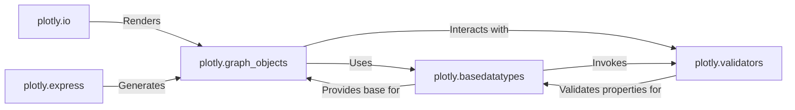

## Component Details

These five components represent the core functionality of `plotly.py` and are essential for its operation:

*   `plotly.graph_objects`: This is the *definition* of a Plotly figure. Without it, there would be no structured way to represent plots, traces, or layouts. It's the language Plotly uses to describe visualizations.

*   `plotly.basedatatypes`: This module provides the *foundation* and *enforcement* for `graph_objects`. It ensures that all Plotly objects behave consistently and that their properties are managed correctly. It's the underlying engine that makes `graph_objects` work.

*   `plotly.validators`: Data integrity is paramount in plotting. This component *validates* all inputs, preventing errors and ensuring that the figures generated are consistent with the Plotly.js schema. It's the quality control mechanism.

*   `plotly.io`: A plotting library is only useful if you can *see* and *share* the plots. This module handles all rendering and export functionalities, making the visualizations accessible in various environments and formats. It's the output mechanism.

*   `plotly.express`: While `graph_objects` provides fine-grained control, `plotly.express` offers *ease of use* and *rapid prototyping*. It significantly lowers the barrier to entry for common plotting tasks, making Plotly more accessible to a wider audience, especially data scientists. It's the user-friendly interface.

### plotly.graph_objects

This is the central component for defining the structure of Plotly figures. It contains all the classes representing various plot types (traces like `Scatter`, `Bar`, `Heatmap`), layout properties (`Layout`, `XAxis`, `YAxis`), and animation frames. Users directly interact with `Figure` objects from this module to construct their visualizations.

**Related Classes/Methods**:

- <a href="https://github.com/plotly/plotly.py/blob/master/plotly/graph_objects/__init__.py#L1-L1" target="_blank" rel="noopener noreferrer">`plotly.graph_objects.__init__` (1:1)</a>

- <a href="https://github.com/plotly/plotly.py/blob/master/commands.py#L1-L1" target="_blank" rel="noopener noreferrer">`plotly.graph_objs` (1:1)</a>

### plotly.basedatatypes

This module provides the foundational abstract classes (`BasePlotlyType`, `BaseFigure`) that serve as the base for all objects within `plotly.graph_objects`. It implements the core mechanisms for property management, attribute validation, and fundamental figure operations (e.g., `update`, `add_trace`). It ensures consistency and proper behavior across all Plotly objects.

**Related Classes/Methods**:

- <a href="https://github.com/plotly/plotly.py/blob/master/plotly/basedatatypes.py#L1-L1" target="_blank" rel="noopener noreferrer">`plotly.basedatatypes` (1:1)</a>

### plotly.validators

This component is crucial for data integrity. It comprises a collection of validator classes that ensure all properties assigned to Plotly objects conform to the expected data types, ranges, and formats defined by the Plotly.js schema. It prevents invalid data from being used and provides informative error messages.

**Related Classes/Methods**:

- <a href="https://github.com/plotly/plotly.py/blob/master/_plotly_utils/basevalidators.py#L1-L1" target="_blank" rel="noopener noreferrer">`_plotly_utils.basevalidators` (1:1)</a>

### plotly.io

This module handles all input/output operations for Plotly figures. It is responsible for rendering figures to various formats (e.g., HTML, JSON, static images) and managing figure templates. It acts as the primary interface for saving, displaying, and exporting visualizations.

**Related Classes/Methods**:

- <a href="https://github.com/plotly/plotly.py/blob/master/plotly/io/__init__.py#L1-L1" target="_blank" rel="noopener noreferrer">`plotly.io.__init__` (1:1)</a>

- <a href="https://github.com/plotly/plotly.py/blob/master/plotly/io/_html.py#L1-L1" target="_blank" rel="noopener noreferrer">`plotly.io._html` (1:1)</a>

- <a href="https://github.com/plotly/plotly.py/blob/master/plotly/io/_json.py#L1-L1" target="_blank" rel="noopener noreferrer">`plotly.io._json` (1:1)</a>

- <a href="https://github.com/plotly/plotly.py/blob/master/plotly/io/_kaleido.py#L1-L1" target="_blank" rel="noopener noreferrer">`plotly.io._kaleido` (1:1)</a>

- <a href="https://github.com/plotly/plotly.py/blob/master/plotly/io/_orca.py#L1-L1" target="_blank" rel="noopener noreferrer">`plotly.io._orca` (1:1)</a>

- <a href="https://github.com/plotly/plotly.py/blob/master/plotly/io/_renderers.py#L1-L1" target="_blank" rel="noopener noreferrer">`plotly.io._renderers` (1:1)</a>

### plotly.express

This module provides a simplified, high-level API for quickly creating common statistical charts. It abstracts away the complexities of direct `plotly.graph_objects` construction, allowing users to generate plots with minimal code, often directly from data structures like pandas DataFrames.

**Related Classes/Methods**:

- <a href="https://github.com/plotly/plotly.py/blob/master/plotly/express/__init__.py#L1-L1" target="_blank" rel="noopener noreferrer">`plotly.express.__init__` (1:1)</a>

- <a href="https://github.com/plotly/plotly.py/blob/master/plotly/express/_core.py#L1-L1" target="_blank" rel="noopener noreferrer">`plotly.express._core` (1:1)</a>

### [FAQ](https://github.com/CodeBoarding/GeneratedOnBoardings/tree/main?tab=readme-ov-file#faq)