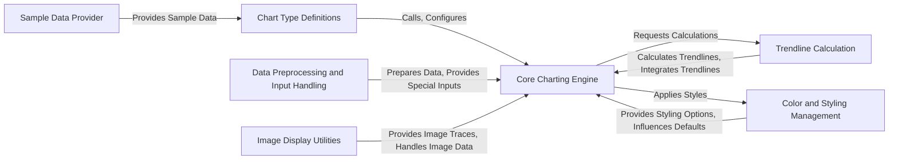

## Component Details

`plotly.express` is a high-level, simplified API built on top of `plotly.graph_objects` designed for quickly creating common statistical charts. It abstracts away the complexities of direct `plotly.graph_objects` construction, allowing users to generate plots with minimal code, often directly from data structures like pandas DataFrames.

### Core Charting Engine

This is the central orchestrator of `plotly.express`. It takes user data and arguments, processes them, and constructs `plotly.graph_objects` figures. It integrates functionalities from other modules like data handling, styling, and trendline calculations to generate a complete plot. It also manages default settings for plots.

**Related Classes/Methods**:

- <a href="https://github.com/plotly/plotly.py/blob/master/plotly/express/_core.py#L0-L0" target="_blank" rel="noopener noreferrer">`plotly.express._core` (0:0)</a>

### Chart Type Definitions

This component exposes the high-level API functions (e.g., `px.scatter`, `px.bar`) that users directly invoke to create specific chart types. It acts as a user-friendly facade, simplifying the complex underlying charting logic.

**Related Classes/Methods**:

- <a href="https://github.com/plotly/plotly.py/blob/master/plotly/express/_chart_types.py#L0-L0" target="_blank" rel="noopener noreferrer">`plotly.express._chart_types` (0:0)</a>

### Data Preprocessing and Input Handling

Manages the preparation, validation, and transformation of various input data formats and special arguments (like `IdentityMap`, `Constant`, `Range`) into a standardized structure suitable for the Core Charting Engine.

**Related Classes/Methods**:

- <a href="https://github.com/plotly/plotly.py/blob/master/plotly/express/_special_inputs.py#L0-L0" target="_blank" rel="noopener noreferrer">`plotly.express._special_inputs` (0:0)</a>

### Color and Styling Management

Provides a comprehensive set of predefined color palettes (discrete and sequential) and utilities for applying and managing color scales, symbols, line dashes, and pattern shapes. It enables extensive customization of chart aesthetics.

**Related Classes/Methods**:

- <a href="https://github.com/plotly/plotly.py/blob/master/commands.py#L0-L0" target="_blank" rel="noopener noreferrer">`plotly.express.colors` (0:0)</a>

### Image Display Utilities

Specializes in handling and rendering image-based visualizations, such as heatmaps and direct image displays. It provides the specific logic required for processing and presenting image data within the Plotly framework.

**Related Classes/Methods**:

- <a href="https://github.com/plotly/plotly.py/blob/master/plotly/express/_imshow.py#L0-L0" target="_blank" rel="noopener noreferrer">`plotly.express._imshow` (0:0)</a>

- <a href="https://github.com/plotly/plotly.py/blob/master/plotly/express/imshow_utils.py#L0-L0" target="_blank" rel="noopener noreferrer">`plotly.express.imshow_utils` (0:0)</a>

### Trendline Calculation

Contains the implementations for various statistical trendline calculations (e.g., Ordinary Least Squares, LOWESS). It provides the analytical backbone for adding regression and smoothing lines to charts.

**Related Classes/Methods**:

- <a href="https://github.com/plotly/plotly.py/blob/master/commands.py#L0-L0" target="_blank" rel="noopener noreferrer">`plotly.express.trendline_functions` (0:0)</a>

### Sample Data Provider

Offers a collection of readily available sample datasets. These datasets are primarily used for demonstration, testing, and quick prototyping, allowing users to explore `plotly.express` functionalities without external data.

**Related Classes/Methods**:

- <a href="https://github.com/plotly/plotly.py/blob/master/commands.py#L0-L0" target="_blank" rel="noopener noreferrer">`plotly.express.data` (0:0)</a>

### [FAQ](https://github.com/CodeBoarding/GeneratedOnBoardings/tree/main?tab=readme-ov-file#faq)