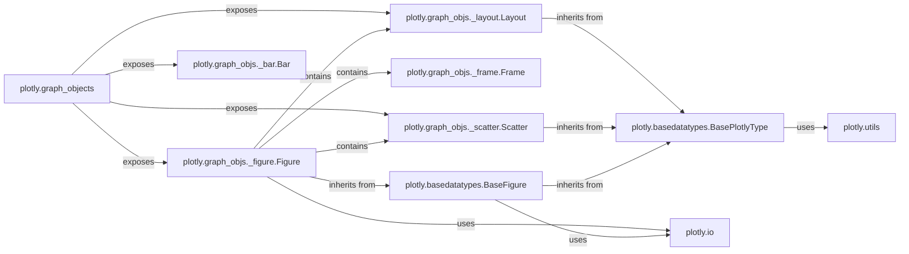

## Component Details

This subsystem is the cornerstone of Plotly's Python API for creating interactive visualizations. It provides a rich, object-oriented model for defining every aspect of a plot, from data traces to layout properties and animation frames.

### plotly.graph_objects

This module acts as the primary public interface and aggregation point for all Plotly graph objects. Users import directly from here to access classes like `Figure`, `Scatter`, `Bar`, `Layout`, etc., simplifying the API for figure construction. It essentially re-exports classes defined in `plotly.graph_objs`.

**Related Classes/Methods**:

- <a href="https://github.com/plotly/plotly.py/blob/master/commands.py#L1-L1" target="_blank" rel="noopener noreferrer">`plotly.graph_objects` (1:1)</a>

### plotly.graph_objs._figure.Figure

Represents a complete Plotly figure. This is the central object users instantiate and manipulate to build their plots. It serves as a top-level container for `data` (traces), `layout` properties, and `frames`. It provides methods for adding, removing, and updating these elements, and interacts with `plotly.io` for rendering.

**Related Classes/Methods**:

- <a href="https://github.com/plotly/plotly.py/blob/master/plotly/graph_objs/_figure.py#L6-L24433" target="_blank" rel="noopener noreferrer">`plotly.graph_objs._figure.Figure` (6:24433)</a>

### plotly.graph_objs._layout.Layout

Defines the overall visual properties and arrangement of a Plotly figure. This includes attributes such as titles, axes configurations, annotations, shapes, and general plot dimensions. It is crucial for customizing the aesthetic and structural presentation of a visualization. It is a child object of `Figure`.

**Related Classes/Methods**:

- <a href="https://github.com/plotly/plotly.py/blob/master/plotly/graph_objs/_layout.py#L7-L3509" target="_blank" rel="noopener noreferrer">`plotly.graph_objs._layout.Layout` (7:3509)</a>

### plotly.graph_objs._frame.Frame

Represents a single frame within an animated Plotly figure. Each `Frame` object holds specific data and layout modifications that are applied when that frame is active, enabling the creation of dynamic and interactive visualizations. These are contained within a `Figure` object.

**Related Classes/Methods**:

- <a href="https://github.com/plotly/plotly.py/blob/master/plotly/graph_objs/_frame.py#L7-L222" target="_blank" rel="noopener noreferrer">`plotly.graph_objs._frame.Frame` (7:222)</a>

### plotly.graph_objs._scatter.Scatter

A concrete trace type specifically designed for creating scatter plots. It defines properties related to x/y coordinates, marker styles, line properties, and hover information, allowing for detailed customization of scatter visualizations. This serves as a representative example of the numerous trace types available (e.g., `Bar`, `Heatmap`, etc.).

**Related Classes/Methods**:

- <a href="https://github.com/plotly/plotly.py/blob/master/plotly/graph_objs/_scatter.py#L7-L2752" target="_blank" rel="noopener noreferrer">`plotly.graph_objs._scatter.Scatter` (7:2752)</a>

### plotly.graph_objs._bar.Bar

A concrete trace type for generating bar charts. It provides properties for defining bar values, colors, and text labels, enabling the creation of various bar chart representations. This is another key example of a commonly used trace type, demonstrating the pattern for other trace implementations.

**Related Classes/Methods**:

- <a href="https://github.com/plotly/plotly.py/blob/master/plotly/graph_objs/_bar.py#L7-L2600" target="_blank" rel="noopener noreferrer">`plotly.graph_objs._bar.Bar` (7:2600)</a>

### plotly.basedatatypes.BasePlotlyType

This is the foundational abstract base class from which almost all Plotly objects (figures, traces, layouts, and their nested properties) inherit. It establishes the core infrastructure for defining, validating, and accessing properties, ensuring a consistent and robust object model across the entire Plotly library. It manages property storage, validation, and parent-child relationships.

**Related Classes/Methods**:

- <a href="https://github.com/plotly/plotly.py/blob/master/plotly/basedatatypes.py#L4337-L5763" target="_blank" rel="noopener noreferrer">`plotly.basedatatypes.BasePlotlyType` (4337:5763)</a>

### plotly.basedatatypes.BaseFigure

A specialized base class for `Figure` objects, extending `BasePlotlyType`. It provides the fundamental methods and properties for managing collections of traces and the overall layout, and handles interactions with the Plotly rendering backend. It forms the common interface for all figure-like objects, including `Figure` and `FigureWidget`.

**Related Classes/Methods**:

- <a href="https://github.com/plotly/plotly.py/blob/master/plotly/basedatatypes.py#L400-L4334" target="_blank" rel="noopener noreferrer">`plotly.basedatatypes.BaseFigure` (400:4334)</a>

### plotly.io

This module is dedicated to input/output operations for Plotly figures. It facilitates the rendering of figures to various formats (e.g., HTML, JSON, static images) and their display in different environments (e.g., Jupyter notebooks). It acts as the crucial bridge between the in-memory figure representation and its external visualization or persistence.

**Related Classes/Methods**:

- <a href="https://github.com/plotly/plotly.py/blob/master/commands.py#L1-L1" target="_blank" rel="noopener noreferrer">`plotly.io` (1:1)</a>

### plotly.utils

This module contains a collection of general-purpose utility functions that are utilized throughout the Plotly library. In the context of `graph_objects` and `basedatatypes`, it provides essential helpers for tasks such as string manipulation, type checking, and generating informative error messages, contributing to the overall robustness and correctness of the object model.

**Related Classes/Methods**:

- <a href="https://github.com/plotly/plotly.py/blob/master/plotly/utils.py#L1-L1" target="_blank" rel="noopener noreferrer">`plotly.utils` (1:1)</a>

### [FAQ](https://github.com/CodeBoarding/GeneratedOnBoardings/tree/main?tab=readme-ov-file#faq)