```mermaid

graph LR

    Core_IO_Interface["Core IO Interface"]

    HTML_Export_Component["HTML Export Component"]

    JSON_Serialization_Component["JSON Serialization Component"]

    Kaleido_Image_Export_Component["Kaleido Image Export Component"]

    Orca_Image_Export_Component["Orca Image Export Component"]

    Renderer_Management_Component["Renderer Management Component"]

    Base_Renderers_Component["Base Renderers Component"]

    Template_Management_Component["Template Management Component"]

    IO_Utilities_Component["IO Utilities Component"]

    Defaults_and_Configuration_Component["Defaults and Configuration Component"]

    Core_IO_Interface -- "Exposes Functions From" --> HTML_Export_Component

    Core_IO_Interface -- "Exposes Functions From" --> JSON_Serialization_Component

    Core_IO_Interface -- "Exposes Functions From" --> Kaleido_Image_Export_Component

    Core_IO_Interface -- "Exposes Functions From" --> Orca_Image_Export_Component

    Core_IO_Interface -- "Exposes Functions From" --> Renderer_Management_Component

    Core_IO_Interface -- "Exposes Functions From" --> Template_Management_Component

    Core_IO_Interface -- "Exposes Functions From" --> Defaults_and_Configuration_Component

    HTML_Export_Component -- "Calls" --> JSON_Serialization_Component

    HTML_Export_Component -- "Uses" --> IO_Utilities_Component

    JSON_Serialization_Component -- "Uses" --> IO_Utilities_Component

    Kaleido_Image_Export_Component -- "Calls" --> JSON_Serialization_Component

    Kaleido_Image_Export_Component -- "Uses" --> IO_Utilities_Component

    Kaleido_Image_Export_Component -- "Configured By" --> Defaults_and_Configuration_Component

    Orca_Image_Export_Component -- "Calls" --> JSON_Serialization_Component

    Orca_Image_Export_Component -- "Uses" --> IO_Utilities_Component

    Renderer_Management_Component -- "Uses" --> Base_Renderers_Component

    Renderer_Management_Component -- "Uses" --> IO_Utilities_Component

    Renderer_Management_Component -- "Configured By" --> Defaults_and_Configuration_Component

    Base_Renderers_Component -- "Calls" --> JSON_Serialization_Component

    Base_Renderers_Component -- "Calls" --> Kaleido_Image_Export_Component

    Base_Renderers_Component -- "Calls" --> Orca_Image_Export_Component

    Base_Renderers_Component -- "Uses" --> IO_Utilities_Component

    Template_Management_Component -- "Interacts With" --> JSON_Serialization_Component

    IO_Utilities_Component -- "Supports" --> HTML_Export_Component

    IO_Utilities_Component -- "Supports" --> JSON_Serialization_Component

    IO_Utilities_Component -- "Supports" --> Kaleido_Image_Export_Component

    IO_Utilities_Component -- "Supports" --> Orca_Image_Export_Component

    IO_Utilities_Component -- "Supports" --> Renderer_Management_Component

    IO_Utilities_Component -- "Supports" --> Base_Renderers_Component

    Defaults_and_Configuration_Component -- "Configures" --> Kaleido_Image_Export_Component

    Defaults_and_Configuration_Component -- "Configures" --> Renderer_Management_Component

```

## Component Details

Component Overview for `plotly.io`

### Core IO Interface

This component serves as the public API for the `plotly.io` module. It orchestrates and exposes functions from various sub-modules, allowing users to perform operations like converting figures to HTML, JSON, or images, and managing templates and renderers. It acts as the central hub for all input/output functionalities.

**Related Classes/Methods**:

- <a href="https://github.com/plotly/plotly.py/blob/master/commands.py#L0-L0" target="_blank" rel="noopener noreferrer">`plotly.io` (0:0)</a>

### HTML Export Component

Responsible for converting Plotly figures into HTML strings or standalone HTML files. It handles embedding Plotly.js, figure data, and configuration options to create interactive web visualizations, supporting various inclusion methods for the Plotly.js library (e.g., CDN, local).

**Related Classes/Methods**:

- <a href="https://github.com/plotly/plotly.py/blob/master/plotly/io/_html.py#L0-L0" target="_blank" rel="noopener noreferrer">`plotly.io._html` (0:0)</a>

### JSON Serialization Component

Manages the serialization and deserialization of Plotly figures and related objects to and from JSON format. It provides functions for converting Python objects to JSON strings, handling Plotly-specific encoding rules, and supports different JSON encoding engines (e.g., built-in `json`, `orjson`).

**Related Classes/Methods**:

- <a href="https://github.com/plotly/plotly.py/blob/master/plotly/io/_json.py#L0-L0" target="_blank" rel="noopener noreferrer">`plotly.io._json` (0:0)</a>

### Kaleido Image Export Component

Facilitates the export of Plotly figures to static image formats (PNG, JPEG, SVG, PDF) using the Kaleido engine. It manages the interaction with the Kaleido executable, including its availability checks, version handling, and configuration through global defaults.

**Related Classes/Methods**:

- <a href="https://github.com/plotly/plotly.py/blob/master/plotly/io/_kaleido.py#L0-L0" target="_blank" rel="noopener noreferrer">`plotly.io._kaleido` (0:0)</a>

### Orca Image Export Component

Provides a legacy mechanism for exporting Plotly figures to static images, leveraging the deprecated Orca server. It handles the Orca server lifecycle (startup, shutdown), port management, and image generation, serving as an alternative to Kaleido for older setups.

**Related Classes/Methods**:

- <a href="https://github.com/plotly/plotly.py/blob/master/plotly/io/_orca.py#L0-L0" target="_blank" rel="noopener noreferrer">`plotly.io._orca` (0:0)</a>

### Renderer Management Component

Manages the registration, selection, and activation of different rendering environments for displaying Plotly figures. It allows users to set default renderers for various contexts (e.g., Jupyter notebooks, VS Code) and controls automatic figure display behavior.

**Related Classes/Methods**:

- <a href="https://github.com/plotly/plotly.py/blob/master/plotly/io/_renderers.py#L0-L0" target="_blank" rel="noopener noreferrer">`plotly.io._renderers` (0:0)</a>

### Base Renderers Component

Defines the abstract and concrete base classes for various Plotly figure rendering strategies. It provides the common interface (`to_mimebundle`) for different output formats (JSON, Plotly mimetype, static images) and handles the underlying calls to image and JSON export functions.

**Related Classes/Methods**:

- <a href="https://github.com/plotly/plotly.py/blob/master/plotly/io/_base_renderers.py#L0-L0" target="_blank" rel="noopener noreferrer">`plotly.io._base_renderers` (0:0)</a>

### Template Management Component

Manages the creation, registration, loading, and application of Plotly figure templates. It provides functionalities to define, register, and use consistent styling, layout, and data transformations across multiple figures, including loading built-in templates from package data.

**Related Classes/Methods**:

- <a href="https://github.com/plotly/plotly.py/blob/master/plotly/io/_templates.py#L0-L0" target="_blank" rel="noopener noreferrer">`plotly.io._templates` (0:0)</a>

### IO Utilities Component

A collection of common utility functions that support various input/output operations across the `plotly.io` module. This includes validating and coercing figure objects, handling output types, broadcasting arguments, and generating Plotly CDN URLs.

**Related Classes/Methods**:

- <a href="https://github.com/plotly/plotly.py/blob/master/plotly/io/_utils.py#L0-L0" target="_blank" rel="noopener noreferrer">`plotly.io._utils` (0:0)</a>

### Defaults and Configuration Component

Manages global default settings and configurations for various `plotly.io` operations, such as image export parameters (e.g., Kaleido/Orca settings) and renderer behavior. It provides a centralized place to store and retrieve module-wide preferences.

**Related Classes/Methods**:

- <a href="https://github.com/plotly/plotly.py/blob/master/plotly/io/_defaults.py#L0-L0" target="_blank" rel="noopener noreferrer">`plotly.io._defaults` (0:0)</a>

### [FAQ](https://github.com/CodeBoarding/GeneratedOnBoardings/tree/main?tab=readme-ov-file#faq)