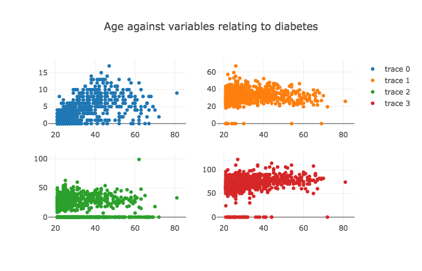

# Migration to Version 3
There are many new and great features in Plotly 3.0 including deeper Jupyter integration, deeper figure validation, improved performance, and more. This guide contains the a summary of the breaking changes that you need to be aware of when migrating code from version 2 to version 3.

For a high level overview, read our [announcement post](https://medium.com/@plotlygraphs/introducing-plotly-py-3-0-0-7bb1333f69c6).

## Simple FigureWidget Example
We now have seamless integration with the Jupyter widget ecosystem. We've introduced a new graph object called `go.FigureWidget` that acts like a regular plotly `go.Figure` that can be directly displayed in the notebook.

Simple Example: Make a Scatter Plot
```python
import plotly
import plotly.graph_objs as go

f = go.FigureWidget()
f  # printing the widget will display it
```

This means that `plotly.offline.iplot` and `plotly.offline.init_notebook_mode()` are no longer required (although still supported).

## Tab Completion
Entering ``f.add_<tab>`` displays add methods for all of the supported trace types. Try it!
```
f.add_
```

Entering `f.add_scatter(<tab>)` displays the names of all of the top-level properties for the scatter trace type

Entering `f.add_scatter(<shift+tab>)` displays the signature pop-up. Expanding this pop-up reveals the method doc string which contains the descriptions of all of the top level properties. Let's finish add a scatter trace to `f`:

```python
f.add_scatter(x=[1,2,3], y=[3,4,2])
f
```


## New Plotly Object Representation
Plotly figures and graph objects have an updated `__repr__` method that displays objects in a pretty printed form that can be copied, pasted, and evaluated to recreate the object.

Eg. `print(f)` returns

```
FigureWidget({
    'data': [{'type': 'scatter', 'uid': '07968b11-7b0a-11e8-ba67-c869cda04ed6', 'x': [1, 2, 3], 'y': [4, 3, 2]}],
    'layout': {}
})
```

## New add trace methods that handle subplots
The legacy `append_trace` method for adding traces to subplots has been deprecated in favor of the new `add_trace`, `add_traces`, and `add_*` methods.  Each of these new methods accepts optional row/column information that may be used to add traces to subplots for figures initialized by the `plotly.tools.make_subplots` function. 

Let's create a subplot then turn it into a FigureWidget to display in the notebook.

```python
import plotly
import plotly.graph_objs as go
import plotly.tools as tls

import pandas as pd
dataset = pd.read_csv('https://raw.githubusercontent.com/plotly/datasets/master/diabetes.csv')

subplot = tls.make_subplots(2, 2, print_grid=False)
f2 = go.FigureWidget(subplot)

# Use add_trace method with optional row/col parameters
f2.add_trace(go.Scatter(x=dataset['Age'], y=dataset['Pregnancies'], mode='markers'), row=1, col=1)

# Use add_traces with optional rows/cols parameters
f2.add_traces([
    go.Scatter(x=dataset['Age'], y=dataset['BMI'], mode='markers'),
    go.Scatter(x=dataset['Age'], y=dataset['SkinThickness'], mode='markers')],
    rows=[1, 2], cols=[2, 1]
)

# Use add_scatter with optional row/col parameters
f2.add_scatter(x=dataset['Age'], y=dataset['BloodPressure'], mode='markers', row=2, col=2)

f2.layout.title = 'Age and Diabetes Factors'
f2
```



## Breaking Changes

## Graph Objects Superclass
Graph objects are no longer `dict` subclasses, though they still provide many `dict`-like magic methods.

## Graph Objects Hierarchy
All graph objects are now placed in a package hierarchy that matches their position in the object hierarchy. For example, `go.Marker` is now accessible as `go.scatter.Marker` or `go.bar.Marker` or whatever trace it is nested within. By providing unique objects under the parent-trace namespace, we can provide better validation (the properties for a marker object within a scatter trace may be different than the properties of a marker object within a bar trace). Although deprecated, the previous objects are still supported, they just won’t provide the same level of validation as our new objects.

For example, the following approach to creating a `Marker` object for a `Scatter` trace is now deprecated.
```
import plotly.graph_objs as go
go.Scatter(
    x=[0],
    y=[0],
    marker=go.Marker(
        color='rgb(255,45,15)'
    )
)
```

Instead, use the `Marker` object in the `go.scatter` package.

```
import plotly.graph_objs as go
go.Scatter(
    x=[0],
    y=[0],
    marker=go.scatter.Marker(
        color='rgb(255,45,15)'
    )
)
```

You can still use `dict` as well. The previous figure is equivalent to:

```
import plotly.graph_objs as go
dict(
    type='scatter',
    x=[0],
    y=[0],
    marker=go.scatter.Marker(
        color='rgb(255,45,15)'
    )
)
```

which is also equivalent to
```
import plotly.graph_objs as go
dict(
    type='scatter',
    x=[0],
    y=[0],
    marker=dict(
        color='rgb(255,45,15)'
    )
)
```

### Property Immutability
In order to support the automatic synchronization a `FigureWidget` object and the front-end view in a notebook, it is necessary for the `FigureWidget` to be aware of all changes to its properties. This is accomplished by presenting the individual properties to the user as immutable objects.  For example, the `layout.xaxis.range` property may be assigned using a list, but it will be returned as a tuple. Similarly, object arrays (`Figure.data`, `Layout.images`, `Parcoords.dimensions`, etc.) are now represented as tuples of graph objects, not lists.

### Object Array Classes Deprecated
Since graph object arrays are now represented as tuple of graph objects, the following object array classes are deprecated: `go.Data`, `go.Annotations`, and `go.Frames`. Instead, just use lists.

That is, previously we used:
```
layout = go.Layout(
    annotations=go.Annotations([
        go.layout.Annotations(text='annotation')
    ])
)
```

Now, we should write:
```
layout = go.Layout(
    annotations=[
        go.layout.Annotations(text='annotation')
    ]
)
```

### New Figure.data Assignment
There are new restriction on the assignment of traces to the `data` property of a figure.  The assigned value must be a list or a tuple of a subset of the traces already present in the figure. Assignment to `data` may be used to reorder and remove existing traces, but it may not currently be used to add new traces.  New traces must be added using the `add_trace`, `add_traces`, or `add_*` methods. 

For example, suppose a figure, `fig`, has 3 traces. The following command is valid and it will move the third trace to be the first, the first trace to be the second, and it will remove the second trace.

```
fig.data = [fig.data[2], fig.data[0]]
```

However this is not valid:
```
fig.data = [fig.data[0], go.Scatter(y=[2, 3, 1])]
```

It's not valid because it's introducing a new trace during assignment. This trace would need to be added using `add_trace` instead.

### Data array properties may not be specified as scalars
For example, the following is now invalid:
```
import plotly.graph_objs as go
go.Bar(x=1)
```

This should be replaced by: 
```
import plotly.graph_objs as go
go.Bar(x=[1])
```

### Removal of undocumented methods and properties
 - Several undocumented `Figure` methods have been removed. These include: `.to_string`, `.strip_style`, `.get_data`, `.validate` and `.to_dataframe`.

 - Graph objects no longer support the undocumented `_raise` parameter. They are always validated and always raise an exception on validation failures. It is still possible to pass a dict to `plot`/`iplot` with `validate=False` to bypass validation.
