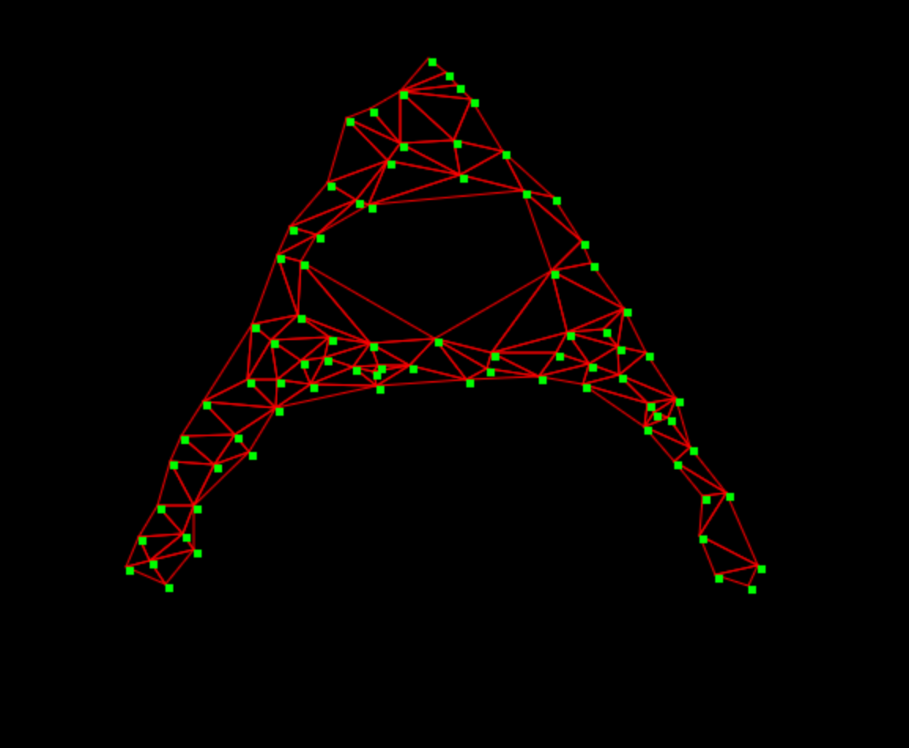

alpha-complex
=============
[Alpha shapes](http://en.wikipedia.org/wiki/Alpha_shape) are a generalization of Delaunay triangulations.  Given a parameter `alpha` and a point set, they compute a simplicial complex which covers the point set in simplices whose circum radii are less than `1/alpha`.

[To see this in action, try out the demo](https://mikolalysenko.github.io/alpha-complex/index.html)

</img>

# Example

```javascript
var alphaComplex = require('alpha-complex')

var points = []
for(var i=0; i<100; ++i) {
  points.push([Math.random(), Math.random()])
}

console.log(alphaComplex(0.1, points))
```

# Install

This module works in node.js/iojs/browserify and supports point sets in any dimension.

```
npm i alpha-complex
```

# API

#### `var cells = require('alpha-complex')(alpha, points)`
Constructs the alpha complex of the given set of points.

* `alpha` is the curvature of the alpha complex
* `points` is a list of points encoded as arrays

**Returns** The alpha-complex of the point set.

# License
(c) 2015 Mikola Lysenko. MIT License