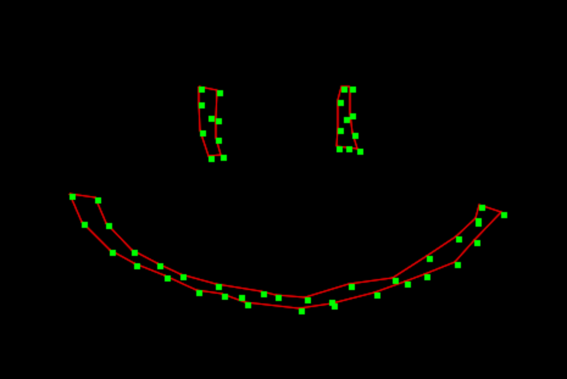

alpha-shape
===========
Computes the [alpha shape](http://en.wikipedia.org/wiki/Alpha_shape) of a point set.

[Try a demo right now](https://mikolalysenko.github.io/alpha-shape/index.html)



# Example

```javascript
var alphaShape = require('alpha-shape')

var points = []
for(var i=0; i<10; ++i) {
  points.push([Math.random(), Math.random()])
}

var cells = alphaShape(0.1, points)

console.log(cells)
```

# Install

```
npm i alpha-shape
```

# API

#### `var cells = require('alpha-shape')(alpha, points)`
Computes the alpha shape of a point set

* `alpha` is alpha parameter for the shape
* `points` is a set of points in some dimension

**Returns** The alpha shape of the point set

# License
(c) 2015 Mikola Lysenko. MIT License