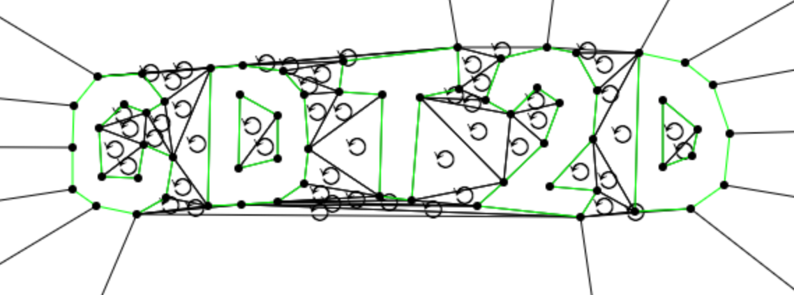
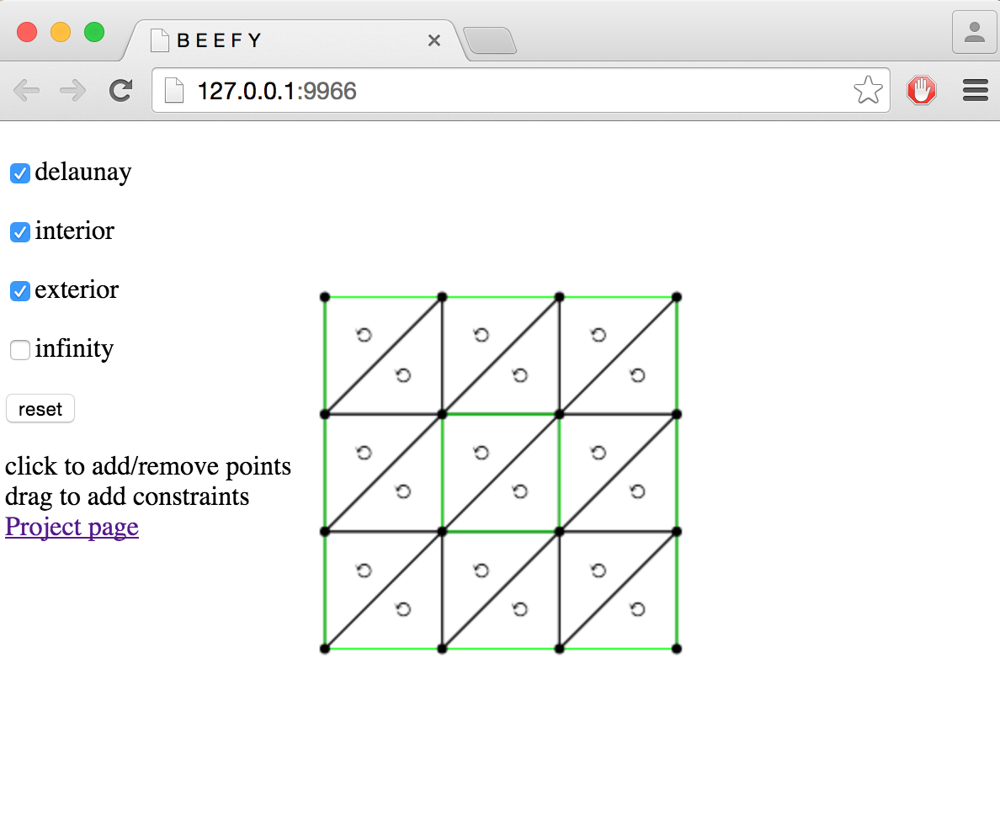
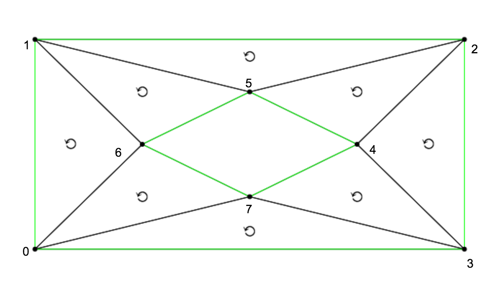

cdt2d
=====


A robust 2D [constrained Delaunay triangulation](https://en.wikipedia.org/wiki/Constrained_Delaunay_triangulation) library written in JavaScript.

**WORK IN PROGRESS**

# [Demo](https://mikolalysenko.github.io/cdt2d)

To test out this module, you can open up a demo in your browser with the following link:

[](https://mikolalysenko.github.io/cdt2d)

#### [cdt2d demo](https://mikolalysenko.github.io/cdt2d)

* Click to add points
* Click on a point to remove it
* Drag one point onto another to add an edge constraint
* Click on a green edge to remove a constraint
* Toggle options by clicking on the checkboxes on the left
* Click reset to clear all points

# Examples

## Simple example

Here is a simple example showing how to invoke `cdt2d`:

```javascript
//First we need to reqire the module
var cdt2d = require('cdt2d')

//Then we define a list of points, represented as pairs of x,y coordinates
var points = [
  [-2,-2],
  [-2, 2],
  [ 2, 2],
  [ 2,-2],
  [ 1, 0],
  [ 0, 1],
  [-1, 0],
  [ 0,-1]
]

//Next we can optionally define some edge constraints
// This set of edges determines a pair of loops
var edges = [
 //Outer loop
 [0, 1],
 [1, 2],
 [2, 3],
 [3, 0],

 //Inner loop
 [4, 5],
 [5, 6],
 [6, 7],
 [7, 4]
]

//Finally we call cdt2d with the points and edges
// The flag {exterior: false} tells  it to remove exterior faces
console.log(cdt2d(points, edges, {exterior: false}))
```

#### Output

The above program will output the following triangles:

```javascript
[ [ 0, 3, 7 ],
  [ 0, 6, 1 ],
  [ 0, 7, 6 ],
  [ 1, 5, 2 ],
  [ 1, 6, 5 ],
  [ 2, 4, 3 ],
  [ 2, 5, 4 ],
  [ 3, 4, 7 ] ]
```

Each triangle is represented as an array of 3 indices of points.  We can visualize this data in the following figure:



## Messy graphs

If your input doesn't satisfy the validity invariants (ie no self intersections, duplicate vertices or t-junctions), then you will need to preprocess it to clean it up.  One way to do this is with the [`clean-pslg` module](https://github.com/mikolalysenko/clean-pslg).  Here is an example showing how to do this:

```javascript
var cleanPSLG = require('clean-pslg')
var cdt2d = require('cdt2d')

var points = [
  [-1, 0],
  [ 1, 0],
  [ 0,-1],
  [ 0, 1]
]

var edges = [
  [0, 1],
  [1, 2]
]

//This updates points/edges so that they now form a valid PSLG
cleanPSLG(points, edges)

//Generate the triangulation
console.log({
  points: points,
  edges: edges,
  triangles: cdt2d(points, edges)
})
```

#### Output

**TODO**

## Polygon example

It is also pretty easy to use this module with polygons, as one would get from a GeoJSON file.  To do this, it is first necessary to convert them into a planar straight line graph.  This can be done using the `poly-to-pslg` module:

```javascript
var toPSLG = require('poly-to-pslg')
var cdt2d = require('cdt2d')

```

**TODO**

## Polygon with holes example

The above procedure even works if the polygons have holes:

```javascript
var toPSLG = require('poly-to-pslg')
var cdt2d = require('cdt2d')

```

**TODO**

## Delaunay triangulation

You can also use `cdt2d` to generate Delaunay triangulations of arbitrary point sets in the plane:

```javascript
```

**TODO**

# Install

This module works in any modern CommonJS environment.  You can install it using [npm](https://docs.npmjs.com/) with the following command:

```
npm i cdt2d
```

You should be able to then use it in [node](https://nodejs.org/) or on the web with [browserify](http://browserify.org/).

# API

#### `var cells = require('cdt2d')(points[, edges, options])`
Constructs a constrained Delaunay triangulation of a [planar straight-line graph](https://en.wikipedia.org/wiki/Planar_graph).

* `points` are the vertices of the triangulation, represented by pairs of numbers.
* `edges` is an optional list of edge constraints which must occur within the triangulation. These constraints are given by pairs of indices of points.  If not specified, then no constraints are used.
* `options` is an object which takes some optional parameters.
    + `delaunay` if this flag is set to true, then the resulting triangulation is converted to a [Delaunay triangulation](https://en.wikipedia.org/wiki/Delaunay_triangulation) by edge flipping.  Otherwise if it is false, then an arbitrary triangulation is returned.  (Default `true`)
    + `interior` if set, only return interior faces. See note. (Default `true`)
    + `exterior` if set, only return exterior faces. See note. (Default `true`)
    + `infinity` if set, then the triangulation is augmented with a [point at infinity](https://en.wikipedia.org/wiki/Point_at_infinity) represented by the index `-1`.  (Default `false`)

**Returns** A list of all triangles represented as triples of indices of vertices

**Note on interior/exterior classification** Interior/exterior faces are classified by treating the constraint edges as the boundary and traversing the triangulation. The point at infinity is in the exterior of the set, and other faces are classified by the parity of the path with fewest crossings from the face to the point at infinity.

**Assumptions** This module makes the following assumptions about the points and edge constraints:

* No point in the input is duplicated
* No pair of edge constraints cross in their relative interior
* No point is contained in the relative interior of an edge (ie no T-junctions)

If your input does not satisfy these conditions, you will need to preprocess it first (using [`clean-pslg`](https://github.com/mikolalysenko/clean-pslg) for example) otherwise `cdt2d` may return incorrect results.

**Limitations** Currently there is no way to specify that only some edge constraints are to be included in the boundary.  It is also not possible to add a constraint from a vertex to the point at infinity. If there is enough demand I may add these features or perhaps create a separate module.

# Benchmarks and comparisons

Assertion: `cdt2d` is the only non-broken triangulation library in JavaScript.

* **TODO** Catalogue failing cases for other libraries
* **TODO** Need to measure performance and finetune

Libraries to compare against:

* `earcut`
* `poly2tri`
* `pnltri`
* `libtess.js`

# License
(c) 2015 Mikola Lysenko. MIT License
