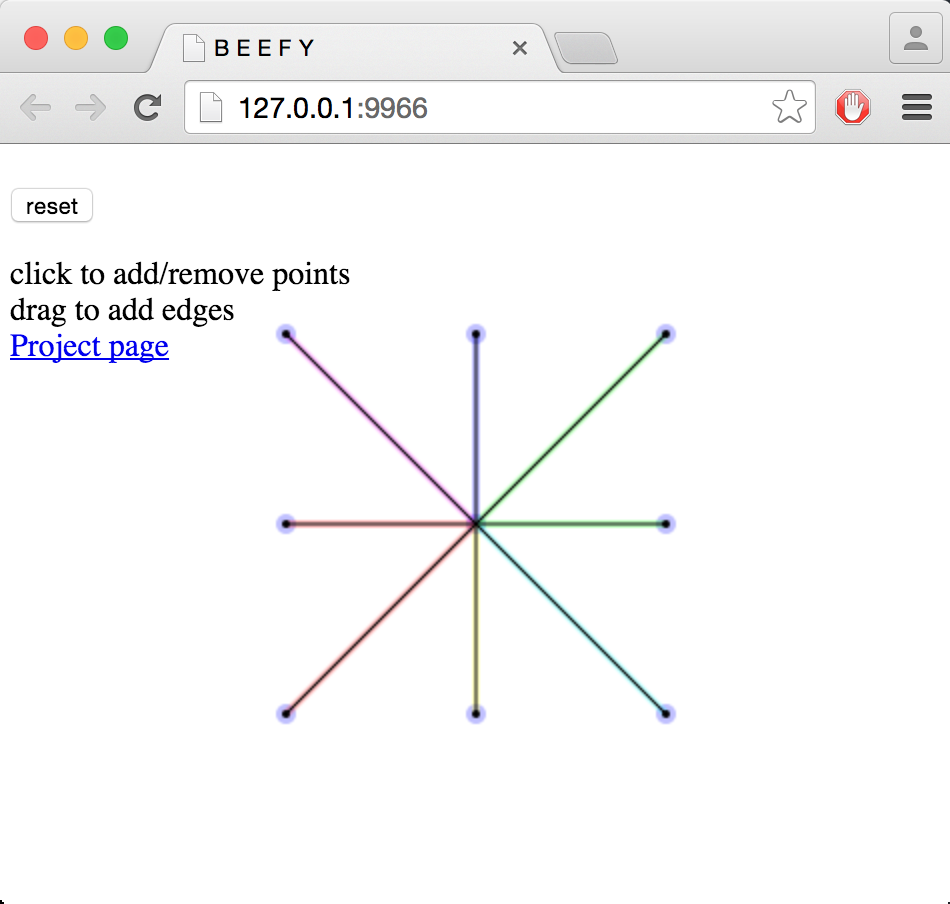
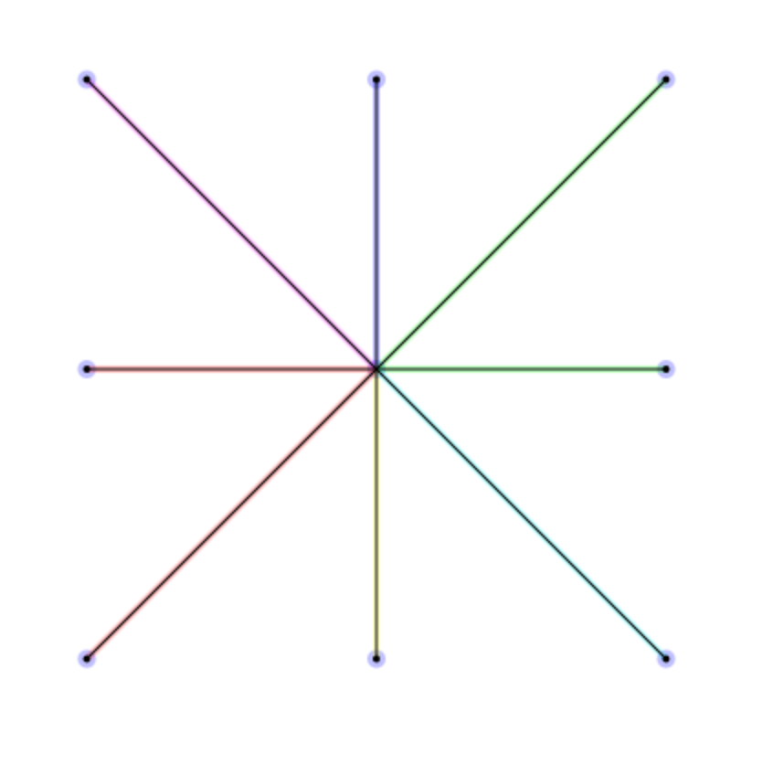

clean-pslg
============


Resolves all self intersections, t-junctions, and removes duplicate vertices/edges from a [planar straight line graph](https://en.wikipedia.org/wiki/Planar_straight-line_graph) using [iterated snap rounding](http://citeseerx.ist.psu.edu/viewdoc/summary?doi=10.1.1.23.220).

# [Demo](https://mikolalysenko.github.io/clean-pslg)

Click on the following link to try out `clean-pslg` in your browser:

[](https://mikolalysenko.github.io/clean-pslg)

* [Demo link](https://mikolalysenko.github.io/clean-pslg)

# Example

This module really only does one thing, which is clean up planar straight line graphs.  You invoke it by passing it an array of points and an array of edges like so:

```javascript
var cleanPSLG = require('clean-pslg')

//Create a planar straight line graph with many degenerate crossings
var points      = [
  [ 0.25, 0.5  ],
  [ 0.75, 0.5  ],
  [ 0.5,  0.25 ],
  [ 0.5,  0.75 ],
  [ 0.25, 0.25 ],
  [ 0.75, 0.75 ],
  [ 0.25, 0.75 ],
  [ 0.75, 0.25 ]
]

//These are the edges of the graph
//They are defined by pairs of indices of vertices
var edges       = [
  [0, 1],
  [2, 3],
  [4, 5],
  [6, 7]
]

//Run clean up on the graph
if(cleanPSLG(points, edges)) {
  console.log('removed degeneracies from graph')
}

//clean-pslg operates on the graph in place, so after running it the points/edges will be modified
console.log('points = \n', points)
console.log('edges = \n', edges)
```

#### Output

The program will output the following text:

```
removed degeneracies from graph
points =
 [ [ 0.25, 0.5 ],
  [ 0.75, 0.5 ],
  [ 0.5, 0.25 ],
  [ 0.5, 0.75 ],
  [ 0.25, 0.25 ],
  [ 0.75, 0.75 ],
  [ 0.25, 0.75 ],
  [ 0.75, 0.25 ],
  [ 0.5, 0.5 ] ]
edges =
 [ [ 8, 0 ],
  [ 1, 8 ],
  [ 8, 2 ],
  [ 3, 8 ],
  [ 8, 4 ],
  [ 5, 8 ],
  [ 8, 6 ],
  [ 7, 8 ],
  [ 8, 8 ] ]
```

Visually, this corresponds to the following refinement of a planar graph:



# Install

```
npm i clean-pslg
```

# API

#### `require('clean-pslg')(points, edges[, colors])`
Processes an unoriented planar straight line graph defined by `points` and `edges` in place.

* `points` is an array encoding the vertices of the planar straight line graph as pairs of numbers
* `edges` is an array encoding the edges of the planar straight line graph as pairs of indices
* `colors` is an optional array of edge colors.  If specified, only merge edges if they have the same color.  This can be used to implement orientation preservation or handle solid geometry.

The following degeneracies are handled:

* Duplicate points are merged
* Duplicate edges are merged
* T-junctions are split
* Edge crossings are split

The resulting graph meets all invariants required by `cdt2d`, so it may be triangulated.  Note that this procedure *does not preserve orientation*.

**Returns** `true` if repairs were necessary, otherwise `false`

**Note** This is a destructive procedure, which means that the contents of `points` and `edges` may change.  If you don't want this to happen, you should make a deep copy of `points` and `edges` before calling `clean-pslg`

# License
(c) 2015 Mikola Lysenko. MIT License
