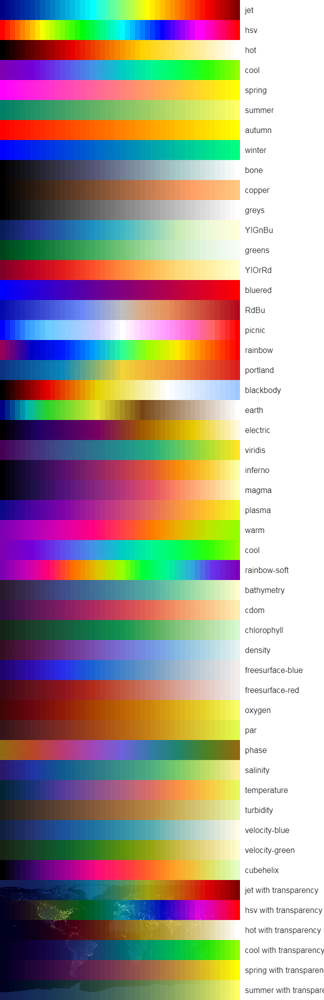

# colormap [](https://travis-ci.org/bpostlethwaite/colormap)



## Usage

[](https://npmjs.org/package/colormap/)

```js
let colormap = require('colormap')

let colors = colormap({
    colormap: 'jet',
    nshades: 10,
    format: 'hex',
    alpha: 1
})
```

## API

### list = colormap(options?)

Property | Default | Meaning
---|---|---
`colormap` | `'jet'` | Color map name from the image above or a custom color scale — a sequence of `{index, rgb}` objects, where index is `0..1` number and `rgb` is a length 3/4 array with values for the color stop.
`nshades` | `72` | Number of colors in returned array, the minimum number depends on `colormap`.
`format` | `'hex'` | `'hex'` for `#aabbcc`, `'rgbaString'` for `rgba(255, 255, 255, 1)`, `'rba'` for `[255, 255, 255, 1]`, `'float'` for `[1, 1, 1, 1]`.
`alpha` | `1` | Alpha range, can be an array with alpha values or just 2 values for start/end colors. |


## Credits

Color maps are inspired by [matplotlib](https://github.com/d3/d3-scale#sequential-color-scales) color scales, [cmocean](https://github.com/matplotlib/cmocean) oceanographic colormaps, [cosine gradients](https://github.com/thi-ng/color/blob/master/src/gradients.org) and others. Thanks to authors of these libs for their invaluable work.
