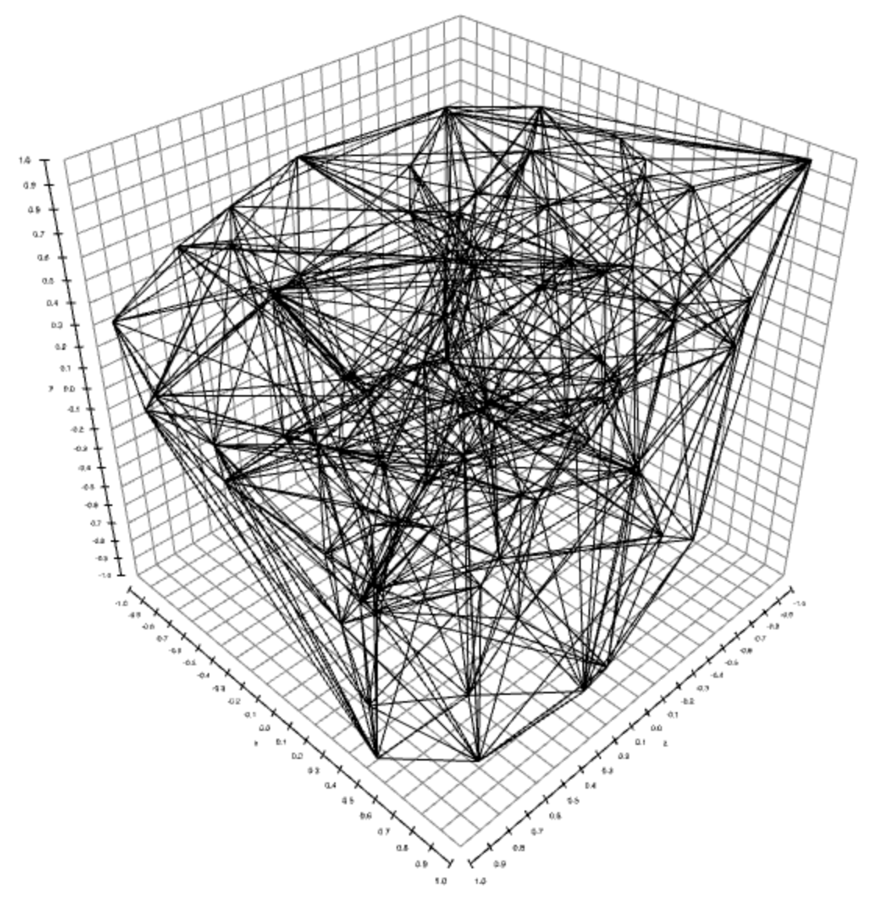

delaunay-triangulate
====================
Triangulates a set of points into a [Delaunay triangulation](http://en.wikipedia.org/wiki/Delaunay_triangulation).  This code works in arbitrary dimensions, and both in the server and in the browser.



[](https://ci.testling.com/mikolalysenko/delaunay-triangulate)

[](http://travis-ci.org/mikolalysenko/delaunay-triangulate)

Here are some in browser demos:

* [2D Delaunay triangulation](http://mikolalysenko.github.io/delaunay-triangulate/2d.html)
* [3D Delaunay triangulation](http://mikolalysenko.github.io/delaunay-triangulate/3d.html)

# Example

```javascript
var triangulate = require("delaunay-triangulate")

var points = [
  [0, 1],
  [1, 0],
  [1, 1],
  [0, 0],
  [0.5, 0.5]
]

var triangles = triangulate(points)

console.log(triangles)
```

# Install

    npm install delaunay-triangulate

# API

#### `require("delaunay-triangulate")(points[,pointAtInfinity])`
Constructs a Delaunay triangulation over `points`

* `points` is a collection of points in Euclidean space.
* `pointAtInfinity` is a flag, which if set adds an extra point at infinity to give the spherical compactification of the triangulation.  The index of the point at infinity is `-1`

**Returns** A list of cells representing the faces of the triangulation.  These are triangles in 2D or tetrahedra in 3D.

# Credits
(c) 2013-2014 Mikola Lysenko. MIT License