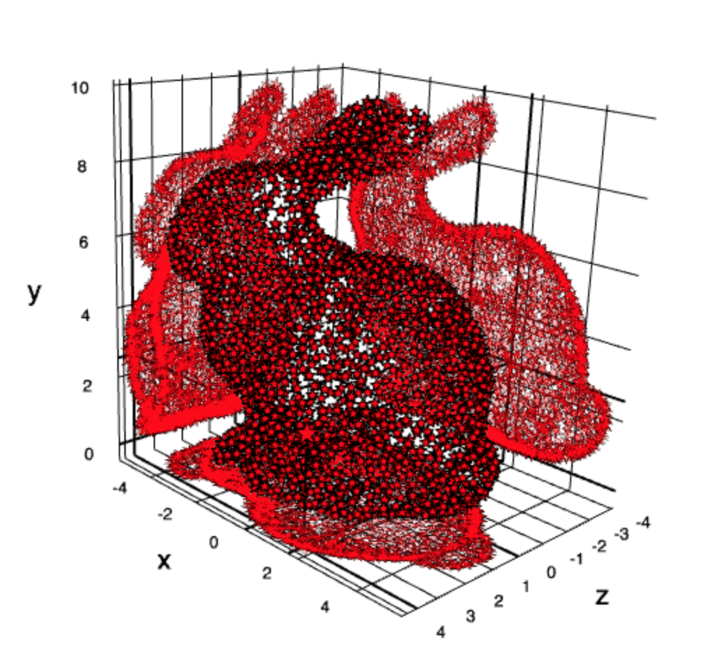
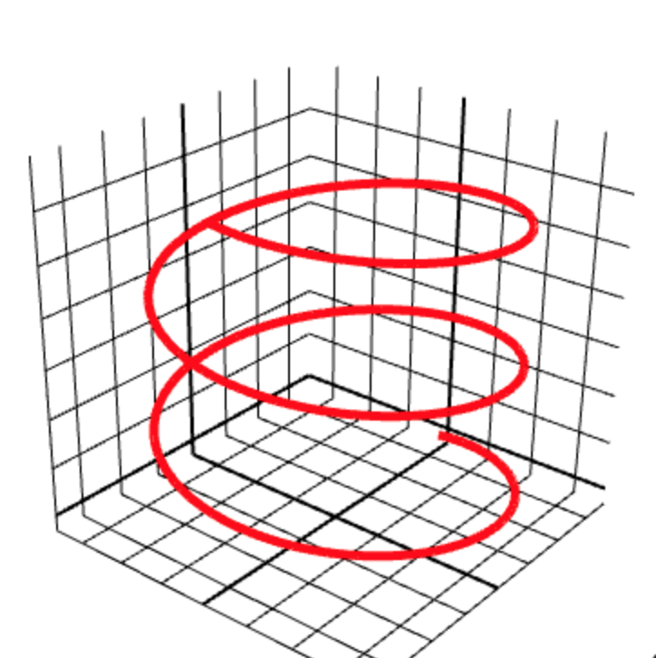
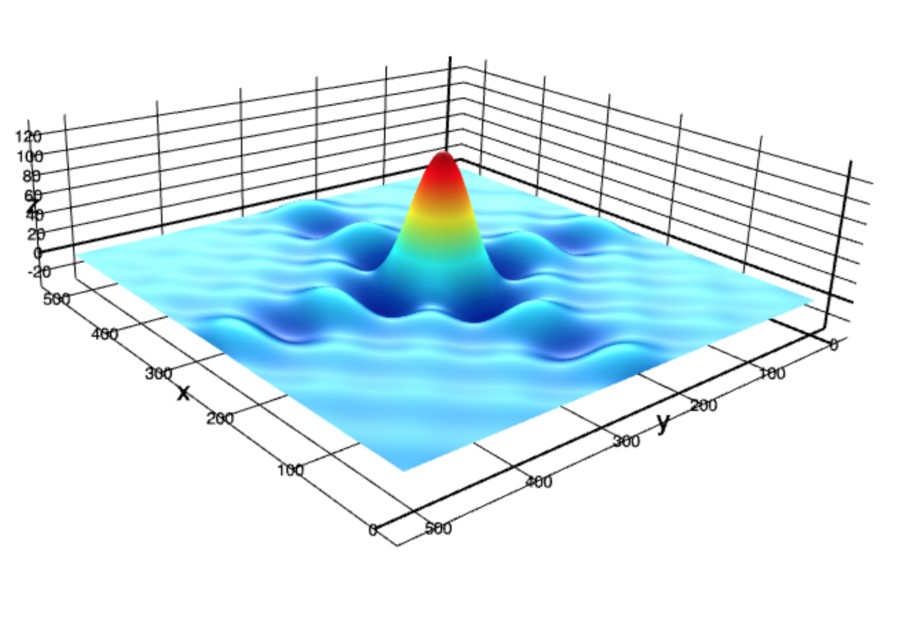
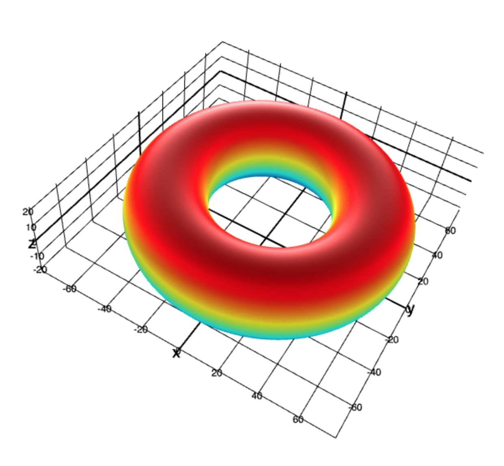
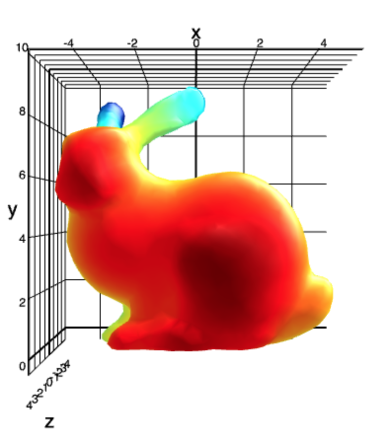
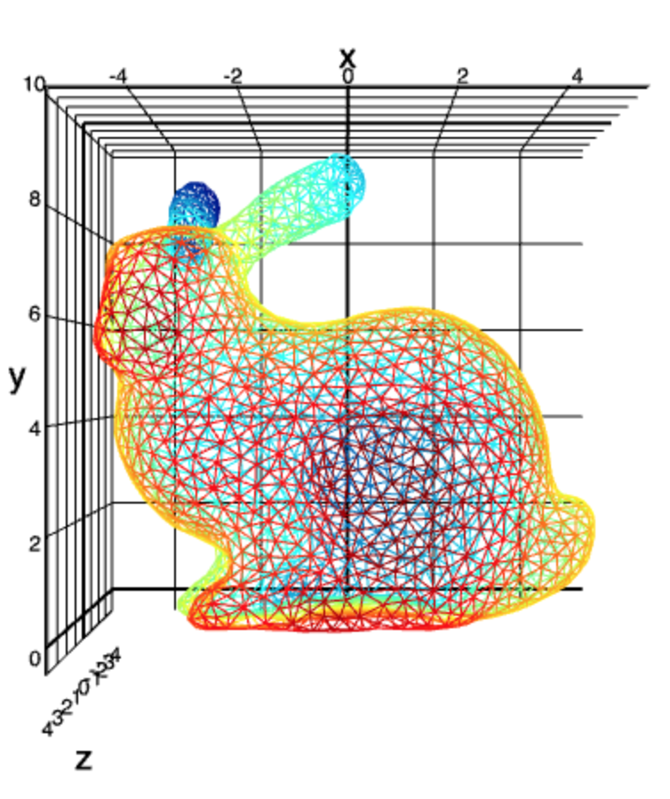
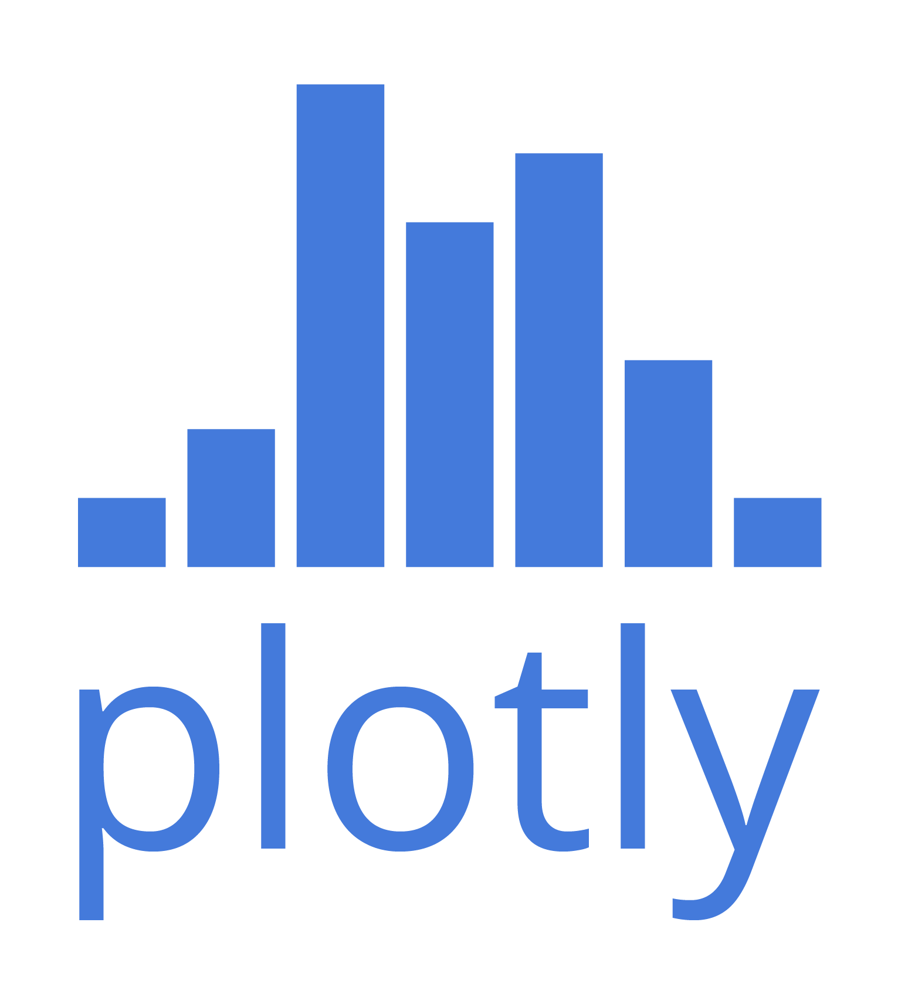

gl-plot3d
=========
This is the core module for 3D plotting in gl-vis. It is compatible with the following modules:

* [gl-scatter3d](https://github.com/gl-vis/gl-scatter3d): 3D scatter plots
* [gl-line3d](https://github.com/gl-vis/gl-line3d): 3D line plots
* [gl-surface3d](https://github.com/gl-vis/gl-surface3d): 3D surface plots
* [gl-mesh3d](https://github.com/gl-vis/gl-mesh3d): General mesh drawing

This module (and this whole subecosystem) skew more towards the easy-side of the simple vs. easy tradeoff spectrum.  It has lots of options, but has opinionated and reasonable defaults which should make it suitable for small projects like mesh viewers or knocking out one-off data visualizations.  If you want more precise, low level control, check out [stack.gl](https://stack.gl).

# Examples

### Scatter plot

[](http://requirebin.com/?gist=cf75d78184f6b8cac15a) [](http://requirebin.com/?gist=cf75d78184f6b8cac15a)

```javascript
var createScene   = require('gl-plot3d').createScene
var createCamera  = require('gl-plot3d').createCamera
var createScatter = require('gl-scatter3d')
var bunny         = require('bunny')

var scene = createScene()

var scatter = createScatter({
  gl:             scene.gl,
  position:       bunny.positions,
  size:           10,
  glyph:          '★',
  orthographic:   true,
  lineColor:      [0,0,0],
  color:          [1,0,0],
  lineWidth:      1,
  projectOpacity: 0.3
})

scene.add(scatter)
```

### Line plot

[](http://requirebin.com/?gist=16dee68aba0f2aee6068) [](http://requirebin.com/?gist=16dee68aba0f2aee6068)

```javascript
var createScene = require('gl-plot3d').createScene
var createLine  = require('gl-line3d')

var scene = createScene()

var points = []
for(var t = 0; t< 1000; ++t) {
  var theta = Math.PI * t / 200.0
  points.push([Math.cos(theta), 0.002 * t, Math.sin(theta)])
}

var linePlot = createLine({
  gl:        scene.gl,
  position:  points,
  lineWidth: 5,
  color:     [1,0,0]
})

scene.add(linePlot)
```

### Surfaces

[](http://requirebin.com/?gist=1191b34203ffd9adc905)
[](http://requirebin.com/?gist=1191b34203ffd9adc905)

```javascript
var createScene       = require('gl-plot3d').createScene
var createSurfacePlot = require('gl-surface3d')
var ndarray           = require('ndarray')
var fill              = require('ndarray-fill')
var diric             = require('dirichlet')

var scene = createScene()

var field = ndarray(new Float32Array(512*512), [512,512])
fill(field, function(x,y) {
  return 128 * diric(10, 10.0*(x-256)/512) * diric(10, 10.0*(y-256)/512)
})

var surface = createSurfacePlot({
  gl:             scene.gl,
  field:          field,
  contourProject: true
})

scene.add(surface)
```

### Parametric surfaces

[](http://requirebin.com/?gist=5feeac1f3767298d55ca) [](http://requirebin.com/?gist=5feeac1f3767298d55ca)

```javascript
var createScene   = require('gl-plot3d').createScene
var createSurface = require('gl-surface3d')
var ndarray       = require('ndarray')

var scene = createScene()

var size = 64
var coords = [
  ndarray(new Float32Array(4*(size+1)*(size+1)), [2*size+1,2*size+1]),
  ndarray(new Float32Array(4*(size+1)*(size+1)), [2*size+1,2*size+1]),
  ndarray(new Float32Array(4*(size+1)*(size+1)), [2*size+1,2*size+1])
]
for(var i=0; i<=2*size; ++i) {
  var theta = Math.PI * (i - size) / size
  for(var j=0; j<=2*size; ++j) {
    var phi = Math.PI * (j - size) / size
    coords[0].set(i, j, (50.0 + 20.0 * Math.cos(theta)) * Math.cos(phi))
    coords[1].set(i, j, (50.0 + 20.0 * Math.cos(theta)) * Math.sin(phi))
    coords[2].set(i, j, 20.0 * Math.sin(theta))
  }
}

var surface = createSurface({
  gl:             scene.gl,
  coords:         coords,
  contourProject: true,
  showContour:    true
})

scene.add(surface)
```

### Meshes

[](http://requirebin.com/?gist=0d4c38d1aa80edbe4a28) [](http://requirebin.com/?gist=0d4c38d1aa80edbe4a28)

```javascript
var createScene = require('gl-plot3d').createScene
var createMesh  = require('gl-mesh3d')
var bunny       = require('bunny')

var scene = createScene()

var mesh = createMesh({
  gl:         scene.gl,
  cells:      bunny.cells,
  positions:  bunny.positions,
  colormap:   'jet'
})

scene.add(mesh)
```

### Wireframe meshes

[](http://requirebin.com/?gist=37a8df8ace4ecafa010f) [](http://requirebin.com/?gist=37a8df8ace4ecafa010f)

```javascript
var createScene = require('gl-plot3d').createScene
var createMesh  = require('gl-mesh3d')
var bunny       = require('bunny')
var sc          = require('simplicial-complex')

var scene = createScene()

var mesh = createMesh({
  gl:         scene.gl,
  cells:      sc.skeleton(bunny.cells, 1),
  positions:  bunny.positions,
  colormap:   'jet'
})

scene.add(mesh)
```

# Install

```
npm i gl-plot3d
```

# API

## Scene Constructor

#### `var scene = require('gl-plot3d').createScene(canvas[, options])`

Creates a new scene object.

* `canvas` is an HTML canvas element into which the scene is inserted. (If not specified, a new fullscreen canvas is created and appended to the document)
* `gl` is a WebGL context (If not specified, a new context is created)
* `glOptions` is a set of options passed to the new WebGL context, `gl` is not specified
* `camera` an object storing camera options.  See [orbiter](https://github.com/mikolalysenko/orbiter) for more details
* `axes` options passed to the axes object.  See [gl-axes](https://github.com/mikolalysenko/gl-axes) for more details
* `spikes` options passed to the axes spikes.  See [gl-spikes](https://github.com/mikolalysenko/gl-spikes) for more details
* `clearColor` a length 4 array of color values for the clear
* `fovy` the vertical field of view
* `zNear` near clip plane distance
* `zFar` far clip plane distance
* `pickRadius` the distance for mouse picking
* `autoBounds` a flag, if set automatically recalculates object bounds (default `true`)
* `autoScale` a flag, if set automatically scales the data set to unit length, preserving aspect ratio (default `true`)
* `autoCenter` a flag, if set translates data to the center of the coordinate system (default `true`)
* `clipToBounds` clip data points to remain within the axes bounds
* `snapToData` snap selections to data points
* `onselect` called whenever the currently highlighted data point changes
* `onrender` called whenever the scene is drawn

## Methods

#### `scene.addObject(obj)`
Adds a new object to the scene

#### `scene.removeObject(obj)`
Removes an object from the scene

#### `scene.redraw()`
Forces an immediate redraw of the scene and pick buffer.  Useful if you are s

#### `scene.dispose()`
Destroys the scene and releases all associated resources.  Also destroys all attached objects.

## Properties

#### `scene.selection`
Information about the currently selected object in the scene.

#### `scene.objects`
A list of all objects in the scene.

#### `scene.canvas`
The canvas element associated with the scene

#### `scene.gl`
The WebGL context associated with the scene.

#### `scene.axes`
A reference to the axes object for the scene

#### `scene.camera`
A reference to the camera object for the scene

#### `scene.bounds`
Bounds for the scene


## Camera Constructor

#### `var camera = require('gl-plot3d').createCamera(element[, options])`

## Please refer to `3d-view-controls` for more info.
https://www.npmjs.com/package/3d-view-controls
https://github.com/mikolalysenko/3d-view-controls

# License
(c) 2015 Mikola Lysenko. MIT License

Development support by [plot.ly](http://plot.ly)

[](http://plot.ly)
