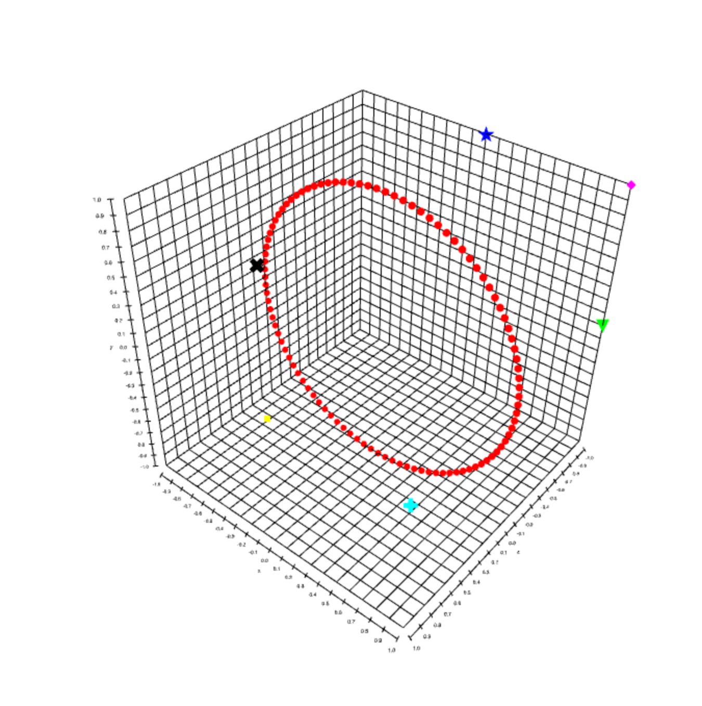

gl-scatter3d
===============
3D WebGL scatter plots with custom point glyphs.



# Example

```javascript
var createScene = require('gl-plot3d')
var createPoints = require('gl-scatter3d')

var scene = createScene()

var initialData = {
  gl: scene.gl,
  position: [ [1, 0, -1], [0, 1, -1], [0, 0, 1], [1,1,-1], [1,0,1], [0,1,1] ],
  glyph: [  "▼", "★", "■", "◆", "✚", "✖" ],
  color: [ [0,1,0], [0,0,1], [1,1,0], [1,0,1], [0,1,1], [0,0,0] ],
  size: 12,
  orthographic: true
}

for(var i=0; i<100; ++i) {
  var theta = i / 100.0 * 2.0 * Math.PI
  var x = Math.cos(theta)
  var y = Math.sin(theta)
  initialData.position.push([ x, y, 0 ])
  initialData.glyph.push("●")
  initialData.color.push([1, 0, 0])
}

var points = createPoints(initialData)

scene.add(points)
```

# Install

```
npm install gl-scatter3d
```

# Basic interface

## Constructor

#### `var points = require('gl-scatter3d')(options)`
Constructs a scatter plot with the given parameters.  `options` is an object with the following properties:

* `gl` is a WebGL context
* `position` (Required) an array of length 3 arrays encoding the position of the points in the scatter plot.
* `color` A length 3 array encoding the color of the points in the scatter plot.  To set colors per point, pass an array instead.  Default is `[0,0,0]`
* `glyph` The glyph of each point.  This is a UTF8 string representing some shape.  Per point glyphs can be specified by passing an array.  The default glyph is a circle, `"●"`.  For more glyph ideas, check out the [unicode character set](http://unicode-table.com/en/).  Some other fun suggestions: `"☢", "☯", "❤", "▲", "⚑"`. 
* `size` The size of each point, or specified per-point using an array.  In orthographic, this is in screen coordinates, or in perspective this is in world coordinates. Default is `0.1`
* `orthographic` A flag, which if set to `true` causes the points to be drawn without perspective scaling.
* `lineWidth` the width of the outline (set to 0 for no outline) Default is `0`
* `lineColor` the color of the outline for each marker
* `font` the font used for drawing the glyphs (default `normal`)
* `angle` an angle to rotate the glyphs by in radians (default `0`)
* `alignment` a 2d vector to offset text drawing by (default `[0,0]`)
* `project` a flag (or array of flags) which determines which axes to project onto
* `projectOpacity` the opacity of the projected point sprites (default `1.0`)
* `projectScale` the scaling factor of the projected point sprites (default `2.0/3.0`)

**Returns** A new scatter plot object

## Update

#### `points.update(options)`
Updates the scatter plot object.  The parameter `options` has the same properties as the constructor.

### Properties

#### `points.opacity`
The opacity of the point set (default 1)

#### `points.projectScale`
A factor by which projections are rescaled

#### `points.projectOpacity`
The opacity of the projected points

#### `points.axesProject`
An array of projection values for each point

#### `points.lineWidth`
The width of the outline of each point

# Credits
(c) 2014-2015 Mikola Lysenko. MIT License.  Supported by [plot.ly](https://plot.ly/)