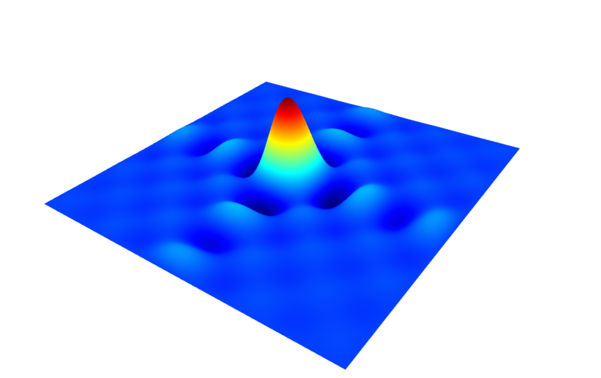

gl-surface3d
===============
3D parametric surface plotting, compatible with [gl-vis](http://github.com/gl-vis).

# Example

```javascript
var createScene       = require('gl-plot3d')
var createSurfacePlot = require('gl-surface3d')
var ndarray           = require('ndarray')
var fill              = require('ndarray-fill')
var diric             = require('dirichlet')

var scene = createScene()

//Create field
var field = ndarray(new Float32Array(512*512), [512,512])
fill(field, function(x,y) {
  return 128 * diric(10, 10.0*(x-256)/512) * diric(10, 10.0*(y-256)/512)
})

//Create surface plot
var surface = createSurfacePlot({
  gl:    scene.gl,
  field: field
})

scene.add(surface)
```

Here is what this should look like:



[Test it in your browser (requires WebGL)](http://gl-vis.github.io/gl-surface3d/)

# Install

```
npm install gl-surface3d
```

# Basic Interface

## Constructor

#### `var surface = require('gl-surface3d')(params)`
Creates a surface plot object.  `params` is an object with any of the following parameters

* `gl` is a WebGL context
* `field` a new 2D field encoded as an ndarray
* `coords` is an array of 3 2D fields, each encoded as ndarrays (for parameteric surfaces)
* `intensity` a 2D intensity field (defaults to `field` or `coords[2] is not present)
* `colormap` the name of the new color map for the surface (see list of names in `colormap` [docs](https://github.com/bpostlethwaite/colormap))
* `intensityBounds` sets the intensity range for the colormap
* `ticks` is a pair of arrays of ticks representing the spacing of the points for the axes of the surface
* `showSurface` if set, draw the surface
* `showContour` if set, draw contour lines
* `contourWidth` the width fo the contour lines
* `contourTint` the amount of tint of the contour lines
* `contourColor` the color of the contour line tint
* `levels` an array of arrays representing the level of the isolines.
* `dynamicWidth` the width of the dynamic isolines
* `dynamicColors` the color of the dynamic isolines
* `dynamicTint` the tint of the dynamic isolines
* `vertexColor` interpolate color in fragment or vertex shader, useful for discontinuous functions ([ref](https://github.com/plotly/plotly.js/issues/940))


## Methods

#### `surface.update(params)`
Modify the surface.  `params` is an object with the same properties as the constructor


# License
(c) 2014-2015 Mikola Lysenko. MIT License.
