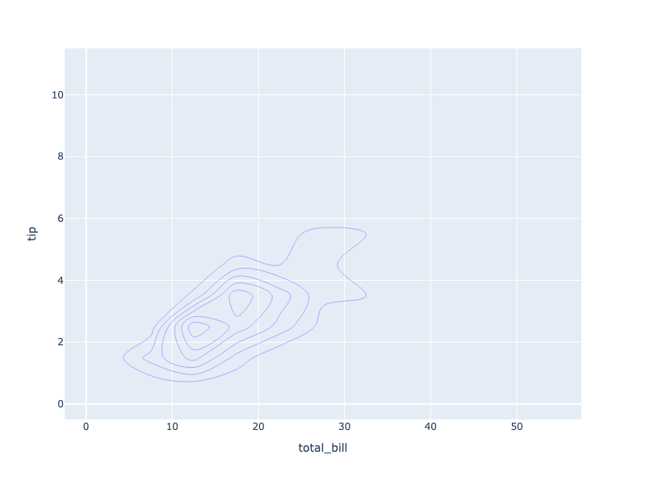
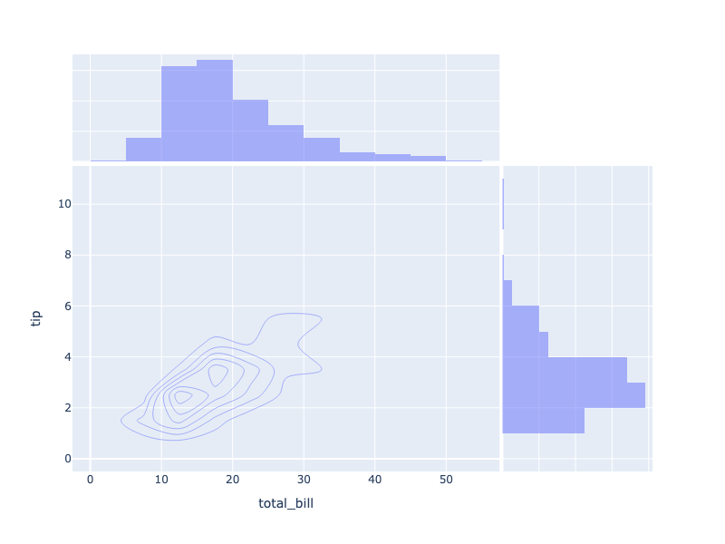
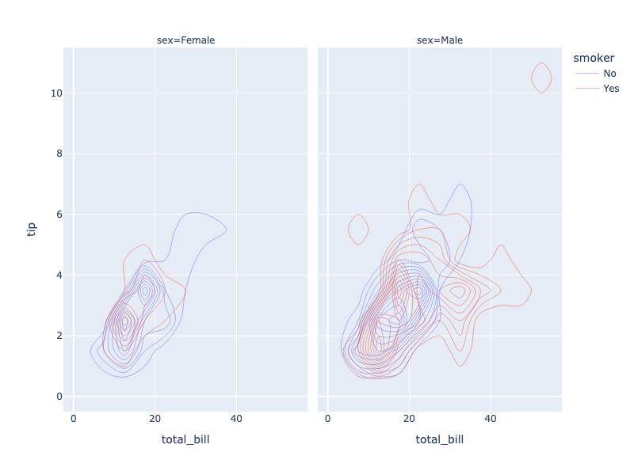
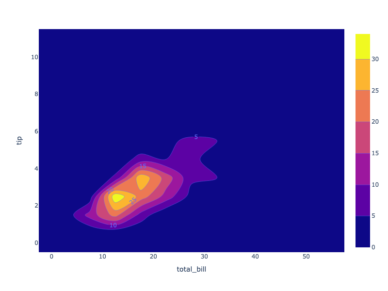
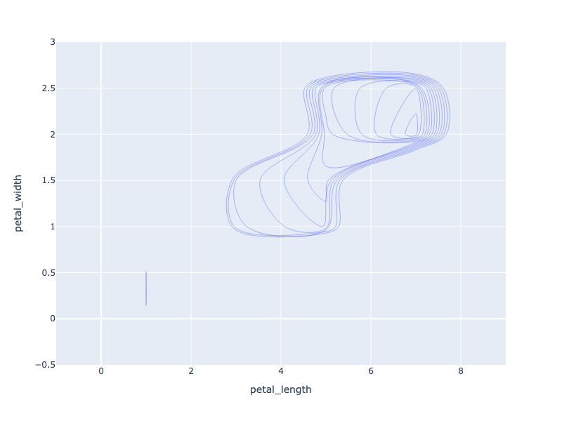
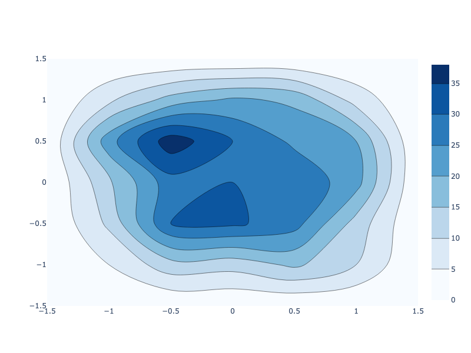
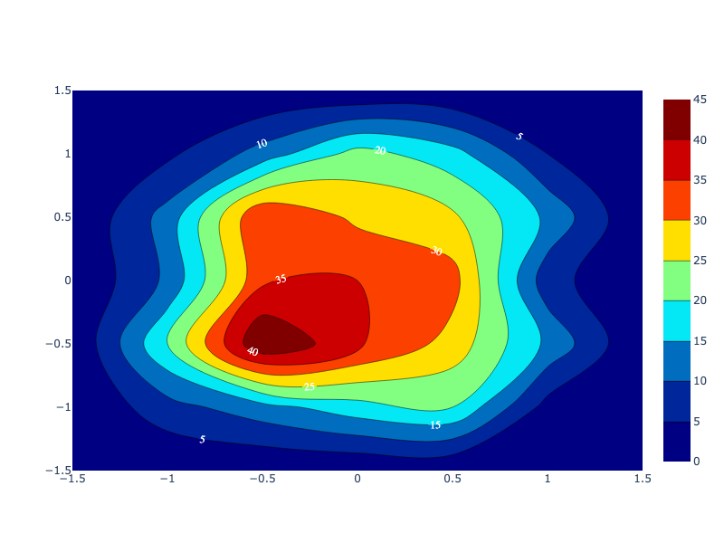
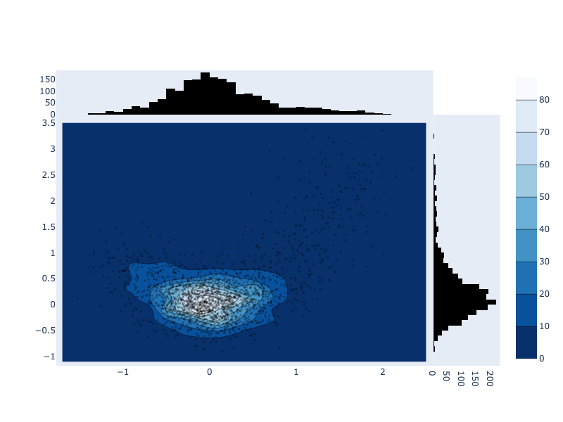

---
jupyter:
  jupytext:
    notebook_metadata_filter: all
    text_representation:
      extension: .md
      format_name: markdown
      format_version: '1.2'
      jupytext_version: 1.3.1
  kernelspec:
    display_name: Python 3
    language: python
    name: python3
  language_info:
    codemirror_mode:
      name: ipython
      version: 3
    file_extension: .py
    mimetype: text/x-python
    name: python
    nbconvert_exporter: python
    pygments_lexer: ipython3
    version: 3.6.8
  plotly:
    description: How to make 2D Histogram Contour plots in Python with Plotly.
    display_as: statistical
    language: python
    layout: base
    name: 2D Histogram Contour
    order: 11
    page_type: u-guide
    permalink: python/2d-histogram-contour/
    redirect_from: python/2d-density-plots/
    thumbnail: thumbnail/hist2dcontour.png
---

## 2D Histogram Contours or Density Contours

A 2D histogram contour plot, also known as a density contour plot, is a 2-dimensional generalization of a [histogram](histograms.md) which resembles a [contour plot](contour-plots.md) but is computed by grouping a set of points specified by their `x` and `y` coordinates into bins, and applying an aggregation function such as `count` or `sum` (if `z` is provided) to compute the value to be used to compute contours. This kind of visualization (and the related [2D histogram, or density heatmap](2D-Histogram.md)) is often used to manage over-plotting, or situations where showing large data sets as [scatter plots](line-and-scatter.md) would result in points overlapping each other and hiding patterns.

## Density Contours with Plotly Express

[Plotly Express](plotly-express.md) is the easy-to-use, high-level interface to Plotly, which [operates on a variety of types of data](px-arguments.md) and produces [easy-to-style figures](styling-plotly-express.md). The Plotly Express function `density_contour()` can be used to produce density contours.

```python
import plotly.express as px
df = px.data.tips()

fig = px.density_contour(df, x="total_bill", y="tip")
fig.show()
```



**Interactive Plot:**

<div>                        <script type="text/javascript">window.PlotlyConfig = {MathJaxConfig: 'local'};</script>
        <script charset="utf-8" src="https://cdn.plot.ly/plotly-3.1.0.min.js" integrity="sha256-Ei4740bWZhaUTQuD6q9yQlgVCMPBz6CZWhevDYPv93A=" crossorigin="anonymous"></script>                <div id="plotly-div-1" class="plotly-graph-div" style="height:100%; width:100%;"></div>            <script type="text/javascript">                window.PLOTLYENV=window.PLOTLYENV || {};                                if (document.getElementById("plotly-div-1")) {                    Plotly.newPlot(                        "plotly-div-1",                        [{"contours":{"coloring":"none"},"hovertemplate":"total_bill=%{x}\u003cbr\u003etip=%{y}\u003cbr\u003ecount=%{z}\u003cextra\u003e\u003c\u002fextra\u003e","legendgroup":"","line":{"color":"#636efa"},"name":"","showlegend":false,"x":{"dtype":"f8","bdata":"PQrXo3D9MECuR+F6FK4kQMP1KFyPAjVArkfhehSuN0DXo3A9Cpc4QArXo3A9SjlACtejcD2KIUDhehSuR+E6QBSuR+F6FC5Aj8L1KFyPLUAK16NwPYokQOF6FK5HoUFA16NwPQrXLkCuR+F6FG4yQClcj8L1qC1AFK5H4XqUNUApXI\u002fC9agkQArXo3A9SjBAuB6F61H4MEBmZmZmZqY0QOxRuB6F6zFACtejcD1KNEAK16NwPYovQPYoXI\u002fCtUNAUrgehevRM0CPwvUoXM8xQD0K16NwvSpA4XoUrkdhKUAzMzMzM7M1QGZmZmZmpjNAmpmZmZkZI0CamZmZmVkyQB+F61G4Hi5AcT0K16OwNEBI4XoUrscxQI\u002fC9ShcDzhAj8L1KFxPMECuR+F6FO4wQHE9CtejsDJAhetRuB5FP0AK16NwPQowQPYoXI\u002fCdTFA4XoUrkfhK0Bcj8L1KFwjQGZmZmZmZj5ACtejcD1KMkB7FK5H4To2QDMzMzMzM0BAzczMzMyMPEAK16NwPQoyQBSuR+F6FClAFK5H4XqUJEBI4XoUrmdBQOF6FK5H4SNAj8L1KFyPOUA9CtejcH0zQOF6FK5HAUNAKVyPwvVoOkB7FK5H4XomQMP1KFyPIkhACtejcD1KNEAfhetRuJ4rQArXo3A9CiZACtejcD1KMkDXo3A9CpcxQBSuR+F6FDRAMzMzMzNzMECPwvUoXI8IQHsUrkfhOjRAhetRuB4FLkAK16NwPQooQFK4HoXrETFAXI\u002fC9SjcOkBI4XoUrkc5QPYoXI\u002fCdS1AhetRuB4FJUDsUbgehesxQDMzMzMzMztAw\u002fUoXI\u002fCNkAK16NwPUoxQHE9CtejcDNAKVyPwvWoMECkcD0K1yMkQNejcD0KV0BA9ihcj8L1L0AK16NwPWpBQI\u002fC9ShcDypASOF6FK5HMkD2KFyPwrU4QClcj8L1KDVAuB6F61H4PEA9CtejcH02QAAAAAAAABdAUrgehetRMEAAAAAAAMA2QPYoXI\u002fCFURASOF6FK5HO0CPwvUoXA8oQMP1KFyPAjVA7FG4HoXrKEAzMzMzM7MmQMP1KFyPwi5AZmZmZmYmRkDsUbgehWs2QOxRuB6F6zRAuB6F61G4LkA9CtejcH00QPYoXI\u002fCNTlAPQrXo3A9MkAfhetRuJ4sQAAAAAAAACxAAAAAAAAAHUApXI\u002fC9QhDQDMzMzMz8zdA9ihcj8K1OUCPwvUoXE8xQK5H4XoU7j1AzczMzMxMJUBcj8L1KNwoQBSuR+F6FDhA4XoUrkdhJ0DXo3A9CtcqQIXrUbgehSxAZmZmZmbmL0D2KFyPwvUoQM3MzMzMzD1ACtejcD0KIUAK16NwPQotQMP1KFyPwiZAUrgehevRNkAUrkfhehQzQIXrUbgeRTRA16NwPQpXJkCF61G4HoUoQMP1KFyPQjJAhetRuB4FIUApXI\u002fC9agkQM3MzMzMTCxAAAAAAAAAMEBSuB6F61EqQLgehetReDFAZmZmZmYmQUC4HoXrUZhEQM3MzMzMDDtArkfhehRuMEAzMzMzM7MgQKRwPQrXozJAPQrXo3C9J0CPwvUoXI8jQArXo3A9Ch5ApHA9CtcjLEDD9Shcj0IqQMP1KFyPQjFAzczMzMyMOECF61G4HsUzQJqZmZmZ2T1A9ihcj8IVSEAAAAAAAAA5QEjhehSuxypAPQrXo3B9MEAAAAAAAIA1QFK4HoXrUSlA9ihcj8I1MEAfhetRuJ4rQMP1KFyPgjFAhetRuB6FOEDD9Shcj8I0QPYoXI\u002fCtT9ArkfhehQuJUDD9Shcj0IlQEjhehSuZ0lAH4XrUbieL0AAAAAAAAAdQJqZmZmZ2T9AUrgehevRMEAzMzMzM3NAQKRwPQrX4zFA9ihcj8L1LEAzMzMzMzMjQHE9CtejUEFAMzMzMzNTQUAUrkfhelQ3QM3MzMzMrEZA7FG4HoUrN0BmZmZmZkZEQHE9CtejsDRAZmZmZmbmNED2KFyPwnU+QGZmZmZmJjJAmpmZmZkZN0DhehSuR2EvQI\u002fC9ShczzNAcT0K16NwPED2KFyPwvUuQBSuR+F6lDBAPQrXo3A9HkCuR+F6FK4kQK5H4XoUjkVAAAAAAAAAKkCF61G4HgUrQPYoXI\u002fCtTJAexSuR+F6KUAAAAAAAAAqQGZmZmZmZjBASOF6FK6HNEC4HoXrUXgwQNejcD0KlzpAPQrXo3BdQ0CF61G4HkU4QIXrUbgehSlAj8L1KFwPPkCkcD0K1+M5QArXo3A9KkhACtejcD2KKkDsUbgehSs8QM3MzMzMzClAZmZmZmYmPECuR+F6FC4nQPYoXI\u002fC9R5ApHA9CtcjPkBSuB6F61EoQNejcD0K1ypAKVyPwvUoIUD2KFyPwvUvQNejcD0K1ypAhetRuB5FMECuR+F6FC4kQDMzMzMzczRAj8L1KFyPKkAfhetRuB42QMP1KFyPAjhA4XoUrkdhL0C4HoXrUTgnQArXo3A9iiVAj8L1KFwPL0CkcD0K1yMkQDMzMzMzMylACtejcD1qQEAK16NwPepBQEjhehSuBz1ArkfhehQuO0DsUbgehas2QFK4HoXr0TFASOF6FK7HMkA="},"xaxis":"x","xbingroup":"x","y":{"dtype":"f8","bdata":"KVyPwvUo8D+PwvUoXI\u002f6PwAAAAAAAAxAexSuR+F6CkDhehSuR+EMQNejcD0K1xJAAAAAAAAAAED2KFyPwvUIQFyPwvUoXP8\u002f16NwPQrXCUBcj8L1KFz7PwAAAAAAABRAH4XrUbge+T8AAAAAAAAIQClcj8L1KAhAXI\u002fC9ShcD0C4HoXrUbj6P65H4XoUrg1AAAAAAAAADEDNzMzMzMwKQFK4HoXrURBAAAAAAAAABkDXo3A9CtcBQFK4HoXrUR5AcT0K16NwCUC4HoXrUbgCQAAAAAAAAABAAAAAAAAAAEAzMzMzMzMRQAAAAAAAAAhAMzMzMzMz9z8AAAAAAAAEQAAAAAAAAAhAmpmZmZmZA0ApXI\u002fC9SgKQM3MzMzMzAxAAAAAAAAAAECPwvUoXI8IQHsUrkfhegJAAAAAAAAAFEDsUbgehesBQFK4HoXrUQRAexSuR+F6CEAfhetRuB71P2ZmZmZmZhZAAAAAAAAACEAAAAAAAAAUQAAAAAAAABhAZmZmZmZmAEAAAAAAAAAIQAAAAAAAAARAzczMzMzMBEDNzMzMzMwUQPYoXI\u002fC9fg\u002fXI\u002fC9ShcEUAUrkfhehQMQAAAAAAAAAhAAAAAAAAA+D8pXI\u002fC9Sj8P+xRuB6F6xpArkfhehSuCUAAAAAAAAAAQK5H4XoUrv8\u002fFK5H4XoUDkAfhetRuB4FQDMzMzMzMwlAw\u002fUoXI\u002fCA0AAAAAAAADwPxSuR+F6FABAuB6F61G4AECF61G4HoX\u002fPwAAAAAAAAhAH4XrUbgeCUAAAAAAAAAUQJqZmZmZmQFAAAAAAAAA9D+kcD0K16MIQAAAAAAAABBAAAAAAAAACECuR+F6FK4FQAAAAAAAAAhAMzMzMzMzC0BI4XoUrkf9PwAAAAAAABRAPQrXo3A9AECuR+F6FK4UQAAAAAAAAABAAAAAAAAAEEBmZmZmZmYXQAAAAAAAAAhAAAAAAAAACEAAAAAAAAAMQAAAAAAAAPA\u002fMzMzMzMzEUAAAAAAAAAKQOxRuB6F6xJAAAAAAAAAEEAAAAAAAAD4PwAAAAAAAAhAAAAAAAAA+D8AAAAAAAAEQAAAAAAAAAhAAAAAAAAABEDXo3A9CtcLQFK4HoXrURBAPQrXo3A9+j89CtejcD0QQClcj8L1KBFAFK5H4XoUDkAAAAAAAAAQQAAAAAAAAAhAAAAAAAAA8D8AAAAAAAAQQGZmZmZmZgRAAAAAAAAAEEAAAAAAAAAMQEjhehSuRxRAAAAAAAAA+D\u002fNzMzMzMz8P1yPwvUoXAdAexSuR+F6AkDhehSuR+H6PwAAAAAAAARAAAAAAAAAAEApXI\u002fC9SgEQM3MzMzMzBBArkfhehSu9z8AAAAAAAAAQAAAAAAAAABAcT0K16NwAUAAAAAAAAD4P6RwPQrXowZAAAAAAAAA+D8AAAAAAAAAQAAAAAAAAApAAAAAAAAA9D8AAAAAAAAAQAAAAAAAAABAAAAAAAAAAEAAAAAAAAAGQAAAAAAAAAxAzczMzMzMGkAAAAAAAAAUQAAAAAAAABRAZmZmZmZmAkAAAAAAAAD4P8P1KFyPwvU\u002fFK5H4XoU+j+uR+F6FK77PwAAAAAAAABAAAAAAAAABEAAAAAAAAAAQOxRuB6F6wVAAAAAAAAAAEAAAAAAAAAAQI\u002fC9ShcjxRAAAAAAAAAFEAAAAAAAAAOQOF6FK5H4QRAAAAAAAAAAEAAAAAAAAAMQAAAAAAAAARAAAAAAAAAAEAAAAAAAAAAQAAAAAAAAAhA16NwPQrXC0DsUbgehesBQAAAAAAAABJAw\u002fUoXI\u002fC+T8AAAAAAAAAQAAAAAAAACRASOF6FK5HCUCamZmZmZkUQHE9CtejcAlAAAAAAAAAEEDhehSuR+EIQAAAAAAAAABAAAAAAAAAAEAAAAAAAAAQQGZmZmZmZgxAcT0K16NwDUCamZmZmZkWQAAAAAAAAAxAAAAAAAAAGkAAAAAAAAAIQAAAAAAAABRAAAAAAAAADEAAAAAAAAAAQAAAAAAAAAxAAAAAAAAAEEAAAAAAAAD4P8P1KFyPwhBAexSuR+F6BEApXI\u002fC9SgAQAAAAAAAABBACtejcD0K9z8AAAAAAAAAQAAAAAAAABRAAAAAAAAAAEAAAAAAAAAAQAAAAAAAABBAFK5H4XoUAEAAAAAAAAAAQAAAAAAAAARAAAAAAAAAEEDXo3A9CtcJQEjhehSuRwtAAAAAAAAACEA9CtejcD0AQNejcD0K1wFAAAAAAAAAAECkcD0K16MUQAAAAAAAACJAAAAAAAAABEAAAAAAAAAaQJqZmZmZmfE\u002fAAAAAAAACEAAAAAAAAD4PwrXo3A9Cvc\u002fuB6F61G4CECamZmZmZkBQNejcD0K1wtAuB6F61G4\u002fj8AAAAAAAAIQEjhehSuR\u002fk\u002fAAAAAAAABEAAAAAAAAAAQAAAAAAAAAhAw\u002fUoXI\u002fCBUAK16NwPQoHQAAAAAAAAABAAAAAAAAACEAfhetRuB4LQIXrUbgehfc\u002fAAAAAAAACEAAAAAAAAD0PwAAAAAAAPA\u002fuB6F61G48j+uR+F6FK4SQK5H4XoUrhdAAAAAAAAAAEAAAAAAAAAAQAAAAAAAAPw\u002fAAAAAAAACEA="},"yaxis":"y","ybingroup":"y","type":"histogram2dcontour"}],                        {"template":{"data":{"histogram2dcontour":[{"type":"histogram2dcontour","colorbar":{"outlinewidth":0,"ticks":""},"colorscale":[[0.0,"#0d0887"],[0.1111111111111111,"#46039f"],[0.2222222222222222,"#7201a8"],[0.3333333333333333,"#9c179e"],[0.4444444444444444,"#bd3786"],[0.5555555555555556,"#d8576b"],[0.6666666666666666,"#ed7953"],[0.7777777777777778,"#fb9f3a"],[0.8888888888888888,"#fdca26"],[1.0,"#f0f921"]]}],"choropleth":[{"type":"choropleth","colorbar":{"outlinewidth":0,"ticks":""}}],"histogram2d":[{"type":"histogram2d","colorbar":{"outlinewidth":0,"ticks":""},"colorscale":[[0.0,"#0d0887"],[0.1111111111111111,"#46039f"],[0.2222222222222222,"#7201a8"],[0.3333333333333333,"#9c179e"],[0.4444444444444444,"#bd3786"],[0.5555555555555556,"#d8576b"],[0.6666666666666666,"#ed7953"],[0.7777777777777778,"#fb9f3a"],[0.8888888888888888,"#fdca26"],[1.0,"#f0f921"]]}],"heatmap":[{"type":"heatmap","colorbar":{"outlinewidth":0,"ticks":""},"colorscale":[[0.0,"#0d0887"],[0.1111111111111111,"#46039f"],[0.2222222222222222,"#7201a8"],[0.3333333333333333,"#9c179e"],[0.4444444444444444,"#bd3786"],[0.5555555555555556,"#d8576b"],[0.6666666666666666,"#ed7953"],[0.7777777777777778,"#fb9f3a"],[0.8888888888888888,"#fdca26"],[1.0,"#f0f921"]]}],"contourcarpet":[{"type":"contourcarpet","colorbar":{"outlinewidth":0,"ticks":""}}],"contour":[{"type":"contour","colorbar":{"outlinewidth":0,"ticks":""},"colorscale":[[0.0,"#0d0887"],[0.1111111111111111,"#46039f"],[0.2222222222222222,"#7201a8"],[0.3333333333333333,"#9c179e"],[0.4444444444444444,"#bd3786"],[0.5555555555555556,"#d8576b"],[0.6666666666666666,"#ed7953"],[0.7777777777777778,"#fb9f3a"],[0.8888888888888888,"#fdca26"],[1.0,"#f0f921"]]}],"surface":[{"type":"surface","colorbar":{"outlinewidth":0,"ticks":""},"colorscale":[[0.0,"#0d0887"],[0.1111111111111111,"#46039f"],[0.2222222222222222,"#7201a8"],[0.3333333333333333,"#9c179e"],[0.4444444444444444,"#bd3786"],[0.5555555555555556,"#d8576b"],[0.6666666666666666,"#ed7953"],[0.7777777777777778,"#fb9f3a"],[0.8888888888888888,"#fdca26"],[1.0,"#f0f921"]]}],"mesh3d":[{"type":"mesh3d","colorbar":{"outlinewidth":0,"ticks":""}}],"scatter":[{"fillpattern":{"fillmode":"overlay","size":10,"solidity":0.2},"type":"scatter"}],"parcoords":[{"type":"parcoords","line":{"colorbar":{"outlinewidth":0,"ticks":""}}}],"scatterpolargl":[{"type":"scatterpolargl","marker":{"colorbar":{"outlinewidth":0,"ticks":""}}}],"bar":[{"error_x":{"color":"#2a3f5f"},"error_y":{"color":"#2a3f5f"},"marker":{"line":{"color":"#E5ECF6","width":0.5},"pattern":{"fillmode":"overlay","size":10,"solidity":0.2}},"type":"bar"}],"scattergeo":[{"type":"scattergeo","marker":{"colorbar":{"outlinewidth":0,"ticks":""}}}],"scatterpolar":[{"type":"scatterpolar","marker":{"colorbar":{"outlinewidth":0,"ticks":""}}}],"histogram":[{"marker":{"pattern":{"fillmode":"overlay","size":10,"solidity":0.2}},"type":"histogram"}],"scattergl":[{"type":"scattergl","marker":{"colorbar":{"outlinewidth":0,"ticks":""}}}],"scatter3d":[{"type":"scatter3d","line":{"colorbar":{"outlinewidth":0,"ticks":""}},"marker":{"colorbar":{"outlinewidth":0,"ticks":""}}}],"scattermap":[{"type":"scattermap","marker":{"colorbar":{"outlinewidth":0,"ticks":""}}}],"scattermapbox":[{"type":"scattermapbox","marker":{"colorbar":{"outlinewidth":0,"ticks":""}}}],"scatterternary":[{"type":"scatterternary","marker":{"colorbar":{"outlinewidth":0,"ticks":""}}}],"scattercarpet":[{"type":"scattercarpet","marker":{"colorbar":{"outlinewidth":0,"ticks":""}}}],"carpet":[{"aaxis":{"endlinecolor":"#2a3f5f","gridcolor":"white","linecolor":"white","minorgridcolor":"white","startlinecolor":"#2a3f5f"},"baxis":{"endlinecolor":"#2a3f5f","gridcolor":"white","linecolor":"white","minorgridcolor":"white","startlinecolor":"#2a3f5f"},"type":"carpet"}],"table":[{"cells":{"fill":{"color":"#EBF0F8"},"line":{"color":"white"}},"header":{"fill":{"color":"#C8D4E3"},"line":{"color":"white"}},"type":"table"}],"barpolar":[{"marker":{"line":{"color":"#E5ECF6","width":0.5},"pattern":{"fillmode":"overlay","size":10,"solidity":0.2}},"type":"barpolar"}],"pie":[{"automargin":true,"type":"pie"}]},"layout":{"autotypenumbers":"strict","colorway":["#636efa","#EF553B","#00cc96","#ab63fa","#FFA15A","#19d3f3","#FF6692","#B6E880","#FF97FF","#FECB52"],"font":{"color":"#2a3f5f"},"hovermode":"closest","hoverlabel":{"align":"left"},"paper_bgcolor":"white","plot_bgcolor":"#E5ECF6","polar":{"bgcolor":"#E5ECF6","angularaxis":{"gridcolor":"white","linecolor":"white","ticks":""},"radialaxis":{"gridcolor":"white","linecolor":"white","ticks":""}},"ternary":{"bgcolor":"#E5ECF6","aaxis":{"gridcolor":"white","linecolor":"white","ticks":""},"baxis":{"gridcolor":"white","linecolor":"white","ticks":""},"caxis":{"gridcolor":"white","linecolor":"white","ticks":""}},"coloraxis":{"colorbar":{"outlinewidth":0,"ticks":""}},"colorscale":{"sequential":[[0.0,"#0d0887"],[0.1111111111111111,"#46039f"],[0.2222222222222222,"#7201a8"],[0.3333333333333333,"#9c179e"],[0.4444444444444444,"#bd3786"],[0.5555555555555556,"#d8576b"],[0.6666666666666666,"#ed7953"],[0.7777777777777778,"#fb9f3a"],[0.8888888888888888,"#fdca26"],[1.0,"#f0f921"]],"sequentialminus":[[0.0,"#0d0887"],[0.1111111111111111,"#46039f"],[0.2222222222222222,"#7201a8"],[0.3333333333333333,"#9c179e"],[0.4444444444444444,"#bd3786"],[0.5555555555555556,"#d8576b"],[0.6666666666666666,"#ed7953"],[0.7777777777777778,"#fb9f3a"],[0.8888888888888888,"#fdca26"],[1.0,"#f0f921"]],"diverging":[[0,"#8e0152"],[0.1,"#c51b7d"],[0.2,"#de77ae"],[0.3,"#f1b6da"],[0.4,"#fde0ef"],[0.5,"#f7f7f7"],[0.6,"#e6f5d0"],[0.7,"#b8e186"],[0.8,"#7fbc41"],[0.9,"#4d9221"],[1,"#276419"]]},"xaxis":{"gridcolor":"white","linecolor":"white","ticks":"","title":{"standoff":15},"zerolinecolor":"white","automargin":true,"zerolinewidth":2},"yaxis":{"gridcolor":"white","linecolor":"white","ticks":"","title":{"standoff":15},"zerolinecolor":"white","automargin":true,"zerolinewidth":2},"scene":{"xaxis":{"backgroundcolor":"#E5ECF6","gridcolor":"white","linecolor":"white","showbackground":true,"ticks":"","zerolinecolor":"white","gridwidth":2},"yaxis":{"backgroundcolor":"#E5ECF6","gridcolor":"white","linecolor":"white","showbackground":true,"ticks":"","zerolinecolor":"white","gridwidth":2},"zaxis":{"backgroundcolor":"#E5ECF6","gridcolor":"white","linecolor":"white","showbackground":true,"ticks":"","zerolinecolor":"white","gridwidth":2}},"shapedefaults":{"line":{"color":"#2a3f5f"}},"annotationdefaults":{"arrowcolor":"#2a3f5f","arrowhead":0,"arrowwidth":1},"geo":{"bgcolor":"white","landcolor":"#E5ECF6","subunitcolor":"white","showland":true,"showlakes":true,"lakecolor":"white"},"title":{"x":0.05},"mapbox":{"style":"light"}}},"xaxis":{"anchor":"y","domain":[0.0,1.0],"title":{"text":"total_bill"}},"yaxis":{"anchor":"x","domain":[0.0,1.0],"title":{"text":"tip"}},"legend":{"tracegroupgap":0},"margin":{"t":60}},                        {"responsive": true}                    )                };            </script>        </div>

Marginal plots can be added to visualize the 1-dimensional distributions of the two variables. Here we use a marginal [`histogram`](histograms.md). Other allowable values are `violin`, `box` and `rug`.

```python
import plotly.express as px
df = px.data.tips()

fig = px.density_contour(df, x="total_bill", y="tip", marginal_x="histogram", marginal_y="histogram")
fig.show()
```



**Interactive Plot:**

<div>                        <script type="text/javascript">window.PlotlyConfig = {MathJaxConfig: 'local'};</script>
        <script charset="utf-8" src="https://cdn.plot.ly/plotly-3.1.0.min.js" integrity="sha256-Ei4740bWZhaUTQuD6q9yQlgVCMPBz6CZWhevDYPv93A=" crossorigin="anonymous"></script>                <div id="plotly-div-2" class="plotly-graph-div" style="height:100%; width:100%;"></div>            <script type="text/javascript">                window.PLOTLYENV=window.PLOTLYENV || {};                                if (document.getElementById("plotly-div-2")) {                    Plotly.newPlot(                        "plotly-div-2",                        [{"contours":{"coloring":"none"},"hovertemplate":"total_bill=%{x}\u003cbr\u003etip=%{y}\u003cbr\u003ecount=%{z}\u003cextra\u003e\u003c\u002fextra\u003e","legendgroup":"","line":{"color":"#636efa"},"name":"","showlegend":false,"x":{"dtype":"f8","bdata":"PQrXo3D9MECuR+F6FK4kQMP1KFyPAjVArkfhehSuN0DXo3A9Cpc4QArXo3A9SjlACtejcD2KIUDhehSuR+E6QBSuR+F6FC5Aj8L1KFyPLUAK16NwPYokQOF6FK5HoUFA16NwPQrXLkCuR+F6FG4yQClcj8L1qC1AFK5H4XqUNUApXI\u002fC9agkQArXo3A9SjBAuB6F61H4MEBmZmZmZqY0QOxRuB6F6zFACtejcD1KNEAK16NwPYovQPYoXI\u002fCtUNAUrgehevRM0CPwvUoXM8xQD0K16NwvSpA4XoUrkdhKUAzMzMzM7M1QGZmZmZmpjNAmpmZmZkZI0CamZmZmVkyQB+F61G4Hi5AcT0K16OwNEBI4XoUrscxQI\u002fC9ShcDzhAj8L1KFxPMECuR+F6FO4wQHE9CtejsDJAhetRuB5FP0AK16NwPQowQPYoXI\u002fCdTFA4XoUrkfhK0Bcj8L1KFwjQGZmZmZmZj5ACtejcD1KMkB7FK5H4To2QDMzMzMzM0BAzczMzMyMPEAK16NwPQoyQBSuR+F6FClAFK5H4XqUJEBI4XoUrmdBQOF6FK5H4SNAj8L1KFyPOUA9CtejcH0zQOF6FK5HAUNAKVyPwvVoOkB7FK5H4XomQMP1KFyPIkhACtejcD1KNEAfhetRuJ4rQArXo3A9CiZACtejcD1KMkDXo3A9CpcxQBSuR+F6FDRAMzMzMzNzMECPwvUoXI8IQHsUrkfhOjRAhetRuB4FLkAK16NwPQooQFK4HoXrETFAXI\u002fC9SjcOkBI4XoUrkc5QPYoXI\u002fCdS1AhetRuB4FJUDsUbgehesxQDMzMzMzMztAw\u002fUoXI\u002fCNkAK16NwPUoxQHE9CtejcDNAKVyPwvWoMECkcD0K1yMkQNejcD0KV0BA9ihcj8L1L0AK16NwPWpBQI\u002fC9ShcDypASOF6FK5HMkD2KFyPwrU4QClcj8L1KDVAuB6F61H4PEA9CtejcH02QAAAAAAAABdAUrgehetRMEAAAAAAAMA2QPYoXI\u002fCFURASOF6FK5HO0CPwvUoXA8oQMP1KFyPAjVA7FG4HoXrKEAzMzMzM7MmQMP1KFyPwi5AZmZmZmYmRkDsUbgehWs2QOxRuB6F6zRAuB6F61G4LkA9CtejcH00QPYoXI\u002fCNTlAPQrXo3A9MkAfhetRuJ4sQAAAAAAAACxAAAAAAAAAHUApXI\u002fC9QhDQDMzMzMz8zdA9ihcj8K1OUCPwvUoXE8xQK5H4XoU7j1AzczMzMxMJUBcj8L1KNwoQBSuR+F6FDhA4XoUrkdhJ0DXo3A9CtcqQIXrUbgehSxAZmZmZmbmL0D2KFyPwvUoQM3MzMzMzD1ACtejcD0KIUAK16NwPQotQMP1KFyPwiZAUrgehevRNkAUrkfhehQzQIXrUbgeRTRA16NwPQpXJkCF61G4HoUoQMP1KFyPQjJAhetRuB4FIUApXI\u002fC9agkQM3MzMzMTCxAAAAAAAAAMEBSuB6F61EqQLgehetReDFAZmZmZmYmQUC4HoXrUZhEQM3MzMzMDDtArkfhehRuMEAzMzMzM7MgQKRwPQrXozJAPQrXo3C9J0CPwvUoXI8jQArXo3A9Ch5ApHA9CtcjLEDD9Shcj0IqQMP1KFyPQjFAzczMzMyMOECF61G4HsUzQJqZmZmZ2T1A9ihcj8IVSEAAAAAAAAA5QEjhehSuxypAPQrXo3B9MEAAAAAAAIA1QFK4HoXrUSlA9ihcj8I1MEAfhetRuJ4rQMP1KFyPgjFAhetRuB6FOEDD9Shcj8I0QPYoXI\u002fCtT9ArkfhehQuJUDD9Shcj0IlQEjhehSuZ0lAH4XrUbieL0AAAAAAAAAdQJqZmZmZ2T9AUrgehevRMEAzMzMzM3NAQKRwPQrX4zFA9ihcj8L1LEAzMzMzMzMjQHE9CtejUEFAMzMzMzNTQUAUrkfhelQ3QM3MzMzMrEZA7FG4HoUrN0BmZmZmZkZEQHE9CtejsDRAZmZmZmbmNED2KFyPwnU+QGZmZmZmJjJAmpmZmZkZN0DhehSuR2EvQI\u002fC9ShczzNAcT0K16NwPED2KFyPwvUuQBSuR+F6lDBAPQrXo3A9HkCuR+F6FK4kQK5H4XoUjkVAAAAAAAAAKkCF61G4HgUrQPYoXI\u002fCtTJAexSuR+F6KUAAAAAAAAAqQGZmZmZmZjBASOF6FK6HNEC4HoXrUXgwQNejcD0KlzpAPQrXo3BdQ0CF61G4HkU4QIXrUbgehSlAj8L1KFwPPkCkcD0K1+M5QArXo3A9KkhACtejcD2KKkDsUbgehSs8QM3MzMzMzClAZmZmZmYmPECuR+F6FC4nQPYoXI\u002fC9R5ApHA9CtcjPkBSuB6F61EoQNejcD0K1ypAKVyPwvUoIUD2KFyPwvUvQNejcD0K1ypAhetRuB5FMECuR+F6FC4kQDMzMzMzczRAj8L1KFyPKkAfhetRuB42QMP1KFyPAjhA4XoUrkdhL0C4HoXrUTgnQArXo3A9iiVAj8L1KFwPL0CkcD0K1yMkQDMzMzMzMylACtejcD1qQEAK16NwPepBQEjhehSuBz1ArkfhehQuO0DsUbgehas2QFK4HoXr0TFASOF6FK7HMkA="},"xaxis":"x","xbingroup":"x","y":{"dtype":"f8","bdata":"KVyPwvUo8D+PwvUoXI\u002f6PwAAAAAAAAxAexSuR+F6CkDhehSuR+EMQNejcD0K1xJAAAAAAAAAAED2KFyPwvUIQFyPwvUoXP8\u002f16NwPQrXCUBcj8L1KFz7PwAAAAAAABRAH4XrUbge+T8AAAAAAAAIQClcj8L1KAhAXI\u002fC9ShcD0C4HoXrUbj6P65H4XoUrg1AAAAAAAAADEDNzMzMzMwKQFK4HoXrURBAAAAAAAAABkDXo3A9CtcBQFK4HoXrUR5AcT0K16NwCUC4HoXrUbgCQAAAAAAAAABAAAAAAAAAAEAzMzMzMzMRQAAAAAAAAAhAMzMzMzMz9z8AAAAAAAAEQAAAAAAAAAhAmpmZmZmZA0ApXI\u002fC9SgKQM3MzMzMzAxAAAAAAAAAAECPwvUoXI8IQHsUrkfhegJAAAAAAAAAFEDsUbgehesBQFK4HoXrUQRAexSuR+F6CEAfhetRuB71P2ZmZmZmZhZAAAAAAAAACEAAAAAAAAAUQAAAAAAAABhAZmZmZmZmAEAAAAAAAAAIQAAAAAAAAARAzczMzMzMBEDNzMzMzMwUQPYoXI\u002fC9fg\u002fXI\u002fC9ShcEUAUrkfhehQMQAAAAAAAAAhAAAAAAAAA+D8pXI\u002fC9Sj8P+xRuB6F6xpArkfhehSuCUAAAAAAAAAAQK5H4XoUrv8\u002fFK5H4XoUDkAfhetRuB4FQDMzMzMzMwlAw\u002fUoXI\u002fCA0AAAAAAAADwPxSuR+F6FABAuB6F61G4AECF61G4HoX\u002fPwAAAAAAAAhAH4XrUbgeCUAAAAAAAAAUQJqZmZmZmQFAAAAAAAAA9D+kcD0K16MIQAAAAAAAABBAAAAAAAAACECuR+F6FK4FQAAAAAAAAAhAMzMzMzMzC0BI4XoUrkf9PwAAAAAAABRAPQrXo3A9AECuR+F6FK4UQAAAAAAAAABAAAAAAAAAEEBmZmZmZmYXQAAAAAAAAAhAAAAAAAAACEAAAAAAAAAMQAAAAAAAAPA\u002fMzMzMzMzEUAAAAAAAAAKQOxRuB6F6xJAAAAAAAAAEEAAAAAAAAD4PwAAAAAAAAhAAAAAAAAA+D8AAAAAAAAEQAAAAAAAAAhAAAAAAAAABEDXo3A9CtcLQFK4HoXrURBAPQrXo3A9+j89CtejcD0QQClcj8L1KBFAFK5H4XoUDkAAAAAAAAAQQAAAAAAAAAhAAAAAAAAA8D8AAAAAAAAQQGZmZmZmZgRAAAAAAAAAEEAAAAAAAAAMQEjhehSuRxRAAAAAAAAA+D\u002fNzMzMzMz8P1yPwvUoXAdAexSuR+F6AkDhehSuR+H6PwAAAAAAAARAAAAAAAAAAEApXI\u002fC9SgEQM3MzMzMzBBArkfhehSu9z8AAAAAAAAAQAAAAAAAAABAcT0K16NwAUAAAAAAAAD4P6RwPQrXowZAAAAAAAAA+D8AAAAAAAAAQAAAAAAAAApAAAAAAAAA9D8AAAAAAAAAQAAAAAAAAABAAAAAAAAAAEAAAAAAAAAGQAAAAAAAAAxAzczMzMzMGkAAAAAAAAAUQAAAAAAAABRAZmZmZmZmAkAAAAAAAAD4P8P1KFyPwvU\u002fFK5H4XoU+j+uR+F6FK77PwAAAAAAAABAAAAAAAAABEAAAAAAAAAAQOxRuB6F6wVAAAAAAAAAAEAAAAAAAAAAQI\u002fC9ShcjxRAAAAAAAAAFEAAAAAAAAAOQOF6FK5H4QRAAAAAAAAAAEAAAAAAAAAMQAAAAAAAAARAAAAAAAAAAEAAAAAAAAAAQAAAAAAAAAhA16NwPQrXC0DsUbgehesBQAAAAAAAABJAw\u002fUoXI\u002fC+T8AAAAAAAAAQAAAAAAAACRASOF6FK5HCUCamZmZmZkUQHE9CtejcAlAAAAAAAAAEEDhehSuR+EIQAAAAAAAAABAAAAAAAAAAEAAAAAAAAAQQGZmZmZmZgxAcT0K16NwDUCamZmZmZkWQAAAAAAAAAxAAAAAAAAAGkAAAAAAAAAIQAAAAAAAABRAAAAAAAAADEAAAAAAAAAAQAAAAAAAAAxAAAAAAAAAEEAAAAAAAAD4P8P1KFyPwhBAexSuR+F6BEApXI\u002fC9SgAQAAAAAAAABBACtejcD0K9z8AAAAAAAAAQAAAAAAAABRAAAAAAAAAAEAAAAAAAAAAQAAAAAAAABBAFK5H4XoUAEAAAAAAAAAAQAAAAAAAAARAAAAAAAAAEEDXo3A9CtcJQEjhehSuRwtAAAAAAAAACEA9CtejcD0AQNejcD0K1wFAAAAAAAAAAECkcD0K16MUQAAAAAAAACJAAAAAAAAABEAAAAAAAAAaQJqZmZmZmfE\u002fAAAAAAAACEAAAAAAAAD4PwrXo3A9Cvc\u002fuB6F61G4CECamZmZmZkBQNejcD0K1wtAuB6F61G4\u002fj8AAAAAAAAIQEjhehSuR\u002fk\u002fAAAAAAAABEAAAAAAAAAAQAAAAAAAAAhAw\u002fUoXI\u002fCBUAK16NwPQoHQAAAAAAAAABAAAAAAAAACEAfhetRuB4LQIXrUbgehfc\u002fAAAAAAAACEAAAAAAAAD0PwAAAAAAAPA\u002fuB6F61G48j+uR+F6FK4SQK5H4XoUrhdAAAAAAAAAAEAAAAAAAAAAQAAAAAAAAPw\u002fAAAAAAAACEA="},"yaxis":"y","ybingroup":"y","type":"histogram2dcontour"},{"bingroup":"x","hovertemplate":"total_bill=%{x}\u003cbr\u003ecount=%{y}\u003cextra\u003e\u003c\u002fextra\u003e","legendgroup":"","marker":{"color":"#636efa"},"name":"","opacity":0.5,"showlegend":false,"x":{"dtype":"f8","bdata":"PQrXo3D9MECuR+F6FK4kQMP1KFyPAjVArkfhehSuN0DXo3A9Cpc4QArXo3A9SjlACtejcD2KIUDhehSuR+E6QBSuR+F6FC5Aj8L1KFyPLUAK16NwPYokQOF6FK5HoUFA16NwPQrXLkCuR+F6FG4yQClcj8L1qC1AFK5H4XqUNUApXI\u002fC9agkQArXo3A9SjBAuB6F61H4MEBmZmZmZqY0QOxRuB6F6zFACtejcD1KNEAK16NwPYovQPYoXI\u002fCtUNAUrgehevRM0CPwvUoXM8xQD0K16NwvSpA4XoUrkdhKUAzMzMzM7M1QGZmZmZmpjNAmpmZmZkZI0CamZmZmVkyQB+F61G4Hi5AcT0K16OwNEBI4XoUrscxQI\u002fC9ShcDzhAj8L1KFxPMECuR+F6FO4wQHE9CtejsDJAhetRuB5FP0AK16NwPQowQPYoXI\u002fCdTFA4XoUrkfhK0Bcj8L1KFwjQGZmZmZmZj5ACtejcD1KMkB7FK5H4To2QDMzMzMzM0BAzczMzMyMPEAK16NwPQoyQBSuR+F6FClAFK5H4XqUJEBI4XoUrmdBQOF6FK5H4SNAj8L1KFyPOUA9CtejcH0zQOF6FK5HAUNAKVyPwvVoOkB7FK5H4XomQMP1KFyPIkhACtejcD1KNEAfhetRuJ4rQArXo3A9CiZACtejcD1KMkDXo3A9CpcxQBSuR+F6FDRAMzMzMzNzMECPwvUoXI8IQHsUrkfhOjRAhetRuB4FLkAK16NwPQooQFK4HoXrETFAXI\u002fC9SjcOkBI4XoUrkc5QPYoXI\u002fCdS1AhetRuB4FJUDsUbgehesxQDMzMzMzMztAw\u002fUoXI\u002fCNkAK16NwPUoxQHE9CtejcDNAKVyPwvWoMECkcD0K1yMkQNejcD0KV0BA9ihcj8L1L0AK16NwPWpBQI\u002fC9ShcDypASOF6FK5HMkD2KFyPwrU4QClcj8L1KDVAuB6F61H4PEA9CtejcH02QAAAAAAAABdAUrgehetRMEAAAAAAAMA2QPYoXI\u002fCFURASOF6FK5HO0CPwvUoXA8oQMP1KFyPAjVA7FG4HoXrKEAzMzMzM7MmQMP1KFyPwi5AZmZmZmYmRkDsUbgehWs2QOxRuB6F6zRAuB6F61G4LkA9CtejcH00QPYoXI\u002fCNTlAPQrXo3A9MkAfhetRuJ4sQAAAAAAAACxAAAAAAAAAHUApXI\u002fC9QhDQDMzMzMz8zdA9ihcj8K1OUCPwvUoXE8xQK5H4XoU7j1AzczMzMxMJUBcj8L1KNwoQBSuR+F6FDhA4XoUrkdhJ0DXo3A9CtcqQIXrUbgehSxAZmZmZmbmL0D2KFyPwvUoQM3MzMzMzD1ACtejcD0KIUAK16NwPQotQMP1KFyPwiZAUrgehevRNkAUrkfhehQzQIXrUbgeRTRA16NwPQpXJkCF61G4HoUoQMP1KFyPQjJAhetRuB4FIUApXI\u002fC9agkQM3MzMzMTCxAAAAAAAAAMEBSuB6F61EqQLgehetReDFAZmZmZmYmQUC4HoXrUZhEQM3MzMzMDDtArkfhehRuMEAzMzMzM7MgQKRwPQrXozJAPQrXo3C9J0CPwvUoXI8jQArXo3A9Ch5ApHA9CtcjLEDD9Shcj0IqQMP1KFyPQjFAzczMzMyMOECF61G4HsUzQJqZmZmZ2T1A9ihcj8IVSEAAAAAAAAA5QEjhehSuxypAPQrXo3B9MEAAAAAAAIA1QFK4HoXrUSlA9ihcj8I1MEAfhetRuJ4rQMP1KFyPgjFAhetRuB6FOEDD9Shcj8I0QPYoXI\u002fCtT9ArkfhehQuJUDD9Shcj0IlQEjhehSuZ0lAH4XrUbieL0AAAAAAAAAdQJqZmZmZ2T9AUrgehevRMEAzMzMzM3NAQKRwPQrX4zFA9ihcj8L1LEAzMzMzMzMjQHE9CtejUEFAMzMzMzNTQUAUrkfhelQ3QM3MzMzMrEZA7FG4HoUrN0BmZmZmZkZEQHE9CtejsDRAZmZmZmbmNED2KFyPwnU+QGZmZmZmJjJAmpmZmZkZN0DhehSuR2EvQI\u002fC9ShczzNAcT0K16NwPED2KFyPwvUuQBSuR+F6lDBAPQrXo3A9HkCuR+F6FK4kQK5H4XoUjkVAAAAAAAAAKkCF61G4HgUrQPYoXI\u002fCtTJAexSuR+F6KUAAAAAAAAAqQGZmZmZmZjBASOF6FK6HNEC4HoXrUXgwQNejcD0KlzpAPQrXo3BdQ0CF61G4HkU4QIXrUbgehSlAj8L1KFwPPkCkcD0K1+M5QArXo3A9KkhACtejcD2KKkDsUbgehSs8QM3MzMzMzClAZmZmZmYmPECuR+F6FC4nQPYoXI\u002fC9R5ApHA9CtcjPkBSuB6F61EoQNejcD0K1ypAKVyPwvUoIUD2KFyPwvUvQNejcD0K1ypAhetRuB5FMECuR+F6FC4kQDMzMzMzczRAj8L1KFyPKkAfhetRuB42QMP1KFyPAjhA4XoUrkdhL0C4HoXrUTgnQArXo3A9iiVAj8L1KFwPL0CkcD0K1yMkQDMzMzMzMylACtejcD1qQEAK16NwPepBQEjhehSuBz1ArkfhehQuO0DsUbgehas2QFK4HoXr0TFASOF6FK7HMkA="},"xaxis":"x3","yaxis":"y3","type":"histogram"},{"bingroup":"y","hovertemplate":"tip=%{y}\u003cbr\u003ecount=%{x}\u003cextra\u003e\u003c\u002fextra\u003e","legendgroup":"","marker":{"color":"#636efa"},"name":"","opacity":0.5,"showlegend":false,"xaxis":"x2","y":{"dtype":"f8","bdata":"KVyPwvUo8D+PwvUoXI\u002f6PwAAAAAAAAxAexSuR+F6CkDhehSuR+EMQNejcD0K1xJAAAAAAAAAAED2KFyPwvUIQFyPwvUoXP8\u002f16NwPQrXCUBcj8L1KFz7PwAAAAAAABRAH4XrUbge+T8AAAAAAAAIQClcj8L1KAhAXI\u002fC9ShcD0C4HoXrUbj6P65H4XoUrg1AAAAAAAAADEDNzMzMzMwKQFK4HoXrURBAAAAAAAAABkDXo3A9CtcBQFK4HoXrUR5AcT0K16NwCUC4HoXrUbgCQAAAAAAAAABAAAAAAAAAAEAzMzMzMzMRQAAAAAAAAAhAMzMzMzMz9z8AAAAAAAAEQAAAAAAAAAhAmpmZmZmZA0ApXI\u002fC9SgKQM3MzMzMzAxAAAAAAAAAAECPwvUoXI8IQHsUrkfhegJAAAAAAAAAFEDsUbgehesBQFK4HoXrUQRAexSuR+F6CEAfhetRuB71P2ZmZmZmZhZAAAAAAAAACEAAAAAAAAAUQAAAAAAAABhAZmZmZmZmAEAAAAAAAAAIQAAAAAAAAARAzczMzMzMBEDNzMzMzMwUQPYoXI\u002fC9fg\u002fXI\u002fC9ShcEUAUrkfhehQMQAAAAAAAAAhAAAAAAAAA+D8pXI\u002fC9Sj8P+xRuB6F6xpArkfhehSuCUAAAAAAAAAAQK5H4XoUrv8\u002fFK5H4XoUDkAfhetRuB4FQDMzMzMzMwlAw\u002fUoXI\u002fCA0AAAAAAAADwPxSuR+F6FABAuB6F61G4AECF61G4HoX\u002fPwAAAAAAAAhAH4XrUbgeCUAAAAAAAAAUQJqZmZmZmQFAAAAAAAAA9D+kcD0K16MIQAAAAAAAABBAAAAAAAAACECuR+F6FK4FQAAAAAAAAAhAMzMzMzMzC0BI4XoUrkf9PwAAAAAAABRAPQrXo3A9AECuR+F6FK4UQAAAAAAAAABAAAAAAAAAEEBmZmZmZmYXQAAAAAAAAAhAAAAAAAAACEAAAAAAAAAMQAAAAAAAAPA\u002fMzMzMzMzEUAAAAAAAAAKQOxRuB6F6xJAAAAAAAAAEEAAAAAAAAD4PwAAAAAAAAhAAAAAAAAA+D8AAAAAAAAEQAAAAAAAAAhAAAAAAAAABEDXo3A9CtcLQFK4HoXrURBAPQrXo3A9+j89CtejcD0QQClcj8L1KBFAFK5H4XoUDkAAAAAAAAAQQAAAAAAAAAhAAAAAAAAA8D8AAAAAAAAQQGZmZmZmZgRAAAAAAAAAEEAAAAAAAAAMQEjhehSuRxRAAAAAAAAA+D\u002fNzMzMzMz8P1yPwvUoXAdAexSuR+F6AkDhehSuR+H6PwAAAAAAAARAAAAAAAAAAEApXI\u002fC9SgEQM3MzMzMzBBArkfhehSu9z8AAAAAAAAAQAAAAAAAAABAcT0K16NwAUAAAAAAAAD4P6RwPQrXowZAAAAAAAAA+D8AAAAAAAAAQAAAAAAAAApAAAAAAAAA9D8AAAAAAAAAQAAAAAAAAABAAAAAAAAAAEAAAAAAAAAGQAAAAAAAAAxAzczMzMzMGkAAAAAAAAAUQAAAAAAAABRAZmZmZmZmAkAAAAAAAAD4P8P1KFyPwvU\u002fFK5H4XoU+j+uR+F6FK77PwAAAAAAAABAAAAAAAAABEAAAAAAAAAAQOxRuB6F6wVAAAAAAAAAAEAAAAAAAAAAQI\u002fC9ShcjxRAAAAAAAAAFEAAAAAAAAAOQOF6FK5H4QRAAAAAAAAAAEAAAAAAAAAMQAAAAAAAAARAAAAAAAAAAEAAAAAAAAAAQAAAAAAAAAhA16NwPQrXC0DsUbgehesBQAAAAAAAABJAw\u002fUoXI\u002fC+T8AAAAAAAAAQAAAAAAAACRASOF6FK5HCUCamZmZmZkUQHE9CtejcAlAAAAAAAAAEEDhehSuR+EIQAAAAAAAAABAAAAAAAAAAEAAAAAAAAAQQGZmZmZmZgxAcT0K16NwDUCamZmZmZkWQAAAAAAAAAxAAAAAAAAAGkAAAAAAAAAIQAAAAAAAABRAAAAAAAAADEAAAAAAAAAAQAAAAAAAAAxAAAAAAAAAEEAAAAAAAAD4P8P1KFyPwhBAexSuR+F6BEApXI\u002fC9SgAQAAAAAAAABBACtejcD0K9z8AAAAAAAAAQAAAAAAAABRAAAAAAAAAAEAAAAAAAAAAQAAAAAAAABBAFK5H4XoUAEAAAAAAAAAAQAAAAAAAAARAAAAAAAAAEEDXo3A9CtcJQEjhehSuRwtAAAAAAAAACEA9CtejcD0AQNejcD0K1wFAAAAAAAAAAECkcD0K16MUQAAAAAAAACJAAAAAAAAABEAAAAAAAAAaQJqZmZmZmfE\u002fAAAAAAAACEAAAAAAAAD4PwrXo3A9Cvc\u002fuB6F61G4CECamZmZmZkBQNejcD0K1wtAuB6F61G4\u002fj8AAAAAAAAIQEjhehSuR\u002fk\u002fAAAAAAAABEAAAAAAAAAAQAAAAAAAAAhAw\u002fUoXI\u002fCBUAK16NwPQoHQAAAAAAAAABAAAAAAAAACEAfhetRuB4LQIXrUbgehfc\u002fAAAAAAAACEAAAAAAAAD0PwAAAAAAAPA\u002fuB6F61G48j+uR+F6FK4SQK5H4XoUrhdAAAAAAAAAAEAAAAAAAAAAQAAAAAAAAPw\u002fAAAAAAAACEA="},"yaxis":"y2","type":"histogram"}],                        {"template":{"data":{"histogram2dcontour":[{"type":"histogram2dcontour","colorbar":{"outlinewidth":0,"ticks":""},"colorscale":[[0.0,"#0d0887"],[0.1111111111111111,"#46039f"],[0.2222222222222222,"#7201a8"],[0.3333333333333333,"#9c179e"],[0.4444444444444444,"#bd3786"],[0.5555555555555556,"#d8576b"],[0.6666666666666666,"#ed7953"],[0.7777777777777778,"#fb9f3a"],[0.8888888888888888,"#fdca26"],[1.0,"#f0f921"]]}],"choropleth":[{"type":"choropleth","colorbar":{"outlinewidth":0,"ticks":""}}],"histogram2d":[{"type":"histogram2d","colorbar":{"outlinewidth":0,"ticks":""},"colorscale":[[0.0,"#0d0887"],[0.1111111111111111,"#46039f"],[0.2222222222222222,"#7201a8"],[0.3333333333333333,"#9c179e"],[0.4444444444444444,"#bd3786"],[0.5555555555555556,"#d8576b"],[0.6666666666666666,"#ed7953"],[0.7777777777777778,"#fb9f3a"],[0.8888888888888888,"#fdca26"],[1.0,"#f0f921"]]}],"heatmap":[{"type":"heatmap","colorbar":{"outlinewidth":0,"ticks":""},"colorscale":[[0.0,"#0d0887"],[0.1111111111111111,"#46039f"],[0.2222222222222222,"#7201a8"],[0.3333333333333333,"#9c179e"],[0.4444444444444444,"#bd3786"],[0.5555555555555556,"#d8576b"],[0.6666666666666666,"#ed7953"],[0.7777777777777778,"#fb9f3a"],[0.8888888888888888,"#fdca26"],[1.0,"#f0f921"]]}],"contourcarpet":[{"type":"contourcarpet","colorbar":{"outlinewidth":0,"ticks":""}}],"contour":[{"type":"contour","colorbar":{"outlinewidth":0,"ticks":""},"colorscale":[[0.0,"#0d0887"],[0.1111111111111111,"#46039f"],[0.2222222222222222,"#7201a8"],[0.3333333333333333,"#9c179e"],[0.4444444444444444,"#bd3786"],[0.5555555555555556,"#d8576b"],[0.6666666666666666,"#ed7953"],[0.7777777777777778,"#fb9f3a"],[0.8888888888888888,"#fdca26"],[1.0,"#f0f921"]]}],"surface":[{"type":"surface","colorbar":{"outlinewidth":0,"ticks":""},"colorscale":[[0.0,"#0d0887"],[0.1111111111111111,"#46039f"],[0.2222222222222222,"#7201a8"],[0.3333333333333333,"#9c179e"],[0.4444444444444444,"#bd3786"],[0.5555555555555556,"#d8576b"],[0.6666666666666666,"#ed7953"],[0.7777777777777778,"#fb9f3a"],[0.8888888888888888,"#fdca26"],[1.0,"#f0f921"]]}],"mesh3d":[{"type":"mesh3d","colorbar":{"outlinewidth":0,"ticks":""}}],"scatter":[{"fillpattern":{"fillmode":"overlay","size":10,"solidity":0.2},"type":"scatter"}],"parcoords":[{"type":"parcoords","line":{"colorbar":{"outlinewidth":0,"ticks":""}}}],"scatterpolargl":[{"type":"scatterpolargl","marker":{"colorbar":{"outlinewidth":0,"ticks":""}}}],"bar":[{"error_x":{"color":"#2a3f5f"},"error_y":{"color":"#2a3f5f"},"marker":{"line":{"color":"#E5ECF6","width":0.5},"pattern":{"fillmode":"overlay","size":10,"solidity":0.2}},"type":"bar"}],"scattergeo":[{"type":"scattergeo","marker":{"colorbar":{"outlinewidth":0,"ticks":""}}}],"scatterpolar":[{"type":"scatterpolar","marker":{"colorbar":{"outlinewidth":0,"ticks":""}}}],"histogram":[{"marker":{"pattern":{"fillmode":"overlay","size":10,"solidity":0.2}},"type":"histogram"}],"scattergl":[{"type":"scattergl","marker":{"colorbar":{"outlinewidth":0,"ticks":""}}}],"scatter3d":[{"type":"scatter3d","line":{"colorbar":{"outlinewidth":0,"ticks":""}},"marker":{"colorbar":{"outlinewidth":0,"ticks":""}}}],"scattermap":[{"type":"scattermap","marker":{"colorbar":{"outlinewidth":0,"ticks":""}}}],"scattermapbox":[{"type":"scattermapbox","marker":{"colorbar":{"outlinewidth":0,"ticks":""}}}],"scatterternary":[{"type":"scatterternary","marker":{"colorbar":{"outlinewidth":0,"ticks":""}}}],"scattercarpet":[{"type":"scattercarpet","marker":{"colorbar":{"outlinewidth":0,"ticks":""}}}],"carpet":[{"aaxis":{"endlinecolor":"#2a3f5f","gridcolor":"white","linecolor":"white","minorgridcolor":"white","startlinecolor":"#2a3f5f"},"baxis":{"endlinecolor":"#2a3f5f","gridcolor":"white","linecolor":"white","minorgridcolor":"white","startlinecolor":"#2a3f5f"},"type":"carpet"}],"table":[{"cells":{"fill":{"color":"#EBF0F8"},"line":{"color":"white"}},"header":{"fill":{"color":"#C8D4E3"},"line":{"color":"white"}},"type":"table"}],"barpolar":[{"marker":{"line":{"color":"#E5ECF6","width":0.5},"pattern":{"fillmode":"overlay","size":10,"solidity":0.2}},"type":"barpolar"}],"pie":[{"automargin":true,"type":"pie"}]},"layout":{"autotypenumbers":"strict","colorway":["#636efa","#EF553B","#00cc96","#ab63fa","#FFA15A","#19d3f3","#FF6692","#B6E880","#FF97FF","#FECB52"],"font":{"color":"#2a3f5f"},"hovermode":"closest","hoverlabel":{"align":"left"},"paper_bgcolor":"white","plot_bgcolor":"#E5ECF6","polar":{"bgcolor":"#E5ECF6","angularaxis":{"gridcolor":"white","linecolor":"white","ticks":""},"radialaxis":{"gridcolor":"white","linecolor":"white","ticks":""}},"ternary":{"bgcolor":"#E5ECF6","aaxis":{"gridcolor":"white","linecolor":"white","ticks":""},"baxis":{"gridcolor":"white","linecolor":"white","ticks":""},"caxis":{"gridcolor":"white","linecolor":"white","ticks":""}},"coloraxis":{"colorbar":{"outlinewidth":0,"ticks":""}},"colorscale":{"sequential":[[0.0,"#0d0887"],[0.1111111111111111,"#46039f"],[0.2222222222222222,"#7201a8"],[0.3333333333333333,"#9c179e"],[0.4444444444444444,"#bd3786"],[0.5555555555555556,"#d8576b"],[0.6666666666666666,"#ed7953"],[0.7777777777777778,"#fb9f3a"],[0.8888888888888888,"#fdca26"],[1.0,"#f0f921"]],"sequentialminus":[[0.0,"#0d0887"],[0.1111111111111111,"#46039f"],[0.2222222222222222,"#7201a8"],[0.3333333333333333,"#9c179e"],[0.4444444444444444,"#bd3786"],[0.5555555555555556,"#d8576b"],[0.6666666666666666,"#ed7953"],[0.7777777777777778,"#fb9f3a"],[0.8888888888888888,"#fdca26"],[1.0,"#f0f921"]],"diverging":[[0,"#8e0152"],[0.1,"#c51b7d"],[0.2,"#de77ae"],[0.3,"#f1b6da"],[0.4,"#fde0ef"],[0.5,"#f7f7f7"],[0.6,"#e6f5d0"],[0.7,"#b8e186"],[0.8,"#7fbc41"],[0.9,"#4d9221"],[1,"#276419"]]},"xaxis":{"gridcolor":"white","linecolor":"white","ticks":"","title":{"standoff":15},"zerolinecolor":"white","automargin":true,"zerolinewidth":2},"yaxis":{"gridcolor":"white","linecolor":"white","ticks":"","title":{"standoff":15},"zerolinecolor":"white","automargin":true,"zerolinewidth":2},"scene":{"xaxis":{"backgroundcolor":"#E5ECF6","gridcolor":"white","linecolor":"white","showbackground":true,"ticks":"","zerolinecolor":"white","gridwidth":2},"yaxis":{"backgroundcolor":"#E5ECF6","gridcolor":"white","linecolor":"white","showbackground":true,"ticks":"","zerolinecolor":"white","gridwidth":2},"zaxis":{"backgroundcolor":"#E5ECF6","gridcolor":"white","linecolor":"white","showbackground":true,"ticks":"","zerolinecolor":"white","gridwidth":2}},"shapedefaults":{"line":{"color":"#2a3f5f"}},"annotationdefaults":{"arrowcolor":"#2a3f5f","arrowhead":0,"arrowwidth":1},"geo":{"bgcolor":"white","landcolor":"#E5ECF6","subunitcolor":"white","showland":true,"showlakes":true,"lakecolor":"white"},"title":{"x":0.05},"mapbox":{"style":"light"}}},"xaxis":{"anchor":"y","domain":[0.0,0.7363],"title":{"text":"total_bill"}},"yaxis":{"anchor":"x","domain":[0.0,0.7326],"title":{"text":"tip"}},"xaxis2":{"anchor":"y2","domain":[0.7413,1.0],"matches":"x2","showticklabels":false,"showline":false,"ticks":"","showgrid":true},"yaxis2":{"anchor":"x2","domain":[0.0,0.7326],"matches":"y","showticklabels":false,"showgrid":true},"xaxis3":{"anchor":"y3","domain":[0.0,0.7363],"matches":"x","showticklabels":false,"showgrid":true},"yaxis3":{"anchor":"x3","domain":[0.7426,1.0],"matches":"y3","showticklabels":false,"showline":false,"ticks":"","showgrid":true},"xaxis4":{"anchor":"y4","domain":[0.7413,1.0],"matches":"x2","showticklabels":false,"showgrid":true,"showline":false,"ticks":""},"yaxis4":{"anchor":"x4","domain":[0.7426,1.0],"matches":"y3","showticklabels":false,"showline":false,"ticks":"","showgrid":true},"legend":{"tracegroupgap":0},"margin":{"t":60},"barmode":"overlay"},                        {"responsive": true}                    )                };            </script>        </div>

Density contours can also be [faceted](facet-plots.md) and [discretely colored](discrete-color.md):

```python
import plotly.express as px
df = px.data.tips()

fig = px.density_contour(df, x="total_bill", y="tip", facet_col="sex", color="smoker")
fig.show()
```



**Interactive Plot:**

<div>                        <script type="text/javascript">window.PlotlyConfig = {MathJaxConfig: 'local'};</script>
        <script charset="utf-8" src="https://cdn.plot.ly/plotly-3.1.0.min.js" integrity="sha256-Ei4740bWZhaUTQuD6q9yQlgVCMPBz6CZWhevDYPv93A=" crossorigin="anonymous"></script>                <div id="plotly-div-3" class="plotly-graph-div" style="height:100%; width:100%;"></div>            <script type="text/javascript">                window.PLOTLYENV=window.PLOTLYENV || {};                                if (document.getElementById("plotly-div-3")) {                    Plotly.newPlot(                        "plotly-div-3",                        [{"contours":{"coloring":"none"},"hovertemplate":"smoker=No\u003cbr\u003esex=Female\u003cbr\u003etotal_bill=%{x}\u003cbr\u003etip=%{y}\u003cbr\u003ecount=%{z}\u003cextra\u003e\u003c\u002fextra\u003e","legendgroup":"No","line":{"color":"#636efa"},"name":"No","showlegend":true,"x":{"dtype":"f8","bdata":"PQrXo3D9MEDXo3A9Cpc4QOF6FK5HoUFAKVyPwvWoLUApXI\u002fC9agkQLgehetR+DBACtejcD1KNEAK16NwPYovQGZmZmZmpjNAH4XrUbgeLkBxPQrXo7A0QK5H4XoU7jBAFK5H4XqUJEBI4XoUrmdBQClcj8L1aDpAMzMzMzNzMEBSuB6F6xExQPYoXI\u002fCdS1ApHA9CtcjJEAK16NwPWpBQAAAAAAAwDZA7FG4HoXrNEAAAAAAAAAdQPYoXI\u002fCtTlAj8L1KFxPMUDNzMzMzEwlQFyPwvUo3ChAFK5H4XoUOEDXo3A9CtcqQPYoXI\u002fC9ShAzczMzMzMPUAK16NwPQotQMP1KFyPwiZAhetRuB5FNEDXo3A9ClcmQIXrUbgehShAw\u002fUoXI9CMkCF61G4HgUhQClcj8L1qCRAzczMzMxMLEBSuB6F61EqQLgehetReDFAzczMzMwMO0CuR+F6FG4wQDMzMzMzsyBApHA9CtejMkA9CtejcL0nQJqZmZmZ2T1AAAAAAAAAOUBI4XoUrscqQPYoXI\u002fCNTBA9ihcj8L1L0AK16NwPepBQEjhehSuxzJA"},"xaxis":"x","xbingroup":"x","y":{"dtype":"f8","bdata":"KVyPwvUo8D\u002fhehSuR+EMQAAAAAAAABRAKVyPwvUoCEC4HoXrUbj6PwAAAAAAAAxAAAAAAAAABkDXo3A9CtcBQAAAAAAAAAhAAAAAAAAACECamZmZmZkDQI\u002fC9ShcjwhAzczMzMzMBEDNzMzMzMwUQAAAAAAAAPg\u002fw\u002fUoXI\u002fCA0AAAAAAAAAIQJqZmZmZmQFASOF6FK5H\u002fT+uR+F6FK4UQAAAAAAAAApAUrgehetREEAAAAAAAADwPwAAAAAAABBAAAAAAAAADEAAAAAAAAD4P83MzMzMzPw\u002fXI\u002fC9ShcB0DhehSuR+H6Pylcj8L1KARAzczMzMzMEEAAAAAAAAAAQAAAAAAAAABApHA9CtejBkAAAAAAAAD4PwAAAAAAAABAAAAAAAAACkAAAAAAAAD0PwAAAAAAAABAAAAAAAAAAEAAAAAAAAAGQAAAAAAAAAxAAAAAAAAAFEBmZmZmZmYCQAAAAAAAAPg\u002fw\u002fUoXI\u002fC9T8UrkfhehT6P4\u002fC9ShcjxRAAAAAAAAADkDhehSuR+EEQAAAAAAAAABAAAAAAAAACECuR+F6FK4SQAAAAAAAAAhA"},"yaxis":"y","ybingroup":"y","type":"histogram2dcontour"},{"contours":{"coloring":"none"},"hovertemplate":"smoker=No\u003cbr\u003esex=Male\u003cbr\u003etotal_bill=%{x}\u003cbr\u003etip=%{y}\u003cbr\u003ecount=%{z}\u003cextra\u003e\u003c\u002fextra\u003e","legendgroup":"No","line":{"color":"#636efa"},"name":"No","showlegend":false,"x":{"dtype":"f8","bdata":"rkfhehSuJEDD9ShcjwI1QK5H4XoUrjdACtejcD1KOUAK16NwPYohQOF6FK5H4TpAFK5H4XoULkCPwvUoXI8tQArXo3A9iiRA16NwPQrXLkCuR+F6FG4yQBSuR+F6lDVACtejcD1KMEBmZmZmZqY0QOxRuB6F6zFA9ihcj8K1Q0BSuB6F69EzQI\u002fC9ShczzFAPQrXo3C9KkDhehSuR2EpQDMzMzMzszVAmpmZmZkZI0CamZmZmVkyQEjhehSuxzFAj8L1KFwPOECPwvUoXE8wQHE9CtejsDJAhetRuB5FP0AK16NwPQowQPYoXI\u002fCdTFA4XoUrkfhK0Bcj8L1KFwjQGZmZmZmZj5ACtejcD1KMkB7FK5H4To2QDMzMzMzM0BAzczMzMyMPEAK16NwPQoyQBSuR+F6FClA4XoUrkfhI0CPwvUoXI85QD0K16NwfTNAw\u002fUoXI8iSEDXo3A9CpcxQBSuR+F6FDRAexSuR+E6NEAK16NwPQooQIXrUbgeBSVAMzMzMzMzO0DD9Shcj8I2QArXo3A9SjFAKVyPwvWoMED2KFyPwvUvQI\u002fC9ShcDypASOF6FK5HMkD2KFyPwrU4QClcj8L1KDVAPQrXo3B9NkDsUbgehesoQD0K16NwPTJAAAAAAAAALEApXI\u002fC9QhDQDMzMzMz8zdArkfhehTuPUDhehSuR2EnQIXrUbgehSxAZmZmZmbmL0AK16NwPQohQFK4HoXr0TZAFK5H4XoUM0BmZmZmZiZBQLgehetRmERAj8L1KFyPI0AK16NwPQoeQKRwPQrXIyxAw\u002fUoXI9CKkDD9Shcj0IxQM3MzMzMjDhAhetRuB7FM0D2KFyPwhVIQD0K16NwfTBAAAAAAACANUBSuB6F61EpQB+F61G4nitAhetRuB6FOEDD9Shcj8I0QPYoXI\u002fCtT9AcT0K16OwNEA9CtejcD0eQArXo3A9KkhAMzMzMzNzNECPwvUoXI8qQLgehetROCdACtejcD2KJUCkcD0K1yMkQEjhehSuBz1AUrgehevRMUA="},"xaxis":"x2","xbingroup":"x","y":{"dtype":"f8","bdata":"j8L1KFyP+j8AAAAAAAAMQHsUrkfhegpA16NwPQrXEkAAAAAAAAAAQPYoXI\u002fC9QhAXI\u002fC9Shc\u002fz\u002fXo3A9CtcJQFyPwvUoXPs\u002fH4XrUbge+T8AAAAAAAAIQFyPwvUoXA9ArkfhehSuDUDNzMzMzMwKQFK4HoXrURBAUrgehetRHkBxPQrXo3AJQLgehetRuAJAAAAAAAAAAEAAAAAAAAAAQDMzMzMzMxFAMzMzMzMz9z8AAAAAAAAEQClcj8L1KApAzczMzMzMDEAAAAAAAAAAQHsUrkfhegJAAAAAAAAAFEDsUbgehesBQFK4HoXrUQRAexSuR+F6CEAfhetRuB71P2ZmZmZmZhZAAAAAAAAACEAAAAAAAAAUQAAAAAAAABhAZmZmZmZmAEAAAAAAAAAIQAAAAAAAAARA9ihcj8L1+D9cj8L1KFwRQBSuR+F6FAxA7FG4HoXrGkAfhetRuB4FQDMzMzMzMwlAFK5H4XoUAECF61G4HoX\u002fPwAAAAAAAPQ\u002fAAAAAAAAEEAAAAAAAAAIQK5H4XoUrgVAMzMzMzMzC0A9CtejcD0AQAAAAAAAAABAAAAAAAAAEEBmZmZmZmYXQAAAAAAAAAhAAAAAAAAADEAAAAAAAAD4PxSuR+F6FA5AAAAAAAAACEAAAAAAAAAQQGZmZmZmZgRASOF6FK5HFEB7FK5H4XoCQAAAAAAAAARAAAAAAAAAAECuR+F6FK73P3E9CtejcAFAAAAAAAAA+D\u002fNzMzMzMwaQAAAAAAAABRArkfhehSu+z8AAAAAAAAAQAAAAAAAAARAAAAAAAAAAEDsUbgehesFQAAAAAAAAABAAAAAAAAAAEAAAAAAAAAUQAAAAAAAAABAAAAAAAAADEAAAAAAAAAEQAAAAAAAAABA16NwPQrXC0DsUbgehesBQAAAAAAAABJAAAAAAAAAFEAK16NwPQr3PwAAAAAAACJAAAAAAAAACEDD9Shcj8IFQB+F61G4HgtAhetRuB6F9z8AAAAAAAD0P65H4XoUrhdAAAAAAAAA\u002fD8="},"yaxis":"y2","ybingroup":"y","type":"histogram2dcontour"},{"contours":{"coloring":"none"},"hovertemplate":"smoker=Yes\u003cbr\u003esex=Female\u003cbr\u003etotal_bill=%{x}\u003cbr\u003etip=%{y}\u003cbr\u003ecount=%{z}\u003cextra\u003e\u003c\u002fextra\u003e","legendgroup":"Yes","line":{"color":"#EF553B"},"name":"Yes","showlegend":true,"x":{"dtype":"f8","bdata":"j8L1KFyPCEBcj8L1KNw6QEjhehSuRzlAAAAAAAAAF0BSuB6F61EwQDMzMzMzsyZAw\u002fUoXI\u002fCLkBmZmZmZiZGQOxRuB6FazZAH4XrUbieLEDD9Shcj4IxQK5H4XoULiVAw\u002fUoXI9CJUAzMzMzMzMjQGZmZmZm5jRAZmZmZmYmMkCPwvUoXM8zQK5H4XoUjkVAAAAAAAAAKkB7FK5H4XopQAAAAAAAACpAZmZmZmZmMEC4HoXrUXgwQIXrUbgehSlACtejcD2KKkDsUbgehSs8QM3MzMzMzClApHA9CtcjPkDXo3A9CtcqQIXrUbgeRTBArkfhehQuJEAfhetRuB42QK5H4XoULjtA"},"xaxis":"x","xbingroup":"x","y":{"dtype":"f8","bdata":"AAAAAAAA8D8fhetRuB4JQAAAAAAAABRAAAAAAAAA8D8zMzMzMzMRQAAAAAAAAARAAAAAAAAACEAAAAAAAAAEQNejcD0K1wtAAAAAAAAAEEAAAAAAAAAIQMP1KFyPwvk\u002fAAAAAAAAAEAAAAAAAAAQQAAAAAAAAAxAAAAAAAAADEDD9Shcj8IQQAAAAAAAABRAAAAAAAAAAEAUrkfhehQAQAAAAAAAAABAAAAAAAAABEDXo3A9CtcJQNejcD0K1wFAAAAAAAAABEAAAAAAAAAaQJqZmZmZmfE\u002fuB6F61G4CEDXo3A9CtcLQAAAAAAAAARAAAAAAAAAAEAK16NwPQoHQAAAAAAAAABA"},"yaxis":"y","ybingroup":"y","type":"histogram2dcontour"},{"contours":{"coloring":"none"},"hovertemplate":"smoker=Yes\u003cbr\u003esex=Male\u003cbr\u003etotal_bill=%{x}\u003cbr\u003etip=%{y}\u003cbr\u003ecount=%{z}\u003cextra\u003e\u003c\u002fextra\u003e","legendgroup":"Yes","line":{"color":"#EF553B"},"name":"Yes","showlegend":false,"x":{"dtype":"f8","bdata":"4XoUrkcBQ0B7FK5H4XomQArXo3A9SjRAH4XrUbieK0AK16NwPQomQArXo3A9SjJAhetRuB4FLkDsUbgehesxQHE9CtejcDNA16NwPQpXQEC4HoXrUfg8QPYoXI\u002fCFURASOF6FK5HO0CPwvUoXA8oQMP1KFyPAjVAuB6F61G4LkA9CtejcH00QPYoXI\u002fCNTlAAAAAAAAAMEBI4XoUrmdJQB+F61G4ni9AAAAAAAAAHUCamZmZmdk\u002fQFK4HoXr0TBAMzMzMzNzQECkcD0K1+MxQPYoXI\u002fC9SxAcT0K16NQQUAzMzMzM1NBQBSuR+F6VDdAzczMzMysRkDsUbgehSs3QGZmZmZmRkRA9ihcj8J1PkCamZmZmRk3QOF6FK5HYS9AcT0K16NwPED2KFyPwvUuQBSuR+F6lDBArkfhehSuJECF61G4HgUrQPYoXI\u002fCtTJASOF6FK6HNEDXo3A9Cpc6QD0K16NwXUNAhetRuB5FOECPwvUoXA8+QKRwPQrX4zlAZmZmZmYmPECuR+F6FC4nQPYoXI\u002fC9R5AUrgehetRKEApXI\u002fC9SghQNejcD0K1ypAw\u002fUoXI8COEDhehSuR2EvQI\u002fC9ShcDy9AMzMzMzMzKUAK16NwPWpAQOxRuB6FqzZA"},"xaxis":"x2","xbingroup":"x","y":{"dtype":"f8","bdata":"AAAAAAAACEApXI\u002fC9Sj8P65H4XoUrglAAAAAAAAAAECuR+F6FK7\u002fPxSuR+F6FA5AuB6F61G4AECkcD0K16MIQAAAAAAAAAhAAAAAAAAAFEAAAAAAAAAIQOxRuB6F6xJAAAAAAAAAEEAAAAAAAAD4PwAAAAAAAAhAPQrXo3A9+j89CtejcD0QQClcj8L1KBFAAAAAAAAAAEAAAAAAAAAkQEjhehSuRwlAmpmZmZmZFEBxPQrXo3AJQAAAAAAAABBA4XoUrkfhCEAAAAAAAAAAQAAAAAAAAABAZmZmZmZmDEBxPQrXo3ANQJqZmZmZmRZAAAAAAAAADEAAAAAAAAAaQAAAAAAAAAhAAAAAAAAAAEAAAAAAAAAQQAAAAAAAAPg\u002fexSuR+F6BEApXI\u002fC9SgAQAAAAAAAABBAAAAAAAAAAEAAAAAAAAAAQAAAAAAAABBAAAAAAAAAEEBI4XoUrkcLQAAAAAAAAAhAPQrXo3A9AEAAAAAAAAAAQKRwPQrXoxRAAAAAAAAACEAAAAAAAAD4PwrXo3A9Cvc\u002fmpmZmZmZAUC4HoXrUbj+P0jhehSuR\u002fk\u002fAAAAAAAAAEAAAAAAAAAIQAAAAAAAAAhAAAAAAAAA8D+4HoXrUbjyPwAAAAAAAABA"},"yaxis":"y2","ybingroup":"y","type":"histogram2dcontour"}],                        {"template":{"data":{"histogram2dcontour":[{"type":"histogram2dcontour","colorbar":{"outlinewidth":0,"ticks":""},"colorscale":[[0.0,"#0d0887"],[0.1111111111111111,"#46039f"],[0.2222222222222222,"#7201a8"],[0.3333333333333333,"#9c179e"],[0.4444444444444444,"#bd3786"],[0.5555555555555556,"#d8576b"],[0.6666666666666666,"#ed7953"],[0.7777777777777778,"#fb9f3a"],[0.8888888888888888,"#fdca26"],[1.0,"#f0f921"]]}],"choropleth":[{"type":"choropleth","colorbar":{"outlinewidth":0,"ticks":""}}],"histogram2d":[{"type":"histogram2d","colorbar":{"outlinewidth":0,"ticks":""},"colorscale":[[0.0,"#0d0887"],[0.1111111111111111,"#46039f"],[0.2222222222222222,"#7201a8"],[0.3333333333333333,"#9c179e"],[0.4444444444444444,"#bd3786"],[0.5555555555555556,"#d8576b"],[0.6666666666666666,"#ed7953"],[0.7777777777777778,"#fb9f3a"],[0.8888888888888888,"#fdca26"],[1.0,"#f0f921"]]}],"heatmap":[{"type":"heatmap","colorbar":{"outlinewidth":0,"ticks":""},"colorscale":[[0.0,"#0d0887"],[0.1111111111111111,"#46039f"],[0.2222222222222222,"#7201a8"],[0.3333333333333333,"#9c179e"],[0.4444444444444444,"#bd3786"],[0.5555555555555556,"#d8576b"],[0.6666666666666666,"#ed7953"],[0.7777777777777778,"#fb9f3a"],[0.8888888888888888,"#fdca26"],[1.0,"#f0f921"]]}],"contourcarpet":[{"type":"contourcarpet","colorbar":{"outlinewidth":0,"ticks":""}}],"contour":[{"type":"contour","colorbar":{"outlinewidth":0,"ticks":""},"colorscale":[[0.0,"#0d0887"],[0.1111111111111111,"#46039f"],[0.2222222222222222,"#7201a8"],[0.3333333333333333,"#9c179e"],[0.4444444444444444,"#bd3786"],[0.5555555555555556,"#d8576b"],[0.6666666666666666,"#ed7953"],[0.7777777777777778,"#fb9f3a"],[0.8888888888888888,"#fdca26"],[1.0,"#f0f921"]]}],"surface":[{"type":"surface","colorbar":{"outlinewidth":0,"ticks":""},"colorscale":[[0.0,"#0d0887"],[0.1111111111111111,"#46039f"],[0.2222222222222222,"#7201a8"],[0.3333333333333333,"#9c179e"],[0.4444444444444444,"#bd3786"],[0.5555555555555556,"#d8576b"],[0.6666666666666666,"#ed7953"],[0.7777777777777778,"#fb9f3a"],[0.8888888888888888,"#fdca26"],[1.0,"#f0f921"]]}],"mesh3d":[{"type":"mesh3d","colorbar":{"outlinewidth":0,"ticks":""}}],"scatter":[{"fillpattern":{"fillmode":"overlay","size":10,"solidity":0.2},"type":"scatter"}],"parcoords":[{"type":"parcoords","line":{"colorbar":{"outlinewidth":0,"ticks":""}}}],"scatterpolargl":[{"type":"scatterpolargl","marker":{"colorbar":{"outlinewidth":0,"ticks":""}}}],"bar":[{"error_x":{"color":"#2a3f5f"},"error_y":{"color":"#2a3f5f"},"marker":{"line":{"color":"#E5ECF6","width":0.5},"pattern":{"fillmode":"overlay","size":10,"solidity":0.2}},"type":"bar"}],"scattergeo":[{"type":"scattergeo","marker":{"colorbar":{"outlinewidth":0,"ticks":""}}}],"scatterpolar":[{"type":"scatterpolar","marker":{"colorbar":{"outlinewidth":0,"ticks":""}}}],"histogram":[{"marker":{"pattern":{"fillmode":"overlay","size":10,"solidity":0.2}},"type":"histogram"}],"scattergl":[{"type":"scattergl","marker":{"colorbar":{"outlinewidth":0,"ticks":""}}}],"scatter3d":[{"type":"scatter3d","line":{"colorbar":{"outlinewidth":0,"ticks":""}},"marker":{"colorbar":{"outlinewidth":0,"ticks":""}}}],"scattermap":[{"type":"scattermap","marker":{"colorbar":{"outlinewidth":0,"ticks":""}}}],"scattermapbox":[{"type":"scattermapbox","marker":{"colorbar":{"outlinewidth":0,"ticks":""}}}],"scatterternary":[{"type":"scatterternary","marker":{"colorbar":{"outlinewidth":0,"ticks":""}}}],"scattercarpet":[{"type":"scattercarpet","marker":{"colorbar":{"outlinewidth":0,"ticks":""}}}],"carpet":[{"aaxis":{"endlinecolor":"#2a3f5f","gridcolor":"white","linecolor":"white","minorgridcolor":"white","startlinecolor":"#2a3f5f"},"baxis":{"endlinecolor":"#2a3f5f","gridcolor":"white","linecolor":"white","minorgridcolor":"white","startlinecolor":"#2a3f5f"},"type":"carpet"}],"table":[{"cells":{"fill":{"color":"#EBF0F8"},"line":{"color":"white"}},"header":{"fill":{"color":"#C8D4E3"},"line":{"color":"white"}},"type":"table"}],"barpolar":[{"marker":{"line":{"color":"#E5ECF6","width":0.5},"pattern":{"fillmode":"overlay","size":10,"solidity":0.2}},"type":"barpolar"}],"pie":[{"automargin":true,"type":"pie"}]},"layout":{"autotypenumbers":"strict","colorway":["#636efa","#EF553B","#00cc96","#ab63fa","#FFA15A","#19d3f3","#FF6692","#B6E880","#FF97FF","#FECB52"],"font":{"color":"#2a3f5f"},"hovermode":"closest","hoverlabel":{"align":"left"},"paper_bgcolor":"white","plot_bgcolor":"#E5ECF6","polar":{"bgcolor":"#E5ECF6","angularaxis":{"gridcolor":"white","linecolor":"white","ticks":""},"radialaxis":{"gridcolor":"white","linecolor":"white","ticks":""}},"ternary":{"bgcolor":"#E5ECF6","aaxis":{"gridcolor":"white","linecolor":"white","ticks":""},"baxis":{"gridcolor":"white","linecolor":"white","ticks":""},"caxis":{"gridcolor":"white","linecolor":"white","ticks":""}},"coloraxis":{"colorbar":{"outlinewidth":0,"ticks":""}},"colorscale":{"sequential":[[0.0,"#0d0887"],[0.1111111111111111,"#46039f"],[0.2222222222222222,"#7201a8"],[0.3333333333333333,"#9c179e"],[0.4444444444444444,"#bd3786"],[0.5555555555555556,"#d8576b"],[0.6666666666666666,"#ed7953"],[0.7777777777777778,"#fb9f3a"],[0.8888888888888888,"#fdca26"],[1.0,"#f0f921"]],"sequentialminus":[[0.0,"#0d0887"],[0.1111111111111111,"#46039f"],[0.2222222222222222,"#7201a8"],[0.3333333333333333,"#9c179e"],[0.4444444444444444,"#bd3786"],[0.5555555555555556,"#d8576b"],[0.6666666666666666,"#ed7953"],[0.7777777777777778,"#fb9f3a"],[0.8888888888888888,"#fdca26"],[1.0,"#f0f921"]],"diverging":[[0,"#8e0152"],[0.1,"#c51b7d"],[0.2,"#de77ae"],[0.3,"#f1b6da"],[0.4,"#fde0ef"],[0.5,"#f7f7f7"],[0.6,"#e6f5d0"],[0.7,"#b8e186"],[0.8,"#7fbc41"],[0.9,"#4d9221"],[1,"#276419"]]},"xaxis":{"gridcolor":"white","linecolor":"white","ticks":"","title":{"standoff":15},"zerolinecolor":"white","automargin":true,"zerolinewidth":2},"yaxis":{"gridcolor":"white","linecolor":"white","ticks":"","title":{"standoff":15},"zerolinecolor":"white","automargin":true,"zerolinewidth":2},"scene":{"xaxis":{"backgroundcolor":"#E5ECF6","gridcolor":"white","linecolor":"white","showbackground":true,"ticks":"","zerolinecolor":"white","gridwidth":2},"yaxis":{"backgroundcolor":"#E5ECF6","gridcolor":"white","linecolor":"white","showbackground":true,"ticks":"","zerolinecolor":"white","gridwidth":2},"zaxis":{"backgroundcolor":"#E5ECF6","gridcolor":"white","linecolor":"white","showbackground":true,"ticks":"","zerolinecolor":"white","gridwidth":2}},"shapedefaults":{"line":{"color":"#2a3f5f"}},"annotationdefaults":{"arrowcolor":"#2a3f5f","arrowhead":0,"arrowwidth":1},"geo":{"bgcolor":"white","landcolor":"#E5ECF6","subunitcolor":"white","showland":true,"showlakes":true,"lakecolor":"white"},"title":{"x":0.05},"mapbox":{"style":"light"}}},"xaxis":{"anchor":"y","domain":[0.0,0.49],"title":{"text":"total_bill"}},"yaxis":{"anchor":"x","domain":[0.0,1.0],"title":{"text":"tip"}},"xaxis2":{"anchor":"y2","domain":[0.51,1.0],"matches":"x","title":{"text":"total_bill"}},"yaxis2":{"anchor":"x2","domain":[0.0,1.0],"matches":"y","showticklabels":false},"annotations":[{"font":{},"showarrow":false,"text":"sex=Female","x":0.245,"xanchor":"center","xref":"paper","y":1.0,"yanchor":"bottom","yref":"paper"},{"font":{},"showarrow":false,"text":"sex=Male","x":0.755,"xanchor":"center","xref":"paper","y":1.0,"yanchor":"bottom","yref":"paper"}],"legend":{"title":{"text":"smoker"},"tracegroupgap":0},"margin":{"t":60}},                        {"responsive": true}                    )                };            </script>        </div>

Plotly Express density contours can be [continuously-colored](colorscales.md) and labeled:

```python
import plotly.express as px
df = px.data.tips()

fig = px.density_contour(df, x="total_bill", y="tip")
fig.update_traces(contours_coloring="fill", contours_showlabels = True)
fig.show()
```



**Interactive Plot:**

<div>                        <script type="text/javascript">window.PlotlyConfig = {MathJaxConfig: 'local'};</script>
        <script charset="utf-8" src="https://cdn.plot.ly/plotly-3.1.0.min.js" integrity="sha256-Ei4740bWZhaUTQuD6q9yQlgVCMPBz6CZWhevDYPv93A=" crossorigin="anonymous"></script>                <div id="plotly-div-4" class="plotly-graph-div" style="height:100%; width:100%;"></div>            <script type="text/javascript">                window.PLOTLYENV=window.PLOTLYENV || {};                                if (document.getElementById("plotly-div-4")) {                    Plotly.newPlot(                        "plotly-div-4",                        [{"contours":{"coloring":"fill","showlabels":true},"hovertemplate":"total_bill=%{x}\u003cbr\u003etip=%{y}\u003cbr\u003ecount=%{z}\u003cextra\u003e\u003c\u002fextra\u003e","legendgroup":"","line":{"color":"#636efa"},"name":"","showlegend":false,"x":{"dtype":"f8","bdata":"PQrXo3D9MECuR+F6FK4kQMP1KFyPAjVArkfhehSuN0DXo3A9Cpc4QArXo3A9SjlACtejcD2KIUDhehSuR+E6QBSuR+F6FC5Aj8L1KFyPLUAK16NwPYokQOF6FK5HoUFA16NwPQrXLkCuR+F6FG4yQClcj8L1qC1AFK5H4XqUNUApXI\u002fC9agkQArXo3A9SjBAuB6F61H4MEBmZmZmZqY0QOxRuB6F6zFACtejcD1KNEAK16NwPYovQPYoXI\u002fCtUNAUrgehevRM0CPwvUoXM8xQD0K16NwvSpA4XoUrkdhKUAzMzMzM7M1QGZmZmZmpjNAmpmZmZkZI0CamZmZmVkyQB+F61G4Hi5AcT0K16OwNEBI4XoUrscxQI\u002fC9ShcDzhAj8L1KFxPMECuR+F6FO4wQHE9CtejsDJAhetRuB5FP0AK16NwPQowQPYoXI\u002fCdTFA4XoUrkfhK0Bcj8L1KFwjQGZmZmZmZj5ACtejcD1KMkB7FK5H4To2QDMzMzMzM0BAzczMzMyMPEAK16NwPQoyQBSuR+F6FClAFK5H4XqUJEBI4XoUrmdBQOF6FK5H4SNAj8L1KFyPOUA9CtejcH0zQOF6FK5HAUNAKVyPwvVoOkB7FK5H4XomQMP1KFyPIkhACtejcD1KNEAfhetRuJ4rQArXo3A9CiZACtejcD1KMkDXo3A9CpcxQBSuR+F6FDRAMzMzMzNzMECPwvUoXI8IQHsUrkfhOjRAhetRuB4FLkAK16NwPQooQFK4HoXrETFAXI\u002fC9SjcOkBI4XoUrkc5QPYoXI\u002fCdS1AhetRuB4FJUDsUbgehesxQDMzMzMzMztAw\u002fUoXI\u002fCNkAK16NwPUoxQHE9CtejcDNAKVyPwvWoMECkcD0K1yMkQNejcD0KV0BA9ihcj8L1L0AK16NwPWpBQI\u002fC9ShcDypASOF6FK5HMkD2KFyPwrU4QClcj8L1KDVAuB6F61H4PEA9CtejcH02QAAAAAAAABdAUrgehetRMEAAAAAAAMA2QPYoXI\u002fCFURASOF6FK5HO0CPwvUoXA8oQMP1KFyPAjVA7FG4HoXrKEAzMzMzM7MmQMP1KFyPwi5AZmZmZmYmRkDsUbgehWs2QOxRuB6F6zRAuB6F61G4LkA9CtejcH00QPYoXI\u002fCNTlAPQrXo3A9MkAfhetRuJ4sQAAAAAAAACxAAAAAAAAAHUApXI\u002fC9QhDQDMzMzMz8zdA9ihcj8K1OUCPwvUoXE8xQK5H4XoU7j1AzczMzMxMJUBcj8L1KNwoQBSuR+F6FDhA4XoUrkdhJ0DXo3A9CtcqQIXrUbgehSxAZmZmZmbmL0D2KFyPwvUoQM3MzMzMzD1ACtejcD0KIUAK16NwPQotQMP1KFyPwiZAUrgehevRNkAUrkfhehQzQIXrUbgeRTRA16NwPQpXJkCF61G4HoUoQMP1KFyPQjJAhetRuB4FIUApXI\u002fC9agkQM3MzMzMTCxAAAAAAAAAMEBSuB6F61EqQLgehetReDFAZmZmZmYmQUC4HoXrUZhEQM3MzMzMDDtArkfhehRuMEAzMzMzM7MgQKRwPQrXozJAPQrXo3C9J0CPwvUoXI8jQArXo3A9Ch5ApHA9CtcjLEDD9Shcj0IqQMP1KFyPQjFAzczMzMyMOECF61G4HsUzQJqZmZmZ2T1A9ihcj8IVSEAAAAAAAAA5QEjhehSuxypAPQrXo3B9MEAAAAAAAIA1QFK4HoXrUSlA9ihcj8I1MEAfhetRuJ4rQMP1KFyPgjFAhetRuB6FOEDD9Shcj8I0QPYoXI\u002fCtT9ArkfhehQuJUDD9Shcj0IlQEjhehSuZ0lAH4XrUbieL0AAAAAAAAAdQJqZmZmZ2T9AUrgehevRMEAzMzMzM3NAQKRwPQrX4zFA9ihcj8L1LEAzMzMzMzMjQHE9CtejUEFAMzMzMzNTQUAUrkfhelQ3QM3MzMzMrEZA7FG4HoUrN0BmZmZmZkZEQHE9CtejsDRAZmZmZmbmNED2KFyPwnU+QGZmZmZmJjJAmpmZmZkZN0DhehSuR2EvQI\u002fC9ShczzNAcT0K16NwPED2KFyPwvUuQBSuR+F6lDBAPQrXo3A9HkCuR+F6FK4kQK5H4XoUjkVAAAAAAAAAKkCF61G4HgUrQPYoXI\u002fCtTJAexSuR+F6KUAAAAAAAAAqQGZmZmZmZjBASOF6FK6HNEC4HoXrUXgwQNejcD0KlzpAPQrXo3BdQ0CF61G4HkU4QIXrUbgehSlAj8L1KFwPPkCkcD0K1+M5QArXo3A9KkhACtejcD2KKkDsUbgehSs8QM3MzMzMzClAZmZmZmYmPECuR+F6FC4nQPYoXI\u002fC9R5ApHA9CtcjPkBSuB6F61EoQNejcD0K1ypAKVyPwvUoIUD2KFyPwvUvQNejcD0K1ypAhetRuB5FMECuR+F6FC4kQDMzMzMzczRAj8L1KFyPKkAfhetRuB42QMP1KFyPAjhA4XoUrkdhL0C4HoXrUTgnQArXo3A9iiVAj8L1KFwPL0CkcD0K1yMkQDMzMzMzMylACtejcD1qQEAK16NwPepBQEjhehSuBz1ArkfhehQuO0DsUbgehas2QFK4HoXr0TFASOF6FK7HMkA="},"xaxis":"x","xbingroup":"x","y":{"dtype":"f8","bdata":"KVyPwvUo8D+PwvUoXI\u002f6PwAAAAAAAAxAexSuR+F6CkDhehSuR+EMQNejcD0K1xJAAAAAAAAAAED2KFyPwvUIQFyPwvUoXP8\u002f16NwPQrXCUBcj8L1KFz7PwAAAAAAABRAH4XrUbge+T8AAAAAAAAIQClcj8L1KAhAXI\u002fC9ShcD0C4HoXrUbj6P65H4XoUrg1AAAAAAAAADEDNzMzMzMwKQFK4HoXrURBAAAAAAAAABkDXo3A9CtcBQFK4HoXrUR5AcT0K16NwCUC4HoXrUbgCQAAAAAAAAABAAAAAAAAAAEAzMzMzMzMRQAAAAAAAAAhAMzMzMzMz9z8AAAAAAAAEQAAAAAAAAAhAmpmZmZmZA0ApXI\u002fC9SgKQM3MzMzMzAxAAAAAAAAAAECPwvUoXI8IQHsUrkfhegJAAAAAAAAAFEDsUbgehesBQFK4HoXrUQRAexSuR+F6CEAfhetRuB71P2ZmZmZmZhZAAAAAAAAACEAAAAAAAAAUQAAAAAAAABhAZmZmZmZmAEAAAAAAAAAIQAAAAAAAAARAzczMzMzMBEDNzMzMzMwUQPYoXI\u002fC9fg\u002fXI\u002fC9ShcEUAUrkfhehQMQAAAAAAAAAhAAAAAAAAA+D8pXI\u002fC9Sj8P+xRuB6F6xpArkfhehSuCUAAAAAAAAAAQK5H4XoUrv8\u002fFK5H4XoUDkAfhetRuB4FQDMzMzMzMwlAw\u002fUoXI\u002fCA0AAAAAAAADwPxSuR+F6FABAuB6F61G4AECF61G4HoX\u002fPwAAAAAAAAhAH4XrUbgeCUAAAAAAAAAUQJqZmZmZmQFAAAAAAAAA9D+kcD0K16MIQAAAAAAAABBAAAAAAAAACECuR+F6FK4FQAAAAAAAAAhAMzMzMzMzC0BI4XoUrkf9PwAAAAAAABRAPQrXo3A9AECuR+F6FK4UQAAAAAAAAABAAAAAAAAAEEBmZmZmZmYXQAAAAAAAAAhAAAAAAAAACEAAAAAAAAAMQAAAAAAAAPA\u002fMzMzMzMzEUAAAAAAAAAKQOxRuB6F6xJAAAAAAAAAEEAAAAAAAAD4PwAAAAAAAAhAAAAAAAAA+D8AAAAAAAAEQAAAAAAAAAhAAAAAAAAABEDXo3A9CtcLQFK4HoXrURBAPQrXo3A9+j89CtejcD0QQClcj8L1KBFAFK5H4XoUDkAAAAAAAAAQQAAAAAAAAAhAAAAAAAAA8D8AAAAAAAAQQGZmZmZmZgRAAAAAAAAAEEAAAAAAAAAMQEjhehSuRxRAAAAAAAAA+D\u002fNzMzMzMz8P1yPwvUoXAdAexSuR+F6AkDhehSuR+H6PwAAAAAAAARAAAAAAAAAAEApXI\u002fC9SgEQM3MzMzMzBBArkfhehSu9z8AAAAAAAAAQAAAAAAAAABAcT0K16NwAUAAAAAAAAD4P6RwPQrXowZAAAAAAAAA+D8AAAAAAAAAQAAAAAAAAApAAAAAAAAA9D8AAAAAAAAAQAAAAAAAAABAAAAAAAAAAEAAAAAAAAAGQAAAAAAAAAxAzczMzMzMGkAAAAAAAAAUQAAAAAAAABRAZmZmZmZmAkAAAAAAAAD4P8P1KFyPwvU\u002fFK5H4XoU+j+uR+F6FK77PwAAAAAAAABAAAAAAAAABEAAAAAAAAAAQOxRuB6F6wVAAAAAAAAAAEAAAAAAAAAAQI\u002fC9ShcjxRAAAAAAAAAFEAAAAAAAAAOQOF6FK5H4QRAAAAAAAAAAEAAAAAAAAAMQAAAAAAAAARAAAAAAAAAAEAAAAAAAAAAQAAAAAAAAAhA16NwPQrXC0DsUbgehesBQAAAAAAAABJAw\u002fUoXI\u002fC+T8AAAAAAAAAQAAAAAAAACRASOF6FK5HCUCamZmZmZkUQHE9CtejcAlAAAAAAAAAEEDhehSuR+EIQAAAAAAAAABAAAAAAAAAAEAAAAAAAAAQQGZmZmZmZgxAcT0K16NwDUCamZmZmZkWQAAAAAAAAAxAAAAAAAAAGkAAAAAAAAAIQAAAAAAAABRAAAAAAAAADEAAAAAAAAAAQAAAAAAAAAxAAAAAAAAAEEAAAAAAAAD4P8P1KFyPwhBAexSuR+F6BEApXI\u002fC9SgAQAAAAAAAABBACtejcD0K9z8AAAAAAAAAQAAAAAAAABRAAAAAAAAAAEAAAAAAAAAAQAAAAAAAABBAFK5H4XoUAEAAAAAAAAAAQAAAAAAAAARAAAAAAAAAEEDXo3A9CtcJQEjhehSuRwtAAAAAAAAACEA9CtejcD0AQNejcD0K1wFAAAAAAAAAAECkcD0K16MUQAAAAAAAACJAAAAAAAAABEAAAAAAAAAaQJqZmZmZmfE\u002fAAAAAAAACEAAAAAAAAD4PwrXo3A9Cvc\u002fuB6F61G4CECamZmZmZkBQNejcD0K1wtAuB6F61G4\u002fj8AAAAAAAAIQEjhehSuR\u002fk\u002fAAAAAAAABEAAAAAAAAAAQAAAAAAAAAhAw\u002fUoXI\u002fCBUAK16NwPQoHQAAAAAAAAABAAAAAAAAACEAfhetRuB4LQIXrUbgehfc\u002fAAAAAAAACEAAAAAAAAD0PwAAAAAAAPA\u002fuB6F61G48j+uR+F6FK4SQK5H4XoUrhdAAAAAAAAAAEAAAAAAAAAAQAAAAAAAAPw\u002fAAAAAAAACEA="},"yaxis":"y","ybingroup":"y","type":"histogram2dcontour"}],                        {"template":{"data":{"histogram2dcontour":[{"type":"histogram2dcontour","colorbar":{"outlinewidth":0,"ticks":""},"colorscale":[[0.0,"#0d0887"],[0.1111111111111111,"#46039f"],[0.2222222222222222,"#7201a8"],[0.3333333333333333,"#9c179e"],[0.4444444444444444,"#bd3786"],[0.5555555555555556,"#d8576b"],[0.6666666666666666,"#ed7953"],[0.7777777777777778,"#fb9f3a"],[0.8888888888888888,"#fdca26"],[1.0,"#f0f921"]]}],"choropleth":[{"type":"choropleth","colorbar":{"outlinewidth":0,"ticks":""}}],"histogram2d":[{"type":"histogram2d","colorbar":{"outlinewidth":0,"ticks":""},"colorscale":[[0.0,"#0d0887"],[0.1111111111111111,"#46039f"],[0.2222222222222222,"#7201a8"],[0.3333333333333333,"#9c179e"],[0.4444444444444444,"#bd3786"],[0.5555555555555556,"#d8576b"],[0.6666666666666666,"#ed7953"],[0.7777777777777778,"#fb9f3a"],[0.8888888888888888,"#fdca26"],[1.0,"#f0f921"]]}],"heatmap":[{"type":"heatmap","colorbar":{"outlinewidth":0,"ticks":""},"colorscale":[[0.0,"#0d0887"],[0.1111111111111111,"#46039f"],[0.2222222222222222,"#7201a8"],[0.3333333333333333,"#9c179e"],[0.4444444444444444,"#bd3786"],[0.5555555555555556,"#d8576b"],[0.6666666666666666,"#ed7953"],[0.7777777777777778,"#fb9f3a"],[0.8888888888888888,"#fdca26"],[1.0,"#f0f921"]]}],"contourcarpet":[{"type":"contourcarpet","colorbar":{"outlinewidth":0,"ticks":""}}],"contour":[{"type":"contour","colorbar":{"outlinewidth":0,"ticks":""},"colorscale":[[0.0,"#0d0887"],[0.1111111111111111,"#46039f"],[0.2222222222222222,"#7201a8"],[0.3333333333333333,"#9c179e"],[0.4444444444444444,"#bd3786"],[0.5555555555555556,"#d8576b"],[0.6666666666666666,"#ed7953"],[0.7777777777777778,"#fb9f3a"],[0.8888888888888888,"#fdca26"],[1.0,"#f0f921"]]}],"surface":[{"type":"surface","colorbar":{"outlinewidth":0,"ticks":""},"colorscale":[[0.0,"#0d0887"],[0.1111111111111111,"#46039f"],[0.2222222222222222,"#7201a8"],[0.3333333333333333,"#9c179e"],[0.4444444444444444,"#bd3786"],[0.5555555555555556,"#d8576b"],[0.6666666666666666,"#ed7953"],[0.7777777777777778,"#fb9f3a"],[0.8888888888888888,"#fdca26"],[1.0,"#f0f921"]]}],"mesh3d":[{"type":"mesh3d","colorbar":{"outlinewidth":0,"ticks":""}}],"scatter":[{"fillpattern":{"fillmode":"overlay","size":10,"solidity":0.2},"type":"scatter"}],"parcoords":[{"type":"parcoords","line":{"colorbar":{"outlinewidth":0,"ticks":""}}}],"scatterpolargl":[{"type":"scatterpolargl","marker":{"colorbar":{"outlinewidth":0,"ticks":""}}}],"bar":[{"error_x":{"color":"#2a3f5f"},"error_y":{"color":"#2a3f5f"},"marker":{"line":{"color":"#E5ECF6","width":0.5},"pattern":{"fillmode":"overlay","size":10,"solidity":0.2}},"type":"bar"}],"scattergeo":[{"type":"scattergeo","marker":{"colorbar":{"outlinewidth":0,"ticks":""}}}],"scatterpolar":[{"type":"scatterpolar","marker":{"colorbar":{"outlinewidth":0,"ticks":""}}}],"histogram":[{"marker":{"pattern":{"fillmode":"overlay","size":10,"solidity":0.2}},"type":"histogram"}],"scattergl":[{"type":"scattergl","marker":{"colorbar":{"outlinewidth":0,"ticks":""}}}],"scatter3d":[{"type":"scatter3d","line":{"colorbar":{"outlinewidth":0,"ticks":""}},"marker":{"colorbar":{"outlinewidth":0,"ticks":""}}}],"scattermap":[{"type":"scattermap","marker":{"colorbar":{"outlinewidth":0,"ticks":""}}}],"scattermapbox":[{"type":"scattermapbox","marker":{"colorbar":{"outlinewidth":0,"ticks":""}}}],"scatterternary":[{"type":"scatterternary","marker":{"colorbar":{"outlinewidth":0,"ticks":""}}}],"scattercarpet":[{"type":"scattercarpet","marker":{"colorbar":{"outlinewidth":0,"ticks":""}}}],"carpet":[{"aaxis":{"endlinecolor":"#2a3f5f","gridcolor":"white","linecolor":"white","minorgridcolor":"white","startlinecolor":"#2a3f5f"},"baxis":{"endlinecolor":"#2a3f5f","gridcolor":"white","linecolor":"white","minorgridcolor":"white","startlinecolor":"#2a3f5f"},"type":"carpet"}],"table":[{"cells":{"fill":{"color":"#EBF0F8"},"line":{"color":"white"}},"header":{"fill":{"color":"#C8D4E3"},"line":{"color":"white"}},"type":"table"}],"barpolar":[{"marker":{"line":{"color":"#E5ECF6","width":0.5},"pattern":{"fillmode":"overlay","size":10,"solidity":0.2}},"type":"barpolar"}],"pie":[{"automargin":true,"type":"pie"}]},"layout":{"autotypenumbers":"strict","colorway":["#636efa","#EF553B","#00cc96","#ab63fa","#FFA15A","#19d3f3","#FF6692","#B6E880","#FF97FF","#FECB52"],"font":{"color":"#2a3f5f"},"hovermode":"closest","hoverlabel":{"align":"left"},"paper_bgcolor":"white","plot_bgcolor":"#E5ECF6","polar":{"bgcolor":"#E5ECF6","angularaxis":{"gridcolor":"white","linecolor":"white","ticks":""},"radialaxis":{"gridcolor":"white","linecolor":"white","ticks":""}},"ternary":{"bgcolor":"#E5ECF6","aaxis":{"gridcolor":"white","linecolor":"white","ticks":""},"baxis":{"gridcolor":"white","linecolor":"white","ticks":""},"caxis":{"gridcolor":"white","linecolor":"white","ticks":""}},"coloraxis":{"colorbar":{"outlinewidth":0,"ticks":""}},"colorscale":{"sequential":[[0.0,"#0d0887"],[0.1111111111111111,"#46039f"],[0.2222222222222222,"#7201a8"],[0.3333333333333333,"#9c179e"],[0.4444444444444444,"#bd3786"],[0.5555555555555556,"#d8576b"],[0.6666666666666666,"#ed7953"],[0.7777777777777778,"#fb9f3a"],[0.8888888888888888,"#fdca26"],[1.0,"#f0f921"]],"sequentialminus":[[0.0,"#0d0887"],[0.1111111111111111,"#46039f"],[0.2222222222222222,"#7201a8"],[0.3333333333333333,"#9c179e"],[0.4444444444444444,"#bd3786"],[0.5555555555555556,"#d8576b"],[0.6666666666666666,"#ed7953"],[0.7777777777777778,"#fb9f3a"],[0.8888888888888888,"#fdca26"],[1.0,"#f0f921"]],"diverging":[[0,"#8e0152"],[0.1,"#c51b7d"],[0.2,"#de77ae"],[0.3,"#f1b6da"],[0.4,"#fde0ef"],[0.5,"#f7f7f7"],[0.6,"#e6f5d0"],[0.7,"#b8e186"],[0.8,"#7fbc41"],[0.9,"#4d9221"],[1,"#276419"]]},"xaxis":{"gridcolor":"white","linecolor":"white","ticks":"","title":{"standoff":15},"zerolinecolor":"white","automargin":true,"zerolinewidth":2},"yaxis":{"gridcolor":"white","linecolor":"white","ticks":"","title":{"standoff":15},"zerolinecolor":"white","automargin":true,"zerolinewidth":2},"scene":{"xaxis":{"backgroundcolor":"#E5ECF6","gridcolor":"white","linecolor":"white","showbackground":true,"ticks":"","zerolinecolor":"white","gridwidth":2},"yaxis":{"backgroundcolor":"#E5ECF6","gridcolor":"white","linecolor":"white","showbackground":true,"ticks":"","zerolinecolor":"white","gridwidth":2},"zaxis":{"backgroundcolor":"#E5ECF6","gridcolor":"white","linecolor":"white","showbackground":true,"ticks":"","zerolinecolor":"white","gridwidth":2}},"shapedefaults":{"line":{"color":"#2a3f5f"}},"annotationdefaults":{"arrowcolor":"#2a3f5f","arrowhead":0,"arrowwidth":1},"geo":{"bgcolor":"white","landcolor":"#E5ECF6","subunitcolor":"white","showland":true,"showlakes":true,"lakecolor":"white"},"title":{"x":0.05},"mapbox":{"style":"light"}}},"xaxis":{"anchor":"y","domain":[0.0,1.0],"title":{"text":"total_bill"}},"yaxis":{"anchor":"x","domain":[0.0,1.0],"title":{"text":"tip"}},"legend":{"tracegroupgap":0},"margin":{"t":60}},                        {"responsive": true}                    )                };            </script>        </div>

### Other aggregation functions than `count`

By passing in a `z` value and a `histfunc`, density contours can perform basic aggregation operations. Here we show average Sepal Length grouped by Petal Length and Petal Width for the Iris dataset.

```python
import plotly.express as px
df = px.data.iris()

fig = px.density_contour(df, x="petal_length", y="petal_width", z="sepal_length", histfunc="avg")
fig.show()
```



**Interactive Plot:**

<div>                        <script type="text/javascript">window.PlotlyConfig = {MathJaxConfig: 'local'};</script>
        <script charset="utf-8" src="https://cdn.plot.ly/plotly-3.1.0.min.js" integrity="sha256-Ei4740bWZhaUTQuD6q9yQlgVCMPBz6CZWhevDYPv93A=" crossorigin="anonymous"></script>                <div id="plotly-div-5" class="plotly-graph-div" style="height:100%; width:100%;"></div>            <script type="text/javascript">                window.PLOTLYENV=window.PLOTLYENV || {};                                if (document.getElementById("plotly-div-5")) {                    Plotly.newPlot(                        "plotly-div-5",                        [{"contours":{"coloring":"none"},"histfunc":"avg","hovertemplate":"petal_length=%{x}\u003cbr\u003epetal_width=%{y}\u003cbr\u003eavg of sepal_length=%{z}\u003cextra\u003e\u003c\u002fextra\u003e","legendgroup":"","line":{"color":"#636efa"},"name":"","showlegend":false,"x":{"dtype":"f8","bdata":"ZmZmZmZm9j9mZmZmZmb2P83MzMzMzPQ\u002fAAAAAAAA+D9mZmZmZmb2PzMzMzMzM\u002fs\u002fZmZmZmZm9j8AAAAAAAD4P2ZmZmZmZvY\u002fAAAAAAAA+D8AAAAAAAD4P5qZmZmZmfk\u002fZmZmZmZm9j+amZmZmZnxPzMzMzMzM\u002fM\u002fAAAAAAAA+D\u002fNzMzMzMz0P2ZmZmZmZvY\u002fMzMzMzMz+z8AAAAAAAD4PzMzMzMzM\u002fs\u002fAAAAAAAA+D8AAAAAAADwPzMzMzMzM\u002fs\u002fZmZmZmZm\u002fj+amZmZmZn5P5qZmZmZmfk\u002fAAAAAAAA+D9mZmZmZmb2P5qZmZmZmfk\u002fmpmZmZmZ+T8AAAAAAAD4PwAAAAAAAPg\u002fZmZmZmZm9j8AAAAAAAD4PzMzMzMzM\u002fM\u002fzczMzMzM9D8AAAAAAAD4P83MzMzMzPQ\u002fAAAAAAAA+D\u002fNzMzMzMz0P83MzMzMzPQ\u002fzczMzMzM9D+amZmZmZn5P2ZmZmZmZv4\u002fZmZmZmZm9j+amZmZmZn5P2ZmZmZmZvY\u002fAAAAAAAA+D9mZmZmZmb2P83MzMzMzBJAAAAAAAAAEkCamZmZmZkTQAAAAAAAABBAZmZmZmZmEkAAAAAAAAASQM3MzMzMzBJAZmZmZmZmCkBmZmZmZmYSQDMzMzMzMw9AAAAAAAAADEDNzMzMzMwQQAAAAAAAABBAzczMzMzMEkDNzMzMzMwMQJqZmZmZmRFAAAAAAAAAEkBmZmZmZmYQQAAAAAAAABJAMzMzMzMzD0AzMzMzMzMTQAAAAAAAABBAmpmZmZmZE0DNzMzMzMwSQDMzMzMzMxFAmpmZmZmZEUAzMzMzMzMTQAAAAAAAABRAAAAAAAAAEkAAAAAAAAAMQGZmZmZmZg5AmpmZmZmZDUAzMzMzMzMPQGZmZmZmZhRAAAAAAAAAEkAAAAAAAAASQM3MzMzMzBJAmpmZmZmZEUBmZmZmZmYQQAAAAAAAABBAmpmZmZmZEUBmZmZmZmYSQAAAAAAAABBAZmZmZmZmCkDNzMzMzMwQQM3MzMzMzBBAzczMzMzMEEAzMzMzMzMRQAAAAAAAAAhAZmZmZmZmEEAAAAAAAAAYQGZmZmZmZhRAmpmZmZmZF0BmZmZmZmYWQDMzMzMzMxdAZmZmZmZmGkAAAAAAAAASQDMzMzMzMxlAMzMzMzMzF0BmZmZmZmYYQGZmZmZmZhRAMzMzMzMzFUAAAAAAAAAWQAAAAAAAABRAZmZmZmZmFEAzMzMzMzMVQAAAAAAAABZAzczMzMzMGkCamZmZmZkbQAAAAAAAABRAzczMzMzMFkCamZmZmZkTQM3MzMzMzBpAmpmZmZmZE0DNzMzMzMwWQAAAAAAAABhAMzMzMzMzE0CamZmZmZkTQGZmZmZmZhZAMzMzMzMzF0BmZmZmZmYYQJqZmZmZmRlAZmZmZmZmFkBmZmZmZmYUQGZmZmZmZhZAZmZmZmZmGEBmZmZmZmYWQAAAAAAAABZAMzMzMzMzE0CamZmZmZkVQGZmZmZmZhZAZmZmZmZmFEBmZmZmZmYUQJqZmZmZmRdAzczMzMzMFkDNzMzMzMwUQAAAAAAAABRAzczMzMzMFECamZmZmZkVQGZmZmZmZhRA"},"xaxis":"x","xbingroup":"x","y":{"dtype":"f8","bdata":"mpmZmZmZyT+amZmZmZnJP5qZmZmZmck\u002fmpmZmZmZyT+amZmZmZnJP5qZmZmZmdk\u002fMzMzMzMz0z+amZmZmZnJP5qZmZmZmck\u002fmpmZmZmZuT+amZmZmZnJP5qZmZmZmck\u002fmpmZmZmZuT+amZmZmZm5P5qZmZmZmck\u002fmpmZmZmZ2T+amZmZmZnZPzMzMzMzM9M\u002fMzMzMzMz0z8zMzMzMzPTP5qZmZmZmck\u002fmpmZmZmZ2T+amZmZmZnJPwAAAAAAAOA\u002fmpmZmZmZyT+amZmZmZnJP5qZmZmZmdk\u002fmpmZmZmZyT+amZmZmZnJP5qZmZmZmck\u002fmpmZmZmZyT+amZmZmZnZP5qZmZmZmbk\u002fmpmZmZmZyT+amZmZmZm5P5qZmZmZmck\u002fmpmZmZmZyT+amZmZmZm5P5qZmZmZmck\u002fmpmZmZmZyT8zMzMzMzPTPzMzMzMzM9M\u002fmpmZmZmZyT8zMzMzMzPjP5qZmZmZmdk\u002fMzMzMzMz0z+amZmZmZnJP5qZmZmZmck\u002fmpmZmZmZyT+amZmZmZnJP2ZmZmZmZvY\u002fAAAAAAAA+D8AAAAAAAD4P83MzMzMzPQ\u002fAAAAAAAA+D\u002fNzMzMzMz0P5qZmZmZmfk\u002fAAAAAAAA8D\u002fNzMzMzMz0P2ZmZmZmZvY\u002fAAAAAAAA8D8AAAAAAAD4PwAAAAAAAPA\u002fZmZmZmZm9j\u002fNzMzMzMz0P2ZmZmZmZvY\u002fAAAAAAAA+D8AAAAAAADwPwAAAAAAAPg\u002fmpmZmZmZ8T\u002fNzMzMzMz8P83MzMzMzPQ\u002fAAAAAAAA+D8zMzMzMzPzP83MzMzMzPQ\u002fZmZmZmZm9j9mZmZmZmb2PzMzMzMzM\u002fs\u002fAAAAAAAA+D8AAAAAAADwP5qZmZmZmfE\u002fAAAAAAAA8D8zMzMzMzPzP5qZmZmZmfk\u002fAAAAAAAA+D+amZmZmZn5PwAAAAAAAPg\u002fzczMzMzM9D\u002fNzMzMzMz0P83MzMzMzPQ\u002fMzMzMzMz8z9mZmZmZmb2PzMzMzMzM\u002fM\u002fAAAAAAAA8D\u002fNzMzMzMz0PzMzMzMzM\u002fM\u002fzczMzMzM9D\u002fNzMzMzMz0P5qZmZmZmfE\u002fzczMzMzM9D8AAAAAAAAEQGZmZmZmZv4\u002fzczMzMzMAEDNzMzMzMz8P5qZmZmZmQFAzczMzMzMAEAzMzMzMzP7P83MzMzMzPw\u002fzczMzMzM\u002fD8AAAAAAAAEQAAAAAAAAABAZmZmZmZm\u002fj\u002fNzMzMzMwAQAAAAAAAAABAMzMzMzMzA0BmZmZmZmYCQM3MzMzMzPw\u002fmpmZmZmZAUBmZmZmZmYCQAAAAAAAAPg\u002fZmZmZmZmAkAAAAAAAAAAQAAAAAAAAABAzczMzMzM\u002fD\u002fNzMzMzMwAQM3MzMzMzPw\u002fzczMzMzM\u002fD\u002fNzMzMzMz8P83MzMzMzABAmpmZmZmZ+T9mZmZmZmb+PwAAAAAAAABAmpmZmZmZAUAAAAAAAAD4P2ZmZmZmZvY\u002fZmZmZmZmAkAzMzMzMzMDQM3MzMzMzPw\u002fzczMzMzM\u002fD\u002fNzMzMzMwAQDMzMzMzMwNAZmZmZmZmAkBmZmZmZmb+P2ZmZmZmZgJAAAAAAAAABEBmZmZmZmYCQGZmZmZmZv4\u002fAAAAAAAAAEBmZmZmZmYCQM3MzMzMzPw\u002f"},"yaxis":"y","ybingroup":"y","z":{"dtype":"f8","bdata":"ZmZmZmZmFECamZmZmZkTQM3MzMzMzBJAZmZmZmZmEkAAAAAAAAAUQJqZmZmZmRVAZmZmZmZmEkAAAAAAAAAUQJqZmZmZmRFAmpmZmZmZE0CamZmZmZkVQDMzMzMzMxNAMzMzMzMzE0AzMzMzMzMRQDMzMzMzMxdAzczMzMzMFkCamZmZmZkVQGZmZmZmZhRAzczMzMzMFkBmZmZmZmYUQJqZmZmZmRVAZmZmZmZmFEBmZmZmZmYSQGZmZmZmZhRAMzMzMzMzE0AAAAAAAAAUQAAAAAAAABRAzczMzMzMFEDNzMzMzMwUQM3MzMzMzBJAMzMzMzMzE0CamZmZmZkVQM3MzMzMzBRAAAAAAAAAFkCamZmZmZkTQAAAAAAAABRAAAAAAAAAFkCamZmZmZkTQJqZmZmZmRFAZmZmZmZmFEAAAAAAAAAUQAAAAAAAABJAmpmZmZmZEUAAAAAAAAAUQGZmZmZmZhRAMzMzMzMzE0BmZmZmZmYUQGZmZmZmZhJAMzMzMzMzFUAAAAAAAAAUQAAAAAAAABxAmpmZmZmZGUCamZmZmZkbQAAAAAAAABZAAAAAAAAAGkDNzMzMzMwWQDMzMzMzMxlAmpmZmZmZE0BmZmZmZmYaQM3MzMzMzBRAAAAAAAAAFECamZmZmZkXQAAAAAAAABhAZmZmZmZmGEBmZmZmZmYWQM3MzMzMzBpAZmZmZmZmFkAzMzMzMzMXQM3MzMzMzBhAZmZmZmZmFkCamZmZmZkXQGZmZmZmZhhAMzMzMzMzGUBmZmZmZmYYQJqZmZmZmRlAZmZmZmZmGkAzMzMzMzMbQM3MzMzMzBpAAAAAAAAAGEDNzMzMzMwWQAAAAAAAABZAAAAAAAAAFkAzMzMzMzMXQAAAAAAAABhAmpmZmZmZFUAAAAAAAAAYQM3MzMzMzBpAMzMzMzMzGUBmZmZmZmYWQAAAAAAAABZAAAAAAAAAFkBmZmZmZmYYQDMzMzMzMxdAAAAAAAAAFEBmZmZmZmYWQM3MzMzMzBZAzczMzMzMFkDNzMzMzMwYQGZmZmZmZhRAzczMzMzMFkAzMzMzMzMZQDMzMzMzMxdAZmZmZmZmHEAzMzMzMzMZQAAAAAAAABpAZmZmZmZmHkCamZmZmZkTQDMzMzMzMx1AzczMzMzMGkDNzMzMzMwcQAAAAAAAABpAmpmZmZmZGUAzMzMzMzMbQM3MzMzMzBZAMzMzMzMzF0CamZmZmZkZQAAAAAAAABpAzczMzMzMHkDNzMzMzMweQAAAAAAAABhAmpmZmZmZG0BmZmZmZmYWQM3MzMzMzB5AMzMzMzMzGUDNzMzMzMwaQM3MzMzMzBxAzczMzMzMGEBmZmZmZmYYQJqZmZmZmRlAzczMzMzMHECamZmZmZkdQJqZmZmZmR9AmpmZmZmZGUAzMzMzMzMZQGZmZmZmZhhAzczMzMzMHkAzMzMzMzMZQJqZmZmZmRlAAAAAAAAAGECamZmZmZkbQM3MzMzMzBpAmpmZmZmZG0AzMzMzMzMXQDMzMzMzMxtAzczMzMzMGkDNzMzMzMwaQDMzMzMzMxlAAAAAAAAAGkDNzMzMzMwYQJqZmZmZmRdA"},"type":"histogram2dcontour"}],                        {"template":{"data":{"histogram2dcontour":[{"type":"histogram2dcontour","colorbar":{"outlinewidth":0,"ticks":""},"colorscale":[[0.0,"#0d0887"],[0.1111111111111111,"#46039f"],[0.2222222222222222,"#7201a8"],[0.3333333333333333,"#9c179e"],[0.4444444444444444,"#bd3786"],[0.5555555555555556,"#d8576b"],[0.6666666666666666,"#ed7953"],[0.7777777777777778,"#fb9f3a"],[0.8888888888888888,"#fdca26"],[1.0,"#f0f921"]]}],"choropleth":[{"type":"choropleth","colorbar":{"outlinewidth":0,"ticks":""}}],"histogram2d":[{"type":"histogram2d","colorbar":{"outlinewidth":0,"ticks":""},"colorscale":[[0.0,"#0d0887"],[0.1111111111111111,"#46039f"],[0.2222222222222222,"#7201a8"],[0.3333333333333333,"#9c179e"],[0.4444444444444444,"#bd3786"],[0.5555555555555556,"#d8576b"],[0.6666666666666666,"#ed7953"],[0.7777777777777778,"#fb9f3a"],[0.8888888888888888,"#fdca26"],[1.0,"#f0f921"]]}],"heatmap":[{"type":"heatmap","colorbar":{"outlinewidth":0,"ticks":""},"colorscale":[[0.0,"#0d0887"],[0.1111111111111111,"#46039f"],[0.2222222222222222,"#7201a8"],[0.3333333333333333,"#9c179e"],[0.4444444444444444,"#bd3786"],[0.5555555555555556,"#d8576b"],[0.6666666666666666,"#ed7953"],[0.7777777777777778,"#fb9f3a"],[0.8888888888888888,"#fdca26"],[1.0,"#f0f921"]]}],"contourcarpet":[{"type":"contourcarpet","colorbar":{"outlinewidth":0,"ticks":""}}],"contour":[{"type":"contour","colorbar":{"outlinewidth":0,"ticks":""},"colorscale":[[0.0,"#0d0887"],[0.1111111111111111,"#46039f"],[0.2222222222222222,"#7201a8"],[0.3333333333333333,"#9c179e"],[0.4444444444444444,"#bd3786"],[0.5555555555555556,"#d8576b"],[0.6666666666666666,"#ed7953"],[0.7777777777777778,"#fb9f3a"],[0.8888888888888888,"#fdca26"],[1.0,"#f0f921"]]}],"surface":[{"type":"surface","colorbar":{"outlinewidth":0,"ticks":""},"colorscale":[[0.0,"#0d0887"],[0.1111111111111111,"#46039f"],[0.2222222222222222,"#7201a8"],[0.3333333333333333,"#9c179e"],[0.4444444444444444,"#bd3786"],[0.5555555555555556,"#d8576b"],[0.6666666666666666,"#ed7953"],[0.7777777777777778,"#fb9f3a"],[0.8888888888888888,"#fdca26"],[1.0,"#f0f921"]]}],"mesh3d":[{"type":"mesh3d","colorbar":{"outlinewidth":0,"ticks":""}}],"scatter":[{"fillpattern":{"fillmode":"overlay","size":10,"solidity":0.2},"type":"scatter"}],"parcoords":[{"type":"parcoords","line":{"colorbar":{"outlinewidth":0,"ticks":""}}}],"scatterpolargl":[{"type":"scatterpolargl","marker":{"colorbar":{"outlinewidth":0,"ticks":""}}}],"bar":[{"error_x":{"color":"#2a3f5f"},"error_y":{"color":"#2a3f5f"},"marker":{"line":{"color":"#E5ECF6","width":0.5},"pattern":{"fillmode":"overlay","size":10,"solidity":0.2}},"type":"bar"}],"scattergeo":[{"type":"scattergeo","marker":{"colorbar":{"outlinewidth":0,"ticks":""}}}],"scatterpolar":[{"type":"scatterpolar","marker":{"colorbar":{"outlinewidth":0,"ticks":""}}}],"histogram":[{"marker":{"pattern":{"fillmode":"overlay","size":10,"solidity":0.2}},"type":"histogram"}],"scattergl":[{"type":"scattergl","marker":{"colorbar":{"outlinewidth":0,"ticks":""}}}],"scatter3d":[{"type":"scatter3d","line":{"colorbar":{"outlinewidth":0,"ticks":""}},"marker":{"colorbar":{"outlinewidth":0,"ticks":""}}}],"scattermap":[{"type":"scattermap","marker":{"colorbar":{"outlinewidth":0,"ticks":""}}}],"scattermapbox":[{"type":"scattermapbox","marker":{"colorbar":{"outlinewidth":0,"ticks":""}}}],"scatterternary":[{"type":"scatterternary","marker":{"colorbar":{"outlinewidth":0,"ticks":""}}}],"scattercarpet":[{"type":"scattercarpet","marker":{"colorbar":{"outlinewidth":0,"ticks":""}}}],"carpet":[{"aaxis":{"endlinecolor":"#2a3f5f","gridcolor":"white","linecolor":"white","minorgridcolor":"white","startlinecolor":"#2a3f5f"},"baxis":{"endlinecolor":"#2a3f5f","gridcolor":"white","linecolor":"white","minorgridcolor":"white","startlinecolor":"#2a3f5f"},"type":"carpet"}],"table":[{"cells":{"fill":{"color":"#EBF0F8"},"line":{"color":"white"}},"header":{"fill":{"color":"#C8D4E3"},"line":{"color":"white"}},"type":"table"}],"barpolar":[{"marker":{"line":{"color":"#E5ECF6","width":0.5},"pattern":{"fillmode":"overlay","size":10,"solidity":0.2}},"type":"barpolar"}],"pie":[{"automargin":true,"type":"pie"}]},"layout":{"autotypenumbers":"strict","colorway":["#636efa","#EF553B","#00cc96","#ab63fa","#FFA15A","#19d3f3","#FF6692","#B6E880","#FF97FF","#FECB52"],"font":{"color":"#2a3f5f"},"hovermode":"closest","hoverlabel":{"align":"left"},"paper_bgcolor":"white","plot_bgcolor":"#E5ECF6","polar":{"bgcolor":"#E5ECF6","angularaxis":{"gridcolor":"white","linecolor":"white","ticks":""},"radialaxis":{"gridcolor":"white","linecolor":"white","ticks":""}},"ternary":{"bgcolor":"#E5ECF6","aaxis":{"gridcolor":"white","linecolor":"white","ticks":""},"baxis":{"gridcolor":"white","linecolor":"white","ticks":""},"caxis":{"gridcolor":"white","linecolor":"white","ticks":""}},"coloraxis":{"colorbar":{"outlinewidth":0,"ticks":""}},"colorscale":{"sequential":[[0.0,"#0d0887"],[0.1111111111111111,"#46039f"],[0.2222222222222222,"#7201a8"],[0.3333333333333333,"#9c179e"],[0.4444444444444444,"#bd3786"],[0.5555555555555556,"#d8576b"],[0.6666666666666666,"#ed7953"],[0.7777777777777778,"#fb9f3a"],[0.8888888888888888,"#fdca26"],[1.0,"#f0f921"]],"sequentialminus":[[0.0,"#0d0887"],[0.1111111111111111,"#46039f"],[0.2222222222222222,"#7201a8"],[0.3333333333333333,"#9c179e"],[0.4444444444444444,"#bd3786"],[0.5555555555555556,"#d8576b"],[0.6666666666666666,"#ed7953"],[0.7777777777777778,"#fb9f3a"],[0.8888888888888888,"#fdca26"],[1.0,"#f0f921"]],"diverging":[[0,"#8e0152"],[0.1,"#c51b7d"],[0.2,"#de77ae"],[0.3,"#f1b6da"],[0.4,"#fde0ef"],[0.5,"#f7f7f7"],[0.6,"#e6f5d0"],[0.7,"#b8e186"],[0.8,"#7fbc41"],[0.9,"#4d9221"],[1,"#276419"]]},"xaxis":{"gridcolor":"white","linecolor":"white","ticks":"","title":{"standoff":15},"zerolinecolor":"white","automargin":true,"zerolinewidth":2},"yaxis":{"gridcolor":"white","linecolor":"white","ticks":"","title":{"standoff":15},"zerolinecolor":"white","automargin":true,"zerolinewidth":2},"scene":{"xaxis":{"backgroundcolor":"#E5ECF6","gridcolor":"white","linecolor":"white","showbackground":true,"ticks":"","zerolinecolor":"white","gridwidth":2},"yaxis":{"backgroundcolor":"#E5ECF6","gridcolor":"white","linecolor":"white","showbackground":true,"ticks":"","zerolinecolor":"white","gridwidth":2},"zaxis":{"backgroundcolor":"#E5ECF6","gridcolor":"white","linecolor":"white","showbackground":true,"ticks":"","zerolinecolor":"white","gridwidth":2}},"shapedefaults":{"line":{"color":"#2a3f5f"}},"annotationdefaults":{"arrowcolor":"#2a3f5f","arrowhead":0,"arrowwidth":1},"geo":{"bgcolor":"white","landcolor":"#E5ECF6","subunitcolor":"white","showland":true,"showlakes":true,"lakecolor":"white"},"title":{"x":0.05},"mapbox":{"style":"light"}}},"xaxis":{"anchor":"y","domain":[0.0,1.0],"title":{"text":"petal_length"}},"yaxis":{"anchor":"x","domain":[0.0,1.0],"title":{"text":"petal_width"}},"legend":{"tracegroupgap":0},"margin":{"t":60}},                        {"responsive": true}                    )                };            </script>        </div>

### 2D Histograms with Graph Objects

To build this kind of figure with [graph objects](graph-objects.md) without using Plotly Express, we can use the `go.Histogram2d` class.

#### Basic 2D Histogram Contour

```python
import plotly.graph_objects as go

import numpy as np
np.random.seed(1)

x = np.random.uniform(-1, 1, size=500)
y = np.random.uniform(-1, 1, size=500)

fig = go.Figure(go.Histogram2dContour(
        x = x,
        y = y
))

fig.show()
```


**Interactive Plot:**

<div>                        <script type="text/javascript">window.PlotlyConfig = {MathJaxConfig: 'local'};</script>
        <script charset="utf-8" src="https://cdn.plot.ly/plotly-3.1.0.min.js" integrity="sha256-Ei4740bWZhaUTQuD6q9yQlgVCMPBz6CZWhevDYPv93A=" crossorigin="anonymous"></script>                <div id="plotly-div-6" class="plotly-graph-div" style="height:100%; width:100%;"></div>            <script type="text/javascript">                window.PLOTLYENV=window.PLOTLYENV || {};                                if (document.getElementById("plotly-div-6")) {                    Plotly.newPlot(                        "plotly-div-6",                        [{"x":{"dtype":"f8","bdata":"6A8XwAs+xb9EwevOlzPcP+SZ+UYg\u002fu+\u002fGO4DkCpN2b9ifRwujZvmv3zN09wfF+q\u002fDo\u002flDFAU5L9kuEiFqsTTv2AQEGJybcq\u002fQPUpdsnfsz\u002fYqfkVq6\u002fEv5yMZMhFtdc\u002f+s5zHEHq4r+ULNZ5EzPoPzSFuRtIP+6\u002fpJafHuHR1T8IlF4xgyvFv7CQkNuXDL4\u002fkqp8gOYD57\u002fe28UhTlLjv75OuiVmP+M\u002fIAxsZv\u002f37T9Q44Nut+HXv1BaSggHntg\u002fvI\u002frhsIW6D\u002fGF6JOPEHpP+r4XLmijuq\u002fLsvQXSCA7b+Cq4aXfyHlv849XZ18M+g\u002f3mZBe6+06b9Iz4FqSjLEv3BXS+MPTu0\u002fgKykTAr7sD+wUqLkbY\u002fYP0DguQ0vnde\u002fwHSILEPf1z8q4UzLgWrlP2YEumdd1O6\u002fbgP+TF0C4D9i+0gFgEnvPwCjxmTkw98\u002fFKLcSGka3L886cZxjYPiPwzAab++ZOm\u002fAP\u002f3IbOtur\u002f29cTAbSbqP7zLiwHaatq\u002fLJEWfi0q27\u002f8Nc2jnK3nv3i9VBexwu6\u002fyHarLhXk1j\u002fYZrdYr3TivxCVNyuRAt6\u002fgHllahdCkb8eA3lDtZXsv\u002fhhpRNf+cI\u002f1gNZwP+b5r+Q8FlIutzGPzg9spOukdk\u002fXH+7S1pz6b9YG5pBbQDGv3SS47ca4tg\u002fkGaz7lj4xb9aSeABkM3sv8Dx5oIDYbI\u002fHE09Ejn31D8A9trKLn6eP34IPZA9dOw\u002fWJBCnHgoxj\u002fCiFNEVtHpP16JakydM+e\u002f4OfcqBgW57\u002fwSgWDTKzjP5g5xc7ZMcq\u002fiBfIOtZq5b\u002fQ3OPyTFzrPyQm3YZofNO\u002fAkoaNU4N4D\u002fAYgWCgO3cP\u002fqJhUUWiOg\u002f8Fy6VPuozz8E3tTacA\u002fgPyTMyZNMV9O\u002faKVLugBz3b\u002fmtQUmM1bpP0AMzKOdaMK\u002fBOYXePC\u002f7T80QfinpuvUPxCBXGJzJ88\u002fylK0gQCo6L+6NYOYbsTsP2CYQukdpbm\u002fOIcjflcRxD\u002fIptizWITHvyqK5cmM1OC\u002f\u002fjksVvjQ6T\u002fAvqSpqNzCPyRu0fn40O+\u002fEM3khDX9zT9c6r32fzDWv4AsJ4Eetas\u002ffB6sfUaz6D9cQXgI\u002fETSv7TiHZ5wJeo\u002fgOH0ToeUzz\u002f8FdnlyPzuv3BOp07me+s\u002fGDrSaE9v2D\u002fiho84I9TvPwJfOIRf+OS\u002fUtEO+io5579EIInhpK\u002frP+TRbWdWMdk\u002fjDcoNqfG678U5BC0gVngP9wlq+mBP+A\u002fnvlkgNUS6z8cQk1IPhPbP4gsn87xC+i\u002ftFnUrEi67r+qHSQnj1Luv5jo6\u002fs5MO6\u002futMu7xM+4L9KS0+qsgrnP3Ah1U6q4bM\u002fcEXufXsLuz86\u002fzmK1ePlP4SKIV6LDei\u002fIPyIjrVD3L9o\u002fD3SUfTFP97pV1PbDe4\u002fYL6KV1o\u002fvz+A\u002fH6Ze87uv7BtUdKQPeM\u002fMshCEvMW4b9UUeeMnKfjPzjBVjIqtcy\u002f+NUDDkVE5z8MUtiWrqHfPwCeahuFy7w\u002f2NEaTVFE57969sX+Tirsv1yigKjoO+i\u002fTjGr4A8m7b+QjL7x0B7pvyLCEWv6jeG\u002fJHSTEDlD2z\u002fQcOBpOZO+P1o79mZIMu+\u002f3ial\u002fcVk67\u002fY8uL62uftP6DkySgIb8E\u002f8oJoXz794r+k2JA9yrPfv0z9lYKvNd8\u002fuoR9WBV+478wVOBL8NPEP+BvZrjOFO4\u002fGnrtbXEy5j+KTZyVVabgv4BfXpfthIm\u002f4Ixq\u002f2q1zj9O6CTnBQ7lP4ra7Dkh9+W\u002fToHKwqXP7r9suq7XwYTrv4DMpS8Y95u\u002fwP9mWGg4yz+IrJFuP6DBP5CjfSerYNe\u002fluvfsHxF7z\u002fYTKzELmrEP7AAuG8Rr86\u002f0DbNjeIVuj\u002fcwKleHmffPwj6ZGdsqdU\u002fuDvirR0X3r9M1eKJK8Hrv5CkmLwUodC\u002fnCkwUZWa0D\u002fWlDxPgoziv2YyTKElLeA\u002fYPYlxd2967+Innmu\u002fq3evxJnJUkZgeM\u002fGEmN0MWe479csDmp2tnRP4B+eWssQ6k\u002fkoD8xA0w6z\u002fAxs6aSkzevzwILSJLx+u\u002fFCFdOKQW3j9o\u002feRlXWvhP3DAUqmnGeo\u002fahh\u002fLW6l6z805JXcahvvvxrqKyo2AOG\u002fQOYzuC\u002flzT\u002fSTi7zrrzsP1DPZn+vz+w\u002fIFAGjaUBvT+4YxBgS5nqPxxV0m7XHtI\u002fiFyTVnQozL9AqULV7LCcv8BwxYAXtMo\u002fIJjtXFheuT9Mend2jkbrP5Bv8lKHzOo\u002fYGCBjG7pyr8+XkfgF6btP2rTKQ3p3eS\u002f7jBflzfq579SW3Ty3FrnvwBGggY2MYc\u002f7tlSbFaf7r8ax7A\u002fi6vsP0xprLp17+Q\u002fVCw51O0J77+iKChXM7nkv7Bm89fwftW\u002fcBvqaL+d57+gZ0YMss7jPzwSf1ur39O\u002ffjDWkrgq7D\u002foU66c4f7EP9qR7oHIPug\u002fJOowECEQ5j\u002f4zrmf8vHpP\u002fBne+SSirS\u002fQJcpFsW6tz+i1Z08UhzjP7i\u002f+Y2Qbdu\u002fQPbJDPb1k7+QGQkKS1\u002fJPxSaYLiAAe+\u002fyBP9xmXuxz\u002fopQo4lvrAv+oQ6X7Lq+M\u002fSFc87A6m178sU4WuFiXpPyibZ1Fz7sM\u002fikx4Ri055L+28bW8bm3iPyhWikETrsw\u002f\u002fn3fH8CM7L94xGjeL27Ev0gBZEa669Y\u002f0n+dHF\u002fK6j8EUw\u002fJafnvv2wPSs44g+4\u002foHnZt26Yz79CdagweFLuP0hWDKWszso\u002fmgqtSc8L5T8oM1sNSyDDP2gjkAXNZNA\u002faEbNhDxy279o\u002f1G2tTrGP9YImUhbAOA\u002foLBKKJ3u5j\u002fcsFA+RFPgP5yQaJ7wWdk\u002f6owJiKFT5z\u002fE0sWbY7LWv5xgejdo3NU\u002fgMX4KA0nub8gI1CYgy7Ov6gzQj8R1ca\u002fMJP8TqI4yb\u002f0uOp99l\u002fXv8B495EbNs8\u002fUCGhmlDbwb9wXF7zxVLuP0x79PotwtY\u002fWg3PhaFK478QFa7\u002fuMPCv3xte\u002fw6DdS\u002fQnJBoIMM4z9GnnpX5FHoP3S5Qe6L2Ok\u002foBBIuADU1D+MkbzP0Gndv0QdOKtyst+\u002fxGRT3KW25j8gqhBuOmGsPzQde3GbVuM\u002fYGmsgpuOwj\u002fcVrVAndfdPyCzzrjId6M\u002flpAneClW4T9gICViraDBP4DvC4x5jrG\u002f8MDRFcUi1L\u002fMM9FBdaLrv1ANa2lcQM+\u002f4iQYBmjn6r\u002fK91rAeebuP1wRwH10YOS\u002fHLTrLn714z+swZUgX\u002f\u002fnPyy4kOrsHdg\u002fWAH\u002fxWLKwT9sW9LbpLLlv6DXJgYa9bC\u002fQMZl+GbR079iTDkB8pjhv+hH15rbrsc\u002fTILFvYoH2L8yi1IMwKTqPziXvOt3N+o\u002fXEaAbL8W378CL3ksKOfov+pjKKR\u002fpuO\u002fACi8VXVAS7+cgSSQS0LdP1TP9DvxrOK\u002f9mSd2jcg4L+olHHAyoHmP5gb9TrwisW\u002fcAFdkxLfzT\u002fMOnItnQvhv5A44FBeeem\u002foPUqZdI8oD9g\u002fChkWminv9T4ZbagOua\u002fOCrGdbEuzz\u002fgdP+Jfoi2P0hwKsjFutM\u002fjHEYEMS\u002f5r86VCghCBngP+QUnWfyyeG\u002fYIcU8\u002fbQoz+2\u002frhFSkLiP9hyhGUjku6\u002fSIS2eUp71r\u002fwcaXQ9d3nP\u002fok0eK4D+Y\u002fAJoQQHyusz9CPv+MgnbnP+QnmhGfyew\u002fgDoALdrj5D9WVZLS06nmP6AXnycwrum\u002f6OaSu\u002fBd0z9s5SU82AzaP+BxAO29OMw\u002fZnqifeUs4z8yL1HLlcntvwirwWeXS+E\u002foK\u002fcZEip3T+k2\u002fr6M8Lev8xpYGxaGN+\u002f4OHBqlDv0D\u002fYiInzSs3Tv2DuGRRP++I\u002f4H+fmLiSu7+ag10AkRjiP56ckcPjY+8\u002fLAWDYHaR2b\u002fanh8V\u002ftjmv2iobpQJr+k\u002fcKFTWkVHtT+edrpvJWLuP5S5P8NAfNE\u002fDk\u002fxX0Wc7z8AVTCql5a3P8DXj2dmD6s\u002fALVVNCZV578Uls3BQHjSv6SAultvUu6\u002fUrth2xW85b+wEq4eCnHfP8CgfHXuDe6\u002frLxhpB0V0b98H3FWrjDnP3RWrtepqdg\u002fyBrNx8pw2D\u002fOykTpX+3jv7A8cty4vr2\u002fEN6iyEHixD9c2eSLF1jvP1ARy00z8+K\u002ffGYy5iQl4L9g5abFHHHev0h7XifTAuA\u002f8Gsrc1QHtr+UD\u002fagRFvsv0AsP3f2cJE\u002foD0zoj5v4r\u002fMR2z6VBzjP7AGLZgL8dm\u002fAOBe\u002frM77r\u002fA8dViMOvHPxZVU0l7AeY\u002f2HPnL7p1zr+I7plsW\u002fvfP4BzUudX0ZY\u002fwK4MjqL3tD80sec1X2ftP\u002fb6D2IYdOM\u002fIoB8O2vu7b+Ibh6SM83aPzC3L2hT67G\u002fHrCpUKSk7D\u002fQRfTLC9Thv6S144SV0N2\u002f+BtYbCHJ6r8IcHBUCUbCvxDReCnWBem\u002f2KS7sOwf0T90RRrrv2PjP2QcVjfCMNk\u002fhMfidZsJ4T+IIHKhdirUv1ogOEJuIuY\u002faNfUpTU8wr+GIkDlk7zkP0Q0LrAGMdA\u002f4v4dIijS5r8ACyyDtfvqvyBSj1Kj0+6\u002f5AxUE8e667+wbkubgDS1v+CiHIUBv+i\u002fJpVUMMw47r9GQuWHpk\u002fgPzCWnDMU68q\u002fSP5gPa6b3z9glCQBZV64v7CTido6jrm\u002fYOYeKil0pr\u002fAi\u002fX0tp6qv6J97jcHZ+M\u002foFUOx838yL+GdfTHYObpP1A+xbLKoO2\u002fBKdMQCiH4T8UTj\u002faffXnvwgMBbbnVs4\u002fnCYhIzFW779gKsyG9MazP1YowcWNzu+\u002fArA15lvg7D+CDx9fG\u002fLpPxa1FVQf8eI\u002fFMW5vdqT6j96tWCHLK\u002fmv2DbEyPA5+W\u002ffi1Mudf9478YrUU25FvPP\u002fTCcGTI+Ok\u002fZLfj9mxb7z881uyLDwbbPwyYO8Siq90\u002f8ob\u002fH9wx6j8A\u002faPNVmDJvw4140pyAuC\u002fYBgVJIXm5L9+j+LQ0Frovzz\u002f\u002ftbPAeQ\u002f5Lk3KfSa5r9Q7KIFgCvev9xDrwT1a+Q\u002fDKN+S60+2L9K6O5v7d\u002fuP3iWNHPI3t2\u002f0M4a4AI7sT+wmKSDi7\u002fXv4iG\u002fiAaSuo\u002fyIJDAawU0b\u002fgspDeFwDBv0DYhTrpLJk\u002femm9TrcW7D96MI517gTuv\u002fTHvxeuwts\u002fSk8zXXQG6T+ANNkW7UDuv4BlJCealKY\u002fgCzPQfdF1r+UQBh\u002f3wHnP0BP+aDh9b0\u002fmP1FBGNZ2D\u002fgc6gHliO4v1i99zdubNA\u002fmDuqOhve2r9Oqdc41WbvvwAgi+ZGpsM\u002fPObikpgi2L\u002fgCV\u002frmK6hP66vLrxkpuo\u002foGfRWozSwr++fmjQqSrgvyR\u002fDC9yedC\u002fCo0Xz5yj6z\u002fIQZjMpvXrP+DgB3uACeY\u002f7pIg3ank6j9UQPrmFGrhvw=="},"y":{"dtype":"f8","bdata":"khK\u002fBLFm6r94EibdwXPhv2jdlM2Bwte\u002fdPElyaLQ5L+IpUPjhWrLP2gIgGEzH8a\u002feqJVaRo\u002f5D+IGXzU0ibkv8QQkRIX19k\u002fXkD3cAOe4L8Yd0+vBQDDP1QRndlfVNO\u002fStbL\u002fbFa7L8gPZbnHVvhv9AsOAJQAdU\u002fAJ6s4viGdr\u002fAc8oW7XijPy4eVZNi0eS\u002fuDCzHW8awj\u002fgftzgzsrvP\u002fwDn8MGR+Q\u002f+OP95M0oyD8UBm\u002famnbuPwLtHI4zs+k\u002fmL4P9MJ5yD9CrU8iuuztv\u002fLKczbVAuq\u002fbNpzJ\u002fPQ679gt7PHbra4vzjMw7WA48+\u002fnPnVjCJs7j\u002fGulsAwz\u002flv9CKU+MmQu4\u002fmC+R6U4e4T+8BlQRUMDkP7Q1\u002fxmO+dA\u002fMJTmEAmZ1T9A+\u002fFVKKynv9gdKCDGKO+\u002fhImnU7LQ0r\u002fAMGnKqDyQv+BQXfmgc90\u002fMIPaI\u002fIPsL9Qh7vYBc+1v9KycJ2IMOe\u002fTtQaV5lN77\u002fQDYGKoYfgP5jUGBDJC9e\u002faIFTcSMA7z+O8Eu0rufhv\u002fjr1CU3pdS\u002fYEy\u002fhDp4qD+otAZCJFDgP5BvTog7gbK\u002fBAniTugC6L88+7Vv9P\u002fXv4AvImGxgoI\u002fPO\u002fvLa9A1j+4FNgKI0rhP\u002f5a0xyUqOe\u002fvsEY+Y6I7r\u002fgM1T3UIqjP3onm+Pa1uM\u002fwjcz+H8x778cwCrrfRPWP9zJDvxU6dc\u002fwL4FW1T8ub9irBPZ5YvqP9BV7IxsetI\u002fgqMphyaq77\u002fA7huq+uOfv37RgxwQ\u002f+Y\u002fuA\u002f7PEQl5T+oYVQXfBfTP4B0Af2\u002fO9Y\u002fgMHxZ4wYxD8EWjyppOncv8Aij3PJ\u002fb4\u002frBzF2D371T+cIQr8lePSv4QPFljkxeY\u002fjk4GfoGE479Ud\u002f9TNajfP1TVJRZM7tq\u002flnAYcu2F4T\u002fAITlvzn\u002fCv0TDCqtUseM\u002fOC1sn16\u002f0r8+S0CZ2VLiv\u002fiHmXswG+E\u002ffFVgsGt+2L\u002fITetw+drdP6QDnHLlSt8\u002fAgyK7qLU4b\u002fMbqub\u002fEviv0KD0e1vROO\u002fXskNxPrg5r8AioPIg3fPv\u002fSehY66S+6\u002fcGmiQK7m6L8wno8qHVjWPzpGhe2JL+M\u002fXMKnrprY6r+gk4MSyivhvzSBL9tCtuK\u002fRFw91Ze16j+MeUioWgzbPzBvcoTDlrs\u002fzClr+I0F2b9YweCrP27lPxAtOuzJj8C\u002f8kbOGOgZ6z+4ynPQ51\u002faP8DNTPf1fqa\u002f8jD+dCzs57\u002fQwy5ef3fuP0wyvhRJxeW\u002fhDaFGJEI47\u002fQTvSOEp7Bv6gBt1E5hsi\u002fApRerZ+b5r+ASoGFUlrdPzjLns+Z6+O\u002fEH8tJyxr0j860Tl3jEbgP57V8khcg+K\u002fwLsDOiPYyT+gF12P4tzfP6Ch55QmsdE\u002f4Fy0vVXdyD\u002fI+Ufvoi3av3Qaw+VHpd0\u002fGq+b+O5\u002f7D+w6GKiaA7Dv5pFtFJED+I\u002fmBKsaS9o7L\u002feM\u002f4FF3XlP7D6RfwssuO\u002fsJVdfe7ayr+A8cy88ZbZv2YBZPeU3+q\u002fFsQjb3nl6T\u002fA5na0yZ7Qv6DQTTkmb68\u002fgLnb2IoZiL9yZWP+q4rnvxxhPOp0yeK\u002fsqM4+bgf67\u002fAxIyRQDmQP7gDTFaLhd6\u002fZHuYIc5L0r\u002f4fNoodRXpv\u002fCTzdQ\u002fZ+I\u002fMlG60bot6b9qg0522hXvP\u002fJnJzhkqeS\u002fWFP4NSSJwj+28qMIQSHtv3gfjgAdYOI\u002fyJK\u002fA3\u002fd479gyMNK3JKsP5ilL2bcut4\u002fVPDoxYVn5r8wlsEcGSi6P2CInpPxIuK\u002fVnPEBquW4D9Qfw0tfIjcP1Du6K1rs+S\u002f9D\u002fbx3Uq5z+GVpM4AbzuvwB1r3ofDuc\u002fAIwX7aMovj9gSjoLi8bIv3qaq0lPj+A\u002f6FrpW1TE2z+8XdIfWjDvP4SvWYm1Z9y\u002fHH1EL9jB7798IxdyD8XrP7ix1EHJ5+Y\u002f4JRNTfxK3T\u002fgpG5D3RahP+jvhdCKfdo\u002f9DQWPjL04T+o3DmpEATQv+KDatn2TOE\u002fICOclToK4D+ohR\u002fzaPvMP7hqLpdQH8m\u002fBEz9oGNB2T+eZVy6\u002f8zvv+aU3Rrol+E\u002fmDDJveNe6T+OwcgrDa\u002fgvwSPPbdZRei\u002fhvsl\u002fd3m4b8ktXDx5FTZv6LobQGKg+g\u002foLtQDOkZtj8YcsdcCE3bvxbUBV8yJee\u002frN3s1Yvc2r8YCGbepybNP\u002fjEW++ggta\u002foAFK4uLUtb8Q\u002fYm7rpy8v0QxwHQrAOU\u002f0G3Y7Njawr8gimQaJMDTv4AeMTR4ZdY\u002fMlB+7TzT4b8A9BXGJ8Wwv2wrhQnCtde\u002fEEhN68080D8egWeMrCboP7DwMOOByLq\u002feDe044w04j8AimN5lwi2v3RUM59S\u002f9M\u002f6vv+3uqP57+AGM27HyjBvyaOSOkqMuo\u002fmLXX+6sAyz+MleW31RLhP4DcsODxQIM\u002fAFiX8Uzbb7+GpNsrEvLlP8QRpBoNqeu\u002fWHACuvjBwj\u002feJFjXOFbsPwBuOIvnSaI\u002f9s34Rt+N47\u002fQOuKVo0TmP3AUmOBJyt+\u002fVPgSCWSx2T8ALZ\u002f8FJ20Pwb72ta7uew\u002f+BCDtofUzz\u002fm4HBRbqHlP4aaCxsHfu+\u002f4vF29FhR7z84+393uQbrv+Rd+ch1xNa\u002fGjXhxsKN7D\u002foO+qvim3vv0xorsCbp+Q\u002f1hNuaxce5z9g+mbafs6+v6hGP9K9Q9+\u002fmK\u002fq3ENf4z+gtNm7V6umvwD0Tgn\u002fZue\u002fYtbzveBh6z\u002fmeJ9qklfpP8DZW8HGUJG\u002fmoI8tTbU5j\u002f42YQMEtjEvzjOFiHHe9c\u002f8PugE0kdyr+A8KAS8YSHP8hW24hi3uO\u002fHsCD52DC7T9kqYLsI1fav0hegSvrYOm\u002f7EDtVonD5r+aV1SiHBnvv+iPc9IbpNs\u002feNwUQPaCwD\u002fkrRwoX9riP4C4am\u002fW\u002f4w\u002fyB89JzKt4j\u002fwKANBzQ7ZP+igVvpEyOE\u002fAPJbG73wx7+UumzqJerSP1Kw2Q5AfuS\u002fyEYGe5rO1r9ym1zAC\u002fTkv+DMowKNY8e\u002f1iw2YZiM4L9I+TDP9dPHv3QxxvgKau4\u002fXKeovcb\u002f1r\u002fEIVKzIeHuP1zgZah6ctE\u002fqI359gj6z7\u002f4BRmqBuHmP5iQn448nc4\u002fjPipSWG937\u002f089a9Jb7iP1DJzh\u002fxKsG\u002fSDQu9hI90r8EOIA\u002ffLnVv2TcACFiQ9k\u002fBNLga9+c3b9KMLy007rjP5S0lg76M9q\u002fsFQb9xOXtj8A8XLtnbyYv\u002f5XodIovuY\u002f\u002fgt8xlLb6D9k6YiYCzPkv5he54dl2cU\u002f2LpvBDF86T+QGiEchpa7vzZn0evj\u002f+o\u002feH3NyAZK3L8AmPIdXNzLP5S9PaakWtc\u002flP+fxxNl4b9AT\u002fTdbh7vvwiIKBKUUcW\u002fpmxaWhYQ7D\u002f8uFWnpxfUv+zHFZ5U5+E\u002f5uO+yB7R5L84PKez4zrUv7ImezPpvua\u002fkDS+YiW\u002f2z98hs+G6YLZP4S2\u002fBuuINg\u002fHP54\u002f7eQ37\u002f8q7anQZ\u002fYP26B0wP1c+G\u002fgLHMDjJKw7\u002f8oGMd22TQvyRvyjVFhdK\u002fgEMcNmJP7L9kS4Lyy9nQP9jFN7ZZido\u002feMMVECYUzT9YbqaS6fvSP0hki\u002fuwH+W\u002fZjSEsXZv5r9Ag+cizgedP7rrM45zBeg\u002fqlokWBs65L8AWK1DwAazv8AFJZV9McK\u002fAGJHOv00dr9s5LO6zqnlv4yawLLnKtS\u002fPMB08rN63r\u002fGu3C8ugzmP+zOYr2kOOM\u002faJwLsMbHwr\u002fYWkGAXWXLP5iwTQKxsOa\u002fAIArgiKwkz\u002fwjPNMo\u002f3ZvwaE426FBOc\u002fMA4Fje\u002f21T\u002fgIoorrRXRP+5whB8TBOi\u002foBii\u002fjUerr8oxNwnAiTvP27R3QTvsOw\u002ffNcEkCqS0j\u002f8YTvEI0rmvxyvn5joztE\u002feGL2cTvPwD8AJvwECAuwv4jSK+sibMK\u002fiHwIIr5pyT+QsXAa6GXmP7IJ7\u002ftdEuA\u002fwGQr7fhQxD\u002fu\u002fIpyWi7rP3L\u002fF9RM2+u\u002fBnGAoDhy7z\u002fy9xfHvJvsvzbIaAh3O+O\u002fYI3wR3vGw7\u002fIUTAXkx7pv2DPtzLdqM8\u002fGl+9mLDt7L84EbXVcZHbvzYEr5r5F+y\u002fgJ2Z4+sM2j\u002fom03B+I\u002fVP2igFp1XFc+\u002fvCD4D6D047+wn1Gv2p3fP0Cc9o5zbtS\u002fNpUe3jbm4j+AaUl0ZMeYv6DN+T8XSao\u002flLNMtzQt7r+sTjXgMXbSP8xI9g6wHdO\u002fIursb7RU4b\u002fIhuTgBO3Av6i0PNucFs6\u002fQEk9M5\u002fvrr8Ob0vz2q\u002fuP0jGMTQPXNG\u002fbqIXhe+P4T+QzPC6WgS7Pzy0ZBWG5+g\u002fpGZYrOeQ0r\u002f0rYIEbEngvyyfFqQjTuo\u002f3Oo5ELw27b++PQXoJNnsP0BTJgRe4bw\u002feF7pBKmmz79eV5Dv767vP8g531HJQ+y\u002f4DFZ03gboT8Ks3ppgQLuv8jQEsCSOMI\u002fQh76NTRz5L+8x0hlRcPQP4Aizhh0x+4\u002fnDkpRWf+5z+QHC5L66i4vxgVr4XYrto\u002foj67SQzC4T+Au4sMax+Fv4APnRziN60\u002fNKQPZYxZ5r9QDy3UgLfQv0RmUNTY5ea\u002fDAskwdoK3T\u002fA2hnV54mnv6Cx9JiNLLq\u002f7o+e1TC06D+g1lVvGEisP\u002fja0r\u002fSRce\u002fKH84O\u002fKU3b+EwQGiJ2TrvwC3X8QH9cS\u002fKo\u002fTEA5a7r\u002fM5py5d7vavwBnw8D5v3w\u002fup8Y69jR7T9GCDPO3v\u002fov4TlXJI1JtY\u002fAKA2q3+6Ib9CNyE2+rvhP27TKZgkz+a\u002fsEhk2c6s6r+AdQ46z8zJv5acGfZtAeM\u002fOoF8rpW747+0yLjyQiPhP0gyQ+aD19q\u002fmEx7KnMe4r8uLeW8Ie7uv3AYYdd68cm\u002fcKHIgXFxzr+gA980amXUPzLiUqsSduu\u002f0oKafLw75r9AcUK1a\u002fDuvyriqXyPt+i\u002fxGUsvNRt0z+Q\u002fmUEe+vIv4R7vxec6Na\u002fAHOlEqSmvT\u002fygLgx25TvP1pFqh86aOU\u002f9P72n0CN2T92+GWsv8TqP45cBboVde2\u002fcI4cKqh\u002f67+Ar5xZGJ6qv1SdQnJ7TtO\u002f3tC8EvD76z\u002fAc+k0916VvzA4VV7jTLQ\u002fMB4OIvJL6T\u002fgK+G5plK7vy6L2NhUIeg\u002fwA7LG6KK379kIKi5zfPcv3gAJwRB+NW\u002fcPtYFFhauD\u002f4Gglsaenhvzzurx1k8dU\u002f1nIRkHnc5r\u002fqrp7XQvrpv\u002fDgzLg4sec\u002fpLYxpiTX4L8ge4hU1y7Nv4DuiiSVUMI\u002fQKx05NRrqj\u002fQMAW9bCLrv9qmfuit8ec\u002fMNHK7Wff7D\u002foPsyiHgDkP5DfLahhrNu\u002fIASA2t6DrD8cgFAn\u002fo3Uv2CR\u002fI9a\u002fbs\u002fdMcFXqBc7j8YIyppHhrYv8SoDo8gm9U\u002f0AyF4LRG1r\u002fE70EYCZHhPw=="},"type":"histogram2dcontour"}],                        {"template":{"data":{"histogram2dcontour":[{"type":"histogram2dcontour","colorbar":{"outlinewidth":0,"ticks":""},"colorscale":[[0.0,"#0d0887"],[0.1111111111111111,"#46039f"],[0.2222222222222222,"#7201a8"],[0.3333333333333333,"#9c179e"],[0.4444444444444444,"#bd3786"],[0.5555555555555556,"#d8576b"],[0.6666666666666666,"#ed7953"],[0.7777777777777778,"#fb9f3a"],[0.8888888888888888,"#fdca26"],[1.0,"#f0f921"]]}],"choropleth":[{"type":"choropleth","colorbar":{"outlinewidth":0,"ticks":""}}],"histogram2d":[{"type":"histogram2d","colorbar":{"outlinewidth":0,"ticks":""},"colorscale":[[0.0,"#0d0887"],[0.1111111111111111,"#46039f"],[0.2222222222222222,"#7201a8"],[0.3333333333333333,"#9c179e"],[0.4444444444444444,"#bd3786"],[0.5555555555555556,"#d8576b"],[0.6666666666666666,"#ed7953"],[0.7777777777777778,"#fb9f3a"],[0.8888888888888888,"#fdca26"],[1.0,"#f0f921"]]}],"heatmap":[{"type":"heatmap","colorbar":{"outlinewidth":0,"ticks":""},"colorscale":[[0.0,"#0d0887"],[0.1111111111111111,"#46039f"],[0.2222222222222222,"#7201a8"],[0.3333333333333333,"#9c179e"],[0.4444444444444444,"#bd3786"],[0.5555555555555556,"#d8576b"],[0.6666666666666666,"#ed7953"],[0.7777777777777778,"#fb9f3a"],[0.8888888888888888,"#fdca26"],[1.0,"#f0f921"]]}],"contourcarpet":[{"type":"contourcarpet","colorbar":{"outlinewidth":0,"ticks":""}}],"contour":[{"type":"contour","colorbar":{"outlinewidth":0,"ticks":""},"colorscale":[[0.0,"#0d0887"],[0.1111111111111111,"#46039f"],[0.2222222222222222,"#7201a8"],[0.3333333333333333,"#9c179e"],[0.4444444444444444,"#bd3786"],[0.5555555555555556,"#d8576b"],[0.6666666666666666,"#ed7953"],[0.7777777777777778,"#fb9f3a"],[0.8888888888888888,"#fdca26"],[1.0,"#f0f921"]]}],"surface":[{"type":"surface","colorbar":{"outlinewidth":0,"ticks":""},"colorscale":[[0.0,"#0d0887"],[0.1111111111111111,"#46039f"],[0.2222222222222222,"#7201a8"],[0.3333333333333333,"#9c179e"],[0.4444444444444444,"#bd3786"],[0.5555555555555556,"#d8576b"],[0.6666666666666666,"#ed7953"],[0.7777777777777778,"#fb9f3a"],[0.8888888888888888,"#fdca26"],[1.0,"#f0f921"]]}],"mesh3d":[{"type":"mesh3d","colorbar":{"outlinewidth":0,"ticks":""}}],"scatter":[{"fillpattern":{"fillmode":"overlay","size":10,"solidity":0.2},"type":"scatter"}],"parcoords":[{"type":"parcoords","line":{"colorbar":{"outlinewidth":0,"ticks":""}}}],"scatterpolargl":[{"type":"scatterpolargl","marker":{"colorbar":{"outlinewidth":0,"ticks":""}}}],"bar":[{"error_x":{"color":"#2a3f5f"},"error_y":{"color":"#2a3f5f"},"marker":{"line":{"color":"#E5ECF6","width":0.5},"pattern":{"fillmode":"overlay","size":10,"solidity":0.2}},"type":"bar"}],"scattergeo":[{"type":"scattergeo","marker":{"colorbar":{"outlinewidth":0,"ticks":""}}}],"scatterpolar":[{"type":"scatterpolar","marker":{"colorbar":{"outlinewidth":0,"ticks":""}}}],"histogram":[{"marker":{"pattern":{"fillmode":"overlay","size":10,"solidity":0.2}},"type":"histogram"}],"scattergl":[{"type":"scattergl","marker":{"colorbar":{"outlinewidth":0,"ticks":""}}}],"scatter3d":[{"type":"scatter3d","line":{"colorbar":{"outlinewidth":0,"ticks":""}},"marker":{"colorbar":{"outlinewidth":0,"ticks":""}}}],"scattermap":[{"type":"scattermap","marker":{"colorbar":{"outlinewidth":0,"ticks":""}}}],"scattermapbox":[{"type":"scattermapbox","marker":{"colorbar":{"outlinewidth":0,"ticks":""}}}],"scatterternary":[{"type":"scatterternary","marker":{"colorbar":{"outlinewidth":0,"ticks":""}}}],"scattercarpet":[{"type":"scattercarpet","marker":{"colorbar":{"outlinewidth":0,"ticks":""}}}],"carpet":[{"aaxis":{"endlinecolor":"#2a3f5f","gridcolor":"white","linecolor":"white","minorgridcolor":"white","startlinecolor":"#2a3f5f"},"baxis":{"endlinecolor":"#2a3f5f","gridcolor":"white","linecolor":"white","minorgridcolor":"white","startlinecolor":"#2a3f5f"},"type":"carpet"}],"table":[{"cells":{"fill":{"color":"#EBF0F8"},"line":{"color":"white"}},"header":{"fill":{"color":"#C8D4E3"},"line":{"color":"white"}},"type":"table"}],"barpolar":[{"marker":{"line":{"color":"#E5ECF6","width":0.5},"pattern":{"fillmode":"overlay","size":10,"solidity":0.2}},"type":"barpolar"}],"pie":[{"automargin":true,"type":"pie"}]},"layout":{"autotypenumbers":"strict","colorway":["#636efa","#EF553B","#00cc96","#ab63fa","#FFA15A","#19d3f3","#FF6692","#B6E880","#FF97FF","#FECB52"],"font":{"color":"#2a3f5f"},"hovermode":"closest","hoverlabel":{"align":"left"},"paper_bgcolor":"white","plot_bgcolor":"#E5ECF6","polar":{"bgcolor":"#E5ECF6","angularaxis":{"gridcolor":"white","linecolor":"white","ticks":""},"radialaxis":{"gridcolor":"white","linecolor":"white","ticks":""}},"ternary":{"bgcolor":"#E5ECF6","aaxis":{"gridcolor":"white","linecolor":"white","ticks":""},"baxis":{"gridcolor":"white","linecolor":"white","ticks":""},"caxis":{"gridcolor":"white","linecolor":"white","ticks":""}},"coloraxis":{"colorbar":{"outlinewidth":0,"ticks":""}},"colorscale":{"sequential":[[0.0,"#0d0887"],[0.1111111111111111,"#46039f"],[0.2222222222222222,"#7201a8"],[0.3333333333333333,"#9c179e"],[0.4444444444444444,"#bd3786"],[0.5555555555555556,"#d8576b"],[0.6666666666666666,"#ed7953"],[0.7777777777777778,"#fb9f3a"],[0.8888888888888888,"#fdca26"],[1.0,"#f0f921"]],"sequentialminus":[[0.0,"#0d0887"],[0.1111111111111111,"#46039f"],[0.2222222222222222,"#7201a8"],[0.3333333333333333,"#9c179e"],[0.4444444444444444,"#bd3786"],[0.5555555555555556,"#d8576b"],[0.6666666666666666,"#ed7953"],[0.7777777777777778,"#fb9f3a"],[0.8888888888888888,"#fdca26"],[1.0,"#f0f921"]],"diverging":[[0,"#8e0152"],[0.1,"#c51b7d"],[0.2,"#de77ae"],[0.3,"#f1b6da"],[0.4,"#fde0ef"],[0.5,"#f7f7f7"],[0.6,"#e6f5d0"],[0.7,"#b8e186"],[0.8,"#7fbc41"],[0.9,"#4d9221"],[1,"#276419"]]},"xaxis":{"gridcolor":"white","linecolor":"white","ticks":"","title":{"standoff":15},"zerolinecolor":"white","automargin":true,"zerolinewidth":2},"yaxis":{"gridcolor":"white","linecolor":"white","ticks":"","title":{"standoff":15},"zerolinecolor":"white","automargin":true,"zerolinewidth":2},"scene":{"xaxis":{"backgroundcolor":"#E5ECF6","gridcolor":"white","linecolor":"white","showbackground":true,"ticks":"","zerolinecolor":"white","gridwidth":2},"yaxis":{"backgroundcolor":"#E5ECF6","gridcolor":"white","linecolor":"white","showbackground":true,"ticks":"","zerolinecolor":"white","gridwidth":2},"zaxis":{"backgroundcolor":"#E5ECF6","gridcolor":"white","linecolor":"white","showbackground":true,"ticks":"","zerolinecolor":"white","gridwidth":2}},"shapedefaults":{"line":{"color":"#2a3f5f"}},"annotationdefaults":{"arrowcolor":"#2a3f5f","arrowhead":0,"arrowwidth":1},"geo":{"bgcolor":"white","landcolor":"#E5ECF6","subunitcolor":"white","showland":true,"showlakes":true,"lakecolor":"white"},"title":{"x":0.05},"mapbox":{"style":"light"}}}},                        {"responsive": true}                    )                };            </script>        </div>

#### 2D Histogram Contour Colorscale

```python
import plotly.graph_objects as go

import numpy as np

x = np.random.uniform(-1, 1, size=500)
y = np.random.uniform(-1, 1, size=500)

fig = go.Figure(go.Histogram2dContour(
        x = x,
        y = y,
        colorscale = 'Blues'
))

fig.show()
```



**Interactive Plot:**

<div>                        <script type="text/javascript">window.PlotlyConfig = {MathJaxConfig: 'local'};</script>
        <script charset="utf-8" src="https://cdn.plot.ly/plotly-3.1.0.min.js" integrity="sha256-Ei4740bWZhaUTQuD6q9yQlgVCMPBz6CZWhevDYPv93A=" crossorigin="anonymous"></script>                <div id="plotly-div-7" class="plotly-graph-div" style="height:100%; width:100%;"></div>            <script type="text/javascript">                window.PLOTLYENV=window.PLOTLYENV || {};                                if (document.getElementById("plotly-div-7")) {                    Plotly.newPlot(                        "plotly-div-7",                        [{"colorscale":[[0.0,"rgb(247,251,255)"],[0.125,"rgb(222,235,247)"],[0.25,"rgb(198,219,239)"],[0.375,"rgb(158,202,225)"],[0.5,"rgb(107,174,214)"],[0.625,"rgb(66,146,198)"],[0.75,"rgb(33,113,181)"],[0.875,"rgb(8,81,156)"],[1.0,"rgb(8,48,107)"]],"x":{"dtype":"f8","bdata":"SLxX6NtL1r80maZg7vLoP7zuX7P6G+A\u002f1EQ02fbO4D8AhrW440CvvwpPr5rVguK\u002fGK1n6HhY7b+IwptaUM7Wv6LG7jPyn+2\u002fiHMADkHQ2D9A6gSkB87VP5hvQuuZzMG\u002fKFpRYXQj4T\u002fwuJGWtG+yP2KBq1nvcu2\u002fSoOor4xf5786Iu7SEJ\u002fjv\u002fj8xfP3CNW\u002fXDF5meem7L+4h4Lu7ujKPwDNK7Zzs5g\u002fGDMrxewRzj9wmD7MJFHBvz6O+Ha5QOY\u002f4O+LR5KFt7+8BpD0oAPvv7icMDpZ4Oc\u002fVJ+SjWn+0z\u002fc\u002fwXyFKzkP\u002fhRrZjk6ew\u002fDFl1\u002fNm97L\u002fMPOEjlfTgv4AYfFcu8uu\u002fcN9jkToOxL\u002fEqVAK+kjnP07Z6jOsxuq\u002fgKkITIqIq7+MiUgIGvfnv7TZNiz1duE\u002f\u002flhkUdzZ5T8kvxGluDrtv4A3IaX0xJu\u002f1CLITH2t4L8m4aqXVPXsP\u002foU0Z+8aOw\u002fgAklXscqzT+wHKUVnk3uP1zDil+V29O\u002fIKlE22J26T+gVzRCYr7Av\u002fIhYrlp6OC\u002f9C9HfYY27D80JScEdZTXPzSQ9RN92Ou\u002fKI5rdQq15z8YKcFZ1MbZP+hl5c983Mo\u002fjHkx8HW+3T+giXc4T4\u002ffv4hsg+ikuck\u002fhqONfbgi5D9yD6nbZonsvwJotJG2pee\u002f0I+a1KHq5T\u002foRGE26kvOP3Amj7X0BLA\u002feK3DMwEc4L9MzcaA3Trav1AMgBIX2uc\u002fGLX7h7MNxL8kadrrX+DrvzxDohA0aOk\u002fGsyY9c774r\u002fkpf906eDkP3S1LQ3ubug\u002fgN6c7Wwim79o8bFs+zTJP0BeZgcA7Ks\u002fSAFf0En0zz8+wXnpALnmP0RGGMTa4tu\u002fJupSQ3OP6D8oAB5KJ1TBP8wg2Nomoui\u002fGPLPGtB44b9AMDM3TZLIPzgG1rDprOC\u002ftMzzxOKW578m+Dl8SaTlv3wlxy5kEuY\u002fgKynO7Uoyj9Mdb5JFavtP6xH\u002fpXIwNO\u002fKJkq7eJ6yD\u002fgCu2SGVfJP4hGjNHLns0\u002fSP+dzXA27L8sAVheMgXgPyg8HuR2r+w\u002fgIjiEHTBsT\u002fiZ9aCKa3jvyaVSS3wL+A\u002fYiuGBBaI77\u002fkwg05tPvVv+wEb\u002fkPuuo\u002fwF7Q1D2fxj\u002fyaU4HcLvmPzAcpaHJy8o\u002fwp\u002ff1R6l5D8q\u002fJ9CdUnoP9BZeiHr6da\u002fovVST4Ih6L+obOMAq1PcPwCIV57Tir6\u002fKvt\u002f6I\u002fj5784FQq\u002frv7GPwQKIIYOse2\u002f6FMxWTcw479+ZUHVhnPiP7As1oLOOe+\u002fHHRQEvgr2b\u002faMY24xqHuv9o2gUvL1u8\u002fkNOvoer\u002fxD8kdz1npXLav0rvnXHoc+s\u002fgALltEEpjT\u002fwg9WRlDK3v1jZyj2\u002ffsY\u002fMI882Lww3r+4xDkhUOzYvwTMx3GfbdC\u002fWBVIx\u002fZa4L8A6O++46TFP8zIJHJ8Edk\u002fVuGWfDdl67\u002f84N6mOibuP1BXokNPMuA\u002f2PwHYS2Y4z9UaHha4BrgP\u002fDLO+xH4Oq\u002fgPJGpzW+or9QJRYXwdC7v+DAunSVE9Y\u002fwKi0KRw\u002fur\u002f4xBgC8SbaP8SwPIgnQNc\u002fFEu5uSk82T\u002f4RpVGnlzOP3w4D+hUVua\u002fJC4jyfyw4D\u002fOB8Cdp\u002fzhP7LOLcXS3Ok\u002fsvKbCe8J4b+OFxcDS7HkvxAew4jt4Mu\u002fZCprx7z31r\u002f6Ly4lxjDkPxAsU4oIEM0\u002f1KvPY96j4D+gNCk\u002fioTCvwBumAzEoum\u002fullWMESj6L8MPIzyMTTQvzQ4iYj\u002fl+O\u002fABd5UhyH5D9oEK\u002fVvoHJP0SyvtkULNg\u002fgHCqy\u002fA0kr8SmqzGXFvqvwpdmu189OC\u002fsCCcXeSos798rEfdRkrjv1hOIOyYXu6\u002fVNjkXedc3T8IfdBsEsrcP2ALQSe5tdW\u002fpO9zyc775T\u002fQp5IJmFHCv7ATRI4EV+c\u002fkDgLR7ga1D+gqWu6wL7EP5LJ3uRHJ+O\u002fIHTZdndBrj8qO2h4YT7pPxjGJxj19di\u002f5kH8ppK95z9ikdTu4SjqP1RKQkOnx9W\u002fQGMTGPtu1z\u002fC45AG1ozpPxIXHETIJ+u\u002f8iDIlsg66D8APP6xScnjvyTQayOdYuY\u002fvE4BAiZk1T8I0Wd4sezTv6jsXdfcT+a\u002fxOI17tVT0T\u002fgdGzIKELmP8Rdth4umeQ\u002f6DvdtSdq0D\u002fI52A\u002fCzTtP6jJ8bkzBcc\u002frBP3KLVW47+4sTG7YRfCvyyDQtKB5dS\u002fVJ1k7gZ87z94Q24s0qjOvyB3xj5piO8\u002fYAS052tBoz\u002fWBxmPXvnkv7oZtqwtOuu\u002f1PnbsdKZ0L9MtljI5xnov7wwlsfoN9E\u002fUERtV1kJxr+Cr7JmKWvvP06glJdkhOs\u002fmhF2tupy5r\u002fwSqL8\u002fujKvxC+1vnSq7O\u002fABr226w0vz8UM+HYefHhP8AEwW0UOpq\u002fyMuVdU17xL8gm1Uuy3bev\u002fbpF9WlSuo\u002fNmKVghqT7r8uULjcQo3kPxCcxjwi8OO\u002fNOp5z+HG1z+47Masf4jSv3Q3Cux\u002fWe4\u002fuOLJXYAk6L+QqV\u002fZ2v7jvxrE8iGg7Og\u002fmLCFwR1axT+4\u002fb1NnWrYv0SoV+958++\u002fdspQ5Qlv4b+s9aD0tLHmv0SJW7Lw+uK\u002ftvoISVld6T\u002fwVD8+x+DnP9RYL5QVo9k\u002fwDxUcNs1rr9+INfXy+\u002fkPwB2aABXGIG\u002fJKFp7DN50b9gpXubCbncv5Ae2xf0Lus\u002fkBP3BkbuzL+A9Z388SiNv0QE2n+Sbt+\u002fjLkdnEqj6D9o9kQzcuLNv3AhzlwS6dm\u002fSE4z1yba2z+iRhJvycjjv8rglC6Ib+i\u002fxJ5bJV+R5T88zgeL2D\u002ffPyCowsdaLMc\u002fHlND5XZ04L8Q8uf5H43PP4DM54ygtdE\u002fYDAvVzQS1r+EkawtQa7rvyTj2Y++Wug\u002fUAfsJI2AtL92uZllSuPgP+S4HOKTgN+\u002fyNEcfyZlxz8obJ75ejrCv0CKePymLs6\u002fwF0ajO3j57\u002f464Bb713gvybL\u002fkcR7Oq\u002faD\u002f1ZvA72b9o7yPSLvDePzDBRqmrcc0\u002fsL6xH5ER1j8KaubQpnbvv8zmFn8O1dY\u002fAF6IO2QOej8AOjPDyzjhv5o8b99+zuS\u002fBhgpNT0p5L\u002fqkscdWwjmP1K6nEjA4u4\u002fdENww7V66j84JO8ZZonTv\u002f7SUxMz7+E\u002fgJifZ+XItz9uhCSdl0DkP2CozNHhqaC\u002f8L1tXAwHxz+Q\u002fBw6hmLiPzqIfG\u002fBlem\u002fcEcZyZjysj+QK5YrdSfRv9iJTnLas8o\u002fxvD+OQVd7T+woB6a9G\u002fLv9gyoSEfZsu\u002f2mee58uZ4j\u002fUxrbR7ZHSPxAA2OtqKsu\u002fdBFI1K0v2D8gf5S9WZPIv\u002fq6fA3sSee\u002fIALIFUlFub+8x5vOvjHVv4r2dQvMDOK\u002fRlIf9OQ\u002f6z+oNoqUGkbYP\u002fihY21TTMk\u002fEIoK2HiS3z8AnF8jO321P2RlVVYRq9k\u002fmpWpxUqO6z8ajPimHDXnP7zKgfKhSOW\u002fYAn54HVR3r+gXO+3vGrrv4bw6EKTou4\u002fWGS9OhXf4L\u002f8mUCnfI7UPzTk2Jl9Q+q\u002fWIEymLqC4r8AHPlaKSN3P+Zfu2hwSOm\u002f6FQk7cpyzL8wj0xfIHOzP7hGoA\u002f1lNS\u002fMJtB1fOevD\u002fwGYsoTNOyP7hjc0rzAMy\u002fvBwNymAf2T80W2pXg9jWP3QagLKM+dc\u002fkP0QQ8h7vz+Y3\u002fr3byrSv7DtLBXu9Mw\u002fztqwXRrj6z+YKQC2r83IP6rTlvyase4\u002fwH8MWGE0vr8ko1nTmqveP17Sv+bll+2\u002fBMY4AEjx4D8Azn0WaLiiPwJ0M9jkqO+\u002fWGfB+7SE3L8w3AnHh9WxPyKosMVNJuE\u002fDsm3gyGa7L8ANTByiB25PyBkW6t+Q+M\u002fUJJenIkl0z\u002fmfNbw05zrPxxx65mZN+u\u002faI7nF5uR3L\u002fsXIKKydTqP+6TTSfY9eA\u002fyHSZTZWIyT9w9hieWU\u002flPyTuBs3GWOk\u002ffgPq3QxB7j\u002figZWOwufvPxbKuj38D+e\u002fTk01OD1867+eT4uEUkzrv6oAEQ9wDu+\u002fcFbC0Uwy7j8ws0S+Vu\u002fpv+KmEyME3+U\u002fkBLprr+z1z\u002fAAdi1oHuZv0jpb4uAn9O\u002f3EkfWKu70r9Eze4eNYLfv3qkxlQeTuo\u002fsEq+3Nrh3D+WmPdXO1fuv1AXyn18s7O\u002fkMsQ5VH+27\u002fgRGsCayXuv+z92s6gnug\u002fTDFd2yZY4T+spSatPcvVvzJctN7Q+uI\u002fjA6OX0By1r8ENGXeTpfYvxQB0p4jZus\u002f6HCfXcuF7j9AH6C94R6oPwZ1J3uB7Ow\u002f9B0YP+\u002fU6D+gjj65IHeiP6ger2rESdC\u002f9Ck5Gebs2j+gxAyx57W2vwjzq3c778o\u002fyHlZrNBi7z\u002fM+9kF2IfhP3gQXUZuNtW\u002f1poKaNpN6r+6Bjq+gSrkvwCuKuMOf6s\u002f2AUmo8Y4xb9iELkBAj7jP34AxEyWues\u002f3gIcLd2d5L8EilJ\u002fVQvnP9R6e171Re0\u002fWih5Z\u002fdn7T+q7P\u002fLqJPtv1jtp0WNUOy\u002fvg3B+AOh778kTh5aEPrXv\u002faXvexvb+y\u002fjP2wzbZi2r8YYdRBDW7Sv8C0UlULCe0\u002fIDF9aC2ap79su6fGrmLcvwBPyM5Znng\u002ftMf+bo1Z0j\u002f+FaDUWeHov4AgggsVhOA\u002fWD5pjkeG5j\u002fcNSCQMAjmPzzEhF4Q\u002fug\u002fEC+1oZM\u002fzr9AKHGmkMW8v7Siu2iwf+m\u002fzKI8H2GM4b8ir11UHSruP1yPzxhxkdu\u002f9EPcRMcS6j8k3VcEz\u002f7oPypdiU1QCus\u002fDkzcQaUB5r\u002fk8vkaXk3oP9z3vOU15dA\u002f7M+EYxGF4r\u002f0X1jgPdPTv8yOP\u002fzjw+W\u002f4Eh292V+vL8uoUBgbqPqv2ymff5ra+W\u002f9DxCkyJh47\u002fsXVB8lXPYP1CJaq2+5MI\u002fksrhtobk5z805w9c6lfgv+RdtFf+ltA\u002ftvNizuDL7b\u002fgQUlSVJagP9QiAEkaP+c\u002fVh5H5u377j\u002fiB269PV7vv1w2tOvjot+\u002f8kOubnKs4b8ghd3gJPXsv6JIQqBVWe+\u002fAHER6noUlL\u002fU0\u002fIN0hbtv+xVOmq+X9y\u002fmBdMyq\u002fq0T9oXo37h0fav4yUp2r0e92\u002f8HrNjw4uxz+Y\u002fV6XUZXOv1yExldG7Nk\u002fAFfT06nAf7\u002fs3BRQAA3RP3CzhFr5w9K\u002ftKdf2yRC27+4C7beiHnnv0LRmwEg+es\u002fOlNSNW6C4z84jOTeqAjsP6qhVLm5IuS\u002fdpTZ8tK46z80jApsYePrP4hYjjnQtNu\u002fVDhU8sjY3L\u002fQYdE9PVW6P2QgJ5o4JOS\u002f4F+qWOykvb8s3NR0wSPkv8JVKJrOoew\u002fANDg4VBLib9UpMcl1LDtPyw9ot9yjdI\u002foEeOp4YPoL8meXkKuO7tPw=="},"y":{"dtype":"f8","bdata":"hCCchvrV5r8U+vxxL\u002fDQP1weuw7CuNQ\u002fcD+tgt\u002fvwL\u002fy0pjAfTPsvwCP3t\u002fnzo2\u002fICOpuPbZsb+uihtgvaHjPwwa\u002f5C7Jd+\u002fYDdSQDjLy78A3iTABKHgvywkXLlg3dc\u002fFM67IEBa7z\u002fgm3OV\u002fqTkv1RgK1mVkuQ\u002fkqcIw3s34b\u002fEt2bQH0rsv+pZtlKhHee\u002f0HMAdIzZ6z\u002fmLcKy393oP4wl8BeD+dq\u002fnL4OnSqo7D\u002fCNCwLQ2XmP7icaaJ2usC\u002fUN3hCc9bsL8caX4YBp\u002fQP6agRnHO4uW\u002foBE4b88N7790bCHEswPev9z1d7b4Au+\u002f6O9uZvpV1j+weyiNH1q6PzyU6Mo71Na\u002f3EuMyNXu4T\u002fswCyVc6vmvxAGRijgU+C\u002fMG7vb3aV2r+s5GLa2XXjv+y5SW02X+q\u002fDDKkkrCt5z+6E9kCHlvqvyhDJf7Rg9c\u002fcCDfHlpL6L+WV9kgtVDvv7AJi+5CUr0\u002fwOyEIxMO6j+cknXXuBHnPySN9gKgrdS\u002fkNsPnQdD7r9Eqr6YR0HjP1gvUNNBleM\u002fEgsfLk+V5z\u002fU5yvT+rbVPxbGAh2msuM\u002fBjytopxw6T9Ac2bJmaO3vxByrDhHm70\u002fgJbgXPQciT+kG6W37ZLYPwiRVwN+adc\u002fAH\u002fIBhnNpD+WgXNEnwXlP4D4DVQgrIc\u002fFkpRkXvK5D\u002f0efEJgOzbv0TUdmiKk+S\u002fQvA+A1wS7j8wyLjW3\u002ffePwQXvlIlv96\u002fuIFr4tbLxD96L4NKBCPtPyoRu4\u002ft1Oq\u002fVKQkJGCn6r9QUsPMnn\u002fOP6r+jhrmoeG\u002f9AhmIcb44D9YCxvvcXLBP1xPP76mRdU\u002fSB2CuZMZ6b8KRJ5CG5vqvwzSNJj3A9A\u002f4NFHIdobx7\u002f+fN5jdGrqvwQitwX6gNC\u002fjCvV+NMI1j\u002fmYRzPzN3jv2ovzS6gU+k\u002f0qwdgkjK7D+sOZ+PZ4rtP\u002fTtb2JYc90\u002feN5VSnv9x79UnGB1LDPfP2g+6\u002fU+I9u\u002fyCtELC3B17\u002fIMzIgBhzLPxg6G9jmR8g\u002fzA9jP\u002fs76D\u002fYUXMQPmnfv\u002fbLx+w6CeE\u002fJLeFtY857D8eBwGRE+\u002fvvyBDzCAYfKi\u002fuDqowuUZ1D9KfO\u002ftAfnlPzJnwAydPeS\u002fHr3UHVDL5j8IghzSeFzRvwoiVBwEG+k\u002fZGOdifg57r94KkTM94jqvzhtl9dtz+4\u002f8NILdlEIzD8oba7oCxbFv7QprkSYK+W\u002ffJITA\u002fYv0z+2RKhSM6Ltv+SVWggJHdi\u002fKG\u002f\u002f0TuY1r\u002fAhd3aT4HLP2h\u002fUUlwTtM\u002fJneWMMIl5j\u002f4WjZ1fF3rP4h1PfrgidQ\u002fAAD3tjQDxD9Q4LQzx+3JvwRl86T63O0\u002fgg7\u002fHJEj5r9uho4uGknpP0gqZ0q5MNi\u002fEE+o3I\u002fTuD9sRtZ48k3XP16wQ2Wu3eC\u002fCqjXWc1D5b8AhUaSBF+RP1BHIdLlreI\u002fgHskfwmh2D8ove+nvWLovzAF96zCpek\u002fQPFx26y\u002fpL8+F07IWZbsP0BFrqmpW7s\u002fvvZUYZuS6r9YQch62ArjvzRXK7\u002fVq+Y\u002fBI3N9NNb2j+AGr1osEbpP\u002fiXVzeL3tW\u002foCY062WsrD\u002fkCjP6PkDTP0B2dwRyI8g\u002fYjtpFbYv4b8gn+IG1rvCv+JTBhjxHuC\u002feqDyN44e5j8ornUnuSXvP\u002fhja9BNveu\u002ftGEkZ\u002f5h2z8ctrMJxr7Vv3TzzTdEDtA\u002fyGsaj5v13r9ArLajN1TTP9RzXcI\u002fftC\u002fBPsaNk9D2r9uqy7tU1rqP1BgVMzmUew\u002fgCSJUp0RzT+uVdLtKEbiv35h8lNwH+w\u002fNgIWUG4H4D983bP72hHgP1Z1vVsoc+K\u002fEmWb1kgh5T8CxTzvR6LgvwSMKdby2NA\u002f3I1YpIP52j+wl9eTawbfP+gx9sCcF8y\u002fHjdks\u002fqg4D\u002fezn+qs8npPxAepIsoYcY\u002fYmn2Kro26r+67YiD277nv9BLn\u002fZgQ+m\u002fag96ggjy5L\u002faGkBpjujnvxRxUomuz+E\u002f9D0FI0h67b9Yo1yQTorgv5A1NrmfQug\u002fBjBVDSJO7j94YXfL7\u002fzKP6QA2Q6weu4\u002ftOVXBhc47b\u002fORYOOarXsP\u002fQpPTFzJ9i\u002fhLLv+l4i4z8kYB\u002fkWOHjP6JkXIg3Cuc\u002fMCw9\u002f9M4tb8MnCN\u002frY\u002frP7BOAtlc\u002fd6\u002flMmTd\u002fTN6z8InSDRn37OP6SkbIyHEe8\u002fYqTRsynp7b9oBOvVQtLcP6CxEpEpyMA\u002fgHCQSvYHj790W+bB8NHev6i2lYBpKta\u002fgkooq88I4L\u002fU3AW6g\u002ffhv+zpQ6akLeM\u002fAEU3ALGecz+gECxRBK3qv7APkecbuuE\u002fgPajonM6sT8sddtOQqTeP4A46oS6hp8\u002fQLtQ2CSdyb\u002fkVxbTqh7vPxABg91FMe6\u002fPknmY2ey6z\u002fcSPa2IJPrP3DvtFbA7Mu\u002fvtsVIjVG4r\u002fwHt8\u002fw4TOP0AG5OsZnOS\u002fDiehV8Nn4z+0N9RsGH\u002ffv8heVCndxtq\u002fsOX+Ql2e6j8i87GvY8npP7CVxblxHbI\u002fACXT\u002fMA45z\u002fAixp5NuDSvwrJCgVW3e8\u002foBWlkLX5wL9wwm2ZmUPav7JANQbZVu2\u002fXNLI1VtX7z+AbdaZP\u002fqxv4AwvbnhBt4\u002fsPkm9vsF0j+UbcITU47cP9ZC5lSZuuy\u002fTnfEHwbi6j9eZd7TXVHrPyAjXZoXn7o\u002f0qx\u002fRMyw7T88hX8ipgncvyC78gZIJso\u002fqMkj0GuByr\u002fkKsK0EGPQP2SdVZThhNm\u002fgENzJl5w5D9kuSZkoIjrv2wJSL3gUe2\u002f0GTdi7DW7L+2GGnf8V7mv7j8l7RPysq\u002fSEOyDRwl7T92b30+uujov0wdQSgE49I\u002fYODxDdBIrD8wB1\u002ft88jSv0KN\u002fi20UOO\u002fKJIxXMnh4b9iEzdEBzLtv9gStAL1SNs\u002fRNQtIAmx0z9A2JaqNMq8v9gNk4o1Btw\u002fbBnAVif26L+I2m+V+RPsP6aN2RiEP+Y\u002fKNWUzkdb1D9wdOSn6wTPv9CrRwLiW8W\u002foD3IAj5Gor+wKSp1sNvrP+J4m2IbRec\u002fgLeLZiGbpr8AdkM+2em7P5oI0uudBug\u002fWrWTnL\u002fA7D9wJkdbztDRPximlouDz98\u002f6IVcf\u002fT90r9MutHZ+cDqPzTsPnhYjeU\u002fkIHZhhGnuj+erppGNIfnP7zgJAhNZOY\u002f5qeV\u002fAK94z\u002fWC1mQuqLnv3Dq3PLtbrI\u002fViKdOG6m6T\u002fucrwHT1XhP5D2MMkjTMS\u002f4Fw4pZeV7j+A+K9Kqubfv7BcvpBCTNW\u002f7CVPAZ8R7T8eqQ4F\u002fsHjP57Xqa4rn+k\u002f7KogvR1C77\u002fYXO8TwsfOvzq5t1A17eC\u002fEKYz28we2r8QLNPsonbePxw3HOzPrtw\u002fABHEFwePs7\u002fwl4a7rz7Rv8iUGXxZrsU\u002f4DaNjyRCsT9w2pFfkOW5PxAV4MPnj80\u002faFjkecu2yr98XOzq1WPhP2CAbveS2N+\u002f7IgSBvjv0z+CtLGZJXftP+7ZA0HCxe+\u002fkN1vPhiX3D8YIXaxOQbpv4AKV2lQa7Y\u002fNIV9tsg+0D+8DwrmjXPgv6phdQVrfOo\u002fkB6ftt9Pzz9MWHMH6ivhv5ij1YPYSeE\u002fOI96O18\u002f6b+AsQEyfka8PxIQaWA97Om\u002fMNeiR1+7xD\u002fsCKoAWZ7fvyhnAHa6IdM\u002fCIQPtDeg2z9Am2weHcSoP1SbQFepKdQ\u002femPtoAEN5D\u002fY1HTzR67jP\u002fCdyqF6o84\u002foKYXHBkJub\u002fgU6PqlpDHv56O73Dd++c\u002f4DxgwKr52T+IW8FLBirkv1CNEWzS08A\u002f6IhEKukp6j88Y91cGFvmv2YJJiv2HOY\u002f7hE7fDJ+5D8AXEcwPpdVvzy3wOY5mO2\u002fjH7PplGP5r\u002fykO0qgwzrP\u002fA4xVyRLO2\u002frIs+3vVR0L\u002fo3BKqYXnOP\u002fKWdg00ZeO\u002fLlcHwALK7j\u002fi68V0gATmv5A6GdvUULQ\u002feGGgev01zj\u002fekTDvdTfhvzC2B7vyP7G\u002fQDqJyh5qkr\u002fuvbbuRRThP7Cx0pgcMNE\u002fIL+uiUedsL\u002fsIqqNX17VPyBer\u002fjp3re\u002fwATCryNUqj8gi1ck9UvUP5iaFHxLZ+S\u002fBGd6Ymdv4j8okp78YVXKP+LrNiTGve4\u002fwKAmSHnE4b8QeHdMhUWxv0wWxv4xUuk\u002f0MhgOYr3yT\u002f0zpQuOOzcP+CYbE22Gca\u002fSEQNK3WX1z90V1plKozsP544osgmMOO\u002fWuMRW9+r4z+Eqowp6QzuPxoRYk9OEe+\u002f5qPykQE64r9Sy3yD5Xzov1BfuId3HeE\u002fiuze8ljN6r+4+oH7AebvP9h0qw1jQsy\u002f\u002fJf7lNfu6T\u002f+jA00WO7jvwBqGMD\u002fRb6\u002fhPp5l2UR5j8Y6kmwmWPIP1AOQpIDYLO\u002fAPv+RBzomT8IfqZxKerCP1ANPRd7jr6\u002f5p2u47qc47\u002fW0WrzyLTov7QDbRlIUua\u002f0JO68Pyj7L8gQSGl1Qq+P\u002fKp2qMPQeY\u002f4Nr6o2AI0r+AvT9OGy7rv7BDapW5A8O\u002f8EIsii8dyj8QYb8rwhjDvzINIVDb4uM\u002fhCT7P91H7D+0Cmg8nqznP5CawdKnHNo\u002foMrdavVprr+MBahDpmLXPyB\u002fv4YnJO+\u002f\u002fB4A5+vg7j9sXdpbr\u002fzkvxIwlJorAOo\u002fxMH7SbCn4z\u002fAICsUfTXjP5yKjNWAk92\u002fCqLeUGL54b+4jW4nHjrCv1aQ85oYXOY\u002f8H2Z6dZnub86lGtT7N3rP5w\u002fvV9n29K\u002fOPIQJ3yQzj+AeRfkxcPuP0TrnNz6XNI\u002fqhKFpo4W7b\u002fwJhEdpaiyv9iXOjPeJtW\u002fcNbelBl6sD+gXSytb43bv3T6pTvfLOi\u002f5BV7W36K1T9czAjkyzbXP36ipNU1f+c\u002fqFqjxQ+H57\u002fsb35amBzjP4iIM23H6eQ\u002f0Buk9iXC0j+cWGk5juLiv9yikBrEid6\u002f4Gwwf2TdxL+gvDUlsGa1PwAGcyuBGqe\u002fwGfy1hipsL9OfwlA87\u002flP5TEytTBr+c\u002fmBl4a7JF5D+4x1oA5i3oPyjKP1ahLcI\u002fOqI2nMSy7T9oNE+LfUbLP6AobrRRnMo\u002fQPLJckAh17+sKVfesjHXPxS+1hqYrOy\u002fXG59aJdj57+mv23BHKrnvyizdsKi3dM\u002f5tMaz1nH5L88CoAHTVXUv5Jf13H\u002fKe2\u002fRkfWCX8K4b\u002fEEE\u002fx2bXtP0BfTdett5I\u002fCAD6istU5r\u002fgYlBtjI+nPzaA1y51Yuw\u002fYMGwT2Zn5z9A8BA7kqHLv1ytP686qtu\u002frLgpnC7A4D9CSXGi55vgv0CvlG9Qdd+\u002fGHiwRFSe6r\u002fYwIIII07nP1B7\u002fkr+rLq\u002fsO1S4XKivz9MAvNui0zeP4Q4\u002fXCs+eI\u002f0ICvlDbgur\u002fKrvsNQTfkvxLVm4P1CeU\u002f9t8SIiEE7r+EjAorMpfsPw=="},"type":"histogram2dcontour"}],                        {"template":{"data":{"histogram2dcontour":[{"type":"histogram2dcontour","colorbar":{"outlinewidth":0,"ticks":""},"colorscale":[[0.0,"#0d0887"],[0.1111111111111111,"#46039f"],[0.2222222222222222,"#7201a8"],[0.3333333333333333,"#9c179e"],[0.4444444444444444,"#bd3786"],[0.5555555555555556,"#d8576b"],[0.6666666666666666,"#ed7953"],[0.7777777777777778,"#fb9f3a"],[0.8888888888888888,"#fdca26"],[1.0,"#f0f921"]]}],"choropleth":[{"type":"choropleth","colorbar":{"outlinewidth":0,"ticks":""}}],"histogram2d":[{"type":"histogram2d","colorbar":{"outlinewidth":0,"ticks":""},"colorscale":[[0.0,"#0d0887"],[0.1111111111111111,"#46039f"],[0.2222222222222222,"#7201a8"],[0.3333333333333333,"#9c179e"],[0.4444444444444444,"#bd3786"],[0.5555555555555556,"#d8576b"],[0.6666666666666666,"#ed7953"],[0.7777777777777778,"#fb9f3a"],[0.8888888888888888,"#fdca26"],[1.0,"#f0f921"]]}],"heatmap":[{"type":"heatmap","colorbar":{"outlinewidth":0,"ticks":""},"colorscale":[[0.0,"#0d0887"],[0.1111111111111111,"#46039f"],[0.2222222222222222,"#7201a8"],[0.3333333333333333,"#9c179e"],[0.4444444444444444,"#bd3786"],[0.5555555555555556,"#d8576b"],[0.6666666666666666,"#ed7953"],[0.7777777777777778,"#fb9f3a"],[0.8888888888888888,"#fdca26"],[1.0,"#f0f921"]]}],"contourcarpet":[{"type":"contourcarpet","colorbar":{"outlinewidth":0,"ticks":""}}],"contour":[{"type":"contour","colorbar":{"outlinewidth":0,"ticks":""},"colorscale":[[0.0,"#0d0887"],[0.1111111111111111,"#46039f"],[0.2222222222222222,"#7201a8"],[0.3333333333333333,"#9c179e"],[0.4444444444444444,"#bd3786"],[0.5555555555555556,"#d8576b"],[0.6666666666666666,"#ed7953"],[0.7777777777777778,"#fb9f3a"],[0.8888888888888888,"#fdca26"],[1.0,"#f0f921"]]}],"surface":[{"type":"surface","colorbar":{"outlinewidth":0,"ticks":""},"colorscale":[[0.0,"#0d0887"],[0.1111111111111111,"#46039f"],[0.2222222222222222,"#7201a8"],[0.3333333333333333,"#9c179e"],[0.4444444444444444,"#bd3786"],[0.5555555555555556,"#d8576b"],[0.6666666666666666,"#ed7953"],[0.7777777777777778,"#fb9f3a"],[0.8888888888888888,"#fdca26"],[1.0,"#f0f921"]]}],"mesh3d":[{"type":"mesh3d","colorbar":{"outlinewidth":0,"ticks":""}}],"scatter":[{"fillpattern":{"fillmode":"overlay","size":10,"solidity":0.2},"type":"scatter"}],"parcoords":[{"type":"parcoords","line":{"colorbar":{"outlinewidth":0,"ticks":""}}}],"scatterpolargl":[{"type":"scatterpolargl","marker":{"colorbar":{"outlinewidth":0,"ticks":""}}}],"bar":[{"error_x":{"color":"#2a3f5f"},"error_y":{"color":"#2a3f5f"},"marker":{"line":{"color":"#E5ECF6","width":0.5},"pattern":{"fillmode":"overlay","size":10,"solidity":0.2}},"type":"bar"}],"scattergeo":[{"type":"scattergeo","marker":{"colorbar":{"outlinewidth":0,"ticks":""}}}],"scatterpolar":[{"type":"scatterpolar","marker":{"colorbar":{"outlinewidth":0,"ticks":""}}}],"histogram":[{"marker":{"pattern":{"fillmode":"overlay","size":10,"solidity":0.2}},"type":"histogram"}],"scattergl":[{"type":"scattergl","marker":{"colorbar":{"outlinewidth":0,"ticks":""}}}],"scatter3d":[{"type":"scatter3d","line":{"colorbar":{"outlinewidth":0,"ticks":""}},"marker":{"colorbar":{"outlinewidth":0,"ticks":""}}}],"scattermap":[{"type":"scattermap","marker":{"colorbar":{"outlinewidth":0,"ticks":""}}}],"scattermapbox":[{"type":"scattermapbox","marker":{"colorbar":{"outlinewidth":0,"ticks":""}}}],"scatterternary":[{"type":"scatterternary","marker":{"colorbar":{"outlinewidth":0,"ticks":""}}}],"scattercarpet":[{"type":"scattercarpet","marker":{"colorbar":{"outlinewidth":0,"ticks":""}}}],"carpet":[{"aaxis":{"endlinecolor":"#2a3f5f","gridcolor":"white","linecolor":"white","minorgridcolor":"white","startlinecolor":"#2a3f5f"},"baxis":{"endlinecolor":"#2a3f5f","gridcolor":"white","linecolor":"white","minorgridcolor":"white","startlinecolor":"#2a3f5f"},"type":"carpet"}],"table":[{"cells":{"fill":{"color":"#EBF0F8"},"line":{"color":"white"}},"header":{"fill":{"color":"#C8D4E3"},"line":{"color":"white"}},"type":"table"}],"barpolar":[{"marker":{"line":{"color":"#E5ECF6","width":0.5},"pattern":{"fillmode":"overlay","size":10,"solidity":0.2}},"type":"barpolar"}],"pie":[{"automargin":true,"type":"pie"}]},"layout":{"autotypenumbers":"strict","colorway":["#636efa","#EF553B","#00cc96","#ab63fa","#FFA15A","#19d3f3","#FF6692","#B6E880","#FF97FF","#FECB52"],"font":{"color":"#2a3f5f"},"hovermode":"closest","hoverlabel":{"align":"left"},"paper_bgcolor":"white","plot_bgcolor":"#E5ECF6","polar":{"bgcolor":"#E5ECF6","angularaxis":{"gridcolor":"white","linecolor":"white","ticks":""},"radialaxis":{"gridcolor":"white","linecolor":"white","ticks":""}},"ternary":{"bgcolor":"#E5ECF6","aaxis":{"gridcolor":"white","linecolor":"white","ticks":""},"baxis":{"gridcolor":"white","linecolor":"white","ticks":""},"caxis":{"gridcolor":"white","linecolor":"white","ticks":""}},"coloraxis":{"colorbar":{"outlinewidth":0,"ticks":""}},"colorscale":{"sequential":[[0.0,"#0d0887"],[0.1111111111111111,"#46039f"],[0.2222222222222222,"#7201a8"],[0.3333333333333333,"#9c179e"],[0.4444444444444444,"#bd3786"],[0.5555555555555556,"#d8576b"],[0.6666666666666666,"#ed7953"],[0.7777777777777778,"#fb9f3a"],[0.8888888888888888,"#fdca26"],[1.0,"#f0f921"]],"sequentialminus":[[0.0,"#0d0887"],[0.1111111111111111,"#46039f"],[0.2222222222222222,"#7201a8"],[0.3333333333333333,"#9c179e"],[0.4444444444444444,"#bd3786"],[0.5555555555555556,"#d8576b"],[0.6666666666666666,"#ed7953"],[0.7777777777777778,"#fb9f3a"],[0.8888888888888888,"#fdca26"],[1.0,"#f0f921"]],"diverging":[[0,"#8e0152"],[0.1,"#c51b7d"],[0.2,"#de77ae"],[0.3,"#f1b6da"],[0.4,"#fde0ef"],[0.5,"#f7f7f7"],[0.6,"#e6f5d0"],[0.7,"#b8e186"],[0.8,"#7fbc41"],[0.9,"#4d9221"],[1,"#276419"]]},"xaxis":{"gridcolor":"white","linecolor":"white","ticks":"","title":{"standoff":15},"zerolinecolor":"white","automargin":true,"zerolinewidth":2},"yaxis":{"gridcolor":"white","linecolor":"white","ticks":"","title":{"standoff":15},"zerolinecolor":"white","automargin":true,"zerolinewidth":2},"scene":{"xaxis":{"backgroundcolor":"#E5ECF6","gridcolor":"white","linecolor":"white","showbackground":true,"ticks":"","zerolinecolor":"white","gridwidth":2},"yaxis":{"backgroundcolor":"#E5ECF6","gridcolor":"white","linecolor":"white","showbackground":true,"ticks":"","zerolinecolor":"white","gridwidth":2},"zaxis":{"backgroundcolor":"#E5ECF6","gridcolor":"white","linecolor":"white","showbackground":true,"ticks":"","zerolinecolor":"white","gridwidth":2}},"shapedefaults":{"line":{"color":"#2a3f5f"}},"annotationdefaults":{"arrowcolor":"#2a3f5f","arrowhead":0,"arrowwidth":1},"geo":{"bgcolor":"white","landcolor":"#E5ECF6","subunitcolor":"white","showland":true,"showlakes":true,"lakecolor":"white"},"title":{"x":0.05},"mapbox":{"style":"light"}}}},                        {"responsive": true}                    )                };            </script>        </div>

#### 2D Histogram Contour Styled

```python
import plotly.graph_objects as go

import numpy as np

x = np.random.uniform(-1, 1, size=500)
y = np.random.uniform(-1, 1, size=500)

fig = go.Figure(go.Histogram2dContour(
        x = x,
        y = y,
        colorscale = 'Jet',
        contours = dict(
            showlabels = True,
            labelfont = dict(
                family = 'Raleway',
                color = 'white'
            )
        ),
        hoverlabel = dict(
            bgcolor = 'white',
            bordercolor = 'black',
            font = dict(
                family = 'Raleway',
                color = 'black'
            )
        )

))

fig.show()
```



**Interactive Plot:**

<div>                        <script type="text/javascript">window.PlotlyConfig = {MathJaxConfig: 'local'};</script>
        <script charset="utf-8" src="https://cdn.plot.ly/plotly-3.1.0.min.js" integrity="sha256-Ei4740bWZhaUTQuD6q9yQlgVCMPBz6CZWhevDYPv93A=" crossorigin="anonymous"></script>                <div id="plotly-div-8" class="plotly-graph-div" style="height:100%; width:100%;"></div>            <script type="text/javascript">                window.PLOTLYENV=window.PLOTLYENV || {};                                if (document.getElementById("plotly-div-8")) {                    Plotly.newPlot(                        "plotly-div-8",                        [{"colorscale":[[0.0,"rgb(0,0,131)"],[0.2,"rgb(0,60,170)"],[0.4,"rgb(5,255,255)"],[0.6,"rgb(255,255,0)"],[0.8,"rgb(250,0,0)"],[1.0,"rgb(128,0,0)"]],"contours":{"labelfont":{"color":"white","family":"Raleway"},"showlabels":true},"hoverlabel":{"bgcolor":"white","bordercolor":"black","font":{"color":"black","family":"Raleway"}},"x":{"dtype":"f8","bdata":"OCsj9dG0wz9qrLt8XgboP6ACR8nxyss\u002fqJ8rZp7J37\u002f86psnahjav5DjrsQ527A\u002fTNUXf7CS7T82Xx1ZOTHkvwDHQ9OZRZQ\u002f0BB+XcD+079glN8XLkPhPzAHkh0qYuM\u002fYC0PrgpQw79cYYkuqO\u002fivz7NfmjOtOu\u002fjgQ6ylhJ47+gVqUM+CHdv+iVoAM7Ssk\u002f9iTempng5z9MsNR1EMvnv0jlQ9\u002f2Uu0\u002fjJb3ZyRy1z\u002fgJ4Ufr\u002fjeP4Zv2c+E5+4\u002fgMbDdWt6xb+ABTxCtSuwP+wdDjBz8NY\u002fgMHXYkhemj\u002fMCO3Kr7bZvwb9R6VgQem\u002fCKtF7FeH27+MRbWT4jThP0hHu+sqBdI\u002fDnXikgBJ4z+Ax5xzC4ihPwY5MfNFJeG\u002f3JzCcQ5h0D9UXkYdWRbZv3Cni3czHO6\u002f4q54kS3Q6T+QJ8LxqGLEv3jEQdoX6cK\u002fMEKtPFbh3j\u002fOBQfhirPsP5LspdTnW+u\u002fvj+fInfy5L9c9EZj\u002fbzWvz6dnjDRGeC\u002fgHSLu9pzgr+e7k8+8sPkP+g3d+p7p+Y\u002fiKQeo0+IyD9Ol\u002fVY\u002fqDgv5I+u\u002fiAEOS\u002fSDN2mWsn3z+OPxEhfNHgv0DzCWomOLQ\u002fKMAdzm7o3z8KexXeXWThvwTDkPj41OS\u002fFgxrc\u002fh07b8s4QpvO47mv6hG+Jz5feY\u002fYl5ELaVN6b8oDuOwzK\u002fhv7J6mFhO5+2\u002fJBHZrtqS1j8O1EGWxivhvzAcJWraHsa\u002fuq83irAV579gBjkWsG7Pv3DCTfMQWMO\u002fIJltXhOvq7\u002fQKJ6Ro8DDvySDrbtvbOm\u002fkOqtgPRx4T\u002fAioxPBDjnvyAVVDCTYcO\u002frLSIx4ow3b90WlFcknjZv7RztEXiEdY\u002f4I5T1K42oj9c6rIfndXjvyAW9K04m6+\u002fSKZuwOyJ1L\u002fYtkzV9izaP85C8fynh+G\u002fNJLdH0kU5j\u002fgD5QD89uqPwCImLhaTVQ\u002fIKH6NTmH37\u002f8BqGHBhbkv6CNpq9226y\u002fbFE+FTbW7j8Ut\u002fPVdn7nv1zXicWAt9u\u002fBDnYerQ94z9wuB7PaBfVP6SdlvukUdy\u002f4G+RkaC5179g2FRtRX7EvwjaSrY7UMo\u002fHND670oT3D+yd8E3At7mP8RQRiGpLtc\u002fYsDWLUnV4L9yTyBYAT\u002frP7YIbP4a\u002f+E\u002fyEoVQbmn2L8AMV\u002fH4vbYv\u002fYZe80PZeg\u002f6rx9hlTu57\u002fMbiufPhXRPyQDLMDoc9y\u002fUrDtodnw5D8opw+xS1fRv+iT3q\u002fw3t0\u002f1H1g32yv478AnhO92P+iv2zO8CcYbuM\u002fkDn4Bfteyr8g37tbxajlv+QM+3bZEdM\u002fECfjcH024D+QCj\u002fRpSLcv9C2sB4Z57i\u002f0K6aefSg6T+cACPSnM7nP5hpFKQfhdo\u002f6IL\u002f\u002fUJFxz+E5eu5\u002fU\u002fkP\u002fLZ2JHZFuo\u002fsPFOiOrW778Afvb2R0\u002fKv7AIdQ4Xcb8\u002foIYPfjHx3T8I98ek2Gbqvxhwfzmoqcm\u002f0Dl\u002fiV813L\u002fw0WJc2JTDvwA791Edj3C\u002f0Aj0+2B71D8AWvCAY9V+v6CozgUB184\u002foHKzXscaxT94GZvWzljCvzb6E513ru+\u002fEAX8BguN47\u002fkfPDldwPXv9ZxDg\u002fpl+a\u002faMrLQAlCyT\u002foK8bNOovMPwAg56yLcig\u002fjFhVVmzu1r\u002fol6W49Z3TP2orOzpl0uO\u002fXrlBYKWf779IF1p\u002flBLeP9CWvn4Q7by\u002fWKJCGeBS2T+a4T3wPyjkv+BpmYMJ\u002fuu\u002fCB5ukUY0z7+kKz\u002flaRbZPzLCloJsa+m\u002flm+7sHN347+AmCSphJO3v+DNqx+iA88\u002f+iRZIgkC4D8eixb2GfrovwgECy1V588\u002fuMKg2fDVzL\u002fwdZFthcXVP\u002fqQy+Td+OK\u002fQEBayb6WrD\u002f0lDfoSfvkv6gbjC7uze6\u002fwMOjRtS5mr+OV0Fqbjbkvwz9\u002ffY7tdE\u002foDnZSe+5sj\u002f8s9GBtJjhPwD4i9X6Zsu\u002f0Iy5By9T7z9AO3rz4SifPwBJZX1Rr6W\u002fuJcOG7vt3z\u002f4M34ys5vCP2iNIYq8mtG\u002fwGSuddQGlr\u002f8BE4oKOXjv1DSWAsePsu\u002fwNAxTRsV7r+w4cIYZC+zv3h89EII3ty\u002fAFoZCmdbqz\u002fa5vjSZyDuv9BsTylVNLw\u002fVG4CnAt\u002f2r8grbLkbdbDPwBLoA1ny90\u002foGdvVQqMvr\u002fw2jKhUuLUP8wwSQWzteC\u002fcNbSJgzp7z9YgS+lrXTgv8aiumGINuw\u002fbp4BVRIZ4r8AmPAO2\u002fNzv4BXHNQpjuQ\u002fJA3YOCi52z8w1GB9dVDaPwANJS6Tfr6\u002fWI1yU2dE4D+Efcf3hODqP1ACrN8kB76\u002fgOpx3\u002fuirD+crpGvEsbrv1BObbxL9su\u002foGpWTBvGsL9uVFSu70npP3x\u002fcXyg7Oi\u002f\u002fMROv+qV3T9Awqc7\u002f0e3P8gP7+3nRcs\u002fUAk\u002fRwkY7r8y18ngsJvmv0hMAQtwptu\u002fYvtXJi2w7794d7N09qbVP+Y4bWVOsuc\u002f0GqJ8DoMuD8Qe+oYmRm2P7g1seY2oM0\u002fOAMh2R1S2b\u002fcOi8q7Q7Rv0BE1P0\u002fL8M\u002fCpmcWjTK4z9a7Q5uChnjv5w5vRWxE9a\u002ftK32JAsY3z98WberuVzUv257kUrx8+y\u002fmEc1gj\u002f+5b+eyvrXt5fjvwBoRS8PBYS\u002fXFphVMZL0T+0I9wrhlXoP8bKUbAow+k\u002fWANfuPSu2L8kFOINYTfgP2BEo\u002fZl2du\u002fPOYlH3nS0L\u002fk2pGe74fav9DfXSldGMa\u002fkqZKGRlC4r8wGSpvdyvXvwTkpjx3Mui\u002fguogQRei7T+AC7jxfFCAP7SMqOIUFOs\u002fQK0Z7SyC3z\u002fQo2kMp6e1v3IfogS7S+A\u002feP\u002ffaw9j0D+4freRcR7ZvwAmDuvbLaY\u002fMIBsyAst2z\u002fcnbN3fOvYvyalR2rTMu+\u002f0HkQSZCp3b\u002feTTm84P3iPySsprsBhes\u002frFy97dkK0D8ACkQJFYDnv8y+WGMIfOA\u002fIJFxNRONqz8yDgUQZD\u002fgPx6CKYB+8+Y\u002fNldlUYWk7D\u002fY0ZrM4sfTP2hGZ6AqrOY\u002fZHkaHyAN3z+gy4nYphHdP6SEEYFt9uY\u002fqFCJWHsS6z\u002fUj0P7nLvpP8CwMWEcsMq\u002flCvGNWWf6r\u002f0hpldvBflPxBAeijW7rM\u002fMIkXeQGLtT+0648wrM\u002fkP+55h5v48+2\u002fUtlm5YAw6D8WMTt4jsjtvyALAGuZutg\u002fSLS3AWJlxj+YIfVP1iTSP0SUyvEjHtC\u002f7LsfCqm93L+AX6ZszkSTP6S5jHFTseg\u002fwJr85tK2wD\u002f045sYEOLUPzCY15uKA76\u002fSGWW3IY37j9YurLI+QrfP5xWUPWNktK\u002fQBMbpuem0z9wGIZ+0dG1P1p+\u002f4FglOg\u002f1FcFYwfL3L9MIFsdbBXpv7CASN4ywuO\u002fUNDrwInqzL\u002f0kARq6qjmP+C1ZDD0VN2\u002fTOerd4Ys0D8gQtpAF6HPP+BDdBI5ise\u002ffnQRKk\u002fH7L9MVNBit1bfP+BVh2qqJdq\u002f8Kz\u002fxKT+yb\u002foA7NKOm3Pv4yPSFju8NQ\u002f1KYk84N56r\u002fAhqfxK4u5PwwGWTBUA++\u002fEqw\u002fVxzq7j8IUTHFhjLJP4Dy06Cwqs2\u002fNkQxka6b5r9ULKsaTzPZP0COjN3D+Ok\u002flOMNYDZI179CH3wRNQ7hP3QXCR9DM9u\u002fhqAZFS5D7T+clSePe+XZP3SvIM6CANA\u002fHmUIaiiR6z9488HgBJDdvzKrJjiFHOs\u002foOQE7WvL1j8unXLZAF7hP\u002fDfOYOxVsI\u002f8sx1ubFe5T8A4KxJTGHZP0LJI4n2nea\u002feGGHpUDKzD8wxrUyOz\u002fcv2pIq8rBneo\u002fPlEigylQ478k7DlSpG3bv5zmKa458+y\u002fkJbcC+jWur+AtJ1tJny9P4hO7Svm1MI\u002f7sFd97Px6T8kLDm08IfTv6BTP2uP3bq\u002fkFBkiK165j8gisHQFavDP9S1jl0KttM\u002fDMG1sbhe3L\u002fANzpupaiZv6j\u002fB1W89s4\u002fAtrC4nh257+y1J7W0uTtvyK8yMjfvei\u002foG0IkHEUp78E\u002fCGSWHbuvyjEjTudJ9A\u002fMp7I1TTB6b+oOHoJfuDfv9ilkrlb0cK\u002f4EC5aUuW6L9M2mJhjV7dvw7po3Ghpu6\u002fiPB0gfwK7z\u002foafqFFpDMP\u002fj04uszJM+\u002fjhXkB1xN7r8IEAQdhzPMv+CPS1g8Sri\u002fcipsa46V6z889xOt+Vncv6g0YJRYYs0\u002fIOChlDwk1T8gGxkpNxnkv4A0mDZPm4c\u002fVsywSwdW4j8qpWkrptHpvxh42xkhJcs\u002fUINXuAhV7r8iRuzli4zvv6gLyuyuMOy\u002fgLezDsILo79UOyZyvD7rP5i5eCpkLci\u002fCLD6TKoy678c7g4hZiDnP0AA8wm\u002fwqM\u002fnDm9BBwt179KhARkUqLtP3aCsxZ7DOw\u002fqKCNxbK33r+wmadXZRzjv7iEB4W4wsY\u002fGHRjf9Hr5T\u002f889XFUubUv4DomRI9IMY\u002fjCJTJsed5b8eU8m3xovjv1iqfle3ueA\u002fnAhUbMlk5r+oM3YRwvbdv7jVDSBeQdg\u002f0pxM28YI778qTBHihvDtv4gtbJlZMtu\u002f1ORPGIjp1L\u002fMAVUU56LRvzwU3qgCqeM\u002fOiwo4nyy7b9gaqXIGiDSvywEEQ4Zs9E\u002fgjabSgXZ5r+G83WAMOXmP3R8f8LaodI\u002faKUHUwif6L+gBWsziK7iv0ia5EJ9bN8\u002fcKpQ3Fe6yL\u002fAJ64iKc6fv5h0P2IQzOg\u002fblZU+B8057\u002foOXuuSLjtP0ARtieORe2\u002f6s3LVMWi6b\u002fSoPkndrbhvzAGcAkXn+M\u002f4K9s4taXtr8oIwvCu53TPzBz1ifs1+S\u002fen+jh21U5b+A5mpzRFmlP6CVexzxwd4\u002fkC1VAYw2s7\u002fqHO\u002fVwafnP+A0ptZgiNQ\u002fPtYVcugO4L+Ka\u002fmsXPfgvyCc8Lc8H9C\u002fiO1awGVs4D\u002fCanmyKwfsP8w808d3Kec\u002fLLeSnImD3r\u002fYiYBf43TGv1huM3Mnjsw\u002f0BUckK\u002f6tz+A+VAoeljMv4A9Cm5Sgum\u002foOnQdtYq2z+qAlRU\u002flvqvyKwvQbQbec\u002fJLJAP71C5z+sITH6g67aP0C2M9xuzZu\u002f6JPHeKJ92T8wDYXGIOLKvwDNzpgsCuM\u002fjBdaUKhU4j\u002fC2qrW0Qvmv+AdkyfBUde\u002f9Dyq+Fv4078Y5Y0e3mLRvwDzZeauD8E\u002fzCxuMf5U7b\u002fYbqZD43nUP1ATQRt3GOO\u002fIFo6vbVixb9QV6UEmSS5vwjNxtTrXNO\u002fqKjMclfhzb+02ViR3XXkv9CK59PBo+u\u002fMJrDvU8+uj+Y4DB0vIrIP4rx7aYhsOa\u002fwFfeREA44b9owdyA\u002flfbvziO\u002fccHK+U\u002fxOXL7lku5r8g25YS8LG6P4jwC8OaccE\u002flIyndc8K1L\u002fIbkHX+R7Tvw=="},"y":{"dtype":"f8","bdata":"8IMcXxdi7T8Aerzs5U+7P2BleSyyjNM\u002fQMFJiNj2kr+wop41bcXSP4iSoSm38co\u002ftvSpE3u15r+Yj1M0MCnVv8AgQeD+QbS\u002fXojrF8XR57+0yYg20IbRvy7HdqEgZuG\u002fcK4Bjns95j8kPPDMk0rUv2YBKqVIfOG\u002f+P7pb2yBx78wM86IpG7XP5AAJGPZzOu\u002f0iyJvO5u5L+wGQi+DN\u002fYP1JZ9eL4JOA\u002f8Kfj+yQlzj8gegwKykToP8K4A7BgMuW\u002f+HN9ItoN2j+CCEv0Y7TqP55MfAtIWua\u002fQv5Ixitm4L8gLLdMCue3P1wp4sbl89O\u002foGKmhNxm2D88jmPoz1Dsv+R6llAKtuW\u002flHc8Y7Kt2z9mO6rjnR7uPya4xtzAfes\u002f1GIQ5RSr6T8EFyC1DdPnvwzgVcEZqea\u002fIOk0pANg67\u002fQ\u002fz1c1ce1P75s8kineug\u002f4EUhJgdHsD+AxGOMnwfiP24pGodf8OO\u002fBlLOAjc95z9qjtGIOwHkv3w3Y5u+fuy\u002fOECnRioZxL9gfoDZpTa8P3za7xejIO4\u002fzpiFh7Qg6r\u002fc7+V9QPDcvzS17f\u002fsRem\u002fcFom4SUMzL+IdMNQrwHbv8CU6682PZs\u002fFC+iNlNs079kXWd9FmjrP5TLwDOBjuI\u002fNJlrbc8a5z\u002fe8heqQbbnv1AtH2jMN8M\u002fcNgnwABB4r9euF2DOJHnP9zosPrrCe+\u002ffp2RnXw76b\u002fwSRg3ubrPv6ipaK9fEMm\u002fmPTnZA2E3L+WGn6UGtrpv34JQJa4Zui\u002fOD0lGJZN179Ao+gvytnsP+gEyNDZueK\u002fGGbyreGm3z8I6fGBrPPev96lAwzbne2\u002fqFSmJwD57r\u002fU++rmEDrmv4D8Jl6zabO\u002fQN07\u002f65g4D9EPMXEzkndPxgzihrn5NK\u002fgOHvTYNcpb\u002fs8tHMyBnkP1w48alkqOU\u002f0FghNfgM179ALVs3H7rvvy7bysYV\u002f+y\u002fzD\u002fH3nhw3j9k13qqYhrdvyBrrhxi9aK\u002feI0lfsK147\u002fk5qUXGTfmPwBPr11cq3s\u002fYEPsieDPqz9kZUNDNSDbvwDMOnoNk5g\u002fzEXT39Pf779EAzGbmIHcv+zR0gu8W9O\u002fvPPbUn+n279UWGI6wn\u002fqvyB6TzXQTaY\u002fGrvaLnF24j+8qYxjiFPsPwBmLce3M3a\u002fmKyCu0AAyD94l7H\u002fGcXavz4506wrdOa\u002fTmZDCmqP57\u002fc0J12\u002f73dP7ipXi4YA94\u002f1owAgoeF5L\u002fwDvEt6CDGv3DnZbnXGcg\u002fCHuWbmH757\u002fYwr4gfEPiP5AQCR3Pt84\u002foJDRNCt\u002fzT9IlD3PL8HZP5buKPMBLu8\u002fkFmThyryvz+0\u002f4eVmFLnP5j2Ex6Cz8S\u002fHMrg1abF0z8II4ezejfrP6TJZtjkAtU\u002fyDFjBKc02b\u002fAhW7QwrTOP3y3yVMACNO\u002f1Bt9VLC81r8IXysTZjbMP+qIdKBDveW\u002fQEfY6Z0om7+Wi\u002f+pRYXsP+DJO9bLt82\u002fhOF1cAno47\u002fAisiwruivv9LDwhRv0eU\u002fljB8mUTu5T+KA0BwuvrkP\u002fbNKTb8Q++\u002fYHcShZ\u002fR3b+WZewD9\u002f3vP3ghpfMbV+i\u002fQCKGUfVLlL8EsfTXyY\u002fiP2j1QbWlLei\u002f3MzR89LJ1D+AtVmFR2mYvzT2P8DAkOO\u002fkjVdb3k76D8SnraugmLkv4ANi+17zNE\u002fDM\u002ftRmrT3j+AikOOVAvAP2DBvmnhfdA\u002f1scJ9t5i6L+UOlJ3PpLYvzAZCrwnQ8Y\u002fwGG0z+PCyr9w1gdpL\u002fzUP0QGR8ZshuY\u002fNFrbumbT47845GZNOM\u002fpPzgOyP0v6M2\u002fIIsiJyZc7D8AMZJrxAzOP\u002fRpAs7skOI\u002fAN4tbZRCnj9g5HMPZeSvP4grNzNnEda\u002f0utMF32457\u002fIPxLh2L3Nv\u002fDLZUnTPeK\u002f8v8zIInl7b+EUuYjgtDcv5C51iNxceS\u002fPLNvTbAI6D+ih0cpBc3qv7IoBPQNO+S\u002fULZahq0d2j\u002feYuTUmNTqP2A3rp010N+\u002fQFtAlACj7r+oRYnA53jtPwjzvoUBU9c\u002fSMYobDQ82L\u002fgE7\u002foIkqsv8DEPjzVaMk\u002fzBL9GhMl0L+sTM+pm\u002ffnPxw3BC8589w\u002fuJDmCOsT7T+skE7ySBDTv2b+bQep+us\u002fIIvSuKhmpb\u002fM4DzToDfSP+RXjqJ0St4\u002f3JYSezHM4z94hMkAv47Kv5AFzx\u002fTprq\u002fLEq7TERO5D8AdyQY6tjbP8DRLprfNuw\u002fQiI+Rbux7j9kY98Tr4zkv5QACbPEaeG\u002fhKu4o3Gl2z\u002fIrnfJPKrfP\u002fhnC6v5aco\u002feqwH6a0l6D84TCrLxr7fv4imC1Sti9S\u002fgEb7xC\u002fthb9YUcM9Ma3Xv6C7XdXKQ7c\u002fEClpE3Fb1z8UI5s5guXhvwCIdJ1lB56\u002fNM0lrgGN7z8Amxrm4YHWv5S0EFyhvO2\u002fAqamoH1P5D8AxEvt0xZ7P7CxDXYwn+y\u002f0B7Z78H66D9Y\u002fzjfvnHIv1rxlTk2ees\u002f2FcXoWcRyb8OaWcKLhXrv\u002fJTFW78TOC\u002fQB1066kq079iP\u002fat7gvgPyp16hUWLeS\u002fMEvP67Wrwb+0ct\u002fBQOPnP\u002fCQpT4iSbE\u002fAvwPv+ll6b+CXAU8OW7uv3Rrl775V9o\u002fzOwRWgaq7j8qd5XNJUDiPxwddiVG8eA\u002fjDIAbxB11j8gLSczhOniPybF0T1ZcO2\u002fDEz2i+ke3r8kwFtVyQLZP5Bza568fOc\u002fjBgOmoRZ1j++uM9U5LfkvwrVm1F67Os\u002fQEM45fTQ6T9K64rn2nPqv9p5nyvjpeO\u002flGe4innG3L\u002fQy5y5R4TeP6rWBv34\u002f+Y\u002fWCimnO8MxD9wodDIATnjvzAUxEurvMW\u002fsm3amlAt57\u002foDAJ\u002fnrbqP371dS4T7uA\u002fgKFPkf3qlD8wU5kOA8W3v6JRVZT0vOm\u002fsBBTW6U117\u002fgWkdijUfov\u002fijI6vTEeI\u002fkFOYSP\u002f6tj9S4+yRSXThvxhtbiKppuG\u002fvL3dmEWr3r\u002fQjBaP23bYv9jpgUJbv8y\u002fTHI9perp2b\u002fAdWkDsPvWPyB4CJRawe2\u002flNvxL3sA1r+MK\u002fNduWXfP5KVk033Vuw\u002fjiCXWPhf4z\u002fStneqTZbgv1zFI7jpF+G\u002fkrXdnoXR47+YLMHw1nroPyRoiPD4xuC\u002fLEyBBQiG4D9sX34i7JXev\u002f5KHrH84e2\u002fDJaPPp3h3T805q5PLvTcPzRt73F+Tuq\u002fsK3QNqcu1r9qf4FUBLLsP7obC10+kuW\u002fyoEfTfVz6r9ojYPd9TfIP45gJIRWles\u002fmBHVGy1w57\u002fAzbl9MKaaP9Sej0dJjdc\u002frpWAwL0A5b9gdGyVhEfvv7DDp+fMz+g\u002ftNMvV8W+7b+sGnthmwvfv4hn0+FhatM\u002f8LO9\u002f3Zr27\u002fEDoxj82DvvzBHc7nPUMM\u002fzKhLO0Oa2L8wgd32l03mvzSwwnqBKe4\u002fkCEoKBhx5b\u002fI6xkKDRbdP54fDgqgAek\u002fjDKoPjD15j+a2J\u002fYITXkv1qmFwUh2OC\u002fDDMwhSXT7r8i9k2tJZzrP0RCVeaXxug\u002foD2ZiXhwyD9U5xbOHgDpv1Jp1mGt5OS\u002faFs+xKyzwz9E1oBMtMnfvywQiSj4k9m\u002fxqMQFIsO5b8SXb+xut3jv8CkPGN2urK\u002fQHUqLM44lD+A5DV7MreXP+KhNkEf0e8\u002fPhbIvrO0579KGTZjFmXgPyzbkxnpzOI\u002fQAi4sd26xT+w8EMy+xOzv2bcMuvmLek\u002fcD4Hm+cA5T\u002fiLJ6GCMjsv\u002fTdhZuGoe0\u002fGJA9Q76H779442bLyrjCP5Ch7HXTisI\u002f7EAu93lm5T\u002fAyQNuP4PNvxJHNutiLOq\u002fMGdw9nTpxD+i\u002fpLo7Gjuv1hBiS+tsNG\u002fFPhJNG4P7z9UdQywEprnP3LmWE5+Pea\u002fSv\u002frdfcf4z8An4SfX+fjPyj9g0C\u002fZ+s\u002f9KnmLLCj4b8AOlHQuepgv6BB+A\u002fY9OQ\u002fyKQKhzFr1T9g4773MgzIP7Qd\u002f5Xxc9M\u002f0i1dVSe84L+oK64ejV3uv1B3FoWtPd4\u002fPEfNeq8r1r+InCJU3IzPv7ivk91n1Mw\u002fHEyD7vsd1D\u002fujVtUtAPjv6iuIGKz3eQ\u002fGFu\u002fqMeqzr8o4PgyAN3QP4xLLUSv2e0\u002fgH+zqdSVwD9IZewfMw\u002fSv8CPPTbTdM4\u002fAIYb3OFgbT+QJp30I2K4v9RLzCQMu90\u002fGB3Aniwr6z8AIszF3zmlv5i9u+xvWuq\u002fEBgCxNDUwT8u5AmmuVLgv4RvJDWOd+2\u002flKAMn+Nw4j8IjhEw7hXdv97xd+CFu+E\u002fgEyS3uglmL8gy81w4E3Xv0i59ZgDzte\u002fgrRzYXdP7b+QTfz82pyxPyjd5JURteQ\u002fVKQuY3Wh6r\u002fQuW3JXw3pvyCtcQRE9a0\u002fHB6H3YZ\u002f1D+4dw7Kb+3YPwgleftZ6Ne\u002fImgZhgyV7b+o6JUFNd\u002fFv0LoqAd+iOG\u002f4J4hELzt778IcwSGj8XXP7AZP7eX7uw\u002f2K66bHrdy79smmcx0o\u002fZv9Achopbhbs\u002fFttWbceG5j+wQJwMv+DiPzDDzJIbptc\u002f0IF\u002f\u002fm1hwb\u002fI+KhXJGDYP6gdUQGkLOK\u002fDK5Ezr2n2796M34Z0MfhP9ph4mfLhOs\u002fIBlWmzrW479khTMfmRrav6IbYUBAmu+\u002fiBRV\u002fiKFwb+6ARSKhorivxiz9A81GtI\u002fHER3xdHT2j9ejUoo8mXov351bRUnvuq\u002f9C\u002fEzmQB6j9wQg1W2VrMv7C7qGBDGrE\u002f0O7c8r+l7T++eJdHV5TgPzQgJA6yVNa\u002f0nLT7nGB6r+QNRhrvXGyP+SFnWvX+dS\u002flKEw0rSc7r\u002fax+NQj1rhP1BnWGOYds2\u002fyO8DVxpCwj8mJnVIF17gP+gPwBjYNuw\u002fkLxCIyjBzD+ojm0XGaHXv5JOr6mB9Oi\u002fRFJ3tulE67\u002fwHLFqXxTXv7zN3XxgltQ\u002fiEvgK7762D\u002fc+chkv7TivwBf4al4s+q\u002fpDyZ0gbl2L8g22RVsVu4P7jCyQiCTOA\u002fwMS9F31erj9E5rvLHUTbvwitPgo+ys8\u002fIDyeHdUZ3r8I6LIAcYvTP668iy6o4eU\u002fXJwqzArJ0T9Q8NdUOc3AP0iFuj6Rr9i\u002f4rMach0d6D84gxuW20jvPw4AlxY5wuE\u002fmPTQ51Lawj9CMq2HR\u002fXmvyCaIeJnsNe\u002fuIE1\u002fMAK0b8kB+ppLaPavyA8MJoSrLu\u002f2BnSoWlSzD9eWjl7m1\u002fiv7jS3qnvA+C\u002fPm2Vx4bS6L94i2\u002fm76DYvwD04ABZ53S\u002fQG\u002fA+qfflL8Me2F7ibfvP+TDC5J7yu4\u002fyHb6FGw9wL+8IGj7lTXuP9L4TgNOR+K\u002fYH4K+ssNtT+ghgCTU9e3v96jiN5N7e0\u002fVMkDR+mD5T+QxmGyakviv0DZ2xW79L6\u002fnI8pXaw35b9AdoymCcmtPw=="},"type":"histogram2dcontour"}],                        {"template":{"data":{"histogram2dcontour":[{"type":"histogram2dcontour","colorbar":{"outlinewidth":0,"ticks":""},"colorscale":[[0.0,"#0d0887"],[0.1111111111111111,"#46039f"],[0.2222222222222222,"#7201a8"],[0.3333333333333333,"#9c179e"],[0.4444444444444444,"#bd3786"],[0.5555555555555556,"#d8576b"],[0.6666666666666666,"#ed7953"],[0.7777777777777778,"#fb9f3a"],[0.8888888888888888,"#fdca26"],[1.0,"#f0f921"]]}],"choropleth":[{"type":"choropleth","colorbar":{"outlinewidth":0,"ticks":""}}],"histogram2d":[{"type":"histogram2d","colorbar":{"outlinewidth":0,"ticks":""},"colorscale":[[0.0,"#0d0887"],[0.1111111111111111,"#46039f"],[0.2222222222222222,"#7201a8"],[0.3333333333333333,"#9c179e"],[0.4444444444444444,"#bd3786"],[0.5555555555555556,"#d8576b"],[0.6666666666666666,"#ed7953"],[0.7777777777777778,"#fb9f3a"],[0.8888888888888888,"#fdca26"],[1.0,"#f0f921"]]}],"heatmap":[{"type":"heatmap","colorbar":{"outlinewidth":0,"ticks":""},"colorscale":[[0.0,"#0d0887"],[0.1111111111111111,"#46039f"],[0.2222222222222222,"#7201a8"],[0.3333333333333333,"#9c179e"],[0.4444444444444444,"#bd3786"],[0.5555555555555556,"#d8576b"],[0.6666666666666666,"#ed7953"],[0.7777777777777778,"#fb9f3a"],[0.8888888888888888,"#fdca26"],[1.0,"#f0f921"]]}],"contourcarpet":[{"type":"contourcarpet","colorbar":{"outlinewidth":0,"ticks":""}}],"contour":[{"type":"contour","colorbar":{"outlinewidth":0,"ticks":""},"colorscale":[[0.0,"#0d0887"],[0.1111111111111111,"#46039f"],[0.2222222222222222,"#7201a8"],[0.3333333333333333,"#9c179e"],[0.4444444444444444,"#bd3786"],[0.5555555555555556,"#d8576b"],[0.6666666666666666,"#ed7953"],[0.7777777777777778,"#fb9f3a"],[0.8888888888888888,"#fdca26"],[1.0,"#f0f921"]]}],"surface":[{"type":"surface","colorbar":{"outlinewidth":0,"ticks":""},"colorscale":[[0.0,"#0d0887"],[0.1111111111111111,"#46039f"],[0.2222222222222222,"#7201a8"],[0.3333333333333333,"#9c179e"],[0.4444444444444444,"#bd3786"],[0.5555555555555556,"#d8576b"],[0.6666666666666666,"#ed7953"],[0.7777777777777778,"#fb9f3a"],[0.8888888888888888,"#fdca26"],[1.0,"#f0f921"]]}],"mesh3d":[{"type":"mesh3d","colorbar":{"outlinewidth":0,"ticks":""}}],"scatter":[{"fillpattern":{"fillmode":"overlay","size":10,"solidity":0.2},"type":"scatter"}],"parcoords":[{"type":"parcoords","line":{"colorbar":{"outlinewidth":0,"ticks":""}}}],"scatterpolargl":[{"type":"scatterpolargl","marker":{"colorbar":{"outlinewidth":0,"ticks":""}}}],"bar":[{"error_x":{"color":"#2a3f5f"},"error_y":{"color":"#2a3f5f"},"marker":{"line":{"color":"#E5ECF6","width":0.5},"pattern":{"fillmode":"overlay","size":10,"solidity":0.2}},"type":"bar"}],"scattergeo":[{"type":"scattergeo","marker":{"colorbar":{"outlinewidth":0,"ticks":""}}}],"scatterpolar":[{"type":"scatterpolar","marker":{"colorbar":{"outlinewidth":0,"ticks":""}}}],"histogram":[{"marker":{"pattern":{"fillmode":"overlay","size":10,"solidity":0.2}},"type":"histogram"}],"scattergl":[{"type":"scattergl","marker":{"colorbar":{"outlinewidth":0,"ticks":""}}}],"scatter3d":[{"type":"scatter3d","line":{"colorbar":{"outlinewidth":0,"ticks":""}},"marker":{"colorbar":{"outlinewidth":0,"ticks":""}}}],"scattermap":[{"type":"scattermap","marker":{"colorbar":{"outlinewidth":0,"ticks":""}}}],"scattermapbox":[{"type":"scattermapbox","marker":{"colorbar":{"outlinewidth":0,"ticks":""}}}],"scatterternary":[{"type":"scatterternary","marker":{"colorbar":{"outlinewidth":0,"ticks":""}}}],"scattercarpet":[{"type":"scattercarpet","marker":{"colorbar":{"outlinewidth":0,"ticks":""}}}],"carpet":[{"aaxis":{"endlinecolor":"#2a3f5f","gridcolor":"white","linecolor":"white","minorgridcolor":"white","startlinecolor":"#2a3f5f"},"baxis":{"endlinecolor":"#2a3f5f","gridcolor":"white","linecolor":"white","minorgridcolor":"white","startlinecolor":"#2a3f5f"},"type":"carpet"}],"table":[{"cells":{"fill":{"color":"#EBF0F8"},"line":{"color":"white"}},"header":{"fill":{"color":"#C8D4E3"},"line":{"color":"white"}},"type":"table"}],"barpolar":[{"marker":{"line":{"color":"#E5ECF6","width":0.5},"pattern":{"fillmode":"overlay","size":10,"solidity":0.2}},"type":"barpolar"}],"pie":[{"automargin":true,"type":"pie"}]},"layout":{"autotypenumbers":"strict","colorway":["#636efa","#EF553B","#00cc96","#ab63fa","#FFA15A","#19d3f3","#FF6692","#B6E880","#FF97FF","#FECB52"],"font":{"color":"#2a3f5f"},"hovermode":"closest","hoverlabel":{"align":"left"},"paper_bgcolor":"white","plot_bgcolor":"#E5ECF6","polar":{"bgcolor":"#E5ECF6","angularaxis":{"gridcolor":"white","linecolor":"white","ticks":""},"radialaxis":{"gridcolor":"white","linecolor":"white","ticks":""}},"ternary":{"bgcolor":"#E5ECF6","aaxis":{"gridcolor":"white","linecolor":"white","ticks":""},"baxis":{"gridcolor":"white","linecolor":"white","ticks":""},"caxis":{"gridcolor":"white","linecolor":"white","ticks":""}},"coloraxis":{"colorbar":{"outlinewidth":0,"ticks":""}},"colorscale":{"sequential":[[0.0,"#0d0887"],[0.1111111111111111,"#46039f"],[0.2222222222222222,"#7201a8"],[0.3333333333333333,"#9c179e"],[0.4444444444444444,"#bd3786"],[0.5555555555555556,"#d8576b"],[0.6666666666666666,"#ed7953"],[0.7777777777777778,"#fb9f3a"],[0.8888888888888888,"#fdca26"],[1.0,"#f0f921"]],"sequentialminus":[[0.0,"#0d0887"],[0.1111111111111111,"#46039f"],[0.2222222222222222,"#7201a8"],[0.3333333333333333,"#9c179e"],[0.4444444444444444,"#bd3786"],[0.5555555555555556,"#d8576b"],[0.6666666666666666,"#ed7953"],[0.7777777777777778,"#fb9f3a"],[0.8888888888888888,"#fdca26"],[1.0,"#f0f921"]],"diverging":[[0,"#8e0152"],[0.1,"#c51b7d"],[0.2,"#de77ae"],[0.3,"#f1b6da"],[0.4,"#fde0ef"],[0.5,"#f7f7f7"],[0.6,"#e6f5d0"],[0.7,"#b8e186"],[0.8,"#7fbc41"],[0.9,"#4d9221"],[1,"#276419"]]},"xaxis":{"gridcolor":"white","linecolor":"white","ticks":"","title":{"standoff":15},"zerolinecolor":"white","automargin":true,"zerolinewidth":2},"yaxis":{"gridcolor":"white","linecolor":"white","ticks":"","title":{"standoff":15},"zerolinecolor":"white","automargin":true,"zerolinewidth":2},"scene":{"xaxis":{"backgroundcolor":"#E5ECF6","gridcolor":"white","linecolor":"white","showbackground":true,"ticks":"","zerolinecolor":"white","gridwidth":2},"yaxis":{"backgroundcolor":"#E5ECF6","gridcolor":"white","linecolor":"white","showbackground":true,"ticks":"","zerolinecolor":"white","gridwidth":2},"zaxis":{"backgroundcolor":"#E5ECF6","gridcolor":"white","linecolor":"white","showbackground":true,"ticks":"","zerolinecolor":"white","gridwidth":2}},"shapedefaults":{"line":{"color":"#2a3f5f"}},"annotationdefaults":{"arrowcolor":"#2a3f5f","arrowhead":0,"arrowwidth":1},"geo":{"bgcolor":"white","landcolor":"#E5ECF6","subunitcolor":"white","showland":true,"showlakes":true,"lakecolor":"white"},"title":{"x":0.05},"mapbox":{"style":"light"}}}},                        {"responsive": true}                    )                };            </script>        </div>

#### 2D Histogram Contour Subplot

```python
import plotly.graph_objects as go

import numpy as np

t = np.linspace(-1, 1.2, 2000)
x = (t**3) + (0.3 * np.random.randn(2000))
y = (t**6) + (0.3 * np.random.randn(2000))

fig = go.Figure()
fig.add_trace(go.Histogram2dContour(
        x = x,
        y = y,
        colorscale = 'Blues',
        reversescale = True,
        xaxis = 'x',
        yaxis = 'y'
    ))
fig.add_trace(go.Scatter(
        x = x,
        y = y,
        xaxis = 'x',
        yaxis = 'y',
        mode = 'markers',
        marker = dict(
            color = 'rgba(0,0,0,0.3)',
            size = 3
        )
    ))
fig.add_trace(go.Histogram(
        y = y,
        xaxis = 'x2',
        marker = dict(
            color = 'rgba(0,0,0,1)'
        )
    ))
fig.add_trace(go.Histogram(
        x = x,
        yaxis = 'y2',
        marker = dict(
            color = 'rgba(0,0,0,1)'
        )
    ))

fig.update_layout(
    autosize = False,
    xaxis = dict(
        zeroline = False,
        domain = [0,0.85],
        showgrid = False
    ),
    yaxis = dict(
        zeroline = False,
        domain = [0,0.85],
        showgrid = False
    ),
    xaxis2 = dict(
        zeroline = False,
        domain = [0.85,1],
        showgrid = False
    ),
    yaxis2 = dict(
        zeroline = False,
        domain = [0.85,1],
        showgrid = False
    ),
    height = 600,
    width = 600,
    bargap = 0,
    hovermode = 'closest',
    showlegend = False
)

fig.show()
```



**Interactive Plot:**

<div>                        <script type="text/javascript">window.PlotlyConfig = {MathJaxConfig: 'local'};</script>
        <script charset="utf-8" src="https://cdn.plot.ly/plotly-3.1.0.min.js" integrity="sha256-Ei4740bWZhaUTQuD6q9yQlgVCMPBz6CZWhevDYPv93A=" crossorigin="anonymous"></script>                <div id="plotly-div-9" class="plotly-graph-div" style="height:600px; width:600px;"></div>            <script type="text/javascript">                window.PLOTLYENV=window.PLOTLYENV || {};                                if (document.getElementById("plotly-div-9")) {                    Plotly.newPlot(                        "plotly-div-9",                        [{"colorscale":[[0.0,"rgb(247,251,255)"],[0.125,"rgb(222,235,247)"],[0.25,"rgb(198,219,239)"],[0.375,"rgb(158,202,225)"],[0.5,"rgb(107,174,214)"],[0.625,"rgb(66,146,198)"],[0.75,"rgb(33,113,181)"],[0.875,"rgb(8,81,156)"],[1.0,"rgb(8,48,107)"]],"reversescale":true,"x":{"dtype":"f8","bdata":"IYI0U9Vc778cVcYJZrTqv5pa0TusOfa\u002fpR6G\u002f2eR57\u002f2exFpHVLuv42THWCZH+y\u002fQAqMrL9967\u002ftU\u002fpMxFjqvziKmw8faOS\u002fvmaUgFPM5r9oZPcW3Ufqv6VT4EVBGPO\u002fGePaxQMA7L9kPHTRKQDyvxrV2pDMOfa\u002fZD+yQKTW7r8QM75jEo3zv378ljwGV+O\u002f8BB8GGh\u002f7r94c7XKiZntv7tf8fS6fea\u002fm1dqEk\u002fs8L\u002fVAKVJ7hjwv1wcI+o7c+K\u002fjErjNDJo9b8WAZs7ceDyv7IMxW5Fne6\u002fOH2dxoOy5b+1prFQ47vqv5\u002fYyqCOEvS\u002f4vI7TsLh8r8GVUKKByPZv4w00xlas+m\u002fqx+mv6xJ8b\u002fzX+MJRZjwv6ir3IbB2s0\u002fo2QC+wn13r8cEepQoPr1vyHvhBAKR\u002fC\u002frUBkbWEd5b9gt7+zEJruvwhJVgsE7eC\u002fWIWoDs2n1b8hVohPkJjrv77qmNxFvui\u002fNrt1maoY7b+hxbFVMOjiv\u002fIa0E5hxtm\u002fKC9ELL444r8AnvBwM7\u002fyv55oAODFwuO\u002fa4lRYnU78L90xMo9dQ\u002fUv3JlEvH5Jea\u002f+qOYEhR44L86spYqZLzqv8J5qfRDwOq\u002fl2+SGlM25r8YMYkB+IzqvzzgqiKDAta\u002fiCnckYSE8r9cU8Lp7WXjv17dYpishO+\u002f7Cr3a1aH4b\u002fb1Ay6UXr1vx5oa1PWh9q\u002fdSMTDbh97L9Is6E2B6Pyv\u002fCMvBKudeK\u002fnvwn+TAX67\u002f7\u002f6Jit3\u002fmv+tQq9YukNq\u002fqPr7oka68b+lrNDDqPXvv74EXll7B+i\u002fOH69IpJD479Dm7UCw2Dvv7jUsLENE\u002fC\u002fijJnAZwK4b8vm5TajdTdv15ZvypqttW\u002fpoe08wAE678AM8DtLnH4v\u002fpC7bOf++K\u002fJa02gv6f4L9B0GHUG\u002fXyv0fUuLAJ4ea\u002fOr21hmoE5b90NLD3d07kv2nooFDs8uu\u002fnxC5\u002ftyZ5r8wJvKVc43hv+T0RIodJPS\u002fmaGUmWvM3L+fcuVvmZLqv4vxzhfuRd+\u002ffTK2keei7b+igth\u002fr57zvwXZGDJvxNa\u002f5O4i8OeIy78kfhTVPDX0v48aQ\u002f9EcPG\u002fm3oxq9t75b9wa6ZadTDwv1zaOXfB2N2\u002fyt3HAnTK7b+qFFS\u002fdgbrv3ieOsrB8eO\u002fBHuNpMdm9b9v6As\u002fn+Hov\u002fhyy9UQGrO\u002f7PZ0PUMD4L\u002f2fFiLLyjvv2M6I3ml4ta\u002f8BiIVwONqb+AjtZuBizSv9tGbfXE2uq\u002fKGVX+pR567+a+eIOdKPov2rgXKmrEu+\u002fHmlryVCk5L+uG\u002fVuWX\u002fuv8UWuUp1Ku2\u002fmoNCnsea4b+yfB3oLwTqv\u002flcmMQufea\u002fAAxJMLJIdj+E+XR90dXgv4DxAp\u002fautG\u002ftnB\u002fiZkC4L\u002fvkLxNHrLcv7Mc2jJrgfC\u002fGobAxY476b94Z7++GWzmv+A8iyaIHei\u002fJzdQB\u002fCy5b+9Q16ctiPivyvtPbg\u002fvOW\u002fNuSRit3N2b+SQS+mO9Plv0mB8Tjk7dG\u002fKiAEVbhr478MssPru+3ovxiPK2ByKO+\u002fdKLf96906r9EW80yt2\u002flv4DEXxbZhc2\u002fKhZB+V4O77\u002fSDyB\u002ftpLRv5M2DgY6lOO\u002fQHBI9S+b6r9cVzkSzDbvvxrDwU0Eatq\u002f2t38jR9a8r+ed6K2BcPmvyR1YwtpfOa\u002f8GJAtX3A47\u002fMnwMdfBHZvwKqSu0e8ee\u002fk6bTQmTQ4L\u002faJtIavZbtv4Yrx+ajReG\u002fSh8PIhbU17\u002fcjF+kNw\u002flvwRsOdlaJdy\u002fNl6O7GyJ4L8Q0e1umsbkv0pVAnnm++G\u002fw+NrY7kz479PIrsBNBvyv5qT77PwlO+\u002f+J+3IPHt2b\u002fJFiGCoozyv44Zy\u002fFscce\u002fTY9J56Jy7r9FOyv10Izgv5oS+dfPe9i\u002f7QK31IHR5r+eK7ns6OfFv1w+YVezuu2\u002frhHnvzgvz7\u002fSLclfoAPev9fFsJsj0eG\u002fJlv0s95Xyr8Unld9oRvWv8gDQ+8Huuu\u002fTK+YauJYtL\u002fIhy+mFZHJvyM\u002fFccT792\u002fvoQrJpfr3L\u002fUdRbeUQa4v4BDVtmWpXM\u002fzvJ+UaCi0788VHiucMvqvylPkUrN09y\u002fUFLxKsKFzr8xFSpY7HLnvyxZXyL88uq\u002fw\u002flJSVuB3r+T+Sw6bVTcvw6nkwypGte\u002fJMXRrPxuur8KYpheTQDyvxeksIWkDty\u002fLxTz+Ozl4L\u002fp2a0lAmvdv4O6JegOYdq\u002fRIb0GuyLw7+oF4EPQJzSv\u002f7vEQoGGN6\u002fzUBI61dh27+3CgRglvHav5eqXKkmZd+\u002fAClxCxOvqr9wAK8VzlPwv5\u002fEVTKgsOu\u002fSLpryIacoj+43uuSITbRv08LFGtz\u002fc+\u002fUF3A3R36tr9wdKIiMKfwvwBxIuoteFu\u002f6oOU18kB6b9e6+y61y7nv1x+XjLs7L2\u002ftMx8eT256L\u002fg2HGyvvHQv8B\u002fWO8dsXg\u002fd8Ayzamv47\u002fPFvqWygvjv3tMWA2Ghcu\u002fHGnZRF+swr\u002fs3rjIGN7Tv0y5lw5EVuy\u002fhNs3sDDisj\u002fvIpeo7UDMv0rtTkK7zfG\u002f1ucO7b+P5b+2eB3+0Arnv6jLCuc7RuS\u002fwD5mRAuW1L\u002fAmq07bY\u002fjv8BL\u002fOcuFZy\u002fmPxu7Yf7rr\u002fEq32zKp\u002fXv8AFudwFlOa\u002f0AR\u002f52zV2L9k9SKvYebQv3jMerezOqK\u002fP6qIGkyz4L+M21ReLtjWvzQswslps+W\u002fvriP2ZaA4L\u002fQylqTj8iZvyRWZOGE2ro\u002fefZrZZxy3r\u002fm+jMOV8ncv62nFk3+GuO\u002fUckFMNdu6r9MgAvlgzvQv8jA9pJ2acy\u002fBV\u002fKyTEjx788eLtnsZDWv\u002f0kmQk1mcm\u002fSQRv6qCt078A9Xon+1aSPyIrgEc55s6\u002f3GqIn49RtT9AuddsgnadvxA4eEuW3c6\u002fyyZuTmkJ57+QYhKw+l7Iv35GtV2Ptc+\u002fqPfF2wvbzT8SQGJEwDa+v2if2NBCtuW\u002fFWpOanVp4r9wVsq2rO2nv\u002fDQeie9Gtm\u002fIwvWwv0x5r\u002fIEI7S04rHv8ZY+4m8Ose\u002faMtO+qNE17+o1+euhGWxv5\u002fTSPMFy9a\u002faBb3jYo5zj8YGua4GtXkv2jz77wAfqi\u002fwFnfYCHjlb+4ey+pCBywP8uc2phtmta\u002fYtQ6l7EH3L8uIzCT89XKP+OAU5nX0sK\u002fshFPri4L379YaujR59mtv\u002fTL6TcXtsU\u002f6KooqFfnur8Elo2RjK7gv0CpRo2eyYC\u002fTCLl46xg6L8axObEbOawvwCM4mAWwHC\u002ffTZKYKA217+6PznW9RLLv+wx\u002fhUVws+\u002fkOmPUmj13L9TuXJ3sYXhvwLisRs11te\u002fWrGpNiZW3r9i36Q4B4fFPyeZrhqnHea\u002f4x2AHvls0D\u002fc9xEKUozWv1gJrljqXuC\u002fQMr4t\u002fhL3L9CZyEsMd\u002fivwyS8JWwV+y\u002fkAai45uTnr9FephoXXDUv6js76zIv+C\u002f9rM5fhcx5b9Y\u002femPlQfcvy76o3kDleS\u002fVEUIMg+Kvz8a7SgJOq\u002fqv2lmuK6youG\u002fDM4pgM7e4L\u002f8+++zqU6+vyZXxoO0e8e\u002fGA8fHutO07+ORIkq2r\u002fTv90548fPbcG\u002fUo\u002fVaYCL3792bYFFHZu7v4A5r+MQwOS\u002fCiNAagiVtr+6mfmTyqzZv2QabCU7QLc\u002f01pdje6g47\u002f6UNfHr2TYvxAWHtRkXd+\u002fRDKbQao\u002fpD+1BUcPmUTlv4jYf+aF5Jk\u002f\u002fCvob0uHub8cHR0\u002f60+xv\u002faLuH2WU9y\u002fGPvrEH6gt7+bTIEcMKnSP8C7S2BlJdy\u002flrAuXS3dw79eVaxU08PTv6bqE4Fx4eG\u002fvz5YFHdk3r8w0SgMoJmxv0CMrOJXis6\u002fFsB2z1y17r+EVf4mtxewvypjbtNqQ9S\u002fjJIGdyBCrD8o06fBjF7avzpfgeCpW94\u002fLJQROYwJ4L+QQvXZUbqNP9bGnUGELeG\u002fPma\u002f7rfGw79jnB52S8vhvyvg3UlXOcU\u002fHH5lio2fy7+hG8uHLLzOPxg2UIRqQM6\u002f\u002f8N5U5Yv5r+dxPLoYUzdvyKa\u002f0IekdS\u002fIAXD3QQfyz+A33LD0cHjPxw8XcqHBc6\u002fbZW16z2Qur94C53Bk6fGP3Uqw60WQuG\u002fDDE8a2WX0r8AwwGSq095Pz6f1mpRcLa\u002flWWtUWPgy78nak412gPfv2H\u002fGL1fW8S\u002fyItsxOw\u002fmT+CcdvvU9XZv4Oqq\u002f2yFMW\u002fsGk0m7s43D\u002fYssoWvFelvyBsBZwQFXi\u002f3Gl9GkWX378VVmAneTTWv2rC3ljmp9G\u002fRiehYIGY278A5hAUA1Lhv5EFTCMEtuS\u002fSvbg40+Rzr+irrxFRw6zP5D3tMG204U\u002fEHtUitA+nj8ESqqL9u65P8iaN\u002f\u002fqc9u\u002f4sN1\u002f2ME2L9m3BGXr7bOv2ZfqeyU4du\u002f18sebPCkt79wQLmNkl\u002fXvxzgzJswn8U\u002f7cODckNe27\u002fgs2cQCnB2Pw6urOpQ2NU\u002fa9Ah8xHU4L\u002fgbmcI7tjUv6wMuBrJ8ti\u002fOoRt4Lh+3r+fMxL1fki0v8Bc5PIqI3q\u002fz28PdPAF2L\u002fItcAOY7vTvz3My2OMtbS\u002fGqSzZbnxrb+erYuamQzfv8ztPYEvReE\u002fCGL2KHolzL\u002fbFQol5Fu\u002fv\u002fVU\u002fSwEiNW\u002fncFD6rvCzL+O5oaYi7fav2jtVtRP99U\u002f61FU7xda5r9\u002fhMhlM3bJvyQQV24ckqw\u002fovFYdpLd479A+LvLmO5jv+ZfmNClU9A\u002foiu4SOGfqb\u002fsI+9\u002fXazBv9LEVpjn38K\u002fbGkx3iFCzL\u002fwjksIXsSjPzynsxhQMdm\u002f3JRxdgpDor+ypJPtEwHOvwxirjRbndO\u002fxPOzT2OY3r\u002fAhWVGNnOyP3bifvbnn9O\u002fXkboXovqyD8fNzEfGm7BvzLwzyZrXcC\u002fLsXzaCQm3b9iu\u002fkiEzjbvxAwVfR\u002fTqQ\u002fQmRySz6Ew78mGcZM3Oy6v5bnYYAFxbI\u002foPfoSBcdoj+aWtEANhLNvwbH\u002f2TD9ec\u002fnhrVBMNL6j9gEswhBO2MPyktmQjikOG\u002fvs3Xpi+b2L92dfAhiiquP1h4Dqtga9K\u002fGDdX\u002fCS8wb9z1\u002fOoGcvmvzw6SnMezJI\u002fgxM3CicN0D+qttvY82rev+hdxDnyS8u\u002fMGZ0UrXLy7\u002fFvXB3TVXrv\u002fquZ3p4CtC\u002ft2Bks+DJ0b839kdW4Mjgv3ta1IyPjte\u002fmOAAneupn7\u002fAy7Z8r\u002fJdv3DsuJyHzHi\u002fBuduFwOj0b+cLiwK0l7Wv2cAhqjRjq2\u002fau4hpTX6y7\u002fgMsCrRwLLP6TKL4xfAdA\u002fEfSIEbjBzr+UvBBho8\u002fiv0flDac\u002fjaW\u002fer4ztEID07+ziDK3MFPDP7Dib4gLcb0\u002fv3Me+JU12r+JC\u002f5ZoUPMP0z7LLcAyNQ\u002fgJF0KfshmD\u002frO5eREWe3P\u002fgDCP1wpc+\u002fOF97UUlG1r9YBVUNilvSP9gD\u002fb0uCZG\u002fjY5FzxWmvb\u002fY6tKD\u002fru7v7YeJ1rOxME\u002f9HfjO+NVw7\u002fCJnQInBzOv06BP4Wil8a\u002fkGuhgmsMwb8KTdGwcWjNv8Dnm83fBq2\u002ftQp9751xzb\u002fqOqNAq\u002fTLv3epyDgSeOA\u002fZbVaryAZtL\u002fY5lo1M6vbP4oKWSx9YNi\u002fRnd6Alvkwj9zeU8MYimzv1hREgSMf9s\u002fonG+GIq5y7+yFCL2G4XdP1WKTIwcKNC\u002f17FMA4+usr8+J0Pk5\u002fnav2fUx9kUn7W\u002fjOlL7QFawb8cFsHtz\u002ffZv7GhvNl9CeS\u002fEPtunbE7yT8QmUMEY8uzP4gOIRw65NG\u002fUDstNxolur\u002fesTPTtl\u002fSv6JfEQ7wQry\u002fgEJpd9wAez8iKA7YTH2jP9yL2i7L2su\u002fYZjLkJiawL8zJ4fRhK62P1bsIfsT3dC\u002ftD191n6szb8atbwZOYSkv\u002fYJo+LRlrU\u002fsM3U251qyL+nWa1UYYTGP3hblj8CY7W\u002fse3bE4ri0L+s8x8L1fqgv9EPO\u002fPx3t+\u002fUb8+0jyP47+HGC9oLWClP\u002fxXVJ+J9OK\u002f2ucCoZor07+43R7a7N3OPytNR7UcRqU\u002fD2zs50H\u002f07+We+HVMHmvv+Jd8ZZdJd+\u002fokg+feN02b9k93mqBBq7v9JYHDOMBr8\u002fYK\u002f3fhyPsL+I4aF+N1K0v5B2C5Qt1s+\u002fervJBTOJn78jvKSiutLHPyAs5wuA2dE\u002f5mRpFowlqj88nYIoLSKOv3XkssmchKw\u002fQIvf2vBxuz86xCUA3uTIv6pOdEqzgsS\u002f6DlhwJHBz79u2a\u002fCiF7Ov6iPiooHieA\u002fR8KD0LcHyD9bj+A7zSzQv7391JXzgKG\u002f5EzIkiVypz\u002fLqQFrMLGyvy4VirxAbNW\u002f0Zu1cafh2D+i6Uum067Zv5GsP2bEqss\u002f4LVetS1lnL+32td5lmfSv4Z2SOFzcbe\u002fbtThdr0h479znKHp0pGkP\u002fhaxHiPm8Y\u002fsdguUTyryb+YpZqY4LGoP+mhsfj3Sum\u002fjNFm186Ryb8AMlEDPjzcv6MGFfhOd84\u002fPqLC+RaQkz9jYfadWSCrvz68uYgcX7i\u002f0BqpwIplvL\u002f+l1MWmVLJP2ionJDNY9a\u002fArerDrQRzz9XfSukey7GP3eTeGfteNE\u002fazuxzmzzwb+OvY5aDH7SPzYAmiI399A\u002fWoBi4jKfuT\u002fv9vn1z1rTP1AUYzlkT8W\u002f7m0SydKDrL9RRvT6aLzXP0SOHykUT+I\u002fG2LvTdra4L8cvjDKNdbPP4+tjZUQNdq\u002f0v7XuSAPoD8+I5Xy75fKv49u10+QYJ8\u002fqJJpQyzGvr9ePR42ZXq2P8tCsZoNGcU\u002fB7Nk80Yuwb85kpcf1ubFPzT+neE3jL2\u002fB1r3OCKbxj+qBSLgCMjUP2JVyp0b0ZU\u002fFndiSnmDpT+YF\u002fD+kTDiv7DR0TB5kdC\u002fxegHUyRey7\u002fMpEdsCWmyv6i8lxlQkty\u002fXnNhoSOn2r\u002fg1KyOHROpv8wfWJSP1qI\u002fpi2p2ldR0T9OmzIC6+jZP8RhK6Z4H8E\u002ftBifxFQ\u002fwb+o5GJXlnjHP94qoDgv29C\u002ffrzqwzHCpD\u002fUqJih62\u002fgP3c09L8P0do\u002fJFxmXhIPvb8WXBBtYTDRP0FwurIVv8G\u002f7ria2Olvyr9aSpwZSSXgvzYwPZiH3cE\u002fBlE3IhIPsj8InQn2H4\u002fRPxLXfgMES8w\u002f3ce30pU\u002fvL9SRtZ+UI3OP2Ipmz1BauE\u002f0Z5QZcp15T\u002fUUJ3lCyrLP4hICvpHOLE\u002fxAJu3I35uD9ccKtBsG95PyCHcWS3esi\u002f6FMXrigc3T+Q6eVPJvbKP\u002fjASZ2qr5o\u002fx9fFvI5u2z+azn+4aAPOP6DeoNH6ONm\u002fN2osLMyn1j+wtCg0z97Bv6qe\u002feCdW9q\u002f7pPBfB4Tsj9zVOVilvS7vwED0wGFoM6\u002fcZmHq9Vl3T+cf4DUoqdjPy5RLN89uZ+\u002ft501E00st79HffWZuP\u002fAv6DmVfsBd6U\u002ftq2omg5hvL8rgRrVQ6HuP55\u002fBhfdJdW\u002fnCfoHFTAlT81wmvUPtHDv81Qw+ZYtsy\u002fE1jV8xJcy79mzMcDeQF0v5PMtjkPDNE\u002fyGQw+UMd1j8vPhyRNyLJP08HcuIq3cG\u002flr02PUIO4j+HOM00ya3gP19WwIVii+A\u002f+rLUbfabw78uP+Y5IWHGP\u002f+4cNHGz8k\u002fRumiu0YFxT+9TxfhpWvEP2tpqh0Hr8M\u002fU9g7ppz7ub8MiU7qb4DWP\u002fTzinBWyNk\u002fptxCNrsdxz9uvSL4yW96P4Y4oFuRnLw\u002fyPp8u2FX1z+kJR9LT4mov+DLw\u002fd8o8k\u002fDx7ufDZvzb\u002fpNIT3c8K6P87jG6ooDtm\u002f+po1jsFm1r+PQ0iIg8TjP8\u002fjxGZjkZ8\u002fK6OE9EOl1D+7dpzdVvfpv4TbldVTXrS\u002fzsJea3gor78wkqN8dXXGv77lU9GsbaE\u002fZZY8G9wg0b8HOgPFT6DXPw+oq+a8WMg\u002fVSrldxlx1r\u002fvqV\u002fYsK\u002fBPz8KQQhvVrY\u002fMPJwvHh73j+D\u002fC22b9XTP5\u002ffo3cx59W\u002f+nF5Kvawzr9ycPkdPK3SP08SgIU9yNm\u002f\u002f6GAh4E7xj9xMPQZi9bKv7kgeNWjxMI\u002fHaXfMXDowz\u002fisUX72US7P0i6Bypqac2\u002f+H8yQ3Qncj\u002f0GoYhHBPXP18TEGKKIa+\u002fhSyjd5x4wD\u002fLQgIaYFLfP2kagEjkKuI\u002fPKnQZ0aH3T8PbA4kL2ijP87sXumQoZo\u002fHMY7WoSNrb\u002fph8klIELEv5so1Vf\u002fg6u\u002fvVrgylpg27\u002fTEF0RyKLFP7eXf\u002f9F9ba\u002f9cSEKYhz1T8AONPRg+XTP0AXzoPefNo\u002fDNzKz8lVzr8IADbJIWayv1wm+K9khsy\u002f0cBAlgMs3r\u002fkOETwSTPKv6vSYZtY5c6\u002f0CdT1zR81T9lesEakmfqv\u002fJcYuGaK8M\u002fSJPCO5BPtL8aJkhuQPvBv82Tyh\u002fETLi\u002fbt3H+\u002fJ+wT8OwovJFJKgv0fmZ6z4vOY\u002fSGeH7GLIrD9dW\u002fUMZ2\u002fCv1XkvYugr8S\u002fxv\u002f9CG5Hsb\u002fpogejnl\u002feP4\u002fSJ5N5iMQ\u002f2+kNAiJI2j\u002fjmqpwJ23Yv0L13CN9AcO\u002f2k2YnXQNkz9WW9g5CvCvv6\u002fcDkZmt8o\u002fnpWjtq4N1D8GmHRUW6W8v+k0QC7Nouu\u002fIk0NkOPX0b\u002fP4T2k8ivXv8S1ZJijIcY\u002fW3CXYj6P4z8SSobX\u002f+W5P\u002femhxZGauE\u002fJjWeOr6IuT9sxGqhKXXVP5fdxsFXfbg\u002fZ3+3NpfPzD\u002faA1DZqeTRvyHeGfQpL7i\u002fopUBib3d3D8mHu59csPRP3mmIWuiGtq\u002fIEsoO3OP1D+gSz\u002fakpHXP9KBFPFlebW\u002fKMFZFiZbuT84O+SyQzDGv9EM0cydZ7c\u002fMlOk1SuXpz\u002f4U2P3ldq9v\u002fcuQubF7oq\u002fN9o6QtH0xL\u002fkfAuAblbKP6cFVMNm2si\u002fp2PUZfP3uj91yQlqF1q1P2vuANRLXs6\u002fcBoauxHUvr+ulVNN+M63P04x5Z2wV9o\u002fpL9dG0yvyL8wM7mhaV6jv4ayZwO08Ky\u002fe38WY0ja4L\u002f\u002fE\u002fvYygWnv7TKGlnIzMw\u002f8SVvIITuzT8bQom2X4DCv4t8XXWAgcQ\u002fIK1Wtr08s7+s6fZQkla7P3qPHAIh8dE\u002fsHn\u002fOhKLyb+Zz\u002fqcfV7CP38lhASZgt+\u002fc6qYBs+z0j+zvPBn0bPdv4rD54EQ7pO\u002fSYIEIgdMrb\u002f4a+EVK4bQP99DiOSqKuE\u002frKJMFR4Grb83E1te5udiP8dcEaqkV9S\u002fAVc0R\u002fWrxT+EkzgcfyXTP0nTiRCFk9Y\u002fG7WWXFMj07\u002fsrcMDj8jQv8SUIQZhW9E\u002f52HNzmIF0j\u002fdjKkWZq\u002fjvw8p9LAmYM+\u002ft3zyPFkT5b+gZZfdXW+tv5ML7WTVsqU\u002f1SJpznvIuj+dDzFWZFjBP+94thXEOck\u002fWHgGk8MKn78Tldq+qgjdv0GpiAFtZbA\u002fGS8g7cDVzD9OEuyZrh\u002fbvyTpfNbsldK\u002fV7e8XDEP1z\u002fIHDiDnUvfPwEHxtBf3cG\u002flSJcBbEL2b\u002fN9N3oefvGv7arQuY31s+\u002f96yLM96Pwb+3U9hcC5fPP1iIILrzc+K\u002fRBV3xW6e47+DiNLK0abiP0rNVRmV5M6\u002fNHvKV6C51j8w5hvuA7fhv91gjyX9e9A\u002fR+Slkv0l279fsp9BMfXSv3MDgmsB0dq\u002f9j3sGKLqxD\u002fM6Dxwxv3TvwCmpNCHK9O\u002f5CEjISXeyT\u002fOd7CtdhreP2jXGJNPfMA\u002frrIj1CQMtD+f9FnULfLNP8g62tW4AuA\u002fdG0f0zQSs7\u002fejwe\u002fUsbSv0KxK\u002fuVseE\u002fUShSq4Qq2z8AszapsE\u002fXvycm5PCuOs8\u002fdCJjzxZMvz+qpirqhdCVv7gStCgnINa\u002fVNbrZoUW279hRoPVxAbFv9n8NOFrIZa\u002fXmlx+hWC3z936h2J\u002ftvav\u002fqzXRrGjNM\u002faqhFxvpZsD\u002fwJ+M85FTPP5021EiwauM\u002fbP0oAnQIwb+\u002feVMK8i6lP+o06YjtJOC\u002fak3puKq4yb\u002fvxz\u002f3N\u002fzdP\u002fS+ye3Zb+M\u002fT0bpRmKuqT9T9Dc5ogeQvyZ+a6ZcssE\u002fzqveUFLQtj+rOLYk9J\u002flP7YNCLwuZtO\u002f2nzkNdYs4L8vIpXYBpvMv0Wwgc+pc9q\u002fRWA79bBzoT\u002fDAl20wFSRPxWI6nlXq9y\u002fPu\u002fy5P0uhL84E1N55Y22v5+KQf9GbrI\u002f8f+h5HKbyL\u002fQXZqZmb++v2cSNvfzGLa\u002fl9IoUa6E2T9v5xffJsrVv6lUM4c2XMa\u002fjXw3KCD8kz96AGtk2TyWvxqUfnfSNNY\u002fYEVAiXRGt79zkuyj26G6P5kSEljlUYQ\u002f+0R49lVj0L898agSepS3vzcrqyEJbIG\u002f0pNDvMOqzr\u002foTo4hpO3oP+rfihJrMrE\u002fnFkFtqQV1D8rBjxhOP7fPws5l9ZZP+M\u002fthpYYtRN4b\u002f5TnT9J5fIv1JmgQM55Nq\u002fiWrBhjXQwr8VHhwucVO7v1O0DyE3Pty\u002fiIWUvKdV1T85kknFCH7YP3WR93wYH8u\u002fhcR3FkYryj9i4fyJ4GrQP\u002fNnMcbzcck\u002fhN+JwcgN2r+DNdw4rHznP1MpeAOWDOQ\u002f2rEw9Zy8wr+8cYXa7rvBvzurb9kEhtm\u002f\u002fiDmp6iqxz81xaxj2ypAvzYalEMwksI\u002fF+FTuQobwL9VwcNQEDTYv2hJlHgiatK\u002fLG9tuFyhx7+IN3y4qTmnP0+PBTmRUbG\u002fjQTmCCz+zT\u002fWhXxMcyDKPwd+eGU9+tE\u002f0mDvqrn2tj9\u002fdYrjVdfhP3nW9tVim+Q\u002fzRT75FfEwr9JjqqbxkDUv0i9DP+Lj80\u002f9o9TRfGqxj80jxOZS+\u002fOP26xzUAL\u002fsK\u002flDtawIaa07+Mcn3ca4qnv7LnRbJdtOA\u002fWsGTeCaArr\u002fn3IlveN\u002fKP4eRscSwd8W\u002fFq1U7JXQ0L9bwjV9J5XOv+2dGW0Xk+W\u002fB8cjqcsAyb\u002f58SO8XwzRP8+dkgCTdY0\u002ffNSM9t4m0L9ZkhPI+OiNv7nVd6txV7Q\u002fg9rTOaAU0D\u002fiey3RvODLvwxhjlj0hkS\u002f9WpIJv7\u002fuT88DLC8nFbUP1qKeIj55de\u002fpWAzdeYDt7+olFVyVTXhv6CPV+d0\u002fs+\u002fusLEiP9muj9UuXCRUHngP9tFO0FDwbG\u002fBJc3iXFKvr9DlW03VwzTv3\u002fgehfnGNq\u002fGYunNWxl0L+QeqJ9+yPIPzv+r5XLCuS\u002fOjzfcoZerr99+TOFs+fJv1CAbF\u002fb59O\u002f+BS+nkD1sj8SbCUbDRLOvzQe1p6Xs9S\u002fDRaWmzkKxr+gVTDFE3fdv01BClYfYt+\u002fMkZUPDcyzr93KBSx78jVvxldUEwEUdE\u002f848oFyzHlb8SHcIZMSLWv1ZcAbC\u002fCJ2\u002flAX7zx5gyz9dpHzBfZjGP6Y3L30ilOA\u002fIsQIbP5Wzr\u002fHfKGQ4uDYP\u002fbW9590V7u\u002fHFEv+gKPmz+3WJk\u002fXTjQv2xi8kVWqtO\u002fIYhV3tuT4T9FpPyAsEviP7tEucw23Lc\u002f7HEZcEZP0D\u002fqMGfmvK2xP85IiA7\u002frN4\u002fkIthBhPx4L\u002foksvj2pzfPx5NOms68N+\u002f5DvZCyYH3z+c0vPmnbXkP2xx\u002fKeXuNe\u002fo6LtpUWHyr\u002fi8+sekpJdPx43SN82YtA\u002fr0fOtDuk5L9KouHhJSWlv46t4T4TV8o\u002ft4pjA8Lwzj92mco6y8DJP7WGekO7k8C\u002fHjiZltHuvb8kHKALg9PEv34sXU2Ufeg\u002f2qh+ClBc078XBaUzjWC0P9Scl6+Ekba\u002fylOohCKIpb8T3Gt5qn+6P3x++zF+ZsW\u002fzLqRiAsqkz\u002fy\u002fREzIkbAv1ngqCCgJM0\u002fACrgaZLEvL9mffhpV9aZPw4wfVWawoM\u002fCm5XKtBb4j8o\u002f65wrxDiP\u002fhwl+YrfNa\u002feE6kLACPzb+5x2NnC37bv6FK7bWul7u\u002f8MaxxR36nb9McxorNOnKvxozCvnmV7o\u002fzfvFyTfpw7\u002ffEpO2ZxOSv1lK5+Pv8+G\u002f6STwbkBQyD9yaTgurL\u002fSvwIAB0UYeMG\u002fD\u002f0YMNSNxz8AYYQIBoTbv4WY+wPTtNM\u002fVfpN\u002fCmftD9iTYdu1tOzP45pAwSC79q\u002feRkqqQac2b\u002fcP1UzrmmWP3xx9egVxLa\u002fJYG4g3gixr83VR1wPESivwa8tjP\u002fFdG\u002fWDzDlzvTpb+oKecXf+PEPwRnxo1b\u002ftC\u002fhTmGSUYJ0L+6NoqtaaChv\u002f8fxvMzjcG\u002fst1VQHa3lr8+3T2D7FGVP+Hrcs1sheC\u002fgMphC\u002fl+3j\u002fKT8skNyyuvze9VMCaFZo\u002fsp6JGfbn1r8kYzn1j0mzv8xocgTXyra\u002frlZMa8Dc079tdcZs3z+xv82Byotoqt2\u002fxX09H0\u002fb5T+MlD5GkvGwP74dnYyLw8I\u002f7uKABH\u002fwtT\u002fghiUk3qzOv2PwJ1ev85c\u002f+QpJkn546b8CB8OAyV7Tvx1kUj\u002fGj8Y\u002fhLz9z6JJs7\u002fuXaTjU8Tkv4ba\u002fxmvkdu\u002faivchFCR0D+T7nwtjrngv\u002fR\u002flOEuYJo\u002fxPKvzvlV4b82BBPGRbnRP8BJTjsBOsU\u002f1zhIgalW0j8+bZjYx8G3vwvXbPv7q78\u002fJkQqf28psz+cD7wWFkrYvwKQtkM4UKQ\u002fTs7PzI+NyL\u002fr\u002fugSvqLWvz9d0D8kCtW\u002fOnNp\u002fYJw1j+2N0Z8HP7QP1p+5z6I6Le\u002fiJDPaecp47+YxgU\u002fndDIP3DIrlVfhtc\u002f1znujo3eyj8IURSuAzysv4yIojOg8Nm\u002fTAX3s9kidr8h21NYwdTPvwI4rLb4rMu\u002fiIOZ5\u002fRyYb\u002fjk7YsAq\u002fFv350ScQAR6Y\u002fbq7N73Y80z9h+0JtIG3bv7rJ1Pr7S7o\u002fRmAVpXbDwj+ddT9TuUOwv\u002fd511Ly1+K\u002fRk9krBmczr8TCMVRv6rmP98v8RXq6c4\u002fxg\u002fN4Z5p1b+2UX0+nRq3v45GaZalBLu\u002fDZ6evwcErD+6mE+\u002fWOW9P9hwqDpwDtE\u002fHLWrFJOZsD\u002fPMhppoTTOv7FXBxdC\u002fNI\u002fBqIMdawoyr\u002fxUkURnqzIPwLiZnz7VuI\u002fEk2NpuHfsT8\u002fG+nv4SzevyuaVOnwmcs\u002fpcbx\u002fpoCwz+OBnxYm2XSv0ZiDj+B\u002f8s\u002flCsuySO9qD96gObvKa7Sv2ilTIVFeLU\u002f5CbyckLskr+ksspRFpvgvwqrU804jbk\u002fTh2szbF33L82dMwqDl\u002fGPxfYKle0Ydm\u002fVE4ejw5yxj8KxwQqQo+xP9bwpDkSidq\u002fNgUQOdsZxj\u002fgqtGuB03WPzRBdjBQ49u\u002fZ0cje1nXz7\u002fkQ3grbbfTv+jCa5qkOrS\u002fQ6Q6RRm23D8E7DEtfVyLP7qHDPmFmNs\u002fLN6V+JeJp7+HFHG4wTXZP18Po\u002f3\u002f4sW\u002fhJmOMDouu78fFAMVwc7ev7b4qyO6U9A\u002flOjGPaIvor8aLymLMF3Av5BSxGaH7tK\u002f05sbCpY5yT8gFOYhumu9PyY80hnB3NG\u002fjqv5lDKn2z8wT3droE6TP3uqKjPvb6C\u002fLE4ubTtV4j+QDIailMRxv8BKwjMlX4W\u002fzmICM2Upsb8kJne0ST7mP9jAw6l1KeY\u002f93ajsh0K1j9I5ObvIO1xv6z6SYOIqsK\u002fGlbfJ0y+xj8NcUx3KESwP346O9VIHdu\u002fGZtfKr152T9HFoj35vO4vw1I3JlWCNA\u002fhsrvzJxDlT9qDdqn2OqhPx7oH2HrH9a\u002f3OccDHVkyr8u13Y6zKLBv6QGXSeMu6o\u002fGGfHDFCVxD8cEo2lFnObv7uimrPVisW\u002f7cjCb0Id2D\u002f10sKI2v+tP+B8Ee8LMMo\u002fcHKeUR1Yxj9LY\u002fy8WLbJv25\u002fb9HNacC\u002fD13JcSuF1D8+OywosdbkP5SaEp4Ef8o\u002ftGDhbmuIwb+GpQOvH9HbPwTgcZ83Q9u\u002ftEmbX7Crx7+kQ+SW+bzcPwZeqJnahq6\u002fWHinSCq84D\u002fMS2ucMoXcv2ibQW+tR8C\u002fhhYhE9LZxT\u002f6Jk\u002ftfILAP7TSdz3j2MM\u002f3g9Gl0T6rz8aLp9Lmn69v0WIAkGFyNc\u002fMKSGx0sHwL8Z5cpeuFjTv1qNNHBBdaU\u002fdJ\u002fDbt1D5r+yW+uCXtbUP+Qf6uw1s8w\u002fri+rQwFnrD\u002fB3kQusXjAv+AHJsj+rt2\u002fUqFEj8oI3L+z10Kf5SnSP47vhuGhK7w\u002fmDaWYSHqyD8Fi9H0IeWjP7Z+\u002fHHqNcY\u002fzxQaS0JP2b+lMNxJBbbRP4dYF+\u002fnpMg\u002fNavN4x+M1j+gbrUQ34i+PyPMbSa68Mu\u002fMfzIu\u002fJTzT9oRDsrxA3RvxVYaybVpdg\u002fQo0yIdKPxz94geV2xdO7v\u002fxPUFC+0sk\u002fyBxBQscx4j\u002fKqpZG\u002fR3Kv6Wh84OsO+M\u002fm0HTr5VEvz+mHR\u002fnWTTbP53m169VRcc\u002fAoCLVoiezj8IitOXs1HkPxHj5lPQg8M\u002fUeceRtjBqj97940dw7rDPzyHjgtAVNs\u002fbjifijvSoT+I8x49gqvGv+Z9\u002f81Y0KA\u002fa+OIWVeA0T8wBocM4Ae5P67oRkTMCc0\u002fTAfOdgVcv7+XI1fUmWPgPxL74nyQP8w\u002fRpCZVrVszD8LsHbEZ4u9P0giGtGKodI\u002fVMVhlrFDtT84oMHpe7KwP5koaHKENNY\u002f2C3RhsfHkz+2iXfI7Qa4P+zJireYedO\u002fyFFG2+kCpT+IGorM2abQvzJ+H\u002fTNeMW\u002fDAXv\u002fKQWtr+PLTP8FvvlP8+7U\u002fxBwdw\u002fkrYDRyZqyz9EorU+GsnKPzVXI1WuXd4\u002fiU3V6nUb4L9svqKLHhvQv5UepsbOcbo\u002faB1KN+dBvL+m8DLihhTRv8CxpmdHj2m\u002f9ZvB8DHp0z+eA3Q9xUbaP\u002fDkJ1+F27o\u002fYqyqPq1ayz8WHATNHfbTPzqGYbz9ueS\u002fMjFQ8ACR1D\u002ff818SgYzfv7moSNSFEM0\u002fndlPaIbW0j+BOTEFzffTP\u002fwuNR8Wd6W\u002f2Cwys7b70z9mK56JEeXTP27OhSVRNts\u002fLbaoJ8M+1b\u002fo6BBk6ou8vzgI0THljc4\u002f08uXkWAWsz\u002fWNFVQcDXWP6M3SsJRGdI\u002fIegBgT0syj9qBp3nfLfRP3pyZzgURMk\u002fYjGRetwsvr\u002f0g0nNF4TTP5hN\u002f84M6aa\u002fhHC5Ed6c4z\u002faaquIQvzdP0zWU+XWQ62\u002fmV5oggNNyT9Hvq3vyrXRv3SZjSepGMc\u002fAs4WY3nV4z\u002fXtGxI3uzKP3W0U03pCdw\u002f+tnu0OjA4D8dImLZZGHJP\u002fQink5vkt8\u002fpnqgCQaFuD8vkf+0\u002fBnNP8M1ztV62tK\u002fMD2RfqUbrr\u002fiV2Jm24OsPxblnaFUBdU\u002fuN9UXye1xb8rnAVZYT7LP+QKSsCaBtS\u002fCFyVn9zAqD\u002fYL9jw1PukvxVKmxxituQ\u002f3EklgyMLrr8iktkmztq\u002fP8ycgcAJMNw\u002fGOUsXMGZpb9MCdq3rGjTP3bl19248sE\u002ftCDEw5h2ub+8WU2SPYGrvwK98EuD4tk\u002fAEAg4MyhR7\u002fuG0jeCRTaP5f7ZkZ0Ycg\u002f2LwEX4Gvsr\u002fjLd\u002fL\u002f7\u002fEP0gr1B6qPeo\u002fxqTGH+dVyj9w4so+KM2ov1yDouYuYtI\u002fN4wuhH7Ssj+10EEQAR3Nv3Z385q1Z9M\u002f\u002fKUCLeseu7+1v5wS5BfiPxQu8JgA+eA\u002fmpPOfl6M2T9VGUrONyzKP4TQRwBn+a+\u002fDt8Q8WdR0j+IncOxTjKcv88xglxKwOA\u002fOhv44S\u002fUyr\u002fBuD+eVHvkP9CdRwovLsY\u002fAIhQn7CfSr\u002fzGuTXpmfBvwJqWqZWStg\u002fspaWtVqZ1T8UUBc7ArrbP6u8XNsUE8c\u002feCdjylW+oz9GT3IcOHzPPxoToW7nDMO\u002f0JdetqFXxT9gG2SXjvagv16hn44CUuM\u002f2p9GJT4P1z8uq68TMc25P0zOgSOXYbE\u002fm53xrBpO4T8cSTiElhaiP30Ew6YSuMc\u002f0GU4xvdx2T8Ale7YyHZKv9hIL1aWg+M\u002fSQwo6VLQ0z+BJCT9O6LmP85SLNp+SM4\u002fPt\u002fw9Pwm8T\u002flayaaa\u002fjWP0jEexFR2dI\u002f3p\u002fRWyZnxL8jDs2pUGvUP2BFsacPNca\u002fed\u002fp7ygWxD+SzHM+963CP\u002fQkeUDWc+A\u002f3HLv9FrKwz8\u002fMgUX6xHFPyAk2pv4dIw\u002f4h8g5hQSwj\u002fADsUa1761Pzq7vefxiek\u002fAGxIcvbPX7\u002fUGi91sKy2v+i3hiH1ILI\u002fgJw+Sb694j\u002fd4LBGF5HUv+cgDCCNv+U\u002fIDcHGm8ykL8ARPx3py6hv6C2\u002fAtSA8G\u002fhk5JzXyy2T+I8ls7TauuP3EymmfBU9Q\u002fQJEMwKye0T\u002fEtNOfn+vcv5BKBybum88\u002f8mUU\u002f67v2D\u002fcPTNq8vO7v1znKHQ127+\u002f8TeyidEe0D8DuJqTsfjnP+LHngblx+Y\u002fMB\u002f5vIuD6T+gKhrGW3SYPwUspiaCAd0\u002fE3jnGXA3wD\u002fYtrZ1LNXfP2OyNp+F39A\u002fwIOi2uLb0L9+gyKThcDdP8PY80cL+NS\u002fLGtYwwYG8D90l2JAmMTxP1oRFMN7z7o\u002fB\u002fwWgGZZ0j+Z5P9PSO7UP2uOka32jto\u002fJDX7JJLz3j9cQ3Ik3CDIvwCAqdVBF\u002f6++oXD\u002fBID4j\u002foI0ZI953cPybPmWvAnr0\u002fYNfCMpv9tL\u002f2jIyyakHbP+PEKtGlpMg\u002frkdpUeCu4z8MKSKYMoPkP1wc7Fx\u002fEeE\u002fHKUzyBXp2j+VP5yIM2naPxCtqbmO9OI\u002f7vu7+yozvD+CxM7LM8XCv7a1Lyb3WOA\u002fCkjPtvCd2j+aieu9zjHbP5BCzua\u002fBtM\u002fLv73nZCL1b8QpmCWdVXzPwCU9p35ofI\u002f0L3pQadgyD8\u002fX3vwZwvjP3Hi89Bz5tc\u002fbCCfZZQp2z\u002f4ZyvYTP7cP1J9En4rj+U\u002fq5CoD66Iwz+fBMqTBDriP\u002fDzh+ixNOI\u002foav4aR0B2r8i86Z+bZ3pPzUQ5EM34uE\u002fFborZL0lyD\u002fUlOuCgkfYP5i2CGJcp+A\u002fyyvxGBwe0j8aa0Jp9+LgPzKMi+w0Ks+\u002fkCs9tfL42z+hKVKs66rmP1\u002fFlFBbRuM\u002fBgu3cclq3D\u002f4LKwExbfCPzqALiWMztk\u002fQMrAe2SlnD+gkEACrf7aP5OGD3BJcdU\u002f2S1kfBs\u002f4T8HkiUKVtfpP0gUNdnjuuQ\u002fZFCDPSmOwj8k0+r6vh+7P26L48jBssE\u002fNBmGpPi+wT8AWbX33Aq3P9XfnCZgA\u002fA\u002fHYaJ5ihx6T9kSRn5x1vNPwELxy3iHds\u002fbu5Q8uF28j8wHdI9SwS\u002fv9NFqB9lDuE\u002fze98\u002fgpG8D9ZN5ynYZvdP3zMoAw3SNA\u002fEM3MTRmv6T\u002fqqTAQwqDxPy05oFx9ttc\u002fullXviIh6T8YUz3xPhfCPzEPK4eZU+A\u002fLAsM4dH84z+SqwDptCfTP12fSrUFx9E\u002faEKdAm0c5D+c\u002f79+\u002fn7mPxzTYw9sVcA\u002fdn1dl8TG0D8BC983ZkviP4Dp+dB8Xo2\u002fcNqZr8k\u002fwj8xNDE+fZjhP4dNPeUMQuY\u002fxDxWnRE44T\u002f\u002fx1\u002fOfNnbP0siuf5S3u4\u002fSfGywX+44D+P3jF9iYzTP67TMD9J6cO\u002fWIT1ymUF5D\u002fTO6s0AGzVP5oBV7jGf9c\u002fTPqKmalL3D9eBAxMP9DLP51\u002fhLMl1eM\u002fcmOzmzcL3D\u002f5yu4itnD0P+bL2k\u002fCXtI\u002f\u002fwgjBes74j8wivagLJDTP5jWqF\u002f8r+Y\u002f0Ixx6IPrzD\u002fDTs8EJ47gP9bqmFR4leA\u002f9Yz6t3Hw4z94dTr4PTqwv\u002fklxi9cmuU\u002fAkeaHg8g4T\u002fOnhPS8JTrP4jxLK5nTNE\u002ffmJ1UeZG3j8KqSCUHsjMP\u002fFvKSwQw9A\u002fRMgQGCaV5j\u002fmtSJMpcblP7s0sD3Srd4\u002foDozKogd4j\u002fj76zouNHjP32R8WLGRug\u002fdIn9kE2S5j\u002f4vfuY3xnxP8tEmhZb3eA\u002fevs\u002f10J67z\u002fF5qBND1HcP0ARrlPHseY\u002fHlmAegH74z8ymKW2t8\u002foP89k+IiW1+E\u002fRPNwMUU\u002f8T\u002fQyLfk5rytv2lLHV9G\u002fuk\u002fzJQ5OUCC6D\u002f6ksQtt0DpP9R57X4rYvE\u002f\u002fktkLH\u002fA7j94wLx\u002fVm3CPxKmd8Sr9+w\u002fZsquxkMC3D\u002fx4Vnh8WzkP+GJvrmqr+Y\u002fj8OQGmyw1D84tY8RnX\u002fFPx4xIG3YGOQ\u002fuDbTYrMQ5D\u002fQj08++XHaP53XgWJFINQ\u002fTLvabin14j+MPr0QZhfgP8leSBKEgOI\u002fjFhXOsJu8j\u002fQWJvztszoP4Yhssp\u002fD\u002fA\u002fxNGq1bTD2j+a63RKSGrxP39yeL6aS+M\u002fG3qlp2fa5D\u002fuPKmNkD7kP2Le2U+kQec\u002fkpIYUVHMwz9vBTyFnuXjPy\u002fZhdapf+o\u002fWvlpYRLg8D8WwciUMnXoP5i785IFnNs\u002f4tn6QJkmzD8FmwzDtojnP+jmM3Admbg\u002f\u002fHG0bQAy4z9VXVurgLfpP8NwBWO6quU\u002fIZJnoz094j\u002fIg0ouEQC1P1Gx9tTNdOQ\u002fgj9wkPwk7z+MizIXprPiP8SMOBHXKOE\u002fOEcVN0Qa6T8awg+iwQ3sPwCTFCUH6u0\u002fMrFDdTY02j+w3cKFEeHgP3y2YIzth+g\u002fnggYJj1N7z\u002ftd98KaKXxPxWiszP7D+A\u002fuugnKymJ7j\u002fJWrz1zWLxP6Ixlt4m3ug\u002fYm+Jei4c5D8jq5QsR+HZP3XBzwaeXfA\u002fBp+Hx4ph5j\u002f4m1HHz0PyPxyUnUI75fM\u002fD8c2t2jQ0z\u002fBAXfkzEriP56Rjowp4eU\u002fU26asHrQ2T8LXcSMymTeP4nQZXj52PI\u002f+PztGNtG4T94BIObAtHpPwi6QpC7icQ\u002fFHzboAwS4T+tHSZTddzfP9aOrac9vN8\u002fzQTN395+5j8flEa\u002fZoLmP8xkoHFLZtM\u002fBqK4BXVA4z9emzta07PvP10rIa6sWNs\u002fwMgyd2oj9j8lBBHCqXzyP9iXKmfS8eM\u002fEAUroEzwvz9QmnlPjEu\u002fP5Tbclj6e+E\u002fhg80YqXJ4T+44SILLoPfP76EXpxd5fQ\u002fiHkNnBg08T\u002fGA12DJPTwPyxIU\u002fnEceI\u002f1OOqdiq38D9HWBvLVWTpP1OARIp9leo\u002fNrD\u002f\u002f78U7j8Zqs0TMYL6P2XIOLAz49c\u002fXCqrxVA76D9Eh3zdej7RP17kxQ3R4e8\u002fxPnBh2c77D\u002fOrXxWn473P25h6r6u3O8\u002f0F3EwJ6L2D+MtSVDMRTdPwXqAFO43\u002fU\u002fGDgNXy41wj\u002fvRYrvGyjyP4TgAhW+F+I\u002fIUWwcbWi6D\u002foP4R61GfrP8kic0nHKd8\u002fsbFaST\u002fA4z+tPFmtNpDqP9IbhbfCBvY\u002fUpPFC93u8D88aa0AUgfkP3WioWnhkes\u002fxDaD8Ssm5D\u002fNOfFvEnrtP1hEVavjFOI\u002f0x59hCfb6D9l6xVHJqL2P3CjlsdrRuA\u002fSn7s61378T+1SA6tK9bpP4pi2sptovE\u002fkr\u002fIU3Rx6z+vKP1B7WvsPzG6ahv0Ou0\u002fMzrGEYFB9T9cjJTnOJ7zP8RewhEPO+8\u002fhO9MwTOY9T+0DHdGu2z0P8Ltw1QkIPQ\u002fKMnv8BC29D\u002fGgJ7UZwDhPzYD3CefIvc\u002flbFteqaj4j+KxjaMtursPy0DpKuTb\u002fI\u002fAKkGdUtZ1D8bVrEyEgzvP\u002fuacvDzT\u002fQ\u002f5kRu2R1d8D8svZhBMyfzP+SKTikdv+k\u002fg+VLYyj\u002f3z+vVmHfJPvvP96QuhJzjuM\u002frnh8VsFb7D+IYUlUP\u002fDmP9oA30i4wvA\u002fvGnj7CWJ5z\u002fiA5cUHWvrPx7Fd+1Mx\u002fo\u002fTcJkOoSu7z9ZL1GRUAfuP2rXBgo8CfY\u002fdCHwf+Ju8j8WjfEbBNz2P1ETX7BQI\u002fI\u002f\u002foguL0AU8j8o6dm99l3uPyNjdTTEMfc\u002fO2FIXfX28T8C4kjAcoDwPxk8oLOKjPo\u002fMmWlAtY92j+aK3wb\u002fiHrP4XDHRdgu\u002fQ\u002fwGkok8KL6T\u002frMJaCDtLqP+hdbg+CvvM\u002fSB+gqiku8T+gBlxyAVT0P2tzt0ua8us\u002frHlssqkK8T9g2tg091LtPxLwyzWmteg\u002frB16D53g6D+MzKj619\u002f0P9T+wnRqvtg\u002f2Bs2mu+U7z96JF7QfXzoP8Yf4KLy8PI\u002fJQ9pZREF8D\u002f06eG4R570P5fTwbx9rPM\u002fYQhRbBL04T\u002fhwPd6rDv0P3VvtCJt0+8\u002fA\u002fiUaG\u002fo8T9isVSQ+YfwP+3YllKzT\u002fQ\u002fK3Bqvlvx\u002fD+zl4S72YvxPwr77DoK9fw\u002ff1cNiDWC7j8sZnadHKnwP4DiA768RPg\u002fIxmzbZ8k8z+y8jI4aNX1P7\u002f4fyYcPvQ\u002f4iNvzx2K+j\u002fmXGMMlhvoP3L8MUww4us\u002f+5J\u002fVwyt9D9pQYEqNA0AQODLQheww+8\u002fCboO9O6M9T9AXkmQ5Ov7PxVDGNs6w\u002fc\u002fJYZM2Lwd\u002fj+ieMU6RvbmP8hbGbVJwes\u002fl705p8tW4z\u002fOIjRnGM\u002fwP8gpyAQBrfQ\u002fbMBKJ8jG7j+MRyaiQO70P4mnaZcZ+PQ\u002fD8RIJ2A28D8rjLuRYRL2P1aKikgPtfA\u002fX165+rez7z9aUHGiLRr5P6gC\u002fRoaFf0\u002fYFBEMGFz+D+aymdmwHvxP7fiOkwAwvY\u002f\u002fJ4AIGvT+D+w6ZLaccT2P\u002fp\u002fIhBwWPM\u002f\u002fsNtemqJ3j9Sk5YsXtn3Pyr4WVM6lPQ\u002fk8X6IuD\u002f9D\u002fIIywE06XxPwvMiEpBqeQ\u002fTGH8alcK9D+Z00Q6gzv6PwaEQpoPSPg\u002fFjG13gYm8j83jg9E2zX1Pzo52mVYPfM\u002fWLAmSK3b5j84qKv4n\u002ff1P7z3oAIVWPw\u002fYOh4xchv\u002fj+pTf\u002fJ0U70Pxz\u002fom1pOPg\u002f\u002fJsMythQ6T\u002fwVi1yiJXvPzVo+GKIivc\u002faEsUxij\u002f9z8AMmuMJsDsP71AzURJm\u002fE\u002fLyTmYJUL8j\u002f1MlrK8n\u002f5P5olLOYrwfQ\u002fX1p\u002f15FD9j+Kk6MyvWf7Pzb1g2C9wvg\u002fYaO7cW9p8T\u002fl64ZaHab2P0clpwgAOvE\u002fBPpvMT0Q9z+a3UwDUyr8P\u002fHH3Qw9wfo\u002f7cfIIVwD+j+PpJ7kfwD5P\u002fjV1UcKZfs\u002fvxpFn3k2+D8Jzu5YLZL6P6U3\u002ffIqvPc\u002fz8cZFhid+T\u002fHW1rY21n4P9pIETuz9fs\u002fGA3m7uhl\u002fD9uyrp\u002fu8f0P5cQqKU+cPI\u002ffGV0k4OR9j\u002fWrbJsW1EAQFXdEK7v3vo\u002f4NxvHbMc6T+qW7UwDUP7Pxy9KfpVRPM\u002fVn5MNWdZ+D\u002fKDKHsc6DwP5WHEprshOk\u002foKEsNsUfAEB+wRZou\u002fn8P3bLTLBHvf8\u002fYJRD6mg\u002f+z\u002fMs6bTkVXxP385uZYONwFAqsbAtRMd5j8L7grC8PT3P\u002f8Uu1WrgfU\u002fbITe\u002fYdi9T+nlGxD\u002fZzrP\u002firM9rj0PE\u002fTAoE9XD\u002f9j8SKjwdTc\u002f\u002fPya56yH8hvQ\u002fz3KTEe5\u002f+z9v8oRwGsr7P8nUd5ezyf0\u002fOq5rgemQ9j8seYIV8Sr\u002fPx8X4zDVD\u002fQ\u002fHRAshGey\u002fD+JM49DcTr2P\u002f9\u002fUGgjBPY\u002fr\u002fir\u002fM3p9j+3kyiNKHjyP0X+hcoPZ\u002fU\u002fx0oNKdKm+z\u002frG0IEHVr9P6ah933rjfk\u002fGMmmC2wa\u002fz\u002f23fMuVPfyP3uDcjq9Dvo\u002ft7KbS831\u002fT+ALQMyF5H+P28ABa+5mfo\u002f0scRiuO3AkC4oFURicv7P6BlrkckVvU\u002fgIJFVsVS\u002fD98HJ1qpsPzP1opNwg09v8\u002fF28k0byS+T9ArQZp+jD5Pwd5lxsQofw\u002fZ\u002fZL\u002f5jI+j\u002fwn270ErnxP2JI5y0+vfA\u002fL0NSqIX++T9HjpD7JLD8Pw=="},"xaxis":"x","y":{"dtype":"f8","bdata":"DGhc+duh8j9VEJWIbDTtP85uLD9rhuc\u002ft9YePjUy8D9sMaleD\u002f\u002fmP23jaDW5KO8\u002fcXn10IgD4D\u002fgaGxlBF\u002frP7zz\u002fmx3NNg\u002fAJN5oI7\u002f9z\u002fWHcbM5XTpP3vNGkKGgfM\u002f3x5PdacJ6T9Yv\u002fUGKwftP2iet5dLLO4\u002f\u002fiH9\u002fdc95T9iEoctPjvoP9C+IqEw2Og\u002f1p+SW5Yt8T\u002f8ErVwQ8HkP3\u002fY+V9pfu8\u002foAdc+1QJ8T+LkIkKo57kP6IWD9JaW+w\u002ftvNrGsp68D85TM+oyinwPxDtWjer6O0\u002ffQOWkub59D+PAwCKxkjhP25YqM09xPY\u002folYk3HOS4D\u002fqYqvt4a3jPykCFsCo6u8\u002f4Q\u002fgnMKn9z9sZh1JDMrgPy56dYSIdtU\u002fFLwnzyFQ6T+37INU3hvkPyKuzKtH5vU\u002fxLFsCtJg7D8W6\u002fgKH7nhP6AVunoZIfA\u002fi11cls\u002fr7j+LaSwZqbfSP7AQLvseafk\u002fsue6UEL47D88Z5Tnw0DnP\u002fo0mhlSCuY\u002fzDDjLWjC9D9kbZpjEDTqP42MdyYQBOk\u002fJJ8S6749xT8Fgclk31rgP5Dx\u002fdoRBMk\u002fUQCJf00p6D8Hiiow7h7rP7Q3PHOiw9K\u002fktyVdCZw5D+cikg7vJHCPzBLK0YkK+o\u002fpfCD4u4t6T8qe+ftYZTUP19nbDdtCeU\u002fXkXf0R6w5z+qJkCeSuXmP6drhi5tGfQ\u002fArIT9qa45z\u002f8GpbPVn\u002fNPyQJ2ZiKrOQ\u002fdN\u002fjkb5e5T9GtIouQRvjPwAgzSZwT+E\u002fOwPPI1Px7D+aLFQrzhrzP2XpkdrnzvA\u002fHJs4G0PW2D8yu2wg3WXZPwBfv4zAB+k\u002fhBLcW3SO5T9rxW58lUvzP88lo9y40Oc\u002fgomppNae1D\u002fYpeEPMDvAP5q8NJyWAuQ\u002fsH0BwllY8T+MH+drOkPUP9uBOeWJyeE\u002fLti1nYst4z8UCxr2QsrWPyA+uVaAmes\u002fon6mJ0Y\u002f7T8NUsTvZGjhP5AzL+29NKC\u002f9MKCllxC2D9c7zUNJwzgP0JnMgBVVuE\u002fs0Beffkj4D8SsQKjIWvhP7K1HDk1hNI\u002f\u002f7oirj1Q3z\u002fcKDb8WmTnP0JGDtEB9NI\u002fj\u002fq+KKl95T8RQV4nluXkP+ilk40vAuk\u002fhWlbXpHw2D\u002fUYOhjasG2v1J8P4H\u002fjOM\u002f5n+KD8Y+7z\u002f1hwOzVf7tP7gmI2E17uc\u002fUQaFgF9F7z\u002feLhFP7dXWP3LBUswchuc\u002f6PE+lLgK0T8fguBg1ULTPyrG77eDiOI\u002fDpTGc5rl1T\u002fmXKAay+rEP52oogN7meU\u002fhsGKGFl+3z92M2XniE7rP3Cf9r3lg5g\u002f4IAtRKKp0j+Wo4VVCJvQP60qIcYA3tU\u002fdEJip+H94z+IrA5siGitP05uKZXRJec\u002ffkHDrHnqzz+htZLaV8rnPyq04fDm++o\u002f+VSXPGor7j+cMFlK8zq1PxTZ81ADWNE\u002f6MtSBDBe4z\u002fKM24MyCflP4oZFYCBq88\u002fK5GukTOl4z8fh+0Y97nYP56e8pXvusk\u002fB\u002fHo\u002fStWxz9WzsFbQGbnPwetmix47dQ\u002fobLU\u002ffRKzz\u002f7x8kiqXHtP1T8WMec+Nk\u002fINTxiCYEmL\u002fw9kYD+QrYP3RHKJaAl9E\u002fxhtEtHJOzj9M5qeCIHTbP\u002ffW\u002f4zRJ9a\u002f7hjOrluu2T\u002fg5tWSYLGdP16i7Ek4Bd8\u002fvReTKUSf3z91URkuVAzfv3MyMHcNvt0\u002fGG7nOZtA4D\u002f5fR0Ljn7YPyBxk2whBrU\u002fmTP5FinK5T+QXKLiMO\u002fhP6D8BSHHE5E\u002faioTfmbK1T\u002fkhRO9V\u002fDmP8K1sUZ9feQ\u002fXsMm+GHY4z8DsA8nuNXPP6ek4KqFmeQ\u002fimBsZdkW6D9AvO\u002fNXMHsP\u002fqLBnNNMd8\u002fIq+zl2JW2j8HvMBZ3UDcP12S2BuY5c8\u002fvoU80+UL0j\u002fy\u002fhNRMarRPxIFEuHCQr4\u002f+tLNOxzm0D\u002foPOkMWqDLP3pE5N8RY9k\u002fWlMuDYmTzD9Al\u002flhJ97XPz+m1QsIFtk\u002f7HGVvk2k1T9Q8XDvZr3uP2GZc\u002fu1ZeE\u002fzfe8gJMrzb8sG2Lk7WLBv7GCM\u002fVJ0uA\u002fvo0m20Y54j9WUxX00CvDP8WoVmxTiNM\u002fqTsKD4hOzD\u002fxaL\u002f+gEPHP85+eeeui90\u002fRJizJ2JVsb+ga5NjEeuIPxgsqx71nds\u002fIFJbeXtveT\u002fBxPStIY7NP5c3J1s1f9Q\u002f4LL3fOao2L8eACMHRX7bP7UcXy\u002fHSMs\u002fOs4ZOUP56D\u002fCbisBS7fuP2iOLA\u002f6EdC\u002fbikfiNORyz+0H8FhfFayP4IRaZCcS8U\u002f8g36FBw8wL8qtv0Bz4HBvwobobeJ6ti\u002fQN5Ukjgff78eA4jFt57VP8tM4sgGBtQ\u002fcpt51xUa8D91gSi+SfjjP1r+W5fi0r+\u002fNLUjvW\u002fGwT8FOrxs7rbjP84IEt2BxNk\u002fbj4B3m\u002flzz8hr89XGE7Dv2QK7Enz0sE\u002fqFFU8UdK4L\u002fuaUD9YinjP2erpCOQhtg\u002fVBG417ga1z8sraMuv4W5PyYhgem3Tcq\u002fvEhbCWltwT8VwJJM3fzXP55vsR5nZeQ\u002f+G69hWeAnz\u002fTs9sW0Y7Sv6ypdO17xNU\u002fs1kmBg893T8ahL7XDn\u002fCP9rjOz2+T9Y\u002fp\u002fPLYV+t5j9y7pNpkm+lP2DdTy7FtdU\u002f0pFJjasa0z\u002faDV1EDtTWP3n2u13iUMw\u002fwLHMkQKJ3T+k9kj4eK69P\u002fp45G5tDtW\u002fEEQCzfOOzj9ItricWYjQPy9kUakeMb0\u002fsBfTYPY\u002fmj8AuzSrNCbMP+w+lAe7g9O\u002f4Ha1njUN4T9odPLA3e2nP4RWJBsIF6c\u002fbO8MQHLRnT+YH4bFzpvSv3KU6ADMAc0\u002f\u002f4tHtOYhyD\u002f4AjIpmAbbP6ekH4r+HsY\u002f6vm8I9xfyT+OQ4jfWXTmPyweTQeAtac\u002ftIhe00DSxT\u002fEe\u002fE5TJSov+DCjIKpEoU\u002fzvKpbmw4uz+egnipYA7Vv3IzJTI+lqY\u002fzhGKPpmB0T9lJS3+acXcP+mdypgygdI\u002fVzy2nyZ15j9gZSwAKw7VPzF6U04KlLC\u002f0ph0EWLwrT\u002feX4xKYjDaP\u002fvCN8XkneQ\u002fcvEAi\u002fGi3j\u002fgaQVb\u002fabSP0ORd2JIVuI\u002f3FgQmarVzz8pRpc6Y7HOP7bXVm57l9k\u002fOmLjfjNNwj\u002fwfq6PutaSv8TXtMpdW9O\u002fDqHE0j2Xwr9DTqe0eD7GPzM4psIoUaY\u002fzNOBHKVR5D9kfX4u2yTFv7SVJIapxeG\u002ftBXuve5O07\u002fObutEiB+8v8bqHpXvSMq\u002fIJX2LKGcrr+3a2gx85TDPwDsVssfVBQ\u002fLJ9yKyL\u002fqL9g8v\u002f+rPDCP+Ii55dWU6K\u002fK\u002fzYhB7Z0j+S7twYkPW5P1i38A5LI4o\u002fUs1jBwIKzT\u002fEt8zIwyfHv+Qq4G7qNa+\u002fxiG8L8dRzb9Sgq8b122hvx4UTghw8L6\u002ftfQQldVDpj+LcZkMud7Pv9jCsef\u002fetG\u002fVpadRwkS4j+6iELARM\u002fnP6gm8J3GTuE\u002fucqNFUn6vD8vj+KgBB\u002fhv9Arg70zGNY\u002ftJ8tw+hxrD9mFXaZ9yitv0OslTzvrMw\u002fXSSwTawXzj9R7JGtjhzhPxkJ2hGjJOY\u002f0T1xckb2xD+boiRANgTAv73Jc\u002fgZIL8\u002fvc22P2ho1b80gYDXW32ovwhabfeActC\u002fx1cNUqfp1T9W8U0cVlHcP3p4ljtyipC\u002fhNWolgtMyj+1K6KDK3PGPxAPnnbE69I\u002fJqAhi9cupz+Q1X2QpHTYPw2fr61pE7q\u002fBrdf5pO01z9kBSShsPfaP6\u002f6F8QihqY\u002fnoAtOBA8yD9U3AMnLqi0PwcS10rCqs0\u002fMr9u\u002fRFM0D\u002fywmJEP43AP8STwPWq\u002fJC\u002fd67EWGgL0z8a8sZgpxfIPwt0GGQ3ceg\u002fRhvEMcaT0b9Y7wy4\u002fjfkPyQTqT\u002f6KcY\u002fFWoRB2520j\u002f6KKqCHq3Bvwu87QvkHLO\u002fJDPk3xbAwz9qt3JVdMGrP5\u002fYxpnlpde\u002fdEvWse5qsT+3X9uSqOqxP0bFo1dNKbi\u002f+o+fWW6D1j9sQFiO0CraP7cJ3L4z9Mm\u002fH7iyhbtLqb\u002f6Lz8heifAvwB4aftvFbg\u002fXX\u002ftfRdS1j82r4I\u002fHA7GP3xhDJTQ84W\u002fqpqxhzwevb9HxeWWaLTfP7LnMtU1ets\u002fioRZtrG2xz8MC+0NquHUv3KDEfUSQNU\u002fcNAFJDp2tD9C4sZXRHDQv1PTC1wsY90\u002fzKh+of87yT9gxv4xlZPXv82BBGazVqW\u002fJD0zkUuphL98PLEgbCbAv3lVcJmGWMw\u002fahCLtOo\u002f1j+WwRipmOizvxSbAthjheQ\u002f0EokeFaGvD9NUp7z\u002f2\u002fiP3DQDLkxVcY\u002fyspiEKTg1T\u002f6DXDVR+TdP7kBf1UzXsK\u002f+sHWQWNP1z8MjpJBd9\u002fLvzh0CvOaKZI\u002fpqYsFZGtsD\u002fQIMbWDz7SP3vcXjRtfN+\u002fd0eMXjgptT9I6XdHaT6VP7Pnymxhct2\u002f4FV4qgGJ379g4kjsOA+tv7xjEdcfMtu\u002fAu8IF125vT+GoTmNtR3Tv\u002f3mywwTbru\u002f+tWRmDg\u002fxL+6lpiW5nK4P2R542vY88I\u002fZmQUE1df47\u002fmRiJLKXrjv1dx5ILYldA\u002fTPJ3Sipc0r+syNnXO83DPydKZ3YSQcA\u002fBHoXVRO6sz8Xt71cNdWiP8PUr18hFMM\u002fmz0ML8nt1L+qn\u002fgZs4muP1fqwC0t9cI\u002f6pRaDuuK0D\u002fams5CoKfMP44dyPYQ7KG\u002fIm7eVVA6tD8+XTkyReq0P+3IUWxC+si\u002fcpZ61Hvtrj89MKAsKly2P8SwoNCQvri\u002f6AGttEXhrT85nACsWZrXP8XQ1wNQp8O\u002f46NoTVI25z8hgKcpp+mwP9Mba2BdYso\u002fiOew2ApW1D+A+jS4Xxq+P5\u002fBzreJvMW\u002fjlUENg9Aob+Uxew\u002fPF3MP9\u002fRWg34XsQ\u002fjJR2MVaf6b9A\u002fafPsc\u002fgP6ze7KwvzLK\u002fi0vJZ3Rqxr8nE5\u002fPGInIP0PQjJCt08q\u002fgiYpZzFpxD\u002fm46SszzjQv4iBVF34\u002foG\u002fp2taqFM5hj9zSDvlGEXTPwK6XsZRIcs\u002fWL9hzjhDs7\u002fJtarT2Lbjv9crQy3Fk8y\u002fPIawwL8cwj\u002fykOJColLOP3KlUrwyGtO\u002fMmLc9Qzaqz\u002fdg\u002fJjBWqxvyYDbmbTCd0\u002fDpXsDhtz2D9wCvCqzKzBP8PL7Ry4euK\u002fxx+DuaE8q7\u002ffbQkie1q9v64nnm1J4Js\u002fvzWsZXb82r8uyMJto2XXP00tonE1uN4\u002fTJQtqCByrL97rj48grSwvzekHTrji7y\u002fiInVq2pzgj+07BRd5knIP+aU+Lg+Ed4\u002f2sqaMa4DmT9RhYCB\u002fnuFP3qBfpbykts\u002f6wACCMTh1b9Ov4Cg877TPwVoEwCh39M\u002fBFr5BxJQyj98eoqJUaTGvy8t6mn43cg\u002fxawsSC2xxz+5ImqKy\u002fbgP7z37yIh+aW\u002f74ixwwCpyj94vYoaM8rUv\u002falguXEhLU\u002fiMcfuD1YVb96rYTSvtXFv2LJJNI4BLe\u002fd5KKr3yn4j\u002fY4d4zufrDP44CBcWbwqU\u002fCI5Lg5rC1L8CUTQmFTrCv5IFbj3jubk\u002fBoyDHT8Jsz+5\u002fWfOhIDcPwMNzvbxc4w\u002fGqONApEior\u002fUf4+XwsRQP8gIHtsG\u002fqE\u002fAp4X9QbXib9pEgjscb6sP7OFe8222Mk\u002fDkKevIFe2T9uFBaxyBK+v2Uss3+ZNNm\u002fluxQMeFlyD991hHoBXjePxSy9GAF25O\u002fURXRmQfYyj\u002ftrACNcjjLv+SgOInP+bA\u002fuLBNfetjwL+Ux6rjkAm3v89Mj50b3sa\u002fsILEcBgOvr8055Rc3yu7v3vgZ+3EEa4\u002fSDQn7s8Hpz+abH8L2eDSPylc6k\u002f9jZi\u002foxYYBjjs0b9j26jtqOywvxT7mgwXsdS\u002fecpSN4dn0z8JDuPUYx3VP9bLAHvtsNi\u002fq5D5rL3L2L\u002f\u002fVlxvcfLWP3Ug3lmIBMC\u002f3pCclxUQnT86GqrSnWzkv3LxY7KEKtg\u002fmYuIYzRx4T\u002fGSrJ7FTa5PyHObzJlcNK\u002fZwliEEfU3z+E\u002fbGECyaoP2A1zlI1zbG\u002fEjpbR92H4z\u002fFLtm9KGLRv\u002fsHnxlnNsk\u002fQ5Z3qRLZ1r++0q5a6XjOPw0FGm6iScS\u002fofpew+gv179hzx5qiWnjP8c1fNb5h6A\u002fJcwrdgbt0b\u002fn5AmD8x3dv0p59GGag8y\u002fVwCUWKhN1j\u002fWrpV3K\u002fWZv8Fz+LhFL9W\u002fCs3RVX\u002f63T9fjT+A9JPTvyvC1OIyp5O\u002flnHRQWRmwT9qhXL6SpKhv5mNurqScK4\u002fpzlVUGG+5b8\u002fO5MQUenrv4n2xCJojr4\u002fzI0cwWJA1r8cG+kUjG7PP6y\u002fTRRdXNK\u002fxhauTjT73b\u002fCbn7HcF6mvyFO\u002fE6KXcC\u002fxD5pGDA8gr\u002fheX7HJindP2cpqwfDks2\u002fd8cp3TZutL9xMjhlea\u002fTPxWrPyxAgMC\u002f7l1dXYFk07\u002fNpITNiV+tP\u002fL\u002fOv9U08U\u002fdQGLoEks57\u002fkRXqJRVXLvx+0iUFMRcY\u002fShHbOEqlwj93LrLxycm8P3fH8RMzPai\u002fJNvlPrjr2L\u002fgvzxX3tKsvzhzQpBb+N8\u002fDTb53PbC0D9Tk3rmJk7jv\u002fVof3S\u002fD9O\u002fOEm\u002f\u002fLbH0797UCBxdfbQP\u002fTvNIVMgss\u002fbgnxY6gM4T9sZh4gOv\u002fXP7Z83n6KRda\u002fo08skSEDlD8mShBzdQDGv7+mRX7EhN6\u002fUATAHnOcyz\u002f7iyAG+tHRP0uhGkB\u002f37u\u002facUzVZdG3T9rzDd53frYP1QHZJbtPLO\u002fSE1CBGklvb+v8+lvD73SPypzOyzHl9Q\u002f2Pd+C5HMxL8Nuf+dxoqSvzZfLZ9YNtE\u002fhPBF+D6r4T\u002fJy\u002fGGm4zGP60nehjj2t4\u002fzX9b6PHZxT\u002feyqtI4bTNv5sH91Pi39Q\u002fqKxR3IGL5T8Y8uN3arbRv1zdQDVrt9U\u002fXiBb98Wh1b\u002fBHg0LAcDLv76k\u002fAz0Bcg\u002fSJJK6qql2z8e9inkEDS1P5fvIaJ0TMO\u002f\u002f6rdraJI1T+uHtf5SrHKP6oRYZ2wWbw\u002fJOo7C46M3b84e5LPh1OiP\u002fmZ0lPp4M6\u002fF5SQpWcZ3r8Dla4jEue2v7CqLkvKgeI\u002fkkEvVTV2zz86yOOZlsmJP7WpaLcpkJI\u002f8zx3l9SOjL\u002fvT1Z9Cre+P079uip0ZLS\u002fSK85Zoln1L\u002f5KdOCY9rHv2uqwvmjOcg\u002fMD3vMsWTwj8rWFeR9pPUvzH63QYKVqK\u002fZXCvtE\u002fYxj9F0L8YnovOv4UOj9wMYN8\u002fqdbqfd8W0b\u002frwkVb+Oy7vwfn38zqJ+A\u002f41SGbktFv7\u002fNtYG6S13cv4Al7UhqF8+\u002fslB5spYQy7+4ROA5qGbRP+4+tjXMPbY\u002fMOTsV6g4pr\u002fAqstia4KWvyEyF9el4qo\u002fKQO9T92a2T998\u002fvn35O9v47eA0T6AM6\u002f3O4Aa3rOtb9JY77XeDa+v1P6Sn11qLc\u002f7H2DD1Uvvb8\u002fDW6U+3O4v\u002fK\u002fROTDJ8u\u002fbuiME8WPzL+Bvf6UD1zCv\u002fS8Hdt7m7Q\u002fyAqA7eOByD8K6S4fXhe0PySCaROYEdy\u002fofUmxDBj1j9N3NWyO2jrP4pLiU+Ljba\u002fsBgPb8gD1L8K93S4daCxP8CAfDK3Y9Y\u002fVAbmONs3wr+sB62NLnHLP7qSCXWu0IM\u002fRhrU44An2T\u002fV5RKQwNvEPwFqsyvylLw\u002fitrSbUJS3r9guuXqFmG+vwCeRjnrOLs\u002fW9EywrS45T9C\u002fhzwMaTPP8SIfSnPAsM\u002fiP+sQx+21b8CuIbaGvSuvyhczHW1lOO\u002f47nRDtag3b+YIZe+zibUv1tDlliCTNC\u002fp0dAfNf8wr\u002f9JnVEZKTVvwoKMg\u002ftHpw\u002f591JQgtz17\u002fqatTotVHKP4Xx2w+nos+\u002fmtuIJRIzrr9H51ZTNU+2v3H6bHcqCNG\u002fj+aflFHiwz8qlEYW3l7Ov1QKB5eKh7w\u002fl9EOGI5Uxr\u002fECN\u002foG5Rjv7a+YJGXLca\u002fwMjO+k1k3z8\u002fy+GB\u002fzDRP7OWxwOpN+o\u002fezWaSgRk2r\u002fY3cWIDPngP6F\u002f+CJQhL8\u002fxIJxGNHsxz\u002fhIl+83nNrPy2Te9r0G5Y\u002f4emAkVk5t78jK1TKVB3SP8LLAc4+mnG\u002fNL3OMzvXzj8ijjcgIB25PwqPeZOVWOI\u002fyQOe1VcLvD\u002fR\u002fXakejXXP9E0vp1D0bi\u002fk\u002fbfKo4+yr9XVpImOsi4PzjsxjBJhKG\u002fvhZEk+xyor+VyVSCOMW3v45HEr7LuMC\u002fGtug5Dhd4T\u002fCHIRoOyvPv52pLZ3UcLM\u002ft0ghm+AX5L+DA5uKnCjQP5h0qPsTwsM\u002fRLX\u002fHbdX0z\u002fPpzp2d2nJvx\u002fkLpgF492\u002fvS4ly5L9uL\u002fwTNyuKBHnP9H5PkOwy6K\u002fTrRNf+ntuz\u002f5TT76sbK1v6Y+DNWQotA\u002fci6X80UC078ejqopYwKgP20f0BaEPbQ\u002fU0PxsZZ\u002f2D9aSVMbg2fgP+geGynChOW\u002f7WkRl75Zsr+3NDuO3zjdvxqGZV8lKcy\u002fKp3jOE+dyT+lhP1Oii3WP4w5ndqPwdc\u002fJ5X61oQO4r\u002fEkXluGM7Zv9PiuEq2tdi\u002fvSDdtxcRzr9OO9Y1NdqBv3E+mcTEF8I\u002fQuyHQRbHkL\u002fH\u002frwHpPq+v9Zd4jot6dc\u002fSv19mzjB0r95XdGnx3G1vysfTQ+S49a\u002f9qAsFEr0xL+N4C0VaPfHP831gKEqr+G\u002fa7jV81mMyb\u002fAdTF+TZrHvzaSJwahY8C\u002fW\u002fR\u002fzbcRZr8a8PboZLHCv+LM5GqL\u002fsi\u002fR6uZK0IZnr+hXB7T+sapv7CLWMqjzd6\u002fuj1N04wU4b9LF65UdvzFvw5xpe\u002fJ4Mo\u002ffthoWag2rr9Dy1374qnMvw+z0Vo8AdI\u002f1J0etC006b9B62aEIKfMP2OXGCfM4sk\u002fAetXBVd50z\u002fiep8cccuYv3PkT566BbG\u002fsrUj3PLRyL8b7nIB6WHaP0nK2xMhh9G\u002feJu3zcRrwj8ddoToxoHMP800IcFxyLE\u002fqlcO3OZp0b\u002fSMx+vodPnPz2c4KyKZ7E\u002fS0JJ\u002fAsvpb9OenbqosvEvwrFFeBz5c6\u002fDQi9QTne0T9tgdpMeqDdPyqNeiXDh9o\u002fcLT2aqiZqb\u002f6NpGFQ9jfv2Q5Qgd4ScW\u002fpjcd5ud0wz+ek1QgnGunP8pTUKdNmby\u002faBhwv4By1b+ggdYzlm3Av0EgqhdHCNI\u002fUwcs2Hit0b+RxE+9TP\u002fAv9LZ5qQZI8o\u002fz\u002fraIgDl078o6c0Pic\u002fgvzqwinXXgsQ\u002faYkNAqPfyj9QSJV7bliwP1rzK\u002fw5tdu\u002f7J4A2P5Lo78fiVxfG0TePz+ze3rflNu\u002fuoesEnRMtT9krRJ7XK7Fv1gBeapSJbA\u002fnmzpvDZJ17\u002fFz+AA3Sngv7VkKlpKFMU\u002fU7tsQExxpD9R2ak4KuyxP9B3slUogNy\u002fIfgV2piVwD\u002fBb0ikvlfYP+Ff\u002f1w4wMS\u002fczun\u002fazXuT+7B9aH6DfDv3c4zu9oGdE\u002fNUoiy828z7\u002f0plqnjTujv7o7gFLtc9A\u002f2TWR0ve7wT+0VjUpOzrSv7ZvUpWn3Ye\u002f7kh+2GbG5j8WjPHpt2Sev87UgI19xeU\u002fiMj9kuwFv7\u002fi3MhDQszGv3qfHWa1Frk\u002fGuTnbX+o1j\u002fBg2Z7\u002f83Rv1HSzMq\u002f8bS\u002fLb4x4DiY4T96ZIJdTfyyv67K4VnRPNc\u002fP5FLB4bg4z+wF5ZK\u002fRjjv1A3mXr3HZw\u002fpZ6cUz3Q5r+UXuT3dHThv\u002fl5uNTT0bG\u002feEdd0Xoh2D9DoRkQl+XHv4zWVDkYm9w\u002fMmMQK\u002fAol79qaytoJhG2P64Nsd3lF2m\u002f2E1NumEd1j+JJBCYFLOYv4kVdNzfVtg\u002fbjCYUqWh0L82qgOOsoTQv4vb1GPps6q\u002f3Wmc9mrn1b+jVzrxQ6TVvyVLOUTVb8Y\u002fcyQrVic\u002fsD\u002fAvZsIkcfTv7wTzHE9xNY\u002fUfn+SLq6xb8X+m6fiCKzP63sJCj1oda\u002fwMJJV7Euwr\u002fahBqicW\u002fUPybjg8YKVtg\u002f9WD4dxC01L9njJhEOAzDvwasDxohycG\u002frCTTG8A3x7+Q\u002fx3vsYPPP9LsmT3tQL2\u002flyTw0ixF2T8dm9UxcF\u002ffvyCUZJzCV8I\u002fGY37YQXO0j\u002fKhs1SHkHPv5yX95WQEri\u002f\u002fdLYGpfr1b+6is440wvOv40y0RvxfNO\u002fVpbpAuGS1D+QiDVpF1vQv7bXKaEpmOA\u002f2DpzVxJ91j8SveEUHp3Hv5vzwEnwJKy\u002ftxcE5xCi2b+TAld+8cXgv+okrEo+Vs8\u002fKTeq8YhJwj8roLq50w2yPx4wjY5Pbts\u002f8cGHNSKsij80zJH3sH2jv0q0ObjRQYU\u002fGM7veaC\u002f1j9B1G\u002ffkiTZv9QtJtdZsay\u002fAa45DdHn4j91Sisw0AynP2v9QTTEH8S\u002fArn51P4h4T\u002fILPJ3r5qDP1CYb+xah9U\u002fCM+isLIWvL9kQkeLLvLNP8Z55Rcdsb+\u002f1Nj9u1ADxD90+yD5zRvSP1\u002fIgDWDZte\u002fOVymosiUyb+KUVC2JiTCPznLrhrCZMk\u002f7OnNjKXNu7\u002fiQDNnsNXQP301FDhNQ+A\u002flZNp0YbnvL8GjOhP26nRv70Tq66Lf74\u002fw84x3Xwhlr9CLpsAbImvP7oubVdUvNU\u002foyg6c9ILt78JPuwVISnSP0wqU\u002fu8mNI\u002fQBnTv8svxr9uDsS7vlnfvyZUVrDHu+C\u002fajSB7IUI2z\u002f0V1enRxHuP9DFBhB7z8E\u002fbTg21OtKxT+Ya3nvobDOP5ewH0LLebO\u002f61LhpXDwmj+cfveMZWHJvxeH+IaFGsU\u002fUc+HeHCkzT\u002fqgPxP5JHKPw3YOZvmT9W\u002fm\u002fk5llCT2T++AzBC5enIP2xb+zYCnye\u002fRLMYzdfIoz90A4ky5Z7Wv8YORE9ww5a\u002fmeaZoGBvjL9uVewLBiLYP2b6JZi3OZE\u002fbvJD6r5Po7+b8kKctVeOP6NPEubQAo8\u002fQqrj\u002fW4jx78+I7Mkqq3APzeVm0XH28y\u002fJLf1MvDCvL8MA0V1Gj\u002fev1EkVuAcZbc\u002fP\u002fr5s2rQlz8ZNvBc6lDTvxivXhtCDcG\u002f+gkO+UxL1j+lES95S6q0v7QzGfgq7t+\u002f63C+ivhp3z\u002fp98kcaljZP5IVfdzbWJu\u002fVcpllag3w79oWg8htPbRv5EJtdkmWaK\u002fWfRLVjr4mr8\u002f2cO5r2Dcv42jkGRtPaM\u002fRBEIAUMVrj9br6WmrwbRP5dO4iAwI3E\u002fpwgSNhcb5L+sh8TgKZu9v8vYWLJADdu\u002fhwiV1sh9lz9mfn9Gca2\u002fv1D\u002fbF5RisI\u002f2i3Q0KaTyT+3rYeTiB6gP4twTODEBN6\u002fOYqtthlo0j9nTFlA6prdv24R6Rqxa7i\u002fx2sje\u002f5Q27+t5WMg6Qiqv\u002f1+ZiwrENw\u002fbnrk\u002fiDNzD9TcHDX3vq5P5pel0CAM7i\u002f9EUzj\u002fIawj+jME8fEcHgv+EWEJC\u002fiti\u002fYq5wKVsLzT+SOSaHJ3rAv65IVymFntg\u002fX0sG1fl+2b84kFzvDpjaP\u002flKjQHusLY\u002f2WUHvsx2yj8K3P+muWi5P78D4a9Z7Ow\u002fyHoIWVQX1b\u002fXmd7ayKXNv7Smeb6dZ8u\u002fAZ4diSV14D\u002fp\u002fs8+D5\u002fCP\u002fP0deg9Hok\u002f5lzlWlIX4L\u002fVQ7LtDw\u002fRP2WWfnVeXNI\u002fxNvZ9Gm+4T8w99prxM21vyF4UJPOf86\u002ft6Qii6gdoT8c\u002fGZbQtm1v89aCsKFeda\u002fag4EHv2W1T9ZcLkOSfPiP0gXSJa5GM4\u002fhUPTNgWrsr9ZrMQGePPLv8v\u002fugTDlrk\u002fTs0VY1dI1b8UAytrzZrJP+taJe8tD7K\u002f5PkXKY6yyr+mP3o8pUO6P9jtnLoYQ4S\u002fFSTAhxuzvr\u002fRqtRg\u002fCrKP\u002foLmWfytce\u002ffj01HiPV0r+vp4\u002fwvQrgv+xM6IB6F+s\u002fkmxCIpq01L+ebVUUgSfAP9yMUP9yGdc\u002fA7VcyfeX4b\u002freQcPM8LCv+rfDch5LdY\u002fuw5Hjzbdtb9BcgTq0VTWP5eQhwtJtqS\u002fsJiONceWtj+XfRJhicLbP6CtO+x43te\u002f0HjtsrNm4b+koyu9W+vTP\u002feUrZ75H+Q\u002fvHQwwaeurr+55y15AMClP6uzAvdwlca\u002fXSrcIepDzj\u002fVPoweHGnJP7KTZt\u002fYxsY\u002foAcXVx0S17\u002fIe1bQGJzBv4a4uPn2KrQ\u002fHmQ9VJS32j8nEeajszHSvznNvIrnieK\u002fAM7sW2iFyz+RDK9NJxDLP+ZcL2RfibS\u002fDybyX3OA1L\u002fUAnRDDU7rv8mjIfkttZG\u002fnHL2Q09duD9AbaDb8TnKvxc4Nio3Q7C\u002fbZXHjtZp1r\u002fp9ad2iTK\u002fv+WSnrLKk7m\u002frNcM\u002fpLX0b8pqFKcM5vCv7t0myu+gdC\u002fCWPe2Bb\u002f0D+lgx9FouXCP5kDPsp5htO\u002fraf4CoHy2b8We\u002fCFI+DQPzNTe\u002fidBsw\u002fnohztkHvu7++OTiwFwHXv3V9+A9vIty\u002fNQ4KX0Bxyr+9I19zoJSdvwL74AvCYMG\u002fx1VpojrMyD9h5nHjCI\u002fDv+fTcCKHYLu\u002fqcn1tasQ5T\u002fD443ilKPFvy8KTJ7Yt7Y\u002fqFXlAXvfzr\u002fpBErmKcLTP79iJnQcg9G\u002fiMunXBUbYz\u002fuwKABG8SMPyY2yz9uJNo\u002fHgBEQa7O1L\u002fRYVfm+zyqv1jvvi3SG9u\u002fRsWMURDS2D8qOPZvlBrVP1gOQ\u002fXIZ80\u002fhkmrOS4i1r9j44g6OhrYP30K7nqHBbw\u002fEquikfOf3j8lsuWMfc6wPxGL+VwlKtU\u002fcCa0j16ps7+LjwAaVoC8Pz9euDpg+6q\u002fw7QWdiuoy78uFNeYL6jLPyRdgfzWu88\u002f2YSTgnWh7L+3H9p2egTnvy\u002fyCeIiSOE\u002fUkMsBckF3T8XXZZZbz2tP03pDhjscF8\u002f57A4kXAE2D\u002fAXIgjjTGUv06+VtTxod8\u002fsyXFiD340z+nAUNy5r3NP3NzskGNP8S\u002fiprUj0QOzj9hLkajZP\u002fVv2z1uO\u002fCkMs\u002fVbLakMiPib+J+vFQI9HWv8oEcUARYNa\u002fZQqRTn+Qpj8JeS\u002fxj9a7vzEA4QDNbcM\u002fKKzfnq16tT\u002ftRimD6EfSvz7bTXo7Bae\u002f7Jlvyr1byT\u002fSNxrLWMqyP8IqgE+dkZe\u002feMpYnCj40z+2DIZ\u002fLrzWPz6J2LMoqc8\u002fna8IM9Tc1b8CdfjPwV+zv8ap5+xuv74\u002fwS4wyNLd4L8APSfR7JnCPyf8UtAzkba\u002fcrI2kUiR3z9S7pE6mXHHP\u002fhxPXHmfKM\u002fCui3VMvzwD8XvyChmRPIvz7kcbe\u002f4s0\u002f1AIK0d\u002fh4T\u002foTU2QCEfjP0bMfJNQ+6U\u002f9iCrmHflwL\u002fNnO0Cbi7bP5CLGJmm6mA\u002fS\u002fepihmVoT+gz7rC5hjMv3J3N2crytc\u002f6ndK0TbN5L\u002fdiQ8Nj1Xjv15JSbH1usi\u002fDGO+ruN9pL9CZ4ouvsbRv+LKP5NMUM+\u002fkhcmjoLAwD+QTT\u002faB33gP8fkzj56tt2\u002fYZGsPFoFxz\u002fOO1imQmC8P60HRhIJC9o\u002fn2ToD02Y0r+FBTnQMGDUv+myT0xje8q\u002f4vKvOiXOz7+dU9HqjnK2v7W4mRgLkMo\u002f09DfNBrHwr\u002fjTMFPm1DBv1+6B2veXdc\u002f0zHkQoFw2L\u002fHLO1hkbu0v\u002fa\u002fFOMnw82\u002fic3ug\u002f+b4L9D028rBT6sv5RmKbgqkcO\u002fM5qMjav8sL8NFKJTtdlmP2l5zbHmoNu\u002fIJvdASKft7\u002fQEuNWTe7Jv0w\u002fEbHYsc2\u002fE1ANBXY0tD\u002frsyn4nlLXv2\u002fequB0GcS\u002fzXs+6oPKy7\u002fYppXgjj6PP9u7tvyTs+M\u002fHQlGwPx7t78XY1MXKK7CP3QrDWqJ+IA\u002fRjnHKhmR17\u002fwGwx1jnTUv\u002f87wny+GdI\u002faR50Qj+Grr9TRie6xvnNvztIGHld36k\u002fKy\u002fc1P6c0794yKWC9VK6P8fOUhSaTbi\u002fmMFHd2fbmz\u002fJ4qbgWifgvxrgwW4BzbA\u002flFy6977b3D8lHBW+GaXWPz7IBRMMQKE\u002fv1ELwYqCw78lU33MGjW6v0Gaf7y31NO\u002faYup594erT+1I+z9uRDXvzjEGVMkbNa\u002fMMj2EjoLo7+KQDhH3r7EP7El\u002fzS0E8o\u002f\u002fQAdYbAdfr8eQ+d0O0\u002fEP4ogBSqqBdM\u002f64lNyuV9x795r7UBKyu9v7sb\u002f64xxdG\u002feBrRppHjwL+Hm7B\u002f0ELVP8lYPxs59de\u002fv\u002f8gPHas4z\u002fQ3oSLhojav4YC21yHfLc\u002fy0NOu4jW1T\u002f+201ybbzYP+oEvKO+13E\u002frbW6WPLT4D\u002fclxYP5wxrv6dPe659Q90\u002fA\u002fO6pNpVyT\u002fAE7BL17zNPw\u002fBsgQtT66\u002f5Xb+XlYIwD9galomQ0fMP+sHW37B4oY\u002flUNqNOY34L8WwtvD9pGxv0MuOWcFiae\u002fXnIgX6IRyb+NuhE3PGbpPyWnWhbTVbe\u002fXKAc7UXt3b+U9\u002fuhRBCgP99Ea0WCGtW\u002fIFkRR+COTD9ElIpkH76\u002fP3luSwdoON+\u002f+gBm5yyu3r8GrZXxSH26P5dgVK5vRtg\u002fdUGRhQTooL9e9FX3eL3Sv4rHHOg9r8E\u002fqkzVChWG0L8P9Am4LC7Kv0ezC0FnPuA\u002fXE8zmiP\u002fjj9lYvpB6+ysP2+AFTPPu8I\u002fTgQy3UMtvT817e7vJ4HFv03HRSOF1sk\u002fdJxxwZj+xb\u002fRYX2+ZVnKP1x8xXe4YNW\u002f+VyHCgfOuT\u002f6Xu9Yk23Iv794QHtfl+A\u002fGpKGA9LE4b8vUnhEgSW1v73pUq0CmIm\u002fh1xWIV\u002fo1T9ANDJV9XjGPzMZr4CIdMY\u002fafReO0SV478DEdbI9BvVP\u002fusmzf7ldY\u002fbKfl3o5V1z90IwuqiXnHPzLb6ttApse\u002fQXS8I967wL9U1iwZ4uDQv9YX51aw5LM\u002fkfVSVdsi1T8yxlaL\u002foW4P6Gv9iXpvJu\u002fK3kwxTT7yz9uUur6l33jP8nG+LHpiMO\u002fIKJvWXZctz8qpQt3Q66eP8eDgGHWUOW\u002f6f1jjA663j\u002f2inAFLw\u002faP7r0xpC\u002f48M\u002fzA2lxv4zuD+Yi2P9brO\u002fP9w551jbJqI\u002frCO4E3IVd78o66JaNt7Rv3AEa\u002fmKnLo\u002f2SGH1mAQvb+iUThlSG2rP9p\u002fJjDRHNw\u002fzKKJM72nyL\u002fiPpvZ97SFv5KuYkLBHN2\u002f6o2npoAjwz9R4OXbece1P2orG4uE27W\u002f3wgdPH2gyL8y7ds7OMjbPy6lKtXVTaU\u002fdQfEiZ5j2L\u002ftmMfcwguxPwrSyTURV6G\u002fDBYi0UoLyT9kA74kwSmSP9UKw\u002fMgCsA\u002fkGdsMAZlxb8eZ3KmC7vLP6lks1ky+tE\u002ffec8YjRY5j8I5F3gkQLhvwH5CCRM78K\u002fnvzyd55Qsz\u002fb\u002faBoYQ3Ov\u002fP9OOY108A\u002fdIUFjGSFlD9fFiIN0pPWvzGL2b+SmaU\u002fC+q48oLM4L+o4mNCkjyXvwLolR\u002fAP86\u002f\u002fJPuTQHHyT\u002fWIMU4Zm3cv6RkZKQHseI\u002f6jmeygW\u002fwz\u002fuNeIvqXuZv3g79B2zg8k\u002fxhYmmy3M3j+ojf3BOJiuP0r6cxf6Dac\u002fo469m9mylD\u002fXBQQk6hemvx\u002fTBidxdM6\u002fMsYwqlsgsb\u002fQ+Qt42J61P74F6TQ3Lqc\u002f33S16FIOpT9k9WBh1RbLv6pTGfO0U8y\u002fGfJL\u002fngO1D\u002f8CfIq87S8v8S9NnQz1OW\u002f\u002fqPGQ36xvj9ojqYdpPrJv\u002f0iQoqNX9o\u002f97gc0+fMtj8x1YU\u002fUkLRP3CV5pRVmmg\u002fjs+eCkdi3r+dZdvpREHfv9mpW7Rb4cC\u002fhuOUgbqc2D8roZJ12i\u002fNP1FK6kYsCcq\u002fV\u002fvd1fhk4b9grMuyIDbRPzxDZzn528c\u002fHu3UVvtuyb8aBQ\u002fOX63QP2U6oBmu8OQ\u002fyufMK+nH07+XbmPeCvbLP3grIHIV47U\u002fUMLVnPtiyT\u002f4K3TrQSbjv93a\u002f0pcVeE\u002fnFqB2Y092L+E23YGKPnNP+VYLdeqEKU\u002fA8psXTPiqj\u002fpwKrCWcHjPymdhv+SLNy\u002fGS4LuGE4pj8E+pdZD5+5v44QpSRgC9W\u002fg2W0YNjNy780HkpNbmXQv0P82YaA\u002f6W\u002ft1iIr6JV178AesWLbdiuv60JloPS69i\u002ftcmyHE0mxr+KbWrLo2vPPy7nYxrzeMI\u002fo5ur\u002fmVgwb\u002fMr4I\u002f28yfP7YObM031c+\u002fkhD5ZtGj1D8wDbPMiRa6P7SUblDOEKY\u002fUEkdOwEV3D\u002f2no4hk269P6DGrfj5CcA\u002fj+lX+mGkzz+LVyK4TZXOv3F4DtfzCdY\u002flOuL6sas3T\u002fGaQdQldS0v0VBrdrwBaY\u002fYiIAH4mZob9MsGFsmKioPzOMwKgTINE\u002f7Ta5SpY\u002fsL\u002fgW0hylcvVv9OUgkaDFKc\u002fbuRm+uEczL9YRZu+2IXVP16X92EChpQ\u002fpoYISK5kzL9mlZLN5z7PP7u6CIDSv92\u002fhN\u002fSXJfdzb+fuh3Fqxu7vwTmYKfUDMG\u002fJtgIdUTN0j+dn8ubupq0v\u002fFBpuKq0aM\u002fNs1A9W41yz\u002fAeon9SMXIP4bc8+WPVt6\u002fdgOij8OTrT8d4D6KPwfbP4e110fQPtg\u002fACFM+xRZdT9oEJ7CxB\u002fLP02HsHXBsd8\u002f3H2MTOA3pL9TR8l0QiGyP9pSiV9M49a\u002f3l+3k30h0D9VX6GcyCvgPyOm+WgK6Lc\u002fk+thQ9ia1L84N1SfEa2kv+QScTuwstW\u002fgxOtZ9fFzT+kwbJs7gnLPyCGVVvhapC\u002fVIW8Unah4T+jwaHPI4TSP0KpGCMUNda\u002fhmXAE60S3b94MYJaBwDTP+\u002fWOmIIcdQ\u002fsAB2yogN0r\u002fuHGs\u002fTme+vzqGq3yIx9+\u002fxMSvOKHr5T9vT94cHmHSvyIu4qqo\u002fLo\u002f\u002f2SDugJ\u002fub8gMFfd7V6wP+BV9Yk5Vso\u002fQljx2QcC2L9M36cEyHvqv3ZhCOyeTtI\u002fOe5pR1jW0r9AYAX2\u002fdqNv8Y3J6MpANU\u002fpLpFqZT16r9+fYBGaRvUPzBljQaFP74\u002fBvzK+bbv4T9m75FefZu9P6oF0mNO6bU\u002f9OCpUyPBzj9Irh+M23zlP2aN7d894dQ\u002fLJ0\u002fv5Byzz9FsdMpqfvLP\u002faw5B71rdG\u002ft4dw1GVexr9QeooJKE3hP8rv5gfDIck\u002fKr\u002fibuhR0L8nMR6qhiS8Py5ElU56W7S\u002f9MRc1CGesT\u002fOm19hoq\u002feP6oCMtyTpLK\u002fqE5mN60Lmj9oI5W+1GvFP\u002fjH12U9Cr8\u002f\u002ftjInmDgwL8kv+gZI93KPzxU+WemTdI\u002fI1hfpHAVtD+3B8FEbvntP\u002f8Js43rNtK\u002fIDgVGK3Smz9QjVEArFGpP1g9um7jIOo\u002fCNsmbIYTrb\u002fj9Ti\u002fuGG1P+V5\u002fT8eh+Y\u002foK3B4cGIdT9m4sv\u002fS5zBP1Kt0s+Jct+\u002fEIb22rM+5z9ooBOvg7GUv\u002fR9Pi07xcI\u002fxLzmjgwO1T8Eyh78GA7Gv2w1tNVhK9E\u002febDChqCU2j\u002fX1jnbuyTWv0hemCH3jN4\u002fNZDSzfGayz+89a1eJU3Av944KCEVyNI\u002fVfbtuESWzj+AlABXTNiFP9hf1FKgs9g\u002fgE7GSjfQaT8gCFAfSbnZPzXhI+xtod4\u002fKoc\u002ffi5K2D\u002fwiqCBHxTFP7GEjqy8Msw\u002fcBxNfoCwsj8lWUU9DsvSP2DHKYDaOME\u002fiLU1D\u002fftxT8CEFvbt3zQP\u002f3gsKlcwNA\u002fHOICALpG3j+ANl5FMAVvP6Xs+ke0B+K\u002faQrv9z9j1T+gNua6d6+nPwQtFqUNp6c\u002f6Bu2Y\u002fx+yD\u002f4xi6J063DPzNYIFOPeeE\u002fLsXzmqQD1T9CP3jEY7e+P7SuL6vGqq0\u002fsDJLWTOfnz+rmHxxa1XWP0pLcDEgq+K\u002fpKFSrOis4D8gyC2QBNXIPxauJnzPf7I\u002fAN0TYHu+4z\u002fgEj6NUfjWP8KST7KXpuA\u002fak1hX3lkuz9uZhBJ20blP4QwA3r8L8w\u002f8SaYnGSn0D9jlUM2Vx3hP7thaupA4ss\u002f9B+ev1ERyr\u002f7Pt5SirjYP8iznACUWLk\u002fE2I89CO\u002f0j8gdzpdtw7wP6C5zp9hmIO\u002fidHnMsGh0j9YsJniS9ynv\u002fjgFvebxq4\u002fvpJg2Wtz2b8rrWWgi83kPwB3L\u002fVQ394\u002fzhzr+FHJ4j\u002f861ICiYzxP0DoPGi3n9M\u002fgHSxd+E4r79NVgiTAynJP7lUaneKh9s\u002fyzm5Aqho2T+wDKIAI37iP4DIC1gXoqu\u002fx7Qu47ko5T8l4k3wyh7kP+k8afMSDss\u002fjZPhEhXN0T+9pcEL4PHNP3aUktS8c+w\u002f3BBFVA5o0D\u002f31hRY20PbP8A7MnZB7IO\u002f5MOTcwBb5T\u002fWePNld+jgPzeiqg5l2Nc\u002fxEBpHiB+1T9kTMUUaJ\u002fEP9KNnf4M4dA\u002fzEc5EOpB1T+BrAK9IOvhPxUxaxr6w+0\u002fANyF1jng2D\u002fmjua6axTAPwDP7VNAM8Q\u002fAaUCEo684z\u002fmGY5TsprqP92gEIIku+4\u002fyg1gGfRP7z9D4wTI9u7UP1ffqricP98\u002f+++y3cFI0z9suveNWoXWPxL4V\u002fVXmtc\u002f1MzXPHpq4T9ebNJ3c9TkPypUj8Q3VtI\u002frZ3QOJdm4D8A6s\u002fZZzHaP2AloKnH18k\u002fuE9Ihr4wqD8NnX2wHijbP1LWRamdaeE\u002f2qStN+fq5z+eMRjkqOboP1Og5erBWuU\u002fmgVhyVx96j8gA22ZOpXiP8Acj2KtK7w\u002fZPHMdIDx3T8B5d\u002fEoKThP4cCCZW0w+A\u002fMcyRpjg+6z8MZNE8F4HWPxbCxx9V8eI\u002fDut893YY8j+DUUNxc7niP8FPVgNXct4\u002fRzk0g+vP7j8oRInZSpDbP7zYPLl9DLk\u002fzGc415fZ5j\u002fsOsvwS\u002fDmP+KaGIWbXdU\u002fd2lj2Ppb3z\u002fKkbR33+fdP7i7EpUSUNY\u002fj62AFmxG3T+SyBmjRKniP1iB9VafobI\u002faAcpTw4o5j9FAMiLk1fjP5XXc+v2P\u002fI\u002fkXdlaoWo2D9MeXyBL67gP6pK0ji8WNw\u002fmiLBrYt7zD9sk5MuC8rSP7wphprBjeY\u002fdOtqr\u002fd45D+MAokEZDbsP3sPqbykSN8\u002fBAUUc4R70T8EcJmcvKrnP2suOtlhYOU\u002f4KyYde9q3T\u002fhEtLB3w3pP1tgoUa8BeA\u002fOHXPLWFEzT9C6xHnamzrP80aYAww39M\u002fRKeCnJIm6j\u002fwob1EQ4feP8SA3ci1D+0\u002fDLB4Shws7z\u002fbD8BXHybXP2HUxRNS5OU\u002fDtJEIQw46T\u002fKjDAFjaz2P7lWF2OUNdg\u002fqqZW4PSr9T+p4SjO0UnvP6ziegTUbN8\u002fXy4jR4mx8j8b5HrY+v7TP73DRNmxa\u002fE\u002fIgBomcrx0D\u002ffHOcJn7vqP2iHhwxtW\u002fE\u002fm6AaBGN22z+2CErl23nnP6wWcnanS8k\u002fGSZ6jZ1G6z+i8QVwSnLqP\u002fNzr5jH1+o\u002fj5Vf7cZU2T8NkdpSRDvsP\u002faoeyjAGvU\u002fHYGu4f978D\u002ftmRUUwh7xP3xmRCs03vA\u002f0UGII7Pr8D8FhksKxt7pP\u002fxLzigAbvI\u002fbchlASQ\u002f4D\u002fQEovfik3qPz5DAIIIP+Q\u002fUlZGSdZS4z8QbPHJVGvlPxxKed5affA\u002fxLlITD978T9o+hSrftn1P03Jfx4gbO4\u002fLQLR7WP\u002f7z8WxrxC7dnoP6HOh4fGk+8\u002ffZiXkmWJ9j9Eya8NT0XuP0H9KAmN9+0\u002fYt6gveuj2D920LP\u002fqBHqPyp8eYR4K9o\u002fND5\u002fz3ha8T8TEmv7e0TgP3JNZlC03\u002fY\u002fDGvKSu047D9C3sA9BTLgP2gil+ZUiOY\u002f+rlZ1pty4T9XXAaDQWzyP7VFofTcHfE\u002fCMKzqy0S8T9Rj8Q9QqfsP3RnWCCDg\u002fU\u002fePi3ArM58j8290ui94bnP\u002fHO3AvobOs\u002fzjVGWXDx9z\u002fCjmbxWsPiP\u002fJi\u002fmjPces\u002ffGbn4Ug09j8UXvdhA2TmP0OP44c\u002fJvI\u002fAH8yDEmu7j8eHBhLZy3dP0bycig5vus\u002fFSih5Yee7z\u002fPhrGj1m3zPydIaga9Se4\u002flqkKlMYW8D\u002f+uvUZWBLrP\u002fF0aScdi\u002fU\u002fMgoQ8gnN9T\u002fheTsmI7\u002fyP7dfRwF6EvY\u002fUrhrgxxp+D+XRRwdTSrxP5J4xUu+\u002ffY\u002fqBF0+qPN8T9o9E0KeDj2P\u002f5AozltK\u002fg\u002fvU1GdLbk9D8OnGkI0dzzP9fprg1trO8\u002f\u002fg3pmUFY5z+nb8q23ND6PxX7puEsZ\u002fY\u002fM4V9Uq4b8j91K5b+3jr4P73ekqZUGvA\u002fR14rgsEo8j\u002fr8yWkoC\u002f5P3yAHj5\u002fseA\u002f\u002fc6GREXn9j81NBJ0c232Pz1MIEMSUfw\u002f94tkWVsx9z\u002fQ572VsbbvP\u002fdlFDSBU\u002fw\u002f2JGQbsbz+D\u002fSssYSa1X8P4WTETNMQABAmlEv93nU8T\u002fC+a4T54H5P1rQVRf09vQ\u002f6fL5hCl09D8+pPqEEqj4P\u002frhkAlvlfs\u002f4mjCJD5f8T+esJp2Fcj8P+YYv2UDyfo\u002fDI+6SBTT8D\u002fU0BXjLe73P+Cl38FkCvI\u002fQav2kQwK9D\u002fyBRIQsr\u002fzPz9qpVYLSvg\u002fbz2egpVe+j8Hr8HXMeD2P1evS9\u002f4BP4\u002fTHCvOtVk9T+F0bQYCFv8P+rjgiMKHf0\u002flIPjoWkyAUBAJvdGUs73PxIiinwTGAFA8FyL20ZwAECSpQYTa2X3P2TJfzaI6\u002fk\u002fj1+N9cwH\u002fT8+JwU348j6P0ET+xlAwf0\u002f1v1M0NsK\u002fT\u002f2S4W0MZz3P4P++6qJpwBAzzLLp05h\u002fD8L3\u002f1jPev6P0awAv3ncvs\u002fDaztuBJqAECDfWFOM0D\u002fP4y8aPqXZAFAubUUxaHJ\u002fz9dPR7WcYEAQDPQyOujhv4\u002f1VBcRnVy+D\u002fFAGlu2Sv+P9ENPgp7JPo\u002fVpa77ieyAEA2B2fD7woCQBaaO9Z7Sf0\u002fZf9w5W9e\u002fz9ZrL5VXOT7Pz6qjxKN\u002f\u002fc\u002f\u002foS1PQoaAEDaJMjPs7T6P3JSSbgHIfM\u002fQ90b3Rul\u002fz8QE8ghPmT+P55GKy3\u002fMQRAtNuJAdiR\u002fT\u002fD\u002f8BTW\u002fYBQLQYijrgtgBAka4BEgus+z+J4U9jLvABQNeQ5uFWIgBAl4yaZh1q\u002fT+6mE18AmcBQBBDBgqq1AFAUEzcz+fYAUCaxCZ27NEFQGgD9tOn3wJAfhc7yImIAEAQ97kBXOD7PycrMOh9IwBAlDVj90LIA0AHDJ39OUsEQKkQ617oTwZAUVP\u002fVrUwB0AwWFKNOzUDQMauj3TlWgNAcQ0O2eVGAUCKYTk8lzADQKJo4YoO0QNAwjsPvEXTAEDn00mpaTH9P3qRuC5ExwNA0jqvLAujB0BVpHa300sCQKo9lfDIQgVAjMzwyHtlBED49wbwmaAGQD36DQ8\u002fnwBA9BAdu7J8\u002fD8sll4f73YGQCdF6QhRhgdADZbK+vU9AEDMRGTwh2ACQHVxJH2tygJACGWttUWjAUDKG9UjZIL8P9gOB2vyEgJA0XdA6E7EAUC54vp3bEIFQDL2GuwvyglAzLhPUmMYCUDrng3ZQnwEQIbi3KM3AQRAiGmuCbWTBUCFI01hY1EFQJvLPkUmQwRAKX8FsX6YBUC4pMH73ckJQP9PPc3SlwNAoiGhsyBzBEB8QeUN0BQHQPYLN5ORggZAe6brMOoKBUDyfnDhAIwEQP93VhSLcgZA6MQ6m9p5BUD6ZIUOrxcCQJpwCQ2N6wpANJc5SrhaBUA56+RbgzQJQCH1DFyBsQVA304KmXGiA0B1y02HgAULQHoOvr4EJgZAA0\u002f2pCzFCEBm7EMrJ\u002fQJQA=="},"yaxis":"y","type":"histogram2dcontour"},{"marker":{"color":"rgba(0,0,0,0.3)","size":3},"mode":"markers","x":{"dtype":"f8","bdata":"IYI0U9Vc778cVcYJZrTqv5pa0TusOfa\u002fpR6G\u002f2eR57\u002f2exFpHVLuv42THWCZH+y\u002fQAqMrL9967\u002ftU\u002fpMxFjqvziKmw8faOS\u002fvmaUgFPM5r9oZPcW3Ufqv6VT4EVBGPO\u002fGePaxQMA7L9kPHTRKQDyvxrV2pDMOfa\u002fZD+yQKTW7r8QM75jEo3zv378ljwGV+O\u002f8BB8GGh\u002f7r94c7XKiZntv7tf8fS6fea\u002fm1dqEk\u002fs8L\u002fVAKVJ7hjwv1wcI+o7c+K\u002fjErjNDJo9b8WAZs7ceDyv7IMxW5Fne6\u002fOH2dxoOy5b+1prFQ47vqv5\u002fYyqCOEvS\u002f4vI7TsLh8r8GVUKKByPZv4w00xlas+m\u002fqx+mv6xJ8b\u002fzX+MJRZjwv6ir3IbB2s0\u002fo2QC+wn13r8cEepQoPr1vyHvhBAKR\u002fC\u002frUBkbWEd5b9gt7+zEJruvwhJVgsE7eC\u002fWIWoDs2n1b8hVohPkJjrv77qmNxFvui\u002fNrt1maoY7b+hxbFVMOjiv\u002fIa0E5hxtm\u002fKC9ELL444r8AnvBwM7\u002fyv55oAODFwuO\u002fa4lRYnU78L90xMo9dQ\u002fUv3JlEvH5Jea\u002f+qOYEhR44L86spYqZLzqv8J5qfRDwOq\u002fl2+SGlM25r8YMYkB+IzqvzzgqiKDAta\u002fiCnckYSE8r9cU8Lp7WXjv17dYpishO+\u002f7Cr3a1aH4b\u002fb1Ay6UXr1vx5oa1PWh9q\u002fdSMTDbh97L9Is6E2B6Pyv\u002fCMvBKudeK\u002fnvwn+TAX67\u002f7\u002f6Jit3\u002fmv+tQq9YukNq\u002fqPr7oka68b+lrNDDqPXvv74EXll7B+i\u002fOH69IpJD479Dm7UCw2Dvv7jUsLENE\u002fC\u002fijJnAZwK4b8vm5TajdTdv15ZvypqttW\u002fpoe08wAE678AM8DtLnH4v\u002fpC7bOf++K\u002fJa02gv6f4L9B0GHUG\u002fXyv0fUuLAJ4ea\u002fOr21hmoE5b90NLD3d07kv2nooFDs8uu\u002fnxC5\u002ftyZ5r8wJvKVc43hv+T0RIodJPS\u002fmaGUmWvM3L+fcuVvmZLqv4vxzhfuRd+\u002ffTK2keei7b+igth\u002fr57zvwXZGDJvxNa\u002f5O4i8OeIy78kfhTVPDX0v48aQ\u002f9EcPG\u002fm3oxq9t75b9wa6ZadTDwv1zaOXfB2N2\u002fyt3HAnTK7b+qFFS\u002fdgbrv3ieOsrB8eO\u002fBHuNpMdm9b9v6As\u002fn+Hov\u002fhyy9UQGrO\u002f7PZ0PUMD4L\u002f2fFiLLyjvv2M6I3ml4ta\u002f8BiIVwONqb+AjtZuBizSv9tGbfXE2uq\u002fKGVX+pR567+a+eIOdKPov2rgXKmrEu+\u002fHmlryVCk5L+uG\u002fVuWX\u002fuv8UWuUp1Ku2\u002fmoNCnsea4b+yfB3oLwTqv\u002flcmMQufea\u002fAAxJMLJIdj+E+XR90dXgv4DxAp\u002fautG\u002ftnB\u002fiZkC4L\u002fvkLxNHrLcv7Mc2jJrgfC\u002fGobAxY476b94Z7++GWzmv+A8iyaIHei\u002fJzdQB\u002fCy5b+9Q16ctiPivyvtPbg\u002fvOW\u002fNuSRit3N2b+SQS+mO9Plv0mB8Tjk7dG\u002fKiAEVbhr478MssPru+3ovxiPK2ByKO+\u002fdKLf96906r9EW80yt2\u002flv4DEXxbZhc2\u002fKhZB+V4O77\u002fSDyB\u002ftpLRv5M2DgY6lOO\u002fQHBI9S+b6r9cVzkSzDbvvxrDwU0Eatq\u002f2t38jR9a8r+ed6K2BcPmvyR1YwtpfOa\u002f8GJAtX3A47\u002fMnwMdfBHZvwKqSu0e8ee\u002fk6bTQmTQ4L\u002faJtIavZbtv4Yrx+ajReG\u002fSh8PIhbU17\u002fcjF+kNw\u002flvwRsOdlaJdy\u002fNl6O7GyJ4L8Q0e1umsbkv0pVAnnm++G\u002fw+NrY7kz479PIrsBNBvyv5qT77PwlO+\u002f+J+3IPHt2b\u002fJFiGCoozyv44Zy\u002fFscce\u002fTY9J56Jy7r9FOyv10Izgv5oS+dfPe9i\u002f7QK31IHR5r+eK7ns6OfFv1w+YVezuu2\u002frhHnvzgvz7\u002fSLclfoAPev9fFsJsj0eG\u002fJlv0s95Xyr8Unld9oRvWv8gDQ+8Huuu\u002fTK+YauJYtL\u002fIhy+mFZHJvyM\u002fFccT792\u002fvoQrJpfr3L\u002fUdRbeUQa4v4BDVtmWpXM\u002fzvJ+UaCi0788VHiucMvqvylPkUrN09y\u002fUFLxKsKFzr8xFSpY7HLnvyxZXyL88uq\u002fw\u002flJSVuB3r+T+Sw6bVTcvw6nkwypGte\u002fJMXRrPxuur8KYpheTQDyvxeksIWkDty\u002fLxTz+Ozl4L\u002fp2a0lAmvdv4O6JegOYdq\u002fRIb0GuyLw7+oF4EPQJzSv\u002f7vEQoGGN6\u002fzUBI61dh27+3CgRglvHav5eqXKkmZd+\u002fAClxCxOvqr9wAK8VzlPwv5\u002fEVTKgsOu\u002fSLpryIacoj+43uuSITbRv08LFGtz\u002fc+\u002fUF3A3R36tr9wdKIiMKfwvwBxIuoteFu\u002f6oOU18kB6b9e6+y61y7nv1x+XjLs7L2\u002ftMx8eT256L\u002fg2HGyvvHQv8B\u002fWO8dsXg\u002fd8Ayzamv47\u002fPFvqWygvjv3tMWA2Ghcu\u002fHGnZRF+swr\u002fs3rjIGN7Tv0y5lw5EVuy\u002fhNs3sDDisj\u002fvIpeo7UDMv0rtTkK7zfG\u002f1ucO7b+P5b+2eB3+0Arnv6jLCuc7RuS\u002fwD5mRAuW1L\u002fAmq07bY\u002fjv8BL\u002fOcuFZy\u002fmPxu7Yf7rr\u002fEq32zKp\u002fXv8AFudwFlOa\u002f0AR\u002f52zV2L9k9SKvYebQv3jMerezOqK\u002fP6qIGkyz4L+M21ReLtjWvzQswslps+W\u002fvriP2ZaA4L\u002fQylqTj8iZvyRWZOGE2ro\u002fefZrZZxy3r\u002fm+jMOV8ncv62nFk3+GuO\u002fUckFMNdu6r9MgAvlgzvQv8jA9pJ2acy\u002fBV\u002fKyTEjx788eLtnsZDWv\u002f0kmQk1mcm\u002fSQRv6qCt078A9Xon+1aSPyIrgEc55s6\u002f3GqIn49RtT9AuddsgnadvxA4eEuW3c6\u002fyyZuTmkJ57+QYhKw+l7Iv35GtV2Ptc+\u002fqPfF2wvbzT8SQGJEwDa+v2if2NBCtuW\u002fFWpOanVp4r9wVsq2rO2nv\u002fDQeie9Gtm\u002fIwvWwv0x5r\u002fIEI7S04rHv8ZY+4m8Ose\u002faMtO+qNE17+o1+euhGWxv5\u002fTSPMFy9a\u002faBb3jYo5zj8YGua4GtXkv2jz77wAfqi\u002fwFnfYCHjlb+4ey+pCBywP8uc2phtmta\u002fYtQ6l7EH3L8uIzCT89XKP+OAU5nX0sK\u002fshFPri4L379YaujR59mtv\u002fTL6TcXtsU\u002f6KooqFfnur8Elo2RjK7gv0CpRo2eyYC\u002fTCLl46xg6L8axObEbOawvwCM4mAWwHC\u002ffTZKYKA217+6PznW9RLLv+wx\u002fhUVws+\u002fkOmPUmj13L9TuXJ3sYXhvwLisRs11te\u002fWrGpNiZW3r9i36Q4B4fFPyeZrhqnHea\u002f4x2AHvls0D\u002fc9xEKUozWv1gJrljqXuC\u002fQMr4t\u002fhL3L9CZyEsMd\u002fivwyS8JWwV+y\u002fkAai45uTnr9FephoXXDUv6js76zIv+C\u002f9rM5fhcx5b9Y\u002femPlQfcvy76o3kDleS\u002fVEUIMg+Kvz8a7SgJOq\u002fqv2lmuK6youG\u002fDM4pgM7e4L\u002f8+++zqU6+vyZXxoO0e8e\u002fGA8fHutO07+ORIkq2r\u002fTv90548fPbcG\u002fUo\u002fVaYCL3792bYFFHZu7v4A5r+MQwOS\u002fCiNAagiVtr+6mfmTyqzZv2QabCU7QLc\u002f01pdje6g47\u002f6UNfHr2TYvxAWHtRkXd+\u002fRDKbQao\u002fpD+1BUcPmUTlv4jYf+aF5Jk\u002f\u002fCvob0uHub8cHR0\u002f60+xv\u002faLuH2WU9y\u002fGPvrEH6gt7+bTIEcMKnSP8C7S2BlJdy\u002flrAuXS3dw79eVaxU08PTv6bqE4Fx4eG\u002fvz5YFHdk3r8w0SgMoJmxv0CMrOJXis6\u002fFsB2z1y17r+EVf4mtxewvypjbtNqQ9S\u002fjJIGdyBCrD8o06fBjF7avzpfgeCpW94\u002fLJQROYwJ4L+QQvXZUbqNP9bGnUGELeG\u002fPma\u002f7rfGw79jnB52S8vhvyvg3UlXOcU\u002fHH5lio2fy7+hG8uHLLzOPxg2UIRqQM6\u002f\u002f8N5U5Yv5r+dxPLoYUzdvyKa\u002f0IekdS\u002fIAXD3QQfyz+A33LD0cHjPxw8XcqHBc6\u002fbZW16z2Qur94C53Bk6fGP3Uqw60WQuG\u002fDDE8a2WX0r8AwwGSq095Pz6f1mpRcLa\u002flWWtUWPgy78nak412gPfv2H\u002fGL1fW8S\u002fyItsxOw\u002fmT+CcdvvU9XZv4Oqq\u002f2yFMW\u002fsGk0m7s43D\u002fYssoWvFelvyBsBZwQFXi\u002f3Gl9GkWX378VVmAneTTWv2rC3ljmp9G\u002fRiehYIGY278A5hAUA1Lhv5EFTCMEtuS\u002fSvbg40+Rzr+irrxFRw6zP5D3tMG204U\u002fEHtUitA+nj8ESqqL9u65P8iaN\u002f\u002fqc9u\u002f4sN1\u002f2ME2L9m3BGXr7bOv2ZfqeyU4du\u002f18sebPCkt79wQLmNkl\u002fXvxzgzJswn8U\u002f7cODckNe27\u002fgs2cQCnB2Pw6urOpQ2NU\u002fa9Ah8xHU4L\u002fgbmcI7tjUv6wMuBrJ8ti\u002fOoRt4Lh+3r+fMxL1fki0v8Bc5PIqI3q\u002fz28PdPAF2L\u002fItcAOY7vTvz3My2OMtbS\u002fGqSzZbnxrb+erYuamQzfv8ztPYEvReE\u002fCGL2KHolzL\u002fbFQol5Fu\u002fv\u002fVU\u002fSwEiNW\u002fncFD6rvCzL+O5oaYi7fav2jtVtRP99U\u002f61FU7xda5r9\u002fhMhlM3bJvyQQV24ckqw\u002fovFYdpLd479A+LvLmO5jv+ZfmNClU9A\u002foiu4SOGfqb\u002fsI+9\u002fXazBv9LEVpjn38K\u002fbGkx3iFCzL\u002fwjksIXsSjPzynsxhQMdm\u002f3JRxdgpDor+ypJPtEwHOvwxirjRbndO\u002fxPOzT2OY3r\u002fAhWVGNnOyP3bifvbnn9O\u002fXkboXovqyD8fNzEfGm7BvzLwzyZrXcC\u002fLsXzaCQm3b9iu\u002fkiEzjbvxAwVfR\u002fTqQ\u002fQmRySz6Ew78mGcZM3Oy6v5bnYYAFxbI\u002foPfoSBcdoj+aWtEANhLNvwbH\u002f2TD9ec\u002fnhrVBMNL6j9gEswhBO2MPyktmQjikOG\u002fvs3Xpi+b2L92dfAhiiquP1h4Dqtga9K\u002fGDdX\u002fCS8wb9z1\u002fOoGcvmvzw6SnMezJI\u002fgxM3CicN0D+qttvY82rev+hdxDnyS8u\u002fMGZ0UrXLy7\u002fFvXB3TVXrv\u002fquZ3p4CtC\u002ft2Bks+DJ0b839kdW4Mjgv3ta1IyPjte\u002fmOAAneupn7\u002fAy7Z8r\u002fJdv3DsuJyHzHi\u002fBuduFwOj0b+cLiwK0l7Wv2cAhqjRjq2\u002fau4hpTX6y7\u002fgMsCrRwLLP6TKL4xfAdA\u002fEfSIEbjBzr+UvBBho8\u002fiv0flDac\u002fjaW\u002fer4ztEID07+ziDK3MFPDP7Dib4gLcb0\u002fv3Me+JU12r+JC\u002f5ZoUPMP0z7LLcAyNQ\u002fgJF0KfshmD\u002frO5eREWe3P\u002fgDCP1wpc+\u002fOF97UUlG1r9YBVUNilvSP9gD\u002fb0uCZG\u002fjY5FzxWmvb\u002fY6tKD\u002fru7v7YeJ1rOxME\u002f9HfjO+NVw7\u002fCJnQInBzOv06BP4Wil8a\u002fkGuhgmsMwb8KTdGwcWjNv8Dnm83fBq2\u002ftQp9751xzb\u002fqOqNAq\u002fTLv3epyDgSeOA\u002fZbVaryAZtL\u002fY5lo1M6vbP4oKWSx9YNi\u002fRnd6Alvkwj9zeU8MYimzv1hREgSMf9s\u002fonG+GIq5y7+yFCL2G4XdP1WKTIwcKNC\u002f17FMA4+usr8+J0Pk5\u002fnav2fUx9kUn7W\u002fjOlL7QFawb8cFsHtz\u002ffZv7GhvNl9CeS\u002fEPtunbE7yT8QmUMEY8uzP4gOIRw65NG\u002fUDstNxolur\u002fesTPTtl\u002fSv6JfEQ7wQry\u002fgEJpd9wAez8iKA7YTH2jP9yL2i7L2su\u002fYZjLkJiawL8zJ4fRhK62P1bsIfsT3dC\u002ftD191n6szb8atbwZOYSkv\u002fYJo+LRlrU\u002fsM3U251qyL+nWa1UYYTGP3hblj8CY7W\u002fse3bE4ri0L+s8x8L1fqgv9EPO\u002fPx3t+\u002fUb8+0jyP47+HGC9oLWClP\u002fxXVJ+J9OK\u002f2ucCoZor07+43R7a7N3OPytNR7UcRqU\u002fD2zs50H\u002f07+We+HVMHmvv+Jd8ZZdJd+\u002fokg+feN02b9k93mqBBq7v9JYHDOMBr8\u002fYK\u002f3fhyPsL+I4aF+N1K0v5B2C5Qt1s+\u002fervJBTOJn78jvKSiutLHPyAs5wuA2dE\u002f5mRpFowlqj88nYIoLSKOv3XkssmchKw\u002fQIvf2vBxuz86xCUA3uTIv6pOdEqzgsS\u002f6DlhwJHBz79u2a\u002fCiF7Ov6iPiooHieA\u002fR8KD0LcHyD9bj+A7zSzQv7391JXzgKG\u002f5EzIkiVypz\u002fLqQFrMLGyvy4VirxAbNW\u002f0Zu1cafh2D+i6Uum067Zv5GsP2bEqss\u002f4LVetS1lnL+32td5lmfSv4Z2SOFzcbe\u002fbtThdr0h479znKHp0pGkP\u002fhaxHiPm8Y\u002fsdguUTyryb+YpZqY4LGoP+mhsfj3Sum\u002fjNFm186Ryb8AMlEDPjzcv6MGFfhOd84\u002fPqLC+RaQkz9jYfadWSCrvz68uYgcX7i\u002f0BqpwIplvL\u002f+l1MWmVLJP2ionJDNY9a\u002fArerDrQRzz9XfSukey7GP3eTeGfteNE\u002fazuxzmzzwb+OvY5aDH7SPzYAmiI399A\u002fWoBi4jKfuT\u002fv9vn1z1rTP1AUYzlkT8W\u002f7m0SydKDrL9RRvT6aLzXP0SOHykUT+I\u002fG2LvTdra4L8cvjDKNdbPP4+tjZUQNdq\u002f0v7XuSAPoD8+I5Xy75fKv49u10+QYJ8\u002fqJJpQyzGvr9ePR42ZXq2P8tCsZoNGcU\u002fB7Nk80Yuwb85kpcf1ubFPzT+neE3jL2\u002fB1r3OCKbxj+qBSLgCMjUP2JVyp0b0ZU\u002fFndiSnmDpT+YF\u002fD+kTDiv7DR0TB5kdC\u002fxegHUyRey7\u002fMpEdsCWmyv6i8lxlQkty\u002fXnNhoSOn2r\u002fg1KyOHROpv8wfWJSP1qI\u002fpi2p2ldR0T9OmzIC6+jZP8RhK6Z4H8E\u002ftBifxFQ\u002fwb+o5GJXlnjHP94qoDgv29C\u002ffrzqwzHCpD\u002fUqJih62\u002fgP3c09L8P0do\u002fJFxmXhIPvb8WXBBtYTDRP0FwurIVv8G\u002f7ria2Olvyr9aSpwZSSXgvzYwPZiH3cE\u002fBlE3IhIPsj8InQn2H4\u002fRPxLXfgMES8w\u002f3ce30pU\u002fvL9SRtZ+UI3OP2Ipmz1BauE\u002f0Z5QZcp15T\u002fUUJ3lCyrLP4hICvpHOLE\u002fxAJu3I35uD9ccKtBsG95PyCHcWS3esi\u002f6FMXrigc3T+Q6eVPJvbKP\u002fjASZ2qr5o\u002fx9fFvI5u2z+azn+4aAPOP6DeoNH6ONm\u002fN2osLMyn1j+wtCg0z97Bv6qe\u002feCdW9q\u002f7pPBfB4Tsj9zVOVilvS7vwED0wGFoM6\u002fcZmHq9Vl3T+cf4DUoqdjPy5RLN89uZ+\u002ft501E00st79HffWZuP\u002fAv6DmVfsBd6U\u002ftq2omg5hvL8rgRrVQ6HuP55\u002fBhfdJdW\u002fnCfoHFTAlT81wmvUPtHDv81Qw+ZYtsy\u002fE1jV8xJcy79mzMcDeQF0v5PMtjkPDNE\u002fyGQw+UMd1j8vPhyRNyLJP08HcuIq3cG\u002flr02PUIO4j+HOM00ya3gP19WwIVii+A\u002f+rLUbfabw78uP+Y5IWHGP\u002f+4cNHGz8k\u002fRumiu0YFxT+9TxfhpWvEP2tpqh0Hr8M\u002fU9g7ppz7ub8MiU7qb4DWP\u002fTzinBWyNk\u002fptxCNrsdxz9uvSL4yW96P4Y4oFuRnLw\u002fyPp8u2FX1z+kJR9LT4mov+DLw\u002fd8o8k\u002fDx7ufDZvzb\u002fpNIT3c8K6P87jG6ooDtm\u002f+po1jsFm1r+PQ0iIg8TjP8\u002fjxGZjkZ8\u002fK6OE9EOl1D+7dpzdVvfpv4TbldVTXrS\u002fzsJea3gor78wkqN8dXXGv77lU9GsbaE\u002fZZY8G9wg0b8HOgPFT6DXPw+oq+a8WMg\u002fVSrldxlx1r\u002fvqV\u002fYsK\u002fBPz8KQQhvVrY\u002fMPJwvHh73j+D\u002fC22b9XTP5\u002ffo3cx59W\u002f+nF5Kvawzr9ycPkdPK3SP08SgIU9yNm\u002f\u002f6GAh4E7xj9xMPQZi9bKv7kgeNWjxMI\u002fHaXfMXDowz\u002fisUX72US7P0i6Bypqac2\u002f+H8yQ3Qncj\u002f0GoYhHBPXP18TEGKKIa+\u002fhSyjd5x4wD\u002fLQgIaYFLfP2kagEjkKuI\u002fPKnQZ0aH3T8PbA4kL2ijP87sXumQoZo\u002fHMY7WoSNrb\u002fph8klIELEv5so1Vf\u002fg6u\u002fvVrgylpg27\u002fTEF0RyKLFP7eXf\u002f9F9ba\u002f9cSEKYhz1T8AONPRg+XTP0AXzoPefNo\u002fDNzKz8lVzr8IADbJIWayv1wm+K9khsy\u002f0cBAlgMs3r\u002fkOETwSTPKv6vSYZtY5c6\u002f0CdT1zR81T9lesEakmfqv\u002fJcYuGaK8M\u002fSJPCO5BPtL8aJkhuQPvBv82Tyh\u002fETLi\u002fbt3H+\u002fJ+wT8OwovJFJKgv0fmZ6z4vOY\u002fSGeH7GLIrD9dW\u002fUMZ2\u002fCv1XkvYugr8S\u002fxv\u002f9CG5Hsb\u002fpogejnl\u002feP4\u002fSJ5N5iMQ\u002f2+kNAiJI2j\u002fjmqpwJ23Yv0L13CN9AcO\u002f2k2YnXQNkz9WW9g5CvCvv6\u002fcDkZmt8o\u002fnpWjtq4N1D8GmHRUW6W8v+k0QC7Nouu\u002fIk0NkOPX0b\u002fP4T2k8ivXv8S1ZJijIcY\u002fW3CXYj6P4z8SSobX\u002f+W5P\u002femhxZGauE\u002fJjWeOr6IuT9sxGqhKXXVP5fdxsFXfbg\u002fZ3+3NpfPzD\u002faA1DZqeTRvyHeGfQpL7i\u002fopUBib3d3D8mHu59csPRP3mmIWuiGtq\u002fIEsoO3OP1D+gSz\u002fakpHXP9KBFPFlebW\u002fKMFZFiZbuT84O+SyQzDGv9EM0cydZ7c\u002fMlOk1SuXpz\u002f4U2P3ldq9v\u002fcuQubF7oq\u002fN9o6QtH0xL\u002fkfAuAblbKP6cFVMNm2si\u002fp2PUZfP3uj91yQlqF1q1P2vuANRLXs6\u002fcBoauxHUvr+ulVNN+M63P04x5Z2wV9o\u002fpL9dG0yvyL8wM7mhaV6jv4ayZwO08Ky\u002fe38WY0ja4L\u002f\u002fE\u002fvYygWnv7TKGlnIzMw\u002f8SVvIITuzT8bQom2X4DCv4t8XXWAgcQ\u002fIK1Wtr08s7+s6fZQkla7P3qPHAIh8dE\u002fsHn\u002fOhKLyb+Zz\u002fqcfV7CP38lhASZgt+\u002fc6qYBs+z0j+zvPBn0bPdv4rD54EQ7pO\u002fSYIEIgdMrb\u002f4a+EVK4bQP99DiOSqKuE\u002frKJMFR4Grb83E1te5udiP8dcEaqkV9S\u002fAVc0R\u002fWrxT+EkzgcfyXTP0nTiRCFk9Y\u002fG7WWXFMj07\u002fsrcMDj8jQv8SUIQZhW9E\u002f52HNzmIF0j\u002fdjKkWZq\u002fjvw8p9LAmYM+\u002ft3zyPFkT5b+gZZfdXW+tv5ML7WTVsqU\u002f1SJpznvIuj+dDzFWZFjBP+94thXEOck\u002fWHgGk8MKn78Tldq+qgjdv0GpiAFtZbA\u002fGS8g7cDVzD9OEuyZrh\u002fbvyTpfNbsldK\u002fV7e8XDEP1z\u002fIHDiDnUvfPwEHxtBf3cG\u002flSJcBbEL2b\u002fN9N3oefvGv7arQuY31s+\u002f96yLM96Pwb+3U9hcC5fPP1iIILrzc+K\u002fRBV3xW6e47+DiNLK0abiP0rNVRmV5M6\u002fNHvKV6C51j8w5hvuA7fhv91gjyX9e9A\u002fR+Slkv0l279fsp9BMfXSv3MDgmsB0dq\u002f9j3sGKLqxD\u002fM6Dxwxv3TvwCmpNCHK9O\u002f5CEjISXeyT\u002fOd7CtdhreP2jXGJNPfMA\u002frrIj1CQMtD+f9FnULfLNP8g62tW4AuA\u002fdG0f0zQSs7\u002fejwe\u002fUsbSv0KxK\u002fuVseE\u002fUShSq4Qq2z8AszapsE\u002fXvycm5PCuOs8\u002fdCJjzxZMvz+qpirqhdCVv7gStCgnINa\u002fVNbrZoUW279hRoPVxAbFv9n8NOFrIZa\u002fXmlx+hWC3z936h2J\u002ftvav\u002fqzXRrGjNM\u002faqhFxvpZsD\u002fwJ+M85FTPP5021EiwauM\u002fbP0oAnQIwb+\u002feVMK8i6lP+o06YjtJOC\u002fak3puKq4yb\u002fvxz\u002f3N\u002fzdP\u002fS+ye3Zb+M\u002fT0bpRmKuqT9T9Dc5ogeQvyZ+a6ZcssE\u002fzqveUFLQtj+rOLYk9J\u002flP7YNCLwuZtO\u002f2nzkNdYs4L8vIpXYBpvMv0Wwgc+pc9q\u002fRWA79bBzoT\u002fDAl20wFSRPxWI6nlXq9y\u002fPu\u002fy5P0uhL84E1N55Y22v5+KQf9GbrI\u002f8f+h5HKbyL\u002fQXZqZmb++v2cSNvfzGLa\u002fl9IoUa6E2T9v5xffJsrVv6lUM4c2XMa\u002fjXw3KCD8kz96AGtk2TyWvxqUfnfSNNY\u002fYEVAiXRGt79zkuyj26G6P5kSEljlUYQ\u002f+0R49lVj0L898agSepS3vzcrqyEJbIG\u002f0pNDvMOqzr\u002foTo4hpO3oP+rfihJrMrE\u002fnFkFtqQV1D8rBjxhOP7fPws5l9ZZP+M\u002fthpYYtRN4b\u002f5TnT9J5fIv1JmgQM55Nq\u002fiWrBhjXQwr8VHhwucVO7v1O0DyE3Pty\u002fiIWUvKdV1T85kknFCH7YP3WR93wYH8u\u002fhcR3FkYryj9i4fyJ4GrQP\u002fNnMcbzcck\u002fhN+JwcgN2r+DNdw4rHznP1MpeAOWDOQ\u002f2rEw9Zy8wr+8cYXa7rvBvzurb9kEhtm\u002f\u002fiDmp6iqxz81xaxj2ypAvzYalEMwksI\u002fF+FTuQobwL9VwcNQEDTYv2hJlHgiatK\u002fLG9tuFyhx7+IN3y4qTmnP0+PBTmRUbG\u002fjQTmCCz+zT\u002fWhXxMcyDKPwd+eGU9+tE\u002f0mDvqrn2tj9\u002fdYrjVdfhP3nW9tVim+Q\u002fzRT75FfEwr9JjqqbxkDUv0i9DP+Lj80\u002f9o9TRfGqxj80jxOZS+\u002fOP26xzUAL\u002fsK\u002flDtawIaa07+Mcn3ca4qnv7LnRbJdtOA\u002fWsGTeCaArr\u002fn3IlveN\u002fKP4eRscSwd8W\u002fFq1U7JXQ0L9bwjV9J5XOv+2dGW0Xk+W\u002fB8cjqcsAyb\u002f58SO8XwzRP8+dkgCTdY0\u002ffNSM9t4m0L9ZkhPI+OiNv7nVd6txV7Q\u002fg9rTOaAU0D\u002fiey3RvODLvwxhjlj0hkS\u002f9WpIJv7\u002fuT88DLC8nFbUP1qKeIj55de\u002fpWAzdeYDt7+olFVyVTXhv6CPV+d0\u002fs+\u002fusLEiP9muj9UuXCRUHngP9tFO0FDwbG\u002fBJc3iXFKvr9DlW03VwzTv3\u002fgehfnGNq\u002fGYunNWxl0L+QeqJ9+yPIPzv+r5XLCuS\u002fOjzfcoZerr99+TOFs+fJv1CAbF\u002fb59O\u002f+BS+nkD1sj8SbCUbDRLOvzQe1p6Xs9S\u002fDRaWmzkKxr+gVTDFE3fdv01BClYfYt+\u002fMkZUPDcyzr93KBSx78jVvxldUEwEUdE\u002f848oFyzHlb8SHcIZMSLWv1ZcAbC\u002fCJ2\u002flAX7zx5gyz9dpHzBfZjGP6Y3L30ilOA\u002fIsQIbP5Wzr\u002fHfKGQ4uDYP\u002fbW9590V7u\u002fHFEv+gKPmz+3WJk\u002fXTjQv2xi8kVWqtO\u002fIYhV3tuT4T9FpPyAsEviP7tEucw23Lc\u002f7HEZcEZP0D\u002fqMGfmvK2xP85IiA7\u002frN4\u002fkIthBhPx4L\u002foksvj2pzfPx5NOms68N+\u002f5DvZCyYH3z+c0vPmnbXkP2xx\u002fKeXuNe\u002fo6LtpUWHyr\u002fi8+sekpJdPx43SN82YtA\u002fr0fOtDuk5L9KouHhJSWlv46t4T4TV8o\u002ft4pjA8Lwzj92mco6y8DJP7WGekO7k8C\u002fHjiZltHuvb8kHKALg9PEv34sXU2Ufeg\u002f2qh+ClBc078XBaUzjWC0P9Scl6+Ekba\u002fylOohCKIpb8T3Gt5qn+6P3x++zF+ZsW\u002fzLqRiAsqkz\u002fy\u002fREzIkbAv1ngqCCgJM0\u002fACrgaZLEvL9mffhpV9aZPw4wfVWawoM\u002fCm5XKtBb4j8o\u002f65wrxDiP\u002fhwl+YrfNa\u002feE6kLACPzb+5x2NnC37bv6FK7bWul7u\u002f8MaxxR36nb9McxorNOnKvxozCvnmV7o\u002fzfvFyTfpw7\u002ffEpO2ZxOSv1lK5+Pv8+G\u002f6STwbkBQyD9yaTgurL\u002fSvwIAB0UYeMG\u002fD\u002f0YMNSNxz8AYYQIBoTbv4WY+wPTtNM\u002fVfpN\u002fCmftD9iTYdu1tOzP45pAwSC79q\u002feRkqqQac2b\u002fcP1UzrmmWP3xx9egVxLa\u002fJYG4g3gixr83VR1wPESivwa8tjP\u002fFdG\u002fWDzDlzvTpb+oKecXf+PEPwRnxo1b\u002ftC\u002fhTmGSUYJ0L+6NoqtaaChv\u002f8fxvMzjcG\u002fst1VQHa3lr8+3T2D7FGVP+Hrcs1sheC\u002fgMphC\u002fl+3j\u002fKT8skNyyuvze9VMCaFZo\u002fsp6JGfbn1r8kYzn1j0mzv8xocgTXyra\u002frlZMa8Dc079tdcZs3z+xv82Byotoqt2\u002fxX09H0\u002fb5T+MlD5GkvGwP74dnYyLw8I\u002f7uKABH\u002fwtT\u002fghiUk3qzOv2PwJ1ev85c\u002f+QpJkn546b8CB8OAyV7Tvx1kUj\u002fGj8Y\u002fhLz9z6JJs7\u002fuXaTjU8Tkv4ba\u002fxmvkdu\u002faivchFCR0D+T7nwtjrngv\u002fR\u002flOEuYJo\u002fxPKvzvlV4b82BBPGRbnRP8BJTjsBOsU\u002f1zhIgalW0j8+bZjYx8G3vwvXbPv7q78\u002fJkQqf28psz+cD7wWFkrYvwKQtkM4UKQ\u002fTs7PzI+NyL\u002fr\u002fugSvqLWvz9d0D8kCtW\u002fOnNp\u002fYJw1j+2N0Z8HP7QP1p+5z6I6Le\u002fiJDPaecp47+YxgU\u002fndDIP3DIrlVfhtc\u002f1znujo3eyj8IURSuAzysv4yIojOg8Nm\u002fTAX3s9kidr8h21NYwdTPvwI4rLb4rMu\u002fiIOZ5\u002fRyYb\u002fjk7YsAq\u002fFv350ScQAR6Y\u002fbq7N73Y80z9h+0JtIG3bv7rJ1Pr7S7o\u002fRmAVpXbDwj+ddT9TuUOwv\u002fd511Ly1+K\u002fRk9krBmczr8TCMVRv6rmP98v8RXq6c4\u002fxg\u002fN4Z5p1b+2UX0+nRq3v45GaZalBLu\u002fDZ6evwcErD+6mE+\u002fWOW9P9hwqDpwDtE\u002fHLWrFJOZsD\u002fPMhppoTTOv7FXBxdC\u002fNI\u002fBqIMdawoyr\u002fxUkURnqzIPwLiZnz7VuI\u002fEk2NpuHfsT8\u002fG+nv4SzevyuaVOnwmcs\u002fpcbx\u002fpoCwz+OBnxYm2XSv0ZiDj+B\u002f8s\u002flCsuySO9qD96gObvKa7Sv2ilTIVFeLU\u002f5CbyckLskr+ksspRFpvgvwqrU804jbk\u002fTh2szbF33L82dMwqDl\u002fGPxfYKle0Ydm\u002fVE4ejw5yxj8KxwQqQo+xP9bwpDkSidq\u002fNgUQOdsZxj\u002fgqtGuB03WPzRBdjBQ49u\u002fZ0cje1nXz7\u002fkQ3grbbfTv+jCa5qkOrS\u002fQ6Q6RRm23D8E7DEtfVyLP7qHDPmFmNs\u002fLN6V+JeJp7+HFHG4wTXZP18Po\u002f3\u002f4sW\u002fhJmOMDouu78fFAMVwc7ev7b4qyO6U9A\u002flOjGPaIvor8aLymLMF3Av5BSxGaH7tK\u002f05sbCpY5yT8gFOYhumu9PyY80hnB3NG\u002fjqv5lDKn2z8wT3droE6TP3uqKjPvb6C\u002fLE4ubTtV4j+QDIailMRxv8BKwjMlX4W\u002fzmICM2Upsb8kJne0ST7mP9jAw6l1KeY\u002f93ajsh0K1j9I5ObvIO1xv6z6SYOIqsK\u002fGlbfJ0y+xj8NcUx3KESwP346O9VIHdu\u002fGZtfKr152T9HFoj35vO4vw1I3JlWCNA\u002fhsrvzJxDlT9qDdqn2OqhPx7oH2HrH9a\u002f3OccDHVkyr8u13Y6zKLBv6QGXSeMu6o\u002fGGfHDFCVxD8cEo2lFnObv7uimrPVisW\u002f7cjCb0Id2D\u002f10sKI2v+tP+B8Ee8LMMo\u002fcHKeUR1Yxj9LY\u002fy8WLbJv25\u002fb9HNacC\u002fD13JcSuF1D8+OywosdbkP5SaEp4Ef8o\u002ftGDhbmuIwb+GpQOvH9HbPwTgcZ83Q9u\u002ftEmbX7Crx7+kQ+SW+bzcPwZeqJnahq6\u002fWHinSCq84D\u002fMS2ucMoXcv2ibQW+tR8C\u002fhhYhE9LZxT\u002f6Jk\u002ftfILAP7TSdz3j2MM\u002f3g9Gl0T6rz8aLp9Lmn69v0WIAkGFyNc\u002fMKSGx0sHwL8Z5cpeuFjTv1qNNHBBdaU\u002fdJ\u002fDbt1D5r+yW+uCXtbUP+Qf6uw1s8w\u002fri+rQwFnrD\u002fB3kQusXjAv+AHJsj+rt2\u002fUqFEj8oI3L+z10Kf5SnSP47vhuGhK7w\u002fmDaWYSHqyD8Fi9H0IeWjP7Z+\u002fHHqNcY\u002fzxQaS0JP2b+lMNxJBbbRP4dYF+\u002fnpMg\u002fNavN4x+M1j+gbrUQ34i+PyPMbSa68Mu\u002fMfzIu\u002fJTzT9oRDsrxA3RvxVYaybVpdg\u002fQo0yIdKPxz94geV2xdO7v\u002fxPUFC+0sk\u002fyBxBQscx4j\u002fKqpZG\u002fR3Kv6Wh84OsO+M\u002fm0HTr5VEvz+mHR\u002fnWTTbP53m169VRcc\u002fAoCLVoiezj8IitOXs1HkPxHj5lPQg8M\u002fUeceRtjBqj97940dw7rDPzyHjgtAVNs\u002fbjifijvSoT+I8x49gqvGv+Z9\u002f81Y0KA\u002fa+OIWVeA0T8wBocM4Ae5P67oRkTMCc0\u002fTAfOdgVcv7+XI1fUmWPgPxL74nyQP8w\u002fRpCZVrVszD8LsHbEZ4u9P0giGtGKodI\u002fVMVhlrFDtT84oMHpe7KwP5koaHKENNY\u002f2C3RhsfHkz+2iXfI7Qa4P+zJireYedO\u002fyFFG2+kCpT+IGorM2abQvzJ+H\u002fTNeMW\u002fDAXv\u002fKQWtr+PLTP8FvvlP8+7U\u002fxBwdw\u002fkrYDRyZqyz9EorU+GsnKPzVXI1WuXd4\u002fiU3V6nUb4L9svqKLHhvQv5UepsbOcbo\u002faB1KN+dBvL+m8DLihhTRv8CxpmdHj2m\u002f9ZvB8DHp0z+eA3Q9xUbaP\u002fDkJ1+F27o\u002fYqyqPq1ayz8WHATNHfbTPzqGYbz9ueS\u002fMjFQ8ACR1D\u002ff818SgYzfv7moSNSFEM0\u002fndlPaIbW0j+BOTEFzffTP\u002fwuNR8Wd6W\u002f2Cwys7b70z9mK56JEeXTP27OhSVRNts\u002fLbaoJ8M+1b\u002fo6BBk6ou8vzgI0THljc4\u002f08uXkWAWsz\u002fWNFVQcDXWP6M3SsJRGdI\u002fIegBgT0syj9qBp3nfLfRP3pyZzgURMk\u002fYjGRetwsvr\u002f0g0nNF4TTP5hN\u002f84M6aa\u002fhHC5Ed6c4z\u002faaquIQvzdP0zWU+XWQ62\u002fmV5oggNNyT9Hvq3vyrXRv3SZjSepGMc\u002fAs4WY3nV4z\u002fXtGxI3uzKP3W0U03pCdw\u002f+tnu0OjA4D8dImLZZGHJP\u002fQink5vkt8\u002fpnqgCQaFuD8vkf+0\u002fBnNP8M1ztV62tK\u002fMD2RfqUbrr\u002fiV2Jm24OsPxblnaFUBdU\u002fuN9UXye1xb8rnAVZYT7LP+QKSsCaBtS\u002fCFyVn9zAqD\u002fYL9jw1PukvxVKmxxituQ\u002f3EklgyMLrr8iktkmztq\u002fP8ycgcAJMNw\u002fGOUsXMGZpb9MCdq3rGjTP3bl19248sE\u002ftCDEw5h2ub+8WU2SPYGrvwK98EuD4tk\u002fAEAg4MyhR7\u002fuG0jeCRTaP5f7ZkZ0Ycg\u002f2LwEX4Gvsr\u002fjLd\u002fL\u002f7\u002fEP0gr1B6qPeo\u002fxqTGH+dVyj9w4so+KM2ov1yDouYuYtI\u002fN4wuhH7Ssj+10EEQAR3Nv3Z385q1Z9M\u002f\u002fKUCLeseu7+1v5wS5BfiPxQu8JgA+eA\u002fmpPOfl6M2T9VGUrONyzKP4TQRwBn+a+\u002fDt8Q8WdR0j+IncOxTjKcv88xglxKwOA\u002fOhv44S\u002fUyr\u002fBuD+eVHvkP9CdRwovLsY\u002fAIhQn7CfSr\u002fzGuTXpmfBvwJqWqZWStg\u002fspaWtVqZ1T8UUBc7ArrbP6u8XNsUE8c\u002feCdjylW+oz9GT3IcOHzPPxoToW7nDMO\u002f0JdetqFXxT9gG2SXjvagv16hn44CUuM\u002f2p9GJT4P1z8uq68TMc25P0zOgSOXYbE\u002fm53xrBpO4T8cSTiElhaiP30Ew6YSuMc\u002f0GU4xvdx2T8Ale7YyHZKv9hIL1aWg+M\u002fSQwo6VLQ0z+BJCT9O6LmP85SLNp+SM4\u002fPt\u002fw9Pwm8T\u002flayaaa\u002fjWP0jEexFR2dI\u002f3p\u002fRWyZnxL8jDs2pUGvUP2BFsacPNca\u002fed\u002fp7ygWxD+SzHM+963CP\u002fQkeUDWc+A\u002f3HLv9FrKwz8\u002fMgUX6xHFPyAk2pv4dIw\u002f4h8g5hQSwj\u002fADsUa1761Pzq7vefxiek\u002fAGxIcvbPX7\u002fUGi91sKy2v+i3hiH1ILI\u002fgJw+Sb694j\u002fd4LBGF5HUv+cgDCCNv+U\u002fIDcHGm8ykL8ARPx3py6hv6C2\u002fAtSA8G\u002fhk5JzXyy2T+I8ls7TauuP3EymmfBU9Q\u002fQJEMwKye0T\u002fEtNOfn+vcv5BKBybum88\u002f8mUU\u002f67v2D\u002fcPTNq8vO7v1znKHQ127+\u002f8TeyidEe0D8DuJqTsfjnP+LHngblx+Y\u002fMB\u002f5vIuD6T+gKhrGW3SYPwUspiaCAd0\u002fE3jnGXA3wD\u002fYtrZ1LNXfP2OyNp+F39A\u002fwIOi2uLb0L9+gyKThcDdP8PY80cL+NS\u002fLGtYwwYG8D90l2JAmMTxP1oRFMN7z7o\u002fB\u002fwWgGZZ0j+Z5P9PSO7UP2uOka32jto\u002fJDX7JJLz3j9cQ3Ik3CDIvwCAqdVBF\u002f6++oXD\u002fBID4j\u002foI0ZI953cPybPmWvAnr0\u002fYNfCMpv9tL\u002f2jIyyakHbP+PEKtGlpMg\u002frkdpUeCu4z8MKSKYMoPkP1wc7Fx\u002fEeE\u002fHKUzyBXp2j+VP5yIM2naPxCtqbmO9OI\u002f7vu7+yozvD+CxM7LM8XCv7a1Lyb3WOA\u002fCkjPtvCd2j+aieu9zjHbP5BCzua\u002fBtM\u002fLv73nZCL1b8QpmCWdVXzPwCU9p35ofI\u002f0L3pQadgyD8\u002fX3vwZwvjP3Hi89Bz5tc\u002fbCCfZZQp2z\u002f4ZyvYTP7cP1J9En4rj+U\u002fq5CoD66Iwz+fBMqTBDriP\u002fDzh+ixNOI\u002foav4aR0B2r8i86Z+bZ3pPzUQ5EM34uE\u002fFborZL0lyD\u002fUlOuCgkfYP5i2CGJcp+A\u002fyyvxGBwe0j8aa0Jp9+LgPzKMi+w0Ks+\u002fkCs9tfL42z+hKVKs66rmP1\u002fFlFBbRuM\u002fBgu3cclq3D\u002f4LKwExbfCPzqALiWMztk\u002fQMrAe2SlnD+gkEACrf7aP5OGD3BJcdU\u002f2S1kfBs\u002f4T8HkiUKVtfpP0gUNdnjuuQ\u002fZFCDPSmOwj8k0+r6vh+7P26L48jBssE\u002fNBmGpPi+wT8AWbX33Aq3P9XfnCZgA\u002fA\u002fHYaJ5ihx6T9kSRn5x1vNPwELxy3iHds\u002fbu5Q8uF28j8wHdI9SwS\u002fv9NFqB9lDuE\u002fze98\u002fgpG8D9ZN5ynYZvdP3zMoAw3SNA\u002fEM3MTRmv6T\u002fqqTAQwqDxPy05oFx9ttc\u002fullXviIh6T8YUz3xPhfCPzEPK4eZU+A\u002fLAsM4dH84z+SqwDptCfTP12fSrUFx9E\u002faEKdAm0c5D+c\u002f79+\u002fn7mPxzTYw9sVcA\u002fdn1dl8TG0D8BC983ZkviP4Dp+dB8Xo2\u002fcNqZr8k\u002fwj8xNDE+fZjhP4dNPeUMQuY\u002fxDxWnRE44T\u002f\u002fx1\u002fOfNnbP0siuf5S3u4\u002fSfGywX+44D+P3jF9iYzTP67TMD9J6cO\u002fWIT1ymUF5D\u002fTO6s0AGzVP5oBV7jGf9c\u002fTPqKmalL3D9eBAxMP9DLP51\u002fhLMl1eM\u002fcmOzmzcL3D\u002f5yu4itnD0P+bL2k\u002fCXtI\u002f\u002fwgjBes74j8wivagLJDTP5jWqF\u002f8r+Y\u002f0Ixx6IPrzD\u002fDTs8EJ47gP9bqmFR4leA\u002f9Yz6t3Hw4z94dTr4PTqwv\u002fklxi9cmuU\u002fAkeaHg8g4T\u002fOnhPS8JTrP4jxLK5nTNE\u002ffmJ1UeZG3j8KqSCUHsjMP\u002fFvKSwQw9A\u002fRMgQGCaV5j\u002fmtSJMpcblP7s0sD3Srd4\u002foDozKogd4j\u002fj76zouNHjP32R8WLGRug\u002fdIn9kE2S5j\u002f4vfuY3xnxP8tEmhZb3eA\u002fevs\u002f10J67z\u002fF5qBND1HcP0ARrlPHseY\u002fHlmAegH74z8ymKW2t8\u002foP89k+IiW1+E\u002fRPNwMUU\u002f8T\u002fQyLfk5rytv2lLHV9G\u002fuk\u002fzJQ5OUCC6D\u002f6ksQtt0DpP9R57X4rYvE\u002f\u002fktkLH\u002fA7j94wLx\u002fVm3CPxKmd8Sr9+w\u002fZsquxkMC3D\u002fx4Vnh8WzkP+GJvrmqr+Y\u002fj8OQGmyw1D84tY8RnX\u002fFPx4xIG3YGOQ\u002fuDbTYrMQ5D\u002fQj08++XHaP53XgWJFINQ\u002fTLvabin14j+MPr0QZhfgP8leSBKEgOI\u002fjFhXOsJu8j\u002fQWJvztszoP4Yhssp\u002fD\u002fA\u002fxNGq1bTD2j+a63RKSGrxP39yeL6aS+M\u002fG3qlp2fa5D\u002fuPKmNkD7kP2Le2U+kQec\u002fkpIYUVHMwz9vBTyFnuXjPy\u002fZhdapf+o\u002fWvlpYRLg8D8WwciUMnXoP5i785IFnNs\u002f4tn6QJkmzD8FmwzDtojnP+jmM3Admbg\u002f\u002fHG0bQAy4z9VXVurgLfpP8NwBWO6quU\u002fIZJnoz094j\u002fIg0ouEQC1P1Gx9tTNdOQ\u002fgj9wkPwk7z+MizIXprPiP8SMOBHXKOE\u002fOEcVN0Qa6T8awg+iwQ3sPwCTFCUH6u0\u002fMrFDdTY02j+w3cKFEeHgP3y2YIzth+g\u002fnggYJj1N7z\u002ftd98KaKXxPxWiszP7D+A\u002fuugnKymJ7j\u002fJWrz1zWLxP6Ixlt4m3ug\u002fYm+Jei4c5D8jq5QsR+HZP3XBzwaeXfA\u002fBp+Hx4ph5j\u002f4m1HHz0PyPxyUnUI75fM\u002fD8c2t2jQ0z\u002fBAXfkzEriP56Rjowp4eU\u002fU26asHrQ2T8LXcSMymTeP4nQZXj52PI\u002f+PztGNtG4T94BIObAtHpPwi6QpC7icQ\u002fFHzboAwS4T+tHSZTddzfP9aOrac9vN8\u002fzQTN395+5j8flEa\u002fZoLmP8xkoHFLZtM\u002fBqK4BXVA4z9emzta07PvP10rIa6sWNs\u002fwMgyd2oj9j8lBBHCqXzyP9iXKmfS8eM\u002fEAUroEzwvz9QmnlPjEu\u002fP5Tbclj6e+E\u002fhg80YqXJ4T+44SILLoPfP76EXpxd5fQ\u002fiHkNnBg08T\u002fGA12DJPTwPyxIU\u002fnEceI\u002f1OOqdiq38D9HWBvLVWTpP1OARIp9leo\u002fNrD\u002f\u002f78U7j8Zqs0TMYL6P2XIOLAz49c\u002fXCqrxVA76D9Eh3zdej7RP17kxQ3R4e8\u002fxPnBh2c77D\u002fOrXxWn473P25h6r6u3O8\u002f0F3EwJ6L2D+MtSVDMRTdPwXqAFO43\u002fU\u002fGDgNXy41wj\u002fvRYrvGyjyP4TgAhW+F+I\u002fIUWwcbWi6D\u002foP4R61GfrP8kic0nHKd8\u002fsbFaST\u002fA4z+tPFmtNpDqP9IbhbfCBvY\u002fUpPFC93u8D88aa0AUgfkP3WioWnhkes\u002fxDaD8Ssm5D\u002fNOfFvEnrtP1hEVavjFOI\u002f0x59hCfb6D9l6xVHJqL2P3CjlsdrRuA\u002fSn7s61378T+1SA6tK9bpP4pi2sptovE\u002fkr\u002fIU3Rx6z+vKP1B7WvsPzG6ahv0Ou0\u002fMzrGEYFB9T9cjJTnOJ7zP8RewhEPO+8\u002fhO9MwTOY9T+0DHdGu2z0P8Ltw1QkIPQ\u002fKMnv8BC29D\u002fGgJ7UZwDhPzYD3CefIvc\u002flbFteqaj4j+KxjaMtursPy0DpKuTb\u002fI\u002fAKkGdUtZ1D8bVrEyEgzvP\u002fuacvDzT\u002fQ\u002f5kRu2R1d8D8svZhBMyfzP+SKTikdv+k\u002fg+VLYyj\u002f3z+vVmHfJPvvP96QuhJzjuM\u002frnh8VsFb7D+IYUlUP\u002fDmP9oA30i4wvA\u002fvGnj7CWJ5z\u002fiA5cUHWvrPx7Fd+1Mx\u002fo\u002fTcJkOoSu7z9ZL1GRUAfuP2rXBgo8CfY\u002fdCHwf+Ju8j8WjfEbBNz2P1ETX7BQI\u002fI\u002f\u002foguL0AU8j8o6dm99l3uPyNjdTTEMfc\u002fO2FIXfX28T8C4kjAcoDwPxk8oLOKjPo\u002fMmWlAtY92j+aK3wb\u002fiHrP4XDHRdgu\u002fQ\u002fwGkok8KL6T\u002frMJaCDtLqP+hdbg+CvvM\u002fSB+gqiku8T+gBlxyAVT0P2tzt0ua8us\u002frHlssqkK8T9g2tg091LtPxLwyzWmteg\u002frB16D53g6D+MzKj619\u002f0P9T+wnRqvtg\u002f2Bs2mu+U7z96JF7QfXzoP8Yf4KLy8PI\u002fJQ9pZREF8D\u002f06eG4R570P5fTwbx9rPM\u002fYQhRbBL04T\u002fhwPd6rDv0P3VvtCJt0+8\u002fA\u002fiUaG\u002fo8T9isVSQ+YfwP+3YllKzT\u002fQ\u002fK3Bqvlvx\u002fD+zl4S72YvxPwr77DoK9fw\u002ff1cNiDWC7j8sZnadHKnwP4DiA768RPg\u002fIxmzbZ8k8z+y8jI4aNX1P7\u002f4fyYcPvQ\u002f4iNvzx2K+j\u002fmXGMMlhvoP3L8MUww4us\u002f+5J\u002fVwyt9D9pQYEqNA0AQODLQheww+8\u002fCboO9O6M9T9AXkmQ5Ov7PxVDGNs6w\u002fc\u002fJYZM2Lwd\u002fj+ieMU6RvbmP8hbGbVJwes\u002fl705p8tW4z\u002fOIjRnGM\u002fwP8gpyAQBrfQ\u002fbMBKJ8jG7j+MRyaiQO70P4mnaZcZ+PQ\u002fD8RIJ2A28D8rjLuRYRL2P1aKikgPtfA\u002fX165+rez7z9aUHGiLRr5P6gC\u002fRoaFf0\u002fYFBEMGFz+D+aymdmwHvxP7fiOkwAwvY\u002f\u002fJ4AIGvT+D+w6ZLaccT2P\u002fp\u002fIhBwWPM\u002f\u002fsNtemqJ3j9Sk5YsXtn3Pyr4WVM6lPQ\u002fk8X6IuD\u002f9D\u002fIIywE06XxPwvMiEpBqeQ\u002fTGH8alcK9D+Z00Q6gzv6PwaEQpoPSPg\u002fFjG13gYm8j83jg9E2zX1Pzo52mVYPfM\u002fWLAmSK3b5j84qKv4n\u002ff1P7z3oAIVWPw\u002fYOh4xchv\u002fj+pTf\u002fJ0U70Pxz\u002fom1pOPg\u002f\u002fJsMythQ6T\u002fwVi1yiJXvPzVo+GKIivc\u002faEsUxij\u002f9z8AMmuMJsDsP71AzURJm\u002fE\u002fLyTmYJUL8j\u002f1MlrK8n\u002f5P5olLOYrwfQ\u002fX1p\u002f15FD9j+Kk6MyvWf7Pzb1g2C9wvg\u002fYaO7cW9p8T\u002fl64ZaHab2P0clpwgAOvE\u002fBPpvMT0Q9z+a3UwDUyr8P\u002fHH3Qw9wfo\u002f7cfIIVwD+j+PpJ7kfwD5P\u002fjV1UcKZfs\u002fvxpFn3k2+D8Jzu5YLZL6P6U3\u002ffIqvPc\u002fz8cZFhid+T\u002fHW1rY21n4P9pIETuz9fs\u002fGA3m7uhl\u002fD9uyrp\u002fu8f0P5cQqKU+cPI\u002ffGV0k4OR9j\u002fWrbJsW1EAQFXdEK7v3vo\u002f4NxvHbMc6T+qW7UwDUP7Pxy9KfpVRPM\u002fVn5MNWdZ+D\u002fKDKHsc6DwP5WHEprshOk\u002foKEsNsUfAEB+wRZou\u002fn8P3bLTLBHvf8\u002fYJRD6mg\u002f+z\u002fMs6bTkVXxP385uZYONwFAqsbAtRMd5j8L7grC8PT3P\u002f8Uu1WrgfU\u002fbITe\u002fYdi9T+nlGxD\u002fZzrP\u002firM9rj0PE\u002fTAoE9XD\u002f9j8SKjwdTc\u002f\u002fPya56yH8hvQ\u002fz3KTEe5\u002f+z9v8oRwGsr7P8nUd5ezyf0\u002fOq5rgemQ9j8seYIV8Sr\u002fPx8X4zDVD\u002fQ\u002fHRAshGey\u002fD+JM49DcTr2P\u002f9\u002fUGgjBPY\u002fr\u002fir\u002fM3p9j+3kyiNKHjyP0X+hcoPZ\u002fU\u002fx0oNKdKm+z\u002frG0IEHVr9P6ah933rjfk\u002fGMmmC2wa\u002fz\u002f23fMuVPfyP3uDcjq9Dvo\u002ft7KbS831\u002fT+ALQMyF5H+P28ABa+5mfo\u002f0scRiuO3AkC4oFURicv7P6BlrkckVvU\u002fgIJFVsVS\u002fD98HJ1qpsPzP1opNwg09v8\u002fF28k0byS+T9ArQZp+jD5Pwd5lxsQofw\u002fZ\u002fZL\u002f5jI+j\u002fwn270ErnxP2JI5y0+vfA\u002fL0NSqIX++T9HjpD7JLD8Pw=="},"xaxis":"x","y":{"dtype":"f8","bdata":"DGhc+duh8j9VEJWIbDTtP85uLD9rhuc\u002ft9YePjUy8D9sMaleD\u002f\u002fmP23jaDW5KO8\u002fcXn10IgD4D\u002fgaGxlBF\u002frP7zz\u002fmx3NNg\u002fAJN5oI7\u002f9z\u002fWHcbM5XTpP3vNGkKGgfM\u002f3x5PdacJ6T9Yv\u002fUGKwftP2iet5dLLO4\u002f\u002fiH9\u002fdc95T9iEoctPjvoP9C+IqEw2Og\u002f1p+SW5Yt8T\u002f8ErVwQ8HkP3\u002fY+V9pfu8\u002foAdc+1QJ8T+LkIkKo57kP6IWD9JaW+w\u002ftvNrGsp68D85TM+oyinwPxDtWjer6O0\u002ffQOWkub59D+PAwCKxkjhP25YqM09xPY\u002folYk3HOS4D\u002fqYqvt4a3jPykCFsCo6u8\u002f4Q\u002fgnMKn9z9sZh1JDMrgPy56dYSIdtU\u002fFLwnzyFQ6T+37INU3hvkPyKuzKtH5vU\u002fxLFsCtJg7D8W6\u002fgKH7nhP6AVunoZIfA\u002fi11cls\u002fr7j+LaSwZqbfSP7AQLvseafk\u002fsue6UEL47D88Z5Tnw0DnP\u002fo0mhlSCuY\u002fzDDjLWjC9D9kbZpjEDTqP42MdyYQBOk\u002fJJ8S6749xT8Fgclk31rgP5Dx\u002fdoRBMk\u002fUQCJf00p6D8Hiiow7h7rP7Q3PHOiw9K\u002fktyVdCZw5D+cikg7vJHCPzBLK0YkK+o\u002fpfCD4u4t6T8qe+ftYZTUP19nbDdtCeU\u002fXkXf0R6w5z+qJkCeSuXmP6drhi5tGfQ\u002fArIT9qa45z\u002f8GpbPVn\u002fNPyQJ2ZiKrOQ\u002fdN\u002fjkb5e5T9GtIouQRvjPwAgzSZwT+E\u002fOwPPI1Px7D+aLFQrzhrzP2XpkdrnzvA\u002fHJs4G0PW2D8yu2wg3WXZPwBfv4zAB+k\u002fhBLcW3SO5T9rxW58lUvzP88lo9y40Oc\u002fgomppNae1D\u002fYpeEPMDvAP5q8NJyWAuQ\u002fsH0BwllY8T+MH+drOkPUP9uBOeWJyeE\u002fLti1nYst4z8UCxr2QsrWPyA+uVaAmes\u002fon6mJ0Y\u002f7T8NUsTvZGjhP5AzL+29NKC\u002f9MKCllxC2D9c7zUNJwzgP0JnMgBVVuE\u002fs0Beffkj4D8SsQKjIWvhP7K1HDk1hNI\u002f\u002f7oirj1Q3z\u002fcKDb8WmTnP0JGDtEB9NI\u002fj\u002fq+KKl95T8RQV4nluXkP+ilk40vAuk\u002fhWlbXpHw2D\u002fUYOhjasG2v1J8P4H\u002fjOM\u002f5n+KD8Y+7z\u002f1hwOzVf7tP7gmI2E17uc\u002fUQaFgF9F7z\u002feLhFP7dXWP3LBUswchuc\u002f6PE+lLgK0T8fguBg1ULTPyrG77eDiOI\u002fDpTGc5rl1T\u002fmXKAay+rEP52oogN7meU\u002fhsGKGFl+3z92M2XniE7rP3Cf9r3lg5g\u002f4IAtRKKp0j+Wo4VVCJvQP60qIcYA3tU\u002fdEJip+H94z+IrA5siGitP05uKZXRJec\u002ffkHDrHnqzz+htZLaV8rnPyq04fDm++o\u002f+VSXPGor7j+cMFlK8zq1PxTZ81ADWNE\u002f6MtSBDBe4z\u002fKM24MyCflP4oZFYCBq88\u002fK5GukTOl4z8fh+0Y97nYP56e8pXvusk\u002fB\u002fHo\u002fStWxz9WzsFbQGbnPwetmix47dQ\u002fobLU\u002ffRKzz\u002f7x8kiqXHtP1T8WMec+Nk\u002fINTxiCYEmL\u002fw9kYD+QrYP3RHKJaAl9E\u002fxhtEtHJOzj9M5qeCIHTbP\u002ffW\u002f4zRJ9a\u002f7hjOrluu2T\u002fg5tWSYLGdP16i7Ek4Bd8\u002fvReTKUSf3z91URkuVAzfv3MyMHcNvt0\u002fGG7nOZtA4D\u002f5fR0Ljn7YPyBxk2whBrU\u002fmTP5FinK5T+QXKLiMO\u002fhP6D8BSHHE5E\u002faioTfmbK1T\u002fkhRO9V\u002fDmP8K1sUZ9feQ\u002fXsMm+GHY4z8DsA8nuNXPP6ek4KqFmeQ\u002fimBsZdkW6D9AvO\u002fNXMHsP\u002fqLBnNNMd8\u002fIq+zl2JW2j8HvMBZ3UDcP12S2BuY5c8\u002fvoU80+UL0j\u002fy\u002fhNRMarRPxIFEuHCQr4\u002f+tLNOxzm0D\u002foPOkMWqDLP3pE5N8RY9k\u002fWlMuDYmTzD9Al\u002flhJ97XPz+m1QsIFtk\u002f7HGVvk2k1T9Q8XDvZr3uP2GZc\u002fu1ZeE\u002fzfe8gJMrzb8sG2Lk7WLBv7GCM\u002fVJ0uA\u002fvo0m20Y54j9WUxX00CvDP8WoVmxTiNM\u002fqTsKD4hOzD\u002fxaL\u002f+gEPHP85+eeeui90\u002fRJizJ2JVsb+ga5NjEeuIPxgsqx71nds\u002fIFJbeXtveT\u002fBxPStIY7NP5c3J1s1f9Q\u002f4LL3fOao2L8eACMHRX7bP7UcXy\u002fHSMs\u002fOs4ZOUP56D\u002fCbisBS7fuP2iOLA\u002f6EdC\u002fbikfiNORyz+0H8FhfFayP4IRaZCcS8U\u002f8g36FBw8wL8qtv0Bz4HBvwobobeJ6ti\u002fQN5Ukjgff78eA4jFt57VP8tM4sgGBtQ\u002fcpt51xUa8D91gSi+SfjjP1r+W5fi0r+\u002fNLUjvW\u002fGwT8FOrxs7rbjP84IEt2BxNk\u002fbj4B3m\u002flzz8hr89XGE7Dv2QK7Enz0sE\u002fqFFU8UdK4L\u002fuaUD9YinjP2erpCOQhtg\u002fVBG417ga1z8sraMuv4W5PyYhgem3Tcq\u002fvEhbCWltwT8VwJJM3fzXP55vsR5nZeQ\u002f+G69hWeAnz\u002fTs9sW0Y7Sv6ypdO17xNU\u002fs1kmBg893T8ahL7XDn\u002fCP9rjOz2+T9Y\u002fp\u002fPLYV+t5j9y7pNpkm+lP2DdTy7FtdU\u002f0pFJjasa0z\u002faDV1EDtTWP3n2u13iUMw\u002fwLHMkQKJ3T+k9kj4eK69P\u002fp45G5tDtW\u002fEEQCzfOOzj9ItricWYjQPy9kUakeMb0\u002fsBfTYPY\u002fmj8AuzSrNCbMP+w+lAe7g9O\u002f4Ha1njUN4T9odPLA3e2nP4RWJBsIF6c\u002fbO8MQHLRnT+YH4bFzpvSv3KU6ADMAc0\u002f\u002f4tHtOYhyD\u002f4AjIpmAbbP6ekH4r+HsY\u002f6vm8I9xfyT+OQ4jfWXTmPyweTQeAtac\u002ftIhe00DSxT\u002fEe\u002fE5TJSov+DCjIKpEoU\u002fzvKpbmw4uz+egnipYA7Vv3IzJTI+lqY\u002fzhGKPpmB0T9lJS3+acXcP+mdypgygdI\u002fVzy2nyZ15j9gZSwAKw7VPzF6U04KlLC\u002f0ph0EWLwrT\u002feX4xKYjDaP\u002fvCN8XkneQ\u002fcvEAi\u002fGi3j\u002fgaQVb\u002fabSP0ORd2JIVuI\u002f3FgQmarVzz8pRpc6Y7HOP7bXVm57l9k\u002fOmLjfjNNwj\u002fwfq6PutaSv8TXtMpdW9O\u002fDqHE0j2Xwr9DTqe0eD7GPzM4psIoUaY\u002fzNOBHKVR5D9kfX4u2yTFv7SVJIapxeG\u002ftBXuve5O07\u002fObutEiB+8v8bqHpXvSMq\u002fIJX2LKGcrr+3a2gx85TDPwDsVssfVBQ\u002fLJ9yKyL\u002fqL9g8v\u002f+rPDCP+Ii55dWU6K\u002fK\u002fzYhB7Z0j+S7twYkPW5P1i38A5LI4o\u002fUs1jBwIKzT\u002fEt8zIwyfHv+Qq4G7qNa+\u002fxiG8L8dRzb9Sgq8b122hvx4UTghw8L6\u002ftfQQldVDpj+LcZkMud7Pv9jCsef\u002fetG\u002fVpadRwkS4j+6iELARM\u002fnP6gm8J3GTuE\u002fucqNFUn6vD8vj+KgBB\u002fhv9Arg70zGNY\u002ftJ8tw+hxrD9mFXaZ9yitv0OslTzvrMw\u002fXSSwTawXzj9R7JGtjhzhPxkJ2hGjJOY\u002f0T1xckb2xD+boiRANgTAv73Jc\u002fgZIL8\u002fvc22P2ho1b80gYDXW32ovwhabfeActC\u002fx1cNUqfp1T9W8U0cVlHcP3p4ljtyipC\u002fhNWolgtMyj+1K6KDK3PGPxAPnnbE69I\u002fJqAhi9cupz+Q1X2QpHTYPw2fr61pE7q\u002fBrdf5pO01z9kBSShsPfaP6\u002f6F8QihqY\u002fnoAtOBA8yD9U3AMnLqi0PwcS10rCqs0\u002fMr9u\u002fRFM0D\u002fywmJEP43AP8STwPWq\u002fJC\u002fd67EWGgL0z8a8sZgpxfIPwt0GGQ3ceg\u002fRhvEMcaT0b9Y7wy4\u002fjfkPyQTqT\u002f6KcY\u002fFWoRB2520j\u002f6KKqCHq3Bvwu87QvkHLO\u002fJDPk3xbAwz9qt3JVdMGrP5\u002fYxpnlpde\u002fdEvWse5qsT+3X9uSqOqxP0bFo1dNKbi\u002f+o+fWW6D1j9sQFiO0CraP7cJ3L4z9Mm\u002fH7iyhbtLqb\u002f6Lz8heifAvwB4aftvFbg\u002fXX\u002ftfRdS1j82r4I\u002fHA7GP3xhDJTQ84W\u002fqpqxhzwevb9HxeWWaLTfP7LnMtU1ets\u002fioRZtrG2xz8MC+0NquHUv3KDEfUSQNU\u002fcNAFJDp2tD9C4sZXRHDQv1PTC1wsY90\u002fzKh+of87yT9gxv4xlZPXv82BBGazVqW\u002fJD0zkUuphL98PLEgbCbAv3lVcJmGWMw\u002fahCLtOo\u002f1j+WwRipmOizvxSbAthjheQ\u002f0EokeFaGvD9NUp7z\u002f2\u002fiP3DQDLkxVcY\u002fyspiEKTg1T\u002f6DXDVR+TdP7kBf1UzXsK\u002f+sHWQWNP1z8MjpJBd9\u002fLvzh0CvOaKZI\u002fpqYsFZGtsD\u002fQIMbWDz7SP3vcXjRtfN+\u002fd0eMXjgptT9I6XdHaT6VP7Pnymxhct2\u002f4FV4qgGJ379g4kjsOA+tv7xjEdcfMtu\u002fAu8IF125vT+GoTmNtR3Tv\u002f3mywwTbru\u002f+tWRmDg\u002fxL+6lpiW5nK4P2R542vY88I\u002fZmQUE1df47\u002fmRiJLKXrjv1dx5ILYldA\u002fTPJ3Sipc0r+syNnXO83DPydKZ3YSQcA\u002fBHoXVRO6sz8Xt71cNdWiP8PUr18hFMM\u002fmz0ML8nt1L+qn\u002fgZs4muP1fqwC0t9cI\u002f6pRaDuuK0D\u002fams5CoKfMP44dyPYQ7KG\u002fIm7eVVA6tD8+XTkyReq0P+3IUWxC+si\u002fcpZ61Hvtrj89MKAsKly2P8SwoNCQvri\u002f6AGttEXhrT85nACsWZrXP8XQ1wNQp8O\u002f46NoTVI25z8hgKcpp+mwP9Mba2BdYso\u002fiOew2ApW1D+A+jS4Xxq+P5\u002fBzreJvMW\u002fjlUENg9Aob+Uxew\u002fPF3MP9\u002fRWg34XsQ\u002fjJR2MVaf6b9A\u002fafPsc\u002fgP6ze7KwvzLK\u002fi0vJZ3Rqxr8nE5\u002fPGInIP0PQjJCt08q\u002fgiYpZzFpxD\u002fm46SszzjQv4iBVF34\u002foG\u002fp2taqFM5hj9zSDvlGEXTPwK6XsZRIcs\u002fWL9hzjhDs7\u002fJtarT2Lbjv9crQy3Fk8y\u002fPIawwL8cwj\u002fykOJColLOP3KlUrwyGtO\u002fMmLc9Qzaqz\u002fdg\u002fJjBWqxvyYDbmbTCd0\u002fDpXsDhtz2D9wCvCqzKzBP8PL7Ry4euK\u002fxx+DuaE8q7\u002ffbQkie1q9v64nnm1J4Js\u002fvzWsZXb82r8uyMJto2XXP00tonE1uN4\u002fTJQtqCByrL97rj48grSwvzekHTrji7y\u002fiInVq2pzgj+07BRd5knIP+aU+Lg+Ed4\u002f2sqaMa4DmT9RhYCB\u002fnuFP3qBfpbykts\u002f6wACCMTh1b9Ov4Cg877TPwVoEwCh39M\u002fBFr5BxJQyj98eoqJUaTGvy8t6mn43cg\u002fxawsSC2xxz+5ImqKy\u002fbgP7z37yIh+aW\u002f74ixwwCpyj94vYoaM8rUv\u002falguXEhLU\u002fiMcfuD1YVb96rYTSvtXFv2LJJNI4BLe\u002fd5KKr3yn4j\u002fY4d4zufrDP44CBcWbwqU\u002fCI5Lg5rC1L8CUTQmFTrCv5IFbj3jubk\u002fBoyDHT8Jsz+5\u002fWfOhIDcPwMNzvbxc4w\u002fGqONApEior\u002fUf4+XwsRQP8gIHtsG\u002fqE\u002fAp4X9QbXib9pEgjscb6sP7OFe8222Mk\u002fDkKevIFe2T9uFBaxyBK+v2Uss3+ZNNm\u002fluxQMeFlyD991hHoBXjePxSy9GAF25O\u002fURXRmQfYyj\u002ftrACNcjjLv+SgOInP+bA\u002fuLBNfetjwL+Ux6rjkAm3v89Mj50b3sa\u002fsILEcBgOvr8055Rc3yu7v3vgZ+3EEa4\u002fSDQn7s8Hpz+abH8L2eDSPylc6k\u002f9jZi\u002foxYYBjjs0b9j26jtqOywvxT7mgwXsdS\u002fecpSN4dn0z8JDuPUYx3VP9bLAHvtsNi\u002fq5D5rL3L2L\u002f\u002fVlxvcfLWP3Ug3lmIBMC\u002f3pCclxUQnT86GqrSnWzkv3LxY7KEKtg\u002fmYuIYzRx4T\u002fGSrJ7FTa5PyHObzJlcNK\u002fZwliEEfU3z+E\u002fbGECyaoP2A1zlI1zbG\u002fEjpbR92H4z\u002fFLtm9KGLRv\u002fsHnxlnNsk\u002fQ5Z3qRLZ1r++0q5a6XjOPw0FGm6iScS\u002fofpew+gv179hzx5qiWnjP8c1fNb5h6A\u002fJcwrdgbt0b\u002fn5AmD8x3dv0p59GGag8y\u002fVwCUWKhN1j\u002fWrpV3K\u002fWZv8Fz+LhFL9W\u002fCs3RVX\u002f63T9fjT+A9JPTvyvC1OIyp5O\u002flnHRQWRmwT9qhXL6SpKhv5mNurqScK4\u002fpzlVUGG+5b8\u002fO5MQUenrv4n2xCJojr4\u002fzI0cwWJA1r8cG+kUjG7PP6y\u002fTRRdXNK\u002fxhauTjT73b\u002fCbn7HcF6mvyFO\u002fE6KXcC\u002fxD5pGDA8gr\u002fheX7HJindP2cpqwfDks2\u002fd8cp3TZutL9xMjhlea\u002fTPxWrPyxAgMC\u002f7l1dXYFk07\u002fNpITNiV+tP\u002fL\u002fOv9U08U\u002fdQGLoEks57\u002fkRXqJRVXLvx+0iUFMRcY\u002fShHbOEqlwj93LrLxycm8P3fH8RMzPai\u002fJNvlPrjr2L\u002fgvzxX3tKsvzhzQpBb+N8\u002fDTb53PbC0D9Tk3rmJk7jv\u002fVof3S\u002fD9O\u002fOEm\u002f\u002fLbH0797UCBxdfbQP\u002fTvNIVMgss\u002fbgnxY6gM4T9sZh4gOv\u002fXP7Z83n6KRda\u002fo08skSEDlD8mShBzdQDGv7+mRX7EhN6\u002fUATAHnOcyz\u002f7iyAG+tHRP0uhGkB\u002f37u\u002facUzVZdG3T9rzDd53frYP1QHZJbtPLO\u002fSE1CBGklvb+v8+lvD73SPypzOyzHl9Q\u002f2Pd+C5HMxL8Nuf+dxoqSvzZfLZ9YNtE\u002fhPBF+D6r4T\u002fJy\u002fGGm4zGP60nehjj2t4\u002fzX9b6PHZxT\u002feyqtI4bTNv5sH91Pi39Q\u002fqKxR3IGL5T8Y8uN3arbRv1zdQDVrt9U\u002fXiBb98Wh1b\u002fBHg0LAcDLv76k\u002fAz0Bcg\u002fSJJK6qql2z8e9inkEDS1P5fvIaJ0TMO\u002f\u002f6rdraJI1T+uHtf5SrHKP6oRYZ2wWbw\u002fJOo7C46M3b84e5LPh1OiP\u002fmZ0lPp4M6\u002fF5SQpWcZ3r8Dla4jEue2v7CqLkvKgeI\u002fkkEvVTV2zz86yOOZlsmJP7WpaLcpkJI\u002f8zx3l9SOjL\u002fvT1Z9Cre+P079uip0ZLS\u002fSK85Zoln1L\u002f5KdOCY9rHv2uqwvmjOcg\u002fMD3vMsWTwj8rWFeR9pPUvzH63QYKVqK\u002fZXCvtE\u002fYxj9F0L8YnovOv4UOj9wMYN8\u002fqdbqfd8W0b\u002frwkVb+Oy7vwfn38zqJ+A\u002f41SGbktFv7\u002fNtYG6S13cv4Al7UhqF8+\u002fslB5spYQy7+4ROA5qGbRP+4+tjXMPbY\u002fMOTsV6g4pr\u002fAqstia4KWvyEyF9el4qo\u002fKQO9T92a2T998\u002fvn35O9v47eA0T6AM6\u002f3O4Aa3rOtb9JY77XeDa+v1P6Sn11qLc\u002f7H2DD1Uvvb8\u002fDW6U+3O4v\u002fK\u002fROTDJ8u\u002fbuiME8WPzL+Bvf6UD1zCv\u002fS8Hdt7m7Q\u002fyAqA7eOByD8K6S4fXhe0PySCaROYEdy\u002fofUmxDBj1j9N3NWyO2jrP4pLiU+Ljba\u002fsBgPb8gD1L8K93S4daCxP8CAfDK3Y9Y\u002fVAbmONs3wr+sB62NLnHLP7qSCXWu0IM\u002fRhrU44An2T\u002fV5RKQwNvEPwFqsyvylLw\u002fitrSbUJS3r9guuXqFmG+vwCeRjnrOLs\u002fW9EywrS45T9C\u002fhzwMaTPP8SIfSnPAsM\u002fiP+sQx+21b8CuIbaGvSuvyhczHW1lOO\u002f47nRDtag3b+YIZe+zibUv1tDlliCTNC\u002fp0dAfNf8wr\u002f9JnVEZKTVvwoKMg\u002ftHpw\u002f591JQgtz17\u002fqatTotVHKP4Xx2w+nos+\u002fmtuIJRIzrr9H51ZTNU+2v3H6bHcqCNG\u002fj+aflFHiwz8qlEYW3l7Ov1QKB5eKh7w\u002fl9EOGI5Uxr\u002fECN\u002foG5Rjv7a+YJGXLca\u002fwMjO+k1k3z8\u002fy+GB\u002fzDRP7OWxwOpN+o\u002fezWaSgRk2r\u002fY3cWIDPngP6F\u002f+CJQhL8\u002fxIJxGNHsxz\u002fhIl+83nNrPy2Te9r0G5Y\u002f4emAkVk5t78jK1TKVB3SP8LLAc4+mnG\u002fNL3OMzvXzj8ijjcgIB25PwqPeZOVWOI\u002fyQOe1VcLvD\u002fR\u002fXakejXXP9E0vp1D0bi\u002fk\u002fbfKo4+yr9XVpImOsi4PzjsxjBJhKG\u002fvhZEk+xyor+VyVSCOMW3v45HEr7LuMC\u002fGtug5Dhd4T\u002fCHIRoOyvPv52pLZ3UcLM\u002ft0ghm+AX5L+DA5uKnCjQP5h0qPsTwsM\u002fRLX\u002fHbdX0z\u002fPpzp2d2nJvx\u002fkLpgF492\u002fvS4ly5L9uL\u002fwTNyuKBHnP9H5PkOwy6K\u002fTrRNf+ntuz\u002f5TT76sbK1v6Y+DNWQotA\u002fci6X80UC078ejqopYwKgP20f0BaEPbQ\u002fU0PxsZZ\u002f2D9aSVMbg2fgP+geGynChOW\u002f7WkRl75Zsr+3NDuO3zjdvxqGZV8lKcy\u002fKp3jOE+dyT+lhP1Oii3WP4w5ndqPwdc\u002fJ5X61oQO4r\u002fEkXluGM7Zv9PiuEq2tdi\u002fvSDdtxcRzr9OO9Y1NdqBv3E+mcTEF8I\u002fQuyHQRbHkL\u002fH\u002frwHpPq+v9Zd4jot6dc\u002fSv19mzjB0r95XdGnx3G1vysfTQ+S49a\u002f9qAsFEr0xL+N4C0VaPfHP831gKEqr+G\u002fa7jV81mMyb\u002fAdTF+TZrHvzaSJwahY8C\u002fW\u002fR\u002fzbcRZr8a8PboZLHCv+LM5GqL\u002fsi\u002fR6uZK0IZnr+hXB7T+sapv7CLWMqjzd6\u002fuj1N04wU4b9LF65UdvzFvw5xpe\u002fJ4Mo\u002ffthoWag2rr9Dy1374qnMvw+z0Vo8AdI\u002f1J0etC006b9B62aEIKfMP2OXGCfM4sk\u002fAetXBVd50z\u002fiep8cccuYv3PkT566BbG\u002fsrUj3PLRyL8b7nIB6WHaP0nK2xMhh9G\u002feJu3zcRrwj8ddoToxoHMP800IcFxyLE\u002fqlcO3OZp0b\u002fSMx+vodPnPz2c4KyKZ7E\u002fS0JJ\u002fAsvpb9OenbqosvEvwrFFeBz5c6\u002fDQi9QTne0T9tgdpMeqDdPyqNeiXDh9o\u002fcLT2aqiZqb\u002f6NpGFQ9jfv2Q5Qgd4ScW\u002fpjcd5ud0wz+ek1QgnGunP8pTUKdNmby\u002faBhwv4By1b+ggdYzlm3Av0EgqhdHCNI\u002fUwcs2Hit0b+RxE+9TP\u002fAv9LZ5qQZI8o\u002fz\u002fraIgDl078o6c0Pic\u002fgvzqwinXXgsQ\u002faYkNAqPfyj9QSJV7bliwP1rzK\u002fw5tdu\u002f7J4A2P5Lo78fiVxfG0TePz+ze3rflNu\u002fuoesEnRMtT9krRJ7XK7Fv1gBeapSJbA\u002fnmzpvDZJ17\u002fFz+AA3Sngv7VkKlpKFMU\u002fU7tsQExxpD9R2ak4KuyxP9B3slUogNy\u002fIfgV2piVwD\u002fBb0ikvlfYP+Ff\u002f1w4wMS\u002fczun\u002fazXuT+7B9aH6DfDv3c4zu9oGdE\u002fNUoiy828z7\u002f0plqnjTujv7o7gFLtc9A\u002f2TWR0ve7wT+0VjUpOzrSv7ZvUpWn3Ye\u002f7kh+2GbG5j8WjPHpt2Sev87UgI19xeU\u002fiMj9kuwFv7\u002fi3MhDQszGv3qfHWa1Frk\u002fGuTnbX+o1j\u002fBg2Z7\u002f83Rv1HSzMq\u002f8bS\u002fLb4x4DiY4T96ZIJdTfyyv67K4VnRPNc\u002fP5FLB4bg4z+wF5ZK\u002fRjjv1A3mXr3HZw\u002fpZ6cUz3Q5r+UXuT3dHThv\u002fl5uNTT0bG\u002feEdd0Xoh2D9DoRkQl+XHv4zWVDkYm9w\u002fMmMQK\u002fAol79qaytoJhG2P64Nsd3lF2m\u002f2E1NumEd1j+JJBCYFLOYv4kVdNzfVtg\u002fbjCYUqWh0L82qgOOsoTQv4vb1GPps6q\u002f3Wmc9mrn1b+jVzrxQ6TVvyVLOUTVb8Y\u002fcyQrVic\u002fsD\u002fAvZsIkcfTv7wTzHE9xNY\u002fUfn+SLq6xb8X+m6fiCKzP63sJCj1oda\u002fwMJJV7Euwr\u002fahBqicW\u002fUPybjg8YKVtg\u002f9WD4dxC01L9njJhEOAzDvwasDxohycG\u002frCTTG8A3x7+Q\u002fx3vsYPPP9LsmT3tQL2\u002flyTw0ixF2T8dm9UxcF\u002ffvyCUZJzCV8I\u002fGY37YQXO0j\u002fKhs1SHkHPv5yX95WQEri\u002f\u002fdLYGpfr1b+6is440wvOv40y0RvxfNO\u002fVpbpAuGS1D+QiDVpF1vQv7bXKaEpmOA\u002f2DpzVxJ91j8SveEUHp3Hv5vzwEnwJKy\u002ftxcE5xCi2b+TAld+8cXgv+okrEo+Vs8\u002fKTeq8YhJwj8roLq50w2yPx4wjY5Pbts\u002f8cGHNSKsij80zJH3sH2jv0q0ObjRQYU\u002fGM7veaC\u002f1j9B1G\u002ffkiTZv9QtJtdZsay\u002fAa45DdHn4j91Sisw0AynP2v9QTTEH8S\u002fArn51P4h4T\u002fILPJ3r5qDP1CYb+xah9U\u002fCM+isLIWvL9kQkeLLvLNP8Z55Rcdsb+\u002f1Nj9u1ADxD90+yD5zRvSP1\u002fIgDWDZte\u002fOVymosiUyb+KUVC2JiTCPznLrhrCZMk\u002f7OnNjKXNu7\u002fiQDNnsNXQP301FDhNQ+A\u002flZNp0YbnvL8GjOhP26nRv70Tq66Lf74\u002fw84x3Xwhlr9CLpsAbImvP7oubVdUvNU\u002foyg6c9ILt78JPuwVISnSP0wqU\u002fu8mNI\u002fQBnTv8svxr9uDsS7vlnfvyZUVrDHu+C\u002fajSB7IUI2z\u002f0V1enRxHuP9DFBhB7z8E\u002fbTg21OtKxT+Ya3nvobDOP5ewH0LLebO\u002f61LhpXDwmj+cfveMZWHJvxeH+IaFGsU\u002fUc+HeHCkzT\u002fqgPxP5JHKPw3YOZvmT9W\u002fm\u002fk5llCT2T++AzBC5enIP2xb+zYCnye\u002fRLMYzdfIoz90A4ky5Z7Wv8YORE9ww5a\u002fmeaZoGBvjL9uVewLBiLYP2b6JZi3OZE\u002fbvJD6r5Po7+b8kKctVeOP6NPEubQAo8\u002fQqrj\u002fW4jx78+I7Mkqq3APzeVm0XH28y\u002fJLf1MvDCvL8MA0V1Gj\u002fev1EkVuAcZbc\u002fP\u002fr5s2rQlz8ZNvBc6lDTvxivXhtCDcG\u002f+gkO+UxL1j+lES95S6q0v7QzGfgq7t+\u002f63C+ivhp3z\u002fp98kcaljZP5IVfdzbWJu\u002fVcpllag3w79oWg8htPbRv5EJtdkmWaK\u002fWfRLVjr4mr8\u002f2cO5r2Dcv42jkGRtPaM\u002fRBEIAUMVrj9br6WmrwbRP5dO4iAwI3E\u002fpwgSNhcb5L+sh8TgKZu9v8vYWLJADdu\u002fhwiV1sh9lz9mfn9Gca2\u002fv1D\u002fbF5RisI\u002f2i3Q0KaTyT+3rYeTiB6gP4twTODEBN6\u002fOYqtthlo0j9nTFlA6prdv24R6Rqxa7i\u002fx2sje\u002f5Q27+t5WMg6Qiqv\u002f1+ZiwrENw\u002fbnrk\u002fiDNzD9TcHDX3vq5P5pel0CAM7i\u002f9EUzj\u002fIawj+jME8fEcHgv+EWEJC\u002fiti\u002fYq5wKVsLzT+SOSaHJ3rAv65IVymFntg\u002fX0sG1fl+2b84kFzvDpjaP\u002flKjQHusLY\u002f2WUHvsx2yj8K3P+muWi5P78D4a9Z7Ow\u002fyHoIWVQX1b\u002fXmd7ayKXNv7Smeb6dZ8u\u002fAZ4diSV14D\u002fp\u002fs8+D5\u002fCP\u002fP0deg9Hok\u002f5lzlWlIX4L\u002fVQ7LtDw\u002fRP2WWfnVeXNI\u002fxNvZ9Gm+4T8w99prxM21vyF4UJPOf86\u002ft6Qii6gdoT8c\u002fGZbQtm1v89aCsKFeda\u002fag4EHv2W1T9ZcLkOSfPiP0gXSJa5GM4\u002fhUPTNgWrsr9ZrMQGePPLv8v\u002fugTDlrk\u002fTs0VY1dI1b8UAytrzZrJP+taJe8tD7K\u002f5PkXKY6yyr+mP3o8pUO6P9jtnLoYQ4S\u002fFSTAhxuzvr\u002fRqtRg\u002fCrKP\u002foLmWfytce\u002ffj01HiPV0r+vp4\u002fwvQrgv+xM6IB6F+s\u002fkmxCIpq01L+ebVUUgSfAP9yMUP9yGdc\u002fA7VcyfeX4b\u002freQcPM8LCv+rfDch5LdY\u002fuw5Hjzbdtb9BcgTq0VTWP5eQhwtJtqS\u002fsJiONceWtj+XfRJhicLbP6CtO+x43te\u002f0HjtsrNm4b+koyu9W+vTP\u002feUrZ75H+Q\u002fvHQwwaeurr+55y15AMClP6uzAvdwlca\u002fXSrcIepDzj\u002fVPoweHGnJP7KTZt\u002fYxsY\u002foAcXVx0S17\u002fIe1bQGJzBv4a4uPn2KrQ\u002fHmQ9VJS32j8nEeajszHSvznNvIrnieK\u002fAM7sW2iFyz+RDK9NJxDLP+ZcL2RfibS\u002fDybyX3OA1L\u002fUAnRDDU7rv8mjIfkttZG\u002fnHL2Q09duD9AbaDb8TnKvxc4Nio3Q7C\u002fbZXHjtZp1r\u002fp9ad2iTK\u002fv+WSnrLKk7m\u002frNcM\u002fpLX0b8pqFKcM5vCv7t0myu+gdC\u002fCWPe2Bb\u002f0D+lgx9FouXCP5kDPsp5htO\u002fraf4CoHy2b8We\u002fCFI+DQPzNTe\u002fidBsw\u002fnohztkHvu7++OTiwFwHXv3V9+A9vIty\u002fNQ4KX0Bxyr+9I19zoJSdvwL74AvCYMG\u002fx1VpojrMyD9h5nHjCI\u002fDv+fTcCKHYLu\u002fqcn1tasQ5T\u002fD443ilKPFvy8KTJ7Yt7Y\u002fqFXlAXvfzr\u002fpBErmKcLTP79iJnQcg9G\u002fiMunXBUbYz\u002fuwKABG8SMPyY2yz9uJNo\u002fHgBEQa7O1L\u002fRYVfm+zyqv1jvvi3SG9u\u002fRsWMURDS2D8qOPZvlBrVP1gOQ\u002fXIZ80\u002fhkmrOS4i1r9j44g6OhrYP30K7nqHBbw\u002fEquikfOf3j8lsuWMfc6wPxGL+VwlKtU\u002fcCa0j16ps7+LjwAaVoC8Pz9euDpg+6q\u002fw7QWdiuoy78uFNeYL6jLPyRdgfzWu88\u002f2YSTgnWh7L+3H9p2egTnvy\u002fyCeIiSOE\u002fUkMsBckF3T8XXZZZbz2tP03pDhjscF8\u002f57A4kXAE2D\u002fAXIgjjTGUv06+VtTxod8\u002fsyXFiD340z+nAUNy5r3NP3NzskGNP8S\u002fiprUj0QOzj9hLkajZP\u002fVv2z1uO\u002fCkMs\u002fVbLakMiPib+J+vFQI9HWv8oEcUARYNa\u002fZQqRTn+Qpj8JeS\u002fxj9a7vzEA4QDNbcM\u002fKKzfnq16tT\u002ftRimD6EfSvz7bTXo7Bae\u002f7Jlvyr1byT\u002fSNxrLWMqyP8IqgE+dkZe\u002feMpYnCj40z+2DIZ\u002fLrzWPz6J2LMoqc8\u002fna8IM9Tc1b8CdfjPwV+zv8ap5+xuv74\u002fwS4wyNLd4L8APSfR7JnCPyf8UtAzkba\u002fcrI2kUiR3z9S7pE6mXHHP\u002fhxPXHmfKM\u002fCui3VMvzwD8XvyChmRPIvz7kcbe\u002f4s0\u002f1AIK0d\u002fh4T\u002foTU2QCEfjP0bMfJNQ+6U\u002f9iCrmHflwL\u002fNnO0Cbi7bP5CLGJmm6mA\u002fS\u002fepihmVoT+gz7rC5hjMv3J3N2crytc\u002f6ndK0TbN5L\u002fdiQ8Nj1Xjv15JSbH1usi\u002fDGO+ruN9pL9CZ4ouvsbRv+LKP5NMUM+\u002fkhcmjoLAwD+QTT\u002faB33gP8fkzj56tt2\u002fYZGsPFoFxz\u002fOO1imQmC8P60HRhIJC9o\u002fn2ToD02Y0r+FBTnQMGDUv+myT0xje8q\u002f4vKvOiXOz7+dU9HqjnK2v7W4mRgLkMo\u002f09DfNBrHwr\u002fjTMFPm1DBv1+6B2veXdc\u002f0zHkQoFw2L\u002fHLO1hkbu0v\u002fa\u002fFOMnw82\u002fic3ug\u002f+b4L9D028rBT6sv5RmKbgqkcO\u002fM5qMjav8sL8NFKJTtdlmP2l5zbHmoNu\u002fIJvdASKft7\u002fQEuNWTe7Jv0w\u002fEbHYsc2\u002fE1ANBXY0tD\u002frsyn4nlLXv2\u002fequB0GcS\u002fzXs+6oPKy7\u002fYppXgjj6PP9u7tvyTs+M\u002fHQlGwPx7t78XY1MXKK7CP3QrDWqJ+IA\u002fRjnHKhmR17\u002fwGwx1jnTUv\u002f87wny+GdI\u002faR50Qj+Grr9TRie6xvnNvztIGHld36k\u002fKy\u002fc1P6c0794yKWC9VK6P8fOUhSaTbi\u002fmMFHd2fbmz\u002fJ4qbgWifgvxrgwW4BzbA\u002flFy6977b3D8lHBW+GaXWPz7IBRMMQKE\u002fv1ELwYqCw78lU33MGjW6v0Gaf7y31NO\u002faYup594erT+1I+z9uRDXvzjEGVMkbNa\u002fMMj2EjoLo7+KQDhH3r7EP7El\u002fzS0E8o\u002f\u002fQAdYbAdfr8eQ+d0O0\u002fEP4ogBSqqBdM\u002f64lNyuV9x795r7UBKyu9v7sb\u002f64xxdG\u002feBrRppHjwL+Hm7B\u002f0ELVP8lYPxs59de\u002fv\u002f8gPHas4z\u002fQ3oSLhojav4YC21yHfLc\u002fy0NOu4jW1T\u002f+201ybbzYP+oEvKO+13E\u002frbW6WPLT4D\u002fclxYP5wxrv6dPe659Q90\u002fA\u002fO6pNpVyT\u002fAE7BL17zNPw\u002fBsgQtT66\u002f5Xb+XlYIwD9galomQ0fMP+sHW37B4oY\u002flUNqNOY34L8WwtvD9pGxv0MuOWcFiae\u002fXnIgX6IRyb+NuhE3PGbpPyWnWhbTVbe\u002fXKAc7UXt3b+U9\u002fuhRBCgP99Ea0WCGtW\u002fIFkRR+COTD9ElIpkH76\u002fP3luSwdoON+\u002f+gBm5yyu3r8GrZXxSH26P5dgVK5vRtg\u002fdUGRhQTooL9e9FX3eL3Sv4rHHOg9r8E\u002fqkzVChWG0L8P9Am4LC7Kv0ezC0FnPuA\u002fXE8zmiP\u002fjj9lYvpB6+ysP2+AFTPPu8I\u002fTgQy3UMtvT817e7vJ4HFv03HRSOF1sk\u002fdJxxwZj+xb\u002fRYX2+ZVnKP1x8xXe4YNW\u002f+VyHCgfOuT\u002f6Xu9Yk23Iv794QHtfl+A\u002fGpKGA9LE4b8vUnhEgSW1v73pUq0CmIm\u002fh1xWIV\u002fo1T9ANDJV9XjGPzMZr4CIdMY\u002fafReO0SV478DEdbI9BvVP\u002fusmzf7ldY\u002fbKfl3o5V1z90IwuqiXnHPzLb6ttApse\u002fQXS8I967wL9U1iwZ4uDQv9YX51aw5LM\u002fkfVSVdsi1T8yxlaL\u002foW4P6Gv9iXpvJu\u002fK3kwxTT7yz9uUur6l33jP8nG+LHpiMO\u002fIKJvWXZctz8qpQt3Q66eP8eDgGHWUOW\u002f6f1jjA663j\u002f2inAFLw\u002faP7r0xpC\u002f48M\u002fzA2lxv4zuD+Yi2P9brO\u002fP9w551jbJqI\u002frCO4E3IVd78o66JaNt7Rv3AEa\u002fmKnLo\u002f2SGH1mAQvb+iUThlSG2rP9p\u002fJjDRHNw\u002fzKKJM72nyL\u002fiPpvZ97SFv5KuYkLBHN2\u002f6o2npoAjwz9R4OXbece1P2orG4uE27W\u002f3wgdPH2gyL8y7ds7OMjbPy6lKtXVTaU\u002fdQfEiZ5j2L\u002ftmMfcwguxPwrSyTURV6G\u002fDBYi0UoLyT9kA74kwSmSP9UKw\u002fMgCsA\u002fkGdsMAZlxb8eZ3KmC7vLP6lks1ky+tE\u002ffec8YjRY5j8I5F3gkQLhvwH5CCRM78K\u002fnvzyd55Qsz\u002fb\u002faBoYQ3Ov\u002fP9OOY108A\u002fdIUFjGSFlD9fFiIN0pPWvzGL2b+SmaU\u002fC+q48oLM4L+o4mNCkjyXvwLolR\u002fAP86\u002f\u002fJPuTQHHyT\u002fWIMU4Zm3cv6RkZKQHseI\u002f6jmeygW\u002fwz\u002fuNeIvqXuZv3g79B2zg8k\u002fxhYmmy3M3j+ojf3BOJiuP0r6cxf6Dac\u002fo469m9mylD\u002fXBQQk6hemvx\u002fTBidxdM6\u002fMsYwqlsgsb\u002fQ+Qt42J61P74F6TQ3Lqc\u002f33S16FIOpT9k9WBh1RbLv6pTGfO0U8y\u002fGfJL\u002fngO1D\u002f8CfIq87S8v8S9NnQz1OW\u002f\u002fqPGQ36xvj9ojqYdpPrJv\u002f0iQoqNX9o\u002f97gc0+fMtj8x1YU\u002fUkLRP3CV5pRVmmg\u002fjs+eCkdi3r+dZdvpREHfv9mpW7Rb4cC\u002fhuOUgbqc2D8roZJ12i\u002fNP1FK6kYsCcq\u002fV\u002fvd1fhk4b9grMuyIDbRPzxDZzn528c\u002fHu3UVvtuyb8aBQ\u002fOX63QP2U6oBmu8OQ\u002fyufMK+nH07+XbmPeCvbLP3grIHIV47U\u002fUMLVnPtiyT\u002f4K3TrQSbjv93a\u002f0pcVeE\u002fnFqB2Y092L+E23YGKPnNP+VYLdeqEKU\u002fA8psXTPiqj\u002fpwKrCWcHjPymdhv+SLNy\u002fGS4LuGE4pj8E+pdZD5+5v44QpSRgC9W\u002fg2W0YNjNy780HkpNbmXQv0P82YaA\u002f6W\u002ft1iIr6JV178AesWLbdiuv60JloPS69i\u002ftcmyHE0mxr+KbWrLo2vPPy7nYxrzeMI\u002fo5ur\u002fmVgwb\u002fMr4I\u002f28yfP7YObM031c+\u002fkhD5ZtGj1D8wDbPMiRa6P7SUblDOEKY\u002fUEkdOwEV3D\u002f2no4hk269P6DGrfj5CcA\u002fj+lX+mGkzz+LVyK4TZXOv3F4DtfzCdY\u002flOuL6sas3T\u002fGaQdQldS0v0VBrdrwBaY\u002fYiIAH4mZob9MsGFsmKioPzOMwKgTINE\u002f7Ta5SpY\u002fsL\u002fgW0hylcvVv9OUgkaDFKc\u002fbuRm+uEczL9YRZu+2IXVP16X92EChpQ\u002fpoYISK5kzL9mlZLN5z7PP7u6CIDSv92\u002fhN\u002fSXJfdzb+fuh3Fqxu7vwTmYKfUDMG\u002fJtgIdUTN0j+dn8ubupq0v\u002fFBpuKq0aM\u002fNs1A9W41yz\u002fAeon9SMXIP4bc8+WPVt6\u002fdgOij8OTrT8d4D6KPwfbP4e110fQPtg\u002fACFM+xRZdT9oEJ7CxB\u002fLP02HsHXBsd8\u002f3H2MTOA3pL9TR8l0QiGyP9pSiV9M49a\u002f3l+3k30h0D9VX6GcyCvgPyOm+WgK6Lc\u002fk+thQ9ia1L84N1SfEa2kv+QScTuwstW\u002fgxOtZ9fFzT+kwbJs7gnLPyCGVVvhapC\u002fVIW8Unah4T+jwaHPI4TSP0KpGCMUNda\u002fhmXAE60S3b94MYJaBwDTP+\u002fWOmIIcdQ\u002fsAB2yogN0r\u002fuHGs\u002fTme+vzqGq3yIx9+\u002fxMSvOKHr5T9vT94cHmHSvyIu4qqo\u002fLo\u002f\u002f2SDugJ\u002fub8gMFfd7V6wP+BV9Yk5Vso\u002fQljx2QcC2L9M36cEyHvqv3ZhCOyeTtI\u002fOe5pR1jW0r9AYAX2\u002fdqNv8Y3J6MpANU\u002fpLpFqZT16r9+fYBGaRvUPzBljQaFP74\u002fBvzK+bbv4T9m75FefZu9P6oF0mNO6bU\u002f9OCpUyPBzj9Irh+M23zlP2aN7d894dQ\u002fLJ0\u002fv5Byzz9FsdMpqfvLP\u002faw5B71rdG\u002ft4dw1GVexr9QeooJKE3hP8rv5gfDIck\u002fKr\u002fibuhR0L8nMR6qhiS8Py5ElU56W7S\u002f9MRc1CGesT\u002fOm19hoq\u002feP6oCMtyTpLK\u002fqE5mN60Lmj9oI5W+1GvFP\u002fjH12U9Cr8\u002f\u002ftjInmDgwL8kv+gZI93KPzxU+WemTdI\u002fI1hfpHAVtD+3B8FEbvntP\u002f8Js43rNtK\u002fIDgVGK3Smz9QjVEArFGpP1g9um7jIOo\u002fCNsmbIYTrb\u002fj9Ti\u002fuGG1P+V5\u002fT8eh+Y\u002foK3B4cGIdT9m4sv\u002fS5zBP1Kt0s+Jct+\u002fEIb22rM+5z9ooBOvg7GUv\u002fR9Pi07xcI\u002fxLzmjgwO1T8Eyh78GA7Gv2w1tNVhK9E\u002febDChqCU2j\u002fX1jnbuyTWv0hemCH3jN4\u002fNZDSzfGayz+89a1eJU3Av944KCEVyNI\u002fVfbtuESWzj+AlABXTNiFP9hf1FKgs9g\u002fgE7GSjfQaT8gCFAfSbnZPzXhI+xtod4\u002fKoc\u002ffi5K2D\u002fwiqCBHxTFP7GEjqy8Msw\u002fcBxNfoCwsj8lWUU9DsvSP2DHKYDaOME\u002fiLU1D\u002fftxT8CEFvbt3zQP\u002f3gsKlcwNA\u002fHOICALpG3j+ANl5FMAVvP6Xs+ke0B+K\u002faQrv9z9j1T+gNua6d6+nPwQtFqUNp6c\u002f6Bu2Y\u002fx+yD\u002f4xi6J063DPzNYIFOPeeE\u002fLsXzmqQD1T9CP3jEY7e+P7SuL6vGqq0\u002fsDJLWTOfnz+rmHxxa1XWP0pLcDEgq+K\u002fpKFSrOis4D8gyC2QBNXIPxauJnzPf7I\u002fAN0TYHu+4z\u002fgEj6NUfjWP8KST7KXpuA\u002fak1hX3lkuz9uZhBJ20blP4QwA3r8L8w\u002f8SaYnGSn0D9jlUM2Vx3hP7thaupA4ss\u002f9B+ev1ERyr\u002f7Pt5SirjYP8iznACUWLk\u002fE2I89CO\u002f0j8gdzpdtw7wP6C5zp9hmIO\u002fidHnMsGh0j9YsJniS9ynv\u002fjgFvebxq4\u002fvpJg2Wtz2b8rrWWgi83kPwB3L\u002fVQ394\u002fzhzr+FHJ4j\u002f861ICiYzxP0DoPGi3n9M\u002fgHSxd+E4r79NVgiTAynJP7lUaneKh9s\u002fyzm5Aqho2T+wDKIAI37iP4DIC1gXoqu\u002fx7Qu47ko5T8l4k3wyh7kP+k8afMSDss\u002fjZPhEhXN0T+9pcEL4PHNP3aUktS8c+w\u002f3BBFVA5o0D\u002f31hRY20PbP8A7MnZB7IO\u002f5MOTcwBb5T\u002fWePNld+jgPzeiqg5l2Nc\u002fxEBpHiB+1T9kTMUUaJ\u002fEP9KNnf4M4dA\u002fzEc5EOpB1T+BrAK9IOvhPxUxaxr6w+0\u002fANyF1jng2D\u002fmjua6axTAPwDP7VNAM8Q\u002fAaUCEo684z\u002fmGY5TsprqP92gEIIku+4\u002fyg1gGfRP7z9D4wTI9u7UP1ffqricP98\u002f+++y3cFI0z9suveNWoXWPxL4V\u002fVXmtc\u002f1MzXPHpq4T9ebNJ3c9TkPypUj8Q3VtI\u002frZ3QOJdm4D8A6s\u002fZZzHaP2AloKnH18k\u002fuE9Ihr4wqD8NnX2wHijbP1LWRamdaeE\u002f2qStN+fq5z+eMRjkqOboP1Og5erBWuU\u002fmgVhyVx96j8gA22ZOpXiP8Acj2KtK7w\u002fZPHMdIDx3T8B5d\u002fEoKThP4cCCZW0w+A\u002fMcyRpjg+6z8MZNE8F4HWPxbCxx9V8eI\u002fDut893YY8j+DUUNxc7niP8FPVgNXct4\u002fRzk0g+vP7j8oRInZSpDbP7zYPLl9DLk\u002fzGc415fZ5j\u002fsOsvwS\u002fDmP+KaGIWbXdU\u002fd2lj2Ppb3z\u002fKkbR33+fdP7i7EpUSUNY\u002fj62AFmxG3T+SyBmjRKniP1iB9VafobI\u002faAcpTw4o5j9FAMiLk1fjP5XXc+v2P\u002fI\u002fkXdlaoWo2D9MeXyBL67gP6pK0ji8WNw\u002fmiLBrYt7zD9sk5MuC8rSP7wphprBjeY\u002fdOtqr\u002fd45D+MAokEZDbsP3sPqbykSN8\u002fBAUUc4R70T8EcJmcvKrnP2suOtlhYOU\u002f4KyYde9q3T\u002fhEtLB3w3pP1tgoUa8BeA\u002fOHXPLWFEzT9C6xHnamzrP80aYAww39M\u002fRKeCnJIm6j\u002fwob1EQ4feP8SA3ci1D+0\u002fDLB4Shws7z\u002fbD8BXHybXP2HUxRNS5OU\u002fDtJEIQw46T\u002fKjDAFjaz2P7lWF2OUNdg\u002fqqZW4PSr9T+p4SjO0UnvP6ziegTUbN8\u002fXy4jR4mx8j8b5HrY+v7TP73DRNmxa\u002fE\u002fIgBomcrx0D\u002ffHOcJn7vqP2iHhwxtW\u002fE\u002fm6AaBGN22z+2CErl23nnP6wWcnanS8k\u002fGSZ6jZ1G6z+i8QVwSnLqP\u002fNzr5jH1+o\u002fj5Vf7cZU2T8NkdpSRDvsP\u002faoeyjAGvU\u002fHYGu4f978D\u002ftmRUUwh7xP3xmRCs03vA\u002f0UGII7Pr8D8FhksKxt7pP\u002fxLzigAbvI\u002fbchlASQ\u002f4D\u002fQEovfik3qPz5DAIIIP+Q\u002fUlZGSdZS4z8QbPHJVGvlPxxKed5affA\u002fxLlITD978T9o+hSrftn1P03Jfx4gbO4\u002fLQLR7WP\u002f7z8WxrxC7dnoP6HOh4fGk+8\u002ffZiXkmWJ9j9Eya8NT0XuP0H9KAmN9+0\u002fYt6gveuj2D920LP\u002fqBHqPyp8eYR4K9o\u002fND5\u002fz3ha8T8TEmv7e0TgP3JNZlC03\u002fY\u002fDGvKSu047D9C3sA9BTLgP2gil+ZUiOY\u002f+rlZ1pty4T9XXAaDQWzyP7VFofTcHfE\u002fCMKzqy0S8T9Rj8Q9QqfsP3RnWCCDg\u002fU\u002fePi3ArM58j8290ui94bnP\u002fHO3AvobOs\u002fzjVGWXDx9z\u002fCjmbxWsPiP\u002fJi\u002fmjPces\u002ffGbn4Ug09j8UXvdhA2TmP0OP44c\u002fJvI\u002fAH8yDEmu7j8eHBhLZy3dP0bycig5vus\u002fFSih5Yee7z\u002fPhrGj1m3zPydIaga9Se4\u002flqkKlMYW8D\u002f+uvUZWBLrP\u002fF0aScdi\u002fU\u002fMgoQ8gnN9T\u002fheTsmI7\u002fyP7dfRwF6EvY\u002fUrhrgxxp+D+XRRwdTSrxP5J4xUu+\u002ffY\u002fqBF0+qPN8T9o9E0KeDj2P\u002f5AozltK\u002fg\u002fvU1GdLbk9D8OnGkI0dzzP9fprg1trO8\u002f\u002fg3pmUFY5z+nb8q23ND6PxX7puEsZ\u002fY\u002fM4V9Uq4b8j91K5b+3jr4P73ekqZUGvA\u002fR14rgsEo8j\u002fr8yWkoC\u002f5P3yAHj5\u002fseA\u002f\u002fc6GREXn9j81NBJ0c232Pz1MIEMSUfw\u002f94tkWVsx9z\u002fQ572VsbbvP\u002fdlFDSBU\u002fw\u002f2JGQbsbz+D\u002fSssYSa1X8P4WTETNMQABAmlEv93nU8T\u002fC+a4T54H5P1rQVRf09vQ\u002f6fL5hCl09D8+pPqEEqj4P\u002frhkAlvlfs\u002f4mjCJD5f8T+esJp2Fcj8P+YYv2UDyfo\u002fDI+6SBTT8D\u002fU0BXjLe73P+Cl38FkCvI\u002fQav2kQwK9D\u002fyBRIQsr\u002fzPz9qpVYLSvg\u002fbz2egpVe+j8Hr8HXMeD2P1evS9\u002f4BP4\u002fTHCvOtVk9T+F0bQYCFv8P+rjgiMKHf0\u002flIPjoWkyAUBAJvdGUs73PxIiinwTGAFA8FyL20ZwAECSpQYTa2X3P2TJfzaI6\u002fk\u002fj1+N9cwH\u002fT8+JwU348j6P0ET+xlAwf0\u002f1v1M0NsK\u002fT\u002f2S4W0MZz3P4P++6qJpwBAzzLLp05h\u002fD8L3\u002f1jPev6P0awAv3ncvs\u002fDaztuBJqAECDfWFOM0D\u002fP4y8aPqXZAFAubUUxaHJ\u002fz9dPR7WcYEAQDPQyOujhv4\u002f1VBcRnVy+D\u002fFAGlu2Sv+P9ENPgp7JPo\u002fVpa77ieyAEA2B2fD7woCQBaaO9Z7Sf0\u002fZf9w5W9e\u002fz9ZrL5VXOT7Pz6qjxKN\u002f\u002fc\u002f\u002foS1PQoaAEDaJMjPs7T6P3JSSbgHIfM\u002fQ90b3Rul\u002fz8QE8ghPmT+P55GKy3\u002fMQRAtNuJAdiR\u002fT\u002fD\u002f8BTW\u002fYBQLQYijrgtgBAka4BEgus+z+J4U9jLvABQNeQ5uFWIgBAl4yaZh1q\u002fT+6mE18AmcBQBBDBgqq1AFAUEzcz+fYAUCaxCZ27NEFQGgD9tOn3wJAfhc7yImIAEAQ97kBXOD7PycrMOh9IwBAlDVj90LIA0AHDJ39OUsEQKkQ617oTwZAUVP\u002fVrUwB0AwWFKNOzUDQMauj3TlWgNAcQ0O2eVGAUCKYTk8lzADQKJo4YoO0QNAwjsPvEXTAEDn00mpaTH9P3qRuC5ExwNA0jqvLAujB0BVpHa300sCQKo9lfDIQgVAjMzwyHtlBED49wbwmaAGQD36DQ8\u002fnwBA9BAdu7J8\u002fD8sll4f73YGQCdF6QhRhgdADZbK+vU9AEDMRGTwh2ACQHVxJH2tygJACGWttUWjAUDKG9UjZIL8P9gOB2vyEgJA0XdA6E7EAUC54vp3bEIFQDL2GuwvyglAzLhPUmMYCUDrng3ZQnwEQIbi3KM3AQRAiGmuCbWTBUCFI01hY1EFQJvLPkUmQwRAKX8FsX6YBUC4pMH73ckJQP9PPc3SlwNAoiGhsyBzBEB8QeUN0BQHQPYLN5ORggZAe6brMOoKBUDyfnDhAIwEQP93VhSLcgZA6MQ6m9p5BUD6ZIUOrxcCQJpwCQ2N6wpANJc5SrhaBUA56+RbgzQJQCH1DFyBsQVA304KmXGiA0B1y02HgAULQHoOvr4EJgZAA0\u002f2pCzFCEBm7EMrJ\u002fQJQA=="},"yaxis":"y","type":"scatter"},{"marker":{"color":"rgba(0,0,0,1)"},"xaxis":"x2","y":{"dtype":"f8","bdata":"DGhc+duh8j9VEJWIbDTtP85uLD9rhuc\u002ft9YePjUy8D9sMaleD\u002f\u002fmP23jaDW5KO8\u002fcXn10IgD4D\u002fgaGxlBF\u002frP7zz\u002fmx3NNg\u002fAJN5oI7\u002f9z\u002fWHcbM5XTpP3vNGkKGgfM\u002f3x5PdacJ6T9Yv\u002fUGKwftP2iet5dLLO4\u002f\u002fiH9\u002fdc95T9iEoctPjvoP9C+IqEw2Og\u002f1p+SW5Yt8T\u002f8ErVwQ8HkP3\u002fY+V9pfu8\u002foAdc+1QJ8T+LkIkKo57kP6IWD9JaW+w\u002ftvNrGsp68D85TM+oyinwPxDtWjer6O0\u002ffQOWkub59D+PAwCKxkjhP25YqM09xPY\u002folYk3HOS4D\u002fqYqvt4a3jPykCFsCo6u8\u002f4Q\u002fgnMKn9z9sZh1JDMrgPy56dYSIdtU\u002fFLwnzyFQ6T+37INU3hvkPyKuzKtH5vU\u002fxLFsCtJg7D8W6\u002fgKH7nhP6AVunoZIfA\u002fi11cls\u002fr7j+LaSwZqbfSP7AQLvseafk\u002fsue6UEL47D88Z5Tnw0DnP\u002fo0mhlSCuY\u002fzDDjLWjC9D9kbZpjEDTqP42MdyYQBOk\u002fJJ8S6749xT8Fgclk31rgP5Dx\u002fdoRBMk\u002fUQCJf00p6D8Hiiow7h7rP7Q3PHOiw9K\u002fktyVdCZw5D+cikg7vJHCPzBLK0YkK+o\u002fpfCD4u4t6T8qe+ftYZTUP19nbDdtCeU\u002fXkXf0R6w5z+qJkCeSuXmP6drhi5tGfQ\u002fArIT9qa45z\u002f8GpbPVn\u002fNPyQJ2ZiKrOQ\u002fdN\u002fjkb5e5T9GtIouQRvjPwAgzSZwT+E\u002fOwPPI1Px7D+aLFQrzhrzP2XpkdrnzvA\u002fHJs4G0PW2D8yu2wg3WXZPwBfv4zAB+k\u002fhBLcW3SO5T9rxW58lUvzP88lo9y40Oc\u002fgomppNae1D\u002fYpeEPMDvAP5q8NJyWAuQ\u002fsH0BwllY8T+MH+drOkPUP9uBOeWJyeE\u002fLti1nYst4z8UCxr2QsrWPyA+uVaAmes\u002fon6mJ0Y\u002f7T8NUsTvZGjhP5AzL+29NKC\u002f9MKCllxC2D9c7zUNJwzgP0JnMgBVVuE\u002fs0Beffkj4D8SsQKjIWvhP7K1HDk1hNI\u002f\u002f7oirj1Q3z\u002fcKDb8WmTnP0JGDtEB9NI\u002fj\u002fq+KKl95T8RQV4nluXkP+ilk40vAuk\u002fhWlbXpHw2D\u002fUYOhjasG2v1J8P4H\u002fjOM\u002f5n+KD8Y+7z\u002f1hwOzVf7tP7gmI2E17uc\u002fUQaFgF9F7z\u002feLhFP7dXWP3LBUswchuc\u002f6PE+lLgK0T8fguBg1ULTPyrG77eDiOI\u002fDpTGc5rl1T\u002fmXKAay+rEP52oogN7meU\u002fhsGKGFl+3z92M2XniE7rP3Cf9r3lg5g\u002f4IAtRKKp0j+Wo4VVCJvQP60qIcYA3tU\u002fdEJip+H94z+IrA5siGitP05uKZXRJec\u002ffkHDrHnqzz+htZLaV8rnPyq04fDm++o\u002f+VSXPGor7j+cMFlK8zq1PxTZ81ADWNE\u002f6MtSBDBe4z\u002fKM24MyCflP4oZFYCBq88\u002fK5GukTOl4z8fh+0Y97nYP56e8pXvusk\u002fB\u002fHo\u002fStWxz9WzsFbQGbnPwetmix47dQ\u002fobLU\u002ffRKzz\u002f7x8kiqXHtP1T8WMec+Nk\u002fINTxiCYEmL\u002fw9kYD+QrYP3RHKJaAl9E\u002fxhtEtHJOzj9M5qeCIHTbP\u002ffW\u002f4zRJ9a\u002f7hjOrluu2T\u002fg5tWSYLGdP16i7Ek4Bd8\u002fvReTKUSf3z91URkuVAzfv3MyMHcNvt0\u002fGG7nOZtA4D\u002f5fR0Ljn7YPyBxk2whBrU\u002fmTP5FinK5T+QXKLiMO\u002fhP6D8BSHHE5E\u002faioTfmbK1T\u002fkhRO9V\u002fDmP8K1sUZ9feQ\u002fXsMm+GHY4z8DsA8nuNXPP6ek4KqFmeQ\u002fimBsZdkW6D9AvO\u002fNXMHsP\u002fqLBnNNMd8\u002fIq+zl2JW2j8HvMBZ3UDcP12S2BuY5c8\u002fvoU80+UL0j\u002fy\u002fhNRMarRPxIFEuHCQr4\u002f+tLNOxzm0D\u002foPOkMWqDLP3pE5N8RY9k\u002fWlMuDYmTzD9Al\u002flhJ97XPz+m1QsIFtk\u002f7HGVvk2k1T9Q8XDvZr3uP2GZc\u002fu1ZeE\u002fzfe8gJMrzb8sG2Lk7WLBv7GCM\u002fVJ0uA\u002fvo0m20Y54j9WUxX00CvDP8WoVmxTiNM\u002fqTsKD4hOzD\u002fxaL\u002f+gEPHP85+eeeui90\u002fRJizJ2JVsb+ga5NjEeuIPxgsqx71nds\u002fIFJbeXtveT\u002fBxPStIY7NP5c3J1s1f9Q\u002f4LL3fOao2L8eACMHRX7bP7UcXy\u002fHSMs\u002fOs4ZOUP56D\u002fCbisBS7fuP2iOLA\u002f6EdC\u002fbikfiNORyz+0H8FhfFayP4IRaZCcS8U\u002f8g36FBw8wL8qtv0Bz4HBvwobobeJ6ti\u002fQN5Ukjgff78eA4jFt57VP8tM4sgGBtQ\u002fcpt51xUa8D91gSi+SfjjP1r+W5fi0r+\u002fNLUjvW\u002fGwT8FOrxs7rbjP84IEt2BxNk\u002fbj4B3m\u002flzz8hr89XGE7Dv2QK7Enz0sE\u002fqFFU8UdK4L\u002fuaUD9YinjP2erpCOQhtg\u002fVBG417ga1z8sraMuv4W5PyYhgem3Tcq\u002fvEhbCWltwT8VwJJM3fzXP55vsR5nZeQ\u002f+G69hWeAnz\u002fTs9sW0Y7Sv6ypdO17xNU\u002fs1kmBg893T8ahL7XDn\u002fCP9rjOz2+T9Y\u002fp\u002fPLYV+t5j9y7pNpkm+lP2DdTy7FtdU\u002f0pFJjasa0z\u002faDV1EDtTWP3n2u13iUMw\u002fwLHMkQKJ3T+k9kj4eK69P\u002fp45G5tDtW\u002fEEQCzfOOzj9ItricWYjQPy9kUakeMb0\u002fsBfTYPY\u002fmj8AuzSrNCbMP+w+lAe7g9O\u002f4Ha1njUN4T9odPLA3e2nP4RWJBsIF6c\u002fbO8MQHLRnT+YH4bFzpvSv3KU6ADMAc0\u002f\u002f4tHtOYhyD\u002f4AjIpmAbbP6ekH4r+HsY\u002f6vm8I9xfyT+OQ4jfWXTmPyweTQeAtac\u002ftIhe00DSxT\u002fEe\u002fE5TJSov+DCjIKpEoU\u002fzvKpbmw4uz+egnipYA7Vv3IzJTI+lqY\u002fzhGKPpmB0T9lJS3+acXcP+mdypgygdI\u002fVzy2nyZ15j9gZSwAKw7VPzF6U04KlLC\u002f0ph0EWLwrT\u002feX4xKYjDaP\u002fvCN8XkneQ\u002fcvEAi\u002fGi3j\u002fgaQVb\u002fabSP0ORd2JIVuI\u002f3FgQmarVzz8pRpc6Y7HOP7bXVm57l9k\u002fOmLjfjNNwj\u002fwfq6PutaSv8TXtMpdW9O\u002fDqHE0j2Xwr9DTqe0eD7GPzM4psIoUaY\u002fzNOBHKVR5D9kfX4u2yTFv7SVJIapxeG\u002ftBXuve5O07\u002fObutEiB+8v8bqHpXvSMq\u002fIJX2LKGcrr+3a2gx85TDPwDsVssfVBQ\u002fLJ9yKyL\u002fqL9g8v\u002f+rPDCP+Ii55dWU6K\u002fK\u002fzYhB7Z0j+S7twYkPW5P1i38A5LI4o\u002fUs1jBwIKzT\u002fEt8zIwyfHv+Qq4G7qNa+\u002fxiG8L8dRzb9Sgq8b122hvx4UTghw8L6\u002ftfQQldVDpj+LcZkMud7Pv9jCsef\u002fetG\u002fVpadRwkS4j+6iELARM\u002fnP6gm8J3GTuE\u002fucqNFUn6vD8vj+KgBB\u002fhv9Arg70zGNY\u002ftJ8tw+hxrD9mFXaZ9yitv0OslTzvrMw\u002fXSSwTawXzj9R7JGtjhzhPxkJ2hGjJOY\u002f0T1xckb2xD+boiRANgTAv73Jc\u002fgZIL8\u002fvc22P2ho1b80gYDXW32ovwhabfeActC\u002fx1cNUqfp1T9W8U0cVlHcP3p4ljtyipC\u002fhNWolgtMyj+1K6KDK3PGPxAPnnbE69I\u002fJqAhi9cupz+Q1X2QpHTYPw2fr61pE7q\u002fBrdf5pO01z9kBSShsPfaP6\u002f6F8QihqY\u002fnoAtOBA8yD9U3AMnLqi0PwcS10rCqs0\u002fMr9u\u002fRFM0D\u002fywmJEP43AP8STwPWq\u002fJC\u002fd67EWGgL0z8a8sZgpxfIPwt0GGQ3ceg\u002fRhvEMcaT0b9Y7wy4\u002fjfkPyQTqT\u002f6KcY\u002fFWoRB2520j\u002f6KKqCHq3Bvwu87QvkHLO\u002fJDPk3xbAwz9qt3JVdMGrP5\u002fYxpnlpde\u002fdEvWse5qsT+3X9uSqOqxP0bFo1dNKbi\u002f+o+fWW6D1j9sQFiO0CraP7cJ3L4z9Mm\u002fH7iyhbtLqb\u002f6Lz8heifAvwB4aftvFbg\u002fXX\u002ftfRdS1j82r4I\u002fHA7GP3xhDJTQ84W\u002fqpqxhzwevb9HxeWWaLTfP7LnMtU1ets\u002fioRZtrG2xz8MC+0NquHUv3KDEfUSQNU\u002fcNAFJDp2tD9C4sZXRHDQv1PTC1wsY90\u002fzKh+of87yT9gxv4xlZPXv82BBGazVqW\u002fJD0zkUuphL98PLEgbCbAv3lVcJmGWMw\u002fahCLtOo\u002f1j+WwRipmOizvxSbAthjheQ\u002f0EokeFaGvD9NUp7z\u002f2\u002fiP3DQDLkxVcY\u002fyspiEKTg1T\u002f6DXDVR+TdP7kBf1UzXsK\u002f+sHWQWNP1z8MjpJBd9\u002fLvzh0CvOaKZI\u002fpqYsFZGtsD\u002fQIMbWDz7SP3vcXjRtfN+\u002fd0eMXjgptT9I6XdHaT6VP7Pnymxhct2\u002f4FV4qgGJ379g4kjsOA+tv7xjEdcfMtu\u002fAu8IF125vT+GoTmNtR3Tv\u002f3mywwTbru\u002f+tWRmDg\u002fxL+6lpiW5nK4P2R542vY88I\u002fZmQUE1df47\u002fmRiJLKXrjv1dx5ILYldA\u002fTPJ3Sipc0r+syNnXO83DPydKZ3YSQcA\u002fBHoXVRO6sz8Xt71cNdWiP8PUr18hFMM\u002fmz0ML8nt1L+qn\u002fgZs4muP1fqwC0t9cI\u002f6pRaDuuK0D\u002fams5CoKfMP44dyPYQ7KG\u002fIm7eVVA6tD8+XTkyReq0P+3IUWxC+si\u002fcpZ61Hvtrj89MKAsKly2P8SwoNCQvri\u002f6AGttEXhrT85nACsWZrXP8XQ1wNQp8O\u002f46NoTVI25z8hgKcpp+mwP9Mba2BdYso\u002fiOew2ApW1D+A+jS4Xxq+P5\u002fBzreJvMW\u002fjlUENg9Aob+Uxew\u002fPF3MP9\u002fRWg34XsQ\u002fjJR2MVaf6b9A\u002fafPsc\u002fgP6ze7KwvzLK\u002fi0vJZ3Rqxr8nE5\u002fPGInIP0PQjJCt08q\u002fgiYpZzFpxD\u002fm46SszzjQv4iBVF34\u002foG\u002fp2taqFM5hj9zSDvlGEXTPwK6XsZRIcs\u002fWL9hzjhDs7\u002fJtarT2Lbjv9crQy3Fk8y\u002fPIawwL8cwj\u002fykOJColLOP3KlUrwyGtO\u002fMmLc9Qzaqz\u002fdg\u002fJjBWqxvyYDbmbTCd0\u002fDpXsDhtz2D9wCvCqzKzBP8PL7Ry4euK\u002fxx+DuaE8q7\u002ffbQkie1q9v64nnm1J4Js\u002fvzWsZXb82r8uyMJto2XXP00tonE1uN4\u002fTJQtqCByrL97rj48grSwvzekHTrji7y\u002fiInVq2pzgj+07BRd5knIP+aU+Lg+Ed4\u002f2sqaMa4DmT9RhYCB\u002fnuFP3qBfpbykts\u002f6wACCMTh1b9Ov4Cg877TPwVoEwCh39M\u002fBFr5BxJQyj98eoqJUaTGvy8t6mn43cg\u002fxawsSC2xxz+5ImqKy\u002fbgP7z37yIh+aW\u002f74ixwwCpyj94vYoaM8rUv\u002falguXEhLU\u002fiMcfuD1YVb96rYTSvtXFv2LJJNI4BLe\u002fd5KKr3yn4j\u002fY4d4zufrDP44CBcWbwqU\u002fCI5Lg5rC1L8CUTQmFTrCv5IFbj3jubk\u002fBoyDHT8Jsz+5\u002fWfOhIDcPwMNzvbxc4w\u002fGqONApEior\u002fUf4+XwsRQP8gIHtsG\u002fqE\u002fAp4X9QbXib9pEgjscb6sP7OFe8222Mk\u002fDkKevIFe2T9uFBaxyBK+v2Uss3+ZNNm\u002fluxQMeFlyD991hHoBXjePxSy9GAF25O\u002fURXRmQfYyj\u002ftrACNcjjLv+SgOInP+bA\u002fuLBNfetjwL+Ux6rjkAm3v89Mj50b3sa\u002fsILEcBgOvr8055Rc3yu7v3vgZ+3EEa4\u002fSDQn7s8Hpz+abH8L2eDSPylc6k\u002f9jZi\u002foxYYBjjs0b9j26jtqOywvxT7mgwXsdS\u002fecpSN4dn0z8JDuPUYx3VP9bLAHvtsNi\u002fq5D5rL3L2L\u002f\u002fVlxvcfLWP3Ug3lmIBMC\u002f3pCclxUQnT86GqrSnWzkv3LxY7KEKtg\u002fmYuIYzRx4T\u002fGSrJ7FTa5PyHObzJlcNK\u002fZwliEEfU3z+E\u002fbGECyaoP2A1zlI1zbG\u002fEjpbR92H4z\u002fFLtm9KGLRv\u002fsHnxlnNsk\u002fQ5Z3qRLZ1r++0q5a6XjOPw0FGm6iScS\u002fofpew+gv179hzx5qiWnjP8c1fNb5h6A\u002fJcwrdgbt0b\u002fn5AmD8x3dv0p59GGag8y\u002fVwCUWKhN1j\u002fWrpV3K\u002fWZv8Fz+LhFL9W\u002fCs3RVX\u002f63T9fjT+A9JPTvyvC1OIyp5O\u002flnHRQWRmwT9qhXL6SpKhv5mNurqScK4\u002fpzlVUGG+5b8\u002fO5MQUenrv4n2xCJojr4\u002fzI0cwWJA1r8cG+kUjG7PP6y\u002fTRRdXNK\u002fxhauTjT73b\u002fCbn7HcF6mvyFO\u002fE6KXcC\u002fxD5pGDA8gr\u002fheX7HJindP2cpqwfDks2\u002fd8cp3TZutL9xMjhlea\u002fTPxWrPyxAgMC\u002f7l1dXYFk07\u002fNpITNiV+tP\u002fL\u002fOv9U08U\u002fdQGLoEks57\u002fkRXqJRVXLvx+0iUFMRcY\u002fShHbOEqlwj93LrLxycm8P3fH8RMzPai\u002fJNvlPrjr2L\u002fgvzxX3tKsvzhzQpBb+N8\u002fDTb53PbC0D9Tk3rmJk7jv\u002fVof3S\u002fD9O\u002fOEm\u002f\u002fLbH0797UCBxdfbQP\u002fTvNIVMgss\u002fbgnxY6gM4T9sZh4gOv\u002fXP7Z83n6KRda\u002fo08skSEDlD8mShBzdQDGv7+mRX7EhN6\u002fUATAHnOcyz\u002f7iyAG+tHRP0uhGkB\u002f37u\u002facUzVZdG3T9rzDd53frYP1QHZJbtPLO\u002fSE1CBGklvb+v8+lvD73SPypzOyzHl9Q\u002f2Pd+C5HMxL8Nuf+dxoqSvzZfLZ9YNtE\u002fhPBF+D6r4T\u002fJy\u002fGGm4zGP60nehjj2t4\u002fzX9b6PHZxT\u002feyqtI4bTNv5sH91Pi39Q\u002fqKxR3IGL5T8Y8uN3arbRv1zdQDVrt9U\u002fXiBb98Wh1b\u002fBHg0LAcDLv76k\u002fAz0Bcg\u002fSJJK6qql2z8e9inkEDS1P5fvIaJ0TMO\u002f\u002f6rdraJI1T+uHtf5SrHKP6oRYZ2wWbw\u002fJOo7C46M3b84e5LPh1OiP\u002fmZ0lPp4M6\u002fF5SQpWcZ3r8Dla4jEue2v7CqLkvKgeI\u002fkkEvVTV2zz86yOOZlsmJP7WpaLcpkJI\u002f8zx3l9SOjL\u002fvT1Z9Cre+P079uip0ZLS\u002fSK85Zoln1L\u002f5KdOCY9rHv2uqwvmjOcg\u002fMD3vMsWTwj8rWFeR9pPUvzH63QYKVqK\u002fZXCvtE\u002fYxj9F0L8YnovOv4UOj9wMYN8\u002fqdbqfd8W0b\u002frwkVb+Oy7vwfn38zqJ+A\u002f41SGbktFv7\u002fNtYG6S13cv4Al7UhqF8+\u002fslB5spYQy7+4ROA5qGbRP+4+tjXMPbY\u002fMOTsV6g4pr\u002fAqstia4KWvyEyF9el4qo\u002fKQO9T92a2T998\u002fvn35O9v47eA0T6AM6\u002f3O4Aa3rOtb9JY77XeDa+v1P6Sn11qLc\u002f7H2DD1Uvvb8\u002fDW6U+3O4v\u002fK\u002fROTDJ8u\u002fbuiME8WPzL+Bvf6UD1zCv\u002fS8Hdt7m7Q\u002fyAqA7eOByD8K6S4fXhe0PySCaROYEdy\u002fofUmxDBj1j9N3NWyO2jrP4pLiU+Ljba\u002fsBgPb8gD1L8K93S4daCxP8CAfDK3Y9Y\u002fVAbmONs3wr+sB62NLnHLP7qSCXWu0IM\u002fRhrU44An2T\u002fV5RKQwNvEPwFqsyvylLw\u002fitrSbUJS3r9guuXqFmG+vwCeRjnrOLs\u002fW9EywrS45T9C\u002fhzwMaTPP8SIfSnPAsM\u002fiP+sQx+21b8CuIbaGvSuvyhczHW1lOO\u002f47nRDtag3b+YIZe+zibUv1tDlliCTNC\u002fp0dAfNf8wr\u002f9JnVEZKTVvwoKMg\u002ftHpw\u002f591JQgtz17\u002fqatTotVHKP4Xx2w+nos+\u002fmtuIJRIzrr9H51ZTNU+2v3H6bHcqCNG\u002fj+aflFHiwz8qlEYW3l7Ov1QKB5eKh7w\u002fl9EOGI5Uxr\u002fECN\u002foG5Rjv7a+YJGXLca\u002fwMjO+k1k3z8\u002fy+GB\u002fzDRP7OWxwOpN+o\u002fezWaSgRk2r\u002fY3cWIDPngP6F\u002f+CJQhL8\u002fxIJxGNHsxz\u002fhIl+83nNrPy2Te9r0G5Y\u002f4emAkVk5t78jK1TKVB3SP8LLAc4+mnG\u002fNL3OMzvXzj8ijjcgIB25PwqPeZOVWOI\u002fyQOe1VcLvD\u002fR\u002fXakejXXP9E0vp1D0bi\u002fk\u002fbfKo4+yr9XVpImOsi4PzjsxjBJhKG\u002fvhZEk+xyor+VyVSCOMW3v45HEr7LuMC\u002fGtug5Dhd4T\u002fCHIRoOyvPv52pLZ3UcLM\u002ft0ghm+AX5L+DA5uKnCjQP5h0qPsTwsM\u002fRLX\u002fHbdX0z\u002fPpzp2d2nJvx\u002fkLpgF492\u002fvS4ly5L9uL\u002fwTNyuKBHnP9H5PkOwy6K\u002fTrRNf+ntuz\u002f5TT76sbK1v6Y+DNWQotA\u002fci6X80UC078ejqopYwKgP20f0BaEPbQ\u002fU0PxsZZ\u002f2D9aSVMbg2fgP+geGynChOW\u002f7WkRl75Zsr+3NDuO3zjdvxqGZV8lKcy\u002fKp3jOE+dyT+lhP1Oii3WP4w5ndqPwdc\u002fJ5X61oQO4r\u002fEkXluGM7Zv9PiuEq2tdi\u002fvSDdtxcRzr9OO9Y1NdqBv3E+mcTEF8I\u002fQuyHQRbHkL\u002fH\u002frwHpPq+v9Zd4jot6dc\u002fSv19mzjB0r95XdGnx3G1vysfTQ+S49a\u002f9qAsFEr0xL+N4C0VaPfHP831gKEqr+G\u002fa7jV81mMyb\u002fAdTF+TZrHvzaSJwahY8C\u002fW\u002fR\u002fzbcRZr8a8PboZLHCv+LM5GqL\u002fsi\u002fR6uZK0IZnr+hXB7T+sapv7CLWMqjzd6\u002fuj1N04wU4b9LF65UdvzFvw5xpe\u002fJ4Mo\u002ffthoWag2rr9Dy1374qnMvw+z0Vo8AdI\u002f1J0etC006b9B62aEIKfMP2OXGCfM4sk\u002fAetXBVd50z\u002fiep8cccuYv3PkT566BbG\u002fsrUj3PLRyL8b7nIB6WHaP0nK2xMhh9G\u002feJu3zcRrwj8ddoToxoHMP800IcFxyLE\u002fqlcO3OZp0b\u002fSMx+vodPnPz2c4KyKZ7E\u002fS0JJ\u002fAsvpb9OenbqosvEvwrFFeBz5c6\u002fDQi9QTne0T9tgdpMeqDdPyqNeiXDh9o\u002fcLT2aqiZqb\u002f6NpGFQ9jfv2Q5Qgd4ScW\u002fpjcd5ud0wz+ek1QgnGunP8pTUKdNmby\u002faBhwv4By1b+ggdYzlm3Av0EgqhdHCNI\u002fUwcs2Hit0b+RxE+9TP\u002fAv9LZ5qQZI8o\u002fz\u002fraIgDl078o6c0Pic\u002fgvzqwinXXgsQ\u002faYkNAqPfyj9QSJV7bliwP1rzK\u002fw5tdu\u002f7J4A2P5Lo78fiVxfG0TePz+ze3rflNu\u002fuoesEnRMtT9krRJ7XK7Fv1gBeapSJbA\u002fnmzpvDZJ17\u002fFz+AA3Sngv7VkKlpKFMU\u002fU7tsQExxpD9R2ak4KuyxP9B3slUogNy\u002fIfgV2piVwD\u002fBb0ikvlfYP+Ff\u002f1w4wMS\u002fczun\u002fazXuT+7B9aH6DfDv3c4zu9oGdE\u002fNUoiy828z7\u002f0plqnjTujv7o7gFLtc9A\u002f2TWR0ve7wT+0VjUpOzrSv7ZvUpWn3Ye\u002f7kh+2GbG5j8WjPHpt2Sev87UgI19xeU\u002fiMj9kuwFv7\u002fi3MhDQszGv3qfHWa1Frk\u002fGuTnbX+o1j\u002fBg2Z7\u002f83Rv1HSzMq\u002f8bS\u002fLb4x4DiY4T96ZIJdTfyyv67K4VnRPNc\u002fP5FLB4bg4z+wF5ZK\u002fRjjv1A3mXr3HZw\u002fpZ6cUz3Q5r+UXuT3dHThv\u002fl5uNTT0bG\u002feEdd0Xoh2D9DoRkQl+XHv4zWVDkYm9w\u002fMmMQK\u002fAol79qaytoJhG2P64Nsd3lF2m\u002f2E1NumEd1j+JJBCYFLOYv4kVdNzfVtg\u002fbjCYUqWh0L82qgOOsoTQv4vb1GPps6q\u002f3Wmc9mrn1b+jVzrxQ6TVvyVLOUTVb8Y\u002fcyQrVic\u002fsD\u002fAvZsIkcfTv7wTzHE9xNY\u002fUfn+SLq6xb8X+m6fiCKzP63sJCj1oda\u002fwMJJV7Euwr\u002fahBqicW\u002fUPybjg8YKVtg\u002f9WD4dxC01L9njJhEOAzDvwasDxohycG\u002frCTTG8A3x7+Q\u002fx3vsYPPP9LsmT3tQL2\u002flyTw0ixF2T8dm9UxcF\u002ffvyCUZJzCV8I\u002fGY37YQXO0j\u002fKhs1SHkHPv5yX95WQEri\u002f\u002fdLYGpfr1b+6is440wvOv40y0RvxfNO\u002fVpbpAuGS1D+QiDVpF1vQv7bXKaEpmOA\u002f2DpzVxJ91j8SveEUHp3Hv5vzwEnwJKy\u002ftxcE5xCi2b+TAld+8cXgv+okrEo+Vs8\u002fKTeq8YhJwj8roLq50w2yPx4wjY5Pbts\u002f8cGHNSKsij80zJH3sH2jv0q0ObjRQYU\u002fGM7veaC\u002f1j9B1G\u002ffkiTZv9QtJtdZsay\u002fAa45DdHn4j91Sisw0AynP2v9QTTEH8S\u002fArn51P4h4T\u002fILPJ3r5qDP1CYb+xah9U\u002fCM+isLIWvL9kQkeLLvLNP8Z55Rcdsb+\u002f1Nj9u1ADxD90+yD5zRvSP1\u002fIgDWDZte\u002fOVymosiUyb+KUVC2JiTCPznLrhrCZMk\u002f7OnNjKXNu7\u002fiQDNnsNXQP301FDhNQ+A\u002flZNp0YbnvL8GjOhP26nRv70Tq66Lf74\u002fw84x3Xwhlr9CLpsAbImvP7oubVdUvNU\u002foyg6c9ILt78JPuwVISnSP0wqU\u002fu8mNI\u002fQBnTv8svxr9uDsS7vlnfvyZUVrDHu+C\u002fajSB7IUI2z\u002f0V1enRxHuP9DFBhB7z8E\u002fbTg21OtKxT+Ya3nvobDOP5ewH0LLebO\u002f61LhpXDwmj+cfveMZWHJvxeH+IaFGsU\u002fUc+HeHCkzT\u002fqgPxP5JHKPw3YOZvmT9W\u002fm\u002fk5llCT2T++AzBC5enIP2xb+zYCnye\u002fRLMYzdfIoz90A4ky5Z7Wv8YORE9ww5a\u002fmeaZoGBvjL9uVewLBiLYP2b6JZi3OZE\u002fbvJD6r5Po7+b8kKctVeOP6NPEubQAo8\u002fQqrj\u002fW4jx78+I7Mkqq3APzeVm0XH28y\u002fJLf1MvDCvL8MA0V1Gj\u002fev1EkVuAcZbc\u002fP\u002fr5s2rQlz8ZNvBc6lDTvxivXhtCDcG\u002f+gkO+UxL1j+lES95S6q0v7QzGfgq7t+\u002f63C+ivhp3z\u002fp98kcaljZP5IVfdzbWJu\u002fVcpllag3w79oWg8htPbRv5EJtdkmWaK\u002fWfRLVjr4mr8\u002f2cO5r2Dcv42jkGRtPaM\u002fRBEIAUMVrj9br6WmrwbRP5dO4iAwI3E\u002fpwgSNhcb5L+sh8TgKZu9v8vYWLJADdu\u002fhwiV1sh9lz9mfn9Gca2\u002fv1D\u002fbF5RisI\u002f2i3Q0KaTyT+3rYeTiB6gP4twTODEBN6\u002fOYqtthlo0j9nTFlA6prdv24R6Rqxa7i\u002fx2sje\u002f5Q27+t5WMg6Qiqv\u002f1+ZiwrENw\u002fbnrk\u002fiDNzD9TcHDX3vq5P5pel0CAM7i\u002f9EUzj\u002fIawj+jME8fEcHgv+EWEJC\u002fiti\u002fYq5wKVsLzT+SOSaHJ3rAv65IVymFntg\u002fX0sG1fl+2b84kFzvDpjaP\u002flKjQHusLY\u002f2WUHvsx2yj8K3P+muWi5P78D4a9Z7Ow\u002fyHoIWVQX1b\u002fXmd7ayKXNv7Smeb6dZ8u\u002fAZ4diSV14D\u002fp\u002fs8+D5\u002fCP\u002fP0deg9Hok\u002f5lzlWlIX4L\u002fVQ7LtDw\u002fRP2WWfnVeXNI\u002fxNvZ9Gm+4T8w99prxM21vyF4UJPOf86\u002ft6Qii6gdoT8c\u002fGZbQtm1v89aCsKFeda\u002fag4EHv2W1T9ZcLkOSfPiP0gXSJa5GM4\u002fhUPTNgWrsr9ZrMQGePPLv8v\u002fugTDlrk\u002fTs0VY1dI1b8UAytrzZrJP+taJe8tD7K\u002f5PkXKY6yyr+mP3o8pUO6P9jtnLoYQ4S\u002fFSTAhxuzvr\u002fRqtRg\u002fCrKP\u002foLmWfytce\u002ffj01HiPV0r+vp4\u002fwvQrgv+xM6IB6F+s\u002fkmxCIpq01L+ebVUUgSfAP9yMUP9yGdc\u002fA7VcyfeX4b\u002freQcPM8LCv+rfDch5LdY\u002fuw5Hjzbdtb9BcgTq0VTWP5eQhwtJtqS\u002fsJiONceWtj+XfRJhicLbP6CtO+x43te\u002f0HjtsrNm4b+koyu9W+vTP\u002feUrZ75H+Q\u002fvHQwwaeurr+55y15AMClP6uzAvdwlca\u002fXSrcIepDzj\u002fVPoweHGnJP7KTZt\u002fYxsY\u002foAcXVx0S17\u002fIe1bQGJzBv4a4uPn2KrQ\u002fHmQ9VJS32j8nEeajszHSvznNvIrnieK\u002fAM7sW2iFyz+RDK9NJxDLP+ZcL2RfibS\u002fDybyX3OA1L\u002fUAnRDDU7rv8mjIfkttZG\u002fnHL2Q09duD9AbaDb8TnKvxc4Nio3Q7C\u002fbZXHjtZp1r\u002fp9ad2iTK\u002fv+WSnrLKk7m\u002frNcM\u002fpLX0b8pqFKcM5vCv7t0myu+gdC\u002fCWPe2Bb\u002f0D+lgx9FouXCP5kDPsp5htO\u002fraf4CoHy2b8We\u002fCFI+DQPzNTe\u002fidBsw\u002fnohztkHvu7++OTiwFwHXv3V9+A9vIty\u002fNQ4KX0Bxyr+9I19zoJSdvwL74AvCYMG\u002fx1VpojrMyD9h5nHjCI\u002fDv+fTcCKHYLu\u002fqcn1tasQ5T\u002fD443ilKPFvy8KTJ7Yt7Y\u002fqFXlAXvfzr\u002fpBErmKcLTP79iJnQcg9G\u002fiMunXBUbYz\u002fuwKABG8SMPyY2yz9uJNo\u002fHgBEQa7O1L\u002fRYVfm+zyqv1jvvi3SG9u\u002fRsWMURDS2D8qOPZvlBrVP1gOQ\u002fXIZ80\u002fhkmrOS4i1r9j44g6OhrYP30K7nqHBbw\u002fEquikfOf3j8lsuWMfc6wPxGL+VwlKtU\u002fcCa0j16ps7+LjwAaVoC8Pz9euDpg+6q\u002fw7QWdiuoy78uFNeYL6jLPyRdgfzWu88\u002f2YSTgnWh7L+3H9p2egTnvy\u002fyCeIiSOE\u002fUkMsBckF3T8XXZZZbz2tP03pDhjscF8\u002f57A4kXAE2D\u002fAXIgjjTGUv06+VtTxod8\u002fsyXFiD340z+nAUNy5r3NP3NzskGNP8S\u002fiprUj0QOzj9hLkajZP\u002fVv2z1uO\u002fCkMs\u002fVbLakMiPib+J+vFQI9HWv8oEcUARYNa\u002fZQqRTn+Qpj8JeS\u002fxj9a7vzEA4QDNbcM\u002fKKzfnq16tT\u002ftRimD6EfSvz7bTXo7Bae\u002f7Jlvyr1byT\u002fSNxrLWMqyP8IqgE+dkZe\u002feMpYnCj40z+2DIZ\u002fLrzWPz6J2LMoqc8\u002fna8IM9Tc1b8CdfjPwV+zv8ap5+xuv74\u002fwS4wyNLd4L8APSfR7JnCPyf8UtAzkba\u002fcrI2kUiR3z9S7pE6mXHHP\u002fhxPXHmfKM\u002fCui3VMvzwD8XvyChmRPIvz7kcbe\u002f4s0\u002f1AIK0d\u002fh4T\u002foTU2QCEfjP0bMfJNQ+6U\u002f9iCrmHflwL\u002fNnO0Cbi7bP5CLGJmm6mA\u002fS\u002fepihmVoT+gz7rC5hjMv3J3N2crytc\u002f6ndK0TbN5L\u002fdiQ8Nj1Xjv15JSbH1usi\u002fDGO+ruN9pL9CZ4ouvsbRv+LKP5NMUM+\u002fkhcmjoLAwD+QTT\u002faB33gP8fkzj56tt2\u002fYZGsPFoFxz\u002fOO1imQmC8P60HRhIJC9o\u002fn2ToD02Y0r+FBTnQMGDUv+myT0xje8q\u002f4vKvOiXOz7+dU9HqjnK2v7W4mRgLkMo\u002f09DfNBrHwr\u002fjTMFPm1DBv1+6B2veXdc\u002f0zHkQoFw2L\u002fHLO1hkbu0v\u002fa\u002fFOMnw82\u002fic3ug\u002f+b4L9D028rBT6sv5RmKbgqkcO\u002fM5qMjav8sL8NFKJTtdlmP2l5zbHmoNu\u002fIJvdASKft7\u002fQEuNWTe7Jv0w\u002fEbHYsc2\u002fE1ANBXY0tD\u002frsyn4nlLXv2\u002fequB0GcS\u002fzXs+6oPKy7\u002fYppXgjj6PP9u7tvyTs+M\u002fHQlGwPx7t78XY1MXKK7CP3QrDWqJ+IA\u002fRjnHKhmR17\u002fwGwx1jnTUv\u002f87wny+GdI\u002faR50Qj+Grr9TRie6xvnNvztIGHld36k\u002fKy\u002fc1P6c0794yKWC9VK6P8fOUhSaTbi\u002fmMFHd2fbmz\u002fJ4qbgWifgvxrgwW4BzbA\u002flFy6977b3D8lHBW+GaXWPz7IBRMMQKE\u002fv1ELwYqCw78lU33MGjW6v0Gaf7y31NO\u002faYup594erT+1I+z9uRDXvzjEGVMkbNa\u002fMMj2EjoLo7+KQDhH3r7EP7El\u002fzS0E8o\u002f\u002fQAdYbAdfr8eQ+d0O0\u002fEP4ogBSqqBdM\u002f64lNyuV9x795r7UBKyu9v7sb\u002f64xxdG\u002feBrRppHjwL+Hm7B\u002f0ELVP8lYPxs59de\u002fv\u002f8gPHas4z\u002fQ3oSLhojav4YC21yHfLc\u002fy0NOu4jW1T\u002f+201ybbzYP+oEvKO+13E\u002frbW6WPLT4D\u002fclxYP5wxrv6dPe659Q90\u002fA\u002fO6pNpVyT\u002fAE7BL17zNPw\u002fBsgQtT66\u002f5Xb+XlYIwD9galomQ0fMP+sHW37B4oY\u002flUNqNOY34L8WwtvD9pGxv0MuOWcFiae\u002fXnIgX6IRyb+NuhE3PGbpPyWnWhbTVbe\u002fXKAc7UXt3b+U9\u002fuhRBCgP99Ea0WCGtW\u002fIFkRR+COTD9ElIpkH76\u002fP3luSwdoON+\u002f+gBm5yyu3r8GrZXxSH26P5dgVK5vRtg\u002fdUGRhQTooL9e9FX3eL3Sv4rHHOg9r8E\u002fqkzVChWG0L8P9Am4LC7Kv0ezC0FnPuA\u002fXE8zmiP\u002fjj9lYvpB6+ysP2+AFTPPu8I\u002fTgQy3UMtvT817e7vJ4HFv03HRSOF1sk\u002fdJxxwZj+xb\u002fRYX2+ZVnKP1x8xXe4YNW\u002f+VyHCgfOuT\u002f6Xu9Yk23Iv794QHtfl+A\u002fGpKGA9LE4b8vUnhEgSW1v73pUq0CmIm\u002fh1xWIV\u002fo1T9ANDJV9XjGPzMZr4CIdMY\u002fafReO0SV478DEdbI9BvVP\u002fusmzf7ldY\u002fbKfl3o5V1z90IwuqiXnHPzLb6ttApse\u002fQXS8I967wL9U1iwZ4uDQv9YX51aw5LM\u002fkfVSVdsi1T8yxlaL\u002foW4P6Gv9iXpvJu\u002fK3kwxTT7yz9uUur6l33jP8nG+LHpiMO\u002fIKJvWXZctz8qpQt3Q66eP8eDgGHWUOW\u002f6f1jjA663j\u002f2inAFLw\u002faP7r0xpC\u002f48M\u002fzA2lxv4zuD+Yi2P9brO\u002fP9w551jbJqI\u002frCO4E3IVd78o66JaNt7Rv3AEa\u002fmKnLo\u002f2SGH1mAQvb+iUThlSG2rP9p\u002fJjDRHNw\u002fzKKJM72nyL\u002fiPpvZ97SFv5KuYkLBHN2\u002f6o2npoAjwz9R4OXbece1P2orG4uE27W\u002f3wgdPH2gyL8y7ds7OMjbPy6lKtXVTaU\u002fdQfEiZ5j2L\u002ftmMfcwguxPwrSyTURV6G\u002fDBYi0UoLyT9kA74kwSmSP9UKw\u002fMgCsA\u002fkGdsMAZlxb8eZ3KmC7vLP6lks1ky+tE\u002ffec8YjRY5j8I5F3gkQLhvwH5CCRM78K\u002fnvzyd55Qsz\u002fb\u002faBoYQ3Ov\u002fP9OOY108A\u002fdIUFjGSFlD9fFiIN0pPWvzGL2b+SmaU\u002fC+q48oLM4L+o4mNCkjyXvwLolR\u002fAP86\u002f\u002fJPuTQHHyT\u002fWIMU4Zm3cv6RkZKQHseI\u002f6jmeygW\u002fwz\u002fuNeIvqXuZv3g79B2zg8k\u002fxhYmmy3M3j+ojf3BOJiuP0r6cxf6Dac\u002fo469m9mylD\u002fXBQQk6hemvx\u002fTBidxdM6\u002fMsYwqlsgsb\u002fQ+Qt42J61P74F6TQ3Lqc\u002f33S16FIOpT9k9WBh1RbLv6pTGfO0U8y\u002fGfJL\u002fngO1D\u002f8CfIq87S8v8S9NnQz1OW\u002f\u002fqPGQ36xvj9ojqYdpPrJv\u002f0iQoqNX9o\u002f97gc0+fMtj8x1YU\u002fUkLRP3CV5pRVmmg\u002fjs+eCkdi3r+dZdvpREHfv9mpW7Rb4cC\u002fhuOUgbqc2D8roZJ12i\u002fNP1FK6kYsCcq\u002fV\u002fvd1fhk4b9grMuyIDbRPzxDZzn528c\u002fHu3UVvtuyb8aBQ\u002fOX63QP2U6oBmu8OQ\u002fyufMK+nH07+XbmPeCvbLP3grIHIV47U\u002fUMLVnPtiyT\u002f4K3TrQSbjv93a\u002f0pcVeE\u002fnFqB2Y092L+E23YGKPnNP+VYLdeqEKU\u002fA8psXTPiqj\u002fpwKrCWcHjPymdhv+SLNy\u002fGS4LuGE4pj8E+pdZD5+5v44QpSRgC9W\u002fg2W0YNjNy780HkpNbmXQv0P82YaA\u002f6W\u002ft1iIr6JV178AesWLbdiuv60JloPS69i\u002ftcmyHE0mxr+KbWrLo2vPPy7nYxrzeMI\u002fo5ur\u002fmVgwb\u002fMr4I\u002f28yfP7YObM031c+\u002fkhD5ZtGj1D8wDbPMiRa6P7SUblDOEKY\u002fUEkdOwEV3D\u002f2no4hk269P6DGrfj5CcA\u002fj+lX+mGkzz+LVyK4TZXOv3F4DtfzCdY\u002flOuL6sas3T\u002fGaQdQldS0v0VBrdrwBaY\u002fYiIAH4mZob9MsGFsmKioPzOMwKgTINE\u002f7Ta5SpY\u002fsL\u002fgW0hylcvVv9OUgkaDFKc\u002fbuRm+uEczL9YRZu+2IXVP16X92EChpQ\u002fpoYISK5kzL9mlZLN5z7PP7u6CIDSv92\u002fhN\u002fSXJfdzb+fuh3Fqxu7vwTmYKfUDMG\u002fJtgIdUTN0j+dn8ubupq0v\u002fFBpuKq0aM\u002fNs1A9W41yz\u002fAeon9SMXIP4bc8+WPVt6\u002fdgOij8OTrT8d4D6KPwfbP4e110fQPtg\u002fACFM+xRZdT9oEJ7CxB\u002fLP02HsHXBsd8\u002f3H2MTOA3pL9TR8l0QiGyP9pSiV9M49a\u002f3l+3k30h0D9VX6GcyCvgPyOm+WgK6Lc\u002fk+thQ9ia1L84N1SfEa2kv+QScTuwstW\u002fgxOtZ9fFzT+kwbJs7gnLPyCGVVvhapC\u002fVIW8Unah4T+jwaHPI4TSP0KpGCMUNda\u002fhmXAE60S3b94MYJaBwDTP+\u002fWOmIIcdQ\u002fsAB2yogN0r\u002fuHGs\u002fTme+vzqGq3yIx9+\u002fxMSvOKHr5T9vT94cHmHSvyIu4qqo\u002fLo\u002f\u002f2SDugJ\u002fub8gMFfd7V6wP+BV9Yk5Vso\u002fQljx2QcC2L9M36cEyHvqv3ZhCOyeTtI\u002fOe5pR1jW0r9AYAX2\u002fdqNv8Y3J6MpANU\u002fpLpFqZT16r9+fYBGaRvUPzBljQaFP74\u002fBvzK+bbv4T9m75FefZu9P6oF0mNO6bU\u002f9OCpUyPBzj9Irh+M23zlP2aN7d894dQ\u002fLJ0\u002fv5Byzz9FsdMpqfvLP\u002faw5B71rdG\u002ft4dw1GVexr9QeooJKE3hP8rv5gfDIck\u002fKr\u002fibuhR0L8nMR6qhiS8Py5ElU56W7S\u002f9MRc1CGesT\u002fOm19hoq\u002feP6oCMtyTpLK\u002fqE5mN60Lmj9oI5W+1GvFP\u002fjH12U9Cr8\u002f\u002ftjInmDgwL8kv+gZI93KPzxU+WemTdI\u002fI1hfpHAVtD+3B8FEbvntP\u002f8Js43rNtK\u002fIDgVGK3Smz9QjVEArFGpP1g9um7jIOo\u002fCNsmbIYTrb\u002fj9Ti\u002fuGG1P+V5\u002fT8eh+Y\u002foK3B4cGIdT9m4sv\u002fS5zBP1Kt0s+Jct+\u002fEIb22rM+5z9ooBOvg7GUv\u002fR9Pi07xcI\u002fxLzmjgwO1T8Eyh78GA7Gv2w1tNVhK9E\u002febDChqCU2j\u002fX1jnbuyTWv0hemCH3jN4\u002fNZDSzfGayz+89a1eJU3Av944KCEVyNI\u002fVfbtuESWzj+AlABXTNiFP9hf1FKgs9g\u002fgE7GSjfQaT8gCFAfSbnZPzXhI+xtod4\u002fKoc\u002ffi5K2D\u002fwiqCBHxTFP7GEjqy8Msw\u002fcBxNfoCwsj8lWUU9DsvSP2DHKYDaOME\u002fiLU1D\u002fftxT8CEFvbt3zQP\u002f3gsKlcwNA\u002fHOICALpG3j+ANl5FMAVvP6Xs+ke0B+K\u002faQrv9z9j1T+gNua6d6+nPwQtFqUNp6c\u002f6Bu2Y\u002fx+yD\u002f4xi6J063DPzNYIFOPeeE\u002fLsXzmqQD1T9CP3jEY7e+P7SuL6vGqq0\u002fsDJLWTOfnz+rmHxxa1XWP0pLcDEgq+K\u002fpKFSrOis4D8gyC2QBNXIPxauJnzPf7I\u002fAN0TYHu+4z\u002fgEj6NUfjWP8KST7KXpuA\u002fak1hX3lkuz9uZhBJ20blP4QwA3r8L8w\u002f8SaYnGSn0D9jlUM2Vx3hP7thaupA4ss\u002f9B+ev1ERyr\u002f7Pt5SirjYP8iznACUWLk\u002fE2I89CO\u002f0j8gdzpdtw7wP6C5zp9hmIO\u002fidHnMsGh0j9YsJniS9ynv\u002fjgFvebxq4\u002fvpJg2Wtz2b8rrWWgi83kPwB3L\u002fVQ394\u002fzhzr+FHJ4j\u002f861ICiYzxP0DoPGi3n9M\u002fgHSxd+E4r79NVgiTAynJP7lUaneKh9s\u002fyzm5Aqho2T+wDKIAI37iP4DIC1gXoqu\u002fx7Qu47ko5T8l4k3wyh7kP+k8afMSDss\u002fjZPhEhXN0T+9pcEL4PHNP3aUktS8c+w\u002f3BBFVA5o0D\u002f31hRY20PbP8A7MnZB7IO\u002f5MOTcwBb5T\u002fWePNld+jgPzeiqg5l2Nc\u002fxEBpHiB+1T9kTMUUaJ\u002fEP9KNnf4M4dA\u002fzEc5EOpB1T+BrAK9IOvhPxUxaxr6w+0\u002fANyF1jng2D\u002fmjua6axTAPwDP7VNAM8Q\u002fAaUCEo684z\u002fmGY5TsprqP92gEIIku+4\u002fyg1gGfRP7z9D4wTI9u7UP1ffqricP98\u002f+++y3cFI0z9suveNWoXWPxL4V\u002fVXmtc\u002f1MzXPHpq4T9ebNJ3c9TkPypUj8Q3VtI\u002frZ3QOJdm4D8A6s\u002fZZzHaP2AloKnH18k\u002fuE9Ihr4wqD8NnX2wHijbP1LWRamdaeE\u002f2qStN+fq5z+eMRjkqOboP1Og5erBWuU\u002fmgVhyVx96j8gA22ZOpXiP8Acj2KtK7w\u002fZPHMdIDx3T8B5d\u002fEoKThP4cCCZW0w+A\u002fMcyRpjg+6z8MZNE8F4HWPxbCxx9V8eI\u002fDut893YY8j+DUUNxc7niP8FPVgNXct4\u002fRzk0g+vP7j8oRInZSpDbP7zYPLl9DLk\u002fzGc415fZ5j\u002fsOsvwS\u002fDmP+KaGIWbXdU\u002fd2lj2Ppb3z\u002fKkbR33+fdP7i7EpUSUNY\u002fj62AFmxG3T+SyBmjRKniP1iB9VafobI\u002faAcpTw4o5j9FAMiLk1fjP5XXc+v2P\u002fI\u002fkXdlaoWo2D9MeXyBL67gP6pK0ji8WNw\u002fmiLBrYt7zD9sk5MuC8rSP7wphprBjeY\u002fdOtqr\u002fd45D+MAokEZDbsP3sPqbykSN8\u002fBAUUc4R70T8EcJmcvKrnP2suOtlhYOU\u002f4KyYde9q3T\u002fhEtLB3w3pP1tgoUa8BeA\u002fOHXPLWFEzT9C6xHnamzrP80aYAww39M\u002fRKeCnJIm6j\u002fwob1EQ4feP8SA3ci1D+0\u002fDLB4Shws7z\u002fbD8BXHybXP2HUxRNS5OU\u002fDtJEIQw46T\u002fKjDAFjaz2P7lWF2OUNdg\u002fqqZW4PSr9T+p4SjO0UnvP6ziegTUbN8\u002fXy4jR4mx8j8b5HrY+v7TP73DRNmxa\u002fE\u002fIgBomcrx0D\u002ffHOcJn7vqP2iHhwxtW\u002fE\u002fm6AaBGN22z+2CErl23nnP6wWcnanS8k\u002fGSZ6jZ1G6z+i8QVwSnLqP\u002fNzr5jH1+o\u002fj5Vf7cZU2T8NkdpSRDvsP\u002faoeyjAGvU\u002fHYGu4f978D\u002ftmRUUwh7xP3xmRCs03vA\u002f0UGII7Pr8D8FhksKxt7pP\u002fxLzigAbvI\u002fbchlASQ\u002f4D\u002fQEovfik3qPz5DAIIIP+Q\u002fUlZGSdZS4z8QbPHJVGvlPxxKed5affA\u002fxLlITD978T9o+hSrftn1P03Jfx4gbO4\u002fLQLR7WP\u002f7z8WxrxC7dnoP6HOh4fGk+8\u002ffZiXkmWJ9j9Eya8NT0XuP0H9KAmN9+0\u002fYt6gveuj2D920LP\u002fqBHqPyp8eYR4K9o\u002fND5\u002fz3ha8T8TEmv7e0TgP3JNZlC03\u002fY\u002fDGvKSu047D9C3sA9BTLgP2gil+ZUiOY\u002f+rlZ1pty4T9XXAaDQWzyP7VFofTcHfE\u002fCMKzqy0S8T9Rj8Q9QqfsP3RnWCCDg\u002fU\u002fePi3ArM58j8290ui94bnP\u002fHO3AvobOs\u002fzjVGWXDx9z\u002fCjmbxWsPiP\u002fJi\u002fmjPces\u002ffGbn4Ug09j8UXvdhA2TmP0OP44c\u002fJvI\u002fAH8yDEmu7j8eHBhLZy3dP0bycig5vus\u002fFSih5Yee7z\u002fPhrGj1m3zPydIaga9Se4\u002flqkKlMYW8D\u002f+uvUZWBLrP\u002fF0aScdi\u002fU\u002fMgoQ8gnN9T\u002fheTsmI7\u002fyP7dfRwF6EvY\u002fUrhrgxxp+D+XRRwdTSrxP5J4xUu+\u002ffY\u002fqBF0+qPN8T9o9E0KeDj2P\u002f5AozltK\u002fg\u002fvU1GdLbk9D8OnGkI0dzzP9fprg1trO8\u002f\u002fg3pmUFY5z+nb8q23ND6PxX7puEsZ\u002fY\u002fM4V9Uq4b8j91K5b+3jr4P73ekqZUGvA\u002fR14rgsEo8j\u002fr8yWkoC\u002f5P3yAHj5\u002fseA\u002f\u002fc6GREXn9j81NBJ0c232Pz1MIEMSUfw\u002f94tkWVsx9z\u002fQ572VsbbvP\u002fdlFDSBU\u002fw\u002f2JGQbsbz+D\u002fSssYSa1X8P4WTETNMQABAmlEv93nU8T\u002fC+a4T54H5P1rQVRf09vQ\u002f6fL5hCl09D8+pPqEEqj4P\u002frhkAlvlfs\u002f4mjCJD5f8T+esJp2Fcj8P+YYv2UDyfo\u002fDI+6SBTT8D\u002fU0BXjLe73P+Cl38FkCvI\u002fQav2kQwK9D\u002fyBRIQsr\u002fzPz9qpVYLSvg\u002fbz2egpVe+j8Hr8HXMeD2P1evS9\u002f4BP4\u002fTHCvOtVk9T+F0bQYCFv8P+rjgiMKHf0\u002flIPjoWkyAUBAJvdGUs73PxIiinwTGAFA8FyL20ZwAECSpQYTa2X3P2TJfzaI6\u002fk\u002fj1+N9cwH\u002fT8+JwU348j6P0ET+xlAwf0\u002f1v1M0NsK\u002fT\u002f2S4W0MZz3P4P++6qJpwBAzzLLp05h\u002fD8L3\u002f1jPev6P0awAv3ncvs\u002fDaztuBJqAECDfWFOM0D\u002fP4y8aPqXZAFAubUUxaHJ\u002fz9dPR7WcYEAQDPQyOujhv4\u002f1VBcRnVy+D\u002fFAGlu2Sv+P9ENPgp7JPo\u002fVpa77ieyAEA2B2fD7woCQBaaO9Z7Sf0\u002fZf9w5W9e\u002fz9ZrL5VXOT7Pz6qjxKN\u002f\u002fc\u002f\u002foS1PQoaAEDaJMjPs7T6P3JSSbgHIfM\u002fQ90b3Rul\u002fz8QE8ghPmT+P55GKy3\u002fMQRAtNuJAdiR\u002fT\u002fD\u002f8BTW\u002fYBQLQYijrgtgBAka4BEgus+z+J4U9jLvABQNeQ5uFWIgBAl4yaZh1q\u002fT+6mE18AmcBQBBDBgqq1AFAUEzcz+fYAUCaxCZ27NEFQGgD9tOn3wJAfhc7yImIAEAQ97kBXOD7PycrMOh9IwBAlDVj90LIA0AHDJ39OUsEQKkQ617oTwZAUVP\u002fVrUwB0AwWFKNOzUDQMauj3TlWgNAcQ0O2eVGAUCKYTk8lzADQKJo4YoO0QNAwjsPvEXTAEDn00mpaTH9P3qRuC5ExwNA0jqvLAujB0BVpHa300sCQKo9lfDIQgVAjMzwyHtlBED49wbwmaAGQD36DQ8\u002fnwBA9BAdu7J8\u002fD8sll4f73YGQCdF6QhRhgdADZbK+vU9AEDMRGTwh2ACQHVxJH2tygJACGWttUWjAUDKG9UjZIL8P9gOB2vyEgJA0XdA6E7EAUC54vp3bEIFQDL2GuwvyglAzLhPUmMYCUDrng3ZQnwEQIbi3KM3AQRAiGmuCbWTBUCFI01hY1EFQJvLPkUmQwRAKX8FsX6YBUC4pMH73ckJQP9PPc3SlwNAoiGhsyBzBEB8QeUN0BQHQPYLN5ORggZAe6brMOoKBUDyfnDhAIwEQP93VhSLcgZA6MQ6m9p5BUD6ZIUOrxcCQJpwCQ2N6wpANJc5SrhaBUA56+RbgzQJQCH1DFyBsQVA304KmXGiA0B1y02HgAULQHoOvr4EJgZAA0\u002f2pCzFCEBm7EMrJ\u002fQJQA=="},"type":"histogram"},{"marker":{"color":"rgba(0,0,0,1)"},"x":{"dtype":"f8","bdata":"IYI0U9Vc778cVcYJZrTqv5pa0TusOfa\u002fpR6G\u002f2eR57\u002f2exFpHVLuv42THWCZH+y\u002fQAqMrL9967\u002ftU\u002fpMxFjqvziKmw8faOS\u002fvmaUgFPM5r9oZPcW3Ufqv6VT4EVBGPO\u002fGePaxQMA7L9kPHTRKQDyvxrV2pDMOfa\u002fZD+yQKTW7r8QM75jEo3zv378ljwGV+O\u002f8BB8GGh\u002f7r94c7XKiZntv7tf8fS6fea\u002fm1dqEk\u002fs8L\u002fVAKVJ7hjwv1wcI+o7c+K\u002fjErjNDJo9b8WAZs7ceDyv7IMxW5Fne6\u002fOH2dxoOy5b+1prFQ47vqv5\u002fYyqCOEvS\u002f4vI7TsLh8r8GVUKKByPZv4w00xlas+m\u002fqx+mv6xJ8b\u002fzX+MJRZjwv6ir3IbB2s0\u002fo2QC+wn13r8cEepQoPr1vyHvhBAKR\u002fC\u002frUBkbWEd5b9gt7+zEJruvwhJVgsE7eC\u002fWIWoDs2n1b8hVohPkJjrv77qmNxFvui\u002fNrt1maoY7b+hxbFVMOjiv\u002fIa0E5hxtm\u002fKC9ELL444r8AnvBwM7\u002fyv55oAODFwuO\u002fa4lRYnU78L90xMo9dQ\u002fUv3JlEvH5Jea\u002f+qOYEhR44L86spYqZLzqv8J5qfRDwOq\u002fl2+SGlM25r8YMYkB+IzqvzzgqiKDAta\u002fiCnckYSE8r9cU8Lp7WXjv17dYpishO+\u002f7Cr3a1aH4b\u002fb1Ay6UXr1vx5oa1PWh9q\u002fdSMTDbh97L9Is6E2B6Pyv\u002fCMvBKudeK\u002fnvwn+TAX67\u002f7\u002f6Jit3\u002fmv+tQq9YukNq\u002fqPr7oka68b+lrNDDqPXvv74EXll7B+i\u002fOH69IpJD479Dm7UCw2Dvv7jUsLENE\u002fC\u002fijJnAZwK4b8vm5TajdTdv15ZvypqttW\u002fpoe08wAE678AM8DtLnH4v\u002fpC7bOf++K\u002fJa02gv6f4L9B0GHUG\u002fXyv0fUuLAJ4ea\u002fOr21hmoE5b90NLD3d07kv2nooFDs8uu\u002fnxC5\u002ftyZ5r8wJvKVc43hv+T0RIodJPS\u002fmaGUmWvM3L+fcuVvmZLqv4vxzhfuRd+\u002ffTK2keei7b+igth\u002fr57zvwXZGDJvxNa\u002f5O4i8OeIy78kfhTVPDX0v48aQ\u002f9EcPG\u002fm3oxq9t75b9wa6ZadTDwv1zaOXfB2N2\u002fyt3HAnTK7b+qFFS\u002fdgbrv3ieOsrB8eO\u002fBHuNpMdm9b9v6As\u002fn+Hov\u002fhyy9UQGrO\u002f7PZ0PUMD4L\u002f2fFiLLyjvv2M6I3ml4ta\u002f8BiIVwONqb+AjtZuBizSv9tGbfXE2uq\u002fKGVX+pR567+a+eIOdKPov2rgXKmrEu+\u002fHmlryVCk5L+uG\u002fVuWX\u002fuv8UWuUp1Ku2\u002fmoNCnsea4b+yfB3oLwTqv\u002flcmMQufea\u002fAAxJMLJIdj+E+XR90dXgv4DxAp\u002fautG\u002ftnB\u002fiZkC4L\u002fvkLxNHrLcv7Mc2jJrgfC\u002fGobAxY476b94Z7++GWzmv+A8iyaIHei\u002fJzdQB\u002fCy5b+9Q16ctiPivyvtPbg\u002fvOW\u002fNuSRit3N2b+SQS+mO9Plv0mB8Tjk7dG\u002fKiAEVbhr478MssPru+3ovxiPK2ByKO+\u002fdKLf96906r9EW80yt2\u002flv4DEXxbZhc2\u002fKhZB+V4O77\u002fSDyB\u002ftpLRv5M2DgY6lOO\u002fQHBI9S+b6r9cVzkSzDbvvxrDwU0Eatq\u002f2t38jR9a8r+ed6K2BcPmvyR1YwtpfOa\u002f8GJAtX3A47\u002fMnwMdfBHZvwKqSu0e8ee\u002fk6bTQmTQ4L\u002faJtIavZbtv4Yrx+ajReG\u002fSh8PIhbU17\u002fcjF+kNw\u002flvwRsOdlaJdy\u002fNl6O7GyJ4L8Q0e1umsbkv0pVAnnm++G\u002fw+NrY7kz479PIrsBNBvyv5qT77PwlO+\u002f+J+3IPHt2b\u002fJFiGCoozyv44Zy\u002fFscce\u002fTY9J56Jy7r9FOyv10Izgv5oS+dfPe9i\u002f7QK31IHR5r+eK7ns6OfFv1w+YVezuu2\u002frhHnvzgvz7\u002fSLclfoAPev9fFsJsj0eG\u002fJlv0s95Xyr8Unld9oRvWv8gDQ+8Huuu\u002fTK+YauJYtL\u002fIhy+mFZHJvyM\u002fFccT792\u002fvoQrJpfr3L\u002fUdRbeUQa4v4BDVtmWpXM\u002fzvJ+UaCi0788VHiucMvqvylPkUrN09y\u002fUFLxKsKFzr8xFSpY7HLnvyxZXyL88uq\u002fw\u002flJSVuB3r+T+Sw6bVTcvw6nkwypGte\u002fJMXRrPxuur8KYpheTQDyvxeksIWkDty\u002fLxTz+Ozl4L\u002fp2a0lAmvdv4O6JegOYdq\u002fRIb0GuyLw7+oF4EPQJzSv\u002f7vEQoGGN6\u002fzUBI61dh27+3CgRglvHav5eqXKkmZd+\u002fAClxCxOvqr9wAK8VzlPwv5\u002fEVTKgsOu\u002fSLpryIacoj+43uuSITbRv08LFGtz\u002fc+\u002fUF3A3R36tr9wdKIiMKfwvwBxIuoteFu\u002f6oOU18kB6b9e6+y61y7nv1x+XjLs7L2\u002ftMx8eT256L\u002fg2HGyvvHQv8B\u002fWO8dsXg\u002fd8Ayzamv47\u002fPFvqWygvjv3tMWA2Ghcu\u002fHGnZRF+swr\u002fs3rjIGN7Tv0y5lw5EVuy\u002fhNs3sDDisj\u002fvIpeo7UDMv0rtTkK7zfG\u002f1ucO7b+P5b+2eB3+0Arnv6jLCuc7RuS\u002fwD5mRAuW1L\u002fAmq07bY\u002fjv8BL\u002fOcuFZy\u002fmPxu7Yf7rr\u002fEq32zKp\u002fXv8AFudwFlOa\u002f0AR\u002f52zV2L9k9SKvYebQv3jMerezOqK\u002fP6qIGkyz4L+M21ReLtjWvzQswslps+W\u002fvriP2ZaA4L\u002fQylqTj8iZvyRWZOGE2ro\u002fefZrZZxy3r\u002fm+jMOV8ncv62nFk3+GuO\u002fUckFMNdu6r9MgAvlgzvQv8jA9pJ2acy\u002fBV\u002fKyTEjx788eLtnsZDWv\u002f0kmQk1mcm\u002fSQRv6qCt078A9Xon+1aSPyIrgEc55s6\u002f3GqIn49RtT9AuddsgnadvxA4eEuW3c6\u002fyyZuTmkJ57+QYhKw+l7Iv35GtV2Ptc+\u002fqPfF2wvbzT8SQGJEwDa+v2if2NBCtuW\u002fFWpOanVp4r9wVsq2rO2nv\u002fDQeie9Gtm\u002fIwvWwv0x5r\u002fIEI7S04rHv8ZY+4m8Ose\u002faMtO+qNE17+o1+euhGWxv5\u002fTSPMFy9a\u002faBb3jYo5zj8YGua4GtXkv2jz77wAfqi\u002fwFnfYCHjlb+4ey+pCBywP8uc2phtmta\u002fYtQ6l7EH3L8uIzCT89XKP+OAU5nX0sK\u002fshFPri4L379YaujR59mtv\u002fTL6TcXtsU\u002f6KooqFfnur8Elo2RjK7gv0CpRo2eyYC\u002fTCLl46xg6L8axObEbOawvwCM4mAWwHC\u002ffTZKYKA217+6PznW9RLLv+wx\u002fhUVws+\u002fkOmPUmj13L9TuXJ3sYXhvwLisRs11te\u002fWrGpNiZW3r9i36Q4B4fFPyeZrhqnHea\u002f4x2AHvls0D\u002fc9xEKUozWv1gJrljqXuC\u002fQMr4t\u002fhL3L9CZyEsMd\u002fivwyS8JWwV+y\u002fkAai45uTnr9FephoXXDUv6js76zIv+C\u002f9rM5fhcx5b9Y\u002femPlQfcvy76o3kDleS\u002fVEUIMg+Kvz8a7SgJOq\u002fqv2lmuK6youG\u002fDM4pgM7e4L\u002f8+++zqU6+vyZXxoO0e8e\u002fGA8fHutO07+ORIkq2r\u002fTv90548fPbcG\u002fUo\u002fVaYCL3792bYFFHZu7v4A5r+MQwOS\u002fCiNAagiVtr+6mfmTyqzZv2QabCU7QLc\u002f01pdje6g47\u002f6UNfHr2TYvxAWHtRkXd+\u002fRDKbQao\u002fpD+1BUcPmUTlv4jYf+aF5Jk\u002f\u002fCvob0uHub8cHR0\u002f60+xv\u002faLuH2WU9y\u002fGPvrEH6gt7+bTIEcMKnSP8C7S2BlJdy\u002flrAuXS3dw79eVaxU08PTv6bqE4Fx4eG\u002fvz5YFHdk3r8w0SgMoJmxv0CMrOJXis6\u002fFsB2z1y17r+EVf4mtxewvypjbtNqQ9S\u002fjJIGdyBCrD8o06fBjF7avzpfgeCpW94\u002fLJQROYwJ4L+QQvXZUbqNP9bGnUGELeG\u002fPma\u002f7rfGw79jnB52S8vhvyvg3UlXOcU\u002fHH5lio2fy7+hG8uHLLzOPxg2UIRqQM6\u002f\u002f8N5U5Yv5r+dxPLoYUzdvyKa\u002f0IekdS\u002fIAXD3QQfyz+A33LD0cHjPxw8XcqHBc6\u002fbZW16z2Qur94C53Bk6fGP3Uqw60WQuG\u002fDDE8a2WX0r8AwwGSq095Pz6f1mpRcLa\u002flWWtUWPgy78nak412gPfv2H\u002fGL1fW8S\u002fyItsxOw\u002fmT+CcdvvU9XZv4Oqq\u002f2yFMW\u002fsGk0m7s43D\u002fYssoWvFelvyBsBZwQFXi\u002f3Gl9GkWX378VVmAneTTWv2rC3ljmp9G\u002fRiehYIGY278A5hAUA1Lhv5EFTCMEtuS\u002fSvbg40+Rzr+irrxFRw6zP5D3tMG204U\u002fEHtUitA+nj8ESqqL9u65P8iaN\u002f\u002fqc9u\u002f4sN1\u002f2ME2L9m3BGXr7bOv2ZfqeyU4du\u002f18sebPCkt79wQLmNkl\u002fXvxzgzJswn8U\u002f7cODckNe27\u002fgs2cQCnB2Pw6urOpQ2NU\u002fa9Ah8xHU4L\u002fgbmcI7tjUv6wMuBrJ8ti\u002fOoRt4Lh+3r+fMxL1fki0v8Bc5PIqI3q\u002fz28PdPAF2L\u002fItcAOY7vTvz3My2OMtbS\u002fGqSzZbnxrb+erYuamQzfv8ztPYEvReE\u002fCGL2KHolzL\u002fbFQol5Fu\u002fv\u002fVU\u002fSwEiNW\u002fncFD6rvCzL+O5oaYi7fav2jtVtRP99U\u002f61FU7xda5r9\u002fhMhlM3bJvyQQV24ckqw\u002fovFYdpLd479A+LvLmO5jv+ZfmNClU9A\u002foiu4SOGfqb\u002fsI+9\u002fXazBv9LEVpjn38K\u002fbGkx3iFCzL\u002fwjksIXsSjPzynsxhQMdm\u002f3JRxdgpDor+ypJPtEwHOvwxirjRbndO\u002fxPOzT2OY3r\u002fAhWVGNnOyP3bifvbnn9O\u002fXkboXovqyD8fNzEfGm7BvzLwzyZrXcC\u002fLsXzaCQm3b9iu\u002fkiEzjbvxAwVfR\u002fTqQ\u002fQmRySz6Ew78mGcZM3Oy6v5bnYYAFxbI\u002foPfoSBcdoj+aWtEANhLNvwbH\u002f2TD9ec\u002fnhrVBMNL6j9gEswhBO2MPyktmQjikOG\u002fvs3Xpi+b2L92dfAhiiquP1h4Dqtga9K\u002fGDdX\u002fCS8wb9z1\u002fOoGcvmvzw6SnMezJI\u002fgxM3CicN0D+qttvY82rev+hdxDnyS8u\u002fMGZ0UrXLy7\u002fFvXB3TVXrv\u002fquZ3p4CtC\u002ft2Bks+DJ0b839kdW4Mjgv3ta1IyPjte\u002fmOAAneupn7\u002fAy7Z8r\u002fJdv3DsuJyHzHi\u002fBuduFwOj0b+cLiwK0l7Wv2cAhqjRjq2\u002fau4hpTX6y7\u002fgMsCrRwLLP6TKL4xfAdA\u002fEfSIEbjBzr+UvBBho8\u002fiv0flDac\u002fjaW\u002fer4ztEID07+ziDK3MFPDP7Dib4gLcb0\u002fv3Me+JU12r+JC\u002f5ZoUPMP0z7LLcAyNQ\u002fgJF0KfshmD\u002frO5eREWe3P\u002fgDCP1wpc+\u002fOF97UUlG1r9YBVUNilvSP9gD\u002fb0uCZG\u002fjY5FzxWmvb\u002fY6tKD\u002fru7v7YeJ1rOxME\u002f9HfjO+NVw7\u002fCJnQInBzOv06BP4Wil8a\u002fkGuhgmsMwb8KTdGwcWjNv8Dnm83fBq2\u002ftQp9751xzb\u002fqOqNAq\u002fTLv3epyDgSeOA\u002fZbVaryAZtL\u002fY5lo1M6vbP4oKWSx9YNi\u002fRnd6Alvkwj9zeU8MYimzv1hREgSMf9s\u002fonG+GIq5y7+yFCL2G4XdP1WKTIwcKNC\u002f17FMA4+usr8+J0Pk5\u002fnav2fUx9kUn7W\u002fjOlL7QFawb8cFsHtz\u002ffZv7GhvNl9CeS\u002fEPtunbE7yT8QmUMEY8uzP4gOIRw65NG\u002fUDstNxolur\u002fesTPTtl\u002fSv6JfEQ7wQry\u002fgEJpd9wAez8iKA7YTH2jP9yL2i7L2su\u002fYZjLkJiawL8zJ4fRhK62P1bsIfsT3dC\u002ftD191n6szb8atbwZOYSkv\u002fYJo+LRlrU\u002fsM3U251qyL+nWa1UYYTGP3hblj8CY7W\u002fse3bE4ri0L+s8x8L1fqgv9EPO\u002fPx3t+\u002fUb8+0jyP47+HGC9oLWClP\u002fxXVJ+J9OK\u002f2ucCoZor07+43R7a7N3OPytNR7UcRqU\u002fD2zs50H\u002f07+We+HVMHmvv+Jd8ZZdJd+\u002fokg+feN02b9k93mqBBq7v9JYHDOMBr8\u002fYK\u002f3fhyPsL+I4aF+N1K0v5B2C5Qt1s+\u002fervJBTOJn78jvKSiutLHPyAs5wuA2dE\u002f5mRpFowlqj88nYIoLSKOv3XkssmchKw\u002fQIvf2vBxuz86xCUA3uTIv6pOdEqzgsS\u002f6DlhwJHBz79u2a\u002fCiF7Ov6iPiooHieA\u002fR8KD0LcHyD9bj+A7zSzQv7391JXzgKG\u002f5EzIkiVypz\u002fLqQFrMLGyvy4VirxAbNW\u002f0Zu1cafh2D+i6Uum067Zv5GsP2bEqss\u002f4LVetS1lnL+32td5lmfSv4Z2SOFzcbe\u002fbtThdr0h479znKHp0pGkP\u002fhaxHiPm8Y\u002fsdguUTyryb+YpZqY4LGoP+mhsfj3Sum\u002fjNFm186Ryb8AMlEDPjzcv6MGFfhOd84\u002fPqLC+RaQkz9jYfadWSCrvz68uYgcX7i\u002f0BqpwIplvL\u002f+l1MWmVLJP2ionJDNY9a\u002fArerDrQRzz9XfSukey7GP3eTeGfteNE\u002fazuxzmzzwb+OvY5aDH7SPzYAmiI399A\u002fWoBi4jKfuT\u002fv9vn1z1rTP1AUYzlkT8W\u002f7m0SydKDrL9RRvT6aLzXP0SOHykUT+I\u002fG2LvTdra4L8cvjDKNdbPP4+tjZUQNdq\u002f0v7XuSAPoD8+I5Xy75fKv49u10+QYJ8\u002fqJJpQyzGvr9ePR42ZXq2P8tCsZoNGcU\u002fB7Nk80Yuwb85kpcf1ubFPzT+neE3jL2\u002fB1r3OCKbxj+qBSLgCMjUP2JVyp0b0ZU\u002fFndiSnmDpT+YF\u002fD+kTDiv7DR0TB5kdC\u002fxegHUyRey7\u002fMpEdsCWmyv6i8lxlQkty\u002fXnNhoSOn2r\u002fg1KyOHROpv8wfWJSP1qI\u002fpi2p2ldR0T9OmzIC6+jZP8RhK6Z4H8E\u002ftBifxFQ\u002fwb+o5GJXlnjHP94qoDgv29C\u002ffrzqwzHCpD\u002fUqJih62\u002fgP3c09L8P0do\u002fJFxmXhIPvb8WXBBtYTDRP0FwurIVv8G\u002f7ria2Olvyr9aSpwZSSXgvzYwPZiH3cE\u002fBlE3IhIPsj8InQn2H4\u002fRPxLXfgMES8w\u002f3ce30pU\u002fvL9SRtZ+UI3OP2Ipmz1BauE\u002f0Z5QZcp15T\u002fUUJ3lCyrLP4hICvpHOLE\u002fxAJu3I35uD9ccKtBsG95PyCHcWS3esi\u002f6FMXrigc3T+Q6eVPJvbKP\u002fjASZ2qr5o\u002fx9fFvI5u2z+azn+4aAPOP6DeoNH6ONm\u002fN2osLMyn1j+wtCg0z97Bv6qe\u002feCdW9q\u002f7pPBfB4Tsj9zVOVilvS7vwED0wGFoM6\u002fcZmHq9Vl3T+cf4DUoqdjPy5RLN89uZ+\u002ft501E00st79HffWZuP\u002fAv6DmVfsBd6U\u002ftq2omg5hvL8rgRrVQ6HuP55\u002fBhfdJdW\u002fnCfoHFTAlT81wmvUPtHDv81Qw+ZYtsy\u002fE1jV8xJcy79mzMcDeQF0v5PMtjkPDNE\u002fyGQw+UMd1j8vPhyRNyLJP08HcuIq3cG\u002flr02PUIO4j+HOM00ya3gP19WwIVii+A\u002f+rLUbfabw78uP+Y5IWHGP\u002f+4cNHGz8k\u002fRumiu0YFxT+9TxfhpWvEP2tpqh0Hr8M\u002fU9g7ppz7ub8MiU7qb4DWP\u002fTzinBWyNk\u002fptxCNrsdxz9uvSL4yW96P4Y4oFuRnLw\u002fyPp8u2FX1z+kJR9LT4mov+DLw\u002fd8o8k\u002fDx7ufDZvzb\u002fpNIT3c8K6P87jG6ooDtm\u002f+po1jsFm1r+PQ0iIg8TjP8\u002fjxGZjkZ8\u002fK6OE9EOl1D+7dpzdVvfpv4TbldVTXrS\u002fzsJea3gor78wkqN8dXXGv77lU9GsbaE\u002fZZY8G9wg0b8HOgPFT6DXPw+oq+a8WMg\u002fVSrldxlx1r\u002fvqV\u002fYsK\u002fBPz8KQQhvVrY\u002fMPJwvHh73j+D\u002fC22b9XTP5\u002ffo3cx59W\u002f+nF5Kvawzr9ycPkdPK3SP08SgIU9yNm\u002f\u002f6GAh4E7xj9xMPQZi9bKv7kgeNWjxMI\u002fHaXfMXDowz\u002fisUX72US7P0i6Bypqac2\u002f+H8yQ3Qncj\u002f0GoYhHBPXP18TEGKKIa+\u002fhSyjd5x4wD\u002fLQgIaYFLfP2kagEjkKuI\u002fPKnQZ0aH3T8PbA4kL2ijP87sXumQoZo\u002fHMY7WoSNrb\u002fph8klIELEv5so1Vf\u002fg6u\u002fvVrgylpg27\u002fTEF0RyKLFP7eXf\u002f9F9ba\u002f9cSEKYhz1T8AONPRg+XTP0AXzoPefNo\u002fDNzKz8lVzr8IADbJIWayv1wm+K9khsy\u002f0cBAlgMs3r\u002fkOETwSTPKv6vSYZtY5c6\u002f0CdT1zR81T9lesEakmfqv\u002fJcYuGaK8M\u002fSJPCO5BPtL8aJkhuQPvBv82Tyh\u002fETLi\u002fbt3H+\u002fJ+wT8OwovJFJKgv0fmZ6z4vOY\u002fSGeH7GLIrD9dW\u002fUMZ2\u002fCv1XkvYugr8S\u002fxv\u002f9CG5Hsb\u002fpogejnl\u002feP4\u002fSJ5N5iMQ\u002f2+kNAiJI2j\u002fjmqpwJ23Yv0L13CN9AcO\u002f2k2YnXQNkz9WW9g5CvCvv6\u002fcDkZmt8o\u002fnpWjtq4N1D8GmHRUW6W8v+k0QC7Nouu\u002fIk0NkOPX0b\u002fP4T2k8ivXv8S1ZJijIcY\u002fW3CXYj6P4z8SSobX\u002f+W5P\u002femhxZGauE\u002fJjWeOr6IuT9sxGqhKXXVP5fdxsFXfbg\u002fZ3+3NpfPzD\u002faA1DZqeTRvyHeGfQpL7i\u002fopUBib3d3D8mHu59csPRP3mmIWuiGtq\u002fIEsoO3OP1D+gSz\u002fakpHXP9KBFPFlebW\u002fKMFZFiZbuT84O+SyQzDGv9EM0cydZ7c\u002fMlOk1SuXpz\u002f4U2P3ldq9v\u002fcuQubF7oq\u002fN9o6QtH0xL\u002fkfAuAblbKP6cFVMNm2si\u002fp2PUZfP3uj91yQlqF1q1P2vuANRLXs6\u002fcBoauxHUvr+ulVNN+M63P04x5Z2wV9o\u002fpL9dG0yvyL8wM7mhaV6jv4ayZwO08Ky\u002fe38WY0ja4L\u002f\u002fE\u002fvYygWnv7TKGlnIzMw\u002f8SVvIITuzT8bQom2X4DCv4t8XXWAgcQ\u002fIK1Wtr08s7+s6fZQkla7P3qPHAIh8dE\u002fsHn\u002fOhKLyb+Zz\u002fqcfV7CP38lhASZgt+\u002fc6qYBs+z0j+zvPBn0bPdv4rD54EQ7pO\u002fSYIEIgdMrb\u002f4a+EVK4bQP99DiOSqKuE\u002frKJMFR4Grb83E1te5udiP8dcEaqkV9S\u002fAVc0R\u002fWrxT+EkzgcfyXTP0nTiRCFk9Y\u002fG7WWXFMj07\u002fsrcMDj8jQv8SUIQZhW9E\u002f52HNzmIF0j\u002fdjKkWZq\u002fjvw8p9LAmYM+\u002ft3zyPFkT5b+gZZfdXW+tv5ML7WTVsqU\u002f1SJpznvIuj+dDzFWZFjBP+94thXEOck\u002fWHgGk8MKn78Tldq+qgjdv0GpiAFtZbA\u002fGS8g7cDVzD9OEuyZrh\u002fbvyTpfNbsldK\u002fV7e8XDEP1z\u002fIHDiDnUvfPwEHxtBf3cG\u002flSJcBbEL2b\u002fN9N3oefvGv7arQuY31s+\u002f96yLM96Pwb+3U9hcC5fPP1iIILrzc+K\u002fRBV3xW6e47+DiNLK0abiP0rNVRmV5M6\u002fNHvKV6C51j8w5hvuA7fhv91gjyX9e9A\u002fR+Slkv0l279fsp9BMfXSv3MDgmsB0dq\u002f9j3sGKLqxD\u002fM6Dxwxv3TvwCmpNCHK9O\u002f5CEjISXeyT\u002fOd7CtdhreP2jXGJNPfMA\u002frrIj1CQMtD+f9FnULfLNP8g62tW4AuA\u002fdG0f0zQSs7\u002fejwe\u002fUsbSv0KxK\u002fuVseE\u002fUShSq4Qq2z8AszapsE\u002fXvycm5PCuOs8\u002fdCJjzxZMvz+qpirqhdCVv7gStCgnINa\u002fVNbrZoUW279hRoPVxAbFv9n8NOFrIZa\u002fXmlx+hWC3z936h2J\u002ftvav\u002fqzXRrGjNM\u002faqhFxvpZsD\u002fwJ+M85FTPP5021EiwauM\u002fbP0oAnQIwb+\u002feVMK8i6lP+o06YjtJOC\u002fak3puKq4yb\u002fvxz\u002f3N\u002fzdP\u002fS+ye3Zb+M\u002fT0bpRmKuqT9T9Dc5ogeQvyZ+a6ZcssE\u002fzqveUFLQtj+rOLYk9J\u002flP7YNCLwuZtO\u002f2nzkNdYs4L8vIpXYBpvMv0Wwgc+pc9q\u002fRWA79bBzoT\u002fDAl20wFSRPxWI6nlXq9y\u002fPu\u002fy5P0uhL84E1N55Y22v5+KQf9GbrI\u002f8f+h5HKbyL\u002fQXZqZmb++v2cSNvfzGLa\u002fl9IoUa6E2T9v5xffJsrVv6lUM4c2XMa\u002fjXw3KCD8kz96AGtk2TyWvxqUfnfSNNY\u002fYEVAiXRGt79zkuyj26G6P5kSEljlUYQ\u002f+0R49lVj0L898agSepS3vzcrqyEJbIG\u002f0pNDvMOqzr\u002foTo4hpO3oP+rfihJrMrE\u002fnFkFtqQV1D8rBjxhOP7fPws5l9ZZP+M\u002fthpYYtRN4b\u002f5TnT9J5fIv1JmgQM55Nq\u002fiWrBhjXQwr8VHhwucVO7v1O0DyE3Pty\u002fiIWUvKdV1T85kknFCH7YP3WR93wYH8u\u002fhcR3FkYryj9i4fyJ4GrQP\u002fNnMcbzcck\u002fhN+JwcgN2r+DNdw4rHznP1MpeAOWDOQ\u002f2rEw9Zy8wr+8cYXa7rvBvzurb9kEhtm\u002f\u002fiDmp6iqxz81xaxj2ypAvzYalEMwksI\u002fF+FTuQobwL9VwcNQEDTYv2hJlHgiatK\u002fLG9tuFyhx7+IN3y4qTmnP0+PBTmRUbG\u002fjQTmCCz+zT\u002fWhXxMcyDKPwd+eGU9+tE\u002f0mDvqrn2tj9\u002fdYrjVdfhP3nW9tVim+Q\u002fzRT75FfEwr9JjqqbxkDUv0i9DP+Lj80\u002f9o9TRfGqxj80jxOZS+\u002fOP26xzUAL\u002fsK\u002flDtawIaa07+Mcn3ca4qnv7LnRbJdtOA\u002fWsGTeCaArr\u002fn3IlveN\u002fKP4eRscSwd8W\u002fFq1U7JXQ0L9bwjV9J5XOv+2dGW0Xk+W\u002fB8cjqcsAyb\u002f58SO8XwzRP8+dkgCTdY0\u002ffNSM9t4m0L9ZkhPI+OiNv7nVd6txV7Q\u002fg9rTOaAU0D\u002fiey3RvODLvwxhjlj0hkS\u002f9WpIJv7\u002fuT88DLC8nFbUP1qKeIj55de\u002fpWAzdeYDt7+olFVyVTXhv6CPV+d0\u002fs+\u002fusLEiP9muj9UuXCRUHngP9tFO0FDwbG\u002fBJc3iXFKvr9DlW03VwzTv3\u002fgehfnGNq\u002fGYunNWxl0L+QeqJ9+yPIPzv+r5XLCuS\u002fOjzfcoZerr99+TOFs+fJv1CAbF\u002fb59O\u002f+BS+nkD1sj8SbCUbDRLOvzQe1p6Xs9S\u002fDRaWmzkKxr+gVTDFE3fdv01BClYfYt+\u002fMkZUPDcyzr93KBSx78jVvxldUEwEUdE\u002f848oFyzHlb8SHcIZMSLWv1ZcAbC\u002fCJ2\u002flAX7zx5gyz9dpHzBfZjGP6Y3L30ilOA\u002fIsQIbP5Wzr\u002fHfKGQ4uDYP\u002fbW9590V7u\u002fHFEv+gKPmz+3WJk\u002fXTjQv2xi8kVWqtO\u002fIYhV3tuT4T9FpPyAsEviP7tEucw23Lc\u002f7HEZcEZP0D\u002fqMGfmvK2xP85IiA7\u002frN4\u002fkIthBhPx4L\u002foksvj2pzfPx5NOms68N+\u002f5DvZCyYH3z+c0vPmnbXkP2xx\u002fKeXuNe\u002fo6LtpUWHyr\u002fi8+sekpJdPx43SN82YtA\u002fr0fOtDuk5L9KouHhJSWlv46t4T4TV8o\u002ft4pjA8Lwzj92mco6y8DJP7WGekO7k8C\u002fHjiZltHuvb8kHKALg9PEv34sXU2Ufeg\u002f2qh+ClBc078XBaUzjWC0P9Scl6+Ekba\u002fylOohCKIpb8T3Gt5qn+6P3x++zF+ZsW\u002fzLqRiAsqkz\u002fy\u002fREzIkbAv1ngqCCgJM0\u002fACrgaZLEvL9mffhpV9aZPw4wfVWawoM\u002fCm5XKtBb4j8o\u002f65wrxDiP\u002fhwl+YrfNa\u002feE6kLACPzb+5x2NnC37bv6FK7bWul7u\u002f8MaxxR36nb9McxorNOnKvxozCvnmV7o\u002fzfvFyTfpw7\u002ffEpO2ZxOSv1lK5+Pv8+G\u002f6STwbkBQyD9yaTgurL\u002fSvwIAB0UYeMG\u002fD\u002f0YMNSNxz8AYYQIBoTbv4WY+wPTtNM\u002fVfpN\u002fCmftD9iTYdu1tOzP45pAwSC79q\u002feRkqqQac2b\u002fcP1UzrmmWP3xx9egVxLa\u002fJYG4g3gixr83VR1wPESivwa8tjP\u002fFdG\u002fWDzDlzvTpb+oKecXf+PEPwRnxo1b\u002ftC\u002fhTmGSUYJ0L+6NoqtaaChv\u002f8fxvMzjcG\u002fst1VQHa3lr8+3T2D7FGVP+Hrcs1sheC\u002fgMphC\u002fl+3j\u002fKT8skNyyuvze9VMCaFZo\u002fsp6JGfbn1r8kYzn1j0mzv8xocgTXyra\u002frlZMa8Dc079tdcZs3z+xv82Byotoqt2\u002fxX09H0\u002fb5T+MlD5GkvGwP74dnYyLw8I\u002f7uKABH\u002fwtT\u002fghiUk3qzOv2PwJ1ev85c\u002f+QpJkn546b8CB8OAyV7Tvx1kUj\u002fGj8Y\u002fhLz9z6JJs7\u002fuXaTjU8Tkv4ba\u002fxmvkdu\u002faivchFCR0D+T7nwtjrngv\u002fR\u002flOEuYJo\u002fxPKvzvlV4b82BBPGRbnRP8BJTjsBOsU\u002f1zhIgalW0j8+bZjYx8G3vwvXbPv7q78\u002fJkQqf28psz+cD7wWFkrYvwKQtkM4UKQ\u002fTs7PzI+NyL\u002fr\u002fugSvqLWvz9d0D8kCtW\u002fOnNp\u002fYJw1j+2N0Z8HP7QP1p+5z6I6Le\u002fiJDPaecp47+YxgU\u002fndDIP3DIrlVfhtc\u002f1znujo3eyj8IURSuAzysv4yIojOg8Nm\u002fTAX3s9kidr8h21NYwdTPvwI4rLb4rMu\u002fiIOZ5\u002fRyYb\u002fjk7YsAq\u002fFv350ScQAR6Y\u002fbq7N73Y80z9h+0JtIG3bv7rJ1Pr7S7o\u002fRmAVpXbDwj+ddT9TuUOwv\u002fd511Ly1+K\u002fRk9krBmczr8TCMVRv6rmP98v8RXq6c4\u002fxg\u002fN4Z5p1b+2UX0+nRq3v45GaZalBLu\u002fDZ6evwcErD+6mE+\u002fWOW9P9hwqDpwDtE\u002fHLWrFJOZsD\u002fPMhppoTTOv7FXBxdC\u002fNI\u002fBqIMdawoyr\u002fxUkURnqzIPwLiZnz7VuI\u002fEk2NpuHfsT8\u002fG+nv4SzevyuaVOnwmcs\u002fpcbx\u002fpoCwz+OBnxYm2XSv0ZiDj+B\u002f8s\u002flCsuySO9qD96gObvKa7Sv2ilTIVFeLU\u002f5CbyckLskr+ksspRFpvgvwqrU804jbk\u002fTh2szbF33L82dMwqDl\u002fGPxfYKle0Ydm\u002fVE4ejw5yxj8KxwQqQo+xP9bwpDkSidq\u002fNgUQOdsZxj\u002fgqtGuB03WPzRBdjBQ49u\u002fZ0cje1nXz7\u002fkQ3grbbfTv+jCa5qkOrS\u002fQ6Q6RRm23D8E7DEtfVyLP7qHDPmFmNs\u002fLN6V+JeJp7+HFHG4wTXZP18Po\u002f3\u002f4sW\u002fhJmOMDouu78fFAMVwc7ev7b4qyO6U9A\u002flOjGPaIvor8aLymLMF3Av5BSxGaH7tK\u002f05sbCpY5yT8gFOYhumu9PyY80hnB3NG\u002fjqv5lDKn2z8wT3droE6TP3uqKjPvb6C\u002fLE4ubTtV4j+QDIailMRxv8BKwjMlX4W\u002fzmICM2Upsb8kJne0ST7mP9jAw6l1KeY\u002f93ajsh0K1j9I5ObvIO1xv6z6SYOIqsK\u002fGlbfJ0y+xj8NcUx3KESwP346O9VIHdu\u002fGZtfKr152T9HFoj35vO4vw1I3JlWCNA\u002fhsrvzJxDlT9qDdqn2OqhPx7oH2HrH9a\u002f3OccDHVkyr8u13Y6zKLBv6QGXSeMu6o\u002fGGfHDFCVxD8cEo2lFnObv7uimrPVisW\u002f7cjCb0Id2D\u002f10sKI2v+tP+B8Ee8LMMo\u002fcHKeUR1Yxj9LY\u002fy8WLbJv25\u002fb9HNacC\u002fD13JcSuF1D8+OywosdbkP5SaEp4Ef8o\u002ftGDhbmuIwb+GpQOvH9HbPwTgcZ83Q9u\u002ftEmbX7Crx7+kQ+SW+bzcPwZeqJnahq6\u002fWHinSCq84D\u002fMS2ucMoXcv2ibQW+tR8C\u002fhhYhE9LZxT\u002f6Jk\u002ftfILAP7TSdz3j2MM\u002f3g9Gl0T6rz8aLp9Lmn69v0WIAkGFyNc\u002fMKSGx0sHwL8Z5cpeuFjTv1qNNHBBdaU\u002fdJ\u002fDbt1D5r+yW+uCXtbUP+Qf6uw1s8w\u002fri+rQwFnrD\u002fB3kQusXjAv+AHJsj+rt2\u002fUqFEj8oI3L+z10Kf5SnSP47vhuGhK7w\u002fmDaWYSHqyD8Fi9H0IeWjP7Z+\u002fHHqNcY\u002fzxQaS0JP2b+lMNxJBbbRP4dYF+\u002fnpMg\u002fNavN4x+M1j+gbrUQ34i+PyPMbSa68Mu\u002fMfzIu\u002fJTzT9oRDsrxA3RvxVYaybVpdg\u002fQo0yIdKPxz94geV2xdO7v\u002fxPUFC+0sk\u002fyBxBQscx4j\u002fKqpZG\u002fR3Kv6Wh84OsO+M\u002fm0HTr5VEvz+mHR\u002fnWTTbP53m169VRcc\u002fAoCLVoiezj8IitOXs1HkPxHj5lPQg8M\u002fUeceRtjBqj97940dw7rDPzyHjgtAVNs\u002fbjifijvSoT+I8x49gqvGv+Z9\u002f81Y0KA\u002fa+OIWVeA0T8wBocM4Ae5P67oRkTMCc0\u002fTAfOdgVcv7+XI1fUmWPgPxL74nyQP8w\u002fRpCZVrVszD8LsHbEZ4u9P0giGtGKodI\u002fVMVhlrFDtT84oMHpe7KwP5koaHKENNY\u002f2C3RhsfHkz+2iXfI7Qa4P+zJireYedO\u002fyFFG2+kCpT+IGorM2abQvzJ+H\u002fTNeMW\u002fDAXv\u002fKQWtr+PLTP8FvvlP8+7U\u002fxBwdw\u002fkrYDRyZqyz9EorU+GsnKPzVXI1WuXd4\u002fiU3V6nUb4L9svqKLHhvQv5UepsbOcbo\u002faB1KN+dBvL+m8DLihhTRv8CxpmdHj2m\u002f9ZvB8DHp0z+eA3Q9xUbaP\u002fDkJ1+F27o\u002fYqyqPq1ayz8WHATNHfbTPzqGYbz9ueS\u002fMjFQ8ACR1D\u002ff818SgYzfv7moSNSFEM0\u002fndlPaIbW0j+BOTEFzffTP\u002fwuNR8Wd6W\u002f2Cwys7b70z9mK56JEeXTP27OhSVRNts\u002fLbaoJ8M+1b\u002fo6BBk6ou8vzgI0THljc4\u002f08uXkWAWsz\u002fWNFVQcDXWP6M3SsJRGdI\u002fIegBgT0syj9qBp3nfLfRP3pyZzgURMk\u002fYjGRetwsvr\u002f0g0nNF4TTP5hN\u002f84M6aa\u002fhHC5Ed6c4z\u002faaquIQvzdP0zWU+XWQ62\u002fmV5oggNNyT9Hvq3vyrXRv3SZjSepGMc\u002fAs4WY3nV4z\u002fXtGxI3uzKP3W0U03pCdw\u002f+tnu0OjA4D8dImLZZGHJP\u002fQink5vkt8\u002fpnqgCQaFuD8vkf+0\u002fBnNP8M1ztV62tK\u002fMD2RfqUbrr\u002fiV2Jm24OsPxblnaFUBdU\u002fuN9UXye1xb8rnAVZYT7LP+QKSsCaBtS\u002fCFyVn9zAqD\u002fYL9jw1PukvxVKmxxituQ\u002f3EklgyMLrr8iktkmztq\u002fP8ycgcAJMNw\u002fGOUsXMGZpb9MCdq3rGjTP3bl19248sE\u002ftCDEw5h2ub+8WU2SPYGrvwK98EuD4tk\u002fAEAg4MyhR7\u002fuG0jeCRTaP5f7ZkZ0Ycg\u002f2LwEX4Gvsr\u002fjLd\u002fL\u002f7\u002fEP0gr1B6qPeo\u002fxqTGH+dVyj9w4so+KM2ov1yDouYuYtI\u002fN4wuhH7Ssj+10EEQAR3Nv3Z385q1Z9M\u002f\u002fKUCLeseu7+1v5wS5BfiPxQu8JgA+eA\u002fmpPOfl6M2T9VGUrONyzKP4TQRwBn+a+\u002fDt8Q8WdR0j+IncOxTjKcv88xglxKwOA\u002fOhv44S\u002fUyr\u002fBuD+eVHvkP9CdRwovLsY\u002fAIhQn7CfSr\u002fzGuTXpmfBvwJqWqZWStg\u002fspaWtVqZ1T8UUBc7ArrbP6u8XNsUE8c\u002feCdjylW+oz9GT3IcOHzPPxoToW7nDMO\u002f0JdetqFXxT9gG2SXjvagv16hn44CUuM\u002f2p9GJT4P1z8uq68TMc25P0zOgSOXYbE\u002fm53xrBpO4T8cSTiElhaiP30Ew6YSuMc\u002f0GU4xvdx2T8Ale7YyHZKv9hIL1aWg+M\u002fSQwo6VLQ0z+BJCT9O6LmP85SLNp+SM4\u002fPt\u002fw9Pwm8T\u002flayaaa\u002fjWP0jEexFR2dI\u002f3p\u002fRWyZnxL8jDs2pUGvUP2BFsacPNca\u002fed\u002fp7ygWxD+SzHM+963CP\u002fQkeUDWc+A\u002f3HLv9FrKwz8\u002fMgUX6xHFPyAk2pv4dIw\u002f4h8g5hQSwj\u002fADsUa1761Pzq7vefxiek\u002fAGxIcvbPX7\u002fUGi91sKy2v+i3hiH1ILI\u002fgJw+Sb694j\u002fd4LBGF5HUv+cgDCCNv+U\u002fIDcHGm8ykL8ARPx3py6hv6C2\u002fAtSA8G\u002fhk5JzXyy2T+I8ls7TauuP3EymmfBU9Q\u002fQJEMwKye0T\u002fEtNOfn+vcv5BKBybum88\u002f8mUU\u002f67v2D\u002fcPTNq8vO7v1znKHQ127+\u002f8TeyidEe0D8DuJqTsfjnP+LHngblx+Y\u002fMB\u002f5vIuD6T+gKhrGW3SYPwUspiaCAd0\u002fE3jnGXA3wD\u002fYtrZ1LNXfP2OyNp+F39A\u002fwIOi2uLb0L9+gyKThcDdP8PY80cL+NS\u002fLGtYwwYG8D90l2JAmMTxP1oRFMN7z7o\u002fB\u002fwWgGZZ0j+Z5P9PSO7UP2uOka32jto\u002fJDX7JJLz3j9cQ3Ik3CDIvwCAqdVBF\u002f6++oXD\u002fBID4j\u002foI0ZI953cPybPmWvAnr0\u002fYNfCMpv9tL\u002f2jIyyakHbP+PEKtGlpMg\u002frkdpUeCu4z8MKSKYMoPkP1wc7Fx\u002fEeE\u002fHKUzyBXp2j+VP5yIM2naPxCtqbmO9OI\u002f7vu7+yozvD+CxM7LM8XCv7a1Lyb3WOA\u002fCkjPtvCd2j+aieu9zjHbP5BCzua\u002fBtM\u002fLv73nZCL1b8QpmCWdVXzPwCU9p35ofI\u002f0L3pQadgyD8\u002fX3vwZwvjP3Hi89Bz5tc\u002fbCCfZZQp2z\u002f4ZyvYTP7cP1J9En4rj+U\u002fq5CoD66Iwz+fBMqTBDriP\u002fDzh+ixNOI\u002foav4aR0B2r8i86Z+bZ3pPzUQ5EM34uE\u002fFborZL0lyD\u002fUlOuCgkfYP5i2CGJcp+A\u002fyyvxGBwe0j8aa0Jp9+LgPzKMi+w0Ks+\u002fkCs9tfL42z+hKVKs66rmP1\u002fFlFBbRuM\u002fBgu3cclq3D\u002f4LKwExbfCPzqALiWMztk\u002fQMrAe2SlnD+gkEACrf7aP5OGD3BJcdU\u002f2S1kfBs\u002f4T8HkiUKVtfpP0gUNdnjuuQ\u002fZFCDPSmOwj8k0+r6vh+7P26L48jBssE\u002fNBmGpPi+wT8AWbX33Aq3P9XfnCZgA\u002fA\u002fHYaJ5ihx6T9kSRn5x1vNPwELxy3iHds\u002fbu5Q8uF28j8wHdI9SwS\u002fv9NFqB9lDuE\u002fze98\u002fgpG8D9ZN5ynYZvdP3zMoAw3SNA\u002fEM3MTRmv6T\u002fqqTAQwqDxPy05oFx9ttc\u002fullXviIh6T8YUz3xPhfCPzEPK4eZU+A\u002fLAsM4dH84z+SqwDptCfTP12fSrUFx9E\u002faEKdAm0c5D+c\u002f79+\u002fn7mPxzTYw9sVcA\u002fdn1dl8TG0D8BC983ZkviP4Dp+dB8Xo2\u002fcNqZr8k\u002fwj8xNDE+fZjhP4dNPeUMQuY\u002fxDxWnRE44T\u002f\u002fx1\u002fOfNnbP0siuf5S3u4\u002fSfGywX+44D+P3jF9iYzTP67TMD9J6cO\u002fWIT1ymUF5D\u002fTO6s0AGzVP5oBV7jGf9c\u002fTPqKmalL3D9eBAxMP9DLP51\u002fhLMl1eM\u002fcmOzmzcL3D\u002f5yu4itnD0P+bL2k\u002fCXtI\u002f\u002fwgjBes74j8wivagLJDTP5jWqF\u002f8r+Y\u002f0Ixx6IPrzD\u002fDTs8EJ47gP9bqmFR4leA\u002f9Yz6t3Hw4z94dTr4PTqwv\u002fklxi9cmuU\u002fAkeaHg8g4T\u002fOnhPS8JTrP4jxLK5nTNE\u002ffmJ1UeZG3j8KqSCUHsjMP\u002fFvKSwQw9A\u002fRMgQGCaV5j\u002fmtSJMpcblP7s0sD3Srd4\u002foDozKogd4j\u002fj76zouNHjP32R8WLGRug\u002fdIn9kE2S5j\u002f4vfuY3xnxP8tEmhZb3eA\u002fevs\u002f10J67z\u002fF5qBND1HcP0ARrlPHseY\u002fHlmAegH74z8ymKW2t8\u002foP89k+IiW1+E\u002fRPNwMUU\u002f8T\u002fQyLfk5rytv2lLHV9G\u002fuk\u002fzJQ5OUCC6D\u002f6ksQtt0DpP9R57X4rYvE\u002f\u002fktkLH\u002fA7j94wLx\u002fVm3CPxKmd8Sr9+w\u002fZsquxkMC3D\u002fx4Vnh8WzkP+GJvrmqr+Y\u002fj8OQGmyw1D84tY8RnX\u002fFPx4xIG3YGOQ\u002fuDbTYrMQ5D\u002fQj08++XHaP53XgWJFINQ\u002fTLvabin14j+MPr0QZhfgP8leSBKEgOI\u002fjFhXOsJu8j\u002fQWJvztszoP4Yhssp\u002fD\u002fA\u002fxNGq1bTD2j+a63RKSGrxP39yeL6aS+M\u002fG3qlp2fa5D\u002fuPKmNkD7kP2Le2U+kQec\u002fkpIYUVHMwz9vBTyFnuXjPy\u002fZhdapf+o\u002fWvlpYRLg8D8WwciUMnXoP5i785IFnNs\u002f4tn6QJkmzD8FmwzDtojnP+jmM3Admbg\u002f\u002fHG0bQAy4z9VXVurgLfpP8NwBWO6quU\u002fIZJnoz094j\u002fIg0ouEQC1P1Gx9tTNdOQ\u002fgj9wkPwk7z+MizIXprPiP8SMOBHXKOE\u002fOEcVN0Qa6T8awg+iwQ3sPwCTFCUH6u0\u002fMrFDdTY02j+w3cKFEeHgP3y2YIzth+g\u002fnggYJj1N7z\u002ftd98KaKXxPxWiszP7D+A\u002fuugnKymJ7j\u002fJWrz1zWLxP6Ixlt4m3ug\u002fYm+Jei4c5D8jq5QsR+HZP3XBzwaeXfA\u002fBp+Hx4ph5j\u002f4m1HHz0PyPxyUnUI75fM\u002fD8c2t2jQ0z\u002fBAXfkzEriP56Rjowp4eU\u002fU26asHrQ2T8LXcSMymTeP4nQZXj52PI\u002f+PztGNtG4T94BIObAtHpPwi6QpC7icQ\u002fFHzboAwS4T+tHSZTddzfP9aOrac9vN8\u002fzQTN395+5j8flEa\u002fZoLmP8xkoHFLZtM\u002fBqK4BXVA4z9emzta07PvP10rIa6sWNs\u002fwMgyd2oj9j8lBBHCqXzyP9iXKmfS8eM\u002fEAUroEzwvz9QmnlPjEu\u002fP5Tbclj6e+E\u002fhg80YqXJ4T+44SILLoPfP76EXpxd5fQ\u002fiHkNnBg08T\u002fGA12DJPTwPyxIU\u002fnEceI\u002f1OOqdiq38D9HWBvLVWTpP1OARIp9leo\u002fNrD\u002f\u002f78U7j8Zqs0TMYL6P2XIOLAz49c\u002fXCqrxVA76D9Eh3zdej7RP17kxQ3R4e8\u002fxPnBh2c77D\u002fOrXxWn473P25h6r6u3O8\u002f0F3EwJ6L2D+MtSVDMRTdPwXqAFO43\u002fU\u002fGDgNXy41wj\u002fvRYrvGyjyP4TgAhW+F+I\u002fIUWwcbWi6D\u002foP4R61GfrP8kic0nHKd8\u002fsbFaST\u002fA4z+tPFmtNpDqP9IbhbfCBvY\u002fUpPFC93u8D88aa0AUgfkP3WioWnhkes\u002fxDaD8Ssm5D\u002fNOfFvEnrtP1hEVavjFOI\u002f0x59hCfb6D9l6xVHJqL2P3CjlsdrRuA\u002fSn7s61378T+1SA6tK9bpP4pi2sptovE\u002fkr\u002fIU3Rx6z+vKP1B7WvsPzG6ahv0Ou0\u002fMzrGEYFB9T9cjJTnOJ7zP8RewhEPO+8\u002fhO9MwTOY9T+0DHdGu2z0P8Ltw1QkIPQ\u002fKMnv8BC29D\u002fGgJ7UZwDhPzYD3CefIvc\u002flbFteqaj4j+KxjaMtursPy0DpKuTb\u002fI\u002fAKkGdUtZ1D8bVrEyEgzvP\u002fuacvDzT\u002fQ\u002f5kRu2R1d8D8svZhBMyfzP+SKTikdv+k\u002fg+VLYyj\u002f3z+vVmHfJPvvP96QuhJzjuM\u002frnh8VsFb7D+IYUlUP\u002fDmP9oA30i4wvA\u002fvGnj7CWJ5z\u002fiA5cUHWvrPx7Fd+1Mx\u002fo\u002fTcJkOoSu7z9ZL1GRUAfuP2rXBgo8CfY\u002fdCHwf+Ju8j8WjfEbBNz2P1ETX7BQI\u002fI\u002f\u002foguL0AU8j8o6dm99l3uPyNjdTTEMfc\u002fO2FIXfX28T8C4kjAcoDwPxk8oLOKjPo\u002fMmWlAtY92j+aK3wb\u002fiHrP4XDHRdgu\u002fQ\u002fwGkok8KL6T\u002frMJaCDtLqP+hdbg+CvvM\u002fSB+gqiku8T+gBlxyAVT0P2tzt0ua8us\u002frHlssqkK8T9g2tg091LtPxLwyzWmteg\u002frB16D53g6D+MzKj619\u002f0P9T+wnRqvtg\u002f2Bs2mu+U7z96JF7QfXzoP8Yf4KLy8PI\u002fJQ9pZREF8D\u002f06eG4R570P5fTwbx9rPM\u002fYQhRbBL04T\u002fhwPd6rDv0P3VvtCJt0+8\u002fA\u002fiUaG\u002fo8T9isVSQ+YfwP+3YllKzT\u002fQ\u002fK3Bqvlvx\u002fD+zl4S72YvxPwr77DoK9fw\u002ff1cNiDWC7j8sZnadHKnwP4DiA768RPg\u002fIxmzbZ8k8z+y8jI4aNX1P7\u002f4fyYcPvQ\u002f4iNvzx2K+j\u002fmXGMMlhvoP3L8MUww4us\u002f+5J\u002fVwyt9D9pQYEqNA0AQODLQheww+8\u002fCboO9O6M9T9AXkmQ5Ov7PxVDGNs6w\u002fc\u002fJYZM2Lwd\u002fj+ieMU6RvbmP8hbGbVJwes\u002fl705p8tW4z\u002fOIjRnGM\u002fwP8gpyAQBrfQ\u002fbMBKJ8jG7j+MRyaiQO70P4mnaZcZ+PQ\u002fD8RIJ2A28D8rjLuRYRL2P1aKikgPtfA\u002fX165+rez7z9aUHGiLRr5P6gC\u002fRoaFf0\u002fYFBEMGFz+D+aymdmwHvxP7fiOkwAwvY\u002f\u002fJ4AIGvT+D+w6ZLaccT2P\u002fp\u002fIhBwWPM\u002f\u002fsNtemqJ3j9Sk5YsXtn3Pyr4WVM6lPQ\u002fk8X6IuD\u002f9D\u002fIIywE06XxPwvMiEpBqeQ\u002fTGH8alcK9D+Z00Q6gzv6PwaEQpoPSPg\u002fFjG13gYm8j83jg9E2zX1Pzo52mVYPfM\u002fWLAmSK3b5j84qKv4n\u002ff1P7z3oAIVWPw\u002fYOh4xchv\u002fj+pTf\u002fJ0U70Pxz\u002fom1pOPg\u002f\u002fJsMythQ6T\u002fwVi1yiJXvPzVo+GKIivc\u002faEsUxij\u002f9z8AMmuMJsDsP71AzURJm\u002fE\u002fLyTmYJUL8j\u002f1MlrK8n\u002f5P5olLOYrwfQ\u002fX1p\u002f15FD9j+Kk6MyvWf7Pzb1g2C9wvg\u002fYaO7cW9p8T\u002fl64ZaHab2P0clpwgAOvE\u002fBPpvMT0Q9z+a3UwDUyr8P\u002fHH3Qw9wfo\u002f7cfIIVwD+j+PpJ7kfwD5P\u002fjV1UcKZfs\u002fvxpFn3k2+D8Jzu5YLZL6P6U3\u002ffIqvPc\u002fz8cZFhid+T\u002fHW1rY21n4P9pIETuz9fs\u002fGA3m7uhl\u002fD9uyrp\u002fu8f0P5cQqKU+cPI\u002ffGV0k4OR9j\u002fWrbJsW1EAQFXdEK7v3vo\u002f4NxvHbMc6T+qW7UwDUP7Pxy9KfpVRPM\u002fVn5MNWdZ+D\u002fKDKHsc6DwP5WHEprshOk\u002foKEsNsUfAEB+wRZou\u002fn8P3bLTLBHvf8\u002fYJRD6mg\u002f+z\u002fMs6bTkVXxP385uZYONwFAqsbAtRMd5j8L7grC8PT3P\u002f8Uu1WrgfU\u002fbITe\u002fYdi9T+nlGxD\u002fZzrP\u002firM9rj0PE\u002fTAoE9XD\u002f9j8SKjwdTc\u002f\u002fPya56yH8hvQ\u002fz3KTEe5\u002f+z9v8oRwGsr7P8nUd5ezyf0\u002fOq5rgemQ9j8seYIV8Sr\u002fPx8X4zDVD\u002fQ\u002fHRAshGey\u002fD+JM49DcTr2P\u002f9\u002fUGgjBPY\u002fr\u002fir\u002fM3p9j+3kyiNKHjyP0X+hcoPZ\u002fU\u002fx0oNKdKm+z\u002frG0IEHVr9P6ah933rjfk\u002fGMmmC2wa\u002fz\u002f23fMuVPfyP3uDcjq9Dvo\u002ft7KbS831\u002fT+ALQMyF5H+P28ABa+5mfo\u002f0scRiuO3AkC4oFURicv7P6BlrkckVvU\u002fgIJFVsVS\u002fD98HJ1qpsPzP1opNwg09v8\u002fF28k0byS+T9ArQZp+jD5Pwd5lxsQofw\u002fZ\u002fZL\u002f5jI+j\u002fwn270ErnxP2JI5y0+vfA\u002fL0NSqIX++T9HjpD7JLD8Pw=="},"yaxis":"y2","type":"histogram"}],                        {"template":{"data":{"histogram2dcontour":[{"type":"histogram2dcontour","colorbar":{"outlinewidth":0,"ticks":""},"colorscale":[[0.0,"#0d0887"],[0.1111111111111111,"#46039f"],[0.2222222222222222,"#7201a8"],[0.3333333333333333,"#9c179e"],[0.4444444444444444,"#bd3786"],[0.5555555555555556,"#d8576b"],[0.6666666666666666,"#ed7953"],[0.7777777777777778,"#fb9f3a"],[0.8888888888888888,"#fdca26"],[1.0,"#f0f921"]]}],"choropleth":[{"type":"choropleth","colorbar":{"outlinewidth":0,"ticks":""}}],"histogram2d":[{"type":"histogram2d","colorbar":{"outlinewidth":0,"ticks":""},"colorscale":[[0.0,"#0d0887"],[0.1111111111111111,"#46039f"],[0.2222222222222222,"#7201a8"],[0.3333333333333333,"#9c179e"],[0.4444444444444444,"#bd3786"],[0.5555555555555556,"#d8576b"],[0.6666666666666666,"#ed7953"],[0.7777777777777778,"#fb9f3a"],[0.8888888888888888,"#fdca26"],[1.0,"#f0f921"]]}],"heatmap":[{"type":"heatmap","colorbar":{"outlinewidth":0,"ticks":""},"colorscale":[[0.0,"#0d0887"],[0.1111111111111111,"#46039f"],[0.2222222222222222,"#7201a8"],[0.3333333333333333,"#9c179e"],[0.4444444444444444,"#bd3786"],[0.5555555555555556,"#d8576b"],[0.6666666666666666,"#ed7953"],[0.7777777777777778,"#fb9f3a"],[0.8888888888888888,"#fdca26"],[1.0,"#f0f921"]]}],"contourcarpet":[{"type":"contourcarpet","colorbar":{"outlinewidth":0,"ticks":""}}],"contour":[{"type":"contour","colorbar":{"outlinewidth":0,"ticks":""},"colorscale":[[0.0,"#0d0887"],[0.1111111111111111,"#46039f"],[0.2222222222222222,"#7201a8"],[0.3333333333333333,"#9c179e"],[0.4444444444444444,"#bd3786"],[0.5555555555555556,"#d8576b"],[0.6666666666666666,"#ed7953"],[0.7777777777777778,"#fb9f3a"],[0.8888888888888888,"#fdca26"],[1.0,"#f0f921"]]}],"surface":[{"type":"surface","colorbar":{"outlinewidth":0,"ticks":""},"colorscale":[[0.0,"#0d0887"],[0.1111111111111111,"#46039f"],[0.2222222222222222,"#7201a8"],[0.3333333333333333,"#9c179e"],[0.4444444444444444,"#bd3786"],[0.5555555555555556,"#d8576b"],[0.6666666666666666,"#ed7953"],[0.7777777777777778,"#fb9f3a"],[0.8888888888888888,"#fdca26"],[1.0,"#f0f921"]]}],"mesh3d":[{"type":"mesh3d","colorbar":{"outlinewidth":0,"ticks":""}}],"scatter":[{"fillpattern":{"fillmode":"overlay","size":10,"solidity":0.2},"type":"scatter"}],"parcoords":[{"type":"parcoords","line":{"colorbar":{"outlinewidth":0,"ticks":""}}}],"scatterpolargl":[{"type":"scatterpolargl","marker":{"colorbar":{"outlinewidth":0,"ticks":""}}}],"bar":[{"error_x":{"color":"#2a3f5f"},"error_y":{"color":"#2a3f5f"},"marker":{"line":{"color":"#E5ECF6","width":0.5},"pattern":{"fillmode":"overlay","size":10,"solidity":0.2}},"type":"bar"}],"scattergeo":[{"type":"scattergeo","marker":{"colorbar":{"outlinewidth":0,"ticks":""}}}],"scatterpolar":[{"type":"scatterpolar","marker":{"colorbar":{"outlinewidth":0,"ticks":""}}}],"histogram":[{"marker":{"pattern":{"fillmode":"overlay","size":10,"solidity":0.2}},"type":"histogram"}],"scattergl":[{"type":"scattergl","marker":{"colorbar":{"outlinewidth":0,"ticks":""}}}],"scatter3d":[{"type":"scatter3d","line":{"colorbar":{"outlinewidth":0,"ticks":""}},"marker":{"colorbar":{"outlinewidth":0,"ticks":""}}}],"scattermap":[{"type":"scattermap","marker":{"colorbar":{"outlinewidth":0,"ticks":""}}}],"scattermapbox":[{"type":"scattermapbox","marker":{"colorbar":{"outlinewidth":0,"ticks":""}}}],"scatterternary":[{"type":"scatterternary","marker":{"colorbar":{"outlinewidth":0,"ticks":""}}}],"scattercarpet":[{"type":"scattercarpet","marker":{"colorbar":{"outlinewidth":0,"ticks":""}}}],"carpet":[{"aaxis":{"endlinecolor":"#2a3f5f","gridcolor":"white","linecolor":"white","minorgridcolor":"white","startlinecolor":"#2a3f5f"},"baxis":{"endlinecolor":"#2a3f5f","gridcolor":"white","linecolor":"white","minorgridcolor":"white","startlinecolor":"#2a3f5f"},"type":"carpet"}],"table":[{"cells":{"fill":{"color":"#EBF0F8"},"line":{"color":"white"}},"header":{"fill":{"color":"#C8D4E3"},"line":{"color":"white"}},"type":"table"}],"barpolar":[{"marker":{"line":{"color":"#E5ECF6","width":0.5},"pattern":{"fillmode":"overlay","size":10,"solidity":0.2}},"type":"barpolar"}],"pie":[{"automargin":true,"type":"pie"}]},"layout":{"autotypenumbers":"strict","colorway":["#636efa","#EF553B","#00cc96","#ab63fa","#FFA15A","#19d3f3","#FF6692","#B6E880","#FF97FF","#FECB52"],"font":{"color":"#2a3f5f"},"hovermode":"closest","hoverlabel":{"align":"left"},"paper_bgcolor":"white","plot_bgcolor":"#E5ECF6","polar":{"bgcolor":"#E5ECF6","angularaxis":{"gridcolor":"white","linecolor":"white","ticks":""},"radialaxis":{"gridcolor":"white","linecolor":"white","ticks":""}},"ternary":{"bgcolor":"#E5ECF6","aaxis":{"gridcolor":"white","linecolor":"white","ticks":""},"baxis":{"gridcolor":"white","linecolor":"white","ticks":""},"caxis":{"gridcolor":"white","linecolor":"white","ticks":""}},"coloraxis":{"colorbar":{"outlinewidth":0,"ticks":""}},"colorscale":{"sequential":[[0.0,"#0d0887"],[0.1111111111111111,"#46039f"],[0.2222222222222222,"#7201a8"],[0.3333333333333333,"#9c179e"],[0.4444444444444444,"#bd3786"],[0.5555555555555556,"#d8576b"],[0.6666666666666666,"#ed7953"],[0.7777777777777778,"#fb9f3a"],[0.8888888888888888,"#fdca26"],[1.0,"#f0f921"]],"sequentialminus":[[0.0,"#0d0887"],[0.1111111111111111,"#46039f"],[0.2222222222222222,"#7201a8"],[0.3333333333333333,"#9c179e"],[0.4444444444444444,"#bd3786"],[0.5555555555555556,"#d8576b"],[0.6666666666666666,"#ed7953"],[0.7777777777777778,"#fb9f3a"],[0.8888888888888888,"#fdca26"],[1.0,"#f0f921"]],"diverging":[[0,"#8e0152"],[0.1,"#c51b7d"],[0.2,"#de77ae"],[0.3,"#f1b6da"],[0.4,"#fde0ef"],[0.5,"#f7f7f7"],[0.6,"#e6f5d0"],[0.7,"#b8e186"],[0.8,"#7fbc41"],[0.9,"#4d9221"],[1,"#276419"]]},"xaxis":{"gridcolor":"white","linecolor":"white","ticks":"","title":{"standoff":15},"zerolinecolor":"white","automargin":true,"zerolinewidth":2},"yaxis":{"gridcolor":"white","linecolor":"white","ticks":"","title":{"standoff":15},"zerolinecolor":"white","automargin":true,"zerolinewidth":2},"scene":{"xaxis":{"backgroundcolor":"#E5ECF6","gridcolor":"white","linecolor":"white","showbackground":true,"ticks":"","zerolinecolor":"white","gridwidth":2},"yaxis":{"backgroundcolor":"#E5ECF6","gridcolor":"white","linecolor":"white","showbackground":true,"ticks":"","zerolinecolor":"white","gridwidth":2},"zaxis":{"backgroundcolor":"#E5ECF6","gridcolor":"white","linecolor":"white","showbackground":true,"ticks":"","zerolinecolor":"white","gridwidth":2}},"shapedefaults":{"line":{"color":"#2a3f5f"}},"annotationdefaults":{"arrowcolor":"#2a3f5f","arrowhead":0,"arrowwidth":1},"geo":{"bgcolor":"white","landcolor":"#E5ECF6","subunitcolor":"white","showland":true,"showlakes":true,"lakecolor":"white"},"title":{"x":0.05},"mapbox":{"style":"light"}}},"xaxis":{"zeroline":false,"domain":[0,0.85],"showgrid":false},"yaxis":{"zeroline":false,"domain":[0,0.85],"showgrid":false},"xaxis2":{"zeroline":false,"domain":[0.85,1],"showgrid":false},"yaxis2":{"zeroline":false,"domain":[0.85,1],"showgrid":false},"autosize":false,"height":600,"width":600,"bargap":0,"hovermode":"closest","showlegend":false},                        {"responsive": true}                    )                };            </script>        </div>

#### Reference
See https://plotly.com/python/reference/histogram2dcontour/ for more information and chart attribute options!
