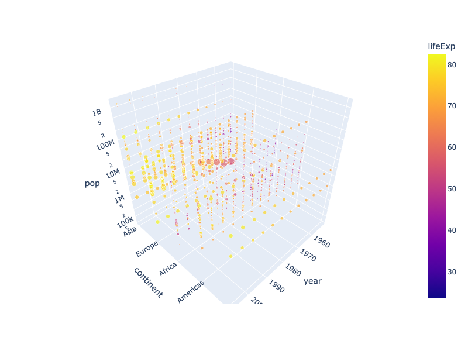
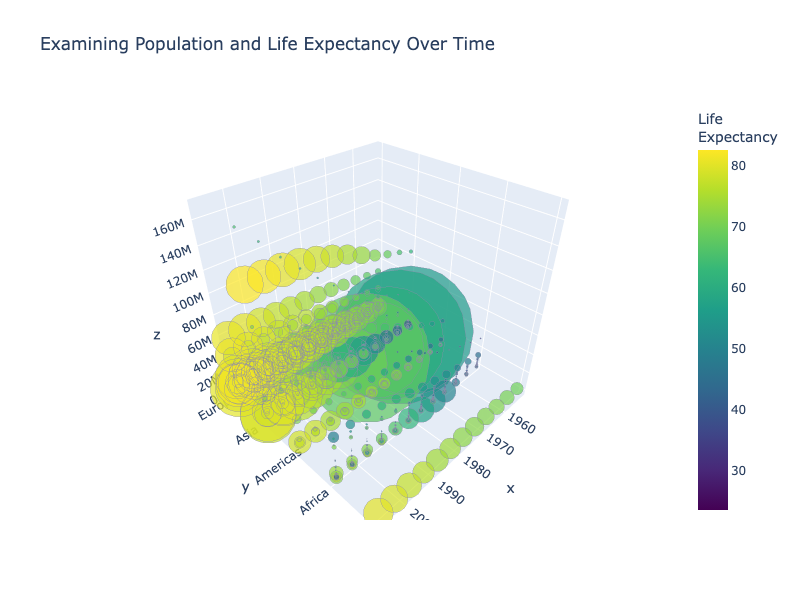
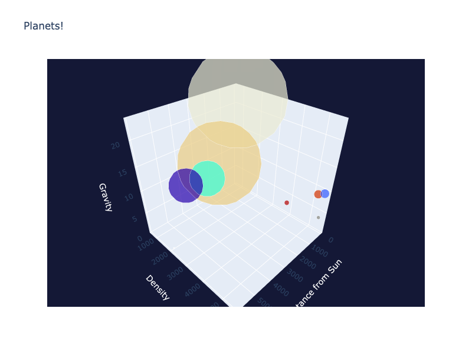
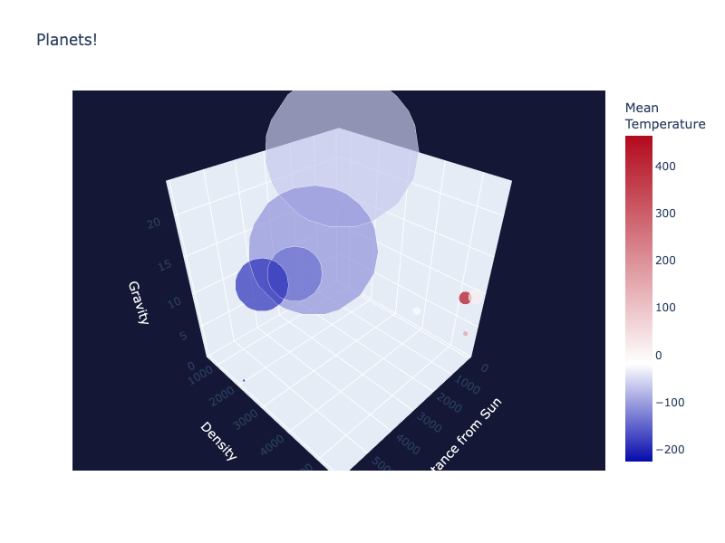

---
jupyter:
  jupytext:
    notebook_metadata_filter: all
    text_representation:
      extension: .md
      format_name: markdown
      format_version: '1.3'
      jupytext_version: 1.16.4
  kernelspec:
    display_name: Python 3 (ipykernel)
    language: python
    name: python3
  language_info:
    codemirror_mode:
      name: ipython
      version: 3
    file_extension: .py
    mimetype: text/x-python
    name: python
    nbconvert_exporter: python
    pygments_lexer: ipython3
    version: 3.11.10
  plotly:
    description: How to make 3D Bubble Charts in Python with Plotly. Three examples
      of 3D Bubble Charts.
    display_as: 3d_charts
    language: python
    layout: base
    name: 3D Bubble Charts
    order: 6
    page_type: u-guide
    permalink: python/3d-bubble-charts/
    thumbnail: thumbnail/3dbubble.jpg
---

### 3d Bubble chart with Plotly Express

```python
import plotly.express as px
import numpy as np
df = px.data.gapminder()
fig = px.scatter_3d(df, x='year', y='continent', z='pop', size='gdpPercap', color='lifeExp',
                    hover_data=['country'])
fig.update_layout(scene_zaxis_type="log")
fig.show()
```



**Interactive Plot:**

<div>                        <script type="text/javascript">window.PlotlyConfig = {MathJaxConfig: 'local'};</script>
        <script charset="utf-8" src="https://cdn.plot.ly/plotly-3.1.0.min.js" integrity="sha256-Ei4740bWZhaUTQuD6q9yQlgVCMPBz6CZWhevDYPv93A=" crossorigin="anonymous"></script>                <div id="plotly-div-1" class="plotly-graph-div" style="height:100%; width:100%;"></div>            <script type="text/javascript">                window.PLOTLYENV=window.PLOTLYENV || {};                                if (document.getElementById("plotly-div-1")) {                    Plotly.newPlot(                        "plotly-div-1",                        [{"customdata":[["Afghanistan"],["Afghanistan"],["Afghanistan"],["Afghanistan"],["Afghanistan"],["Afghanistan"],["Afghanistan"],["Afghanistan"],["Afghanistan"],["Afghanistan"],["Afghanistan"],["Afghanistan"],["Albania"],["Albania"],["Albania"],["Albania"],["Albania"],["Albania"],["Albania"],["Albania"],["Albania"],["Albania"],["Albania"],["Albania"],["Algeria"],["Algeria"],["Algeria"],["Algeria"],["Algeria"],["Algeria"],["Algeria"],["Algeria"],["Algeria"],["Algeria"],["Algeria"],["Algeria"],["Angola"],["Angola"],["Angola"],["Angola"],["Angola"],["Angola"],["Angola"],["Angola"],["Angola"],["Angola"],["Angola"],["Angola"],["Argentina"],["Argentina"],["Argentina"],["Argentina"],["Argentina"],["Argentina"],["Argentina"],["Argentina"],["Argentina"],["Argentina"],["Argentina"],["Argentina"],["Australia"],["Australia"],["Australia"],["Australia"],["Australia"],["Australia"],["Australia"],["Australia"],["Australia"],["Australia"],["Australia"],["Australia"],["Austria"],["Austria"],["Austria"],["Austria"],["Austria"],["Austria"],["Austria"],["Austria"],["Austria"],["Austria"],["Austria"],["Austria"],["Bahrain"],["Bahrain"],["Bahrain"],["Bahrain"],["Bahrain"],["Bahrain"],["Bahrain"],["Bahrain"],["Bahrain"],["Bahrain"],["Bahrain"],["Bahrain"],["Bangladesh"],["Bangladesh"],["Bangladesh"],["Bangladesh"],["Bangladesh"],["Bangladesh"],["Bangladesh"],["Bangladesh"],["Bangladesh"],["Bangladesh"],["Bangladesh"],["Bangladesh"],["Belgium"],["Belgium"],["Belgium"],["Belgium"],["Belgium"],["Belgium"],["Belgium"],["Belgium"],["Belgium"],["Belgium"],["Belgium"],["Belgium"],["Benin"],["Benin"],["Benin"],["Benin"],["Benin"],["Benin"],["Benin"],["Benin"],["Benin"],["Benin"],["Benin"],["Benin"],["Bolivia"],["Bolivia"],["Bolivia"],["Bolivia"],["Bolivia"],["Bolivia"],["Bolivia"],["Bolivia"],["Bolivia"],["Bolivia"],["Bolivia"],["Bolivia"],["Bosnia and Herzegovina"],["Bosnia and Herzegovina"],["Bosnia and Herzegovina"],["Bosnia and Herzegovina"],["Bosnia and Herzegovina"],["Bosnia and Herzegovina"],["Bosnia and Herzegovina"],["Bosnia and Herzegovina"],["Bosnia and Herzegovina"],["Bosnia and Herzegovina"],["Bosnia and Herzegovina"],["Bosnia and Herzegovina"],["Botswana"],["Botswana"],["Botswana"],["Botswana"],["Botswana"],["Botswana"],["Botswana"],["Botswana"],["Botswana"],["Botswana"],["Botswana"],["Botswana"],["Brazil"],["Brazil"],["Brazil"],["Brazil"],["Brazil"],["Brazil"],["Brazil"],["Brazil"],["Brazil"],["Brazil"],["Brazil"],["Brazil"],["Bulgaria"],["Bulgaria"],["Bulgaria"],["Bulgaria"],["Bulgaria"],["Bulgaria"],["Bulgaria"],["Bulgaria"],["Bulgaria"],["Bulgaria"],["Bulgaria"],["Bulgaria"],["Burkina Faso"],["Burkina Faso"],["Burkina Faso"],["Burkina Faso"],["Burkina Faso"],["Burkina Faso"],["Burkina Faso"],["Burkina Faso"],["Burkina Faso"],["Burkina Faso"],["Burkina Faso"],["Burkina Faso"],["Burundi"],["Burundi"],["Burundi"],["Burundi"],["Burundi"],["Burundi"],["Burundi"],["Burundi"],["Burundi"],["Burundi"],["Burundi"],["Burundi"],["Cambodia"],["Cambodia"],["Cambodia"],["Cambodia"],["Cambodia"],["Cambodia"],["Cambodia"],["Cambodia"],["Cambodia"],["Cambodia"],["Cambodia"],["Cambodia"],["Cameroon"],["Cameroon"],["Cameroon"],["Cameroon"],["Cameroon"],["Cameroon"],["Cameroon"],["Cameroon"],["Cameroon"],["Cameroon"],["Cameroon"],["Cameroon"],["Canada"],["Canada"],["Canada"],["Canada"],["Canada"],["Canada"],["Canada"],["Canada"],["Canada"],["Canada"],["Canada"],["Canada"],["Central African Republic"],["Central African Republic"],["Central African Republic"],["Central African Republic"],["Central African Republic"],["Central African Republic"],["Central African Republic"],["Central African Republic"],["Central African Republic"],["Central African Republic"],["Central African Republic"],["Central African Republic"],["Chad"],["Chad"],["Chad"],["Chad"],["Chad"],["Chad"],["Chad"],["Chad"],["Chad"],["Chad"],["Chad"],["Chad"],["Chile"],["Chile"],["Chile"],["Chile"],["Chile"],["Chile"],["Chile"],["Chile"],["Chile"],["Chile"],["Chile"],["Chile"],["China"],["China"],["China"],["China"],["China"],["China"],["China"],["China"],["China"],["China"],["China"],["China"],["Colombia"],["Colombia"],["Colombia"],["Colombia"],["Colombia"],["Colombia"],["Colombia"],["Colombia"],["Colombia"],["Colombia"],["Colombia"],["Colombia"],["Comoros"],["Comoros"],["Comoros"],["Comoros"],["Comoros"],["Comoros"],["Comoros"],["Comoros"],["Comoros"],["Comoros"],["Comoros"],["Comoros"],["Congo, Dem. Rep."],["Congo, Dem. Rep."],["Congo, Dem. Rep."],["Congo, Dem. Rep."],["Congo, Dem. Rep."],["Congo, Dem. Rep."],["Congo, Dem. Rep."],["Congo, Dem. Rep."],["Congo, Dem. Rep."],["Congo, Dem. Rep."],["Congo, Dem. Rep."],["Congo, Dem. Rep."],["Congo, Rep."],["Congo, Rep."],["Congo, Rep."],["Congo, Rep."],["Congo, Rep."],["Congo, Rep."],["Congo, Rep."],["Congo, Rep."],["Congo, Rep."],["Congo, Rep."],["Congo, Rep."],["Congo, Rep."],["Costa Rica"],["Costa Rica"],["Costa Rica"],["Costa Rica"],["Costa Rica"],["Costa Rica"],["Costa Rica"],["Costa Rica"],["Costa Rica"],["Costa Rica"],["Costa Rica"],["Costa Rica"],["Cote d'Ivoire"],["Cote d'Ivoire"],["Cote d'Ivoire"],["Cote d'Ivoire"],["Cote d'Ivoire"],["Cote d'Ivoire"],["Cote d'Ivoire"],["Cote d'Ivoire"],["Cote d'Ivoire"],["Cote d'Ivoire"],["Cote d'Ivoire"],["Cote d'Ivoire"],["Croatia"],["Croatia"],["Croatia"],["Croatia"],["Croatia"],["Croatia"],["Croatia"],["Croatia"],["Croatia"],["Croatia"],["Croatia"],["Croatia"],["Cuba"],["Cuba"],["Cuba"],["Cuba"],["Cuba"],["Cuba"],["Cuba"],["Cuba"],["Cuba"],["Cuba"],["Cuba"],["Cuba"],["Czech Republic"],["Czech Republic"],["Czech Republic"],["Czech Republic"],["Czech Republic"],["Czech Republic"],["Czech Republic"],["Czech Republic"],["Czech Republic"],["Czech Republic"],["Czech Republic"],["Czech Republic"],["Denmark"],["Denmark"],["Denmark"],["Denmark"],["Denmark"],["Denmark"],["Denmark"],["Denmark"],["Denmark"],["Denmark"],["Denmark"],["Denmark"],["Djibouti"],["Djibouti"],["Djibouti"],["Djibouti"],["Djibouti"],["Djibouti"],["Djibouti"],["Djibouti"],["Djibouti"],["Djibouti"],["Djibouti"],["Djibouti"],["Dominican Republic"],["Dominican Republic"],["Dominican Republic"],["Dominican Republic"],["Dominican Republic"],["Dominican Republic"],["Dominican Republic"],["Dominican Republic"],["Dominican Republic"],["Dominican Republic"],["Dominican Republic"],["Dominican Republic"],["Ecuador"],["Ecuador"],["Ecuador"],["Ecuador"],["Ecuador"],["Ecuador"],["Ecuador"],["Ecuador"],["Ecuador"],["Ecuador"],["Ecuador"],["Ecuador"],["Egypt"],["Egypt"],["Egypt"],["Egypt"],["Egypt"],["Egypt"],["Egypt"],["Egypt"],["Egypt"],["Egypt"],["Egypt"],["Egypt"],["El Salvador"],["El Salvador"],["El Salvador"],["El Salvador"],["El Salvador"],["El Salvador"],["El Salvador"],["El Salvador"],["El Salvador"],["El Salvador"],["El Salvador"],["El Salvador"],["Equatorial Guinea"],["Equatorial Guinea"],["Equatorial Guinea"],["Equatorial Guinea"],["Equatorial Guinea"],["Equatorial Guinea"],["Equatorial Guinea"],["Equatorial Guinea"],["Equatorial Guinea"],["Equatorial Guinea"],["Equatorial Guinea"],["Equatorial Guinea"],["Eritrea"],["Eritrea"],["Eritrea"],["Eritrea"],["Eritrea"],["Eritrea"],["Eritrea"],["Eritrea"],["Eritrea"],["Eritrea"],["Eritrea"],["Eritrea"],["Ethiopia"],["Ethiopia"],["Ethiopia"],["Ethiopia"],["Ethiopia"],["Ethiopia"],["Ethiopia"],["Ethiopia"],["Ethiopia"],["Ethiopia"],["Ethiopia"],["Ethiopia"],["Finland"],["Finland"],["Finland"],["Finland"],["Finland"],["Finland"],["Finland"],["Finland"],["Finland"],["Finland"],["Finland"],["Finland"],["France"],["France"],["France"],["France"],["France"],["France"],["France"],["France"],["France"],["France"],["France"],["France"],["Gabon"],["Gabon"],["Gabon"],["Gabon"],["Gabon"],["Gabon"],["Gabon"],["Gabon"],["Gabon"],["Gabon"],["Gabon"],["Gabon"],["Gambia"],["Gambia"],["Gambia"],["Gambia"],["Gambia"],["Gambia"],["Gambia"],["Gambia"],["Gambia"],["Gambia"],["Gambia"],["Gambia"],["Germany"],["Germany"],["Germany"],["Germany"],["Germany"],["Germany"],["Germany"],["Germany"],["Germany"],["Germany"],["Germany"],["Germany"],["Ghana"],["Ghana"],["Ghana"],["Ghana"],["Ghana"],["Ghana"],["Ghana"],["Ghana"],["Ghana"],["Ghana"],["Ghana"],["Ghana"],["Greece"],["Greece"],["Greece"],["Greece"],["Greece"],["Greece"],["Greece"],["Greece"],["Greece"],["Greece"],["Greece"],["Greece"],["Guatemala"],["Guatemala"],["Guatemala"],["Guatemala"],["Guatemala"],["Guatemala"],["Guatemala"],["Guatemala"],["Guatemala"],["Guatemala"],["Guatemala"],["Guatemala"],["Guinea"],["Guinea"],["Guinea"],["Guinea"],["Guinea"],["Guinea"],["Guinea"],["Guinea"],["Guinea"],["Guinea"],["Guinea"],["Guinea"],["Guinea-Bissau"],["Guinea-Bissau"],["Guinea-Bissau"],["Guinea-Bissau"],["Guinea-Bissau"],["Guinea-Bissau"],["Guinea-Bissau"],["Guinea-Bissau"],["Guinea-Bissau"],["Guinea-Bissau"],["Guinea-Bissau"],["Guinea-Bissau"],["Haiti"],["Haiti"],["Haiti"],["Haiti"],["Haiti"],["Haiti"],["Haiti"],["Haiti"],["Haiti"],["Haiti"],["Haiti"],["Haiti"],["Honduras"],["Honduras"],["Honduras"],["Honduras"],["Honduras"],["Honduras"],["Honduras"],["Honduras"],["Honduras"],["Honduras"],["Honduras"],["Honduras"],["Hong Kong, China"],["Hong Kong, China"],["Hong Kong, China"],["Hong Kong, China"],["Hong Kong, China"],["Hong Kong, China"],["Hong Kong, China"],["Hong Kong, China"],["Hong Kong, China"],["Hong Kong, China"],["Hong Kong, China"],["Hong Kong, China"],["Hungary"],["Hungary"],["Hungary"],["Hungary"],["Hungary"],["Hungary"],["Hungary"],["Hungary"],["Hungary"],["Hungary"],["Hungary"],["Hungary"],["Iceland"],["Iceland"],["Iceland"],["Iceland"],["Iceland"],["Iceland"],["Iceland"],["Iceland"],["Iceland"],["Iceland"],["Iceland"],["Iceland"],["India"],["India"],["India"],["India"],["India"],["India"],["India"],["India"],["India"],["India"],["India"],["India"],["Indonesia"],["Indonesia"],["Indonesia"],["Indonesia"],["Indonesia"],["Indonesia"],["Indonesia"],["Indonesia"],["Indonesia"],["Indonesia"],["Indonesia"],["Indonesia"],["Iran"],["Iran"],["Iran"],["Iran"],["Iran"],["Iran"],["Iran"],["Iran"],["Iran"],["Iran"],["Iran"],["Iran"],["Iraq"],["Iraq"],["Iraq"],["Iraq"],["Iraq"],["Iraq"],["Iraq"],["Iraq"],["Iraq"],["Iraq"],["Iraq"],["Iraq"],["Ireland"],["Ireland"],["Ireland"],["Ireland"],["Ireland"],["Ireland"],["Ireland"],["Ireland"],["Ireland"],["Ireland"],["Ireland"],["Ireland"],["Israel"],["Israel"],["Israel"],["Israel"],["Israel"],["Israel"],["Israel"],["Israel"],["Israel"],["Israel"],["Israel"],["Israel"],["Italy"],["Italy"],["Italy"],["Italy"],["Italy"],["Italy"],["Italy"],["Italy"],["Italy"],["Italy"],["Italy"],["Italy"],["Jamaica"],["Jamaica"],["Jamaica"],["Jamaica"],["Jamaica"],["Jamaica"],["Jamaica"],["Jamaica"],["Jamaica"],["Jamaica"],["Jamaica"],["Jamaica"],["Japan"],["Japan"],["Japan"],["Japan"],["Japan"],["Japan"],["Japan"],["Japan"],["Japan"],["Japan"],["Japan"],["Japan"],["Jordan"],["Jordan"],["Jordan"],["Jordan"],["Jordan"],["Jordan"],["Jordan"],["Jordan"],["Jordan"],["Jordan"],["Jordan"],["Jordan"],["Kenya"],["Kenya"],["Kenya"],["Kenya"],["Kenya"],["Kenya"],["Kenya"],["Kenya"],["Kenya"],["Kenya"],["Kenya"],["Kenya"],["Korea, Dem. Rep."],["Korea, Dem. Rep."],["Korea, Dem. Rep."],["Korea, Dem. Rep."],["Korea, Dem. Rep."],["Korea, Dem. Rep."],["Korea, Dem. Rep."],["Korea, Dem. Rep."],["Korea, Dem. Rep."],["Korea, Dem. Rep."],["Korea, Dem. Rep."],["Korea, Dem. Rep."],["Korea, Rep."],["Korea, Rep."],["Korea, Rep."],["Korea, Rep."],["Korea, Rep."],["Korea, Rep."],["Korea, Rep."],["Korea, Rep."],["Korea, Rep."],["Korea, Rep."],["Korea, Rep."],["Korea, Rep."],["Kuwait"],["Kuwait"],["Kuwait"],["Kuwait"],["Kuwait"],["Kuwait"],["Kuwait"],["Kuwait"],["Kuwait"],["Kuwait"],["Kuwait"],["Kuwait"],["Lebanon"],["Lebanon"],["Lebanon"],["Lebanon"],["Lebanon"],["Lebanon"],["Lebanon"],["Lebanon"],["Lebanon"],["Lebanon"],["Lebanon"],["Lebanon"],["Lesotho"],["Lesotho"],["Lesotho"],["Lesotho"],["Lesotho"],["Lesotho"],["Lesotho"],["Lesotho"],["Lesotho"],["Lesotho"],["Lesotho"],["Lesotho"],["Liberia"],["Liberia"],["Liberia"],["Liberia"],["Liberia"],["Liberia"],["Liberia"],["Liberia"],["Liberia"],["Liberia"],["Liberia"],["Liberia"],["Libya"],["Libya"],["Libya"],["Libya"],["Libya"],["Libya"],["Libya"],["Libya"],["Libya"],["Libya"],["Libya"],["Libya"],["Madagascar"],["Madagascar"],["Madagascar"],["Madagascar"],["Madagascar"],["Madagascar"],["Madagascar"],["Madagascar"],["Madagascar"],["Madagascar"],["Madagascar"],["Madagascar"],["Malawi"],["Malawi"],["Malawi"],["Malawi"],["Malawi"],["Malawi"],["Malawi"],["Malawi"],["Malawi"],["Malawi"],["Malawi"],["Malawi"],["Malaysia"],["Malaysia"],["Malaysia"],["Malaysia"],["Malaysia"],["Malaysia"],["Malaysia"],["Malaysia"],["Malaysia"],["Malaysia"],["Malaysia"],["Malaysia"],["Mali"],["Mali"],["Mali"],["Mali"],["Mali"],["Mali"],["Mali"],["Mali"],["Mali"],["Mali"],["Mali"],["Mali"],["Mauritania"],["Mauritania"],["Mauritania"],["Mauritania"],["Mauritania"],["Mauritania"],["Mauritania"],["Mauritania"],["Mauritania"],["Mauritania"],["Mauritania"],["Mauritania"],["Mauritius"],["Mauritius"],["Mauritius"],["Mauritius"],["Mauritius"],["Mauritius"],["Mauritius"],["Mauritius"],["Mauritius"],["Mauritius"],["Mauritius"],["Mauritius"],["Mexico"],["Mexico"],["Mexico"],["Mexico"],["Mexico"],["Mexico"],["Mexico"],["Mexico"],["Mexico"],["Mexico"],["Mexico"],["Mexico"],["Mongolia"],["Mongolia"],["Mongolia"],["Mongolia"],["Mongolia"],["Mongolia"],["Mongolia"],["Mongolia"],["Mongolia"],["Mongolia"],["Mongolia"],["Mongolia"],["Montenegro"],["Montenegro"],["Montenegro"],["Montenegro"],["Montenegro"],["Montenegro"],["Montenegro"],["Montenegro"],["Montenegro"],["Montenegro"],["Montenegro"],["Montenegro"],["Morocco"],["Morocco"],["Morocco"],["Morocco"],["Morocco"],["Morocco"],["Morocco"],["Morocco"],["Morocco"],["Morocco"],["Morocco"],["Morocco"],["Mozambique"],["Mozambique"],["Mozambique"],["Mozambique"],["Mozambique"],["Mozambique"],["Mozambique"],["Mozambique"],["Mozambique"],["Mozambique"],["Mozambique"],["Mozambique"],["Myanmar"],["Myanmar"],["Myanmar"],["Myanmar"],["Myanmar"],["Myanmar"],["Myanmar"],["Myanmar"],["Myanmar"],["Myanmar"],["Myanmar"],["Myanmar"],["Namibia"],["Namibia"],["Namibia"],["Namibia"],["Namibia"],["Namibia"],["Namibia"],["Namibia"],["Namibia"],["Namibia"],["Namibia"],["Namibia"],["Nepal"],["Nepal"],["Nepal"],["Nepal"],["Nepal"],["Nepal"],["Nepal"],["Nepal"],["Nepal"],["Nepal"],["Nepal"],["Nepal"],["Netherlands"],["Netherlands"],["Netherlands"],["Netherlands"],["Netherlands"],["Netherlands"],["Netherlands"],["Netherlands"],["Netherlands"],["Netherlands"],["Netherlands"],["Netherlands"],["New Zealand"],["New Zealand"],["New Zealand"],["New Zealand"],["New Zealand"],["New Zealand"],["New Zealand"],["New Zealand"],["New Zealand"],["New Zealand"],["New Zealand"],["New Zealand"],["Nicaragua"],["Nicaragua"],["Nicaragua"],["Nicaragua"],["Nicaragua"],["Nicaragua"],["Nicaragua"],["Nicaragua"],["Nicaragua"],["Nicaragua"],["Nicaragua"],["Nicaragua"],["Niger"],["Niger"],["Niger"],["Niger"],["Niger"],["Niger"],["Niger"],["Niger"],["Niger"],["Niger"],["Niger"],["Niger"],["Nigeria"],["Nigeria"],["Nigeria"],["Nigeria"],["Nigeria"],["Nigeria"],["Nigeria"],["Nigeria"],["Nigeria"],["Nigeria"],["Nigeria"],["Nigeria"],["Norway"],["Norway"],["Norway"],["Norway"],["Norway"],["Norway"],["Norway"],["Norway"],["Norway"],["Norway"],["Norway"],["Norway"],["Oman"],["Oman"],["Oman"],["Oman"],["Oman"],["Oman"],["Oman"],["Oman"],["Oman"],["Oman"],["Oman"],["Oman"],["Pakistan"],["Pakistan"],["Pakistan"],["Pakistan"],["Pakistan"],["Pakistan"],["Pakistan"],["Pakistan"],["Pakistan"],["Pakistan"],["Pakistan"],["Pakistan"],["Panama"],["Panama"],["Panama"],["Panama"],["Panama"],["Panama"],["Panama"],["Panama"],["Panama"],["Panama"],["Panama"],["Panama"],["Paraguay"],["Paraguay"],["Paraguay"],["Paraguay"],["Paraguay"],["Paraguay"],["Paraguay"],["Paraguay"],["Paraguay"],["Paraguay"],["Paraguay"],["Paraguay"],["Peru"],["Peru"],["Peru"],["Peru"],["Peru"],["Peru"],["Peru"],["Peru"],["Peru"],["Peru"],["Peru"],["Peru"],["Philippines"],["Philippines"],["Philippines"],["Philippines"],["Philippines"],["Philippines"],["Philippines"],["Philippines"],["Philippines"],["Philippines"],["Philippines"],["Philippines"],["Poland"],["Poland"],["Poland"],["Poland"],["Poland"],["Poland"],["Poland"],["Poland"],["Poland"],["Poland"],["Poland"],["Poland"],["Portugal"],["Portugal"],["Portugal"],["Portugal"],["Portugal"],["Portugal"],["Portugal"],["Portugal"],["Portugal"],["Portugal"],["Portugal"],["Portugal"],["Puerto Rico"],["Puerto Rico"],["Puerto Rico"],["Puerto Rico"],["Puerto Rico"],["Puerto Rico"],["Puerto Rico"],["Puerto Rico"],["Puerto Rico"],["Puerto Rico"],["Puerto Rico"],["Puerto Rico"],["Reunion"],["Reunion"],["Reunion"],["Reunion"],["Reunion"],["Reunion"],["Reunion"],["Reunion"],["Reunion"],["Reunion"],["Reunion"],["Reunion"],["Romania"],["Romania"],["Romania"],["Romania"],["Romania"],["Romania"],["Romania"],["Romania"],["Romania"],["Romania"],["Romania"],["Romania"],["Rwanda"],["Rwanda"],["Rwanda"],["Rwanda"],["Rwanda"],["Rwanda"],["Rwanda"],["Rwanda"],["Rwanda"],["Rwanda"],["Rwanda"],["Rwanda"],["Sao Tome and Principe"],["Sao Tome and Principe"],["Sao Tome and Principe"],["Sao Tome and Principe"],["Sao Tome and Principe"],["Sao Tome and Principe"],["Sao Tome and Principe"],["Sao Tome and Principe"],["Sao Tome and Principe"],["Sao Tome and Principe"],["Sao Tome and Principe"],["Sao Tome and Principe"],["Saudi Arabia"],["Saudi Arabia"],["Saudi Arabia"],["Saudi Arabia"],["Saudi Arabia"],["Saudi Arabia"],["Saudi Arabia"],["Saudi Arabia"],["Saudi Arabia"],["Saudi Arabia"],["Saudi Arabia"],["Saudi Arabia"],["Senegal"],["Senegal"],["Senegal"],["Senegal"],["Senegal"],["Senegal"],["Senegal"],["Senegal"],["Senegal"],["Senegal"],["Senegal"],["Senegal"],["Serbia"],["Serbia"],["Serbia"],["Serbia"],["Serbia"],["Serbia"],["Serbia"],["Serbia"],["Serbia"],["Serbia"],["Serbia"],["Serbia"],["Sierra Leone"],["Sierra Leone"],["Sierra Leone"],["Sierra Leone"],["Sierra Leone"],["Sierra Leone"],["Sierra Leone"],["Sierra Leone"],["Sierra Leone"],["Sierra Leone"],["Sierra Leone"],["Sierra Leone"],["Singapore"],["Singapore"],["Singapore"],["Singapore"],["Singapore"],["Singapore"],["Singapore"],["Singapore"],["Singapore"],["Singapore"],["Singapore"],["Singapore"],["Slovak Republic"],["Slovak Republic"],["Slovak Republic"],["Slovak Republic"],["Slovak Republic"],["Slovak Republic"],["Slovak Republic"],["Slovak Republic"],["Slovak Republic"],["Slovak Republic"],["Slovak Republic"],["Slovak Republic"],["Slovenia"],["Slovenia"],["Slovenia"],["Slovenia"],["Slovenia"],["Slovenia"],["Slovenia"],["Slovenia"],["Slovenia"],["Slovenia"],["Slovenia"],["Slovenia"],["Somalia"],["Somalia"],["Somalia"],["Somalia"],["Somalia"],["Somalia"],["Somalia"],["Somalia"],["Somalia"],["Somalia"],["Somalia"],["Somalia"],["South Africa"],["South Africa"],["South Africa"],["South Africa"],["South Africa"],["South Africa"],["South Africa"],["South Africa"],["South Africa"],["South Africa"],["South Africa"],["South Africa"],["Spain"],["Spain"],["Spain"],["Spain"],["Spain"],["Spain"],["Spain"],["Spain"],["Spain"],["Spain"],["Spain"],["Spain"],["Sri Lanka"],["Sri Lanka"],["Sri Lanka"],["Sri Lanka"],["Sri Lanka"],["Sri Lanka"],["Sri Lanka"],["Sri Lanka"],["Sri Lanka"],["Sri Lanka"],["Sri Lanka"],["Sri Lanka"],["Sudan"],["Sudan"],["Sudan"],["Sudan"],["Sudan"],["Sudan"],["Sudan"],["Sudan"],["Sudan"],["Sudan"],["Sudan"],["Sudan"],["Swaziland"],["Swaziland"],["Swaziland"],["Swaziland"],["Swaziland"],["Swaziland"],["Swaziland"],["Swaziland"],["Swaziland"],["Swaziland"],["Swaziland"],["Swaziland"],["Sweden"],["Sweden"],["Sweden"],["Sweden"],["Sweden"],["Sweden"],["Sweden"],["Sweden"],["Sweden"],["Sweden"],["Sweden"],["Sweden"],["Switzerland"],["Switzerland"],["Switzerland"],["Switzerland"],["Switzerland"],["Switzerland"],["Switzerland"],["Switzerland"],["Switzerland"],["Switzerland"],["Switzerland"],["Switzerland"],["Syria"],["Syria"],["Syria"],["Syria"],["Syria"],["Syria"],["Syria"],["Syria"],["Syria"],["Syria"],["Syria"],["Syria"],["Taiwan"],["Taiwan"],["Taiwan"],["Taiwan"],["Taiwan"],["Taiwan"],["Taiwan"],["Taiwan"],["Taiwan"],["Taiwan"],["Taiwan"],["Taiwan"],["Tanzania"],["Tanzania"],["Tanzania"],["Tanzania"],["Tanzania"],["Tanzania"],["Tanzania"],["Tanzania"],["Tanzania"],["Tanzania"],["Tanzania"],["Tanzania"],["Thailand"],["Thailand"],["Thailand"],["Thailand"],["Thailand"],["Thailand"],["Thailand"],["Thailand"],["Thailand"],["Thailand"],["Thailand"],["Thailand"],["Togo"],["Togo"],["Togo"],["Togo"],["Togo"],["Togo"],["Togo"],["Togo"],["Togo"],["Togo"],["Togo"],["Togo"],["Trinidad and Tobago"],["Trinidad and Tobago"],["Trinidad and Tobago"],["Trinidad and Tobago"],["Trinidad and Tobago"],["Trinidad and Tobago"],["Trinidad and Tobago"],["Trinidad and Tobago"],["Trinidad and Tobago"],["Trinidad and Tobago"],["Trinidad and Tobago"],["Trinidad and Tobago"],["Tunisia"],["Tunisia"],["Tunisia"],["Tunisia"],["Tunisia"],["Tunisia"],["Tunisia"],["Tunisia"],["Tunisia"],["Tunisia"],["Tunisia"],["Tunisia"],["Turkey"],["Turkey"],["Turkey"],["Turkey"],["Turkey"],["Turkey"],["Turkey"],["Turkey"],["Turkey"],["Turkey"],["Turkey"],["Turkey"],["Uganda"],["Uganda"],["Uganda"],["Uganda"],["Uganda"],["Uganda"],["Uganda"],["Uganda"],["Uganda"],["Uganda"],["Uganda"],["Uganda"],["United Kingdom"],["United Kingdom"],["United Kingdom"],["United Kingdom"],["United Kingdom"],["United Kingdom"],["United Kingdom"],["United Kingdom"],["United Kingdom"],["United Kingdom"],["United Kingdom"],["United Kingdom"],["United States"],["United States"],["United States"],["United States"],["United States"],["United States"],["United States"],["United States"],["United States"],["United States"],["United States"],["United States"],["Uruguay"],["Uruguay"],["Uruguay"],["Uruguay"],["Uruguay"],["Uruguay"],["Uruguay"],["Uruguay"],["Uruguay"],["Uruguay"],["Uruguay"],["Uruguay"],["Venezuela"],["Venezuela"],["Venezuela"],["Venezuela"],["Venezuela"],["Venezuela"],["Venezuela"],["Venezuela"],["Venezuela"],["Venezuela"],["Venezuela"],["Venezuela"],["Vietnam"],["Vietnam"],["Vietnam"],["Vietnam"],["Vietnam"],["Vietnam"],["Vietnam"],["Vietnam"],["Vietnam"],["Vietnam"],["Vietnam"],["Vietnam"],["West Bank and Gaza"],["West Bank and Gaza"],["West Bank and Gaza"],["West Bank and Gaza"],["West Bank and Gaza"],["West Bank and Gaza"],["West Bank and Gaza"],["West Bank and Gaza"],["West Bank and Gaza"],["West Bank and Gaza"],["West Bank and Gaza"],["West Bank and Gaza"],["Yemen, Rep."],["Yemen, Rep."],["Yemen, Rep."],["Yemen, Rep."],["Yemen, Rep."],["Yemen, Rep."],["Yemen, Rep."],["Yemen, Rep."],["Yemen, Rep."],["Yemen, Rep."],["Yemen, Rep."],["Yemen, Rep."],["Zambia"],["Zambia"],["Zambia"],["Zambia"],["Zambia"],["Zambia"],["Zambia"],["Zambia"],["Zambia"],["Zambia"],["Zambia"],["Zambia"],["Zimbabwe"],["Zimbabwe"],["Zimbabwe"],["Zimbabwe"],["Zimbabwe"],["Zimbabwe"],["Zimbabwe"],["Zimbabwe"],["Zimbabwe"],["Zimbabwe"],["Zimbabwe"],["Zimbabwe"]],"hovertemplate":"year=%{x}\u003cbr\u003econtinent=%{y}\u003cbr\u003epop=%{z}\u003cbr\u003egdpPercap=%{marker.size}\u003cbr\u003ecountry=%{customdata[0]}\u003cbr\u003elifeExp=%{marker.color}\u003cextra\u003e\u003c\u002fextra\u003e","legendgroup":"","marker":{"color":{"dtype":"f8","bdata":"kxgEVg7NPECiRbbz\u002fVQ+QKwcWmQ7\u002fz9Aw\u002fUoXI8CQUAlBoGVQwtCQPLSTWIQOENAWmQ730\u002ftQ0Dwp8ZLN2lEQIPAyqFF1kRAjWzn+6nhRECNl24SgxBFQESLbOf76UVAPQrXo3CdS0CkcD0K16NNQBSuR+F6NFBArkfhehSOUEBcj8L1KOxQQOxRuB6FO1FAexSuR+GaUUAAAAAAAABSQHe+nxov5VFAzczMzMw8UkCNbOf7qelSQFCNl24SG1NAYOXQItuJRUBI4XoUrtdGQBBYObTIJkhAarx0kxi0SUD8qfHSTUJLQG8Sg8DKAU1AyXa+nxqvTkBBYOXQInNQQFYOLbKd71BAfT81XrpJUUBWDi2ynb9RQCUGgZVDE1JApHA9CtcDPkA5tMh2vv8\u002fQAAAAAAAAEFArkfhehT+QUAQWDm0yPZCQOf7qfHSvUNAf2q8dJP4Q0CHFtnO9\u002fNDQIlBYOXQUkRAJQaBlUN7RECq8dJNYoBEQCGwcmiRXUVArkfhehQ+T0Coxks3iRlQQAwCK4cWSVBAf2q8dJNoUEBcj8L1KMRQQBFYObTIHlFAPzVeukl8UUCoxks3ibFRQGQ730+N91FAmpmZmZlRUkD2KFyPwpVSQBSuR+F61FJASOF6FK5HUUCF61G4HpVRQOxRuB6Fu1FAZmZmZmbGUUDsUbgehftRQI\u002fC9ShcX1JAj8L1KFyvUkAUrkfhehRTQKRwPQrXY1NAhetRuB61U0BI4XoUrhdUQNejcD0KT1RAMzMzMzOzUEAfhetRuN5QQMP1KFyPYlFAKVyPwvWIUUC4HoXrUahRQHsUrkfhClJA7FG4HoVLUkBcj8L1KLxSQMP1KFyPAlNAcT0K16NgU0AfhetRuL5TQJMYBFYO9VNA1HjpJjF4SUDRItv5fupKQKAaL90kdkxAoBov3ST2TUBmZmZmZqZPQMuhRbbzZVBAFtnO91NDUUAAAAAAALBRQFg5tMh2JlJAMzMzMzN7UkB7FK5H4bJSQHE9Ctej6FJAy6FFtvO9QkAGgZVDi6xDQM\u002f3U+Olm0RARIts5\u002fu5RUDHSzeJQaBGQKAaL90kdkdA\u002fdR46SYBSUBGtvP91GhKQPyp8dJNAkxA2\u002fl+ary0TUCNbOf7qQFPQIcW2c73A1BAAAAAAAAAUUCPwvUoXE9RQAAAAAAAkFFAXI\u002fC9Si8UUBcj8L1KNxRQDMzMzMzM1JA7FG4HoV7UkBmZmZmZtZSQD0K16NwHVNAUrgehethU0AUrkfhepRTQE5iEFg53FNABoGVQ4scQ0Dn+6nx0i1EQMl2vp8aT0VA4XoUrkdxRkBvEoPAyoFHQLgehetRmEhAwcqhRbZzSUBCYOXQIitKQBKDwMqh9UpA+n5qvHRjS0CJFtnO9zNLQHe+nxovXUxAokW28\u002f00REBSuB6F6\u002fFEQBBYObTItkVAarx0kxiERkAIrBxaZFtHQG3n+6nxAklAy6FFtvPtSkDlpZvEIKBMQNEi2\u002fl++k1AZmZmZmYGT0AbL90kBvFPQPp+arx0Y1BAKVyPwvXoSkCamZmZmTlNQNejcD0K905Aw\u002fUoXI8yUEDNzMzMzNxQQNejcD0Kd1FAXI\u002fC9SisUUApXI\u002fC9chRQAisHFpkC1JAVg4tsp1PUkD2KFyPwoVSQEoMAiuHtlJAVg4tsp3PR0DJdr6fGs9IQMP1KFyPwklAoBov3SSmSkBQjZduEgNMQEa28\u002f3UqE1Ay6FFtvO9TkBWDi2ync9PQI\u002fC9ShcX09AukkMAitHSkD91HjpJlFHQHe+nxovXUlATDeJQWB1SUAUrkfheqRKQIXrUbge1UtAN4lBYOXQTECNl24Sg8BNQDvfT42Xvk5AYLpJDAKrT0CF61G4Hk1QQM\u002f3U+Olw1BARrbz\u002fdRYUUCq8dJNYsBRQClcj8L1GFJAzczMzMzMTUDXo3A9CqdQQHE9CtejYFFAexSuR+GaUUCamZmZmblRQKRwPQrXs1FAhetRuB7FUUD2KFyPwtVRQFyPwvUozFFAFK5H4XqUUUApXI\u002fC9QhSQLgehetRQFJAmpmZmZn5P0CHFtnO93NBQNV46SYx6EJA8KfGSzdZREDP91PjpctFQKjGSzeJEUdAVg4tsp0PSECe76fGS8dIQOF6FK5HIUlAtvP91HgpSUAzMzMzM1NJQPYoXI\u002fCJUpAhxbZzveDQ0BOYhBYOUREQPYoXI\u002fCBUVAoBov3STGRUCe76fGSwdGQBSuR+F69EZAPzVeukm8R0BgukkMAhtIQJHtfD81XkZAfT81XrqpRkCuR+F6FK5HQArXo3A9ykhATDeJQWC1Q0ADK4cW2a5EQIXrUbgetUVAhetRuB61RkB\u002farx0kyhEQLgehetROD9A0SLb+X56SUCiRbbz\u002ffRKQBBYObTI5ktAMQisHFpETEDHSzeJQWBMQAaBlUOL3E1Abef7qfFCQ0AQWDm0yDZEQPyp8dJNUkVAg8DKoUVmRkCDwMqhRYZHQD0K16NwrUhAYLpJDAJ7SkCuR+F6FH5LQNR46SYxKEtAtvP91HgZSkAhsHJoke1IQNejcD0KN0lAAAAAAAAwUUA9CtejcH1RQDMzMzMz01FAuB6F61EIUkC4HoXrUThSQD0K16NwjVJAcT0K16PwUkDXo3A9CjdTQM3MzMzMfFNA16NwPQqnU0DhehSuR\u002fFTQG8Sg8DKKVRAJQaBlUO7QUAIrBxaZLtCQM3MzMzMvENAd76fGi+9REDRItv5frpFQDMzMzMzY0dA9ihcj8IlSECuR+F6FD5JQKabxCCwskhAnMQgsHIIR0CBlUOLbKdFQAMrhxbZXkZAsp3vp8YLQ0BU46WbxPBDQM\u002f3U+Ol20RAsXJoke3MRUBGtvP91MhGQBsv3SQGsUdAGQRWDi3CSEBKDAIrh4ZJQOkmMQis3ElA001iEFjJSUAzMzMzM0NJQBfZzvdTU0lAj8L1KFxfS0C28\u002f3UeAlMQIPAyqFF9kxAbef7qfFCTkCcxCCwcrhPQBbZzvdTw1BAXI\u002fC9SikUUBzaJHtfB9SQPLSTWIQiFJATmIQWDn0UkDXo3A9CndTQAisHFpko1NAAAAAAAAARkD1Zz9SREZJQOPCgZAsQEZA\u002f+xHisgwTUABE7h1N49PQLK61XPS+09AmpmZmZlhUECoxks3idFQQFyPwvUoLFFAJQaBlUObUUBvEoPAygFSQC\u002fdJAaBPVJA\u002fKnx0k1SSUDJdr6fGo9LQFg5tMh27kxAJQaBlUP7TUA7tMh2vs9OQEJg5dAi609AbxKDwMqpUED+1HjpJvFQQG3n+6nxGlFAeekmMQiUUUDP91PjpetRQDeJQWDlOFJA7FG4HoVbREB7FK5H4TpFQLKd76fGO0ZAI9v5fmo8R0BGtvP91HhIQNR46SYxeElAgZVDi2x3SkBKDAIrh3ZLQNR46SYx+ExAFK5H4XpUTkDpJjEIrHxPQH0\u002fNV66SVBA\u002fKnx0k2SQ0D6fmq8dFNEQFYOLbKdD0VAukkMAisHRkA730+Nl\u002f5GQPT91Hjp5kdAMQisHFrkR0Db+X5qvLRHQKAaL90kxkZAQmDl0CJLRUDP91PjpXtGQEJg5dAiO0dAke18PzUORUAQWDm0yIZGQEjhehSuN0hAhetRuB4FSkBqvHSTGHRLQAAAAAAA0EtAKVyPwvVYTEBcj8L1KLxMQIGVQ4tsN0xAQmDl0CJ7SkBcj8L1KHxKQPCnxks3qUtA7nw\u002fNV6aTEAX2c73UwNOQLKd76fGa09AQWDl0CJbUEB0kxgEVvZQQAAAAAAAsFFAzczMzMxcUkDjpZvEILBSQBSDwMqh7VJAcT0K16NQU0AdWmQ734dTQDVeukkMslNAkxgEVg49REB56SYxCDxFQNejcD0Kd0ZAzczMzMysR0BKDAIrh+ZIQB1aZDvfL0pA5\u002fup8dL9SkCkcD0K11NLQBKDwMqhBUpAAyuHFtn+R0DRItv5fmpHQESLbOf7KUhAexSuR+GaTkDhehSuRzFQQLgehetRyFBAAAAAAAAgUUDXo3A9CmdRQClcj8L1qFFAPQrXo3CdUUDhehSuR+FRQH0\u002fNV66IVJA7FG4HoVrUkDy0k1iELhSQB1aZDvf71JA2s73U+O1TUCamZmZmSlPQDq0yHa+T1BAw\u002fUoXI8SUUCDwMqhRa5RQKjGSzeJKVJA2c73U+NtUkBAYOXQIotSQNEi2\u002fl+mlJAjWzn+6kJU0AnMQisHEpTQLbz\u002fdR4kVNASOF6FK63UEBSuB6F60FRQJqZmZmZeVFAuB6F61GYUUDD9Shcj5JRQD0K16NwrVFAPQrXo3C9UUCF61G4HuVRQJqZmZmZGVJAcT0K16OAUkBxPQrXo+BSQMl2vp8aH1NAUrgeheuxUUCkcD0K1\u002fNRQGZmZmZmFlJAPQrXo3A9UkCuR+F6FF5SQFyPwvUorFJAuB6F61GoUkAzMzMzM7NSQIXrUbge1VJA16NwPQoHU0DsUbgehUtTQGiR7Xw\u002flVNADi2yne9nQUBEi2zn+6lCQGQQWDm02ENAtvP91HgJRUADK4cW2S5GQN9PjZduQkdADi2yne9nSECF61G4HgVJQFpkO99PzUlAarx0kxiUSkA7tMh2vq9KQGiR7Xw\u002fZUtAEFg5tMj2RkBEi2zn++lIQJhuEoPAukpA5aWbxCBgTEBU46WbxNBNQL6fGi\u002fd5E5AkxgEVg7dT0Bt5\u002fup8YJQQGiR7Xw\u002fHVFAaJHtfD99UUCR7Xw\u002fNbZRQNejcD0KD1JABFYOLbItSEAhsHJoka1JQFK4HoXrUUtAEFg5tMhWTEDazvdT42VNQEjhehSup05A2c73U+MVUEARWDm0yM5QQKwcWmQ7Z1FAhxbZzvcTUkBQjZduEotSQFYOLbKdv1JA\u002fKnx0k3yREBGtvP91DhGQOXQItv5fkdAL90kBoGlSECoxks3iZFJQEa28\u002f3UqEpAVOOlm8QATEC8dJMYBOZNQIPAyqFF1k9A2c73U+PNUEDdJAaBlXNRQBSDwMqh1VFAqMZLN4mhRkApXI\u002fC9UhIQJ7vp8ZLJ0pAPQrXo3DtS0DRItv5fhpNQA4CK4cWWUxAWmQ7309NTEDByqFFtpNPQFCNl24Ss1BACtejcD1iUUDl0CLb+a5RQNV46SYx+FFABFYOLbI9QUDp+6nx0v1BQK5H4XoUvkJAdZMYBFZ+Q0A1XrpJDEJEQFCNl24SA0VA2\u002fl+arzURUCiRbbz\u002fdRGQPYoXI\u002fCxUdAj8L1KFwfSEAGgZVDi6xIQCYxCKwcyklAElg5tMj2QUC8dJMYBAZDQE5iEFg5FERA1HjpJjEYRUAZBFYOLRJGQBSuR+F6REZAUrgehevxRUBEi2zn+zlHQAMrhxbZ\u002fkhAqvHSTWKwSkAfhetRuJ5LQIXrUbgeBU1ARIts5\u002fsJQUBMN4lBYFVCQGQ730+NB0RAH4XrUbgORUBSuB6F68FFQOF6FK5HQUZAaJHtfD91RkBkO99PjVdHQM\u002f3U+OlC0hA+n5qvHSzSEDNzMzMzFxJQPCnxks3eUpAMzMzMzOjUECPwvUoXN9QQAAAAAAAMFFAhetRuB51UUBI4XoUrrdRQOF6FK5HIVJAMzMzMzOjUkCF61G4HrVSQM3MzMzM7FJAuB6F61FIU0BI4XoUrpdTQHnpJjEI1FNACtejcD3aUEDsUbgehTtRQHE9CtejoFFAMzMzMzPjUUC4HoXrURhSQIXrUbgedVJAKVyPwvW4UkD2KFyPwhVTQD0K16NwXVNAKVyPwvWoU0D2KFyPwuVTQDVeukkMKlRAqvHSTWKAQkAdWmQ7339DQDvfT42XPkRABoGVQ4tMRkC4HoXrUVhIQIXrUbgeZUpA1HjpJjFITEC4HoXrURhOQAMrhxbZrk5AYLpJDAI7TkDFILByaGFMQK5H4XoUXkxAAAAAAAAAPkC4HoXrUQhAQKabxCCw8kBABFYOLbLtQUCBlUOLbCdDQLKd76fG60RACtejcD3KRkBSuB6F66FIQN9PjZduUkpAke18PzXuS0Boke18PwVNQNNNYhBYuU1AAAAAAADgUEBmZmZmZkZRQDMzMzMzk1FAMzMzMzOzUUAAAAAAAMBRQAAAAAAAIFJAMzMzMzNzUkCR7Xw\u002fNbZSQBSuR+F6BFNA9ihcj8JVU0B7FK5H4apTQESLbOf72VNAUI2XbhKTRUDByqFFtmNGQGDl0CLbOUdA8KfGSzcJSEAAAAAAAPBIQFTjpZvE4ElArBxaZDvfSkBaZDvfT91LQOWlm8QgwExAukkMAitHTUBEi2zn+zlNQIlBYOXQAk5A16NwPQp3UEDXo3A9CvdQQHE9CtejYFFAAAAAAADAUUD2KFyPwhVSQOxRuB6Fa1JAj8L1KFzPUkB7FK5H4SpTQFK4HoXrQVNAVg4tsp13U0Cq8dJNYpBTQPT91Hjp3lNAbef7qfECRUAZBFYOLRJGQCYxCKwcekdAN166SQwCSUBYObTIdt5KQMHKoUW2A0xAqMZLN4kRTUBqvHSTGGROQDu0yHa+r09A+FPjpZuUUEA830+Nlz5RQH9qvHSTkFFAy6FFtvPNQECBlUOLbEdBQKrx0k1i4EFA8KfGSzeZQkCyne+nxmtDQKjGSzeJYURAN166SQxyRUAtsp3vp8ZGQH0\u002fNV66SUhACtejcD26SUBKDAIrh9ZKQDeJQWDlAExAAAAAAABAQEA830+Nl75AQFg5tMh2PkFA5dAi2\u002fm+QUCR7Xw\u002fNT5CQOxRuB6Fu0JAYOXQItupQ0CPwvUoXJ9EQDdeukkMokVAO7TIdr5vRkCNl24Sg8BGQI1s5\u002fupMUdAJzEIrBzKQkAMAiuHFllEQOxRuB6Fy0VAyXa+nxofR0BMN4lBYAVIQKAaL90k9khAYLpJDAK7SUDFILByaNFKQAisHFpki0tA2s73U+NVTECoxks3iRFNQGiR7Xw\u002fdU5A2\u002fl+arz0RECF61G4HlVGQGiR7Xw\u002fBUhAg8DKoUV2SUD91HjpJvFKQPp+arx0s0xAMQisHFp0TkBzaJHtfB9QQKjGSzeJmVBAGARWDi3qUEBcj8L1KCRRQOomMQisjFFAexSuR+F6TkAAAAAAADBQQJqZmZmZ6VBAAAAAAACAUUAAAAAAAABSQGZmZmZmZlJAzczMzMzcUkDNzMzMzAxTQFg5tMh2ZlNAAAAAAAAAVEBI4XoUrl9UQFpkO99PjVRAUrgehesBUEAK16NwPZpQQD0K16Nw\u002fVBAAAAAAABgUUBxPQrXo3BRQM3MzMzMfFFAKVyPwvVYUUCF61G4HmVRQHsUrkfhSlFAw\u002fUoXI\u002fCUUD2KFyPwiVSQBSDwMqhVVJAj8L1KFwfUkCuR+F6FF5SQOxRuB6Fa1JAH4XrUbhuUkA9CtejcJ1SQNejcD0KB1NAj8L1KFw\u002fU0AfhetRuE5TQOF6FK5HsVNAzczMzMy8U0AAAAAAACBUQJzEILBycFRAO7TIdr6vQkAdWmQ73x9EQD0K16NwzUVAZBBYObSYR0AX2c73U1NJQLTIdr6fGktAPzVeuklMTEAQWDm0yEZNQAaBlUOLHE5AUrgehevhTkCNl24Sg3BPQOomMQisLFBAlkOLbOe7QkAv3SQGgfVDQPyp8dJNQkVACKwcWmT7RkBEi2zn+5lIQGDl0CLbWUpAMQisHFoUTECoxks3iRFOQLpJDAIrV09AtMh2vp+CUEATg8DKoSVRQJqZmZmZqVFArBxaZDtvRkC6SQwCK5dHQJqZmZmZqUhAeekmMQg8SkDLoUW2851LQGDl0CLb2UxAj8L1KFzPTUCF61G4HoVPQHNoke18b1BAppvEILACUUC\u002fnxov3VxRQARWDi2yvVFAKVyPwvWoRkAOLbKd7zdIQNEi2\u002fl+uklAmG4Sg8A6S0CamZmZmXlMQL6fGi\u002fdNE5Avp8aL90ET0CJQWDl0EJQQGC6SQwCu01ALIcW2c5nTUDazvdT44VMQPYoXI\u002fCxU1ACtejcD26UECamZmZmTlRQMP1KFyPklFAhetRuB7FUUBSuB6F69FRQFK4HoXrAVJAZmZmZmZGUkDXo3A9CpdSQNnO91Pj3VJAK4cW2c4HU0AnMQisHHJTQHE9CtejuFNAKVyPwvVYUED2KFyPwvVQQClcj8L1WFFAAAAAAACwUUC4HoXrUehRQKRwPQrXQ1JAzczMzMycUkBmZmZmZuZSQOxRuB6FO1NA7qfGSzeRU0AGgZVDi+xTQEjhehSuL1RAXI\u002fC9Sh8UECkcD0K1\u002fNQQI\u002fC9ShcT1FApHA9CtfDUUBcj8L1KAxSQB+F61G4XlJAH4XrUbi+UkB7FK5H4RpTQFyPwvUoXFNAFK5H4Xq0U0CPwvUoXA9UQG3n+6nxIlRApHA9CtdDTUCuR+F6FE5PQNejcD0KZ1BAcT0K16PgUEAAAAAAAEBRQNejcD0Kh1FAPQrXo3DNUUDhehSuR\u002fFRQBsv3SQG8VFAVOOlm8QQUkBeukkMAgNSQD81XrpJJFJApHA9CteDT0AAAAAAAGBQQB+F61G4LlFA7FG4HoXbUUB7FK5H4VpSQLgehetR2FJA16NwPQpHU0B7FK5H4apTQNejcD0K11NAXI\u002fC9SgsVEAAAAAAAIBUQDvfT42XplRATmIQWDmURUASg8DKodVGQOWlm8QgEEhAjZduEoPQSUDdJAaBlUNMQP3UeOkmkU5AO99PjZfeT0BWDi2ynXdQQClcj8L1AFFAxCCwcmhxUUBGtvP91NBRQArXo3A9IlJAw\u002fUoXI8iRUAshxbZzldGQLbz\u002fdR4+UdAwcqhRbZTSUBkO99PjcdKQKRwPQrXE0xAN166SQxiTUAIrBxaZKtNQBSuR+F6pE1Aarx0kxg0S0Dl0CLb+X5JQK5H4XoUDktAukkMAisHSUDufD81XgpLQIkW2c73U0xAf2q8dJP4TUDn+6nx0v1PQBgEVg4tylBAZmZmZmZGUUDDILByaKlRQDzfT42XflFASgwCK4fuUEDtfD81XqpQQF66SQwC01BARIts5\u002fu5R0C6SQwCK1dKQEw3iUFgpUtAz\u002fdT46XbTEB1kxgEVk5PQBsv3SQGMVBAHVpkO9\u002fHUECkcD0K13NRQFYOLbKdD1JAwyCwcmipUkB7FK5H4UJTQB1aZDvfp1NAuB6F61HIS0BOYhBYOQRNQFyPwvUoPE5ADi2yne8nUEAhsHJoke1QQMuhRbbzVVFAsp3vp8bTUUBAYOXQIotSQFyPwvUozFJARIts5\u002fsJU0Bg5dAi2zlTQBSDwMqhZVNAEFg5tMj2S0A730+Nl75NQHnpJjEIDE9Aj8L1KFzvT0Bt5\u002fup8VpQQHSTGARWhlBA9P3UeOm+UEAlBoGVQ\u002ftQQKabxCCwUlFAKVyPwvWQUUBvEoPAysFRQGQ730+N\u002f1FAjWzn+6kRRUC8dJMYBIZGQFYOLbKd30dA5dAi2\u002fk+SEAZBFYOLeJIQLTIdr6fGkpARIts5\u002fuJS0DXo3A9CpdMQEjhehSu101AgZVDi2zHS0CWQ4ts50tGQLKd76fGS0VAPQrXo3A9Q0CR7Xw\u002fNb5DQMdLN4lBQERA+FPjpZvEREA730+Nl05FQG8Sg8DK4UVAkxgEVg5tRkD6fmq8dANHQC2yne+nZkRAPzVeukkcRUCq8dJNYuBFQBBYObTI1kZABoGVQ4tcRUCiRbbz\u002faRGQIGVQ4ts50dAkxgEVg4dSUBt5\u002fup8WJKQH9qvHSTuExApHA9CtcTT0Dl0CLb+Y5QQLgehetRMFFA7FG4HoXjUUC6SQwCKy9SQLByaJHtfFJAukkMAitXQkAfhetRuG5DQAaBlUOLbERAVOOlm8RwRUCxcmiR7WxGQFTjpZvEcEdAeekmMQh8SEDNzMzMzKxIQAisHFpkG0pAd76fGi99S0D4U+Olm6RMQGQQWDm0uE1AVOOlm8QgQkDRItv5fppCQBSuR+F6NENAdZMYBFa+Q0A3XrpJDOJEQBkEVg4t4kVAGQRWDi3SRkDRItv5frpHQPYoXI\u002fCtUhAj8L1KFy\u002fR0D91HjpJoFGQBBYObTIJkhAJQaBlUM7SECTGARWDg1KQHWTGARW3ktAc2iR7XyvTUDhehSuR4FPQKrx0k1iUFBAAAAAAAAAUUAAAAAAAGBRQDEIrBxarFFAeekmMQj8UUCJQWDl0EJSQIGVQ4tsj1JASOF6FK7XQECc76fGS6dBQCuHFtnOd0JAdZMYBFY+Q0CTGARWDv1DQAisHFpk20RAaJHtfD\u002f1RUA730+Nly5HQI1s5\u002fupMUhA3SQGgZXzSEBkEFg5tOhJQLKd76fGO0tAL90kBoFFREAlBoGVQytFQDu0yHa+H0ZAokW28\u002f0kR0AOLbKd7zdIQJMYBFYObUlA6SYxCKzMSkDD9ShcjxJMQLTIdr6fKk1A16NwPQo3TkBWDi2ynR9PQNEi2\u002fl+ClBAke18PzV+SUAIrBxaZAtNQHNoke18H05Anu+nxkvHTkBGtvP91HhPQOxRuB6FO1BAL90kBoGtUECPwvUoXC9RQEjhehSub1FAyXa+nxqvUUCTGARWDv1RQCUGgZVDM1JAokW28\u002f1kSUC4HoXrUZhLQIPAyqFFJk1ArkfhehQOTkCR7Xw\u002fNS5PQDVeukkMQlBAUrgehevZUEAdWmQ7319RQIXrUbge3VFAexSuR+FqUkB9PzVeurlSQBSuR+F6DFNArBxaZDsfRUA7tMh2vp9GQOWlm8QgIEhAqvHSTWKgSUCNl24Sg+BKQAMrhxbZvktAO99PjZe+TEAj2\u002fl+ahxOQKabxCCwok5AAAAAAADQT0AnMQisHEJQQAisHFpks1BAokW28\u002f2UTUDTTWIQWLlOQHe+nxov3U9ACKwcWmTLUEBkEFg5tKhRQE5iEFg5RFJAWDm0yHaGUkCPwvUoXLdSQKRwPQrX21JAFK5H4XrcUkASWDm0yH5SQJhuEoPAolJAO7TIdr5vRUCgGi\u002fdJLZGQIPAyqFF9kdAexSuR+EqSUB1kxgEVm5KQD0K16Nw3UtAMzMzMzPTTUAtsp3vp1ZPQP7UeOkmWVBACtejcD3qUECPwvUoXGdRQNEi2\u002fl+ylFA8KfGSzdJP0DByqFFtuNAQPhT46WbFEJAWDm0yHYOQ0BEi2zn+ylEQI\u002fC9ShcP0VA9ihcj8JlRUCR7Xw\u002fNW5FQDEIrBxaJEZAeekmMQgsR0AX2c73UwNGQNEi2\u002fl+CkVARrbz\u002fdQoQkCkcD0K1\u002fNEQOf7qfHSjUZAjZduEoOwSEApXI\u002fC9YhKQGQ730+NB0xAukkMAisHTUAIrBxaZCtNQClcj8L1qE1ARIts5\u002fspTkBOYhBYOfRNQEa28\u002f3UCE9AzczMzMzcRECxcmiR7ZxGQMUgsHJoMUhAMQisHFqUSUDl0CLb+e5KQA4tsp3vN0xAlkOLbOd7TUB7FK5H4WpOQB1aZDvf\u002f05AMQisHFp0TUBaZDvfT71JQIkW2c73c0pAarx0kxgUQkArhxbZztdCQPyp8dJNskNAI9v5fmq8REA\u002fNV66SfxFQDu0yHa+X0dAeekmMQjMSEDb+X5qvERKQJMYBFYO3UtASgwCK4e2TUDsUbgehatOQBSuR+F65E9AuB6F61EIUkCPwvUoXD9SQB+F61G4TlJAFK5H4Xp0UkAAAAAAAHBSQI\u002fC9Shcz1JAMzMzMzMDU0CF61G4HjVTQHsUrkfhWlNAUrgeheuBU0BSuB6F66FTQFTjpZvE8FNAKVyPwvVYUUBxPQrXo5BRQI\u002fC9Shcz1FA4XoUrkfhUUApXI\u002fC9fhRQK5H4XoUDlJA9ihcj8J1UkAUrkfhepRSQIXrUbgeFVNAMzMzMzNjU0DXo3A9CsdTQJMYBFYODVRA1HjpJjEoRUCe76fGS7dGQDeJQWDlUEhA\u002fdR46SbxSUAX2c73U5NLQFyPwvUovExAoBov3SSmTUAbL90kBgFPQMuhRbbzdVBAJQaBlUMbUUAv3SQGgbVRQKjGSzeJOVJARrbz\u002fdS4QkAGgZVDi0xDQHWTGARWvkNAyXa+nxoPREDZzvdT40VEQGiR7Xw\u002fpURABoGVQ4tMRUDXo3A9CkdGQDdeukkMskdA8tJNYhCoSUBzaJHtfD9LQOXQItv5bkxAtvP91HgpQkAtsp3vp+ZCQK5H4XoUrkNAhetRuB6FREAOAiuHFmlFQG8Sg8DKQUZAfT81XrrpRkDFILByaHFHQCPb+X5qvEdACKwcWmS7R0Dn+6nx0k1HQMuhRbbzbUdAexSuR+EqUkBcj8L1KFxSQK5H4XoUXlJAhetRuB6FUkD2KFyPwpVSQEjhehSu11JArkfhehT+UkApXI\u002fC9fhSQBSuR+F6VFNAFK5H4XqUU0AzMzMzM8NTQAaBlUOLDFRARIts5\u002fvJQkAK16NwPQpEQIXrUbgelUVAWDm0yHZ+R0D8qfHSTRJKQOXQItv5rkxAd76fGi9dT0Dl0CLb+e5QQPhT46WbzFFADi2yne8fUkAxCKwcWoxSQClcj8L16FJALIcW2c63RUCe76fGS8dGQPYoXI\u002fC1UdAZmZmZmbmSED0\u002fdR46fZJQC\u002fdJAaBBUtATmIQWDkUTECPwvUoXB9NQCUGgZVDa05AZBBYObToTkCuR+F6FM5PQPT91HjpXlBAnMQgsHKYS0B9PzVeuplNQH9qvHST6E5ABoGVQ4sEUEDo+6nx0o1QQN0kBoGVK1FAke18PzWeUUC28\u002f3UeOFRQCGwcmiRHVJArBxaZDtvUkAhsHJoka1SQOx8PzVe4lJAUI2XbhJTT0AOAiuHFplPQMl2vp8aF1BAv58aL908UEBcj8L1KHRQQDzfT42XllBADi2yne+3UEDVeOkmMdhQQGZmZmZmDlFAmpmZmZlZUUC4HoXrUbBRQOOlm8Qg8FFA+n5qvHTzRUCNbOf7qSFHQD81XrpJjEhAKVyPwvW4SUDTTWIQWLlLQPCnxks3OU1AiRbZzvezTkB\u002farx0kwhQQFpkO99PnVBAYxBYObQYUUBEi2zn+3lRQG3n+6nx2lFAx0s3iUHgR0CYbhKDwKpJQDeJQWDlYEtA\u002fKnx0k0yTEC4HoXrUQhNQEjhehSuB05A0SLb+X4KT0CMbOf7qQlQQFpkO99PnVBAarx0kxgkUUAIrBxaZJNRQHnpJjEI7FFASOF6FK6nTkDhehSuR3FQQClcj8L16FBA16NwPQpnUUBmZmZmZrZRQHsUrkfhqlFAFK5H4XrUUUAfhetRuL5RQI\u002fC9Shcv1FAAAAAAAAwUkB7FK5H4apSQHnpJjEI5FJAKVyPwvXoTUDhehSuR8FOQClcj8L1GFBAZmZmZmamUEBxPQrXo1BRQArXo3A9mlFA4XoUrkcxUkCkcD0K14NSQNejcD0Kt1JArkfhehT+UkDD9Shcj1JTQIPAyqFFhlNAUrgehesRUEDD9ShcjyJRQEjhehSuZ1FAZmZmZmbGUUAK16NwPQpSQFyPwvUoXFJAAAAAAABwUkC4HoXrUahSQPyp8dJNelJAppvEILC6UkBvEoPAynFTQDu0yHa+r1NA6SYxCKxcSkDsUbgehYtLQGiR7Xw\u002f1UxATDeJQWBFTkCoxks3iRFQQGq8dJMYxFBAcT0K16N4UUDfT42XbvpRQI\u002fC9ShcZ1JAwyCwcmixUkBWDi2yne9SQD81XrpJHFNAZmZmZmaGTkBmZmZmZgZQQDMzMzMzs1BAMzMzMzOzUEA9CtejcE1RQD0K16NwXVFACtejcD1qUUBSuB6F62FRQNejcD0KV1FArkfhehRuUUD4U+Olm9RRQFg5tMh2HlJAAAAAAAAAREAAAAAAAMBEQAAAAAAAgEVAzczMzMwMRkDNzMzMzExGQAAAAAAAgEZAlkOLbOcbR0DD9ShcjwJGQNNNYhBYmTdAQmDl0CILQkC+nxov3bRFQOXQItv5HkdAPzVeukk8R0ApXI\u002fC9XhIQPyp8dJN8klAZmZmZmY2S0A9CtejcD1MQGZmZmZmRk1AsXJoke0sTkB3vp8aL91OQOXQItv5Xk9AukkMAiunT0AhsHJokRVQQG8Sg8DKYVBAAAAAAADwQ0DJdr6fGm9FQKJFtvP99EZAF9nO91PzSEDFILByaPFKQLgehetRWE1AqMZLN4mBT0B7FK5H4ZJQQP7UeOkmMVFAJzEIrByiUUDy0k1iEOhRQH0\u002fNV66MVJA3SQGgZWjQkAnMQisHKpDQCYxCKwcukRA8tJNYhDIRUC4HoXrUehGQI2XbhKDcEhAjZduEoMwSkDfT42XbuJLQA4CK4cWGU1ADi2yne8XTkDNzMzMzMxOQA4tsp3vh09Ac2iR7Xz\u002fTEBI4XoUrtdOQESLbOf7IVBA0SLb+X66UEDNzMzMzCxRQDMzMzMzk1FA7Xw\u002fNV6KUUDLoUW2881RQBcEVg4t6lFAAiuHFtkOUkAUg8DKoU1SQOOlm8QggFJA2\u002fl+arxUPkBSuB6F65E\u002fQBkEVg4tYkBAWDm0yHYOQUAzMzMzM7NBQL6fGi\u002fdZEJAKVyPwvU4Q0BU46WbxABEQLTIdr6fKkNAiUFg5dDyQ0Coxks3iYFEQGQQWDm0SEVAppvEILAyTkD0\u002fdR46ZZPQFCNl24Sc1BABoGVQ4v8UEDTTWIQWGFRQHsUrkfhslFAcT0K16PwUUCkcD0K12NSQN9PjZdu8lJAJzEIrBxKU0DhehSuR7FTQJHtfD81\u002flNA16NwPQoXUEDNzMzMzNxQQIXrUbgelVFAH4XrUbi+UUBmZmZmZpZRQM3MzMzMnFFAMzMzMzOzUUCF61G4HsVRQLgehetR2FFAPQrXo3AtUkAzMzMzM3NSQN9PjZduqlJAFK5H4XpkUEBmZmZmZvZQQJqZmZmZSVFA7FG4HoVLUUAUrkfhenRRQK5H4XoUvlFAeekmMQjEUUAAAAAAABBSQClcj8L1aFJAuB6F61HIUkAK16NwPSpTQCUGgZVDe1NAd76fGi99QECTGARWDn1BQCGwcmiRfUJAkxgEVg59Q0AGgZVDi3xEQOkmMQis\u002fERACtejcD16RUDlpZvEIEBGQE5iEFg51ENA9ihcj8LlRUAshxbZzvdGQDEIrBxaFEhA\u002fdR46SaBRkCuR+F6FP5HQH0\u002fNV66+UhALbKd76f2SUAOAiuHFtlKQPp+arx0w0tA+FPjpZsUTUCYbhKDwGpOQI1s5\u002fup8U5Ake18PzUeTkAfhetRuK5KQAisHFpkq0hAXI\u002fC9Sg8UEAK16NwPapQQFyPwvUobFFAXI\u002fC9SjcUUCkcD0K10NSQClcj8L1mFJAMzMzMzMTU0CamZmZmTlTQBSuR+F6ZFNA4XoUrkexU0BSuB6F6\u002fFTQE5iEFg5PFRAlkOLbOfLTEDufD81XrpOQH9qvHSTGE9AGy\u002fdJAYRUECmm8QgsEJQQNv5fmq8fFBAnMQgsHIwUUBjEFg5tEBRQMVLN4lBmFFAaJHtfD+dUUBcj8L1KLRRQNNNYhBYGVJA4XoUrkdRQ0AdWmQ7389DQI\u002fC9Shcb0RA5\u002fup8dJtRUC0yHa+n4pGQGZmZmZm5kdAJQaBlUMrSUCsHFpkO99JQLpJDAIrx0pAO7TIdr6vS0CsHFpkOy9MQLpJDAIrR01Aarx0kxi0RECDwMqhRbZFQOXQItv5fkZAGy\u002fdJAZRR0Atsp3vp8ZIQNv5fmq8REpALIcW2c7HS0AQWDm0yNZMQOkmMQisPE1AokW28\u002f0kS0CsHFpkO+9FQFg5tMh2zkNA16NwPQr3UUCPwvUoXB9SQEjhehSuV1JACtejcD2KUkCuR+F6FK5SQFyPwvUo3FJAexSuR+EaU0Bcj8L1KExTQArXo3A9ilNAKVyPwvXYU0DD9ShcjwJUQH9qvHSTOFRASOF6FK5nUUCkcD0K16NRQBSuR+F61FFA4XoUrkcxUkBSuB6F63FSQClcj8L12FJAPQrXo3ANU0AK16NwPVpTQFK4HoXrgVNASOF6FK7XU0BI4XoUridUQMCfGi\u002fdbFRAGy\u002fdJAbxRkAxCKwcWiRIQNejcD0KJ0lApHA9CtfTSkDazvdT46VMQClcj8L1mE5A9ihcj8IlUEB0kxgEVr5QQA4tsp3vT1FAfT81XrrhUUAIrBxaZENSQP7UeOkmiVJAAAAAAABATUAzMzMzMzNPQM3MzMzMTFBAAAAAAADgUEApXI\u002fC9VhRQPYoXI\u002fCpVFACtejcD0KUkCamZmZmVlSQHE9CtejkFJAAAAAAADQUkCPwvUoXD9TQJqZmZmZmVNA7FG4HoWbREDpJjEIrHxFQHNoke18H0ZAN4lBYOXgRkCPwvUoXM9HQBKDwMqh9UhA5\u002fup8dJNSUAUrkfhesRJQLgehetROElAz\u002fdT46U7SEAX2c73U9NIQBkEVg4tQkpABoGVQ4tsSUBxPQrXo9BKQCyHFtnOB0xAFK5H4XokTUCkcD0K1zNOQKwcWmQ7P09Ake18PzUmUEBMN4lBYIVQQFCNl24S01BA001iEFjhUEBqvHSTGCRRQIGVQ4tsp1FAPzVeuklMQ0C0yHa+n5pEQLx0kxgE9kVA30+Nl25iR0D91HjpJuFIQKjGSzeJcUpAPzVeukm8S0CcxCCwcnhMQCyHFtnOB01AUrgehesxTUAshxbZzsdMQPYoXI\u002fCNU1AzczMzMyMTUBmZmZmZuZOQJqZmZmZOVBAmpmZmZlZUECamZmZmXlQQDMzMzMzE1FAaJHtfD81UUBoke18P2VRQLpJDAIrd1FA9ihcj8JdUUBYObTIdj5RQCPb+X5qdFFAzczMzMxMRkDNzMzMzIxHQCYxCKwcykhAEFg5tMgGSkCTGARWDs1LQEJg5dAi601AUI2XbhIDUEDvp8ZLN7lQQPLSTWIQgFFAg8DKoUX+UUCmm8QgsEJSQFCNl24Se1JAexSuR+HKRUAmMQisHApIQAaBlUOLDEpAYLpJDAIrS0BxPQrXo4BMQDeJQWDlwE1A+FPjpZuETkDn+6nx0o1PQNNNYhBYiVBAPQrXo3A1UUCuR+F6FLZRQH0\u002fNV668VFAd76fGi\u002f9Q0AOAiuHFklFQHnpJjEIrEZASgwCK4cGSEA3XrpJDIJJQM3MzMzMLElA6SYxCKzsSED91HjpJsFJQJqZmZmZaUhARIts5\u002ftJRkDy0k1iEOhHQEw3iUFgxUlA7FG4HoVLUUB7FK5H4ZpRQHE9CtejsFFA16NwPQrXUUBxPQrXowBSQHE9CtejMFJAw\u002fUoXI+CUkCcxCCwcsBSQHsUrkfhGlNAy6FFtvNNU0CgGi\u002fdJJ5TQDMzMzMz21NAXI\u002fC9SgcUUCPwvUoXF9RQD0K16NwjVFAcT0K16OwUUD2KFyPwtVRQLgehetRWFJAmpmZmZmpUkDhehSuR8FSQPYoXI\u002fCBVNApHA9CtczU0CkcD0K11NTQHNoke18j1NABoGVQ4uEUECJQWDl0MJQQNV46SYxEFFAy6FFtvMdUUBQjZduEitRQBFYObTIXlFA7FG4HoWzUUCYbhKDwPpRQOOlm8QgMFJAg8DKoUWOUkDP91PjpdNSQH9qvHSTGFNAJQaBlUOLS0BqvHSTGPRMQMP1KFyPYk5AWmQ730+9T0AhsHJokW1QQHe+nxov3VBAz\u002fdT46UjUUBcj8L1KIxRQJqZmZmZyVFA001iEFgJUkAbL90kBjFSQCuHFtnOb1JA2\u002fl+arw0RECoxks3iXFFQFg5tMh2rkZAJQaBlUPrR0CNl24SgyBJQG8Sg8DK4UtAnMQgsHJoTUApXI\u002fC9WhPQO18PzVe6lBAXrpJDAKrUUAMAiuHFkFSQA4tsp3vj1JAFK5H4XqURUDazvdT49VGQMdLN4lBEEhAVOOlm8TQSUBqvHSTGERMQFK4HoXrYU5ARIts5\u002fsZUEBt5\u002fup8cJQQMuhRbbzbVFAoBov3STGUUBI4XoUrhdSQF66SQwCW1JAoBov3SRGQEBcj8L1KPxAQNejcD0Kl0FAy6FFtvN9QkAGgZVDi+xDQGZmZmZmFkZAWDm0yHaOSEC8dJMYBHZKQOkmMQiszEtAw\u002fUoXI8CTUCBlUOLbCdOQNNNYhBYWU9Avp8aL90ERUBg5dAi2wlGQG3n+6nxAkdA\u002fKnx0k3iR0AEVg4tsg1JQMUgsHJosUlADgIrhxbpSUAOAiuHFmlJQM3MzMzMDEdAWDm0yHYeREBkEFg5tJhDQP3UeOkmMUVAfT81Xro5SEB56SYxCDxJQOf7qfHSLUpAj8L1KFz\u002fSkDhehSuR9FLQIPAyqFF1kxAWDm0yHYuTkCxcmiR7SxPQMdLN4lBME5AZDvfT41nR0A730+Nl\u002f5DQHWTGARWvkVA"},"coloraxis":"coloraxis","size":{"dtype":"f8","bdata":"em8MAZBbiEAp1C4B06aJQAljC0HOqIpAV04xvZMhikBSZ\u002f9N2R+HQGWlSSnokIhAPr85bReQjkAqeBvlKqOKQBkYaC27SoRAqKs7Frvag0DGex9Y37WGQOeEdYikdI5AgzC3ezkEmUBW8NsQI1meQAnDgCXHEaJAI9kj1GSQpUCHiQYp2OKpQEPUfQACmqtAvHX+7cJdrECrIXGP3TWtQMVTjzTggqNAdjQO9RvyqEBaYmU0NvyxQGAUBI8HMbdAowbTMAQio0BKYkm584unQINpGD6i7aNAPpRoyftdqUAyjpHsqVawQGtuhbBqLrNAZRu4AylxtkBXPzbJWzG2QMeDLXY3n7NAp1t2iEu9skBZiXlWCqi0QG2tLxJeT7hAQ+GzdTiBq0AR5KCE4eetQG5PkNhGrbBAbxKDwMaStUAUGLK6SWG1QM5THXJLgadAOUayR+iJpUDLSL2navyiQG\u002fTn\u002f2wh6RAD5nyIUjKoUB\u002f944ak6qlQKVpUDQ7vbJAgjtQp1AXt0BzqrUw28i6QGS7e4Aq3btAZSsv+fN0v0AGg2vuhHHCQL9gN2yDr8NAhXtl3vKSwUDyIhPw1dnBQEEOSpg1LsJAjgbwFqRrxUADXfsC0i7BQCAkC5iw9chAGHjuPcybw0Do3sMl02LFQGOcvwmd3MdAufyH9A9fzEBfe2ZJKGXQQKn7AKSM59FAICQLmEAF00DKFd7lOGDVQOYivhMx4NZAG0zD8Htd2kDUDn9N8PfdQOeHEcJr0OBAaM76lBP5t0ADPj+MTEXBQGkdVU1c\u002f8RAjnVxG00RyUAYldQJaEXQQEaU9gZbSdNAU7MHWkUX1UCNtFTe9CHXQEaZDTKBaNpAsOsX7Ppp3EAHmWTkZqjfQFjKMsTPo+FAbFuU2YpFw0BlqmBU5rnGQOmayTej6MhAApoIG1bqzECBzw8jKtfRQGA8g4YG49JAGOyGbcnC0kBJ9DKKARfSQDUMHxHlltJAOl0WEwHR00DpZRTL49rWQManABgDGd1A5WQ9EPRhhUCrMGyDGa2EQJcGj4C7coVA5\u002fnCGn2JhkDVB5J33rGDQP7PUJIEn4RAigha3NonhUC0kIDR1X+HQBenazd7LopAJwY3CClmjkCExeHMj8GRQPLPDOIDvZVAdjHNdI1LwEBlyLH1evnCQA+XHHead8VAdsO2RYWuyUBBSBYwCUjQQKdc4V1+q9JAgc8PI\u002fZ81EBCsoAJZP\u002fVQIpZL4bk+dhA2v6VlUzq2kD2KFyPeMXdQG+70FyTc+BANIC3QAKbkEAbDksDz\u002fyNQN2gURX+q41AI7pnXVMvkEB6bwwBMPeQQMpt+x6lFJBAdxGmKJf3k0AyrOKNbCeTQAH8U6rUnJJANDDysuZDk0CUFFgAg3OVQA5qv7UjhZZATDj0FqfqpEDKGB9mX5+gQLafjPHxCaFADCO9qMU1pEDH8UOlqUinQAExCRcyuKtAW+z2WQWpqEAGL\u002foKYoOlQGq+Sj5mI6dAKqxUUEn8qUD5vU1\u002fhqqqQJzB3y9G3K1ALqOi+0NsjkD0p43q9CeVQNkHWRa8tppAuZbJcLT4oED+1HjpVlimQM3km232kKtAUG7b95wesED9+bZgHdqwQD8djxmQ5aNAhEiGHFueskDJWkOp+YK3QPJ4Wn5MFr1A4OEs2+2ZikBu9UE73LGMQNmS+lc7vY5A\u002f5QqUdb6kkBDKO\u002fjOK+hQNe\u002f6zO3HalAIEHxYyTHsUCSXP5D4j24QMNHxJQcEr9AZvhPN5LjwEC77UJzzX3FQNuizAbtjMhAoaF\u002fguN5oEBkA+liu26jQN1fPe4rEapAIy4AjbrLqkAvibMitnmzQIrJG2AeBLpAcsEZ\u002fNV2u0BgSIeHGH++QBNzEHRIJrtAIBtIF\u002fsVv0Aw\u002fOB8NsO\u002fQGkAb4HmtMFA7dKGw5IYo0AXg4dpV4GnQFDgnXxWnrBAbjSAtwDJtUA1Cd6QfsW5QLdCWI09vL1AsI7jhxgQwEDrcd9q7RfAQBf9oZmfnrhA\u002fn3GhWNSt0BIUPwYxxC+QM8xIHtl3MRAtWDzuwr6gEC7n2S8d0mDQAefQZ4YlIZAiP1Uy5zWiEAO2YpH47WKQMryv6YYO4dArp\u002f+s5Y5iUAchG9QgYCMQHgu560FHo1AjqTuFFySjUDFVtC0lDaQQNvbLckhBJNA1lF6S740dUBzfnm3CLl3QHjyRGtAM3ZAVPZM5aPPeUAxxWaRlwF9QIwap3zTYIFAdkfGatN8gUDFZuzwjG6DQJIxiFmZvYNATTM4pdfxfEBiyKDJdOZ7QKHhg40h4XpAvQeeMYIHd0DxA6EGnSB7QBoh8kyeDn9AxbQlYXVbgEDRVV8C\u002fFl6QMNN\u002fAfHZ4BAo4+ex82Dg0BmKUgiKl+FQJbLRudsUoVAZ341B0jyhkApDxzhzgGMQGrf3F8dx5pAC5jAratSkkDiP91AMYSUQAB1AwVu3pVA\u002foAHBtCRl0DMn28LllCaQElJD0O73ZtAfgG9cPd\u002fokCdD88SVFWkQKEYWTKnBJxAqDl5kVl5mkBKYkm5CzieQBY1mIZh6J9AXoWUn5QzxkCe6pCb+WTIQEmdgCY+S8pAiSmRREtmz0CmYfiIpIbSQBoXDoS4ktVAd\u002fhrsrJc1kCdY0D2oADaQEpBt5e4udlAbCHIQbtG3EALe9rhHkbgQAexM4Xnu+FAxXWMKz69kEBj7ISXYJuSQAK6L2dGpJJA2lVI+TnAkUBrK\u002faXDbiQQJrudVJ\u002fVZFAivX8HwbmjUCznv\u002fDAmeKQKL9\u002foM+X4dAbWOi9wwkh0Apo9tchhWHQGSRJt4hEIZAGHrE6KlqkkCZfol4+3GUQHwqpz1Ft5VAIVnABD6zkkDWcJF7akCRQMiYu5bwt5FA01M\u002fykPviEBMGM3KFsONQIj029dBiJBAS3fX2bBnj0DNAYI5uhCSQOI\u002f3UBBoJpAXvHUI\u002fXHrkB4R8Zqn9uwQACQEyYYp7FAWYgOgafys0DQ04BBBna1QIKPwYrDlLJAtjnObarns0D9oC5SEKu1QHk8LT8grL1AZyyazgbDw0B8YTJVZA3FQIY41sXRuclABFq6gi0HeUD7VLpg5f+BQH22acfIen5ABtCUQqUlg0Abp3xjMyeFQEZynlbmKYdAYVW9\u002fF4TjkD7A+W2nYuVQJaTUPoi35lAon2s4HfioUAou5nRj16oQNFdEmcdX7NAzefc7TrAoECP4hx1nCeiQKoQj8SzeKNAsRh1rXXtpEAK2uTwUYGpQNf6IqGdz61ApmJjXpMtsUCOBvAWOCezQKGCwwumRLVAd8dim1zlt0A0oN6MQnu2QPruVpaUXrtAt0Htt\u002fY7kUCLh\u002fccmOySQN0iMNaX+pVAOQ68Wh5QnUDeAgmKT0aeQM4bJ4VpUpJAi28ofGbMk0AZHvtZ7I+UQHztmSWhe5NA+IiYEnlWkkA7cw8JP8+QQBI+Stsu0Y5APkrbrlZkiEA6bGzA4U6MQNCFkV6EAoxAzhTf9b7sikDOM\u002fYlK0eMQMx+3ekO3ohA21YOiPsNhUBjRKLQMgaFQKEmn8OBm3xAB+3VxwODc0CZ1TvcTiVuQDbIyWnUWHFASwaAKj6boEC9UwH3HBaiQERN9PmQQaNA55fBGOHrpEBPV3csThqpQGghAaNbdqlAADj27IEPs0DGJ2TnMWmwQOOKi6N6YK9Af1AXKVQ4q0CrJoi6HzirQIwPs5cdYaxAhwZi2QSGpEB2+daHBVynQBKlvcHfCatA6zpUU7pBsECCV8udJf6zQKzI6IDgJrdAtDukGLyOtEBxy0dS6v21QMU7wJNqELhADcSymQsVukDxG197ciu+QKlNnNyH1sJAiudsAWGylUCt+lxtlXOXQOloVUt6A5tAqdiY1xkIoEC7XwX4ZpSiQO85sBx5q6NARGtFm2tVpEByP+CB6dmgQPUu3o9LwJlAhUTaxg\u002fpm0CKy\u002fEKNMOZQFkxXB0AI5hAs0EmGXleqEAzcEBLO\u002fKwQNo6ONjjZbVAwVWeQEwwu0C+EkiJC+bBQLMkQE2xFMZARpkNMunSyUBqwYu+Sv\u002fKQL0BZr7lf8BAeV2\u002fYM1Jw0DkFB3JMbbGQBTGFoKcjcxAvW987YnStUDFmsqiLMy3QLhYUYPBPLRA1ouhnEQ6tkBZFkz8cbm0QKB+F7Z+7LhAOHMPCeuUvECMmUS97Gy9QAmM9Q3Y2LVAeGLWi\u002f03tUDhXwSNpcS4QIGzlCwNesFARIts5yPcukBBSYEFLCDAQLGnHf5uzMNAKdAn8rhDxkC8lpAPOprJQIs3Mo8U6MxAwFsgQZ0IzkCGyVTBONvPQANDVreC7MtAJsed0kFYz0A8lj50DS\u002fRQB+6oL5TTNZA+Um1TzHuwkBPr5Rl1K3FQHx+GCGoh8pA+KqVCZsgz0Bau+1CjWzSQFYOLbK58dNACW05lwIu1UAUlnhAC4fYQH3Qs1mvydlATRB1HxYb3UCCqPsAoGnfQLFtUWbNOeFAGeJYFw\u002fbpECvvroq8GGmQEkQroD6madADAbX3BmYp0B+vma5bNysQBPzrKSFE6hArFJ6pu9+pkA7+8qDNICmQM3XZfhPkqJAOfJAZBGcnUBsBrggC9GdQKwn84\u002f2RKBAAmcpWd7WlUDOpbiqnCGYQD9z1qeM+JlAov\u002flWuTWmUDFOlW+vxuhQAfOGVH686RAN8E3TS9apkAFxY8xr6emQLEYda1tyKdAJ6Wg2zM8rEAiOC7jztOxQB5Av+9fibdAOQzmrziEq0CnzqPiF4mtQGN+bmg67K9A3xXB\u002fxLjsUABh1Cl\u002fqC0QOik942fF7pAZ195kMotvEA5ZAPpxlG5QFcTRN2zv7tA\u002fuVatHQFvUBIcCNlC422QOX2yydD2bpACacFL0orlkDHKxA9qcuWQA5N2elXdZpAsJKP3YVbnEA+6q9XCKCfQMqnx7b8wqVA+IvZknVfq0DhXS7i61quQDVG66iCpa1Ag4k\u002fii5NsEA\u002fO+C6mpKyQKSK4lUuzbVA63O1FZvQp0BbzTrjC7uqQF2G\u002f3Sbga1ARPesa5gGsUCOWmH6PqixQK7UsyDsErRAGlHaG1gCsECp3EQtcSywQHzysFA7XLFA+7K0U9MitEBYUBiUkee0QK685H9aYLZA1pxyO0p6d0AdSTjjiqF6QFVZgFu8NoJArW71nMScjEBaUHNNTAOFQL2H8NSI9I1A8ANGTZr+jECGUEqtLDeOQKw41Vo4sJFAx\u002fSEJfb8pUAWak3zfhe+QGiR7XwLvcdAVgiahQyPdEDwYqsVl4J1QA9XYvnuz3dA35xbMrhMfUDBAHj6lxKAQJGvqZgPnH9AzB1HvQFngEBwxnq0EkmAQESCmDreNoJARSqMLcSLjEBoIJbNzOqHQM8Iysj0CoRAJyFHKVeidkDz49Rzd653QOPt93pNN3pA\u002fEaF+\u002fIggEBlSASZ87GBQAlNt5F3ZoFABCVgz+IOgkB9qCM27u2BQFX8OsunVXpAKcRtfh0fgEBY\u002fiGibZCAQJEHx9FxloVATUnW4YQYuUA3pbxWanm9QPHxCdnrTcJA4Ln3cNFUxUBIv30dcAvMQOIeSx+2es5A4UBIFkoZ0kCCVmDIQKXUQIs3Mo\u002fKKdRAKqkT0Pwq10AAHebLJYvbQPmgZ7PiNuBAxeQNMM91u0DACvDdauvAQJ3X2CU+oMRAbATidfVjyUAoCvSJmHXPQBg+IqYo3dFAXhH8b3nR00AQkgVMnIzVQC0hH\u002fTyH9hAZ2FPO3JI2UCXytsRgj\u002fcQHbgnBGBwd1AXf5D+nnFsEBftp22MnCzQJuvko9157lAfT7KiGFTwECatn9l+UTGQN2YnrBkPNVAj8cMVK6EzUAwDcNHNCzHQDyInSkUacpAlU25wmvBzED7Bbth23TIQCFZwAQ+y8lAZrCYx7BTfkC5WoLnaUeAQP1K58MzvYJAEI2TZ0P2hkDY5DrXsaCHQEEG4cAKpotA5yM6FXoeikDc6PdYRR2DQK+BCMz+zIRADySUY9dthEBhQOVOr6SEQI5zm3D\u002fhYdA5hHcSB3ou0CfzarP6eXDQH+HokA7M8lABg39E9DMzECdLouJC5jRQIasbvU6CNRAUYNpGOKD1UALe9rhyw\u002fYQMgkI2dT4tlAHNMTljgj20AD7KNT81TdQL5Nf\u002faXat9AfWAiOWR6jED4KY4DP06QQBxF1hoqmJJAUaBP5MmWkUBqv7UT5WiSQKghBarKCY9A6C6Js0Jgi0CDFDyFDHiKQMo1BTJ76IxAtydIbPdpj0BwGTc18F+RQNRgGoZvvpRAGTp2UGGVq0Buh4bFTDSzQEO94NMwgbdAmDEFa4ygwEDfiVkvatrIQPlmmxvDuctAmzi53zXSzUDElEiiQ3zPQO3YCMRfIdFAAmVTruxO0kDBqKROkPzVQHjuPVya5NpAA77bvHn4okCDGOjaT3KkQFGGqpi6fKVAveR\u002f8g9VqUDPgeUI0X6vQCuhuyT+D7NAY7SOqn7UskC1xMpofJawQLsPQGpzV7FAQtKnVVBMskCGrG71WPqyQLQh\u002f8wMQrRAqSYc1STjf0DZtb3dIgKCQPPevUj9coVAzOstihMmhkC74MJwVC2HQPIPbKZ8VYtAaq6JuwDKikAOVxhslCyJQF1lEprJ0ohAmwZWH5kri0DUT+4tq4yNQHF5B9M7dY1AroIY6Jq9ckCH3tG1pfx6QA7bFmVGUIBA822wJqVchkC0aJX0y6GJQOWglcXO5YdAPYJ24v0wikAi5Be5UgOHQJNYradRTIdA4rWm1FDliEBTJ\u002ftCo\u002f2BQJzwEpzaGYJAgnLbvnfBnEDUYvAwjfuaQDFhNCtbEpxAXcDLDDuwlkAn+Kbp09mZQAvT9xoySZ1AcCTQYKNsn0CZR\u002f5gEHycQDlCBvI8wZZAy52ZYOj2lEAO9buwddmTQBAiGXKMxpJA2SJpN9oloUCygXSx+VihQLxXrUxQ5qFA1bFK6YnUo0DmBdhHr8OjQNJyoIdqBqlA\u002fonKhoVjqEAdBYiCMZ6nQGghAaNjE6hAgnFw6eiwqEDPa+wSdTeoQAicpWSpuKtAkL+0qNfcp0AaNV8lJ1qsQOheJ\u002fWlVLJAInL6evY1uEB5knTN9j3AQEjhehQS2cVAGm7A50NwzEDJjo1AnpHTQEpBt5dmLdhAtwvNdWi220APpmH4QIDdQHK\u002fQ1GfZeNAhpM0f6yPtEDsbTMVLpi3QJUp5iBcfr1AW+uLhFI3wkBKmGn7U9zDQFOu8C5rzcZAumbyzf6AyEBeEfxvPV3JQPOOU3TQk8RAxLEubmPgxkC5GW7A9\u002f3MQEJ4tHE8ltFAp0HRPLBjvEDptkQuAA7CQA39E1wUN8RA12mkpfIDykCwPbMkCNvOQFjFG5m9MdNAFK5H4Wa51kB0B7EzzUraQG0csRYZjthAL1bUYEZn20DGounszG7eQAtjC0GZquFA4amRp4YUgUDdQ8L3fnCCQDcSDffGkoRAllPxNSrmhUDlCYSdQqCGQISpZtayaolAZDcizsm9ikCoO6r1GYSOQODaiZKgMZJAggGED0XLlkAb17\u002frE0ubQLNfd7prKKNAWLFTB3Rth0Bi8B\u002fBM9eKQN12\u002fHJRiopAmkbuRHTTh0AKMCx\u002fblyRQNifxOfOmpVANPeQ8H2zl0DKMy+HbVGbQCVcyCNInqJA4Qoo1KteqEAAV7Jj03OmQIDuy5lNqatA3PC76aa2p0AWhsjpg7SpQChk521UW7BAC46SV7sSt0CjOh3I6MbCQEDZlCtMOMdALQd6qFW4vUClpIeh4fK5QCIqVDenQ7xA5rD7jssjwECvlGWIYQzCQKmHaHTbqsZA6Po+HMQhsEAwuVFkVVW4QMDPuHDeSsBArDsW27pxwUA7G\u002fLPBLTCQCMVxhYesMxA8DMuHPRazECJB5RNyb3GQPJfIAhIQ61AfQVpxnoIqEAHXcKhtyaxQG1VEtkPd7FAJ2iTw0datEBGXWvvE9+1QHH\u002fkemY57lAoiWPp5HnvUCbkUHuYp3CQJD3qpV9x8VATn\u002f2IymlyECqmiDqbhjLQJCg+DG0JdFAxCXHnXzy10BYVpqUoaPgQCxlGeJ\u002f3ONAp3hcVAvtr0CKkpBIRwm1QGTL8nWhwbtAkIZT5t5kwEAtCVBTd\u002fnIQK71RUJP\u002fclAhlrTvIMDzkCqtwa2nrjQQLecS3HhoNFA28TJ\u002fSZo1EAjFcYWZmTVQG6jAbzR7NhAgruzdmdDs0CXAtL+p2i4QJT7HYrKGcBAx0YgXjOTw0AmGTkLo\u002fbHQF66SQz+18tA5\u002fup8V4m0EAdd0oHz8HSQKDgYkVpf9VABK3AkMEY2EDd0mpIBlDbQLyWkA9u5ttAI2qizw+lpkDcZ5WZhpSyQIlfsYYbfrRAVV9dFbTst0CRv7So4wm9QPt2EhEy+rlApgpGJQ20t0D36XjMPM+4QM7Cnnbs7LxAfL5muezRu0DyXUpdxlK7QOu12VjhmLxAQWFQpukhqUB9lufBsd2wQAd7E0OmsLlAM\u002f0S8eQ7w0BxyXGnZN3MQBGN7iCYONBAN+Dzwwbu0kCb\u002fuxH\u002fNnVQBV0e0k5MtpAn+V5cCUk3ECgibDhJe\u002fbQItUGFsE6t5AUoAomKErmEBodXKGUnidQP58W7AEWKJAwJZXrpdrpUCKHCJutn2gQKSMuAC0SKZAev1JfGpBsEAofLYOrmCxQL3kf\u002fIvz6pA9NxCV8J6rEAttHOa1QmuQN16TQ92p7FARjZXzVOsikC4SmargYONQNlN3yG7B4xApKfIIfKCkEBtjnObcBmTQBvXv+tzzpNA7YLBNecQlUA\u002f5C1Xv0eVQCc8odev95RAgFNYqfBBlUDSyOcVDx6UQO3Vx0P\u002f3JZAz9iXbBwBkUD5FADjiYyYQEnajT7GVplA2e2zyhS\u002foEC7JqQ1PuusQPSKpx5NCrBA0R+aeYYKsEBVGFsIfgqwQCJQ\u002fYMgHK1An8w\u002f+gZrmkC4WbxYCLuZQCtqMA1D5JhAXRd+cF4akEDdzynIXz6XQKxY\u002fKZgAZhAYHMOnum0n0AU0ETYwK2nQMNHxJQ4MbJAqBlSRfH2tUBcVfZdi6rAQF\u002fSGK0jpMdAzHoxlMM8z0CkU1c+f8jSQBMZVvEIzdZAbHh6peV1+kAawFsgMrf7QJDaxMkhTvdA3jzVIe6\u002f80BaZDvfPbL6QPQau0Qv8OxAX3tmSYKe3kB81cqEm3XbQPcBSG2dDuFAm1q21pOt40CQFJFhwyThQEgbR6xfGedAy7xV183iskAesoF0ycm3QMfWM4SPUrZAmPijqPt2t0CD+StkYj69QFYL7DHZ6cBAlAhU\u002f4TYvUAtXFZhFwG1QKbW+43O6rpAINJvX3sZwUBA2ZQr+DDCQHeE04KHbsRArO+yFYqtckCSjfYu9P90QOx01l3PvHlAcOzZczkqf0C\u002faZ8zTgl\u002fQE2UztH0SodAr3IN2BrqiEBn6zsa8i+IQI4j1uLji45ABDi9i5eIkkCjkjoBveyTQBUaiGVThZhA5LH6fpX8gUCNZyuKwmeDQD9XW7GP0YNASFaPRdRMhkAxYTQrCxiJQNELiFqUAoRAQnLXt5jhgUCTPghc0qF\u002fQG9UAr375INA5yhRQGQJg0AfmbPj25uAQHXmHhIe6HlAfgBSmxinokBLsDickfCqQDKwjuMHZbpAr1+wGzBV0kBQ5EnS34TUQKbQeY3Nb9VAgG\u002fTnxH10ECX\u002f5B+S\u002f3GQLuYZroR1MJAGO5cGLl9wkCPGD23Vp\u002fCQMYzaOi\u002fjMdAflcE\u002fwuMlkAOLbKdz9SYQNFXkGaMrZlAwk6xajCImUDyeFp+QFKbQEvJchLqIJhAejnsvoNblEAhOgSOxA2SQIe\u002fJmu0QpBAPiiD\u002fl3SjkDpbo2+GPWLQDL\u002f6JsUU5BAecMiK6QSd0CgnR266gV6QFjuu9hqvnpA2BmVijz4fkCCFOHL+USCQAsP9RbKuYRAkbAUbm7Gg0AsGWyPI9yDQM7BM6GZmYFAMtMH3DSihUCkKgGMYsuEQFKgqp3MuodAV19dFYicnEBjBI2ZREicQCqLwi6K059AXRlUG3zLoUChEAGHMEKmQOJzJ9jX561A+s+aH1s4s0AJwap6zYG0QLlRZK3pbbxAkWEVb3TKw0C6TiMtfe\u002fDQFwgQfHTUchAIt7fRWRFfEB1F81vHaZ+QLAErRvKAn9AKvHKPxQIgUA1DlB18yqCQOdk84Ipc4VAYIyjzRxQg0ALS5dZX2GFQArXo3AdGIdA+d46WhCyiEDRo\u002fMrR7uNQAqfrYNTSpBAUJYQYu04h0DMc45L9nCKQCgQdoqVf5BAb0p5rZQ0lkBrSUc5aMuYQFtdTgn4ZZdA4Cwly5kkl0CastMPajaWQFYqqKh6RZVAPE88Z4ssl0B3hxQDFKyYQOZ1xCGbLJxAPBbbpNK\u002fnkB6w33kJsifQNHzp40iwqNAWMaGbsZWo0AysI7j9x6kQFsk7Ub3\u002faxAkbWGUhPQrEDtZkY\u002flq+yQDosDfxAqrdACo82jrQBvUCA7zZv6J7BQDUpBd1+ZsVAZktWRUAsq0CnIarwiyOwQKzFpwCc5bFAF5zB37t6tkCe+dUcaJm6QHSaBdrt+r1A6Zyf4pLFwkCKA+j3E\u002fjAQIIclDAxgMJAyol2FaYTw0B0e0ljOPvEQEEOSpjJZMdA8L+V7IiUiEBqbK8FTYWMQKFI93NqgZBAipP7HSook0DMXUvI9zaWQAjm6PELvplAxR9FnWlCn0DaAGxABESiQOARFaqb5ZtASZ2AJgK5nUBcVIuIermgQE7BGmeLL6hAA+\u002fk0yuvpEBEigEShcSsQNszSwKYKbJA9dkB19kTt0D9ogT9aWK+QLKFIAf3vcJAPdUhN0vrxUCzJEBNQerGQCT7IMtWW7tACahwBJ1BuUA0FHe8MZ25QEvnw7PyEsJAyXGndNBgmkBL6ZleAqiZQHapEfppeZhAXtcv2C28mkAnwoanxyieQJyIfm09haJAwTdNnz0dpUBqUDQPGIalQFcFajEYCKdArFW7JjRMp0DXoC+9\u002fXSpQI4ev7dZ2K1AMz\u002ftpmpIfUBFe1CrY\u002fl+QNsPHad9ZYFA7SNcbVq1gUAvXXepV6eGQAYHxaAdZX9AMhaX9GHjfEAkpCTaBF54QFeMBGRZrnlAUSYkiImFfUBlrfyN8cyDQL3HmSZ8vYlAAAAAAACwdEAAAAAAAOB1QAAAAAAAQHhAAAAAAADQdUAAAAAAAFB2QAAAAAAAMHdAAAAAAACAekAAAAAAABB4QAAAAAAAsHVAAAAAAADweUAAAAAAABiDQAAAAAAAgI1AyZI5lo\u002fvokBssdtn5XqkQF3Ed2JuyqhAmUuqtmOjrUBaKQRyKUStQHaqfM\u002f4SK5A48EWuxlfsEC2os1xdtusQJDcmnQTua1ANIXOawx3rkCwWMNFptCvQLtiRngPy7JALrcgAO0OgUBbExyofa+CQOiUkcQsY4RAr3N4rYkjhUAUSOQWThaFQCZ+1kbmsIVAffYSGfxyhkDRfv9BDz2IQAfKEkLsDYxAJ2w\u002fGSOXj0A41zBD04SQQEjfpGlwDZFA+pekMsl2wUDeVKTCGAbGQP\u002fPYb5s+8hAw4GQLKABzkDnqQ65r1rSQPvL7slDttRARzgteN3l1ECqtwa21BjXQH0Faca8KdpAeO49XIiJ3UCy17s\u002fmHfgQJbnwd299+FAzxQ6r0mexEC6g9iZsuvHQFg5tMjWu8lAqYx\u002fn\u002fU\u002fzEBmTpfFBFfPQCv2l93btM9Aklz+Qxo40UCDaRg+zI\u002fSQEok0cvU7tFAhCo1e5qO1ECqglFJc6XWQAQcQpVAmNhA5GpkV7pQqEC9UwH31AKrQO9YbJO6ZKxA3+ukvmQjskDMmljgl1CyQOhOsP9ebrVA5oHIIq0cq0AAAAAA+BenQAmkxK5N9KBAWycuxwuaoUDZ0M3+GFWjQFJEhlWkeqVAGcdI9gjPh0AqYabtLxyKQGf8sf8gLo9AGcbdIIp5kEAXzRSErNGNQAsRgTQtR4lARbLs7sZtjEBvkFpyZuKEQEtZhjh2KYJAgmOFEXEigkAazBWUmMiCQEgHkEZqXYNAuvjbniDVkEBJx9XIXjKRQAj3yry1+5FA8dWO4hy0j0DFdYwrjomaQIxoO6bO955A7FG4HuWjmECwWMNFHqSVQKVL\u002f5JkT5lAK\u002faX3cNjmUD0GrtEJT2ZQN5UpMLod59ACcTr+rW3w0DaIJOM\u002fMLGQIL\u002frWQzRcpA9kArMPD0z0Cm0HmNQ4XSQOPfZ1zWw9ZANUbrqKiu2UAJih9jPs3eQHgLJCi1leBA+PwwQmUo5EDufD81f9HlQFZl3xWmGehAKSSZ1euQnECYw+47foWhQE5Ev7ZG2aZAXWvvU\u002fFwskCh1jTvBL3EQDgQkgUsJMdAaNDQP2VNyUAwDcNHzrDRQM5wAz4tLtJAMxtkkoM900BAMEePtU\u002fTQJhp+1cMy9VAESBU88ZkhUAXclsRq1iHQMevae+9GolAb5IwHURzjUBDOjyEwWeQQDfBN02vX5JAGTvhJbiNlkD1K50Pv6KaQNbEAl9Rz55AIQ99d7MCoECpFhHFbFmgQLCsNCnlW6RAHVcju8Jgo0BoXDgQmiOnQP4pVaIUoatA6zpUUwJFsUAHFOrpP\u002fS0QD7pRILp57RAV5dTApphu0BSZRh3x3q7QEtZhji+2rlAl1RtN7HJu0CjndMsCLy8QHui68KXKMNA+GwdHDyBnkD76T9rnvifQG+cFOYNyKBAQNzVq8D2oUCaQ1ILrbajQHmQniK\u002fYKlAIxYx7ICisECLVBhbwD2vQBtmaDxpZLBA3UCBd2aXsEAd5WA2WY+tQOCik6XWTLBACDnv\u002fwtdrUDyyvW2QZWwQNY3MLkJXbNAvJF55BectkCJldHI0zG3QN8oeXVKibhAO6jEdYAiuUCcxYuF8di4QEM6PIRhXrFAOpUMAFnOtkCIDoEjBRW3QIh\u002f2NLn8LxAwqONI4bjk0BKfy+Fxy+YQI6VmGc1xplAHooCfYJYnECpwTQMfxWfQP8\u002fTphoiqJAlBPtKoxWpEA\u002fjBAeRRuhQLRkjuWlzqFAoImw4RHRo0DJkjmW17WkQLWpukf27KhADK1Ozqh6r0BEatrFQH6yQOqScYzA2rRAnfNTHCeduUBOEkvKgUa\u002fQPInKhsSksJABmfw98OBwECjPzTzLL3BQLNEZ5nhOr5AqrcGtsrXw0CQZiyaHnHHQKML6lv2Ds5AJICbxaP4p0BvnX+7JH2tQE8Cm3P0d7JAj3Iwm4TZuEC9OVyrH5\u002fBQIKtEiw+3sNAvJF55Ov0xkAom3KFp3fJQBKN7iCip89A9zsUBUI60UDBxYoauoDTQFVNEHVpB9RAYoTwaOsTqED9LQH4T4auQDjzqzlY9LNApMNDGEcRu0BvRs1XhdHBQP5\u002fnDBDFcNAa5p3nH4txEAW9rTDq\u002fzHQJSkaybLmMxAV+wvu9uZ0EDfMqfL5mnSQKJ6a2At4NJAoOBiRcU9pUDKxRhY56KlQMfXnllyy6hAQ1N2+llqr0Bbs5WXqLezQMu8VdfN37BASKmEJziTtECitg2jYLe0QJG6nX1B1bdAGLFPAPG3t0BNFYxKKqy4QN0J9l8f9r1Au\u002fCD8zmRqEBTliGOvc6uQPPMy2H\u002ffrJAg6Pk1d1GuUBk3T8Waku\u002fQFWkwtgyRsJAG4LjMqjCwkCVn1T7IvDCQIgrZ+9oxrlAsQ+yLIyyvEDptkQuXM2+QNPZyeA8HMVAxP\u002fCly7VfkAkUA6wUOKAQAz5VtrIq4JADruUX2vvf0DD9w8zpXSCQCyEMBKl8IRAkJA3r5CMi0DqsS0D7n+KQGGhe3uMCIdAPpuwWI5vgkA0GgrpOo2IQAWrjyy1+IpAXOffLqt8i0CzujAt5eWKQNEEilg0vpBA\u002fFBpxFyjlUADsWzm8POXQEc6AyM\u002fJptAzhYQWt+InUDRWWYRGrKXQHzxRXscU5ZARpVh3E3slEDp8XubXiSVQGaH+Ie9+ZhAElDhCI47uUDVZwdcl92\u002fQD81Xro1tcZAhbGFIMOB0EDcaABvW0HYQH4dOGf4ruBAVOOlm6Vz4EAfSx+6kLPUQJ0ui4lnQthAgq0SLKwa1EBQcLGiopHSQA9FgT61JdVA6ZjzjG2plkBe2JqtnH6YQDZXzXP025lAqdvZV54xmUCvQzUl2faYQFILJZMTZ5hAavrsgOu5l0BLdmwE4oaWQCXoL\u002fSYX5VAUrr0L3nBlUCRKR+Cir6XQA+dnnfjwZpAbazEPOv6q0CA8KFEF3WzQA3jbhChkbhAHQJHArU3v0BnJ4OjCI3EQFtfJLRVWslAK\u002faX3YumzUCbAwRzcP\u002fOQCzVBbyINsJAyWRx\u002f1HqvkD+R6ZDE0S8QFsjgnFEHcNAG1dtSE1+i0DHf4Eg4GOPQNiR6juPcpFAFcYWgizYkkD5ugz\u002fCSeVQKSMuAAkEZVASP31CgvklkAs\u002fu+IyjmUQLKbGf3IspBAO3VAbS\u002f1gUBnO6bu6tuFQOgk73dT9IpA2XiwxUYWokDRsBh1NTamQLWn5Jx4taxAEfxvJWtxs0CWJTrL4MrAQNOkFHQL5cVAXoWUn5SgzUCZgcr4YWvSQIy5awl5MNhAqaROQO9d4EAg0m9f45bhQKJinL\u002flBOdAqiwKu6jSs0CBQ6hSQ823QB3jiosbOb1AgbG+gXNuwED7zcR0FeXCQJ5BQ\u002f9UVcVAQ61p3kUqxkCIug9AooLHQEvmWN47jcJAaW\u002fwhR2vx0AXz6ChY6PKQGB2Tx6UPdJA58WJrwp3sEAgfCjRRua2QMVyS6tN6rxA4ZaPpL5ewkCoNc07vi\u002fIQKhNnNyD1s1AeekmMa5y0UB+GCE8oj3SQLkZbsBbw8tAzojS3kbC0EC2uTE9AS3UQHLEWnwQKtlAq8yU1v++kUAF+G7zlqiTQNY1Wg70ZZVAVei8xu4SlEBffTz0TZqTQGvvU1X4q5ZAb59VZjpjkkDsppTX+hSRQLsD4a+u94xAP8NAfMUUjUDOGDCSp5CLQAW4augg8YxA9mvrp0t1skCfrBiuGm+1QFa6u866iLZAbrVOXHrKu0D0GVBv9lW+QFfQtMSmXL9ApFTCEyK8wECYGTbK0pG+QPps5LoRObxAqz\u002fCMDA3vUB\u002faydK8h6+QIZzDTPUGsJAmBO0yRH0rUD8471qzdSxQMhCdAjYPbZA8BezJYM5v0CUE+0qYMfEQAcI5uh12slAp7OTwRUzy0DcLjTXfcrOQHx+GCHEKtJAtB8pIlP300C1bK0v3kDYQDAqqRNEJdxA9+l4zCDukEC2R2+4L8KQQBV0e0njyZBA7pV5qw6+kUBZ+tAFlfWSQHB4QUQaE5VAUiY1tFHAmUDC2hg7EVOdQPhUTnt606BAk40HW\u002fTQpEBLI2b2wY6nQJ6xL9kwBK9AeESF6vY\u002fmUBTOe0pWambQMfZdARgnp5AmDCalf1fmkCWsgxxnO6ZQDpXlBL6NaFAjPZ4IS2enUDl7J3RRo+XQJ\u002fjo8XJUJdAtJyE0teAmUAoDqDflyWfQCveyDzKVKRASwM\u002fqoHxkUCoVl9d1XKTQCPb+X66AJ1ATFRvDTRqpEAIrBxarEmqQEzChTzSiq1AJ94BnsRurkCUpdb7rSGvQNxGA3gLwqtAkdCWc4lJrkB\u002f+PnvHSCwQA1uawt7obFAF2niHeynwEBAprVp8FvDQLml1ZC4FMhA8uocAybNzUCLprOTAWrRQC8012nuadJAZmZmZtgu1EDK4Ch5uwjXQOYivhMBUtdA3e9QFKas2EAGOShhaKfcQP+ye\u002fJ3iOBAEoPAyh3HzEB4f7xXX33RQBb7y+7F89NACvSJPIlt1kDJHww8x47aQLUy4ZeSWdpALq2GxG2720DGpwAYbZLdQERpb\u002fDhH99AkyIyrNRh30AicY+lHtbgQBh9BWlNUOJA7pOjAPGtmUAeMuVDeIqgQDS5GAMTIqFAKEaWzLFnnUCAf0qV2BakQHbEIRv49qhAvQD76KxjrUCRYRVvjFmoQKHyr+UVGapAUrmJWnpcr0DzHfzE2fWvQEyKj0+MWLBA0Jm0qcrbkkB9eQH2cY+XQBOB6h+Ee5xAZTkJpbenpEDyQjo8DL2vQJwVUROF3LVAdwd40loCvUBEi2znR5fFQAU0ETbUt81Aq7LvirS700Cu8C4X27DWQI4ev7eRC9xAVkwAWTNlhkD+53rsSNSFQOMnH8wHkIZAM9yAz7+BikD+xLdm4Z+MQFjQajfwE45ARuri2\u002fBRi0C5TV2ek\u002f6JQDJYcap1zYlAFGKJYn2piEAAPP37lxiMQOFCHsHtTZFAA\u002faHHGGuh0DOkaaLnsyIQDtSfeeXUY9ATUpBt9c9lEBuNeuMb9GXQCmqtwbmpJ5AkJ4ih3CyokAErFW7Tk2nQGYe+YPlCLJAv0aSIKDctkANiuYBMBm3QIOvr3VlIr1AiAEBIXjeikBfimE9RO+MQEyOO6UjrpBAPq4NFWMWl0DZtFIIpMaZQDscXaUb85dAgEbp0k8ClUDC9pMxzsiSQJPi4xMyKZBAbKf3nkuyjkAirpy9w7GLQKkf5XHCl4tAvJUlOouep0A\u002fxty1ZASwQA+l9iKGhbNAflUuVF71tUBjq8spjdu5QCcapOCN275AuOhkqcPPwUDMme0Kmdy8QI80uK39yrxAP1kxXEkswUAKLlbUTGLGQHReY5cgltFA2xfQC+fxlkB3ZRcM7syVQEinrnw28ZlAZziez3AxnkC2Oc5tkoKlQIwTX+3AYahAjyCVYnfQq0CwHvet1sStQML7qly47LBAIZT3ccwMs0B+ZaVJ5Vq2QGTMXUvstLtAMxZNZ2fEnkCPN\u002fktglWhQA\u002fVlGS9JaJAcltbeLYUpkAtW+uLZPWqQHO5wVAfrbBAIEJcOVuRsEBLdQEvC+GzQCXLSShZLrZAD9HoDm7JuUCuZp3xFWy5QJIIjWAjhcBAeZCeIgf2hkBu9CDz9zKIQCuQ6oUs+odAVbHnIVlnjEAfSUkP47WNQNpLCXfdXYpAizqEOyFShUAUlKKVy02DQA\u002few8pdIYRAhZZ1\u002f3iEiUDbepecxP2MQBd+cD6FgZBAuB0aFsF9w0ApyxDHlgnGQI3ROqqWXshAP6n26Wyfy0B324XmjgvPQJfFxOYvBdFAIO9VKxvO0UCDbi9pMijVQGXkLOxFLNZAml\u002fNAaJ22UAfnbryv8ncQOPfZ1xoNuBACCXMtD1Ty0BV2XdFkP\u002fMQOZciquSls9AmrZ\u002fZZcS00AoSddMgkvVQDVj0XQogtdAeSPzyGNs2ECOEB5tFi\u002fdQAH20an7QN9ABrth2+124UBKe4MvIxfjQOv\u002fHOb0+ORAZ7RVScRUtkDS30vhxQa4QDlgV5Nb47VA85Nqn55EtUBmEYqtaEe2QKuEJ\u002fRWaLlAWM7eGTkIu0AeF9UiZhy9QNc07zgByb9A8Q2Fzx4HwkB3ilWDAC++QDCeQUO7ucRAngsjvcwJvkBevB+3OyXDQPVPcLF8c8BAFEAxsryiwkAK9Ik8oYTEQBHHurj5q8lA4gZ8fjTIxUDW477Vyk3DQPt5U5H29sRA0egOYr\u002faw0BeglMfhs7AQFuU2SDnS8ZApefMLIjogkC3LduYSCKFQCBaGq5kIIhAuzPJfvzog0DaXftdA9yFQFRgXAVMTIZAwnrt4+IZhkCiI15DZaaJQI\u002frlWgv6I5ARNycSpanlUBXryKj05GbQJHSbB4nE6NA4k1+i16ul0BDqiheRYycQI35uaHpLaFA0sJlFW6zpEADRMGM0XqoQKThlLmpxaxAyqSGNgjwsEDBAMKHMvOzQNzWFp6ngbdAMCsU6arGu0BZF7fRfKOxQGo0uRizoqdAIc+JmL1tiEB6Cm\u002fFpCaJQMiemFD8zIlAYdT\u002fg4nzikCY++QoMMSTQJs6j4oPl5xALlbUYDrmnkD3yrxV986eQDrP2Jf8XZ1AILjKE\u002fiKoEBZwW9DpHWhQP2FHjGK0aFAr7K2KY7tkUCzX3e603+UQDLKMy\u002fnspZAkiVzLE\u002fEm0D3Hi45\u002frWbQHr7c9HA0phA10y+2bYClkDJycStQvWSQNmvO92J65JA8gpET2q9kEAYvymsdL6QQEDc1avY3JNAjn6PVSVueUAC95c4HTaAQIjMpm0teoBA7w9KTlzOgUA3A2285fqIQI8\u002frJKzbIVA48nJH9emiEC+f5gpQhGGQAY118Rdq4VA+yfJhJnDiEASC2sZTwCFQNjp9khZW31A"},"sizemode":"area","sizeref":283.80783225,"symbol":"circle"},"mode":"markers","name":"","scene":"scene","showlegend":false,"x":{"dtype":"i2","bdata":"oAelB6oHrwe0B7kHvgfDB8gHzQfSB9cHoAelB6oHrwe0B7kHvgfDB8gHzQfSB9cHoAelB6oHrwe0B7kHvgfDB8gHzQfSB9cHoAelB6oHrwe0B7kHvgfDB8gHzQfSB9cHoAelB6oHrwe0B7kHvgfDB8gHzQfSB9cHoAelB6oHrwe0B7kHvgfDB8gHzQfSB9cHoAelB6oHrwe0B7kHvgfDB8gHzQfSB9cHoAelB6oHrwe0B7kHvgfDB8gHzQfSB9cHoAelB6oHrwe0B7kHvgfDB8gHzQfSB9cHoAelB6oHrwe0B7kHvgfDB8gHzQfSB9cHoAelB6oHrwe0B7kHvgfDB8gHzQfSB9cHoAelB6oHrwe0B7kHvgfDB8gHzQfSB9cHoAelB6oHrwe0B7kHvgfDB8gHzQfSB9cHoAelB6oHrwe0B7kHvgfDB8gHzQfSB9cHoAelB6oHrwe0B7kHvgfDB8gHzQfSB9cHoAelB6oHrwe0B7kHvgfDB8gHzQfSB9cHoAelB6oHrwe0B7kHvgfDB8gHzQfSB9cHoAelB6oHrwe0B7kHvgfDB8gHzQfSB9cHoAelB6oHrwe0B7kHvgfDB8gHzQfSB9cHoAelB6oHrwe0B7kHvgfDB8gHzQfSB9cHoAelB6oHrwe0B7kHvgfDB8gHzQfSB9cHoAelB6oHrwe0B7kHvgfDB8gHzQfSB9cHoAelB6oHrwe0B7kHvgfDB8gHzQfSB9cHoAelB6oHrwe0B7kHvgfDB8gHzQfSB9cHoAelB6oHrwe0B7kHvgfDB8gHzQfSB9cHoAelB6oHrwe0B7kHvgfDB8gHzQfSB9cHoAelB6oHrwe0B7kHvgfDB8gHzQfSB9cHoAelB6oHrwe0B7kHvgfDB8gHzQfSB9cHoAelB6oHrwe0B7kHvgfDB8gHzQfSB9cHoAelB6oHrwe0B7kHvgfDB8gHzQfSB9cHoAelB6oHrwe0B7kHvgfDB8gHzQfSB9cHoAelB6oHrwe0B7kHvgfDB8gHzQfSB9cHoAelB6oHrwe0B7kHvgfDB8gHzQfSB9cHoAelB6oHrwe0B7kHvgfDB8gHzQfSB9cHoAelB6oHrwe0B7kHvgfDB8gHzQfSB9cHoAelB6oHrwe0B7kHvgfDB8gHzQfSB9cHoAelB6oHrwe0B7kHvgfDB8gHzQfSB9cHoAelB6oHrwe0B7kHvgfDB8gHzQfSB9cHoAelB6oHrwe0B7kHvgfDB8gHzQfSB9cHoAelB6oHrwe0B7kHvgfDB8gHzQfSB9cHoAelB6oHrwe0B7kHvgfDB8gHzQfSB9cHoAelB6oHrwe0B7kHvgfDB8gHzQfSB9cHoAelB6oHrwe0B7kHvgfDB8gHzQfSB9cHoAelB6oHrwe0B7kHvgfDB8gHzQfSB9cHoAelB6oHrwe0B7kHvgfDB8gHzQfSB9cHoAelB6oHrwe0B7kHvgfDB8gHzQfSB9cHoAelB6oHrwe0B7kHvgfDB8gHzQfSB9cHoAelB6oHrwe0B7kHvgfDB8gHzQfSB9cHoAelB6oHrwe0B7kHvgfDB8gHzQfSB9cHoAelB6oHrwe0B7kHvgfDB8gHzQfSB9cHoAelB6oHrwe0B7kHvgfDB8gHzQfSB9cHoAelB6oHrwe0B7kHvgfDB8gHzQfSB9cHoAelB6oHrwe0B7kHvgfDB8gHzQfSB9cHoAelB6oHrwe0B7kHvgfDB8gHzQfSB9cHoAelB6oHrwe0B7kHvgfDB8gHzQfSB9cHoAelB6oHrwe0B7kHvgfDB8gHzQfSB9cHoAelB6oHrwe0B7kHvgfDB8gHzQfSB9cHoAelB6oHrwe0B7kHvgfDB8gHzQfSB9cHoAelB6oHrwe0B7kHvgfDB8gHzQfSB9cHoAelB6oHrwe0B7kHvgfDB8gHzQfSB9cHoAelB6oHrwe0B7kHvgfDB8gHzQfSB9cHoAelB6oHrwe0B7kHvgfDB8gHzQfSB9cHoAelB6oHrwe0B7kHvgfDB8gHzQfSB9cHoAelB6oHrwe0B7kHvgfDB8gHzQfSB9cHoAelB6oHrwe0B7kHvgfDB8gHzQfSB9cHoAelB6oHrwe0B7kHvgfDB8gHzQfSB9cHoAelB6oHrwe0B7kHvgfDB8gHzQfSB9cHoAelB6oHrwe0B7kHvgfDB8gHzQfSB9cHoAelB6oHrwe0B7kHvgfDB8gHzQfSB9cHoAelB6oHrwe0B7kHvgfDB8gHzQfSB9cHoAelB6oHrwe0B7kHvgfDB8gHzQfSB9cHoAelB6oHrwe0B7kHvgfDB8gHzQfSB9cHoAelB6oHrwe0B7kHvgfDB8gHzQfSB9cHoAelB6oHrwe0B7kHvgfDB8gHzQfSB9cHoAelB6oHrwe0B7kHvgfDB8gHzQfSB9cHoAelB6oHrwe0B7kHvgfDB8gHzQfSB9cHoAelB6oHrwe0B7kHvgfDB8gHzQfSB9cHoAelB6oHrwe0B7kHvgfDB8gHzQfSB9cHoAelB6oHrwe0B7kHvgfDB8gHzQfSB9cHoAelB6oHrwe0B7kHvgfDB8gHzQfSB9cHoAelB6oHrwe0B7kHvgfDB8gHzQfSB9cHoAelB6oHrwe0B7kHvgfDB8gHzQfSB9cHoAelB6oHrwe0B7kHvgfDB8gHzQfSB9cHoAelB6oHrwe0B7kHvgfDB8gHzQfSB9cHoAelB6oHrwe0B7kHvgfDB8gHzQfSB9cHoAelB6oHrwe0B7kHvgfDB8gHzQfSB9cHoAelB6oHrwe0B7kHvgfDB8gHzQfSB9cHoAelB6oHrwe0B7kHvgfDB8gHzQfSB9cHoAelB6oHrwe0B7kHvgfDB8gHzQfSB9cHoAelB6oHrwe0B7kHvgfDB8gHzQfSB9cHoAelB6oHrwe0B7kHvgfDB8gHzQfSB9cHoAelB6oHrwe0B7kHvgfDB8gHzQfSB9cHoAelB6oHrwe0B7kHvgfDB8gHzQfSB9cHoAelB6oHrwe0B7kHvgfDB8gHzQfSB9cHoAelB6oHrwe0B7kHvgfDB8gHzQfSB9cHoAelB6oHrwe0B7kHvgfDB8gHzQfSB9cHoAelB6oHrwe0B7kHvgfDB8gHzQfSB9cHoAelB6oHrwe0B7kHvgfDB8gHzQfSB9cHoAelB6oHrwe0B7kHvgfDB8gHzQfSB9cHoAelB6oHrwe0B7kHvgfDB8gHzQfSB9cHoAelB6oHrwe0B7kHvgfDB8gHzQfSB9cHoAelB6oHrwe0B7kHvgfDB8gHzQfSB9cHoAelB6oHrwe0B7kHvgfDB8gHzQfSB9cHoAelB6oHrwe0B7kHvgfDB8gHzQfSB9cHoAelB6oHrwe0B7kHvgfDB8gHzQfSB9cHoAelB6oHrwe0B7kHvgfDB8gHzQfSB9cHoAelB6oHrwe0B7kHvgfDB8gHzQfSB9cHoAelB6oHrwe0B7kHvgfDB8gHzQfSB9cHoAelB6oHrwe0B7kHvgfDB8gHzQfSB9cHoAelB6oHrwe0B7kHvgfDB8gHzQfSB9cHoAelB6oHrwe0B7kHvgfDB8gHzQfSB9cHoAelB6oHrwe0B7kHvgfDB8gHzQfSB9cHoAelB6oHrwe0B7kHvgfDB8gHzQfSB9cHoAelB6oHrwe0B7kHvgfDB8gHzQfSB9cHoAelB6oHrwe0B7kHvgfDB8gHzQfSB9cHoAelB6oHrwe0B7kHvgfDB8gHzQfSB9cHoAelB6oHrwe0B7kHvgfDB8gHzQfSB9cHoAelB6oHrwe0B7kHvgfDB8gHzQfSB9cHoAelB6oHrwe0B7kHvgfDB8gHzQfSB9cHoAelB6oHrwe0B7kHvgfDB8gHzQfSB9cHoAelB6oHrwe0B7kHvgfDB8gHzQfSB9cHoAelB6oHrwe0B7kHvgfDB8gHzQfSB9cHoAelB6oHrwe0B7kHvgfDB8gHzQfSB9cHoAelB6oHrwe0B7kHvgfDB8gHzQfSB9cHoAelB6oHrwe0B7kHvgfDB8gHzQfSB9cHoAelB6oHrwe0B7kHvgfDB8gHzQfSB9cHoAelB6oHrwe0B7kHvgfDB8gHzQfSB9cHoAelB6oHrwe0B7kHvgfDB8gHzQfSB9cHoAelB6oHrwe0B7kHvgfDB8gHzQfSB9cHoAelB6oHrwe0B7kHvgfDB8gHzQfSB9cHoAelB6oHrwe0B7kHvgfDB8gHzQfSB9cHoAelB6oHrwe0B7kHvgfDB8gHzQfSB9cHoAelB6oHrwe0B7kHvgfDB8gHzQfSB9cHoAelB6oHrwe0B7kHvgfDB8gHzQfSB9cHoAelB6oHrwe0B7kHvgfDB8gHzQfSB9cHoAelB6oHrwe0B7kHvgfDB8gHzQfSB9cHoAelB6oHrwe0B7kHvgfDB8gHzQfSB9cHoAelB6oHrwe0B7kHvgfDB8gHzQfSB9cHoAelB6oHrwe0B7kHvgfDB8gHzQfSB9cHoAelB6oHrwe0B7kHvgfDB8gHzQfSB9cHoAelB6oHrwe0B7kHvgfDB8gHzQfSB9cHoAelB6oHrwe0B7kHvgfDB8gHzQfSB9cH"},"y":["Asia","Asia","Asia","Asia","Asia","Asia","Asia","Asia","Asia","Asia","Asia","Asia","Europe","Europe","Europe","Europe","Europe","Europe","Europe","Europe","Europe","Europe","Europe","Europe","Africa","Africa","Africa","Africa","Africa","Africa","Africa","Africa","Africa","Africa","Africa","Africa","Africa","Africa","Africa","Africa","Africa","Africa","Africa","Africa","Africa","Africa","Africa","Africa","Americas","Americas","Americas","Americas","Americas","Americas","Americas","Americas","Americas","Americas","Americas","Americas","Oceania","Oceania","Oceania","Oceania","Oceania","Oceania","Oceania","Oceania","Oceania","Oceania","Oceania","Oceania","Europe","Europe","Europe","Europe","Europe","Europe","Europe","Europe","Europe","Europe","Europe","Europe","Asia","Asia","Asia","Asia","Asia","Asia","Asia","Asia","Asia","Asia","Asia","Asia","Asia","Asia","Asia","Asia","Asia","Asia","Asia","Asia","Asia","Asia","Asia","Asia","Europe","Europe","Europe","Europe","Europe","Europe","Europe","Europe","Europe","Europe","Europe","Europe","Africa","Africa","Africa","Africa","Africa","Africa","Africa","Africa","Africa","Africa","Africa","Africa","Americas","Americas","Americas","Americas","Americas","Americas","Americas","Americas","Americas","Americas","Americas","Americas","Europe","Europe","Europe","Europe","Europe","Europe","Europe","Europe","Europe","Europe","Europe","Europe","Africa","Africa","Africa","Africa","Africa","Africa","Africa","Africa","Africa","Africa","Africa","Africa","Americas","Americas","Americas","Americas","Americas","Americas","Americas","Americas","Americas","Americas","Americas","Americas","Europe","Europe","Europe","Europe","Europe","Europe","Europe","Europe","Europe","Europe","Europe","Europe","Africa","Africa","Africa","Africa","Africa","Africa","Africa","Africa","Africa","Africa","Africa","Africa","Africa","Africa","Africa","Africa","Africa","Africa","Africa","Africa","Africa","Africa","Africa","Africa","Asia","Asia","Asia","Asia","Asia","Asia","Asia","Asia","Asia","Asia","Asia","Asia","Africa","Africa","Africa","Africa","Africa","Africa","Africa","Africa","Africa","Africa","Africa","Africa","Americas","Americas","Americas","Americas","Americas","Americas","Americas","Americas","Americas","Americas","Americas","Americas","Africa","Africa","Africa","Africa","Africa","Africa","Africa","Africa","Africa","Africa","Africa","Africa","Africa","Africa","Africa","Africa","Africa","Africa","Africa","Africa","Africa","Africa","Africa","Africa","Americas","Americas","Americas","Americas","Americas","Americas","Americas","Americas","Americas","Americas","Americas","Americas","Asia","Asia","Asia","Asia","Asia","Asia","Asia","Asia","Asia","Asia","Asia","Asia","Americas","Americas","Americas","Americas","Americas","Americas","Americas","Americas","Americas","Americas","Americas","Americas","Africa","Africa","Africa","Africa","Africa","Africa","Africa","Africa","Africa","Africa","Africa","Africa","Africa","Africa","Africa","Africa","Africa","Africa","Africa","Africa","Africa","Africa","Africa","Africa","Africa","Africa","Africa","Africa","Africa","Africa","Africa","Africa","Africa","Africa","Africa","Africa","Americas","Americas","Americas","Americas","Americas","Americas","Americas","Americas","Americas","Americas","Americas","Americas","Africa","Africa","Africa","Africa","Africa","Africa","Africa","Africa","Africa","Africa","Africa","Africa","Europe","Europe","Europe","Europe","Europe","Europe","Europe","Europe","Europe","Europe","Europe","Europe","Americas","Americas","Americas","Americas","Americas","Americas","Americas","Americas","Americas","Americas","Americas","Americas","Europe","Europe","Europe","Europe","Europe","Europe","Europe","Europe","Europe","Europe","Europe","Europe","Europe","Europe","Europe","Europe","Europe","Europe","Europe","Europe","Europe","Europe","Europe","Europe","Africa","Africa","Africa","Africa","Africa","Africa","Africa","Africa","Africa","Africa","Africa","Africa","Americas","Americas","Americas","Americas","Americas","Americas","Americas","Americas","Americas","Americas","Americas","Americas","Americas","Americas","Americas","Americas","Americas","Americas","Americas","Americas","Americas","Americas","Americas","Americas","Africa","Africa","Africa","Africa","Africa","Africa","Africa","Africa","Africa","Africa","Africa","Africa","Americas","Americas","Americas","Americas","Americas","Americas","Americas","Americas","Americas","Americas","Americas","Americas","Africa","Africa","Africa","Africa","Africa","Africa","Africa","Africa","Africa","Africa","Africa","Africa","Africa","Africa","Africa","Africa","Africa","Africa","Africa","Africa","Africa","Africa","Africa","Africa","Africa","Africa","Africa","Africa","Africa","Africa","Africa","Africa","Africa","Africa","Africa","Africa","Europe","Europe","Europe","Europe","Europe","Europe","Europe","Europe","Europe","Europe","Europe","Europe","Europe","Europe","Europe","Europe","Europe","Europe","Europe","Europe","Europe","Europe","Europe","Europe","Africa","Africa","Africa","Africa","Africa","Africa","Africa","Africa","Africa","Africa","Africa","Africa","Africa","Africa","Africa","Africa","Africa","Africa","Africa","Africa","Africa","Africa","Africa","Africa","Europe","Europe","Europe","Europe","Europe","Europe","Europe","Europe","Europe","Europe","Europe","Europe","Africa","Africa","Africa","Africa","Africa","Africa","Africa","Africa","Africa","Africa","Africa","Africa","Europe","Europe","Europe","Europe","Europe","Europe","Europe","Europe","Europe","Europe","Europe","Europe","Americas","Americas","Americas","Americas","Americas","Americas","Americas","Americas","Americas","Americas","Americas","Americas","Africa","Africa","Africa","Africa","Africa","Africa","Africa","Africa","Africa","Africa","Africa","Africa","Africa","Africa","Africa","Africa","Africa","Africa","Africa","Africa","Africa","Africa","Africa","Africa","Americas","Americas","Americas","Americas","Americas","Americas","Americas","Americas","Americas","Americas","Americas","Americas","Americas","Americas","Americas","Americas","Americas","Americas","Americas","Americas","Americas","Americas","Americas","Americas","Asia","Asia","Asia","Asia","Asia","Asia","Asia","Asia","Asia","Asia","Asia","Asia","Europe","Europe","Europe","Europe","Europe","Europe","Europe","Europe","Europe","Europe","Europe","Europe","Europe","Europe","Europe","Europe","Europe","Europe","Europe","Europe","Europe","Europe","Europe","Europe","Asia","Asia","Asia","Asia","Asia","Asia","Asia","Asia","Asia","Asia","Asia","Asia","Asia","Asia","Asia","Asia","Asia","Asia","Asia","Asia","Asia","Asia","Asia","Asia","Asia","Asia","Asia","Asia","Asia","Asia","Asia","Asia","Asia","Asia","Asia","Asia","Asia","Asia","Asia","Asia","Asia","Asia","Asia","Asia","Asia","Asia","Asia","Asia","Europe","Europe","Europe","Europe","Europe","Europe","Europe","Europe","Europe","Europe","Europe","Europe","Asia","Asia","Asia","Asia","Asia","Asia","Asia","Asia","Asia","Asia","Asia","Asia","Europe","Europe","Europe","Europe","Europe","Europe","Europe","Europe","Europe","Europe","Europe","Europe","Americas","Americas","Americas","Americas","Americas","Americas","Americas","Americas","Americas","Americas","Americas","Americas","Asia","Asia","Asia","Asia","Asia","Asia","Asia","Asia","Asia","Asia","Asia","Asia","Asia","Asia","Asia","Asia","Asia","Asia","Asia","Asia","Asia","Asia","Asia","Asia","Africa","Africa","Africa","Africa","Africa","Africa","Africa","Africa","Africa","Africa","Africa","Africa","Asia","Asia","Asia","Asia","Asia","Asia","Asia","Asia","Asia","Asia","Asia","Asia","Asia","Asia","Asia","Asia","Asia","Asia","Asia","Asia","Asia","Asia","Asia","Asia","Asia","Asia","Asia","Asia","Asia","Asia","Asia","Asia","Asia","Asia","Asia","Asia","Asia","Asia","Asia","Asia","Asia","Asia","Asia","Asia","Asia","Asia","Asia","Asia","Africa","Africa","Africa","Africa","Africa","Africa","Africa","Africa","Africa","Africa","Africa","Africa","Africa","Africa","Africa","Africa","Africa","Africa","Africa","Africa","Africa","Africa","Africa","Africa","Africa","Africa","Africa","Africa","Africa","Africa","Africa","Africa","Africa","Africa","Africa","Africa","Africa","Africa","Africa","Africa","Africa","Africa","Africa","Africa","Africa","Africa","Africa","Africa","Africa","Africa","Africa","Africa","Africa","Africa","Africa","Africa","Africa","Africa","Africa","Africa","Asia","Asia","Asia","Asia","Asia","Asia","Asia","Asia","Asia","Asia","Asia","Asia","Africa","Africa","Africa","Africa","Africa","Africa","Africa","Africa","Africa","Africa","Africa","Africa","Africa","Africa","Africa","Africa","Africa","Africa","Africa","Africa","Africa","Africa","Africa","Africa","Africa","Africa","Africa","Africa","Africa","Africa","Africa","Africa","Africa","Africa","Africa","Africa","Americas","Americas","Americas","Americas","Americas","Americas","Americas","Americas","Americas","Americas","Americas","Americas","Asia","Asia","Asia","Asia","Asia","Asia","Asia","Asia","Asia","Asia","Asia","Asia","Europe","Europe","Europe","Europe","Europe","Europe","Europe","Europe","Europe","Europe","Europe","Europe","Africa","Africa","Africa","Africa","Africa","Africa","Africa","Africa","Africa","Africa","Africa","Africa","Africa","Africa","Africa","Africa","Africa","Africa","Africa","Africa","Africa","Africa","Africa","Africa","Asia","Asia","Asia","Asia","Asia","Asia","Asia","Asia","Asia","Asia","Asia","Asia","Africa","Africa","Africa","Africa","Africa","Africa","Africa","Africa","Africa","Africa","Africa","Africa","Asia","Asia","Asia","Asia","Asia","Asia","Asia","Asia","Asia","Asia","Asia","Asia","Europe","Europe","Europe","Europe","Europe","Europe","Europe","Europe","Europe","Europe","Europe","Europe","Oceania","Oceania","Oceania","Oceania","Oceania","Oceania","Oceania","Oceania","Oceania","Oceania","Oceania","Oceania","Americas","Americas","Americas","Americas","Americas","Americas","Americas","Americas","Americas","Americas","Americas","Americas","Africa","Africa","Africa","Africa","Africa","Africa","Africa","Africa","Africa","Africa","Africa","Africa","Africa","Africa","Africa","Africa","Africa","Africa","Africa","Africa","Africa","Africa","Africa","Africa","Europe","Europe","Europe","Europe","Europe","Europe","Europe","Europe","Europe","Europe","Europe","Europe","Asia","Asia","Asia","Asia","Asia","Asia","Asia","Asia","Asia","Asia","Asia","Asia","Asia","Asia","Asia","Asia","Asia","Asia","Asia","Asia","Asia","Asia","Asia","Asia","Americas","Americas","Americas","Americas","Americas","Americas","Americas","Americas","Americas","Americas","Americas","Americas","Americas","Americas","Americas","Americas","Americas","Americas","Americas","Americas","Americas","Americas","Americas","Americas","Americas","Americas","Americas","Americas","Americas","Americas","Americas","Americas","Americas","Americas","Americas","Americas","Asia","Asia","Asia","Asia","Asia","Asia","Asia","Asia","Asia","Asia","Asia","Asia","Europe","Europe","Europe","Europe","Europe","Europe","Europe","Europe","Europe","Europe","Europe","Europe","Europe","Europe","Europe","Europe","Europe","Europe","Europe","Europe","Europe","Europe","Europe","Europe","Americas","Americas","Americas","Americas","Americas","Americas","Americas","Americas","Americas","Americas","Americas","Americas","Africa","Africa","Africa","Africa","Africa","Africa","Africa","Africa","Africa","Africa","Africa","Africa","Europe","Europe","Europe","Europe","Europe","Europe","Europe","Europe","Europe","Europe","Europe","Europe","Africa","Africa","Africa","Africa","Africa","Africa","Africa","Africa","Africa","Africa","Africa","Africa","Africa","Africa","Africa","Africa","Africa","Africa","Africa","Africa","Africa","Africa","Africa","Africa","Asia","Asia","Asia","Asia","Asia","Asia","Asia","Asia","Asia","Asia","Asia","Asia","Africa","Africa","Africa","Africa","Africa","Africa","Africa","Africa","Africa","Africa","Africa","Africa","Europe","Europe","Europe","Europe","Europe","Europe","Europe","Europe","Europe","Europe","Europe","Europe","Africa","Africa","Africa","Africa","Africa","Africa","Africa","Africa","Africa","Africa","Africa","Africa","Asia","Asia","Asia","Asia","Asia","Asia","Asia","Asia","Asia","Asia","Asia","Asia","Europe","Europe","Europe","Europe","Europe","Europe","Europe","Europe","Europe","Europe","Europe","Europe","Europe","Europe","Europe","Europe","Europe","Europe","Europe","Europe","Europe","Europe","Europe","Europe","Africa","Africa","Africa","Africa","Africa","Africa","Africa","Africa","Africa","Africa","Africa","Africa","Africa","Africa","Africa","Africa","Africa","Africa","Africa","Africa","Africa","Africa","Africa","Africa","Europe","Europe","Europe","Europe","Europe","Europe","Europe","Europe","Europe","Europe","Europe","Europe","Asia","Asia","Asia","Asia","Asia","Asia","Asia","Asia","Asia","Asia","Asia","Asia","Africa","Africa","Africa","Africa","Africa","Africa","Africa","Africa","Africa","Africa","Africa","Africa","Africa","Africa","Africa","Africa","Africa","Africa","Africa","Africa","Africa","Africa","Africa","Africa","Europe","Europe","Europe","Europe","Europe","Europe","Europe","Europe","Europe","Europe","Europe","Europe","Europe","Europe","Europe","Europe","Europe","Europe","Europe","Europe","Europe","Europe","Europe","Europe","Asia","Asia","Asia","Asia","Asia","Asia","Asia","Asia","Asia","Asia","Asia","Asia","Asia","Asia","Asia","Asia","Asia","Asia","Asia","Asia","Asia","Asia","Asia","Asia","Africa","Africa","Africa","Africa","Africa","Africa","Africa","Africa","Africa","Africa","Africa","Africa","Asia","Asia","Asia","Asia","Asia","Asia","Asia","Asia","Asia","Asia","Asia","Asia","Africa","Africa","Africa","Africa","Africa","Africa","Africa","Africa","Africa","Africa","Africa","Africa","Americas","Americas","Americas","Americas","Americas","Americas","Americas","Americas","Americas","Americas","Americas","Americas","Africa","Africa","Africa","Africa","Africa","Africa","Africa","Africa","Africa","Africa","Africa","Africa","Europe","Europe","Europe","Europe","Europe","Europe","Europe","Europe","Europe","Europe","Europe","Europe","Africa","Africa","Africa","Africa","Africa","Africa","Africa","Africa","Africa","Africa","Africa","Africa","Europe","Europe","Europe","Europe","Europe","Europe","Europe","Europe","Europe","Europe","Europe","Europe","Americas","Americas","Americas","Americas","Americas","Americas","Americas","Americas","Americas","Americas","Americas","Americas","Americas","Americas","Americas","Americas","Americas","Americas","Americas","Americas","Americas","Americas","Americas","Americas","Americas","Americas","Americas","Americas","Americas","Americas","Americas","Americas","Americas","Americas","Americas","Americas","Asia","Asia","Asia","Asia","Asia","Asia","Asia","Asia","Asia","Asia","Asia","Asia","Asia","Asia","Asia","Asia","Asia","Asia","Asia","Asia","Asia","Asia","Asia","Asia","Asia","Asia","Asia","Asia","Asia","Asia","Asia","Asia","Asia","Asia","Asia","Asia","Africa","Africa","Africa","Africa","Africa","Africa","Africa","Africa","Africa","Africa","Africa","Africa","Africa","Africa","Africa","Africa","Africa","Africa","Africa","Africa","Africa","Africa","Africa","Africa"],"z":{"dtype":"i4","bdata":"dY+AAGYBjQDLqZwALg6wAKSTxwB0DuMAmI\u002fEALWb0wDh\u002ffgA1ylTAbWQgQEDmuYBiZITAJmHFgCJXhoAPEYeAAKKIgD4SCYAwWsqAPnsLgAiwjIAxk40ACCJNQCL8DYAJZiNAIi4nAB03KcAs7XCAFM74QAkuwUB2bAxAazXYgEFSJEBj5q7AWZn3QHgn\u002fwBn5NAANGZRQCfo0kA7RFQAMryWQDzCF4AwA9rALYmeAD0TIUAUK6WALrNpQB8hb0A3McQAao7KwHHw0QB0fJdARccegGUvZsBvra\u002fATZ\u002f4gEjLAYCx2soAvHiSAJn9WYCDJ6EALkzlADYt6QACCi1AKgQyQD0wNYASLHnAOEQ+AD5wAoBe0gbAahCKgEAzTcBnLVpAGRKagAIy2wAZpBwAIkdcwAufHMAVZRzABelcwDZxXgA9CJ7AFhVfABnHn0Af9YBAJ8dAgBXnwIAxhUDAJCFAwDCiQQAb8QFANTvBgBTFAgAISIJAA0ECgDdzwoAy2\u002fLAlzGDwN5TGMD\u002fJW+A3+zNwQSPcsE5jOMBRFRLwaD\u002fsYGWKRZB1b1FQjTqPcIJTeFALcpiQBgqYwAFNKRACwmlABo3pUAL2WWAHiblgC2SJkA66KbACJZnQCikp4AS4YaADVgHQDX1SAAxgklAL8iKgALWDAAA5E3AEzBQACnA0wAoI9cAME1awDqQ3sA8\u002f4rANoBMQC+1jYA2ac9AHCrRQCkgk0A8BdWAFHwXQCLL2kAhGN1AM7cgACwJYsAWJYqAKDvLgAIGjMA6LM2APhFOgDwWD4Alas\u002fACE1QgAN8UAA2Ak3ACiPPwAGdkUAxL8GAA8+BwD80gcARXIIAFdzCQCg7AsAa84OANCQEQCWfBQAGHIXAIvgGADbAhkAwK9fA0M76APeRIgEn4g\u002fBXqyAgbfStAGe9GvB9wPhQgmAUwJn9ELCuRFuQoXVVMLlAFvALa\u002fdACSRHoA0s1+AMjcggBeO4YAwq6HALbmiABKHoQACRR7AOfodADqvG8A2zREAMjrRwBQEUsA\u002fz5OAB7qUgAm3lkAZDxlAPfCcwDfeIcAy\u002fidAEnwugC7mdoAMlElAP6zKAD7MS0ArdMyAP\u002fcNQAvgjoAOuRFAIc3TgBUpFgAimhdABYiawBpB4AATJ9HACg3UQAj1FwAwzNqAO6vcQAvfGoAJfhuAE++fwDO4JoAMsuzAPM+xQCSotcAq25MADPJUQBhZ1gAEqxgAOQhawA5dXkADyiNAPt\u002fpADjO74AYZzYAIQS8wAlBg4BMJzhAOqNAwF5syEBN689AdQIVAGwGmsB7IyAAcQdlQHuO7MBM27OATzK5gE9fv0Br7UTAJw+FQAWPxcABnQaAFxoHQDtEiEAq8slAMlVKwBk0jEAgWc4AI3EPQCOqkIAXu4oAAcsLABREjAAH1g1ALx+OwCk9UIAbmNKAEvoUwDpGmIAG2NzAJvShgBXO5wAk1BhAOqMawCqenkAHC2HABRHlABxvaEAiEevAPosvgCCG88A+cbeAFZ37ABFfPgAZ+gnIQAT\u002fiUQ2K4n8IT5LLCIYTMY+zs4qBOfO7gPnUAQCHBFeHRRSYBaUUzYgZlOM3W8AOkJ3QDdjAMBO5MtASr6VwEM6X4BpKenARV62AFh5AkC5pw+AmO8cQLe26ICUFkCALCbAgDJ7AIAIlEDAKvQAwBjpgQA41EFAGoHBgAd7wYAbg4IAO5fCQAw2QoAJSbXAEyz7QBi0goB0UYwAbURXwHmEJQB36DTAS1oHQLP3XsCylrZAowHTQMn0tkDZQsNAKpZDgB0\u002fQ8AcAASACp0FAABcxcAjxQbAN9+HwBxwiQAM70qABvLMgAi\u002fjkAbSIOAOz4EACjhhQA7T0YACz\u002fGwApLCAAL\u002f4kAMO4KgBgazAAm641ADaEOgD8Ez8A+2wtAKBaMgBYejoApmZIAJClXAD20nEAn7mJAIozpAD05MIAryzfADb\u002f9wDh3BIB9Tw7AMrmPAANND4AHrI\u002fAB55QADR5UEAuFdDANZsRAC9kkQAs9FDAPxfRAAAkEQA9atbAHBUZQBlsW4ARDJ8AHTBhgDEiZEAKF+VAF8\u002fnAC8n6MAX5anAHdPqwCbNa4APz2LAB4rkQA6y5IAZRKWAA58lgD7DpsA2DidAK1XnQC2Z50AIy2dAKd\u002fnAAIFJwAsCFCAJd6RADz50YAkNVJAGwqTACjpE0AchdOAHA7TgDB6E4AT59QAOUCUgDYb1MArfYAAKsYAQAqXwEAgfIBAKC6AgBWfQMAR6sEAPG+BACc3AUAdGAGALjTBgD2kgcA0gMmALKaLAD6sTQA+sg9AGFHRwAQ6lAA3RFbAEGNZQCNK3AAJfR5AFL+gwDGNI4AUSY2ABHtPQDrb0cAaORSABscYAASEW8AGqd\u002fAMalkQDqAaQAi8K1AJIpxQAg5dEAzRlTAU2efQH9460BpGrjAXkeEwJ3y08Ckwy5AlamJQPWZ4oDEyHxAy+pXgRfvcgE8SsfAF3yIwAn7SkAn1QxADfYOQDaWEEA+UdEANLiSQAZfFAAjz9YABHzYAAo5GkAhE8DANqNAwCEzQMAGPcDAGM8BACj8AIAK1sEAPw0BQD+6gUAo7YGAAuQBwAhaQgAKPQVANOJFwA6bhkAn8YbANt8IgACVyYA8T0oAHd+LADY+TcAz+w9AJFdQwBZ3koADVA+AX4jXAEcsH8BSR2pAcSE1QHHORACDIpFAuoekALvzhoDNWmRAy3JDASPeo8EhGo+AKD6QQCziEQAMEdGAKnLRgBWT0gANadJAJFASwCP60wARlhOAE89TwC87k8AE+KHAk8hpAIgDs8C6Fz0AiBeFQPbOysDHZc+AxTZUAPjdWsDxIV+AytikgMMEaQDXmsGANiiBgDt8wYALHYHAHk1CAA\u002fxwoA0oALAA1vDQCLCg8ALS8RAGjTEwATMxYAoFYEAE7uBAAEtQUAKbUGAO3jBwASSAkAA+sKABbyDABopQ8AN9sSAGY+FgAnwxkAYBUfBD2qOwRtK2UERUqNBKAgsQSFo6gEIk2rBBrjoQQE080EwWPjBE+S6ATkVukEyShVAPiFYQBwO3AA5YyBAIi7jgBtzKAAkvStACUw2ADSZPgAcAoZAV+UOQH6BF0BAgB2ANqJewDp6IAAmQCFADShhwA\u002fCY4AcFSVANoymAC1jZ0A5ECgAFfNoQByXaMAjQIwACyONwDaOEAAVZNHAI2TTgAGB1cA7pZhAMbKbwAlgIEAY5iVAJqSqgAA2b8AOacoADblKwCj6S8AGqo0ADsoOgDSf0AAYeBHAFY3VgDuqmoAwtB6AIplhgCmypcALdwIAAcsCQBslAkAxywJANGKCQAMXwsAg5oMACQnDgA6CRAA7DYSAOtUFAApdhYA0NkwAPWFNQDCNDsAueNBAL2wRwAK5koAP1JPACvVVwCaiWAACX5pAGMVdAAevoEAjScXAJYDGwCy5B8AUSgmAJo+LQCDni4AyP03AOu2QgBjeU0AtYlZAFDjZQBzMXIATHAgAKzAKQDwbjIAMM44APTMPgAU8UUAdFRQAH42VQBA9FgArh5jAOwvZwA8g2oAAAWRAJghlgCYjJkAPv+bAOuZngBzT6IAf1qjAATwoQCM6J0ATFKcAPHbmQAM65cA+kECAPaEAgAlxwIAFAgDAHsxAwB\u002fYgMADZIDAMS7AwDE8wMAWCMEAB5lBABrmwQAAEUsFkDYYBiAfQ8bgPIoHsC7yyGAEsolADkzKgDt9y4AqvkzwC0pOYM4pD2rTS9CoAPkBOAuXwUgDOcFGHGEBtCdOgcIQiYIGNQjCWDyFgqAEQQLsL3gCyCFlAx4DlMNwIwHAYAALgGQB10BEPCUAfAh0wFnZB0C7zyRAiDGFwOVmZkD807GA7Lu\u002fAMCxyME5ghTAMNYXwBEem4Acv6BAMKGmQCkUbUAhkTYANVt\u002fAARjRABFwM9ARg9bgF2nKMB3AstAAzrKwCwLisAhEAsABAmLgDc7DEAwBk1ALwDNgCBSTYAIfU3APMwOwAesz4AsrsYAFGrHQD4QiMA0RkpAFU9LwDuVzUA9d86AIwiQABmU0sA+2ZUANkAXAA3EGIAUFPXAjB17gJAzgcD3KIjA3yNPQNtZVcDVKpeA2egYQOPUmMDLRFtA1flcwOVQ3cDr8IVAHJsFwBoaBkA6GUcADB7HgAO6SAAxREjAE6AIwB6SyQA758mANOoKADkayoAkUInBQEkdQXNRrYFv3gCBjGQYwZZjskGvnoPBz33Rgc1HWkHk\u002fGBB\u002fHekgfEAZkHqkYJAD9kCwC3Pg4AkiYTAO+eGAD0kB0AF9AjAMoHKwARAzsAmxBFAE78UABJXVwALqJiADvAcQCdbIQAmIKbAPHJtwA0Qt0ADH4NAQJ1QwF7yH0Bk0WvAdrs3gFBXh8C0EaHADWbjwB2lqYAMYXAADmL4QDIGvkAnkcNAaLyIgHPBzwB0VxJAcX6UgFdjmMBc6I\u002fAWAGWQFTJJMBOMPLAeg+\u002fwEg+CsCMBFYAvAZewIKa5wCeI7AAn7z2wI2XewCAHECAG4\u002fAwB6dwUAG8YIAM7YDACFZhEAltkWAJ\u002fcHABvoxUA4e8aAEk4IABXOyYAKfcVADQjGQCAyhwAjl4hANLkKAALiy8AHBovAMkjLwAaIjEA9Fc0AFQeOAB+1TsAy2wLABppDADXoA0AHDQPAGsKEQDEGBMA34oVAOBmGAC7gxsAZ0EeADQ7HwDptR4ATCwNAE7kDgDc+hAAroUTAISfFgDB\u002fhkAC9wdAOagIgCOMB0AlZQhALvyKgBWvDAAUY8PAKpVEgBHABYA+NcaAMVSIQD3hykAygYzACX7OQDVmEIAdqBIAAnrUQCyHVwAIK1IAO8QTwCcBlcAXKhgAL4RbAD+LXoAFfKLAMJDoQDbULoAeiTYAIVd+wCmeSQBqoUsAPYmMQBAXjcANEg\u002fAHUwSAB+BFYAqTljAGtldwApzpgAF\u002f+eAG9ttADnWssA2vhmAGMXdgCR5ocAfvOaADaVrgBFAcQAvF3cAAk0+QCOiBcBu3A4Ad3MWQEmvnoB2JA6ANy5QADEkUcAAIlPAD7uWAABDmMA8MhqAFh8dADXa4AAGDSPANBwoQAzl7cAXJoPAHRuEACFfxEAzsYSADJWFAAwOhYAeMAYAFgYHAApVyAAxU0lADoqKwCx5TEAzOEHABhOCQBYsgoAPQsMAIb9DACB7g0AKCMPAOfoDwAKuhAAeosRAE5QEgBCFhMAPffLAXxLFgLNdnMCp1rcAqZAVgNo5swDSCdFBHySxgS2d0AFaj63BTe4GwbbpHoGlzcMANZ1DQBoag8APIoRADQmFADAUBcAgMsaAJ2\u002fHgBiSiMAUxEmADrOKAAP2ysAilAGAM3BBgCgPQcAK6UHAD4NCADJiwgAdJUIAIGwCAA1fAkAq5EKAGb9CgDAcgoAEamXAA4MrgBcOscAeGDhAL44\u002fgANtxgBSjU0AYXCXgFfpokBXVOzASeV2wH3FwMC7FxiAFNkawCQ2XYAzXWEALyulQA8zKkA1xDAADC3xAAb0cgAxlj9ADTjGQEocDABRJgyAQSaSwEEomgBv7+KAdZcsgGXFOEBei4RAiJFRALqsGoC++iTAoHFtwI8ytgCx2kHAPBcCABQewkAUMgKABaKDACC6A4AAsUQAOiAEwBNtxcArhQbALkXHgCoWx8ASB2MAKK9kwCZp50A+tarALFmvQCOmtQAWgjxAPxkEQFBJzYBGfheAf3NigGeAbkBpGqeAM8\u002fqAD5I7QAVjbAANJlywA9YdMAAVzaAD7G3wBkiucA8BruAM4D9gD12PwAKnAeAJ8EIgDm+CUA1qApAMyxLADkSjAAmv0wAK6dMgBqdDQAGxg4AMWhOwA7zT4A3skRAOy7FABFRRgAEnccAPxOIQDm+iYAX3YtAOEHMwATTz0AJFZGAOCITgBcmVYADJEzAJhWOADoMT4ALi9FAKY2TQCms1YARDliAB7jbwByEIAAzH6TAC\u002f+qQCRwsQAeFv5AVw4NwL3534CyI3RAjUCNAOVPLUDEH5aBKBg3AQUoJAFX5pUBlqMJQd8aQwI8MYyAGJINQCHhjcAI8U5AEwDPADFsT0AY8k+ACPgPwCVZ0EAqDlDACc1RQDWnUYAub8HADmTCADElQkAF+gKAHqmDAD1Uw8AONoTABpSGABIOR0Ac9giAHZnKQAh5zAAAOZ2AohHyAJ\u002fQCoDa1KdA2HUIQTug6gEyJlzBUEGRQbsCygHIo4UCITAJAlZ3RYKMFgOAFI6EADtjBIALnIVAACqGACmEhwAURIfAEdjIgAF6yUAw7kpABujLQC9eDEApL0XAJYFGwDVqh4AcekiAFjjJwAuii0AJ14zALBNOwBpa0QAS6VOAEvKWQCLu2UAZHZ6APSOiwAUeKAAaB+5AIzu1ABT\u002ffMASZEUAVQqNAHxQlYBWqB5ARx4mAHFirUBI2NWAYLUjQEQus4BuH8bAt1SbwKS48oChq8vA3zMkwNmLAEEfJt4BJBn8gSnum0F952IAVLWrgERy84BogHlAbkk+AFGRxACNckoAqbgPwKJfUkC7dNNArhiTQLhvUsC4hiCAPKLhgCYoYkAmOaKANLgiACIcJMAQnKWAJlLlwAAfJcAf\u002fmaAEs1nwCUZaIAOPshACB8IgCuWiUAgWsoAJxxKwB8Ai8AmQgyAPSONACYtDYARl05AJbkOgBbKDwApO4DANy1BAD0eQUASFEGAEELBwA\u002fggcAsuYHAHOTCABvfgkACnMKAC1aCwCOLQwA8MD9AM8NEAGRCx0BTkMmAXhJOwHle0oB9iJVAaMqWgHj2lsBmkZYAfHcVQHY51MBD64mAMIPKwDqji4Ax6g0ADnqPACwD0cA7QlUADXiYABbPW8AJw5uAHHRdwCsM4cAa+oAAI3vAABB\u002fwAAgxQBADMrAQAMUwEAIYEBANywAQDX6wEAyDgCAISZAgCbCwMALR89AEJwQwC1bEsAFrpVADTEYgD5B3wAkLurAGEU3wDBkgIBv\u002fBDARrddQGOKKUBBQwqANObLgBjVzQAkYM8AJgERgA3RlAAx85dABNtbQDQxH4AUn+RABXdpQDlL7sAc61oAN\u002fybgA8NnQAlqF5AMjZfgAfi4QAeNSJAL\u002fZjABd8JUAUrmdAEdKmgB54ZoAEbQgAH4HIwA3qCUALp8oACXuKwAh7S8ASt00AOkIOwAUBEEApNtFAPTFUQAywl0AWDIRACkQFgC4tBoAAC0eANDXIAA0eyMA3XYoADikKgAZYDEAxQQ6AJANQAAxeUUA+Uo2ALWoOgBIqEAAfshDABkXRgCbqkkA6wZNANZVTwBo6lAAYiNSAASNUgBOH1MAbroWAI5kFwByJxgAQCEZAC7bGQDnpxoAhGYcAA6xHQBqgR4A3LEeAGmxHgCdqB4AEo8mAP9sKgDZ\u002fy4A51E0AKGYOgCCbkIAHPFYAIKeaQBXE10AKjhlAF5OdgA1JIsAZ6rZAP1z9gCxGRgByWRAAUI7bQFM+J0BvSjbAcNMJAL\u002fzWECPZyNAtYApgKEWp8C7qKzAc5YxwEtb9sBY0H1AQmhDgLYAywCTpRDAr5FUQL+eVsCUiVgAsWtZAK\u002fMGkCBs15AGJKiwCwBp8ANBmzAJ2exgDkZ9cA5yPrAMiy+wB0WwwBn1EdAc+3KgF\u002f8jYBW8WBADDTlAB7pKoAYQjCAJu73gBaAAUBzcY2AchJeQEEuK4B2bvqAfrzNQLBVoUCw20EAFX8BABWpQUAUmsGAGlTBwABaggAreoJAFTkCwAorw4AFhcQAB0\u002fEQAKShEAwbZsANpccAB0YXMAGw54ALXvewAA6X0AjAh\u002fABuAgAATCoUAU8SHAD+hiACwzYkAmHhJAHA3TgDQdFYAmINcAHitYQCIYWAAHrJiAFZ4ZQD3vWoAocRtAN1UcABlRnMA7d43AJRSPwA9xUkArK5WAHRAZgBXCnkAvpePAF+NqwD2tMkAOB7mAObGBQE7uCYB2neCAPcXmwBa3rUANEPQALdU6AAsHwABDk8aAed6LQFGqDsBvQZKAd+fVgGWnGEBbf9+ABo9kABWxaUAUF\u002fAAKFn4ABdYAUBHs0uAXaSXwGh95UBqT7UAfPbDwL49kUCutlEAf0bfgElhr4BOSsHAnlOVwI9pqECGAvpAgZZJwPXq2ADZdWWA9xavgN13OADKZoSAIW2FAAiURcAfnsaAJ9gHwDmOSMAHVsoAFghMADhLjkAeu5BAOLySwDL\u002f1YAQh0KAOSrCwDKig0Am6YOAF\u002fhDgCh2g8APwkRAKgtEgC1DxIAtV0RAAjQEABgHxAA96g3AAFJPABYaEEAKgtJANPsUABFoVsAEsFmALDfdQBFDYIANd2MAE8WlQA+zZwAHUpTARu1hwEXisYB9dD9AdkYPALBCIcCFy7SArDnJgNIvncD3wfCA4ANAwR3yz0EHeFYAC3cZQBdUnUAxs6HAM19mwDe1K4AiHDFAGoz6QCegRYBjqRDAR2AeQHeGr0BMIABA3DCEAPgKy0DmJtGA5iyVwM4OVkD+KxbA3R4ZQNt+HIDyleBA+8wkgMuX58DaBFkCYBEQAoQWB4LwBrYC0DCggyYlCANu+fWDU3jeA7t5E8PkE1EEIaUJRHrB\u002fMRpWAiAH8AJQBCpicAo\u002fApANYsKwCw2CsADRMtACF3LgDODTAAdskxAA1RMwDImjQAUABTAExGZgAPQnwA8CeUAAG3rwBLDM4AnlruAKZJEQFbOjUB\u002fmdVAbaZcgE2BY4Bt36QAY97ugEssAMC5itaAqZhqQKCFAMDZalYA\u002funvgP4NSsEZGqIBHOP0gQUABUFubkPAGdVEABOShEAbG8RACSgEAAjPhMA1MEVAErOGQDLHSAAPh8rAIq4MwCcUD0A9b1LAOrkUwCRYl0AMdtmAOMFcQAWPIAAEl2TAIwxqwC9+ssAQX7xAMlbHQGf7FIBgMUoAEAFLgBIMzQAYII7AIHDRAAmmU8AtxVdANb3bgDr4n8APbSPAOOtoQDzOrMAywIvAISjNwDoRUEAaDlMAA9vWQC7WWUALIZ0AKKhjADUVaMAlAauACP8tQBn2rsA"},"type":"scatter3d"}],                        {"template":{"data":{"histogram2dcontour":[{"type":"histogram2dcontour","colorbar":{"outlinewidth":0,"ticks":""},"colorscale":[[0.0,"#0d0887"],[0.1111111111111111,"#46039f"],[0.2222222222222222,"#7201a8"],[0.3333333333333333,"#9c179e"],[0.4444444444444444,"#bd3786"],[0.5555555555555556,"#d8576b"],[0.6666666666666666,"#ed7953"],[0.7777777777777778,"#fb9f3a"],[0.8888888888888888,"#fdca26"],[1.0,"#f0f921"]]}],"choropleth":[{"type":"choropleth","colorbar":{"outlinewidth":0,"ticks":""}}],"histogram2d":[{"type":"histogram2d","colorbar":{"outlinewidth":0,"ticks":""},"colorscale":[[0.0,"#0d0887"],[0.1111111111111111,"#46039f"],[0.2222222222222222,"#7201a8"],[0.3333333333333333,"#9c179e"],[0.4444444444444444,"#bd3786"],[0.5555555555555556,"#d8576b"],[0.6666666666666666,"#ed7953"],[0.7777777777777778,"#fb9f3a"],[0.8888888888888888,"#fdca26"],[1.0,"#f0f921"]]}],"heatmap":[{"type":"heatmap","colorbar":{"outlinewidth":0,"ticks":""},"colorscale":[[0.0,"#0d0887"],[0.1111111111111111,"#46039f"],[0.2222222222222222,"#7201a8"],[0.3333333333333333,"#9c179e"],[0.4444444444444444,"#bd3786"],[0.5555555555555556,"#d8576b"],[0.6666666666666666,"#ed7953"],[0.7777777777777778,"#fb9f3a"],[0.8888888888888888,"#fdca26"],[1.0,"#f0f921"]]}],"contourcarpet":[{"type":"contourcarpet","colorbar":{"outlinewidth":0,"ticks":""}}],"contour":[{"type":"contour","colorbar":{"outlinewidth":0,"ticks":""},"colorscale":[[0.0,"#0d0887"],[0.1111111111111111,"#46039f"],[0.2222222222222222,"#7201a8"],[0.3333333333333333,"#9c179e"],[0.4444444444444444,"#bd3786"],[0.5555555555555556,"#d8576b"],[0.6666666666666666,"#ed7953"],[0.7777777777777778,"#fb9f3a"],[0.8888888888888888,"#fdca26"],[1.0,"#f0f921"]]}],"surface":[{"type":"surface","colorbar":{"outlinewidth":0,"ticks":""},"colorscale":[[0.0,"#0d0887"],[0.1111111111111111,"#46039f"],[0.2222222222222222,"#7201a8"],[0.3333333333333333,"#9c179e"],[0.4444444444444444,"#bd3786"],[0.5555555555555556,"#d8576b"],[0.6666666666666666,"#ed7953"],[0.7777777777777778,"#fb9f3a"],[0.8888888888888888,"#fdca26"],[1.0,"#f0f921"]]}],"mesh3d":[{"type":"mesh3d","colorbar":{"outlinewidth":0,"ticks":""}}],"scatter":[{"fillpattern":{"fillmode":"overlay","size":10,"solidity":0.2},"type":"scatter"}],"parcoords":[{"type":"parcoords","line":{"colorbar":{"outlinewidth":0,"ticks":""}}}],"scatterpolargl":[{"type":"scatterpolargl","marker":{"colorbar":{"outlinewidth":0,"ticks":""}}}],"bar":[{"error_x":{"color":"#2a3f5f"},"error_y":{"color":"#2a3f5f"},"marker":{"line":{"color":"#E5ECF6","width":0.5},"pattern":{"fillmode":"overlay","size":10,"solidity":0.2}},"type":"bar"}],"scattergeo":[{"type":"scattergeo","marker":{"colorbar":{"outlinewidth":0,"ticks":""}}}],"scatterpolar":[{"type":"scatterpolar","marker":{"colorbar":{"outlinewidth":0,"ticks":""}}}],"histogram":[{"marker":{"pattern":{"fillmode":"overlay","size":10,"solidity":0.2}},"type":"histogram"}],"scattergl":[{"type":"scattergl","marker":{"colorbar":{"outlinewidth":0,"ticks":""}}}],"scatter3d":[{"type":"scatter3d","line":{"colorbar":{"outlinewidth":0,"ticks":""}},"marker":{"colorbar":{"outlinewidth":0,"ticks":""}}}],"scattermap":[{"type":"scattermap","marker":{"colorbar":{"outlinewidth":0,"ticks":""}}}],"scattermapbox":[{"type":"scattermapbox","marker":{"colorbar":{"outlinewidth":0,"ticks":""}}}],"scatterternary":[{"type":"scatterternary","marker":{"colorbar":{"outlinewidth":0,"ticks":""}}}],"scattercarpet":[{"type":"scattercarpet","marker":{"colorbar":{"outlinewidth":0,"ticks":""}}}],"carpet":[{"aaxis":{"endlinecolor":"#2a3f5f","gridcolor":"white","linecolor":"white","minorgridcolor":"white","startlinecolor":"#2a3f5f"},"baxis":{"endlinecolor":"#2a3f5f","gridcolor":"white","linecolor":"white","minorgridcolor":"white","startlinecolor":"#2a3f5f"},"type":"carpet"}],"table":[{"cells":{"fill":{"color":"#EBF0F8"},"line":{"color":"white"}},"header":{"fill":{"color":"#C8D4E3"},"line":{"color":"white"}},"type":"table"}],"barpolar":[{"marker":{"line":{"color":"#E5ECF6","width":0.5},"pattern":{"fillmode":"overlay","size":10,"solidity":0.2}},"type":"barpolar"}],"pie":[{"automargin":true,"type":"pie"}]},"layout":{"autotypenumbers":"strict","colorway":["#636efa","#EF553B","#00cc96","#ab63fa","#FFA15A","#19d3f3","#FF6692","#B6E880","#FF97FF","#FECB52"],"font":{"color":"#2a3f5f"},"hovermode":"closest","hoverlabel":{"align":"left"},"paper_bgcolor":"white","plot_bgcolor":"#E5ECF6","polar":{"bgcolor":"#E5ECF6","angularaxis":{"gridcolor":"white","linecolor":"white","ticks":""},"radialaxis":{"gridcolor":"white","linecolor":"white","ticks":""}},"ternary":{"bgcolor":"#E5ECF6","aaxis":{"gridcolor":"white","linecolor":"white","ticks":""},"baxis":{"gridcolor":"white","linecolor":"white","ticks":""},"caxis":{"gridcolor":"white","linecolor":"white","ticks":""}},"coloraxis":{"colorbar":{"outlinewidth":0,"ticks":""}},"colorscale":{"sequential":[[0.0,"#0d0887"],[0.1111111111111111,"#46039f"],[0.2222222222222222,"#7201a8"],[0.3333333333333333,"#9c179e"],[0.4444444444444444,"#bd3786"],[0.5555555555555556,"#d8576b"],[0.6666666666666666,"#ed7953"],[0.7777777777777778,"#fb9f3a"],[0.8888888888888888,"#fdca26"],[1.0,"#f0f921"]],"sequentialminus":[[0.0,"#0d0887"],[0.1111111111111111,"#46039f"],[0.2222222222222222,"#7201a8"],[0.3333333333333333,"#9c179e"],[0.4444444444444444,"#bd3786"],[0.5555555555555556,"#d8576b"],[0.6666666666666666,"#ed7953"],[0.7777777777777778,"#fb9f3a"],[0.8888888888888888,"#fdca26"],[1.0,"#f0f921"]],"diverging":[[0,"#8e0152"],[0.1,"#c51b7d"],[0.2,"#de77ae"],[0.3,"#f1b6da"],[0.4,"#fde0ef"],[0.5,"#f7f7f7"],[0.6,"#e6f5d0"],[0.7,"#b8e186"],[0.8,"#7fbc41"],[0.9,"#4d9221"],[1,"#276419"]]},"xaxis":{"gridcolor":"white","linecolor":"white","ticks":"","title":{"standoff":15},"zerolinecolor":"white","automargin":true,"zerolinewidth":2},"yaxis":{"gridcolor":"white","linecolor":"white","ticks":"","title":{"standoff":15},"zerolinecolor":"white","automargin":true,"zerolinewidth":2},"scene":{"xaxis":{"backgroundcolor":"#E5ECF6","gridcolor":"white","linecolor":"white","showbackground":true,"ticks":"","zerolinecolor":"white","gridwidth":2},"yaxis":{"backgroundcolor":"#E5ECF6","gridcolor":"white","linecolor":"white","showbackground":true,"ticks":"","zerolinecolor":"white","gridwidth":2},"zaxis":{"backgroundcolor":"#E5ECF6","gridcolor":"white","linecolor":"white","showbackground":true,"ticks":"","zerolinecolor":"white","gridwidth":2}},"shapedefaults":{"line":{"color":"#2a3f5f"}},"annotationdefaults":{"arrowcolor":"#2a3f5f","arrowhead":0,"arrowwidth":1},"geo":{"bgcolor":"white","landcolor":"#E5ECF6","subunitcolor":"white","showland":true,"showlakes":true,"lakecolor":"white"},"title":{"x":0.05},"mapbox":{"style":"light"}}},"scene":{"domain":{"x":[0.0,1.0],"y":[0.0,1.0]},"xaxis":{"title":{"text":"year"}},"yaxis":{"title":{"text":"continent"}},"zaxis":{"title":{"text":"pop"},"type":"log"}},"coloraxis":{"colorbar":{"title":{"text":"lifeExp"}},"colorscale":[[0.0,"#0d0887"],[0.1111111111111111,"#46039f"],[0.2222222222222222,"#7201a8"],[0.3333333333333333,"#9c179e"],[0.4444444444444444,"#bd3786"],[0.5555555555555556,"#d8576b"],[0.6666666666666666,"#ed7953"],[0.7777777777777778,"#fb9f3a"],[0.8888888888888888,"#fdca26"],[1.0,"#f0f921"]]},"legend":{"tracegroupgap":0,"itemsizing":"constant"},"margin":{"t":60}},                        {"responsive": true}                    )                };            </script>        </div>

#### Simple Bubble Chart

```python
import plotly.graph_objects as go

import pandas as pd

# Get Data: this ex will only use part of it (i.e. rows 750-1500)
df = pd.read_csv('https://raw.githubusercontent.com/plotly/datasets/master/gapminderDataFiveYear.csv')

start, end = 750, 1500

fig = go.Figure(data=go.Scatter3d(
    x=df['year'][start:end],
    y=df['continent'][start:end],
    z=df['pop'][start:end],
    text=df['country'][start:end],
    mode='markers',
    marker=dict(
        sizemode='diameter',
        sizeref=750,
        size=df['gdpPercap'][start:end],
        color = df['lifeExp'][start:end],
        colorscale = 'Viridis',
        colorbar_title = 'Life<br>Expectancy',
        line_color='rgb(140, 140, 170)'
    )
))


fig.update_layout(height=800, width=800,
                  title=dict(text='Examining Population and Life Expectancy Over Time'))

fig.show()
```



**Interactive Plot:**

<div>                        <script type="text/javascript">window.PlotlyConfig = {MathJaxConfig: 'local'};</script>
        <script charset="utf-8" src="https://cdn.plot.ly/plotly-3.1.0.min.js" integrity="sha256-Ei4740bWZhaUTQuD6q9yQlgVCMPBz6CZWhevDYPv93A=" crossorigin="anonymous"></script>                <div id="plotly-div-2" class="plotly-graph-div" style="height:800px; width:800px;"></div>            <script type="text/javascript">                window.PLOTLYENV=window.PLOTLYENV || {};                                if (document.getElementById("plotly-div-2")) {                    Plotly.newPlot(                        "plotly-div-2",                        [{"marker":{"color":{"dtype":"f8","bdata":"ZmZmZmZGUkDXo3A9CpdSQNnO91Pj3VJAK4cW2c4HU0AnMQisHHJTQHE9CtejuFNAKVyPwvVYUED2KFyPwvVQQClcj8L1WFFAAAAAAACwUUC4HoXrUehRQKRwPQrXQ1JAzczMzMycUkBmZmZmZuZSQOxRuB6FO1NA8KfGSzeRU0AGgZVDi+xTQEjhehSuL1RAXI\u002fC9Sh8UECkcD0K1\u002fNQQI\u002fC9ShcT1FApHA9CtfDUUBcj8L1KAxSQB+F61G4XlJAH4XrUbi+UkB7FK5H4RpTQFyPwvUoXFNAFK5H4Xq0U0CPwvUoXA9UQG3n+6nxIlRApHA9CtdDTUCuR+F6FE5PQNejcD0KZ1BAcT0K16PgUEAAAAAAAEBRQNejcD0Kh1FAPQrXo3DNUUDhehSuR\u002fFRQBsv3SQG8VFAVOOlm8QQUkBeukkMAgNSQD81XrpJJFJApHA9CteDT0AAAAAAAGBQQB+F61G4LlFA7FG4HoXbUUB7FK5H4VpSQLgehetR2FJA16NwPQpHU0B7FK5H4apTQNejcD0K11NAXI\u002fC9SgsVEAAAAAAAIBUQDvfT42XplRATmIQWDmURUASg8DKodVGQOOlm8QgEEhAjZduEoPQSUDdJAaBlUNMQP7UeOkmkU5AO99PjZfeT0BWDi2ynXdQQClcj8L1AFFAxSCwcmhxUUBGtvP91NBRQArXo3A9IlJAw\u002fUoXI8iRUArhxbZzldGQLbz\u002fdR4+UdAwcqhRbZTSUBkO99PjcdKQKRwPQrXE0xANV66SQxiTUAIrBxaZKtNQBSuR+F6pE1Aarx0kxg0S0Dl0CLb+X5JQK5H4XoUDktAukkMAisHSUDufD81XgpLQIcW2c73U0xAf2q8dJP4TUDn+6nx0v1PQBkEVg4tylBAZmZmZmZGUUDFILByaKlRQDvfT42XflFASgwCK4fuUEDufD81XqpQQF66SQwC01BARIts5\u002fu5R0C6SQwCK1dKQEw3iUFgpUtAz\u002fdT46XbTEB1kxgEVk5PQBsv3SQGMVBAHVpkO9\u002fHUECkcD0K13NRQFYOLbKdD1JAxSCwcmipUkB7FK5H4UJTQB1aZDvfp1NAuB6F61HIS0BOYhBYOQRNQFyPwvUoPE5ADi2yne8nUEAhsHJoke1QQMuhRbbzVVFAsp3vp8bTUUBCYOXQIotSQFyPwvUozFJARIts5\u002fsJU0Bg5dAi2zlTQBKDwMqhZVNAEFg5tMj2S0A730+Nl75NQHnpJjEIDE9Aj8L1KFzvT0Bt5\u002fup8VpQQHWTGARWhlBA9P3UeOm+UEAlBoGVQ\u002ftQQKabxCCwUlFAKVyPwvWQUUBvEoPAysFRQGQ730+N\u002f1FAi2zn+6kRRUC8dJMYBIZGQFYOLbKd30dA5dAi2\u002fk+SEAZBFYOLeJIQLTIdr6fGkpARIts5\u002fuJS0DXo3A9CpdMQEjhehSu101AgZVDi2zHS0CWQ4ts50tGQLKd76fGS0VAPQrXo3A9Q0CR7Xw\u002fNb5DQMdLN4lBQERA+FPjpZvEREA730+Nl05FQG8Sg8DK4UVAkxgEVg5tRkD6fmq8dANHQC2yne+nZkRAPzVeukkcRUCq8dJNYuBFQBBYObTI1kZABoGVQ4tcRUCiRbbz\u002faRGQIGVQ4ts50dAkxgEVg4dSUBt5\u002fup8WJKQH9qvHSTuExApHA9CtcTT0Dl0CLb+Y5QQLgehetRMFFA7FG4HoXjUUC6SQwCKy9SQLByaJHtfFJAukkMAitXQkAfhetRuG5DQAaBlUOLbERAVOOlm8RwRUCwcmiR7WxGQFTjpZvEcEdAeekmMQh8SEDNzMzMzKxIQAisHFpkG0pAd76fGi99S0D4U+Olm6RMQGIQWDm0uE1AVOOlm8QgQkDRItv5fppCQBSuR+F6NENAdZMYBFa+Q0A1XrpJDOJEQBkEVg4t4kVAGQRWDi3SRkDRItv5frpHQPYoXI\u002fCtUhAj8L1KFy\u002fR0D+1HjpJoFGQBBYObTIJkhAJQaBlUM7SECTGARWDg1KQHWTGARW3ktAc2iR7XyvTUDhehSuR4FPQKrx0k1iUFBAAAAAAAAAUUAAAAAAAGBRQDEIrBxarFFAeekmMQj8UUCJQWDl0EJSQIGVQ4tsj1JASOF6FK7XQECe76fGS6dBQCuHFtnOd0JAdZMYBFY+Q0CTGARWDv1DQAisHFpk20RAaJHtfD\u002f1RUA730+Nly5HQIts5\u002fupMUhA3SQGgZXzSEBiEFg5tOhJQLKd76fGO0tAL90kBoFFREAlBoGVQytFQDm0yHa+H0ZAokW28\u002f0kR0AOLbKd7zdIQJMYBFYObUlA6SYxCKzMSkDD9ShcjxJMQLTIdr6fKk1A16NwPQo3TkBWDi2ynR9PQNEi2\u002fl+ClBAke18PzV+SUAIrBxaZAtNQHNoke18H05Anu+nxkvHTkBGtvP91HhPQOxRuB6FO1BAL90kBoGtUECPwvUoXC9RQEjhehSub1FAyXa+nxqvUUCTGARWDv1RQCUGgZVDM1JAokW28\u002f1kSUC4HoXrUZhLQIPAyqFFJk1ArkfhehQOTkCR7Xw\u002fNS5PQDVeukkMQlBAUrgehevZUEAdWmQ7319RQIXrUbge3VFAexSuR+FqUkB9PzVeurlSQBSuR+F6DFNArBxaZDsfRUA5tMh2vp9GQOOlm8QgIEhAqvHSTWKgSUCNl24Sg+BKQAIrhxbZvktAO99PjZe+TEAj2\u002fl+ahxOQKabxCCwok5AAAAAAADQT0AnMQisHEJQQAisHFpks1BAokW28\u002f2UTUDTTWIQWLlOQHe+nxov3U9ACKwcWmTLUEBiEFg5tKhRQE5iEFg5RFJAWDm0yHaGUkCPwvUoXLdSQKRwPQrX21JAFK5H4XrcUkAQWDm0yH5SQJhuEoPAolJAObTIdr5vRUCgGi\u002fdJLZGQIPAyqFF9kdAexSuR+EqSUB1kxgEVm5KQD0K16Nw3UtAMzMzMzPTTUAtsp3vp1ZPQP7UeOkmWVBACtejcD3qUECPwvUoXGdRQNEi2\u002fl+ylFA8KfGSzdJP0DByqFFtuNAQPhT46WbFEJAWDm0yHYOQ0BEi2zn+ylEQI\u002fC9ShcP0VA9ihcj8JlRUCR7Xw\u002fNW5FQDEIrBxaJEZAeekmMQgsR0AX2c73UwNGQNEi2\u002fl+CkVARrbz\u002fdQoQkCkcD0K1\u002fNEQOf7qfHSjUZAjZduEoOwSEApXI\u002fC9YhKQGQ730+NB0xAukkMAisHTUAIrBxaZCtNQClcj8L1qE1ARIts5\u002fspTkBOYhBYOfRNQEa28\u002f3UCE9AzczMzMzcRECwcmiR7ZxGQMUgsHJoMUhAMQisHFqUSUDl0CLb+e5KQA4tsp3vN0xAlkOLbOd7TUB7FK5H4WpOQB1aZDvf\u002f05AMQisHFp0TUBaZDvfT71JQIcW2c73c0pAarx0kxgUQkArhxbZztdCQPyp8dJNskNAI9v5fmq8REA\u002fNV66SfxFQDm0yHa+X0dAeekmMQjMSEDb+X5qvERKQJMYBFYO3UtASgwCK4e2TUDsUbgehatOQBSuR+F65E9AuB6F61EIUkCPwvUoXD9SQB+F61G4TlJAFK5H4Xp0UkAAAAAAAHBSQI\u002fC9Shcz1JAMzMzMzMDU0CF61G4HjVTQHsUrkfhWlNAUrgeheuBU0BSuB6F66FTQFTjpZvE8FNAKVyPwvVYUUBxPQrXo5BRQI\u002fC9Shcz1FA4XoUrkfhUUApXI\u002fC9fhRQK5H4XoUDlJA9ihcj8J1UkAUrkfhepRSQIXrUbgeFVNAMzMzMzNjU0DXo3A9CsdTQJMYBFYODVRA1XjpJjEoRUCe76fGS7dGQDeJQWDlUEhA\u002ftR46SbxSUAX2c73U5NLQFyPwvUovExAoBov3SSmTUAbL90kBgFPQMuhRbbzdVBAJQaBlUMbUUAv3SQGgbVRQKjGSzeJOVJARrbz\u002fdS4QkAGgZVDi0xDQHWTGARWvkNAyXa+nxoPREDZzvdT40VEQGiR7Xw\u002fpURABoGVQ4tMRUDXo3A9CkdGQDVeukkMskdA8tJNYhCoSUBzaJHtfD9LQOXQItv5bkxAtvP91HgpQkAtsp3vp+ZCQK5H4XoUrkNAhetRuB6FREAMAiuHFmlFQG8Sg8DKQUZAfT81XrrpRkDFILByaHFHQCPb+X5qvEdACKwcWmS7R0Dn+6nx0k1HQMuhRbbzbUdAexSuR+EqUkBcj8L1KFxSQK5H4XoUXlJAhetRuB6FUkD2KFyPwpVSQEjhehSu11JArkfhehT+UkApXI\u002fC9fhSQBSuR+F6VFNAFK5H4XqUU0AzMzMzM8NTQAaBlUOLDFRARIts5\u002fvJQkAK16NwPQpEQIXrUbgelUVAWDm0yHZ+R0D8qfHSTRJKQOXQItv5rkxAd76fGi9dT0Dl0CLb+e5QQPhT46WbzFFADi2yne8fUkAxCKwcWoxSQClcj8L16FJAK4cW2c63RUCe76fGS8dGQPYoXI\u002fC1UdAZmZmZmbmSED0\u002fdR46fZJQC\u002fdJAaBBUtATmIQWDkUTECPwvUoXB9NQCUGgZVDa05AYhBYObToTkCuR+F6FM5PQPT91HjpXlBAnMQgsHKYS0B9PzVeuplNQH9qvHST6E5ABoGVQ4sEUEDn+6nx0o1QQN0kBoGVK1FAke18PzWeUUC28\u002f3UeOFRQCGwcmiRHVJArBxaZDtvUkAhsHJoka1SQO58PzVe4lJAUI2XbhJTT0AMAiuHFplPQMl2vp8aF1BAvp8aL908UEBcj8L1KHRQQDvfT42XllBADi2yne+3UEDVeOkmMdhQQGZmZmZmDlFAmpmZmZlZUUC4HoXrUbBRQOOlm8Qg8FFA+n5qvHTzRUCLbOf7qSFHQD81XrpJjEhAKVyPwvW4SUDTTWIQWLlLQPCnxks3OU1AhxbZzvezTkB\u002farx0kwhQQFpkO99PnVBAYhBYObQYUUBEi2zn+3lRQG3n+6nx2lFAx0s3iUHgR0CYbhKDwKpJQDeJQWDlYEtA\u002fKnx0k0yTEC4HoXrUQhNQEjhehSuB05A0SLb+X4KT0CLbOf7qQlQQFpkO99PnVBAarx0kxgkUUAIrBxaZJNRQHnpJjEI7FFASOF6FK6nTkDhehSuR3FQQClcj8L16FBA16NwPQpnUUBmZmZmZrZRQHsUrkfhqlFAFK5H4XrUUUAfhetRuL5RQI\u002fC9Shcv1FAAAAAAAAwUkB7FK5H4apSQHnpJjEI5FJAKVyPwvXoTUDhehSuR8FOQClcj8L1GFBAZmZmZmamUEBxPQrXo1BRQArXo3A9mlFA4XoUrkcxUkCkcD0K14NSQNejcD0Kt1JArkfhehT+UkDD9Shcj1JTQIPAyqFFhlNAUrgehesRUEDD9ShcjyJRQEjhehSuZ1FAZmZmZmbGUUAK16NwPQpSQFyPwvUoXFJAAAAAAABwUkC4HoXrUahSQPyp8dJNelJAppvEILC6UkBvEoPAynFTQDm0yHa+r1NA6SYxCKxcSkDsUbgehYtLQGiR7Xw\u002f1UxATDeJQWBFTkCoxks3iRFQQGq8dJMYxFBAcT0K16N4UUDfT42XbvpRQI\u002fC9ShcZ1JAxSCwcmixUkBWDi2yne9SQD81XrpJHFNAZmZmZmaGTkBmZmZmZgZQQDMzMzMzs1BAMzMzMzOzUEA9CtejcE1RQD0K16NwXVFACtejcD1qUUBSuB6F62FRQNejcD0KV1FArkfhehRuUUD4U+Olm9RRQFg5tMh2HlJAAAAAAAAAREAAAAAAAMBEQAAAAAAAgEVAzczMzMwMRkDNzMzMzExGQAAAAAAAgEZAlkOLbOcbR0DD9ShcjwJGQNNNYhBYmTdAQmDl0CILQkC+nxov3bRFQOXQItv5HkdAPzVeukk8R0ApXI\u002fC9XhIQPyp8dJN8klAZmZmZmY2S0A9CtejcD1MQGZmZmZmRk1AsHJoke0sTkB3vp8aL91OQOXQItv5Xk9AukkMAiunT0AhsHJokRVQQG8Sg8DKYVBAAAAAAADwQ0DJdr6fGm9FQKJFtvP99EZAF9nO91PzSEDFILByaPFKQLgehetRWE1AqMZLN4mBT0B7FK5H4ZJQQP7UeOkmMVFAJzEIrByiUUDy0k1iEOhRQH0\u002fNV66MVJA3SQGgZWjQkAnMQisHKpDQCcxCKwcukRA8tJNYhDIRUC4HoXrUehGQI2XbhKDcEhAjZduEoMwSkDfT42XbuJLQAwCK4cWGU1ADi2yne8XTkDNzMzMzMxOQA4tsp3vh09Ac2iR7Xz\u002fTEBI4XoUrtdOQESLbOf7IVBA0SLb+X66UEDNzMzMzCxRQDMzMzMzk1FA7nw\u002fNV6KUUDLoUW2881RQBkEVg4t6lFAAiuHFtkOUkASg8DKoU1SQOOlm8QggFJA2\u002fl+arxUPkBSuB6F65E\u002fQBkEVg4tYkBAWDm0yHYOQUAzMzMzM7NBQL6fGi\u002fdZEJAKVyPwvU4Q0BU46WbxABEQLTIdr6fKkNAiUFg5dDyQ0Coxks3iYFEQGIQWDm0SEVAppvEILAyTkD0\u002fdR46ZZPQFCNl24Sc1BABoGVQ4v8UEDTTWIQWGFRQHsUrkfhslFAcT0K16PwUUCkcD0K12NSQN9PjZdu8lJAJzEIrBxKU0DhehSuR7FTQJHtfD81\u002flNA16NwPQoXUEDNzMzMzNxQQIXrUbgelVFAH4XrUbi+UUBmZmZmZpZRQM3MzMzMnFFAMzMzMzOzUUCF61G4HsVRQLgehetR2FFAPQrXo3AtUkAzMzMzM3NSQN9PjZduqlJAFK5H4XpkUEBmZmZmZvZQQJqZmZmZSVFA7FG4HoVLUUAUrkfhenRRQK5H4XoUvlFAeekmMQjEUUAAAAAAABBSQClcj8L1aFJAuB6F61HIUkAK16NwPSpTQCUGgZVDe1NAd76fGi99QECTGARWDn1BQCGwcmiRfUJAkxgEVg59Q0AGgZVDi3xEQOkmMQis\u002fERACtejcD16RUDjpZvEIEBGQE5iEFg51ENA9ihcj8LlRUArhxbZzvdGQDEIrBxaFEhA\u002ftR46SaBRkCuR+F6FP5HQH0\u002fNV66+UhALbKd76f2SUAMAiuHFtlKQPp+arx0w0tA+FPjpZsUTUCYbhKDwGpOQIts5\u002fup8U5Ake18PzUeTkAfhetRuK5KQAisHFpkq0hAXI\u002fC9Sg8UEAK16NwPapQQFyPwvUobFFAXI\u002fC9SjcUUCkcD0K10NSQClcj8L1mFJAMzMzMzMTU0CamZmZmTlTQBSuR+F6ZFNA4XoUrkexU0BSuB6F6\u002fFTQE5iEFg5PFRAlkOLbOfLTEDufD81XrpOQH9qvHSTGE9AGy\u002fdJAYRUECmm8QgsEJQQNv5fmq8fFBAnMQgsHIwUUBiEFg5tEBRQMdLN4lBmFFAaJHtfD+dUUBcj8L1KLRRQNNNYhBYGVJA4XoUrkdRQ0AdWmQ7389DQI\u002fC9Shcb0RA5\u002fup8dJtRUC0yHa+n4pGQGZmZmZm5kdAJQaBlUMrSUCsHFpkO99JQLpJDAIrx0pAObTIdr6vS0CsHFpkOy9MQLpJDAIrR01Aarx0kxi0RECDwMqhRbZFQOXQItv5fkZAGy\u002fdJAZRR0Atsp3vp8ZIQNv5fmq8REpAK4cW2c7HS0AQWDm0yNZMQOkmMQisPE1AokW28\u002f0kS0CsHFpkO+9FQFg5tMh2zkNA16NwPQr3UUCPwvUoXB9SQEjhehSuV1JACtejcD2KUkCuR+F6FK5SQFyPwvUo3FJAexSuR+EaU0Bcj8L1KExTQArXo3A9ilNAKVyPwvXYU0DD9ShcjwJUQH9qvHSTOFRASOF6FK5nUUCkcD0K16NRQBSuR+F61FFA4XoUrkcxUkBSuB6F63FSQClcj8L12FJAPQrXo3ANU0AK16NwPVpTQFK4HoXrgVNASOF6FK7XU0BI4XoUridUQL6fGi\u002fdbFRAGy\u002fdJAbxRkAxCKwcWiRIQNejcD0KJ0lApHA9CtfTSkDZzvdT46VMQClcj8L1mE5A9ihcj8IlUEB1kxgEVr5QQA4tsp3vT1FAfT81XrrhUUAIrBxaZENSQP7UeOkmiVJA"},"colorbar":{"title":{"text":"Life\u003cbr\u003eExpectancy"}},"colorscale":[[0.0,"#440154"],[0.1111111111111111,"#482878"],[0.2222222222222222,"#3e4989"],[0.3333333333333333,"#31688e"],[0.4444444444444444,"#26828e"],[0.5555555555555556,"#1f9e89"],[0.6666666666666666,"#35b779"],[0.7777777777777778,"#6ece58"],[0.8888888888888888,"#b5de2b"],[1.0,"#fde725"]],"line":{"color":"rgb(140, 140, 170)"},"size":{"dtype":"f8","bdata":"Tn\u002f2IymlyECqmiDqbhjLQJCg+DG0JdFAxCXHnXzy10BYVpqUoaPgQCxlGeJ\u002f3ONAp3hcVAvtr0CKkpBIRwm1QGTL8nWhwbtAkIZT5t5kwEAtCVBTd\u002fnIQK71RUJP\u002fclAhlrTvIMDzkCqtwa2nrjQQLecS3HhoNFA28TJ\u002fSZo1EAjFcYWZmTVQG6jAbzR7NhAhLuzdmdDs0CXAtL+p2i4QJT7HYrKGcBAx0YgXjOTw0AmGTkLo\u002fbHQF66SQz+18tA5\u002fup8V4m0EAdd0oHz8HSQKDgYkVpf9VABK3AkMEY2EDd0mpIBlDbQLyWkA9u5ttAI2qizw+lpkDcZ5WZhpSyQIlfsYYbfrRAV19dFbTst0CQv7So4wm9QPt2EhEy+rlApgpGJQ20t0D36XjMPM+4QM7Cnnbs7LxAe75muezRu0DyXUpdxlK7QOm12VjhmLxAQWFQpukhqUB9lufBsd2wQAd7E0OmsLlAM\u002f0S8eQ7w0BxyXGnZN3MQBGN7iCYONBAN+Dzwwbu0kCb\u002fuxH\u002fNnVQBV0e0k5MtpAn+V5cCUk3ECgibDhJe\u002fbQItUGFsE6t5AUoAomKErmEBodXKGUnidQP58W7AEWKJAwJZXrpdrpUCKHCJutn2gQKSMuAC0SKZAev1JfGpBsEAofLYOrmCxQL3kf\u002fIvz6pA9NxCV8J6rEAttHOa1QmuQN16TQ92p7FASDZXzVOsikC4SmargYONQNlN3yG7B4xApKfIIfKCkEBtjnObcBmTQBvXv+tzzpNA7YLBNecQlUA\u002f5C1Xv0eVQCU8odev95RAflNYqfBBlUDSyOcVDx6UQO3Vx0P\u002f3JZAz9iXbBwBkUD5FADjiYyYQEnajT7GVplA2e2zyhS\u002foEC7JqQ1PuusQPSKpx5NCrBA0R+aeYYKsEBVGFsIfgqwQCJQ\u002fYMgHK1An8w\u002f+gZrmkC4WbxYCLuZQCtqMA1D5JhAXRd+cF4akEDdzynIXz6XQKxY\u002fKZgAZhAYHMOnum0n0AU0ETYwK2nQMNHxJQ4MbJAqBlSRfH2tUBcVfZdi6rAQF\u002fSGK0jpMdAzHoxlMM8z0CkU1c+f8jSQBEZVvEIzdZAbHh6peV1+kAawFsgMrf7QJDaxMkhTvdA3jzVIe6\u002f80BaZDvfPbL6QPQau0Qv8OxAX3tmSYKe3kB81cqEm3XbQPcBSG2dDuFAm1q21pOt40CQFJFhwyThQEgbR6xfGedAy7xV183iskAcsoF0ycm3QMfWM4SPUrZAmPijqPt2t0CD+StkYj69QFYL7DHZ6cBAlghU\u002f4TYvUAtXFZhFwG1QKbW+43O6rpAINJvX3sZwUBA2ZQr+DDCQHeE04KHbsRArO+yFYqtckCQjfYu9P90QOx01l3PvHlAcOzZczkqf0C9aZ8zTgl\u002fQE2UztH0SodAr3IN2BrqiEBp6zsa8i+IQI4j1uLji45ABDi9i5eIkkCjkjoBveyTQBUaiGVThZhA4rH6fpX8gUCNZyuKwmeDQD9XW7GP0YNASlaPRdRMhkAxYTQrCxiJQNMLiFqUAoRAQnLXt5jhgUCTPghc0qF\u002fQG5UAr375INA5yhRQGQJg0AfmbPj25uAQHXmHhIe6HlAfgBSmxinokBLsDickfCqQDKwjuMHZbpAr1+wGzBV0kBQ5EnS34TUQKbQeY3Nb9VAfm\u002fTnxH10ECX\u002f5B+S\u002f3GQLuYZroR1MJAGO5cGLl9wkCPGD23Vp\u002fCQMYzaOi\u002fjMdAflcE\u002fwuMlkAOLbKdz9SYQNFXkGaMrZlAwk6xajCImUDyeFp+QFKbQEvJchLqIJhAejnsvoNblEAhOgSOxA2SQIe\u002fJmu0QpBAPiiD\u002fl3SjkDpbo2+GPWLQDL\u002f6JsUU5BAecMiK6QSd0CgnR266gV6QFjuu9hqvnpA2BmVijz4fkCCFOHL+USCQAsP9RbKuYRAkbAUbm7Gg0AuGWyPI9yDQM7BM6GZmYFAM9MH3DSihUCiKgGMYsuEQFKgqp3MuodAV19dFYicnEBgBI2ZREicQCqLwi6K059AXRlUG3zLoUChEAGHMEKmQOJzJ9jX561A+s+aH1s4s0AJwap6zYG0QLlRZK3pbbxAkWEVb3TKw0C6TiMtfe\u002fDQFwgQfHTUchAIt7fRWRFfEB1F81vHaZ+QLAErRvKAn9AKvHKPxQIgUA1DlB18yqCQOdk84Ipc4VAYoyjzRxQg0ALS5dZX2GFQArXo3AdGIdA+d46WhCyiEDRo\u002fMrR7uNQAqfrYNTSpBAUJYQYu04h0DMc45L9nCKQCgQdoqVf5BAb0p5rZQ0lkBrSUc5aMuYQFtdTgn4ZZdA4Cwly5kkl0CastMPajaWQFYqqKh6RZVAPE88Z4ssl0B3hxQDFKyYQOZ1xCGbLJxAPBbbpNK\u002fnkB6w33kJsifQM\u002fzp40iwqNAWMaGbsZWo0AysI7j9x6kQFsk7Ub3\u002faxAkbWGUhPQrEDtZkY\u002flq+yQDgsDfxAqrdACI82jrQBvUCA7zZv6J7BQDUpBd1+ZsVAZktWRUAsq0CnIarwiyOwQKzFpwCc5bFAF5zB37t6tkCc+dUcaJm6QHSaBdrt+r1A6Zyf4pLFwkCKA+j3E\u002fjAQIIclDAxgMJAyol2FaYTw0B0e0ljOPvEQEEOSpjJZMdA8L+V7IiUiEBqbK8FTYWMQKFI93NqgZBAipP7HSook0DMXUvI9zaWQAjm6PELvplAxR9FnWlCn0DaAGxABESiQOARFaqb5ZtASZ2AJgK5nUBcVIuIermgQEzBGmeLL6hAA+\u002fk0yuvpEBEigEShcSsQNszSwKYKbJA9dkB19kTt0D9ogT9aWK+QLKFIAf3vcJAPdUhN0vrxUCzJEBNQerGQCL7IMtWW7tACahwBJ1BuUA0FHe8MZ25QEvnw7PyEsJAyXGndNBgmkBL6ZleAqiZQHapEfppeZhAXtcv2C28mkAnwoanxyieQJyIfm09haJAwTdNnz0dpUBqUDQPGIalQFcFajEYCKdArFW7JjRMp0DXoC+9\u002fXSpQI4ev7dZ2K1AMz\u002ftpmpIfUBDe1CrY\u002fl+QNsPHad9ZYFA7SNcbVq1gUAvXXepV6eGQAYHxaAdZX9AMhaX9GHjfEAkpCTaBF54QFeMBGRZrnlAUCYkiImFfUBlrfyN8cyDQL3HmSZ8vYlAAAAAAACwdEAAAAAAAOB1QAAAAAAAQHhAAAAAAADQdUAAAAAAAFB2QAAAAAAAMHdAAAAAAACAekAAAAAAABB4QAAAAAAAsHVAAAAAAADweUAAAAAAABiDQAAAAAAAgI1AyZI5lo\u002fvokBssdtn5XqkQF3Ed2JuyqhAmUuqtmOjrUBaKQRyKUStQHaqfM\u002f4SK5A48EWuxlfsEC2os1xdtusQJDcmnQTua1ANIXOawx3rkCwWMNFptCvQLtiRngPy7JAMLcgAO0OgUBcExyofa+CQOiUkcQsY4RAr3N4rYkjhUAUSOQWThaFQCZ+1kbmsIVAffYSGfxyhkDRfv9BDz2IQAfKEkLsDYxAJ2w\u002fGSOXj0A41zBD04SQQEjfpGlwDZFA+pekMsl2wUDeVKTCGAbGQP\u002fPYb5s+8hAw4GQLKABzkDnqQ65r1rSQPvL7slDttRARzgteN3l1ECqtwa21BjXQH0Faca8KdpAeO49XIiJ3UCy17s\u002fmHfgQJbnwd299+FAzxQ6r0mexEC6g9iZsuvHQFg5tMjWu8lAqIx\u002fn\u002fU\u002fzEBmTpfFBFfPQCv2l93btM9Aklz+Qxo40UCDaRg+zI\u002fSQEok0cvU7tFAhCo1e5qO1ECqglFJc6XWQAQcQpVAmNhA5GpkV7pQqEC9UwH31AKrQO9YbJO6ZKxA3eukvmQjskDMmljgl1CyQOhOsP9ebrVA5IHIIq0cq0AAAAAA+BenQAmkxK5N9KBAWycuxwuaoUDZ0M3+GFWjQFJEhlWkeqVAGcdI9gjPh0AoYabtLxyKQGf8sf8gLo9AGcbdIIp5kEAXzRSErNGNQA0RgTQtR4lARbLs7sZtjEBvkFpyZuKEQEtZhjh2KYJAgmOFEXEigkAazBWUmMiCQEoHkEZqXYNAuvjbniDVkEBHx9XIXjKRQAr3yry1+5FA8dWO4hy0j0DFdYwrjomaQIxoO6bO955A7FG4HuWjmECwWMNFHqSVQKVL\u002f5JkT5lAK\u002faX3cNjmUD0GrtEJT2ZQN5UpMLod59ACcTr+rW3w0DaIJOM\u002fMLGQIL\u002frWQzRcpA9kArMPD0z0Cm0HmNQ4XSQOPfZ1zWw9ZANUbrqKiu2UAJih9jPs3eQHgLJCi1leBA+PwwQmUo5EDufD81f9HlQFZl3xWmGehAKSSZ1euQnECYw+47foWhQE5Ev7ZG2aZAXWvvU\u002fFwskCh1jTvBL3EQDgQkgUsJMdAaNDQP2VNyUAwDcNHzrDRQM5wAz4tLtJAMxtkkoM900BAMEePtU\u002fTQJhp+1cMy9VAEyBU88ZkhUAXclsRq1iHQMevae+9GolAb5IwHURzjUBDOjyEwWeQQDfBN02vX5JAGTvhJbiNlkD1K50Pv6KaQNbEAl9Rz55AHw99d7MCoECpFhHFbFmgQLCsNCnlW6RAHVcju8Jgo0BoXDgQmiOnQP4pVaIUoatA6zpUUwJFsUAFFOrpP\u002fS0QD7pRILp57RAV5dTApphu0BSZRh3x3q7QEtZhji+2rlAl1RtN7HJu0ChndMsCLy8QHui68KXKMNA+GwdHDyBnkD76T9rnvifQG+cFOYNyKBAQNzVq8D2oUCaQ1ILrbajQHmQniK\u002fYKlAIxYx7ICisECLVBhbwD2vQBtmaDxpZLBA3UCBd2aXsEAd5WA2WY+tQOCik6XWTLBACDnv\u002fwtdrUDzyvW2QZWwQNY3MLkJXbNAvJF55BectkCJldHI0zG3QOEoeXVKibhAO6jEdYAiuUCcxYuF8di4QEM6PIRhXrFAOpUMAFnOtkCIDoEjBRW3QIh\u002f2NLn8LxAwqONI4bjk0BKfy+Fxy+YQI6VmGc1xplAHooCfYJYnECpwTQMfxWfQP8\u002fTphoiqJAlBPtKoxWpEA\u002fjBAeRRuhQLJkjuWlzqFAoImw4RHRo0DJkjmW17WkQLWpukf27KhADK1Ozqh6r0BEatrFQH6yQOqScYzA2rRAnfNTHCeduUBNEkvKgUa\u002fQPInKhsSksJABmfw98OBwECjPzTzLL3BQLNEZ5nhOr5AqrcGtsrXw0CQZiyaHnHHQKIL6lv2Ds5AJICbxaP4p0BvnX+7JH2tQE8Cm3P0d7JAj3Iwm4TZuEC9OVyrH5\u002fBQIKtEiw+3sNAvJF55Ov0xkAom3KFp3fJQBGN7iCip89A9zsUBUI60UDBxYoauoDTQFVNEHVpB9RAYoTwaOsTqED9LQH4T4auQDjzqzlY9LNApMNDGEcRu0BvRs1XhdHBQP5\u002fnDBDFcNAa5p3nH4txEAW9rTDq\u002fzHQJSkaybLmMxAV+wvu9uZ0EDfMqfL5mnSQKJ6a2At4NJAoOBiRcU9pUDKxRhY56KlQMfXnllyy6hAQ1N2+llqr0Bbs5WXqLezQMu8VdfN37BASKmEJziTtECitg2jYLe0QJG6nX1B1bdAGLFPAPG3t0BNFYxKKqy4QN0J9l8f9r1Au\u002fCD8zmRqEBTliGOvc6uQPPMy2H\u002ffrJAg6Pk1d1GuUBm3T8Waku\u002fQFWkwtgyRsJAG4LjMqjCwkCVn1T7IvDCQIgrZ+9oxrlAsg+yLIyyvEDptkQuXM2+QNPZyeA8HMVAxP\u002fCly7VfkAlUA6wUOKAQAv5VtrIq4JADruUX2vvf0DF9w8zpXSCQCyEMBKl8IRAkJA3r5CMi0DqsS0D7n+KQGGhe3uMCIdAPpuwWI5vgkA1GgrpOo2IQAOrjyy1+IpAXOffLqt8i0CzujAt5eWKQNEEilg0vpBA\u002fFBpxFyjlUADsWzm8POXQEc6AyM\u002fJptAzhYQWt+InUDRWWYRGrKXQHzxRXscU5ZARpVh3E3slEDp8XubXiSVQGaH+Ie9+ZhAElDhCI47uUDTZwdcl92\u002fQD81Xro1tcZAhbGFIMOB0EDcaABvW0HYQH4dOGf4ruBAVOOlm6Vz4EAfSx+6kLPUQJ0ui4lnQthAgq0SLKwa1EBQcLGiopHSQA9FgT61JdVA6ZjzjG2plkBe2JqtnH6YQDZXzXP025lAqdvZV54xmUCvQzUl2faYQFILJZMTZ5hAavrsgOu5l0BLdmwE4oaWQCXoL\u002fSYX5VAUrr0L3nBlUCRKR+Cir6XQA+dnnfjwZpAbazEPOv6q0CA8KFEF3WzQA3jbhChkbhAHQJHArU3v0BnJ4OjCI3EQFtfJLRVWslAK\u002faX3YumzUCbAwRzcP\u002fOQCzVBbyINsJAx2Rx\u002f1HqvkD+R6ZDE0S8QFsjgnFEHcNAG1dtSE1+i0DHf4Eg4GOPQNqR6juPcpFAFcYWgizYkkD5ugz\u002fCSeVQKSMuAAkEZVASP31CgvklkAq\u002fu+IyjmUQLKbGf3IspBAO3VAbS\u002f1gUBpO6bu6tuFQOYk73dT9IpA2XiwxUYWokDRsBh1NTamQLWn5Jx4taxAEfxvJWtxs0CWJTrL4MrAQNOkFHQL5cVAXoWUn5SgzUCZgcr4YWvSQIy5awl5MNhAqaROQO9d4EAg0m9f45bhQKJinL\u002flBOdAqiwKu6jSs0CBQ6hSQ823QB3jiosbOb1AgbG+gXNuwED7zcR0FeXCQJ5BQ\u002f9UVcVAQ61p3kUqxkCIug9AooLHQEvmWN47jcJAaW\u002fwhR2vx0AYz6ChY6PKQGB2Tx6UPdJA58WJrwp3sEAgfCjRRua2QMVyS6tN6rxA4ZaPpL5ewkCoNc07vi\u002fIQKlNnNyD1s1AeekmMa5y0UB+GCE8oj3SQLkZbsBbw8tAzojS3kbC0EC2uTE9AS3UQHLEWnwQKtlAq8yU1v++kUAF+G7zlqiTQNY1Wg70ZZVAU+i8xu4SlEBffTz0TZqTQGvvU1X4q5ZAb59VZjpjkkDsppTX+hSRQLsD4a+u94xAP8NAfMUUjUDMGDCSp5CLQAW4augg8YxA9Gvrp0t1skCfrBiuGm+1QFa6u866iLZAcLVOXHrKu0D0GVBv9lW+QFfQtMSmXL9ApFTCEyK8wECYGTbK0pG+QP1s5LoRObxAqz\u002fCMDA3vUB\u002faydK8h6+QIZzDTPUGsJAmBO0yRH0rUD8471qzdSxQMhCdAjYPbZA8BezJYM5v0CUE+0qYMfEQAcI5uh12slAp7OTwRUzy0DcLjTXfcrOQHx+GCHEKtJAtB8pIlP300C1bK0v3kDYQDAqqRNEJdxA9+l4zCDukEC2R2+4L8KQQBV0e0njyZBA7pV5qw6+kUBZ+tAFlfWSQHB4QUQaE5VAUiY1tFHAmUDC2hg7EVOdQPhUTnt606BAk40HW\u002fTQpEBLI2b2wY6nQJ6xL9kwBK9AeESF6vY\u002fmUBUOe0pWambQMfZdARgnp5AmDCalf1fmkCWsgxxnO6ZQDpXlBL6NaFAjPZ4IS2enUDl7J3RRo+XQJ\u002fjo8XJUJdAspyE0teAmUAoDqDflyWfQCveyDzKVKRASwM\u002fqoHxkUCoVl9d1XKTQCPb+X66AJ1ATFRvDTRqpEAIrBxarEmqQEzChTzSiq1AJ94BnsRurkCUpdb7rSGvQNxGA3gLwqtAkdCWc4lJrkB\u002f+PnvHSCwQA1uawt7obFAFmniHeynwEBAprVp8FvDQLml1ZC4FMhA8uocAybNzUCLprOTAWrRQC8012nuadJAZmZmZtgu1EDK4Ch5uwjXQOYivhMBUtdA3e9QFKas2EAEOShhaKfcQP+ye\u002fJ3iOBAEoPAyh3HzEB4f7xXX33RQBb7y+7F89NACvSJPIlt1kDJHww8x47aQLUy4ZeSWdpALq2GxG2720DGpwAYbZLdQERpb\u002fDhH99AkiIyrNRh30AicY+lHtbgQBh9BWlNUOJA7pOjAPGtmUAeMuVDeIqgQDS5GAMTIqFAKEaWzLFnnUCAf0qV2BakQHbEIRv49qhAvQD76KxjrUCRYRVvjFmoQKHyr+UVGapAUrmJWnpcr0DzHfzE2fWvQEyKj0+MWLBA"},"sizemode":"diameter","sizeref":750},"mode":"markers","text":["Ireland","Ireland","Ireland","Ireland","Ireland","Ireland","Israel","Israel","Israel","Israel","Israel","Israel","Israel","Israel","Israel","Israel","Israel","Israel","Italy","Italy","Italy","Italy","Italy","Italy","Italy","Italy","Italy","Italy","Italy","Italy","Jamaica","Jamaica","Jamaica","Jamaica","Jamaica","Jamaica","Jamaica","Jamaica","Jamaica","Jamaica","Jamaica","Jamaica","Japan","Japan","Japan","Japan","Japan","Japan","Japan","Japan","Japan","Japan","Japan","Japan","Jordan","Jordan","Jordan","Jordan","Jordan","Jordan","Jordan","Jordan","Jordan","Jordan","Jordan","Jordan","Kenya","Kenya","Kenya","Kenya","Kenya","Kenya","Kenya","Kenya","Kenya","Kenya","Kenya","Kenya","Korea, Dem. Rep.","Korea, Dem. Rep.","Korea, Dem. Rep.","Korea, Dem. Rep.","Korea, Dem. Rep.","Korea, Dem. Rep.","Korea, Dem. Rep.","Korea, Dem. Rep.","Korea, Dem. Rep.","Korea, Dem. Rep.","Korea, Dem. Rep.","Korea, Dem. Rep.","Korea, Rep.","Korea, Rep.","Korea, Rep.","Korea, Rep.","Korea, Rep.","Korea, Rep.","Korea, Rep.","Korea, Rep.","Korea, Rep.","Korea, Rep.","Korea, Rep.","Korea, Rep.","Kuwait","Kuwait","Kuwait","Kuwait","Kuwait","Kuwait","Kuwait","Kuwait","Kuwait","Kuwait","Kuwait","Kuwait","Lebanon","Lebanon","Lebanon","Lebanon","Lebanon","Lebanon","Lebanon","Lebanon","Lebanon","Lebanon","Lebanon","Lebanon","Lesotho","Lesotho","Lesotho","Lesotho","Lesotho","Lesotho","Lesotho","Lesotho","Lesotho","Lesotho","Lesotho","Lesotho","Liberia","Liberia","Liberia","Liberia","Liberia","Liberia","Liberia","Liberia","Liberia","Liberia","Liberia","Liberia","Libya","Libya","Libya","Libya","Libya","Libya","Libya","Libya","Libya","Libya","Libya","Libya","Madagascar","Madagascar","Madagascar","Madagascar","Madagascar","Madagascar","Madagascar","Madagascar","Madagascar","Madagascar","Madagascar","Madagascar","Malawi","Malawi","Malawi","Malawi","Malawi","Malawi","Malawi","Malawi","Malawi","Malawi","Malawi","Malawi","Malaysia","Malaysia","Malaysia","Malaysia","Malaysia","Malaysia","Malaysia","Malaysia","Malaysia","Malaysia","Malaysia","Malaysia","Mali","Mali","Mali","Mali","Mali","Mali","Mali","Mali","Mali","Mali","Mali","Mali","Mauritania","Mauritania","Mauritania","Mauritania","Mauritania","Mauritania","Mauritania","Mauritania","Mauritania","Mauritania","Mauritania","Mauritania","Mauritius","Mauritius","Mauritius","Mauritius","Mauritius","Mauritius","Mauritius","Mauritius","Mauritius","Mauritius","Mauritius","Mauritius","Mexico","Mexico","Mexico","Mexico","Mexico","Mexico","Mexico","Mexico","Mexico","Mexico","Mexico","Mexico","Mongolia","Mongolia","Mongolia","Mongolia","Mongolia","Mongolia","Mongolia","Mongolia","Mongolia","Mongolia","Mongolia","Mongolia","Montenegro","Montenegro","Montenegro","Montenegro","Montenegro","Montenegro","Montenegro","Montenegro","Montenegro","Montenegro","Montenegro","Montenegro","Morocco","Morocco","Morocco","Morocco","Morocco","Morocco","Morocco","Morocco","Morocco","Morocco","Morocco","Morocco","Mozambique","Mozambique","Mozambique","Mozambique","Mozambique","Mozambique","Mozambique","Mozambique","Mozambique","Mozambique","Mozambique","Mozambique","Myanmar","Myanmar","Myanmar","Myanmar","Myanmar","Myanmar","Myanmar","Myanmar","Myanmar","Myanmar","Myanmar","Myanmar","Namibia","Namibia","Namibia","Namibia","Namibia","Namibia","Namibia","Namibia","Namibia","Namibia","Namibia","Namibia","Nepal","Nepal","Nepal","Nepal","Nepal","Nepal","Nepal","Nepal","Nepal","Nepal","Nepal","Nepal","Netherlands","Netherlands","Netherlands","Netherlands","Netherlands","Netherlands","Netherlands","Netherlands","Netherlands","Netherlands","Netherlands","Netherlands","New Zealand","New Zealand","New Zealand","New Zealand","New Zealand","New Zealand","New Zealand","New Zealand","New Zealand","New Zealand","New Zealand","New Zealand","Nicaragua","Nicaragua","Nicaragua","Nicaragua","Nicaragua","Nicaragua","Nicaragua","Nicaragua","Nicaragua","Nicaragua","Nicaragua","Nicaragua","Niger","Niger","Niger","Niger","Niger","Niger","Niger","Niger","Niger","Niger","Niger","Niger","Nigeria","Nigeria","Nigeria","Nigeria","Nigeria","Nigeria","Nigeria","Nigeria","Nigeria","Nigeria","Nigeria","Nigeria","Norway","Norway","Norway","Norway","Norway","Norway","Norway","Norway","Norway","Norway","Norway","Norway","Oman","Oman","Oman","Oman","Oman","Oman","Oman","Oman","Oman","Oman","Oman","Oman","Pakistan","Pakistan","Pakistan","Pakistan","Pakistan","Pakistan","Pakistan","Pakistan","Pakistan","Pakistan","Pakistan","Pakistan","Panama","Panama","Panama","Panama","Panama","Panama","Panama","Panama","Panama","Panama","Panama","Panama","Paraguay","Paraguay","Paraguay","Paraguay","Paraguay","Paraguay","Paraguay","Paraguay","Paraguay","Paraguay","Paraguay","Paraguay","Peru","Peru","Peru","Peru","Peru","Peru","Peru","Peru","Peru","Peru","Peru","Peru","Philippines","Philippines","Philippines","Philippines","Philippines","Philippines","Philippines","Philippines","Philippines","Philippines","Philippines","Philippines","Poland","Poland","Poland","Poland","Poland","Poland","Poland","Poland","Poland","Poland","Poland","Poland","Portugal","Portugal","Portugal","Portugal","Portugal","Portugal","Portugal","Portugal","Portugal","Portugal","Portugal","Portugal","Puerto Rico","Puerto Rico","Puerto Rico","Puerto Rico","Puerto Rico","Puerto Rico","Puerto Rico","Puerto Rico","Puerto Rico","Puerto Rico","Puerto Rico","Puerto Rico","Reunion","Reunion","Reunion","Reunion","Reunion","Reunion","Reunion","Reunion","Reunion","Reunion","Reunion","Reunion","Romania","Romania","Romania","Romania","Romania","Romania","Romania","Romania","Romania","Romania","Romania","Romania","Rwanda","Rwanda","Rwanda","Rwanda","Rwanda","Rwanda","Rwanda","Rwanda","Rwanda","Rwanda","Rwanda","Rwanda","Sao Tome and Principe","Sao Tome and Principe","Sao Tome and Principe","Sao Tome and Principe","Sao Tome and Principe","Sao Tome and Principe","Sao Tome and Principe","Sao Tome and Principe","Sao Tome and Principe","Sao Tome and Principe","Sao Tome and Principe","Sao Tome and Principe","Saudi Arabia","Saudi Arabia","Saudi Arabia","Saudi Arabia","Saudi Arabia","Saudi Arabia","Saudi Arabia","Saudi Arabia","Saudi Arabia","Saudi Arabia","Saudi Arabia","Saudi Arabia","Senegal","Senegal","Senegal","Senegal","Senegal","Senegal","Senegal","Senegal","Senegal","Senegal","Senegal","Senegal","Serbia","Serbia","Serbia","Serbia","Serbia","Serbia","Serbia","Serbia","Serbia","Serbia","Serbia","Serbia","Sierra Leone","Sierra Leone","Sierra Leone","Sierra Leone","Sierra Leone","Sierra Leone","Sierra Leone","Sierra Leone","Sierra Leone","Sierra Leone","Sierra Leone","Sierra Leone","Singapore","Singapore","Singapore","Singapore","Singapore","Singapore","Singapore","Singapore","Singapore","Singapore","Singapore","Singapore","Slovak Republic","Slovak Republic","Slovak Republic","Slovak Republic","Slovak Republic","Slovak Republic","Slovak Republic","Slovak Republic","Slovak Republic","Slovak Republic","Slovak Republic","Slovak Republic","Slovenia","Slovenia","Slovenia","Slovenia","Slovenia","Slovenia","Slovenia","Slovenia","Slovenia","Slovenia","Slovenia","Slovenia","Somalia","Somalia","Somalia","Somalia","Somalia","Somalia","Somalia","Somalia","Somalia","Somalia","Somalia","Somalia","South Africa","South Africa","South Africa","South Africa","South Africa","South Africa","South Africa","South Africa","South Africa","South Africa","South Africa","South Africa","Spain","Spain","Spain","Spain","Spain","Spain","Spain","Spain","Spain","Spain","Spain","Spain","Sri Lanka","Sri Lanka","Sri Lanka","Sri Lanka","Sri Lanka","Sri Lanka","Sri Lanka","Sri Lanka","Sri Lanka","Sri Lanka","Sri Lanka","Sri Lanka","Sudan","Sudan","Sudan","Sudan","Sudan","Sudan","Sudan","Sudan","Sudan","Sudan","Sudan","Sudan","Swaziland","Swaziland","Swaziland","Swaziland","Swaziland","Swaziland","Swaziland","Swaziland","Swaziland","Swaziland","Swaziland","Swaziland","Sweden","Sweden","Sweden","Sweden","Sweden","Sweden","Sweden","Sweden","Sweden","Sweden","Sweden","Sweden","Switzerland","Switzerland","Switzerland","Switzerland","Switzerland","Switzerland","Switzerland","Switzerland","Switzerland","Switzerland","Switzerland","Switzerland","Syria","Syria","Syria","Syria","Syria","Syria","Syria","Syria","Syria","Syria","Syria","Syria"],"x":{"dtype":"i2","bdata":"vgfDB8gHzQfSB9cHoAelB6oHrwe0B7kHvgfDB8gHzQfSB9cHoAelB6oHrwe0B7kHvgfDB8gHzQfSB9cHoAelB6oHrwe0B7kHvgfDB8gHzQfSB9cHoAelB6oHrwe0B7kHvgfDB8gHzQfSB9cHoAelB6oHrwe0B7kHvgfDB8gHzQfSB9cHoAelB6oHrwe0B7kHvgfDB8gHzQfSB9cHoAelB6oHrwe0B7kHvgfDB8gHzQfSB9cHoAelB6oHrwe0B7kHvgfDB8gHzQfSB9cHoAelB6oHrwe0B7kHvgfDB8gHzQfSB9cHoAelB6oHrwe0B7kHvgfDB8gHzQfSB9cHoAelB6oHrwe0B7kHvgfDB8gHzQfSB9cHoAelB6oHrwe0B7kHvgfDB8gHzQfSB9cHoAelB6oHrwe0B7kHvgfDB8gHzQfSB9cHoAelB6oHrwe0B7kHvgfDB8gHzQfSB9cHoAelB6oHrwe0B7kHvgfDB8gHzQfSB9cHoAelB6oHrwe0B7kHvgfDB8gHzQfSB9cHoAelB6oHrwe0B7kHvgfDB8gHzQfSB9cHoAelB6oHrwe0B7kHvgfDB8gHzQfSB9cHoAelB6oHrwe0B7kHvgfDB8gHzQfSB9cHoAelB6oHrwe0B7kHvgfDB8gHzQfSB9cHoAelB6oHrwe0B7kHvgfDB8gHzQfSB9cHoAelB6oHrwe0B7kHvgfDB8gHzQfSB9cHoAelB6oHrwe0B7kHvgfDB8gHzQfSB9cHoAelB6oHrwe0B7kHvgfDB8gHzQfSB9cHoAelB6oHrwe0B7kHvgfDB8gHzQfSB9cHoAelB6oHrwe0B7kHvgfDB8gHzQfSB9cHoAelB6oHrwe0B7kHvgfDB8gHzQfSB9cHoAelB6oHrwe0B7kHvgfDB8gHzQfSB9cHoAelB6oHrwe0B7kHvgfDB8gHzQfSB9cHoAelB6oHrwe0B7kHvgfDB8gHzQfSB9cHoAelB6oHrwe0B7kHvgfDB8gHzQfSB9cHoAelB6oHrwe0B7kHvgfDB8gHzQfSB9cHoAelB6oHrwe0B7kHvgfDB8gHzQfSB9cHoAelB6oHrwe0B7kHvgfDB8gHzQfSB9cHoAelB6oHrwe0B7kHvgfDB8gHzQfSB9cHoAelB6oHrwe0B7kHvgfDB8gHzQfSB9cHoAelB6oHrwe0B7kHvgfDB8gHzQfSB9cHoAelB6oHrwe0B7kHvgfDB8gHzQfSB9cHoAelB6oHrwe0B7kHvgfDB8gHzQfSB9cHoAelB6oHrwe0B7kHvgfDB8gHzQfSB9cHoAelB6oHrwe0B7kHvgfDB8gHzQfSB9cHoAelB6oHrwe0B7kHvgfDB8gHzQfSB9cHoAelB6oHrwe0B7kHvgfDB8gHzQfSB9cHoAelB6oHrwe0B7kHvgfDB8gHzQfSB9cHoAelB6oHrwe0B7kHvgfDB8gHzQfSB9cHoAelB6oHrwe0B7kHvgfDB8gHzQfSB9cHoAelB6oHrwe0B7kHvgfDB8gHzQfSB9cHoAelB6oHrwe0B7kHvgfDB8gHzQfSB9cHoAelB6oHrwe0B7kHvgfDB8gHzQfSB9cHoAelB6oHrwe0B7kHvgfDB8gHzQfSB9cHoAelB6oHrwe0B7kHvgfDB8gHzQfSB9cHoAelB6oHrwe0B7kHvgfDB8gHzQfSB9cHoAelB6oHrwe0B7kHvgfDB8gHzQfSB9cHoAelB6oHrwe0B7kHvgfDB8gHzQfSB9cHoAelB6oHrwe0B7kHvgfDB8gHzQfSB9cHoAelB6oHrwe0B7kHvgfDB8gHzQfSB9cHoAelB6oHrwe0B7kHvgfDB8gHzQfSB9cHoAelB6oHrwe0B7kHvgfDB8gHzQfSB9cHoAelB6oHrwe0B7kHvgfDB8gHzQfSB9cHoAelB6oHrwe0B7kHvgfDB8gHzQfSB9cHoAelB6oHrwe0B7kHvgfDB8gHzQfSB9cHoAelB6oHrwe0B7kHvgfDB8gHzQfSB9cH"},"y":["Europe","Europe","Europe","Europe","Europe","Europe","Asia","Asia","Asia","Asia","Asia","Asia","Asia","Asia","Asia","Asia","Asia","Asia","Europe","Europe","Europe","Europe","Europe","Europe","Europe","Europe","Europe","Europe","Europe","Europe","Americas","Americas","Americas","Americas","Americas","Americas","Americas","Americas","Americas","Americas","Americas","Americas","Asia","Asia","Asia","Asia","Asia","Asia","Asia","Asia","Asia","Asia","Asia","Asia","Asia","Asia","Asia","Asia","Asia","Asia","Asia","Asia","Asia","Asia","Asia","Asia","Africa","Africa","Africa","Africa","Africa","Africa","Africa","Africa","Africa","Africa","Africa","Africa","Asia","Asia","Asia","Asia","Asia","Asia","Asia","Asia","Asia","Asia","Asia","Asia","Asia","Asia","Asia","Asia","Asia","Asia","Asia","Asia","Asia","Asia","Asia","Asia","Asia","Asia","Asia","Asia","Asia","Asia","Asia","Asia","Asia","Asia","Asia","Asia","Asia","Asia","Asia","Asia","Asia","Asia","Asia","Asia","Asia","Asia","Asia","Asia","Africa","Africa","Africa","Africa","Africa","Africa","Africa","Africa","Africa","Africa","Africa","Africa","Africa","Africa","Africa","Africa","Africa","Africa","Africa","Africa","Africa","Africa","Africa","Africa","Africa","Africa","Africa","Africa","Africa","Africa","Africa","Africa","Africa","Africa","Africa","Africa","Africa","Africa","Africa","Africa","Africa","Africa","Africa","Africa","Africa","Africa","Africa","Africa","Africa","Africa","Africa","Africa","Africa","Africa","Africa","Africa","Africa","Africa","Africa","Africa","Asia","Asia","Asia","Asia","Asia","Asia","Asia","Asia","Asia","Asia","Asia","Asia","Africa","Africa","Africa","Africa","Africa","Africa","Africa","Africa","Africa","Africa","Africa","Africa","Africa","Africa","Africa","Africa","Africa","Africa","Africa","Africa","Africa","Africa","Africa","Africa","Africa","Africa","Africa","Africa","Africa","Africa","Africa","Africa","Africa","Africa","Africa","Africa","Americas","Americas","Americas","Americas","Americas","Americas","Americas","Americas","Americas","Americas","Americas","Americas","Asia","Asia","Asia","Asia","Asia","Asia","Asia","Asia","Asia","Asia","Asia","Asia","Europe","Europe","Europe","Europe","Europe","Europe","Europe","Europe","Europe","Europe","Europe","Europe","Africa","Africa","Africa","Africa","Africa","Africa","Africa","Africa","Africa","Africa","Africa","Africa","Africa","Africa","Africa","Africa","Africa","Africa","Africa","Africa","Africa","Africa","Africa","Africa","Asia","Asia","Asia","Asia","Asia","Asia","Asia","Asia","Asia","Asia","Asia","Asia","Africa","Africa","Africa","Africa","Africa","Africa","Africa","Africa","Africa","Africa","Africa","Africa","Asia","Asia","Asia","Asia","Asia","Asia","Asia","Asia","Asia","Asia","Asia","Asia","Europe","Europe","Europe","Europe","Europe","Europe","Europe","Europe","Europe","Europe","Europe","Europe","Oceania","Oceania","Oceania","Oceania","Oceania","Oceania","Oceania","Oceania","Oceania","Oceania","Oceania","Oceania","Americas","Americas","Americas","Americas","Americas","Americas","Americas","Americas","Americas","Americas","Americas","Americas","Africa","Africa","Africa","Africa","Africa","Africa","Africa","Africa","Africa","Africa","Africa","Africa","Africa","Africa","Africa","Africa","Africa","Africa","Africa","Africa","Africa","Africa","Africa","Africa","Europe","Europe","Europe","Europe","Europe","Europe","Europe","Europe","Europe","Europe","Europe","Europe","Asia","Asia","Asia","Asia","Asia","Asia","Asia","Asia","Asia","Asia","Asia","Asia","Asia","Asia","Asia","Asia","Asia","Asia","Asia","Asia","Asia","Asia","Asia","Asia","Americas","Americas","Americas","Americas","Americas","Americas","Americas","Americas","Americas","Americas","Americas","Americas","Americas","Americas","Americas","Americas","Americas","Americas","Americas","Americas","Americas","Americas","Americas","Americas","Americas","Americas","Americas","Americas","Americas","Americas","Americas","Americas","Americas","Americas","Americas","Americas","Asia","Asia","Asia","Asia","Asia","Asia","Asia","Asia","Asia","Asia","Asia","Asia","Europe","Europe","Europe","Europe","Europe","Europe","Europe","Europe","Europe","Europe","Europe","Europe","Europe","Europe","Europe","Europe","Europe","Europe","Europe","Europe","Europe","Europe","Europe","Europe","Americas","Americas","Americas","Americas","Americas","Americas","Americas","Americas","Americas","Americas","Americas","Americas","Africa","Africa","Africa","Africa","Africa","Africa","Africa","Africa","Africa","Africa","Africa","Africa","Europe","Europe","Europe","Europe","Europe","Europe","Europe","Europe","Europe","Europe","Europe","Europe","Africa","Africa","Africa","Africa","Africa","Africa","Africa","Africa","Africa","Africa","Africa","Africa","Africa","Africa","Africa","Africa","Africa","Africa","Africa","Africa","Africa","Africa","Africa","Africa","Asia","Asia","Asia","Asia","Asia","Asia","Asia","Asia","Asia","Asia","Asia","Asia","Africa","Africa","Africa","Africa","Africa","Africa","Africa","Africa","Africa","Africa","Africa","Africa","Europe","Europe","Europe","Europe","Europe","Europe","Europe","Europe","Europe","Europe","Europe","Europe","Africa","Africa","Africa","Africa","Africa","Africa","Africa","Africa","Africa","Africa","Africa","Africa","Asia","Asia","Asia","Asia","Asia","Asia","Asia","Asia","Asia","Asia","Asia","Asia","Europe","Europe","Europe","Europe","Europe","Europe","Europe","Europe","Europe","Europe","Europe","Europe","Europe","Europe","Europe","Europe","Europe","Europe","Europe","Europe","Europe","Europe","Europe","Europe","Africa","Africa","Africa","Africa","Africa","Africa","Africa","Africa","Africa","Africa","Africa","Africa","Africa","Africa","Africa","Africa","Africa","Africa","Africa","Africa","Africa","Africa","Africa","Africa","Europe","Europe","Europe","Europe","Europe","Europe","Europe","Europe","Europe","Europe","Europe","Europe","Asia","Asia","Asia","Asia","Asia","Asia","Asia","Asia","Asia","Asia","Asia","Asia","Africa","Africa","Africa","Africa","Africa","Africa","Africa","Africa","Africa","Africa","Africa","Africa","Africa","Africa","Africa","Africa","Africa","Africa","Africa","Africa","Africa","Africa","Africa","Africa","Europe","Europe","Europe","Europe","Europe","Europe","Europe","Europe","Europe","Europe","Europe","Europe","Europe","Europe","Europe","Europe","Europe","Europe","Europe","Europe","Europe","Europe","Europe","Europe","Asia","Asia","Asia","Asia","Asia","Asia","Asia","Asia","Asia","Asia","Asia","Asia"],"z":{"dtype":"f8","bdata":"AAAAAOCMSkEAAAAA3gFLQQAAAIDAJEtBAAAAgJD6S0EAAACAeZhNQQAAAACPWU9BAAAAALK7OEEAAAAAUas9QQAAAAB8oUFBAAAAgOiMREEAAACAqp5HQQAAAAD3q0pBAAAAgPpvTUEAAAAAowhQQQAAAIDZ1FJBAAAAwL4ZVUEAAABANgBXQQAAAMANhFhBAAAAgJq6hkEAAACAqXOHQQAAAAByPohBAAAA4BYdiUEAAADga+yJQQAAAGgru4pBAAAAoFL1ikEAAAA4Aw2LQQAAAHiUGotBAAAAaIloi0EAAAC4Kp+LQQAAAKgcuotBAAAAAK\u002fCNUEAAAAAcmw3QQAAAABoaDlBAAAAAOhlPEEAAAAAMHs+QQAAAACHdEBBAAAAgOKIQUEAAAAAJ8BBQQAAAAC9JUJBAAAAgPdPQ0EAAACAaVREQQAAAADyNUVBAAAARAqdlEEAAAAEkNSVQQAAADQb2ZZBAAAA\u002fOIJmEEAAADEQI6ZQQAAAGQ5JptBAAAA+Oo9nEEAAAD03BudQQAAANR0pJ1BAAAATMYHnkEAAADEe0ueQQAAABAHZJ5BAAAAAFSNIkEAAAAAfsgmQQAAAABufSxBAAAAAJImM0EAAAAA7544QQAAAAD0kD1BAAAAgAvoQUEAAAAA5YNFQQAAAICIgU1BAAAAwCZEUUEAAACAEz9UQQAAAEBSF1dBAAAAgIuoWEEAAADADnBcQQAAAKCTjWBBAAAAAFNwY0EAAAAgPvlmQQAAAIBGqGtBAAAAwODXcEEAAAAgUDd0QQAAALCH3HdBAAAAMFn0ekEAAACgze59QQAAAAjy+oBBAAAAANroYEEAAACgZvNhQQAAAMDO0mRBAAAAIKYQaEEAAAAgZzFsQQAAAABZI29BAAAA4HnUcEEAAAAgKi9yQQAAAPB8wHNBAAAAEM2VdEEAAABQrC91QQAAANDlOHZBAAAAMCf6c0EAAAAAZpB1QQAAADBFMnlBAAAAgDO8fEEAAACA7vN\u002fQQAAAADBX4FBAAAAgInAgkEAAACAz9iDQQAAAFBY44RBAAAAwHMEhkEAAADwm9+GQQAAALDpYodBAAAAAACIA0EAAAAAcPsJQQAAAADo3RVBAAAAADaMIUEAAAAAnLEpQQAAAACFZjFBAAAAAJbZNkEAAAAAn9w8QQAAAABvozVBAAAAAOHvOkEAAACAJBxAQQAAAICrHUNBAAAAACn3NUEAAAAANCM5QQAAAACAyjxBAAAAAEevQEEAAAAAaXJEQQAAAICFxUdBAAAAAA6NR0EAAACA5JFHQQAAAAANkUhBAAAAAPorSkEAAAAAKg9MQQAAAAC\u002f6k1BAAAAAJbZJkEAAAAANNIoQQAAAACuQStBAAAAADhoLkEAAAAAawoxQQAAAADEGDNBAAAAAN+KNUEAAAAA4GY4QQAAAAC7gztBAAAAAGdBPkEAAAAANDs\u002fQQAAAADptT5BAAAAAJhYKkEAAAAAnMgtQQAAAADc+jBBAAAAAK6FM0EAAAAAhJ82QQAAAADB\u002fjlBAAAAAAvcPUEAAAAAc1BBQQAAAACOMD1BAAAAgErKQEEAAACAXXlFQQAAAAArXkhBAAAAAKIeL0EAAAAAqlUyQQAAAABHADZBAAAAAPjXOkEAAACAYqlAQQAAAID7w0RBAAAAAGWDSUEAAACAkv1MQQAAAEA1plBBAAAAgB0oUkEAAABAwnpUQQAAAIBsB1dBAAAAAEgrUkEAAADAO8RTQQAAAACnwVVBAAAAABcqWEEAAACAbwRbQQAAAIB\u002fi15BAAAAoEJ+YUEAAABAeChkQQAAAGAbSmdBAAAAQI8Ea0EAAACgsGtvQQAAAGCaR3JBAAAAANVCRkEAAAAAe5NIQQAAAAAgr0tBAAAAABqkT0EAAABAHQxSQQAAAIAfgVVBAAAAQGrOWEEAAADAWtldQQAAACDFGWNBAAAA4OLfY0EAAADgrY1mQQAAAOBca2lBAAAAgDa+WUEAAADA2IVdQQAAACDS\u002fGBBAAAAwG9eY0EAAADAptJlQQAAAKAogGhBAAAAgLeLa0EAAAAggSZvQQAAAOCIeHFBAAAAsAuHc0EAAADQzZx1QQAAAGDiq3dBAAAAAGxITUEAAAAAdy5QQQAAAABx5FFBAAAAAEDiU0EAAACAjztWQQAAAECAw1hBAAAAADyyWkEAAAAAFh9dQQAAAOB6DWBBAAAAAIPmYUEAAAAAGi5kQQAAAGDm8mZBAAAAALg0L0EAAAAAdG4wQQAAAACFfzFBAAAAAM7GMkEAAAAAMlY0QQAAAAAwOjZBAAAAAHjAOEEAAAAAWBg8QQAAAICUK0BBAAAAgOKmQkEAAAAAHZVFQQAAAIDY8khBAAAAADCHH0EAAAAAMJwiQQAAAACwZCVBAAAAAHoWKEEAAAAADPspQQAAAAAC3StBAAAAAFBGLkEAAAAAztEvQQAAAAAKujBBAAAAAHqLMUEAAAAATlAyQQAAAABCFjNBAAAA0HO\u002ffEEAAADgW7KAQQAAAGi2m4NBAAAAONXihkEAAAAwBbKKQQAAAEAzZ45BAAAAIJ0UkUEAAADwSRqTQQAAANjeAZVBAAAAqPnclkEAAADc4G6YQQAAAGyT6plBAAAAAC5vKEEAAAAArOsqQQAAAADQ1C5BAAAAADyKMUEAAAAANCY0QQAAAADAUDdBAAAAAIDLOkEAAAAAnb8+QQAAAAAxpUFBAAAAgKkIQ0EAAAAAHWdEQQAAAICH7UVBAAAAAChCGUEAAAAANAcbQQAAAACA9hxBAAAAAKyUHkEAAAAAfBogQQAAAACSFyFBAAAAAOgqIUEAAAAAAmEhQQAAAABq+CJBAAAAAFYjJUEAAAAAzPolQQAAAACA5SRBAAAAICL1YkEAAADAgcFlQQAAAIBL52hBAAAAAA8sbEEAAADAF8dvQQAAANBwi3FBAAAAoFRDc0EAAABQKOx1QQAAAPBlmnhBAAAA0DU1e0EAAABwUrl9QQAAALi\u002fGIBBAAAAADuXWEEAAADAFNlaQQAAAABktl1BAAAAoLmOYEEAAACA17ViQQAAAICHOWVBAAAA4BoCaEEAAAAA5pZoQQAAAGAjGmlBAAAAwBirb0EAAABAM55xQQAAAIACB3NBAAAAQIQpc0EAAABAoLl0QQAAAEAginZBAAAA8PureEEAAABgzSV7QQAAAHBJEX5BAAAA0HOJgEEAAAAQKSKCQQAAAFCHVYNBAAAA2EefhEEAAAAILL6FQQAAAOBRxoZBAAAAABynHUEAAAAA4LkgQQAAAACg9iJBAAAAAKCQJUEAAAAALBQpQQAAAAAE0S1BAAAAAALFMEEAAAAA6IAzQQAAAABNtzdBAAAAAK4UO0EAAAAAuRc+QQAAAACoWz9BAAAAAKmDYUEAAABAtHdiQQAAACDztGNBAAAAQN96ZUEAAAAg1qxnQQAAAMBRk2pBAAAAQAshbkEAAADATxZxQQAAABB0YnNBAAAAkIHvdUEAAADQ36x4QQAAAOAZkHtBAAAAgFTNY0EAAADg+QdlQQAAACB\u002fhGZBAAAAwMoGaEEAAABAumxpQQAAAKAnbGpBAAAAIIBLa0EAAADAx\u002fhrQQAAAIBM8WxBAAAAAF7DbUEAAADAecBuQQAAAKAem29BAAAAACpwPkEAAACATwJBQQAAAABz\u002fEJBAAAAAGvQREEAAAAA5lhGQQAAAAByJUhBAAAAAM1+SEEAAAAA105JQQAAAAA1OkpBAAAAgA0MTEEAAACA4tBNQQAAAICdZk9BAAAAAN7JMUEAAAAA7Ls0QQAAAABFRThBAAAAABJ3PEEAAAAAfqdAQQAAAABzfUNBAAAAgC+7RkEAAACA8INJQQAAAICJp05BAAAAAImVUUEAAAAAOKJTQQAAAABXplVBAAAAAIbISUEAAAAATCtMQQAAAAD0GE9BAAAAgMtLUUEAAACAqU1TQQAAAIDprFVBAAAAAFGOWEEAAACAx\u002fhbQQAAAEAOAmBBAAAAgNlvYkEAAADgxT9lQQAAACBSmGhBAAAAgLeVf0EAAADgwrmBQQAAALg\u002f94NBAAAAQG6MhkEAAACoEaCJQQAAAKjkqY1BAAAAQPhpkUEAAACAgnGTQQAAAFCAQpZBAAAAfGlSmUEAAABoMZacQQAAAPjSGKBBAAAAAHhjSUEAAAAAMaRKQQAAAIBDw0tBAAAAgJHiTEEAAAAApgFOQQAAAIDi2E5BAAAAgLFkT0EAAACAEfBPQQAAAEDlWVBBAAAAAGrOUEEAAADASU1RQQAAAIB1p1FBAAAAAOT+HkEAAAAAciYhQQAAAACIKyNBAAAAAC7QJUEAAAAA9EwpQQAAAADqpy5BAAAAADjaM0EAAAAAGlI4QQAAAABIOT1BAAAAgDlsQUEAAAAAu7NEQQAAAICQc0hBAAAAADC3g0EAAABAPEKGQQAAAPgDUolBAAAAWJPqjEEAAACEUYeQQQAAALgPopJBAAAAIGfOlUEAAAAEGRSZQQAAALAvoJxBAAAARBwpoEEAAAAIgUmiQQAAALK6LaRBAAAAAGCwLEEAAAAAUjowQQAAAADtjDJBAAAAAC5yNUEAAAAAAKo4QQAAAACmEjxBAAAAAFESP0EAAACAozFBQQAAAICC9UJBAAAAgOHcREEAAACAjdFGQQAAAIBevEhBAAAAAKS9N0EAAAAAlgU7QQAAAADVqj5BAAAAgLh0QUEAAAAArPFDQQAAAAAXxUZBAAAAgBOvSUEAAAAA2KZNQQAAAEDaGlFBAAAAwFKpU0EAAADAknJWQQAAAMDibllBAAAAAJmdXkEAAACA3nFhQQAAAIACD2RBAAAAAO0jZ0EAAACA0Z1qQQAAAGCqf25BAAAAkBRJcUEAAABApUJzQQAAABAvZHVBAAAAoAWad0EAAADAgYd5QQAAAFCsWHtBAAAAMDJmdUEAAAAgSN14QQAAAACh63xBAAAAwP3bgEEAAADolnqDQQAAAJAcV4ZBAAAAMHx9iUEAAADgY56MQQAAAJixBJBBAAAA8G3ikUEAAABAnsmTQQAAAJzqtpVBAAAAcN+JeEEAAAAgZe16QQAAABCx7HxBAAAAIBpQfkEAAACQS4J\u002fQQAAADA6goBBAAAAqElGgUEAAAAwBf+BQQAAAEjsS4JBAAAAaJ9ugkEAAADAFWuCQQAAAAjvXYJBAAAAQBxDYEEAAABAftFgQQAAAAAzNGFBAAAAANNcYUEAAABAGhxhQQAAAAARbmJBAAAAQEjOYkEAAAAgc+liQQAAAACA72JBAAAA4C9fY0EAAABgqeZjQQAAAICyTGRBAAAAAJz9QEEAAAAAED5BQQAAAABXrUJBAAAAgMA1REEAAAAAzrhFQQAAAAA+gUdBAAAAgEwESUEAAAAAekdKQQAAAABMWktBAAAAAKOuTEEAAAAAS3JNQQAAAIAtFE5BAAAAACB1D0EAAAAAcNcSQQAAAADQ5xVBAAAAACBFGUEAAAAABC0cQQAAAAD8CB5BAAAAAMiaH0EAAAAA5iYhQQAAAADe\u002fCJBAAAAABTmJEEAAAAAWrQmQQAAAAAcWyhBAAAAAB64b0EAAADw3ABxQQAAABC50HFBAAAA4DRkckEAAACAl7RzQQAAAFC+p3RBAAAAYC9SdUEAAAAwqqJ1QQAAADCuvXVBAAAAoGmEdUEAAAAQz111QQAAAIB9PnVBAAAAgAdXQ0EAAAAA4YdFQQAAAAB1R0dBAAAAgGNUSkEAAACAHHVOQQAAAADsw1FBAAAAQHsCVUEAAABAjThYQQAAAMBWz1tBAAAAwImDW0EAAABAXPRdQQAAAIB15mBBAAAAAGBN7UAAAAAAoPHtQAAAAAAg6O9AAAAAADBI8UAAAAAAMLPyQAAAAADAMPVAAAAAABAS+EAAAAAAwA37QAAAAABwvf5AAAAAAEDGAUEAAAAAIMwEQQAAAADYXAhBAAAAgJaPTkEAAACAENxQQQAAAEAt21JBAAAAgIVuVUEAAAAADbFYQQAAAED+AV9BAAAAAHJ3ZUEAAAAgjOJrQQAAABAsKXBBAAAA8As\u002fdEEAAACg0V13QQAAAOCIUnpBAAAAgAIGRUEAAACA6U1HQQAAAICxK0pBAAAAgMhBTkEAAAAAJoFRQQAAAMCNEVRBAAAAwLFzV0EAAADARFtbQQAAAAA0sV9BAAAAQOovYkEAAACgortkQQAAAKD8ZWdBAAAAwFwrWkEAAADAt7xbQQAAAACPDV1BAAAAgGVoXkEAAAAAcrZfQQAAAOBjkWBBAAAAAI86YUEAAADgN5thQQAAAKALvmJBAAAAQCq3Y0EAAADgSEljQQAAACAvXGNBAAAAgAhaQEEAAAAAv4NBQQAAAIAb1EJBAAAAAJdPREEAAACAEvdFQQAAAICQ9kdBAAAAAKVuSkEAAACAdIRNQQAAAAAFQVBBAAAAAOl2UUEAAAAAfXFUQQAAAICMcFdBAAAAAFgyMUEAAAAAKRA2QQAAAAC4tDpBAAAAAAAtPkEAAAAA6GtAQQAAAACavUFBAAAAgG47REEAAAAAHFJFQQAAAIAMsEhBAAAAgGICTUEAAAAAZANQQQAAAEBMXlFBAAAAgHwlS0EAAACAWlRNQQAAAAASKlBBAAAAgB\u002fyUEEAAABAxoVRQQAAAMCmalJBAAAAwLpBU0EAAACAddVTQQAAAACaOlRBAAAAgNiIVEEAAAAAQaNUQQAAAIDTx1RBAAAAAG66NkEAAAAAjmQ3QQAAAAByJzhBAAAAAEAhOUEAAAAALts5QQAAAADnpzpBAAAAAIRmPEEAAAAADrE9QQAAAABqgT5BAAAAANyxPkEAAAAAabE+QQAAAACdqD5BAAAAAIlHQ0EAAACAfzZFQQAAAIDsf0dBAAAAgPMoSkEAAACAUExNQQAAAICgm1BBAAAAAEc8VkEAAACAoGdaQQAAAMDVRFdBAAAAgApOWUEAAACAl5NdQQAAAKCGZGFBAAAA4Ew1a0EAAACgf85uQQAAABCbgXFBAAAAkEwGdEEAAAAgtNN2QQAAAMCE33lBAAAA0IuyfUEAAAAYZiKBQQAAAPhvDoNBAAAA6OFshEEAAACwBjCFQQAAACDU+oRBAAAA4C46e0EAAADgjHV8QQAAANDytn1BAAAAMBZUf0EAAABICHWAQQAAAMAeYIFBAAAAcKIcgkEAAADwLYqCQQAAAPDP24JBAAAAkCoBg0EAAAAobiWDQQAAAPiFSYNBAAAAgEFzXkEAAABATGlhQQAAAADW4GNBAAAAgCZjZkEAAACg09NoQQAAAID87GpBAAAA4HxkbUEAAAAAWXZvQQAAAEC3xXBBAAAA8BnVcUEAAADwfKtyQQAAAPAnb3NBAAAAYKs4YEEAAAAAZppiQQAAAGCPVGVBAAAAIAxBaEEAAABgc9drQQAAAKAFUHBBAAAA0Gxsc0EAAACAnJR3QQAAAECA63pBAAAAkL2rfkEAAADQn6+BQQAAAAi2KoRBAAAAAAy3EUEAAAAAVPETQQAAAABYlRZBAAAAAEitGUEAAAAApE0dQQAAAAAC1CBBAAAAAFrVI0EAAAAAqMgnQQAAAABQXi1BAAAAABYXMEEAAAAAHT8xQQAAAAAKSjFBAAAAQLAtW0EAAACANhdcQQAAAABd2FxBAAAAwIYDXkEAAABA7fteQQAAAABAel9BAAAAACPCX0EAAABgAxBgQQAAAGBCoWBBAAAAYIr4YEEAAADgJxRhQQAAAAC2OWFBAAAAACZeUkEAAAAA3I1TQQAAAAA0nVVBAAAAAOYgV0EAAAAAXmtYQQAAAABiGFhBAAAAgIesWEEAAACAFV5ZQQAAAMB9r1pBAAAAQChxW0EAAABANxVcQQAAAECZ0VxBAAAAgHbvS0EAAAAASqlPQQAAAEBPcVJBAAAAAKurVUEAAAAAHZBZQQAAAMCVQl5BAAAAwPfyYUEAAADgq3FlQQAAAMCeNmlBAAAAAMfDbEEAAABgblxwQQAAALCDa3JB"},"type":"scatter3d"}],                        {"template":{"data":{"histogram2dcontour":[{"type":"histogram2dcontour","colorbar":{"outlinewidth":0,"ticks":""},"colorscale":[[0.0,"#0d0887"],[0.1111111111111111,"#46039f"],[0.2222222222222222,"#7201a8"],[0.3333333333333333,"#9c179e"],[0.4444444444444444,"#bd3786"],[0.5555555555555556,"#d8576b"],[0.6666666666666666,"#ed7953"],[0.7777777777777778,"#fb9f3a"],[0.8888888888888888,"#fdca26"],[1.0,"#f0f921"]]}],"choropleth":[{"type":"choropleth","colorbar":{"outlinewidth":0,"ticks":""}}],"histogram2d":[{"type":"histogram2d","colorbar":{"outlinewidth":0,"ticks":""},"colorscale":[[0.0,"#0d0887"],[0.1111111111111111,"#46039f"],[0.2222222222222222,"#7201a8"],[0.3333333333333333,"#9c179e"],[0.4444444444444444,"#bd3786"],[0.5555555555555556,"#d8576b"],[0.6666666666666666,"#ed7953"],[0.7777777777777778,"#fb9f3a"],[0.8888888888888888,"#fdca26"],[1.0,"#f0f921"]]}],"heatmap":[{"type":"heatmap","colorbar":{"outlinewidth":0,"ticks":""},"colorscale":[[0.0,"#0d0887"],[0.1111111111111111,"#46039f"],[0.2222222222222222,"#7201a8"],[0.3333333333333333,"#9c179e"],[0.4444444444444444,"#bd3786"],[0.5555555555555556,"#d8576b"],[0.6666666666666666,"#ed7953"],[0.7777777777777778,"#fb9f3a"],[0.8888888888888888,"#fdca26"],[1.0,"#f0f921"]]}],"contourcarpet":[{"type":"contourcarpet","colorbar":{"outlinewidth":0,"ticks":""}}],"contour":[{"type":"contour","colorbar":{"outlinewidth":0,"ticks":""},"colorscale":[[0.0,"#0d0887"],[0.1111111111111111,"#46039f"],[0.2222222222222222,"#7201a8"],[0.3333333333333333,"#9c179e"],[0.4444444444444444,"#bd3786"],[0.5555555555555556,"#d8576b"],[0.6666666666666666,"#ed7953"],[0.7777777777777778,"#fb9f3a"],[0.8888888888888888,"#fdca26"],[1.0,"#f0f921"]]}],"surface":[{"type":"surface","colorbar":{"outlinewidth":0,"ticks":""},"colorscale":[[0.0,"#0d0887"],[0.1111111111111111,"#46039f"],[0.2222222222222222,"#7201a8"],[0.3333333333333333,"#9c179e"],[0.4444444444444444,"#bd3786"],[0.5555555555555556,"#d8576b"],[0.6666666666666666,"#ed7953"],[0.7777777777777778,"#fb9f3a"],[0.8888888888888888,"#fdca26"],[1.0,"#f0f921"]]}],"mesh3d":[{"type":"mesh3d","colorbar":{"outlinewidth":0,"ticks":""}}],"scatter":[{"fillpattern":{"fillmode":"overlay","size":10,"solidity":0.2},"type":"scatter"}],"parcoords":[{"type":"parcoords","line":{"colorbar":{"outlinewidth":0,"ticks":""}}}],"scatterpolargl":[{"type":"scatterpolargl","marker":{"colorbar":{"outlinewidth":0,"ticks":""}}}],"bar":[{"error_x":{"color":"#2a3f5f"},"error_y":{"color":"#2a3f5f"},"marker":{"line":{"color":"#E5ECF6","width":0.5},"pattern":{"fillmode":"overlay","size":10,"solidity":0.2}},"type":"bar"}],"scattergeo":[{"type":"scattergeo","marker":{"colorbar":{"outlinewidth":0,"ticks":""}}}],"scatterpolar":[{"type":"scatterpolar","marker":{"colorbar":{"outlinewidth":0,"ticks":""}}}],"histogram":[{"marker":{"pattern":{"fillmode":"overlay","size":10,"solidity":0.2}},"type":"histogram"}],"scattergl":[{"type":"scattergl","marker":{"colorbar":{"outlinewidth":0,"ticks":""}}}],"scatter3d":[{"type":"scatter3d","line":{"colorbar":{"outlinewidth":0,"ticks":""}},"marker":{"colorbar":{"outlinewidth":0,"ticks":""}}}],"scattermap":[{"type":"scattermap","marker":{"colorbar":{"outlinewidth":0,"ticks":""}}}],"scattermapbox":[{"type":"scattermapbox","marker":{"colorbar":{"outlinewidth":0,"ticks":""}}}],"scatterternary":[{"type":"scatterternary","marker":{"colorbar":{"outlinewidth":0,"ticks":""}}}],"scattercarpet":[{"type":"scattercarpet","marker":{"colorbar":{"outlinewidth":0,"ticks":""}}}],"carpet":[{"aaxis":{"endlinecolor":"#2a3f5f","gridcolor":"white","linecolor":"white","minorgridcolor":"white","startlinecolor":"#2a3f5f"},"baxis":{"endlinecolor":"#2a3f5f","gridcolor":"white","linecolor":"white","minorgridcolor":"white","startlinecolor":"#2a3f5f"},"type":"carpet"}],"table":[{"cells":{"fill":{"color":"#EBF0F8"},"line":{"color":"white"}},"header":{"fill":{"color":"#C8D4E3"},"line":{"color":"white"}},"type":"table"}],"barpolar":[{"marker":{"line":{"color":"#E5ECF6","width":0.5},"pattern":{"fillmode":"overlay","size":10,"solidity":0.2}},"type":"barpolar"}],"pie":[{"automargin":true,"type":"pie"}]},"layout":{"autotypenumbers":"strict","colorway":["#636efa","#EF553B","#00cc96","#ab63fa","#FFA15A","#19d3f3","#FF6692","#B6E880","#FF97FF","#FECB52"],"font":{"color":"#2a3f5f"},"hovermode":"closest","hoverlabel":{"align":"left"},"paper_bgcolor":"white","plot_bgcolor":"#E5ECF6","polar":{"bgcolor":"#E5ECF6","angularaxis":{"gridcolor":"white","linecolor":"white","ticks":""},"radialaxis":{"gridcolor":"white","linecolor":"white","ticks":""}},"ternary":{"bgcolor":"#E5ECF6","aaxis":{"gridcolor":"white","linecolor":"white","ticks":""},"baxis":{"gridcolor":"white","linecolor":"white","ticks":""},"caxis":{"gridcolor":"white","linecolor":"white","ticks":""}},"coloraxis":{"colorbar":{"outlinewidth":0,"ticks":""}},"colorscale":{"sequential":[[0.0,"#0d0887"],[0.1111111111111111,"#46039f"],[0.2222222222222222,"#7201a8"],[0.3333333333333333,"#9c179e"],[0.4444444444444444,"#bd3786"],[0.5555555555555556,"#d8576b"],[0.6666666666666666,"#ed7953"],[0.7777777777777778,"#fb9f3a"],[0.8888888888888888,"#fdca26"],[1.0,"#f0f921"]],"sequentialminus":[[0.0,"#0d0887"],[0.1111111111111111,"#46039f"],[0.2222222222222222,"#7201a8"],[0.3333333333333333,"#9c179e"],[0.4444444444444444,"#bd3786"],[0.5555555555555556,"#d8576b"],[0.6666666666666666,"#ed7953"],[0.7777777777777778,"#fb9f3a"],[0.8888888888888888,"#fdca26"],[1.0,"#f0f921"]],"diverging":[[0,"#8e0152"],[0.1,"#c51b7d"],[0.2,"#de77ae"],[0.3,"#f1b6da"],[0.4,"#fde0ef"],[0.5,"#f7f7f7"],[0.6,"#e6f5d0"],[0.7,"#b8e186"],[0.8,"#7fbc41"],[0.9,"#4d9221"],[1,"#276419"]]},"xaxis":{"gridcolor":"white","linecolor":"white","ticks":"","title":{"standoff":15},"zerolinecolor":"white","automargin":true,"zerolinewidth":2},"yaxis":{"gridcolor":"white","linecolor":"white","ticks":"","title":{"standoff":15},"zerolinecolor":"white","automargin":true,"zerolinewidth":2},"scene":{"xaxis":{"backgroundcolor":"#E5ECF6","gridcolor":"white","linecolor":"white","showbackground":true,"ticks":"","zerolinecolor":"white","gridwidth":2},"yaxis":{"backgroundcolor":"#E5ECF6","gridcolor":"white","linecolor":"white","showbackground":true,"ticks":"","zerolinecolor":"white","gridwidth":2},"zaxis":{"backgroundcolor":"#E5ECF6","gridcolor":"white","linecolor":"white","showbackground":true,"ticks":"","zerolinecolor":"white","gridwidth":2}},"shapedefaults":{"line":{"color":"#2a3f5f"}},"annotationdefaults":{"arrowcolor":"#2a3f5f","arrowhead":0,"arrowwidth":1},"geo":{"bgcolor":"white","landcolor":"#E5ECF6","subunitcolor":"white","showland":true,"showlakes":true,"lakecolor":"white"},"title":{"x":0.05},"mapbox":{"style":"light"}}},"title":{"text":"Examining Population and Life Expectancy Over Time"},"height":800,"width":800},                        {"responsive": true}                    )                };            </script>        </div>

#### Bubble Chart Sized by a Variable

Plot planets' distance from sun, density, and gravity with bubble size based on planet size

```python
import plotly.graph_objects as go

planets = ['Mercury', 'Venus', 'Earth', 'Mars', 'Jupiter', 'Saturn', 'Uranus', 'Neptune', 'Pluto']
planet_colors = ['rgb(135, 135, 125)', 'rgb(210, 50, 0)', 'rgb(50, 90, 255)',
                 'rgb(178, 0, 0)', 'rgb(235, 235, 210)', 'rgb(235, 205, 130)',
                 'rgb(55, 255, 217)', 'rgb(38, 0, 171)', 'rgb(255, 255, 255)']
distance_from_sun = [57.9, 108.2, 149.6, 227.9, 778.6, 1433.5, 2872.5, 4495.1, 5906.4]
density = [5427, 5243, 5514, 3933, 1326, 687, 1271, 1638, 2095]
gravity = [3.7, 8.9, 9.8, 3.7, 23.1, 9.0, 8.7, 11.0, 0.7]
planet_diameter = [4879, 12104, 12756, 6792, 142984, 120536, 51118, 49528, 2370]

# Create trace, sizing bubbles by planet diameter
fig = go.Figure(data=go.Scatter3d(
    x = distance_from_sun,
    y = density,
    z = gravity,
    text = planets,
    mode = 'markers',
    marker = dict(
        sizemode = 'diameter',
        sizeref = 750, # info on sizeref: https://plotly.com/python/reference/scatter/#scatter-marker-sizeref
        size = planet_diameter,
        color = planet_colors,
        )
))

fig.update_layout(
    width=800,
    height=800,
    title=dict(text="Planets!"),
    scene=dict(
        xaxis=dict(
            title=dict(
                text="Distance from Sun",
                font=dict(
                    color="white"
                )
            )
        ),
        yaxis=dict(
            title=dict(
                text="Density",
                font=dict(
                    color="white"
                )
            )
        ),
        zaxis=dict(
            title=dict(
                text="Gravity",
                font=dict(
                    color="white"
                )
            )
        ),
        bgcolor="rgb(20, 24, 54)"
    )
)

fig.show()
```



**Interactive Plot:**

<div>                        <script type="text/javascript">window.PlotlyConfig = {MathJaxConfig: 'local'};</script>
        <script charset="utf-8" src="https://cdn.plot.ly/plotly-3.1.0.min.js" integrity="sha256-Ei4740bWZhaUTQuD6q9yQlgVCMPBz6CZWhevDYPv93A=" crossorigin="anonymous"></script>                <div id="plotly-div-3" class="plotly-graph-div" style="height:800px; width:800px;"></div>            <script type="text/javascript">                window.PLOTLYENV=window.PLOTLYENV || {};                                if (document.getElementById("plotly-div-3")) {                    Plotly.newPlot(                        "plotly-div-3",                        [{"marker":{"color":["rgb(135, 135, 125)","rgb(210, 50, 0)","rgb(50, 90, 255)","rgb(178, 0, 0)","rgb(235, 235, 210)","rgb(235, 205, 130)","rgb(55, 255, 217)","rgb(38, 0, 171)","rgb(255, 255, 255)"],"size":[4879,12104,12756,6792,142984,120536,51118,49528,2370],"sizemode":"diameter","sizeref":750},"mode":"markers","text":["Mercury","Venus","Earth","Mars","Jupiter","Saturn","Uranus","Neptune","Pluto"],"x":[57.9,108.2,149.6,227.9,778.6,1433.5,2872.5,4495.1,5906.4],"y":[5427,5243,5514,3933,1326,687,1271,1638,2095],"z":[3.7,8.9,9.8,3.7,23.1,9.0,8.7,11.0,0.7],"type":"scatter3d"}],                        {"template":{"data":{"histogram2dcontour":[{"type":"histogram2dcontour","colorbar":{"outlinewidth":0,"ticks":""},"colorscale":[[0.0,"#0d0887"],[0.1111111111111111,"#46039f"],[0.2222222222222222,"#7201a8"],[0.3333333333333333,"#9c179e"],[0.4444444444444444,"#bd3786"],[0.5555555555555556,"#d8576b"],[0.6666666666666666,"#ed7953"],[0.7777777777777778,"#fb9f3a"],[0.8888888888888888,"#fdca26"],[1.0,"#f0f921"]]}],"choropleth":[{"type":"choropleth","colorbar":{"outlinewidth":0,"ticks":""}}],"histogram2d":[{"type":"histogram2d","colorbar":{"outlinewidth":0,"ticks":""},"colorscale":[[0.0,"#0d0887"],[0.1111111111111111,"#46039f"],[0.2222222222222222,"#7201a8"],[0.3333333333333333,"#9c179e"],[0.4444444444444444,"#bd3786"],[0.5555555555555556,"#d8576b"],[0.6666666666666666,"#ed7953"],[0.7777777777777778,"#fb9f3a"],[0.8888888888888888,"#fdca26"],[1.0,"#f0f921"]]}],"heatmap":[{"type":"heatmap","colorbar":{"outlinewidth":0,"ticks":""},"colorscale":[[0.0,"#0d0887"],[0.1111111111111111,"#46039f"],[0.2222222222222222,"#7201a8"],[0.3333333333333333,"#9c179e"],[0.4444444444444444,"#bd3786"],[0.5555555555555556,"#d8576b"],[0.6666666666666666,"#ed7953"],[0.7777777777777778,"#fb9f3a"],[0.8888888888888888,"#fdca26"],[1.0,"#f0f921"]]}],"contourcarpet":[{"type":"contourcarpet","colorbar":{"outlinewidth":0,"ticks":""}}],"contour":[{"type":"contour","colorbar":{"outlinewidth":0,"ticks":""},"colorscale":[[0.0,"#0d0887"],[0.1111111111111111,"#46039f"],[0.2222222222222222,"#7201a8"],[0.3333333333333333,"#9c179e"],[0.4444444444444444,"#bd3786"],[0.5555555555555556,"#d8576b"],[0.6666666666666666,"#ed7953"],[0.7777777777777778,"#fb9f3a"],[0.8888888888888888,"#fdca26"],[1.0,"#f0f921"]]}],"surface":[{"type":"surface","colorbar":{"outlinewidth":0,"ticks":""},"colorscale":[[0.0,"#0d0887"],[0.1111111111111111,"#46039f"],[0.2222222222222222,"#7201a8"],[0.3333333333333333,"#9c179e"],[0.4444444444444444,"#bd3786"],[0.5555555555555556,"#d8576b"],[0.6666666666666666,"#ed7953"],[0.7777777777777778,"#fb9f3a"],[0.8888888888888888,"#fdca26"],[1.0,"#f0f921"]]}],"mesh3d":[{"type":"mesh3d","colorbar":{"outlinewidth":0,"ticks":""}}],"scatter":[{"fillpattern":{"fillmode":"overlay","size":10,"solidity":0.2},"type":"scatter"}],"parcoords":[{"type":"parcoords","line":{"colorbar":{"outlinewidth":0,"ticks":""}}}],"scatterpolargl":[{"type":"scatterpolargl","marker":{"colorbar":{"outlinewidth":0,"ticks":""}}}],"bar":[{"error_x":{"color":"#2a3f5f"},"error_y":{"color":"#2a3f5f"},"marker":{"line":{"color":"#E5ECF6","width":0.5},"pattern":{"fillmode":"overlay","size":10,"solidity":0.2}},"type":"bar"}],"scattergeo":[{"type":"scattergeo","marker":{"colorbar":{"outlinewidth":0,"ticks":""}}}],"scatterpolar":[{"type":"scatterpolar","marker":{"colorbar":{"outlinewidth":0,"ticks":""}}}],"histogram":[{"marker":{"pattern":{"fillmode":"overlay","size":10,"solidity":0.2}},"type":"histogram"}],"scattergl":[{"type":"scattergl","marker":{"colorbar":{"outlinewidth":0,"ticks":""}}}],"scatter3d":[{"type":"scatter3d","line":{"colorbar":{"outlinewidth":0,"ticks":""}},"marker":{"colorbar":{"outlinewidth":0,"ticks":""}}}],"scattermap":[{"type":"scattermap","marker":{"colorbar":{"outlinewidth":0,"ticks":""}}}],"scattermapbox":[{"type":"scattermapbox","marker":{"colorbar":{"outlinewidth":0,"ticks":""}}}],"scatterternary":[{"type":"scatterternary","marker":{"colorbar":{"outlinewidth":0,"ticks":""}}}],"scattercarpet":[{"type":"scattercarpet","marker":{"colorbar":{"outlinewidth":0,"ticks":""}}}],"carpet":[{"aaxis":{"endlinecolor":"#2a3f5f","gridcolor":"white","linecolor":"white","minorgridcolor":"white","startlinecolor":"#2a3f5f"},"baxis":{"endlinecolor":"#2a3f5f","gridcolor":"white","linecolor":"white","minorgridcolor":"white","startlinecolor":"#2a3f5f"},"type":"carpet"}],"table":[{"cells":{"fill":{"color":"#EBF0F8"},"line":{"color":"white"}},"header":{"fill":{"color":"#C8D4E3"},"line":{"color":"white"}},"type":"table"}],"barpolar":[{"marker":{"line":{"color":"#E5ECF6","width":0.5},"pattern":{"fillmode":"overlay","size":10,"solidity":0.2}},"type":"barpolar"}],"pie":[{"automargin":true,"type":"pie"}]},"layout":{"autotypenumbers":"strict","colorway":["#636efa","#EF553B","#00cc96","#ab63fa","#FFA15A","#19d3f3","#FF6692","#B6E880","#FF97FF","#FECB52"],"font":{"color":"#2a3f5f"},"hovermode":"closest","hoverlabel":{"align":"left"},"paper_bgcolor":"white","plot_bgcolor":"#E5ECF6","polar":{"bgcolor":"#E5ECF6","angularaxis":{"gridcolor":"white","linecolor":"white","ticks":""},"radialaxis":{"gridcolor":"white","linecolor":"white","ticks":""}},"ternary":{"bgcolor":"#E5ECF6","aaxis":{"gridcolor":"white","linecolor":"white","ticks":""},"baxis":{"gridcolor":"white","linecolor":"white","ticks":""},"caxis":{"gridcolor":"white","linecolor":"white","ticks":""}},"coloraxis":{"colorbar":{"outlinewidth":0,"ticks":""}},"colorscale":{"sequential":[[0.0,"#0d0887"],[0.1111111111111111,"#46039f"],[0.2222222222222222,"#7201a8"],[0.3333333333333333,"#9c179e"],[0.4444444444444444,"#bd3786"],[0.5555555555555556,"#d8576b"],[0.6666666666666666,"#ed7953"],[0.7777777777777778,"#fb9f3a"],[0.8888888888888888,"#fdca26"],[1.0,"#f0f921"]],"sequentialminus":[[0.0,"#0d0887"],[0.1111111111111111,"#46039f"],[0.2222222222222222,"#7201a8"],[0.3333333333333333,"#9c179e"],[0.4444444444444444,"#bd3786"],[0.5555555555555556,"#d8576b"],[0.6666666666666666,"#ed7953"],[0.7777777777777778,"#fb9f3a"],[0.8888888888888888,"#fdca26"],[1.0,"#f0f921"]],"diverging":[[0,"#8e0152"],[0.1,"#c51b7d"],[0.2,"#de77ae"],[0.3,"#f1b6da"],[0.4,"#fde0ef"],[0.5,"#f7f7f7"],[0.6,"#e6f5d0"],[0.7,"#b8e186"],[0.8,"#7fbc41"],[0.9,"#4d9221"],[1,"#276419"]]},"xaxis":{"gridcolor":"white","linecolor":"white","ticks":"","title":{"standoff":15},"zerolinecolor":"white","automargin":true,"zerolinewidth":2},"yaxis":{"gridcolor":"white","linecolor":"white","ticks":"","title":{"standoff":15},"zerolinecolor":"white","automargin":true,"zerolinewidth":2},"scene":{"xaxis":{"backgroundcolor":"#E5ECF6","gridcolor":"white","linecolor":"white","showbackground":true,"ticks":"","zerolinecolor":"white","gridwidth":2},"yaxis":{"backgroundcolor":"#E5ECF6","gridcolor":"white","linecolor":"white","showbackground":true,"ticks":"","zerolinecolor":"white","gridwidth":2},"zaxis":{"backgroundcolor":"#E5ECF6","gridcolor":"white","linecolor":"white","showbackground":true,"ticks":"","zerolinecolor":"white","gridwidth":2}},"shapedefaults":{"line":{"color":"#2a3f5f"}},"annotationdefaults":{"arrowcolor":"#2a3f5f","arrowhead":0,"arrowwidth":1},"geo":{"bgcolor":"white","landcolor":"#E5ECF6","subunitcolor":"white","showland":true,"showlakes":true,"lakecolor":"white"},"title":{"x":0.05},"mapbox":{"style":"light"}}},"title":{"text":"Planets!"},"scene":{"xaxis":{"title":{"font":{"color":"white"},"text":"Distance from Sun"}},"yaxis":{"title":{"font":{"color":"white"},"text":"Density"}},"zaxis":{"title":{"font":{"color":"white"},"text":"Gravity"}},"bgcolor":"rgb(20, 24, 54)"},"width":800,"height":800},                        {"responsive": true}                    )                };            </script>        </div>

#### Edit the Colorbar

Plot planets' distance from sun, density, and gravity with bubble size based on planet size

```python
import plotly.graph_objects as go

planets = ['Mercury', 'Venus', 'Earth', 'Mars', 'Jupiter', 'Saturn', 'Uranus', 'Neptune', 'Pluto']
temperatures = [167, 464, 15, -20, -65, -110, -140, -195, -200, -225]
distance_from_sun = [57.9, 108.2, 149.6, 227.9, 778.6, 1433.5, 2872.5, 4495.1, 5906.4]
density = [5427, 5243, 5514, 3933, 1326, 687, 1271, 1638, 2095]
gravity = [3.7, 8.9, 9.8, 3.7, 23.1, 9.0, 8.7, 11.0, 0.7]
planet_diameter = [4879, 12104, 12756, 6792, 142984, 120536, 51118, 49528, 2370]

# Create trace, sizing bubbles by planet diameter
fig = go.Figure(go.Scatter3d(
    x = distance_from_sun,
    y = density,
    z = gravity,
    text = planets,
    mode = 'markers',
    marker = dict(
        sizemode = 'diameter',
        sizeref = 750, # info on sizeref: https://plotly.com/python/reference/scatter/#scatter-marker-sizeref
        size = planet_diameter,
        color = temperatures,
        colorbar_title = 'Mean<br>Temperature',
        colorscale=[[0, 'rgb(5, 10, 172)'], [.3, 'rgb(255, 255, 255)'], [1, 'rgb(178, 10, 28)']]
        )
))

fig.update_layout(
    width=800,
    height=800,
    title=dict(text="Planets!"),
    scene=dict(
        xaxis=dict(
            title=dict(
                text="Distance from Sun",
                font=dict(
                    color="white"
                )
            )
        ),
        yaxis=dict(
            title=dict(
                text="Density",
                font=dict(
                    color="white"
                )
            )
        ),
        zaxis=dict(
            title=dict(
                text="Gravity",
                font=dict(
                    color="white"
                )
            )
        ),
        bgcolor="rgb(20, 24, 54)"
    )
)

fig.show()
```



**Interactive Plot:**

<div>                        <script type="text/javascript">window.PlotlyConfig = {MathJaxConfig: 'local'};</script>
        <script charset="utf-8" src="https://cdn.plot.ly/plotly-3.1.0.min.js" integrity="sha256-Ei4740bWZhaUTQuD6q9yQlgVCMPBz6CZWhevDYPv93A=" crossorigin="anonymous"></script>                <div id="plotly-div-4" class="plotly-graph-div" style="height:800px; width:800px;"></div>            <script type="text/javascript">                window.PLOTLYENV=window.PLOTLYENV || {};                                if (document.getElementById("plotly-div-4")) {                    Plotly.newPlot(                        "plotly-div-4",                        [{"marker":{"color":[167,464,15,-20,-65,-110,-140,-195,-200,-225],"colorbar":{"title":{"text":"Mean\u003cbr\u003eTemperature"}},"colorscale":[[0,"rgb(5, 10, 172)"],[0.3,"rgb(255, 255, 255)"],[1,"rgb(178, 10, 28)"]],"size":[4879,12104,12756,6792,142984,120536,51118,49528,2370],"sizemode":"diameter","sizeref":750},"mode":"markers","text":["Mercury","Venus","Earth","Mars","Jupiter","Saturn","Uranus","Neptune","Pluto"],"x":[57.9,108.2,149.6,227.9,778.6,1433.5,2872.5,4495.1,5906.4],"y":[5427,5243,5514,3933,1326,687,1271,1638,2095],"z":[3.7,8.9,9.8,3.7,23.1,9.0,8.7,11.0,0.7],"type":"scatter3d"}],                        {"template":{"data":{"histogram2dcontour":[{"type":"histogram2dcontour","colorbar":{"outlinewidth":0,"ticks":""},"colorscale":[[0.0,"#0d0887"],[0.1111111111111111,"#46039f"],[0.2222222222222222,"#7201a8"],[0.3333333333333333,"#9c179e"],[0.4444444444444444,"#bd3786"],[0.5555555555555556,"#d8576b"],[0.6666666666666666,"#ed7953"],[0.7777777777777778,"#fb9f3a"],[0.8888888888888888,"#fdca26"],[1.0,"#f0f921"]]}],"choropleth":[{"type":"choropleth","colorbar":{"outlinewidth":0,"ticks":""}}],"histogram2d":[{"type":"histogram2d","colorbar":{"outlinewidth":0,"ticks":""},"colorscale":[[0.0,"#0d0887"],[0.1111111111111111,"#46039f"],[0.2222222222222222,"#7201a8"],[0.3333333333333333,"#9c179e"],[0.4444444444444444,"#bd3786"],[0.5555555555555556,"#d8576b"],[0.6666666666666666,"#ed7953"],[0.7777777777777778,"#fb9f3a"],[0.8888888888888888,"#fdca26"],[1.0,"#f0f921"]]}],"heatmap":[{"type":"heatmap","colorbar":{"outlinewidth":0,"ticks":""},"colorscale":[[0.0,"#0d0887"],[0.1111111111111111,"#46039f"],[0.2222222222222222,"#7201a8"],[0.3333333333333333,"#9c179e"],[0.4444444444444444,"#bd3786"],[0.5555555555555556,"#d8576b"],[0.6666666666666666,"#ed7953"],[0.7777777777777778,"#fb9f3a"],[0.8888888888888888,"#fdca26"],[1.0,"#f0f921"]]}],"contourcarpet":[{"type":"contourcarpet","colorbar":{"outlinewidth":0,"ticks":""}}],"contour":[{"type":"contour","colorbar":{"outlinewidth":0,"ticks":""},"colorscale":[[0.0,"#0d0887"],[0.1111111111111111,"#46039f"],[0.2222222222222222,"#7201a8"],[0.3333333333333333,"#9c179e"],[0.4444444444444444,"#bd3786"],[0.5555555555555556,"#d8576b"],[0.6666666666666666,"#ed7953"],[0.7777777777777778,"#fb9f3a"],[0.8888888888888888,"#fdca26"],[1.0,"#f0f921"]]}],"surface":[{"type":"surface","colorbar":{"outlinewidth":0,"ticks":""},"colorscale":[[0.0,"#0d0887"],[0.1111111111111111,"#46039f"],[0.2222222222222222,"#7201a8"],[0.3333333333333333,"#9c179e"],[0.4444444444444444,"#bd3786"],[0.5555555555555556,"#d8576b"],[0.6666666666666666,"#ed7953"],[0.7777777777777778,"#fb9f3a"],[0.8888888888888888,"#fdca26"],[1.0,"#f0f921"]]}],"mesh3d":[{"type":"mesh3d","colorbar":{"outlinewidth":0,"ticks":""}}],"scatter":[{"fillpattern":{"fillmode":"overlay","size":10,"solidity":0.2},"type":"scatter"}],"parcoords":[{"type":"parcoords","line":{"colorbar":{"outlinewidth":0,"ticks":""}}}],"scatterpolargl":[{"type":"scatterpolargl","marker":{"colorbar":{"outlinewidth":0,"ticks":""}}}],"bar":[{"error_x":{"color":"#2a3f5f"},"error_y":{"color":"#2a3f5f"},"marker":{"line":{"color":"#E5ECF6","width":0.5},"pattern":{"fillmode":"overlay","size":10,"solidity":0.2}},"type":"bar"}],"scattergeo":[{"type":"scattergeo","marker":{"colorbar":{"outlinewidth":0,"ticks":""}}}],"scatterpolar":[{"type":"scatterpolar","marker":{"colorbar":{"outlinewidth":0,"ticks":""}}}],"histogram":[{"marker":{"pattern":{"fillmode":"overlay","size":10,"solidity":0.2}},"type":"histogram"}],"scattergl":[{"type":"scattergl","marker":{"colorbar":{"outlinewidth":0,"ticks":""}}}],"scatter3d":[{"type":"scatter3d","line":{"colorbar":{"outlinewidth":0,"ticks":""}},"marker":{"colorbar":{"outlinewidth":0,"ticks":""}}}],"scattermap":[{"type":"scattermap","marker":{"colorbar":{"outlinewidth":0,"ticks":""}}}],"scattermapbox":[{"type":"scattermapbox","marker":{"colorbar":{"outlinewidth":0,"ticks":""}}}],"scatterternary":[{"type":"scatterternary","marker":{"colorbar":{"outlinewidth":0,"ticks":""}}}],"scattercarpet":[{"type":"scattercarpet","marker":{"colorbar":{"outlinewidth":0,"ticks":""}}}],"carpet":[{"aaxis":{"endlinecolor":"#2a3f5f","gridcolor":"white","linecolor":"white","minorgridcolor":"white","startlinecolor":"#2a3f5f"},"baxis":{"endlinecolor":"#2a3f5f","gridcolor":"white","linecolor":"white","minorgridcolor":"white","startlinecolor":"#2a3f5f"},"type":"carpet"}],"table":[{"cells":{"fill":{"color":"#EBF0F8"},"line":{"color":"white"}},"header":{"fill":{"color":"#C8D4E3"},"line":{"color":"white"}},"type":"table"}],"barpolar":[{"marker":{"line":{"color":"#E5ECF6","width":0.5},"pattern":{"fillmode":"overlay","size":10,"solidity":0.2}},"type":"barpolar"}],"pie":[{"automargin":true,"type":"pie"}]},"layout":{"autotypenumbers":"strict","colorway":["#636efa","#EF553B","#00cc96","#ab63fa","#FFA15A","#19d3f3","#FF6692","#B6E880","#FF97FF","#FECB52"],"font":{"color":"#2a3f5f"},"hovermode":"closest","hoverlabel":{"align":"left"},"paper_bgcolor":"white","plot_bgcolor":"#E5ECF6","polar":{"bgcolor":"#E5ECF6","angularaxis":{"gridcolor":"white","linecolor":"white","ticks":""},"radialaxis":{"gridcolor":"white","linecolor":"white","ticks":""}},"ternary":{"bgcolor":"#E5ECF6","aaxis":{"gridcolor":"white","linecolor":"white","ticks":""},"baxis":{"gridcolor":"white","linecolor":"white","ticks":""},"caxis":{"gridcolor":"white","linecolor":"white","ticks":""}},"coloraxis":{"colorbar":{"outlinewidth":0,"ticks":""}},"colorscale":{"sequential":[[0.0,"#0d0887"],[0.1111111111111111,"#46039f"],[0.2222222222222222,"#7201a8"],[0.3333333333333333,"#9c179e"],[0.4444444444444444,"#bd3786"],[0.5555555555555556,"#d8576b"],[0.6666666666666666,"#ed7953"],[0.7777777777777778,"#fb9f3a"],[0.8888888888888888,"#fdca26"],[1.0,"#f0f921"]],"sequentialminus":[[0.0,"#0d0887"],[0.1111111111111111,"#46039f"],[0.2222222222222222,"#7201a8"],[0.3333333333333333,"#9c179e"],[0.4444444444444444,"#bd3786"],[0.5555555555555556,"#d8576b"],[0.6666666666666666,"#ed7953"],[0.7777777777777778,"#fb9f3a"],[0.8888888888888888,"#fdca26"],[1.0,"#f0f921"]],"diverging":[[0,"#8e0152"],[0.1,"#c51b7d"],[0.2,"#de77ae"],[0.3,"#f1b6da"],[0.4,"#fde0ef"],[0.5,"#f7f7f7"],[0.6,"#e6f5d0"],[0.7,"#b8e186"],[0.8,"#7fbc41"],[0.9,"#4d9221"],[1,"#276419"]]},"xaxis":{"gridcolor":"white","linecolor":"white","ticks":"","title":{"standoff":15},"zerolinecolor":"white","automargin":true,"zerolinewidth":2},"yaxis":{"gridcolor":"white","linecolor":"white","ticks":"","title":{"standoff":15},"zerolinecolor":"white","automargin":true,"zerolinewidth":2},"scene":{"xaxis":{"backgroundcolor":"#E5ECF6","gridcolor":"white","linecolor":"white","showbackground":true,"ticks":"","zerolinecolor":"white","gridwidth":2},"yaxis":{"backgroundcolor":"#E5ECF6","gridcolor":"white","linecolor":"white","showbackground":true,"ticks":"","zerolinecolor":"white","gridwidth":2},"zaxis":{"backgroundcolor":"#E5ECF6","gridcolor":"white","linecolor":"white","showbackground":true,"ticks":"","zerolinecolor":"white","gridwidth":2}},"shapedefaults":{"line":{"color":"#2a3f5f"}},"annotationdefaults":{"arrowcolor":"#2a3f5f","arrowhead":0,"arrowwidth":1},"geo":{"bgcolor":"white","landcolor":"#E5ECF6","subunitcolor":"white","showland":true,"showlakes":true,"lakecolor":"white"},"title":{"x":0.05},"mapbox":{"style":"light"}}},"title":{"text":"Planets!"},"scene":{"xaxis":{"title":{"font":{"color":"white"},"text":"Distance from Sun"}},"yaxis":{"title":{"font":{"color":"white"},"text":"Density"}},"zaxis":{"title":{"font":{"color":"white"},"text":"Gravity"}},"bgcolor":"rgb(20, 24, 54)"},"width":800,"height":800},                        {"responsive": true}                    )                };            </script>        </div>

#### Reference

See https://plotly.com/python/reference/scatter3d/ and https://plotly.com/python/reference/scatter/#scatter-marker-sizeref <br>for more information and chart attribute options!
