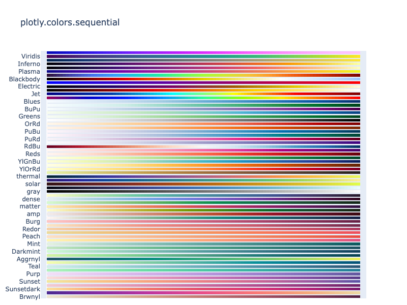
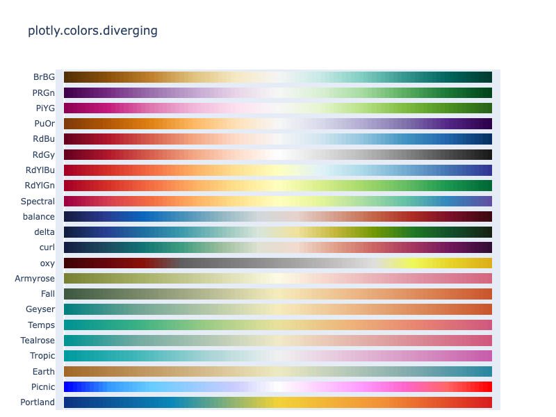
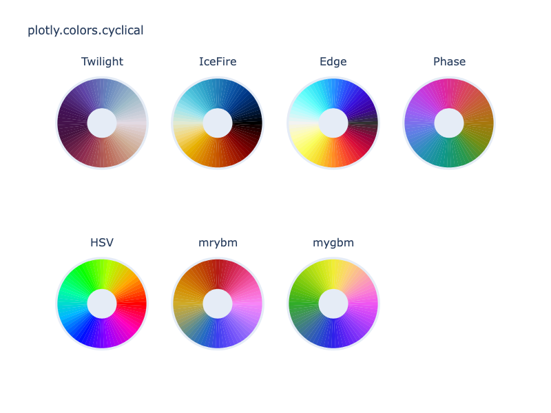
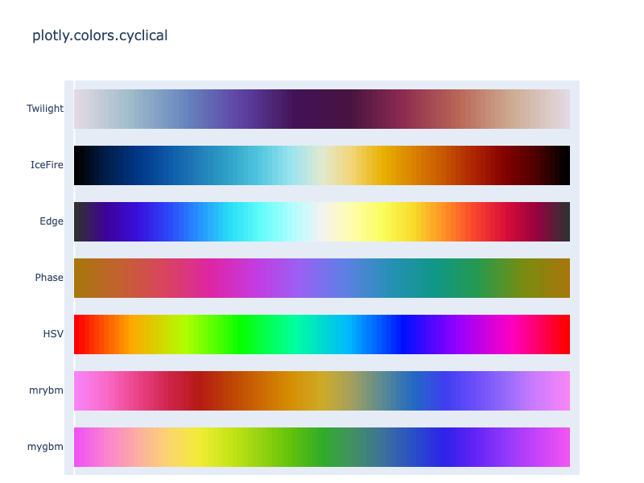

---
jupyter:
  jupytext:
    notebook_metadata_filter: all
    text_representation:
      extension: .md
      format_name: markdown
      format_version: '1.3'
      jupytext_version: 1.14.1
  kernelspec:
    display_name: Python 3
    language: python
    name: python3
  language_info:
    codemirror_mode:
      name: ipython
      version: 3
    file_extension: .py
    mimetype: text/x-python
    name: python
    nbconvert_exporter: python
    pygments_lexer: ipython3
    version: 3.8.8
  plotly:
    description: A reference for the built-in named continuous (sequential, diverging
      and cyclical) color scales in Plotly.
    display_as: file_settings
    has_thumbnail: true
    ipynb: ~notebook_demo/187
    language: python
    layout: base
    name: Built-in Continuous Color Scales
    order: 28
    permalink: python/builtin-colorscales/
    thumbnail: thumbnail/heatmap_colorscale.jpg
    v4upgrade: true
---

### Using Built-In Continuous Color Scales

Many Plotly Express functions accept a `color_continuous_scale` argument and many trace
types have a `colorscale` attribute in their schema. Plotly comes with a large number of
built-in continuous color scales, which can be referred to in Python code when setting the above arguments,
either by name in a case-insensitive string e.g. `px.scatter(color_continuous_scale="Viridis"`) or by reference e.g.
`go.Scatter(marker_colorscale=plotly.colors.sequential.Viridis)`. They can also be reversed by adding `_r` at the end
e.g. `"Viridis_r"` or `plotly.colors.sequential.Viridis_r`.

The `plotly.colours` module is also available under `plotly.express.colors` so you can refer to it as `px.colors`.

When using continuous color scales, you will often want to [configure various aspects of its range and colorbar](../colorscales/).

### Discrete Color Sequences

Plotly also comes with some built-in [discrete color sequences](../discrete-color/) which are _not intended_ to be used with the `color_continuous_scale` argument as they are not designed for interpolation to occur between adjacent colors.

### Named Built-In Continuous Color Scales

You can use any of the following names as string values to set `continuous_color_scale` or `colorscale` arguments.
These strings are case-insensitive and you can append `_r` to them to reverse the order of the scale.

```python
import plotly.express as px
from textwrap import wrap

named_colorscales = px.colors.named_colorscales()
print("\n".join(wrap("".join('{:<12}'.format(c) for c in named_colorscales), 96)))
```

**Output:**
```
aggrnyl     agsunset    blackbody   bluered     blues       blugrn      bluyl       brwnyl
bugn        bupu        burg        burgyl      cividis     darkmint    electric    emrld
gnbu        greens      greys       hot         inferno     jet         magenta     magma
mint        orrd        oranges     oryel       peach       pinkyl      plasma      plotly3
pubu        pubugn      purd        purp        purples     purpor      rainbow     rdbu
rdpu        redor       reds        sunset      sunsetdark  teal        tealgrn     turbo
viridis     ylgn        ylgnbu      ylorbr      ylorrd      algae       amp         deep
dense       gray        haline      ice         matter      solar       speed       tempo
thermal     turbid      armyrose    brbg        earth       fall        geyser      prgn
piyg        picnic      portland    puor        rdgy        rdylbu      rdylgn      spectral
tealrose    temps       tropic      balance     curl        delta       oxy         edge
hsv         icefire     phase       twilight    mrybm       mygbm
```

Built-in color scales are stored as lists of CSS colors:

```python
import plotly.express as px

print(px.colors.sequential.Plasma)
```

**Output:**
```
['#0d0887', '#46039f', '#7201a8', '#9c179e', '#bd3786', '#d8576b', '#ed7953', '#fb9f3a', '#fdca26', '#f0f921']
```

### Continuous Color Scales in Dash

[Dash](https://plotly.com/dash/) is the best way to build analytical apps in Python using Plotly figures. To run the app below, run `pip install dash`, click "Download" to get the code and run `python app.py`.

Get started  with [the official Dash docs](https://dash.plotly.com/installation) and **learn how to effortlessly [style](https://plotly.com/dash/design-kit/) & [deploy](https://plotly.com/dash/app-manager/) apps like this with <a class="plotly-red" href="https://plotly.com/dash/">Dash Enterprise</a>.**


```python hide_code=true
from IPython.display import IFrame
snippet_url = 'https://python-docs-dash-snippets.herokuapp.com/python-docs-dash-snippets/'
IFrame(snippet_url + 'builtin-colorscales', width='100%', height=1200)
```

<div style="font-size: 0.9em;"><div style="width: calc(100% - 30px); box-shadow: none; border: thin solid rgb(229, 229, 229);"><div style="padding: 5px;"><div><p><strong>Sign up for Dash Club</strong> → Free cheat sheets plus updates from Chris Parmer and Adam Schroeder delivered to your inbox every two months. Includes tips and tricks, community apps, and deep dives into the Dash architecture.
<u><a href="https://go.plotly.com/dash-club?utm_source=Dash+Club+2022&utm_medium=graphing_libraries&utm_content=inline">Join now</a></u>.</p></div></div></div></div>


### Built-In Sequential Color scales

A collection of predefined sequential colorscales is provided in the `plotly.colors.sequential` module. Sequential color scales are appropriate for most continuous data, but in some cases it can be helpful to use a diverging or cyclical color scale (see below).

Here are all the built-in scales in the `plotly.colors.sequential` module:

```python
import plotly.express as px

fig = px.colors.sequential.swatches_continuous()
fig.show()
```



**Interactive Plot:**

<div>                        <script type="text/javascript">window.PlotlyConfig = {MathJaxConfig: 'local'};</script>
        <script charset="utf-8" src="https://cdn.plot.ly/plotly-3.1.0.min.js" integrity="sha256-Ei4740bWZhaUTQuD6q9yQlgVCMPBz6CZWhevDYPv93A=" crossorigin="anonymous"></script>                <div id="plotly-div-1" class="plotly-graph-div" style="height:2640px; width:500px;"></div>            <script type="text/javascript">                window.PLOTLYENV=window.PLOTLYENV || {};                                if (document.getElementById("plotly-div-1")) {                    Plotly.newPlot(                        "plotly-div-1",                        [{"customdata":[0.01,0.02,0.03,0.04,0.05,0.06,0.07,0.08,0.09,0.1,0.11,0.12,0.13,0.14,0.15,0.16,0.17,0.18,0.19,0.2,0.21,0.22,0.23,0.24,0.25,0.26,0.27,0.28,0.29,0.3,0.31,0.32,0.33,0.34,0.35,0.36,0.37,0.38,0.39,0.4,0.41,0.42,0.43,0.44,0.45,0.46,0.47,0.48,0.49,0.5,0.51,0.52,0.53,0.54,0.55,0.56,0.57,0.58,0.59,0.6,0.61,0.62,0.63,0.64,0.65,0.66,0.67,0.68,0.69,0.7,0.71,0.72,0.73,0.74,0.75,0.76,0.77,0.78,0.79,0.8,0.81,0.82,0.83,0.84,0.85,0.86,0.87,0.88,0.89,0.9,0.91,0.92,0.93,0.94,0.95,0.96,0.97,0.98,0.99,1.0],"hovertemplate":"%{customdata}","marker":{"color":[0,1,2,3,4,5,6,7,8,9,10,11,12,13,14,15,16,17,18,19,20,21,22,23,24,25,26,27,28,29,30,31,32,33,34,35,36,37,38,39,40,41,42,43,44,45,46,47,48,49,50,51,52,53,54,55,56,57,58,59,60,61,62,63,64,65,66,67,68,69,70,71,72,73,74,75,76,77,78,79,80,81,82,83,84,85,86,87,88,89,90,91,92,93,94,95,96,97,98,99],"colorscale":[[0.0,"rgb(237, 229, 207)"],[0.16666666666666666,"rgb(224, 194, 162)"],[0.3333333333333333,"rgb(211, 156, 131)"],[0.5,"rgb(193, 118, 111)"],[0.6666666666666666,"rgb(166, 84, 97)"],[0.8333333333333334,"rgb(129, 55, 83)"],[1.0,"rgb(84, 31, 63)"]],"line":{"width":0}},"name":"Brwnyl","orientation":"h","x":[1,1,1,1,1,1,1,1,1,1,1,1,1,1,1,1,1,1,1,1,1,1,1,1,1,1,1,1,1,1,1,1,1,1,1,1,1,1,1,1,1,1,1,1,1,1,1,1,1,1,1,1,1,1,1,1,1,1,1,1,1,1,1,1,1,1,1,1,1,1,1,1,1,1,1,1,1,1,1,1,1,1,1,1,1,1,1,1,1,1,1,1,1,1,1,1,1,1,1,1],"y":["Brwnyl","Brwnyl","Brwnyl","Brwnyl","Brwnyl","Brwnyl","Brwnyl","Brwnyl","Brwnyl","Brwnyl","Brwnyl","Brwnyl","Brwnyl","Brwnyl","Brwnyl","Brwnyl","Brwnyl","Brwnyl","Brwnyl","Brwnyl","Brwnyl","Brwnyl","Brwnyl","Brwnyl","Brwnyl","Brwnyl","Brwnyl","Brwnyl","Brwnyl","Brwnyl","Brwnyl","Brwnyl","Brwnyl","Brwnyl","Brwnyl","Brwnyl","Brwnyl","Brwnyl","Brwnyl","Brwnyl","Brwnyl","Brwnyl","Brwnyl","Brwnyl","Brwnyl","Brwnyl","Brwnyl","Brwnyl","Brwnyl","Brwnyl","Brwnyl","Brwnyl","Brwnyl","Brwnyl","Brwnyl","Brwnyl","Brwnyl","Brwnyl","Brwnyl","Brwnyl","Brwnyl","Brwnyl","Brwnyl","Brwnyl","Brwnyl","Brwnyl","Brwnyl","Brwnyl","Brwnyl","Brwnyl","Brwnyl","Brwnyl","Brwnyl","Brwnyl","Brwnyl","Brwnyl","Brwnyl","Brwnyl","Brwnyl","Brwnyl","Brwnyl","Brwnyl","Brwnyl","Brwnyl","Brwnyl","Brwnyl","Brwnyl","Brwnyl","Brwnyl","Brwnyl","Brwnyl","Brwnyl","Brwnyl","Brwnyl","Brwnyl","Brwnyl","Brwnyl","Brwnyl","Brwnyl","Brwnyl"],"type":"bar"},{"customdata":[0.01,0.02,0.03,0.04,0.05,0.06,0.07,0.08,0.09,0.1,0.11,0.12,0.13,0.14,0.15,0.16,0.17,0.18,0.19,0.2,0.21,0.22,0.23,0.24,0.25,0.26,0.27,0.28,0.29,0.3,0.31,0.32,0.33,0.34,0.35,0.36,0.37,0.38,0.39,0.4,0.41,0.42,0.43,0.44,0.45,0.46,0.47,0.48,0.49,0.5,0.51,0.52,0.53,0.54,0.55,0.56,0.57,0.58,0.59,0.6,0.61,0.62,0.63,0.64,0.65,0.66,0.67,0.68,0.69,0.7,0.71,0.72,0.73,0.74,0.75,0.76,0.77,0.78,0.79,0.8,0.81,0.82,0.83,0.84,0.85,0.86,0.87,0.88,0.89,0.9,0.91,0.92,0.93,0.94,0.95,0.96,0.97,0.98,0.99,1.0],"hovertemplate":"%{customdata}","marker":{"color":[0,1,2,3,4,5,6,7,8,9,10,11,12,13,14,15,16,17,18,19,20,21,22,23,24,25,26,27,28,29,30,31,32,33,34,35,36,37,38,39,40,41,42,43,44,45,46,47,48,49,50,51,52,53,54,55,56,57,58,59,60,61,62,63,64,65,66,67,68,69,70,71,72,73,74,75,76,77,78,79,80,81,82,83,84,85,86,87,88,89,90,91,92,93,94,95,96,97,98,99],"colorscale":[[0.0,"rgb(75, 41, 145)"],[0.16666666666666666,"rgb(135, 44, 162)"],[0.3333333333333333,"rgb(192, 54, 157)"],[0.5,"rgb(234, 79, 136)"],[0.6666666666666666,"rgb(250, 120, 118)"],[0.8333333333333334,"rgb(246, 169, 122)"],[1.0,"rgb(237, 217, 163)"]],"line":{"width":0}},"name":"Agsunset","orientation":"h","x":[1,1,1,1,1,1,1,1,1,1,1,1,1,1,1,1,1,1,1,1,1,1,1,1,1,1,1,1,1,1,1,1,1,1,1,1,1,1,1,1,1,1,1,1,1,1,1,1,1,1,1,1,1,1,1,1,1,1,1,1,1,1,1,1,1,1,1,1,1,1,1,1,1,1,1,1,1,1,1,1,1,1,1,1,1,1,1,1,1,1,1,1,1,1,1,1,1,1,1,1],"y":["Agsunset","Agsunset","Agsunset","Agsunset","Agsunset","Agsunset","Agsunset","Agsunset","Agsunset","Agsunset","Agsunset","Agsunset","Agsunset","Agsunset","Agsunset","Agsunset","Agsunset","Agsunset","Agsunset","Agsunset","Agsunset","Agsunset","Agsunset","Agsunset","Agsunset","Agsunset","Agsunset","Agsunset","Agsunset","Agsunset","Agsunset","Agsunset","Agsunset","Agsunset","Agsunset","Agsunset","Agsunset","Agsunset","Agsunset","Agsunset","Agsunset","Agsunset","Agsunset","Agsunset","Agsunset","Agsunset","Agsunset","Agsunset","Agsunset","Agsunset","Agsunset","Agsunset","Agsunset","Agsunset","Agsunset","Agsunset","Agsunset","Agsunset","Agsunset","Agsunset","Agsunset","Agsunset","Agsunset","Agsunset","Agsunset","Agsunset","Agsunset","Agsunset","Agsunset","Agsunset","Agsunset","Agsunset","Agsunset","Agsunset","Agsunset","Agsunset","Agsunset","Agsunset","Agsunset","Agsunset","Agsunset","Agsunset","Agsunset","Agsunset","Agsunset","Agsunset","Agsunset","Agsunset","Agsunset","Agsunset","Agsunset","Agsunset","Agsunset","Agsunset","Agsunset","Agsunset","Agsunset","Agsunset","Agsunset","Agsunset"],"type":"bar"},{"customdata":[0.01,0.02,0.03,0.04,0.05,0.06,0.07,0.08,0.09,0.1,0.11,0.12,0.13,0.14,0.15,0.16,0.17,0.18,0.19,0.2,0.21,0.22,0.23,0.24,0.25,0.26,0.27,0.28,0.29,0.3,0.31,0.32,0.33,0.34,0.35,0.36,0.37,0.38,0.39,0.4,0.41,0.42,0.43,0.44,0.45,0.46,0.47,0.48,0.49,0.5,0.51,0.52,0.53,0.54,0.55,0.56,0.57,0.58,0.59,0.6,0.61,0.62,0.63,0.64,0.65,0.66,0.67,0.68,0.69,0.7,0.71,0.72,0.73,0.74,0.75,0.76,0.77,0.78,0.79,0.8,0.81,0.82,0.83,0.84,0.85,0.86,0.87,0.88,0.89,0.9,0.91,0.92,0.93,0.94,0.95,0.96,0.97,0.98,0.99,1.0],"hovertemplate":"%{customdata}","marker":{"color":[0,1,2,3,4,5,6,7,8,9,10,11,12,13,14,15,16,17,18,19,20,21,22,23,24,25,26,27,28,29,30,31,32,33,34,35,36,37,38,39,40,41,42,43,44,45,46,47,48,49,50,51,52,53,54,55,56,57,58,59,60,61,62,63,64,65,66,67,68,69,70,71,72,73,74,75,76,77,78,79,80,81,82,83,84,85,86,87,88,89,90,91,92,93,94,95,96,97,98,99],"colorscale":[[0.0,"rgb(252, 222, 156)"],[0.16666666666666666,"rgb(250, 164, 118)"],[0.3333333333333333,"rgb(240, 116, 110)"],[0.5,"rgb(227, 79, 111)"],[0.6666666666666666,"rgb(220, 57, 119)"],[0.8333333333333334,"rgb(185, 37, 122)"],[1.0,"rgb(124, 29, 111)"]],"line":{"width":0}},"name":"Sunsetdark","orientation":"h","x":[1,1,1,1,1,1,1,1,1,1,1,1,1,1,1,1,1,1,1,1,1,1,1,1,1,1,1,1,1,1,1,1,1,1,1,1,1,1,1,1,1,1,1,1,1,1,1,1,1,1,1,1,1,1,1,1,1,1,1,1,1,1,1,1,1,1,1,1,1,1,1,1,1,1,1,1,1,1,1,1,1,1,1,1,1,1,1,1,1,1,1,1,1,1,1,1,1,1,1,1],"y":["Sunsetdark","Sunsetdark","Sunsetdark","Sunsetdark","Sunsetdark","Sunsetdark","Sunsetdark","Sunsetdark","Sunsetdark","Sunsetdark","Sunsetdark","Sunsetdark","Sunsetdark","Sunsetdark","Sunsetdark","Sunsetdark","Sunsetdark","Sunsetdark","Sunsetdark","Sunsetdark","Sunsetdark","Sunsetdark","Sunsetdark","Sunsetdark","Sunsetdark","Sunsetdark","Sunsetdark","Sunsetdark","Sunsetdark","Sunsetdark","Sunsetdark","Sunsetdark","Sunsetdark","Sunsetdark","Sunsetdark","Sunsetdark","Sunsetdark","Sunsetdark","Sunsetdark","Sunsetdark","Sunsetdark","Sunsetdark","Sunsetdark","Sunsetdark","Sunsetdark","Sunsetdark","Sunsetdark","Sunsetdark","Sunsetdark","Sunsetdark","Sunsetdark","Sunsetdark","Sunsetdark","Sunsetdark","Sunsetdark","Sunsetdark","Sunsetdark","Sunsetdark","Sunsetdark","Sunsetdark","Sunsetdark","Sunsetdark","Sunsetdark","Sunsetdark","Sunsetdark","Sunsetdark","Sunsetdark","Sunsetdark","Sunsetdark","Sunsetdark","Sunsetdark","Sunsetdark","Sunsetdark","Sunsetdark","Sunsetdark","Sunsetdark","Sunsetdark","Sunsetdark","Sunsetdark","Sunsetdark","Sunsetdark","Sunsetdark","Sunsetdark","Sunsetdark","Sunsetdark","Sunsetdark","Sunsetdark","Sunsetdark","Sunsetdark","Sunsetdark","Sunsetdark","Sunsetdark","Sunsetdark","Sunsetdark","Sunsetdark","Sunsetdark","Sunsetdark","Sunsetdark","Sunsetdark","Sunsetdark"],"type":"bar"},{"customdata":[0.01,0.02,0.03,0.04,0.05,0.06,0.07,0.08,0.09,0.1,0.11,0.12,0.13,0.14,0.15,0.16,0.17,0.18,0.19,0.2,0.21,0.22,0.23,0.24,0.25,0.26,0.27,0.28,0.29,0.3,0.31,0.32,0.33,0.34,0.35,0.36,0.37,0.38,0.39,0.4,0.41,0.42,0.43,0.44,0.45,0.46,0.47,0.48,0.49,0.5,0.51,0.52,0.53,0.54,0.55,0.56,0.57,0.58,0.59,0.6,0.61,0.62,0.63,0.64,0.65,0.66,0.67,0.68,0.69,0.7,0.71,0.72,0.73,0.74,0.75,0.76,0.77,0.78,0.79,0.8,0.81,0.82,0.83,0.84,0.85,0.86,0.87,0.88,0.89,0.9,0.91,0.92,0.93,0.94,0.95,0.96,0.97,0.98,0.99,1.0],"hovertemplate":"%{customdata}","marker":{"color":[0,1,2,3,4,5,6,7,8,9,10,11,12,13,14,15,16,17,18,19,20,21,22,23,24,25,26,27,28,29,30,31,32,33,34,35,36,37,38,39,40,41,42,43,44,45,46,47,48,49,50,51,52,53,54,55,56,57,58,59,60,61,62,63,64,65,66,67,68,69,70,71,72,73,74,75,76,77,78,79,80,81,82,83,84,85,86,87,88,89,90,91,92,93,94,95,96,97,98,99],"colorscale":[[0.0,"rgb(243, 203, 211)"],[0.16666666666666666,"rgb(234, 169, 189)"],[0.3333333333333333,"rgb(221, 136, 172)"],[0.5,"rgb(202, 105, 157)"],[0.6666666666666666,"rgb(177, 77, 142)"],[0.8333333333333334,"rgb(145, 53, 125)"],[1.0,"rgb(108, 33, 103)"]],"line":{"width":0}},"name":"Magenta","orientation":"h","x":[1,1,1,1,1,1,1,1,1,1,1,1,1,1,1,1,1,1,1,1,1,1,1,1,1,1,1,1,1,1,1,1,1,1,1,1,1,1,1,1,1,1,1,1,1,1,1,1,1,1,1,1,1,1,1,1,1,1,1,1,1,1,1,1,1,1,1,1,1,1,1,1,1,1,1,1,1,1,1,1,1,1,1,1,1,1,1,1,1,1,1,1,1,1,1,1,1,1,1,1],"y":["Magenta","Magenta","Magenta","Magenta","Magenta","Magenta","Magenta","Magenta","Magenta","Magenta","Magenta","Magenta","Magenta","Magenta","Magenta","Magenta","Magenta","Magenta","Magenta","Magenta","Magenta","Magenta","Magenta","Magenta","Magenta","Magenta","Magenta","Magenta","Magenta","Magenta","Magenta","Magenta","Magenta","Magenta","Magenta","Magenta","Magenta","Magenta","Magenta","Magenta","Magenta","Magenta","Magenta","Magenta","Magenta","Magenta","Magenta","Magenta","Magenta","Magenta","Magenta","Magenta","Magenta","Magenta","Magenta","Magenta","Magenta","Magenta","Magenta","Magenta","Magenta","Magenta","Magenta","Magenta","Magenta","Magenta","Magenta","Magenta","Magenta","Magenta","Magenta","Magenta","Magenta","Magenta","Magenta","Magenta","Magenta","Magenta","Magenta","Magenta","Magenta","Magenta","Magenta","Magenta","Magenta","Magenta","Magenta","Magenta","Magenta","Magenta","Magenta","Magenta","Magenta","Magenta","Magenta","Magenta","Magenta","Magenta","Magenta","Magenta"],"type":"bar"},{"customdata":[0.01,0.02,0.03,0.04,0.05,0.06,0.07,0.08,0.09,0.1,0.11,0.12,0.13,0.14,0.15,0.16,0.17,0.18,0.19,0.2,0.21,0.22,0.23,0.24,0.25,0.26,0.27,0.28,0.29,0.3,0.31,0.32,0.33,0.34,0.35,0.36,0.37,0.38,0.39,0.4,0.41,0.42,0.43,0.44,0.45,0.46,0.47,0.48,0.49,0.5,0.51,0.52,0.53,0.54,0.55,0.56,0.57,0.58,0.59,0.6,0.61,0.62,0.63,0.64,0.65,0.66,0.67,0.68,0.69,0.7,0.71,0.72,0.73,0.74,0.75,0.76,0.77,0.78,0.79,0.8,0.81,0.82,0.83,0.84,0.85,0.86,0.87,0.88,0.89,0.9,0.91,0.92,0.93,0.94,0.95,0.96,0.97,0.98,0.99,1.0],"hovertemplate":"%{customdata}","marker":{"color":[0,1,2,3,4,5,6,7,8,9,10,11,12,13,14,15,16,17,18,19,20,21,22,23,24,25,26,27,28,29,30,31,32,33,34,35,36,37,38,39,40,41,42,43,44,45,46,47,48,49,50,51,52,53,54,55,56,57,58,59,60,61,62,63,64,65,66,67,68,69,70,71,72,73,74,75,76,77,78,79,80,81,82,83,84,85,86,87,88,89,90,91,92,93,94,95,96,97,98,99],"colorscale":[[0.0,"rgb(243, 231, 155)"],[0.16666666666666666,"rgb(250, 196, 132)"],[0.3333333333333333,"rgb(248, 160, 126)"],[0.5,"rgb(235, 127, 134)"],[0.6666666666666666,"rgb(206, 102, 147)"],[0.8333333333333334,"rgb(160, 89, 160)"],[1.0,"rgb(92, 83, 165)"]],"line":{"width":0}},"name":"Sunset","orientation":"h","x":[1,1,1,1,1,1,1,1,1,1,1,1,1,1,1,1,1,1,1,1,1,1,1,1,1,1,1,1,1,1,1,1,1,1,1,1,1,1,1,1,1,1,1,1,1,1,1,1,1,1,1,1,1,1,1,1,1,1,1,1,1,1,1,1,1,1,1,1,1,1,1,1,1,1,1,1,1,1,1,1,1,1,1,1,1,1,1,1,1,1,1,1,1,1,1,1,1,1,1,1],"y":["Sunset","Sunset","Sunset","Sunset","Sunset","Sunset","Sunset","Sunset","Sunset","Sunset","Sunset","Sunset","Sunset","Sunset","Sunset","Sunset","Sunset","Sunset","Sunset","Sunset","Sunset","Sunset","Sunset","Sunset","Sunset","Sunset","Sunset","Sunset","Sunset","Sunset","Sunset","Sunset","Sunset","Sunset","Sunset","Sunset","Sunset","Sunset","Sunset","Sunset","Sunset","Sunset","Sunset","Sunset","Sunset","Sunset","Sunset","Sunset","Sunset","Sunset","Sunset","Sunset","Sunset","Sunset","Sunset","Sunset","Sunset","Sunset","Sunset","Sunset","Sunset","Sunset","Sunset","Sunset","Sunset","Sunset","Sunset","Sunset","Sunset","Sunset","Sunset","Sunset","Sunset","Sunset","Sunset","Sunset","Sunset","Sunset","Sunset","Sunset","Sunset","Sunset","Sunset","Sunset","Sunset","Sunset","Sunset","Sunset","Sunset","Sunset","Sunset","Sunset","Sunset","Sunset","Sunset","Sunset","Sunset","Sunset","Sunset","Sunset"],"type":"bar"},{"customdata":[0.01,0.02,0.03,0.04,0.05,0.06,0.07,0.08,0.09,0.1,0.11,0.12,0.13,0.14,0.15,0.16,0.17,0.18,0.19,0.2,0.21,0.22,0.23,0.24,0.25,0.26,0.27,0.28,0.29,0.3,0.31,0.32,0.33,0.34,0.35,0.36,0.37,0.38,0.39,0.4,0.41,0.42,0.43,0.44,0.45,0.46,0.47,0.48,0.49,0.5,0.51,0.52,0.53,0.54,0.55,0.56,0.57,0.58,0.59,0.6,0.61,0.62,0.63,0.64,0.65,0.66,0.67,0.68,0.69,0.7,0.71,0.72,0.73,0.74,0.75,0.76,0.77,0.78,0.79,0.8,0.81,0.82,0.83,0.84,0.85,0.86,0.87,0.88,0.89,0.9,0.91,0.92,0.93,0.94,0.95,0.96,0.97,0.98,0.99,1.0],"hovertemplate":"%{customdata}","marker":{"color":[0,1,2,3,4,5,6,7,8,9,10,11,12,13,14,15,16,17,18,19,20,21,22,23,24,25,26,27,28,29,30,31,32,33,34,35,36,37,38,39,40,41,42,43,44,45,46,47,48,49,50,51,52,53,54,55,56,57,58,59,60,61,62,63,64,65,66,67,68,69,70,71,72,73,74,75,76,77,78,79,80,81,82,83,84,85,86,87,88,89,90,91,92,93,94,95,96,97,98,99],"colorscale":[[0.0,"rgb(249, 221, 218)"],[0.16666666666666666,"rgb(242, 185, 196)"],[0.3333333333333333,"rgb(229, 151, 185)"],[0.5,"rgb(206, 120, 179)"],[0.6666666666666666,"rgb(173, 95, 173)"],[0.8333333333333334,"rgb(131, 75, 160)"],[1.0,"rgb(87, 59, 136)"]],"line":{"width":0}},"name":"Purpor","orientation":"h","x":[1,1,1,1,1,1,1,1,1,1,1,1,1,1,1,1,1,1,1,1,1,1,1,1,1,1,1,1,1,1,1,1,1,1,1,1,1,1,1,1,1,1,1,1,1,1,1,1,1,1,1,1,1,1,1,1,1,1,1,1,1,1,1,1,1,1,1,1,1,1,1,1,1,1,1,1,1,1,1,1,1,1,1,1,1,1,1,1,1,1,1,1,1,1,1,1,1,1,1,1],"y":["Purpor","Purpor","Purpor","Purpor","Purpor","Purpor","Purpor","Purpor","Purpor","Purpor","Purpor","Purpor","Purpor","Purpor","Purpor","Purpor","Purpor","Purpor","Purpor","Purpor","Purpor","Purpor","Purpor","Purpor","Purpor","Purpor","Purpor","Purpor","Purpor","Purpor","Purpor","Purpor","Purpor","Purpor","Purpor","Purpor","Purpor","Purpor","Purpor","Purpor","Purpor","Purpor","Purpor","Purpor","Purpor","Purpor","Purpor","Purpor","Purpor","Purpor","Purpor","Purpor","Purpor","Purpor","Purpor","Purpor","Purpor","Purpor","Purpor","Purpor","Purpor","Purpor","Purpor","Purpor","Purpor","Purpor","Purpor","Purpor","Purpor","Purpor","Purpor","Purpor","Purpor","Purpor","Purpor","Purpor","Purpor","Purpor","Purpor","Purpor","Purpor","Purpor","Purpor","Purpor","Purpor","Purpor","Purpor","Purpor","Purpor","Purpor","Purpor","Purpor","Purpor","Purpor","Purpor","Purpor","Purpor","Purpor","Purpor","Purpor"],"type":"bar"},{"customdata":[0.01,0.02,0.03,0.04,0.05,0.06,0.07,0.08,0.09,0.1,0.11,0.12,0.13,0.14,0.15,0.16,0.17,0.18,0.19,0.2,0.21,0.22,0.23,0.24,0.25,0.26,0.27,0.28,0.29,0.3,0.31,0.32,0.33,0.34,0.35,0.36,0.37,0.38,0.39,0.4,0.41,0.42,0.43,0.44,0.45,0.46,0.47,0.48,0.49,0.5,0.51,0.52,0.53,0.54,0.55,0.56,0.57,0.58,0.59,0.6,0.61,0.62,0.63,0.64,0.65,0.66,0.67,0.68,0.69,0.7,0.71,0.72,0.73,0.74,0.75,0.76,0.77,0.78,0.79,0.8,0.81,0.82,0.83,0.84,0.85,0.86,0.87,0.88,0.89,0.9,0.91,0.92,0.93,0.94,0.95,0.96,0.97,0.98,0.99,1.0],"hovertemplate":"%{customdata}","marker":{"color":[0,1,2,3,4,5,6,7,8,9,10,11,12,13,14,15,16,17,18,19,20,21,22,23,24,25,26,27,28,29,30,31,32,33,34,35,36,37,38,39,40,41,42,43,44,45,46,47,48,49,50,51,52,53,54,55,56,57,58,59,60,61,62,63,64,65,66,67,68,69,70,71,72,73,74,75,76,77,78,79,80,81,82,83,84,85,86,87,88,89,90,91,92,93,94,95,96,97,98,99],"colorscale":[[0.0,"rgb(243, 224, 247)"],[0.16666666666666666,"rgb(228, 199, 241)"],[0.3333333333333333,"rgb(209, 175, 232)"],[0.5,"rgb(185, 152, 221)"],[0.6666666666666666,"rgb(159, 130, 206)"],[0.8333333333333334,"rgb(130, 109, 186)"],[1.0,"rgb(99, 88, 159)"]],"line":{"width":0}},"name":"Purp","orientation":"h","x":[1,1,1,1,1,1,1,1,1,1,1,1,1,1,1,1,1,1,1,1,1,1,1,1,1,1,1,1,1,1,1,1,1,1,1,1,1,1,1,1,1,1,1,1,1,1,1,1,1,1,1,1,1,1,1,1,1,1,1,1,1,1,1,1,1,1,1,1,1,1,1,1,1,1,1,1,1,1,1,1,1,1,1,1,1,1,1,1,1,1,1,1,1,1,1,1,1,1,1,1],"y":["Purp","Purp","Purp","Purp","Purp","Purp","Purp","Purp","Purp","Purp","Purp","Purp","Purp","Purp","Purp","Purp","Purp","Purp","Purp","Purp","Purp","Purp","Purp","Purp","Purp","Purp","Purp","Purp","Purp","Purp","Purp","Purp","Purp","Purp","Purp","Purp","Purp","Purp","Purp","Purp","Purp","Purp","Purp","Purp","Purp","Purp","Purp","Purp","Purp","Purp","Purp","Purp","Purp","Purp","Purp","Purp","Purp","Purp","Purp","Purp","Purp","Purp","Purp","Purp","Purp","Purp","Purp","Purp","Purp","Purp","Purp","Purp","Purp","Purp","Purp","Purp","Purp","Purp","Purp","Purp","Purp","Purp","Purp","Purp","Purp","Purp","Purp","Purp","Purp","Purp","Purp","Purp","Purp","Purp","Purp","Purp","Purp","Purp","Purp","Purp"],"type":"bar"},{"customdata":[0.01,0.02,0.03,0.04,0.05,0.06,0.07,0.08,0.09,0.1,0.11,0.12,0.13,0.14,0.15,0.16,0.17,0.18,0.19,0.2,0.21,0.22,0.23,0.24,0.25,0.26,0.27,0.28,0.29,0.3,0.31,0.32,0.33,0.34,0.35,0.36,0.37,0.38,0.39,0.4,0.41,0.42,0.43,0.44,0.45,0.46,0.47,0.48,0.49,0.5,0.51,0.52,0.53,0.54,0.55,0.56,0.57,0.58,0.59,0.6,0.61,0.62,0.63,0.64,0.65,0.66,0.67,0.68,0.69,0.7,0.71,0.72,0.73,0.74,0.75,0.76,0.77,0.78,0.79,0.8,0.81,0.82,0.83,0.84,0.85,0.86,0.87,0.88,0.89,0.9,0.91,0.92,0.93,0.94,0.95,0.96,0.97,0.98,0.99,1.0],"hovertemplate":"%{customdata}","marker":{"color":[0,1,2,3,4,5,6,7,8,9,10,11,12,13,14,15,16,17,18,19,20,21,22,23,24,25,26,27,28,29,30,31,32,33,34,35,36,37,38,39,40,41,42,43,44,45,46,47,48,49,50,51,52,53,54,55,56,57,58,59,60,61,62,63,64,65,66,67,68,69,70,71,72,73,74,75,76,77,78,79,80,81,82,83,84,85,86,87,88,89,90,91,92,93,94,95,96,97,98,99],"colorscale":[[0.0,"rgb(176, 242, 188)"],[0.16666666666666666,"rgb(137, 232, 172)"],[0.3333333333333333,"rgb(103, 219, 165)"],[0.5,"rgb(76, 200, 163)"],[0.6666666666666666,"rgb(56, 178, 163)"],[0.8333333333333334,"rgb(44, 152, 160)"],[1.0,"rgb(37, 125, 152)"]],"line":{"width":0}},"name":"Tealgrn","orientation":"h","x":[1,1,1,1,1,1,1,1,1,1,1,1,1,1,1,1,1,1,1,1,1,1,1,1,1,1,1,1,1,1,1,1,1,1,1,1,1,1,1,1,1,1,1,1,1,1,1,1,1,1,1,1,1,1,1,1,1,1,1,1,1,1,1,1,1,1,1,1,1,1,1,1,1,1,1,1,1,1,1,1,1,1,1,1,1,1,1,1,1,1,1,1,1,1,1,1,1,1,1,1],"y":["Tealgrn","Tealgrn","Tealgrn","Tealgrn","Tealgrn","Tealgrn","Tealgrn","Tealgrn","Tealgrn","Tealgrn","Tealgrn","Tealgrn","Tealgrn","Tealgrn","Tealgrn","Tealgrn","Tealgrn","Tealgrn","Tealgrn","Tealgrn","Tealgrn","Tealgrn","Tealgrn","Tealgrn","Tealgrn","Tealgrn","Tealgrn","Tealgrn","Tealgrn","Tealgrn","Tealgrn","Tealgrn","Tealgrn","Tealgrn","Tealgrn","Tealgrn","Tealgrn","Tealgrn","Tealgrn","Tealgrn","Tealgrn","Tealgrn","Tealgrn","Tealgrn","Tealgrn","Tealgrn","Tealgrn","Tealgrn","Tealgrn","Tealgrn","Tealgrn","Tealgrn","Tealgrn","Tealgrn","Tealgrn","Tealgrn","Tealgrn","Tealgrn","Tealgrn","Tealgrn","Tealgrn","Tealgrn","Tealgrn","Tealgrn","Tealgrn","Tealgrn","Tealgrn","Tealgrn","Tealgrn","Tealgrn","Tealgrn","Tealgrn","Tealgrn","Tealgrn","Tealgrn","Tealgrn","Tealgrn","Tealgrn","Tealgrn","Tealgrn","Tealgrn","Tealgrn","Tealgrn","Tealgrn","Tealgrn","Tealgrn","Tealgrn","Tealgrn","Tealgrn","Tealgrn","Tealgrn","Tealgrn","Tealgrn","Tealgrn","Tealgrn","Tealgrn","Tealgrn","Tealgrn","Tealgrn","Tealgrn"],"type":"bar"},{"customdata":[0.01,0.02,0.03,0.04,0.05,0.06,0.07,0.08,0.09,0.1,0.11,0.12,0.13,0.14,0.15,0.16,0.17,0.18,0.19,0.2,0.21,0.22,0.23,0.24,0.25,0.26,0.27,0.28,0.29,0.3,0.31,0.32,0.33,0.34,0.35,0.36,0.37,0.38,0.39,0.4,0.41,0.42,0.43,0.44,0.45,0.46,0.47,0.48,0.49,0.5,0.51,0.52,0.53,0.54,0.55,0.56,0.57,0.58,0.59,0.6,0.61,0.62,0.63,0.64,0.65,0.66,0.67,0.68,0.69,0.7,0.71,0.72,0.73,0.74,0.75,0.76,0.77,0.78,0.79,0.8,0.81,0.82,0.83,0.84,0.85,0.86,0.87,0.88,0.89,0.9,0.91,0.92,0.93,0.94,0.95,0.96,0.97,0.98,0.99,1.0],"hovertemplate":"%{customdata}","marker":{"color":[0,1,2,3,4,5,6,7,8,9,10,11,12,13,14,15,16,17,18,19,20,21,22,23,24,25,26,27,28,29,30,31,32,33,34,35,36,37,38,39,40,41,42,43,44,45,46,47,48,49,50,51,52,53,54,55,56,57,58,59,60,61,62,63,64,65,66,67,68,69,70,71,72,73,74,75,76,77,78,79,80,81,82,83,84,85,86,87,88,89,90,91,92,93,94,95,96,97,98,99],"colorscale":[[0.0,"rgb(209, 238, 234)"],[0.16666666666666666,"rgb(168, 219, 217)"],[0.3333333333333333,"rgb(133, 196, 201)"],[0.5,"rgb(104, 171, 184)"],[0.6666666666666666,"rgb(79, 144, 166)"],[0.8333333333333334,"rgb(59, 115, 143)"],[1.0,"rgb(42, 86, 116)"]],"line":{"width":0}},"name":"Teal","orientation":"h","x":[1,1,1,1,1,1,1,1,1,1,1,1,1,1,1,1,1,1,1,1,1,1,1,1,1,1,1,1,1,1,1,1,1,1,1,1,1,1,1,1,1,1,1,1,1,1,1,1,1,1,1,1,1,1,1,1,1,1,1,1,1,1,1,1,1,1,1,1,1,1,1,1,1,1,1,1,1,1,1,1,1,1,1,1,1,1,1,1,1,1,1,1,1,1,1,1,1,1,1,1],"y":["Teal","Teal","Teal","Teal","Teal","Teal","Teal","Teal","Teal","Teal","Teal","Teal","Teal","Teal","Teal","Teal","Teal","Teal","Teal","Teal","Teal","Teal","Teal","Teal","Teal","Teal","Teal","Teal","Teal","Teal","Teal","Teal","Teal","Teal","Teal","Teal","Teal","Teal","Teal","Teal","Teal","Teal","Teal","Teal","Teal","Teal","Teal","Teal","Teal","Teal","Teal","Teal","Teal","Teal","Teal","Teal","Teal","Teal","Teal","Teal","Teal","Teal","Teal","Teal","Teal","Teal","Teal","Teal","Teal","Teal","Teal","Teal","Teal","Teal","Teal","Teal","Teal","Teal","Teal","Teal","Teal","Teal","Teal","Teal","Teal","Teal","Teal","Teal","Teal","Teal","Teal","Teal","Teal","Teal","Teal","Teal","Teal","Teal","Teal","Teal"],"type":"bar"},{"customdata":[0.01,0.02,0.03,0.04,0.05,0.06,0.07,0.08,0.09,0.1,0.11,0.12,0.13,0.14,0.15,0.16,0.17,0.18,0.19,0.2,0.21,0.22,0.23,0.24,0.25,0.26,0.27,0.28,0.29,0.3,0.31,0.32,0.33,0.34,0.35,0.36,0.37,0.38,0.39,0.4,0.41,0.42,0.43,0.44,0.45,0.46,0.47,0.48,0.49,0.5,0.51,0.52,0.53,0.54,0.55,0.56,0.57,0.58,0.59,0.6,0.61,0.62,0.63,0.64,0.65,0.66,0.67,0.68,0.69,0.7,0.71,0.72,0.73,0.74,0.75,0.76,0.77,0.78,0.79,0.8,0.81,0.82,0.83,0.84,0.85,0.86,0.87,0.88,0.89,0.9,0.91,0.92,0.93,0.94,0.95,0.96,0.97,0.98,0.99,1.0],"hovertemplate":"%{customdata}","marker":{"color":[0,1,2,3,4,5,6,7,8,9,10,11,12,13,14,15,16,17,18,19,20,21,22,23,24,25,26,27,28,29,30,31,32,33,34,35,36,37,38,39,40,41,42,43,44,45,46,47,48,49,50,51,52,53,54,55,56,57,58,59,60,61,62,63,64,65,66,67,68,69,70,71,72,73,74,75,76,77,78,79,80,81,82,83,84,85,86,87,88,89,90,91,92,93,94,95,96,97,98,99],"colorscale":[[0.0,"rgb(247, 254, 174)"],[0.16666666666666666,"rgb(183, 230, 165)"],[0.3333333333333333,"rgb(124, 203, 162)"],[0.5,"rgb(70, 174, 160)"],[0.6666666666666666,"rgb(8, 144, 153)"],[0.8333333333333334,"rgb(0, 113, 139)"],[1.0,"rgb(4, 82, 117)"]],"line":{"width":0}},"name":"Bluyl","orientation":"h","x":[1,1,1,1,1,1,1,1,1,1,1,1,1,1,1,1,1,1,1,1,1,1,1,1,1,1,1,1,1,1,1,1,1,1,1,1,1,1,1,1,1,1,1,1,1,1,1,1,1,1,1,1,1,1,1,1,1,1,1,1,1,1,1,1,1,1,1,1,1,1,1,1,1,1,1,1,1,1,1,1,1,1,1,1,1,1,1,1,1,1,1,1,1,1,1,1,1,1,1,1],"y":["Bluyl","Bluyl","Bluyl","Bluyl","Bluyl","Bluyl","Bluyl","Bluyl","Bluyl","Bluyl","Bluyl","Bluyl","Bluyl","Bluyl","Bluyl","Bluyl","Bluyl","Bluyl","Bluyl","Bluyl","Bluyl","Bluyl","Bluyl","Bluyl","Bluyl","Bluyl","Bluyl","Bluyl","Bluyl","Bluyl","Bluyl","Bluyl","Bluyl","Bluyl","Bluyl","Bluyl","Bluyl","Bluyl","Bluyl","Bluyl","Bluyl","Bluyl","Bluyl","Bluyl","Bluyl","Bluyl","Bluyl","Bluyl","Bluyl","Bluyl","Bluyl","Bluyl","Bluyl","Bluyl","Bluyl","Bluyl","Bluyl","Bluyl","Bluyl","Bluyl","Bluyl","Bluyl","Bluyl","Bluyl","Bluyl","Bluyl","Bluyl","Bluyl","Bluyl","Bluyl","Bluyl","Bluyl","Bluyl","Bluyl","Bluyl","Bluyl","Bluyl","Bluyl","Bluyl","Bluyl","Bluyl","Bluyl","Bluyl","Bluyl","Bluyl","Bluyl","Bluyl","Bluyl","Bluyl","Bluyl","Bluyl","Bluyl","Bluyl","Bluyl","Bluyl","Bluyl","Bluyl","Bluyl","Bluyl","Bluyl"],"type":"bar"},{"customdata":[0.01,0.02,0.03,0.04,0.05,0.06,0.07,0.08,0.09,0.1,0.11,0.12,0.13,0.14,0.15,0.16,0.17,0.18,0.19,0.2,0.21,0.22,0.23,0.24,0.25,0.26,0.27,0.28,0.29,0.3,0.31,0.32,0.33,0.34,0.35,0.36,0.37,0.38,0.39,0.4,0.41,0.42,0.43,0.44,0.45,0.46,0.47,0.48,0.49,0.5,0.51,0.52,0.53,0.54,0.55,0.56,0.57,0.58,0.59,0.6,0.61,0.62,0.63,0.64,0.65,0.66,0.67,0.68,0.69,0.7,0.71,0.72,0.73,0.74,0.75,0.76,0.77,0.78,0.79,0.8,0.81,0.82,0.83,0.84,0.85,0.86,0.87,0.88,0.89,0.9,0.91,0.92,0.93,0.94,0.95,0.96,0.97,0.98,0.99,1.0],"hovertemplate":"%{customdata}","marker":{"color":[0,1,2,3,4,5,6,7,8,9,10,11,12,13,14,15,16,17,18,19,20,21,22,23,24,25,26,27,28,29,30,31,32,33,34,35,36,37,38,39,40,41,42,43,44,45,46,47,48,49,50,51,52,53,54,55,56,57,58,59,60,61,62,63,64,65,66,67,68,69,70,71,72,73,74,75,76,77,78,79,80,81,82,83,84,85,86,87,88,89,90,91,92,93,94,95,96,97,98,99],"colorscale":[[0.0,"rgb(36, 86, 104)"],[0.16666666666666666,"rgb(15, 114, 121)"],[0.3333333333333333,"rgb(13, 143, 129)"],[0.5,"rgb(57, 171, 126)"],[0.6666666666666666,"rgb(110, 197, 116)"],[0.8333333333333334,"rgb(169, 220, 103)"],[1.0,"rgb(237, 239, 93)"]],"line":{"width":0}},"name":"Aggrnyl","orientation":"h","x":[1,1,1,1,1,1,1,1,1,1,1,1,1,1,1,1,1,1,1,1,1,1,1,1,1,1,1,1,1,1,1,1,1,1,1,1,1,1,1,1,1,1,1,1,1,1,1,1,1,1,1,1,1,1,1,1,1,1,1,1,1,1,1,1,1,1,1,1,1,1,1,1,1,1,1,1,1,1,1,1,1,1,1,1,1,1,1,1,1,1,1,1,1,1,1,1,1,1,1,1],"y":["Aggrnyl","Aggrnyl","Aggrnyl","Aggrnyl","Aggrnyl","Aggrnyl","Aggrnyl","Aggrnyl","Aggrnyl","Aggrnyl","Aggrnyl","Aggrnyl","Aggrnyl","Aggrnyl","Aggrnyl","Aggrnyl","Aggrnyl","Aggrnyl","Aggrnyl","Aggrnyl","Aggrnyl","Aggrnyl","Aggrnyl","Aggrnyl","Aggrnyl","Aggrnyl","Aggrnyl","Aggrnyl","Aggrnyl","Aggrnyl","Aggrnyl","Aggrnyl","Aggrnyl","Aggrnyl","Aggrnyl","Aggrnyl","Aggrnyl","Aggrnyl","Aggrnyl","Aggrnyl","Aggrnyl","Aggrnyl","Aggrnyl","Aggrnyl","Aggrnyl","Aggrnyl","Aggrnyl","Aggrnyl","Aggrnyl","Aggrnyl","Aggrnyl","Aggrnyl","Aggrnyl","Aggrnyl","Aggrnyl","Aggrnyl","Aggrnyl","Aggrnyl","Aggrnyl","Aggrnyl","Aggrnyl","Aggrnyl","Aggrnyl","Aggrnyl","Aggrnyl","Aggrnyl","Aggrnyl","Aggrnyl","Aggrnyl","Aggrnyl","Aggrnyl","Aggrnyl","Aggrnyl","Aggrnyl","Aggrnyl","Aggrnyl","Aggrnyl","Aggrnyl","Aggrnyl","Aggrnyl","Aggrnyl","Aggrnyl","Aggrnyl","Aggrnyl","Aggrnyl","Aggrnyl","Aggrnyl","Aggrnyl","Aggrnyl","Aggrnyl","Aggrnyl","Aggrnyl","Aggrnyl","Aggrnyl","Aggrnyl","Aggrnyl","Aggrnyl","Aggrnyl","Aggrnyl","Aggrnyl"],"type":"bar"},{"customdata":[0.01,0.02,0.03,0.04,0.05,0.06,0.07,0.08,0.09,0.1,0.11,0.12,0.13,0.14,0.15,0.16,0.17,0.18,0.19,0.2,0.21,0.22,0.23,0.24,0.25,0.26,0.27,0.28,0.29,0.3,0.31,0.32,0.33,0.34,0.35,0.36,0.37,0.38,0.39,0.4,0.41,0.42,0.43,0.44,0.45,0.46,0.47,0.48,0.49,0.5,0.51,0.52,0.53,0.54,0.55,0.56,0.57,0.58,0.59,0.6,0.61,0.62,0.63,0.64,0.65,0.66,0.67,0.68,0.69,0.7,0.71,0.72,0.73,0.74,0.75,0.76,0.77,0.78,0.79,0.8,0.81,0.82,0.83,0.84,0.85,0.86,0.87,0.88,0.89,0.9,0.91,0.92,0.93,0.94,0.95,0.96,0.97,0.98,0.99,1.0],"hovertemplate":"%{customdata}","marker":{"color":[0,1,2,3,4,5,6,7,8,9,10,11,12,13,14,15,16,17,18,19,20,21,22,23,24,25,26,27,28,29,30,31,32,33,34,35,36,37,38,39,40,41,42,43,44,45,46,47,48,49,50,51,52,53,54,55,56,57,58,59,60,61,62,63,64,65,66,67,68,69,70,71,72,73,74,75,76,77,78,79,80,81,82,83,84,85,86,87,88,89,90,91,92,93,94,95,96,97,98,99],"colorscale":[[0.0,"rgb(211, 242, 163)"],[0.16666666666666666,"rgb(151, 225, 150)"],[0.3333333333333333,"rgb(108, 192, 139)"],[0.5,"rgb(76, 155, 130)"],[0.6666666666666666,"rgb(33, 122, 121)"],[0.8333333333333334,"rgb(16, 89, 101)"],[1.0,"rgb(7, 64, 80)"]],"line":{"width":0}},"name":"Emrld","orientation":"h","x":[1,1,1,1,1,1,1,1,1,1,1,1,1,1,1,1,1,1,1,1,1,1,1,1,1,1,1,1,1,1,1,1,1,1,1,1,1,1,1,1,1,1,1,1,1,1,1,1,1,1,1,1,1,1,1,1,1,1,1,1,1,1,1,1,1,1,1,1,1,1,1,1,1,1,1,1,1,1,1,1,1,1,1,1,1,1,1,1,1,1,1,1,1,1,1,1,1,1,1,1],"y":["Emrld","Emrld","Emrld","Emrld","Emrld","Emrld","Emrld","Emrld","Emrld","Emrld","Emrld","Emrld","Emrld","Emrld","Emrld","Emrld","Emrld","Emrld","Emrld","Emrld","Emrld","Emrld","Emrld","Emrld","Emrld","Emrld","Emrld","Emrld","Emrld","Emrld","Emrld","Emrld","Emrld","Emrld","Emrld","Emrld","Emrld","Emrld","Emrld","Emrld","Emrld","Emrld","Emrld","Emrld","Emrld","Emrld","Emrld","Emrld","Emrld","Emrld","Emrld","Emrld","Emrld","Emrld","Emrld","Emrld","Emrld","Emrld","Emrld","Emrld","Emrld","Emrld","Emrld","Emrld","Emrld","Emrld","Emrld","Emrld","Emrld","Emrld","Emrld","Emrld","Emrld","Emrld","Emrld","Emrld","Emrld","Emrld","Emrld","Emrld","Emrld","Emrld","Emrld","Emrld","Emrld","Emrld","Emrld","Emrld","Emrld","Emrld","Emrld","Emrld","Emrld","Emrld","Emrld","Emrld","Emrld","Emrld","Emrld","Emrld"],"type":"bar"},{"customdata":[0.01,0.02,0.03,0.04,0.05,0.06,0.07,0.08,0.09,0.1,0.11,0.12,0.13,0.14,0.15,0.16,0.17,0.18,0.19,0.2,0.21,0.22,0.23,0.24,0.25,0.26,0.27,0.28,0.29,0.3,0.31,0.32,0.33,0.34,0.35,0.36,0.37,0.38,0.39,0.4,0.41,0.42,0.43,0.44,0.45,0.46,0.47,0.48,0.49,0.5,0.51,0.52,0.53,0.54,0.55,0.56,0.57,0.58,0.59,0.6,0.61,0.62,0.63,0.64,0.65,0.66,0.67,0.68,0.69,0.7,0.71,0.72,0.73,0.74,0.75,0.76,0.77,0.78,0.79,0.8,0.81,0.82,0.83,0.84,0.85,0.86,0.87,0.88,0.89,0.9,0.91,0.92,0.93,0.94,0.95,0.96,0.97,0.98,0.99,1.0],"hovertemplate":"%{customdata}","marker":{"color":[0,1,2,3,4,5,6,7,8,9,10,11,12,13,14,15,16,17,18,19,20,21,22,23,24,25,26,27,28,29,30,31,32,33,34,35,36,37,38,39,40,41,42,43,44,45,46,47,48,49,50,51,52,53,54,55,56,57,58,59,60,61,62,63,64,65,66,67,68,69,70,71,72,73,74,75,76,77,78,79,80,81,82,83,84,85,86,87,88,89,90,91,92,93,94,95,96,97,98,99],"colorscale":[[0.0,"rgb(210, 251, 212)"],[0.16666666666666666,"rgb(165, 219, 194)"],[0.3333333333333333,"rgb(123, 188, 176)"],[0.5,"rgb(85, 156, 158)"],[0.6666666666666666,"rgb(58, 124, 137)"],[0.8333333333333334,"rgb(35, 93, 114)"],[1.0,"rgb(18, 63, 90)"]],"line":{"width":0}},"name":"Darkmint","orientation":"h","x":[1,1,1,1,1,1,1,1,1,1,1,1,1,1,1,1,1,1,1,1,1,1,1,1,1,1,1,1,1,1,1,1,1,1,1,1,1,1,1,1,1,1,1,1,1,1,1,1,1,1,1,1,1,1,1,1,1,1,1,1,1,1,1,1,1,1,1,1,1,1,1,1,1,1,1,1,1,1,1,1,1,1,1,1,1,1,1,1,1,1,1,1,1,1,1,1,1,1,1,1],"y":["Darkmint","Darkmint","Darkmint","Darkmint","Darkmint","Darkmint","Darkmint","Darkmint","Darkmint","Darkmint","Darkmint","Darkmint","Darkmint","Darkmint","Darkmint","Darkmint","Darkmint","Darkmint","Darkmint","Darkmint","Darkmint","Darkmint","Darkmint","Darkmint","Darkmint","Darkmint","Darkmint","Darkmint","Darkmint","Darkmint","Darkmint","Darkmint","Darkmint","Darkmint","Darkmint","Darkmint","Darkmint","Darkmint","Darkmint","Darkmint","Darkmint","Darkmint","Darkmint","Darkmint","Darkmint","Darkmint","Darkmint","Darkmint","Darkmint","Darkmint","Darkmint","Darkmint","Darkmint","Darkmint","Darkmint","Darkmint","Darkmint","Darkmint","Darkmint","Darkmint","Darkmint","Darkmint","Darkmint","Darkmint","Darkmint","Darkmint","Darkmint","Darkmint","Darkmint","Darkmint","Darkmint","Darkmint","Darkmint","Darkmint","Darkmint","Darkmint","Darkmint","Darkmint","Darkmint","Darkmint","Darkmint","Darkmint","Darkmint","Darkmint","Darkmint","Darkmint","Darkmint","Darkmint","Darkmint","Darkmint","Darkmint","Darkmint","Darkmint","Darkmint","Darkmint","Darkmint","Darkmint","Darkmint","Darkmint","Darkmint"],"type":"bar"},{"customdata":[0.01,0.02,0.03,0.04,0.05,0.06,0.07,0.08,0.09,0.1,0.11,0.12,0.13,0.14,0.15,0.16,0.17,0.18,0.19,0.2,0.21,0.22,0.23,0.24,0.25,0.26,0.27,0.28,0.29,0.3,0.31,0.32,0.33,0.34,0.35,0.36,0.37,0.38,0.39,0.4,0.41,0.42,0.43,0.44,0.45,0.46,0.47,0.48,0.49,0.5,0.51,0.52,0.53,0.54,0.55,0.56,0.57,0.58,0.59,0.6,0.61,0.62,0.63,0.64,0.65,0.66,0.67,0.68,0.69,0.7,0.71,0.72,0.73,0.74,0.75,0.76,0.77,0.78,0.79,0.8,0.81,0.82,0.83,0.84,0.85,0.86,0.87,0.88,0.89,0.9,0.91,0.92,0.93,0.94,0.95,0.96,0.97,0.98,0.99,1.0],"hovertemplate":"%{customdata}","marker":{"color":[0,1,2,3,4,5,6,7,8,9,10,11,12,13,14,15,16,17,18,19,20,21,22,23,24,25,26,27,28,29,30,31,32,33,34,35,36,37,38,39,40,41,42,43,44,45,46,47,48,49,50,51,52,53,54,55,56,57,58,59,60,61,62,63,64,65,66,67,68,69,70,71,72,73,74,75,76,77,78,79,80,81,82,83,84,85,86,87,88,89,90,91,92,93,94,95,96,97,98,99],"colorscale":[[0.0,"rgb(196, 230, 195)"],[0.16666666666666666,"rgb(150, 210, 164)"],[0.3333333333333333,"rgb(109, 188, 144)"],[0.5,"rgb(77, 162, 132)"],[0.6666666666666666,"rgb(54, 135, 122)"],[0.8333333333333334,"rgb(38, 107, 110)"],[1.0,"rgb(29, 79, 96)"]],"line":{"width":0}},"name":"Blugrn","orientation":"h","x":[1,1,1,1,1,1,1,1,1,1,1,1,1,1,1,1,1,1,1,1,1,1,1,1,1,1,1,1,1,1,1,1,1,1,1,1,1,1,1,1,1,1,1,1,1,1,1,1,1,1,1,1,1,1,1,1,1,1,1,1,1,1,1,1,1,1,1,1,1,1,1,1,1,1,1,1,1,1,1,1,1,1,1,1,1,1,1,1,1,1,1,1,1,1,1,1,1,1,1,1],"y":["Blugrn","Blugrn","Blugrn","Blugrn","Blugrn","Blugrn","Blugrn","Blugrn","Blugrn","Blugrn","Blugrn","Blugrn","Blugrn","Blugrn","Blugrn","Blugrn","Blugrn","Blugrn","Blugrn","Blugrn","Blugrn","Blugrn","Blugrn","Blugrn","Blugrn","Blugrn","Blugrn","Blugrn","Blugrn","Blugrn","Blugrn","Blugrn","Blugrn","Blugrn","Blugrn","Blugrn","Blugrn","Blugrn","Blugrn","Blugrn","Blugrn","Blugrn","Blugrn","Blugrn","Blugrn","Blugrn","Blugrn","Blugrn","Blugrn","Blugrn","Blugrn","Blugrn","Blugrn","Blugrn","Blugrn","Blugrn","Blugrn","Blugrn","Blugrn","Blugrn","Blugrn","Blugrn","Blugrn","Blugrn","Blugrn","Blugrn","Blugrn","Blugrn","Blugrn","Blugrn","Blugrn","Blugrn","Blugrn","Blugrn","Blugrn","Blugrn","Blugrn","Blugrn","Blugrn","Blugrn","Blugrn","Blugrn","Blugrn","Blugrn","Blugrn","Blugrn","Blugrn","Blugrn","Blugrn","Blugrn","Blugrn","Blugrn","Blugrn","Blugrn","Blugrn","Blugrn","Blugrn","Blugrn","Blugrn","Blugrn"],"type":"bar"},{"customdata":[0.01,0.02,0.03,0.04,0.05,0.06,0.07,0.08,0.09,0.1,0.11,0.12,0.13,0.14,0.15,0.16,0.17,0.18,0.19,0.2,0.21,0.22,0.23,0.24,0.25,0.26,0.27,0.28,0.29,0.3,0.31,0.32,0.33,0.34,0.35,0.36,0.37,0.38,0.39,0.4,0.41,0.42,0.43,0.44,0.45,0.46,0.47,0.48,0.49,0.5,0.51,0.52,0.53,0.54,0.55,0.56,0.57,0.58,0.59,0.6,0.61,0.62,0.63,0.64,0.65,0.66,0.67,0.68,0.69,0.7,0.71,0.72,0.73,0.74,0.75,0.76,0.77,0.78,0.79,0.8,0.81,0.82,0.83,0.84,0.85,0.86,0.87,0.88,0.89,0.9,0.91,0.92,0.93,0.94,0.95,0.96,0.97,0.98,0.99,1.0],"hovertemplate":"%{customdata}","marker":{"color":[0,1,2,3,4,5,6,7,8,9,10,11,12,13,14,15,16,17,18,19,20,21,22,23,24,25,26,27,28,29,30,31,32,33,34,35,36,37,38,39,40,41,42,43,44,45,46,47,48,49,50,51,52,53,54,55,56,57,58,59,60,61,62,63,64,65,66,67,68,69,70,71,72,73,74,75,76,77,78,79,80,81,82,83,84,85,86,87,88,89,90,91,92,93,94,95,96,97,98,99],"colorscale":[[0.0,"rgb(228, 241, 225)"],[0.16666666666666666,"rgb(180, 217, 204)"],[0.3333333333333333,"rgb(137, 192, 182)"],[0.5,"rgb(99, 166, 160)"],[0.6666666666666666,"rgb(68, 140, 138)"],[0.8333333333333334,"rgb(40, 114, 116)"],[1.0,"rgb(13, 88, 95)"]],"line":{"width":0}},"name":"Mint","orientation":"h","x":[1,1,1,1,1,1,1,1,1,1,1,1,1,1,1,1,1,1,1,1,1,1,1,1,1,1,1,1,1,1,1,1,1,1,1,1,1,1,1,1,1,1,1,1,1,1,1,1,1,1,1,1,1,1,1,1,1,1,1,1,1,1,1,1,1,1,1,1,1,1,1,1,1,1,1,1,1,1,1,1,1,1,1,1,1,1,1,1,1,1,1,1,1,1,1,1,1,1,1,1],"y":["Mint","Mint","Mint","Mint","Mint","Mint","Mint","Mint","Mint","Mint","Mint","Mint","Mint","Mint","Mint","Mint","Mint","Mint","Mint","Mint","Mint","Mint","Mint","Mint","Mint","Mint","Mint","Mint","Mint","Mint","Mint","Mint","Mint","Mint","Mint","Mint","Mint","Mint","Mint","Mint","Mint","Mint","Mint","Mint","Mint","Mint","Mint","Mint","Mint","Mint","Mint","Mint","Mint","Mint","Mint","Mint","Mint","Mint","Mint","Mint","Mint","Mint","Mint","Mint","Mint","Mint","Mint","Mint","Mint","Mint","Mint","Mint","Mint","Mint","Mint","Mint","Mint","Mint","Mint","Mint","Mint","Mint","Mint","Mint","Mint","Mint","Mint","Mint","Mint","Mint","Mint","Mint","Mint","Mint","Mint","Mint","Mint","Mint","Mint","Mint"],"type":"bar"},{"customdata":[0.01,0.02,0.03,0.04,0.05,0.06,0.07,0.08,0.09,0.1,0.11,0.12,0.13,0.14,0.15,0.16,0.17,0.18,0.19,0.2,0.21,0.22,0.23,0.24,0.25,0.26,0.27,0.28,0.29,0.3,0.31,0.32,0.33,0.34,0.35,0.36,0.37,0.38,0.39,0.4,0.41,0.42,0.43,0.44,0.45,0.46,0.47,0.48,0.49,0.5,0.51,0.52,0.53,0.54,0.55,0.56,0.57,0.58,0.59,0.6,0.61,0.62,0.63,0.64,0.65,0.66,0.67,0.68,0.69,0.7,0.71,0.72,0.73,0.74,0.75,0.76,0.77,0.78,0.79,0.8,0.81,0.82,0.83,0.84,0.85,0.86,0.87,0.88,0.89,0.9,0.91,0.92,0.93,0.94,0.95,0.96,0.97,0.98,0.99,1.0],"hovertemplate":"%{customdata}","marker":{"color":[0,1,2,3,4,5,6,7,8,9,10,11,12,13,14,15,16,17,18,19,20,21,22,23,24,25,26,27,28,29,30,31,32,33,34,35,36,37,38,39,40,41,42,43,44,45,46,47,48,49,50,51,52,53,54,55,56,57,58,59,60,61,62,63,64,65,66,67,68,69,70,71,72,73,74,75,76,77,78,79,80,81,82,83,84,85,86,87,88,89,90,91,92,93,94,95,96,97,98,99],"colorscale":[[0.0,"rgb(254, 246, 181)"],[0.16666666666666666,"rgb(255, 221, 154)"],[0.3333333333333333,"rgb(255, 194, 133)"],[0.5,"rgb(255, 166, 121)"],[0.6666666666666666,"rgb(250, 138, 118)"],[0.8333333333333334,"rgb(241, 109, 122)"],[1.0,"rgb(225, 83, 131)"]],"line":{"width":0}},"name":"Pinkyl","orientation":"h","x":[1,1,1,1,1,1,1,1,1,1,1,1,1,1,1,1,1,1,1,1,1,1,1,1,1,1,1,1,1,1,1,1,1,1,1,1,1,1,1,1,1,1,1,1,1,1,1,1,1,1,1,1,1,1,1,1,1,1,1,1,1,1,1,1,1,1,1,1,1,1,1,1,1,1,1,1,1,1,1,1,1,1,1,1,1,1,1,1,1,1,1,1,1,1,1,1,1,1,1,1],"y":["Pinkyl","Pinkyl","Pinkyl","Pinkyl","Pinkyl","Pinkyl","Pinkyl","Pinkyl","Pinkyl","Pinkyl","Pinkyl","Pinkyl","Pinkyl","Pinkyl","Pinkyl","Pinkyl","Pinkyl","Pinkyl","Pinkyl","Pinkyl","Pinkyl","Pinkyl","Pinkyl","Pinkyl","Pinkyl","Pinkyl","Pinkyl","Pinkyl","Pinkyl","Pinkyl","Pinkyl","Pinkyl","Pinkyl","Pinkyl","Pinkyl","Pinkyl","Pinkyl","Pinkyl","Pinkyl","Pinkyl","Pinkyl","Pinkyl","Pinkyl","Pinkyl","Pinkyl","Pinkyl","Pinkyl","Pinkyl","Pinkyl","Pinkyl","Pinkyl","Pinkyl","Pinkyl","Pinkyl","Pinkyl","Pinkyl","Pinkyl","Pinkyl","Pinkyl","Pinkyl","Pinkyl","Pinkyl","Pinkyl","Pinkyl","Pinkyl","Pinkyl","Pinkyl","Pinkyl","Pinkyl","Pinkyl","Pinkyl","Pinkyl","Pinkyl","Pinkyl","Pinkyl","Pinkyl","Pinkyl","Pinkyl","Pinkyl","Pinkyl","Pinkyl","Pinkyl","Pinkyl","Pinkyl","Pinkyl","Pinkyl","Pinkyl","Pinkyl","Pinkyl","Pinkyl","Pinkyl","Pinkyl","Pinkyl","Pinkyl","Pinkyl","Pinkyl","Pinkyl","Pinkyl","Pinkyl","Pinkyl"],"type":"bar"},{"customdata":[0.01,0.02,0.03,0.04,0.05,0.06,0.07,0.08,0.09,0.1,0.11,0.12,0.13,0.14,0.15,0.16,0.17,0.18,0.19,0.2,0.21,0.22,0.23,0.24,0.25,0.26,0.27,0.28,0.29,0.3,0.31,0.32,0.33,0.34,0.35,0.36,0.37,0.38,0.39,0.4,0.41,0.42,0.43,0.44,0.45,0.46,0.47,0.48,0.49,0.5,0.51,0.52,0.53,0.54,0.55,0.56,0.57,0.58,0.59,0.6,0.61,0.62,0.63,0.64,0.65,0.66,0.67,0.68,0.69,0.7,0.71,0.72,0.73,0.74,0.75,0.76,0.77,0.78,0.79,0.8,0.81,0.82,0.83,0.84,0.85,0.86,0.87,0.88,0.89,0.9,0.91,0.92,0.93,0.94,0.95,0.96,0.97,0.98,0.99,1.0],"hovertemplate":"%{customdata}","marker":{"color":[0,1,2,3,4,5,6,7,8,9,10,11,12,13,14,15,16,17,18,19,20,21,22,23,24,25,26,27,28,29,30,31,32,33,34,35,36,37,38,39,40,41,42,43,44,45,46,47,48,49,50,51,52,53,54,55,56,57,58,59,60,61,62,63,64,65,66,67,68,69,70,71,72,73,74,75,76,77,78,79,80,81,82,83,84,85,86,87,88,89,90,91,92,93,94,95,96,97,98,99],"colorscale":[[0.0,"rgb(253, 224, 197)"],[0.16666666666666666,"rgb(250, 203, 166)"],[0.3333333333333333,"rgb(248, 181, 139)"],[0.5,"rgb(245, 158, 114)"],[0.6666666666666666,"rgb(242, 133, 93)"],[0.8333333333333334,"rgb(239, 106, 76)"],[1.0,"rgb(235, 74, 64)"]],"line":{"width":0}},"name":"Peach","orientation":"h","x":[1,1,1,1,1,1,1,1,1,1,1,1,1,1,1,1,1,1,1,1,1,1,1,1,1,1,1,1,1,1,1,1,1,1,1,1,1,1,1,1,1,1,1,1,1,1,1,1,1,1,1,1,1,1,1,1,1,1,1,1,1,1,1,1,1,1,1,1,1,1,1,1,1,1,1,1,1,1,1,1,1,1,1,1,1,1,1,1,1,1,1,1,1,1,1,1,1,1,1,1],"y":["Peach","Peach","Peach","Peach","Peach","Peach","Peach","Peach","Peach","Peach","Peach","Peach","Peach","Peach","Peach","Peach","Peach","Peach","Peach","Peach","Peach","Peach","Peach","Peach","Peach","Peach","Peach","Peach","Peach","Peach","Peach","Peach","Peach","Peach","Peach","Peach","Peach","Peach","Peach","Peach","Peach","Peach","Peach","Peach","Peach","Peach","Peach","Peach","Peach","Peach","Peach","Peach","Peach","Peach","Peach","Peach","Peach","Peach","Peach","Peach","Peach","Peach","Peach","Peach","Peach","Peach","Peach","Peach","Peach","Peach","Peach","Peach","Peach","Peach","Peach","Peach","Peach","Peach","Peach","Peach","Peach","Peach","Peach","Peach","Peach","Peach","Peach","Peach","Peach","Peach","Peach","Peach","Peach","Peach","Peach","Peach","Peach","Peach","Peach","Peach"],"type":"bar"},{"customdata":[0.01,0.02,0.03,0.04,0.05,0.06,0.07,0.08,0.09,0.1,0.11,0.12,0.13,0.14,0.15,0.16,0.17,0.18,0.19,0.2,0.21,0.22,0.23,0.24,0.25,0.26,0.27,0.28,0.29,0.3,0.31,0.32,0.33,0.34,0.35,0.36,0.37,0.38,0.39,0.4,0.41,0.42,0.43,0.44,0.45,0.46,0.47,0.48,0.49,0.5,0.51,0.52,0.53,0.54,0.55,0.56,0.57,0.58,0.59,0.6,0.61,0.62,0.63,0.64,0.65,0.66,0.67,0.68,0.69,0.7,0.71,0.72,0.73,0.74,0.75,0.76,0.77,0.78,0.79,0.8,0.81,0.82,0.83,0.84,0.85,0.86,0.87,0.88,0.89,0.9,0.91,0.92,0.93,0.94,0.95,0.96,0.97,0.98,0.99,1.0],"hovertemplate":"%{customdata}","marker":{"color":[0,1,2,3,4,5,6,7,8,9,10,11,12,13,14,15,16,17,18,19,20,21,22,23,24,25,26,27,28,29,30,31,32,33,34,35,36,37,38,39,40,41,42,43,44,45,46,47,48,49,50,51,52,53,54,55,56,57,58,59,60,61,62,63,64,65,66,67,68,69,70,71,72,73,74,75,76,77,78,79,80,81,82,83,84,85,86,87,88,89,90,91,92,93,94,95,96,97,98,99],"colorscale":[[0.0,"rgb(236, 218, 154)"],[0.16666666666666666,"rgb(239, 196, 126)"],[0.3333333333333333,"rgb(243, 173, 106)"],[0.5,"rgb(247, 148, 93)"],[0.6666666666666666,"rgb(249, 123, 87)"],[0.8333333333333334,"rgb(246, 99, 86)"],[1.0,"rgb(238, 77, 90)"]],"line":{"width":0}},"name":"Oryel","orientation":"h","x":[1,1,1,1,1,1,1,1,1,1,1,1,1,1,1,1,1,1,1,1,1,1,1,1,1,1,1,1,1,1,1,1,1,1,1,1,1,1,1,1,1,1,1,1,1,1,1,1,1,1,1,1,1,1,1,1,1,1,1,1,1,1,1,1,1,1,1,1,1,1,1,1,1,1,1,1,1,1,1,1,1,1,1,1,1,1,1,1,1,1,1,1,1,1,1,1,1,1,1,1],"y":["Oryel","Oryel","Oryel","Oryel","Oryel","Oryel","Oryel","Oryel","Oryel","Oryel","Oryel","Oryel","Oryel","Oryel","Oryel","Oryel","Oryel","Oryel","Oryel","Oryel","Oryel","Oryel","Oryel","Oryel","Oryel","Oryel","Oryel","Oryel","Oryel","Oryel","Oryel","Oryel","Oryel","Oryel","Oryel","Oryel","Oryel","Oryel","Oryel","Oryel","Oryel","Oryel","Oryel","Oryel","Oryel","Oryel","Oryel","Oryel","Oryel","Oryel","Oryel","Oryel","Oryel","Oryel","Oryel","Oryel","Oryel","Oryel","Oryel","Oryel","Oryel","Oryel","Oryel","Oryel","Oryel","Oryel","Oryel","Oryel","Oryel","Oryel","Oryel","Oryel","Oryel","Oryel","Oryel","Oryel","Oryel","Oryel","Oryel","Oryel","Oryel","Oryel","Oryel","Oryel","Oryel","Oryel","Oryel","Oryel","Oryel","Oryel","Oryel","Oryel","Oryel","Oryel","Oryel","Oryel","Oryel","Oryel","Oryel","Oryel"],"type":"bar"},{"customdata":[0.01,0.02,0.03,0.04,0.05,0.06,0.07,0.08,0.09,0.1,0.11,0.12,0.13,0.14,0.15,0.16,0.17,0.18,0.19,0.2,0.21,0.22,0.23,0.24,0.25,0.26,0.27,0.28,0.29,0.3,0.31,0.32,0.33,0.34,0.35,0.36,0.37,0.38,0.39,0.4,0.41,0.42,0.43,0.44,0.45,0.46,0.47,0.48,0.49,0.5,0.51,0.52,0.53,0.54,0.55,0.56,0.57,0.58,0.59,0.6,0.61,0.62,0.63,0.64,0.65,0.66,0.67,0.68,0.69,0.7,0.71,0.72,0.73,0.74,0.75,0.76,0.77,0.78,0.79,0.8,0.81,0.82,0.83,0.84,0.85,0.86,0.87,0.88,0.89,0.9,0.91,0.92,0.93,0.94,0.95,0.96,0.97,0.98,0.99,1.0],"hovertemplate":"%{customdata}","marker":{"color":[0,1,2,3,4,5,6,7,8,9,10,11,12,13,14,15,16,17,18,19,20,21,22,23,24,25,26,27,28,29,30,31,32,33,34,35,36,37,38,39,40,41,42,43,44,45,46,47,48,49,50,51,52,53,54,55,56,57,58,59,60,61,62,63,64,65,66,67,68,69,70,71,72,73,74,75,76,77,78,79,80,81,82,83,84,85,86,87,88,89,90,91,92,93,94,95,96,97,98,99],"colorscale":[[0.0,"rgb(246, 210, 169)"],[0.16666666666666666,"rgb(245, 183, 142)"],[0.3333333333333333,"rgb(241, 156, 124)"],[0.5,"rgb(234, 129, 113)"],[0.6666666666666666,"rgb(221, 104, 108)"],[0.8333333333333334,"rgb(202, 82, 104)"],[1.0,"rgb(177, 63, 100)"]],"line":{"width":0}},"name":"Redor","orientation":"h","x":[1,1,1,1,1,1,1,1,1,1,1,1,1,1,1,1,1,1,1,1,1,1,1,1,1,1,1,1,1,1,1,1,1,1,1,1,1,1,1,1,1,1,1,1,1,1,1,1,1,1,1,1,1,1,1,1,1,1,1,1,1,1,1,1,1,1,1,1,1,1,1,1,1,1,1,1,1,1,1,1,1,1,1,1,1,1,1,1,1,1,1,1,1,1,1,1,1,1,1,1],"y":["Redor","Redor","Redor","Redor","Redor","Redor","Redor","Redor","Redor","Redor","Redor","Redor","Redor","Redor","Redor","Redor","Redor","Redor","Redor","Redor","Redor","Redor","Redor","Redor","Redor","Redor","Redor","Redor","Redor","Redor","Redor","Redor","Redor","Redor","Redor","Redor","Redor","Redor","Redor","Redor","Redor","Redor","Redor","Redor","Redor","Redor","Redor","Redor","Redor","Redor","Redor","Redor","Redor","Redor","Redor","Redor","Redor","Redor","Redor","Redor","Redor","Redor","Redor","Redor","Redor","Redor","Redor","Redor","Redor","Redor","Redor","Redor","Redor","Redor","Redor","Redor","Redor","Redor","Redor","Redor","Redor","Redor","Redor","Redor","Redor","Redor","Redor","Redor","Redor","Redor","Redor","Redor","Redor","Redor","Redor","Redor","Redor","Redor","Redor","Redor"],"type":"bar"},{"customdata":[0.01,0.02,0.03,0.04,0.05,0.06,0.07,0.08,0.09,0.1,0.11,0.12,0.13,0.14,0.15,0.16,0.17,0.18,0.19,0.2,0.21,0.22,0.23,0.24,0.25,0.26,0.27,0.28,0.29,0.3,0.31,0.32,0.33,0.34,0.35,0.36,0.37,0.38,0.39,0.4,0.41,0.42,0.43,0.44,0.45,0.46,0.47,0.48,0.49,0.5,0.51,0.52,0.53,0.54,0.55,0.56,0.57,0.58,0.59,0.6,0.61,0.62,0.63,0.64,0.65,0.66,0.67,0.68,0.69,0.7,0.71,0.72,0.73,0.74,0.75,0.76,0.77,0.78,0.79,0.8,0.81,0.82,0.83,0.84,0.85,0.86,0.87,0.88,0.89,0.9,0.91,0.92,0.93,0.94,0.95,0.96,0.97,0.98,0.99,1.0],"hovertemplate":"%{customdata}","marker":{"color":[0,1,2,3,4,5,6,7,8,9,10,11,12,13,14,15,16,17,18,19,20,21,22,23,24,25,26,27,28,29,30,31,32,33,34,35,36,37,38,39,40,41,42,43,44,45,46,47,48,49,50,51,52,53,54,55,56,57,58,59,60,61,62,63,64,65,66,67,68,69,70,71,72,73,74,75,76,77,78,79,80,81,82,83,84,85,86,87,88,89,90,91,92,93,94,95,96,97,98,99],"colorscale":[[0.0,"rgb(251, 230, 197)"],[0.16666666666666666,"rgb(245, 186, 152)"],[0.3333333333333333,"rgb(238, 138, 130)"],[0.5,"rgb(220, 113, 118)"],[0.6666666666666666,"rgb(200, 88, 108)"],[0.8333333333333334,"rgb(156, 63, 93)"],[1.0,"rgb(112, 40, 74)"]],"line":{"width":0}},"name":"Burgyl","orientation":"h","x":[1,1,1,1,1,1,1,1,1,1,1,1,1,1,1,1,1,1,1,1,1,1,1,1,1,1,1,1,1,1,1,1,1,1,1,1,1,1,1,1,1,1,1,1,1,1,1,1,1,1,1,1,1,1,1,1,1,1,1,1,1,1,1,1,1,1,1,1,1,1,1,1,1,1,1,1,1,1,1,1,1,1,1,1,1,1,1,1,1,1,1,1,1,1,1,1,1,1,1,1],"y":["Burgyl","Burgyl","Burgyl","Burgyl","Burgyl","Burgyl","Burgyl","Burgyl","Burgyl","Burgyl","Burgyl","Burgyl","Burgyl","Burgyl","Burgyl","Burgyl","Burgyl","Burgyl","Burgyl","Burgyl","Burgyl","Burgyl","Burgyl","Burgyl","Burgyl","Burgyl","Burgyl","Burgyl","Burgyl","Burgyl","Burgyl","Burgyl","Burgyl","Burgyl","Burgyl","Burgyl","Burgyl","Burgyl","Burgyl","Burgyl","Burgyl","Burgyl","Burgyl","Burgyl","Burgyl","Burgyl","Burgyl","Burgyl","Burgyl","Burgyl","Burgyl","Burgyl","Burgyl","Burgyl","Burgyl","Burgyl","Burgyl","Burgyl","Burgyl","Burgyl","Burgyl","Burgyl","Burgyl","Burgyl","Burgyl","Burgyl","Burgyl","Burgyl","Burgyl","Burgyl","Burgyl","Burgyl","Burgyl","Burgyl","Burgyl","Burgyl","Burgyl","Burgyl","Burgyl","Burgyl","Burgyl","Burgyl","Burgyl","Burgyl","Burgyl","Burgyl","Burgyl","Burgyl","Burgyl","Burgyl","Burgyl","Burgyl","Burgyl","Burgyl","Burgyl","Burgyl","Burgyl","Burgyl","Burgyl","Burgyl"],"type":"bar"},{"customdata":[0.01,0.02,0.03,0.04,0.05,0.06,0.07,0.08,0.09,0.1,0.11,0.12,0.13,0.14,0.15,0.16,0.17,0.18,0.19,0.2,0.21,0.22,0.23,0.24,0.25,0.26,0.27,0.28,0.29,0.3,0.31,0.32,0.33,0.34,0.35,0.36,0.37,0.38,0.39,0.4,0.41,0.42,0.43,0.44,0.45,0.46,0.47,0.48,0.49,0.5,0.51,0.52,0.53,0.54,0.55,0.56,0.57,0.58,0.59,0.6,0.61,0.62,0.63,0.64,0.65,0.66,0.67,0.68,0.69,0.7,0.71,0.72,0.73,0.74,0.75,0.76,0.77,0.78,0.79,0.8,0.81,0.82,0.83,0.84,0.85,0.86,0.87,0.88,0.89,0.9,0.91,0.92,0.93,0.94,0.95,0.96,0.97,0.98,0.99,1.0],"hovertemplate":"%{customdata}","marker":{"color":[0,1,2,3,4,5,6,7,8,9,10,11,12,13,14,15,16,17,18,19,20,21,22,23,24,25,26,27,28,29,30,31,32,33,34,35,36,37,38,39,40,41,42,43,44,45,46,47,48,49,50,51,52,53,54,55,56,57,58,59,60,61,62,63,64,65,66,67,68,69,70,71,72,73,74,75,76,77,78,79,80,81,82,83,84,85,86,87,88,89,90,91,92,93,94,95,96,97,98,99],"colorscale":[[0.0,"rgb(255, 198, 196)"],[0.16666666666666666,"rgb(244, 163, 168)"],[0.3333333333333333,"rgb(227, 129, 145)"],[0.5,"rgb(204, 96, 125)"],[0.6666666666666666,"rgb(173, 70, 108)"],[0.8333333333333334,"rgb(139, 48, 88)"],[1.0,"rgb(103, 32, 68)"]],"line":{"width":0}},"name":"Burg","orientation":"h","x":[1,1,1,1,1,1,1,1,1,1,1,1,1,1,1,1,1,1,1,1,1,1,1,1,1,1,1,1,1,1,1,1,1,1,1,1,1,1,1,1,1,1,1,1,1,1,1,1,1,1,1,1,1,1,1,1,1,1,1,1,1,1,1,1,1,1,1,1,1,1,1,1,1,1,1,1,1,1,1,1,1,1,1,1,1,1,1,1,1,1,1,1,1,1,1,1,1,1,1,1],"y":["Burg","Burg","Burg","Burg","Burg","Burg","Burg","Burg","Burg","Burg","Burg","Burg","Burg","Burg","Burg","Burg","Burg","Burg","Burg","Burg","Burg","Burg","Burg","Burg","Burg","Burg","Burg","Burg","Burg","Burg","Burg","Burg","Burg","Burg","Burg","Burg","Burg","Burg","Burg","Burg","Burg","Burg","Burg","Burg","Burg","Burg","Burg","Burg","Burg","Burg","Burg","Burg","Burg","Burg","Burg","Burg","Burg","Burg","Burg","Burg","Burg","Burg","Burg","Burg","Burg","Burg","Burg","Burg","Burg","Burg","Burg","Burg","Burg","Burg","Burg","Burg","Burg","Burg","Burg","Burg","Burg","Burg","Burg","Burg","Burg","Burg","Burg","Burg","Burg","Burg","Burg","Burg","Burg","Burg","Burg","Burg","Burg","Burg","Burg","Burg"],"type":"bar"},{"customdata":[0.01,0.02,0.03,0.04,0.05,0.06,0.07,0.08,0.09,0.1,0.11,0.12,0.13,0.14,0.15,0.16,0.17,0.18,0.19,0.2,0.21,0.22,0.23,0.24,0.25,0.26,0.27,0.28,0.29,0.3,0.31,0.32,0.33,0.34,0.35,0.36,0.37,0.38,0.39,0.4,0.41,0.42,0.43,0.44,0.45,0.46,0.47,0.48,0.49,0.5,0.51,0.52,0.53,0.54,0.55,0.56,0.57,0.58,0.59,0.6,0.61,0.62,0.63,0.64,0.65,0.66,0.67,0.68,0.69,0.7,0.71,0.72,0.73,0.74,0.75,0.76,0.77,0.78,0.79,0.8,0.81,0.82,0.83,0.84,0.85,0.86,0.87,0.88,0.89,0.9,0.91,0.92,0.93,0.94,0.95,0.96,0.97,0.98,0.99,1.0],"hovertemplate":"%{customdata}","marker":{"color":[0,1,2,3,4,5,6,7,8,9,10,11,12,13,14,15,16,17,18,19,20,21,22,23,24,25,26,27,28,29,30,31,32,33,34,35,36,37,38,39,40,41,42,43,44,45,46,47,48,49,50,51,52,53,54,55,56,57,58,59,60,61,62,63,64,65,66,67,68,69,70,71,72,73,74,75,76,77,78,79,80,81,82,83,84,85,86,87,88,89,90,91,92,93,94,95,96,97,98,99],"colorscale":[[0.0,"rgb(254, 245, 244)"],[0.09090909090909091,"rgb(222, 224, 210)"],[0.18181818181818182,"rgb(189, 206, 181)"],[0.2727272727272727,"rgb(153, 189, 156)"],[0.36363636363636365,"rgb(110, 173, 138)"],[0.45454545454545453,"rgb(65, 157, 129)"],[0.5454545454545454,"rgb(25, 137, 125)"],[0.6363636363636364,"rgb(18, 116, 117)"],[0.7272727272727273,"rgb(25, 94, 106)"],[0.8181818181818182,"rgb(28, 72, 93)"],[0.9090909090909091,"rgb(25, 51, 80)"],[1.0,"rgb(20, 29, 67)"]],"line":{"width":0}},"name":"tempo","orientation":"h","x":[1,1,1,1,1,1,1,1,1,1,1,1,1,1,1,1,1,1,1,1,1,1,1,1,1,1,1,1,1,1,1,1,1,1,1,1,1,1,1,1,1,1,1,1,1,1,1,1,1,1,1,1,1,1,1,1,1,1,1,1,1,1,1,1,1,1,1,1,1,1,1,1,1,1,1,1,1,1,1,1,1,1,1,1,1,1,1,1,1,1,1,1,1,1,1,1,1,1,1,1],"y":["tempo","tempo","tempo","tempo","tempo","tempo","tempo","tempo","tempo","tempo","tempo","tempo","tempo","tempo","tempo","tempo","tempo","tempo","tempo","tempo","tempo","tempo","tempo","tempo","tempo","tempo","tempo","tempo","tempo","tempo","tempo","tempo","tempo","tempo","tempo","tempo","tempo","tempo","tempo","tempo","tempo","tempo","tempo","tempo","tempo","tempo","tempo","tempo","tempo","tempo","tempo","tempo","tempo","tempo","tempo","tempo","tempo","tempo","tempo","tempo","tempo","tempo","tempo","tempo","tempo","tempo","tempo","tempo","tempo","tempo","tempo","tempo","tempo","tempo","tempo","tempo","tempo","tempo","tempo","tempo","tempo","tempo","tempo","tempo","tempo","tempo","tempo","tempo","tempo","tempo","tempo","tempo","tempo","tempo","tempo","tempo","tempo","tempo","tempo","tempo"],"type":"bar"},{"customdata":[0.01,0.02,0.03,0.04,0.05,0.06,0.07,0.08,0.09,0.1,0.11,0.12,0.13,0.14,0.15,0.16,0.17,0.18,0.19,0.2,0.21,0.22,0.23,0.24,0.25,0.26,0.27,0.28,0.29,0.3,0.31,0.32,0.33,0.34,0.35,0.36,0.37,0.38,0.39,0.4,0.41,0.42,0.43,0.44,0.45,0.46,0.47,0.48,0.49,0.5,0.51,0.52,0.53,0.54,0.55,0.56,0.57,0.58,0.59,0.6,0.61,0.62,0.63,0.64,0.65,0.66,0.67,0.68,0.69,0.7,0.71,0.72,0.73,0.74,0.75,0.76,0.77,0.78,0.79,0.8,0.81,0.82,0.83,0.84,0.85,0.86,0.87,0.88,0.89,0.9,0.91,0.92,0.93,0.94,0.95,0.96,0.97,0.98,0.99,1.0],"hovertemplate":"%{customdata}","marker":{"color":[0,1,2,3,4,5,6,7,8,9,10,11,12,13,14,15,16,17,18,19,20,21,22,23,24,25,26,27,28,29,30,31,32,33,34,35,36,37,38,39,40,41,42,43,44,45,46,47,48,49,50,51,52,53,54,55,56,57,58,59,60,61,62,63,64,65,66,67,68,69,70,71,72,73,74,75,76,77,78,79,80,81,82,83,84,85,86,87,88,89,90,91,92,93,94,95,96,97,98,99],"colorscale":[[0.0,"rgb(241, 236, 236)"],[0.09090909090909091,"rgb(230, 209, 203)"],[0.18181818181818182,"rgb(221, 182, 170)"],[0.2727272727272727,"rgb(213, 156, 137)"],[0.36363636363636365,"rgb(205, 129, 103)"],[0.45454545454545453,"rgb(196, 102, 73)"],[0.5454545454545454,"rgb(186, 74, 47)"],[0.6363636363636364,"rgb(172, 44, 36)"],[0.7272727272727273,"rgb(149, 19, 39)"],[0.8181818181818182,"rgb(120, 14, 40)"],[0.9090909090909091,"rgb(89, 13, 31)"],[1.0,"rgb(60, 9, 17)"]],"line":{"width":0}},"name":"amp","orientation":"h","x":[1,1,1,1,1,1,1,1,1,1,1,1,1,1,1,1,1,1,1,1,1,1,1,1,1,1,1,1,1,1,1,1,1,1,1,1,1,1,1,1,1,1,1,1,1,1,1,1,1,1,1,1,1,1,1,1,1,1,1,1,1,1,1,1,1,1,1,1,1,1,1,1,1,1,1,1,1,1,1,1,1,1,1,1,1,1,1,1,1,1,1,1,1,1,1,1,1,1,1,1],"y":["amp","amp","amp","amp","amp","amp","amp","amp","amp","amp","amp","amp","amp","amp","amp","amp","amp","amp","amp","amp","amp","amp","amp","amp","amp","amp","amp","amp","amp","amp","amp","amp","amp","amp","amp","amp","amp","amp","amp","amp","amp","amp","amp","amp","amp","amp","amp","amp","amp","amp","amp","amp","amp","amp","amp","amp","amp","amp","amp","amp","amp","amp","amp","amp","amp","amp","amp","amp","amp","amp","amp","amp","amp","amp","amp","amp","amp","amp","amp","amp","amp","amp","amp","amp","amp","amp","amp","amp","amp","amp","amp","amp","amp","amp","amp","amp","amp","amp","amp","amp"],"type":"bar"},{"customdata":[0.01,0.02,0.03,0.04,0.05,0.06,0.07,0.08,0.09,0.1,0.11,0.12,0.13,0.14,0.15,0.16,0.17,0.18,0.19,0.2,0.21,0.22,0.23,0.24,0.25,0.26,0.27,0.28,0.29,0.3,0.31,0.32,0.33,0.34,0.35,0.36,0.37,0.38,0.39,0.4,0.41,0.42,0.43,0.44,0.45,0.46,0.47,0.48,0.49,0.5,0.51,0.52,0.53,0.54,0.55,0.56,0.57,0.58,0.59,0.6,0.61,0.62,0.63,0.64,0.65,0.66,0.67,0.68,0.69,0.7,0.71,0.72,0.73,0.74,0.75,0.76,0.77,0.78,0.79,0.8,0.81,0.82,0.83,0.84,0.85,0.86,0.87,0.88,0.89,0.9,0.91,0.92,0.93,0.94,0.95,0.96,0.97,0.98,0.99,1.0],"hovertemplate":"%{customdata}","marker":{"color":[0,1,2,3,4,5,6,7,8,9,10,11,12,13,14,15,16,17,18,19,20,21,22,23,24,25,26,27,28,29,30,31,32,33,34,35,36,37,38,39,40,41,42,43,44,45,46,47,48,49,50,51,52,53,54,55,56,57,58,59,60,61,62,63,64,65,66,67,68,69,70,71,72,73,74,75,76,77,78,79,80,81,82,83,84,85,86,87,88,89,90,91,92,93,94,95,96,97,98,99],"colorscale":[[0.0,"rgb(254, 252, 205)"],[0.09090909090909091,"rgb(239, 225, 156)"],[0.18181818181818182,"rgb(221, 201, 106)"],[0.2727272727272727,"rgb(194, 182, 59)"],[0.36363636363636365,"rgb(157, 167, 21)"],[0.45454545454545453,"rgb(116, 153, 5)"],[0.5454545454545454,"rgb(75, 138, 20)"],[0.6363636363636364,"rgb(35, 121, 36)"],[0.7272727272727273,"rgb(11, 100, 44)"],[0.8181818181818182,"rgb(18, 78, 43)"],[0.9090909090909091,"rgb(25, 56, 34)"],[1.0,"rgb(23, 35, 18)"]],"line":{"width":0}},"name":"speed","orientation":"h","x":[1,1,1,1,1,1,1,1,1,1,1,1,1,1,1,1,1,1,1,1,1,1,1,1,1,1,1,1,1,1,1,1,1,1,1,1,1,1,1,1,1,1,1,1,1,1,1,1,1,1,1,1,1,1,1,1,1,1,1,1,1,1,1,1,1,1,1,1,1,1,1,1,1,1,1,1,1,1,1,1,1,1,1,1,1,1,1,1,1,1,1,1,1,1,1,1,1,1,1,1],"y":["speed","speed","speed","speed","speed","speed","speed","speed","speed","speed","speed","speed","speed","speed","speed","speed","speed","speed","speed","speed","speed","speed","speed","speed","speed","speed","speed","speed","speed","speed","speed","speed","speed","speed","speed","speed","speed","speed","speed","speed","speed","speed","speed","speed","speed","speed","speed","speed","speed","speed","speed","speed","speed","speed","speed","speed","speed","speed","speed","speed","speed","speed","speed","speed","speed","speed","speed","speed","speed","speed","speed","speed","speed","speed","speed","speed","speed","speed","speed","speed","speed","speed","speed","speed","speed","speed","speed","speed","speed","speed","speed","speed","speed","speed","speed","speed","speed","speed","speed","speed"],"type":"bar"},{"customdata":[0.01,0.02,0.03,0.04,0.05,0.06,0.07,0.08,0.09,0.1,0.11,0.12,0.13,0.14,0.15,0.16,0.17,0.18,0.19,0.2,0.21,0.22,0.23,0.24,0.25,0.26,0.27,0.28,0.29,0.3,0.31,0.32,0.33,0.34,0.35,0.36,0.37,0.38,0.39,0.4,0.41,0.42,0.43,0.44,0.45,0.46,0.47,0.48,0.49,0.5,0.51,0.52,0.53,0.54,0.55,0.56,0.57,0.58,0.59,0.6,0.61,0.62,0.63,0.64,0.65,0.66,0.67,0.68,0.69,0.7,0.71,0.72,0.73,0.74,0.75,0.76,0.77,0.78,0.79,0.8,0.81,0.82,0.83,0.84,0.85,0.86,0.87,0.88,0.89,0.9,0.91,0.92,0.93,0.94,0.95,0.96,0.97,0.98,0.99,1.0],"hovertemplate":"%{customdata}","marker":{"color":[0,1,2,3,4,5,6,7,8,9,10,11,12,13,14,15,16,17,18,19,20,21,22,23,24,25,26,27,28,29,30,31,32,33,34,35,36,37,38,39,40,41,42,43,44,45,46,47,48,49,50,51,52,53,54,55,56,57,58,59,60,61,62,63,64,65,66,67,68,69,70,71,72,73,74,75,76,77,78,79,80,81,82,83,84,85,86,87,88,89,90,91,92,93,94,95,96,97,98,99],"colorscale":[[0.0,"rgb(253, 237, 176)"],[0.09090909090909091,"rgb(250, 205, 145)"],[0.18181818181818182,"rgb(246, 173, 119)"],[0.2727272727272727,"rgb(240, 142, 98)"],[0.36363636363636365,"rgb(231, 109, 84)"],[0.45454545454545453,"rgb(216, 80, 83)"],[0.5454545454545454,"rgb(195, 56, 90)"],[0.6363636363636364,"rgb(168, 40, 96)"],[0.7272727272727273,"rgb(138, 29, 99)"],[0.8181818181818182,"rgb(107, 24, 93)"],[0.9090909090909091,"rgb(76, 21, 80)"],[1.0,"rgb(47, 15, 61)"]],"line":{"width":0}},"name":"matter","orientation":"h","x":[1,1,1,1,1,1,1,1,1,1,1,1,1,1,1,1,1,1,1,1,1,1,1,1,1,1,1,1,1,1,1,1,1,1,1,1,1,1,1,1,1,1,1,1,1,1,1,1,1,1,1,1,1,1,1,1,1,1,1,1,1,1,1,1,1,1,1,1,1,1,1,1,1,1,1,1,1,1,1,1,1,1,1,1,1,1,1,1,1,1,1,1,1,1,1,1,1,1,1,1],"y":["matter","matter","matter","matter","matter","matter","matter","matter","matter","matter","matter","matter","matter","matter","matter","matter","matter","matter","matter","matter","matter","matter","matter","matter","matter","matter","matter","matter","matter","matter","matter","matter","matter","matter","matter","matter","matter","matter","matter","matter","matter","matter","matter","matter","matter","matter","matter","matter","matter","matter","matter","matter","matter","matter","matter","matter","matter","matter","matter","matter","matter","matter","matter","matter","matter","matter","matter","matter","matter","matter","matter","matter","matter","matter","matter","matter","matter","matter","matter","matter","matter","matter","matter","matter","matter","matter","matter","matter","matter","matter","matter","matter","matter","matter","matter","matter","matter","matter","matter","matter"],"type":"bar"},{"customdata":[0.01,0.02,0.03,0.04,0.05,0.06,0.07,0.08,0.09,0.1,0.11,0.12,0.13,0.14,0.15,0.16,0.17,0.18,0.19,0.2,0.21,0.22,0.23,0.24,0.25,0.26,0.27,0.28,0.29,0.3,0.31,0.32,0.33,0.34,0.35,0.36,0.37,0.38,0.39,0.4,0.41,0.42,0.43,0.44,0.45,0.46,0.47,0.48,0.49,0.5,0.51,0.52,0.53,0.54,0.55,0.56,0.57,0.58,0.59,0.6,0.61,0.62,0.63,0.64,0.65,0.66,0.67,0.68,0.69,0.7,0.71,0.72,0.73,0.74,0.75,0.76,0.77,0.78,0.79,0.8,0.81,0.82,0.83,0.84,0.85,0.86,0.87,0.88,0.89,0.9,0.91,0.92,0.93,0.94,0.95,0.96,0.97,0.98,0.99,1.0],"hovertemplate":"%{customdata}","marker":{"color":[0,1,2,3,4,5,6,7,8,9,10,11,12,13,14,15,16,17,18,19,20,21,22,23,24,25,26,27,28,29,30,31,32,33,34,35,36,37,38,39,40,41,42,43,44,45,46,47,48,49,50,51,52,53,54,55,56,57,58,59,60,61,62,63,64,65,66,67,68,69,70,71,72,73,74,75,76,77,78,79,80,81,82,83,84,85,86,87,88,89,90,91,92,93,94,95,96,97,98,99],"colorscale":[[0.0,"rgb(214, 249, 207)"],[0.09090909090909091,"rgb(186, 228, 174)"],[0.18181818181818182,"rgb(156, 209, 143)"],[0.2727272727272727,"rgb(124, 191, 115)"],[0.36363636363636365,"rgb(85, 174, 91)"],[0.45454545454545453,"rgb(37, 157, 81)"],[0.5454545454545454,"rgb(7, 138, 78)"],[0.6363636363636364,"rgb(13, 117, 71)"],[0.7272727272727273,"rgb(23, 95, 61)"],[0.8181818181818182,"rgb(25, 75, 49)"],[0.9090909090909091,"rgb(23, 55, 35)"],[1.0,"rgb(17, 36, 20)"]],"line":{"width":0}},"name":"algae","orientation":"h","x":[1,1,1,1,1,1,1,1,1,1,1,1,1,1,1,1,1,1,1,1,1,1,1,1,1,1,1,1,1,1,1,1,1,1,1,1,1,1,1,1,1,1,1,1,1,1,1,1,1,1,1,1,1,1,1,1,1,1,1,1,1,1,1,1,1,1,1,1,1,1,1,1,1,1,1,1,1,1,1,1,1,1,1,1,1,1,1,1,1,1,1,1,1,1,1,1,1,1,1,1],"y":["algae","algae","algae","algae","algae","algae","algae","algae","algae","algae","algae","algae","algae","algae","algae","algae","algae","algae","algae","algae","algae","algae","algae","algae","algae","algae","algae","algae","algae","algae","algae","algae","algae","algae","algae","algae","algae","algae","algae","algae","algae","algae","algae","algae","algae","algae","algae","algae","algae","algae","algae","algae","algae","algae","algae","algae","algae","algae","algae","algae","algae","algae","algae","algae","algae","algae","algae","algae","algae","algae","algae","algae","algae","algae","algae","algae","algae","algae","algae","algae","algae","algae","algae","algae","algae","algae","algae","algae","algae","algae","algae","algae","algae","algae","algae","algae","algae","algae","algae","algae"],"type":"bar"},{"customdata":[0.01,0.02,0.03,0.04,0.05,0.06,0.07,0.08,0.09,0.1,0.11,0.12,0.13,0.14,0.15,0.16,0.17,0.18,0.19,0.2,0.21,0.22,0.23,0.24,0.25,0.26,0.27,0.28,0.29,0.3,0.31,0.32,0.33,0.34,0.35,0.36,0.37,0.38,0.39,0.4,0.41,0.42,0.43,0.44,0.45,0.46,0.47,0.48,0.49,0.5,0.51,0.52,0.53,0.54,0.55,0.56,0.57,0.58,0.59,0.6,0.61,0.62,0.63,0.64,0.65,0.66,0.67,0.68,0.69,0.7,0.71,0.72,0.73,0.74,0.75,0.76,0.77,0.78,0.79,0.8,0.81,0.82,0.83,0.84,0.85,0.86,0.87,0.88,0.89,0.9,0.91,0.92,0.93,0.94,0.95,0.96,0.97,0.98,0.99,1.0],"hovertemplate":"%{customdata}","marker":{"color":[0,1,2,3,4,5,6,7,8,9,10,11,12,13,14,15,16,17,18,19,20,21,22,23,24,25,26,27,28,29,30,31,32,33,34,35,36,37,38,39,40,41,42,43,44,45,46,47,48,49,50,51,52,53,54,55,56,57,58,59,60,61,62,63,64,65,66,67,68,69,70,71,72,73,74,75,76,77,78,79,80,81,82,83,84,85,86,87,88,89,90,91,92,93,94,95,96,97,98,99],"colorscale":[[0.0,"rgb(230, 240, 240)"],[0.09090909090909091,"rgb(191, 221, 229)"],[0.18181818181818182,"rgb(156, 201, 226)"],[0.2727272727272727,"rgb(129, 180, 227)"],[0.36363636363636365,"rgb(115, 154, 228)"],[0.45454545454545453,"rgb(117, 127, 221)"],[0.5454545454545454,"rgb(120, 100, 202)"],[0.6363636363636364,"rgb(119, 74, 175)"],[0.7272727272727273,"rgb(113, 50, 141)"],[0.8181818181818182,"rgb(100, 31, 104)"],[0.9090909090909091,"rgb(80, 20, 66)"],[1.0,"rgb(54, 14, 36)"]],"line":{"width":0}},"name":"dense","orientation":"h","x":[1,1,1,1,1,1,1,1,1,1,1,1,1,1,1,1,1,1,1,1,1,1,1,1,1,1,1,1,1,1,1,1,1,1,1,1,1,1,1,1,1,1,1,1,1,1,1,1,1,1,1,1,1,1,1,1,1,1,1,1,1,1,1,1,1,1,1,1,1,1,1,1,1,1,1,1,1,1,1,1,1,1,1,1,1,1,1,1,1,1,1,1,1,1,1,1,1,1,1,1],"y":["dense","dense","dense","dense","dense","dense","dense","dense","dense","dense","dense","dense","dense","dense","dense","dense","dense","dense","dense","dense","dense","dense","dense","dense","dense","dense","dense","dense","dense","dense","dense","dense","dense","dense","dense","dense","dense","dense","dense","dense","dense","dense","dense","dense","dense","dense","dense","dense","dense","dense","dense","dense","dense","dense","dense","dense","dense","dense","dense","dense","dense","dense","dense","dense","dense","dense","dense","dense","dense","dense","dense","dense","dense","dense","dense","dense","dense","dense","dense","dense","dense","dense","dense","dense","dense","dense","dense","dense","dense","dense","dense","dense","dense","dense","dense","dense","dense","dense","dense","dense"],"type":"bar"},{"customdata":[0.01,0.02,0.03,0.04,0.05,0.06,0.07,0.08,0.09,0.1,0.11,0.12,0.13,0.14,0.15,0.16,0.17,0.18,0.19,0.2,0.21,0.22,0.23,0.24,0.25,0.26,0.27,0.28,0.29,0.3,0.31,0.32,0.33,0.34,0.35,0.36,0.37,0.38,0.39,0.4,0.41,0.42,0.43,0.44,0.45,0.46,0.47,0.48,0.49,0.5,0.51,0.52,0.53,0.54,0.55,0.56,0.57,0.58,0.59,0.6,0.61,0.62,0.63,0.64,0.65,0.66,0.67,0.68,0.69,0.7,0.71,0.72,0.73,0.74,0.75,0.76,0.77,0.78,0.79,0.8,0.81,0.82,0.83,0.84,0.85,0.86,0.87,0.88,0.89,0.9,0.91,0.92,0.93,0.94,0.95,0.96,0.97,0.98,0.99,1.0],"hovertemplate":"%{customdata}","marker":{"color":[0,1,2,3,4,5,6,7,8,9,10,11,12,13,14,15,16,17,18,19,20,21,22,23,24,25,26,27,28,29,30,31,32,33,34,35,36,37,38,39,40,41,42,43,44,45,46,47,48,49,50,51,52,53,54,55,56,57,58,59,60,61,62,63,64,65,66,67,68,69,70,71,72,73,74,75,76,77,78,79,80,81,82,83,84,85,86,87,88,89,90,91,92,93,94,95,96,97,98,99],"colorscale":[[0.0,"rgb(253, 253, 204)"],[0.09090909090909091,"rgb(206, 236, 179)"],[0.18181818181818182,"rgb(156, 219, 165)"],[0.2727272727272727,"rgb(111, 201, 163)"],[0.36363636363636365,"rgb(86, 177, 163)"],[0.45454545454545453,"rgb(76, 153, 160)"],[0.5454545454545454,"rgb(68, 130, 155)"],[0.6363636363636364,"rgb(62, 108, 150)"],[0.7272727272727273,"rgb(62, 82, 143)"],[0.8181818181818182,"rgb(64, 60, 115)"],[0.9090909090909091,"rgb(54, 43, 77)"],[1.0,"rgb(39, 26, 44)"]],"line":{"width":0}},"name":"deep","orientation":"h","x":[1,1,1,1,1,1,1,1,1,1,1,1,1,1,1,1,1,1,1,1,1,1,1,1,1,1,1,1,1,1,1,1,1,1,1,1,1,1,1,1,1,1,1,1,1,1,1,1,1,1,1,1,1,1,1,1,1,1,1,1,1,1,1,1,1,1,1,1,1,1,1,1,1,1,1,1,1,1,1,1,1,1,1,1,1,1,1,1,1,1,1,1,1,1,1,1,1,1,1,1],"y":["deep","deep","deep","deep","deep","deep","deep","deep","deep","deep","deep","deep","deep","deep","deep","deep","deep","deep","deep","deep","deep","deep","deep","deep","deep","deep","deep","deep","deep","deep","deep","deep","deep","deep","deep","deep","deep","deep","deep","deep","deep","deep","deep","deep","deep","deep","deep","deep","deep","deep","deep","deep","deep","deep","deep","deep","deep","deep","deep","deep","deep","deep","deep","deep","deep","deep","deep","deep","deep","deep","deep","deep","deep","deep","deep","deep","deep","deep","deep","deep","deep","deep","deep","deep","deep","deep","deep","deep","deep","deep","deep","deep","deep","deep","deep","deep","deep","deep","deep","deep"],"type":"bar"},{"customdata":[0.01,0.02,0.03,0.04,0.05,0.06,0.07,0.08,0.09,0.1,0.11,0.12,0.13,0.14,0.15,0.16,0.17,0.18,0.19,0.2,0.21,0.22,0.23,0.24,0.25,0.26,0.27,0.28,0.29,0.3,0.31,0.32,0.33,0.34,0.35,0.36,0.37,0.38,0.39,0.4,0.41,0.42,0.43,0.44,0.45,0.46,0.47,0.48,0.49,0.5,0.51,0.52,0.53,0.54,0.55,0.56,0.57,0.58,0.59,0.6,0.61,0.62,0.63,0.64,0.65,0.66,0.67,0.68,0.69,0.7,0.71,0.72,0.73,0.74,0.75,0.76,0.77,0.78,0.79,0.8,0.81,0.82,0.83,0.84,0.85,0.86,0.87,0.88,0.89,0.9,0.91,0.92,0.93,0.94,0.95,0.96,0.97,0.98,0.99,1.0],"hovertemplate":"%{customdata}","marker":{"color":[0,1,2,3,4,5,6,7,8,9,10,11,12,13,14,15,16,17,18,19,20,21,22,23,24,25,26,27,28,29,30,31,32,33,34,35,36,37,38,39,40,41,42,43,44,45,46,47,48,49,50,51,52,53,54,55,56,57,58,59,60,61,62,63,64,65,66,67,68,69,70,71,72,73,74,75,76,77,78,79,80,81,82,83,84,85,86,87,88,89,90,91,92,93,94,95,96,97,98,99],"colorscale":[[0.0,"rgb(0, 0, 0)"],[0.09090909090909091,"rgb(16, 16, 16)"],[0.18181818181818182,"rgb(38, 38, 38)"],[0.2727272727272727,"rgb(59, 59, 59)"],[0.36363636363636365,"rgb(81, 80, 80)"],[0.45454545454545453,"rgb(102, 101, 101)"],[0.5454545454545454,"rgb(124, 123, 122)"],[0.6363636363636364,"rgb(146, 146, 145)"],[0.7272727272727273,"rgb(171, 171, 170)"],[0.8181818181818182,"rgb(197, 197, 195)"],[0.9090909090909091,"rgb(224, 224, 223)"],[1.0,"rgb(254, 254, 253)"]],"line":{"width":0}},"name":"gray","orientation":"h","x":[1,1,1,1,1,1,1,1,1,1,1,1,1,1,1,1,1,1,1,1,1,1,1,1,1,1,1,1,1,1,1,1,1,1,1,1,1,1,1,1,1,1,1,1,1,1,1,1,1,1,1,1,1,1,1,1,1,1,1,1,1,1,1,1,1,1,1,1,1,1,1,1,1,1,1,1,1,1,1,1,1,1,1,1,1,1,1,1,1,1,1,1,1,1,1,1,1,1,1,1],"y":["gray","gray","gray","gray","gray","gray","gray","gray","gray","gray","gray","gray","gray","gray","gray","gray","gray","gray","gray","gray","gray","gray","gray","gray","gray","gray","gray","gray","gray","gray","gray","gray","gray","gray","gray","gray","gray","gray","gray","gray","gray","gray","gray","gray","gray","gray","gray","gray","gray","gray","gray","gray","gray","gray","gray","gray","gray","gray","gray","gray","gray","gray","gray","gray","gray","gray","gray","gray","gray","gray","gray","gray","gray","gray","gray","gray","gray","gray","gray","gray","gray","gray","gray","gray","gray","gray","gray","gray","gray","gray","gray","gray","gray","gray","gray","gray","gray","gray","gray","gray"],"type":"bar"},{"customdata":[0.01,0.02,0.03,0.04,0.05,0.06,0.07,0.08,0.09,0.1,0.11,0.12,0.13,0.14,0.15,0.16,0.17,0.18,0.19,0.2,0.21,0.22,0.23,0.24,0.25,0.26,0.27,0.28,0.29,0.3,0.31,0.32,0.33,0.34,0.35,0.36,0.37,0.38,0.39,0.4,0.41,0.42,0.43,0.44,0.45,0.46,0.47,0.48,0.49,0.5,0.51,0.52,0.53,0.54,0.55,0.56,0.57,0.58,0.59,0.6,0.61,0.62,0.63,0.64,0.65,0.66,0.67,0.68,0.69,0.7,0.71,0.72,0.73,0.74,0.75,0.76,0.77,0.78,0.79,0.8,0.81,0.82,0.83,0.84,0.85,0.86,0.87,0.88,0.89,0.9,0.91,0.92,0.93,0.94,0.95,0.96,0.97,0.98,0.99,1.0],"hovertemplate":"%{customdata}","marker":{"color":[0,1,2,3,4,5,6,7,8,9,10,11,12,13,14,15,16,17,18,19,20,21,22,23,24,25,26,27,28,29,30,31,32,33,34,35,36,37,38,39,40,41,42,43,44,45,46,47,48,49,50,51,52,53,54,55,56,57,58,59,60,61,62,63,64,65,66,67,68,69,70,71,72,73,74,75,76,77,78,79,80,81,82,83,84,85,86,87,88,89,90,91,92,93,94,95,96,97,98,99],"colorscale":[[0.0,"rgb(3, 5, 18)"],[0.09090909090909091,"rgb(25, 25, 51)"],[0.18181818181818182,"rgb(44, 42, 87)"],[0.2727272727272727,"rgb(58, 60, 125)"],[0.36363636363636365,"rgb(62, 83, 160)"],[0.45454545454545453,"rgb(62, 109, 178)"],[0.5454545454545454,"rgb(72, 134, 187)"],[0.6363636363636364,"rgb(89, 159, 196)"],[0.7272727272727273,"rgb(114, 184, 205)"],[0.8181818181818182,"rgb(149, 207, 216)"],[0.9090909090909091,"rgb(192, 229, 232)"],[1.0,"rgb(234, 252, 253)"]],"line":{"width":0}},"name":"ice","orientation":"h","x":[1,1,1,1,1,1,1,1,1,1,1,1,1,1,1,1,1,1,1,1,1,1,1,1,1,1,1,1,1,1,1,1,1,1,1,1,1,1,1,1,1,1,1,1,1,1,1,1,1,1,1,1,1,1,1,1,1,1,1,1,1,1,1,1,1,1,1,1,1,1,1,1,1,1,1,1,1,1,1,1,1,1,1,1,1,1,1,1,1,1,1,1,1,1,1,1,1,1,1,1],"y":["ice","ice","ice","ice","ice","ice","ice","ice","ice","ice","ice","ice","ice","ice","ice","ice","ice","ice","ice","ice","ice","ice","ice","ice","ice","ice","ice","ice","ice","ice","ice","ice","ice","ice","ice","ice","ice","ice","ice","ice","ice","ice","ice","ice","ice","ice","ice","ice","ice","ice","ice","ice","ice","ice","ice","ice","ice","ice","ice","ice","ice","ice","ice","ice","ice","ice","ice","ice","ice","ice","ice","ice","ice","ice","ice","ice","ice","ice","ice","ice","ice","ice","ice","ice","ice","ice","ice","ice","ice","ice","ice","ice","ice","ice","ice","ice","ice","ice","ice","ice"],"type":"bar"},{"customdata":[0.01,0.02,0.03,0.04,0.05,0.06,0.07,0.08,0.09,0.1,0.11,0.12,0.13,0.14,0.15,0.16,0.17,0.18,0.19,0.2,0.21,0.22,0.23,0.24,0.25,0.26,0.27,0.28,0.29,0.3,0.31,0.32,0.33,0.34,0.35,0.36,0.37,0.38,0.39,0.4,0.41,0.42,0.43,0.44,0.45,0.46,0.47,0.48,0.49,0.5,0.51,0.52,0.53,0.54,0.55,0.56,0.57,0.58,0.59,0.6,0.61,0.62,0.63,0.64,0.65,0.66,0.67,0.68,0.69,0.7,0.71,0.72,0.73,0.74,0.75,0.76,0.77,0.78,0.79,0.8,0.81,0.82,0.83,0.84,0.85,0.86,0.87,0.88,0.89,0.9,0.91,0.92,0.93,0.94,0.95,0.96,0.97,0.98,0.99,1.0],"hovertemplate":"%{customdata}","marker":{"color":[0,1,2,3,4,5,6,7,8,9,10,11,12,13,14,15,16,17,18,19,20,21,22,23,24,25,26,27,28,29,30,31,32,33,34,35,36,37,38,39,40,41,42,43,44,45,46,47,48,49,50,51,52,53,54,55,56,57,58,59,60,61,62,63,64,65,66,67,68,69,70,71,72,73,74,75,76,77,78,79,80,81,82,83,84,85,86,87,88,89,90,91,92,93,94,95,96,97,98,99],"colorscale":[[0.0,"rgb(51, 19, 23)"],[0.09090909090909091,"rgb(79, 28, 33)"],[0.18181818181818182,"rgb(108, 36, 36)"],[0.2727272727272727,"rgb(135, 47, 32)"],[0.36363636363636365,"rgb(157, 66, 25)"],[0.45454545454545453,"rgb(174, 88, 20)"],[0.5454545454545454,"rgb(188, 111, 19)"],[0.6363636363636364,"rgb(199, 137, 22)"],[0.7272727272727273,"rgb(209, 164, 32)"],[0.8181818181818182,"rgb(217, 192, 44)"],[0.9090909090909091,"rgb(222, 222, 59)"],[1.0,"rgb(224, 253, 74)"]],"line":{"width":0}},"name":"solar","orientation":"h","x":[1,1,1,1,1,1,1,1,1,1,1,1,1,1,1,1,1,1,1,1,1,1,1,1,1,1,1,1,1,1,1,1,1,1,1,1,1,1,1,1,1,1,1,1,1,1,1,1,1,1,1,1,1,1,1,1,1,1,1,1,1,1,1,1,1,1,1,1,1,1,1,1,1,1,1,1,1,1,1,1,1,1,1,1,1,1,1,1,1,1,1,1,1,1,1,1,1,1,1,1],"y":["solar","solar","solar","solar","solar","solar","solar","solar","solar","solar","solar","solar","solar","solar","solar","solar","solar","solar","solar","solar","solar","solar","solar","solar","solar","solar","solar","solar","solar","solar","solar","solar","solar","solar","solar","solar","solar","solar","solar","solar","solar","solar","solar","solar","solar","solar","solar","solar","solar","solar","solar","solar","solar","solar","solar","solar","solar","solar","solar","solar","solar","solar","solar","solar","solar","solar","solar","solar","solar","solar","solar","solar","solar","solar","solar","solar","solar","solar","solar","solar","solar","solar","solar","solar","solar","solar","solar","solar","solar","solar","solar","solar","solar","solar","solar","solar","solar","solar","solar","solar"],"type":"bar"},{"customdata":[0.01,0.02,0.03,0.04,0.05,0.06,0.07,0.08,0.09,0.1,0.11,0.12,0.13,0.14,0.15,0.16,0.17,0.18,0.19,0.2,0.21,0.22,0.23,0.24,0.25,0.26,0.27,0.28,0.29,0.3,0.31,0.32,0.33,0.34,0.35,0.36,0.37,0.38,0.39,0.4,0.41,0.42,0.43,0.44,0.45,0.46,0.47,0.48,0.49,0.5,0.51,0.52,0.53,0.54,0.55,0.56,0.57,0.58,0.59,0.6,0.61,0.62,0.63,0.64,0.65,0.66,0.67,0.68,0.69,0.7,0.71,0.72,0.73,0.74,0.75,0.76,0.77,0.78,0.79,0.8,0.81,0.82,0.83,0.84,0.85,0.86,0.87,0.88,0.89,0.9,0.91,0.92,0.93,0.94,0.95,0.96,0.97,0.98,0.99,1.0],"hovertemplate":"%{customdata}","marker":{"color":[0,1,2,3,4,5,6,7,8,9,10,11,12,13,14,15,16,17,18,19,20,21,22,23,24,25,26,27,28,29,30,31,32,33,34,35,36,37,38,39,40,41,42,43,44,45,46,47,48,49,50,51,52,53,54,55,56,57,58,59,60,61,62,63,64,65,66,67,68,69,70,71,72,73,74,75,76,77,78,79,80,81,82,83,84,85,86,87,88,89,90,91,92,93,94,95,96,97,98,99],"colorscale":[[0.0,"rgb(41, 24, 107)"],[0.09090909090909091,"rgb(42, 35, 160)"],[0.18181818181818182,"rgb(15, 71, 153)"],[0.2727272727272727,"rgb(18, 95, 142)"],[0.36363636363636365,"rgb(38, 116, 137)"],[0.45454545454545453,"rgb(53, 136, 136)"],[0.5454545454545454,"rgb(65, 157, 133)"],[0.6363636363636364,"rgb(81, 178, 124)"],[0.7272727272727273,"rgb(111, 198, 107)"],[0.8181818181818182,"rgb(160, 214, 91)"],[0.9090909090909091,"rgb(212, 225, 112)"],[1.0,"rgb(253, 238, 153)"]],"line":{"width":0}},"name":"haline","orientation":"h","x":[1,1,1,1,1,1,1,1,1,1,1,1,1,1,1,1,1,1,1,1,1,1,1,1,1,1,1,1,1,1,1,1,1,1,1,1,1,1,1,1,1,1,1,1,1,1,1,1,1,1,1,1,1,1,1,1,1,1,1,1,1,1,1,1,1,1,1,1,1,1,1,1,1,1,1,1,1,1,1,1,1,1,1,1,1,1,1,1,1,1,1,1,1,1,1,1,1,1,1,1],"y":["haline","haline","haline","haline","haline","haline","haline","haline","haline","haline","haline","haline","haline","haline","haline","haline","haline","haline","haline","haline","haline","haline","haline","haline","haline","haline","haline","haline","haline","haline","haline","haline","haline","haline","haline","haline","haline","haline","haline","haline","haline","haline","haline","haline","haline","haline","haline","haline","haline","haline","haline","haline","haline","haline","haline","haline","haline","haline","haline","haline","haline","haline","haline","haline","haline","haline","haline","haline","haline","haline","haline","haline","haline","haline","haline","haline","haline","haline","haline","haline","haline","haline","haline","haline","haline","haline","haline","haline","haline","haline","haline","haline","haline","haline","haline","haline","haline","haline","haline","haline"],"type":"bar"},{"customdata":[0.01,0.02,0.03,0.04,0.05,0.06,0.07,0.08,0.09,0.1,0.11,0.12,0.13,0.14,0.15,0.16,0.17,0.18,0.19,0.2,0.21,0.22,0.23,0.24,0.25,0.26,0.27,0.28,0.29,0.3,0.31,0.32,0.33,0.34,0.35,0.36,0.37,0.38,0.39,0.4,0.41,0.42,0.43,0.44,0.45,0.46,0.47,0.48,0.49,0.5,0.51,0.52,0.53,0.54,0.55,0.56,0.57,0.58,0.59,0.6,0.61,0.62,0.63,0.64,0.65,0.66,0.67,0.68,0.69,0.7,0.71,0.72,0.73,0.74,0.75,0.76,0.77,0.78,0.79,0.8,0.81,0.82,0.83,0.84,0.85,0.86,0.87,0.88,0.89,0.9,0.91,0.92,0.93,0.94,0.95,0.96,0.97,0.98,0.99,1.0],"hovertemplate":"%{customdata}","marker":{"color":[0,1,2,3,4,5,6,7,8,9,10,11,12,13,14,15,16,17,18,19,20,21,22,23,24,25,26,27,28,29,30,31,32,33,34,35,36,37,38,39,40,41,42,43,44,45,46,47,48,49,50,51,52,53,54,55,56,57,58,59,60,61,62,63,64,65,66,67,68,69,70,71,72,73,74,75,76,77,78,79,80,81,82,83,84,85,86,87,88,89,90,91,92,93,94,95,96,97,98,99],"colorscale":[[0.0,"rgb(3, 35, 51)"],[0.09090909090909091,"rgb(13, 48, 100)"],[0.18181818181818182,"rgb(53, 50, 155)"],[0.2727272727272727,"rgb(93, 62, 153)"],[0.36363636363636365,"rgb(126, 77, 143)"],[0.45454545454545453,"rgb(158, 89, 135)"],[0.5454545454545454,"rgb(193, 100, 121)"],[0.6363636363636364,"rgb(225, 113, 97)"],[0.7272727272727273,"rgb(246, 139, 69)"],[0.8181818181818182,"rgb(251, 173, 60)"],[0.9090909090909091,"rgb(246, 211, 70)"],[1.0,"rgb(231, 250, 90)"]],"line":{"width":0}},"name":"thermal","orientation":"h","x":[1,1,1,1,1,1,1,1,1,1,1,1,1,1,1,1,1,1,1,1,1,1,1,1,1,1,1,1,1,1,1,1,1,1,1,1,1,1,1,1,1,1,1,1,1,1,1,1,1,1,1,1,1,1,1,1,1,1,1,1,1,1,1,1,1,1,1,1,1,1,1,1,1,1,1,1,1,1,1,1,1,1,1,1,1,1,1,1,1,1,1,1,1,1,1,1,1,1,1,1],"y":["thermal","thermal","thermal","thermal","thermal","thermal","thermal","thermal","thermal","thermal","thermal","thermal","thermal","thermal","thermal","thermal","thermal","thermal","thermal","thermal","thermal","thermal","thermal","thermal","thermal","thermal","thermal","thermal","thermal","thermal","thermal","thermal","thermal","thermal","thermal","thermal","thermal","thermal","thermal","thermal","thermal","thermal","thermal","thermal","thermal","thermal","thermal","thermal","thermal","thermal","thermal","thermal","thermal","thermal","thermal","thermal","thermal","thermal","thermal","thermal","thermal","thermal","thermal","thermal","thermal","thermal","thermal","thermal","thermal","thermal","thermal","thermal","thermal","thermal","thermal","thermal","thermal","thermal","thermal","thermal","thermal","thermal","thermal","thermal","thermal","thermal","thermal","thermal","thermal","thermal","thermal","thermal","thermal","thermal","thermal","thermal","thermal","thermal","thermal","thermal"],"type":"bar"},{"customdata":[0.01,0.02,0.03,0.04,0.05,0.06,0.07,0.08,0.09,0.1,0.11,0.12,0.13,0.14,0.15,0.16,0.17,0.18,0.19,0.2,0.21,0.22,0.23,0.24,0.25,0.26,0.27,0.28,0.29,0.3,0.31,0.32,0.33,0.34,0.35,0.36,0.37,0.38,0.39,0.4,0.41,0.42,0.43,0.44,0.45,0.46,0.47,0.48,0.49,0.5,0.51,0.52,0.53,0.54,0.55,0.56,0.57,0.58,0.59,0.6,0.61,0.62,0.63,0.64,0.65,0.66,0.67,0.68,0.69,0.7,0.71,0.72,0.73,0.74,0.75,0.76,0.77,0.78,0.79,0.8,0.81,0.82,0.83,0.84,0.85,0.86,0.87,0.88,0.89,0.9,0.91,0.92,0.93,0.94,0.95,0.96,0.97,0.98,0.99,1.0],"hovertemplate":"%{customdata}","marker":{"color":[0,1,2,3,4,5,6,7,8,9,10,11,12,13,14,15,16,17,18,19,20,21,22,23,24,25,26,27,28,29,30,31,32,33,34,35,36,37,38,39,40,41,42,43,44,45,46,47,48,49,50,51,52,53,54,55,56,57,58,59,60,61,62,63,64,65,66,67,68,69,70,71,72,73,74,75,76,77,78,79,80,81,82,83,84,85,86,87,88,89,90,91,92,93,94,95,96,97,98,99],"colorscale":[[0.0,"rgb(232, 245, 171)"],[0.09090909090909091,"rgb(220, 219, 137)"],[0.18181818181818182,"rgb(209, 193, 107)"],[0.2727272727272727,"rgb(199, 168, 83)"],[0.36363636363636365,"rgb(186, 143, 66)"],[0.45454545454545453,"rgb(170, 121, 60)"],[0.5454545454545454,"rgb(151, 103, 58)"],[0.6363636363636364,"rgb(129, 87, 56)"],[0.7272727272727273,"rgb(104, 72, 53)"],[0.8181818181818182,"rgb(80, 59, 46)"],[0.9090909090909091,"rgb(57, 45, 37)"],[1.0,"rgb(34, 30, 27)"]],"line":{"width":0}},"name":"turbid","orientation":"h","x":[1,1,1,1,1,1,1,1,1,1,1,1,1,1,1,1,1,1,1,1,1,1,1,1,1,1,1,1,1,1,1,1,1,1,1,1,1,1,1,1,1,1,1,1,1,1,1,1,1,1,1,1,1,1,1,1,1,1,1,1,1,1,1,1,1,1,1,1,1,1,1,1,1,1,1,1,1,1,1,1,1,1,1,1,1,1,1,1,1,1,1,1,1,1,1,1,1,1,1,1],"y":["turbid","turbid","turbid","turbid","turbid","turbid","turbid","turbid","turbid","turbid","turbid","turbid","turbid","turbid","turbid","turbid","turbid","turbid","turbid","turbid","turbid","turbid","turbid","turbid","turbid","turbid","turbid","turbid","turbid","turbid","turbid","turbid","turbid","turbid","turbid","turbid","turbid","turbid","turbid","turbid","turbid","turbid","turbid","turbid","turbid","turbid","turbid","turbid","turbid","turbid","turbid","turbid","turbid","turbid","turbid","turbid","turbid","turbid","turbid","turbid","turbid","turbid","turbid","turbid","turbid","turbid","turbid","turbid","turbid","turbid","turbid","turbid","turbid","turbid","turbid","turbid","turbid","turbid","turbid","turbid","turbid","turbid","turbid","turbid","turbid","turbid","turbid","turbid","turbid","turbid","turbid","turbid","turbid","turbid","turbid","turbid","turbid","turbid","turbid","turbid"],"type":"bar"},{"customdata":[0.01,0.02,0.03,0.04,0.05,0.06,0.07,0.08,0.09,0.1,0.11,0.12,0.13,0.14,0.15,0.16,0.17,0.18,0.19,0.2,0.21,0.22,0.23,0.24,0.25,0.26,0.27,0.28,0.29,0.3,0.31,0.32,0.33,0.34,0.35,0.36,0.37,0.38,0.39,0.4,0.41,0.42,0.43,0.44,0.45,0.46,0.47,0.48,0.49,0.5,0.51,0.52,0.53,0.54,0.55,0.56,0.57,0.58,0.59,0.6,0.61,0.62,0.63,0.64,0.65,0.66,0.67,0.68,0.69,0.7,0.71,0.72,0.73,0.74,0.75,0.76,0.77,0.78,0.79,0.8,0.81,0.82,0.83,0.84,0.85,0.86,0.87,0.88,0.89,0.9,0.91,0.92,0.93,0.94,0.95,0.96,0.97,0.98,0.99,1.0],"hovertemplate":"%{customdata}","marker":{"color":[0,1,2,3,4,5,6,7,8,9,10,11,12,13,14,15,16,17,18,19,20,21,22,23,24,25,26,27,28,29,30,31,32,33,34,35,36,37,38,39,40,41,42,43,44,45,46,47,48,49,50,51,52,53,54,55,56,57,58,59,60,61,62,63,64,65,66,67,68,69,70,71,72,73,74,75,76,77,78,79,80,81,82,83,84,85,86,87,88,89,90,91,92,93,94,95,96,97,98,99],"colorscale":[[0.0,"rgb(255,255,204)"],[0.125,"rgb(255,237,160)"],[0.25,"rgb(254,217,118)"],[0.375,"rgb(254,178,76)"],[0.5,"rgb(253,141,60)"],[0.625,"rgb(252,78,42)"],[0.75,"rgb(227,26,28)"],[0.875,"rgb(189,0,38)"],[1.0,"rgb(128,0,38)"]],"line":{"width":0}},"name":"YlOrRd","orientation":"h","x":[1,1,1,1,1,1,1,1,1,1,1,1,1,1,1,1,1,1,1,1,1,1,1,1,1,1,1,1,1,1,1,1,1,1,1,1,1,1,1,1,1,1,1,1,1,1,1,1,1,1,1,1,1,1,1,1,1,1,1,1,1,1,1,1,1,1,1,1,1,1,1,1,1,1,1,1,1,1,1,1,1,1,1,1,1,1,1,1,1,1,1,1,1,1,1,1,1,1,1,1],"y":["YlOrRd","YlOrRd","YlOrRd","YlOrRd","YlOrRd","YlOrRd","YlOrRd","YlOrRd","YlOrRd","YlOrRd","YlOrRd","YlOrRd","YlOrRd","YlOrRd","YlOrRd","YlOrRd","YlOrRd","YlOrRd","YlOrRd","YlOrRd","YlOrRd","YlOrRd","YlOrRd","YlOrRd","YlOrRd","YlOrRd","YlOrRd","YlOrRd","YlOrRd","YlOrRd","YlOrRd","YlOrRd","YlOrRd","YlOrRd","YlOrRd","YlOrRd","YlOrRd","YlOrRd","YlOrRd","YlOrRd","YlOrRd","YlOrRd","YlOrRd","YlOrRd","YlOrRd","YlOrRd","YlOrRd","YlOrRd","YlOrRd","YlOrRd","YlOrRd","YlOrRd","YlOrRd","YlOrRd","YlOrRd","YlOrRd","YlOrRd","YlOrRd","YlOrRd","YlOrRd","YlOrRd","YlOrRd","YlOrRd","YlOrRd","YlOrRd","YlOrRd","YlOrRd","YlOrRd","YlOrRd","YlOrRd","YlOrRd","YlOrRd","YlOrRd","YlOrRd","YlOrRd","YlOrRd","YlOrRd","YlOrRd","YlOrRd","YlOrRd","YlOrRd","YlOrRd","YlOrRd","YlOrRd","YlOrRd","YlOrRd","YlOrRd","YlOrRd","YlOrRd","YlOrRd","YlOrRd","YlOrRd","YlOrRd","YlOrRd","YlOrRd","YlOrRd","YlOrRd","YlOrRd","YlOrRd","YlOrRd"],"type":"bar"},{"customdata":[0.01,0.02,0.03,0.04,0.05,0.06,0.07,0.08,0.09,0.1,0.11,0.12,0.13,0.14,0.15,0.16,0.17,0.18,0.19,0.2,0.21,0.22,0.23,0.24,0.25,0.26,0.27,0.28,0.29,0.3,0.31,0.32,0.33,0.34,0.35,0.36,0.37,0.38,0.39,0.4,0.41,0.42,0.43,0.44,0.45,0.46,0.47,0.48,0.49,0.5,0.51,0.52,0.53,0.54,0.55,0.56,0.57,0.58,0.59,0.6,0.61,0.62,0.63,0.64,0.65,0.66,0.67,0.68,0.69,0.7,0.71,0.72,0.73,0.74,0.75,0.76,0.77,0.78,0.79,0.8,0.81,0.82,0.83,0.84,0.85,0.86,0.87,0.88,0.89,0.9,0.91,0.92,0.93,0.94,0.95,0.96,0.97,0.98,0.99,1.0],"hovertemplate":"%{customdata}","marker":{"color":[0,1,2,3,4,5,6,7,8,9,10,11,12,13,14,15,16,17,18,19,20,21,22,23,24,25,26,27,28,29,30,31,32,33,34,35,36,37,38,39,40,41,42,43,44,45,46,47,48,49,50,51,52,53,54,55,56,57,58,59,60,61,62,63,64,65,66,67,68,69,70,71,72,73,74,75,76,77,78,79,80,81,82,83,84,85,86,87,88,89,90,91,92,93,94,95,96,97,98,99],"colorscale":[[0.0,"rgb(255,255,229)"],[0.125,"rgb(255,247,188)"],[0.25,"rgb(254,227,145)"],[0.375,"rgb(254,196,79)"],[0.5,"rgb(254,153,41)"],[0.625,"rgb(236,112,20)"],[0.75,"rgb(204,76,2)"],[0.875,"rgb(153,52,4)"],[1.0,"rgb(102,37,6)"]],"line":{"width":0}},"name":"YlOrBr","orientation":"h","x":[1,1,1,1,1,1,1,1,1,1,1,1,1,1,1,1,1,1,1,1,1,1,1,1,1,1,1,1,1,1,1,1,1,1,1,1,1,1,1,1,1,1,1,1,1,1,1,1,1,1,1,1,1,1,1,1,1,1,1,1,1,1,1,1,1,1,1,1,1,1,1,1,1,1,1,1,1,1,1,1,1,1,1,1,1,1,1,1,1,1,1,1,1,1,1,1,1,1,1,1],"y":["YlOrBr","YlOrBr","YlOrBr","YlOrBr","YlOrBr","YlOrBr","YlOrBr","YlOrBr","YlOrBr","YlOrBr","YlOrBr","YlOrBr","YlOrBr","YlOrBr","YlOrBr","YlOrBr","YlOrBr","YlOrBr","YlOrBr","YlOrBr","YlOrBr","YlOrBr","YlOrBr","YlOrBr","YlOrBr","YlOrBr","YlOrBr","YlOrBr","YlOrBr","YlOrBr","YlOrBr","YlOrBr","YlOrBr","YlOrBr","YlOrBr","YlOrBr","YlOrBr","YlOrBr","YlOrBr","YlOrBr","YlOrBr","YlOrBr","YlOrBr","YlOrBr","YlOrBr","YlOrBr","YlOrBr","YlOrBr","YlOrBr","YlOrBr","YlOrBr","YlOrBr","YlOrBr","YlOrBr","YlOrBr","YlOrBr","YlOrBr","YlOrBr","YlOrBr","YlOrBr","YlOrBr","YlOrBr","YlOrBr","YlOrBr","YlOrBr","YlOrBr","YlOrBr","YlOrBr","YlOrBr","YlOrBr","YlOrBr","YlOrBr","YlOrBr","YlOrBr","YlOrBr","YlOrBr","YlOrBr","YlOrBr","YlOrBr","YlOrBr","YlOrBr","YlOrBr","YlOrBr","YlOrBr","YlOrBr","YlOrBr","YlOrBr","YlOrBr","YlOrBr","YlOrBr","YlOrBr","YlOrBr","YlOrBr","YlOrBr","YlOrBr","YlOrBr","YlOrBr","YlOrBr","YlOrBr","YlOrBr"],"type":"bar"},{"customdata":[0.01,0.02,0.03,0.04,0.05,0.06,0.07,0.08,0.09,0.1,0.11,0.12,0.13,0.14,0.15,0.16,0.17,0.18,0.19,0.2,0.21,0.22,0.23,0.24,0.25,0.26,0.27,0.28,0.29,0.3,0.31,0.32,0.33,0.34,0.35,0.36,0.37,0.38,0.39,0.4,0.41,0.42,0.43,0.44,0.45,0.46,0.47,0.48,0.49,0.5,0.51,0.52,0.53,0.54,0.55,0.56,0.57,0.58,0.59,0.6,0.61,0.62,0.63,0.64,0.65,0.66,0.67,0.68,0.69,0.7,0.71,0.72,0.73,0.74,0.75,0.76,0.77,0.78,0.79,0.8,0.81,0.82,0.83,0.84,0.85,0.86,0.87,0.88,0.89,0.9,0.91,0.92,0.93,0.94,0.95,0.96,0.97,0.98,0.99,1.0],"hovertemplate":"%{customdata}","marker":{"color":[0,1,2,3,4,5,6,7,8,9,10,11,12,13,14,15,16,17,18,19,20,21,22,23,24,25,26,27,28,29,30,31,32,33,34,35,36,37,38,39,40,41,42,43,44,45,46,47,48,49,50,51,52,53,54,55,56,57,58,59,60,61,62,63,64,65,66,67,68,69,70,71,72,73,74,75,76,77,78,79,80,81,82,83,84,85,86,87,88,89,90,91,92,93,94,95,96,97,98,99],"colorscale":[[0.0,"rgb(255,255,217)"],[0.125,"rgb(237,248,177)"],[0.25,"rgb(199,233,180)"],[0.375,"rgb(127,205,187)"],[0.5,"rgb(65,182,196)"],[0.625,"rgb(29,145,192)"],[0.75,"rgb(34,94,168)"],[0.875,"rgb(37,52,148)"],[1.0,"rgb(8,29,88)"]],"line":{"width":0}},"name":"YlGnBu","orientation":"h","x":[1,1,1,1,1,1,1,1,1,1,1,1,1,1,1,1,1,1,1,1,1,1,1,1,1,1,1,1,1,1,1,1,1,1,1,1,1,1,1,1,1,1,1,1,1,1,1,1,1,1,1,1,1,1,1,1,1,1,1,1,1,1,1,1,1,1,1,1,1,1,1,1,1,1,1,1,1,1,1,1,1,1,1,1,1,1,1,1,1,1,1,1,1,1,1,1,1,1,1,1],"y":["YlGnBu","YlGnBu","YlGnBu","YlGnBu","YlGnBu","YlGnBu","YlGnBu","YlGnBu","YlGnBu","YlGnBu","YlGnBu","YlGnBu","YlGnBu","YlGnBu","YlGnBu","YlGnBu","YlGnBu","YlGnBu","YlGnBu","YlGnBu","YlGnBu","YlGnBu","YlGnBu","YlGnBu","YlGnBu","YlGnBu","YlGnBu","YlGnBu","YlGnBu","YlGnBu","YlGnBu","YlGnBu","YlGnBu","YlGnBu","YlGnBu","YlGnBu","YlGnBu","YlGnBu","YlGnBu","YlGnBu","YlGnBu","YlGnBu","YlGnBu","YlGnBu","YlGnBu","YlGnBu","YlGnBu","YlGnBu","YlGnBu","YlGnBu","YlGnBu","YlGnBu","YlGnBu","YlGnBu","YlGnBu","YlGnBu","YlGnBu","YlGnBu","YlGnBu","YlGnBu","YlGnBu","YlGnBu","YlGnBu","YlGnBu","YlGnBu","YlGnBu","YlGnBu","YlGnBu","YlGnBu","YlGnBu","YlGnBu","YlGnBu","YlGnBu","YlGnBu","YlGnBu","YlGnBu","YlGnBu","YlGnBu","YlGnBu","YlGnBu","YlGnBu","YlGnBu","YlGnBu","YlGnBu","YlGnBu","YlGnBu","YlGnBu","YlGnBu","YlGnBu","YlGnBu","YlGnBu","YlGnBu","YlGnBu","YlGnBu","YlGnBu","YlGnBu","YlGnBu","YlGnBu","YlGnBu","YlGnBu"],"type":"bar"},{"customdata":[0.01,0.02,0.03,0.04,0.05,0.06,0.07,0.08,0.09,0.1,0.11,0.12,0.13,0.14,0.15,0.16,0.17,0.18,0.19,0.2,0.21,0.22,0.23,0.24,0.25,0.26,0.27,0.28,0.29,0.3,0.31,0.32,0.33,0.34,0.35,0.36,0.37,0.38,0.39,0.4,0.41,0.42,0.43,0.44,0.45,0.46,0.47,0.48,0.49,0.5,0.51,0.52,0.53,0.54,0.55,0.56,0.57,0.58,0.59,0.6,0.61,0.62,0.63,0.64,0.65,0.66,0.67,0.68,0.69,0.7,0.71,0.72,0.73,0.74,0.75,0.76,0.77,0.78,0.79,0.8,0.81,0.82,0.83,0.84,0.85,0.86,0.87,0.88,0.89,0.9,0.91,0.92,0.93,0.94,0.95,0.96,0.97,0.98,0.99,1.0],"hovertemplate":"%{customdata}","marker":{"color":[0,1,2,3,4,5,6,7,8,9,10,11,12,13,14,15,16,17,18,19,20,21,22,23,24,25,26,27,28,29,30,31,32,33,34,35,36,37,38,39,40,41,42,43,44,45,46,47,48,49,50,51,52,53,54,55,56,57,58,59,60,61,62,63,64,65,66,67,68,69,70,71,72,73,74,75,76,77,78,79,80,81,82,83,84,85,86,87,88,89,90,91,92,93,94,95,96,97,98,99],"colorscale":[[0.0,"rgb(255,255,229)"],[0.125,"rgb(247,252,185)"],[0.25,"rgb(217,240,163)"],[0.375,"rgb(173,221,142)"],[0.5,"rgb(120,198,121)"],[0.625,"rgb(65,171,93)"],[0.75,"rgb(35,132,67)"],[0.875,"rgb(0,104,55)"],[1.0,"rgb(0,69,41)"]],"line":{"width":0}},"name":"YlGn","orientation":"h","x":[1,1,1,1,1,1,1,1,1,1,1,1,1,1,1,1,1,1,1,1,1,1,1,1,1,1,1,1,1,1,1,1,1,1,1,1,1,1,1,1,1,1,1,1,1,1,1,1,1,1,1,1,1,1,1,1,1,1,1,1,1,1,1,1,1,1,1,1,1,1,1,1,1,1,1,1,1,1,1,1,1,1,1,1,1,1,1,1,1,1,1,1,1,1,1,1,1,1,1,1],"y":["YlGn","YlGn","YlGn","YlGn","YlGn","YlGn","YlGn","YlGn","YlGn","YlGn","YlGn","YlGn","YlGn","YlGn","YlGn","YlGn","YlGn","YlGn","YlGn","YlGn","YlGn","YlGn","YlGn","YlGn","YlGn","YlGn","YlGn","YlGn","YlGn","YlGn","YlGn","YlGn","YlGn","YlGn","YlGn","YlGn","YlGn","YlGn","YlGn","YlGn","YlGn","YlGn","YlGn","YlGn","YlGn","YlGn","YlGn","YlGn","YlGn","YlGn","YlGn","YlGn","YlGn","YlGn","YlGn","YlGn","YlGn","YlGn","YlGn","YlGn","YlGn","YlGn","YlGn","YlGn","YlGn","YlGn","YlGn","YlGn","YlGn","YlGn","YlGn","YlGn","YlGn","YlGn","YlGn","YlGn","YlGn","YlGn","YlGn","YlGn","YlGn","YlGn","YlGn","YlGn","YlGn","YlGn","YlGn","YlGn","YlGn","YlGn","YlGn","YlGn","YlGn","YlGn","YlGn","YlGn","YlGn","YlGn","YlGn","YlGn"],"type":"bar"},{"customdata":[0.01,0.02,0.03,0.04,0.05,0.06,0.07,0.08,0.09,0.1,0.11,0.12,0.13,0.14,0.15,0.16,0.17,0.18,0.19,0.2,0.21,0.22,0.23,0.24,0.25,0.26,0.27,0.28,0.29,0.3,0.31,0.32,0.33,0.34,0.35,0.36,0.37,0.38,0.39,0.4,0.41,0.42,0.43,0.44,0.45,0.46,0.47,0.48,0.49,0.5,0.51,0.52,0.53,0.54,0.55,0.56,0.57,0.58,0.59,0.6,0.61,0.62,0.63,0.64,0.65,0.66,0.67,0.68,0.69,0.7,0.71,0.72,0.73,0.74,0.75,0.76,0.77,0.78,0.79,0.8,0.81,0.82,0.83,0.84,0.85,0.86,0.87,0.88,0.89,0.9,0.91,0.92,0.93,0.94,0.95,0.96,0.97,0.98,0.99,1.0],"hovertemplate":"%{customdata}","marker":{"color":[0,1,2,3,4,5,6,7,8,9,10,11,12,13,14,15,16,17,18,19,20,21,22,23,24,25,26,27,28,29,30,31,32,33,34,35,36,37,38,39,40,41,42,43,44,45,46,47,48,49,50,51,52,53,54,55,56,57,58,59,60,61,62,63,64,65,66,67,68,69,70,71,72,73,74,75,76,77,78,79,80,81,82,83,84,85,86,87,88,89,90,91,92,93,94,95,96,97,98,99],"colorscale":[[0.0,"rgb(255,245,240)"],[0.125,"rgb(254,224,210)"],[0.25,"rgb(252,187,161)"],[0.375,"rgb(252,146,114)"],[0.5,"rgb(251,106,74)"],[0.625,"rgb(239,59,44)"],[0.75,"rgb(203,24,29)"],[0.875,"rgb(165,15,21)"],[1.0,"rgb(103,0,13)"]],"line":{"width":0}},"name":"Reds","orientation":"h","x":[1,1,1,1,1,1,1,1,1,1,1,1,1,1,1,1,1,1,1,1,1,1,1,1,1,1,1,1,1,1,1,1,1,1,1,1,1,1,1,1,1,1,1,1,1,1,1,1,1,1,1,1,1,1,1,1,1,1,1,1,1,1,1,1,1,1,1,1,1,1,1,1,1,1,1,1,1,1,1,1,1,1,1,1,1,1,1,1,1,1,1,1,1,1,1,1,1,1,1,1],"y":["Reds","Reds","Reds","Reds","Reds","Reds","Reds","Reds","Reds","Reds","Reds","Reds","Reds","Reds","Reds","Reds","Reds","Reds","Reds","Reds","Reds","Reds","Reds","Reds","Reds","Reds","Reds","Reds","Reds","Reds","Reds","Reds","Reds","Reds","Reds","Reds","Reds","Reds","Reds","Reds","Reds","Reds","Reds","Reds","Reds","Reds","Reds","Reds","Reds","Reds","Reds","Reds","Reds","Reds","Reds","Reds","Reds","Reds","Reds","Reds","Reds","Reds","Reds","Reds","Reds","Reds","Reds","Reds","Reds","Reds","Reds","Reds","Reds","Reds","Reds","Reds","Reds","Reds","Reds","Reds","Reds","Reds","Reds","Reds","Reds","Reds","Reds","Reds","Reds","Reds","Reds","Reds","Reds","Reds","Reds","Reds","Reds","Reds","Reds","Reds"],"type":"bar"},{"customdata":[0.01,0.02,0.03,0.04,0.05,0.06,0.07,0.08,0.09,0.1,0.11,0.12,0.13,0.14,0.15,0.16,0.17,0.18,0.19,0.2,0.21,0.22,0.23,0.24,0.25,0.26,0.27,0.28,0.29,0.3,0.31,0.32,0.33,0.34,0.35,0.36,0.37,0.38,0.39,0.4,0.41,0.42,0.43,0.44,0.45,0.46,0.47,0.48,0.49,0.5,0.51,0.52,0.53,0.54,0.55,0.56,0.57,0.58,0.59,0.6,0.61,0.62,0.63,0.64,0.65,0.66,0.67,0.68,0.69,0.7,0.71,0.72,0.73,0.74,0.75,0.76,0.77,0.78,0.79,0.8,0.81,0.82,0.83,0.84,0.85,0.86,0.87,0.88,0.89,0.9,0.91,0.92,0.93,0.94,0.95,0.96,0.97,0.98,0.99,1.0],"hovertemplate":"%{customdata}","marker":{"color":[0,1,2,3,4,5,6,7,8,9,10,11,12,13,14,15,16,17,18,19,20,21,22,23,24,25,26,27,28,29,30,31,32,33,34,35,36,37,38,39,40,41,42,43,44,45,46,47,48,49,50,51,52,53,54,55,56,57,58,59,60,61,62,63,64,65,66,67,68,69,70,71,72,73,74,75,76,77,78,79,80,81,82,83,84,85,86,87,88,89,90,91,92,93,94,95,96,97,98,99],"colorscale":[[0.0,"rgb(255,247,243)"],[0.125,"rgb(253,224,221)"],[0.25,"rgb(252,197,192)"],[0.375,"rgb(250,159,181)"],[0.5,"rgb(247,104,161)"],[0.625,"rgb(221,52,151)"],[0.75,"rgb(174,1,126)"],[0.875,"rgb(122,1,119)"],[1.0,"rgb(73,0,106)"]],"line":{"width":0}},"name":"RdPu","orientation":"h","x":[1,1,1,1,1,1,1,1,1,1,1,1,1,1,1,1,1,1,1,1,1,1,1,1,1,1,1,1,1,1,1,1,1,1,1,1,1,1,1,1,1,1,1,1,1,1,1,1,1,1,1,1,1,1,1,1,1,1,1,1,1,1,1,1,1,1,1,1,1,1,1,1,1,1,1,1,1,1,1,1,1,1,1,1,1,1,1,1,1,1,1,1,1,1,1,1,1,1,1,1],"y":["RdPu","RdPu","RdPu","RdPu","RdPu","RdPu","RdPu","RdPu","RdPu","RdPu","RdPu","RdPu","RdPu","RdPu","RdPu","RdPu","RdPu","RdPu","RdPu","RdPu","RdPu","RdPu","RdPu","RdPu","RdPu","RdPu","RdPu","RdPu","RdPu","RdPu","RdPu","RdPu","RdPu","RdPu","RdPu","RdPu","RdPu","RdPu","RdPu","RdPu","RdPu","RdPu","RdPu","RdPu","RdPu","RdPu","RdPu","RdPu","RdPu","RdPu","RdPu","RdPu","RdPu","RdPu","RdPu","RdPu","RdPu","RdPu","RdPu","RdPu","RdPu","RdPu","RdPu","RdPu","RdPu","RdPu","RdPu","RdPu","RdPu","RdPu","RdPu","RdPu","RdPu","RdPu","RdPu","RdPu","RdPu","RdPu","RdPu","RdPu","RdPu","RdPu","RdPu","RdPu","RdPu","RdPu","RdPu","RdPu","RdPu","RdPu","RdPu","RdPu","RdPu","RdPu","RdPu","RdPu","RdPu","RdPu","RdPu","RdPu"],"type":"bar"},{"customdata":[0.01,0.02,0.03,0.04,0.05,0.06,0.07,0.08,0.09,0.1,0.11,0.12,0.13,0.14,0.15,0.16,0.17,0.18,0.19,0.2,0.21,0.22,0.23,0.24,0.25,0.26,0.27,0.28,0.29,0.3,0.31,0.32,0.33,0.34,0.35,0.36,0.37,0.38,0.39,0.4,0.41,0.42,0.43,0.44,0.45,0.46,0.47,0.48,0.49,0.5,0.51,0.52,0.53,0.54,0.55,0.56,0.57,0.58,0.59,0.6,0.61,0.62,0.63,0.64,0.65,0.66,0.67,0.68,0.69,0.7,0.71,0.72,0.73,0.74,0.75,0.76,0.77,0.78,0.79,0.8,0.81,0.82,0.83,0.84,0.85,0.86,0.87,0.88,0.89,0.9,0.91,0.92,0.93,0.94,0.95,0.96,0.97,0.98,0.99,1.0],"hovertemplate":"%{customdata}","marker":{"color":[0,1,2,3,4,5,6,7,8,9,10,11,12,13,14,15,16,17,18,19,20,21,22,23,24,25,26,27,28,29,30,31,32,33,34,35,36,37,38,39,40,41,42,43,44,45,46,47,48,49,50,51,52,53,54,55,56,57,58,59,60,61,62,63,64,65,66,67,68,69,70,71,72,73,74,75,76,77,78,79,80,81,82,83,84,85,86,87,88,89,90,91,92,93,94,95,96,97,98,99],"colorscale":[[0.0,"rgb(103,0,31)"],[0.1,"rgb(178,24,43)"],[0.2,"rgb(214,96,77)"],[0.3,"rgb(244,165,130)"],[0.4,"rgb(253,219,199)"],[0.5,"rgb(247,247,247)"],[0.6,"rgb(209,229,240)"],[0.7,"rgb(146,197,222)"],[0.8,"rgb(67,147,195)"],[0.9,"rgb(33,102,172)"],[1.0,"rgb(5,48,97)"]],"line":{"width":0}},"name":"RdBu","orientation":"h","x":[1,1,1,1,1,1,1,1,1,1,1,1,1,1,1,1,1,1,1,1,1,1,1,1,1,1,1,1,1,1,1,1,1,1,1,1,1,1,1,1,1,1,1,1,1,1,1,1,1,1,1,1,1,1,1,1,1,1,1,1,1,1,1,1,1,1,1,1,1,1,1,1,1,1,1,1,1,1,1,1,1,1,1,1,1,1,1,1,1,1,1,1,1,1,1,1,1,1,1,1],"y":["RdBu","RdBu","RdBu","RdBu","RdBu","RdBu","RdBu","RdBu","RdBu","RdBu","RdBu","RdBu","RdBu","RdBu","RdBu","RdBu","RdBu","RdBu","RdBu","RdBu","RdBu","RdBu","RdBu","RdBu","RdBu","RdBu","RdBu","RdBu","RdBu","RdBu","RdBu","RdBu","RdBu","RdBu","RdBu","RdBu","RdBu","RdBu","RdBu","RdBu","RdBu","RdBu","RdBu","RdBu","RdBu","RdBu","RdBu","RdBu","RdBu","RdBu","RdBu","RdBu","RdBu","RdBu","RdBu","RdBu","RdBu","RdBu","RdBu","RdBu","RdBu","RdBu","RdBu","RdBu","RdBu","RdBu","RdBu","RdBu","RdBu","RdBu","RdBu","RdBu","RdBu","RdBu","RdBu","RdBu","RdBu","RdBu","RdBu","RdBu","RdBu","RdBu","RdBu","RdBu","RdBu","RdBu","RdBu","RdBu","RdBu","RdBu","RdBu","RdBu","RdBu","RdBu","RdBu","RdBu","RdBu","RdBu","RdBu","RdBu"],"type":"bar"},{"customdata":[0.01,0.02,0.03,0.04,0.05,0.06,0.07,0.08,0.09,0.1,0.11,0.12,0.13,0.14,0.15,0.16,0.17,0.18,0.19,0.2,0.21,0.22,0.23,0.24,0.25,0.26,0.27,0.28,0.29,0.3,0.31,0.32,0.33,0.34,0.35,0.36,0.37,0.38,0.39,0.4,0.41,0.42,0.43,0.44,0.45,0.46,0.47,0.48,0.49,0.5,0.51,0.52,0.53,0.54,0.55,0.56,0.57,0.58,0.59,0.6,0.61,0.62,0.63,0.64,0.65,0.66,0.67,0.68,0.69,0.7,0.71,0.72,0.73,0.74,0.75,0.76,0.77,0.78,0.79,0.8,0.81,0.82,0.83,0.84,0.85,0.86,0.87,0.88,0.89,0.9,0.91,0.92,0.93,0.94,0.95,0.96,0.97,0.98,0.99,1.0],"hovertemplate":"%{customdata}","marker":{"color":[0,1,2,3,4,5,6,7,8,9,10,11,12,13,14,15,16,17,18,19,20,21,22,23,24,25,26,27,28,29,30,31,32,33,34,35,36,37,38,39,40,41,42,43,44,45,46,47,48,49,50,51,52,53,54,55,56,57,58,59,60,61,62,63,64,65,66,67,68,69,70,71,72,73,74,75,76,77,78,79,80,81,82,83,84,85,86,87,88,89,90,91,92,93,94,95,96,97,98,99],"colorscale":[[0.0,"rgb(252,251,253)"],[0.125,"rgb(239,237,245)"],[0.25,"rgb(218,218,235)"],[0.375,"rgb(188,189,220)"],[0.5,"rgb(158,154,200)"],[0.625,"rgb(128,125,186)"],[0.75,"rgb(106,81,163)"],[0.875,"rgb(84,39,143)"],[1.0,"rgb(63,0,125)"]],"line":{"width":0}},"name":"Purples","orientation":"h","x":[1,1,1,1,1,1,1,1,1,1,1,1,1,1,1,1,1,1,1,1,1,1,1,1,1,1,1,1,1,1,1,1,1,1,1,1,1,1,1,1,1,1,1,1,1,1,1,1,1,1,1,1,1,1,1,1,1,1,1,1,1,1,1,1,1,1,1,1,1,1,1,1,1,1,1,1,1,1,1,1,1,1,1,1,1,1,1,1,1,1,1,1,1,1,1,1,1,1,1,1],"y":["Purples","Purples","Purples","Purples","Purples","Purples","Purples","Purples","Purples","Purples","Purples","Purples","Purples","Purples","Purples","Purples","Purples","Purples","Purples","Purples","Purples","Purples","Purples","Purples","Purples","Purples","Purples","Purples","Purples","Purples","Purples","Purples","Purples","Purples","Purples","Purples","Purples","Purples","Purples","Purples","Purples","Purples","Purples","Purples","Purples","Purples","Purples","Purples","Purples","Purples","Purples","Purples","Purples","Purples","Purples","Purples","Purples","Purples","Purples","Purples","Purples","Purples","Purples","Purples","Purples","Purples","Purples","Purples","Purples","Purples","Purples","Purples","Purples","Purples","Purples","Purples","Purples","Purples","Purples","Purples","Purples","Purples","Purples","Purples","Purples","Purples","Purples","Purples","Purples","Purples","Purples","Purples","Purples","Purples","Purples","Purples","Purples","Purples","Purples","Purples"],"type":"bar"},{"customdata":[0.01,0.02,0.03,0.04,0.05,0.06,0.07,0.08,0.09,0.1,0.11,0.12,0.13,0.14,0.15,0.16,0.17,0.18,0.19,0.2,0.21,0.22,0.23,0.24,0.25,0.26,0.27,0.28,0.29,0.3,0.31,0.32,0.33,0.34,0.35,0.36,0.37,0.38,0.39,0.4,0.41,0.42,0.43,0.44,0.45,0.46,0.47,0.48,0.49,0.5,0.51,0.52,0.53,0.54,0.55,0.56,0.57,0.58,0.59,0.6,0.61,0.62,0.63,0.64,0.65,0.66,0.67,0.68,0.69,0.7,0.71,0.72,0.73,0.74,0.75,0.76,0.77,0.78,0.79,0.8,0.81,0.82,0.83,0.84,0.85,0.86,0.87,0.88,0.89,0.9,0.91,0.92,0.93,0.94,0.95,0.96,0.97,0.98,0.99,1.0],"hovertemplate":"%{customdata}","marker":{"color":[0,1,2,3,4,5,6,7,8,9,10,11,12,13,14,15,16,17,18,19,20,21,22,23,24,25,26,27,28,29,30,31,32,33,34,35,36,37,38,39,40,41,42,43,44,45,46,47,48,49,50,51,52,53,54,55,56,57,58,59,60,61,62,63,64,65,66,67,68,69,70,71,72,73,74,75,76,77,78,79,80,81,82,83,84,85,86,87,88,89,90,91,92,93,94,95,96,97,98,99],"colorscale":[[0.0,"rgb(247,244,249)"],[0.125,"rgb(231,225,239)"],[0.25,"rgb(212,185,218)"],[0.375,"rgb(201,148,199)"],[0.5,"rgb(223,101,176)"],[0.625,"rgb(231,41,138)"],[0.75,"rgb(206,18,86)"],[0.875,"rgb(152,0,67)"],[1.0,"rgb(103,0,31)"]],"line":{"width":0}},"name":"PuRd","orientation":"h","x":[1,1,1,1,1,1,1,1,1,1,1,1,1,1,1,1,1,1,1,1,1,1,1,1,1,1,1,1,1,1,1,1,1,1,1,1,1,1,1,1,1,1,1,1,1,1,1,1,1,1,1,1,1,1,1,1,1,1,1,1,1,1,1,1,1,1,1,1,1,1,1,1,1,1,1,1,1,1,1,1,1,1,1,1,1,1,1,1,1,1,1,1,1,1,1,1,1,1,1,1],"y":["PuRd","PuRd","PuRd","PuRd","PuRd","PuRd","PuRd","PuRd","PuRd","PuRd","PuRd","PuRd","PuRd","PuRd","PuRd","PuRd","PuRd","PuRd","PuRd","PuRd","PuRd","PuRd","PuRd","PuRd","PuRd","PuRd","PuRd","PuRd","PuRd","PuRd","PuRd","PuRd","PuRd","PuRd","PuRd","PuRd","PuRd","PuRd","PuRd","PuRd","PuRd","PuRd","PuRd","PuRd","PuRd","PuRd","PuRd","PuRd","PuRd","PuRd","PuRd","PuRd","PuRd","PuRd","PuRd","PuRd","PuRd","PuRd","PuRd","PuRd","PuRd","PuRd","PuRd","PuRd","PuRd","PuRd","PuRd","PuRd","PuRd","PuRd","PuRd","PuRd","PuRd","PuRd","PuRd","PuRd","PuRd","PuRd","PuRd","PuRd","PuRd","PuRd","PuRd","PuRd","PuRd","PuRd","PuRd","PuRd","PuRd","PuRd","PuRd","PuRd","PuRd","PuRd","PuRd","PuRd","PuRd","PuRd","PuRd","PuRd"],"type":"bar"},{"customdata":[0.01,0.02,0.03,0.04,0.05,0.06,0.07,0.08,0.09,0.1,0.11,0.12,0.13,0.14,0.15,0.16,0.17,0.18,0.19,0.2,0.21,0.22,0.23,0.24,0.25,0.26,0.27,0.28,0.29,0.3,0.31,0.32,0.33,0.34,0.35,0.36,0.37,0.38,0.39,0.4,0.41,0.42,0.43,0.44,0.45,0.46,0.47,0.48,0.49,0.5,0.51,0.52,0.53,0.54,0.55,0.56,0.57,0.58,0.59,0.6,0.61,0.62,0.63,0.64,0.65,0.66,0.67,0.68,0.69,0.7,0.71,0.72,0.73,0.74,0.75,0.76,0.77,0.78,0.79,0.8,0.81,0.82,0.83,0.84,0.85,0.86,0.87,0.88,0.89,0.9,0.91,0.92,0.93,0.94,0.95,0.96,0.97,0.98,0.99,1.0],"hovertemplate":"%{customdata}","marker":{"color":[0,1,2,3,4,5,6,7,8,9,10,11,12,13,14,15,16,17,18,19,20,21,22,23,24,25,26,27,28,29,30,31,32,33,34,35,36,37,38,39,40,41,42,43,44,45,46,47,48,49,50,51,52,53,54,55,56,57,58,59,60,61,62,63,64,65,66,67,68,69,70,71,72,73,74,75,76,77,78,79,80,81,82,83,84,85,86,87,88,89,90,91,92,93,94,95,96,97,98,99],"colorscale":[[0.0,"rgb(255,247,251)"],[0.125,"rgb(236,226,240)"],[0.25,"rgb(208,209,230)"],[0.375,"rgb(166,189,219)"],[0.5,"rgb(103,169,207)"],[0.625,"rgb(54,144,192)"],[0.75,"rgb(2,129,138)"],[0.875,"rgb(1,108,89)"],[1.0,"rgb(1,70,54)"]],"line":{"width":0}},"name":"PuBuGn","orientation":"h","x":[1,1,1,1,1,1,1,1,1,1,1,1,1,1,1,1,1,1,1,1,1,1,1,1,1,1,1,1,1,1,1,1,1,1,1,1,1,1,1,1,1,1,1,1,1,1,1,1,1,1,1,1,1,1,1,1,1,1,1,1,1,1,1,1,1,1,1,1,1,1,1,1,1,1,1,1,1,1,1,1,1,1,1,1,1,1,1,1,1,1,1,1,1,1,1,1,1,1,1,1],"y":["PuBuGn","PuBuGn","PuBuGn","PuBuGn","PuBuGn","PuBuGn","PuBuGn","PuBuGn","PuBuGn","PuBuGn","PuBuGn","PuBuGn","PuBuGn","PuBuGn","PuBuGn","PuBuGn","PuBuGn","PuBuGn","PuBuGn","PuBuGn","PuBuGn","PuBuGn","PuBuGn","PuBuGn","PuBuGn","PuBuGn","PuBuGn","PuBuGn","PuBuGn","PuBuGn","PuBuGn","PuBuGn","PuBuGn","PuBuGn","PuBuGn","PuBuGn","PuBuGn","PuBuGn","PuBuGn","PuBuGn","PuBuGn","PuBuGn","PuBuGn","PuBuGn","PuBuGn","PuBuGn","PuBuGn","PuBuGn","PuBuGn","PuBuGn","PuBuGn","PuBuGn","PuBuGn","PuBuGn","PuBuGn","PuBuGn","PuBuGn","PuBuGn","PuBuGn","PuBuGn","PuBuGn","PuBuGn","PuBuGn","PuBuGn","PuBuGn","PuBuGn","PuBuGn","PuBuGn","PuBuGn","PuBuGn","PuBuGn","PuBuGn","PuBuGn","PuBuGn","PuBuGn","PuBuGn","PuBuGn","PuBuGn","PuBuGn","PuBuGn","PuBuGn","PuBuGn","PuBuGn","PuBuGn","PuBuGn","PuBuGn","PuBuGn","PuBuGn","PuBuGn","PuBuGn","PuBuGn","PuBuGn","PuBuGn","PuBuGn","PuBuGn","PuBuGn","PuBuGn","PuBuGn","PuBuGn","PuBuGn"],"type":"bar"},{"customdata":[0.01,0.02,0.03,0.04,0.05,0.06,0.07,0.08,0.09,0.1,0.11,0.12,0.13,0.14,0.15,0.16,0.17,0.18,0.19,0.2,0.21,0.22,0.23,0.24,0.25,0.26,0.27,0.28,0.29,0.3,0.31,0.32,0.33,0.34,0.35,0.36,0.37,0.38,0.39,0.4,0.41,0.42,0.43,0.44,0.45,0.46,0.47,0.48,0.49,0.5,0.51,0.52,0.53,0.54,0.55,0.56,0.57,0.58,0.59,0.6,0.61,0.62,0.63,0.64,0.65,0.66,0.67,0.68,0.69,0.7,0.71,0.72,0.73,0.74,0.75,0.76,0.77,0.78,0.79,0.8,0.81,0.82,0.83,0.84,0.85,0.86,0.87,0.88,0.89,0.9,0.91,0.92,0.93,0.94,0.95,0.96,0.97,0.98,0.99,1.0],"hovertemplate":"%{customdata}","marker":{"color":[0,1,2,3,4,5,6,7,8,9,10,11,12,13,14,15,16,17,18,19,20,21,22,23,24,25,26,27,28,29,30,31,32,33,34,35,36,37,38,39,40,41,42,43,44,45,46,47,48,49,50,51,52,53,54,55,56,57,58,59,60,61,62,63,64,65,66,67,68,69,70,71,72,73,74,75,76,77,78,79,80,81,82,83,84,85,86,87,88,89,90,91,92,93,94,95,96,97,98,99],"colorscale":[[0.0,"rgb(255,247,251)"],[0.125,"rgb(236,231,242)"],[0.25,"rgb(208,209,230)"],[0.375,"rgb(166,189,219)"],[0.5,"rgb(116,169,207)"],[0.625,"rgb(54,144,192)"],[0.75,"rgb(5,112,176)"],[0.875,"rgb(4,90,141)"],[1.0,"rgb(2,56,88)"]],"line":{"width":0}},"name":"PuBu","orientation":"h","x":[1,1,1,1,1,1,1,1,1,1,1,1,1,1,1,1,1,1,1,1,1,1,1,1,1,1,1,1,1,1,1,1,1,1,1,1,1,1,1,1,1,1,1,1,1,1,1,1,1,1,1,1,1,1,1,1,1,1,1,1,1,1,1,1,1,1,1,1,1,1,1,1,1,1,1,1,1,1,1,1,1,1,1,1,1,1,1,1,1,1,1,1,1,1,1,1,1,1,1,1],"y":["PuBu","PuBu","PuBu","PuBu","PuBu","PuBu","PuBu","PuBu","PuBu","PuBu","PuBu","PuBu","PuBu","PuBu","PuBu","PuBu","PuBu","PuBu","PuBu","PuBu","PuBu","PuBu","PuBu","PuBu","PuBu","PuBu","PuBu","PuBu","PuBu","PuBu","PuBu","PuBu","PuBu","PuBu","PuBu","PuBu","PuBu","PuBu","PuBu","PuBu","PuBu","PuBu","PuBu","PuBu","PuBu","PuBu","PuBu","PuBu","PuBu","PuBu","PuBu","PuBu","PuBu","PuBu","PuBu","PuBu","PuBu","PuBu","PuBu","PuBu","PuBu","PuBu","PuBu","PuBu","PuBu","PuBu","PuBu","PuBu","PuBu","PuBu","PuBu","PuBu","PuBu","PuBu","PuBu","PuBu","PuBu","PuBu","PuBu","PuBu","PuBu","PuBu","PuBu","PuBu","PuBu","PuBu","PuBu","PuBu","PuBu","PuBu","PuBu","PuBu","PuBu","PuBu","PuBu","PuBu","PuBu","PuBu","PuBu","PuBu"],"type":"bar"},{"customdata":[0.01,0.02,0.03,0.04,0.05,0.06,0.07,0.08,0.09,0.1,0.11,0.12,0.13,0.14,0.15,0.16,0.17,0.18,0.19,0.2,0.21,0.22,0.23,0.24,0.25,0.26,0.27,0.28,0.29,0.3,0.31,0.32,0.33,0.34,0.35,0.36,0.37,0.38,0.39,0.4,0.41,0.42,0.43,0.44,0.45,0.46,0.47,0.48,0.49,0.5,0.51,0.52,0.53,0.54,0.55,0.56,0.57,0.58,0.59,0.6,0.61,0.62,0.63,0.64,0.65,0.66,0.67,0.68,0.69,0.7,0.71,0.72,0.73,0.74,0.75,0.76,0.77,0.78,0.79,0.8,0.81,0.82,0.83,0.84,0.85,0.86,0.87,0.88,0.89,0.9,0.91,0.92,0.93,0.94,0.95,0.96,0.97,0.98,0.99,1.0],"hovertemplate":"%{customdata}","marker":{"color":[0,1,2,3,4,5,6,7,8,9,10,11,12,13,14,15,16,17,18,19,20,21,22,23,24,25,26,27,28,29,30,31,32,33,34,35,36,37,38,39,40,41,42,43,44,45,46,47,48,49,50,51,52,53,54,55,56,57,58,59,60,61,62,63,64,65,66,67,68,69,70,71,72,73,74,75,76,77,78,79,80,81,82,83,84,85,86,87,88,89,90,91,92,93,94,95,96,97,98,99],"colorscale":[[0.0,"rgb(255,245,235)"],[0.125,"rgb(254,230,206)"],[0.25,"rgb(253,208,162)"],[0.375,"rgb(253,174,107)"],[0.5,"rgb(253,141,60)"],[0.625,"rgb(241,105,19)"],[0.75,"rgb(217,72,1)"],[0.875,"rgb(166,54,3)"],[1.0,"rgb(127,39,4)"]],"line":{"width":0}},"name":"Oranges","orientation":"h","x":[1,1,1,1,1,1,1,1,1,1,1,1,1,1,1,1,1,1,1,1,1,1,1,1,1,1,1,1,1,1,1,1,1,1,1,1,1,1,1,1,1,1,1,1,1,1,1,1,1,1,1,1,1,1,1,1,1,1,1,1,1,1,1,1,1,1,1,1,1,1,1,1,1,1,1,1,1,1,1,1,1,1,1,1,1,1,1,1,1,1,1,1,1,1,1,1,1,1,1,1],"y":["Oranges","Oranges","Oranges","Oranges","Oranges","Oranges","Oranges","Oranges","Oranges","Oranges","Oranges","Oranges","Oranges","Oranges","Oranges","Oranges","Oranges","Oranges","Oranges","Oranges","Oranges","Oranges","Oranges","Oranges","Oranges","Oranges","Oranges","Oranges","Oranges","Oranges","Oranges","Oranges","Oranges","Oranges","Oranges","Oranges","Oranges","Oranges","Oranges","Oranges","Oranges","Oranges","Oranges","Oranges","Oranges","Oranges","Oranges","Oranges","Oranges","Oranges","Oranges","Oranges","Oranges","Oranges","Oranges","Oranges","Oranges","Oranges","Oranges","Oranges","Oranges","Oranges","Oranges","Oranges","Oranges","Oranges","Oranges","Oranges","Oranges","Oranges","Oranges","Oranges","Oranges","Oranges","Oranges","Oranges","Oranges","Oranges","Oranges","Oranges","Oranges","Oranges","Oranges","Oranges","Oranges","Oranges","Oranges","Oranges","Oranges","Oranges","Oranges","Oranges","Oranges","Oranges","Oranges","Oranges","Oranges","Oranges","Oranges","Oranges"],"type":"bar"},{"customdata":[0.01,0.02,0.03,0.04,0.05,0.06,0.07,0.08,0.09,0.1,0.11,0.12,0.13,0.14,0.15,0.16,0.17,0.18,0.19,0.2,0.21,0.22,0.23,0.24,0.25,0.26,0.27,0.28,0.29,0.3,0.31,0.32,0.33,0.34,0.35,0.36,0.37,0.38,0.39,0.4,0.41,0.42,0.43,0.44,0.45,0.46,0.47,0.48,0.49,0.5,0.51,0.52,0.53,0.54,0.55,0.56,0.57,0.58,0.59,0.6,0.61,0.62,0.63,0.64,0.65,0.66,0.67,0.68,0.69,0.7,0.71,0.72,0.73,0.74,0.75,0.76,0.77,0.78,0.79,0.8,0.81,0.82,0.83,0.84,0.85,0.86,0.87,0.88,0.89,0.9,0.91,0.92,0.93,0.94,0.95,0.96,0.97,0.98,0.99,1.0],"hovertemplate":"%{customdata}","marker":{"color":[0,1,2,3,4,5,6,7,8,9,10,11,12,13,14,15,16,17,18,19,20,21,22,23,24,25,26,27,28,29,30,31,32,33,34,35,36,37,38,39,40,41,42,43,44,45,46,47,48,49,50,51,52,53,54,55,56,57,58,59,60,61,62,63,64,65,66,67,68,69,70,71,72,73,74,75,76,77,78,79,80,81,82,83,84,85,86,87,88,89,90,91,92,93,94,95,96,97,98,99],"colorscale":[[0.0,"rgb(255,247,236)"],[0.125,"rgb(254,232,200)"],[0.25,"rgb(253,212,158)"],[0.375,"rgb(253,187,132)"],[0.5,"rgb(252,141,89)"],[0.625,"rgb(239,101,72)"],[0.75,"rgb(215,48,31)"],[0.875,"rgb(179,0,0)"],[1.0,"rgb(127,0,0)"]],"line":{"width":0}},"name":"OrRd","orientation":"h","x":[1,1,1,1,1,1,1,1,1,1,1,1,1,1,1,1,1,1,1,1,1,1,1,1,1,1,1,1,1,1,1,1,1,1,1,1,1,1,1,1,1,1,1,1,1,1,1,1,1,1,1,1,1,1,1,1,1,1,1,1,1,1,1,1,1,1,1,1,1,1,1,1,1,1,1,1,1,1,1,1,1,1,1,1,1,1,1,1,1,1,1,1,1,1,1,1,1,1,1,1],"y":["OrRd","OrRd","OrRd","OrRd","OrRd","OrRd","OrRd","OrRd","OrRd","OrRd","OrRd","OrRd","OrRd","OrRd","OrRd","OrRd","OrRd","OrRd","OrRd","OrRd","OrRd","OrRd","OrRd","OrRd","OrRd","OrRd","OrRd","OrRd","OrRd","OrRd","OrRd","OrRd","OrRd","OrRd","OrRd","OrRd","OrRd","OrRd","OrRd","OrRd","OrRd","OrRd","OrRd","OrRd","OrRd","OrRd","OrRd","OrRd","OrRd","OrRd","OrRd","OrRd","OrRd","OrRd","OrRd","OrRd","OrRd","OrRd","OrRd","OrRd","OrRd","OrRd","OrRd","OrRd","OrRd","OrRd","OrRd","OrRd","OrRd","OrRd","OrRd","OrRd","OrRd","OrRd","OrRd","OrRd","OrRd","OrRd","OrRd","OrRd","OrRd","OrRd","OrRd","OrRd","OrRd","OrRd","OrRd","OrRd","OrRd","OrRd","OrRd","OrRd","OrRd","OrRd","OrRd","OrRd","OrRd","OrRd","OrRd","OrRd"],"type":"bar"},{"customdata":[0.01,0.02,0.03,0.04,0.05,0.06,0.07,0.08,0.09,0.1,0.11,0.12,0.13,0.14,0.15,0.16,0.17,0.18,0.19,0.2,0.21,0.22,0.23,0.24,0.25,0.26,0.27,0.28,0.29,0.3,0.31,0.32,0.33,0.34,0.35,0.36,0.37,0.38,0.39,0.4,0.41,0.42,0.43,0.44,0.45,0.46,0.47,0.48,0.49,0.5,0.51,0.52,0.53,0.54,0.55,0.56,0.57,0.58,0.59,0.6,0.61,0.62,0.63,0.64,0.65,0.66,0.67,0.68,0.69,0.7,0.71,0.72,0.73,0.74,0.75,0.76,0.77,0.78,0.79,0.8,0.81,0.82,0.83,0.84,0.85,0.86,0.87,0.88,0.89,0.9,0.91,0.92,0.93,0.94,0.95,0.96,0.97,0.98,0.99,1.0],"hovertemplate":"%{customdata}","marker":{"color":[0,1,2,3,4,5,6,7,8,9,10,11,12,13,14,15,16,17,18,19,20,21,22,23,24,25,26,27,28,29,30,31,32,33,34,35,36,37,38,39,40,41,42,43,44,45,46,47,48,49,50,51,52,53,54,55,56,57,58,59,60,61,62,63,64,65,66,67,68,69,70,71,72,73,74,75,76,77,78,79,80,81,82,83,84,85,86,87,88,89,90,91,92,93,94,95,96,97,98,99],"colorscale":[[0.0,"rgb(255,255,255)"],[0.125,"rgb(240,240,240)"],[0.25,"rgb(217,217,217)"],[0.375,"rgb(189,189,189)"],[0.5,"rgb(150,150,150)"],[0.625,"rgb(115,115,115)"],[0.75,"rgb(82,82,82)"],[0.875,"rgb(37,37,37)"],[1.0,"rgb(0,0,0)"]],"line":{"width":0}},"name":"Greys","orientation":"h","x":[1,1,1,1,1,1,1,1,1,1,1,1,1,1,1,1,1,1,1,1,1,1,1,1,1,1,1,1,1,1,1,1,1,1,1,1,1,1,1,1,1,1,1,1,1,1,1,1,1,1,1,1,1,1,1,1,1,1,1,1,1,1,1,1,1,1,1,1,1,1,1,1,1,1,1,1,1,1,1,1,1,1,1,1,1,1,1,1,1,1,1,1,1,1,1,1,1,1,1,1],"y":["Greys","Greys","Greys","Greys","Greys","Greys","Greys","Greys","Greys","Greys","Greys","Greys","Greys","Greys","Greys","Greys","Greys","Greys","Greys","Greys","Greys","Greys","Greys","Greys","Greys","Greys","Greys","Greys","Greys","Greys","Greys","Greys","Greys","Greys","Greys","Greys","Greys","Greys","Greys","Greys","Greys","Greys","Greys","Greys","Greys","Greys","Greys","Greys","Greys","Greys","Greys","Greys","Greys","Greys","Greys","Greys","Greys","Greys","Greys","Greys","Greys","Greys","Greys","Greys","Greys","Greys","Greys","Greys","Greys","Greys","Greys","Greys","Greys","Greys","Greys","Greys","Greys","Greys","Greys","Greys","Greys","Greys","Greys","Greys","Greys","Greys","Greys","Greys","Greys","Greys","Greys","Greys","Greys","Greys","Greys","Greys","Greys","Greys","Greys","Greys"],"type":"bar"},{"customdata":[0.01,0.02,0.03,0.04,0.05,0.06,0.07,0.08,0.09,0.1,0.11,0.12,0.13,0.14,0.15,0.16,0.17,0.18,0.19,0.2,0.21,0.22,0.23,0.24,0.25,0.26,0.27,0.28,0.29,0.3,0.31,0.32,0.33,0.34,0.35,0.36,0.37,0.38,0.39,0.4,0.41,0.42,0.43,0.44,0.45,0.46,0.47,0.48,0.49,0.5,0.51,0.52,0.53,0.54,0.55,0.56,0.57,0.58,0.59,0.6,0.61,0.62,0.63,0.64,0.65,0.66,0.67,0.68,0.69,0.7,0.71,0.72,0.73,0.74,0.75,0.76,0.77,0.78,0.79,0.8,0.81,0.82,0.83,0.84,0.85,0.86,0.87,0.88,0.89,0.9,0.91,0.92,0.93,0.94,0.95,0.96,0.97,0.98,0.99,1.0],"hovertemplate":"%{customdata}","marker":{"color":[0,1,2,3,4,5,6,7,8,9,10,11,12,13,14,15,16,17,18,19,20,21,22,23,24,25,26,27,28,29,30,31,32,33,34,35,36,37,38,39,40,41,42,43,44,45,46,47,48,49,50,51,52,53,54,55,56,57,58,59,60,61,62,63,64,65,66,67,68,69,70,71,72,73,74,75,76,77,78,79,80,81,82,83,84,85,86,87,88,89,90,91,92,93,94,95,96,97,98,99],"colorscale":[[0.0,"rgb(247,252,245)"],[0.125,"rgb(229,245,224)"],[0.25,"rgb(199,233,192)"],[0.375,"rgb(161,217,155)"],[0.5,"rgb(116,196,118)"],[0.625,"rgb(65,171,93)"],[0.75,"rgb(35,139,69)"],[0.875,"rgb(0,109,44)"],[1.0,"rgb(0,68,27)"]],"line":{"width":0}},"name":"Greens","orientation":"h","x":[1,1,1,1,1,1,1,1,1,1,1,1,1,1,1,1,1,1,1,1,1,1,1,1,1,1,1,1,1,1,1,1,1,1,1,1,1,1,1,1,1,1,1,1,1,1,1,1,1,1,1,1,1,1,1,1,1,1,1,1,1,1,1,1,1,1,1,1,1,1,1,1,1,1,1,1,1,1,1,1,1,1,1,1,1,1,1,1,1,1,1,1,1,1,1,1,1,1,1,1],"y":["Greens","Greens","Greens","Greens","Greens","Greens","Greens","Greens","Greens","Greens","Greens","Greens","Greens","Greens","Greens","Greens","Greens","Greens","Greens","Greens","Greens","Greens","Greens","Greens","Greens","Greens","Greens","Greens","Greens","Greens","Greens","Greens","Greens","Greens","Greens","Greens","Greens","Greens","Greens","Greens","Greens","Greens","Greens","Greens","Greens","Greens","Greens","Greens","Greens","Greens","Greens","Greens","Greens","Greens","Greens","Greens","Greens","Greens","Greens","Greens","Greens","Greens","Greens","Greens","Greens","Greens","Greens","Greens","Greens","Greens","Greens","Greens","Greens","Greens","Greens","Greens","Greens","Greens","Greens","Greens","Greens","Greens","Greens","Greens","Greens","Greens","Greens","Greens","Greens","Greens","Greens","Greens","Greens","Greens","Greens","Greens","Greens","Greens","Greens","Greens"],"type":"bar"},{"customdata":[0.01,0.02,0.03,0.04,0.05,0.06,0.07,0.08,0.09,0.1,0.11,0.12,0.13,0.14,0.15,0.16,0.17,0.18,0.19,0.2,0.21,0.22,0.23,0.24,0.25,0.26,0.27,0.28,0.29,0.3,0.31,0.32,0.33,0.34,0.35,0.36,0.37,0.38,0.39,0.4,0.41,0.42,0.43,0.44,0.45,0.46,0.47,0.48,0.49,0.5,0.51,0.52,0.53,0.54,0.55,0.56,0.57,0.58,0.59,0.6,0.61,0.62,0.63,0.64,0.65,0.66,0.67,0.68,0.69,0.7,0.71,0.72,0.73,0.74,0.75,0.76,0.77,0.78,0.79,0.8,0.81,0.82,0.83,0.84,0.85,0.86,0.87,0.88,0.89,0.9,0.91,0.92,0.93,0.94,0.95,0.96,0.97,0.98,0.99,1.0],"hovertemplate":"%{customdata}","marker":{"color":[0,1,2,3,4,5,6,7,8,9,10,11,12,13,14,15,16,17,18,19,20,21,22,23,24,25,26,27,28,29,30,31,32,33,34,35,36,37,38,39,40,41,42,43,44,45,46,47,48,49,50,51,52,53,54,55,56,57,58,59,60,61,62,63,64,65,66,67,68,69,70,71,72,73,74,75,76,77,78,79,80,81,82,83,84,85,86,87,88,89,90,91,92,93,94,95,96,97,98,99],"colorscale":[[0.0,"rgb(247,252,240)"],[0.125,"rgb(224,243,219)"],[0.25,"rgb(204,235,197)"],[0.375,"rgb(168,221,181)"],[0.5,"rgb(123,204,196)"],[0.625,"rgb(78,179,211)"],[0.75,"rgb(43,140,190)"],[0.875,"rgb(8,104,172)"],[1.0,"rgb(8,64,129)"]],"line":{"width":0}},"name":"GnBu","orientation":"h","x":[1,1,1,1,1,1,1,1,1,1,1,1,1,1,1,1,1,1,1,1,1,1,1,1,1,1,1,1,1,1,1,1,1,1,1,1,1,1,1,1,1,1,1,1,1,1,1,1,1,1,1,1,1,1,1,1,1,1,1,1,1,1,1,1,1,1,1,1,1,1,1,1,1,1,1,1,1,1,1,1,1,1,1,1,1,1,1,1,1,1,1,1,1,1,1,1,1,1,1,1],"y":["GnBu","GnBu","GnBu","GnBu","GnBu","GnBu","GnBu","GnBu","GnBu","GnBu","GnBu","GnBu","GnBu","GnBu","GnBu","GnBu","GnBu","GnBu","GnBu","GnBu","GnBu","GnBu","GnBu","GnBu","GnBu","GnBu","GnBu","GnBu","GnBu","GnBu","GnBu","GnBu","GnBu","GnBu","GnBu","GnBu","GnBu","GnBu","GnBu","GnBu","GnBu","GnBu","GnBu","GnBu","GnBu","GnBu","GnBu","GnBu","GnBu","GnBu","GnBu","GnBu","GnBu","GnBu","GnBu","GnBu","GnBu","GnBu","GnBu","GnBu","GnBu","GnBu","GnBu","GnBu","GnBu","GnBu","GnBu","GnBu","GnBu","GnBu","GnBu","GnBu","GnBu","GnBu","GnBu","GnBu","GnBu","GnBu","GnBu","GnBu","GnBu","GnBu","GnBu","GnBu","GnBu","GnBu","GnBu","GnBu","GnBu","GnBu","GnBu","GnBu","GnBu","GnBu","GnBu","GnBu","GnBu","GnBu","GnBu","GnBu"],"type":"bar"},{"customdata":[0.01,0.02,0.03,0.04,0.05,0.06,0.07,0.08,0.09,0.1,0.11,0.12,0.13,0.14,0.15,0.16,0.17,0.18,0.19,0.2,0.21,0.22,0.23,0.24,0.25,0.26,0.27,0.28,0.29,0.3,0.31,0.32,0.33,0.34,0.35,0.36,0.37,0.38,0.39,0.4,0.41,0.42,0.43,0.44,0.45,0.46,0.47,0.48,0.49,0.5,0.51,0.52,0.53,0.54,0.55,0.56,0.57,0.58,0.59,0.6,0.61,0.62,0.63,0.64,0.65,0.66,0.67,0.68,0.69,0.7,0.71,0.72,0.73,0.74,0.75,0.76,0.77,0.78,0.79,0.8,0.81,0.82,0.83,0.84,0.85,0.86,0.87,0.88,0.89,0.9,0.91,0.92,0.93,0.94,0.95,0.96,0.97,0.98,0.99,1.0],"hovertemplate":"%{customdata}","marker":{"color":[0,1,2,3,4,5,6,7,8,9,10,11,12,13,14,15,16,17,18,19,20,21,22,23,24,25,26,27,28,29,30,31,32,33,34,35,36,37,38,39,40,41,42,43,44,45,46,47,48,49,50,51,52,53,54,55,56,57,58,59,60,61,62,63,64,65,66,67,68,69,70,71,72,73,74,75,76,77,78,79,80,81,82,83,84,85,86,87,88,89,90,91,92,93,94,95,96,97,98,99],"colorscale":[[0.0,"rgb(247,252,253)"],[0.125,"rgb(224,236,244)"],[0.25,"rgb(191,211,230)"],[0.375,"rgb(158,188,218)"],[0.5,"rgb(140,150,198)"],[0.625,"rgb(140,107,177)"],[0.75,"rgb(136,65,157)"],[0.875,"rgb(129,15,124)"],[1.0,"rgb(77,0,75)"]],"line":{"width":0}},"name":"BuPu","orientation":"h","x":[1,1,1,1,1,1,1,1,1,1,1,1,1,1,1,1,1,1,1,1,1,1,1,1,1,1,1,1,1,1,1,1,1,1,1,1,1,1,1,1,1,1,1,1,1,1,1,1,1,1,1,1,1,1,1,1,1,1,1,1,1,1,1,1,1,1,1,1,1,1,1,1,1,1,1,1,1,1,1,1,1,1,1,1,1,1,1,1,1,1,1,1,1,1,1,1,1,1,1,1],"y":["BuPu","BuPu","BuPu","BuPu","BuPu","BuPu","BuPu","BuPu","BuPu","BuPu","BuPu","BuPu","BuPu","BuPu","BuPu","BuPu","BuPu","BuPu","BuPu","BuPu","BuPu","BuPu","BuPu","BuPu","BuPu","BuPu","BuPu","BuPu","BuPu","BuPu","BuPu","BuPu","BuPu","BuPu","BuPu","BuPu","BuPu","BuPu","BuPu","BuPu","BuPu","BuPu","BuPu","BuPu","BuPu","BuPu","BuPu","BuPu","BuPu","BuPu","BuPu","BuPu","BuPu","BuPu","BuPu","BuPu","BuPu","BuPu","BuPu","BuPu","BuPu","BuPu","BuPu","BuPu","BuPu","BuPu","BuPu","BuPu","BuPu","BuPu","BuPu","BuPu","BuPu","BuPu","BuPu","BuPu","BuPu","BuPu","BuPu","BuPu","BuPu","BuPu","BuPu","BuPu","BuPu","BuPu","BuPu","BuPu","BuPu","BuPu","BuPu","BuPu","BuPu","BuPu","BuPu","BuPu","BuPu","BuPu","BuPu","BuPu"],"type":"bar"},{"customdata":[0.01,0.02,0.03,0.04,0.05,0.06,0.07,0.08,0.09,0.1,0.11,0.12,0.13,0.14,0.15,0.16,0.17,0.18,0.19,0.2,0.21,0.22,0.23,0.24,0.25,0.26,0.27,0.28,0.29,0.3,0.31,0.32,0.33,0.34,0.35,0.36,0.37,0.38,0.39,0.4,0.41,0.42,0.43,0.44,0.45,0.46,0.47,0.48,0.49,0.5,0.51,0.52,0.53,0.54,0.55,0.56,0.57,0.58,0.59,0.6,0.61,0.62,0.63,0.64,0.65,0.66,0.67,0.68,0.69,0.7,0.71,0.72,0.73,0.74,0.75,0.76,0.77,0.78,0.79,0.8,0.81,0.82,0.83,0.84,0.85,0.86,0.87,0.88,0.89,0.9,0.91,0.92,0.93,0.94,0.95,0.96,0.97,0.98,0.99,1.0],"hovertemplate":"%{customdata}","marker":{"color":[0,1,2,3,4,5,6,7,8,9,10,11,12,13,14,15,16,17,18,19,20,21,22,23,24,25,26,27,28,29,30,31,32,33,34,35,36,37,38,39,40,41,42,43,44,45,46,47,48,49,50,51,52,53,54,55,56,57,58,59,60,61,62,63,64,65,66,67,68,69,70,71,72,73,74,75,76,77,78,79,80,81,82,83,84,85,86,87,88,89,90,91,92,93,94,95,96,97,98,99],"colorscale":[[0.0,"rgb(247,252,253)"],[0.125,"rgb(229,245,249)"],[0.25,"rgb(204,236,230)"],[0.375,"rgb(153,216,201)"],[0.5,"rgb(102,194,164)"],[0.625,"rgb(65,174,118)"],[0.75,"rgb(35,139,69)"],[0.875,"rgb(0,109,44)"],[1.0,"rgb(0,68,27)"]],"line":{"width":0}},"name":"BuGn","orientation":"h","x":[1,1,1,1,1,1,1,1,1,1,1,1,1,1,1,1,1,1,1,1,1,1,1,1,1,1,1,1,1,1,1,1,1,1,1,1,1,1,1,1,1,1,1,1,1,1,1,1,1,1,1,1,1,1,1,1,1,1,1,1,1,1,1,1,1,1,1,1,1,1,1,1,1,1,1,1,1,1,1,1,1,1,1,1,1,1,1,1,1,1,1,1,1,1,1,1,1,1,1,1],"y":["BuGn","BuGn","BuGn","BuGn","BuGn","BuGn","BuGn","BuGn","BuGn","BuGn","BuGn","BuGn","BuGn","BuGn","BuGn","BuGn","BuGn","BuGn","BuGn","BuGn","BuGn","BuGn","BuGn","BuGn","BuGn","BuGn","BuGn","BuGn","BuGn","BuGn","BuGn","BuGn","BuGn","BuGn","BuGn","BuGn","BuGn","BuGn","BuGn","BuGn","BuGn","BuGn","BuGn","BuGn","BuGn","BuGn","BuGn","BuGn","BuGn","BuGn","BuGn","BuGn","BuGn","BuGn","BuGn","BuGn","BuGn","BuGn","BuGn","BuGn","BuGn","BuGn","BuGn","BuGn","BuGn","BuGn","BuGn","BuGn","BuGn","BuGn","BuGn","BuGn","BuGn","BuGn","BuGn","BuGn","BuGn","BuGn","BuGn","BuGn","BuGn","BuGn","BuGn","BuGn","BuGn","BuGn","BuGn","BuGn","BuGn","BuGn","BuGn","BuGn","BuGn","BuGn","BuGn","BuGn","BuGn","BuGn","BuGn","BuGn"],"type":"bar"},{"customdata":[0.01,0.02,0.03,0.04,0.05,0.06,0.07,0.08,0.09,0.1,0.11,0.12,0.13,0.14,0.15,0.16,0.17,0.18,0.19,0.2,0.21,0.22,0.23,0.24,0.25,0.26,0.27,0.28,0.29,0.3,0.31,0.32,0.33,0.34,0.35,0.36,0.37,0.38,0.39,0.4,0.41,0.42,0.43,0.44,0.45,0.46,0.47,0.48,0.49,0.5,0.51,0.52,0.53,0.54,0.55,0.56,0.57,0.58,0.59,0.6,0.61,0.62,0.63,0.64,0.65,0.66,0.67,0.68,0.69,0.7,0.71,0.72,0.73,0.74,0.75,0.76,0.77,0.78,0.79,0.8,0.81,0.82,0.83,0.84,0.85,0.86,0.87,0.88,0.89,0.9,0.91,0.92,0.93,0.94,0.95,0.96,0.97,0.98,0.99,1.0],"hovertemplate":"%{customdata}","marker":{"color":[0,1,2,3,4,5,6,7,8,9,10,11,12,13,14,15,16,17,18,19,20,21,22,23,24,25,26,27,28,29,30,31,32,33,34,35,36,37,38,39,40,41,42,43,44,45,46,47,48,49,50,51,52,53,54,55,56,57,58,59,60,61,62,63,64,65,66,67,68,69,70,71,72,73,74,75,76,77,78,79,80,81,82,83,84,85,86,87,88,89,90,91,92,93,94,95,96,97,98,99],"colorscale":[[0.0,"rgb(247,251,255)"],[0.125,"rgb(222,235,247)"],[0.25,"rgb(198,219,239)"],[0.375,"rgb(158,202,225)"],[0.5,"rgb(107,174,214)"],[0.625,"rgb(66,146,198)"],[0.75,"rgb(33,113,181)"],[0.875,"rgb(8,81,156)"],[1.0,"rgb(8,48,107)"]],"line":{"width":0}},"name":"Blues","orientation":"h","x":[1,1,1,1,1,1,1,1,1,1,1,1,1,1,1,1,1,1,1,1,1,1,1,1,1,1,1,1,1,1,1,1,1,1,1,1,1,1,1,1,1,1,1,1,1,1,1,1,1,1,1,1,1,1,1,1,1,1,1,1,1,1,1,1,1,1,1,1,1,1,1,1,1,1,1,1,1,1,1,1,1,1,1,1,1,1,1,1,1,1,1,1,1,1,1,1,1,1,1,1],"y":["Blues","Blues","Blues","Blues","Blues","Blues","Blues","Blues","Blues","Blues","Blues","Blues","Blues","Blues","Blues","Blues","Blues","Blues","Blues","Blues","Blues","Blues","Blues","Blues","Blues","Blues","Blues","Blues","Blues","Blues","Blues","Blues","Blues","Blues","Blues","Blues","Blues","Blues","Blues","Blues","Blues","Blues","Blues","Blues","Blues","Blues","Blues","Blues","Blues","Blues","Blues","Blues","Blues","Blues","Blues","Blues","Blues","Blues","Blues","Blues","Blues","Blues","Blues","Blues","Blues","Blues","Blues","Blues","Blues","Blues","Blues","Blues","Blues","Blues","Blues","Blues","Blues","Blues","Blues","Blues","Blues","Blues","Blues","Blues","Blues","Blues","Blues","Blues","Blues","Blues","Blues","Blues","Blues","Blues","Blues","Blues","Blues","Blues","Blues","Blues"],"type":"bar"},{"customdata":[0.01,0.02,0.03,0.04,0.05,0.06,0.07,0.08,0.09,0.1,0.11,0.12,0.13,0.14,0.15,0.16,0.17,0.18,0.19,0.2,0.21,0.22,0.23,0.24,0.25,0.26,0.27,0.28,0.29,0.3,0.31,0.32,0.33,0.34,0.35,0.36,0.37,0.38,0.39,0.4,0.41,0.42,0.43,0.44,0.45,0.46,0.47,0.48,0.49,0.5,0.51,0.52,0.53,0.54,0.55,0.56,0.57,0.58,0.59,0.6,0.61,0.62,0.63,0.64,0.65,0.66,0.67,0.68,0.69,0.7,0.71,0.72,0.73,0.74,0.75,0.76,0.77,0.78,0.79,0.8,0.81,0.82,0.83,0.84,0.85,0.86,0.87,0.88,0.89,0.9,0.91,0.92,0.93,0.94,0.95,0.96,0.97,0.98,0.99,1.0],"hovertemplate":"%{customdata}","marker":{"color":[0,1,2,3,4,5,6,7,8,9,10,11,12,13,14,15,16,17,18,19,20,21,22,23,24,25,26,27,28,29,30,31,32,33,34,35,36,37,38,39,40,41,42,43,44,45,46,47,48,49,50,51,52,53,54,55,56,57,58,59,60,61,62,63,64,65,66,67,68,69,70,71,72,73,74,75,76,77,78,79,80,81,82,83,84,85,86,87,88,89,90,91,92,93,94,95,96,97,98,99],"colorscale":[[0.0,"rgb(150,0,90)"],[0.125,"rgb(0,0,200)"],[0.25,"rgb(0,25,255)"],[0.375,"rgb(0,152,255)"],[0.5,"rgb(44,255,150)"],[0.625,"rgb(151,255,0)"],[0.75,"rgb(255,234,0)"],[0.875,"rgb(255,111,0)"],[1.0,"rgb(255,0,0)"]],"line":{"width":0}},"name":"Rainbow","orientation":"h","x":[1,1,1,1,1,1,1,1,1,1,1,1,1,1,1,1,1,1,1,1,1,1,1,1,1,1,1,1,1,1,1,1,1,1,1,1,1,1,1,1,1,1,1,1,1,1,1,1,1,1,1,1,1,1,1,1,1,1,1,1,1,1,1,1,1,1,1,1,1,1,1,1,1,1,1,1,1,1,1,1,1,1,1,1,1,1,1,1,1,1,1,1,1,1,1,1,1,1,1,1],"y":["Rainbow","Rainbow","Rainbow","Rainbow","Rainbow","Rainbow","Rainbow","Rainbow","Rainbow","Rainbow","Rainbow","Rainbow","Rainbow","Rainbow","Rainbow","Rainbow","Rainbow","Rainbow","Rainbow","Rainbow","Rainbow","Rainbow","Rainbow","Rainbow","Rainbow","Rainbow","Rainbow","Rainbow","Rainbow","Rainbow","Rainbow","Rainbow","Rainbow","Rainbow","Rainbow","Rainbow","Rainbow","Rainbow","Rainbow","Rainbow","Rainbow","Rainbow","Rainbow","Rainbow","Rainbow","Rainbow","Rainbow","Rainbow","Rainbow","Rainbow","Rainbow","Rainbow","Rainbow","Rainbow","Rainbow","Rainbow","Rainbow","Rainbow","Rainbow","Rainbow","Rainbow","Rainbow","Rainbow","Rainbow","Rainbow","Rainbow","Rainbow","Rainbow","Rainbow","Rainbow","Rainbow","Rainbow","Rainbow","Rainbow","Rainbow","Rainbow","Rainbow","Rainbow","Rainbow","Rainbow","Rainbow","Rainbow","Rainbow","Rainbow","Rainbow","Rainbow","Rainbow","Rainbow","Rainbow","Rainbow","Rainbow","Rainbow","Rainbow","Rainbow","Rainbow","Rainbow","Rainbow","Rainbow","Rainbow","Rainbow"],"type":"bar"},{"customdata":[0.01,0.02,0.03,0.04,0.05,0.06,0.07,0.08,0.09,0.1,0.11,0.12,0.13,0.14,0.15,0.16,0.17,0.18,0.19,0.2,0.21,0.22,0.23,0.24,0.25,0.26,0.27,0.28,0.29,0.3,0.31,0.32,0.33,0.34,0.35,0.36,0.37,0.38,0.39,0.4,0.41,0.42,0.43,0.44,0.45,0.46,0.47,0.48,0.49,0.5,0.51,0.52,0.53,0.54,0.55,0.56,0.57,0.58,0.59,0.6,0.61,0.62,0.63,0.64,0.65,0.66,0.67,0.68,0.69,0.7,0.71,0.72,0.73,0.74,0.75,0.76,0.77,0.78,0.79,0.8,0.81,0.82,0.83,0.84,0.85,0.86,0.87,0.88,0.89,0.9,0.91,0.92,0.93,0.94,0.95,0.96,0.97,0.98,0.99,1.0],"hovertemplate":"%{customdata}","marker":{"color":[0,1,2,3,4,5,6,7,8,9,10,11,12,13,14,15,16,17,18,19,20,21,22,23,24,25,26,27,28,29,30,31,32,33,34,35,36,37,38,39,40,41,42,43,44,45,46,47,48,49,50,51,52,53,54,55,56,57,58,59,60,61,62,63,64,65,66,67,68,69,70,71,72,73,74,75,76,77,78,79,80,81,82,83,84,85,86,87,88,89,90,91,92,93,94,95,96,97,98,99],"colorscale":[[0.0,"rgb(0,0,131)"],[0.2,"rgb(0,60,170)"],[0.4,"rgb(5,255,255)"],[0.6,"rgb(255,255,0)"],[0.8,"rgb(250,0,0)"],[1.0,"rgb(128,0,0)"]],"line":{"width":0}},"name":"Jet","orientation":"h","x":[1,1,1,1,1,1,1,1,1,1,1,1,1,1,1,1,1,1,1,1,1,1,1,1,1,1,1,1,1,1,1,1,1,1,1,1,1,1,1,1,1,1,1,1,1,1,1,1,1,1,1,1,1,1,1,1,1,1,1,1,1,1,1,1,1,1,1,1,1,1,1,1,1,1,1,1,1,1,1,1,1,1,1,1,1,1,1,1,1,1,1,1,1,1,1,1,1,1,1,1],"y":["Jet","Jet","Jet","Jet","Jet","Jet","Jet","Jet","Jet","Jet","Jet","Jet","Jet","Jet","Jet","Jet","Jet","Jet","Jet","Jet","Jet","Jet","Jet","Jet","Jet","Jet","Jet","Jet","Jet","Jet","Jet","Jet","Jet","Jet","Jet","Jet","Jet","Jet","Jet","Jet","Jet","Jet","Jet","Jet","Jet","Jet","Jet","Jet","Jet","Jet","Jet","Jet","Jet","Jet","Jet","Jet","Jet","Jet","Jet","Jet","Jet","Jet","Jet","Jet","Jet","Jet","Jet","Jet","Jet","Jet","Jet","Jet","Jet","Jet","Jet","Jet","Jet","Jet","Jet","Jet","Jet","Jet","Jet","Jet","Jet","Jet","Jet","Jet","Jet","Jet","Jet","Jet","Jet","Jet","Jet","Jet","Jet","Jet","Jet","Jet"],"type":"bar"},{"customdata":[0.01,0.02,0.03,0.04,0.05,0.06,0.07,0.08,0.09,0.1,0.11,0.12,0.13,0.14,0.15,0.16,0.17,0.18,0.19,0.2,0.21,0.22,0.23,0.24,0.25,0.26,0.27,0.28,0.29,0.3,0.31,0.32,0.33,0.34,0.35,0.36,0.37,0.38,0.39,0.4,0.41,0.42,0.43,0.44,0.45,0.46,0.47,0.48,0.49,0.5,0.51,0.52,0.53,0.54,0.55,0.56,0.57,0.58,0.59,0.6,0.61,0.62,0.63,0.64,0.65,0.66,0.67,0.68,0.69,0.7,0.71,0.72,0.73,0.74,0.75,0.76,0.77,0.78,0.79,0.8,0.81,0.82,0.83,0.84,0.85,0.86,0.87,0.88,0.89,0.9,0.91,0.92,0.93,0.94,0.95,0.96,0.97,0.98,0.99,1.0],"hovertemplate":"%{customdata}","marker":{"color":[0,1,2,3,4,5,6,7,8,9,10,11,12,13,14,15,16,17,18,19,20,21,22,23,24,25,26,27,28,29,30,31,32,33,34,35,36,37,38,39,40,41,42,43,44,45,46,47,48,49,50,51,52,53,54,55,56,57,58,59,60,61,62,63,64,65,66,67,68,69,70,71,72,73,74,75,76,77,78,79,80,81,82,83,84,85,86,87,88,89,90,91,92,93,94,95,96,97,98,99],"colorscale":[[0.0,"rgb(0,0,0)"],[0.3333333333333333,"rgb(230,0,0)"],[0.6666666666666666,"rgb(255,210,0)"],[1.0,"rgb(255,255,255)"]],"line":{"width":0}},"name":"Hot","orientation":"h","x":[1,1,1,1,1,1,1,1,1,1,1,1,1,1,1,1,1,1,1,1,1,1,1,1,1,1,1,1,1,1,1,1,1,1,1,1,1,1,1,1,1,1,1,1,1,1,1,1,1,1,1,1,1,1,1,1,1,1,1,1,1,1,1,1,1,1,1,1,1,1,1,1,1,1,1,1,1,1,1,1,1,1,1,1,1,1,1,1,1,1,1,1,1,1,1,1,1,1,1,1],"y":["Hot","Hot","Hot","Hot","Hot","Hot","Hot","Hot","Hot","Hot","Hot","Hot","Hot","Hot","Hot","Hot","Hot","Hot","Hot","Hot","Hot","Hot","Hot","Hot","Hot","Hot","Hot","Hot","Hot","Hot","Hot","Hot","Hot","Hot","Hot","Hot","Hot","Hot","Hot","Hot","Hot","Hot","Hot","Hot","Hot","Hot","Hot","Hot","Hot","Hot","Hot","Hot","Hot","Hot","Hot","Hot","Hot","Hot","Hot","Hot","Hot","Hot","Hot","Hot","Hot","Hot","Hot","Hot","Hot","Hot","Hot","Hot","Hot","Hot","Hot","Hot","Hot","Hot","Hot","Hot","Hot","Hot","Hot","Hot","Hot","Hot","Hot","Hot","Hot","Hot","Hot","Hot","Hot","Hot","Hot","Hot","Hot","Hot","Hot","Hot"],"type":"bar"},{"customdata":[0.01,0.02,0.03,0.04,0.05,0.06,0.07,0.08,0.09,0.1,0.11,0.12,0.13,0.14,0.15,0.16,0.17,0.18,0.19,0.2,0.21,0.22,0.23,0.24,0.25,0.26,0.27,0.28,0.29,0.3,0.31,0.32,0.33,0.34,0.35,0.36,0.37,0.38,0.39,0.4,0.41,0.42,0.43,0.44,0.45,0.46,0.47,0.48,0.49,0.5,0.51,0.52,0.53,0.54,0.55,0.56,0.57,0.58,0.59,0.6,0.61,0.62,0.63,0.64,0.65,0.66,0.67,0.68,0.69,0.7,0.71,0.72,0.73,0.74,0.75,0.76,0.77,0.78,0.79,0.8,0.81,0.82,0.83,0.84,0.85,0.86,0.87,0.88,0.89,0.9,0.91,0.92,0.93,0.94,0.95,0.96,0.97,0.98,0.99,1.0],"hovertemplate":"%{customdata}","marker":{"color":[0,1,2,3,4,5,6,7,8,9,10,11,12,13,14,15,16,17,18,19,20,21,22,23,24,25,26,27,28,29,30,31,32,33,34,35,36,37,38,39,40,41,42,43,44,45,46,47,48,49,50,51,52,53,54,55,56,57,58,59,60,61,62,63,64,65,66,67,68,69,70,71,72,73,74,75,76,77,78,79,80,81,82,83,84,85,86,87,88,89,90,91,92,93,94,95,96,97,98,99],"colorscale":[[0.0,"rgb(0,0,0)"],[0.2,"rgb(30,0,100)"],[0.4,"rgb(120,0,100)"],[0.6,"rgb(160,90,0)"],[0.8,"rgb(230,200,0)"],[1.0,"rgb(255,250,220)"]],"line":{"width":0}},"name":"Electric","orientation":"h","x":[1,1,1,1,1,1,1,1,1,1,1,1,1,1,1,1,1,1,1,1,1,1,1,1,1,1,1,1,1,1,1,1,1,1,1,1,1,1,1,1,1,1,1,1,1,1,1,1,1,1,1,1,1,1,1,1,1,1,1,1,1,1,1,1,1,1,1,1,1,1,1,1,1,1,1,1,1,1,1,1,1,1,1,1,1,1,1,1,1,1,1,1,1,1,1,1,1,1,1,1],"y":["Electric","Electric","Electric","Electric","Electric","Electric","Electric","Electric","Electric","Electric","Electric","Electric","Electric","Electric","Electric","Electric","Electric","Electric","Electric","Electric","Electric","Electric","Electric","Electric","Electric","Electric","Electric","Electric","Electric","Electric","Electric","Electric","Electric","Electric","Electric","Electric","Electric","Electric","Electric","Electric","Electric","Electric","Electric","Electric","Electric","Electric","Electric","Electric","Electric","Electric","Electric","Electric","Electric","Electric","Electric","Electric","Electric","Electric","Electric","Electric","Electric","Electric","Electric","Electric","Electric","Electric","Electric","Electric","Electric","Electric","Electric","Electric","Electric","Electric","Electric","Electric","Electric","Electric","Electric","Electric","Electric","Electric","Electric","Electric","Electric","Electric","Electric","Electric","Electric","Electric","Electric","Electric","Electric","Electric","Electric","Electric","Electric","Electric","Electric","Electric"],"type":"bar"},{"customdata":[0.01,0.02,0.03,0.04,0.05,0.06,0.07,0.08,0.09,0.1,0.11,0.12,0.13,0.14,0.15,0.16,0.17,0.18,0.19,0.2,0.21,0.22,0.23,0.24,0.25,0.26,0.27,0.28,0.29,0.3,0.31,0.32,0.33,0.34,0.35,0.36,0.37,0.38,0.39,0.4,0.41,0.42,0.43,0.44,0.45,0.46,0.47,0.48,0.49,0.5,0.51,0.52,0.53,0.54,0.55,0.56,0.57,0.58,0.59,0.6,0.61,0.62,0.63,0.64,0.65,0.66,0.67,0.68,0.69,0.7,0.71,0.72,0.73,0.74,0.75,0.76,0.77,0.78,0.79,0.8,0.81,0.82,0.83,0.84,0.85,0.86,0.87,0.88,0.89,0.9,0.91,0.92,0.93,0.94,0.95,0.96,0.97,0.98,0.99,1.0],"hovertemplate":"%{customdata}","marker":{"color":[0,1,2,3,4,5,6,7,8,9,10,11,12,13,14,15,16,17,18,19,20,21,22,23,24,25,26,27,28,29,30,31,32,33,34,35,36,37,38,39,40,41,42,43,44,45,46,47,48,49,50,51,52,53,54,55,56,57,58,59,60,61,62,63,64,65,66,67,68,69,70,71,72,73,74,75,76,77,78,79,80,81,82,83,84,85,86,87,88,89,90,91,92,93,94,95,96,97,98,99],"colorscale":[[0.0,"rgb(0,0,255)"],[1.0,"rgb(255,0,0)"]],"line":{"width":0}},"name":"Bluered","orientation":"h","x":[1,1,1,1,1,1,1,1,1,1,1,1,1,1,1,1,1,1,1,1,1,1,1,1,1,1,1,1,1,1,1,1,1,1,1,1,1,1,1,1,1,1,1,1,1,1,1,1,1,1,1,1,1,1,1,1,1,1,1,1,1,1,1,1,1,1,1,1,1,1,1,1,1,1,1,1,1,1,1,1,1,1,1,1,1,1,1,1,1,1,1,1,1,1,1,1,1,1,1,1],"y":["Bluered","Bluered","Bluered","Bluered","Bluered","Bluered","Bluered","Bluered","Bluered","Bluered","Bluered","Bluered","Bluered","Bluered","Bluered","Bluered","Bluered","Bluered","Bluered","Bluered","Bluered","Bluered","Bluered","Bluered","Bluered","Bluered","Bluered","Bluered","Bluered","Bluered","Bluered","Bluered","Bluered","Bluered","Bluered","Bluered","Bluered","Bluered","Bluered","Bluered","Bluered","Bluered","Bluered","Bluered","Bluered","Bluered","Bluered","Bluered","Bluered","Bluered","Bluered","Bluered","Bluered","Bluered","Bluered","Bluered","Bluered","Bluered","Bluered","Bluered","Bluered","Bluered","Bluered","Bluered","Bluered","Bluered","Bluered","Bluered","Bluered","Bluered","Bluered","Bluered","Bluered","Bluered","Bluered","Bluered","Bluered","Bluered","Bluered","Bluered","Bluered","Bluered","Bluered","Bluered","Bluered","Bluered","Bluered","Bluered","Bluered","Bluered","Bluered","Bluered","Bluered","Bluered","Bluered","Bluered","Bluered","Bluered","Bluered","Bluered"],"type":"bar"},{"customdata":[0.01,0.02,0.03,0.04,0.05,0.06,0.07,0.08,0.09,0.1,0.11,0.12,0.13,0.14,0.15,0.16,0.17,0.18,0.19,0.2,0.21,0.22,0.23,0.24,0.25,0.26,0.27,0.28,0.29,0.3,0.31,0.32,0.33,0.34,0.35,0.36,0.37,0.38,0.39,0.4,0.41,0.42,0.43,0.44,0.45,0.46,0.47,0.48,0.49,0.5,0.51,0.52,0.53,0.54,0.55,0.56,0.57,0.58,0.59,0.6,0.61,0.62,0.63,0.64,0.65,0.66,0.67,0.68,0.69,0.7,0.71,0.72,0.73,0.74,0.75,0.76,0.77,0.78,0.79,0.8,0.81,0.82,0.83,0.84,0.85,0.86,0.87,0.88,0.89,0.9,0.91,0.92,0.93,0.94,0.95,0.96,0.97,0.98,0.99,1.0],"hovertemplate":"%{customdata}","marker":{"color":[0,1,2,3,4,5,6,7,8,9,10,11,12,13,14,15,16,17,18,19,20,21,22,23,24,25,26,27,28,29,30,31,32,33,34,35,36,37,38,39,40,41,42,43,44,45,46,47,48,49,50,51,52,53,54,55,56,57,58,59,60,61,62,63,64,65,66,67,68,69,70,71,72,73,74,75,76,77,78,79,80,81,82,83,84,85,86,87,88,89,90,91,92,93,94,95,96,97,98,99],"colorscale":[[0.0,"rgb(0,0,0)"],[0.25,"rgb(230,0,0)"],[0.5,"rgb(230,210,0)"],[0.75,"rgb(255,255,255)"],[1.0,"rgb(160,200,255)"]],"line":{"width":0}},"name":"Blackbody","orientation":"h","x":[1,1,1,1,1,1,1,1,1,1,1,1,1,1,1,1,1,1,1,1,1,1,1,1,1,1,1,1,1,1,1,1,1,1,1,1,1,1,1,1,1,1,1,1,1,1,1,1,1,1,1,1,1,1,1,1,1,1,1,1,1,1,1,1,1,1,1,1,1,1,1,1,1,1,1,1,1,1,1,1,1,1,1,1,1,1,1,1,1,1,1,1,1,1,1,1,1,1,1,1],"y":["Blackbody","Blackbody","Blackbody","Blackbody","Blackbody","Blackbody","Blackbody","Blackbody","Blackbody","Blackbody","Blackbody","Blackbody","Blackbody","Blackbody","Blackbody","Blackbody","Blackbody","Blackbody","Blackbody","Blackbody","Blackbody","Blackbody","Blackbody","Blackbody","Blackbody","Blackbody","Blackbody","Blackbody","Blackbody","Blackbody","Blackbody","Blackbody","Blackbody","Blackbody","Blackbody","Blackbody","Blackbody","Blackbody","Blackbody","Blackbody","Blackbody","Blackbody","Blackbody","Blackbody","Blackbody","Blackbody","Blackbody","Blackbody","Blackbody","Blackbody","Blackbody","Blackbody","Blackbody","Blackbody","Blackbody","Blackbody","Blackbody","Blackbody","Blackbody","Blackbody","Blackbody","Blackbody","Blackbody","Blackbody","Blackbody","Blackbody","Blackbody","Blackbody","Blackbody","Blackbody","Blackbody","Blackbody","Blackbody","Blackbody","Blackbody","Blackbody","Blackbody","Blackbody","Blackbody","Blackbody","Blackbody","Blackbody","Blackbody","Blackbody","Blackbody","Blackbody","Blackbody","Blackbody","Blackbody","Blackbody","Blackbody","Blackbody","Blackbody","Blackbody","Blackbody","Blackbody","Blackbody","Blackbody","Blackbody","Blackbody"],"type":"bar"},{"customdata":[0.01,0.02,0.03,0.04,0.05,0.06,0.07,0.08,0.09,0.1,0.11,0.12,0.13,0.14,0.15,0.16,0.17,0.18,0.19,0.2,0.21,0.22,0.23,0.24,0.25,0.26,0.27,0.28,0.29,0.3,0.31,0.32,0.33,0.34,0.35,0.36,0.37,0.38,0.39,0.4,0.41,0.42,0.43,0.44,0.45,0.46,0.47,0.48,0.49,0.5,0.51,0.52,0.53,0.54,0.55,0.56,0.57,0.58,0.59,0.6,0.61,0.62,0.63,0.64,0.65,0.66,0.67,0.68,0.69,0.7,0.71,0.72,0.73,0.74,0.75,0.76,0.77,0.78,0.79,0.8,0.81,0.82,0.83,0.84,0.85,0.86,0.87,0.88,0.89,0.9,0.91,0.92,0.93,0.94,0.95,0.96,0.97,0.98,0.99,1.0],"hovertemplate":"%{customdata}","marker":{"color":[0,1,2,3,4,5,6,7,8,9,10,11,12,13,14,15,16,17,18,19,20,21,22,23,24,25,26,27,28,29,30,31,32,33,34,35,36,37,38,39,40,41,42,43,44,45,46,47,48,49,50,51,52,53,54,55,56,57,58,59,60,61,62,63,64,65,66,67,68,69,70,71,72,73,74,75,76,77,78,79,80,81,82,83,84,85,86,87,88,89,90,91,92,93,94,95,96,97,98,99],"colorscale":[[0.0,"#30123b"],[0.07142857142857142,"#4145ab"],[0.14285714285714285,"#4675ed"],[0.21428571428571427,"#39a2fc"],[0.2857142857142857,"#1bcfd4"],[0.35714285714285715,"#24eca6"],[0.42857142857142855,"#61fc6c"],[0.5,"#a4fc3b"],[0.5714285714285714,"#d1e834"],[0.6428571428571429,"#f3c63a"],[0.7142857142857143,"#fe9b2d"],[0.7857142857142857,"#f36315"],[0.8571428571428571,"#d93806"],[0.9285714285714286,"#b11901"],[1.0,"#7a0402"]],"line":{"width":0}},"name":"Turbo","orientation":"h","x":[1,1,1,1,1,1,1,1,1,1,1,1,1,1,1,1,1,1,1,1,1,1,1,1,1,1,1,1,1,1,1,1,1,1,1,1,1,1,1,1,1,1,1,1,1,1,1,1,1,1,1,1,1,1,1,1,1,1,1,1,1,1,1,1,1,1,1,1,1,1,1,1,1,1,1,1,1,1,1,1,1,1,1,1,1,1,1,1,1,1,1,1,1,1,1,1,1,1,1,1],"y":["Turbo","Turbo","Turbo","Turbo","Turbo","Turbo","Turbo","Turbo","Turbo","Turbo","Turbo","Turbo","Turbo","Turbo","Turbo","Turbo","Turbo","Turbo","Turbo","Turbo","Turbo","Turbo","Turbo","Turbo","Turbo","Turbo","Turbo","Turbo","Turbo","Turbo","Turbo","Turbo","Turbo","Turbo","Turbo","Turbo","Turbo","Turbo","Turbo","Turbo","Turbo","Turbo","Turbo","Turbo","Turbo","Turbo","Turbo","Turbo","Turbo","Turbo","Turbo","Turbo","Turbo","Turbo","Turbo","Turbo","Turbo","Turbo","Turbo","Turbo","Turbo","Turbo","Turbo","Turbo","Turbo","Turbo","Turbo","Turbo","Turbo","Turbo","Turbo","Turbo","Turbo","Turbo","Turbo","Turbo","Turbo","Turbo","Turbo","Turbo","Turbo","Turbo","Turbo","Turbo","Turbo","Turbo","Turbo","Turbo","Turbo","Turbo","Turbo","Turbo","Turbo","Turbo","Turbo","Turbo","Turbo","Turbo","Turbo","Turbo"],"type":"bar"},{"customdata":[0.01,0.02,0.03,0.04,0.05,0.06,0.07,0.08,0.09,0.1,0.11,0.12,0.13,0.14,0.15,0.16,0.17,0.18,0.19,0.2,0.21,0.22,0.23,0.24,0.25,0.26,0.27,0.28,0.29,0.3,0.31,0.32,0.33,0.34,0.35,0.36,0.37,0.38,0.39,0.4,0.41,0.42,0.43,0.44,0.45,0.46,0.47,0.48,0.49,0.5,0.51,0.52,0.53,0.54,0.55,0.56,0.57,0.58,0.59,0.6,0.61,0.62,0.63,0.64,0.65,0.66,0.67,0.68,0.69,0.7,0.71,0.72,0.73,0.74,0.75,0.76,0.77,0.78,0.79,0.8,0.81,0.82,0.83,0.84,0.85,0.86,0.87,0.88,0.89,0.9,0.91,0.92,0.93,0.94,0.95,0.96,0.97,0.98,0.99,1.0],"hovertemplate":"%{customdata}","marker":{"color":[0,1,2,3,4,5,6,7,8,9,10,11,12,13,14,15,16,17,18,19,20,21,22,23,24,25,26,27,28,29,30,31,32,33,34,35,36,37,38,39,40,41,42,43,44,45,46,47,48,49,50,51,52,53,54,55,56,57,58,59,60,61,62,63,64,65,66,67,68,69,70,71,72,73,74,75,76,77,78,79,80,81,82,83,84,85,86,87,88,89,90,91,92,93,94,95,96,97,98,99],"colorscale":[[0.0,"#0d0887"],[0.1111111111111111,"#46039f"],[0.2222222222222222,"#7201a8"],[0.3333333333333333,"#9c179e"],[0.4444444444444444,"#bd3786"],[0.5555555555555556,"#d8576b"],[0.6666666666666666,"#ed7953"],[0.7777777777777778,"#fb9f3a"],[0.8888888888888888,"#fdca26"],[1.0,"#f0f921"]],"line":{"width":0}},"name":"Plasma","orientation":"h","x":[1,1,1,1,1,1,1,1,1,1,1,1,1,1,1,1,1,1,1,1,1,1,1,1,1,1,1,1,1,1,1,1,1,1,1,1,1,1,1,1,1,1,1,1,1,1,1,1,1,1,1,1,1,1,1,1,1,1,1,1,1,1,1,1,1,1,1,1,1,1,1,1,1,1,1,1,1,1,1,1,1,1,1,1,1,1,1,1,1,1,1,1,1,1,1,1,1,1,1,1],"y":["Plasma","Plasma","Plasma","Plasma","Plasma","Plasma","Plasma","Plasma","Plasma","Plasma","Plasma","Plasma","Plasma","Plasma","Plasma","Plasma","Plasma","Plasma","Plasma","Plasma","Plasma","Plasma","Plasma","Plasma","Plasma","Plasma","Plasma","Plasma","Plasma","Plasma","Plasma","Plasma","Plasma","Plasma","Plasma","Plasma","Plasma","Plasma","Plasma","Plasma","Plasma","Plasma","Plasma","Plasma","Plasma","Plasma","Plasma","Plasma","Plasma","Plasma","Plasma","Plasma","Plasma","Plasma","Plasma","Plasma","Plasma","Plasma","Plasma","Plasma","Plasma","Plasma","Plasma","Plasma","Plasma","Plasma","Plasma","Plasma","Plasma","Plasma","Plasma","Plasma","Plasma","Plasma","Plasma","Plasma","Plasma","Plasma","Plasma","Plasma","Plasma","Plasma","Plasma","Plasma","Plasma","Plasma","Plasma","Plasma","Plasma","Plasma","Plasma","Plasma","Plasma","Plasma","Plasma","Plasma","Plasma","Plasma","Plasma","Plasma"],"type":"bar"},{"customdata":[0.01,0.02,0.03,0.04,0.05,0.06,0.07,0.08,0.09,0.1,0.11,0.12,0.13,0.14,0.15,0.16,0.17,0.18,0.19,0.2,0.21,0.22,0.23,0.24,0.25,0.26,0.27,0.28,0.29,0.3,0.31,0.32,0.33,0.34,0.35,0.36,0.37,0.38,0.39,0.4,0.41,0.42,0.43,0.44,0.45,0.46,0.47,0.48,0.49,0.5,0.51,0.52,0.53,0.54,0.55,0.56,0.57,0.58,0.59,0.6,0.61,0.62,0.63,0.64,0.65,0.66,0.67,0.68,0.69,0.7,0.71,0.72,0.73,0.74,0.75,0.76,0.77,0.78,0.79,0.8,0.81,0.82,0.83,0.84,0.85,0.86,0.87,0.88,0.89,0.9,0.91,0.92,0.93,0.94,0.95,0.96,0.97,0.98,0.99,1.0],"hovertemplate":"%{customdata}","marker":{"color":[0,1,2,3,4,5,6,7,8,9,10,11,12,13,14,15,16,17,18,19,20,21,22,23,24,25,26,27,28,29,30,31,32,33,34,35,36,37,38,39,40,41,42,43,44,45,46,47,48,49,50,51,52,53,54,55,56,57,58,59,60,61,62,63,64,65,66,67,68,69,70,71,72,73,74,75,76,77,78,79,80,81,82,83,84,85,86,87,88,89,90,91,92,93,94,95,96,97,98,99],"colorscale":[[0.0,"#000004"],[0.1111111111111111,"#180f3d"],[0.2222222222222222,"#440f76"],[0.3333333333333333,"#721f81"],[0.4444444444444444,"#9e2f7f"],[0.5555555555555556,"#cd4071"],[0.6666666666666666,"#f1605d"],[0.7777777777777778,"#fd9668"],[0.8888888888888888,"#feca8d"],[1.0,"#fcfdbf"]],"line":{"width":0}},"name":"Magma","orientation":"h","x":[1,1,1,1,1,1,1,1,1,1,1,1,1,1,1,1,1,1,1,1,1,1,1,1,1,1,1,1,1,1,1,1,1,1,1,1,1,1,1,1,1,1,1,1,1,1,1,1,1,1,1,1,1,1,1,1,1,1,1,1,1,1,1,1,1,1,1,1,1,1,1,1,1,1,1,1,1,1,1,1,1,1,1,1,1,1,1,1,1,1,1,1,1,1,1,1,1,1,1,1],"y":["Magma","Magma","Magma","Magma","Magma","Magma","Magma","Magma","Magma","Magma","Magma","Magma","Magma","Magma","Magma","Magma","Magma","Magma","Magma","Magma","Magma","Magma","Magma","Magma","Magma","Magma","Magma","Magma","Magma","Magma","Magma","Magma","Magma","Magma","Magma","Magma","Magma","Magma","Magma","Magma","Magma","Magma","Magma","Magma","Magma","Magma","Magma","Magma","Magma","Magma","Magma","Magma","Magma","Magma","Magma","Magma","Magma","Magma","Magma","Magma","Magma","Magma","Magma","Magma","Magma","Magma","Magma","Magma","Magma","Magma","Magma","Magma","Magma","Magma","Magma","Magma","Magma","Magma","Magma","Magma","Magma","Magma","Magma","Magma","Magma","Magma","Magma","Magma","Magma","Magma","Magma","Magma","Magma","Magma","Magma","Magma","Magma","Magma","Magma","Magma"],"type":"bar"},{"customdata":[0.01,0.02,0.03,0.04,0.05,0.06,0.07,0.08,0.09,0.1,0.11,0.12,0.13,0.14,0.15,0.16,0.17,0.18,0.19,0.2,0.21,0.22,0.23,0.24,0.25,0.26,0.27,0.28,0.29,0.3,0.31,0.32,0.33,0.34,0.35,0.36,0.37,0.38,0.39,0.4,0.41,0.42,0.43,0.44,0.45,0.46,0.47,0.48,0.49,0.5,0.51,0.52,0.53,0.54,0.55,0.56,0.57,0.58,0.59,0.6,0.61,0.62,0.63,0.64,0.65,0.66,0.67,0.68,0.69,0.7,0.71,0.72,0.73,0.74,0.75,0.76,0.77,0.78,0.79,0.8,0.81,0.82,0.83,0.84,0.85,0.86,0.87,0.88,0.89,0.9,0.91,0.92,0.93,0.94,0.95,0.96,0.97,0.98,0.99,1.0],"hovertemplate":"%{customdata}","marker":{"color":[0,1,2,3,4,5,6,7,8,9,10,11,12,13,14,15,16,17,18,19,20,21,22,23,24,25,26,27,28,29,30,31,32,33,34,35,36,37,38,39,40,41,42,43,44,45,46,47,48,49,50,51,52,53,54,55,56,57,58,59,60,61,62,63,64,65,66,67,68,69,70,71,72,73,74,75,76,77,78,79,80,81,82,83,84,85,86,87,88,89,90,91,92,93,94,95,96,97,98,99],"colorscale":[[0.0,"#000004"],[0.1111111111111111,"#1b0c41"],[0.2222222222222222,"#4a0c6b"],[0.3333333333333333,"#781c6d"],[0.4444444444444444,"#a52c60"],[0.5555555555555556,"#cf4446"],[0.6666666666666666,"#ed6925"],[0.7777777777777778,"#fb9b06"],[0.8888888888888888,"#f7d13d"],[1.0,"#fcffa4"]],"line":{"width":0}},"name":"Inferno","orientation":"h","x":[1,1,1,1,1,1,1,1,1,1,1,1,1,1,1,1,1,1,1,1,1,1,1,1,1,1,1,1,1,1,1,1,1,1,1,1,1,1,1,1,1,1,1,1,1,1,1,1,1,1,1,1,1,1,1,1,1,1,1,1,1,1,1,1,1,1,1,1,1,1,1,1,1,1,1,1,1,1,1,1,1,1,1,1,1,1,1,1,1,1,1,1,1,1,1,1,1,1,1,1],"y":["Inferno","Inferno","Inferno","Inferno","Inferno","Inferno","Inferno","Inferno","Inferno","Inferno","Inferno","Inferno","Inferno","Inferno","Inferno","Inferno","Inferno","Inferno","Inferno","Inferno","Inferno","Inferno","Inferno","Inferno","Inferno","Inferno","Inferno","Inferno","Inferno","Inferno","Inferno","Inferno","Inferno","Inferno","Inferno","Inferno","Inferno","Inferno","Inferno","Inferno","Inferno","Inferno","Inferno","Inferno","Inferno","Inferno","Inferno","Inferno","Inferno","Inferno","Inferno","Inferno","Inferno","Inferno","Inferno","Inferno","Inferno","Inferno","Inferno","Inferno","Inferno","Inferno","Inferno","Inferno","Inferno","Inferno","Inferno","Inferno","Inferno","Inferno","Inferno","Inferno","Inferno","Inferno","Inferno","Inferno","Inferno","Inferno","Inferno","Inferno","Inferno","Inferno","Inferno","Inferno","Inferno","Inferno","Inferno","Inferno","Inferno","Inferno","Inferno","Inferno","Inferno","Inferno","Inferno","Inferno","Inferno","Inferno","Inferno","Inferno"],"type":"bar"},{"customdata":[0.01,0.02,0.03,0.04,0.05,0.06,0.07,0.08,0.09,0.1,0.11,0.12,0.13,0.14,0.15,0.16,0.17,0.18,0.19,0.2,0.21,0.22,0.23,0.24,0.25,0.26,0.27,0.28,0.29,0.3,0.31,0.32,0.33,0.34,0.35,0.36,0.37,0.38,0.39,0.4,0.41,0.42,0.43,0.44,0.45,0.46,0.47,0.48,0.49,0.5,0.51,0.52,0.53,0.54,0.55,0.56,0.57,0.58,0.59,0.6,0.61,0.62,0.63,0.64,0.65,0.66,0.67,0.68,0.69,0.7,0.71,0.72,0.73,0.74,0.75,0.76,0.77,0.78,0.79,0.8,0.81,0.82,0.83,0.84,0.85,0.86,0.87,0.88,0.89,0.9,0.91,0.92,0.93,0.94,0.95,0.96,0.97,0.98,0.99,1.0],"hovertemplate":"%{customdata}","marker":{"color":[0,1,2,3,4,5,6,7,8,9,10,11,12,13,14,15,16,17,18,19,20,21,22,23,24,25,26,27,28,29,30,31,32,33,34,35,36,37,38,39,40,41,42,43,44,45,46,47,48,49,50,51,52,53,54,55,56,57,58,59,60,61,62,63,64,65,66,67,68,69,70,71,72,73,74,75,76,77,78,79,80,81,82,83,84,85,86,87,88,89,90,91,92,93,94,95,96,97,98,99],"colorscale":[[0.0,"#00224e"],[0.1111111111111111,"#123570"],[0.2222222222222222,"#3b496c"],[0.3333333333333333,"#575d6d"],[0.4444444444444444,"#707173"],[0.5555555555555556,"#8a8678"],[0.6666666666666666,"#a59c74"],[0.7777777777777778,"#c3b369"],[0.8888888888888888,"#e1cc55"],[1.0,"#fee838"]],"line":{"width":0}},"name":"Cividis","orientation":"h","x":[1,1,1,1,1,1,1,1,1,1,1,1,1,1,1,1,1,1,1,1,1,1,1,1,1,1,1,1,1,1,1,1,1,1,1,1,1,1,1,1,1,1,1,1,1,1,1,1,1,1,1,1,1,1,1,1,1,1,1,1,1,1,1,1,1,1,1,1,1,1,1,1,1,1,1,1,1,1,1,1,1,1,1,1,1,1,1,1,1,1,1,1,1,1,1,1,1,1,1,1],"y":["Cividis","Cividis","Cividis","Cividis","Cividis","Cividis","Cividis","Cividis","Cividis","Cividis","Cividis","Cividis","Cividis","Cividis","Cividis","Cividis","Cividis","Cividis","Cividis","Cividis","Cividis","Cividis","Cividis","Cividis","Cividis","Cividis","Cividis","Cividis","Cividis","Cividis","Cividis","Cividis","Cividis","Cividis","Cividis","Cividis","Cividis","Cividis","Cividis","Cividis","Cividis","Cividis","Cividis","Cividis","Cividis","Cividis","Cividis","Cividis","Cividis","Cividis","Cividis","Cividis","Cividis","Cividis","Cividis","Cividis","Cividis","Cividis","Cividis","Cividis","Cividis","Cividis","Cividis","Cividis","Cividis","Cividis","Cividis","Cividis","Cividis","Cividis","Cividis","Cividis","Cividis","Cividis","Cividis","Cividis","Cividis","Cividis","Cividis","Cividis","Cividis","Cividis","Cividis","Cividis","Cividis","Cividis","Cividis","Cividis","Cividis","Cividis","Cividis","Cividis","Cividis","Cividis","Cividis","Cividis","Cividis","Cividis","Cividis","Cividis"],"type":"bar"},{"customdata":[0.01,0.02,0.03,0.04,0.05,0.06,0.07,0.08,0.09,0.1,0.11,0.12,0.13,0.14,0.15,0.16,0.17,0.18,0.19,0.2,0.21,0.22,0.23,0.24,0.25,0.26,0.27,0.28,0.29,0.3,0.31,0.32,0.33,0.34,0.35,0.36,0.37,0.38,0.39,0.4,0.41,0.42,0.43,0.44,0.45,0.46,0.47,0.48,0.49,0.5,0.51,0.52,0.53,0.54,0.55,0.56,0.57,0.58,0.59,0.6,0.61,0.62,0.63,0.64,0.65,0.66,0.67,0.68,0.69,0.7,0.71,0.72,0.73,0.74,0.75,0.76,0.77,0.78,0.79,0.8,0.81,0.82,0.83,0.84,0.85,0.86,0.87,0.88,0.89,0.9,0.91,0.92,0.93,0.94,0.95,0.96,0.97,0.98,0.99,1.0],"hovertemplate":"%{customdata}","marker":{"color":[0,1,2,3,4,5,6,7,8,9,10,11,12,13,14,15,16,17,18,19,20,21,22,23,24,25,26,27,28,29,30,31,32,33,34,35,36,37,38,39,40,41,42,43,44,45,46,47,48,49,50,51,52,53,54,55,56,57,58,59,60,61,62,63,64,65,66,67,68,69,70,71,72,73,74,75,76,77,78,79,80,81,82,83,84,85,86,87,88,89,90,91,92,93,94,95,96,97,98,99],"colorscale":[[0.0,"#440154"],[0.1111111111111111,"#482878"],[0.2222222222222222,"#3e4989"],[0.3333333333333333,"#31688e"],[0.4444444444444444,"#26828e"],[0.5555555555555556,"#1f9e89"],[0.6666666666666666,"#35b779"],[0.7777777777777778,"#6ece58"],[0.8888888888888888,"#b5de2b"],[1.0,"#fde725"]],"line":{"width":0}},"name":"Viridis","orientation":"h","x":[1,1,1,1,1,1,1,1,1,1,1,1,1,1,1,1,1,1,1,1,1,1,1,1,1,1,1,1,1,1,1,1,1,1,1,1,1,1,1,1,1,1,1,1,1,1,1,1,1,1,1,1,1,1,1,1,1,1,1,1,1,1,1,1,1,1,1,1,1,1,1,1,1,1,1,1,1,1,1,1,1,1,1,1,1,1,1,1,1,1,1,1,1,1,1,1,1,1,1,1],"y":["Viridis","Viridis","Viridis","Viridis","Viridis","Viridis","Viridis","Viridis","Viridis","Viridis","Viridis","Viridis","Viridis","Viridis","Viridis","Viridis","Viridis","Viridis","Viridis","Viridis","Viridis","Viridis","Viridis","Viridis","Viridis","Viridis","Viridis","Viridis","Viridis","Viridis","Viridis","Viridis","Viridis","Viridis","Viridis","Viridis","Viridis","Viridis","Viridis","Viridis","Viridis","Viridis","Viridis","Viridis","Viridis","Viridis","Viridis","Viridis","Viridis","Viridis","Viridis","Viridis","Viridis","Viridis","Viridis","Viridis","Viridis","Viridis","Viridis","Viridis","Viridis","Viridis","Viridis","Viridis","Viridis","Viridis","Viridis","Viridis","Viridis","Viridis","Viridis","Viridis","Viridis","Viridis","Viridis","Viridis","Viridis","Viridis","Viridis","Viridis","Viridis","Viridis","Viridis","Viridis","Viridis","Viridis","Viridis","Viridis","Viridis","Viridis","Viridis","Viridis","Viridis","Viridis","Viridis","Viridis","Viridis","Viridis","Viridis","Viridis"],"type":"bar"},{"customdata":[0.01,0.02,0.03,0.04,0.05,0.06,0.07,0.08,0.09,0.1,0.11,0.12,0.13,0.14,0.15,0.16,0.17,0.18,0.19,0.2,0.21,0.22,0.23,0.24,0.25,0.26,0.27,0.28,0.29,0.3,0.31,0.32,0.33,0.34,0.35,0.36,0.37,0.38,0.39,0.4,0.41,0.42,0.43,0.44,0.45,0.46,0.47,0.48,0.49,0.5,0.51,0.52,0.53,0.54,0.55,0.56,0.57,0.58,0.59,0.6,0.61,0.62,0.63,0.64,0.65,0.66,0.67,0.68,0.69,0.7,0.71,0.72,0.73,0.74,0.75,0.76,0.77,0.78,0.79,0.8,0.81,0.82,0.83,0.84,0.85,0.86,0.87,0.88,0.89,0.9,0.91,0.92,0.93,0.94,0.95,0.96,0.97,0.98,0.99,1.0],"hovertemplate":"%{customdata}","marker":{"color":[0,1,2,3,4,5,6,7,8,9,10,11,12,13,14,15,16,17,18,19,20,21,22,23,24,25,26,27,28,29,30,31,32,33,34,35,36,37,38,39,40,41,42,43,44,45,46,47,48,49,50,51,52,53,54,55,56,57,58,59,60,61,62,63,64,65,66,67,68,69,70,71,72,73,74,75,76,77,78,79,80,81,82,83,84,85,86,87,88,89,90,91,92,93,94,95,96,97,98,99],"colorscale":[[0.0,"#0508b8"],[0.08333333333333333,"#1910d8"],[0.16666666666666666,"#3c19f0"],[0.25,"#6b1cfb"],[0.3333333333333333,"#981cfd"],[0.4166666666666667,"#bf1cfd"],[0.5,"#dd2bfd"],[0.5833333333333334,"#f246fe"],[0.6666666666666666,"#fc67fd"],[0.75,"#fe88fc"],[0.8333333333333334,"#fea5fd"],[0.9166666666666666,"#febefe"],[1.0,"#fec3fe"]],"line":{"width":0}},"name":"Plotly3","orientation":"h","x":[1,1,1,1,1,1,1,1,1,1,1,1,1,1,1,1,1,1,1,1,1,1,1,1,1,1,1,1,1,1,1,1,1,1,1,1,1,1,1,1,1,1,1,1,1,1,1,1,1,1,1,1,1,1,1,1,1,1,1,1,1,1,1,1,1,1,1,1,1,1,1,1,1,1,1,1,1,1,1,1,1,1,1,1,1,1,1,1,1,1,1,1,1,1,1,1,1,1,1,1],"y":["Plotly3","Plotly3","Plotly3","Plotly3","Plotly3","Plotly3","Plotly3","Plotly3","Plotly3","Plotly3","Plotly3","Plotly3","Plotly3","Plotly3","Plotly3","Plotly3","Plotly3","Plotly3","Plotly3","Plotly3","Plotly3","Plotly3","Plotly3","Plotly3","Plotly3","Plotly3","Plotly3","Plotly3","Plotly3","Plotly3","Plotly3","Plotly3","Plotly3","Plotly3","Plotly3","Plotly3","Plotly3","Plotly3","Plotly3","Plotly3","Plotly3","Plotly3","Plotly3","Plotly3","Plotly3","Plotly3","Plotly3","Plotly3","Plotly3","Plotly3","Plotly3","Plotly3","Plotly3","Plotly3","Plotly3","Plotly3","Plotly3","Plotly3","Plotly3","Plotly3","Plotly3","Plotly3","Plotly3","Plotly3","Plotly3","Plotly3","Plotly3","Plotly3","Plotly3","Plotly3","Plotly3","Plotly3","Plotly3","Plotly3","Plotly3","Plotly3","Plotly3","Plotly3","Plotly3","Plotly3","Plotly3","Plotly3","Plotly3","Plotly3","Plotly3","Plotly3","Plotly3","Plotly3","Plotly3","Plotly3","Plotly3","Plotly3","Plotly3","Plotly3","Plotly3","Plotly3","Plotly3","Plotly3","Plotly3","Plotly3"],"type":"bar"}],                        {"bargap":0.3,"barmode":"stack","barnorm":"fraction","height":2640,"margin":{"b":10},"showlegend":false,"template":{"data":{"barpolar":[{"marker":{"line":{"color":"#E5ECF6","width":0.5},"pattern":{"fillmode":"overlay","size":10,"solidity":0.2}},"type":"barpolar"}],"bar":[{"error_x":{"color":"#2a3f5f"},"error_y":{"color":"#2a3f5f"},"marker":{"line":{"color":"#E5ECF6","width":0.5},"pattern":{"fillmode":"overlay","size":10,"solidity":0.2}},"type":"bar"}],"carpet":[{"aaxis":{"endlinecolor":"#2a3f5f","gridcolor":"white","linecolor":"white","minorgridcolor":"white","startlinecolor":"#2a3f5f"},"baxis":{"endlinecolor":"#2a3f5f","gridcolor":"white","linecolor":"white","minorgridcolor":"white","startlinecolor":"#2a3f5f"},"type":"carpet"}],"choropleth":[{"colorbar":{"outlinewidth":0,"ticks":""},"type":"choropleth"}],"contourcarpet":[{"colorbar":{"outlinewidth":0,"ticks":""},"type":"contourcarpet"}],"contour":[{"colorbar":{"outlinewidth":0,"ticks":""},"colorscale":[[0.0,"#0d0887"],[0.1111111111111111,"#46039f"],[0.2222222222222222,"#7201a8"],[0.3333333333333333,"#9c179e"],[0.4444444444444444,"#bd3786"],[0.5555555555555556,"#d8576b"],[0.6666666666666666,"#ed7953"],[0.7777777777777778,"#fb9f3a"],[0.8888888888888888,"#fdca26"],[1.0,"#f0f921"]],"type":"contour"}],"heatmap":[{"colorbar":{"outlinewidth":0,"ticks":""},"colorscale":[[0.0,"#0d0887"],[0.1111111111111111,"#46039f"],[0.2222222222222222,"#7201a8"],[0.3333333333333333,"#9c179e"],[0.4444444444444444,"#bd3786"],[0.5555555555555556,"#d8576b"],[0.6666666666666666,"#ed7953"],[0.7777777777777778,"#fb9f3a"],[0.8888888888888888,"#fdca26"],[1.0,"#f0f921"]],"type":"heatmap"}],"histogram2dcontour":[{"colorbar":{"outlinewidth":0,"ticks":""},"colorscale":[[0.0,"#0d0887"],[0.1111111111111111,"#46039f"],[0.2222222222222222,"#7201a8"],[0.3333333333333333,"#9c179e"],[0.4444444444444444,"#bd3786"],[0.5555555555555556,"#d8576b"],[0.6666666666666666,"#ed7953"],[0.7777777777777778,"#fb9f3a"],[0.8888888888888888,"#fdca26"],[1.0,"#f0f921"]],"type":"histogram2dcontour"}],"histogram2d":[{"colorbar":{"outlinewidth":0,"ticks":""},"colorscale":[[0.0,"#0d0887"],[0.1111111111111111,"#46039f"],[0.2222222222222222,"#7201a8"],[0.3333333333333333,"#9c179e"],[0.4444444444444444,"#bd3786"],[0.5555555555555556,"#d8576b"],[0.6666666666666666,"#ed7953"],[0.7777777777777778,"#fb9f3a"],[0.8888888888888888,"#fdca26"],[1.0,"#f0f921"]],"type":"histogram2d"}],"histogram":[{"marker":{"pattern":{"fillmode":"overlay","size":10,"solidity":0.2}},"type":"histogram"}],"mesh3d":[{"colorbar":{"outlinewidth":0,"ticks":""},"type":"mesh3d"}],"parcoords":[{"line":{"colorbar":{"outlinewidth":0,"ticks":""}},"type":"parcoords"}],"pie":[{"automargin":true,"type":"pie"}],"scatter3d":[{"line":{"colorbar":{"outlinewidth":0,"ticks":""}},"marker":{"colorbar":{"outlinewidth":0,"ticks":""}},"type":"scatter3d"}],"scattercarpet":[{"marker":{"colorbar":{"outlinewidth":0,"ticks":""}},"type":"scattercarpet"}],"scattergeo":[{"marker":{"colorbar":{"outlinewidth":0,"ticks":""}},"type":"scattergeo"}],"scattergl":[{"marker":{"colorbar":{"outlinewidth":0,"ticks":""}},"type":"scattergl"}],"scattermapbox":[{"marker":{"colorbar":{"outlinewidth":0,"ticks":""}},"type":"scattermapbox"}],"scattermap":[{"marker":{"colorbar":{"outlinewidth":0,"ticks":""}},"type":"scattermap"}],"scatterpolargl":[{"marker":{"colorbar":{"outlinewidth":0,"ticks":""}},"type":"scatterpolargl"}],"scatterpolar":[{"marker":{"colorbar":{"outlinewidth":0,"ticks":""}},"type":"scatterpolar"}],"scatter":[{"fillpattern":{"fillmode":"overlay","size":10,"solidity":0.2},"type":"scatter"}],"scatterternary":[{"marker":{"colorbar":{"outlinewidth":0,"ticks":""}},"type":"scatterternary"}],"surface":[{"colorbar":{"outlinewidth":0,"ticks":""},"colorscale":[[0.0,"#0d0887"],[0.1111111111111111,"#46039f"],[0.2222222222222222,"#7201a8"],[0.3333333333333333,"#9c179e"],[0.4444444444444444,"#bd3786"],[0.5555555555555556,"#d8576b"],[0.6666666666666666,"#ed7953"],[0.7777777777777778,"#fb9f3a"],[0.8888888888888888,"#fdca26"],[1.0,"#f0f921"]],"type":"surface"}],"table":[{"cells":{"fill":{"color":"#EBF0F8"},"line":{"color":"white"}},"header":{"fill":{"color":"#C8D4E3"},"line":{"color":"white"}},"type":"table"}]},"layout":{"annotationdefaults":{"arrowcolor":"#2a3f5f","arrowhead":0,"arrowwidth":1},"autotypenumbers":"strict","coloraxis":{"colorbar":{"outlinewidth":0,"ticks":""}},"colorscale":{"diverging":[[0,"#8e0152"],[0.1,"#c51b7d"],[0.2,"#de77ae"],[0.3,"#f1b6da"],[0.4,"#fde0ef"],[0.5,"#f7f7f7"],[0.6,"#e6f5d0"],[0.7,"#b8e186"],[0.8,"#7fbc41"],[0.9,"#4d9221"],[1,"#276419"]],"sequential":[[0.0,"#0d0887"],[0.1111111111111111,"#46039f"],[0.2222222222222222,"#7201a8"],[0.3333333333333333,"#9c179e"],[0.4444444444444444,"#bd3786"],[0.5555555555555556,"#d8576b"],[0.6666666666666666,"#ed7953"],[0.7777777777777778,"#fb9f3a"],[0.8888888888888888,"#fdca26"],[1.0,"#f0f921"]],"sequentialminus":[[0.0,"#0d0887"],[0.1111111111111111,"#46039f"],[0.2222222222222222,"#7201a8"],[0.3333333333333333,"#9c179e"],[0.4444444444444444,"#bd3786"],[0.5555555555555556,"#d8576b"],[0.6666666666666666,"#ed7953"],[0.7777777777777778,"#fb9f3a"],[0.8888888888888888,"#fdca26"],[1.0,"#f0f921"]]},"colorway":["#636efa","#EF553B","#00cc96","#ab63fa","#FFA15A","#19d3f3","#FF6692","#B6E880","#FF97FF","#FECB52"],"font":{"color":"#2a3f5f"},"geo":{"bgcolor":"white","lakecolor":"white","landcolor":"#E5ECF6","showlakes":true,"showland":true,"subunitcolor":"white"},"hoverlabel":{"align":"left"},"hovermode":"closest","mapbox":{"style":"light"},"paper_bgcolor":"white","plot_bgcolor":"#E5ECF6","polar":{"angularaxis":{"gridcolor":"white","linecolor":"white","ticks":""},"bgcolor":"#E5ECF6","radialaxis":{"gridcolor":"white","linecolor":"white","ticks":""}},"scene":{"xaxis":{"backgroundcolor":"#E5ECF6","gridcolor":"white","gridwidth":2,"linecolor":"white","showbackground":true,"ticks":"","zerolinecolor":"white"},"yaxis":{"backgroundcolor":"#E5ECF6","gridcolor":"white","gridwidth":2,"linecolor":"white","showbackground":true,"ticks":"","zerolinecolor":"white"},"zaxis":{"backgroundcolor":"#E5ECF6","gridcolor":"white","gridwidth":2,"linecolor":"white","showbackground":true,"ticks":"","zerolinecolor":"white"}},"shapedefaults":{"line":{"color":"#2a3f5f"}},"ternary":{"aaxis":{"gridcolor":"white","linecolor":"white","ticks":""},"baxis":{"gridcolor":"white","linecolor":"white","ticks":""},"bgcolor":"#E5ECF6","caxis":{"gridcolor":"white","linecolor":"white","ticks":""}},"title":{"x":0.05},"xaxis":{"automargin":true,"gridcolor":"white","linecolor":"white","ticks":"","title":{"standoff":15},"zerolinecolor":"white","zerolinewidth":2},"yaxis":{"automargin":true,"gridcolor":"white","linecolor":"white","ticks":"","title":{"standoff":15},"zerolinecolor":"white","zerolinewidth":2}}},"title":{"text":"plotly.colors.sequential"},"width":500,"xaxis":{"range":[-0.02,1.02],"showgrid":false,"showticklabels":false}},                        {"responsive": true}                    )                };            </script>        </div>

Note: `RdBu` was included in the `sequential` module by mistake, even though it is a diverging color scale.
It is intentionally left in for backwards-compatibility reasons.

### Built-In Diverging Color scales

A collection of predefined diverging color scales is provided in the `plotly.colors.diverging` module.
Diverging color scales are appropriate for continuous data that has a natural midpoint
other otherwise informative special value, such as 0 altitude, or the boiling point
of a liquid. These scales are intended to be used when [explicitly setting the midpoint of the scale](../colorscales/#setting-the-midpoint-of-a-color-range-for-a-diverging-color-scale).

Here are all the built-in scales in the `plotly.colors.diverging` module:

```python
import plotly.express as px

fig = px.colors.diverging.swatches_continuous()
fig.show()
```



**Interactive Plot:**

<div>                        <script type="text/javascript">window.PlotlyConfig = {MathJaxConfig: 'local'};</script>
        <script charset="utf-8" src="https://cdn.plot.ly/plotly-3.1.0.min.js" integrity="sha256-Ei4740bWZhaUTQuD6q9yQlgVCMPBz6CZWhevDYPv93A=" crossorigin="anonymous"></script>                <div id="plotly-div-2" class="plotly-graph-div" style="height:880px; width:500px;"></div>            <script type="text/javascript">                window.PLOTLYENV=window.PLOTLYENV || {};                                if (document.getElementById("plotly-div-2")) {                    Plotly.newPlot(                        "plotly-div-2",                        [{"customdata":[0.01,0.02,0.03,0.04,0.05,0.06,0.07,0.08,0.09,0.1,0.11,0.12,0.13,0.14,0.15,0.16,0.17,0.18,0.19,0.2,0.21,0.22,0.23,0.24,0.25,0.26,0.27,0.28,0.29,0.3,0.31,0.32,0.33,0.34,0.35,0.36,0.37,0.38,0.39,0.4,0.41,0.42,0.43,0.44,0.45,0.46,0.47,0.48,0.49,0.5,0.51,0.52,0.53,0.54,0.55,0.56,0.57,0.58,0.59,0.6,0.61,0.62,0.63,0.64,0.65,0.66,0.67,0.68,0.69,0.7,0.71,0.72,0.73,0.74,0.75,0.76,0.77,0.78,0.79,0.8,0.81,0.82,0.83,0.84,0.85,0.86,0.87,0.88,0.89,0.9,0.91,0.92,0.93,0.94,0.95,0.96,0.97,0.98,0.99,1.0],"hovertemplate":"%{customdata}","marker":{"color":[0,1,2,3,4,5,6,7,8,9,10,11,12,13,14,15,16,17,18,19,20,21,22,23,24,25,26,27,28,29,30,31,32,33,34,35,36,37,38,39,40,41,42,43,44,45,46,47,48,49,50,51,52,53,54,55,56,57,58,59,60,61,62,63,64,65,66,67,68,69,70,71,72,73,74,75,76,77,78,79,80,81,82,83,84,85,86,87,88,89,90,91,92,93,94,95,96,97,98,99],"colorscale":[[0.0,"rgb(12,51,131)"],[0.25,"rgb(10,136,186)"],[0.5,"rgb(242,211,56)"],[0.75,"rgb(242,143,56)"],[1.0,"rgb(217,30,30)"]],"line":{"width":0}},"name":"Portland","orientation":"h","x":[1,1,1,1,1,1,1,1,1,1,1,1,1,1,1,1,1,1,1,1,1,1,1,1,1,1,1,1,1,1,1,1,1,1,1,1,1,1,1,1,1,1,1,1,1,1,1,1,1,1,1,1,1,1,1,1,1,1,1,1,1,1,1,1,1,1,1,1,1,1,1,1,1,1,1,1,1,1,1,1,1,1,1,1,1,1,1,1,1,1,1,1,1,1,1,1,1,1,1,1],"y":["Portland","Portland","Portland","Portland","Portland","Portland","Portland","Portland","Portland","Portland","Portland","Portland","Portland","Portland","Portland","Portland","Portland","Portland","Portland","Portland","Portland","Portland","Portland","Portland","Portland","Portland","Portland","Portland","Portland","Portland","Portland","Portland","Portland","Portland","Portland","Portland","Portland","Portland","Portland","Portland","Portland","Portland","Portland","Portland","Portland","Portland","Portland","Portland","Portland","Portland","Portland","Portland","Portland","Portland","Portland","Portland","Portland","Portland","Portland","Portland","Portland","Portland","Portland","Portland","Portland","Portland","Portland","Portland","Portland","Portland","Portland","Portland","Portland","Portland","Portland","Portland","Portland","Portland","Portland","Portland","Portland","Portland","Portland","Portland","Portland","Portland","Portland","Portland","Portland","Portland","Portland","Portland","Portland","Portland","Portland","Portland","Portland","Portland","Portland","Portland"],"type":"bar"},{"customdata":[0.01,0.02,0.03,0.04,0.05,0.06,0.07,0.08,0.09,0.1,0.11,0.12,0.13,0.14,0.15,0.16,0.17,0.18,0.19,0.2,0.21,0.22,0.23,0.24,0.25,0.26,0.27,0.28,0.29,0.3,0.31,0.32,0.33,0.34,0.35,0.36,0.37,0.38,0.39,0.4,0.41,0.42,0.43,0.44,0.45,0.46,0.47,0.48,0.49,0.5,0.51,0.52,0.53,0.54,0.55,0.56,0.57,0.58,0.59,0.6,0.61,0.62,0.63,0.64,0.65,0.66,0.67,0.68,0.69,0.7,0.71,0.72,0.73,0.74,0.75,0.76,0.77,0.78,0.79,0.8,0.81,0.82,0.83,0.84,0.85,0.86,0.87,0.88,0.89,0.9,0.91,0.92,0.93,0.94,0.95,0.96,0.97,0.98,0.99,1.0],"hovertemplate":"%{customdata}","marker":{"color":[0,1,2,3,4,5,6,7,8,9,10,11,12,13,14,15,16,17,18,19,20,21,22,23,24,25,26,27,28,29,30,31,32,33,34,35,36,37,38,39,40,41,42,43,44,45,46,47,48,49,50,51,52,53,54,55,56,57,58,59,60,61,62,63,64,65,66,67,68,69,70,71,72,73,74,75,76,77,78,79,80,81,82,83,84,85,86,87,88,89,90,91,92,93,94,95,96,97,98,99],"colorscale":[[0.0,"rgb(0,0,255)"],[0.1,"rgb(51,153,255)"],[0.2,"rgb(102,204,255)"],[0.3,"rgb(153,204,255)"],[0.4,"rgb(204,204,255)"],[0.5,"rgb(255,255,255)"],[0.6,"rgb(255,204,255)"],[0.7,"rgb(255,153,255)"],[0.8,"rgb(255,102,204)"],[0.9,"rgb(255,102,102)"],[1.0,"rgb(255,0,0)"]],"line":{"width":0}},"name":"Picnic","orientation":"h","x":[1,1,1,1,1,1,1,1,1,1,1,1,1,1,1,1,1,1,1,1,1,1,1,1,1,1,1,1,1,1,1,1,1,1,1,1,1,1,1,1,1,1,1,1,1,1,1,1,1,1,1,1,1,1,1,1,1,1,1,1,1,1,1,1,1,1,1,1,1,1,1,1,1,1,1,1,1,1,1,1,1,1,1,1,1,1,1,1,1,1,1,1,1,1,1,1,1,1,1,1],"y":["Picnic","Picnic","Picnic","Picnic","Picnic","Picnic","Picnic","Picnic","Picnic","Picnic","Picnic","Picnic","Picnic","Picnic","Picnic","Picnic","Picnic","Picnic","Picnic","Picnic","Picnic","Picnic","Picnic","Picnic","Picnic","Picnic","Picnic","Picnic","Picnic","Picnic","Picnic","Picnic","Picnic","Picnic","Picnic","Picnic","Picnic","Picnic","Picnic","Picnic","Picnic","Picnic","Picnic","Picnic","Picnic","Picnic","Picnic","Picnic","Picnic","Picnic","Picnic","Picnic","Picnic","Picnic","Picnic","Picnic","Picnic","Picnic","Picnic","Picnic","Picnic","Picnic","Picnic","Picnic","Picnic","Picnic","Picnic","Picnic","Picnic","Picnic","Picnic","Picnic","Picnic","Picnic","Picnic","Picnic","Picnic","Picnic","Picnic","Picnic","Picnic","Picnic","Picnic","Picnic","Picnic","Picnic","Picnic","Picnic","Picnic","Picnic","Picnic","Picnic","Picnic","Picnic","Picnic","Picnic","Picnic","Picnic","Picnic","Picnic"],"type":"bar"},{"customdata":[0.01,0.02,0.03,0.04,0.05,0.06,0.07,0.08,0.09,0.1,0.11,0.12,0.13,0.14,0.15,0.16,0.17,0.18,0.19,0.2,0.21,0.22,0.23,0.24,0.25,0.26,0.27,0.28,0.29,0.3,0.31,0.32,0.33,0.34,0.35,0.36,0.37,0.38,0.39,0.4,0.41,0.42,0.43,0.44,0.45,0.46,0.47,0.48,0.49,0.5,0.51,0.52,0.53,0.54,0.55,0.56,0.57,0.58,0.59,0.6,0.61,0.62,0.63,0.64,0.65,0.66,0.67,0.68,0.69,0.7,0.71,0.72,0.73,0.74,0.75,0.76,0.77,0.78,0.79,0.8,0.81,0.82,0.83,0.84,0.85,0.86,0.87,0.88,0.89,0.9,0.91,0.92,0.93,0.94,0.95,0.96,0.97,0.98,0.99,1.0],"hovertemplate":"%{customdata}","marker":{"color":[0,1,2,3,4,5,6,7,8,9,10,11,12,13,14,15,16,17,18,19,20,21,22,23,24,25,26,27,28,29,30,31,32,33,34,35,36,37,38,39,40,41,42,43,44,45,46,47,48,49,50,51,52,53,54,55,56,57,58,59,60,61,62,63,64,65,66,67,68,69,70,71,72,73,74,75,76,77,78,79,80,81,82,83,84,85,86,87,88,89,90,91,92,93,94,95,96,97,98,99],"colorscale":[[0.0,"rgb(161, 105, 40)"],[0.16666666666666666,"rgb(189, 146, 90)"],[0.3333333333333333,"rgb(214, 189, 141)"],[0.5,"rgb(237, 234, 194)"],[0.6666666666666666,"rgb(181, 200, 184)"],[0.8333333333333334,"rgb(121, 167, 172)"],[1.0,"rgb(40, 135, 161)"]],"line":{"width":0}},"name":"Earth","orientation":"h","x":[1,1,1,1,1,1,1,1,1,1,1,1,1,1,1,1,1,1,1,1,1,1,1,1,1,1,1,1,1,1,1,1,1,1,1,1,1,1,1,1,1,1,1,1,1,1,1,1,1,1,1,1,1,1,1,1,1,1,1,1,1,1,1,1,1,1,1,1,1,1,1,1,1,1,1,1,1,1,1,1,1,1,1,1,1,1,1,1,1,1,1,1,1,1,1,1,1,1,1,1],"y":["Earth","Earth","Earth","Earth","Earth","Earth","Earth","Earth","Earth","Earth","Earth","Earth","Earth","Earth","Earth","Earth","Earth","Earth","Earth","Earth","Earth","Earth","Earth","Earth","Earth","Earth","Earth","Earth","Earth","Earth","Earth","Earth","Earth","Earth","Earth","Earth","Earth","Earth","Earth","Earth","Earth","Earth","Earth","Earth","Earth","Earth","Earth","Earth","Earth","Earth","Earth","Earth","Earth","Earth","Earth","Earth","Earth","Earth","Earth","Earth","Earth","Earth","Earth","Earth","Earth","Earth","Earth","Earth","Earth","Earth","Earth","Earth","Earth","Earth","Earth","Earth","Earth","Earth","Earth","Earth","Earth","Earth","Earth","Earth","Earth","Earth","Earth","Earth","Earth","Earth","Earth","Earth","Earth","Earth","Earth","Earth","Earth","Earth","Earth","Earth"],"type":"bar"},{"customdata":[0.01,0.02,0.03,0.04,0.05,0.06,0.07,0.08,0.09,0.1,0.11,0.12,0.13,0.14,0.15,0.16,0.17,0.18,0.19,0.2,0.21,0.22,0.23,0.24,0.25,0.26,0.27,0.28,0.29,0.3,0.31,0.32,0.33,0.34,0.35,0.36,0.37,0.38,0.39,0.4,0.41,0.42,0.43,0.44,0.45,0.46,0.47,0.48,0.49,0.5,0.51,0.52,0.53,0.54,0.55,0.56,0.57,0.58,0.59,0.6,0.61,0.62,0.63,0.64,0.65,0.66,0.67,0.68,0.69,0.7,0.71,0.72,0.73,0.74,0.75,0.76,0.77,0.78,0.79,0.8,0.81,0.82,0.83,0.84,0.85,0.86,0.87,0.88,0.89,0.9,0.91,0.92,0.93,0.94,0.95,0.96,0.97,0.98,0.99,1.0],"hovertemplate":"%{customdata}","marker":{"color":[0,1,2,3,4,5,6,7,8,9,10,11,12,13,14,15,16,17,18,19,20,21,22,23,24,25,26,27,28,29,30,31,32,33,34,35,36,37,38,39,40,41,42,43,44,45,46,47,48,49,50,51,52,53,54,55,56,57,58,59,60,61,62,63,64,65,66,67,68,69,70,71,72,73,74,75,76,77,78,79,80,81,82,83,84,85,86,87,88,89,90,91,92,93,94,95,96,97,98,99],"colorscale":[[0.0,"rgb(0, 155, 158)"],[0.16666666666666666,"rgb(66, 183, 185)"],[0.3333333333333333,"rgb(167, 211, 212)"],[0.5,"rgb(241, 241, 241)"],[0.6666666666666666,"rgb(228, 193, 217)"],[0.8333333333333334,"rgb(214, 145, 193)"],[1.0,"rgb(199, 93, 171)"]],"line":{"width":0}},"name":"Tropic","orientation":"h","x":[1,1,1,1,1,1,1,1,1,1,1,1,1,1,1,1,1,1,1,1,1,1,1,1,1,1,1,1,1,1,1,1,1,1,1,1,1,1,1,1,1,1,1,1,1,1,1,1,1,1,1,1,1,1,1,1,1,1,1,1,1,1,1,1,1,1,1,1,1,1,1,1,1,1,1,1,1,1,1,1,1,1,1,1,1,1,1,1,1,1,1,1,1,1,1,1,1,1,1,1],"y":["Tropic","Tropic","Tropic","Tropic","Tropic","Tropic","Tropic","Tropic","Tropic","Tropic","Tropic","Tropic","Tropic","Tropic","Tropic","Tropic","Tropic","Tropic","Tropic","Tropic","Tropic","Tropic","Tropic","Tropic","Tropic","Tropic","Tropic","Tropic","Tropic","Tropic","Tropic","Tropic","Tropic","Tropic","Tropic","Tropic","Tropic","Tropic","Tropic","Tropic","Tropic","Tropic","Tropic","Tropic","Tropic","Tropic","Tropic","Tropic","Tropic","Tropic","Tropic","Tropic","Tropic","Tropic","Tropic","Tropic","Tropic","Tropic","Tropic","Tropic","Tropic","Tropic","Tropic","Tropic","Tropic","Tropic","Tropic","Tropic","Tropic","Tropic","Tropic","Tropic","Tropic","Tropic","Tropic","Tropic","Tropic","Tropic","Tropic","Tropic","Tropic","Tropic","Tropic","Tropic","Tropic","Tropic","Tropic","Tropic","Tropic","Tropic","Tropic","Tropic","Tropic","Tropic","Tropic","Tropic","Tropic","Tropic","Tropic","Tropic"],"type":"bar"},{"customdata":[0.01,0.02,0.03,0.04,0.05,0.06,0.07,0.08,0.09,0.1,0.11,0.12,0.13,0.14,0.15,0.16,0.17,0.18,0.19,0.2,0.21,0.22,0.23,0.24,0.25,0.26,0.27,0.28,0.29,0.3,0.31,0.32,0.33,0.34,0.35,0.36,0.37,0.38,0.39,0.4,0.41,0.42,0.43,0.44,0.45,0.46,0.47,0.48,0.49,0.5,0.51,0.52,0.53,0.54,0.55,0.56,0.57,0.58,0.59,0.6,0.61,0.62,0.63,0.64,0.65,0.66,0.67,0.68,0.69,0.7,0.71,0.72,0.73,0.74,0.75,0.76,0.77,0.78,0.79,0.8,0.81,0.82,0.83,0.84,0.85,0.86,0.87,0.88,0.89,0.9,0.91,0.92,0.93,0.94,0.95,0.96,0.97,0.98,0.99,1.0],"hovertemplate":"%{customdata}","marker":{"color":[0,1,2,3,4,5,6,7,8,9,10,11,12,13,14,15,16,17,18,19,20,21,22,23,24,25,26,27,28,29,30,31,32,33,34,35,36,37,38,39,40,41,42,43,44,45,46,47,48,49,50,51,52,53,54,55,56,57,58,59,60,61,62,63,64,65,66,67,68,69,70,71,72,73,74,75,76,77,78,79,80,81,82,83,84,85,86,87,88,89,90,91,92,93,94,95,96,97,98,99],"colorscale":[[0.0,"rgb(0, 147, 146)"],[0.16666666666666666,"rgb(114, 170, 161)"],[0.3333333333333333,"rgb(177, 199, 179)"],[0.5,"rgb(241, 234, 200)"],[0.6666666666666666,"rgb(229, 185, 173)"],[0.8333333333333334,"rgb(217, 137, 148)"],[1.0,"rgb(208, 88, 126)"]],"line":{"width":0}},"name":"Tealrose","orientation":"h","x":[1,1,1,1,1,1,1,1,1,1,1,1,1,1,1,1,1,1,1,1,1,1,1,1,1,1,1,1,1,1,1,1,1,1,1,1,1,1,1,1,1,1,1,1,1,1,1,1,1,1,1,1,1,1,1,1,1,1,1,1,1,1,1,1,1,1,1,1,1,1,1,1,1,1,1,1,1,1,1,1,1,1,1,1,1,1,1,1,1,1,1,1,1,1,1,1,1,1,1,1],"y":["Tealrose","Tealrose","Tealrose","Tealrose","Tealrose","Tealrose","Tealrose","Tealrose","Tealrose","Tealrose","Tealrose","Tealrose","Tealrose","Tealrose","Tealrose","Tealrose","Tealrose","Tealrose","Tealrose","Tealrose","Tealrose","Tealrose","Tealrose","Tealrose","Tealrose","Tealrose","Tealrose","Tealrose","Tealrose","Tealrose","Tealrose","Tealrose","Tealrose","Tealrose","Tealrose","Tealrose","Tealrose","Tealrose","Tealrose","Tealrose","Tealrose","Tealrose","Tealrose","Tealrose","Tealrose","Tealrose","Tealrose","Tealrose","Tealrose","Tealrose","Tealrose","Tealrose","Tealrose","Tealrose","Tealrose","Tealrose","Tealrose","Tealrose","Tealrose","Tealrose","Tealrose","Tealrose","Tealrose","Tealrose","Tealrose","Tealrose","Tealrose","Tealrose","Tealrose","Tealrose","Tealrose","Tealrose","Tealrose","Tealrose","Tealrose","Tealrose","Tealrose","Tealrose","Tealrose","Tealrose","Tealrose","Tealrose","Tealrose","Tealrose","Tealrose","Tealrose","Tealrose","Tealrose","Tealrose","Tealrose","Tealrose","Tealrose","Tealrose","Tealrose","Tealrose","Tealrose","Tealrose","Tealrose","Tealrose","Tealrose"],"type":"bar"},{"customdata":[0.01,0.02,0.03,0.04,0.05,0.06,0.07,0.08,0.09,0.1,0.11,0.12,0.13,0.14,0.15,0.16,0.17,0.18,0.19,0.2,0.21,0.22,0.23,0.24,0.25,0.26,0.27,0.28,0.29,0.3,0.31,0.32,0.33,0.34,0.35,0.36,0.37,0.38,0.39,0.4,0.41,0.42,0.43,0.44,0.45,0.46,0.47,0.48,0.49,0.5,0.51,0.52,0.53,0.54,0.55,0.56,0.57,0.58,0.59,0.6,0.61,0.62,0.63,0.64,0.65,0.66,0.67,0.68,0.69,0.7,0.71,0.72,0.73,0.74,0.75,0.76,0.77,0.78,0.79,0.8,0.81,0.82,0.83,0.84,0.85,0.86,0.87,0.88,0.89,0.9,0.91,0.92,0.93,0.94,0.95,0.96,0.97,0.98,0.99,1.0],"hovertemplate":"%{customdata}","marker":{"color":[0,1,2,3,4,5,6,7,8,9,10,11,12,13,14,15,16,17,18,19,20,21,22,23,24,25,26,27,28,29,30,31,32,33,34,35,36,37,38,39,40,41,42,43,44,45,46,47,48,49,50,51,52,53,54,55,56,57,58,59,60,61,62,63,64,65,66,67,68,69,70,71,72,73,74,75,76,77,78,79,80,81,82,83,84,85,86,87,88,89,90,91,92,93,94,95,96,97,98,99],"colorscale":[[0.0,"rgb(0, 147, 146)"],[0.16666666666666666,"rgb(57, 177, 133)"],[0.3333333333333333,"rgb(156, 203, 134)"],[0.5,"rgb(233, 226, 156)"],[0.6666666666666666,"rgb(238, 180, 121)"],[0.8333333333333334,"rgb(232, 132, 113)"],[1.0,"rgb(207, 89, 126)"]],"line":{"width":0}},"name":"Temps","orientation":"h","x":[1,1,1,1,1,1,1,1,1,1,1,1,1,1,1,1,1,1,1,1,1,1,1,1,1,1,1,1,1,1,1,1,1,1,1,1,1,1,1,1,1,1,1,1,1,1,1,1,1,1,1,1,1,1,1,1,1,1,1,1,1,1,1,1,1,1,1,1,1,1,1,1,1,1,1,1,1,1,1,1,1,1,1,1,1,1,1,1,1,1,1,1,1,1,1,1,1,1,1,1],"y":["Temps","Temps","Temps","Temps","Temps","Temps","Temps","Temps","Temps","Temps","Temps","Temps","Temps","Temps","Temps","Temps","Temps","Temps","Temps","Temps","Temps","Temps","Temps","Temps","Temps","Temps","Temps","Temps","Temps","Temps","Temps","Temps","Temps","Temps","Temps","Temps","Temps","Temps","Temps","Temps","Temps","Temps","Temps","Temps","Temps","Temps","Temps","Temps","Temps","Temps","Temps","Temps","Temps","Temps","Temps","Temps","Temps","Temps","Temps","Temps","Temps","Temps","Temps","Temps","Temps","Temps","Temps","Temps","Temps","Temps","Temps","Temps","Temps","Temps","Temps","Temps","Temps","Temps","Temps","Temps","Temps","Temps","Temps","Temps","Temps","Temps","Temps","Temps","Temps","Temps","Temps","Temps","Temps","Temps","Temps","Temps","Temps","Temps","Temps","Temps"],"type":"bar"},{"customdata":[0.01,0.02,0.03,0.04,0.05,0.06,0.07,0.08,0.09,0.1,0.11,0.12,0.13,0.14,0.15,0.16,0.17,0.18,0.19,0.2,0.21,0.22,0.23,0.24,0.25,0.26,0.27,0.28,0.29,0.3,0.31,0.32,0.33,0.34,0.35,0.36,0.37,0.38,0.39,0.4,0.41,0.42,0.43,0.44,0.45,0.46,0.47,0.48,0.49,0.5,0.51,0.52,0.53,0.54,0.55,0.56,0.57,0.58,0.59,0.6,0.61,0.62,0.63,0.64,0.65,0.66,0.67,0.68,0.69,0.7,0.71,0.72,0.73,0.74,0.75,0.76,0.77,0.78,0.79,0.8,0.81,0.82,0.83,0.84,0.85,0.86,0.87,0.88,0.89,0.9,0.91,0.92,0.93,0.94,0.95,0.96,0.97,0.98,0.99,1.0],"hovertemplate":"%{customdata}","marker":{"color":[0,1,2,3,4,5,6,7,8,9,10,11,12,13,14,15,16,17,18,19,20,21,22,23,24,25,26,27,28,29,30,31,32,33,34,35,36,37,38,39,40,41,42,43,44,45,46,47,48,49,50,51,52,53,54,55,56,57,58,59,60,61,62,63,64,65,66,67,68,69,70,71,72,73,74,75,76,77,78,79,80,81,82,83,84,85,86,87,88,89,90,91,92,93,94,95,96,97,98,99],"colorscale":[[0.0,"rgb(0, 128, 128)"],[0.16666666666666666,"rgb(112, 164, 148)"],[0.3333333333333333,"rgb(180, 200, 168)"],[0.5,"rgb(246, 237, 189)"],[0.6666666666666666,"rgb(237, 187, 138)"],[0.8333333333333334,"rgb(222, 138, 90)"],[1.0,"rgb(202, 86, 44)"]],"line":{"width":0}},"name":"Geyser","orientation":"h","x":[1,1,1,1,1,1,1,1,1,1,1,1,1,1,1,1,1,1,1,1,1,1,1,1,1,1,1,1,1,1,1,1,1,1,1,1,1,1,1,1,1,1,1,1,1,1,1,1,1,1,1,1,1,1,1,1,1,1,1,1,1,1,1,1,1,1,1,1,1,1,1,1,1,1,1,1,1,1,1,1,1,1,1,1,1,1,1,1,1,1,1,1,1,1,1,1,1,1,1,1],"y":["Geyser","Geyser","Geyser","Geyser","Geyser","Geyser","Geyser","Geyser","Geyser","Geyser","Geyser","Geyser","Geyser","Geyser","Geyser","Geyser","Geyser","Geyser","Geyser","Geyser","Geyser","Geyser","Geyser","Geyser","Geyser","Geyser","Geyser","Geyser","Geyser","Geyser","Geyser","Geyser","Geyser","Geyser","Geyser","Geyser","Geyser","Geyser","Geyser","Geyser","Geyser","Geyser","Geyser","Geyser","Geyser","Geyser","Geyser","Geyser","Geyser","Geyser","Geyser","Geyser","Geyser","Geyser","Geyser","Geyser","Geyser","Geyser","Geyser","Geyser","Geyser","Geyser","Geyser","Geyser","Geyser","Geyser","Geyser","Geyser","Geyser","Geyser","Geyser","Geyser","Geyser","Geyser","Geyser","Geyser","Geyser","Geyser","Geyser","Geyser","Geyser","Geyser","Geyser","Geyser","Geyser","Geyser","Geyser","Geyser","Geyser","Geyser","Geyser","Geyser","Geyser","Geyser","Geyser","Geyser","Geyser","Geyser","Geyser","Geyser"],"type":"bar"},{"customdata":[0.01,0.02,0.03,0.04,0.05,0.06,0.07,0.08,0.09,0.1,0.11,0.12,0.13,0.14,0.15,0.16,0.17,0.18,0.19,0.2,0.21,0.22,0.23,0.24,0.25,0.26,0.27,0.28,0.29,0.3,0.31,0.32,0.33,0.34,0.35,0.36,0.37,0.38,0.39,0.4,0.41,0.42,0.43,0.44,0.45,0.46,0.47,0.48,0.49,0.5,0.51,0.52,0.53,0.54,0.55,0.56,0.57,0.58,0.59,0.6,0.61,0.62,0.63,0.64,0.65,0.66,0.67,0.68,0.69,0.7,0.71,0.72,0.73,0.74,0.75,0.76,0.77,0.78,0.79,0.8,0.81,0.82,0.83,0.84,0.85,0.86,0.87,0.88,0.89,0.9,0.91,0.92,0.93,0.94,0.95,0.96,0.97,0.98,0.99,1.0],"hovertemplate":"%{customdata}","marker":{"color":[0,1,2,3,4,5,6,7,8,9,10,11,12,13,14,15,16,17,18,19,20,21,22,23,24,25,26,27,28,29,30,31,32,33,34,35,36,37,38,39,40,41,42,43,44,45,46,47,48,49,50,51,52,53,54,55,56,57,58,59,60,61,62,63,64,65,66,67,68,69,70,71,72,73,74,75,76,77,78,79,80,81,82,83,84,85,86,87,88,89,90,91,92,93,94,95,96,97,98,99],"colorscale":[[0.0,"rgb(61, 89, 65)"],[0.16666666666666666,"rgb(119, 136, 104)"],[0.3333333333333333,"rgb(181, 185, 145)"],[0.5,"rgb(246, 237, 189)"],[0.6666666666666666,"rgb(237, 187, 138)"],[0.8333333333333334,"rgb(222, 138, 90)"],[1.0,"rgb(202, 86, 44)"]],"line":{"width":0}},"name":"Fall","orientation":"h","x":[1,1,1,1,1,1,1,1,1,1,1,1,1,1,1,1,1,1,1,1,1,1,1,1,1,1,1,1,1,1,1,1,1,1,1,1,1,1,1,1,1,1,1,1,1,1,1,1,1,1,1,1,1,1,1,1,1,1,1,1,1,1,1,1,1,1,1,1,1,1,1,1,1,1,1,1,1,1,1,1,1,1,1,1,1,1,1,1,1,1,1,1,1,1,1,1,1,1,1,1],"y":["Fall","Fall","Fall","Fall","Fall","Fall","Fall","Fall","Fall","Fall","Fall","Fall","Fall","Fall","Fall","Fall","Fall","Fall","Fall","Fall","Fall","Fall","Fall","Fall","Fall","Fall","Fall","Fall","Fall","Fall","Fall","Fall","Fall","Fall","Fall","Fall","Fall","Fall","Fall","Fall","Fall","Fall","Fall","Fall","Fall","Fall","Fall","Fall","Fall","Fall","Fall","Fall","Fall","Fall","Fall","Fall","Fall","Fall","Fall","Fall","Fall","Fall","Fall","Fall","Fall","Fall","Fall","Fall","Fall","Fall","Fall","Fall","Fall","Fall","Fall","Fall","Fall","Fall","Fall","Fall","Fall","Fall","Fall","Fall","Fall","Fall","Fall","Fall","Fall","Fall","Fall","Fall","Fall","Fall","Fall","Fall","Fall","Fall","Fall","Fall"],"type":"bar"},{"customdata":[0.01,0.02,0.03,0.04,0.05,0.06,0.07,0.08,0.09,0.1,0.11,0.12,0.13,0.14,0.15,0.16,0.17,0.18,0.19,0.2,0.21,0.22,0.23,0.24,0.25,0.26,0.27,0.28,0.29,0.3,0.31,0.32,0.33,0.34,0.35,0.36,0.37,0.38,0.39,0.4,0.41,0.42,0.43,0.44,0.45,0.46,0.47,0.48,0.49,0.5,0.51,0.52,0.53,0.54,0.55,0.56,0.57,0.58,0.59,0.6,0.61,0.62,0.63,0.64,0.65,0.66,0.67,0.68,0.69,0.7,0.71,0.72,0.73,0.74,0.75,0.76,0.77,0.78,0.79,0.8,0.81,0.82,0.83,0.84,0.85,0.86,0.87,0.88,0.89,0.9,0.91,0.92,0.93,0.94,0.95,0.96,0.97,0.98,0.99,1.0],"hovertemplate":"%{customdata}","marker":{"color":[0,1,2,3,4,5,6,7,8,9,10,11,12,13,14,15,16,17,18,19,20,21,22,23,24,25,26,27,28,29,30,31,32,33,34,35,36,37,38,39,40,41,42,43,44,45,46,47,48,49,50,51,52,53,54,55,56,57,58,59,60,61,62,63,64,65,66,67,68,69,70,71,72,73,74,75,76,77,78,79,80,81,82,83,84,85,86,87,88,89,90,91,92,93,94,95,96,97,98,99],"colorscale":[[0.0,"rgb(121, 130, 52)"],[0.16666666666666666,"rgb(163, 173, 98)"],[0.3333333333333333,"rgb(208, 211, 162)"],[0.5,"rgb(253, 251, 228)"],[0.6666666666666666,"rgb(240, 198, 195)"],[0.8333333333333334,"rgb(223, 145, 163)"],[1.0,"rgb(212, 103, 128)"]],"line":{"width":0}},"name":"Armyrose","orientation":"h","x":[1,1,1,1,1,1,1,1,1,1,1,1,1,1,1,1,1,1,1,1,1,1,1,1,1,1,1,1,1,1,1,1,1,1,1,1,1,1,1,1,1,1,1,1,1,1,1,1,1,1,1,1,1,1,1,1,1,1,1,1,1,1,1,1,1,1,1,1,1,1,1,1,1,1,1,1,1,1,1,1,1,1,1,1,1,1,1,1,1,1,1,1,1,1,1,1,1,1,1,1],"y":["Armyrose","Armyrose","Armyrose","Armyrose","Armyrose","Armyrose","Armyrose","Armyrose","Armyrose","Armyrose","Armyrose","Armyrose","Armyrose","Armyrose","Armyrose","Armyrose","Armyrose","Armyrose","Armyrose","Armyrose","Armyrose","Armyrose","Armyrose","Armyrose","Armyrose","Armyrose","Armyrose","Armyrose","Armyrose","Armyrose","Armyrose","Armyrose","Armyrose","Armyrose","Armyrose","Armyrose","Armyrose","Armyrose","Armyrose","Armyrose","Armyrose","Armyrose","Armyrose","Armyrose","Armyrose","Armyrose","Armyrose","Armyrose","Armyrose","Armyrose","Armyrose","Armyrose","Armyrose","Armyrose","Armyrose","Armyrose","Armyrose","Armyrose","Armyrose","Armyrose","Armyrose","Armyrose","Armyrose","Armyrose","Armyrose","Armyrose","Armyrose","Armyrose","Armyrose","Armyrose","Armyrose","Armyrose","Armyrose","Armyrose","Armyrose","Armyrose","Armyrose","Armyrose","Armyrose","Armyrose","Armyrose","Armyrose","Armyrose","Armyrose","Armyrose","Armyrose","Armyrose","Armyrose","Armyrose","Armyrose","Armyrose","Armyrose","Armyrose","Armyrose","Armyrose","Armyrose","Armyrose","Armyrose","Armyrose","Armyrose"],"type":"bar"},{"customdata":[0.01,0.02,0.03,0.04,0.05,0.06,0.07,0.08,0.09,0.1,0.11,0.12,0.13,0.14,0.15,0.16,0.17,0.18,0.19,0.2,0.21,0.22,0.23,0.24,0.25,0.26,0.27,0.28,0.29,0.3,0.31,0.32,0.33,0.34,0.35,0.36,0.37,0.38,0.39,0.4,0.41,0.42,0.43,0.44,0.45,0.46,0.47,0.48,0.49,0.5,0.51,0.52,0.53,0.54,0.55,0.56,0.57,0.58,0.59,0.6,0.61,0.62,0.63,0.64,0.65,0.66,0.67,0.68,0.69,0.7,0.71,0.72,0.73,0.74,0.75,0.76,0.77,0.78,0.79,0.8,0.81,0.82,0.83,0.84,0.85,0.86,0.87,0.88,0.89,0.9,0.91,0.92,0.93,0.94,0.95,0.96,0.97,0.98,0.99,1.0],"hovertemplate":"%{customdata}","marker":{"color":[0,1,2,3,4,5,6,7,8,9,10,11,12,13,14,15,16,17,18,19,20,21,22,23,24,25,26,27,28,29,30,31,32,33,34,35,36,37,38,39,40,41,42,43,44,45,46,47,48,49,50,51,52,53,54,55,56,57,58,59,60,61,62,63,64,65,66,67,68,69,70,71,72,73,74,75,76,77,78,79,80,81,82,83,84,85,86,87,88,89,90,91,92,93,94,95,96,97,98,99],"colorscale":[[0.0,"rgb(63, 5, 5)"],[0.09090909090909091,"rgb(101, 6, 13)"],[0.18181818181818182,"rgb(138, 17, 9)"],[0.2727272727272727,"rgb(96, 95, 95)"],[0.36363636363636365,"rgb(119, 118, 118)"],[0.45454545454545453,"rgb(142, 141, 141)"],[0.5454545454545454,"rgb(166, 166, 165)"],[0.6363636363636364,"rgb(193, 192, 191)"],[0.7272727272727273,"rgb(222, 222, 220)"],[0.8181818181818182,"rgb(239, 248, 90)"],[0.9090909090909091,"rgb(230, 210, 41)"],[1.0,"rgb(220, 174, 25)"]],"line":{"width":0}},"name":"oxy","orientation":"h","x":[1,1,1,1,1,1,1,1,1,1,1,1,1,1,1,1,1,1,1,1,1,1,1,1,1,1,1,1,1,1,1,1,1,1,1,1,1,1,1,1,1,1,1,1,1,1,1,1,1,1,1,1,1,1,1,1,1,1,1,1,1,1,1,1,1,1,1,1,1,1,1,1,1,1,1,1,1,1,1,1,1,1,1,1,1,1,1,1,1,1,1,1,1,1,1,1,1,1,1,1],"y":["oxy","oxy","oxy","oxy","oxy","oxy","oxy","oxy","oxy","oxy","oxy","oxy","oxy","oxy","oxy","oxy","oxy","oxy","oxy","oxy","oxy","oxy","oxy","oxy","oxy","oxy","oxy","oxy","oxy","oxy","oxy","oxy","oxy","oxy","oxy","oxy","oxy","oxy","oxy","oxy","oxy","oxy","oxy","oxy","oxy","oxy","oxy","oxy","oxy","oxy","oxy","oxy","oxy","oxy","oxy","oxy","oxy","oxy","oxy","oxy","oxy","oxy","oxy","oxy","oxy","oxy","oxy","oxy","oxy","oxy","oxy","oxy","oxy","oxy","oxy","oxy","oxy","oxy","oxy","oxy","oxy","oxy","oxy","oxy","oxy","oxy","oxy","oxy","oxy","oxy","oxy","oxy","oxy","oxy","oxy","oxy","oxy","oxy","oxy","oxy"],"type":"bar"},{"customdata":[0.01,0.02,0.03,0.04,0.05,0.06,0.07,0.08,0.09,0.1,0.11,0.12,0.13,0.14,0.15,0.16,0.17,0.18,0.19,0.2,0.21,0.22,0.23,0.24,0.25,0.26,0.27,0.28,0.29,0.3,0.31,0.32,0.33,0.34,0.35,0.36,0.37,0.38,0.39,0.4,0.41,0.42,0.43,0.44,0.45,0.46,0.47,0.48,0.49,0.5,0.51,0.52,0.53,0.54,0.55,0.56,0.57,0.58,0.59,0.6,0.61,0.62,0.63,0.64,0.65,0.66,0.67,0.68,0.69,0.7,0.71,0.72,0.73,0.74,0.75,0.76,0.77,0.78,0.79,0.8,0.81,0.82,0.83,0.84,0.85,0.86,0.87,0.88,0.89,0.9,0.91,0.92,0.93,0.94,0.95,0.96,0.97,0.98,0.99,1.0],"hovertemplate":"%{customdata}","marker":{"color":[0,1,2,3,4,5,6,7,8,9,10,11,12,13,14,15,16,17,18,19,20,21,22,23,24,25,26,27,28,29,30,31,32,33,34,35,36,37,38,39,40,41,42,43,44,45,46,47,48,49,50,51,52,53,54,55,56,57,58,59,60,61,62,63,64,65,66,67,68,69,70,71,72,73,74,75,76,77,78,79,80,81,82,83,84,85,86,87,88,89,90,91,92,93,94,95,96,97,98,99],"colorscale":[[0.0,"rgb(20, 29, 67)"],[0.09090909090909091,"rgb(28, 72, 93)"],[0.18181818181818182,"rgb(18, 115, 117)"],[0.2727272727272727,"rgb(63, 156, 129)"],[0.36363636363636365,"rgb(153, 189, 156)"],[0.45454545454545453,"rgb(223, 225, 211)"],[0.5454545454545454,"rgb(241, 218, 206)"],[0.6363636363636364,"rgb(224, 160, 137)"],[0.7272727272727273,"rgb(203, 101, 99)"],[0.8181818181818182,"rgb(164, 54, 96)"],[0.9090909090909091,"rgb(111, 23, 91)"],[1.0,"rgb(51, 13, 53)"]],"line":{"width":0}},"name":"curl","orientation":"h","x":[1,1,1,1,1,1,1,1,1,1,1,1,1,1,1,1,1,1,1,1,1,1,1,1,1,1,1,1,1,1,1,1,1,1,1,1,1,1,1,1,1,1,1,1,1,1,1,1,1,1,1,1,1,1,1,1,1,1,1,1,1,1,1,1,1,1,1,1,1,1,1,1,1,1,1,1,1,1,1,1,1,1,1,1,1,1,1,1,1,1,1,1,1,1,1,1,1,1,1,1],"y":["curl","curl","curl","curl","curl","curl","curl","curl","curl","curl","curl","curl","curl","curl","curl","curl","curl","curl","curl","curl","curl","curl","curl","curl","curl","curl","curl","curl","curl","curl","curl","curl","curl","curl","curl","curl","curl","curl","curl","curl","curl","curl","curl","curl","curl","curl","curl","curl","curl","curl","curl","curl","curl","curl","curl","curl","curl","curl","curl","curl","curl","curl","curl","curl","curl","curl","curl","curl","curl","curl","curl","curl","curl","curl","curl","curl","curl","curl","curl","curl","curl","curl","curl","curl","curl","curl","curl","curl","curl","curl","curl","curl","curl","curl","curl","curl","curl","curl","curl","curl"],"type":"bar"},{"customdata":[0.01,0.02,0.03,0.04,0.05,0.06,0.07,0.08,0.09,0.1,0.11,0.12,0.13,0.14,0.15,0.16,0.17,0.18,0.19,0.2,0.21,0.22,0.23,0.24,0.25,0.26,0.27,0.28,0.29,0.3,0.31,0.32,0.33,0.34,0.35,0.36,0.37,0.38,0.39,0.4,0.41,0.42,0.43,0.44,0.45,0.46,0.47,0.48,0.49,0.5,0.51,0.52,0.53,0.54,0.55,0.56,0.57,0.58,0.59,0.6,0.61,0.62,0.63,0.64,0.65,0.66,0.67,0.68,0.69,0.7,0.71,0.72,0.73,0.74,0.75,0.76,0.77,0.78,0.79,0.8,0.81,0.82,0.83,0.84,0.85,0.86,0.87,0.88,0.89,0.9,0.91,0.92,0.93,0.94,0.95,0.96,0.97,0.98,0.99,1.0],"hovertemplate":"%{customdata}","marker":{"color":[0,1,2,3,4,5,6,7,8,9,10,11,12,13,14,15,16,17,18,19,20,21,22,23,24,25,26,27,28,29,30,31,32,33,34,35,36,37,38,39,40,41,42,43,44,45,46,47,48,49,50,51,52,53,54,55,56,57,58,59,60,61,62,63,64,65,66,67,68,69,70,71,72,73,74,75,76,77,78,79,80,81,82,83,84,85,86,87,88,89,90,91,92,93,94,95,96,97,98,99],"colorscale":[[0.0,"rgb(16, 31, 63)"],[0.09090909090909091,"rgb(38, 62, 144)"],[0.18181818181818182,"rgb(30, 110, 161)"],[0.2727272727272727,"rgb(60, 154, 171)"],[0.36363636363636365,"rgb(140, 193, 186)"],[0.45454545454545453,"rgb(217, 229, 218)"],[0.5454545454545454,"rgb(239, 226, 156)"],[0.6363636363636364,"rgb(195, 182, 59)"],[0.7272727272727273,"rgb(115, 152, 5)"],[0.8181818181818182,"rgb(34, 120, 36)"],[0.9090909090909091,"rgb(18, 78, 43)"],[1.0,"rgb(23, 35, 18)"]],"line":{"width":0}},"name":"delta","orientation":"h","x":[1,1,1,1,1,1,1,1,1,1,1,1,1,1,1,1,1,1,1,1,1,1,1,1,1,1,1,1,1,1,1,1,1,1,1,1,1,1,1,1,1,1,1,1,1,1,1,1,1,1,1,1,1,1,1,1,1,1,1,1,1,1,1,1,1,1,1,1,1,1,1,1,1,1,1,1,1,1,1,1,1,1,1,1,1,1,1,1,1,1,1,1,1,1,1,1,1,1,1,1],"y":["delta","delta","delta","delta","delta","delta","delta","delta","delta","delta","delta","delta","delta","delta","delta","delta","delta","delta","delta","delta","delta","delta","delta","delta","delta","delta","delta","delta","delta","delta","delta","delta","delta","delta","delta","delta","delta","delta","delta","delta","delta","delta","delta","delta","delta","delta","delta","delta","delta","delta","delta","delta","delta","delta","delta","delta","delta","delta","delta","delta","delta","delta","delta","delta","delta","delta","delta","delta","delta","delta","delta","delta","delta","delta","delta","delta","delta","delta","delta","delta","delta","delta","delta","delta","delta","delta","delta","delta","delta","delta","delta","delta","delta","delta","delta","delta","delta","delta","delta","delta"],"type":"bar"},{"customdata":[0.01,0.02,0.03,0.04,0.05,0.06,0.07,0.08,0.09,0.1,0.11,0.12,0.13,0.14,0.15,0.16,0.17,0.18,0.19,0.2,0.21,0.22,0.23,0.24,0.25,0.26,0.27,0.28,0.29,0.3,0.31,0.32,0.33,0.34,0.35,0.36,0.37,0.38,0.39,0.4,0.41,0.42,0.43,0.44,0.45,0.46,0.47,0.48,0.49,0.5,0.51,0.52,0.53,0.54,0.55,0.56,0.57,0.58,0.59,0.6,0.61,0.62,0.63,0.64,0.65,0.66,0.67,0.68,0.69,0.7,0.71,0.72,0.73,0.74,0.75,0.76,0.77,0.78,0.79,0.8,0.81,0.82,0.83,0.84,0.85,0.86,0.87,0.88,0.89,0.9,0.91,0.92,0.93,0.94,0.95,0.96,0.97,0.98,0.99,1.0],"hovertemplate":"%{customdata}","marker":{"color":[0,1,2,3,4,5,6,7,8,9,10,11,12,13,14,15,16,17,18,19,20,21,22,23,24,25,26,27,28,29,30,31,32,33,34,35,36,37,38,39,40,41,42,43,44,45,46,47,48,49,50,51,52,53,54,55,56,57,58,59,60,61,62,63,64,65,66,67,68,69,70,71,72,73,74,75,76,77,78,79,80,81,82,83,84,85,86,87,88,89,90,91,92,93,94,95,96,97,98,99],"colorscale":[[0.0,"rgb(23, 28, 66)"],[0.09090909090909091,"rgb(41, 58, 143)"],[0.18181818181818182,"rgb(11, 102, 189)"],[0.2727272727272727,"rgb(69, 144, 185)"],[0.36363636363636365,"rgb(142, 181, 194)"],[0.45454545454545453,"rgb(210, 216, 219)"],[0.5454545454545454,"rgb(230, 210, 204)"],[0.6363636363636364,"rgb(213, 157, 137)"],[0.7272727272727273,"rgb(196, 101, 72)"],[0.8181818181818182,"rgb(172, 43, 36)"],[0.9090909090909091,"rgb(120, 14, 40)"],[1.0,"rgb(60, 9, 17)"]],"line":{"width":0}},"name":"balance","orientation":"h","x":[1,1,1,1,1,1,1,1,1,1,1,1,1,1,1,1,1,1,1,1,1,1,1,1,1,1,1,1,1,1,1,1,1,1,1,1,1,1,1,1,1,1,1,1,1,1,1,1,1,1,1,1,1,1,1,1,1,1,1,1,1,1,1,1,1,1,1,1,1,1,1,1,1,1,1,1,1,1,1,1,1,1,1,1,1,1,1,1,1,1,1,1,1,1,1,1,1,1,1,1],"y":["balance","balance","balance","balance","balance","balance","balance","balance","balance","balance","balance","balance","balance","balance","balance","balance","balance","balance","balance","balance","balance","balance","balance","balance","balance","balance","balance","balance","balance","balance","balance","balance","balance","balance","balance","balance","balance","balance","balance","balance","balance","balance","balance","balance","balance","balance","balance","balance","balance","balance","balance","balance","balance","balance","balance","balance","balance","balance","balance","balance","balance","balance","balance","balance","balance","balance","balance","balance","balance","balance","balance","balance","balance","balance","balance","balance","balance","balance","balance","balance","balance","balance","balance","balance","balance","balance","balance","balance","balance","balance","balance","balance","balance","balance","balance","balance","balance","balance","balance","balance"],"type":"bar"},{"customdata":[0.01,0.02,0.03,0.04,0.05,0.06,0.07,0.08,0.09,0.1,0.11,0.12,0.13,0.14,0.15,0.16,0.17,0.18,0.19,0.2,0.21,0.22,0.23,0.24,0.25,0.26,0.27,0.28,0.29,0.3,0.31,0.32,0.33,0.34,0.35,0.36,0.37,0.38,0.39,0.4,0.41,0.42,0.43,0.44,0.45,0.46,0.47,0.48,0.49,0.5,0.51,0.52,0.53,0.54,0.55,0.56,0.57,0.58,0.59,0.6,0.61,0.62,0.63,0.64,0.65,0.66,0.67,0.68,0.69,0.7,0.71,0.72,0.73,0.74,0.75,0.76,0.77,0.78,0.79,0.8,0.81,0.82,0.83,0.84,0.85,0.86,0.87,0.88,0.89,0.9,0.91,0.92,0.93,0.94,0.95,0.96,0.97,0.98,0.99,1.0],"hovertemplate":"%{customdata}","marker":{"color":[0,1,2,3,4,5,6,7,8,9,10,11,12,13,14,15,16,17,18,19,20,21,22,23,24,25,26,27,28,29,30,31,32,33,34,35,36,37,38,39,40,41,42,43,44,45,46,47,48,49,50,51,52,53,54,55,56,57,58,59,60,61,62,63,64,65,66,67,68,69,70,71,72,73,74,75,76,77,78,79,80,81,82,83,84,85,86,87,88,89,90,91,92,93,94,95,96,97,98,99],"colorscale":[[0.0,"rgb(158,1,66)"],[0.1,"rgb(213,62,79)"],[0.2,"rgb(244,109,67)"],[0.3,"rgb(253,174,97)"],[0.4,"rgb(254,224,139)"],[0.5,"rgb(255,255,191)"],[0.6,"rgb(230,245,152)"],[0.7,"rgb(171,221,164)"],[0.8,"rgb(102,194,165)"],[0.9,"rgb(50,136,189)"],[1.0,"rgb(94,79,162)"]],"line":{"width":0}},"name":"Spectral","orientation":"h","x":[1,1,1,1,1,1,1,1,1,1,1,1,1,1,1,1,1,1,1,1,1,1,1,1,1,1,1,1,1,1,1,1,1,1,1,1,1,1,1,1,1,1,1,1,1,1,1,1,1,1,1,1,1,1,1,1,1,1,1,1,1,1,1,1,1,1,1,1,1,1,1,1,1,1,1,1,1,1,1,1,1,1,1,1,1,1,1,1,1,1,1,1,1,1,1,1,1,1,1,1],"y":["Spectral","Spectral","Spectral","Spectral","Spectral","Spectral","Spectral","Spectral","Spectral","Spectral","Spectral","Spectral","Spectral","Spectral","Spectral","Spectral","Spectral","Spectral","Spectral","Spectral","Spectral","Spectral","Spectral","Spectral","Spectral","Spectral","Spectral","Spectral","Spectral","Spectral","Spectral","Spectral","Spectral","Spectral","Spectral","Spectral","Spectral","Spectral","Spectral","Spectral","Spectral","Spectral","Spectral","Spectral","Spectral","Spectral","Spectral","Spectral","Spectral","Spectral","Spectral","Spectral","Spectral","Spectral","Spectral","Spectral","Spectral","Spectral","Spectral","Spectral","Spectral","Spectral","Spectral","Spectral","Spectral","Spectral","Spectral","Spectral","Spectral","Spectral","Spectral","Spectral","Spectral","Spectral","Spectral","Spectral","Spectral","Spectral","Spectral","Spectral","Spectral","Spectral","Spectral","Spectral","Spectral","Spectral","Spectral","Spectral","Spectral","Spectral","Spectral","Spectral","Spectral","Spectral","Spectral","Spectral","Spectral","Spectral","Spectral","Spectral"],"type":"bar"},{"customdata":[0.01,0.02,0.03,0.04,0.05,0.06,0.07,0.08,0.09,0.1,0.11,0.12,0.13,0.14,0.15,0.16,0.17,0.18,0.19,0.2,0.21,0.22,0.23,0.24,0.25,0.26,0.27,0.28,0.29,0.3,0.31,0.32,0.33,0.34,0.35,0.36,0.37,0.38,0.39,0.4,0.41,0.42,0.43,0.44,0.45,0.46,0.47,0.48,0.49,0.5,0.51,0.52,0.53,0.54,0.55,0.56,0.57,0.58,0.59,0.6,0.61,0.62,0.63,0.64,0.65,0.66,0.67,0.68,0.69,0.7,0.71,0.72,0.73,0.74,0.75,0.76,0.77,0.78,0.79,0.8,0.81,0.82,0.83,0.84,0.85,0.86,0.87,0.88,0.89,0.9,0.91,0.92,0.93,0.94,0.95,0.96,0.97,0.98,0.99,1.0],"hovertemplate":"%{customdata}","marker":{"color":[0,1,2,3,4,5,6,7,8,9,10,11,12,13,14,15,16,17,18,19,20,21,22,23,24,25,26,27,28,29,30,31,32,33,34,35,36,37,38,39,40,41,42,43,44,45,46,47,48,49,50,51,52,53,54,55,56,57,58,59,60,61,62,63,64,65,66,67,68,69,70,71,72,73,74,75,76,77,78,79,80,81,82,83,84,85,86,87,88,89,90,91,92,93,94,95,96,97,98,99],"colorscale":[[0.0,"rgb(165,0,38)"],[0.1,"rgb(215,48,39)"],[0.2,"rgb(244,109,67)"],[0.3,"rgb(253,174,97)"],[0.4,"rgb(254,224,139)"],[0.5,"rgb(255,255,191)"],[0.6,"rgb(217,239,139)"],[0.7,"rgb(166,217,106)"],[0.8,"rgb(102,189,99)"],[0.9,"rgb(26,152,80)"],[1.0,"rgb(0,104,55)"]],"line":{"width":0}},"name":"RdYlGn","orientation":"h","x":[1,1,1,1,1,1,1,1,1,1,1,1,1,1,1,1,1,1,1,1,1,1,1,1,1,1,1,1,1,1,1,1,1,1,1,1,1,1,1,1,1,1,1,1,1,1,1,1,1,1,1,1,1,1,1,1,1,1,1,1,1,1,1,1,1,1,1,1,1,1,1,1,1,1,1,1,1,1,1,1,1,1,1,1,1,1,1,1,1,1,1,1,1,1,1,1,1,1,1,1],"y":["RdYlGn","RdYlGn","RdYlGn","RdYlGn","RdYlGn","RdYlGn","RdYlGn","RdYlGn","RdYlGn","RdYlGn","RdYlGn","RdYlGn","RdYlGn","RdYlGn","RdYlGn","RdYlGn","RdYlGn","RdYlGn","RdYlGn","RdYlGn","RdYlGn","RdYlGn","RdYlGn","RdYlGn","RdYlGn","RdYlGn","RdYlGn","RdYlGn","RdYlGn","RdYlGn","RdYlGn","RdYlGn","RdYlGn","RdYlGn","RdYlGn","RdYlGn","RdYlGn","RdYlGn","RdYlGn","RdYlGn","RdYlGn","RdYlGn","RdYlGn","RdYlGn","RdYlGn","RdYlGn","RdYlGn","RdYlGn","RdYlGn","RdYlGn","RdYlGn","RdYlGn","RdYlGn","RdYlGn","RdYlGn","RdYlGn","RdYlGn","RdYlGn","RdYlGn","RdYlGn","RdYlGn","RdYlGn","RdYlGn","RdYlGn","RdYlGn","RdYlGn","RdYlGn","RdYlGn","RdYlGn","RdYlGn","RdYlGn","RdYlGn","RdYlGn","RdYlGn","RdYlGn","RdYlGn","RdYlGn","RdYlGn","RdYlGn","RdYlGn","RdYlGn","RdYlGn","RdYlGn","RdYlGn","RdYlGn","RdYlGn","RdYlGn","RdYlGn","RdYlGn","RdYlGn","RdYlGn","RdYlGn","RdYlGn","RdYlGn","RdYlGn","RdYlGn","RdYlGn","RdYlGn","RdYlGn","RdYlGn"],"type":"bar"},{"customdata":[0.01,0.02,0.03,0.04,0.05,0.06,0.07,0.08,0.09,0.1,0.11,0.12,0.13,0.14,0.15,0.16,0.17,0.18,0.19,0.2,0.21,0.22,0.23,0.24,0.25,0.26,0.27,0.28,0.29,0.3,0.31,0.32,0.33,0.34,0.35,0.36,0.37,0.38,0.39,0.4,0.41,0.42,0.43,0.44,0.45,0.46,0.47,0.48,0.49,0.5,0.51,0.52,0.53,0.54,0.55,0.56,0.57,0.58,0.59,0.6,0.61,0.62,0.63,0.64,0.65,0.66,0.67,0.68,0.69,0.7,0.71,0.72,0.73,0.74,0.75,0.76,0.77,0.78,0.79,0.8,0.81,0.82,0.83,0.84,0.85,0.86,0.87,0.88,0.89,0.9,0.91,0.92,0.93,0.94,0.95,0.96,0.97,0.98,0.99,1.0],"hovertemplate":"%{customdata}","marker":{"color":[0,1,2,3,4,5,6,7,8,9,10,11,12,13,14,15,16,17,18,19,20,21,22,23,24,25,26,27,28,29,30,31,32,33,34,35,36,37,38,39,40,41,42,43,44,45,46,47,48,49,50,51,52,53,54,55,56,57,58,59,60,61,62,63,64,65,66,67,68,69,70,71,72,73,74,75,76,77,78,79,80,81,82,83,84,85,86,87,88,89,90,91,92,93,94,95,96,97,98,99],"colorscale":[[0.0,"rgb(165,0,38)"],[0.1,"rgb(215,48,39)"],[0.2,"rgb(244,109,67)"],[0.3,"rgb(253,174,97)"],[0.4,"rgb(254,224,144)"],[0.5,"rgb(255,255,191)"],[0.6,"rgb(224,243,248)"],[0.7,"rgb(171,217,233)"],[0.8,"rgb(116,173,209)"],[0.9,"rgb(69,117,180)"],[1.0,"rgb(49,54,149)"]],"line":{"width":0}},"name":"RdYlBu","orientation":"h","x":[1,1,1,1,1,1,1,1,1,1,1,1,1,1,1,1,1,1,1,1,1,1,1,1,1,1,1,1,1,1,1,1,1,1,1,1,1,1,1,1,1,1,1,1,1,1,1,1,1,1,1,1,1,1,1,1,1,1,1,1,1,1,1,1,1,1,1,1,1,1,1,1,1,1,1,1,1,1,1,1,1,1,1,1,1,1,1,1,1,1,1,1,1,1,1,1,1,1,1,1],"y":["RdYlBu","RdYlBu","RdYlBu","RdYlBu","RdYlBu","RdYlBu","RdYlBu","RdYlBu","RdYlBu","RdYlBu","RdYlBu","RdYlBu","RdYlBu","RdYlBu","RdYlBu","RdYlBu","RdYlBu","RdYlBu","RdYlBu","RdYlBu","RdYlBu","RdYlBu","RdYlBu","RdYlBu","RdYlBu","RdYlBu","RdYlBu","RdYlBu","RdYlBu","RdYlBu","RdYlBu","RdYlBu","RdYlBu","RdYlBu","RdYlBu","RdYlBu","RdYlBu","RdYlBu","RdYlBu","RdYlBu","RdYlBu","RdYlBu","RdYlBu","RdYlBu","RdYlBu","RdYlBu","RdYlBu","RdYlBu","RdYlBu","RdYlBu","RdYlBu","RdYlBu","RdYlBu","RdYlBu","RdYlBu","RdYlBu","RdYlBu","RdYlBu","RdYlBu","RdYlBu","RdYlBu","RdYlBu","RdYlBu","RdYlBu","RdYlBu","RdYlBu","RdYlBu","RdYlBu","RdYlBu","RdYlBu","RdYlBu","RdYlBu","RdYlBu","RdYlBu","RdYlBu","RdYlBu","RdYlBu","RdYlBu","RdYlBu","RdYlBu","RdYlBu","RdYlBu","RdYlBu","RdYlBu","RdYlBu","RdYlBu","RdYlBu","RdYlBu","RdYlBu","RdYlBu","RdYlBu","RdYlBu","RdYlBu","RdYlBu","RdYlBu","RdYlBu","RdYlBu","RdYlBu","RdYlBu","RdYlBu"],"type":"bar"},{"customdata":[0.01,0.02,0.03,0.04,0.05,0.06,0.07,0.08,0.09,0.1,0.11,0.12,0.13,0.14,0.15,0.16,0.17,0.18,0.19,0.2,0.21,0.22,0.23,0.24,0.25,0.26,0.27,0.28,0.29,0.3,0.31,0.32,0.33,0.34,0.35,0.36,0.37,0.38,0.39,0.4,0.41,0.42,0.43,0.44,0.45,0.46,0.47,0.48,0.49,0.5,0.51,0.52,0.53,0.54,0.55,0.56,0.57,0.58,0.59,0.6,0.61,0.62,0.63,0.64,0.65,0.66,0.67,0.68,0.69,0.7,0.71,0.72,0.73,0.74,0.75,0.76,0.77,0.78,0.79,0.8,0.81,0.82,0.83,0.84,0.85,0.86,0.87,0.88,0.89,0.9,0.91,0.92,0.93,0.94,0.95,0.96,0.97,0.98,0.99,1.0],"hovertemplate":"%{customdata}","marker":{"color":[0,1,2,3,4,5,6,7,8,9,10,11,12,13,14,15,16,17,18,19,20,21,22,23,24,25,26,27,28,29,30,31,32,33,34,35,36,37,38,39,40,41,42,43,44,45,46,47,48,49,50,51,52,53,54,55,56,57,58,59,60,61,62,63,64,65,66,67,68,69,70,71,72,73,74,75,76,77,78,79,80,81,82,83,84,85,86,87,88,89,90,91,92,93,94,95,96,97,98,99],"colorscale":[[0.0,"rgb(103,0,31)"],[0.1,"rgb(178,24,43)"],[0.2,"rgb(214,96,77)"],[0.3,"rgb(244,165,130)"],[0.4,"rgb(253,219,199)"],[0.5,"rgb(255,255,255)"],[0.6,"rgb(224,224,224)"],[0.7,"rgb(186,186,186)"],[0.8,"rgb(135,135,135)"],[0.9,"rgb(77,77,77)"],[1.0,"rgb(26,26,26)"]],"line":{"width":0}},"name":"RdGy","orientation":"h","x":[1,1,1,1,1,1,1,1,1,1,1,1,1,1,1,1,1,1,1,1,1,1,1,1,1,1,1,1,1,1,1,1,1,1,1,1,1,1,1,1,1,1,1,1,1,1,1,1,1,1,1,1,1,1,1,1,1,1,1,1,1,1,1,1,1,1,1,1,1,1,1,1,1,1,1,1,1,1,1,1,1,1,1,1,1,1,1,1,1,1,1,1,1,1,1,1,1,1,1,1],"y":["RdGy","RdGy","RdGy","RdGy","RdGy","RdGy","RdGy","RdGy","RdGy","RdGy","RdGy","RdGy","RdGy","RdGy","RdGy","RdGy","RdGy","RdGy","RdGy","RdGy","RdGy","RdGy","RdGy","RdGy","RdGy","RdGy","RdGy","RdGy","RdGy","RdGy","RdGy","RdGy","RdGy","RdGy","RdGy","RdGy","RdGy","RdGy","RdGy","RdGy","RdGy","RdGy","RdGy","RdGy","RdGy","RdGy","RdGy","RdGy","RdGy","RdGy","RdGy","RdGy","RdGy","RdGy","RdGy","RdGy","RdGy","RdGy","RdGy","RdGy","RdGy","RdGy","RdGy","RdGy","RdGy","RdGy","RdGy","RdGy","RdGy","RdGy","RdGy","RdGy","RdGy","RdGy","RdGy","RdGy","RdGy","RdGy","RdGy","RdGy","RdGy","RdGy","RdGy","RdGy","RdGy","RdGy","RdGy","RdGy","RdGy","RdGy","RdGy","RdGy","RdGy","RdGy","RdGy","RdGy","RdGy","RdGy","RdGy","RdGy"],"type":"bar"},{"customdata":[0.01,0.02,0.03,0.04,0.05,0.06,0.07,0.08,0.09,0.1,0.11,0.12,0.13,0.14,0.15,0.16,0.17,0.18,0.19,0.2,0.21,0.22,0.23,0.24,0.25,0.26,0.27,0.28,0.29,0.3,0.31,0.32,0.33,0.34,0.35,0.36,0.37,0.38,0.39,0.4,0.41,0.42,0.43,0.44,0.45,0.46,0.47,0.48,0.49,0.5,0.51,0.52,0.53,0.54,0.55,0.56,0.57,0.58,0.59,0.6,0.61,0.62,0.63,0.64,0.65,0.66,0.67,0.68,0.69,0.7,0.71,0.72,0.73,0.74,0.75,0.76,0.77,0.78,0.79,0.8,0.81,0.82,0.83,0.84,0.85,0.86,0.87,0.88,0.89,0.9,0.91,0.92,0.93,0.94,0.95,0.96,0.97,0.98,0.99,1.0],"hovertemplate":"%{customdata}","marker":{"color":[0,1,2,3,4,5,6,7,8,9,10,11,12,13,14,15,16,17,18,19,20,21,22,23,24,25,26,27,28,29,30,31,32,33,34,35,36,37,38,39,40,41,42,43,44,45,46,47,48,49,50,51,52,53,54,55,56,57,58,59,60,61,62,63,64,65,66,67,68,69,70,71,72,73,74,75,76,77,78,79,80,81,82,83,84,85,86,87,88,89,90,91,92,93,94,95,96,97,98,99],"colorscale":[[0.0,"rgb(103,0,31)"],[0.1,"rgb(178,24,43)"],[0.2,"rgb(214,96,77)"],[0.3,"rgb(244,165,130)"],[0.4,"rgb(253,219,199)"],[0.5,"rgb(247,247,247)"],[0.6,"rgb(209,229,240)"],[0.7,"rgb(146,197,222)"],[0.8,"rgb(67,147,195)"],[0.9,"rgb(33,102,172)"],[1.0,"rgb(5,48,97)"]],"line":{"width":0}},"name":"RdBu","orientation":"h","x":[1,1,1,1,1,1,1,1,1,1,1,1,1,1,1,1,1,1,1,1,1,1,1,1,1,1,1,1,1,1,1,1,1,1,1,1,1,1,1,1,1,1,1,1,1,1,1,1,1,1,1,1,1,1,1,1,1,1,1,1,1,1,1,1,1,1,1,1,1,1,1,1,1,1,1,1,1,1,1,1,1,1,1,1,1,1,1,1,1,1,1,1,1,1,1,1,1,1,1,1],"y":["RdBu","RdBu","RdBu","RdBu","RdBu","RdBu","RdBu","RdBu","RdBu","RdBu","RdBu","RdBu","RdBu","RdBu","RdBu","RdBu","RdBu","RdBu","RdBu","RdBu","RdBu","RdBu","RdBu","RdBu","RdBu","RdBu","RdBu","RdBu","RdBu","RdBu","RdBu","RdBu","RdBu","RdBu","RdBu","RdBu","RdBu","RdBu","RdBu","RdBu","RdBu","RdBu","RdBu","RdBu","RdBu","RdBu","RdBu","RdBu","RdBu","RdBu","RdBu","RdBu","RdBu","RdBu","RdBu","RdBu","RdBu","RdBu","RdBu","RdBu","RdBu","RdBu","RdBu","RdBu","RdBu","RdBu","RdBu","RdBu","RdBu","RdBu","RdBu","RdBu","RdBu","RdBu","RdBu","RdBu","RdBu","RdBu","RdBu","RdBu","RdBu","RdBu","RdBu","RdBu","RdBu","RdBu","RdBu","RdBu","RdBu","RdBu","RdBu","RdBu","RdBu","RdBu","RdBu","RdBu","RdBu","RdBu","RdBu","RdBu"],"type":"bar"},{"customdata":[0.01,0.02,0.03,0.04,0.05,0.06,0.07,0.08,0.09,0.1,0.11,0.12,0.13,0.14,0.15,0.16,0.17,0.18,0.19,0.2,0.21,0.22,0.23,0.24,0.25,0.26,0.27,0.28,0.29,0.3,0.31,0.32,0.33,0.34,0.35,0.36,0.37,0.38,0.39,0.4,0.41,0.42,0.43,0.44,0.45,0.46,0.47,0.48,0.49,0.5,0.51,0.52,0.53,0.54,0.55,0.56,0.57,0.58,0.59,0.6,0.61,0.62,0.63,0.64,0.65,0.66,0.67,0.68,0.69,0.7,0.71,0.72,0.73,0.74,0.75,0.76,0.77,0.78,0.79,0.8,0.81,0.82,0.83,0.84,0.85,0.86,0.87,0.88,0.89,0.9,0.91,0.92,0.93,0.94,0.95,0.96,0.97,0.98,0.99,1.0],"hovertemplate":"%{customdata}","marker":{"color":[0,1,2,3,4,5,6,7,8,9,10,11,12,13,14,15,16,17,18,19,20,21,22,23,24,25,26,27,28,29,30,31,32,33,34,35,36,37,38,39,40,41,42,43,44,45,46,47,48,49,50,51,52,53,54,55,56,57,58,59,60,61,62,63,64,65,66,67,68,69,70,71,72,73,74,75,76,77,78,79,80,81,82,83,84,85,86,87,88,89,90,91,92,93,94,95,96,97,98,99],"colorscale":[[0.0,"rgb(127,59,8)"],[0.1,"rgb(179,88,6)"],[0.2,"rgb(224,130,20)"],[0.3,"rgb(253,184,99)"],[0.4,"rgb(254,224,182)"],[0.5,"rgb(247,247,247)"],[0.6,"rgb(216,218,235)"],[0.7,"rgb(178,171,210)"],[0.8,"rgb(128,115,172)"],[0.9,"rgb(84,39,136)"],[1.0,"rgb(45,0,75)"]],"line":{"width":0}},"name":"PuOr","orientation":"h","x":[1,1,1,1,1,1,1,1,1,1,1,1,1,1,1,1,1,1,1,1,1,1,1,1,1,1,1,1,1,1,1,1,1,1,1,1,1,1,1,1,1,1,1,1,1,1,1,1,1,1,1,1,1,1,1,1,1,1,1,1,1,1,1,1,1,1,1,1,1,1,1,1,1,1,1,1,1,1,1,1,1,1,1,1,1,1,1,1,1,1,1,1,1,1,1,1,1,1,1,1],"y":["PuOr","PuOr","PuOr","PuOr","PuOr","PuOr","PuOr","PuOr","PuOr","PuOr","PuOr","PuOr","PuOr","PuOr","PuOr","PuOr","PuOr","PuOr","PuOr","PuOr","PuOr","PuOr","PuOr","PuOr","PuOr","PuOr","PuOr","PuOr","PuOr","PuOr","PuOr","PuOr","PuOr","PuOr","PuOr","PuOr","PuOr","PuOr","PuOr","PuOr","PuOr","PuOr","PuOr","PuOr","PuOr","PuOr","PuOr","PuOr","PuOr","PuOr","PuOr","PuOr","PuOr","PuOr","PuOr","PuOr","PuOr","PuOr","PuOr","PuOr","PuOr","PuOr","PuOr","PuOr","PuOr","PuOr","PuOr","PuOr","PuOr","PuOr","PuOr","PuOr","PuOr","PuOr","PuOr","PuOr","PuOr","PuOr","PuOr","PuOr","PuOr","PuOr","PuOr","PuOr","PuOr","PuOr","PuOr","PuOr","PuOr","PuOr","PuOr","PuOr","PuOr","PuOr","PuOr","PuOr","PuOr","PuOr","PuOr","PuOr"],"type":"bar"},{"customdata":[0.01,0.02,0.03,0.04,0.05,0.06,0.07,0.08,0.09,0.1,0.11,0.12,0.13,0.14,0.15,0.16,0.17,0.18,0.19,0.2,0.21,0.22,0.23,0.24,0.25,0.26,0.27,0.28,0.29,0.3,0.31,0.32,0.33,0.34,0.35,0.36,0.37,0.38,0.39,0.4,0.41,0.42,0.43,0.44,0.45,0.46,0.47,0.48,0.49,0.5,0.51,0.52,0.53,0.54,0.55,0.56,0.57,0.58,0.59,0.6,0.61,0.62,0.63,0.64,0.65,0.66,0.67,0.68,0.69,0.7,0.71,0.72,0.73,0.74,0.75,0.76,0.77,0.78,0.79,0.8,0.81,0.82,0.83,0.84,0.85,0.86,0.87,0.88,0.89,0.9,0.91,0.92,0.93,0.94,0.95,0.96,0.97,0.98,0.99,1.0],"hovertemplate":"%{customdata}","marker":{"color":[0,1,2,3,4,5,6,7,8,9,10,11,12,13,14,15,16,17,18,19,20,21,22,23,24,25,26,27,28,29,30,31,32,33,34,35,36,37,38,39,40,41,42,43,44,45,46,47,48,49,50,51,52,53,54,55,56,57,58,59,60,61,62,63,64,65,66,67,68,69,70,71,72,73,74,75,76,77,78,79,80,81,82,83,84,85,86,87,88,89,90,91,92,93,94,95,96,97,98,99],"colorscale":[[0.0,"rgb(142,1,82)"],[0.1,"rgb(197,27,125)"],[0.2,"rgb(222,119,174)"],[0.3,"rgb(241,182,218)"],[0.4,"rgb(253,224,239)"],[0.5,"rgb(247,247,247)"],[0.6,"rgb(230,245,208)"],[0.7,"rgb(184,225,134)"],[0.8,"rgb(127,188,65)"],[0.9,"rgb(77,146,33)"],[1.0,"rgb(39,100,25)"]],"line":{"width":0}},"name":"PiYG","orientation":"h","x":[1,1,1,1,1,1,1,1,1,1,1,1,1,1,1,1,1,1,1,1,1,1,1,1,1,1,1,1,1,1,1,1,1,1,1,1,1,1,1,1,1,1,1,1,1,1,1,1,1,1,1,1,1,1,1,1,1,1,1,1,1,1,1,1,1,1,1,1,1,1,1,1,1,1,1,1,1,1,1,1,1,1,1,1,1,1,1,1,1,1,1,1,1,1,1,1,1,1,1,1],"y":["PiYG","PiYG","PiYG","PiYG","PiYG","PiYG","PiYG","PiYG","PiYG","PiYG","PiYG","PiYG","PiYG","PiYG","PiYG","PiYG","PiYG","PiYG","PiYG","PiYG","PiYG","PiYG","PiYG","PiYG","PiYG","PiYG","PiYG","PiYG","PiYG","PiYG","PiYG","PiYG","PiYG","PiYG","PiYG","PiYG","PiYG","PiYG","PiYG","PiYG","PiYG","PiYG","PiYG","PiYG","PiYG","PiYG","PiYG","PiYG","PiYG","PiYG","PiYG","PiYG","PiYG","PiYG","PiYG","PiYG","PiYG","PiYG","PiYG","PiYG","PiYG","PiYG","PiYG","PiYG","PiYG","PiYG","PiYG","PiYG","PiYG","PiYG","PiYG","PiYG","PiYG","PiYG","PiYG","PiYG","PiYG","PiYG","PiYG","PiYG","PiYG","PiYG","PiYG","PiYG","PiYG","PiYG","PiYG","PiYG","PiYG","PiYG","PiYG","PiYG","PiYG","PiYG","PiYG","PiYG","PiYG","PiYG","PiYG","PiYG"],"type":"bar"},{"customdata":[0.01,0.02,0.03,0.04,0.05,0.06,0.07,0.08,0.09,0.1,0.11,0.12,0.13,0.14,0.15,0.16,0.17,0.18,0.19,0.2,0.21,0.22,0.23,0.24,0.25,0.26,0.27,0.28,0.29,0.3,0.31,0.32,0.33,0.34,0.35,0.36,0.37,0.38,0.39,0.4,0.41,0.42,0.43,0.44,0.45,0.46,0.47,0.48,0.49,0.5,0.51,0.52,0.53,0.54,0.55,0.56,0.57,0.58,0.59,0.6,0.61,0.62,0.63,0.64,0.65,0.66,0.67,0.68,0.69,0.7,0.71,0.72,0.73,0.74,0.75,0.76,0.77,0.78,0.79,0.8,0.81,0.82,0.83,0.84,0.85,0.86,0.87,0.88,0.89,0.9,0.91,0.92,0.93,0.94,0.95,0.96,0.97,0.98,0.99,1.0],"hovertemplate":"%{customdata}","marker":{"color":[0,1,2,3,4,5,6,7,8,9,10,11,12,13,14,15,16,17,18,19,20,21,22,23,24,25,26,27,28,29,30,31,32,33,34,35,36,37,38,39,40,41,42,43,44,45,46,47,48,49,50,51,52,53,54,55,56,57,58,59,60,61,62,63,64,65,66,67,68,69,70,71,72,73,74,75,76,77,78,79,80,81,82,83,84,85,86,87,88,89,90,91,92,93,94,95,96,97,98,99],"colorscale":[[0.0,"rgb(64,0,75)"],[0.1,"rgb(118,42,131)"],[0.2,"rgb(153,112,171)"],[0.3,"rgb(194,165,207)"],[0.4,"rgb(231,212,232)"],[0.5,"rgb(247,247,247)"],[0.6,"rgb(217,240,211)"],[0.7,"rgb(166,219,160)"],[0.8,"rgb(90,174,97)"],[0.9,"rgb(27,120,55)"],[1.0,"rgb(0,68,27)"]],"line":{"width":0}},"name":"PRGn","orientation":"h","x":[1,1,1,1,1,1,1,1,1,1,1,1,1,1,1,1,1,1,1,1,1,1,1,1,1,1,1,1,1,1,1,1,1,1,1,1,1,1,1,1,1,1,1,1,1,1,1,1,1,1,1,1,1,1,1,1,1,1,1,1,1,1,1,1,1,1,1,1,1,1,1,1,1,1,1,1,1,1,1,1,1,1,1,1,1,1,1,1,1,1,1,1,1,1,1,1,1,1,1,1],"y":["PRGn","PRGn","PRGn","PRGn","PRGn","PRGn","PRGn","PRGn","PRGn","PRGn","PRGn","PRGn","PRGn","PRGn","PRGn","PRGn","PRGn","PRGn","PRGn","PRGn","PRGn","PRGn","PRGn","PRGn","PRGn","PRGn","PRGn","PRGn","PRGn","PRGn","PRGn","PRGn","PRGn","PRGn","PRGn","PRGn","PRGn","PRGn","PRGn","PRGn","PRGn","PRGn","PRGn","PRGn","PRGn","PRGn","PRGn","PRGn","PRGn","PRGn","PRGn","PRGn","PRGn","PRGn","PRGn","PRGn","PRGn","PRGn","PRGn","PRGn","PRGn","PRGn","PRGn","PRGn","PRGn","PRGn","PRGn","PRGn","PRGn","PRGn","PRGn","PRGn","PRGn","PRGn","PRGn","PRGn","PRGn","PRGn","PRGn","PRGn","PRGn","PRGn","PRGn","PRGn","PRGn","PRGn","PRGn","PRGn","PRGn","PRGn","PRGn","PRGn","PRGn","PRGn","PRGn","PRGn","PRGn","PRGn","PRGn","PRGn"],"type":"bar"},{"customdata":[0.01,0.02,0.03,0.04,0.05,0.06,0.07,0.08,0.09,0.1,0.11,0.12,0.13,0.14,0.15,0.16,0.17,0.18,0.19,0.2,0.21,0.22,0.23,0.24,0.25,0.26,0.27,0.28,0.29,0.3,0.31,0.32,0.33,0.34,0.35,0.36,0.37,0.38,0.39,0.4,0.41,0.42,0.43,0.44,0.45,0.46,0.47,0.48,0.49,0.5,0.51,0.52,0.53,0.54,0.55,0.56,0.57,0.58,0.59,0.6,0.61,0.62,0.63,0.64,0.65,0.66,0.67,0.68,0.69,0.7,0.71,0.72,0.73,0.74,0.75,0.76,0.77,0.78,0.79,0.8,0.81,0.82,0.83,0.84,0.85,0.86,0.87,0.88,0.89,0.9,0.91,0.92,0.93,0.94,0.95,0.96,0.97,0.98,0.99,1.0],"hovertemplate":"%{customdata}","marker":{"color":[0,1,2,3,4,5,6,7,8,9,10,11,12,13,14,15,16,17,18,19,20,21,22,23,24,25,26,27,28,29,30,31,32,33,34,35,36,37,38,39,40,41,42,43,44,45,46,47,48,49,50,51,52,53,54,55,56,57,58,59,60,61,62,63,64,65,66,67,68,69,70,71,72,73,74,75,76,77,78,79,80,81,82,83,84,85,86,87,88,89,90,91,92,93,94,95,96,97,98,99],"colorscale":[[0.0,"rgb(84,48,5)"],[0.1,"rgb(140,81,10)"],[0.2,"rgb(191,129,45)"],[0.3,"rgb(223,194,125)"],[0.4,"rgb(246,232,195)"],[0.5,"rgb(245,245,245)"],[0.6,"rgb(199,234,229)"],[0.7,"rgb(128,205,193)"],[0.8,"rgb(53,151,143)"],[0.9,"rgb(1,102,94)"],[1.0,"rgb(0,60,48)"]],"line":{"width":0}},"name":"BrBG","orientation":"h","x":[1,1,1,1,1,1,1,1,1,1,1,1,1,1,1,1,1,1,1,1,1,1,1,1,1,1,1,1,1,1,1,1,1,1,1,1,1,1,1,1,1,1,1,1,1,1,1,1,1,1,1,1,1,1,1,1,1,1,1,1,1,1,1,1,1,1,1,1,1,1,1,1,1,1,1,1,1,1,1,1,1,1,1,1,1,1,1,1,1,1,1,1,1,1,1,1,1,1,1,1],"y":["BrBG","BrBG","BrBG","BrBG","BrBG","BrBG","BrBG","BrBG","BrBG","BrBG","BrBG","BrBG","BrBG","BrBG","BrBG","BrBG","BrBG","BrBG","BrBG","BrBG","BrBG","BrBG","BrBG","BrBG","BrBG","BrBG","BrBG","BrBG","BrBG","BrBG","BrBG","BrBG","BrBG","BrBG","BrBG","BrBG","BrBG","BrBG","BrBG","BrBG","BrBG","BrBG","BrBG","BrBG","BrBG","BrBG","BrBG","BrBG","BrBG","BrBG","BrBG","BrBG","BrBG","BrBG","BrBG","BrBG","BrBG","BrBG","BrBG","BrBG","BrBG","BrBG","BrBG","BrBG","BrBG","BrBG","BrBG","BrBG","BrBG","BrBG","BrBG","BrBG","BrBG","BrBG","BrBG","BrBG","BrBG","BrBG","BrBG","BrBG","BrBG","BrBG","BrBG","BrBG","BrBG","BrBG","BrBG","BrBG","BrBG","BrBG","BrBG","BrBG","BrBG","BrBG","BrBG","BrBG","BrBG","BrBG","BrBG","BrBG"],"type":"bar"}],                        {"bargap":0.3,"barmode":"stack","barnorm":"fraction","height":880,"margin":{"b":10},"showlegend":false,"template":{"data":{"barpolar":[{"marker":{"line":{"color":"#E5ECF6","width":0.5},"pattern":{"fillmode":"overlay","size":10,"solidity":0.2}},"type":"barpolar"}],"bar":[{"error_x":{"color":"#2a3f5f"},"error_y":{"color":"#2a3f5f"},"marker":{"line":{"color":"#E5ECF6","width":0.5},"pattern":{"fillmode":"overlay","size":10,"solidity":0.2}},"type":"bar"}],"carpet":[{"aaxis":{"endlinecolor":"#2a3f5f","gridcolor":"white","linecolor":"white","minorgridcolor":"white","startlinecolor":"#2a3f5f"},"baxis":{"endlinecolor":"#2a3f5f","gridcolor":"white","linecolor":"white","minorgridcolor":"white","startlinecolor":"#2a3f5f"},"type":"carpet"}],"choropleth":[{"colorbar":{"outlinewidth":0,"ticks":""},"type":"choropleth"}],"contourcarpet":[{"colorbar":{"outlinewidth":0,"ticks":""},"type":"contourcarpet"}],"contour":[{"colorbar":{"outlinewidth":0,"ticks":""},"colorscale":[[0.0,"#0d0887"],[0.1111111111111111,"#46039f"],[0.2222222222222222,"#7201a8"],[0.3333333333333333,"#9c179e"],[0.4444444444444444,"#bd3786"],[0.5555555555555556,"#d8576b"],[0.6666666666666666,"#ed7953"],[0.7777777777777778,"#fb9f3a"],[0.8888888888888888,"#fdca26"],[1.0,"#f0f921"]],"type":"contour"}],"heatmap":[{"colorbar":{"outlinewidth":0,"ticks":""},"colorscale":[[0.0,"#0d0887"],[0.1111111111111111,"#46039f"],[0.2222222222222222,"#7201a8"],[0.3333333333333333,"#9c179e"],[0.4444444444444444,"#bd3786"],[0.5555555555555556,"#d8576b"],[0.6666666666666666,"#ed7953"],[0.7777777777777778,"#fb9f3a"],[0.8888888888888888,"#fdca26"],[1.0,"#f0f921"]],"type":"heatmap"}],"histogram2dcontour":[{"colorbar":{"outlinewidth":0,"ticks":""},"colorscale":[[0.0,"#0d0887"],[0.1111111111111111,"#46039f"],[0.2222222222222222,"#7201a8"],[0.3333333333333333,"#9c179e"],[0.4444444444444444,"#bd3786"],[0.5555555555555556,"#d8576b"],[0.6666666666666666,"#ed7953"],[0.7777777777777778,"#fb9f3a"],[0.8888888888888888,"#fdca26"],[1.0,"#f0f921"]],"type":"histogram2dcontour"}],"histogram2d":[{"colorbar":{"outlinewidth":0,"ticks":""},"colorscale":[[0.0,"#0d0887"],[0.1111111111111111,"#46039f"],[0.2222222222222222,"#7201a8"],[0.3333333333333333,"#9c179e"],[0.4444444444444444,"#bd3786"],[0.5555555555555556,"#d8576b"],[0.6666666666666666,"#ed7953"],[0.7777777777777778,"#fb9f3a"],[0.8888888888888888,"#fdca26"],[1.0,"#f0f921"]],"type":"histogram2d"}],"histogram":[{"marker":{"pattern":{"fillmode":"overlay","size":10,"solidity":0.2}},"type":"histogram"}],"mesh3d":[{"colorbar":{"outlinewidth":0,"ticks":""},"type":"mesh3d"}],"parcoords":[{"line":{"colorbar":{"outlinewidth":0,"ticks":""}},"type":"parcoords"}],"pie":[{"automargin":true,"type":"pie"}],"scatter3d":[{"line":{"colorbar":{"outlinewidth":0,"ticks":""}},"marker":{"colorbar":{"outlinewidth":0,"ticks":""}},"type":"scatter3d"}],"scattercarpet":[{"marker":{"colorbar":{"outlinewidth":0,"ticks":""}},"type":"scattercarpet"}],"scattergeo":[{"marker":{"colorbar":{"outlinewidth":0,"ticks":""}},"type":"scattergeo"}],"scattergl":[{"marker":{"colorbar":{"outlinewidth":0,"ticks":""}},"type":"scattergl"}],"scattermapbox":[{"marker":{"colorbar":{"outlinewidth":0,"ticks":""}},"type":"scattermapbox"}],"scattermap":[{"marker":{"colorbar":{"outlinewidth":0,"ticks":""}},"type":"scattermap"}],"scatterpolargl":[{"marker":{"colorbar":{"outlinewidth":0,"ticks":""}},"type":"scatterpolargl"}],"scatterpolar":[{"marker":{"colorbar":{"outlinewidth":0,"ticks":""}},"type":"scatterpolar"}],"scatter":[{"fillpattern":{"fillmode":"overlay","size":10,"solidity":0.2},"type":"scatter"}],"scatterternary":[{"marker":{"colorbar":{"outlinewidth":0,"ticks":""}},"type":"scatterternary"}],"surface":[{"colorbar":{"outlinewidth":0,"ticks":""},"colorscale":[[0.0,"#0d0887"],[0.1111111111111111,"#46039f"],[0.2222222222222222,"#7201a8"],[0.3333333333333333,"#9c179e"],[0.4444444444444444,"#bd3786"],[0.5555555555555556,"#d8576b"],[0.6666666666666666,"#ed7953"],[0.7777777777777778,"#fb9f3a"],[0.8888888888888888,"#fdca26"],[1.0,"#f0f921"]],"type":"surface"}],"table":[{"cells":{"fill":{"color":"#EBF0F8"},"line":{"color":"white"}},"header":{"fill":{"color":"#C8D4E3"},"line":{"color":"white"}},"type":"table"}]},"layout":{"annotationdefaults":{"arrowcolor":"#2a3f5f","arrowhead":0,"arrowwidth":1},"autotypenumbers":"strict","coloraxis":{"colorbar":{"outlinewidth":0,"ticks":""}},"colorscale":{"diverging":[[0,"#8e0152"],[0.1,"#c51b7d"],[0.2,"#de77ae"],[0.3,"#f1b6da"],[0.4,"#fde0ef"],[0.5,"#f7f7f7"],[0.6,"#e6f5d0"],[0.7,"#b8e186"],[0.8,"#7fbc41"],[0.9,"#4d9221"],[1,"#276419"]],"sequential":[[0.0,"#0d0887"],[0.1111111111111111,"#46039f"],[0.2222222222222222,"#7201a8"],[0.3333333333333333,"#9c179e"],[0.4444444444444444,"#bd3786"],[0.5555555555555556,"#d8576b"],[0.6666666666666666,"#ed7953"],[0.7777777777777778,"#fb9f3a"],[0.8888888888888888,"#fdca26"],[1.0,"#f0f921"]],"sequentialminus":[[0.0,"#0d0887"],[0.1111111111111111,"#46039f"],[0.2222222222222222,"#7201a8"],[0.3333333333333333,"#9c179e"],[0.4444444444444444,"#bd3786"],[0.5555555555555556,"#d8576b"],[0.6666666666666666,"#ed7953"],[0.7777777777777778,"#fb9f3a"],[0.8888888888888888,"#fdca26"],[1.0,"#f0f921"]]},"colorway":["#636efa","#EF553B","#00cc96","#ab63fa","#FFA15A","#19d3f3","#FF6692","#B6E880","#FF97FF","#FECB52"],"font":{"color":"#2a3f5f"},"geo":{"bgcolor":"white","lakecolor":"white","landcolor":"#E5ECF6","showlakes":true,"showland":true,"subunitcolor":"white"},"hoverlabel":{"align":"left"},"hovermode":"closest","mapbox":{"style":"light"},"paper_bgcolor":"white","plot_bgcolor":"#E5ECF6","polar":{"angularaxis":{"gridcolor":"white","linecolor":"white","ticks":""},"bgcolor":"#E5ECF6","radialaxis":{"gridcolor":"white","linecolor":"white","ticks":""}},"scene":{"xaxis":{"backgroundcolor":"#E5ECF6","gridcolor":"white","gridwidth":2,"linecolor":"white","showbackground":true,"ticks":"","zerolinecolor":"white"},"yaxis":{"backgroundcolor":"#E5ECF6","gridcolor":"white","gridwidth":2,"linecolor":"white","showbackground":true,"ticks":"","zerolinecolor":"white"},"zaxis":{"backgroundcolor":"#E5ECF6","gridcolor":"white","gridwidth":2,"linecolor":"white","showbackground":true,"ticks":"","zerolinecolor":"white"}},"shapedefaults":{"line":{"color":"#2a3f5f"}},"ternary":{"aaxis":{"gridcolor":"white","linecolor":"white","ticks":""},"baxis":{"gridcolor":"white","linecolor":"white","ticks":""},"bgcolor":"#E5ECF6","caxis":{"gridcolor":"white","linecolor":"white","ticks":""}},"title":{"x":0.05},"xaxis":{"automargin":true,"gridcolor":"white","linecolor":"white","ticks":"","title":{"standoff":15},"zerolinecolor":"white","zerolinewidth":2},"yaxis":{"automargin":true,"gridcolor":"white","linecolor":"white","ticks":"","title":{"standoff":15},"zerolinecolor":"white","zerolinewidth":2}}},"title":{"text":"plotly.colors.diverging"},"width":500,"xaxis":{"range":[-0.02,1.02],"showgrid":false,"showticklabels":false}},                        {"responsive": true}                    )                };            </script>        </div>

### Built-In Cyclical Color scales

A collection of predefined cyclical color scales is provided in the `plotly.colors.cyclical` module.
Cyclical color scales are appropriate for continuous data that has a natural cyclical
structure, such as temporal data (hour of day, day of week, day of year, seasons) or
complex numbers or other phase or angular data.

Here are all the built-in scales in the `plotly.colors.cyclical` module:

```python
import plotly.express as px

fig = px.colors.cyclical.swatches_cyclical()
fig.show()

fig = px.colors.cyclical.swatches_continuous()
fig.show()
```





**Interactive Plot:**

<div>                        <script type="text/javascript">window.PlotlyConfig = {MathJaxConfig: 'local'};</script>
        <script charset="utf-8" src="https://cdn.plot.ly/plotly-3.1.0.min.js" integrity="sha256-Ei4740bWZhaUTQuD6q9yQlgVCMPBz6CZWhevDYPv93A=" crossorigin="anonymous"></script>                <div id="plotly-div-3" class="plotly-graph-div" style="height:100%; width:100%;"></div>            <script type="text/javascript">                window.PLOTLYENV=window.PLOTLYENV || {};                                if (document.getElementById("plotly-div-3")) {                    Plotly.newPlot(                        "plotly-div-3",                        [{"marker":{"cmax":360,"cmin":0,"color":[0,5,10,15,20,25,30,35,40,45,50,55,60,65,70,75,80,85,90,95,100,105,110,115,120,125,130,135,140,145,150,155,160,165,170,175,180,185,190,195,200,205,210,215,220,225,230,235,240,245,250,255,260,265,270,275,280,285,290,295,300,305,310,315,320,325,330,335,340,345,350,355],"colorscale":[[0.0,"#e2d9e2"],[0.1111111111111111,"#9ebbc9"],[0.2222222222222222,"#6785be"],[0.3333333333333333,"#5e43a5"],[0.4444444444444444,"#421257"],[0.5555555555555556,"#471340"],[0.6666666666666666,"#8e2c50"],[0.7777777777777778,"#ba6657"],[0.8888888888888888,"#ceac94"],[1.0,"#e2d9e2"]],"line":{"width":0}},"name":"Twilight","r":[1,1,1,1,1,1,1,1,1,1,1,1,1,1,1,1,1,1,1,1,1,1,1,1,1,1,1,1,1,1,1,1,1,1,1,1,1,1,1,1,1,1,1,1,1,1,1,1,1,1,1,1,1,1,1,1,1,1,1,1,1,1,1,1,1,1,1,1,1,1,1,1],"theta":[0,5,10,15,20,25,30,35,40,45,50,55,60,65,70,75,80,85,90,95,100,105,110,115,120,125,130,135,140,145,150,155,160,165,170,175,180,185,190,195,200,205,210,215,220,225,230,235,240,245,250,255,260,265,270,275,280,285,290,295,300,305,310,315,320,325,330,335,340,345,350,355],"type":"barpolar","subplot":"polar","base":0.5,"showlegend":false,"width":5.2},{"marker":{"cmax":360,"cmin":0,"color":[0,5,10,15,20,25,30,35,40,45,50,55,60,65,70,75,80,85,90,95,100,105,110,115,120,125,130,135,140,145,150,155,160,165,170,175,180,185,190,195,200,205,210,215,220,225,230,235,240,245,250,255,260,265,270,275,280,285,290,295,300,305,310,315,320,325,330,335,340,345,350,355],"colorscale":[[0.0,"#000000"],[0.0625,"#001f4d"],[0.125,"#003786"],[0.1875,"#0e58a8"],[0.25,"#217eb8"],[0.3125,"#30a4ca"],[0.375,"#54c8df"],[0.4375,"#9be4ef"],[0.5,"#e1e9d1"],[0.5625,"#f3d573"],[0.625,"#e7b000"],[0.6875,"#da8200"],[0.75,"#c65400"],[0.8125,"#ac2301"],[0.875,"#820000"],[0.9375,"#4c0000"],[1.0,"#000000"]],"line":{"width":0}},"name":"IceFire","r":[1,1,1,1,1,1,1,1,1,1,1,1,1,1,1,1,1,1,1,1,1,1,1,1,1,1,1,1,1,1,1,1,1,1,1,1,1,1,1,1,1,1,1,1,1,1,1,1,1,1,1,1,1,1,1,1,1,1,1,1,1,1,1,1,1,1,1,1,1,1,1,1],"theta":[0,5,10,15,20,25,30,35,40,45,50,55,60,65,70,75,80,85,90,95,100,105,110,115,120,125,130,135,140,145,150,155,160,165,170,175,180,185,190,195,200,205,210,215,220,225,230,235,240,245,250,255,260,265,270,275,280,285,290,295,300,305,310,315,320,325,330,335,340,345,350,355],"type":"barpolar","subplot":"polar2","base":0.5,"showlegend":false,"width":5.2},{"marker":{"cmax":360,"cmin":0,"color":[0,5,10,15,20,25,30,35,40,45,50,55,60,65,70,75,80,85,90,95,100,105,110,115,120,125,130,135,140,145,150,155,160,165,170,175,180,185,190,195,200,205,210,215,220,225,230,235,240,245,250,255,260,265,270,275,280,285,290,295,300,305,310,315,320,325,330,335,340,345,350,355],"colorscale":[[0.0,"#313131"],[0.0625,"#3d019d"],[0.125,"#3810dc"],[0.1875,"#2d47f9"],[0.25,"#2593ff"],[0.3125,"#2adef6"],[0.375,"#60fdfa"],[0.4375,"#aefdff"],[0.5,"#f3f3f1"],[0.5625,"#fffda9"],[0.625,"#fafd5b"],[0.6875,"#f7da29"],[0.75,"#ff8e25"],[0.8125,"#f8432d"],[0.875,"#d90d39"],[0.9375,"#97023d"],[1.0,"#313131"]],"line":{"width":0}},"name":"Edge","r":[1,1,1,1,1,1,1,1,1,1,1,1,1,1,1,1,1,1,1,1,1,1,1,1,1,1,1,1,1,1,1,1,1,1,1,1,1,1,1,1,1,1,1,1,1,1,1,1,1,1,1,1,1,1,1,1,1,1,1,1,1,1,1,1,1,1,1,1,1,1,1,1],"theta":[0,5,10,15,20,25,30,35,40,45,50,55,60,65,70,75,80,85,90,95,100,105,110,115,120,125,130,135,140,145,150,155,160,165,170,175,180,185,190,195,200,205,210,215,220,225,230,235,240,245,250,255,260,265,270,275,280,285,290,295,300,305,310,315,320,325,330,335,340,345,350,355],"type":"barpolar","subplot":"polar3","base":0.5,"showlegend":false,"width":5.2},{"marker":{"cmax":360,"cmin":0,"color":[0,5,10,15,20,25,30,35,40,45,50,55,60,65,70,75,80,85,90,95,100,105,110,115,120,125,130,135,140,145,150,155,160,165,170,175,180,185,190,195,200,205,210,215,220,225,230,235,240,245,250,255,260,265,270,275,280,285,290,295,300,305,310,315,320,325,330,335,340,345,350,355],"colorscale":[[0.0,"rgb(167, 119, 12)"],[0.09090909090909091,"rgb(197, 96, 51)"],[0.18181818181818182,"rgb(217, 67, 96)"],[0.2727272727272727,"rgb(221, 38, 163)"],[0.36363636363636365,"rgb(196, 59, 224)"],[0.45454545454545453,"rgb(153, 97, 244)"],[0.5454545454545454,"rgb(95, 127, 228)"],[0.6363636363636364,"rgb(40, 144, 183)"],[0.7272727272727273,"rgb(15, 151, 136)"],[0.8181818181818182,"rgb(39, 153, 79)"],[0.9090909090909091,"rgb(119, 141, 17)"],[1.0,"rgb(167, 119, 12)"]],"line":{"width":0}},"name":"Phase","r":[1,1,1,1,1,1,1,1,1,1,1,1,1,1,1,1,1,1,1,1,1,1,1,1,1,1,1,1,1,1,1,1,1,1,1,1,1,1,1,1,1,1,1,1,1,1,1,1,1,1,1,1,1,1,1,1,1,1,1,1,1,1,1,1,1,1,1,1,1,1,1,1],"theta":[0,5,10,15,20,25,30,35,40,45,50,55,60,65,70,75,80,85,90,95,100,105,110,115,120,125,130,135,140,145,150,155,160,165,170,175,180,185,190,195,200,205,210,215,220,225,230,235,240,245,250,255,260,265,270,275,280,285,290,295,300,305,310,315,320,325,330,335,340,345,350,355],"type":"barpolar","subplot":"polar4","base":0.5,"showlegend":false,"width":5.2},{"marker":{"cmax":360,"cmin":0,"color":[0,5,10,15,20,25,30,35,40,45,50,55,60,65,70,75,80,85,90,95,100,105,110,115,120,125,130,135,140,145,150,155,160,165,170,175,180,185,190,195,200,205,210,215,220,225,230,235,240,245,250,255,260,265,270,275,280,285,290,295,300,305,310,315,320,325,330,335,340,345,350,355],"colorscale":[[0.0,"#ff0000"],[0.1111111111111111,"#ffa700"],[0.2222222222222222,"#afff00"],[0.3333333333333333,"#08ff00"],[0.4444444444444444,"#00ff9f"],[0.5555555555555556,"#00b7ff"],[0.6666666666666666,"#0010ff"],[0.7777777777777778,"#9700ff"],[0.8888888888888888,"#ff00bf"],[1.0,"#ff0000"]],"line":{"width":0}},"name":"HSV","r":[1,1,1,1,1,1,1,1,1,1,1,1,1,1,1,1,1,1,1,1,1,1,1,1,1,1,1,1,1,1,1,1,1,1,1,1,1,1,1,1,1,1,1,1,1,1,1,1,1,1,1,1,1,1,1,1,1,1,1,1,1,1,1,1,1,1,1,1,1,1,1,1],"theta":[0,5,10,15,20,25,30,35,40,45,50,55,60,65,70,75,80,85,90,95,100,105,110,115,120,125,130,135,140,145,150,155,160,165,170,175,180,185,190,195,200,205,210,215,220,225,230,235,240,245,250,255,260,265,270,275,280,285,290,295,300,305,310,315,320,325,330,335,340,345,350,355],"type":"barpolar","subplot":"polar5","base":0.5,"showlegend":false,"width":5.2},{"marker":{"cmax":360,"cmin":0,"color":[0,5,10,15,20,25,30,35,40,45,50,55,60,65,70,75,80,85,90,95,100,105,110,115,120,125,130,135,140,145,150,155,160,165,170,175,180,185,190,195,200,205,210,215,220,225,230,235,240,245,250,255,260,265,270,275,280,285,290,295,300,305,310,315,320,325,330,335,340,345,350,355],"colorscale":[[0.0,"#f884f7"],[0.0625,"#f968c4"],[0.125,"#ea4388"],[0.1875,"#cf244b"],[0.25,"#b51a15"],[0.3125,"#bd4304"],[0.375,"#cc6904"],[0.4375,"#d58f04"],[0.5,"#cfaa27"],[0.5625,"#a19f62"],[0.625,"#588a93"],[0.6875,"#2269c4"],[0.75,"#3e3ef0"],[0.8125,"#6b4ef9"],[0.875,"#956bfa"],[0.9375,"#cd7dfe"],[1.0,"#f884f7"]],"line":{"width":0}},"name":"mrybm","r":[1,1,1,1,1,1,1,1,1,1,1,1,1,1,1,1,1,1,1,1,1,1,1,1,1,1,1,1,1,1,1,1,1,1,1,1,1,1,1,1,1,1,1,1,1,1,1,1,1,1,1,1,1,1,1,1,1,1,1,1,1,1,1,1,1,1,1,1,1,1,1,1],"theta":[0,5,10,15,20,25,30,35,40,45,50,55,60,65,70,75,80,85,90,95,100,105,110,115,120,125,130,135,140,145,150,155,160,165,170,175,180,185,190,195,200,205,210,215,220,225,230,235,240,245,250,255,260,265,270,275,280,285,290,295,300,305,310,315,320,325,330,335,340,345,350,355],"type":"barpolar","subplot":"polar6","base":0.5,"showlegend":false,"width":5.2},{"marker":{"cmax":360,"cmin":0,"color":[0,5,10,15,20,25,30,35,40,45,50,55,60,65,70,75,80,85,90,95,100,105,110,115,120,125,130,135,140,145,150,155,160,165,170,175,180,185,190,195,200,205,210,215,220,225,230,235,240,245,250,255,260,265,270,275,280,285,290,295,300,305,310,315,320,325,330,335,340,345,350,355],"colorscale":[[0.0,"#ef55f1"],[0.0625,"#fb84ce"],[0.125,"#fbafa1"],[0.1875,"#fcd471"],[0.25,"#f0ed35"],[0.3125,"#c6e516"],[0.375,"#96d310"],[0.4375,"#61c10b"],[0.5,"#31ac28"],[0.5625,"#439064"],[0.625,"#3d719a"],[0.6875,"#284ec8"],[0.75,"#2e21ea"],[0.8125,"#6324f5"],[0.875,"#9139fa"],[0.9375,"#c543fa"],[1.0,"#ef55f1"]],"line":{"width":0}},"name":"mygbm","r":[1,1,1,1,1,1,1,1,1,1,1,1,1,1,1,1,1,1,1,1,1,1,1,1,1,1,1,1,1,1,1,1,1,1,1,1,1,1,1,1,1,1,1,1,1,1,1,1,1,1,1,1,1,1,1,1,1,1,1,1,1,1,1,1,1,1,1,1,1,1,1,1],"theta":[0,5,10,15,20,25,30,35,40,45,50,55,60,65,70,75,80,85,90,95,100,105,110,115,120,125,130,135,140,145,150,155,160,165,170,175,180,185,190,195,200,205,210,215,220,225,230,235,240,245,250,255,260,265,270,275,280,285,290,295,300,305,310,315,320,325,330,335,340,345,350,355],"type":"barpolar","subplot":"polar7","base":0.5,"showlegend":false,"width":5.2}],                        {"template":{"data":{"histogram2dcontour":[{"type":"histogram2dcontour","colorbar":{"outlinewidth":0,"ticks":""},"colorscale":[[0.0,"#0d0887"],[0.1111111111111111,"#46039f"],[0.2222222222222222,"#7201a8"],[0.3333333333333333,"#9c179e"],[0.4444444444444444,"#bd3786"],[0.5555555555555556,"#d8576b"],[0.6666666666666666,"#ed7953"],[0.7777777777777778,"#fb9f3a"],[0.8888888888888888,"#fdca26"],[1.0,"#f0f921"]]}],"choropleth":[{"type":"choropleth","colorbar":{"outlinewidth":0,"ticks":""}}],"histogram2d":[{"type":"histogram2d","colorbar":{"outlinewidth":0,"ticks":""},"colorscale":[[0.0,"#0d0887"],[0.1111111111111111,"#46039f"],[0.2222222222222222,"#7201a8"],[0.3333333333333333,"#9c179e"],[0.4444444444444444,"#bd3786"],[0.5555555555555556,"#d8576b"],[0.6666666666666666,"#ed7953"],[0.7777777777777778,"#fb9f3a"],[0.8888888888888888,"#fdca26"],[1.0,"#f0f921"]]}],"heatmap":[{"type":"heatmap","colorbar":{"outlinewidth":0,"ticks":""},"colorscale":[[0.0,"#0d0887"],[0.1111111111111111,"#46039f"],[0.2222222222222222,"#7201a8"],[0.3333333333333333,"#9c179e"],[0.4444444444444444,"#bd3786"],[0.5555555555555556,"#d8576b"],[0.6666666666666666,"#ed7953"],[0.7777777777777778,"#fb9f3a"],[0.8888888888888888,"#fdca26"],[1.0,"#f0f921"]]}],"contourcarpet":[{"type":"contourcarpet","colorbar":{"outlinewidth":0,"ticks":""}}],"contour":[{"type":"contour","colorbar":{"outlinewidth":0,"ticks":""},"colorscale":[[0.0,"#0d0887"],[0.1111111111111111,"#46039f"],[0.2222222222222222,"#7201a8"],[0.3333333333333333,"#9c179e"],[0.4444444444444444,"#bd3786"],[0.5555555555555556,"#d8576b"],[0.6666666666666666,"#ed7953"],[0.7777777777777778,"#fb9f3a"],[0.8888888888888888,"#fdca26"],[1.0,"#f0f921"]]}],"surface":[{"type":"surface","colorbar":{"outlinewidth":0,"ticks":""},"colorscale":[[0.0,"#0d0887"],[0.1111111111111111,"#46039f"],[0.2222222222222222,"#7201a8"],[0.3333333333333333,"#9c179e"],[0.4444444444444444,"#bd3786"],[0.5555555555555556,"#d8576b"],[0.6666666666666666,"#ed7953"],[0.7777777777777778,"#fb9f3a"],[0.8888888888888888,"#fdca26"],[1.0,"#f0f921"]]}],"mesh3d":[{"type":"mesh3d","colorbar":{"outlinewidth":0,"ticks":""}}],"scatter":[{"fillpattern":{"fillmode":"overlay","size":10,"solidity":0.2},"type":"scatter"}],"parcoords":[{"type":"parcoords","line":{"colorbar":{"outlinewidth":0,"ticks":""}}}],"scatterpolargl":[{"type":"scatterpolargl","marker":{"colorbar":{"outlinewidth":0,"ticks":""}}}],"bar":[{"error_x":{"color":"#2a3f5f"},"error_y":{"color":"#2a3f5f"},"marker":{"line":{"color":"#E5ECF6","width":0.5},"pattern":{"fillmode":"overlay","size":10,"solidity":0.2}},"type":"bar"}],"scattergeo":[{"type":"scattergeo","marker":{"colorbar":{"outlinewidth":0,"ticks":""}}}],"scatterpolar":[{"type":"scatterpolar","marker":{"colorbar":{"outlinewidth":0,"ticks":""}}}],"histogram":[{"marker":{"pattern":{"fillmode":"overlay","size":10,"solidity":0.2}},"type":"histogram"}],"scattergl":[{"type":"scattergl","marker":{"colorbar":{"outlinewidth":0,"ticks":""}}}],"scatter3d":[{"type":"scatter3d","line":{"colorbar":{"outlinewidth":0,"ticks":""}},"marker":{"colorbar":{"outlinewidth":0,"ticks":""}}}],"scattermap":[{"type":"scattermap","marker":{"colorbar":{"outlinewidth":0,"ticks":""}}}],"scattermapbox":[{"type":"scattermapbox","marker":{"colorbar":{"outlinewidth":0,"ticks":""}}}],"scatterternary":[{"type":"scatterternary","marker":{"colorbar":{"outlinewidth":0,"ticks":""}}}],"scattercarpet":[{"type":"scattercarpet","marker":{"colorbar":{"outlinewidth":0,"ticks":""}}}],"carpet":[{"aaxis":{"endlinecolor":"#2a3f5f","gridcolor":"white","linecolor":"white","minorgridcolor":"white","startlinecolor":"#2a3f5f"},"baxis":{"endlinecolor":"#2a3f5f","gridcolor":"white","linecolor":"white","minorgridcolor":"white","startlinecolor":"#2a3f5f"},"type":"carpet"}],"table":[{"cells":{"fill":{"color":"#EBF0F8"},"line":{"color":"white"}},"header":{"fill":{"color":"#C8D4E3"},"line":{"color":"white"}},"type":"table"}],"barpolar":[{"marker":{"line":{"color":"#E5ECF6","width":0.5},"pattern":{"fillmode":"overlay","size":10,"solidity":0.2}},"type":"barpolar"}],"pie":[{"automargin":true,"type":"pie"}]},"layout":{"autotypenumbers":"strict","colorway":["#636efa","#EF553B","#00cc96","#ab63fa","#FFA15A","#19d3f3","#FF6692","#B6E880","#FF97FF","#FECB52"],"font":{"color":"#2a3f5f"},"hovermode":"closest","hoverlabel":{"align":"left"},"paper_bgcolor":"white","plot_bgcolor":"#E5ECF6","polar":{"bgcolor":"#E5ECF6","angularaxis":{"gridcolor":"white","linecolor":"white","ticks":""},"radialaxis":{"gridcolor":"white","linecolor":"white","ticks":""}},"ternary":{"bgcolor":"#E5ECF6","aaxis":{"gridcolor":"white","linecolor":"white","ticks":""},"baxis":{"gridcolor":"white","linecolor":"white","ticks":""},"caxis":{"gridcolor":"white","linecolor":"white","ticks":""}},"coloraxis":{"colorbar":{"outlinewidth":0,"ticks":""}},"colorscale":{"sequential":[[0.0,"#0d0887"],[0.1111111111111111,"#46039f"],[0.2222222222222222,"#7201a8"],[0.3333333333333333,"#9c179e"],[0.4444444444444444,"#bd3786"],[0.5555555555555556,"#d8576b"],[0.6666666666666666,"#ed7953"],[0.7777777777777778,"#fb9f3a"],[0.8888888888888888,"#fdca26"],[1.0,"#f0f921"]],"sequentialminus":[[0.0,"#0d0887"],[0.1111111111111111,"#46039f"],[0.2222222222222222,"#7201a8"],[0.3333333333333333,"#9c179e"],[0.4444444444444444,"#bd3786"],[0.5555555555555556,"#d8576b"],[0.6666666666666666,"#ed7953"],[0.7777777777777778,"#fb9f3a"],[0.8888888888888888,"#fdca26"],[1.0,"#f0f921"]],"diverging":[[0,"#8e0152"],[0.1,"#c51b7d"],[0.2,"#de77ae"],[0.3,"#f1b6da"],[0.4,"#fde0ef"],[0.5,"#f7f7f7"],[0.6,"#e6f5d0"],[0.7,"#b8e186"],[0.8,"#7fbc41"],[0.9,"#4d9221"],[1,"#276419"]]},"xaxis":{"gridcolor":"white","linecolor":"white","ticks":"","title":{"standoff":15},"zerolinecolor":"white","automargin":true,"zerolinewidth":2},"yaxis":{"gridcolor":"white","linecolor":"white","ticks":"","title":{"standoff":15},"zerolinecolor":"white","automargin":true,"zerolinewidth":2},"scene":{"xaxis":{"backgroundcolor":"#E5ECF6","gridcolor":"white","linecolor":"white","showbackground":true,"ticks":"","zerolinecolor":"white","gridwidth":2},"yaxis":{"backgroundcolor":"#E5ECF6","gridcolor":"white","linecolor":"white","showbackground":true,"ticks":"","zerolinecolor":"white","gridwidth":2},"zaxis":{"backgroundcolor":"#E5ECF6","gridcolor":"white","linecolor":"white","showbackground":true,"ticks":"","zerolinecolor":"white","gridwidth":2}},"shapedefaults":{"line":{"color":"#2a3f5f"}},"annotationdefaults":{"arrowcolor":"#2a3f5f","arrowhead":0,"arrowwidth":1},"geo":{"bgcolor":"white","landcolor":"#E5ECF6","subunitcolor":"white","showland":true,"showlakes":true,"lakecolor":"white"},"title":{"x":0.05},"mapbox":{"style":"light"}}},"polar":{"domain":{"x":[0.0,0.2125],"y":[0.625,1.0]},"angularaxis":{"visible":false},"radialaxis":{"visible":false}},"polar2":{"domain":{"x":[0.2625,0.475],"y":[0.625,1.0]},"angularaxis":{"visible":false},"radialaxis":{"visible":false}},"polar3":{"domain":{"x":[0.525,0.7375],"y":[0.625,1.0]},"angularaxis":{"visible":false},"radialaxis":{"visible":false}},"polar4":{"domain":{"x":[0.7875,1.0],"y":[0.625,1.0]},"angularaxis":{"visible":false},"radialaxis":{"visible":false}},"polar5":{"domain":{"x":[0.0,0.2125],"y":[0.0,0.375]},"angularaxis":{"visible":false},"radialaxis":{"visible":false}},"polar6":{"domain":{"x":[0.2625,0.475],"y":[0.0,0.375]},"angularaxis":{"visible":false},"radialaxis":{"visible":false}},"polar7":{"domain":{"x":[0.525,0.7375],"y":[0.0,0.375]},"angularaxis":{"visible":false},"radialaxis":{"visible":false}},"polar8":{"domain":{"x":[0.7875,1.0],"y":[0.0,0.375]},"angularaxis":{"visible":false},"radialaxis":{"visible":false}},"annotations":[{"font":{"size":16},"showarrow":false,"text":"Twilight","x":0.10625,"xanchor":"center","xref":"paper","y":1.0,"yanchor":"bottom","yref":"paper"},{"font":{"size":16},"showarrow":false,"text":"IceFire","x":0.36875,"xanchor":"center","xref":"paper","y":1.0,"yanchor":"bottom","yref":"paper"},{"font":{"size":16},"showarrow":false,"text":"Edge","x":0.6312500000000001,"xanchor":"center","xref":"paper","y":1.0,"yanchor":"bottom","yref":"paper"},{"font":{"size":16},"showarrow":false,"text":"Phase","x":0.89375,"xanchor":"center","xref":"paper","y":1.0,"yanchor":"bottom","yref":"paper"},{"font":{"size":16},"showarrow":false,"text":"HSV","x":0.10625,"xanchor":"center","xref":"paper","y":0.375,"yanchor":"bottom","yref":"paper"},{"font":{"size":16},"showarrow":false,"text":"mrybm","x":0.36875,"xanchor":"center","xref":"paper","y":0.375,"yanchor":"bottom","yref":"paper"},{"font":{"size":16},"showarrow":false,"text":"mygbm","x":0.6312500000000001,"xanchor":"center","xref":"paper","y":0.375,"yanchor":"bottom","yref":"paper"}],"title":{"text":"plotly.colors.cyclical"}},                        {"responsive": true}                    )                };            </script>        </div>

**Interactive Plot:**

<div>                        <script type="text/javascript">window.PlotlyConfig = {MathJaxConfig: 'local'};</script>
        <script charset="utf-8" src="https://cdn.plot.ly/plotly-3.1.0.min.js" integrity="sha256-Ei4740bWZhaUTQuD6q9yQlgVCMPBz6CZWhevDYPv93A=" crossorigin="anonymous"></script>                <div id="plotly-div-4" class="plotly-graph-div" style="height:600px; width:500px;"></div>            <script type="text/javascript">                window.PLOTLYENV=window.PLOTLYENV || {};                                if (document.getElementById("plotly-div-4")) {                    Plotly.newPlot(                        "plotly-div-4",                        [{"customdata":[0.01,0.02,0.03,0.04,0.05,0.06,0.07,0.08,0.09,0.1,0.11,0.12,0.13,0.14,0.15,0.16,0.17,0.18,0.19,0.2,0.21,0.22,0.23,0.24,0.25,0.26,0.27,0.28,0.29,0.3,0.31,0.32,0.33,0.34,0.35,0.36,0.37,0.38,0.39,0.4,0.41,0.42,0.43,0.44,0.45,0.46,0.47,0.48,0.49,0.5,0.51,0.52,0.53,0.54,0.55,0.56,0.57,0.58,0.59,0.6,0.61,0.62,0.63,0.64,0.65,0.66,0.67,0.68,0.69,0.7,0.71,0.72,0.73,0.74,0.75,0.76,0.77,0.78,0.79,0.8,0.81,0.82,0.83,0.84,0.85,0.86,0.87,0.88,0.89,0.9,0.91,0.92,0.93,0.94,0.95,0.96,0.97,0.98,0.99,1.0],"hovertemplate":"%{customdata}","marker":{"color":[0,1,2,3,4,5,6,7,8,9,10,11,12,13,14,15,16,17,18,19,20,21,22,23,24,25,26,27,28,29,30,31,32,33,34,35,36,37,38,39,40,41,42,43,44,45,46,47,48,49,50,51,52,53,54,55,56,57,58,59,60,61,62,63,64,65,66,67,68,69,70,71,72,73,74,75,76,77,78,79,80,81,82,83,84,85,86,87,88,89,90,91,92,93,94,95,96,97,98,99],"colorscale":[[0.0,"#ef55f1"],[0.0625,"#fb84ce"],[0.125,"#fbafa1"],[0.1875,"#fcd471"],[0.25,"#f0ed35"],[0.3125,"#c6e516"],[0.375,"#96d310"],[0.4375,"#61c10b"],[0.5,"#31ac28"],[0.5625,"#439064"],[0.625,"#3d719a"],[0.6875,"#284ec8"],[0.75,"#2e21ea"],[0.8125,"#6324f5"],[0.875,"#9139fa"],[0.9375,"#c543fa"],[1.0,"#ef55f1"]],"line":{"width":0}},"name":"mygbm","orientation":"h","x":[1,1,1,1,1,1,1,1,1,1,1,1,1,1,1,1,1,1,1,1,1,1,1,1,1,1,1,1,1,1,1,1,1,1,1,1,1,1,1,1,1,1,1,1,1,1,1,1,1,1,1,1,1,1,1,1,1,1,1,1,1,1,1,1,1,1,1,1,1,1,1,1,1,1,1,1,1,1,1,1,1,1,1,1,1,1,1,1,1,1,1,1,1,1,1,1,1,1,1,1],"y":["mygbm","mygbm","mygbm","mygbm","mygbm","mygbm","mygbm","mygbm","mygbm","mygbm","mygbm","mygbm","mygbm","mygbm","mygbm","mygbm","mygbm","mygbm","mygbm","mygbm","mygbm","mygbm","mygbm","mygbm","mygbm","mygbm","mygbm","mygbm","mygbm","mygbm","mygbm","mygbm","mygbm","mygbm","mygbm","mygbm","mygbm","mygbm","mygbm","mygbm","mygbm","mygbm","mygbm","mygbm","mygbm","mygbm","mygbm","mygbm","mygbm","mygbm","mygbm","mygbm","mygbm","mygbm","mygbm","mygbm","mygbm","mygbm","mygbm","mygbm","mygbm","mygbm","mygbm","mygbm","mygbm","mygbm","mygbm","mygbm","mygbm","mygbm","mygbm","mygbm","mygbm","mygbm","mygbm","mygbm","mygbm","mygbm","mygbm","mygbm","mygbm","mygbm","mygbm","mygbm","mygbm","mygbm","mygbm","mygbm","mygbm","mygbm","mygbm","mygbm","mygbm","mygbm","mygbm","mygbm","mygbm","mygbm","mygbm","mygbm"],"type":"bar"},{"customdata":[0.01,0.02,0.03,0.04,0.05,0.06,0.07,0.08,0.09,0.1,0.11,0.12,0.13,0.14,0.15,0.16,0.17,0.18,0.19,0.2,0.21,0.22,0.23,0.24,0.25,0.26,0.27,0.28,0.29,0.3,0.31,0.32,0.33,0.34,0.35,0.36,0.37,0.38,0.39,0.4,0.41,0.42,0.43,0.44,0.45,0.46,0.47,0.48,0.49,0.5,0.51,0.52,0.53,0.54,0.55,0.56,0.57,0.58,0.59,0.6,0.61,0.62,0.63,0.64,0.65,0.66,0.67,0.68,0.69,0.7,0.71,0.72,0.73,0.74,0.75,0.76,0.77,0.78,0.79,0.8,0.81,0.82,0.83,0.84,0.85,0.86,0.87,0.88,0.89,0.9,0.91,0.92,0.93,0.94,0.95,0.96,0.97,0.98,0.99,1.0],"hovertemplate":"%{customdata}","marker":{"color":[0,1,2,3,4,5,6,7,8,9,10,11,12,13,14,15,16,17,18,19,20,21,22,23,24,25,26,27,28,29,30,31,32,33,34,35,36,37,38,39,40,41,42,43,44,45,46,47,48,49,50,51,52,53,54,55,56,57,58,59,60,61,62,63,64,65,66,67,68,69,70,71,72,73,74,75,76,77,78,79,80,81,82,83,84,85,86,87,88,89,90,91,92,93,94,95,96,97,98,99],"colorscale":[[0.0,"#f884f7"],[0.0625,"#f968c4"],[0.125,"#ea4388"],[0.1875,"#cf244b"],[0.25,"#b51a15"],[0.3125,"#bd4304"],[0.375,"#cc6904"],[0.4375,"#d58f04"],[0.5,"#cfaa27"],[0.5625,"#a19f62"],[0.625,"#588a93"],[0.6875,"#2269c4"],[0.75,"#3e3ef0"],[0.8125,"#6b4ef9"],[0.875,"#956bfa"],[0.9375,"#cd7dfe"],[1.0,"#f884f7"]],"line":{"width":0}},"name":"mrybm","orientation":"h","x":[1,1,1,1,1,1,1,1,1,1,1,1,1,1,1,1,1,1,1,1,1,1,1,1,1,1,1,1,1,1,1,1,1,1,1,1,1,1,1,1,1,1,1,1,1,1,1,1,1,1,1,1,1,1,1,1,1,1,1,1,1,1,1,1,1,1,1,1,1,1,1,1,1,1,1,1,1,1,1,1,1,1,1,1,1,1,1,1,1,1,1,1,1,1,1,1,1,1,1,1],"y":["mrybm","mrybm","mrybm","mrybm","mrybm","mrybm","mrybm","mrybm","mrybm","mrybm","mrybm","mrybm","mrybm","mrybm","mrybm","mrybm","mrybm","mrybm","mrybm","mrybm","mrybm","mrybm","mrybm","mrybm","mrybm","mrybm","mrybm","mrybm","mrybm","mrybm","mrybm","mrybm","mrybm","mrybm","mrybm","mrybm","mrybm","mrybm","mrybm","mrybm","mrybm","mrybm","mrybm","mrybm","mrybm","mrybm","mrybm","mrybm","mrybm","mrybm","mrybm","mrybm","mrybm","mrybm","mrybm","mrybm","mrybm","mrybm","mrybm","mrybm","mrybm","mrybm","mrybm","mrybm","mrybm","mrybm","mrybm","mrybm","mrybm","mrybm","mrybm","mrybm","mrybm","mrybm","mrybm","mrybm","mrybm","mrybm","mrybm","mrybm","mrybm","mrybm","mrybm","mrybm","mrybm","mrybm","mrybm","mrybm","mrybm","mrybm","mrybm","mrybm","mrybm","mrybm","mrybm","mrybm","mrybm","mrybm","mrybm","mrybm"],"type":"bar"},{"customdata":[0.01,0.02,0.03,0.04,0.05,0.06,0.07,0.08,0.09,0.1,0.11,0.12,0.13,0.14,0.15,0.16,0.17,0.18,0.19,0.2,0.21,0.22,0.23,0.24,0.25,0.26,0.27,0.28,0.29,0.3,0.31,0.32,0.33,0.34,0.35,0.36,0.37,0.38,0.39,0.4,0.41,0.42,0.43,0.44,0.45,0.46,0.47,0.48,0.49,0.5,0.51,0.52,0.53,0.54,0.55,0.56,0.57,0.58,0.59,0.6,0.61,0.62,0.63,0.64,0.65,0.66,0.67,0.68,0.69,0.7,0.71,0.72,0.73,0.74,0.75,0.76,0.77,0.78,0.79,0.8,0.81,0.82,0.83,0.84,0.85,0.86,0.87,0.88,0.89,0.9,0.91,0.92,0.93,0.94,0.95,0.96,0.97,0.98,0.99,1.0],"hovertemplate":"%{customdata}","marker":{"color":[0,1,2,3,4,5,6,7,8,9,10,11,12,13,14,15,16,17,18,19,20,21,22,23,24,25,26,27,28,29,30,31,32,33,34,35,36,37,38,39,40,41,42,43,44,45,46,47,48,49,50,51,52,53,54,55,56,57,58,59,60,61,62,63,64,65,66,67,68,69,70,71,72,73,74,75,76,77,78,79,80,81,82,83,84,85,86,87,88,89,90,91,92,93,94,95,96,97,98,99],"colorscale":[[0.0,"#ff0000"],[0.1111111111111111,"#ffa700"],[0.2222222222222222,"#afff00"],[0.3333333333333333,"#08ff00"],[0.4444444444444444,"#00ff9f"],[0.5555555555555556,"#00b7ff"],[0.6666666666666666,"#0010ff"],[0.7777777777777778,"#9700ff"],[0.8888888888888888,"#ff00bf"],[1.0,"#ff0000"]],"line":{"width":0}},"name":"HSV","orientation":"h","x":[1,1,1,1,1,1,1,1,1,1,1,1,1,1,1,1,1,1,1,1,1,1,1,1,1,1,1,1,1,1,1,1,1,1,1,1,1,1,1,1,1,1,1,1,1,1,1,1,1,1,1,1,1,1,1,1,1,1,1,1,1,1,1,1,1,1,1,1,1,1,1,1,1,1,1,1,1,1,1,1,1,1,1,1,1,1,1,1,1,1,1,1,1,1,1,1,1,1,1,1],"y":["HSV","HSV","HSV","HSV","HSV","HSV","HSV","HSV","HSV","HSV","HSV","HSV","HSV","HSV","HSV","HSV","HSV","HSV","HSV","HSV","HSV","HSV","HSV","HSV","HSV","HSV","HSV","HSV","HSV","HSV","HSV","HSV","HSV","HSV","HSV","HSV","HSV","HSV","HSV","HSV","HSV","HSV","HSV","HSV","HSV","HSV","HSV","HSV","HSV","HSV","HSV","HSV","HSV","HSV","HSV","HSV","HSV","HSV","HSV","HSV","HSV","HSV","HSV","HSV","HSV","HSV","HSV","HSV","HSV","HSV","HSV","HSV","HSV","HSV","HSV","HSV","HSV","HSV","HSV","HSV","HSV","HSV","HSV","HSV","HSV","HSV","HSV","HSV","HSV","HSV","HSV","HSV","HSV","HSV","HSV","HSV","HSV","HSV","HSV","HSV"],"type":"bar"},{"customdata":[0.01,0.02,0.03,0.04,0.05,0.06,0.07,0.08,0.09,0.1,0.11,0.12,0.13,0.14,0.15,0.16,0.17,0.18,0.19,0.2,0.21,0.22,0.23,0.24,0.25,0.26,0.27,0.28,0.29,0.3,0.31,0.32,0.33,0.34,0.35,0.36,0.37,0.38,0.39,0.4,0.41,0.42,0.43,0.44,0.45,0.46,0.47,0.48,0.49,0.5,0.51,0.52,0.53,0.54,0.55,0.56,0.57,0.58,0.59,0.6,0.61,0.62,0.63,0.64,0.65,0.66,0.67,0.68,0.69,0.7,0.71,0.72,0.73,0.74,0.75,0.76,0.77,0.78,0.79,0.8,0.81,0.82,0.83,0.84,0.85,0.86,0.87,0.88,0.89,0.9,0.91,0.92,0.93,0.94,0.95,0.96,0.97,0.98,0.99,1.0],"hovertemplate":"%{customdata}","marker":{"color":[0,1,2,3,4,5,6,7,8,9,10,11,12,13,14,15,16,17,18,19,20,21,22,23,24,25,26,27,28,29,30,31,32,33,34,35,36,37,38,39,40,41,42,43,44,45,46,47,48,49,50,51,52,53,54,55,56,57,58,59,60,61,62,63,64,65,66,67,68,69,70,71,72,73,74,75,76,77,78,79,80,81,82,83,84,85,86,87,88,89,90,91,92,93,94,95,96,97,98,99],"colorscale":[[0.0,"rgb(167, 119, 12)"],[0.09090909090909091,"rgb(197, 96, 51)"],[0.18181818181818182,"rgb(217, 67, 96)"],[0.2727272727272727,"rgb(221, 38, 163)"],[0.36363636363636365,"rgb(196, 59, 224)"],[0.45454545454545453,"rgb(153, 97, 244)"],[0.5454545454545454,"rgb(95, 127, 228)"],[0.6363636363636364,"rgb(40, 144, 183)"],[0.7272727272727273,"rgb(15, 151, 136)"],[0.8181818181818182,"rgb(39, 153, 79)"],[0.9090909090909091,"rgb(119, 141, 17)"],[1.0,"rgb(167, 119, 12)"]],"line":{"width":0}},"name":"Phase","orientation":"h","x":[1,1,1,1,1,1,1,1,1,1,1,1,1,1,1,1,1,1,1,1,1,1,1,1,1,1,1,1,1,1,1,1,1,1,1,1,1,1,1,1,1,1,1,1,1,1,1,1,1,1,1,1,1,1,1,1,1,1,1,1,1,1,1,1,1,1,1,1,1,1,1,1,1,1,1,1,1,1,1,1,1,1,1,1,1,1,1,1,1,1,1,1,1,1,1,1,1,1,1,1],"y":["Phase","Phase","Phase","Phase","Phase","Phase","Phase","Phase","Phase","Phase","Phase","Phase","Phase","Phase","Phase","Phase","Phase","Phase","Phase","Phase","Phase","Phase","Phase","Phase","Phase","Phase","Phase","Phase","Phase","Phase","Phase","Phase","Phase","Phase","Phase","Phase","Phase","Phase","Phase","Phase","Phase","Phase","Phase","Phase","Phase","Phase","Phase","Phase","Phase","Phase","Phase","Phase","Phase","Phase","Phase","Phase","Phase","Phase","Phase","Phase","Phase","Phase","Phase","Phase","Phase","Phase","Phase","Phase","Phase","Phase","Phase","Phase","Phase","Phase","Phase","Phase","Phase","Phase","Phase","Phase","Phase","Phase","Phase","Phase","Phase","Phase","Phase","Phase","Phase","Phase","Phase","Phase","Phase","Phase","Phase","Phase","Phase","Phase","Phase","Phase"],"type":"bar"},{"customdata":[0.01,0.02,0.03,0.04,0.05,0.06,0.07,0.08,0.09,0.1,0.11,0.12,0.13,0.14,0.15,0.16,0.17,0.18,0.19,0.2,0.21,0.22,0.23,0.24,0.25,0.26,0.27,0.28,0.29,0.3,0.31,0.32,0.33,0.34,0.35,0.36,0.37,0.38,0.39,0.4,0.41,0.42,0.43,0.44,0.45,0.46,0.47,0.48,0.49,0.5,0.51,0.52,0.53,0.54,0.55,0.56,0.57,0.58,0.59,0.6,0.61,0.62,0.63,0.64,0.65,0.66,0.67,0.68,0.69,0.7,0.71,0.72,0.73,0.74,0.75,0.76,0.77,0.78,0.79,0.8,0.81,0.82,0.83,0.84,0.85,0.86,0.87,0.88,0.89,0.9,0.91,0.92,0.93,0.94,0.95,0.96,0.97,0.98,0.99,1.0],"hovertemplate":"%{customdata}","marker":{"color":[0,1,2,3,4,5,6,7,8,9,10,11,12,13,14,15,16,17,18,19,20,21,22,23,24,25,26,27,28,29,30,31,32,33,34,35,36,37,38,39,40,41,42,43,44,45,46,47,48,49,50,51,52,53,54,55,56,57,58,59,60,61,62,63,64,65,66,67,68,69,70,71,72,73,74,75,76,77,78,79,80,81,82,83,84,85,86,87,88,89,90,91,92,93,94,95,96,97,98,99],"colorscale":[[0.0,"#313131"],[0.0625,"#3d019d"],[0.125,"#3810dc"],[0.1875,"#2d47f9"],[0.25,"#2593ff"],[0.3125,"#2adef6"],[0.375,"#60fdfa"],[0.4375,"#aefdff"],[0.5,"#f3f3f1"],[0.5625,"#fffda9"],[0.625,"#fafd5b"],[0.6875,"#f7da29"],[0.75,"#ff8e25"],[0.8125,"#f8432d"],[0.875,"#d90d39"],[0.9375,"#97023d"],[1.0,"#313131"]],"line":{"width":0}},"name":"Edge","orientation":"h","x":[1,1,1,1,1,1,1,1,1,1,1,1,1,1,1,1,1,1,1,1,1,1,1,1,1,1,1,1,1,1,1,1,1,1,1,1,1,1,1,1,1,1,1,1,1,1,1,1,1,1,1,1,1,1,1,1,1,1,1,1,1,1,1,1,1,1,1,1,1,1,1,1,1,1,1,1,1,1,1,1,1,1,1,1,1,1,1,1,1,1,1,1,1,1,1,1,1,1,1,1],"y":["Edge","Edge","Edge","Edge","Edge","Edge","Edge","Edge","Edge","Edge","Edge","Edge","Edge","Edge","Edge","Edge","Edge","Edge","Edge","Edge","Edge","Edge","Edge","Edge","Edge","Edge","Edge","Edge","Edge","Edge","Edge","Edge","Edge","Edge","Edge","Edge","Edge","Edge","Edge","Edge","Edge","Edge","Edge","Edge","Edge","Edge","Edge","Edge","Edge","Edge","Edge","Edge","Edge","Edge","Edge","Edge","Edge","Edge","Edge","Edge","Edge","Edge","Edge","Edge","Edge","Edge","Edge","Edge","Edge","Edge","Edge","Edge","Edge","Edge","Edge","Edge","Edge","Edge","Edge","Edge","Edge","Edge","Edge","Edge","Edge","Edge","Edge","Edge","Edge","Edge","Edge","Edge","Edge","Edge","Edge","Edge","Edge","Edge","Edge","Edge"],"type":"bar"},{"customdata":[0.01,0.02,0.03,0.04,0.05,0.06,0.07,0.08,0.09,0.1,0.11,0.12,0.13,0.14,0.15,0.16,0.17,0.18,0.19,0.2,0.21,0.22,0.23,0.24,0.25,0.26,0.27,0.28,0.29,0.3,0.31,0.32,0.33,0.34,0.35,0.36,0.37,0.38,0.39,0.4,0.41,0.42,0.43,0.44,0.45,0.46,0.47,0.48,0.49,0.5,0.51,0.52,0.53,0.54,0.55,0.56,0.57,0.58,0.59,0.6,0.61,0.62,0.63,0.64,0.65,0.66,0.67,0.68,0.69,0.7,0.71,0.72,0.73,0.74,0.75,0.76,0.77,0.78,0.79,0.8,0.81,0.82,0.83,0.84,0.85,0.86,0.87,0.88,0.89,0.9,0.91,0.92,0.93,0.94,0.95,0.96,0.97,0.98,0.99,1.0],"hovertemplate":"%{customdata}","marker":{"color":[0,1,2,3,4,5,6,7,8,9,10,11,12,13,14,15,16,17,18,19,20,21,22,23,24,25,26,27,28,29,30,31,32,33,34,35,36,37,38,39,40,41,42,43,44,45,46,47,48,49,50,51,52,53,54,55,56,57,58,59,60,61,62,63,64,65,66,67,68,69,70,71,72,73,74,75,76,77,78,79,80,81,82,83,84,85,86,87,88,89,90,91,92,93,94,95,96,97,98,99],"colorscale":[[0.0,"#000000"],[0.0625,"#001f4d"],[0.125,"#003786"],[0.1875,"#0e58a8"],[0.25,"#217eb8"],[0.3125,"#30a4ca"],[0.375,"#54c8df"],[0.4375,"#9be4ef"],[0.5,"#e1e9d1"],[0.5625,"#f3d573"],[0.625,"#e7b000"],[0.6875,"#da8200"],[0.75,"#c65400"],[0.8125,"#ac2301"],[0.875,"#820000"],[0.9375,"#4c0000"],[1.0,"#000000"]],"line":{"width":0}},"name":"IceFire","orientation":"h","x":[1,1,1,1,1,1,1,1,1,1,1,1,1,1,1,1,1,1,1,1,1,1,1,1,1,1,1,1,1,1,1,1,1,1,1,1,1,1,1,1,1,1,1,1,1,1,1,1,1,1,1,1,1,1,1,1,1,1,1,1,1,1,1,1,1,1,1,1,1,1,1,1,1,1,1,1,1,1,1,1,1,1,1,1,1,1,1,1,1,1,1,1,1,1,1,1,1,1,1,1],"y":["IceFire","IceFire","IceFire","IceFire","IceFire","IceFire","IceFire","IceFire","IceFire","IceFire","IceFire","IceFire","IceFire","IceFire","IceFire","IceFire","IceFire","IceFire","IceFire","IceFire","IceFire","IceFire","IceFire","IceFire","IceFire","IceFire","IceFire","IceFire","IceFire","IceFire","IceFire","IceFire","IceFire","IceFire","IceFire","IceFire","IceFire","IceFire","IceFire","IceFire","IceFire","IceFire","IceFire","IceFire","IceFire","IceFire","IceFire","IceFire","IceFire","IceFire","IceFire","IceFire","IceFire","IceFire","IceFire","IceFire","IceFire","IceFire","IceFire","IceFire","IceFire","IceFire","IceFire","IceFire","IceFire","IceFire","IceFire","IceFire","IceFire","IceFire","IceFire","IceFire","IceFire","IceFire","IceFire","IceFire","IceFire","IceFire","IceFire","IceFire","IceFire","IceFire","IceFire","IceFire","IceFire","IceFire","IceFire","IceFire","IceFire","IceFire","IceFire","IceFire","IceFire","IceFire","IceFire","IceFire","IceFire","IceFire","IceFire","IceFire"],"type":"bar"},{"customdata":[0.01,0.02,0.03,0.04,0.05,0.06,0.07,0.08,0.09,0.1,0.11,0.12,0.13,0.14,0.15,0.16,0.17,0.18,0.19,0.2,0.21,0.22,0.23,0.24,0.25,0.26,0.27,0.28,0.29,0.3,0.31,0.32,0.33,0.34,0.35,0.36,0.37,0.38,0.39,0.4,0.41,0.42,0.43,0.44,0.45,0.46,0.47,0.48,0.49,0.5,0.51,0.52,0.53,0.54,0.55,0.56,0.57,0.58,0.59,0.6,0.61,0.62,0.63,0.64,0.65,0.66,0.67,0.68,0.69,0.7,0.71,0.72,0.73,0.74,0.75,0.76,0.77,0.78,0.79,0.8,0.81,0.82,0.83,0.84,0.85,0.86,0.87,0.88,0.89,0.9,0.91,0.92,0.93,0.94,0.95,0.96,0.97,0.98,0.99,1.0],"hovertemplate":"%{customdata}","marker":{"color":[0,1,2,3,4,5,6,7,8,9,10,11,12,13,14,15,16,17,18,19,20,21,22,23,24,25,26,27,28,29,30,31,32,33,34,35,36,37,38,39,40,41,42,43,44,45,46,47,48,49,50,51,52,53,54,55,56,57,58,59,60,61,62,63,64,65,66,67,68,69,70,71,72,73,74,75,76,77,78,79,80,81,82,83,84,85,86,87,88,89,90,91,92,93,94,95,96,97,98,99],"colorscale":[[0.0,"#e2d9e2"],[0.1111111111111111,"#9ebbc9"],[0.2222222222222222,"#6785be"],[0.3333333333333333,"#5e43a5"],[0.4444444444444444,"#421257"],[0.5555555555555556,"#471340"],[0.6666666666666666,"#8e2c50"],[0.7777777777777778,"#ba6657"],[0.8888888888888888,"#ceac94"],[1.0,"#e2d9e2"]],"line":{"width":0}},"name":"Twilight","orientation":"h","x":[1,1,1,1,1,1,1,1,1,1,1,1,1,1,1,1,1,1,1,1,1,1,1,1,1,1,1,1,1,1,1,1,1,1,1,1,1,1,1,1,1,1,1,1,1,1,1,1,1,1,1,1,1,1,1,1,1,1,1,1,1,1,1,1,1,1,1,1,1,1,1,1,1,1,1,1,1,1,1,1,1,1,1,1,1,1,1,1,1,1,1,1,1,1,1,1,1,1,1,1],"y":["Twilight","Twilight","Twilight","Twilight","Twilight","Twilight","Twilight","Twilight","Twilight","Twilight","Twilight","Twilight","Twilight","Twilight","Twilight","Twilight","Twilight","Twilight","Twilight","Twilight","Twilight","Twilight","Twilight","Twilight","Twilight","Twilight","Twilight","Twilight","Twilight","Twilight","Twilight","Twilight","Twilight","Twilight","Twilight","Twilight","Twilight","Twilight","Twilight","Twilight","Twilight","Twilight","Twilight","Twilight","Twilight","Twilight","Twilight","Twilight","Twilight","Twilight","Twilight","Twilight","Twilight","Twilight","Twilight","Twilight","Twilight","Twilight","Twilight","Twilight","Twilight","Twilight","Twilight","Twilight","Twilight","Twilight","Twilight","Twilight","Twilight","Twilight","Twilight","Twilight","Twilight","Twilight","Twilight","Twilight","Twilight","Twilight","Twilight","Twilight","Twilight","Twilight","Twilight","Twilight","Twilight","Twilight","Twilight","Twilight","Twilight","Twilight","Twilight","Twilight","Twilight","Twilight","Twilight","Twilight","Twilight","Twilight","Twilight","Twilight"],"type":"bar"}],                        {"bargap":0.3,"barmode":"stack","barnorm":"fraction","height":600,"margin":{"b":10},"showlegend":false,"template":{"data":{"barpolar":[{"marker":{"line":{"color":"#E5ECF6","width":0.5},"pattern":{"fillmode":"overlay","size":10,"solidity":0.2}},"type":"barpolar"}],"bar":[{"error_x":{"color":"#2a3f5f"},"error_y":{"color":"#2a3f5f"},"marker":{"line":{"color":"#E5ECF6","width":0.5},"pattern":{"fillmode":"overlay","size":10,"solidity":0.2}},"type":"bar"}],"carpet":[{"aaxis":{"endlinecolor":"#2a3f5f","gridcolor":"white","linecolor":"white","minorgridcolor":"white","startlinecolor":"#2a3f5f"},"baxis":{"endlinecolor":"#2a3f5f","gridcolor":"white","linecolor":"white","minorgridcolor":"white","startlinecolor":"#2a3f5f"},"type":"carpet"}],"choropleth":[{"colorbar":{"outlinewidth":0,"ticks":""},"type":"choropleth"}],"contourcarpet":[{"colorbar":{"outlinewidth":0,"ticks":""},"type":"contourcarpet"}],"contour":[{"colorbar":{"outlinewidth":0,"ticks":""},"colorscale":[[0.0,"#0d0887"],[0.1111111111111111,"#46039f"],[0.2222222222222222,"#7201a8"],[0.3333333333333333,"#9c179e"],[0.4444444444444444,"#bd3786"],[0.5555555555555556,"#d8576b"],[0.6666666666666666,"#ed7953"],[0.7777777777777778,"#fb9f3a"],[0.8888888888888888,"#fdca26"],[1.0,"#f0f921"]],"type":"contour"}],"heatmap":[{"colorbar":{"outlinewidth":0,"ticks":""},"colorscale":[[0.0,"#0d0887"],[0.1111111111111111,"#46039f"],[0.2222222222222222,"#7201a8"],[0.3333333333333333,"#9c179e"],[0.4444444444444444,"#bd3786"],[0.5555555555555556,"#d8576b"],[0.6666666666666666,"#ed7953"],[0.7777777777777778,"#fb9f3a"],[0.8888888888888888,"#fdca26"],[1.0,"#f0f921"]],"type":"heatmap"}],"histogram2dcontour":[{"colorbar":{"outlinewidth":0,"ticks":""},"colorscale":[[0.0,"#0d0887"],[0.1111111111111111,"#46039f"],[0.2222222222222222,"#7201a8"],[0.3333333333333333,"#9c179e"],[0.4444444444444444,"#bd3786"],[0.5555555555555556,"#d8576b"],[0.6666666666666666,"#ed7953"],[0.7777777777777778,"#fb9f3a"],[0.8888888888888888,"#fdca26"],[1.0,"#f0f921"]],"type":"histogram2dcontour"}],"histogram2d":[{"colorbar":{"outlinewidth":0,"ticks":""},"colorscale":[[0.0,"#0d0887"],[0.1111111111111111,"#46039f"],[0.2222222222222222,"#7201a8"],[0.3333333333333333,"#9c179e"],[0.4444444444444444,"#bd3786"],[0.5555555555555556,"#d8576b"],[0.6666666666666666,"#ed7953"],[0.7777777777777778,"#fb9f3a"],[0.8888888888888888,"#fdca26"],[1.0,"#f0f921"]],"type":"histogram2d"}],"histogram":[{"marker":{"pattern":{"fillmode":"overlay","size":10,"solidity":0.2}},"type":"histogram"}],"mesh3d":[{"colorbar":{"outlinewidth":0,"ticks":""},"type":"mesh3d"}],"parcoords":[{"line":{"colorbar":{"outlinewidth":0,"ticks":""}},"type":"parcoords"}],"pie":[{"automargin":true,"type":"pie"}],"scatter3d":[{"line":{"colorbar":{"outlinewidth":0,"ticks":""}},"marker":{"colorbar":{"outlinewidth":0,"ticks":""}},"type":"scatter3d"}],"scattercarpet":[{"marker":{"colorbar":{"outlinewidth":0,"ticks":""}},"type":"scattercarpet"}],"scattergeo":[{"marker":{"colorbar":{"outlinewidth":0,"ticks":""}},"type":"scattergeo"}],"scattergl":[{"marker":{"colorbar":{"outlinewidth":0,"ticks":""}},"type":"scattergl"}],"scattermapbox":[{"marker":{"colorbar":{"outlinewidth":0,"ticks":""}},"type":"scattermapbox"}],"scattermap":[{"marker":{"colorbar":{"outlinewidth":0,"ticks":""}},"type":"scattermap"}],"scatterpolargl":[{"marker":{"colorbar":{"outlinewidth":0,"ticks":""}},"type":"scatterpolargl"}],"scatterpolar":[{"marker":{"colorbar":{"outlinewidth":0,"ticks":""}},"type":"scatterpolar"}],"scatter":[{"fillpattern":{"fillmode":"overlay","size":10,"solidity":0.2},"type":"scatter"}],"scatterternary":[{"marker":{"colorbar":{"outlinewidth":0,"ticks":""}},"type":"scatterternary"}],"surface":[{"colorbar":{"outlinewidth":0,"ticks":""},"colorscale":[[0.0,"#0d0887"],[0.1111111111111111,"#46039f"],[0.2222222222222222,"#7201a8"],[0.3333333333333333,"#9c179e"],[0.4444444444444444,"#bd3786"],[0.5555555555555556,"#d8576b"],[0.6666666666666666,"#ed7953"],[0.7777777777777778,"#fb9f3a"],[0.8888888888888888,"#fdca26"],[1.0,"#f0f921"]],"type":"surface"}],"table":[{"cells":{"fill":{"color":"#EBF0F8"},"line":{"color":"white"}},"header":{"fill":{"color":"#C8D4E3"},"line":{"color":"white"}},"type":"table"}]},"layout":{"annotationdefaults":{"arrowcolor":"#2a3f5f","arrowhead":0,"arrowwidth":1},"autotypenumbers":"strict","coloraxis":{"colorbar":{"outlinewidth":0,"ticks":""}},"colorscale":{"diverging":[[0,"#8e0152"],[0.1,"#c51b7d"],[0.2,"#de77ae"],[0.3,"#f1b6da"],[0.4,"#fde0ef"],[0.5,"#f7f7f7"],[0.6,"#e6f5d0"],[0.7,"#b8e186"],[0.8,"#7fbc41"],[0.9,"#4d9221"],[1,"#276419"]],"sequential":[[0.0,"#0d0887"],[0.1111111111111111,"#46039f"],[0.2222222222222222,"#7201a8"],[0.3333333333333333,"#9c179e"],[0.4444444444444444,"#bd3786"],[0.5555555555555556,"#d8576b"],[0.6666666666666666,"#ed7953"],[0.7777777777777778,"#fb9f3a"],[0.8888888888888888,"#fdca26"],[1.0,"#f0f921"]],"sequentialminus":[[0.0,"#0d0887"],[0.1111111111111111,"#46039f"],[0.2222222222222222,"#7201a8"],[0.3333333333333333,"#9c179e"],[0.4444444444444444,"#bd3786"],[0.5555555555555556,"#d8576b"],[0.6666666666666666,"#ed7953"],[0.7777777777777778,"#fb9f3a"],[0.8888888888888888,"#fdca26"],[1.0,"#f0f921"]]},"colorway":["#636efa","#EF553B","#00cc96","#ab63fa","#FFA15A","#19d3f3","#FF6692","#B6E880","#FF97FF","#FECB52"],"font":{"color":"#2a3f5f"},"geo":{"bgcolor":"white","lakecolor":"white","landcolor":"#E5ECF6","showlakes":true,"showland":true,"subunitcolor":"white"},"hoverlabel":{"align":"left"},"hovermode":"closest","mapbox":{"style":"light"},"paper_bgcolor":"white","plot_bgcolor":"#E5ECF6","polar":{"angularaxis":{"gridcolor":"white","linecolor":"white","ticks":""},"bgcolor":"#E5ECF6","radialaxis":{"gridcolor":"white","linecolor":"white","ticks":""}},"scene":{"xaxis":{"backgroundcolor":"#E5ECF6","gridcolor":"white","gridwidth":2,"linecolor":"white","showbackground":true,"ticks":"","zerolinecolor":"white"},"yaxis":{"backgroundcolor":"#E5ECF6","gridcolor":"white","gridwidth":2,"linecolor":"white","showbackground":true,"ticks":"","zerolinecolor":"white"},"zaxis":{"backgroundcolor":"#E5ECF6","gridcolor":"white","gridwidth":2,"linecolor":"white","showbackground":true,"ticks":"","zerolinecolor":"white"}},"shapedefaults":{"line":{"color":"#2a3f5f"}},"ternary":{"aaxis":{"gridcolor":"white","linecolor":"white","ticks":""},"baxis":{"gridcolor":"white","linecolor":"white","ticks":""},"bgcolor":"#E5ECF6","caxis":{"gridcolor":"white","linecolor":"white","ticks":""}},"title":{"x":0.05},"xaxis":{"automargin":true,"gridcolor":"white","linecolor":"white","ticks":"","title":{"standoff":15},"zerolinecolor":"white","zerolinewidth":2},"yaxis":{"automargin":true,"gridcolor":"white","linecolor":"white","ticks":"","title":{"standoff":15},"zerolinecolor":"white","zerolinewidth":2}}},"title":{"text":"plotly.colors.cyclical"},"width":500,"xaxis":{"range":[-0.02,1.02],"showgrid":false,"showticklabels":false}},                        {"responsive": true}                    )                };            </script>        </div>
