---
jupyter:
  jupytext:
    notebook_metadata_filter: all
    text_representation:
      extension: .md
      format_name: markdown
      format_version: '1.3'
      jupytext_version: 1.14.1
  kernelspec:
    display_name: Python 3
    language: python
    name: python3
  language_info:
    codemirror_mode:
      name: ipython
      version: 3
    file_extension: .py
    mimetype: text/x-python
    name: python
    nbconvert_exporter: python
    pygments_lexer: ipython3
    version: 3.8.8
  plotly:
    description: How to use and configure discrete color sequences, also known as
      categorical or qualitative color scales.
    display_as: file_settings
    has_thumbnail: true
    ipynb: ~notebook_demo/187
    language: python
    layout: base
    name: Discrete Colors
    order: 29
    permalink: python/discrete-color/
    thumbnail: thumbnail/heatmap_colorscale.jpg
    v4upgrade: true
---

### Discrete vs Continuous Color

In the same way as the X or Y position of a mark in cartesian coordinates can be used to represent continuous values (i.e. amounts or moments in time) or categories (i.e. labels), color can be used to represent continuous or discrete data. This page is about using color to represent **categorical** data using discrete colors, but Plotly can also [represent continuous values with color](colorscales.md).

### Discrete Color Concepts

This document explains the following discrete-color-related concepts:

- **color sequences** are lists of colors to be mapped onto discrete data values. No interpolation occurs when using color sequences, unlike with [continuous color scales](colorscales.md), and each color is used as-is. Color sequence defaults depend on the `layout.colorway` attribute of the active [template](templates.md), and can be explicitly specified using the `color_discrete_sequence` argument for many [Plotly Express](plotly-express.md) functions.
- **legends** are visible representations of the mapping between colors and data values. Legend markers also change shape when used with various kinds of traces, such as symbols or lines for scatter-like traces. [Legends are configurable](legend.md) under the `layout.legend` attribute. Legends are the discrete equivalent of [continuous color bars](colorscales.md)

### Discrete Color with Plotly Express

Most Plotly Express functions accept a `color` argument which automatically assigns data values to discrete colors **if the data is non-numeric**. If the data is numeric, the color will automatically be considered [continuous](colorscales.md). This means that numeric strings must be parsed to be used for continuous color, and conversely, numbers used as category codes must be converted to strings.

For example, in the `tips` dataset, the `smoker` column contains strings:

```python
import plotly.express as px
df = px.data.tips()
fig = px.scatter(df, x="total_bill", y="tip", color="smoker",
                 title="String 'smoker' values mean discrete colors")

fig.show()
```

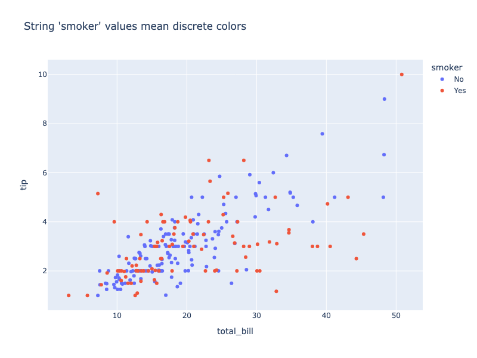

**Interactive Plot:**

<div>                        <script type="text/javascript">window.PlotlyConfig = {MathJaxConfig: 'local'};</script>
        <script charset="utf-8" src="https://cdn.plot.ly/plotly-3.1.0.min.js" integrity="sha256-Ei4740bWZhaUTQuD6q9yQlgVCMPBz6CZWhevDYPv93A=" crossorigin="anonymous"></script>                <div id="plotly-div-1" class="plotly-graph-div" style="height:100%; width:100%;"></div>            <script type="text/javascript">                window.PLOTLYENV=window.PLOTLYENV || {};                                if (document.getElementById("plotly-div-1")) {                    Plotly.newPlot(                        "plotly-div-1",                        [{"hovertemplate":"smoker=No\u003cbr\u003etotal_bill=%{x}\u003cbr\u003etip=%{y}\u003cextra\u003e\u003c\u002fextra\u003e","legendgroup":"No","marker":{"color":"#636efa","symbol":"circle"},"mode":"markers","name":"No","orientation":"v","showlegend":true,"x":{"dtype":"f8","bdata":"PQrXo3D9MECuR+F6FK4kQMP1KFyPAjVArkfhehSuN0DXo3A9Cpc4QArXo3A9SjlACtejcD2KIUDhehSuR+E6QBSuR+F6FC5Aj8L1KFyPLUAK16NwPYokQOF6FK5HoUFA16NwPQrXLkCuR+F6FG4yQClcj8L1qC1AFK5H4XqUNUApXI\u002fC9agkQArXo3A9SjBAuB6F61H4MEBmZmZmZqY0QOxRuB6F6zFACtejcD1KNEAK16NwPYovQPYoXI\u002fCtUNAUrgehevRM0CPwvUoXM8xQD0K16NwvSpA4XoUrkdhKUAzMzMzM7M1QGZmZmZmpjNAmpmZmZkZI0CamZmZmVkyQB+F61G4Hi5AcT0K16OwNEBI4XoUrscxQI\u002fC9ShcDzhAj8L1KFxPMECuR+F6FO4wQHE9CtejsDJAhetRuB5FP0AK16NwPQowQPYoXI\u002fCdTFA4XoUrkfhK0Bcj8L1KFwjQGZmZmZmZj5ACtejcD1KMkB7FK5H4To2QDMzMzMzM0BAzczMzMyMPEAK16NwPQoyQBSuR+F6FClAFK5H4XqUJEBI4XoUrmdBQOF6FK5H4SNAj8L1KFyPOUA9CtejcH0zQClcj8L1aDpAw\u002fUoXI8iSEDXo3A9CpcxQBSuR+F6FDRAMzMzMzNzMEB7FK5H4To0QArXo3A9CihAUrgehesRMUD2KFyPwnUtQIXrUbgeBSVAMzMzMzMzO0DD9Shcj8I2QArXo3A9SjFAKVyPwvWoMECkcD0K1yMkQPYoXI\u002fC9S9ACtejcD1qQUCPwvUoXA8qQEjhehSuRzJA9ihcj8K1OEApXI\u002fC9Sg1QD0K16NwfTZAAAAAAADANkDsUbgehesoQOxRuB6F6zRAPQrXo3A9MkAAAAAAAAAsQAAAAAAAAB1AKVyPwvUIQ0AzMzMzM\u002fM3QPYoXI\u002fCtTlAj8L1KFxPMUCuR+F6FO49QM3MzMzMTCVAXI\u002fC9SjcKEAUrkfhehQ4QOF6FK5HYSdA16NwPQrXKkCF61G4HoUsQGZmZmZm5i9A9ihcj8L1KEDNzMzMzMw9QArXo3A9CiFACtejcD0KLUDD9Shcj8ImQFK4HoXr0TZAFK5H4XoUM0CF61G4HkU0QNejcD0KVyZAhetRuB6FKEDD9Shcj0IyQIXrUbgeBSFAKVyPwvWoJEDNzMzMzEwsQFK4HoXrUSpAuB6F61F4MUBmZmZmZiZBQLgehetRmERAzczMzMwMO0CuR+F6FG4wQDMzMzMzsyBApHA9CtejMkA9CtejcL0nQI\u002fC9ShcjyNACtejcD0KHkCkcD0K1yMsQMP1KFyPQipAw\u002fUoXI9CMUDNzMzMzIw4QIXrUbgexTNAmpmZmZnZPUD2KFyPwhVIQAAAAAAAADlASOF6FK7HKkA9CtejcH0wQAAAAAAAgDVAUrgehetRKUD2KFyPwjUwQB+F61G4nitAhetRuB6FOEDD9Shcj8I0QPYoXI\u002fCtT9AcT0K16OwNEA9CtejcD0eQArXo3A9KkhA9ihcj8L1L0AzMzMzM3M0QI\u002fC9ShcjypAuB6F61E4J0AK16NwPYolQKRwPQrXIyRACtejcD3qQUBI4XoUrgc9QFK4HoXr0TFASOF6FK7HMkA="},"xaxis":"x","y":{"dtype":"f8","bdata":"KVyPwvUo8D+PwvUoXI\u002f6PwAAAAAAAAxAexSuR+F6CkDhehSuR+EMQNejcD0K1xJAAAAAAAAAAED2KFyPwvUIQFyPwvUoXP8\u002f16NwPQrXCUBcj8L1KFz7PwAAAAAAABRAH4XrUbge+T8AAAAAAAAIQClcj8L1KAhAXI\u002fC9ShcD0C4HoXrUbj6P65H4XoUrg1AAAAAAAAADEDNzMzMzMwKQFK4HoXrURBAAAAAAAAABkDXo3A9CtcBQFK4HoXrUR5AcT0K16NwCUC4HoXrUbgCQAAAAAAAAABAAAAAAAAAAEAzMzMzMzMRQAAAAAAAAAhAMzMzMzMz9z8AAAAAAAAEQAAAAAAAAAhAmpmZmZmZA0ApXI\u002fC9SgKQM3MzMzMzAxAAAAAAAAAAECPwvUoXI8IQHsUrkfhegJAAAAAAAAAFEDsUbgehesBQFK4HoXrUQRAexSuR+F6CEAfhetRuB71P2ZmZmZmZhZAAAAAAAAACEAAAAAAAAAUQAAAAAAAABhAZmZmZmZmAEAAAAAAAAAIQAAAAAAAAARAzczMzMzMBEDNzMzMzMwUQPYoXI\u002fC9fg\u002fXI\u002fC9ShcEUAUrkfhehQMQAAAAAAAAPg\u002f7FG4HoXrGkAfhetRuB4FQDMzMzMzMwlAw\u002fUoXI\u002fCA0AUrkfhehQAQIXrUbgehf8\u002fAAAAAAAACECamZmZmZkBQAAAAAAAAPQ\u002fAAAAAAAAEEAAAAAAAAAIQK5H4XoUrgVAMzMzMzMzC0BI4XoUrkf9Pz0K16NwPQBArkfhehSuFEAAAAAAAAAAQAAAAAAAABBAZmZmZmZmF0AAAAAAAAAIQAAAAAAAAAxAAAAAAAAACkAAAAAAAAD4P1K4HoXrURBAFK5H4XoUDkAAAAAAAAAIQAAAAAAAAPA\u002fAAAAAAAAEEBmZmZmZmYEQAAAAAAAABBAAAAAAAAADEBI4XoUrkcUQAAAAAAAAPg\u002fzczMzMzM\u002fD9cj8L1KFwHQHsUrkfhegJA4XoUrkfh+j8AAAAAAAAEQAAAAAAAAABAKVyPwvUoBEDNzMzMzMwQQK5H4XoUrvc\u002fAAAAAAAAAEAAAAAAAAAAQHE9CtejcAFAAAAAAAAA+D+kcD0K16MGQAAAAAAAAPg\u002fAAAAAAAAAEAAAAAAAAAKQAAAAAAAAPQ\u002fAAAAAAAAAEAAAAAAAAAAQAAAAAAAAAZAAAAAAAAADEDNzMzMzMwaQAAAAAAAABRAAAAAAAAAFEBmZmZmZmYCQAAAAAAAAPg\u002fw\u002fUoXI\u002fC9T8UrkfhehT6P65H4XoUrvs\u002fAAAAAAAAAEAAAAAAAAAEQAAAAAAAAABA7FG4HoXrBUAAAAAAAAAAQAAAAAAAAABAj8L1KFyPFEAAAAAAAAAUQAAAAAAAAA5A4XoUrkfhBEAAAAAAAAAAQAAAAAAAAAxAAAAAAAAABEAAAAAAAAAAQAAAAAAAAABA16NwPQrXC0DsUbgehesBQAAAAAAAABJAAAAAAAAAFEAK16NwPQr3PwAAAAAAACJAAAAAAAAACEAAAAAAAAAIQMP1KFyPwgVAH4XrUbgeC0CF61G4HoX3PwAAAAAAAPQ\u002frkfhehSuEkCuR+F6FK4XQAAAAAAAAPw\u002fAAAAAAAACEA="},"yaxis":"y","type":"scatter"},{"hovertemplate":"smoker=Yes\u003cbr\u003etotal_bill=%{x}\u003cbr\u003etip=%{y}\u003cextra\u003e\u003c\u002fextra\u003e","legendgroup":"Yes","marker":{"color":"#EF553B","symbol":"circle"},"mode":"markers","name":"Yes","orientation":"v","showlegend":true,"x":{"dtype":"f8","bdata":"4XoUrkcBQ0B7FK5H4XomQArXo3A9SjRAH4XrUbieK0AK16NwPQomQArXo3A9SjJAj8L1KFyPCECF61G4HgUuQFyPwvUo3DpASOF6FK5HOUDsUbgehesxQHE9CtejcDNA16NwPQpXQEC4HoXrUfg8QAAAAAAAABdAUrgehetRMED2KFyPwhVEQEjhehSuRztAj8L1KFwPKEDD9ShcjwI1QDMzMzMzsyZAw\u002fUoXI\u002fCLkBmZmZmZiZGQOxRuB6FazZAuB6F61G4LkA9CtejcH00QPYoXI\u002fCNTlAH4XrUbieLEAAAAAAAAAwQMP1KFyPgjFArkfhehQuJUDD9Shcj0IlQEjhehSuZ0lAH4XrUbieL0AAAAAAAAAdQJqZmZmZ2T9AUrgehevRMEAzMzMzM3NAQKRwPQrX4zFA9ihcj8L1LEAzMzMzMzMjQHE9CtejUEFAMzMzMzNTQUAUrkfhelQ3QM3MzMzMrEZA7FG4HoUrN0BmZmZmZkZEQGZmZmZm5jRA9ihcj8J1PkBmZmZmZiYyQJqZmZmZGTdA4XoUrkdhL0CPwvUoXM8zQHE9CtejcDxA9ihcj8L1LkAUrkfhepQwQK5H4XoUriRArkfhehSORUAAAAAAAAAqQIXrUbgeBStA9ihcj8K1MkB7FK5H4XopQAAAAAAAACpAZmZmZmZmMEBI4XoUroc0QLgehetReDBA16NwPQqXOkA9CtejcF1DQIXrUbgeRThAhetRuB6FKUCPwvUoXA8+QKRwPQrX4zlACtejcD2KKkDsUbgehSs8QM3MzMzMzClAZmZmZmYmPECuR+F6FC4nQPYoXI\u002fC9R5ApHA9CtcjPkBSuB6F61EoQNejcD0K1ypAKVyPwvUoIUDXo3A9CtcqQIXrUbgeRTBArkfhehQuJEAfhetRuB42QMP1KFyPAjhA4XoUrkdhL0CPwvUoXA8vQDMzMzMzMylACtejcD1qQECuR+F6FC47QOxRuB6FqzZA"},"xaxis":"x","y":{"dtype":"f8","bdata":"AAAAAAAACEApXI\u002fC9Sj8P65H4XoUrglAAAAAAAAAAECuR+F6FK7\u002fPxSuR+F6FA5AAAAAAAAA8D+4HoXrUbgAQB+F61G4HglAAAAAAAAAFECkcD0K16MIQAAAAAAAAAhAAAAAAAAAFEAAAAAAAAAIQAAAAAAAAPA\u002fMzMzMzMzEUDsUbgehesSQAAAAAAAABBAAAAAAAAA+D8AAAAAAAAIQAAAAAAAAARAAAAAAAAACEAAAAAAAAAEQNejcD0K1wtAPQrXo3A9+j89CtejcD0QQClcj8L1KBFAAAAAAAAAEEAAAAAAAAAAQAAAAAAAAAhAw\u002fUoXI\u002fC+T8AAAAAAAAAQAAAAAAAACRASOF6FK5HCUCamZmZmZkUQHE9CtejcAlAAAAAAAAAEEDhehSuR+EIQAAAAAAAAABAAAAAAAAAAEAAAAAAAAAQQGZmZmZmZgxAcT0K16NwDUCamZmZmZkWQAAAAAAAAAxAAAAAAAAAGkAAAAAAAAAIQAAAAAAAAAxAAAAAAAAAAEAAAAAAAAAMQAAAAAAAABBAAAAAAAAA+D\u002fD9Shcj8IQQHsUrkfhegRAKVyPwvUoAEAAAAAAAAAQQAAAAAAAAABAAAAAAAAAFEAAAAAAAAAAQAAAAAAAAABAAAAAAAAAEEAUrkfhehQAQAAAAAAAAABAAAAAAAAABEAAAAAAAAAQQNejcD0K1wlASOF6FK5HC0AAAAAAAAAIQD0K16NwPQBA16NwPQrXAUAAAAAAAAAAQKRwPQrXoxRAAAAAAAAABEAAAAAAAAAaQJqZmZmZmfE\u002fAAAAAAAACEAAAAAAAAD4PwrXo3A9Cvc\u002fuB6F61G4CECamZmZmZkBQNejcD0K1wtAuB6F61G4\u002fj9I4XoUrkf5PwAAAAAAAARAAAAAAAAAAEAK16NwPQoHQAAAAAAAAABAAAAAAAAACEAAAAAAAAAIQAAAAAAAAPA\u002fuB6F61G48j8AAAAAAAAAQAAAAAAAAABA"},"yaxis":"y","type":"scatter"}],                        {"template":{"data":{"histogram2dcontour":[{"type":"histogram2dcontour","colorbar":{"outlinewidth":0,"ticks":""},"colorscale":[[0.0,"#0d0887"],[0.1111111111111111,"#46039f"],[0.2222222222222222,"#7201a8"],[0.3333333333333333,"#9c179e"],[0.4444444444444444,"#bd3786"],[0.5555555555555556,"#d8576b"],[0.6666666666666666,"#ed7953"],[0.7777777777777778,"#fb9f3a"],[0.8888888888888888,"#fdca26"],[1.0,"#f0f921"]]}],"choropleth":[{"type":"choropleth","colorbar":{"outlinewidth":0,"ticks":""}}],"histogram2d":[{"type":"histogram2d","colorbar":{"outlinewidth":0,"ticks":""},"colorscale":[[0.0,"#0d0887"],[0.1111111111111111,"#46039f"],[0.2222222222222222,"#7201a8"],[0.3333333333333333,"#9c179e"],[0.4444444444444444,"#bd3786"],[0.5555555555555556,"#d8576b"],[0.6666666666666666,"#ed7953"],[0.7777777777777778,"#fb9f3a"],[0.8888888888888888,"#fdca26"],[1.0,"#f0f921"]]}],"heatmap":[{"type":"heatmap","colorbar":{"outlinewidth":0,"ticks":""},"colorscale":[[0.0,"#0d0887"],[0.1111111111111111,"#46039f"],[0.2222222222222222,"#7201a8"],[0.3333333333333333,"#9c179e"],[0.4444444444444444,"#bd3786"],[0.5555555555555556,"#d8576b"],[0.6666666666666666,"#ed7953"],[0.7777777777777778,"#fb9f3a"],[0.8888888888888888,"#fdca26"],[1.0,"#f0f921"]]}],"contourcarpet":[{"type":"contourcarpet","colorbar":{"outlinewidth":0,"ticks":""}}],"contour":[{"type":"contour","colorbar":{"outlinewidth":0,"ticks":""},"colorscale":[[0.0,"#0d0887"],[0.1111111111111111,"#46039f"],[0.2222222222222222,"#7201a8"],[0.3333333333333333,"#9c179e"],[0.4444444444444444,"#bd3786"],[0.5555555555555556,"#d8576b"],[0.6666666666666666,"#ed7953"],[0.7777777777777778,"#fb9f3a"],[0.8888888888888888,"#fdca26"],[1.0,"#f0f921"]]}],"surface":[{"type":"surface","colorbar":{"outlinewidth":0,"ticks":""},"colorscale":[[0.0,"#0d0887"],[0.1111111111111111,"#46039f"],[0.2222222222222222,"#7201a8"],[0.3333333333333333,"#9c179e"],[0.4444444444444444,"#bd3786"],[0.5555555555555556,"#d8576b"],[0.6666666666666666,"#ed7953"],[0.7777777777777778,"#fb9f3a"],[0.8888888888888888,"#fdca26"],[1.0,"#f0f921"]]}],"mesh3d":[{"type":"mesh3d","colorbar":{"outlinewidth":0,"ticks":""}}],"scatter":[{"fillpattern":{"fillmode":"overlay","size":10,"solidity":0.2},"type":"scatter"}],"parcoords":[{"type":"parcoords","line":{"colorbar":{"outlinewidth":0,"ticks":""}}}],"scatterpolargl":[{"type":"scatterpolargl","marker":{"colorbar":{"outlinewidth":0,"ticks":""}}}],"bar":[{"error_x":{"color":"#2a3f5f"},"error_y":{"color":"#2a3f5f"},"marker":{"line":{"color":"#E5ECF6","width":0.5},"pattern":{"fillmode":"overlay","size":10,"solidity":0.2}},"type":"bar"}],"scattergeo":[{"type":"scattergeo","marker":{"colorbar":{"outlinewidth":0,"ticks":""}}}],"scatterpolar":[{"type":"scatterpolar","marker":{"colorbar":{"outlinewidth":0,"ticks":""}}}],"histogram":[{"marker":{"pattern":{"fillmode":"overlay","size":10,"solidity":0.2}},"type":"histogram"}],"scattergl":[{"type":"scattergl","marker":{"colorbar":{"outlinewidth":0,"ticks":""}}}],"scatter3d":[{"type":"scatter3d","line":{"colorbar":{"outlinewidth":0,"ticks":""}},"marker":{"colorbar":{"outlinewidth":0,"ticks":""}}}],"scattermap":[{"type":"scattermap","marker":{"colorbar":{"outlinewidth":0,"ticks":""}}}],"scattermapbox":[{"type":"scattermapbox","marker":{"colorbar":{"outlinewidth":0,"ticks":""}}}],"scatterternary":[{"type":"scatterternary","marker":{"colorbar":{"outlinewidth":0,"ticks":""}}}],"scattercarpet":[{"type":"scattercarpet","marker":{"colorbar":{"outlinewidth":0,"ticks":""}}}],"carpet":[{"aaxis":{"endlinecolor":"#2a3f5f","gridcolor":"white","linecolor":"white","minorgridcolor":"white","startlinecolor":"#2a3f5f"},"baxis":{"endlinecolor":"#2a3f5f","gridcolor":"white","linecolor":"white","minorgridcolor":"white","startlinecolor":"#2a3f5f"},"type":"carpet"}],"table":[{"cells":{"fill":{"color":"#EBF0F8"},"line":{"color":"white"}},"header":{"fill":{"color":"#C8D4E3"},"line":{"color":"white"}},"type":"table"}],"barpolar":[{"marker":{"line":{"color":"#E5ECF6","width":0.5},"pattern":{"fillmode":"overlay","size":10,"solidity":0.2}},"type":"barpolar"}],"pie":[{"automargin":true,"type":"pie"}]},"layout":{"autotypenumbers":"strict","colorway":["#636efa","#EF553B","#00cc96","#ab63fa","#FFA15A","#19d3f3","#FF6692","#B6E880","#FF97FF","#FECB52"],"font":{"color":"#2a3f5f"},"hovermode":"closest","hoverlabel":{"align":"left"},"paper_bgcolor":"white","plot_bgcolor":"#E5ECF6","polar":{"bgcolor":"#E5ECF6","angularaxis":{"gridcolor":"white","linecolor":"white","ticks":""},"radialaxis":{"gridcolor":"white","linecolor":"white","ticks":""}},"ternary":{"bgcolor":"#E5ECF6","aaxis":{"gridcolor":"white","linecolor":"white","ticks":""},"baxis":{"gridcolor":"white","linecolor":"white","ticks":""},"caxis":{"gridcolor":"white","linecolor":"white","ticks":""}},"coloraxis":{"colorbar":{"outlinewidth":0,"ticks":""}},"colorscale":{"sequential":[[0.0,"#0d0887"],[0.1111111111111111,"#46039f"],[0.2222222222222222,"#7201a8"],[0.3333333333333333,"#9c179e"],[0.4444444444444444,"#bd3786"],[0.5555555555555556,"#d8576b"],[0.6666666666666666,"#ed7953"],[0.7777777777777778,"#fb9f3a"],[0.8888888888888888,"#fdca26"],[1.0,"#f0f921"]],"sequentialminus":[[0.0,"#0d0887"],[0.1111111111111111,"#46039f"],[0.2222222222222222,"#7201a8"],[0.3333333333333333,"#9c179e"],[0.4444444444444444,"#bd3786"],[0.5555555555555556,"#d8576b"],[0.6666666666666666,"#ed7953"],[0.7777777777777778,"#fb9f3a"],[0.8888888888888888,"#fdca26"],[1.0,"#f0f921"]],"diverging":[[0,"#8e0152"],[0.1,"#c51b7d"],[0.2,"#de77ae"],[0.3,"#f1b6da"],[0.4,"#fde0ef"],[0.5,"#f7f7f7"],[0.6,"#e6f5d0"],[0.7,"#b8e186"],[0.8,"#7fbc41"],[0.9,"#4d9221"],[1,"#276419"]]},"xaxis":{"gridcolor":"white","linecolor":"white","ticks":"","title":{"standoff":15},"zerolinecolor":"white","automargin":true,"zerolinewidth":2},"yaxis":{"gridcolor":"white","linecolor":"white","ticks":"","title":{"standoff":15},"zerolinecolor":"white","automargin":true,"zerolinewidth":2},"scene":{"xaxis":{"backgroundcolor":"#E5ECF6","gridcolor":"white","linecolor":"white","showbackground":true,"ticks":"","zerolinecolor":"white","gridwidth":2},"yaxis":{"backgroundcolor":"#E5ECF6","gridcolor":"white","linecolor":"white","showbackground":true,"ticks":"","zerolinecolor":"white","gridwidth":2},"zaxis":{"backgroundcolor":"#E5ECF6","gridcolor":"white","linecolor":"white","showbackground":true,"ticks":"","zerolinecolor":"white","gridwidth":2}},"shapedefaults":{"line":{"color":"#2a3f5f"}},"annotationdefaults":{"arrowcolor":"#2a3f5f","arrowhead":0,"arrowwidth":1},"geo":{"bgcolor":"white","landcolor":"#E5ECF6","subunitcolor":"white","showland":true,"showlakes":true,"lakecolor":"white"},"title":{"x":0.05},"mapbox":{"style":"light"}}},"xaxis":{"anchor":"y","domain":[0.0,1.0],"title":{"text":"total_bill"}},"yaxis":{"anchor":"x","domain":[0.0,1.0],"title":{"text":"tip"}},"legend":{"title":{"text":"smoker"},"tracegroupgap":0},"title":{"text":"String 'smoker' values mean discrete colors"}},                        {"responsive": true}                    )                };            </script>        </div>

The `size` column, however, contains numbers:

```python
import plotly.express as px
df = px.data.tips()
fig = px.scatter(df, x="total_bill", y="tip", color="size",
                 title="Numeric 'size' values mean continuous color")

fig.show()
```

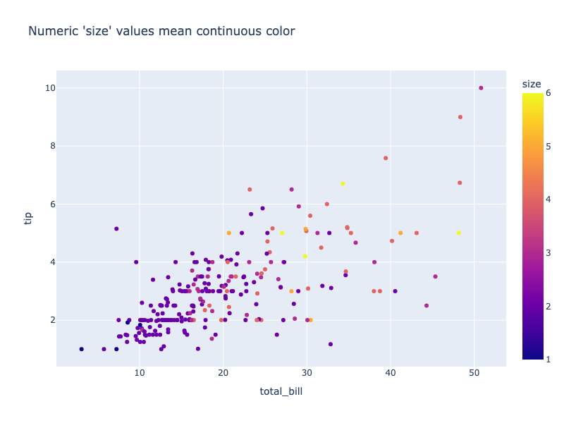

**Interactive Plot:**

<div>                        <script type="text/javascript">window.PlotlyConfig = {MathJaxConfig: 'local'};</script>
        <script charset="utf-8" src="https://cdn.plot.ly/plotly-3.1.0.min.js" integrity="sha256-Ei4740bWZhaUTQuD6q9yQlgVCMPBz6CZWhevDYPv93A=" crossorigin="anonymous"></script>                <div id="plotly-div-2" class="plotly-graph-div" style="height:100%; width:100%;"></div>            <script type="text/javascript">                window.PLOTLYENV=window.PLOTLYENV || {};                                if (document.getElementById("plotly-div-2")) {                    Plotly.newPlot(                        "plotly-div-2",                        [{"hovertemplate":"total_bill=%{x}\u003cbr\u003etip=%{y}\u003cbr\u003esize=%{marker.color}\u003cextra\u003e\u003c\u002fextra\u003e","legendgroup":"","marker":{"color":{"dtype":"i1","bdata":"AgMDAgQEAgQCAgIEAgQCAgMDAwMCAgIEAgQCAgICAgQCBAIDAwMDAwMCAgIEAgIEAwICAgQCBAIEAgIEAgICBAMDAgECAgIDAgICAgIEAgICAgECAgQCAgICAgICAgIEAgICAgICAwICAgICAgICAQMCAwIEAgIEAgICAgIGAgICAwICAgICAgICAgICBgUGAgIDAgICAgIDBAQFBgQCBAQCAwICAwIEAgIDAgICAgICAgICBAIDBAIFAwUDAwICAgICAgIEAgIDAgICBAMDBAICAwQEAgMCBQICBAICAQMCAgIEAgIEAwICAgICAgMDAgICAg=="},"coloraxis":"coloraxis","symbol":"circle"},"mode":"markers","name":"","orientation":"v","showlegend":false,"x":{"dtype":"f8","bdata":"PQrXo3D9MECuR+F6FK4kQMP1KFyPAjVArkfhehSuN0DXo3A9Cpc4QArXo3A9SjlACtejcD2KIUDhehSuR+E6QBSuR+F6FC5Aj8L1KFyPLUAK16NwPYokQOF6FK5HoUFA16NwPQrXLkCuR+F6FG4yQClcj8L1qC1AFK5H4XqUNUApXI\u002fC9agkQArXo3A9SjBAuB6F61H4MEBmZmZmZqY0QOxRuB6F6zFACtejcD1KNEAK16NwPYovQPYoXI\u002fCtUNAUrgehevRM0CPwvUoXM8xQD0K16NwvSpA4XoUrkdhKUAzMzMzM7M1QGZmZmZmpjNAmpmZmZkZI0CamZmZmVkyQB+F61G4Hi5AcT0K16OwNEBI4XoUrscxQI\u002fC9ShcDzhAj8L1KFxPMECuR+F6FO4wQHE9CtejsDJAhetRuB5FP0AK16NwPQowQPYoXI\u002fCdTFA4XoUrkfhK0Bcj8L1KFwjQGZmZmZmZj5ACtejcD1KMkB7FK5H4To2QDMzMzMzM0BAzczMzMyMPEAK16NwPQoyQBSuR+F6FClAFK5H4XqUJEBI4XoUrmdBQOF6FK5H4SNAj8L1KFyPOUA9CtejcH0zQOF6FK5HAUNAKVyPwvVoOkB7FK5H4XomQMP1KFyPIkhACtejcD1KNEAfhetRuJ4rQArXo3A9CiZACtejcD1KMkDXo3A9CpcxQBSuR+F6FDRAMzMzMzNzMECPwvUoXI8IQHsUrkfhOjRAhetRuB4FLkAK16NwPQooQFK4HoXrETFAXI\u002fC9SjcOkBI4XoUrkc5QPYoXI\u002fCdS1AhetRuB4FJUDsUbgehesxQDMzMzMzMztAw\u002fUoXI\u002fCNkAK16NwPUoxQHE9CtejcDNAKVyPwvWoMECkcD0K1yMkQNejcD0KV0BA9ihcj8L1L0AK16NwPWpBQI\u002fC9ShcDypASOF6FK5HMkD2KFyPwrU4QClcj8L1KDVAuB6F61H4PEA9CtejcH02QAAAAAAAABdAUrgehetRMEAAAAAAAMA2QPYoXI\u002fCFURASOF6FK5HO0CPwvUoXA8oQMP1KFyPAjVA7FG4HoXrKEAzMzMzM7MmQMP1KFyPwi5AZmZmZmYmRkDsUbgehWs2QOxRuB6F6zRAuB6F61G4LkA9CtejcH00QPYoXI\u002fCNTlAPQrXo3A9MkAfhetRuJ4sQAAAAAAAACxAAAAAAAAAHUApXI\u002fC9QhDQDMzMzMz8zdA9ihcj8K1OUCPwvUoXE8xQK5H4XoU7j1AzczMzMxMJUBcj8L1KNwoQBSuR+F6FDhA4XoUrkdhJ0DXo3A9CtcqQIXrUbgehSxAZmZmZmbmL0D2KFyPwvUoQM3MzMzMzD1ACtejcD0KIUAK16NwPQotQMP1KFyPwiZAUrgehevRNkAUrkfhehQzQIXrUbgeRTRA16NwPQpXJkCF61G4HoUoQMP1KFyPQjJAhetRuB4FIUApXI\u002fC9agkQM3MzMzMTCxAAAAAAAAAMEBSuB6F61EqQLgehetReDFAZmZmZmYmQUC4HoXrUZhEQM3MzMzMDDtArkfhehRuMEAzMzMzM7MgQKRwPQrXozJAPQrXo3C9J0CPwvUoXI8jQArXo3A9Ch5ApHA9CtcjLEDD9Shcj0IqQMP1KFyPQjFAzczMzMyMOECF61G4HsUzQJqZmZmZ2T1A9ihcj8IVSEAAAAAAAAA5QEjhehSuxypAPQrXo3B9MEAAAAAAAIA1QFK4HoXrUSlA9ihcj8I1MEAfhetRuJ4rQMP1KFyPgjFAhetRuB6FOEDD9Shcj8I0QPYoXI\u002fCtT9ArkfhehQuJUDD9Shcj0IlQEjhehSuZ0lAH4XrUbieL0AAAAAAAAAdQJqZmZmZ2T9AUrgehevRMEAzMzMzM3NAQKRwPQrX4zFA9ihcj8L1LEAzMzMzMzMjQHE9CtejUEFAMzMzMzNTQUAUrkfhelQ3QM3MzMzMrEZA7FG4HoUrN0BmZmZmZkZEQHE9CtejsDRAZmZmZmbmNED2KFyPwnU+QGZmZmZmJjJAmpmZmZkZN0DhehSuR2EvQI\u002fC9ShczzNAcT0K16NwPED2KFyPwvUuQBSuR+F6lDBAPQrXo3A9HkCuR+F6FK4kQK5H4XoUjkVAAAAAAAAAKkCF61G4HgUrQPYoXI\u002fCtTJAexSuR+F6KUAAAAAAAAAqQGZmZmZmZjBASOF6FK6HNEC4HoXrUXgwQNejcD0KlzpAPQrXo3BdQ0CF61G4HkU4QIXrUbgehSlAj8L1KFwPPkCkcD0K1+M5QArXo3A9KkhACtejcD2KKkDsUbgehSs8QM3MzMzMzClAZmZmZmYmPECuR+F6FC4nQPYoXI\u002fC9R5ApHA9CtcjPkBSuB6F61EoQNejcD0K1ypAKVyPwvUoIUD2KFyPwvUvQNejcD0K1ypAhetRuB5FMECuR+F6FC4kQDMzMzMzczRAj8L1KFyPKkAfhetRuB42QMP1KFyPAjhA4XoUrkdhL0C4HoXrUTgnQArXo3A9iiVAj8L1KFwPL0CkcD0K1yMkQDMzMzMzMylACtejcD1qQEAK16NwPepBQEjhehSuBz1ArkfhehQuO0DsUbgehas2QFK4HoXr0TFASOF6FK7HMkA="},"xaxis":"x","y":{"dtype":"f8","bdata":"KVyPwvUo8D+PwvUoXI\u002f6PwAAAAAAAAxAexSuR+F6CkDhehSuR+EMQNejcD0K1xJAAAAAAAAAAED2KFyPwvUIQFyPwvUoXP8\u002f16NwPQrXCUBcj8L1KFz7PwAAAAAAABRAH4XrUbge+T8AAAAAAAAIQClcj8L1KAhAXI\u002fC9ShcD0C4HoXrUbj6P65H4XoUrg1AAAAAAAAADEDNzMzMzMwKQFK4HoXrURBAAAAAAAAABkDXo3A9CtcBQFK4HoXrUR5AcT0K16NwCUC4HoXrUbgCQAAAAAAAAABAAAAAAAAAAEAzMzMzMzMRQAAAAAAAAAhAMzMzMzMz9z8AAAAAAAAEQAAAAAAAAAhAmpmZmZmZA0ApXI\u002fC9SgKQM3MzMzMzAxAAAAAAAAAAECPwvUoXI8IQHsUrkfhegJAAAAAAAAAFEDsUbgehesBQFK4HoXrUQRAexSuR+F6CEAfhetRuB71P2ZmZmZmZhZAAAAAAAAACEAAAAAAAAAUQAAAAAAAABhAZmZmZmZmAEAAAAAAAAAIQAAAAAAAAARAzczMzMzMBEDNzMzMzMwUQPYoXI\u002fC9fg\u002fXI\u002fC9ShcEUAUrkfhehQMQAAAAAAAAAhAAAAAAAAA+D8pXI\u002fC9Sj8P+xRuB6F6xpArkfhehSuCUAAAAAAAAAAQK5H4XoUrv8\u002fFK5H4XoUDkAfhetRuB4FQDMzMzMzMwlAw\u002fUoXI\u002fCA0AAAAAAAADwPxSuR+F6FABAuB6F61G4AECF61G4HoX\u002fPwAAAAAAAAhAH4XrUbgeCUAAAAAAAAAUQJqZmZmZmQFAAAAAAAAA9D+kcD0K16MIQAAAAAAAABBAAAAAAAAACECuR+F6FK4FQAAAAAAAAAhAMzMzMzMzC0BI4XoUrkf9PwAAAAAAABRAPQrXo3A9AECuR+F6FK4UQAAAAAAAAABAAAAAAAAAEEBmZmZmZmYXQAAAAAAAAAhAAAAAAAAACEAAAAAAAAAMQAAAAAAAAPA\u002fMzMzMzMzEUAAAAAAAAAKQOxRuB6F6xJAAAAAAAAAEEAAAAAAAAD4PwAAAAAAAAhAAAAAAAAA+D8AAAAAAAAEQAAAAAAAAAhAAAAAAAAABEDXo3A9CtcLQFK4HoXrURBAPQrXo3A9+j89CtejcD0QQClcj8L1KBFAFK5H4XoUDkAAAAAAAAAQQAAAAAAAAAhAAAAAAAAA8D8AAAAAAAAQQGZmZmZmZgRAAAAAAAAAEEAAAAAAAAAMQEjhehSuRxRAAAAAAAAA+D\u002fNzMzMzMz8P1yPwvUoXAdAexSuR+F6AkDhehSuR+H6PwAAAAAAAARAAAAAAAAAAEApXI\u002fC9SgEQM3MzMzMzBBArkfhehSu9z8AAAAAAAAAQAAAAAAAAABAcT0K16NwAUAAAAAAAAD4P6RwPQrXowZAAAAAAAAA+D8AAAAAAAAAQAAAAAAAAApAAAAAAAAA9D8AAAAAAAAAQAAAAAAAAABAAAAAAAAAAEAAAAAAAAAGQAAAAAAAAAxAzczMzMzMGkAAAAAAAAAUQAAAAAAAABRAZmZmZmZmAkAAAAAAAAD4P8P1KFyPwvU\u002fFK5H4XoU+j+uR+F6FK77PwAAAAAAAABAAAAAAAAABEAAAAAAAAAAQOxRuB6F6wVAAAAAAAAAAEAAAAAAAAAAQI\u002fC9ShcjxRAAAAAAAAAFEAAAAAAAAAOQOF6FK5H4QRAAAAAAAAAAEAAAAAAAAAMQAAAAAAAAARAAAAAAAAAAEAAAAAAAAAAQAAAAAAAAAhA16NwPQrXC0DsUbgehesBQAAAAAAAABJAw\u002fUoXI\u002fC+T8AAAAAAAAAQAAAAAAAACRASOF6FK5HCUCamZmZmZkUQHE9CtejcAlAAAAAAAAAEEDhehSuR+EIQAAAAAAAAABAAAAAAAAAAEAAAAAAAAAQQGZmZmZmZgxAcT0K16NwDUCamZmZmZkWQAAAAAAAAAxAAAAAAAAAGkAAAAAAAAAIQAAAAAAAABRAAAAAAAAADEAAAAAAAAAAQAAAAAAAAAxAAAAAAAAAEEAAAAAAAAD4P8P1KFyPwhBAexSuR+F6BEApXI\u002fC9SgAQAAAAAAAABBACtejcD0K9z8AAAAAAAAAQAAAAAAAABRAAAAAAAAAAEAAAAAAAAAAQAAAAAAAABBAFK5H4XoUAEAAAAAAAAAAQAAAAAAAAARAAAAAAAAAEEDXo3A9CtcJQEjhehSuRwtAAAAAAAAACEA9CtejcD0AQNejcD0K1wFAAAAAAAAAAECkcD0K16MUQAAAAAAAACJAAAAAAAAABEAAAAAAAAAaQJqZmZmZmfE\u002fAAAAAAAACEAAAAAAAAD4PwrXo3A9Cvc\u002fuB6F61G4CECamZmZmZkBQNejcD0K1wtAuB6F61G4\u002fj8AAAAAAAAIQEjhehSuR\u002fk\u002fAAAAAAAABEAAAAAAAAAAQAAAAAAAAAhAw\u002fUoXI\u002fCBUAK16NwPQoHQAAAAAAAAABAAAAAAAAACEAfhetRuB4LQIXrUbgehfc\u002fAAAAAAAACEAAAAAAAAD0PwAAAAAAAPA\u002fuB6F61G48j+uR+F6FK4SQK5H4XoUrhdAAAAAAAAAAEAAAAAAAAAAQAAAAAAAAPw\u002fAAAAAAAACEA="},"yaxis":"y","type":"scatter"}],                        {"template":{"data":{"histogram2dcontour":[{"type":"histogram2dcontour","colorbar":{"outlinewidth":0,"ticks":""},"colorscale":[[0.0,"#0d0887"],[0.1111111111111111,"#46039f"],[0.2222222222222222,"#7201a8"],[0.3333333333333333,"#9c179e"],[0.4444444444444444,"#bd3786"],[0.5555555555555556,"#d8576b"],[0.6666666666666666,"#ed7953"],[0.7777777777777778,"#fb9f3a"],[0.8888888888888888,"#fdca26"],[1.0,"#f0f921"]]}],"choropleth":[{"type":"choropleth","colorbar":{"outlinewidth":0,"ticks":""}}],"histogram2d":[{"type":"histogram2d","colorbar":{"outlinewidth":0,"ticks":""},"colorscale":[[0.0,"#0d0887"],[0.1111111111111111,"#46039f"],[0.2222222222222222,"#7201a8"],[0.3333333333333333,"#9c179e"],[0.4444444444444444,"#bd3786"],[0.5555555555555556,"#d8576b"],[0.6666666666666666,"#ed7953"],[0.7777777777777778,"#fb9f3a"],[0.8888888888888888,"#fdca26"],[1.0,"#f0f921"]]}],"heatmap":[{"type":"heatmap","colorbar":{"outlinewidth":0,"ticks":""},"colorscale":[[0.0,"#0d0887"],[0.1111111111111111,"#46039f"],[0.2222222222222222,"#7201a8"],[0.3333333333333333,"#9c179e"],[0.4444444444444444,"#bd3786"],[0.5555555555555556,"#d8576b"],[0.6666666666666666,"#ed7953"],[0.7777777777777778,"#fb9f3a"],[0.8888888888888888,"#fdca26"],[1.0,"#f0f921"]]}],"contourcarpet":[{"type":"contourcarpet","colorbar":{"outlinewidth":0,"ticks":""}}],"contour":[{"type":"contour","colorbar":{"outlinewidth":0,"ticks":""},"colorscale":[[0.0,"#0d0887"],[0.1111111111111111,"#46039f"],[0.2222222222222222,"#7201a8"],[0.3333333333333333,"#9c179e"],[0.4444444444444444,"#bd3786"],[0.5555555555555556,"#d8576b"],[0.6666666666666666,"#ed7953"],[0.7777777777777778,"#fb9f3a"],[0.8888888888888888,"#fdca26"],[1.0,"#f0f921"]]}],"surface":[{"type":"surface","colorbar":{"outlinewidth":0,"ticks":""},"colorscale":[[0.0,"#0d0887"],[0.1111111111111111,"#46039f"],[0.2222222222222222,"#7201a8"],[0.3333333333333333,"#9c179e"],[0.4444444444444444,"#bd3786"],[0.5555555555555556,"#d8576b"],[0.6666666666666666,"#ed7953"],[0.7777777777777778,"#fb9f3a"],[0.8888888888888888,"#fdca26"],[1.0,"#f0f921"]]}],"mesh3d":[{"type":"mesh3d","colorbar":{"outlinewidth":0,"ticks":""}}],"scatter":[{"fillpattern":{"fillmode":"overlay","size":10,"solidity":0.2},"type":"scatter"}],"parcoords":[{"type":"parcoords","line":{"colorbar":{"outlinewidth":0,"ticks":""}}}],"scatterpolargl":[{"type":"scatterpolargl","marker":{"colorbar":{"outlinewidth":0,"ticks":""}}}],"bar":[{"error_x":{"color":"#2a3f5f"},"error_y":{"color":"#2a3f5f"},"marker":{"line":{"color":"#E5ECF6","width":0.5},"pattern":{"fillmode":"overlay","size":10,"solidity":0.2}},"type":"bar"}],"scattergeo":[{"type":"scattergeo","marker":{"colorbar":{"outlinewidth":0,"ticks":""}}}],"scatterpolar":[{"type":"scatterpolar","marker":{"colorbar":{"outlinewidth":0,"ticks":""}}}],"histogram":[{"marker":{"pattern":{"fillmode":"overlay","size":10,"solidity":0.2}},"type":"histogram"}],"scattergl":[{"type":"scattergl","marker":{"colorbar":{"outlinewidth":0,"ticks":""}}}],"scatter3d":[{"type":"scatter3d","line":{"colorbar":{"outlinewidth":0,"ticks":""}},"marker":{"colorbar":{"outlinewidth":0,"ticks":""}}}],"scattermap":[{"type":"scattermap","marker":{"colorbar":{"outlinewidth":0,"ticks":""}}}],"scattermapbox":[{"type":"scattermapbox","marker":{"colorbar":{"outlinewidth":0,"ticks":""}}}],"scatterternary":[{"type":"scatterternary","marker":{"colorbar":{"outlinewidth":0,"ticks":""}}}],"scattercarpet":[{"type":"scattercarpet","marker":{"colorbar":{"outlinewidth":0,"ticks":""}}}],"carpet":[{"aaxis":{"endlinecolor":"#2a3f5f","gridcolor":"white","linecolor":"white","minorgridcolor":"white","startlinecolor":"#2a3f5f"},"baxis":{"endlinecolor":"#2a3f5f","gridcolor":"white","linecolor":"white","minorgridcolor":"white","startlinecolor":"#2a3f5f"},"type":"carpet"}],"table":[{"cells":{"fill":{"color":"#EBF0F8"},"line":{"color":"white"}},"header":{"fill":{"color":"#C8D4E3"},"line":{"color":"white"}},"type":"table"}],"barpolar":[{"marker":{"line":{"color":"#E5ECF6","width":0.5},"pattern":{"fillmode":"overlay","size":10,"solidity":0.2}},"type":"barpolar"}],"pie":[{"automargin":true,"type":"pie"}]},"layout":{"autotypenumbers":"strict","colorway":["#636efa","#EF553B","#00cc96","#ab63fa","#FFA15A","#19d3f3","#FF6692","#B6E880","#FF97FF","#FECB52"],"font":{"color":"#2a3f5f"},"hovermode":"closest","hoverlabel":{"align":"left"},"paper_bgcolor":"white","plot_bgcolor":"#E5ECF6","polar":{"bgcolor":"#E5ECF6","angularaxis":{"gridcolor":"white","linecolor":"white","ticks":""},"radialaxis":{"gridcolor":"white","linecolor":"white","ticks":""}},"ternary":{"bgcolor":"#E5ECF6","aaxis":{"gridcolor":"white","linecolor":"white","ticks":""},"baxis":{"gridcolor":"white","linecolor":"white","ticks":""},"caxis":{"gridcolor":"white","linecolor":"white","ticks":""}},"coloraxis":{"colorbar":{"outlinewidth":0,"ticks":""}},"colorscale":{"sequential":[[0.0,"#0d0887"],[0.1111111111111111,"#46039f"],[0.2222222222222222,"#7201a8"],[0.3333333333333333,"#9c179e"],[0.4444444444444444,"#bd3786"],[0.5555555555555556,"#d8576b"],[0.6666666666666666,"#ed7953"],[0.7777777777777778,"#fb9f3a"],[0.8888888888888888,"#fdca26"],[1.0,"#f0f921"]],"sequentialminus":[[0.0,"#0d0887"],[0.1111111111111111,"#46039f"],[0.2222222222222222,"#7201a8"],[0.3333333333333333,"#9c179e"],[0.4444444444444444,"#bd3786"],[0.5555555555555556,"#d8576b"],[0.6666666666666666,"#ed7953"],[0.7777777777777778,"#fb9f3a"],[0.8888888888888888,"#fdca26"],[1.0,"#f0f921"]],"diverging":[[0,"#8e0152"],[0.1,"#c51b7d"],[0.2,"#de77ae"],[0.3,"#f1b6da"],[0.4,"#fde0ef"],[0.5,"#f7f7f7"],[0.6,"#e6f5d0"],[0.7,"#b8e186"],[0.8,"#7fbc41"],[0.9,"#4d9221"],[1,"#276419"]]},"xaxis":{"gridcolor":"white","linecolor":"white","ticks":"","title":{"standoff":15},"zerolinecolor":"white","automargin":true,"zerolinewidth":2},"yaxis":{"gridcolor":"white","linecolor":"white","ticks":"","title":{"standoff":15},"zerolinecolor":"white","automargin":true,"zerolinewidth":2},"scene":{"xaxis":{"backgroundcolor":"#E5ECF6","gridcolor":"white","linecolor":"white","showbackground":true,"ticks":"","zerolinecolor":"white","gridwidth":2},"yaxis":{"backgroundcolor":"#E5ECF6","gridcolor":"white","linecolor":"white","showbackground":true,"ticks":"","zerolinecolor":"white","gridwidth":2},"zaxis":{"backgroundcolor":"#E5ECF6","gridcolor":"white","linecolor":"white","showbackground":true,"ticks":"","zerolinecolor":"white","gridwidth":2}},"shapedefaults":{"line":{"color":"#2a3f5f"}},"annotationdefaults":{"arrowcolor":"#2a3f5f","arrowhead":0,"arrowwidth":1},"geo":{"bgcolor":"white","landcolor":"#E5ECF6","subunitcolor":"white","showland":true,"showlakes":true,"lakecolor":"white"},"title":{"x":0.05},"mapbox":{"style":"light"}}},"xaxis":{"anchor":"y","domain":[0.0,1.0],"title":{"text":"total_bill"}},"yaxis":{"anchor":"x","domain":[0.0,1.0],"title":{"text":"tip"}},"coloraxis":{"colorbar":{"title":{"text":"size"}},"colorscale":[[0.0,"#0d0887"],[0.1111111111111111,"#46039f"],[0.2222222222222222,"#7201a8"],[0.3333333333333333,"#9c179e"],[0.4444444444444444,"#bd3786"],[0.5555555555555556,"#d8576b"],[0.6666666666666666,"#ed7953"],[0.7777777777777778,"#fb9f3a"],[0.8888888888888888,"#fdca26"],[1.0,"#f0f921"]]},"legend":{"tracegroupgap":0},"title":{"text":"Numeric 'size' values mean continuous color"}},                        {"responsive": true}                    )                };            </script>        </div>

Converting this column to strings is very straightforward, but note that the ordering in the legend is not sequential by default (see below for how to control discrete order):

```python
import plotly.express as px
df = px.data.tips()
df["size"] = df["size"].astype(str)
fig = px.scatter(df, x="total_bill", y="tip", color="size",
                 title="String 'size' values mean discrete colors")

fig.show()
```

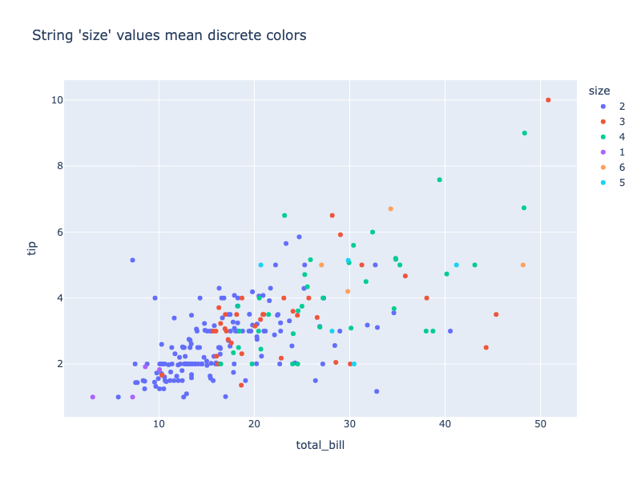

**Interactive Plot:**

<div>                        <script type="text/javascript">window.PlotlyConfig = {MathJaxConfig: 'local'};</script>
        <script charset="utf-8" src="https://cdn.plot.ly/plotly-3.1.0.min.js" integrity="sha256-Ei4740bWZhaUTQuD6q9yQlgVCMPBz6CZWhevDYPv93A=" crossorigin="anonymous"></script>                <div id="plotly-div-3" class="plotly-graph-div" style="height:100%; width:100%;"></div>            <script type="text/javascript">                window.PLOTLYENV=window.PLOTLYENV || {};                                if (document.getElementById("plotly-div-3")) {                    Plotly.newPlot(                        "plotly-div-3",                        [{"hovertemplate":"size=2\u003cbr\u003etotal_bill=%{x}\u003cbr\u003etip=%{y}\u003cextra\u003e\u003c\u002fextra\u003e","legendgroup":"2","marker":{"color":"#636efa","symbol":"circle"},"mode":"markers","name":"2","orientation":"v","showlegend":true,"x":{"dtype":"f8","bdata":"PQrXo3D9MECuR+F6FK43QArXo3A9iiFAFK5H4XoULkCPwvUoXI8tQArXo3A9iiRA16NwPQrXLkApXI\u002fC9agtQBSuR+F6lDVA7FG4HoXrMUAK16NwPUo0QArXo3A9ii9AUrgehevRM0A9CtejcL0qQOF6FK5HYSlAMzMzMzOzNUBmZmZmZqYzQJqZmZmZGSNAH4XrUbgeLkBI4XoUrscxQPYoXI\u002fCdTFA4XoUrkfhK0Bcj8L1KFwjQArXo3A9SjJAexSuR+E6NkAK16NwPQoyQBSuR+F6FClAFK5H4XqUJEDhehSuR+EjQD0K16NwfTNAKVyPwvVoOkB7FK5H4XomQArXo3A9SjRAH4XrUbieK0AK16NwPQomQDMzMzMzczBAexSuR+E6NECF61G4HgUuQArXo3A9CihAXI\u002fC9SjcOkBI4XoUrkc5QPYoXI\u002fCdS1AhetRuB4FJUDsUbgehesxQMP1KFyPwjZACtejcD1KMUBxPQrXo3AzQClcj8L1qDBA16NwPQpXQED2KFyPwvUvQI\u002fC9ShcDypASOF6FK5HMkD2KFyPwrU4QClcj8L1KDVAuB6F61H4PEA9CtejcH02QAAAAAAAABdAUrgehetRMEAAAAAAAMA2QEjhehSuRztAj8L1KFwPKEDD9ShcjwI1QOxRuB6F6yhAMzMzMzOzJkDD9Shcj8IuQOxRuB6FazZA7FG4HoXrNEC4HoXrUbguQD0K16NwfTRA9ihcj8I1OUA9CtejcD0yQB+F61G4nixAAAAAAAAALEAzMzMzM\u002fM3QI\u002fC9ShcTzFAzczMzMxMJUBcj8L1KNwoQOF6FK5HYSdA16NwPQrXKkCF61G4HoUsQGZmZmZm5i9A9ihcj8L1KEAK16NwPQohQArXo3A9Ci1Aw\u002fUoXI\u002fCJkAUrkfhehQzQIXrUbgeRTRA16NwPQpXJkCF61G4HoUoQMP1KFyPQjJAhetRuB4FIUApXI\u002fC9agkQM3MzMzMTCxAAAAAAAAAMEBSuB6F61EqQLgehetReDFArkfhehRuMEAzMzMzM7MgQD0K16NwvSdAj8L1KFyPI0AK16NwPQoeQKRwPQrXIyxAw\u002fUoXI9CKkBI4XoUrscqQFK4HoXrUSlAH4XrUbieK0DD9Shcj4IxQMP1KFyPwjRArkfhehQuJUDD9Shcj0IlQB+F61G4ni9AAAAAAAAAHUCamZmZmdk\u002fQFK4HoXr0TBAMzMzMzNzQECkcD0K1+MxQPYoXI\u002fC9SxAMzMzMzMzI0BxPQrXo1BBQBSuR+F6VDdAZmZmZmZGREDhehSuR2EvQI\u002fC9ShczzNAcT0K16NwPED2KFyPwvUuQBSuR+F6lDBAPQrXo3A9HkCuR+F6FK4kQAAAAAAAACpAhetRuB4FK0B7FK5H4XopQAAAAAAAACpAZmZmZmZmMECF61G4HkU4QIXrUbgehSlACtejcD2KKkDNzMzMzMwpQK5H4XoULidA9ihcj8L1HkBSuB6F61EoQNejcD0K1ypA16NwPQrXKkCF61G4HkUwQK5H4XoULiRAj8L1KFyPKkAfhetRuB42QLgehetROCdACtejcD2KJUCPwvUoXA8vQKRwPQrXIyRAMzMzMzMzKUAK16NwPWpAQK5H4XoULjtA7FG4HoWrNkBSuB6F69ExQEjhehSuxzJA"},"xaxis":"x","y":{"dtype":"f8","bdata":"KVyPwvUo8D97FK5H4XoKQAAAAAAAAABAXI\u002fC9Shc\u002fz\u002fXo3A9CtcJQFyPwvUoXPs\u002fH4XrUbge+T8pXI\u002fC9SgIQFyPwvUoXA9AUrgehetREEAAAAAAAAAGQNejcD0K1wFAcT0K16NwCUAAAAAAAAAAQAAAAAAAAABAMzMzMzMzEUAAAAAAAAAIQDMzMzMzM\u002fc\u002fAAAAAAAACEApXI\u002fC9SgKQFK4HoXrUQRAexSuR+F6CEAfhetRuB71PwAAAAAAAAhAAAAAAAAAFEAAAAAAAAAIQAAAAAAAAARAzczMzMzMBED2KFyPwvX4PxSuR+F6FAxAAAAAAAAA+D8pXI\u002fC9Sj8P65H4XoUrglAAAAAAAAAAECuR+F6FK7\u002fP8P1KFyPwgNAFK5H4XoUAEC4HoXrUbgAQIXrUbgehf8\u002fH4XrUbgeCUAAAAAAAAAUQJqZmZmZmQFAAAAAAAAA9D+kcD0K16MIQAAAAAAAAAhArkfhehSuBUAAAAAAAAAIQDMzMzMzMwtAAAAAAAAAFEA9CtejcD0AQAAAAAAAAABAAAAAAAAAEEBmZmZmZmYXQAAAAAAAAAhAAAAAAAAACEAAAAAAAAAMQAAAAAAAAPA\u002fMzMzMzMzEUAAAAAAAAAKQAAAAAAAABBAAAAAAAAA+D8AAAAAAAAIQAAAAAAAAPg\u002fAAAAAAAABEAAAAAAAAAIQNejcD0K1wtAUrgehetREEA9CtejcD36Pz0K16NwPRBAKVyPwvUoEUAUrkfhehQOQAAAAAAAABBAAAAAAAAACEBmZmZmZmYEQAAAAAAAAAxAAAAAAAAA+D\u002fNzMzMzMz8P3sUrkfhegJA4XoUrkfh+j8AAAAAAAAEQAAAAAAAAABAKVyPwvUoBECuR+F6FK73PwAAAAAAAABAAAAAAAAAAEAAAAAAAAD4P6RwPQrXowZAAAAAAAAA+D8AAAAAAAAAQAAAAAAAAApAAAAAAAAA9D8AAAAAAAAAQAAAAAAAAABAAAAAAAAAAEAAAAAAAAAGQAAAAAAAAAxAZmZmZmZmAkAAAAAAAAD4PxSuR+F6FPo\u002frkfhehSu+z8AAAAAAAAAQAAAAAAAAARAAAAAAAAAAEDhehSuR+EEQAAAAAAAAARAAAAAAAAAAEAAAAAAAAAIQOxRuB6F6wFAw\u002fUoXI\u002fC+T8AAAAAAAAAQEjhehSuRwlAmpmZmZmZFEBxPQrXo3AJQAAAAAAAABBA4XoUrkfhCEAAAAAAAAAAQAAAAAAAAABAAAAAAAAAEEBmZmZmZmYMQJqZmZmZmRZAAAAAAAAACEAAAAAAAAD4P8P1KFyPwhBAexSuR+F6BEApXI\u002fC9SgAQAAAAAAAABBACtejcD0K9z8AAAAAAAAAQAAAAAAAAABAAAAAAAAAAEAUrkfhehQAQAAAAAAAAABAAAAAAAAABEA9CtejcD0AQNejcD0K1wFAAAAAAAAABECamZmZmZnxPwAAAAAAAPg\u002fCtejcD0K9z+amZmZmZkBQNejcD0K1wtASOF6FK5H+T8AAAAAAAAEQAAAAAAAAABAw\u002fUoXI\u002fCBUAK16NwPQoHQB+F61G4HgtAhetRuB6F9z8AAAAAAAAIQAAAAAAAAPQ\u002fAAAAAAAA8D+4HoXrUbjyPwAAAAAAAABAAAAAAAAAAEAAAAAAAAD8PwAAAAAAAAhA"},"yaxis":"y","type":"scatter"},{"hovertemplate":"size=3\u003cbr\u003etotal_bill=%{x}\u003cbr\u003etip=%{y}\u003cextra\u003e\u003c\u002fextra\u003e","legendgroup":"3","marker":{"color":"#EF553B","symbol":"circle"},"mode":"markers","name":"3","orientation":"v","showlegend":true,"x":{"dtype":"f8","bdata":"rkfhehSuJEDD9ShcjwI1QClcj8L1qCRACtejcD1KMEC4HoXrUfgwQGZmZmZmpjRAj8L1KFwPOECPwvUoXE8wQK5H4XoU7jBAcT0K16OwMkCF61G4HkU\u002fQArXo3A9CjBAzczMzMyMPEDXo3A9CpcxQBSuR+F6FDRAUrgehesRMUBmZmZmZiZGQClcj8L1CENA9ihcj8K1OUBSuB6F69E2QKRwPQrXozJAw\u002fUoXI9CMUD2KFyPwjUwQIXrUbgehThASOF6FK5nSUDNzMzMzKxGQGZmZmZm5jRAZmZmZmYmMkCamZmZmRk3QPYoXI\u002fCtTJAuB6F61F4MEDXo3A9Cpc6QI\u002fC9ShcDz5A7FG4HoUrPED2KFyPwvUvQOF6FK5HYS9ACtejcD3qQUBI4XoUrgc9QA=="},"xaxis":"x","y":{"dtype":"f8","bdata":"j8L1KFyP+j8AAAAAAAAMQLgehetRuPo\u002frkfhehSuDUAAAAAAAAAMQM3MzMzMzApAzczMzMzMDEAAAAAAAAAAQI\u002fC9ShcjwhAexSuR+F6AkAAAAAAAAAUQOxRuB6F6wFAZmZmZmZmAEAfhetRuB4FQDMzMzMzMwlAAAAAAAAACEAAAAAAAAAEQAAAAAAAABBAAAAAAAAAEEBxPQrXo3ABQMP1KFyPwvU\u002f7FG4HoXrBUAAAAAAAAAAQNejcD0K1wtAAAAAAAAAJEAAAAAAAAAMQAAAAAAAAAxAAAAAAAAADEAAAAAAAAAQQAAAAAAAABBA16NwPQrXCUBI4XoUrkcLQAAAAAAAAABAAAAAAAAAGkAAAAAAAAAIQAAAAAAAAAhArkfhehSuEkCuR+F6FK4XQA=="},"yaxis":"y","type":"scatter"},{"hovertemplate":"size=4\u003cbr\u003etotal_bill=%{x}\u003cbr\u003etip=%{y}\u003cextra\u003e\u003c\u002fextra\u003e","legendgroup":"4","marker":{"color":"#00cc96","symbol":"circle"},"mode":"markers","name":"4","orientation":"v","showlegend":true,"x":{"dtype":"f8","bdata":"16NwPQqXOEAK16NwPUo5QOF6FK5H4TpA4XoUrkehQUCuR+F6FG4yQPYoXI\u002fCtUNAj8L1KFzPMUCamZmZmVkyQHE9CtejsDRAZmZmZmZmPkAzMzMzMzNAQEjhehSuZ0FAj8L1KFyPOUDhehSuRwFDQMP1KFyPIkhACtejcD1KMkAzMzMzMzM7QArXo3A9akFA9ihcj8IVRECuR+F6FO49QBSuR+F6FDhAzczMzMyMOECF61G4HsUzQAAAAAAAADlAPQrXo3B9MEAAAAAAAIA1QPYoXI\u002fCtT9AMzMzMzNTQUDsUbgehSs3QK5H4XoUjkVASOF6FK6HNEA9CtejcF1DQKRwPQrX4zlACtejcD0qSECkcD0K1yM+QDMzMzMzczRAw\u002fUoXI8COEA="},"xaxis":"x","y":{"dtype":"f8","bdata":"4XoUrkfhDEDXo3A9CtcSQPYoXI\u002fC9QhAAAAAAAAAFEAAAAAAAAAIQFK4HoXrUR5AuB6F61G4AkAAAAAAAAAEQJqZmZmZmQNAZmZmZmZmFkAAAAAAAAAYQM3MzMzMzBRAXI\u002fC9ShcEUAAAAAAAAAIQOxRuB6F6xpAFK5H4XoUDkAAAAAAAAAQQK5H4XoUrhRA7FG4HoXrEkBI4XoUrkcUQFyPwvUoXAdAAAAAAAAAAEAAAAAAAAAAQAAAAAAAAA5AAAAAAAAAAEAAAAAAAAAMQAAAAAAAABJAcT0K16NwDUAAAAAAAAAaQAAAAAAAABRAAAAAAAAAEEAAAAAAAAAIQKRwPQrXoxRAAAAAAAAAIkC4HoXrUbgIQAAAAAAAAAhAAAAAAAAAAEA="},"yaxis":"y","type":"scatter"},{"hovertemplate":"size=1\u003cbr\u003etotal_bill=%{x}\u003cbr\u003etip=%{y}\u003cextra\u003e\u003c\u002fextra\u003e","legendgroup":"1","marker":{"color":"#ab63fa","symbol":"circle"},"mode":"markers","name":"1","orientation":"v","showlegend":true,"x":{"dtype":"f8","bdata":"j8L1KFyPCECkcD0K1yMkQAAAAAAAAB1AKVyPwvUoIUA="},"xaxis":"x","y":{"dtype":"f8","bdata":"AAAAAAAA8D9I4XoUrkf9PwAAAAAAAPA\u002fuB6F61G4\u002fj8="},"yaxis":"y","type":"scatter"},{"hovertemplate":"size=6\u003cbr\u003etotal_bill=%{x}\u003cbr\u003etip=%{y}\u003cextra\u003e\u003c\u002fextra\u003e","legendgroup":"6","marker":{"color":"#FFA15A","symbol":"circle"},"mode":"markers","name":"6","orientation":"v","showlegend":true,"x":{"dtype":"f8","bdata":"zczMzMzMPUBmZmZmZiZBQM3MzMzMDDtA9ihcj8IVSEA="},"xaxis":"x","y":{"dtype":"f8","bdata":"zczMzMzMEEDNzMzMzMwaQAAAAAAAABRAAAAAAAAAFEA="},"yaxis":"y","type":"scatter"},{"hovertemplate":"size=5\u003cbr\u003etotal_bill=%{x}\u003cbr\u003etip=%{y}\u003cextra\u003e\u003c\u002fextra\u003e","legendgroup":"5","marker":{"color":"#19d3f3","symbol":"circle"},"mode":"markers","name":"5","orientation":"v","showlegend":true,"x":{"dtype":"f8","bdata":"uB6F61GYRECamZmZmdk9QHE9CtejsDRA9ihcj8J1PkBmZmZmZiY8QA=="},"xaxis":"x","y":{"dtype":"f8","bdata":"AAAAAAAAFECPwvUoXI8UQAAAAAAAABRAAAAAAAAAAEAAAAAAAAAIQA=="},"yaxis":"y","type":"scatter"}],                        {"template":{"data":{"histogram2dcontour":[{"type":"histogram2dcontour","colorbar":{"outlinewidth":0,"ticks":""},"colorscale":[[0.0,"#0d0887"],[0.1111111111111111,"#46039f"],[0.2222222222222222,"#7201a8"],[0.3333333333333333,"#9c179e"],[0.4444444444444444,"#bd3786"],[0.5555555555555556,"#d8576b"],[0.6666666666666666,"#ed7953"],[0.7777777777777778,"#fb9f3a"],[0.8888888888888888,"#fdca26"],[1.0,"#f0f921"]]}],"choropleth":[{"type":"choropleth","colorbar":{"outlinewidth":0,"ticks":""}}],"histogram2d":[{"type":"histogram2d","colorbar":{"outlinewidth":0,"ticks":""},"colorscale":[[0.0,"#0d0887"],[0.1111111111111111,"#46039f"],[0.2222222222222222,"#7201a8"],[0.3333333333333333,"#9c179e"],[0.4444444444444444,"#bd3786"],[0.5555555555555556,"#d8576b"],[0.6666666666666666,"#ed7953"],[0.7777777777777778,"#fb9f3a"],[0.8888888888888888,"#fdca26"],[1.0,"#f0f921"]]}],"heatmap":[{"type":"heatmap","colorbar":{"outlinewidth":0,"ticks":""},"colorscale":[[0.0,"#0d0887"],[0.1111111111111111,"#46039f"],[0.2222222222222222,"#7201a8"],[0.3333333333333333,"#9c179e"],[0.4444444444444444,"#bd3786"],[0.5555555555555556,"#d8576b"],[0.6666666666666666,"#ed7953"],[0.7777777777777778,"#fb9f3a"],[0.8888888888888888,"#fdca26"],[1.0,"#f0f921"]]}],"contourcarpet":[{"type":"contourcarpet","colorbar":{"outlinewidth":0,"ticks":""}}],"contour":[{"type":"contour","colorbar":{"outlinewidth":0,"ticks":""},"colorscale":[[0.0,"#0d0887"],[0.1111111111111111,"#46039f"],[0.2222222222222222,"#7201a8"],[0.3333333333333333,"#9c179e"],[0.4444444444444444,"#bd3786"],[0.5555555555555556,"#d8576b"],[0.6666666666666666,"#ed7953"],[0.7777777777777778,"#fb9f3a"],[0.8888888888888888,"#fdca26"],[1.0,"#f0f921"]]}],"surface":[{"type":"surface","colorbar":{"outlinewidth":0,"ticks":""},"colorscale":[[0.0,"#0d0887"],[0.1111111111111111,"#46039f"],[0.2222222222222222,"#7201a8"],[0.3333333333333333,"#9c179e"],[0.4444444444444444,"#bd3786"],[0.5555555555555556,"#d8576b"],[0.6666666666666666,"#ed7953"],[0.7777777777777778,"#fb9f3a"],[0.8888888888888888,"#fdca26"],[1.0,"#f0f921"]]}],"mesh3d":[{"type":"mesh3d","colorbar":{"outlinewidth":0,"ticks":""}}],"scatter":[{"fillpattern":{"fillmode":"overlay","size":10,"solidity":0.2},"type":"scatter"}],"parcoords":[{"type":"parcoords","line":{"colorbar":{"outlinewidth":0,"ticks":""}}}],"scatterpolargl":[{"type":"scatterpolargl","marker":{"colorbar":{"outlinewidth":0,"ticks":""}}}],"bar":[{"error_x":{"color":"#2a3f5f"},"error_y":{"color":"#2a3f5f"},"marker":{"line":{"color":"#E5ECF6","width":0.5},"pattern":{"fillmode":"overlay","size":10,"solidity":0.2}},"type":"bar"}],"scattergeo":[{"type":"scattergeo","marker":{"colorbar":{"outlinewidth":0,"ticks":""}}}],"scatterpolar":[{"type":"scatterpolar","marker":{"colorbar":{"outlinewidth":0,"ticks":""}}}],"histogram":[{"marker":{"pattern":{"fillmode":"overlay","size":10,"solidity":0.2}},"type":"histogram"}],"scattergl":[{"type":"scattergl","marker":{"colorbar":{"outlinewidth":0,"ticks":""}}}],"scatter3d":[{"type":"scatter3d","line":{"colorbar":{"outlinewidth":0,"ticks":""}},"marker":{"colorbar":{"outlinewidth":0,"ticks":""}}}],"scattermap":[{"type":"scattermap","marker":{"colorbar":{"outlinewidth":0,"ticks":""}}}],"scattermapbox":[{"type":"scattermapbox","marker":{"colorbar":{"outlinewidth":0,"ticks":""}}}],"scatterternary":[{"type":"scatterternary","marker":{"colorbar":{"outlinewidth":0,"ticks":""}}}],"scattercarpet":[{"type":"scattercarpet","marker":{"colorbar":{"outlinewidth":0,"ticks":""}}}],"carpet":[{"aaxis":{"endlinecolor":"#2a3f5f","gridcolor":"white","linecolor":"white","minorgridcolor":"white","startlinecolor":"#2a3f5f"},"baxis":{"endlinecolor":"#2a3f5f","gridcolor":"white","linecolor":"white","minorgridcolor":"white","startlinecolor":"#2a3f5f"},"type":"carpet"}],"table":[{"cells":{"fill":{"color":"#EBF0F8"},"line":{"color":"white"}},"header":{"fill":{"color":"#C8D4E3"},"line":{"color":"white"}},"type":"table"}],"barpolar":[{"marker":{"line":{"color":"#E5ECF6","width":0.5},"pattern":{"fillmode":"overlay","size":10,"solidity":0.2}},"type":"barpolar"}],"pie":[{"automargin":true,"type":"pie"}]},"layout":{"autotypenumbers":"strict","colorway":["#636efa","#EF553B","#00cc96","#ab63fa","#FFA15A","#19d3f3","#FF6692","#B6E880","#FF97FF","#FECB52"],"font":{"color":"#2a3f5f"},"hovermode":"closest","hoverlabel":{"align":"left"},"paper_bgcolor":"white","plot_bgcolor":"#E5ECF6","polar":{"bgcolor":"#E5ECF6","angularaxis":{"gridcolor":"white","linecolor":"white","ticks":""},"radialaxis":{"gridcolor":"white","linecolor":"white","ticks":""}},"ternary":{"bgcolor":"#E5ECF6","aaxis":{"gridcolor":"white","linecolor":"white","ticks":""},"baxis":{"gridcolor":"white","linecolor":"white","ticks":""},"caxis":{"gridcolor":"white","linecolor":"white","ticks":""}},"coloraxis":{"colorbar":{"outlinewidth":0,"ticks":""}},"colorscale":{"sequential":[[0.0,"#0d0887"],[0.1111111111111111,"#46039f"],[0.2222222222222222,"#7201a8"],[0.3333333333333333,"#9c179e"],[0.4444444444444444,"#bd3786"],[0.5555555555555556,"#d8576b"],[0.6666666666666666,"#ed7953"],[0.7777777777777778,"#fb9f3a"],[0.8888888888888888,"#fdca26"],[1.0,"#f0f921"]],"sequentialminus":[[0.0,"#0d0887"],[0.1111111111111111,"#46039f"],[0.2222222222222222,"#7201a8"],[0.3333333333333333,"#9c179e"],[0.4444444444444444,"#bd3786"],[0.5555555555555556,"#d8576b"],[0.6666666666666666,"#ed7953"],[0.7777777777777778,"#fb9f3a"],[0.8888888888888888,"#fdca26"],[1.0,"#f0f921"]],"diverging":[[0,"#8e0152"],[0.1,"#c51b7d"],[0.2,"#de77ae"],[0.3,"#f1b6da"],[0.4,"#fde0ef"],[0.5,"#f7f7f7"],[0.6,"#e6f5d0"],[0.7,"#b8e186"],[0.8,"#7fbc41"],[0.9,"#4d9221"],[1,"#276419"]]},"xaxis":{"gridcolor":"white","linecolor":"white","ticks":"","title":{"standoff":15},"zerolinecolor":"white","automargin":true,"zerolinewidth":2},"yaxis":{"gridcolor":"white","linecolor":"white","ticks":"","title":{"standoff":15},"zerolinecolor":"white","automargin":true,"zerolinewidth":2},"scene":{"xaxis":{"backgroundcolor":"#E5ECF6","gridcolor":"white","linecolor":"white","showbackground":true,"ticks":"","zerolinecolor":"white","gridwidth":2},"yaxis":{"backgroundcolor":"#E5ECF6","gridcolor":"white","linecolor":"white","showbackground":true,"ticks":"","zerolinecolor":"white","gridwidth":2},"zaxis":{"backgroundcolor":"#E5ECF6","gridcolor":"white","linecolor":"white","showbackground":true,"ticks":"","zerolinecolor":"white","gridwidth":2}},"shapedefaults":{"line":{"color":"#2a3f5f"}},"annotationdefaults":{"arrowcolor":"#2a3f5f","arrowhead":0,"arrowwidth":1},"geo":{"bgcolor":"white","landcolor":"#E5ECF6","subunitcolor":"white","showland":true,"showlakes":true,"lakecolor":"white"},"title":{"x":0.05},"mapbox":{"style":"light"}}},"xaxis":{"anchor":"y","domain":[0.0,1.0],"title":{"text":"total_bill"}},"yaxis":{"anchor":"x","domain":[0.0,1.0],"title":{"text":"tip"}},"legend":{"title":{"text":"size"},"tracegroupgap":0},"title":{"text":"String 'size' values mean discrete colors"}},                        {"responsive": true}                    )                };            </script>        </div>

Converting a string column to a numeric one is also quite straightforward:

```python
import plotly.express as px
df = px.data.tips()
df["size"] = df["size"].astype(str) #convert to string
df["size"] = df["size"].astype(float) #convert back to numeric

fig = px.scatter(df, x="total_bill", y="tip", color="size",
                 title="Numeric 'size' values mean continuous color")

fig.show()
```


**Interactive Plot:**

<div>                        <script type="text/javascript">window.PlotlyConfig = {MathJaxConfig: 'local'};</script>
        <script charset="utf-8" src="https://cdn.plot.ly/plotly-3.1.0.min.js" integrity="sha256-Ei4740bWZhaUTQuD6q9yQlgVCMPBz6CZWhevDYPv93A=" crossorigin="anonymous"></script>                <div id="plotly-div-4" class="plotly-graph-div" style="height:100%; width:100%;"></div>            <script type="text/javascript">                window.PLOTLYENV=window.PLOTLYENV || {};                                if (document.getElementById("plotly-div-4")) {                    Plotly.newPlot(                        "plotly-div-4",                        [{"hovertemplate":"total_bill=%{x}\u003cbr\u003etip=%{y}\u003cbr\u003esize=%{marker.color}\u003cextra\u003e\u003c\u002fextra\u003e","legendgroup":"","marker":{"color":{"dtype":"f8","bdata":"AAAAAAAAAEAAAAAAAAAIQAAAAAAAAAhAAAAAAAAAAEAAAAAAAAAQQAAAAAAAABBAAAAAAAAAAEAAAAAAAAAQQAAAAAAAAABAAAAAAAAAAEAAAAAAAAAAQAAAAAAAABBAAAAAAAAAAEAAAAAAAAAQQAAAAAAAAABAAAAAAAAAAEAAAAAAAAAIQAAAAAAAAAhAAAAAAAAACEAAAAAAAAAIQAAAAAAAAABAAAAAAAAAAEAAAAAAAAAAQAAAAAAAABBAAAAAAAAAAEAAAAAAAAAQQAAAAAAAAABAAAAAAAAAAEAAAAAAAAAAQAAAAAAAAABAAAAAAAAAAEAAAAAAAAAQQAAAAAAAAABAAAAAAAAAEEAAAAAAAAAAQAAAAAAAAAhAAAAAAAAACEAAAAAAAAAIQAAAAAAAAAhAAAAAAAAACEAAAAAAAAAIQAAAAAAAAABAAAAAAAAAAEAAAAAAAAAAQAAAAAAAABBAAAAAAAAAAEAAAAAAAAAAQAAAAAAAABBAAAAAAAAACEAAAAAAAAAAQAAAAAAAAABAAAAAAAAAAEAAAAAAAAAQQAAAAAAAAABAAAAAAAAAEEAAAAAAAAAAQAAAAAAAABBAAAAAAAAAAEAAAAAAAAAAQAAAAAAAABBAAAAAAAAAAEAAAAAAAAAAQAAAAAAAAABAAAAAAAAAEEAAAAAAAAAIQAAAAAAAAAhAAAAAAAAAAEAAAAAAAADwPwAAAAAAAABAAAAAAAAAAEAAAAAAAAAAQAAAAAAAAAhAAAAAAAAAAEAAAAAAAAAAQAAAAAAAAABAAAAAAAAAAEAAAAAAAAAAQAAAAAAAABBAAAAAAAAAAEAAAAAAAAAAQAAAAAAAAABAAAAAAAAAAEAAAAAAAADwPwAAAAAAAABAAAAAAAAAAEAAAAAAAAAQQAAAAAAAAABAAAAAAAAAAEAAAAAAAAAAQAAAAAAAAABAAAAAAAAAAEAAAAAAAAAAQAAAAAAAAABAAAAAAAAAAEAAAAAAAAAAQAAAAAAAABBAAAAAAAAAAEAAAAAAAAAAQAAAAAAAAABAAAAAAAAAAEAAAAAAAAAAQAAAAAAAAABAAAAAAAAACEAAAAAAAAAAQAAAAAAAAABAAAAAAAAAAEAAAAAAAAAAQAAAAAAAAABAAAAAAAAAAEAAAAAAAAAAQAAAAAAAAABAAAAAAAAA8D8AAAAAAAAIQAAAAAAAAABAAAAAAAAACEAAAAAAAAAAQAAAAAAAABBAAAAAAAAAAEAAAAAAAAAAQAAAAAAAABBAAAAAAAAAAEAAAAAAAAAAQAAAAAAAAABAAAAAAAAAAEAAAAAAAAAAQAAAAAAAABhAAAAAAAAAAEAAAAAAAAAAQAAAAAAAAABAAAAAAAAACEAAAAAAAAAAQAAAAAAAAABAAAAAAAAAAEAAAAAAAAAAQAAAAAAAAABAAAAAAAAAAEAAAAAAAAAAQAAAAAAAAABAAAAAAAAAAEAAAAAAAAAAQAAAAAAAAABAAAAAAAAAGEAAAAAAAAAUQAAAAAAAABhAAAAAAAAAAEAAAAAAAAAAQAAAAAAAAAhAAAAAAAAAAEAAAAAAAAAAQAAAAAAAAABAAAAAAAAAAEAAAAAAAAAAQAAAAAAAAAhAAAAAAAAAEEAAAAAAAAAQQAAAAAAAABRAAAAAAAAAGEAAAAAAAAAQQAAAAAAAAABAAAAAAAAAEEAAAAAAAAAQQAAAAAAAAABAAAAAAAAACEAAAAAAAAAAQAAAAAAAAABAAAAAAAAACEAAAAAAAAAAQAAAAAAAABBAAAAAAAAAAEAAAAAAAAAAQAAAAAAAAAhAAAAAAAAAAEAAAAAAAAAAQAAAAAAAAABAAAAAAAAAAEAAAAAAAAAAQAAAAAAAAABAAAAAAAAAAEAAAAAAAAAAQAAAAAAAAABAAAAAAAAAEEAAAAAAAAAAQAAAAAAAAAhAAAAAAAAAEEAAAAAAAAAAQAAAAAAAABRAAAAAAAAACEAAAAAAAAAUQAAAAAAAAAhAAAAAAAAACEAAAAAAAAAAQAAAAAAAAABAAAAAAAAAAEAAAAAAAAAAQAAAAAAAAABAAAAAAAAAAEAAAAAAAAAAQAAAAAAAABBAAAAAAAAAAEAAAAAAAAAAQAAAAAAAAAhAAAAAAAAAAEAAAAAAAAAAQAAAAAAAAABAAAAAAAAAEEAAAAAAAAAIQAAAAAAAAAhAAAAAAAAAEEAAAAAAAAAAQAAAAAAAAABAAAAAAAAACEAAAAAAAAAQQAAAAAAAABBAAAAAAAAAAEAAAAAAAAAIQAAAAAAAAABAAAAAAAAAFEAAAAAAAAAAQAAAAAAAAABAAAAAAAAAEEAAAAAAAAAAQAAAAAAAAABAAAAAAAAA8D8AAAAAAAAIQAAAAAAAAABAAAAAAAAAAEAAAAAAAAAAQAAAAAAAABBAAAAAAAAAAEAAAAAAAAAAQAAAAAAAABBAAAAAAAAACEAAAAAAAAAAQAAAAAAAAABAAAAAAAAAAEAAAAAAAAAAQAAAAAAAAABAAAAAAAAAAEAAAAAAAAAIQAAAAAAAAAhAAAAAAAAAAEAAAAAAAAAAQAAAAAAAAABAAAAAAAAAAEA="},"coloraxis":"coloraxis","symbol":"circle"},"mode":"markers","name":"","orientation":"v","showlegend":false,"x":{"dtype":"f8","bdata":"PQrXo3D9MECuR+F6FK4kQMP1KFyPAjVArkfhehSuN0DXo3A9Cpc4QArXo3A9SjlACtejcD2KIUDhehSuR+E6QBSuR+F6FC5Aj8L1KFyPLUAK16NwPYokQOF6FK5HoUFA16NwPQrXLkCuR+F6FG4yQClcj8L1qC1AFK5H4XqUNUApXI\u002fC9agkQArXo3A9SjBAuB6F61H4MEBmZmZmZqY0QOxRuB6F6zFACtejcD1KNEAK16NwPYovQPYoXI\u002fCtUNAUrgehevRM0CPwvUoXM8xQD0K16NwvSpA4XoUrkdhKUAzMzMzM7M1QGZmZmZmpjNAmpmZmZkZI0CamZmZmVkyQB+F61G4Hi5AcT0K16OwNEBI4XoUrscxQI\u002fC9ShcDzhAj8L1KFxPMECuR+F6FO4wQHE9CtejsDJAhetRuB5FP0AK16NwPQowQPYoXI\u002fCdTFA4XoUrkfhK0Bcj8L1KFwjQGZmZmZmZj5ACtejcD1KMkB7FK5H4To2QDMzMzMzM0BAzczMzMyMPEAK16NwPQoyQBSuR+F6FClAFK5H4XqUJEBI4XoUrmdBQOF6FK5H4SNAj8L1KFyPOUA9CtejcH0zQOF6FK5HAUNAKVyPwvVoOkB7FK5H4XomQMP1KFyPIkhACtejcD1KNEAfhetRuJ4rQArXo3A9CiZACtejcD1KMkDXo3A9CpcxQBSuR+F6FDRAMzMzMzNzMECPwvUoXI8IQHsUrkfhOjRAhetRuB4FLkAK16NwPQooQFK4HoXrETFAXI\u002fC9SjcOkBI4XoUrkc5QPYoXI\u002fCdS1AhetRuB4FJUDsUbgehesxQDMzMzMzMztAw\u002fUoXI\u002fCNkAK16NwPUoxQHE9CtejcDNAKVyPwvWoMECkcD0K1yMkQNejcD0KV0BA9ihcj8L1L0AK16NwPWpBQI\u002fC9ShcDypASOF6FK5HMkD2KFyPwrU4QClcj8L1KDVAuB6F61H4PEA9CtejcH02QAAAAAAAABdAUrgehetRMEAAAAAAAMA2QPYoXI\u002fCFURASOF6FK5HO0CPwvUoXA8oQMP1KFyPAjVA7FG4HoXrKEAzMzMzM7MmQMP1KFyPwi5AZmZmZmYmRkDsUbgehWs2QOxRuB6F6zRAuB6F61G4LkA9CtejcH00QPYoXI\u002fCNTlAPQrXo3A9MkAfhetRuJ4sQAAAAAAAACxAAAAAAAAAHUApXI\u002fC9QhDQDMzMzMz8zdA9ihcj8K1OUCPwvUoXE8xQK5H4XoU7j1AzczMzMxMJUBcj8L1KNwoQBSuR+F6FDhA4XoUrkdhJ0DXo3A9CtcqQIXrUbgehSxAZmZmZmbmL0D2KFyPwvUoQM3MzMzMzD1ACtejcD0KIUAK16NwPQotQMP1KFyPwiZAUrgehevRNkAUrkfhehQzQIXrUbgeRTRA16NwPQpXJkCF61G4HoUoQMP1KFyPQjJAhetRuB4FIUApXI\u002fC9agkQM3MzMzMTCxAAAAAAAAAMEBSuB6F61EqQLgehetReDFAZmZmZmYmQUC4HoXrUZhEQM3MzMzMDDtArkfhehRuMEAzMzMzM7MgQKRwPQrXozJAPQrXo3C9J0CPwvUoXI8jQArXo3A9Ch5ApHA9CtcjLEDD9Shcj0IqQMP1KFyPQjFAzczMzMyMOECF61G4HsUzQJqZmZmZ2T1A9ihcj8IVSEAAAAAAAAA5QEjhehSuxypAPQrXo3B9MEAAAAAAAIA1QFK4HoXrUSlA9ihcj8I1MEAfhetRuJ4rQMP1KFyPgjFAhetRuB6FOEDD9Shcj8I0QPYoXI\u002fCtT9ArkfhehQuJUDD9Shcj0IlQEjhehSuZ0lAH4XrUbieL0AAAAAAAAAdQJqZmZmZ2T9AUrgehevRMEAzMzMzM3NAQKRwPQrX4zFA9ihcj8L1LEAzMzMzMzMjQHE9CtejUEFAMzMzMzNTQUAUrkfhelQ3QM3MzMzMrEZA7FG4HoUrN0BmZmZmZkZEQHE9CtejsDRAZmZmZmbmNED2KFyPwnU+QGZmZmZmJjJAmpmZmZkZN0DhehSuR2EvQI\u002fC9ShczzNAcT0K16NwPED2KFyPwvUuQBSuR+F6lDBAPQrXo3A9HkCuR+F6FK4kQK5H4XoUjkVAAAAAAAAAKkCF61G4HgUrQPYoXI\u002fCtTJAexSuR+F6KUAAAAAAAAAqQGZmZmZmZjBASOF6FK6HNEC4HoXrUXgwQNejcD0KlzpAPQrXo3BdQ0CF61G4HkU4QIXrUbgehSlAj8L1KFwPPkCkcD0K1+M5QArXo3A9KkhACtejcD2KKkDsUbgehSs8QM3MzMzMzClAZmZmZmYmPECuR+F6FC4nQPYoXI\u002fC9R5ApHA9CtcjPkBSuB6F61EoQNejcD0K1ypAKVyPwvUoIUD2KFyPwvUvQNejcD0K1ypAhetRuB5FMECuR+F6FC4kQDMzMzMzczRAj8L1KFyPKkAfhetRuB42QMP1KFyPAjhA4XoUrkdhL0C4HoXrUTgnQArXo3A9iiVAj8L1KFwPL0CkcD0K1yMkQDMzMzMzMylACtejcD1qQEAK16NwPepBQEjhehSuBz1ArkfhehQuO0DsUbgehas2QFK4HoXr0TFASOF6FK7HMkA="},"xaxis":"x","y":{"dtype":"f8","bdata":"KVyPwvUo8D+PwvUoXI\u002f6PwAAAAAAAAxAexSuR+F6CkDhehSuR+EMQNejcD0K1xJAAAAAAAAAAED2KFyPwvUIQFyPwvUoXP8\u002f16NwPQrXCUBcj8L1KFz7PwAAAAAAABRAH4XrUbge+T8AAAAAAAAIQClcj8L1KAhAXI\u002fC9ShcD0C4HoXrUbj6P65H4XoUrg1AAAAAAAAADEDNzMzMzMwKQFK4HoXrURBAAAAAAAAABkDXo3A9CtcBQFK4HoXrUR5AcT0K16NwCUC4HoXrUbgCQAAAAAAAAABAAAAAAAAAAEAzMzMzMzMRQAAAAAAAAAhAMzMzMzMz9z8AAAAAAAAEQAAAAAAAAAhAmpmZmZmZA0ApXI\u002fC9SgKQM3MzMzMzAxAAAAAAAAAAECPwvUoXI8IQHsUrkfhegJAAAAAAAAAFEDsUbgehesBQFK4HoXrUQRAexSuR+F6CEAfhetRuB71P2ZmZmZmZhZAAAAAAAAACEAAAAAAAAAUQAAAAAAAABhAZmZmZmZmAEAAAAAAAAAIQAAAAAAAAARAzczMzMzMBEDNzMzMzMwUQPYoXI\u002fC9fg\u002fXI\u002fC9ShcEUAUrkfhehQMQAAAAAAAAAhAAAAAAAAA+D8pXI\u002fC9Sj8P+xRuB6F6xpArkfhehSuCUAAAAAAAAAAQK5H4XoUrv8\u002fFK5H4XoUDkAfhetRuB4FQDMzMzMzMwlAw\u002fUoXI\u002fCA0AAAAAAAADwPxSuR+F6FABAuB6F61G4AECF61G4HoX\u002fPwAAAAAAAAhAH4XrUbgeCUAAAAAAAAAUQJqZmZmZmQFAAAAAAAAA9D+kcD0K16MIQAAAAAAAABBAAAAAAAAACECuR+F6FK4FQAAAAAAAAAhAMzMzMzMzC0BI4XoUrkf9PwAAAAAAABRAPQrXo3A9AECuR+F6FK4UQAAAAAAAAABAAAAAAAAAEEBmZmZmZmYXQAAAAAAAAAhAAAAAAAAACEAAAAAAAAAMQAAAAAAAAPA\u002fMzMzMzMzEUAAAAAAAAAKQOxRuB6F6xJAAAAAAAAAEEAAAAAAAAD4PwAAAAAAAAhAAAAAAAAA+D8AAAAAAAAEQAAAAAAAAAhAAAAAAAAABEDXo3A9CtcLQFK4HoXrURBAPQrXo3A9+j89CtejcD0QQClcj8L1KBFAFK5H4XoUDkAAAAAAAAAQQAAAAAAAAAhAAAAAAAAA8D8AAAAAAAAQQGZmZmZmZgRAAAAAAAAAEEAAAAAAAAAMQEjhehSuRxRAAAAAAAAA+D\u002fNzMzMzMz8P1yPwvUoXAdAexSuR+F6AkDhehSuR+H6PwAAAAAAAARAAAAAAAAAAEApXI\u002fC9SgEQM3MzMzMzBBArkfhehSu9z8AAAAAAAAAQAAAAAAAAABAcT0K16NwAUAAAAAAAAD4P6RwPQrXowZAAAAAAAAA+D8AAAAAAAAAQAAAAAAAAApAAAAAAAAA9D8AAAAAAAAAQAAAAAAAAABAAAAAAAAAAEAAAAAAAAAGQAAAAAAAAAxAzczMzMzMGkAAAAAAAAAUQAAAAAAAABRAZmZmZmZmAkAAAAAAAAD4P8P1KFyPwvU\u002fFK5H4XoU+j+uR+F6FK77PwAAAAAAAABAAAAAAAAABEAAAAAAAAAAQOxRuB6F6wVAAAAAAAAAAEAAAAAAAAAAQI\u002fC9ShcjxRAAAAAAAAAFEAAAAAAAAAOQOF6FK5H4QRAAAAAAAAAAEAAAAAAAAAMQAAAAAAAAARAAAAAAAAAAEAAAAAAAAAAQAAAAAAAAAhA16NwPQrXC0DsUbgehesBQAAAAAAAABJAw\u002fUoXI\u002fC+T8AAAAAAAAAQAAAAAAAACRASOF6FK5HCUCamZmZmZkUQHE9CtejcAlAAAAAAAAAEEDhehSuR+EIQAAAAAAAAABAAAAAAAAAAEAAAAAAAAAQQGZmZmZmZgxAcT0K16NwDUCamZmZmZkWQAAAAAAAAAxAAAAAAAAAGkAAAAAAAAAIQAAAAAAAABRAAAAAAAAADEAAAAAAAAAAQAAAAAAAAAxAAAAAAAAAEEAAAAAAAAD4P8P1KFyPwhBAexSuR+F6BEApXI\u002fC9SgAQAAAAAAAABBACtejcD0K9z8AAAAAAAAAQAAAAAAAABRAAAAAAAAAAEAAAAAAAAAAQAAAAAAAABBAFK5H4XoUAEAAAAAAAAAAQAAAAAAAAARAAAAAAAAAEEDXo3A9CtcJQEjhehSuRwtAAAAAAAAACEA9CtejcD0AQNejcD0K1wFAAAAAAAAAAECkcD0K16MUQAAAAAAAACJAAAAAAAAABEAAAAAAAAAaQJqZmZmZmfE\u002fAAAAAAAACEAAAAAAAAD4PwrXo3A9Cvc\u002fuB6F61G4CECamZmZmZkBQNejcD0K1wtAuB6F61G4\u002fj8AAAAAAAAIQEjhehSuR\u002fk\u002fAAAAAAAABEAAAAAAAAAAQAAAAAAAAAhAw\u002fUoXI\u002fCBUAK16NwPQoHQAAAAAAAAABAAAAAAAAACEAfhetRuB4LQIXrUbgehfc\u002fAAAAAAAACEAAAAAAAAD0PwAAAAAAAPA\u002fuB6F61G48j+uR+F6FK4SQK5H4XoUrhdAAAAAAAAAAEAAAAAAAAAAQAAAAAAAAPw\u002fAAAAAAAACEA="},"yaxis":"y","type":"scatter"}],                        {"template":{"data":{"histogram2dcontour":[{"type":"histogram2dcontour","colorbar":{"outlinewidth":0,"ticks":""},"colorscale":[[0.0,"#0d0887"],[0.1111111111111111,"#46039f"],[0.2222222222222222,"#7201a8"],[0.3333333333333333,"#9c179e"],[0.4444444444444444,"#bd3786"],[0.5555555555555556,"#d8576b"],[0.6666666666666666,"#ed7953"],[0.7777777777777778,"#fb9f3a"],[0.8888888888888888,"#fdca26"],[1.0,"#f0f921"]]}],"choropleth":[{"type":"choropleth","colorbar":{"outlinewidth":0,"ticks":""}}],"histogram2d":[{"type":"histogram2d","colorbar":{"outlinewidth":0,"ticks":""},"colorscale":[[0.0,"#0d0887"],[0.1111111111111111,"#46039f"],[0.2222222222222222,"#7201a8"],[0.3333333333333333,"#9c179e"],[0.4444444444444444,"#bd3786"],[0.5555555555555556,"#d8576b"],[0.6666666666666666,"#ed7953"],[0.7777777777777778,"#fb9f3a"],[0.8888888888888888,"#fdca26"],[1.0,"#f0f921"]]}],"heatmap":[{"type":"heatmap","colorbar":{"outlinewidth":0,"ticks":""},"colorscale":[[0.0,"#0d0887"],[0.1111111111111111,"#46039f"],[0.2222222222222222,"#7201a8"],[0.3333333333333333,"#9c179e"],[0.4444444444444444,"#bd3786"],[0.5555555555555556,"#d8576b"],[0.6666666666666666,"#ed7953"],[0.7777777777777778,"#fb9f3a"],[0.8888888888888888,"#fdca26"],[1.0,"#f0f921"]]}],"contourcarpet":[{"type":"contourcarpet","colorbar":{"outlinewidth":0,"ticks":""}}],"contour":[{"type":"contour","colorbar":{"outlinewidth":0,"ticks":""},"colorscale":[[0.0,"#0d0887"],[0.1111111111111111,"#46039f"],[0.2222222222222222,"#7201a8"],[0.3333333333333333,"#9c179e"],[0.4444444444444444,"#bd3786"],[0.5555555555555556,"#d8576b"],[0.6666666666666666,"#ed7953"],[0.7777777777777778,"#fb9f3a"],[0.8888888888888888,"#fdca26"],[1.0,"#f0f921"]]}],"surface":[{"type":"surface","colorbar":{"outlinewidth":0,"ticks":""},"colorscale":[[0.0,"#0d0887"],[0.1111111111111111,"#46039f"],[0.2222222222222222,"#7201a8"],[0.3333333333333333,"#9c179e"],[0.4444444444444444,"#bd3786"],[0.5555555555555556,"#d8576b"],[0.6666666666666666,"#ed7953"],[0.7777777777777778,"#fb9f3a"],[0.8888888888888888,"#fdca26"],[1.0,"#f0f921"]]}],"mesh3d":[{"type":"mesh3d","colorbar":{"outlinewidth":0,"ticks":""}}],"scatter":[{"fillpattern":{"fillmode":"overlay","size":10,"solidity":0.2},"type":"scatter"}],"parcoords":[{"type":"parcoords","line":{"colorbar":{"outlinewidth":0,"ticks":""}}}],"scatterpolargl":[{"type":"scatterpolargl","marker":{"colorbar":{"outlinewidth":0,"ticks":""}}}],"bar":[{"error_x":{"color":"#2a3f5f"},"error_y":{"color":"#2a3f5f"},"marker":{"line":{"color":"#E5ECF6","width":0.5},"pattern":{"fillmode":"overlay","size":10,"solidity":0.2}},"type":"bar"}],"scattergeo":[{"type":"scattergeo","marker":{"colorbar":{"outlinewidth":0,"ticks":""}}}],"scatterpolar":[{"type":"scatterpolar","marker":{"colorbar":{"outlinewidth":0,"ticks":""}}}],"histogram":[{"marker":{"pattern":{"fillmode":"overlay","size":10,"solidity":0.2}},"type":"histogram"}],"scattergl":[{"type":"scattergl","marker":{"colorbar":{"outlinewidth":0,"ticks":""}}}],"scatter3d":[{"type":"scatter3d","line":{"colorbar":{"outlinewidth":0,"ticks":""}},"marker":{"colorbar":{"outlinewidth":0,"ticks":""}}}],"scattermap":[{"type":"scattermap","marker":{"colorbar":{"outlinewidth":0,"ticks":""}}}],"scattermapbox":[{"type":"scattermapbox","marker":{"colorbar":{"outlinewidth":0,"ticks":""}}}],"scatterternary":[{"type":"scatterternary","marker":{"colorbar":{"outlinewidth":0,"ticks":""}}}],"scattercarpet":[{"type":"scattercarpet","marker":{"colorbar":{"outlinewidth":0,"ticks":""}}}],"carpet":[{"aaxis":{"endlinecolor":"#2a3f5f","gridcolor":"white","linecolor":"white","minorgridcolor":"white","startlinecolor":"#2a3f5f"},"baxis":{"endlinecolor":"#2a3f5f","gridcolor":"white","linecolor":"white","minorgridcolor":"white","startlinecolor":"#2a3f5f"},"type":"carpet"}],"table":[{"cells":{"fill":{"color":"#EBF0F8"},"line":{"color":"white"}},"header":{"fill":{"color":"#C8D4E3"},"line":{"color":"white"}},"type":"table"}],"barpolar":[{"marker":{"line":{"color":"#E5ECF6","width":0.5},"pattern":{"fillmode":"overlay","size":10,"solidity":0.2}},"type":"barpolar"}],"pie":[{"automargin":true,"type":"pie"}]},"layout":{"autotypenumbers":"strict","colorway":["#636efa","#EF553B","#00cc96","#ab63fa","#FFA15A","#19d3f3","#FF6692","#B6E880","#FF97FF","#FECB52"],"font":{"color":"#2a3f5f"},"hovermode":"closest","hoverlabel":{"align":"left"},"paper_bgcolor":"white","plot_bgcolor":"#E5ECF6","polar":{"bgcolor":"#E5ECF6","angularaxis":{"gridcolor":"white","linecolor":"white","ticks":""},"radialaxis":{"gridcolor":"white","linecolor":"white","ticks":""}},"ternary":{"bgcolor":"#E5ECF6","aaxis":{"gridcolor":"white","linecolor":"white","ticks":""},"baxis":{"gridcolor":"white","linecolor":"white","ticks":""},"caxis":{"gridcolor":"white","linecolor":"white","ticks":""}},"coloraxis":{"colorbar":{"outlinewidth":0,"ticks":""}},"colorscale":{"sequential":[[0.0,"#0d0887"],[0.1111111111111111,"#46039f"],[0.2222222222222222,"#7201a8"],[0.3333333333333333,"#9c179e"],[0.4444444444444444,"#bd3786"],[0.5555555555555556,"#d8576b"],[0.6666666666666666,"#ed7953"],[0.7777777777777778,"#fb9f3a"],[0.8888888888888888,"#fdca26"],[1.0,"#f0f921"]],"sequentialminus":[[0.0,"#0d0887"],[0.1111111111111111,"#46039f"],[0.2222222222222222,"#7201a8"],[0.3333333333333333,"#9c179e"],[0.4444444444444444,"#bd3786"],[0.5555555555555556,"#d8576b"],[0.6666666666666666,"#ed7953"],[0.7777777777777778,"#fb9f3a"],[0.8888888888888888,"#fdca26"],[1.0,"#f0f921"]],"diverging":[[0,"#8e0152"],[0.1,"#c51b7d"],[0.2,"#de77ae"],[0.3,"#f1b6da"],[0.4,"#fde0ef"],[0.5,"#f7f7f7"],[0.6,"#e6f5d0"],[0.7,"#b8e186"],[0.8,"#7fbc41"],[0.9,"#4d9221"],[1,"#276419"]]},"xaxis":{"gridcolor":"white","linecolor":"white","ticks":"","title":{"standoff":15},"zerolinecolor":"white","automargin":true,"zerolinewidth":2},"yaxis":{"gridcolor":"white","linecolor":"white","ticks":"","title":{"standoff":15},"zerolinecolor":"white","automargin":true,"zerolinewidth":2},"scene":{"xaxis":{"backgroundcolor":"#E5ECF6","gridcolor":"white","linecolor":"white","showbackground":true,"ticks":"","zerolinecolor":"white","gridwidth":2},"yaxis":{"backgroundcolor":"#E5ECF6","gridcolor":"white","linecolor":"white","showbackground":true,"ticks":"","zerolinecolor":"white","gridwidth":2},"zaxis":{"backgroundcolor":"#E5ECF6","gridcolor":"white","linecolor":"white","showbackground":true,"ticks":"","zerolinecolor":"white","gridwidth":2}},"shapedefaults":{"line":{"color":"#2a3f5f"}},"annotationdefaults":{"arrowcolor":"#2a3f5f","arrowhead":0,"arrowwidth":1},"geo":{"bgcolor":"white","landcolor":"#E5ECF6","subunitcolor":"white","showland":true,"showlakes":true,"lakecolor":"white"},"title":{"x":0.05},"mapbox":{"style":"light"}}},"xaxis":{"anchor":"y","domain":[0.0,1.0],"title":{"text":"total_bill"}},"yaxis":{"anchor":"x","domain":[0.0,1.0],"title":{"text":"tip"}},"coloraxis":{"colorbar":{"title":{"text":"size"}},"colorscale":[[0.0,"#0d0887"],[0.1111111111111111,"#46039f"],[0.2222222222222222,"#7201a8"],[0.3333333333333333,"#9c179e"],[0.4444444444444444,"#bd3786"],[0.5555555555555556,"#d8576b"],[0.6666666666666666,"#ed7953"],[0.7777777777777778,"#fb9f3a"],[0.8888888888888888,"#fdca26"],[1.0,"#f0f921"]]},"legend":{"tracegroupgap":0},"title":{"text":"Numeric 'size' values mean continuous color"}},                        {"responsive": true}                    )                };            </script>        </div>

### Discrete Colors in Dash

[Dash](https://plotly.com/dash/) is the best way to build analytical apps in Python using Plotly figures. To run the app below, run `pip install dash`, click "Download" to get the code and run `python app.py`.

Get started  with [the official Dash docs](https://dash.plotly.com/installation) and **learn how to effortlessly [style](https://plotly.com/dash/design-kit/) & [deploy](https://plotly.com/dash/app-manager/) apps like this with <a class="plotly-red" href="https://plotly.com/dash/">Dash Enterprise</a>.**

```python hide_code=true
from IPython.display import IFrame
snippet_url = 'https://python-docs-dash-snippets.herokuapp.com/python-docs-dash-snippets/'
IFrame(snippet_url + 'discrete-color', width='100%', height=1200)
```

<div style="font-size: 0.9em;"><div style="width: calc(100% - 30px); box-shadow: none; border: thin solid rgb(229, 229, 229);"><div style="padding: 5px;"><div><p><strong>Sign up for Dash Club</strong> → Free cheat sheets plus updates from Chris Parmer and Adam Schroeder delivered to your inbox every two months. Includes tips and tricks, community apps, and deep dives into the Dash architecture.
<u><a href="https://go.plotly.com/dash-club?utm_source=Dash+Club+2022&utm_medium=graphing_libraries&utm_content=inline">Join now</a></u>.</p></div></div></div></div>


### Color Sequences in Plotly Express

By default, Plotly Express will use the color sequence from the active [template](templates.md)'s `layout.colorway` attribute, and the default active template is `plotly` which uses the `plotly` color sequence. You can choose any of the following built-in qualitative color sequences from the `px.colors.qualitative` module, however, or define your own.

```python
import plotly.express as px

fig = px.colors.qualitative.swatches()
fig.show()
```

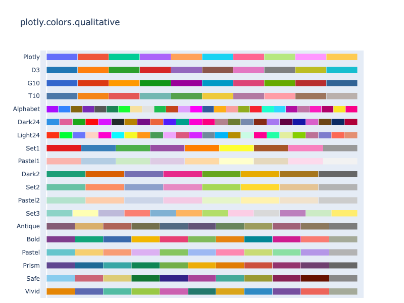

**Interactive Plot:**

<div>                        <script type="text/javascript">window.PlotlyConfig = {MathJaxConfig: 'local'};</script>
        <script charset="utf-8" src="https://cdn.plot.ly/plotly-3.1.0.min.js" integrity="sha256-Ei4740bWZhaUTQuD6q9yQlgVCMPBz6CZWhevDYPv93A=" crossorigin="anonymous"></script>                <div id="plotly-div-5" class="plotly-graph-div" style="height:760px; width:100%;"></div>            <script type="text/javascript">                window.PLOTLYENV=window.PLOTLYENV || {};                                if (document.getElementById("plotly-div-5")) {                    Plotly.newPlot(                        "plotly-div-5",                        [{"customdata":[0,1,2,3,4,5,6,7,8,9,10],"hovertemplate":"%{y}[%{customdata}] = %{marker.color}\u003cextra\u003e\u003c\u002fextra\u003e","marker":{"color":["rgb(229, 134, 6)","rgb(93, 105, 177)","rgb(82, 188, 163)","rgb(153, 201, 69)","rgb(204, 97, 176)","rgb(36, 121, 108)","rgb(218, 165, 27)","rgb(47, 138, 196)","rgb(118, 78, 159)","rgb(237, 100, 90)","rgb(165, 170, 153)"]},"orientation":"h","x":[1,1,1,1,1,1,1,1,1,1,1],"y":["Vivid","Vivid","Vivid","Vivid","Vivid","Vivid","Vivid","Vivid","Vivid","Vivid","Vivid"],"type":"bar"},{"customdata":[0,1,2,3,4,5,6,7,8,9,10],"hovertemplate":"%{y}[%{customdata}] = %{marker.color}\u003cextra\u003e\u003c\u002fextra\u003e","marker":{"color":["rgb(136, 204, 238)","rgb(204, 102, 119)","rgb(221, 204, 119)","rgb(17, 119, 51)","rgb(51, 34, 136)","rgb(170, 68, 153)","rgb(68, 170, 153)","rgb(153, 153, 51)","rgb(136, 34, 85)","rgb(102, 17, 0)","rgb(136, 136, 136)"]},"orientation":"h","x":[1,1,1,1,1,1,1,1,1,1,1],"y":["Safe","Safe","Safe","Safe","Safe","Safe","Safe","Safe","Safe","Safe","Safe"],"type":"bar"},{"customdata":[0,1,2,3,4,5,6,7,8,9,10],"hovertemplate":"%{y}[%{customdata}] = %{marker.color}\u003cextra\u003e\u003c\u002fextra\u003e","marker":{"color":["rgb(95, 70, 144)","rgb(29, 105, 150)","rgb(56, 166, 165)","rgb(15, 133, 84)","rgb(115, 175, 72)","rgb(237, 173, 8)","rgb(225, 124, 5)","rgb(204, 80, 62)","rgb(148, 52, 110)","rgb(111, 64, 112)","rgb(102, 102, 102)"]},"orientation":"h","x":[1,1,1,1,1,1,1,1,1,1,1],"y":["Prism","Prism","Prism","Prism","Prism","Prism","Prism","Prism","Prism","Prism","Prism"],"type":"bar"},{"customdata":[0,1,2,3,4,5,6,7,8,9,10],"hovertemplate":"%{y}[%{customdata}] = %{marker.color}\u003cextra\u003e\u003c\u002fextra\u003e","marker":{"color":["rgb(102, 197, 204)","rgb(246, 207, 113)","rgb(248, 156, 116)","rgb(220, 176, 242)","rgb(135, 197, 95)","rgb(158, 185, 243)","rgb(254, 136, 177)","rgb(201, 219, 116)","rgb(139, 224, 164)","rgb(180, 151, 231)","rgb(179, 179, 179)"]},"orientation":"h","x":[1,1,1,1,1,1,1,1,1,1,1],"y":["Pastel","Pastel","Pastel","Pastel","Pastel","Pastel","Pastel","Pastel","Pastel","Pastel","Pastel"],"type":"bar"},{"customdata":[0,1,2,3,4,5,6,7,8,9,10],"hovertemplate":"%{y}[%{customdata}] = %{marker.color}\u003cextra\u003e\u003c\u002fextra\u003e","marker":{"color":["rgb(127, 60, 141)","rgb(17, 165, 121)","rgb(57, 105, 172)","rgb(242, 183, 1)","rgb(231, 63, 116)","rgb(128, 186, 90)","rgb(230, 131, 16)","rgb(0, 134, 149)","rgb(207, 28, 144)","rgb(249, 123, 114)","rgb(165, 170, 153)"]},"orientation":"h","x":[1,1,1,1,1,1,1,1,1,1,1],"y":["Bold","Bold","Bold","Bold","Bold","Bold","Bold","Bold","Bold","Bold","Bold"],"type":"bar"},{"customdata":[0,1,2,3,4,5,6,7,8,9,10],"hovertemplate":"%{y}[%{customdata}] = %{marker.color}\u003cextra\u003e\u003c\u002fextra\u003e","marker":{"color":["rgb(133, 92, 117)","rgb(217, 175, 107)","rgb(175, 100, 88)","rgb(115, 111, 76)","rgb(82, 106, 131)","rgb(98, 83, 119)","rgb(104, 133, 92)","rgb(156, 156, 94)","rgb(160, 97, 119)","rgb(140, 120, 93)","rgb(124, 124, 124)"]},"orientation":"h","x":[1,1,1,1,1,1,1,1,1,1,1],"y":["Antique","Antique","Antique","Antique","Antique","Antique","Antique","Antique","Antique","Antique","Antique"],"type":"bar"},{"customdata":[0,1,2,3,4,5,6,7,8,9,10,11],"hovertemplate":"%{y}[%{customdata}] = %{marker.color}\u003cextra\u003e\u003c\u002fextra\u003e","marker":{"color":["rgb(141,211,199)","rgb(255,255,179)","rgb(190,186,218)","rgb(251,128,114)","rgb(128,177,211)","rgb(253,180,98)","rgb(179,222,105)","rgb(252,205,229)","rgb(217,217,217)","rgb(188,128,189)","rgb(204,235,197)","rgb(255,237,111)"]},"orientation":"h","x":[1,1,1,1,1,1,1,1,1,1,1,1],"y":["Set3","Set3","Set3","Set3","Set3","Set3","Set3","Set3","Set3","Set3","Set3","Set3"],"type":"bar"},{"customdata":[0,1,2,3,4,5,6,7],"hovertemplate":"%{y}[%{customdata}] = %{marker.color}\u003cextra\u003e\u003c\u002fextra\u003e","marker":{"color":["rgb(179,226,205)","rgb(253,205,172)","rgb(203,213,232)","rgb(244,202,228)","rgb(230,245,201)","rgb(255,242,174)","rgb(241,226,204)","rgb(204,204,204)"]},"orientation":"h","x":[1,1,1,1,1,1,1,1],"y":["Pastel2","Pastel2","Pastel2","Pastel2","Pastel2","Pastel2","Pastel2","Pastel2"],"type":"bar"},{"customdata":[0,1,2,3,4,5,6,7],"hovertemplate":"%{y}[%{customdata}] = %{marker.color}\u003cextra\u003e\u003c\u002fextra\u003e","marker":{"color":["rgb(102,194,165)","rgb(252,141,98)","rgb(141,160,203)","rgb(231,138,195)","rgb(166,216,84)","rgb(255,217,47)","rgb(229,196,148)","rgb(179,179,179)"]},"orientation":"h","x":[1,1,1,1,1,1,1,1],"y":["Set2","Set2","Set2","Set2","Set2","Set2","Set2","Set2"],"type":"bar"},{"customdata":[0,1,2,3,4,5,6,7],"hovertemplate":"%{y}[%{customdata}] = %{marker.color}\u003cextra\u003e\u003c\u002fextra\u003e","marker":{"color":["rgb(27,158,119)","rgb(217,95,2)","rgb(117,112,179)","rgb(231,41,138)","rgb(102,166,30)","rgb(230,171,2)","rgb(166,118,29)","rgb(102,102,102)"]},"orientation":"h","x":[1,1,1,1,1,1,1,1],"y":["Dark2","Dark2","Dark2","Dark2","Dark2","Dark2","Dark2","Dark2"],"type":"bar"},{"customdata":[0,1,2,3,4,5,6,7,8],"hovertemplate":"%{y}[%{customdata}] = %{marker.color}\u003cextra\u003e\u003c\u002fextra\u003e","marker":{"color":["rgb(251,180,174)","rgb(179,205,227)","rgb(204,235,197)","rgb(222,203,228)","rgb(254,217,166)","rgb(255,255,204)","rgb(229,216,189)","rgb(253,218,236)","rgb(242,242,242)"]},"orientation":"h","x":[1,1,1,1,1,1,1,1,1],"y":["Pastel1","Pastel1","Pastel1","Pastel1","Pastel1","Pastel1","Pastel1","Pastel1","Pastel1"],"type":"bar"},{"customdata":[0,1,2,3,4,5,6,7,8],"hovertemplate":"%{y}[%{customdata}] = %{marker.color}\u003cextra\u003e\u003c\u002fextra\u003e","marker":{"color":["rgb(228,26,28)","rgb(55,126,184)","rgb(77,175,74)","rgb(152,78,163)","rgb(255,127,0)","rgb(255,255,51)","rgb(166,86,40)","rgb(247,129,191)","rgb(153,153,153)"]},"orientation":"h","x":[1,1,1,1,1,1,1,1,1],"y":["Set1","Set1","Set1","Set1","Set1","Set1","Set1","Set1","Set1"],"type":"bar"},{"customdata":[0,1,2,3,4,5,6,7,8,9,10,11,12,13,14,15,16,17,18,19,20,21,22,23],"hovertemplate":"%{y}[%{customdata}] = %{marker.color}\u003cextra\u003e\u003c\u002fextra\u003e","marker":{"color":["#FD3216","#00FE35","#6A76FC","#FED4C4","#FE00CE","#0DF9FF","#F6F926","#FF9616","#479B55","#EEA6FB","#DC587D","#D626FF","#6E899C","#00B5F7","#B68E00","#C9FBE5","#FF0092","#22FFA7","#E3EE9E","#86CE00","#BC7196","#7E7DCD","#FC6955","#E48F72"]},"orientation":"h","x":[1,1,1,1,1,1,1,1,1,1,1,1,1,1,1,1,1,1,1,1,1,1,1,1],"y":["Light24","Light24","Light24","Light24","Light24","Light24","Light24","Light24","Light24","Light24","Light24","Light24","Light24","Light24","Light24","Light24","Light24","Light24","Light24","Light24","Light24","Light24","Light24","Light24"],"type":"bar"},{"customdata":[0,1,2,3,4,5,6,7,8,9,10,11,12,13,14,15,16,17,18,19,20,21,22,23],"hovertemplate":"%{y}[%{customdata}] = %{marker.color}\u003cextra\u003e\u003c\u002fextra\u003e","marker":{"color":["#2E91E5","#E15F99","#1CA71C","#FB0D0D","#DA16FF","#222A2A","#B68100","#750D86","#EB663B","#511CFB","#00A08B","#FB00D1","#FC0080","#B2828D","#6C7C32","#778AAE","#862A16","#A777F1","#620042","#1616A7","#DA60CA","#6C4516","#0D2A63","#AF0038"]},"orientation":"h","x":[1,1,1,1,1,1,1,1,1,1,1,1,1,1,1,1,1,1,1,1,1,1,1,1],"y":["Dark24","Dark24","Dark24","Dark24","Dark24","Dark24","Dark24","Dark24","Dark24","Dark24","Dark24","Dark24","Dark24","Dark24","Dark24","Dark24","Dark24","Dark24","Dark24","Dark24","Dark24","Dark24","Dark24","Dark24"],"type":"bar"},{"customdata":[0,1,2,3,4,5,6,7,8,9,10,11,12,13,14,15,16,17,18,19,20,21,22,23,24,25],"hovertemplate":"%{y}[%{customdata}] = %{marker.color}\u003cextra\u003e\u003c\u002fextra\u003e","marker":{"color":["#AA0DFE","#3283FE","#85660D","#782AB6","#565656","#1C8356","#16FF32","#F7E1A0","#E2E2E2","#1CBE4F","#C4451C","#DEA0FD","#FE00FA","#325A9B","#FEAF16","#F8A19F","#90AD1C","#F6222E","#1CFFCE","#2ED9FF","#B10DA1","#C075A6","#FC1CBF","#B00068","#FBE426","#FA0087"]},"orientation":"h","x":[1,1,1,1,1,1,1,1,1,1,1,1,1,1,1,1,1,1,1,1,1,1,1,1,1,1],"y":["Alphabet","Alphabet","Alphabet","Alphabet","Alphabet","Alphabet","Alphabet","Alphabet","Alphabet","Alphabet","Alphabet","Alphabet","Alphabet","Alphabet","Alphabet","Alphabet","Alphabet","Alphabet","Alphabet","Alphabet","Alphabet","Alphabet","Alphabet","Alphabet","Alphabet","Alphabet"],"type":"bar"},{"customdata":[0,1,2,3,4,5,6,7,8,9],"hovertemplate":"%{y}[%{customdata}] = %{marker.color}\u003cextra\u003e\u003c\u002fextra\u003e","marker":{"color":["#4C78A8","#F58518","#E45756","#72B7B2","#54A24B","#EECA3B","#B279A2","#FF9DA6","#9D755D","#BAB0AC"]},"orientation":"h","x":[1,1,1,1,1,1,1,1,1,1],"y":["T10","T10","T10","T10","T10","T10","T10","T10","T10","T10"],"type":"bar"},{"customdata":[0,1,2,3,4,5,6,7,8,9],"hovertemplate":"%{y}[%{customdata}] = %{marker.color}\u003cextra\u003e\u003c\u002fextra\u003e","marker":{"color":["#3366CC","#DC3912","#FF9900","#109618","#990099","#0099C6","#DD4477","#66AA00","#B82E2E","#316395"]},"orientation":"h","x":[1,1,1,1,1,1,1,1,1,1],"y":["G10","G10","G10","G10","G10","G10","G10","G10","G10","G10"],"type":"bar"},{"customdata":[0,1,2,3,4,5,6,7,8,9],"hovertemplate":"%{y}[%{customdata}] = %{marker.color}\u003cextra\u003e\u003c\u002fextra\u003e","marker":{"color":["#1F77B4","#FF7F0E","#2CA02C","#D62728","#9467BD","#8C564B","#E377C2","#7F7F7F","#BCBD22","#17BECF"]},"orientation":"h","x":[1,1,1,1,1,1,1,1,1,1],"y":["D3","D3","D3","D3","D3","D3","D3","D3","D3","D3"],"type":"bar"},{"customdata":[0,1,2,3,4,5,6,7,8,9],"hovertemplate":"%{y}[%{customdata}] = %{marker.color}\u003cextra\u003e\u003c\u002fextra\u003e","marker":{"color":["#636EFA","#EF553B","#00CC96","#AB63FA","#FFA15A","#19D3F3","#FF6692","#B6E880","#FF97FF","#FECB52"]},"orientation":"h","x":[1,1,1,1,1,1,1,1,1,1],"y":["Plotly","Plotly","Plotly","Plotly","Plotly","Plotly","Plotly","Plotly","Plotly","Plotly"],"type":"bar"}],                        {"bargap":0.5,"barmode":"stack","barnorm":"fraction","height":760,"margin":{"b":10},"showlegend":false,"template":{"data":{"barpolar":[{"marker":{"line":{"color":"#E5ECF6","width":0.5},"pattern":{"fillmode":"overlay","size":10,"solidity":0.2}},"type":"barpolar"}],"bar":[{"error_x":{"color":"#2a3f5f"},"error_y":{"color":"#2a3f5f"},"marker":{"line":{"color":"#E5ECF6","width":0.5},"pattern":{"fillmode":"overlay","size":10,"solidity":0.2}},"type":"bar"}],"carpet":[{"aaxis":{"endlinecolor":"#2a3f5f","gridcolor":"white","linecolor":"white","minorgridcolor":"white","startlinecolor":"#2a3f5f"},"baxis":{"endlinecolor":"#2a3f5f","gridcolor":"white","linecolor":"white","minorgridcolor":"white","startlinecolor":"#2a3f5f"},"type":"carpet"}],"choropleth":[{"colorbar":{"outlinewidth":0,"ticks":""},"type":"choropleth"}],"contourcarpet":[{"colorbar":{"outlinewidth":0,"ticks":""},"type":"contourcarpet"}],"contour":[{"colorbar":{"outlinewidth":0,"ticks":""},"colorscale":[[0.0,"#0d0887"],[0.1111111111111111,"#46039f"],[0.2222222222222222,"#7201a8"],[0.3333333333333333,"#9c179e"],[0.4444444444444444,"#bd3786"],[0.5555555555555556,"#d8576b"],[0.6666666666666666,"#ed7953"],[0.7777777777777778,"#fb9f3a"],[0.8888888888888888,"#fdca26"],[1.0,"#f0f921"]],"type":"contour"}],"heatmap":[{"colorbar":{"outlinewidth":0,"ticks":""},"colorscale":[[0.0,"#0d0887"],[0.1111111111111111,"#46039f"],[0.2222222222222222,"#7201a8"],[0.3333333333333333,"#9c179e"],[0.4444444444444444,"#bd3786"],[0.5555555555555556,"#d8576b"],[0.6666666666666666,"#ed7953"],[0.7777777777777778,"#fb9f3a"],[0.8888888888888888,"#fdca26"],[1.0,"#f0f921"]],"type":"heatmap"}],"histogram2dcontour":[{"colorbar":{"outlinewidth":0,"ticks":""},"colorscale":[[0.0,"#0d0887"],[0.1111111111111111,"#46039f"],[0.2222222222222222,"#7201a8"],[0.3333333333333333,"#9c179e"],[0.4444444444444444,"#bd3786"],[0.5555555555555556,"#d8576b"],[0.6666666666666666,"#ed7953"],[0.7777777777777778,"#fb9f3a"],[0.8888888888888888,"#fdca26"],[1.0,"#f0f921"]],"type":"histogram2dcontour"}],"histogram2d":[{"colorbar":{"outlinewidth":0,"ticks":""},"colorscale":[[0.0,"#0d0887"],[0.1111111111111111,"#46039f"],[0.2222222222222222,"#7201a8"],[0.3333333333333333,"#9c179e"],[0.4444444444444444,"#bd3786"],[0.5555555555555556,"#d8576b"],[0.6666666666666666,"#ed7953"],[0.7777777777777778,"#fb9f3a"],[0.8888888888888888,"#fdca26"],[1.0,"#f0f921"]],"type":"histogram2d"}],"histogram":[{"marker":{"pattern":{"fillmode":"overlay","size":10,"solidity":0.2}},"type":"histogram"}],"mesh3d":[{"colorbar":{"outlinewidth":0,"ticks":""},"type":"mesh3d"}],"parcoords":[{"line":{"colorbar":{"outlinewidth":0,"ticks":""}},"type":"parcoords"}],"pie":[{"automargin":true,"type":"pie"}],"scatter3d":[{"line":{"colorbar":{"outlinewidth":0,"ticks":""}},"marker":{"colorbar":{"outlinewidth":0,"ticks":""}},"type":"scatter3d"}],"scattercarpet":[{"marker":{"colorbar":{"outlinewidth":0,"ticks":""}},"type":"scattercarpet"}],"scattergeo":[{"marker":{"colorbar":{"outlinewidth":0,"ticks":""}},"type":"scattergeo"}],"scattergl":[{"marker":{"colorbar":{"outlinewidth":0,"ticks":""}},"type":"scattergl"}],"scattermapbox":[{"marker":{"colorbar":{"outlinewidth":0,"ticks":""}},"type":"scattermapbox"}],"scattermap":[{"marker":{"colorbar":{"outlinewidth":0,"ticks":""}},"type":"scattermap"}],"scatterpolargl":[{"marker":{"colorbar":{"outlinewidth":0,"ticks":""}},"type":"scatterpolargl"}],"scatterpolar":[{"marker":{"colorbar":{"outlinewidth":0,"ticks":""}},"type":"scatterpolar"}],"scatter":[{"fillpattern":{"fillmode":"overlay","size":10,"solidity":0.2},"type":"scatter"}],"scatterternary":[{"marker":{"colorbar":{"outlinewidth":0,"ticks":""}},"type":"scatterternary"}],"surface":[{"colorbar":{"outlinewidth":0,"ticks":""},"colorscale":[[0.0,"#0d0887"],[0.1111111111111111,"#46039f"],[0.2222222222222222,"#7201a8"],[0.3333333333333333,"#9c179e"],[0.4444444444444444,"#bd3786"],[0.5555555555555556,"#d8576b"],[0.6666666666666666,"#ed7953"],[0.7777777777777778,"#fb9f3a"],[0.8888888888888888,"#fdca26"],[1.0,"#f0f921"]],"type":"surface"}],"table":[{"cells":{"fill":{"color":"#EBF0F8"},"line":{"color":"white"}},"header":{"fill":{"color":"#C8D4E3"},"line":{"color":"white"}},"type":"table"}]},"layout":{"annotationdefaults":{"arrowcolor":"#2a3f5f","arrowhead":0,"arrowwidth":1},"autotypenumbers":"strict","coloraxis":{"colorbar":{"outlinewidth":0,"ticks":""}},"colorscale":{"diverging":[[0,"#8e0152"],[0.1,"#c51b7d"],[0.2,"#de77ae"],[0.3,"#f1b6da"],[0.4,"#fde0ef"],[0.5,"#f7f7f7"],[0.6,"#e6f5d0"],[0.7,"#b8e186"],[0.8,"#7fbc41"],[0.9,"#4d9221"],[1,"#276419"]],"sequential":[[0.0,"#0d0887"],[0.1111111111111111,"#46039f"],[0.2222222222222222,"#7201a8"],[0.3333333333333333,"#9c179e"],[0.4444444444444444,"#bd3786"],[0.5555555555555556,"#d8576b"],[0.6666666666666666,"#ed7953"],[0.7777777777777778,"#fb9f3a"],[0.8888888888888888,"#fdca26"],[1.0,"#f0f921"]],"sequentialminus":[[0.0,"#0d0887"],[0.1111111111111111,"#46039f"],[0.2222222222222222,"#7201a8"],[0.3333333333333333,"#9c179e"],[0.4444444444444444,"#bd3786"],[0.5555555555555556,"#d8576b"],[0.6666666666666666,"#ed7953"],[0.7777777777777778,"#fb9f3a"],[0.8888888888888888,"#fdca26"],[1.0,"#f0f921"]]},"colorway":["#636efa","#EF553B","#00cc96","#ab63fa","#FFA15A","#19d3f3","#FF6692","#B6E880","#FF97FF","#FECB52"],"font":{"color":"#2a3f5f"},"geo":{"bgcolor":"white","lakecolor":"white","landcolor":"#E5ECF6","showlakes":true,"showland":true,"subunitcolor":"white"},"hoverlabel":{"align":"left"},"hovermode":"closest","mapbox":{"style":"light"},"paper_bgcolor":"white","plot_bgcolor":"#E5ECF6","polar":{"angularaxis":{"gridcolor":"white","linecolor":"white","ticks":""},"bgcolor":"#E5ECF6","radialaxis":{"gridcolor":"white","linecolor":"white","ticks":""}},"scene":{"xaxis":{"backgroundcolor":"#E5ECF6","gridcolor":"white","gridwidth":2,"linecolor":"white","showbackground":true,"ticks":"","zerolinecolor":"white"},"yaxis":{"backgroundcolor":"#E5ECF6","gridcolor":"white","gridwidth":2,"linecolor":"white","showbackground":true,"ticks":"","zerolinecolor":"white"},"zaxis":{"backgroundcolor":"#E5ECF6","gridcolor":"white","gridwidth":2,"linecolor":"white","showbackground":true,"ticks":"","zerolinecolor":"white"}},"shapedefaults":{"line":{"color":"#2a3f5f"}},"ternary":{"aaxis":{"gridcolor":"white","linecolor":"white","ticks":""},"baxis":{"gridcolor":"white","linecolor":"white","ticks":""},"bgcolor":"#E5ECF6","caxis":{"gridcolor":"white","linecolor":"white","ticks":""}},"title":{"x":0.05},"xaxis":{"automargin":true,"gridcolor":"white","linecolor":"white","ticks":"","title":{"standoff":15},"zerolinecolor":"white","zerolinewidth":2},"yaxis":{"automargin":true,"gridcolor":"white","linecolor":"white","ticks":"","title":{"standoff":15},"zerolinecolor":"white","zerolinewidth":2}}},"title":{"text":"plotly.colors.qualitative"},"xaxis":{"range":[-0.02,1.02],"showgrid":false,"showticklabels":false}},                        {"responsive": true}                    )                };            </script>        </div>

Color sequences in the `px.colors.qualitative` module are stored as lists of CSS colors:

```python
import plotly.express as px

print(px.colors.qualitative.Plotly)
```

**Output:**
```
['#636EFA', '#EF553B', '#00CC96', '#AB63FA', '#FFA15A', '#19D3F3', '#FF6692', '#B6E880', '#FF97FF', '#FECB52']
```

Here is an example that creates a scatter plot using Plotly Express, with points colored using the built-in qualitative `G10` color sequence.

```python
import plotly.express as px
df = px.data.gapminder()
fig = px.line(df, y="lifeExp", x="year", color="continent", line_group="country",
              line_shape="spline", render_mode="svg",
             color_discrete_sequence=px.colors.qualitative.G10,
             title="Built-in G10 color sequence")

fig.show()
```

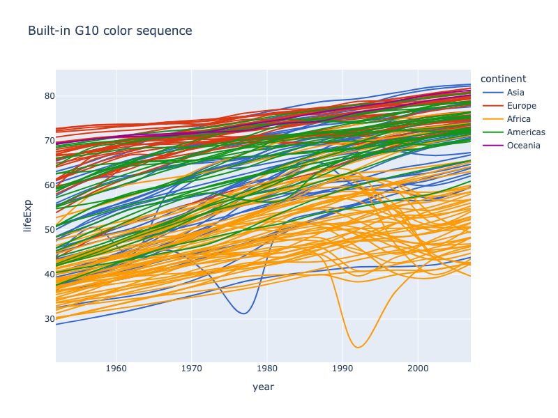

**Interactive Plot:**

<div>                        <script type="text/javascript">window.PlotlyConfig = {MathJaxConfig: 'local'};</script>
        <script charset="utf-8" src="https://cdn.plot.ly/plotly-3.1.0.min.js" integrity="sha256-Ei4740bWZhaUTQuD6q9yQlgVCMPBz6CZWhevDYPv93A=" crossorigin="anonymous"></script>                <div id="plotly-div-6" class="plotly-graph-div" style="height:100%; width:100%;"></div>            <script type="text/javascript">                window.PLOTLYENV=window.PLOTLYENV || {};                                if (document.getElementById("plotly-div-6")) {                    Plotly.newPlot(                        "plotly-div-6",                        [{"hovertemplate":"continent=Asia\u003cbr\u003ecountry=Afghanistan\u003cbr\u003eyear=%{x}\u003cbr\u003elifeExp=%{y}\u003cextra\u003e\u003c\u002fextra\u003e","legendgroup":"Asia","line":{"color":"#3366CC","dash":"solid","shape":"spline"},"marker":{"symbol":"circle"},"mode":"lines","name":"Asia","orientation":"v","showlegend":true,"x":{"dtype":"i2","bdata":"oAelB6oHrwe0B7kHvgfDB8gHzQfSB9cH"},"xaxis":"x","y":{"dtype":"f8","bdata":"kxgEVg7NPECiRbbz\u002fVQ+QKwcWmQ7\u002fz9Aw\u002fUoXI8CQUAlBoGVQwtCQPLSTWIQOENAWmQ730\u002ftQ0Dwp8ZLN2lEQIPAyqFF1kRAjWzn+6nhRECNl24SgxBFQESLbOf76UVA"},"yaxis":"y","type":"scatter"},{"hovertemplate":"continent=Asia\u003cbr\u003ecountry=Bahrain\u003cbr\u003eyear=%{x}\u003cbr\u003elifeExp=%{y}\u003cextra\u003e\u003c\u002fextra\u003e","legendgroup":"Asia","line":{"color":"#3366CC","dash":"solid","shape":"spline"},"marker":{"symbol":"circle"},"mode":"lines","name":"Asia","orientation":"v","showlegend":false,"x":{"dtype":"i2","bdata":"oAelB6oHrwe0B7kHvgfDB8gHzQfSB9cH"},"xaxis":"x","y":{"dtype":"f8","bdata":"1HjpJjF4SUDRItv5fupKQKAaL90kdkxAoBov3ST2TUBmZmZmZqZPQMuhRbbzZVBAFtnO91NDUUAAAAAAALBRQFg5tMh2JlJAMzMzMzN7UkB7FK5H4bJSQHE9Ctej6FJA"},"yaxis":"y","type":"scatter"},{"hovertemplate":"continent=Asia\u003cbr\u003ecountry=Bangladesh\u003cbr\u003eyear=%{x}\u003cbr\u003elifeExp=%{y}\u003cextra\u003e\u003c\u002fextra\u003e","legendgroup":"Asia","line":{"color":"#3366CC","dash":"solid","shape":"spline"},"marker":{"symbol":"circle"},"mode":"lines","name":"Asia","orientation":"v","showlegend":false,"x":{"dtype":"i2","bdata":"oAelB6oHrwe0B7kHvgfDB8gHzQfSB9cH"},"xaxis":"x","y":{"dtype":"f8","bdata":"y6FFtvO9QkAGgZVDi6xDQM\u002f3U+Olm0RARIts5\u002fu5RUDHSzeJQaBGQKAaL90kdkdA\u002fdR46SYBSUBGtvP91GhKQPyp8dJNAkxA2\u002fl+ary0TUCNbOf7qQFPQIcW2c73A1BA"},"yaxis":"y","type":"scatter"},{"hovertemplate":"continent=Asia\u003cbr\u003ecountry=Cambodia\u003cbr\u003eyear=%{x}\u003cbr\u003elifeExp=%{y}\u003cextra\u003e\u003c\u002fextra\u003e","legendgroup":"Asia","line":{"color":"#3366CC","dash":"solid","shape":"spline"},"marker":{"symbol":"circle"},"mode":"lines","name":"Asia","orientation":"v","showlegend":false,"x":{"dtype":"i2","bdata":"oAelB6oHrwe0B7kHvgfDB8gHzQfSB9cH"},"xaxis":"x","y":{"dtype":"f8","bdata":"TDeJQWC1Q0ADK4cW2a5EQIXrUbgetUVAhetRuB61RkB\u002farx0kyhEQLgehetROD9A0SLb+X56SUCiRbbz\u002ffRKQBBYObTI5ktAMQisHFpETEDHSzeJQWBMQAaBlUOL3E1A"},"yaxis":"y","type":"scatter"},{"hovertemplate":"continent=Asia\u003cbr\u003ecountry=China\u003cbr\u003eyear=%{x}\u003cbr\u003elifeExp=%{y}\u003cextra\u003e\u003c\u002fextra\u003e","legendgroup":"Asia","line":{"color":"#3366CC","dash":"solid","shape":"spline"},"marker":{"symbol":"circle"},"mode":"lines","name":"Asia","orientation":"v","showlegend":false,"x":{"dtype":"i2","bdata":"oAelB6oHrwe0B7kHvgfDB8gHzQfSB9cH"},"xaxis":"x","y":{"dtype":"f8","bdata":"AAAAAAAARkD1Zz9SREZJQOPCgZAsQEZA\u002f+xHisgwTUABE7h1N49PQLK61XPS+09AmpmZmZlhUECoxks3idFQQFyPwvUoLFFAJQaBlUObUUBvEoPAygFSQC\u002fdJAaBPVJA"},"yaxis":"y","type":"scatter"},{"hovertemplate":"continent=Asia\u003cbr\u003ecountry=Hong Kong, China\u003cbr\u003eyear=%{x}\u003cbr\u003elifeExp=%{y}\u003cextra\u003e\u003c\u002fextra\u003e","legendgroup":"Asia","line":{"color":"#3366CC","dash":"solid","shape":"spline"},"marker":{"symbol":"circle"},"mode":"lines","name":"Asia","orientation":"v","showlegend":false,"x":{"dtype":"i2","bdata":"oAelB6oHrwe0B7kHvgfDB8gHzQfSB9cH"},"xaxis":"x","y":{"dtype":"f8","bdata":"exSuR+F6TkAAAAAAADBQQJqZmZmZ6VBAAAAAAACAUUAAAAAAAABSQGZmZmZmZlJAzczMzMzcUkDNzMzMzAxTQFg5tMh2ZlNAAAAAAAAAVEBI4XoUrl9UQFpkO99PjVRA"},"yaxis":"y","type":"scatter"},{"hovertemplate":"continent=Asia\u003cbr\u003ecountry=India\u003cbr\u003eyear=%{x}\u003cbr\u003elifeExp=%{y}\u003cextra\u003e\u003c\u002fextra\u003e","legendgroup":"Asia","line":{"color":"#3366CC","dash":"solid","shape":"spline"},"marker":{"symbol":"circle"},"mode":"lines","name":"Asia","orientation":"v","showlegend":false,"x":{"dtype":"i2","bdata":"oAelB6oHrwe0B7kHvgfDB8gHzQfSB9cH"},"xaxis":"x","y":{"dtype":"f8","bdata":"O7TIdr6vQkAdWmQ73x9EQD0K16NwzUVAZBBYObSYR0AX2c73U1NJQLTIdr6fGktAPzVeuklMTEAQWDm0yEZNQAaBlUOLHE5AUrgehevhTkCNl24Sg3BPQOomMQisLFBA"},"yaxis":"y","type":"scatter"},{"hovertemplate":"continent=Asia\u003cbr\u003ecountry=Indonesia\u003cbr\u003eyear=%{x}\u003cbr\u003elifeExp=%{y}\u003cextra\u003e\u003c\u002fextra\u003e","legendgroup":"Asia","line":{"color":"#3366CC","dash":"solid","shape":"spline"},"marker":{"symbol":"circle"},"mode":"lines","name":"Asia","orientation":"v","showlegend":false,"x":{"dtype":"i2","bdata":"oAelB6oHrwe0B7kHvgfDB8gHzQfSB9cH"},"xaxis":"x","y":{"dtype":"f8","bdata":"lkOLbOe7QkAv3SQGgfVDQPyp8dJNQkVACKwcWmT7RkBEi2zn+5lIQGDl0CLbWUpAMQisHFoUTECoxks3iRFOQLpJDAIrV09AtMh2vp+CUEATg8DKoSVRQJqZmZmZqVFA"},"yaxis":"y","type":"scatter"},{"hovertemplate":"continent=Asia\u003cbr\u003ecountry=Iran\u003cbr\u003eyear=%{x}\u003cbr\u003elifeExp=%{y}\u003cextra\u003e\u003c\u002fextra\u003e","legendgroup":"Asia","line":{"color":"#3366CC","dash":"solid","shape":"spline"},"marker":{"symbol":"circle"},"mode":"lines","name":"Asia","orientation":"v","showlegend":false,"x":{"dtype":"i2","bdata":"oAelB6oHrwe0B7kHvgfDB8gHzQfSB9cH"},"xaxis":"x","y":{"dtype":"f8","bdata":"rBxaZDtvRkC6SQwCK5dHQJqZmZmZqUhAeekmMQg8SkDLoUW2851LQGDl0CLb2UxAj8L1KFzPTUCF61G4HoVPQHNoke18b1BAppvEILACUUC\u002fnxov3VxRQARWDi2yvVFA"},"yaxis":"y","type":"scatter"},{"hovertemplate":"continent=Asia\u003cbr\u003ecountry=Iraq\u003cbr\u003eyear=%{x}\u003cbr\u003elifeExp=%{y}\u003cextra\u003e\u003c\u002fextra\u003e","legendgroup":"Asia","line":{"color":"#3366CC","dash":"solid","shape":"spline"},"marker":{"symbol":"circle"},"mode":"lines","name":"Asia","orientation":"v","showlegend":false,"x":{"dtype":"i2","bdata":"oAelB6oHrwe0B7kHvgfDB8gHzQfSB9cH"},"xaxis":"x","y":{"dtype":"f8","bdata":"KVyPwvWoRkAOLbKd7zdIQNEi2\u002fl+uklAmG4Sg8A6S0CamZmZmXlMQL6fGi\u002fdNE5Avp8aL90ET0CJQWDl0EJQQGC6SQwCu01ALIcW2c5nTUDazvdT44VMQPYoXI\u002fCxU1A"},"yaxis":"y","type":"scatter"},{"hovertemplate":"continent=Asia\u003cbr\u003ecountry=Israel\u003cbr\u003eyear=%{x}\u003cbr\u003elifeExp=%{y}\u003cextra\u003e\u003c\u002fextra\u003e","legendgroup":"Asia","line":{"color":"#3366CC","dash":"solid","shape":"spline"},"marker":{"symbol":"circle"},"mode":"lines","name":"Asia","orientation":"v","showlegend":false,"x":{"dtype":"i2","bdata":"oAelB6oHrwe0B7kHvgfDB8gHzQfSB9cH"},"xaxis":"x","y":{"dtype":"f8","bdata":"KVyPwvVYUED2KFyPwvVQQClcj8L1WFFAAAAAAACwUUC4HoXrUehRQKRwPQrXQ1JAzczMzMycUkBmZmZmZuZSQOxRuB6FO1NA7qfGSzeRU0AGgZVDi+xTQEjhehSuL1RA"},"yaxis":"y","type":"scatter"},{"hovertemplate":"continent=Asia\u003cbr\u003ecountry=Japan\u003cbr\u003eyear=%{x}\u003cbr\u003elifeExp=%{y}\u003cextra\u003e\u003c\u002fextra\u003e","legendgroup":"Asia","line":{"color":"#3366CC","dash":"solid","shape":"spline"},"marker":{"symbol":"circle"},"mode":"lines","name":"Asia","orientation":"v","showlegend":false,"x":{"dtype":"i2","bdata":"oAelB6oHrwe0B7kHvgfDB8gHzQfSB9cH"},"xaxis":"x","y":{"dtype":"f8","bdata":"pHA9CteDT0AAAAAAAGBQQB+F61G4LlFA7FG4HoXbUUB7FK5H4VpSQLgehetR2FJA16NwPQpHU0B7FK5H4apTQNejcD0K11NAXI\u002fC9SgsVEAAAAAAAIBUQDvfT42XplRA"},"yaxis":"y","type":"scatter"},{"hovertemplate":"continent=Asia\u003cbr\u003ecountry=Jordan\u003cbr\u003eyear=%{x}\u003cbr\u003elifeExp=%{y}\u003cextra\u003e\u003c\u002fextra\u003e","legendgroup":"Asia","line":{"color":"#3366CC","dash":"solid","shape":"spline"},"marker":{"symbol":"circle"},"mode":"lines","name":"Asia","orientation":"v","showlegend":false,"x":{"dtype":"i2","bdata":"oAelB6oHrwe0B7kHvgfDB8gHzQfSB9cH"},"xaxis":"x","y":{"dtype":"f8","bdata":"TmIQWDmURUASg8DKodVGQOWlm8QgEEhAjZduEoPQSUDdJAaBlUNMQP3UeOkmkU5AO99PjZfeT0BWDi2ynXdQQClcj8L1AFFAxCCwcmhxUUBGtvP91NBRQArXo3A9IlJA"},"yaxis":"y","type":"scatter"},{"hovertemplate":"continent=Asia\u003cbr\u003ecountry=Korea, Dem. Rep.\u003cbr\u003eyear=%{x}\u003cbr\u003elifeExp=%{y}\u003cextra\u003e\u003c\u002fextra\u003e","legendgroup":"Asia","line":{"color":"#3366CC","dash":"solid","shape":"spline"},"marker":{"symbol":"circle"},"mode":"lines","name":"Asia","orientation":"v","showlegend":false,"x":{"dtype":"i2","bdata":"oAelB6oHrwe0B7kHvgfDB8gHzQfSB9cH"},"xaxis":"x","y":{"dtype":"f8","bdata":"ukkMAisHSUDufD81XgpLQIkW2c73U0xAf2q8dJP4TUDn+6nx0v1PQBgEVg4tylBAZmZmZmZGUUDDILByaKlRQDzfT42XflFASgwCK4fuUEDtfD81XqpQQF66SQwC01BA"},"yaxis":"y","type":"scatter"},{"hovertemplate":"continent=Asia\u003cbr\u003ecountry=Korea, Rep.\u003cbr\u003eyear=%{x}\u003cbr\u003elifeExp=%{y}\u003cextra\u003e\u003c\u002fextra\u003e","legendgroup":"Asia","line":{"color":"#3366CC","dash":"solid","shape":"spline"},"marker":{"symbol":"circle"},"mode":"lines","name":"Asia","orientation":"v","showlegend":false,"x":{"dtype":"i2","bdata":"oAelB6oHrwe0B7kHvgfDB8gHzQfSB9cH"},"xaxis":"x","y":{"dtype":"f8","bdata":"RIts5\u002fu5R0C6SQwCK1dKQEw3iUFgpUtAz\u002fdT46XbTEB1kxgEVk5PQBsv3SQGMVBAHVpkO9\u002fHUECkcD0K13NRQFYOLbKdD1JAwyCwcmipUkB7FK5H4UJTQB1aZDvfp1NA"},"yaxis":"y","type":"scatter"},{"hovertemplate":"continent=Asia\u003cbr\u003ecountry=Kuwait\u003cbr\u003eyear=%{x}\u003cbr\u003elifeExp=%{y}\u003cextra\u003e\u003c\u002fextra\u003e","legendgroup":"Asia","line":{"color":"#3366CC","dash":"solid","shape":"spline"},"marker":{"symbol":"circle"},"mode":"lines","name":"Asia","orientation":"v","showlegend":false,"x":{"dtype":"i2","bdata":"oAelB6oHrwe0B7kHvgfDB8gHzQfSB9cH"},"xaxis":"x","y":{"dtype":"f8","bdata":"uB6F61HIS0BOYhBYOQRNQFyPwvUoPE5ADi2yne8nUEAhsHJoke1QQMuhRbbzVVFAsp3vp8bTUUBAYOXQIotSQFyPwvUozFJARIts5\u002fsJU0Bg5dAi2zlTQBSDwMqhZVNA"},"yaxis":"y","type":"scatter"},{"hovertemplate":"continent=Asia\u003cbr\u003ecountry=Lebanon\u003cbr\u003eyear=%{x}\u003cbr\u003elifeExp=%{y}\u003cextra\u003e\u003c\u002fextra\u003e","legendgroup":"Asia","line":{"color":"#3366CC","dash":"solid","shape":"spline"},"marker":{"symbol":"circle"},"mode":"lines","name":"Asia","orientation":"v","showlegend":false,"x":{"dtype":"i2","bdata":"oAelB6oHrwe0B7kHvgfDB8gHzQfSB9cH"},"xaxis":"x","y":{"dtype":"f8","bdata":"EFg5tMj2S0A730+Nl75NQHnpJjEIDE9Aj8L1KFzvT0Bt5\u002fup8VpQQHSTGARWhlBA9P3UeOm+UEAlBoGVQ\u002ftQQKabxCCwUlFAKVyPwvWQUUBvEoPAysFRQGQ730+N\u002f1FA"},"yaxis":"y","type":"scatter"},{"hovertemplate":"continent=Asia\u003cbr\u003ecountry=Malaysia\u003cbr\u003eyear=%{x}\u003cbr\u003elifeExp=%{y}\u003cextra\u003e\u003c\u002fextra\u003e","legendgroup":"Asia","line":{"color":"#3366CC","dash":"solid","shape":"spline"},"marker":{"symbol":"circle"},"mode":"lines","name":"Asia","orientation":"v","showlegend":false,"x":{"dtype":"i2","bdata":"oAelB6oHrwe0B7kHvgfDB8gHzQfSB9cH"},"xaxis":"x","y":{"dtype":"f8","bdata":"JQaBlUM7SECTGARWDg1KQHWTGARW3ktAc2iR7XyvTUDhehSuR4FPQKrx0k1iUFBAAAAAAAAAUUAAAAAAAGBRQDEIrBxarFFAeekmMQj8UUCJQWDl0EJSQIGVQ4tsj1JA"},"yaxis":"y","type":"scatter"},{"hovertemplate":"continent=Asia\u003cbr\u003ecountry=Mongolia\u003cbr\u003eyear=%{x}\u003cbr\u003elifeExp=%{y}\u003cextra\u003e\u003c\u002fextra\u003e","legendgroup":"Asia","line":{"color":"#3366CC","dash":"solid","shape":"spline"},"marker":{"symbol":"circle"},"mode":"lines","name":"Asia","orientation":"v","showlegend":false,"x":{"dtype":"i2","bdata":"oAelB6oHrwe0B7kHvgfDB8gHzQfSB9cH"},"xaxis":"x","y":{"dtype":"f8","bdata":"rBxaZDsfRUA7tMh2vp9GQOWlm8QgIEhAqvHSTWKgSUCNl24Sg+BKQAMrhxbZvktAO99PjZe+TEAj2\u002fl+ahxOQKabxCCwok5AAAAAAADQT0AnMQisHEJQQAisHFpks1BA"},"yaxis":"y","type":"scatter"},{"hovertemplate":"continent=Asia\u003cbr\u003ecountry=Myanmar\u003cbr\u003eyear=%{x}\u003cbr\u003elifeExp=%{y}\u003cextra\u003e\u003c\u002fextra\u003e","legendgroup":"Asia","line":{"color":"#3366CC","dash":"solid","shape":"spline"},"marker":{"symbol":"circle"},"mode":"lines","name":"Asia","orientation":"v","showlegend":false,"x":{"dtype":"i2","bdata":"oAelB6oHrwe0B7kHvgfDB8gHzQfSB9cH"},"xaxis":"x","y":{"dtype":"f8","bdata":"Rrbz\u002fdQoQkCkcD0K1\u002fNEQOf7qfHSjUZAjZduEoOwSEApXI\u002fC9YhKQGQ730+NB0xAukkMAisHTUAIrBxaZCtNQClcj8L1qE1ARIts5\u002fspTkBOYhBYOfRNQEa28\u002f3UCE9A"},"yaxis":"y","type":"scatter"},{"hovertemplate":"continent=Asia\u003cbr\u003ecountry=Nepal\u003cbr\u003eyear=%{x}\u003cbr\u003elifeExp=%{y}\u003cextra\u003e\u003c\u002fextra\u003e","legendgroup":"Asia","line":{"color":"#3366CC","dash":"solid","shape":"spline"},"marker":{"symbol":"circle"},"mode":"lines","name":"Asia","orientation":"v","showlegend":false,"x":{"dtype":"i2","bdata":"oAelB6oHrwe0B7kHvgfDB8gHzQfSB9cH"},"xaxis":"x","y":{"dtype":"f8","bdata":"arx0kxgUQkArhxbZztdCQPyp8dJNskNAI9v5fmq8REA\u002fNV66SfxFQDu0yHa+X0dAeekmMQjMSEDb+X5qvERKQJMYBFYO3UtASgwCK4e2TUDsUbgehatOQBSuR+F65E9A"},"yaxis":"y","type":"scatter"},{"hovertemplate":"continent=Asia\u003cbr\u003ecountry=Oman\u003cbr\u003eyear=%{x}\u003cbr\u003elifeExp=%{y}\u003cextra\u003e\u003c\u002fextra\u003e","legendgroup":"Asia","line":{"color":"#3366CC","dash":"solid","shape":"spline"},"marker":{"symbol":"circle"},"mode":"lines","name":"Asia","orientation":"v","showlegend":false,"x":{"dtype":"i2","bdata":"oAelB6oHrwe0B7kHvgfDB8gHzQfSB9cH"},"xaxis":"x","y":{"dtype":"f8","bdata":"RIts5\u002fvJQkAK16NwPQpEQIXrUbgelUVAWDm0yHZ+R0D8qfHSTRJKQOXQItv5rkxAd76fGi9dT0Dl0CLb+e5QQPhT46WbzFFADi2yne8fUkAxCKwcWoxSQClcj8L16FJA"},"yaxis":"y","type":"scatter"},{"hovertemplate":"continent=Asia\u003cbr\u003ecountry=Pakistan\u003cbr\u003eyear=%{x}\u003cbr\u003elifeExp=%{y}\u003cextra\u003e\u003c\u002fextra\u003e","legendgroup":"Asia","line":{"color":"#3366CC","dash":"solid","shape":"spline"},"marker":{"symbol":"circle"},"mode":"lines","name":"Asia","orientation":"v","showlegend":false,"x":{"dtype":"i2","bdata":"oAelB6oHrwe0B7kHvgfDB8gHzQfSB9cH"},"xaxis":"x","y":{"dtype":"f8","bdata":"LIcW2c63RUCe76fGS8dGQPYoXI\u002fC1UdAZmZmZmbmSED0\u002fdR46fZJQC\u002fdJAaBBUtATmIQWDkUTECPwvUoXB9NQCUGgZVDa05AZBBYObToTkCuR+F6FM5PQPT91HjpXlBA"},"yaxis":"y","type":"scatter"},{"hovertemplate":"continent=Asia\u003cbr\u003ecountry=Philippines\u003cbr\u003eyear=%{x}\u003cbr\u003elifeExp=%{y}\u003cextra\u003e\u003c\u002fextra\u003e","legendgroup":"Asia","line":{"color":"#3366CC","dash":"solid","shape":"spline"},"marker":{"symbol":"circle"},"mode":"lines","name":"Asia","orientation":"v","showlegend":false,"x":{"dtype":"i2","bdata":"oAelB6oHrwe0B7kHvgfDB8gHzQfSB9cH"},"xaxis":"x","y":{"dtype":"f8","bdata":"x0s3iUHgR0CYbhKDwKpJQDeJQWDlYEtA\u002fKnx0k0yTEC4HoXrUQhNQEjhehSuB05A0SLb+X4KT0CMbOf7qQlQQFpkO99PnVBAarx0kxgkUUAIrBxaZJNRQHnpJjEI7FFA"},"yaxis":"y","type":"scatter"},{"hovertemplate":"continent=Asia\u003cbr\u003ecountry=Saudi Arabia\u003cbr\u003eyear=%{x}\u003cbr\u003elifeExp=%{y}\u003cextra\u003e\u003c\u002fextra\u003e","legendgroup":"Asia","line":{"color":"#3366CC","dash":"solid","shape":"spline"},"marker":{"symbol":"circle"},"mode":"lines","name":"Asia","orientation":"v","showlegend":false,"x":{"dtype":"i2","bdata":"oAelB6oHrwe0B7kHvgfDB8gHzQfSB9cH"},"xaxis":"x","y":{"dtype":"f8","bdata":"AAAAAADwQ0DJdr6fGm9FQKJFtvP99EZAF9nO91PzSEDFILByaPFKQLgehetRWE1AqMZLN4mBT0B7FK5H4ZJQQP7UeOkmMVFAJzEIrByiUUDy0k1iEOhRQH0\u002fNV66MVJA"},"yaxis":"y","type":"scatter"},{"hovertemplate":"continent=Asia\u003cbr\u003ecountry=Singapore\u003cbr\u003eyear=%{x}\u003cbr\u003elifeExp=%{y}\u003cextra\u003e\u003c\u002fextra\u003e","legendgroup":"Asia","line":{"color":"#3366CC","dash":"solid","shape":"spline"},"marker":{"symbol":"circle"},"mode":"lines","name":"Asia","orientation":"v","showlegend":false,"x":{"dtype":"i2","bdata":"oAelB6oHrwe0B7kHvgfDB8gHzQfSB9cH"},"xaxis":"x","y":{"dtype":"f8","bdata":"ppvEILAyTkD0\u002fdR46ZZPQFCNl24Sc1BABoGVQ4v8UEDTTWIQWGFRQHsUrkfhslFAcT0K16PwUUCkcD0K12NSQN9PjZdu8lJAJzEIrBxKU0DhehSuR7FTQJHtfD81\u002flNA"},"yaxis":"y","type":"scatter"},{"hovertemplate":"continent=Asia\u003cbr\u003ecountry=Sri Lanka\u003cbr\u003eyear=%{x}\u003cbr\u003elifeExp=%{y}\u003cextra\u003e\u003c\u002fextra\u003e","legendgroup":"Asia","line":{"color":"#3366CC","dash":"solid","shape":"spline"},"marker":{"symbol":"circle"},"mode":"lines","name":"Asia","orientation":"v","showlegend":false,"x":{"dtype":"i2","bdata":"oAelB6oHrwe0B7kHvgfDB8gHzQfSB9cH"},"xaxis":"x","y":{"dtype":"f8","bdata":"lkOLbOfLTEDufD81XrpOQH9qvHSTGE9AGy\u002fdJAYRUECmm8QgsEJQQNv5fmq8fFBAnMQgsHIwUUBjEFg5tEBRQMVLN4lBmFFAaJHtfD+dUUBcj8L1KLRRQNNNYhBYGVJA"},"yaxis":"y","type":"scatter"},{"hovertemplate":"continent=Asia\u003cbr\u003ecountry=Syria\u003cbr\u003eyear=%{x}\u003cbr\u003elifeExp=%{y}\u003cextra\u003e\u003c\u002fextra\u003e","legendgroup":"Asia","line":{"color":"#3366CC","dash":"solid","shape":"spline"},"marker":{"symbol":"circle"},"mode":"lines","name":"Asia","orientation":"v","showlegend":false,"x":{"dtype":"i2","bdata":"oAelB6oHrwe0B7kHvgfDB8gHzQfSB9cH"},"xaxis":"x","y":{"dtype":"f8","bdata":"Gy\u002fdJAbxRkAxCKwcWiRIQNejcD0KJ0lApHA9CtfTSkDazvdT46VMQClcj8L1mE5A9ihcj8IlUEB0kxgEVr5QQA4tsp3vT1FAfT81XrrhUUAIrBxaZENSQP7UeOkmiVJA"},"yaxis":"y","type":"scatter"},{"hovertemplate":"continent=Asia\u003cbr\u003ecountry=Taiwan\u003cbr\u003eyear=%{x}\u003cbr\u003elifeExp=%{y}\u003cextra\u003e\u003c\u002fextra\u003e","legendgroup":"Asia","line":{"color":"#3366CC","dash":"solid","shape":"spline"},"marker":{"symbol":"circle"},"mode":"lines","name":"Asia","orientation":"v","showlegend":false,"x":{"dtype":"i2","bdata":"oAelB6oHrwe0B7kHvgfDB8gHzQfSB9cH"},"xaxis":"x","y":{"dtype":"f8","bdata":"AAAAAABATUAzMzMzMzNPQM3MzMzMTFBAAAAAAADgUEApXI\u002fC9VhRQPYoXI\u002fCpVFACtejcD0KUkCamZmZmVlSQHE9CtejkFJAAAAAAADQUkCPwvUoXD9TQJqZmZmZmVNA"},"yaxis":"y","type":"scatter"},{"hovertemplate":"continent=Asia\u003cbr\u003ecountry=Thailand\u003cbr\u003eyear=%{x}\u003cbr\u003elifeExp=%{y}\u003cextra\u003e\u003c\u002fextra\u003e","legendgroup":"Asia","line":{"color":"#3366CC","dash":"solid","shape":"spline"},"marker":{"symbol":"circle"},"mode":"lines","name":"Asia","orientation":"v","showlegend":false,"x":{"dtype":"i2","bdata":"oAelB6oHrwe0B7kHvgfDB8gHzQfSB9cH"},"xaxis":"x","y":{"dtype":"f8","bdata":"BoGVQ4tsSUBxPQrXo9BKQCyHFtnOB0xAFK5H4XokTUCkcD0K1zNOQKwcWmQ7P09Ake18PzUmUEBMN4lBYIVQQFCNl24S01BA001iEFjhUEBqvHSTGCRRQIGVQ4tsp1FA"},"yaxis":"y","type":"scatter"},{"hovertemplate":"continent=Asia\u003cbr\u003ecountry=Vietnam\u003cbr\u003eyear=%{x}\u003cbr\u003elifeExp=%{y}\u003cextra\u003e\u003c\u002fextra\u003e","legendgroup":"Asia","line":{"color":"#3366CC","dash":"solid","shape":"spline"},"marker":{"symbol":"circle"},"mode":"lines","name":"Asia","orientation":"v","showlegend":false,"x":{"dtype":"i2","bdata":"oAelB6oHrwe0B7kHvgfDB8gHzQfSB9cH"},"xaxis":"x","y":{"dtype":"f8","bdata":"2\u002fl+arw0RECoxks3iXFFQFg5tMh2rkZAJQaBlUPrR0CNl24SgyBJQG8Sg8DK4UtAnMQgsHJoTUApXI\u002fC9WhPQO18PzVe6lBAXrpJDAKrUUAMAiuHFkFSQA4tsp3vj1JA"},"yaxis":"y","type":"scatter"},{"hovertemplate":"continent=Asia\u003cbr\u003ecountry=West Bank and Gaza\u003cbr\u003eyear=%{x}\u003cbr\u003elifeExp=%{y}\u003cextra\u003e\u003c\u002fextra\u003e","legendgroup":"Asia","line":{"color":"#3366CC","dash":"solid","shape":"spline"},"marker":{"symbol":"circle"},"mode":"lines","name":"Asia","orientation":"v","showlegend":false,"x":{"dtype":"i2","bdata":"oAelB6oHrwe0B7kHvgfDB8gHzQfSB9cH"},"xaxis":"x","y":{"dtype":"f8","bdata":"FK5H4XqURUDazvdT49VGQMdLN4lBEEhAVOOlm8TQSUBqvHSTGERMQFK4HoXrYU5ARIts5\u002fsZUEBt5\u002fup8cJQQMuhRbbzbVFAoBov3STGUUBI4XoUrhdSQF66SQwCW1JA"},"yaxis":"y","type":"scatter"},{"hovertemplate":"continent=Asia\u003cbr\u003ecountry=Yemen, Rep.\u003cbr\u003eyear=%{x}\u003cbr\u003elifeExp=%{y}\u003cextra\u003e\u003c\u002fextra\u003e","legendgroup":"Asia","line":{"color":"#3366CC","dash":"solid","shape":"spline"},"marker":{"symbol":"circle"},"mode":"lines","name":"Asia","orientation":"v","showlegend":false,"x":{"dtype":"i2","bdata":"oAelB6oHrwe0B7kHvgfDB8gHzQfSB9cH"},"xaxis":"x","y":{"dtype":"f8","bdata":"oBov3SRGQEBcj8L1KPxAQNejcD0Kl0FAy6FFtvN9QkAGgZVDi+xDQGZmZmZmFkZAWDm0yHaOSEC8dJMYBHZKQOkmMQiszEtAw\u002fUoXI8CTUCBlUOLbCdOQNNNYhBYWU9A"},"yaxis":"y","type":"scatter"},{"hovertemplate":"continent=Europe\u003cbr\u003ecountry=Albania\u003cbr\u003eyear=%{x}\u003cbr\u003elifeExp=%{y}\u003cextra\u003e\u003c\u002fextra\u003e","legendgroup":"Europe","line":{"color":"#DC3912","dash":"solid","shape":"spline"},"marker":{"symbol":"circle"},"mode":"lines","name":"Europe","orientation":"v","showlegend":true,"x":{"dtype":"i2","bdata":"oAelB6oHrwe0B7kHvgfDB8gHzQfSB9cH"},"xaxis":"x","y":{"dtype":"f8","bdata":"PQrXo3CdS0CkcD0K16NNQBSuR+F6NFBArkfhehSOUEBcj8L1KOxQQOxRuB6FO1FAexSuR+GaUUAAAAAAAABSQHe+nxov5VFAzczMzMw8UkCNbOf7qelSQFCNl24SG1NA"},"yaxis":"y","type":"scatter"},{"hovertemplate":"continent=Europe\u003cbr\u003ecountry=Austria\u003cbr\u003eyear=%{x}\u003cbr\u003elifeExp=%{y}\u003cextra\u003e\u003c\u002fextra\u003e","legendgroup":"Europe","line":{"color":"#DC3912","dash":"solid","shape":"spline"},"marker":{"symbol":"circle"},"mode":"lines","name":"Europe","orientation":"v","showlegend":false,"x":{"dtype":"i2","bdata":"oAelB6oHrwe0B7kHvgfDB8gHzQfSB9cH"},"xaxis":"x","y":{"dtype":"f8","bdata":"MzMzMzOzUEAfhetRuN5QQMP1KFyPYlFAKVyPwvWIUUC4HoXrUahRQHsUrkfhClJA7FG4HoVLUkBcj8L1KLxSQMP1KFyPAlNAcT0K16NgU0AfhetRuL5TQJMYBFYO9VNA"},"yaxis":"y","type":"scatter"},{"hovertemplate":"continent=Europe\u003cbr\u003ecountry=Belgium\u003cbr\u003eyear=%{x}\u003cbr\u003elifeExp=%{y}\u003cextra\u003e\u003c\u002fextra\u003e","legendgroup":"Europe","line":{"color":"#DC3912","dash":"solid","shape":"spline"},"marker":{"symbol":"circle"},"mode":"lines","name":"Europe","orientation":"v","showlegend":false,"x":{"dtype":"i2","bdata":"oAelB6oHrwe0B7kHvgfDB8gHzQfSB9cH"},"xaxis":"x","y":{"dtype":"f8","bdata":"AAAAAAAAUUCPwvUoXE9RQAAAAAAAkFFAXI\u002fC9Si8UUBcj8L1KNxRQDMzMzMzM1JA7FG4HoV7UkBmZmZmZtZSQD0K16NwHVNAUrgehethU0AUrkfhepRTQE5iEFg53FNA"},"yaxis":"y","type":"scatter"},{"hovertemplate":"continent=Europe\u003cbr\u003ecountry=Bosnia and Herzegovina\u003cbr\u003eyear=%{x}\u003cbr\u003elifeExp=%{y}\u003cextra\u003e\u003c\u002fextra\u003e","legendgroup":"Europe","line":{"color":"#DC3912","dash":"solid","shape":"spline"},"marker":{"symbol":"circle"},"mode":"lines","name":"Europe","orientation":"v","showlegend":false,"x":{"dtype":"i2","bdata":"oAelB6oHrwe0B7kHvgfDB8gHzQfSB9cH"},"xaxis":"x","y":{"dtype":"f8","bdata":"KVyPwvXoSkCamZmZmTlNQNejcD0K905Aw\u002fUoXI8yUEDNzMzMzNxQQNejcD0Kd1FAXI\u002fC9SisUUApXI\u002fC9chRQAisHFpkC1JAVg4tsp1PUkD2KFyPwoVSQEoMAiuHtlJA"},"yaxis":"y","type":"scatter"},{"hovertemplate":"continent=Europe\u003cbr\u003ecountry=Bulgaria\u003cbr\u003eyear=%{x}\u003cbr\u003elifeExp=%{y}\u003cextra\u003e\u003c\u002fextra\u003e","legendgroup":"Europe","line":{"color":"#DC3912","dash":"solid","shape":"spline"},"marker":{"symbol":"circle"},"mode":"lines","name":"Europe","orientation":"v","showlegend":false,"x":{"dtype":"i2","bdata":"oAelB6oHrwe0B7kHvgfDB8gHzQfSB9cH"},"xaxis":"x","y":{"dtype":"f8","bdata":"zczMzMzMTUDXo3A9CqdQQHE9CtejYFFAexSuR+GaUUCamZmZmblRQKRwPQrXs1FAhetRuB7FUUD2KFyPwtVRQFyPwvUozFFAFK5H4XqUUUApXI\u002fC9QhSQLgehetRQFJA"},"yaxis":"y","type":"scatter"},{"hovertemplate":"continent=Europe\u003cbr\u003ecountry=Croatia\u003cbr\u003eyear=%{x}\u003cbr\u003elifeExp=%{y}\u003cextra\u003e\u003c\u002fextra\u003e","legendgroup":"Europe","line":{"color":"#DC3912","dash":"solid","shape":"spline"},"marker":{"symbol":"circle"},"mode":"lines","name":"Europe","orientation":"v","showlegend":false,"x":{"dtype":"i2","bdata":"oAelB6oHrwe0B7kHvgfDB8gHzQfSB9cH"},"xaxis":"x","y":{"dtype":"f8","bdata":"exSuR+GaTkDhehSuRzFQQLgehetRyFBAAAAAAAAgUUDXo3A9CmdRQClcj8L1qFFAPQrXo3CdUUDhehSuR+FRQH0\u002fNV66IVJA7FG4HoVrUkDy0k1iELhSQB1aZDvf71JA"},"yaxis":"y","type":"scatter"},{"hovertemplate":"continent=Europe\u003cbr\u003ecountry=Czech Republic\u003cbr\u003eyear=%{x}\u003cbr\u003elifeExp=%{y}\u003cextra\u003e\u003c\u002fextra\u003e","legendgroup":"Europe","line":{"color":"#DC3912","dash":"solid","shape":"spline"},"marker":{"symbol":"circle"},"mode":"lines","name":"Europe","orientation":"v","showlegend":false,"x":{"dtype":"i2","bdata":"oAelB6oHrwe0B7kHvgfDB8gHzQfSB9cH"},"xaxis":"x","y":{"dtype":"f8","bdata":"SOF6FK63UEBSuB6F60FRQJqZmZmZeVFAuB6F61GYUUDD9Shcj5JRQD0K16NwrVFAPQrXo3C9UUCF61G4HuVRQJqZmZmZGVJAcT0K16OAUkBxPQrXo+BSQMl2vp8aH1NA"},"yaxis":"y","type":"scatter"},{"hovertemplate":"continent=Europe\u003cbr\u003ecountry=Denmark\u003cbr\u003eyear=%{x}\u003cbr\u003elifeExp=%{y}\u003cextra\u003e\u003c\u002fextra\u003e","legendgroup":"Europe","line":{"color":"#DC3912","dash":"solid","shape":"spline"},"marker":{"symbol":"circle"},"mode":"lines","name":"Europe","orientation":"v","showlegend":false,"x":{"dtype":"i2","bdata":"oAelB6oHrwe0B7kHvgfDB8gHzQfSB9cH"},"xaxis":"x","y":{"dtype":"f8","bdata":"UrgeheuxUUCkcD0K1\u002fNRQGZmZmZmFlJAPQrXo3A9UkCuR+F6FF5SQFyPwvUorFJAuB6F61GoUkAzMzMzM7NSQIXrUbge1VJA16NwPQoHU0DsUbgehUtTQGiR7Xw\u002flVNA"},"yaxis":"y","type":"scatter"},{"hovertemplate":"continent=Europe\u003cbr\u003ecountry=Finland\u003cbr\u003eyear=%{x}\u003cbr\u003elifeExp=%{y}\u003cextra\u003e\u003c\u002fextra\u003e","legendgroup":"Europe","line":{"color":"#DC3912","dash":"solid","shape":"spline"},"marker":{"symbol":"circle"},"mode":"lines","name":"Europe","orientation":"v","showlegend":false,"x":{"dtype":"i2","bdata":"oAelB6oHrwe0B7kHvgfDB8gHzQfSB9cH"},"xaxis":"x","y":{"dtype":"f8","bdata":"MzMzMzOjUECPwvUoXN9QQAAAAAAAMFFAhetRuB51UUBI4XoUrrdRQOF6FK5HIVJAMzMzMzOjUkCF61G4HrVSQM3MzMzM7FJAuB6F61FIU0BI4XoUrpdTQHnpJjEI1FNA"},"yaxis":"y","type":"scatter"},{"hovertemplate":"continent=Europe\u003cbr\u003ecountry=France\u003cbr\u003eyear=%{x}\u003cbr\u003elifeExp=%{y}\u003cextra\u003e\u003c\u002fextra\u003e","legendgroup":"Europe","line":{"color":"#DC3912","dash":"solid","shape":"spline"},"marker":{"symbol":"circle"},"mode":"lines","name":"Europe","orientation":"v","showlegend":false,"x":{"dtype":"i2","bdata":"oAelB6oHrwe0B7kHvgfDB8gHzQfSB9cH"},"xaxis":"x","y":{"dtype":"f8","bdata":"CtejcD3aUEDsUbgehTtRQHE9CtejoFFAMzMzMzPjUUC4HoXrURhSQIXrUbgedVJAKVyPwvW4UkD2KFyPwhVTQD0K16NwXVNAKVyPwvWoU0D2KFyPwuVTQDVeukkMKlRA"},"yaxis":"y","type":"scatter"},{"hovertemplate":"continent=Europe\u003cbr\u003ecountry=Germany\u003cbr\u003eyear=%{x}\u003cbr\u003elifeExp=%{y}\u003cextra\u003e\u003c\u002fextra\u003e","legendgroup":"Europe","line":{"color":"#DC3912","dash":"solid","shape":"spline"},"marker":{"symbol":"circle"},"mode":"lines","name":"Europe","orientation":"v","showlegend":false,"x":{"dtype":"i2","bdata":"oAelB6oHrwe0B7kHvgfDB8gHzQfSB9cH"},"xaxis":"x","y":{"dtype":"f8","bdata":"AAAAAADgUEBmZmZmZkZRQDMzMzMzk1FAMzMzMzOzUUAAAAAAAMBRQAAAAAAAIFJAMzMzMzNzUkCR7Xw\u002fNbZSQBSuR+F6BFNA9ihcj8JVU0B7FK5H4apTQESLbOf72VNA"},"yaxis":"y","type":"scatter"},{"hovertemplate":"continent=Europe\u003cbr\u003ecountry=Greece\u003cbr\u003eyear=%{x}\u003cbr\u003elifeExp=%{y}\u003cextra\u003e\u003c\u002fextra\u003e","legendgroup":"Europe","line":{"color":"#DC3912","dash":"solid","shape":"spline"},"marker":{"symbol":"circle"},"mode":"lines","name":"Europe","orientation":"v","showlegend":false,"x":{"dtype":"i2","bdata":"oAelB6oHrwe0B7kHvgfDB8gHzQfSB9cH"},"xaxis":"x","y":{"dtype":"f8","bdata":"16NwPQp3UEDXo3A9CvdQQHE9CtejYFFAAAAAAADAUUD2KFyPwhVSQOxRuB6Fa1JAj8L1KFzPUkB7FK5H4SpTQFK4HoXrQVNAVg4tsp13U0Cq8dJNYpBTQPT91Hjp3lNA"},"yaxis":"y","type":"scatter"},{"hovertemplate":"continent=Europe\u003cbr\u003ecountry=Hungary\u003cbr\u003eyear=%{x}\u003cbr\u003elifeExp=%{y}\u003cextra\u003e\u003c\u002fextra\u003e","legendgroup":"Europe","line":{"color":"#DC3912","dash":"solid","shape":"spline"},"marker":{"symbol":"circle"},"mode":"lines","name":"Europe","orientation":"v","showlegend":false,"x":{"dtype":"i2","bdata":"oAelB6oHrwe0B7kHvgfDB8gHzQfSB9cH"},"xaxis":"x","y":{"dtype":"f8","bdata":"UrgehesBUEAK16NwPZpQQD0K16Nw\u002fVBAAAAAAABgUUBxPQrXo3BRQM3MzMzMfFFAKVyPwvVYUUCF61G4HmVRQHsUrkfhSlFAw\u002fUoXI\u002fCUUD2KFyPwiVSQBSDwMqhVVJA"},"yaxis":"y","type":"scatter"},{"hovertemplate":"continent=Europe\u003cbr\u003ecountry=Iceland\u003cbr\u003eyear=%{x}\u003cbr\u003elifeExp=%{y}\u003cextra\u003e\u003c\u002fextra\u003e","legendgroup":"Europe","line":{"color":"#DC3912","dash":"solid","shape":"spline"},"marker":{"symbol":"circle"},"mode":"lines","name":"Europe","orientation":"v","showlegend":false,"x":{"dtype":"i2","bdata":"oAelB6oHrwe0B7kHvgfDB8gHzQfSB9cH"},"xaxis":"x","y":{"dtype":"f8","bdata":"j8L1KFwfUkCuR+F6FF5SQOxRuB6Fa1JAH4XrUbhuUkA9CtejcJ1SQNejcD0KB1NAj8L1KFw\u002fU0AfhetRuE5TQOF6FK5HsVNAzczMzMy8U0AAAAAAACBUQJzEILBycFRA"},"yaxis":"y","type":"scatter"},{"hovertemplate":"continent=Europe\u003cbr\u003ecountry=Ireland\u003cbr\u003eyear=%{x}\u003cbr\u003elifeExp=%{y}\u003cextra\u003e\u003c\u002fextra\u003e","legendgroup":"Europe","line":{"color":"#DC3912","dash":"solid","shape":"spline"},"marker":{"symbol":"circle"},"mode":"lines","name":"Europe","orientation":"v","showlegend":false,"x":{"dtype":"i2","bdata":"oAelB6oHrwe0B7kHvgfDB8gHzQfSB9cH"},"xaxis":"x","y":{"dtype":"f8","bdata":"CtejcD26UECamZmZmTlRQMP1KFyPklFAhetRuB7FUUBSuB6F69FRQFK4HoXrAVJAZmZmZmZGUkDXo3A9CpdSQNnO91Pj3VJAK4cW2c4HU0AnMQisHHJTQHE9CtejuFNA"},"yaxis":"y","type":"scatter"},{"hovertemplate":"continent=Europe\u003cbr\u003ecountry=Italy\u003cbr\u003eyear=%{x}\u003cbr\u003elifeExp=%{y}\u003cextra\u003e\u003c\u002fextra\u003e","legendgroup":"Europe","line":{"color":"#DC3912","dash":"solid","shape":"spline"},"marker":{"symbol":"circle"},"mode":"lines","name":"Europe","orientation":"v","showlegend":false,"x":{"dtype":"i2","bdata":"oAelB6oHrwe0B7kHvgfDB8gHzQfSB9cH"},"xaxis":"x","y":{"dtype":"f8","bdata":"XI\u002fC9Sh8UECkcD0K1\u002fNQQI\u002fC9ShcT1FApHA9CtfDUUBcj8L1KAxSQB+F61G4XlJAH4XrUbi+UkB7FK5H4RpTQFyPwvUoXFNAFK5H4Xq0U0CPwvUoXA9UQG3n+6nxIlRA"},"yaxis":"y","type":"scatter"},{"hovertemplate":"continent=Europe\u003cbr\u003ecountry=Montenegro\u003cbr\u003eyear=%{x}\u003cbr\u003elifeExp=%{y}\u003cextra\u003e\u003c\u002fextra\u003e","legendgroup":"Europe","line":{"color":"#DC3912","dash":"solid","shape":"spline"},"marker":{"symbol":"circle"},"mode":"lines","name":"Europe","orientation":"v","showlegend":false,"x":{"dtype":"i2","bdata":"oAelB6oHrwe0B7kHvgfDB8gHzQfSB9cH"},"xaxis":"x","y":{"dtype":"f8","bdata":"okW28\u002f2UTUDTTWIQWLlOQHe+nxov3U9ACKwcWmTLUEBkEFg5tKhRQE5iEFg5RFJAWDm0yHaGUkCPwvUoXLdSQKRwPQrX21JAFK5H4XrcUkASWDm0yH5SQJhuEoPAolJA"},"yaxis":"y","type":"scatter"},{"hovertemplate":"continent=Europe\u003cbr\u003ecountry=Netherlands\u003cbr\u003eyear=%{x}\u003cbr\u003elifeExp=%{y}\u003cextra\u003e\u003c\u002fextra\u003e","legendgroup":"Europe","line":{"color":"#DC3912","dash":"solid","shape":"spline"},"marker":{"symbol":"circle"},"mode":"lines","name":"Europe","orientation":"v","showlegend":false,"x":{"dtype":"i2","bdata":"oAelB6oHrwe0B7kHvgfDB8gHzQfSB9cH"},"xaxis":"x","y":{"dtype":"f8","bdata":"uB6F61EIUkCPwvUoXD9SQB+F61G4TlJAFK5H4Xp0UkAAAAAAAHBSQI\u002fC9Shcz1JAMzMzMzMDU0CF61G4HjVTQHsUrkfhWlNAUrgeheuBU0BSuB6F66FTQFTjpZvE8FNA"},"yaxis":"y","type":"scatter"},{"hovertemplate":"continent=Europe\u003cbr\u003ecountry=Norway\u003cbr\u003eyear=%{x}\u003cbr\u003elifeExp=%{y}\u003cextra\u003e\u003c\u002fextra\u003e","legendgroup":"Europe","line":{"color":"#DC3912","dash":"solid","shape":"spline"},"marker":{"symbol":"circle"},"mode":"lines","name":"Europe","orientation":"v","showlegend":false,"x":{"dtype":"i2","bdata":"oAelB6oHrwe0B7kHvgfDB8gHzQfSB9cH"},"xaxis":"x","y":{"dtype":"f8","bdata":"exSuR+EqUkBcj8L1KFxSQK5H4XoUXlJAhetRuB6FUkD2KFyPwpVSQEjhehSu11JArkfhehT+UkApXI\u002fC9fhSQBSuR+F6VFNAFK5H4XqUU0AzMzMzM8NTQAaBlUOLDFRA"},"yaxis":"y","type":"scatter"},{"hovertemplate":"continent=Europe\u003cbr\u003ecountry=Poland\u003cbr\u003eyear=%{x}\u003cbr\u003elifeExp=%{y}\u003cextra\u003e\u003c\u002fextra\u003e","legendgroup":"Europe","line":{"color":"#DC3912","dash":"solid","shape":"spline"},"marker":{"symbol":"circle"},"mode":"lines","name":"Europe","orientation":"v","showlegend":false,"x":{"dtype":"i2","bdata":"oAelB6oHrwe0B7kHvgfDB8gHzQfSB9cH"},"xaxis":"x","y":{"dtype":"f8","bdata":"SOF6FK6nTkDhehSuR3FQQClcj8L16FBA16NwPQpnUUBmZmZmZrZRQHsUrkfhqlFAFK5H4XrUUUAfhetRuL5RQI\u002fC9Shcv1FAAAAAAAAwUkB7FK5H4apSQHnpJjEI5FJA"},"yaxis":"y","type":"scatter"},{"hovertemplate":"continent=Europe\u003cbr\u003ecountry=Portugal\u003cbr\u003eyear=%{x}\u003cbr\u003elifeExp=%{y}\u003cextra\u003e\u003c\u002fextra\u003e","legendgroup":"Europe","line":{"color":"#DC3912","dash":"solid","shape":"spline"},"marker":{"symbol":"circle"},"mode":"lines","name":"Europe","orientation":"v","showlegend":false,"x":{"dtype":"i2","bdata":"oAelB6oHrwe0B7kHvgfDB8gHzQfSB9cH"},"xaxis":"x","y":{"dtype":"f8","bdata":"KVyPwvXoTUDhehSuR8FOQClcj8L1GFBAZmZmZmamUEBxPQrXo1BRQArXo3A9mlFA4XoUrkcxUkCkcD0K14NSQNejcD0Kt1JArkfhehT+UkDD9Shcj1JTQIPAyqFFhlNA"},"yaxis":"y","type":"scatter"},{"hovertemplate":"continent=Europe\u003cbr\u003ecountry=Romania\u003cbr\u003eyear=%{x}\u003cbr\u003elifeExp=%{y}\u003cextra\u003e\u003c\u002fextra\u003e","legendgroup":"Europe","line":{"color":"#DC3912","dash":"solid","shape":"spline"},"marker":{"symbol":"circle"},"mode":"lines","name":"Europe","orientation":"v","showlegend":false,"x":{"dtype":"i2","bdata":"oAelB6oHrwe0B7kHvgfDB8gHzQfSB9cH"},"xaxis":"x","y":{"dtype":"f8","bdata":"ZmZmZmaGTkBmZmZmZgZQQDMzMzMzs1BAMzMzMzOzUEA9CtejcE1RQD0K16NwXVFACtejcD1qUUBSuB6F62FRQNejcD0KV1FArkfhehRuUUD4U+Olm9RRQFg5tMh2HlJA"},"yaxis":"y","type":"scatter"},{"hovertemplate":"continent=Europe\u003cbr\u003ecountry=Serbia\u003cbr\u003eyear=%{x}\u003cbr\u003elifeExp=%{y}\u003cextra\u003e\u003c\u002fextra\u003e","legendgroup":"Europe","line":{"color":"#DC3912","dash":"solid","shape":"spline"},"marker":{"symbol":"circle"},"mode":"lines","name":"Europe","orientation":"v","showlegend":false,"x":{"dtype":"i2","bdata":"oAelB6oHrwe0B7kHvgfDB8gHzQfSB9cH"},"xaxis":"x","y":{"dtype":"f8","bdata":"c2iR7Xz\u002fTEBI4XoUrtdOQESLbOf7IVBA0SLb+X66UEDNzMzMzCxRQDMzMzMzk1FA7Xw\u002fNV6KUUDLoUW2881RQBcEVg4t6lFAAiuHFtkOUkAUg8DKoU1SQOOlm8QggFJA"},"yaxis":"y","type":"scatter"},{"hovertemplate":"continent=Europe\u003cbr\u003ecountry=Slovak Republic\u003cbr\u003eyear=%{x}\u003cbr\u003elifeExp=%{y}\u003cextra\u003e\u003c\u002fextra\u003e","legendgroup":"Europe","line":{"color":"#DC3912","dash":"solid","shape":"spline"},"marker":{"symbol":"circle"},"mode":"lines","name":"Europe","orientation":"v","showlegend":false,"x":{"dtype":"i2","bdata":"oAelB6oHrwe0B7kHvgfDB8gHzQfSB9cH"},"xaxis":"x","y":{"dtype":"f8","bdata":"16NwPQoXUEDNzMzMzNxQQIXrUbgelVFAH4XrUbi+UUBmZmZmZpZRQM3MzMzMnFFAMzMzMzOzUUCF61G4HsVRQLgehetR2FFAPQrXo3AtUkAzMzMzM3NSQN9PjZduqlJA"},"yaxis":"y","type":"scatter"},{"hovertemplate":"continent=Europe\u003cbr\u003ecountry=Slovenia\u003cbr\u003eyear=%{x}\u003cbr\u003elifeExp=%{y}\u003cextra\u003e\u003c\u002fextra\u003e","legendgroup":"Europe","line":{"color":"#DC3912","dash":"solid","shape":"spline"},"marker":{"symbol":"circle"},"mode":"lines","name":"Europe","orientation":"v","showlegend":false,"x":{"dtype":"i2","bdata":"oAelB6oHrwe0B7kHvgfDB8gHzQfSB9cH"},"xaxis":"x","y":{"dtype":"f8","bdata":"FK5H4XpkUEBmZmZmZvZQQJqZmZmZSVFA7FG4HoVLUUAUrkfhenRRQK5H4XoUvlFAeekmMQjEUUAAAAAAABBSQClcj8L1aFJAuB6F61HIUkAK16NwPSpTQCUGgZVDe1NA"},"yaxis":"y","type":"scatter"},{"hovertemplate":"continent=Europe\u003cbr\u003ecountry=Spain\u003cbr\u003eyear=%{x}\u003cbr\u003elifeExp=%{y}\u003cextra\u003e\u003c\u002fextra\u003e","legendgroup":"Europe","line":{"color":"#DC3912","dash":"solid","shape":"spline"},"marker":{"symbol":"circle"},"mode":"lines","name":"Europe","orientation":"v","showlegend":false,"x":{"dtype":"i2","bdata":"oAelB6oHrwe0B7kHvgfDB8gHzQfSB9cH"},"xaxis":"x","y":{"dtype":"f8","bdata":"XI\u002fC9Sg8UEAK16NwPapQQFyPwvUobFFAXI\u002fC9SjcUUCkcD0K10NSQClcj8L1mFJAMzMzMzMTU0CamZmZmTlTQBSuR+F6ZFNA4XoUrkexU0BSuB6F6\u002fFTQE5iEFg5PFRA"},"yaxis":"y","type":"scatter"},{"hovertemplate":"continent=Europe\u003cbr\u003ecountry=Sweden\u003cbr\u003eyear=%{x}\u003cbr\u003elifeExp=%{y}\u003cextra\u003e\u003c\u002fextra\u003e","legendgroup":"Europe","line":{"color":"#DC3912","dash":"solid","shape":"spline"},"marker":{"symbol":"circle"},"mode":"lines","name":"Europe","orientation":"v","showlegend":false,"x":{"dtype":"i2","bdata":"oAelB6oHrwe0B7kHvgfDB8gHzQfSB9cH"},"xaxis":"x","y":{"dtype":"f8","bdata":"16NwPQr3UUCPwvUoXB9SQEjhehSuV1JACtejcD2KUkCuR+F6FK5SQFyPwvUo3FJAexSuR+EaU0Bcj8L1KExTQArXo3A9ilNAKVyPwvXYU0DD9ShcjwJUQH9qvHSTOFRA"},"yaxis":"y","type":"scatter"},{"hovertemplate":"continent=Europe\u003cbr\u003ecountry=Switzerland\u003cbr\u003eyear=%{x}\u003cbr\u003elifeExp=%{y}\u003cextra\u003e\u003c\u002fextra\u003e","legendgroup":"Europe","line":{"color":"#DC3912","dash":"solid","shape":"spline"},"marker":{"symbol":"circle"},"mode":"lines","name":"Europe","orientation":"v","showlegend":false,"x":{"dtype":"i2","bdata":"oAelB6oHrwe0B7kHvgfDB8gHzQfSB9cH"},"xaxis":"x","y":{"dtype":"f8","bdata":"SOF6FK5nUUCkcD0K16NRQBSuR+F61FFA4XoUrkcxUkBSuB6F63FSQClcj8L12FJAPQrXo3ANU0AK16NwPVpTQFK4HoXrgVNASOF6FK7XU0BI4XoUridUQMCfGi\u002fdbFRA"},"yaxis":"y","type":"scatter"},{"hovertemplate":"continent=Europe\u003cbr\u003ecountry=Turkey\u003cbr\u003eyear=%{x}\u003cbr\u003elifeExp=%{y}\u003cextra\u003e\u003c\u002fextra\u003e","legendgroup":"Europe","line":{"color":"#DC3912","dash":"solid","shape":"spline"},"marker":{"symbol":"circle"},"mode":"lines","name":"Europe","orientation":"v","showlegend":false,"x":{"dtype":"i2","bdata":"oAelB6oHrwe0B7kHvgfDB8gHzQfSB9cH"},"xaxis":"x","y":{"dtype":"f8","bdata":"exSuR+HKRUAmMQisHApIQAaBlUOLDEpAYLpJDAIrS0BxPQrXo4BMQDeJQWDlwE1A+FPjpZuETkDn+6nx0o1PQNNNYhBYiVBAPQrXo3A1UUCuR+F6FLZRQH0\u002fNV668VFA"},"yaxis":"y","type":"scatter"},{"hovertemplate":"continent=Europe\u003cbr\u003ecountry=United Kingdom\u003cbr\u003eyear=%{x}\u003cbr\u003elifeExp=%{y}\u003cextra\u003e\u003c\u002fextra\u003e","legendgroup":"Europe","line":{"color":"#DC3912","dash":"solid","shape":"spline"},"marker":{"symbol":"circle"},"mode":"lines","name":"Europe","orientation":"v","showlegend":false,"x":{"dtype":"i2","bdata":"oAelB6oHrwe0B7kHvgfDB8gHzQfSB9cH"},"xaxis":"x","y":{"dtype":"f8","bdata":"7FG4HoVLUUB7FK5H4ZpRQHE9CtejsFFA16NwPQrXUUBxPQrXowBSQHE9CtejMFJAw\u002fUoXI+CUkCcxCCwcsBSQHsUrkfhGlNAy6FFtvNNU0CgGi\u002fdJJ5TQDMzMzMz21NA"},"yaxis":"y","type":"scatter"},{"hovertemplate":"continent=Africa\u003cbr\u003ecountry=Algeria\u003cbr\u003eyear=%{x}\u003cbr\u003elifeExp=%{y}\u003cextra\u003e\u003c\u002fextra\u003e","legendgroup":"Africa","line":{"color":"#FF9900","dash":"solid","shape":"spline"},"marker":{"symbol":"circle"},"mode":"lines","name":"Africa","orientation":"v","showlegend":true,"x":{"dtype":"i2","bdata":"oAelB6oHrwe0B7kHvgfDB8gHzQfSB9cH"},"xaxis":"x","y":{"dtype":"f8","bdata":"YOXQItuJRUBI4XoUrtdGQBBYObTIJkhAarx0kxi0SUD8qfHSTUJLQG8Sg8DKAU1AyXa+nxqvTkBBYOXQInNQQFYOLbKd71BAfT81XrpJUUBWDi2ynb9RQCUGgZVDE1JA"},"yaxis":"y","type":"scatter"},{"hovertemplate":"continent=Africa\u003cbr\u003ecountry=Angola\u003cbr\u003eyear=%{x}\u003cbr\u003elifeExp=%{y}\u003cextra\u003e\u003c\u002fextra\u003e","legendgroup":"Africa","line":{"color":"#FF9900","dash":"solid","shape":"spline"},"marker":{"symbol":"circle"},"mode":"lines","name":"Africa","orientation":"v","showlegend":false,"x":{"dtype":"i2","bdata":"oAelB6oHrwe0B7kHvgfDB8gHzQfSB9cH"},"xaxis":"x","y":{"dtype":"f8","bdata":"pHA9CtcDPkA5tMh2vv8\u002fQAAAAAAAAEFArkfhehT+QUAQWDm0yPZCQOf7qfHSvUNAf2q8dJP4Q0CHFtnO9\u002fNDQIlBYOXQUkRAJQaBlUN7RECq8dJNYoBEQCGwcmiRXUVA"},"yaxis":"y","type":"scatter"},{"hovertemplate":"continent=Africa\u003cbr\u003ecountry=Benin\u003cbr\u003eyear=%{x}\u003cbr\u003elifeExp=%{y}\u003cextra\u003e\u003c\u002fextra\u003e","legendgroup":"Africa","line":{"color":"#FF9900","dash":"solid","shape":"spline"},"marker":{"symbol":"circle"},"mode":"lines","name":"Africa","orientation":"v","showlegend":false,"x":{"dtype":"i2","bdata":"oAelB6oHrwe0B7kHvgfDB8gHzQfSB9cH"},"xaxis":"x","y":{"dtype":"f8","bdata":"BoGVQ4scQ0Dn+6nx0i1EQMl2vp8aT0VA4XoUrkdxRkBvEoPAyoFHQLgehetRmEhAwcqhRbZzSUBCYOXQIitKQBKDwMqh9UpA+n5qvHRjS0CJFtnO9zNLQHe+nxovXUxA"},"yaxis":"y","type":"scatter"},{"hovertemplate":"continent=Africa\u003cbr\u003ecountry=Botswana\u003cbr\u003eyear=%{x}\u003cbr\u003elifeExp=%{y}\u003cextra\u003e\u003c\u002fextra\u003e","legendgroup":"Africa","line":{"color":"#FF9900","dash":"solid","shape":"spline"},"marker":{"symbol":"circle"},"mode":"lines","name":"Africa","orientation":"v","showlegend":false,"x":{"dtype":"i2","bdata":"oAelB6oHrwe0B7kHvgfDB8gHzQfSB9cH"},"xaxis":"x","y":{"dtype":"f8","bdata":"Vg4tsp3PR0DJdr6fGs9IQMP1KFyPwklAoBov3SSmSkBQjZduEgNMQEa28\u002f3UqE1Ay6FFtvO9TkBWDi2ync9PQI\u002fC9ShcX09AukkMAitHSkD91HjpJlFHQHe+nxovXUlA"},"yaxis":"y","type":"scatter"},{"hovertemplate":"continent=Africa\u003cbr\u003ecountry=Burkina Faso\u003cbr\u003eyear=%{x}\u003cbr\u003elifeExp=%{y}\u003cextra\u003e\u003c\u002fextra\u003e","legendgroup":"Africa","line":{"color":"#FF9900","dash":"solid","shape":"spline"},"marker":{"symbol":"circle"},"mode":"lines","name":"Africa","orientation":"v","showlegend":false,"x":{"dtype":"i2","bdata":"oAelB6oHrwe0B7kHvgfDB8gHzQfSB9cH"},"xaxis":"x","y":{"dtype":"f8","bdata":"mpmZmZn5P0CHFtnO93NBQNV46SYx6EJA8KfGSzdZREDP91PjpctFQKjGSzeJEUdAVg4tsp0PSECe76fGS8dIQOF6FK5HIUlAtvP91HgpSUAzMzMzM1NJQPYoXI\u002fCJUpA"},"yaxis":"y","type":"scatter"},{"hovertemplate":"continent=Africa\u003cbr\u003ecountry=Burundi\u003cbr\u003eyear=%{x}\u003cbr\u003elifeExp=%{y}\u003cextra\u003e\u003c\u002fextra\u003e","legendgroup":"Africa","line":{"color":"#FF9900","dash":"solid","shape":"spline"},"marker":{"symbol":"circle"},"mode":"lines","name":"Africa","orientation":"v","showlegend":false,"x":{"dtype":"i2","bdata":"oAelB6oHrwe0B7kHvgfDB8gHzQfSB9cH"},"xaxis":"x","y":{"dtype":"f8","bdata":"hxbZzveDQ0BOYhBYOUREQPYoXI\u002fCBUVAoBov3STGRUCe76fGSwdGQBSuR+F69EZAPzVeukm8R0BgukkMAhtIQJHtfD81XkZAfT81XrqpRkCuR+F6FK5HQArXo3A9ykhA"},"yaxis":"y","type":"scatter"},{"hovertemplate":"continent=Africa\u003cbr\u003ecountry=Cameroon\u003cbr\u003eyear=%{x}\u003cbr\u003elifeExp=%{y}\u003cextra\u003e\u003c\u002fextra\u003e","legendgroup":"Africa","line":{"color":"#FF9900","dash":"solid","shape":"spline"},"marker":{"symbol":"circle"},"mode":"lines","name":"Africa","orientation":"v","showlegend":false,"x":{"dtype":"i2","bdata":"oAelB6oHrwe0B7kHvgfDB8gHzQfSB9cH"},"xaxis":"x","y":{"dtype":"f8","bdata":"bef7qfFCQ0AQWDm0yDZEQPyp8dJNUkVAg8DKoUVmRkCDwMqhRYZHQD0K16NwrUhAYLpJDAJ7SkCuR+F6FH5LQNR46SYxKEtAtvP91HgZSkAhsHJoke1IQNejcD0KN0lA"},"yaxis":"y","type":"scatter"},{"hovertemplate":"continent=Africa\u003cbr\u003ecountry=Central African Republic\u003cbr\u003eyear=%{x}\u003cbr\u003elifeExp=%{y}\u003cextra\u003e\u003c\u002fextra\u003e","legendgroup":"Africa","line":{"color":"#FF9900","dash":"solid","shape":"spline"},"marker":{"symbol":"circle"},"mode":"lines","name":"Africa","orientation":"v","showlegend":false,"x":{"dtype":"i2","bdata":"oAelB6oHrwe0B7kHvgfDB8gHzQfSB9cH"},"xaxis":"x","y":{"dtype":"f8","bdata":"JQaBlUO7QUAIrBxaZLtCQM3MzMzMvENAd76fGi+9REDRItv5frpFQDMzMzMzY0dA9ihcj8IlSECuR+F6FD5JQKabxCCwskhAnMQgsHIIR0CBlUOLbKdFQAMrhxbZXkZA"},"yaxis":"y","type":"scatter"},{"hovertemplate":"continent=Africa\u003cbr\u003ecountry=Chad\u003cbr\u003eyear=%{x}\u003cbr\u003elifeExp=%{y}\u003cextra\u003e\u003c\u002fextra\u003e","legendgroup":"Africa","line":{"color":"#FF9900","dash":"solid","shape":"spline"},"marker":{"symbol":"circle"},"mode":"lines","name":"Africa","orientation":"v","showlegend":false,"x":{"dtype":"i2","bdata":"oAelB6oHrwe0B7kHvgfDB8gHzQfSB9cH"},"xaxis":"x","y":{"dtype":"f8","bdata":"sp3vp8YLQ0BU46WbxPBDQM\u002f3U+Ol20RAsXJoke3MRUBGtvP91MhGQBsv3SQGsUdAGQRWDi3CSEBKDAIrh4ZJQOkmMQis3ElA001iEFjJSUAzMzMzM0NJQBfZzvdTU0lA"},"yaxis":"y","type":"scatter"},{"hovertemplate":"continent=Africa\u003cbr\u003ecountry=Comoros\u003cbr\u003eyear=%{x}\u003cbr\u003elifeExp=%{y}\u003cextra\u003e\u003c\u002fextra\u003e","legendgroup":"Africa","line":{"color":"#FF9900","dash":"solid","shape":"spline"},"marker":{"symbol":"circle"},"mode":"lines","name":"Africa","orientation":"v","showlegend":false,"x":{"dtype":"i2","bdata":"oAelB6oHrwe0B7kHvgfDB8gHzQfSB9cH"},"xaxis":"x","y":{"dtype":"f8","bdata":"7FG4HoVbREB7FK5H4TpFQLKd76fGO0ZAI9v5fmo8R0BGtvP91HhIQNR46SYxeElAgZVDi2x3SkBKDAIrh3ZLQNR46SYx+ExAFK5H4XpUTkDpJjEIrHxPQH0\u002fNV66SVBA"},"yaxis":"y","type":"scatter"},{"hovertemplate":"continent=Africa\u003cbr\u003ecountry=Congo, Dem. Rep.\u003cbr\u003eyear=%{x}\u003cbr\u003elifeExp=%{y}\u003cextra\u003e\u003c\u002fextra\u003e","legendgroup":"Africa","line":{"color":"#FF9900","dash":"solid","shape":"spline"},"marker":{"symbol":"circle"},"mode":"lines","name":"Africa","orientation":"v","showlegend":false,"x":{"dtype":"i2","bdata":"oAelB6oHrwe0B7kHvgfDB8gHzQfSB9cH"},"xaxis":"x","y":{"dtype":"f8","bdata":"\u002fKnx0k2SQ0D6fmq8dFNEQFYOLbKdD0VAukkMAisHRkA730+Nl\u002f5GQPT91Hjp5kdAMQisHFrkR0Db+X5qvLRHQKAaL90kxkZAQmDl0CJLRUDP91PjpXtGQEJg5dAiO0dA"},"yaxis":"y","type":"scatter"},{"hovertemplate":"continent=Africa\u003cbr\u003ecountry=Congo, Rep.\u003cbr\u003eyear=%{x}\u003cbr\u003elifeExp=%{y}\u003cextra\u003e\u003c\u002fextra\u003e","legendgroup":"Africa","line":{"color":"#FF9900","dash":"solid","shape":"spline"},"marker":{"symbol":"circle"},"mode":"lines","name":"Africa","orientation":"v","showlegend":false,"x":{"dtype":"i2","bdata":"oAelB6oHrwe0B7kHvgfDB8gHzQfSB9cH"},"xaxis":"x","y":{"dtype":"f8","bdata":"ke18PzUORUAQWDm0yIZGQEjhehSuN0hAhetRuB4FSkBqvHSTGHRLQAAAAAAA0EtAKVyPwvVYTEBcj8L1KLxMQIGVQ4tsN0xAQmDl0CJ7SkBcj8L1KHxKQPCnxks3qUtA"},"yaxis":"y","type":"scatter"},{"hovertemplate":"continent=Africa\u003cbr\u003ecountry=Cote d'Ivoire\u003cbr\u003eyear=%{x}\u003cbr\u003elifeExp=%{y}\u003cextra\u003e\u003c\u002fextra\u003e","legendgroup":"Africa","line":{"color":"#FF9900","dash":"solid","shape":"spline"},"marker":{"symbol":"circle"},"mode":"lines","name":"Africa","orientation":"v","showlegend":false,"x":{"dtype":"i2","bdata":"oAelB6oHrwe0B7kHvgfDB8gHzQfSB9cH"},"xaxis":"x","y":{"dtype":"f8","bdata":"kxgEVg49REB56SYxCDxFQNejcD0Kd0ZAzczMzMysR0BKDAIrh+ZIQB1aZDvfL0pA5\u002fup8dL9SkCkcD0K11NLQBKDwMqhBUpAAyuHFtn+R0DRItv5fmpHQESLbOf7KUhA"},"yaxis":"y","type":"scatter"},{"hovertemplate":"continent=Africa\u003cbr\u003ecountry=Djibouti\u003cbr\u003eyear=%{x}\u003cbr\u003elifeExp=%{y}\u003cextra\u003e\u003c\u002fextra\u003e","legendgroup":"Africa","line":{"color":"#FF9900","dash":"solid","shape":"spline"},"marker":{"symbol":"circle"},"mode":"lines","name":"Africa","orientation":"v","showlegend":false,"x":{"dtype":"i2","bdata":"oAelB6oHrwe0B7kHvgfDB8gHzQfSB9cH"},"xaxis":"x","y":{"dtype":"f8","bdata":"Di2yne9nQUBEi2zn+6lCQGQQWDm02ENAtvP91HgJRUADK4cW2S5GQN9PjZduQkdADi2yne9nSECF61G4HgVJQFpkO99PzUlAarx0kxiUSkA7tMh2vq9KQGiR7Xw\u002fZUtA"},"yaxis":"y","type":"scatter"},{"hovertemplate":"continent=Africa\u003cbr\u003ecountry=Egypt\u003cbr\u003eyear=%{x}\u003cbr\u003elifeExp=%{y}\u003cextra\u003e\u003c\u002fextra\u003e","legendgroup":"Africa","line":{"color":"#FF9900","dash":"solid","shape":"spline"},"marker":{"symbol":"circle"},"mode":"lines","name":"Africa","orientation":"v","showlegend":false,"x":{"dtype":"i2","bdata":"oAelB6oHrwe0B7kHvgfDB8gHzQfSB9cH"},"xaxis":"x","y":{"dtype":"f8","bdata":"\u002fKnx0k3yREBGtvP91DhGQOXQItv5fkdAL90kBoGlSECoxks3iZFJQEa28\u002f3UqEpAVOOlm8QATEC8dJMYBOZNQIPAyqFF1k9A2c73U+PNUEDdJAaBlXNRQBSDwMqh1VFA"},"yaxis":"y","type":"scatter"},{"hovertemplate":"continent=Africa\u003cbr\u003ecountry=Equatorial Guinea\u003cbr\u003eyear=%{x}\u003cbr\u003elifeExp=%{y}\u003cextra\u003e\u003c\u002fextra\u003e","legendgroup":"Africa","line":{"color":"#FF9900","dash":"solid","shape":"spline"},"marker":{"symbol":"circle"},"mode":"lines","name":"Africa","orientation":"v","showlegend":false,"x":{"dtype":"i2","bdata":"oAelB6oHrwe0B7kHvgfDB8gHzQfSB9cH"},"xaxis":"x","y":{"dtype":"f8","bdata":"BFYOLbI9QUDp+6nx0v1BQK5H4XoUvkJAdZMYBFZ+Q0A1XrpJDEJEQFCNl24SA0VA2\u002fl+arzURUCiRbbz\u002fdRGQPYoXI\u002fCxUdAj8L1KFwfSEAGgZVDi6xIQCYxCKwcyklA"},"yaxis":"y","type":"scatter"},{"hovertemplate":"continent=Africa\u003cbr\u003ecountry=Eritrea\u003cbr\u003eyear=%{x}\u003cbr\u003elifeExp=%{y}\u003cextra\u003e\u003c\u002fextra\u003e","legendgroup":"Africa","line":{"color":"#FF9900","dash":"solid","shape":"spline"},"marker":{"symbol":"circle"},"mode":"lines","name":"Africa","orientation":"v","showlegend":false,"x":{"dtype":"i2","bdata":"oAelB6oHrwe0B7kHvgfDB8gHzQfSB9cH"},"xaxis":"x","y":{"dtype":"f8","bdata":"Elg5tMj2QUC8dJMYBAZDQE5iEFg5FERA1HjpJjEYRUAZBFYOLRJGQBSuR+F6REZAUrgehevxRUBEi2zn+zlHQAMrhxbZ\u002fkhAqvHSTWKwSkAfhetRuJ5LQIXrUbgeBU1A"},"yaxis":"y","type":"scatter"},{"hovertemplate":"continent=Africa\u003cbr\u003ecountry=Ethiopia\u003cbr\u003eyear=%{x}\u003cbr\u003elifeExp=%{y}\u003cextra\u003e\u003c\u002fextra\u003e","legendgroup":"Africa","line":{"color":"#FF9900","dash":"solid","shape":"spline"},"marker":{"symbol":"circle"},"mode":"lines","name":"Africa","orientation":"v","showlegend":false,"x":{"dtype":"i2","bdata":"oAelB6oHrwe0B7kHvgfDB8gHzQfSB9cH"},"xaxis":"x","y":{"dtype":"f8","bdata":"RIts5\u002fsJQUBMN4lBYFVCQGQ730+NB0RAH4XrUbgORUBSuB6F68FFQOF6FK5HQUZAaJHtfD91RkBkO99PjVdHQM\u002f3U+OlC0hA+n5qvHSzSEDNzMzMzFxJQPCnxks3eUpA"},"yaxis":"y","type":"scatter"},{"hovertemplate":"continent=Africa\u003cbr\u003ecountry=Gabon\u003cbr\u003eyear=%{x}\u003cbr\u003elifeExp=%{y}\u003cextra\u003e\u003c\u002fextra\u003e","legendgroup":"Africa","line":{"color":"#FF9900","dash":"solid","shape":"spline"},"marker":{"symbol":"circle"},"mode":"lines","name":"Africa","orientation":"v","showlegend":false,"x":{"dtype":"i2","bdata":"oAelB6oHrwe0B7kHvgfDB8gHzQfSB9cH"},"xaxis":"x","y":{"dtype":"f8","bdata":"qvHSTWKAQkAdWmQ7339DQDvfT42XPkRABoGVQ4tMRkC4HoXrUVhIQIXrUbgeZUpA1HjpJjFITEC4HoXrURhOQAMrhxbZrk5AYLpJDAI7TkDFILByaGFMQK5H4XoUXkxA"},"yaxis":"y","type":"scatter"},{"hovertemplate":"continent=Africa\u003cbr\u003ecountry=Gambia\u003cbr\u003eyear=%{x}\u003cbr\u003elifeExp=%{y}\u003cextra\u003e\u003c\u002fextra\u003e","legendgroup":"Africa","line":{"color":"#FF9900","dash":"solid","shape":"spline"},"marker":{"symbol":"circle"},"mode":"lines","name":"Africa","orientation":"v","showlegend":false,"x":{"dtype":"i2","bdata":"oAelB6oHrwe0B7kHvgfDB8gHzQfSB9cH"},"xaxis":"x","y":{"dtype":"f8","bdata":"AAAAAAAAPkC4HoXrUQhAQKabxCCw8kBABFYOLbLtQUCBlUOLbCdDQLKd76fG60RACtejcD3KRkBSuB6F66FIQN9PjZduUkpAke18PzXuS0Boke18PwVNQNNNYhBYuU1A"},"yaxis":"y","type":"scatter"},{"hovertemplate":"continent=Africa\u003cbr\u003ecountry=Ghana\u003cbr\u003eyear=%{x}\u003cbr\u003elifeExp=%{y}\u003cextra\u003e\u003c\u002fextra\u003e","legendgroup":"Africa","line":{"color":"#FF9900","dash":"solid","shape":"spline"},"marker":{"symbol":"circle"},"mode":"lines","name":"Africa","orientation":"v","showlegend":false,"x":{"dtype":"i2","bdata":"oAelB6oHrwe0B7kHvgfDB8gHzQfSB9cH"},"xaxis":"x","y":{"dtype":"f8","bdata":"UI2XbhKTRUDByqFFtmNGQGDl0CLbOUdA8KfGSzcJSEAAAAAAAPBIQFTjpZvE4ElArBxaZDvfSkBaZDvfT91LQOWlm8QgwExAukkMAitHTUBEi2zn+zlNQIlBYOXQAk5A"},"yaxis":"y","type":"scatter"},{"hovertemplate":"continent=Africa\u003cbr\u003ecountry=Guinea\u003cbr\u003eyear=%{x}\u003cbr\u003elifeExp=%{y}\u003cextra\u003e\u003c\u002fextra\u003e","legendgroup":"Africa","line":{"color":"#FF9900","dash":"solid","shape":"spline"},"marker":{"symbol":"circle"},"mode":"lines","name":"Africa","orientation":"v","showlegend":false,"x":{"dtype":"i2","bdata":"oAelB6oHrwe0B7kHvgfDB8gHzQfSB9cH"},"xaxis":"x","y":{"dtype":"f8","bdata":"y6FFtvPNQECBlUOLbEdBQKrx0k1i4EFA8KfGSzeZQkCyne+nxmtDQKjGSzeJYURAN166SQxyRUAtsp3vp8ZGQH0\u002fNV66SUhACtejcD26SUBKDAIrh9ZKQDeJQWDlAExA"},"yaxis":"y","type":"scatter"},{"hovertemplate":"continent=Africa\u003cbr\u003ecountry=Guinea-Bissau\u003cbr\u003eyear=%{x}\u003cbr\u003elifeExp=%{y}\u003cextra\u003e\u003c\u002fextra\u003e","legendgroup":"Africa","line":{"color":"#FF9900","dash":"solid","shape":"spline"},"marker":{"symbol":"circle"},"mode":"lines","name":"Africa","orientation":"v","showlegend":false,"x":{"dtype":"i2","bdata":"oAelB6oHrwe0B7kHvgfDB8gHzQfSB9cH"},"xaxis":"x","y":{"dtype":"f8","bdata":"AAAAAABAQEA830+Nl75AQFg5tMh2PkFA5dAi2\u002fm+QUCR7Xw\u002fNT5CQOxRuB6Fu0JAYOXQItupQ0CPwvUoXJ9EQDdeukkMokVAO7TIdr5vRkCNl24Sg8BGQI1s5\u002fupMUdA"},"yaxis":"y","type":"scatter"},{"hovertemplate":"continent=Africa\u003cbr\u003ecountry=Kenya\u003cbr\u003eyear=%{x}\u003cbr\u003elifeExp=%{y}\u003cextra\u003e\u003c\u002fextra\u003e","legendgroup":"Africa","line":{"color":"#FF9900","dash":"solid","shape":"spline"},"marker":{"symbol":"circle"},"mode":"lines","name":"Africa","orientation":"v","showlegend":false,"x":{"dtype":"i2","bdata":"oAelB6oHrwe0B7kHvgfDB8gHzQfSB9cH"},"xaxis":"x","y":{"dtype":"f8","bdata":"w\u002fUoXI8iRUAshxbZzldGQLbz\u002fdR4+UdAwcqhRbZTSUBkO99PjcdKQKRwPQrXE0xAN166SQxiTUAIrBxaZKtNQBSuR+F6pE1Aarx0kxg0S0Dl0CLb+X5JQK5H4XoUDktA"},"yaxis":"y","type":"scatter"},{"hovertemplate":"continent=Africa\u003cbr\u003ecountry=Lesotho\u003cbr\u003eyear=%{x}\u003cbr\u003elifeExp=%{y}\u003cextra\u003e\u003c\u002fextra\u003e","legendgroup":"Africa","line":{"color":"#FF9900","dash":"solid","shape":"spline"},"marker":{"symbol":"circle"},"mode":"lines","name":"Africa","orientation":"v","showlegend":false,"x":{"dtype":"i2","bdata":"oAelB6oHrwe0B7kHvgfDB8gHzQfSB9cH"},"xaxis":"x","y":{"dtype":"f8","bdata":"jWzn+6kRRUC8dJMYBIZGQFYOLbKd30dA5dAi2\u002fk+SEAZBFYOLeJIQLTIdr6fGkpARIts5\u002fuJS0DXo3A9CpdMQEjhehSu101AgZVDi2zHS0CWQ4ts50tGQLKd76fGS0VA"},"yaxis":"y","type":"scatter"},{"hovertemplate":"continent=Africa\u003cbr\u003ecountry=Liberia\u003cbr\u003eyear=%{x}\u003cbr\u003elifeExp=%{y}\u003cextra\u003e\u003c\u002fextra\u003e","legendgroup":"Africa","line":{"color":"#FF9900","dash":"solid","shape":"spline"},"marker":{"symbol":"circle"},"mode":"lines","name":"Africa","orientation":"v","showlegend":false,"x":{"dtype":"i2","bdata":"oAelB6oHrwe0B7kHvgfDB8gHzQfSB9cH"},"xaxis":"x","y":{"dtype":"f8","bdata":"PQrXo3A9Q0CR7Xw\u002fNb5DQMdLN4lBQERA+FPjpZvEREA730+Nl05FQG8Sg8DK4UVAkxgEVg5tRkD6fmq8dANHQC2yne+nZkRAPzVeukkcRUCq8dJNYuBFQBBYObTI1kZA"},"yaxis":"y","type":"scatter"},{"hovertemplate":"continent=Africa\u003cbr\u003ecountry=Libya\u003cbr\u003eyear=%{x}\u003cbr\u003elifeExp=%{y}\u003cextra\u003e\u003c\u002fextra\u003e","legendgroup":"Africa","line":{"color":"#FF9900","dash":"solid","shape":"spline"},"marker":{"symbol":"circle"},"mode":"lines","name":"Africa","orientation":"v","showlegend":false,"x":{"dtype":"i2","bdata":"oAelB6oHrwe0B7kHvgfDB8gHzQfSB9cH"},"xaxis":"x","y":{"dtype":"f8","bdata":"BoGVQ4tcRUCiRbbz\u002faRGQIGVQ4ts50dAkxgEVg4dSUBt5\u002fup8WJKQH9qvHSTuExApHA9CtcTT0Dl0CLb+Y5QQLgehetRMFFA7FG4HoXjUUC6SQwCKy9SQLByaJHtfFJA"},"yaxis":"y","type":"scatter"},{"hovertemplate":"continent=Africa\u003cbr\u003ecountry=Madagascar\u003cbr\u003eyear=%{x}\u003cbr\u003elifeExp=%{y}\u003cextra\u003e\u003c\u002fextra\u003e","legendgroup":"Africa","line":{"color":"#FF9900","dash":"solid","shape":"spline"},"marker":{"symbol":"circle"},"mode":"lines","name":"Africa","orientation":"v","showlegend":false,"x":{"dtype":"i2","bdata":"oAelB6oHrwe0B7kHvgfDB8gHzQfSB9cH"},"xaxis":"x","y":{"dtype":"f8","bdata":"ukkMAitXQkAfhetRuG5DQAaBlUOLbERAVOOlm8RwRUCxcmiR7WxGQFTjpZvEcEdAeekmMQh8SEDNzMzMzKxIQAisHFpkG0pAd76fGi99S0D4U+Olm6RMQGQQWDm0uE1A"},"yaxis":"y","type":"scatter"},{"hovertemplate":"continent=Africa\u003cbr\u003ecountry=Malawi\u003cbr\u003eyear=%{x}\u003cbr\u003elifeExp=%{y}\u003cextra\u003e\u003c\u002fextra\u003e","legendgroup":"Africa","line":{"color":"#FF9900","dash":"solid","shape":"spline"},"marker":{"symbol":"circle"},"mode":"lines","name":"Africa","orientation":"v","showlegend":false,"x":{"dtype":"i2","bdata":"oAelB6oHrwe0B7kHvgfDB8gHzQfSB9cH"},"xaxis":"x","y":{"dtype":"f8","bdata":"VOOlm8QgQkDRItv5fppCQBSuR+F6NENAdZMYBFa+Q0A3XrpJDOJEQBkEVg4t4kVAGQRWDi3SRkDRItv5frpHQPYoXI\u002fCtUhAj8L1KFy\u002fR0D91HjpJoFGQBBYObTIJkhA"},"yaxis":"y","type":"scatter"},{"hovertemplate":"continent=Africa\u003cbr\u003ecountry=Mali\u003cbr\u003eyear=%{x}\u003cbr\u003elifeExp=%{y}\u003cextra\u003e\u003c\u002fextra\u003e","legendgroup":"Africa","line":{"color":"#FF9900","dash":"solid","shape":"spline"},"marker":{"symbol":"circle"},"mode":"lines","name":"Africa","orientation":"v","showlegend":false,"x":{"dtype":"i2","bdata":"oAelB6oHrwe0B7kHvgfDB8gHzQfSB9cH"},"xaxis":"x","y":{"dtype":"f8","bdata":"SOF6FK7XQECc76fGS6dBQCuHFtnOd0JAdZMYBFY+Q0CTGARWDv1DQAisHFpk20RAaJHtfD\u002f1RUA730+Nly5HQI1s5\u002fupMUhA3SQGgZXzSEBkEFg5tOhJQLKd76fGO0tA"},"yaxis":"y","type":"scatter"},{"hovertemplate":"continent=Africa\u003cbr\u003ecountry=Mauritania\u003cbr\u003eyear=%{x}\u003cbr\u003elifeExp=%{y}\u003cextra\u003e\u003c\u002fextra\u003e","legendgroup":"Africa","line":{"color":"#FF9900","dash":"solid","shape":"spline"},"marker":{"symbol":"circle"},"mode":"lines","name":"Africa","orientation":"v","showlegend":false,"x":{"dtype":"i2","bdata":"oAelB6oHrwe0B7kHvgfDB8gHzQfSB9cH"},"xaxis":"x","y":{"dtype":"f8","bdata":"L90kBoFFREAlBoGVQytFQDu0yHa+H0ZAokW28\u002f0kR0AOLbKd7zdIQJMYBFYObUlA6SYxCKzMSkDD9ShcjxJMQLTIdr6fKk1A16NwPQo3TkBWDi2ynR9PQNEi2\u002fl+ClBA"},"yaxis":"y","type":"scatter"},{"hovertemplate":"continent=Africa\u003cbr\u003ecountry=Mauritius\u003cbr\u003eyear=%{x}\u003cbr\u003elifeExp=%{y}\u003cextra\u003e\u003c\u002fextra\u003e","legendgroup":"Africa","line":{"color":"#FF9900","dash":"solid","shape":"spline"},"marker":{"symbol":"circle"},"mode":"lines","name":"Africa","orientation":"v","showlegend":false,"x":{"dtype":"i2","bdata":"oAelB6oHrwe0B7kHvgfDB8gHzQfSB9cH"},"xaxis":"x","y":{"dtype":"f8","bdata":"ke18PzV+SUAIrBxaZAtNQHNoke18H05Anu+nxkvHTkBGtvP91HhPQOxRuB6FO1BAL90kBoGtUECPwvUoXC9RQEjhehSub1FAyXa+nxqvUUCTGARWDv1RQCUGgZVDM1JA"},"yaxis":"y","type":"scatter"},{"hovertemplate":"continent=Africa\u003cbr\u003ecountry=Morocco\u003cbr\u003eyear=%{x}\u003cbr\u003elifeExp=%{y}\u003cextra\u003e\u003c\u002fextra\u003e","legendgroup":"Africa","line":{"color":"#FF9900","dash":"solid","shape":"spline"},"marker":{"symbol":"circle"},"mode":"lines","name":"Africa","orientation":"v","showlegend":false,"x":{"dtype":"i2","bdata":"oAelB6oHrwe0B7kHvgfDB8gHzQfSB9cH"},"xaxis":"x","y":{"dtype":"f8","bdata":"O7TIdr5vRUCgGi\u002fdJLZGQIPAyqFF9kdAexSuR+EqSUB1kxgEVm5KQD0K16Nw3UtAMzMzMzPTTUAtsp3vp1ZPQP7UeOkmWVBACtejcD3qUECPwvUoXGdRQNEi2\u002fl+ylFA"},"yaxis":"y","type":"scatter"},{"hovertemplate":"continent=Africa\u003cbr\u003ecountry=Mozambique\u003cbr\u003eyear=%{x}\u003cbr\u003elifeExp=%{y}\u003cextra\u003e\u003c\u002fextra\u003e","legendgroup":"Africa","line":{"color":"#FF9900","dash":"solid","shape":"spline"},"marker":{"symbol":"circle"},"mode":"lines","name":"Africa","orientation":"v","showlegend":false,"x":{"dtype":"i2","bdata":"oAelB6oHrwe0B7kHvgfDB8gHzQfSB9cH"},"xaxis":"x","y":{"dtype":"f8","bdata":"8KfGSzdJP0DByqFFtuNAQPhT46WbFEJAWDm0yHYOQ0BEi2zn+ylEQI\u002fC9ShcP0VA9ihcj8JlRUCR7Xw\u002fNW5FQDEIrBxaJEZAeekmMQgsR0AX2c73UwNGQNEi2\u002fl+CkVA"},"yaxis":"y","type":"scatter"},{"hovertemplate":"continent=Africa\u003cbr\u003ecountry=Namibia\u003cbr\u003eyear=%{x}\u003cbr\u003elifeExp=%{y}\u003cextra\u003e\u003c\u002fextra\u003e","legendgroup":"Africa","line":{"color":"#FF9900","dash":"solid","shape":"spline"},"marker":{"symbol":"circle"},"mode":"lines","name":"Africa","orientation":"v","showlegend":false,"x":{"dtype":"i2","bdata":"oAelB6oHrwe0B7kHvgfDB8gHzQfSB9cH"},"xaxis":"x","y":{"dtype":"f8","bdata":"zczMzMzcRECxcmiR7ZxGQMUgsHJoMUhAMQisHFqUSUDl0CLb+e5KQA4tsp3vN0xAlkOLbOd7TUB7FK5H4WpOQB1aZDvf\u002f05AMQisHFp0TUBaZDvfT71JQIkW2c73c0pA"},"yaxis":"y","type":"scatter"},{"hovertemplate":"continent=Africa\u003cbr\u003ecountry=Niger\u003cbr\u003eyear=%{x}\u003cbr\u003elifeExp=%{y}\u003cextra\u003e\u003c\u002fextra\u003e","legendgroup":"Africa","line":{"color":"#FF9900","dash":"solid","shape":"spline"},"marker":{"symbol":"circle"},"mode":"lines","name":"Africa","orientation":"v","showlegend":false,"x":{"dtype":"i2","bdata":"oAelB6oHrwe0B7kHvgfDB8gHzQfSB9cH"},"xaxis":"x","y":{"dtype":"f8","bdata":"Rrbz\u002fdS4QkAGgZVDi0xDQHWTGARWvkNAyXa+nxoPREDZzvdT40VEQGiR7Xw\u002fpURABoGVQ4tMRUDXo3A9CkdGQDdeukkMskdA8tJNYhCoSUBzaJHtfD9LQOXQItv5bkxA"},"yaxis":"y","type":"scatter"},{"hovertemplate":"continent=Africa\u003cbr\u003ecountry=Nigeria\u003cbr\u003eyear=%{x}\u003cbr\u003elifeExp=%{y}\u003cextra\u003e\u003c\u002fextra\u003e","legendgroup":"Africa","line":{"color":"#FF9900","dash":"solid","shape":"spline"},"marker":{"symbol":"circle"},"mode":"lines","name":"Africa","orientation":"v","showlegend":false,"x":{"dtype":"i2","bdata":"oAelB6oHrwe0B7kHvgfDB8gHzQfSB9cH"},"xaxis":"x","y":{"dtype":"f8","bdata":"tvP91HgpQkAtsp3vp+ZCQK5H4XoUrkNAhetRuB6FREAOAiuHFmlFQG8Sg8DKQUZAfT81XrrpRkDFILByaHFHQCPb+X5qvEdACKwcWmS7R0Dn+6nx0k1HQMuhRbbzbUdA"},"yaxis":"y","type":"scatter"},{"hovertemplate":"continent=Africa\u003cbr\u003ecountry=Reunion\u003cbr\u003eyear=%{x}\u003cbr\u003elifeExp=%{y}\u003cextra\u003e\u003c\u002fextra\u003e","legendgroup":"Africa","line":{"color":"#FF9900","dash":"solid","shape":"spline"},"marker":{"symbol":"circle"},"mode":"lines","name":"Africa","orientation":"v","showlegend":false,"x":{"dtype":"i2","bdata":"oAelB6oHrwe0B7kHvgfDB8gHzQfSB9cH"},"xaxis":"x","y":{"dtype":"f8","bdata":"6SYxCKxcSkDsUbgehYtLQGiR7Xw\u002f1UxATDeJQWBFTkCoxks3iRFQQGq8dJMYxFBAcT0K16N4UUDfT42XbvpRQI\u002fC9ShcZ1JAwyCwcmixUkBWDi2yne9SQD81XrpJHFNA"},"yaxis":"y","type":"scatter"},{"hovertemplate":"continent=Africa\u003cbr\u003ecountry=Rwanda\u003cbr\u003eyear=%{x}\u003cbr\u003elifeExp=%{y}\u003cextra\u003e\u003c\u002fextra\u003e","legendgroup":"Africa","line":{"color":"#FF9900","dash":"solid","shape":"spline"},"marker":{"symbol":"circle"},"mode":"lines","name":"Africa","orientation":"v","showlegend":false,"x":{"dtype":"i2","bdata":"oAelB6oHrwe0B7kHvgfDB8gHzQfSB9cH"},"xaxis":"x","y":{"dtype":"f8","bdata":"AAAAAAAAREAAAAAAAMBEQAAAAAAAgEVAzczMzMwMRkDNzMzMzExGQAAAAAAAgEZAlkOLbOcbR0DD9ShcjwJGQNNNYhBYmTdAQmDl0CILQkC+nxov3bRFQOXQItv5HkdA"},"yaxis":"y","type":"scatter"},{"hovertemplate":"continent=Africa\u003cbr\u003ecountry=Sao Tome and Principe\u003cbr\u003eyear=%{x}\u003cbr\u003elifeExp=%{y}\u003cextra\u003e\u003c\u002fextra\u003e","legendgroup":"Africa","line":{"color":"#FF9900","dash":"solid","shape":"spline"},"marker":{"symbol":"circle"},"mode":"lines","name":"Africa","orientation":"v","showlegend":false,"x":{"dtype":"i2","bdata":"oAelB6oHrwe0B7kHvgfDB8gHzQfSB9cH"},"xaxis":"x","y":{"dtype":"f8","bdata":"PzVeukk8R0ApXI\u002fC9XhIQPyp8dJN8klAZmZmZmY2S0A9CtejcD1MQGZmZmZmRk1AsXJoke0sTkB3vp8aL91OQOXQItv5Xk9AukkMAiunT0AhsHJokRVQQG8Sg8DKYVBA"},"yaxis":"y","type":"scatter"},{"hovertemplate":"continent=Africa\u003cbr\u003ecountry=Senegal\u003cbr\u003eyear=%{x}\u003cbr\u003elifeExp=%{y}\u003cextra\u003e\u003c\u002fextra\u003e","legendgroup":"Africa","line":{"color":"#FF9900","dash":"solid","shape":"spline"},"marker":{"symbol":"circle"},"mode":"lines","name":"Africa","orientation":"v","showlegend":false,"x":{"dtype":"i2","bdata":"oAelB6oHrwe0B7kHvgfDB8gHzQfSB9cH"},"xaxis":"x","y":{"dtype":"f8","bdata":"3SQGgZWjQkAnMQisHKpDQCYxCKwcukRA8tJNYhDIRUC4HoXrUehGQI2XbhKDcEhAjZduEoMwSkDfT42XbuJLQA4CK4cWGU1ADi2yne8XTkDNzMzMzMxOQA4tsp3vh09A"},"yaxis":"y","type":"scatter"},{"hovertemplate":"continent=Africa\u003cbr\u003ecountry=Sierra Leone\u003cbr\u003eyear=%{x}\u003cbr\u003elifeExp=%{y}\u003cextra\u003e\u003c\u002fextra\u003e","legendgroup":"Africa","line":{"color":"#FF9900","dash":"solid","shape":"spline"},"marker":{"symbol":"circle"},"mode":"lines","name":"Africa","orientation":"v","showlegend":false,"x":{"dtype":"i2","bdata":"oAelB6oHrwe0B7kHvgfDB8gHzQfSB9cH"},"xaxis":"x","y":{"dtype":"f8","bdata":"2\u002fl+arxUPkBSuB6F65E\u002fQBkEVg4tYkBAWDm0yHYOQUAzMzMzM7NBQL6fGi\u002fdZEJAKVyPwvU4Q0BU46WbxABEQLTIdr6fKkNAiUFg5dDyQ0Coxks3iYFEQGQQWDm0SEVA"},"yaxis":"y","type":"scatter"},{"hovertemplate":"continent=Africa\u003cbr\u003ecountry=Somalia\u003cbr\u003eyear=%{x}\u003cbr\u003elifeExp=%{y}\u003cextra\u003e\u003c\u002fextra\u003e","legendgroup":"Africa","line":{"color":"#FF9900","dash":"solid","shape":"spline"},"marker":{"symbol":"circle"},"mode":"lines","name":"Africa","orientation":"v","showlegend":false,"x":{"dtype":"i2","bdata":"oAelB6oHrwe0B7kHvgfDB8gHzQfSB9cH"},"xaxis":"x","y":{"dtype":"f8","bdata":"d76fGi99QECTGARWDn1BQCGwcmiRfUJAkxgEVg59Q0AGgZVDi3xEQOkmMQis\u002fERACtejcD16RUDlpZvEIEBGQE5iEFg51ENA9ihcj8LlRUAshxbZzvdGQDEIrBxaFEhA"},"yaxis":"y","type":"scatter"},{"hovertemplate":"continent=Africa\u003cbr\u003ecountry=South Africa\u003cbr\u003eyear=%{x}\u003cbr\u003elifeExp=%{y}\u003cextra\u003e\u003c\u002fextra\u003e","legendgroup":"Africa","line":{"color":"#FF9900","dash":"solid","shape":"spline"},"marker":{"symbol":"circle"},"mode":"lines","name":"Africa","orientation":"v","showlegend":false,"x":{"dtype":"i2","bdata":"oAelB6oHrwe0B7kHvgfDB8gHzQfSB9cH"},"xaxis":"x","y":{"dtype":"f8","bdata":"\u002fdR46SaBRkCuR+F6FP5HQH0\u002fNV66+UhALbKd76f2SUAOAiuHFtlKQPp+arx0w0tA+FPjpZsUTUCYbhKDwGpOQI1s5\u002fup8U5Ake18PzUeTkAfhetRuK5KQAisHFpkq0hA"},"yaxis":"y","type":"scatter"},{"hovertemplate":"continent=Africa\u003cbr\u003ecountry=Sudan\u003cbr\u003eyear=%{x}\u003cbr\u003elifeExp=%{y}\u003cextra\u003e\u003c\u002fextra\u003e","legendgroup":"Africa","line":{"color":"#FF9900","dash":"solid","shape":"spline"},"marker":{"symbol":"circle"},"mode":"lines","name":"Africa","orientation":"v","showlegend":false,"x":{"dtype":"i2","bdata":"oAelB6oHrwe0B7kHvgfDB8gHzQfSB9cH"},"xaxis":"x","y":{"dtype":"f8","bdata":"4XoUrkdRQ0AdWmQ7389DQI\u002fC9Shcb0RA5\u002fup8dJtRUC0yHa+n4pGQGZmZmZm5kdAJQaBlUMrSUCsHFpkO99JQLpJDAIrx0pAO7TIdr6vS0CsHFpkOy9MQLpJDAIrR01A"},"yaxis":"y","type":"scatter"},{"hovertemplate":"continent=Africa\u003cbr\u003ecountry=Swaziland\u003cbr\u003eyear=%{x}\u003cbr\u003elifeExp=%{y}\u003cextra\u003e\u003c\u002fextra\u003e","legendgroup":"Africa","line":{"color":"#FF9900","dash":"solid","shape":"spline"},"marker":{"symbol":"circle"},"mode":"lines","name":"Africa","orientation":"v","showlegend":false,"x":{"dtype":"i2","bdata":"oAelB6oHrwe0B7kHvgfDB8gHzQfSB9cH"},"xaxis":"x","y":{"dtype":"f8","bdata":"arx0kxi0RECDwMqhRbZFQOXQItv5fkZAGy\u002fdJAZRR0Atsp3vp8ZIQNv5fmq8REpALIcW2c7HS0AQWDm0yNZMQOkmMQisPE1AokW28\u002f0kS0CsHFpkO+9FQFg5tMh2zkNA"},"yaxis":"y","type":"scatter"},{"hovertemplate":"continent=Africa\u003cbr\u003ecountry=Tanzania\u003cbr\u003eyear=%{x}\u003cbr\u003elifeExp=%{y}\u003cextra\u003e\u003c\u002fextra\u003e","legendgroup":"Africa","line":{"color":"#FF9900","dash":"solid","shape":"spline"},"marker":{"symbol":"circle"},"mode":"lines","name":"Africa","orientation":"v","showlegend":false,"x":{"dtype":"i2","bdata":"oAelB6oHrwe0B7kHvgfDB8gHzQfSB9cH"},"xaxis":"x","y":{"dtype":"f8","bdata":"7FG4HoWbREDpJjEIrHxFQHNoke18H0ZAN4lBYOXgRkCPwvUoXM9HQBKDwMqh9UhA5\u002fup8dJNSUAUrkfhesRJQLgehetROElAz\u002fdT46U7SEAX2c73U9NIQBkEVg4tQkpA"},"yaxis":"y","type":"scatter"},{"hovertemplate":"continent=Africa\u003cbr\u003ecountry=Togo\u003cbr\u003eyear=%{x}\u003cbr\u003elifeExp=%{y}\u003cextra\u003e\u003c\u002fextra\u003e","legendgroup":"Africa","line":{"color":"#FF9900","dash":"solid","shape":"spline"},"marker":{"symbol":"circle"},"mode":"lines","name":"Africa","orientation":"v","showlegend":false,"x":{"dtype":"i2","bdata":"oAelB6oHrwe0B7kHvgfDB8gHzQfSB9cH"},"xaxis":"x","y":{"dtype":"f8","bdata":"PzVeuklMQ0C0yHa+n5pEQLx0kxgE9kVA30+Nl25iR0D91HjpJuFIQKjGSzeJcUpAPzVeukm8S0CcxCCwcnhMQCyHFtnOB01AUrgehesxTUAshxbZzsdMQPYoXI\u002fCNU1A"},"yaxis":"y","type":"scatter"},{"hovertemplate":"continent=Africa\u003cbr\u003ecountry=Tunisia\u003cbr\u003eyear=%{x}\u003cbr\u003elifeExp=%{y}\u003cextra\u003e\u003c\u002fextra\u003e","legendgroup":"Africa","line":{"color":"#FF9900","dash":"solid","shape":"spline"},"marker":{"symbol":"circle"},"mode":"lines","name":"Africa","orientation":"v","showlegend":false,"x":{"dtype":"i2","bdata":"oAelB6oHrwe0B7kHvgfDB8gHzQfSB9cH"},"xaxis":"x","y":{"dtype":"f8","bdata":"zczMzMxMRkDNzMzMzIxHQCYxCKwcykhAEFg5tMgGSkCTGARWDs1LQEJg5dAi601AUI2XbhIDUEDvp8ZLN7lQQPLSTWIQgFFAg8DKoUX+UUCmm8QgsEJSQFCNl24Se1JA"},"yaxis":"y","type":"scatter"},{"hovertemplate":"continent=Africa\u003cbr\u003ecountry=Uganda\u003cbr\u003eyear=%{x}\u003cbr\u003elifeExp=%{y}\u003cextra\u003e\u003c\u002fextra\u003e","legendgroup":"Africa","line":{"color":"#FF9900","dash":"solid","shape":"spline"},"marker":{"symbol":"circle"},"mode":"lines","name":"Africa","orientation":"v","showlegend":false,"x":{"dtype":"i2","bdata":"oAelB6oHrwe0B7kHvgfDB8gHzQfSB9cH"},"xaxis":"x","y":{"dtype":"f8","bdata":"d76fGi\u002f9Q0AOAiuHFklFQHnpJjEIrEZASgwCK4cGSEA3XrpJDIJJQM3MzMzMLElA6SYxCKzsSED91HjpJsFJQJqZmZmZaUhARIts5\u002ftJRkDy0k1iEOhHQEw3iUFgxUlA"},"yaxis":"y","type":"scatter"},{"hovertemplate":"continent=Africa\u003cbr\u003ecountry=Zambia\u003cbr\u003eyear=%{x}\u003cbr\u003elifeExp=%{y}\u003cextra\u003e\u003c\u002fextra\u003e","legendgroup":"Africa","line":{"color":"#FF9900","dash":"solid","shape":"spline"},"marker":{"symbol":"circle"},"mode":"lines","name":"Africa","orientation":"v","showlegend":false,"x":{"dtype":"i2","bdata":"oAelB6oHrwe0B7kHvgfDB8gHzQfSB9cH"},"xaxis":"x","y":{"dtype":"f8","bdata":"vp8aL90ERUBg5dAi2wlGQG3n+6nxAkdA\u002fKnx0k3iR0AEVg4tsg1JQMUgsHJosUlADgIrhxbpSUAOAiuHFmlJQM3MzMzMDEdAWDm0yHYeREBkEFg5tJhDQP3UeOkmMUVA"},"yaxis":"y","type":"scatter"},{"hovertemplate":"continent=Africa\u003cbr\u003ecountry=Zimbabwe\u003cbr\u003eyear=%{x}\u003cbr\u003elifeExp=%{y}\u003cextra\u003e\u003c\u002fextra\u003e","legendgroup":"Africa","line":{"color":"#FF9900","dash":"solid","shape":"spline"},"marker":{"symbol":"circle"},"mode":"lines","name":"Africa","orientation":"v","showlegend":false,"x":{"dtype":"i2","bdata":"oAelB6oHrwe0B7kHvgfDB8gHzQfSB9cH"},"xaxis":"x","y":{"dtype":"f8","bdata":"fT81Xro5SEB56SYxCDxJQOf7qfHSLUpAj8L1KFz\u002fSkDhehSuR9FLQIPAyqFF1kxAWDm0yHYuTkCxcmiR7SxPQMdLN4lBME5AZDvfT41nR0A730+Nl\u002f5DQHWTGARWvkVA"},"yaxis":"y","type":"scatter"},{"hovertemplate":"continent=Americas\u003cbr\u003ecountry=Argentina\u003cbr\u003eyear=%{x}\u003cbr\u003elifeExp=%{y}\u003cextra\u003e\u003c\u002fextra\u003e","legendgroup":"Americas","line":{"color":"#109618","dash":"solid","shape":"spline"},"marker":{"symbol":"circle"},"mode":"lines","name":"Americas","orientation":"v","showlegend":true,"x":{"dtype":"i2","bdata":"oAelB6oHrwe0B7kHvgfDB8gHzQfSB9cH"},"xaxis":"x","y":{"dtype":"f8","bdata":"rkfhehQ+T0Coxks3iRlQQAwCK4cWSVBAf2q8dJNoUEBcj8L1KMRQQBFYObTIHlFAPzVeukl8UUCoxks3ibFRQGQ730+N91FAmpmZmZlRUkD2KFyPwpVSQBSuR+F61FJA"},"yaxis":"y","type":"scatter"},{"hovertemplate":"continent=Americas\u003cbr\u003ecountry=Bolivia\u003cbr\u003eyear=%{x}\u003cbr\u003elifeExp=%{y}\u003cextra\u003e\u003c\u002fextra\u003e","legendgroup":"Americas","line":{"color":"#109618","dash":"solid","shape":"spline"},"marker":{"symbol":"circle"},"mode":"lines","name":"Americas","orientation":"v","showlegend":false,"x":{"dtype":"i2","bdata":"oAelB6oHrwe0B7kHvgfDB8gHzQfSB9cH"},"xaxis":"x","y":{"dtype":"f8","bdata":"okW28\u002f00REBSuB6F6\u002fFEQBBYObTItkVAarx0kxiERkAIrBxaZFtHQG3n+6nxAklAy6FFtvPtSkDlpZvEIKBMQNEi2\u002fl++k1AZmZmZmYGT0AbL90kBvFPQPp+arx0Y1BA"},"yaxis":"y","type":"scatter"},{"hovertemplate":"continent=Americas\u003cbr\u003ecountry=Brazil\u003cbr\u003eyear=%{x}\u003cbr\u003elifeExp=%{y}\u003cextra\u003e\u003c\u002fextra\u003e","legendgroup":"Americas","line":{"color":"#109618","dash":"solid","shape":"spline"},"marker":{"symbol":"circle"},"mode":"lines","name":"Americas","orientation":"v","showlegend":false,"x":{"dtype":"i2","bdata":"oAelB6oHrwe0B7kHvgfDB8gHzQfSB9cH"},"xaxis":"x","y":{"dtype":"f8","bdata":"TDeJQWB1SUAUrkfheqRKQIXrUbge1UtAN4lBYOXQTECNl24Sg8BNQDvfT42Xvk5AYLpJDAKrT0CF61G4Hk1QQM\u002f3U+Olw1BARrbz\u002fdRYUUCq8dJNYsBRQClcj8L1GFJA"},"yaxis":"y","type":"scatter"},{"hovertemplate":"continent=Americas\u003cbr\u003ecountry=Canada\u003cbr\u003eyear=%{x}\u003cbr\u003elifeExp=%{y}\u003cextra\u003e\u003c\u002fextra\u003e","legendgroup":"Americas","line":{"color":"#109618","dash":"solid","shape":"spline"},"marker":{"symbol":"circle"},"mode":"lines","name":"Americas","orientation":"v","showlegend":false,"x":{"dtype":"i2","bdata":"oAelB6oHrwe0B7kHvgfDB8gHzQfSB9cH"},"xaxis":"x","y":{"dtype":"f8","bdata":"AAAAAAAwUUA9CtejcH1RQDMzMzMz01FAuB6F61EIUkC4HoXrUThSQD0K16NwjVJAcT0K16PwUkDXo3A9CjdTQM3MzMzMfFNA16NwPQqnU0DhehSuR\u002fFTQG8Sg8DKKVRA"},"yaxis":"y","type":"scatter"},{"hovertemplate":"continent=Americas\u003cbr\u003ecountry=Chile\u003cbr\u003eyear=%{x}\u003cbr\u003elifeExp=%{y}\u003cextra\u003e\u003c\u002fextra\u003e","legendgroup":"Americas","line":{"color":"#109618","dash":"solid","shape":"spline"},"marker":{"symbol":"circle"},"mode":"lines","name":"Americas","orientation":"v","showlegend":false,"x":{"dtype":"i2","bdata":"oAelB6oHrwe0B7kHvgfDB8gHzQfSB9cH"},"xaxis":"x","y":{"dtype":"f8","bdata":"j8L1KFxfS0C28\u002f3UeAlMQIPAyqFF9kxAbef7qfFCTkCcxCCwcrhPQBbZzvdTw1BAXI\u002fC9SikUUBzaJHtfB9SQPLSTWIQiFJATmIQWDn0UkDXo3A9CndTQAisHFpko1NA"},"yaxis":"y","type":"scatter"},{"hovertemplate":"continent=Americas\u003cbr\u003ecountry=Colombia\u003cbr\u003eyear=%{x}\u003cbr\u003elifeExp=%{y}\u003cextra\u003e\u003c\u002fextra\u003e","legendgroup":"Americas","line":{"color":"#109618","dash":"solid","shape":"spline"},"marker":{"symbol":"circle"},"mode":"lines","name":"Americas","orientation":"v","showlegend":false,"x":{"dtype":"i2","bdata":"oAelB6oHrwe0B7kHvgfDB8gHzQfSB9cH"},"xaxis":"x","y":{"dtype":"f8","bdata":"\u002fKnx0k1SSUDJdr6fGo9LQFg5tMh27kxAJQaBlUP7TUA7tMh2vs9OQEJg5dAi609AbxKDwMqpUED+1HjpJvFQQG3n+6nxGlFAeekmMQiUUUDP91PjpetRQDeJQWDlOFJA"},"yaxis":"y","type":"scatter"},{"hovertemplate":"continent=Americas\u003cbr\u003ecountry=Costa Rica\u003cbr\u003eyear=%{x}\u003cbr\u003elifeExp=%{y}\u003cextra\u003e\u003c\u002fextra\u003e","legendgroup":"Americas","line":{"color":"#109618","dash":"solid","shape":"spline"},"marker":{"symbol":"circle"},"mode":"lines","name":"Americas","orientation":"v","showlegend":false,"x":{"dtype":"i2","bdata":"oAelB6oHrwe0B7kHvgfDB8gHzQfSB9cH"},"xaxis":"x","y":{"dtype":"f8","bdata":"7nw\u002fNV6aTEAX2c73UwNOQLKd76fGa09AQWDl0CJbUEB0kxgEVvZQQAAAAAAAsFFAzczMzMxcUkDjpZvEILBSQBSDwMqh7VJAcT0K16NQU0AdWmQ734dTQDVeukkMslNA"},"yaxis":"y","type":"scatter"},{"hovertemplate":"continent=Americas\u003cbr\u003ecountry=Cuba\u003cbr\u003eyear=%{x}\u003cbr\u003elifeExp=%{y}\u003cextra\u003e\u003c\u002fextra\u003e","legendgroup":"Americas","line":{"color":"#109618","dash":"solid","shape":"spline"},"marker":{"symbol":"circle"},"mode":"lines","name":"Americas","orientation":"v","showlegend":false,"x":{"dtype":"i2","bdata":"oAelB6oHrwe0B7kHvgfDB8gHzQfSB9cH"},"xaxis":"x","y":{"dtype":"f8","bdata":"2s73U+O1TUCamZmZmSlPQDq0yHa+T1BAw\u002fUoXI8SUUCDwMqhRa5RQKjGSzeJKVJA2c73U+NtUkBAYOXQIotSQNEi2\u002fl+mlJAjWzn+6kJU0AnMQisHEpTQLbz\u002fdR4kVNA"},"yaxis":"y","type":"scatter"},{"hovertemplate":"continent=Americas\u003cbr\u003ecountry=Dominican Republic\u003cbr\u003eyear=%{x}\u003cbr\u003elifeExp=%{y}\u003cextra\u003e\u003c\u002fextra\u003e","legendgroup":"Americas","line":{"color":"#109618","dash":"solid","shape":"spline"},"marker":{"symbol":"circle"},"mode":"lines","name":"Americas","orientation":"v","showlegend":false,"x":{"dtype":"i2","bdata":"oAelB6oHrwe0B7kHvgfDB8gHzQfSB9cH"},"xaxis":"x","y":{"dtype":"f8","bdata":"EFg5tMj2RkBEi2zn++lIQJhuEoPAukpA5aWbxCBgTEBU46WbxNBNQL6fGi\u002fd5E5AkxgEVg7dT0Bt5\u002fup8YJQQGiR7Xw\u002fHVFAaJHtfD99UUCR7Xw\u002fNbZRQNejcD0KD1JA"},"yaxis":"y","type":"scatter"},{"hovertemplate":"continent=Americas\u003cbr\u003ecountry=Ecuador\u003cbr\u003eyear=%{x}\u003cbr\u003elifeExp=%{y}\u003cextra\u003e\u003c\u002fextra\u003e","legendgroup":"Americas","line":{"color":"#109618","dash":"solid","shape":"spline"},"marker":{"symbol":"circle"},"mode":"lines","name":"Americas","orientation":"v","showlegend":false,"x":{"dtype":"i2","bdata":"oAelB6oHrwe0B7kHvgfDB8gHzQfSB9cH"},"xaxis":"x","y":{"dtype":"f8","bdata":"BFYOLbItSEAhsHJoka1JQFK4HoXrUUtAEFg5tMhWTEDazvdT42VNQEjhehSup05A2c73U+MVUEARWDm0yM5QQKwcWmQ7Z1FAhxbZzvcTUkBQjZduEotSQFYOLbKdv1JA"},"yaxis":"y","type":"scatter"},{"hovertemplate":"continent=Americas\u003cbr\u003ecountry=El Salvador\u003cbr\u003eyear=%{x}\u003cbr\u003elifeExp=%{y}\u003cextra\u003e\u003c\u002fextra\u003e","legendgroup":"Americas","line":{"color":"#109618","dash":"solid","shape":"spline"},"marker":{"symbol":"circle"},"mode":"lines","name":"Americas","orientation":"v","showlegend":false,"x":{"dtype":"i2","bdata":"oAelB6oHrwe0B7kHvgfDB8gHzQfSB9cH"},"xaxis":"x","y":{"dtype":"f8","bdata":"qMZLN4mhRkApXI\u002fC9UhIQJ7vp8ZLJ0pAPQrXo3DtS0DRItv5fhpNQA4CK4cWWUxAWmQ7309NTEDByqFFtpNPQFCNl24Ss1BACtejcD1iUUDl0CLb+a5RQNV46SYx+FFA"},"yaxis":"y","type":"scatter"},{"hovertemplate":"continent=Americas\u003cbr\u003ecountry=Guatemala\u003cbr\u003eyear=%{x}\u003cbr\u003elifeExp=%{y}\u003cextra\u003e\u003c\u002fextra\u003e","legendgroup":"Americas","line":{"color":"#109618","dash":"solid","shape":"spline"},"marker":{"symbol":"circle"},"mode":"lines","name":"Americas","orientation":"v","showlegend":false,"x":{"dtype":"i2","bdata":"oAelB6oHrwe0B7kHvgfDB8gHzQfSB9cH"},"xaxis":"x","y":{"dtype":"f8","bdata":"bef7qfECRUAZBFYOLRJGQCYxCKwcekdAN166SQwCSUBYObTIdt5KQMHKoUW2A0xAqMZLN4kRTUBqvHSTGGROQDu0yHa+r09A+FPjpZuUUEA830+Nlz5RQH9qvHSTkFFA"},"yaxis":"y","type":"scatter"},{"hovertemplate":"continent=Americas\u003cbr\u003ecountry=Haiti\u003cbr\u003eyear=%{x}\u003cbr\u003elifeExp=%{y}\u003cextra\u003e\u003c\u002fextra\u003e","legendgroup":"Americas","line":{"color":"#109618","dash":"solid","shape":"spline"},"marker":{"symbol":"circle"},"mode":"lines","name":"Americas","orientation":"v","showlegend":false,"x":{"dtype":"i2","bdata":"oAelB6oHrwe0B7kHvgfDB8gHzQfSB9cH"},"xaxis":"x","y":{"dtype":"f8","bdata":"JzEIrBzKQkAMAiuHFllEQOxRuB6Fy0VAyXa+nxofR0BMN4lBYAVIQKAaL90k9khAYLpJDAK7SUDFILByaNFKQAisHFpki0tA2s73U+NVTECoxks3iRFNQGiR7Xw\u002fdU5A"},"yaxis":"y","type":"scatter"},{"hovertemplate":"continent=Americas\u003cbr\u003ecountry=Honduras\u003cbr\u003eyear=%{x}\u003cbr\u003elifeExp=%{y}\u003cextra\u003e\u003c\u002fextra\u003e","legendgroup":"Americas","line":{"color":"#109618","dash":"solid","shape":"spline"},"marker":{"symbol":"circle"},"mode":"lines","name":"Americas","orientation":"v","showlegend":false,"x":{"dtype":"i2","bdata":"oAelB6oHrwe0B7kHvgfDB8gHzQfSB9cH"},"xaxis":"x","y":{"dtype":"f8","bdata":"2\u002fl+arz0RECF61G4HlVGQGiR7Xw\u002fBUhAg8DKoUV2SUD91HjpJvFKQPp+arx0s0xAMQisHFp0TkBzaJHtfB9QQKjGSzeJmVBAGARWDi3qUEBcj8L1KCRRQOomMQisjFFA"},"yaxis":"y","type":"scatter"},{"hovertemplate":"continent=Americas\u003cbr\u003ecountry=Jamaica\u003cbr\u003eyear=%{x}\u003cbr\u003elifeExp=%{y}\u003cextra\u003e\u003c\u002fextra\u003e","legendgroup":"Americas","line":{"color":"#109618","dash":"solid","shape":"spline"},"marker":{"symbol":"circle"},"mode":"lines","name":"Americas","orientation":"v","showlegend":false,"x":{"dtype":"i2","bdata":"oAelB6oHrwe0B7kHvgfDB8gHzQfSB9cH"},"xaxis":"x","y":{"dtype":"f8","bdata":"pHA9CtdDTUCuR+F6FE5PQNejcD0KZ1BAcT0K16PgUEAAAAAAAEBRQNejcD0Kh1FAPQrXo3DNUUDhehSuR\u002fFRQBsv3SQG8VFAVOOlm8QQUkBeukkMAgNSQD81XrpJJFJA"},"yaxis":"y","type":"scatter"},{"hovertemplate":"continent=Americas\u003cbr\u003ecountry=Mexico\u003cbr\u003eyear=%{x}\u003cbr\u003elifeExp=%{y}\u003cextra\u003e\u003c\u002fextra\u003e","legendgroup":"Americas","line":{"color":"#109618","dash":"solid","shape":"spline"},"marker":{"symbol":"circle"},"mode":"lines","name":"Americas","orientation":"v","showlegend":false,"x":{"dtype":"i2","bdata":"oAelB6oHrwe0B7kHvgfDB8gHzQfSB9cH"},"xaxis":"x","y":{"dtype":"f8","bdata":"okW28\u002f1kSUC4HoXrUZhLQIPAyqFFJk1ArkfhehQOTkCR7Xw\u002fNS5PQDVeukkMQlBAUrgehevZUEAdWmQ7319RQIXrUbge3VFAexSuR+FqUkB9PzVeurlSQBSuR+F6DFNA"},"yaxis":"y","type":"scatter"},{"hovertemplate":"continent=Americas\u003cbr\u003ecountry=Nicaragua\u003cbr\u003eyear=%{x}\u003cbr\u003elifeExp=%{y}\u003cextra\u003e\u003c\u002fextra\u003e","legendgroup":"Americas","line":{"color":"#109618","dash":"solid","shape":"spline"},"marker":{"symbol":"circle"},"mode":"lines","name":"Americas","orientation":"v","showlegend":false,"x":{"dtype":"i2","bdata":"oAelB6oHrwe0B7kHvgfDB8gHzQfSB9cH"},"xaxis":"x","y":{"dtype":"f8","bdata":"1HjpJjEoRUCe76fGS7dGQDeJQWDlUEhA\u002fdR46SbxSUAX2c73U5NLQFyPwvUovExAoBov3SSmTUAbL90kBgFPQMuhRbbzdVBAJQaBlUMbUUAv3SQGgbVRQKjGSzeJOVJA"},"yaxis":"y","type":"scatter"},{"hovertemplate":"continent=Americas\u003cbr\u003ecountry=Panama\u003cbr\u003eyear=%{x}\u003cbr\u003elifeExp=%{y}\u003cextra\u003e\u003c\u002fextra\u003e","legendgroup":"Americas","line":{"color":"#109618","dash":"solid","shape":"spline"},"marker":{"symbol":"circle"},"mode":"lines","name":"Americas","orientation":"v","showlegend":false,"x":{"dtype":"i2","bdata":"oAelB6oHrwe0B7kHvgfDB8gHzQfSB9cH"},"xaxis":"x","y":{"dtype":"f8","bdata":"nMQgsHKYS0B9PzVeuplNQH9qvHST6E5ABoGVQ4sEUEDo+6nx0o1QQN0kBoGVK1FAke18PzWeUUC28\u002f3UeOFRQCGwcmiRHVJArBxaZDtvUkAhsHJoka1SQOx8PzVe4lJA"},"yaxis":"y","type":"scatter"},{"hovertemplate":"continent=Americas\u003cbr\u003ecountry=Paraguay\u003cbr\u003eyear=%{x}\u003cbr\u003elifeExp=%{y}\u003cextra\u003e\u003c\u002fextra\u003e","legendgroup":"Americas","line":{"color":"#109618","dash":"solid","shape":"spline"},"marker":{"symbol":"circle"},"mode":"lines","name":"Americas","orientation":"v","showlegend":false,"x":{"dtype":"i2","bdata":"oAelB6oHrwe0B7kHvgfDB8gHzQfSB9cH"},"xaxis":"x","y":{"dtype":"f8","bdata":"UI2XbhJTT0AOAiuHFplPQMl2vp8aF1BAv58aL908UEBcj8L1KHRQQDzfT42XllBADi2yne+3UEDVeOkmMdhQQGZmZmZmDlFAmpmZmZlZUUC4HoXrUbBRQOOlm8Qg8FFA"},"yaxis":"y","type":"scatter"},{"hovertemplate":"continent=Americas\u003cbr\u003ecountry=Peru\u003cbr\u003eyear=%{x}\u003cbr\u003elifeExp=%{y}\u003cextra\u003e\u003c\u002fextra\u003e","legendgroup":"Americas","line":{"color":"#109618","dash":"solid","shape":"spline"},"marker":{"symbol":"circle"},"mode":"lines","name":"Americas","orientation":"v","showlegend":false,"x":{"dtype":"i2","bdata":"oAelB6oHrwe0B7kHvgfDB8gHzQfSB9cH"},"xaxis":"x","y":{"dtype":"f8","bdata":"+n5qvHTzRUCNbOf7qSFHQD81XrpJjEhAKVyPwvW4SUDTTWIQWLlLQPCnxks3OU1AiRbZzvezTkB\u002farx0kwhQQFpkO99PnVBAYxBYObQYUUBEi2zn+3lRQG3n+6nx2lFA"},"yaxis":"y","type":"scatter"},{"hovertemplate":"continent=Americas\u003cbr\u003ecountry=Puerto Rico\u003cbr\u003eyear=%{x}\u003cbr\u003elifeExp=%{y}\u003cextra\u003e\u003c\u002fextra\u003e","legendgroup":"Americas","line":{"color":"#109618","dash":"solid","shape":"spline"},"marker":{"symbol":"circle"},"mode":"lines","name":"Americas","orientation":"v","showlegend":false,"x":{"dtype":"i2","bdata":"oAelB6oHrwe0B7kHvgfDB8gHzQfSB9cH"},"xaxis":"x","y":{"dtype":"f8","bdata":"UrgehesRUEDD9ShcjyJRQEjhehSuZ1FAZmZmZmbGUUAK16NwPQpSQFyPwvUoXFJAAAAAAABwUkC4HoXrUahSQPyp8dJNelJAppvEILC6UkBvEoPAynFTQDu0yHa+r1NA"},"yaxis":"y","type":"scatter"},{"hovertemplate":"continent=Americas\u003cbr\u003ecountry=Trinidad and Tobago\u003cbr\u003eyear=%{x}\u003cbr\u003elifeExp=%{y}\u003cextra\u003e\u003c\u002fextra\u003e","legendgroup":"Americas","line":{"color":"#109618","dash":"solid","shape":"spline"},"marker":{"symbol":"circle"},"mode":"lines","name":"Americas","orientation":"v","showlegend":false,"x":{"dtype":"i2","bdata":"oAelB6oHrwe0B7kHvgfDB8gHzQfSB9cH"},"xaxis":"x","y":{"dtype":"f8","bdata":"zczMzMyMTUBmZmZmZuZOQJqZmZmZOVBAmpmZmZlZUECamZmZmXlQQDMzMzMzE1FAaJHtfD81UUBoke18P2VRQLpJDAIrd1FA9ihcj8JdUUBYObTIdj5RQCPb+X5qdFFA"},"yaxis":"y","type":"scatter"},{"hovertemplate":"continent=Americas\u003cbr\u003ecountry=United States\u003cbr\u003eyear=%{x}\u003cbr\u003elifeExp=%{y}\u003cextra\u003e\u003c\u002fextra\u003e","legendgroup":"Americas","line":{"color":"#109618","dash":"solid","shape":"spline"},"marker":{"symbol":"circle"},"mode":"lines","name":"Americas","orientation":"v","showlegend":false,"x":{"dtype":"i2","bdata":"oAelB6oHrwe0B7kHvgfDB8gHzQfSB9cH"},"xaxis":"x","y":{"dtype":"f8","bdata":"XI\u002fC9SgcUUCPwvUoXF9RQD0K16NwjVFAcT0K16OwUUD2KFyPwtVRQLgehetRWFJAmpmZmZmpUkDhehSuR8FSQPYoXI\u002fCBVNApHA9CtczU0CkcD0K11NTQHNoke18j1NA"},"yaxis":"y","type":"scatter"},{"hovertemplate":"continent=Americas\u003cbr\u003ecountry=Uruguay\u003cbr\u003eyear=%{x}\u003cbr\u003elifeExp=%{y}\u003cextra\u003e\u003c\u002fextra\u003e","legendgroup":"Americas","line":{"color":"#109618","dash":"solid","shape":"spline"},"marker":{"symbol":"circle"},"mode":"lines","name":"Americas","orientation":"v","showlegend":false,"x":{"dtype":"i2","bdata":"oAelB6oHrwe0B7kHvgfDB8gHzQfSB9cH"},"xaxis":"x","y":{"dtype":"f8","bdata":"BoGVQ4uEUECJQWDl0MJQQNV46SYxEFFAy6FFtvMdUUBQjZduEitRQBFYObTIXlFA7FG4HoWzUUCYbhKDwPpRQOOlm8QgMFJAg8DKoUWOUkDP91PjpdNSQH9qvHSTGFNA"},"yaxis":"y","type":"scatter"},{"hovertemplate":"continent=Americas\u003cbr\u003ecountry=Venezuela\u003cbr\u003eyear=%{x}\u003cbr\u003elifeExp=%{y}\u003cextra\u003e\u003c\u002fextra\u003e","legendgroup":"Americas","line":{"color":"#109618","dash":"solid","shape":"spline"},"marker":{"symbol":"circle"},"mode":"lines","name":"Americas","orientation":"v","showlegend":false,"x":{"dtype":"i2","bdata":"oAelB6oHrwe0B7kHvgfDB8gHzQfSB9cH"},"xaxis":"x","y":{"dtype":"f8","bdata":"JQaBlUOLS0BqvHSTGPRMQMP1KFyPYk5AWmQ730+9T0AhsHJokW1QQHe+nxov3VBAz\u002fdT46UjUUBcj8L1KIxRQJqZmZmZyVFA001iEFgJUkAbL90kBjFSQCuHFtnOb1JA"},"yaxis":"y","type":"scatter"},{"hovertemplate":"continent=Oceania\u003cbr\u003ecountry=Australia\u003cbr\u003eyear=%{x}\u003cbr\u003elifeExp=%{y}\u003cextra\u003e\u003c\u002fextra\u003e","legendgroup":"Oceania","line":{"color":"#990099","dash":"solid","shape":"spline"},"marker":{"symbol":"circle"},"mode":"lines","name":"Oceania","orientation":"v","showlegend":true,"x":{"dtype":"i2","bdata":"oAelB6oHrwe0B7kHvgfDB8gHzQfSB9cH"},"xaxis":"x","y":{"dtype":"f8","bdata":"SOF6FK5HUUCF61G4HpVRQOxRuB6Fu1FAZmZmZmbGUUDsUbgehftRQI\u002fC9ShcX1JAj8L1KFyvUkAUrkfhehRTQKRwPQrXY1NAhetRuB61U0BI4XoUrhdUQNejcD0KT1RA"},"yaxis":"y","type":"scatter"},{"hovertemplate":"continent=Oceania\u003cbr\u003ecountry=New Zealand\u003cbr\u003eyear=%{x}\u003cbr\u003elifeExp=%{y}\u003cextra\u003e\u003c\u002fextra\u003e","legendgroup":"Oceania","line":{"color":"#990099","dash":"solid","shape":"spline"},"marker":{"symbol":"circle"},"mode":"lines","name":"Oceania","orientation":"v","showlegend":false,"x":{"dtype":"i2","bdata":"oAelB6oHrwe0B7kHvgfDB8gHzQfSB9cH"},"xaxis":"x","y":{"dtype":"f8","bdata":"KVyPwvVYUUBxPQrXo5BRQI\u002fC9Shcz1FA4XoUrkfhUUApXI\u002fC9fhRQK5H4XoUDlJA9ihcj8J1UkAUrkfhepRSQIXrUbgeFVNAMzMzMzNjU0DXo3A9CsdTQJMYBFYODVRA"},"yaxis":"y","type":"scatter"}],                        {"template":{"data":{"histogram2dcontour":[{"type":"histogram2dcontour","colorbar":{"outlinewidth":0,"ticks":""},"colorscale":[[0.0,"#0d0887"],[0.1111111111111111,"#46039f"],[0.2222222222222222,"#7201a8"],[0.3333333333333333,"#9c179e"],[0.4444444444444444,"#bd3786"],[0.5555555555555556,"#d8576b"],[0.6666666666666666,"#ed7953"],[0.7777777777777778,"#fb9f3a"],[0.8888888888888888,"#fdca26"],[1.0,"#f0f921"]]}],"choropleth":[{"type":"choropleth","colorbar":{"outlinewidth":0,"ticks":""}}],"histogram2d":[{"type":"histogram2d","colorbar":{"outlinewidth":0,"ticks":""},"colorscale":[[0.0,"#0d0887"],[0.1111111111111111,"#46039f"],[0.2222222222222222,"#7201a8"],[0.3333333333333333,"#9c179e"],[0.4444444444444444,"#bd3786"],[0.5555555555555556,"#d8576b"],[0.6666666666666666,"#ed7953"],[0.7777777777777778,"#fb9f3a"],[0.8888888888888888,"#fdca26"],[1.0,"#f0f921"]]}],"heatmap":[{"type":"heatmap","colorbar":{"outlinewidth":0,"ticks":""},"colorscale":[[0.0,"#0d0887"],[0.1111111111111111,"#46039f"],[0.2222222222222222,"#7201a8"],[0.3333333333333333,"#9c179e"],[0.4444444444444444,"#bd3786"],[0.5555555555555556,"#d8576b"],[0.6666666666666666,"#ed7953"],[0.7777777777777778,"#fb9f3a"],[0.8888888888888888,"#fdca26"],[1.0,"#f0f921"]]}],"contourcarpet":[{"type":"contourcarpet","colorbar":{"outlinewidth":0,"ticks":""}}],"contour":[{"type":"contour","colorbar":{"outlinewidth":0,"ticks":""},"colorscale":[[0.0,"#0d0887"],[0.1111111111111111,"#46039f"],[0.2222222222222222,"#7201a8"],[0.3333333333333333,"#9c179e"],[0.4444444444444444,"#bd3786"],[0.5555555555555556,"#d8576b"],[0.6666666666666666,"#ed7953"],[0.7777777777777778,"#fb9f3a"],[0.8888888888888888,"#fdca26"],[1.0,"#f0f921"]]}],"surface":[{"type":"surface","colorbar":{"outlinewidth":0,"ticks":""},"colorscale":[[0.0,"#0d0887"],[0.1111111111111111,"#46039f"],[0.2222222222222222,"#7201a8"],[0.3333333333333333,"#9c179e"],[0.4444444444444444,"#bd3786"],[0.5555555555555556,"#d8576b"],[0.6666666666666666,"#ed7953"],[0.7777777777777778,"#fb9f3a"],[0.8888888888888888,"#fdca26"],[1.0,"#f0f921"]]}],"mesh3d":[{"type":"mesh3d","colorbar":{"outlinewidth":0,"ticks":""}}],"scatter":[{"fillpattern":{"fillmode":"overlay","size":10,"solidity":0.2},"type":"scatter"}],"parcoords":[{"type":"parcoords","line":{"colorbar":{"outlinewidth":0,"ticks":""}}}],"scatterpolargl":[{"type":"scatterpolargl","marker":{"colorbar":{"outlinewidth":0,"ticks":""}}}],"bar":[{"error_x":{"color":"#2a3f5f"},"error_y":{"color":"#2a3f5f"},"marker":{"line":{"color":"#E5ECF6","width":0.5},"pattern":{"fillmode":"overlay","size":10,"solidity":0.2}},"type":"bar"}],"scattergeo":[{"type":"scattergeo","marker":{"colorbar":{"outlinewidth":0,"ticks":""}}}],"scatterpolar":[{"type":"scatterpolar","marker":{"colorbar":{"outlinewidth":0,"ticks":""}}}],"histogram":[{"marker":{"pattern":{"fillmode":"overlay","size":10,"solidity":0.2}},"type":"histogram"}],"scattergl":[{"type":"scattergl","marker":{"colorbar":{"outlinewidth":0,"ticks":""}}}],"scatter3d":[{"type":"scatter3d","line":{"colorbar":{"outlinewidth":0,"ticks":""}},"marker":{"colorbar":{"outlinewidth":0,"ticks":""}}}],"scattermap":[{"type":"scattermap","marker":{"colorbar":{"outlinewidth":0,"ticks":""}}}],"scattermapbox":[{"type":"scattermapbox","marker":{"colorbar":{"outlinewidth":0,"ticks":""}}}],"scatterternary":[{"type":"scatterternary","marker":{"colorbar":{"outlinewidth":0,"ticks":""}}}],"scattercarpet":[{"type":"scattercarpet","marker":{"colorbar":{"outlinewidth":0,"ticks":""}}}],"carpet":[{"aaxis":{"endlinecolor":"#2a3f5f","gridcolor":"white","linecolor":"white","minorgridcolor":"white","startlinecolor":"#2a3f5f"},"baxis":{"endlinecolor":"#2a3f5f","gridcolor":"white","linecolor":"white","minorgridcolor":"white","startlinecolor":"#2a3f5f"},"type":"carpet"}],"table":[{"cells":{"fill":{"color":"#EBF0F8"},"line":{"color":"white"}},"header":{"fill":{"color":"#C8D4E3"},"line":{"color":"white"}},"type":"table"}],"barpolar":[{"marker":{"line":{"color":"#E5ECF6","width":0.5},"pattern":{"fillmode":"overlay","size":10,"solidity":0.2}},"type":"barpolar"}],"pie":[{"automargin":true,"type":"pie"}]},"layout":{"autotypenumbers":"strict","colorway":["#636efa","#EF553B","#00cc96","#ab63fa","#FFA15A","#19d3f3","#FF6692","#B6E880","#FF97FF","#FECB52"],"font":{"color":"#2a3f5f"},"hovermode":"closest","hoverlabel":{"align":"left"},"paper_bgcolor":"white","plot_bgcolor":"#E5ECF6","polar":{"bgcolor":"#E5ECF6","angularaxis":{"gridcolor":"white","linecolor":"white","ticks":""},"radialaxis":{"gridcolor":"white","linecolor":"white","ticks":""}},"ternary":{"bgcolor":"#E5ECF6","aaxis":{"gridcolor":"white","linecolor":"white","ticks":""},"baxis":{"gridcolor":"white","linecolor":"white","ticks":""},"caxis":{"gridcolor":"white","linecolor":"white","ticks":""}},"coloraxis":{"colorbar":{"outlinewidth":0,"ticks":""}},"colorscale":{"sequential":[[0.0,"#0d0887"],[0.1111111111111111,"#46039f"],[0.2222222222222222,"#7201a8"],[0.3333333333333333,"#9c179e"],[0.4444444444444444,"#bd3786"],[0.5555555555555556,"#d8576b"],[0.6666666666666666,"#ed7953"],[0.7777777777777778,"#fb9f3a"],[0.8888888888888888,"#fdca26"],[1.0,"#f0f921"]],"sequentialminus":[[0.0,"#0d0887"],[0.1111111111111111,"#46039f"],[0.2222222222222222,"#7201a8"],[0.3333333333333333,"#9c179e"],[0.4444444444444444,"#bd3786"],[0.5555555555555556,"#d8576b"],[0.6666666666666666,"#ed7953"],[0.7777777777777778,"#fb9f3a"],[0.8888888888888888,"#fdca26"],[1.0,"#f0f921"]],"diverging":[[0,"#8e0152"],[0.1,"#c51b7d"],[0.2,"#de77ae"],[0.3,"#f1b6da"],[0.4,"#fde0ef"],[0.5,"#f7f7f7"],[0.6,"#e6f5d0"],[0.7,"#b8e186"],[0.8,"#7fbc41"],[0.9,"#4d9221"],[1,"#276419"]]},"xaxis":{"gridcolor":"white","linecolor":"white","ticks":"","title":{"standoff":15},"zerolinecolor":"white","automargin":true,"zerolinewidth":2},"yaxis":{"gridcolor":"white","linecolor":"white","ticks":"","title":{"standoff":15},"zerolinecolor":"white","automargin":true,"zerolinewidth":2},"scene":{"xaxis":{"backgroundcolor":"#E5ECF6","gridcolor":"white","linecolor":"white","showbackground":true,"ticks":"","zerolinecolor":"white","gridwidth":2},"yaxis":{"backgroundcolor":"#E5ECF6","gridcolor":"white","linecolor":"white","showbackground":true,"ticks":"","zerolinecolor":"white","gridwidth":2},"zaxis":{"backgroundcolor":"#E5ECF6","gridcolor":"white","linecolor":"white","showbackground":true,"ticks":"","zerolinecolor":"white","gridwidth":2}},"shapedefaults":{"line":{"color":"#2a3f5f"}},"annotationdefaults":{"arrowcolor":"#2a3f5f","arrowhead":0,"arrowwidth":1},"geo":{"bgcolor":"white","landcolor":"#E5ECF6","subunitcolor":"white","showland":true,"showlakes":true,"lakecolor":"white"},"title":{"x":0.05},"mapbox":{"style":"light"}}},"xaxis":{"anchor":"y","domain":[0.0,1.0],"title":{"text":"year"}},"yaxis":{"anchor":"x","domain":[0.0,1.0],"title":{"text":"lifeExp"}},"legend":{"title":{"text":"continent"},"tracegroupgap":0},"title":{"text":"Built-in G10 color sequence"}},                        {"responsive": true}                    )                };            </script>        </div>

### Explicitly Constructing a Color Sequence

The Plotly Express `color_discrete_sequence` argument accepts explicitly-constructed color sequences as well, as lists of CSS colors:

```python
import plotly.express as px
df = px.data.gapminder().query("year == 2007")
fig = px.bar(df, y="continent", x="pop", color="continent", orientation="h", hover_name="country",
             color_discrete_sequence=["red", "green", "blue", "goldenrod", "magenta"],
             title="Explicit color sequence"
            )

fig.show()
```

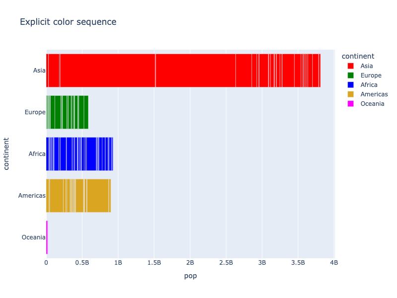

**Interactive Plot:**

<div>                        <script type="text/javascript">window.PlotlyConfig = {MathJaxConfig: 'local'};</script>
        <script charset="utf-8" src="https://cdn.plot.ly/plotly-3.1.0.min.js" integrity="sha256-Ei4740bWZhaUTQuD6q9yQlgVCMPBz6CZWhevDYPv93A=" crossorigin="anonymous"></script>                <div id="plotly-div-7" class="plotly-graph-div" style="height:100%; width:100%;"></div>            <script type="text/javascript">                window.PLOTLYENV=window.PLOTLYENV || {};                                if (document.getElementById("plotly-div-7")) {                    Plotly.newPlot(                        "plotly-div-7",                        [{"hovertemplate":"\u003cb\u003e%{hovertext}\u003c\u002fb\u003e\u003cbr\u003e\u003cbr\u003econtinent=%{y}\u003cbr\u003epop=%{x}\u003cextra\u003e\u003c\u002fextra\u003e","hovertext":["Afghanistan","Bahrain","Bangladesh","Cambodia","China","Hong Kong, China","India","Indonesia","Iran","Iraq","Israel","Japan","Jordan","Korea, Dem. Rep.","Korea, Rep.","Kuwait","Lebanon","Malaysia","Mongolia","Myanmar","Nepal","Oman","Pakistan","Philippines","Saudi Arabia","Singapore","Sri Lanka","Syria","Taiwan","Thailand","Vietnam","West Bank and Gaza","Yemen, Rep."],"legendgroup":"Asia","marker":{"color":"red","pattern":{"shape":""}},"name":"Asia","orientation":"h","showlegend":true,"textposition":"auto","x":{"dtype":"i4","bdata":"A5rmAd3PCgDTqPcIkqLXANiBmU48g2oAq00vQngOUw0CxyMEdpyjATcQYgDEAZkHSV1cAF2OYwE2XewCVzsmAH7VOwAmvnoBD9srADzK2AKeAbkBIecwAFndFgqnum0FjiilATF5RQB\u002f8jYBO7gmAZacYQF13OADFAAVBZxQPQCf7FIB"},"xaxis":"x","y":["Asia","Asia","Asia","Asia","Asia","Asia","Asia","Asia","Asia","Asia","Asia","Asia","Asia","Asia","Asia","Asia","Asia","Asia","Asia","Asia","Asia","Asia","Asia","Asia","Asia","Asia","Asia","Asia","Asia","Asia","Asia","Asia","Asia"],"yaxis":"y","type":"bar"},{"hovertemplate":"\u003cb\u003e%{hovertext}\u003c\u002fb\u003e\u003cbr\u003e\u003cbr\u003econtinent=%{y}\u003cbr\u003epop=%{x}\u003cextra\u003e\u003c\u002fextra\u003e","hovertext":["Albania","Austria","Belgium","Bosnia and Herzegovina","Bulgaria","Croatia","Czech Republic","Denmark","Finland","France","Germany","Greece","Hungary","Iceland","Ireland","Italy","Montenegro","Netherlands","Norway","Poland","Portugal","Romania","Serbia","Slovak Republic","Slovenia","Spain","Sweden","Switzerland","Turkey","United Kingdom"],"legendgroup":"Europe","marker":{"color":"green","pattern":{"shape":""}},"name":"Europe","orientation":"h","showlegend":true,"textposition":"auto","x":{"dtype":"i4","bdata":"i\u002fA2AGcefQCikp4ABnZFAOq8bwAAkEQACBScANhvUwC87k8ADBGkA+RW6QRyXaMADOuXAGubBAAesz4AlUN3A8ByCgD12PwA1p1GAOG9SwKUZaIA2OdTAXnhmgBOH1MAnageAL8waQKwzYkAZUZzAHfLPQQuX58D"},"xaxis":"x","y":["Europe","Europe","Europe","Europe","Europe","Europe","Europe","Europe","Europe","Europe","Europe","Europe","Europe","Europe","Europe","Europe","Europe","Europe","Europe","Europe","Europe","Europe","Europe","Europe","Europe","Europe","Europe","Europe","Europe","Europe"],"yaxis":"y","type":"bar"},{"hovertemplate":"\u003cb\u003e%{hovertext}\u003c\u002fb\u003e\u003cbr\u003e\u003cbr\u003econtinent=%{y}\u003cbr\u003epop=%{x}\u003cextra\u003e\u003c\u002fextra\u003e","hovertext":["Algeria","Angola","Benin","Botswana","Burkina Faso","Burundi","Cameroon","Central African Republic","Chad","Comoros","Congo, Dem. Rep.","Congo, Rep.","Cote d'Ivoire","Djibouti","Egypt","Equatorial Guinea","Eritrea","Ethiopia","Gabon","Gambia","Ghana","Guinea","Guinea-Bissau","Kenya","Lesotho","Liberia","Libya","Madagascar","Malawi","Mali","Mauritania","Mauritius","Morocco","Mozambique","Namibia","Niger","Nigeria","Reunion","Rwanda","Sao Tome and Principe","Senegal","Sierra Leone","Somalia","South Africa","Sudan","Swaziland","Tanzania","Togo","Tunisia","Uganda","Zambia","Zimbabwe"],"legendgroup":"Africa","marker":{"color":"blue","pattern":{"shape":""}},"name":"Africa","orientation":"h","showlegend":true,"textposition":"auto","x":{"dtype":"i4","bdata":"4J\u002f8AXyFvQDqQ3sA2wIZALuZ2gBpB4AAJQYOAY6qQgBXO5wAMNkKACfS2QMi\u002fjkA4dwSAfaSBwBfvcgEIWkIAFneSgCPeo8EEzMWACfDGQD6BF0BpsqXACl2FgBBXh8C6bUeAFa8MACyHVwApnkkAedaywAzl7cAseUxAEIWEwD3FwMCKHAwAahbHwCRwsQAfGkMCI4tDACsM4cAmwsDAOUvuwAywl0ANSSLAIRanwLBVoUCCkoRAPj2RQLL\u002f1YAPs2cAN4avQHzOrMAZ9q7AA=="},"xaxis":"x","y":["Africa","Africa","Africa","Africa","Africa","Africa","Africa","Africa","Africa","Africa","Africa","Africa","Africa","Africa","Africa","Africa","Africa","Africa","Africa","Africa","Africa","Africa","Africa","Africa","Africa","Africa","Africa","Africa","Africa","Africa","Africa","Africa","Africa","Africa","Africa","Africa","Africa","Africa","Africa","Africa","Africa","Africa","Africa","Africa","Africa","Africa","Africa","Africa","Africa","Africa","Africa","Africa"],"yaxis":"y","type":"bar"},{"hovertemplate":"\u003cb\u003e%{hovertext}\u003c\u002fb\u003e\u003cbr\u003e\u003cbr\u003econtinent=%{y}\u003cbr\u003epop=%{x}\u003cextra\u003e\u003c\u002fextra\u003e","hovertext":["Argentina","Bolivia","Brazil","Canada","Chile","Colombia","Costa Rica","Cuba","Dominican Republic","Ecuador","El Salvador","Guatemala","Haiti","Honduras","Jamaica","Mexico","Nicaragua","Panama","Paraguay","Peru","Puerto Rico","Trinidad and Tobago","United States","Uruguay","Venezuela"],"legendgroup":"Americas","marker":{"color":"goldenrod","pattern":{"shape":""}},"name":"Americas","orientation":"h","showlegend":true,"textposition":"auto","x":{"dtype":"i4","bdata":"Z\u002fVmArAliwAXVVMLPX79AUV8+ADe26IC\u002fBM\u002fAJs1rgDGNI4AIOXRACjkaQAA2b8AHr6BAHMxcgDkayoA26R6BlyZVgC9eDEAi7tlAMWKtQFbKDwAYB8QAOsH8xHImjQANgWOAQ=="},"xaxis":"x","y":["Americas","Americas","Americas","Americas","Americas","Americas","Americas","Americas","Americas","Americas","Americas","Americas","Americas","Americas","Americas","Americas","Americas","Americas","Americas","Americas","Americas","Americas","Americas","Americas","Americas"],"yaxis":"y","type":"bar"},{"hovertemplate":"\u003cb\u003e%{hovertext}\u003c\u002fb\u003e\u003cbr\u003e\u003cbr\u003econtinent=%{y}\u003cbr\u003epop=%{x}\u003cextra\u003e\u003c\u002fextra\u003e","hovertext":["Australia","New Zealand"],"legendgroup":"Oceania","marker":{"color":"magenta","pattern":{"shape":""}},"name":"Oceania","orientation":"h","showlegend":true,"textposition":"auto","x":{"dtype":"i4","bdata":"AM03ATvNPgA="},"xaxis":"x","y":["Oceania","Oceania"],"yaxis":"y","type":"bar"}],                        {"template":{"data":{"histogram2dcontour":[{"type":"histogram2dcontour","colorbar":{"outlinewidth":0,"ticks":""},"colorscale":[[0.0,"#0d0887"],[0.1111111111111111,"#46039f"],[0.2222222222222222,"#7201a8"],[0.3333333333333333,"#9c179e"],[0.4444444444444444,"#bd3786"],[0.5555555555555556,"#d8576b"],[0.6666666666666666,"#ed7953"],[0.7777777777777778,"#fb9f3a"],[0.8888888888888888,"#fdca26"],[1.0,"#f0f921"]]}],"choropleth":[{"type":"choropleth","colorbar":{"outlinewidth":0,"ticks":""}}],"histogram2d":[{"type":"histogram2d","colorbar":{"outlinewidth":0,"ticks":""},"colorscale":[[0.0,"#0d0887"],[0.1111111111111111,"#46039f"],[0.2222222222222222,"#7201a8"],[0.3333333333333333,"#9c179e"],[0.4444444444444444,"#bd3786"],[0.5555555555555556,"#d8576b"],[0.6666666666666666,"#ed7953"],[0.7777777777777778,"#fb9f3a"],[0.8888888888888888,"#fdca26"],[1.0,"#f0f921"]]}],"heatmap":[{"type":"heatmap","colorbar":{"outlinewidth":0,"ticks":""},"colorscale":[[0.0,"#0d0887"],[0.1111111111111111,"#46039f"],[0.2222222222222222,"#7201a8"],[0.3333333333333333,"#9c179e"],[0.4444444444444444,"#bd3786"],[0.5555555555555556,"#d8576b"],[0.6666666666666666,"#ed7953"],[0.7777777777777778,"#fb9f3a"],[0.8888888888888888,"#fdca26"],[1.0,"#f0f921"]]}],"contourcarpet":[{"type":"contourcarpet","colorbar":{"outlinewidth":0,"ticks":""}}],"contour":[{"type":"contour","colorbar":{"outlinewidth":0,"ticks":""},"colorscale":[[0.0,"#0d0887"],[0.1111111111111111,"#46039f"],[0.2222222222222222,"#7201a8"],[0.3333333333333333,"#9c179e"],[0.4444444444444444,"#bd3786"],[0.5555555555555556,"#d8576b"],[0.6666666666666666,"#ed7953"],[0.7777777777777778,"#fb9f3a"],[0.8888888888888888,"#fdca26"],[1.0,"#f0f921"]]}],"surface":[{"type":"surface","colorbar":{"outlinewidth":0,"ticks":""},"colorscale":[[0.0,"#0d0887"],[0.1111111111111111,"#46039f"],[0.2222222222222222,"#7201a8"],[0.3333333333333333,"#9c179e"],[0.4444444444444444,"#bd3786"],[0.5555555555555556,"#d8576b"],[0.6666666666666666,"#ed7953"],[0.7777777777777778,"#fb9f3a"],[0.8888888888888888,"#fdca26"],[1.0,"#f0f921"]]}],"mesh3d":[{"type":"mesh3d","colorbar":{"outlinewidth":0,"ticks":""}}],"scatter":[{"fillpattern":{"fillmode":"overlay","size":10,"solidity":0.2},"type":"scatter"}],"parcoords":[{"type":"parcoords","line":{"colorbar":{"outlinewidth":0,"ticks":""}}}],"scatterpolargl":[{"type":"scatterpolargl","marker":{"colorbar":{"outlinewidth":0,"ticks":""}}}],"bar":[{"error_x":{"color":"#2a3f5f"},"error_y":{"color":"#2a3f5f"},"marker":{"line":{"color":"#E5ECF6","width":0.5},"pattern":{"fillmode":"overlay","size":10,"solidity":0.2}},"type":"bar"}],"scattergeo":[{"type":"scattergeo","marker":{"colorbar":{"outlinewidth":0,"ticks":""}}}],"scatterpolar":[{"type":"scatterpolar","marker":{"colorbar":{"outlinewidth":0,"ticks":""}}}],"histogram":[{"marker":{"pattern":{"fillmode":"overlay","size":10,"solidity":0.2}},"type":"histogram"}],"scattergl":[{"type":"scattergl","marker":{"colorbar":{"outlinewidth":0,"ticks":""}}}],"scatter3d":[{"type":"scatter3d","line":{"colorbar":{"outlinewidth":0,"ticks":""}},"marker":{"colorbar":{"outlinewidth":0,"ticks":""}}}],"scattermap":[{"type":"scattermap","marker":{"colorbar":{"outlinewidth":0,"ticks":""}}}],"scattermapbox":[{"type":"scattermapbox","marker":{"colorbar":{"outlinewidth":0,"ticks":""}}}],"scatterternary":[{"type":"scatterternary","marker":{"colorbar":{"outlinewidth":0,"ticks":""}}}],"scattercarpet":[{"type":"scattercarpet","marker":{"colorbar":{"outlinewidth":0,"ticks":""}}}],"carpet":[{"aaxis":{"endlinecolor":"#2a3f5f","gridcolor":"white","linecolor":"white","minorgridcolor":"white","startlinecolor":"#2a3f5f"},"baxis":{"endlinecolor":"#2a3f5f","gridcolor":"white","linecolor":"white","minorgridcolor":"white","startlinecolor":"#2a3f5f"},"type":"carpet"}],"table":[{"cells":{"fill":{"color":"#EBF0F8"},"line":{"color":"white"}},"header":{"fill":{"color":"#C8D4E3"},"line":{"color":"white"}},"type":"table"}],"barpolar":[{"marker":{"line":{"color":"#E5ECF6","width":0.5},"pattern":{"fillmode":"overlay","size":10,"solidity":0.2}},"type":"barpolar"}],"pie":[{"automargin":true,"type":"pie"}]},"layout":{"autotypenumbers":"strict","colorway":["#636efa","#EF553B","#00cc96","#ab63fa","#FFA15A","#19d3f3","#FF6692","#B6E880","#FF97FF","#FECB52"],"font":{"color":"#2a3f5f"},"hovermode":"closest","hoverlabel":{"align":"left"},"paper_bgcolor":"white","plot_bgcolor":"#E5ECF6","polar":{"bgcolor":"#E5ECF6","angularaxis":{"gridcolor":"white","linecolor":"white","ticks":""},"radialaxis":{"gridcolor":"white","linecolor":"white","ticks":""}},"ternary":{"bgcolor":"#E5ECF6","aaxis":{"gridcolor":"white","linecolor":"white","ticks":""},"baxis":{"gridcolor":"white","linecolor":"white","ticks":""},"caxis":{"gridcolor":"white","linecolor":"white","ticks":""}},"coloraxis":{"colorbar":{"outlinewidth":0,"ticks":""}},"colorscale":{"sequential":[[0.0,"#0d0887"],[0.1111111111111111,"#46039f"],[0.2222222222222222,"#7201a8"],[0.3333333333333333,"#9c179e"],[0.4444444444444444,"#bd3786"],[0.5555555555555556,"#d8576b"],[0.6666666666666666,"#ed7953"],[0.7777777777777778,"#fb9f3a"],[0.8888888888888888,"#fdca26"],[1.0,"#f0f921"]],"sequentialminus":[[0.0,"#0d0887"],[0.1111111111111111,"#46039f"],[0.2222222222222222,"#7201a8"],[0.3333333333333333,"#9c179e"],[0.4444444444444444,"#bd3786"],[0.5555555555555556,"#d8576b"],[0.6666666666666666,"#ed7953"],[0.7777777777777778,"#fb9f3a"],[0.8888888888888888,"#fdca26"],[1.0,"#f0f921"]],"diverging":[[0,"#8e0152"],[0.1,"#c51b7d"],[0.2,"#de77ae"],[0.3,"#f1b6da"],[0.4,"#fde0ef"],[0.5,"#f7f7f7"],[0.6,"#e6f5d0"],[0.7,"#b8e186"],[0.8,"#7fbc41"],[0.9,"#4d9221"],[1,"#276419"]]},"xaxis":{"gridcolor":"white","linecolor":"white","ticks":"","title":{"standoff":15},"zerolinecolor":"white","automargin":true,"zerolinewidth":2},"yaxis":{"gridcolor":"white","linecolor":"white","ticks":"","title":{"standoff":15},"zerolinecolor":"white","automargin":true,"zerolinewidth":2},"scene":{"xaxis":{"backgroundcolor":"#E5ECF6","gridcolor":"white","linecolor":"white","showbackground":true,"ticks":"","zerolinecolor":"white","gridwidth":2},"yaxis":{"backgroundcolor":"#E5ECF6","gridcolor":"white","linecolor":"white","showbackground":true,"ticks":"","zerolinecolor":"white","gridwidth":2},"zaxis":{"backgroundcolor":"#E5ECF6","gridcolor":"white","linecolor":"white","showbackground":true,"ticks":"","zerolinecolor":"white","gridwidth":2}},"shapedefaults":{"line":{"color":"#2a3f5f"}},"annotationdefaults":{"arrowcolor":"#2a3f5f","arrowhead":0,"arrowwidth":1},"geo":{"bgcolor":"white","landcolor":"#E5ECF6","subunitcolor":"white","showland":true,"showlakes":true,"lakecolor":"white"},"title":{"x":0.05},"mapbox":{"style":"light"}}},"xaxis":{"anchor":"y","domain":[0.0,1.0],"title":{"text":"pop"}},"yaxis":{"anchor":"x","domain":[0.0,1.0],"title":{"text":"continent"},"categoryorder":"array","categoryarray":["Oceania","Americas","Africa","Europe","Asia"]},"legend":{"title":{"text":"continent"},"tracegroupgap":0},"title":{"text":"Explicit color sequence"},"barmode":"relative"},                        {"responsive": true}                    )                };            </script>        </div>

**_Warning_**: If your color sequence is has fewer colors than the number of unique values in the column you are mapping to `color`, the colors will cycle through and repeat, possibly leading to ambiguity:

```python
import plotly.express as px
df = px.data.tips()
fig = px.scatter(df, x="total_bill", y="tip", color="day",
             color_discrete_sequence=["red", "blue"],
             title="<b>Ambiguous!</b> Explicit color sequence cycling because it is too short"
            )

fig.show()
```

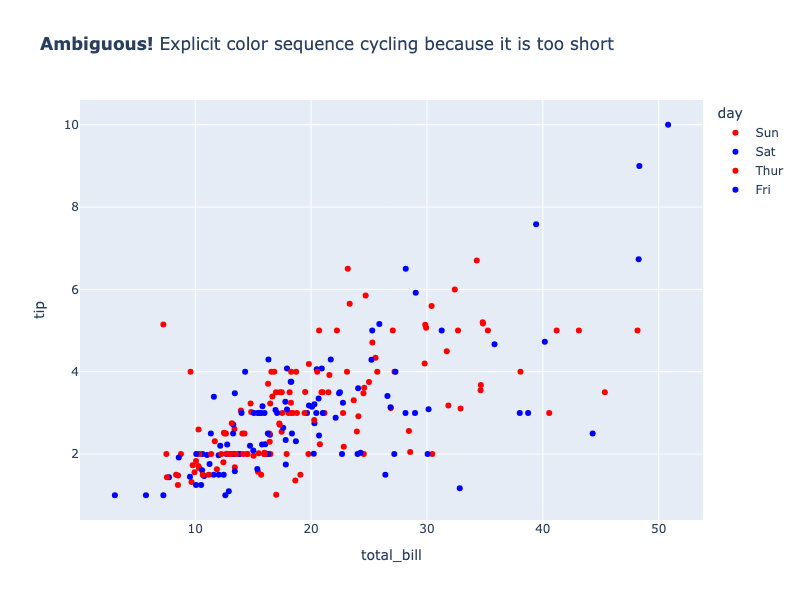

**Interactive Plot:**

<div>                        <script type="text/javascript">window.PlotlyConfig = {MathJaxConfig: 'local'};</script>
        <script charset="utf-8" src="https://cdn.plot.ly/plotly-3.1.0.min.js" integrity="sha256-Ei4740bWZhaUTQuD6q9yQlgVCMPBz6CZWhevDYPv93A=" crossorigin="anonymous"></script>                <div id="plotly-div-8" class="plotly-graph-div" style="height:100%; width:100%;"></div>            <script type="text/javascript">                window.PLOTLYENV=window.PLOTLYENV || {};                                if (document.getElementById("plotly-div-8")) {                    Plotly.newPlot(                        "plotly-div-8",                        [{"hovertemplate":"day=Sun\u003cbr\u003etotal_bill=%{x}\u003cbr\u003etip=%{y}\u003cextra\u003e\u003c\u002fextra\u003e","legendgroup":"Sun","marker":{"color":"red","symbol":"circle"},"mode":"markers","name":"Sun","orientation":"v","showlegend":true,"x":{"dtype":"f8","bdata":"PQrXo3D9MECuR+F6FK4kQMP1KFyPAjVArkfhehSuN0DXo3A9Cpc4QArXo3A9SjlACtejcD2KIUDhehSuR+E6QBSuR+F6FC5Aj8L1KFyPLUAK16NwPYokQOF6FK5HoUFA16NwPQrXLkCuR+F6FG4yQClcj8L1qC1AFK5H4XqUNUApXI\u002fC9agkQArXo3A9SjBAuB6F61H4MED2KFyPwnUxQOF6FK5H4StAXI\u002fC9ShcI0BmZmZmZmY+QArXo3A9SjJAexSuR+E6NkAzMzMzMzNAQM3MzMzMjDxACtejcD0KMkAUrkfhehQpQBSuR+F6lCRASOF6FK5nQUDhehSuR+EjQI\u002fC9ShcjzlAPQrXo3B9M0ApXI\u002fC9QhDQDMzMzMz8zdA9ihcj8K1OUCPwvUoXE8xQK5H4XoU7j1ApHA9CtcjLEDD9Shcj0IqQMP1KFyPQjFAzczMzMyMOECF61G4HsUzQJqZmZmZ2T1A9ihcj8IVSEAAAAAAAAA5QEjhehSuxypAPQrXo3B9MEAAAAAAAIA1QFK4HoXrUSlA9ihcj8I1MEAfhetRuJ4rQMP1KFyPgjFAhetRuB6FOEDD9Shcj8I0QPYoXI\u002fCtT9AAAAAAAAAHUCamZmZmdk\u002fQFK4HoXr0TBAMzMzMzNzQECkcD0K1+MxQPYoXI\u002fC9SxAMzMzMzMzI0BxPQrXo1BBQDMzMzMzU0FAFK5H4XpUN0DNzMzMzKxGQOxRuB6FKzdAZmZmZmZGREBxPQrXo7A0QGZmZmZm5jRA9ihcj8J1PkBmZmZmZiYyQJqZmZmZGTdA4XoUrkdhL0A="},"xaxis":"x","y":{"dtype":"f8","bdata":"KVyPwvUo8D+PwvUoXI\u002f6PwAAAAAAAAxAexSuR+F6CkDhehSuR+EMQNejcD0K1xJAAAAAAAAAAED2KFyPwvUIQFyPwvUoXP8\u002f16NwPQrXCUBcj8L1KFz7PwAAAAAAABRAH4XrUbge+T8AAAAAAAAIQClcj8L1KAhAXI\u002fC9ShcD0C4HoXrUbj6P65H4XoUrg1AAAAAAAAADEBSuB6F61EEQHsUrkfheghAH4XrUbge9T9mZmZmZmYWQAAAAAAAAAhAAAAAAAAAFEAAAAAAAAAYQGZmZmZmZgBAAAAAAAAACEAAAAAAAAAEQM3MzMzMzARAzczMzMzMFED2KFyPwvX4P1yPwvUoXBFAFK5H4XoUDEAAAAAAAAAQQGZmZmZmZgRAAAAAAAAAEEAAAAAAAAAMQEjhehSuRxRAAAAAAAAABEAAAAAAAAAAQOxRuB6F6wVAAAAAAAAAAEAAAAAAAAAAQI\u002fC9ShcjxRAAAAAAAAAFEAAAAAAAAAOQOF6FK5H4QRAAAAAAAAAAEAAAAAAAAAMQAAAAAAAAARAAAAAAAAAAEAAAAAAAAAAQAAAAAAAAAhA16NwPQrXC0DsUbgehesBQAAAAAAAABJAmpmZmZmZFEBxPQrXo3AJQAAAAAAAABBA4XoUrkfhCEAAAAAAAAAAQAAAAAAAAABAAAAAAAAAEEBmZmZmZmYMQHE9CtejcA1AmpmZmZmZFkAAAAAAAAAMQAAAAAAAABpAAAAAAAAACEAAAAAAAAAUQAAAAAAAAAxAAAAAAAAAAEAAAAAAAAAMQAAAAAAAABBAAAAAAAAA+D8="},"yaxis":"y","type":"scatter"},{"hovertemplate":"day=Sat\u003cbr\u003etotal_bill=%{x}\u003cbr\u003etip=%{y}\u003cextra\u003e\u003c\u002fextra\u003e","legendgroup":"Sat","marker":{"color":"blue","symbol":"circle"},"mode":"markers","name":"Sat","orientation":"v","showlegend":true,"x":{"dtype":"f8","bdata":"ZmZmZmamNEDsUbgehesxQArXo3A9SjRACtejcD2KL0D2KFyPwrVDQFK4HoXr0TNAj8L1KFzPMUA9CtejcL0qQOF6FK5HYSlAMzMzMzOzNUBmZmZmZqYzQJqZmZmZGSNAmpmZmZlZMkAfhetRuB4uQHE9CtejsDRASOF6FK7HMUCPwvUoXA84QI\u002fC9ShcTzBArkfhehTuMEBxPQrXo7AyQIXrUbgeRT9ACtejcD0KMEDhehSuRwFDQClcj8L1aDpAexSuR+F6JkDD9ShcjyJIQArXo3A9SjRAH4XrUbieK0AK16NwPQomQArXo3A9SjJA16NwPQqXMUAUrkfhehQ0QDMzMzMzczBAj8L1KFyPCEB7FK5H4To0QIXrUbgeBS5ACtejcD0KKEBSuB6F6xExQFyPwvUo3DpASOF6FK5HOUD2KFyPwnUtQIXrUbgeBSVA7FG4HoXrMUBmZmZmZiZGQOxRuB6FazZA7FG4HoXrNEC4HoXrUbguQD0K16NwfTRA9ihcj8I1OUA9CtejcD0yQB+F61G4nixAAAAAAAAALEAAAAAAAAAdQK5H4XoULiVAw\u002fUoXI9CJUBI4XoUrmdJQB+F61G4ni9A16NwPQqXOkA9CtejcF1DQIXrUbgeRThAhetRuB6FKUCPwvUoXA8+QKRwPQrX4zlACtejcD0qSEAK16NwPYoqQOxRuB6FKzxAzczMzMzMKUBmZmZmZiY8QK5H4XoULidA9ihcj8L1HkCkcD0K1yM+QDMzMzMzczRAj8L1KFyPKkAfhetRuB42QMP1KFyPAjhA4XoUrkdhL0C4HoXrUTgnQArXo3A9iiVAj8L1KFwPL0CkcD0K1yMkQDMzMzMzMylACtejcD1qQEAK16NwPepBQEjhehSuBz1ArkfhehQuO0DsUbgehas2QFK4HoXr0TFA"},"xaxis":"x","y":{"dtype":"f8","bdata":"zczMzMzMCkBSuB6F61EQQAAAAAAAAAZA16NwPQrXAUBSuB6F61EeQHE9CtejcAlAuB6F61G4AkAAAAAAAAAAQAAAAAAAAABAMzMzMzMzEUAAAAAAAAAIQDMzMzMzM\u002fc\u002fAAAAAAAABEAAAAAAAAAIQJqZmZmZmQNAKVyPwvUoCkDNzMzMzMwMQAAAAAAAAABAj8L1KFyPCEB7FK5H4XoCQAAAAAAAABRA7FG4HoXrAUAAAAAAAAAIQAAAAAAAAPg\u002fKVyPwvUo\u002fD\u002fsUbgehesaQK5H4XoUrglAAAAAAAAAAECuR+F6FK7\u002fPxSuR+F6FA5AH4XrUbgeBUAzMzMzMzMJQMP1KFyPwgNAAAAAAAAA8D8UrkfhehQAQLgehetRuABAhetRuB6F\u002fz8AAAAAAAAIQB+F61G4HglAAAAAAAAAFECamZmZmZkBQAAAAAAAAPQ\u002fpHA9CtejCEAAAAAAAAAEQNejcD0K1wtAUrgehetREEA9CtejcD36Pz0K16NwPRBAKVyPwvUoEUAUrkfhehQOQAAAAAAAABBAAAAAAAAACEAAAAAAAADwP8P1KFyPwvk\u002fAAAAAAAAAEAAAAAAAAAkQEjhehSuRwlASOF6FK5HC0AAAAAAAAAIQD0K16NwPQBA16NwPQrXAUAAAAAAAAAAQKRwPQrXoxRAAAAAAAAAIkAAAAAAAAAEQAAAAAAAABpAmpmZmZmZ8T8AAAAAAAAIQAAAAAAAAPg\u002fCtejcD0K9z+4HoXrUbgIQAAAAAAAAAhAw\u002fUoXI\u002fCBUAK16NwPQoHQAAAAAAAAABAAAAAAAAACEAfhetRuB4LQIXrUbgehfc\u002fAAAAAAAACEAAAAAAAAD0PwAAAAAAAPA\u002fuB6F61G48j+uR+F6FK4SQK5H4XoUrhdAAAAAAAAAAEAAAAAAAAAAQAAAAAAAAPw\u002f"},"yaxis":"y","type":"scatter"},{"hovertemplate":"day=Thur\u003cbr\u003etotal_bill=%{x}\u003cbr\u003etip=%{y}\u003cextra\u003e\u003c\u002fextra\u003e","legendgroup":"Thur","marker":{"color":"red","symbol":"circle"},"mode":"markers","name":"Thur","orientation":"v","showlegend":true,"x":{"dtype":"f8","bdata":"MzMzMzMzO0DD9Shcj8I2QArXo3A9SjFAcT0K16NwM0ApXI\u002fC9agwQKRwPQrXIyRA16NwPQpXQED2KFyPwvUvQArXo3A9akFAj8L1KFwPKkBI4XoUrkcyQPYoXI\u002fCtThAKVyPwvUoNUDNzMzMzEwlQFyPwvUo3ChAFK5H4XoUOEDhehSuR2EnQNejcD0K1ypAhetRuB6FLEBmZmZmZuYvQPYoXI\u002fC9ShAzczMzMzMPUAK16NwPQohQArXo3A9Ci1Aw\u002fUoXI\u002fCJkBSuB6F69E2QBSuR+F6FDNAhetRuB5FNEDXo3A9ClcmQIXrUbgehShAw\u002fUoXI9CMkCF61G4HgUhQClcj8L1qCRAzczMzMxMLEAAAAAAAAAwQFK4HoXrUSpAuB6F61F4MUBmZmZmZiZBQLgehetRmERAzczMzMwMO0CuR+F6FG4wQDMzMzMzsyBApHA9CtejMkA9CtejcL0nQI\u002fC9ShcjyNACtejcD0KHkCPwvUoXM8zQHE9CtejcDxA9ihcj8L1LkAUrkfhepQwQD0K16NwPR5ArkfhehSuJECuR+F6FI5FQAAAAAAAACpAhetRuB4FK0D2KFyPwrUyQHsUrkfheilAAAAAAAAAKkBmZmZmZmYwQEjhehSuhzRAuB6F61F4MEBI4XoUrscyQA=="},"xaxis":"x","y":{"dtype":"f8","bdata":"AAAAAAAAEEAAAAAAAAAIQK5H4XoUrgVAAAAAAAAACEAzMzMzMzMLQEjhehSuR\u002f0\u002fAAAAAAAAFEA9CtejcD0AQK5H4XoUrhRAAAAAAAAAAEAAAAAAAAAQQGZmZmZmZhdAAAAAAAAACEAAAAAAAAD4P83MzMzMzPw\u002fXI\u002fC9ShcB0B7FK5H4XoCQOF6FK5H4fo\u002fAAAAAAAABEAAAAAAAAAAQClcj8L1KARAzczMzMzMEECuR+F6FK73PwAAAAAAAABAAAAAAAAAAEBxPQrXo3ABQAAAAAAAAPg\u002fpHA9CtejBkAAAAAAAAD4PwAAAAAAAABAAAAAAAAACkAAAAAAAAD0PwAAAAAAAABAAAAAAAAAAEAAAAAAAAAAQAAAAAAAAAZAAAAAAAAADEDNzMzMzMwaQAAAAAAAABRAAAAAAAAAFEBmZmZmZmYCQAAAAAAAAPg\u002fw\u002fUoXI\u002fC9T8UrkfhehT6P65H4XoUrvs\u002fAAAAAAAAAEDD9Shcj8IQQHsUrkfhegRAKVyPwvUoAEAAAAAAAAAQQArXo3A9Cvc\u002fAAAAAAAAAEAAAAAAAAAUQAAAAAAAAABAAAAAAAAAAEAAAAAAAAAQQBSuR+F6FABAAAAAAAAAAEAAAAAAAAAEQAAAAAAAABBA16NwPQrXCUAAAAAAAAAIQA=="},"yaxis":"y","type":"scatter"},{"hovertemplate":"day=Fri\u003cbr\u003etotal_bill=%{x}\u003cbr\u003etip=%{y}\u003cextra\u003e\u003c\u002fextra\u003e","legendgroup":"Fri","marker":{"color":"blue","symbol":"circle"},"mode":"markers","name":"Fri","orientation":"v","showlegend":true,"x":{"dtype":"f8","bdata":"uB6F61H4PEA9CtejcH02QAAAAAAAABdAUrgehetRMEAAAAAAAMA2QPYoXI\u002fCFURASOF6FK5HO0CPwvUoXA8oQMP1KFyPAjVA7FG4HoXrKEAzMzMzM7MmQMP1KFyPwi5AUrgehetRKEDXo3A9CtcqQClcj8L1KCFA9ihcj8L1L0DXo3A9CtcqQIXrUbgeRTBArkfhehQuJEA="},"xaxis":"x","y":{"dtype":"f8","bdata":"AAAAAAAACEAAAAAAAAAMQAAAAAAAAPA\u002fMzMzMzMzEUAAAAAAAAAKQOxRuB6F6xJAAAAAAAAAEEAAAAAAAAD4PwAAAAAAAAhAAAAAAAAA+D8AAAAAAAAEQAAAAAAAAAhAmpmZmZmZAUDXo3A9CtcLQLgehetRuP4\u002fAAAAAAAACEBI4XoUrkf5PwAAAAAAAARAAAAAAAAAAEA="},"yaxis":"y","type":"scatter"}],                        {"template":{"data":{"histogram2dcontour":[{"type":"histogram2dcontour","colorbar":{"outlinewidth":0,"ticks":""},"colorscale":[[0.0,"#0d0887"],[0.1111111111111111,"#46039f"],[0.2222222222222222,"#7201a8"],[0.3333333333333333,"#9c179e"],[0.4444444444444444,"#bd3786"],[0.5555555555555556,"#d8576b"],[0.6666666666666666,"#ed7953"],[0.7777777777777778,"#fb9f3a"],[0.8888888888888888,"#fdca26"],[1.0,"#f0f921"]]}],"choropleth":[{"type":"choropleth","colorbar":{"outlinewidth":0,"ticks":""}}],"histogram2d":[{"type":"histogram2d","colorbar":{"outlinewidth":0,"ticks":""},"colorscale":[[0.0,"#0d0887"],[0.1111111111111111,"#46039f"],[0.2222222222222222,"#7201a8"],[0.3333333333333333,"#9c179e"],[0.4444444444444444,"#bd3786"],[0.5555555555555556,"#d8576b"],[0.6666666666666666,"#ed7953"],[0.7777777777777778,"#fb9f3a"],[0.8888888888888888,"#fdca26"],[1.0,"#f0f921"]]}],"heatmap":[{"type":"heatmap","colorbar":{"outlinewidth":0,"ticks":""},"colorscale":[[0.0,"#0d0887"],[0.1111111111111111,"#46039f"],[0.2222222222222222,"#7201a8"],[0.3333333333333333,"#9c179e"],[0.4444444444444444,"#bd3786"],[0.5555555555555556,"#d8576b"],[0.6666666666666666,"#ed7953"],[0.7777777777777778,"#fb9f3a"],[0.8888888888888888,"#fdca26"],[1.0,"#f0f921"]]}],"contourcarpet":[{"type":"contourcarpet","colorbar":{"outlinewidth":0,"ticks":""}}],"contour":[{"type":"contour","colorbar":{"outlinewidth":0,"ticks":""},"colorscale":[[0.0,"#0d0887"],[0.1111111111111111,"#46039f"],[0.2222222222222222,"#7201a8"],[0.3333333333333333,"#9c179e"],[0.4444444444444444,"#bd3786"],[0.5555555555555556,"#d8576b"],[0.6666666666666666,"#ed7953"],[0.7777777777777778,"#fb9f3a"],[0.8888888888888888,"#fdca26"],[1.0,"#f0f921"]]}],"surface":[{"type":"surface","colorbar":{"outlinewidth":0,"ticks":""},"colorscale":[[0.0,"#0d0887"],[0.1111111111111111,"#46039f"],[0.2222222222222222,"#7201a8"],[0.3333333333333333,"#9c179e"],[0.4444444444444444,"#bd3786"],[0.5555555555555556,"#d8576b"],[0.6666666666666666,"#ed7953"],[0.7777777777777778,"#fb9f3a"],[0.8888888888888888,"#fdca26"],[1.0,"#f0f921"]]}],"mesh3d":[{"type":"mesh3d","colorbar":{"outlinewidth":0,"ticks":""}}],"scatter":[{"fillpattern":{"fillmode":"overlay","size":10,"solidity":0.2},"type":"scatter"}],"parcoords":[{"type":"parcoords","line":{"colorbar":{"outlinewidth":0,"ticks":""}}}],"scatterpolargl":[{"type":"scatterpolargl","marker":{"colorbar":{"outlinewidth":0,"ticks":""}}}],"bar":[{"error_x":{"color":"#2a3f5f"},"error_y":{"color":"#2a3f5f"},"marker":{"line":{"color":"#E5ECF6","width":0.5},"pattern":{"fillmode":"overlay","size":10,"solidity":0.2}},"type":"bar"}],"scattergeo":[{"type":"scattergeo","marker":{"colorbar":{"outlinewidth":0,"ticks":""}}}],"scatterpolar":[{"type":"scatterpolar","marker":{"colorbar":{"outlinewidth":0,"ticks":""}}}],"histogram":[{"marker":{"pattern":{"fillmode":"overlay","size":10,"solidity":0.2}},"type":"histogram"}],"scattergl":[{"type":"scattergl","marker":{"colorbar":{"outlinewidth":0,"ticks":""}}}],"scatter3d":[{"type":"scatter3d","line":{"colorbar":{"outlinewidth":0,"ticks":""}},"marker":{"colorbar":{"outlinewidth":0,"ticks":""}}}],"scattermap":[{"type":"scattermap","marker":{"colorbar":{"outlinewidth":0,"ticks":""}}}],"scattermapbox":[{"type":"scattermapbox","marker":{"colorbar":{"outlinewidth":0,"ticks":""}}}],"scatterternary":[{"type":"scatterternary","marker":{"colorbar":{"outlinewidth":0,"ticks":""}}}],"scattercarpet":[{"type":"scattercarpet","marker":{"colorbar":{"outlinewidth":0,"ticks":""}}}],"carpet":[{"aaxis":{"endlinecolor":"#2a3f5f","gridcolor":"white","linecolor":"white","minorgridcolor":"white","startlinecolor":"#2a3f5f"},"baxis":{"endlinecolor":"#2a3f5f","gridcolor":"white","linecolor":"white","minorgridcolor":"white","startlinecolor":"#2a3f5f"},"type":"carpet"}],"table":[{"cells":{"fill":{"color":"#EBF0F8"},"line":{"color":"white"}},"header":{"fill":{"color":"#C8D4E3"},"line":{"color":"white"}},"type":"table"}],"barpolar":[{"marker":{"line":{"color":"#E5ECF6","width":0.5},"pattern":{"fillmode":"overlay","size":10,"solidity":0.2}},"type":"barpolar"}],"pie":[{"automargin":true,"type":"pie"}]},"layout":{"autotypenumbers":"strict","colorway":["#636efa","#EF553B","#00cc96","#ab63fa","#FFA15A","#19d3f3","#FF6692","#B6E880","#FF97FF","#FECB52"],"font":{"color":"#2a3f5f"},"hovermode":"closest","hoverlabel":{"align":"left"},"paper_bgcolor":"white","plot_bgcolor":"#E5ECF6","polar":{"bgcolor":"#E5ECF6","angularaxis":{"gridcolor":"white","linecolor":"white","ticks":""},"radialaxis":{"gridcolor":"white","linecolor":"white","ticks":""}},"ternary":{"bgcolor":"#E5ECF6","aaxis":{"gridcolor":"white","linecolor":"white","ticks":""},"baxis":{"gridcolor":"white","linecolor":"white","ticks":""},"caxis":{"gridcolor":"white","linecolor":"white","ticks":""}},"coloraxis":{"colorbar":{"outlinewidth":0,"ticks":""}},"colorscale":{"sequential":[[0.0,"#0d0887"],[0.1111111111111111,"#46039f"],[0.2222222222222222,"#7201a8"],[0.3333333333333333,"#9c179e"],[0.4444444444444444,"#bd3786"],[0.5555555555555556,"#d8576b"],[0.6666666666666666,"#ed7953"],[0.7777777777777778,"#fb9f3a"],[0.8888888888888888,"#fdca26"],[1.0,"#f0f921"]],"sequentialminus":[[0.0,"#0d0887"],[0.1111111111111111,"#46039f"],[0.2222222222222222,"#7201a8"],[0.3333333333333333,"#9c179e"],[0.4444444444444444,"#bd3786"],[0.5555555555555556,"#d8576b"],[0.6666666666666666,"#ed7953"],[0.7777777777777778,"#fb9f3a"],[0.8888888888888888,"#fdca26"],[1.0,"#f0f921"]],"diverging":[[0,"#8e0152"],[0.1,"#c51b7d"],[0.2,"#de77ae"],[0.3,"#f1b6da"],[0.4,"#fde0ef"],[0.5,"#f7f7f7"],[0.6,"#e6f5d0"],[0.7,"#b8e186"],[0.8,"#7fbc41"],[0.9,"#4d9221"],[1,"#276419"]]},"xaxis":{"gridcolor":"white","linecolor":"white","ticks":"","title":{"standoff":15},"zerolinecolor":"white","automargin":true,"zerolinewidth":2},"yaxis":{"gridcolor":"white","linecolor":"white","ticks":"","title":{"standoff":15},"zerolinecolor":"white","automargin":true,"zerolinewidth":2},"scene":{"xaxis":{"backgroundcolor":"#E5ECF6","gridcolor":"white","linecolor":"white","showbackground":true,"ticks":"","zerolinecolor":"white","gridwidth":2},"yaxis":{"backgroundcolor":"#E5ECF6","gridcolor":"white","linecolor":"white","showbackground":true,"ticks":"","zerolinecolor":"white","gridwidth":2},"zaxis":{"backgroundcolor":"#E5ECF6","gridcolor":"white","linecolor":"white","showbackground":true,"ticks":"","zerolinecolor":"white","gridwidth":2}},"shapedefaults":{"line":{"color":"#2a3f5f"}},"annotationdefaults":{"arrowcolor":"#2a3f5f","arrowhead":0,"arrowwidth":1},"geo":{"bgcolor":"white","landcolor":"#E5ECF6","subunitcolor":"white","showland":true,"showlakes":true,"lakecolor":"white"},"title":{"x":0.05},"mapbox":{"style":"light"}}},"xaxis":{"anchor":"y","domain":[0.0,1.0],"title":{"text":"total_bill"}},"yaxis":{"anchor":"x","domain":[0.0,1.0],"title":{"text":"tip"}},"legend":{"title":{"text":"day"},"tracegroupgap":0},"title":{"text":"\u003cb\u003eAmbiguous!\u003c\u002fb\u003e Explicit color sequence cycling because it is too short"}},                        {"responsive": true}                    )                };            </script>        </div>

### Directly Mapping Colors to Data Values

The example above assigned colors to data values on a first-come-first-served basis, but you can directly map colors to data values if this is important to your application with `color_discrete_map`. Note that this does not change the order in which values appear in the figure or legend, as can be controlled below:

```python
import plotly.express as px
df = px.data.gapminder().query("year == 2007")
fig = px.bar(df, y="continent", x="pop", color="continent", orientation="h", hover_name="country",
             color_discrete_map={
                "Europe": "red",
                "Asia": "green",
                "Americas": "blue",
                "Oceania": "goldenrod",
                "Africa": "magenta"},
             title="Explicit color mapping")

fig.show()
```

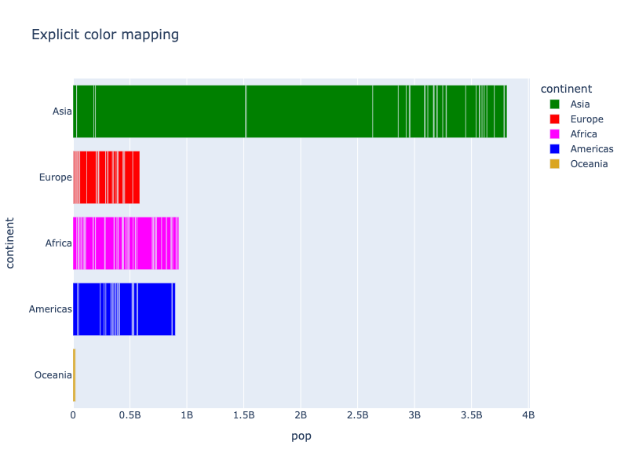

**Interactive Plot:**

<div>                        <script type="text/javascript">window.PlotlyConfig = {MathJaxConfig: 'local'};</script>
        <script charset="utf-8" src="https://cdn.plot.ly/plotly-3.1.0.min.js" integrity="sha256-Ei4740bWZhaUTQuD6q9yQlgVCMPBz6CZWhevDYPv93A=" crossorigin="anonymous"></script>                <div id="plotly-div-9" class="plotly-graph-div" style="height:100%; width:100%;"></div>            <script type="text/javascript">                window.PLOTLYENV=window.PLOTLYENV || {};                                if (document.getElementById("plotly-div-9")) {                    Plotly.newPlot(                        "plotly-div-9",                        [{"hovertemplate":"\u003cb\u003e%{hovertext}\u003c\u002fb\u003e\u003cbr\u003e\u003cbr\u003econtinent=%{y}\u003cbr\u003epop=%{x}\u003cextra\u003e\u003c\u002fextra\u003e","hovertext":["Afghanistan","Bahrain","Bangladesh","Cambodia","China","Hong Kong, China","India","Indonesia","Iran","Iraq","Israel","Japan","Jordan","Korea, Dem. Rep.","Korea, Rep.","Kuwait","Lebanon","Malaysia","Mongolia","Myanmar","Nepal","Oman","Pakistan","Philippines","Saudi Arabia","Singapore","Sri Lanka","Syria","Taiwan","Thailand","Vietnam","West Bank and Gaza","Yemen, Rep."],"legendgroup":"Asia","marker":{"color":"green","pattern":{"shape":""}},"name":"Asia","orientation":"h","showlegend":true,"textposition":"auto","x":{"dtype":"i4","bdata":"A5rmAd3PCgDTqPcIkqLXANiBmU48g2oAq00vQngOUw0CxyMEdpyjATcQYgDEAZkHSV1cAF2OYwE2XewCVzsmAH7VOwAmvnoBD9srADzK2AKeAbkBIecwAFndFgqnum0FjiilATF5RQB\u002f8jYBO7gmAZacYQF13OADFAAVBZxQPQCf7FIB"},"xaxis":"x","y":["Asia","Asia","Asia","Asia","Asia","Asia","Asia","Asia","Asia","Asia","Asia","Asia","Asia","Asia","Asia","Asia","Asia","Asia","Asia","Asia","Asia","Asia","Asia","Asia","Asia","Asia","Asia","Asia","Asia","Asia","Asia","Asia","Asia"],"yaxis":"y","type":"bar"},{"hovertemplate":"\u003cb\u003e%{hovertext}\u003c\u002fb\u003e\u003cbr\u003e\u003cbr\u003econtinent=%{y}\u003cbr\u003epop=%{x}\u003cextra\u003e\u003c\u002fextra\u003e","hovertext":["Albania","Austria","Belgium","Bosnia and Herzegovina","Bulgaria","Croatia","Czech Republic","Denmark","Finland","France","Germany","Greece","Hungary","Iceland","Ireland","Italy","Montenegro","Netherlands","Norway","Poland","Portugal","Romania","Serbia","Slovak Republic","Slovenia","Spain","Sweden","Switzerland","Turkey","United Kingdom"],"legendgroup":"Europe","marker":{"color":"red","pattern":{"shape":""}},"name":"Europe","orientation":"h","showlegend":true,"textposition":"auto","x":{"dtype":"i4","bdata":"i\u002fA2AGcefQCikp4ABnZFAOq8bwAAkEQACBScANhvUwC87k8ADBGkA+RW6QRyXaMADOuXAGubBAAesz4AlUN3A8ByCgD12PwA1p1GAOG9SwKUZaIA2OdTAXnhmgBOH1MAnageAL8waQKwzYkAZUZzAHfLPQQuX58D"},"xaxis":"x","y":["Europe","Europe","Europe","Europe","Europe","Europe","Europe","Europe","Europe","Europe","Europe","Europe","Europe","Europe","Europe","Europe","Europe","Europe","Europe","Europe","Europe","Europe","Europe","Europe","Europe","Europe","Europe","Europe","Europe","Europe"],"yaxis":"y","type":"bar"},{"hovertemplate":"\u003cb\u003e%{hovertext}\u003c\u002fb\u003e\u003cbr\u003e\u003cbr\u003econtinent=%{y}\u003cbr\u003epop=%{x}\u003cextra\u003e\u003c\u002fextra\u003e","hovertext":["Algeria","Angola","Benin","Botswana","Burkina Faso","Burundi","Cameroon","Central African Republic","Chad","Comoros","Congo, Dem. Rep.","Congo, Rep.","Cote d'Ivoire","Djibouti","Egypt","Equatorial Guinea","Eritrea","Ethiopia","Gabon","Gambia","Ghana","Guinea","Guinea-Bissau","Kenya","Lesotho","Liberia","Libya","Madagascar","Malawi","Mali","Mauritania","Mauritius","Morocco","Mozambique","Namibia","Niger","Nigeria","Reunion","Rwanda","Sao Tome and Principe","Senegal","Sierra Leone","Somalia","South Africa","Sudan","Swaziland","Tanzania","Togo","Tunisia","Uganda","Zambia","Zimbabwe"],"legendgroup":"Africa","marker":{"color":"magenta","pattern":{"shape":""}},"name":"Africa","orientation":"h","showlegend":true,"textposition":"auto","x":{"dtype":"i4","bdata":"4J\u002f8AXyFvQDqQ3sA2wIZALuZ2gBpB4AAJQYOAY6qQgBXO5wAMNkKACfS2QMi\u002fjkA4dwSAfaSBwBfvcgEIWkIAFneSgCPeo8EEzMWACfDGQD6BF0BpsqXACl2FgBBXh8C6bUeAFa8MACyHVwApnkkAedaywAzl7cAseUxAEIWEwD3FwMCKHAwAahbHwCRwsQAfGkMCI4tDACsM4cAmwsDAOUvuwAywl0ANSSLAIRanwLBVoUCCkoRAPj2RQLL\u002f1YAPs2cAN4avQHzOrMAZ9q7AA=="},"xaxis":"x","y":["Africa","Africa","Africa","Africa","Africa","Africa","Africa","Africa","Africa","Africa","Africa","Africa","Africa","Africa","Africa","Africa","Africa","Africa","Africa","Africa","Africa","Africa","Africa","Africa","Africa","Africa","Africa","Africa","Africa","Africa","Africa","Africa","Africa","Africa","Africa","Africa","Africa","Africa","Africa","Africa","Africa","Africa","Africa","Africa","Africa","Africa","Africa","Africa","Africa","Africa","Africa","Africa"],"yaxis":"y","type":"bar"},{"hovertemplate":"\u003cb\u003e%{hovertext}\u003c\u002fb\u003e\u003cbr\u003e\u003cbr\u003econtinent=%{y}\u003cbr\u003epop=%{x}\u003cextra\u003e\u003c\u002fextra\u003e","hovertext":["Argentina","Bolivia","Brazil","Canada","Chile","Colombia","Costa Rica","Cuba","Dominican Republic","Ecuador","El Salvador","Guatemala","Haiti","Honduras","Jamaica","Mexico","Nicaragua","Panama","Paraguay","Peru","Puerto Rico","Trinidad and Tobago","United States","Uruguay","Venezuela"],"legendgroup":"Americas","marker":{"color":"blue","pattern":{"shape":""}},"name":"Americas","orientation":"h","showlegend":true,"textposition":"auto","x":{"dtype":"i4","bdata":"Z\u002fVmArAliwAXVVMLPX79AUV8+ADe26IC\u002fBM\u002fAJs1rgDGNI4AIOXRACjkaQAA2b8AHr6BAHMxcgDkayoA26R6BlyZVgC9eDEAi7tlAMWKtQFbKDwAYB8QAOsH8xHImjQANgWOAQ=="},"xaxis":"x","y":["Americas","Americas","Americas","Americas","Americas","Americas","Americas","Americas","Americas","Americas","Americas","Americas","Americas","Americas","Americas","Americas","Americas","Americas","Americas","Americas","Americas","Americas","Americas","Americas","Americas"],"yaxis":"y","type":"bar"},{"hovertemplate":"\u003cb\u003e%{hovertext}\u003c\u002fb\u003e\u003cbr\u003e\u003cbr\u003econtinent=%{y}\u003cbr\u003epop=%{x}\u003cextra\u003e\u003c\u002fextra\u003e","hovertext":["Australia","New Zealand"],"legendgroup":"Oceania","marker":{"color":"goldenrod","pattern":{"shape":""}},"name":"Oceania","orientation":"h","showlegend":true,"textposition":"auto","x":{"dtype":"i4","bdata":"AM03ATvNPgA="},"xaxis":"x","y":["Oceania","Oceania"],"yaxis":"y","type":"bar"}],                        {"template":{"data":{"histogram2dcontour":[{"type":"histogram2dcontour","colorbar":{"outlinewidth":0,"ticks":""},"colorscale":[[0.0,"#0d0887"],[0.1111111111111111,"#46039f"],[0.2222222222222222,"#7201a8"],[0.3333333333333333,"#9c179e"],[0.4444444444444444,"#bd3786"],[0.5555555555555556,"#d8576b"],[0.6666666666666666,"#ed7953"],[0.7777777777777778,"#fb9f3a"],[0.8888888888888888,"#fdca26"],[1.0,"#f0f921"]]}],"choropleth":[{"type":"choropleth","colorbar":{"outlinewidth":0,"ticks":""}}],"histogram2d":[{"type":"histogram2d","colorbar":{"outlinewidth":0,"ticks":""},"colorscale":[[0.0,"#0d0887"],[0.1111111111111111,"#46039f"],[0.2222222222222222,"#7201a8"],[0.3333333333333333,"#9c179e"],[0.4444444444444444,"#bd3786"],[0.5555555555555556,"#d8576b"],[0.6666666666666666,"#ed7953"],[0.7777777777777778,"#fb9f3a"],[0.8888888888888888,"#fdca26"],[1.0,"#f0f921"]]}],"heatmap":[{"type":"heatmap","colorbar":{"outlinewidth":0,"ticks":""},"colorscale":[[0.0,"#0d0887"],[0.1111111111111111,"#46039f"],[0.2222222222222222,"#7201a8"],[0.3333333333333333,"#9c179e"],[0.4444444444444444,"#bd3786"],[0.5555555555555556,"#d8576b"],[0.6666666666666666,"#ed7953"],[0.7777777777777778,"#fb9f3a"],[0.8888888888888888,"#fdca26"],[1.0,"#f0f921"]]}],"contourcarpet":[{"type":"contourcarpet","colorbar":{"outlinewidth":0,"ticks":""}}],"contour":[{"type":"contour","colorbar":{"outlinewidth":0,"ticks":""},"colorscale":[[0.0,"#0d0887"],[0.1111111111111111,"#46039f"],[0.2222222222222222,"#7201a8"],[0.3333333333333333,"#9c179e"],[0.4444444444444444,"#bd3786"],[0.5555555555555556,"#d8576b"],[0.6666666666666666,"#ed7953"],[0.7777777777777778,"#fb9f3a"],[0.8888888888888888,"#fdca26"],[1.0,"#f0f921"]]}],"surface":[{"type":"surface","colorbar":{"outlinewidth":0,"ticks":""},"colorscale":[[0.0,"#0d0887"],[0.1111111111111111,"#46039f"],[0.2222222222222222,"#7201a8"],[0.3333333333333333,"#9c179e"],[0.4444444444444444,"#bd3786"],[0.5555555555555556,"#d8576b"],[0.6666666666666666,"#ed7953"],[0.7777777777777778,"#fb9f3a"],[0.8888888888888888,"#fdca26"],[1.0,"#f0f921"]]}],"mesh3d":[{"type":"mesh3d","colorbar":{"outlinewidth":0,"ticks":""}}],"scatter":[{"fillpattern":{"fillmode":"overlay","size":10,"solidity":0.2},"type":"scatter"}],"parcoords":[{"type":"parcoords","line":{"colorbar":{"outlinewidth":0,"ticks":""}}}],"scatterpolargl":[{"type":"scatterpolargl","marker":{"colorbar":{"outlinewidth":0,"ticks":""}}}],"bar":[{"error_x":{"color":"#2a3f5f"},"error_y":{"color":"#2a3f5f"},"marker":{"line":{"color":"#E5ECF6","width":0.5},"pattern":{"fillmode":"overlay","size":10,"solidity":0.2}},"type":"bar"}],"scattergeo":[{"type":"scattergeo","marker":{"colorbar":{"outlinewidth":0,"ticks":""}}}],"scatterpolar":[{"type":"scatterpolar","marker":{"colorbar":{"outlinewidth":0,"ticks":""}}}],"histogram":[{"marker":{"pattern":{"fillmode":"overlay","size":10,"solidity":0.2}},"type":"histogram"}],"scattergl":[{"type":"scattergl","marker":{"colorbar":{"outlinewidth":0,"ticks":""}}}],"scatter3d":[{"type":"scatter3d","line":{"colorbar":{"outlinewidth":0,"ticks":""}},"marker":{"colorbar":{"outlinewidth":0,"ticks":""}}}],"scattermap":[{"type":"scattermap","marker":{"colorbar":{"outlinewidth":0,"ticks":""}}}],"scattermapbox":[{"type":"scattermapbox","marker":{"colorbar":{"outlinewidth":0,"ticks":""}}}],"scatterternary":[{"type":"scatterternary","marker":{"colorbar":{"outlinewidth":0,"ticks":""}}}],"scattercarpet":[{"type":"scattercarpet","marker":{"colorbar":{"outlinewidth":0,"ticks":""}}}],"carpet":[{"aaxis":{"endlinecolor":"#2a3f5f","gridcolor":"white","linecolor":"white","minorgridcolor":"white","startlinecolor":"#2a3f5f"},"baxis":{"endlinecolor":"#2a3f5f","gridcolor":"white","linecolor":"white","minorgridcolor":"white","startlinecolor":"#2a3f5f"},"type":"carpet"}],"table":[{"cells":{"fill":{"color":"#EBF0F8"},"line":{"color":"white"}},"header":{"fill":{"color":"#C8D4E3"},"line":{"color":"white"}},"type":"table"}],"barpolar":[{"marker":{"line":{"color":"#E5ECF6","width":0.5},"pattern":{"fillmode":"overlay","size":10,"solidity":0.2}},"type":"barpolar"}],"pie":[{"automargin":true,"type":"pie"}]},"layout":{"autotypenumbers":"strict","colorway":["#636efa","#EF553B","#00cc96","#ab63fa","#FFA15A","#19d3f3","#FF6692","#B6E880","#FF97FF","#FECB52"],"font":{"color":"#2a3f5f"},"hovermode":"closest","hoverlabel":{"align":"left"},"paper_bgcolor":"white","plot_bgcolor":"#E5ECF6","polar":{"bgcolor":"#E5ECF6","angularaxis":{"gridcolor":"white","linecolor":"white","ticks":""},"radialaxis":{"gridcolor":"white","linecolor":"white","ticks":""}},"ternary":{"bgcolor":"#E5ECF6","aaxis":{"gridcolor":"white","linecolor":"white","ticks":""},"baxis":{"gridcolor":"white","linecolor":"white","ticks":""},"caxis":{"gridcolor":"white","linecolor":"white","ticks":""}},"coloraxis":{"colorbar":{"outlinewidth":0,"ticks":""}},"colorscale":{"sequential":[[0.0,"#0d0887"],[0.1111111111111111,"#46039f"],[0.2222222222222222,"#7201a8"],[0.3333333333333333,"#9c179e"],[0.4444444444444444,"#bd3786"],[0.5555555555555556,"#d8576b"],[0.6666666666666666,"#ed7953"],[0.7777777777777778,"#fb9f3a"],[0.8888888888888888,"#fdca26"],[1.0,"#f0f921"]],"sequentialminus":[[0.0,"#0d0887"],[0.1111111111111111,"#46039f"],[0.2222222222222222,"#7201a8"],[0.3333333333333333,"#9c179e"],[0.4444444444444444,"#bd3786"],[0.5555555555555556,"#d8576b"],[0.6666666666666666,"#ed7953"],[0.7777777777777778,"#fb9f3a"],[0.8888888888888888,"#fdca26"],[1.0,"#f0f921"]],"diverging":[[0,"#8e0152"],[0.1,"#c51b7d"],[0.2,"#de77ae"],[0.3,"#f1b6da"],[0.4,"#fde0ef"],[0.5,"#f7f7f7"],[0.6,"#e6f5d0"],[0.7,"#b8e186"],[0.8,"#7fbc41"],[0.9,"#4d9221"],[1,"#276419"]]},"xaxis":{"gridcolor":"white","linecolor":"white","ticks":"","title":{"standoff":15},"zerolinecolor":"white","automargin":true,"zerolinewidth":2},"yaxis":{"gridcolor":"white","linecolor":"white","ticks":"","title":{"standoff":15},"zerolinecolor":"white","automargin":true,"zerolinewidth":2},"scene":{"xaxis":{"backgroundcolor":"#E5ECF6","gridcolor":"white","linecolor":"white","showbackground":true,"ticks":"","zerolinecolor":"white","gridwidth":2},"yaxis":{"backgroundcolor":"#E5ECF6","gridcolor":"white","linecolor":"white","showbackground":true,"ticks":"","zerolinecolor":"white","gridwidth":2},"zaxis":{"backgroundcolor":"#E5ECF6","gridcolor":"white","linecolor":"white","showbackground":true,"ticks":"","zerolinecolor":"white","gridwidth":2}},"shapedefaults":{"line":{"color":"#2a3f5f"}},"annotationdefaults":{"arrowcolor":"#2a3f5f","arrowhead":0,"arrowwidth":1},"geo":{"bgcolor":"white","landcolor":"#E5ECF6","subunitcolor":"white","showland":true,"showlakes":true,"lakecolor":"white"},"title":{"x":0.05},"mapbox":{"style":"light"}}},"xaxis":{"anchor":"y","domain":[0.0,1.0],"title":{"text":"pop"}},"yaxis":{"anchor":"x","domain":[0.0,1.0],"title":{"text":"continent"},"categoryorder":"array","categoryarray":["Oceania","Americas","Africa","Europe","Asia"]},"legend":{"title":{"text":"continent"},"tracegroupgap":0},"title":{"text":"Explicit color mapping"},"barmode":"relative"},                        {"responsive": true}                    )                };            </script>        </div>

If your data set already contains valid CSS colors which you wish to use directly, you can pass the special value `"identity"` to `color_discrete_map`, in which case the legend is hidden by default, and the color does not appear in the hover label:

```python
import plotly.express as px

fig = px.bar(x=["a","b","c"], y=[1,3,2], color=["red", "goldenrod", "#00D"], color_discrete_map="identity")
fig.show()
```

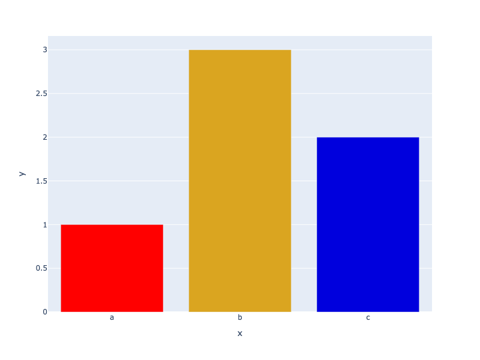

**Interactive Plot:**

<div>                        <script type="text/javascript">window.PlotlyConfig = {MathJaxConfig: 'local'};</script>
        <script charset="utf-8" src="https://cdn.plot.ly/plotly-3.1.0.min.js" integrity="sha256-Ei4740bWZhaUTQuD6q9yQlgVCMPBz6CZWhevDYPv93A=" crossorigin="anonymous"></script>                <div id="plotly-div-10" class="plotly-graph-div" style="height:100%; width:100%;"></div>            <script type="text/javascript">                window.PLOTLYENV=window.PLOTLYENV || {};                                if (document.getElementById("plotly-div-10")) {                    Plotly.newPlot(                        "plotly-div-10",                        [{"hovertemplate":"x=%{x}\u003cbr\u003ey=%{y}\u003cextra\u003e\u003c\u002fextra\u003e","legendgroup":"","marker":{"color":"red","pattern":{"shape":""}},"name":"","orientation":"v","showlegend":false,"textposition":"auto","x":["a"],"xaxis":"x","y":{"dtype":"i1","bdata":"AQ=="},"yaxis":"y","type":"bar"},{"hovertemplate":"x=%{x}\u003cbr\u003ey=%{y}\u003cextra\u003e\u003c\u002fextra\u003e","legendgroup":"","marker":{"color":"goldenrod","pattern":{"shape":""}},"name":"","orientation":"v","showlegend":false,"textposition":"auto","x":["b"],"xaxis":"x","y":{"dtype":"i1","bdata":"Aw=="},"yaxis":"y","type":"bar"},{"hovertemplate":"x=%{x}\u003cbr\u003ey=%{y}\u003cextra\u003e\u003c\u002fextra\u003e","legendgroup":"","marker":{"color":"#00D","pattern":{"shape":""}},"name":"","orientation":"v","showlegend":false,"textposition":"auto","x":["c"],"xaxis":"x","y":{"dtype":"i1","bdata":"Ag=="},"yaxis":"y","type":"bar"}],                        {"template":{"data":{"histogram2dcontour":[{"type":"histogram2dcontour","colorbar":{"outlinewidth":0,"ticks":""},"colorscale":[[0.0,"#0d0887"],[0.1111111111111111,"#46039f"],[0.2222222222222222,"#7201a8"],[0.3333333333333333,"#9c179e"],[0.4444444444444444,"#bd3786"],[0.5555555555555556,"#d8576b"],[0.6666666666666666,"#ed7953"],[0.7777777777777778,"#fb9f3a"],[0.8888888888888888,"#fdca26"],[1.0,"#f0f921"]]}],"choropleth":[{"type":"choropleth","colorbar":{"outlinewidth":0,"ticks":""}}],"histogram2d":[{"type":"histogram2d","colorbar":{"outlinewidth":0,"ticks":""},"colorscale":[[0.0,"#0d0887"],[0.1111111111111111,"#46039f"],[0.2222222222222222,"#7201a8"],[0.3333333333333333,"#9c179e"],[0.4444444444444444,"#bd3786"],[0.5555555555555556,"#d8576b"],[0.6666666666666666,"#ed7953"],[0.7777777777777778,"#fb9f3a"],[0.8888888888888888,"#fdca26"],[1.0,"#f0f921"]]}],"heatmap":[{"type":"heatmap","colorbar":{"outlinewidth":0,"ticks":""},"colorscale":[[0.0,"#0d0887"],[0.1111111111111111,"#46039f"],[0.2222222222222222,"#7201a8"],[0.3333333333333333,"#9c179e"],[0.4444444444444444,"#bd3786"],[0.5555555555555556,"#d8576b"],[0.6666666666666666,"#ed7953"],[0.7777777777777778,"#fb9f3a"],[0.8888888888888888,"#fdca26"],[1.0,"#f0f921"]]}],"contourcarpet":[{"type":"contourcarpet","colorbar":{"outlinewidth":0,"ticks":""}}],"contour":[{"type":"contour","colorbar":{"outlinewidth":0,"ticks":""},"colorscale":[[0.0,"#0d0887"],[0.1111111111111111,"#46039f"],[0.2222222222222222,"#7201a8"],[0.3333333333333333,"#9c179e"],[0.4444444444444444,"#bd3786"],[0.5555555555555556,"#d8576b"],[0.6666666666666666,"#ed7953"],[0.7777777777777778,"#fb9f3a"],[0.8888888888888888,"#fdca26"],[1.0,"#f0f921"]]}],"surface":[{"type":"surface","colorbar":{"outlinewidth":0,"ticks":""},"colorscale":[[0.0,"#0d0887"],[0.1111111111111111,"#46039f"],[0.2222222222222222,"#7201a8"],[0.3333333333333333,"#9c179e"],[0.4444444444444444,"#bd3786"],[0.5555555555555556,"#d8576b"],[0.6666666666666666,"#ed7953"],[0.7777777777777778,"#fb9f3a"],[0.8888888888888888,"#fdca26"],[1.0,"#f0f921"]]}],"mesh3d":[{"type":"mesh3d","colorbar":{"outlinewidth":0,"ticks":""}}],"scatter":[{"fillpattern":{"fillmode":"overlay","size":10,"solidity":0.2},"type":"scatter"}],"parcoords":[{"type":"parcoords","line":{"colorbar":{"outlinewidth":0,"ticks":""}}}],"scatterpolargl":[{"type":"scatterpolargl","marker":{"colorbar":{"outlinewidth":0,"ticks":""}}}],"bar":[{"error_x":{"color":"#2a3f5f"},"error_y":{"color":"#2a3f5f"},"marker":{"line":{"color":"#E5ECF6","width":0.5},"pattern":{"fillmode":"overlay","size":10,"solidity":0.2}},"type":"bar"}],"scattergeo":[{"type":"scattergeo","marker":{"colorbar":{"outlinewidth":0,"ticks":""}}}],"scatterpolar":[{"type":"scatterpolar","marker":{"colorbar":{"outlinewidth":0,"ticks":""}}}],"histogram":[{"marker":{"pattern":{"fillmode":"overlay","size":10,"solidity":0.2}},"type":"histogram"}],"scattergl":[{"type":"scattergl","marker":{"colorbar":{"outlinewidth":0,"ticks":""}}}],"scatter3d":[{"type":"scatter3d","line":{"colorbar":{"outlinewidth":0,"ticks":""}},"marker":{"colorbar":{"outlinewidth":0,"ticks":""}}}],"scattermap":[{"type":"scattermap","marker":{"colorbar":{"outlinewidth":0,"ticks":""}}}],"scattermapbox":[{"type":"scattermapbox","marker":{"colorbar":{"outlinewidth":0,"ticks":""}}}],"scatterternary":[{"type":"scatterternary","marker":{"colorbar":{"outlinewidth":0,"ticks":""}}}],"scattercarpet":[{"type":"scattercarpet","marker":{"colorbar":{"outlinewidth":0,"ticks":""}}}],"carpet":[{"aaxis":{"endlinecolor":"#2a3f5f","gridcolor":"white","linecolor":"white","minorgridcolor":"white","startlinecolor":"#2a3f5f"},"baxis":{"endlinecolor":"#2a3f5f","gridcolor":"white","linecolor":"white","minorgridcolor":"white","startlinecolor":"#2a3f5f"},"type":"carpet"}],"table":[{"cells":{"fill":{"color":"#EBF0F8"},"line":{"color":"white"}},"header":{"fill":{"color":"#C8D4E3"},"line":{"color":"white"}},"type":"table"}],"barpolar":[{"marker":{"line":{"color":"#E5ECF6","width":0.5},"pattern":{"fillmode":"overlay","size":10,"solidity":0.2}},"type":"barpolar"}],"pie":[{"automargin":true,"type":"pie"}]},"layout":{"autotypenumbers":"strict","colorway":["#636efa","#EF553B","#00cc96","#ab63fa","#FFA15A","#19d3f3","#FF6692","#B6E880","#FF97FF","#FECB52"],"font":{"color":"#2a3f5f"},"hovermode":"closest","hoverlabel":{"align":"left"},"paper_bgcolor":"white","plot_bgcolor":"#E5ECF6","polar":{"bgcolor":"#E5ECF6","angularaxis":{"gridcolor":"white","linecolor":"white","ticks":""},"radialaxis":{"gridcolor":"white","linecolor":"white","ticks":""}},"ternary":{"bgcolor":"#E5ECF6","aaxis":{"gridcolor":"white","linecolor":"white","ticks":""},"baxis":{"gridcolor":"white","linecolor":"white","ticks":""},"caxis":{"gridcolor":"white","linecolor":"white","ticks":""}},"coloraxis":{"colorbar":{"outlinewidth":0,"ticks":""}},"colorscale":{"sequential":[[0.0,"#0d0887"],[0.1111111111111111,"#46039f"],[0.2222222222222222,"#7201a8"],[0.3333333333333333,"#9c179e"],[0.4444444444444444,"#bd3786"],[0.5555555555555556,"#d8576b"],[0.6666666666666666,"#ed7953"],[0.7777777777777778,"#fb9f3a"],[0.8888888888888888,"#fdca26"],[1.0,"#f0f921"]],"sequentialminus":[[0.0,"#0d0887"],[0.1111111111111111,"#46039f"],[0.2222222222222222,"#7201a8"],[0.3333333333333333,"#9c179e"],[0.4444444444444444,"#bd3786"],[0.5555555555555556,"#d8576b"],[0.6666666666666666,"#ed7953"],[0.7777777777777778,"#fb9f3a"],[0.8888888888888888,"#fdca26"],[1.0,"#f0f921"]],"diverging":[[0,"#8e0152"],[0.1,"#c51b7d"],[0.2,"#de77ae"],[0.3,"#f1b6da"],[0.4,"#fde0ef"],[0.5,"#f7f7f7"],[0.6,"#e6f5d0"],[0.7,"#b8e186"],[0.8,"#7fbc41"],[0.9,"#4d9221"],[1,"#276419"]]},"xaxis":{"gridcolor":"white","linecolor":"white","ticks":"","title":{"standoff":15},"zerolinecolor":"white","automargin":true,"zerolinewidth":2},"yaxis":{"gridcolor":"white","linecolor":"white","ticks":"","title":{"standoff":15},"zerolinecolor":"white","automargin":true,"zerolinewidth":2},"scene":{"xaxis":{"backgroundcolor":"#E5ECF6","gridcolor":"white","linecolor":"white","showbackground":true,"ticks":"","zerolinecolor":"white","gridwidth":2},"yaxis":{"backgroundcolor":"#E5ECF6","gridcolor":"white","linecolor":"white","showbackground":true,"ticks":"","zerolinecolor":"white","gridwidth":2},"zaxis":{"backgroundcolor":"#E5ECF6","gridcolor":"white","linecolor":"white","showbackground":true,"ticks":"","zerolinecolor":"white","gridwidth":2}},"shapedefaults":{"line":{"color":"#2a3f5f"}},"annotationdefaults":{"arrowcolor":"#2a3f5f","arrowhead":0,"arrowwidth":1},"geo":{"bgcolor":"white","landcolor":"#E5ECF6","subunitcolor":"white","showland":true,"showlakes":true,"lakecolor":"white"},"title":{"x":0.05},"mapbox":{"style":"light"}}},"xaxis":{"anchor":"y","domain":[0.0,1.0],"title":{"text":"x"}},"yaxis":{"anchor":"x","domain":[0.0,1.0],"title":{"text":"y"}},"legend":{"tracegroupgap":0},"margin":{"t":60},"barmode":"relative"},                        {"responsive": true}                    )                };            </script>        </div>

### Controlling Discrete Color Order

Plotly Express lets you specify an ordering over categorical variables with `category_orders`, which will apply to colors and legends as well as symbols, [axes](axes.md) and [facets](facet-plots.md). This can be used with either `color_discrete_sequence` or `color_discrete_map`.

```python
import plotly.express as px
df = px.data.gapminder().query("year == 2007")
fig = px.bar(df, y="continent", x="pop", color="continent", orientation="h", hover_name="country",
             color_discrete_sequence=["red", "green", "blue", "goldenrod", "magenta"],
             category_orders={"continent": ["Oceania", "Europe", "Asia", "Africa", "Americas"]},
             title="Explicit color sequence with explicit ordering"
            )

fig.show()
```

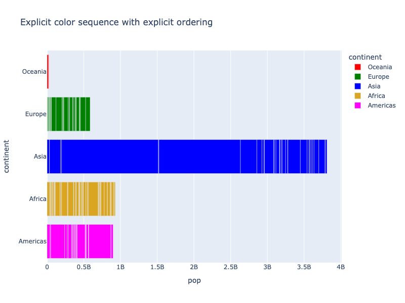

**Interactive Plot:**

<div>                        <script type="text/javascript">window.PlotlyConfig = {MathJaxConfig: 'local'};</script>
        <script charset="utf-8" src="https://cdn.plot.ly/plotly-3.1.0.min.js" integrity="sha256-Ei4740bWZhaUTQuD6q9yQlgVCMPBz6CZWhevDYPv93A=" crossorigin="anonymous"></script>                <div id="plotly-div-11" class="plotly-graph-div" style="height:100%; width:100%;"></div>            <script type="text/javascript">                window.PLOTLYENV=window.PLOTLYENV || {};                                if (document.getElementById("plotly-div-11")) {                    Plotly.newPlot(                        "plotly-div-11",                        [{"hovertemplate":"\u003cb\u003e%{hovertext}\u003c\u002fb\u003e\u003cbr\u003e\u003cbr\u003econtinent=%{y}\u003cbr\u003epop=%{x}\u003cextra\u003e\u003c\u002fextra\u003e","hovertext":["Australia","New Zealand"],"legendgroup":"Oceania","marker":{"color":"red","pattern":{"shape":""}},"name":"Oceania","orientation":"h","showlegend":true,"textposition":"auto","x":{"dtype":"i4","bdata":"AM03ATvNPgA="},"xaxis":"x","y":["Oceania","Oceania"],"yaxis":"y","type":"bar"},{"hovertemplate":"\u003cb\u003e%{hovertext}\u003c\u002fb\u003e\u003cbr\u003e\u003cbr\u003econtinent=%{y}\u003cbr\u003epop=%{x}\u003cextra\u003e\u003c\u002fextra\u003e","hovertext":["Albania","Austria","Belgium","Bosnia and Herzegovina","Bulgaria","Croatia","Czech Republic","Denmark","Finland","France","Germany","Greece","Hungary","Iceland","Ireland","Italy","Montenegro","Netherlands","Norway","Poland","Portugal","Romania","Serbia","Slovak Republic","Slovenia","Spain","Sweden","Switzerland","Turkey","United Kingdom"],"legendgroup":"Europe","marker":{"color":"green","pattern":{"shape":""}},"name":"Europe","orientation":"h","showlegend":true,"textposition":"auto","x":{"dtype":"i4","bdata":"i\u002fA2AGcefQCikp4ABnZFAOq8bwAAkEQACBScANhvUwC87k8ADBGkA+RW6QRyXaMADOuXAGubBAAesz4AlUN3A8ByCgD12PwA1p1GAOG9SwKUZaIA2OdTAXnhmgBOH1MAnageAL8waQKwzYkAZUZzAHfLPQQuX58D"},"xaxis":"x","y":["Europe","Europe","Europe","Europe","Europe","Europe","Europe","Europe","Europe","Europe","Europe","Europe","Europe","Europe","Europe","Europe","Europe","Europe","Europe","Europe","Europe","Europe","Europe","Europe","Europe","Europe","Europe","Europe","Europe","Europe"],"yaxis":"y","type":"bar"},{"hovertemplate":"\u003cb\u003e%{hovertext}\u003c\u002fb\u003e\u003cbr\u003e\u003cbr\u003econtinent=%{y}\u003cbr\u003epop=%{x}\u003cextra\u003e\u003c\u002fextra\u003e","hovertext":["Afghanistan","Bahrain","Bangladesh","Cambodia","China","Hong Kong, China","India","Indonesia","Iran","Iraq","Israel","Japan","Jordan","Korea, Dem. Rep.","Korea, Rep.","Kuwait","Lebanon","Malaysia","Mongolia","Myanmar","Nepal","Oman","Pakistan","Philippines","Saudi Arabia","Singapore","Sri Lanka","Syria","Taiwan","Thailand","Vietnam","West Bank and Gaza","Yemen, Rep."],"legendgroup":"Asia","marker":{"color":"blue","pattern":{"shape":""}},"name":"Asia","orientation":"h","showlegend":true,"textposition":"auto","x":{"dtype":"i4","bdata":"A5rmAd3PCgDTqPcIkqLXANiBmU48g2oAq00vQngOUw0CxyMEdpyjATcQYgDEAZkHSV1cAF2OYwE2XewCVzsmAH7VOwAmvnoBD9srADzK2AKeAbkBIecwAFndFgqnum0FjiilATF5RQB\u002f8jYBO7gmAZacYQF13OADFAAVBZxQPQCf7FIB"},"xaxis":"x","y":["Asia","Asia","Asia","Asia","Asia","Asia","Asia","Asia","Asia","Asia","Asia","Asia","Asia","Asia","Asia","Asia","Asia","Asia","Asia","Asia","Asia","Asia","Asia","Asia","Asia","Asia","Asia","Asia","Asia","Asia","Asia","Asia","Asia"],"yaxis":"y","type":"bar"},{"hovertemplate":"\u003cb\u003e%{hovertext}\u003c\u002fb\u003e\u003cbr\u003e\u003cbr\u003econtinent=%{y}\u003cbr\u003epop=%{x}\u003cextra\u003e\u003c\u002fextra\u003e","hovertext":["Algeria","Angola","Benin","Botswana","Burkina Faso","Burundi","Cameroon","Central African Republic","Chad","Comoros","Congo, Dem. Rep.","Congo, Rep.","Cote d'Ivoire","Djibouti","Egypt","Equatorial Guinea","Eritrea","Ethiopia","Gabon","Gambia","Ghana","Guinea","Guinea-Bissau","Kenya","Lesotho","Liberia","Libya","Madagascar","Malawi","Mali","Mauritania","Mauritius","Morocco","Mozambique","Namibia","Niger","Nigeria","Reunion","Rwanda","Sao Tome and Principe","Senegal","Sierra Leone","Somalia","South Africa","Sudan","Swaziland","Tanzania","Togo","Tunisia","Uganda","Zambia","Zimbabwe"],"legendgroup":"Africa","marker":{"color":"goldenrod","pattern":{"shape":""}},"name":"Africa","orientation":"h","showlegend":true,"textposition":"auto","x":{"dtype":"i4","bdata":"4J\u002f8AXyFvQDqQ3sA2wIZALuZ2gBpB4AAJQYOAY6qQgBXO5wAMNkKACfS2QMi\u002fjkA4dwSAfaSBwBfvcgEIWkIAFneSgCPeo8EEzMWACfDGQD6BF0BpsqXACl2FgBBXh8C6bUeAFa8MACyHVwApnkkAedaywAzl7cAseUxAEIWEwD3FwMCKHAwAahbHwCRwsQAfGkMCI4tDACsM4cAmwsDAOUvuwAywl0ANSSLAIRanwLBVoUCCkoRAPj2RQLL\u002f1YAPs2cAN4avQHzOrMAZ9q7AA=="},"xaxis":"x","y":["Africa","Africa","Africa","Africa","Africa","Africa","Africa","Africa","Africa","Africa","Africa","Africa","Africa","Africa","Africa","Africa","Africa","Africa","Africa","Africa","Africa","Africa","Africa","Africa","Africa","Africa","Africa","Africa","Africa","Africa","Africa","Africa","Africa","Africa","Africa","Africa","Africa","Africa","Africa","Africa","Africa","Africa","Africa","Africa","Africa","Africa","Africa","Africa","Africa","Africa","Africa","Africa"],"yaxis":"y","type":"bar"},{"hovertemplate":"\u003cb\u003e%{hovertext}\u003c\u002fb\u003e\u003cbr\u003e\u003cbr\u003econtinent=%{y}\u003cbr\u003epop=%{x}\u003cextra\u003e\u003c\u002fextra\u003e","hovertext":["Argentina","Bolivia","Brazil","Canada","Chile","Colombia","Costa Rica","Cuba","Dominican Republic","Ecuador","El Salvador","Guatemala","Haiti","Honduras","Jamaica","Mexico","Nicaragua","Panama","Paraguay","Peru","Puerto Rico","Trinidad and Tobago","United States","Uruguay","Venezuela"],"legendgroup":"Americas","marker":{"color":"magenta","pattern":{"shape":""}},"name":"Americas","orientation":"h","showlegend":true,"textposition":"auto","x":{"dtype":"i4","bdata":"Z\u002fVmArAliwAXVVMLPX79AUV8+ADe26IC\u002fBM\u002fAJs1rgDGNI4AIOXRACjkaQAA2b8AHr6BAHMxcgDkayoA26R6BlyZVgC9eDEAi7tlAMWKtQFbKDwAYB8QAOsH8xHImjQANgWOAQ=="},"xaxis":"x","y":["Americas","Americas","Americas","Americas","Americas","Americas","Americas","Americas","Americas","Americas","Americas","Americas","Americas","Americas","Americas","Americas","Americas","Americas","Americas","Americas","Americas","Americas","Americas","Americas","Americas"],"yaxis":"y","type":"bar"}],                        {"template":{"data":{"histogram2dcontour":[{"type":"histogram2dcontour","colorbar":{"outlinewidth":0,"ticks":""},"colorscale":[[0.0,"#0d0887"],[0.1111111111111111,"#46039f"],[0.2222222222222222,"#7201a8"],[0.3333333333333333,"#9c179e"],[0.4444444444444444,"#bd3786"],[0.5555555555555556,"#d8576b"],[0.6666666666666666,"#ed7953"],[0.7777777777777778,"#fb9f3a"],[0.8888888888888888,"#fdca26"],[1.0,"#f0f921"]]}],"choropleth":[{"type":"choropleth","colorbar":{"outlinewidth":0,"ticks":""}}],"histogram2d":[{"type":"histogram2d","colorbar":{"outlinewidth":0,"ticks":""},"colorscale":[[0.0,"#0d0887"],[0.1111111111111111,"#46039f"],[0.2222222222222222,"#7201a8"],[0.3333333333333333,"#9c179e"],[0.4444444444444444,"#bd3786"],[0.5555555555555556,"#d8576b"],[0.6666666666666666,"#ed7953"],[0.7777777777777778,"#fb9f3a"],[0.8888888888888888,"#fdca26"],[1.0,"#f0f921"]]}],"heatmap":[{"type":"heatmap","colorbar":{"outlinewidth":0,"ticks":""},"colorscale":[[0.0,"#0d0887"],[0.1111111111111111,"#46039f"],[0.2222222222222222,"#7201a8"],[0.3333333333333333,"#9c179e"],[0.4444444444444444,"#bd3786"],[0.5555555555555556,"#d8576b"],[0.6666666666666666,"#ed7953"],[0.7777777777777778,"#fb9f3a"],[0.8888888888888888,"#fdca26"],[1.0,"#f0f921"]]}],"contourcarpet":[{"type":"contourcarpet","colorbar":{"outlinewidth":0,"ticks":""}}],"contour":[{"type":"contour","colorbar":{"outlinewidth":0,"ticks":""},"colorscale":[[0.0,"#0d0887"],[0.1111111111111111,"#46039f"],[0.2222222222222222,"#7201a8"],[0.3333333333333333,"#9c179e"],[0.4444444444444444,"#bd3786"],[0.5555555555555556,"#d8576b"],[0.6666666666666666,"#ed7953"],[0.7777777777777778,"#fb9f3a"],[0.8888888888888888,"#fdca26"],[1.0,"#f0f921"]]}],"surface":[{"type":"surface","colorbar":{"outlinewidth":0,"ticks":""},"colorscale":[[0.0,"#0d0887"],[0.1111111111111111,"#46039f"],[0.2222222222222222,"#7201a8"],[0.3333333333333333,"#9c179e"],[0.4444444444444444,"#bd3786"],[0.5555555555555556,"#d8576b"],[0.6666666666666666,"#ed7953"],[0.7777777777777778,"#fb9f3a"],[0.8888888888888888,"#fdca26"],[1.0,"#f0f921"]]}],"mesh3d":[{"type":"mesh3d","colorbar":{"outlinewidth":0,"ticks":""}}],"scatter":[{"fillpattern":{"fillmode":"overlay","size":10,"solidity":0.2},"type":"scatter"}],"parcoords":[{"type":"parcoords","line":{"colorbar":{"outlinewidth":0,"ticks":""}}}],"scatterpolargl":[{"type":"scatterpolargl","marker":{"colorbar":{"outlinewidth":0,"ticks":""}}}],"bar":[{"error_x":{"color":"#2a3f5f"},"error_y":{"color":"#2a3f5f"},"marker":{"line":{"color":"#E5ECF6","width":0.5},"pattern":{"fillmode":"overlay","size":10,"solidity":0.2}},"type":"bar"}],"scattergeo":[{"type":"scattergeo","marker":{"colorbar":{"outlinewidth":0,"ticks":""}}}],"scatterpolar":[{"type":"scatterpolar","marker":{"colorbar":{"outlinewidth":0,"ticks":""}}}],"histogram":[{"marker":{"pattern":{"fillmode":"overlay","size":10,"solidity":0.2}},"type":"histogram"}],"scattergl":[{"type":"scattergl","marker":{"colorbar":{"outlinewidth":0,"ticks":""}}}],"scatter3d":[{"type":"scatter3d","line":{"colorbar":{"outlinewidth":0,"ticks":""}},"marker":{"colorbar":{"outlinewidth":0,"ticks":""}}}],"scattermap":[{"type":"scattermap","marker":{"colorbar":{"outlinewidth":0,"ticks":""}}}],"scattermapbox":[{"type":"scattermapbox","marker":{"colorbar":{"outlinewidth":0,"ticks":""}}}],"scatterternary":[{"type":"scatterternary","marker":{"colorbar":{"outlinewidth":0,"ticks":""}}}],"scattercarpet":[{"type":"scattercarpet","marker":{"colorbar":{"outlinewidth":0,"ticks":""}}}],"carpet":[{"aaxis":{"endlinecolor":"#2a3f5f","gridcolor":"white","linecolor":"white","minorgridcolor":"white","startlinecolor":"#2a3f5f"},"baxis":{"endlinecolor":"#2a3f5f","gridcolor":"white","linecolor":"white","minorgridcolor":"white","startlinecolor":"#2a3f5f"},"type":"carpet"}],"table":[{"cells":{"fill":{"color":"#EBF0F8"},"line":{"color":"white"}},"header":{"fill":{"color":"#C8D4E3"},"line":{"color":"white"}},"type":"table"}],"barpolar":[{"marker":{"line":{"color":"#E5ECF6","width":0.5},"pattern":{"fillmode":"overlay","size":10,"solidity":0.2}},"type":"barpolar"}],"pie":[{"automargin":true,"type":"pie"}]},"layout":{"autotypenumbers":"strict","colorway":["#636efa","#EF553B","#00cc96","#ab63fa","#FFA15A","#19d3f3","#FF6692","#B6E880","#FF97FF","#FECB52"],"font":{"color":"#2a3f5f"},"hovermode":"closest","hoverlabel":{"align":"left"},"paper_bgcolor":"white","plot_bgcolor":"#E5ECF6","polar":{"bgcolor":"#E5ECF6","angularaxis":{"gridcolor":"white","linecolor":"white","ticks":""},"radialaxis":{"gridcolor":"white","linecolor":"white","ticks":""}},"ternary":{"bgcolor":"#E5ECF6","aaxis":{"gridcolor":"white","linecolor":"white","ticks":""},"baxis":{"gridcolor":"white","linecolor":"white","ticks":""},"caxis":{"gridcolor":"white","linecolor":"white","ticks":""}},"coloraxis":{"colorbar":{"outlinewidth":0,"ticks":""}},"colorscale":{"sequential":[[0.0,"#0d0887"],[0.1111111111111111,"#46039f"],[0.2222222222222222,"#7201a8"],[0.3333333333333333,"#9c179e"],[0.4444444444444444,"#bd3786"],[0.5555555555555556,"#d8576b"],[0.6666666666666666,"#ed7953"],[0.7777777777777778,"#fb9f3a"],[0.8888888888888888,"#fdca26"],[1.0,"#f0f921"]],"sequentialminus":[[0.0,"#0d0887"],[0.1111111111111111,"#46039f"],[0.2222222222222222,"#7201a8"],[0.3333333333333333,"#9c179e"],[0.4444444444444444,"#bd3786"],[0.5555555555555556,"#d8576b"],[0.6666666666666666,"#ed7953"],[0.7777777777777778,"#fb9f3a"],[0.8888888888888888,"#fdca26"],[1.0,"#f0f921"]],"diverging":[[0,"#8e0152"],[0.1,"#c51b7d"],[0.2,"#de77ae"],[0.3,"#f1b6da"],[0.4,"#fde0ef"],[0.5,"#f7f7f7"],[0.6,"#e6f5d0"],[0.7,"#b8e186"],[0.8,"#7fbc41"],[0.9,"#4d9221"],[1,"#276419"]]},"xaxis":{"gridcolor":"white","linecolor":"white","ticks":"","title":{"standoff":15},"zerolinecolor":"white","automargin":true,"zerolinewidth":2},"yaxis":{"gridcolor":"white","linecolor":"white","ticks":"","title":{"standoff":15},"zerolinecolor":"white","automargin":true,"zerolinewidth":2},"scene":{"xaxis":{"backgroundcolor":"#E5ECF6","gridcolor":"white","linecolor":"white","showbackground":true,"ticks":"","zerolinecolor":"white","gridwidth":2},"yaxis":{"backgroundcolor":"#E5ECF6","gridcolor":"white","linecolor":"white","showbackground":true,"ticks":"","zerolinecolor":"white","gridwidth":2},"zaxis":{"backgroundcolor":"#E5ECF6","gridcolor":"white","linecolor":"white","showbackground":true,"ticks":"","zerolinecolor":"white","gridwidth":2}},"shapedefaults":{"line":{"color":"#2a3f5f"}},"annotationdefaults":{"arrowcolor":"#2a3f5f","arrowhead":0,"arrowwidth":1},"geo":{"bgcolor":"white","landcolor":"#E5ECF6","subunitcolor":"white","showland":true,"showlakes":true,"lakecolor":"white"},"title":{"x":0.05},"mapbox":{"style":"light"}}},"xaxis":{"anchor":"y","domain":[0.0,1.0],"title":{"text":"pop"}},"yaxis":{"anchor":"x","domain":[0.0,1.0],"title":{"text":"continent"},"categoryorder":"array","categoryarray":["Americas","Africa","Asia","Europe","Oceania"]},"legend":{"title":{"text":"continent"},"tracegroupgap":0},"title":{"text":"Explicit color sequence with explicit ordering"},"barmode":"relative"},                        {"responsive": true}                    )                };            </script>        </div>

```python
import plotly.express as px
df = px.data.gapminder().query("year == 2007")
fig = px.bar(df, y="continent", x="pop", color="continent", orientation="h", hover_name="country",
             color_discrete_map={
                "Europe": "red",
                "Asia": "green",
                "Americas": "blue",
                "Oceania": "goldenrod",
                "Africa": "magenta"},
             category_orders={"continent": ["Oceania", "Europe", "Asia", "Africa", "Americas"]},
             title="Explicit color mapping with explicit ordering"
            )

fig.show()
```

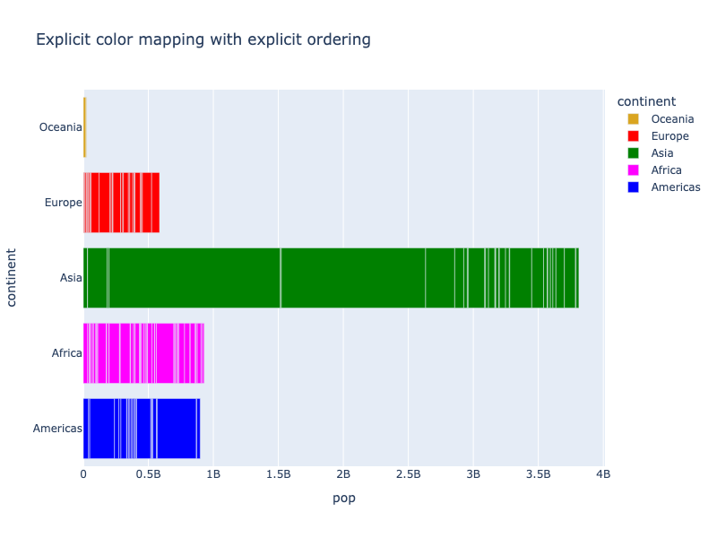

**Interactive Plot:**

<div>                        <script type="text/javascript">window.PlotlyConfig = {MathJaxConfig: 'local'};</script>
        <script charset="utf-8" src="https://cdn.plot.ly/plotly-3.1.0.min.js" integrity="sha256-Ei4740bWZhaUTQuD6q9yQlgVCMPBz6CZWhevDYPv93A=" crossorigin="anonymous"></script>                <div id="plotly-div-12" class="plotly-graph-div" style="height:100%; width:100%;"></div>            <script type="text/javascript">                window.PLOTLYENV=window.PLOTLYENV || {};                                if (document.getElementById("plotly-div-12")) {                    Plotly.newPlot(                        "plotly-div-12",                        [{"hovertemplate":"\u003cb\u003e%{hovertext}\u003c\u002fb\u003e\u003cbr\u003e\u003cbr\u003econtinent=%{y}\u003cbr\u003epop=%{x}\u003cextra\u003e\u003c\u002fextra\u003e","hovertext":["Australia","New Zealand"],"legendgroup":"Oceania","marker":{"color":"goldenrod","pattern":{"shape":""}},"name":"Oceania","orientation":"h","showlegend":true,"textposition":"auto","x":{"dtype":"i4","bdata":"AM03ATvNPgA="},"xaxis":"x","y":["Oceania","Oceania"],"yaxis":"y","type":"bar"},{"hovertemplate":"\u003cb\u003e%{hovertext}\u003c\u002fb\u003e\u003cbr\u003e\u003cbr\u003econtinent=%{y}\u003cbr\u003epop=%{x}\u003cextra\u003e\u003c\u002fextra\u003e","hovertext":["Albania","Austria","Belgium","Bosnia and Herzegovina","Bulgaria","Croatia","Czech Republic","Denmark","Finland","France","Germany","Greece","Hungary","Iceland","Ireland","Italy","Montenegro","Netherlands","Norway","Poland","Portugal","Romania","Serbia","Slovak Republic","Slovenia","Spain","Sweden","Switzerland","Turkey","United Kingdom"],"legendgroup":"Europe","marker":{"color":"red","pattern":{"shape":""}},"name":"Europe","orientation":"h","showlegend":true,"textposition":"auto","x":{"dtype":"i4","bdata":"i\u002fA2AGcefQCikp4ABnZFAOq8bwAAkEQACBScANhvUwC87k8ADBGkA+RW6QRyXaMADOuXAGubBAAesz4AlUN3A8ByCgD12PwA1p1GAOG9SwKUZaIA2OdTAXnhmgBOH1MAnageAL8waQKwzYkAZUZzAHfLPQQuX58D"},"xaxis":"x","y":["Europe","Europe","Europe","Europe","Europe","Europe","Europe","Europe","Europe","Europe","Europe","Europe","Europe","Europe","Europe","Europe","Europe","Europe","Europe","Europe","Europe","Europe","Europe","Europe","Europe","Europe","Europe","Europe","Europe","Europe"],"yaxis":"y","type":"bar"},{"hovertemplate":"\u003cb\u003e%{hovertext}\u003c\u002fb\u003e\u003cbr\u003e\u003cbr\u003econtinent=%{y}\u003cbr\u003epop=%{x}\u003cextra\u003e\u003c\u002fextra\u003e","hovertext":["Afghanistan","Bahrain","Bangladesh","Cambodia","China","Hong Kong, China","India","Indonesia","Iran","Iraq","Israel","Japan","Jordan","Korea, Dem. Rep.","Korea, Rep.","Kuwait","Lebanon","Malaysia","Mongolia","Myanmar","Nepal","Oman","Pakistan","Philippines","Saudi Arabia","Singapore","Sri Lanka","Syria","Taiwan","Thailand","Vietnam","West Bank and Gaza","Yemen, Rep."],"legendgroup":"Asia","marker":{"color":"green","pattern":{"shape":""}},"name":"Asia","orientation":"h","showlegend":true,"textposition":"auto","x":{"dtype":"i4","bdata":"A5rmAd3PCgDTqPcIkqLXANiBmU48g2oAq00vQngOUw0CxyMEdpyjATcQYgDEAZkHSV1cAF2OYwE2XewCVzsmAH7VOwAmvnoBD9srADzK2AKeAbkBIecwAFndFgqnum0FjiilATF5RQB\u002f8jYBO7gmAZacYQF13OADFAAVBZxQPQCf7FIB"},"xaxis":"x","y":["Asia","Asia","Asia","Asia","Asia","Asia","Asia","Asia","Asia","Asia","Asia","Asia","Asia","Asia","Asia","Asia","Asia","Asia","Asia","Asia","Asia","Asia","Asia","Asia","Asia","Asia","Asia","Asia","Asia","Asia","Asia","Asia","Asia"],"yaxis":"y","type":"bar"},{"hovertemplate":"\u003cb\u003e%{hovertext}\u003c\u002fb\u003e\u003cbr\u003e\u003cbr\u003econtinent=%{y}\u003cbr\u003epop=%{x}\u003cextra\u003e\u003c\u002fextra\u003e","hovertext":["Algeria","Angola","Benin","Botswana","Burkina Faso","Burundi","Cameroon","Central African Republic","Chad","Comoros","Congo, Dem. Rep.","Congo, Rep.","Cote d'Ivoire","Djibouti","Egypt","Equatorial Guinea","Eritrea","Ethiopia","Gabon","Gambia","Ghana","Guinea","Guinea-Bissau","Kenya","Lesotho","Liberia","Libya","Madagascar","Malawi","Mali","Mauritania","Mauritius","Morocco","Mozambique","Namibia","Niger","Nigeria","Reunion","Rwanda","Sao Tome and Principe","Senegal","Sierra Leone","Somalia","South Africa","Sudan","Swaziland","Tanzania","Togo","Tunisia","Uganda","Zambia","Zimbabwe"],"legendgroup":"Africa","marker":{"color":"magenta","pattern":{"shape":""}},"name":"Africa","orientation":"h","showlegend":true,"textposition":"auto","x":{"dtype":"i4","bdata":"4J\u002f8AXyFvQDqQ3sA2wIZALuZ2gBpB4AAJQYOAY6qQgBXO5wAMNkKACfS2QMi\u002fjkA4dwSAfaSBwBfvcgEIWkIAFneSgCPeo8EEzMWACfDGQD6BF0BpsqXACl2FgBBXh8C6bUeAFa8MACyHVwApnkkAedaywAzl7cAseUxAEIWEwD3FwMCKHAwAahbHwCRwsQAfGkMCI4tDACsM4cAmwsDAOUvuwAywl0ANSSLAIRanwLBVoUCCkoRAPj2RQLL\u002f1YAPs2cAN4avQHzOrMAZ9q7AA=="},"xaxis":"x","y":["Africa","Africa","Africa","Africa","Africa","Africa","Africa","Africa","Africa","Africa","Africa","Africa","Africa","Africa","Africa","Africa","Africa","Africa","Africa","Africa","Africa","Africa","Africa","Africa","Africa","Africa","Africa","Africa","Africa","Africa","Africa","Africa","Africa","Africa","Africa","Africa","Africa","Africa","Africa","Africa","Africa","Africa","Africa","Africa","Africa","Africa","Africa","Africa","Africa","Africa","Africa","Africa"],"yaxis":"y","type":"bar"},{"hovertemplate":"\u003cb\u003e%{hovertext}\u003c\u002fb\u003e\u003cbr\u003e\u003cbr\u003econtinent=%{y}\u003cbr\u003epop=%{x}\u003cextra\u003e\u003c\u002fextra\u003e","hovertext":["Argentina","Bolivia","Brazil","Canada","Chile","Colombia","Costa Rica","Cuba","Dominican Republic","Ecuador","El Salvador","Guatemala","Haiti","Honduras","Jamaica","Mexico","Nicaragua","Panama","Paraguay","Peru","Puerto Rico","Trinidad and Tobago","United States","Uruguay","Venezuela"],"legendgroup":"Americas","marker":{"color":"blue","pattern":{"shape":""}},"name":"Americas","orientation":"h","showlegend":true,"textposition":"auto","x":{"dtype":"i4","bdata":"Z\u002fVmArAliwAXVVMLPX79AUV8+ADe26IC\u002fBM\u002fAJs1rgDGNI4AIOXRACjkaQAA2b8AHr6BAHMxcgDkayoA26R6BlyZVgC9eDEAi7tlAMWKtQFbKDwAYB8QAOsH8xHImjQANgWOAQ=="},"xaxis":"x","y":["Americas","Americas","Americas","Americas","Americas","Americas","Americas","Americas","Americas","Americas","Americas","Americas","Americas","Americas","Americas","Americas","Americas","Americas","Americas","Americas","Americas","Americas","Americas","Americas","Americas"],"yaxis":"y","type":"bar"}],                        {"template":{"data":{"histogram2dcontour":[{"type":"histogram2dcontour","colorbar":{"outlinewidth":0,"ticks":""},"colorscale":[[0.0,"#0d0887"],[0.1111111111111111,"#46039f"],[0.2222222222222222,"#7201a8"],[0.3333333333333333,"#9c179e"],[0.4444444444444444,"#bd3786"],[0.5555555555555556,"#d8576b"],[0.6666666666666666,"#ed7953"],[0.7777777777777778,"#fb9f3a"],[0.8888888888888888,"#fdca26"],[1.0,"#f0f921"]]}],"choropleth":[{"type":"choropleth","colorbar":{"outlinewidth":0,"ticks":""}}],"histogram2d":[{"type":"histogram2d","colorbar":{"outlinewidth":0,"ticks":""},"colorscale":[[0.0,"#0d0887"],[0.1111111111111111,"#46039f"],[0.2222222222222222,"#7201a8"],[0.3333333333333333,"#9c179e"],[0.4444444444444444,"#bd3786"],[0.5555555555555556,"#d8576b"],[0.6666666666666666,"#ed7953"],[0.7777777777777778,"#fb9f3a"],[0.8888888888888888,"#fdca26"],[1.0,"#f0f921"]]}],"heatmap":[{"type":"heatmap","colorbar":{"outlinewidth":0,"ticks":""},"colorscale":[[0.0,"#0d0887"],[0.1111111111111111,"#46039f"],[0.2222222222222222,"#7201a8"],[0.3333333333333333,"#9c179e"],[0.4444444444444444,"#bd3786"],[0.5555555555555556,"#d8576b"],[0.6666666666666666,"#ed7953"],[0.7777777777777778,"#fb9f3a"],[0.8888888888888888,"#fdca26"],[1.0,"#f0f921"]]}],"contourcarpet":[{"type":"contourcarpet","colorbar":{"outlinewidth":0,"ticks":""}}],"contour":[{"type":"contour","colorbar":{"outlinewidth":0,"ticks":""},"colorscale":[[0.0,"#0d0887"],[0.1111111111111111,"#46039f"],[0.2222222222222222,"#7201a8"],[0.3333333333333333,"#9c179e"],[0.4444444444444444,"#bd3786"],[0.5555555555555556,"#d8576b"],[0.6666666666666666,"#ed7953"],[0.7777777777777778,"#fb9f3a"],[0.8888888888888888,"#fdca26"],[1.0,"#f0f921"]]}],"surface":[{"type":"surface","colorbar":{"outlinewidth":0,"ticks":""},"colorscale":[[0.0,"#0d0887"],[0.1111111111111111,"#46039f"],[0.2222222222222222,"#7201a8"],[0.3333333333333333,"#9c179e"],[0.4444444444444444,"#bd3786"],[0.5555555555555556,"#d8576b"],[0.6666666666666666,"#ed7953"],[0.7777777777777778,"#fb9f3a"],[0.8888888888888888,"#fdca26"],[1.0,"#f0f921"]]}],"mesh3d":[{"type":"mesh3d","colorbar":{"outlinewidth":0,"ticks":""}}],"scatter":[{"fillpattern":{"fillmode":"overlay","size":10,"solidity":0.2},"type":"scatter"}],"parcoords":[{"type":"parcoords","line":{"colorbar":{"outlinewidth":0,"ticks":""}}}],"scatterpolargl":[{"type":"scatterpolargl","marker":{"colorbar":{"outlinewidth":0,"ticks":""}}}],"bar":[{"error_x":{"color":"#2a3f5f"},"error_y":{"color":"#2a3f5f"},"marker":{"line":{"color":"#E5ECF6","width":0.5},"pattern":{"fillmode":"overlay","size":10,"solidity":0.2}},"type":"bar"}],"scattergeo":[{"type":"scattergeo","marker":{"colorbar":{"outlinewidth":0,"ticks":""}}}],"scatterpolar":[{"type":"scatterpolar","marker":{"colorbar":{"outlinewidth":0,"ticks":""}}}],"histogram":[{"marker":{"pattern":{"fillmode":"overlay","size":10,"solidity":0.2}},"type":"histogram"}],"scattergl":[{"type":"scattergl","marker":{"colorbar":{"outlinewidth":0,"ticks":""}}}],"scatter3d":[{"type":"scatter3d","line":{"colorbar":{"outlinewidth":0,"ticks":""}},"marker":{"colorbar":{"outlinewidth":0,"ticks":""}}}],"scattermap":[{"type":"scattermap","marker":{"colorbar":{"outlinewidth":0,"ticks":""}}}],"scattermapbox":[{"type":"scattermapbox","marker":{"colorbar":{"outlinewidth":0,"ticks":""}}}],"scatterternary":[{"type":"scatterternary","marker":{"colorbar":{"outlinewidth":0,"ticks":""}}}],"scattercarpet":[{"type":"scattercarpet","marker":{"colorbar":{"outlinewidth":0,"ticks":""}}}],"carpet":[{"aaxis":{"endlinecolor":"#2a3f5f","gridcolor":"white","linecolor":"white","minorgridcolor":"white","startlinecolor":"#2a3f5f"},"baxis":{"endlinecolor":"#2a3f5f","gridcolor":"white","linecolor":"white","minorgridcolor":"white","startlinecolor":"#2a3f5f"},"type":"carpet"}],"table":[{"cells":{"fill":{"color":"#EBF0F8"},"line":{"color":"white"}},"header":{"fill":{"color":"#C8D4E3"},"line":{"color":"white"}},"type":"table"}],"barpolar":[{"marker":{"line":{"color":"#E5ECF6","width":0.5},"pattern":{"fillmode":"overlay","size":10,"solidity":0.2}},"type":"barpolar"}],"pie":[{"automargin":true,"type":"pie"}]},"layout":{"autotypenumbers":"strict","colorway":["#636efa","#EF553B","#00cc96","#ab63fa","#FFA15A","#19d3f3","#FF6692","#B6E880","#FF97FF","#FECB52"],"font":{"color":"#2a3f5f"},"hovermode":"closest","hoverlabel":{"align":"left"},"paper_bgcolor":"white","plot_bgcolor":"#E5ECF6","polar":{"bgcolor":"#E5ECF6","angularaxis":{"gridcolor":"white","linecolor":"white","ticks":""},"radialaxis":{"gridcolor":"white","linecolor":"white","ticks":""}},"ternary":{"bgcolor":"#E5ECF6","aaxis":{"gridcolor":"white","linecolor":"white","ticks":""},"baxis":{"gridcolor":"white","linecolor":"white","ticks":""},"caxis":{"gridcolor":"white","linecolor":"white","ticks":""}},"coloraxis":{"colorbar":{"outlinewidth":0,"ticks":""}},"colorscale":{"sequential":[[0.0,"#0d0887"],[0.1111111111111111,"#46039f"],[0.2222222222222222,"#7201a8"],[0.3333333333333333,"#9c179e"],[0.4444444444444444,"#bd3786"],[0.5555555555555556,"#d8576b"],[0.6666666666666666,"#ed7953"],[0.7777777777777778,"#fb9f3a"],[0.8888888888888888,"#fdca26"],[1.0,"#f0f921"]],"sequentialminus":[[0.0,"#0d0887"],[0.1111111111111111,"#46039f"],[0.2222222222222222,"#7201a8"],[0.3333333333333333,"#9c179e"],[0.4444444444444444,"#bd3786"],[0.5555555555555556,"#d8576b"],[0.6666666666666666,"#ed7953"],[0.7777777777777778,"#fb9f3a"],[0.8888888888888888,"#fdca26"],[1.0,"#f0f921"]],"diverging":[[0,"#8e0152"],[0.1,"#c51b7d"],[0.2,"#de77ae"],[0.3,"#f1b6da"],[0.4,"#fde0ef"],[0.5,"#f7f7f7"],[0.6,"#e6f5d0"],[0.7,"#b8e186"],[0.8,"#7fbc41"],[0.9,"#4d9221"],[1,"#276419"]]},"xaxis":{"gridcolor":"white","linecolor":"white","ticks":"","title":{"standoff":15},"zerolinecolor":"white","automargin":true,"zerolinewidth":2},"yaxis":{"gridcolor":"white","linecolor":"white","ticks":"","title":{"standoff":15},"zerolinecolor":"white","automargin":true,"zerolinewidth":2},"scene":{"xaxis":{"backgroundcolor":"#E5ECF6","gridcolor":"white","linecolor":"white","showbackground":true,"ticks":"","zerolinecolor":"white","gridwidth":2},"yaxis":{"backgroundcolor":"#E5ECF6","gridcolor":"white","linecolor":"white","showbackground":true,"ticks":"","zerolinecolor":"white","gridwidth":2},"zaxis":{"backgroundcolor":"#E5ECF6","gridcolor":"white","linecolor":"white","showbackground":true,"ticks":"","zerolinecolor":"white","gridwidth":2}},"shapedefaults":{"line":{"color":"#2a3f5f"}},"annotationdefaults":{"arrowcolor":"#2a3f5f","arrowhead":0,"arrowwidth":1},"geo":{"bgcolor":"white","landcolor":"#E5ECF6","subunitcolor":"white","showland":true,"showlakes":true,"lakecolor":"white"},"title":{"x":0.05},"mapbox":{"style":"light"}}},"xaxis":{"anchor":"y","domain":[0.0,1.0],"title":{"text":"pop"}},"yaxis":{"anchor":"x","domain":[0.0,1.0],"title":{"text":"continent"},"categoryorder":"array","categoryarray":["Americas","Africa","Asia","Europe","Oceania"]},"legend":{"title":{"text":"continent"},"tracegroupgap":0},"title":{"text":"Explicit color mapping with explicit ordering"},"barmode":"relative"},                        {"responsive": true}                    )                };            </script>        </div>

### Using Sequential Scales as Discrete Sequences

In most cases, discrete/qualitative/categorical data values have no meaningful natural ordering, such as in the continents example used above. In some cases, however, there is a meaningful order, and in this case it can be helpful and appealing to use part of a continuous scale as a discrete sequence, as in the following [wind rose chart](wind-rose-charts.md):

```python
import plotly.express as px
df = px.data.wind()
fig = px.bar_polar(df, r="frequency", theta="direction", color="strength",
                   color_discrete_sequence= px.colors.sequential.Plasma_r,
                   title="Part of a continuous color scale used as a discrete sequence"
                  )
fig.show()
```

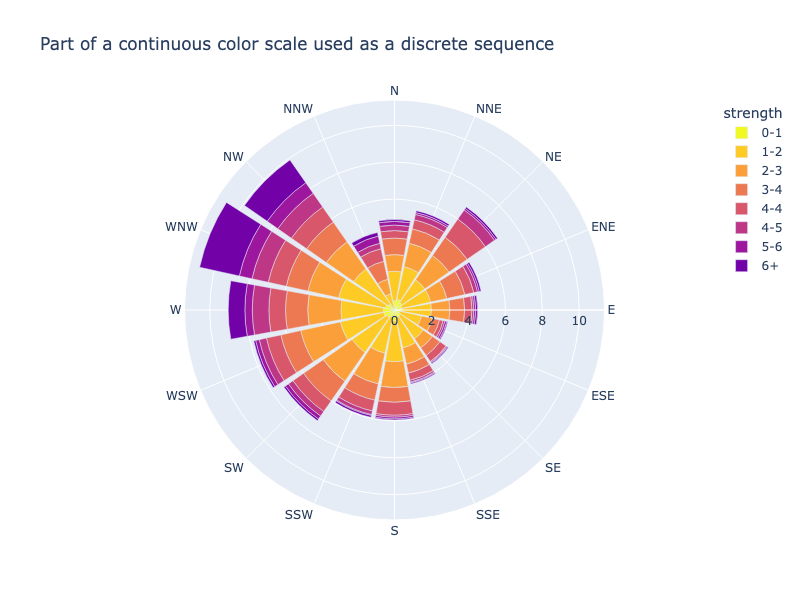

**Interactive Plot:**

<div>                        <script type="text/javascript">window.PlotlyConfig = {MathJaxConfig: 'local'};</script>
        <script charset="utf-8" src="https://cdn.plot.ly/plotly-3.1.0.min.js" integrity="sha256-Ei4740bWZhaUTQuD6q9yQlgVCMPBz6CZWhevDYPv93A=" crossorigin="anonymous"></script>                <div id="plotly-div-13" class="plotly-graph-div" style="height:100%; width:100%;"></div>            <script type="text/javascript">                window.PLOTLYENV=window.PLOTLYENV || {};                                if (document.getElementById("plotly-div-13")) {                    Plotly.newPlot(                        "plotly-div-13",                        [{"hovertemplate":"strength=0-1\u003cbr\u003efrequency=%{r}\u003cbr\u003edirection=%{theta}\u003cextra\u003e\u003c\u002fextra\u003e","legendgroup":"0-1","marker":{"color":"#f0f921","pattern":{"shape":""}},"name":"0-1","r":{"dtype":"f8","bdata":"AAAAAAAA4D8zMzMzMzPjPwAAAAAAAOA\u002fmpmZmZmZ2T+amZmZmZnZPzMzMzMzM9M\u002fmpmZmZmZ2T+amZmZmZnZPzMzMzMzM+M\u002fmpmZmZmZ2T8AAAAAAADgPzMzMzMzM+M\u002fMzMzMzMz4z8AAAAAAADgP5qZmZmZmdk\u002fmpmZmZmZuT8="},"showlegend":true,"subplot":"polar","theta":["N","NNE","NE","ENE","E","ESE","SE","SSE","S","SSW","SW","WSW","W","WNW","NW","NNW"],"type":"barpolar"},{"hovertemplate":"strength=1-2\u003cbr\u003efrequency=%{r}\u003cbr\u003edirection=%{theta}\u003cextra\u003e\u003c\u002fextra\u003e","legendgroup":"1-2","marker":{"color":"#fdca26","pattern":{"shape":""}},"name":"1-2","r":{"dtype":"f8","bdata":"mpmZmZmZ+T\u002fNzMzMzMz8PwAAAAAAAPg\u002fmpmZmZmZ+T+amZmZmZn5PzMzMzMzM\u002fM\u002fAAAAAAAA+D8zMzMzMzP7P5qZmZmZmQFAAAAAAAAAAEBmZmZmZmYCQDMzMzMzMwNAZmZmZmZmAkDNzMzMzMwEQGZmZmZmZgJAmpmZmZmZ6T8="},"showlegend":true,"subplot":"polar","theta":["N","NNE","NE","ENE","E","ESE","SE","SSE","S","SSW","SW","WSW","W","WNW","NW","NNW"],"type":"barpolar"},{"hovertemplate":"strength=2-3\u003cbr\u003efrequency=%{r}\u003cbr\u003edirection=%{theta}\u003cextra\u003e\u003c\u002fextra\u003e","legendgroup":"2-3","marker":{"color":"#fb9f3a","pattern":{"shape":""}},"name":"2-3","r":{"dtype":"f8","bdata":"zczMzMzM7D\u002fNzMzMzMz0P5qZmZmZmfk\u002fzczMzMzM7D8AAAAAAADwPzMzMzMzM+M\u002fMzMzMzMz4z\u002fNzMzMzMzsP2ZmZmZmZvY\u002fMzMzMzMz+z9mZmZmZmb+P5qZmZmZmQFAzczMzMzM\u002fD8zMzMzMzP7P83MzMzMzPw\u002fmpmZmZmZ6T8="},"showlegend":true,"subplot":"polar","theta":["N","NNE","NE","ENE","E","ESE","SE","SSE","S","SSW","SW","WSW","W","WNW","NW","NNW"],"type":"barpolar"},{"hovertemplate":"strength=3-4\u003cbr\u003efrequency=%{r}\u003cbr\u003edirection=%{theta}\u003cextra\u003e\u003c\u002fextra\u003e","legendgroup":"3-4","marker":{"color":"#ed7953","pattern":{"shape":""}},"name":"3-4","r":{"dtype":"f8","bdata":"zczMzMzM7D+amZmZmZnpPzMzMzMzM\u002fM\u002fAAAAAAAA8D+amZmZmZnpP5qZmZmZmdk\u002fAAAAAAAA4D8AAAAAAADgP5qZmZmZmek\u002fzczMzMzM7D\u002fNzMzMzMz0P5qZmZmZmfE\u002fMzMzMzMz8z8zMzMzMzPzP83MzMzMzPQ\u002fAAAAAAAA8D8="},"showlegend":true,"subplot":"polar","theta":["N","NNE","NE","ENE","E","ESE","SE","SSE","S","SSW","SW","WSW","W","WNW","NW","NNW"],"type":"barpolar"},{"hovertemplate":"strength=4-4\u003cbr\u003efrequency=%{r}\u003cbr\u003edirection=%{theta}\u003cextra\u003e\u003c\u002fextra\u003e","legendgroup":"4-4","marker":{"color":"#d8576b","pattern":{"shape":""}},"name":"4-4","r":{"dtype":"f8","bdata":"mpmZmZmZ2T8AAAAAAADgPzMzMzMzM\u002fM\u002fAAAAAAAA4D+amZmZmZnZP5qZmZmZmck\u002fmpmZmZmZ2T+amZmZmZnZP2ZmZmZmZuY\u002fMzMzMzMz4z9mZmZmZmbmP5qZmZmZmek\u002fzczMzMzM7D8AAAAAAADwPwAAAAAAAPA\u002fZmZmZmZm5j8="},"showlegend":true,"subplot":"polar","theta":["N","NNE","NE","ENE","E","ESE","SE","SSE","S","SSW","SW","WSW","W","WNW","NW","NNW"],"type":"barpolar"},{"hovertemplate":"strength=4-5\u003cbr\u003efrequency=%{r}\u003cbr\u003edirection=%{theta}\u003cextra\u003e\u003c\u002fextra\u003e","legendgroup":"4-5","marker":{"color":"#bd3786","pattern":{"shape":""}},"name":"4-5","r":{"dtype":"f8","bdata":"MzMzMzMz0z8zMzMzMzPTPzMzMzMzM+M\u002fmpmZmZmZyT+amZmZmZm5P5qZmZmZmbk\u002fmpmZmZmZqT+amZmZmZm5P5qZmZmZmbk\u002fmpmZmZmZyT8zMzMzMzPTP5qZmZmZmdk\u002fzczMzMzM7D\u002fNzMzMzMzsP83MzMzMzOw\u002fMzMzMzMz0z8="},"showlegend":true,"subplot":"polar","theta":["N","NNE","NE","ENE","E","ESE","SE","SSE","S","SSW","SW","WSW","W","WNW","NW","NNW"],"type":"barpolar"},{"hovertemplate":"strength=5-6\u003cbr\u003efrequency=%{r}\u003cbr\u003edirection=%{theta}\u003cextra\u003e\u003c\u002fextra\u003e","legendgroup":"5-6","marker":{"color":"#9c179e","pattern":{"shape":""}},"name":"5-6","r":{"dtype":"f8","bdata":"mpmZmZmZyT+amZmZmZm5P5qZmZmZmbk\u002fmpmZmZmZuT+amZmZmZm5P5qZmZmZmbk\u002fmpmZmZmZqT+amZmZmZmpP5qZmZmZmbk\u002fmpmZmZmZqT+amZmZmZnJP5qZmZmZmck\u002fmpmZmZmZ2T9mZmZmZmbmP2ZmZmZmZuY\u002fmpmZmZmZ2T8="},"showlegend":true,"subplot":"polar","theta":["N","NNE","NE","ENE","E","ESE","SE","SSE","S","SSW","SW","WSW","W","WNW","NW","NNW"],"type":"barpolar"},{"hovertemplate":"strength=6+\u003cbr\u003efrequency=%{r}\u003cbr\u003edirection=%{theta}\u003cextra\u003e\u003c\u002fextra\u003e","legendgroup":"6+","marker":{"color":"#7201a8","pattern":{"shape":""}},"name":"6+","r":{"dtype":"f8","bdata":"mpmZmZmZuT+amZmZmZm5P5qZmZmZmbk\u002fmpmZmZmZuT+amZmZmZm5P5qZmZmZmak\u002fmpmZmZmZqT+amZmZmZmpP5qZmZmZmak\u002fmpmZmZmZuT+amZmZmZm5P5qZmZmZmbk\u002fzczMzMzM7D+amZmZmZkBQAAAAAAAAPg\u002fmpmZmZmZyT8="},"showlegend":true,"subplot":"polar","theta":["N","NNE","NE","ENE","E","ESE","SE","SSE","S","SSW","SW","WSW","W","WNW","NW","NNW"],"type":"barpolar"}],                        {"template":{"data":{"histogram2dcontour":[{"type":"histogram2dcontour","colorbar":{"outlinewidth":0,"ticks":""},"colorscale":[[0.0,"#0d0887"],[0.1111111111111111,"#46039f"],[0.2222222222222222,"#7201a8"],[0.3333333333333333,"#9c179e"],[0.4444444444444444,"#bd3786"],[0.5555555555555556,"#d8576b"],[0.6666666666666666,"#ed7953"],[0.7777777777777778,"#fb9f3a"],[0.8888888888888888,"#fdca26"],[1.0,"#f0f921"]]}],"choropleth":[{"type":"choropleth","colorbar":{"outlinewidth":0,"ticks":""}}],"histogram2d":[{"type":"histogram2d","colorbar":{"outlinewidth":0,"ticks":""},"colorscale":[[0.0,"#0d0887"],[0.1111111111111111,"#46039f"],[0.2222222222222222,"#7201a8"],[0.3333333333333333,"#9c179e"],[0.4444444444444444,"#bd3786"],[0.5555555555555556,"#d8576b"],[0.6666666666666666,"#ed7953"],[0.7777777777777778,"#fb9f3a"],[0.8888888888888888,"#fdca26"],[1.0,"#f0f921"]]}],"heatmap":[{"type":"heatmap","colorbar":{"outlinewidth":0,"ticks":""},"colorscale":[[0.0,"#0d0887"],[0.1111111111111111,"#46039f"],[0.2222222222222222,"#7201a8"],[0.3333333333333333,"#9c179e"],[0.4444444444444444,"#bd3786"],[0.5555555555555556,"#d8576b"],[0.6666666666666666,"#ed7953"],[0.7777777777777778,"#fb9f3a"],[0.8888888888888888,"#fdca26"],[1.0,"#f0f921"]]}],"contourcarpet":[{"type":"contourcarpet","colorbar":{"outlinewidth":0,"ticks":""}}],"contour":[{"type":"contour","colorbar":{"outlinewidth":0,"ticks":""},"colorscale":[[0.0,"#0d0887"],[0.1111111111111111,"#46039f"],[0.2222222222222222,"#7201a8"],[0.3333333333333333,"#9c179e"],[0.4444444444444444,"#bd3786"],[0.5555555555555556,"#d8576b"],[0.6666666666666666,"#ed7953"],[0.7777777777777778,"#fb9f3a"],[0.8888888888888888,"#fdca26"],[1.0,"#f0f921"]]}],"surface":[{"type":"surface","colorbar":{"outlinewidth":0,"ticks":""},"colorscale":[[0.0,"#0d0887"],[0.1111111111111111,"#46039f"],[0.2222222222222222,"#7201a8"],[0.3333333333333333,"#9c179e"],[0.4444444444444444,"#bd3786"],[0.5555555555555556,"#d8576b"],[0.6666666666666666,"#ed7953"],[0.7777777777777778,"#fb9f3a"],[0.8888888888888888,"#fdca26"],[1.0,"#f0f921"]]}],"mesh3d":[{"type":"mesh3d","colorbar":{"outlinewidth":0,"ticks":""}}],"scatter":[{"fillpattern":{"fillmode":"overlay","size":10,"solidity":0.2},"type":"scatter"}],"parcoords":[{"type":"parcoords","line":{"colorbar":{"outlinewidth":0,"ticks":""}}}],"scatterpolargl":[{"type":"scatterpolargl","marker":{"colorbar":{"outlinewidth":0,"ticks":""}}}],"bar":[{"error_x":{"color":"#2a3f5f"},"error_y":{"color":"#2a3f5f"},"marker":{"line":{"color":"#E5ECF6","width":0.5},"pattern":{"fillmode":"overlay","size":10,"solidity":0.2}},"type":"bar"}],"scattergeo":[{"type":"scattergeo","marker":{"colorbar":{"outlinewidth":0,"ticks":""}}}],"scatterpolar":[{"type":"scatterpolar","marker":{"colorbar":{"outlinewidth":0,"ticks":""}}}],"histogram":[{"marker":{"pattern":{"fillmode":"overlay","size":10,"solidity":0.2}},"type":"histogram"}],"scattergl":[{"type":"scattergl","marker":{"colorbar":{"outlinewidth":0,"ticks":""}}}],"scatter3d":[{"type":"scatter3d","line":{"colorbar":{"outlinewidth":0,"ticks":""}},"marker":{"colorbar":{"outlinewidth":0,"ticks":""}}}],"scattermap":[{"type":"scattermap","marker":{"colorbar":{"outlinewidth":0,"ticks":""}}}],"scattermapbox":[{"type":"scattermapbox","marker":{"colorbar":{"outlinewidth":0,"ticks":""}}}],"scatterternary":[{"type":"scatterternary","marker":{"colorbar":{"outlinewidth":0,"ticks":""}}}],"scattercarpet":[{"type":"scattercarpet","marker":{"colorbar":{"outlinewidth":0,"ticks":""}}}],"carpet":[{"aaxis":{"endlinecolor":"#2a3f5f","gridcolor":"white","linecolor":"white","minorgridcolor":"white","startlinecolor":"#2a3f5f"},"baxis":{"endlinecolor":"#2a3f5f","gridcolor":"white","linecolor":"white","minorgridcolor":"white","startlinecolor":"#2a3f5f"},"type":"carpet"}],"table":[{"cells":{"fill":{"color":"#EBF0F8"},"line":{"color":"white"}},"header":{"fill":{"color":"#C8D4E3"},"line":{"color":"white"}},"type":"table"}],"barpolar":[{"marker":{"line":{"color":"#E5ECF6","width":0.5},"pattern":{"fillmode":"overlay","size":10,"solidity":0.2}},"type":"barpolar"}],"pie":[{"automargin":true,"type":"pie"}]},"layout":{"autotypenumbers":"strict","colorway":["#636efa","#EF553B","#00cc96","#ab63fa","#FFA15A","#19d3f3","#FF6692","#B6E880","#FF97FF","#FECB52"],"font":{"color":"#2a3f5f"},"hovermode":"closest","hoverlabel":{"align":"left"},"paper_bgcolor":"white","plot_bgcolor":"#E5ECF6","polar":{"bgcolor":"#E5ECF6","angularaxis":{"gridcolor":"white","linecolor":"white","ticks":""},"radialaxis":{"gridcolor":"white","linecolor":"white","ticks":""}},"ternary":{"bgcolor":"#E5ECF6","aaxis":{"gridcolor":"white","linecolor":"white","ticks":""},"baxis":{"gridcolor":"white","linecolor":"white","ticks":""},"caxis":{"gridcolor":"white","linecolor":"white","ticks":""}},"coloraxis":{"colorbar":{"outlinewidth":0,"ticks":""}},"colorscale":{"sequential":[[0.0,"#0d0887"],[0.1111111111111111,"#46039f"],[0.2222222222222222,"#7201a8"],[0.3333333333333333,"#9c179e"],[0.4444444444444444,"#bd3786"],[0.5555555555555556,"#d8576b"],[0.6666666666666666,"#ed7953"],[0.7777777777777778,"#fb9f3a"],[0.8888888888888888,"#fdca26"],[1.0,"#f0f921"]],"sequentialminus":[[0.0,"#0d0887"],[0.1111111111111111,"#46039f"],[0.2222222222222222,"#7201a8"],[0.3333333333333333,"#9c179e"],[0.4444444444444444,"#bd3786"],[0.5555555555555556,"#d8576b"],[0.6666666666666666,"#ed7953"],[0.7777777777777778,"#fb9f3a"],[0.8888888888888888,"#fdca26"],[1.0,"#f0f921"]],"diverging":[[0,"#8e0152"],[0.1,"#c51b7d"],[0.2,"#de77ae"],[0.3,"#f1b6da"],[0.4,"#fde0ef"],[0.5,"#f7f7f7"],[0.6,"#e6f5d0"],[0.7,"#b8e186"],[0.8,"#7fbc41"],[0.9,"#4d9221"],[1,"#276419"]]},"xaxis":{"gridcolor":"white","linecolor":"white","ticks":"","title":{"standoff":15},"zerolinecolor":"white","automargin":true,"zerolinewidth":2},"yaxis":{"gridcolor":"white","linecolor":"white","ticks":"","title":{"standoff":15},"zerolinecolor":"white","automargin":true,"zerolinewidth":2},"scene":{"xaxis":{"backgroundcolor":"#E5ECF6","gridcolor":"white","linecolor":"white","showbackground":true,"ticks":"","zerolinecolor":"white","gridwidth":2},"yaxis":{"backgroundcolor":"#E5ECF6","gridcolor":"white","linecolor":"white","showbackground":true,"ticks":"","zerolinecolor":"white","gridwidth":2},"zaxis":{"backgroundcolor":"#E5ECF6","gridcolor":"white","linecolor":"white","showbackground":true,"ticks":"","zerolinecolor":"white","gridwidth":2}},"shapedefaults":{"line":{"color":"#2a3f5f"}},"annotationdefaults":{"arrowcolor":"#2a3f5f","arrowhead":0,"arrowwidth":1},"geo":{"bgcolor":"white","landcolor":"#E5ECF6","subunitcolor":"white","showland":true,"showlakes":true,"lakecolor":"white"},"title":{"x":0.05},"mapbox":{"style":"light"}}},"polar":{"domain":{"x":[0.0,1.0],"y":[0.0,1.0]},"angularaxis":{"direction":"clockwise","rotation":90}},"legend":{"title":{"text":"strength"},"tracegroupgap":0},"title":{"text":"Part of a continuous color scale used as a discrete sequence"},"barmode":"relative"},                        {"responsive": true}                    )                };            </script>        </div>

This works because just like in `px.colors.qualitative`, all [built-in continuous color scales](builtin-colorscales.md) are stored as lists of CSS colors:

```python
import plotly.express as px

print(px.colors.sequential.Plasma)
```

**Output:**
```
['#0d0887', '#46039f', '#7201a8', '#9c179e', '#bd3786', '#d8576b', '#ed7953', '#fb9f3a', '#fdca26', '#f0f921']
```
