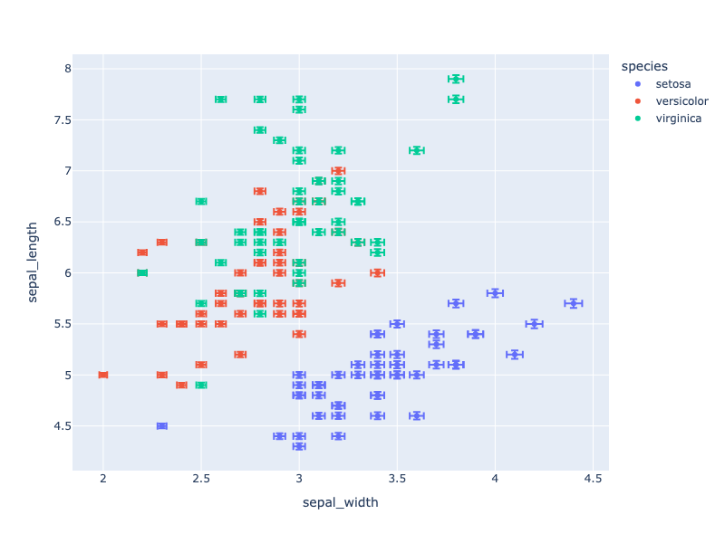
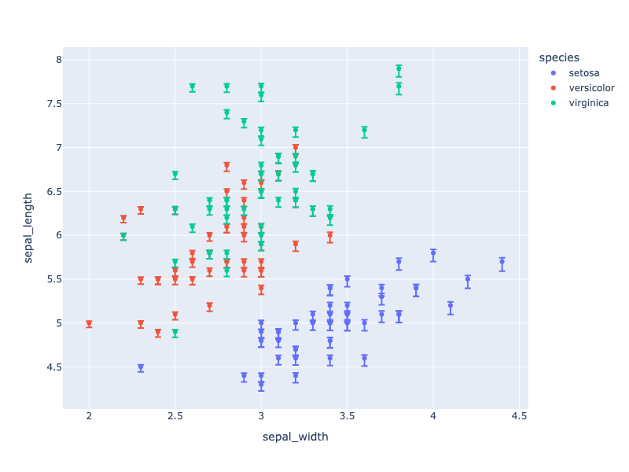
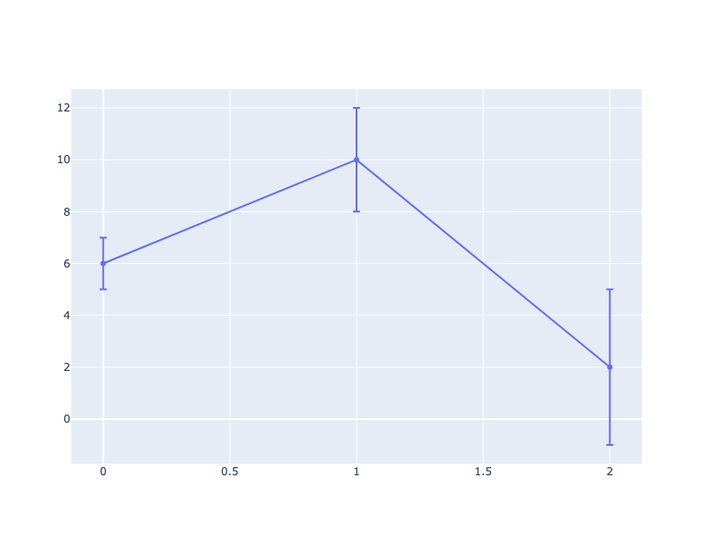
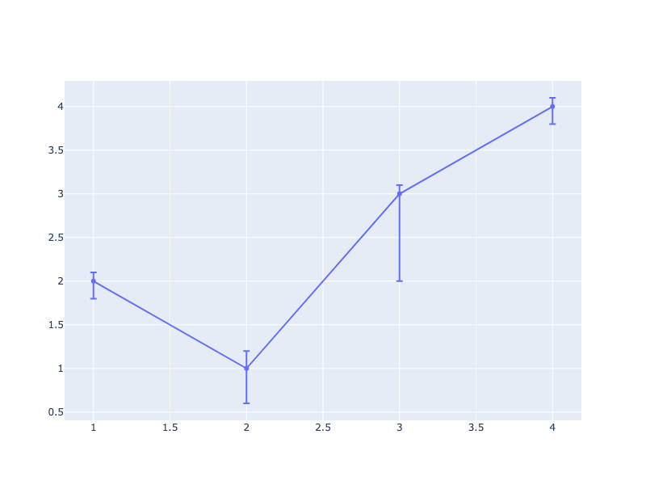
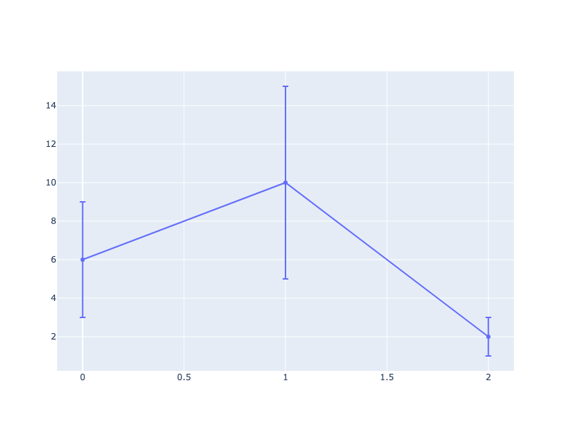
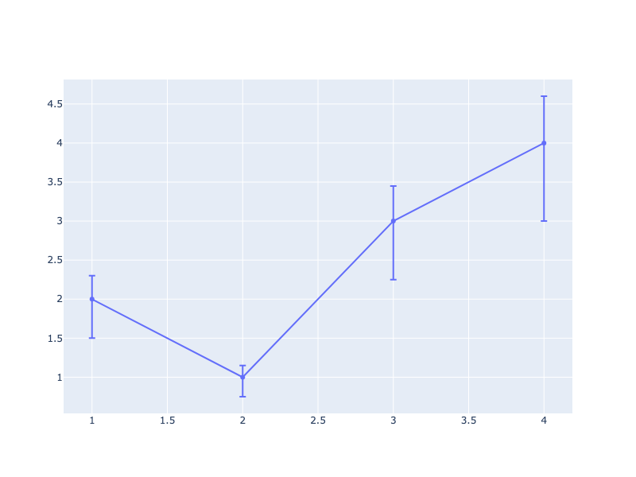
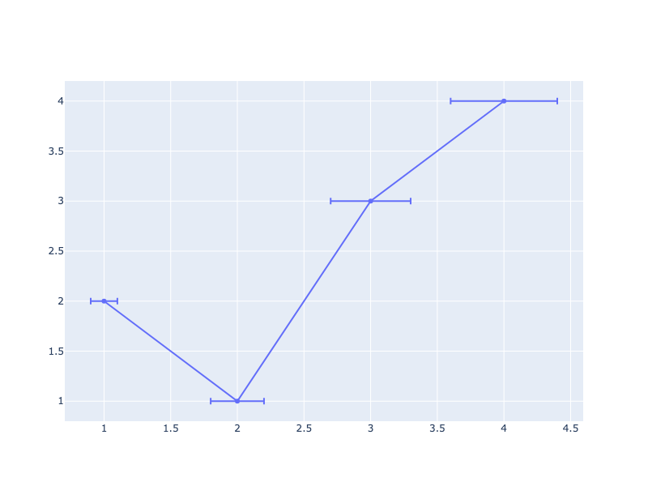
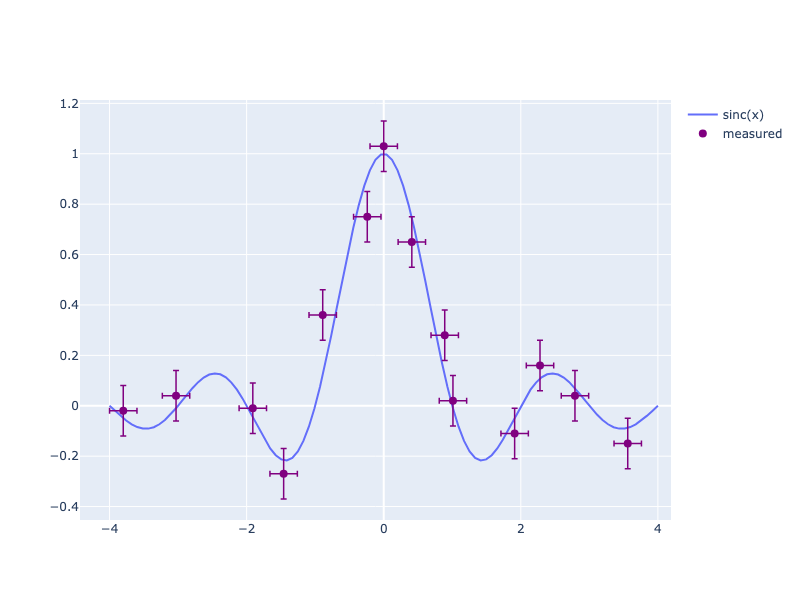

---
jupyter:
  jupytext:
    notebook_metadata_filter: all
    text_representation:
      extension: .md
      format_name: markdown
      format_version: '1.1'
      jupytext_version: 1.2.0
  kernelspec:
    display_name: Python 3
    language: python
    name: python3
  language_info:
    codemirror_mode:
      name: ipython
      version: 3
    file_extension: .py
    mimetype: text/x-python
    name: python
    nbconvert_exporter: python
    pygments_lexer: ipython3
    version: 3.6.8
  plotly:
    description: How to add error-bars to charts in Python with Plotly.
    display_as: statistical
    language: python
    layout: base
    name: Error Bars
    order: 1
    page_type: example_index
    permalink: python/error-bars/
    thumbnail: thumbnail/error-bar.jpg
---

### Error Bars with Plotly Express

[Plotly Express](/python/plotly-express/) is the easy-to-use, high-level interface to Plotly, which [operates on a variety of types of data](/python/px-arguments/) and produces [easy-to-style figures](/python/styling-plotly-express/). For functions representing 2D data points such as [`px.scatter`](https://plotly.com/python/line-and-scatter/), [`px.line`](https://plotly.com/python/line-charts/), [`px.bar`](https://plotly.com/python/bar-charts/) etc., error bars are given as a column name which is the value of the `error_x` (for the error on x position) and `error_y` (for the error on y position).

```python
import plotly.express as px
df = px.data.iris()
df["e"] = df["sepal_width"]/100
fig = px.scatter(df, x="sepal_width", y="sepal_length", color="species",
                 error_x="e", error_y="e")
fig.show()
```



**Interactive Plot:**

<div>                        <script type="text/javascript">window.PlotlyConfig = {MathJaxConfig: 'local'};</script>
        <script charset="utf-8" src="https://cdn.plot.ly/plotly-3.1.0.min.js" integrity="sha256-Ei4740bWZhaUTQuD6q9yQlgVCMPBz6CZWhevDYPv93A=" crossorigin="anonymous"></script>                <div id="plotly-div-1" class="plotly-graph-div" style="height:100%; width:100%;"></div>            <script type="text/javascript">                window.PLOTLYENV=window.PLOTLYENV || {};                                if (document.getElementById("plotly-div-1")) {                    Plotly.newPlot(                        "plotly-div-1",                        [{"error_x":{"array":{"dtype":"f8","bdata":"7FG4HoXroT+4HoXrUbieP\u002fyp8dJNYqA\u002fWDm0yHa+nz8830+Nl26iPyuHFtnO96M\u002fnMQgsHJooT+cxCCwcmihPxgEVg4tsp0\u002fWDm0yHa+nz+MbOf7qfGiP5zEILByaKE\u002fuB6F61G4nj+4HoXrUbieP3sUrkfheqQ\u002fu0kMAiuHpj8rhxbZzvejP+xRuB6F66E\u002f2\u002fl+arx0oz\u002fb+X5qvHSjP5zEILByaKE\u002fjGzn+6nxoj8830+Nl26iP0w3iUFg5aA\u002fnMQgsHJooT+4HoXrUbieP5zEILByaKE\u002f7FG4HoXroT+cxCCwcmihP\u002fyp8dJNYqA\u002fWDm0yHa+nz+cxCCwcmihP8qhRbbz\u002faQ\u002fGy\u002fdJAaBpT9YObTIdr6fP\u002fyp8dJNYqA\u002f7FG4HoXroT9YObTIdr6fP7gehetRuJ4\u002fnMQgsHJooT\u002fsUbgeheuhP1pkO99PjZc\u002f\u002fKnx0k1ioD\u002fsUbgeheuhP9v5fmq8dKM\u002fuB6F61G4nj\u002fb+X5qvHSjP\u002fyp8dJNYqA\u002fjGzn+6nxoj9MN4lBYOWgPw=="}},"error_y":{"array":{"dtype":"f8","bdata":"7FG4HoXroT+4HoXrUbieP\u002fyp8dJNYqA\u002fWDm0yHa+nz8830+Nl26iPyuHFtnO96M\u002fnMQgsHJooT+cxCCwcmihPxgEVg4tsp0\u002fWDm0yHa+nz+MbOf7qfGiP5zEILByaKE\u002fuB6F61G4nj+4HoXrUbieP3sUrkfheqQ\u002fu0kMAiuHpj8rhxbZzvejP+xRuB6F66E\u002f2\u002fl+arx0oz\u002fb+X5qvHSjP5zEILByaKE\u002fjGzn+6nxoj8830+Nl26iP0w3iUFg5aA\u002fnMQgsHJooT+4HoXrUbieP5zEILByaKE\u002f7FG4HoXroT+cxCCwcmihP\u002fyp8dJNYqA\u002fWDm0yHa+nz+cxCCwcmihP8qhRbbz\u002faQ\u002fGy\u002fdJAaBpT9YObTIdr6fP\u002fyp8dJNYqA\u002f7FG4HoXroT9YObTIdr6fP7gehetRuJ4\u002fnMQgsHJooT\u002fsUbgeheuhP1pkO99PjZc\u002f\u002fKnx0k1ioD\u002fsUbgeheuhP9v5fmq8dKM\u002fuB6F61G4nj\u002fb+X5qvHSjP\u002fyp8dJNYqA\u002fjGzn+6nxoj9MN4lBYOWgPw=="}},"hovertemplate":"species=setosa\u003cbr\u003esepal_width=%{x}\u003cbr\u003esepal_length=%{y}\u003cextra\u003e\u003c\u002fextra\u003e","legendgroup":"setosa","marker":{"color":"#636efa","symbol":"circle"},"mode":"markers","name":"setosa","orientation":"v","showlegend":true,"x":{"dtype":"f8","bdata":"AAAAAAAADEAAAAAAAAAIQJqZmZmZmQlAzczMzMzMCEDNzMzMzMwMQDMzMzMzMw9AMzMzMzMzC0AzMzMzMzMLQDMzMzMzMwdAzczMzMzMCECamZmZmZkNQDMzMzMzMwtAAAAAAAAACEAAAAAAAAAIQAAAAAAAABBAmpmZmZmZEUAzMzMzMzMPQAAAAAAAAAxAZmZmZmZmDkBmZmZmZmYOQDMzMzMzMwtAmpmZmZmZDUDNzMzMzMwMQGZmZmZmZgpAMzMzMzMzC0AAAAAAAAAIQDMzMzMzMwtAAAAAAAAADEAzMzMzMzMLQJqZmZmZmQlAzczMzMzMCEAzMzMzMzMLQGZmZmZmZhBAzczMzMzMEEDNzMzMzMwIQJqZmZmZmQlAAAAAAAAADEDNzMzMzMwIQAAAAAAAAAhAMzMzMzMzC0AAAAAAAAAMQGZmZmZmZgJAmpmZmZmZCUAAAAAAAAAMQGZmZmZmZg5AAAAAAAAACEBmZmZmZmYOQJqZmZmZmQlAmpmZmZmZDUBmZmZmZmYKQA=="},"xaxis":"x","y":{"dtype":"f8","bdata":"ZmZmZmZmFECamZmZmZkTQM3MzMzMzBJAZmZmZmZmEkAAAAAAAAAUQJqZmZmZmRVAZmZmZmZmEkAAAAAAAAAUQJqZmZmZmRFAmpmZmZmZE0CamZmZmZkVQDMzMzMzMxNAMzMzMzMzE0AzMzMzMzMRQDMzMzMzMxdAzczMzMzMFkCamZmZmZkVQGZmZmZmZhRAzczMzMzMFkBmZmZmZmYUQJqZmZmZmRVAZmZmZmZmFEBmZmZmZmYSQGZmZmZmZhRAMzMzMzMzE0AAAAAAAAAUQAAAAAAAABRAzczMzMzMFEDNzMzMzMwUQM3MzMzMzBJAMzMzMzMzE0CamZmZmZkVQM3MzMzMzBRAAAAAAAAAFkCamZmZmZkTQAAAAAAAABRAAAAAAAAAFkCamZmZmZkTQJqZmZmZmRFAZmZmZmZmFEAAAAAAAAAUQAAAAAAAABJAmpmZmZmZEUAAAAAAAAAUQGZmZmZmZhRAMzMzMzMzE0BmZmZmZmYUQGZmZmZmZhJAMzMzMzMzFUAAAAAAAAAUQA=="},"yaxis":"y","type":"scatter"},{"error_x":{"array":{"dtype":"f8","bdata":"\u002fKnx0k1ioD\u002f8qfHSTWKgP1g5tMh2vp8\u002fWmQ730+Nlz946SYxCKycP3jpJjEIrJw\u002fTDeJQWDloD\u002f6fmq8dJOYPxgEVg4tsp0\u002f2s73U+Olmz97FK5H4XqUP7gehetRuJ4\u002fu0kMAiuHlj8YBFYOLbKdPxgEVg4tsp0\u002fWDm0yHa+nz+4HoXrUbieP9rO91PjpZs\u002fu0kMAiuHlj+amZmZmZmZP\u002fyp8dJNYqA\u002feOkmMQisnD+amZmZmZmZP3jpJjEIrJw\u002fGARWDi2ynT+4HoXrUbieP3jpJjEIrJw\u002fuB6F61G4nj8YBFYOLbKdPzq0yHa+n5o\u002f+n5qvHSTmD\u002f6fmq8dJOYP9rO91PjpZs\u002f2s73U+Olmz+4HoXrUbieP5zEILByaKE\u002fWDm0yHa+nz9aZDvfT42XP7gehetRuJ4\u002fmpmZmZmZmT86tMh2vp+aP7gehetRuJ4\u002fOrTIdr6fmj9aZDvfT42XP9rO91PjpZs\u002fuB6F61G4nj8YBFYOLbKdPxgEVg4tsp0\u002fmpmZmZmZmT946SYxCKycPw=="}},"error_y":{"array":{"dtype":"f8","bdata":"\u002fKnx0k1ioD\u002f8qfHSTWKgP1g5tMh2vp8\u002fWmQ730+Nlz946SYxCKycP3jpJjEIrJw\u002fTDeJQWDloD\u002f6fmq8dJOYPxgEVg4tsp0\u002f2s73U+Olmz97FK5H4XqUP7gehetRuJ4\u002fu0kMAiuHlj8YBFYOLbKdPxgEVg4tsp0\u002fWDm0yHa+nz+4HoXrUbieP9rO91PjpZs\u002fu0kMAiuHlj+amZmZmZmZP\u002fyp8dJNYqA\u002feOkmMQisnD+amZmZmZmZP3jpJjEIrJw\u002fGARWDi2ynT+4HoXrUbieP3jpJjEIrJw\u002fuB6F61G4nj8YBFYOLbKdPzq0yHa+n5o\u002f+n5qvHSTmD\u002f6fmq8dJOYP9rO91PjpZs\u002f2s73U+Olmz+4HoXrUbieP5zEILByaKE\u002fWDm0yHa+nz9aZDvfT42XP7gehetRuJ4\u002fmpmZmZmZmT86tMh2vp+aP7gehetRuJ4\u002fOrTIdr6fmj9aZDvfT42XP9rO91PjpZs\u002fuB6F61G4nj8YBFYOLbKdPxgEVg4tsp0\u002fmpmZmZmZmT946SYxCKycPw=="}},"hovertemplate":"species=versicolor\u003cbr\u003esepal_width=%{x}\u003cbr\u003esepal_length=%{y}\u003cextra\u003e\u003c\u002fextra\u003e","legendgroup":"versicolor","marker":{"color":"#EF553B","symbol":"circle"},"mode":"markers","name":"versicolor","orientation":"v","showlegend":true,"x":{"dtype":"f8","bdata":"mpmZmZmZCUCamZmZmZkJQM3MzMzMzAhAZmZmZmZmAkBmZmZmZmYGQGZmZmZmZgZAZmZmZmZmCkAzMzMzMzMDQDMzMzMzMwdAmpmZmZmZBUAAAAAAAAAAQAAAAAAAAAhAmpmZmZmZAUAzMzMzMzMHQDMzMzMzMwdAzczMzMzMCEAAAAAAAAAIQJqZmZmZmQVAmpmZmZmZAUAAAAAAAAAEQJqZmZmZmQlAZmZmZmZmBkAAAAAAAAAEQGZmZmZmZgZAMzMzMzMzB0AAAAAAAAAIQGZmZmZmZgZAAAAAAAAACEAzMzMzMzMHQM3MzMzMzARAMzMzMzMzA0AzMzMzMzMDQJqZmZmZmQVAmpmZmZmZBUAAAAAAAAAIQDMzMzMzMwtAzczMzMzMCEBmZmZmZmYCQAAAAAAAAAhAAAAAAAAABEDNzMzMzMwEQAAAAAAAAAhAzczMzMzMBEBmZmZmZmYCQJqZmZmZmQVAAAAAAAAACEAzMzMzMzMHQDMzMzMzMwdAAAAAAAAABEBmZmZmZmYGQA=="},"xaxis":"x","y":{"dtype":"f8","bdata":"AAAAAAAAHECamZmZmZkZQJqZmZmZmRtAAAAAAAAAFkAAAAAAAAAaQM3MzMzMzBZAMzMzMzMzGUCamZmZmZkTQGZmZmZmZhpAzczMzMzMFEAAAAAAAAAUQJqZmZmZmRdAAAAAAAAAGEBmZmZmZmYYQGZmZmZmZhZAzczMzMzMGkBmZmZmZmYWQDMzMzMzMxdAzczMzMzMGEBmZmZmZmYWQJqZmZmZmRdAZmZmZmZmGEAzMzMzMzMZQGZmZmZmZhhAmpmZmZmZGUBmZmZmZmYaQDMzMzMzMxtAzczMzMzMGkAAAAAAAAAYQM3MzMzMzBZAAAAAAAAAFkAAAAAAAAAWQDMzMzMzMxdAAAAAAAAAGECamZmZmZkVQAAAAAAAABhAzczMzMzMGkAzMzMzMzMZQGZmZmZmZhZAAAAAAAAAFkAAAAAAAAAWQGZmZmZmZhhAMzMzMzMzF0AAAAAAAAAUQGZmZmZmZhZAzczMzMzMFkDNzMzMzMwWQM3MzMzMzBhAZmZmZmZmFEDNzMzMzMwWQA=="},"yaxis":"y","type":"scatter"},{"error_x":{"array":{"dtype":"f8","bdata":"TDeJQWDloD\u002fazvdT46WbP7gehetRuJ4\u002fGARWDi2ynT+4HoXrUbieP7gehetRuJ4\u002fmpmZmZmZmT8YBFYOLbKdP5qZmZmZmZk\u002fPN9PjZduoj\u002f8qfHSTWKgP9rO91PjpZs\u002fuB6F61G4nj+amZmZmZmZP3jpJjEIrJw\u002f\u002fKnx0k1ioD+4HoXrUbieP9v5fmq8dKM\u002fOrTIdr6fmj+7SQwCK4eWP\u002fyp8dJNYqA\u002feOkmMQisnD946SYxCKycP9rO91PjpZs\u002fTDeJQWDloD\u002f8qfHSTWKgP3jpJjEIrJw\u002fuB6F61G4nj946SYxCKycP7gehetRuJ4\u002feOkmMQisnD\u002fb+X5qvHSjP3jpJjEIrJw\u002feOkmMQisnD86tMh2vp+aP7gehetRuJ4\u002fnMQgsHJooT9YObTIdr6fP7gehetRuJ4\u002fWDm0yHa+nz9YObTIdr6fP1g5tMh2vp8\u002f2s73U+Olmz\u002f8qfHSTWKgP0w3iUFg5aA\u002fuB6F61G4nj+amZmZmZmZP7gehetRuJ4\u002fnMQgsHJooT+4HoXrUbiePw=="}},"error_y":{"array":{"dtype":"f8","bdata":"TDeJQWDloD\u002fazvdT46WbP7gehetRuJ4\u002fGARWDi2ynT+4HoXrUbieP7gehetRuJ4\u002fmpmZmZmZmT8YBFYOLbKdP5qZmZmZmZk\u002fPN9PjZduoj\u002f8qfHSTWKgP9rO91PjpZs\u002fuB6F61G4nj+amZmZmZmZP3jpJjEIrJw\u002f\u002fKnx0k1ioD+4HoXrUbieP9v5fmq8dKM\u002fOrTIdr6fmj+7SQwCK4eWP\u002fyp8dJNYqA\u002feOkmMQisnD946SYxCKycP9rO91PjpZs\u002fTDeJQWDloD\u002f8qfHSTWKgP3jpJjEIrJw\u002fuB6F61G4nj946SYxCKycP7gehetRuJ4\u002feOkmMQisnD\u002fb+X5qvHSjP3jpJjEIrJw\u002feOkmMQisnD86tMh2vp+aP7gehetRuJ4\u002fnMQgsHJooT9YObTIdr6fP7gehetRuJ4\u002fWDm0yHa+nz9YObTIdr6fP1g5tMh2vp8\u002f2s73U+Olmz\u002f8qfHSTWKgP0w3iUFg5aA\u002fuB6F61G4nj+amZmZmZmZP7gehetRuJ4\u002fnMQgsHJooT+4HoXrUbiePw=="}},"hovertemplate":"species=virginica\u003cbr\u003esepal_width=%{x}\u003cbr\u003esepal_length=%{y}\u003cextra\u003e\u003c\u002fextra\u003e","legendgroup":"virginica","marker":{"color":"#00cc96","symbol":"circle"},"mode":"markers","name":"virginica","orientation":"v","showlegend":true,"x":{"dtype":"f8","bdata":"ZmZmZmZmCkCamZmZmZkFQAAAAAAAAAhAMzMzMzMzB0AAAAAAAAAIQAAAAAAAAAhAAAAAAAAABEAzMzMzMzMHQAAAAAAAAARAzczMzMzMDECamZmZmZkJQJqZmZmZmQVAAAAAAAAACEAAAAAAAAAEQGZmZmZmZgZAmpmZmZmZCUAAAAAAAAAIQGZmZmZmZg5AzczMzMzMBECamZmZmZkBQJqZmZmZmQlAZmZmZmZmBkBmZmZmZmYGQJqZmZmZmQVAZmZmZmZmCkCamZmZmZkJQGZmZmZmZgZAAAAAAAAACEBmZmZmZmYGQAAAAAAAAAhAZmZmZmZmBkBmZmZmZmYOQGZmZmZmZgZAZmZmZmZmBkDNzMzMzMwEQAAAAAAAAAhAMzMzMzMzC0DNzMzMzMwIQAAAAAAAAAhAzczMzMzMCEDNzMzMzMwIQM3MzMzMzAhAmpmZmZmZBUCamZmZmZkJQGZmZmZmZgpAAAAAAAAACEAAAAAAAAAEQAAAAAAAAAhAMzMzMzMzC0AAAAAAAAAIQA=="},"xaxis":"x","y":{"dtype":"f8","bdata":"MzMzMzMzGUAzMzMzMzMXQGZmZmZmZhxAMzMzMzMzGUAAAAAAAAAaQGZmZmZmZh5AmpmZmZmZE0AzMzMzMzMdQM3MzMzMzBpAzczMzMzMHEAAAAAAAAAaQJqZmZmZmRlAMzMzMzMzG0DNzMzMzMwWQDMzMzMzMxdAmpmZmZmZGUAAAAAAAAAaQM3MzMzMzB5AzczMzMzMHkAAAAAAAAAYQJqZmZmZmRtAZmZmZmZmFkDNzMzMzMweQDMzMzMzMxlAzczMzMzMGkDNzMzMzMwcQM3MzMzMzBhAZmZmZmZmGECamZmZmZkZQM3MzMzMzBxAmpmZmZmZHUCamZmZmZkfQJqZmZmZmRlAMzMzMzMzGUBmZmZmZmYYQM3MzMzMzB5AMzMzMzMzGUCamZmZmZkZQAAAAAAAABhAmpmZmZmZG0DNzMzMzMwaQJqZmZmZmRtAMzMzMzMzF0AzMzMzMzMbQM3MzMzMzBpAzczMzMzMGkAzMzMzMzMZQAAAAAAAABpAzczMzMzMGECamZmZmZkXQA=="},"yaxis":"y","type":"scatter"}],                        {"template":{"data":{"histogram2dcontour":[{"type":"histogram2dcontour","colorbar":{"outlinewidth":0,"ticks":""},"colorscale":[[0.0,"#0d0887"],[0.1111111111111111,"#46039f"],[0.2222222222222222,"#7201a8"],[0.3333333333333333,"#9c179e"],[0.4444444444444444,"#bd3786"],[0.5555555555555556,"#d8576b"],[0.6666666666666666,"#ed7953"],[0.7777777777777778,"#fb9f3a"],[0.8888888888888888,"#fdca26"],[1.0,"#f0f921"]]}],"choropleth":[{"type":"choropleth","colorbar":{"outlinewidth":0,"ticks":""}}],"histogram2d":[{"type":"histogram2d","colorbar":{"outlinewidth":0,"ticks":""},"colorscale":[[0.0,"#0d0887"],[0.1111111111111111,"#46039f"],[0.2222222222222222,"#7201a8"],[0.3333333333333333,"#9c179e"],[0.4444444444444444,"#bd3786"],[0.5555555555555556,"#d8576b"],[0.6666666666666666,"#ed7953"],[0.7777777777777778,"#fb9f3a"],[0.8888888888888888,"#fdca26"],[1.0,"#f0f921"]]}],"heatmap":[{"type":"heatmap","colorbar":{"outlinewidth":0,"ticks":""},"colorscale":[[0.0,"#0d0887"],[0.1111111111111111,"#46039f"],[0.2222222222222222,"#7201a8"],[0.3333333333333333,"#9c179e"],[0.4444444444444444,"#bd3786"],[0.5555555555555556,"#d8576b"],[0.6666666666666666,"#ed7953"],[0.7777777777777778,"#fb9f3a"],[0.8888888888888888,"#fdca26"],[1.0,"#f0f921"]]}],"contourcarpet":[{"type":"contourcarpet","colorbar":{"outlinewidth":0,"ticks":""}}],"contour":[{"type":"contour","colorbar":{"outlinewidth":0,"ticks":""},"colorscale":[[0.0,"#0d0887"],[0.1111111111111111,"#46039f"],[0.2222222222222222,"#7201a8"],[0.3333333333333333,"#9c179e"],[0.4444444444444444,"#bd3786"],[0.5555555555555556,"#d8576b"],[0.6666666666666666,"#ed7953"],[0.7777777777777778,"#fb9f3a"],[0.8888888888888888,"#fdca26"],[1.0,"#f0f921"]]}],"surface":[{"type":"surface","colorbar":{"outlinewidth":0,"ticks":""},"colorscale":[[0.0,"#0d0887"],[0.1111111111111111,"#46039f"],[0.2222222222222222,"#7201a8"],[0.3333333333333333,"#9c179e"],[0.4444444444444444,"#bd3786"],[0.5555555555555556,"#d8576b"],[0.6666666666666666,"#ed7953"],[0.7777777777777778,"#fb9f3a"],[0.8888888888888888,"#fdca26"],[1.0,"#f0f921"]]}],"mesh3d":[{"type":"mesh3d","colorbar":{"outlinewidth":0,"ticks":""}}],"scatter":[{"fillpattern":{"fillmode":"overlay","size":10,"solidity":0.2},"type":"scatter"}],"parcoords":[{"type":"parcoords","line":{"colorbar":{"outlinewidth":0,"ticks":""}}}],"scatterpolargl":[{"type":"scatterpolargl","marker":{"colorbar":{"outlinewidth":0,"ticks":""}}}],"bar":[{"error_x":{"color":"#2a3f5f"},"error_y":{"color":"#2a3f5f"},"marker":{"line":{"color":"#E5ECF6","width":0.5},"pattern":{"fillmode":"overlay","size":10,"solidity":0.2}},"type":"bar"}],"scattergeo":[{"type":"scattergeo","marker":{"colorbar":{"outlinewidth":0,"ticks":""}}}],"scatterpolar":[{"type":"scatterpolar","marker":{"colorbar":{"outlinewidth":0,"ticks":""}}}],"histogram":[{"marker":{"pattern":{"fillmode":"overlay","size":10,"solidity":0.2}},"type":"histogram"}],"scattergl":[{"type":"scattergl","marker":{"colorbar":{"outlinewidth":0,"ticks":""}}}],"scatter3d":[{"type":"scatter3d","line":{"colorbar":{"outlinewidth":0,"ticks":""}},"marker":{"colorbar":{"outlinewidth":0,"ticks":""}}}],"scattermap":[{"type":"scattermap","marker":{"colorbar":{"outlinewidth":0,"ticks":""}}}],"scattermapbox":[{"type":"scattermapbox","marker":{"colorbar":{"outlinewidth":0,"ticks":""}}}],"scatterternary":[{"type":"scatterternary","marker":{"colorbar":{"outlinewidth":0,"ticks":""}}}],"scattercarpet":[{"type":"scattercarpet","marker":{"colorbar":{"outlinewidth":0,"ticks":""}}}],"carpet":[{"aaxis":{"endlinecolor":"#2a3f5f","gridcolor":"white","linecolor":"white","minorgridcolor":"white","startlinecolor":"#2a3f5f"},"baxis":{"endlinecolor":"#2a3f5f","gridcolor":"white","linecolor":"white","minorgridcolor":"white","startlinecolor":"#2a3f5f"},"type":"carpet"}],"table":[{"cells":{"fill":{"color":"#EBF0F8"},"line":{"color":"white"}},"header":{"fill":{"color":"#C8D4E3"},"line":{"color":"white"}},"type":"table"}],"barpolar":[{"marker":{"line":{"color":"#E5ECF6","width":0.5},"pattern":{"fillmode":"overlay","size":10,"solidity":0.2}},"type":"barpolar"}],"pie":[{"automargin":true,"type":"pie"}]},"layout":{"autotypenumbers":"strict","colorway":["#636efa","#EF553B","#00cc96","#ab63fa","#FFA15A","#19d3f3","#FF6692","#B6E880","#FF97FF","#FECB52"],"font":{"color":"#2a3f5f"},"hovermode":"closest","hoverlabel":{"align":"left"},"paper_bgcolor":"white","plot_bgcolor":"#E5ECF6","polar":{"bgcolor":"#E5ECF6","angularaxis":{"gridcolor":"white","linecolor":"white","ticks":""},"radialaxis":{"gridcolor":"white","linecolor":"white","ticks":""}},"ternary":{"bgcolor":"#E5ECF6","aaxis":{"gridcolor":"white","linecolor":"white","ticks":""},"baxis":{"gridcolor":"white","linecolor":"white","ticks":""},"caxis":{"gridcolor":"white","linecolor":"white","ticks":""}},"coloraxis":{"colorbar":{"outlinewidth":0,"ticks":""}},"colorscale":{"sequential":[[0.0,"#0d0887"],[0.1111111111111111,"#46039f"],[0.2222222222222222,"#7201a8"],[0.3333333333333333,"#9c179e"],[0.4444444444444444,"#bd3786"],[0.5555555555555556,"#d8576b"],[0.6666666666666666,"#ed7953"],[0.7777777777777778,"#fb9f3a"],[0.8888888888888888,"#fdca26"],[1.0,"#f0f921"]],"sequentialminus":[[0.0,"#0d0887"],[0.1111111111111111,"#46039f"],[0.2222222222222222,"#7201a8"],[0.3333333333333333,"#9c179e"],[0.4444444444444444,"#bd3786"],[0.5555555555555556,"#d8576b"],[0.6666666666666666,"#ed7953"],[0.7777777777777778,"#fb9f3a"],[0.8888888888888888,"#fdca26"],[1.0,"#f0f921"]],"diverging":[[0,"#8e0152"],[0.1,"#c51b7d"],[0.2,"#de77ae"],[0.3,"#f1b6da"],[0.4,"#fde0ef"],[0.5,"#f7f7f7"],[0.6,"#e6f5d0"],[0.7,"#b8e186"],[0.8,"#7fbc41"],[0.9,"#4d9221"],[1,"#276419"]]},"xaxis":{"gridcolor":"white","linecolor":"white","ticks":"","title":{"standoff":15},"zerolinecolor":"white","automargin":true,"zerolinewidth":2},"yaxis":{"gridcolor":"white","linecolor":"white","ticks":"","title":{"standoff":15},"zerolinecolor":"white","automargin":true,"zerolinewidth":2},"scene":{"xaxis":{"backgroundcolor":"#E5ECF6","gridcolor":"white","linecolor":"white","showbackground":true,"ticks":"","zerolinecolor":"white","gridwidth":2},"yaxis":{"backgroundcolor":"#E5ECF6","gridcolor":"white","linecolor":"white","showbackground":true,"ticks":"","zerolinecolor":"white","gridwidth":2},"zaxis":{"backgroundcolor":"#E5ECF6","gridcolor":"white","linecolor":"white","showbackground":true,"ticks":"","zerolinecolor":"white","gridwidth":2}},"shapedefaults":{"line":{"color":"#2a3f5f"}},"annotationdefaults":{"arrowcolor":"#2a3f5f","arrowhead":0,"arrowwidth":1},"geo":{"bgcolor":"white","landcolor":"#E5ECF6","subunitcolor":"white","showland":true,"showlakes":true,"lakecolor":"white"},"title":{"x":0.05},"mapbox":{"style":"light"}}},"xaxis":{"anchor":"y","domain":[0.0,1.0],"title":{"text":"sepal_width"}},"yaxis":{"anchor":"x","domain":[0.0,1.0],"title":{"text":"sepal_length"}},"legend":{"title":{"text":"species"},"tracegroupgap":0},"margin":{"t":60}},                        {"responsive": true}                    )                };            </script>        </div>

#### Asymmetric Error Bars with Plotly Express

```python
import plotly.express as px
df = px.data.iris()
df["e_plus"] = df["sepal_width"]/100
df["e_minus"] = df["sepal_width"]/40
fig = px.scatter(df, x="sepal_width", y="sepal_length", color="species",
                 error_y="e_plus", error_y_minus="e_minus")
fig.show()
```



**Interactive Plot:**

<div>                        <script type="text/javascript">window.PlotlyConfig = {MathJaxConfig: 'local'};</script>
        <script charset="utf-8" src="https://cdn.plot.ly/plotly-3.1.0.min.js" integrity="sha256-Ei4740bWZhaUTQuD6q9yQlgVCMPBz6CZWhevDYPv93A=" crossorigin="anonymous"></script>                <div id="plotly-div-2" class="plotly-graph-div" style="height:100%; width:100%;"></div>            <script type="text/javascript">                window.PLOTLYENV=window.PLOTLYENV || {};                                if (document.getElementById("plotly-div-2")) {                    Plotly.newPlot(                        "plotly-div-2",                        [{"error_y":{"array":{"dtype":"f8","bdata":"7FG4HoXroT+4HoXrUbieP\u002fyp8dJNYqA\u002fWDm0yHa+nz8830+Nl26iPyuHFtnO96M\u002fnMQgsHJooT+cxCCwcmihPxgEVg4tsp0\u002fWDm0yHa+nz+MbOf7qfGiP5zEILByaKE\u002fuB6F61G4nj+4HoXrUbieP3sUrkfheqQ\u002fu0kMAiuHpj8rhxbZzvejP+xRuB6F66E\u002f2\u002fl+arx0oz\u002fb+X5qvHSjP5zEILByaKE\u002fjGzn+6nxoj8830+Nl26iP0w3iUFg5aA\u002fnMQgsHJooT+4HoXrUbieP5zEILByaKE\u002f7FG4HoXroT+cxCCwcmihP\u002fyp8dJNYqA\u002fWDm0yHa+nz+cxCCwcmihP8qhRbbz\u002faQ\u002fGy\u002fdJAaBpT9YObTIdr6fP\u002fyp8dJNYqA\u002f7FG4HoXroT9YObTIdr6fP7gehetRuJ4\u002fnMQgsHJooT\u002fsUbgeheuhP1pkO99PjZc\u002f\u002fKnx0k1ioD\u002fsUbgeheuhP9v5fmq8dKM\u002fuB6F61G4nj\u002fb+X5qvHSjP\u002fyp8dJNYqA\u002fjGzn+6nxoj9MN4lBYOWgPw=="},"arrayminus":{"dtype":"f8","bdata":"ZmZmZmZmtj8zMzMzMzOzP3sUrkfherQ\u002f16NwPQrXsz8K16NwPQq3P\u002fYoXI\u002fC9bg\u002fwvUoXI\u002fCtT\u002fC9Shcj8K1P4\u002fC9Shcj7I\u002f16NwPQrXsz+uR+F6FK63P8L1KFyPwrU\u002fMzMzMzMzsz8zMzMzMzOzP5qZmZmZmbk\u002fKlyPwvUovD\u002f2KFyPwvW4P2ZmZmZmZrY\u002fUrgehetRuD9SuB6F61G4P8L1KFyPwrU\u002frkfhehSutz8K16NwPQq3Px6F61G4HrU\u002fwvUoXI\u002fCtT8zMzMzMzOzP8L1KFyPwrU\u002fZmZmZmZmtj\u002fC9Shcj8K1P3sUrkfherQ\u002f16NwPQrXsz\u002fC9Shcj8K1Pz0K16NwPbo\u002f4noUrkfhuj\u002fXo3A9CtezP3sUrkfherQ\u002fZmZmZmZmtj\u002fXo3A9CtezPzMzMzMzM7M\u002fwvUoXI\u002fCtT9mZmZmZma2P3A9CtejcK0\u002fexSuR+F6tD9mZmZmZma2P1K4HoXrUbg\u002fMzMzMzMzsz9SuB6F61G4P3sUrkfherQ\u002frkfhehSutz8ehetRuB61Pw=="}},"hovertemplate":"species=setosa\u003cbr\u003esepal_width=%{x}\u003cbr\u003esepal_length=%{y}\u003cextra\u003e\u003c\u002fextra\u003e","legendgroup":"setosa","marker":{"color":"#636efa","symbol":"circle"},"mode":"markers","name":"setosa","orientation":"v","showlegend":true,"x":{"dtype":"f8","bdata":"AAAAAAAADEAAAAAAAAAIQJqZmZmZmQlAzczMzMzMCEDNzMzMzMwMQDMzMzMzMw9AMzMzMzMzC0AzMzMzMzMLQDMzMzMzMwdAzczMzMzMCECamZmZmZkNQDMzMzMzMwtAAAAAAAAACEAAAAAAAAAIQAAAAAAAABBAmpmZmZmZEUAzMzMzMzMPQAAAAAAAAAxAZmZmZmZmDkBmZmZmZmYOQDMzMzMzMwtAmpmZmZmZDUDNzMzMzMwMQGZmZmZmZgpAMzMzMzMzC0AAAAAAAAAIQDMzMzMzMwtAAAAAAAAADEAzMzMzMzMLQJqZmZmZmQlAzczMzMzMCEAzMzMzMzMLQGZmZmZmZhBAzczMzMzMEEDNzMzMzMwIQJqZmZmZmQlAAAAAAAAADEDNzMzMzMwIQAAAAAAAAAhAMzMzMzMzC0AAAAAAAAAMQGZmZmZmZgJAmpmZmZmZCUAAAAAAAAAMQGZmZmZmZg5AAAAAAAAACEBmZmZmZmYOQJqZmZmZmQlAmpmZmZmZDUBmZmZmZmYKQA=="},"xaxis":"x","y":{"dtype":"f8","bdata":"ZmZmZmZmFECamZmZmZkTQM3MzMzMzBJAZmZmZmZmEkAAAAAAAAAUQJqZmZmZmRVAZmZmZmZmEkAAAAAAAAAUQJqZmZmZmRFAmpmZmZmZE0CamZmZmZkVQDMzMzMzMxNAMzMzMzMzE0AzMzMzMzMRQDMzMzMzMxdAzczMzMzMFkCamZmZmZkVQGZmZmZmZhRAzczMzMzMFkBmZmZmZmYUQJqZmZmZmRVAZmZmZmZmFEBmZmZmZmYSQGZmZmZmZhRAMzMzMzMzE0AAAAAAAAAUQAAAAAAAABRAzczMzMzMFEDNzMzMzMwUQM3MzMzMzBJAMzMzMzMzE0CamZmZmZkVQM3MzMzMzBRAAAAAAAAAFkCamZmZmZkTQAAAAAAAABRAAAAAAAAAFkCamZmZmZkTQJqZmZmZmRFAZmZmZmZmFEAAAAAAAAAUQAAAAAAAABJAmpmZmZmZEUAAAAAAAAAUQGZmZmZmZhRAMzMzMzMzE0BmZmZmZmYUQGZmZmZmZhJAMzMzMzMzFUAAAAAAAAAUQA=="},"yaxis":"y","type":"scatter"},{"error_y":{"array":{"dtype":"f8","bdata":"\u002fKnx0k1ioD\u002f8qfHSTWKgP1g5tMh2vp8\u002fWmQ730+Nlz946SYxCKycP3jpJjEIrJw\u002fTDeJQWDloD\u002f6fmq8dJOYPxgEVg4tsp0\u002f2s73U+Olmz97FK5H4XqUP7gehetRuJ4\u002fu0kMAiuHlj8YBFYOLbKdPxgEVg4tsp0\u002fWDm0yHa+nz+4HoXrUbieP9rO91PjpZs\u002fu0kMAiuHlj+amZmZmZmZP\u002fyp8dJNYqA\u002feOkmMQisnD+amZmZmZmZP3jpJjEIrJw\u002fGARWDi2ynT+4HoXrUbieP3jpJjEIrJw\u002fuB6F61G4nj8YBFYOLbKdPzq0yHa+n5o\u002f+n5qvHSTmD\u002f6fmq8dJOYP9rO91PjpZs\u002f2s73U+Olmz+4HoXrUbieP5zEILByaKE\u002fWDm0yHa+nz9aZDvfT42XP7gehetRuJ4\u002fmpmZmZmZmT86tMh2vp+aP7gehetRuJ4\u002fOrTIdr6fmj9aZDvfT42XP9rO91PjpZs\u002fuB6F61G4nj8YBFYOLbKdPxgEVg4tsp0\u002fmpmZmZmZmT946SYxCKycPw=="},"arrayminus":{"dtype":"f8","bdata":"exSuR+F6tD97FK5H4Xq0P9ejcD0K17M\u002fcD0K16NwrT\u002frUbgeheuxP+tRuB6F67E\u002fHoXrUbgetT+4HoXrUbiuP4\u002fC9Shcj7I\u002fSOF6FK5HsT+amZmZmZmpPzMzMzMzM7M\u002fKlyPwvUorD+PwvUoXI+yP4\u002fC9Shcj7I\u002f16NwPQrXsz8zMzMzMzOzP0jhehSuR7E\u002fKlyPwvUorD8AAAAAAACwP3sUrkfherQ\u002f61G4HoXrsT8AAAAAAACwP+tRuB6F67E\u002fj8L1KFyPsj8zMzMzMzOzP+tRuB6F67E\u002fMzMzMzMzsz+PwvUoXI+yP6RwPQrXo7A\u002fuB6F61G4rj+4HoXrUbiuP0jhehSuR7E\u002fSOF6FK5HsT8zMzMzMzOzP8L1KFyPwrU\u002f16NwPQrXsz9wPQrXo3CtPzMzMzMzM7M\u002fAAAAAAAAsD+kcD0K16OwPzMzMzMzM7M\u002fpHA9CtejsD9wPQrXo3CtP0jhehSuR7E\u002fMzMzMzMzsz+PwvUoXI+yP4\u002fC9Shcj7I\u002fAAAAAAAAsD\u002frUbgeheuxPw=="}},"hovertemplate":"species=versicolor\u003cbr\u003esepal_width=%{x}\u003cbr\u003esepal_length=%{y}\u003cextra\u003e\u003c\u002fextra\u003e","legendgroup":"versicolor","marker":{"color":"#EF553B","symbol":"circle"},"mode":"markers","name":"versicolor","orientation":"v","showlegend":true,"x":{"dtype":"f8","bdata":"mpmZmZmZCUCamZmZmZkJQM3MzMzMzAhAZmZmZmZmAkBmZmZmZmYGQGZmZmZmZgZAZmZmZmZmCkAzMzMzMzMDQDMzMzMzMwdAmpmZmZmZBUAAAAAAAAAAQAAAAAAAAAhAmpmZmZmZAUAzMzMzMzMHQDMzMzMzMwdAzczMzMzMCEAAAAAAAAAIQJqZmZmZmQVAmpmZmZmZAUAAAAAAAAAEQJqZmZmZmQlAZmZmZmZmBkAAAAAAAAAEQGZmZmZmZgZAMzMzMzMzB0AAAAAAAAAIQGZmZmZmZgZAAAAAAAAACEAzMzMzMzMHQM3MzMzMzARAMzMzMzMzA0AzMzMzMzMDQJqZmZmZmQVAmpmZmZmZBUAAAAAAAAAIQDMzMzMzMwtAzczMzMzMCEBmZmZmZmYCQAAAAAAAAAhAAAAAAAAABEDNzMzMzMwEQAAAAAAAAAhAzczMzMzMBEBmZmZmZmYCQJqZmZmZmQVAAAAAAAAACEAzMzMzMzMHQDMzMzMzMwdAAAAAAAAABEBmZmZmZmYGQA=="},"xaxis":"x","y":{"dtype":"f8","bdata":"AAAAAAAAHECamZmZmZkZQJqZmZmZmRtAAAAAAAAAFkAAAAAAAAAaQM3MzMzMzBZAMzMzMzMzGUCamZmZmZkTQGZmZmZmZhpAzczMzMzMFEAAAAAAAAAUQJqZmZmZmRdAAAAAAAAAGEBmZmZmZmYYQGZmZmZmZhZAzczMzMzMGkBmZmZmZmYWQDMzMzMzMxdAzczMzMzMGEBmZmZmZmYWQJqZmZmZmRdAZmZmZmZmGEAzMzMzMzMZQGZmZmZmZhhAmpmZmZmZGUBmZmZmZmYaQDMzMzMzMxtAzczMzMzMGkAAAAAAAAAYQM3MzMzMzBZAAAAAAAAAFkAAAAAAAAAWQDMzMzMzMxdAAAAAAAAAGECamZmZmZkVQAAAAAAAABhAzczMzMzMGkAzMzMzMzMZQGZmZmZmZhZAAAAAAAAAFkAAAAAAAAAWQGZmZmZmZhhAMzMzMzMzF0AAAAAAAAAUQGZmZmZmZhZAzczMzMzMFkDNzMzMzMwWQM3MzMzMzBhAZmZmZmZmFEDNzMzMzMwWQA=="},"yaxis":"y","type":"scatter"},{"error_y":{"array":{"dtype":"f8","bdata":"TDeJQWDloD\u002fazvdT46WbP7gehetRuJ4\u002fGARWDi2ynT+4HoXrUbieP7gehetRuJ4\u002fmpmZmZmZmT8YBFYOLbKdP5qZmZmZmZk\u002fPN9PjZduoj\u002f8qfHSTWKgP9rO91PjpZs\u002fuB6F61G4nj+amZmZmZmZP3jpJjEIrJw\u002f\u002fKnx0k1ioD+4HoXrUbieP9v5fmq8dKM\u002fOrTIdr6fmj+7SQwCK4eWP\u002fyp8dJNYqA\u002feOkmMQisnD946SYxCKycP9rO91PjpZs\u002fTDeJQWDloD\u002f8qfHSTWKgP3jpJjEIrJw\u002fuB6F61G4nj946SYxCKycP7gehetRuJ4\u002feOkmMQisnD\u002fb+X5qvHSjP3jpJjEIrJw\u002feOkmMQisnD86tMh2vp+aP7gehetRuJ4\u002fnMQgsHJooT9YObTIdr6fP7gehetRuJ4\u002fWDm0yHa+nz9YObTIdr6fP1g5tMh2vp8\u002f2s73U+Olmz\u002f8qfHSTWKgP0w3iUFg5aA\u002fuB6F61G4nj+amZmZmZmZP7gehetRuJ4\u002fnMQgsHJooT+4HoXrUbiePw=="},"arrayminus":{"dtype":"f8","bdata":"HoXrUbgetT9I4XoUrkexPzMzMzMzM7M\u002fj8L1KFyPsj8zMzMzMzOzPzMzMzMzM7M\u002fAAAAAAAAsD+PwvUoXI+yPwAAAAAAALA\u002fCtejcD0Ktz97FK5H4Xq0P0jhehSuR7E\u002fMzMzMzMzsz8AAAAAAACwP+tRuB6F67E\u002fexSuR+F6tD8zMzMzMzOzP1K4HoXrUbg\u002fpHA9CtejsD8qXI\u002fC9SisP3sUrkfherQ\u002f61G4HoXrsT\u002frUbgeheuxP0jhehSuR7E\u002fHoXrUbgetT97FK5H4Xq0P+tRuB6F67E\u002fMzMzMzMzsz\u002frUbgeheuxPzMzMzMzM7M\u002f61G4HoXrsT9SuB6F61G4P+tRuB6F67E\u002f61G4HoXrsT+kcD0K16OwPzMzMzMzM7M\u002fwvUoXI\u002fCtT\u002fXo3A9CtezPzMzMzMzM7M\u002f16NwPQrXsz\u002fXo3A9CtezP9ejcD0K17M\u002fSOF6FK5HsT97FK5H4Xq0Px6F61G4HrU\u002fMzMzMzMzsz8AAAAAAACwPzMzMzMzM7M\u002fwvUoXI\u002fCtT8zMzMzMzOzPw=="}},"hovertemplate":"species=virginica\u003cbr\u003esepal_width=%{x}\u003cbr\u003esepal_length=%{y}\u003cextra\u003e\u003c\u002fextra\u003e","legendgroup":"virginica","marker":{"color":"#00cc96","symbol":"circle"},"mode":"markers","name":"virginica","orientation":"v","showlegend":true,"x":{"dtype":"f8","bdata":"ZmZmZmZmCkCamZmZmZkFQAAAAAAAAAhAMzMzMzMzB0AAAAAAAAAIQAAAAAAAAAhAAAAAAAAABEAzMzMzMzMHQAAAAAAAAARAzczMzMzMDECamZmZmZkJQJqZmZmZmQVAAAAAAAAACEAAAAAAAAAEQGZmZmZmZgZAmpmZmZmZCUAAAAAAAAAIQGZmZmZmZg5AzczMzMzMBECamZmZmZkBQJqZmZmZmQlAZmZmZmZmBkBmZmZmZmYGQJqZmZmZmQVAZmZmZmZmCkCamZmZmZkJQGZmZmZmZgZAAAAAAAAACEBmZmZmZmYGQAAAAAAAAAhAZmZmZmZmBkBmZmZmZmYOQGZmZmZmZgZAZmZmZmZmBkDNzMzMzMwEQAAAAAAAAAhAMzMzMzMzC0DNzMzMzMwIQAAAAAAAAAhAzczMzMzMCEDNzMzMzMwIQM3MzMzMzAhAmpmZmZmZBUCamZmZmZkJQGZmZmZmZgpAAAAAAAAACEAAAAAAAAAEQAAAAAAAAAhAMzMzMzMzC0AAAAAAAAAIQA=="},"xaxis":"x","y":{"dtype":"f8","bdata":"MzMzMzMzGUAzMzMzMzMXQGZmZmZmZhxAMzMzMzMzGUAAAAAAAAAaQGZmZmZmZh5AmpmZmZmZE0AzMzMzMzMdQM3MzMzMzBpAzczMzMzMHEAAAAAAAAAaQJqZmZmZmRlAMzMzMzMzG0DNzMzMzMwWQDMzMzMzMxdAmpmZmZmZGUAAAAAAAAAaQM3MzMzMzB5AzczMzMzMHkAAAAAAAAAYQJqZmZmZmRtAZmZmZmZmFkDNzMzMzMweQDMzMzMzMxlAzczMzMzMGkDNzMzMzMwcQM3MzMzMzBhAZmZmZmZmGECamZmZmZkZQM3MzMzMzBxAmpmZmZmZHUCamZmZmZkfQJqZmZmZmRlAMzMzMzMzGUBmZmZmZmYYQM3MzMzMzB5AMzMzMzMzGUCamZmZmZkZQAAAAAAAABhAmpmZmZmZG0DNzMzMzMwaQJqZmZmZmRtAMzMzMzMzF0AzMzMzMzMbQM3MzMzMzBpAzczMzMzMGkAzMzMzMzMZQAAAAAAAABpAzczMzMzMGECamZmZmZkXQA=="},"yaxis":"y","type":"scatter"}],                        {"template":{"data":{"histogram2dcontour":[{"type":"histogram2dcontour","colorbar":{"outlinewidth":0,"ticks":""},"colorscale":[[0.0,"#0d0887"],[0.1111111111111111,"#46039f"],[0.2222222222222222,"#7201a8"],[0.3333333333333333,"#9c179e"],[0.4444444444444444,"#bd3786"],[0.5555555555555556,"#d8576b"],[0.6666666666666666,"#ed7953"],[0.7777777777777778,"#fb9f3a"],[0.8888888888888888,"#fdca26"],[1.0,"#f0f921"]]}],"choropleth":[{"type":"choropleth","colorbar":{"outlinewidth":0,"ticks":""}}],"histogram2d":[{"type":"histogram2d","colorbar":{"outlinewidth":0,"ticks":""},"colorscale":[[0.0,"#0d0887"],[0.1111111111111111,"#46039f"],[0.2222222222222222,"#7201a8"],[0.3333333333333333,"#9c179e"],[0.4444444444444444,"#bd3786"],[0.5555555555555556,"#d8576b"],[0.6666666666666666,"#ed7953"],[0.7777777777777778,"#fb9f3a"],[0.8888888888888888,"#fdca26"],[1.0,"#f0f921"]]}],"heatmap":[{"type":"heatmap","colorbar":{"outlinewidth":0,"ticks":""},"colorscale":[[0.0,"#0d0887"],[0.1111111111111111,"#46039f"],[0.2222222222222222,"#7201a8"],[0.3333333333333333,"#9c179e"],[0.4444444444444444,"#bd3786"],[0.5555555555555556,"#d8576b"],[0.6666666666666666,"#ed7953"],[0.7777777777777778,"#fb9f3a"],[0.8888888888888888,"#fdca26"],[1.0,"#f0f921"]]}],"contourcarpet":[{"type":"contourcarpet","colorbar":{"outlinewidth":0,"ticks":""}}],"contour":[{"type":"contour","colorbar":{"outlinewidth":0,"ticks":""},"colorscale":[[0.0,"#0d0887"],[0.1111111111111111,"#46039f"],[0.2222222222222222,"#7201a8"],[0.3333333333333333,"#9c179e"],[0.4444444444444444,"#bd3786"],[0.5555555555555556,"#d8576b"],[0.6666666666666666,"#ed7953"],[0.7777777777777778,"#fb9f3a"],[0.8888888888888888,"#fdca26"],[1.0,"#f0f921"]]}],"surface":[{"type":"surface","colorbar":{"outlinewidth":0,"ticks":""},"colorscale":[[0.0,"#0d0887"],[0.1111111111111111,"#46039f"],[0.2222222222222222,"#7201a8"],[0.3333333333333333,"#9c179e"],[0.4444444444444444,"#bd3786"],[0.5555555555555556,"#d8576b"],[0.6666666666666666,"#ed7953"],[0.7777777777777778,"#fb9f3a"],[0.8888888888888888,"#fdca26"],[1.0,"#f0f921"]]}],"mesh3d":[{"type":"mesh3d","colorbar":{"outlinewidth":0,"ticks":""}}],"scatter":[{"fillpattern":{"fillmode":"overlay","size":10,"solidity":0.2},"type":"scatter"}],"parcoords":[{"type":"parcoords","line":{"colorbar":{"outlinewidth":0,"ticks":""}}}],"scatterpolargl":[{"type":"scatterpolargl","marker":{"colorbar":{"outlinewidth":0,"ticks":""}}}],"bar":[{"error_x":{"color":"#2a3f5f"},"error_y":{"color":"#2a3f5f"},"marker":{"line":{"color":"#E5ECF6","width":0.5},"pattern":{"fillmode":"overlay","size":10,"solidity":0.2}},"type":"bar"}],"scattergeo":[{"type":"scattergeo","marker":{"colorbar":{"outlinewidth":0,"ticks":""}}}],"scatterpolar":[{"type":"scatterpolar","marker":{"colorbar":{"outlinewidth":0,"ticks":""}}}],"histogram":[{"marker":{"pattern":{"fillmode":"overlay","size":10,"solidity":0.2}},"type":"histogram"}],"scattergl":[{"type":"scattergl","marker":{"colorbar":{"outlinewidth":0,"ticks":""}}}],"scatter3d":[{"type":"scatter3d","line":{"colorbar":{"outlinewidth":0,"ticks":""}},"marker":{"colorbar":{"outlinewidth":0,"ticks":""}}}],"scattermap":[{"type":"scattermap","marker":{"colorbar":{"outlinewidth":0,"ticks":""}}}],"scattermapbox":[{"type":"scattermapbox","marker":{"colorbar":{"outlinewidth":0,"ticks":""}}}],"scatterternary":[{"type":"scatterternary","marker":{"colorbar":{"outlinewidth":0,"ticks":""}}}],"scattercarpet":[{"type":"scattercarpet","marker":{"colorbar":{"outlinewidth":0,"ticks":""}}}],"carpet":[{"aaxis":{"endlinecolor":"#2a3f5f","gridcolor":"white","linecolor":"white","minorgridcolor":"white","startlinecolor":"#2a3f5f"},"baxis":{"endlinecolor":"#2a3f5f","gridcolor":"white","linecolor":"white","minorgridcolor":"white","startlinecolor":"#2a3f5f"},"type":"carpet"}],"table":[{"cells":{"fill":{"color":"#EBF0F8"},"line":{"color":"white"}},"header":{"fill":{"color":"#C8D4E3"},"line":{"color":"white"}},"type":"table"}],"barpolar":[{"marker":{"line":{"color":"#E5ECF6","width":0.5},"pattern":{"fillmode":"overlay","size":10,"solidity":0.2}},"type":"barpolar"}],"pie":[{"automargin":true,"type":"pie"}]},"layout":{"autotypenumbers":"strict","colorway":["#636efa","#EF553B","#00cc96","#ab63fa","#FFA15A","#19d3f3","#FF6692","#B6E880","#FF97FF","#FECB52"],"font":{"color":"#2a3f5f"},"hovermode":"closest","hoverlabel":{"align":"left"},"paper_bgcolor":"white","plot_bgcolor":"#E5ECF6","polar":{"bgcolor":"#E5ECF6","angularaxis":{"gridcolor":"white","linecolor":"white","ticks":""},"radialaxis":{"gridcolor":"white","linecolor":"white","ticks":""}},"ternary":{"bgcolor":"#E5ECF6","aaxis":{"gridcolor":"white","linecolor":"white","ticks":""},"baxis":{"gridcolor":"white","linecolor":"white","ticks":""},"caxis":{"gridcolor":"white","linecolor":"white","ticks":""}},"coloraxis":{"colorbar":{"outlinewidth":0,"ticks":""}},"colorscale":{"sequential":[[0.0,"#0d0887"],[0.1111111111111111,"#46039f"],[0.2222222222222222,"#7201a8"],[0.3333333333333333,"#9c179e"],[0.4444444444444444,"#bd3786"],[0.5555555555555556,"#d8576b"],[0.6666666666666666,"#ed7953"],[0.7777777777777778,"#fb9f3a"],[0.8888888888888888,"#fdca26"],[1.0,"#f0f921"]],"sequentialminus":[[0.0,"#0d0887"],[0.1111111111111111,"#46039f"],[0.2222222222222222,"#7201a8"],[0.3333333333333333,"#9c179e"],[0.4444444444444444,"#bd3786"],[0.5555555555555556,"#d8576b"],[0.6666666666666666,"#ed7953"],[0.7777777777777778,"#fb9f3a"],[0.8888888888888888,"#fdca26"],[1.0,"#f0f921"]],"diverging":[[0,"#8e0152"],[0.1,"#c51b7d"],[0.2,"#de77ae"],[0.3,"#f1b6da"],[0.4,"#fde0ef"],[0.5,"#f7f7f7"],[0.6,"#e6f5d0"],[0.7,"#b8e186"],[0.8,"#7fbc41"],[0.9,"#4d9221"],[1,"#276419"]]},"xaxis":{"gridcolor":"white","linecolor":"white","ticks":"","title":{"standoff":15},"zerolinecolor":"white","automargin":true,"zerolinewidth":2},"yaxis":{"gridcolor":"white","linecolor":"white","ticks":"","title":{"standoff":15},"zerolinecolor":"white","automargin":true,"zerolinewidth":2},"scene":{"xaxis":{"backgroundcolor":"#E5ECF6","gridcolor":"white","linecolor":"white","showbackground":true,"ticks":"","zerolinecolor":"white","gridwidth":2},"yaxis":{"backgroundcolor":"#E5ECF6","gridcolor":"white","linecolor":"white","showbackground":true,"ticks":"","zerolinecolor":"white","gridwidth":2},"zaxis":{"backgroundcolor":"#E5ECF6","gridcolor":"white","linecolor":"white","showbackground":true,"ticks":"","zerolinecolor":"white","gridwidth":2}},"shapedefaults":{"line":{"color":"#2a3f5f"}},"annotationdefaults":{"arrowcolor":"#2a3f5f","arrowhead":0,"arrowwidth":1},"geo":{"bgcolor":"white","landcolor":"#E5ECF6","subunitcolor":"white","showland":true,"showlakes":true,"lakecolor":"white"},"title":{"x":0.05},"mapbox":{"style":"light"}}},"xaxis":{"anchor":"y","domain":[0.0,1.0],"title":{"text":"sepal_width"}},"yaxis":{"anchor":"x","domain":[0.0,1.0],"title":{"text":"sepal_length"}},"legend":{"title":{"text":"species"},"tracegroupgap":0},"margin":{"t":60}},                        {"responsive": true}                    )                };            </script>        </div>

### Error Bars with graph_objects

#### Basic Symmetric Error Bars

```python
import plotly.graph_objects as go

fig = go.Figure(data=go.Scatter(
        x=[0, 1, 2],
        y=[6, 10, 2],
        error_y=dict(
            type='data', # value of error bar given in data coordinates
            array=[1, 2, 3],
            visible=True)
    ))
fig.show()
```



**Interactive Plot:**

<div>                        <script type="text/javascript">window.PlotlyConfig = {MathJaxConfig: 'local'};</script>
        <script charset="utf-8" src="https://cdn.plot.ly/plotly-3.1.0.min.js" integrity="sha256-Ei4740bWZhaUTQuD6q9yQlgVCMPBz6CZWhevDYPv93A=" crossorigin="anonymous"></script>                <div id="plotly-div-3" class="plotly-graph-div" style="height:100%; width:100%;"></div>            <script type="text/javascript">                window.PLOTLYENV=window.PLOTLYENV || {};                                if (document.getElementById("plotly-div-3")) {                    Plotly.newPlot(                        "plotly-div-3",                        [{"error_y":{"array":[1,2,3],"type":"data","visible":true},"x":[0,1,2],"y":[6,10,2],"type":"scatter"}],                        {"template":{"data":{"histogram2dcontour":[{"type":"histogram2dcontour","colorbar":{"outlinewidth":0,"ticks":""},"colorscale":[[0.0,"#0d0887"],[0.1111111111111111,"#46039f"],[0.2222222222222222,"#7201a8"],[0.3333333333333333,"#9c179e"],[0.4444444444444444,"#bd3786"],[0.5555555555555556,"#d8576b"],[0.6666666666666666,"#ed7953"],[0.7777777777777778,"#fb9f3a"],[0.8888888888888888,"#fdca26"],[1.0,"#f0f921"]]}],"choropleth":[{"type":"choropleth","colorbar":{"outlinewidth":0,"ticks":""}}],"histogram2d":[{"type":"histogram2d","colorbar":{"outlinewidth":0,"ticks":""},"colorscale":[[0.0,"#0d0887"],[0.1111111111111111,"#46039f"],[0.2222222222222222,"#7201a8"],[0.3333333333333333,"#9c179e"],[0.4444444444444444,"#bd3786"],[0.5555555555555556,"#d8576b"],[0.6666666666666666,"#ed7953"],[0.7777777777777778,"#fb9f3a"],[0.8888888888888888,"#fdca26"],[1.0,"#f0f921"]]}],"heatmap":[{"type":"heatmap","colorbar":{"outlinewidth":0,"ticks":""},"colorscale":[[0.0,"#0d0887"],[0.1111111111111111,"#46039f"],[0.2222222222222222,"#7201a8"],[0.3333333333333333,"#9c179e"],[0.4444444444444444,"#bd3786"],[0.5555555555555556,"#d8576b"],[0.6666666666666666,"#ed7953"],[0.7777777777777778,"#fb9f3a"],[0.8888888888888888,"#fdca26"],[1.0,"#f0f921"]]}],"contourcarpet":[{"type":"contourcarpet","colorbar":{"outlinewidth":0,"ticks":""}}],"contour":[{"type":"contour","colorbar":{"outlinewidth":0,"ticks":""},"colorscale":[[0.0,"#0d0887"],[0.1111111111111111,"#46039f"],[0.2222222222222222,"#7201a8"],[0.3333333333333333,"#9c179e"],[0.4444444444444444,"#bd3786"],[0.5555555555555556,"#d8576b"],[0.6666666666666666,"#ed7953"],[0.7777777777777778,"#fb9f3a"],[0.8888888888888888,"#fdca26"],[1.0,"#f0f921"]]}],"surface":[{"type":"surface","colorbar":{"outlinewidth":0,"ticks":""},"colorscale":[[0.0,"#0d0887"],[0.1111111111111111,"#46039f"],[0.2222222222222222,"#7201a8"],[0.3333333333333333,"#9c179e"],[0.4444444444444444,"#bd3786"],[0.5555555555555556,"#d8576b"],[0.6666666666666666,"#ed7953"],[0.7777777777777778,"#fb9f3a"],[0.8888888888888888,"#fdca26"],[1.0,"#f0f921"]]}],"mesh3d":[{"type":"mesh3d","colorbar":{"outlinewidth":0,"ticks":""}}],"scatter":[{"fillpattern":{"fillmode":"overlay","size":10,"solidity":0.2},"type":"scatter"}],"parcoords":[{"type":"parcoords","line":{"colorbar":{"outlinewidth":0,"ticks":""}}}],"scatterpolargl":[{"type":"scatterpolargl","marker":{"colorbar":{"outlinewidth":0,"ticks":""}}}],"bar":[{"error_x":{"color":"#2a3f5f"},"error_y":{"color":"#2a3f5f"},"marker":{"line":{"color":"#E5ECF6","width":0.5},"pattern":{"fillmode":"overlay","size":10,"solidity":0.2}},"type":"bar"}],"scattergeo":[{"type":"scattergeo","marker":{"colorbar":{"outlinewidth":0,"ticks":""}}}],"scatterpolar":[{"type":"scatterpolar","marker":{"colorbar":{"outlinewidth":0,"ticks":""}}}],"histogram":[{"marker":{"pattern":{"fillmode":"overlay","size":10,"solidity":0.2}},"type":"histogram"}],"scattergl":[{"type":"scattergl","marker":{"colorbar":{"outlinewidth":0,"ticks":""}}}],"scatter3d":[{"type":"scatter3d","line":{"colorbar":{"outlinewidth":0,"ticks":""}},"marker":{"colorbar":{"outlinewidth":0,"ticks":""}}}],"scattermap":[{"type":"scattermap","marker":{"colorbar":{"outlinewidth":0,"ticks":""}}}],"scattermapbox":[{"type":"scattermapbox","marker":{"colorbar":{"outlinewidth":0,"ticks":""}}}],"scatterternary":[{"type":"scatterternary","marker":{"colorbar":{"outlinewidth":0,"ticks":""}}}],"scattercarpet":[{"type":"scattercarpet","marker":{"colorbar":{"outlinewidth":0,"ticks":""}}}],"carpet":[{"aaxis":{"endlinecolor":"#2a3f5f","gridcolor":"white","linecolor":"white","minorgridcolor":"white","startlinecolor":"#2a3f5f"},"baxis":{"endlinecolor":"#2a3f5f","gridcolor":"white","linecolor":"white","minorgridcolor":"white","startlinecolor":"#2a3f5f"},"type":"carpet"}],"table":[{"cells":{"fill":{"color":"#EBF0F8"},"line":{"color":"white"}},"header":{"fill":{"color":"#C8D4E3"},"line":{"color":"white"}},"type":"table"}],"barpolar":[{"marker":{"line":{"color":"#E5ECF6","width":0.5},"pattern":{"fillmode":"overlay","size":10,"solidity":0.2}},"type":"barpolar"}],"pie":[{"automargin":true,"type":"pie"}]},"layout":{"autotypenumbers":"strict","colorway":["#636efa","#EF553B","#00cc96","#ab63fa","#FFA15A","#19d3f3","#FF6692","#B6E880","#FF97FF","#FECB52"],"font":{"color":"#2a3f5f"},"hovermode":"closest","hoverlabel":{"align":"left"},"paper_bgcolor":"white","plot_bgcolor":"#E5ECF6","polar":{"bgcolor":"#E5ECF6","angularaxis":{"gridcolor":"white","linecolor":"white","ticks":""},"radialaxis":{"gridcolor":"white","linecolor":"white","ticks":""}},"ternary":{"bgcolor":"#E5ECF6","aaxis":{"gridcolor":"white","linecolor":"white","ticks":""},"baxis":{"gridcolor":"white","linecolor":"white","ticks":""},"caxis":{"gridcolor":"white","linecolor":"white","ticks":""}},"coloraxis":{"colorbar":{"outlinewidth":0,"ticks":""}},"colorscale":{"sequential":[[0.0,"#0d0887"],[0.1111111111111111,"#46039f"],[0.2222222222222222,"#7201a8"],[0.3333333333333333,"#9c179e"],[0.4444444444444444,"#bd3786"],[0.5555555555555556,"#d8576b"],[0.6666666666666666,"#ed7953"],[0.7777777777777778,"#fb9f3a"],[0.8888888888888888,"#fdca26"],[1.0,"#f0f921"]],"sequentialminus":[[0.0,"#0d0887"],[0.1111111111111111,"#46039f"],[0.2222222222222222,"#7201a8"],[0.3333333333333333,"#9c179e"],[0.4444444444444444,"#bd3786"],[0.5555555555555556,"#d8576b"],[0.6666666666666666,"#ed7953"],[0.7777777777777778,"#fb9f3a"],[0.8888888888888888,"#fdca26"],[1.0,"#f0f921"]],"diverging":[[0,"#8e0152"],[0.1,"#c51b7d"],[0.2,"#de77ae"],[0.3,"#f1b6da"],[0.4,"#fde0ef"],[0.5,"#f7f7f7"],[0.6,"#e6f5d0"],[0.7,"#b8e186"],[0.8,"#7fbc41"],[0.9,"#4d9221"],[1,"#276419"]]},"xaxis":{"gridcolor":"white","linecolor":"white","ticks":"","title":{"standoff":15},"zerolinecolor":"white","automargin":true,"zerolinewidth":2},"yaxis":{"gridcolor":"white","linecolor":"white","ticks":"","title":{"standoff":15},"zerolinecolor":"white","automargin":true,"zerolinewidth":2},"scene":{"xaxis":{"backgroundcolor":"#E5ECF6","gridcolor":"white","linecolor":"white","showbackground":true,"ticks":"","zerolinecolor":"white","gridwidth":2},"yaxis":{"backgroundcolor":"#E5ECF6","gridcolor":"white","linecolor":"white","showbackground":true,"ticks":"","zerolinecolor":"white","gridwidth":2},"zaxis":{"backgroundcolor":"#E5ECF6","gridcolor":"white","linecolor":"white","showbackground":true,"ticks":"","zerolinecolor":"white","gridwidth":2}},"shapedefaults":{"line":{"color":"#2a3f5f"}},"annotationdefaults":{"arrowcolor":"#2a3f5f","arrowhead":0,"arrowwidth":1},"geo":{"bgcolor":"white","landcolor":"#E5ECF6","subunitcolor":"white","showland":true,"showlakes":true,"lakecolor":"white"},"title":{"x":0.05},"mapbox":{"style":"light"}}}},                        {"responsive": true}                    )                };            </script>        </div>

#### Asymmetric Error Bars

```python
import plotly.graph_objects as go

fig = go.Figure(data=go.Scatter(
        x=[1, 2, 3, 4],
        y=[2, 1, 3, 4],
        error_y=dict(
            type='data',
            symmetric=False,
            array=[0.1, 0.2, 0.1, 0.1],
            arrayminus=[0.2, 0.4, 1, 0.2])
        ))
fig.show()
```



**Interactive Plot:**

<div>                        <script type="text/javascript">window.PlotlyConfig = {MathJaxConfig: 'local'};</script>
        <script charset="utf-8" src="https://cdn.plot.ly/plotly-3.1.0.min.js" integrity="sha256-Ei4740bWZhaUTQuD6q9yQlgVCMPBz6CZWhevDYPv93A=" crossorigin="anonymous"></script>                <div id="plotly-div-4" class="plotly-graph-div" style="height:100%; width:100%;"></div>            <script type="text/javascript">                window.PLOTLYENV=window.PLOTLYENV || {};                                if (document.getElementById("plotly-div-4")) {                    Plotly.newPlot(                        "plotly-div-4",                        [{"error_y":{"array":[0.1,0.2,0.1,0.1],"arrayminus":[0.2,0.4,1,0.2],"symmetric":false,"type":"data"},"x":[1,2,3,4],"y":[2,1,3,4],"type":"scatter"}],                        {"template":{"data":{"histogram2dcontour":[{"type":"histogram2dcontour","colorbar":{"outlinewidth":0,"ticks":""},"colorscale":[[0.0,"#0d0887"],[0.1111111111111111,"#46039f"],[0.2222222222222222,"#7201a8"],[0.3333333333333333,"#9c179e"],[0.4444444444444444,"#bd3786"],[0.5555555555555556,"#d8576b"],[0.6666666666666666,"#ed7953"],[0.7777777777777778,"#fb9f3a"],[0.8888888888888888,"#fdca26"],[1.0,"#f0f921"]]}],"choropleth":[{"type":"choropleth","colorbar":{"outlinewidth":0,"ticks":""}}],"histogram2d":[{"type":"histogram2d","colorbar":{"outlinewidth":0,"ticks":""},"colorscale":[[0.0,"#0d0887"],[0.1111111111111111,"#46039f"],[0.2222222222222222,"#7201a8"],[0.3333333333333333,"#9c179e"],[0.4444444444444444,"#bd3786"],[0.5555555555555556,"#d8576b"],[0.6666666666666666,"#ed7953"],[0.7777777777777778,"#fb9f3a"],[0.8888888888888888,"#fdca26"],[1.0,"#f0f921"]]}],"heatmap":[{"type":"heatmap","colorbar":{"outlinewidth":0,"ticks":""},"colorscale":[[0.0,"#0d0887"],[0.1111111111111111,"#46039f"],[0.2222222222222222,"#7201a8"],[0.3333333333333333,"#9c179e"],[0.4444444444444444,"#bd3786"],[0.5555555555555556,"#d8576b"],[0.6666666666666666,"#ed7953"],[0.7777777777777778,"#fb9f3a"],[0.8888888888888888,"#fdca26"],[1.0,"#f0f921"]]}],"contourcarpet":[{"type":"contourcarpet","colorbar":{"outlinewidth":0,"ticks":""}}],"contour":[{"type":"contour","colorbar":{"outlinewidth":0,"ticks":""},"colorscale":[[0.0,"#0d0887"],[0.1111111111111111,"#46039f"],[0.2222222222222222,"#7201a8"],[0.3333333333333333,"#9c179e"],[0.4444444444444444,"#bd3786"],[0.5555555555555556,"#d8576b"],[0.6666666666666666,"#ed7953"],[0.7777777777777778,"#fb9f3a"],[0.8888888888888888,"#fdca26"],[1.0,"#f0f921"]]}],"surface":[{"type":"surface","colorbar":{"outlinewidth":0,"ticks":""},"colorscale":[[0.0,"#0d0887"],[0.1111111111111111,"#46039f"],[0.2222222222222222,"#7201a8"],[0.3333333333333333,"#9c179e"],[0.4444444444444444,"#bd3786"],[0.5555555555555556,"#d8576b"],[0.6666666666666666,"#ed7953"],[0.7777777777777778,"#fb9f3a"],[0.8888888888888888,"#fdca26"],[1.0,"#f0f921"]]}],"mesh3d":[{"type":"mesh3d","colorbar":{"outlinewidth":0,"ticks":""}}],"scatter":[{"fillpattern":{"fillmode":"overlay","size":10,"solidity":0.2},"type":"scatter"}],"parcoords":[{"type":"parcoords","line":{"colorbar":{"outlinewidth":0,"ticks":""}}}],"scatterpolargl":[{"type":"scatterpolargl","marker":{"colorbar":{"outlinewidth":0,"ticks":""}}}],"bar":[{"error_x":{"color":"#2a3f5f"},"error_y":{"color":"#2a3f5f"},"marker":{"line":{"color":"#E5ECF6","width":0.5},"pattern":{"fillmode":"overlay","size":10,"solidity":0.2}},"type":"bar"}],"scattergeo":[{"type":"scattergeo","marker":{"colorbar":{"outlinewidth":0,"ticks":""}}}],"scatterpolar":[{"type":"scatterpolar","marker":{"colorbar":{"outlinewidth":0,"ticks":""}}}],"histogram":[{"marker":{"pattern":{"fillmode":"overlay","size":10,"solidity":0.2}},"type":"histogram"}],"scattergl":[{"type":"scattergl","marker":{"colorbar":{"outlinewidth":0,"ticks":""}}}],"scatter3d":[{"type":"scatter3d","line":{"colorbar":{"outlinewidth":0,"ticks":""}},"marker":{"colorbar":{"outlinewidth":0,"ticks":""}}}],"scattermap":[{"type":"scattermap","marker":{"colorbar":{"outlinewidth":0,"ticks":""}}}],"scattermapbox":[{"type":"scattermapbox","marker":{"colorbar":{"outlinewidth":0,"ticks":""}}}],"scatterternary":[{"type":"scatterternary","marker":{"colorbar":{"outlinewidth":0,"ticks":""}}}],"scattercarpet":[{"type":"scattercarpet","marker":{"colorbar":{"outlinewidth":0,"ticks":""}}}],"carpet":[{"aaxis":{"endlinecolor":"#2a3f5f","gridcolor":"white","linecolor":"white","minorgridcolor":"white","startlinecolor":"#2a3f5f"},"baxis":{"endlinecolor":"#2a3f5f","gridcolor":"white","linecolor":"white","minorgridcolor":"white","startlinecolor":"#2a3f5f"},"type":"carpet"}],"table":[{"cells":{"fill":{"color":"#EBF0F8"},"line":{"color":"white"}},"header":{"fill":{"color":"#C8D4E3"},"line":{"color":"white"}},"type":"table"}],"barpolar":[{"marker":{"line":{"color":"#E5ECF6","width":0.5},"pattern":{"fillmode":"overlay","size":10,"solidity":0.2}},"type":"barpolar"}],"pie":[{"automargin":true,"type":"pie"}]},"layout":{"autotypenumbers":"strict","colorway":["#636efa","#EF553B","#00cc96","#ab63fa","#FFA15A","#19d3f3","#FF6692","#B6E880","#FF97FF","#FECB52"],"font":{"color":"#2a3f5f"},"hovermode":"closest","hoverlabel":{"align":"left"},"paper_bgcolor":"white","plot_bgcolor":"#E5ECF6","polar":{"bgcolor":"#E5ECF6","angularaxis":{"gridcolor":"white","linecolor":"white","ticks":""},"radialaxis":{"gridcolor":"white","linecolor":"white","ticks":""}},"ternary":{"bgcolor":"#E5ECF6","aaxis":{"gridcolor":"white","linecolor":"white","ticks":""},"baxis":{"gridcolor":"white","linecolor":"white","ticks":""},"caxis":{"gridcolor":"white","linecolor":"white","ticks":""}},"coloraxis":{"colorbar":{"outlinewidth":0,"ticks":""}},"colorscale":{"sequential":[[0.0,"#0d0887"],[0.1111111111111111,"#46039f"],[0.2222222222222222,"#7201a8"],[0.3333333333333333,"#9c179e"],[0.4444444444444444,"#bd3786"],[0.5555555555555556,"#d8576b"],[0.6666666666666666,"#ed7953"],[0.7777777777777778,"#fb9f3a"],[0.8888888888888888,"#fdca26"],[1.0,"#f0f921"]],"sequentialminus":[[0.0,"#0d0887"],[0.1111111111111111,"#46039f"],[0.2222222222222222,"#7201a8"],[0.3333333333333333,"#9c179e"],[0.4444444444444444,"#bd3786"],[0.5555555555555556,"#d8576b"],[0.6666666666666666,"#ed7953"],[0.7777777777777778,"#fb9f3a"],[0.8888888888888888,"#fdca26"],[1.0,"#f0f921"]],"diverging":[[0,"#8e0152"],[0.1,"#c51b7d"],[0.2,"#de77ae"],[0.3,"#f1b6da"],[0.4,"#fde0ef"],[0.5,"#f7f7f7"],[0.6,"#e6f5d0"],[0.7,"#b8e186"],[0.8,"#7fbc41"],[0.9,"#4d9221"],[1,"#276419"]]},"xaxis":{"gridcolor":"white","linecolor":"white","ticks":"","title":{"standoff":15},"zerolinecolor":"white","automargin":true,"zerolinewidth":2},"yaxis":{"gridcolor":"white","linecolor":"white","ticks":"","title":{"standoff":15},"zerolinecolor":"white","automargin":true,"zerolinewidth":2},"scene":{"xaxis":{"backgroundcolor":"#E5ECF6","gridcolor":"white","linecolor":"white","showbackground":true,"ticks":"","zerolinecolor":"white","gridwidth":2},"yaxis":{"backgroundcolor":"#E5ECF6","gridcolor":"white","linecolor":"white","showbackground":true,"ticks":"","zerolinecolor":"white","gridwidth":2},"zaxis":{"backgroundcolor":"#E5ECF6","gridcolor":"white","linecolor":"white","showbackground":true,"ticks":"","zerolinecolor":"white","gridwidth":2}},"shapedefaults":{"line":{"color":"#2a3f5f"}},"annotationdefaults":{"arrowcolor":"#2a3f5f","arrowhead":0,"arrowwidth":1},"geo":{"bgcolor":"white","landcolor":"#E5ECF6","subunitcolor":"white","showland":true,"showlakes":true,"lakecolor":"white"},"title":{"x":0.05},"mapbox":{"style":"light"}}}},                        {"responsive": true}                    )                };            </script>        </div>

#### Error Bars as a Percentage of the y Value

```python
import plotly.graph_objects as go

fig = go.Figure(data=go.Scatter(
        x=[0, 1, 2],
        y=[6, 10, 2],
        error_y=dict(
            type='percent', # value of error bar given as percentage of y value
            value=50,
            visible=True)
    ))
fig.show()
```



**Interactive Plot:**

<div>                        <script type="text/javascript">window.PlotlyConfig = {MathJaxConfig: 'local'};</script>
        <script charset="utf-8" src="https://cdn.plot.ly/plotly-3.1.0.min.js" integrity="sha256-Ei4740bWZhaUTQuD6q9yQlgVCMPBz6CZWhevDYPv93A=" crossorigin="anonymous"></script>                <div id="plotly-div-5" class="plotly-graph-div" style="height:100%; width:100%;"></div>            <script type="text/javascript">                window.PLOTLYENV=window.PLOTLYENV || {};                                if (document.getElementById("plotly-div-5")) {                    Plotly.newPlot(                        "plotly-div-5",                        [{"error_y":{"type":"percent","value":50,"visible":true},"x":[0,1,2],"y":[6,10,2],"type":"scatter"}],                        {"template":{"data":{"histogram2dcontour":[{"type":"histogram2dcontour","colorbar":{"outlinewidth":0,"ticks":""},"colorscale":[[0.0,"#0d0887"],[0.1111111111111111,"#46039f"],[0.2222222222222222,"#7201a8"],[0.3333333333333333,"#9c179e"],[0.4444444444444444,"#bd3786"],[0.5555555555555556,"#d8576b"],[0.6666666666666666,"#ed7953"],[0.7777777777777778,"#fb9f3a"],[0.8888888888888888,"#fdca26"],[1.0,"#f0f921"]]}],"choropleth":[{"type":"choropleth","colorbar":{"outlinewidth":0,"ticks":""}}],"histogram2d":[{"type":"histogram2d","colorbar":{"outlinewidth":0,"ticks":""},"colorscale":[[0.0,"#0d0887"],[0.1111111111111111,"#46039f"],[0.2222222222222222,"#7201a8"],[0.3333333333333333,"#9c179e"],[0.4444444444444444,"#bd3786"],[0.5555555555555556,"#d8576b"],[0.6666666666666666,"#ed7953"],[0.7777777777777778,"#fb9f3a"],[0.8888888888888888,"#fdca26"],[1.0,"#f0f921"]]}],"heatmap":[{"type":"heatmap","colorbar":{"outlinewidth":0,"ticks":""},"colorscale":[[0.0,"#0d0887"],[0.1111111111111111,"#46039f"],[0.2222222222222222,"#7201a8"],[0.3333333333333333,"#9c179e"],[0.4444444444444444,"#bd3786"],[0.5555555555555556,"#d8576b"],[0.6666666666666666,"#ed7953"],[0.7777777777777778,"#fb9f3a"],[0.8888888888888888,"#fdca26"],[1.0,"#f0f921"]]}],"contourcarpet":[{"type":"contourcarpet","colorbar":{"outlinewidth":0,"ticks":""}}],"contour":[{"type":"contour","colorbar":{"outlinewidth":0,"ticks":""},"colorscale":[[0.0,"#0d0887"],[0.1111111111111111,"#46039f"],[0.2222222222222222,"#7201a8"],[0.3333333333333333,"#9c179e"],[0.4444444444444444,"#bd3786"],[0.5555555555555556,"#d8576b"],[0.6666666666666666,"#ed7953"],[0.7777777777777778,"#fb9f3a"],[0.8888888888888888,"#fdca26"],[1.0,"#f0f921"]]}],"surface":[{"type":"surface","colorbar":{"outlinewidth":0,"ticks":""},"colorscale":[[0.0,"#0d0887"],[0.1111111111111111,"#46039f"],[0.2222222222222222,"#7201a8"],[0.3333333333333333,"#9c179e"],[0.4444444444444444,"#bd3786"],[0.5555555555555556,"#d8576b"],[0.6666666666666666,"#ed7953"],[0.7777777777777778,"#fb9f3a"],[0.8888888888888888,"#fdca26"],[1.0,"#f0f921"]]}],"mesh3d":[{"type":"mesh3d","colorbar":{"outlinewidth":0,"ticks":""}}],"scatter":[{"fillpattern":{"fillmode":"overlay","size":10,"solidity":0.2},"type":"scatter"}],"parcoords":[{"type":"parcoords","line":{"colorbar":{"outlinewidth":0,"ticks":""}}}],"scatterpolargl":[{"type":"scatterpolargl","marker":{"colorbar":{"outlinewidth":0,"ticks":""}}}],"bar":[{"error_x":{"color":"#2a3f5f"},"error_y":{"color":"#2a3f5f"},"marker":{"line":{"color":"#E5ECF6","width":0.5},"pattern":{"fillmode":"overlay","size":10,"solidity":0.2}},"type":"bar"}],"scattergeo":[{"type":"scattergeo","marker":{"colorbar":{"outlinewidth":0,"ticks":""}}}],"scatterpolar":[{"type":"scatterpolar","marker":{"colorbar":{"outlinewidth":0,"ticks":""}}}],"histogram":[{"marker":{"pattern":{"fillmode":"overlay","size":10,"solidity":0.2}},"type":"histogram"}],"scattergl":[{"type":"scattergl","marker":{"colorbar":{"outlinewidth":0,"ticks":""}}}],"scatter3d":[{"type":"scatter3d","line":{"colorbar":{"outlinewidth":0,"ticks":""}},"marker":{"colorbar":{"outlinewidth":0,"ticks":""}}}],"scattermap":[{"type":"scattermap","marker":{"colorbar":{"outlinewidth":0,"ticks":""}}}],"scattermapbox":[{"type":"scattermapbox","marker":{"colorbar":{"outlinewidth":0,"ticks":""}}}],"scatterternary":[{"type":"scatterternary","marker":{"colorbar":{"outlinewidth":0,"ticks":""}}}],"scattercarpet":[{"type":"scattercarpet","marker":{"colorbar":{"outlinewidth":0,"ticks":""}}}],"carpet":[{"aaxis":{"endlinecolor":"#2a3f5f","gridcolor":"white","linecolor":"white","minorgridcolor":"white","startlinecolor":"#2a3f5f"},"baxis":{"endlinecolor":"#2a3f5f","gridcolor":"white","linecolor":"white","minorgridcolor":"white","startlinecolor":"#2a3f5f"},"type":"carpet"}],"table":[{"cells":{"fill":{"color":"#EBF0F8"},"line":{"color":"white"}},"header":{"fill":{"color":"#C8D4E3"},"line":{"color":"white"}},"type":"table"}],"barpolar":[{"marker":{"line":{"color":"#E5ECF6","width":0.5},"pattern":{"fillmode":"overlay","size":10,"solidity":0.2}},"type":"barpolar"}],"pie":[{"automargin":true,"type":"pie"}]},"layout":{"autotypenumbers":"strict","colorway":["#636efa","#EF553B","#00cc96","#ab63fa","#FFA15A","#19d3f3","#FF6692","#B6E880","#FF97FF","#FECB52"],"font":{"color":"#2a3f5f"},"hovermode":"closest","hoverlabel":{"align":"left"},"paper_bgcolor":"white","plot_bgcolor":"#E5ECF6","polar":{"bgcolor":"#E5ECF6","angularaxis":{"gridcolor":"white","linecolor":"white","ticks":""},"radialaxis":{"gridcolor":"white","linecolor":"white","ticks":""}},"ternary":{"bgcolor":"#E5ECF6","aaxis":{"gridcolor":"white","linecolor":"white","ticks":""},"baxis":{"gridcolor":"white","linecolor":"white","ticks":""},"caxis":{"gridcolor":"white","linecolor":"white","ticks":""}},"coloraxis":{"colorbar":{"outlinewidth":0,"ticks":""}},"colorscale":{"sequential":[[0.0,"#0d0887"],[0.1111111111111111,"#46039f"],[0.2222222222222222,"#7201a8"],[0.3333333333333333,"#9c179e"],[0.4444444444444444,"#bd3786"],[0.5555555555555556,"#d8576b"],[0.6666666666666666,"#ed7953"],[0.7777777777777778,"#fb9f3a"],[0.8888888888888888,"#fdca26"],[1.0,"#f0f921"]],"sequentialminus":[[0.0,"#0d0887"],[0.1111111111111111,"#46039f"],[0.2222222222222222,"#7201a8"],[0.3333333333333333,"#9c179e"],[0.4444444444444444,"#bd3786"],[0.5555555555555556,"#d8576b"],[0.6666666666666666,"#ed7953"],[0.7777777777777778,"#fb9f3a"],[0.8888888888888888,"#fdca26"],[1.0,"#f0f921"]],"diverging":[[0,"#8e0152"],[0.1,"#c51b7d"],[0.2,"#de77ae"],[0.3,"#f1b6da"],[0.4,"#fde0ef"],[0.5,"#f7f7f7"],[0.6,"#e6f5d0"],[0.7,"#b8e186"],[0.8,"#7fbc41"],[0.9,"#4d9221"],[1,"#276419"]]},"xaxis":{"gridcolor":"white","linecolor":"white","ticks":"","title":{"standoff":15},"zerolinecolor":"white","automargin":true,"zerolinewidth":2},"yaxis":{"gridcolor":"white","linecolor":"white","ticks":"","title":{"standoff":15},"zerolinecolor":"white","automargin":true,"zerolinewidth":2},"scene":{"xaxis":{"backgroundcolor":"#E5ECF6","gridcolor":"white","linecolor":"white","showbackground":true,"ticks":"","zerolinecolor":"white","gridwidth":2},"yaxis":{"backgroundcolor":"#E5ECF6","gridcolor":"white","linecolor":"white","showbackground":true,"ticks":"","zerolinecolor":"white","gridwidth":2},"zaxis":{"backgroundcolor":"#E5ECF6","gridcolor":"white","linecolor":"white","showbackground":true,"ticks":"","zerolinecolor":"white","gridwidth":2}},"shapedefaults":{"line":{"color":"#2a3f5f"}},"annotationdefaults":{"arrowcolor":"#2a3f5f","arrowhead":0,"arrowwidth":1},"geo":{"bgcolor":"white","landcolor":"#E5ECF6","subunitcolor":"white","showland":true,"showlakes":true,"lakecolor":"white"},"title":{"x":0.05},"mapbox":{"style":"light"}}}},                        {"responsive": true}                    )                };            </script>        </div>

#### Asymmetric Error Bars with a Constant Offset

```python
import plotly.graph_objects as go

fig = go.Figure(data=go.Scatter(
        x=[1, 2, 3, 4],
        y=[2, 1, 3, 4],
        error_y=dict(
            type='percent',
            symmetric=False,
            value=15,
            valueminus=25)
    ))
fig.show()
```



**Interactive Plot:**

<div>                        <script type="text/javascript">window.PlotlyConfig = {MathJaxConfig: 'local'};</script>
        <script charset="utf-8" src="https://cdn.plot.ly/plotly-3.1.0.min.js" integrity="sha256-Ei4740bWZhaUTQuD6q9yQlgVCMPBz6CZWhevDYPv93A=" crossorigin="anonymous"></script>                <div id="plotly-div-6" class="plotly-graph-div" style="height:100%; width:100%;"></div>            <script type="text/javascript">                window.PLOTLYENV=window.PLOTLYENV || {};                                if (document.getElementById("plotly-div-6")) {                    Plotly.newPlot(                        "plotly-div-6",                        [{"error_y":{"symmetric":false,"type":"percent","value":15,"valueminus":25},"x":[1,2,3,4],"y":[2,1,3,4],"type":"scatter"}],                        {"template":{"data":{"histogram2dcontour":[{"type":"histogram2dcontour","colorbar":{"outlinewidth":0,"ticks":""},"colorscale":[[0.0,"#0d0887"],[0.1111111111111111,"#46039f"],[0.2222222222222222,"#7201a8"],[0.3333333333333333,"#9c179e"],[0.4444444444444444,"#bd3786"],[0.5555555555555556,"#d8576b"],[0.6666666666666666,"#ed7953"],[0.7777777777777778,"#fb9f3a"],[0.8888888888888888,"#fdca26"],[1.0,"#f0f921"]]}],"choropleth":[{"type":"choropleth","colorbar":{"outlinewidth":0,"ticks":""}}],"histogram2d":[{"type":"histogram2d","colorbar":{"outlinewidth":0,"ticks":""},"colorscale":[[0.0,"#0d0887"],[0.1111111111111111,"#46039f"],[0.2222222222222222,"#7201a8"],[0.3333333333333333,"#9c179e"],[0.4444444444444444,"#bd3786"],[0.5555555555555556,"#d8576b"],[0.6666666666666666,"#ed7953"],[0.7777777777777778,"#fb9f3a"],[0.8888888888888888,"#fdca26"],[1.0,"#f0f921"]]}],"heatmap":[{"type":"heatmap","colorbar":{"outlinewidth":0,"ticks":""},"colorscale":[[0.0,"#0d0887"],[0.1111111111111111,"#46039f"],[0.2222222222222222,"#7201a8"],[0.3333333333333333,"#9c179e"],[0.4444444444444444,"#bd3786"],[0.5555555555555556,"#d8576b"],[0.6666666666666666,"#ed7953"],[0.7777777777777778,"#fb9f3a"],[0.8888888888888888,"#fdca26"],[1.0,"#f0f921"]]}],"contourcarpet":[{"type":"contourcarpet","colorbar":{"outlinewidth":0,"ticks":""}}],"contour":[{"type":"contour","colorbar":{"outlinewidth":0,"ticks":""},"colorscale":[[0.0,"#0d0887"],[0.1111111111111111,"#46039f"],[0.2222222222222222,"#7201a8"],[0.3333333333333333,"#9c179e"],[0.4444444444444444,"#bd3786"],[0.5555555555555556,"#d8576b"],[0.6666666666666666,"#ed7953"],[0.7777777777777778,"#fb9f3a"],[0.8888888888888888,"#fdca26"],[1.0,"#f0f921"]]}],"surface":[{"type":"surface","colorbar":{"outlinewidth":0,"ticks":""},"colorscale":[[0.0,"#0d0887"],[0.1111111111111111,"#46039f"],[0.2222222222222222,"#7201a8"],[0.3333333333333333,"#9c179e"],[0.4444444444444444,"#bd3786"],[0.5555555555555556,"#d8576b"],[0.6666666666666666,"#ed7953"],[0.7777777777777778,"#fb9f3a"],[0.8888888888888888,"#fdca26"],[1.0,"#f0f921"]]}],"mesh3d":[{"type":"mesh3d","colorbar":{"outlinewidth":0,"ticks":""}}],"scatter":[{"fillpattern":{"fillmode":"overlay","size":10,"solidity":0.2},"type":"scatter"}],"parcoords":[{"type":"parcoords","line":{"colorbar":{"outlinewidth":0,"ticks":""}}}],"scatterpolargl":[{"type":"scatterpolargl","marker":{"colorbar":{"outlinewidth":0,"ticks":""}}}],"bar":[{"error_x":{"color":"#2a3f5f"},"error_y":{"color":"#2a3f5f"},"marker":{"line":{"color":"#E5ECF6","width":0.5},"pattern":{"fillmode":"overlay","size":10,"solidity":0.2}},"type":"bar"}],"scattergeo":[{"type":"scattergeo","marker":{"colorbar":{"outlinewidth":0,"ticks":""}}}],"scatterpolar":[{"type":"scatterpolar","marker":{"colorbar":{"outlinewidth":0,"ticks":""}}}],"histogram":[{"marker":{"pattern":{"fillmode":"overlay","size":10,"solidity":0.2}},"type":"histogram"}],"scattergl":[{"type":"scattergl","marker":{"colorbar":{"outlinewidth":0,"ticks":""}}}],"scatter3d":[{"type":"scatter3d","line":{"colorbar":{"outlinewidth":0,"ticks":""}},"marker":{"colorbar":{"outlinewidth":0,"ticks":""}}}],"scattermap":[{"type":"scattermap","marker":{"colorbar":{"outlinewidth":0,"ticks":""}}}],"scattermapbox":[{"type":"scattermapbox","marker":{"colorbar":{"outlinewidth":0,"ticks":""}}}],"scatterternary":[{"type":"scatterternary","marker":{"colorbar":{"outlinewidth":0,"ticks":""}}}],"scattercarpet":[{"type":"scattercarpet","marker":{"colorbar":{"outlinewidth":0,"ticks":""}}}],"carpet":[{"aaxis":{"endlinecolor":"#2a3f5f","gridcolor":"white","linecolor":"white","minorgridcolor":"white","startlinecolor":"#2a3f5f"},"baxis":{"endlinecolor":"#2a3f5f","gridcolor":"white","linecolor":"white","minorgridcolor":"white","startlinecolor":"#2a3f5f"},"type":"carpet"}],"table":[{"cells":{"fill":{"color":"#EBF0F8"},"line":{"color":"white"}},"header":{"fill":{"color":"#C8D4E3"},"line":{"color":"white"}},"type":"table"}],"barpolar":[{"marker":{"line":{"color":"#E5ECF6","width":0.5},"pattern":{"fillmode":"overlay","size":10,"solidity":0.2}},"type":"barpolar"}],"pie":[{"automargin":true,"type":"pie"}]},"layout":{"autotypenumbers":"strict","colorway":["#636efa","#EF553B","#00cc96","#ab63fa","#FFA15A","#19d3f3","#FF6692","#B6E880","#FF97FF","#FECB52"],"font":{"color":"#2a3f5f"},"hovermode":"closest","hoverlabel":{"align":"left"},"paper_bgcolor":"white","plot_bgcolor":"#E5ECF6","polar":{"bgcolor":"#E5ECF6","angularaxis":{"gridcolor":"white","linecolor":"white","ticks":""},"radialaxis":{"gridcolor":"white","linecolor":"white","ticks":""}},"ternary":{"bgcolor":"#E5ECF6","aaxis":{"gridcolor":"white","linecolor":"white","ticks":""},"baxis":{"gridcolor":"white","linecolor":"white","ticks":""},"caxis":{"gridcolor":"white","linecolor":"white","ticks":""}},"coloraxis":{"colorbar":{"outlinewidth":0,"ticks":""}},"colorscale":{"sequential":[[0.0,"#0d0887"],[0.1111111111111111,"#46039f"],[0.2222222222222222,"#7201a8"],[0.3333333333333333,"#9c179e"],[0.4444444444444444,"#bd3786"],[0.5555555555555556,"#d8576b"],[0.6666666666666666,"#ed7953"],[0.7777777777777778,"#fb9f3a"],[0.8888888888888888,"#fdca26"],[1.0,"#f0f921"]],"sequentialminus":[[0.0,"#0d0887"],[0.1111111111111111,"#46039f"],[0.2222222222222222,"#7201a8"],[0.3333333333333333,"#9c179e"],[0.4444444444444444,"#bd3786"],[0.5555555555555556,"#d8576b"],[0.6666666666666666,"#ed7953"],[0.7777777777777778,"#fb9f3a"],[0.8888888888888888,"#fdca26"],[1.0,"#f0f921"]],"diverging":[[0,"#8e0152"],[0.1,"#c51b7d"],[0.2,"#de77ae"],[0.3,"#f1b6da"],[0.4,"#fde0ef"],[0.5,"#f7f7f7"],[0.6,"#e6f5d0"],[0.7,"#b8e186"],[0.8,"#7fbc41"],[0.9,"#4d9221"],[1,"#276419"]]},"xaxis":{"gridcolor":"white","linecolor":"white","ticks":"","title":{"standoff":15},"zerolinecolor":"white","automargin":true,"zerolinewidth":2},"yaxis":{"gridcolor":"white","linecolor":"white","ticks":"","title":{"standoff":15},"zerolinecolor":"white","automargin":true,"zerolinewidth":2},"scene":{"xaxis":{"backgroundcolor":"#E5ECF6","gridcolor":"white","linecolor":"white","showbackground":true,"ticks":"","zerolinecolor":"white","gridwidth":2},"yaxis":{"backgroundcolor":"#E5ECF6","gridcolor":"white","linecolor":"white","showbackground":true,"ticks":"","zerolinecolor":"white","gridwidth":2},"zaxis":{"backgroundcolor":"#E5ECF6","gridcolor":"white","linecolor":"white","showbackground":true,"ticks":"","zerolinecolor":"white","gridwidth":2}},"shapedefaults":{"line":{"color":"#2a3f5f"}},"annotationdefaults":{"arrowcolor":"#2a3f5f","arrowhead":0,"arrowwidth":1},"geo":{"bgcolor":"white","landcolor":"#E5ECF6","subunitcolor":"white","showland":true,"showlakes":true,"lakecolor":"white"},"title":{"x":0.05},"mapbox":{"style":"light"}}}},                        {"responsive": true}                    )                };            </script>        </div>

#### Horizontal Error Bars

```python
import plotly.graph_objects as go

fig = go.Figure(data=go.Scatter(
        x=[1, 2, 3, 4],
        y=[2, 1, 3, 4],
        error_x=dict(
            type='percent',
            value=10)
    ))
fig.show()
```



**Interactive Plot:**

<div>                        <script type="text/javascript">window.PlotlyConfig = {MathJaxConfig: 'local'};</script>
        <script charset="utf-8" src="https://cdn.plot.ly/plotly-3.1.0.min.js" integrity="sha256-Ei4740bWZhaUTQuD6q9yQlgVCMPBz6CZWhevDYPv93A=" crossorigin="anonymous"></script>                <div id="plotly-div-7" class="plotly-graph-div" style="height:100%; width:100%;"></div>            <script type="text/javascript">                window.PLOTLYENV=window.PLOTLYENV || {};                                if (document.getElementById("plotly-div-7")) {                    Plotly.newPlot(                        "plotly-div-7",                        [{"error_x":{"type":"percent","value":10},"x":[1,2,3,4],"y":[2,1,3,4],"type":"scatter"}],                        {"template":{"data":{"histogram2dcontour":[{"type":"histogram2dcontour","colorbar":{"outlinewidth":0,"ticks":""},"colorscale":[[0.0,"#0d0887"],[0.1111111111111111,"#46039f"],[0.2222222222222222,"#7201a8"],[0.3333333333333333,"#9c179e"],[0.4444444444444444,"#bd3786"],[0.5555555555555556,"#d8576b"],[0.6666666666666666,"#ed7953"],[0.7777777777777778,"#fb9f3a"],[0.8888888888888888,"#fdca26"],[1.0,"#f0f921"]]}],"choropleth":[{"type":"choropleth","colorbar":{"outlinewidth":0,"ticks":""}}],"histogram2d":[{"type":"histogram2d","colorbar":{"outlinewidth":0,"ticks":""},"colorscale":[[0.0,"#0d0887"],[0.1111111111111111,"#46039f"],[0.2222222222222222,"#7201a8"],[0.3333333333333333,"#9c179e"],[0.4444444444444444,"#bd3786"],[0.5555555555555556,"#d8576b"],[0.6666666666666666,"#ed7953"],[0.7777777777777778,"#fb9f3a"],[0.8888888888888888,"#fdca26"],[1.0,"#f0f921"]]}],"heatmap":[{"type":"heatmap","colorbar":{"outlinewidth":0,"ticks":""},"colorscale":[[0.0,"#0d0887"],[0.1111111111111111,"#46039f"],[0.2222222222222222,"#7201a8"],[0.3333333333333333,"#9c179e"],[0.4444444444444444,"#bd3786"],[0.5555555555555556,"#d8576b"],[0.6666666666666666,"#ed7953"],[0.7777777777777778,"#fb9f3a"],[0.8888888888888888,"#fdca26"],[1.0,"#f0f921"]]}],"contourcarpet":[{"type":"contourcarpet","colorbar":{"outlinewidth":0,"ticks":""}}],"contour":[{"type":"contour","colorbar":{"outlinewidth":0,"ticks":""},"colorscale":[[0.0,"#0d0887"],[0.1111111111111111,"#46039f"],[0.2222222222222222,"#7201a8"],[0.3333333333333333,"#9c179e"],[0.4444444444444444,"#bd3786"],[0.5555555555555556,"#d8576b"],[0.6666666666666666,"#ed7953"],[0.7777777777777778,"#fb9f3a"],[0.8888888888888888,"#fdca26"],[1.0,"#f0f921"]]}],"surface":[{"type":"surface","colorbar":{"outlinewidth":0,"ticks":""},"colorscale":[[0.0,"#0d0887"],[0.1111111111111111,"#46039f"],[0.2222222222222222,"#7201a8"],[0.3333333333333333,"#9c179e"],[0.4444444444444444,"#bd3786"],[0.5555555555555556,"#d8576b"],[0.6666666666666666,"#ed7953"],[0.7777777777777778,"#fb9f3a"],[0.8888888888888888,"#fdca26"],[1.0,"#f0f921"]]}],"mesh3d":[{"type":"mesh3d","colorbar":{"outlinewidth":0,"ticks":""}}],"scatter":[{"fillpattern":{"fillmode":"overlay","size":10,"solidity":0.2},"type":"scatter"}],"parcoords":[{"type":"parcoords","line":{"colorbar":{"outlinewidth":0,"ticks":""}}}],"scatterpolargl":[{"type":"scatterpolargl","marker":{"colorbar":{"outlinewidth":0,"ticks":""}}}],"bar":[{"error_x":{"color":"#2a3f5f"},"error_y":{"color":"#2a3f5f"},"marker":{"line":{"color":"#E5ECF6","width":0.5},"pattern":{"fillmode":"overlay","size":10,"solidity":0.2}},"type":"bar"}],"scattergeo":[{"type":"scattergeo","marker":{"colorbar":{"outlinewidth":0,"ticks":""}}}],"scatterpolar":[{"type":"scatterpolar","marker":{"colorbar":{"outlinewidth":0,"ticks":""}}}],"histogram":[{"marker":{"pattern":{"fillmode":"overlay","size":10,"solidity":0.2}},"type":"histogram"}],"scattergl":[{"type":"scattergl","marker":{"colorbar":{"outlinewidth":0,"ticks":""}}}],"scatter3d":[{"type":"scatter3d","line":{"colorbar":{"outlinewidth":0,"ticks":""}},"marker":{"colorbar":{"outlinewidth":0,"ticks":""}}}],"scattermap":[{"type":"scattermap","marker":{"colorbar":{"outlinewidth":0,"ticks":""}}}],"scattermapbox":[{"type":"scattermapbox","marker":{"colorbar":{"outlinewidth":0,"ticks":""}}}],"scatterternary":[{"type":"scatterternary","marker":{"colorbar":{"outlinewidth":0,"ticks":""}}}],"scattercarpet":[{"type":"scattercarpet","marker":{"colorbar":{"outlinewidth":0,"ticks":""}}}],"carpet":[{"aaxis":{"endlinecolor":"#2a3f5f","gridcolor":"white","linecolor":"white","minorgridcolor":"white","startlinecolor":"#2a3f5f"},"baxis":{"endlinecolor":"#2a3f5f","gridcolor":"white","linecolor":"white","minorgridcolor":"white","startlinecolor":"#2a3f5f"},"type":"carpet"}],"table":[{"cells":{"fill":{"color":"#EBF0F8"},"line":{"color":"white"}},"header":{"fill":{"color":"#C8D4E3"},"line":{"color":"white"}},"type":"table"}],"barpolar":[{"marker":{"line":{"color":"#E5ECF6","width":0.5},"pattern":{"fillmode":"overlay","size":10,"solidity":0.2}},"type":"barpolar"}],"pie":[{"automargin":true,"type":"pie"}]},"layout":{"autotypenumbers":"strict","colorway":["#636efa","#EF553B","#00cc96","#ab63fa","#FFA15A","#19d3f3","#FF6692","#B6E880","#FF97FF","#FECB52"],"font":{"color":"#2a3f5f"},"hovermode":"closest","hoverlabel":{"align":"left"},"paper_bgcolor":"white","plot_bgcolor":"#E5ECF6","polar":{"bgcolor":"#E5ECF6","angularaxis":{"gridcolor":"white","linecolor":"white","ticks":""},"radialaxis":{"gridcolor":"white","linecolor":"white","ticks":""}},"ternary":{"bgcolor":"#E5ECF6","aaxis":{"gridcolor":"white","linecolor":"white","ticks":""},"baxis":{"gridcolor":"white","linecolor":"white","ticks":""},"caxis":{"gridcolor":"white","linecolor":"white","ticks":""}},"coloraxis":{"colorbar":{"outlinewidth":0,"ticks":""}},"colorscale":{"sequential":[[0.0,"#0d0887"],[0.1111111111111111,"#46039f"],[0.2222222222222222,"#7201a8"],[0.3333333333333333,"#9c179e"],[0.4444444444444444,"#bd3786"],[0.5555555555555556,"#d8576b"],[0.6666666666666666,"#ed7953"],[0.7777777777777778,"#fb9f3a"],[0.8888888888888888,"#fdca26"],[1.0,"#f0f921"]],"sequentialminus":[[0.0,"#0d0887"],[0.1111111111111111,"#46039f"],[0.2222222222222222,"#7201a8"],[0.3333333333333333,"#9c179e"],[0.4444444444444444,"#bd3786"],[0.5555555555555556,"#d8576b"],[0.6666666666666666,"#ed7953"],[0.7777777777777778,"#fb9f3a"],[0.8888888888888888,"#fdca26"],[1.0,"#f0f921"]],"diverging":[[0,"#8e0152"],[0.1,"#c51b7d"],[0.2,"#de77ae"],[0.3,"#f1b6da"],[0.4,"#fde0ef"],[0.5,"#f7f7f7"],[0.6,"#e6f5d0"],[0.7,"#b8e186"],[0.8,"#7fbc41"],[0.9,"#4d9221"],[1,"#276419"]]},"xaxis":{"gridcolor":"white","linecolor":"white","ticks":"","title":{"standoff":15},"zerolinecolor":"white","automargin":true,"zerolinewidth":2},"yaxis":{"gridcolor":"white","linecolor":"white","ticks":"","title":{"standoff":15},"zerolinecolor":"white","automargin":true,"zerolinewidth":2},"scene":{"xaxis":{"backgroundcolor":"#E5ECF6","gridcolor":"white","linecolor":"white","showbackground":true,"ticks":"","zerolinecolor":"white","gridwidth":2},"yaxis":{"backgroundcolor":"#E5ECF6","gridcolor":"white","linecolor":"white","showbackground":true,"ticks":"","zerolinecolor":"white","gridwidth":2},"zaxis":{"backgroundcolor":"#E5ECF6","gridcolor":"white","linecolor":"white","showbackground":true,"ticks":"","zerolinecolor":"white","gridwidth":2}},"shapedefaults":{"line":{"color":"#2a3f5f"}},"annotationdefaults":{"arrowcolor":"#2a3f5f","arrowhead":0,"arrowwidth":1},"geo":{"bgcolor":"white","landcolor":"#E5ECF6","subunitcolor":"white","showland":true,"showlakes":true,"lakecolor":"white"},"title":{"x":0.05},"mapbox":{"style":"light"}}}},                        {"responsive": true}                    )                };            </script>        </div>

#### Bar Chart with Error Bars

```python
import plotly.graph_objects as go

fig = go.Figure()
fig.add_trace(go.Bar(
    name='Control',
    x=['Trial 1', 'Trial 2', 'Trial 3'], y=[3, 6, 4],
    error_y=dict(type='data', array=[1, 0.5, 1.5])
))
fig.add_trace(go.Bar(
    name='Experimental',
    x=['Trial 1', 'Trial 2', 'Trial 3'], y=[4, 7, 3],
    error_y=dict(type='data', array=[0.5, 1, 2])
))
fig.update_layout(barmode='group')
fig.show()
```


**Interactive Plot:**

<div>                        <script type="text/javascript">window.PlotlyConfig = {MathJaxConfig: 'local'};</script>
        <script charset="utf-8" src="https://cdn.plot.ly/plotly-3.1.0.min.js" integrity="sha256-Ei4740bWZhaUTQuD6q9yQlgVCMPBz6CZWhevDYPv93A=" crossorigin="anonymous"></script>                <div id="plotly-div-8" class="plotly-graph-div" style="height:100%; width:100%;"></div>            <script type="text/javascript">                window.PLOTLYENV=window.PLOTLYENV || {};                                if (document.getElementById("plotly-div-8")) {                    Plotly.newPlot(                        "plotly-div-8",                        [{"error_y":{"array":[1,0.5,1.5],"type":"data"},"name":"Control","x":["Trial 1","Trial 2","Trial 3"],"y":[3,6,4],"type":"bar"},{"error_y":{"array":[0.5,1,2],"type":"data"},"name":"Experimental","x":["Trial 1","Trial 2","Trial 3"],"y":[4,7,3],"type":"bar"}],                        {"template":{"data":{"histogram2dcontour":[{"type":"histogram2dcontour","colorbar":{"outlinewidth":0,"ticks":""},"colorscale":[[0.0,"#0d0887"],[0.1111111111111111,"#46039f"],[0.2222222222222222,"#7201a8"],[0.3333333333333333,"#9c179e"],[0.4444444444444444,"#bd3786"],[0.5555555555555556,"#d8576b"],[0.6666666666666666,"#ed7953"],[0.7777777777777778,"#fb9f3a"],[0.8888888888888888,"#fdca26"],[1.0,"#f0f921"]]}],"choropleth":[{"type":"choropleth","colorbar":{"outlinewidth":0,"ticks":""}}],"histogram2d":[{"type":"histogram2d","colorbar":{"outlinewidth":0,"ticks":""},"colorscale":[[0.0,"#0d0887"],[0.1111111111111111,"#46039f"],[0.2222222222222222,"#7201a8"],[0.3333333333333333,"#9c179e"],[0.4444444444444444,"#bd3786"],[0.5555555555555556,"#d8576b"],[0.6666666666666666,"#ed7953"],[0.7777777777777778,"#fb9f3a"],[0.8888888888888888,"#fdca26"],[1.0,"#f0f921"]]}],"heatmap":[{"type":"heatmap","colorbar":{"outlinewidth":0,"ticks":""},"colorscale":[[0.0,"#0d0887"],[0.1111111111111111,"#46039f"],[0.2222222222222222,"#7201a8"],[0.3333333333333333,"#9c179e"],[0.4444444444444444,"#bd3786"],[0.5555555555555556,"#d8576b"],[0.6666666666666666,"#ed7953"],[0.7777777777777778,"#fb9f3a"],[0.8888888888888888,"#fdca26"],[1.0,"#f0f921"]]}],"contourcarpet":[{"type":"contourcarpet","colorbar":{"outlinewidth":0,"ticks":""}}],"contour":[{"type":"contour","colorbar":{"outlinewidth":0,"ticks":""},"colorscale":[[0.0,"#0d0887"],[0.1111111111111111,"#46039f"],[0.2222222222222222,"#7201a8"],[0.3333333333333333,"#9c179e"],[0.4444444444444444,"#bd3786"],[0.5555555555555556,"#d8576b"],[0.6666666666666666,"#ed7953"],[0.7777777777777778,"#fb9f3a"],[0.8888888888888888,"#fdca26"],[1.0,"#f0f921"]]}],"surface":[{"type":"surface","colorbar":{"outlinewidth":0,"ticks":""},"colorscale":[[0.0,"#0d0887"],[0.1111111111111111,"#46039f"],[0.2222222222222222,"#7201a8"],[0.3333333333333333,"#9c179e"],[0.4444444444444444,"#bd3786"],[0.5555555555555556,"#d8576b"],[0.6666666666666666,"#ed7953"],[0.7777777777777778,"#fb9f3a"],[0.8888888888888888,"#fdca26"],[1.0,"#f0f921"]]}],"mesh3d":[{"type":"mesh3d","colorbar":{"outlinewidth":0,"ticks":""}}],"scatter":[{"fillpattern":{"fillmode":"overlay","size":10,"solidity":0.2},"type":"scatter"}],"parcoords":[{"type":"parcoords","line":{"colorbar":{"outlinewidth":0,"ticks":""}}}],"scatterpolargl":[{"type":"scatterpolargl","marker":{"colorbar":{"outlinewidth":0,"ticks":""}}}],"bar":[{"error_x":{"color":"#2a3f5f"},"error_y":{"color":"#2a3f5f"},"marker":{"line":{"color":"#E5ECF6","width":0.5},"pattern":{"fillmode":"overlay","size":10,"solidity":0.2}},"type":"bar"}],"scattergeo":[{"type":"scattergeo","marker":{"colorbar":{"outlinewidth":0,"ticks":""}}}],"scatterpolar":[{"type":"scatterpolar","marker":{"colorbar":{"outlinewidth":0,"ticks":""}}}],"histogram":[{"marker":{"pattern":{"fillmode":"overlay","size":10,"solidity":0.2}},"type":"histogram"}],"scattergl":[{"type":"scattergl","marker":{"colorbar":{"outlinewidth":0,"ticks":""}}}],"scatter3d":[{"type":"scatter3d","line":{"colorbar":{"outlinewidth":0,"ticks":""}},"marker":{"colorbar":{"outlinewidth":0,"ticks":""}}}],"scattermap":[{"type":"scattermap","marker":{"colorbar":{"outlinewidth":0,"ticks":""}}}],"scattermapbox":[{"type":"scattermapbox","marker":{"colorbar":{"outlinewidth":0,"ticks":""}}}],"scatterternary":[{"type":"scatterternary","marker":{"colorbar":{"outlinewidth":0,"ticks":""}}}],"scattercarpet":[{"type":"scattercarpet","marker":{"colorbar":{"outlinewidth":0,"ticks":""}}}],"carpet":[{"aaxis":{"endlinecolor":"#2a3f5f","gridcolor":"white","linecolor":"white","minorgridcolor":"white","startlinecolor":"#2a3f5f"},"baxis":{"endlinecolor":"#2a3f5f","gridcolor":"white","linecolor":"white","minorgridcolor":"white","startlinecolor":"#2a3f5f"},"type":"carpet"}],"table":[{"cells":{"fill":{"color":"#EBF0F8"},"line":{"color":"white"}},"header":{"fill":{"color":"#C8D4E3"},"line":{"color":"white"}},"type":"table"}],"barpolar":[{"marker":{"line":{"color":"#E5ECF6","width":0.5},"pattern":{"fillmode":"overlay","size":10,"solidity":0.2}},"type":"barpolar"}],"pie":[{"automargin":true,"type":"pie"}]},"layout":{"autotypenumbers":"strict","colorway":["#636efa","#EF553B","#00cc96","#ab63fa","#FFA15A","#19d3f3","#FF6692","#B6E880","#FF97FF","#FECB52"],"font":{"color":"#2a3f5f"},"hovermode":"closest","hoverlabel":{"align":"left"},"paper_bgcolor":"white","plot_bgcolor":"#E5ECF6","polar":{"bgcolor":"#E5ECF6","angularaxis":{"gridcolor":"white","linecolor":"white","ticks":""},"radialaxis":{"gridcolor":"white","linecolor":"white","ticks":""}},"ternary":{"bgcolor":"#E5ECF6","aaxis":{"gridcolor":"white","linecolor":"white","ticks":""},"baxis":{"gridcolor":"white","linecolor":"white","ticks":""},"caxis":{"gridcolor":"white","linecolor":"white","ticks":""}},"coloraxis":{"colorbar":{"outlinewidth":0,"ticks":""}},"colorscale":{"sequential":[[0.0,"#0d0887"],[0.1111111111111111,"#46039f"],[0.2222222222222222,"#7201a8"],[0.3333333333333333,"#9c179e"],[0.4444444444444444,"#bd3786"],[0.5555555555555556,"#d8576b"],[0.6666666666666666,"#ed7953"],[0.7777777777777778,"#fb9f3a"],[0.8888888888888888,"#fdca26"],[1.0,"#f0f921"]],"sequentialminus":[[0.0,"#0d0887"],[0.1111111111111111,"#46039f"],[0.2222222222222222,"#7201a8"],[0.3333333333333333,"#9c179e"],[0.4444444444444444,"#bd3786"],[0.5555555555555556,"#d8576b"],[0.6666666666666666,"#ed7953"],[0.7777777777777778,"#fb9f3a"],[0.8888888888888888,"#fdca26"],[1.0,"#f0f921"]],"diverging":[[0,"#8e0152"],[0.1,"#c51b7d"],[0.2,"#de77ae"],[0.3,"#f1b6da"],[0.4,"#fde0ef"],[0.5,"#f7f7f7"],[0.6,"#e6f5d0"],[0.7,"#b8e186"],[0.8,"#7fbc41"],[0.9,"#4d9221"],[1,"#276419"]]},"xaxis":{"gridcolor":"white","linecolor":"white","ticks":"","title":{"standoff":15},"zerolinecolor":"white","automargin":true,"zerolinewidth":2},"yaxis":{"gridcolor":"white","linecolor":"white","ticks":"","title":{"standoff":15},"zerolinecolor":"white","automargin":true,"zerolinewidth":2},"scene":{"xaxis":{"backgroundcolor":"#E5ECF6","gridcolor":"white","linecolor":"white","showbackground":true,"ticks":"","zerolinecolor":"white","gridwidth":2},"yaxis":{"backgroundcolor":"#E5ECF6","gridcolor":"white","linecolor":"white","showbackground":true,"ticks":"","zerolinecolor":"white","gridwidth":2},"zaxis":{"backgroundcolor":"#E5ECF6","gridcolor":"white","linecolor":"white","showbackground":true,"ticks":"","zerolinecolor":"white","gridwidth":2}},"shapedefaults":{"line":{"color":"#2a3f5f"}},"annotationdefaults":{"arrowcolor":"#2a3f5f","arrowhead":0,"arrowwidth":1},"geo":{"bgcolor":"white","landcolor":"#E5ECF6","subunitcolor":"white","showland":true,"showlakes":true,"lakecolor":"white"},"title":{"x":0.05},"mapbox":{"style":"light"}}},"barmode":"group"},                        {"responsive": true}                    )                };            </script>        </div>

#### Colored and Styled Error Bars

```python
import plotly.graph_objects as go
import numpy as np

x_theo = np.linspace(-4, 4, 100)
sincx = np.sinc(x_theo)
x = [-3.8, -3.03, -1.91, -1.46, -0.89, -0.24, -0.0, 0.41, 0.89, 1.01, 1.91, 2.28, 2.79, 3.56]
y = [-0.02, 0.04, -0.01, -0.27, 0.36, 0.75, 1.03, 0.65, 0.28, 0.02, -0.11, 0.16, 0.04, -0.15]

fig = go.Figure()
fig.add_trace(go.Scatter(
    x=x_theo, y=sincx,
    name='sinc(x)'
))
fig.add_trace(go.Scatter(
    x=x, y=y,
    mode='markers',
    name='measured',
    error_y=dict(
        type='constant',
        value=0.1,
        color='purple',
        thickness=1.5,
        width=3,
    ),
    error_x=dict(
        type='constant',
        value=0.2,
        color='purple',
        thickness=1.5,
        width=3,
    ),
    marker=dict(color='purple', size=8)
))
fig.show()
```



**Interactive Plot:**

<div>                        <script type="text/javascript">window.PlotlyConfig = {MathJaxConfig: 'local'};</script>
        <script charset="utf-8" src="https://cdn.plot.ly/plotly-3.1.0.min.js" integrity="sha256-Ei4740bWZhaUTQuD6q9yQlgVCMPBz6CZWhevDYPv93A=" crossorigin="anonymous"></script>                <div id="plotly-div-9" class="plotly-graph-div" style="height:100%; width:100%;"></div>            <script type="text/javascript">                window.PLOTLYENV=window.PLOTLYENV || {};                                if (document.getElementById("plotly-div-9")) {                    Plotly.newPlot(                        "plotly-div-9",                        [{"name":"sinc(x)","x":{"dtype":"f8","bdata":"AAAAAAAAEMAFav1KgVoPwArU+pUCtQ7AED744IMPDsAVqPUrBWoNwBoS83aGxAzAH3zwwQcfDMAk5u0MiXkLwClQ61cK1ArALrrooosuCsA0JObtDIkJwDmO4ziO4wjAPvjggw8+CMBDYt7OkJgHwEjM2xkS8wbATjbZZJNNBsBSoNavFKgFwFgK1PqVAgXAXXTRRRddBMBi3s6QmLcDwGdIzNsZEgPAbLLJJptsAsByHMdxHMcBwHaGxLydIQHAfPDBBx98AMACtX6lQK3\u002fvwyJeTtDYv6\u002fFl100UUX\u002fb8gMW9nSMz7vywFav1Kgfq\u002fNtlkk002+b9ArV8pUOv3v0qBWr9SoPa\u002fVFVVVVVV9b9eKVDrVwr0v2j9SoFav\u002fK\u002fdNFFF1108b9+pUCtXynwvxDzdobEvO2\u002fJJtssskm6784Q2LezpDov0zrVwrU+uW\u002fZJNNNtlk4794O0Ni3s7gvxjHcRzHcdy\u002fQBdddNFF179oZ0jM2xnSvyBvZ0jM28m\u002fAB988MEHv79Av1Kg1q+kv4C\u002fUqDWr6Q\u002fQB988MEHvz9Ab2dIzNvJP3BnSMzbGdI\u002fUBdddNFF1z8gx3Ecx3HcP4A7Q2LezuA\u002faJNNNtlk4z9Q61cK1PrlP0BDYt7OkOg\u002fKJtssskm6z8Y83aGxLztP4ClQK1fKfA\u002feNFFF1108T9s\u002fUqBWr\u002fyP2ApUOtXCvQ\u002fWFVVVVVV9T9MgVq\u002fUqD2P0StXylQ6\u002fc\u002fONlkk002+T8wBWr9SoH6PyQxb2dIzPs\u002fGF100UUX\u002fT8QiXk7Q2L+PwS1fqVArf8\u002ffvDBBx98AEB4hsS8nSEBQHIcx3EcxwFAbrLJJptsAkBoSMzbGRIDQGTezpCYtwNAXnTRRRddBEBaCtT6lQIFQFSg1q8UqAVATjbZZJNNBkBKzNsZEvMGQERi3s6QmAdAQPjggw8+CEA6juM4juMIQDYk5u0MiQlAMLrooosuCkAqUOtXCtQKQCbm7QyJeQtAIHzwwQcfDEAcEvN2hsQMQBao9SsFag1AED744IMPDkAM1PqVArUOQAZq\u002fUqBWg9AAAAAAAAAEEA="},"y":{"dtype":"f8","bdata":"0c01rq94hrwmm5cWKeOUv1UBdqS9pKS\u002ffaQljijurb9d\u002fWM2D9Wyv5Ar2MGLo7W\u002f9vxlxs0nt7\u002fNdAZ2Zzm3v4BP66aNxbW\u002fyfrsET3Rsr9oPWdFB\u002fSsv3IePxCo6qG\u002fWLYa1\u002fZyhL\u002fVw3jq9HWRP4+eV1AKx6Y\u002fng4up3kRsj+0\u002fApJKfS3PyhXvE5inrw\u002f9qn4huGvvz\u002fw5j4T7G3AP+2KRPuk7r8\u002flN6sgWXSvD8U5ZjwEJK3PxxWFaXhWrA\u002fPn8iFJ7vnT+jQMBmSeKEv+FoVJ59x6q\u002fwyBPQv86uL8hZFQGJTrBv3yRKLD4rcW\u002fVOtIBbEgyb\u002fwXw\u002f+MkDLv6TTA2ITxcu\u002fmndYvrp2yr9Ssz4z8i7Hv2olqr+l3MG\u002f6ijnNmQLtb99IYEHAHqEv6GhmTqHUbM\u002f++hZL\u002fQAxj+yitXerLHRP98xqWd0sdg\u002fO6etb8rD3z8\u002fsxo32FTjP4Ysex30keY\u002fpKpV1d166T8rtwdK2PPrP7vj\u002fqwD5e0\u002fKlSoQXI77z\u002f4P\u002f77BOrvP\u002fg\u002f\u002fvsE6u8\u002fJlSoQXI77z+24\u002f6sA+XtPyi3B0rY8+s\u002fnKpV1d166T+BLHsd9JHmPzWzGjfYVOM\u002fMaetb8rD3z\u002fVMalndLHYP5uK1d6ssdE\u002f6OhZL\u002fQAxj9boZk6h1GzP20igQcAeoS\u002fGynnNmQLtb+AJaq\u002fpdzBv1mzPjPyLse\u002foHdYvrp2yr+k0wNiE8XLv+tfD\u002f4yQMu\u002fTutIBbEgyb9wkSiw+K3FvxJkVAYlOsG\u002fuSBPQv86uL+iaFSefceqv\u002f0\u002fwGZJ4oS\u002fsH8iFJ7vnT80VhWl4VqwPxTlmPAQkrc\u002fod6sgWXSvD\u002fwikT7pO6\u002fP\u002fDmPhPsbcA\u002f8qn4huGvvz8ZV7xOYp68P5\u002f8Ckkp9Lc\u002fng4up3kRsj9ZnldQCsemP57DeOr0dZE\u002fwrYa1\u002fZyhL+JHj8QqOqhv5A9Z0UH9Ky\u002f0PrsET3Rsr+AT+umjcW1v9B0BnZnObe\u002f9Pxlxs0nt7+HK9jBi6O1v1f9YzYP1bK\u002ffaQljijurb9BAXakvaSkv\u002f2alxYp45S\u002f0c01rq94hrw="},"type":"scatter"},{"error_x":{"color":"purple","thickness":1.5,"type":"constant","value":0.2,"width":3},"error_y":{"color":"purple","thickness":1.5,"type":"constant","value":0.1,"width":3},"marker":{"color":"purple","size":8},"mode":"markers","name":"measured","x":[-3.8,-3.03,-1.91,-1.46,-0.89,-0.24,-0.0,0.41,0.89,1.01,1.91,2.28,2.79,3.56],"y":[-0.02,0.04,-0.01,-0.27,0.36,0.75,1.03,0.65,0.28,0.02,-0.11,0.16,0.04,-0.15],"type":"scatter"}],                        {"template":{"data":{"histogram2dcontour":[{"type":"histogram2dcontour","colorbar":{"outlinewidth":0,"ticks":""},"colorscale":[[0.0,"#0d0887"],[0.1111111111111111,"#46039f"],[0.2222222222222222,"#7201a8"],[0.3333333333333333,"#9c179e"],[0.4444444444444444,"#bd3786"],[0.5555555555555556,"#d8576b"],[0.6666666666666666,"#ed7953"],[0.7777777777777778,"#fb9f3a"],[0.8888888888888888,"#fdca26"],[1.0,"#f0f921"]]}],"choropleth":[{"type":"choropleth","colorbar":{"outlinewidth":0,"ticks":""}}],"histogram2d":[{"type":"histogram2d","colorbar":{"outlinewidth":0,"ticks":""},"colorscale":[[0.0,"#0d0887"],[0.1111111111111111,"#46039f"],[0.2222222222222222,"#7201a8"],[0.3333333333333333,"#9c179e"],[0.4444444444444444,"#bd3786"],[0.5555555555555556,"#d8576b"],[0.6666666666666666,"#ed7953"],[0.7777777777777778,"#fb9f3a"],[0.8888888888888888,"#fdca26"],[1.0,"#f0f921"]]}],"heatmap":[{"type":"heatmap","colorbar":{"outlinewidth":0,"ticks":""},"colorscale":[[0.0,"#0d0887"],[0.1111111111111111,"#46039f"],[0.2222222222222222,"#7201a8"],[0.3333333333333333,"#9c179e"],[0.4444444444444444,"#bd3786"],[0.5555555555555556,"#d8576b"],[0.6666666666666666,"#ed7953"],[0.7777777777777778,"#fb9f3a"],[0.8888888888888888,"#fdca26"],[1.0,"#f0f921"]]}],"contourcarpet":[{"type":"contourcarpet","colorbar":{"outlinewidth":0,"ticks":""}}],"contour":[{"type":"contour","colorbar":{"outlinewidth":0,"ticks":""},"colorscale":[[0.0,"#0d0887"],[0.1111111111111111,"#46039f"],[0.2222222222222222,"#7201a8"],[0.3333333333333333,"#9c179e"],[0.4444444444444444,"#bd3786"],[0.5555555555555556,"#d8576b"],[0.6666666666666666,"#ed7953"],[0.7777777777777778,"#fb9f3a"],[0.8888888888888888,"#fdca26"],[1.0,"#f0f921"]]}],"surface":[{"type":"surface","colorbar":{"outlinewidth":0,"ticks":""},"colorscale":[[0.0,"#0d0887"],[0.1111111111111111,"#46039f"],[0.2222222222222222,"#7201a8"],[0.3333333333333333,"#9c179e"],[0.4444444444444444,"#bd3786"],[0.5555555555555556,"#d8576b"],[0.6666666666666666,"#ed7953"],[0.7777777777777778,"#fb9f3a"],[0.8888888888888888,"#fdca26"],[1.0,"#f0f921"]]}],"mesh3d":[{"type":"mesh3d","colorbar":{"outlinewidth":0,"ticks":""}}],"scatter":[{"fillpattern":{"fillmode":"overlay","size":10,"solidity":0.2},"type":"scatter"}],"parcoords":[{"type":"parcoords","line":{"colorbar":{"outlinewidth":0,"ticks":""}}}],"scatterpolargl":[{"type":"scatterpolargl","marker":{"colorbar":{"outlinewidth":0,"ticks":""}}}],"bar":[{"error_x":{"color":"#2a3f5f"},"error_y":{"color":"#2a3f5f"},"marker":{"line":{"color":"#E5ECF6","width":0.5},"pattern":{"fillmode":"overlay","size":10,"solidity":0.2}},"type":"bar"}],"scattergeo":[{"type":"scattergeo","marker":{"colorbar":{"outlinewidth":0,"ticks":""}}}],"scatterpolar":[{"type":"scatterpolar","marker":{"colorbar":{"outlinewidth":0,"ticks":""}}}],"histogram":[{"marker":{"pattern":{"fillmode":"overlay","size":10,"solidity":0.2}},"type":"histogram"}],"scattergl":[{"type":"scattergl","marker":{"colorbar":{"outlinewidth":0,"ticks":""}}}],"scatter3d":[{"type":"scatter3d","line":{"colorbar":{"outlinewidth":0,"ticks":""}},"marker":{"colorbar":{"outlinewidth":0,"ticks":""}}}],"scattermap":[{"type":"scattermap","marker":{"colorbar":{"outlinewidth":0,"ticks":""}}}],"scattermapbox":[{"type":"scattermapbox","marker":{"colorbar":{"outlinewidth":0,"ticks":""}}}],"scatterternary":[{"type":"scatterternary","marker":{"colorbar":{"outlinewidth":0,"ticks":""}}}],"scattercarpet":[{"type":"scattercarpet","marker":{"colorbar":{"outlinewidth":0,"ticks":""}}}],"carpet":[{"aaxis":{"endlinecolor":"#2a3f5f","gridcolor":"white","linecolor":"white","minorgridcolor":"white","startlinecolor":"#2a3f5f"},"baxis":{"endlinecolor":"#2a3f5f","gridcolor":"white","linecolor":"white","minorgridcolor":"white","startlinecolor":"#2a3f5f"},"type":"carpet"}],"table":[{"cells":{"fill":{"color":"#EBF0F8"},"line":{"color":"white"}},"header":{"fill":{"color":"#C8D4E3"},"line":{"color":"white"}},"type":"table"}],"barpolar":[{"marker":{"line":{"color":"#E5ECF6","width":0.5},"pattern":{"fillmode":"overlay","size":10,"solidity":0.2}},"type":"barpolar"}],"pie":[{"automargin":true,"type":"pie"}]},"layout":{"autotypenumbers":"strict","colorway":["#636efa","#EF553B","#00cc96","#ab63fa","#FFA15A","#19d3f3","#FF6692","#B6E880","#FF97FF","#FECB52"],"font":{"color":"#2a3f5f"},"hovermode":"closest","hoverlabel":{"align":"left"},"paper_bgcolor":"white","plot_bgcolor":"#E5ECF6","polar":{"bgcolor":"#E5ECF6","angularaxis":{"gridcolor":"white","linecolor":"white","ticks":""},"radialaxis":{"gridcolor":"white","linecolor":"white","ticks":""}},"ternary":{"bgcolor":"#E5ECF6","aaxis":{"gridcolor":"white","linecolor":"white","ticks":""},"baxis":{"gridcolor":"white","linecolor":"white","ticks":""},"caxis":{"gridcolor":"white","linecolor":"white","ticks":""}},"coloraxis":{"colorbar":{"outlinewidth":0,"ticks":""}},"colorscale":{"sequential":[[0.0,"#0d0887"],[0.1111111111111111,"#46039f"],[0.2222222222222222,"#7201a8"],[0.3333333333333333,"#9c179e"],[0.4444444444444444,"#bd3786"],[0.5555555555555556,"#d8576b"],[0.6666666666666666,"#ed7953"],[0.7777777777777778,"#fb9f3a"],[0.8888888888888888,"#fdca26"],[1.0,"#f0f921"]],"sequentialminus":[[0.0,"#0d0887"],[0.1111111111111111,"#46039f"],[0.2222222222222222,"#7201a8"],[0.3333333333333333,"#9c179e"],[0.4444444444444444,"#bd3786"],[0.5555555555555556,"#d8576b"],[0.6666666666666666,"#ed7953"],[0.7777777777777778,"#fb9f3a"],[0.8888888888888888,"#fdca26"],[1.0,"#f0f921"]],"diverging":[[0,"#8e0152"],[0.1,"#c51b7d"],[0.2,"#de77ae"],[0.3,"#f1b6da"],[0.4,"#fde0ef"],[0.5,"#f7f7f7"],[0.6,"#e6f5d0"],[0.7,"#b8e186"],[0.8,"#7fbc41"],[0.9,"#4d9221"],[1,"#276419"]]},"xaxis":{"gridcolor":"white","linecolor":"white","ticks":"","title":{"standoff":15},"zerolinecolor":"white","automargin":true,"zerolinewidth":2},"yaxis":{"gridcolor":"white","linecolor":"white","ticks":"","title":{"standoff":15},"zerolinecolor":"white","automargin":true,"zerolinewidth":2},"scene":{"xaxis":{"backgroundcolor":"#E5ECF6","gridcolor":"white","linecolor":"white","showbackground":true,"ticks":"","zerolinecolor":"white","gridwidth":2},"yaxis":{"backgroundcolor":"#E5ECF6","gridcolor":"white","linecolor":"white","showbackground":true,"ticks":"","zerolinecolor":"white","gridwidth":2},"zaxis":{"backgroundcolor":"#E5ECF6","gridcolor":"white","linecolor":"white","showbackground":true,"ticks":"","zerolinecolor":"white","gridwidth":2}},"shapedefaults":{"line":{"color":"#2a3f5f"}},"annotationdefaults":{"arrowcolor":"#2a3f5f","arrowhead":0,"arrowwidth":1},"geo":{"bgcolor":"white","landcolor":"#E5ECF6","subunitcolor":"white","showland":true,"showlakes":true,"lakecolor":"white"},"title":{"x":0.05},"mapbox":{"style":"light"}}}},                        {"responsive": true}                    )                };            </script>        </div>

#### Reference

See https://plotly.com/python/reference/scatter/ for more information and chart attribute options!