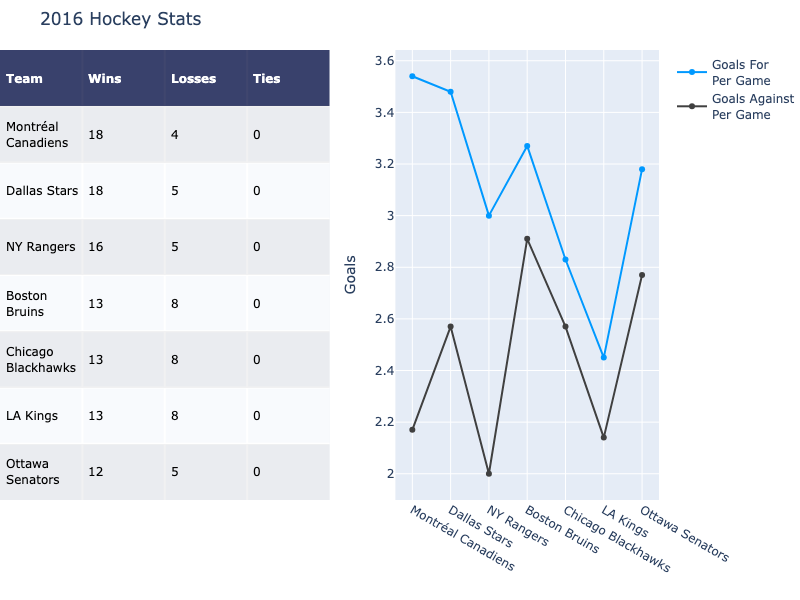
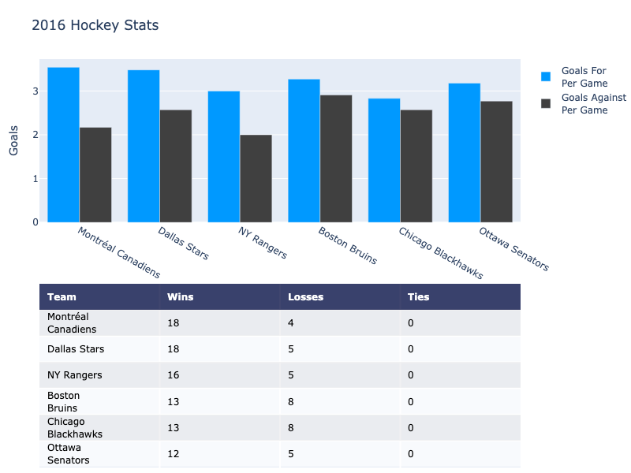

---
jupyter:
  jupytext:
    notebook_metadata_filter: all
    text_representation:
      extension: .md
      format_name: markdown
      format_version: '1.1'
      jupytext_version: 1.1.6
  kernelspec:
    display_name: Python 3
    language: python
    name: python3
  language_info:
    codemirror_mode:
      name: ipython
      version: 3
    file_extension: .py
    mimetype: text/x-python
    name: python
    nbconvert_exporter: python
    pygments_lexer: ipython3
    version: 3.7.3
  plotly:
    description: Subplots with Plotly Figure Factory Charts
    display_as: multiple_axes
    language: python
    layout: base
    name: Figure Factory Subplots
    order: 4
    page_type: example_index
    permalink: python/figure-factory-subplots/
    thumbnail: thumbnail/ff-subplots.jpg
---

#### Plotly's Figure Factory Module

Plotly's Python API contains a [figure factory module](../figure-factories/) which includes many wrapper functions that create unique chart types that are not yet included in [plotly.js](https://github.com/plotly/plotly.js), Plotly's open-source graphing library. The figure factory functions create a full figure, so some Plotly features, such as subplotting, should be implemented slightly differently with these charts.


#### Vertical Figure Factory Charts
First create the figures that you'd like to appear in the subplot:

```python
import plotly.figure_factory as ff
import plotly.graph_objects as go

import numpy as np

## Create first figure
x1,y1 = np.meshgrid(np.arange(0, 2, .2), np.arange(0, 2, .2))
u1 = np.cos(x1)*y1
v1 = np.sin(x1)*y1

fig1 = ff.create_quiver(x1, y1, u1, v1, name='Quiver')

## Create second figure
x = np.linspace(-3, 3, 100)
y = np.linspace(-3, 3, 100)
Y, X = np.meshgrid(x, y)
u = -1 - X**2 + Y
v = 1 + X - Y**2

fig2 = ff.create_streamline(x, y, u, v, arrow_scale=.1, name='Streamline')
```

Edit the figures' x and y axes attributes to create subplots:

```python
for i in range(len(fig1.data)):
    fig1.data[i].xaxis='x1'
    fig1.data[i].yaxis='y1'

fig1.layout.xaxis1.update({'anchor': 'y1'})
fig1.layout.yaxis1.update({'anchor': 'x1', 'domain': [.55, 1]})

for i in range(len(fig2.data)):
    fig2.data[i].xaxis='x2'
    fig2.data[i].yaxis='y2'

# initialize xaxis2 and yaxis2
fig2['layout']['xaxis2'] = {}
fig2['layout']['yaxis2'] = {}

fig2.layout.xaxis2.update({'anchor': 'y2'})
fig2.layout.yaxis2.update({'anchor': 'x2', 'domain': [0, .45]})
```

**Error:**
```
Error executing code: name 'fig1' is not defined
Traceback (most recent call last):
  File "/Users/gvwilson/plotly.py/bin/run_markdown.py", line 236, in _run_code
    exec(code, exec_globals)
  File "<string>", line 1, in <module>
NameError: name 'fig1' is not defined
```

Combine the data and layout objects to create a figure

```python
fig = go.Figure()
fig.add_traces([fig1.data[0], fig2.data[0]])

fig.layout.update(fig1.layout)
fig.layout.update(fig2.layout)

fig.show()
```

**Error:**
```
Error executing code: name 'go' is not defined
Traceback (most recent call last):
  File "/Users/gvwilson/plotly.py/bin/run_markdown.py", line 236, in _run_code
    exec(code, exec_globals)
  File "<string>", line 1, in <module>
NameError: name 'go' is not defined
```

#### Horizontal Table and Chart

```python
import plotly.graph_objects as go
import plotly.figure_factory as ff

table_data = [['Team', 'Wins', 'Losses', 'Ties'],
              ['Montréal<br>Canadiens', 18, 4, 0],
              ['Dallas Stars', 18, 5, 0],
              ['NY Rangers', 16, 5, 0],
              ['Boston<br>Bruins', 13, 8, 0],
              ['Chicago<br>Blackhawks', 13, 8, 0],
              ['LA Kings', 13, 8, 0],
              ['Ottawa<br>Senators', 12, 5, 0]]

fig = ff.create_table(table_data, height_constant=60)

teams = ['Montréal Canadiens', 'Dallas Stars', 'NY Rangers',
         'Boston Bruins', 'Chicago Blackhawks', 'LA Kings', 'Ottawa Senators']
GFPG = [3.54, 3.48, 3.0, 3.27, 2.83, 2.45, 3.18]
GAPG = [2.17, 2.57, 2.0, 2.91, 2.57, 2.14, 2.77]

trace1 = go.Scatter(x=teams, y=GFPG,
                    marker=dict(color='#0099ff'),
                    name='Goals For<br>Per Game',
                    xaxis='x2', yaxis='y2')
trace2 = go.Scatter(x=teams, y=GAPG,
                    marker=dict(color='#404040'),
                    name='Goals Against<br>Per Game',
                    xaxis='x2', yaxis='y2')

fig.add_traces([trace1, trace2])

# initialize xaxis2 and yaxis2
fig['layout']['xaxis2'] = {}
fig['layout']['yaxis2'] = {}

# Edit layout for subplots
fig.layout.xaxis.update({'domain': [0, .5]})
fig.layout.xaxis2.update({'domain': [0.6, 1.]})

# The graph's yaxis MUST BE anchored to the graph's xaxis
fig.layout.yaxis2.update({'anchor': 'x2'})
fig.layout.yaxis2.update({'title': 'Goals'})

# Update the margins to add a title and see graph x-labels.
fig.layout.margin.update({'t':50, 'b':100})
fig.layout.update({'title': '2016 Hockey Stats'})

fig.show()
```



**Interactive Plot:**

<div>                        <script type="text/javascript">window.PlotlyConfig = {MathJaxConfig: 'local'};</script>
        <script charset="utf-8" src="https://cdn.plot.ly/plotly-3.1.0.min.js" integrity="sha256-Ei4740bWZhaUTQuD6q9yQlgVCMPBz6CZWhevDYPv93A=" crossorigin="anonymous"></script>                <div id="plotly-div-1" class="plotly-graph-div" style="height:530px; width:100%;"></div>            <script type="text/javascript">                window.PLOTLYENV=window.PLOTLYENV || {};                                if (document.getElementById("plotly-div-1")) {                    Plotly.newPlot(                        "plotly-div-1",                        [{"colorscale":[[0,"#00083e"],[0.5,"#ededee"],[1,"#ffffff"]],"hoverinfo":"none","opacity":0.75,"showscale":false,"z":[[0,0,0,0],[0.5,0.5,0.5,0.5],[1,1,1,1],[0.5,0.5,0.5,0.5],[1,1,1,1],[0.5,0.5,0.5,0.5],[1,1,1,1],[0.5,0.5,0.5,0.5]],"type":"heatmap"},{"marker":{"color":"#0099ff"},"name":"Goals For\u003cbr\u003ePer Game","x":["Montréal Canadiens","Dallas Stars","NY Rangers","Boston Bruins","Chicago Blackhawks","LA Kings","Ottawa Senators"],"xaxis":"x2","y":[3.54,3.48,3.0,3.27,2.83,2.45,3.18],"yaxis":"y2","type":"scatter"},{"marker":{"color":"#404040"},"name":"Goals Against\u003cbr\u003ePer Game","x":["Montréal Canadiens","Dallas Stars","NY Rangers","Boston Bruins","Chicago Blackhawks","LA Kings","Ottawa Senators"],"xaxis":"x2","y":[2.17,2.57,2.0,2.91,2.57,2.14,2.77],"yaxis":"y2","type":"scatter"}],                        {"annotations":[{"align":"left","font":{"color":"#ffffff"},"showarrow":false,"text":"\u003cb\u003eTeam\u003c\u002fb\u003e","x":-0.45,"xanchor":"left","xref":"x","y":0,"yref":"y"},{"align":"left","font":{"color":"#ffffff"},"showarrow":false,"text":"\u003cb\u003eWins\u003c\u002fb\u003e","x":0.55,"xanchor":"left","xref":"x","y":0,"yref":"y"},{"align":"left","font":{"color":"#ffffff"},"showarrow":false,"text":"\u003cb\u003eLosses\u003c\u002fb\u003e","x":1.55,"xanchor":"left","xref":"x","y":0,"yref":"y"},{"align":"left","font":{"color":"#ffffff"},"showarrow":false,"text":"\u003cb\u003eTies\u003c\u002fb\u003e","x":2.55,"xanchor":"left","xref":"x","y":0,"yref":"y"},{"align":"left","font":{"color":"#000000"},"showarrow":false,"text":"Montréal\u003cbr\u003eCanadiens","x":-0.45,"xanchor":"left","xref":"x","y":1,"yref":"y"},{"align":"left","font":{"color":"#000000"},"showarrow":false,"text":"18","x":0.55,"xanchor":"left","xref":"x","y":1,"yref":"y"},{"align":"left","font":{"color":"#000000"},"showarrow":false,"text":"4","x":1.55,"xanchor":"left","xref":"x","y":1,"yref":"y"},{"align":"left","font":{"color":"#000000"},"showarrow":false,"text":"0","x":2.55,"xanchor":"left","xref":"x","y":1,"yref":"y"},{"align":"left","font":{"color":"#000000"},"showarrow":false,"text":"Dallas Stars","x":-0.45,"xanchor":"left","xref":"x","y":2,"yref":"y"},{"align":"left","font":{"color":"#000000"},"showarrow":false,"text":"18","x":0.55,"xanchor":"left","xref":"x","y":2,"yref":"y"},{"align":"left","font":{"color":"#000000"},"showarrow":false,"text":"5","x":1.55,"xanchor":"left","xref":"x","y":2,"yref":"y"},{"align":"left","font":{"color":"#000000"},"showarrow":false,"text":"0","x":2.55,"xanchor":"left","xref":"x","y":2,"yref":"y"},{"align":"left","font":{"color":"#000000"},"showarrow":false,"text":"NY Rangers","x":-0.45,"xanchor":"left","xref":"x","y":3,"yref":"y"},{"align":"left","font":{"color":"#000000"},"showarrow":false,"text":"16","x":0.55,"xanchor":"left","xref":"x","y":3,"yref":"y"},{"align":"left","font":{"color":"#000000"},"showarrow":false,"text":"5","x":1.55,"xanchor":"left","xref":"x","y":3,"yref":"y"},{"align":"left","font":{"color":"#000000"},"showarrow":false,"text":"0","x":2.55,"xanchor":"left","xref":"x","y":3,"yref":"y"},{"align":"left","font":{"color":"#000000"},"showarrow":false,"text":"Boston\u003cbr\u003eBruins","x":-0.45,"xanchor":"left","xref":"x","y":4,"yref":"y"},{"align":"left","font":{"color":"#000000"},"showarrow":false,"text":"13","x":0.55,"xanchor":"left","xref":"x","y":4,"yref":"y"},{"align":"left","font":{"color":"#000000"},"showarrow":false,"text":"8","x":1.55,"xanchor":"left","xref":"x","y":4,"yref":"y"},{"align":"left","font":{"color":"#000000"},"showarrow":false,"text":"0","x":2.55,"xanchor":"left","xref":"x","y":4,"yref":"y"},{"align":"left","font":{"color":"#000000"},"showarrow":false,"text":"Chicago\u003cbr\u003eBlackhawks","x":-0.45,"xanchor":"left","xref":"x","y":5,"yref":"y"},{"align":"left","font":{"color":"#000000"},"showarrow":false,"text":"13","x":0.55,"xanchor":"left","xref":"x","y":5,"yref":"y"},{"align":"left","font":{"color":"#000000"},"showarrow":false,"text":"8","x":1.55,"xanchor":"left","xref":"x","y":5,"yref":"y"},{"align":"left","font":{"color":"#000000"},"showarrow":false,"text":"0","x":2.55,"xanchor":"left","xref":"x","y":5,"yref":"y"},{"align":"left","font":{"color":"#000000"},"showarrow":false,"text":"LA Kings","x":-0.45,"xanchor":"left","xref":"x","y":6,"yref":"y"},{"align":"left","font":{"color":"#000000"},"showarrow":false,"text":"13","x":0.55,"xanchor":"left","xref":"x","y":6,"yref":"y"},{"align":"left","font":{"color":"#000000"},"showarrow":false,"text":"8","x":1.55,"xanchor":"left","xref":"x","y":6,"yref":"y"},{"align":"left","font":{"color":"#000000"},"showarrow":false,"text":"0","x":2.55,"xanchor":"left","xref":"x","y":6,"yref":"y"},{"align":"left","font":{"color":"#000000"},"showarrow":false,"text":"Ottawa\u003cbr\u003eSenators","x":-0.45,"xanchor":"left","xref":"x","y":7,"yref":"y"},{"align":"left","font":{"color":"#000000"},"showarrow":false,"text":"12","x":0.55,"xanchor":"left","xref":"x","y":7,"yref":"y"},{"align":"left","font":{"color":"#000000"},"showarrow":false,"text":"5","x":1.55,"xanchor":"left","xref":"x","y":7,"yref":"y"},{"align":"left","font":{"color":"#000000"},"showarrow":false,"text":"0","x":2.55,"xanchor":"left","xref":"x","y":7,"yref":"y"}],"height":530,"margin":{"b":100,"l":0,"r":0,"t":50},"xaxis":{"dtick":1,"gridwidth":2,"showticklabels":false,"tick0":-0.5,"ticks":"","zeroline":false,"domain":[0,0.5]},"yaxis":{"autorange":"reversed","dtick":1,"gridwidth":2,"showticklabels":false,"tick0":0.5,"ticks":"","zeroline":false},"template":{"data":{"histogram2dcontour":[{"type":"histogram2dcontour","colorbar":{"outlinewidth":0,"ticks":""},"colorscale":[[0.0,"#0d0887"],[0.1111111111111111,"#46039f"],[0.2222222222222222,"#7201a8"],[0.3333333333333333,"#9c179e"],[0.4444444444444444,"#bd3786"],[0.5555555555555556,"#d8576b"],[0.6666666666666666,"#ed7953"],[0.7777777777777778,"#fb9f3a"],[0.8888888888888888,"#fdca26"],[1.0,"#f0f921"]]}],"choropleth":[{"type":"choropleth","colorbar":{"outlinewidth":0,"ticks":""}}],"histogram2d":[{"type":"histogram2d","colorbar":{"outlinewidth":0,"ticks":""},"colorscale":[[0.0,"#0d0887"],[0.1111111111111111,"#46039f"],[0.2222222222222222,"#7201a8"],[0.3333333333333333,"#9c179e"],[0.4444444444444444,"#bd3786"],[0.5555555555555556,"#d8576b"],[0.6666666666666666,"#ed7953"],[0.7777777777777778,"#fb9f3a"],[0.8888888888888888,"#fdca26"],[1.0,"#f0f921"]]}],"heatmap":[{"type":"heatmap","colorbar":{"outlinewidth":0,"ticks":""},"colorscale":[[0.0,"#0d0887"],[0.1111111111111111,"#46039f"],[0.2222222222222222,"#7201a8"],[0.3333333333333333,"#9c179e"],[0.4444444444444444,"#bd3786"],[0.5555555555555556,"#d8576b"],[0.6666666666666666,"#ed7953"],[0.7777777777777778,"#fb9f3a"],[0.8888888888888888,"#fdca26"],[1.0,"#f0f921"]]}],"contourcarpet":[{"type":"contourcarpet","colorbar":{"outlinewidth":0,"ticks":""}}],"contour":[{"type":"contour","colorbar":{"outlinewidth":0,"ticks":""},"colorscale":[[0.0,"#0d0887"],[0.1111111111111111,"#46039f"],[0.2222222222222222,"#7201a8"],[0.3333333333333333,"#9c179e"],[0.4444444444444444,"#bd3786"],[0.5555555555555556,"#d8576b"],[0.6666666666666666,"#ed7953"],[0.7777777777777778,"#fb9f3a"],[0.8888888888888888,"#fdca26"],[1.0,"#f0f921"]]}],"surface":[{"type":"surface","colorbar":{"outlinewidth":0,"ticks":""},"colorscale":[[0.0,"#0d0887"],[0.1111111111111111,"#46039f"],[0.2222222222222222,"#7201a8"],[0.3333333333333333,"#9c179e"],[0.4444444444444444,"#bd3786"],[0.5555555555555556,"#d8576b"],[0.6666666666666666,"#ed7953"],[0.7777777777777778,"#fb9f3a"],[0.8888888888888888,"#fdca26"],[1.0,"#f0f921"]]}],"mesh3d":[{"type":"mesh3d","colorbar":{"outlinewidth":0,"ticks":""}}],"scatter":[{"fillpattern":{"fillmode":"overlay","size":10,"solidity":0.2},"type":"scatter"}],"parcoords":[{"type":"parcoords","line":{"colorbar":{"outlinewidth":0,"ticks":""}}}],"scatterpolargl":[{"type":"scatterpolargl","marker":{"colorbar":{"outlinewidth":0,"ticks":""}}}],"bar":[{"error_x":{"color":"#2a3f5f"},"error_y":{"color":"#2a3f5f"},"marker":{"line":{"color":"#E5ECF6","width":0.5},"pattern":{"fillmode":"overlay","size":10,"solidity":0.2}},"type":"bar"}],"scattergeo":[{"type":"scattergeo","marker":{"colorbar":{"outlinewidth":0,"ticks":""}}}],"scatterpolar":[{"type":"scatterpolar","marker":{"colorbar":{"outlinewidth":0,"ticks":""}}}],"histogram":[{"marker":{"pattern":{"fillmode":"overlay","size":10,"solidity":0.2}},"type":"histogram"}],"scattergl":[{"type":"scattergl","marker":{"colorbar":{"outlinewidth":0,"ticks":""}}}],"scatter3d":[{"type":"scatter3d","line":{"colorbar":{"outlinewidth":0,"ticks":""}},"marker":{"colorbar":{"outlinewidth":0,"ticks":""}}}],"scattermap":[{"type":"scattermap","marker":{"colorbar":{"outlinewidth":0,"ticks":""}}}],"scattermapbox":[{"type":"scattermapbox","marker":{"colorbar":{"outlinewidth":0,"ticks":""}}}],"scatterternary":[{"type":"scatterternary","marker":{"colorbar":{"outlinewidth":0,"ticks":""}}}],"scattercarpet":[{"type":"scattercarpet","marker":{"colorbar":{"outlinewidth":0,"ticks":""}}}],"carpet":[{"aaxis":{"endlinecolor":"#2a3f5f","gridcolor":"white","linecolor":"white","minorgridcolor":"white","startlinecolor":"#2a3f5f"},"baxis":{"endlinecolor":"#2a3f5f","gridcolor":"white","linecolor":"white","minorgridcolor":"white","startlinecolor":"#2a3f5f"},"type":"carpet"}],"table":[{"cells":{"fill":{"color":"#EBF0F8"},"line":{"color":"white"}},"header":{"fill":{"color":"#C8D4E3"},"line":{"color":"white"}},"type":"table"}],"barpolar":[{"marker":{"line":{"color":"#E5ECF6","width":0.5},"pattern":{"fillmode":"overlay","size":10,"solidity":0.2}},"type":"barpolar"}],"pie":[{"automargin":true,"type":"pie"}]},"layout":{"autotypenumbers":"strict","colorway":["#636efa","#EF553B","#00cc96","#ab63fa","#FFA15A","#19d3f3","#FF6692","#B6E880","#FF97FF","#FECB52"],"font":{"color":"#2a3f5f"},"hovermode":"closest","hoverlabel":{"align":"left"},"paper_bgcolor":"white","plot_bgcolor":"#E5ECF6","polar":{"bgcolor":"#E5ECF6","angularaxis":{"gridcolor":"white","linecolor":"white","ticks":""},"radialaxis":{"gridcolor":"white","linecolor":"white","ticks":""}},"ternary":{"bgcolor":"#E5ECF6","aaxis":{"gridcolor":"white","linecolor":"white","ticks":""},"baxis":{"gridcolor":"white","linecolor":"white","ticks":""},"caxis":{"gridcolor":"white","linecolor":"white","ticks":""}},"coloraxis":{"colorbar":{"outlinewidth":0,"ticks":""}},"colorscale":{"sequential":[[0.0,"#0d0887"],[0.1111111111111111,"#46039f"],[0.2222222222222222,"#7201a8"],[0.3333333333333333,"#9c179e"],[0.4444444444444444,"#bd3786"],[0.5555555555555556,"#d8576b"],[0.6666666666666666,"#ed7953"],[0.7777777777777778,"#fb9f3a"],[0.8888888888888888,"#fdca26"],[1.0,"#f0f921"]],"sequentialminus":[[0.0,"#0d0887"],[0.1111111111111111,"#46039f"],[0.2222222222222222,"#7201a8"],[0.3333333333333333,"#9c179e"],[0.4444444444444444,"#bd3786"],[0.5555555555555556,"#d8576b"],[0.6666666666666666,"#ed7953"],[0.7777777777777778,"#fb9f3a"],[0.8888888888888888,"#fdca26"],[1.0,"#f0f921"]],"diverging":[[0,"#8e0152"],[0.1,"#c51b7d"],[0.2,"#de77ae"],[0.3,"#f1b6da"],[0.4,"#fde0ef"],[0.5,"#f7f7f7"],[0.6,"#e6f5d0"],[0.7,"#b8e186"],[0.8,"#7fbc41"],[0.9,"#4d9221"],[1,"#276419"]]},"xaxis":{"gridcolor":"white","linecolor":"white","ticks":"","title":{"standoff":15},"zerolinecolor":"white","automargin":true,"zerolinewidth":2},"yaxis":{"gridcolor":"white","linecolor":"white","ticks":"","title":{"standoff":15},"zerolinecolor":"white","automargin":true,"zerolinewidth":2},"scene":{"xaxis":{"backgroundcolor":"#E5ECF6","gridcolor":"white","linecolor":"white","showbackground":true,"ticks":"","zerolinecolor":"white","gridwidth":2},"yaxis":{"backgroundcolor":"#E5ECF6","gridcolor":"white","linecolor":"white","showbackground":true,"ticks":"","zerolinecolor":"white","gridwidth":2},"zaxis":{"backgroundcolor":"#E5ECF6","gridcolor":"white","linecolor":"white","showbackground":true,"ticks":"","zerolinecolor":"white","gridwidth":2}},"shapedefaults":{"line":{"color":"#2a3f5f"}},"annotationdefaults":{"arrowcolor":"#2a3f5f","arrowhead":0,"arrowwidth":1},"geo":{"bgcolor":"white","landcolor":"#E5ECF6","subunitcolor":"white","showland":true,"showlakes":true,"lakecolor":"white"},"title":{"x":0.05},"mapbox":{"style":"light"}}},"xaxis2":{"domain":[0.6,1.0]},"yaxis2":{"anchor":"x2","title":{"text":"Goals"}},"title":{"text":"2016 Hockey Stats"}},                        {"responsive": true}                    )                };            </script>        </div>

#### Vertical Table and Chart

```python
import plotly.graph_objects as go
import plotly.figure_factory as ff

# Add table data
table_data = [['Team', 'Wins', 'Losses', 'Ties'],
              ['Montréal<br>Canadiens', 18, 4, 0],
              ['Dallas Stars', 18, 5, 0],
              ['NY Rangers', 16, 5, 0],
              ['Boston<br>Bruins', 13, 8, 0],
              ['Chicago<br>Blackhawks', 13, 8, 0],
              ['Ottawa<br>Senators', 12, 5, 0]]

# Initialize a figure with ff.create_table(table_data)
fig = ff.create_table(table_data, height_constant=60)

# Add graph data
teams = ['Montréal Canadiens', 'Dallas Stars', 'NY Rangers',
         'Boston Bruins', 'Chicago Blackhawks', 'Ottawa Senators']
GFPG = [3.54, 3.48, 3.0, 3.27, 2.83, 3.18]
GAPG = [2.17, 2.57, 2.0, 2.91, 2.57, 2.77]

# Make traces for graph
trace1 = go.Bar(x=teams, y=GFPG, xaxis='x2', yaxis='y2',
                marker=dict(color='#0099ff'),
                name='Goals For<br>Per Game')
trace2 = go.Bar(x=teams, y=GAPG, xaxis='x2', yaxis='y2',
                marker=dict(color='#404040'),
                name='Goals Against<br>Per Game')

# Add trace data to figure
fig.add_traces([trace1, trace2])

# initialize xaxis2 and yaxis2
fig['layout']['xaxis2'] = {}
fig['layout']['yaxis2'] = {}

# Edit layout for subplots
fig.layout.yaxis.update({'domain': [0, .45]})
fig.layout.yaxis2.update({'domain': [.6, 1]})

# The graph's yaxis2 MUST BE anchored to the graph's xaxis2 and vice versa
fig.layout.yaxis2.update({'anchor': 'x2'})
fig.layout.xaxis2.update({'anchor': 'y2'})
fig.layout.yaxis2.update({'title': 'Goals'})

# Update the margins to add a title and see graph x-labels.
fig.layout.margin.update({'t':75, 'l':50})
fig.layout.update({'title': '2016 Hockey Stats'})

# Update the height because adding a graph vertically will interact with
# the plot height calculated for the table
fig.layout.update({'height':800})

# Plot!
fig.show()
```



**Interactive Plot:**

<div>                        <script type="text/javascript">window.PlotlyConfig = {MathJaxConfig: 'local'};</script>
        <script charset="utf-8" src="https://cdn.plot.ly/plotly-3.1.0.min.js" integrity="sha256-Ei4740bWZhaUTQuD6q9yQlgVCMPBz6CZWhevDYPv93A=" crossorigin="anonymous"></script>                <div id="plotly-div-2" class="plotly-graph-div" style="height:800px; width:100%;"></div>            <script type="text/javascript">                window.PLOTLYENV=window.PLOTLYENV || {};                                if (document.getElementById("plotly-div-2")) {                    Plotly.newPlot(                        "plotly-div-2",                        [{"colorscale":[[0,"#00083e"],[0.5,"#ededee"],[1,"#ffffff"]],"hoverinfo":"none","opacity":0.75,"showscale":false,"z":[[0,0,0,0],[0.5,0.5,0.5,0.5],[1,1,1,1],[0.5,0.5,0.5,0.5],[1,1,1,1],[0.5,0.5,0.5,0.5],[1,1,1,1]],"type":"heatmap"},{"marker":{"color":"#0099ff"},"name":"Goals For\u003cbr\u003ePer Game","x":["Montréal Canadiens","Dallas Stars","NY Rangers","Boston Bruins","Chicago Blackhawks","Ottawa Senators"],"xaxis":"x2","y":[3.54,3.48,3.0,3.27,2.83,3.18],"yaxis":"y2","type":"bar"},{"marker":{"color":"#404040"},"name":"Goals Against\u003cbr\u003ePer Game","x":["Montréal Canadiens","Dallas Stars","NY Rangers","Boston Bruins","Chicago Blackhawks","Ottawa Senators"],"xaxis":"x2","y":[2.17,2.57,2.0,2.91,2.57,2.77],"yaxis":"y2","type":"bar"}],                        {"annotations":[{"align":"left","font":{"color":"#ffffff"},"showarrow":false,"text":"\u003cb\u003eTeam\u003c\u002fb\u003e","x":-0.45,"xanchor":"left","xref":"x","y":0,"yref":"y"},{"align":"left","font":{"color":"#ffffff"},"showarrow":false,"text":"\u003cb\u003eWins\u003c\u002fb\u003e","x":0.55,"xanchor":"left","xref":"x","y":0,"yref":"y"},{"align":"left","font":{"color":"#ffffff"},"showarrow":false,"text":"\u003cb\u003eLosses\u003c\u002fb\u003e","x":1.55,"xanchor":"left","xref":"x","y":0,"yref":"y"},{"align":"left","font":{"color":"#ffffff"},"showarrow":false,"text":"\u003cb\u003eTies\u003c\u002fb\u003e","x":2.55,"xanchor":"left","xref":"x","y":0,"yref":"y"},{"align":"left","font":{"color":"#000000"},"showarrow":false,"text":"Montréal\u003cbr\u003eCanadiens","x":-0.45,"xanchor":"left","xref":"x","y":1,"yref":"y"},{"align":"left","font":{"color":"#000000"},"showarrow":false,"text":"18","x":0.55,"xanchor":"left","xref":"x","y":1,"yref":"y"},{"align":"left","font":{"color":"#000000"},"showarrow":false,"text":"4","x":1.55,"xanchor":"left","xref":"x","y":1,"yref":"y"},{"align":"left","font":{"color":"#000000"},"showarrow":false,"text":"0","x":2.55,"xanchor":"left","xref":"x","y":1,"yref":"y"},{"align":"left","font":{"color":"#000000"},"showarrow":false,"text":"Dallas Stars","x":-0.45,"xanchor":"left","xref":"x","y":2,"yref":"y"},{"align":"left","font":{"color":"#000000"},"showarrow":false,"text":"18","x":0.55,"xanchor":"left","xref":"x","y":2,"yref":"y"},{"align":"left","font":{"color":"#000000"},"showarrow":false,"text":"5","x":1.55,"xanchor":"left","xref":"x","y":2,"yref":"y"},{"align":"left","font":{"color":"#000000"},"showarrow":false,"text":"0","x":2.55,"xanchor":"left","xref":"x","y":2,"yref":"y"},{"align":"left","font":{"color":"#000000"},"showarrow":false,"text":"NY Rangers","x":-0.45,"xanchor":"left","xref":"x","y":3,"yref":"y"},{"align":"left","font":{"color":"#000000"},"showarrow":false,"text":"16","x":0.55,"xanchor":"left","xref":"x","y":3,"yref":"y"},{"align":"left","font":{"color":"#000000"},"showarrow":false,"text":"5","x":1.55,"xanchor":"left","xref":"x","y":3,"yref":"y"},{"align":"left","font":{"color":"#000000"},"showarrow":false,"text":"0","x":2.55,"xanchor":"left","xref":"x","y":3,"yref":"y"},{"align":"left","font":{"color":"#000000"},"showarrow":false,"text":"Boston\u003cbr\u003eBruins","x":-0.45,"xanchor":"left","xref":"x","y":4,"yref":"y"},{"align":"left","font":{"color":"#000000"},"showarrow":false,"text":"13","x":0.55,"xanchor":"left","xref":"x","y":4,"yref":"y"},{"align":"left","font":{"color":"#000000"},"showarrow":false,"text":"8","x":1.55,"xanchor":"left","xref":"x","y":4,"yref":"y"},{"align":"left","font":{"color":"#000000"},"showarrow":false,"text":"0","x":2.55,"xanchor":"left","xref":"x","y":4,"yref":"y"},{"align":"left","font":{"color":"#000000"},"showarrow":false,"text":"Chicago\u003cbr\u003eBlackhawks","x":-0.45,"xanchor":"left","xref":"x","y":5,"yref":"y"},{"align":"left","font":{"color":"#000000"},"showarrow":false,"text":"13","x":0.55,"xanchor":"left","xref":"x","y":5,"yref":"y"},{"align":"left","font":{"color":"#000000"},"showarrow":false,"text":"8","x":1.55,"xanchor":"left","xref":"x","y":5,"yref":"y"},{"align":"left","font":{"color":"#000000"},"showarrow":false,"text":"0","x":2.55,"xanchor":"left","xref":"x","y":5,"yref":"y"},{"align":"left","font":{"color":"#000000"},"showarrow":false,"text":"Ottawa\u003cbr\u003eSenators","x":-0.45,"xanchor":"left","xref":"x","y":6,"yref":"y"},{"align":"left","font":{"color":"#000000"},"showarrow":false,"text":"12","x":0.55,"xanchor":"left","xref":"x","y":6,"yref":"y"},{"align":"left","font":{"color":"#000000"},"showarrow":false,"text":"5","x":1.55,"xanchor":"left","xref":"x","y":6,"yref":"y"},{"align":"left","font":{"color":"#000000"},"showarrow":false,"text":"0","x":2.55,"xanchor":"left","xref":"x","y":6,"yref":"y"}],"height":800,"margin":{"b":0,"l":50,"r":0,"t":75},"xaxis":{"dtick":1,"gridwidth":2,"showticklabels":false,"tick0":-0.5,"ticks":"","zeroline":false},"yaxis":{"autorange":"reversed","dtick":1,"gridwidth":2,"showticklabels":false,"tick0":0.5,"ticks":"","zeroline":false,"domain":[0,0.45]},"template":{"data":{"histogram2dcontour":[{"type":"histogram2dcontour","colorbar":{"outlinewidth":0,"ticks":""},"colorscale":[[0.0,"#0d0887"],[0.1111111111111111,"#46039f"],[0.2222222222222222,"#7201a8"],[0.3333333333333333,"#9c179e"],[0.4444444444444444,"#bd3786"],[0.5555555555555556,"#d8576b"],[0.6666666666666666,"#ed7953"],[0.7777777777777778,"#fb9f3a"],[0.8888888888888888,"#fdca26"],[1.0,"#f0f921"]]}],"choropleth":[{"type":"choropleth","colorbar":{"outlinewidth":0,"ticks":""}}],"histogram2d":[{"type":"histogram2d","colorbar":{"outlinewidth":0,"ticks":""},"colorscale":[[0.0,"#0d0887"],[0.1111111111111111,"#46039f"],[0.2222222222222222,"#7201a8"],[0.3333333333333333,"#9c179e"],[0.4444444444444444,"#bd3786"],[0.5555555555555556,"#d8576b"],[0.6666666666666666,"#ed7953"],[0.7777777777777778,"#fb9f3a"],[0.8888888888888888,"#fdca26"],[1.0,"#f0f921"]]}],"heatmap":[{"type":"heatmap","colorbar":{"outlinewidth":0,"ticks":""},"colorscale":[[0.0,"#0d0887"],[0.1111111111111111,"#46039f"],[0.2222222222222222,"#7201a8"],[0.3333333333333333,"#9c179e"],[0.4444444444444444,"#bd3786"],[0.5555555555555556,"#d8576b"],[0.6666666666666666,"#ed7953"],[0.7777777777777778,"#fb9f3a"],[0.8888888888888888,"#fdca26"],[1.0,"#f0f921"]]}],"contourcarpet":[{"type":"contourcarpet","colorbar":{"outlinewidth":0,"ticks":""}}],"contour":[{"type":"contour","colorbar":{"outlinewidth":0,"ticks":""},"colorscale":[[0.0,"#0d0887"],[0.1111111111111111,"#46039f"],[0.2222222222222222,"#7201a8"],[0.3333333333333333,"#9c179e"],[0.4444444444444444,"#bd3786"],[0.5555555555555556,"#d8576b"],[0.6666666666666666,"#ed7953"],[0.7777777777777778,"#fb9f3a"],[0.8888888888888888,"#fdca26"],[1.0,"#f0f921"]]}],"surface":[{"type":"surface","colorbar":{"outlinewidth":0,"ticks":""},"colorscale":[[0.0,"#0d0887"],[0.1111111111111111,"#46039f"],[0.2222222222222222,"#7201a8"],[0.3333333333333333,"#9c179e"],[0.4444444444444444,"#bd3786"],[0.5555555555555556,"#d8576b"],[0.6666666666666666,"#ed7953"],[0.7777777777777778,"#fb9f3a"],[0.8888888888888888,"#fdca26"],[1.0,"#f0f921"]]}],"mesh3d":[{"type":"mesh3d","colorbar":{"outlinewidth":0,"ticks":""}}],"scatter":[{"fillpattern":{"fillmode":"overlay","size":10,"solidity":0.2},"type":"scatter"}],"parcoords":[{"type":"parcoords","line":{"colorbar":{"outlinewidth":0,"ticks":""}}}],"scatterpolargl":[{"type":"scatterpolargl","marker":{"colorbar":{"outlinewidth":0,"ticks":""}}}],"bar":[{"error_x":{"color":"#2a3f5f"},"error_y":{"color":"#2a3f5f"},"marker":{"line":{"color":"#E5ECF6","width":0.5},"pattern":{"fillmode":"overlay","size":10,"solidity":0.2}},"type":"bar"}],"scattergeo":[{"type":"scattergeo","marker":{"colorbar":{"outlinewidth":0,"ticks":""}}}],"scatterpolar":[{"type":"scatterpolar","marker":{"colorbar":{"outlinewidth":0,"ticks":""}}}],"histogram":[{"marker":{"pattern":{"fillmode":"overlay","size":10,"solidity":0.2}},"type":"histogram"}],"scattergl":[{"type":"scattergl","marker":{"colorbar":{"outlinewidth":0,"ticks":""}}}],"scatter3d":[{"type":"scatter3d","line":{"colorbar":{"outlinewidth":0,"ticks":""}},"marker":{"colorbar":{"outlinewidth":0,"ticks":""}}}],"scattermap":[{"type":"scattermap","marker":{"colorbar":{"outlinewidth":0,"ticks":""}}}],"scattermapbox":[{"type":"scattermapbox","marker":{"colorbar":{"outlinewidth":0,"ticks":""}}}],"scatterternary":[{"type":"scatterternary","marker":{"colorbar":{"outlinewidth":0,"ticks":""}}}],"scattercarpet":[{"type":"scattercarpet","marker":{"colorbar":{"outlinewidth":0,"ticks":""}}}],"carpet":[{"aaxis":{"endlinecolor":"#2a3f5f","gridcolor":"white","linecolor":"white","minorgridcolor":"white","startlinecolor":"#2a3f5f"},"baxis":{"endlinecolor":"#2a3f5f","gridcolor":"white","linecolor":"white","minorgridcolor":"white","startlinecolor":"#2a3f5f"},"type":"carpet"}],"table":[{"cells":{"fill":{"color":"#EBF0F8"},"line":{"color":"white"}},"header":{"fill":{"color":"#C8D4E3"},"line":{"color":"white"}},"type":"table"}],"barpolar":[{"marker":{"line":{"color":"#E5ECF6","width":0.5},"pattern":{"fillmode":"overlay","size":10,"solidity":0.2}},"type":"barpolar"}],"pie":[{"automargin":true,"type":"pie"}]},"layout":{"autotypenumbers":"strict","colorway":["#636efa","#EF553B","#00cc96","#ab63fa","#FFA15A","#19d3f3","#FF6692","#B6E880","#FF97FF","#FECB52"],"font":{"color":"#2a3f5f"},"hovermode":"closest","hoverlabel":{"align":"left"},"paper_bgcolor":"white","plot_bgcolor":"#E5ECF6","polar":{"bgcolor":"#E5ECF6","angularaxis":{"gridcolor":"white","linecolor":"white","ticks":""},"radialaxis":{"gridcolor":"white","linecolor":"white","ticks":""}},"ternary":{"bgcolor":"#E5ECF6","aaxis":{"gridcolor":"white","linecolor":"white","ticks":""},"baxis":{"gridcolor":"white","linecolor":"white","ticks":""},"caxis":{"gridcolor":"white","linecolor":"white","ticks":""}},"coloraxis":{"colorbar":{"outlinewidth":0,"ticks":""}},"colorscale":{"sequential":[[0.0,"#0d0887"],[0.1111111111111111,"#46039f"],[0.2222222222222222,"#7201a8"],[0.3333333333333333,"#9c179e"],[0.4444444444444444,"#bd3786"],[0.5555555555555556,"#d8576b"],[0.6666666666666666,"#ed7953"],[0.7777777777777778,"#fb9f3a"],[0.8888888888888888,"#fdca26"],[1.0,"#f0f921"]],"sequentialminus":[[0.0,"#0d0887"],[0.1111111111111111,"#46039f"],[0.2222222222222222,"#7201a8"],[0.3333333333333333,"#9c179e"],[0.4444444444444444,"#bd3786"],[0.5555555555555556,"#d8576b"],[0.6666666666666666,"#ed7953"],[0.7777777777777778,"#fb9f3a"],[0.8888888888888888,"#fdca26"],[1.0,"#f0f921"]],"diverging":[[0,"#8e0152"],[0.1,"#c51b7d"],[0.2,"#de77ae"],[0.3,"#f1b6da"],[0.4,"#fde0ef"],[0.5,"#f7f7f7"],[0.6,"#e6f5d0"],[0.7,"#b8e186"],[0.8,"#7fbc41"],[0.9,"#4d9221"],[1,"#276419"]]},"xaxis":{"gridcolor":"white","linecolor":"white","ticks":"","title":{"standoff":15},"zerolinecolor":"white","automargin":true,"zerolinewidth":2},"yaxis":{"gridcolor":"white","linecolor":"white","ticks":"","title":{"standoff":15},"zerolinecolor":"white","automargin":true,"zerolinewidth":2},"scene":{"xaxis":{"backgroundcolor":"#E5ECF6","gridcolor":"white","linecolor":"white","showbackground":true,"ticks":"","zerolinecolor":"white","gridwidth":2},"yaxis":{"backgroundcolor":"#E5ECF6","gridcolor":"white","linecolor":"white","showbackground":true,"ticks":"","zerolinecolor":"white","gridwidth":2},"zaxis":{"backgroundcolor":"#E5ECF6","gridcolor":"white","linecolor":"white","showbackground":true,"ticks":"","zerolinecolor":"white","gridwidth":2}},"shapedefaults":{"line":{"color":"#2a3f5f"}},"annotationdefaults":{"arrowcolor":"#2a3f5f","arrowhead":0,"arrowwidth":1},"geo":{"bgcolor":"white","landcolor":"#E5ECF6","subunitcolor":"white","showland":true,"showlakes":true,"lakecolor":"white"},"title":{"x":0.05},"mapbox":{"style":"light"}}},"yaxis2":{"domain":[0.6,1],"anchor":"x2","title":{"text":"Goals"}},"xaxis2":{"anchor":"y2"},"title":{"text":"2016 Hockey Stats"}},                        {"responsive": true}                    )                };            </script>        </div>

#### Reference
See https://plotly.com/python/subplots/ for more information on working with subplots. See https://plotly.com/python/reference/ for more information regarding chart attributes!
