---
jupyter:
  jupytext:
    notebook_metadata_filter: all
    text_representation:
      extension: .md
      format_name: markdown
      format_version: '1.3'
      jupytext_version: 1.16.4
  kernelspec:
    display_name: Python 3 (ipykernel)
    language: python
    name: python3
  language_info:
    codemirror_mode:
      name: ipython
      version: 3
    file_extension: .py
    mimetype: text/x-python
    name: python
    nbconvert_exporter: python
    pygments_lexer: ipython3
    version: 3.11.10
  plotly:
    description: How to make Histograms in Python with Plotly.
    display_as: statistical
    language: python
    layout: base
    name: Histograms
    order: 3
    page_type: example_index
    permalink: python/histograms/
    redirect_from:
    - /python/histogram-tutorial/
    - /python/histogram/
    thumbnail: thumbnail/histogram.jpg
---

<!-- #region -->
In statistics, a [histogram](https://en.wikipedia.org/wiki/Histogram) is representation of the distribution of numerical data, where the data are binned and the count for each bin is represented. More generally, in Plotly a histogram is an aggregated bar chart, with several possible aggregation functions (e.g. sum, average, count...) which can be used to visualize data on categorical and date axes as well as linear axes.


Alternatives to histogram plots for visualizing distributions include [violin plots](https://plotly.com/python/violin/), [box plots](https://plotly.com/python/box-plots/), [ECDF plots](https://plotly.com/python/ecdf-plots/) and [strip charts](https://plotly.com/python/strip-charts/).

> If you're looking instead for bar charts, i.e. representing *raw, unaggregated* data with rectangular
bar, go to the [Bar Chart tutorial](/python/bar-charts/).

## Histograms with Plotly Express

[Plotly Express](/python/plotly-express/) is the easy-to-use, high-level interface to Plotly, which [operates on a variety of types of data](/python/px-arguments/) and produces [easy-to-style figures](/python/styling-plotly-express/).
<!-- #endregion -->

```python
import plotly.express as px
df = px.data.tips()
fig = px.histogram(df, x="total_bill")
fig.show()
```

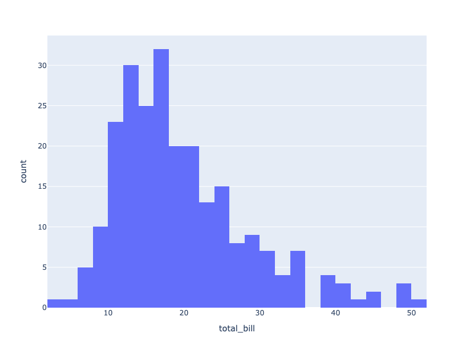

**Interactive Plot:**

<div>                        <script type="text/javascript">window.PlotlyConfig = {MathJaxConfig: 'local'};</script>
        <script charset="utf-8" src="https://cdn.plot.ly/plotly-3.1.0.min.js" integrity="sha256-Ei4740bWZhaUTQuD6q9yQlgVCMPBz6CZWhevDYPv93A=" crossorigin="anonymous"></script>                <div id="plotly-div-1" class="plotly-graph-div" style="height:100%; width:100%;"></div>            <script type="text/javascript">                window.PLOTLYENV=window.PLOTLYENV || {};                                if (document.getElementById("plotly-div-1")) {                    Plotly.newPlot(                        "plotly-div-1",                        [{"bingroup":"x","hovertemplate":"total_bill=%{x}\u003cbr\u003ecount=%{y}\u003cextra\u003e\u003c\u002fextra\u003e","legendgroup":"","marker":{"color":"#636efa","pattern":{"shape":""}},"name":"","orientation":"v","showlegend":false,"x":{"dtype":"f8","bdata":"PQrXo3D9MECuR+F6FK4kQMP1KFyPAjVArkfhehSuN0DXo3A9Cpc4QArXo3A9SjlACtejcD2KIUDhehSuR+E6QBSuR+F6FC5Aj8L1KFyPLUAK16NwPYokQOF6FK5HoUFA16NwPQrXLkCuR+F6FG4yQClcj8L1qC1AFK5H4XqUNUApXI\u002fC9agkQArXo3A9SjBAuB6F61H4MEBmZmZmZqY0QOxRuB6F6zFACtejcD1KNEAK16NwPYovQPYoXI\u002fCtUNAUrgehevRM0CPwvUoXM8xQD0K16NwvSpA4XoUrkdhKUAzMzMzM7M1QGZmZmZmpjNAmpmZmZkZI0CamZmZmVkyQB+F61G4Hi5AcT0K16OwNEBI4XoUrscxQI\u002fC9ShcDzhAj8L1KFxPMECuR+F6FO4wQHE9CtejsDJAhetRuB5FP0AK16NwPQowQPYoXI\u002fCdTFA4XoUrkfhK0Bcj8L1KFwjQGZmZmZmZj5ACtejcD1KMkB7FK5H4To2QDMzMzMzM0BAzczMzMyMPEAK16NwPQoyQBSuR+F6FClAFK5H4XqUJEBI4XoUrmdBQOF6FK5H4SNAj8L1KFyPOUA9CtejcH0zQOF6FK5HAUNAKVyPwvVoOkB7FK5H4XomQMP1KFyPIkhACtejcD1KNEAfhetRuJ4rQArXo3A9CiZACtejcD1KMkDXo3A9CpcxQBSuR+F6FDRAMzMzMzNzMECPwvUoXI8IQHsUrkfhOjRAhetRuB4FLkAK16NwPQooQFK4HoXrETFAXI\u002fC9SjcOkBI4XoUrkc5QPYoXI\u002fCdS1AhetRuB4FJUDsUbgehesxQDMzMzMzMztAw\u002fUoXI\u002fCNkAK16NwPUoxQHE9CtejcDNAKVyPwvWoMECkcD0K1yMkQNejcD0KV0BA9ihcj8L1L0AK16NwPWpBQI\u002fC9ShcDypASOF6FK5HMkD2KFyPwrU4QClcj8L1KDVAuB6F61H4PEA9CtejcH02QAAAAAAAABdAUrgehetRMEAAAAAAAMA2QPYoXI\u002fCFURASOF6FK5HO0CPwvUoXA8oQMP1KFyPAjVA7FG4HoXrKEAzMzMzM7MmQMP1KFyPwi5AZmZmZmYmRkDsUbgehWs2QOxRuB6F6zRAuB6F61G4LkA9CtejcH00QPYoXI\u002fCNTlAPQrXo3A9MkAfhetRuJ4sQAAAAAAAACxAAAAAAAAAHUApXI\u002fC9QhDQDMzMzMz8zdA9ihcj8K1OUCPwvUoXE8xQK5H4XoU7j1AzczMzMxMJUBcj8L1KNwoQBSuR+F6FDhA4XoUrkdhJ0DXo3A9CtcqQIXrUbgehSxAZmZmZmbmL0D2KFyPwvUoQM3MzMzMzD1ACtejcD0KIUAK16NwPQotQMP1KFyPwiZAUrgehevRNkAUrkfhehQzQIXrUbgeRTRA16NwPQpXJkCF61G4HoUoQMP1KFyPQjJAhetRuB4FIUApXI\u002fC9agkQM3MzMzMTCxAAAAAAAAAMEBSuB6F61EqQLgehetReDFAZmZmZmYmQUC4HoXrUZhEQM3MzMzMDDtArkfhehRuMEAzMzMzM7MgQKRwPQrXozJAPQrXo3C9J0CPwvUoXI8jQArXo3A9Ch5ApHA9CtcjLEDD9Shcj0IqQMP1KFyPQjFAzczMzMyMOECF61G4HsUzQJqZmZmZ2T1A9ihcj8IVSEAAAAAAAAA5QEjhehSuxypAPQrXo3B9MEAAAAAAAIA1QFK4HoXrUSlA9ihcj8I1MEAfhetRuJ4rQMP1KFyPgjFAhetRuB6FOEDD9Shcj8I0QPYoXI\u002fCtT9ArkfhehQuJUDD9Shcj0IlQEjhehSuZ0lAH4XrUbieL0AAAAAAAAAdQJqZmZmZ2T9AUrgehevRMEAzMzMzM3NAQKRwPQrX4zFA9ihcj8L1LEAzMzMzMzMjQHE9CtejUEFAMzMzMzNTQUAUrkfhelQ3QM3MzMzMrEZA7FG4HoUrN0BmZmZmZkZEQHE9CtejsDRAZmZmZmbmNED2KFyPwnU+QGZmZmZmJjJAmpmZmZkZN0DhehSuR2EvQI\u002fC9ShczzNAcT0K16NwPED2KFyPwvUuQBSuR+F6lDBAPQrXo3A9HkCuR+F6FK4kQK5H4XoUjkVAAAAAAAAAKkCF61G4HgUrQPYoXI\u002fCtTJAexSuR+F6KUAAAAAAAAAqQGZmZmZmZjBASOF6FK6HNEC4HoXrUXgwQNejcD0KlzpAPQrXo3BdQ0CF61G4HkU4QIXrUbgehSlAj8L1KFwPPkCkcD0K1+M5QArXo3A9KkhACtejcD2KKkDsUbgehSs8QM3MzMzMzClAZmZmZmYmPECuR+F6FC4nQPYoXI\u002fC9R5ApHA9CtcjPkBSuB6F61EoQNejcD0K1ypAKVyPwvUoIUD2KFyPwvUvQNejcD0K1ypAhetRuB5FMECuR+F6FC4kQDMzMzMzczRAj8L1KFyPKkAfhetRuB42QMP1KFyPAjhA4XoUrkdhL0C4HoXrUTgnQArXo3A9iiVAj8L1KFwPL0CkcD0K1yMkQDMzMzMzMylACtejcD1qQEAK16NwPepBQEjhehSuBz1ArkfhehQuO0DsUbgehas2QFK4HoXr0TFASOF6FK7HMkA="},"xaxis":"x","yaxis":"y","type":"histogram"}],                        {"template":{"data":{"histogram2dcontour":[{"type":"histogram2dcontour","colorbar":{"outlinewidth":0,"ticks":""},"colorscale":[[0.0,"#0d0887"],[0.1111111111111111,"#46039f"],[0.2222222222222222,"#7201a8"],[0.3333333333333333,"#9c179e"],[0.4444444444444444,"#bd3786"],[0.5555555555555556,"#d8576b"],[0.6666666666666666,"#ed7953"],[0.7777777777777778,"#fb9f3a"],[0.8888888888888888,"#fdca26"],[1.0,"#f0f921"]]}],"choropleth":[{"type":"choropleth","colorbar":{"outlinewidth":0,"ticks":""}}],"histogram2d":[{"type":"histogram2d","colorbar":{"outlinewidth":0,"ticks":""},"colorscale":[[0.0,"#0d0887"],[0.1111111111111111,"#46039f"],[0.2222222222222222,"#7201a8"],[0.3333333333333333,"#9c179e"],[0.4444444444444444,"#bd3786"],[0.5555555555555556,"#d8576b"],[0.6666666666666666,"#ed7953"],[0.7777777777777778,"#fb9f3a"],[0.8888888888888888,"#fdca26"],[1.0,"#f0f921"]]}],"heatmap":[{"type":"heatmap","colorbar":{"outlinewidth":0,"ticks":""},"colorscale":[[0.0,"#0d0887"],[0.1111111111111111,"#46039f"],[0.2222222222222222,"#7201a8"],[0.3333333333333333,"#9c179e"],[0.4444444444444444,"#bd3786"],[0.5555555555555556,"#d8576b"],[0.6666666666666666,"#ed7953"],[0.7777777777777778,"#fb9f3a"],[0.8888888888888888,"#fdca26"],[1.0,"#f0f921"]]}],"contourcarpet":[{"type":"contourcarpet","colorbar":{"outlinewidth":0,"ticks":""}}],"contour":[{"type":"contour","colorbar":{"outlinewidth":0,"ticks":""},"colorscale":[[0.0,"#0d0887"],[0.1111111111111111,"#46039f"],[0.2222222222222222,"#7201a8"],[0.3333333333333333,"#9c179e"],[0.4444444444444444,"#bd3786"],[0.5555555555555556,"#d8576b"],[0.6666666666666666,"#ed7953"],[0.7777777777777778,"#fb9f3a"],[0.8888888888888888,"#fdca26"],[1.0,"#f0f921"]]}],"surface":[{"type":"surface","colorbar":{"outlinewidth":0,"ticks":""},"colorscale":[[0.0,"#0d0887"],[0.1111111111111111,"#46039f"],[0.2222222222222222,"#7201a8"],[0.3333333333333333,"#9c179e"],[0.4444444444444444,"#bd3786"],[0.5555555555555556,"#d8576b"],[0.6666666666666666,"#ed7953"],[0.7777777777777778,"#fb9f3a"],[0.8888888888888888,"#fdca26"],[1.0,"#f0f921"]]}],"mesh3d":[{"type":"mesh3d","colorbar":{"outlinewidth":0,"ticks":""}}],"scatter":[{"fillpattern":{"fillmode":"overlay","size":10,"solidity":0.2},"type":"scatter"}],"parcoords":[{"type":"parcoords","line":{"colorbar":{"outlinewidth":0,"ticks":""}}}],"scatterpolargl":[{"type":"scatterpolargl","marker":{"colorbar":{"outlinewidth":0,"ticks":""}}}],"bar":[{"error_x":{"color":"#2a3f5f"},"error_y":{"color":"#2a3f5f"},"marker":{"line":{"color":"#E5ECF6","width":0.5},"pattern":{"fillmode":"overlay","size":10,"solidity":0.2}},"type":"bar"}],"scattergeo":[{"type":"scattergeo","marker":{"colorbar":{"outlinewidth":0,"ticks":""}}}],"scatterpolar":[{"type":"scatterpolar","marker":{"colorbar":{"outlinewidth":0,"ticks":""}}}],"histogram":[{"marker":{"pattern":{"fillmode":"overlay","size":10,"solidity":0.2}},"type":"histogram"}],"scattergl":[{"type":"scattergl","marker":{"colorbar":{"outlinewidth":0,"ticks":""}}}],"scatter3d":[{"type":"scatter3d","line":{"colorbar":{"outlinewidth":0,"ticks":""}},"marker":{"colorbar":{"outlinewidth":0,"ticks":""}}}],"scattermap":[{"type":"scattermap","marker":{"colorbar":{"outlinewidth":0,"ticks":""}}}],"scattermapbox":[{"type":"scattermapbox","marker":{"colorbar":{"outlinewidth":0,"ticks":""}}}],"scatterternary":[{"type":"scatterternary","marker":{"colorbar":{"outlinewidth":0,"ticks":""}}}],"scattercarpet":[{"type":"scattercarpet","marker":{"colorbar":{"outlinewidth":0,"ticks":""}}}],"carpet":[{"aaxis":{"endlinecolor":"#2a3f5f","gridcolor":"white","linecolor":"white","minorgridcolor":"white","startlinecolor":"#2a3f5f"},"baxis":{"endlinecolor":"#2a3f5f","gridcolor":"white","linecolor":"white","minorgridcolor":"white","startlinecolor":"#2a3f5f"},"type":"carpet"}],"table":[{"cells":{"fill":{"color":"#EBF0F8"},"line":{"color":"white"}},"header":{"fill":{"color":"#C8D4E3"},"line":{"color":"white"}},"type":"table"}],"barpolar":[{"marker":{"line":{"color":"#E5ECF6","width":0.5},"pattern":{"fillmode":"overlay","size":10,"solidity":0.2}},"type":"barpolar"}],"pie":[{"automargin":true,"type":"pie"}]},"layout":{"autotypenumbers":"strict","colorway":["#636efa","#EF553B","#00cc96","#ab63fa","#FFA15A","#19d3f3","#FF6692","#B6E880","#FF97FF","#FECB52"],"font":{"color":"#2a3f5f"},"hovermode":"closest","hoverlabel":{"align":"left"},"paper_bgcolor":"white","plot_bgcolor":"#E5ECF6","polar":{"bgcolor":"#E5ECF6","angularaxis":{"gridcolor":"white","linecolor":"white","ticks":""},"radialaxis":{"gridcolor":"white","linecolor":"white","ticks":""}},"ternary":{"bgcolor":"#E5ECF6","aaxis":{"gridcolor":"white","linecolor":"white","ticks":""},"baxis":{"gridcolor":"white","linecolor":"white","ticks":""},"caxis":{"gridcolor":"white","linecolor":"white","ticks":""}},"coloraxis":{"colorbar":{"outlinewidth":0,"ticks":""}},"colorscale":{"sequential":[[0.0,"#0d0887"],[0.1111111111111111,"#46039f"],[0.2222222222222222,"#7201a8"],[0.3333333333333333,"#9c179e"],[0.4444444444444444,"#bd3786"],[0.5555555555555556,"#d8576b"],[0.6666666666666666,"#ed7953"],[0.7777777777777778,"#fb9f3a"],[0.8888888888888888,"#fdca26"],[1.0,"#f0f921"]],"sequentialminus":[[0.0,"#0d0887"],[0.1111111111111111,"#46039f"],[0.2222222222222222,"#7201a8"],[0.3333333333333333,"#9c179e"],[0.4444444444444444,"#bd3786"],[0.5555555555555556,"#d8576b"],[0.6666666666666666,"#ed7953"],[0.7777777777777778,"#fb9f3a"],[0.8888888888888888,"#fdca26"],[1.0,"#f0f921"]],"diverging":[[0,"#8e0152"],[0.1,"#c51b7d"],[0.2,"#de77ae"],[0.3,"#f1b6da"],[0.4,"#fde0ef"],[0.5,"#f7f7f7"],[0.6,"#e6f5d0"],[0.7,"#b8e186"],[0.8,"#7fbc41"],[0.9,"#4d9221"],[1,"#276419"]]},"xaxis":{"gridcolor":"white","linecolor":"white","ticks":"","title":{"standoff":15},"zerolinecolor":"white","automargin":true,"zerolinewidth":2},"yaxis":{"gridcolor":"white","linecolor":"white","ticks":"","title":{"standoff":15},"zerolinecolor":"white","automargin":true,"zerolinewidth":2},"scene":{"xaxis":{"backgroundcolor":"#E5ECF6","gridcolor":"white","linecolor":"white","showbackground":true,"ticks":"","zerolinecolor":"white","gridwidth":2},"yaxis":{"backgroundcolor":"#E5ECF6","gridcolor":"white","linecolor":"white","showbackground":true,"ticks":"","zerolinecolor":"white","gridwidth":2},"zaxis":{"backgroundcolor":"#E5ECF6","gridcolor":"white","linecolor":"white","showbackground":true,"ticks":"","zerolinecolor":"white","gridwidth":2}},"shapedefaults":{"line":{"color":"#2a3f5f"}},"annotationdefaults":{"arrowcolor":"#2a3f5f","arrowhead":0,"arrowwidth":1},"geo":{"bgcolor":"white","landcolor":"#E5ECF6","subunitcolor":"white","showland":true,"showlakes":true,"lakecolor":"white"},"title":{"x":0.05},"mapbox":{"style":"light"}}},"xaxis":{"anchor":"y","domain":[0.0,1.0],"title":{"text":"total_bill"}},"yaxis":{"anchor":"x","domain":[0.0,1.0],"title":{"text":"count"}},"legend":{"tracegroupgap":0},"margin":{"t":60},"barmode":"relative"},                        {"responsive": true}                    )                };            </script>        </div>

```python
import plotly.express as px
df = px.data.tips()
# Here we use a column with categorical data
fig = px.histogram(df, x="day")
fig.show()
```

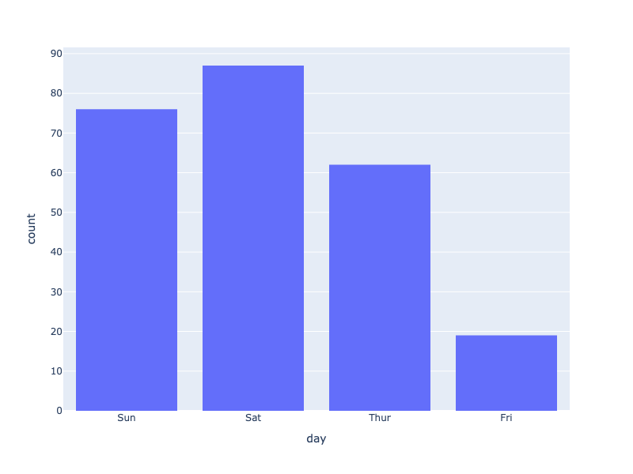

**Interactive Plot:**

<div>                        <script type="text/javascript">window.PlotlyConfig = {MathJaxConfig: 'local'};</script>
        <script charset="utf-8" src="https://cdn.plot.ly/plotly-3.1.0.min.js" integrity="sha256-Ei4740bWZhaUTQuD6q9yQlgVCMPBz6CZWhevDYPv93A=" crossorigin="anonymous"></script>                <div id="plotly-div-2" class="plotly-graph-div" style="height:100%; width:100%;"></div>            <script type="text/javascript">                window.PLOTLYENV=window.PLOTLYENV || {};                                if (document.getElementById("plotly-div-2")) {                    Plotly.newPlot(                        "plotly-div-2",                        [{"bingroup":"x","hovertemplate":"day=%{x}\u003cbr\u003ecount=%{y}\u003cextra\u003e\u003c\u002fextra\u003e","legendgroup":"","marker":{"color":"#636efa","pattern":{"shape":""}},"name":"","orientation":"v","showlegend":false,"x":["Sun","Sun","Sun","Sun","Sun","Sun","Sun","Sun","Sun","Sun","Sun","Sun","Sun","Sun","Sun","Sun","Sun","Sun","Sun","Sat","Sat","Sat","Sat","Sat","Sat","Sat","Sat","Sat","Sat","Sat","Sat","Sat","Sat","Sat","Sat","Sat","Sat","Sat","Sat","Sat","Sat","Sun","Sun","Sun","Sun","Sun","Sun","Sun","Sun","Sun","Sun","Sun","Sun","Sun","Sun","Sun","Sat","Sat","Sat","Sat","Sat","Sat","Sat","Sat","Sat","Sat","Sat","Sat","Sat","Sat","Sat","Sat","Sat","Sat","Sat","Sat","Sat","Thur","Thur","Thur","Thur","Thur","Thur","Thur","Thur","Thur","Thur","Thur","Thur","Thur","Fri","Fri","Fri","Fri","Fri","Fri","Fri","Fri","Fri","Fri","Fri","Fri","Sat","Sat","Sat","Sat","Sat","Sat","Sat","Sat","Sat","Sat","Sun","Sun","Sun","Sun","Sun","Thur","Thur","Thur","Thur","Thur","Thur","Thur","Thur","Thur","Thur","Thur","Thur","Thur","Thur","Thur","Thur","Thur","Thur","Thur","Thur","Thur","Thur","Thur","Thur","Thur","Thur","Thur","Thur","Thur","Thur","Thur","Thur","Thur","Sun","Sun","Sun","Sun","Sun","Sun","Sun","Sun","Sun","Sun","Sun","Sun","Sun","Sun","Sun","Sun","Sun","Sun","Sat","Sat","Sat","Sat","Sun","Sun","Sun","Sun","Sun","Sun","Sun","Sun","Sun","Sun","Sun","Sun","Sun","Sun","Sun","Sun","Sun","Sun","Sun","Thur","Thur","Thur","Thur","Thur","Thur","Thur","Thur","Thur","Thur","Thur","Thur","Thur","Thur","Thur","Sat","Sat","Sat","Sat","Sat","Sat","Sat","Sat","Sat","Sat","Sat","Sat","Sat","Sat","Fri","Fri","Fri","Fri","Fri","Fri","Fri","Sat","Sat","Sat","Sat","Sat","Sat","Sat","Sat","Sat","Sat","Sat","Sat","Sat","Sat","Sat","Sat","Thur"],"xaxis":"x","yaxis":"y","type":"histogram"}],                        {"template":{"data":{"histogram2dcontour":[{"type":"histogram2dcontour","colorbar":{"outlinewidth":0,"ticks":""},"colorscale":[[0.0,"#0d0887"],[0.1111111111111111,"#46039f"],[0.2222222222222222,"#7201a8"],[0.3333333333333333,"#9c179e"],[0.4444444444444444,"#bd3786"],[0.5555555555555556,"#d8576b"],[0.6666666666666666,"#ed7953"],[0.7777777777777778,"#fb9f3a"],[0.8888888888888888,"#fdca26"],[1.0,"#f0f921"]]}],"choropleth":[{"type":"choropleth","colorbar":{"outlinewidth":0,"ticks":""}}],"histogram2d":[{"type":"histogram2d","colorbar":{"outlinewidth":0,"ticks":""},"colorscale":[[0.0,"#0d0887"],[0.1111111111111111,"#46039f"],[0.2222222222222222,"#7201a8"],[0.3333333333333333,"#9c179e"],[0.4444444444444444,"#bd3786"],[0.5555555555555556,"#d8576b"],[0.6666666666666666,"#ed7953"],[0.7777777777777778,"#fb9f3a"],[0.8888888888888888,"#fdca26"],[1.0,"#f0f921"]]}],"heatmap":[{"type":"heatmap","colorbar":{"outlinewidth":0,"ticks":""},"colorscale":[[0.0,"#0d0887"],[0.1111111111111111,"#46039f"],[0.2222222222222222,"#7201a8"],[0.3333333333333333,"#9c179e"],[0.4444444444444444,"#bd3786"],[0.5555555555555556,"#d8576b"],[0.6666666666666666,"#ed7953"],[0.7777777777777778,"#fb9f3a"],[0.8888888888888888,"#fdca26"],[1.0,"#f0f921"]]}],"contourcarpet":[{"type":"contourcarpet","colorbar":{"outlinewidth":0,"ticks":""}}],"contour":[{"type":"contour","colorbar":{"outlinewidth":0,"ticks":""},"colorscale":[[0.0,"#0d0887"],[0.1111111111111111,"#46039f"],[0.2222222222222222,"#7201a8"],[0.3333333333333333,"#9c179e"],[0.4444444444444444,"#bd3786"],[0.5555555555555556,"#d8576b"],[0.6666666666666666,"#ed7953"],[0.7777777777777778,"#fb9f3a"],[0.8888888888888888,"#fdca26"],[1.0,"#f0f921"]]}],"surface":[{"type":"surface","colorbar":{"outlinewidth":0,"ticks":""},"colorscale":[[0.0,"#0d0887"],[0.1111111111111111,"#46039f"],[0.2222222222222222,"#7201a8"],[0.3333333333333333,"#9c179e"],[0.4444444444444444,"#bd3786"],[0.5555555555555556,"#d8576b"],[0.6666666666666666,"#ed7953"],[0.7777777777777778,"#fb9f3a"],[0.8888888888888888,"#fdca26"],[1.0,"#f0f921"]]}],"mesh3d":[{"type":"mesh3d","colorbar":{"outlinewidth":0,"ticks":""}}],"scatter":[{"fillpattern":{"fillmode":"overlay","size":10,"solidity":0.2},"type":"scatter"}],"parcoords":[{"type":"parcoords","line":{"colorbar":{"outlinewidth":0,"ticks":""}}}],"scatterpolargl":[{"type":"scatterpolargl","marker":{"colorbar":{"outlinewidth":0,"ticks":""}}}],"bar":[{"error_x":{"color":"#2a3f5f"},"error_y":{"color":"#2a3f5f"},"marker":{"line":{"color":"#E5ECF6","width":0.5},"pattern":{"fillmode":"overlay","size":10,"solidity":0.2}},"type":"bar"}],"scattergeo":[{"type":"scattergeo","marker":{"colorbar":{"outlinewidth":0,"ticks":""}}}],"scatterpolar":[{"type":"scatterpolar","marker":{"colorbar":{"outlinewidth":0,"ticks":""}}}],"histogram":[{"marker":{"pattern":{"fillmode":"overlay","size":10,"solidity":0.2}},"type":"histogram"}],"scattergl":[{"type":"scattergl","marker":{"colorbar":{"outlinewidth":0,"ticks":""}}}],"scatter3d":[{"type":"scatter3d","line":{"colorbar":{"outlinewidth":0,"ticks":""}},"marker":{"colorbar":{"outlinewidth":0,"ticks":""}}}],"scattermap":[{"type":"scattermap","marker":{"colorbar":{"outlinewidth":0,"ticks":""}}}],"scattermapbox":[{"type":"scattermapbox","marker":{"colorbar":{"outlinewidth":0,"ticks":""}}}],"scatterternary":[{"type":"scatterternary","marker":{"colorbar":{"outlinewidth":0,"ticks":""}}}],"scattercarpet":[{"type":"scattercarpet","marker":{"colorbar":{"outlinewidth":0,"ticks":""}}}],"carpet":[{"aaxis":{"endlinecolor":"#2a3f5f","gridcolor":"white","linecolor":"white","minorgridcolor":"white","startlinecolor":"#2a3f5f"},"baxis":{"endlinecolor":"#2a3f5f","gridcolor":"white","linecolor":"white","minorgridcolor":"white","startlinecolor":"#2a3f5f"},"type":"carpet"}],"table":[{"cells":{"fill":{"color":"#EBF0F8"},"line":{"color":"white"}},"header":{"fill":{"color":"#C8D4E3"},"line":{"color":"white"}},"type":"table"}],"barpolar":[{"marker":{"line":{"color":"#E5ECF6","width":0.5},"pattern":{"fillmode":"overlay","size":10,"solidity":0.2}},"type":"barpolar"}],"pie":[{"automargin":true,"type":"pie"}]},"layout":{"autotypenumbers":"strict","colorway":["#636efa","#EF553B","#00cc96","#ab63fa","#FFA15A","#19d3f3","#FF6692","#B6E880","#FF97FF","#FECB52"],"font":{"color":"#2a3f5f"},"hovermode":"closest","hoverlabel":{"align":"left"},"paper_bgcolor":"white","plot_bgcolor":"#E5ECF6","polar":{"bgcolor":"#E5ECF6","angularaxis":{"gridcolor":"white","linecolor":"white","ticks":""},"radialaxis":{"gridcolor":"white","linecolor":"white","ticks":""}},"ternary":{"bgcolor":"#E5ECF6","aaxis":{"gridcolor":"white","linecolor":"white","ticks":""},"baxis":{"gridcolor":"white","linecolor":"white","ticks":""},"caxis":{"gridcolor":"white","linecolor":"white","ticks":""}},"coloraxis":{"colorbar":{"outlinewidth":0,"ticks":""}},"colorscale":{"sequential":[[0.0,"#0d0887"],[0.1111111111111111,"#46039f"],[0.2222222222222222,"#7201a8"],[0.3333333333333333,"#9c179e"],[0.4444444444444444,"#bd3786"],[0.5555555555555556,"#d8576b"],[0.6666666666666666,"#ed7953"],[0.7777777777777778,"#fb9f3a"],[0.8888888888888888,"#fdca26"],[1.0,"#f0f921"]],"sequentialminus":[[0.0,"#0d0887"],[0.1111111111111111,"#46039f"],[0.2222222222222222,"#7201a8"],[0.3333333333333333,"#9c179e"],[0.4444444444444444,"#bd3786"],[0.5555555555555556,"#d8576b"],[0.6666666666666666,"#ed7953"],[0.7777777777777778,"#fb9f3a"],[0.8888888888888888,"#fdca26"],[1.0,"#f0f921"]],"diverging":[[0,"#8e0152"],[0.1,"#c51b7d"],[0.2,"#de77ae"],[0.3,"#f1b6da"],[0.4,"#fde0ef"],[0.5,"#f7f7f7"],[0.6,"#e6f5d0"],[0.7,"#b8e186"],[0.8,"#7fbc41"],[0.9,"#4d9221"],[1,"#276419"]]},"xaxis":{"gridcolor":"white","linecolor":"white","ticks":"","title":{"standoff":15},"zerolinecolor":"white","automargin":true,"zerolinewidth":2},"yaxis":{"gridcolor":"white","linecolor":"white","ticks":"","title":{"standoff":15},"zerolinecolor":"white","automargin":true,"zerolinewidth":2},"scene":{"xaxis":{"backgroundcolor":"#E5ECF6","gridcolor":"white","linecolor":"white","showbackground":true,"ticks":"","zerolinecolor":"white","gridwidth":2},"yaxis":{"backgroundcolor":"#E5ECF6","gridcolor":"white","linecolor":"white","showbackground":true,"ticks":"","zerolinecolor":"white","gridwidth":2},"zaxis":{"backgroundcolor":"#E5ECF6","gridcolor":"white","linecolor":"white","showbackground":true,"ticks":"","zerolinecolor":"white","gridwidth":2}},"shapedefaults":{"line":{"color":"#2a3f5f"}},"annotationdefaults":{"arrowcolor":"#2a3f5f","arrowhead":0,"arrowwidth":1},"geo":{"bgcolor":"white","landcolor":"#E5ECF6","subunitcolor":"white","showland":true,"showlakes":true,"lakecolor":"white"},"title":{"x":0.05},"mapbox":{"style":"light"}}},"xaxis":{"anchor":"y","domain":[0.0,1.0],"title":{"text":"day"}},"yaxis":{"anchor":"x","domain":[0.0,1.0],"title":{"text":"count"}},"legend":{"tracegroupgap":0},"margin":{"t":60},"barmode":"relative"},                        {"responsive": true}                    )                };            </script>        </div>

#### Choosing the number of bins

By default, the number of bins is chosen so that this number is comparable to the typical number of samples in a bin. This number can be customized, as well as the range of values.

```python
import plotly.express as px
df = px.data.tips()
fig = px.histogram(df, x="total_bill", nbins=20)
fig.show()
```

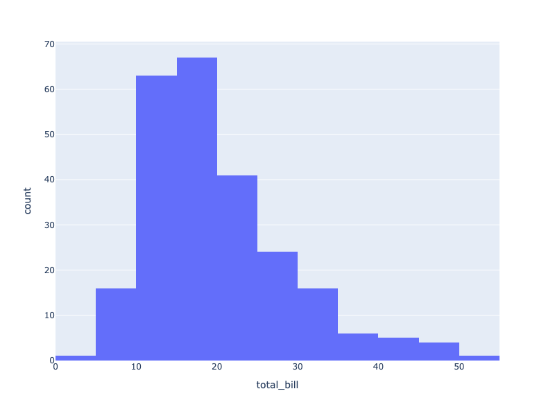

**Interactive Plot:**

<div>                        <script type="text/javascript">window.PlotlyConfig = {MathJaxConfig: 'local'};</script>
        <script charset="utf-8" src="https://cdn.plot.ly/plotly-3.1.0.min.js" integrity="sha256-Ei4740bWZhaUTQuD6q9yQlgVCMPBz6CZWhevDYPv93A=" crossorigin="anonymous"></script>                <div id="plotly-div-3" class="plotly-graph-div" style="height:100%; width:100%;"></div>            <script type="text/javascript">                window.PLOTLYENV=window.PLOTLYENV || {};                                if (document.getElementById("plotly-div-3")) {                    Plotly.newPlot(                        "plotly-div-3",                        [{"bingroup":"x","hovertemplate":"total_bill=%{x}\u003cbr\u003ecount=%{y}\u003cextra\u003e\u003c\u002fextra\u003e","legendgroup":"","marker":{"color":"#636efa","pattern":{"shape":""}},"name":"","nbinsx":20,"orientation":"v","showlegend":false,"x":{"dtype":"f8","bdata":"PQrXo3D9MECuR+F6FK4kQMP1KFyPAjVArkfhehSuN0DXo3A9Cpc4QArXo3A9SjlACtejcD2KIUDhehSuR+E6QBSuR+F6FC5Aj8L1KFyPLUAK16NwPYokQOF6FK5HoUFA16NwPQrXLkCuR+F6FG4yQClcj8L1qC1AFK5H4XqUNUApXI\u002fC9agkQArXo3A9SjBAuB6F61H4MEBmZmZmZqY0QOxRuB6F6zFACtejcD1KNEAK16NwPYovQPYoXI\u002fCtUNAUrgehevRM0CPwvUoXM8xQD0K16NwvSpA4XoUrkdhKUAzMzMzM7M1QGZmZmZmpjNAmpmZmZkZI0CamZmZmVkyQB+F61G4Hi5AcT0K16OwNEBI4XoUrscxQI\u002fC9ShcDzhAj8L1KFxPMECuR+F6FO4wQHE9CtejsDJAhetRuB5FP0AK16NwPQowQPYoXI\u002fCdTFA4XoUrkfhK0Bcj8L1KFwjQGZmZmZmZj5ACtejcD1KMkB7FK5H4To2QDMzMzMzM0BAzczMzMyMPEAK16NwPQoyQBSuR+F6FClAFK5H4XqUJEBI4XoUrmdBQOF6FK5H4SNAj8L1KFyPOUA9CtejcH0zQOF6FK5HAUNAKVyPwvVoOkB7FK5H4XomQMP1KFyPIkhACtejcD1KNEAfhetRuJ4rQArXo3A9CiZACtejcD1KMkDXo3A9CpcxQBSuR+F6FDRAMzMzMzNzMECPwvUoXI8IQHsUrkfhOjRAhetRuB4FLkAK16NwPQooQFK4HoXrETFAXI\u002fC9SjcOkBI4XoUrkc5QPYoXI\u002fCdS1AhetRuB4FJUDsUbgehesxQDMzMzMzMztAw\u002fUoXI\u002fCNkAK16NwPUoxQHE9CtejcDNAKVyPwvWoMECkcD0K1yMkQNejcD0KV0BA9ihcj8L1L0AK16NwPWpBQI\u002fC9ShcDypASOF6FK5HMkD2KFyPwrU4QClcj8L1KDVAuB6F61H4PEA9CtejcH02QAAAAAAAABdAUrgehetRMEAAAAAAAMA2QPYoXI\u002fCFURASOF6FK5HO0CPwvUoXA8oQMP1KFyPAjVA7FG4HoXrKEAzMzMzM7MmQMP1KFyPwi5AZmZmZmYmRkDsUbgehWs2QOxRuB6F6zRAuB6F61G4LkA9CtejcH00QPYoXI\u002fCNTlAPQrXo3A9MkAfhetRuJ4sQAAAAAAAACxAAAAAAAAAHUApXI\u002fC9QhDQDMzMzMz8zdA9ihcj8K1OUCPwvUoXE8xQK5H4XoU7j1AzczMzMxMJUBcj8L1KNwoQBSuR+F6FDhA4XoUrkdhJ0DXo3A9CtcqQIXrUbgehSxAZmZmZmbmL0D2KFyPwvUoQM3MzMzMzD1ACtejcD0KIUAK16NwPQotQMP1KFyPwiZAUrgehevRNkAUrkfhehQzQIXrUbgeRTRA16NwPQpXJkCF61G4HoUoQMP1KFyPQjJAhetRuB4FIUApXI\u002fC9agkQM3MzMzMTCxAAAAAAAAAMEBSuB6F61EqQLgehetReDFAZmZmZmYmQUC4HoXrUZhEQM3MzMzMDDtArkfhehRuMEAzMzMzM7MgQKRwPQrXozJAPQrXo3C9J0CPwvUoXI8jQArXo3A9Ch5ApHA9CtcjLEDD9Shcj0IqQMP1KFyPQjFAzczMzMyMOECF61G4HsUzQJqZmZmZ2T1A9ihcj8IVSEAAAAAAAAA5QEjhehSuxypAPQrXo3B9MEAAAAAAAIA1QFK4HoXrUSlA9ihcj8I1MEAfhetRuJ4rQMP1KFyPgjFAhetRuB6FOEDD9Shcj8I0QPYoXI\u002fCtT9ArkfhehQuJUDD9Shcj0IlQEjhehSuZ0lAH4XrUbieL0AAAAAAAAAdQJqZmZmZ2T9AUrgehevRMEAzMzMzM3NAQKRwPQrX4zFA9ihcj8L1LEAzMzMzMzMjQHE9CtejUEFAMzMzMzNTQUAUrkfhelQ3QM3MzMzMrEZA7FG4HoUrN0BmZmZmZkZEQHE9CtejsDRAZmZmZmbmNED2KFyPwnU+QGZmZmZmJjJAmpmZmZkZN0DhehSuR2EvQI\u002fC9ShczzNAcT0K16NwPED2KFyPwvUuQBSuR+F6lDBAPQrXo3A9HkCuR+F6FK4kQK5H4XoUjkVAAAAAAAAAKkCF61G4HgUrQPYoXI\u002fCtTJAexSuR+F6KUAAAAAAAAAqQGZmZmZmZjBASOF6FK6HNEC4HoXrUXgwQNejcD0KlzpAPQrXo3BdQ0CF61G4HkU4QIXrUbgehSlAj8L1KFwPPkCkcD0K1+M5QArXo3A9KkhACtejcD2KKkDsUbgehSs8QM3MzMzMzClAZmZmZmYmPECuR+F6FC4nQPYoXI\u002fC9R5ApHA9CtcjPkBSuB6F61EoQNejcD0K1ypAKVyPwvUoIUD2KFyPwvUvQNejcD0K1ypAhetRuB5FMECuR+F6FC4kQDMzMzMzczRAj8L1KFyPKkAfhetRuB42QMP1KFyPAjhA4XoUrkdhL0C4HoXrUTgnQArXo3A9iiVAj8L1KFwPL0CkcD0K1yMkQDMzMzMzMylACtejcD1qQEAK16NwPepBQEjhehSuBz1ArkfhehQuO0DsUbgehas2QFK4HoXr0TFASOF6FK7HMkA="},"xaxis":"x","yaxis":"y","type":"histogram"}],                        {"template":{"data":{"histogram2dcontour":[{"type":"histogram2dcontour","colorbar":{"outlinewidth":0,"ticks":""},"colorscale":[[0.0,"#0d0887"],[0.1111111111111111,"#46039f"],[0.2222222222222222,"#7201a8"],[0.3333333333333333,"#9c179e"],[0.4444444444444444,"#bd3786"],[0.5555555555555556,"#d8576b"],[0.6666666666666666,"#ed7953"],[0.7777777777777778,"#fb9f3a"],[0.8888888888888888,"#fdca26"],[1.0,"#f0f921"]]}],"choropleth":[{"type":"choropleth","colorbar":{"outlinewidth":0,"ticks":""}}],"histogram2d":[{"type":"histogram2d","colorbar":{"outlinewidth":0,"ticks":""},"colorscale":[[0.0,"#0d0887"],[0.1111111111111111,"#46039f"],[0.2222222222222222,"#7201a8"],[0.3333333333333333,"#9c179e"],[0.4444444444444444,"#bd3786"],[0.5555555555555556,"#d8576b"],[0.6666666666666666,"#ed7953"],[0.7777777777777778,"#fb9f3a"],[0.8888888888888888,"#fdca26"],[1.0,"#f0f921"]]}],"heatmap":[{"type":"heatmap","colorbar":{"outlinewidth":0,"ticks":""},"colorscale":[[0.0,"#0d0887"],[0.1111111111111111,"#46039f"],[0.2222222222222222,"#7201a8"],[0.3333333333333333,"#9c179e"],[0.4444444444444444,"#bd3786"],[0.5555555555555556,"#d8576b"],[0.6666666666666666,"#ed7953"],[0.7777777777777778,"#fb9f3a"],[0.8888888888888888,"#fdca26"],[1.0,"#f0f921"]]}],"contourcarpet":[{"type":"contourcarpet","colorbar":{"outlinewidth":0,"ticks":""}}],"contour":[{"type":"contour","colorbar":{"outlinewidth":0,"ticks":""},"colorscale":[[0.0,"#0d0887"],[0.1111111111111111,"#46039f"],[0.2222222222222222,"#7201a8"],[0.3333333333333333,"#9c179e"],[0.4444444444444444,"#bd3786"],[0.5555555555555556,"#d8576b"],[0.6666666666666666,"#ed7953"],[0.7777777777777778,"#fb9f3a"],[0.8888888888888888,"#fdca26"],[1.0,"#f0f921"]]}],"surface":[{"type":"surface","colorbar":{"outlinewidth":0,"ticks":""},"colorscale":[[0.0,"#0d0887"],[0.1111111111111111,"#46039f"],[0.2222222222222222,"#7201a8"],[0.3333333333333333,"#9c179e"],[0.4444444444444444,"#bd3786"],[0.5555555555555556,"#d8576b"],[0.6666666666666666,"#ed7953"],[0.7777777777777778,"#fb9f3a"],[0.8888888888888888,"#fdca26"],[1.0,"#f0f921"]]}],"mesh3d":[{"type":"mesh3d","colorbar":{"outlinewidth":0,"ticks":""}}],"scatter":[{"fillpattern":{"fillmode":"overlay","size":10,"solidity":0.2},"type":"scatter"}],"parcoords":[{"type":"parcoords","line":{"colorbar":{"outlinewidth":0,"ticks":""}}}],"scatterpolargl":[{"type":"scatterpolargl","marker":{"colorbar":{"outlinewidth":0,"ticks":""}}}],"bar":[{"error_x":{"color":"#2a3f5f"},"error_y":{"color":"#2a3f5f"},"marker":{"line":{"color":"#E5ECF6","width":0.5},"pattern":{"fillmode":"overlay","size":10,"solidity":0.2}},"type":"bar"}],"scattergeo":[{"type":"scattergeo","marker":{"colorbar":{"outlinewidth":0,"ticks":""}}}],"scatterpolar":[{"type":"scatterpolar","marker":{"colorbar":{"outlinewidth":0,"ticks":""}}}],"histogram":[{"marker":{"pattern":{"fillmode":"overlay","size":10,"solidity":0.2}},"type":"histogram"}],"scattergl":[{"type":"scattergl","marker":{"colorbar":{"outlinewidth":0,"ticks":""}}}],"scatter3d":[{"type":"scatter3d","line":{"colorbar":{"outlinewidth":0,"ticks":""}},"marker":{"colorbar":{"outlinewidth":0,"ticks":""}}}],"scattermap":[{"type":"scattermap","marker":{"colorbar":{"outlinewidth":0,"ticks":""}}}],"scattermapbox":[{"type":"scattermapbox","marker":{"colorbar":{"outlinewidth":0,"ticks":""}}}],"scatterternary":[{"type":"scatterternary","marker":{"colorbar":{"outlinewidth":0,"ticks":""}}}],"scattercarpet":[{"type":"scattercarpet","marker":{"colorbar":{"outlinewidth":0,"ticks":""}}}],"carpet":[{"aaxis":{"endlinecolor":"#2a3f5f","gridcolor":"white","linecolor":"white","minorgridcolor":"white","startlinecolor":"#2a3f5f"},"baxis":{"endlinecolor":"#2a3f5f","gridcolor":"white","linecolor":"white","minorgridcolor":"white","startlinecolor":"#2a3f5f"},"type":"carpet"}],"table":[{"cells":{"fill":{"color":"#EBF0F8"},"line":{"color":"white"}},"header":{"fill":{"color":"#C8D4E3"},"line":{"color":"white"}},"type":"table"}],"barpolar":[{"marker":{"line":{"color":"#E5ECF6","width":0.5},"pattern":{"fillmode":"overlay","size":10,"solidity":0.2}},"type":"barpolar"}],"pie":[{"automargin":true,"type":"pie"}]},"layout":{"autotypenumbers":"strict","colorway":["#636efa","#EF553B","#00cc96","#ab63fa","#FFA15A","#19d3f3","#FF6692","#B6E880","#FF97FF","#FECB52"],"font":{"color":"#2a3f5f"},"hovermode":"closest","hoverlabel":{"align":"left"},"paper_bgcolor":"white","plot_bgcolor":"#E5ECF6","polar":{"bgcolor":"#E5ECF6","angularaxis":{"gridcolor":"white","linecolor":"white","ticks":""},"radialaxis":{"gridcolor":"white","linecolor":"white","ticks":""}},"ternary":{"bgcolor":"#E5ECF6","aaxis":{"gridcolor":"white","linecolor":"white","ticks":""},"baxis":{"gridcolor":"white","linecolor":"white","ticks":""},"caxis":{"gridcolor":"white","linecolor":"white","ticks":""}},"coloraxis":{"colorbar":{"outlinewidth":0,"ticks":""}},"colorscale":{"sequential":[[0.0,"#0d0887"],[0.1111111111111111,"#46039f"],[0.2222222222222222,"#7201a8"],[0.3333333333333333,"#9c179e"],[0.4444444444444444,"#bd3786"],[0.5555555555555556,"#d8576b"],[0.6666666666666666,"#ed7953"],[0.7777777777777778,"#fb9f3a"],[0.8888888888888888,"#fdca26"],[1.0,"#f0f921"]],"sequentialminus":[[0.0,"#0d0887"],[0.1111111111111111,"#46039f"],[0.2222222222222222,"#7201a8"],[0.3333333333333333,"#9c179e"],[0.4444444444444444,"#bd3786"],[0.5555555555555556,"#d8576b"],[0.6666666666666666,"#ed7953"],[0.7777777777777778,"#fb9f3a"],[0.8888888888888888,"#fdca26"],[1.0,"#f0f921"]],"diverging":[[0,"#8e0152"],[0.1,"#c51b7d"],[0.2,"#de77ae"],[0.3,"#f1b6da"],[0.4,"#fde0ef"],[0.5,"#f7f7f7"],[0.6,"#e6f5d0"],[0.7,"#b8e186"],[0.8,"#7fbc41"],[0.9,"#4d9221"],[1,"#276419"]]},"xaxis":{"gridcolor":"white","linecolor":"white","ticks":"","title":{"standoff":15},"zerolinecolor":"white","automargin":true,"zerolinewidth":2},"yaxis":{"gridcolor":"white","linecolor":"white","ticks":"","title":{"standoff":15},"zerolinecolor":"white","automargin":true,"zerolinewidth":2},"scene":{"xaxis":{"backgroundcolor":"#E5ECF6","gridcolor":"white","linecolor":"white","showbackground":true,"ticks":"","zerolinecolor":"white","gridwidth":2},"yaxis":{"backgroundcolor":"#E5ECF6","gridcolor":"white","linecolor":"white","showbackground":true,"ticks":"","zerolinecolor":"white","gridwidth":2},"zaxis":{"backgroundcolor":"#E5ECF6","gridcolor":"white","linecolor":"white","showbackground":true,"ticks":"","zerolinecolor":"white","gridwidth":2}},"shapedefaults":{"line":{"color":"#2a3f5f"}},"annotationdefaults":{"arrowcolor":"#2a3f5f","arrowhead":0,"arrowwidth":1},"geo":{"bgcolor":"white","landcolor":"#E5ECF6","subunitcolor":"white","showland":true,"showlakes":true,"lakecolor":"white"},"title":{"x":0.05},"mapbox":{"style":"light"}}},"xaxis":{"anchor":"y","domain":[0.0,1.0],"title":{"text":"total_bill"}},"yaxis":{"anchor":"x","domain":[0.0,1.0],"title":{"text":"count"}},"legend":{"tracegroupgap":0},"margin":{"t":60},"barmode":"relative"},                        {"responsive": true}                    )                };            </script>        </div>

### Histograms on Date Data

Plotly histograms will automatically bin date data in addition to numerical data:

```python
import plotly.express as px

df = px.data.stocks()
fig = px.histogram(df, x="date")
fig.update_layout(bargap=0.2)
fig.show()
```

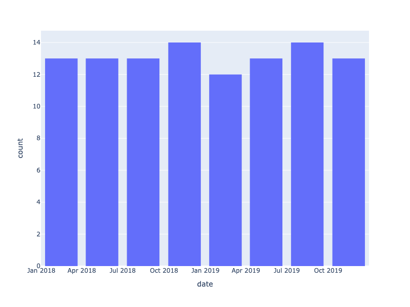

**Interactive Plot:**

<div>                        <script type="text/javascript">window.PlotlyConfig = {MathJaxConfig: 'local'};</script>
        <script charset="utf-8" src="https://cdn.plot.ly/plotly-3.1.0.min.js" integrity="sha256-Ei4740bWZhaUTQuD6q9yQlgVCMPBz6CZWhevDYPv93A=" crossorigin="anonymous"></script>                <div id="plotly-div-4" class="plotly-graph-div" style="height:100%; width:100%;"></div>            <script type="text/javascript">                window.PLOTLYENV=window.PLOTLYENV || {};                                if (document.getElementById("plotly-div-4")) {                    Plotly.newPlot(                        "plotly-div-4",                        [{"bingroup":"x","hovertemplate":"date=%{x}\u003cbr\u003ecount=%{y}\u003cextra\u003e\u003c\u002fextra\u003e","legendgroup":"","marker":{"color":"#636efa","pattern":{"shape":""}},"name":"","orientation":"v","showlegend":false,"x":["2018-01-01","2018-01-08","2018-01-15","2018-01-22","2018-01-29","2018-02-05","2018-02-12","2018-02-19","2018-02-26","2018-03-05","2018-03-12","2018-03-19","2018-03-26","2018-04-02","2018-04-09","2018-04-16","2018-04-23","2018-04-30","2018-05-07","2018-05-14","2018-05-21","2018-05-28","2018-06-04","2018-06-11","2018-06-18","2018-06-25","2018-07-02","2018-07-09","2018-07-16","2018-07-23","2018-07-30","2018-08-06","2018-08-13","2018-08-20","2018-08-27","2018-09-03","2018-09-10","2018-09-17","2018-09-24","2018-10-01","2018-10-08","2018-10-15","2018-10-22","2018-10-29","2018-11-05","2018-11-12","2018-11-19","2018-11-26","2018-12-03","2018-12-10","2018-12-17","2018-12-24","2018-12-31","2019-01-07","2019-01-14","2019-01-21","2019-01-28","2019-02-04","2019-02-11","2019-02-18","2019-02-25","2019-03-04","2019-03-11","2019-03-18","2019-03-25","2019-04-01","2019-04-08","2019-04-15","2019-04-22","2019-04-29","2019-05-06","2019-05-13","2019-05-20","2019-05-27","2019-06-03","2019-06-10","2019-06-17","2019-06-24","2019-07-01","2019-07-08","2019-07-15","2019-07-22","2019-07-29","2019-08-05","2019-08-12","2019-08-19","2019-08-26","2019-09-02","2019-09-09","2019-09-16","2019-09-23","2019-09-30","2019-10-07","2019-10-14","2019-10-21","2019-10-28","2019-11-04","2019-11-11","2019-11-18","2019-11-25","2019-12-02","2019-12-09","2019-12-16","2019-12-23","2019-12-30"],"xaxis":"x","yaxis":"y","type":"histogram"}],                        {"template":{"data":{"histogram2dcontour":[{"type":"histogram2dcontour","colorbar":{"outlinewidth":0,"ticks":""},"colorscale":[[0.0,"#0d0887"],[0.1111111111111111,"#46039f"],[0.2222222222222222,"#7201a8"],[0.3333333333333333,"#9c179e"],[0.4444444444444444,"#bd3786"],[0.5555555555555556,"#d8576b"],[0.6666666666666666,"#ed7953"],[0.7777777777777778,"#fb9f3a"],[0.8888888888888888,"#fdca26"],[1.0,"#f0f921"]]}],"choropleth":[{"type":"choropleth","colorbar":{"outlinewidth":0,"ticks":""}}],"histogram2d":[{"type":"histogram2d","colorbar":{"outlinewidth":0,"ticks":""},"colorscale":[[0.0,"#0d0887"],[0.1111111111111111,"#46039f"],[0.2222222222222222,"#7201a8"],[0.3333333333333333,"#9c179e"],[0.4444444444444444,"#bd3786"],[0.5555555555555556,"#d8576b"],[0.6666666666666666,"#ed7953"],[0.7777777777777778,"#fb9f3a"],[0.8888888888888888,"#fdca26"],[1.0,"#f0f921"]]}],"heatmap":[{"type":"heatmap","colorbar":{"outlinewidth":0,"ticks":""},"colorscale":[[0.0,"#0d0887"],[0.1111111111111111,"#46039f"],[0.2222222222222222,"#7201a8"],[0.3333333333333333,"#9c179e"],[0.4444444444444444,"#bd3786"],[0.5555555555555556,"#d8576b"],[0.6666666666666666,"#ed7953"],[0.7777777777777778,"#fb9f3a"],[0.8888888888888888,"#fdca26"],[1.0,"#f0f921"]]}],"contourcarpet":[{"type":"contourcarpet","colorbar":{"outlinewidth":0,"ticks":""}}],"contour":[{"type":"contour","colorbar":{"outlinewidth":0,"ticks":""},"colorscale":[[0.0,"#0d0887"],[0.1111111111111111,"#46039f"],[0.2222222222222222,"#7201a8"],[0.3333333333333333,"#9c179e"],[0.4444444444444444,"#bd3786"],[0.5555555555555556,"#d8576b"],[0.6666666666666666,"#ed7953"],[0.7777777777777778,"#fb9f3a"],[0.8888888888888888,"#fdca26"],[1.0,"#f0f921"]]}],"surface":[{"type":"surface","colorbar":{"outlinewidth":0,"ticks":""},"colorscale":[[0.0,"#0d0887"],[0.1111111111111111,"#46039f"],[0.2222222222222222,"#7201a8"],[0.3333333333333333,"#9c179e"],[0.4444444444444444,"#bd3786"],[0.5555555555555556,"#d8576b"],[0.6666666666666666,"#ed7953"],[0.7777777777777778,"#fb9f3a"],[0.8888888888888888,"#fdca26"],[1.0,"#f0f921"]]}],"mesh3d":[{"type":"mesh3d","colorbar":{"outlinewidth":0,"ticks":""}}],"scatter":[{"fillpattern":{"fillmode":"overlay","size":10,"solidity":0.2},"type":"scatter"}],"parcoords":[{"type":"parcoords","line":{"colorbar":{"outlinewidth":0,"ticks":""}}}],"scatterpolargl":[{"type":"scatterpolargl","marker":{"colorbar":{"outlinewidth":0,"ticks":""}}}],"bar":[{"error_x":{"color":"#2a3f5f"},"error_y":{"color":"#2a3f5f"},"marker":{"line":{"color":"#E5ECF6","width":0.5},"pattern":{"fillmode":"overlay","size":10,"solidity":0.2}},"type":"bar"}],"scattergeo":[{"type":"scattergeo","marker":{"colorbar":{"outlinewidth":0,"ticks":""}}}],"scatterpolar":[{"type":"scatterpolar","marker":{"colorbar":{"outlinewidth":0,"ticks":""}}}],"histogram":[{"marker":{"pattern":{"fillmode":"overlay","size":10,"solidity":0.2}},"type":"histogram"}],"scattergl":[{"type":"scattergl","marker":{"colorbar":{"outlinewidth":0,"ticks":""}}}],"scatter3d":[{"type":"scatter3d","line":{"colorbar":{"outlinewidth":0,"ticks":""}},"marker":{"colorbar":{"outlinewidth":0,"ticks":""}}}],"scattermap":[{"type":"scattermap","marker":{"colorbar":{"outlinewidth":0,"ticks":""}}}],"scattermapbox":[{"type":"scattermapbox","marker":{"colorbar":{"outlinewidth":0,"ticks":""}}}],"scatterternary":[{"type":"scatterternary","marker":{"colorbar":{"outlinewidth":0,"ticks":""}}}],"scattercarpet":[{"type":"scattercarpet","marker":{"colorbar":{"outlinewidth":0,"ticks":""}}}],"carpet":[{"aaxis":{"endlinecolor":"#2a3f5f","gridcolor":"white","linecolor":"white","minorgridcolor":"white","startlinecolor":"#2a3f5f"},"baxis":{"endlinecolor":"#2a3f5f","gridcolor":"white","linecolor":"white","minorgridcolor":"white","startlinecolor":"#2a3f5f"},"type":"carpet"}],"table":[{"cells":{"fill":{"color":"#EBF0F8"},"line":{"color":"white"}},"header":{"fill":{"color":"#C8D4E3"},"line":{"color":"white"}},"type":"table"}],"barpolar":[{"marker":{"line":{"color":"#E5ECF6","width":0.5},"pattern":{"fillmode":"overlay","size":10,"solidity":0.2}},"type":"barpolar"}],"pie":[{"automargin":true,"type":"pie"}]},"layout":{"autotypenumbers":"strict","colorway":["#636efa","#EF553B","#00cc96","#ab63fa","#FFA15A","#19d3f3","#FF6692","#B6E880","#FF97FF","#FECB52"],"font":{"color":"#2a3f5f"},"hovermode":"closest","hoverlabel":{"align":"left"},"paper_bgcolor":"white","plot_bgcolor":"#E5ECF6","polar":{"bgcolor":"#E5ECF6","angularaxis":{"gridcolor":"white","linecolor":"white","ticks":""},"radialaxis":{"gridcolor":"white","linecolor":"white","ticks":""}},"ternary":{"bgcolor":"#E5ECF6","aaxis":{"gridcolor":"white","linecolor":"white","ticks":""},"baxis":{"gridcolor":"white","linecolor":"white","ticks":""},"caxis":{"gridcolor":"white","linecolor":"white","ticks":""}},"coloraxis":{"colorbar":{"outlinewidth":0,"ticks":""}},"colorscale":{"sequential":[[0.0,"#0d0887"],[0.1111111111111111,"#46039f"],[0.2222222222222222,"#7201a8"],[0.3333333333333333,"#9c179e"],[0.4444444444444444,"#bd3786"],[0.5555555555555556,"#d8576b"],[0.6666666666666666,"#ed7953"],[0.7777777777777778,"#fb9f3a"],[0.8888888888888888,"#fdca26"],[1.0,"#f0f921"]],"sequentialminus":[[0.0,"#0d0887"],[0.1111111111111111,"#46039f"],[0.2222222222222222,"#7201a8"],[0.3333333333333333,"#9c179e"],[0.4444444444444444,"#bd3786"],[0.5555555555555556,"#d8576b"],[0.6666666666666666,"#ed7953"],[0.7777777777777778,"#fb9f3a"],[0.8888888888888888,"#fdca26"],[1.0,"#f0f921"]],"diverging":[[0,"#8e0152"],[0.1,"#c51b7d"],[0.2,"#de77ae"],[0.3,"#f1b6da"],[0.4,"#fde0ef"],[0.5,"#f7f7f7"],[0.6,"#e6f5d0"],[0.7,"#b8e186"],[0.8,"#7fbc41"],[0.9,"#4d9221"],[1,"#276419"]]},"xaxis":{"gridcolor":"white","linecolor":"white","ticks":"","title":{"standoff":15},"zerolinecolor":"white","automargin":true,"zerolinewidth":2},"yaxis":{"gridcolor":"white","linecolor":"white","ticks":"","title":{"standoff":15},"zerolinecolor":"white","automargin":true,"zerolinewidth":2},"scene":{"xaxis":{"backgroundcolor":"#E5ECF6","gridcolor":"white","linecolor":"white","showbackground":true,"ticks":"","zerolinecolor":"white","gridwidth":2},"yaxis":{"backgroundcolor":"#E5ECF6","gridcolor":"white","linecolor":"white","showbackground":true,"ticks":"","zerolinecolor":"white","gridwidth":2},"zaxis":{"backgroundcolor":"#E5ECF6","gridcolor":"white","linecolor":"white","showbackground":true,"ticks":"","zerolinecolor":"white","gridwidth":2}},"shapedefaults":{"line":{"color":"#2a3f5f"}},"annotationdefaults":{"arrowcolor":"#2a3f5f","arrowhead":0,"arrowwidth":1},"geo":{"bgcolor":"white","landcolor":"#E5ECF6","subunitcolor":"white","showland":true,"showlakes":true,"lakecolor":"white"},"title":{"x":0.05},"mapbox":{"style":"light"}}},"xaxis":{"anchor":"y","domain":[0.0,1.0],"title":{"text":"date"}},"yaxis":{"anchor":"x","domain":[0.0,1.0],"title":{"text":"count"}},"legend":{"tracegroupgap":0},"margin":{"t":60},"barmode":"relative","bargap":0.2},                        {"responsive": true}                    )                };            </script>        </div>

### Histograms on Categorical Data

Plotly histograms will automatically bin numerical or date data but can also be used on raw categorical data, as in the following example, where the X-axis value is the categorical "day" variable:

```python
import plotly.express as px
df = px.data.tips()
fig = px.histogram(df, x="day", category_orders=dict(day=["Thur", "Fri", "Sat", "Sun"]))
fig.show()
```

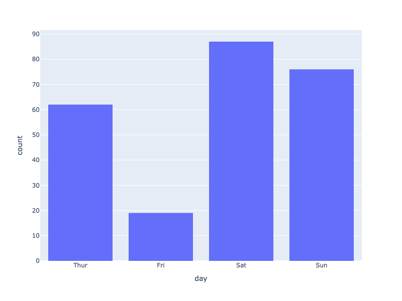

**Interactive Plot:**

<div>                        <script type="text/javascript">window.PlotlyConfig = {MathJaxConfig: 'local'};</script>
        <script charset="utf-8" src="https://cdn.plot.ly/plotly-3.1.0.min.js" integrity="sha256-Ei4740bWZhaUTQuD6q9yQlgVCMPBz6CZWhevDYPv93A=" crossorigin="anonymous"></script>                <div id="plotly-div-5" class="plotly-graph-div" style="height:100%; width:100%;"></div>            <script type="text/javascript">                window.PLOTLYENV=window.PLOTLYENV || {};                                if (document.getElementById("plotly-div-5")) {                    Plotly.newPlot(                        "plotly-div-5",                        [{"bingroup":"x","hovertemplate":"day=%{x}\u003cbr\u003ecount=%{y}\u003cextra\u003e\u003c\u002fextra\u003e","legendgroup":"","marker":{"color":"#636efa","pattern":{"shape":""}},"name":"","orientation":"v","showlegend":false,"x":["Sun","Sun","Sun","Sun","Sun","Sun","Sun","Sun","Sun","Sun","Sun","Sun","Sun","Sun","Sun","Sun","Sun","Sun","Sun","Sat","Sat","Sat","Sat","Sat","Sat","Sat","Sat","Sat","Sat","Sat","Sat","Sat","Sat","Sat","Sat","Sat","Sat","Sat","Sat","Sat","Sat","Sun","Sun","Sun","Sun","Sun","Sun","Sun","Sun","Sun","Sun","Sun","Sun","Sun","Sun","Sun","Sat","Sat","Sat","Sat","Sat","Sat","Sat","Sat","Sat","Sat","Sat","Sat","Sat","Sat","Sat","Sat","Sat","Sat","Sat","Sat","Sat","Thur","Thur","Thur","Thur","Thur","Thur","Thur","Thur","Thur","Thur","Thur","Thur","Thur","Fri","Fri","Fri","Fri","Fri","Fri","Fri","Fri","Fri","Fri","Fri","Fri","Sat","Sat","Sat","Sat","Sat","Sat","Sat","Sat","Sat","Sat","Sun","Sun","Sun","Sun","Sun","Thur","Thur","Thur","Thur","Thur","Thur","Thur","Thur","Thur","Thur","Thur","Thur","Thur","Thur","Thur","Thur","Thur","Thur","Thur","Thur","Thur","Thur","Thur","Thur","Thur","Thur","Thur","Thur","Thur","Thur","Thur","Thur","Thur","Sun","Sun","Sun","Sun","Sun","Sun","Sun","Sun","Sun","Sun","Sun","Sun","Sun","Sun","Sun","Sun","Sun","Sun","Sat","Sat","Sat","Sat","Sun","Sun","Sun","Sun","Sun","Sun","Sun","Sun","Sun","Sun","Sun","Sun","Sun","Sun","Sun","Sun","Sun","Sun","Sun","Thur","Thur","Thur","Thur","Thur","Thur","Thur","Thur","Thur","Thur","Thur","Thur","Thur","Thur","Thur","Sat","Sat","Sat","Sat","Sat","Sat","Sat","Sat","Sat","Sat","Sat","Sat","Sat","Sat","Fri","Fri","Fri","Fri","Fri","Fri","Fri","Sat","Sat","Sat","Sat","Sat","Sat","Sat","Sat","Sat","Sat","Sat","Sat","Sat","Sat","Sat","Sat","Thur"],"xaxis":"x","yaxis":"y","type":"histogram"}],                        {"template":{"data":{"histogram2dcontour":[{"type":"histogram2dcontour","colorbar":{"outlinewidth":0,"ticks":""},"colorscale":[[0.0,"#0d0887"],[0.1111111111111111,"#46039f"],[0.2222222222222222,"#7201a8"],[0.3333333333333333,"#9c179e"],[0.4444444444444444,"#bd3786"],[0.5555555555555556,"#d8576b"],[0.6666666666666666,"#ed7953"],[0.7777777777777778,"#fb9f3a"],[0.8888888888888888,"#fdca26"],[1.0,"#f0f921"]]}],"choropleth":[{"type":"choropleth","colorbar":{"outlinewidth":0,"ticks":""}}],"histogram2d":[{"type":"histogram2d","colorbar":{"outlinewidth":0,"ticks":""},"colorscale":[[0.0,"#0d0887"],[0.1111111111111111,"#46039f"],[0.2222222222222222,"#7201a8"],[0.3333333333333333,"#9c179e"],[0.4444444444444444,"#bd3786"],[0.5555555555555556,"#d8576b"],[0.6666666666666666,"#ed7953"],[0.7777777777777778,"#fb9f3a"],[0.8888888888888888,"#fdca26"],[1.0,"#f0f921"]]}],"heatmap":[{"type":"heatmap","colorbar":{"outlinewidth":0,"ticks":""},"colorscale":[[0.0,"#0d0887"],[0.1111111111111111,"#46039f"],[0.2222222222222222,"#7201a8"],[0.3333333333333333,"#9c179e"],[0.4444444444444444,"#bd3786"],[0.5555555555555556,"#d8576b"],[0.6666666666666666,"#ed7953"],[0.7777777777777778,"#fb9f3a"],[0.8888888888888888,"#fdca26"],[1.0,"#f0f921"]]}],"contourcarpet":[{"type":"contourcarpet","colorbar":{"outlinewidth":0,"ticks":""}}],"contour":[{"type":"contour","colorbar":{"outlinewidth":0,"ticks":""},"colorscale":[[0.0,"#0d0887"],[0.1111111111111111,"#46039f"],[0.2222222222222222,"#7201a8"],[0.3333333333333333,"#9c179e"],[0.4444444444444444,"#bd3786"],[0.5555555555555556,"#d8576b"],[0.6666666666666666,"#ed7953"],[0.7777777777777778,"#fb9f3a"],[0.8888888888888888,"#fdca26"],[1.0,"#f0f921"]]}],"surface":[{"type":"surface","colorbar":{"outlinewidth":0,"ticks":""},"colorscale":[[0.0,"#0d0887"],[0.1111111111111111,"#46039f"],[0.2222222222222222,"#7201a8"],[0.3333333333333333,"#9c179e"],[0.4444444444444444,"#bd3786"],[0.5555555555555556,"#d8576b"],[0.6666666666666666,"#ed7953"],[0.7777777777777778,"#fb9f3a"],[0.8888888888888888,"#fdca26"],[1.0,"#f0f921"]]}],"mesh3d":[{"type":"mesh3d","colorbar":{"outlinewidth":0,"ticks":""}}],"scatter":[{"fillpattern":{"fillmode":"overlay","size":10,"solidity":0.2},"type":"scatter"}],"parcoords":[{"type":"parcoords","line":{"colorbar":{"outlinewidth":0,"ticks":""}}}],"scatterpolargl":[{"type":"scatterpolargl","marker":{"colorbar":{"outlinewidth":0,"ticks":""}}}],"bar":[{"error_x":{"color":"#2a3f5f"},"error_y":{"color":"#2a3f5f"},"marker":{"line":{"color":"#E5ECF6","width":0.5},"pattern":{"fillmode":"overlay","size":10,"solidity":0.2}},"type":"bar"}],"scattergeo":[{"type":"scattergeo","marker":{"colorbar":{"outlinewidth":0,"ticks":""}}}],"scatterpolar":[{"type":"scatterpolar","marker":{"colorbar":{"outlinewidth":0,"ticks":""}}}],"histogram":[{"marker":{"pattern":{"fillmode":"overlay","size":10,"solidity":0.2}},"type":"histogram"}],"scattergl":[{"type":"scattergl","marker":{"colorbar":{"outlinewidth":0,"ticks":""}}}],"scatter3d":[{"type":"scatter3d","line":{"colorbar":{"outlinewidth":0,"ticks":""}},"marker":{"colorbar":{"outlinewidth":0,"ticks":""}}}],"scattermap":[{"type":"scattermap","marker":{"colorbar":{"outlinewidth":0,"ticks":""}}}],"scattermapbox":[{"type":"scattermapbox","marker":{"colorbar":{"outlinewidth":0,"ticks":""}}}],"scatterternary":[{"type":"scatterternary","marker":{"colorbar":{"outlinewidth":0,"ticks":""}}}],"scattercarpet":[{"type":"scattercarpet","marker":{"colorbar":{"outlinewidth":0,"ticks":""}}}],"carpet":[{"aaxis":{"endlinecolor":"#2a3f5f","gridcolor":"white","linecolor":"white","minorgridcolor":"white","startlinecolor":"#2a3f5f"},"baxis":{"endlinecolor":"#2a3f5f","gridcolor":"white","linecolor":"white","minorgridcolor":"white","startlinecolor":"#2a3f5f"},"type":"carpet"}],"table":[{"cells":{"fill":{"color":"#EBF0F8"},"line":{"color":"white"}},"header":{"fill":{"color":"#C8D4E3"},"line":{"color":"white"}},"type":"table"}],"barpolar":[{"marker":{"line":{"color":"#E5ECF6","width":0.5},"pattern":{"fillmode":"overlay","size":10,"solidity":0.2}},"type":"barpolar"}],"pie":[{"automargin":true,"type":"pie"}]},"layout":{"autotypenumbers":"strict","colorway":["#636efa","#EF553B","#00cc96","#ab63fa","#FFA15A","#19d3f3","#FF6692","#B6E880","#FF97FF","#FECB52"],"font":{"color":"#2a3f5f"},"hovermode":"closest","hoverlabel":{"align":"left"},"paper_bgcolor":"white","plot_bgcolor":"#E5ECF6","polar":{"bgcolor":"#E5ECF6","angularaxis":{"gridcolor":"white","linecolor":"white","ticks":""},"radialaxis":{"gridcolor":"white","linecolor":"white","ticks":""}},"ternary":{"bgcolor":"#E5ECF6","aaxis":{"gridcolor":"white","linecolor":"white","ticks":""},"baxis":{"gridcolor":"white","linecolor":"white","ticks":""},"caxis":{"gridcolor":"white","linecolor":"white","ticks":""}},"coloraxis":{"colorbar":{"outlinewidth":0,"ticks":""}},"colorscale":{"sequential":[[0.0,"#0d0887"],[0.1111111111111111,"#46039f"],[0.2222222222222222,"#7201a8"],[0.3333333333333333,"#9c179e"],[0.4444444444444444,"#bd3786"],[0.5555555555555556,"#d8576b"],[0.6666666666666666,"#ed7953"],[0.7777777777777778,"#fb9f3a"],[0.8888888888888888,"#fdca26"],[1.0,"#f0f921"]],"sequentialminus":[[0.0,"#0d0887"],[0.1111111111111111,"#46039f"],[0.2222222222222222,"#7201a8"],[0.3333333333333333,"#9c179e"],[0.4444444444444444,"#bd3786"],[0.5555555555555556,"#d8576b"],[0.6666666666666666,"#ed7953"],[0.7777777777777778,"#fb9f3a"],[0.8888888888888888,"#fdca26"],[1.0,"#f0f921"]],"diverging":[[0,"#8e0152"],[0.1,"#c51b7d"],[0.2,"#de77ae"],[0.3,"#f1b6da"],[0.4,"#fde0ef"],[0.5,"#f7f7f7"],[0.6,"#e6f5d0"],[0.7,"#b8e186"],[0.8,"#7fbc41"],[0.9,"#4d9221"],[1,"#276419"]]},"xaxis":{"gridcolor":"white","linecolor":"white","ticks":"","title":{"standoff":15},"zerolinecolor":"white","automargin":true,"zerolinewidth":2},"yaxis":{"gridcolor":"white","linecolor":"white","ticks":"","title":{"standoff":15},"zerolinecolor":"white","automargin":true,"zerolinewidth":2},"scene":{"xaxis":{"backgroundcolor":"#E5ECF6","gridcolor":"white","linecolor":"white","showbackground":true,"ticks":"","zerolinecolor":"white","gridwidth":2},"yaxis":{"backgroundcolor":"#E5ECF6","gridcolor":"white","linecolor":"white","showbackground":true,"ticks":"","zerolinecolor":"white","gridwidth":2},"zaxis":{"backgroundcolor":"#E5ECF6","gridcolor":"white","linecolor":"white","showbackground":true,"ticks":"","zerolinecolor":"white","gridwidth":2}},"shapedefaults":{"line":{"color":"#2a3f5f"}},"annotationdefaults":{"arrowcolor":"#2a3f5f","arrowhead":0,"arrowwidth":1},"geo":{"bgcolor":"white","landcolor":"#E5ECF6","subunitcolor":"white","showland":true,"showlakes":true,"lakecolor":"white"},"title":{"x":0.05},"mapbox":{"style":"light"}}},"xaxis":{"anchor":"y","domain":[0.0,1.0],"title":{"text":"day"},"categoryorder":"array","categoryarray":["Thur","Fri","Sat","Sun"]},"yaxis":{"anchor":"x","domain":[0.0,1.0],"title":{"text":"count"}},"legend":{"tracegroupgap":0},"margin":{"t":60},"barmode":"relative"},                        {"responsive": true}                    )                };            </script>        </div>

#### Histograms in Dash

[Dash](https://plotly.com/dash/) is the best way to build analytical apps in Python using Plotly figures. To run the app below, run `pip install dash`, click "Download" to get the code and run `python app.py`.

Get started  with [the official Dash docs](https://dash.plotly.com/installation) and **learn how to effortlessly [style](https://plotly.com/dash/design-kit/) & [deploy](https://plotly.com/dash/app-manager/) apps like this with <a class="plotly-red" href="https://plotly.com/dash/">Dash Enterprise</a>.**


```python hide_code=true
from IPython.display import IFrame
snippet_url = 'https://python-docs-dash-snippets.herokuapp.com/python-docs-dash-snippets/'
IFrame(snippet_url + 'histograms', width='100%', height=1200)
```

<div style="font-size: 0.9em;"><div style="width: calc(100% - 30px); box-shadow: none; border: thin solid rgb(229, 229, 229);"><div style="padding: 5px;"><div><p><strong>Sign up for Dash Club</strong> → Free cheat sheets plus updates from Chris Parmer and Adam Schroeder delivered to your inbox every two months. Includes tips and tricks, community apps, and deep dives into the Dash architecture.
<u><a href="https://go.plotly.com/dash-club?utm_source=Dash+Club+2022&utm_medium=graphing_libraries&utm_content=inline">Join now</a></u>.</p></div></div></div></div>


#### Accessing the counts (y-axis) values

JavaScript calculates the y-axis (count) values on the fly in the browser, so it's not accessible in the `fig`. You can manually calculate it using `np.histogram`.

```python
import plotly.express as px
import numpy as np

df = px.data.tips()
# create the bins
counts, bins = np.histogram(df.total_bill, bins=range(0, 60, 5))
bins = 0.5 * (bins[:-1] + bins[1:])

fig = px.bar(x=bins, y=counts, labels={'x':'total_bill', 'y':'count'})
fig.show()
```


**Interactive Plot:**

<div>                        <script type="text/javascript">window.PlotlyConfig = {MathJaxConfig: 'local'};</script>
        <script charset="utf-8" src="https://cdn.plot.ly/plotly-3.1.0.min.js" integrity="sha256-Ei4740bWZhaUTQuD6q9yQlgVCMPBz6CZWhevDYPv93A=" crossorigin="anonymous"></script>                <div id="plotly-div-6" class="plotly-graph-div" style="height:100%; width:100%;"></div>            <script type="text/javascript">                window.PLOTLYENV=window.PLOTLYENV || {};                                if (document.getElementById("plotly-div-6")) {                    Plotly.newPlot(                        "plotly-div-6",                        [{"hovertemplate":"total_bill=%{x}\u003cbr\u003ecount=%{y}\u003cextra\u003e\u003c\u002fextra\u003e","legendgroup":"","marker":{"color":"#636efa","pattern":{"shape":""}},"name":"","orientation":"v","showlegend":false,"textposition":"auto","x":{"dtype":"f8","bdata":"AAAAAAAABEAAAAAAAAAeQAAAAAAAAClAAAAAAACAMUAAAAAAAIA2QAAAAAAAgDtAAAAAAABAQEAAAAAAAMBCQAAAAAAAQEVAAAAAAADAR0AAAAAAAEBKQA=="},"xaxis":"x","y":{"dtype":"i1","bdata":"ARA\u002fQykYEAYFBAE="},"yaxis":"y","type":"bar"}],                        {"template":{"data":{"histogram2dcontour":[{"type":"histogram2dcontour","colorbar":{"outlinewidth":0,"ticks":""},"colorscale":[[0.0,"#0d0887"],[0.1111111111111111,"#46039f"],[0.2222222222222222,"#7201a8"],[0.3333333333333333,"#9c179e"],[0.4444444444444444,"#bd3786"],[0.5555555555555556,"#d8576b"],[0.6666666666666666,"#ed7953"],[0.7777777777777778,"#fb9f3a"],[0.8888888888888888,"#fdca26"],[1.0,"#f0f921"]]}],"choropleth":[{"type":"choropleth","colorbar":{"outlinewidth":0,"ticks":""}}],"histogram2d":[{"type":"histogram2d","colorbar":{"outlinewidth":0,"ticks":""},"colorscale":[[0.0,"#0d0887"],[0.1111111111111111,"#46039f"],[0.2222222222222222,"#7201a8"],[0.3333333333333333,"#9c179e"],[0.4444444444444444,"#bd3786"],[0.5555555555555556,"#d8576b"],[0.6666666666666666,"#ed7953"],[0.7777777777777778,"#fb9f3a"],[0.8888888888888888,"#fdca26"],[1.0,"#f0f921"]]}],"heatmap":[{"type":"heatmap","colorbar":{"outlinewidth":0,"ticks":""},"colorscale":[[0.0,"#0d0887"],[0.1111111111111111,"#46039f"],[0.2222222222222222,"#7201a8"],[0.3333333333333333,"#9c179e"],[0.4444444444444444,"#bd3786"],[0.5555555555555556,"#d8576b"],[0.6666666666666666,"#ed7953"],[0.7777777777777778,"#fb9f3a"],[0.8888888888888888,"#fdca26"],[1.0,"#f0f921"]]}],"contourcarpet":[{"type":"contourcarpet","colorbar":{"outlinewidth":0,"ticks":""}}],"contour":[{"type":"contour","colorbar":{"outlinewidth":0,"ticks":""},"colorscale":[[0.0,"#0d0887"],[0.1111111111111111,"#46039f"],[0.2222222222222222,"#7201a8"],[0.3333333333333333,"#9c179e"],[0.4444444444444444,"#bd3786"],[0.5555555555555556,"#d8576b"],[0.6666666666666666,"#ed7953"],[0.7777777777777778,"#fb9f3a"],[0.8888888888888888,"#fdca26"],[1.0,"#f0f921"]]}],"surface":[{"type":"surface","colorbar":{"outlinewidth":0,"ticks":""},"colorscale":[[0.0,"#0d0887"],[0.1111111111111111,"#46039f"],[0.2222222222222222,"#7201a8"],[0.3333333333333333,"#9c179e"],[0.4444444444444444,"#bd3786"],[0.5555555555555556,"#d8576b"],[0.6666666666666666,"#ed7953"],[0.7777777777777778,"#fb9f3a"],[0.8888888888888888,"#fdca26"],[1.0,"#f0f921"]]}],"mesh3d":[{"type":"mesh3d","colorbar":{"outlinewidth":0,"ticks":""}}],"scatter":[{"fillpattern":{"fillmode":"overlay","size":10,"solidity":0.2},"type":"scatter"}],"parcoords":[{"type":"parcoords","line":{"colorbar":{"outlinewidth":0,"ticks":""}}}],"scatterpolargl":[{"type":"scatterpolargl","marker":{"colorbar":{"outlinewidth":0,"ticks":""}}}],"bar":[{"error_x":{"color":"#2a3f5f"},"error_y":{"color":"#2a3f5f"},"marker":{"line":{"color":"#E5ECF6","width":0.5},"pattern":{"fillmode":"overlay","size":10,"solidity":0.2}},"type":"bar"}],"scattergeo":[{"type":"scattergeo","marker":{"colorbar":{"outlinewidth":0,"ticks":""}}}],"scatterpolar":[{"type":"scatterpolar","marker":{"colorbar":{"outlinewidth":0,"ticks":""}}}],"histogram":[{"marker":{"pattern":{"fillmode":"overlay","size":10,"solidity":0.2}},"type":"histogram"}],"scattergl":[{"type":"scattergl","marker":{"colorbar":{"outlinewidth":0,"ticks":""}}}],"scatter3d":[{"type":"scatter3d","line":{"colorbar":{"outlinewidth":0,"ticks":""}},"marker":{"colorbar":{"outlinewidth":0,"ticks":""}}}],"scattermap":[{"type":"scattermap","marker":{"colorbar":{"outlinewidth":0,"ticks":""}}}],"scattermapbox":[{"type":"scattermapbox","marker":{"colorbar":{"outlinewidth":0,"ticks":""}}}],"scatterternary":[{"type":"scatterternary","marker":{"colorbar":{"outlinewidth":0,"ticks":""}}}],"scattercarpet":[{"type":"scattercarpet","marker":{"colorbar":{"outlinewidth":0,"ticks":""}}}],"carpet":[{"aaxis":{"endlinecolor":"#2a3f5f","gridcolor":"white","linecolor":"white","minorgridcolor":"white","startlinecolor":"#2a3f5f"},"baxis":{"endlinecolor":"#2a3f5f","gridcolor":"white","linecolor":"white","minorgridcolor":"white","startlinecolor":"#2a3f5f"},"type":"carpet"}],"table":[{"cells":{"fill":{"color":"#EBF0F8"},"line":{"color":"white"}},"header":{"fill":{"color":"#C8D4E3"},"line":{"color":"white"}},"type":"table"}],"barpolar":[{"marker":{"line":{"color":"#E5ECF6","width":0.5},"pattern":{"fillmode":"overlay","size":10,"solidity":0.2}},"type":"barpolar"}],"pie":[{"automargin":true,"type":"pie"}]},"layout":{"autotypenumbers":"strict","colorway":["#636efa","#EF553B","#00cc96","#ab63fa","#FFA15A","#19d3f3","#FF6692","#B6E880","#FF97FF","#FECB52"],"font":{"color":"#2a3f5f"},"hovermode":"closest","hoverlabel":{"align":"left"},"paper_bgcolor":"white","plot_bgcolor":"#E5ECF6","polar":{"bgcolor":"#E5ECF6","angularaxis":{"gridcolor":"white","linecolor":"white","ticks":""},"radialaxis":{"gridcolor":"white","linecolor":"white","ticks":""}},"ternary":{"bgcolor":"#E5ECF6","aaxis":{"gridcolor":"white","linecolor":"white","ticks":""},"baxis":{"gridcolor":"white","linecolor":"white","ticks":""},"caxis":{"gridcolor":"white","linecolor":"white","ticks":""}},"coloraxis":{"colorbar":{"outlinewidth":0,"ticks":""}},"colorscale":{"sequential":[[0.0,"#0d0887"],[0.1111111111111111,"#46039f"],[0.2222222222222222,"#7201a8"],[0.3333333333333333,"#9c179e"],[0.4444444444444444,"#bd3786"],[0.5555555555555556,"#d8576b"],[0.6666666666666666,"#ed7953"],[0.7777777777777778,"#fb9f3a"],[0.8888888888888888,"#fdca26"],[1.0,"#f0f921"]],"sequentialminus":[[0.0,"#0d0887"],[0.1111111111111111,"#46039f"],[0.2222222222222222,"#7201a8"],[0.3333333333333333,"#9c179e"],[0.4444444444444444,"#bd3786"],[0.5555555555555556,"#d8576b"],[0.6666666666666666,"#ed7953"],[0.7777777777777778,"#fb9f3a"],[0.8888888888888888,"#fdca26"],[1.0,"#f0f921"]],"diverging":[[0,"#8e0152"],[0.1,"#c51b7d"],[0.2,"#de77ae"],[0.3,"#f1b6da"],[0.4,"#fde0ef"],[0.5,"#f7f7f7"],[0.6,"#e6f5d0"],[0.7,"#b8e186"],[0.8,"#7fbc41"],[0.9,"#4d9221"],[1,"#276419"]]},"xaxis":{"gridcolor":"white","linecolor":"white","ticks":"","title":{"standoff":15},"zerolinecolor":"white","automargin":true,"zerolinewidth":2},"yaxis":{"gridcolor":"white","linecolor":"white","ticks":"","title":{"standoff":15},"zerolinecolor":"white","automargin":true,"zerolinewidth":2},"scene":{"xaxis":{"backgroundcolor":"#E5ECF6","gridcolor":"white","linecolor":"white","showbackground":true,"ticks":"","zerolinecolor":"white","gridwidth":2},"yaxis":{"backgroundcolor":"#E5ECF6","gridcolor":"white","linecolor":"white","showbackground":true,"ticks":"","zerolinecolor":"white","gridwidth":2},"zaxis":{"backgroundcolor":"#E5ECF6","gridcolor":"white","linecolor":"white","showbackground":true,"ticks":"","zerolinecolor":"white","gridwidth":2}},"shapedefaults":{"line":{"color":"#2a3f5f"}},"annotationdefaults":{"arrowcolor":"#2a3f5f","arrowhead":0,"arrowwidth":1},"geo":{"bgcolor":"white","landcolor":"#E5ECF6","subunitcolor":"white","showland":true,"showlakes":true,"lakecolor":"white"},"title":{"x":0.05},"mapbox":{"style":"light"}}},"xaxis":{"anchor":"y","domain":[0.0,1.0],"title":{"text":"total_bill"}},"yaxis":{"anchor":"x","domain":[0.0,1.0],"title":{"text":"count"}},"legend":{"tracegroupgap":0},"margin":{"t":60},"barmode":"relative"},                        {"responsive": true}                    )                };            </script>        </div>

#### Type of normalization

The default mode is to represent the count of samples in each bin. With the `histnorm` argument, it is also possible to represent the percentage or fraction of samples in each bin (`histnorm='percent'` or `probability`), or a density histogram (the sum of all bar areas equals the total number of sample points, `density`), or a probability density histogram (the sum of all bar areas equals 1, `probability density`).

```python
import plotly.express as px
df = px.data.tips()
fig = px.histogram(df, x="total_bill", histnorm='probability density')
fig.show()
```

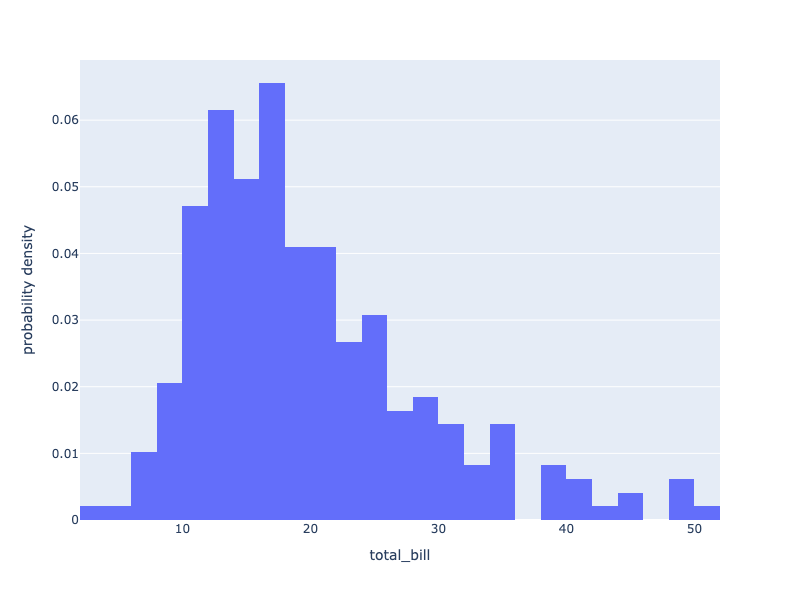

**Interactive Plot:**

<div>                        <script type="text/javascript">window.PlotlyConfig = {MathJaxConfig: 'local'};</script>
        <script charset="utf-8" src="https://cdn.plot.ly/plotly-3.1.0.min.js" integrity="sha256-Ei4740bWZhaUTQuD6q9yQlgVCMPBz6CZWhevDYPv93A=" crossorigin="anonymous"></script>                <div id="plotly-div-7" class="plotly-graph-div" style="height:100%; width:100%;"></div>            <script type="text/javascript">                window.PLOTLYENV=window.PLOTLYENV || {};                                if (document.getElementById("plotly-div-7")) {                    Plotly.newPlot(                        "plotly-div-7",                        [{"bingroup":"x","histnorm":"probability density","hovertemplate":"total_bill=%{x}\u003cbr\u003eprobability density=%{y}\u003cextra\u003e\u003c\u002fextra\u003e","legendgroup":"","marker":{"color":"#636efa","pattern":{"shape":""}},"name":"","orientation":"v","showlegend":false,"x":{"dtype":"f8","bdata":"PQrXo3D9MECuR+F6FK4kQMP1KFyPAjVArkfhehSuN0DXo3A9Cpc4QArXo3A9SjlACtejcD2KIUDhehSuR+E6QBSuR+F6FC5Aj8L1KFyPLUAK16NwPYokQOF6FK5HoUFA16NwPQrXLkCuR+F6FG4yQClcj8L1qC1AFK5H4XqUNUApXI\u002fC9agkQArXo3A9SjBAuB6F61H4MEBmZmZmZqY0QOxRuB6F6zFACtejcD1KNEAK16NwPYovQPYoXI\u002fCtUNAUrgehevRM0CPwvUoXM8xQD0K16NwvSpA4XoUrkdhKUAzMzMzM7M1QGZmZmZmpjNAmpmZmZkZI0CamZmZmVkyQB+F61G4Hi5AcT0K16OwNEBI4XoUrscxQI\u002fC9ShcDzhAj8L1KFxPMECuR+F6FO4wQHE9CtejsDJAhetRuB5FP0AK16NwPQowQPYoXI\u002fCdTFA4XoUrkfhK0Bcj8L1KFwjQGZmZmZmZj5ACtejcD1KMkB7FK5H4To2QDMzMzMzM0BAzczMzMyMPEAK16NwPQoyQBSuR+F6FClAFK5H4XqUJEBI4XoUrmdBQOF6FK5H4SNAj8L1KFyPOUA9CtejcH0zQOF6FK5HAUNAKVyPwvVoOkB7FK5H4XomQMP1KFyPIkhACtejcD1KNEAfhetRuJ4rQArXo3A9CiZACtejcD1KMkDXo3A9CpcxQBSuR+F6FDRAMzMzMzNzMECPwvUoXI8IQHsUrkfhOjRAhetRuB4FLkAK16NwPQooQFK4HoXrETFAXI\u002fC9SjcOkBI4XoUrkc5QPYoXI\u002fCdS1AhetRuB4FJUDsUbgehesxQDMzMzMzMztAw\u002fUoXI\u002fCNkAK16NwPUoxQHE9CtejcDNAKVyPwvWoMECkcD0K1yMkQNejcD0KV0BA9ihcj8L1L0AK16NwPWpBQI\u002fC9ShcDypASOF6FK5HMkD2KFyPwrU4QClcj8L1KDVAuB6F61H4PEA9CtejcH02QAAAAAAAABdAUrgehetRMEAAAAAAAMA2QPYoXI\u002fCFURASOF6FK5HO0CPwvUoXA8oQMP1KFyPAjVA7FG4HoXrKEAzMzMzM7MmQMP1KFyPwi5AZmZmZmYmRkDsUbgehWs2QOxRuB6F6zRAuB6F61G4LkA9CtejcH00QPYoXI\u002fCNTlAPQrXo3A9MkAfhetRuJ4sQAAAAAAAACxAAAAAAAAAHUApXI\u002fC9QhDQDMzMzMz8zdA9ihcj8K1OUCPwvUoXE8xQK5H4XoU7j1AzczMzMxMJUBcj8L1KNwoQBSuR+F6FDhA4XoUrkdhJ0DXo3A9CtcqQIXrUbgehSxAZmZmZmbmL0D2KFyPwvUoQM3MzMzMzD1ACtejcD0KIUAK16NwPQotQMP1KFyPwiZAUrgehevRNkAUrkfhehQzQIXrUbgeRTRA16NwPQpXJkCF61G4HoUoQMP1KFyPQjJAhetRuB4FIUApXI\u002fC9agkQM3MzMzMTCxAAAAAAAAAMEBSuB6F61EqQLgehetReDFAZmZmZmYmQUC4HoXrUZhEQM3MzMzMDDtArkfhehRuMEAzMzMzM7MgQKRwPQrXozJAPQrXo3C9J0CPwvUoXI8jQArXo3A9Ch5ApHA9CtcjLEDD9Shcj0IqQMP1KFyPQjFAzczMzMyMOECF61G4HsUzQJqZmZmZ2T1A9ihcj8IVSEAAAAAAAAA5QEjhehSuxypAPQrXo3B9MEAAAAAAAIA1QFK4HoXrUSlA9ihcj8I1MEAfhetRuJ4rQMP1KFyPgjFAhetRuB6FOEDD9Shcj8I0QPYoXI\u002fCtT9ArkfhehQuJUDD9Shcj0IlQEjhehSuZ0lAH4XrUbieL0AAAAAAAAAdQJqZmZmZ2T9AUrgehevRMEAzMzMzM3NAQKRwPQrX4zFA9ihcj8L1LEAzMzMzMzMjQHE9CtejUEFAMzMzMzNTQUAUrkfhelQ3QM3MzMzMrEZA7FG4HoUrN0BmZmZmZkZEQHE9CtejsDRAZmZmZmbmNED2KFyPwnU+QGZmZmZmJjJAmpmZmZkZN0DhehSuR2EvQI\u002fC9ShczzNAcT0K16NwPED2KFyPwvUuQBSuR+F6lDBAPQrXo3A9HkCuR+F6FK4kQK5H4XoUjkVAAAAAAAAAKkCF61G4HgUrQPYoXI\u002fCtTJAexSuR+F6KUAAAAAAAAAqQGZmZmZmZjBASOF6FK6HNEC4HoXrUXgwQNejcD0KlzpAPQrXo3BdQ0CF61G4HkU4QIXrUbgehSlAj8L1KFwPPkCkcD0K1+M5QArXo3A9KkhACtejcD2KKkDsUbgehSs8QM3MzMzMzClAZmZmZmYmPECuR+F6FC4nQPYoXI\u002fC9R5ApHA9CtcjPkBSuB6F61EoQNejcD0K1ypAKVyPwvUoIUD2KFyPwvUvQNejcD0K1ypAhetRuB5FMECuR+F6FC4kQDMzMzMzczRAj8L1KFyPKkAfhetRuB42QMP1KFyPAjhA4XoUrkdhL0C4HoXrUTgnQArXo3A9iiVAj8L1KFwPL0CkcD0K1yMkQDMzMzMzMylACtejcD1qQEAK16NwPepBQEjhehSuBz1ArkfhehQuO0DsUbgehas2QFK4HoXr0TFASOF6FK7HMkA="},"xaxis":"x","yaxis":"y","type":"histogram"}],                        {"template":{"data":{"histogram2dcontour":[{"type":"histogram2dcontour","colorbar":{"outlinewidth":0,"ticks":""},"colorscale":[[0.0,"#0d0887"],[0.1111111111111111,"#46039f"],[0.2222222222222222,"#7201a8"],[0.3333333333333333,"#9c179e"],[0.4444444444444444,"#bd3786"],[0.5555555555555556,"#d8576b"],[0.6666666666666666,"#ed7953"],[0.7777777777777778,"#fb9f3a"],[0.8888888888888888,"#fdca26"],[1.0,"#f0f921"]]}],"choropleth":[{"type":"choropleth","colorbar":{"outlinewidth":0,"ticks":""}}],"histogram2d":[{"type":"histogram2d","colorbar":{"outlinewidth":0,"ticks":""},"colorscale":[[0.0,"#0d0887"],[0.1111111111111111,"#46039f"],[0.2222222222222222,"#7201a8"],[0.3333333333333333,"#9c179e"],[0.4444444444444444,"#bd3786"],[0.5555555555555556,"#d8576b"],[0.6666666666666666,"#ed7953"],[0.7777777777777778,"#fb9f3a"],[0.8888888888888888,"#fdca26"],[1.0,"#f0f921"]]}],"heatmap":[{"type":"heatmap","colorbar":{"outlinewidth":0,"ticks":""},"colorscale":[[0.0,"#0d0887"],[0.1111111111111111,"#46039f"],[0.2222222222222222,"#7201a8"],[0.3333333333333333,"#9c179e"],[0.4444444444444444,"#bd3786"],[0.5555555555555556,"#d8576b"],[0.6666666666666666,"#ed7953"],[0.7777777777777778,"#fb9f3a"],[0.8888888888888888,"#fdca26"],[1.0,"#f0f921"]]}],"contourcarpet":[{"type":"contourcarpet","colorbar":{"outlinewidth":0,"ticks":""}}],"contour":[{"type":"contour","colorbar":{"outlinewidth":0,"ticks":""},"colorscale":[[0.0,"#0d0887"],[0.1111111111111111,"#46039f"],[0.2222222222222222,"#7201a8"],[0.3333333333333333,"#9c179e"],[0.4444444444444444,"#bd3786"],[0.5555555555555556,"#d8576b"],[0.6666666666666666,"#ed7953"],[0.7777777777777778,"#fb9f3a"],[0.8888888888888888,"#fdca26"],[1.0,"#f0f921"]]}],"surface":[{"type":"surface","colorbar":{"outlinewidth":0,"ticks":""},"colorscale":[[0.0,"#0d0887"],[0.1111111111111111,"#46039f"],[0.2222222222222222,"#7201a8"],[0.3333333333333333,"#9c179e"],[0.4444444444444444,"#bd3786"],[0.5555555555555556,"#d8576b"],[0.6666666666666666,"#ed7953"],[0.7777777777777778,"#fb9f3a"],[0.8888888888888888,"#fdca26"],[1.0,"#f0f921"]]}],"mesh3d":[{"type":"mesh3d","colorbar":{"outlinewidth":0,"ticks":""}}],"scatter":[{"fillpattern":{"fillmode":"overlay","size":10,"solidity":0.2},"type":"scatter"}],"parcoords":[{"type":"parcoords","line":{"colorbar":{"outlinewidth":0,"ticks":""}}}],"scatterpolargl":[{"type":"scatterpolargl","marker":{"colorbar":{"outlinewidth":0,"ticks":""}}}],"bar":[{"error_x":{"color":"#2a3f5f"},"error_y":{"color":"#2a3f5f"},"marker":{"line":{"color":"#E5ECF6","width":0.5},"pattern":{"fillmode":"overlay","size":10,"solidity":0.2}},"type":"bar"}],"scattergeo":[{"type":"scattergeo","marker":{"colorbar":{"outlinewidth":0,"ticks":""}}}],"scatterpolar":[{"type":"scatterpolar","marker":{"colorbar":{"outlinewidth":0,"ticks":""}}}],"histogram":[{"marker":{"pattern":{"fillmode":"overlay","size":10,"solidity":0.2}},"type":"histogram"}],"scattergl":[{"type":"scattergl","marker":{"colorbar":{"outlinewidth":0,"ticks":""}}}],"scatter3d":[{"type":"scatter3d","line":{"colorbar":{"outlinewidth":0,"ticks":""}},"marker":{"colorbar":{"outlinewidth":0,"ticks":""}}}],"scattermap":[{"type":"scattermap","marker":{"colorbar":{"outlinewidth":0,"ticks":""}}}],"scattermapbox":[{"type":"scattermapbox","marker":{"colorbar":{"outlinewidth":0,"ticks":""}}}],"scatterternary":[{"type":"scatterternary","marker":{"colorbar":{"outlinewidth":0,"ticks":""}}}],"scattercarpet":[{"type":"scattercarpet","marker":{"colorbar":{"outlinewidth":0,"ticks":""}}}],"carpet":[{"aaxis":{"endlinecolor":"#2a3f5f","gridcolor":"white","linecolor":"white","minorgridcolor":"white","startlinecolor":"#2a3f5f"},"baxis":{"endlinecolor":"#2a3f5f","gridcolor":"white","linecolor":"white","minorgridcolor":"white","startlinecolor":"#2a3f5f"},"type":"carpet"}],"table":[{"cells":{"fill":{"color":"#EBF0F8"},"line":{"color":"white"}},"header":{"fill":{"color":"#C8D4E3"},"line":{"color":"white"}},"type":"table"}],"barpolar":[{"marker":{"line":{"color":"#E5ECF6","width":0.5},"pattern":{"fillmode":"overlay","size":10,"solidity":0.2}},"type":"barpolar"}],"pie":[{"automargin":true,"type":"pie"}]},"layout":{"autotypenumbers":"strict","colorway":["#636efa","#EF553B","#00cc96","#ab63fa","#FFA15A","#19d3f3","#FF6692","#B6E880","#FF97FF","#FECB52"],"font":{"color":"#2a3f5f"},"hovermode":"closest","hoverlabel":{"align":"left"},"paper_bgcolor":"white","plot_bgcolor":"#E5ECF6","polar":{"bgcolor":"#E5ECF6","angularaxis":{"gridcolor":"white","linecolor":"white","ticks":""},"radialaxis":{"gridcolor":"white","linecolor":"white","ticks":""}},"ternary":{"bgcolor":"#E5ECF6","aaxis":{"gridcolor":"white","linecolor":"white","ticks":""},"baxis":{"gridcolor":"white","linecolor":"white","ticks":""},"caxis":{"gridcolor":"white","linecolor":"white","ticks":""}},"coloraxis":{"colorbar":{"outlinewidth":0,"ticks":""}},"colorscale":{"sequential":[[0.0,"#0d0887"],[0.1111111111111111,"#46039f"],[0.2222222222222222,"#7201a8"],[0.3333333333333333,"#9c179e"],[0.4444444444444444,"#bd3786"],[0.5555555555555556,"#d8576b"],[0.6666666666666666,"#ed7953"],[0.7777777777777778,"#fb9f3a"],[0.8888888888888888,"#fdca26"],[1.0,"#f0f921"]],"sequentialminus":[[0.0,"#0d0887"],[0.1111111111111111,"#46039f"],[0.2222222222222222,"#7201a8"],[0.3333333333333333,"#9c179e"],[0.4444444444444444,"#bd3786"],[0.5555555555555556,"#d8576b"],[0.6666666666666666,"#ed7953"],[0.7777777777777778,"#fb9f3a"],[0.8888888888888888,"#fdca26"],[1.0,"#f0f921"]],"diverging":[[0,"#8e0152"],[0.1,"#c51b7d"],[0.2,"#de77ae"],[0.3,"#f1b6da"],[0.4,"#fde0ef"],[0.5,"#f7f7f7"],[0.6,"#e6f5d0"],[0.7,"#b8e186"],[0.8,"#7fbc41"],[0.9,"#4d9221"],[1,"#276419"]]},"xaxis":{"gridcolor":"white","linecolor":"white","ticks":"","title":{"standoff":15},"zerolinecolor":"white","automargin":true,"zerolinewidth":2},"yaxis":{"gridcolor":"white","linecolor":"white","ticks":"","title":{"standoff":15},"zerolinecolor":"white","automargin":true,"zerolinewidth":2},"scene":{"xaxis":{"backgroundcolor":"#E5ECF6","gridcolor":"white","linecolor":"white","showbackground":true,"ticks":"","zerolinecolor":"white","gridwidth":2},"yaxis":{"backgroundcolor":"#E5ECF6","gridcolor":"white","linecolor":"white","showbackground":true,"ticks":"","zerolinecolor":"white","gridwidth":2},"zaxis":{"backgroundcolor":"#E5ECF6","gridcolor":"white","linecolor":"white","showbackground":true,"ticks":"","zerolinecolor":"white","gridwidth":2}},"shapedefaults":{"line":{"color":"#2a3f5f"}},"annotationdefaults":{"arrowcolor":"#2a3f5f","arrowhead":0,"arrowwidth":1},"geo":{"bgcolor":"white","landcolor":"#E5ECF6","subunitcolor":"white","showland":true,"showlakes":true,"lakecolor":"white"},"title":{"x":0.05},"mapbox":{"style":"light"}}},"xaxis":{"anchor":"y","domain":[0.0,1.0],"title":{"text":"total_bill"}},"yaxis":{"anchor":"x","domain":[0.0,1.0],"title":{"text":"probability density"}},"legend":{"tracegroupgap":0},"margin":{"t":60},"barmode":"relative"},                        {"responsive": true}                    )                };            </script>        </div>

#### Aspect of the histogram plot

```python
import plotly.express as px
df = px.data.tips()
fig = px.histogram(df, x="total_bill",
                   title='Histogram of bills',
                   labels={'total_bill':'total bill'}, # can specify one label per df column
                   opacity=0.8,
                   log_y=True, # represent bars with log scale
                   color_discrete_sequence=['indianred'] # color of histogram bars
                   )
fig.show()
```

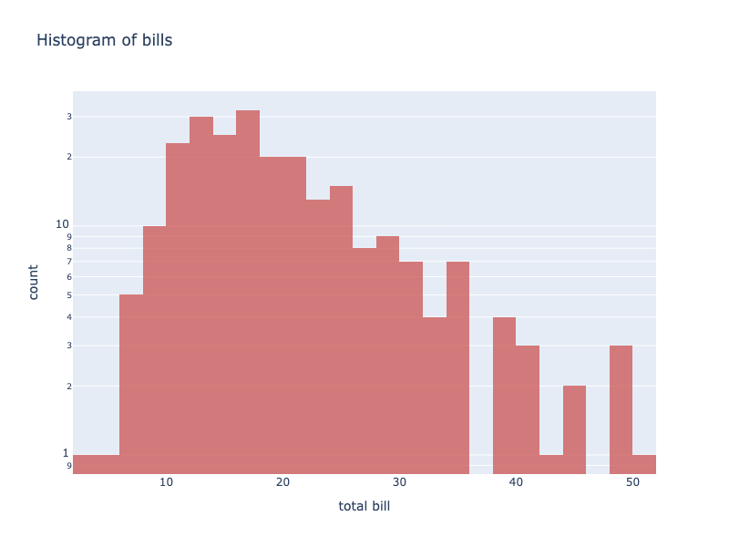

**Interactive Plot:**

<div>                        <script type="text/javascript">window.PlotlyConfig = {MathJaxConfig: 'local'};</script>
        <script charset="utf-8" src="https://cdn.plot.ly/plotly-3.1.0.min.js" integrity="sha256-Ei4740bWZhaUTQuD6q9yQlgVCMPBz6CZWhevDYPv93A=" crossorigin="anonymous"></script>                <div id="plotly-div-8" class="plotly-graph-div" style="height:100%; width:100%;"></div>            <script type="text/javascript">                window.PLOTLYENV=window.PLOTLYENV || {};                                if (document.getElementById("plotly-div-8")) {                    Plotly.newPlot(                        "plotly-div-8",                        [{"bingroup":"x","hovertemplate":"total bill=%{x}\u003cbr\u003ecount=%{y}\u003cextra\u003e\u003c\u002fextra\u003e","legendgroup":"","marker":{"color":"indianred","opacity":0.8,"pattern":{"shape":""}},"name":"","orientation":"v","showlegend":false,"x":{"dtype":"f8","bdata":"PQrXo3D9MECuR+F6FK4kQMP1KFyPAjVArkfhehSuN0DXo3A9Cpc4QArXo3A9SjlACtejcD2KIUDhehSuR+E6QBSuR+F6FC5Aj8L1KFyPLUAK16NwPYokQOF6FK5HoUFA16NwPQrXLkCuR+F6FG4yQClcj8L1qC1AFK5H4XqUNUApXI\u002fC9agkQArXo3A9SjBAuB6F61H4MEBmZmZmZqY0QOxRuB6F6zFACtejcD1KNEAK16NwPYovQPYoXI\u002fCtUNAUrgehevRM0CPwvUoXM8xQD0K16NwvSpA4XoUrkdhKUAzMzMzM7M1QGZmZmZmpjNAmpmZmZkZI0CamZmZmVkyQB+F61G4Hi5AcT0K16OwNEBI4XoUrscxQI\u002fC9ShcDzhAj8L1KFxPMECuR+F6FO4wQHE9CtejsDJAhetRuB5FP0AK16NwPQowQPYoXI\u002fCdTFA4XoUrkfhK0Bcj8L1KFwjQGZmZmZmZj5ACtejcD1KMkB7FK5H4To2QDMzMzMzM0BAzczMzMyMPEAK16NwPQoyQBSuR+F6FClAFK5H4XqUJEBI4XoUrmdBQOF6FK5H4SNAj8L1KFyPOUA9CtejcH0zQOF6FK5HAUNAKVyPwvVoOkB7FK5H4XomQMP1KFyPIkhACtejcD1KNEAfhetRuJ4rQArXo3A9CiZACtejcD1KMkDXo3A9CpcxQBSuR+F6FDRAMzMzMzNzMECPwvUoXI8IQHsUrkfhOjRAhetRuB4FLkAK16NwPQooQFK4HoXrETFAXI\u002fC9SjcOkBI4XoUrkc5QPYoXI\u002fCdS1AhetRuB4FJUDsUbgehesxQDMzMzMzMztAw\u002fUoXI\u002fCNkAK16NwPUoxQHE9CtejcDNAKVyPwvWoMECkcD0K1yMkQNejcD0KV0BA9ihcj8L1L0AK16NwPWpBQI\u002fC9ShcDypASOF6FK5HMkD2KFyPwrU4QClcj8L1KDVAuB6F61H4PEA9CtejcH02QAAAAAAAABdAUrgehetRMEAAAAAAAMA2QPYoXI\u002fCFURASOF6FK5HO0CPwvUoXA8oQMP1KFyPAjVA7FG4HoXrKEAzMzMzM7MmQMP1KFyPwi5AZmZmZmYmRkDsUbgehWs2QOxRuB6F6zRAuB6F61G4LkA9CtejcH00QPYoXI\u002fCNTlAPQrXo3A9MkAfhetRuJ4sQAAAAAAAACxAAAAAAAAAHUApXI\u002fC9QhDQDMzMzMz8zdA9ihcj8K1OUCPwvUoXE8xQK5H4XoU7j1AzczMzMxMJUBcj8L1KNwoQBSuR+F6FDhA4XoUrkdhJ0DXo3A9CtcqQIXrUbgehSxAZmZmZmbmL0D2KFyPwvUoQM3MzMzMzD1ACtejcD0KIUAK16NwPQotQMP1KFyPwiZAUrgehevRNkAUrkfhehQzQIXrUbgeRTRA16NwPQpXJkCF61G4HoUoQMP1KFyPQjJAhetRuB4FIUApXI\u002fC9agkQM3MzMzMTCxAAAAAAAAAMEBSuB6F61EqQLgehetReDFAZmZmZmYmQUC4HoXrUZhEQM3MzMzMDDtArkfhehRuMEAzMzMzM7MgQKRwPQrXozJAPQrXo3C9J0CPwvUoXI8jQArXo3A9Ch5ApHA9CtcjLEDD9Shcj0IqQMP1KFyPQjFAzczMzMyMOECF61G4HsUzQJqZmZmZ2T1A9ihcj8IVSEAAAAAAAAA5QEjhehSuxypAPQrXo3B9MEAAAAAAAIA1QFK4HoXrUSlA9ihcj8I1MEAfhetRuJ4rQMP1KFyPgjFAhetRuB6FOEDD9Shcj8I0QPYoXI\u002fCtT9ArkfhehQuJUDD9Shcj0IlQEjhehSuZ0lAH4XrUbieL0AAAAAAAAAdQJqZmZmZ2T9AUrgehevRMEAzMzMzM3NAQKRwPQrX4zFA9ihcj8L1LEAzMzMzMzMjQHE9CtejUEFAMzMzMzNTQUAUrkfhelQ3QM3MzMzMrEZA7FG4HoUrN0BmZmZmZkZEQHE9CtejsDRAZmZmZmbmNED2KFyPwnU+QGZmZmZmJjJAmpmZmZkZN0DhehSuR2EvQI\u002fC9ShczzNAcT0K16NwPED2KFyPwvUuQBSuR+F6lDBAPQrXo3A9HkCuR+F6FK4kQK5H4XoUjkVAAAAAAAAAKkCF61G4HgUrQPYoXI\u002fCtTJAexSuR+F6KUAAAAAAAAAqQGZmZmZmZjBASOF6FK6HNEC4HoXrUXgwQNejcD0KlzpAPQrXo3BdQ0CF61G4HkU4QIXrUbgehSlAj8L1KFwPPkCkcD0K1+M5QArXo3A9KkhACtejcD2KKkDsUbgehSs8QM3MzMzMzClAZmZmZmYmPECuR+F6FC4nQPYoXI\u002fC9R5ApHA9CtcjPkBSuB6F61EoQNejcD0K1ypAKVyPwvUoIUD2KFyPwvUvQNejcD0K1ypAhetRuB5FMECuR+F6FC4kQDMzMzMzczRAj8L1KFyPKkAfhetRuB42QMP1KFyPAjhA4XoUrkdhL0C4HoXrUTgnQArXo3A9iiVAj8L1KFwPL0CkcD0K1yMkQDMzMzMzMylACtejcD1qQEAK16NwPepBQEjhehSuBz1ArkfhehQuO0DsUbgehas2QFK4HoXr0TFASOF6FK7HMkA="},"xaxis":"x","yaxis":"y","type":"histogram"}],                        {"template":{"data":{"histogram2dcontour":[{"type":"histogram2dcontour","colorbar":{"outlinewidth":0,"ticks":""},"colorscale":[[0.0,"#0d0887"],[0.1111111111111111,"#46039f"],[0.2222222222222222,"#7201a8"],[0.3333333333333333,"#9c179e"],[0.4444444444444444,"#bd3786"],[0.5555555555555556,"#d8576b"],[0.6666666666666666,"#ed7953"],[0.7777777777777778,"#fb9f3a"],[0.8888888888888888,"#fdca26"],[1.0,"#f0f921"]]}],"choropleth":[{"type":"choropleth","colorbar":{"outlinewidth":0,"ticks":""}}],"histogram2d":[{"type":"histogram2d","colorbar":{"outlinewidth":0,"ticks":""},"colorscale":[[0.0,"#0d0887"],[0.1111111111111111,"#46039f"],[0.2222222222222222,"#7201a8"],[0.3333333333333333,"#9c179e"],[0.4444444444444444,"#bd3786"],[0.5555555555555556,"#d8576b"],[0.6666666666666666,"#ed7953"],[0.7777777777777778,"#fb9f3a"],[0.8888888888888888,"#fdca26"],[1.0,"#f0f921"]]}],"heatmap":[{"type":"heatmap","colorbar":{"outlinewidth":0,"ticks":""},"colorscale":[[0.0,"#0d0887"],[0.1111111111111111,"#46039f"],[0.2222222222222222,"#7201a8"],[0.3333333333333333,"#9c179e"],[0.4444444444444444,"#bd3786"],[0.5555555555555556,"#d8576b"],[0.6666666666666666,"#ed7953"],[0.7777777777777778,"#fb9f3a"],[0.8888888888888888,"#fdca26"],[1.0,"#f0f921"]]}],"contourcarpet":[{"type":"contourcarpet","colorbar":{"outlinewidth":0,"ticks":""}}],"contour":[{"type":"contour","colorbar":{"outlinewidth":0,"ticks":""},"colorscale":[[0.0,"#0d0887"],[0.1111111111111111,"#46039f"],[0.2222222222222222,"#7201a8"],[0.3333333333333333,"#9c179e"],[0.4444444444444444,"#bd3786"],[0.5555555555555556,"#d8576b"],[0.6666666666666666,"#ed7953"],[0.7777777777777778,"#fb9f3a"],[0.8888888888888888,"#fdca26"],[1.0,"#f0f921"]]}],"surface":[{"type":"surface","colorbar":{"outlinewidth":0,"ticks":""},"colorscale":[[0.0,"#0d0887"],[0.1111111111111111,"#46039f"],[0.2222222222222222,"#7201a8"],[0.3333333333333333,"#9c179e"],[0.4444444444444444,"#bd3786"],[0.5555555555555556,"#d8576b"],[0.6666666666666666,"#ed7953"],[0.7777777777777778,"#fb9f3a"],[0.8888888888888888,"#fdca26"],[1.0,"#f0f921"]]}],"mesh3d":[{"type":"mesh3d","colorbar":{"outlinewidth":0,"ticks":""}}],"scatter":[{"fillpattern":{"fillmode":"overlay","size":10,"solidity":0.2},"type":"scatter"}],"parcoords":[{"type":"parcoords","line":{"colorbar":{"outlinewidth":0,"ticks":""}}}],"scatterpolargl":[{"type":"scatterpolargl","marker":{"colorbar":{"outlinewidth":0,"ticks":""}}}],"bar":[{"error_x":{"color":"#2a3f5f"},"error_y":{"color":"#2a3f5f"},"marker":{"line":{"color":"#E5ECF6","width":0.5},"pattern":{"fillmode":"overlay","size":10,"solidity":0.2}},"type":"bar"}],"scattergeo":[{"type":"scattergeo","marker":{"colorbar":{"outlinewidth":0,"ticks":""}}}],"scatterpolar":[{"type":"scatterpolar","marker":{"colorbar":{"outlinewidth":0,"ticks":""}}}],"histogram":[{"marker":{"pattern":{"fillmode":"overlay","size":10,"solidity":0.2}},"type":"histogram"}],"scattergl":[{"type":"scattergl","marker":{"colorbar":{"outlinewidth":0,"ticks":""}}}],"scatter3d":[{"type":"scatter3d","line":{"colorbar":{"outlinewidth":0,"ticks":""}},"marker":{"colorbar":{"outlinewidth":0,"ticks":""}}}],"scattermap":[{"type":"scattermap","marker":{"colorbar":{"outlinewidth":0,"ticks":""}}}],"scattermapbox":[{"type":"scattermapbox","marker":{"colorbar":{"outlinewidth":0,"ticks":""}}}],"scatterternary":[{"type":"scatterternary","marker":{"colorbar":{"outlinewidth":0,"ticks":""}}}],"scattercarpet":[{"type":"scattercarpet","marker":{"colorbar":{"outlinewidth":0,"ticks":""}}}],"carpet":[{"aaxis":{"endlinecolor":"#2a3f5f","gridcolor":"white","linecolor":"white","minorgridcolor":"white","startlinecolor":"#2a3f5f"},"baxis":{"endlinecolor":"#2a3f5f","gridcolor":"white","linecolor":"white","minorgridcolor":"white","startlinecolor":"#2a3f5f"},"type":"carpet"}],"table":[{"cells":{"fill":{"color":"#EBF0F8"},"line":{"color":"white"}},"header":{"fill":{"color":"#C8D4E3"},"line":{"color":"white"}},"type":"table"}],"barpolar":[{"marker":{"line":{"color":"#E5ECF6","width":0.5},"pattern":{"fillmode":"overlay","size":10,"solidity":0.2}},"type":"barpolar"}],"pie":[{"automargin":true,"type":"pie"}]},"layout":{"autotypenumbers":"strict","colorway":["#636efa","#EF553B","#00cc96","#ab63fa","#FFA15A","#19d3f3","#FF6692","#B6E880","#FF97FF","#FECB52"],"font":{"color":"#2a3f5f"},"hovermode":"closest","hoverlabel":{"align":"left"},"paper_bgcolor":"white","plot_bgcolor":"#E5ECF6","polar":{"bgcolor":"#E5ECF6","angularaxis":{"gridcolor":"white","linecolor":"white","ticks":""},"radialaxis":{"gridcolor":"white","linecolor":"white","ticks":""}},"ternary":{"bgcolor":"#E5ECF6","aaxis":{"gridcolor":"white","linecolor":"white","ticks":""},"baxis":{"gridcolor":"white","linecolor":"white","ticks":""},"caxis":{"gridcolor":"white","linecolor":"white","ticks":""}},"coloraxis":{"colorbar":{"outlinewidth":0,"ticks":""}},"colorscale":{"sequential":[[0.0,"#0d0887"],[0.1111111111111111,"#46039f"],[0.2222222222222222,"#7201a8"],[0.3333333333333333,"#9c179e"],[0.4444444444444444,"#bd3786"],[0.5555555555555556,"#d8576b"],[0.6666666666666666,"#ed7953"],[0.7777777777777778,"#fb9f3a"],[0.8888888888888888,"#fdca26"],[1.0,"#f0f921"]],"sequentialminus":[[0.0,"#0d0887"],[0.1111111111111111,"#46039f"],[0.2222222222222222,"#7201a8"],[0.3333333333333333,"#9c179e"],[0.4444444444444444,"#bd3786"],[0.5555555555555556,"#d8576b"],[0.6666666666666666,"#ed7953"],[0.7777777777777778,"#fb9f3a"],[0.8888888888888888,"#fdca26"],[1.0,"#f0f921"]],"diverging":[[0,"#8e0152"],[0.1,"#c51b7d"],[0.2,"#de77ae"],[0.3,"#f1b6da"],[0.4,"#fde0ef"],[0.5,"#f7f7f7"],[0.6,"#e6f5d0"],[0.7,"#b8e186"],[0.8,"#7fbc41"],[0.9,"#4d9221"],[1,"#276419"]]},"xaxis":{"gridcolor":"white","linecolor":"white","ticks":"","title":{"standoff":15},"zerolinecolor":"white","automargin":true,"zerolinewidth":2},"yaxis":{"gridcolor":"white","linecolor":"white","ticks":"","title":{"standoff":15},"zerolinecolor":"white","automargin":true,"zerolinewidth":2},"scene":{"xaxis":{"backgroundcolor":"#E5ECF6","gridcolor":"white","linecolor":"white","showbackground":true,"ticks":"","zerolinecolor":"white","gridwidth":2},"yaxis":{"backgroundcolor":"#E5ECF6","gridcolor":"white","linecolor":"white","showbackground":true,"ticks":"","zerolinecolor":"white","gridwidth":2},"zaxis":{"backgroundcolor":"#E5ECF6","gridcolor":"white","linecolor":"white","showbackground":true,"ticks":"","zerolinecolor":"white","gridwidth":2}},"shapedefaults":{"line":{"color":"#2a3f5f"}},"annotationdefaults":{"arrowcolor":"#2a3f5f","arrowhead":0,"arrowwidth":1},"geo":{"bgcolor":"white","landcolor":"#E5ECF6","subunitcolor":"white","showland":true,"showlakes":true,"lakecolor":"white"},"title":{"x":0.05},"mapbox":{"style":"light"}}},"xaxis":{"anchor":"y","domain":[0.0,1.0],"title":{"text":"total bill"}},"yaxis":{"anchor":"x","domain":[0.0,1.0],"title":{"text":"count"},"type":"log"},"legend":{"tracegroupgap":0},"title":{"text":"Histogram of bills"},"barmode":"relative"},                        {"responsive": true}                    )                };            </script>        </div>

#### Several histograms for the different values of one column

```python
import plotly.express as px
df = px.data.tips()
fig = px.histogram(df, x="total_bill", color="sex")
fig.show()
```

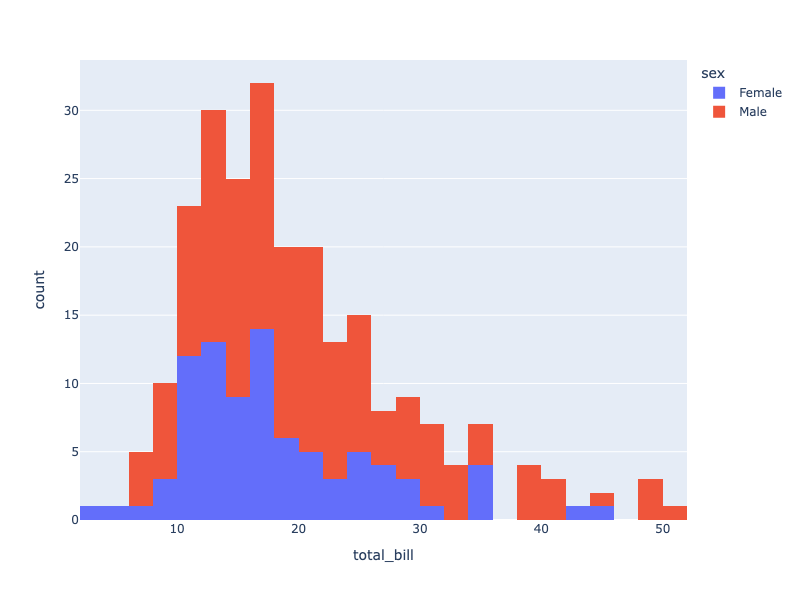

**Interactive Plot:**

<div>                        <script type="text/javascript">window.PlotlyConfig = {MathJaxConfig: 'local'};</script>
        <script charset="utf-8" src="https://cdn.plot.ly/plotly-3.1.0.min.js" integrity="sha256-Ei4740bWZhaUTQuD6q9yQlgVCMPBz6CZWhevDYPv93A=" crossorigin="anonymous"></script>                <div id="plotly-div-9" class="plotly-graph-div" style="height:100%; width:100%;"></div>            <script type="text/javascript">                window.PLOTLYENV=window.PLOTLYENV || {};                                if (document.getElementById("plotly-div-9")) {                    Plotly.newPlot(                        "plotly-div-9",                        [{"bingroup":"x","hovertemplate":"sex=Female\u003cbr\u003etotal_bill=%{x}\u003cbr\u003ecount=%{y}\u003cextra\u003e\u003c\u002fextra\u003e","legendgroup":"Female","marker":{"color":"#636efa","pattern":{"shape":""}},"name":"Female","orientation":"v","showlegend":true,"x":{"dtype":"f8","bdata":"PQrXo3D9MEDXo3A9Cpc4QOF6FK5HoUFAKVyPwvWoLUApXI\u002fC9agkQLgehetR+DBACtejcD1KNEAK16NwPYovQGZmZmZmpjNAH4XrUbgeLkBxPQrXo7A0QK5H4XoU7jBAFK5H4XqUJEBI4XoUrmdBQClcj8L1aDpAMzMzMzNzMECPwvUoXI8IQFK4HoXrETFAXI\u002fC9SjcOkBI4XoUrkc5QPYoXI\u002fCdS1ApHA9CtcjJEAK16NwPWpBQAAAAAAAABdAUrgehetRMEAAAAAAAMA2QDMzMzMzsyZAw\u002fUoXI\u002fCLkBmZmZmZiZGQOxRuB6FazZA7FG4HoXrNEAfhetRuJ4sQAAAAAAAAB1A9ihcj8K1OUCPwvUoXE8xQM3MzMzMTCVAXI\u002fC9SjcKEAUrkfhehQ4QNejcD0K1ypA9ihcj8L1KEDNzMzMzMw9QArXo3A9Ci1Aw\u002fUoXI\u002fCJkCF61G4HkU0QNejcD0KVyZAhetRuB6FKEDD9Shcj0IyQIXrUbgeBSFAKVyPwvWoJEDNzMzMzEwsQFK4HoXrUSpAuB6F61F4MUDNzMzMzAw7QK5H4XoUbjBAMzMzMzOzIECkcD0K16MyQD0K16NwvSdAmpmZmZnZPUAAAAAAAAA5QEjhehSuxypA9ihcj8I1MEDD9Shcj4IxQK5H4XoULiVAw\u002fUoXI9CJUAzMzMzMzMjQGZmZmZm5jRAZmZmZmYmMkCPwvUoXM8zQK5H4XoUjkVAAAAAAAAAKkB7FK5H4XopQAAAAAAAACpAZmZmZmZmMEC4HoXrUXgwQIXrUbgehSlACtejcD2KKkDsUbgehSs8QM3MzMzMzClApHA9CtcjPkDXo3A9CtcqQPYoXI\u002fC9S9AhetRuB5FMECuR+F6FC4kQB+F61G4HjZACtejcD3qQUCuR+F6FC47QEjhehSuxzJA"},"xaxis":"x","yaxis":"y","type":"histogram"},{"bingroup":"x","hovertemplate":"sex=Male\u003cbr\u003etotal_bill=%{x}\u003cbr\u003ecount=%{y}\u003cextra\u003e\u003c\u002fextra\u003e","legendgroup":"Male","marker":{"color":"#EF553B","pattern":{"shape":""}},"name":"Male","orientation":"v","showlegend":true,"x":{"dtype":"f8","bdata":"rkfhehSuJEDD9ShcjwI1QK5H4XoUrjdACtejcD1KOUAK16NwPYohQOF6FK5H4TpAFK5H4XoULkCPwvUoXI8tQArXo3A9iiRA16NwPQrXLkCuR+F6FG4yQBSuR+F6lDVACtejcD1KMEBmZmZmZqY0QOxRuB6F6zFA9ihcj8K1Q0BSuB6F69EzQI\u002fC9ShczzFAPQrXo3C9KkDhehSuR2EpQDMzMzMzszVAmpmZmZkZI0CamZmZmVkyQEjhehSuxzFAj8L1KFwPOECPwvUoXE8wQHE9CtejsDJAhetRuB5FP0AK16NwPQowQPYoXI\u002fCdTFA4XoUrkfhK0Bcj8L1KFwjQGZmZmZmZj5ACtejcD1KMkB7FK5H4To2QDMzMzMzM0BAzczMzMyMPEAK16NwPQoyQBSuR+F6FClA4XoUrkfhI0CPwvUoXI85QD0K16NwfTNA4XoUrkcBQ0B7FK5H4XomQMP1KFyPIkhACtejcD1KNEAfhetRuJ4rQArXo3A9CiZACtejcD1KMkDXo3A9CpcxQBSuR+F6FDRAexSuR+E6NECF61G4HgUuQArXo3A9CihAhetRuB4FJUDsUbgehesxQDMzMzMzMztAw\u002fUoXI\u002fCNkAK16NwPUoxQHE9CtejcDNAKVyPwvWoMEDXo3A9CldAQPYoXI\u002fC9S9Aj8L1KFwPKkBI4XoUrkcyQPYoXI\u002fCtThAKVyPwvUoNUC4HoXrUfg8QD0K16NwfTZA9ihcj8IVREBI4XoUrkc7QI\u002fC9ShcDyhAw\u002fUoXI8CNUDsUbgehesoQLgehetRuC5APQrXo3B9NED2KFyPwjU5QD0K16NwPTJAAAAAAAAALEApXI\u002fC9QhDQDMzMzMz8zdArkfhehTuPUDhehSuR2EnQIXrUbgehSxAZmZmZmbmL0AK16NwPQohQFK4HoXr0TZAFK5H4XoUM0AAAAAAAAAwQGZmZmZmJkFAuB6F61GYRECPwvUoXI8jQArXo3A9Ch5ApHA9CtcjLEDD9Shcj0IqQMP1KFyPQjFAzczMzMyMOECF61G4HsUzQPYoXI\u002fCFUhAPQrXo3B9MEAAAAAAAIA1QFK4HoXrUSlAH4XrUbieK0CF61G4HoU4QMP1KFyPwjRA9ihcj8K1P0BI4XoUrmdJQB+F61G4ni9AAAAAAAAAHUCamZmZmdk\u002fQFK4HoXr0TBAMzMzMzNzQECkcD0K1+MxQPYoXI\u002fC9SxAcT0K16NQQUAzMzMzM1NBQBSuR+F6VDdAzczMzMysRkDsUbgehSs3QGZmZmZmRkRAcT0K16OwNED2KFyPwnU+QJqZmZmZGTdA4XoUrkdhL0BxPQrXo3A8QPYoXI\u002fC9S5AFK5H4XqUMEA9CtejcD0eQK5H4XoUriRAhetRuB4FK0D2KFyPwrUyQEjhehSuhzRA16NwPQqXOkA9CtejcF1DQIXrUbgeRThAj8L1KFwPPkCkcD0K1+M5QArXo3A9KkhAZmZmZmYmPECuR+F6FC4nQPYoXI\u002fC9R5AUrgehetRKEApXI\u002fC9SghQNejcD0K1ypAMzMzMzNzNECPwvUoXI8qQMP1KFyPAjhA4XoUrkdhL0C4HoXrUTgnQArXo3A9iiVAj8L1KFwPL0CkcD0K1yMkQDMzMzMzMylACtejcD1qQEBI4XoUrgc9QOxRuB6FqzZAUrgehevRMUA="},"xaxis":"x","yaxis":"y","type":"histogram"}],                        {"template":{"data":{"histogram2dcontour":[{"type":"histogram2dcontour","colorbar":{"outlinewidth":0,"ticks":""},"colorscale":[[0.0,"#0d0887"],[0.1111111111111111,"#46039f"],[0.2222222222222222,"#7201a8"],[0.3333333333333333,"#9c179e"],[0.4444444444444444,"#bd3786"],[0.5555555555555556,"#d8576b"],[0.6666666666666666,"#ed7953"],[0.7777777777777778,"#fb9f3a"],[0.8888888888888888,"#fdca26"],[1.0,"#f0f921"]]}],"choropleth":[{"type":"choropleth","colorbar":{"outlinewidth":0,"ticks":""}}],"histogram2d":[{"type":"histogram2d","colorbar":{"outlinewidth":0,"ticks":""},"colorscale":[[0.0,"#0d0887"],[0.1111111111111111,"#46039f"],[0.2222222222222222,"#7201a8"],[0.3333333333333333,"#9c179e"],[0.4444444444444444,"#bd3786"],[0.5555555555555556,"#d8576b"],[0.6666666666666666,"#ed7953"],[0.7777777777777778,"#fb9f3a"],[0.8888888888888888,"#fdca26"],[1.0,"#f0f921"]]}],"heatmap":[{"type":"heatmap","colorbar":{"outlinewidth":0,"ticks":""},"colorscale":[[0.0,"#0d0887"],[0.1111111111111111,"#46039f"],[0.2222222222222222,"#7201a8"],[0.3333333333333333,"#9c179e"],[0.4444444444444444,"#bd3786"],[0.5555555555555556,"#d8576b"],[0.6666666666666666,"#ed7953"],[0.7777777777777778,"#fb9f3a"],[0.8888888888888888,"#fdca26"],[1.0,"#f0f921"]]}],"contourcarpet":[{"type":"contourcarpet","colorbar":{"outlinewidth":0,"ticks":""}}],"contour":[{"type":"contour","colorbar":{"outlinewidth":0,"ticks":""},"colorscale":[[0.0,"#0d0887"],[0.1111111111111111,"#46039f"],[0.2222222222222222,"#7201a8"],[0.3333333333333333,"#9c179e"],[0.4444444444444444,"#bd3786"],[0.5555555555555556,"#d8576b"],[0.6666666666666666,"#ed7953"],[0.7777777777777778,"#fb9f3a"],[0.8888888888888888,"#fdca26"],[1.0,"#f0f921"]]}],"surface":[{"type":"surface","colorbar":{"outlinewidth":0,"ticks":""},"colorscale":[[0.0,"#0d0887"],[0.1111111111111111,"#46039f"],[0.2222222222222222,"#7201a8"],[0.3333333333333333,"#9c179e"],[0.4444444444444444,"#bd3786"],[0.5555555555555556,"#d8576b"],[0.6666666666666666,"#ed7953"],[0.7777777777777778,"#fb9f3a"],[0.8888888888888888,"#fdca26"],[1.0,"#f0f921"]]}],"mesh3d":[{"type":"mesh3d","colorbar":{"outlinewidth":0,"ticks":""}}],"scatter":[{"fillpattern":{"fillmode":"overlay","size":10,"solidity":0.2},"type":"scatter"}],"parcoords":[{"type":"parcoords","line":{"colorbar":{"outlinewidth":0,"ticks":""}}}],"scatterpolargl":[{"type":"scatterpolargl","marker":{"colorbar":{"outlinewidth":0,"ticks":""}}}],"bar":[{"error_x":{"color":"#2a3f5f"},"error_y":{"color":"#2a3f5f"},"marker":{"line":{"color":"#E5ECF6","width":0.5},"pattern":{"fillmode":"overlay","size":10,"solidity":0.2}},"type":"bar"}],"scattergeo":[{"type":"scattergeo","marker":{"colorbar":{"outlinewidth":0,"ticks":""}}}],"scatterpolar":[{"type":"scatterpolar","marker":{"colorbar":{"outlinewidth":0,"ticks":""}}}],"histogram":[{"marker":{"pattern":{"fillmode":"overlay","size":10,"solidity":0.2}},"type":"histogram"}],"scattergl":[{"type":"scattergl","marker":{"colorbar":{"outlinewidth":0,"ticks":""}}}],"scatter3d":[{"type":"scatter3d","line":{"colorbar":{"outlinewidth":0,"ticks":""}},"marker":{"colorbar":{"outlinewidth":0,"ticks":""}}}],"scattermap":[{"type":"scattermap","marker":{"colorbar":{"outlinewidth":0,"ticks":""}}}],"scattermapbox":[{"type":"scattermapbox","marker":{"colorbar":{"outlinewidth":0,"ticks":""}}}],"scatterternary":[{"type":"scatterternary","marker":{"colorbar":{"outlinewidth":0,"ticks":""}}}],"scattercarpet":[{"type":"scattercarpet","marker":{"colorbar":{"outlinewidth":0,"ticks":""}}}],"carpet":[{"aaxis":{"endlinecolor":"#2a3f5f","gridcolor":"white","linecolor":"white","minorgridcolor":"white","startlinecolor":"#2a3f5f"},"baxis":{"endlinecolor":"#2a3f5f","gridcolor":"white","linecolor":"white","minorgridcolor":"white","startlinecolor":"#2a3f5f"},"type":"carpet"}],"table":[{"cells":{"fill":{"color":"#EBF0F8"},"line":{"color":"white"}},"header":{"fill":{"color":"#C8D4E3"},"line":{"color":"white"}},"type":"table"}],"barpolar":[{"marker":{"line":{"color":"#E5ECF6","width":0.5},"pattern":{"fillmode":"overlay","size":10,"solidity":0.2}},"type":"barpolar"}],"pie":[{"automargin":true,"type":"pie"}]},"layout":{"autotypenumbers":"strict","colorway":["#636efa","#EF553B","#00cc96","#ab63fa","#FFA15A","#19d3f3","#FF6692","#B6E880","#FF97FF","#FECB52"],"font":{"color":"#2a3f5f"},"hovermode":"closest","hoverlabel":{"align":"left"},"paper_bgcolor":"white","plot_bgcolor":"#E5ECF6","polar":{"bgcolor":"#E5ECF6","angularaxis":{"gridcolor":"white","linecolor":"white","ticks":""},"radialaxis":{"gridcolor":"white","linecolor":"white","ticks":""}},"ternary":{"bgcolor":"#E5ECF6","aaxis":{"gridcolor":"white","linecolor":"white","ticks":""},"baxis":{"gridcolor":"white","linecolor":"white","ticks":""},"caxis":{"gridcolor":"white","linecolor":"white","ticks":""}},"coloraxis":{"colorbar":{"outlinewidth":0,"ticks":""}},"colorscale":{"sequential":[[0.0,"#0d0887"],[0.1111111111111111,"#46039f"],[0.2222222222222222,"#7201a8"],[0.3333333333333333,"#9c179e"],[0.4444444444444444,"#bd3786"],[0.5555555555555556,"#d8576b"],[0.6666666666666666,"#ed7953"],[0.7777777777777778,"#fb9f3a"],[0.8888888888888888,"#fdca26"],[1.0,"#f0f921"]],"sequentialminus":[[0.0,"#0d0887"],[0.1111111111111111,"#46039f"],[0.2222222222222222,"#7201a8"],[0.3333333333333333,"#9c179e"],[0.4444444444444444,"#bd3786"],[0.5555555555555556,"#d8576b"],[0.6666666666666666,"#ed7953"],[0.7777777777777778,"#fb9f3a"],[0.8888888888888888,"#fdca26"],[1.0,"#f0f921"]],"diverging":[[0,"#8e0152"],[0.1,"#c51b7d"],[0.2,"#de77ae"],[0.3,"#f1b6da"],[0.4,"#fde0ef"],[0.5,"#f7f7f7"],[0.6,"#e6f5d0"],[0.7,"#b8e186"],[0.8,"#7fbc41"],[0.9,"#4d9221"],[1,"#276419"]]},"xaxis":{"gridcolor":"white","linecolor":"white","ticks":"","title":{"standoff":15},"zerolinecolor":"white","automargin":true,"zerolinewidth":2},"yaxis":{"gridcolor":"white","linecolor":"white","ticks":"","title":{"standoff":15},"zerolinecolor":"white","automargin":true,"zerolinewidth":2},"scene":{"xaxis":{"backgroundcolor":"#E5ECF6","gridcolor":"white","linecolor":"white","showbackground":true,"ticks":"","zerolinecolor":"white","gridwidth":2},"yaxis":{"backgroundcolor":"#E5ECF6","gridcolor":"white","linecolor":"white","showbackground":true,"ticks":"","zerolinecolor":"white","gridwidth":2},"zaxis":{"backgroundcolor":"#E5ECF6","gridcolor":"white","linecolor":"white","showbackground":true,"ticks":"","zerolinecolor":"white","gridwidth":2}},"shapedefaults":{"line":{"color":"#2a3f5f"}},"annotationdefaults":{"arrowcolor":"#2a3f5f","arrowhead":0,"arrowwidth":1},"geo":{"bgcolor":"white","landcolor":"#E5ECF6","subunitcolor":"white","showland":true,"showlakes":true,"lakecolor":"white"},"title":{"x":0.05},"mapbox":{"style":"light"}}},"xaxis":{"anchor":"y","domain":[0.0,1.0],"title":{"text":"total_bill"}},"yaxis":{"anchor":"x","domain":[0.0,1.0],"title":{"text":"count"}},"legend":{"title":{"text":"sex"},"tracegroupgap":0},"margin":{"t":60},"barmode":"relative"},                        {"responsive": true}                    )                };            </script>        </div>

#### Aggregating with other functions than `count`

For each bin of `x`, one can compute a function of data using `histfunc`. The argument of `histfunc` is the dataframe column given as the `y` argument. Below the plot shows that the average tip increases with the total bill.

```python
import plotly.express as px
df = px.data.tips()
fig = px.histogram(df, x="total_bill", y="tip", histfunc='avg')
fig.show()
```

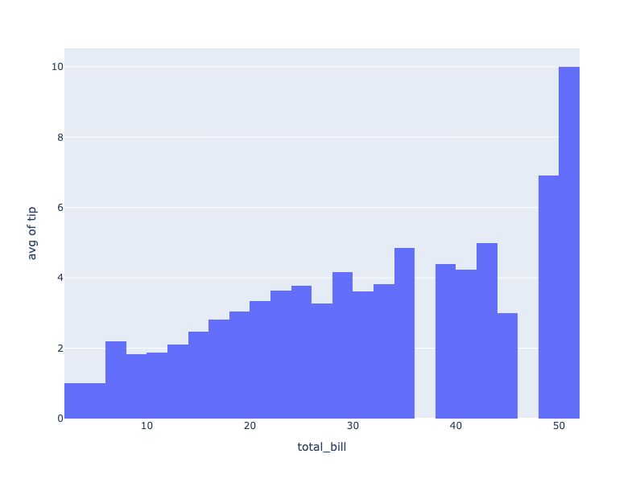

**Interactive Plot:**

<div>                        <script type="text/javascript">window.PlotlyConfig = {MathJaxConfig: 'local'};</script>
        <script charset="utf-8" src="https://cdn.plot.ly/plotly-3.1.0.min.js" integrity="sha256-Ei4740bWZhaUTQuD6q9yQlgVCMPBz6CZWhevDYPv93A=" crossorigin="anonymous"></script>                <div id="plotly-div-10" class="plotly-graph-div" style="height:100%; width:100%;"></div>            <script type="text/javascript">                window.PLOTLYENV=window.PLOTLYENV || {};                                if (document.getElementById("plotly-div-10")) {                    Plotly.newPlot(                        "plotly-div-10",                        [{"bingroup":"x","histfunc":"avg","hovertemplate":"total_bill=%{x}\u003cbr\u003eavg of tip=%{y}\u003cextra\u003e\u003c\u002fextra\u003e","legendgroup":"","marker":{"color":"#636efa","pattern":{"shape":""}},"name":"","orientation":"v","showlegend":false,"x":{"dtype":"f8","bdata":"PQrXo3D9MECuR+F6FK4kQMP1KFyPAjVArkfhehSuN0DXo3A9Cpc4QArXo3A9SjlACtejcD2KIUDhehSuR+E6QBSuR+F6FC5Aj8L1KFyPLUAK16NwPYokQOF6FK5HoUFA16NwPQrXLkCuR+F6FG4yQClcj8L1qC1AFK5H4XqUNUApXI\u002fC9agkQArXo3A9SjBAuB6F61H4MEBmZmZmZqY0QOxRuB6F6zFACtejcD1KNEAK16NwPYovQPYoXI\u002fCtUNAUrgehevRM0CPwvUoXM8xQD0K16NwvSpA4XoUrkdhKUAzMzMzM7M1QGZmZmZmpjNAmpmZmZkZI0CamZmZmVkyQB+F61G4Hi5AcT0K16OwNEBI4XoUrscxQI\u002fC9ShcDzhAj8L1KFxPMECuR+F6FO4wQHE9CtejsDJAhetRuB5FP0AK16NwPQowQPYoXI\u002fCdTFA4XoUrkfhK0Bcj8L1KFwjQGZmZmZmZj5ACtejcD1KMkB7FK5H4To2QDMzMzMzM0BAzczMzMyMPEAK16NwPQoyQBSuR+F6FClAFK5H4XqUJEBI4XoUrmdBQOF6FK5H4SNAj8L1KFyPOUA9CtejcH0zQOF6FK5HAUNAKVyPwvVoOkB7FK5H4XomQMP1KFyPIkhACtejcD1KNEAfhetRuJ4rQArXo3A9CiZACtejcD1KMkDXo3A9CpcxQBSuR+F6FDRAMzMzMzNzMECPwvUoXI8IQHsUrkfhOjRAhetRuB4FLkAK16NwPQooQFK4HoXrETFAXI\u002fC9SjcOkBI4XoUrkc5QPYoXI\u002fCdS1AhetRuB4FJUDsUbgehesxQDMzMzMzMztAw\u002fUoXI\u002fCNkAK16NwPUoxQHE9CtejcDNAKVyPwvWoMECkcD0K1yMkQNejcD0KV0BA9ihcj8L1L0AK16NwPWpBQI\u002fC9ShcDypASOF6FK5HMkD2KFyPwrU4QClcj8L1KDVAuB6F61H4PEA9CtejcH02QAAAAAAAABdAUrgehetRMEAAAAAAAMA2QPYoXI\u002fCFURASOF6FK5HO0CPwvUoXA8oQMP1KFyPAjVA7FG4HoXrKEAzMzMzM7MmQMP1KFyPwi5AZmZmZmYmRkDsUbgehWs2QOxRuB6F6zRAuB6F61G4LkA9CtejcH00QPYoXI\u002fCNTlAPQrXo3A9MkAfhetRuJ4sQAAAAAAAACxAAAAAAAAAHUApXI\u002fC9QhDQDMzMzMz8zdA9ihcj8K1OUCPwvUoXE8xQK5H4XoU7j1AzczMzMxMJUBcj8L1KNwoQBSuR+F6FDhA4XoUrkdhJ0DXo3A9CtcqQIXrUbgehSxAZmZmZmbmL0D2KFyPwvUoQM3MzMzMzD1ACtejcD0KIUAK16NwPQotQMP1KFyPwiZAUrgehevRNkAUrkfhehQzQIXrUbgeRTRA16NwPQpXJkCF61G4HoUoQMP1KFyPQjJAhetRuB4FIUApXI\u002fC9agkQM3MzMzMTCxAAAAAAAAAMEBSuB6F61EqQLgehetReDFAZmZmZmYmQUC4HoXrUZhEQM3MzMzMDDtArkfhehRuMEAzMzMzM7MgQKRwPQrXozJAPQrXo3C9J0CPwvUoXI8jQArXo3A9Ch5ApHA9CtcjLEDD9Shcj0IqQMP1KFyPQjFAzczMzMyMOECF61G4HsUzQJqZmZmZ2T1A9ihcj8IVSEAAAAAAAAA5QEjhehSuxypAPQrXo3B9MEAAAAAAAIA1QFK4HoXrUSlA9ihcj8I1MEAfhetRuJ4rQMP1KFyPgjFAhetRuB6FOEDD9Shcj8I0QPYoXI\u002fCtT9ArkfhehQuJUDD9Shcj0IlQEjhehSuZ0lAH4XrUbieL0AAAAAAAAAdQJqZmZmZ2T9AUrgehevRMEAzMzMzM3NAQKRwPQrX4zFA9ihcj8L1LEAzMzMzMzMjQHE9CtejUEFAMzMzMzNTQUAUrkfhelQ3QM3MzMzMrEZA7FG4HoUrN0BmZmZmZkZEQHE9CtejsDRAZmZmZmbmNED2KFyPwnU+QGZmZmZmJjJAmpmZmZkZN0DhehSuR2EvQI\u002fC9ShczzNAcT0K16NwPED2KFyPwvUuQBSuR+F6lDBAPQrXo3A9HkCuR+F6FK4kQK5H4XoUjkVAAAAAAAAAKkCF61G4HgUrQPYoXI\u002fCtTJAexSuR+F6KUAAAAAAAAAqQGZmZmZmZjBASOF6FK6HNEC4HoXrUXgwQNejcD0KlzpAPQrXo3BdQ0CF61G4HkU4QIXrUbgehSlAj8L1KFwPPkCkcD0K1+M5QArXo3A9KkhACtejcD2KKkDsUbgehSs8QM3MzMzMzClAZmZmZmYmPECuR+F6FC4nQPYoXI\u002fC9R5ApHA9CtcjPkBSuB6F61EoQNejcD0K1ypAKVyPwvUoIUD2KFyPwvUvQNejcD0K1ypAhetRuB5FMECuR+F6FC4kQDMzMzMzczRAj8L1KFyPKkAfhetRuB42QMP1KFyPAjhA4XoUrkdhL0C4HoXrUTgnQArXo3A9iiVAj8L1KFwPL0CkcD0K1yMkQDMzMzMzMylACtejcD1qQEAK16NwPepBQEjhehSuBz1ArkfhehQuO0DsUbgehas2QFK4HoXr0TFASOF6FK7HMkA="},"xaxis":"x","y":{"dtype":"f8","bdata":"KVyPwvUo8D+PwvUoXI\u002f6PwAAAAAAAAxAexSuR+F6CkDhehSuR+EMQNejcD0K1xJAAAAAAAAAAED2KFyPwvUIQFyPwvUoXP8\u002f16NwPQrXCUBcj8L1KFz7PwAAAAAAABRAH4XrUbge+T8AAAAAAAAIQClcj8L1KAhAXI\u002fC9ShcD0C4HoXrUbj6P65H4XoUrg1AAAAAAAAADEDNzMzMzMwKQFK4HoXrURBAAAAAAAAABkDXo3A9CtcBQFK4HoXrUR5AcT0K16NwCUC4HoXrUbgCQAAAAAAAAABAAAAAAAAAAEAzMzMzMzMRQAAAAAAAAAhAMzMzMzMz9z8AAAAAAAAEQAAAAAAAAAhAmpmZmZmZA0ApXI\u002fC9SgKQM3MzMzMzAxAAAAAAAAAAECPwvUoXI8IQHsUrkfhegJAAAAAAAAAFEDsUbgehesBQFK4HoXrUQRAexSuR+F6CEAfhetRuB71P2ZmZmZmZhZAAAAAAAAACEAAAAAAAAAUQAAAAAAAABhAZmZmZmZmAEAAAAAAAAAIQAAAAAAAAARAzczMzMzMBEDNzMzMzMwUQPYoXI\u002fC9fg\u002fXI\u002fC9ShcEUAUrkfhehQMQAAAAAAAAAhAAAAAAAAA+D8pXI\u002fC9Sj8P+xRuB6F6xpArkfhehSuCUAAAAAAAAAAQK5H4XoUrv8\u002fFK5H4XoUDkAfhetRuB4FQDMzMzMzMwlAw\u002fUoXI\u002fCA0AAAAAAAADwPxSuR+F6FABAuB6F61G4AECF61G4HoX\u002fPwAAAAAAAAhAH4XrUbgeCUAAAAAAAAAUQJqZmZmZmQFAAAAAAAAA9D+kcD0K16MIQAAAAAAAABBAAAAAAAAACECuR+F6FK4FQAAAAAAAAAhAMzMzMzMzC0BI4XoUrkf9PwAAAAAAABRAPQrXo3A9AECuR+F6FK4UQAAAAAAAAABAAAAAAAAAEEBmZmZmZmYXQAAAAAAAAAhAAAAAAAAACEAAAAAAAAAMQAAAAAAAAPA\u002fMzMzMzMzEUAAAAAAAAAKQOxRuB6F6xJAAAAAAAAAEEAAAAAAAAD4PwAAAAAAAAhAAAAAAAAA+D8AAAAAAAAEQAAAAAAAAAhAAAAAAAAABEDXo3A9CtcLQFK4HoXrURBAPQrXo3A9+j89CtejcD0QQClcj8L1KBFAFK5H4XoUDkAAAAAAAAAQQAAAAAAAAAhAAAAAAAAA8D8AAAAAAAAQQGZmZmZmZgRAAAAAAAAAEEAAAAAAAAAMQEjhehSuRxRAAAAAAAAA+D\u002fNzMzMzMz8P1yPwvUoXAdAexSuR+F6AkDhehSuR+H6PwAAAAAAAARAAAAAAAAAAEApXI\u002fC9SgEQM3MzMzMzBBArkfhehSu9z8AAAAAAAAAQAAAAAAAAABAcT0K16NwAUAAAAAAAAD4P6RwPQrXowZAAAAAAAAA+D8AAAAAAAAAQAAAAAAAAApAAAAAAAAA9D8AAAAAAAAAQAAAAAAAAABAAAAAAAAAAEAAAAAAAAAGQAAAAAAAAAxAzczMzMzMGkAAAAAAAAAUQAAAAAAAABRAZmZmZmZmAkAAAAAAAAD4P8P1KFyPwvU\u002fFK5H4XoU+j+uR+F6FK77PwAAAAAAAABAAAAAAAAABEAAAAAAAAAAQOxRuB6F6wVAAAAAAAAAAEAAAAAAAAAAQI\u002fC9ShcjxRAAAAAAAAAFEAAAAAAAAAOQOF6FK5H4QRAAAAAAAAAAEAAAAAAAAAMQAAAAAAAAARAAAAAAAAAAEAAAAAAAAAAQAAAAAAAAAhA16NwPQrXC0DsUbgehesBQAAAAAAAABJAw\u002fUoXI\u002fC+T8AAAAAAAAAQAAAAAAAACRASOF6FK5HCUCamZmZmZkUQHE9CtejcAlAAAAAAAAAEEDhehSuR+EIQAAAAAAAAABAAAAAAAAAAEAAAAAAAAAQQGZmZmZmZgxAcT0K16NwDUCamZmZmZkWQAAAAAAAAAxAAAAAAAAAGkAAAAAAAAAIQAAAAAAAABRAAAAAAAAADEAAAAAAAAAAQAAAAAAAAAxAAAAAAAAAEEAAAAAAAAD4P8P1KFyPwhBAexSuR+F6BEApXI\u002fC9SgAQAAAAAAAABBACtejcD0K9z8AAAAAAAAAQAAAAAAAABRAAAAAAAAAAEAAAAAAAAAAQAAAAAAAABBAFK5H4XoUAEAAAAAAAAAAQAAAAAAAAARAAAAAAAAAEEDXo3A9CtcJQEjhehSuRwtAAAAAAAAACEA9CtejcD0AQNejcD0K1wFAAAAAAAAAAECkcD0K16MUQAAAAAAAACJAAAAAAAAABEAAAAAAAAAaQJqZmZmZmfE\u002fAAAAAAAACEAAAAAAAAD4PwrXo3A9Cvc\u002fuB6F61G4CECamZmZmZkBQNejcD0K1wtAuB6F61G4\u002fj8AAAAAAAAIQEjhehSuR\u002fk\u002fAAAAAAAABEAAAAAAAAAAQAAAAAAAAAhAw\u002fUoXI\u002fCBUAK16NwPQoHQAAAAAAAAABAAAAAAAAACEAfhetRuB4LQIXrUbgehfc\u002fAAAAAAAACEAAAAAAAAD0PwAAAAAAAPA\u002fuB6F61G48j+uR+F6FK4SQK5H4XoUrhdAAAAAAAAAAEAAAAAAAAAAQAAAAAAAAPw\u002fAAAAAAAACEA="},"yaxis":"y","type":"histogram"}],                        {"template":{"data":{"histogram2dcontour":[{"type":"histogram2dcontour","colorbar":{"outlinewidth":0,"ticks":""},"colorscale":[[0.0,"#0d0887"],[0.1111111111111111,"#46039f"],[0.2222222222222222,"#7201a8"],[0.3333333333333333,"#9c179e"],[0.4444444444444444,"#bd3786"],[0.5555555555555556,"#d8576b"],[0.6666666666666666,"#ed7953"],[0.7777777777777778,"#fb9f3a"],[0.8888888888888888,"#fdca26"],[1.0,"#f0f921"]]}],"choropleth":[{"type":"choropleth","colorbar":{"outlinewidth":0,"ticks":""}}],"histogram2d":[{"type":"histogram2d","colorbar":{"outlinewidth":0,"ticks":""},"colorscale":[[0.0,"#0d0887"],[0.1111111111111111,"#46039f"],[0.2222222222222222,"#7201a8"],[0.3333333333333333,"#9c179e"],[0.4444444444444444,"#bd3786"],[0.5555555555555556,"#d8576b"],[0.6666666666666666,"#ed7953"],[0.7777777777777778,"#fb9f3a"],[0.8888888888888888,"#fdca26"],[1.0,"#f0f921"]]}],"heatmap":[{"type":"heatmap","colorbar":{"outlinewidth":0,"ticks":""},"colorscale":[[0.0,"#0d0887"],[0.1111111111111111,"#46039f"],[0.2222222222222222,"#7201a8"],[0.3333333333333333,"#9c179e"],[0.4444444444444444,"#bd3786"],[0.5555555555555556,"#d8576b"],[0.6666666666666666,"#ed7953"],[0.7777777777777778,"#fb9f3a"],[0.8888888888888888,"#fdca26"],[1.0,"#f0f921"]]}],"contourcarpet":[{"type":"contourcarpet","colorbar":{"outlinewidth":0,"ticks":""}}],"contour":[{"type":"contour","colorbar":{"outlinewidth":0,"ticks":""},"colorscale":[[0.0,"#0d0887"],[0.1111111111111111,"#46039f"],[0.2222222222222222,"#7201a8"],[0.3333333333333333,"#9c179e"],[0.4444444444444444,"#bd3786"],[0.5555555555555556,"#d8576b"],[0.6666666666666666,"#ed7953"],[0.7777777777777778,"#fb9f3a"],[0.8888888888888888,"#fdca26"],[1.0,"#f0f921"]]}],"surface":[{"type":"surface","colorbar":{"outlinewidth":0,"ticks":""},"colorscale":[[0.0,"#0d0887"],[0.1111111111111111,"#46039f"],[0.2222222222222222,"#7201a8"],[0.3333333333333333,"#9c179e"],[0.4444444444444444,"#bd3786"],[0.5555555555555556,"#d8576b"],[0.6666666666666666,"#ed7953"],[0.7777777777777778,"#fb9f3a"],[0.8888888888888888,"#fdca26"],[1.0,"#f0f921"]]}],"mesh3d":[{"type":"mesh3d","colorbar":{"outlinewidth":0,"ticks":""}}],"scatter":[{"fillpattern":{"fillmode":"overlay","size":10,"solidity":0.2},"type":"scatter"}],"parcoords":[{"type":"parcoords","line":{"colorbar":{"outlinewidth":0,"ticks":""}}}],"scatterpolargl":[{"type":"scatterpolargl","marker":{"colorbar":{"outlinewidth":0,"ticks":""}}}],"bar":[{"error_x":{"color":"#2a3f5f"},"error_y":{"color":"#2a3f5f"},"marker":{"line":{"color":"#E5ECF6","width":0.5},"pattern":{"fillmode":"overlay","size":10,"solidity":0.2}},"type":"bar"}],"scattergeo":[{"type":"scattergeo","marker":{"colorbar":{"outlinewidth":0,"ticks":""}}}],"scatterpolar":[{"type":"scatterpolar","marker":{"colorbar":{"outlinewidth":0,"ticks":""}}}],"histogram":[{"marker":{"pattern":{"fillmode":"overlay","size":10,"solidity":0.2}},"type":"histogram"}],"scattergl":[{"type":"scattergl","marker":{"colorbar":{"outlinewidth":0,"ticks":""}}}],"scatter3d":[{"type":"scatter3d","line":{"colorbar":{"outlinewidth":0,"ticks":""}},"marker":{"colorbar":{"outlinewidth":0,"ticks":""}}}],"scattermap":[{"type":"scattermap","marker":{"colorbar":{"outlinewidth":0,"ticks":""}}}],"scattermapbox":[{"type":"scattermapbox","marker":{"colorbar":{"outlinewidth":0,"ticks":""}}}],"scatterternary":[{"type":"scatterternary","marker":{"colorbar":{"outlinewidth":0,"ticks":""}}}],"scattercarpet":[{"type":"scattercarpet","marker":{"colorbar":{"outlinewidth":0,"ticks":""}}}],"carpet":[{"aaxis":{"endlinecolor":"#2a3f5f","gridcolor":"white","linecolor":"white","minorgridcolor":"white","startlinecolor":"#2a3f5f"},"baxis":{"endlinecolor":"#2a3f5f","gridcolor":"white","linecolor":"white","minorgridcolor":"white","startlinecolor":"#2a3f5f"},"type":"carpet"}],"table":[{"cells":{"fill":{"color":"#EBF0F8"},"line":{"color":"white"}},"header":{"fill":{"color":"#C8D4E3"},"line":{"color":"white"}},"type":"table"}],"barpolar":[{"marker":{"line":{"color":"#E5ECF6","width":0.5},"pattern":{"fillmode":"overlay","size":10,"solidity":0.2}},"type":"barpolar"}],"pie":[{"automargin":true,"type":"pie"}]},"layout":{"autotypenumbers":"strict","colorway":["#636efa","#EF553B","#00cc96","#ab63fa","#FFA15A","#19d3f3","#FF6692","#B6E880","#FF97FF","#FECB52"],"font":{"color":"#2a3f5f"},"hovermode":"closest","hoverlabel":{"align":"left"},"paper_bgcolor":"white","plot_bgcolor":"#E5ECF6","polar":{"bgcolor":"#E5ECF6","angularaxis":{"gridcolor":"white","linecolor":"white","ticks":""},"radialaxis":{"gridcolor":"white","linecolor":"white","ticks":""}},"ternary":{"bgcolor":"#E5ECF6","aaxis":{"gridcolor":"white","linecolor":"white","ticks":""},"baxis":{"gridcolor":"white","linecolor":"white","ticks":""},"caxis":{"gridcolor":"white","linecolor":"white","ticks":""}},"coloraxis":{"colorbar":{"outlinewidth":0,"ticks":""}},"colorscale":{"sequential":[[0.0,"#0d0887"],[0.1111111111111111,"#46039f"],[0.2222222222222222,"#7201a8"],[0.3333333333333333,"#9c179e"],[0.4444444444444444,"#bd3786"],[0.5555555555555556,"#d8576b"],[0.6666666666666666,"#ed7953"],[0.7777777777777778,"#fb9f3a"],[0.8888888888888888,"#fdca26"],[1.0,"#f0f921"]],"sequentialminus":[[0.0,"#0d0887"],[0.1111111111111111,"#46039f"],[0.2222222222222222,"#7201a8"],[0.3333333333333333,"#9c179e"],[0.4444444444444444,"#bd3786"],[0.5555555555555556,"#d8576b"],[0.6666666666666666,"#ed7953"],[0.7777777777777778,"#fb9f3a"],[0.8888888888888888,"#fdca26"],[1.0,"#f0f921"]],"diverging":[[0,"#8e0152"],[0.1,"#c51b7d"],[0.2,"#de77ae"],[0.3,"#f1b6da"],[0.4,"#fde0ef"],[0.5,"#f7f7f7"],[0.6,"#e6f5d0"],[0.7,"#b8e186"],[0.8,"#7fbc41"],[0.9,"#4d9221"],[1,"#276419"]]},"xaxis":{"gridcolor":"white","linecolor":"white","ticks":"","title":{"standoff":15},"zerolinecolor":"white","automargin":true,"zerolinewidth":2},"yaxis":{"gridcolor":"white","linecolor":"white","ticks":"","title":{"standoff":15},"zerolinecolor":"white","automargin":true,"zerolinewidth":2},"scene":{"xaxis":{"backgroundcolor":"#E5ECF6","gridcolor":"white","linecolor":"white","showbackground":true,"ticks":"","zerolinecolor":"white","gridwidth":2},"yaxis":{"backgroundcolor":"#E5ECF6","gridcolor":"white","linecolor":"white","showbackground":true,"ticks":"","zerolinecolor":"white","gridwidth":2},"zaxis":{"backgroundcolor":"#E5ECF6","gridcolor":"white","linecolor":"white","showbackground":true,"ticks":"","zerolinecolor":"white","gridwidth":2}},"shapedefaults":{"line":{"color":"#2a3f5f"}},"annotationdefaults":{"arrowcolor":"#2a3f5f","arrowhead":0,"arrowwidth":1},"geo":{"bgcolor":"white","landcolor":"#E5ECF6","subunitcolor":"white","showland":true,"showlakes":true,"lakecolor":"white"},"title":{"x":0.05},"mapbox":{"style":"light"}}},"xaxis":{"anchor":"y","domain":[0.0,1.0],"title":{"text":"total_bill"}},"yaxis":{"anchor":"x","domain":[0.0,1.0],"title":{"text":"avg of tip"}},"legend":{"tracegroupgap":0},"margin":{"t":60},"barmode":"relative"},                        {"responsive": true}                    )                };            </script>        </div>

The default `histfunc` is `sum` if `y` is given, and works with categorical as well as binned numeric data on the `x` axis:

```python
import plotly.express as px
df = px.data.tips()
fig = px.histogram(df, x="day", y="total_bill", category_orders=dict(day=["Thur", "Fri", "Sat", "Sun"]))
fig.show()
```

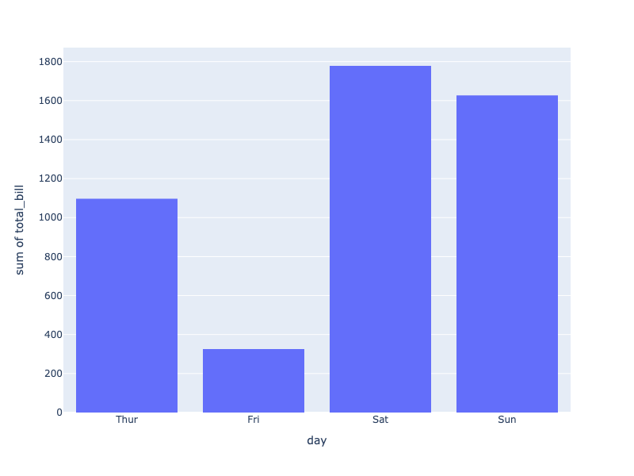

**Interactive Plot:**

<div>                        <script type="text/javascript">window.PlotlyConfig = {MathJaxConfig: 'local'};</script>
        <script charset="utf-8" src="https://cdn.plot.ly/plotly-3.1.0.min.js" integrity="sha256-Ei4740bWZhaUTQuD6q9yQlgVCMPBz6CZWhevDYPv93A=" crossorigin="anonymous"></script>                <div id="plotly-div-11" class="plotly-graph-div" style="height:100%; width:100%;"></div>            <script type="text/javascript">                window.PLOTLYENV=window.PLOTLYENV || {};                                if (document.getElementById("plotly-div-11")) {                    Plotly.newPlot(                        "plotly-div-11",                        [{"bingroup":"x","histfunc":"sum","hovertemplate":"day=%{x}\u003cbr\u003esum of total_bill=%{y}\u003cextra\u003e\u003c\u002fextra\u003e","legendgroup":"","marker":{"color":"#636efa","pattern":{"shape":""}},"name":"","orientation":"v","showlegend":false,"x":["Sun","Sun","Sun","Sun","Sun","Sun","Sun","Sun","Sun","Sun","Sun","Sun","Sun","Sun","Sun","Sun","Sun","Sun","Sun","Sat","Sat","Sat","Sat","Sat","Sat","Sat","Sat","Sat","Sat","Sat","Sat","Sat","Sat","Sat","Sat","Sat","Sat","Sat","Sat","Sat","Sat","Sun","Sun","Sun","Sun","Sun","Sun","Sun","Sun","Sun","Sun","Sun","Sun","Sun","Sun","Sun","Sat","Sat","Sat","Sat","Sat","Sat","Sat","Sat","Sat","Sat","Sat","Sat","Sat","Sat","Sat","Sat","Sat","Sat","Sat","Sat","Sat","Thur","Thur","Thur","Thur","Thur","Thur","Thur","Thur","Thur","Thur","Thur","Thur","Thur","Fri","Fri","Fri","Fri","Fri","Fri","Fri","Fri","Fri","Fri","Fri","Fri","Sat","Sat","Sat","Sat","Sat","Sat","Sat","Sat","Sat","Sat","Sun","Sun","Sun","Sun","Sun","Thur","Thur","Thur","Thur","Thur","Thur","Thur","Thur","Thur","Thur","Thur","Thur","Thur","Thur","Thur","Thur","Thur","Thur","Thur","Thur","Thur","Thur","Thur","Thur","Thur","Thur","Thur","Thur","Thur","Thur","Thur","Thur","Thur","Sun","Sun","Sun","Sun","Sun","Sun","Sun","Sun","Sun","Sun","Sun","Sun","Sun","Sun","Sun","Sun","Sun","Sun","Sat","Sat","Sat","Sat","Sun","Sun","Sun","Sun","Sun","Sun","Sun","Sun","Sun","Sun","Sun","Sun","Sun","Sun","Sun","Sun","Sun","Sun","Sun","Thur","Thur","Thur","Thur","Thur","Thur","Thur","Thur","Thur","Thur","Thur","Thur","Thur","Thur","Thur","Sat","Sat","Sat","Sat","Sat","Sat","Sat","Sat","Sat","Sat","Sat","Sat","Sat","Sat","Fri","Fri","Fri","Fri","Fri","Fri","Fri","Sat","Sat","Sat","Sat","Sat","Sat","Sat","Sat","Sat","Sat","Sat","Sat","Sat","Sat","Sat","Sat","Thur"],"xaxis":"x","y":{"dtype":"f8","bdata":"PQrXo3D9MECuR+F6FK4kQMP1KFyPAjVArkfhehSuN0DXo3A9Cpc4QArXo3A9SjlACtejcD2KIUDhehSuR+E6QBSuR+F6FC5Aj8L1KFyPLUAK16NwPYokQOF6FK5HoUFA16NwPQrXLkCuR+F6FG4yQClcj8L1qC1AFK5H4XqUNUApXI\u002fC9agkQArXo3A9SjBAuB6F61H4MEBmZmZmZqY0QOxRuB6F6zFACtejcD1KNEAK16NwPYovQPYoXI\u002fCtUNAUrgehevRM0CPwvUoXM8xQD0K16NwvSpA4XoUrkdhKUAzMzMzM7M1QGZmZmZmpjNAmpmZmZkZI0CamZmZmVkyQB+F61G4Hi5AcT0K16OwNEBI4XoUrscxQI\u002fC9ShcDzhAj8L1KFxPMECuR+F6FO4wQHE9CtejsDJAhetRuB5FP0AK16NwPQowQPYoXI\u002fCdTFA4XoUrkfhK0Bcj8L1KFwjQGZmZmZmZj5ACtejcD1KMkB7FK5H4To2QDMzMzMzM0BAzczMzMyMPEAK16NwPQoyQBSuR+F6FClAFK5H4XqUJEBI4XoUrmdBQOF6FK5H4SNAj8L1KFyPOUA9CtejcH0zQOF6FK5HAUNAKVyPwvVoOkB7FK5H4XomQMP1KFyPIkhACtejcD1KNEAfhetRuJ4rQArXo3A9CiZACtejcD1KMkDXo3A9CpcxQBSuR+F6FDRAMzMzMzNzMECPwvUoXI8IQHsUrkfhOjRAhetRuB4FLkAK16NwPQooQFK4HoXrETFAXI\u002fC9SjcOkBI4XoUrkc5QPYoXI\u002fCdS1AhetRuB4FJUDsUbgehesxQDMzMzMzMztAw\u002fUoXI\u002fCNkAK16NwPUoxQHE9CtejcDNAKVyPwvWoMECkcD0K1yMkQNejcD0KV0BA9ihcj8L1L0AK16NwPWpBQI\u002fC9ShcDypASOF6FK5HMkD2KFyPwrU4QClcj8L1KDVAuB6F61H4PEA9CtejcH02QAAAAAAAABdAUrgehetRMEAAAAAAAMA2QPYoXI\u002fCFURASOF6FK5HO0CPwvUoXA8oQMP1KFyPAjVA7FG4HoXrKEAzMzMzM7MmQMP1KFyPwi5AZmZmZmYmRkDsUbgehWs2QOxRuB6F6zRAuB6F61G4LkA9CtejcH00QPYoXI\u002fCNTlAPQrXo3A9MkAfhetRuJ4sQAAAAAAAACxAAAAAAAAAHUApXI\u002fC9QhDQDMzMzMz8zdA9ihcj8K1OUCPwvUoXE8xQK5H4XoU7j1AzczMzMxMJUBcj8L1KNwoQBSuR+F6FDhA4XoUrkdhJ0DXo3A9CtcqQIXrUbgehSxAZmZmZmbmL0D2KFyPwvUoQM3MzMzMzD1ACtejcD0KIUAK16NwPQotQMP1KFyPwiZAUrgehevRNkAUrkfhehQzQIXrUbgeRTRA16NwPQpXJkCF61G4HoUoQMP1KFyPQjJAhetRuB4FIUApXI\u002fC9agkQM3MzMzMTCxAAAAAAAAAMEBSuB6F61EqQLgehetReDFAZmZmZmYmQUC4HoXrUZhEQM3MzMzMDDtArkfhehRuMEAzMzMzM7MgQKRwPQrXozJAPQrXo3C9J0CPwvUoXI8jQArXo3A9Ch5ApHA9CtcjLEDD9Shcj0IqQMP1KFyPQjFAzczMzMyMOECF61G4HsUzQJqZmZmZ2T1A9ihcj8IVSEAAAAAAAAA5QEjhehSuxypAPQrXo3B9MEAAAAAAAIA1QFK4HoXrUSlA9ihcj8I1MEAfhetRuJ4rQMP1KFyPgjFAhetRuB6FOEDD9Shcj8I0QPYoXI\u002fCtT9ArkfhehQuJUDD9Shcj0IlQEjhehSuZ0lAH4XrUbieL0AAAAAAAAAdQJqZmZmZ2T9AUrgehevRMEAzMzMzM3NAQKRwPQrX4zFA9ihcj8L1LEAzMzMzMzMjQHE9CtejUEFAMzMzMzNTQUAUrkfhelQ3QM3MzMzMrEZA7FG4HoUrN0BmZmZmZkZEQHE9CtejsDRAZmZmZmbmNED2KFyPwnU+QGZmZmZmJjJAmpmZmZkZN0DhehSuR2EvQI\u002fC9ShczzNAcT0K16NwPED2KFyPwvUuQBSuR+F6lDBAPQrXo3A9HkCuR+F6FK4kQK5H4XoUjkVAAAAAAAAAKkCF61G4HgUrQPYoXI\u002fCtTJAexSuR+F6KUAAAAAAAAAqQGZmZmZmZjBASOF6FK6HNEC4HoXrUXgwQNejcD0KlzpAPQrXo3BdQ0CF61G4HkU4QIXrUbgehSlAj8L1KFwPPkCkcD0K1+M5QArXo3A9KkhACtejcD2KKkDsUbgehSs8QM3MzMzMzClAZmZmZmYmPECuR+F6FC4nQPYoXI\u002fC9R5ApHA9CtcjPkBSuB6F61EoQNejcD0K1ypAKVyPwvUoIUD2KFyPwvUvQNejcD0K1ypAhetRuB5FMECuR+F6FC4kQDMzMzMzczRAj8L1KFyPKkAfhetRuB42QMP1KFyPAjhA4XoUrkdhL0C4HoXrUTgnQArXo3A9iiVAj8L1KFwPL0CkcD0K1yMkQDMzMzMzMylACtejcD1qQEAK16NwPepBQEjhehSuBz1ArkfhehQuO0DsUbgehas2QFK4HoXr0TFASOF6FK7HMkA="},"yaxis":"y","type":"histogram"}],                        {"template":{"data":{"histogram2dcontour":[{"type":"histogram2dcontour","colorbar":{"outlinewidth":0,"ticks":""},"colorscale":[[0.0,"#0d0887"],[0.1111111111111111,"#46039f"],[0.2222222222222222,"#7201a8"],[0.3333333333333333,"#9c179e"],[0.4444444444444444,"#bd3786"],[0.5555555555555556,"#d8576b"],[0.6666666666666666,"#ed7953"],[0.7777777777777778,"#fb9f3a"],[0.8888888888888888,"#fdca26"],[1.0,"#f0f921"]]}],"choropleth":[{"type":"choropleth","colorbar":{"outlinewidth":0,"ticks":""}}],"histogram2d":[{"type":"histogram2d","colorbar":{"outlinewidth":0,"ticks":""},"colorscale":[[0.0,"#0d0887"],[0.1111111111111111,"#46039f"],[0.2222222222222222,"#7201a8"],[0.3333333333333333,"#9c179e"],[0.4444444444444444,"#bd3786"],[0.5555555555555556,"#d8576b"],[0.6666666666666666,"#ed7953"],[0.7777777777777778,"#fb9f3a"],[0.8888888888888888,"#fdca26"],[1.0,"#f0f921"]]}],"heatmap":[{"type":"heatmap","colorbar":{"outlinewidth":0,"ticks":""},"colorscale":[[0.0,"#0d0887"],[0.1111111111111111,"#46039f"],[0.2222222222222222,"#7201a8"],[0.3333333333333333,"#9c179e"],[0.4444444444444444,"#bd3786"],[0.5555555555555556,"#d8576b"],[0.6666666666666666,"#ed7953"],[0.7777777777777778,"#fb9f3a"],[0.8888888888888888,"#fdca26"],[1.0,"#f0f921"]]}],"contourcarpet":[{"type":"contourcarpet","colorbar":{"outlinewidth":0,"ticks":""}}],"contour":[{"type":"contour","colorbar":{"outlinewidth":0,"ticks":""},"colorscale":[[0.0,"#0d0887"],[0.1111111111111111,"#46039f"],[0.2222222222222222,"#7201a8"],[0.3333333333333333,"#9c179e"],[0.4444444444444444,"#bd3786"],[0.5555555555555556,"#d8576b"],[0.6666666666666666,"#ed7953"],[0.7777777777777778,"#fb9f3a"],[0.8888888888888888,"#fdca26"],[1.0,"#f0f921"]]}],"surface":[{"type":"surface","colorbar":{"outlinewidth":0,"ticks":""},"colorscale":[[0.0,"#0d0887"],[0.1111111111111111,"#46039f"],[0.2222222222222222,"#7201a8"],[0.3333333333333333,"#9c179e"],[0.4444444444444444,"#bd3786"],[0.5555555555555556,"#d8576b"],[0.6666666666666666,"#ed7953"],[0.7777777777777778,"#fb9f3a"],[0.8888888888888888,"#fdca26"],[1.0,"#f0f921"]]}],"mesh3d":[{"type":"mesh3d","colorbar":{"outlinewidth":0,"ticks":""}}],"scatter":[{"fillpattern":{"fillmode":"overlay","size":10,"solidity":0.2},"type":"scatter"}],"parcoords":[{"type":"parcoords","line":{"colorbar":{"outlinewidth":0,"ticks":""}}}],"scatterpolargl":[{"type":"scatterpolargl","marker":{"colorbar":{"outlinewidth":0,"ticks":""}}}],"bar":[{"error_x":{"color":"#2a3f5f"},"error_y":{"color":"#2a3f5f"},"marker":{"line":{"color":"#E5ECF6","width":0.5},"pattern":{"fillmode":"overlay","size":10,"solidity":0.2}},"type":"bar"}],"scattergeo":[{"type":"scattergeo","marker":{"colorbar":{"outlinewidth":0,"ticks":""}}}],"scatterpolar":[{"type":"scatterpolar","marker":{"colorbar":{"outlinewidth":0,"ticks":""}}}],"histogram":[{"marker":{"pattern":{"fillmode":"overlay","size":10,"solidity":0.2}},"type":"histogram"}],"scattergl":[{"type":"scattergl","marker":{"colorbar":{"outlinewidth":0,"ticks":""}}}],"scatter3d":[{"type":"scatter3d","line":{"colorbar":{"outlinewidth":0,"ticks":""}},"marker":{"colorbar":{"outlinewidth":0,"ticks":""}}}],"scattermap":[{"type":"scattermap","marker":{"colorbar":{"outlinewidth":0,"ticks":""}}}],"scattermapbox":[{"type":"scattermapbox","marker":{"colorbar":{"outlinewidth":0,"ticks":""}}}],"scatterternary":[{"type":"scatterternary","marker":{"colorbar":{"outlinewidth":0,"ticks":""}}}],"scattercarpet":[{"type":"scattercarpet","marker":{"colorbar":{"outlinewidth":0,"ticks":""}}}],"carpet":[{"aaxis":{"endlinecolor":"#2a3f5f","gridcolor":"white","linecolor":"white","minorgridcolor":"white","startlinecolor":"#2a3f5f"},"baxis":{"endlinecolor":"#2a3f5f","gridcolor":"white","linecolor":"white","minorgridcolor":"white","startlinecolor":"#2a3f5f"},"type":"carpet"}],"table":[{"cells":{"fill":{"color":"#EBF0F8"},"line":{"color":"white"}},"header":{"fill":{"color":"#C8D4E3"},"line":{"color":"white"}},"type":"table"}],"barpolar":[{"marker":{"line":{"color":"#E5ECF6","width":0.5},"pattern":{"fillmode":"overlay","size":10,"solidity":0.2}},"type":"barpolar"}],"pie":[{"automargin":true,"type":"pie"}]},"layout":{"autotypenumbers":"strict","colorway":["#636efa","#EF553B","#00cc96","#ab63fa","#FFA15A","#19d3f3","#FF6692","#B6E880","#FF97FF","#FECB52"],"font":{"color":"#2a3f5f"},"hovermode":"closest","hoverlabel":{"align":"left"},"paper_bgcolor":"white","plot_bgcolor":"#E5ECF6","polar":{"bgcolor":"#E5ECF6","angularaxis":{"gridcolor":"white","linecolor":"white","ticks":""},"radialaxis":{"gridcolor":"white","linecolor":"white","ticks":""}},"ternary":{"bgcolor":"#E5ECF6","aaxis":{"gridcolor":"white","linecolor":"white","ticks":""},"baxis":{"gridcolor":"white","linecolor":"white","ticks":""},"caxis":{"gridcolor":"white","linecolor":"white","ticks":""}},"coloraxis":{"colorbar":{"outlinewidth":0,"ticks":""}},"colorscale":{"sequential":[[0.0,"#0d0887"],[0.1111111111111111,"#46039f"],[0.2222222222222222,"#7201a8"],[0.3333333333333333,"#9c179e"],[0.4444444444444444,"#bd3786"],[0.5555555555555556,"#d8576b"],[0.6666666666666666,"#ed7953"],[0.7777777777777778,"#fb9f3a"],[0.8888888888888888,"#fdca26"],[1.0,"#f0f921"]],"sequentialminus":[[0.0,"#0d0887"],[0.1111111111111111,"#46039f"],[0.2222222222222222,"#7201a8"],[0.3333333333333333,"#9c179e"],[0.4444444444444444,"#bd3786"],[0.5555555555555556,"#d8576b"],[0.6666666666666666,"#ed7953"],[0.7777777777777778,"#fb9f3a"],[0.8888888888888888,"#fdca26"],[1.0,"#f0f921"]],"diverging":[[0,"#8e0152"],[0.1,"#c51b7d"],[0.2,"#de77ae"],[0.3,"#f1b6da"],[0.4,"#fde0ef"],[0.5,"#f7f7f7"],[0.6,"#e6f5d0"],[0.7,"#b8e186"],[0.8,"#7fbc41"],[0.9,"#4d9221"],[1,"#276419"]]},"xaxis":{"gridcolor":"white","linecolor":"white","ticks":"","title":{"standoff":15},"zerolinecolor":"white","automargin":true,"zerolinewidth":2},"yaxis":{"gridcolor":"white","linecolor":"white","ticks":"","title":{"standoff":15},"zerolinecolor":"white","automargin":true,"zerolinewidth":2},"scene":{"xaxis":{"backgroundcolor":"#E5ECF6","gridcolor":"white","linecolor":"white","showbackground":true,"ticks":"","zerolinecolor":"white","gridwidth":2},"yaxis":{"backgroundcolor":"#E5ECF6","gridcolor":"white","linecolor":"white","showbackground":true,"ticks":"","zerolinecolor":"white","gridwidth":2},"zaxis":{"backgroundcolor":"#E5ECF6","gridcolor":"white","linecolor":"white","showbackground":true,"ticks":"","zerolinecolor":"white","gridwidth":2}},"shapedefaults":{"line":{"color":"#2a3f5f"}},"annotationdefaults":{"arrowcolor":"#2a3f5f","arrowhead":0,"arrowwidth":1},"geo":{"bgcolor":"white","landcolor":"#E5ECF6","subunitcolor":"white","showland":true,"showlakes":true,"lakecolor":"white"},"title":{"x":0.05},"mapbox":{"style":"light"}}},"xaxis":{"anchor":"y","domain":[0.0,1.0],"title":{"text":"day"},"categoryorder":"array","categoryarray":["Thur","Fri","Sat","Sun"]},"yaxis":{"anchor":"x","domain":[0.0,1.0],"title":{"text":"sum of total_bill"}},"legend":{"tracegroupgap":0},"margin":{"t":60},"barmode":"relative"},                        {"responsive": true}                    )                };            </script>        </div>
*New in v5.0*

Histograms afford the use of [patterns (also known as hatching or texture)](/python/pattern-hatching-texture/) in addition to color:

```python
import plotly.express as px

df = px.data.tips()
fig = px.histogram(df, x="sex", y="total_bill", color="sex", pattern_shape="smoker")
fig.show()
```

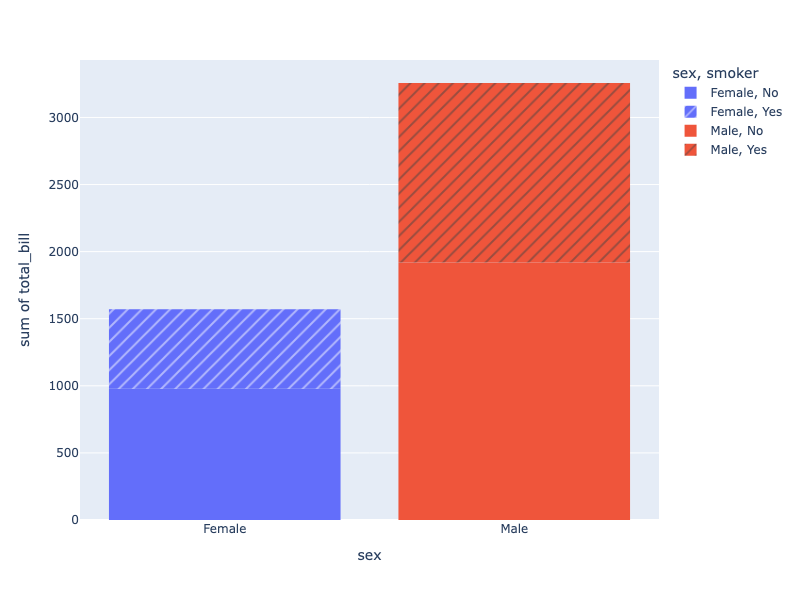

**Interactive Plot:**

<div>                        <script type="text/javascript">window.PlotlyConfig = {MathJaxConfig: 'local'};</script>
        <script charset="utf-8" src="https://cdn.plot.ly/plotly-3.1.0.min.js" integrity="sha256-Ei4740bWZhaUTQuD6q9yQlgVCMPBz6CZWhevDYPv93A=" crossorigin="anonymous"></script>                <div id="plotly-div-12" class="plotly-graph-div" style="height:100%; width:100%;"></div>            <script type="text/javascript">                window.PLOTLYENV=window.PLOTLYENV || {};                                if (document.getElementById("plotly-div-12")) {                    Plotly.newPlot(                        "plotly-div-12",                        [{"bingroup":"x","histfunc":"sum","hovertemplate":"sex=%{x}\u003cbr\u003esmoker=No\u003cbr\u003esum of total_bill=%{y}\u003cextra\u003e\u003c\u002fextra\u003e","legendgroup":"Female, No","marker":{"color":"#636efa","pattern":{"shape":""}},"name":"Female, No","orientation":"v","showlegend":true,"x":["Female","Female","Female","Female","Female","Female","Female","Female","Female","Female","Female","Female","Female","Female","Female","Female","Female","Female","Female","Female","Female","Female","Female","Female","Female","Female","Female","Female","Female","Female","Female","Female","Female","Female","Female","Female","Female","Female","Female","Female","Female","Female","Female","Female","Female","Female","Female","Female","Female","Female","Female","Female","Female","Female"],"xaxis":"x","y":{"dtype":"f8","bdata":"PQrXo3D9MEDXo3A9Cpc4QOF6FK5HoUFAKVyPwvWoLUApXI\u002fC9agkQLgehetR+DBACtejcD1KNEAK16NwPYovQGZmZmZmpjNAH4XrUbgeLkBxPQrXo7A0QK5H4XoU7jBAFK5H4XqUJEBI4XoUrmdBQClcj8L1aDpAMzMzMzNzMEBSuB6F6xExQPYoXI\u002fCdS1ApHA9CtcjJEAK16NwPWpBQAAAAAAAwDZA7FG4HoXrNEAAAAAAAAAdQPYoXI\u002fCtTlAj8L1KFxPMUDNzMzMzEwlQFyPwvUo3ChAFK5H4XoUOEDXo3A9CtcqQPYoXI\u002fC9ShAzczMzMzMPUAK16NwPQotQMP1KFyPwiZAhetRuB5FNEDXo3A9ClcmQIXrUbgehShAw\u002fUoXI9CMkCF61G4HgUhQClcj8L1qCRAzczMzMxMLEBSuB6F61EqQLgehetReDFAzczMzMwMO0CuR+F6FG4wQDMzMzMzsyBApHA9CtejMkA9CtejcL0nQJqZmZmZ2T1AAAAAAAAAOUBI4XoUrscqQPYoXI\u002fCNTBA9ihcj8L1L0AK16NwPepBQEjhehSuxzJA"},"yaxis":"y","type":"histogram"},{"bingroup":"x","histfunc":"sum","hovertemplate":"sex=%{x}\u003cbr\u003esmoker=Yes\u003cbr\u003esum of total_bill=%{y}\u003cextra\u003e\u003c\u002fextra\u003e","legendgroup":"Female, Yes","marker":{"color":"#636efa","pattern":{"shape":"\u002f"}},"name":"Female, Yes","orientation":"v","showlegend":true,"x":["Female","Female","Female","Female","Female","Female","Female","Female","Female","Female","Female","Female","Female","Female","Female","Female","Female","Female","Female","Female","Female","Female","Female","Female","Female","Female","Female","Female","Female","Female","Female","Female","Female"],"xaxis":"x","y":{"dtype":"f8","bdata":"j8L1KFyPCEBcj8L1KNw6QEjhehSuRzlAAAAAAAAAF0BSuB6F61EwQDMzMzMzsyZAw\u002fUoXI\u002fCLkBmZmZmZiZGQOxRuB6FazZAH4XrUbieLEDD9Shcj4IxQK5H4XoULiVAw\u002fUoXI9CJUAzMzMzMzMjQGZmZmZm5jRAZmZmZmYmMkCPwvUoXM8zQK5H4XoUjkVAAAAAAAAAKkB7FK5H4XopQAAAAAAAACpAZmZmZmZmMEC4HoXrUXgwQIXrUbgehSlACtejcD2KKkDsUbgehSs8QM3MzMzMzClApHA9CtcjPkDXo3A9CtcqQIXrUbgeRTBArkfhehQuJEAfhetRuB42QK5H4XoULjtA"},"yaxis":"y","type":"histogram"},{"bingroup":"x","histfunc":"sum","hovertemplate":"sex=%{x}\u003cbr\u003esmoker=No\u003cbr\u003esum of total_bill=%{y}\u003cextra\u003e\u003c\u002fextra\u003e","legendgroup":"Male, No","marker":{"color":"#EF553B","pattern":{"shape":""}},"name":"Male, No","orientation":"v","showlegend":true,"x":["Male","Male","Male","Male","Male","Male","Male","Male","Male","Male","Male","Male","Male","Male","Male","Male","Male","Male","Male","Male","Male","Male","Male","Male","Male","Male","Male","Male","Male","Male","Male","Male","Male","Male","Male","Male","Male","Male","Male","Male","Male","Male","Male","Male","Male","Male","Male","Male","Male","Male","Male","Male","Male","Male","Male","Male","Male","Male","Male","Male","Male","Male","Male","Male","Male","Male","Male","Male","Male","Male","Male","Male","Male","Male","Male","Male","Male","Male","Male","Male","Male","Male","Male","Male","Male","Male","Male","Male","Male","Male","Male","Male","Male","Male","Male","Male","Male"],"xaxis":"x","y":{"dtype":"f8","bdata":"rkfhehSuJEDD9ShcjwI1QK5H4XoUrjdACtejcD1KOUAK16NwPYohQOF6FK5H4TpAFK5H4XoULkCPwvUoXI8tQArXo3A9iiRA16NwPQrXLkCuR+F6FG4yQBSuR+F6lDVACtejcD1KMEBmZmZmZqY0QOxRuB6F6zFA9ihcj8K1Q0BSuB6F69EzQI\u002fC9ShczzFAPQrXo3C9KkDhehSuR2EpQDMzMzMzszVAmpmZmZkZI0CamZmZmVkyQEjhehSuxzFAj8L1KFwPOECPwvUoXE8wQHE9CtejsDJAhetRuB5FP0AK16NwPQowQPYoXI\u002fCdTFA4XoUrkfhK0Bcj8L1KFwjQGZmZmZmZj5ACtejcD1KMkB7FK5H4To2QDMzMzMzM0BAzczMzMyMPEAK16NwPQoyQBSuR+F6FClA4XoUrkfhI0CPwvUoXI85QD0K16NwfTNAw\u002fUoXI8iSEDXo3A9CpcxQBSuR+F6FDRAexSuR+E6NEAK16NwPQooQIXrUbgeBSVAMzMzMzMzO0DD9Shcj8I2QArXo3A9SjFAKVyPwvWoMED2KFyPwvUvQI\u002fC9ShcDypASOF6FK5HMkD2KFyPwrU4QClcj8L1KDVAPQrXo3B9NkDsUbgehesoQD0K16NwPTJAAAAAAAAALEApXI\u002fC9QhDQDMzMzMz8zdArkfhehTuPUDhehSuR2EnQIXrUbgehSxAZmZmZmbmL0AK16NwPQohQFK4HoXr0TZAFK5H4XoUM0BmZmZmZiZBQLgehetRmERAj8L1KFyPI0AK16NwPQoeQKRwPQrXIyxAw\u002fUoXI9CKkDD9Shcj0IxQM3MzMzMjDhAhetRuB7FM0D2KFyPwhVIQD0K16NwfTBAAAAAAACANUBSuB6F61EpQB+F61G4nitAhetRuB6FOEDD9Shcj8I0QPYoXI\u002fCtT9AcT0K16OwNEA9CtejcD0eQArXo3A9KkhAMzMzMzNzNECPwvUoXI8qQLgehetROCdACtejcD2KJUCkcD0K1yMkQEjhehSuBz1AUrgehevRMUA="},"yaxis":"y","type":"histogram"},{"bingroup":"x","histfunc":"sum","hovertemplate":"sex=%{x}\u003cbr\u003esmoker=Yes\u003cbr\u003esum of total_bill=%{y}\u003cextra\u003e\u003c\u002fextra\u003e","legendgroup":"Male, Yes","marker":{"color":"#EF553B","pattern":{"shape":"\u002f"}},"name":"Male, Yes","orientation":"v","showlegend":true,"x":["Male","Male","Male","Male","Male","Male","Male","Male","Male","Male","Male","Male","Male","Male","Male","Male","Male","Male","Male","Male","Male","Male","Male","Male","Male","Male","Male","Male","Male","Male","Male","Male","Male","Male","Male","Male","Male","Male","Male","Male","Male","Male","Male","Male","Male","Male","Male","Male","Male","Male","Male","Male","Male","Male","Male","Male","Male","Male","Male","Male"],"xaxis":"x","y":{"dtype":"f8","bdata":"4XoUrkcBQ0B7FK5H4XomQArXo3A9SjRAH4XrUbieK0AK16NwPQomQArXo3A9SjJAhetRuB4FLkDsUbgehesxQHE9CtejcDNA16NwPQpXQEC4HoXrUfg8QPYoXI\u002fCFURASOF6FK5HO0CPwvUoXA8oQMP1KFyPAjVAuB6F61G4LkA9CtejcH00QPYoXI\u002fCNTlAAAAAAAAAMEBI4XoUrmdJQB+F61G4ni9AAAAAAAAAHUCamZmZmdk\u002fQFK4HoXr0TBAMzMzMzNzQECkcD0K1+MxQPYoXI\u002fC9SxAcT0K16NQQUAzMzMzM1NBQBSuR+F6VDdAzczMzMysRkDsUbgehSs3QGZmZmZmRkRA9ihcj8J1PkCamZmZmRk3QOF6FK5HYS9AcT0K16NwPED2KFyPwvUuQBSuR+F6lDBArkfhehSuJECF61G4HgUrQPYoXI\u002fCtTJASOF6FK6HNEDXo3A9Cpc6QD0K16NwXUNAhetRuB5FOECPwvUoXA8+QKRwPQrX4zlAZmZmZmYmPECuR+F6FC4nQPYoXI\u002fC9R5AUrgehetRKEApXI\u002fC9SghQNejcD0K1ypAw\u002fUoXI8COEDhehSuR2EvQI\u002fC9ShcDy9AMzMzMzMzKUAK16NwPWpAQOxRuB6FqzZA"},"yaxis":"y","type":"histogram"}],                        {"template":{"data":{"histogram2dcontour":[{"type":"histogram2dcontour","colorbar":{"outlinewidth":0,"ticks":""},"colorscale":[[0.0,"#0d0887"],[0.1111111111111111,"#46039f"],[0.2222222222222222,"#7201a8"],[0.3333333333333333,"#9c179e"],[0.4444444444444444,"#bd3786"],[0.5555555555555556,"#d8576b"],[0.6666666666666666,"#ed7953"],[0.7777777777777778,"#fb9f3a"],[0.8888888888888888,"#fdca26"],[1.0,"#f0f921"]]}],"choropleth":[{"type":"choropleth","colorbar":{"outlinewidth":0,"ticks":""}}],"histogram2d":[{"type":"histogram2d","colorbar":{"outlinewidth":0,"ticks":""},"colorscale":[[0.0,"#0d0887"],[0.1111111111111111,"#46039f"],[0.2222222222222222,"#7201a8"],[0.3333333333333333,"#9c179e"],[0.4444444444444444,"#bd3786"],[0.5555555555555556,"#d8576b"],[0.6666666666666666,"#ed7953"],[0.7777777777777778,"#fb9f3a"],[0.8888888888888888,"#fdca26"],[1.0,"#f0f921"]]}],"heatmap":[{"type":"heatmap","colorbar":{"outlinewidth":0,"ticks":""},"colorscale":[[0.0,"#0d0887"],[0.1111111111111111,"#46039f"],[0.2222222222222222,"#7201a8"],[0.3333333333333333,"#9c179e"],[0.4444444444444444,"#bd3786"],[0.5555555555555556,"#d8576b"],[0.6666666666666666,"#ed7953"],[0.7777777777777778,"#fb9f3a"],[0.8888888888888888,"#fdca26"],[1.0,"#f0f921"]]}],"contourcarpet":[{"type":"contourcarpet","colorbar":{"outlinewidth":0,"ticks":""}}],"contour":[{"type":"contour","colorbar":{"outlinewidth":0,"ticks":""},"colorscale":[[0.0,"#0d0887"],[0.1111111111111111,"#46039f"],[0.2222222222222222,"#7201a8"],[0.3333333333333333,"#9c179e"],[0.4444444444444444,"#bd3786"],[0.5555555555555556,"#d8576b"],[0.6666666666666666,"#ed7953"],[0.7777777777777778,"#fb9f3a"],[0.8888888888888888,"#fdca26"],[1.0,"#f0f921"]]}],"surface":[{"type":"surface","colorbar":{"outlinewidth":0,"ticks":""},"colorscale":[[0.0,"#0d0887"],[0.1111111111111111,"#46039f"],[0.2222222222222222,"#7201a8"],[0.3333333333333333,"#9c179e"],[0.4444444444444444,"#bd3786"],[0.5555555555555556,"#d8576b"],[0.6666666666666666,"#ed7953"],[0.7777777777777778,"#fb9f3a"],[0.8888888888888888,"#fdca26"],[1.0,"#f0f921"]]}],"mesh3d":[{"type":"mesh3d","colorbar":{"outlinewidth":0,"ticks":""}}],"scatter":[{"fillpattern":{"fillmode":"overlay","size":10,"solidity":0.2},"type":"scatter"}],"parcoords":[{"type":"parcoords","line":{"colorbar":{"outlinewidth":0,"ticks":""}}}],"scatterpolargl":[{"type":"scatterpolargl","marker":{"colorbar":{"outlinewidth":0,"ticks":""}}}],"bar":[{"error_x":{"color":"#2a3f5f"},"error_y":{"color":"#2a3f5f"},"marker":{"line":{"color":"#E5ECF6","width":0.5},"pattern":{"fillmode":"overlay","size":10,"solidity":0.2}},"type":"bar"}],"scattergeo":[{"type":"scattergeo","marker":{"colorbar":{"outlinewidth":0,"ticks":""}}}],"scatterpolar":[{"type":"scatterpolar","marker":{"colorbar":{"outlinewidth":0,"ticks":""}}}],"histogram":[{"marker":{"pattern":{"fillmode":"overlay","size":10,"solidity":0.2}},"type":"histogram"}],"scattergl":[{"type":"scattergl","marker":{"colorbar":{"outlinewidth":0,"ticks":""}}}],"scatter3d":[{"type":"scatter3d","line":{"colorbar":{"outlinewidth":0,"ticks":""}},"marker":{"colorbar":{"outlinewidth":0,"ticks":""}}}],"scattermap":[{"type":"scattermap","marker":{"colorbar":{"outlinewidth":0,"ticks":""}}}],"scattermapbox":[{"type":"scattermapbox","marker":{"colorbar":{"outlinewidth":0,"ticks":""}}}],"scatterternary":[{"type":"scatterternary","marker":{"colorbar":{"outlinewidth":0,"ticks":""}}}],"scattercarpet":[{"type":"scattercarpet","marker":{"colorbar":{"outlinewidth":0,"ticks":""}}}],"carpet":[{"aaxis":{"endlinecolor":"#2a3f5f","gridcolor":"white","linecolor":"white","minorgridcolor":"white","startlinecolor":"#2a3f5f"},"baxis":{"endlinecolor":"#2a3f5f","gridcolor":"white","linecolor":"white","minorgridcolor":"white","startlinecolor":"#2a3f5f"},"type":"carpet"}],"table":[{"cells":{"fill":{"color":"#EBF0F8"},"line":{"color":"white"}},"header":{"fill":{"color":"#C8D4E3"},"line":{"color":"white"}},"type":"table"}],"barpolar":[{"marker":{"line":{"color":"#E5ECF6","width":0.5},"pattern":{"fillmode":"overlay","size":10,"solidity":0.2}},"type":"barpolar"}],"pie":[{"automargin":true,"type":"pie"}]},"layout":{"autotypenumbers":"strict","colorway":["#636efa","#EF553B","#00cc96","#ab63fa","#FFA15A","#19d3f3","#FF6692","#B6E880","#FF97FF","#FECB52"],"font":{"color":"#2a3f5f"},"hovermode":"closest","hoverlabel":{"align":"left"},"paper_bgcolor":"white","plot_bgcolor":"#E5ECF6","polar":{"bgcolor":"#E5ECF6","angularaxis":{"gridcolor":"white","linecolor":"white","ticks":""},"radialaxis":{"gridcolor":"white","linecolor":"white","ticks":""}},"ternary":{"bgcolor":"#E5ECF6","aaxis":{"gridcolor":"white","linecolor":"white","ticks":""},"baxis":{"gridcolor":"white","linecolor":"white","ticks":""},"caxis":{"gridcolor":"white","linecolor":"white","ticks":""}},"coloraxis":{"colorbar":{"outlinewidth":0,"ticks":""}},"colorscale":{"sequential":[[0.0,"#0d0887"],[0.1111111111111111,"#46039f"],[0.2222222222222222,"#7201a8"],[0.3333333333333333,"#9c179e"],[0.4444444444444444,"#bd3786"],[0.5555555555555556,"#d8576b"],[0.6666666666666666,"#ed7953"],[0.7777777777777778,"#fb9f3a"],[0.8888888888888888,"#fdca26"],[1.0,"#f0f921"]],"sequentialminus":[[0.0,"#0d0887"],[0.1111111111111111,"#46039f"],[0.2222222222222222,"#7201a8"],[0.3333333333333333,"#9c179e"],[0.4444444444444444,"#bd3786"],[0.5555555555555556,"#d8576b"],[0.6666666666666666,"#ed7953"],[0.7777777777777778,"#fb9f3a"],[0.8888888888888888,"#fdca26"],[1.0,"#f0f921"]],"diverging":[[0,"#8e0152"],[0.1,"#c51b7d"],[0.2,"#de77ae"],[0.3,"#f1b6da"],[0.4,"#fde0ef"],[0.5,"#f7f7f7"],[0.6,"#e6f5d0"],[0.7,"#b8e186"],[0.8,"#7fbc41"],[0.9,"#4d9221"],[1,"#276419"]]},"xaxis":{"gridcolor":"white","linecolor":"white","ticks":"","title":{"standoff":15},"zerolinecolor":"white","automargin":true,"zerolinewidth":2},"yaxis":{"gridcolor":"white","linecolor":"white","ticks":"","title":{"standoff":15},"zerolinecolor":"white","automargin":true,"zerolinewidth":2},"scene":{"xaxis":{"backgroundcolor":"#E5ECF6","gridcolor":"white","linecolor":"white","showbackground":true,"ticks":"","zerolinecolor":"white","gridwidth":2},"yaxis":{"backgroundcolor":"#E5ECF6","gridcolor":"white","linecolor":"white","showbackground":true,"ticks":"","zerolinecolor":"white","gridwidth":2},"zaxis":{"backgroundcolor":"#E5ECF6","gridcolor":"white","linecolor":"white","showbackground":true,"ticks":"","zerolinecolor":"white","gridwidth":2}},"shapedefaults":{"line":{"color":"#2a3f5f"}},"annotationdefaults":{"arrowcolor":"#2a3f5f","arrowhead":0,"arrowwidth":1},"geo":{"bgcolor":"white","landcolor":"#E5ECF6","subunitcolor":"white","showland":true,"showlakes":true,"lakecolor":"white"},"title":{"x":0.05},"mapbox":{"style":"light"}}},"xaxis":{"anchor":"y","domain":[0.0,1.0],"title":{"text":"sex"},"categoryorder":"array","categoryarray":["Female","Male"]},"yaxis":{"anchor":"x","domain":[0.0,1.0],"title":{"text":"sum of total_bill"}},"legend":{"title":{"text":"sex, smoker"},"tracegroupgap":0},"margin":{"t":60},"barmode":"relative"},                        {"responsive": true}                    )                };            </script>        </div>

#### Visualizing the distribution

With the `marginal` keyword, a [marginal](https://plotly.com/python/marginal-plots/) is drawn alongside the histogram, visualizing the distribution. See [the distplot page](https://plotly.com/python/distplot/) for more examples of combined statistical representations.

```python
import plotly.express as px
df = px.data.tips()
fig = px.histogram(df, x="total_bill", color="sex", marginal="rug", # can be `box`, `violin`
                         hover_data=df.columns)
fig.show()
```

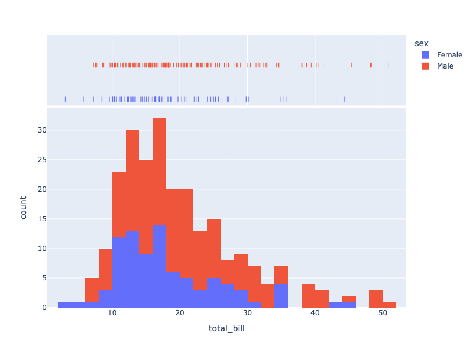

**Interactive Plot:**

<div>                        <script type="text/javascript">window.PlotlyConfig = {MathJaxConfig: 'local'};</script>
        <script charset="utf-8" src="https://cdn.plot.ly/plotly-3.1.0.min.js" integrity="sha256-Ei4740bWZhaUTQuD6q9yQlgVCMPBz6CZWhevDYPv93A=" crossorigin="anonymous"></script>                <div id="plotly-div-13" class="plotly-graph-div" style="height:100%; width:100%;"></div>            <script type="text/javascript">                window.PLOTLYENV=window.PLOTLYENV || {};                                if (document.getElementById("plotly-div-13")) {                    Plotly.newPlot(                        "plotly-div-13",                        [{"bingroup":"x","hovertemplate":"sex=Female\u003cbr\u003etotal_bill=%{x}\u003cbr\u003ecount=%{y}\u003cextra\u003e\u003c\u002fextra\u003e","legendgroup":"Female","marker":{"color":"#636efa","pattern":{"shape":""}},"name":"Female","orientation":"v","showlegend":true,"x":{"dtype":"f8","bdata":"PQrXo3D9MEDXo3A9Cpc4QOF6FK5HoUFAKVyPwvWoLUApXI\u002fC9agkQLgehetR+DBACtejcD1KNEAK16NwPYovQGZmZmZmpjNAH4XrUbgeLkBxPQrXo7A0QK5H4XoU7jBAFK5H4XqUJEBI4XoUrmdBQClcj8L1aDpAMzMzMzNzMECPwvUoXI8IQFK4HoXrETFAXI\u002fC9SjcOkBI4XoUrkc5QPYoXI\u002fCdS1ApHA9CtcjJEAK16NwPWpBQAAAAAAAABdAUrgehetRMEAAAAAAAMA2QDMzMzMzsyZAw\u002fUoXI\u002fCLkBmZmZmZiZGQOxRuB6FazZA7FG4HoXrNEAfhetRuJ4sQAAAAAAAAB1A9ihcj8K1OUCPwvUoXE8xQM3MzMzMTCVAXI\u002fC9SjcKEAUrkfhehQ4QNejcD0K1ypA9ihcj8L1KEDNzMzMzMw9QArXo3A9Ci1Aw\u002fUoXI\u002fCJkCF61G4HkU0QNejcD0KVyZAhetRuB6FKEDD9Shcj0IyQIXrUbgeBSFAKVyPwvWoJEDNzMzMzEwsQFK4HoXrUSpAuB6F61F4MUDNzMzMzAw7QK5H4XoUbjBAMzMzMzOzIECkcD0K16MyQD0K16NwvSdAmpmZmZnZPUAAAAAAAAA5QEjhehSuxypA9ihcj8I1MEDD9Shcj4IxQK5H4XoULiVAw\u002fUoXI9CJUAzMzMzMzMjQGZmZmZm5jRAZmZmZmYmMkCPwvUoXM8zQK5H4XoUjkVAAAAAAAAAKkB7FK5H4XopQAAAAAAAACpAZmZmZmZmMEC4HoXrUXgwQIXrUbgehSlACtejcD2KKkDsUbgehSs8QM3MzMzMzClApHA9CtcjPkDXo3A9CtcqQPYoXI\u002fC9S9AhetRuB5FMECuR+F6FC4kQB+F61G4HjZACtejcD3qQUCuR+F6FC47QEjhehSuxzJA"},"xaxis":"x","yaxis":"y","type":"histogram"},{"boxpoints":"all","customdata":[[1.01,"Female","No","Sun","Dinner",2],[3.61,"Female","No","Sun","Dinner",4],[5.0,"Female","No","Sun","Dinner",4],[3.02,"Female","No","Sun","Dinner",2],[1.67,"Female","No","Sun","Dinner",3],[3.5,"Female","No","Sun","Dinner",3],[2.75,"Female","No","Sat","Dinner",2],[2.23,"Female","No","Sat","Dinner",2],[3.0,"Female","No","Sat","Dinner",2],[3.0,"Female","No","Sat","Dinner",2],[2.45,"Female","No","Sat","Dinner",4],[3.07,"Female","No","Sat","Dinner",3],[2.6,"Female","No","Sun","Dinner",2],[5.2,"Female","No","Sun","Dinner",4],[1.5,"Female","No","Sat","Dinner",2],[2.47,"Female","No","Sat","Dinner",2],[1.0,"Female","Yes","Sat","Dinner",1],[3.0,"Female","No","Sat","Dinner",3],[3.14,"Female","Yes","Sat","Dinner",2],[5.0,"Female","Yes","Sat","Dinner",2],[2.2,"Female","No","Sat","Dinner",2],[1.83,"Female","No","Thur","Lunch",1],[5.17,"Female","No","Thur","Lunch",4],[1.0,"Female","Yes","Fri","Dinner",2],[4.3,"Female","Yes","Fri","Dinner",2],[3.25,"Female","No","Fri","Dinner",2],[2.5,"Female","Yes","Fri","Dinner",2],[3.0,"Female","Yes","Fri","Dinner",2],[2.5,"Female","Yes","Sat","Dinner",3],[3.48,"Female","Yes","Sat","Dinner",2],[4.08,"Female","No","Sat","Dinner",2],[4.0,"Female","Yes","Sat","Dinner",2],[1.0,"Female","No","Sat","Dinner",1],[4.0,"Female","No","Sun","Dinner",3],[3.5,"Female","No","Sun","Dinner",2],[1.5,"Female","No","Thur","Lunch",2],[1.8,"Female","No","Thur","Lunch",2],[2.92,"Female","No","Thur","Lunch",4],[1.68,"Female","No","Thur","Lunch",2],[2.52,"Female","No","Thur","Lunch",2],[4.2,"Female","No","Thur","Lunch",6],[2.0,"Female","No","Thur","Lunch",2],[2.0,"Female","No","Thur","Lunch",2],[2.83,"Female","No","Thur","Lunch",2],[1.5,"Female","No","Thur","Lunch",2],[2.0,"Female","No","Thur","Lunch",2],[3.25,"Female","No","Thur","Lunch",2],[1.25,"Female","No","Thur","Lunch",2],[2.0,"Female","No","Thur","Lunch",2],[2.0,"Female","No","Thur","Lunch",2],[2.75,"Female","No","Thur","Lunch",2],[3.5,"Female","No","Thur","Lunch",2],[5.0,"Female","No","Thur","Lunch",6],[2.3,"Female","No","Thur","Lunch",2],[1.5,"Female","No","Thur","Lunch",2],[1.36,"Female","No","Thur","Lunch",3],[1.63,"Female","No","Thur","Lunch",2],[5.14,"Female","No","Sun","Dinner",5],[3.75,"Female","No","Sun","Dinner",4],[2.61,"Female","No","Sun","Dinner",2],[2.0,"Female","No","Sun","Dinner",3],[3.0,"Female","Yes","Sun","Dinner",2],[1.61,"Female","Yes","Sat","Dinner",2],[2.0,"Female","Yes","Sat","Dinner",2],[4.0,"Female","Yes","Sun","Dinner",2],[3.5,"Female","Yes","Sun","Dinner",3],[3.5,"Female","Yes","Sun","Dinner",3],[4.19,"Female","Yes","Thur","Lunch",2],[5.0,"Female","Yes","Thur","Lunch",4],[2.0,"Female","Yes","Thur","Lunch",2],[2.01,"Female","Yes","Thur","Lunch",2],[2.0,"Female","Yes","Thur","Lunch",2],[2.5,"Female","Yes","Thur","Lunch",2],[3.23,"Female","Yes","Thur","Lunch",3],[2.23,"Female","Yes","Sat","Dinner",2],[2.5,"Female","Yes","Sat","Dinner",2],[6.5,"Female","Yes","Sat","Dinner",3],[1.1,"Female","Yes","Sat","Dinner",2],[3.09,"Female","Yes","Sat","Dinner",4],[3.48,"Female","Yes","Fri","Lunch",2],[3.0,"Female","No","Fri","Lunch",3],[2.5,"Female","Yes","Fri","Lunch",2],[2.0,"Female","Yes","Fri","Lunch",2],[2.88,"Female","Yes","Sat","Dinner",2],[4.67,"Female","No","Sat","Dinner",3],[2.0,"Female","Yes","Sat","Dinner",2],[3.0,"Female","No","Thur","Dinner",2]],"fillcolor":"rgba(255,255,255,0)","hoveron":"points","hovertemplate":"sex=%{customdata[1]}\u003cbr\u003etotal_bill=%{x}\u003cbr\u003etip=%{customdata[0]}\u003cbr\u003esmoker=%{customdata[2]}\u003cbr\u003eday=%{customdata[3]}\u003cbr\u003etime=%{customdata[4]}\u003cbr\u003esize=%{customdata[5]}\u003cextra\u003e\u003c\u002fextra\u003e","jitter":0,"legendgroup":"Female","line":{"color":"rgba(255,255,255,0)"},"marker":{"color":"#636efa","symbol":"line-ns-open"},"name":"Female","showlegend":false,"x":{"dtype":"f8","bdata":"PQrXo3D9MEDXo3A9Cpc4QOF6FK5HoUFAKVyPwvWoLUApXI\u002fC9agkQLgehetR+DBACtejcD1KNEAK16NwPYovQGZmZmZmpjNAH4XrUbgeLkBxPQrXo7A0QK5H4XoU7jBAFK5H4XqUJEBI4XoUrmdBQClcj8L1aDpAMzMzMzNzMECPwvUoXI8IQFK4HoXrETFAXI\u002fC9SjcOkBI4XoUrkc5QPYoXI\u002fCdS1ApHA9CtcjJEAK16NwPWpBQAAAAAAAABdAUrgehetRMEAAAAAAAMA2QDMzMzMzsyZAw\u002fUoXI\u002fCLkBmZmZmZiZGQOxRuB6FazZA7FG4HoXrNEAfhetRuJ4sQAAAAAAAAB1A9ihcj8K1OUCPwvUoXE8xQM3MzMzMTCVAXI\u002fC9SjcKEAUrkfhehQ4QNejcD0K1ypA9ihcj8L1KEDNzMzMzMw9QArXo3A9Ci1Aw\u002fUoXI\u002fCJkCF61G4HkU0QNejcD0KVyZAhetRuB6FKEDD9Shcj0IyQIXrUbgeBSFAKVyPwvWoJEDNzMzMzEwsQFK4HoXrUSpAuB6F61F4MUDNzMzMzAw7QK5H4XoUbjBAMzMzMzOzIECkcD0K16MyQD0K16NwvSdAmpmZmZnZPUAAAAAAAAA5QEjhehSuxypA9ihcj8I1MEDD9Shcj4IxQK5H4XoULiVAw\u002fUoXI9CJUAzMzMzMzMjQGZmZmZm5jRAZmZmZmYmMkCPwvUoXM8zQK5H4XoUjkVAAAAAAAAAKkB7FK5H4XopQAAAAAAAACpAZmZmZmZmMEC4HoXrUXgwQIXrUbgehSlACtejcD2KKkDsUbgehSs8QM3MzMzMzClApHA9CtcjPkDXo3A9CtcqQPYoXI\u002fC9S9AhetRuB5FMECuR+F6FC4kQB+F61G4HjZACtejcD3qQUCuR+F6FC47QEjhehSuxzJA"},"xaxis":"x2","yaxis":"y2","type":"box"},{"bingroup":"x","hovertemplate":"sex=Male\u003cbr\u003etotal_bill=%{x}\u003cbr\u003ecount=%{y}\u003cextra\u003e\u003c\u002fextra\u003e","legendgroup":"Male","marker":{"color":"#EF553B","pattern":{"shape":""}},"name":"Male","orientation":"v","showlegend":true,"x":{"dtype":"f8","bdata":"rkfhehSuJEDD9ShcjwI1QK5H4XoUrjdACtejcD1KOUAK16NwPYohQOF6FK5H4TpAFK5H4XoULkCPwvUoXI8tQArXo3A9iiRA16NwPQrXLkCuR+F6FG4yQBSuR+F6lDVACtejcD1KMEBmZmZmZqY0QOxRuB6F6zFA9ihcj8K1Q0BSuB6F69EzQI\u002fC9ShczzFAPQrXo3C9KkDhehSuR2EpQDMzMzMzszVAmpmZmZkZI0CamZmZmVkyQEjhehSuxzFAj8L1KFwPOECPwvUoXE8wQHE9CtejsDJAhetRuB5FP0AK16NwPQowQPYoXI\u002fCdTFA4XoUrkfhK0Bcj8L1KFwjQGZmZmZmZj5ACtejcD1KMkB7FK5H4To2QDMzMzMzM0BAzczMzMyMPEAK16NwPQoyQBSuR+F6FClA4XoUrkfhI0CPwvUoXI85QD0K16NwfTNA4XoUrkcBQ0B7FK5H4XomQMP1KFyPIkhACtejcD1KNEAfhetRuJ4rQArXo3A9CiZACtejcD1KMkDXo3A9CpcxQBSuR+F6FDRAexSuR+E6NECF61G4HgUuQArXo3A9CihAhetRuB4FJUDsUbgehesxQDMzMzMzMztAw\u002fUoXI\u002fCNkAK16NwPUoxQHE9CtejcDNAKVyPwvWoMEDXo3A9CldAQPYoXI\u002fC9S9Aj8L1KFwPKkBI4XoUrkcyQPYoXI\u002fCtThAKVyPwvUoNUC4HoXrUfg8QD0K16NwfTZA9ihcj8IVREBI4XoUrkc7QI\u002fC9ShcDyhAw\u002fUoXI8CNUDsUbgehesoQLgehetRuC5APQrXo3B9NED2KFyPwjU5QD0K16NwPTJAAAAAAAAALEApXI\u002fC9QhDQDMzMzMz8zdArkfhehTuPUDhehSuR2EnQIXrUbgehSxAZmZmZmbmL0AK16NwPQohQFK4HoXr0TZAFK5H4XoUM0AAAAAAAAAwQGZmZmZmJkFAuB6F61GYRECPwvUoXI8jQArXo3A9Ch5ApHA9CtcjLEDD9Shcj0IqQMP1KFyPQjFAzczMzMyMOECF61G4HsUzQPYoXI\u002fCFUhAPQrXo3B9MEAAAAAAAIA1QFK4HoXrUSlAH4XrUbieK0CF61G4HoU4QMP1KFyPwjRA9ihcj8K1P0BI4XoUrmdJQB+F61G4ni9AAAAAAAAAHUCamZmZmdk\u002fQFK4HoXr0TBAMzMzMzNzQECkcD0K1+MxQPYoXI\u002fC9SxAcT0K16NQQUAzMzMzM1NBQBSuR+F6VDdAzczMzMysRkDsUbgehSs3QGZmZmZmRkRAcT0K16OwNED2KFyPwnU+QJqZmZmZGTdA4XoUrkdhL0BxPQrXo3A8QPYoXI\u002fC9S5AFK5H4XqUMEA9CtejcD0eQK5H4XoUriRAhetRuB4FK0D2KFyPwrUyQEjhehSuhzRA16NwPQqXOkA9CtejcF1DQIXrUbgeRThAj8L1KFwPPkCkcD0K1+M5QArXo3A9KkhAZmZmZmYmPECuR+F6FC4nQPYoXI\u002fC9R5AUrgehetRKEApXI\u002fC9SghQNejcD0K1ypAMzMzMzNzNECPwvUoXI8qQMP1KFyPAjhA4XoUrkdhL0C4HoXrUTgnQArXo3A9iiVAj8L1KFwPL0CkcD0K1yMkQDMzMzMzMylACtejcD1qQEBI4XoUrgc9QOxRuB6FqzZAUrgehevRMUA="},"xaxis":"x","yaxis":"y","type":"histogram"},{"boxpoints":"all","customdata":[[1.66,"Male","No","Sun","Dinner",3],[3.5,"Male","No","Sun","Dinner",3],[3.31,"Male","No","Sun","Dinner",2],[4.71,"Male","No","Sun","Dinner",4],[2.0,"Male","No","Sun","Dinner",2],[3.12,"Male","No","Sun","Dinner",4],[1.96,"Male","No","Sun","Dinner",2],[3.23,"Male","No","Sun","Dinner",2],[1.71,"Male","No","Sun","Dinner",2],[1.57,"Male","No","Sun","Dinner",2],[3.0,"Male","No","Sun","Dinner",4],[3.92,"Male","No","Sun","Dinner",2],[3.71,"Male","No","Sun","Dinner",3],[3.35,"Male","No","Sat","Dinner",3],[4.08,"Male","No","Sat","Dinner",2],[7.58,"Male","No","Sat","Dinner",4],[3.18,"Male","No","Sat","Dinner",2],[2.34,"Male","No","Sat","Dinner",4],[2.0,"Male","No","Sat","Dinner",2],[2.0,"Male","No","Sat","Dinner",2],[4.3,"Male","No","Sat","Dinner",2],[1.45,"Male","No","Sat","Dinner",2],[2.5,"Male","No","Sat","Dinner",4],[3.27,"Male","No","Sat","Dinner",2],[3.6,"Male","No","Sat","Dinner",3],[2.0,"Male","No","Sat","Dinner",3],[2.31,"Male","No","Sat","Dinner",3],[5.0,"Male","No","Sat","Dinner",3],[2.24,"Male","No","Sat","Dinner",3],[2.54,"Male","No","Sun","Dinner",2],[3.06,"Male","No","Sun","Dinner",2],[1.32,"Male","No","Sun","Dinner",2],[5.6,"Male","No","Sun","Dinner",4],[3.0,"Male","No","Sun","Dinner",2],[5.0,"Male","No","Sun","Dinner",2],[6.0,"Male","No","Sun","Dinner",4],[2.05,"Male","No","Sun","Dinner",3],[3.0,"Male","No","Sun","Dinner",2],[2.5,"Male","No","Sun","Dinner",2],[1.56,"Male","No","Sun","Dinner",2],[4.34,"Male","No","Sun","Dinner",4],[3.51,"Male","No","Sun","Dinner",2],[3.0,"Male","Yes","Sat","Dinner",4],[1.76,"Male","Yes","Sat","Dinner",2],[6.73,"Male","No","Sat","Dinner",4],[3.21,"Male","Yes","Sat","Dinner",2],[2.0,"Male","Yes","Sat","Dinner",2],[1.98,"Male","Yes","Sat","Dinner",2],[3.76,"Male","Yes","Sat","Dinner",4],[2.64,"Male","No","Sat","Dinner",3],[3.15,"Male","No","Sat","Dinner",3],[2.01,"Male","No","Sat","Dinner",2],[2.09,"Male","Yes","Sat","Dinner",2],[1.97,"Male","No","Sat","Dinner",2],[1.25,"Male","No","Sat","Dinner",2],[3.08,"Male","Yes","Sat","Dinner",2],[4.0,"Male","No","Thur","Lunch",4],[3.0,"Male","No","Thur","Lunch",2],[2.71,"Male","No","Thur","Lunch",2],[3.0,"Male","Yes","Thur","Lunch",2],[3.4,"Male","No","Thur","Lunch",2],[5.0,"Male","Yes","Thur","Lunch",2],[2.03,"Male","No","Thur","Lunch",2],[2.0,"Male","No","Thur","Lunch",2],[4.0,"Male","No","Thur","Lunch",2],[5.85,"Male","No","Thur","Lunch",2],[3.0,"Male","No","Thur","Lunch",2],[3.0,"Male","Yes","Fri","Dinner",2],[3.5,"Male","No","Fri","Dinner",2],[4.73,"Male","Yes","Fri","Dinner",4],[4.0,"Male","Yes","Fri","Dinner",2],[1.5,"Male","Yes","Fri","Dinner",2],[3.0,"Male","Yes","Fri","Dinner",2],[1.5,"Male","No","Fri","Dinner",2],[1.64,"Male","Yes","Sat","Dinner",2],[4.06,"Male","Yes","Sat","Dinner",2],[4.29,"Male","Yes","Sat","Dinner",2],[3.76,"Male","No","Sat","Dinner",2],[3.0,"Male","No","Sat","Dinner",2],[4.0,"Male","No","Sun","Dinner",3],[2.55,"Male","No","Sun","Dinner",2],[5.07,"Male","No","Sun","Dinner",4],[2.31,"Male","No","Thur","Lunch",2],[2.5,"Male","No","Thur","Lunch",2],[2.0,"Male","No","Thur","Lunch",2],[1.48,"Male","No","Thur","Lunch",2],[2.18,"Male","No","Thur","Lunch",3],[1.5,"Male","No","Thur","Lunch",2],[2.0,"Male","Yes","Thur","Lunch",2],[6.7,"Male","No","Thur","Lunch",6],[5.0,"Male","No","Thur","Lunch",5],[1.73,"Male","No","Thur","Lunch",2],[2.0,"Male","No","Thur","Lunch",2],[2.5,"Male","No","Sun","Dinner",2],[2.0,"Male","No","Sun","Dinner",2],[2.74,"Male","No","Sun","Dinner",3],[2.0,"Male","No","Sun","Dinner",4],[2.0,"Male","No","Sun","Dinner",4],[5.0,"Male","No","Sun","Dinner",6],[2.0,"Male","No","Sun","Dinner",4],[3.5,"Male","No","Sun","Dinner",4],[2.5,"Male","No","Sun","Dinner",2],[2.0,"Male","No","Sun","Dinner",2],[3.48,"Male","No","Sun","Dinner",3],[2.24,"Male","No","Sun","Dinner",2],[4.5,"Male","No","Sun","Dinner",4],[10.0,"Male","Yes","Sat","Dinner",3],[3.16,"Male","Yes","Sat","Dinner",2],[5.15,"Male","Yes","Sun","Dinner",2],[3.18,"Male","Yes","Sun","Dinner",2],[4.0,"Male","Yes","Sun","Dinner",2],[3.11,"Male","Yes","Sun","Dinner",2],[2.0,"Male","Yes","Sun","Dinner",2],[2.0,"Male","Yes","Sun","Dinner",2],[3.55,"Male","Yes","Sun","Dinner",2],[3.68,"Male","Yes","Sun","Dinner",4],[5.65,"Male","Yes","Sun","Dinner",2],[3.5,"Male","Yes","Sun","Dinner",3],[6.5,"Male","Yes","Sun","Dinner",4],[3.0,"Male","Yes","Sun","Dinner",2],[5.0,"Male","No","Sun","Dinner",5],[2.0,"Male","Yes","Sun","Dinner",5],[4.0,"Male","Yes","Sun","Dinner",3],[1.5,"Male","Yes","Sun","Dinner",2],[2.56,"Male","Yes","Thur","Lunch",2],[2.02,"Male","Yes","Thur","Lunch",2],[4.0,"Male","Yes","Thur","Lunch",2],[1.44,"Male","No","Thur","Lunch",2],[2.0,"Male","Yes","Thur","Lunch",2],[2.0,"Male","Yes","Thur","Lunch",2],[4.0,"Male","Yes","Thur","Lunch",3],[4.0,"Male","Yes","Thur","Lunch",4],[3.41,"Male","Yes","Sat","Dinner",3],[3.0,"Male","Yes","Sat","Dinner",4],[2.03,"Male","Yes","Sat","Dinner",2],[2.0,"Male","Yes","Sat","Dinner",3],[5.16,"Male","Yes","Sat","Dinner",4],[9.0,"Male","No","Sat","Dinner",4],[3.0,"Male","Yes","Sat","Dinner",5],[1.5,"Male","Yes","Sat","Dinner",2],[1.44,"Male","Yes","Sat","Dinner",2],[2.2,"Male","Yes","Fri","Lunch",2],[1.92,"Male","Yes","Fri","Lunch",1],[1.58,"Male","Yes","Fri","Lunch",2],[3.0,"Male","No","Sat","Dinner",4],[2.72,"Male","No","Sat","Dinner",2],[2.0,"Male","Yes","Sat","Dinner",4],[3.0,"Male","Yes","Sat","Dinner",3],[3.39,"Male","No","Sat","Dinner",2],[1.47,"Male","No","Sat","Dinner",2],[3.0,"Male","Yes","Sat","Dinner",2],[1.25,"Male","No","Sat","Dinner",2],[1.0,"Male","Yes","Sat","Dinner",2],[1.17,"Male","Yes","Sat","Dinner",2],[5.92,"Male","No","Sat","Dinner",3],[2.0,"Male","Yes","Sat","Dinner",2],[1.75,"Male","No","Sat","Dinner",2]],"fillcolor":"rgba(255,255,255,0)","hoveron":"points","hovertemplate":"sex=%{customdata[1]}\u003cbr\u003etotal_bill=%{x}\u003cbr\u003etip=%{customdata[0]}\u003cbr\u003esmoker=%{customdata[2]}\u003cbr\u003eday=%{customdata[3]}\u003cbr\u003etime=%{customdata[4]}\u003cbr\u003esize=%{customdata[5]}\u003cextra\u003e\u003c\u002fextra\u003e","jitter":0,"legendgroup":"Male","line":{"color":"rgba(255,255,255,0)"},"marker":{"color":"#EF553B","symbol":"line-ns-open"},"name":"Male","showlegend":false,"x":{"dtype":"f8","bdata":"rkfhehSuJEDD9ShcjwI1QK5H4XoUrjdACtejcD1KOUAK16NwPYohQOF6FK5H4TpAFK5H4XoULkCPwvUoXI8tQArXo3A9iiRA16NwPQrXLkCuR+F6FG4yQBSuR+F6lDVACtejcD1KMEBmZmZmZqY0QOxRuB6F6zFA9ihcj8K1Q0BSuB6F69EzQI\u002fC9ShczzFAPQrXo3C9KkDhehSuR2EpQDMzMzMzszVAmpmZmZkZI0CamZmZmVkyQEjhehSuxzFAj8L1KFwPOECPwvUoXE8wQHE9CtejsDJAhetRuB5FP0AK16NwPQowQPYoXI\u002fCdTFA4XoUrkfhK0Bcj8L1KFwjQGZmZmZmZj5ACtejcD1KMkB7FK5H4To2QDMzMzMzM0BAzczMzMyMPEAK16NwPQoyQBSuR+F6FClA4XoUrkfhI0CPwvUoXI85QD0K16NwfTNA4XoUrkcBQ0B7FK5H4XomQMP1KFyPIkhACtejcD1KNEAfhetRuJ4rQArXo3A9CiZACtejcD1KMkDXo3A9CpcxQBSuR+F6FDRAexSuR+E6NECF61G4HgUuQArXo3A9CihAhetRuB4FJUDsUbgehesxQDMzMzMzMztAw\u002fUoXI\u002fCNkAK16NwPUoxQHE9CtejcDNAKVyPwvWoMEDXo3A9CldAQPYoXI\u002fC9S9Aj8L1KFwPKkBI4XoUrkcyQPYoXI\u002fCtThAKVyPwvUoNUC4HoXrUfg8QD0K16NwfTZA9ihcj8IVREBI4XoUrkc7QI\u002fC9ShcDyhAw\u002fUoXI8CNUDsUbgehesoQLgehetRuC5APQrXo3B9NED2KFyPwjU5QD0K16NwPTJAAAAAAAAALEApXI\u002fC9QhDQDMzMzMz8zdArkfhehTuPUDhehSuR2EnQIXrUbgehSxAZmZmZmbmL0AK16NwPQohQFK4HoXr0TZAFK5H4XoUM0AAAAAAAAAwQGZmZmZmJkFAuB6F61GYRECPwvUoXI8jQArXo3A9Ch5ApHA9CtcjLEDD9Shcj0IqQMP1KFyPQjFAzczMzMyMOECF61G4HsUzQPYoXI\u002fCFUhAPQrXo3B9MEAAAAAAAIA1QFK4HoXrUSlAH4XrUbieK0CF61G4HoU4QMP1KFyPwjRA9ihcj8K1P0BI4XoUrmdJQB+F61G4ni9AAAAAAAAAHUCamZmZmdk\u002fQFK4HoXr0TBAMzMzMzNzQECkcD0K1+MxQPYoXI\u002fC9SxAcT0K16NQQUAzMzMzM1NBQBSuR+F6VDdAzczMzMysRkDsUbgehSs3QGZmZmZmRkRAcT0K16OwNED2KFyPwnU+QJqZmZmZGTdA4XoUrkdhL0BxPQrXo3A8QPYoXI\u002fC9S5AFK5H4XqUMEA9CtejcD0eQK5H4XoUriRAhetRuB4FK0D2KFyPwrUyQEjhehSuhzRA16NwPQqXOkA9CtejcF1DQIXrUbgeRThAj8L1KFwPPkCkcD0K1+M5QArXo3A9KkhAZmZmZmYmPECuR+F6FC4nQPYoXI\u002fC9R5AUrgehetRKEApXI\u002fC9SghQNejcD0K1ypAMzMzMzNzNECPwvUoXI8qQMP1KFyPAjhA4XoUrkdhL0C4HoXrUTgnQArXo3A9iiVAj8L1KFwPL0CkcD0K1yMkQDMzMzMzMylACtejcD1qQEBI4XoUrgc9QOxRuB6FqzZAUrgehevRMUA="},"xaxis":"x2","yaxis":"y2","type":"box"}],                        {"template":{"data":{"histogram2dcontour":[{"type":"histogram2dcontour","colorbar":{"outlinewidth":0,"ticks":""},"colorscale":[[0.0,"#0d0887"],[0.1111111111111111,"#46039f"],[0.2222222222222222,"#7201a8"],[0.3333333333333333,"#9c179e"],[0.4444444444444444,"#bd3786"],[0.5555555555555556,"#d8576b"],[0.6666666666666666,"#ed7953"],[0.7777777777777778,"#fb9f3a"],[0.8888888888888888,"#fdca26"],[1.0,"#f0f921"]]}],"choropleth":[{"type":"choropleth","colorbar":{"outlinewidth":0,"ticks":""}}],"histogram2d":[{"type":"histogram2d","colorbar":{"outlinewidth":0,"ticks":""},"colorscale":[[0.0,"#0d0887"],[0.1111111111111111,"#46039f"],[0.2222222222222222,"#7201a8"],[0.3333333333333333,"#9c179e"],[0.4444444444444444,"#bd3786"],[0.5555555555555556,"#d8576b"],[0.6666666666666666,"#ed7953"],[0.7777777777777778,"#fb9f3a"],[0.8888888888888888,"#fdca26"],[1.0,"#f0f921"]]}],"heatmap":[{"type":"heatmap","colorbar":{"outlinewidth":0,"ticks":""},"colorscale":[[0.0,"#0d0887"],[0.1111111111111111,"#46039f"],[0.2222222222222222,"#7201a8"],[0.3333333333333333,"#9c179e"],[0.4444444444444444,"#bd3786"],[0.5555555555555556,"#d8576b"],[0.6666666666666666,"#ed7953"],[0.7777777777777778,"#fb9f3a"],[0.8888888888888888,"#fdca26"],[1.0,"#f0f921"]]}],"contourcarpet":[{"type":"contourcarpet","colorbar":{"outlinewidth":0,"ticks":""}}],"contour":[{"type":"contour","colorbar":{"outlinewidth":0,"ticks":""},"colorscale":[[0.0,"#0d0887"],[0.1111111111111111,"#46039f"],[0.2222222222222222,"#7201a8"],[0.3333333333333333,"#9c179e"],[0.4444444444444444,"#bd3786"],[0.5555555555555556,"#d8576b"],[0.6666666666666666,"#ed7953"],[0.7777777777777778,"#fb9f3a"],[0.8888888888888888,"#fdca26"],[1.0,"#f0f921"]]}],"surface":[{"type":"surface","colorbar":{"outlinewidth":0,"ticks":""},"colorscale":[[0.0,"#0d0887"],[0.1111111111111111,"#46039f"],[0.2222222222222222,"#7201a8"],[0.3333333333333333,"#9c179e"],[0.4444444444444444,"#bd3786"],[0.5555555555555556,"#d8576b"],[0.6666666666666666,"#ed7953"],[0.7777777777777778,"#fb9f3a"],[0.8888888888888888,"#fdca26"],[1.0,"#f0f921"]]}],"mesh3d":[{"type":"mesh3d","colorbar":{"outlinewidth":0,"ticks":""}}],"scatter":[{"fillpattern":{"fillmode":"overlay","size":10,"solidity":0.2},"type":"scatter"}],"parcoords":[{"type":"parcoords","line":{"colorbar":{"outlinewidth":0,"ticks":""}}}],"scatterpolargl":[{"type":"scatterpolargl","marker":{"colorbar":{"outlinewidth":0,"ticks":""}}}],"bar":[{"error_x":{"color":"#2a3f5f"},"error_y":{"color":"#2a3f5f"},"marker":{"line":{"color":"#E5ECF6","width":0.5},"pattern":{"fillmode":"overlay","size":10,"solidity":0.2}},"type":"bar"}],"scattergeo":[{"type":"scattergeo","marker":{"colorbar":{"outlinewidth":0,"ticks":""}}}],"scatterpolar":[{"type":"scatterpolar","marker":{"colorbar":{"outlinewidth":0,"ticks":""}}}],"histogram":[{"marker":{"pattern":{"fillmode":"overlay","size":10,"solidity":0.2}},"type":"histogram"}],"scattergl":[{"type":"scattergl","marker":{"colorbar":{"outlinewidth":0,"ticks":""}}}],"scatter3d":[{"type":"scatter3d","line":{"colorbar":{"outlinewidth":0,"ticks":""}},"marker":{"colorbar":{"outlinewidth":0,"ticks":""}}}],"scattermap":[{"type":"scattermap","marker":{"colorbar":{"outlinewidth":0,"ticks":""}}}],"scattermapbox":[{"type":"scattermapbox","marker":{"colorbar":{"outlinewidth":0,"ticks":""}}}],"scatterternary":[{"type":"scatterternary","marker":{"colorbar":{"outlinewidth":0,"ticks":""}}}],"scattercarpet":[{"type":"scattercarpet","marker":{"colorbar":{"outlinewidth":0,"ticks":""}}}],"carpet":[{"aaxis":{"endlinecolor":"#2a3f5f","gridcolor":"white","linecolor":"white","minorgridcolor":"white","startlinecolor":"#2a3f5f"},"baxis":{"endlinecolor":"#2a3f5f","gridcolor":"white","linecolor":"white","minorgridcolor":"white","startlinecolor":"#2a3f5f"},"type":"carpet"}],"table":[{"cells":{"fill":{"color":"#EBF0F8"},"line":{"color":"white"}},"header":{"fill":{"color":"#C8D4E3"},"line":{"color":"white"}},"type":"table"}],"barpolar":[{"marker":{"line":{"color":"#E5ECF6","width":0.5},"pattern":{"fillmode":"overlay","size":10,"solidity":0.2}},"type":"barpolar"}],"pie":[{"automargin":true,"type":"pie"}]},"layout":{"autotypenumbers":"strict","colorway":["#636efa","#EF553B","#00cc96","#ab63fa","#FFA15A","#19d3f3","#FF6692","#B6E880","#FF97FF","#FECB52"],"font":{"color":"#2a3f5f"},"hovermode":"closest","hoverlabel":{"align":"left"},"paper_bgcolor":"white","plot_bgcolor":"#E5ECF6","polar":{"bgcolor":"#E5ECF6","angularaxis":{"gridcolor":"white","linecolor":"white","ticks":""},"radialaxis":{"gridcolor":"white","linecolor":"white","ticks":""}},"ternary":{"bgcolor":"#E5ECF6","aaxis":{"gridcolor":"white","linecolor":"white","ticks":""},"baxis":{"gridcolor":"white","linecolor":"white","ticks":""},"caxis":{"gridcolor":"white","linecolor":"white","ticks":""}},"coloraxis":{"colorbar":{"outlinewidth":0,"ticks":""}},"colorscale":{"sequential":[[0.0,"#0d0887"],[0.1111111111111111,"#46039f"],[0.2222222222222222,"#7201a8"],[0.3333333333333333,"#9c179e"],[0.4444444444444444,"#bd3786"],[0.5555555555555556,"#d8576b"],[0.6666666666666666,"#ed7953"],[0.7777777777777778,"#fb9f3a"],[0.8888888888888888,"#fdca26"],[1.0,"#f0f921"]],"sequentialminus":[[0.0,"#0d0887"],[0.1111111111111111,"#46039f"],[0.2222222222222222,"#7201a8"],[0.3333333333333333,"#9c179e"],[0.4444444444444444,"#bd3786"],[0.5555555555555556,"#d8576b"],[0.6666666666666666,"#ed7953"],[0.7777777777777778,"#fb9f3a"],[0.8888888888888888,"#fdca26"],[1.0,"#f0f921"]],"diverging":[[0,"#8e0152"],[0.1,"#c51b7d"],[0.2,"#de77ae"],[0.3,"#f1b6da"],[0.4,"#fde0ef"],[0.5,"#f7f7f7"],[0.6,"#e6f5d0"],[0.7,"#b8e186"],[0.8,"#7fbc41"],[0.9,"#4d9221"],[1,"#276419"]]},"xaxis":{"gridcolor":"white","linecolor":"white","ticks":"","title":{"standoff":15},"zerolinecolor":"white","automargin":true,"zerolinewidth":2},"yaxis":{"gridcolor":"white","linecolor":"white","ticks":"","title":{"standoff":15},"zerolinecolor":"white","automargin":true,"zerolinewidth":2},"scene":{"xaxis":{"backgroundcolor":"#E5ECF6","gridcolor":"white","linecolor":"white","showbackground":true,"ticks":"","zerolinecolor":"white","gridwidth":2},"yaxis":{"backgroundcolor":"#E5ECF6","gridcolor":"white","linecolor":"white","showbackground":true,"ticks":"","zerolinecolor":"white","gridwidth":2},"zaxis":{"backgroundcolor":"#E5ECF6","gridcolor":"white","linecolor":"white","showbackground":true,"ticks":"","zerolinecolor":"white","gridwidth":2}},"shapedefaults":{"line":{"color":"#2a3f5f"}},"annotationdefaults":{"arrowcolor":"#2a3f5f","arrowhead":0,"arrowwidth":1},"geo":{"bgcolor":"white","landcolor":"#E5ECF6","subunitcolor":"white","showland":true,"showlakes":true,"lakecolor":"white"},"title":{"x":0.05},"mapbox":{"style":"light"}}},"xaxis":{"anchor":"y","domain":[0.0,1.0],"title":{"text":"total_bill"}},"yaxis":{"anchor":"x","domain":[0.0,0.7326],"title":{"text":"count"}},"xaxis2":{"anchor":"y2","domain":[0.0,1.0],"matches":"x","showticklabels":false,"showgrid":true},"yaxis2":{"anchor":"x2","domain":[0.7426,1.0],"matches":"y2","showticklabels":false,"showline":false,"ticks":"","showgrid":false},"legend":{"title":{"text":"sex"},"tracegroupgap":0},"margin":{"t":60},"barmode":"relative"},                        {"responsive": true}                    )                };            </script>        </div>

### Adding text labels

*New in v5.5*

You can add text to histogram bars using the `text_auto` argument. Setting it to `True` will display the values on the bars, and setting it to a `d3-format` formatting string will control the output format.

```python
import plotly.express as px
df = px.data.tips()
fig = px.histogram(df, x="total_bill", y="tip", histfunc="avg", nbins=8, text_auto=True)
fig.show()
```

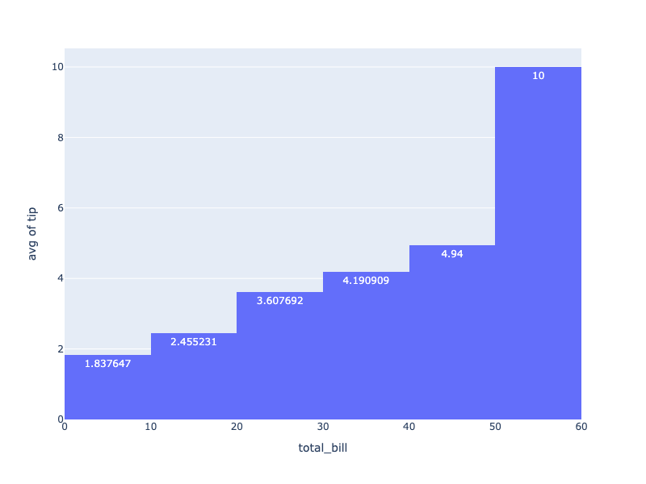

**Interactive Plot:**

<div>                        <script type="text/javascript">window.PlotlyConfig = {MathJaxConfig: 'local'};</script>
        <script charset="utf-8" src="https://cdn.plot.ly/plotly-3.1.0.min.js" integrity="sha256-Ei4740bWZhaUTQuD6q9yQlgVCMPBz6CZWhevDYPv93A=" crossorigin="anonymous"></script>                <div id="plotly-div-14" class="plotly-graph-div" style="height:100%; width:100%;"></div>            <script type="text/javascript">                window.PLOTLYENV=window.PLOTLYENV || {};                                if (document.getElementById("plotly-div-14")) {                    Plotly.newPlot(                        "plotly-div-14",                        [{"bingroup":"x","histfunc":"avg","hovertemplate":"total_bill=%{x}\u003cbr\u003eavg of tip=%{y}\u003cextra\u003e\u003c\u002fextra\u003e","legendgroup":"","marker":{"color":"#636efa","pattern":{"shape":""}},"name":"","nbinsx":8,"orientation":"v","showlegend":false,"texttemplate":"%{value}","x":{"dtype":"f8","bdata":"PQrXo3D9MECuR+F6FK4kQMP1KFyPAjVArkfhehSuN0DXo3A9Cpc4QArXo3A9SjlACtejcD2KIUDhehSuR+E6QBSuR+F6FC5Aj8L1KFyPLUAK16NwPYokQOF6FK5HoUFA16NwPQrXLkCuR+F6FG4yQClcj8L1qC1AFK5H4XqUNUApXI\u002fC9agkQArXo3A9SjBAuB6F61H4MEBmZmZmZqY0QOxRuB6F6zFACtejcD1KNEAK16NwPYovQPYoXI\u002fCtUNAUrgehevRM0CPwvUoXM8xQD0K16NwvSpA4XoUrkdhKUAzMzMzM7M1QGZmZmZmpjNAmpmZmZkZI0CamZmZmVkyQB+F61G4Hi5AcT0K16OwNEBI4XoUrscxQI\u002fC9ShcDzhAj8L1KFxPMECuR+F6FO4wQHE9CtejsDJAhetRuB5FP0AK16NwPQowQPYoXI\u002fCdTFA4XoUrkfhK0Bcj8L1KFwjQGZmZmZmZj5ACtejcD1KMkB7FK5H4To2QDMzMzMzM0BAzczMzMyMPEAK16NwPQoyQBSuR+F6FClAFK5H4XqUJEBI4XoUrmdBQOF6FK5H4SNAj8L1KFyPOUA9CtejcH0zQOF6FK5HAUNAKVyPwvVoOkB7FK5H4XomQMP1KFyPIkhACtejcD1KNEAfhetRuJ4rQArXo3A9CiZACtejcD1KMkDXo3A9CpcxQBSuR+F6FDRAMzMzMzNzMECPwvUoXI8IQHsUrkfhOjRAhetRuB4FLkAK16NwPQooQFK4HoXrETFAXI\u002fC9SjcOkBI4XoUrkc5QPYoXI\u002fCdS1AhetRuB4FJUDsUbgehesxQDMzMzMzMztAw\u002fUoXI\u002fCNkAK16NwPUoxQHE9CtejcDNAKVyPwvWoMECkcD0K1yMkQNejcD0KV0BA9ihcj8L1L0AK16NwPWpBQI\u002fC9ShcDypASOF6FK5HMkD2KFyPwrU4QClcj8L1KDVAuB6F61H4PEA9CtejcH02QAAAAAAAABdAUrgehetRMEAAAAAAAMA2QPYoXI\u002fCFURASOF6FK5HO0CPwvUoXA8oQMP1KFyPAjVA7FG4HoXrKEAzMzMzM7MmQMP1KFyPwi5AZmZmZmYmRkDsUbgehWs2QOxRuB6F6zRAuB6F61G4LkA9CtejcH00QPYoXI\u002fCNTlAPQrXo3A9MkAfhetRuJ4sQAAAAAAAACxAAAAAAAAAHUApXI\u002fC9QhDQDMzMzMz8zdA9ihcj8K1OUCPwvUoXE8xQK5H4XoU7j1AzczMzMxMJUBcj8L1KNwoQBSuR+F6FDhA4XoUrkdhJ0DXo3A9CtcqQIXrUbgehSxAZmZmZmbmL0D2KFyPwvUoQM3MzMzMzD1ACtejcD0KIUAK16NwPQotQMP1KFyPwiZAUrgehevRNkAUrkfhehQzQIXrUbgeRTRA16NwPQpXJkCF61G4HoUoQMP1KFyPQjJAhetRuB4FIUApXI\u002fC9agkQM3MzMzMTCxAAAAAAAAAMEBSuB6F61EqQLgehetReDFAZmZmZmYmQUC4HoXrUZhEQM3MzMzMDDtArkfhehRuMEAzMzMzM7MgQKRwPQrXozJAPQrXo3C9J0CPwvUoXI8jQArXo3A9Ch5ApHA9CtcjLEDD9Shcj0IqQMP1KFyPQjFAzczMzMyMOECF61G4HsUzQJqZmZmZ2T1A9ihcj8IVSEAAAAAAAAA5QEjhehSuxypAPQrXo3B9MEAAAAAAAIA1QFK4HoXrUSlA9ihcj8I1MEAfhetRuJ4rQMP1KFyPgjFAhetRuB6FOEDD9Shcj8I0QPYoXI\u002fCtT9ArkfhehQuJUDD9Shcj0IlQEjhehSuZ0lAH4XrUbieL0AAAAAAAAAdQJqZmZmZ2T9AUrgehevRMEAzMzMzM3NAQKRwPQrX4zFA9ihcj8L1LEAzMzMzMzMjQHE9CtejUEFAMzMzMzNTQUAUrkfhelQ3QM3MzMzMrEZA7FG4HoUrN0BmZmZmZkZEQHE9CtejsDRAZmZmZmbmNED2KFyPwnU+QGZmZmZmJjJAmpmZmZkZN0DhehSuR2EvQI\u002fC9ShczzNAcT0K16NwPED2KFyPwvUuQBSuR+F6lDBAPQrXo3A9HkCuR+F6FK4kQK5H4XoUjkVAAAAAAAAAKkCF61G4HgUrQPYoXI\u002fCtTJAexSuR+F6KUAAAAAAAAAqQGZmZmZmZjBASOF6FK6HNEC4HoXrUXgwQNejcD0KlzpAPQrXo3BdQ0CF61G4HkU4QIXrUbgehSlAj8L1KFwPPkCkcD0K1+M5QArXo3A9KkhACtejcD2KKkDsUbgehSs8QM3MzMzMzClAZmZmZmYmPECuR+F6FC4nQPYoXI\u002fC9R5ApHA9CtcjPkBSuB6F61EoQNejcD0K1ypAKVyPwvUoIUD2KFyPwvUvQNejcD0K1ypAhetRuB5FMECuR+F6FC4kQDMzMzMzczRAj8L1KFyPKkAfhetRuB42QMP1KFyPAjhA4XoUrkdhL0C4HoXrUTgnQArXo3A9iiVAj8L1KFwPL0CkcD0K1yMkQDMzMzMzMylACtejcD1qQEAK16NwPepBQEjhehSuBz1ArkfhehQuO0DsUbgehas2QFK4HoXr0TFASOF6FK7HMkA="},"xaxis":"x","y":{"dtype":"f8","bdata":"KVyPwvUo8D+PwvUoXI\u002f6PwAAAAAAAAxAexSuR+F6CkDhehSuR+EMQNejcD0K1xJAAAAAAAAAAED2KFyPwvUIQFyPwvUoXP8\u002f16NwPQrXCUBcj8L1KFz7PwAAAAAAABRAH4XrUbge+T8AAAAAAAAIQClcj8L1KAhAXI\u002fC9ShcD0C4HoXrUbj6P65H4XoUrg1AAAAAAAAADEDNzMzMzMwKQFK4HoXrURBAAAAAAAAABkDXo3A9CtcBQFK4HoXrUR5AcT0K16NwCUC4HoXrUbgCQAAAAAAAAABAAAAAAAAAAEAzMzMzMzMRQAAAAAAAAAhAMzMzMzMz9z8AAAAAAAAEQAAAAAAAAAhAmpmZmZmZA0ApXI\u002fC9SgKQM3MzMzMzAxAAAAAAAAAAECPwvUoXI8IQHsUrkfhegJAAAAAAAAAFEDsUbgehesBQFK4HoXrUQRAexSuR+F6CEAfhetRuB71P2ZmZmZmZhZAAAAAAAAACEAAAAAAAAAUQAAAAAAAABhAZmZmZmZmAEAAAAAAAAAIQAAAAAAAAARAzczMzMzMBEDNzMzMzMwUQPYoXI\u002fC9fg\u002fXI\u002fC9ShcEUAUrkfhehQMQAAAAAAAAAhAAAAAAAAA+D8pXI\u002fC9Sj8P+xRuB6F6xpArkfhehSuCUAAAAAAAAAAQK5H4XoUrv8\u002fFK5H4XoUDkAfhetRuB4FQDMzMzMzMwlAw\u002fUoXI\u002fCA0AAAAAAAADwPxSuR+F6FABAuB6F61G4AECF61G4HoX\u002fPwAAAAAAAAhAH4XrUbgeCUAAAAAAAAAUQJqZmZmZmQFAAAAAAAAA9D+kcD0K16MIQAAAAAAAABBAAAAAAAAACECuR+F6FK4FQAAAAAAAAAhAMzMzMzMzC0BI4XoUrkf9PwAAAAAAABRAPQrXo3A9AECuR+F6FK4UQAAAAAAAAABAAAAAAAAAEEBmZmZmZmYXQAAAAAAAAAhAAAAAAAAACEAAAAAAAAAMQAAAAAAAAPA\u002fMzMzMzMzEUAAAAAAAAAKQOxRuB6F6xJAAAAAAAAAEEAAAAAAAAD4PwAAAAAAAAhAAAAAAAAA+D8AAAAAAAAEQAAAAAAAAAhAAAAAAAAABEDXo3A9CtcLQFK4HoXrURBAPQrXo3A9+j89CtejcD0QQClcj8L1KBFAFK5H4XoUDkAAAAAAAAAQQAAAAAAAAAhAAAAAAAAA8D8AAAAAAAAQQGZmZmZmZgRAAAAAAAAAEEAAAAAAAAAMQEjhehSuRxRAAAAAAAAA+D\u002fNzMzMzMz8P1yPwvUoXAdAexSuR+F6AkDhehSuR+H6PwAAAAAAAARAAAAAAAAAAEApXI\u002fC9SgEQM3MzMzMzBBArkfhehSu9z8AAAAAAAAAQAAAAAAAAABAcT0K16NwAUAAAAAAAAD4P6RwPQrXowZAAAAAAAAA+D8AAAAAAAAAQAAAAAAAAApAAAAAAAAA9D8AAAAAAAAAQAAAAAAAAABAAAAAAAAAAEAAAAAAAAAGQAAAAAAAAAxAzczMzMzMGkAAAAAAAAAUQAAAAAAAABRAZmZmZmZmAkAAAAAAAAD4P8P1KFyPwvU\u002fFK5H4XoU+j+uR+F6FK77PwAAAAAAAABAAAAAAAAABEAAAAAAAAAAQOxRuB6F6wVAAAAAAAAAAEAAAAAAAAAAQI\u002fC9ShcjxRAAAAAAAAAFEAAAAAAAAAOQOF6FK5H4QRAAAAAAAAAAEAAAAAAAAAMQAAAAAAAAARAAAAAAAAAAEAAAAAAAAAAQAAAAAAAAAhA16NwPQrXC0DsUbgehesBQAAAAAAAABJAw\u002fUoXI\u002fC+T8AAAAAAAAAQAAAAAAAACRASOF6FK5HCUCamZmZmZkUQHE9CtejcAlAAAAAAAAAEEDhehSuR+EIQAAAAAAAAABAAAAAAAAAAEAAAAAAAAAQQGZmZmZmZgxAcT0K16NwDUCamZmZmZkWQAAAAAAAAAxAAAAAAAAAGkAAAAAAAAAIQAAAAAAAABRAAAAAAAAADEAAAAAAAAAAQAAAAAAAAAxAAAAAAAAAEEAAAAAAAAD4P8P1KFyPwhBAexSuR+F6BEApXI\u002fC9SgAQAAAAAAAABBACtejcD0K9z8AAAAAAAAAQAAAAAAAABRAAAAAAAAAAEAAAAAAAAAAQAAAAAAAABBAFK5H4XoUAEAAAAAAAAAAQAAAAAAAAARAAAAAAAAAEEDXo3A9CtcJQEjhehSuRwtAAAAAAAAACEA9CtejcD0AQNejcD0K1wFAAAAAAAAAAECkcD0K16MUQAAAAAAAACJAAAAAAAAABEAAAAAAAAAaQJqZmZmZmfE\u002fAAAAAAAACEAAAAAAAAD4PwrXo3A9Cvc\u002fuB6F61G4CECamZmZmZkBQNejcD0K1wtAuB6F61G4\u002fj8AAAAAAAAIQEjhehSuR\u002fk\u002fAAAAAAAABEAAAAAAAAAAQAAAAAAAAAhAw\u002fUoXI\u002fCBUAK16NwPQoHQAAAAAAAAABAAAAAAAAACEAfhetRuB4LQIXrUbgehfc\u002fAAAAAAAACEAAAAAAAAD0PwAAAAAAAPA\u002fuB6F61G48j+uR+F6FK4SQK5H4XoUrhdAAAAAAAAAAEAAAAAAAAAAQAAAAAAAAPw\u002fAAAAAAAACEA="},"yaxis":"y","type":"histogram"}],                        {"template":{"data":{"histogram2dcontour":[{"type":"histogram2dcontour","colorbar":{"outlinewidth":0,"ticks":""},"colorscale":[[0.0,"#0d0887"],[0.1111111111111111,"#46039f"],[0.2222222222222222,"#7201a8"],[0.3333333333333333,"#9c179e"],[0.4444444444444444,"#bd3786"],[0.5555555555555556,"#d8576b"],[0.6666666666666666,"#ed7953"],[0.7777777777777778,"#fb9f3a"],[0.8888888888888888,"#fdca26"],[1.0,"#f0f921"]]}],"choropleth":[{"type":"choropleth","colorbar":{"outlinewidth":0,"ticks":""}}],"histogram2d":[{"type":"histogram2d","colorbar":{"outlinewidth":0,"ticks":""},"colorscale":[[0.0,"#0d0887"],[0.1111111111111111,"#46039f"],[0.2222222222222222,"#7201a8"],[0.3333333333333333,"#9c179e"],[0.4444444444444444,"#bd3786"],[0.5555555555555556,"#d8576b"],[0.6666666666666666,"#ed7953"],[0.7777777777777778,"#fb9f3a"],[0.8888888888888888,"#fdca26"],[1.0,"#f0f921"]]}],"heatmap":[{"type":"heatmap","colorbar":{"outlinewidth":0,"ticks":""},"colorscale":[[0.0,"#0d0887"],[0.1111111111111111,"#46039f"],[0.2222222222222222,"#7201a8"],[0.3333333333333333,"#9c179e"],[0.4444444444444444,"#bd3786"],[0.5555555555555556,"#d8576b"],[0.6666666666666666,"#ed7953"],[0.7777777777777778,"#fb9f3a"],[0.8888888888888888,"#fdca26"],[1.0,"#f0f921"]]}],"contourcarpet":[{"type":"contourcarpet","colorbar":{"outlinewidth":0,"ticks":""}}],"contour":[{"type":"contour","colorbar":{"outlinewidth":0,"ticks":""},"colorscale":[[0.0,"#0d0887"],[0.1111111111111111,"#46039f"],[0.2222222222222222,"#7201a8"],[0.3333333333333333,"#9c179e"],[0.4444444444444444,"#bd3786"],[0.5555555555555556,"#d8576b"],[0.6666666666666666,"#ed7953"],[0.7777777777777778,"#fb9f3a"],[0.8888888888888888,"#fdca26"],[1.0,"#f0f921"]]}],"surface":[{"type":"surface","colorbar":{"outlinewidth":0,"ticks":""},"colorscale":[[0.0,"#0d0887"],[0.1111111111111111,"#46039f"],[0.2222222222222222,"#7201a8"],[0.3333333333333333,"#9c179e"],[0.4444444444444444,"#bd3786"],[0.5555555555555556,"#d8576b"],[0.6666666666666666,"#ed7953"],[0.7777777777777778,"#fb9f3a"],[0.8888888888888888,"#fdca26"],[1.0,"#f0f921"]]}],"mesh3d":[{"type":"mesh3d","colorbar":{"outlinewidth":0,"ticks":""}}],"scatter":[{"fillpattern":{"fillmode":"overlay","size":10,"solidity":0.2},"type":"scatter"}],"parcoords":[{"type":"parcoords","line":{"colorbar":{"outlinewidth":0,"ticks":""}}}],"scatterpolargl":[{"type":"scatterpolargl","marker":{"colorbar":{"outlinewidth":0,"ticks":""}}}],"bar":[{"error_x":{"color":"#2a3f5f"},"error_y":{"color":"#2a3f5f"},"marker":{"line":{"color":"#E5ECF6","width":0.5},"pattern":{"fillmode":"overlay","size":10,"solidity":0.2}},"type":"bar"}],"scattergeo":[{"type":"scattergeo","marker":{"colorbar":{"outlinewidth":0,"ticks":""}}}],"scatterpolar":[{"type":"scatterpolar","marker":{"colorbar":{"outlinewidth":0,"ticks":""}}}],"histogram":[{"marker":{"pattern":{"fillmode":"overlay","size":10,"solidity":0.2}},"type":"histogram"}],"scattergl":[{"type":"scattergl","marker":{"colorbar":{"outlinewidth":0,"ticks":""}}}],"scatter3d":[{"type":"scatter3d","line":{"colorbar":{"outlinewidth":0,"ticks":""}},"marker":{"colorbar":{"outlinewidth":0,"ticks":""}}}],"scattermap":[{"type":"scattermap","marker":{"colorbar":{"outlinewidth":0,"ticks":""}}}],"scattermapbox":[{"type":"scattermapbox","marker":{"colorbar":{"outlinewidth":0,"ticks":""}}}],"scatterternary":[{"type":"scatterternary","marker":{"colorbar":{"outlinewidth":0,"ticks":""}}}],"scattercarpet":[{"type":"scattercarpet","marker":{"colorbar":{"outlinewidth":0,"ticks":""}}}],"carpet":[{"aaxis":{"endlinecolor":"#2a3f5f","gridcolor":"white","linecolor":"white","minorgridcolor":"white","startlinecolor":"#2a3f5f"},"baxis":{"endlinecolor":"#2a3f5f","gridcolor":"white","linecolor":"white","minorgridcolor":"white","startlinecolor":"#2a3f5f"},"type":"carpet"}],"table":[{"cells":{"fill":{"color":"#EBF0F8"},"line":{"color":"white"}},"header":{"fill":{"color":"#C8D4E3"},"line":{"color":"white"}},"type":"table"}],"barpolar":[{"marker":{"line":{"color":"#E5ECF6","width":0.5},"pattern":{"fillmode":"overlay","size":10,"solidity":0.2}},"type":"barpolar"}],"pie":[{"automargin":true,"type":"pie"}]},"layout":{"autotypenumbers":"strict","colorway":["#636efa","#EF553B","#00cc96","#ab63fa","#FFA15A","#19d3f3","#FF6692","#B6E880","#FF97FF","#FECB52"],"font":{"color":"#2a3f5f"},"hovermode":"closest","hoverlabel":{"align":"left"},"paper_bgcolor":"white","plot_bgcolor":"#E5ECF6","polar":{"bgcolor":"#E5ECF6","angularaxis":{"gridcolor":"white","linecolor":"white","ticks":""},"radialaxis":{"gridcolor":"white","linecolor":"white","ticks":""}},"ternary":{"bgcolor":"#E5ECF6","aaxis":{"gridcolor":"white","linecolor":"white","ticks":""},"baxis":{"gridcolor":"white","linecolor":"white","ticks":""},"caxis":{"gridcolor":"white","linecolor":"white","ticks":""}},"coloraxis":{"colorbar":{"outlinewidth":0,"ticks":""}},"colorscale":{"sequential":[[0.0,"#0d0887"],[0.1111111111111111,"#46039f"],[0.2222222222222222,"#7201a8"],[0.3333333333333333,"#9c179e"],[0.4444444444444444,"#bd3786"],[0.5555555555555556,"#d8576b"],[0.6666666666666666,"#ed7953"],[0.7777777777777778,"#fb9f3a"],[0.8888888888888888,"#fdca26"],[1.0,"#f0f921"]],"sequentialminus":[[0.0,"#0d0887"],[0.1111111111111111,"#46039f"],[0.2222222222222222,"#7201a8"],[0.3333333333333333,"#9c179e"],[0.4444444444444444,"#bd3786"],[0.5555555555555556,"#d8576b"],[0.6666666666666666,"#ed7953"],[0.7777777777777778,"#fb9f3a"],[0.8888888888888888,"#fdca26"],[1.0,"#f0f921"]],"diverging":[[0,"#8e0152"],[0.1,"#c51b7d"],[0.2,"#de77ae"],[0.3,"#f1b6da"],[0.4,"#fde0ef"],[0.5,"#f7f7f7"],[0.6,"#e6f5d0"],[0.7,"#b8e186"],[0.8,"#7fbc41"],[0.9,"#4d9221"],[1,"#276419"]]},"xaxis":{"gridcolor":"white","linecolor":"white","ticks":"","title":{"standoff":15},"zerolinecolor":"white","automargin":true,"zerolinewidth":2},"yaxis":{"gridcolor":"white","linecolor":"white","ticks":"","title":{"standoff":15},"zerolinecolor":"white","automargin":true,"zerolinewidth":2},"scene":{"xaxis":{"backgroundcolor":"#E5ECF6","gridcolor":"white","linecolor":"white","showbackground":true,"ticks":"","zerolinecolor":"white","gridwidth":2},"yaxis":{"backgroundcolor":"#E5ECF6","gridcolor":"white","linecolor":"white","showbackground":true,"ticks":"","zerolinecolor":"white","gridwidth":2},"zaxis":{"backgroundcolor":"#E5ECF6","gridcolor":"white","linecolor":"white","showbackground":true,"ticks":"","zerolinecolor":"white","gridwidth":2}},"shapedefaults":{"line":{"color":"#2a3f5f"}},"annotationdefaults":{"arrowcolor":"#2a3f5f","arrowhead":0,"arrowwidth":1},"geo":{"bgcolor":"white","landcolor":"#E5ECF6","subunitcolor":"white","showland":true,"showlakes":true,"lakecolor":"white"},"title":{"x":0.05},"mapbox":{"style":"light"}}},"xaxis":{"anchor":"y","domain":[0.0,1.0],"title":{"text":"total_bill"}},"yaxis":{"anchor":"x","domain":[0.0,1.0],"title":{"text":"avg of tip"}},"legend":{"tracegroupgap":0},"margin":{"t":60},"barmode":"relative"},                        {"responsive": true}                    )                };            </script>        </div>

## Histograms with go.Histogram

If Plotly Express does not provide a good starting point, it is also possible to use [the more generic `go.Histogram` class from `plotly.graph_objects`](/python/graph-objects/). All of the available histogram options are described in the histogram section of the reference page: https://plotly.com/python/reference#histogram.

### Basic Histogram

```python
import plotly.graph_objects as go

import numpy as np
np.random.seed(1)

x = np.random.randn(500)

fig = go.Figure(data=[go.Histogram(x=x)])
fig.show()
```

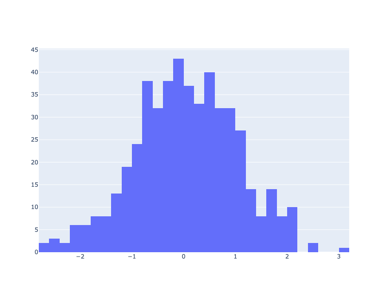

**Interactive Plot:**

<div>                        <script type="text/javascript">window.PlotlyConfig = {MathJaxConfig: 'local'};</script>
        <script charset="utf-8" src="https://cdn.plot.ly/plotly-3.1.0.min.js" integrity="sha256-Ei4740bWZhaUTQuD6q9yQlgVCMPBz6CZWhevDYPv93A=" crossorigin="anonymous"></script>                <div id="plotly-div-15" class="plotly-graph-div" style="height:100%; width:100%;"></div>            <script type="text/javascript">                window.PLOTLYENV=window.PLOTLYENV || {};                                if (document.getElementById("plotly-div-15")) {                    Plotly.newPlot(                        "plotly-div-15",                        [{"x":{"dtype":"f8","bdata":"UHxlkFH9+T+t2bcvgpPjv9OPVHLI5uC\u002fDLhcJeEq8b99ETVXa7HrP1mizB6NaQLABcaPvb\u002fq+z\u002f2rxqTzlvovyR77fQia9Q\u002fxiOiU17rz792SM1Ky2T3P\u002fSaYw0rewDANvi5xHui1L+U+0u3WJTYv8uOQG3rI\u002fI\u002f7FDklSeZ8b+IIyukIBLGv+6yb4lqF+y\u002fDJIrSwqdpT+iqVAXbKbiP8att9oinPG\u002fkngLz8lQ8j8WV2rI1NnsP\u002ftGAAJvFOA\u002fBO0P28\u002fT7D9CklA\u002fGeHlv8LEmdu7db+\u002f5KaXvdLx7b\u002fM2D4LFCXRv4CmHAes+OA\u002fhsiSuhUi5r830prnaGTZv1v3NppR\u002feW\u002f5TaUs+wL679zV3Aq2Xrlv3qcY7Hl74m\u002fHO\u002ft0IDg8b8Yj+VlVQHOP49DSLqMjvo\u002f+sE7ZdO+5z+yNs0\u002fEY7Iv2BBd9t0Z+y\u002fUAqTgrjo57\u002f5D5ZGSxT7P\u002fPeSlp5A6o\u002fQLa2sURi5L9NL3kp62\u002fIPw52o5BSzQBAY+86s7zCvj8J2mW8IMDjPy0r3JL9NdM\u002f1Hut8EKL1r9pcHkpwUfyv3f49pOhW9a\u002fAXZV1gu9yr95fKb\u002fncXiPx5Hj77z2Oo\u002fRPaNl5bL7T9CoIcPEEfSP0RbHJATU+w\u002f9gKYJgck6L9E1I56vwv0PwLVeszraeA\u002flwl8+PMT07+0Y7id4UPfPwqa7fOqWLO\u002fBb6kaicb8j9cGydwK1H4P8EDcPUOfAFAgHyeigxY9r\u002foWuATFxv3v6u16ZeVJOC\u002f3Iq2PRh8xD\u002fA575nkwnsP\u002f4m+OtcM9Q\u002fDCq\u002f1HctAMAYJAm32JjTvwtLfa3Efuo\u002fMJevib5zzT9VDFRFZWLoPyT3vqI\u002fdcy\u002fpzE7vnCyyb91135gPuHHP4WLm0NJPto\u002fDw5gnuJhyT8uLa\u002fBWXe+Pwa0SMEQduW\u002f+b6ZTAEq2D85id3GrS+\u002fP4Vw3bddEvI\u002fHETMg8Qu8z\u002fMeN6aNLPHP6Za1CqrBNi\u002fokBfwHpw5L+fvi8QiBrbP047OgiPzLM\u002ffvrL2LIB1r\u002fsep\u002fEU1KmP9r8hwIM1+O\u002fN9G8RkdW5j\u002f5P7cgwZ3cvypvHWSVl\u002fM\u002fctpsm87S2T9gKB1jmP7iP1Jfl0jChPG\u002fbX9A1VKuxT9AnElxo7LnP2AZ3h+3hO6\u002fygg4WLkJ0b9o+9eW2rKgP99+AN5J+PW\u002fJVR2TJIr1D\u002fcRpF+vxPrPx5zCJMngeu\u002fb9OGZlhv1j\u002fFkeXjHP\u002f0v215mdXlz6O\u002ffLTTHDTa+b9scOCxU\u002fHxP9RZcCltK9o\u002f1nen8S81mb8zRW69H87ov1rj8eVNYfQ\u002fckEPrz95\u002fz8swgUxS7r9vySVNO9Tx\u002fM\u002fYlkhhNsK+j95+5zP+6HVP0tJIK0zMPO\u002fqzMAXIag6z8g1k1+ZSjHv\u002fsOOFpRU+O\u002fsOSNcFGu878DEY7PAJ7hPxJfJYGsXuk\u002fttKAt\u002fbz47+1ptm0j6jgP90\u002fvuo4T\u002fK\u002fK2B6d9io6T8R7ZY\u002fq9enP7PSYa6E4ce\u002fhgIEewQMur\u002fCMYlX6s3rPwtBeEVfA+g\u002f2L+OQ2Hx4D+zecd4MaDBP+GpUt8V7LM\u002fgdE4Z8XJ4z+91hW4YcLNP85LSgx21+U\u002f7t4MBvTY079VP784jHoDwDFDtIsGn\u002fA\u002fLy1mL+9+AUCSoq+mUD\u002fcP2vTefvFo7m\u002fqU1feAV3wb+u1PHSVXq+v2I4Kp3F05E\u002fZHoX6cnz8b8tujatCYzgv57CP86k5++\u002fuWK3oqbYzz+wKAUsK\u002fzSv2IHRtaKsd8\u002fPAvNUqxcxr+TwtLPDpDvP39YaTEUVcs\u002foT9alI2GAUCGrBONflf+v6BTaaCKs+S\u002f1eysCfvY7D\u002fe9ALUAjoEQCDTd69D08+\u002fy9EZQ8hbpj91gxt33ffMv9txKfmlTfU\u002fMNdghUBj0r+ityjTIcPlP4OcHiChd9S\u002f+lHAkWZc9L\u002f2DEh1KhHUPwaOsQkXGuA\u002fnxF9nw2x9D9UH2eeQUa8v+vwLRZuweO\u002f9RIujyMC4j9dLwwZedDOP1O\u002f16dq9tE\u002fGkaEn4O3sr8DkiYtv5DyP3dpPMfEpdc\u002fntvlaHt5\u002fj8HG4Vj48bxP6jyFZnvFuU\u002f20ATyfwJ+r\u002fo1lMVM0bjP9FQ8FPn5do\u002fDH0q7FDz6T+nVfXpCLbwP4Fv2gD9p9m\u002fRt\u002feB0Fe6j+24pL1Z\u002f7hv8BMfTsuR\u002f8\u002fXrX4jKxP9b9gqpXExyv8v3FruLNaafq\u002f1QOobG5\u002f7L9\u002fOVSM5efxv8LXfGQZTP8\u002fcv+ZJl7l1L\u002f3HMibmXv1vzfQhz6D1PE\u002fP+rx2c3E4r9hFCPEJsrzv5Ao2lvfBuw\u002fs+k+PJXy4z+6CR6OVNbbvwmRzalIhfY\u002frBhci2aGwD9y9eWKBt\u002f5Pzeo0Qt0FuA\u002fB5McFN7w+D9dzj2r0AG8PyURaLMShPO\u002f\u002fYccl06YA0Bdk09j+3bhv2k8KOOEc8m\u002fDrsZIKpp5r\u002fmzz5N1AjKvwWrl9DKD88\u002f6QnOQJLVyT8nU6cEFCflP4vtDBaurPw\u002fSIUoJMTWvr+fMOzO3Lrzv9k6bWnG6vK\u002fJYtaa9xN5b+NLQ2Lgcn6vwUVRvKkZuo\u002fqQWOJLvi37+06daJLefTv6Lshzt0\u002fV6\u002fGwKJqI5Y9r\u002ftXiFU54\u002frvyYNIqA8l+U\u002fqr9AkxLL4z+gUjfN7Vzcv8b1RnXz9\u002fw\u002fe0be6UHk9L+92Uk8RRTWvwQjsR0ojM2\u002f0J7U8jxYBsCwnpg2HgD\u002fP6ZZe9X7cdc\u002fY68QW6O28L+6+DufzWgAQLICKDy+veI\u002fG\u002fkKNVt92z9vy5\u002fnh2zjv1\u002fD0pVpMbs\u002fTLJlwy9p+L+frmCQ2nDpPy5BcyPM9te\u002f\u002fholxn0owT8QVBLhnTvzP3xy7CNQOdI\u002fveGhQUTM0D8u\u002fuQjKrLRP1IbugL2due\u002f6rIo+IzA6j\u002ftOK5SmbH4P2J9xM4iSOg\u002fqDNCSixR7D8\u002fcSSxsBLsvzMHxLXpxOu\u002fhMieBNQN97\u002fGqPn+TrfzP2g3q6J7RNC\u002fRloHw8Jl9j8iATCmawXpv2gePa0lANy\u002flFO0TMdtuD8LRLnahHztP+hzXlCmGq8\u002fAywRzyIGyz\u002fQfz1EmuyQPxhF61MWrsY\u002f4nhcqg\u002fd8b+AUgp0o7e0P85MoAnS4ce\u002f+aUILhkYrb804pcvcYLfPxiHV4YdyOW\u002fp83zbVGitb8wtWUi+gfTv18G+3cTtdo\u002fbR8fV9cc6T\u002fQWfX\u002f15Luv2QSfzvHv+I\u002fkLLHZ7mGAECmwjvY24n3v9z5jabEkOq\u002f7XcdE7Et7L+yqJqwvNzRvz1BaJow9\u002fk\u002frDPN4aVYiz89+g8Q7jrmv+n6cHbQ5eM\u002fFySeRZkx479\u002fAf0Hf\u002fnxP3RDmcR+idM\u002fg02MvnA49j\u002fLrvdmuynlvxvlgwMyPwhALrOpS\u002f9i6j\u002flDn8TUvLkP9bb0EhfNaq\u002fQiIYcxc4578bXlzRwsTrv1S+THy0Z8G\u002fjAXZ7DuD6b8MwN7eWxfSP6YAo+Fjb+q\u002fZ+AG1Ojf4z91w0aLjJjuP++D79Q+lua\u002fhGt2\u002fD0V8z8ChzOg4XTOvyNsgyYPfPI\u002fk7b03OoK3D+7RM6KDvXxP4x36A6W5++\u002fflCgyNlWu7\u002fjIGvjDTn3P3V9EDb1xuO\u002fbVz9JzBMAMCaE8Bk2BT\u002fv17exMEwDQTAfiA4xs7pAMACbunJS1javxQq7dzZdPQ\u002fI+81CXxN3L\u002fTF8USrLTUP5RLF\u002f1mKLy\u002fwQ2BCByCgT+l3\u002fYhiofFv91UNKGKS8a\u002faGXfbbaD3T\u002f0DKg009Dyv0RBdx17KfA\u002fgAvhcslw7T9jD\u002fSRo\u002ffIv5mzL27Ixek\u002f6DTA3Wlx5r9ifcZW7jDhv5uAOi90AMQ\u002fTSPgnClZyL+n8bK5H7jcv\u002fAg27+xhOW\u002fBnC4K\u002f\u002fW4b9O+jecqw3uP8VZjkjaF\u002f+\u002f4GW\u002fhUSP1j93Jc3nkEPOv8a+gok\u002fSuc\u002fvKKzqHt74D8gf1RuoUIGwDD49s5steI\u002fevOiwejA1D\u002fhPjwhNmOWP2\u002fsWXbA\u002ft2\u002f3OPSaxRO6z\u002fH5F98Em\u002fav6quvd4AW\u002f0\u002fb61YomwP4j\u002fY\u002fBCaRRoBQPpkVTEYI+m\u002fmyDwe0UY\u002fL9iHxdvjt\u002fmP9jYSAdaSes\u002ft\u002fzd+Lcaoj+Ddpyq5Z74vx0QmZBQqty\u002fkdgymYnG4z8VrbD\u002fFpPHv9mnbII0sb2\u002fRJcYgnB1xr85eOX8oOLtv+w7lKSADuG\u002fTRPRxivT9r+sI+pekEn8P0PhB1qCbN6\u002fRSfJSyqR3j+1n4cTpVnwvya5mnzGbOk\u002fYmQxpXf4\u002fb+U+QfWrXXtP8XmXKG+G6K\u002fJeb\u002f5oTiAECKmJ9FkOf0v+KVVtCrjbM\u002fMKWr3bmA1z\u002f9VOiA9LnzP9HLA6UWENu\u002ffjRKBogitj89PrGYxSMBwO9RJEu+kOq\u002fWSZ\u002flkbn3D\u002fV4ciysqrxP5\u002f3bo\u002f3B9K\u002fZK9IhmpzAEDMh8YX+yn8P737L+nXDa+\u002f0rZWqdpOA8A45ahw6XD8vyehqDE45Oi\u002fPxGhNHza8T93ujhMgNvTP9Irw\u002f8EwQDAcEe43DJIzb8NDUYEVND5P7iNlszM\u002fNe\u002f+ClmSMD\u002f57\u002f5G+\u002fC3m8AQNDTr6t+WKs\u002fVq07iYKq3r+ZPtODI2nWP3Kdr0mhk5E\u002fOHGWLBF3278KZpxN1lXzPwPDMCLq2fE\u002fo7+Vf1bo6j+xn6cS0Va6v3F+hjW0WfI\u002fo9cG0J1yqb+YX+m4e93dP2CtwT37ifA\u002fCqVckQ3i6T+LvYPO1aL8P5lnhlrW4dw\u002fm+Y84ujx+r\u002fYISuHDpDyv4yDhZsJmvU\u002fttokU74z1b9tG76uDr3YP1lp2e4fP+u\u002fzxdePZwD8D\u002fEtctwF6HYv2Sy7U1pVPc\u002fqnAypA8I4b+BfDfY3+PxP2Ys2COnlOU\u002f0cMUodUd579LK7ktfZXxP\u002fhHMZMw2uy\u002f3w7MtaZR6r+z5JhHQhjnPz+SozrNAuS\u002f9A8aLcMA479ST8geeALWvyGCj2ixAPC\u002f4dXgDky48D9eFiTR83jjP8299YSGv7G\u002f+\u002funH5W\u002fu7\u002fHvlwRWc\u002fcP1RdswTQPvw\u002f8r41EPze6z\u002fqLmTlR0Xgvwtwuj2e4Og\u002fX+7jm8lnvr8WQLPBxXjJvygtsxYR3f0\u002fOEhl5uDP2r8PXM0096rev0QS8cDSO\u002f+\u002ffS6fr\u002fBv9r\u002f1yhW\u002fMt\u002fcP+i3\u002fMHKPOa\u002fDh3SFUV+4D9qs1IHg9bxv9HQP1bNjei\u002ffeamThWW5T87CFGw0F\u002f3P2NXPIWJ9eI\u002fqlM1rFAq8z+D8q+JBEb7P+6JG4Y0pPA\u002fOr36XNxj7b8swwb\u002f3ve6v\u002fKEdRyQKuQ\u002feFB4BNqM2r8ifnYSr+zcP1OskGE5RPm\u002fmaS30h6E6r+Rw1k3lezgPwto3JyN5QHAbuuqvjC58b8rVdsvwCSSvw=="},"type":"histogram"}],                        {"template":{"data":{"histogram2dcontour":[{"type":"histogram2dcontour","colorbar":{"outlinewidth":0,"ticks":""},"colorscale":[[0.0,"#0d0887"],[0.1111111111111111,"#46039f"],[0.2222222222222222,"#7201a8"],[0.3333333333333333,"#9c179e"],[0.4444444444444444,"#bd3786"],[0.5555555555555556,"#d8576b"],[0.6666666666666666,"#ed7953"],[0.7777777777777778,"#fb9f3a"],[0.8888888888888888,"#fdca26"],[1.0,"#f0f921"]]}],"choropleth":[{"type":"choropleth","colorbar":{"outlinewidth":0,"ticks":""}}],"histogram2d":[{"type":"histogram2d","colorbar":{"outlinewidth":0,"ticks":""},"colorscale":[[0.0,"#0d0887"],[0.1111111111111111,"#46039f"],[0.2222222222222222,"#7201a8"],[0.3333333333333333,"#9c179e"],[0.4444444444444444,"#bd3786"],[0.5555555555555556,"#d8576b"],[0.6666666666666666,"#ed7953"],[0.7777777777777778,"#fb9f3a"],[0.8888888888888888,"#fdca26"],[1.0,"#f0f921"]]}],"heatmap":[{"type":"heatmap","colorbar":{"outlinewidth":0,"ticks":""},"colorscale":[[0.0,"#0d0887"],[0.1111111111111111,"#46039f"],[0.2222222222222222,"#7201a8"],[0.3333333333333333,"#9c179e"],[0.4444444444444444,"#bd3786"],[0.5555555555555556,"#d8576b"],[0.6666666666666666,"#ed7953"],[0.7777777777777778,"#fb9f3a"],[0.8888888888888888,"#fdca26"],[1.0,"#f0f921"]]}],"contourcarpet":[{"type":"contourcarpet","colorbar":{"outlinewidth":0,"ticks":""}}],"contour":[{"type":"contour","colorbar":{"outlinewidth":0,"ticks":""},"colorscale":[[0.0,"#0d0887"],[0.1111111111111111,"#46039f"],[0.2222222222222222,"#7201a8"],[0.3333333333333333,"#9c179e"],[0.4444444444444444,"#bd3786"],[0.5555555555555556,"#d8576b"],[0.6666666666666666,"#ed7953"],[0.7777777777777778,"#fb9f3a"],[0.8888888888888888,"#fdca26"],[1.0,"#f0f921"]]}],"surface":[{"type":"surface","colorbar":{"outlinewidth":0,"ticks":""},"colorscale":[[0.0,"#0d0887"],[0.1111111111111111,"#46039f"],[0.2222222222222222,"#7201a8"],[0.3333333333333333,"#9c179e"],[0.4444444444444444,"#bd3786"],[0.5555555555555556,"#d8576b"],[0.6666666666666666,"#ed7953"],[0.7777777777777778,"#fb9f3a"],[0.8888888888888888,"#fdca26"],[1.0,"#f0f921"]]}],"mesh3d":[{"type":"mesh3d","colorbar":{"outlinewidth":0,"ticks":""}}],"scatter":[{"fillpattern":{"fillmode":"overlay","size":10,"solidity":0.2},"type":"scatter"}],"parcoords":[{"type":"parcoords","line":{"colorbar":{"outlinewidth":0,"ticks":""}}}],"scatterpolargl":[{"type":"scatterpolargl","marker":{"colorbar":{"outlinewidth":0,"ticks":""}}}],"bar":[{"error_x":{"color":"#2a3f5f"},"error_y":{"color":"#2a3f5f"},"marker":{"line":{"color":"#E5ECF6","width":0.5},"pattern":{"fillmode":"overlay","size":10,"solidity":0.2}},"type":"bar"}],"scattergeo":[{"type":"scattergeo","marker":{"colorbar":{"outlinewidth":0,"ticks":""}}}],"scatterpolar":[{"type":"scatterpolar","marker":{"colorbar":{"outlinewidth":0,"ticks":""}}}],"histogram":[{"marker":{"pattern":{"fillmode":"overlay","size":10,"solidity":0.2}},"type":"histogram"}],"scattergl":[{"type":"scattergl","marker":{"colorbar":{"outlinewidth":0,"ticks":""}}}],"scatter3d":[{"type":"scatter3d","line":{"colorbar":{"outlinewidth":0,"ticks":""}},"marker":{"colorbar":{"outlinewidth":0,"ticks":""}}}],"scattermap":[{"type":"scattermap","marker":{"colorbar":{"outlinewidth":0,"ticks":""}}}],"scattermapbox":[{"type":"scattermapbox","marker":{"colorbar":{"outlinewidth":0,"ticks":""}}}],"scatterternary":[{"type":"scatterternary","marker":{"colorbar":{"outlinewidth":0,"ticks":""}}}],"scattercarpet":[{"type":"scattercarpet","marker":{"colorbar":{"outlinewidth":0,"ticks":""}}}],"carpet":[{"aaxis":{"endlinecolor":"#2a3f5f","gridcolor":"white","linecolor":"white","minorgridcolor":"white","startlinecolor":"#2a3f5f"},"baxis":{"endlinecolor":"#2a3f5f","gridcolor":"white","linecolor":"white","minorgridcolor":"white","startlinecolor":"#2a3f5f"},"type":"carpet"}],"table":[{"cells":{"fill":{"color":"#EBF0F8"},"line":{"color":"white"}},"header":{"fill":{"color":"#C8D4E3"},"line":{"color":"white"}},"type":"table"}],"barpolar":[{"marker":{"line":{"color":"#E5ECF6","width":0.5},"pattern":{"fillmode":"overlay","size":10,"solidity":0.2}},"type":"barpolar"}],"pie":[{"automargin":true,"type":"pie"}]},"layout":{"autotypenumbers":"strict","colorway":["#636efa","#EF553B","#00cc96","#ab63fa","#FFA15A","#19d3f3","#FF6692","#B6E880","#FF97FF","#FECB52"],"font":{"color":"#2a3f5f"},"hovermode":"closest","hoverlabel":{"align":"left"},"paper_bgcolor":"white","plot_bgcolor":"#E5ECF6","polar":{"bgcolor":"#E5ECF6","angularaxis":{"gridcolor":"white","linecolor":"white","ticks":""},"radialaxis":{"gridcolor":"white","linecolor":"white","ticks":""}},"ternary":{"bgcolor":"#E5ECF6","aaxis":{"gridcolor":"white","linecolor":"white","ticks":""},"baxis":{"gridcolor":"white","linecolor":"white","ticks":""},"caxis":{"gridcolor":"white","linecolor":"white","ticks":""}},"coloraxis":{"colorbar":{"outlinewidth":0,"ticks":""}},"colorscale":{"sequential":[[0.0,"#0d0887"],[0.1111111111111111,"#46039f"],[0.2222222222222222,"#7201a8"],[0.3333333333333333,"#9c179e"],[0.4444444444444444,"#bd3786"],[0.5555555555555556,"#d8576b"],[0.6666666666666666,"#ed7953"],[0.7777777777777778,"#fb9f3a"],[0.8888888888888888,"#fdca26"],[1.0,"#f0f921"]],"sequentialminus":[[0.0,"#0d0887"],[0.1111111111111111,"#46039f"],[0.2222222222222222,"#7201a8"],[0.3333333333333333,"#9c179e"],[0.4444444444444444,"#bd3786"],[0.5555555555555556,"#d8576b"],[0.6666666666666666,"#ed7953"],[0.7777777777777778,"#fb9f3a"],[0.8888888888888888,"#fdca26"],[1.0,"#f0f921"]],"diverging":[[0,"#8e0152"],[0.1,"#c51b7d"],[0.2,"#de77ae"],[0.3,"#f1b6da"],[0.4,"#fde0ef"],[0.5,"#f7f7f7"],[0.6,"#e6f5d0"],[0.7,"#b8e186"],[0.8,"#7fbc41"],[0.9,"#4d9221"],[1,"#276419"]]},"xaxis":{"gridcolor":"white","linecolor":"white","ticks":"","title":{"standoff":15},"zerolinecolor":"white","automargin":true,"zerolinewidth":2},"yaxis":{"gridcolor":"white","linecolor":"white","ticks":"","title":{"standoff":15},"zerolinecolor":"white","automargin":true,"zerolinewidth":2},"scene":{"xaxis":{"backgroundcolor":"#E5ECF6","gridcolor":"white","linecolor":"white","showbackground":true,"ticks":"","zerolinecolor":"white","gridwidth":2},"yaxis":{"backgroundcolor":"#E5ECF6","gridcolor":"white","linecolor":"white","showbackground":true,"ticks":"","zerolinecolor":"white","gridwidth":2},"zaxis":{"backgroundcolor":"#E5ECF6","gridcolor":"white","linecolor":"white","showbackground":true,"ticks":"","zerolinecolor":"white","gridwidth":2}},"shapedefaults":{"line":{"color":"#2a3f5f"}},"annotationdefaults":{"arrowcolor":"#2a3f5f","arrowhead":0,"arrowwidth":1},"geo":{"bgcolor":"white","landcolor":"#E5ECF6","subunitcolor":"white","showland":true,"showlakes":true,"lakecolor":"white"},"title":{"x":0.05},"mapbox":{"style":"light"}}}},                        {"responsive": true}                    )                };            </script>        </div>

### Normalized Histogram

```python
import plotly.graph_objects as go

import numpy as np

x = np.random.randn(500)
fig = go.Figure(data=[go.Histogram(x=x, histnorm='probability')])

fig.show()
```

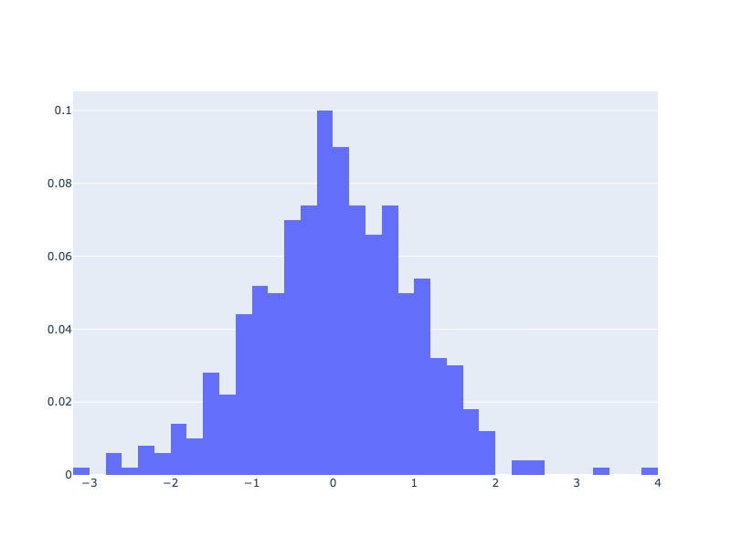

**Interactive Plot:**

<div>                        <script type="text/javascript">window.PlotlyConfig = {MathJaxConfig: 'local'};</script>
        <script charset="utf-8" src="https://cdn.plot.ly/plotly-3.1.0.min.js" integrity="sha256-Ei4740bWZhaUTQuD6q9yQlgVCMPBz6CZWhevDYPv93A=" crossorigin="anonymous"></script>                <div id="plotly-div-16" class="plotly-graph-div" style="height:100%; width:100%;"></div>            <script type="text/javascript">                window.PLOTLYENV=window.PLOTLYENV || {};                                if (document.getElementById("plotly-div-16")) {                    Plotly.newPlot(                        "plotly-div-16",                        [{"histnorm":"probability","x":{"dtype":"f8","bdata":"jp\u002fWx6OC+7+u0CyU9j6tP9LWg57klem\u002fg3PXYHyp0r+FH2XRLJPQv2BSb27COsg\u002ffEscrI4K4r96pFg6sPW2P7fT0S+tPOO\u002fmYl+rFrL4T8407OV1xn7P+OxuWcHM8k\u002fHCcomEa+xT8Vu4bSxp\u002fyvwaY610OMOY\u002fVhUKahZC6L\u002f44wmEE+Lpv\u002fjPcEOL1uE\u002fDbkpD0csxz8WKgyb\u002fbbxP5i2QB4GFvc\u002foD59RBJF4b9HrCM\u002fqG7AP9FnjRypKvw\u002f2hfBuOPt7j+C4u89TNHmP2B\u002fuVQ45vQ\u002fBgR0U+hY47+nlZMr5F7kP3SHMUhNjPY\u002fWeGGuEHv+T9AByYaRMzpv\u002f+DwSJuG9C\u002fABC1yGd+2D9Z6ja27n7Sv88aAWyEE9m\u002fIMnewFbj5T+NmZ\u002fnRJ7WvxrLPIxKm\u002fy\u002f90jrpIEo1z9L9DjP4yrbv51cUamzaOe\u002fiapyckMN+b8KfznonTjwPzVvcm0g0QHAtWoUb3gw+7\u002f\u002fjFs+dqfRv0qzCVXNqfM\u002fmY8ELo709D8wg0cSz3ryv1mmO9ymvMa\u002ftZLQTdQq+L\u002fTW0Z15y3wP+DcFisAoPe\u002foMDd+DxUwr\u002fqM77\u002fGYfwP5mRWhkQeMy\u002fBLlJ2saF9z+JYjt8G9frv5y3LBDRoNc\u002fHupLcRZO6z8pVY7wEuLBv+2ort1XLvY\u002fVpYGDkeK4T8BHC1Y\u002fjL6vwya\u002feQ3qw9A8xXEULDB5D8B0Gqg2Xq7P5he1oyJYfa\u002fB6iiW7zutD\u002fnYh8OtG\u002fdv9kNVZSLnuQ\u002fopVpMHLJ1z8C0BhG7aX9PxPkZwBLNcI\u002fVMNbC6Nu4D\u002fiahpDVdbXP1389r+2AcO\u002fuePIXKh5x7+nm3Vjsp3xPwu0iHf79eg\u002fdOMEuGIk5L9gRgdgotDxv5S8kYzIQbG\u002fC+8YF0KV8j8Mt8zWqTCcv8Aijetl8fs\u002fkZ3iM2DN6L+n\u002f4fyRiHCP+ArLetjIQTAuTF5FrYP479bC4TIpMjTv2eB9yyaWeA\u002fXbm58t5e+z\u002fqUgtLIOShP7NtARU\u002fQ\u002fc\u002fCbb5yn0s5T\u002f0K4tyMpDvP1EXPC571d2\u002fjGzjruwo9j\u002fhe22X3Crxv3gKXL6tsN8\u002fD2xJ8Ep37r8w20P7pZTgv3mbCL\u002foYfe\u002f4cOfDOyF4L9ym+UAs3jWP8uA2unwmrG\u002f2hOW+HGQ9b9KnBaEJoj3P7zrYyEHldU\u002fnZ00OAkh8D9Aong0lCDpP0c9acSYRuW\u002fgMRGj+ke\u002f79PiHALKEvtvyobEgU9mvM\u002f9PO1IFPb8L8f7wilBx3qP+DHLYLWmOO\u002fpcyZrbMo2T85zliVxi79vw4ZXwJXrPI\u002f6Hwgs3RPpL9fX5BYr1jsP8u4bvNiTcg\u002feMedFb2J6T9\u002fPw3XNxi6v8MbdamTyec\u002f0NXarzUn+L\u002f+2odLl0rxv1MVa0IVN+c\u002fb6hEIiwPpL9xcRsS0UfNvz5ZviGJ\u002fca\u002fOwYH0SEO4D\u002fDOXgKrPziv7h63ZhwVOA\u002f4i82tSpO7b\u002f8\u002fn\u002ffahDav9OVRV65hO8\u002fPb31ldkj8T+MXv+68Y3xv81SlIkY1uo\u002fPIp7pH2g8L8sIu4i7XTnP7RtAMGIYf6\u002fQJsgdq\u002ff8b\u002fvO\u002fo6gEngv15AvWlpT8W\u002fgK6C7B\u002fH9j\u002fgmP6sj+3sP010c9YdNfk\u002fcodSFURO8z\u002fTIeC5bxrSv1RyjOp\u002fC9G\u002fyU3b\u002fIEa8T8TI99vkKukP4PUhGBeGMS\u002fGRbOh\u002f1c9b8xw2h0+EC7v1gHkOz1UwbAZK+frwcx3b8G0BHNQlvvv75cl62RKeY\u002fSn0TYZGi3r+Bjsc6Lg\u002fVv9xcsHW+jfU\u002fSpqMQvvI8L9W3KurI0TUP2aeSW8DU\u002f6\u002f5HjsyHz4tj8ugclBy0HaPx+41CAQhOs\u002f\u002fJaYQQPC7L9+2eVjQnXUPx8frW6jXNQ\u002fMPH9HXWxk7\u002frc4DBuzPDP5FOGtyLqt0\u002fPoMldd922T+iBmM6Ut\u002fvv5g41q0\u002fIvO\u002fZepOZD8MBECxJdUdeLf+P\u002fsgO8xgRPa\u002frGqIE17Q3D+3HNfu9hPkP8IAqWL0Cug\u002fI0YGSHr4wT+DZU9X76jtv6XsuUeNWce\u002fD4ZDIZhu378TGm1lIzPBP+x+mNX+LNG\u002fw6FKNr\u002fawL\u002fqNAau\u002fUvwPy4VistdsPM\u002f7RvEcMzl8r9Wgz+tfm\u002fdv6aQZLQ7Tum\u002fgx78vV2U8z+YfsE\u002feGWuvyvDcYMPL\u002fc\u002f7ZD8Sa+Q3r9O9eQSvp+aP+Sbs7lClPW\u002fFmCxgC\u002fX9D\u002fR1FFUCTXXvwwuPmkzw\u002fe\u002fOyR8XnH14r++G6iSc3ACwFeOYihXSqC\u002fyK3eJv\u002fLvD\u002fOo35o32\u002fSP01VZUlA+Pc\u002fbUyHfDFD0796+o\u002fKrdbpP\u002frUdvu3+9M\u002fCPO4dcO+yL89beNgSp0AwPB81fftUe4\u002fZUWz+Y0g4L+5raR9B2OSP43S1q3OU\u002fS\u002f1neoTJkc0j+KEVFb6Ke7P9hcn\u002f2mH54\u002fIXsGueZAwb9WW1IemcnwP5SUrwNI6+4\u002fWyam+rU65z9eiSm9kZEKQJBxhsALNeO\u002fM4pe1QNK2L\u002fDkYHLojzwv91upqUy59s\u002fRmKzj+X\u002f5b++3UmuPpYFwJrJFj3VafO\u002fSMvytxl\u002fsj93PLjDFijwP4MEDY076fi\u002fjZD1OyCZ47\u002f2boarR9bBvzWmX9otUOe\u002fVdc2Nkv\u002f4D9EHQ3XL2NwPwfEAemej9Q\u002foreU7vU057\u002f6dt8dp5X4P\u002fySVFqakzi\u002fqghIFmGy9D945B2oiRjcv7RxPXGa4eI\u002f\u002ffwsD4O95b\u002fXQtc82W3uv4092rQJiua\u002fioVKmdZ7p7+VVGc+df\u002fLvxThg4eXoPg\u002fthSxrxdh8r9of3ebBnLxv+06bnz4M\u002fs\u002ffC8r3id74z9cEw1IQhr+v1W8\u002f8RB098\u002fCa33+upgzj+cZ8ZH0icBwOXmqSjppte\u002fQ5co\u002fbXfkb+edGhApmfnP43f\u002f346i+4\u002fq5mdQtyCuD+ft6C1A4nwPxoHXikVucK\u002fGcxVLp1w679UzBpS0eTtvxyzL6pZXeE\u002fwvlqG6lU\u002f7\u002fnGt6AmbDlPyBS8fWFtPG\u002fq9HAD4f91r+QDAqrFizgP+lwFpmvfPM\u002f2queewcN\u002f7+zz+I\u002fNszpv\u002fcwdTidHqk\u002fT7AUpiMT479SojecapLrP8GMaontsADAJBN5EcIn1z8oUDKzRkLbP18sMtkQIak\u002fjXbu+8Ki8T+3xG8NVqzzv6zP9ezkvPE\u002fFRfG7VJ+5r\u002f6zle4tTfnPwyC+g3Dv9S\u002fk1dtUhkP6j86W\u002foSnPnoP9ztoXDDbPe\u002f\u002fdV3EF7Gw7\u002flxDr5pKm3v4UL1Vqycs6\u002fMV\u002fdrWMu6L8KS3xXfZ\u002f9Py0NzA2uw8o\u002fPK6Gc1jh+D\u002fjrqw8dzbiv89CzZke\u002ffC\u002fLu22xn7twD\u002fCBlPFCAbiv20cp9gEHwNAJa16EwRqzz9\u002fS2TKC3HyP9uO7v3Bs8y\u002fHMYuPTDe1L8iJrsePqefv+vdRVUSxNY\u002fFmlZwNAv6z8y0vpLfEW\u002fv0C0ej2JyeW\u002fg8nCvwUW8b\u002fSZxk7QqGzv\u002f71Oe21VeI\u002fZCUDQQFP3T\u002fLGe15wz6Sv6nieEhWNOO\u002fAb83QzTJwj9PY82+OUziP3LeT43D2aK\u002fcql2aC7EvD\u002ftoEnKuUPDv+jm+h7FS+0\u002fxVpUInkL3L8pryWYob\u002fHP1TGYRBPPtk\u002fgbKGFXs35z9e70DdJO\u002f3P+6zj05RneU\u002fcxc0PMEs4z+NZ2tTF4b3v45pnj6pZ+M\u002fkaqanohZAkAwr8oyc4\u002fqv1ggrQv0T\u002fC\u002fSScp8MZ5y78VI2tGCFfwPzoxX4vByuA\u002fYJu69zOJ3r\u002foov0aTm2iv1JW9i+2l\u002fA\u002fk2qa2RmG5T\u002fK3nAMV24DQAlan+pKF\u002fA\u002f4NFqY9ig1j\u002frdlVw1qvjP5Jps8nBVda\u002fA94Pm+pJ77\u002fpo3z5sALGP02o9iVaZd8\u002fyRwVSxRT9r9NldPnJLfgv0Z3jYHjode\u002fx7PO\u002fUgA0T9J3iLVeavQvwAtn+l2fNw\u002fIU3cWOIduT\u002fECm76GffwP\u002f31AFfxYPu\u002fqqTcH5WD+j+RiiPyyq72PwAq3T4pw6k\u002fwmMhoXLP5D866+Yw2GjjP+IV3Wrgl+e\u002fBtpOsL4TxT+IYDqJzeboP3AzfqsJ1NM\u002fhkG4uTXS8D\u002fih\u002f5BqlG4P9tqQccYrLQ\u002fMH9dKdmR6L\u002fwzmhml1TXv77kXLUDbN2\u002fzAbKFalJ+z8cW33M4sjOP7\u002fZQklN+++\u002fYBFZ0KKC2T+G596+k5PIvyj3\u002fAQcbgjAdOBAuOa13j87ieSt2tf4vxvO3NDHguI\u002fRXsV4avC7r\u002fwhoUHTFX3vxNHASpLo98\u002fs967uDfo97+8V4VBuJbcv3IxndkJKco\u002f3D0MqWiX4z8J4WkYGNbnP9n7lgd2k6K\u002fhkt1kfui6r\u002fuXSGv8sf+P8xnNvAyZOO\u002fOpGuHoDb\u002fD\u002fVMzhOK\u002fbcv7Zzo06glPI\u002flTRaL5Qe8T\u002fKTnUegrrwv9eAlzr7vNY\u002f5hSh5yss6D+svOAOcm7mP3WgdUnIdsm\u002f0fTtOVBT0z80dPyBmELZv8dRzGK\u002fv\u002fK\u002fV7UQOwd97z8UNWoD6ejhv41jVVN9E\u002fY\u002fnaLIHEdH4z9z37PBj5Dsv1bFTIMlosS\u002f7ihsZSFU0r\u002f22rfGT97rv1zVOhG2C+A\u002fReeo7Jyh3r+7R4OPaBv6P8fIsslrjOs\u002f6BfQQYIq7L\u002f2VJxq33STv8SWs1x6Bs2\u002fj0QnYzkI+b9Pv5C12MztPxYg2XTVZO4\u002fu8IxubSd7T9jIsL\u002fST\u002fdv87GvwiRGvE\u002flJ\u002fwJi\u002fZyr9tqUgJu+ztP55SkCodAP0\u002fCnIG3x7vwT9G5x9Z1bT2v9LCyfQbSNS\u002foxeqyvSC5D8iozL\u002fmoTzP+qwBx4DJPK\u002fK9hh+eJjyL9ODBV2Dt7NP2aEITYD19s\u002fkvMMrjAi7T9hWlYfnlnuv3+QSbdEGtu\u002fDCQMdaEg8D\u002fw6BbjAxzZPxAP0cFEstw\u002frO6CNlMB8j\u002fDptYxPqO6Pxowv25n5eA\u002fnQvcdtAh1L\u002f+hB06KYX1v7mxElVgufS\u002f0s18+6sGsz9nFa6iNIvJvziHFViC8uS\u002fT\u002fixolha1D+hphvEGn3sv5fe8F2ZgLw\u002faU0Utrj9k79vY6huMOHqv2QUw8O5YgLAGRAqqe9N9z991gLTyEPUPwlzrEIhUAXAPCC0QZtK278CCtJ00TPZP\u002fD\u002fuNK2M82\u002fy3nQdBCS4j9I4BwQAiXvvzExJ2rla8Y\u002fB2hV7jZiq7\u002f0O5I\u002fk27Hv9JqU9CsSsy\u002f7NNOmriRyT86NwKU2tjtP+RHmsy99uC\u002fTjkwdjgQ2r8PUzXGZI3EPwHQ8Bcmwr6\u002foWq4PLWt2D+0tWLaPPzmP\u002fw967G1qPQ\u002f0CqjoEjPvb+AOBcD6DcCwJ529e\u002fp0rG\u002fWe+eJdCl1j\u002f\u002fZ+pYJO7Hvw=="},"type":"histogram"}],                        {"template":{"data":{"histogram2dcontour":[{"type":"histogram2dcontour","colorbar":{"outlinewidth":0,"ticks":""},"colorscale":[[0.0,"#0d0887"],[0.1111111111111111,"#46039f"],[0.2222222222222222,"#7201a8"],[0.3333333333333333,"#9c179e"],[0.4444444444444444,"#bd3786"],[0.5555555555555556,"#d8576b"],[0.6666666666666666,"#ed7953"],[0.7777777777777778,"#fb9f3a"],[0.8888888888888888,"#fdca26"],[1.0,"#f0f921"]]}],"choropleth":[{"type":"choropleth","colorbar":{"outlinewidth":0,"ticks":""}}],"histogram2d":[{"type":"histogram2d","colorbar":{"outlinewidth":0,"ticks":""},"colorscale":[[0.0,"#0d0887"],[0.1111111111111111,"#46039f"],[0.2222222222222222,"#7201a8"],[0.3333333333333333,"#9c179e"],[0.4444444444444444,"#bd3786"],[0.5555555555555556,"#d8576b"],[0.6666666666666666,"#ed7953"],[0.7777777777777778,"#fb9f3a"],[0.8888888888888888,"#fdca26"],[1.0,"#f0f921"]]}],"heatmap":[{"type":"heatmap","colorbar":{"outlinewidth":0,"ticks":""},"colorscale":[[0.0,"#0d0887"],[0.1111111111111111,"#46039f"],[0.2222222222222222,"#7201a8"],[0.3333333333333333,"#9c179e"],[0.4444444444444444,"#bd3786"],[0.5555555555555556,"#d8576b"],[0.6666666666666666,"#ed7953"],[0.7777777777777778,"#fb9f3a"],[0.8888888888888888,"#fdca26"],[1.0,"#f0f921"]]}],"contourcarpet":[{"type":"contourcarpet","colorbar":{"outlinewidth":0,"ticks":""}}],"contour":[{"type":"contour","colorbar":{"outlinewidth":0,"ticks":""},"colorscale":[[0.0,"#0d0887"],[0.1111111111111111,"#46039f"],[0.2222222222222222,"#7201a8"],[0.3333333333333333,"#9c179e"],[0.4444444444444444,"#bd3786"],[0.5555555555555556,"#d8576b"],[0.6666666666666666,"#ed7953"],[0.7777777777777778,"#fb9f3a"],[0.8888888888888888,"#fdca26"],[1.0,"#f0f921"]]}],"surface":[{"type":"surface","colorbar":{"outlinewidth":0,"ticks":""},"colorscale":[[0.0,"#0d0887"],[0.1111111111111111,"#46039f"],[0.2222222222222222,"#7201a8"],[0.3333333333333333,"#9c179e"],[0.4444444444444444,"#bd3786"],[0.5555555555555556,"#d8576b"],[0.6666666666666666,"#ed7953"],[0.7777777777777778,"#fb9f3a"],[0.8888888888888888,"#fdca26"],[1.0,"#f0f921"]]}],"mesh3d":[{"type":"mesh3d","colorbar":{"outlinewidth":0,"ticks":""}}],"scatter":[{"fillpattern":{"fillmode":"overlay","size":10,"solidity":0.2},"type":"scatter"}],"parcoords":[{"type":"parcoords","line":{"colorbar":{"outlinewidth":0,"ticks":""}}}],"scatterpolargl":[{"type":"scatterpolargl","marker":{"colorbar":{"outlinewidth":0,"ticks":""}}}],"bar":[{"error_x":{"color":"#2a3f5f"},"error_y":{"color":"#2a3f5f"},"marker":{"line":{"color":"#E5ECF6","width":0.5},"pattern":{"fillmode":"overlay","size":10,"solidity":0.2}},"type":"bar"}],"scattergeo":[{"type":"scattergeo","marker":{"colorbar":{"outlinewidth":0,"ticks":""}}}],"scatterpolar":[{"type":"scatterpolar","marker":{"colorbar":{"outlinewidth":0,"ticks":""}}}],"histogram":[{"marker":{"pattern":{"fillmode":"overlay","size":10,"solidity":0.2}},"type":"histogram"}],"scattergl":[{"type":"scattergl","marker":{"colorbar":{"outlinewidth":0,"ticks":""}}}],"scatter3d":[{"type":"scatter3d","line":{"colorbar":{"outlinewidth":0,"ticks":""}},"marker":{"colorbar":{"outlinewidth":0,"ticks":""}}}],"scattermap":[{"type":"scattermap","marker":{"colorbar":{"outlinewidth":0,"ticks":""}}}],"scattermapbox":[{"type":"scattermapbox","marker":{"colorbar":{"outlinewidth":0,"ticks":""}}}],"scatterternary":[{"type":"scatterternary","marker":{"colorbar":{"outlinewidth":0,"ticks":""}}}],"scattercarpet":[{"type":"scattercarpet","marker":{"colorbar":{"outlinewidth":0,"ticks":""}}}],"carpet":[{"aaxis":{"endlinecolor":"#2a3f5f","gridcolor":"white","linecolor":"white","minorgridcolor":"white","startlinecolor":"#2a3f5f"},"baxis":{"endlinecolor":"#2a3f5f","gridcolor":"white","linecolor":"white","minorgridcolor":"white","startlinecolor":"#2a3f5f"},"type":"carpet"}],"table":[{"cells":{"fill":{"color":"#EBF0F8"},"line":{"color":"white"}},"header":{"fill":{"color":"#C8D4E3"},"line":{"color":"white"}},"type":"table"}],"barpolar":[{"marker":{"line":{"color":"#E5ECF6","width":0.5},"pattern":{"fillmode":"overlay","size":10,"solidity":0.2}},"type":"barpolar"}],"pie":[{"automargin":true,"type":"pie"}]},"layout":{"autotypenumbers":"strict","colorway":["#636efa","#EF553B","#00cc96","#ab63fa","#FFA15A","#19d3f3","#FF6692","#B6E880","#FF97FF","#FECB52"],"font":{"color":"#2a3f5f"},"hovermode":"closest","hoverlabel":{"align":"left"},"paper_bgcolor":"white","plot_bgcolor":"#E5ECF6","polar":{"bgcolor":"#E5ECF6","angularaxis":{"gridcolor":"white","linecolor":"white","ticks":""},"radialaxis":{"gridcolor":"white","linecolor":"white","ticks":""}},"ternary":{"bgcolor":"#E5ECF6","aaxis":{"gridcolor":"white","linecolor":"white","ticks":""},"baxis":{"gridcolor":"white","linecolor":"white","ticks":""},"caxis":{"gridcolor":"white","linecolor":"white","ticks":""}},"coloraxis":{"colorbar":{"outlinewidth":0,"ticks":""}},"colorscale":{"sequential":[[0.0,"#0d0887"],[0.1111111111111111,"#46039f"],[0.2222222222222222,"#7201a8"],[0.3333333333333333,"#9c179e"],[0.4444444444444444,"#bd3786"],[0.5555555555555556,"#d8576b"],[0.6666666666666666,"#ed7953"],[0.7777777777777778,"#fb9f3a"],[0.8888888888888888,"#fdca26"],[1.0,"#f0f921"]],"sequentialminus":[[0.0,"#0d0887"],[0.1111111111111111,"#46039f"],[0.2222222222222222,"#7201a8"],[0.3333333333333333,"#9c179e"],[0.4444444444444444,"#bd3786"],[0.5555555555555556,"#d8576b"],[0.6666666666666666,"#ed7953"],[0.7777777777777778,"#fb9f3a"],[0.8888888888888888,"#fdca26"],[1.0,"#f0f921"]],"diverging":[[0,"#8e0152"],[0.1,"#c51b7d"],[0.2,"#de77ae"],[0.3,"#f1b6da"],[0.4,"#fde0ef"],[0.5,"#f7f7f7"],[0.6,"#e6f5d0"],[0.7,"#b8e186"],[0.8,"#7fbc41"],[0.9,"#4d9221"],[1,"#276419"]]},"xaxis":{"gridcolor":"white","linecolor":"white","ticks":"","title":{"standoff":15},"zerolinecolor":"white","automargin":true,"zerolinewidth":2},"yaxis":{"gridcolor":"white","linecolor":"white","ticks":"","title":{"standoff":15},"zerolinecolor":"white","automargin":true,"zerolinewidth":2},"scene":{"xaxis":{"backgroundcolor":"#E5ECF6","gridcolor":"white","linecolor":"white","showbackground":true,"ticks":"","zerolinecolor":"white","gridwidth":2},"yaxis":{"backgroundcolor":"#E5ECF6","gridcolor":"white","linecolor":"white","showbackground":true,"ticks":"","zerolinecolor":"white","gridwidth":2},"zaxis":{"backgroundcolor":"#E5ECF6","gridcolor":"white","linecolor":"white","showbackground":true,"ticks":"","zerolinecolor":"white","gridwidth":2}},"shapedefaults":{"line":{"color":"#2a3f5f"}},"annotationdefaults":{"arrowcolor":"#2a3f5f","arrowhead":0,"arrowwidth":1},"geo":{"bgcolor":"white","landcolor":"#E5ECF6","subunitcolor":"white","showland":true,"showlakes":true,"lakecolor":"white"},"title":{"x":0.05},"mapbox":{"style":"light"}}}},                        {"responsive": true}                    )                };            </script>        </div>

### Horizontal Histogram

```python
import plotly.graph_objects as go

import numpy as np

y = np.random.randn(500)
# Use `y` argument instead of `x` for horizontal histogram

fig = go.Figure(data=[go.Histogram(y=y)])
fig.show()
```

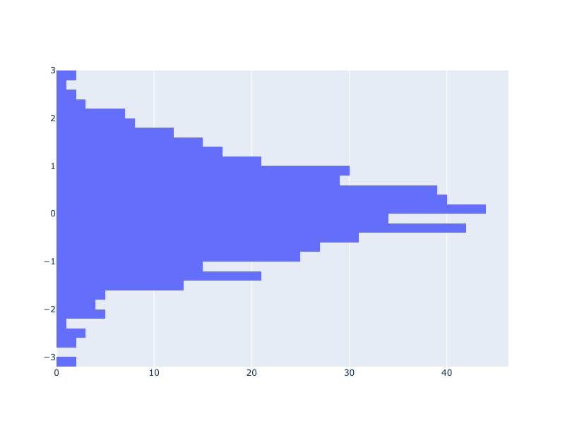

**Interactive Plot:**

<div>                        <script type="text/javascript">window.PlotlyConfig = {MathJaxConfig: 'local'};</script>
        <script charset="utf-8" src="https://cdn.plot.ly/plotly-3.1.0.min.js" integrity="sha256-Ei4740bWZhaUTQuD6q9yQlgVCMPBz6CZWhevDYPv93A=" crossorigin="anonymous"></script>                <div id="plotly-div-17" class="plotly-graph-div" style="height:100%; width:100%;"></div>            <script type="text/javascript">                window.PLOTLYENV=window.PLOTLYENV || {};                                if (document.getElementById("plotly-div-17")) {                    Plotly.newPlot(                        "plotly-div-17",                        [{"y":{"dtype":"f8","bdata":"OVetFz6dw7\u002fVfOgFx3UDwP2VFF5oQeA\u002ffzX\u002fF\u002fK81L9WmUuqXi34v47HF4ew4uu\u002fBUhm16+s6797FQRb33rjP9YuGHXw+OE\u002fDtal5Wo8+D9a1OTQzLvkPw6RGRtboPW\u002fqK+6Bh+M9r+4Xid4cxfyP7XWzIwlEfk\u002fejocmYduzr8nMOXNtuHhPzfl\u002feEIFPi\u002fFUmgs00a\u002f7\u002f7svcMzcjyv3dDQBEp3Na\u002fsH6Hhx2v4L\u002ftuW+sYHTNv4Ggk8zHbN+\u002fiTY2wdW85T+ESdd4O9f2P74sgk15iKI\u002f0CacUm89AECidGUbC03kvymQ\u002f6GlzeC\u002ffGsADKXQ2D8E0d\u002fdBbXWvzXmA7801fI\u002frYRvifSD5L8zhQorwSn1PxJNVxi62sg\u002f+uKEGwyGBEBAF1YBD7Tdv+jaWbzf8cm\u002fa5ns\u002f7ekwj8JOnLKvnIBwMWTSYTBReM\u002ftXy4xi7G3j9qedPNSfy7PwQu0lnYtfi\u002fG+7+yba++L+HyxMzlMXiP5094CqIzfI\u002fx+GEWO2C+T+8DJv7dKfsv5wVoBImfvC\u002fJSfK\u002fnFn0b\u002f0HJE1l5z\u002fv4Z8ljGG2OK\u002fNmaGV9xB6z+CdtXzVCf6P2YZ99Wu3dE\u002fvw2+LrU\u002f+j\u002fUHeEBvkvaP7v9k96cfsg\u002f9KKz6sjxxb+eMwCZje3HP+fobLyCT9C\u002fXtKVEF0Jwr82xRHJNy7lv0tPtIr6k9A\u002fr+rXbyGXjT8c2kcdXKz3v8jpkydGz86\u002fAqHO+Khh67\u002f1jA\u002fstmIAwA9ePyDz994\u002fxVNdGGPw+D9yBfMZNfUCQB\u002fd3J6r\u002f\u002fg\u002foD64N5vd679pgIexzc3yP7CLsTcb6\u002fE\u002fds61VibO\u002f79+2sDurI\u002frP\u002f3h+ZLVEeQ\u002fcBdLl+bWxD+zSro+snjSP7GcABx32q0\u002fK0uyw2gc+j8DLk2D6LbZvymjiDGdl8m\u002fRVjmNelDfj\u002fB59zueqTRPzv5XmxFNvy\u002fOHp7BiQ19j\u002fKkwAXHfTMPyNVzchENuI\u002fp2zEgaZByT85\u002fGS9Tt3Hv+SpqeZGvNa\u002fPwUIuu+auD\u002fVbst7c3bDP7hyHcDze\u002fI\u002fLX20Y88l1j8yKqgeKBbBv530bX\u002f4yP8\u002fizewj4d49L\u002fU30Qtf3H1v0TSOs7MsdY\u002f7vbcPQwvy7+KnVDDvmT8v+1dHR6S+9O\u002fVTS5K7G95r\u002fRU6ZNGhnyP1+PkmRL4eO\u002f2FVZTlHP8D\u002fU7Ww5EG3dP3t8sSMNacq\u002f38yHXRGulT\u002fQ0PcQJW\u002fbPzWJb+XcdgLAwCyEVLDu1D\u002fDW2rmfkPYvzS29xhHxPw\u002foxJBE+Ae5r8ZMeAa8UfyP73SLc2QHgTAi427emgR6j9255viqqvRPyql9oI8ns+\u002f1Iz5Epryvr9FXdZTBq3Qv1TY0A18Ets\u002f9qJPlQ4vwb+asPfakpr8vwd\u002fjnCmyMe\u002flxtWyrXgAUD0wZ3LOfynP5jcCQxFnNI\u002fLZXhxRUJ3L8blfGvakfGP4fw9IfrxsY\u002fEvZtQYi30L\u002fSo0iQ2p\u002frP\u002fG9qsjaie2\u002f0zqpkDyqwL\u002fzIZp8ZingP1DOirKYFtG\u002fjV4X1AKV87\u002fJzCjsTN3hP2aERNHcbe+\u002fkbx9abKg3L9qZXpfL4Dqvw1iC4WyWLy\u002f0OcTTg97279tnoctrl\u002fev0SHwlGUyuU\u002fXpEzZKUz\u002fD+NRkRMg+HWv5vF+leXueA\u002fICSOORi\u002f1r\u002fhAOduR1S5P81Mif5EC\u002fI\u002f6YOpEQnAqT8ncTjC9hjqv+0sCA6PW+e\u002fBwGy\u002f2K847\u002fvyFBbPj+Lv6Vjym7UdOs\u002f6Q2nwaG99b+f\u002fi2HvJjwvzW\u002fcHPXle2\u002fglocipD9+7+vuCm0+jb1P42vero4oKK\u002fBghyk5dp\u002fj\u002f45pcbEsr2vxAoaIP4tPQ\u002ftMddn+dz5r\u002fFK81MWBLav2OqA8qYpe+\u002f1duE5Ehl7r+wTherDy71vyJxA2HMsMs\u002fdSdxqfcG9b9mNtYPXfPOv\u002fznyFxC2IK\u002f6nef7t9U5T9Nw36cRbO5P307hTqakNQ\u002fOCKqOw924D9FBnn4NaqRvyYn1qAXQdc\u002f4pWvKN5Z778ZL4Jfp9Dov2uFx0o0XP4\u002fUbvulxsIiL9RYC\u002fpa7zmv3AeePL8E\u002fY\u002fed1jLWsTxL8ZOybzDbDkv0BSEcMRL\u002fe\u002fAScG7Zjx6D\u002fkX2EPfWHxvxhE1UDBP+G\u002fcTTyk3ec5D+Cb\u002fERToHHP7tlpVQSILa\u002fE3LGnfNjy79flNnrt1XyPz5h7\u002fiZ1wFAfiHR3nKP4b8douhZdjTiPwYsgLVd3P4\u002f24CYVNFD8T9DdFJRhvrlv6JqE3pFkNu\u002f8GjC7I4i47\u002fv2Gas7Trtv7+RUPAH9+O\u002fChRrXpHC0D9\u002fL14N8cjiv7D5WkvUCew\u002fADUZiauNvz\u002f6MxHXgWrZvz5Wkz\u002fZWuw\u002fgSX0zQhq1D8kOKFXl\u002fPQP3jtzFz\u002fo\u002fA\u002fLPAqyDBY4j83aKcZxeC7vzdZigNzAO4\u002fGYki5dzL0z9m\u002fgb6pVYHQHvRx2Q6lPE\u002fyTjiE49z8j9D9Geq6Kf0PwZnRWdecLQ\u002fFmt5np4B9T8OfiyW5+qXP\u002f2P\u002f\u002fb4mOq\u002fh0VIVC0M4r8tbZiP+OTgP\u002fw5uNlY+vi\u002fUgbW+06ryj\u002fuIKHWpE7nvyy\u002fUeyg++Y\u002flBCNsKfg57+MqvpD9PT9P1JVKVP3keg\u002fiDVODT9N9L\u002f7TiLY4CP8P5h80TecFs2\u002fd8V7+ntH579lnFRke2Hwv1KTlPUgK+I\u002f8hBXhYUS+D8FukRIeYLiv90TMIuC7O+\u002fBpbVKDY88r8jpR2yRvH3P+6Ee5BOu\u002fo\u002fx2Ga5VlN1r8fcq5M4TThP64\u002fPL0rzWe\u002fljPfWu8Kr7\u002fkSL\u002f9RdnuP\u002fZveYSfONw\u002fZ3HmFV0W1T+sorf\u002fnLnSv8EM8uxlGeo\u002fKpQIfGIM0r\u002fIOyy7cI+pPwqd\u002fKjWF8w\u002fGYEL\u002fu4387\u002fgySg3XyTTvzykFBKwAdS\u002f+bjDCnLouT9eti\u002fEAcrxv9km6aId\u002fPK\u002f4Qb\u002fZbP5+T9sENICy4DyP52OPKoCc+w\u002fgnwYL3Uy\u002fT8eS7X7pdraP+mP35vvULe\u002f0Yucq\u002ffb3j8xOoE8jxH+v0r03aG\u002fkfG\u002fU73mO8FG6D+bmAAD+rKgP+euNcwycfS\u002fNufR6rsS5T9zF0uXAPfvP6xAN\u002fVEX+U\u002f9o10cx4Gn7+hNdXW6sDqvz4fpoRXi7s\u002fehOLa7pS2z\u002fxzattHvPWvzrZCfcRTOM\u002f0jsSHqcf1D90Mgaxv1HVP7B1hjikQgDAlV2PKihM8T8X\u002fKrFG5f7P3NrTpEHwtm\u002fbf9602Ch97+6omvmG3LkP9uDd3pezd2\u002fg9iJ7cPx7r\u002fjrGwKxHvzP1Y8TmNSIva\u002f2KGb3iz15j8KTbYNuPbzvwcjwBxzZfc\u002fiz6KCZmH4D\u002fWpwndKHnQv8fdjQaOHsM\u002fDPaUunWg4j\u002fObUanfo7qP5CTDXNEfeo\u002fmwV7eNB+4T8l9r\u002fQa43ev0pSUsAjQOU\u002f2NlyRi\u002f79L+ucGbuwxDwP\u002fuXD\u002fCp7+s\u002f+TRY7CdO9j+Q5apUSNfiv7Gfh\u002fHI1cc\u002fMesMNBR36z+BSeGSyFfUP5f4zUuETtu\u002f8MKA7E+r0z\u002fuLfsjjGqxP8VnG4PO3O8\u002fxPXaf10c5L+d0JMPK7rVP0DTMTFiv9I\u002fEk3GMAg86D85KFHxEKmyv6LJCpLYS8A\u002fwWtcBcIpsr+wWyirFHGhP8GYUtWbHoE\u002fdyyV+mHp1L80yrtaT54GQIUrLapSAeu\u002f9PpHd0nG8r+kNTjxxXXpvy67ix\u002fAuOa\u002fdCS6mA5shz9gIBjKGeX2Pwj3sLaeA\u002fs\u002flwniDqVgzj+6kpHyVvwDwBmD1\u002fhXmdg\u002fK23763D49L+PjU9PvwXgv6eD6LhDZfK\u002fgZb3fGY92z\u002fcLj8OKw3kv4GWZlM0teg\u002feY6zWR+M3j+K6\u002ft8mbrOv5DwFr2an7Q\u002fw9mssoBb7T\u002fXFh9iAtHXv5ZjGfq\u002fTO0\u002f+cUMRJPHk7+ZC1vQzj3RP13qZJdhk+k\u002fPU8lDPVN9T8gNTFYfqrgPz8DQWnr4q0\u002f3LMP89sP5z8sYEZNJ7r4v8YiT80vOfo\u002forJUVDY19b8IQJgLMOvsP7fO6IOhDeK\u002f6RrOrGc74D+lSRraXNe9v2Z1pr0DbtM\u002fXP8\u002fJAyg6b+BT8pV90gBwB7hq2qlBto\u002ftOrv31Q3478LqxvMn8Hkv2da8N3YNee\u002f9mp8AibA\u002fz8yZTcJUqHivwlhTvyA6tQ\u002fcY\u002fo4SyR8r\u002fCc++oml74P3idoHvyzOG\u002fFAL2Sh3OBMALK4bGErIFQJ6v70wEkvG\u002f4KcGCGPx9D8+\u002fiOWVHXnP+cq3tOn3uQ\u002fqD37f0uhzb9mM8QpqjfIPw8eq+w9lfM\u002fwAwc6HJC078evr7+dBXQP2SZSa6NtO0\u002fQ5rHiPhYtT+lCRO37DLbv9FLuKkTOvc\u002foc5k2zne1T9QkmBqqAXAv\u002fYIw2Eh1Oi\u002fYv3THO0W8L9heskf4ZnsP71IMHdnYO4\u002fjml+wp1dAcD8cMmFG7Ljv8XoBBZd4O4\u002fRL1p3vpkA0BEhnOy7DMBQP3ze4jEI+4\u002fItXUcyv59T+tUN7EnuDgv9TBBaD8yOg\u002fGkGkNm3L87\u002fy3HMa5Prhv3N3ZkzKitQ\u002fOjb9Y+9XAUDfn8PKUO\u002fnP8n9yg9ihtE\u002fTVSpVUzFxb8n1wv2uSj1v0xc2VmnSuM\u002ffiSEFo1X1r+Ue3tUBJnOP2P02hpmdey\u002fZoaijJAKvz+zNsiUq5f4vwh3de\u002f\u002fH+A\u002fr6b56pgd9T8L3oHHFT\u002ftPwdoV24c6QBAXuYtHHzF1D9mfrzz7yvgPy1wDtPFeeA\u002f4LbnHL8m7L+UGBl40jkBQOp4woFuou8\u002f2gxrqe8Uz7+fBftk\u002f+Psv2L1Olu5m+I\u002fC\u002fAtkQdx6z9KmyQbNqbBP913zy5K0cc\u002f2t+0XzYUyL+7SKDZtIFmv8FuISe9XPU\u002ftpTbTO5o9j+RNM15uQD4v217HnDIxsE\u002fz2nexv9D878uYqcxAl\u002f1v0I+4w4gwOI\u002fzpz90SLu6r8YWYl4EzoJwA+tQy0XpeQ\u002fVBPRJqeD9D8plJJjak8AQEmnBYreXNm\u002fEidhQosg9z+22NHy1PcEwCz4RMnDsfC\u002ffmK6p2Wb4D8vNBgRni3eP6HFg4huIPU\u002fRLHMRjOd7j\u002fx9bzWxeG0v7OXjJvMd\u002fg\u002flGMUcar35T9m6QwJMnn7P2J8lRqjvOm\u002feCITMls30z8o63nafn7bvy3GTbQKyuk\u002fJ7q3EEkazL+uWaetWB7QvxnxejVNOfW\u002fF3DU1J250z8FXcxiC9nxP\u002ftIjbiRIfA\u002fp0+hYNUgCMA2EmGaEer5v9vaqB2HCgBA5Xmm5CMEyL\u002fTzBmWgRDDv4cAicY2pfI\u002fycZlS6wryT\u002fWuaquLT7kv1BUi8pD3Mq\u002fj0Q5KsVa\u002fj9JRhqcLRr2vw=="},"type":"histogram"}],                        {"template":{"data":{"histogram2dcontour":[{"type":"histogram2dcontour","colorbar":{"outlinewidth":0,"ticks":""},"colorscale":[[0.0,"#0d0887"],[0.1111111111111111,"#46039f"],[0.2222222222222222,"#7201a8"],[0.3333333333333333,"#9c179e"],[0.4444444444444444,"#bd3786"],[0.5555555555555556,"#d8576b"],[0.6666666666666666,"#ed7953"],[0.7777777777777778,"#fb9f3a"],[0.8888888888888888,"#fdca26"],[1.0,"#f0f921"]]}],"choropleth":[{"type":"choropleth","colorbar":{"outlinewidth":0,"ticks":""}}],"histogram2d":[{"type":"histogram2d","colorbar":{"outlinewidth":0,"ticks":""},"colorscale":[[0.0,"#0d0887"],[0.1111111111111111,"#46039f"],[0.2222222222222222,"#7201a8"],[0.3333333333333333,"#9c179e"],[0.4444444444444444,"#bd3786"],[0.5555555555555556,"#d8576b"],[0.6666666666666666,"#ed7953"],[0.7777777777777778,"#fb9f3a"],[0.8888888888888888,"#fdca26"],[1.0,"#f0f921"]]}],"heatmap":[{"type":"heatmap","colorbar":{"outlinewidth":0,"ticks":""},"colorscale":[[0.0,"#0d0887"],[0.1111111111111111,"#46039f"],[0.2222222222222222,"#7201a8"],[0.3333333333333333,"#9c179e"],[0.4444444444444444,"#bd3786"],[0.5555555555555556,"#d8576b"],[0.6666666666666666,"#ed7953"],[0.7777777777777778,"#fb9f3a"],[0.8888888888888888,"#fdca26"],[1.0,"#f0f921"]]}],"contourcarpet":[{"type":"contourcarpet","colorbar":{"outlinewidth":0,"ticks":""}}],"contour":[{"type":"contour","colorbar":{"outlinewidth":0,"ticks":""},"colorscale":[[0.0,"#0d0887"],[0.1111111111111111,"#46039f"],[0.2222222222222222,"#7201a8"],[0.3333333333333333,"#9c179e"],[0.4444444444444444,"#bd3786"],[0.5555555555555556,"#d8576b"],[0.6666666666666666,"#ed7953"],[0.7777777777777778,"#fb9f3a"],[0.8888888888888888,"#fdca26"],[1.0,"#f0f921"]]}],"surface":[{"type":"surface","colorbar":{"outlinewidth":0,"ticks":""},"colorscale":[[0.0,"#0d0887"],[0.1111111111111111,"#46039f"],[0.2222222222222222,"#7201a8"],[0.3333333333333333,"#9c179e"],[0.4444444444444444,"#bd3786"],[0.5555555555555556,"#d8576b"],[0.6666666666666666,"#ed7953"],[0.7777777777777778,"#fb9f3a"],[0.8888888888888888,"#fdca26"],[1.0,"#f0f921"]]}],"mesh3d":[{"type":"mesh3d","colorbar":{"outlinewidth":0,"ticks":""}}],"scatter":[{"fillpattern":{"fillmode":"overlay","size":10,"solidity":0.2},"type":"scatter"}],"parcoords":[{"type":"parcoords","line":{"colorbar":{"outlinewidth":0,"ticks":""}}}],"scatterpolargl":[{"type":"scatterpolargl","marker":{"colorbar":{"outlinewidth":0,"ticks":""}}}],"bar":[{"error_x":{"color":"#2a3f5f"},"error_y":{"color":"#2a3f5f"},"marker":{"line":{"color":"#E5ECF6","width":0.5},"pattern":{"fillmode":"overlay","size":10,"solidity":0.2}},"type":"bar"}],"scattergeo":[{"type":"scattergeo","marker":{"colorbar":{"outlinewidth":0,"ticks":""}}}],"scatterpolar":[{"type":"scatterpolar","marker":{"colorbar":{"outlinewidth":0,"ticks":""}}}],"histogram":[{"marker":{"pattern":{"fillmode":"overlay","size":10,"solidity":0.2}},"type":"histogram"}],"scattergl":[{"type":"scattergl","marker":{"colorbar":{"outlinewidth":0,"ticks":""}}}],"scatter3d":[{"type":"scatter3d","line":{"colorbar":{"outlinewidth":0,"ticks":""}},"marker":{"colorbar":{"outlinewidth":0,"ticks":""}}}],"scattermap":[{"type":"scattermap","marker":{"colorbar":{"outlinewidth":0,"ticks":""}}}],"scattermapbox":[{"type":"scattermapbox","marker":{"colorbar":{"outlinewidth":0,"ticks":""}}}],"scatterternary":[{"type":"scatterternary","marker":{"colorbar":{"outlinewidth":0,"ticks":""}}}],"scattercarpet":[{"type":"scattercarpet","marker":{"colorbar":{"outlinewidth":0,"ticks":""}}}],"carpet":[{"aaxis":{"endlinecolor":"#2a3f5f","gridcolor":"white","linecolor":"white","minorgridcolor":"white","startlinecolor":"#2a3f5f"},"baxis":{"endlinecolor":"#2a3f5f","gridcolor":"white","linecolor":"white","minorgridcolor":"white","startlinecolor":"#2a3f5f"},"type":"carpet"}],"table":[{"cells":{"fill":{"color":"#EBF0F8"},"line":{"color":"white"}},"header":{"fill":{"color":"#C8D4E3"},"line":{"color":"white"}},"type":"table"}],"barpolar":[{"marker":{"line":{"color":"#E5ECF6","width":0.5},"pattern":{"fillmode":"overlay","size":10,"solidity":0.2}},"type":"barpolar"}],"pie":[{"automargin":true,"type":"pie"}]},"layout":{"autotypenumbers":"strict","colorway":["#636efa","#EF553B","#00cc96","#ab63fa","#FFA15A","#19d3f3","#FF6692","#B6E880","#FF97FF","#FECB52"],"font":{"color":"#2a3f5f"},"hovermode":"closest","hoverlabel":{"align":"left"},"paper_bgcolor":"white","plot_bgcolor":"#E5ECF6","polar":{"bgcolor":"#E5ECF6","angularaxis":{"gridcolor":"white","linecolor":"white","ticks":""},"radialaxis":{"gridcolor":"white","linecolor":"white","ticks":""}},"ternary":{"bgcolor":"#E5ECF6","aaxis":{"gridcolor":"white","linecolor":"white","ticks":""},"baxis":{"gridcolor":"white","linecolor":"white","ticks":""},"caxis":{"gridcolor":"white","linecolor":"white","ticks":""}},"coloraxis":{"colorbar":{"outlinewidth":0,"ticks":""}},"colorscale":{"sequential":[[0.0,"#0d0887"],[0.1111111111111111,"#46039f"],[0.2222222222222222,"#7201a8"],[0.3333333333333333,"#9c179e"],[0.4444444444444444,"#bd3786"],[0.5555555555555556,"#d8576b"],[0.6666666666666666,"#ed7953"],[0.7777777777777778,"#fb9f3a"],[0.8888888888888888,"#fdca26"],[1.0,"#f0f921"]],"sequentialminus":[[0.0,"#0d0887"],[0.1111111111111111,"#46039f"],[0.2222222222222222,"#7201a8"],[0.3333333333333333,"#9c179e"],[0.4444444444444444,"#bd3786"],[0.5555555555555556,"#d8576b"],[0.6666666666666666,"#ed7953"],[0.7777777777777778,"#fb9f3a"],[0.8888888888888888,"#fdca26"],[1.0,"#f0f921"]],"diverging":[[0,"#8e0152"],[0.1,"#c51b7d"],[0.2,"#de77ae"],[0.3,"#f1b6da"],[0.4,"#fde0ef"],[0.5,"#f7f7f7"],[0.6,"#e6f5d0"],[0.7,"#b8e186"],[0.8,"#7fbc41"],[0.9,"#4d9221"],[1,"#276419"]]},"xaxis":{"gridcolor":"white","linecolor":"white","ticks":"","title":{"standoff":15},"zerolinecolor":"white","automargin":true,"zerolinewidth":2},"yaxis":{"gridcolor":"white","linecolor":"white","ticks":"","title":{"standoff":15},"zerolinecolor":"white","automargin":true,"zerolinewidth":2},"scene":{"xaxis":{"backgroundcolor":"#E5ECF6","gridcolor":"white","linecolor":"white","showbackground":true,"ticks":"","zerolinecolor":"white","gridwidth":2},"yaxis":{"backgroundcolor":"#E5ECF6","gridcolor":"white","linecolor":"white","showbackground":true,"ticks":"","zerolinecolor":"white","gridwidth":2},"zaxis":{"backgroundcolor":"#E5ECF6","gridcolor":"white","linecolor":"white","showbackground":true,"ticks":"","zerolinecolor":"white","gridwidth":2}},"shapedefaults":{"line":{"color":"#2a3f5f"}},"annotationdefaults":{"arrowcolor":"#2a3f5f","arrowhead":0,"arrowwidth":1},"geo":{"bgcolor":"white","landcolor":"#E5ECF6","subunitcolor":"white","showland":true,"showlakes":true,"lakecolor":"white"},"title":{"x":0.05},"mapbox":{"style":"light"}}}},                        {"responsive": true}                    )                };            </script>        </div>

### Overlaid Histogram

```python
import plotly.graph_objects as go

import numpy as np

x0 = np.random.randn(500)
# Add 1 to shift the mean of the Gaussian distribution
x1 = np.random.randn(500) + 1

fig = go.Figure()
fig.add_trace(go.Histogram(x=x0))
fig.add_trace(go.Histogram(x=x1))

# Overlay both histograms
fig.update_layout(barmode='overlay')
# Reduce opacity to see both histograms
fig.update_traces(opacity=0.75)
fig.show()
```

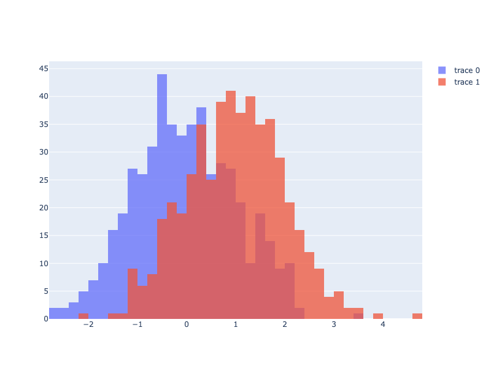

**Interactive Plot:**

<div>                        <script type="text/javascript">window.PlotlyConfig = {MathJaxConfig: 'local'};</script>
        <script charset="utf-8" src="https://cdn.plot.ly/plotly-3.1.0.min.js" integrity="sha256-Ei4740bWZhaUTQuD6q9yQlgVCMPBz6CZWhevDYPv93A=" crossorigin="anonymous"></script>                <div id="plotly-div-18" class="plotly-graph-div" style="height:100%; width:100%;"></div>            <script type="text/javascript">                window.PLOTLYENV=window.PLOTLYENV || {};                                if (document.getElementById("plotly-div-18")) {                    Plotly.newPlot(                        "plotly-div-18",                        [{"x":{"dtype":"f8","bdata":"baKsItHR9D+KoZF\u002fO\u002f7Tvy9eS6\u002fPW9G\u002fwuC99H3O\u002fT9jiTSla5Lkv3RGL1LMuOo\u002fzj13ikQ8178j1S8dv+n2v+SRaZsjQMW\u002flLhSJOyz8j9UIbybUMvHv3nUUhXdlOE\u002fYSBX2YMiyD9SdA2eR\u002fqnPyDYsslIuNq\u002fSwt1Dz7ewD\u002fDu2SkXUMAwC3bP1BNsdy\u002fn\u002fOo\u002ffPc\u002fL+8R7TzvkLRP19AkOXBstY\u002fiBCC1F156b9liovaT6TpP1bL+KlJVdk\u002fcftvlOLJ0j9nYWmoPSHXv9OgJpY9Qt4\u002ftExUMgje8D+0yCXCWSLlv0ep3+uWI+q\u002fHYfCJDAG8z+CQs46JIwCwNVT\u002fMk18ATAf0RERR8J\u002fb\u002fXxrpBSkPHP6ckmH7\u002fgMM\u002f+xKDEb3G3z9qspppP3OzPzTEu5Ebmfg\u002fHubYs2g2+T+SHlq9TovyPz7z62wofvK\u002fcC14LtxE1z+tLSqv7rfrv77Bn77RBeC\u002fwZM1C7Ff8L8eGzeQZfCFPzIv\u002f+h2aeE\u002f51yFhCkltD+x3ZLECRjzv0vjjt+javi\u002fyc1prP9i6L9sbyHWaeLov2FeewrEGOk\u002fVwWk+xhv1L98Dbr1NybIv+i1JMJyFsS\u002fWoa7pLCM8T9MsOIMhy36PzsBqVTtVNs\u002fptB4THzIz79iyr9wpXD2P+DhsKAlDNw\u002fbodzWUDz2r9DhgNXTyvwP8OEb8iChso\u002fkO6kNMrx9r8QjjnQnQ\u002fkP+kNCQtWMNM\u002f5p7Nos20\u002fb\u002fQFR8dVjUBwDQWPbRPcsE\u002foOud7w3e5T\u002fnfInefHnjPywAN7qSxvW\u002fXIm0N2k11r9BRsJhtFTlP8JVeOhwkvi\u002ffGJdAxvVtT8H16udX07LPyGqk61oj+0\u002fYYelF5KhA8BU8ObZ8Y7CP44o2REdJQBAS5KENu7g478u7HjgQz3UvwmhrbYah+4\u002f+7M6CKpr6L9NvAQg44LyPwxfPjMMTOE\u002fwzunnWcv+b8YliB\u002ffcC5P23ZdHf9V\u002fe\u002f5kIBkEV77j+wZXzqCuT6v+AAknbx\u002fPy\u002fM01AHGYy8r9RGq5yxbLpvwEQ6Vn\u002fCfU\u002fdZPpcRqykr89+B2E0Z\u002fSP2+tJxTKMvE\u002flNF7bXVU5r+wJCHvpIHiv0BB38hUHuu\u002fzzrgWfAd6T8BoRc85iH6P2wGyq08j9A\u002f4r6n4ujx479JSDUrzKbgv6n1tBEKzPG\u002fEgdc+Ypl5z8+3wWXwQHxv1XrKXzoS9C\u002f1DajzxC08r+kU01rM2T+v4z4cyPUUQTAQuKwj5B67L9t6PkH\u002f+nLP0jU3hkXV9S\u002f1dzpFhqezL8Ap706XyTxv+dg+NlV0O2\u002fVYBJDU8V8b9flD9htAnLP+k4+NuYYQBAHSK9hqd0wb8iHveRkuj1vzOVQEiqXPQ\u002fV+rMjUH077\u002f+YKWxTtfhPw+S+1p3VNy\u002fhiwodd7BtD985c0+GHYLQNRojjW86+e\u002f24K2DhbG4r+FQ7KN2wPYP7wmomM2eZa\u002fynofzhD92b9vUodBbwfmv4U0emRT5eI\u002fo+k2Nu888T9IxtgDeXfuv5AFxHnULvK\u002f+opyw0tH\u002fT+Q8\u002fiOcM32v+p5NPkC5OY\u002fczOwsqka3D8l09Flw6Xxv1Lv7YHFTeg\u002f\u002f3z6Lsam8b+lg\u002fMhzW7xv\u002fAT5geZO\u002fa\u002fPBFFsXKy6j\u002f5LfUVFcLcvyvgDn0wXfE\u002fBHIZyars6b9Edi\u002ffUKvjP7iXwfjAhPY\u002fkcS\u002fSfsEtr9oaCW92gHyvxSpcqyu7NW\u002fPH0RwJgb9D+6yuodqKbnP4N8lmcHtNi\u002fyRPMAfPo+78v6lxmreXmP4rfASgxGPo\u002f9wTVLqRg+j\u002f5al2q1bLbP0Ak39Wkc8i\u002fUONLy+cn6b+8Vt8LwVLiv\u002fjxJJNgZfq\u002f5T6JxI8TAUCgR4KIjZybvzESUQBDEwNA6xOqOkMSs78uuexXoeT5v+WBGn34yP0\u002fWUt39rOD679jhz0psAbcv4MPlRt3YPo\u002fVFoIlCJX9z9LnZe1qzUAwK2z6pkGSFE\u002f6iDsQbxu8b\u002fwIfrMnkDhPztg72et\u002fvw\u002fvZXv0EaP4L8FNmeXPeT3P+jmCzN0t+2\u002fTCU8Xc9gAUDDk2u1wWvqv4CJtkpUp92\u002fnbq0eVkB0z\u002fKava41Wj2v6gmIqcyy\u002fg\u002fWW2WC8oe8b\u002fXoCHAfaXjPyVg\u002fdFGoPS\u002fPgk2M7wavD9iU3tZv46Fv7g7n2Pw2Ni\u002fqJ1wBV5P3z8uKT+Ai97xv2bSC+uPWfg\u002fCbiNhMvpyT9c6Juc4FQGwMFsFN5jCwBAQ159jkL53D\u002fy\u002fqw0Z9v4P5v5X2vbpca\u002fcalwENYZAsCXojRXqNzavwEfIon7nfO\u002fFSL3Kfmzo7+1r7A1\u002f+Tev0Z9rhXqwMo\u002fh7ax9wM7\u002fL\u002fPpjoIXomrPzno0+vJad2\u002f0Qk3ZbRF5D9f\u002f2PWqxP7v+BW1uRcNNu\u002fte0Cv82I+j9m2IQ1ouXyv3bvKcMinuc\u002fGz2+x8BJ9T9ZjezI8amEv4KIAhLhoe8\u002fRocmm7yp8D9rnhz0tx35PxQP0hKQite\u002fgfeE+qG\u002fvL\u002fCLGPYX7vpPwtN+ehQ3Oe\u002f9UJdKxqaqD\u002fIX27csFrmv6zn3k\u002fgoQLAwola7T9v1T9fKPNJJz37PwfOO2Hoz9e\u002fKAsZiYOUtT+xuvToq\u002f\u002fcv9XugMH4tee\u002fDSad\u002ft5rwT8hH4zMuSrxP\u002fk1JBIMugFAm6Dw9n5y6j+g6HEFfsPuvzUoA1cO1fa\u002fFoo0MMfo9D\u002f577P0DkXUPz\u002fZPzbqiOO\u002fS\u002fMMwRTm8L8hf6aT3Njpv5Ax+MEbvPM\u002fxZBjDmDllr95d+w0U2j2vyNiAsYq7Os\u002fFZUyj7jY0z\u002fFAhjU6KHSvwUCrz9ncuM\u002fQyr9EGN86r+yRU90TtjuP\u002fJF3\u002fE6zPa\u002fVr1wuADp7L+PmPiCtgf2v8eywFTnqNq\u002fDzcZ8wk96L\u002fSkkg6lzXXvwNe1Rhvh3M\u002fD0KU0m+84T+jqCsekMHCPybcKSl4HtA\u002fvv09lU+r+T\u002ftMvJsLg7Rvwhl4hBYVfe\u002f0IlTRbhx7j\u002fgD52+uF\u002f9P4XEHnAT+cc\u002fjarX33bd6j9nLMDYz\u002frkv3uoCMI1xMc\u002fHFXe64Ji5D9FwVkOlTrYP2LwEQM0ReG\u002fUe3RQw8X+j8RWLli1h7GP8oA8wYvxO0\u002fJ1A+bUj42T\u002f40LakI\u002fXrP9ASdwQ23e0\u002fuTjE0Piqy7\u002fVmpMwf63qPzOIGgOdSAFAv3PKDN\u002f7\u002fz9RrPz9BnPoP\u002fNON1X\u002f\u002fvo\u002fXEASXHPt9L\u002f8ZwJu7473P14Vr3cUK7M\u002fjMf0k0mX\u002fL\u002fNTQzZniXFP47g7rvRPe8\u002fLX+q0ttF5r+BSC2vff7+Pw\u002fxD8NvlvU\u002fzfO2y91m9L8UOc7UOyXwP9TC1\u002fY9qrw\u002fLpCgU12n4b\u002fHIXJdsUPUvzgX41HMety\u002fFgGRmth187\u002fyiFpmU7Hcv9G0uO+BKuY\u002fq4BhlqjQ9j8Lrm2UWlX3P9sKn5n4WOK\u002fHq3NmvEDvr8dDKlG+H\u002frvwoVs+PjevA\u002fLKBDmNVe+r\u002fzmD4U+8\u002f1v6H49SzbWOS\u002f\u002fz30EiQY0D\u002fRV+BBsI3Uv1J2kpPA7aA\u002fDu9AP3VWqD\u002fJQ0MvHNzNP7XSEg4pjfC\u002fQGAOCxK41b9O+3zdzHviP4vOy0RG79E\u002f7fKUGC9+8T82NEy7EeHnv\u002flOiO8XAO0\u002f5JzvgEt39z+QVREQZkDCv8JCRd7\u002fBNE\u002fBWLc4wHTzD+lt9ilNiThP60uexWz09g\u002finDuigWD9z9x5StNfG3gP+zm\u002fnn\u002fqes\u002fqwVQ5Ls31T87nrNQF6vwvzT\u002f6g4tvNs\u002fLCNk7jJvzb\u002f50urZolLkv0wsNS+vnuy\u002fhlfNBosFsr93cmmOWHDjvzklXrE\u002fUQBAKMySsGCM+T8TJYjOYhXRvzhlnWFqseY\u002fgAR5G+uC8j9ZSeC8mR\u002fGv+bE7CZdkv0\u002fXetOmu2B7T\u002fALE\u002fFmwm6v8FPUuLtyfy\u002fKE2Y5Rrp7r\u002fJJy5odWXUP67bAzyEDNy\u002fr\u002flmz1dAlb9YdU4rrDHpv5eicP8pm88\u002foOo6EtJU3b9WOocd4tf4v0iIzqd73dW\u002fwnXBOwlO4r\u002fHre71ltP4v2Tr+nBVxfY\u002f6Q13fBN4s79lUpCzX+vUvy9HYwkSA+g\u002ftkwlKvYktb+PKgZdq43oP2eu5+XCsPe\u002ftSaGdiSW8L9KBAUigXLhP5yKYMTP3vc\u002frz6kbVe7nj\u002fmlI4zHrTLP6w70wenWeq\u002fFBzwr4Knnr\u002fDowAMnK\u002fmvxDXcb2ugsS\u002fbvuxNOsc5z8FYMrm7\u002fr\u002fv1xJCVBtRMs\u002fTq6r\u002fs2+6b\u002f9n6cvzbDkv+IoVKb0NfI\u002fopppxHvo0j9Se\u002fc9S+DtP6adGtZrOPy\u002f5J7CC\u002f5A2r8mKf3V4Qjdv+IYKp2b3OK\u002frpC4V80s3D9SOK2GY6vsPwa3oMJdtfG\u002f6w7juCHO7r8Qx0KEBAj0v+e3AdGYXPI\u002fwY8MX7V44L+DM7NDF\u002fS5v7\u002fH3JTwQtW\u002fPTOXVUbW7r\u002fv6az+gePXPzssxiGDg9g\u002fQOgQ1VYf7j8cd8u0kNrMv6JpjfV6A9O\u002f7TkwGpi84r+tvBGIbc\u002f3PzYHLY\u002f+HvA\u002fgV80tl6tpL+CWLpLZMTkP\u002fYk8WI7v+K\u002faXnJdpBvAECcA0pYHO7iv97qk+fSTNi\u002fCS7J+vq+178BXa8nQjj7P1fHr\u002fmi5MI\u002fjumRR8dZ8T9bI15zUC+8v4MfgXFYaPO\u002fSkEvzLvQ6D8XSVuZ7gvkv2tbmA+rGPW\u002fP1a1Ufug2r\u002fbV+HziDbkP\u002fS9RviCOvw\u002f7TwJEBwz9r9mv0m3q5cBwE0sfpvYw+0\u002f\u002fOcTMgo00z+5CmNX+Afiv+RSdQ9xxto\u002fkdtFAJlX5z\u002flSeFl1Zf+P8ttOWALr8C\u002fyRmpvg969D99LLvAkencv3tYl9E0T+C\u002fQljmlxof2z9z9Wkq6Nbxv3mH1\u002fzS1PS\u002fHW9+VHrS7j9Y6gZnwWj\u002fv4UnBylkBL0\u002fRdbrxpPI1L85aa8VkN\u002fXv0YN\u002f1ofUfW\u002fQ51BN4dJAMCIeEqIKSblvxrftqG7pPK\u002flYuotxA627+lT7mZiIm2P3\u002fb+PN\u002fvOe\u002fZPCCShAp8b8hOZmnCZDSP1DEHyXzYOi\u002fpcLZFHy07r+JrrXCUyXTvzeZZt99RdI\u002f\u002fq4yf7feAED1Y8DqJdH5P09SBO\u002fONvS\u002faLB48h8w9b84UgdVUZGwP0ZS\u002fnDv0uE\u002fN5v6VbrbwL\u002fxj18E8GABQD4QT5VH1fI\u002fpd1Zy6w9+j9bSVVnZL7av3Jug9E8s+y\u002fZiabneYf8b+Vgp3hySC9v7t52oUzIvS\u002fMvHiRQZI5L+H9bI9u5Hbv7+9wJuUN+4\u002fcgRH2ZdD3r8fZR+oVYP2v+BNDfBmo9y\u002fTZOfIHwjyD9k4JNtCvPhP29eJiE7fu2\u002fmW7aBEy35D+RuLMIcDD2Pw=="},"type":"histogram","opacity":0.75},{"x":{"dtype":"f8","bdata":"qkecYA\u002fV9z+as+eaG9LzPzgP\u002fG0RqeE\u002ffCyNE7zo2D+APE2up3rwv6J7DzMmuvk\u002f\u002fmq82COr5D+Rv+BJ+XDyP\u002f0Ar8Y4Bfg\u002fwJcwbSdXyz8iGFGiziIAQBCwnwpNz\u002fE\u002f3Mf3pNj5A0BLFej797PyP9mOYTUWGfU\u002farxjln5A5z98\u002f7Qjss8DQORfEwzop\u002fG\u002fxlAuxhTm3T+sUw9o\u002fzzmPxC4zOc0+eC\u002fgFRT+i5Hyj+uiUW+A8Hyv8a52nzTC\u002fM\u002fFL5Pgj\u002fv2b9oZOvQ8ur1P5rzJP57n+c\u002fwHbTw6RpxT9OAOFOlrjhvz7i+404TNQ\u002fx\u002fHSrlD49D+2+p4qVvzrP5GLEULvqPo\u002fwN8fZ\u002f4Xyz9bsaUhE9kEQK3FV4SvYug\u002fzF643KLQwz\u002fUB1vDNHsCQIb5R9BL3AJAiPF\u002fPFUd7T90FPHYmIDgP2hcsmyqj\u002f4\u002fOPiX89YZuz827\u002fdni\u002fb+P7RPuM2Qx9i\u002fKo6FoddU7T+NFe+KJjDwP6BP3wwwqgFAXAUFnfeI6r\u002fqVV24QMDzPykwnc0jI+w\u002frbNjj+kL8D8IrpFKQqu9P7B48rE+UtO\u002f\u002fuNGL\u002fst4T8d1oZPSkToP8Z81\u002f4szQNAGnpFHjjI8T86RUEL+NzvP5D8gCltLPs\u002fYloTL1CU47+ONbvVoY\u002f7P7xE53Nhpf4\u002f6J++SamD\u002fj+Q2RfWHFjlP7jWc\u002f+rHM6\u002fQJOVvM3djj80USYwkvXzP8T8\u002fruWlvg\u002fvmSMul82AkC53dKc5SsEQNPZkQmi8P0\u002fCr137PiK8D9\u002fDGK1HD30P\u002fHicTFSeOg\u002f\u002fkT93l5wAECweFXiIoL5P3gGlUUpdPM\u002fvCjuW8Jb0L\u002fdCRMBkF8AQBz9octA3OC\u002fGMKUnrDaAUDDG+TdCsH\u002fP0Cx2IxEyeK\u002fdo216\u002fpy7j9I\u002f+rRAebOv7Ha2E1HX+s\u002fecX\u002f6Pnh+D\u002fK5csiqaDrP2CDcxydSde\u002fHewWOVks9D9Qq9aU3Cb0P66OanbkIO8\u002fYCoFqXQcp7\u002fMuBqwls7kP0Yc5yTjS\u002fQ\u002fXEcI9dQJ6z++0PlspuYIQFqMkMDmGPQ\u002fBosEDjZi6T8Imy6huLj3P6CsDV2d\u002fbq\u002fwNrvzWm79j8JmdzPMe8EQKCulbEpwb0\u002ficacOgfI9D9WBdlhGEb8P+CXPKHpL+a\u002fJLa5zHEcBUBAutqsAAqnvwrigbY8R+U\u002fuT6XtTsX9j\u002fBVn1lhI7oPxxkYB7U2Pw\u002fjbUgxTBq8j9YgJuHsx35P3MALlUXM\u002fE\u002fR9NRyKjGA0BIdhzXej\u002fwv13iHX1U0\u002fU\u002f5jYtYlxh5j+Qg4pErfmkP0DhvcUpHcg\u002fDCjwFq5k2z\u002f43S5oK0H5P+ACXxsyl7o\u002fjhGJPDPH6j9MiPZba2f0P4gLOxf78MO\u002f1N\u002fkDBfmAEBSC4Y2al8LQDYNJ4Pm3NQ\u002fups3QA62\u002fj+QXOsOGxfmP\u002fqrYVCsiPg\u002fuPD7lXgv6j9hl+XJVqsJQNjyW+ISn+U\u002fsRdpX\u002fCz\u002fD+cCyOSxbf5P3BVFlppfrW\u002fpoj5qHaQ8r9\u002f2dL08EP5P2igbcQlg\u002f0\u002fWq5NUZ6m3T\u002fG5TMZynbXP1ZAVHP8oP8\u002fdPpOqTSl\u002fT+QDLdPRUv\u002fP5YMnOazLvQ\u002fFPaixcEZyz8w7Jc8jebLv7A9DEvGx++\u002f2zMHlngn7j9gL3QmdVoHQPnvEcN0pfc\u002f4km6lsRy7T+Whz7486ngv7AFBECiQNU\u002fDpF8rjoU8D\u002fnt237k+PoP6H47jKPiP4\u002fJz7MfrHs6j+QQOQt+R\u002f7P6kmhPJSWOw\u002f9KBIaG3t6T+VbJeZtBICQDz0XRQ0v88\u002ff6CnHDvx5j\u002fEpaWoNbzSv4Wqw5A+jPE\u002fytVzilaOAEDUSnewBef6P\u002fCr5yqDvvs\u002fYI4ye6FsAEBdOR7J5AD6P\u002fZtb6TUIfw\u002fkH+6YKd19j8gpPPCvjOZP3eB+rHiavg\u002f2J9ZwFki\u002fz+4WNkPz6u7P6B4K26dxvM\u002fSqJQ5pmpAEAq9sgaewzkPxR8GJYCjdS\u002fCenLCwv88D9aBvI23r8EQBjtK4E1SbY\u002fwh3JAKWg7D9s5MrJN97PP60fdgVXg+Q\u002fcHXih5\u002fB8z+Ysjqng9ADQGDlZRiBItI\u002f1hrphWWl0j8gLW0M11HAP7AmDJCmAri\u002fDvj4TEMc4b\u002fg4HYb1wnDPxCvg30tnew\u002fq9iqdmKn8D+m\u002fCQKLWEBQGzoMJrL1cY\u002feF1G0PwqzD\u002fIm8cR9R\u002fPP1KnCnnGIfM\u002fxBEkQcvt6j\u002f+qFJ9cm\u002f8P5yZZB1v\u002fco\u002fCsiKULWc\u002fj98uFSpiBT\u002fPxyJa1Xdmec\u002fILQNq1go2D\u002fbuCWPEebyPzzwyoUFr8o\u002fOl5VCQnwB0DDi3QLE0HyP+D4D1\u002fWrfw\u002f6IELOEkY0b\u002fYuTzFNAbov6GOLtkK\u002f\u002fo\u002f1rOlbhJB+D84FvDZgKTOP9Jr+5\u002fyuds\u002fOgUj\u002f8x71D88mcfVLaXzP1r6QSsZyP4\u002fasvSrX5v4b9Cs5en8Kj3P+Sz0alFG8A\u002f8PA68DUF3j\u002fg94X7tt3qP7xuXCAQIte\u002fCuhm3WLADkArQxWXWmYLQEBmpB5MCfw\u002fLvRdxgl\u002f+j\u002fAots9E1Smv3\u002fSyHzPBAtAnTJZCwdL8D8smQLcJA3sP9wKtmLHoQFAg8WHsDws9D9wsvO7QJjMP0XU83uY\u002fug\u002fCsiz9Br34z\u002f6XYho1AjxPz\u002fIR94O3\u002fg\u002fSIZKMy6G+D\u002ffuJWJ3GgCQKk5LEBj3u8\u002fgXqUpz9U\u002fz+4+dNSPqcFQIj0Ug5P7sy\u002fZYskZLBm+z9QO7pvW4Syv9If1pb2OeC\u002f7uyZSmOtBEC+43ieeBUBQL532068X\u002fg\u002fZNKVXfq84D8Ys2gbSwcEQPAQzA6tf9e\u002fYqopmQoU8T8kvtuJScP3P+pDnzQJTAJAPpMQ537Y4L8JVxaLXIMAwI3mp4qO2PE\u002f1Q8xfy4U9T8kvDH3ZMfyP\u002fDhJey\u002fbL8\u002f7nodFzyW7j9sTZXnU0jhv3A44yLAuvY\u002fIBgOxQpI\u002fj9UdP+8YybRP\u002f5aPj4lEPC\u002fRbraBtTY6z\u002fOtX2o4qXpPxpHceGqa+0\u002f3Adf97htAkAxAKPkrzfyPzJufZlIrAhA+RyCcoYX9j8QPKAi8lS2vzvkzO6jEQFAbmj3IOYb7T\u002fYtxA4\u002fVvgP8VIH41tePQ\u002fGTfBjCfW8T+8UbztAODhvyTw+v73QsM\u002fpet3OE83AUCTGwnEmdDyP4hz21VJOfo\u002fhvgoykUpAECLWaiFRVcGQHyrKv4KGdc\u002f0J\u002fdSpP70j+4opPWVlOzP8C\u002fSeQ3ktk\u002f+I1qsLZgtj\u002fVLxAvHYXvP7UcpG5biew\u002fDJmDgMBM+T\u002fIAot2QmfIv9D9wi+9J9Y\u002ffIUSP1rA9T\u002fyQ3KAqS37P\u002fp\u002fGVDdEPW\u002f7IPGx6x32T\u002fyCiN+V+LnP1yN5UiRqPC\u002fTLXgbOAt9z+x9cucDaIBQMj4ltHeLe6\u002fPmLgfuUT4r8K+WJTIzz\u002fP9wYtbssFQFAtLyD8id10b9AtavQT1qJP+bAFLz6jPo\u002fhy2HSyY56D\u002fYUb1owKLeP6raNhnLwARAlIWv7MjD9D+YbEDH7Djqvwc5y+GSDfQ\u002faJIM073v2b9cl1q4dt\u002f7PwaITPs+tv8\u002fN\u002fnwlVkE9z\u002fSR0+hWdj+P3bx6CXYtgdAGn4MLHug+z9QnVV35xjkP4B3wNTD4re\u002fqipRp1mX8z9gYdnmhfChvwivzA1nFNy\u002fXlcTY4c44T\u002fOYqpp++fovzA9vmP2OtO\u002f6UFYkLwE+D+Ot\u002fRztcrgPwyzYRgNMOY\u002fbVh6ALIr7z922lRGvYjuv2bUC8DF+vI\u002fAxb5BqDg7z+l2WApq43uP9n5uGlMfPU\u002fPu9MF4uj8r8R9W1FbUsHQKh5WprySuY\u002fIFd8VCjK27+Fr82N08jxP8SVmd3PWtG\u002fdHyoyvEP8T8bnK+GTqb4P+zsJz3OaNS\u002flC0E3d2G\u002fT\u002fU1WUi9BjyP1xO9MXYlfU\u002fUHUPHhB39j8WJd4l7jL4PzvnRj+A9gBAQoIO4mvE\u002fT8nD8SCYsr3P8hOEX8eKs4\u002fB+0O7M+U9D\u002fEn07QckzcP+Qz23RbuNy\u002fFA5FZwqt7j8ANP\u002fWE1K2P35QwgHFFAFAHNKEFhbL7j\u002fwNkY+ZbnwP7xC8Ic+Z\u002fw\u002fqCW2lLqe4j9NxlmU+cnnP4xYRR0\u002fUQFAuDB6sTCO2L\u002fUYt6EnAfBPyLO4aDHuOs\u002f27tdHH+O\u002fD\u002f3W6ZkJv\u002fzP3BUTAGDKcS\u002f4KPibLGJtD8SSwsOQY4FQIrRxGBwD\u002fU\u002fGv7OgXVr2D8ncd5tzIDgP4g+Ac8D9hJA\u002fuS0euC4AkBocbi+\u002fl3kv5JbeiS3UeE\u002fPi2ghK6Q+z+0\u002fr9LQi\u002fnPz6aZPnHHAFAkJ4f4i4dBkC44Ram9x7wPzi8EshAt\u002fQ\u002fUrdLjFGa6j+53t3p8R\u002f+P+aCncPY\u002fwNAXpJMkEjz\u002fj8wJNU2BT61v3JGowLfEfw\u002fnsP6D7L12j9co9EypfwFQJs1Qcfbnvc\u002fUsamMgx3AED53y9Ee1PvPxxBkHsW9+4\u002f0fZIFnfk9j+zuoD3rAPvP6BjB52doQRA6H8DB30zwr94M688d\u002ff6PxZiGngqdNo\u002f8qS3bNjG\u002fT9w2nib+YHpv9gI\u002fY78SQJAsPrLpaYZ5j84Oe55AOnNv2\u002fwofeJd\u002fs\u002fHiswz\u002fbc6T8eHaEgKW\u002f0Px4YqcvB0gFAQJv2qkNYt792LflvMt\u002fQPxw7tvxYSfE\u002fYNXJBosU+T9cHW7k+PfSP3ivWN02eso\u002fADfnrGNX\u002fD+sX3bf+7z\u002fP1YBJ5qdLQNAPBJgXECO5j+sKGhv1VD5v8EQwn3OX\u002fg\u002fprh4kK4o\u002fD+gkF80buDdv9b5qo4ycvE\u002f2YCPp6ln9D8\u002fjX4LGHL1P+KEuBA5IeE\u002fFIquC75V8T\u002fYNVhCN5v5P8a\u002fwK9p1ui\u002fcMu2LMuT\u002fj9eA+\u002ftEEvkP9TD+pJmO\u002fw\u002f8k+79UQI0z9GDDwcx8bmv6IBldz4cgFA8yovAgwhBUBkr7HBd4nrv9CAigCptNK\u002fPcuRtruB8T\u002fgrDaOwUWpvwAUY7z9Kfw\u002fkL6ZZs\u002f5yT8+IQXu9d\u002feP+LLUKIJYvM\u002frm5FjwLa8r8MEuG0McPlP6oCljoAHghA9D09QuFj+T8A2LeG8i1NPwpe+Sw9XgBAF0wJXmeBCEBowPVihTICQMpMP228ldo\u002fGLZi4fHp1T8iM1K5DSXkP0DbjNeFHam\u002fOENA+qp38D8AoIRer013v9ifCsBP8L8\u002fktBN3RIi9T8gzzK\u002fne3bP3wEUPqtdek\u002f2UMsE3gvCUBHZHIeOuT1P6Jf+i\u002fIhQFAqquAcbYB9z\u002few4lTzaX5P+jwnvfiWNa\u002f\u002frRqhGn+3D8\u002fz7PDnZvnP0g02QY8teE\u002fJ3MXBsaB6T+9VV8h9Y7yP9Obt\u002fBb4Og\u002f0n9DepII+z\u002fwm+f2ChLoPw=="},"type":"histogram","opacity":0.75}],                        {"template":{"data":{"histogram2dcontour":[{"type":"histogram2dcontour","colorbar":{"outlinewidth":0,"ticks":""},"colorscale":[[0.0,"#0d0887"],[0.1111111111111111,"#46039f"],[0.2222222222222222,"#7201a8"],[0.3333333333333333,"#9c179e"],[0.4444444444444444,"#bd3786"],[0.5555555555555556,"#d8576b"],[0.6666666666666666,"#ed7953"],[0.7777777777777778,"#fb9f3a"],[0.8888888888888888,"#fdca26"],[1.0,"#f0f921"]]}],"choropleth":[{"type":"choropleth","colorbar":{"outlinewidth":0,"ticks":""}}],"histogram2d":[{"type":"histogram2d","colorbar":{"outlinewidth":0,"ticks":""},"colorscale":[[0.0,"#0d0887"],[0.1111111111111111,"#46039f"],[0.2222222222222222,"#7201a8"],[0.3333333333333333,"#9c179e"],[0.4444444444444444,"#bd3786"],[0.5555555555555556,"#d8576b"],[0.6666666666666666,"#ed7953"],[0.7777777777777778,"#fb9f3a"],[0.8888888888888888,"#fdca26"],[1.0,"#f0f921"]]}],"heatmap":[{"type":"heatmap","colorbar":{"outlinewidth":0,"ticks":""},"colorscale":[[0.0,"#0d0887"],[0.1111111111111111,"#46039f"],[0.2222222222222222,"#7201a8"],[0.3333333333333333,"#9c179e"],[0.4444444444444444,"#bd3786"],[0.5555555555555556,"#d8576b"],[0.6666666666666666,"#ed7953"],[0.7777777777777778,"#fb9f3a"],[0.8888888888888888,"#fdca26"],[1.0,"#f0f921"]]}],"contourcarpet":[{"type":"contourcarpet","colorbar":{"outlinewidth":0,"ticks":""}}],"contour":[{"type":"contour","colorbar":{"outlinewidth":0,"ticks":""},"colorscale":[[0.0,"#0d0887"],[0.1111111111111111,"#46039f"],[0.2222222222222222,"#7201a8"],[0.3333333333333333,"#9c179e"],[0.4444444444444444,"#bd3786"],[0.5555555555555556,"#d8576b"],[0.6666666666666666,"#ed7953"],[0.7777777777777778,"#fb9f3a"],[0.8888888888888888,"#fdca26"],[1.0,"#f0f921"]]}],"surface":[{"type":"surface","colorbar":{"outlinewidth":0,"ticks":""},"colorscale":[[0.0,"#0d0887"],[0.1111111111111111,"#46039f"],[0.2222222222222222,"#7201a8"],[0.3333333333333333,"#9c179e"],[0.4444444444444444,"#bd3786"],[0.5555555555555556,"#d8576b"],[0.6666666666666666,"#ed7953"],[0.7777777777777778,"#fb9f3a"],[0.8888888888888888,"#fdca26"],[1.0,"#f0f921"]]}],"mesh3d":[{"type":"mesh3d","colorbar":{"outlinewidth":0,"ticks":""}}],"scatter":[{"fillpattern":{"fillmode":"overlay","size":10,"solidity":0.2},"type":"scatter"}],"parcoords":[{"type":"parcoords","line":{"colorbar":{"outlinewidth":0,"ticks":""}}}],"scatterpolargl":[{"type":"scatterpolargl","marker":{"colorbar":{"outlinewidth":0,"ticks":""}}}],"bar":[{"error_x":{"color":"#2a3f5f"},"error_y":{"color":"#2a3f5f"},"marker":{"line":{"color":"#E5ECF6","width":0.5},"pattern":{"fillmode":"overlay","size":10,"solidity":0.2}},"type":"bar"}],"scattergeo":[{"type":"scattergeo","marker":{"colorbar":{"outlinewidth":0,"ticks":""}}}],"scatterpolar":[{"type":"scatterpolar","marker":{"colorbar":{"outlinewidth":0,"ticks":""}}}],"histogram":[{"marker":{"pattern":{"fillmode":"overlay","size":10,"solidity":0.2}},"type":"histogram"}],"scattergl":[{"type":"scattergl","marker":{"colorbar":{"outlinewidth":0,"ticks":""}}}],"scatter3d":[{"type":"scatter3d","line":{"colorbar":{"outlinewidth":0,"ticks":""}},"marker":{"colorbar":{"outlinewidth":0,"ticks":""}}}],"scattermap":[{"type":"scattermap","marker":{"colorbar":{"outlinewidth":0,"ticks":""}}}],"scattermapbox":[{"type":"scattermapbox","marker":{"colorbar":{"outlinewidth":0,"ticks":""}}}],"scatterternary":[{"type":"scatterternary","marker":{"colorbar":{"outlinewidth":0,"ticks":""}}}],"scattercarpet":[{"type":"scattercarpet","marker":{"colorbar":{"outlinewidth":0,"ticks":""}}}],"carpet":[{"aaxis":{"endlinecolor":"#2a3f5f","gridcolor":"white","linecolor":"white","minorgridcolor":"white","startlinecolor":"#2a3f5f"},"baxis":{"endlinecolor":"#2a3f5f","gridcolor":"white","linecolor":"white","minorgridcolor":"white","startlinecolor":"#2a3f5f"},"type":"carpet"}],"table":[{"cells":{"fill":{"color":"#EBF0F8"},"line":{"color":"white"}},"header":{"fill":{"color":"#C8D4E3"},"line":{"color":"white"}},"type":"table"}],"barpolar":[{"marker":{"line":{"color":"#E5ECF6","width":0.5},"pattern":{"fillmode":"overlay","size":10,"solidity":0.2}},"type":"barpolar"}],"pie":[{"automargin":true,"type":"pie"}]},"layout":{"autotypenumbers":"strict","colorway":["#636efa","#EF553B","#00cc96","#ab63fa","#FFA15A","#19d3f3","#FF6692","#B6E880","#FF97FF","#FECB52"],"font":{"color":"#2a3f5f"},"hovermode":"closest","hoverlabel":{"align":"left"},"paper_bgcolor":"white","plot_bgcolor":"#E5ECF6","polar":{"bgcolor":"#E5ECF6","angularaxis":{"gridcolor":"white","linecolor":"white","ticks":""},"radialaxis":{"gridcolor":"white","linecolor":"white","ticks":""}},"ternary":{"bgcolor":"#E5ECF6","aaxis":{"gridcolor":"white","linecolor":"white","ticks":""},"baxis":{"gridcolor":"white","linecolor":"white","ticks":""},"caxis":{"gridcolor":"white","linecolor":"white","ticks":""}},"coloraxis":{"colorbar":{"outlinewidth":0,"ticks":""}},"colorscale":{"sequential":[[0.0,"#0d0887"],[0.1111111111111111,"#46039f"],[0.2222222222222222,"#7201a8"],[0.3333333333333333,"#9c179e"],[0.4444444444444444,"#bd3786"],[0.5555555555555556,"#d8576b"],[0.6666666666666666,"#ed7953"],[0.7777777777777778,"#fb9f3a"],[0.8888888888888888,"#fdca26"],[1.0,"#f0f921"]],"sequentialminus":[[0.0,"#0d0887"],[0.1111111111111111,"#46039f"],[0.2222222222222222,"#7201a8"],[0.3333333333333333,"#9c179e"],[0.4444444444444444,"#bd3786"],[0.5555555555555556,"#d8576b"],[0.6666666666666666,"#ed7953"],[0.7777777777777778,"#fb9f3a"],[0.8888888888888888,"#fdca26"],[1.0,"#f0f921"]],"diverging":[[0,"#8e0152"],[0.1,"#c51b7d"],[0.2,"#de77ae"],[0.3,"#f1b6da"],[0.4,"#fde0ef"],[0.5,"#f7f7f7"],[0.6,"#e6f5d0"],[0.7,"#b8e186"],[0.8,"#7fbc41"],[0.9,"#4d9221"],[1,"#276419"]]},"xaxis":{"gridcolor":"white","linecolor":"white","ticks":"","title":{"standoff":15},"zerolinecolor":"white","automargin":true,"zerolinewidth":2},"yaxis":{"gridcolor":"white","linecolor":"white","ticks":"","title":{"standoff":15},"zerolinecolor":"white","automargin":true,"zerolinewidth":2},"scene":{"xaxis":{"backgroundcolor":"#E5ECF6","gridcolor":"white","linecolor":"white","showbackground":true,"ticks":"","zerolinecolor":"white","gridwidth":2},"yaxis":{"backgroundcolor":"#E5ECF6","gridcolor":"white","linecolor":"white","showbackground":true,"ticks":"","zerolinecolor":"white","gridwidth":2},"zaxis":{"backgroundcolor":"#E5ECF6","gridcolor":"white","linecolor":"white","showbackground":true,"ticks":"","zerolinecolor":"white","gridwidth":2}},"shapedefaults":{"line":{"color":"#2a3f5f"}},"annotationdefaults":{"arrowcolor":"#2a3f5f","arrowhead":0,"arrowwidth":1},"geo":{"bgcolor":"white","landcolor":"#E5ECF6","subunitcolor":"white","showland":true,"showlakes":true,"lakecolor":"white"},"title":{"x":0.05},"mapbox":{"style":"light"}}},"barmode":"overlay"},                        {"responsive": true}                    )                };            </script>        </div>

### Stacked Histograms

```python
import plotly.graph_objects as go

import numpy as np

x0 = np.random.randn(2000)
x1 = np.random.randn(2000) + 1

fig = go.Figure()
fig.add_trace(go.Histogram(x=x0))
fig.add_trace(go.Histogram(x=x1))

# The two histograms are drawn on top of another
fig.update_layout(barmode='stack')
fig.show()
```

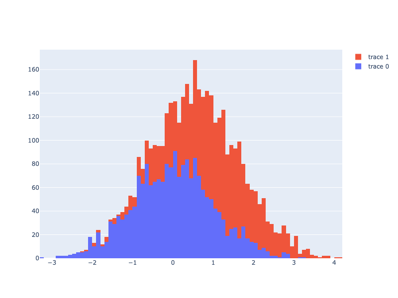

**Interactive Plot:**

<div>                        <script type="text/javascript">window.PlotlyConfig = {MathJaxConfig: 'local'};</script>
        <script charset="utf-8" src="https://cdn.plot.ly/plotly-3.1.0.min.js" integrity="sha256-Ei4740bWZhaUTQuD6q9yQlgVCMPBz6CZWhevDYPv93A=" crossorigin="anonymous"></script>                <div id="plotly-div-19" class="plotly-graph-div" style="height:100%; width:100%;"></div>            <script type="text/javascript">                window.PLOTLYENV=window.PLOTLYENV || {};                                if (document.getElementById("plotly-div-19")) {                    Plotly.newPlot(                        "plotly-div-19",                        [{"x":{"dtype":"f8","bdata":"EdaMB95X8T+KOaRbxNGKv9ef04CWB+O\u002fJ050ULIF9L\u002fDCSBoyp7ov\u002f7xwnOgRtC\u002f2skGlqI78z8z\u002f\u002f4bmFn0v1Ed3zJ3pPA\u002fjKxqsdt9t7+P0ZC2Mpvqv4g61Wf\u002fGvW\u002fbRmLOV6R4T+olywD7n\u002f+v9BRxbJtid2\u002fAw1Qz+Mu3L\u002fAB2y7R+HEv4G\u002fFysRmeI\u002fZ6TpcSOr47\u002fGZ53ows6+P74s+SNMfPO\u002f6s63ZdGJrT8gjeexpXfjP8AOjqQegta\u002fncSk\u002fTeY1z\u002fqC9oWL8m6P+SyIVvVCNa\u002fFolP0Hcjr78T35mvcfbIv+Kya9KElv+\u002fBHRrMpL8978kyyXU2bPbP6jcNUvvtADAKc1cWbuI8j+3S17lPY\u002f2v9P9xWQFQp8\u002fPACEj3k33j9XuiMhImDkvzm3sXL2mfI\u002fIm16IQTv9b8boPfrOgTtP0P6Y6jmA8M\u002fWkpMmA5aw7+LCIkW6C\u002fwP1VkmzuRQeE\u002f477tIYpF879lr+i3xpb2PwMpWYheEPA\u002fBXVZ4yOTuj9FVFkA9ijDP4yhuMA5YfU\u002fzqkyod+H+j8Ei4D45ZrjP7YQ5e4YmvK\u002fDiCVrrbIvj9\u002fzolimj3qPx4sa9o1tOq\u002fVO9ZGjtL87+XB102Fat3P44GV4Lgw7w\u002fWxJFAV0u2D\u002ffbaRdTq\u002fzPxXQpnKbdQHASHBkFYWQuT9cSYfMpVPKvy6sEfyRIJA\u002fuy\u002fG8HNuxT8EdptbeGnwP6DTkefG4uE\u002fVjdW9\u002fplp79IMBsNaNC2P2bbtbiz+Lo\u002fyMZJ0gUFwb\u002fxhhTt9yb1P\u002fJiRiyHmP6\u002f8WxWRIds9r+E2aTG64\u002f5P036GUJeW+I\u002fSrzfcTcu5D\u002fW1\u002fLv7ofyP\u002fT2VVWXJQDAdmIG2LIG9z81msdP1qnyvzYeHP+Ycu+\u002fSbwJTnOU8D9lSiYD0H3yv\u002fJ4tXtO\u002feA\u002fEzfYVlfW9j9lJqFoeMnkv5iBD56+2eK\u002fn7ouDkKB5T8F9f+7qq7sP7hec3bT3tU\u002fX8WTiUhN+b9BFCpLZcP5P4EcNX166+M\u002f5bkf\u002fdvaAsCEmgUkD8vsv\u002fsaP3zm9fC\u002fuf28Hebi6L8Jkx+MKWPQP8UqtYMu4+a\u002fPvFdCmKZ8z\u002fhHqn6Y73xP0H5VrsXArM\u002f85LnhgTa8L\u002fbJ+dfQhZEvwxS2\u002fFZCNo\u002fMZW\u002f6myZ8j+n8lKc\u002frbdv9eKfZKoaLQ\u002fDSQMzkrl77\u002f2BBk2vIDdv0ZMclyDsfI\u002fT0zWqAyK+T+OkkZVDhTWvzWOUwan59C\u002f2zuELlhX6L\u002frERe7O3n4vxpURshO29c\u002f6y46445A3j8R4V5noVfjPxTe2nVXwpo\u002fkp2Pi0zv4D8o3djtOyvFP1wAyudN6fM\u002f1aitFQ751z9npZsrqzj3P67buOtkKPE\u002fnGuqhiD61j+JnFaAduDzvwvAV6l+jeA\u002fjtItQl2H1D+awXVjqrL+Pzi2tx1Dwec\u002fVkeo1q8Z8r8hBVfEI1\u002fpv6qSVz+S2O4\u002feMqEEee3yL9ioeGYCT\u002fzv44a7GyiaN8\u002fvoJO+PKX3z9\u002f9e2LwFi+v6mot0Uykus\u002f6fLFFBOvur+9Pu6cSNb9PweCVnBmj\u002fG\u002fu2nTnrIN7T9QGmyhKLbvP\u002fDG598VRfQ\u002fOSLitVQIwL\u002fgn+LNf27av5LsjxjO2fs\u002fwMWdfH594T9u9Eqfbbniv3BEQkagouo\u002fBX58pLBk+T9df1dd\u002flLlP6MvaYY6O+e\u002f3alyEXNX7z9Qsjcivpn4v8xKox202+g\u002feCoIkHVO7z85On4WemnMvwX3MMpwvNE\u002ffIIOlmI8wz+ACrbxPCXhv3fwCTp2ceu\u002fvfeMSurV0b+RQJMIhufjv5GUpBOxOPg\u002fFcSFITGv9b8AM+lSksn8Pw2h8T7yIc6\u002f0m\u002fW9Vis6L8KIXhmdmrhvxe1majIp\u002fC\u002fp7Eb8eBBAMBrcjBJlRzqPzzj3i23qsO\u002fUNMytJXU6r9YdlAYseT0v1nfYg6yAuK\u002fb7ASPSQG9L\u002fRhnAJ88b0PwnK9IYnV\u002f6\u002fXzNL7K2p7r\u002fXp7LJtkHsv3p+b3BOad4\u002fqb2zsNg90D\u002fxda6tlIjCv\u002fsDTut3C8a\u002fEB6aFwJ62T820lVaPHTpvyr7Ae1c9N4\u002fkVlU7Qgq9b\u002fMU0fLLkrhPxOHBnVzO+C\u002fu56GqNYN8j8DiogM2JLzv1eRF\u002fIxBt2\u002fmNBtV9tE6r9BExL1RRbuP6AaUnWolPa\u002fbDsbUfBK7D\u002fUuszZWaXdP07Z99ZzHOI\u002f9SbfqmYF5r\u002fk\u002fgui+mveP7WGA970Avw\u002flY55FTMf5r\u002fcmDbvQTTQP+moY8BS1tC\u002fs3mb0gSb8b8lL5zW\u002fGTqv7T1ozWUy+A\u002fX+Kj6WE8p783f\u002fNylJ8DwARxfjiBCOE\u002fZbIlMGJT1L\u002ft6e8wL17tP0LWLa6mmOS\u002fKKdfSZZ0AkBneS9kJ1zuv5TqysnshOg\u002fVv5CWhU18b9g3dg6TvTIP0SrmIEzXPK\u002f+ClcSdwT9D+YooNYPZyVv2Z3IBeT6vc\u002fZSLvo7nnuL\u002f3MPzSX\u002f35vw8R7jHR+uq\u002frb7e5ksZ2b+1E5Yhnxr2P4pBez7w1QVA0wauyWU5vb9isFZkY1rUP7AGf611APQ\u002fl27Qg8xC8r\u002fwJ7nN1zLUv4WZUqlNbeU\u002fZX\u002fGOLyZ1j\u002fpwj5YKZa1v7pSlNrdRu+\u002fNqXxujGsuj9cLucN5M\u002fmP0v6VPJN\u002fea\u002fVN3+Tu4Qsz+Ruf4VyrcAQMtIow+vjN4\u002fl0wCRt764j8FR1J2OpTwv9K5ZvjFoOG\u002fnq8RoV1R1L9YJMkActbqv1Ea97h5WPO\u002f7t587GkN+b9ED254zpvKv2N9XX5zpuo\u002f3WSsl6q84z\u002f7QWIfGaTlP2jXW8fQL+0\u002fwIgvsHp7679Y2LyNWt3lv+xPQq+rJ86\u002fw\u002fhtvS6F7L8xCtJFOPXPP50n8pOSOOW\u002feK46HMDS8T8v8jweXBfsv2HvW6BXAOI\u002fJFla3TPc+j8TQkI1kHHzv5VeXW9wpOG\u002froHFFcGU6L8zjgqu4fbwv6UC\u002fbwer9A\u002fpdy3FJ4C4D8B8COVKHPnv5REi\u002fZBZuC\u002feUTvxlAHzz8EEIz+8hfUP1e\u002f3vsuyPG\u002f2E+mWb9pAkB4ESNzZeHNv3cjzFADj7Y\u002fiwSgLyQZ5L+Rf2pNd47Qv36HMbru7+y\u002fsEgQCEQN+j+CE819FI79v\u002fTw6LdrrMe\u002fKePwhNkn5T\u002fBrfyFMI75v2p\u002fzRlJgd0\u002fLb2JBGkQ9T\u002fhi\u002fR\u002fuPfSP+0RKqcvgt8+TLAi9xOEob9aIee5FQTSvzEmPbXQkOI\u002fp61ohwKi67+qV0ZVgerUP0melc1nqtW\u002fidUPhqec4r+LvGyxg4Dyv81WSTS8leU\u002fNQQrI5Hm4r+qaMWXhT3xPyXESzTwt5y\u002fiuPFnORUab9pHFX54pDxvxovVld5APC\u002fMoJpbgKB4T98Pr20wZ+4v5dqueR8E64\u002flXpeXxzV5D+FFkTx87LgP+YG49r0xda\u002fpECY8rMnB0D9tiizkxQJQOol6ggXLtw\u002fWukKqvAG978mp41LdJjsv0WFnbabneI\u002f6+sVSZBz4r98vNOacOq0v\u002fVjQXOr8v+\u002fmX164GXq2z8A2IDpx1XzP8o8lMMSbvO\u002fXzsIiOf71b8GQ6aRMfrWvwjLDdgQ4QPAoTiKBQ1x3r\u002fgBR+WmDbiv0sl5GMCTPa\u002fBmzsZjz8679VnhxT45jPP4OvGXJR2dU\u002f7i\u002fXd6XK1D8+P9FMM27iv+QtsimeZeq\u002fRzzluxKcwj\u002fhVGy6PSnZv+e+1wAqlfA\u002fYYmdGgKh8j+LXjogSz\u002fev8QBnjjDIvq\u002fzPEILVV4xz8wruqIl2flv4S4E\u002fJBUOo\u002fAh2TGjdn5j9eqWjCS8\u002fwv2IAMmiNxfA\u002frfm1msRG9j\u002fpAH9g5LfYPytUJvtQhuM\u002fDp60SnGr4L+NzYTyPX7rv2k\u002fj0EEFPQ\u002fahM+3qnczj9JVEigBni3vwRmnfARpbG\u002fl9JlNp8W6D97wdrvdZrLvyLepCM+5t+\u002flQUoU+uA079JHwtStczEv8a65LxYIt+\u002f82ofZauZtj8gX0wWWnbfvz2IhquJHd2\u002f31xnU93I\u002fz+ikFtUK719PyUPUVHpU\u002fs\u002fk4K0DYQT8L8Rv4ZsdSfoP\u002f1EqTPlLYc\u002fMipehWAO+z87Wd30nMXdvyw78t5arfw\u002fYf2+VzDW4r8r0QSK9T1\u002fP227p\u002fZTf\u002fK\u002fRD2BRLCwob9XexfxLXnKv6FtM1kLwPG\u002f7dY\u002frjOJ\u002fb9KgamcXa\u002fsP3ySXYZVsN8\u002fjFLBtmdI5r+bkg7o01a7v8zlAbLeNOe\u002fgtm0Km6swb+U5LEMswDQP56WtGlymdY\u002fOHYHpwAI4L9Q2tus3trKvzNTdo4HhOA\u002fJmUNyTMZ5b+tYz63H8fhvzapGKEi9LQ\u002fXW1ARy+q3z+5UC4j\u002fiHbv9kYTygufek\u002f9ITTzrjvsb8CHMlXG4flvz1oXK6bK7g\u002fyARUe5pO97\u002fEoVGs11\u002f9v47FDHWWstU\u002f2L62BdJr\u002fL\u002fDKO\u002ftjKnpv\u002f+Y2QUc9e8\u002fg++RvXk61T8SbaC37TLrv7Mb2UZNs46\u002fddmfpTzx9r8h\u002f22fHzryv7pGOToQe8W\u002fuaptAGPM4j9RDzfr\u002fkShv2Z9dSBPlLW\u002fL8606Z7P5L8NSp+moBOzP5vKj1r6eOk\u002fJ6z8r\u002fOo8T9Sd5Hj\u002f+\u002fVP\u002fJMU2z2Ob8\u002fIWPmLia71j8tmAA2wM\u002fgP5lBppJs1d6\u002fsTXmlYef178d70P08Drlv87WjfkfH+S\u002fK4o+lOMg\u002fj+q9NS2NR7pP6KBRD5j6eW\u002fOR7TfYuqpT+3YVAx563TP1ChrQ2EB7e\u002f8xpndBPX7r\u002fEk7w3+yT3P1P\u002fxYTJA\u002fO\u002fkCJcxHHJ6z+Rv4xgu6qrP0XqxwX2B+q\u002fCiEUtSqsxL8bIon6pJv9v7vRQowmmdE\u002fFGWwAZVP5z\u002f7P\u002fxjQvbgv4wn6bIaENM\u002frFoQSLz9A8B4rvY4MQHhv8q+szX\u002fZfW\u002fXO7nO\u002f+b7T+O2jAoQd\u002fIP0gMmx2GL6i\u002flv\u002fHXqU4yL8T4Pp09xbPvw7nnlg7H+k\u002fBv83\u002fQSr8L9j+aSCBNXtP08FBUAIY+Y\u002frv3hQPh98D+Haf4omETWv\u002f\u002fPOi7ETfE\u002fdPlXGjgD8D9xKchlNcbcP1y+PURG9\u002fE\u002f1G3SP0k+3L9FW8H70bmyv+rAqZPEj\u002fU\u002fAXlSkZ0jAEAtYXW2nVj6v7pSjIRC\u002fO0\u002fyKiPKD4h9L8JjK341OrKP2X3c64P0OK\u002fq6mDuwRUyj8b0GOPVxbTvxeS3Np\u002fONk\u002f2oyfYLXK5D\u002fsr4FUL0jWv3qYJRDfZOU\u002ftJ29maNn0r9Jn1l+CurlP1alJGva1vI\u002f91zyDYIhxT9sWL2GotbNP3CfpRPz1\u002fy\u002f+ZUHqVOz6L98ZiN9zezjv0GyxnHQSMO\u002fXfgNZn5m9r96LCOqKtH0v8oiChJIvbO\u002fhSUyswSayj+zOmzD6o7vP2edtwCS7PY\u002f8RFoXn7n4D8hAGSx64jXvwR\u002fnsiTIuY\u002fGkzVeg6M6b8k4+oYYV7LPw0B4My9o\u002fw\u002fUexuQsKT9z+dEGFNSFrTv4p2\u002fS44De8\u002fHyYu6aHT2L+6\u002fMXM8q7jv4d1KYrYv\u002fm\u002fkCKDRzQu4T9NU6CniJTTP2CH25j5gO8\u002f8ZFLPh3K6T+yT5ZVVyvTv8PuYUSHnus\u002fRxK7IXkX\u002fj8irwB2B2kCQCXgRjz1t+g\u002fPjRykmN20j9ZAaNV39\u002fYPycCsHsGWbU\u002fi\u002fVObw9r4r8dYbTolTz5P0sK8fdzZug\u002fFKgXY2fAwj+VQv6kS833P7PRDosU3+o\u002fYrS8LrcZ9L9A7zu7RcnzP+Og+C0fNNq\u002fPWk+59AU9b9IY3ZyDo3SPystkBlE2tO\u002ftEvPobjS579Yf1avNVb5P76GsKznk64\u002f491mQhq9qr9\u002foPTVXRbQv\u002fRL7l6fJtm\u002ffKfwvOopyD+yCI18no3Uv1Q0Wnog6AlAMEmPW7je8L8OmtkwpgO+P0gD1Rb1GN6\u002fxnYsTTZ75r98M3+YwF\u002flv1PprzybUZw\u002f\u002foWQ2VjM7T8V95XBshzzP6BduCrjSuY\u002fwDv9JJod27822GqFcL\u002f+P1ecnMiYcfw\u002fQUXYdeU1\u002fD\u002fkX6HfSSzevxatZefK4uM\u002f0kpiMGe65j9Lh97ZxLfiP\u002fgDC0I9M+I\u002fEWDPEZiR4T+O6Wl8CVvTv4dvnqkrUfM\u002fghVYJuwK9j\u002fztswdcFzkP+HoqknvT6w\u002f9x9TW+j42T\u002fqIA5YrvnzP5Ij4EJRUcC\u002f86s26MZh5j\u002fYGAb5K4fnv\u002fjMN5oTRdg\u002fSH4JywNl9L8wikKMzDDyv5yixvI1tQBA66lVi83ZwD8Oznje0KjxP9Lvv88ragXAs0LiO+dszr+3VOzbEIDGv8nxYBIX3eG\u002fVL4i0TvgwT8u6WytGbnrv93vtNoBGPQ\u002fEBaGbPoV5T\u002fag+T2R0\u002fyv1nEkDiVBN8\u002fM+JvFhgh1D\u002fWc\u002fGnK8b5P6\u002f9s3nW5PA\u002fB9pdV6Pk8b\u002fYauDHnt7ov8G4o1pp0u8\u002fSPBTNusk9b9XSUfEZTLjP9VmYQEHteW\u002f1o1rLUdJ4D+5wHMkdznhP7ygGQRc+Nc\u002fm5kWRe3l57+FD5cW4CuhP8atYAEIhvM\u002f7tbpofegx7\u002frNoIQUJbcP+gbM15FYfo\u002fON8P9W2N\u002fj\u002frJRMSAuD4P6zgWu6JRsI\u002fNYPQH1JRuj\u002fv+Ic31ZrGv\u002f3T+o3bYuC\u002fqzb8EVL8xL9Nbv0NUZP2v4Kssyouf+I\u002fUC4YXHY30r\u002f8NXMxqRnyP+ZywGfQzPA\u002fDXoG48pJ9j+hOLJen9vov2OxBruyA82\u002fJnIPSOdd57\u002fn0+LEDfL4v3thP39NcuW\u002fR1iTkSFe6b\u002fVbFd09RbyPxCq3yTD6QXAAmW7E4BU4D8b7yaITDvQv2jckltYSt2\u002f8Kw3GhqW0797AXbH+M7dP2\u002fk4abuFLm\u002f2QSKfqIGA0C73PH0PTLJP+WpXfpLIt6\u002fNyhTwhnz4L+w\u002f+8MpavLvxWTFp3rcvk\u002fN+vzBjBh4T+1QJttWAj2P2B6SEk1OvS\u002fxkiNrFYt3795\u002fwr+LNOxP81R3GdAqsm\u002f3DXrG8F+5j8sQ45q8tLwP\u002fljHEGQbte\u002fkZ5Le\u002fX5BsBHQqAavIftv7yN\u002fzFINfO\u002fwrWBJgKk4j8DTPHJBlkAQPoIghXw9NU\u002fbJg2Ysod\u002fT9gxWavEaLVP2UewmC09\u002fE\u002fiyTHtkS+1D+nhLXLBizoPwbX9B7sqe2\u002fUYwHxJfY07\u002fxn26ZOSH4P\u002ftonYQtwO0\u002fVAZFKNyu9b94uP2CrDPxP0xWJOrqtPM\u002fPzZBrXej0b\u002f5ACVH+GDVP6lMitWzXuK\u002fIUCx3se80z\u002ffaSBKYxzEPxB4Ro7NqNi\u002fYh4T\u002fgHApL89\u002fvZSd1zhv+lVrFwKDOY\u002fHxW\u002fg4Cd5L+F5V3koajWPys2tb7L+NE\u002fAxFfCIM46b+tU5s\u002fIobZv80oogI5ANQ\u002fDgT8vKT99T8g\u002fdIB\u002f37kv2e9fpjztL+\u002f9BsOvR7Xx7\u002fYpkFo9A38v7C2iM\u002f17cK\u002fjJpXYbwP6D\u002f5TcxfkADpPx78dJ3juN6\u002fJVvCzYgk4T9pJOZhYNrPv5AT4ubM4dY\u002fAatypoHz7T\u002f3tE\u002fYdD3lv0bUonoCtN4\u002fan2mkcc8+r96bLVS+TXvP786SquZu\u002fi\u002fNwm9q61QsL9nZHtQPkbIv3hsLsjNkus\u002fn+qM5YCg\u002fD++Oh0x4hDIv43uD8jnloE\u002fjseb0Tfw8L8zGoNF6RXiPzw6yvVt7+8\u002fByicHTzT8j8tzb8T7d\u002fvv9r+b26f8+u\u002f7mW1pKTy7D\u002fIG+LYsw3uPz6si9liZgDATXmDgkUh6r9uA0rgI48BwPcj1y+0eMi\u002f+phs1t0iwj+p5\u002ffuNVjWP67+1byz7tw\u002fApwH+UoI5T81Ye3YSMm5vyZPrfmqMPi\u002fw118s8Zcyz\u002fwwqWKjwnoPyvBLHJumfa\u002fhNB11xX47r+jULqoJjjzP2fwmDEaFfo\u002fGgSYHYXD3b9aIiaOcd70v147LYq+JeO\u002f1atITc2G6r9Eg5vjN0PdvynPQfUOVOo\u002fF9OhiN7A\u002fr\u002fUKblIMFkAwKmCZ9JWFv8\u002fW6Je6fC96b+pQdgkQ\u002fDyP3NWh9clhv2\u002fyIvV9a556z96Dsmyf5\u002f2vwTrjd9gmO+\u002fDqT\u002fW7hY9r\u002f48mPdZG7hP9GESZS6qPC\u002fOUREERTz77+BP999kY7lP22jLGEZFvk\u002fdp3Mj\u002f952z9zHLi45rTQP15my7yG9Og\u002fiwJkOjiv+j+l+6iy6sjPv0GAxcKFSu+\u002fxMTkqVB9\u002fT8vBVdkb6P2P3tEzsASbfO\u002fGyAd5jwG6j\u002fB0j4EvhTaP\u002fubL5rELbK\u002fALWcoSBw8r8+4X2AxJL2vyo9Tw2kheG\u002fdJmtNzBxsr8yQ\u002frNvEH6Pwe3syr\u002fYfa\u002fUP3sXaRK8D9Q1yRamEDLPwAUmM8PHOo\u002fkDYfNTwuAEAHsH5Qe2Pcv6RKYIv1psE\u002fuDIaZT3o+r8H5MSLSm\u002flv8Dzdy\u002fO\u002fPg\u002foriECYQyAECMlZEPIGbFP6tfwvvwuaq\u002fEq5F2jh+3T9ZaV7aewLTP+bHA4o6BQJAiohTn6Mq8L\u002fAXlRykvX6vwtssu3t1ue\u002f2H+r7UgL9r8my0LX8BG9P1oClMgV2aw\u002fDuOamnPk97++7mxbwt2gvyudNNI9zdK\u002f5Bmk+Ru0zj+EYSZEj4Lkv+2CyaPpodm\u002fuNx6YZhs0r8VPZGQOUP1P2Ta8MkyKfK\u002f7GDVi8mj4r8yHw+eb5mwP8eWsu86l7K\u002f1IXm\u002fFKA8j8usKjV0WnTv85XQ8vCLNY\u002fiwX5R7LFoD\u002f2Ov5m\u002flLrvxyUPmJVrNO\u002f2zl4Rxhvnb\u002ffDCSqs5Hpv4iqd5ogxQRA3sGmxeSZzD\u002fJehLcpLrwPx0b2Yr+pvo\u002fNuDQmfYIAEAVVIb\u002fg9n8vwG\u002fJJIwg+S\u002fK8hOMp5r9r8KAL0qtmbfvwwuYZHj0da\u002f3RdeNXCM9792Vzmm8cPxP3WNLgtpZfQ\u002fhmuKIoeh5r+dXgjUuMblP7Ayr21iVOs\u002f8Bv3BHcr5T\u002fssfeYyLr1v6NBBF0ikANAJbRbHp2yAEC7k6vyoU\u002ffvxKSXRLPpN2\u002fVIkxqdRK9b9+ptsRvKzjP8C7l2lOJ2q\u002fWOmAfTDZ3j+Ui3mRUvPav1\u002f8WqWSMvS\u002fERRCEty\u002f7r9x2TM7t8Djv2mLwwLiGcM\u002fSTPkGrIgzb+Dr+3b9ezoP6mJx2CDs+U\u002fM0MX\u002fIHj7T9VoHDGufvSP79zIpIOsv0\u002fc2EnFuImAUCpwlJD83LfvyAmrrL36\u002fC\u002fozcUg9eK6D+19KSkg8viPxtNAW9Mruk\u002frW8kEFzb379kTkfUiGPwv+1YC7oODcS\u002fBv9ame\u002fI+z\u002fXCcPbSOHJv7bfh4hORuY\u002fx403YE8D4r8EmAOD4Sbsv2bsNSzknem\u002fJpn1mjwDAsDrXqGetPnkvztXMIgoRew\u002fhVaS\u002fBgupj8Y04FvfhLrv1hGvkf5b6u\u002fQA7wAMmg0D8lcGdxd6LqP\u002f7NWukUZ+e\u002fX4JzjaITf7\u002fB6lRZBk7VPxtI3JkJ2\u002fA\u002fdMMqAMcC9L9bJPEedpLTvwxCZNYKyPy\u002fVPa9CWne6r8tQFiAm5PVP9KPnyvqWPs\u002fvL+twth8zr9w+zYwubPZvxollFSY+++\u002fSe2y4F7e9b8orTNCLZPrv7\u002f4pPbq3OM\u002fQB0sw1XEAMCBjT8YH2DKv7jk5UFu3OW\u002fgYSwume68L+vt3jt+HLOP4JZeN4+Wum\u002fgiOiLdJm8b+EoHvhp6ziv25MViM4tvi\u002flTQX0FtQ+r8laAMuQn7pv5mq1uSdUvK\u002f5H5XlhCE7D8g1Pf6PPi0vx8nusb5n\u002fK\u002fCViGUbUku7+0CgxSrm\u002fmP4go1GDiceI\u002f1XXYLTpv+z+MLnyoUq\u002fpv7YMiC7khvQ\u002fvrr4eGOf17+BjxNeD4uzPyjmtMlpeOu\u002fGNp4eFic8L9gTkO5hRH9P9je94O2Qv4\u002fMe9RC5jv0j9oTmYSDLPqP1Jug9r5fcs\u002fq1cOEcpP+T+hfhx5G378vyJxuGcaFfo\u002fNg53ksbh+r\u002fEPpNAtpX5P9NA4I6NHgFAoM+HxMYM9L\u002fg18EAt67mvxqMxv7GNIm\u002fuIxPVGu16j8t2G85eloBwCdYtQ+9GcS\u002fv3vXCJpR5T\u002fp9gowCSTpP0gr0CJlzuQ\u002fDwHvnSr23L\u002fDSgTzHU3av96Y6\u002fzBC+K\u002fNAiFZ6c7BEBQgyJ22H3wvxfVKryrDM8\u002f0o5pZ+pJ1L8czQmZSPXEv446IDt1jNQ\u002f5\u002fhkLBad4r+EARVtRj+jP963dgKmvNy\u002f+bhd7CV35z8ISxHKSaTZvwNb4NKWfa0\u002f5GbF5jZbdT8XB29o0Sj+P7Nn9FfCqf0\u002fj3N0prkw87\u002fFDHP+b43pv\u002fnnJtS+YPe\u002fTUkvc\u002fHk2L9h1zwGNlrAv9NuFfEaaOe\u002fd4bOIML10z+KQAUSyJrhv5OnmgV3Sbe\u002fLf1iLIdx\u002fr\u002fIvVrPdjPjP9ug2COHKfC\u002foGfqjShN37\u002fDmK2pv4TiPxwdCbU7fve\u002fdrt4UkCz7z\u002fy732j07nNP0RdaH4mVcw\u002fusg2b1ML978cCtqMsfL1v5Jr27KjpqE\u002f6Q2sjIN41b89kCWtnrbjv1XbAM76XcS\u002fD6YQoAnI7b\u002fxQ1qvb3vHvydYwheKEOA\u002fH2mhiTSv7b8xu\u002fFtrhvsv9Q39O2MSsS\u002fFKyWwu0L4L8aFfhFq3O+v5f5vLHvVpg\u002fNcFmropG\u002fL\u002fMNzD8san4P8MNKG3iOs+\u002flygvVfXLoj86r7J\u002fvd7zvzIcTOrnPdO\u002f99nqD5U01r99wgWTm13xvzAbiU5LrNG\u002fOLh2c5WO+b\u002fe7FGRYsoBQFyaxUNyYMU\u002f2KyuA\u002fPL2z\u002f05wjEoIXNP\u002fRhWhG6WOu\u002fYIIxYAMElj9rutTp4q4FwPkJhs6dEfG\u002fASQrlHvs4D80JExmRuDTv1mMI9WDyQHAu\u002faumQDz97\u002fs4MZzYKPpP4dHnGnV3\u002fy\u002fSWt2FcAklz9re6Xi8ur9vwdasWf7dus\u002fZSNSWU0t3z+B9tRNJnDsPxkH6t0IGti\u002fRoydE1oJ1j\u002fnIDb5ER7HPzzIt7JaW\u002fW\u002fCQETZGiUrz8x2kKz\u002f77mv0\u002ffc2L1BPS\u002fuLnMAPqz8r8AgUdyBYTxP7h2xJvk7Ok\u002fyxvnKHDF2L+JwF1hMZUAwA9hSfPEMuI\u002feOrALWtZ8j\u002fRKIEYP9rjP3jnditp5tC\u002ftQbL4k\u002fq9r\u002fQoKiTu6C5v37\u002fHLDOLu2\u002fOozxHgrA6b\u002f9X9HdsY63v5\u002fOu1JZ0eS\u002fwBxL2ZLLrT8vVHYMFkDtPxaBykSfRvi\u002fkHp+sRwr0D9YeV8Go3bZP2N0\u002fiVJbdO\u002fIfv\u002fG\u002fVxAMCZb6zRZoLsv4RANF1zIQJA\u002fMbnGs+x5j8k38at0mTzv5VvO48shdm\u002fDDmO8W3Z3L+Kvh0xwBW1P5rwl\u002flncdI\u002fom7wJWgo6T8347BDb+a8Py2KdlCiguy\u002fGlS7PKtE7D9jBFIiXzXpv2DezwHtHeE\u002fxgFSDGzT\u002fD\u002fceUH6QHK\u002fPyqTKZA47Pq\u002fP5yv2Udp4z8vfgZZJG7YP2cUk+KiKfG\u002fE6lGIG+h4z+c4kQTtKSmP0yE5iuJdPG\u002fOQe6XD6GxD93Z7Ew7UvHv4IzOPNFn\u002f2\u002fS91RGDbdyj9pMn6uMLX5v3QwwDZ7RN0\u002f0xRWJfss97+1COOeazvdPz0j9XyRgLk\u002fV\u002finVYsy+L9Z2BDQUWrcP\u002f4nKR9sdfA\u002fwW5ygc5i+b9nswV5K97uv7n4U+44nvK\u002fFHOvYS+x2b8SV47JQbL1P3EMc2bTnbi\u002fIxV3IFm59D+xN1u5v\u002fvSv50uhtlOsfI\u002fWImO+\u002fvp5r95kp1NUgvgv7WY9kf7Dfy\u002f6SC2v3Rn5j\u002fsVM8sREjRv\u002fZf5q25iOK\u002fJaaYWHA\u002f8r9JNqFMUwjgPzSw95Dw5cw\u002fxNvDpOZs8b\u002fwXNcyHnv0P4ClbvUwTLm\u002f3TQv5R5K0b\u002fPvBXjzOv7P8G+rheGHMe\u002f+6PT0oPnyb9LN5pEpR\u002fZv1Y4HOjUKwFAXJtXwlsXAUAiJNSe4yzvP9aWWaMJS8i\u002fxBpMrww25b+gTOR+bX7aP3slbWdzWKA\u002fJ5On6qB\u002f+b\u002f4L+ljEE3yP+5yUxcgTuC\u002fYuqzFu3C5D\u002fUlIF4eF6+v9XDj1xkpLK\u002fdpfR5q9+9b\u002fq3icfVSnsvyM3zX7N6uS\u002fOWuTSIaKlr+uszlEtKbVPw2kBIX2etK\u002fhDlNgwRj6L9EKtPBxNnwPwNJQNicz4K\u002fl9S1qdty3j8C1C4vsO7XPz+agVTtIuy\u002frfz9znBx5L94Juib92DrP58cC0nESv8\u002fIL1kvWhK3j\u002ftemj1Rprlv+C9zyL1p\u002fM\u002f+BR3G7dF+r\u002fCMAYPAOTqv6\u002fpTqw2VvQ\u002fex4ijJ9I278BnSXYnTj4Pz6mBbqUd\u002fu\u002ffoDKrtMG5b+pFcLZ0WDVP+m5P\u002f8ntsg\u002f89KyKQ\u002fM0T83n1SymaKgv0fOoMhkDeS\u002fQzWfyXfQ7z9ndxLcUT7lv1yXUYeuGPS\u002fUQIJp0RTvL8T57OMnpIEwNy94GWDl+o\u002f7Y9gJaFu3z8QduQ9Sseyv3U6ebIKDua\u002fkEAbc9Hu\u002fL8F9N7BR5f7vy3ojE\u002fnv+U\u002fNtO17DoxuT\u002fVwHOKHzfYPwKEsbarTcK\u002fyjPFD4Bx0z+lcRj4sYT5v8qssG3gmOQ\u002fGQynep8Y1z9ztdGEuYXsP5uiGM6xyLw\u002f4fD6Ugw98L9XD+QE\u002f1reP\u002fv78A+Q4PK\u002fKDVrcrqt7z+gC5bO6lPUP557SuHIIuW\u002fdLUPv6jQ1z8lQEfKkXv5Px5EPJKzhO+\u002fFIm34W0k+z\u002fE0L0yYAu5PyKfTQ10r\u002fE\u002f80bmHvmy0j+eBywY5czeP75Y1RdGxfw\u002fj0bGelf\u002fxz8iyplIEg3Dv4O\u002fK01UHsg\u002fT5Kpou+H8T8rwqPaUWXLvylmZPdkh+2\u002fvssFO1TXzL\u002fqXxBJI2HiP56Ixesr8Yu\u002f+CWzws6C2j8TP+izPRbov8zWVnUaxPU\u002frGRz0V262D8Ajo0JcN3YP5FfFXQmQZ8\u002fijRR\u002fpSj4z8IgD+Xhg61v9d1d+rJdcK\u002fbTHUcihb6T\u002fg2AH4a1jTvwLMoWu92Ky\u002flTpY\u002fkwt9r\u002fkZ7+baWbOvzvPeyX\u002f5\u002fO\u002fI1eMUwoJ7r9BKXQism3lv+LNtpgGe\u002f4\u002f9LbMOTfE8T+koLCiOb3UPwiYwHKXhdM\u002f5OZpOHz78j9qgLSw9ZoAwDq6a5te1PO\u002fuSFFbfIhrr+6S4PGGcPov4CZMcZbxfS\u002fmfVWw1X92r\u002fHc1gddu\u002fjPyDYRBntdO4\u002fj49CMDXhsb8Yg9Lg1o\u002fSP0vMgIJsquM\u002fFAMv2v2xBMDYe+gur37kP3HXpFEQnQDAO\u002fGPtaeD1D\u002feummzo1fhPw98b+VeIuM\u002f9reaepq14r9zPZZEzPniPzZelkhbvOI\u002fb6oD2KLW7j+HfTIfMwL5v+PCGRbEmOq\u002fWe9bc6xU1T8ycz+2hMDLv5qF\u002fhtMB+Y\u002fBxr\u002fN7Iq3j8nPBw6pojKP6vjVX9Ngtw\u002fa036Il+9xj\u002fXvr00Pwrsv8R0PbNU9uA\u002fh2YQrmpv5L\u002fG1Skwxs74P+wLOoDrDvE\u002fLDgW8BQO5r8DGlFdExvEP7aQGqBQ1va\u002fBLzJq+Tptz\u002fmbYngk+D4P998XBCo6cc\u002f\u002fgL1WY0r7j\u002fukXcqUZfzP7JZ6o09isE\u002fhZGmQT3g8T9vRuXf8wTLvwcxTAiHtMw\u002fRQ6vk\u002fpM+L8MvSJ6U47nv01s78c55da\u002fbclub4KK4T+961+gM9jxv00ww6F2\u002fcM\u002fS22vKR+Y+b+M\u002fkYOPIbZv7QxuaLuZea\u002f1mLVMhl0+T8W8hs4dYDov16gi4qKUMS\u002fkzlmwdCE7D9hWipkABLnv1s0IOT6Vds\u002fAKyRGM6rvr9z\u002f+1Y4YLtv0qoaO84vui\u002fT4ebt0cE6D\u002fzTyntUlDjv9urzwBEHeg\u002f1C6YoZVZmz899YxhmVzrv1aZeIPTL7O\u002fT0oZRZLqAEAl3AWmZDewPx37zM+UM+m\u002fSDYjfFj61D\u002fJ74y3\u002f9jYv98XFahyUva\u002frp+iRPqu1z\u002fLIIn2\u002fervv5KDczuqyfM\u002fToJnfVzc8T+\u002fJAvDkZvlP8juQ9Cl\u002fZY\u002fQcGm+Inf679iByrDT2XSPxRjs2\u002fRY+i\u002ftteTKLEh8T\u002fHlcbLwwb2v7kgR4M+Ovc\u002fXoWv5Yimu79MCmv8Sybmv8HUg0tfWPK\u002fnbpVyXws4j832bxOtSDbP6oKpWnVpuc\u002fKt\u002fxwGelu7\u002fsdKotcLLiv2k8lK7\u002faLo\u002fuK\u002fKax1487+Hmh5Anp7Fv2NfkpUJ2uq\u002f5DEl6Up69D8ODhUddLfdP8JbvIm659m\u002fff7CCyuX4L\u002fzJmXiS9zwP6Ia580XU+S\u002fomNiR\u002fLUwb+V85k7sg3iPweGUgq2kui\u002fSE7N+7c29D\u002fT9VLdvIrQPyHp44fAR\u002fk\u002fI2\u002fTxYbJez9noqgohEwGQPPol5MT\u002ftk\u002fZC0fm773xz\u002fCTxcWzUf1v8i8n4i+rNA\u002fm20TECsr9r9ow2m+e3XSv+LjRtI7FNW\u002fXg8M0geZ7D+DkReW2cfTv9PiZJ4V7dG\u002fYdsOgsIt6b+XWSs66HvXv23MlF134eG\u002fIFyBOQoG\u002fT\u002feeGuVTW7rv9U\u002fGOceaPK\u002f0\u002fuHZFr047+ll9+V5mjxP1Sq7sZFCf+\u002f3+iJHSJH9j\u002fvndwFIcXtvxpP5n6xzu+\u002fVX58tXtG9b8ujuAGhZ7cP6SSruetRua\u002f6qm2OsxDxD\u002fUrjKk9QSKPzD10\u002fO8UwPA1fru9mRSt7\u002fzrt2IjE\u002fYPzFf9jjMmfS\u002fBJTDGit99b8FOrMJg+a3v0nL+l4U8\u002fg\u002fBiBKBrLj9j91cfZxVF77P3pejkYS6uu\u002fPhepB3664T+Vt7sIHkHhv\u002fYS\u002fdnhIeY\u002fiMEqYGqjt79aYPEXO6r9v4\u002fJW7IQM+I\u002f9XhuFnWfAMALY+vZ6scCQEuIu9IkpgVARUiKJPTX5L\u002fsVoN1g3Opv0Us8tIVbbQ\u002f2XXNmguM1z83xb+HfO\u002fiP6ut1Y5udfq\u002frJ287LR88L8Vy6BzVejqP3qWvUI5zdw\u002fgX++dWcd5b+bLRh5yS71v9LcmalESdc\u002fxlegU0rS2r\u002fd1FYvz3\u002fvP9XHI8CoDPE\u002fqX3o\u002fvNz5j9jR\u002fqriXzUP0NNqNr7fNI\u002f1vC0qT0+7D9T4Iv931vnv4hYJ0+fdfm\u002f+A0LW8oL4z+eZ98DTX7RP7cN1IlFFNM\u002fwOH\u002fMTz6wL+OXutrNAICwNZvENoTJgdAtNlVEu\u002fvBUD5cuietFPgv4EzxArQquo\u002fC+ZzuZnDtj\u002faB7bfhDfQPzLJR7aA+NU\u002fi2FRUBEt8T9xxH9z2mjlvwy4WFot5OY\u002fwotPFSql5j8ua4CXxWMEwB0hEJRSfvc\u002frWk3cJQJ5T+Xk6wZhqHiv4SpZMq9g6g\u002f8M6C6iJm4D\u002fZtm0xSTLSv9OL9CAp0OA\u002fdVv6vTFoAMB3REv70R\u002fLP+fLFOmjxPE\u002f2DIrPxgL6D\u002feizccEuPLP4EHb9z++ei\u002feFLgz\u002fkCsj+jtG6xGPvyvx+9ETkb4L4\u002fc+rSzTdTxr9hry4C2\u002fbfP9Y4y+myOPY\u002fOpnB2qM36z+3kV0k8Zvqv6IPaGS+9e6\u002f5jcpQAy06793KwICudrrv\u002fourQTWnfC\u002fumtBGD\u002fd\u002fz\u002ff7lX4R8v0PyCnQ0FC8uK\u002fI5Ch8\u002fNsqT9diICE9NIDQNeEVpqIdfy\u002f835g6wRU2T\u002ftzNpXswYAQOgXKcOjDMM\u002f\u002fOnxR5ek4b+wWUcIYVH0P1lYbd0CFgJAuN1wwshpx7\u002f04+HSZBjzP9XJqVjYsu6\u002fqp6UBNTk0D8Fp7+E9nLkP1vAgKPa59y\u002ftPcjkY3z4L+aDLcq3EDkP\u002fXzT7v3\u002f+s\u002fLaSBSTfK8L\u002ffu\u002fwNbW\u002fjv27Q7ALFwto\u002fRz9JMiGr+L\u002faLCgvMmfwvw7RrcbF3NQ\u002fQHPW7L3D6T\u002f70whH8ITRP41UaM\u002fOcLO\u002fwMRRLG7r+j9FdfrqROHJP2KI+mYQ5eC\u002fJMUOC\u002fORAMCjLn6LWNbgPyCny09w0dy\u002fLgx9YvpR1r9rNg0E1Am7v4uPFs1Uk+u\u002fppY91NpH3j99hEpV3cbBv00XHQKVNwVAGO36tvn\u002f5L\u002fKc8vYV+TRP3ONxPFmcuO\u002fbpI0E6Ja5z903Nwk12Psv7n4B+23y7M\u002f1F+zjmnLsj9YJ5ozLKDaP2kaXg40Ef6\u002fYXg+qyhq4j\u002fT1NYrwyC6Pwr7MXTo8vI\u002fDFhdr1pv6b+\u002fkyZXlx3Av95ywV8ou+6\u002fOnKhZFYB67\u002fzrOcVYBvkP4ilCXDcMOE\u002fyfEjQK33wb+Zj0d4UCHCP5L4OTNL99M\u002f56aGhlic6D8qfB0ReLLiPyNrHlQTnvw\u002fidvmVOE4mb9PwqYdOtj3P9qpYCqHjNS\u002fqRjXeh\u002fy4T9izi55jVTRP2okUNKMiOg\u002fYBudCAsToT++v37hTSv8P208D5bIRADAYT\u002fL8A2H6z8DvydUZVfmP8bETfEzleg\u002fCRDRHlsH\u002fD\u002flUexElTf1P6PFQXF4eva\u002fB29t\u002fo4A8j9xYWKOejrcv+q4DkxOMMw\u002fvJP5L9qt3D+KQWFZ+wrrvwzDU+RH7fW\u002femDaqm\u002fnwz8fv8ngTH\u002fCPw3SSq5FbuK\u002fo97x+ag17b\u002fPVr9asoV4P8zPvsbDONO\u002fKx1lqakwrb9s9AlFipH9Pz5KNEMFq+I\u002fOeUhITVp9T+YdhBPdOTjvz0fFqKurPk\u002fuQySxoX8lb+MRtcvNwLBPyQqGlx0gK8\u002foXSmMh6C1z+EeA8PG8P4v0lpFZORtlY\u002fUwtfbBrL5T9IQ\u002fnAu9r2P86gopIl89w\u002f4bWM1UpL5b9ByZQlHw72v0lNY2EbPNU\u002fuaxAOaTr\u002fL88STTlAHjBv4KnjtfnG+E\u002fqIkdz8fFuj9P1TBfWa\u002fQvx9MzmSyU\u002f6\u002f5eG45w+zp791h5Mbu\u002fDwP5VMQZTVcc+\u002fQjQFY5OJ2r8D\u002fX5Vp+HZP23wp\u002fV6guY\u002fUOWlijtx7D+TBZ1hKt7rvwiVliZAGN+\u002fZ8ynoCFg0z8RQaUJQfzvP3vXO9\u002fngfY\u002fwDqgo31b47\u002f5BF66EZ3sP5xlAXTXOvU\u002fvgQ9cIpX0j8ChK1ox9rLv7Wm8OXoI++\u002fXaffxulG8T9jLrhicMl8v0YWJIdhVPc\u002fiBpw3w6g\u002fD\u002fTeX3zLlL1v82NMxGx8d2\u002fV4+po+tcur\u002fDwmaqFr7wv0XCqpGnIuq\u002fv8GjjqxJ+D9cY018+8Tjv8rkDeaq0tA\u002fOTFRXiZo\u002fr8z0l9\u002fIlDlv1FgjRRFZum\u002fDelnwovl6b\u002fmN6kF413Av1CxsjyRVsG\u002fL1Zqx02p97\u002fUyFefv4vfv3mexDg1cOk\u002fRNq34LR58b+EwaqWLrEAQMV3ObsCEfU\u002foLuGlbnZ3b+tj7cgNxkBwNMbrrBEPQHAZhF+DwoD6L+M5LIuE0znv0NBFvS0Xe6\u002fle0BjpEP\u002fD+fUu4R3TTvP\u002f6HiunYPe0\u002fQ\u002fQOUQya5r\u002fr\u002fUOLdw3rPyLbWu1ndle\u002f0gJAOHoAvT9Av2q+XPXdPxQEp\u002f1ByAZAbRPXRBgL97++Xsxda7rFv1IVEQOW4vy\u002fIdu\u002fnup04z\u002f5x98QGO7LP7wy4wldZwFAwMBofzB34j+ilEHHJZL3v9FiRe238vO\u002fWkpfrLaT\u002fD9go1eI4XMCwJ3qmVmQv+8\u002ff7d7Rt1M7b+\u002f+KOoBjjPvwZ3WyTj0qE\u002fzu5dHK5O87+1oAUmbQjpv3xEvfCNIrW\u002fblSXVV6r+z8ImN8lmRDlP8C6RYYaYem\u002fPczpnbL4kb+aR2dXMZ7pv9PyUSDpnMQ\u002fjmYLbZOT8L9B+WtoysnVvzApo9+3aPw\u002fjPhKCJUS9L9f\u002f5UlrijpP9VJVdAr2dG\u002f9c98vcow5j+HnZXE9ePAvx0kz0C1oKS\u002f1sSHDEI+oT8eDv3fh4L2P7jUkdWn4vA\u002fEFFAqS4Fyz9cna\u002fTbST3P2RUE9KiE\u002fM\u002fdSHP567p8T\u002f5qoMdrrLzPzZZMja2K\u002fW\u002fmU\u002fFPGhx+z+JfKWk9MbyvwNaQP3SD72\u002fMyPT5K+L5j8Y0HiTKrIAwAzmCyQan7M\u002feeVN084E8T9RUaPf1H3NP65XGhiSoOk\u002fphMS+bCU4L92lOIafbX4v\u002fSfM0dUHLw\u002f40FPRYAf87\u002f7a1W10IDSv\u002fMqcRUOquu\u002fpHohexIPzT8Iq9oSOF7qvzII5jhtjNu\u002fsr3+a1VAAkC8QrzpKM6Av23mQVfMfsi\u002f0uXVfBIr9D8ZjyM84+3fP5T7XjRgj\u002fY\u002fa3B14EqU2j+y7pLm1RXZP9NPPBh9d8y\u002fM1J14Gn39j8qAX9SFmzVP7iQYabHNpM\u002f5NqMIE3OAEAvBZdgK5kAwPwrH9\u002f1C+S\u002fO9TqmdVc6z9AYj9QEQ\u002fqv2gM2Jo2LOa\u002f9PRKHqaw4z+\u002fipHIed6xP7SiEHmw2uY\u002fxS40NZ3f47\u002fwsP2l0Sh7Pwb79fvkBOC\u002fPZev39TE779qQ0E8CZTvvy7rHjZBSug\u002f39zVdTWAAsASBpcD4K7Uv7rW2B2+LvG\u002f6NyilNnU0z+GqL7jKd7Tv9jWtmgnWeQ\u002fIdBmkFpa2z+qecgfuQH9vydzpf8Cp+A\u002f2EkPFHMN2b\u002fmpK1j6U2JP4xge9kwU9K\u002fQtQOPEBR3z8TJ6cRjDQCQD5LYG96TLy\u002fhXTpkMgJAkAOJRQ3NpXjv\u002fBK6ur1LtW\u002fhRSzMxXf8z981nUaBMDEP6awbtL1vOY\u002fCqI6Rv981z+Eg\u002fIr7ar6P1Vjdvnuz\u002fW\u002f2o+JlaFt778HwjOI0ybaPzyARo9nNwZAYQLcDIqq479pqY38x7rhP81aKiyD5\u002f0\u002fiJysKj6w7z+s1q3fmGkCQDH8+D+Iffm\u002fMHfU+Vaz8b\u002fLxUuTGO3\u002fv80UM7Cfp+C\u002f6NeJkPJy0T\u002fFKYJFHu3qvzCAsO97PtM\u002fH9P3Qu3z0j9t3D79VqPmv3AJIg1YBeA\u002fppJ4rLIl5L91NVvtz0Lqv8ge6Jr+gPE\u002f0W5h902R\u002fj89JqAXYNntP6Y\u002fZEIcAuG\u002fmYE8NbW+4T8dIPG5GB\u002fvP8XswA2q\u002fOA\u002fZnzSBnzzyL+DJNEucy4FwP6LZim19eY\u002fa\u002fGhJH7Ulz9gv55xig+5P\u002fMsaL72oOO\u002fnTyFQ+40AcBo1p4+LA3Cv\u002f0uapKmLPI\u002f6gOvsDHs5j+dlmmhWGLiv+ltHN4ltak\u002fPnZgUFXo17\u002f3WdSloBwAwGDodrzeiMU\u002fIjZfIES89z+vDbPodn\u002f+Pz5TB3Ww0su\u002fom9Z1Tiz4j+YthkD0mf9vz92r5ZBLPO\u002fpYScRxrF2T+9YtJAmPveP4I89ICfivi\u002faUfbxzX567+zzXYbfHvpv+i9od7Nx+c\u002ffT6fNyWU0L\u002f8DbdnSmWlP+lEo2R+lvE\u002fUtMLz6Eb4T8pm5KeUinwv+Ssqj\u002f6NbE\u002f3t11PwU48b\u002f69FS4jSLAP3HnZHBezfI\u002f8qRhLCTC6z8Cr98atF7mP62lHF5UXt4\u002fTOhdAL6w7j8QOoEJHhDSPwpdSwtETug\u002fRvh0kAbOwz9cY\u002frPwgbhP\u002fWN83xtUdA\u002fl9gaaknE7z\u002fVC3UEYR7xPz8NhXk+AOG\u002f0SUasG+I8L9LaXZGuPLHv7Nc35IUVv4\u002fsf93o+vI5T\u002fJcpmDpoYCwL053bo8euc\u002fDxqLu+5H7r\u002fDQr92yyG5P5IsxPGlZvi\u002f\u002fOYbENTCAsAoawHDczX7P8YkfWh9EfA\u002fxHqNPpoM+T8jZ0sfarDjP4nx0F3ebve\u002f7+LP4\u002fGoAEC9fY1zmWkGwIsv3zsmecC\u002fSFpvGTrs5L+TmRHHLDTmv1Q9H+iVTALAC98xXEN497\u002fgF8+DzbvZvwH8mFTxs\u002fY\u002fmcn+IBFJ7r8E43UOp3HfP+cWrwVYLeE\u002fVJ3V8MsF7j+0EU885pniv8UNvw\u002fRIfM\u002fRuKHTqkg8r+suoJusdTkP40eecVpxua\u002fG804dAis6L+2BCe9vyzjv80SiK2OpPi\u002fJHZGF2I37r+yIZpjT+rVPz84nf5YzuU\u002fWEncl3X\u002fv7+QbezObUDwPzjgIQlHc\u002fi\u002fWyWfAxjssL87d8ne+mjnP9frp48T9uo\u002fV6q7njNQSj+6JJJEaPEBQI17nu9B\u002f8s\u002fPP9ayfRG8r\u002fDxc9O4w3TPzxHAAUNBPi\u002fENBmBo5k8D+VDnEpFZzUv11MBHQbtNq\u002fA7rrDlEh0j99YJ2c7+69v6brNIOWKQDAVYh5Sp3tAcCvQWffdgnVvzFG6R8svMs\u002fprUSKWWM4T\u002fJPaOQ3jrRv1l+n4ZJ2eq\u002fvhaTRrw5uz9cyCiXxDnrv2cIhx9ydZU\u002fSUU9bK+Q+L8DnHsZnC\u002fVv29V\u002f4gLaP6\u002fL+xwZ8bA\u002fT9xk\u002fwc2Ordv67YDPjh4+4\u002f1chjtCcP3r93gD0BhyShv1VSjCH0MLs\u002fLriqywG56b\u002f0wBWaczjevxZAeK0V2di\u002fX3RPC67r4z9yNgkVAMjovwONvSM2S9c\u002f3knPXFHf5D8HDJALzljnvwRow3Q\u002fhbg\u002fFyNVAz4G4z+vXLKhiYfhP2BDmwbEKdQ\u002fxxtcK8Bq+T+r+K5B9Mnuv2Zpsvi+\u002fP8\u002fVKnOAQ\u002f3779PR7f+mwPlv6EGWsghXuQ\u002fQ8TbPygRAkBVulWT1+LsvzxBr5bDP\u002fi\u002fi+fANwLjlT9gV0Ez5BbgvxxbiF5muf8\u002f1L1hC8U52T\u002fKhWLPD1fmv+MPZxYWrOo\u002f+vla2oXF5j+mDTVnQEb4v+iL3Yh9jQZAMGTmR6Hr4T9a+HVo2OaSv9ODDDR3XcC\u002feULipxGw\u002fj\u002fR290cEbjVPy6Iofnau80\u002fJIYpx33c\u002fL9mhVzYgWHkv7mm\u002f2OPw\u002fq\u002fHUYButG7yj\u002fNzCNduhDhP5TxH9A2BgrA308zq\u002fi9wL\u002fzRxUEQSr8v0DakWyX298\u002ffsvpf5JE2j\u002faspvL4P\u002fxvwCpbVicgoQ\u002fjpJpYDxN0z8811zGKgDOPzoxtqyBagBAK71ePMxy1j+vEJGXV2T1v4UYAApTN7A\u002fI3IkIRtLwz+bb4R11P2xv20vLh4sEM+\u002f92eEx+957z+HJqtbRGr\u002fP\u002fQveUK8\u002ffc\u002f9Ns17OY35r\u002fI\u002fTEetdPkvwpVVYAvu+Q\u002fo+DJOqU00z+EAshrM7UAQAf2uSK7BuI\u002fd\u002fdx3jeM6r9\u002fm3YidXn3vwwONgAEp8o\u002fIZkcaBME\u002fD\u002f+X9S6H2bpv+j\u002fgI8Gn5E\u002frPalvwN0xj8BKl1Ysufjvw7K7AEdRPE\u002fuegPB8A49D9EF+qUdFSmP4SsUKnQy\u002f2\u002f0qwhL5a+3r+lURk2knSuv3eMj2OFa7Y\u002fNsB+ymAImb\u002fXbZYI7Qi\u002fPynFLQAW7Oa\u002fpX5cLvsmo79Sz7HeUPvoPw2FdffXAuW\u002fU1rMExNt4z8PB3SBRdXhP0nOA\u002fhu7O8\u002f7Aes\u002frP60r+6I4cNIxT+v8Wi4db4vd0\u002f1U3NHSgd+z+XntuZ1Db5P\u002fBzJvTJlu4\u002f4MqA9Xq2+z+iDu5gaMXUv5cLKkLoVO4\u002fWucadxFR478g04PRhoTev2xGEn00jN0\u002fWDeLMvNO1L\u002f2AaKml93sv5m4tfpWDeo\u002fe2k\u002f306Qyz9plHsxkuL2Px43TFB3LfW\u002frhKVzRLt2r9IBoo0WY3gv0hjzYVeyM2\u002f1Bm7k0MV5z8eGc3VV4zyv3iMivchIvE\u002f5zLNKDfv379X\u002fR2dMojyP+XjWp5SBPg\u002fpEndgMV8\u002fT+zLNJDTzbwv5bVFBBkF9i\u002f2Ync\u002foPs5z\u002fI0hNyPzLuP+v98StnPNu\u002fE8RU1O7I6T\u002f7kcZM3ButPw=="},"type":"histogram"},{"x":{"dtype":"f8","bdata":"FBiXtYu23D+kGA8a+lTZP6xqNkM34QFA37NyjlGz7D+GypEeWDLkP++rVm77IwdAyq4p6mH\u002f8j8os6EbUf\u002fNv7ArzkihrvE\u002fKPNO7rDm6D96FN7cnx\u002flP1ROUgJb9PQ\u002fXAGm\u002fLY+9L\u002fP0LJcacLzPwC9gt522mY\u002fKviN7bV8+D\u002fJ81OJWiD5P3gT7nxF9vq\u002fx\u002fuHVy\u002fV9z+WzeAiD0X6P2jTcJiFuvM\u002f7IcDYZ6jzj8ukm+w\u002f\u002fIBQD\u002fSCN21mv0\u002fYAnqv397pz\u002fSCND6CiLyPzuivGLNKgNAib1tJs8wAUAD7rCxfrcAQNu4fr52f+s\u002fmCFbbqp4AUBSAFuHDXEEQJ8BxBxSZAhArDxrt5b5+j\u002fhmaW6Ew33P+SGjtHZxPg\u002fC0Yvxz9F7T8cWh8r1IDwPwzA19PRTfA\u002f\u002flsCouAC4D8h1BKEPc3vPzrtvdNE5Oo\u002fSHiNOM009z85WlQs3yTsPwiJRndGK\u002fY\u002fFVvKJChM9z\u002fBLSvtKor0P41oOHbA7ApAaKrushK5\u002fz8M3U07J6Liv4xRGDOTMNG\u002fjsCpXlwX\u002fz9qT7JIpMQAQLpiIIdThOY\u002fyyWCk2en8z9BUuVZyI3uPxk8Ylafj+o\u002fvMcUuRRQ\u002fD+A5I5d5IOHP6DIe2WUL9I\u002fcFJlE4ID+z8kmTW3U7rRP34SKdAWhPA\u002fyahMlMNh9T8Yr8LQSCbwv7QPpP3iaPs\u002f9shB\u002fwHu7z984WWVeigHQDb\u002fcg3W\u002fQtAOrsPbkgD4b\u002fW43xmv3fwP2Aa921KyuE\u002fo2wojTMV7D9QCPXZHA24v3Cr0xBqDr+\u002fHMhulvGi7r9Qk3TMGYbUP0JijqmmpPc\u002f6peWiQdn9j8y7qb\u002fNL0NQLJomfadlgNAwC0f07LBpL85nrw6DvPqPzozIrqZgQNAlpKRpba2+z8o4FNztJ3zP\u002fDvcBXEIbq\u002fLjzOsaXX6z98t+9kiJL0v2I9lO9hTANAzjSLTEku+z8KYx3+9RP6P+Zzn+Hjceg\u002fQBN+sjDLz79Avm7UT6fsP99ToJNjIvs\u002fuoWKgLqbBEBMIkpmN+LhP36xwK82LOC\u002fvBt2ElGY+T8SAJ7Bp+X\u002fP1cw6zvboO4\u002fGyfneYJG+j\u002fYyvL6t8YGQCWXwMHGIOQ\u002f0PKJjgz\u002f+T+2QmaBzOX3PzpV9ibQEvs\u002f3HANmIXr8z+8TqciH2cAQNYLE9IN5ew\u002fQmvdRRNt4r8EisjO4iL1PygVYJj7P\u002fY\u002fL37Cz\u002fs+7T+shRghDPTjP1eIi4zpZ\u002fQ\u002fLEwXE3QS3r9eJU3scJ0CQIFGOlMaveY\u002fpEXUnOax5j8o8adT4h7lP4xLtSnPvdm\u002f+6K56tw49T9KSZZlLEHzP3JHG0CvyP8\u002fKv3OYMmK8j89euPNtPXzP5ZTXtu5bwdAotVgcoH15z\u002fs\u002fNmrpKnyP6ISZ1X5R9w\u002f3lAdq2t65D\u002fh4f0YSdfuPxjO1OAx9N6\u002f+COoQFpw6D+moHiMVYP4P4X21W2a+gBAYOTMY5p1+T9fL9i+KMMHQOZX0+SNsvs\u002fYgAlsjkD2z8eLpVv88LqP\u002fr2RnkMEgBAGAvhp79dBkBeZn1NSvoBQBAvP+SgBfo\u002fDvE2weuLBEDHSkuRMNn3Pyu3ds3BbPc\u002fTMPZE9QBAEBA\u002fRpNZF3yP9hEfnUknuM\u002f3KGz3iop1b+shGX73SfJPxoyPfFpNfQ\u002fNp7DO+eg6j8pzygEoHMGQBDorF8nN8I\u002f1iGCITZ88r+4x8F3YKHTv3jip4vie9U\u002fwHg4FCrKlD+F9W7W80TgPw1yCDJVh\u002fM\u002f+PG1AMHW5j+oQb0nuLbhP2V7+lO9ZfM\u002fItFjLmhI4z+SlmooJk37P2lwjkXyC\u002fE\u002fiB+Mm7O56D9mMaQwJ9P3Pzy2ROSn9cA\u002fwPYAJ2Me4T8Are644UmXvxxQWh5UKOQ\u002fLFztO8f11T8AItsqjZfsP\u002fC6E24ZMLS\u002fSGb3\u002ff0SxL809ulLjBsFQLB92I786AlAwJMbyPGCBEDTaI8uuUDyP3RevRriR\u002fC\u002f4Mfvwna0\u002fj\u002fYgnKTc5buP1NiaFB7qeI\u002fKBFsMaFa+D+iuVAAQfv4P61GlT3cfwRAbLCjmeu1CECmcjznTEn1PzIs4iZdqNc\u002fgCVFVJ0b8z9cRlRqpLnUv3OVhgrsSOQ\u002f4AH5dWlMr79q7nlx2AX\u002fP6dDOVN4MgJAdtUKBczv5z94wyeDANL3PytTx1QaQPY\u002fkKC+B1Cy\u002fD\u002fzpGk0vcDuP6hxMCnNrwBA1hmJy3Bf3j8QhRul6GcAQPSWZqjixwFAe7QRcZTu7j+ObcSvjz\u002f3P2ox6IUNfPE\u002fyGHgSZOS+T\u002fJ0cf9fdL6P6DWQmXkKvQ\u002fnE3MUdXU6D84RvoAODP9P3oZHwWjZfc\u002fWDrsrucPC0DQ3OSV1bazvy6sh3IfkgdAKQtAwuG09j+vVSgAfeL8P0KUSUpapdg\u002fXgoetsok4z+fZzYJVc\u002f1P7xUS8aYf\u002fA\u002frBeElNtK2L\u002fr1RQI1knxP0oVw3wTa\u002fE\u002f+d11Rfla4T9X5p\u002fCuj8AQI\u002fDNFyyyAFArOVpxCXIxz+Wb3UZa1rmP5LeAuOsa9w\u002fVR2MIrbg8j8TMtoYEj4AQDibGxgKGfc\u002f0BBuNV246j9+8yWuL47fP\u002fA+RTQOMwRAHC6S6hJzAkBl6\u002fQuk+f3P8B0F+C+1sq\u002f+gcFsfnG\u002fz+qXRLQhlryP0Amwjrbe5o\u002fDPl\u002fqtZPA0Bg+w5Ihav4P4AD7I1y4dW\u002fuL3kGEnz5z\u002fuoBgUh1zrP+DUk+FwCt4\u002fMjv7YhES+j+SLlJPJWkAQFmRTy0QTuQ\u002fmCaOh8ZCCEBS36gXQEj0P6jjl8JJiwZAI5z0XgGv9z\u002fP\u002fwhcdlAAQL4rd8y6qQNAYNsBSWIg2z\u002fSq3todPAAQCi9QtxZ3cY\u002fj5+G1y\u002ff7j\u002fEXsA0hfvxP+TRN\u002fBMuv0\u002fOqzwO9xj57+8ZQ\u002ftJPjyP8L\u002fO2d0Xu8\u002fmn7mM0Pj47+MNztbpFXnv+t2nIAbNOc\u002f8Jch5BoJ4L+Nf4E\u002ftNr0P6CavkAuCLS\u002f0l\u002fLs4f14T+SjXjJYxjZP1AWeKe+0fM\u002fanQtAmej9j+4ecCF0Ifxv9revNCasPG\u002fuCtmj72b\u002fD+ARwDh9dufv3r7mChXEfc\u002f4BplYbGa9T8ivQ3nufTyP4c85xeD0vA\u002fb2Wqp\u002f7S9j9YEpZtQGrEv498JChyFfI\u002fNDCTsMjQ9j9aVX2nNrf8PwA1qb8T4vo\u002frqJ4jB0u6j9vc9n1LC\u002fzPyt2Sy4tV\u002fM\u002f\u002fH2pQ\u002fJa0j\u002fiIsehBTvyP97j0m4OrvM\u002fZJwGcgzC4z9PKPmjsSjyP7zPYDQpXQFArMsGewGH2z\u002fkkEzaiOIKQDlimw4\u002fnvI\u002f9ABHco4Z+j8\u002fxffISQgAQDiINeOjZvU\u002fvIbK4\u002flV2D9PksvS1rXqP07lYItI+\u002fo\u002f3kA+8nup9z\u002fg4bzN3YT7v8zgU9J3mwVAbkC9F5aU5j8uqj1B\u002f4HXP5qEHWBOc\u002fk\u002foiXEkR890D\u002fQlZEnlMD3P6iWO5P81Ls\u002fIyH08x2Z7T\u002fHIpvfabbvP+5zLu9yWP8\u002fSXvfieCZ+j+8hYr5LJbmP2QD7+OUivG\u002fbEDhnsFXyz+yRis7ieH2P5H26b9P+vs\u002foDiUrpgfor\u002fKXvWDKUPyPyDNbMTge+c\u002fuaOWNuLJA0Dm71GEg+EBQI7ReYWbwvY\u002fkt\u002frhTrK7r8pac7UcCbpP23Y+\u002fk5nOI\u002fT8UAnWHh8D+UtKlEOjXcv7K6OeiQeAFAIiB10KKGBEDxD59QXv7oP66RwpCA+ec\u002faOrfwEgO4z\u002fmU3VBD+3vPz7VqNsynPk\u002fpQWiuNFGBECni4eLoc7wP6a45cgmEvA\u002fxK8COJY\u002fA0D4t+1bLq3Fv+SN4b+z\u002fP8\u002fWpl7\u002ftQMAEDYqS4UYYL6PwxJI331eNg\u002fXdq6Yofr+T+Puq7A2G\u002f5P1ntJKgn7AVAMn5DdPOT6j\u002fiHx44RLH6P2DhklZPwbu\u002fPRPmbUsU9D+euOKEwRDvP5AYbUh3Cto\u002fUJjrdD+j5T96eKAY5VoHQHwTPFQ88\u002fc\u002fesTygc\u002fl8T8AOokwCp66v\u002fzLLthRGOA\u002fTebiKs4B9T+88nFCX57zP7T+cnxytANA0uQkE3tn8D+F2YDwBI\u002frP+Iz5xjEdO8\u002fpMvFYnyN8T9i8C+\u002fYQXuP6GECCS2rvI\u002fIXdLimd2+j+QLTWWX2sCQPDYaHfk3+I\u002fhEFVhnsw1b84WM2RquD5Py\u002fVkg+yjQRADorfBItf7T+xwpm3++j6P6LBkdXpjNE\u002fpYSKpThF8z8YlRlFQNHhP1D0vX2q4uU\u002fxjmv31Xf2D8Hgk6rS\u002friP55tJT\u002fwL+Q\u002fGDPdt\u002fjj8j+iph3vQynyPyA+OsZ5f\u002f8\u002f36FXNFv77D+ghHj3ftCqPxYD3k+tgOg\u002fcB2wT1dlt7\u002f1+gYTb\u002fT\u002fP1+UbdYcsQBAqGaxZj8j079QrrkNGXnTv5SsaNDfdQFAwC6YAV1B4j8vYrdGllHxP7gmVbtxO\u002fK\u002fSxkx3ZX5AUDIFjhYR3EGQN4r0ynzEfU\u002foFs9J10enT+Y\u002f9CgkiwFQPQDe6ukV\u002fI\u002fVeflrwg+6D9LVX69JDEIQDBv8ispl7U\u002f4eGJovhX+j+I9YK5BZfJvzoHGJluivw\u002fPCUH0euS3T\u002fI4sbET8nLv5V+XJdUGghAIlKl1ZeT8T8gG9dySGetP5BB53Eiz+C\u002fkPmiGIjZzz9CL2bErjkBQHp5EA2pB+0\u002fYHO\u002fW6yNvL9gOPKARm0EQMBdOJ\u002fkOZy\u002flv45c4a07T\u002fnAIUe3yD3Pxh4qvG6Gew\u002fYlLTqbcN8z9KbgaHw1r0vyBr5J3Jof6\u002feqnYQEVB9j+gNis\u002f6zbFvwRq5DVd\u002ffw\u002f8IvbHHwFoz\u002fGqCETuyziv31S2Dc\u002fI+s\u002fgPiNgu8p4j8hKGB5CNvuP3bEP1dBGgRA4OjvLjaszD\u002fjqb2Eq03nP5HNXCw8KABAH+Cn8HsS4j8AiRXVrKePv7x6tct8+fI\u002f9u6sxqwC+T8OTlJ6HbT2v4xEABufH9I\u002fCac7tF8z+T9bO9BjGLH3PwMwdHH76\u002fU\u002f1C9mCjrN6j\u002fcjpPpSVzTv+wxHscw2uk\u002fm+FQZjFJBUDFsFn5Pub9P0IXSv0gPvC\u002fAPFbCNBaaT9gVajdUYmhv+YwP6uEEv4\u002fROW5dmtm+z9Udkp4cC0GQP6i0FsP+AFAKPByvq7xxL\u002fIONNCNfzwPz5IAGxHG9s\u002fpoM491X54r9p\u002frS8cnP7P7\u002f\u002fxzAxzP4\u002fBBGTRYZI5D+Mf7epSywEQFRUqA82YgJANIJAaDbj5z8c9gaM3cLjPwZSLfaykf8\u002fhD2iLsaOAECMlh8TTyjdPxg2p3BS++0\u002f8Q7IABVN\u002fj8iKGlMDbQGQHeZ1N7XWvk\u002f+H1GVhzWBEDSIBjf2BD5PxzqX59urMw\u002fZGXeHtqtAEDaj6crmO8JQEhiCtw8Q7M\u002fkqjsbPcHAUDIz0p3O3zAvwY6vhfmndE\u002f3zPHzSX6+T+pk7+P9IADQITBlY7iYvQ\u002fcjEMmMe23z+8B7tSdtoAQPTdkAvGF\u002fs\u002fNJa5z8Hg9T\u002fChHDzx03hvyM3JhnF4fE\u002fSB2fLCHcyD\u002fcqmJwkTfivybu1cAiaOY\u002f6io\u002fMAFpB0Dswra\u002fwhX9P49iAgLnpfA\u002fnMgbFaPx8D9\u002fuS6dw3fuP4B3q+qJYPY\u002fdqmaxON15z+wflT9a2Swv8wKYG3iKdg\u002fAtjpYPES+j+KvlTinrj3P\u002fAfx3vGrLK\u002fXl\u002f8eack7D89kwzAM4D5Pzg+WszDCso\u002fpChdzYAQBUCo+FsPNOC7P2C44OX0VOQ\u002fVd410pJ0BUAi7r6gkfDiP3Qq2aazm96\u002fcCHD5KI+yD\u002fWEJsXv9XSP+InJiSofP4\u002fj1vKCL6e9D+O5zmiHFjrP1hPGz4soe0\u002fRhBbsb3J8j\u002fj5EGIoqkCQPYQdHn7puM\u002fuEqDGBvlyz90IYlMN+TmPxSRV7O0Y+M\u002f3TkT7wnr9D+AczAipdHjPy7Ch4+EyuU\u002fyKoIkbGz0j82hg7m9VvQP2+AI+CJruA\u002f8la5rcBI9D8+Ye7m4DP6P\u002fw6MOJaLfQ\u002fDCt+nHSY3b9kKaho91IBQLXv9Urc1Q5AsZuC6HeW5j\u002fgPB2Ypfalv6srO+pCqvM\u002f5nJL9lJTAUAZohdB\u002fs3gP5KbqsF6bfs\u002fJbROeniC8D\u002fMJx3OVXoCQKJ64mZcr\u002fg\u002fRtpXn9\u002fy9T80VqSd\u002fYviv+vAj729VOM\u002fAU5bd3+q9T+AAXYiQxkKQH4\u002fBGzNLf0\u002fvSo+8pjq9z\u002fIvsmrwsfAv6Ktl9vQiuk\u002fBjsinaSj8L\u002f+hBJrlGPhvwB9BUQVgqm\u002fYM9uwhFPwz8YcyUZUCvgPzgPt0OiT8C\u002fP\u002f8tggN28T+4m\u002f4Ef1vMvwSccxqC9vo\u002fNDeNuL+Fxj9MrXDWurPpP553b9DAsuY\u002fuM9PVELcvD+94RmxOkj4P3x3Z9kTvso\u002fhBjQB+Lw9T8k\u002fbusv8XaP2KItyV0ve8\u002fYillmt0G2z+V4p8rKRQFQKhoxpfrUv4\u002fbe0mbcXYDUBEDRqhNfrXv+ibCEudJAZAWgcsxmWQ9j\u002fKuJschvf5P8Uvz+BJLfA\u002f6hpBJ1cm8T8CivbU51HmP2BEw50GGP8\u002f26x6y9iJ7z+k4fYES9n8P7wDgWUHO\u002fU\u002fTUbwHaRJB0A4CtYHWtf1PwKu0k5zqwFAnjNtIyuo5T\u002fMqiU7LkHUPwKeiUdrKfU\u002f9glw9TRZ7D\u002fiMbpFgyfsP1o6atj3F+Y\u002ffSUT7CoQ4j9QJr80O3gGQICcHTu1GMg\u002f88MMGp4M9D8ObRaNV33xv8490tD4dv0\u002fPBCeL1Y7+D+WFFbwHg8AQOrNqBLWpNU\u002fdnnhLgzQ4b98oca5A5blP+FcWAfjOAtAYiWtREMV7D\u002fL4COna9H1P9STgW1E9eY\u002fJyAmNqzc\u002fT8ANLdJslKEPxS14HXLqvE\u002f5gFeCl439D9wSetiGzUCQBJy\u002fH6KqwVA4BwyN13d87\u002f8QJVnalroP67MZNJNtOC\u002fzN40+2gQ0T9y8P42Iaz6PwA93jyaPQFAohkiXvLlAUB6SPDiiTDsv\u002fjQubOWBNa\u002fdOV4zvZd0r+sqBEuicbLP2g0YTLaEe8\u002faA6JOdmJ9z8qxv2ZfUDuPy5wQ593F+M\u002fpvpmgHf2AUDg46GkBryXPySXk+eBEOc\u002fKMyqZx+YyL+uviPnXRPdP\u002fYhWDxi\u002fPk\u002fqlD8XJ\u002fy6r86+DV5SWvVP\u002fY6nxBgqdg\u002fUs6s9ZVX4j8xxzTqYbbvPxIgTwEfbOA\u002fCHag\u002f6lX1j9ogGQAU93sP\u002flDoaYroeo\u002fTsRJxMVW47+kxFxBNO\u002fovxZTke8oW9s\u002f9HPjnvoy+z\u002fz69QTlbTpPyqzXKchOtA\u002fqG2TLwQB\u002fz+eZjW6pAH6v7ZrgolK8Ps\u002fxEBflSfJ+j8utGVHOB0AQELqLfzJau0\u002faziLAkPo6D8s2a5lDaLWP5TnyRgg\u002fgJA4OR34n5Ltj\u002fpA6Kg5az3P2g7\u002f\u002fW74Ps\u002f2p9LkGu08z9Q+SZyOdG3P2qHjRsG2wtAAOtTujug8z+zDW2wMJbrP8Zfq9hBV90\u002flOVQHiEDyT\u002f3tpOK2eP+P64onJIyWARAn9dMSuYNA0BFU+1HpqrqP2Z2YGQcE+W\u002foGBtHIuF3D9GdMAgYBv4PxbAF3qKcPI\u002fL7McJ3QV5D9Ao2ejuva9v9YmyHtXT+I\u002fFswGmuUG\u002fz9g\u002fAHwWky0P8FqVDbq1eE\u002f5t\u002fBH\u002fXj+j9AWQCGX4Wiv+rf\u002fZIeCei\u002fnBsEnNmL+D\u002fKharFgzL7P8QdRI3BZ\u002fM\u002fxPZ0Fhdc3L\u002f\u002fsWVd1frrP2KfLbFgnARAXIcflz7w278Y3E9x7W\u002f0P2YbHZxl3ds\u002f7\u002fQm1Rtd8z\u002fIQgNQbT3Lv4YTjMPg4OW\u002f0DevRnTI+D8Hv8KTIiHyP5qe+hneu\u002fM\u002fwKGmi4YA37+k5Omq\u002f+j2P0TG22yPJAJALn\u002f1qkxq3T8M3usGRGL1P442oBIn+N8\u002fHLMzcNc\u002f\u002fj848C72UTXGP3ZN8nlC\u002fus\u002fTlEabvC1\u002fT9WY1NBp2P3P5DPDZkr76k\u002fCFrO7snB7j8Q43UJq\u002foKQPu+DyyC1ew\u002fXzATS5MkCkA0pN1s3RLjP6zbgOPmANo\u002fPmocdRA69T9U5xDD33ABQEjMM5GxmrI\u002fjY0IFvBF5z+2\u002fs26hKkGQAIUo8PfFug\u002fABsbkKyuAUDb+Lywb5AIQDjgTqOhqO+\u002fqVK24+R28T9sYFuLuwX2v1i+TzrbLuq\u002f+9AHEj2T6D\u002fUcpEs8w0CQJSgfzoELNg\u002f8lTjF0rrA0CnmYP7ZpbtPwJgXgDomPQ\u002fV7HHAVus7z9r4Eq46DYBQIZRfoVYbe0\u002f+QjbmzIkAkAkvV7ZsR\u002fBP0CR5\u002feu4ME\u002fj6czC9pv6j+gbb0WyQbCv1ijL0gaR8C\u002f1NwXh0NZ+T8C9kiHfWLzP4AEIcvh6J6\u002fuktq7258AUA28lWGycjbP6udNiGH\u002fPM\u002fyCz9YGLixr+2SurhFtngP56ONK7EgwBAdCq10tkjAkAwB\u002fA\u002fhgu0v66UxsZ7IOA\u002fDkyHv7kt4T\u002fIqGHRv03ZP4lgjCOKIf0\u002fnyYbJp3P4z8gttBXfYcCQPItH\u002f66SeS\u002fawo9FpGk9z89Kqcmr6v\u002fP4ipmuia0cc\u002fkC1ywEP45T\u002fwGqcNmiLCv6xuBTyV2Ms\u002fANGdGcy5jr+u2EFriJIAQMgf1YsO9sI\u002f7loOsCLUBUBXUlejx14BQNaVudLNpNg\u002fGPcUlfgi6j9Ulmy7jXHVv241HgMl6ee\u002fbs5g75kO\u002fT\u002fSsxy0o573P\u002f0FfGrhwvM\u002fBjNqd\u002fZtA0Dzxt7a0LHwP9sSnQx78Os\u002f8ddXv7aN8D96vIvWgnoBQMBR9Sc\u002fz9O\u002f6lJHz7cF6j\u002f0s4MrLsEHQLI\u002fA+6qZvI\u002fAl5zlrh13j+DGzf4\u002fkYGQAb4WMaxgvA\u002fijwo0GX4AEAqTlHk30vkP9yqlOE9evw\u002fW\u002fcW0IjL4j9oxFjAtlb4P+TuGWYrF\u002f8\u002f4M0DPMIAzL\u002fGnJMSW13VP3flaMwPj\u002fc\u002fhEpA2KWU+j\u002f0Bd2MT2rkP6qF9uRnB\u002f4\u002fQs8RxmqNBUAdmBsZ3PTjPzBhb42KfLQ\u002fUoTAzJFa9j+MR3fx1rHtP6leGn\u002f6SPM\u002f+o7BEHgOAUBGXLrcu2XmPxcbC0VFIv8\u002frLHmGUd\u002f\u002fz80cbzdpwXbP4TfK1pAQOS\u002fvA2M9UbH57+Ej3NqjEMDQFzaEc0yhxBARje578Zr9z+SfSXLNd\u002f4P7gdGN6Wyfw\u002foBKHzpHi5z+fWW9LLmfxP5gSmM33stU\u002fSBWDZArL+D+wx6XE1ln8P4D9dSwcEvs\u002fcLJwsYopvL8YhMWNCqgCQNpZ1z5xYfo\u002fI1SRfgz77z+YkKhdkg\u002fyPxgz+Q8bzsa\u002fGnS4SvCg7T\u002fTXCKw04TuP7+YaooqDgJAMd6Dmqbl8D8\u002fLNWaAfrrPxfIzGFCyvA\u002fLIIgtLbO8D+c+jPEf2\u002fZPxgwmFH\u002f8vY\u002fPEaOOtLNzz8WQCLsCgTkPwZYHhU+aeK\u002fdlZH1rHf9D+OjUmAez3xPwAstr3tzXi\u002f4MI2dzLK4T96nbnQBEoBQH5lGOOcY+c\u002fROoAULc35b\u002f4ejhHyxYFQPCsBzp6jwJAugwamJ8m7T\u002f+xVrFUPjfP9jZT1vierA\u002fnSZwUEkt7D+OzLd8qTDtP3zCBXjul96\u002f036J4fsA8j\u002f48rwWISLzP8PzsBAmMP4\u002fYDQG2gc58D8U6NtNlYLxv6BxMt3OqeM\u002f0NupH5ws2r+uB4yvGjnxP3CoT9XTzOI\u002fggw3\u002fYG59z+28N3FDqj6P2SPPvO1rfE\u002f+OI54jsI4r++TRTjmVb\u002fP9hZ00jWV+G\u002fOrmdbc3S5T\u002fME+w\u002fqQ7bv2ot\u002fxcfk+o\u002foEPkkk+xA0DqwIyE8f\u002f7Pw3hEmNlafU\u002f21FOtx7q5T+4NzYuAov3PxxPLO9Y2ee\u002fYMV7xXLP0b+CyyQM0Rn8P4tM3ZVaROI\u002fpmkkVupBAkBA+684tf3Uvzq7TouLFANAlAo74uO59D8vGXl\u002fhAb7P1C5FafSSvU\u002fZtCViA8NEEBgY3Couzy5v\u002fg5UVPFKc0\u002flGUWkcZR0j\u002fCssK+wbYFQKdPwrncwfc\u002fzKNaowan8D8yQU4U9qPlv8YfpePBNv4\u002fo1W67X5M\u002fz+KvgDNGMkGQChxcSY86eY\u002fmEICJ7ZRyj\u002fpJuTD3sfxP1RrAYlU5OY\u002fiHpez4\u002fZxb8mP2zUmv4AQO6QpXNrygdAcMWFt6SJ\u002fD8ol8PDYDfoPwyP1nVlZ9E\u002f7jLMEQNU9T+QYKagotC7vzY0CPNiqvo\u002fKahBRA946D+mE3XRu33TPyMnembld\u002fU\u002foPpE1g3w7j9U4tAUhzPjPy2leZpK5vo\u002fZJeDQnx32D\u002fgaJtToleTP2SSSC09e+W\u002fRhVrDAaTDkCg2TeZlyS0v76dbeT4ufY\u002fiCbdalefAUCAQDBTr6fqvzN19IahW+A\u002fakYV\u002fvU8AUD58dNTIeHmPzsrzRtQTQFAiN2WUn2s6z84Q4V4RLP0P+Qs+JhLkANAQHo2MQotz79u0G21PQTqvyRXFk3mSwBAUbavW3TECEDqnn0sFJjpP6Ij6ykuQvI\u002fcH7XEcVU2j9XDRJxXpr8P6oJaSR6lPo\u002fxJY++nl7+T\u002foX1G36t7Jv8CT4iPtTuE\u002fJKKqdGQx9D9QwIYpriADQBABeAlLh6o\u002fgMzB2IXQ7b\u002fBES7\u002fGHX7P3BWEwQsRPs\u002ffn218yps5z\u002fQWY0qmIaxv\u002f5RV0jdhP2\u002fcZoosBUi7j\u002f0IVK4gRD1PxxB5XEKPtQ\u002fGmk8NyMz6T9oGnFNroXFvyS6M5q\u002f+eI\u002fK2XH9wxR5T+wcQI+9eOxP\u002f4la9aZd+A\u002fYDwJRmDXwT+IWejGLyb+P7QgEbbc2\u002fc\u002fANRkzyRUkr8Uecq\u002fwo3Wvzp5JNL9C\u002f4\u002fYHoEgTGp+z+aCnDAoVPkPyCkoQ83gMm\u002f7OeTWV3a3b8uq1c4M9vTP1ynzHOX4ew\u002fMgzwG9564T88uK8vDlD6P\u002f5kyaZHUt8\u002fdAX9UTGN5D9t1ssXLosJQATkzd4h2ds\u002fwhLuxPC19D\u002fMjNeGZujIP47MEq6UOABAyKxz\u002f0Uftj99uB91kxnwPyahMCpbufA\u002fKXxbMDrhAkCgh1l8DNq1v48rXqjaeuo\u002f1HWmqe942r9E70ws61MCQC2K1uVhxwBAGNoeAQU5\u002fD\u002fArHxzZ8zDv6997Mf4BgJAHrQe1GPO9T8Zwet0gb4EQMb4fYXhd\u002fM\u002feqxggDrNAEDfwrwgCr3nP5GFBfsB5\u002fU\u002fSjHF\u002fm1O6j+yua750MHRPxh0ktpjfPs\u002frnxhlwcv\u002fT96PFOJ48H\u002fv6iIWDMlZ\u002fa\u002fv1sm9X1hBkCSpzvhVhIEQKx3KeOvAPM\u002fSWz0\u002f+kO8D9ww0ZuFfwBQIt1osnwze0\u002famoFEiAoBUDH3JzM80sAQM5\u002fJDHmV\u002fw\u002fPhNW3m8N3j+0B2wo2Hj8P1CZrPKlEcO\u002fPa7B9Kdu+z\u002fgD02zR4\u002fuP7BfrW\u002fajsi\u002fKM1ctG6fxb8JQ5w44EryPzDJDxpMSOQ\u002fEDVV1\u002fMI+D9okcxDxmn0P9Buwwr+fqY\u002fSeFKDF4T6z+upNphHoD6P6jpe20K2fM\u002fClq7GpNo7T8nq9qeKEkAQPrAWST9bwFAOMGdbZwe\u002fT94MIznd1fCv\u002f5ls4fcxuc\u002fyFPLSDZU9j9iH14Z3WDov528Ggiuq\u002fc\u002fvrADrR1v5j9GmPZYkRwFQOgkGJ77rvk\u002fTZCvQ5Lx8T\u002fsbWpitvn2P5Atc3Ryg9c\u002fJRWMrGVc\u002fD\u002fuG5pq9toGQPhWcMpdBAhA86eAAWQx8j\u002fY64Bj7LjhPy5ug8R5RgNAXj5JgfcB8D9\u002fD6xYJLrxP6Rj2evtvtA\u002f1EHH3bPbAUDg8QOSnMfyv0I+CcsLVvC\u002fDogCqSJT1j98P1Y8Y3\u002frPxi1L8vaFLE\u002fGIZfoDynxj+QPOYDV9v2P\u002frLbaR3rQVABp23A97G4b+ITmswRHb5P8UrXpF8x\u002fU\u002fiTxVq6zIAkCAPSw5k3yXP2APY9586bG\u002fnKRdGGNL0z8UOHm+C9PEP6cYzMwpWuY\u002fZ4DRffbq+j9eui3k8QvgPxpSky2lQuE\u002f2RRiajeoAUC0PjAIsBvSv3VEpam8COc\u002f4CAxfdx1yz9eDWRTDLTnv\u002f445TCFxek\u002fRvIUp+Kv3j\u002fOWJcnwZDoP1nO5ltM7+8\u002fGHcdFUPV3L\u002fgwJiWSMjlP3S\u002f5CW7BNQ\u002fHJvDaQB3yz\u002fB\u002fnCVEAP0PzhvAo05F82\u002fpjQFLDuv3T\u002fOHdTb89nQPy4nS0dGmvA\u002fJIVq\u002foRPCECXM8YuU8flP2L+c\u002fHLj\u002fc\u002f5YVq22038D+gDQXL9\u002fHOv7D8HfradrS\u002f6N5wZ9fY\u002fj8EeRzl0SjpP\u002fi53nDWH8o\u002fKtqvk0xy8j9gSVFDpRqjv\u002fRVsx07OvU\u002fUg5yChpa5T\u002focMdVkS\u002fxP67t+3FrYua\u002ffOT7F\u002fw58z84V8lFo+IDQJYfxf1MSwFATMuHuImC8T+6M+S5OlHeP4Oyz6zofOQ\u002fgGF0W41zqr+006WqUrryP+DnaDl8QMy\u002fWHkPLDcByL9i7g9\u002fZ2TrP1TfAk+fUfg\u002f5NeDbwKJ+j8rD0uFiYvuP8T6gYssH\u002fg\u002fmldiQImB\u002fz8WR2IvUXHXPzqDChkpIuM\u002fcPRRGCKLqj94+GK14TDhP2gDeTcWrABAYETK9uZf0b9Pdj2w1jMIQIQ4Q0hoAdq\u002ffhVLhzB\u002f9D\u002fOwvyF6uUAQIK\u002fxhlEGgJAtDkFi9ei7z++CDjsItAFQBeJJGxZy+4\u002frN7uvQX6A0BKgjqW7h36P4K6I7\u002fY8fs\u002fLXJGA8zH6D+\u002fI0YOlTj2P4o6t2oTUfs\u002ftXbhyoof8D+6FQ4XQgXnvz+k7DSttOc\u002fVSEKk\u002f4b6j\u002fy+aEQBzfUP7zgOtl86QxALvoFevw+5T8kGgfjgeziv7BDqXCUJPE\u002fgPmNb4n+wL\u002f7JRzPaADvPw58PpZBD\u002fY\u002fhG+WWxQo5b+QRMvAxUXkv970rPL28PQ\u002feME5PWfSAUCxgXlRU0rrPwCyN90kBIy\u002fenZF+QzC9j8oHxiuHce5P\u002fa2NtTp2tE\u002fgPJ8J943BUCIqSqkcSnwP9AWrAXbW\u002fI\u002fFK3\u002fj3Ik9z\u002fRQLyY8mf1P1Cb2P+pbtk\u002f9ph1WiIT+j8Ow4jaT4rYP5zJX1XKRPo\u002fYGlIDPpGxL\u002foQqvteaX0P5ruzIQcVNQ\u002f0Z6eh4lzBUDGQ+nbrr\u002fsv4biNL0tpuU\u002f+E4EJkAb7T96bjQVm7sAQBYVpjHsj\u002fg\u002fTEQ4MlaL+D9g7OcvGnbxvwPTOu7qYABAHLGgzwL9AEBhG3vcZksBQD4MxVTq6fg\u002fkAx5Z6AR1T8bby5UNkbgP8jXeGQkhbA\u002fDjGNBgI78z9WzdFxAlgAQBgWF3PLK\u002fQ\u002fpPCV\u002fdM16z9gzHIuQ7L6P1CqJr0xwQdAqsbZ5dN92z82nbFI1t3zP0SqxHSvlfA\u002fzkxdFnSN9L8ty\u002fwTekgEQFx42xXpVAJAAOdYJp849z\u002fzQ7gQavbzPy1s8FTIgvU\u002fWRpMGZDI8D\u002fiRLHB9SftPwAUh9D4LVq\u002fjfYuxelk9D8EmZ6js4\u002fhPy1\u002f9x+SrfE\u002flI\u002fHaeAdA0DiLYYBxhLSP9bgacAFbOw\u002f0Go5oJz\u002f4r8+LzhoV7j2P4ll2Sl1RPM\u002f6jSh6klS5D8ISxQExb\u002fRP+w0zjzH6gJABsZjoKri8D8wxmaKl7LWv0nvvmtAL\u002fI\u002fscrALOme6T83wgz76Aj5PyNqrNCyDu8\u002ftIonT6c\u002f9T+qZ6D84YjWP3g1eJnAFfo\u002f1m4AH3B+\u002fT8KJHwaLt4JQG6eVTAhv+u\u002fPslCoKdG2j9F04rIxXbyP4i8HjO0ZL4\u002fulLV5rdp9T9ra1RilefuP4hzarAHzdG\u002fto14S0qY8D+k7xDJe1jrvxkhSzfIMOo\u002f0HuzjY\u002fouj++iPWwhAH5P1LruV+Q4+K\u002fdujTGkCwBkDeFOCMZG72P6bTNtL6tek\u002fluHrQeLK+D+I+LYfAucDQGzDlYwyTvE\u002fSbMgwYx\u002f8D\u002fYfxZXN07uPxMqLGqPgOc\u002fqFuLYNZytT9uQ9ZJ+uDkP1SvKtciffI\u002f1eC9Bkhg8D9BNJkIqSHwPyApjwwOBcU\u002fJGpGkyy0wD9qJuQFqJT+P2DiRKPPct8\u002f+LyqHDCQ9r8hEKxHJTD0Pyj9EoWQjcc\u002ftKUCSFTcAUCdofX85HfyP1j0lRtBE\u002fw\u002fBEM1CGyn6z985ODnu1vnv2QuLY3c3Oi\u002fjsoaCbY32j+M2qJ1HgkBQKzpAg\u002f6sfk\u002frJp0wHhExT9aZTal6wXvv7WwBT5Qy\u002fs\u002fU3nhM1hd9z8sS8I4kWHGP8\u002fedpiZQ\u002fs\u002fLASwhW8eCECIQ\u002fPqxmfJv2cZvtzz7fg\u002fA4RhOCjP8T+wK00UGsz3P3Jz4zH2ufK\u002fCkQfCSMGBUDAhyDH8kncv4aVHlgFlvk\u002fkHbEFTSF7j\u002fiZV+cXavvP290auHG9gZARJpc3iEE5b\u002fYZ8NsT4HuPzg5gUcYRd4\u002ftJSxnLio0r\u002fYqLG3KhC0P4CYFNebdau\u002f3f7lisv15D9kdh6GD9Xav5o4JS\u002fK+uI\u002fFk3\u002fmvYy4L\u002f8w8hOcjvLPxIjTX2DsPk\u002fMGylFEFC9D9c9bhVkCTVP8nOhnewSuw\u002f4FRBZXLxqb\u002fkOsrbrp39P0xpFBZS0PE\u002f5mzxK4BH7T\u002fzxykcO9oBQIdp6wOJZfI\u002fs5EFccfo8j+optROJ1\u002f5P0BoyNNnCKO\u002fUIer93B5\u002fj9WtOb9HmYCQETwCfRUwd4\u002fpSzmfVuQ7D9mWITFKjrkP6mCzODM8uw\u002f8N9F5ZIi+j\u002fqzTUdsN\u002fgP8xBsfBIiNm\u002fAzeqVzxI7D8AAKYAeVFUv7eJyaQKlv0\u002f60TTqN9Z6T+AR6Y0fCiRv7cGuwZ2ifg\u002faBPpfNyi6r8QcWgZq0Kwv2qjAWMs8NY\u002fAghctV\u002ft0D\u002f0CIU1MvX6P\u002fifouYGzds\u002fYmLZpCuF6j+iQBd8KXz2P14hSd\u002fRa\u002fU\u002fvFQNN8x17L8mw9D+9CrsP6ERF5kavQBAaBz55NIb\u002fz+pl\u002fCbsUPmP24dfwAHG\u002fY\u002fJ5OzPyCVAkBgaRQ6DjHhPzrQ6TjL2uw\u002fTLpWBDTz4L80CfXj9fz3P+IJNwzpuAJAN85PPxbX7j8MJLRosyPbv1JCuOwZW+A\u002ffLzCguQ337\u002f9mxBonKD2P6Bq+2PHbvU\u002f+NdXT9mC4j\u002fUq+1aKrgDQMj5pAp3bfk\u002fBleDp8Eh4b+u3Vr3o7Dsv9NxjlpfqPk\u002fwAN6BN3M+j8UzYa+oFnVv1BfKyLLgMo\u002fzCldPVzl8L\u002fEfuzdvAcHQFwvL\u002f8jZ9e\u002fzVj47m0N7j8IKVSHCB\u002fQP2BoqyRcYek\u002f0tlGDbkw9D+SH5237LTlvxOK\u002fdxhhgHAKGj8AOdH+D8cG9\u002fRZfPavytfKDr8O+A\u002fXQt16UpU+j8WoglevRUCwEaFRwuIc\u002fk\u002fxgFBIPvb7T+Wx6fcGzoDQMh\u002f0UXHUe0\u002fmkDty4n56T\u002fAN+dr1ir1P47Te\u002fpCDAZA1JPw8bic+T\u002fzOIvQiz71P0BN8VenuvM\u002fkL8FIkzx2r8guDZCIFW2v8ObzB7rVwJAw2lVk7s\u002f8j+oUkVklJbXv11Uu7ph++o\u002f0LwkrHR9yj9KcEa1D0vmP6cYahBTfABA4JhFFMOByz8gxwZ5tTPhP6kkOc5uF\u002fA\u002fJKF023wb6z8AJKFLtwZZv7U+x7fYHvI\u002fThsxnmYZ9j+2SzcW\u002fOXlP1qgYRn2UQxA\u002fEFEcxMo4b8cEKSWnN3fPyspCz1MJOI\u002fO6oLIsHyCECMunZcx+HJPzOv84AIROU\u002f4C+C9LbRBUDIJZPtXiTZPyEHpai0guo\u002feh+5OXdg9L8eKMN1tD0GQJwav8IAS9I\u002fSD5zt4jD6j+0G1tWDQT3PyASbHHbfM6\u002fHJWx+CuY8z\u002fmXW4dIFj7P+ZsZuaGtOq\u002fVsLGDw93\u002fj8WIOyS4WnwP9AW\u002f47knr+\u002f+Ce53P9e9D9+skVwFV7xP2ZDGKqKYNQ\u002f4UtSOAsD+T8C7dM3NPzRP88suZVCqvk\u002fzlV10lun\u002fT8QdW04yET4P1TfizqXauk\u002f\u002fF8k3vUk7z9as2fpFXTeP6Fzt5XaRvM\u002f0yuLlLtf5T\u002fNzHaaBRbpPyrKc\u002f\u002fyCfE\u002ftindIfQm8T8Pn\u002flOs1D8P1DHf72ybck\u002f5gDzq8Uu+7\u002fVsLZPo5T0P7jFeWDTdNQ\u002fso2OgTH\u002f0z\u002fChARFfULpP4rixZD\u002fBOU\u002fVUcqZDVS\u002fz8W5EX7+pfzP9f4Mgw8u+A\u002fIGdWgi\u002fD0z+IlSfl2grLP\u002fIS7KoZOvQ\u002fWo3BGPud\u002fb+YVkF3gyv9P3z7YtxMNec\u002fqFoehSX20z9cZv\u002fw7PUAQBgDy4CSCPQ\u002faLrqigGF\u002fD8iJaMKH2fZP5juBtVx\u002fQFAo+Yt2F5G6D\u002fZkC6TuUnsP6F9q2aPqfw\u002ft8OF41VB5z+2CMUWnfblv3GehoqmWfQ\u002fIMhLvDaY0z8IFoF6cjfuPzOo3g9jcApAYBmxXnyotL95IPYUxzjtPwid\u002fuxvS8y\u002f3OPLh4YkwD8crL4D2Yj2v+amh5aRmgBA6NN33aUf+D8+9cehK5H9P7k83QBNTgxA16mjnwun7D8M\u002f7k+h7DVv1C5uX6uVuA\u002fVlJd82p79D96XEbEppHyP3jLk1q5Efw\u002foHc4s\u002fkc178CoxHwtBsAQFEYumrWVf4\u002fVPafE8Wx3z+FY\u002fldlKrmPzpHwDpzpeE\u002fKMwHVmfOBUCEAPSZVmvjPxjaakFKmvI\u002ftP\u002f9ZNws079wV77Y3yj\u002fP\u002fK5s5Wnlvc\u002fxDbsPTs97j9v126aEv\u002fpP7TqHPPXJcw\u002fFqdnpUOo4T8XzzkDZKDoP+bdomE4TPg\u002f9mD6CDjwBUC\u002fui0TDqntP0Bjb3SlOKQ\u002f7I+nDnBvwT\u002fEBuNbiXz6P0oQZJ9u4QJAxvQns7U7BkBtdB33e6EGQOCdKOoxsOQ\u002fbkhzE5rD8j+2SPCUzTvhP2LPObKUReY\u002ft6ewCXC35z878xfDCgn1P8wWQOUvi\u002fo\u002fynNb7mKz2z8j75DKlcvyPxjl0NzSNOo\u002fiPvu7ty3vT+wAHYR2U\u002fav9fcSXRGsOo\u002fviiboYGL8z8c757THzL+P2epIo6NpP8\u002fvpChJ+mJ+T\u002fWst\u002fbkfMAQDSNErB+h\u002fQ\u002fDJ8SMr8U0787x891LDvsP4vWWDhbXvI\u002fGybo6iS08D\u002fK7vtHrPsAQORhcPpNctw\u002f0QkGYJe58z\u002ff2hCKJiIIQCjxbjHl8vI\u002fzLP1eafP6T8E77T5vVYDQBYH8g6MKuQ\u002f7NP87yOF378fKufshMX4P6PK+JNxtPg\u002fpCIdiChA0D\u002f2CHjC3FjoPx7JFnzWfOU\u002fDoZghUrJ0D9kppBoBY7jP9AWHXPTQvA\u002fClT\u002fStBd5r\u002f71WgyNqP1P+YGwZttuPA\u002fj3DUVleLBkCWNrcG3kzSP67KyytxMec\u002fmBfLxoe+3D\u002fw2OrEADXTv8B6ee0X8rO\u002fjgeUD\u002fZy9D8PE9w\u002fJ77wP7Chle5VZ\u002f0\u002fNhonjqps4D84kjIa4D7MvwynWf0lGvU\u002f9YV+XjsK8T+KBTsAYLnWPxLiwETzrPY\u002fXLW4L21+3T94qfdrzYvdv5qH7Kti3\u002fk\u002f+GnApDk3zL\u002fXnMTOGD73P+QOJ80MXtM\u002fv6Ia\u002fz2U+z\u002fAxeYcdNb+P7Bl82ogscC\u002f7pgEPXGx7T\u002f9eK2xoiD0P+BsMFyEtApAgB3iZu4Zwr+JwEH3PMQIQCOWbOvDK\u002f0\u002fsELC67iDxz8bvyuuGWUDQGQ4qB7SiNy\u002fDc4DY2T\u002fAEBWtLxblXbkv8euTKRA7PM\u002fAtWtccd4AECYGKEFm33Cv\u002fncbXZTSus\u002frB+pidJ07r\u002f7znqvVmfzP8VjKJFJu\u002fE\u002fSJ+cVtUZ8j941dXEuUjXvzu4i93S0\u002fM\u002fkIuaKdRpBUDy0Jmi1CD7P3gIFceZ8vw\u002fNx7yTznO+z94PCFZk637P2xbXKHpLOw\u002ffFB5LVMMAECA+1l5qIjEvy9PQQVaxOs\u002fRDP6LBDRyz+g\u002fhtZkQK6P+ZE7Dw1NtM\u002f4HiFC6HA9z9H8swzQr36P2TiYnBOfQRAqhayeT2H8j\u002fmVCsbSdT0P87nRHVNL+E\u002fXygnK2d58z\u002fmI+5zptEEQI+NbvqNovA\u002fQOPxoReX7z9wNyCmUefrv0opyNRHQOE\u002fssbujim16r9F9l7Ub1f2PzLhNqCed+G\u002fg10uXAwHBECw+rGHrP\u002fkP669aejoyeO\u002fgBX8hNhHlD9+GPcBXwXhv1wUvEcNd\u002fc\u002fdvl4QiTB8j+HrRVGbD7yP8gRcEWjeOE\u002fLnc8lz0qAEBTmNYVJgH1PyCeFoSC1qy\u002fWN72K9zo1D82x79Nq3oDQHjwIBLC5+O\u002ftIOkU2KR0D9Yb9zT8QQAQEQ6pBUjJdS\u002fg0GODGrD8T+CztaL2gjgP6IW5dcLMPO\u002ftMQI36TLwj+8tw12dtfgP6FUyx4zGPQ\u002fgFoMNfKr1T+STZ6XTFjgP6BxcmCGiKe\u002ftBaIi5aO+T8si87IgAP6P5qthPyN2+4\u002fTzKyB6Ib+j9uFvukSr8AQKgTsOml3eE\u002fKgbeYq3w+z82UJ1h93bkP5Dl7dkoivg\u002fbzKLDwie\u002fj8DeiYabUbzPxS8\u002fL2c1O4\u002fCPKUDLIeuT\u002fCAIRoo3rpvyPIhWN2pwJAusmW\u002fYMq9j8OYqR3pajdP3pBeMwqYvs\u002fgOLUeZbCgr+0yXIfVhDZP1F9d4WUPv0\u002fIvXZmltV+79w2OuRcL30P2qm8PnTs\u002fI\u002foS3wyYnwAkDIHBvo7lf0P2g1F2LkRdK\u002flMMFeohEAkBnc8I6XdP4P0hNMjLP0AFAzXc3AoSHCEAAqb2cV3WUv5DC+ul9zPg\u002fp7FsHopc4j80ZfdnxP\u002fbPwTrTzpRh\u002fQ\u002fUiJ4QI\u002fN\u002fT8MN3K8t+LSv2iVGd9FaQBAUpwqm2ut+T+caP8hIQngvzhmsix+WO4\u002fvMjFy9vU07+YW+PcOEKzP4BYf8foIZG\u002fZTNPQva47D+IlIbedsn0P29t\u002foizQuE\u002fmK\u002fmPsrt\u002fz84ne5NWEnFP46QPWL\u002fWPk\u002f2ARPIC5a+z+oIdx1+DYGQD37RncbOOE\u002fD52T6\u002fZXBUAcFwI0guQCQFSa2ct\u002fltY\u002f6XIuQGcL6z++FA\u002fPmFn3Pw5oiZBfpO4\u002fXMezOf6s+D8vAGkPlMD1PziPVI4Iv8g\u002fiLhR3CRvAUC9eD8d0eHxPxxvrTND5+g\u002fMiAjM61P6z8qWOOw5gX\u002fP6o1fZ7zMfk\u002fhiOO9TA0AkCcmtbB8Nb5PwAwtCN5V\u002f0\u002fIPuaKj969D\u002fAAYAWg4qXv858urqXIPI\u002f2CsroEdw0D9an95EzK77P0kj0WSaCAJAETKqJAye6T\u002f2bcda5CXzPxyzcN5D0ts\u002f7HfGhTSF2r8kB8uHhhz0P0A77lX1yLI\u002fEmBbo36y+L+up9mwgmfwP2bUpv\u002fWNec\u002f01ToNs0nBkBIouUoqXTeP+k1aoCrKvw\u002fx8steJw28z\u002fg+jxcbZejv6q9flGNGPo\u002f+CvdBg3a6j\u002fcaHfzaSPKP64Rb1TqlfQ\u002fpZL7+PDJ9j+q\u002fNoIZj72P0zn7TXxCAhA2HUElvnD+z\u002fu1jMJKf\u002fmP4g\u002fokpU4tm\u002fBNcttpUb3j9WzpWvlyT\u002fPydfgyIL8ABApN5oehdTB0BBCXaRyOgJQE9e2KvtlPg\u002f4I\u002fPYAnf+D\u002fiSG3QFqXkP1JvYfR4YPY\u002fbJ7zArLa+T8KjBX\u002fNdTUP+5alPD\u002ft+S\u002foEFfxJV59z8Mqg+L3z0IQKhNhRAlUug\u002fmmLEHgQ0\u002fz\u002f24iTuA7f4P97YGyv2bQNAcEWC5bGIvr8WArEwL4Dyv9hcXoKUyAFA3Ke1qiDyBEAMWiBqOp\u002fdv97LCtZAUNg\u002frTYLIbwt4D9ALGFzWBCXv3in1jnFrPe\u002fQKnn0LRfsD9wVJFfpay8v2+Pk9iJuPQ\u002fdXd0NfYSCUAMhe0VpV4GQAbTIoARc+o\u002f0CwisB144j\u002fen8fPMe3yP4s7Kaz9Z\u002fA\u002fYARrv70k4T9SYSy4BanwP0rnt3Jy5wVAICGhB9Mluz9ge6KFFWLaPzJHwq\u002fpUvc\u002f1sQcSSOy8j\u002foNtuG+S3gP6Qivq8dqc8\u002ful7W3faX7z9eWJQ9nvjgP4Zgl7rJ0e2\u002fXhL0AJSMBUBAOYPcNZbUPzuv1XbG9\u002f0\u002fXrjf7ZrO1j9mSt6drsPhvyb9eeA5wANATPIPVnaY2D+Xfn\u002fer8H2P8ztRe63xf0\u002fkJAQ9BUI+j8wVTUiCP34PyxG8Z8ZxtK\u002fch4ECGJwCEDMjEPKKcH3P7rnNMFrfNs\u002fKDSRCJ4m6D\u002fujd7RPVfwP3wCRSDPed+\u002fvE2\u002f0cIH4T9qv2EXyC\u002fxP8Oto1TYF+s\u002ffh8N7QJC\u002fz88VcoAAh7dP0CfQwp3gLs\u002frqpFbJv1+T9qS+s0EnrRP9du3Zlz4\u002fw\u002ftLfinHkN\u002fz+2LGF4m3DoP3jRGzEY39c\u002fu8FnulXD8z8A\u002f4JMTLTsP9BAxeiLxqY\u002fOJz\u002fcGG\u002f7D8LC8tT6yDpP2b87zonreU\u002fTG2bZAgJ8j9H8wG8q4AKQJS0QESsgNW\u002fljeFWF1q3T+eVdPM4dveP3apw60Q1AJAF9BX0oWi8z8Muzq\u002fdx\u002f4PwCMm7cubAFA8leQCXpG679jJSZhyNIKQD6\u002fUpHAiwBADsAA0tyZ7L+ytR\u002fva10IQLzZiaH6XPI\u002f4v0GMyuK1z9jJ5nCvr\u002f4P3xDQx7KpQNACiOetc55\u002fz9n3GK5AfT0P\u002feTDkgcu+o\u002fhE9DWSL+AUB4ZPQkn5fZv5BiaCiWF+k\u002flC9FVIOs9T\u002f4RwU1uGfnPwB1tv+YWsw\u002fyFTVYXJ8vz+wbQI8J\u002fSrP8z6SdqaY+A\u002fAt1gQBF66D8RHtLtTTb2PxCpCE2XCMC\u002ffE4qMrf2+b+M6g2BmsHoP\u002f2AeIdWEABAy4+\u002foWGn8D\u002fIWIVpNarQP+yXA2XtFd0\u002f0JBEdurLoj92hVWnnHgAQBYn+DZvRAJAFgNH6rD9+T9VPfAOWpwIQACEtiTW6EA\u002fDOxS1QoS\u002fj\u002fC5z9ul5PyP4TvDT03rcU\u002f3dFLEG1F\u002fj8yA3ffeuH7PyDodpS+dKO\u002fvF8pTLiz+T9IeiVQ4frUvyWAut8wjfQ\u002fvggFjZ2x6j\u002fNZXSmCBz9P9VToy+6JeE\u002f94mVmfRI9j\u002fkLbwBtz\u002fev7aCT7bwZeU\u002fMI0PX5B20r8GyNImO6ziPxUNd2EAbOw\u002ftFwKusPU9T8UW3zxkc3dP\u002fEJfcAOZwJAzITmL8IK5D8gcXV0Q3Gxv+6gOn27YwRAQMcNhnFS+j+8H0r5YMPvP\u002fKGJ610Su8\u002fKzbxFbST+j+CpcRNG9X\u002fPyUDxbNpdv0\u002fHodKpwzO\u002fr+uFnCYllz5P0xowLPhgOE\u002fG0yNrjWOA0BosRbD8na\u002fP7NWaJHFAPA\u002fmStkaUrE7D\u002f6mgSiOXD+P5678HczsdM\u002fuBC+cBSO8j\u002fSkp2Mk23gv3NBYm3VjvI\u002fQha0+bCcAEAyx2SlsvXwv2qZaSDXfNo\u002fypMpByJ1\u002fD+S3yHPJgXuPxI9kELsKwZAUAu2Dtb4tr9AHPLK+jeSv4IAub1o1e0\u002f4dOD5Zyv7j9CqZgpX8QGQO5X7O54lgFAk1GeUlLi9T9A\u002fPqivXXgv3yrITFBxPM\u002fj5gaTMmP9D+plw+eFZ7sPwzh1EXRgPm\u002f+kFFlFU5+j9EmmIpPYoFQFVKbhZ7D\u002fg\u002fHCPjUfD\u002f2z8E70rdCcL7PwbZmMZa2Oy\u002fPN\u002fdvpKs+j+MOWXHfiHIPw=="},"type":"histogram"}],                        {"template":{"data":{"histogram2dcontour":[{"type":"histogram2dcontour","colorbar":{"outlinewidth":0,"ticks":""},"colorscale":[[0.0,"#0d0887"],[0.1111111111111111,"#46039f"],[0.2222222222222222,"#7201a8"],[0.3333333333333333,"#9c179e"],[0.4444444444444444,"#bd3786"],[0.5555555555555556,"#d8576b"],[0.6666666666666666,"#ed7953"],[0.7777777777777778,"#fb9f3a"],[0.8888888888888888,"#fdca26"],[1.0,"#f0f921"]]}],"choropleth":[{"type":"choropleth","colorbar":{"outlinewidth":0,"ticks":""}}],"histogram2d":[{"type":"histogram2d","colorbar":{"outlinewidth":0,"ticks":""},"colorscale":[[0.0,"#0d0887"],[0.1111111111111111,"#46039f"],[0.2222222222222222,"#7201a8"],[0.3333333333333333,"#9c179e"],[0.4444444444444444,"#bd3786"],[0.5555555555555556,"#d8576b"],[0.6666666666666666,"#ed7953"],[0.7777777777777778,"#fb9f3a"],[0.8888888888888888,"#fdca26"],[1.0,"#f0f921"]]}],"heatmap":[{"type":"heatmap","colorbar":{"outlinewidth":0,"ticks":""},"colorscale":[[0.0,"#0d0887"],[0.1111111111111111,"#46039f"],[0.2222222222222222,"#7201a8"],[0.3333333333333333,"#9c179e"],[0.4444444444444444,"#bd3786"],[0.5555555555555556,"#d8576b"],[0.6666666666666666,"#ed7953"],[0.7777777777777778,"#fb9f3a"],[0.8888888888888888,"#fdca26"],[1.0,"#f0f921"]]}],"contourcarpet":[{"type":"contourcarpet","colorbar":{"outlinewidth":0,"ticks":""}}],"contour":[{"type":"contour","colorbar":{"outlinewidth":0,"ticks":""},"colorscale":[[0.0,"#0d0887"],[0.1111111111111111,"#46039f"],[0.2222222222222222,"#7201a8"],[0.3333333333333333,"#9c179e"],[0.4444444444444444,"#bd3786"],[0.5555555555555556,"#d8576b"],[0.6666666666666666,"#ed7953"],[0.7777777777777778,"#fb9f3a"],[0.8888888888888888,"#fdca26"],[1.0,"#f0f921"]]}],"surface":[{"type":"surface","colorbar":{"outlinewidth":0,"ticks":""},"colorscale":[[0.0,"#0d0887"],[0.1111111111111111,"#46039f"],[0.2222222222222222,"#7201a8"],[0.3333333333333333,"#9c179e"],[0.4444444444444444,"#bd3786"],[0.5555555555555556,"#d8576b"],[0.6666666666666666,"#ed7953"],[0.7777777777777778,"#fb9f3a"],[0.8888888888888888,"#fdca26"],[1.0,"#f0f921"]]}],"mesh3d":[{"type":"mesh3d","colorbar":{"outlinewidth":0,"ticks":""}}],"scatter":[{"fillpattern":{"fillmode":"overlay","size":10,"solidity":0.2},"type":"scatter"}],"parcoords":[{"type":"parcoords","line":{"colorbar":{"outlinewidth":0,"ticks":""}}}],"scatterpolargl":[{"type":"scatterpolargl","marker":{"colorbar":{"outlinewidth":0,"ticks":""}}}],"bar":[{"error_x":{"color":"#2a3f5f"},"error_y":{"color":"#2a3f5f"},"marker":{"line":{"color":"#E5ECF6","width":0.5},"pattern":{"fillmode":"overlay","size":10,"solidity":0.2}},"type":"bar"}],"scattergeo":[{"type":"scattergeo","marker":{"colorbar":{"outlinewidth":0,"ticks":""}}}],"scatterpolar":[{"type":"scatterpolar","marker":{"colorbar":{"outlinewidth":0,"ticks":""}}}],"histogram":[{"marker":{"pattern":{"fillmode":"overlay","size":10,"solidity":0.2}},"type":"histogram"}],"scattergl":[{"type":"scattergl","marker":{"colorbar":{"outlinewidth":0,"ticks":""}}}],"scatter3d":[{"type":"scatter3d","line":{"colorbar":{"outlinewidth":0,"ticks":""}},"marker":{"colorbar":{"outlinewidth":0,"ticks":""}}}],"scattermap":[{"type":"scattermap","marker":{"colorbar":{"outlinewidth":0,"ticks":""}}}],"scattermapbox":[{"type":"scattermapbox","marker":{"colorbar":{"outlinewidth":0,"ticks":""}}}],"scatterternary":[{"type":"scatterternary","marker":{"colorbar":{"outlinewidth":0,"ticks":""}}}],"scattercarpet":[{"type":"scattercarpet","marker":{"colorbar":{"outlinewidth":0,"ticks":""}}}],"carpet":[{"aaxis":{"endlinecolor":"#2a3f5f","gridcolor":"white","linecolor":"white","minorgridcolor":"white","startlinecolor":"#2a3f5f"},"baxis":{"endlinecolor":"#2a3f5f","gridcolor":"white","linecolor":"white","minorgridcolor":"white","startlinecolor":"#2a3f5f"},"type":"carpet"}],"table":[{"cells":{"fill":{"color":"#EBF0F8"},"line":{"color":"white"}},"header":{"fill":{"color":"#C8D4E3"},"line":{"color":"white"}},"type":"table"}],"barpolar":[{"marker":{"line":{"color":"#E5ECF6","width":0.5},"pattern":{"fillmode":"overlay","size":10,"solidity":0.2}},"type":"barpolar"}],"pie":[{"automargin":true,"type":"pie"}]},"layout":{"autotypenumbers":"strict","colorway":["#636efa","#EF553B","#00cc96","#ab63fa","#FFA15A","#19d3f3","#FF6692","#B6E880","#FF97FF","#FECB52"],"font":{"color":"#2a3f5f"},"hovermode":"closest","hoverlabel":{"align":"left"},"paper_bgcolor":"white","plot_bgcolor":"#E5ECF6","polar":{"bgcolor":"#E5ECF6","angularaxis":{"gridcolor":"white","linecolor":"white","ticks":""},"radialaxis":{"gridcolor":"white","linecolor":"white","ticks":""}},"ternary":{"bgcolor":"#E5ECF6","aaxis":{"gridcolor":"white","linecolor":"white","ticks":""},"baxis":{"gridcolor":"white","linecolor":"white","ticks":""},"caxis":{"gridcolor":"white","linecolor":"white","ticks":""}},"coloraxis":{"colorbar":{"outlinewidth":0,"ticks":""}},"colorscale":{"sequential":[[0.0,"#0d0887"],[0.1111111111111111,"#46039f"],[0.2222222222222222,"#7201a8"],[0.3333333333333333,"#9c179e"],[0.4444444444444444,"#bd3786"],[0.5555555555555556,"#d8576b"],[0.6666666666666666,"#ed7953"],[0.7777777777777778,"#fb9f3a"],[0.8888888888888888,"#fdca26"],[1.0,"#f0f921"]],"sequentialminus":[[0.0,"#0d0887"],[0.1111111111111111,"#46039f"],[0.2222222222222222,"#7201a8"],[0.3333333333333333,"#9c179e"],[0.4444444444444444,"#bd3786"],[0.5555555555555556,"#d8576b"],[0.6666666666666666,"#ed7953"],[0.7777777777777778,"#fb9f3a"],[0.8888888888888888,"#fdca26"],[1.0,"#f0f921"]],"diverging":[[0,"#8e0152"],[0.1,"#c51b7d"],[0.2,"#de77ae"],[0.3,"#f1b6da"],[0.4,"#fde0ef"],[0.5,"#f7f7f7"],[0.6,"#e6f5d0"],[0.7,"#b8e186"],[0.8,"#7fbc41"],[0.9,"#4d9221"],[1,"#276419"]]},"xaxis":{"gridcolor":"white","linecolor":"white","ticks":"","title":{"standoff":15},"zerolinecolor":"white","automargin":true,"zerolinewidth":2},"yaxis":{"gridcolor":"white","linecolor":"white","ticks":"","title":{"standoff":15},"zerolinecolor":"white","automargin":true,"zerolinewidth":2},"scene":{"xaxis":{"backgroundcolor":"#E5ECF6","gridcolor":"white","linecolor":"white","showbackground":true,"ticks":"","zerolinecolor":"white","gridwidth":2},"yaxis":{"backgroundcolor":"#E5ECF6","gridcolor":"white","linecolor":"white","showbackground":true,"ticks":"","zerolinecolor":"white","gridwidth":2},"zaxis":{"backgroundcolor":"#E5ECF6","gridcolor":"white","linecolor":"white","showbackground":true,"ticks":"","zerolinecolor":"white","gridwidth":2}},"shapedefaults":{"line":{"color":"#2a3f5f"}},"annotationdefaults":{"arrowcolor":"#2a3f5f","arrowhead":0,"arrowwidth":1},"geo":{"bgcolor":"white","landcolor":"#E5ECF6","subunitcolor":"white","showland":true,"showlakes":true,"lakecolor":"white"},"title":{"x":0.05},"mapbox":{"style":"light"}}},"barmode":"stack"},                        {"responsive": true}                    )                };            </script>        </div>

### Styled Histogram

```python
import plotly.graph_objects as go

import numpy as np
x0 = np.random.randn(500)
x1 = np.random.randn(500) + 1

fig = go.Figure()
fig.add_trace(go.Histogram(
    x=x0,
    histnorm='percent',
    name='control', # name used in legend and hover labels
    xbins=dict( # bins used for histogram
        start=-4.0,
        end=3.0,
        size=0.5
    ),
    marker_color='#EB89B5',
    opacity=0.75
))
fig.add_trace(go.Histogram(
    x=x1,
    histnorm='percent',
    name='experimental',
    xbins=dict(
        start=-3.0,
        end=4,
        size=0.5
    ),
    marker_color='#330C73',
    opacity=0.75
))

fig.update_layout(
    title_text='Sampled Results', # title of plot
    xaxis_title_text='Value', # xaxis label
    yaxis_title_text='Count', # yaxis label
    bargap=0.2, # gap between bars of adjacent location coordinates
    bargroupgap=0.1 # gap between bars of the same location coordinates
)

fig.show()
```

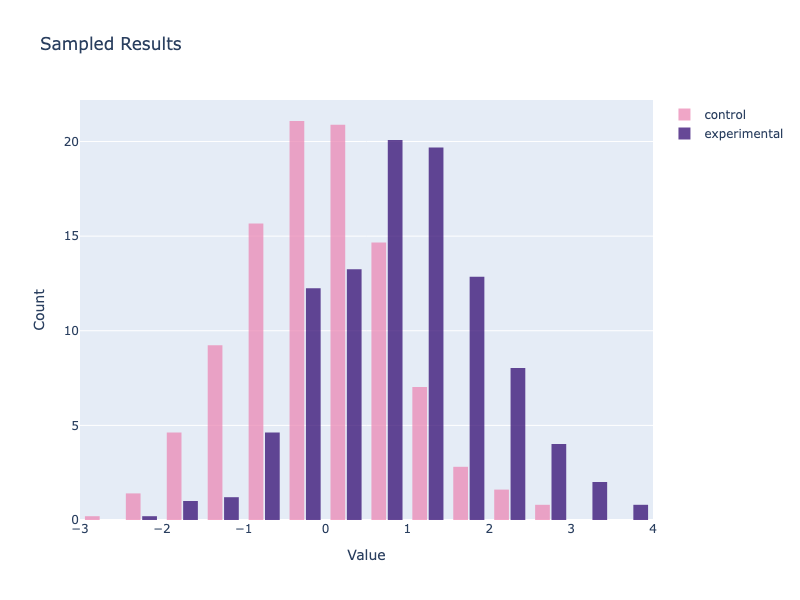

**Interactive Plot:**

<div>                        <script type="text/javascript">window.PlotlyConfig = {MathJaxConfig: 'local'};</script>
        <script charset="utf-8" src="https://cdn.plot.ly/plotly-3.1.0.min.js" integrity="sha256-Ei4740bWZhaUTQuD6q9yQlgVCMPBz6CZWhevDYPv93A=" crossorigin="anonymous"></script>                <div id="plotly-div-20" class="plotly-graph-div" style="height:100%; width:100%;"></div>            <script type="text/javascript">                window.PLOTLYENV=window.PLOTLYENV || {};                                if (document.getElementById("plotly-div-20")) {                    Plotly.newPlot(                        "plotly-div-20",                        [{"histnorm":"percent","marker":{"color":"#EB89B5"},"name":"control","opacity":0.75,"x":{"dtype":"f8","bdata":"8DntYi3xw79LiKh8wgcDQGEH5H4dZug\u002fft3t\u002fPxTpT+7BcqXUE7TP602ew0NOPK\u002f\u002fX7CX6pt5z8+l2\u002f2WLTPP7iQss4qnO0\u002fyQlHCxkz8L8CqnmG53T0vzlck\u002fvbk\u002fa\u002fYscb0OS2zr+i1YkmcbjivxgBcmXexvw\u002fAjmpMeSY2z9YUuDUAjwLQBRYmJjk7Me\u002fbXHgrj431D8CkVSGKZHlv8ztyHfSzvi\u002fbfrQh4Anxb935L17A0TKP6thFCkr6vE\u002flUqbtjbT\u002fr8D8Es2zt7CPwd0nkcUS8G\u002fpZMZ5ip9wj\u002fT7sGjARXzvxW\u002fu6iWm90\u002fkEu2wkG18z\u002fC5qND+GXjv74BspqdaO6\u002fmIu7m9vW3r9Ho1yE+TrqvyUw6fKfKu8\u002f1x6d\u002fPk+4z80xgpoLLjdP6FAswALG\u002fI\u002flX7y0QUuwr90p4OjQBnbP9gDEDYLvu+\u002fWQdsYR0k6b\u002fkQQ0q7qbYP24Y\u002fvCbb\u002fK\u002fIscl573D4r9vuPn4A6\u002fVPwL2EuIV4\u002fA\u002f8lczgmyT+L80qU8CxWTdP4Pqp1ug5vc\u002flU3BGIdU5j\u002fsy0emDV\u002fsv0RFkGL3QMW\u002fJzRWxL8rsD8FuSHU3R\u002fsv2zE9qpexfM\u002flWUiMe0X9L8vgEMIySzRP3CFQvsjDe6\u002f7gOuvyLK8D\u002fXhRMcQ0nvv8eN\u002fEjfxuM\u002fTH9V\u002fR4plb\u002f9Ejh5DI31PzLvV4zYCeu\u002ffirRprwt+j+rGgIP\u002fCDoP8AYTufTmNo\u002fviy9Ic09\u002fL\u002fS9hNfl6\u002f\u002fv8tRFut4Neu\u002flKHLXHCrzr8UAhp4VT7Xv9Cjwb1kdsm\u002fmslfG5wg\u002fr\u002fEuABi5\u002f7jvxKrs+x6ob6\u002f6ejptp0B5r9p41vjjBTCPzLnQDOSDNQ\u002f5QocHFePxL\u002fHnIchU8bwP89B2HQsavI\u002fCqWsIGJO8j8e0wSJCG\u002f7v1GmXHZZ7OA\u002fWNv9gs9z4z\u002fX6g65HVzKP0dVQ7KzNvo\u002fZ3tZaTYM6r9dAJWJDaDmP0N8iScE2fU\u002fLVjahiy+tD\u002fPfLXY8E+eP3QWHeVJvvy\u002fKi4DMApo5L+mpEpgKrTNP8MSl7PzLtI\u002f53GmT9k88b\u002fXFkBy9mvwv0XHN9UbqM6\u002f0jObL86B4z9n\u002fZdjoO7rP8JSBDGQLKS\u002f6dfJMm+f9j9mLgNoLxTYv053YsVoidS\u002f7tl\u002fyvFQ1z9ZbGNwETDnv9exHJuoI7G\u002fc3xGy2v0\u002fb9DBG2eRpawP+4ProRxmPA\u002fQVUNKwRE6b8Rgm9GR9XdP5QWYtBlge4\u002fhI2Sg6XXw79ptGSfZxXgP2vQOsoRrfa\u002fC7yScvFv4b9x\u002fYLapX\u002f7P6cyP3ab2eu\u002fsIbcSBappb8xJC5D8B34v7gKbS8LKeg\u002f8GA5Ef\u002fZvb\u002fMJR5HjOLHP1XPb+iCteo\u002f0VQkSCtR8D\u002f2joLQ5iHRv8owG2ALMNa\u002fXNuSMq7c4j9JvGrg1hbkv4Ix+oMzu90\u002fAyFXnWrOB0CvUxm6kLbhP9VVqHHhw9Y\u002fWtDxFtuYx7\u002f7ykLHH4Lkv++ocrv7n+4\u002f9z4plEIm3L+azbVRWw7IP2TvxQmJ4Pg\u002fYi3yRUHu2b+fZLA\u002fWj+pP7xCWuaSJfW\u002fm4uSL49M6z+Rc+SDIU\u002fuP\u002fNFVXs\u002fZLy\u002faeL10Rax0L\u002f5JSGNdZLJv+gvBvG9nfg\u002fMUhSX3CT8D9cP02WcaHHP4Zt0xxjl+o\u002fWEUfKB54+b9UhXMoG7AEQKVqBVM+MPk\u002fGLkBkSJ9BEAlrwerqYLzP3ygwwaFz\u002fU\u002fBRF9TBu7nj\u002f3l4pQ8tX0v3xWmuSi6cG\u002fkJgOul389L\u002fH34\u002fAYljav9ibh6kcmd4\u002fAdgeRibC1T\u002fHRgkoMFX3vxyORghoyfS\u002fPIGOhMy+77804x70qmOtvzByPN3Dm7g\u002fKUy9IBrA87\u002fLRwDtbbDXv8WhjwaEEu0\u002fYKhsl0RD57\u002fART08Vg7eP4ctC5vloO6\u002fd+YIuo1U7j\u002fFsEjVz2Huv1krDmqWUcU\u002f0ShJ8Kcc3b+hB9tjEevEP1o6HQpved2\u002fVUIMiEuS9D9zGoW3nTjqvyBx7m9NyfY\u002fDt9ikgjfAMApHvHnP1zjv2uTlO9fBuu\u002fRnp0y+Hx478DE0XaZJOTvzhmZuaOCMq\u002f7qoDY2p\u002f8j8dT2Pc2s3Yv\u002fxlMGpA7NW\u002fXodUfKQ1qr9h2U5mcjXxv2x42hUes6I\u002fG6dJhYe98D\u002fIvCskpb2jP56iFZCQ+\u002fS\u002fCUFfsEpJ4T8aHwA04NS0v9BtHtJILO8\u002fAylntFHK\u002fb8s+VRYjJ7RP7wDAnkjrwXAN4Gc\u002fOEJ0L\u002fgBJZ7JcXhP4NNYpVM1u2\u002f3PS8hJFm7j9o8o2p6dfrP0mBWdDygeY\u002fXz7RXDSn7r9jXoSPcC7FP+ViHBBaYcg\u002fikHVjTrK4T\u002frtrq318\u002fiP8g7Fafap+q\u002fMHGAmC5F5z9PkqSpMWjpv2nVtnAOWwJACmGovNpS4D9JiGEc9I7nP8aecl2+2ta\u002fQBcsTSkuAcCKpKZ2IZDsP\u002fY\u002fkpv91PS\u002fzKymU2zOzT+zazydqwDUv+fJbLZcl84\u002fCRVaHw077j++VzQt7bm9v0zaFv89+f8\u002fY7EZycwF+T9kXtOKpFTOvxAc8U+cT8U\u002fTrDvjZVA9D\u002fShvnlLOrSv7tJL87zbOE\u002fEi+mqRAw3T9aNq002YH1P10ND3b26c+\u002fIEKPOmx70L+hhYfa84LSv5kXE0dvG96\u002fxsAya3T34r+4M0\u002fZbfXfvzw3NlHSbcm\u002f3aS\u002fXzvd978T9WrlKqzovx9SxKTlot2\u002f9ARJCsSF679zWRfEu5MAQICSLV0CaIK\u002fGOhqyQorvr\u002fzoxXsGtf9vwks7+ZNytU\u002fBpjS1ssewz+i7lBLZLnRv77JfpZY3+u\u002faJuA\u002f+ls1z8Q617AhAfgP3UcoFJptPO\u002fdSWSIg++5b8j\u002fy0Z702KvygyTKqKjNY\u002f5USTrhjy4r\u002fBUMSq7kP6vyLSNd5yatc\u002fe7G+0BgP3r8zm9rcC5XjPy+E025S4cm\u002fh4tB8ary87\u002f486ULhVvMP7FM9Aredfo\u002fUF6FjjO29L8VOjKzlHKnvzTtrDENENk\u002fdd+AM7ncyz\u002fpOtsq5gXaP4OmyX0\u002f4M0\u002fkWhdJwaX8r+fDnaQ4bjmP7ar59wLcqg\u002fzoXLRXXL2D9hyaw0mUn+PxJP2IuqEPC\u002fL6WuP8vo9r8ITy9FRlmaP7BObjcrztG\u002fvPAr6tRN5r+vYOtqD04CwBCYbi8c8te\u002fC1tSWQX85z8g6E6bXkzVv2HMmMV5Rua\u002f+P\u002fWFP+B4j\u002fhT+P9HtTYP5NtkMoryPo\u002f1dvDAciU1r8Yw78ru17hv1dFpprXSOG\u002fU2fip\u002fn09r8CQghzaS\u002f0v7vtWsZFi90\u002fTPmet65g\u002fb9U98Bs5Wfwv+lH0MU6weQ\u002f6JNsZ\u002fww4r+NkBs1RDPsv\u002fWhFSp9I7a\u002fyW0U3Iaw1L\u002fPLLhPUlf2P0DjcOwRN+2\u002fCkY5arx79L\u002f9Y2LzGxHuv3F88BYttwDA+YfhzeaR8j81I961AS7evwgBCJJkIuU\u002fK5GRGBj09r\u002fYhCGeS9KzvzEoN9aWR8C\u002fJ0J54+Hr7L+QntylZCb+v4pyUFjrday\u002fmDnX\u002fA2V6z9LTiZdgaTev6q9ySASOuW\u002fv1puOAgesj833xuDyhj+v0dPcrcMy7c\u002fpW3ACgfs3z\u002fslK0fqbTtv5rDSpJtt9u\u002fgyCCbtot9L8sKLJVImrqPzSW30paaeM\u002fIH0LSjLh778cAgNBxIbRP9zg1gmm2em\u002fSLOLLodqn78idMX0DR\u002fyP8r1CsBX5ds\u002fIeyCWfJIrD+vFORExEL4Pz50V8nubvi\u002f3kO19bgG6D\u002fCrlq+mTLFP8STu0srxeM\u002f7W3yvOw+4r\u002fS1Z9yLTq+vwXho8wQEsG\u002fEmDNQNMU7r+pb8Te6Evlvy8mm+BpzeW\u002fkO4xGXA13D\u002fg9ZRSjY\u002fZv5HbHnW+rwJAbAQjFNJq\u002fb\u002fMKBJEcFXrv6DiAz9TyMU\u002f2i6p+h4l57\u002fB4BYHevHbvzUjgXvsMdm\u002f8P4cjIYG2b9\u002fS4prv0zyv64CZkK\u002fWd2\u002fbRNcIB1TAEDrJ2S57nr4v0ZkcS0BnNM\u002fLjapYBeq8j\u002fnzBDHrUaivx\u002fSzKsK4ek\u002fkCpQ53WZ778uasayF4MAQEdG89YWHNA\u002fo2iYl2SV3z9qHYOHk6\u002fxPxcZMyV+LdU\u002f9ovReY33xD+hUaROhVLrP6UJLK+f8+O\u002f54uggvF58b\u002fTLLbykPyRv4kUR0Lbsuo\u002fR8YMNp5onr\u002fOALfbuHfzPxWBa9h1R7w\u002fN6RMyEwP4r+MdDfGlH\u002f3P2qfrxfxpvQ\u002fHGsYQvhp1L9LDzwya\u002f7jv5hd\u002fbfeGOA\u002fmKHHFcpOv78zZfVmw1Lqv4c9tAzVlcM\u002fFUUcEjX7079IcTwdFEb1Py8dRqEWU\u002fG\u002fM2YLKUu\u002f5D\u002fXjauh9GHcPz+AdSGfQZM\u002fX\u002fJdONLz3r9XVAwLNwHiPziB4tjAIgFAFuGtpuJR+L+N06scs0\u002fnP886MPVEq74\u002f\u002fdx5okVf6T+HrMoBYt\u002fzv3sMWLMb59a\u002fE21byejF0D8EwbZzg\u002fYDwNJRZaIiCug\u002f+Sl+9qXx579JFFChwylwP9oIa5hvOO2\u002fzayMAvDv6r+Va5aP2ObXv70eOpDs68E\u002fmszSL4c7s7\u002fX1T1Dv0zSPz6XcnbC0tg\u002f8jK4rmnB5z8vLvhpjNnBP\u002fYY\u002fP5WJOy\u002fS6Wa57vg\u002fL+Phkr0zCPkP9ANR4Pi3tE\u002fC63jXhO82b\u002fKDKLdTObPPzL23BRW9\u002fC\u002fqJ\u002fICWAgB0CaXAwhAtMDQIP57iS7IeC\u002ffN\u002fR9S9rxL9WN02zBRHZP8eXxXtKQcK\u002fQPx4947OuL9lAeQ4PavjP8f7Owr5wtg\u002fjoWF8a4B+j8ox9crsbPLP3WaYP2CQdg\u002fEJ0J4BC\u002f479OIai5WxDDv1rEe7KbmeK\u002f4fd3Oo947z9zPH1tpfIIQLvdSitr2du\u002f74cLUjrD8r\u002fnSIvN9r6tPzxQiXzspvW\u002fVq0LI2319b9BZUwAmWrLv2tEh2vz9OM\u002f36Ep4kJ\u002f1j+dMTwL6MvSv2PnifXcYfU\u002fdYXikgungL+ThrGXTmrcv+9+J8yhhdM\u002feU0IF6qyAMCQgvtDSOrJP0CnVzNzi\u002fA\u002fyMlixQZs5T\u002fLRpZHPanjv2I5AWATdfq\u002fE1ILQx2y0z8FQROlbYbcP30v9Q\u002fP2+8\u002f8vC2L8ub7r\u002fsyHbqW26tP6\u002f1rO3ge9u\u002fWIEYCLZt4T9AIg3CbMTuP5pUz3ydcQDApsvx8Q5K87+5ASuZlrrVv4myfSgLQt8\u002fLY\u002fDNPOu8L8inj5wFdjTvyYXF24fYO+\u002fCTdI7WSt4D\u002fCKGyruPfpv+Owuhi5ZfG\u002fJ8lZ91GP5D\u002fzfHtZhDnoPx2B9WoGAeI\u002fDSvCLwcJ6L+ZGEyUcv33v3ojhlpdAPC\u002fD0ElSIW\u002f0D+9aj02Xxb2vw=="},"xbins":{"end":3.0,"size":0.5,"start":-4.0},"type":"histogram"},{"histnorm":"percent","marker":{"color":"#330C73"},"name":"experimental","opacity":0.75,"x":{"dtype":"f8","bdata":"SBNcVqS4\u002fj9wStBlIkrwP37MEHiUzgNAd8ZoDZ\u002f49T+cnYf\u002fiFwCQA6SbjJ4PvU\u002f7gd9XzJl7T+jtIhIdCbyP6SAzhGf6AVADNS5WaPe9D8PrVvAmZ\u002fyP8BV4y8arbk\u002fAgK2Jjw02j+Y3V6rOx3Jv2\u002fQm94cyQRApBeRt1F65D88CAwI0FXZv95epw47ZdU\u002fy6b1g890\u002fj9AqrV9PufLPy8rbpRGzeY\u002fYGmkUxOz9D\u002fHtH5wOjjxP7jsL8zzSvc\u002fOrrcwkVF87+OLb55i0HpPyhQI3\u002fwG8G\u002f9gkJm0+ABECW0afMAhIIQICmHmzzv8O\u002f6LEYMbNE1L\u002fwc5o6twHsv\u002fS33M3wtPK\u002fJvvzL511\u002fz9E7e3aT0bnP60wQQRYkgJAiwztSXqz9j+0kQEW1yPxP9A3jneS18m\u002faLBcxEtA+r\u002fAPMSXfAytv4AfniVgGIk\u002f1AkELx4u9D8kTj5nWtPpP8aLh1HK8wRAOO95upbWw7+cI+KettTzP+ZGt4rbPuw\u002fAEwKEAsD2T9yUQr6eRn5PyQYyN671PU\u002fj7feOE5u8T9Q4SrI0Ym9P0D0iMu5E9i\u002fEAsqAmrV+D+QnfX5V\u002fDGv5B1cWTHQOY\u002fJNUIj90X\u002fD9YuL1Qr\u002frkP5RYEH+UTMM\u002f3KtipGooA0ACopmEuwr8P8Qp58pjb9I\u002fEGuWxgrd8j+o0If8Bbj9PyCRL5KMf\u002fI\u002fu4ehLyiG\u002fT+u9BXSEKHovwV3Nd06pvA\u002fmCMqqsXHwr\u002figY\u002fSJhzqP2UwiwFrnO8\u002fhlQHTMHW0D8NyysIYtzhP7DrNYFEP9S\u002fWBQGoq7owz+H+tC8pF8EQOKy1XPAvOo\u002fYgL6i6FH2z8bkifJcxHyP52YCe2wSfI\u002fb+Okzc6jAEA4ARDCozPxP7RuRpMRJee\u002fC\u002fbjOfV4\u002fT+QmffbBCe3v1LxCuwiiQJANbVuY2Ge9z+Iv432IO7bPzeoGbFehO8\u002fnMzGNyXI1z8kbGRGngj6P5tS7dpltfM\u002frH0+lPyx4L+Y5jwBuED2PxBHFc1W0ec\u002fCR9KxMFz8z+mZ\u002fvrLM71P4ztQa+UCv0\u002f7OXJm0BE8r87vSht1pHzPwBTyBKS87K\u002fEd4FbC16BkB5bkPtNx0FQMb\u002fYwTJCfE\u002fk0iixkMu\u002fT8\u002fiM6DKGn0PxwkHH+xh+K\u002f5gBpNpaC+D8pq6EOopv8P0rHPX+81PE\u002fNOji708nxj84GfvY4l7\u002fPzgWYJu0MRFA8MPY70u3sb+HbAAGkYfxP5jvPCiOT74\u002fAAT2ZCvykj9gSc7mXNLJv36AjL49Ceo\u002fgi4nBf134r\u002fDiVn2VCUJQNfjW4xii+g\u002fhMo36H8Q9T8OD2M2MnbvPxDPFURj4NG\u002fii2hKjmS+L+KKVx+0jD3P5+D29Fye\u002fM\u002fYCyF4cZo4r\u002fi7uuj5RTkP7rC7fMf7\u002fk\u002fUMP34Lfc6z8Qih9qSaz7P4IrThbRkAFAYFyIDfiEu79Hdet+nP7zPxxSX4zz2tq\u002fGLsWqIQUDUC2Vx0ZkLnqP3cDnydd+fc\u002fUlnSnLCE\u002fj8+0bRkAbfkP6VJZFpgx\u002fk\u002fKJK82NHB0D\u002f2VKAo9B\u002faP5DIxZ8ysbS\u002fXAGoHqm44j9QNZ76Y9fOPzhnmegUJ9s\u002fKuBXBgbe3T\u002fyLhL86KLXP8wyJncklvE\u002f8PE9faC4tz\u002fR9v5MzGThP2rEAZ5FAQBAU7usMKYm9D\u002fA4T+S60\u002f5PwPGk\u002fSj+f4\u002fzxPtRNAf\u002fD+QYva60VG8v2iGfZZans+\u002fGBCQlnGDtz9Vd1+6RILtP87zHydvzto\u002fmitpWpc26T9gBjRr9EQBQHw\u002fuJ7UFNG\u002fa6J3X20e8z\u002fYcbSHo1vjPwA9ZPKAcNS\u002fEFOZ5Kr9+D\u002fhoqwpSc\u002fuP2DDdOAv9eG\u002fS7ql5CL18j9ErNNLWvb5P5KSCZCbE\u002fE\u002fCK3KJl+z1b+G3YZxmiIAQB2Z3zLE\u002fOc\u002f\u002fqt5JmO96T\u002fC5v692TrnPyq6kDSnzvQ\u002fWjHegg+KAkC2ZW7ncBXhP5L8RNphgwFA4hMohvsD5T8aCzTPa5DhvxboAePBI\u002f8\u002fSAiIPkTR1r9s5B0ERfTzP4VrAqmhmfk\u002f82nugkK+5T8fdT76TZ8FQBJYUsG3fgFA9O4i0g6J\u002fj+lVemdsdvzP3aO60wJIuc\u002fvrB6EACI8T9IgECPiXzyPwASWo7nQqu\u002f+MxEtmpe9D\u002fVH8jcfyD1P13q85bsmf0\u002fJfLbbl3V9z+cMZLTRkwKQFBXbiSdX8w\u002fwvJtAPTO4b\u002fo+jGFvl31P8T8TDUfifg\u002fupmAWezb5T9sGKMAeb\u002fpPxYxgDWiUwNA7b2W\u002foay+T\u002fAR1WpetnuP1aynJ7Qmv4\u002f+O28uvU23T+euJqY\u002fcPnP9SBo0YzGNK\u002fCeDoTJRk4j8kdk+\u002fgwbkv6i6b9iHtO8\u002fCA4IrhmT9j+gDRYXP4jPv4K8OUBquPW\u002fhni5DXOm4z\u002flPuoMbsH5PzQUvF7xduw\u002fFJZ8UFSZ0L86kIfRbYT3P5BGXFR7Wbc\u002fgFp\u002fv9nGrb+cWSK5e1XxP3CqvjGj0QZAsPxnmVQ09j8cDZEB7ofYv7Y3ZY6dTvA\u002fD3dTghUQ8j943EJjWeLMvyipMHk5F\u002f0\u002f6O91aN1jvj9gDXWHuOm2v3hr4+YUHQFAl+HuEVWY6D9Umf0GVQsEQEDC2L+X8rm\u002fKKwGbnc9+D9Smc4qqtP0PzEdNWuEbQhAJPxSG3RW7b+CObcQshHgP95ZZSdzYg1AxA0RgsXo2D8kbUpKp1THP5qe05BiJuE\u002fJKCD3hkx1D\u002fe4+FPyj30P269fCfxuO0\u002fOEVkC4H79T+gCKN0gazAv7q+NVpLVglAqM6EOWEO07\u002fCLgGe3KrrP2\u002fu\u002fwCN2+U\u002fRRtnAlR57T\u002fgj5wGBtO9P5qLUM41f+c\u002fFMVAWjzC\u002fz86vzLR+1Pmv\u002fSmUldzC\u002fE\u002foOQU6dyRsr8SiLCCLRkJQGzHr0SPmBBA6Ixtme8o5z9gIiYIZvSuv5kRztXzUAtAdE26dmE24z\u002fkgLH+WYMCQBLisGiI1fy\u002fsv+Zp3Ja77\u002fCrjv8SsnoP8TLCJdWzdG\u002fU4T3rlCP9j9g8NxVVnPKP+x+EwBQagNArKNiUjyK3b+mS9N5Wd3\u002fPzNczX8PGgJAcmKo6z1G+z+KjtGcHorUPybOqXM5ruU\u002fcGF6oAi6wr9rMBZK7xsBQMiOyWwh9Pw\u002ffWmJXyPT6j9iCinFJ079P7ZExP9nWOo\u002fMlu9dM2ZC0BbIQ88PYLuP\u002fS4yUlBUeI\u002fci75YdHZAEDdOMf57noBQOy4kdZ24Po\u002fowjFg4gY5D+3EBD7Z5v4P6KWqIWCmfY\u002fk+YyooSw6j+kTUVD9oTtvwj3blz2K8a\u002fZnLcKPQ83j\u002fe52s6eUj3P1lVPCACZ\u002fM\u002fQeE5Wc1F6T8\u002flZxfYwbmP956XqYTUv8\u002fkOvFt7T9zL8sBvsiAucCQMi7nvwyxNo\u002fF\u002fYmGpck7T8IgqZbU+a3P5D09COC7\u002fE\u002fWjo\u002fn5HX6784+2BeHc\u002fqP0ABICb4G7i\u002fiiAXS89I8r\u002fbQyGyO5vzP2Ky+vjAAAZAZJ\u002fobnok9z+4sr7MAf\u002fJvzat63S37QJAM\u002faWkoDg7z8wMCZz8\u002fzsP85GH5AmgwRAvMbksi1xAUDcU5HgXQQFQMF6U0oRF\u002f8\u002fGlM0TLtq+z8GrTG2H8H3P9UJDQrOBeE\u002flZu34Zg08T90mfer+bfrP8jJKshlMPs\u002fVQT+h8w9CkD4uuJ1E8\u002fXP+hIUAA9Zvc\u002f8BuTl4Lr5z9IfSvswV3AP55PDMkLA\u002fY\u002fBNC6b\u002fgJ0L\u002fkzbEE\u002frHcPwTL+wj+E9q\u002f\u002fIZ\u002f7kpP5z\u002fWHro0BLPmP9pccClxV9Y\u002ftXGxP+kBDECKo8PadsXuP3SIUHDZqNw\u002fwMT7iPMNv7\u002fi1T4olyTkv2e0NJogNOY\u002fQIlWD5gDzb\u002f851\u002fJzajFP1DMqf0wGba\u002fXjDZuyvIBECaUAf+xMHlvyeBqVCLXug\u002fvI1qbqeU6L8aO4W+GzsFQGiaLx1nZ9y\u002fbrMV\u002flYw6T\u002fsUfXipOD6v05VQJ8AWfY\u002ftAuJo+uGAUBaBiOdJ2oPQABvdbQqYqw\u002fVNCjYC9hAkBd1IIJv03xPwpbIf+bUO4\u002fADsYATKwAUATxZ1Tv\u002fniPy02R3SZS\u002fU\u002f298WzMVD\u002fT+OyFVnD3v1P\u002fHsRFYIsPM\u002f\u002fMprdSKS+79KqTlQUFDuPyDt8Q7o2\u002fg\u002foKDICrjnBEDGDtITzCXZP8Rq3BNZYdc\u002fVj9vrVNs8z8cN7lvRSH0PxCqbiAuvey\u002fkoKxWSEn5j+AC1V\u002frc3mv01UPBgjQ\u002fg\u002fwEXls12gwT+KOB0ZcSrjP4hclj\u002frA88\u002fmIIVXEaJxb\u002fPlG1P6cnwPyixkHli\u002fdC\u002f1e+bikLt8D\u002fHxRWdMZ70P7pKEgJP9QFAfsDTaliRAUAAltpDjtXZP0okbycFgdI\u002fLMRtud5bAsDy\u002f1NpFHTxPzrEsIBYdwFAwPeWIiWqqz9YJDUczJb4Pz0gPZJ\u002fReY\u002f0PqsIsgaAED+8cTunvXrP0TBBSBudwBAsPl9D3nP0r+Eor3TN1bVv3ZxGiN7Ivo\u002fzkC7F2yI+D\u002fCCmZ5Lz7eP2aYowLTAQJAN2mmMijz9z9fb2\u002f11sT2PwpZMQ4YDfk\u002fdMBfAyR60z9Uyyrqf\u002ffRv9RkN6D+X+k\u002fIrl24pTd479VWcfcq8YBQBgOcmF8cvG\u002fwmDZcb7CCED4bEJ8LzX2P1KwS+f+7gdAIvTZuiXg7j+gSWEeeO2gv0xkq0ArrtQ\u002ffvLzr0378T9WpSPL+QH+Pz4uuexH8f8\u002fFmEhdyle+T8QuzwWeqfnP38X9Jt+FgJAKpPy2LBqAkB4PlLytnL1P2Mj2t9MFPc\u002fcWxhlVaU7D\u002feHjeK05YGQNSIjB7O5PI\u002fkqpApC5x1j9ugDQe7fEAQKJkQween+Q\u002fYQMSwsHg+D92z1Z00lTyP1A\u002fsxCUg+g\u002fNGPL8mhM378A1rC7amTHv6wNy9ZSmuk\u002fqC21dLuC5b8pe6riovXvPyqYgWyvVvg\u002fpvMTnnrT0D82leWNydvVPxK3eV69aPM\u002f7PZB2pW99z9nBMlyO3H7P+h1JRbgLQVAZD+nrd5n4D8NgiLS\u002fQnyP2AtmvveVNY\u002fdEvpQHLe6D\u002f4TIIZp5QBQAC1eklvoII\u002fArPSCxMc0z9UZhoeWQfoP8m\u002fkKpAfvQ\u002fwcHcD5wT8j+Aj35dnPbaP4gN0cCjMANAYordwOu++T8UvoeHB8X3PwmxEAH1k+o\u002fqJGcxyBz4z\u002fkGnFiyIbAP3ZKg5RwF\u002f4\u002fEjw+AQkC6j+DNjNcmsX0P4WjdfXeCuE\u002f8b02TP+gAkDSPJwxqDvlP7oAFoiV2\u002fk\u002frG1tFqZL5z8Oefbwoa\u002fwP97a+V1GRf4\u002fyS0\u002fKwHMB0Dcv0a3\u002fvrEP6iK+liexro\u002fhPnWL\u002fC+0b\u002fmuZx7tcb+Pw=="},"xbins":{"end":4,"size":0.5,"start":-3.0},"type":"histogram"}],                        {"template":{"data":{"histogram2dcontour":[{"type":"histogram2dcontour","colorbar":{"outlinewidth":0,"ticks":""},"colorscale":[[0.0,"#0d0887"],[0.1111111111111111,"#46039f"],[0.2222222222222222,"#7201a8"],[0.3333333333333333,"#9c179e"],[0.4444444444444444,"#bd3786"],[0.5555555555555556,"#d8576b"],[0.6666666666666666,"#ed7953"],[0.7777777777777778,"#fb9f3a"],[0.8888888888888888,"#fdca26"],[1.0,"#f0f921"]]}],"choropleth":[{"type":"choropleth","colorbar":{"outlinewidth":0,"ticks":""}}],"histogram2d":[{"type":"histogram2d","colorbar":{"outlinewidth":0,"ticks":""},"colorscale":[[0.0,"#0d0887"],[0.1111111111111111,"#46039f"],[0.2222222222222222,"#7201a8"],[0.3333333333333333,"#9c179e"],[0.4444444444444444,"#bd3786"],[0.5555555555555556,"#d8576b"],[0.6666666666666666,"#ed7953"],[0.7777777777777778,"#fb9f3a"],[0.8888888888888888,"#fdca26"],[1.0,"#f0f921"]]}],"heatmap":[{"type":"heatmap","colorbar":{"outlinewidth":0,"ticks":""},"colorscale":[[0.0,"#0d0887"],[0.1111111111111111,"#46039f"],[0.2222222222222222,"#7201a8"],[0.3333333333333333,"#9c179e"],[0.4444444444444444,"#bd3786"],[0.5555555555555556,"#d8576b"],[0.6666666666666666,"#ed7953"],[0.7777777777777778,"#fb9f3a"],[0.8888888888888888,"#fdca26"],[1.0,"#f0f921"]]}],"contourcarpet":[{"type":"contourcarpet","colorbar":{"outlinewidth":0,"ticks":""}}],"contour":[{"type":"contour","colorbar":{"outlinewidth":0,"ticks":""},"colorscale":[[0.0,"#0d0887"],[0.1111111111111111,"#46039f"],[0.2222222222222222,"#7201a8"],[0.3333333333333333,"#9c179e"],[0.4444444444444444,"#bd3786"],[0.5555555555555556,"#d8576b"],[0.6666666666666666,"#ed7953"],[0.7777777777777778,"#fb9f3a"],[0.8888888888888888,"#fdca26"],[1.0,"#f0f921"]]}],"surface":[{"type":"surface","colorbar":{"outlinewidth":0,"ticks":""},"colorscale":[[0.0,"#0d0887"],[0.1111111111111111,"#46039f"],[0.2222222222222222,"#7201a8"],[0.3333333333333333,"#9c179e"],[0.4444444444444444,"#bd3786"],[0.5555555555555556,"#d8576b"],[0.6666666666666666,"#ed7953"],[0.7777777777777778,"#fb9f3a"],[0.8888888888888888,"#fdca26"],[1.0,"#f0f921"]]}],"mesh3d":[{"type":"mesh3d","colorbar":{"outlinewidth":0,"ticks":""}}],"scatter":[{"fillpattern":{"fillmode":"overlay","size":10,"solidity":0.2},"type":"scatter"}],"parcoords":[{"type":"parcoords","line":{"colorbar":{"outlinewidth":0,"ticks":""}}}],"scatterpolargl":[{"type":"scatterpolargl","marker":{"colorbar":{"outlinewidth":0,"ticks":""}}}],"bar":[{"error_x":{"color":"#2a3f5f"},"error_y":{"color":"#2a3f5f"},"marker":{"line":{"color":"#E5ECF6","width":0.5},"pattern":{"fillmode":"overlay","size":10,"solidity":0.2}},"type":"bar"}],"scattergeo":[{"type":"scattergeo","marker":{"colorbar":{"outlinewidth":0,"ticks":""}}}],"scatterpolar":[{"type":"scatterpolar","marker":{"colorbar":{"outlinewidth":0,"ticks":""}}}],"histogram":[{"marker":{"pattern":{"fillmode":"overlay","size":10,"solidity":0.2}},"type":"histogram"}],"scattergl":[{"type":"scattergl","marker":{"colorbar":{"outlinewidth":0,"ticks":""}}}],"scatter3d":[{"type":"scatter3d","line":{"colorbar":{"outlinewidth":0,"ticks":""}},"marker":{"colorbar":{"outlinewidth":0,"ticks":""}}}],"scattermap":[{"type":"scattermap","marker":{"colorbar":{"outlinewidth":0,"ticks":""}}}],"scattermapbox":[{"type":"scattermapbox","marker":{"colorbar":{"outlinewidth":0,"ticks":""}}}],"scatterternary":[{"type":"scatterternary","marker":{"colorbar":{"outlinewidth":0,"ticks":""}}}],"scattercarpet":[{"type":"scattercarpet","marker":{"colorbar":{"outlinewidth":0,"ticks":""}}}],"carpet":[{"aaxis":{"endlinecolor":"#2a3f5f","gridcolor":"white","linecolor":"white","minorgridcolor":"white","startlinecolor":"#2a3f5f"},"baxis":{"endlinecolor":"#2a3f5f","gridcolor":"white","linecolor":"white","minorgridcolor":"white","startlinecolor":"#2a3f5f"},"type":"carpet"}],"table":[{"cells":{"fill":{"color":"#EBF0F8"},"line":{"color":"white"}},"header":{"fill":{"color":"#C8D4E3"},"line":{"color":"white"}},"type":"table"}],"barpolar":[{"marker":{"line":{"color":"#E5ECF6","width":0.5},"pattern":{"fillmode":"overlay","size":10,"solidity":0.2}},"type":"barpolar"}],"pie":[{"automargin":true,"type":"pie"}]},"layout":{"autotypenumbers":"strict","colorway":["#636efa","#EF553B","#00cc96","#ab63fa","#FFA15A","#19d3f3","#FF6692","#B6E880","#FF97FF","#FECB52"],"font":{"color":"#2a3f5f"},"hovermode":"closest","hoverlabel":{"align":"left"},"paper_bgcolor":"white","plot_bgcolor":"#E5ECF6","polar":{"bgcolor":"#E5ECF6","angularaxis":{"gridcolor":"white","linecolor":"white","ticks":""},"radialaxis":{"gridcolor":"white","linecolor":"white","ticks":""}},"ternary":{"bgcolor":"#E5ECF6","aaxis":{"gridcolor":"white","linecolor":"white","ticks":""},"baxis":{"gridcolor":"white","linecolor":"white","ticks":""},"caxis":{"gridcolor":"white","linecolor":"white","ticks":""}},"coloraxis":{"colorbar":{"outlinewidth":0,"ticks":""}},"colorscale":{"sequential":[[0.0,"#0d0887"],[0.1111111111111111,"#46039f"],[0.2222222222222222,"#7201a8"],[0.3333333333333333,"#9c179e"],[0.4444444444444444,"#bd3786"],[0.5555555555555556,"#d8576b"],[0.6666666666666666,"#ed7953"],[0.7777777777777778,"#fb9f3a"],[0.8888888888888888,"#fdca26"],[1.0,"#f0f921"]],"sequentialminus":[[0.0,"#0d0887"],[0.1111111111111111,"#46039f"],[0.2222222222222222,"#7201a8"],[0.3333333333333333,"#9c179e"],[0.4444444444444444,"#bd3786"],[0.5555555555555556,"#d8576b"],[0.6666666666666666,"#ed7953"],[0.7777777777777778,"#fb9f3a"],[0.8888888888888888,"#fdca26"],[1.0,"#f0f921"]],"diverging":[[0,"#8e0152"],[0.1,"#c51b7d"],[0.2,"#de77ae"],[0.3,"#f1b6da"],[0.4,"#fde0ef"],[0.5,"#f7f7f7"],[0.6,"#e6f5d0"],[0.7,"#b8e186"],[0.8,"#7fbc41"],[0.9,"#4d9221"],[1,"#276419"]]},"xaxis":{"gridcolor":"white","linecolor":"white","ticks":"","title":{"standoff":15},"zerolinecolor":"white","automargin":true,"zerolinewidth":2},"yaxis":{"gridcolor":"white","linecolor":"white","ticks":"","title":{"standoff":15},"zerolinecolor":"white","automargin":true,"zerolinewidth":2},"scene":{"xaxis":{"backgroundcolor":"#E5ECF6","gridcolor":"white","linecolor":"white","showbackground":true,"ticks":"","zerolinecolor":"white","gridwidth":2},"yaxis":{"backgroundcolor":"#E5ECF6","gridcolor":"white","linecolor":"white","showbackground":true,"ticks":"","zerolinecolor":"white","gridwidth":2},"zaxis":{"backgroundcolor":"#E5ECF6","gridcolor":"white","linecolor":"white","showbackground":true,"ticks":"","zerolinecolor":"white","gridwidth":2}},"shapedefaults":{"line":{"color":"#2a3f5f"}},"annotationdefaults":{"arrowcolor":"#2a3f5f","arrowhead":0,"arrowwidth":1},"geo":{"bgcolor":"white","landcolor":"#E5ECF6","subunitcolor":"white","showland":true,"showlakes":true,"lakecolor":"white"},"title":{"x":0.05},"mapbox":{"style":"light"}}},"title":{"text":"Sampled Results"},"xaxis":{"title":{"text":"Value"}},"yaxis":{"title":{"text":"Count"}},"bargap":0.2,"bargroupgap":0.1},                        {"responsive": true}                    )                };            </script>        </div>

### Histogram Bar Text

You can add text to histogram bars using the `texttemplate` argument. In this example we add the x-axis values as text following the format `%{variable}`. We also adjust the size of the text using `textfont_size`.

```python
import plotly.graph_objects as go

numbers = ["5", "10", "3", "10", "5", "8", "5", "5"]

fig = go.Figure()
fig.add_trace(go.Histogram(x=numbers, name="count", texttemplate="%{x}", textfont_size=20))

fig.show()
```

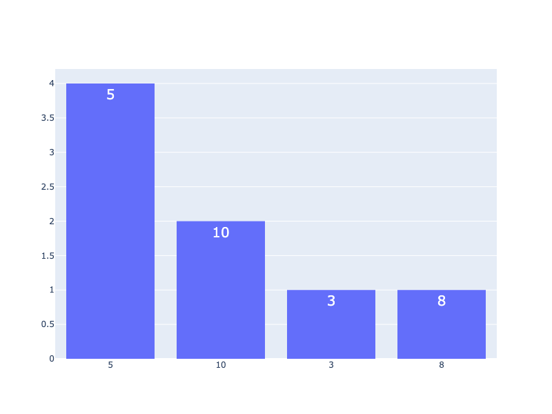

**Interactive Plot:**

<div>                        <script type="text/javascript">window.PlotlyConfig = {MathJaxConfig: 'local'};</script>
        <script charset="utf-8" src="https://cdn.plot.ly/plotly-3.1.0.min.js" integrity="sha256-Ei4740bWZhaUTQuD6q9yQlgVCMPBz6CZWhevDYPv93A=" crossorigin="anonymous"></script>                <div id="plotly-div-21" class="plotly-graph-div" style="height:100%; width:100%;"></div>            <script type="text/javascript">                window.PLOTLYENV=window.PLOTLYENV || {};                                if (document.getElementById("plotly-div-21")) {                    Plotly.newPlot(                        "plotly-div-21",                        [{"name":"count","textfont":{"size":20},"texttemplate":"%{x}","x":["5","10","3","10","5","8","5","5"],"type":"histogram"}],                        {"template":{"data":{"histogram2dcontour":[{"type":"histogram2dcontour","colorbar":{"outlinewidth":0,"ticks":""},"colorscale":[[0.0,"#0d0887"],[0.1111111111111111,"#46039f"],[0.2222222222222222,"#7201a8"],[0.3333333333333333,"#9c179e"],[0.4444444444444444,"#bd3786"],[0.5555555555555556,"#d8576b"],[0.6666666666666666,"#ed7953"],[0.7777777777777778,"#fb9f3a"],[0.8888888888888888,"#fdca26"],[1.0,"#f0f921"]]}],"choropleth":[{"type":"choropleth","colorbar":{"outlinewidth":0,"ticks":""}}],"histogram2d":[{"type":"histogram2d","colorbar":{"outlinewidth":0,"ticks":""},"colorscale":[[0.0,"#0d0887"],[0.1111111111111111,"#46039f"],[0.2222222222222222,"#7201a8"],[0.3333333333333333,"#9c179e"],[0.4444444444444444,"#bd3786"],[0.5555555555555556,"#d8576b"],[0.6666666666666666,"#ed7953"],[0.7777777777777778,"#fb9f3a"],[0.8888888888888888,"#fdca26"],[1.0,"#f0f921"]]}],"heatmap":[{"type":"heatmap","colorbar":{"outlinewidth":0,"ticks":""},"colorscale":[[0.0,"#0d0887"],[0.1111111111111111,"#46039f"],[0.2222222222222222,"#7201a8"],[0.3333333333333333,"#9c179e"],[0.4444444444444444,"#bd3786"],[0.5555555555555556,"#d8576b"],[0.6666666666666666,"#ed7953"],[0.7777777777777778,"#fb9f3a"],[0.8888888888888888,"#fdca26"],[1.0,"#f0f921"]]}],"contourcarpet":[{"type":"contourcarpet","colorbar":{"outlinewidth":0,"ticks":""}}],"contour":[{"type":"contour","colorbar":{"outlinewidth":0,"ticks":""},"colorscale":[[0.0,"#0d0887"],[0.1111111111111111,"#46039f"],[0.2222222222222222,"#7201a8"],[0.3333333333333333,"#9c179e"],[0.4444444444444444,"#bd3786"],[0.5555555555555556,"#d8576b"],[0.6666666666666666,"#ed7953"],[0.7777777777777778,"#fb9f3a"],[0.8888888888888888,"#fdca26"],[1.0,"#f0f921"]]}],"surface":[{"type":"surface","colorbar":{"outlinewidth":0,"ticks":""},"colorscale":[[0.0,"#0d0887"],[0.1111111111111111,"#46039f"],[0.2222222222222222,"#7201a8"],[0.3333333333333333,"#9c179e"],[0.4444444444444444,"#bd3786"],[0.5555555555555556,"#d8576b"],[0.6666666666666666,"#ed7953"],[0.7777777777777778,"#fb9f3a"],[0.8888888888888888,"#fdca26"],[1.0,"#f0f921"]]}],"mesh3d":[{"type":"mesh3d","colorbar":{"outlinewidth":0,"ticks":""}}],"scatter":[{"fillpattern":{"fillmode":"overlay","size":10,"solidity":0.2},"type":"scatter"}],"parcoords":[{"type":"parcoords","line":{"colorbar":{"outlinewidth":0,"ticks":""}}}],"scatterpolargl":[{"type":"scatterpolargl","marker":{"colorbar":{"outlinewidth":0,"ticks":""}}}],"bar":[{"error_x":{"color":"#2a3f5f"},"error_y":{"color":"#2a3f5f"},"marker":{"line":{"color":"#E5ECF6","width":0.5},"pattern":{"fillmode":"overlay","size":10,"solidity":0.2}},"type":"bar"}],"scattergeo":[{"type":"scattergeo","marker":{"colorbar":{"outlinewidth":0,"ticks":""}}}],"scatterpolar":[{"type":"scatterpolar","marker":{"colorbar":{"outlinewidth":0,"ticks":""}}}],"histogram":[{"marker":{"pattern":{"fillmode":"overlay","size":10,"solidity":0.2}},"type":"histogram"}],"scattergl":[{"type":"scattergl","marker":{"colorbar":{"outlinewidth":0,"ticks":""}}}],"scatter3d":[{"type":"scatter3d","line":{"colorbar":{"outlinewidth":0,"ticks":""}},"marker":{"colorbar":{"outlinewidth":0,"ticks":""}}}],"scattermap":[{"type":"scattermap","marker":{"colorbar":{"outlinewidth":0,"ticks":""}}}],"scattermapbox":[{"type":"scattermapbox","marker":{"colorbar":{"outlinewidth":0,"ticks":""}}}],"scatterternary":[{"type":"scatterternary","marker":{"colorbar":{"outlinewidth":0,"ticks":""}}}],"scattercarpet":[{"type":"scattercarpet","marker":{"colorbar":{"outlinewidth":0,"ticks":""}}}],"carpet":[{"aaxis":{"endlinecolor":"#2a3f5f","gridcolor":"white","linecolor":"white","minorgridcolor":"white","startlinecolor":"#2a3f5f"},"baxis":{"endlinecolor":"#2a3f5f","gridcolor":"white","linecolor":"white","minorgridcolor":"white","startlinecolor":"#2a3f5f"},"type":"carpet"}],"table":[{"cells":{"fill":{"color":"#EBF0F8"},"line":{"color":"white"}},"header":{"fill":{"color":"#C8D4E3"},"line":{"color":"white"}},"type":"table"}],"barpolar":[{"marker":{"line":{"color":"#E5ECF6","width":0.5},"pattern":{"fillmode":"overlay","size":10,"solidity":0.2}},"type":"barpolar"}],"pie":[{"automargin":true,"type":"pie"}]},"layout":{"autotypenumbers":"strict","colorway":["#636efa","#EF553B","#00cc96","#ab63fa","#FFA15A","#19d3f3","#FF6692","#B6E880","#FF97FF","#FECB52"],"font":{"color":"#2a3f5f"},"hovermode":"closest","hoverlabel":{"align":"left"},"paper_bgcolor":"white","plot_bgcolor":"#E5ECF6","polar":{"bgcolor":"#E5ECF6","angularaxis":{"gridcolor":"white","linecolor":"white","ticks":""},"radialaxis":{"gridcolor":"white","linecolor":"white","ticks":""}},"ternary":{"bgcolor":"#E5ECF6","aaxis":{"gridcolor":"white","linecolor":"white","ticks":""},"baxis":{"gridcolor":"white","linecolor":"white","ticks":""},"caxis":{"gridcolor":"white","linecolor":"white","ticks":""}},"coloraxis":{"colorbar":{"outlinewidth":0,"ticks":""}},"colorscale":{"sequential":[[0.0,"#0d0887"],[0.1111111111111111,"#46039f"],[0.2222222222222222,"#7201a8"],[0.3333333333333333,"#9c179e"],[0.4444444444444444,"#bd3786"],[0.5555555555555556,"#d8576b"],[0.6666666666666666,"#ed7953"],[0.7777777777777778,"#fb9f3a"],[0.8888888888888888,"#fdca26"],[1.0,"#f0f921"]],"sequentialminus":[[0.0,"#0d0887"],[0.1111111111111111,"#46039f"],[0.2222222222222222,"#7201a8"],[0.3333333333333333,"#9c179e"],[0.4444444444444444,"#bd3786"],[0.5555555555555556,"#d8576b"],[0.6666666666666666,"#ed7953"],[0.7777777777777778,"#fb9f3a"],[0.8888888888888888,"#fdca26"],[1.0,"#f0f921"]],"diverging":[[0,"#8e0152"],[0.1,"#c51b7d"],[0.2,"#de77ae"],[0.3,"#f1b6da"],[0.4,"#fde0ef"],[0.5,"#f7f7f7"],[0.6,"#e6f5d0"],[0.7,"#b8e186"],[0.8,"#7fbc41"],[0.9,"#4d9221"],[1,"#276419"]]},"xaxis":{"gridcolor":"white","linecolor":"white","ticks":"","title":{"standoff":15},"zerolinecolor":"white","automargin":true,"zerolinewidth":2},"yaxis":{"gridcolor":"white","linecolor":"white","ticks":"","title":{"standoff":15},"zerolinecolor":"white","automargin":true,"zerolinewidth":2},"scene":{"xaxis":{"backgroundcolor":"#E5ECF6","gridcolor":"white","linecolor":"white","showbackground":true,"ticks":"","zerolinecolor":"white","gridwidth":2},"yaxis":{"backgroundcolor":"#E5ECF6","gridcolor":"white","linecolor":"white","showbackground":true,"ticks":"","zerolinecolor":"white","gridwidth":2},"zaxis":{"backgroundcolor":"#E5ECF6","gridcolor":"white","linecolor":"white","showbackground":true,"ticks":"","zerolinecolor":"white","gridwidth":2}},"shapedefaults":{"line":{"color":"#2a3f5f"}},"annotationdefaults":{"arrowcolor":"#2a3f5f","arrowhead":0,"arrowwidth":1},"geo":{"bgcolor":"white","landcolor":"#E5ECF6","subunitcolor":"white","showland":true,"showlakes":true,"lakecolor":"white"},"title":{"x":0.05},"mapbox":{"style":"light"}}}},                        {"responsive": true}                    )                };            </script>        </div>

### Cumulative Histogram

```python
import plotly.graph_objects as go

import numpy as np

x = np.random.randn(500)
fig = go.Figure(data=[go.Histogram(x=x, cumulative_enabled=True)])

fig.show()
```

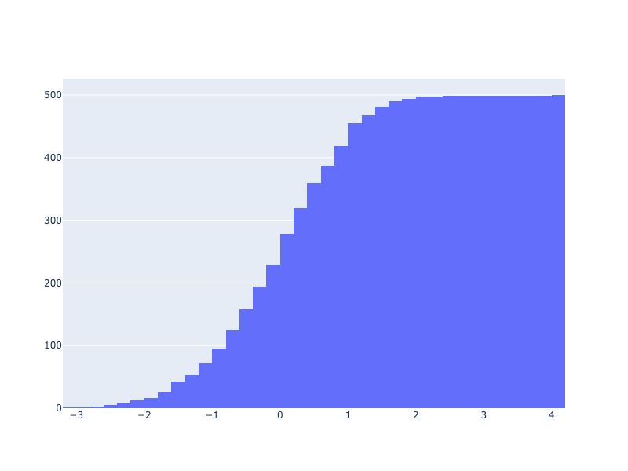

**Interactive Plot:**

<div>                        <script type="text/javascript">window.PlotlyConfig = {MathJaxConfig: 'local'};</script>
        <script charset="utf-8" src="https://cdn.plot.ly/plotly-3.1.0.min.js" integrity="sha256-Ei4740bWZhaUTQuD6q9yQlgVCMPBz6CZWhevDYPv93A=" crossorigin="anonymous"></script>                <div id="plotly-div-22" class="plotly-graph-div" style="height:100%; width:100%;"></div>            <script type="text/javascript">                window.PLOTLYENV=window.PLOTLYENV || {};                                if (document.getElementById("plotly-div-22")) {                    Plotly.newPlot(                        "plotly-div-22",                        [{"cumulative":{"enabled":true},"x":{"dtype":"f8","bdata":"olJ\u002fthwE2r\u002fe\u002fmAbKcPZv5TYfhPWsKC\u002feEoAUZHt3b9we11Kx6EFwGF4Smfc8dm\u002frq29oLS\u002f6r\u002fcsAxrWBvAP9Hit21gJei\u002fLpJ5WPtjtb+kq3uLmKXWv6ecM2QMN4O\u002fEMUQtDRZ1T9qMm1wRBbwv4pMXSw\u002ftu4\u002fE0hWkhIU+j8Nkj10crzxP9cNIE4rb+c\u002fnw4YjQ8r1j8+sZ5DkZ3hvyX+OTToKNe\u002fLv3cJ8440D+lv7Ew8wLLv7XVC51pqXe\u002fY0LB+sCS7z9xk8Ua+SXWP2HoiVBY3tW\u002fNSaUXFTV9j9c3Uf\u002f6RTXv510LruHaLq\u002fqeq8E9qkAcBWyWzsoqG9P5\u002fudusBXtU\u002fvXsTTBNY6r\u002f\u002fePy5XkTdP\u002fU+8z5hWuC\u002fYxQwa0zI6z+kAn+BWvjwv6cL7FHm3PY\u002fKiKXvoEZ6z+\u002feYaeOJmbP+XDBhkXs\u002fq\u002fTpOVIy6v8L\u002f6FQ5JKHrgvzoaviON9es\u002f1lbIlyiWqr\u002f6QDHgDmL\u002fPxIQh8pLSvA\u002f156Iai3v4r+JQYFmlWWwPwajZ0+k2NW\u002fsv7QypLD+j+aEcu1+WznP4YLb0G6R9s\u002fPzk5kly16T\u002fFEkksGY\u002fcP66fZsNBxuy\u002fSktcsYwqnb94kA5oIhXzv4oWB+8ZCN6\u002f7XUl8dq+6D\u002fwvT+dOLDwPzZZ9iAHV\u002fc\u002fKllfjj6e2z9hfxDK+ZX2v63gZYizjfa\u002fvOSlyKHy27\u002fuM1bh81P9P\u002fGlE3Sfcdm\u002fXu7eWlz61j+\u002fTJvIJDj8v+y51DRIDvQ\u002f4dzntKha6r8I4EWPyyHrv5M+2SR+eOq\u002fHWOG6NvZ8j\u002fcCutQzGvQP9LUB7lcC8a\u002fChMx6oLN7z+OCFg1N1kDwD7dHqDp7fS\u002f6Wki10Uf5L+vyxlv1mK+vxaIGGSfUsE\u002fXsMybgqT2T+5jVxNoaWgP6MOsJFBeNU\u002f1LgZQVKl8r\u002fkOI5g+OTPvxASVm9WFcM\u002fWe\u002f5xQzm9j\u002fFR6U8sazNvw41DssiHu4\u002fgweqWwe08j+XeEflK8PcP\u002fN3FrJZW\u002fc\u002fq0UViSV17L\u002fg18C\u002fn9IAwBt9Wi2ZfO2\u002fo19w\u002fZ4j9L+jz84F80u5P48tBXENifA\u002fUchbGePJyz8quD2AmzDhvyyAso4n5OW\u002fS0gKSTAX+D\u002fGjW6adrvov\u002fwr1hVNN9O\u002fVzsiReLE+r\u002fyH8lfJw3VP+qG+RlqCOs\u002fGJEbddsY1j\u002fkN3ZXtdO0P34k3RSD5No\u002fxotzlM6joz\u002fe4V\u002f4Zu3XP9MHYSsWa7S\u002f9d0mnrkO\u002fr\u002f5PeH881P6PztUQFiDC\u002fm\u002fjWD\u002ff11Y\u002fb9fDQ3Hsz7Fv7lFG\u002fHoFPM\u002fvIY7OpRJ3z\u002ffn8mtBv7Bv7NGHPYWz+i\u002f81n+VDQM2D8LuKEjOkjnP\u002fsahMRzvsM\u002fPgRnEh12+j8sQ94dM2LNv4rnoC7V+uK\u002f954DMkVMkr\u002fZp6iXx8a+P10WhTOdyuG\u002f79iCSJ4m6z8aMyHX73EIwGI\u002fG7LHcfE\u002fuQ+NcqJR1T8nRE0AQXAAwKpv0g26icM\u002ffxn0KKRXq79HT7N0GxPhP\u002fKiFez8irG\u002f0ZFTnPZm4r8sTpYqhue3P9eT3MWXUeC\u002fN\u002f6cXSrz+D9Pn7pTiWX3P9prua9e9cU\u002fxZkykko4+b8V+2Bld+jnP1CzLkIQQ\u002fC\u002foqJURMCJ8T9tlMNN9ynqPylERet6+Ls\u002fnXBShrnS3b\u002fF1psyKV\u002fTv+bScTv7zOs\u002fw8YcbfYdnT+S6iiMnP3hv4t1AiuCo+e\u002f0LIcIpxg8j\u002fuP2eRd3fBPyOivZQ0pPi\u002fJrUfBEbw07+P+x0TfU3FP72T3z+RgOM\u002fJNyxVP\u002fq8T\u002fBEnGGvY7Hv7tpqpt9cfU\u002fuGoZ1wvZ5D+XkCQp8NfsP8k8xf25VN0\u002fU05hXO9y8b\u002fvK3pynyzcP3z3LuHHl+O\u002fBBN0lz2CAEDqKcEQ9PisP0KhwwdCRua\u002fAZEf1imU8D96iOPmoXzFv2rhPrZRt\u002fO\u002fY8zCQXR+6j96hDQU8xDKv5O9\u002fEydVcK\u002fNe8OLQQKAcDhbYb1wgDcvwURk+wvhOS\u002fN6YNOmmnvD+sF4SoXei0P36L15h\u002flPq\u002fIxfAHHRK9z9k9q0CEsT2vy28V5L4Aua\u002fSFXg8j2UAcBVQ5RUwZPov2U455cOTPC\u002fHHhYUgLz0T+mj7IIrljZv7tNrdhdTto\u002fidizveNy3b91\u002fB5xK\u002f\u002fNvyqg1HZFiOc\u002fPhR1dH058L9MV8IVplniP5J4CJZruMM\u002fRfkVScqLxj8WkR7KvarhPzbsO+t+yPe\u002fFecobD+d4T+xYnr1TaPVPwHJ09rcvfG\u002f6AMt34oSub+t3vWAXymzP1OUpztlhu+\u002ft7jfWUttwT\u002fhm2s4CD7gv1hm0AoT+cm\u002fxIqR+YXm5L9eEHrqbXX1P1lyEPFZAuO\u002fB14BEZyM3j+Zn\u002fggBELnPzHNr\u002fOfMcg\u002fjyOghR0L7z9RM4Z\u002fE17xv7umZsDpFQbAO0XWViIr0793MMG3ytLwPzJBPBkR8sC\u002f3qzQWnMe0j\u002fcvt\u002fX\u002fbnfv9gQov0PjdO\u002fBUhHSsbwzj+8mYhU1un5v0t00PsqiPA\u002fkyAHCDhvwD94V3Tk9K3yP5QIS9xL+9M\u002fWLLeCWHk4T9qs6Vw7+nxP70AKcsapNU\u002f+\u002fsBMOdy7j\u002fCh9DixIXZP+9YGIo44Me\u002fXVTFSQJU5z9AEb8IV9LXP1i\u002fcGoYrtK\u002fb0m3gtgw0D8bTy+m8urwP65a7kNco\u002fI\u002f+12CHBDD5z8zWahpykjkPy9REc\u002fahcS\u002fEgrhUH4bEEA1ePjNwl3Rv5Z1pPr4cOE\u002fAa0IBnBU8D\u002feOkAgE8Hgv0H7VIM2jPa\u002fbsXwklje8b+STul+lGX7v6b\u002f7f9AMNu\u002faaZDkeSy078BTiYEiun5P\u002f7OnCnERfS\u002frthqgxWR8L\u002feb2nV2xTZv4jXBOSxMfe\u002fcQqirfvr6j8yki2r06X5P9jEZ1ALXOK\u002f4TO9hvvW6L8d4bpK+tXwP6DwBWi7etI\u002fjZAU5TQR9r\u002fsVuY2PQ3bv+RmgaWs\u002fvI\u002fz9bK5CmA8b\u002f40HSJouvvvyVETWSZL+c\u002fhjsuD+Jn+T\u002fiLQXabmLqv9XzCPQPSuW\u002fJL7SySlr2T+pzxydu+HsP66bTi5XXdA\u002fpDga9Flv+786wxhe03DnP9vMlTl7Duk\u002fSSJzsp7+4r\u002fYPayWnRXvP89lkdcVpa0\u002f8+EPnoSJ7z\u002f+Pq0NAqKuP1InmZAdzQBA8apHzKp4+7\u002fHyW287qzYv5qIgiiC6PM\u002fg8+wkZAQ7T\u002fWtwg6CAnEP1Ze2mkFiARAue1\u002fp5zh279MfiYGAdjpPyuUxVkSiO8\u002fOTGBRkXg6j\u002f1Np0X2XQBwL1HoU+t5uU\u002fdU\u002fN2RDE+T\u002faae+4vHT5vyh8rPUKuvU\u002fRdcBRq1Nzj9v4Vz4SnTdP4B73jbM8vG\u002fRyhpr6Sw5T+DdUg\u002frZOSv2nh07f75\u002fU\u002f92UaxM6O678dmRzousaRP6rQfCHUafE\u002fOtFLY58PyL8mhWNMVdnvv0gu+nmhe+I\u002f1+aEMfT\u002f4z\u002f+LDWcxEu+P0rN9wOGmeA\u002flthN5u70gD+aeGy+f472vzUsmVr\u002f1Oy\u002f9HftAcLG5D8lBw9NlD7sv9lXpjDRluw\u002fzr7Yh+Syyj8FaNdajePbP3LO3eSuleK\u002fR0A+QPwC8D9UecH+hZ7kP5CJhIbLV\u002fi\u002fL4RSRLe\u002f0L+AymZw6uLvv9\u002fMnFkJbvG\u002fIj6V6n8bwT\u002frddmQGpXzP2zA\u002fzTgbfu\u002fKjavHEcp4D+G9RigfoHgPwMHIQwO6uo\u002fgis9sy561b+2h0E8Kx\u002ffPy3vr5bYo9G\u002fpL190S0v7D\u002f3a298m+HBP6TpQIlcWfM\u002fAHIT37yP0z\u002faVtEAu7+kP0zaIC3xIfW\u002fwkkQfX0E578KI4afwtPwv0b6S0jIoMK\u002f96pcpgfi8T+aTPHqphuiP7SGgo66mO+\u002fghopCjIY27+m5jWIzlPxPymlzV5HgOu\u002fjjj3qZbTzj9WJl1mxr3av2V+XAIj+vY\u002fVTBb0jDK5T\u002fw42dVLRvxP5zCAXm2FPe\u002fChrLurvqtD\u002faTSE3v6vkv7YcmcPGCMW\u002fwoOfy3HQ2T8Uk2tgdQQEwIp3Vt3xueM\u002fvjfsvHsi57\u002f2eSXI5ty9PwhUhJtDYtU\u002foYpZyOneAcDGGk9xvwKxv4vvUZxYSeu\u002fj+l5iaEW1L8iFLTOnfz3P8jgiOhl4fe\u002fGI1Ojsrv5r91bNGdM+\u002fzv3nO+2GSyaq\u002fNo3o7\u002foM9j\u002fpHX+Pd5YAQEitPOxSNds\u002fbu2np6Es9b99T2wrPWHBP4xg\u002fDgGvNA\u002f0DUImQyr8D\u002ftV7rlhZzPPxlNM7wuyeE\u002ftu17LudP7b+58niMbw7Uv0U5EVWXjsK\u002fOZUlp5kk0T+Wd5pslpHZv3FnJ2h6YOi\u002f2boH0Yre8D+0gbKZ0FfpP8YimRlnG+M\u002f3a8UMne54T8AE6kOoH3DP1bnegSs1Oq\u002fHa4j72LK\u002fr8X\u002fP\u002fDtnDuP6OEO7Yep\u002fG\u002fMkSA\u002f0ei4j8djHUsoGbpv9Dud9ddmNK\u002fuV31bfvl+T8miB9Bq0Hkv7gPf7PL1N0\u002fnMqgsHNX9L\u002fUhgik\u002fK\u002fvP+I7zOXx3fM\u002fdIGEK29zyr+wOGpu9fDSv7k+1Zt\u002f3+Q\u002fRiCBiyGJxb+ODmM\u002fR\u002fD0v\u002fRud0gai+q\u002fJNW5TrHB+z+lEyGmKDj4PzDcAKgPkL+\u002fbmGJnAQl+L+C2hDP+tHkv4xwP+bC\u002fuo\u002fp51pVPH99L+kTf92o9G8v\u002fsXi4InqNy\u002fsd5vOmx18j\u002fRf8zlF3DxP6CyQVAI4NQ\u002fpJlNqpxw2z83yAVZAlDhvxV7xwppluW\u002fZH8K8K0OxT\u002foY0EkUjjcP2CEj9GK4Oe\u002fxxXFRCkK4b+ffDB6O3Lnv68Y+2JBje4\u002fSeQQwhEZ4z\u002fk0Qh8PAzaP14cOoD8QeM\u002fsAEoMZHswz8onU+hO03rv8qKS124\u002f8w\u002fJSFJJcTH0T8MgxvrpL3eP47aPKMjG\u002fQ\u002f93PymywCxr8kKjG30YTxP2\u002fsNNV9bfE\u002fNtzz3Yme6b9YRQrwfV7DP0qWrKYFiuw\u002f3CjEWAYu6b\u002fT8QiqLFZiv2sB2VEbPvE\u002f84AHI1Ln\u002fT81InG9OIHyP3FNseME8Nk\u002f6D87B+YIA8DXEpULMwb3v\u002faOLKxqJ+S\u002feoH7rCvA5z\u002fFnsuW4S+\u002fP+juVJ7fL+A\u002fhVOG\u002fumi5L\u002fFWrKLVCD9P7loyCqV4vi\u002fYzJmuoIPzL+r2nI9dcemP7NIDapX5rK\u002flqGDSUU86L+loxlD2vPgP4jlMc04h9g\u002fyVNZaVWxyT\u002f+O7jmKNm3Pzc4\u002ffYWmrY\u002fUV7M83A49T+SxgM6gE3YP9coikWHYAFArP+6COiL1L8lLUhiWBz4P9Na3jesbtA\u002fgLn+0VRn2L+7kIZFFpfwP4IkhqPbfuU\u002fr+YIp4NW4D\u002fWUvEkHRnwPw=="},"type":"histogram"}],                        {"template":{"data":{"histogram2dcontour":[{"type":"histogram2dcontour","colorbar":{"outlinewidth":0,"ticks":""},"colorscale":[[0.0,"#0d0887"],[0.1111111111111111,"#46039f"],[0.2222222222222222,"#7201a8"],[0.3333333333333333,"#9c179e"],[0.4444444444444444,"#bd3786"],[0.5555555555555556,"#d8576b"],[0.6666666666666666,"#ed7953"],[0.7777777777777778,"#fb9f3a"],[0.8888888888888888,"#fdca26"],[1.0,"#f0f921"]]}],"choropleth":[{"type":"choropleth","colorbar":{"outlinewidth":0,"ticks":""}}],"histogram2d":[{"type":"histogram2d","colorbar":{"outlinewidth":0,"ticks":""},"colorscale":[[0.0,"#0d0887"],[0.1111111111111111,"#46039f"],[0.2222222222222222,"#7201a8"],[0.3333333333333333,"#9c179e"],[0.4444444444444444,"#bd3786"],[0.5555555555555556,"#d8576b"],[0.6666666666666666,"#ed7953"],[0.7777777777777778,"#fb9f3a"],[0.8888888888888888,"#fdca26"],[1.0,"#f0f921"]]}],"heatmap":[{"type":"heatmap","colorbar":{"outlinewidth":0,"ticks":""},"colorscale":[[0.0,"#0d0887"],[0.1111111111111111,"#46039f"],[0.2222222222222222,"#7201a8"],[0.3333333333333333,"#9c179e"],[0.4444444444444444,"#bd3786"],[0.5555555555555556,"#d8576b"],[0.6666666666666666,"#ed7953"],[0.7777777777777778,"#fb9f3a"],[0.8888888888888888,"#fdca26"],[1.0,"#f0f921"]]}],"contourcarpet":[{"type":"contourcarpet","colorbar":{"outlinewidth":0,"ticks":""}}],"contour":[{"type":"contour","colorbar":{"outlinewidth":0,"ticks":""},"colorscale":[[0.0,"#0d0887"],[0.1111111111111111,"#46039f"],[0.2222222222222222,"#7201a8"],[0.3333333333333333,"#9c179e"],[0.4444444444444444,"#bd3786"],[0.5555555555555556,"#d8576b"],[0.6666666666666666,"#ed7953"],[0.7777777777777778,"#fb9f3a"],[0.8888888888888888,"#fdca26"],[1.0,"#f0f921"]]}],"surface":[{"type":"surface","colorbar":{"outlinewidth":0,"ticks":""},"colorscale":[[0.0,"#0d0887"],[0.1111111111111111,"#46039f"],[0.2222222222222222,"#7201a8"],[0.3333333333333333,"#9c179e"],[0.4444444444444444,"#bd3786"],[0.5555555555555556,"#d8576b"],[0.6666666666666666,"#ed7953"],[0.7777777777777778,"#fb9f3a"],[0.8888888888888888,"#fdca26"],[1.0,"#f0f921"]]}],"mesh3d":[{"type":"mesh3d","colorbar":{"outlinewidth":0,"ticks":""}}],"scatter":[{"fillpattern":{"fillmode":"overlay","size":10,"solidity":0.2},"type":"scatter"}],"parcoords":[{"type":"parcoords","line":{"colorbar":{"outlinewidth":0,"ticks":""}}}],"scatterpolargl":[{"type":"scatterpolargl","marker":{"colorbar":{"outlinewidth":0,"ticks":""}}}],"bar":[{"error_x":{"color":"#2a3f5f"},"error_y":{"color":"#2a3f5f"},"marker":{"line":{"color":"#E5ECF6","width":0.5},"pattern":{"fillmode":"overlay","size":10,"solidity":0.2}},"type":"bar"}],"scattergeo":[{"type":"scattergeo","marker":{"colorbar":{"outlinewidth":0,"ticks":""}}}],"scatterpolar":[{"type":"scatterpolar","marker":{"colorbar":{"outlinewidth":0,"ticks":""}}}],"histogram":[{"marker":{"pattern":{"fillmode":"overlay","size":10,"solidity":0.2}},"type":"histogram"}],"scattergl":[{"type":"scattergl","marker":{"colorbar":{"outlinewidth":0,"ticks":""}}}],"scatter3d":[{"type":"scatter3d","line":{"colorbar":{"outlinewidth":0,"ticks":""}},"marker":{"colorbar":{"outlinewidth":0,"ticks":""}}}],"scattermap":[{"type":"scattermap","marker":{"colorbar":{"outlinewidth":0,"ticks":""}}}],"scattermapbox":[{"type":"scattermapbox","marker":{"colorbar":{"outlinewidth":0,"ticks":""}}}],"scatterternary":[{"type":"scatterternary","marker":{"colorbar":{"outlinewidth":0,"ticks":""}}}],"scattercarpet":[{"type":"scattercarpet","marker":{"colorbar":{"outlinewidth":0,"ticks":""}}}],"carpet":[{"aaxis":{"endlinecolor":"#2a3f5f","gridcolor":"white","linecolor":"white","minorgridcolor":"white","startlinecolor":"#2a3f5f"},"baxis":{"endlinecolor":"#2a3f5f","gridcolor":"white","linecolor":"white","minorgridcolor":"white","startlinecolor":"#2a3f5f"},"type":"carpet"}],"table":[{"cells":{"fill":{"color":"#EBF0F8"},"line":{"color":"white"}},"header":{"fill":{"color":"#C8D4E3"},"line":{"color":"white"}},"type":"table"}],"barpolar":[{"marker":{"line":{"color":"#E5ECF6","width":0.5},"pattern":{"fillmode":"overlay","size":10,"solidity":0.2}},"type":"barpolar"}],"pie":[{"automargin":true,"type":"pie"}]},"layout":{"autotypenumbers":"strict","colorway":["#636efa","#EF553B","#00cc96","#ab63fa","#FFA15A","#19d3f3","#FF6692","#B6E880","#FF97FF","#FECB52"],"font":{"color":"#2a3f5f"},"hovermode":"closest","hoverlabel":{"align":"left"},"paper_bgcolor":"white","plot_bgcolor":"#E5ECF6","polar":{"bgcolor":"#E5ECF6","angularaxis":{"gridcolor":"white","linecolor":"white","ticks":""},"radialaxis":{"gridcolor":"white","linecolor":"white","ticks":""}},"ternary":{"bgcolor":"#E5ECF6","aaxis":{"gridcolor":"white","linecolor":"white","ticks":""},"baxis":{"gridcolor":"white","linecolor":"white","ticks":""},"caxis":{"gridcolor":"white","linecolor":"white","ticks":""}},"coloraxis":{"colorbar":{"outlinewidth":0,"ticks":""}},"colorscale":{"sequential":[[0.0,"#0d0887"],[0.1111111111111111,"#46039f"],[0.2222222222222222,"#7201a8"],[0.3333333333333333,"#9c179e"],[0.4444444444444444,"#bd3786"],[0.5555555555555556,"#d8576b"],[0.6666666666666666,"#ed7953"],[0.7777777777777778,"#fb9f3a"],[0.8888888888888888,"#fdca26"],[1.0,"#f0f921"]],"sequentialminus":[[0.0,"#0d0887"],[0.1111111111111111,"#46039f"],[0.2222222222222222,"#7201a8"],[0.3333333333333333,"#9c179e"],[0.4444444444444444,"#bd3786"],[0.5555555555555556,"#d8576b"],[0.6666666666666666,"#ed7953"],[0.7777777777777778,"#fb9f3a"],[0.8888888888888888,"#fdca26"],[1.0,"#f0f921"]],"diverging":[[0,"#8e0152"],[0.1,"#c51b7d"],[0.2,"#de77ae"],[0.3,"#f1b6da"],[0.4,"#fde0ef"],[0.5,"#f7f7f7"],[0.6,"#e6f5d0"],[0.7,"#b8e186"],[0.8,"#7fbc41"],[0.9,"#4d9221"],[1,"#276419"]]},"xaxis":{"gridcolor":"white","linecolor":"white","ticks":"","title":{"standoff":15},"zerolinecolor":"white","automargin":true,"zerolinewidth":2},"yaxis":{"gridcolor":"white","linecolor":"white","ticks":"","title":{"standoff":15},"zerolinecolor":"white","automargin":true,"zerolinewidth":2},"scene":{"xaxis":{"backgroundcolor":"#E5ECF6","gridcolor":"white","linecolor":"white","showbackground":true,"ticks":"","zerolinecolor":"white","gridwidth":2},"yaxis":{"backgroundcolor":"#E5ECF6","gridcolor":"white","linecolor":"white","showbackground":true,"ticks":"","zerolinecolor":"white","gridwidth":2},"zaxis":{"backgroundcolor":"#E5ECF6","gridcolor":"white","linecolor":"white","showbackground":true,"ticks":"","zerolinecolor":"white","gridwidth":2}},"shapedefaults":{"line":{"color":"#2a3f5f"}},"annotationdefaults":{"arrowcolor":"#2a3f5f","arrowhead":0,"arrowwidth":1},"geo":{"bgcolor":"white","landcolor":"#E5ECF6","subunitcolor":"white","showland":true,"showlakes":true,"lakecolor":"white"},"title":{"x":0.05},"mapbox":{"style":"light"}}}},                        {"responsive": true}                    )                };            </script>        </div>

### Specify Aggregation Function

```python
import plotly.graph_objects as go

x = ["Apples","Apples","Apples","Oranges", "Bananas"]
y = ["5","10","3","10","5"]

fig = go.Figure()
fig.add_trace(go.Histogram(histfunc="count", y=y, x=x, name="count"))
fig.add_trace(go.Histogram(histfunc="sum", y=y, x=x, name="sum"))

fig.show()
```

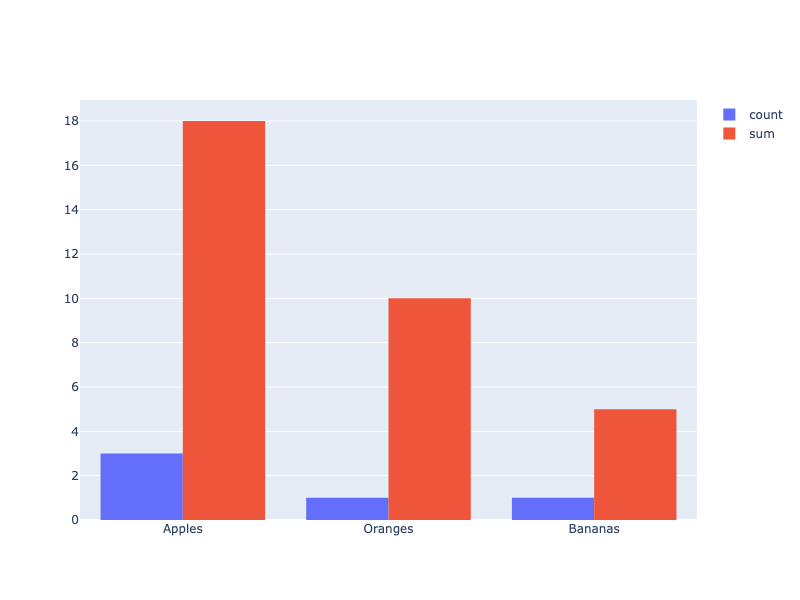

**Interactive Plot:**

<div>                        <script type="text/javascript">window.PlotlyConfig = {MathJaxConfig: 'local'};</script>
        <script charset="utf-8" src="https://cdn.plot.ly/plotly-3.1.0.min.js" integrity="sha256-Ei4740bWZhaUTQuD6q9yQlgVCMPBz6CZWhevDYPv93A=" crossorigin="anonymous"></script>                <div id="plotly-div-23" class="plotly-graph-div" style="height:100%; width:100%;"></div>            <script type="text/javascript">                window.PLOTLYENV=window.PLOTLYENV || {};                                if (document.getElementById("plotly-div-23")) {                    Plotly.newPlot(                        "plotly-div-23",                        [{"histfunc":"count","name":"count","x":["Apples","Apples","Apples","Oranges","Bananas"],"y":["5","10","3","10","5"],"type":"histogram"},{"histfunc":"sum","name":"sum","x":["Apples","Apples","Apples","Oranges","Bananas"],"y":["5","10","3","10","5"],"type":"histogram"}],                        {"template":{"data":{"histogram2dcontour":[{"type":"histogram2dcontour","colorbar":{"outlinewidth":0,"ticks":""},"colorscale":[[0.0,"#0d0887"],[0.1111111111111111,"#46039f"],[0.2222222222222222,"#7201a8"],[0.3333333333333333,"#9c179e"],[0.4444444444444444,"#bd3786"],[0.5555555555555556,"#d8576b"],[0.6666666666666666,"#ed7953"],[0.7777777777777778,"#fb9f3a"],[0.8888888888888888,"#fdca26"],[1.0,"#f0f921"]]}],"choropleth":[{"type":"choropleth","colorbar":{"outlinewidth":0,"ticks":""}}],"histogram2d":[{"type":"histogram2d","colorbar":{"outlinewidth":0,"ticks":""},"colorscale":[[0.0,"#0d0887"],[0.1111111111111111,"#46039f"],[0.2222222222222222,"#7201a8"],[0.3333333333333333,"#9c179e"],[0.4444444444444444,"#bd3786"],[0.5555555555555556,"#d8576b"],[0.6666666666666666,"#ed7953"],[0.7777777777777778,"#fb9f3a"],[0.8888888888888888,"#fdca26"],[1.0,"#f0f921"]]}],"heatmap":[{"type":"heatmap","colorbar":{"outlinewidth":0,"ticks":""},"colorscale":[[0.0,"#0d0887"],[0.1111111111111111,"#46039f"],[0.2222222222222222,"#7201a8"],[0.3333333333333333,"#9c179e"],[0.4444444444444444,"#bd3786"],[0.5555555555555556,"#d8576b"],[0.6666666666666666,"#ed7953"],[0.7777777777777778,"#fb9f3a"],[0.8888888888888888,"#fdca26"],[1.0,"#f0f921"]]}],"contourcarpet":[{"type":"contourcarpet","colorbar":{"outlinewidth":0,"ticks":""}}],"contour":[{"type":"contour","colorbar":{"outlinewidth":0,"ticks":""},"colorscale":[[0.0,"#0d0887"],[0.1111111111111111,"#46039f"],[0.2222222222222222,"#7201a8"],[0.3333333333333333,"#9c179e"],[0.4444444444444444,"#bd3786"],[0.5555555555555556,"#d8576b"],[0.6666666666666666,"#ed7953"],[0.7777777777777778,"#fb9f3a"],[0.8888888888888888,"#fdca26"],[1.0,"#f0f921"]]}],"surface":[{"type":"surface","colorbar":{"outlinewidth":0,"ticks":""},"colorscale":[[0.0,"#0d0887"],[0.1111111111111111,"#46039f"],[0.2222222222222222,"#7201a8"],[0.3333333333333333,"#9c179e"],[0.4444444444444444,"#bd3786"],[0.5555555555555556,"#d8576b"],[0.6666666666666666,"#ed7953"],[0.7777777777777778,"#fb9f3a"],[0.8888888888888888,"#fdca26"],[1.0,"#f0f921"]]}],"mesh3d":[{"type":"mesh3d","colorbar":{"outlinewidth":0,"ticks":""}}],"scatter":[{"fillpattern":{"fillmode":"overlay","size":10,"solidity":0.2},"type":"scatter"}],"parcoords":[{"type":"parcoords","line":{"colorbar":{"outlinewidth":0,"ticks":""}}}],"scatterpolargl":[{"type":"scatterpolargl","marker":{"colorbar":{"outlinewidth":0,"ticks":""}}}],"bar":[{"error_x":{"color":"#2a3f5f"},"error_y":{"color":"#2a3f5f"},"marker":{"line":{"color":"#E5ECF6","width":0.5},"pattern":{"fillmode":"overlay","size":10,"solidity":0.2}},"type":"bar"}],"scattergeo":[{"type":"scattergeo","marker":{"colorbar":{"outlinewidth":0,"ticks":""}}}],"scatterpolar":[{"type":"scatterpolar","marker":{"colorbar":{"outlinewidth":0,"ticks":""}}}],"histogram":[{"marker":{"pattern":{"fillmode":"overlay","size":10,"solidity":0.2}},"type":"histogram"}],"scattergl":[{"type":"scattergl","marker":{"colorbar":{"outlinewidth":0,"ticks":""}}}],"scatter3d":[{"type":"scatter3d","line":{"colorbar":{"outlinewidth":0,"ticks":""}},"marker":{"colorbar":{"outlinewidth":0,"ticks":""}}}],"scattermap":[{"type":"scattermap","marker":{"colorbar":{"outlinewidth":0,"ticks":""}}}],"scattermapbox":[{"type":"scattermapbox","marker":{"colorbar":{"outlinewidth":0,"ticks":""}}}],"scatterternary":[{"type":"scatterternary","marker":{"colorbar":{"outlinewidth":0,"ticks":""}}}],"scattercarpet":[{"type":"scattercarpet","marker":{"colorbar":{"outlinewidth":0,"ticks":""}}}],"carpet":[{"aaxis":{"endlinecolor":"#2a3f5f","gridcolor":"white","linecolor":"white","minorgridcolor":"white","startlinecolor":"#2a3f5f"},"baxis":{"endlinecolor":"#2a3f5f","gridcolor":"white","linecolor":"white","minorgridcolor":"white","startlinecolor":"#2a3f5f"},"type":"carpet"}],"table":[{"cells":{"fill":{"color":"#EBF0F8"},"line":{"color":"white"}},"header":{"fill":{"color":"#C8D4E3"},"line":{"color":"white"}},"type":"table"}],"barpolar":[{"marker":{"line":{"color":"#E5ECF6","width":0.5},"pattern":{"fillmode":"overlay","size":10,"solidity":0.2}},"type":"barpolar"}],"pie":[{"automargin":true,"type":"pie"}]},"layout":{"autotypenumbers":"strict","colorway":["#636efa","#EF553B","#00cc96","#ab63fa","#FFA15A","#19d3f3","#FF6692","#B6E880","#FF97FF","#FECB52"],"font":{"color":"#2a3f5f"},"hovermode":"closest","hoverlabel":{"align":"left"},"paper_bgcolor":"white","plot_bgcolor":"#E5ECF6","polar":{"bgcolor":"#E5ECF6","angularaxis":{"gridcolor":"white","linecolor":"white","ticks":""},"radialaxis":{"gridcolor":"white","linecolor":"white","ticks":""}},"ternary":{"bgcolor":"#E5ECF6","aaxis":{"gridcolor":"white","linecolor":"white","ticks":""},"baxis":{"gridcolor":"white","linecolor":"white","ticks":""},"caxis":{"gridcolor":"white","linecolor":"white","ticks":""}},"coloraxis":{"colorbar":{"outlinewidth":0,"ticks":""}},"colorscale":{"sequential":[[0.0,"#0d0887"],[0.1111111111111111,"#46039f"],[0.2222222222222222,"#7201a8"],[0.3333333333333333,"#9c179e"],[0.4444444444444444,"#bd3786"],[0.5555555555555556,"#d8576b"],[0.6666666666666666,"#ed7953"],[0.7777777777777778,"#fb9f3a"],[0.8888888888888888,"#fdca26"],[1.0,"#f0f921"]],"sequentialminus":[[0.0,"#0d0887"],[0.1111111111111111,"#46039f"],[0.2222222222222222,"#7201a8"],[0.3333333333333333,"#9c179e"],[0.4444444444444444,"#bd3786"],[0.5555555555555556,"#d8576b"],[0.6666666666666666,"#ed7953"],[0.7777777777777778,"#fb9f3a"],[0.8888888888888888,"#fdca26"],[1.0,"#f0f921"]],"diverging":[[0,"#8e0152"],[0.1,"#c51b7d"],[0.2,"#de77ae"],[0.3,"#f1b6da"],[0.4,"#fde0ef"],[0.5,"#f7f7f7"],[0.6,"#e6f5d0"],[0.7,"#b8e186"],[0.8,"#7fbc41"],[0.9,"#4d9221"],[1,"#276419"]]},"xaxis":{"gridcolor":"white","linecolor":"white","ticks":"","title":{"standoff":15},"zerolinecolor":"white","automargin":true,"zerolinewidth":2},"yaxis":{"gridcolor":"white","linecolor":"white","ticks":"","title":{"standoff":15},"zerolinecolor":"white","automargin":true,"zerolinewidth":2},"scene":{"xaxis":{"backgroundcolor":"#E5ECF6","gridcolor":"white","linecolor":"white","showbackground":true,"ticks":"","zerolinecolor":"white","gridwidth":2},"yaxis":{"backgroundcolor":"#E5ECF6","gridcolor":"white","linecolor":"white","showbackground":true,"ticks":"","zerolinecolor":"white","gridwidth":2},"zaxis":{"backgroundcolor":"#E5ECF6","gridcolor":"white","linecolor":"white","showbackground":true,"ticks":"","zerolinecolor":"white","gridwidth":2}},"shapedefaults":{"line":{"color":"#2a3f5f"}},"annotationdefaults":{"arrowcolor":"#2a3f5f","arrowhead":0,"arrowwidth":1},"geo":{"bgcolor":"white","landcolor":"#E5ECF6","subunitcolor":"white","showland":true,"showlakes":true,"lakecolor":"white"},"title":{"x":0.05},"mapbox":{"style":"light"}}}},                        {"responsive": true}                    )                };            </script>        </div>

### Custom Binning

For custom binning along x-axis, use the attribute [`nbinsx`](https://plotly.com/python/reference/histogram/#histogram-nbinsx). Please note that the autobin algorithm will choose a 'nice' round bin size that may result in somewhat fewer than `nbinsx` total bins. Alternatively, you can set the exact values for [`xbins`](https://plotly.com/python/reference/histogram/#histogram-xbins) along with `autobinx = False`.

```python
import plotly.graph_objects as go
from plotly.subplots import make_subplots

x = ['1970-01-01', '1970-01-01', '1970-02-01', '1970-04-01', '1970-01-02',
     '1972-01-31', '1970-02-13', '1971-04-19']

fig = make_subplots(rows=3, cols=2)

trace0 = go.Histogram(x=x, nbinsx=4)
trace1 = go.Histogram(x=x, nbinsx = 8)
trace2 = go.Histogram(x=x, nbinsx=10)
trace3 = go.Histogram(x=x,
                      xbins=dict(
                      start='1969-11-15',
                      end='1972-03-31',
                      size='M18'), # M18 stands for 18 months
                      autobinx=False
                     )
trace4 = go.Histogram(x=x,
                      xbins=dict(
                      start='1969-11-15',
                      end='1972-03-31',
                      size='M4'), # 4 months bin size
                      autobinx=False
                      )
trace5 = go.Histogram(x=x,
                      xbins=dict(
                      start='1969-11-15',
                      end='1972-03-31',
                      size= 'M2'), # 2 months
                      autobinx = False
                      )

fig.add_trace(trace0, 1, 1)
fig.add_trace(trace1, 1, 2)
fig.add_trace(trace2, 2, 1)
fig.add_trace(trace3, 2, 2)
fig.add_trace(trace4, 3, 1)
fig.add_trace(trace5, 3, 2)

fig.show()
```

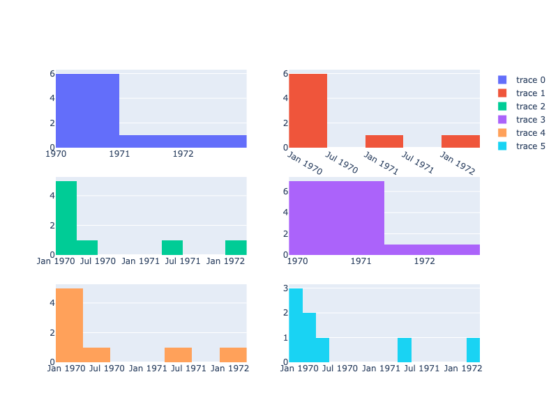

**Interactive Plot:**

<div>                        <script type="text/javascript">window.PlotlyConfig = {MathJaxConfig: 'local'};</script>
        <script charset="utf-8" src="https://cdn.plot.ly/plotly-3.1.0.min.js" integrity="sha256-Ei4740bWZhaUTQuD6q9yQlgVCMPBz6CZWhevDYPv93A=" crossorigin="anonymous"></script>                <div id="plotly-div-24" class="plotly-graph-div" style="height:100%; width:100%;"></div>            <script type="text/javascript">                window.PLOTLYENV=window.PLOTLYENV || {};                                if (document.getElementById("plotly-div-24")) {                    Plotly.newPlot(                        "plotly-div-24",                        [{"nbinsx":4,"x":["1970-01-01","1970-01-01","1970-02-01","1970-04-01","1970-01-02","1972-01-31","1970-02-13","1971-04-19"],"type":"histogram","xaxis":"x","yaxis":"y"},{"nbinsx":8,"x":["1970-01-01","1970-01-01","1970-02-01","1970-04-01","1970-01-02","1972-01-31","1970-02-13","1971-04-19"],"type":"histogram","xaxis":"x2","yaxis":"y2"},{"nbinsx":10,"x":["1970-01-01","1970-01-01","1970-02-01","1970-04-01","1970-01-02","1972-01-31","1970-02-13","1971-04-19"],"type":"histogram","xaxis":"x3","yaxis":"y3"},{"autobinx":false,"x":["1970-01-01","1970-01-01","1970-02-01","1970-04-01","1970-01-02","1972-01-31","1970-02-13","1971-04-19"],"xbins":{"end":"1972-03-31","size":"M18","start":"1969-11-15"},"type":"histogram","xaxis":"x4","yaxis":"y4"},{"autobinx":false,"x":["1970-01-01","1970-01-01","1970-02-01","1970-04-01","1970-01-02","1972-01-31","1970-02-13","1971-04-19"],"xbins":{"end":"1972-03-31","size":"M4","start":"1969-11-15"},"type":"histogram","xaxis":"x5","yaxis":"y5"},{"autobinx":false,"x":["1970-01-01","1970-01-01","1970-02-01","1970-04-01","1970-01-02","1972-01-31","1970-02-13","1971-04-19"],"xbins":{"end":"1972-03-31","size":"M2","start":"1969-11-15"},"type":"histogram","xaxis":"x6","yaxis":"y6"}],                        {"template":{"data":{"histogram2dcontour":[{"type":"histogram2dcontour","colorbar":{"outlinewidth":0,"ticks":""},"colorscale":[[0.0,"#0d0887"],[0.1111111111111111,"#46039f"],[0.2222222222222222,"#7201a8"],[0.3333333333333333,"#9c179e"],[0.4444444444444444,"#bd3786"],[0.5555555555555556,"#d8576b"],[0.6666666666666666,"#ed7953"],[0.7777777777777778,"#fb9f3a"],[0.8888888888888888,"#fdca26"],[1.0,"#f0f921"]]}],"choropleth":[{"type":"choropleth","colorbar":{"outlinewidth":0,"ticks":""}}],"histogram2d":[{"type":"histogram2d","colorbar":{"outlinewidth":0,"ticks":""},"colorscale":[[0.0,"#0d0887"],[0.1111111111111111,"#46039f"],[0.2222222222222222,"#7201a8"],[0.3333333333333333,"#9c179e"],[0.4444444444444444,"#bd3786"],[0.5555555555555556,"#d8576b"],[0.6666666666666666,"#ed7953"],[0.7777777777777778,"#fb9f3a"],[0.8888888888888888,"#fdca26"],[1.0,"#f0f921"]]}],"heatmap":[{"type":"heatmap","colorbar":{"outlinewidth":0,"ticks":""},"colorscale":[[0.0,"#0d0887"],[0.1111111111111111,"#46039f"],[0.2222222222222222,"#7201a8"],[0.3333333333333333,"#9c179e"],[0.4444444444444444,"#bd3786"],[0.5555555555555556,"#d8576b"],[0.6666666666666666,"#ed7953"],[0.7777777777777778,"#fb9f3a"],[0.8888888888888888,"#fdca26"],[1.0,"#f0f921"]]}],"contourcarpet":[{"type":"contourcarpet","colorbar":{"outlinewidth":0,"ticks":""}}],"contour":[{"type":"contour","colorbar":{"outlinewidth":0,"ticks":""},"colorscale":[[0.0,"#0d0887"],[0.1111111111111111,"#46039f"],[0.2222222222222222,"#7201a8"],[0.3333333333333333,"#9c179e"],[0.4444444444444444,"#bd3786"],[0.5555555555555556,"#d8576b"],[0.6666666666666666,"#ed7953"],[0.7777777777777778,"#fb9f3a"],[0.8888888888888888,"#fdca26"],[1.0,"#f0f921"]]}],"surface":[{"type":"surface","colorbar":{"outlinewidth":0,"ticks":""},"colorscale":[[0.0,"#0d0887"],[0.1111111111111111,"#46039f"],[0.2222222222222222,"#7201a8"],[0.3333333333333333,"#9c179e"],[0.4444444444444444,"#bd3786"],[0.5555555555555556,"#d8576b"],[0.6666666666666666,"#ed7953"],[0.7777777777777778,"#fb9f3a"],[0.8888888888888888,"#fdca26"],[1.0,"#f0f921"]]}],"mesh3d":[{"type":"mesh3d","colorbar":{"outlinewidth":0,"ticks":""}}],"scatter":[{"fillpattern":{"fillmode":"overlay","size":10,"solidity":0.2},"type":"scatter"}],"parcoords":[{"type":"parcoords","line":{"colorbar":{"outlinewidth":0,"ticks":""}}}],"scatterpolargl":[{"type":"scatterpolargl","marker":{"colorbar":{"outlinewidth":0,"ticks":""}}}],"bar":[{"error_x":{"color":"#2a3f5f"},"error_y":{"color":"#2a3f5f"},"marker":{"line":{"color":"#E5ECF6","width":0.5},"pattern":{"fillmode":"overlay","size":10,"solidity":0.2}},"type":"bar"}],"scattergeo":[{"type":"scattergeo","marker":{"colorbar":{"outlinewidth":0,"ticks":""}}}],"scatterpolar":[{"type":"scatterpolar","marker":{"colorbar":{"outlinewidth":0,"ticks":""}}}],"histogram":[{"marker":{"pattern":{"fillmode":"overlay","size":10,"solidity":0.2}},"type":"histogram"}],"scattergl":[{"type":"scattergl","marker":{"colorbar":{"outlinewidth":0,"ticks":""}}}],"scatter3d":[{"type":"scatter3d","line":{"colorbar":{"outlinewidth":0,"ticks":""}},"marker":{"colorbar":{"outlinewidth":0,"ticks":""}}}],"scattermap":[{"type":"scattermap","marker":{"colorbar":{"outlinewidth":0,"ticks":""}}}],"scattermapbox":[{"type":"scattermapbox","marker":{"colorbar":{"outlinewidth":0,"ticks":""}}}],"scatterternary":[{"type":"scatterternary","marker":{"colorbar":{"outlinewidth":0,"ticks":""}}}],"scattercarpet":[{"type":"scattercarpet","marker":{"colorbar":{"outlinewidth":0,"ticks":""}}}],"carpet":[{"aaxis":{"endlinecolor":"#2a3f5f","gridcolor":"white","linecolor":"white","minorgridcolor":"white","startlinecolor":"#2a3f5f"},"baxis":{"endlinecolor":"#2a3f5f","gridcolor":"white","linecolor":"white","minorgridcolor":"white","startlinecolor":"#2a3f5f"},"type":"carpet"}],"table":[{"cells":{"fill":{"color":"#EBF0F8"},"line":{"color":"white"}},"header":{"fill":{"color":"#C8D4E3"},"line":{"color":"white"}},"type":"table"}],"barpolar":[{"marker":{"line":{"color":"#E5ECF6","width":0.5},"pattern":{"fillmode":"overlay","size":10,"solidity":0.2}},"type":"barpolar"}],"pie":[{"automargin":true,"type":"pie"}]},"layout":{"autotypenumbers":"strict","colorway":["#636efa","#EF553B","#00cc96","#ab63fa","#FFA15A","#19d3f3","#FF6692","#B6E880","#FF97FF","#FECB52"],"font":{"color":"#2a3f5f"},"hovermode":"closest","hoverlabel":{"align":"left"},"paper_bgcolor":"white","plot_bgcolor":"#E5ECF6","polar":{"bgcolor":"#E5ECF6","angularaxis":{"gridcolor":"white","linecolor":"white","ticks":""},"radialaxis":{"gridcolor":"white","linecolor":"white","ticks":""}},"ternary":{"bgcolor":"#E5ECF6","aaxis":{"gridcolor":"white","linecolor":"white","ticks":""},"baxis":{"gridcolor":"white","linecolor":"white","ticks":""},"caxis":{"gridcolor":"white","linecolor":"white","ticks":""}},"coloraxis":{"colorbar":{"outlinewidth":0,"ticks":""}},"colorscale":{"sequential":[[0.0,"#0d0887"],[0.1111111111111111,"#46039f"],[0.2222222222222222,"#7201a8"],[0.3333333333333333,"#9c179e"],[0.4444444444444444,"#bd3786"],[0.5555555555555556,"#d8576b"],[0.6666666666666666,"#ed7953"],[0.7777777777777778,"#fb9f3a"],[0.8888888888888888,"#fdca26"],[1.0,"#f0f921"]],"sequentialminus":[[0.0,"#0d0887"],[0.1111111111111111,"#46039f"],[0.2222222222222222,"#7201a8"],[0.3333333333333333,"#9c179e"],[0.4444444444444444,"#bd3786"],[0.5555555555555556,"#d8576b"],[0.6666666666666666,"#ed7953"],[0.7777777777777778,"#fb9f3a"],[0.8888888888888888,"#fdca26"],[1.0,"#f0f921"]],"diverging":[[0,"#8e0152"],[0.1,"#c51b7d"],[0.2,"#de77ae"],[0.3,"#f1b6da"],[0.4,"#fde0ef"],[0.5,"#f7f7f7"],[0.6,"#e6f5d0"],[0.7,"#b8e186"],[0.8,"#7fbc41"],[0.9,"#4d9221"],[1,"#276419"]]},"xaxis":{"gridcolor":"white","linecolor":"white","ticks":"","title":{"standoff":15},"zerolinecolor":"white","automargin":true,"zerolinewidth":2},"yaxis":{"gridcolor":"white","linecolor":"white","ticks":"","title":{"standoff":15},"zerolinecolor":"white","automargin":true,"zerolinewidth":2},"scene":{"xaxis":{"backgroundcolor":"#E5ECF6","gridcolor":"white","linecolor":"white","showbackground":true,"ticks":"","zerolinecolor":"white","gridwidth":2},"yaxis":{"backgroundcolor":"#E5ECF6","gridcolor":"white","linecolor":"white","showbackground":true,"ticks":"","zerolinecolor":"white","gridwidth":2},"zaxis":{"backgroundcolor":"#E5ECF6","gridcolor":"white","linecolor":"white","showbackground":true,"ticks":"","zerolinecolor":"white","gridwidth":2}},"shapedefaults":{"line":{"color":"#2a3f5f"}},"annotationdefaults":{"arrowcolor":"#2a3f5f","arrowhead":0,"arrowwidth":1},"geo":{"bgcolor":"white","landcolor":"#E5ECF6","subunitcolor":"white","showland":true,"showlakes":true,"lakecolor":"white"},"title":{"x":0.05},"mapbox":{"style":"light"}}},"xaxis":{"anchor":"y","domain":[0.0,0.45]},"yaxis":{"anchor":"x","domain":[0.7333333333333333,1.0]},"xaxis2":{"anchor":"y2","domain":[0.55,1.0]},"yaxis2":{"anchor":"x2","domain":[0.7333333333333333,1.0]},"xaxis3":{"anchor":"y3","domain":[0.0,0.45]},"yaxis3":{"anchor":"x3","domain":[0.36666666666666664,0.6333333333333333]},"xaxis4":{"anchor":"y4","domain":[0.55,1.0]},"yaxis4":{"anchor":"x4","domain":[0.36666666666666664,0.6333333333333333]},"xaxis5":{"anchor":"y5","domain":[0.0,0.45]},"yaxis5":{"anchor":"x5","domain":[0.0,0.26666666666666666]},"xaxis6":{"anchor":"y6","domain":[0.55,1.0]},"yaxis6":{"anchor":"x6","domain":[0.0,0.26666666666666666]}},                        {"responsive": true}                    )                };            </script>        </div>

### See also: Bar Charts

If you want to display information about the individual items within each histogram bar, then create a stacked bar chart with hover information as shown below. Note that this is not technically the histogram chart type, but it will have a similar effect as shown below by comparing the output of `px.histogram` and `px.bar`. For more information, see the [tutorial on bar charts](/python/bar-charts/).

```python
import plotly.express as px
df = px.data.tips()
fig1 = px.bar(df, x='day', y='tip', height=300,
              title='Stacked Bar Chart - Hover on individual items')
fig2 = px.histogram(df, x='day', y='tip', histfunc='sum', height=300,
                    title='Histogram Chart')
fig1.show()
fig2.show()
```

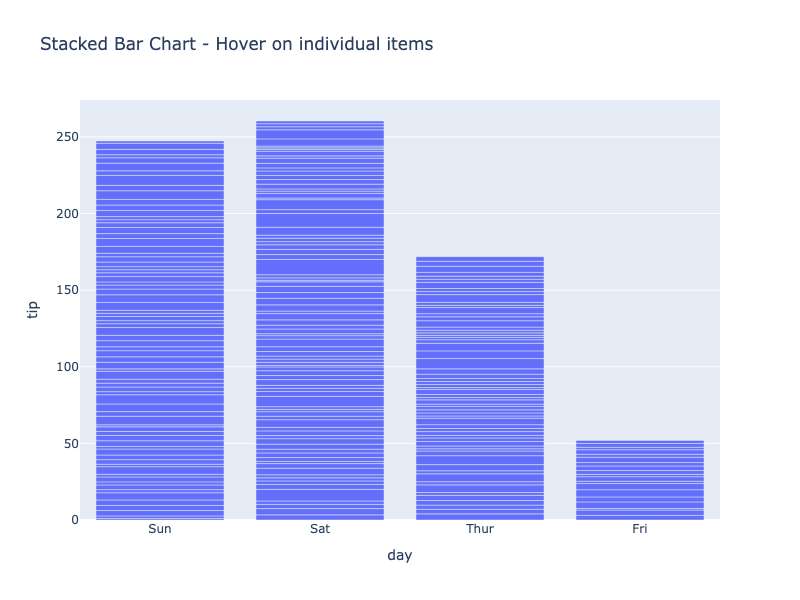


**Interactive Plot:**

<div>                        <script type="text/javascript">window.PlotlyConfig = {MathJaxConfig: 'local'};</script>
        <script charset="utf-8" src="https://cdn.plot.ly/plotly-3.1.0.min.js" integrity="sha256-Ei4740bWZhaUTQuD6q9yQlgVCMPBz6CZWhevDYPv93A=" crossorigin="anonymous"></script>                <div id="plotly-div-25" class="plotly-graph-div" style="height:300px; width:100%;"></div>            <script type="text/javascript">                window.PLOTLYENV=window.PLOTLYENV || {};                                if (document.getElementById("plotly-div-25")) {                    Plotly.newPlot(                        "plotly-div-25",                        [{"hovertemplate":"day=%{x}\u003cbr\u003etip=%{y}\u003cextra\u003e\u003c\u002fextra\u003e","legendgroup":"","marker":{"color":"#636efa","pattern":{"shape":""}},"name":"","orientation":"v","showlegend":false,"textposition":"auto","x":["Sun","Sun","Sun","Sun","Sun","Sun","Sun","Sun","Sun","Sun","Sun","Sun","Sun","Sun","Sun","Sun","Sun","Sun","Sun","Sat","Sat","Sat","Sat","Sat","Sat","Sat","Sat","Sat","Sat","Sat","Sat","Sat","Sat","Sat","Sat","Sat","Sat","Sat","Sat","Sat","Sat","Sun","Sun","Sun","Sun","Sun","Sun","Sun","Sun","Sun","Sun","Sun","Sun","Sun","Sun","Sun","Sat","Sat","Sat","Sat","Sat","Sat","Sat","Sat","Sat","Sat","Sat","Sat","Sat","Sat","Sat","Sat","Sat","Sat","Sat","Sat","Sat","Thur","Thur","Thur","Thur","Thur","Thur","Thur","Thur","Thur","Thur","Thur","Thur","Thur","Fri","Fri","Fri","Fri","Fri","Fri","Fri","Fri","Fri","Fri","Fri","Fri","Sat","Sat","Sat","Sat","Sat","Sat","Sat","Sat","Sat","Sat","Sun","Sun","Sun","Sun","Sun","Thur","Thur","Thur","Thur","Thur","Thur","Thur","Thur","Thur","Thur","Thur","Thur","Thur","Thur","Thur","Thur","Thur","Thur","Thur","Thur","Thur","Thur","Thur","Thur","Thur","Thur","Thur","Thur","Thur","Thur","Thur","Thur","Thur","Sun","Sun","Sun","Sun","Sun","Sun","Sun","Sun","Sun","Sun","Sun","Sun","Sun","Sun","Sun","Sun","Sun","Sun","Sat","Sat","Sat","Sat","Sun","Sun","Sun","Sun","Sun","Sun","Sun","Sun","Sun","Sun","Sun","Sun","Sun","Sun","Sun","Sun","Sun","Sun","Sun","Thur","Thur","Thur","Thur","Thur","Thur","Thur","Thur","Thur","Thur","Thur","Thur","Thur","Thur","Thur","Sat","Sat","Sat","Sat","Sat","Sat","Sat","Sat","Sat","Sat","Sat","Sat","Sat","Sat","Fri","Fri","Fri","Fri","Fri","Fri","Fri","Sat","Sat","Sat","Sat","Sat","Sat","Sat","Sat","Sat","Sat","Sat","Sat","Sat","Sat","Sat","Sat","Thur"],"xaxis":"x","y":{"dtype":"f8","bdata":"KVyPwvUo8D+PwvUoXI\u002f6PwAAAAAAAAxAexSuR+F6CkDhehSuR+EMQNejcD0K1xJAAAAAAAAAAED2KFyPwvUIQFyPwvUoXP8\u002f16NwPQrXCUBcj8L1KFz7PwAAAAAAABRAH4XrUbge+T8AAAAAAAAIQClcj8L1KAhAXI\u002fC9ShcD0C4HoXrUbj6P65H4XoUrg1AAAAAAAAADEDNzMzMzMwKQFK4HoXrURBAAAAAAAAABkDXo3A9CtcBQFK4HoXrUR5AcT0K16NwCUC4HoXrUbgCQAAAAAAAAABAAAAAAAAAAEAzMzMzMzMRQAAAAAAAAAhAMzMzMzMz9z8AAAAAAAAEQAAAAAAAAAhAmpmZmZmZA0ApXI\u002fC9SgKQM3MzMzMzAxAAAAAAAAAAECPwvUoXI8IQHsUrkfhegJAAAAAAAAAFEDsUbgehesBQFK4HoXrUQRAexSuR+F6CEAfhetRuB71P2ZmZmZmZhZAAAAAAAAACEAAAAAAAAAUQAAAAAAAABhAZmZmZmZmAEAAAAAAAAAIQAAAAAAAAARAzczMzMzMBEDNzMzMzMwUQPYoXI\u002fC9fg\u002fXI\u002fC9ShcEUAUrkfhehQMQAAAAAAAAAhAAAAAAAAA+D8pXI\u002fC9Sj8P+xRuB6F6xpArkfhehSuCUAAAAAAAAAAQK5H4XoUrv8\u002fFK5H4XoUDkAfhetRuB4FQDMzMzMzMwlAw\u002fUoXI\u002fCA0AAAAAAAADwPxSuR+F6FABAuB6F61G4AECF61G4HoX\u002fPwAAAAAAAAhAH4XrUbgeCUAAAAAAAAAUQJqZmZmZmQFAAAAAAAAA9D+kcD0K16MIQAAAAAAAABBAAAAAAAAACECuR+F6FK4FQAAAAAAAAAhAMzMzMzMzC0BI4XoUrkf9PwAAAAAAABRAPQrXo3A9AECuR+F6FK4UQAAAAAAAAABAAAAAAAAAEEBmZmZmZmYXQAAAAAAAAAhAAAAAAAAACEAAAAAAAAAMQAAAAAAAAPA\u002fMzMzMzMzEUAAAAAAAAAKQOxRuB6F6xJAAAAAAAAAEEAAAAAAAAD4PwAAAAAAAAhAAAAAAAAA+D8AAAAAAAAEQAAAAAAAAAhAAAAAAAAABEDXo3A9CtcLQFK4HoXrURBAPQrXo3A9+j89CtejcD0QQClcj8L1KBFAFK5H4XoUDkAAAAAAAAAQQAAAAAAAAAhAAAAAAAAA8D8AAAAAAAAQQGZmZmZmZgRAAAAAAAAAEEAAAAAAAAAMQEjhehSuRxRAAAAAAAAA+D\u002fNzMzMzMz8P1yPwvUoXAdAexSuR+F6AkDhehSuR+H6PwAAAAAAAARAAAAAAAAAAEApXI\u002fC9SgEQM3MzMzMzBBArkfhehSu9z8AAAAAAAAAQAAAAAAAAABAcT0K16NwAUAAAAAAAAD4P6RwPQrXowZAAAAAAAAA+D8AAAAAAAAAQAAAAAAAAApAAAAAAAAA9D8AAAAAAAAAQAAAAAAAAABAAAAAAAAAAEAAAAAAAAAGQAAAAAAAAAxAzczMzMzMGkAAAAAAAAAUQAAAAAAAABRAZmZmZmZmAkAAAAAAAAD4P8P1KFyPwvU\u002fFK5H4XoU+j+uR+F6FK77PwAAAAAAAABAAAAAAAAABEAAAAAAAAAAQOxRuB6F6wVAAAAAAAAAAEAAAAAAAAAAQI\u002fC9ShcjxRAAAAAAAAAFEAAAAAAAAAOQOF6FK5H4QRAAAAAAAAAAEAAAAAAAAAMQAAAAAAAAARAAAAAAAAAAEAAAAAAAAAAQAAAAAAAAAhA16NwPQrXC0DsUbgehesBQAAAAAAAABJAw\u002fUoXI\u002fC+T8AAAAAAAAAQAAAAAAAACRASOF6FK5HCUCamZmZmZkUQHE9CtejcAlAAAAAAAAAEEDhehSuR+EIQAAAAAAAAABAAAAAAAAAAEAAAAAAAAAQQGZmZmZmZgxAcT0K16NwDUCamZmZmZkWQAAAAAAAAAxAAAAAAAAAGkAAAAAAAAAIQAAAAAAAABRAAAAAAAAADEAAAAAAAAAAQAAAAAAAAAxAAAAAAAAAEEAAAAAAAAD4P8P1KFyPwhBAexSuR+F6BEApXI\u002fC9SgAQAAAAAAAABBACtejcD0K9z8AAAAAAAAAQAAAAAAAABRAAAAAAAAAAEAAAAAAAAAAQAAAAAAAABBAFK5H4XoUAEAAAAAAAAAAQAAAAAAAAARAAAAAAAAAEEDXo3A9CtcJQEjhehSuRwtAAAAAAAAACEA9CtejcD0AQNejcD0K1wFAAAAAAAAAAECkcD0K16MUQAAAAAAAACJAAAAAAAAABEAAAAAAAAAaQJqZmZmZmfE\u002fAAAAAAAACEAAAAAAAAD4PwrXo3A9Cvc\u002fuB6F61G4CECamZmZmZkBQNejcD0K1wtAuB6F61G4\u002fj8AAAAAAAAIQEjhehSuR\u002fk\u002fAAAAAAAABEAAAAAAAAAAQAAAAAAAAAhAw\u002fUoXI\u002fCBUAK16NwPQoHQAAAAAAAAABAAAAAAAAACEAfhetRuB4LQIXrUbgehfc\u002fAAAAAAAACEAAAAAAAAD0PwAAAAAAAPA\u002fuB6F61G48j+uR+F6FK4SQK5H4XoUrhdAAAAAAAAAAEAAAAAAAAAAQAAAAAAAAPw\u002fAAAAAAAACEA="},"yaxis":"y","type":"bar"}],                        {"template":{"data":{"histogram2dcontour":[{"type":"histogram2dcontour","colorbar":{"outlinewidth":0,"ticks":""},"colorscale":[[0.0,"#0d0887"],[0.1111111111111111,"#46039f"],[0.2222222222222222,"#7201a8"],[0.3333333333333333,"#9c179e"],[0.4444444444444444,"#bd3786"],[0.5555555555555556,"#d8576b"],[0.6666666666666666,"#ed7953"],[0.7777777777777778,"#fb9f3a"],[0.8888888888888888,"#fdca26"],[1.0,"#f0f921"]]}],"choropleth":[{"type":"choropleth","colorbar":{"outlinewidth":0,"ticks":""}}],"histogram2d":[{"type":"histogram2d","colorbar":{"outlinewidth":0,"ticks":""},"colorscale":[[0.0,"#0d0887"],[0.1111111111111111,"#46039f"],[0.2222222222222222,"#7201a8"],[0.3333333333333333,"#9c179e"],[0.4444444444444444,"#bd3786"],[0.5555555555555556,"#d8576b"],[0.6666666666666666,"#ed7953"],[0.7777777777777778,"#fb9f3a"],[0.8888888888888888,"#fdca26"],[1.0,"#f0f921"]]}],"heatmap":[{"type":"heatmap","colorbar":{"outlinewidth":0,"ticks":""},"colorscale":[[0.0,"#0d0887"],[0.1111111111111111,"#46039f"],[0.2222222222222222,"#7201a8"],[0.3333333333333333,"#9c179e"],[0.4444444444444444,"#bd3786"],[0.5555555555555556,"#d8576b"],[0.6666666666666666,"#ed7953"],[0.7777777777777778,"#fb9f3a"],[0.8888888888888888,"#fdca26"],[1.0,"#f0f921"]]}],"contourcarpet":[{"type":"contourcarpet","colorbar":{"outlinewidth":0,"ticks":""}}],"contour":[{"type":"contour","colorbar":{"outlinewidth":0,"ticks":""},"colorscale":[[0.0,"#0d0887"],[0.1111111111111111,"#46039f"],[0.2222222222222222,"#7201a8"],[0.3333333333333333,"#9c179e"],[0.4444444444444444,"#bd3786"],[0.5555555555555556,"#d8576b"],[0.6666666666666666,"#ed7953"],[0.7777777777777778,"#fb9f3a"],[0.8888888888888888,"#fdca26"],[1.0,"#f0f921"]]}],"surface":[{"type":"surface","colorbar":{"outlinewidth":0,"ticks":""},"colorscale":[[0.0,"#0d0887"],[0.1111111111111111,"#46039f"],[0.2222222222222222,"#7201a8"],[0.3333333333333333,"#9c179e"],[0.4444444444444444,"#bd3786"],[0.5555555555555556,"#d8576b"],[0.6666666666666666,"#ed7953"],[0.7777777777777778,"#fb9f3a"],[0.8888888888888888,"#fdca26"],[1.0,"#f0f921"]]}],"mesh3d":[{"type":"mesh3d","colorbar":{"outlinewidth":0,"ticks":""}}],"scatter":[{"fillpattern":{"fillmode":"overlay","size":10,"solidity":0.2},"type":"scatter"}],"parcoords":[{"type":"parcoords","line":{"colorbar":{"outlinewidth":0,"ticks":""}}}],"scatterpolargl":[{"type":"scatterpolargl","marker":{"colorbar":{"outlinewidth":0,"ticks":""}}}],"bar":[{"error_x":{"color":"#2a3f5f"},"error_y":{"color":"#2a3f5f"},"marker":{"line":{"color":"#E5ECF6","width":0.5},"pattern":{"fillmode":"overlay","size":10,"solidity":0.2}},"type":"bar"}],"scattergeo":[{"type":"scattergeo","marker":{"colorbar":{"outlinewidth":0,"ticks":""}}}],"scatterpolar":[{"type":"scatterpolar","marker":{"colorbar":{"outlinewidth":0,"ticks":""}}}],"histogram":[{"marker":{"pattern":{"fillmode":"overlay","size":10,"solidity":0.2}},"type":"histogram"}],"scattergl":[{"type":"scattergl","marker":{"colorbar":{"outlinewidth":0,"ticks":""}}}],"scatter3d":[{"type":"scatter3d","line":{"colorbar":{"outlinewidth":0,"ticks":""}},"marker":{"colorbar":{"outlinewidth":0,"ticks":""}}}],"scattermap":[{"type":"scattermap","marker":{"colorbar":{"outlinewidth":0,"ticks":""}}}],"scattermapbox":[{"type":"scattermapbox","marker":{"colorbar":{"outlinewidth":0,"ticks":""}}}],"scatterternary":[{"type":"scatterternary","marker":{"colorbar":{"outlinewidth":0,"ticks":""}}}],"scattercarpet":[{"type":"scattercarpet","marker":{"colorbar":{"outlinewidth":0,"ticks":""}}}],"carpet":[{"aaxis":{"endlinecolor":"#2a3f5f","gridcolor":"white","linecolor":"white","minorgridcolor":"white","startlinecolor":"#2a3f5f"},"baxis":{"endlinecolor":"#2a3f5f","gridcolor":"white","linecolor":"white","minorgridcolor":"white","startlinecolor":"#2a3f5f"},"type":"carpet"}],"table":[{"cells":{"fill":{"color":"#EBF0F8"},"line":{"color":"white"}},"header":{"fill":{"color":"#C8D4E3"},"line":{"color":"white"}},"type":"table"}],"barpolar":[{"marker":{"line":{"color":"#E5ECF6","width":0.5},"pattern":{"fillmode":"overlay","size":10,"solidity":0.2}},"type":"barpolar"}],"pie":[{"automargin":true,"type":"pie"}]},"layout":{"autotypenumbers":"strict","colorway":["#636efa","#EF553B","#00cc96","#ab63fa","#FFA15A","#19d3f3","#FF6692","#B6E880","#FF97FF","#FECB52"],"font":{"color":"#2a3f5f"},"hovermode":"closest","hoverlabel":{"align":"left"},"paper_bgcolor":"white","plot_bgcolor":"#E5ECF6","polar":{"bgcolor":"#E5ECF6","angularaxis":{"gridcolor":"white","linecolor":"white","ticks":""},"radialaxis":{"gridcolor":"white","linecolor":"white","ticks":""}},"ternary":{"bgcolor":"#E5ECF6","aaxis":{"gridcolor":"white","linecolor":"white","ticks":""},"baxis":{"gridcolor":"white","linecolor":"white","ticks":""},"caxis":{"gridcolor":"white","linecolor":"white","ticks":""}},"coloraxis":{"colorbar":{"outlinewidth":0,"ticks":""}},"colorscale":{"sequential":[[0.0,"#0d0887"],[0.1111111111111111,"#46039f"],[0.2222222222222222,"#7201a8"],[0.3333333333333333,"#9c179e"],[0.4444444444444444,"#bd3786"],[0.5555555555555556,"#d8576b"],[0.6666666666666666,"#ed7953"],[0.7777777777777778,"#fb9f3a"],[0.8888888888888888,"#fdca26"],[1.0,"#f0f921"]],"sequentialminus":[[0.0,"#0d0887"],[0.1111111111111111,"#46039f"],[0.2222222222222222,"#7201a8"],[0.3333333333333333,"#9c179e"],[0.4444444444444444,"#bd3786"],[0.5555555555555556,"#d8576b"],[0.6666666666666666,"#ed7953"],[0.7777777777777778,"#fb9f3a"],[0.8888888888888888,"#fdca26"],[1.0,"#f0f921"]],"diverging":[[0,"#8e0152"],[0.1,"#c51b7d"],[0.2,"#de77ae"],[0.3,"#f1b6da"],[0.4,"#fde0ef"],[0.5,"#f7f7f7"],[0.6,"#e6f5d0"],[0.7,"#b8e186"],[0.8,"#7fbc41"],[0.9,"#4d9221"],[1,"#276419"]]},"xaxis":{"gridcolor":"white","linecolor":"white","ticks":"","title":{"standoff":15},"zerolinecolor":"white","automargin":true,"zerolinewidth":2},"yaxis":{"gridcolor":"white","linecolor":"white","ticks":"","title":{"standoff":15},"zerolinecolor":"white","automargin":true,"zerolinewidth":2},"scene":{"xaxis":{"backgroundcolor":"#E5ECF6","gridcolor":"white","linecolor":"white","showbackground":true,"ticks":"","zerolinecolor":"white","gridwidth":2},"yaxis":{"backgroundcolor":"#E5ECF6","gridcolor":"white","linecolor":"white","showbackground":true,"ticks":"","zerolinecolor":"white","gridwidth":2},"zaxis":{"backgroundcolor":"#E5ECF6","gridcolor":"white","linecolor":"white","showbackground":true,"ticks":"","zerolinecolor":"white","gridwidth":2}},"shapedefaults":{"line":{"color":"#2a3f5f"}},"annotationdefaults":{"arrowcolor":"#2a3f5f","arrowhead":0,"arrowwidth":1},"geo":{"bgcolor":"white","landcolor":"#E5ECF6","subunitcolor":"white","showland":true,"showlakes":true,"lakecolor":"white"},"title":{"x":0.05},"mapbox":{"style":"light"}}},"xaxis":{"anchor":"y","domain":[0.0,1.0],"title":{"text":"day"}},"yaxis":{"anchor":"x","domain":[0.0,1.0],"title":{"text":"tip"}},"legend":{"tracegroupgap":0},"title":{"text":"Stacked Bar Chart - Hover on individual items"},"barmode":"relative","height":300},                        {"responsive": true}                    )                };            </script>        </div>

**Interactive Plot:**

<div>                        <script type="text/javascript">window.PlotlyConfig = {MathJaxConfig: 'local'};</script>
        <script charset="utf-8" src="https://cdn.plot.ly/plotly-3.1.0.min.js" integrity="sha256-Ei4740bWZhaUTQuD6q9yQlgVCMPBz6CZWhevDYPv93A=" crossorigin="anonymous"></script>                <div id="plotly-div-26" class="plotly-graph-div" style="height:300px; width:100%;"></div>            <script type="text/javascript">                window.PLOTLYENV=window.PLOTLYENV || {};                                if (document.getElementById("plotly-div-26")) {                    Plotly.newPlot(                        "plotly-div-26",                        [{"bingroup":"x","histfunc":"sum","hovertemplate":"day=%{x}\u003cbr\u003esum of tip=%{y}\u003cextra\u003e\u003c\u002fextra\u003e","legendgroup":"","marker":{"color":"#636efa","pattern":{"shape":""}},"name":"","orientation":"v","showlegend":false,"x":["Sun","Sun","Sun","Sun","Sun","Sun","Sun","Sun","Sun","Sun","Sun","Sun","Sun","Sun","Sun","Sun","Sun","Sun","Sun","Sat","Sat","Sat","Sat","Sat","Sat","Sat","Sat","Sat","Sat","Sat","Sat","Sat","Sat","Sat","Sat","Sat","Sat","Sat","Sat","Sat","Sat","Sun","Sun","Sun","Sun","Sun","Sun","Sun","Sun","Sun","Sun","Sun","Sun","Sun","Sun","Sun","Sat","Sat","Sat","Sat","Sat","Sat","Sat","Sat","Sat","Sat","Sat","Sat","Sat","Sat","Sat","Sat","Sat","Sat","Sat","Sat","Sat","Thur","Thur","Thur","Thur","Thur","Thur","Thur","Thur","Thur","Thur","Thur","Thur","Thur","Fri","Fri","Fri","Fri","Fri","Fri","Fri","Fri","Fri","Fri","Fri","Fri","Sat","Sat","Sat","Sat","Sat","Sat","Sat","Sat","Sat","Sat","Sun","Sun","Sun","Sun","Sun","Thur","Thur","Thur","Thur","Thur","Thur","Thur","Thur","Thur","Thur","Thur","Thur","Thur","Thur","Thur","Thur","Thur","Thur","Thur","Thur","Thur","Thur","Thur","Thur","Thur","Thur","Thur","Thur","Thur","Thur","Thur","Thur","Thur","Sun","Sun","Sun","Sun","Sun","Sun","Sun","Sun","Sun","Sun","Sun","Sun","Sun","Sun","Sun","Sun","Sun","Sun","Sat","Sat","Sat","Sat","Sun","Sun","Sun","Sun","Sun","Sun","Sun","Sun","Sun","Sun","Sun","Sun","Sun","Sun","Sun","Sun","Sun","Sun","Sun","Thur","Thur","Thur","Thur","Thur","Thur","Thur","Thur","Thur","Thur","Thur","Thur","Thur","Thur","Thur","Sat","Sat","Sat","Sat","Sat","Sat","Sat","Sat","Sat","Sat","Sat","Sat","Sat","Sat","Fri","Fri","Fri","Fri","Fri","Fri","Fri","Sat","Sat","Sat","Sat","Sat","Sat","Sat","Sat","Sat","Sat","Sat","Sat","Sat","Sat","Sat","Sat","Thur"],"xaxis":"x","y":{"dtype":"f8","bdata":"KVyPwvUo8D+PwvUoXI\u002f6PwAAAAAAAAxAexSuR+F6CkDhehSuR+EMQNejcD0K1xJAAAAAAAAAAED2KFyPwvUIQFyPwvUoXP8\u002f16NwPQrXCUBcj8L1KFz7PwAAAAAAABRAH4XrUbge+T8AAAAAAAAIQClcj8L1KAhAXI\u002fC9ShcD0C4HoXrUbj6P65H4XoUrg1AAAAAAAAADEDNzMzMzMwKQFK4HoXrURBAAAAAAAAABkDXo3A9CtcBQFK4HoXrUR5AcT0K16NwCUC4HoXrUbgCQAAAAAAAAABAAAAAAAAAAEAzMzMzMzMRQAAAAAAAAAhAMzMzMzMz9z8AAAAAAAAEQAAAAAAAAAhAmpmZmZmZA0ApXI\u002fC9SgKQM3MzMzMzAxAAAAAAAAAAECPwvUoXI8IQHsUrkfhegJAAAAAAAAAFEDsUbgehesBQFK4HoXrUQRAexSuR+F6CEAfhetRuB71P2ZmZmZmZhZAAAAAAAAACEAAAAAAAAAUQAAAAAAAABhAZmZmZmZmAEAAAAAAAAAIQAAAAAAAAARAzczMzMzMBEDNzMzMzMwUQPYoXI\u002fC9fg\u002fXI\u002fC9ShcEUAUrkfhehQMQAAAAAAAAAhAAAAAAAAA+D8pXI\u002fC9Sj8P+xRuB6F6xpArkfhehSuCUAAAAAAAAAAQK5H4XoUrv8\u002fFK5H4XoUDkAfhetRuB4FQDMzMzMzMwlAw\u002fUoXI\u002fCA0AAAAAAAADwPxSuR+F6FABAuB6F61G4AECF61G4HoX\u002fPwAAAAAAAAhAH4XrUbgeCUAAAAAAAAAUQJqZmZmZmQFAAAAAAAAA9D+kcD0K16MIQAAAAAAAABBAAAAAAAAACECuR+F6FK4FQAAAAAAAAAhAMzMzMzMzC0BI4XoUrkf9PwAAAAAAABRAPQrXo3A9AECuR+F6FK4UQAAAAAAAAABAAAAAAAAAEEBmZmZmZmYXQAAAAAAAAAhAAAAAAAAACEAAAAAAAAAMQAAAAAAAAPA\u002fMzMzMzMzEUAAAAAAAAAKQOxRuB6F6xJAAAAAAAAAEEAAAAAAAAD4PwAAAAAAAAhAAAAAAAAA+D8AAAAAAAAEQAAAAAAAAAhAAAAAAAAABEDXo3A9CtcLQFK4HoXrURBAPQrXo3A9+j89CtejcD0QQClcj8L1KBFAFK5H4XoUDkAAAAAAAAAQQAAAAAAAAAhAAAAAAAAA8D8AAAAAAAAQQGZmZmZmZgRAAAAAAAAAEEAAAAAAAAAMQEjhehSuRxRAAAAAAAAA+D\u002fNzMzMzMz8P1yPwvUoXAdAexSuR+F6AkDhehSuR+H6PwAAAAAAAARAAAAAAAAAAEApXI\u002fC9SgEQM3MzMzMzBBArkfhehSu9z8AAAAAAAAAQAAAAAAAAABAcT0K16NwAUAAAAAAAAD4P6RwPQrXowZAAAAAAAAA+D8AAAAAAAAAQAAAAAAAAApAAAAAAAAA9D8AAAAAAAAAQAAAAAAAAABAAAAAAAAAAEAAAAAAAAAGQAAAAAAAAAxAzczMzMzMGkAAAAAAAAAUQAAAAAAAABRAZmZmZmZmAkAAAAAAAAD4P8P1KFyPwvU\u002fFK5H4XoU+j+uR+F6FK77PwAAAAAAAABAAAAAAAAABEAAAAAAAAAAQOxRuB6F6wVAAAAAAAAAAEAAAAAAAAAAQI\u002fC9ShcjxRAAAAAAAAAFEAAAAAAAAAOQOF6FK5H4QRAAAAAAAAAAEAAAAAAAAAMQAAAAAAAAARAAAAAAAAAAEAAAAAAAAAAQAAAAAAAAAhA16NwPQrXC0DsUbgehesBQAAAAAAAABJAw\u002fUoXI\u002fC+T8AAAAAAAAAQAAAAAAAACRASOF6FK5HCUCamZmZmZkUQHE9CtejcAlAAAAAAAAAEEDhehSuR+EIQAAAAAAAAABAAAAAAAAAAEAAAAAAAAAQQGZmZmZmZgxAcT0K16NwDUCamZmZmZkWQAAAAAAAAAxAAAAAAAAAGkAAAAAAAAAIQAAAAAAAABRAAAAAAAAADEAAAAAAAAAAQAAAAAAAAAxAAAAAAAAAEEAAAAAAAAD4P8P1KFyPwhBAexSuR+F6BEApXI\u002fC9SgAQAAAAAAAABBACtejcD0K9z8AAAAAAAAAQAAAAAAAABRAAAAAAAAAAEAAAAAAAAAAQAAAAAAAABBAFK5H4XoUAEAAAAAAAAAAQAAAAAAAAARAAAAAAAAAEEDXo3A9CtcJQEjhehSuRwtAAAAAAAAACEA9CtejcD0AQNejcD0K1wFAAAAAAAAAAECkcD0K16MUQAAAAAAAACJAAAAAAAAABEAAAAAAAAAaQJqZmZmZmfE\u002fAAAAAAAACEAAAAAAAAD4PwrXo3A9Cvc\u002fuB6F61G4CECamZmZmZkBQNejcD0K1wtAuB6F61G4\u002fj8AAAAAAAAIQEjhehSuR\u002fk\u002fAAAAAAAABEAAAAAAAAAAQAAAAAAAAAhAw\u002fUoXI\u002fCBUAK16NwPQoHQAAAAAAAAABAAAAAAAAACEAfhetRuB4LQIXrUbgehfc\u002fAAAAAAAACEAAAAAAAAD0PwAAAAAAAPA\u002fuB6F61G48j+uR+F6FK4SQK5H4XoUrhdAAAAAAAAAAEAAAAAAAAAAQAAAAAAAAPw\u002fAAAAAAAACEA="},"yaxis":"y","type":"histogram"}],                        {"template":{"data":{"histogram2dcontour":[{"type":"histogram2dcontour","colorbar":{"outlinewidth":0,"ticks":""},"colorscale":[[0.0,"#0d0887"],[0.1111111111111111,"#46039f"],[0.2222222222222222,"#7201a8"],[0.3333333333333333,"#9c179e"],[0.4444444444444444,"#bd3786"],[0.5555555555555556,"#d8576b"],[0.6666666666666666,"#ed7953"],[0.7777777777777778,"#fb9f3a"],[0.8888888888888888,"#fdca26"],[1.0,"#f0f921"]]}],"choropleth":[{"type":"choropleth","colorbar":{"outlinewidth":0,"ticks":""}}],"histogram2d":[{"type":"histogram2d","colorbar":{"outlinewidth":0,"ticks":""},"colorscale":[[0.0,"#0d0887"],[0.1111111111111111,"#46039f"],[0.2222222222222222,"#7201a8"],[0.3333333333333333,"#9c179e"],[0.4444444444444444,"#bd3786"],[0.5555555555555556,"#d8576b"],[0.6666666666666666,"#ed7953"],[0.7777777777777778,"#fb9f3a"],[0.8888888888888888,"#fdca26"],[1.0,"#f0f921"]]}],"heatmap":[{"type":"heatmap","colorbar":{"outlinewidth":0,"ticks":""},"colorscale":[[0.0,"#0d0887"],[0.1111111111111111,"#46039f"],[0.2222222222222222,"#7201a8"],[0.3333333333333333,"#9c179e"],[0.4444444444444444,"#bd3786"],[0.5555555555555556,"#d8576b"],[0.6666666666666666,"#ed7953"],[0.7777777777777778,"#fb9f3a"],[0.8888888888888888,"#fdca26"],[1.0,"#f0f921"]]}],"contourcarpet":[{"type":"contourcarpet","colorbar":{"outlinewidth":0,"ticks":""}}],"contour":[{"type":"contour","colorbar":{"outlinewidth":0,"ticks":""},"colorscale":[[0.0,"#0d0887"],[0.1111111111111111,"#46039f"],[0.2222222222222222,"#7201a8"],[0.3333333333333333,"#9c179e"],[0.4444444444444444,"#bd3786"],[0.5555555555555556,"#d8576b"],[0.6666666666666666,"#ed7953"],[0.7777777777777778,"#fb9f3a"],[0.8888888888888888,"#fdca26"],[1.0,"#f0f921"]]}],"surface":[{"type":"surface","colorbar":{"outlinewidth":0,"ticks":""},"colorscale":[[0.0,"#0d0887"],[0.1111111111111111,"#46039f"],[0.2222222222222222,"#7201a8"],[0.3333333333333333,"#9c179e"],[0.4444444444444444,"#bd3786"],[0.5555555555555556,"#d8576b"],[0.6666666666666666,"#ed7953"],[0.7777777777777778,"#fb9f3a"],[0.8888888888888888,"#fdca26"],[1.0,"#f0f921"]]}],"mesh3d":[{"type":"mesh3d","colorbar":{"outlinewidth":0,"ticks":""}}],"scatter":[{"fillpattern":{"fillmode":"overlay","size":10,"solidity":0.2},"type":"scatter"}],"parcoords":[{"type":"parcoords","line":{"colorbar":{"outlinewidth":0,"ticks":""}}}],"scatterpolargl":[{"type":"scatterpolargl","marker":{"colorbar":{"outlinewidth":0,"ticks":""}}}],"bar":[{"error_x":{"color":"#2a3f5f"},"error_y":{"color":"#2a3f5f"},"marker":{"line":{"color":"#E5ECF6","width":0.5},"pattern":{"fillmode":"overlay","size":10,"solidity":0.2}},"type":"bar"}],"scattergeo":[{"type":"scattergeo","marker":{"colorbar":{"outlinewidth":0,"ticks":""}}}],"scatterpolar":[{"type":"scatterpolar","marker":{"colorbar":{"outlinewidth":0,"ticks":""}}}],"histogram":[{"marker":{"pattern":{"fillmode":"overlay","size":10,"solidity":0.2}},"type":"histogram"}],"scattergl":[{"type":"scattergl","marker":{"colorbar":{"outlinewidth":0,"ticks":""}}}],"scatter3d":[{"type":"scatter3d","line":{"colorbar":{"outlinewidth":0,"ticks":""}},"marker":{"colorbar":{"outlinewidth":0,"ticks":""}}}],"scattermap":[{"type":"scattermap","marker":{"colorbar":{"outlinewidth":0,"ticks":""}}}],"scattermapbox":[{"type":"scattermapbox","marker":{"colorbar":{"outlinewidth":0,"ticks":""}}}],"scatterternary":[{"type":"scatterternary","marker":{"colorbar":{"outlinewidth":0,"ticks":""}}}],"scattercarpet":[{"type":"scattercarpet","marker":{"colorbar":{"outlinewidth":0,"ticks":""}}}],"carpet":[{"aaxis":{"endlinecolor":"#2a3f5f","gridcolor":"white","linecolor":"white","minorgridcolor":"white","startlinecolor":"#2a3f5f"},"baxis":{"endlinecolor":"#2a3f5f","gridcolor":"white","linecolor":"white","minorgridcolor":"white","startlinecolor":"#2a3f5f"},"type":"carpet"}],"table":[{"cells":{"fill":{"color":"#EBF0F8"},"line":{"color":"white"}},"header":{"fill":{"color":"#C8D4E3"},"line":{"color":"white"}},"type":"table"}],"barpolar":[{"marker":{"line":{"color":"#E5ECF6","width":0.5},"pattern":{"fillmode":"overlay","size":10,"solidity":0.2}},"type":"barpolar"}],"pie":[{"automargin":true,"type":"pie"}]},"layout":{"autotypenumbers":"strict","colorway":["#636efa","#EF553B","#00cc96","#ab63fa","#FFA15A","#19d3f3","#FF6692","#B6E880","#FF97FF","#FECB52"],"font":{"color":"#2a3f5f"},"hovermode":"closest","hoverlabel":{"align":"left"},"paper_bgcolor":"white","plot_bgcolor":"#E5ECF6","polar":{"bgcolor":"#E5ECF6","angularaxis":{"gridcolor":"white","linecolor":"white","ticks":""},"radialaxis":{"gridcolor":"white","linecolor":"white","ticks":""}},"ternary":{"bgcolor":"#E5ECF6","aaxis":{"gridcolor":"white","linecolor":"white","ticks":""},"baxis":{"gridcolor":"white","linecolor":"white","ticks":""},"caxis":{"gridcolor":"white","linecolor":"white","ticks":""}},"coloraxis":{"colorbar":{"outlinewidth":0,"ticks":""}},"colorscale":{"sequential":[[0.0,"#0d0887"],[0.1111111111111111,"#46039f"],[0.2222222222222222,"#7201a8"],[0.3333333333333333,"#9c179e"],[0.4444444444444444,"#bd3786"],[0.5555555555555556,"#d8576b"],[0.6666666666666666,"#ed7953"],[0.7777777777777778,"#fb9f3a"],[0.8888888888888888,"#fdca26"],[1.0,"#f0f921"]],"sequentialminus":[[0.0,"#0d0887"],[0.1111111111111111,"#46039f"],[0.2222222222222222,"#7201a8"],[0.3333333333333333,"#9c179e"],[0.4444444444444444,"#bd3786"],[0.5555555555555556,"#d8576b"],[0.6666666666666666,"#ed7953"],[0.7777777777777778,"#fb9f3a"],[0.8888888888888888,"#fdca26"],[1.0,"#f0f921"]],"diverging":[[0,"#8e0152"],[0.1,"#c51b7d"],[0.2,"#de77ae"],[0.3,"#f1b6da"],[0.4,"#fde0ef"],[0.5,"#f7f7f7"],[0.6,"#e6f5d0"],[0.7,"#b8e186"],[0.8,"#7fbc41"],[0.9,"#4d9221"],[1,"#276419"]]},"xaxis":{"gridcolor":"white","linecolor":"white","ticks":"","title":{"standoff":15},"zerolinecolor":"white","automargin":true,"zerolinewidth":2},"yaxis":{"gridcolor":"white","linecolor":"white","ticks":"","title":{"standoff":15},"zerolinecolor":"white","automargin":true,"zerolinewidth":2},"scene":{"xaxis":{"backgroundcolor":"#E5ECF6","gridcolor":"white","linecolor":"white","showbackground":true,"ticks":"","zerolinecolor":"white","gridwidth":2},"yaxis":{"backgroundcolor":"#E5ECF6","gridcolor":"white","linecolor":"white","showbackground":true,"ticks":"","zerolinecolor":"white","gridwidth":2},"zaxis":{"backgroundcolor":"#E5ECF6","gridcolor":"white","linecolor":"white","showbackground":true,"ticks":"","zerolinecolor":"white","gridwidth":2}},"shapedefaults":{"line":{"color":"#2a3f5f"}},"annotationdefaults":{"arrowcolor":"#2a3f5f","arrowhead":0,"arrowwidth":1},"geo":{"bgcolor":"white","landcolor":"#E5ECF6","subunitcolor":"white","showland":true,"showlakes":true,"lakecolor":"white"},"title":{"x":0.05},"mapbox":{"style":"light"}}},"xaxis":{"anchor":"y","domain":[0.0,1.0],"title":{"text":"day"}},"yaxis":{"anchor":"x","domain":[0.0,1.0],"title":{"text":"sum of tip"}},"legend":{"tracegroupgap":0},"title":{"text":"Histogram Chart"},"barmode":"relative","height":300},                        {"responsive": true}                    )                };            </script>        </div>

### Share bins between histograms

In this example both histograms have a compatible bin settings using [bingroup](https://plotly.com/python/reference/histogram/#histogram-bingroup) attribute. Note that traces on the same subplot, and with the same `barmode` ("stack", "relative", "group") are forced into the same `bingroup`, however traces with `barmode = "overlay"` and on different axes (of the same axis type) can have compatible bin settings. Histogram and [histogram2d](https://plotly.com/python/2D-Histogram/) trace can share the same `bingroup`.

```python
import plotly.graph_objects as go
import numpy as np

fig = go.Figure(go.Histogram(
    x=np.random.randint(7, size=100),
    bingroup=1))

fig.add_trace(go.Histogram(
    x=np.random.randint(7, size=20),
    bingroup=1))

fig.update_layout(
    barmode="overlay",
    bargap=0.1)

fig.show()
```

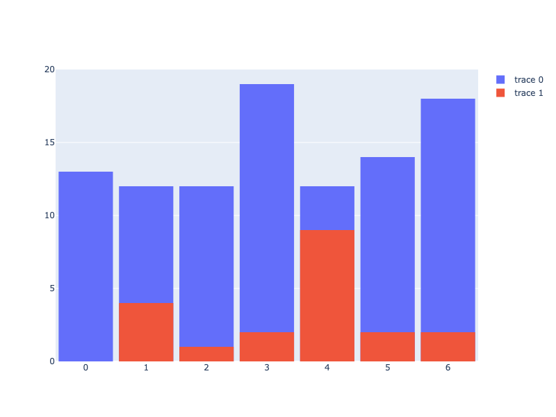

**Interactive Plot:**

<div>                        <script type="text/javascript">window.PlotlyConfig = {MathJaxConfig: 'local'};</script>
        <script charset="utf-8" src="https://cdn.plot.ly/plotly-3.1.0.min.js" integrity="sha256-Ei4740bWZhaUTQuD6q9yQlgVCMPBz6CZWhevDYPv93A=" crossorigin="anonymous"></script>                <div id="plotly-div-27" class="plotly-graph-div" style="height:100%; width:100%;"></div>            <script type="text/javascript">                window.PLOTLYENV=window.PLOTLYENV || {};                                if (document.getElementById("plotly-div-27")) {                    Plotly.newPlot(                        "plotly-div-27",                        [{"bingroup":"1","x":{"dtype":"i1","bdata":"AAMAAgUBBAMCAgUGAwMEBQMEAQIBAgEABQUBAQQCAAYABAADAwUGBAMEBgUDBgQDBAECAAMDBgMAAAEGAwYEAAMEBQYABgYBBgYGAwUFBQMAAwYCAgEBBQIGBgUGAQQDAgIABQ=="},"type":"histogram"},{"bingroup":"1","x":{"dtype":"i1","bdata":"AwQEAgQEBQQFBgQGAQEEAwQBAQQ="},"type":"histogram"}],                        {"template":{"data":{"histogram2dcontour":[{"type":"histogram2dcontour","colorbar":{"outlinewidth":0,"ticks":""},"colorscale":[[0.0,"#0d0887"],[0.1111111111111111,"#46039f"],[0.2222222222222222,"#7201a8"],[0.3333333333333333,"#9c179e"],[0.4444444444444444,"#bd3786"],[0.5555555555555556,"#d8576b"],[0.6666666666666666,"#ed7953"],[0.7777777777777778,"#fb9f3a"],[0.8888888888888888,"#fdca26"],[1.0,"#f0f921"]]}],"choropleth":[{"type":"choropleth","colorbar":{"outlinewidth":0,"ticks":""}}],"histogram2d":[{"type":"histogram2d","colorbar":{"outlinewidth":0,"ticks":""},"colorscale":[[0.0,"#0d0887"],[0.1111111111111111,"#46039f"],[0.2222222222222222,"#7201a8"],[0.3333333333333333,"#9c179e"],[0.4444444444444444,"#bd3786"],[0.5555555555555556,"#d8576b"],[0.6666666666666666,"#ed7953"],[0.7777777777777778,"#fb9f3a"],[0.8888888888888888,"#fdca26"],[1.0,"#f0f921"]]}],"heatmap":[{"type":"heatmap","colorbar":{"outlinewidth":0,"ticks":""},"colorscale":[[0.0,"#0d0887"],[0.1111111111111111,"#46039f"],[0.2222222222222222,"#7201a8"],[0.3333333333333333,"#9c179e"],[0.4444444444444444,"#bd3786"],[0.5555555555555556,"#d8576b"],[0.6666666666666666,"#ed7953"],[0.7777777777777778,"#fb9f3a"],[0.8888888888888888,"#fdca26"],[1.0,"#f0f921"]]}],"contourcarpet":[{"type":"contourcarpet","colorbar":{"outlinewidth":0,"ticks":""}}],"contour":[{"type":"contour","colorbar":{"outlinewidth":0,"ticks":""},"colorscale":[[0.0,"#0d0887"],[0.1111111111111111,"#46039f"],[0.2222222222222222,"#7201a8"],[0.3333333333333333,"#9c179e"],[0.4444444444444444,"#bd3786"],[0.5555555555555556,"#d8576b"],[0.6666666666666666,"#ed7953"],[0.7777777777777778,"#fb9f3a"],[0.8888888888888888,"#fdca26"],[1.0,"#f0f921"]]}],"surface":[{"type":"surface","colorbar":{"outlinewidth":0,"ticks":""},"colorscale":[[0.0,"#0d0887"],[0.1111111111111111,"#46039f"],[0.2222222222222222,"#7201a8"],[0.3333333333333333,"#9c179e"],[0.4444444444444444,"#bd3786"],[0.5555555555555556,"#d8576b"],[0.6666666666666666,"#ed7953"],[0.7777777777777778,"#fb9f3a"],[0.8888888888888888,"#fdca26"],[1.0,"#f0f921"]]}],"mesh3d":[{"type":"mesh3d","colorbar":{"outlinewidth":0,"ticks":""}}],"scatter":[{"fillpattern":{"fillmode":"overlay","size":10,"solidity":0.2},"type":"scatter"}],"parcoords":[{"type":"parcoords","line":{"colorbar":{"outlinewidth":0,"ticks":""}}}],"scatterpolargl":[{"type":"scatterpolargl","marker":{"colorbar":{"outlinewidth":0,"ticks":""}}}],"bar":[{"error_x":{"color":"#2a3f5f"},"error_y":{"color":"#2a3f5f"},"marker":{"line":{"color":"#E5ECF6","width":0.5},"pattern":{"fillmode":"overlay","size":10,"solidity":0.2}},"type":"bar"}],"scattergeo":[{"type":"scattergeo","marker":{"colorbar":{"outlinewidth":0,"ticks":""}}}],"scatterpolar":[{"type":"scatterpolar","marker":{"colorbar":{"outlinewidth":0,"ticks":""}}}],"histogram":[{"marker":{"pattern":{"fillmode":"overlay","size":10,"solidity":0.2}},"type":"histogram"}],"scattergl":[{"type":"scattergl","marker":{"colorbar":{"outlinewidth":0,"ticks":""}}}],"scatter3d":[{"type":"scatter3d","line":{"colorbar":{"outlinewidth":0,"ticks":""}},"marker":{"colorbar":{"outlinewidth":0,"ticks":""}}}],"scattermap":[{"type":"scattermap","marker":{"colorbar":{"outlinewidth":0,"ticks":""}}}],"scattermapbox":[{"type":"scattermapbox","marker":{"colorbar":{"outlinewidth":0,"ticks":""}}}],"scatterternary":[{"type":"scatterternary","marker":{"colorbar":{"outlinewidth":0,"ticks":""}}}],"scattercarpet":[{"type":"scattercarpet","marker":{"colorbar":{"outlinewidth":0,"ticks":""}}}],"carpet":[{"aaxis":{"endlinecolor":"#2a3f5f","gridcolor":"white","linecolor":"white","minorgridcolor":"white","startlinecolor":"#2a3f5f"},"baxis":{"endlinecolor":"#2a3f5f","gridcolor":"white","linecolor":"white","minorgridcolor":"white","startlinecolor":"#2a3f5f"},"type":"carpet"}],"table":[{"cells":{"fill":{"color":"#EBF0F8"},"line":{"color":"white"}},"header":{"fill":{"color":"#C8D4E3"},"line":{"color":"white"}},"type":"table"}],"barpolar":[{"marker":{"line":{"color":"#E5ECF6","width":0.5},"pattern":{"fillmode":"overlay","size":10,"solidity":0.2}},"type":"barpolar"}],"pie":[{"automargin":true,"type":"pie"}]},"layout":{"autotypenumbers":"strict","colorway":["#636efa","#EF553B","#00cc96","#ab63fa","#FFA15A","#19d3f3","#FF6692","#B6E880","#FF97FF","#FECB52"],"font":{"color":"#2a3f5f"},"hovermode":"closest","hoverlabel":{"align":"left"},"paper_bgcolor":"white","plot_bgcolor":"#E5ECF6","polar":{"bgcolor":"#E5ECF6","angularaxis":{"gridcolor":"white","linecolor":"white","ticks":""},"radialaxis":{"gridcolor":"white","linecolor":"white","ticks":""}},"ternary":{"bgcolor":"#E5ECF6","aaxis":{"gridcolor":"white","linecolor":"white","ticks":""},"baxis":{"gridcolor":"white","linecolor":"white","ticks":""},"caxis":{"gridcolor":"white","linecolor":"white","ticks":""}},"coloraxis":{"colorbar":{"outlinewidth":0,"ticks":""}},"colorscale":{"sequential":[[0.0,"#0d0887"],[0.1111111111111111,"#46039f"],[0.2222222222222222,"#7201a8"],[0.3333333333333333,"#9c179e"],[0.4444444444444444,"#bd3786"],[0.5555555555555556,"#d8576b"],[0.6666666666666666,"#ed7953"],[0.7777777777777778,"#fb9f3a"],[0.8888888888888888,"#fdca26"],[1.0,"#f0f921"]],"sequentialminus":[[0.0,"#0d0887"],[0.1111111111111111,"#46039f"],[0.2222222222222222,"#7201a8"],[0.3333333333333333,"#9c179e"],[0.4444444444444444,"#bd3786"],[0.5555555555555556,"#d8576b"],[0.6666666666666666,"#ed7953"],[0.7777777777777778,"#fb9f3a"],[0.8888888888888888,"#fdca26"],[1.0,"#f0f921"]],"diverging":[[0,"#8e0152"],[0.1,"#c51b7d"],[0.2,"#de77ae"],[0.3,"#f1b6da"],[0.4,"#fde0ef"],[0.5,"#f7f7f7"],[0.6,"#e6f5d0"],[0.7,"#b8e186"],[0.8,"#7fbc41"],[0.9,"#4d9221"],[1,"#276419"]]},"xaxis":{"gridcolor":"white","linecolor":"white","ticks":"","title":{"standoff":15},"zerolinecolor":"white","automargin":true,"zerolinewidth":2},"yaxis":{"gridcolor":"white","linecolor":"white","ticks":"","title":{"standoff":15},"zerolinecolor":"white","automargin":true,"zerolinewidth":2},"scene":{"xaxis":{"backgroundcolor":"#E5ECF6","gridcolor":"white","linecolor":"white","showbackground":true,"ticks":"","zerolinecolor":"white","gridwidth":2},"yaxis":{"backgroundcolor":"#E5ECF6","gridcolor":"white","linecolor":"white","showbackground":true,"ticks":"","zerolinecolor":"white","gridwidth":2},"zaxis":{"backgroundcolor":"#E5ECF6","gridcolor":"white","linecolor":"white","showbackground":true,"ticks":"","zerolinecolor":"white","gridwidth":2}},"shapedefaults":{"line":{"color":"#2a3f5f"}},"annotationdefaults":{"arrowcolor":"#2a3f5f","arrowhead":0,"arrowwidth":1},"geo":{"bgcolor":"white","landcolor":"#E5ECF6","subunitcolor":"white","showland":true,"showlakes":true,"lakecolor":"white"},"title":{"x":0.05},"mapbox":{"style":"light"}}},"barmode":"overlay","bargap":0.1},                        {"responsive": true}                    )                };            </script>        </div>

### Sort Histogram by Category Order

Histogram bars can also be sorted based on the ordering logic of the categorical values using the [categoryorder](https://plotly.com/python/reference/layout/xaxis/#layout-xaxis-categoryorder) attribute of the x-axis. Sorting of histogram bars using `categoryorder` also works with multiple traces on the same x-axis. In the following examples, the histogram bars are sorted based on the total numerical values.

```python
import plotly.express as px

df = px.data.tips()
fig = px.histogram(df, x="day").update_xaxes(categoryorder='total ascending')
fig.show()
```

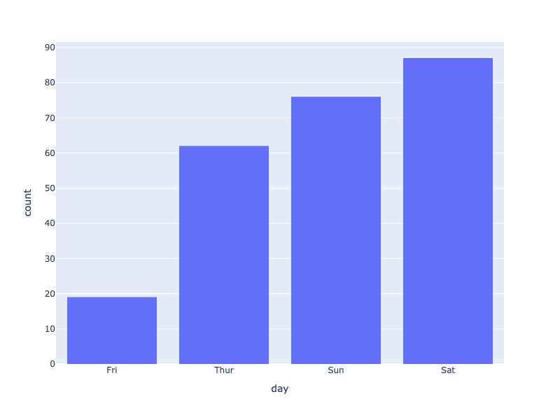

**Interactive Plot:**

<div>                        <script type="text/javascript">window.PlotlyConfig = {MathJaxConfig: 'local'};</script>
        <script charset="utf-8" src="https://cdn.plot.ly/plotly-3.1.0.min.js" integrity="sha256-Ei4740bWZhaUTQuD6q9yQlgVCMPBz6CZWhevDYPv93A=" crossorigin="anonymous"></script>                <div id="plotly-div-28" class="plotly-graph-div" style="height:100%; width:100%;"></div>            <script type="text/javascript">                window.PLOTLYENV=window.PLOTLYENV || {};                                if (document.getElementById("plotly-div-28")) {                    Plotly.newPlot(                        "plotly-div-28",                        [{"bingroup":"x","hovertemplate":"day=%{x}\u003cbr\u003ecount=%{y}\u003cextra\u003e\u003c\u002fextra\u003e","legendgroup":"","marker":{"color":"#636efa","pattern":{"shape":""}},"name":"","orientation":"v","showlegend":false,"x":["Sun","Sun","Sun","Sun","Sun","Sun","Sun","Sun","Sun","Sun","Sun","Sun","Sun","Sun","Sun","Sun","Sun","Sun","Sun","Sat","Sat","Sat","Sat","Sat","Sat","Sat","Sat","Sat","Sat","Sat","Sat","Sat","Sat","Sat","Sat","Sat","Sat","Sat","Sat","Sat","Sat","Sun","Sun","Sun","Sun","Sun","Sun","Sun","Sun","Sun","Sun","Sun","Sun","Sun","Sun","Sun","Sat","Sat","Sat","Sat","Sat","Sat","Sat","Sat","Sat","Sat","Sat","Sat","Sat","Sat","Sat","Sat","Sat","Sat","Sat","Sat","Sat","Thur","Thur","Thur","Thur","Thur","Thur","Thur","Thur","Thur","Thur","Thur","Thur","Thur","Fri","Fri","Fri","Fri","Fri","Fri","Fri","Fri","Fri","Fri","Fri","Fri","Sat","Sat","Sat","Sat","Sat","Sat","Sat","Sat","Sat","Sat","Sun","Sun","Sun","Sun","Sun","Thur","Thur","Thur","Thur","Thur","Thur","Thur","Thur","Thur","Thur","Thur","Thur","Thur","Thur","Thur","Thur","Thur","Thur","Thur","Thur","Thur","Thur","Thur","Thur","Thur","Thur","Thur","Thur","Thur","Thur","Thur","Thur","Thur","Sun","Sun","Sun","Sun","Sun","Sun","Sun","Sun","Sun","Sun","Sun","Sun","Sun","Sun","Sun","Sun","Sun","Sun","Sat","Sat","Sat","Sat","Sun","Sun","Sun","Sun","Sun","Sun","Sun","Sun","Sun","Sun","Sun","Sun","Sun","Sun","Sun","Sun","Sun","Sun","Sun","Thur","Thur","Thur","Thur","Thur","Thur","Thur","Thur","Thur","Thur","Thur","Thur","Thur","Thur","Thur","Sat","Sat","Sat","Sat","Sat","Sat","Sat","Sat","Sat","Sat","Sat","Sat","Sat","Sat","Fri","Fri","Fri","Fri","Fri","Fri","Fri","Sat","Sat","Sat","Sat","Sat","Sat","Sat","Sat","Sat","Sat","Sat","Sat","Sat","Sat","Sat","Sat","Thur"],"xaxis":"x","yaxis":"y","type":"histogram"}],                        {"template":{"data":{"histogram2dcontour":[{"type":"histogram2dcontour","colorbar":{"outlinewidth":0,"ticks":""},"colorscale":[[0.0,"#0d0887"],[0.1111111111111111,"#46039f"],[0.2222222222222222,"#7201a8"],[0.3333333333333333,"#9c179e"],[0.4444444444444444,"#bd3786"],[0.5555555555555556,"#d8576b"],[0.6666666666666666,"#ed7953"],[0.7777777777777778,"#fb9f3a"],[0.8888888888888888,"#fdca26"],[1.0,"#f0f921"]]}],"choropleth":[{"type":"choropleth","colorbar":{"outlinewidth":0,"ticks":""}}],"histogram2d":[{"type":"histogram2d","colorbar":{"outlinewidth":0,"ticks":""},"colorscale":[[0.0,"#0d0887"],[0.1111111111111111,"#46039f"],[0.2222222222222222,"#7201a8"],[0.3333333333333333,"#9c179e"],[0.4444444444444444,"#bd3786"],[0.5555555555555556,"#d8576b"],[0.6666666666666666,"#ed7953"],[0.7777777777777778,"#fb9f3a"],[0.8888888888888888,"#fdca26"],[1.0,"#f0f921"]]}],"heatmap":[{"type":"heatmap","colorbar":{"outlinewidth":0,"ticks":""},"colorscale":[[0.0,"#0d0887"],[0.1111111111111111,"#46039f"],[0.2222222222222222,"#7201a8"],[0.3333333333333333,"#9c179e"],[0.4444444444444444,"#bd3786"],[0.5555555555555556,"#d8576b"],[0.6666666666666666,"#ed7953"],[0.7777777777777778,"#fb9f3a"],[0.8888888888888888,"#fdca26"],[1.0,"#f0f921"]]}],"contourcarpet":[{"type":"contourcarpet","colorbar":{"outlinewidth":0,"ticks":""}}],"contour":[{"type":"contour","colorbar":{"outlinewidth":0,"ticks":""},"colorscale":[[0.0,"#0d0887"],[0.1111111111111111,"#46039f"],[0.2222222222222222,"#7201a8"],[0.3333333333333333,"#9c179e"],[0.4444444444444444,"#bd3786"],[0.5555555555555556,"#d8576b"],[0.6666666666666666,"#ed7953"],[0.7777777777777778,"#fb9f3a"],[0.8888888888888888,"#fdca26"],[1.0,"#f0f921"]]}],"surface":[{"type":"surface","colorbar":{"outlinewidth":0,"ticks":""},"colorscale":[[0.0,"#0d0887"],[0.1111111111111111,"#46039f"],[0.2222222222222222,"#7201a8"],[0.3333333333333333,"#9c179e"],[0.4444444444444444,"#bd3786"],[0.5555555555555556,"#d8576b"],[0.6666666666666666,"#ed7953"],[0.7777777777777778,"#fb9f3a"],[0.8888888888888888,"#fdca26"],[1.0,"#f0f921"]]}],"mesh3d":[{"type":"mesh3d","colorbar":{"outlinewidth":0,"ticks":""}}],"scatter":[{"fillpattern":{"fillmode":"overlay","size":10,"solidity":0.2},"type":"scatter"}],"parcoords":[{"type":"parcoords","line":{"colorbar":{"outlinewidth":0,"ticks":""}}}],"scatterpolargl":[{"type":"scatterpolargl","marker":{"colorbar":{"outlinewidth":0,"ticks":""}}}],"bar":[{"error_x":{"color":"#2a3f5f"},"error_y":{"color":"#2a3f5f"},"marker":{"line":{"color":"#E5ECF6","width":0.5},"pattern":{"fillmode":"overlay","size":10,"solidity":0.2}},"type":"bar"}],"scattergeo":[{"type":"scattergeo","marker":{"colorbar":{"outlinewidth":0,"ticks":""}}}],"scatterpolar":[{"type":"scatterpolar","marker":{"colorbar":{"outlinewidth":0,"ticks":""}}}],"histogram":[{"marker":{"pattern":{"fillmode":"overlay","size":10,"solidity":0.2}},"type":"histogram"}],"scattergl":[{"type":"scattergl","marker":{"colorbar":{"outlinewidth":0,"ticks":""}}}],"scatter3d":[{"type":"scatter3d","line":{"colorbar":{"outlinewidth":0,"ticks":""}},"marker":{"colorbar":{"outlinewidth":0,"ticks":""}}}],"scattermap":[{"type":"scattermap","marker":{"colorbar":{"outlinewidth":0,"ticks":""}}}],"scattermapbox":[{"type":"scattermapbox","marker":{"colorbar":{"outlinewidth":0,"ticks":""}}}],"scatterternary":[{"type":"scatterternary","marker":{"colorbar":{"outlinewidth":0,"ticks":""}}}],"scattercarpet":[{"type":"scattercarpet","marker":{"colorbar":{"outlinewidth":0,"ticks":""}}}],"carpet":[{"aaxis":{"endlinecolor":"#2a3f5f","gridcolor":"white","linecolor":"white","minorgridcolor":"white","startlinecolor":"#2a3f5f"},"baxis":{"endlinecolor":"#2a3f5f","gridcolor":"white","linecolor":"white","minorgridcolor":"white","startlinecolor":"#2a3f5f"},"type":"carpet"}],"table":[{"cells":{"fill":{"color":"#EBF0F8"},"line":{"color":"white"}},"header":{"fill":{"color":"#C8D4E3"},"line":{"color":"white"}},"type":"table"}],"barpolar":[{"marker":{"line":{"color":"#E5ECF6","width":0.5},"pattern":{"fillmode":"overlay","size":10,"solidity":0.2}},"type":"barpolar"}],"pie":[{"automargin":true,"type":"pie"}]},"layout":{"autotypenumbers":"strict","colorway":["#636efa","#EF553B","#00cc96","#ab63fa","#FFA15A","#19d3f3","#FF6692","#B6E880","#FF97FF","#FECB52"],"font":{"color":"#2a3f5f"},"hovermode":"closest","hoverlabel":{"align":"left"},"paper_bgcolor":"white","plot_bgcolor":"#E5ECF6","polar":{"bgcolor":"#E5ECF6","angularaxis":{"gridcolor":"white","linecolor":"white","ticks":""},"radialaxis":{"gridcolor":"white","linecolor":"white","ticks":""}},"ternary":{"bgcolor":"#E5ECF6","aaxis":{"gridcolor":"white","linecolor":"white","ticks":""},"baxis":{"gridcolor":"white","linecolor":"white","ticks":""},"caxis":{"gridcolor":"white","linecolor":"white","ticks":""}},"coloraxis":{"colorbar":{"outlinewidth":0,"ticks":""}},"colorscale":{"sequential":[[0.0,"#0d0887"],[0.1111111111111111,"#46039f"],[0.2222222222222222,"#7201a8"],[0.3333333333333333,"#9c179e"],[0.4444444444444444,"#bd3786"],[0.5555555555555556,"#d8576b"],[0.6666666666666666,"#ed7953"],[0.7777777777777778,"#fb9f3a"],[0.8888888888888888,"#fdca26"],[1.0,"#f0f921"]],"sequentialminus":[[0.0,"#0d0887"],[0.1111111111111111,"#46039f"],[0.2222222222222222,"#7201a8"],[0.3333333333333333,"#9c179e"],[0.4444444444444444,"#bd3786"],[0.5555555555555556,"#d8576b"],[0.6666666666666666,"#ed7953"],[0.7777777777777778,"#fb9f3a"],[0.8888888888888888,"#fdca26"],[1.0,"#f0f921"]],"diverging":[[0,"#8e0152"],[0.1,"#c51b7d"],[0.2,"#de77ae"],[0.3,"#f1b6da"],[0.4,"#fde0ef"],[0.5,"#f7f7f7"],[0.6,"#e6f5d0"],[0.7,"#b8e186"],[0.8,"#7fbc41"],[0.9,"#4d9221"],[1,"#276419"]]},"xaxis":{"gridcolor":"white","linecolor":"white","ticks":"","title":{"standoff":15},"zerolinecolor":"white","automargin":true,"zerolinewidth":2},"yaxis":{"gridcolor":"white","linecolor":"white","ticks":"","title":{"standoff":15},"zerolinecolor":"white","automargin":true,"zerolinewidth":2},"scene":{"xaxis":{"backgroundcolor":"#E5ECF6","gridcolor":"white","linecolor":"white","showbackground":true,"ticks":"","zerolinecolor":"white","gridwidth":2},"yaxis":{"backgroundcolor":"#E5ECF6","gridcolor":"white","linecolor":"white","showbackground":true,"ticks":"","zerolinecolor":"white","gridwidth":2},"zaxis":{"backgroundcolor":"#E5ECF6","gridcolor":"white","linecolor":"white","showbackground":true,"ticks":"","zerolinecolor":"white","gridwidth":2}},"shapedefaults":{"line":{"color":"#2a3f5f"}},"annotationdefaults":{"arrowcolor":"#2a3f5f","arrowhead":0,"arrowwidth":1},"geo":{"bgcolor":"white","landcolor":"#E5ECF6","subunitcolor":"white","showland":true,"showlakes":true,"lakecolor":"white"},"title":{"x":0.05},"mapbox":{"style":"light"}}},"xaxis":{"anchor":"y","domain":[0.0,1.0],"title":{"text":"day"},"categoryorder":"total ascending"},"yaxis":{"anchor":"x","domain":[0.0,1.0],"title":{"text":"count"}},"legend":{"tracegroupgap":0},"margin":{"t":60},"barmode":"relative"},                        {"responsive": true}                    )                };            </script>        </div>

```python
import plotly.express as px

df = px.data.tips()
fig = px.histogram(df, x="day", color="smoker").update_xaxes(categoryorder='total descending')
fig.show()
```

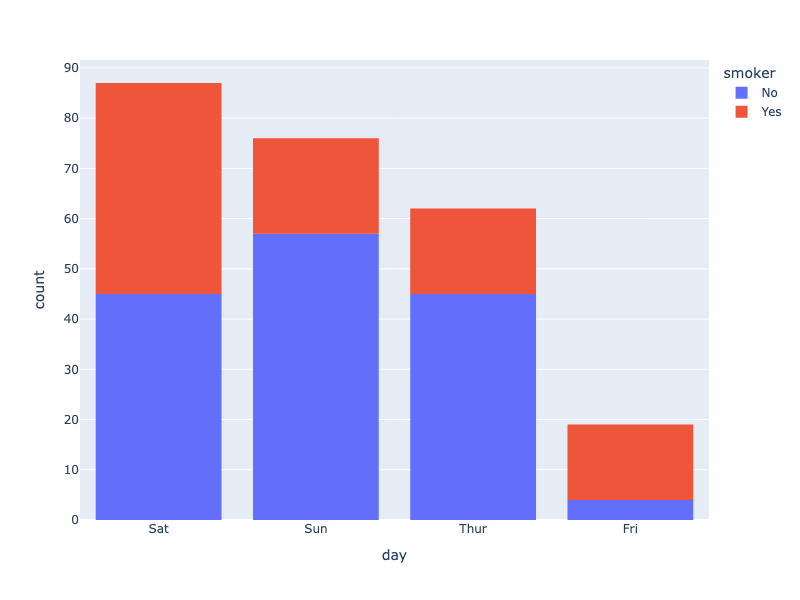

**Interactive Plot:**

<div>                        <script type="text/javascript">window.PlotlyConfig = {MathJaxConfig: 'local'};</script>
        <script charset="utf-8" src="https://cdn.plot.ly/plotly-3.1.0.min.js" integrity="sha256-Ei4740bWZhaUTQuD6q9yQlgVCMPBz6CZWhevDYPv93A=" crossorigin="anonymous"></script>                <div id="plotly-div-29" class="plotly-graph-div" style="height:100%; width:100%;"></div>            <script type="text/javascript">                window.PLOTLYENV=window.PLOTLYENV || {};                                if (document.getElementById("plotly-div-29")) {                    Plotly.newPlot(                        "plotly-div-29",                        [{"bingroup":"x","hovertemplate":"smoker=No\u003cbr\u003eday=%{x}\u003cbr\u003ecount=%{y}\u003cextra\u003e\u003c\u002fextra\u003e","legendgroup":"No","marker":{"color":"#636efa","pattern":{"shape":""}},"name":"No","orientation":"v","showlegend":true,"x":["Sun","Sun","Sun","Sun","Sun","Sun","Sun","Sun","Sun","Sun","Sun","Sun","Sun","Sun","Sun","Sun","Sun","Sun","Sun","Sat","Sat","Sat","Sat","Sat","Sat","Sat","Sat","Sat","Sat","Sat","Sat","Sat","Sat","Sat","Sat","Sat","Sat","Sat","Sat","Sat","Sat","Sun","Sun","Sun","Sun","Sun","Sun","Sun","Sun","Sun","Sun","Sun","Sun","Sun","Sun","Sun","Sat","Sat","Sat","Sat","Sat","Sat","Sat","Sat","Sat","Sat","Thur","Thur","Thur","Thur","Thur","Thur","Thur","Thur","Thur","Thur","Thur","Fri","Fri","Fri","Sat","Sat","Sat","Sat","Sun","Sun","Sun","Sun","Sun","Thur","Thur","Thur","Thur","Thur","Thur","Thur","Thur","Thur","Thur","Thur","Thur","Thur","Thur","Thur","Thur","Thur","Thur","Thur","Thur","Thur","Thur","Thur","Thur","Thur","Thur","Thur","Thur","Thur","Thur","Thur","Thur","Sun","Sun","Sun","Sun","Sun","Sun","Sun","Sun","Sun","Sun","Sun","Sun","Sun","Sun","Sun","Sun","Sun","Sun","Thur","Sat","Fri","Sat","Sat","Sat","Sat","Sat","Sat","Sat","Sat","Thur"],"xaxis":"x","yaxis":"y","type":"histogram"},{"bingroup":"x","hovertemplate":"smoker=Yes\u003cbr\u003eday=%{x}\u003cbr\u003ecount=%{y}\u003cextra\u003e\u003c\u002fextra\u003e","legendgroup":"Yes","marker":{"color":"#EF553B","pattern":{"shape":""}},"name":"Yes","orientation":"v","showlegend":true,"x":["Sat","Sat","Sat","Sat","Sat","Sat","Sat","Sat","Sat","Sat","Sat","Thur","Thur","Fri","Fri","Fri","Fri","Fri","Fri","Fri","Fri","Fri","Sat","Sat","Sat","Sat","Sat","Sat","Thur","Sun","Sat","Sat","Sat","Sat","Sun","Sun","Sun","Sun","Sun","Sun","Sun","Sun","Sun","Sun","Sun","Sun","Sun","Sun","Sun","Sun","Sun","Sun","Thur","Thur","Thur","Thur","Thur","Thur","Thur","Thur","Thur","Thur","Thur","Thur","Thur","Thur","Sat","Sat","Sat","Sat","Sat","Sat","Sat","Sat","Sat","Sat","Sat","Sat","Sat","Fri","Fri","Fri","Fri","Fri","Fri","Sat","Sat","Sat","Sat","Sat","Sat","Sat","Sat"],"xaxis":"x","yaxis":"y","type":"histogram"}],                        {"template":{"data":{"histogram2dcontour":[{"type":"histogram2dcontour","colorbar":{"outlinewidth":0,"ticks":""},"colorscale":[[0.0,"#0d0887"],[0.1111111111111111,"#46039f"],[0.2222222222222222,"#7201a8"],[0.3333333333333333,"#9c179e"],[0.4444444444444444,"#bd3786"],[0.5555555555555556,"#d8576b"],[0.6666666666666666,"#ed7953"],[0.7777777777777778,"#fb9f3a"],[0.8888888888888888,"#fdca26"],[1.0,"#f0f921"]]}],"choropleth":[{"type":"choropleth","colorbar":{"outlinewidth":0,"ticks":""}}],"histogram2d":[{"type":"histogram2d","colorbar":{"outlinewidth":0,"ticks":""},"colorscale":[[0.0,"#0d0887"],[0.1111111111111111,"#46039f"],[0.2222222222222222,"#7201a8"],[0.3333333333333333,"#9c179e"],[0.4444444444444444,"#bd3786"],[0.5555555555555556,"#d8576b"],[0.6666666666666666,"#ed7953"],[0.7777777777777778,"#fb9f3a"],[0.8888888888888888,"#fdca26"],[1.0,"#f0f921"]]}],"heatmap":[{"type":"heatmap","colorbar":{"outlinewidth":0,"ticks":""},"colorscale":[[0.0,"#0d0887"],[0.1111111111111111,"#46039f"],[0.2222222222222222,"#7201a8"],[0.3333333333333333,"#9c179e"],[0.4444444444444444,"#bd3786"],[0.5555555555555556,"#d8576b"],[0.6666666666666666,"#ed7953"],[0.7777777777777778,"#fb9f3a"],[0.8888888888888888,"#fdca26"],[1.0,"#f0f921"]]}],"contourcarpet":[{"type":"contourcarpet","colorbar":{"outlinewidth":0,"ticks":""}}],"contour":[{"type":"contour","colorbar":{"outlinewidth":0,"ticks":""},"colorscale":[[0.0,"#0d0887"],[0.1111111111111111,"#46039f"],[0.2222222222222222,"#7201a8"],[0.3333333333333333,"#9c179e"],[0.4444444444444444,"#bd3786"],[0.5555555555555556,"#d8576b"],[0.6666666666666666,"#ed7953"],[0.7777777777777778,"#fb9f3a"],[0.8888888888888888,"#fdca26"],[1.0,"#f0f921"]]}],"surface":[{"type":"surface","colorbar":{"outlinewidth":0,"ticks":""},"colorscale":[[0.0,"#0d0887"],[0.1111111111111111,"#46039f"],[0.2222222222222222,"#7201a8"],[0.3333333333333333,"#9c179e"],[0.4444444444444444,"#bd3786"],[0.5555555555555556,"#d8576b"],[0.6666666666666666,"#ed7953"],[0.7777777777777778,"#fb9f3a"],[0.8888888888888888,"#fdca26"],[1.0,"#f0f921"]]}],"mesh3d":[{"type":"mesh3d","colorbar":{"outlinewidth":0,"ticks":""}}],"scatter":[{"fillpattern":{"fillmode":"overlay","size":10,"solidity":0.2},"type":"scatter"}],"parcoords":[{"type":"parcoords","line":{"colorbar":{"outlinewidth":0,"ticks":""}}}],"scatterpolargl":[{"type":"scatterpolargl","marker":{"colorbar":{"outlinewidth":0,"ticks":""}}}],"bar":[{"error_x":{"color":"#2a3f5f"},"error_y":{"color":"#2a3f5f"},"marker":{"line":{"color":"#E5ECF6","width":0.5},"pattern":{"fillmode":"overlay","size":10,"solidity":0.2}},"type":"bar"}],"scattergeo":[{"type":"scattergeo","marker":{"colorbar":{"outlinewidth":0,"ticks":""}}}],"scatterpolar":[{"type":"scatterpolar","marker":{"colorbar":{"outlinewidth":0,"ticks":""}}}],"histogram":[{"marker":{"pattern":{"fillmode":"overlay","size":10,"solidity":0.2}},"type":"histogram"}],"scattergl":[{"type":"scattergl","marker":{"colorbar":{"outlinewidth":0,"ticks":""}}}],"scatter3d":[{"type":"scatter3d","line":{"colorbar":{"outlinewidth":0,"ticks":""}},"marker":{"colorbar":{"outlinewidth":0,"ticks":""}}}],"scattermap":[{"type":"scattermap","marker":{"colorbar":{"outlinewidth":0,"ticks":""}}}],"scattermapbox":[{"type":"scattermapbox","marker":{"colorbar":{"outlinewidth":0,"ticks":""}}}],"scatterternary":[{"type":"scatterternary","marker":{"colorbar":{"outlinewidth":0,"ticks":""}}}],"scattercarpet":[{"type":"scattercarpet","marker":{"colorbar":{"outlinewidth":0,"ticks":""}}}],"carpet":[{"aaxis":{"endlinecolor":"#2a3f5f","gridcolor":"white","linecolor":"white","minorgridcolor":"white","startlinecolor":"#2a3f5f"},"baxis":{"endlinecolor":"#2a3f5f","gridcolor":"white","linecolor":"white","minorgridcolor":"white","startlinecolor":"#2a3f5f"},"type":"carpet"}],"table":[{"cells":{"fill":{"color":"#EBF0F8"},"line":{"color":"white"}},"header":{"fill":{"color":"#C8D4E3"},"line":{"color":"white"}},"type":"table"}],"barpolar":[{"marker":{"line":{"color":"#E5ECF6","width":0.5},"pattern":{"fillmode":"overlay","size":10,"solidity":0.2}},"type":"barpolar"}],"pie":[{"automargin":true,"type":"pie"}]},"layout":{"autotypenumbers":"strict","colorway":["#636efa","#EF553B","#00cc96","#ab63fa","#FFA15A","#19d3f3","#FF6692","#B6E880","#FF97FF","#FECB52"],"font":{"color":"#2a3f5f"},"hovermode":"closest","hoverlabel":{"align":"left"},"paper_bgcolor":"white","plot_bgcolor":"#E5ECF6","polar":{"bgcolor":"#E5ECF6","angularaxis":{"gridcolor":"white","linecolor":"white","ticks":""},"radialaxis":{"gridcolor":"white","linecolor":"white","ticks":""}},"ternary":{"bgcolor":"#E5ECF6","aaxis":{"gridcolor":"white","linecolor":"white","ticks":""},"baxis":{"gridcolor":"white","linecolor":"white","ticks":""},"caxis":{"gridcolor":"white","linecolor":"white","ticks":""}},"coloraxis":{"colorbar":{"outlinewidth":0,"ticks":""}},"colorscale":{"sequential":[[0.0,"#0d0887"],[0.1111111111111111,"#46039f"],[0.2222222222222222,"#7201a8"],[0.3333333333333333,"#9c179e"],[0.4444444444444444,"#bd3786"],[0.5555555555555556,"#d8576b"],[0.6666666666666666,"#ed7953"],[0.7777777777777778,"#fb9f3a"],[0.8888888888888888,"#fdca26"],[1.0,"#f0f921"]],"sequentialminus":[[0.0,"#0d0887"],[0.1111111111111111,"#46039f"],[0.2222222222222222,"#7201a8"],[0.3333333333333333,"#9c179e"],[0.4444444444444444,"#bd3786"],[0.5555555555555556,"#d8576b"],[0.6666666666666666,"#ed7953"],[0.7777777777777778,"#fb9f3a"],[0.8888888888888888,"#fdca26"],[1.0,"#f0f921"]],"diverging":[[0,"#8e0152"],[0.1,"#c51b7d"],[0.2,"#de77ae"],[0.3,"#f1b6da"],[0.4,"#fde0ef"],[0.5,"#f7f7f7"],[0.6,"#e6f5d0"],[0.7,"#b8e186"],[0.8,"#7fbc41"],[0.9,"#4d9221"],[1,"#276419"]]},"xaxis":{"gridcolor":"white","linecolor":"white","ticks":"","title":{"standoff":15},"zerolinecolor":"white","automargin":true,"zerolinewidth":2},"yaxis":{"gridcolor":"white","linecolor":"white","ticks":"","title":{"standoff":15},"zerolinecolor":"white","automargin":true,"zerolinewidth":2},"scene":{"xaxis":{"backgroundcolor":"#E5ECF6","gridcolor":"white","linecolor":"white","showbackground":true,"ticks":"","zerolinecolor":"white","gridwidth":2},"yaxis":{"backgroundcolor":"#E5ECF6","gridcolor":"white","linecolor":"white","showbackground":true,"ticks":"","zerolinecolor":"white","gridwidth":2},"zaxis":{"backgroundcolor":"#E5ECF6","gridcolor":"white","linecolor":"white","showbackground":true,"ticks":"","zerolinecolor":"white","gridwidth":2}},"shapedefaults":{"line":{"color":"#2a3f5f"}},"annotationdefaults":{"arrowcolor":"#2a3f5f","arrowhead":0,"arrowwidth":1},"geo":{"bgcolor":"white","landcolor":"#E5ECF6","subunitcolor":"white","showland":true,"showlakes":true,"lakecolor":"white"},"title":{"x":0.05},"mapbox":{"style":"light"}}},"xaxis":{"anchor":"y","domain":[0.0,1.0],"title":{"text":"day"},"categoryorder":"total descending"},"yaxis":{"anchor":"x","domain":[0.0,1.0],"title":{"text":"count"}},"legend":{"title":{"text":"smoker"},"tracegroupgap":0},"margin":{"t":60},"barmode":"relative"},                        {"responsive": true}                    )                };            </script>        </div>

#### Reference

See [function reference for `px.histogram()`](https://plotly.com/python-api-reference/generated/plotly.express.histogram) or https://plotly.com/python/reference/histogram/ for more information and chart attribute options!
