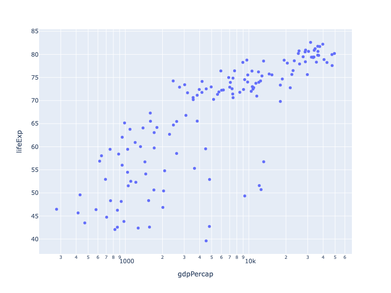
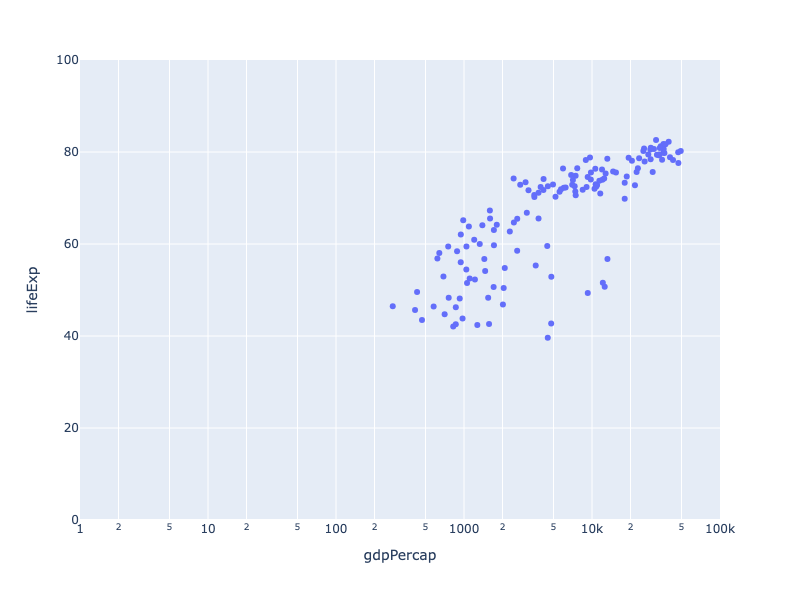
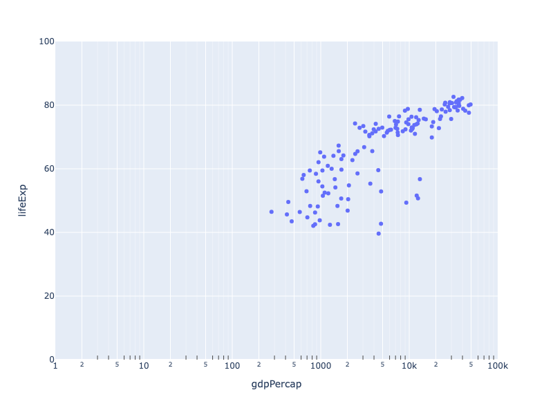
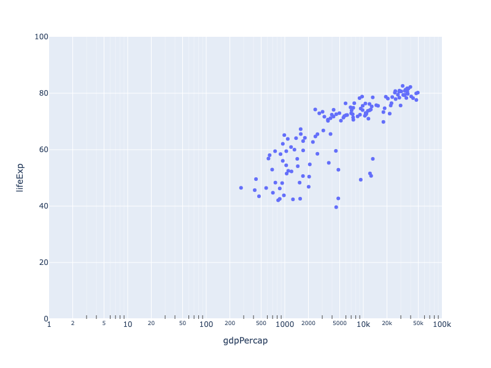
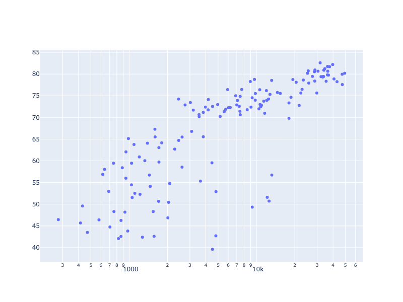
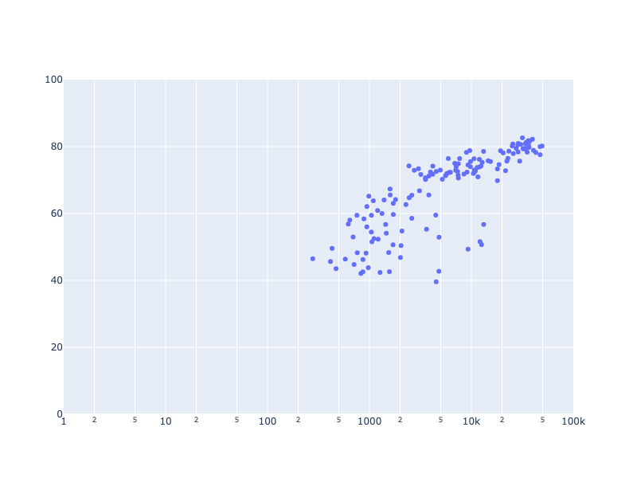

---
jupyter:
  jupytext:
    notebook_metadata_filter: all
    text_representation:
      extension: .md
      format_name: markdown
      format_version: '1.3'
      jupytext_version: 1.17.2
  kernelspec:
    display_name: Python 3 (ipykernel)
    language: python
    name: python3
  language_info:
    codemirror_mode:
      name: ipython
      version: 3
    file_extension: .py
    mimetype: text/x-python
    name: python
    nbconvert_exporter: python
    pygments_lexer: ipython3
    version: 3.12.4
  plotly:
    description: How to make Log plots in Python with Plotly.
    display_as: scientific
    language: python
    layout: base
    name: Log Plots
    order: 5
    permalink: python/log-plot/
    redirect_from: python/log-plots/
    thumbnail: thumbnail/log.jpg
---

This page shows examples of how to configure [2-dimensional Cartesian axes](../figure-structure/#2d-cartesian-trace-types-and-subplots) to follow a logarithmic rather than linear progression. [Configuring gridlines, ticks, tick labels and axis titles](../axes/) on logarithmic axes is done the same was as with [linear axes](../axes/).

### Logarithmic Axes with Plotly Express

[Plotly Express](../plotly-express/) is the easy-to-use, high-level interface to Plotly, which [operates on a variety of types of data](../px-arguments/) and produces [easy-to-style figures](../styling-plotly-express/).

All of Plotly Express' 2-D Cartesian functions include the `log_x` and `log_y` keyword arguments, which can be set to `True` to set the corresponding axis to a logarithmic scale:

```python
import plotly.express as px
df = px.data.gapminder().query("year == 2007")

fig = px.scatter(df, x="gdpPercap", y="lifeExp", hover_name="country", log_x=True)
fig.show()
```



**Interactive Plot:**

<div>                        <script type="text/javascript">window.PlotlyConfig = {MathJaxConfig: 'local'};</script>
        <script charset="utf-8" src="https://cdn.plot.ly/plotly-3.1.0.min.js" integrity="sha256-Ei4740bWZhaUTQuD6q9yQlgVCMPBz6CZWhevDYPv93A=" crossorigin="anonymous"></script>                <div id="plotly-div-1" class="plotly-graph-div" style="height:100%; width:100%;"></div>            <script type="text/javascript">                window.PLOTLYENV=window.PLOTLYENV || {};                                if (document.getElementById("plotly-div-1")) {                    Plotly.newPlot(                        "plotly-div-1",                        [{"hovertemplate":"\u003cb\u003e%{hovertext}\u003c\u002fb\u003e\u003cbr\u003e\u003cbr\u003egdpPercap=%{x}\u003cbr\u003elifeExp=%{y}\u003cextra\u003e\u003c\u002fextra\u003e","hovertext":["Afghanistan","Albania","Algeria","Angola","Argentina","Australia","Austria","Bahrain","Bangladesh","Belgium","Benin","Bolivia","Bosnia and Herzegovina","Botswana","Brazil","Bulgaria","Burkina Faso","Burundi","Cambodia","Cameroon","Canada","Central African Republic","Chad","Chile","China","Colombia","Comoros","Congo, Dem. Rep.","Congo, Rep.","Costa Rica","Cote d'Ivoire","Croatia","Cuba","Czech Republic","Denmark","Djibouti","Dominican Republic","Ecuador","Egypt","El Salvador","Equatorial Guinea","Eritrea","Ethiopia","Finland","France","Gabon","Gambia","Germany","Ghana","Greece","Guatemala","Guinea","Guinea-Bissau","Haiti","Honduras","Hong Kong, China","Hungary","Iceland","India","Indonesia","Iran","Iraq","Ireland","Israel","Italy","Jamaica","Japan","Jordan","Kenya","Korea, Dem. Rep.","Korea, Rep.","Kuwait","Lebanon","Lesotho","Liberia","Libya","Madagascar","Malawi","Malaysia","Mali","Mauritania","Mauritius","Mexico","Mongolia","Montenegro","Morocco","Mozambique","Myanmar","Namibia","Nepal","Netherlands","New Zealand","Nicaragua","Niger","Nigeria","Norway","Oman","Pakistan","Panama","Paraguay","Peru","Philippines","Poland","Portugal","Puerto Rico","Reunion","Romania","Rwanda","Sao Tome and Principe","Saudi Arabia","Senegal","Serbia","Sierra Leone","Singapore","Slovak Republic","Slovenia","Somalia","South Africa","Spain","Sri Lanka","Sudan","Swaziland","Sweden","Switzerland","Syria","Taiwan","Tanzania","Thailand","Togo","Trinidad and Tobago","Tunisia","Turkey","Uganda","United Kingdom","United States","Uruguay","Venezuela","Vietnam","West Bank and Gaza","Yemen, Rep.","Zambia","Zimbabwe"],"legendgroup":"","marker":{"color":"#636efa","symbol":"circle"},"mode":"markers","name":"","orientation":"v","showlegend":false,"x":{"dtype":"f8","bdata":"54R1iKR0jkBgFASPBzG3QG2tLxJeT7hApWlQNDu9skAgJAuYsPXIQOeHEcJr0OBAWMoyxM+j4UDGpwAYAxndQPLPDOIDvZVAb7vQXJNz4EAOar+1I4WWQJzB3y9G3K1A8nhafkwWvUDboswG7YzIQGkAb4HmtMFAzzEge2XcxEDb2y3JIQSTQKHhg40h4XpAat\u002fcXx3HmkAWNZiGYeifQAexM4Xnu+FAZJEm3iEQhkDiP91AQaCaQIY41sXRuclA0V0SZx1fs0D67laWlF67QBI+Stsu0Y5ANsjJadRYcUCMD7OXHWGsQKlNnNyH1sJAWTFcHQAjmEAUxhaCnI3MQIGzlCwNesFAH7qgvlNM1kCxbVFmzTnhQKwn84\u002f2RKBAHkC\u002f71+Jt0Dl9ssnQ9m6QKSK4lUuzbVArrzkf1pgtkBoke18C73HQM8Iysj0CoRAkQfH0XGWhUD5oGez4jbgQHbgnBGBwd1AIVnABD7LyUCOc5tw\u002f4WHQL5Nf\u002faXat9A1GAahm++lEB47j1cmuTaQLQh\u002f8wMQrRAcXkH0zt1jUCc8BKc2hmCQBAiGXKMxpJACJylZKm4q0Byv0NRn2XjQEJ4tHE8ltFAC2MLQZmq4UCzX3e6ayijQIDuy5lNqatAqYdodNuqxkBtVRLZD3exQCxlGeJ\u002f3ONAbqMBvNHs2EC8lpAPbubbQOu12VjhmLxAi1QYWwTq3kDdek0PdqexQO3Vx0P\u002f3JZAK2owDUPkmEATGVbxCM3WQEgbR6xfGedAd4TTgoduxEAVGohlU4WYQHXmHhIe6HlAxjNo6L+Mx0Ay\u002f+ibFFOQQFKgqp3MuodAXCBB8dNRyEAKn62DU0qQQOZ1xCGbLJxANSkF3X5mxUBBDkqYyWTHQE7BGmeLL6hAS+fDs\u002fISwkCOHr+3WditQL3HmSZ8vYlAAAAAAACAjUC7YkZ4D8uyQEjfpGlwDZFAlufB3b334UAEHEKVQJjYQFJEhlWkeqVASAeQRmpdg0DeVKTC6HefQFZl3xWmGehAmGn7VwzL1UCwrDQp5VukQHui68KXKMNA4KKTpdZMsECIf9jS5\u002fC8QLWpukf27KhAowvqW\u002fYOzkBVTRB1aQfUQKJ6a2At4NJA3Qn2Xx\u002f2vUDT2cngPBzFQAWrjyy1+IpAZof4h735mEAPRYE+tSXVQA+dnnfjwZpAWyOCcUQdw0DoJO93U\u002fSKQKJinL\u002flBOdAYHZPHpQ90kByxFp8ECrZQAW4augg8YxAhnMNM9QawkAwKqkTRCXcQJ6xL9kwBK9AK97IPMpUpEANbmsLe6GxQP+ye\u002fJ3iOBAGH0FaU1Q4kBMio9PjFiwQI4ev7eRC9xA4UIewe1NkUCDr691ZSK9QKkf5XHCl4tAdF5jlyCW0UBkzF1L7LS7QJIIjWAjhcBAF35wPoWBkEDj32dcaDbgQOv\u002fHOb0+ORAMJ5BQ7u5xEBblNkg50vGQJHSbB4nE6NAajS5GLOip0D9hR4xitGhQEDc1avY3JNA2On2SFlbfUA="},"xaxis":"x","y":{"dtype":"f8","bdata":"RIts5\u002fvpRUBQjZduEhtTQCUGgZVDE1JAIbByaJFdRUAUrkfhetRSQNejcD0KT1RAkxgEVg71U0BxPQrXo+hSQIcW2c73A1BATmIQWDncU0B3vp8aL11MQPp+arx0Y1BASgwCK4e2UkB3vp8aL11JQClcj8L1GFJAuB6F61FAUkD2KFyPwiVKQArXo3A9ykhABoGVQ4vcTUDXo3A9CjdJQG8Sg8DKKVRAAyuHFtleRkAX2c73U1NJQAisHFpko1NAL90kBoE9UkA3iUFg5ThSQH0\u002fNV66SVBAQmDl0CI7R0Dwp8ZLN6lLQDVeukkMslNARIts5\u002fspSEAdWmQ73+9SQLbz\u002fdR4kVNAyXa+nxofU0Boke18P5VTQGiR7Xw\u002fZUtA16NwPQoPUkBWDi2ynb9SQBSDwMqh1VFA1XjpJjH4UUAmMQisHMpJQIXrUbgeBU1A8KfGSzd5SkB56SYxCNRTQDVeukkMKlRArkfhehReTEDTTWIQWLlNQESLbOf72VNAiUFg5dACTkD0\u002fdR46d5TQH9qvHSTkFFAN4lBYOUATECNbOf7qTFHQGiR7Xw\u002fdU5A6iYxCKyMUUBaZDvfT41UQBSDwMqhVVJAnMQgsHJwVEDqJjEIrCxQQJqZmZmZqVFABFYOLbK9UUD2KFyPwsVNQHE9CtejuFNASOF6FK4vVEBt5\u002fup8SJUQD81XrpJJFJAO99PjZemVEAK16NwPSJSQK5H4XoUDktAXrpJDALTUEAdWmQ736dTQBSDwMqhZVNAZDvfT43\u002fUUCyne+nxktFQBBYObTI1kZAsHJoke18UkBkEFg5tLhNQBBYObTIJkhAgZVDi2yPUkCyne+nxjtLQNEi2\u002fl+ClBAJQaBlUMzUkAUrkfhegxTQAisHFpks1BAmG4Sg8CiUkDRItv5fspRQNEi2\u002fl+CkVARrbz\u002fdQIT0CJFtnO93NKQBSuR+F65E9AVOOlm8TwU0CTGARWDg1UQKjGSzeJOVJA5dAi2\u002fluTEDLoUW2821HQAaBlUOLDFRAKVyPwvXoUkD0\u002fdR46V5QQOx8PzVe4lJA46WbxCDwUUBt5\u002fup8dpRQHnpJjEI7FFAeekmMQjkUkCDwMqhRYZTQDu0yHa+r1NAPzVeukkcU0BYObTIdh5SQOXQItv5HkdAbxKDwMphUEB9PzVeujFSQA4tsp3vh09A46WbxCCAUkBkEFg5tEhFQJHtfD81\u002flNA30+Nl26qUkAlBoGVQ3tTQDEIrBxaFEhACKwcWmSrSEBOYhBYOTxUQNNNYhBYGVJAukkMAitHTUBYObTIds5DQH9qvHSTOFRAwJ8aL91sVED+1HjpJolSQJqZmZmZmVNAGQRWDi1CSkCBlUOLbKdRQPYoXI\u002fCNU1AI9v5fmp0UUBQjZduEntSQH0\u002fNV668VFATDeJQWDFSUAzMzMzM9tTQHNoke18j1NAf2q8dJMYU0ArhxbZzm9SQA4tsp3vj1JAXrpJDAJbUkDTTWIQWFlPQP3UeOkmMUVAdZMYBFa+RUA="},"yaxis":"y","type":"scatter"}],                        {"template":{"data":{"histogram2dcontour":[{"type":"histogram2dcontour","colorbar":{"outlinewidth":0,"ticks":""},"colorscale":[[0.0,"#0d0887"],[0.1111111111111111,"#46039f"],[0.2222222222222222,"#7201a8"],[0.3333333333333333,"#9c179e"],[0.4444444444444444,"#bd3786"],[0.5555555555555556,"#d8576b"],[0.6666666666666666,"#ed7953"],[0.7777777777777778,"#fb9f3a"],[0.8888888888888888,"#fdca26"],[1.0,"#f0f921"]]}],"choropleth":[{"type":"choropleth","colorbar":{"outlinewidth":0,"ticks":""}}],"histogram2d":[{"type":"histogram2d","colorbar":{"outlinewidth":0,"ticks":""},"colorscale":[[0.0,"#0d0887"],[0.1111111111111111,"#46039f"],[0.2222222222222222,"#7201a8"],[0.3333333333333333,"#9c179e"],[0.4444444444444444,"#bd3786"],[0.5555555555555556,"#d8576b"],[0.6666666666666666,"#ed7953"],[0.7777777777777778,"#fb9f3a"],[0.8888888888888888,"#fdca26"],[1.0,"#f0f921"]]}],"heatmap":[{"type":"heatmap","colorbar":{"outlinewidth":0,"ticks":""},"colorscale":[[0.0,"#0d0887"],[0.1111111111111111,"#46039f"],[0.2222222222222222,"#7201a8"],[0.3333333333333333,"#9c179e"],[0.4444444444444444,"#bd3786"],[0.5555555555555556,"#d8576b"],[0.6666666666666666,"#ed7953"],[0.7777777777777778,"#fb9f3a"],[0.8888888888888888,"#fdca26"],[1.0,"#f0f921"]]}],"contourcarpet":[{"type":"contourcarpet","colorbar":{"outlinewidth":0,"ticks":""}}],"contour":[{"type":"contour","colorbar":{"outlinewidth":0,"ticks":""},"colorscale":[[0.0,"#0d0887"],[0.1111111111111111,"#46039f"],[0.2222222222222222,"#7201a8"],[0.3333333333333333,"#9c179e"],[0.4444444444444444,"#bd3786"],[0.5555555555555556,"#d8576b"],[0.6666666666666666,"#ed7953"],[0.7777777777777778,"#fb9f3a"],[0.8888888888888888,"#fdca26"],[1.0,"#f0f921"]]}],"surface":[{"type":"surface","colorbar":{"outlinewidth":0,"ticks":""},"colorscale":[[0.0,"#0d0887"],[0.1111111111111111,"#46039f"],[0.2222222222222222,"#7201a8"],[0.3333333333333333,"#9c179e"],[0.4444444444444444,"#bd3786"],[0.5555555555555556,"#d8576b"],[0.6666666666666666,"#ed7953"],[0.7777777777777778,"#fb9f3a"],[0.8888888888888888,"#fdca26"],[1.0,"#f0f921"]]}],"mesh3d":[{"type":"mesh3d","colorbar":{"outlinewidth":0,"ticks":""}}],"scatter":[{"fillpattern":{"fillmode":"overlay","size":10,"solidity":0.2},"type":"scatter"}],"parcoords":[{"type":"parcoords","line":{"colorbar":{"outlinewidth":0,"ticks":""}}}],"scatterpolargl":[{"type":"scatterpolargl","marker":{"colorbar":{"outlinewidth":0,"ticks":""}}}],"bar":[{"error_x":{"color":"#2a3f5f"},"error_y":{"color":"#2a3f5f"},"marker":{"line":{"color":"#E5ECF6","width":0.5},"pattern":{"fillmode":"overlay","size":10,"solidity":0.2}},"type":"bar"}],"scattergeo":[{"type":"scattergeo","marker":{"colorbar":{"outlinewidth":0,"ticks":""}}}],"scatterpolar":[{"type":"scatterpolar","marker":{"colorbar":{"outlinewidth":0,"ticks":""}}}],"histogram":[{"marker":{"pattern":{"fillmode":"overlay","size":10,"solidity":0.2}},"type":"histogram"}],"scattergl":[{"type":"scattergl","marker":{"colorbar":{"outlinewidth":0,"ticks":""}}}],"scatter3d":[{"type":"scatter3d","line":{"colorbar":{"outlinewidth":0,"ticks":""}},"marker":{"colorbar":{"outlinewidth":0,"ticks":""}}}],"scattermap":[{"type":"scattermap","marker":{"colorbar":{"outlinewidth":0,"ticks":""}}}],"scattermapbox":[{"type":"scattermapbox","marker":{"colorbar":{"outlinewidth":0,"ticks":""}}}],"scatterternary":[{"type":"scatterternary","marker":{"colorbar":{"outlinewidth":0,"ticks":""}}}],"scattercarpet":[{"type":"scattercarpet","marker":{"colorbar":{"outlinewidth":0,"ticks":""}}}],"carpet":[{"aaxis":{"endlinecolor":"#2a3f5f","gridcolor":"white","linecolor":"white","minorgridcolor":"white","startlinecolor":"#2a3f5f"},"baxis":{"endlinecolor":"#2a3f5f","gridcolor":"white","linecolor":"white","minorgridcolor":"white","startlinecolor":"#2a3f5f"},"type":"carpet"}],"table":[{"cells":{"fill":{"color":"#EBF0F8"},"line":{"color":"white"}},"header":{"fill":{"color":"#C8D4E3"},"line":{"color":"white"}},"type":"table"}],"barpolar":[{"marker":{"line":{"color":"#E5ECF6","width":0.5},"pattern":{"fillmode":"overlay","size":10,"solidity":0.2}},"type":"barpolar"}],"pie":[{"automargin":true,"type":"pie"}]},"layout":{"autotypenumbers":"strict","colorway":["#636efa","#EF553B","#00cc96","#ab63fa","#FFA15A","#19d3f3","#FF6692","#B6E880","#FF97FF","#FECB52"],"font":{"color":"#2a3f5f"},"hovermode":"closest","hoverlabel":{"align":"left"},"paper_bgcolor":"white","plot_bgcolor":"#E5ECF6","polar":{"bgcolor":"#E5ECF6","angularaxis":{"gridcolor":"white","linecolor":"white","ticks":""},"radialaxis":{"gridcolor":"white","linecolor":"white","ticks":""}},"ternary":{"bgcolor":"#E5ECF6","aaxis":{"gridcolor":"white","linecolor":"white","ticks":""},"baxis":{"gridcolor":"white","linecolor":"white","ticks":""},"caxis":{"gridcolor":"white","linecolor":"white","ticks":""}},"coloraxis":{"colorbar":{"outlinewidth":0,"ticks":""}},"colorscale":{"sequential":[[0.0,"#0d0887"],[0.1111111111111111,"#46039f"],[0.2222222222222222,"#7201a8"],[0.3333333333333333,"#9c179e"],[0.4444444444444444,"#bd3786"],[0.5555555555555556,"#d8576b"],[0.6666666666666666,"#ed7953"],[0.7777777777777778,"#fb9f3a"],[0.8888888888888888,"#fdca26"],[1.0,"#f0f921"]],"sequentialminus":[[0.0,"#0d0887"],[0.1111111111111111,"#46039f"],[0.2222222222222222,"#7201a8"],[0.3333333333333333,"#9c179e"],[0.4444444444444444,"#bd3786"],[0.5555555555555556,"#d8576b"],[0.6666666666666666,"#ed7953"],[0.7777777777777778,"#fb9f3a"],[0.8888888888888888,"#fdca26"],[1.0,"#f0f921"]],"diverging":[[0,"#8e0152"],[0.1,"#c51b7d"],[0.2,"#de77ae"],[0.3,"#f1b6da"],[0.4,"#fde0ef"],[0.5,"#f7f7f7"],[0.6,"#e6f5d0"],[0.7,"#b8e186"],[0.8,"#7fbc41"],[0.9,"#4d9221"],[1,"#276419"]]},"xaxis":{"gridcolor":"white","linecolor":"white","ticks":"","title":{"standoff":15},"zerolinecolor":"white","automargin":true,"zerolinewidth":2},"yaxis":{"gridcolor":"white","linecolor":"white","ticks":"","title":{"standoff":15},"zerolinecolor":"white","automargin":true,"zerolinewidth":2},"scene":{"xaxis":{"backgroundcolor":"#E5ECF6","gridcolor":"white","linecolor":"white","showbackground":true,"ticks":"","zerolinecolor":"white","gridwidth":2},"yaxis":{"backgroundcolor":"#E5ECF6","gridcolor":"white","linecolor":"white","showbackground":true,"ticks":"","zerolinecolor":"white","gridwidth":2},"zaxis":{"backgroundcolor":"#E5ECF6","gridcolor":"white","linecolor":"white","showbackground":true,"ticks":"","zerolinecolor":"white","gridwidth":2}},"shapedefaults":{"line":{"color":"#2a3f5f"}},"annotationdefaults":{"arrowcolor":"#2a3f5f","arrowhead":0,"arrowwidth":1},"geo":{"bgcolor":"white","landcolor":"#E5ECF6","subunitcolor":"white","showland":true,"showlakes":true,"lakecolor":"white"},"title":{"x":0.05},"mapbox":{"style":"light"}}},"xaxis":{"anchor":"y","domain":[0.0,1.0],"title":{"text":"gdpPercap"},"type":"log"},"yaxis":{"anchor":"x","domain":[0.0,1.0],"title":{"text":"lifeExp"}},"legend":{"tracegroupgap":0},"margin":{"t":60}},                        {"responsive": true}                    )                };            </script>        </div>

Setting the range of a logarithmic axis with Plotly Express works the same was as with linear axes: using the `range_x` and `range_y` keywords. Note that you cannot set the range to include 0 or less.

```python
import plotly.express as px
df = px.data.gapminder().query("year == 2007")

fig = px.scatter(df, x="gdpPercap", y="lifeExp", hover_name="country",
                 log_x=True, range_x=[1,100000], range_y=[0,100])
fig.show()
```



**Interactive Plot:**

<div>                        <script type="text/javascript">window.PlotlyConfig = {MathJaxConfig: 'local'};</script>
        <script charset="utf-8" src="https://cdn.plot.ly/plotly-3.1.0.min.js" integrity="sha256-Ei4740bWZhaUTQuD6q9yQlgVCMPBz6CZWhevDYPv93A=" crossorigin="anonymous"></script>                <div id="plotly-div-2" class="plotly-graph-div" style="height:100%; width:100%;"></div>            <script type="text/javascript">                window.PLOTLYENV=window.PLOTLYENV || {};                                if (document.getElementById("plotly-div-2")) {                    Plotly.newPlot(                        "plotly-div-2",                        [{"hovertemplate":"\u003cb\u003e%{hovertext}\u003c\u002fb\u003e\u003cbr\u003e\u003cbr\u003egdpPercap=%{x}\u003cbr\u003elifeExp=%{y}\u003cextra\u003e\u003c\u002fextra\u003e","hovertext":["Afghanistan","Albania","Algeria","Angola","Argentina","Australia","Austria","Bahrain","Bangladesh","Belgium","Benin","Bolivia","Bosnia and Herzegovina","Botswana","Brazil","Bulgaria","Burkina Faso","Burundi","Cambodia","Cameroon","Canada","Central African Republic","Chad","Chile","China","Colombia","Comoros","Congo, Dem. Rep.","Congo, Rep.","Costa Rica","Cote d'Ivoire","Croatia","Cuba","Czech Republic","Denmark","Djibouti","Dominican Republic","Ecuador","Egypt","El Salvador","Equatorial Guinea","Eritrea","Ethiopia","Finland","France","Gabon","Gambia","Germany","Ghana","Greece","Guatemala","Guinea","Guinea-Bissau","Haiti","Honduras","Hong Kong, China","Hungary","Iceland","India","Indonesia","Iran","Iraq","Ireland","Israel","Italy","Jamaica","Japan","Jordan","Kenya","Korea, Dem. Rep.","Korea, Rep.","Kuwait","Lebanon","Lesotho","Liberia","Libya","Madagascar","Malawi","Malaysia","Mali","Mauritania","Mauritius","Mexico","Mongolia","Montenegro","Morocco","Mozambique","Myanmar","Namibia","Nepal","Netherlands","New Zealand","Nicaragua","Niger","Nigeria","Norway","Oman","Pakistan","Panama","Paraguay","Peru","Philippines","Poland","Portugal","Puerto Rico","Reunion","Romania","Rwanda","Sao Tome and Principe","Saudi Arabia","Senegal","Serbia","Sierra Leone","Singapore","Slovak Republic","Slovenia","Somalia","South Africa","Spain","Sri Lanka","Sudan","Swaziland","Sweden","Switzerland","Syria","Taiwan","Tanzania","Thailand","Togo","Trinidad and Tobago","Tunisia","Turkey","Uganda","United Kingdom","United States","Uruguay","Venezuela","Vietnam","West Bank and Gaza","Yemen, Rep.","Zambia","Zimbabwe"],"legendgroup":"","marker":{"color":"#636efa","symbol":"circle"},"mode":"markers","name":"","orientation":"v","showlegend":false,"x":{"dtype":"f8","bdata":"54R1iKR0jkBgFASPBzG3QG2tLxJeT7hApWlQNDu9skAgJAuYsPXIQOeHEcJr0OBAWMoyxM+j4UDGpwAYAxndQPLPDOIDvZVAb7vQXJNz4EAOar+1I4WWQJzB3y9G3K1A8nhafkwWvUDboswG7YzIQGkAb4HmtMFAzzEge2XcxEDb2y3JIQSTQKHhg40h4XpAat\u002fcXx3HmkAWNZiGYeifQAexM4Xnu+FAZJEm3iEQhkDiP91AQaCaQIY41sXRuclA0V0SZx1fs0D67laWlF67QBI+Stsu0Y5ANsjJadRYcUCMD7OXHWGsQKlNnNyH1sJAWTFcHQAjmEAUxhaCnI3MQIGzlCwNesFAH7qgvlNM1kCxbVFmzTnhQKwn84\u002f2RKBAHkC\u002f71+Jt0Dl9ssnQ9m6QKSK4lUuzbVArrzkf1pgtkBoke18C73HQM8Iysj0CoRAkQfH0XGWhUD5oGez4jbgQHbgnBGBwd1AIVnABD7LyUCOc5tw\u002f4WHQL5Nf\u002faXat9A1GAahm++lEB47j1cmuTaQLQh\u002f8wMQrRAcXkH0zt1jUCc8BKc2hmCQBAiGXKMxpJACJylZKm4q0Byv0NRn2XjQEJ4tHE8ltFAC2MLQZmq4UCzX3e6ayijQIDuy5lNqatAqYdodNuqxkBtVRLZD3exQCxlGeJ\u002f3ONAbqMBvNHs2EC8lpAPbubbQOu12VjhmLxAi1QYWwTq3kDdek0PdqexQO3Vx0P\u002f3JZAK2owDUPkmEATGVbxCM3WQEgbR6xfGedAd4TTgoduxEAVGohlU4WYQHXmHhIe6HlAxjNo6L+Mx0Ay\u002f+ibFFOQQFKgqp3MuodAXCBB8dNRyEAKn62DU0qQQOZ1xCGbLJxANSkF3X5mxUBBDkqYyWTHQE7BGmeLL6hAS+fDs\u002fISwkCOHr+3WditQL3HmSZ8vYlAAAAAAACAjUC7YkZ4D8uyQEjfpGlwDZFAlufB3b334UAEHEKVQJjYQFJEhlWkeqVASAeQRmpdg0DeVKTC6HefQFZl3xWmGehAmGn7VwzL1UCwrDQp5VukQHui68KXKMNA4KKTpdZMsECIf9jS5\u002fC8QLWpukf27KhAowvqW\u002fYOzkBVTRB1aQfUQKJ6a2At4NJA3Qn2Xx\u002f2vUDT2cngPBzFQAWrjyy1+IpAZof4h735mEAPRYE+tSXVQA+dnnfjwZpAWyOCcUQdw0DoJO93U\u002fSKQKJinL\u002flBOdAYHZPHpQ90kByxFp8ECrZQAW4augg8YxAhnMNM9QawkAwKqkTRCXcQJ6xL9kwBK9AK97IPMpUpEANbmsLe6GxQP+ye\u002fJ3iOBAGH0FaU1Q4kBMio9PjFiwQI4ev7eRC9xA4UIewe1NkUCDr691ZSK9QKkf5XHCl4tAdF5jlyCW0UBkzF1L7LS7QJIIjWAjhcBAF35wPoWBkEDj32dcaDbgQOv\u002fHOb0+ORAMJ5BQ7u5xEBblNkg50vGQJHSbB4nE6NAajS5GLOip0D9hR4xitGhQEDc1avY3JNA2On2SFlbfUA="},"xaxis":"x","y":{"dtype":"f8","bdata":"RIts5\u002fvpRUBQjZduEhtTQCUGgZVDE1JAIbByaJFdRUAUrkfhetRSQNejcD0KT1RAkxgEVg71U0BxPQrXo+hSQIcW2c73A1BATmIQWDncU0B3vp8aL11MQPp+arx0Y1BASgwCK4e2UkB3vp8aL11JQClcj8L1GFJAuB6F61FAUkD2KFyPwiVKQArXo3A9ykhABoGVQ4vcTUDXo3A9CjdJQG8Sg8DKKVRAAyuHFtleRkAX2c73U1NJQAisHFpko1NAL90kBoE9UkA3iUFg5ThSQH0\u002fNV66SVBAQmDl0CI7R0Dwp8ZLN6lLQDVeukkMslNARIts5\u002fspSEAdWmQ73+9SQLbz\u002fdR4kVNAyXa+nxofU0Boke18P5VTQGiR7Xw\u002fZUtA16NwPQoPUkBWDi2ynb9SQBSDwMqh1VFA1XjpJjH4UUAmMQisHMpJQIXrUbgeBU1A8KfGSzd5SkB56SYxCNRTQDVeukkMKlRArkfhehReTEDTTWIQWLlNQESLbOf72VNAiUFg5dACTkD0\u002fdR46d5TQH9qvHSTkFFAN4lBYOUATECNbOf7qTFHQGiR7Xw\u002fdU5A6iYxCKyMUUBaZDvfT41UQBSDwMqhVVJAnMQgsHJwVEDqJjEIrCxQQJqZmZmZqVFABFYOLbK9UUD2KFyPwsVNQHE9CtejuFNASOF6FK4vVEBt5\u002fup8SJUQD81XrpJJFJAO99PjZemVEAK16NwPSJSQK5H4XoUDktAXrpJDALTUEAdWmQ736dTQBSDwMqhZVNAZDvfT43\u002fUUCyne+nxktFQBBYObTI1kZAsHJoke18UkBkEFg5tLhNQBBYObTIJkhAgZVDi2yPUkCyne+nxjtLQNEi2\u002fl+ClBAJQaBlUMzUkAUrkfhegxTQAisHFpks1BAmG4Sg8CiUkDRItv5fspRQNEi2\u002fl+CkVARrbz\u002fdQIT0CJFtnO93NKQBSuR+F65E9AVOOlm8TwU0CTGARWDg1UQKjGSzeJOVJA5dAi2\u002fluTEDLoUW2821HQAaBlUOLDFRAKVyPwvXoUkD0\u002fdR46V5QQOx8PzVe4lJA46WbxCDwUUBt5\u002fup8dpRQHnpJjEI7FFAeekmMQjkUkCDwMqhRYZTQDu0yHa+r1NAPzVeukkcU0BYObTIdh5SQOXQItv5HkdAbxKDwMphUEB9PzVeujFSQA4tsp3vh09A46WbxCCAUkBkEFg5tEhFQJHtfD81\u002flNA30+Nl26qUkAlBoGVQ3tTQDEIrBxaFEhACKwcWmSrSEBOYhBYOTxUQNNNYhBYGVJAukkMAitHTUBYObTIds5DQH9qvHSTOFRAwJ8aL91sVED+1HjpJolSQJqZmZmZmVNAGQRWDi1CSkCBlUOLbKdRQPYoXI\u002fCNU1AI9v5fmp0UUBQjZduEntSQH0\u002fNV668VFATDeJQWDFSUAzMzMzM9tTQHNoke18j1NAf2q8dJMYU0ArhxbZzm9SQA4tsp3vj1JAXrpJDAJbUkDTTWIQWFlPQP3UeOkmMUVAdZMYBFa+RUA="},"yaxis":"y","type":"scatter"}],                        {"template":{"data":{"histogram2dcontour":[{"type":"histogram2dcontour","colorbar":{"outlinewidth":0,"ticks":""},"colorscale":[[0.0,"#0d0887"],[0.1111111111111111,"#46039f"],[0.2222222222222222,"#7201a8"],[0.3333333333333333,"#9c179e"],[0.4444444444444444,"#bd3786"],[0.5555555555555556,"#d8576b"],[0.6666666666666666,"#ed7953"],[0.7777777777777778,"#fb9f3a"],[0.8888888888888888,"#fdca26"],[1.0,"#f0f921"]]}],"choropleth":[{"type":"choropleth","colorbar":{"outlinewidth":0,"ticks":""}}],"histogram2d":[{"type":"histogram2d","colorbar":{"outlinewidth":0,"ticks":""},"colorscale":[[0.0,"#0d0887"],[0.1111111111111111,"#46039f"],[0.2222222222222222,"#7201a8"],[0.3333333333333333,"#9c179e"],[0.4444444444444444,"#bd3786"],[0.5555555555555556,"#d8576b"],[0.6666666666666666,"#ed7953"],[0.7777777777777778,"#fb9f3a"],[0.8888888888888888,"#fdca26"],[1.0,"#f0f921"]]}],"heatmap":[{"type":"heatmap","colorbar":{"outlinewidth":0,"ticks":""},"colorscale":[[0.0,"#0d0887"],[0.1111111111111111,"#46039f"],[0.2222222222222222,"#7201a8"],[0.3333333333333333,"#9c179e"],[0.4444444444444444,"#bd3786"],[0.5555555555555556,"#d8576b"],[0.6666666666666666,"#ed7953"],[0.7777777777777778,"#fb9f3a"],[0.8888888888888888,"#fdca26"],[1.0,"#f0f921"]]}],"contourcarpet":[{"type":"contourcarpet","colorbar":{"outlinewidth":0,"ticks":""}}],"contour":[{"type":"contour","colorbar":{"outlinewidth":0,"ticks":""},"colorscale":[[0.0,"#0d0887"],[0.1111111111111111,"#46039f"],[0.2222222222222222,"#7201a8"],[0.3333333333333333,"#9c179e"],[0.4444444444444444,"#bd3786"],[0.5555555555555556,"#d8576b"],[0.6666666666666666,"#ed7953"],[0.7777777777777778,"#fb9f3a"],[0.8888888888888888,"#fdca26"],[1.0,"#f0f921"]]}],"surface":[{"type":"surface","colorbar":{"outlinewidth":0,"ticks":""},"colorscale":[[0.0,"#0d0887"],[0.1111111111111111,"#46039f"],[0.2222222222222222,"#7201a8"],[0.3333333333333333,"#9c179e"],[0.4444444444444444,"#bd3786"],[0.5555555555555556,"#d8576b"],[0.6666666666666666,"#ed7953"],[0.7777777777777778,"#fb9f3a"],[0.8888888888888888,"#fdca26"],[1.0,"#f0f921"]]}],"mesh3d":[{"type":"mesh3d","colorbar":{"outlinewidth":0,"ticks":""}}],"scatter":[{"fillpattern":{"fillmode":"overlay","size":10,"solidity":0.2},"type":"scatter"}],"parcoords":[{"type":"parcoords","line":{"colorbar":{"outlinewidth":0,"ticks":""}}}],"scatterpolargl":[{"type":"scatterpolargl","marker":{"colorbar":{"outlinewidth":0,"ticks":""}}}],"bar":[{"error_x":{"color":"#2a3f5f"},"error_y":{"color":"#2a3f5f"},"marker":{"line":{"color":"#E5ECF6","width":0.5},"pattern":{"fillmode":"overlay","size":10,"solidity":0.2}},"type":"bar"}],"scattergeo":[{"type":"scattergeo","marker":{"colorbar":{"outlinewidth":0,"ticks":""}}}],"scatterpolar":[{"type":"scatterpolar","marker":{"colorbar":{"outlinewidth":0,"ticks":""}}}],"histogram":[{"marker":{"pattern":{"fillmode":"overlay","size":10,"solidity":0.2}},"type":"histogram"}],"scattergl":[{"type":"scattergl","marker":{"colorbar":{"outlinewidth":0,"ticks":""}}}],"scatter3d":[{"type":"scatter3d","line":{"colorbar":{"outlinewidth":0,"ticks":""}},"marker":{"colorbar":{"outlinewidth":0,"ticks":""}}}],"scattermap":[{"type":"scattermap","marker":{"colorbar":{"outlinewidth":0,"ticks":""}}}],"scattermapbox":[{"type":"scattermapbox","marker":{"colorbar":{"outlinewidth":0,"ticks":""}}}],"scatterternary":[{"type":"scatterternary","marker":{"colorbar":{"outlinewidth":0,"ticks":""}}}],"scattercarpet":[{"type":"scattercarpet","marker":{"colorbar":{"outlinewidth":0,"ticks":""}}}],"carpet":[{"aaxis":{"endlinecolor":"#2a3f5f","gridcolor":"white","linecolor":"white","minorgridcolor":"white","startlinecolor":"#2a3f5f"},"baxis":{"endlinecolor":"#2a3f5f","gridcolor":"white","linecolor":"white","minorgridcolor":"white","startlinecolor":"#2a3f5f"},"type":"carpet"}],"table":[{"cells":{"fill":{"color":"#EBF0F8"},"line":{"color":"white"}},"header":{"fill":{"color":"#C8D4E3"},"line":{"color":"white"}},"type":"table"}],"barpolar":[{"marker":{"line":{"color":"#E5ECF6","width":0.5},"pattern":{"fillmode":"overlay","size":10,"solidity":0.2}},"type":"barpolar"}],"pie":[{"automargin":true,"type":"pie"}]},"layout":{"autotypenumbers":"strict","colorway":["#636efa","#EF553B","#00cc96","#ab63fa","#FFA15A","#19d3f3","#FF6692","#B6E880","#FF97FF","#FECB52"],"font":{"color":"#2a3f5f"},"hovermode":"closest","hoverlabel":{"align":"left"},"paper_bgcolor":"white","plot_bgcolor":"#E5ECF6","polar":{"bgcolor":"#E5ECF6","angularaxis":{"gridcolor":"white","linecolor":"white","ticks":""},"radialaxis":{"gridcolor":"white","linecolor":"white","ticks":""}},"ternary":{"bgcolor":"#E5ECF6","aaxis":{"gridcolor":"white","linecolor":"white","ticks":""},"baxis":{"gridcolor":"white","linecolor":"white","ticks":""},"caxis":{"gridcolor":"white","linecolor":"white","ticks":""}},"coloraxis":{"colorbar":{"outlinewidth":0,"ticks":""}},"colorscale":{"sequential":[[0.0,"#0d0887"],[0.1111111111111111,"#46039f"],[0.2222222222222222,"#7201a8"],[0.3333333333333333,"#9c179e"],[0.4444444444444444,"#bd3786"],[0.5555555555555556,"#d8576b"],[0.6666666666666666,"#ed7953"],[0.7777777777777778,"#fb9f3a"],[0.8888888888888888,"#fdca26"],[1.0,"#f0f921"]],"sequentialminus":[[0.0,"#0d0887"],[0.1111111111111111,"#46039f"],[0.2222222222222222,"#7201a8"],[0.3333333333333333,"#9c179e"],[0.4444444444444444,"#bd3786"],[0.5555555555555556,"#d8576b"],[0.6666666666666666,"#ed7953"],[0.7777777777777778,"#fb9f3a"],[0.8888888888888888,"#fdca26"],[1.0,"#f0f921"]],"diverging":[[0,"#8e0152"],[0.1,"#c51b7d"],[0.2,"#de77ae"],[0.3,"#f1b6da"],[0.4,"#fde0ef"],[0.5,"#f7f7f7"],[0.6,"#e6f5d0"],[0.7,"#b8e186"],[0.8,"#7fbc41"],[0.9,"#4d9221"],[1,"#276419"]]},"xaxis":{"gridcolor":"white","linecolor":"white","ticks":"","title":{"standoff":15},"zerolinecolor":"white","automargin":true,"zerolinewidth":2},"yaxis":{"gridcolor":"white","linecolor":"white","ticks":"","title":{"standoff":15},"zerolinecolor":"white","automargin":true,"zerolinewidth":2},"scene":{"xaxis":{"backgroundcolor":"#E5ECF6","gridcolor":"white","linecolor":"white","showbackground":true,"ticks":"","zerolinecolor":"white","gridwidth":2},"yaxis":{"backgroundcolor":"#E5ECF6","gridcolor":"white","linecolor":"white","showbackground":true,"ticks":"","zerolinecolor":"white","gridwidth":2},"zaxis":{"backgroundcolor":"#E5ECF6","gridcolor":"white","linecolor":"white","showbackground":true,"ticks":"","zerolinecolor":"white","gridwidth":2}},"shapedefaults":{"line":{"color":"#2a3f5f"}},"annotationdefaults":{"arrowcolor":"#2a3f5f","arrowhead":0,"arrowwidth":1},"geo":{"bgcolor":"white","landcolor":"#E5ECF6","subunitcolor":"white","showland":true,"showlakes":true,"lakecolor":"white"},"title":{"x":0.05},"mapbox":{"style":"light"}}},"xaxis":{"anchor":"y","domain":[0.0,1.0],"title":{"text":"gdpPercap"},"type":"log","range":[0.0,5.0]},"yaxis":{"anchor":"x","domain":[0.0,1.0],"title":{"text":"lifeExp"},"range":[0,100]},"legend":{"tracegroupgap":0},"margin":{"t":60}},                        {"responsive": true}                    )                };            </script>        </div>

#### Adding minor ticks

_new in 5.8_

You can position and style minor ticks using `minor`. This takes a `dict` of properties to apply to minor ticks. See the [figure reference](https://plotly.com/python/reference/layout/xaxis/#layout-xaxis-minor) for full details on the accepted keys in this dict.

In this example we set the tick length with `ticklen`, add the ticks on the inside with `ticks="inside"`, and turn grid lines on with `howgrid=True`.

```python
import plotly.express as px
df = px.data.gapminder().query("year == 2007")

fig = px.scatter(df, x="gdpPercap", y="lifeExp", hover_name="country",
                 log_x=True, range_x=[1,100000], range_y=[0,100])

fig.update_xaxes(minor=dict(ticks="inside", ticklen=6, showgrid=True))

fig.show()
```



**Interactive Plot:**

<div>                        <script type="text/javascript">window.PlotlyConfig = {MathJaxConfig: 'local'};</script>
        <script charset="utf-8" src="https://cdn.plot.ly/plotly-3.1.0.min.js" integrity="sha256-Ei4740bWZhaUTQuD6q9yQlgVCMPBz6CZWhevDYPv93A=" crossorigin="anonymous"></script>                <div id="plotly-div-3" class="plotly-graph-div" style="height:100%; width:100%;"></div>            <script type="text/javascript">                window.PLOTLYENV=window.PLOTLYENV || {};                                if (document.getElementById("plotly-div-3")) {                    Plotly.newPlot(                        "plotly-div-3",                        [{"hovertemplate":"\u003cb\u003e%{hovertext}\u003c\u002fb\u003e\u003cbr\u003e\u003cbr\u003egdpPercap=%{x}\u003cbr\u003elifeExp=%{y}\u003cextra\u003e\u003c\u002fextra\u003e","hovertext":["Afghanistan","Albania","Algeria","Angola","Argentina","Australia","Austria","Bahrain","Bangladesh","Belgium","Benin","Bolivia","Bosnia and Herzegovina","Botswana","Brazil","Bulgaria","Burkina Faso","Burundi","Cambodia","Cameroon","Canada","Central African Republic","Chad","Chile","China","Colombia","Comoros","Congo, Dem. Rep.","Congo, Rep.","Costa Rica","Cote d'Ivoire","Croatia","Cuba","Czech Republic","Denmark","Djibouti","Dominican Republic","Ecuador","Egypt","El Salvador","Equatorial Guinea","Eritrea","Ethiopia","Finland","France","Gabon","Gambia","Germany","Ghana","Greece","Guatemala","Guinea","Guinea-Bissau","Haiti","Honduras","Hong Kong, China","Hungary","Iceland","India","Indonesia","Iran","Iraq","Ireland","Israel","Italy","Jamaica","Japan","Jordan","Kenya","Korea, Dem. Rep.","Korea, Rep.","Kuwait","Lebanon","Lesotho","Liberia","Libya","Madagascar","Malawi","Malaysia","Mali","Mauritania","Mauritius","Mexico","Mongolia","Montenegro","Morocco","Mozambique","Myanmar","Namibia","Nepal","Netherlands","New Zealand","Nicaragua","Niger","Nigeria","Norway","Oman","Pakistan","Panama","Paraguay","Peru","Philippines","Poland","Portugal","Puerto Rico","Reunion","Romania","Rwanda","Sao Tome and Principe","Saudi Arabia","Senegal","Serbia","Sierra Leone","Singapore","Slovak Republic","Slovenia","Somalia","South Africa","Spain","Sri Lanka","Sudan","Swaziland","Sweden","Switzerland","Syria","Taiwan","Tanzania","Thailand","Togo","Trinidad and Tobago","Tunisia","Turkey","Uganda","United Kingdom","United States","Uruguay","Venezuela","Vietnam","West Bank and Gaza","Yemen, Rep.","Zambia","Zimbabwe"],"legendgroup":"","marker":{"color":"#636efa","symbol":"circle"},"mode":"markers","name":"","orientation":"v","showlegend":false,"x":{"dtype":"f8","bdata":"54R1iKR0jkBgFASPBzG3QG2tLxJeT7hApWlQNDu9skAgJAuYsPXIQOeHEcJr0OBAWMoyxM+j4UDGpwAYAxndQPLPDOIDvZVAb7vQXJNz4EAOar+1I4WWQJzB3y9G3K1A8nhafkwWvUDboswG7YzIQGkAb4HmtMFAzzEge2XcxEDb2y3JIQSTQKHhg40h4XpAat\u002fcXx3HmkAWNZiGYeifQAexM4Xnu+FAZJEm3iEQhkDiP91AQaCaQIY41sXRuclA0V0SZx1fs0D67laWlF67QBI+Stsu0Y5ANsjJadRYcUCMD7OXHWGsQKlNnNyH1sJAWTFcHQAjmEAUxhaCnI3MQIGzlCwNesFAH7qgvlNM1kCxbVFmzTnhQKwn84\u002f2RKBAHkC\u002f71+Jt0Dl9ssnQ9m6QKSK4lUuzbVArrzkf1pgtkBoke18C73HQM8Iysj0CoRAkQfH0XGWhUD5oGez4jbgQHbgnBGBwd1AIVnABD7LyUCOc5tw\u002f4WHQL5Nf\u002faXat9A1GAahm++lEB47j1cmuTaQLQh\u002f8wMQrRAcXkH0zt1jUCc8BKc2hmCQBAiGXKMxpJACJylZKm4q0Byv0NRn2XjQEJ4tHE8ltFAC2MLQZmq4UCzX3e6ayijQIDuy5lNqatAqYdodNuqxkBtVRLZD3exQCxlGeJ\u002f3ONAbqMBvNHs2EC8lpAPbubbQOu12VjhmLxAi1QYWwTq3kDdek0PdqexQO3Vx0P\u002f3JZAK2owDUPkmEATGVbxCM3WQEgbR6xfGedAd4TTgoduxEAVGohlU4WYQHXmHhIe6HlAxjNo6L+Mx0Ay\u002f+ibFFOQQFKgqp3MuodAXCBB8dNRyEAKn62DU0qQQOZ1xCGbLJxANSkF3X5mxUBBDkqYyWTHQE7BGmeLL6hAS+fDs\u002fISwkCOHr+3WditQL3HmSZ8vYlAAAAAAACAjUC7YkZ4D8uyQEjfpGlwDZFAlufB3b334UAEHEKVQJjYQFJEhlWkeqVASAeQRmpdg0DeVKTC6HefQFZl3xWmGehAmGn7VwzL1UCwrDQp5VukQHui68KXKMNA4KKTpdZMsECIf9jS5\u002fC8QLWpukf27KhAowvqW\u002fYOzkBVTRB1aQfUQKJ6a2At4NJA3Qn2Xx\u002f2vUDT2cngPBzFQAWrjyy1+IpAZof4h735mEAPRYE+tSXVQA+dnnfjwZpAWyOCcUQdw0DoJO93U\u002fSKQKJinL\u002flBOdAYHZPHpQ90kByxFp8ECrZQAW4augg8YxAhnMNM9QawkAwKqkTRCXcQJ6xL9kwBK9AK97IPMpUpEANbmsLe6GxQP+ye\u002fJ3iOBAGH0FaU1Q4kBMio9PjFiwQI4ev7eRC9xA4UIewe1NkUCDr691ZSK9QKkf5XHCl4tAdF5jlyCW0UBkzF1L7LS7QJIIjWAjhcBAF35wPoWBkEDj32dcaDbgQOv\u002fHOb0+ORAMJ5BQ7u5xEBblNkg50vGQJHSbB4nE6NAajS5GLOip0D9hR4xitGhQEDc1avY3JNA2On2SFlbfUA="},"xaxis":"x","y":{"dtype":"f8","bdata":"RIts5\u002fvpRUBQjZduEhtTQCUGgZVDE1JAIbByaJFdRUAUrkfhetRSQNejcD0KT1RAkxgEVg71U0BxPQrXo+hSQIcW2c73A1BATmIQWDncU0B3vp8aL11MQPp+arx0Y1BASgwCK4e2UkB3vp8aL11JQClcj8L1GFJAuB6F61FAUkD2KFyPwiVKQArXo3A9ykhABoGVQ4vcTUDXo3A9CjdJQG8Sg8DKKVRAAyuHFtleRkAX2c73U1NJQAisHFpko1NAL90kBoE9UkA3iUFg5ThSQH0\u002fNV66SVBAQmDl0CI7R0Dwp8ZLN6lLQDVeukkMslNARIts5\u002fspSEAdWmQ73+9SQLbz\u002fdR4kVNAyXa+nxofU0Boke18P5VTQGiR7Xw\u002fZUtA16NwPQoPUkBWDi2ynb9SQBSDwMqh1VFA1XjpJjH4UUAmMQisHMpJQIXrUbgeBU1A8KfGSzd5SkB56SYxCNRTQDVeukkMKlRArkfhehReTEDTTWIQWLlNQESLbOf72VNAiUFg5dACTkD0\u002fdR46d5TQH9qvHSTkFFAN4lBYOUATECNbOf7qTFHQGiR7Xw\u002fdU5A6iYxCKyMUUBaZDvfT41UQBSDwMqhVVJAnMQgsHJwVEDqJjEIrCxQQJqZmZmZqVFABFYOLbK9UUD2KFyPwsVNQHE9CtejuFNASOF6FK4vVEBt5\u002fup8SJUQD81XrpJJFJAO99PjZemVEAK16NwPSJSQK5H4XoUDktAXrpJDALTUEAdWmQ736dTQBSDwMqhZVNAZDvfT43\u002fUUCyne+nxktFQBBYObTI1kZAsHJoke18UkBkEFg5tLhNQBBYObTIJkhAgZVDi2yPUkCyne+nxjtLQNEi2\u002fl+ClBAJQaBlUMzUkAUrkfhegxTQAisHFpks1BAmG4Sg8CiUkDRItv5fspRQNEi2\u002fl+CkVARrbz\u002fdQIT0CJFtnO93NKQBSuR+F65E9AVOOlm8TwU0CTGARWDg1UQKjGSzeJOVJA5dAi2\u002fluTEDLoUW2821HQAaBlUOLDFRAKVyPwvXoUkD0\u002fdR46V5QQOx8PzVe4lJA46WbxCDwUUBt5\u002fup8dpRQHnpJjEI7FFAeekmMQjkUkCDwMqhRYZTQDu0yHa+r1NAPzVeukkcU0BYObTIdh5SQOXQItv5HkdAbxKDwMphUEB9PzVeujFSQA4tsp3vh09A46WbxCCAUkBkEFg5tEhFQJHtfD81\u002flNA30+Nl26qUkAlBoGVQ3tTQDEIrBxaFEhACKwcWmSrSEBOYhBYOTxUQNNNYhBYGVJAukkMAitHTUBYObTIds5DQH9qvHSTOFRAwJ8aL91sVED+1HjpJolSQJqZmZmZmVNAGQRWDi1CSkCBlUOLbKdRQPYoXI\u002fCNU1AI9v5fmp0UUBQjZduEntSQH0\u002fNV668VFATDeJQWDFSUAzMzMzM9tTQHNoke18j1NAf2q8dJMYU0ArhxbZzm9SQA4tsp3vj1JAXrpJDAJbUkDTTWIQWFlPQP3UeOkmMUVAdZMYBFa+RUA="},"yaxis":"y","type":"scatter"}],                        {"template":{"data":{"histogram2dcontour":[{"type":"histogram2dcontour","colorbar":{"outlinewidth":0,"ticks":""},"colorscale":[[0.0,"#0d0887"],[0.1111111111111111,"#46039f"],[0.2222222222222222,"#7201a8"],[0.3333333333333333,"#9c179e"],[0.4444444444444444,"#bd3786"],[0.5555555555555556,"#d8576b"],[0.6666666666666666,"#ed7953"],[0.7777777777777778,"#fb9f3a"],[0.8888888888888888,"#fdca26"],[1.0,"#f0f921"]]}],"choropleth":[{"type":"choropleth","colorbar":{"outlinewidth":0,"ticks":""}}],"histogram2d":[{"type":"histogram2d","colorbar":{"outlinewidth":0,"ticks":""},"colorscale":[[0.0,"#0d0887"],[0.1111111111111111,"#46039f"],[0.2222222222222222,"#7201a8"],[0.3333333333333333,"#9c179e"],[0.4444444444444444,"#bd3786"],[0.5555555555555556,"#d8576b"],[0.6666666666666666,"#ed7953"],[0.7777777777777778,"#fb9f3a"],[0.8888888888888888,"#fdca26"],[1.0,"#f0f921"]]}],"heatmap":[{"type":"heatmap","colorbar":{"outlinewidth":0,"ticks":""},"colorscale":[[0.0,"#0d0887"],[0.1111111111111111,"#46039f"],[0.2222222222222222,"#7201a8"],[0.3333333333333333,"#9c179e"],[0.4444444444444444,"#bd3786"],[0.5555555555555556,"#d8576b"],[0.6666666666666666,"#ed7953"],[0.7777777777777778,"#fb9f3a"],[0.8888888888888888,"#fdca26"],[1.0,"#f0f921"]]}],"contourcarpet":[{"type":"contourcarpet","colorbar":{"outlinewidth":0,"ticks":""}}],"contour":[{"type":"contour","colorbar":{"outlinewidth":0,"ticks":""},"colorscale":[[0.0,"#0d0887"],[0.1111111111111111,"#46039f"],[0.2222222222222222,"#7201a8"],[0.3333333333333333,"#9c179e"],[0.4444444444444444,"#bd3786"],[0.5555555555555556,"#d8576b"],[0.6666666666666666,"#ed7953"],[0.7777777777777778,"#fb9f3a"],[0.8888888888888888,"#fdca26"],[1.0,"#f0f921"]]}],"surface":[{"type":"surface","colorbar":{"outlinewidth":0,"ticks":""},"colorscale":[[0.0,"#0d0887"],[0.1111111111111111,"#46039f"],[0.2222222222222222,"#7201a8"],[0.3333333333333333,"#9c179e"],[0.4444444444444444,"#bd3786"],[0.5555555555555556,"#d8576b"],[0.6666666666666666,"#ed7953"],[0.7777777777777778,"#fb9f3a"],[0.8888888888888888,"#fdca26"],[1.0,"#f0f921"]]}],"mesh3d":[{"type":"mesh3d","colorbar":{"outlinewidth":0,"ticks":""}}],"scatter":[{"fillpattern":{"fillmode":"overlay","size":10,"solidity":0.2},"type":"scatter"}],"parcoords":[{"type":"parcoords","line":{"colorbar":{"outlinewidth":0,"ticks":""}}}],"scatterpolargl":[{"type":"scatterpolargl","marker":{"colorbar":{"outlinewidth":0,"ticks":""}}}],"bar":[{"error_x":{"color":"#2a3f5f"},"error_y":{"color":"#2a3f5f"},"marker":{"line":{"color":"#E5ECF6","width":0.5},"pattern":{"fillmode":"overlay","size":10,"solidity":0.2}},"type":"bar"}],"scattergeo":[{"type":"scattergeo","marker":{"colorbar":{"outlinewidth":0,"ticks":""}}}],"scatterpolar":[{"type":"scatterpolar","marker":{"colorbar":{"outlinewidth":0,"ticks":""}}}],"histogram":[{"marker":{"pattern":{"fillmode":"overlay","size":10,"solidity":0.2}},"type":"histogram"}],"scattergl":[{"type":"scattergl","marker":{"colorbar":{"outlinewidth":0,"ticks":""}}}],"scatter3d":[{"type":"scatter3d","line":{"colorbar":{"outlinewidth":0,"ticks":""}},"marker":{"colorbar":{"outlinewidth":0,"ticks":""}}}],"scattermap":[{"type":"scattermap","marker":{"colorbar":{"outlinewidth":0,"ticks":""}}}],"scattermapbox":[{"type":"scattermapbox","marker":{"colorbar":{"outlinewidth":0,"ticks":""}}}],"scatterternary":[{"type":"scatterternary","marker":{"colorbar":{"outlinewidth":0,"ticks":""}}}],"scattercarpet":[{"type":"scattercarpet","marker":{"colorbar":{"outlinewidth":0,"ticks":""}}}],"carpet":[{"aaxis":{"endlinecolor":"#2a3f5f","gridcolor":"white","linecolor":"white","minorgridcolor":"white","startlinecolor":"#2a3f5f"},"baxis":{"endlinecolor":"#2a3f5f","gridcolor":"white","linecolor":"white","minorgridcolor":"white","startlinecolor":"#2a3f5f"},"type":"carpet"}],"table":[{"cells":{"fill":{"color":"#EBF0F8"},"line":{"color":"white"}},"header":{"fill":{"color":"#C8D4E3"},"line":{"color":"white"}},"type":"table"}],"barpolar":[{"marker":{"line":{"color":"#E5ECF6","width":0.5},"pattern":{"fillmode":"overlay","size":10,"solidity":0.2}},"type":"barpolar"}],"pie":[{"automargin":true,"type":"pie"}]},"layout":{"autotypenumbers":"strict","colorway":["#636efa","#EF553B","#00cc96","#ab63fa","#FFA15A","#19d3f3","#FF6692","#B6E880","#FF97FF","#FECB52"],"font":{"color":"#2a3f5f"},"hovermode":"closest","hoverlabel":{"align":"left"},"paper_bgcolor":"white","plot_bgcolor":"#E5ECF6","polar":{"bgcolor":"#E5ECF6","angularaxis":{"gridcolor":"white","linecolor":"white","ticks":""},"radialaxis":{"gridcolor":"white","linecolor":"white","ticks":""}},"ternary":{"bgcolor":"#E5ECF6","aaxis":{"gridcolor":"white","linecolor":"white","ticks":""},"baxis":{"gridcolor":"white","linecolor":"white","ticks":""},"caxis":{"gridcolor":"white","linecolor":"white","ticks":""}},"coloraxis":{"colorbar":{"outlinewidth":0,"ticks":""}},"colorscale":{"sequential":[[0.0,"#0d0887"],[0.1111111111111111,"#46039f"],[0.2222222222222222,"#7201a8"],[0.3333333333333333,"#9c179e"],[0.4444444444444444,"#bd3786"],[0.5555555555555556,"#d8576b"],[0.6666666666666666,"#ed7953"],[0.7777777777777778,"#fb9f3a"],[0.8888888888888888,"#fdca26"],[1.0,"#f0f921"]],"sequentialminus":[[0.0,"#0d0887"],[0.1111111111111111,"#46039f"],[0.2222222222222222,"#7201a8"],[0.3333333333333333,"#9c179e"],[0.4444444444444444,"#bd3786"],[0.5555555555555556,"#d8576b"],[0.6666666666666666,"#ed7953"],[0.7777777777777778,"#fb9f3a"],[0.8888888888888888,"#fdca26"],[1.0,"#f0f921"]],"diverging":[[0,"#8e0152"],[0.1,"#c51b7d"],[0.2,"#de77ae"],[0.3,"#f1b6da"],[0.4,"#fde0ef"],[0.5,"#f7f7f7"],[0.6,"#e6f5d0"],[0.7,"#b8e186"],[0.8,"#7fbc41"],[0.9,"#4d9221"],[1,"#276419"]]},"xaxis":{"gridcolor":"white","linecolor":"white","ticks":"","title":{"standoff":15},"zerolinecolor":"white","automargin":true,"zerolinewidth":2},"yaxis":{"gridcolor":"white","linecolor":"white","ticks":"","title":{"standoff":15},"zerolinecolor":"white","automargin":true,"zerolinewidth":2},"scene":{"xaxis":{"backgroundcolor":"#E5ECF6","gridcolor":"white","linecolor":"white","showbackground":true,"ticks":"","zerolinecolor":"white","gridwidth":2},"yaxis":{"backgroundcolor":"#E5ECF6","gridcolor":"white","linecolor":"white","showbackground":true,"ticks":"","zerolinecolor":"white","gridwidth":2},"zaxis":{"backgroundcolor":"#E5ECF6","gridcolor":"white","linecolor":"white","showbackground":true,"ticks":"","zerolinecolor":"white","gridwidth":2}},"shapedefaults":{"line":{"color":"#2a3f5f"}},"annotationdefaults":{"arrowcolor":"#2a3f5f","arrowhead":0,"arrowwidth":1},"geo":{"bgcolor":"white","landcolor":"#E5ECF6","subunitcolor":"white","showland":true,"showlakes":true,"lakecolor":"white"},"title":{"x":0.05},"mapbox":{"style":"light"}}},"xaxis":{"anchor":"y","domain":[0.0,1.0],"title":{"text":"gdpPercap"},"type":"log","range":[0.0,5.0],"minor":{"ticks":"inside","ticklen":6,"showgrid":true}},"yaxis":{"anchor":"x","domain":[0.0,1.0],"title":{"text":"lifeExp"},"range":[0,100]},"legend":{"tracegroupgap":0},"margin":{"t":60}},                        {"responsive": true}                    )                };            </script>        </div>

#### Controlling Minor Log Labels

*New in 6.3*

You can control how minor log labels are displayed using the `minorloglabels` attribute. Set to `"complete"` to show complete digits, or `None` for no labels. By default, minor log labels use `"small digits"`, as shown in the previous example.

```python
import plotly.express as px

df = px.data.gapminder().query("year == 2007")

fig = px.scatter(
    df, x="gdpPercap",
    y="lifeExp",
    hover_name="country",
    log_x=True,
    range_x=[1,100000],
    range_y=[0,100]
)

fig.update_xaxes(
    minor=dict(
        ticks="inside",
        ticklen=6,
        showgrid=True
    ),
    minorloglabels="complete"
)

fig.show()
```



**Interactive Plot:**

<div>                        <script type="text/javascript">window.PlotlyConfig = {MathJaxConfig: 'local'};</script>
        <script charset="utf-8" src="https://cdn.plot.ly/plotly-3.1.0.min.js" integrity="sha256-Ei4740bWZhaUTQuD6q9yQlgVCMPBz6CZWhevDYPv93A=" crossorigin="anonymous"></script>                <div id="plotly-div-4" class="plotly-graph-div" style="height:100%; width:100%;"></div>            <script type="text/javascript">                window.PLOTLYENV=window.PLOTLYENV || {};                                if (document.getElementById("plotly-div-4")) {                    Plotly.newPlot(                        "plotly-div-4",                        [{"hovertemplate":"\u003cb\u003e%{hovertext}\u003c\u002fb\u003e\u003cbr\u003e\u003cbr\u003egdpPercap=%{x}\u003cbr\u003elifeExp=%{y}\u003cextra\u003e\u003c\u002fextra\u003e","hovertext":["Afghanistan","Albania","Algeria","Angola","Argentina","Australia","Austria","Bahrain","Bangladesh","Belgium","Benin","Bolivia","Bosnia and Herzegovina","Botswana","Brazil","Bulgaria","Burkina Faso","Burundi","Cambodia","Cameroon","Canada","Central African Republic","Chad","Chile","China","Colombia","Comoros","Congo, Dem. Rep.","Congo, Rep.","Costa Rica","Cote d'Ivoire","Croatia","Cuba","Czech Republic","Denmark","Djibouti","Dominican Republic","Ecuador","Egypt","El Salvador","Equatorial Guinea","Eritrea","Ethiopia","Finland","France","Gabon","Gambia","Germany","Ghana","Greece","Guatemala","Guinea","Guinea-Bissau","Haiti","Honduras","Hong Kong, China","Hungary","Iceland","India","Indonesia","Iran","Iraq","Ireland","Israel","Italy","Jamaica","Japan","Jordan","Kenya","Korea, Dem. Rep.","Korea, Rep.","Kuwait","Lebanon","Lesotho","Liberia","Libya","Madagascar","Malawi","Malaysia","Mali","Mauritania","Mauritius","Mexico","Mongolia","Montenegro","Morocco","Mozambique","Myanmar","Namibia","Nepal","Netherlands","New Zealand","Nicaragua","Niger","Nigeria","Norway","Oman","Pakistan","Panama","Paraguay","Peru","Philippines","Poland","Portugal","Puerto Rico","Reunion","Romania","Rwanda","Sao Tome and Principe","Saudi Arabia","Senegal","Serbia","Sierra Leone","Singapore","Slovak Republic","Slovenia","Somalia","South Africa","Spain","Sri Lanka","Sudan","Swaziland","Sweden","Switzerland","Syria","Taiwan","Tanzania","Thailand","Togo","Trinidad and Tobago","Tunisia","Turkey","Uganda","United Kingdom","United States","Uruguay","Venezuela","Vietnam","West Bank and Gaza","Yemen, Rep.","Zambia","Zimbabwe"],"legendgroup":"","marker":{"color":"#636efa","symbol":"circle"},"mode":"markers","name":"","orientation":"v","showlegend":false,"x":{"dtype":"f8","bdata":"54R1iKR0jkBgFASPBzG3QG2tLxJeT7hApWlQNDu9skAgJAuYsPXIQOeHEcJr0OBAWMoyxM+j4UDGpwAYAxndQPLPDOIDvZVAb7vQXJNz4EAOar+1I4WWQJzB3y9G3K1A8nhafkwWvUDboswG7YzIQGkAb4HmtMFAzzEge2XcxEDb2y3JIQSTQKHhg40h4XpAat\u002fcXx3HmkAWNZiGYeifQAexM4Xnu+FAZJEm3iEQhkDiP91AQaCaQIY41sXRuclA0V0SZx1fs0D67laWlF67QBI+Stsu0Y5ANsjJadRYcUCMD7OXHWGsQKlNnNyH1sJAWTFcHQAjmEAUxhaCnI3MQIGzlCwNesFAH7qgvlNM1kCxbVFmzTnhQKwn84\u002f2RKBAHkC\u002f71+Jt0Dl9ssnQ9m6QKSK4lUuzbVArrzkf1pgtkBoke18C73HQM8Iysj0CoRAkQfH0XGWhUD5oGez4jbgQHbgnBGBwd1AIVnABD7LyUCOc5tw\u002f4WHQL5Nf\u002faXat9A1GAahm++lEB47j1cmuTaQLQh\u002f8wMQrRAcXkH0zt1jUCc8BKc2hmCQBAiGXKMxpJACJylZKm4q0Byv0NRn2XjQEJ4tHE8ltFAC2MLQZmq4UCzX3e6ayijQIDuy5lNqatAqYdodNuqxkBtVRLZD3exQCxlGeJ\u002f3ONAbqMBvNHs2EC8lpAPbubbQOu12VjhmLxAi1QYWwTq3kDdek0PdqexQO3Vx0P\u002f3JZAK2owDUPkmEATGVbxCM3WQEgbR6xfGedAd4TTgoduxEAVGohlU4WYQHXmHhIe6HlAxjNo6L+Mx0Ay\u002f+ibFFOQQFKgqp3MuodAXCBB8dNRyEAKn62DU0qQQOZ1xCGbLJxANSkF3X5mxUBBDkqYyWTHQE7BGmeLL6hAS+fDs\u002fISwkCOHr+3WditQL3HmSZ8vYlAAAAAAACAjUC7YkZ4D8uyQEjfpGlwDZFAlufB3b334UAEHEKVQJjYQFJEhlWkeqVASAeQRmpdg0DeVKTC6HefQFZl3xWmGehAmGn7VwzL1UCwrDQp5VukQHui68KXKMNA4KKTpdZMsECIf9jS5\u002fC8QLWpukf27KhAowvqW\u002fYOzkBVTRB1aQfUQKJ6a2At4NJA3Qn2Xx\u002f2vUDT2cngPBzFQAWrjyy1+IpAZof4h735mEAPRYE+tSXVQA+dnnfjwZpAWyOCcUQdw0DoJO93U\u002fSKQKJinL\u002flBOdAYHZPHpQ90kByxFp8ECrZQAW4augg8YxAhnMNM9QawkAwKqkTRCXcQJ6xL9kwBK9AK97IPMpUpEANbmsLe6GxQP+ye\u002fJ3iOBAGH0FaU1Q4kBMio9PjFiwQI4ev7eRC9xA4UIewe1NkUCDr691ZSK9QKkf5XHCl4tAdF5jlyCW0UBkzF1L7LS7QJIIjWAjhcBAF35wPoWBkEDj32dcaDbgQOv\u002fHOb0+ORAMJ5BQ7u5xEBblNkg50vGQJHSbB4nE6NAajS5GLOip0D9hR4xitGhQEDc1avY3JNA2On2SFlbfUA="},"xaxis":"x","y":{"dtype":"f8","bdata":"RIts5\u002fvpRUBQjZduEhtTQCUGgZVDE1JAIbByaJFdRUAUrkfhetRSQNejcD0KT1RAkxgEVg71U0BxPQrXo+hSQIcW2c73A1BATmIQWDncU0B3vp8aL11MQPp+arx0Y1BASgwCK4e2UkB3vp8aL11JQClcj8L1GFJAuB6F61FAUkD2KFyPwiVKQArXo3A9ykhABoGVQ4vcTUDXo3A9CjdJQG8Sg8DKKVRAAyuHFtleRkAX2c73U1NJQAisHFpko1NAL90kBoE9UkA3iUFg5ThSQH0\u002fNV66SVBAQmDl0CI7R0Dwp8ZLN6lLQDVeukkMslNARIts5\u002fspSEAdWmQ73+9SQLbz\u002fdR4kVNAyXa+nxofU0Boke18P5VTQGiR7Xw\u002fZUtA16NwPQoPUkBWDi2ynb9SQBSDwMqh1VFA1XjpJjH4UUAmMQisHMpJQIXrUbgeBU1A8KfGSzd5SkB56SYxCNRTQDVeukkMKlRArkfhehReTEDTTWIQWLlNQESLbOf72VNAiUFg5dACTkD0\u002fdR46d5TQH9qvHSTkFFAN4lBYOUATECNbOf7qTFHQGiR7Xw\u002fdU5A6iYxCKyMUUBaZDvfT41UQBSDwMqhVVJAnMQgsHJwVEDqJjEIrCxQQJqZmZmZqVFABFYOLbK9UUD2KFyPwsVNQHE9CtejuFNASOF6FK4vVEBt5\u002fup8SJUQD81XrpJJFJAO99PjZemVEAK16NwPSJSQK5H4XoUDktAXrpJDALTUEAdWmQ736dTQBSDwMqhZVNAZDvfT43\u002fUUCyne+nxktFQBBYObTI1kZAsHJoke18UkBkEFg5tLhNQBBYObTIJkhAgZVDi2yPUkCyne+nxjtLQNEi2\u002fl+ClBAJQaBlUMzUkAUrkfhegxTQAisHFpks1BAmG4Sg8CiUkDRItv5fspRQNEi2\u002fl+CkVARrbz\u002fdQIT0CJFtnO93NKQBSuR+F65E9AVOOlm8TwU0CTGARWDg1UQKjGSzeJOVJA5dAi2\u002fluTEDLoUW2821HQAaBlUOLDFRAKVyPwvXoUkD0\u002fdR46V5QQOx8PzVe4lJA46WbxCDwUUBt5\u002fup8dpRQHnpJjEI7FFAeekmMQjkUkCDwMqhRYZTQDu0yHa+r1NAPzVeukkcU0BYObTIdh5SQOXQItv5HkdAbxKDwMphUEB9PzVeujFSQA4tsp3vh09A46WbxCCAUkBkEFg5tEhFQJHtfD81\u002flNA30+Nl26qUkAlBoGVQ3tTQDEIrBxaFEhACKwcWmSrSEBOYhBYOTxUQNNNYhBYGVJAukkMAitHTUBYObTIds5DQH9qvHSTOFRAwJ8aL91sVED+1HjpJolSQJqZmZmZmVNAGQRWDi1CSkCBlUOLbKdRQPYoXI\u002fCNU1AI9v5fmp0UUBQjZduEntSQH0\u002fNV668VFATDeJQWDFSUAzMzMzM9tTQHNoke18j1NAf2q8dJMYU0ArhxbZzm9SQA4tsp3vj1JAXrpJDAJbUkDTTWIQWFlPQP3UeOkmMUVAdZMYBFa+RUA="},"yaxis":"y","type":"scatter"}],                        {"template":{"data":{"histogram2dcontour":[{"type":"histogram2dcontour","colorbar":{"outlinewidth":0,"ticks":""},"colorscale":[[0.0,"#0d0887"],[0.1111111111111111,"#46039f"],[0.2222222222222222,"#7201a8"],[0.3333333333333333,"#9c179e"],[0.4444444444444444,"#bd3786"],[0.5555555555555556,"#d8576b"],[0.6666666666666666,"#ed7953"],[0.7777777777777778,"#fb9f3a"],[0.8888888888888888,"#fdca26"],[1.0,"#f0f921"]]}],"choropleth":[{"type":"choropleth","colorbar":{"outlinewidth":0,"ticks":""}}],"histogram2d":[{"type":"histogram2d","colorbar":{"outlinewidth":0,"ticks":""},"colorscale":[[0.0,"#0d0887"],[0.1111111111111111,"#46039f"],[0.2222222222222222,"#7201a8"],[0.3333333333333333,"#9c179e"],[0.4444444444444444,"#bd3786"],[0.5555555555555556,"#d8576b"],[0.6666666666666666,"#ed7953"],[0.7777777777777778,"#fb9f3a"],[0.8888888888888888,"#fdca26"],[1.0,"#f0f921"]]}],"heatmap":[{"type":"heatmap","colorbar":{"outlinewidth":0,"ticks":""},"colorscale":[[0.0,"#0d0887"],[0.1111111111111111,"#46039f"],[0.2222222222222222,"#7201a8"],[0.3333333333333333,"#9c179e"],[0.4444444444444444,"#bd3786"],[0.5555555555555556,"#d8576b"],[0.6666666666666666,"#ed7953"],[0.7777777777777778,"#fb9f3a"],[0.8888888888888888,"#fdca26"],[1.0,"#f0f921"]]}],"contourcarpet":[{"type":"contourcarpet","colorbar":{"outlinewidth":0,"ticks":""}}],"contour":[{"type":"contour","colorbar":{"outlinewidth":0,"ticks":""},"colorscale":[[0.0,"#0d0887"],[0.1111111111111111,"#46039f"],[0.2222222222222222,"#7201a8"],[0.3333333333333333,"#9c179e"],[0.4444444444444444,"#bd3786"],[0.5555555555555556,"#d8576b"],[0.6666666666666666,"#ed7953"],[0.7777777777777778,"#fb9f3a"],[0.8888888888888888,"#fdca26"],[1.0,"#f0f921"]]}],"surface":[{"type":"surface","colorbar":{"outlinewidth":0,"ticks":""},"colorscale":[[0.0,"#0d0887"],[0.1111111111111111,"#46039f"],[0.2222222222222222,"#7201a8"],[0.3333333333333333,"#9c179e"],[0.4444444444444444,"#bd3786"],[0.5555555555555556,"#d8576b"],[0.6666666666666666,"#ed7953"],[0.7777777777777778,"#fb9f3a"],[0.8888888888888888,"#fdca26"],[1.0,"#f0f921"]]}],"mesh3d":[{"type":"mesh3d","colorbar":{"outlinewidth":0,"ticks":""}}],"scatter":[{"fillpattern":{"fillmode":"overlay","size":10,"solidity":0.2},"type":"scatter"}],"parcoords":[{"type":"parcoords","line":{"colorbar":{"outlinewidth":0,"ticks":""}}}],"scatterpolargl":[{"type":"scatterpolargl","marker":{"colorbar":{"outlinewidth":0,"ticks":""}}}],"bar":[{"error_x":{"color":"#2a3f5f"},"error_y":{"color":"#2a3f5f"},"marker":{"line":{"color":"#E5ECF6","width":0.5},"pattern":{"fillmode":"overlay","size":10,"solidity":0.2}},"type":"bar"}],"scattergeo":[{"type":"scattergeo","marker":{"colorbar":{"outlinewidth":0,"ticks":""}}}],"scatterpolar":[{"type":"scatterpolar","marker":{"colorbar":{"outlinewidth":0,"ticks":""}}}],"histogram":[{"marker":{"pattern":{"fillmode":"overlay","size":10,"solidity":0.2}},"type":"histogram"}],"scattergl":[{"type":"scattergl","marker":{"colorbar":{"outlinewidth":0,"ticks":""}}}],"scatter3d":[{"type":"scatter3d","line":{"colorbar":{"outlinewidth":0,"ticks":""}},"marker":{"colorbar":{"outlinewidth":0,"ticks":""}}}],"scattermap":[{"type":"scattermap","marker":{"colorbar":{"outlinewidth":0,"ticks":""}}}],"scattermapbox":[{"type":"scattermapbox","marker":{"colorbar":{"outlinewidth":0,"ticks":""}}}],"scatterternary":[{"type":"scatterternary","marker":{"colorbar":{"outlinewidth":0,"ticks":""}}}],"scattercarpet":[{"type":"scattercarpet","marker":{"colorbar":{"outlinewidth":0,"ticks":""}}}],"carpet":[{"aaxis":{"endlinecolor":"#2a3f5f","gridcolor":"white","linecolor":"white","minorgridcolor":"white","startlinecolor":"#2a3f5f"},"baxis":{"endlinecolor":"#2a3f5f","gridcolor":"white","linecolor":"white","minorgridcolor":"white","startlinecolor":"#2a3f5f"},"type":"carpet"}],"table":[{"cells":{"fill":{"color":"#EBF0F8"},"line":{"color":"white"}},"header":{"fill":{"color":"#C8D4E3"},"line":{"color":"white"}},"type":"table"}],"barpolar":[{"marker":{"line":{"color":"#E5ECF6","width":0.5},"pattern":{"fillmode":"overlay","size":10,"solidity":0.2}},"type":"barpolar"}],"pie":[{"automargin":true,"type":"pie"}]},"layout":{"autotypenumbers":"strict","colorway":["#636efa","#EF553B","#00cc96","#ab63fa","#FFA15A","#19d3f3","#FF6692","#B6E880","#FF97FF","#FECB52"],"font":{"color":"#2a3f5f"},"hovermode":"closest","hoverlabel":{"align":"left"},"paper_bgcolor":"white","plot_bgcolor":"#E5ECF6","polar":{"bgcolor":"#E5ECF6","angularaxis":{"gridcolor":"white","linecolor":"white","ticks":""},"radialaxis":{"gridcolor":"white","linecolor":"white","ticks":""}},"ternary":{"bgcolor":"#E5ECF6","aaxis":{"gridcolor":"white","linecolor":"white","ticks":""},"baxis":{"gridcolor":"white","linecolor":"white","ticks":""},"caxis":{"gridcolor":"white","linecolor":"white","ticks":""}},"coloraxis":{"colorbar":{"outlinewidth":0,"ticks":""}},"colorscale":{"sequential":[[0.0,"#0d0887"],[0.1111111111111111,"#46039f"],[0.2222222222222222,"#7201a8"],[0.3333333333333333,"#9c179e"],[0.4444444444444444,"#bd3786"],[0.5555555555555556,"#d8576b"],[0.6666666666666666,"#ed7953"],[0.7777777777777778,"#fb9f3a"],[0.8888888888888888,"#fdca26"],[1.0,"#f0f921"]],"sequentialminus":[[0.0,"#0d0887"],[0.1111111111111111,"#46039f"],[0.2222222222222222,"#7201a8"],[0.3333333333333333,"#9c179e"],[0.4444444444444444,"#bd3786"],[0.5555555555555556,"#d8576b"],[0.6666666666666666,"#ed7953"],[0.7777777777777778,"#fb9f3a"],[0.8888888888888888,"#fdca26"],[1.0,"#f0f921"]],"diverging":[[0,"#8e0152"],[0.1,"#c51b7d"],[0.2,"#de77ae"],[0.3,"#f1b6da"],[0.4,"#fde0ef"],[0.5,"#f7f7f7"],[0.6,"#e6f5d0"],[0.7,"#b8e186"],[0.8,"#7fbc41"],[0.9,"#4d9221"],[1,"#276419"]]},"xaxis":{"gridcolor":"white","linecolor":"white","ticks":"","title":{"standoff":15},"zerolinecolor":"white","automargin":true,"zerolinewidth":2},"yaxis":{"gridcolor":"white","linecolor":"white","ticks":"","title":{"standoff":15},"zerolinecolor":"white","automargin":true,"zerolinewidth":2},"scene":{"xaxis":{"backgroundcolor":"#E5ECF6","gridcolor":"white","linecolor":"white","showbackground":true,"ticks":"","zerolinecolor":"white","gridwidth":2},"yaxis":{"backgroundcolor":"#E5ECF6","gridcolor":"white","linecolor":"white","showbackground":true,"ticks":"","zerolinecolor":"white","gridwidth":2},"zaxis":{"backgroundcolor":"#E5ECF6","gridcolor":"white","linecolor":"white","showbackground":true,"ticks":"","zerolinecolor":"white","gridwidth":2}},"shapedefaults":{"line":{"color":"#2a3f5f"}},"annotationdefaults":{"arrowcolor":"#2a3f5f","arrowhead":0,"arrowwidth":1},"geo":{"bgcolor":"white","landcolor":"#E5ECF6","subunitcolor":"white","showland":true,"showlakes":true,"lakecolor":"white"},"title":{"x":0.05},"mapbox":{"style":"light"}}},"xaxis":{"anchor":"y","domain":[0.0,1.0],"title":{"text":"gdpPercap"},"type":"log","range":[0.0,5.0],"minor":{"ticks":"inside","ticklen":6,"showgrid":true},"minorloglabels":"complete"},"yaxis":{"anchor":"x","domain":[0.0,1.0],"title":{"text":"lifeExp"},"range":[0,100]},"legend":{"tracegroupgap":0},"margin":{"t":60}},                        {"responsive": true}                    )                };            </script>        </div>

### Logarithmic Axes with Graph Objects

If Plotly Express does not provide a good starting point, it is also possible to use [the more generic `go.Figure` class from `plotly.graph_objects`](../graph-objects/).

```python
import plotly.graph_objects as go
import plotly.express as px
df = px.data.gapminder().query("year == 2007")

fig = go.Figure()

fig.add_trace(go.Scatter(mode="markers", x=df["gdpPercap"], y=df["lifeExp"] ))

fig.update_xaxes(type="log")
fig.show()
```



**Interactive Plot:**

<div>                        <script type="text/javascript">window.PlotlyConfig = {MathJaxConfig: 'local'};</script>
        <script charset="utf-8" src="https://cdn.plot.ly/plotly-3.1.0.min.js" integrity="sha256-Ei4740bWZhaUTQuD6q9yQlgVCMPBz6CZWhevDYPv93A=" crossorigin="anonymous"></script>                <div id="plotly-div-5" class="plotly-graph-div" style="height:100%; width:100%;"></div>            <script type="text/javascript">                window.PLOTLYENV=window.PLOTLYENV || {};                                if (document.getElementById("plotly-div-5")) {                    Plotly.newPlot(                        "plotly-div-5",                        [{"mode":"markers","x":{"dtype":"f8","bdata":"54R1iKR0jkBgFASPBzG3QG2tLxJeT7hApWlQNDu9skAgJAuYsPXIQOeHEcJr0OBAWMoyxM+j4UDGpwAYAxndQPLPDOIDvZVAb7vQXJNz4EAOar+1I4WWQJzB3y9G3K1A8nhafkwWvUDboswG7YzIQGkAb4HmtMFAzzEge2XcxEDb2y3JIQSTQKHhg40h4XpAat\u002fcXx3HmkAWNZiGYeifQAexM4Xnu+FAZJEm3iEQhkDiP91AQaCaQIY41sXRuclA0V0SZx1fs0D67laWlF67QBI+Stsu0Y5ANsjJadRYcUCMD7OXHWGsQKlNnNyH1sJAWTFcHQAjmEAUxhaCnI3MQIGzlCwNesFAH7qgvlNM1kCxbVFmzTnhQKwn84\u002f2RKBAHkC\u002f71+Jt0Dl9ssnQ9m6QKSK4lUuzbVArrzkf1pgtkBoke18C73HQM8Iysj0CoRAkQfH0XGWhUD5oGez4jbgQHbgnBGBwd1AIVnABD7LyUCOc5tw\u002f4WHQL5Nf\u002faXat9A1GAahm++lEB47j1cmuTaQLQh\u002f8wMQrRAcXkH0zt1jUCc8BKc2hmCQBAiGXKMxpJACJylZKm4q0Byv0NRn2XjQEJ4tHE8ltFAC2MLQZmq4UCzX3e6ayijQIDuy5lNqatAqYdodNuqxkBtVRLZD3exQCxlGeJ\u002f3ONAbqMBvNHs2EC8lpAPbubbQOu12VjhmLxAi1QYWwTq3kDdek0PdqexQO3Vx0P\u002f3JZAK2owDUPkmEATGVbxCM3WQEgbR6xfGedAd4TTgoduxEAVGohlU4WYQHXmHhIe6HlAxjNo6L+Mx0Ay\u002f+ibFFOQQFKgqp3MuodAXCBB8dNRyEAKn62DU0qQQOZ1xCGbLJxANSkF3X5mxUBBDkqYyWTHQE7BGmeLL6hAS+fDs\u002fISwkCOHr+3WditQL3HmSZ8vYlAAAAAAACAjUC7YkZ4D8uyQEjfpGlwDZFAlufB3b334UAEHEKVQJjYQFJEhlWkeqVASAeQRmpdg0DeVKTC6HefQFZl3xWmGehAmGn7VwzL1UCwrDQp5VukQHui68KXKMNA4KKTpdZMsECIf9jS5\u002fC8QLWpukf27KhAowvqW\u002fYOzkBVTRB1aQfUQKJ6a2At4NJA3Qn2Xx\u002f2vUDT2cngPBzFQAWrjyy1+IpAZof4h735mEAPRYE+tSXVQA+dnnfjwZpAWyOCcUQdw0DoJO93U\u002fSKQKJinL\u002flBOdAYHZPHpQ90kByxFp8ECrZQAW4augg8YxAhnMNM9QawkAwKqkTRCXcQJ6xL9kwBK9AK97IPMpUpEANbmsLe6GxQP+ye\u002fJ3iOBAGH0FaU1Q4kBMio9PjFiwQI4ev7eRC9xA4UIewe1NkUCDr691ZSK9QKkf5XHCl4tAdF5jlyCW0UBkzF1L7LS7QJIIjWAjhcBAF35wPoWBkEDj32dcaDbgQOv\u002fHOb0+ORAMJ5BQ7u5xEBblNkg50vGQJHSbB4nE6NAajS5GLOip0D9hR4xitGhQEDc1avY3JNA2On2SFlbfUA="},"y":{"dtype":"f8","bdata":"RIts5\u002fvpRUBQjZduEhtTQCUGgZVDE1JAIbByaJFdRUAUrkfhetRSQNejcD0KT1RAkxgEVg71U0BxPQrXo+hSQIcW2c73A1BATmIQWDncU0B3vp8aL11MQPp+arx0Y1BASgwCK4e2UkB3vp8aL11JQClcj8L1GFJAuB6F61FAUkD2KFyPwiVKQArXo3A9ykhABoGVQ4vcTUDXo3A9CjdJQG8Sg8DKKVRAAyuHFtleRkAX2c73U1NJQAisHFpko1NAL90kBoE9UkA3iUFg5ThSQH0\u002fNV66SVBAQmDl0CI7R0Dwp8ZLN6lLQDVeukkMslNARIts5\u002fspSEAdWmQ73+9SQLbz\u002fdR4kVNAyXa+nxofU0Boke18P5VTQGiR7Xw\u002fZUtA16NwPQoPUkBWDi2ynb9SQBSDwMqh1VFA1XjpJjH4UUAmMQisHMpJQIXrUbgeBU1A8KfGSzd5SkB56SYxCNRTQDVeukkMKlRArkfhehReTEDTTWIQWLlNQESLbOf72VNAiUFg5dACTkD0\u002fdR46d5TQH9qvHSTkFFAN4lBYOUATECNbOf7qTFHQGiR7Xw\u002fdU5A6iYxCKyMUUBaZDvfT41UQBSDwMqhVVJAnMQgsHJwVEDqJjEIrCxQQJqZmZmZqVFABFYOLbK9UUD2KFyPwsVNQHE9CtejuFNASOF6FK4vVEBt5\u002fup8SJUQD81XrpJJFJAO99PjZemVEAK16NwPSJSQK5H4XoUDktAXrpJDALTUEAdWmQ736dTQBSDwMqhZVNAZDvfT43\u002fUUCyne+nxktFQBBYObTI1kZAsHJoke18UkBkEFg5tLhNQBBYObTIJkhAgZVDi2yPUkCyne+nxjtLQNEi2\u002fl+ClBAJQaBlUMzUkAUrkfhegxTQAisHFpks1BAmG4Sg8CiUkDRItv5fspRQNEi2\u002fl+CkVARrbz\u002fdQIT0CJFtnO93NKQBSuR+F65E9AVOOlm8TwU0CTGARWDg1UQKjGSzeJOVJA5dAi2\u002fluTEDLoUW2821HQAaBlUOLDFRAKVyPwvXoUkD0\u002fdR46V5QQOx8PzVe4lJA46WbxCDwUUBt5\u002fup8dpRQHnpJjEI7FFAeekmMQjkUkCDwMqhRYZTQDu0yHa+r1NAPzVeukkcU0BYObTIdh5SQOXQItv5HkdAbxKDwMphUEB9PzVeujFSQA4tsp3vh09A46WbxCCAUkBkEFg5tEhFQJHtfD81\u002flNA30+Nl26qUkAlBoGVQ3tTQDEIrBxaFEhACKwcWmSrSEBOYhBYOTxUQNNNYhBYGVJAukkMAitHTUBYObTIds5DQH9qvHSTOFRAwJ8aL91sVED+1HjpJolSQJqZmZmZmVNAGQRWDi1CSkCBlUOLbKdRQPYoXI\u002fCNU1AI9v5fmp0UUBQjZduEntSQH0\u002fNV668VFATDeJQWDFSUAzMzMzM9tTQHNoke18j1NAf2q8dJMYU0ArhxbZzm9SQA4tsp3vj1JAXrpJDAJbUkDTTWIQWFlPQP3UeOkmMUVAdZMYBFa+RUA="},"type":"scatter"}],                        {"template":{"data":{"histogram2dcontour":[{"type":"histogram2dcontour","colorbar":{"outlinewidth":0,"ticks":""},"colorscale":[[0.0,"#0d0887"],[0.1111111111111111,"#46039f"],[0.2222222222222222,"#7201a8"],[0.3333333333333333,"#9c179e"],[0.4444444444444444,"#bd3786"],[0.5555555555555556,"#d8576b"],[0.6666666666666666,"#ed7953"],[0.7777777777777778,"#fb9f3a"],[0.8888888888888888,"#fdca26"],[1.0,"#f0f921"]]}],"choropleth":[{"type":"choropleth","colorbar":{"outlinewidth":0,"ticks":""}}],"histogram2d":[{"type":"histogram2d","colorbar":{"outlinewidth":0,"ticks":""},"colorscale":[[0.0,"#0d0887"],[0.1111111111111111,"#46039f"],[0.2222222222222222,"#7201a8"],[0.3333333333333333,"#9c179e"],[0.4444444444444444,"#bd3786"],[0.5555555555555556,"#d8576b"],[0.6666666666666666,"#ed7953"],[0.7777777777777778,"#fb9f3a"],[0.8888888888888888,"#fdca26"],[1.0,"#f0f921"]]}],"heatmap":[{"type":"heatmap","colorbar":{"outlinewidth":0,"ticks":""},"colorscale":[[0.0,"#0d0887"],[0.1111111111111111,"#46039f"],[0.2222222222222222,"#7201a8"],[0.3333333333333333,"#9c179e"],[0.4444444444444444,"#bd3786"],[0.5555555555555556,"#d8576b"],[0.6666666666666666,"#ed7953"],[0.7777777777777778,"#fb9f3a"],[0.8888888888888888,"#fdca26"],[1.0,"#f0f921"]]}],"contourcarpet":[{"type":"contourcarpet","colorbar":{"outlinewidth":0,"ticks":""}}],"contour":[{"type":"contour","colorbar":{"outlinewidth":0,"ticks":""},"colorscale":[[0.0,"#0d0887"],[0.1111111111111111,"#46039f"],[0.2222222222222222,"#7201a8"],[0.3333333333333333,"#9c179e"],[0.4444444444444444,"#bd3786"],[0.5555555555555556,"#d8576b"],[0.6666666666666666,"#ed7953"],[0.7777777777777778,"#fb9f3a"],[0.8888888888888888,"#fdca26"],[1.0,"#f0f921"]]}],"surface":[{"type":"surface","colorbar":{"outlinewidth":0,"ticks":""},"colorscale":[[0.0,"#0d0887"],[0.1111111111111111,"#46039f"],[0.2222222222222222,"#7201a8"],[0.3333333333333333,"#9c179e"],[0.4444444444444444,"#bd3786"],[0.5555555555555556,"#d8576b"],[0.6666666666666666,"#ed7953"],[0.7777777777777778,"#fb9f3a"],[0.8888888888888888,"#fdca26"],[1.0,"#f0f921"]]}],"mesh3d":[{"type":"mesh3d","colorbar":{"outlinewidth":0,"ticks":""}}],"scatter":[{"fillpattern":{"fillmode":"overlay","size":10,"solidity":0.2},"type":"scatter"}],"parcoords":[{"type":"parcoords","line":{"colorbar":{"outlinewidth":0,"ticks":""}}}],"scatterpolargl":[{"type":"scatterpolargl","marker":{"colorbar":{"outlinewidth":0,"ticks":""}}}],"bar":[{"error_x":{"color":"#2a3f5f"},"error_y":{"color":"#2a3f5f"},"marker":{"line":{"color":"#E5ECF6","width":0.5},"pattern":{"fillmode":"overlay","size":10,"solidity":0.2}},"type":"bar"}],"scattergeo":[{"type":"scattergeo","marker":{"colorbar":{"outlinewidth":0,"ticks":""}}}],"scatterpolar":[{"type":"scatterpolar","marker":{"colorbar":{"outlinewidth":0,"ticks":""}}}],"histogram":[{"marker":{"pattern":{"fillmode":"overlay","size":10,"solidity":0.2}},"type":"histogram"}],"scattergl":[{"type":"scattergl","marker":{"colorbar":{"outlinewidth":0,"ticks":""}}}],"scatter3d":[{"type":"scatter3d","line":{"colorbar":{"outlinewidth":0,"ticks":""}},"marker":{"colorbar":{"outlinewidth":0,"ticks":""}}}],"scattermap":[{"type":"scattermap","marker":{"colorbar":{"outlinewidth":0,"ticks":""}}}],"scattermapbox":[{"type":"scattermapbox","marker":{"colorbar":{"outlinewidth":0,"ticks":""}}}],"scatterternary":[{"type":"scatterternary","marker":{"colorbar":{"outlinewidth":0,"ticks":""}}}],"scattercarpet":[{"type":"scattercarpet","marker":{"colorbar":{"outlinewidth":0,"ticks":""}}}],"carpet":[{"aaxis":{"endlinecolor":"#2a3f5f","gridcolor":"white","linecolor":"white","minorgridcolor":"white","startlinecolor":"#2a3f5f"},"baxis":{"endlinecolor":"#2a3f5f","gridcolor":"white","linecolor":"white","minorgridcolor":"white","startlinecolor":"#2a3f5f"},"type":"carpet"}],"table":[{"cells":{"fill":{"color":"#EBF0F8"},"line":{"color":"white"}},"header":{"fill":{"color":"#C8D4E3"},"line":{"color":"white"}},"type":"table"}],"barpolar":[{"marker":{"line":{"color":"#E5ECF6","width":0.5},"pattern":{"fillmode":"overlay","size":10,"solidity":0.2}},"type":"barpolar"}],"pie":[{"automargin":true,"type":"pie"}]},"layout":{"autotypenumbers":"strict","colorway":["#636efa","#EF553B","#00cc96","#ab63fa","#FFA15A","#19d3f3","#FF6692","#B6E880","#FF97FF","#FECB52"],"font":{"color":"#2a3f5f"},"hovermode":"closest","hoverlabel":{"align":"left"},"paper_bgcolor":"white","plot_bgcolor":"#E5ECF6","polar":{"bgcolor":"#E5ECF6","angularaxis":{"gridcolor":"white","linecolor":"white","ticks":""},"radialaxis":{"gridcolor":"white","linecolor":"white","ticks":""}},"ternary":{"bgcolor":"#E5ECF6","aaxis":{"gridcolor":"white","linecolor":"white","ticks":""},"baxis":{"gridcolor":"white","linecolor":"white","ticks":""},"caxis":{"gridcolor":"white","linecolor":"white","ticks":""}},"coloraxis":{"colorbar":{"outlinewidth":0,"ticks":""}},"colorscale":{"sequential":[[0.0,"#0d0887"],[0.1111111111111111,"#46039f"],[0.2222222222222222,"#7201a8"],[0.3333333333333333,"#9c179e"],[0.4444444444444444,"#bd3786"],[0.5555555555555556,"#d8576b"],[0.6666666666666666,"#ed7953"],[0.7777777777777778,"#fb9f3a"],[0.8888888888888888,"#fdca26"],[1.0,"#f0f921"]],"sequentialminus":[[0.0,"#0d0887"],[0.1111111111111111,"#46039f"],[0.2222222222222222,"#7201a8"],[0.3333333333333333,"#9c179e"],[0.4444444444444444,"#bd3786"],[0.5555555555555556,"#d8576b"],[0.6666666666666666,"#ed7953"],[0.7777777777777778,"#fb9f3a"],[0.8888888888888888,"#fdca26"],[1.0,"#f0f921"]],"diverging":[[0,"#8e0152"],[0.1,"#c51b7d"],[0.2,"#de77ae"],[0.3,"#f1b6da"],[0.4,"#fde0ef"],[0.5,"#f7f7f7"],[0.6,"#e6f5d0"],[0.7,"#b8e186"],[0.8,"#7fbc41"],[0.9,"#4d9221"],[1,"#276419"]]},"xaxis":{"gridcolor":"white","linecolor":"white","ticks":"","title":{"standoff":15},"zerolinecolor":"white","automargin":true,"zerolinewidth":2},"yaxis":{"gridcolor":"white","linecolor":"white","ticks":"","title":{"standoff":15},"zerolinecolor":"white","automargin":true,"zerolinewidth":2},"scene":{"xaxis":{"backgroundcolor":"#E5ECF6","gridcolor":"white","linecolor":"white","showbackground":true,"ticks":"","zerolinecolor":"white","gridwidth":2},"yaxis":{"backgroundcolor":"#E5ECF6","gridcolor":"white","linecolor":"white","showbackground":true,"ticks":"","zerolinecolor":"white","gridwidth":2},"zaxis":{"backgroundcolor":"#E5ECF6","gridcolor":"white","linecolor":"white","showbackground":true,"ticks":"","zerolinecolor":"white","gridwidth":2}},"shapedefaults":{"line":{"color":"#2a3f5f"}},"annotationdefaults":{"arrowcolor":"#2a3f5f","arrowhead":0,"arrowwidth":1},"geo":{"bgcolor":"white","landcolor":"#E5ECF6","subunitcolor":"white","showland":true,"showlakes":true,"lakecolor":"white"},"title":{"x":0.05},"mapbox":{"style":"light"}}},"xaxis":{"type":"log"}},                        {"responsive": true}                    )                };            </script>        </div>

Setting the range of a logarithmic axis with `plotly.graph_objects` is *very different* than setting the range of linear axes: the range is set using the exponent rather than the actual value:


```python
import plotly.graph_objects as go
import plotly.express as px
df = px.data.gapminder().query("year == 2007")

fig = go.Figure()

fig.add_trace(go.Scatter(mode="markers", x=df["gdpPercap"], y=df["lifeExp"] ))

fig.update_xaxes(type="log", range=[0,5]) # log range: 10^0=1, 10^5=100000
fig.update_yaxes(range=[0,100]) # linear range
fig.show()
```



**Interactive Plot:**

<div>                        <script type="text/javascript">window.PlotlyConfig = {MathJaxConfig: 'local'};</script>
        <script charset="utf-8" src="https://cdn.plot.ly/plotly-3.1.0.min.js" integrity="sha256-Ei4740bWZhaUTQuD6q9yQlgVCMPBz6CZWhevDYPv93A=" crossorigin="anonymous"></script>                <div id="plotly-div-6" class="plotly-graph-div" style="height:100%; width:100%;"></div>            <script type="text/javascript">                window.PLOTLYENV=window.PLOTLYENV || {};                                if (document.getElementById("plotly-div-6")) {                    Plotly.newPlot(                        "plotly-div-6",                        [{"mode":"markers","x":{"dtype":"f8","bdata":"54R1iKR0jkBgFASPBzG3QG2tLxJeT7hApWlQNDu9skAgJAuYsPXIQOeHEcJr0OBAWMoyxM+j4UDGpwAYAxndQPLPDOIDvZVAb7vQXJNz4EAOar+1I4WWQJzB3y9G3K1A8nhafkwWvUDboswG7YzIQGkAb4HmtMFAzzEge2XcxEDb2y3JIQSTQKHhg40h4XpAat\u002fcXx3HmkAWNZiGYeifQAexM4Xnu+FAZJEm3iEQhkDiP91AQaCaQIY41sXRuclA0V0SZx1fs0D67laWlF67QBI+Stsu0Y5ANsjJadRYcUCMD7OXHWGsQKlNnNyH1sJAWTFcHQAjmEAUxhaCnI3MQIGzlCwNesFAH7qgvlNM1kCxbVFmzTnhQKwn84\u002f2RKBAHkC\u002f71+Jt0Dl9ssnQ9m6QKSK4lUuzbVArrzkf1pgtkBoke18C73HQM8Iysj0CoRAkQfH0XGWhUD5oGez4jbgQHbgnBGBwd1AIVnABD7LyUCOc5tw\u002f4WHQL5Nf\u002faXat9A1GAahm++lEB47j1cmuTaQLQh\u002f8wMQrRAcXkH0zt1jUCc8BKc2hmCQBAiGXKMxpJACJylZKm4q0Byv0NRn2XjQEJ4tHE8ltFAC2MLQZmq4UCzX3e6ayijQIDuy5lNqatAqYdodNuqxkBtVRLZD3exQCxlGeJ\u002f3ONAbqMBvNHs2EC8lpAPbubbQOu12VjhmLxAi1QYWwTq3kDdek0PdqexQO3Vx0P\u002f3JZAK2owDUPkmEATGVbxCM3WQEgbR6xfGedAd4TTgoduxEAVGohlU4WYQHXmHhIe6HlAxjNo6L+Mx0Ay\u002f+ibFFOQQFKgqp3MuodAXCBB8dNRyEAKn62DU0qQQOZ1xCGbLJxANSkF3X5mxUBBDkqYyWTHQE7BGmeLL6hAS+fDs\u002fISwkCOHr+3WditQL3HmSZ8vYlAAAAAAACAjUC7YkZ4D8uyQEjfpGlwDZFAlufB3b334UAEHEKVQJjYQFJEhlWkeqVASAeQRmpdg0DeVKTC6HefQFZl3xWmGehAmGn7VwzL1UCwrDQp5VukQHui68KXKMNA4KKTpdZMsECIf9jS5\u002fC8QLWpukf27KhAowvqW\u002fYOzkBVTRB1aQfUQKJ6a2At4NJA3Qn2Xx\u002f2vUDT2cngPBzFQAWrjyy1+IpAZof4h735mEAPRYE+tSXVQA+dnnfjwZpAWyOCcUQdw0DoJO93U\u002fSKQKJinL\u002flBOdAYHZPHpQ90kByxFp8ECrZQAW4augg8YxAhnMNM9QawkAwKqkTRCXcQJ6xL9kwBK9AK97IPMpUpEANbmsLe6GxQP+ye\u002fJ3iOBAGH0FaU1Q4kBMio9PjFiwQI4ev7eRC9xA4UIewe1NkUCDr691ZSK9QKkf5XHCl4tAdF5jlyCW0UBkzF1L7LS7QJIIjWAjhcBAF35wPoWBkEDj32dcaDbgQOv\u002fHOb0+ORAMJ5BQ7u5xEBblNkg50vGQJHSbB4nE6NAajS5GLOip0D9hR4xitGhQEDc1avY3JNA2On2SFlbfUA="},"y":{"dtype":"f8","bdata":"RIts5\u002fvpRUBQjZduEhtTQCUGgZVDE1JAIbByaJFdRUAUrkfhetRSQNejcD0KT1RAkxgEVg71U0BxPQrXo+hSQIcW2c73A1BATmIQWDncU0B3vp8aL11MQPp+arx0Y1BASgwCK4e2UkB3vp8aL11JQClcj8L1GFJAuB6F61FAUkD2KFyPwiVKQArXo3A9ykhABoGVQ4vcTUDXo3A9CjdJQG8Sg8DKKVRAAyuHFtleRkAX2c73U1NJQAisHFpko1NAL90kBoE9UkA3iUFg5ThSQH0\u002fNV66SVBAQmDl0CI7R0Dwp8ZLN6lLQDVeukkMslNARIts5\u002fspSEAdWmQ73+9SQLbz\u002fdR4kVNAyXa+nxofU0Boke18P5VTQGiR7Xw\u002fZUtA16NwPQoPUkBWDi2ynb9SQBSDwMqh1VFA1XjpJjH4UUAmMQisHMpJQIXrUbgeBU1A8KfGSzd5SkB56SYxCNRTQDVeukkMKlRArkfhehReTEDTTWIQWLlNQESLbOf72VNAiUFg5dACTkD0\u002fdR46d5TQH9qvHSTkFFAN4lBYOUATECNbOf7qTFHQGiR7Xw\u002fdU5A6iYxCKyMUUBaZDvfT41UQBSDwMqhVVJAnMQgsHJwVEDqJjEIrCxQQJqZmZmZqVFABFYOLbK9UUD2KFyPwsVNQHE9CtejuFNASOF6FK4vVEBt5\u002fup8SJUQD81XrpJJFJAO99PjZemVEAK16NwPSJSQK5H4XoUDktAXrpJDALTUEAdWmQ736dTQBSDwMqhZVNAZDvfT43\u002fUUCyne+nxktFQBBYObTI1kZAsHJoke18UkBkEFg5tLhNQBBYObTIJkhAgZVDi2yPUkCyne+nxjtLQNEi2\u002fl+ClBAJQaBlUMzUkAUrkfhegxTQAisHFpks1BAmG4Sg8CiUkDRItv5fspRQNEi2\u002fl+CkVARrbz\u002fdQIT0CJFtnO93NKQBSuR+F65E9AVOOlm8TwU0CTGARWDg1UQKjGSzeJOVJA5dAi2\u002fluTEDLoUW2821HQAaBlUOLDFRAKVyPwvXoUkD0\u002fdR46V5QQOx8PzVe4lJA46WbxCDwUUBt5\u002fup8dpRQHnpJjEI7FFAeekmMQjkUkCDwMqhRYZTQDu0yHa+r1NAPzVeukkcU0BYObTIdh5SQOXQItv5HkdAbxKDwMphUEB9PzVeujFSQA4tsp3vh09A46WbxCCAUkBkEFg5tEhFQJHtfD81\u002flNA30+Nl26qUkAlBoGVQ3tTQDEIrBxaFEhACKwcWmSrSEBOYhBYOTxUQNNNYhBYGVJAukkMAitHTUBYObTIds5DQH9qvHSTOFRAwJ8aL91sVED+1HjpJolSQJqZmZmZmVNAGQRWDi1CSkCBlUOLbKdRQPYoXI\u002fCNU1AI9v5fmp0UUBQjZduEntSQH0\u002fNV668VFATDeJQWDFSUAzMzMzM9tTQHNoke18j1NAf2q8dJMYU0ArhxbZzm9SQA4tsp3vj1JAXrpJDAJbUkDTTWIQWFlPQP3UeOkmMUVAdZMYBFa+RUA="},"type":"scatter"}],                        {"template":{"data":{"histogram2dcontour":[{"type":"histogram2dcontour","colorbar":{"outlinewidth":0,"ticks":""},"colorscale":[[0.0,"#0d0887"],[0.1111111111111111,"#46039f"],[0.2222222222222222,"#7201a8"],[0.3333333333333333,"#9c179e"],[0.4444444444444444,"#bd3786"],[0.5555555555555556,"#d8576b"],[0.6666666666666666,"#ed7953"],[0.7777777777777778,"#fb9f3a"],[0.8888888888888888,"#fdca26"],[1.0,"#f0f921"]]}],"choropleth":[{"type":"choropleth","colorbar":{"outlinewidth":0,"ticks":""}}],"histogram2d":[{"type":"histogram2d","colorbar":{"outlinewidth":0,"ticks":""},"colorscale":[[0.0,"#0d0887"],[0.1111111111111111,"#46039f"],[0.2222222222222222,"#7201a8"],[0.3333333333333333,"#9c179e"],[0.4444444444444444,"#bd3786"],[0.5555555555555556,"#d8576b"],[0.6666666666666666,"#ed7953"],[0.7777777777777778,"#fb9f3a"],[0.8888888888888888,"#fdca26"],[1.0,"#f0f921"]]}],"heatmap":[{"type":"heatmap","colorbar":{"outlinewidth":0,"ticks":""},"colorscale":[[0.0,"#0d0887"],[0.1111111111111111,"#46039f"],[0.2222222222222222,"#7201a8"],[0.3333333333333333,"#9c179e"],[0.4444444444444444,"#bd3786"],[0.5555555555555556,"#d8576b"],[0.6666666666666666,"#ed7953"],[0.7777777777777778,"#fb9f3a"],[0.8888888888888888,"#fdca26"],[1.0,"#f0f921"]]}],"contourcarpet":[{"type":"contourcarpet","colorbar":{"outlinewidth":0,"ticks":""}}],"contour":[{"type":"contour","colorbar":{"outlinewidth":0,"ticks":""},"colorscale":[[0.0,"#0d0887"],[0.1111111111111111,"#46039f"],[0.2222222222222222,"#7201a8"],[0.3333333333333333,"#9c179e"],[0.4444444444444444,"#bd3786"],[0.5555555555555556,"#d8576b"],[0.6666666666666666,"#ed7953"],[0.7777777777777778,"#fb9f3a"],[0.8888888888888888,"#fdca26"],[1.0,"#f0f921"]]}],"surface":[{"type":"surface","colorbar":{"outlinewidth":0,"ticks":""},"colorscale":[[0.0,"#0d0887"],[0.1111111111111111,"#46039f"],[0.2222222222222222,"#7201a8"],[0.3333333333333333,"#9c179e"],[0.4444444444444444,"#bd3786"],[0.5555555555555556,"#d8576b"],[0.6666666666666666,"#ed7953"],[0.7777777777777778,"#fb9f3a"],[0.8888888888888888,"#fdca26"],[1.0,"#f0f921"]]}],"mesh3d":[{"type":"mesh3d","colorbar":{"outlinewidth":0,"ticks":""}}],"scatter":[{"fillpattern":{"fillmode":"overlay","size":10,"solidity":0.2},"type":"scatter"}],"parcoords":[{"type":"parcoords","line":{"colorbar":{"outlinewidth":0,"ticks":""}}}],"scatterpolargl":[{"type":"scatterpolargl","marker":{"colorbar":{"outlinewidth":0,"ticks":""}}}],"bar":[{"error_x":{"color":"#2a3f5f"},"error_y":{"color":"#2a3f5f"},"marker":{"line":{"color":"#E5ECF6","width":0.5},"pattern":{"fillmode":"overlay","size":10,"solidity":0.2}},"type":"bar"}],"scattergeo":[{"type":"scattergeo","marker":{"colorbar":{"outlinewidth":0,"ticks":""}}}],"scatterpolar":[{"type":"scatterpolar","marker":{"colorbar":{"outlinewidth":0,"ticks":""}}}],"histogram":[{"marker":{"pattern":{"fillmode":"overlay","size":10,"solidity":0.2}},"type":"histogram"}],"scattergl":[{"type":"scattergl","marker":{"colorbar":{"outlinewidth":0,"ticks":""}}}],"scatter3d":[{"type":"scatter3d","line":{"colorbar":{"outlinewidth":0,"ticks":""}},"marker":{"colorbar":{"outlinewidth":0,"ticks":""}}}],"scattermap":[{"type":"scattermap","marker":{"colorbar":{"outlinewidth":0,"ticks":""}}}],"scattermapbox":[{"type":"scattermapbox","marker":{"colorbar":{"outlinewidth":0,"ticks":""}}}],"scatterternary":[{"type":"scatterternary","marker":{"colorbar":{"outlinewidth":0,"ticks":""}}}],"scattercarpet":[{"type":"scattercarpet","marker":{"colorbar":{"outlinewidth":0,"ticks":""}}}],"carpet":[{"aaxis":{"endlinecolor":"#2a3f5f","gridcolor":"white","linecolor":"white","minorgridcolor":"white","startlinecolor":"#2a3f5f"},"baxis":{"endlinecolor":"#2a3f5f","gridcolor":"white","linecolor":"white","minorgridcolor":"white","startlinecolor":"#2a3f5f"},"type":"carpet"}],"table":[{"cells":{"fill":{"color":"#EBF0F8"},"line":{"color":"white"}},"header":{"fill":{"color":"#C8D4E3"},"line":{"color":"white"}},"type":"table"}],"barpolar":[{"marker":{"line":{"color":"#E5ECF6","width":0.5},"pattern":{"fillmode":"overlay","size":10,"solidity":0.2}},"type":"barpolar"}],"pie":[{"automargin":true,"type":"pie"}]},"layout":{"autotypenumbers":"strict","colorway":["#636efa","#EF553B","#00cc96","#ab63fa","#FFA15A","#19d3f3","#FF6692","#B6E880","#FF97FF","#FECB52"],"font":{"color":"#2a3f5f"},"hovermode":"closest","hoverlabel":{"align":"left"},"paper_bgcolor":"white","plot_bgcolor":"#E5ECF6","polar":{"bgcolor":"#E5ECF6","angularaxis":{"gridcolor":"white","linecolor":"white","ticks":""},"radialaxis":{"gridcolor":"white","linecolor":"white","ticks":""}},"ternary":{"bgcolor":"#E5ECF6","aaxis":{"gridcolor":"white","linecolor":"white","ticks":""},"baxis":{"gridcolor":"white","linecolor":"white","ticks":""},"caxis":{"gridcolor":"white","linecolor":"white","ticks":""}},"coloraxis":{"colorbar":{"outlinewidth":0,"ticks":""}},"colorscale":{"sequential":[[0.0,"#0d0887"],[0.1111111111111111,"#46039f"],[0.2222222222222222,"#7201a8"],[0.3333333333333333,"#9c179e"],[0.4444444444444444,"#bd3786"],[0.5555555555555556,"#d8576b"],[0.6666666666666666,"#ed7953"],[0.7777777777777778,"#fb9f3a"],[0.8888888888888888,"#fdca26"],[1.0,"#f0f921"]],"sequentialminus":[[0.0,"#0d0887"],[0.1111111111111111,"#46039f"],[0.2222222222222222,"#7201a8"],[0.3333333333333333,"#9c179e"],[0.4444444444444444,"#bd3786"],[0.5555555555555556,"#d8576b"],[0.6666666666666666,"#ed7953"],[0.7777777777777778,"#fb9f3a"],[0.8888888888888888,"#fdca26"],[1.0,"#f0f921"]],"diverging":[[0,"#8e0152"],[0.1,"#c51b7d"],[0.2,"#de77ae"],[0.3,"#f1b6da"],[0.4,"#fde0ef"],[0.5,"#f7f7f7"],[0.6,"#e6f5d0"],[0.7,"#b8e186"],[0.8,"#7fbc41"],[0.9,"#4d9221"],[1,"#276419"]]},"xaxis":{"gridcolor":"white","linecolor":"white","ticks":"","title":{"standoff":15},"zerolinecolor":"white","automargin":true,"zerolinewidth":2},"yaxis":{"gridcolor":"white","linecolor":"white","ticks":"","title":{"standoff":15},"zerolinecolor":"white","automargin":true,"zerolinewidth":2},"scene":{"xaxis":{"backgroundcolor":"#E5ECF6","gridcolor":"white","linecolor":"white","showbackground":true,"ticks":"","zerolinecolor":"white","gridwidth":2},"yaxis":{"backgroundcolor":"#E5ECF6","gridcolor":"white","linecolor":"white","showbackground":true,"ticks":"","zerolinecolor":"white","gridwidth":2},"zaxis":{"backgroundcolor":"#E5ECF6","gridcolor":"white","linecolor":"white","showbackground":true,"ticks":"","zerolinecolor":"white","gridwidth":2}},"shapedefaults":{"line":{"color":"#2a3f5f"}},"annotationdefaults":{"arrowcolor":"#2a3f5f","arrowhead":0,"arrowwidth":1},"geo":{"bgcolor":"white","landcolor":"#E5ECF6","subunitcolor":"white","showland":true,"showlakes":true,"lakecolor":"white"},"title":{"x":0.05},"mapbox":{"style":"light"}}},"xaxis":{"type":"log","range":[0,5]},"yaxis":{"range":[0,100]}},                        {"responsive": true}                    )                };            </script>        </div>

#### Reference

See [function reference for `px.(scatter)`](https://plotly.com/python-api-reference/generated/plotly.express.scatter) or https://plotly.com/python/reference/layout/xaxis/#layout-xaxis-type for more information and chart attribute options!
