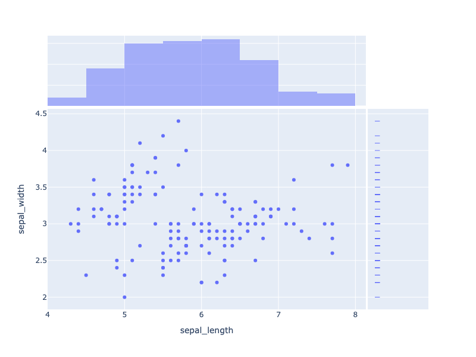
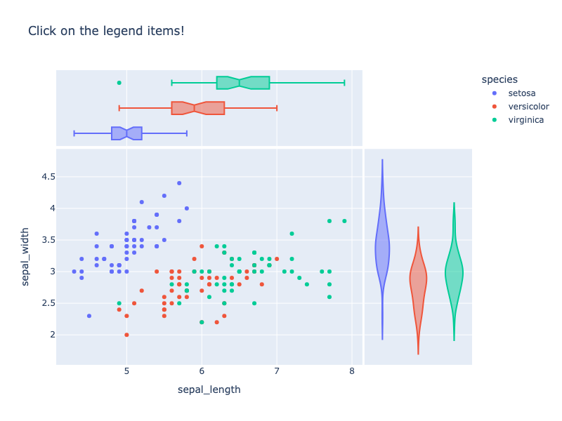
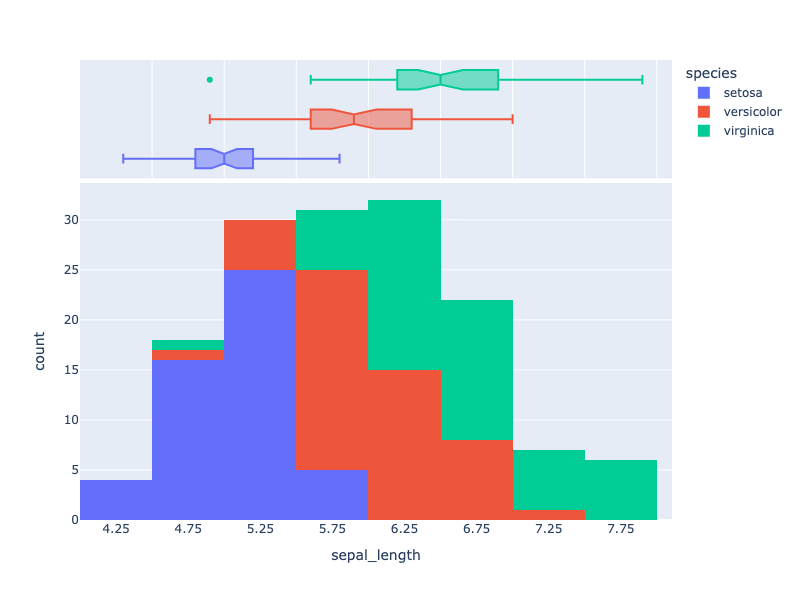
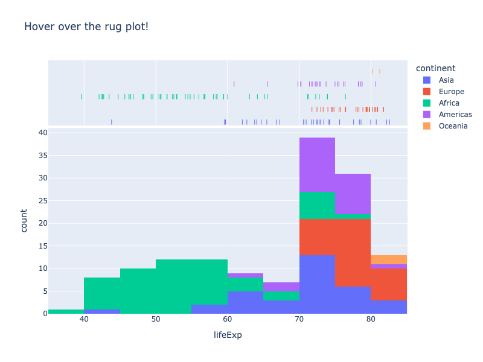
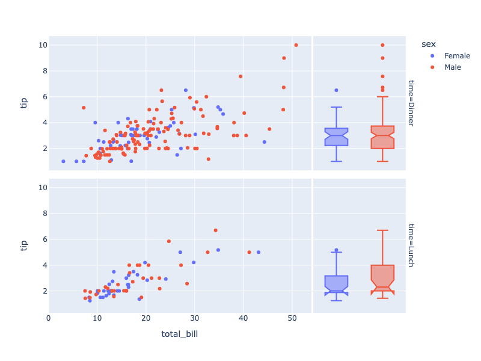

---
jupyter:
  jupytext:
    notebook_metadata_filter: all
    text_representation:
      extension: .md
      format_name: markdown
      format_version: '1.2'
      jupytext_version: 1.4.2
  kernelspec:
    display_name: Python 3
    language: python
    name: python3
  language_info:
    codemirror_mode:
      name: ipython
      version: 3
    file_extension: .py
    mimetype: text/x-python
    name: python
    nbconvert_exporter: python
    pygments_lexer: ipython3
    version: 3.7.7
  plotly:
    description: How to add marginal distribution plots.
    display_as: statistical
    language: python
    layout: base
    name: Marginal Distribution Plots
    order: 13
    page_type: u-guide
    permalink: python/marginal-plots/
    thumbnail: thumbnail/figure-labels.png
---

### Overview

Marginal distribution plots are small subplots above or to the right of a main plot, which show the distribution of data along only one dimension. Marginal distribution plot capabilities are built into various Plotly Express functions such as `scatter` and `histogram`. [Plotly Express](/python/plotly-express/) is the easy-to-use, high-level interface to Plotly, which [operates on a variety of types of data](/python/px-arguments/) and produces [easy-to-style figures](/python/styling-plotly-express/).

### Scatter Plot Marginals

The `marginal_x` and `marginal_y` arguments accept one of `"histogram"`, `"rug"`, `"box"`, or `"violin"` (see also how to create [histograms](/python/histograms/), [box plots](/python/box-plots/) and [violin plots](/python/violin-plots/) as the main figure). 

Marginal plots are linked to the main plot: try zooming or panning on the main plot.

Marginal plots also support hover, including per-point hover as with the rug-plot on the right: try hovering over the points on the right marginal plot.

```python
import plotly.express as px
df = px.data.iris()
fig = px.scatter(df, x="sepal_length", y="sepal_width", marginal_x="histogram", marginal_y="rug")
fig.show()
```



**Interactive Plot:**

<div>                        <script type="text/javascript">window.PlotlyConfig = {MathJaxConfig: 'local'};</script>
        <script charset="utf-8" src="https://cdn.plot.ly/plotly-3.1.0.min.js" integrity="sha256-Ei4740bWZhaUTQuD6q9yQlgVCMPBz6CZWhevDYPv93A=" crossorigin="anonymous"></script>                <div id="plotly-div-1" class="plotly-graph-div" style="height:100%; width:100%;"></div>            <script type="text/javascript">                window.PLOTLYENV=window.PLOTLYENV || {};                                if (document.getElementById("plotly-div-1")) {                    Plotly.newPlot(                        "plotly-div-1",                        [{"hovertemplate":"sepal_length=%{x}\u003cbr\u003esepal_width=%{y}\u003cextra\u003e\u003c\u002fextra\u003e","legendgroup":"","marker":{"color":"#636efa","symbol":"circle"},"mode":"markers","name":"","orientation":"v","showlegend":false,"x":{"dtype":"f8","bdata":"ZmZmZmZmFECamZmZmZkTQM3MzMzMzBJAZmZmZmZmEkAAAAAAAAAUQJqZmZmZmRVAZmZmZmZmEkAAAAAAAAAUQJqZmZmZmRFAmpmZmZmZE0CamZmZmZkVQDMzMzMzMxNAMzMzMzMzE0AzMzMzMzMRQDMzMzMzMxdAzczMzMzMFkCamZmZmZkVQGZmZmZmZhRAzczMzMzMFkBmZmZmZmYUQJqZmZmZmRVAZmZmZmZmFEBmZmZmZmYSQGZmZmZmZhRAMzMzMzMzE0AAAAAAAAAUQAAAAAAAABRAzczMzMzMFEDNzMzMzMwUQM3MzMzMzBJAMzMzMzMzE0CamZmZmZkVQM3MzMzMzBRAAAAAAAAAFkCamZmZmZkTQAAAAAAAABRAAAAAAAAAFkCamZmZmZkTQJqZmZmZmRFAZmZmZmZmFEAAAAAAAAAUQAAAAAAAABJAmpmZmZmZEUAAAAAAAAAUQGZmZmZmZhRAMzMzMzMzE0BmZmZmZmYUQGZmZmZmZhJAMzMzMzMzFUAAAAAAAAAUQAAAAAAAABxAmpmZmZmZGUCamZmZmZkbQAAAAAAAABZAAAAAAAAAGkDNzMzMzMwWQDMzMzMzMxlAmpmZmZmZE0BmZmZmZmYaQM3MzMzMzBRAAAAAAAAAFECamZmZmZkXQAAAAAAAABhAZmZmZmZmGEBmZmZmZmYWQM3MzMzMzBpAZmZmZmZmFkAzMzMzMzMXQM3MzMzMzBhAZmZmZmZmFkCamZmZmZkXQGZmZmZmZhhAMzMzMzMzGUBmZmZmZmYYQJqZmZmZmRlAZmZmZmZmGkAzMzMzMzMbQM3MzMzMzBpAAAAAAAAAGEDNzMzMzMwWQAAAAAAAABZAAAAAAAAAFkAzMzMzMzMXQAAAAAAAABhAmpmZmZmZFUAAAAAAAAAYQM3MzMzMzBpAMzMzMzMzGUBmZmZmZmYWQAAAAAAAABZAAAAAAAAAFkBmZmZmZmYYQDMzMzMzMxdAAAAAAAAAFEBmZmZmZmYWQM3MzMzMzBZAzczMzMzMFkDNzMzMzMwYQGZmZmZmZhRAzczMzMzMFkAzMzMzMzMZQDMzMzMzMxdAZmZmZmZmHEAzMzMzMzMZQAAAAAAAABpAZmZmZmZmHkCamZmZmZkTQDMzMzMzMx1AzczMzMzMGkDNzMzMzMwcQAAAAAAAABpAmpmZmZmZGUAzMzMzMzMbQM3MzMzMzBZAMzMzMzMzF0CamZmZmZkZQAAAAAAAABpAzczMzMzMHkDNzMzMzMweQAAAAAAAABhAmpmZmZmZG0BmZmZmZmYWQM3MzMzMzB5AMzMzMzMzGUDNzMzMzMwaQM3MzMzMzBxAzczMzMzMGEBmZmZmZmYYQJqZmZmZmRlAzczMzMzMHECamZmZmZkdQJqZmZmZmR9AmpmZmZmZGUAzMzMzMzMZQGZmZmZmZhhAzczMzMzMHkAzMzMzMzMZQJqZmZmZmRlAAAAAAAAAGECamZmZmZkbQM3MzMzMzBpAmpmZmZmZG0AzMzMzMzMXQDMzMzMzMxtAzczMzMzMGkDNzMzMzMwaQDMzMzMzMxlAAAAAAAAAGkDNzMzMzMwYQJqZmZmZmRdA"},"xaxis":"x","y":{"dtype":"f8","bdata":"AAAAAAAADEAAAAAAAAAIQJqZmZmZmQlAzczMzMzMCEDNzMzMzMwMQDMzMzMzMw9AMzMzMzMzC0AzMzMzMzMLQDMzMzMzMwdAzczMzMzMCECamZmZmZkNQDMzMzMzMwtAAAAAAAAACEAAAAAAAAAIQAAAAAAAABBAmpmZmZmZEUAzMzMzMzMPQAAAAAAAAAxAZmZmZmZmDkBmZmZmZmYOQDMzMzMzMwtAmpmZmZmZDUDNzMzMzMwMQGZmZmZmZgpAMzMzMzMzC0AAAAAAAAAIQDMzMzMzMwtAAAAAAAAADEAzMzMzMzMLQJqZmZmZmQlAzczMzMzMCEAzMzMzMzMLQGZmZmZmZhBAzczMzMzMEEDNzMzMzMwIQJqZmZmZmQlAAAAAAAAADEDNzMzMzMwIQAAAAAAAAAhAMzMzMzMzC0AAAAAAAAAMQGZmZmZmZgJAmpmZmZmZCUAAAAAAAAAMQGZmZmZmZg5AAAAAAAAACEBmZmZmZmYOQJqZmZmZmQlAmpmZmZmZDUBmZmZmZmYKQJqZmZmZmQlAmpmZmZmZCUDNzMzMzMwIQGZmZmZmZgJAZmZmZmZmBkBmZmZmZmYGQGZmZmZmZgpAMzMzMzMzA0AzMzMzMzMHQJqZmZmZmQVAAAAAAAAAAEAAAAAAAAAIQJqZmZmZmQFAMzMzMzMzB0AzMzMzMzMHQM3MzMzMzAhAAAAAAAAACECamZmZmZkFQJqZmZmZmQFAAAAAAAAABECamZmZmZkJQGZmZmZmZgZAAAAAAAAABEBmZmZmZmYGQDMzMzMzMwdAAAAAAAAACEBmZmZmZmYGQAAAAAAAAAhAMzMzMzMzB0DNzMzMzMwEQDMzMzMzMwNAMzMzMzMzA0CamZmZmZkFQJqZmZmZmQVAAAAAAAAACEAzMzMzMzMLQM3MzMzMzAhAZmZmZmZmAkAAAAAAAAAIQAAAAAAAAARAzczMzMzMBEAAAAAAAAAIQM3MzMzMzARAZmZmZmZmAkCamZmZmZkFQAAAAAAAAAhAMzMzMzMzB0AzMzMzMzMHQAAAAAAAAARAZmZmZmZmBkBmZmZmZmYKQJqZmZmZmQVAAAAAAAAACEAzMzMzMzMHQAAAAAAAAAhAAAAAAAAACEAAAAAAAAAEQDMzMzMzMwdAAAAAAAAABEDNzMzMzMwMQJqZmZmZmQlAmpmZmZmZBUAAAAAAAAAIQAAAAAAAAARAZmZmZmZmBkCamZmZmZkJQAAAAAAAAAhAZmZmZmZmDkDNzMzMzMwEQJqZmZmZmQFAmpmZmZmZCUBmZmZmZmYGQGZmZmZmZgZAmpmZmZmZBUBmZmZmZmYKQJqZmZmZmQlAZmZmZmZmBkAAAAAAAAAIQGZmZmZmZgZAAAAAAAAACEBmZmZmZmYGQGZmZmZmZg5AZmZmZmZmBkBmZmZmZmYGQM3MzMzMzARAAAAAAAAACEAzMzMzMzMLQM3MzMzMzAhAAAAAAAAACEDNzMzMzMwIQM3MzMzMzAhAzczMzMzMCECamZmZmZkFQJqZmZmZmQlAZmZmZmZmCkAAAAAAAAAIQAAAAAAAAARAAAAAAAAACEAzMzMzMzMLQAAAAAAAAAhA"},"yaxis":"y","type":"scatter"},{"bingroup":"x","hovertemplate":"sepal_length=%{x}\u003cbr\u003ecount=%{y}\u003cextra\u003e\u003c\u002fextra\u003e","legendgroup":"","marker":{"color":"#636efa"},"name":"","opacity":0.5,"showlegend":false,"x":{"dtype":"f8","bdata":"ZmZmZmZmFECamZmZmZkTQM3MzMzMzBJAZmZmZmZmEkAAAAAAAAAUQJqZmZmZmRVAZmZmZmZmEkAAAAAAAAAUQJqZmZmZmRFAmpmZmZmZE0CamZmZmZkVQDMzMzMzMxNAMzMzMzMzE0AzMzMzMzMRQDMzMzMzMxdAzczMzMzMFkCamZmZmZkVQGZmZmZmZhRAzczMzMzMFkBmZmZmZmYUQJqZmZmZmRVAZmZmZmZmFEBmZmZmZmYSQGZmZmZmZhRAMzMzMzMzE0AAAAAAAAAUQAAAAAAAABRAzczMzMzMFEDNzMzMzMwUQM3MzMzMzBJAMzMzMzMzE0CamZmZmZkVQM3MzMzMzBRAAAAAAAAAFkCamZmZmZkTQAAAAAAAABRAAAAAAAAAFkCamZmZmZkTQJqZmZmZmRFAZmZmZmZmFEAAAAAAAAAUQAAAAAAAABJAmpmZmZmZEUAAAAAAAAAUQGZmZmZmZhRAMzMzMzMzE0BmZmZmZmYUQGZmZmZmZhJAMzMzMzMzFUAAAAAAAAAUQAAAAAAAABxAmpmZmZmZGUCamZmZmZkbQAAAAAAAABZAAAAAAAAAGkDNzMzMzMwWQDMzMzMzMxlAmpmZmZmZE0BmZmZmZmYaQM3MzMzMzBRAAAAAAAAAFECamZmZmZkXQAAAAAAAABhAZmZmZmZmGEBmZmZmZmYWQM3MzMzMzBpAZmZmZmZmFkAzMzMzMzMXQM3MzMzMzBhAZmZmZmZmFkCamZmZmZkXQGZmZmZmZhhAMzMzMzMzGUBmZmZmZmYYQJqZmZmZmRlAZmZmZmZmGkAzMzMzMzMbQM3MzMzMzBpAAAAAAAAAGEDNzMzMzMwWQAAAAAAAABZAAAAAAAAAFkAzMzMzMzMXQAAAAAAAABhAmpmZmZmZFUAAAAAAAAAYQM3MzMzMzBpAMzMzMzMzGUBmZmZmZmYWQAAAAAAAABZAAAAAAAAAFkBmZmZmZmYYQDMzMzMzMxdAAAAAAAAAFEBmZmZmZmYWQM3MzMzMzBZAzczMzMzMFkDNzMzMzMwYQGZmZmZmZhRAzczMzMzMFkAzMzMzMzMZQDMzMzMzMxdAZmZmZmZmHEAzMzMzMzMZQAAAAAAAABpAZmZmZmZmHkCamZmZmZkTQDMzMzMzMx1AzczMzMzMGkDNzMzMzMwcQAAAAAAAABpAmpmZmZmZGUAzMzMzMzMbQM3MzMzMzBZAMzMzMzMzF0CamZmZmZkZQAAAAAAAABpAzczMzMzMHkDNzMzMzMweQAAAAAAAABhAmpmZmZmZG0BmZmZmZmYWQM3MzMzMzB5AMzMzMzMzGUDNzMzMzMwaQM3MzMzMzBxAzczMzMzMGEBmZmZmZmYYQJqZmZmZmRlAzczMzMzMHECamZmZmZkdQJqZmZmZmR9AmpmZmZmZGUAzMzMzMzMZQGZmZmZmZhhAzczMzMzMHkAzMzMzMzMZQJqZmZmZmRlAAAAAAAAAGECamZmZmZkbQM3MzMzMzBpAmpmZmZmZG0AzMzMzMzMXQDMzMzMzMxtAzczMzMzMGkDNzMzMzMwaQDMzMzMzMxlAAAAAAAAAGkDNzMzMzMwYQJqZmZmZmRdA"},"xaxis":"x3","yaxis":"y3","type":"histogram"},{"boxpoints":"all","fillcolor":"rgba(255,255,255,0)","hoveron":"points","hovertemplate":"sepal_width=%{y}\u003cextra\u003e\u003c\u002fextra\u003e","jitter":0,"legendgroup":"","line":{"color":"rgba(255,255,255,0)"},"marker":{"color":"#636efa","symbol":"line-ew-open"},"name":"","showlegend":false,"xaxis":"x2","y":{"dtype":"f8","bdata":"AAAAAAAADEAAAAAAAAAIQJqZmZmZmQlAzczMzMzMCEDNzMzMzMwMQDMzMzMzMw9AMzMzMzMzC0AzMzMzMzMLQDMzMzMzMwdAzczMzMzMCECamZmZmZkNQDMzMzMzMwtAAAAAAAAACEAAAAAAAAAIQAAAAAAAABBAmpmZmZmZEUAzMzMzMzMPQAAAAAAAAAxAZmZmZmZmDkBmZmZmZmYOQDMzMzMzMwtAmpmZmZmZDUDNzMzMzMwMQGZmZmZmZgpAMzMzMzMzC0AAAAAAAAAIQDMzMzMzMwtAAAAAAAAADEAzMzMzMzMLQJqZmZmZmQlAzczMzMzMCEAzMzMzMzMLQGZmZmZmZhBAzczMzMzMEEDNzMzMzMwIQJqZmZmZmQlAAAAAAAAADEDNzMzMzMwIQAAAAAAAAAhAMzMzMzMzC0AAAAAAAAAMQGZmZmZmZgJAmpmZmZmZCUAAAAAAAAAMQGZmZmZmZg5AAAAAAAAACEBmZmZmZmYOQJqZmZmZmQlAmpmZmZmZDUBmZmZmZmYKQJqZmZmZmQlAmpmZmZmZCUDNzMzMzMwIQGZmZmZmZgJAZmZmZmZmBkBmZmZmZmYGQGZmZmZmZgpAMzMzMzMzA0AzMzMzMzMHQJqZmZmZmQVAAAAAAAAAAEAAAAAAAAAIQJqZmZmZmQFAMzMzMzMzB0AzMzMzMzMHQM3MzMzMzAhAAAAAAAAACECamZmZmZkFQJqZmZmZmQFAAAAAAAAABECamZmZmZkJQGZmZmZmZgZAAAAAAAAABEBmZmZmZmYGQDMzMzMzMwdAAAAAAAAACEBmZmZmZmYGQAAAAAAAAAhAMzMzMzMzB0DNzMzMzMwEQDMzMzMzMwNAMzMzMzMzA0CamZmZmZkFQJqZmZmZmQVAAAAAAAAACEAzMzMzMzMLQM3MzMzMzAhAZmZmZmZmAkAAAAAAAAAIQAAAAAAAAARAzczMzMzMBEAAAAAAAAAIQM3MzMzMzARAZmZmZmZmAkCamZmZmZkFQAAAAAAAAAhAMzMzMzMzB0AzMzMzMzMHQAAAAAAAAARAZmZmZmZmBkBmZmZmZmYKQJqZmZmZmQVAAAAAAAAACEAzMzMzMzMHQAAAAAAAAAhAAAAAAAAACEAAAAAAAAAEQDMzMzMzMwdAAAAAAAAABEDNzMzMzMwMQJqZmZmZmQlAmpmZmZmZBUAAAAAAAAAIQAAAAAAAAARAZmZmZmZmBkCamZmZmZkJQAAAAAAAAAhAZmZmZmZmDkDNzMzMzMwEQJqZmZmZmQFAmpmZmZmZCUBmZmZmZmYGQGZmZmZmZgZAmpmZmZmZBUBmZmZmZmYKQJqZmZmZmQlAZmZmZmZmBkAAAAAAAAAIQGZmZmZmZgZAAAAAAAAACEBmZmZmZmYGQGZmZmZmZg5AZmZmZmZmBkBmZmZmZmYGQM3MzMzMzARAAAAAAAAACEAzMzMzMzMLQM3MzMzMzAhAAAAAAAAACEDNzMzMzMwIQM3MzMzMzAhAzczMzMzMCECamZmZmZkFQJqZmZmZmQlAZmZmZmZmCkAAAAAAAAAIQAAAAAAAAARAAAAAAAAACEAzMzMzMzMLQAAAAAAAAAhA"},"yaxis":"y2","type":"box"}],                        {"template":{"data":{"histogram2dcontour":[{"type":"histogram2dcontour","colorbar":{"outlinewidth":0,"ticks":""},"colorscale":[[0.0,"#0d0887"],[0.1111111111111111,"#46039f"],[0.2222222222222222,"#7201a8"],[0.3333333333333333,"#9c179e"],[0.4444444444444444,"#bd3786"],[0.5555555555555556,"#d8576b"],[0.6666666666666666,"#ed7953"],[0.7777777777777778,"#fb9f3a"],[0.8888888888888888,"#fdca26"],[1.0,"#f0f921"]]}],"choropleth":[{"type":"choropleth","colorbar":{"outlinewidth":0,"ticks":""}}],"histogram2d":[{"type":"histogram2d","colorbar":{"outlinewidth":0,"ticks":""},"colorscale":[[0.0,"#0d0887"],[0.1111111111111111,"#46039f"],[0.2222222222222222,"#7201a8"],[0.3333333333333333,"#9c179e"],[0.4444444444444444,"#bd3786"],[0.5555555555555556,"#d8576b"],[0.6666666666666666,"#ed7953"],[0.7777777777777778,"#fb9f3a"],[0.8888888888888888,"#fdca26"],[1.0,"#f0f921"]]}],"heatmap":[{"type":"heatmap","colorbar":{"outlinewidth":0,"ticks":""},"colorscale":[[0.0,"#0d0887"],[0.1111111111111111,"#46039f"],[0.2222222222222222,"#7201a8"],[0.3333333333333333,"#9c179e"],[0.4444444444444444,"#bd3786"],[0.5555555555555556,"#d8576b"],[0.6666666666666666,"#ed7953"],[0.7777777777777778,"#fb9f3a"],[0.8888888888888888,"#fdca26"],[1.0,"#f0f921"]]}],"contourcarpet":[{"type":"contourcarpet","colorbar":{"outlinewidth":0,"ticks":""}}],"contour":[{"type":"contour","colorbar":{"outlinewidth":0,"ticks":""},"colorscale":[[0.0,"#0d0887"],[0.1111111111111111,"#46039f"],[0.2222222222222222,"#7201a8"],[0.3333333333333333,"#9c179e"],[0.4444444444444444,"#bd3786"],[0.5555555555555556,"#d8576b"],[0.6666666666666666,"#ed7953"],[0.7777777777777778,"#fb9f3a"],[0.8888888888888888,"#fdca26"],[1.0,"#f0f921"]]}],"surface":[{"type":"surface","colorbar":{"outlinewidth":0,"ticks":""},"colorscale":[[0.0,"#0d0887"],[0.1111111111111111,"#46039f"],[0.2222222222222222,"#7201a8"],[0.3333333333333333,"#9c179e"],[0.4444444444444444,"#bd3786"],[0.5555555555555556,"#d8576b"],[0.6666666666666666,"#ed7953"],[0.7777777777777778,"#fb9f3a"],[0.8888888888888888,"#fdca26"],[1.0,"#f0f921"]]}],"mesh3d":[{"type":"mesh3d","colorbar":{"outlinewidth":0,"ticks":""}}],"scatter":[{"fillpattern":{"fillmode":"overlay","size":10,"solidity":0.2},"type":"scatter"}],"parcoords":[{"type":"parcoords","line":{"colorbar":{"outlinewidth":0,"ticks":""}}}],"scatterpolargl":[{"type":"scatterpolargl","marker":{"colorbar":{"outlinewidth":0,"ticks":""}}}],"bar":[{"error_x":{"color":"#2a3f5f"},"error_y":{"color":"#2a3f5f"},"marker":{"line":{"color":"#E5ECF6","width":0.5},"pattern":{"fillmode":"overlay","size":10,"solidity":0.2}},"type":"bar"}],"scattergeo":[{"type":"scattergeo","marker":{"colorbar":{"outlinewidth":0,"ticks":""}}}],"scatterpolar":[{"type":"scatterpolar","marker":{"colorbar":{"outlinewidth":0,"ticks":""}}}],"histogram":[{"marker":{"pattern":{"fillmode":"overlay","size":10,"solidity":0.2}},"type":"histogram"}],"scattergl":[{"type":"scattergl","marker":{"colorbar":{"outlinewidth":0,"ticks":""}}}],"scatter3d":[{"type":"scatter3d","line":{"colorbar":{"outlinewidth":0,"ticks":""}},"marker":{"colorbar":{"outlinewidth":0,"ticks":""}}}],"scattermap":[{"type":"scattermap","marker":{"colorbar":{"outlinewidth":0,"ticks":""}}}],"scattermapbox":[{"type":"scattermapbox","marker":{"colorbar":{"outlinewidth":0,"ticks":""}}}],"scatterternary":[{"type":"scatterternary","marker":{"colorbar":{"outlinewidth":0,"ticks":""}}}],"scattercarpet":[{"type":"scattercarpet","marker":{"colorbar":{"outlinewidth":0,"ticks":""}}}],"carpet":[{"aaxis":{"endlinecolor":"#2a3f5f","gridcolor":"white","linecolor":"white","minorgridcolor":"white","startlinecolor":"#2a3f5f"},"baxis":{"endlinecolor":"#2a3f5f","gridcolor":"white","linecolor":"white","minorgridcolor":"white","startlinecolor":"#2a3f5f"},"type":"carpet"}],"table":[{"cells":{"fill":{"color":"#EBF0F8"},"line":{"color":"white"}},"header":{"fill":{"color":"#C8D4E3"},"line":{"color":"white"}},"type":"table"}],"barpolar":[{"marker":{"line":{"color":"#E5ECF6","width":0.5},"pattern":{"fillmode":"overlay","size":10,"solidity":0.2}},"type":"barpolar"}],"pie":[{"automargin":true,"type":"pie"}]},"layout":{"autotypenumbers":"strict","colorway":["#636efa","#EF553B","#00cc96","#ab63fa","#FFA15A","#19d3f3","#FF6692","#B6E880","#FF97FF","#FECB52"],"font":{"color":"#2a3f5f"},"hovermode":"closest","hoverlabel":{"align":"left"},"paper_bgcolor":"white","plot_bgcolor":"#E5ECF6","polar":{"bgcolor":"#E5ECF6","angularaxis":{"gridcolor":"white","linecolor":"white","ticks":""},"radialaxis":{"gridcolor":"white","linecolor":"white","ticks":""}},"ternary":{"bgcolor":"#E5ECF6","aaxis":{"gridcolor":"white","linecolor":"white","ticks":""},"baxis":{"gridcolor":"white","linecolor":"white","ticks":""},"caxis":{"gridcolor":"white","linecolor":"white","ticks":""}},"coloraxis":{"colorbar":{"outlinewidth":0,"ticks":""}},"colorscale":{"sequential":[[0.0,"#0d0887"],[0.1111111111111111,"#46039f"],[0.2222222222222222,"#7201a8"],[0.3333333333333333,"#9c179e"],[0.4444444444444444,"#bd3786"],[0.5555555555555556,"#d8576b"],[0.6666666666666666,"#ed7953"],[0.7777777777777778,"#fb9f3a"],[0.8888888888888888,"#fdca26"],[1.0,"#f0f921"]],"sequentialminus":[[0.0,"#0d0887"],[0.1111111111111111,"#46039f"],[0.2222222222222222,"#7201a8"],[0.3333333333333333,"#9c179e"],[0.4444444444444444,"#bd3786"],[0.5555555555555556,"#d8576b"],[0.6666666666666666,"#ed7953"],[0.7777777777777778,"#fb9f3a"],[0.8888888888888888,"#fdca26"],[1.0,"#f0f921"]],"diverging":[[0,"#8e0152"],[0.1,"#c51b7d"],[0.2,"#de77ae"],[0.3,"#f1b6da"],[0.4,"#fde0ef"],[0.5,"#f7f7f7"],[0.6,"#e6f5d0"],[0.7,"#b8e186"],[0.8,"#7fbc41"],[0.9,"#4d9221"],[1,"#276419"]]},"xaxis":{"gridcolor":"white","linecolor":"white","ticks":"","title":{"standoff":15},"zerolinecolor":"white","automargin":true,"zerolinewidth":2},"yaxis":{"gridcolor":"white","linecolor":"white","ticks":"","title":{"standoff":15},"zerolinecolor":"white","automargin":true,"zerolinewidth":2},"scene":{"xaxis":{"backgroundcolor":"#E5ECF6","gridcolor":"white","linecolor":"white","showbackground":true,"ticks":"","zerolinecolor":"white","gridwidth":2},"yaxis":{"backgroundcolor":"#E5ECF6","gridcolor":"white","linecolor":"white","showbackground":true,"ticks":"","zerolinecolor":"white","gridwidth":2},"zaxis":{"backgroundcolor":"#E5ECF6","gridcolor":"white","linecolor":"white","showbackground":true,"ticks":"","zerolinecolor":"white","gridwidth":2}},"shapedefaults":{"line":{"color":"#2a3f5f"}},"annotationdefaults":{"arrowcolor":"#2a3f5f","arrowhead":0,"arrowwidth":1},"geo":{"bgcolor":"white","landcolor":"#E5ECF6","subunitcolor":"white","showland":true,"showlakes":true,"lakecolor":"white"},"title":{"x":0.05},"mapbox":{"style":"light"}}},"xaxis":{"anchor":"y","domain":[0.0,0.8358],"title":{"text":"sepal_length"}},"yaxis":{"anchor":"x","domain":[0.0,0.7326],"title":{"text":"sepal_width"}},"xaxis2":{"anchor":"y2","domain":[0.8408,1.0],"matches":"x2","showticklabels":false,"showline":false,"ticks":"","showgrid":false},"yaxis2":{"anchor":"x2","domain":[0.0,0.7326],"matches":"y","showticklabels":false,"showgrid":true},"xaxis3":{"anchor":"y3","domain":[0.0,0.8358],"matches":"x","showticklabels":false,"showgrid":true},"yaxis3":{"anchor":"x3","domain":[0.7426,1.0],"matches":"y3","showticklabels":false,"showline":false,"ticks":"","showgrid":true},"xaxis4":{"anchor":"y4","domain":[0.8408,1.0],"matches":"x2","showticklabels":false,"showgrid":false,"showline":false,"ticks":""},"yaxis4":{"anchor":"x4","domain":[0.7426,1.0],"matches":"y3","showticklabels":false,"showline":false,"ticks":"","showgrid":true},"legend":{"tracegroupgap":0},"margin":{"t":60},"barmode":"overlay"},                        {"responsive": true}                    )                };            </script>        </div>

```python
import plotly.express as px
df = px.data.iris()
fig = px.density_heatmap(df, x="sepal_length", y="sepal_width", marginal_x="box", marginal_y="violin")
fig.show()
```


**Interactive Plot:**

<div>                        <script type="text/javascript">window.PlotlyConfig = {MathJaxConfig: 'local'};</script>
        <script charset="utf-8" src="https://cdn.plot.ly/plotly-3.1.0.min.js" integrity="sha256-Ei4740bWZhaUTQuD6q9yQlgVCMPBz6CZWhevDYPv93A=" crossorigin="anonymous"></script>                <div id="plotly-div-2" class="plotly-graph-div" style="height:100%; width:100%;"></div>            <script type="text/javascript">                window.PLOTLYENV=window.PLOTLYENV || {};                                if (document.getElementById("plotly-div-2")) {                    Plotly.newPlot(                        "plotly-div-2",                        [{"coloraxis":"coloraxis","hovertemplate":"sepal_length=%{x}\u003cbr\u003esepal_width=%{y}\u003cbr\u003ecount=%{z}\u003cextra\u003e\u003c\u002fextra\u003e","name":"","x":{"dtype":"f8","bdata":"ZmZmZmZmFECamZmZmZkTQM3MzMzMzBJAZmZmZmZmEkAAAAAAAAAUQJqZmZmZmRVAZmZmZmZmEkAAAAAAAAAUQJqZmZmZmRFAmpmZmZmZE0CamZmZmZkVQDMzMzMzMxNAMzMzMzMzE0AzMzMzMzMRQDMzMzMzMxdAzczMzMzMFkCamZmZmZkVQGZmZmZmZhRAzczMzMzMFkBmZmZmZmYUQJqZmZmZmRVAZmZmZmZmFEBmZmZmZmYSQGZmZmZmZhRAMzMzMzMzE0AAAAAAAAAUQAAAAAAAABRAzczMzMzMFEDNzMzMzMwUQM3MzMzMzBJAMzMzMzMzE0CamZmZmZkVQM3MzMzMzBRAAAAAAAAAFkCamZmZmZkTQAAAAAAAABRAAAAAAAAAFkCamZmZmZkTQJqZmZmZmRFAZmZmZmZmFEAAAAAAAAAUQAAAAAAAABJAmpmZmZmZEUAAAAAAAAAUQGZmZmZmZhRAMzMzMzMzE0BmZmZmZmYUQGZmZmZmZhJAMzMzMzMzFUAAAAAAAAAUQAAAAAAAABxAmpmZmZmZGUCamZmZmZkbQAAAAAAAABZAAAAAAAAAGkDNzMzMzMwWQDMzMzMzMxlAmpmZmZmZE0BmZmZmZmYaQM3MzMzMzBRAAAAAAAAAFECamZmZmZkXQAAAAAAAABhAZmZmZmZmGEBmZmZmZmYWQM3MzMzMzBpAZmZmZmZmFkAzMzMzMzMXQM3MzMzMzBhAZmZmZmZmFkCamZmZmZkXQGZmZmZmZhhAMzMzMzMzGUBmZmZmZmYYQJqZmZmZmRlAZmZmZmZmGkAzMzMzMzMbQM3MzMzMzBpAAAAAAAAAGEDNzMzMzMwWQAAAAAAAABZAAAAAAAAAFkAzMzMzMzMXQAAAAAAAABhAmpmZmZmZFUAAAAAAAAAYQM3MzMzMzBpAMzMzMzMzGUBmZmZmZmYWQAAAAAAAABZAAAAAAAAAFkBmZmZmZmYYQDMzMzMzMxdAAAAAAAAAFEBmZmZmZmYWQM3MzMzMzBZAzczMzMzMFkDNzMzMzMwYQGZmZmZmZhRAzczMzMzMFkAzMzMzMzMZQDMzMzMzMxdAZmZmZmZmHEAzMzMzMzMZQAAAAAAAABpAZmZmZmZmHkCamZmZmZkTQDMzMzMzMx1AzczMzMzMGkDNzMzMzMwcQAAAAAAAABpAmpmZmZmZGUAzMzMzMzMbQM3MzMzMzBZAMzMzMzMzF0CamZmZmZkZQAAAAAAAABpAzczMzMzMHkDNzMzMzMweQAAAAAAAABhAmpmZmZmZG0BmZmZmZmYWQM3MzMzMzB5AMzMzMzMzGUDNzMzMzMwaQM3MzMzMzBxAzczMzMzMGEBmZmZmZmYYQJqZmZmZmRlAzczMzMzMHECamZmZmZkdQJqZmZmZmR9AmpmZmZmZGUAzMzMzMzMZQGZmZmZmZhhAzczMzMzMHkAzMzMzMzMZQJqZmZmZmRlAAAAAAAAAGECamZmZmZkbQM3MzMzMzBpAmpmZmZmZG0AzMzMzMzMXQDMzMzMzMxtAzczMzMzMGkDNzMzMzMwaQDMzMzMzMxlAAAAAAAAAGkDNzMzMzMwYQJqZmZmZmRdA"},"xaxis":"x","xbingroup":"x","y":{"dtype":"f8","bdata":"AAAAAAAADEAAAAAAAAAIQJqZmZmZmQlAzczMzMzMCEDNzMzMzMwMQDMzMzMzMw9AMzMzMzMzC0AzMzMzMzMLQDMzMzMzMwdAzczMzMzMCECamZmZmZkNQDMzMzMzMwtAAAAAAAAACEAAAAAAAAAIQAAAAAAAABBAmpmZmZmZEUAzMzMzMzMPQAAAAAAAAAxAZmZmZmZmDkBmZmZmZmYOQDMzMzMzMwtAmpmZmZmZDUDNzMzMzMwMQGZmZmZmZgpAMzMzMzMzC0AAAAAAAAAIQDMzMzMzMwtAAAAAAAAADEAzMzMzMzMLQJqZmZmZmQlAzczMzMzMCEAzMzMzMzMLQGZmZmZmZhBAzczMzMzMEEDNzMzMzMwIQJqZmZmZmQlAAAAAAAAADEDNzMzMzMwIQAAAAAAAAAhAMzMzMzMzC0AAAAAAAAAMQGZmZmZmZgJAmpmZmZmZCUAAAAAAAAAMQGZmZmZmZg5AAAAAAAAACEBmZmZmZmYOQJqZmZmZmQlAmpmZmZmZDUBmZmZmZmYKQJqZmZmZmQlAmpmZmZmZCUDNzMzMzMwIQGZmZmZmZgJAZmZmZmZmBkBmZmZmZmYGQGZmZmZmZgpAMzMzMzMzA0AzMzMzMzMHQJqZmZmZmQVAAAAAAAAAAEAAAAAAAAAIQJqZmZmZmQFAMzMzMzMzB0AzMzMzMzMHQM3MzMzMzAhAAAAAAAAACECamZmZmZkFQJqZmZmZmQFAAAAAAAAABECamZmZmZkJQGZmZmZmZgZAAAAAAAAABEBmZmZmZmYGQDMzMzMzMwdAAAAAAAAACEBmZmZmZmYGQAAAAAAAAAhAMzMzMzMzB0DNzMzMzMwEQDMzMzMzMwNAMzMzMzMzA0CamZmZmZkFQJqZmZmZmQVAAAAAAAAACEAzMzMzMzMLQM3MzMzMzAhAZmZmZmZmAkAAAAAAAAAIQAAAAAAAAARAzczMzMzMBEAAAAAAAAAIQM3MzMzMzARAZmZmZmZmAkCamZmZmZkFQAAAAAAAAAhAMzMzMzMzB0AzMzMzMzMHQAAAAAAAAARAZmZmZmZmBkBmZmZmZmYKQJqZmZmZmQVAAAAAAAAACEAzMzMzMzMHQAAAAAAAAAhAAAAAAAAACEAAAAAAAAAEQDMzMzMzMwdAAAAAAAAABEDNzMzMzMwMQJqZmZmZmQlAmpmZmZmZBUAAAAAAAAAIQAAAAAAAAARAZmZmZmZmBkCamZmZmZkJQAAAAAAAAAhAZmZmZmZmDkDNzMzMzMwEQJqZmZmZmQFAmpmZmZmZCUBmZmZmZmYGQGZmZmZmZgZAmpmZmZmZBUBmZmZmZmYKQJqZmZmZmQlAZmZmZmZmBkAAAAAAAAAIQGZmZmZmZgZAAAAAAAAACEBmZmZmZmYGQGZmZmZmZg5AZmZmZmZmBkBmZmZmZmYGQM3MzMzMzARAAAAAAAAACEAzMzMzMzMLQM3MzMzMzAhAAAAAAAAACEDNzMzMzMwIQM3MzMzMzAhAzczMzMzMCECamZmZmZkFQJqZmZmZmQlAZmZmZmZmCkAAAAAAAAAIQAAAAAAAAARAAAAAAAAACEAzMzMzMzMLQAAAAAAAAAhA"},"yaxis":"y","ybingroup":"y","type":"histogram2d"},{"alignmentgroup":"True","hovertemplate":"sepal_length=%{x}\u003cextra\u003e\u003c\u002fextra\u003e","legendgroup":"","marker":{"color":"#0d0887"},"name":"","notched":true,"offsetgroup":"","showlegend":false,"x":{"dtype":"f8","bdata":"ZmZmZmZmFECamZmZmZkTQM3MzMzMzBJAZmZmZmZmEkAAAAAAAAAUQJqZmZmZmRVAZmZmZmZmEkAAAAAAAAAUQJqZmZmZmRFAmpmZmZmZE0CamZmZmZkVQDMzMzMzMxNAMzMzMzMzE0AzMzMzMzMRQDMzMzMzMxdAzczMzMzMFkCamZmZmZkVQGZmZmZmZhRAzczMzMzMFkBmZmZmZmYUQJqZmZmZmRVAZmZmZmZmFEBmZmZmZmYSQGZmZmZmZhRAMzMzMzMzE0AAAAAAAAAUQAAAAAAAABRAzczMzMzMFEDNzMzMzMwUQM3MzMzMzBJAMzMzMzMzE0CamZmZmZkVQM3MzMzMzBRAAAAAAAAAFkCamZmZmZkTQAAAAAAAABRAAAAAAAAAFkCamZmZmZkTQJqZmZmZmRFAZmZmZmZmFEAAAAAAAAAUQAAAAAAAABJAmpmZmZmZEUAAAAAAAAAUQGZmZmZmZhRAMzMzMzMzE0BmZmZmZmYUQGZmZmZmZhJAMzMzMzMzFUAAAAAAAAAUQAAAAAAAABxAmpmZmZmZGUCamZmZmZkbQAAAAAAAABZAAAAAAAAAGkDNzMzMzMwWQDMzMzMzMxlAmpmZmZmZE0BmZmZmZmYaQM3MzMzMzBRAAAAAAAAAFECamZmZmZkXQAAAAAAAABhAZmZmZmZmGEBmZmZmZmYWQM3MzMzMzBpAZmZmZmZmFkAzMzMzMzMXQM3MzMzMzBhAZmZmZmZmFkCamZmZmZkXQGZmZmZmZhhAMzMzMzMzGUBmZmZmZmYYQJqZmZmZmRlAZmZmZmZmGkAzMzMzMzMbQM3MzMzMzBpAAAAAAAAAGEDNzMzMzMwWQAAAAAAAABZAAAAAAAAAFkAzMzMzMzMXQAAAAAAAABhAmpmZmZmZFUAAAAAAAAAYQM3MzMzMzBpAMzMzMzMzGUBmZmZmZmYWQAAAAAAAABZAAAAAAAAAFkBmZmZmZmYYQDMzMzMzMxdAAAAAAAAAFEBmZmZmZmYWQM3MzMzMzBZAzczMzMzMFkDNzMzMzMwYQGZmZmZmZhRAzczMzMzMFkAzMzMzMzMZQDMzMzMzMxdAZmZmZmZmHEAzMzMzMzMZQAAAAAAAABpAZmZmZmZmHkCamZmZmZkTQDMzMzMzMx1AzczMzMzMGkDNzMzMzMwcQAAAAAAAABpAmpmZmZmZGUAzMzMzMzMbQM3MzMzMzBZAMzMzMzMzF0CamZmZmZkZQAAAAAAAABpAzczMzMzMHkDNzMzMzMweQAAAAAAAABhAmpmZmZmZG0BmZmZmZmYWQM3MzMzMzB5AMzMzMzMzGUDNzMzMzMwaQM3MzMzMzBxAzczMzMzMGEBmZmZmZmYYQJqZmZmZmRlAzczMzMzMHECamZmZmZkdQJqZmZmZmR9AmpmZmZmZGUAzMzMzMzMZQGZmZmZmZhhAzczMzMzMHkAzMzMzMzMZQJqZmZmZmRlAAAAAAAAAGECamZmZmZkbQM3MzMzMzBpAmpmZmZmZG0AzMzMzMzMXQDMzMzMzMxtAzczMzMzMGkDNzMzMzMwaQDMzMzMzMxlAAAAAAAAAGkDNzMzMzMwYQJqZmZmZmRdA"},"xaxis":"x3","yaxis":"y3","type":"box"},{"alignmentgroup":"True","hovertemplate":"sepal_width=%{y}\u003cextra\u003e\u003c\u002fextra\u003e","legendgroup":"","marker":{"color":"#0d0887"},"name":"","offsetgroup":"","scalegroup":"y","showlegend":false,"xaxis":"x2","y":{"dtype":"f8","bdata":"AAAAAAAADEAAAAAAAAAIQJqZmZmZmQlAzczMzMzMCEDNzMzMzMwMQDMzMzMzMw9AMzMzMzMzC0AzMzMzMzMLQDMzMzMzMwdAzczMzMzMCECamZmZmZkNQDMzMzMzMwtAAAAAAAAACEAAAAAAAAAIQAAAAAAAABBAmpmZmZmZEUAzMzMzMzMPQAAAAAAAAAxAZmZmZmZmDkBmZmZmZmYOQDMzMzMzMwtAmpmZmZmZDUDNzMzMzMwMQGZmZmZmZgpAMzMzMzMzC0AAAAAAAAAIQDMzMzMzMwtAAAAAAAAADEAzMzMzMzMLQJqZmZmZmQlAzczMzMzMCEAzMzMzMzMLQGZmZmZmZhBAzczMzMzMEEDNzMzMzMwIQJqZmZmZmQlAAAAAAAAADEDNzMzMzMwIQAAAAAAAAAhAMzMzMzMzC0AAAAAAAAAMQGZmZmZmZgJAmpmZmZmZCUAAAAAAAAAMQGZmZmZmZg5AAAAAAAAACEBmZmZmZmYOQJqZmZmZmQlAmpmZmZmZDUBmZmZmZmYKQJqZmZmZmQlAmpmZmZmZCUDNzMzMzMwIQGZmZmZmZgJAZmZmZmZmBkBmZmZmZmYGQGZmZmZmZgpAMzMzMzMzA0AzMzMzMzMHQJqZmZmZmQVAAAAAAAAAAEAAAAAAAAAIQJqZmZmZmQFAMzMzMzMzB0AzMzMzMzMHQM3MzMzMzAhAAAAAAAAACECamZmZmZkFQJqZmZmZmQFAAAAAAAAABECamZmZmZkJQGZmZmZmZgZAAAAAAAAABEBmZmZmZmYGQDMzMzMzMwdAAAAAAAAACEBmZmZmZmYGQAAAAAAAAAhAMzMzMzMzB0DNzMzMzMwEQDMzMzMzMwNAMzMzMzMzA0CamZmZmZkFQJqZmZmZmQVAAAAAAAAACEAzMzMzMzMLQM3MzMzMzAhAZmZmZmZmAkAAAAAAAAAIQAAAAAAAAARAzczMzMzMBEAAAAAAAAAIQM3MzMzMzARAZmZmZmZmAkCamZmZmZkFQAAAAAAAAAhAMzMzMzMzB0AzMzMzMzMHQAAAAAAAAARAZmZmZmZmBkBmZmZmZmYKQJqZmZmZmQVAAAAAAAAACEAzMzMzMzMHQAAAAAAAAAhAAAAAAAAACEAAAAAAAAAEQDMzMzMzMwdAAAAAAAAABEDNzMzMzMwMQJqZmZmZmQlAmpmZmZmZBUAAAAAAAAAIQAAAAAAAAARAZmZmZmZmBkCamZmZmZkJQAAAAAAAAAhAZmZmZmZmDkDNzMzMzMwEQJqZmZmZmQFAmpmZmZmZCUBmZmZmZmYGQGZmZmZmZgZAmpmZmZmZBUBmZmZmZmYKQJqZmZmZmQlAZmZmZmZmBkAAAAAAAAAIQGZmZmZmZgZAAAAAAAAACEBmZmZmZmYGQGZmZmZmZg5AZmZmZmZmBkBmZmZmZmYGQM3MzMzMzARAAAAAAAAACEAzMzMzMzMLQM3MzMzMzAhAAAAAAAAACEDNzMzMzMwIQM3MzMzMzAhAzczMzMzMCECamZmZmZkFQJqZmZmZmQlAZmZmZmZmCkAAAAAAAAAIQAAAAAAAAARAAAAAAAAACEAzMzMzMzMLQAAAAAAAAAhA"},"yaxis":"y2","type":"violin"}],                        {"template":{"data":{"histogram2dcontour":[{"type":"histogram2dcontour","colorbar":{"outlinewidth":0,"ticks":""},"colorscale":[[0.0,"#0d0887"],[0.1111111111111111,"#46039f"],[0.2222222222222222,"#7201a8"],[0.3333333333333333,"#9c179e"],[0.4444444444444444,"#bd3786"],[0.5555555555555556,"#d8576b"],[0.6666666666666666,"#ed7953"],[0.7777777777777778,"#fb9f3a"],[0.8888888888888888,"#fdca26"],[1.0,"#f0f921"]]}],"choropleth":[{"type":"choropleth","colorbar":{"outlinewidth":0,"ticks":""}}],"histogram2d":[{"type":"histogram2d","colorbar":{"outlinewidth":0,"ticks":""},"colorscale":[[0.0,"#0d0887"],[0.1111111111111111,"#46039f"],[0.2222222222222222,"#7201a8"],[0.3333333333333333,"#9c179e"],[0.4444444444444444,"#bd3786"],[0.5555555555555556,"#d8576b"],[0.6666666666666666,"#ed7953"],[0.7777777777777778,"#fb9f3a"],[0.8888888888888888,"#fdca26"],[1.0,"#f0f921"]]}],"heatmap":[{"type":"heatmap","colorbar":{"outlinewidth":0,"ticks":""},"colorscale":[[0.0,"#0d0887"],[0.1111111111111111,"#46039f"],[0.2222222222222222,"#7201a8"],[0.3333333333333333,"#9c179e"],[0.4444444444444444,"#bd3786"],[0.5555555555555556,"#d8576b"],[0.6666666666666666,"#ed7953"],[0.7777777777777778,"#fb9f3a"],[0.8888888888888888,"#fdca26"],[1.0,"#f0f921"]]}],"contourcarpet":[{"type":"contourcarpet","colorbar":{"outlinewidth":0,"ticks":""}}],"contour":[{"type":"contour","colorbar":{"outlinewidth":0,"ticks":""},"colorscale":[[0.0,"#0d0887"],[0.1111111111111111,"#46039f"],[0.2222222222222222,"#7201a8"],[0.3333333333333333,"#9c179e"],[0.4444444444444444,"#bd3786"],[0.5555555555555556,"#d8576b"],[0.6666666666666666,"#ed7953"],[0.7777777777777778,"#fb9f3a"],[0.8888888888888888,"#fdca26"],[1.0,"#f0f921"]]}],"surface":[{"type":"surface","colorbar":{"outlinewidth":0,"ticks":""},"colorscale":[[0.0,"#0d0887"],[0.1111111111111111,"#46039f"],[0.2222222222222222,"#7201a8"],[0.3333333333333333,"#9c179e"],[0.4444444444444444,"#bd3786"],[0.5555555555555556,"#d8576b"],[0.6666666666666666,"#ed7953"],[0.7777777777777778,"#fb9f3a"],[0.8888888888888888,"#fdca26"],[1.0,"#f0f921"]]}],"mesh3d":[{"type":"mesh3d","colorbar":{"outlinewidth":0,"ticks":""}}],"scatter":[{"fillpattern":{"fillmode":"overlay","size":10,"solidity":0.2},"type":"scatter"}],"parcoords":[{"type":"parcoords","line":{"colorbar":{"outlinewidth":0,"ticks":""}}}],"scatterpolargl":[{"type":"scatterpolargl","marker":{"colorbar":{"outlinewidth":0,"ticks":""}}}],"bar":[{"error_x":{"color":"#2a3f5f"},"error_y":{"color":"#2a3f5f"},"marker":{"line":{"color":"#E5ECF6","width":0.5},"pattern":{"fillmode":"overlay","size":10,"solidity":0.2}},"type":"bar"}],"scattergeo":[{"type":"scattergeo","marker":{"colorbar":{"outlinewidth":0,"ticks":""}}}],"scatterpolar":[{"type":"scatterpolar","marker":{"colorbar":{"outlinewidth":0,"ticks":""}}}],"histogram":[{"marker":{"pattern":{"fillmode":"overlay","size":10,"solidity":0.2}},"type":"histogram"}],"scattergl":[{"type":"scattergl","marker":{"colorbar":{"outlinewidth":0,"ticks":""}}}],"scatter3d":[{"type":"scatter3d","line":{"colorbar":{"outlinewidth":0,"ticks":""}},"marker":{"colorbar":{"outlinewidth":0,"ticks":""}}}],"scattermap":[{"type":"scattermap","marker":{"colorbar":{"outlinewidth":0,"ticks":""}}}],"scattermapbox":[{"type":"scattermapbox","marker":{"colorbar":{"outlinewidth":0,"ticks":""}}}],"scatterternary":[{"type":"scatterternary","marker":{"colorbar":{"outlinewidth":0,"ticks":""}}}],"scattercarpet":[{"type":"scattercarpet","marker":{"colorbar":{"outlinewidth":0,"ticks":""}}}],"carpet":[{"aaxis":{"endlinecolor":"#2a3f5f","gridcolor":"white","linecolor":"white","minorgridcolor":"white","startlinecolor":"#2a3f5f"},"baxis":{"endlinecolor":"#2a3f5f","gridcolor":"white","linecolor":"white","minorgridcolor":"white","startlinecolor":"#2a3f5f"},"type":"carpet"}],"table":[{"cells":{"fill":{"color":"#EBF0F8"},"line":{"color":"white"}},"header":{"fill":{"color":"#C8D4E3"},"line":{"color":"white"}},"type":"table"}],"barpolar":[{"marker":{"line":{"color":"#E5ECF6","width":0.5},"pattern":{"fillmode":"overlay","size":10,"solidity":0.2}},"type":"barpolar"}],"pie":[{"automargin":true,"type":"pie"}]},"layout":{"autotypenumbers":"strict","colorway":["#636efa","#EF553B","#00cc96","#ab63fa","#FFA15A","#19d3f3","#FF6692","#B6E880","#FF97FF","#FECB52"],"font":{"color":"#2a3f5f"},"hovermode":"closest","hoverlabel":{"align":"left"},"paper_bgcolor":"white","plot_bgcolor":"#E5ECF6","polar":{"bgcolor":"#E5ECF6","angularaxis":{"gridcolor":"white","linecolor":"white","ticks":""},"radialaxis":{"gridcolor":"white","linecolor":"white","ticks":""}},"ternary":{"bgcolor":"#E5ECF6","aaxis":{"gridcolor":"white","linecolor":"white","ticks":""},"baxis":{"gridcolor":"white","linecolor":"white","ticks":""},"caxis":{"gridcolor":"white","linecolor":"white","ticks":""}},"coloraxis":{"colorbar":{"outlinewidth":0,"ticks":""}},"colorscale":{"sequential":[[0.0,"#0d0887"],[0.1111111111111111,"#46039f"],[0.2222222222222222,"#7201a8"],[0.3333333333333333,"#9c179e"],[0.4444444444444444,"#bd3786"],[0.5555555555555556,"#d8576b"],[0.6666666666666666,"#ed7953"],[0.7777777777777778,"#fb9f3a"],[0.8888888888888888,"#fdca26"],[1.0,"#f0f921"]],"sequentialminus":[[0.0,"#0d0887"],[0.1111111111111111,"#46039f"],[0.2222222222222222,"#7201a8"],[0.3333333333333333,"#9c179e"],[0.4444444444444444,"#bd3786"],[0.5555555555555556,"#d8576b"],[0.6666666666666666,"#ed7953"],[0.7777777777777778,"#fb9f3a"],[0.8888888888888888,"#fdca26"],[1.0,"#f0f921"]],"diverging":[[0,"#8e0152"],[0.1,"#c51b7d"],[0.2,"#de77ae"],[0.3,"#f1b6da"],[0.4,"#fde0ef"],[0.5,"#f7f7f7"],[0.6,"#e6f5d0"],[0.7,"#b8e186"],[0.8,"#7fbc41"],[0.9,"#4d9221"],[1,"#276419"]]},"xaxis":{"gridcolor":"white","linecolor":"white","ticks":"","title":{"standoff":15},"zerolinecolor":"white","automargin":true,"zerolinewidth":2},"yaxis":{"gridcolor":"white","linecolor":"white","ticks":"","title":{"standoff":15},"zerolinecolor":"white","automargin":true,"zerolinewidth":2},"scene":{"xaxis":{"backgroundcolor":"#E5ECF6","gridcolor":"white","linecolor":"white","showbackground":true,"ticks":"","zerolinecolor":"white","gridwidth":2},"yaxis":{"backgroundcolor":"#E5ECF6","gridcolor":"white","linecolor":"white","showbackground":true,"ticks":"","zerolinecolor":"white","gridwidth":2},"zaxis":{"backgroundcolor":"#E5ECF6","gridcolor":"white","linecolor":"white","showbackground":true,"ticks":"","zerolinecolor":"white","gridwidth":2}},"shapedefaults":{"line":{"color":"#2a3f5f"}},"annotationdefaults":{"arrowcolor":"#2a3f5f","arrowhead":0,"arrowwidth":1},"geo":{"bgcolor":"white","landcolor":"#E5ECF6","subunitcolor":"white","showland":true,"showlakes":true,"lakecolor":"white"},"title":{"x":0.05},"mapbox":{"style":"light"}}},"xaxis":{"anchor":"y","domain":[0.0,0.8358],"title":{"text":"sepal_length"}},"yaxis":{"anchor":"x","domain":[0.0,0.8316],"title":{"text":"sepal_width"}},"xaxis2":{"anchor":"y2","domain":[0.8408,1.0],"matches":"x2","showticklabels":false,"showline":false,"ticks":"","showgrid":false},"yaxis2":{"anchor":"x2","domain":[0.0,0.8316],"matches":"y","showticklabels":false,"showgrid":true},"xaxis3":{"anchor":"y3","domain":[0.0,0.8358],"matches":"x","showticklabels":false,"showgrid":true},"yaxis3":{"anchor":"x3","domain":[0.8416,1.0],"matches":"y3","showticklabels":false,"showline":false,"ticks":"","showgrid":false},"xaxis4":{"anchor":"y4","domain":[0.8408,1.0],"matches":"x2","showticklabels":false,"showgrid":false,"showline":false,"ticks":""},"yaxis4":{"anchor":"x4","domain":[0.8416,1.0],"matches":"y3","showticklabels":false,"showline":false,"ticks":"","showgrid":true},"coloraxis":{"colorbar":{"title":{"text":"count"}},"colorscale":[[0.0,"#0d0887"],[0.1111111111111111,"#46039f"],[0.2222222222222222,"#7201a8"],[0.3333333333333333,"#9c179e"],[0.4444444444444444,"#bd3786"],[0.5555555555555556,"#d8576b"],[0.6666666666666666,"#ed7953"],[0.7777777777777778,"#fb9f3a"],[0.8888888888888888,"#fdca26"],[1.0,"#f0f921"]]},"legend":{"tracegroupgap":0},"margin":{"t":60}},                        {"responsive": true}                    )                };            </script>        </div>

### Marginal Plots and Color

Marginal plots respect the `color` argument as well, and are linked to the respective legend elements. Try clicking on the legend items.

```python
import plotly.express as px
df = px.data.iris()
fig = px.scatter(df, x="sepal_length", y="sepal_width", color="species", 
                 marginal_x="box", marginal_y="violin",
                  title="Click on the legend items!")
fig.show()
```



**Interactive Plot:**

<div>                        <script type="text/javascript">window.PlotlyConfig = {MathJaxConfig: 'local'};</script>
        <script charset="utf-8" src="https://cdn.plot.ly/plotly-3.1.0.min.js" integrity="sha256-Ei4740bWZhaUTQuD6q9yQlgVCMPBz6CZWhevDYPv93A=" crossorigin="anonymous"></script>                <div id="plotly-div-3" class="plotly-graph-div" style="height:100%; width:100%;"></div>            <script type="text/javascript">                window.PLOTLYENV=window.PLOTLYENV || {};                                if (document.getElementById("plotly-div-3")) {                    Plotly.newPlot(                        "plotly-div-3",                        [{"hovertemplate":"species=setosa\u003cbr\u003esepal_length=%{x}\u003cbr\u003esepal_width=%{y}\u003cextra\u003e\u003c\u002fextra\u003e","legendgroup":"setosa","marker":{"color":"#636efa","symbol":"circle"},"mode":"markers","name":"setosa","orientation":"v","showlegend":true,"x":{"dtype":"f8","bdata":"ZmZmZmZmFECamZmZmZkTQM3MzMzMzBJAZmZmZmZmEkAAAAAAAAAUQJqZmZmZmRVAZmZmZmZmEkAAAAAAAAAUQJqZmZmZmRFAmpmZmZmZE0CamZmZmZkVQDMzMzMzMxNAMzMzMzMzE0AzMzMzMzMRQDMzMzMzMxdAzczMzMzMFkCamZmZmZkVQGZmZmZmZhRAzczMzMzMFkBmZmZmZmYUQJqZmZmZmRVAZmZmZmZmFEBmZmZmZmYSQGZmZmZmZhRAMzMzMzMzE0AAAAAAAAAUQAAAAAAAABRAzczMzMzMFEDNzMzMzMwUQM3MzMzMzBJAMzMzMzMzE0CamZmZmZkVQM3MzMzMzBRAAAAAAAAAFkCamZmZmZkTQAAAAAAAABRAAAAAAAAAFkCamZmZmZkTQJqZmZmZmRFAZmZmZmZmFEAAAAAAAAAUQAAAAAAAABJAmpmZmZmZEUAAAAAAAAAUQGZmZmZmZhRAMzMzMzMzE0BmZmZmZmYUQGZmZmZmZhJAMzMzMzMzFUAAAAAAAAAUQA=="},"xaxis":"x","y":{"dtype":"f8","bdata":"AAAAAAAADEAAAAAAAAAIQJqZmZmZmQlAzczMzMzMCEDNzMzMzMwMQDMzMzMzMw9AMzMzMzMzC0AzMzMzMzMLQDMzMzMzMwdAzczMzMzMCECamZmZmZkNQDMzMzMzMwtAAAAAAAAACEAAAAAAAAAIQAAAAAAAABBAmpmZmZmZEUAzMzMzMzMPQAAAAAAAAAxAZmZmZmZmDkBmZmZmZmYOQDMzMzMzMwtAmpmZmZmZDUDNzMzMzMwMQGZmZmZmZgpAMzMzMzMzC0AAAAAAAAAIQDMzMzMzMwtAAAAAAAAADEAzMzMzMzMLQJqZmZmZmQlAzczMzMzMCEAzMzMzMzMLQGZmZmZmZhBAzczMzMzMEEDNzMzMzMwIQJqZmZmZmQlAAAAAAAAADEDNzMzMzMwIQAAAAAAAAAhAMzMzMzMzC0AAAAAAAAAMQGZmZmZmZgJAmpmZmZmZCUAAAAAAAAAMQGZmZmZmZg5AAAAAAAAACEBmZmZmZmYOQJqZmZmZmQlAmpmZmZmZDUBmZmZmZmYKQA=="},"yaxis":"y","type":"scatter"},{"alignmentgroup":"True","hovertemplate":"species=setosa\u003cbr\u003esepal_length=%{x}\u003cextra\u003e\u003c\u002fextra\u003e","legendgroup":"setosa","marker":{"color":"#636efa","symbol":"circle"},"name":"setosa","notched":true,"offsetgroup":"setosa","showlegend":false,"x":{"dtype":"f8","bdata":"ZmZmZmZmFECamZmZmZkTQM3MzMzMzBJAZmZmZmZmEkAAAAAAAAAUQJqZmZmZmRVAZmZmZmZmEkAAAAAAAAAUQJqZmZmZmRFAmpmZmZmZE0CamZmZmZkVQDMzMzMzMxNAMzMzMzMzE0AzMzMzMzMRQDMzMzMzMxdAzczMzMzMFkCamZmZmZkVQGZmZmZmZhRAzczMzMzMFkBmZmZmZmYUQJqZmZmZmRVAZmZmZmZmFEBmZmZmZmYSQGZmZmZmZhRAMzMzMzMzE0AAAAAAAAAUQAAAAAAAABRAzczMzMzMFEDNzMzMzMwUQM3MzMzMzBJAMzMzMzMzE0CamZmZmZkVQM3MzMzMzBRAAAAAAAAAFkCamZmZmZkTQAAAAAAAABRAAAAAAAAAFkCamZmZmZkTQJqZmZmZmRFAZmZmZmZmFEAAAAAAAAAUQAAAAAAAABJAmpmZmZmZEUAAAAAAAAAUQGZmZmZmZhRAMzMzMzMzE0BmZmZmZmYUQGZmZmZmZhJAMzMzMzMzFUAAAAAAAAAUQA=="},"xaxis":"x3","yaxis":"y3","type":"box"},{"alignmentgroup":"True","hovertemplate":"species=setosa\u003cbr\u003esepal_width=%{y}\u003cextra\u003e\u003c\u002fextra\u003e","legendgroup":"setosa","marker":{"color":"#636efa","symbol":"circle"},"name":"setosa","offsetgroup":"setosa","scalegroup":"y","showlegend":false,"xaxis":"x2","y":{"dtype":"f8","bdata":"AAAAAAAADEAAAAAAAAAIQJqZmZmZmQlAzczMzMzMCEDNzMzMzMwMQDMzMzMzMw9AMzMzMzMzC0AzMzMzMzMLQDMzMzMzMwdAzczMzMzMCECamZmZmZkNQDMzMzMzMwtAAAAAAAAACEAAAAAAAAAIQAAAAAAAABBAmpmZmZmZEUAzMzMzMzMPQAAAAAAAAAxAZmZmZmZmDkBmZmZmZmYOQDMzMzMzMwtAmpmZmZmZDUDNzMzMzMwMQGZmZmZmZgpAMzMzMzMzC0AAAAAAAAAIQDMzMzMzMwtAAAAAAAAADEAzMzMzMzMLQJqZmZmZmQlAzczMzMzMCEAzMzMzMzMLQGZmZmZmZhBAzczMzMzMEEDNzMzMzMwIQJqZmZmZmQlAAAAAAAAADEDNzMzMzMwIQAAAAAAAAAhAMzMzMzMzC0AAAAAAAAAMQGZmZmZmZgJAmpmZmZmZCUAAAAAAAAAMQGZmZmZmZg5AAAAAAAAACEBmZmZmZmYOQJqZmZmZmQlAmpmZmZmZDUBmZmZmZmYKQA=="},"yaxis":"y2","type":"violin"},{"hovertemplate":"species=versicolor\u003cbr\u003esepal_length=%{x}\u003cbr\u003esepal_width=%{y}\u003cextra\u003e\u003c\u002fextra\u003e","legendgroup":"versicolor","marker":{"color":"#EF553B","symbol":"circle"},"mode":"markers","name":"versicolor","orientation":"v","showlegend":true,"x":{"dtype":"f8","bdata":"AAAAAAAAHECamZmZmZkZQJqZmZmZmRtAAAAAAAAAFkAAAAAAAAAaQM3MzMzMzBZAMzMzMzMzGUCamZmZmZkTQGZmZmZmZhpAzczMzMzMFEAAAAAAAAAUQJqZmZmZmRdAAAAAAAAAGEBmZmZmZmYYQGZmZmZmZhZAzczMzMzMGkBmZmZmZmYWQDMzMzMzMxdAzczMzMzMGEBmZmZmZmYWQJqZmZmZmRdAZmZmZmZmGEAzMzMzMzMZQGZmZmZmZhhAmpmZmZmZGUBmZmZmZmYaQDMzMzMzMxtAzczMzMzMGkAAAAAAAAAYQM3MzMzMzBZAAAAAAAAAFkAAAAAAAAAWQDMzMzMzMxdAAAAAAAAAGECamZmZmZkVQAAAAAAAABhAzczMzMzMGkAzMzMzMzMZQGZmZmZmZhZAAAAAAAAAFkAAAAAAAAAWQGZmZmZmZhhAMzMzMzMzF0AAAAAAAAAUQGZmZmZmZhZAzczMzMzMFkDNzMzMzMwWQM3MzMzMzBhAZmZmZmZmFEDNzMzMzMwWQA=="},"xaxis":"x","y":{"dtype":"f8","bdata":"mpmZmZmZCUCamZmZmZkJQM3MzMzMzAhAZmZmZmZmAkBmZmZmZmYGQGZmZmZmZgZAZmZmZmZmCkAzMzMzMzMDQDMzMzMzMwdAmpmZmZmZBUAAAAAAAAAAQAAAAAAAAAhAmpmZmZmZAUAzMzMzMzMHQDMzMzMzMwdAzczMzMzMCEAAAAAAAAAIQJqZmZmZmQVAmpmZmZmZAUAAAAAAAAAEQJqZmZmZmQlAZmZmZmZmBkAAAAAAAAAEQGZmZmZmZgZAMzMzMzMzB0AAAAAAAAAIQGZmZmZmZgZAAAAAAAAACEAzMzMzMzMHQM3MzMzMzARAMzMzMzMzA0AzMzMzMzMDQJqZmZmZmQVAmpmZmZmZBUAAAAAAAAAIQDMzMzMzMwtAzczMzMzMCEBmZmZmZmYCQAAAAAAAAAhAAAAAAAAABEDNzMzMzMwEQAAAAAAAAAhAzczMzMzMBEBmZmZmZmYCQJqZmZmZmQVAAAAAAAAACEAzMzMzMzMHQDMzMzMzMwdAAAAAAAAABEBmZmZmZmYGQA=="},"yaxis":"y","type":"scatter"},{"alignmentgroup":"True","hovertemplate":"species=versicolor\u003cbr\u003esepal_length=%{x}\u003cextra\u003e\u003c\u002fextra\u003e","legendgroup":"versicolor","marker":{"color":"#EF553B","symbol":"circle"},"name":"versicolor","notched":true,"offsetgroup":"versicolor","showlegend":false,"x":{"dtype":"f8","bdata":"AAAAAAAAHECamZmZmZkZQJqZmZmZmRtAAAAAAAAAFkAAAAAAAAAaQM3MzMzMzBZAMzMzMzMzGUCamZmZmZkTQGZmZmZmZhpAzczMzMzMFEAAAAAAAAAUQJqZmZmZmRdAAAAAAAAAGEBmZmZmZmYYQGZmZmZmZhZAzczMzMzMGkBmZmZmZmYWQDMzMzMzMxdAzczMzMzMGEBmZmZmZmYWQJqZmZmZmRdAZmZmZmZmGEAzMzMzMzMZQGZmZmZmZhhAmpmZmZmZGUBmZmZmZmYaQDMzMzMzMxtAzczMzMzMGkAAAAAAAAAYQM3MzMzMzBZAAAAAAAAAFkAAAAAAAAAWQDMzMzMzMxdAAAAAAAAAGECamZmZmZkVQAAAAAAAABhAzczMzMzMGkAzMzMzMzMZQGZmZmZmZhZAAAAAAAAAFkAAAAAAAAAWQGZmZmZmZhhAMzMzMzMzF0AAAAAAAAAUQGZmZmZmZhZAzczMzMzMFkDNzMzMzMwWQM3MzMzMzBhAZmZmZmZmFEDNzMzMzMwWQA=="},"xaxis":"x3","yaxis":"y3","type":"box"},{"alignmentgroup":"True","hovertemplate":"species=versicolor\u003cbr\u003esepal_width=%{y}\u003cextra\u003e\u003c\u002fextra\u003e","legendgroup":"versicolor","marker":{"color":"#EF553B","symbol":"circle"},"name":"versicolor","offsetgroup":"versicolor","scalegroup":"y","showlegend":false,"xaxis":"x2","y":{"dtype":"f8","bdata":"mpmZmZmZCUCamZmZmZkJQM3MzMzMzAhAZmZmZmZmAkBmZmZmZmYGQGZmZmZmZgZAZmZmZmZmCkAzMzMzMzMDQDMzMzMzMwdAmpmZmZmZBUAAAAAAAAAAQAAAAAAAAAhAmpmZmZmZAUAzMzMzMzMHQDMzMzMzMwdAzczMzMzMCEAAAAAAAAAIQJqZmZmZmQVAmpmZmZmZAUAAAAAAAAAEQJqZmZmZmQlAZmZmZmZmBkAAAAAAAAAEQGZmZmZmZgZAMzMzMzMzB0AAAAAAAAAIQGZmZmZmZgZAAAAAAAAACEAzMzMzMzMHQM3MzMzMzARAMzMzMzMzA0AzMzMzMzMDQJqZmZmZmQVAmpmZmZmZBUAAAAAAAAAIQDMzMzMzMwtAzczMzMzMCEBmZmZmZmYCQAAAAAAAAAhAAAAAAAAABEDNzMzMzMwEQAAAAAAAAAhAzczMzMzMBEBmZmZmZmYCQJqZmZmZmQVAAAAAAAAACEAzMzMzMzMHQDMzMzMzMwdAAAAAAAAABEBmZmZmZmYGQA=="},"yaxis":"y2","type":"violin"},{"hovertemplate":"species=virginica\u003cbr\u003esepal_length=%{x}\u003cbr\u003esepal_width=%{y}\u003cextra\u003e\u003c\u002fextra\u003e","legendgroup":"virginica","marker":{"color":"#00cc96","symbol":"circle"},"mode":"markers","name":"virginica","orientation":"v","showlegend":true,"x":{"dtype":"f8","bdata":"MzMzMzMzGUAzMzMzMzMXQGZmZmZmZhxAMzMzMzMzGUAAAAAAAAAaQGZmZmZmZh5AmpmZmZmZE0AzMzMzMzMdQM3MzMzMzBpAzczMzMzMHEAAAAAAAAAaQJqZmZmZmRlAMzMzMzMzG0DNzMzMzMwWQDMzMzMzMxdAmpmZmZmZGUAAAAAAAAAaQM3MzMzMzB5AzczMzMzMHkAAAAAAAAAYQJqZmZmZmRtAZmZmZmZmFkDNzMzMzMweQDMzMzMzMxlAzczMzMzMGkDNzMzMzMwcQM3MzMzMzBhAZmZmZmZmGECamZmZmZkZQM3MzMzMzBxAmpmZmZmZHUCamZmZmZkfQJqZmZmZmRlAMzMzMzMzGUBmZmZmZmYYQM3MzMzMzB5AMzMzMzMzGUCamZmZmZkZQAAAAAAAABhAmpmZmZmZG0DNzMzMzMwaQJqZmZmZmRtAMzMzMzMzF0AzMzMzMzMbQM3MzMzMzBpAzczMzMzMGkAzMzMzMzMZQAAAAAAAABpAzczMzMzMGECamZmZmZkXQA=="},"xaxis":"x","y":{"dtype":"f8","bdata":"ZmZmZmZmCkCamZmZmZkFQAAAAAAAAAhAMzMzMzMzB0AAAAAAAAAIQAAAAAAAAAhAAAAAAAAABEAzMzMzMzMHQAAAAAAAAARAzczMzMzMDECamZmZmZkJQJqZmZmZmQVAAAAAAAAACEAAAAAAAAAEQGZmZmZmZgZAmpmZmZmZCUAAAAAAAAAIQGZmZmZmZg5AzczMzMzMBECamZmZmZkBQJqZmZmZmQlAZmZmZmZmBkBmZmZmZmYGQJqZmZmZmQVAZmZmZmZmCkCamZmZmZkJQGZmZmZmZgZAAAAAAAAACEBmZmZmZmYGQAAAAAAAAAhAZmZmZmZmBkBmZmZmZmYOQGZmZmZmZgZAZmZmZmZmBkDNzMzMzMwEQAAAAAAAAAhAMzMzMzMzC0DNzMzMzMwIQAAAAAAAAAhAzczMzMzMCEDNzMzMzMwIQM3MzMzMzAhAmpmZmZmZBUCamZmZmZkJQGZmZmZmZgpAAAAAAAAACEAAAAAAAAAEQAAAAAAAAAhAMzMzMzMzC0AAAAAAAAAIQA=="},"yaxis":"y","type":"scatter"},{"alignmentgroup":"True","hovertemplate":"species=virginica\u003cbr\u003esepal_length=%{x}\u003cextra\u003e\u003c\u002fextra\u003e","legendgroup":"virginica","marker":{"color":"#00cc96","symbol":"circle"},"name":"virginica","notched":true,"offsetgroup":"virginica","showlegend":false,"x":{"dtype":"f8","bdata":"MzMzMzMzGUAzMzMzMzMXQGZmZmZmZhxAMzMzMzMzGUAAAAAAAAAaQGZmZmZmZh5AmpmZmZmZE0AzMzMzMzMdQM3MzMzMzBpAzczMzMzMHEAAAAAAAAAaQJqZmZmZmRlAMzMzMzMzG0DNzMzMzMwWQDMzMzMzMxdAmpmZmZmZGUAAAAAAAAAaQM3MzMzMzB5AzczMzMzMHkAAAAAAAAAYQJqZmZmZmRtAZmZmZmZmFkDNzMzMzMweQDMzMzMzMxlAzczMzMzMGkDNzMzMzMwcQM3MzMzMzBhAZmZmZmZmGECamZmZmZkZQM3MzMzMzBxAmpmZmZmZHUCamZmZmZkfQJqZmZmZmRlAMzMzMzMzGUBmZmZmZmYYQM3MzMzMzB5AMzMzMzMzGUCamZmZmZkZQAAAAAAAABhAmpmZmZmZG0DNzMzMzMwaQJqZmZmZmRtAMzMzMzMzF0AzMzMzMzMbQM3MzMzMzBpAzczMzMzMGkAzMzMzMzMZQAAAAAAAABpAzczMzMzMGECamZmZmZkXQA=="},"xaxis":"x3","yaxis":"y3","type":"box"},{"alignmentgroup":"True","hovertemplate":"species=virginica\u003cbr\u003esepal_width=%{y}\u003cextra\u003e\u003c\u002fextra\u003e","legendgroup":"virginica","marker":{"color":"#00cc96","symbol":"circle"},"name":"virginica","offsetgroup":"virginica","scalegroup":"y","showlegend":false,"xaxis":"x2","y":{"dtype":"f8","bdata":"ZmZmZmZmCkCamZmZmZkFQAAAAAAAAAhAMzMzMzMzB0AAAAAAAAAIQAAAAAAAAAhAAAAAAAAABEAzMzMzMzMHQAAAAAAAAARAzczMzMzMDECamZmZmZkJQJqZmZmZmQVAAAAAAAAACEAAAAAAAAAEQGZmZmZmZgZAmpmZmZmZCUAAAAAAAAAIQGZmZmZmZg5AzczMzMzMBECamZmZmZkBQJqZmZmZmQlAZmZmZmZmBkBmZmZmZmYGQJqZmZmZmQVAZmZmZmZmCkCamZmZmZkJQGZmZmZmZgZAAAAAAAAACEBmZmZmZmYGQAAAAAAAAAhAZmZmZmZmBkBmZmZmZmYOQGZmZmZmZgZAZmZmZmZmBkDNzMzMzMwEQAAAAAAAAAhAMzMzMzMzC0DNzMzMzMwIQAAAAAAAAAhAzczMzMzMCEDNzMzMzMwIQM3MzMzMzAhAmpmZmZmZBUCamZmZmZkJQGZmZmZmZgpAAAAAAAAACEAAAAAAAAAEQAAAAAAAAAhAMzMzMzMzC0AAAAAAAAAIQA=="},"yaxis":"y2","type":"violin"}],                        {"template":{"data":{"histogram2dcontour":[{"type":"histogram2dcontour","colorbar":{"outlinewidth":0,"ticks":""},"colorscale":[[0.0,"#0d0887"],[0.1111111111111111,"#46039f"],[0.2222222222222222,"#7201a8"],[0.3333333333333333,"#9c179e"],[0.4444444444444444,"#bd3786"],[0.5555555555555556,"#d8576b"],[0.6666666666666666,"#ed7953"],[0.7777777777777778,"#fb9f3a"],[0.8888888888888888,"#fdca26"],[1.0,"#f0f921"]]}],"choropleth":[{"type":"choropleth","colorbar":{"outlinewidth":0,"ticks":""}}],"histogram2d":[{"type":"histogram2d","colorbar":{"outlinewidth":0,"ticks":""},"colorscale":[[0.0,"#0d0887"],[0.1111111111111111,"#46039f"],[0.2222222222222222,"#7201a8"],[0.3333333333333333,"#9c179e"],[0.4444444444444444,"#bd3786"],[0.5555555555555556,"#d8576b"],[0.6666666666666666,"#ed7953"],[0.7777777777777778,"#fb9f3a"],[0.8888888888888888,"#fdca26"],[1.0,"#f0f921"]]}],"heatmap":[{"type":"heatmap","colorbar":{"outlinewidth":0,"ticks":""},"colorscale":[[0.0,"#0d0887"],[0.1111111111111111,"#46039f"],[0.2222222222222222,"#7201a8"],[0.3333333333333333,"#9c179e"],[0.4444444444444444,"#bd3786"],[0.5555555555555556,"#d8576b"],[0.6666666666666666,"#ed7953"],[0.7777777777777778,"#fb9f3a"],[0.8888888888888888,"#fdca26"],[1.0,"#f0f921"]]}],"contourcarpet":[{"type":"contourcarpet","colorbar":{"outlinewidth":0,"ticks":""}}],"contour":[{"type":"contour","colorbar":{"outlinewidth":0,"ticks":""},"colorscale":[[0.0,"#0d0887"],[0.1111111111111111,"#46039f"],[0.2222222222222222,"#7201a8"],[0.3333333333333333,"#9c179e"],[0.4444444444444444,"#bd3786"],[0.5555555555555556,"#d8576b"],[0.6666666666666666,"#ed7953"],[0.7777777777777778,"#fb9f3a"],[0.8888888888888888,"#fdca26"],[1.0,"#f0f921"]]}],"surface":[{"type":"surface","colorbar":{"outlinewidth":0,"ticks":""},"colorscale":[[0.0,"#0d0887"],[0.1111111111111111,"#46039f"],[0.2222222222222222,"#7201a8"],[0.3333333333333333,"#9c179e"],[0.4444444444444444,"#bd3786"],[0.5555555555555556,"#d8576b"],[0.6666666666666666,"#ed7953"],[0.7777777777777778,"#fb9f3a"],[0.8888888888888888,"#fdca26"],[1.0,"#f0f921"]]}],"mesh3d":[{"type":"mesh3d","colorbar":{"outlinewidth":0,"ticks":""}}],"scatter":[{"fillpattern":{"fillmode":"overlay","size":10,"solidity":0.2},"type":"scatter"}],"parcoords":[{"type":"parcoords","line":{"colorbar":{"outlinewidth":0,"ticks":""}}}],"scatterpolargl":[{"type":"scatterpolargl","marker":{"colorbar":{"outlinewidth":0,"ticks":""}}}],"bar":[{"error_x":{"color":"#2a3f5f"},"error_y":{"color":"#2a3f5f"},"marker":{"line":{"color":"#E5ECF6","width":0.5},"pattern":{"fillmode":"overlay","size":10,"solidity":0.2}},"type":"bar"}],"scattergeo":[{"type":"scattergeo","marker":{"colorbar":{"outlinewidth":0,"ticks":""}}}],"scatterpolar":[{"type":"scatterpolar","marker":{"colorbar":{"outlinewidth":0,"ticks":""}}}],"histogram":[{"marker":{"pattern":{"fillmode":"overlay","size":10,"solidity":0.2}},"type":"histogram"}],"scattergl":[{"type":"scattergl","marker":{"colorbar":{"outlinewidth":0,"ticks":""}}}],"scatter3d":[{"type":"scatter3d","line":{"colorbar":{"outlinewidth":0,"ticks":""}},"marker":{"colorbar":{"outlinewidth":0,"ticks":""}}}],"scattermap":[{"type":"scattermap","marker":{"colorbar":{"outlinewidth":0,"ticks":""}}}],"scattermapbox":[{"type":"scattermapbox","marker":{"colorbar":{"outlinewidth":0,"ticks":""}}}],"scatterternary":[{"type":"scatterternary","marker":{"colorbar":{"outlinewidth":0,"ticks":""}}}],"scattercarpet":[{"type":"scattercarpet","marker":{"colorbar":{"outlinewidth":0,"ticks":""}}}],"carpet":[{"aaxis":{"endlinecolor":"#2a3f5f","gridcolor":"white","linecolor":"white","minorgridcolor":"white","startlinecolor":"#2a3f5f"},"baxis":{"endlinecolor":"#2a3f5f","gridcolor":"white","linecolor":"white","minorgridcolor":"white","startlinecolor":"#2a3f5f"},"type":"carpet"}],"table":[{"cells":{"fill":{"color":"#EBF0F8"},"line":{"color":"white"}},"header":{"fill":{"color":"#C8D4E3"},"line":{"color":"white"}},"type":"table"}],"barpolar":[{"marker":{"line":{"color":"#E5ECF6","width":0.5},"pattern":{"fillmode":"overlay","size":10,"solidity":0.2}},"type":"barpolar"}],"pie":[{"automargin":true,"type":"pie"}]},"layout":{"autotypenumbers":"strict","colorway":["#636efa","#EF553B","#00cc96","#ab63fa","#FFA15A","#19d3f3","#FF6692","#B6E880","#FF97FF","#FECB52"],"font":{"color":"#2a3f5f"},"hovermode":"closest","hoverlabel":{"align":"left"},"paper_bgcolor":"white","plot_bgcolor":"#E5ECF6","polar":{"bgcolor":"#E5ECF6","angularaxis":{"gridcolor":"white","linecolor":"white","ticks":""},"radialaxis":{"gridcolor":"white","linecolor":"white","ticks":""}},"ternary":{"bgcolor":"#E5ECF6","aaxis":{"gridcolor":"white","linecolor":"white","ticks":""},"baxis":{"gridcolor":"white","linecolor":"white","ticks":""},"caxis":{"gridcolor":"white","linecolor":"white","ticks":""}},"coloraxis":{"colorbar":{"outlinewidth":0,"ticks":""}},"colorscale":{"sequential":[[0.0,"#0d0887"],[0.1111111111111111,"#46039f"],[0.2222222222222222,"#7201a8"],[0.3333333333333333,"#9c179e"],[0.4444444444444444,"#bd3786"],[0.5555555555555556,"#d8576b"],[0.6666666666666666,"#ed7953"],[0.7777777777777778,"#fb9f3a"],[0.8888888888888888,"#fdca26"],[1.0,"#f0f921"]],"sequentialminus":[[0.0,"#0d0887"],[0.1111111111111111,"#46039f"],[0.2222222222222222,"#7201a8"],[0.3333333333333333,"#9c179e"],[0.4444444444444444,"#bd3786"],[0.5555555555555556,"#d8576b"],[0.6666666666666666,"#ed7953"],[0.7777777777777778,"#fb9f3a"],[0.8888888888888888,"#fdca26"],[1.0,"#f0f921"]],"diverging":[[0,"#8e0152"],[0.1,"#c51b7d"],[0.2,"#de77ae"],[0.3,"#f1b6da"],[0.4,"#fde0ef"],[0.5,"#f7f7f7"],[0.6,"#e6f5d0"],[0.7,"#b8e186"],[0.8,"#7fbc41"],[0.9,"#4d9221"],[1,"#276419"]]},"xaxis":{"gridcolor":"white","linecolor":"white","ticks":"","title":{"standoff":15},"zerolinecolor":"white","automargin":true,"zerolinewidth":2},"yaxis":{"gridcolor":"white","linecolor":"white","ticks":"","title":{"standoff":15},"zerolinecolor":"white","automargin":true,"zerolinewidth":2},"scene":{"xaxis":{"backgroundcolor":"#E5ECF6","gridcolor":"white","linecolor":"white","showbackground":true,"ticks":"","zerolinecolor":"white","gridwidth":2},"yaxis":{"backgroundcolor":"#E5ECF6","gridcolor":"white","linecolor":"white","showbackground":true,"ticks":"","zerolinecolor":"white","gridwidth":2},"zaxis":{"backgroundcolor":"#E5ECF6","gridcolor":"white","linecolor":"white","showbackground":true,"ticks":"","zerolinecolor":"white","gridwidth":2}},"shapedefaults":{"line":{"color":"#2a3f5f"}},"annotationdefaults":{"arrowcolor":"#2a3f5f","arrowhead":0,"arrowwidth":1},"geo":{"bgcolor":"white","landcolor":"#E5ECF6","subunitcolor":"white","showland":true,"showlakes":true,"lakecolor":"white"},"title":{"x":0.05},"mapbox":{"style":"light"}}},"xaxis":{"anchor":"y","domain":[0.0,0.7363],"title":{"text":"sepal_length"}},"yaxis":{"anchor":"x","domain":[0.0,0.7326],"title":{"text":"sepal_width"}},"xaxis2":{"anchor":"y2","domain":[0.7413,1.0],"matches":"x2","showticklabels":false,"showline":false,"ticks":"","showgrid":false},"yaxis2":{"anchor":"x2","domain":[0.0,0.7326],"matches":"y","showticklabels":false,"showgrid":true},"xaxis3":{"anchor":"y3","domain":[0.0,0.7363],"matches":"x","showticklabels":false,"showgrid":true},"yaxis3":{"anchor":"x3","domain":[0.7426,1.0],"matches":"y3","showticklabels":false,"showline":false,"ticks":"","showgrid":false},"xaxis4":{"anchor":"y4","domain":[0.7413,1.0],"matches":"x2","showticklabels":false,"showgrid":false,"showline":false,"ticks":""},"yaxis4":{"anchor":"x4","domain":[0.7426,1.0],"matches":"y3","showticklabels":false,"showline":false,"ticks":"","showgrid":true},"legend":{"title":{"text":"species"},"tracegroupgap":0},"title":{"text":"Click on the legend items!"}},                        {"responsive": true}                    )                };            </script>        </div>

### Marginal Plots on Histograms

[Histograms](/python/histograms/) are often used to show the distribution of a variable, and they also support marginal plots in Plotly Express, with the `marginal` argument:

```python
import plotly.express as px
df = px.data.iris()
fig = px.histogram(df, x="sepal_length", color="species", marginal="box")
fig.show()
```



**Interactive Plot:**

<div>                        <script type="text/javascript">window.PlotlyConfig = {MathJaxConfig: 'local'};</script>
        <script charset="utf-8" src="https://cdn.plot.ly/plotly-3.1.0.min.js" integrity="sha256-Ei4740bWZhaUTQuD6q9yQlgVCMPBz6CZWhevDYPv93A=" crossorigin="anonymous"></script>                <div id="plotly-div-4" class="plotly-graph-div" style="height:100%; width:100%;"></div>            <script type="text/javascript">                window.PLOTLYENV=window.PLOTLYENV || {};                                if (document.getElementById("plotly-div-4")) {                    Plotly.newPlot(                        "plotly-div-4",                        [{"bingroup":"x","hovertemplate":"species=setosa\u003cbr\u003esepal_length=%{x}\u003cbr\u003ecount=%{y}\u003cextra\u003e\u003c\u002fextra\u003e","legendgroup":"setosa","marker":{"color":"#636efa","pattern":{"shape":""}},"name":"setosa","orientation":"v","showlegend":true,"x":{"dtype":"f8","bdata":"ZmZmZmZmFECamZmZmZkTQM3MzMzMzBJAZmZmZmZmEkAAAAAAAAAUQJqZmZmZmRVAZmZmZmZmEkAAAAAAAAAUQJqZmZmZmRFAmpmZmZmZE0CamZmZmZkVQDMzMzMzMxNAMzMzMzMzE0AzMzMzMzMRQDMzMzMzMxdAzczMzMzMFkCamZmZmZkVQGZmZmZmZhRAzczMzMzMFkBmZmZmZmYUQJqZmZmZmRVAZmZmZmZmFEBmZmZmZmYSQGZmZmZmZhRAMzMzMzMzE0AAAAAAAAAUQAAAAAAAABRAzczMzMzMFEDNzMzMzMwUQM3MzMzMzBJAMzMzMzMzE0CamZmZmZkVQM3MzMzMzBRAAAAAAAAAFkCamZmZmZkTQAAAAAAAABRAAAAAAAAAFkCamZmZmZkTQJqZmZmZmRFAZmZmZmZmFEAAAAAAAAAUQAAAAAAAABJAmpmZmZmZEUAAAAAAAAAUQGZmZmZmZhRAMzMzMzMzE0BmZmZmZmYUQGZmZmZmZhJAMzMzMzMzFUAAAAAAAAAUQA=="},"xaxis":"x","yaxis":"y","type":"histogram"},{"hovertemplate":"species=setosa\u003cbr\u003esepal_length=%{x}\u003cextra\u003e\u003c\u002fextra\u003e","legendgroup":"setosa","marker":{"color":"#636efa"},"name":"setosa","notched":true,"showlegend":false,"x":{"dtype":"f8","bdata":"ZmZmZmZmFECamZmZmZkTQM3MzMzMzBJAZmZmZmZmEkAAAAAAAAAUQJqZmZmZmRVAZmZmZmZmEkAAAAAAAAAUQJqZmZmZmRFAmpmZmZmZE0CamZmZmZkVQDMzMzMzMxNAMzMzMzMzE0AzMzMzMzMRQDMzMzMzMxdAzczMzMzMFkCamZmZmZkVQGZmZmZmZhRAzczMzMzMFkBmZmZmZmYUQJqZmZmZmRVAZmZmZmZmFEBmZmZmZmYSQGZmZmZmZhRAMzMzMzMzE0AAAAAAAAAUQAAAAAAAABRAzczMzMzMFEDNzMzMzMwUQM3MzMzMzBJAMzMzMzMzE0CamZmZmZkVQM3MzMzMzBRAAAAAAAAAFkCamZmZmZkTQAAAAAAAABRAAAAAAAAAFkCamZmZmZkTQJqZmZmZmRFAZmZmZmZmFEAAAAAAAAAUQAAAAAAAABJAmpmZmZmZEUAAAAAAAAAUQGZmZmZmZhRAMzMzMzMzE0BmZmZmZmYUQGZmZmZmZhJAMzMzMzMzFUAAAAAAAAAUQA=="},"xaxis":"x2","yaxis":"y2","type":"box"},{"bingroup":"x","hovertemplate":"species=versicolor\u003cbr\u003esepal_length=%{x}\u003cbr\u003ecount=%{y}\u003cextra\u003e\u003c\u002fextra\u003e","legendgroup":"versicolor","marker":{"color":"#EF553B","pattern":{"shape":""}},"name":"versicolor","orientation":"v","showlegend":true,"x":{"dtype":"f8","bdata":"AAAAAAAAHECamZmZmZkZQJqZmZmZmRtAAAAAAAAAFkAAAAAAAAAaQM3MzMzMzBZAMzMzMzMzGUCamZmZmZkTQGZmZmZmZhpAzczMzMzMFEAAAAAAAAAUQJqZmZmZmRdAAAAAAAAAGEBmZmZmZmYYQGZmZmZmZhZAzczMzMzMGkBmZmZmZmYWQDMzMzMzMxdAzczMzMzMGEBmZmZmZmYWQJqZmZmZmRdAZmZmZmZmGEAzMzMzMzMZQGZmZmZmZhhAmpmZmZmZGUBmZmZmZmYaQDMzMzMzMxtAzczMzMzMGkAAAAAAAAAYQM3MzMzMzBZAAAAAAAAAFkAAAAAAAAAWQDMzMzMzMxdAAAAAAAAAGECamZmZmZkVQAAAAAAAABhAzczMzMzMGkAzMzMzMzMZQGZmZmZmZhZAAAAAAAAAFkAAAAAAAAAWQGZmZmZmZhhAMzMzMzMzF0AAAAAAAAAUQGZmZmZmZhZAzczMzMzMFkDNzMzMzMwWQM3MzMzMzBhAZmZmZmZmFEDNzMzMzMwWQA=="},"xaxis":"x","yaxis":"y","type":"histogram"},{"hovertemplate":"species=versicolor\u003cbr\u003esepal_length=%{x}\u003cextra\u003e\u003c\u002fextra\u003e","legendgroup":"versicolor","marker":{"color":"#EF553B"},"name":"versicolor","notched":true,"showlegend":false,"x":{"dtype":"f8","bdata":"AAAAAAAAHECamZmZmZkZQJqZmZmZmRtAAAAAAAAAFkAAAAAAAAAaQM3MzMzMzBZAMzMzMzMzGUCamZmZmZkTQGZmZmZmZhpAzczMzMzMFEAAAAAAAAAUQJqZmZmZmRdAAAAAAAAAGEBmZmZmZmYYQGZmZmZmZhZAzczMzMzMGkBmZmZmZmYWQDMzMzMzMxdAzczMzMzMGEBmZmZmZmYWQJqZmZmZmRdAZmZmZmZmGEAzMzMzMzMZQGZmZmZmZhhAmpmZmZmZGUBmZmZmZmYaQDMzMzMzMxtAzczMzMzMGkAAAAAAAAAYQM3MzMzMzBZAAAAAAAAAFkAAAAAAAAAWQDMzMzMzMxdAAAAAAAAAGECamZmZmZkVQAAAAAAAABhAzczMzMzMGkAzMzMzMzMZQGZmZmZmZhZAAAAAAAAAFkAAAAAAAAAWQGZmZmZmZhhAMzMzMzMzF0AAAAAAAAAUQGZmZmZmZhZAzczMzMzMFkDNzMzMzMwWQM3MzMzMzBhAZmZmZmZmFEDNzMzMzMwWQA=="},"xaxis":"x2","yaxis":"y2","type":"box"},{"bingroup":"x","hovertemplate":"species=virginica\u003cbr\u003esepal_length=%{x}\u003cbr\u003ecount=%{y}\u003cextra\u003e\u003c\u002fextra\u003e","legendgroup":"virginica","marker":{"color":"#00cc96","pattern":{"shape":""}},"name":"virginica","orientation":"v","showlegend":true,"x":{"dtype":"f8","bdata":"MzMzMzMzGUAzMzMzMzMXQGZmZmZmZhxAMzMzMzMzGUAAAAAAAAAaQGZmZmZmZh5AmpmZmZmZE0AzMzMzMzMdQM3MzMzMzBpAzczMzMzMHEAAAAAAAAAaQJqZmZmZmRlAMzMzMzMzG0DNzMzMzMwWQDMzMzMzMxdAmpmZmZmZGUAAAAAAAAAaQM3MzMzMzB5AzczMzMzMHkAAAAAAAAAYQJqZmZmZmRtAZmZmZmZmFkDNzMzMzMweQDMzMzMzMxlAzczMzMzMGkDNzMzMzMwcQM3MzMzMzBhAZmZmZmZmGECamZmZmZkZQM3MzMzMzBxAmpmZmZmZHUCamZmZmZkfQJqZmZmZmRlAMzMzMzMzGUBmZmZmZmYYQM3MzMzMzB5AMzMzMzMzGUCamZmZmZkZQAAAAAAAABhAmpmZmZmZG0DNzMzMzMwaQJqZmZmZmRtAMzMzMzMzF0AzMzMzMzMbQM3MzMzMzBpAzczMzMzMGkAzMzMzMzMZQAAAAAAAABpAzczMzMzMGECamZmZmZkXQA=="},"xaxis":"x","yaxis":"y","type":"histogram"},{"hovertemplate":"species=virginica\u003cbr\u003esepal_length=%{x}\u003cextra\u003e\u003c\u002fextra\u003e","legendgroup":"virginica","marker":{"color":"#00cc96"},"name":"virginica","notched":true,"showlegend":false,"x":{"dtype":"f8","bdata":"MzMzMzMzGUAzMzMzMzMXQGZmZmZmZhxAMzMzMzMzGUAAAAAAAAAaQGZmZmZmZh5AmpmZmZmZE0AzMzMzMzMdQM3MzMzMzBpAzczMzMzMHEAAAAAAAAAaQJqZmZmZmRlAMzMzMzMzG0DNzMzMzMwWQDMzMzMzMxdAmpmZmZmZGUAAAAAAAAAaQM3MzMzMzB5AzczMzMzMHkAAAAAAAAAYQJqZmZmZmRtAZmZmZmZmFkDNzMzMzMweQDMzMzMzMxlAzczMzMzMGkDNzMzMzMwcQM3MzMzMzBhAZmZmZmZmGECamZmZmZkZQM3MzMzMzBxAmpmZmZmZHUCamZmZmZkfQJqZmZmZmRlAMzMzMzMzGUBmZmZmZmYYQM3MzMzMzB5AMzMzMzMzGUCamZmZmZkZQAAAAAAAABhAmpmZmZmZG0DNzMzMzMwaQJqZmZmZmRtAMzMzMzMzF0AzMzMzMzMbQM3MzMzMzBpAzczMzMzMGkAzMzMzMzMZQAAAAAAAABpAzczMzMzMGECamZmZmZkXQA=="},"xaxis":"x2","yaxis":"y2","type":"box"}],                        {"template":{"data":{"histogram2dcontour":[{"type":"histogram2dcontour","colorbar":{"outlinewidth":0,"ticks":""},"colorscale":[[0.0,"#0d0887"],[0.1111111111111111,"#46039f"],[0.2222222222222222,"#7201a8"],[0.3333333333333333,"#9c179e"],[0.4444444444444444,"#bd3786"],[0.5555555555555556,"#d8576b"],[0.6666666666666666,"#ed7953"],[0.7777777777777778,"#fb9f3a"],[0.8888888888888888,"#fdca26"],[1.0,"#f0f921"]]}],"choropleth":[{"type":"choropleth","colorbar":{"outlinewidth":0,"ticks":""}}],"histogram2d":[{"type":"histogram2d","colorbar":{"outlinewidth":0,"ticks":""},"colorscale":[[0.0,"#0d0887"],[0.1111111111111111,"#46039f"],[0.2222222222222222,"#7201a8"],[0.3333333333333333,"#9c179e"],[0.4444444444444444,"#bd3786"],[0.5555555555555556,"#d8576b"],[0.6666666666666666,"#ed7953"],[0.7777777777777778,"#fb9f3a"],[0.8888888888888888,"#fdca26"],[1.0,"#f0f921"]]}],"heatmap":[{"type":"heatmap","colorbar":{"outlinewidth":0,"ticks":""},"colorscale":[[0.0,"#0d0887"],[0.1111111111111111,"#46039f"],[0.2222222222222222,"#7201a8"],[0.3333333333333333,"#9c179e"],[0.4444444444444444,"#bd3786"],[0.5555555555555556,"#d8576b"],[0.6666666666666666,"#ed7953"],[0.7777777777777778,"#fb9f3a"],[0.8888888888888888,"#fdca26"],[1.0,"#f0f921"]]}],"contourcarpet":[{"type":"contourcarpet","colorbar":{"outlinewidth":0,"ticks":""}}],"contour":[{"type":"contour","colorbar":{"outlinewidth":0,"ticks":""},"colorscale":[[0.0,"#0d0887"],[0.1111111111111111,"#46039f"],[0.2222222222222222,"#7201a8"],[0.3333333333333333,"#9c179e"],[0.4444444444444444,"#bd3786"],[0.5555555555555556,"#d8576b"],[0.6666666666666666,"#ed7953"],[0.7777777777777778,"#fb9f3a"],[0.8888888888888888,"#fdca26"],[1.0,"#f0f921"]]}],"surface":[{"type":"surface","colorbar":{"outlinewidth":0,"ticks":""},"colorscale":[[0.0,"#0d0887"],[0.1111111111111111,"#46039f"],[0.2222222222222222,"#7201a8"],[0.3333333333333333,"#9c179e"],[0.4444444444444444,"#bd3786"],[0.5555555555555556,"#d8576b"],[0.6666666666666666,"#ed7953"],[0.7777777777777778,"#fb9f3a"],[0.8888888888888888,"#fdca26"],[1.0,"#f0f921"]]}],"mesh3d":[{"type":"mesh3d","colorbar":{"outlinewidth":0,"ticks":""}}],"scatter":[{"fillpattern":{"fillmode":"overlay","size":10,"solidity":0.2},"type":"scatter"}],"parcoords":[{"type":"parcoords","line":{"colorbar":{"outlinewidth":0,"ticks":""}}}],"scatterpolargl":[{"type":"scatterpolargl","marker":{"colorbar":{"outlinewidth":0,"ticks":""}}}],"bar":[{"error_x":{"color":"#2a3f5f"},"error_y":{"color":"#2a3f5f"},"marker":{"line":{"color":"#E5ECF6","width":0.5},"pattern":{"fillmode":"overlay","size":10,"solidity":0.2}},"type":"bar"}],"scattergeo":[{"type":"scattergeo","marker":{"colorbar":{"outlinewidth":0,"ticks":""}}}],"scatterpolar":[{"type":"scatterpolar","marker":{"colorbar":{"outlinewidth":0,"ticks":""}}}],"histogram":[{"marker":{"pattern":{"fillmode":"overlay","size":10,"solidity":0.2}},"type":"histogram"}],"scattergl":[{"type":"scattergl","marker":{"colorbar":{"outlinewidth":0,"ticks":""}}}],"scatter3d":[{"type":"scatter3d","line":{"colorbar":{"outlinewidth":0,"ticks":""}},"marker":{"colorbar":{"outlinewidth":0,"ticks":""}}}],"scattermap":[{"type":"scattermap","marker":{"colorbar":{"outlinewidth":0,"ticks":""}}}],"scattermapbox":[{"type":"scattermapbox","marker":{"colorbar":{"outlinewidth":0,"ticks":""}}}],"scatterternary":[{"type":"scatterternary","marker":{"colorbar":{"outlinewidth":0,"ticks":""}}}],"scattercarpet":[{"type":"scattercarpet","marker":{"colorbar":{"outlinewidth":0,"ticks":""}}}],"carpet":[{"aaxis":{"endlinecolor":"#2a3f5f","gridcolor":"white","linecolor":"white","minorgridcolor":"white","startlinecolor":"#2a3f5f"},"baxis":{"endlinecolor":"#2a3f5f","gridcolor":"white","linecolor":"white","minorgridcolor":"white","startlinecolor":"#2a3f5f"},"type":"carpet"}],"table":[{"cells":{"fill":{"color":"#EBF0F8"},"line":{"color":"white"}},"header":{"fill":{"color":"#C8D4E3"},"line":{"color":"white"}},"type":"table"}],"barpolar":[{"marker":{"line":{"color":"#E5ECF6","width":0.5},"pattern":{"fillmode":"overlay","size":10,"solidity":0.2}},"type":"barpolar"}],"pie":[{"automargin":true,"type":"pie"}]},"layout":{"autotypenumbers":"strict","colorway":["#636efa","#EF553B","#00cc96","#ab63fa","#FFA15A","#19d3f3","#FF6692","#B6E880","#FF97FF","#FECB52"],"font":{"color":"#2a3f5f"},"hovermode":"closest","hoverlabel":{"align":"left"},"paper_bgcolor":"white","plot_bgcolor":"#E5ECF6","polar":{"bgcolor":"#E5ECF6","angularaxis":{"gridcolor":"white","linecolor":"white","ticks":""},"radialaxis":{"gridcolor":"white","linecolor":"white","ticks":""}},"ternary":{"bgcolor":"#E5ECF6","aaxis":{"gridcolor":"white","linecolor":"white","ticks":""},"baxis":{"gridcolor":"white","linecolor":"white","ticks":""},"caxis":{"gridcolor":"white","linecolor":"white","ticks":""}},"coloraxis":{"colorbar":{"outlinewidth":0,"ticks":""}},"colorscale":{"sequential":[[0.0,"#0d0887"],[0.1111111111111111,"#46039f"],[0.2222222222222222,"#7201a8"],[0.3333333333333333,"#9c179e"],[0.4444444444444444,"#bd3786"],[0.5555555555555556,"#d8576b"],[0.6666666666666666,"#ed7953"],[0.7777777777777778,"#fb9f3a"],[0.8888888888888888,"#fdca26"],[1.0,"#f0f921"]],"sequentialminus":[[0.0,"#0d0887"],[0.1111111111111111,"#46039f"],[0.2222222222222222,"#7201a8"],[0.3333333333333333,"#9c179e"],[0.4444444444444444,"#bd3786"],[0.5555555555555556,"#d8576b"],[0.6666666666666666,"#ed7953"],[0.7777777777777778,"#fb9f3a"],[0.8888888888888888,"#fdca26"],[1.0,"#f0f921"]],"diverging":[[0,"#8e0152"],[0.1,"#c51b7d"],[0.2,"#de77ae"],[0.3,"#f1b6da"],[0.4,"#fde0ef"],[0.5,"#f7f7f7"],[0.6,"#e6f5d0"],[0.7,"#b8e186"],[0.8,"#7fbc41"],[0.9,"#4d9221"],[1,"#276419"]]},"xaxis":{"gridcolor":"white","linecolor":"white","ticks":"","title":{"standoff":15},"zerolinecolor":"white","automargin":true,"zerolinewidth":2},"yaxis":{"gridcolor":"white","linecolor":"white","ticks":"","title":{"standoff":15},"zerolinecolor":"white","automargin":true,"zerolinewidth":2},"scene":{"xaxis":{"backgroundcolor":"#E5ECF6","gridcolor":"white","linecolor":"white","showbackground":true,"ticks":"","zerolinecolor":"white","gridwidth":2},"yaxis":{"backgroundcolor":"#E5ECF6","gridcolor":"white","linecolor":"white","showbackground":true,"ticks":"","zerolinecolor":"white","gridwidth":2},"zaxis":{"backgroundcolor":"#E5ECF6","gridcolor":"white","linecolor":"white","showbackground":true,"ticks":"","zerolinecolor":"white","gridwidth":2}},"shapedefaults":{"line":{"color":"#2a3f5f"}},"annotationdefaults":{"arrowcolor":"#2a3f5f","arrowhead":0,"arrowwidth":1},"geo":{"bgcolor":"white","landcolor":"#E5ECF6","subunitcolor":"white","showland":true,"showlakes":true,"lakecolor":"white"},"title":{"x":0.05},"mapbox":{"style":"light"}}},"xaxis":{"anchor":"y","domain":[0.0,1.0],"title":{"text":"sepal_length"}},"yaxis":{"anchor":"x","domain":[0.0,0.7326],"title":{"text":"count"}},"xaxis2":{"anchor":"y2","domain":[0.0,1.0],"matches":"x","showticklabels":false,"showgrid":true},"yaxis2":{"anchor":"x2","domain":[0.7426,1.0],"matches":"y2","showticklabels":false,"showline":false,"ticks":"","showgrid":false},"legend":{"title":{"text":"species"},"tracegroupgap":0},"margin":{"t":60},"barmode":"relative"},                        {"responsive": true}                    )                };            </script>        </div>

Try hovering over the rug plot points to identify individual country values in the histogram below:

```python
import plotly.express as px
df = px.data.gapminder().query("year == 2007")
fig = px.histogram(df, x="lifeExp", color="continent", marginal="rug", hover_name="country",
                  title="Hover over the rug plot!")
fig.show()
```



**Interactive Plot:**

<div>                        <script type="text/javascript">window.PlotlyConfig = {MathJaxConfig: 'local'};</script>
        <script charset="utf-8" src="https://cdn.plot.ly/plotly-3.1.0.min.js" integrity="sha256-Ei4740bWZhaUTQuD6q9yQlgVCMPBz6CZWhevDYPv93A=" crossorigin="anonymous"></script>                <div id="plotly-div-5" class="plotly-graph-div" style="height:100%; width:100%;"></div>            <script type="text/javascript">                window.PLOTLYENV=window.PLOTLYENV || {};                                if (document.getElementById("plotly-div-5")) {                    Plotly.newPlot(                        "plotly-div-5",                        [{"bingroup":"x","hovertemplate":"continent=Asia\u003cbr\u003elifeExp=%{x}\u003cbr\u003ecount=%{y}\u003cextra\u003e\u003c\u002fextra\u003e","legendgroup":"Asia","marker":{"color":"#636efa","pattern":{"shape":""}},"name":"Asia","orientation":"v","showlegend":true,"x":{"dtype":"f8","bdata":"RIts5\u002fvpRUBxPQrXo+hSQIcW2c73A1BABoGVQ4vcTUAv3SQGgT1SQFpkO99PjVRA6iYxCKwsUECamZmZmalRQARWDi2yvVFA9ihcj8LFTUBI4XoUri9UQDvfT42XplRACtejcD0iUkBeukkMAtNQQB1aZDvfp1NAFIPAyqFlU0BkO99Pjf9RQIGVQ4tsj1JACKwcWmSzUEBGtvP91AhPQBSuR+F65E9AKVyPwvXoUkD0\u002fdR46V5QQHnpJjEI7FFAfT81XroxUkCR7Xw\u002fNf5TQNNNYhBYGVJA\u002ftR46SaJUkCamZmZmZlTQIGVQ4tsp1FADi2yne+PUkBeukkMAltSQNNNYhBYWU9A"},"xaxis":"x","yaxis":"y","type":"histogram"},{"boxpoints":"all","fillcolor":"rgba(255,255,255,0)","hoveron":"points","hovertemplate":"\u003cb\u003e%{hovertext}\u003c\u002fb\u003e\u003cbr\u003e\u003cbr\u003econtinent=Asia\u003cbr\u003elifeExp=%{x}\u003cextra\u003e\u003c\u002fextra\u003e","hovertext":["Afghanistan","Bahrain","Bangladesh","Cambodia","China","Hong Kong, China","India","Indonesia","Iran","Iraq","Israel","Japan","Jordan","Korea, Dem. Rep.","Korea, Rep.","Kuwait","Lebanon","Malaysia","Mongolia","Myanmar","Nepal","Oman","Pakistan","Philippines","Saudi Arabia","Singapore","Sri Lanka","Syria","Taiwan","Thailand","Vietnam","West Bank and Gaza","Yemen, Rep."],"jitter":0,"legendgroup":"Asia","line":{"color":"rgba(255,255,255,0)"},"marker":{"color":"#636efa","symbol":"line-ns-open"},"name":"Asia","showlegend":false,"x":{"dtype":"f8","bdata":"RIts5\u002fvpRUBxPQrXo+hSQIcW2c73A1BABoGVQ4vcTUAv3SQGgT1SQFpkO99PjVRA6iYxCKwsUECamZmZmalRQARWDi2yvVFA9ihcj8LFTUBI4XoUri9UQDvfT42XplRACtejcD0iUkBeukkMAtNQQB1aZDvfp1NAFIPAyqFlU0BkO99Pjf9RQIGVQ4tsj1JACKwcWmSzUEBGtvP91AhPQBSuR+F65E9AKVyPwvXoUkD0\u002fdR46V5QQHnpJjEI7FFAfT81XroxUkCR7Xw\u002fNf5TQNNNYhBYGVJA\u002ftR46SaJUkCamZmZmZlTQIGVQ4tsp1FADi2yne+PUkBeukkMAltSQNNNYhBYWU9A"},"xaxis":"x2","yaxis":"y2","type":"box"},{"bingroup":"x","hovertemplate":"continent=Europe\u003cbr\u003elifeExp=%{x}\u003cbr\u003ecount=%{y}\u003cextra\u003e\u003c\u002fextra\u003e","legendgroup":"Europe","marker":{"color":"#EF553B","pattern":{"shape":""}},"name":"Europe","orientation":"v","showlegend":true,"x":{"dtype":"f8","bdata":"UI2XbhIbU0CTGARWDvVTQE5iEFg53FNASgwCK4e2UkC4HoXrUUBSQB1aZDvf71JAyXa+nxofU0Boke18P5VTQHnpJjEI1FNANV66SQwqVEBEi2zn+9lTQPT91Hjp3lNAFIPAyqFVUkCcxCCwcnBUQHE9CtejuFNAbef7qfEiVECYbhKDwKJSQFTjpZvE8FNABoGVQ4sMVEB56SYxCORSQIPAyqFFhlNAWDm0yHYeUkDjpZvEIIBSQN9PjZduqlJAJQaBlUN7U0BOYhBYOTxUQH9qvHSTOFRAwJ8aL91sVEB9PzVeuvFRQDMzMzMz21NA"},"xaxis":"x","yaxis":"y","type":"histogram"},{"boxpoints":"all","fillcolor":"rgba(255,255,255,0)","hoveron":"points","hovertemplate":"\u003cb\u003e%{hovertext}\u003c\u002fb\u003e\u003cbr\u003e\u003cbr\u003econtinent=Europe\u003cbr\u003elifeExp=%{x}\u003cextra\u003e\u003c\u002fextra\u003e","hovertext":["Albania","Austria","Belgium","Bosnia and Herzegovina","Bulgaria","Croatia","Czech Republic","Denmark","Finland","France","Germany","Greece","Hungary","Iceland","Ireland","Italy","Montenegro","Netherlands","Norway","Poland","Portugal","Romania","Serbia","Slovak Republic","Slovenia","Spain","Sweden","Switzerland","Turkey","United Kingdom"],"jitter":0,"legendgroup":"Europe","line":{"color":"rgba(255,255,255,0)"},"marker":{"color":"#EF553B","symbol":"line-ns-open"},"name":"Europe","showlegend":false,"x":{"dtype":"f8","bdata":"UI2XbhIbU0CTGARWDvVTQE5iEFg53FNASgwCK4e2UkC4HoXrUUBSQB1aZDvf71JAyXa+nxofU0Boke18P5VTQHnpJjEI1FNANV66SQwqVEBEi2zn+9lTQPT91Hjp3lNAFIPAyqFVUkCcxCCwcnBUQHE9CtejuFNAbef7qfEiVECYbhKDwKJSQFTjpZvE8FNABoGVQ4sMVEB56SYxCORSQIPAyqFFhlNAWDm0yHYeUkDjpZvEIIBSQN9PjZduqlJAJQaBlUN7U0BOYhBYOTxUQH9qvHSTOFRAwJ8aL91sVEB9PzVeuvFRQDMzMzMz21NA"},"xaxis":"x2","yaxis":"y2","type":"box"},{"bingroup":"x","hovertemplate":"continent=Africa\u003cbr\u003elifeExp=%{x}\u003cbr\u003ecount=%{y}\u003cextra\u003e\u003c\u002fextra\u003e","legendgroup":"Africa","marker":{"color":"#00cc96","pattern":{"shape":""}},"name":"Africa","orientation":"v","showlegend":true,"x":{"dtype":"f8","bdata":"JQaBlUMTUkAhsHJokV1FQHe+nxovXUxAd76fGi9dSUD2KFyPwiVKQArXo3A9ykhA16NwPQo3SUADK4cW2V5GQBfZzvdTU0lAfT81XrpJUEBCYOXQIjtHQPCnxks3qUtARIts5\u002fspSEBoke18P2VLQBSDwMqh1VFAJjEIrBzKSUCF61G4HgVNQPCnxks3eUpArkfhehReTEDTTWIQWLlNQIlBYOXQAk5AN4lBYOUATECNbOf7qTFHQK5H4XoUDktAsp3vp8ZLRUAQWDm0yNZGQLByaJHtfFJAZBBYObS4TUAQWDm0yCZIQLKd76fGO0tA0SLb+X4KUEAlBoGVQzNSQNEi2\u002fl+ylFA0SLb+X4KRUCJFtnO93NKQOXQItv5bkxAy6FFtvNtR0A\u002fNV66SRxTQOXQItv5HkdAbxKDwMphUEAOLbKd74dPQGQQWDm0SEVAMQisHFoUSEAIrBxaZKtIQLpJDAIrR01AWDm0yHbOQ0AZBFYOLUJKQPYoXI\u002fCNU1AUI2XbhJ7UkBMN4lBYMVJQP3UeOkmMUVAdZMYBFa+RUA="},"xaxis":"x","yaxis":"y","type":"histogram"},{"boxpoints":"all","fillcolor":"rgba(255,255,255,0)","hoveron":"points","hovertemplate":"\u003cb\u003e%{hovertext}\u003c\u002fb\u003e\u003cbr\u003e\u003cbr\u003econtinent=Africa\u003cbr\u003elifeExp=%{x}\u003cextra\u003e\u003c\u002fextra\u003e","hovertext":["Algeria","Angola","Benin","Botswana","Burkina Faso","Burundi","Cameroon","Central African Republic","Chad","Comoros","Congo, Dem. Rep.","Congo, Rep.","Cote d'Ivoire","Djibouti","Egypt","Equatorial Guinea","Eritrea","Ethiopia","Gabon","Gambia","Ghana","Guinea","Guinea-Bissau","Kenya","Lesotho","Liberia","Libya","Madagascar","Malawi","Mali","Mauritania","Mauritius","Morocco","Mozambique","Namibia","Niger","Nigeria","Reunion","Rwanda","Sao Tome and Principe","Senegal","Sierra Leone","Somalia","South Africa","Sudan","Swaziland","Tanzania","Togo","Tunisia","Uganda","Zambia","Zimbabwe"],"jitter":0,"legendgroup":"Africa","line":{"color":"rgba(255,255,255,0)"},"marker":{"color":"#00cc96","symbol":"line-ns-open"},"name":"Africa","showlegend":false,"x":{"dtype":"f8","bdata":"JQaBlUMTUkAhsHJokV1FQHe+nxovXUxAd76fGi9dSUD2KFyPwiVKQArXo3A9ykhA16NwPQo3SUADK4cW2V5GQBfZzvdTU0lAfT81XrpJUEBCYOXQIjtHQPCnxks3qUtARIts5\u002fspSEBoke18P2VLQBSDwMqh1VFAJjEIrBzKSUCF61G4HgVNQPCnxks3eUpArkfhehReTEDTTWIQWLlNQIlBYOXQAk5AN4lBYOUATECNbOf7qTFHQK5H4XoUDktAsp3vp8ZLRUAQWDm0yNZGQLByaJHtfFJAZBBYObS4TUAQWDm0yCZIQLKd76fGO0tA0SLb+X4KUEAlBoGVQzNSQNEi2\u002fl+ylFA0SLb+X4KRUCJFtnO93NKQOXQItv5bkxAy6FFtvNtR0A\u002fNV66SRxTQOXQItv5HkdAbxKDwMphUEAOLbKd74dPQGQQWDm0SEVAMQisHFoUSEAIrBxaZKtIQLpJDAIrR01AWDm0yHbOQ0AZBFYOLUJKQPYoXI\u002fCNU1AUI2XbhJ7UkBMN4lBYMVJQP3UeOkmMUVAdZMYBFa+RUA="},"xaxis":"x2","yaxis":"y2","type":"box"},{"bingroup":"x","hovertemplate":"continent=Americas\u003cbr\u003elifeExp=%{x}\u003cbr\u003ecount=%{y}\u003cextra\u003e\u003c\u002fextra\u003e","legendgroup":"Americas","marker":{"color":"#ab63fa","pattern":{"shape":""}},"name":"Americas","orientation":"v","showlegend":true,"x":{"dtype":"f8","bdata":"FK5H4XrUUkD6fmq8dGNQQClcj8L1GFJAbxKDwMopVEAIrBxaZKNTQDeJQWDlOFJANV66SQyyU0C28\u002f3UeJFTQNejcD0KD1JAVg4tsp2\u002fUkDVeOkmMfhRQH9qvHSTkFFAaJHtfD91TkDqJjEIrIxRQD81XrpJJFJAFK5H4XoMU0Coxks3iTlSQOx8PzVe4lJA46WbxCDwUUBt5\u002fup8dpRQDu0yHa+r1NAI9v5fmp0UUBzaJHtfI9TQH9qvHSTGFNAK4cW2c5vUkA="},"xaxis":"x","yaxis":"y","type":"histogram"},{"boxpoints":"all","fillcolor":"rgba(255,255,255,0)","hoveron":"points","hovertemplate":"\u003cb\u003e%{hovertext}\u003c\u002fb\u003e\u003cbr\u003e\u003cbr\u003econtinent=Americas\u003cbr\u003elifeExp=%{x}\u003cextra\u003e\u003c\u002fextra\u003e","hovertext":["Argentina","Bolivia","Brazil","Canada","Chile","Colombia","Costa Rica","Cuba","Dominican Republic","Ecuador","El Salvador","Guatemala","Haiti","Honduras","Jamaica","Mexico","Nicaragua","Panama","Paraguay","Peru","Puerto Rico","Trinidad and Tobago","United States","Uruguay","Venezuela"],"jitter":0,"legendgroup":"Americas","line":{"color":"rgba(255,255,255,0)"},"marker":{"color":"#ab63fa","symbol":"line-ns-open"},"name":"Americas","showlegend":false,"x":{"dtype":"f8","bdata":"FK5H4XrUUkD6fmq8dGNQQClcj8L1GFJAbxKDwMopVEAIrBxaZKNTQDeJQWDlOFJANV66SQyyU0C28\u002f3UeJFTQNejcD0KD1JAVg4tsp2\u002fUkDVeOkmMfhRQH9qvHSTkFFAaJHtfD91TkDqJjEIrIxRQD81XrpJJFJAFK5H4XoMU0Coxks3iTlSQOx8PzVe4lJA46WbxCDwUUBt5\u002fup8dpRQDu0yHa+r1NAI9v5fmp0UUBzaJHtfI9TQH9qvHSTGFNAK4cW2c5vUkA="},"xaxis":"x2","yaxis":"y2","type":"box"},{"bingroup":"x","hovertemplate":"continent=Oceania\u003cbr\u003elifeExp=%{x}\u003cbr\u003ecount=%{y}\u003cextra\u003e\u003c\u002fextra\u003e","legendgroup":"Oceania","marker":{"color":"#FFA15A","pattern":{"shape":""}},"name":"Oceania","orientation":"v","showlegend":true,"x":{"dtype":"f8","bdata":"16NwPQpPVECTGARWDg1UQA=="},"xaxis":"x","yaxis":"y","type":"histogram"},{"boxpoints":"all","fillcolor":"rgba(255,255,255,0)","hoveron":"points","hovertemplate":"\u003cb\u003e%{hovertext}\u003c\u002fb\u003e\u003cbr\u003e\u003cbr\u003econtinent=Oceania\u003cbr\u003elifeExp=%{x}\u003cextra\u003e\u003c\u002fextra\u003e","hovertext":["Australia","New Zealand"],"jitter":0,"legendgroup":"Oceania","line":{"color":"rgba(255,255,255,0)"},"marker":{"color":"#FFA15A","symbol":"line-ns-open"},"name":"Oceania","showlegend":false,"x":{"dtype":"f8","bdata":"16NwPQpPVECTGARWDg1UQA=="},"xaxis":"x2","yaxis":"y2","type":"box"}],                        {"template":{"data":{"histogram2dcontour":[{"type":"histogram2dcontour","colorbar":{"outlinewidth":0,"ticks":""},"colorscale":[[0.0,"#0d0887"],[0.1111111111111111,"#46039f"],[0.2222222222222222,"#7201a8"],[0.3333333333333333,"#9c179e"],[0.4444444444444444,"#bd3786"],[0.5555555555555556,"#d8576b"],[0.6666666666666666,"#ed7953"],[0.7777777777777778,"#fb9f3a"],[0.8888888888888888,"#fdca26"],[1.0,"#f0f921"]]}],"choropleth":[{"type":"choropleth","colorbar":{"outlinewidth":0,"ticks":""}}],"histogram2d":[{"type":"histogram2d","colorbar":{"outlinewidth":0,"ticks":""},"colorscale":[[0.0,"#0d0887"],[0.1111111111111111,"#46039f"],[0.2222222222222222,"#7201a8"],[0.3333333333333333,"#9c179e"],[0.4444444444444444,"#bd3786"],[0.5555555555555556,"#d8576b"],[0.6666666666666666,"#ed7953"],[0.7777777777777778,"#fb9f3a"],[0.8888888888888888,"#fdca26"],[1.0,"#f0f921"]]}],"heatmap":[{"type":"heatmap","colorbar":{"outlinewidth":0,"ticks":""},"colorscale":[[0.0,"#0d0887"],[0.1111111111111111,"#46039f"],[0.2222222222222222,"#7201a8"],[0.3333333333333333,"#9c179e"],[0.4444444444444444,"#bd3786"],[0.5555555555555556,"#d8576b"],[0.6666666666666666,"#ed7953"],[0.7777777777777778,"#fb9f3a"],[0.8888888888888888,"#fdca26"],[1.0,"#f0f921"]]}],"contourcarpet":[{"type":"contourcarpet","colorbar":{"outlinewidth":0,"ticks":""}}],"contour":[{"type":"contour","colorbar":{"outlinewidth":0,"ticks":""},"colorscale":[[0.0,"#0d0887"],[0.1111111111111111,"#46039f"],[0.2222222222222222,"#7201a8"],[0.3333333333333333,"#9c179e"],[0.4444444444444444,"#bd3786"],[0.5555555555555556,"#d8576b"],[0.6666666666666666,"#ed7953"],[0.7777777777777778,"#fb9f3a"],[0.8888888888888888,"#fdca26"],[1.0,"#f0f921"]]}],"surface":[{"type":"surface","colorbar":{"outlinewidth":0,"ticks":""},"colorscale":[[0.0,"#0d0887"],[0.1111111111111111,"#46039f"],[0.2222222222222222,"#7201a8"],[0.3333333333333333,"#9c179e"],[0.4444444444444444,"#bd3786"],[0.5555555555555556,"#d8576b"],[0.6666666666666666,"#ed7953"],[0.7777777777777778,"#fb9f3a"],[0.8888888888888888,"#fdca26"],[1.0,"#f0f921"]]}],"mesh3d":[{"type":"mesh3d","colorbar":{"outlinewidth":0,"ticks":""}}],"scatter":[{"fillpattern":{"fillmode":"overlay","size":10,"solidity":0.2},"type":"scatter"}],"parcoords":[{"type":"parcoords","line":{"colorbar":{"outlinewidth":0,"ticks":""}}}],"scatterpolargl":[{"type":"scatterpolargl","marker":{"colorbar":{"outlinewidth":0,"ticks":""}}}],"bar":[{"error_x":{"color":"#2a3f5f"},"error_y":{"color":"#2a3f5f"},"marker":{"line":{"color":"#E5ECF6","width":0.5},"pattern":{"fillmode":"overlay","size":10,"solidity":0.2}},"type":"bar"}],"scattergeo":[{"type":"scattergeo","marker":{"colorbar":{"outlinewidth":0,"ticks":""}}}],"scatterpolar":[{"type":"scatterpolar","marker":{"colorbar":{"outlinewidth":0,"ticks":""}}}],"histogram":[{"marker":{"pattern":{"fillmode":"overlay","size":10,"solidity":0.2}},"type":"histogram"}],"scattergl":[{"type":"scattergl","marker":{"colorbar":{"outlinewidth":0,"ticks":""}}}],"scatter3d":[{"type":"scatter3d","line":{"colorbar":{"outlinewidth":0,"ticks":""}},"marker":{"colorbar":{"outlinewidth":0,"ticks":""}}}],"scattermap":[{"type":"scattermap","marker":{"colorbar":{"outlinewidth":0,"ticks":""}}}],"scattermapbox":[{"type":"scattermapbox","marker":{"colorbar":{"outlinewidth":0,"ticks":""}}}],"scatterternary":[{"type":"scatterternary","marker":{"colorbar":{"outlinewidth":0,"ticks":""}}}],"scattercarpet":[{"type":"scattercarpet","marker":{"colorbar":{"outlinewidth":0,"ticks":""}}}],"carpet":[{"aaxis":{"endlinecolor":"#2a3f5f","gridcolor":"white","linecolor":"white","minorgridcolor":"white","startlinecolor":"#2a3f5f"},"baxis":{"endlinecolor":"#2a3f5f","gridcolor":"white","linecolor":"white","minorgridcolor":"white","startlinecolor":"#2a3f5f"},"type":"carpet"}],"table":[{"cells":{"fill":{"color":"#EBF0F8"},"line":{"color":"white"}},"header":{"fill":{"color":"#C8D4E3"},"line":{"color":"white"}},"type":"table"}],"barpolar":[{"marker":{"line":{"color":"#E5ECF6","width":0.5},"pattern":{"fillmode":"overlay","size":10,"solidity":0.2}},"type":"barpolar"}],"pie":[{"automargin":true,"type":"pie"}]},"layout":{"autotypenumbers":"strict","colorway":["#636efa","#EF553B","#00cc96","#ab63fa","#FFA15A","#19d3f3","#FF6692","#B6E880","#FF97FF","#FECB52"],"font":{"color":"#2a3f5f"},"hovermode":"closest","hoverlabel":{"align":"left"},"paper_bgcolor":"white","plot_bgcolor":"#E5ECF6","polar":{"bgcolor":"#E5ECF6","angularaxis":{"gridcolor":"white","linecolor":"white","ticks":""},"radialaxis":{"gridcolor":"white","linecolor":"white","ticks":""}},"ternary":{"bgcolor":"#E5ECF6","aaxis":{"gridcolor":"white","linecolor":"white","ticks":""},"baxis":{"gridcolor":"white","linecolor":"white","ticks":""},"caxis":{"gridcolor":"white","linecolor":"white","ticks":""}},"coloraxis":{"colorbar":{"outlinewidth":0,"ticks":""}},"colorscale":{"sequential":[[0.0,"#0d0887"],[0.1111111111111111,"#46039f"],[0.2222222222222222,"#7201a8"],[0.3333333333333333,"#9c179e"],[0.4444444444444444,"#bd3786"],[0.5555555555555556,"#d8576b"],[0.6666666666666666,"#ed7953"],[0.7777777777777778,"#fb9f3a"],[0.8888888888888888,"#fdca26"],[1.0,"#f0f921"]],"sequentialminus":[[0.0,"#0d0887"],[0.1111111111111111,"#46039f"],[0.2222222222222222,"#7201a8"],[0.3333333333333333,"#9c179e"],[0.4444444444444444,"#bd3786"],[0.5555555555555556,"#d8576b"],[0.6666666666666666,"#ed7953"],[0.7777777777777778,"#fb9f3a"],[0.8888888888888888,"#fdca26"],[1.0,"#f0f921"]],"diverging":[[0,"#8e0152"],[0.1,"#c51b7d"],[0.2,"#de77ae"],[0.3,"#f1b6da"],[0.4,"#fde0ef"],[0.5,"#f7f7f7"],[0.6,"#e6f5d0"],[0.7,"#b8e186"],[0.8,"#7fbc41"],[0.9,"#4d9221"],[1,"#276419"]]},"xaxis":{"gridcolor":"white","linecolor":"white","ticks":"","title":{"standoff":15},"zerolinecolor":"white","automargin":true,"zerolinewidth":2},"yaxis":{"gridcolor":"white","linecolor":"white","ticks":"","title":{"standoff":15},"zerolinecolor":"white","automargin":true,"zerolinewidth":2},"scene":{"xaxis":{"backgroundcolor":"#E5ECF6","gridcolor":"white","linecolor":"white","showbackground":true,"ticks":"","zerolinecolor":"white","gridwidth":2},"yaxis":{"backgroundcolor":"#E5ECF6","gridcolor":"white","linecolor":"white","showbackground":true,"ticks":"","zerolinecolor":"white","gridwidth":2},"zaxis":{"backgroundcolor":"#E5ECF6","gridcolor":"white","linecolor":"white","showbackground":true,"ticks":"","zerolinecolor":"white","gridwidth":2}},"shapedefaults":{"line":{"color":"#2a3f5f"}},"annotationdefaults":{"arrowcolor":"#2a3f5f","arrowhead":0,"arrowwidth":1},"geo":{"bgcolor":"white","landcolor":"#E5ECF6","subunitcolor":"white","showland":true,"showlakes":true,"lakecolor":"white"},"title":{"x":0.05},"mapbox":{"style":"light"}}},"xaxis":{"anchor":"y","domain":[0.0,1.0],"title":{"text":"lifeExp"}},"yaxis":{"anchor":"x","domain":[0.0,0.7326],"title":{"text":"count"}},"xaxis2":{"anchor":"y2","domain":[0.0,1.0],"matches":"x","showticklabels":false,"showgrid":true},"yaxis2":{"anchor":"x2","domain":[0.7426,1.0],"matches":"y2","showticklabels":false,"showline":false,"ticks":"","showgrid":false},"legend":{"title":{"text":"continent"},"tracegroupgap":0},"title":{"text":"Hover over the rug plot!"},"barmode":"relative"},                        {"responsive": true}                    )                };            </script>        </div>

### Marginal Plots and Facets

Marginal plots can be used in conjunction with [Plotly Express facets](/python/facet-plots/) so long as they go along different directions: 

```python
import plotly.express as px
df = px.data.tips()
fig = px.scatter(df, x="total_bill", y="tip", color="sex", facet_col="day",
                  marginal_x="box")
fig.show()
```


**Interactive Plot:**

<div>                        <script type="text/javascript">window.PlotlyConfig = {MathJaxConfig: 'local'};</script>
        <script charset="utf-8" src="https://cdn.plot.ly/plotly-3.1.0.min.js" integrity="sha256-Ei4740bWZhaUTQuD6q9yQlgVCMPBz6CZWhevDYPv93A=" crossorigin="anonymous"></script>                <div id="plotly-div-6" class="plotly-graph-div" style="height:100%; width:100%;"></div>            <script type="text/javascript">                window.PLOTLYENV=window.PLOTLYENV || {};                                if (document.getElementById("plotly-div-6")) {                    Plotly.newPlot(                        "plotly-div-6",                        [{"hovertemplate":"sex=Female\u003cbr\u003eday=Sun\u003cbr\u003etotal_bill=%{x}\u003cbr\u003etip=%{y}\u003cextra\u003e\u003c\u002fextra\u003e","legendgroup":"Female","marker":{"color":"#636efa","symbol":"circle"},"mode":"markers","name":"Female","orientation":"v","showlegend":true,"x":{"dtype":"f8","bdata":"PQrXo3D9MEDXo3A9Cpc4QOF6FK5HoUFAKVyPwvWoLUApXI\u002fC9agkQLgehetR+DBAFK5H4XqUJEBI4XoUrmdBQPYoXI\u002fCtTlAj8L1KFxPMUCamZmZmdk9QAAAAAAAADlASOF6FK7HKkD2KFyPwjUwQMP1KFyPgjFAMzMzMzMzI0BmZmZmZuY0QGZmZmZmJjJA"},"xaxis":"x","y":{"dtype":"f8","bdata":"KVyPwvUo8D\u002fhehSuR+EMQAAAAAAAABRAKVyPwvUoCEC4HoXrUbj6PwAAAAAAAAxAzczMzMzMBEDNzMzMzMwUQAAAAAAAABBAAAAAAAAADECPwvUoXI8UQAAAAAAAAA5A4XoUrkfhBEAAAAAAAAAAQAAAAAAAAAhAAAAAAAAAEEAAAAAAAAAMQAAAAAAAAAxA"},"yaxis":"y","type":"scatter"},{"alignmentgroup":"True","hovertemplate":"sex=Female\u003cbr\u003eday=Sun\u003cbr\u003etotal_bill=%{x}\u003cextra\u003e\u003c\u002fextra\u003e","legendgroup":"Female","marker":{"color":"#636efa","symbol":"circle"},"name":"Female","notched":true,"offsetgroup":"Female","showlegend":false,"x":{"dtype":"f8","bdata":"PQrXo3D9MEDXo3A9Cpc4QOF6FK5HoUFAKVyPwvWoLUApXI\u002fC9agkQLgehetR+DBAFK5H4XqUJEBI4XoUrmdBQPYoXI\u002fCtTlAj8L1KFxPMUCamZmZmdk9QAAAAAAAADlASOF6FK7HKkD2KFyPwjUwQMP1KFyPgjFAMzMzMzMzI0BmZmZmZuY0QGZmZmZmJjJA"},"xaxis":"x5","yaxis":"y5","type":"box"},{"hovertemplate":"sex=Female\u003cbr\u003eday=Sat\u003cbr\u003etotal_bill=%{x}\u003cbr\u003etip=%{y}\u003cextra\u003e\u003c\u002fextra\u003e","legendgroup":"Female","marker":{"color":"#636efa","symbol":"circle"},"mode":"markers","name":"Female","orientation":"v","showlegend":false,"x":{"dtype":"f8","bdata":"CtejcD1KNEAK16NwPYovQGZmZmZmpjNAH4XrUbgeLkBxPQrXo7A0QK5H4XoU7jBAKVyPwvVoOkAzMzMzM3MwQI\u002fC9ShcjwhAUrgehesRMUBcj8L1KNw6QEjhehSuRzlA9ihcj8J1LUBmZmZmZiZGQOxRuB6FazZA7FG4HoXrNEAfhetRuJ4sQAAAAAAAAB1ArkfhehQuJUDD9Shcj0IlQIXrUbgehSlACtejcD2KKkDsUbgehSs8QM3MzMzMzClApHA9CtcjPkAfhetRuB42QArXo3A96kFArkfhehQuO0A="},"xaxis":"x2","y":{"dtype":"f8","bdata":"AAAAAAAABkDXo3A9CtcBQAAAAAAAAAhAAAAAAAAACECamZmZmZkDQI\u002fC9ShcjwhAAAAAAAAA+D\u002fD9Shcj8IDQAAAAAAAAPA\u002fAAAAAAAACEAfhetRuB4JQAAAAAAAABRAmpmZmZmZAUAAAAAAAAAEQNejcD0K1wtAUrgehetREEAAAAAAAAAQQAAAAAAAAPA\u002fw\u002fUoXI\u002fC+T8AAAAAAAAAQNejcD0K1wFAAAAAAAAABEAAAAAAAAAaQJqZmZmZmfE\u002fuB6F61G4CEAK16NwPQoHQK5H4XoUrhJAAAAAAAAAAEA="},"yaxis":"y2","type":"scatter"},{"alignmentgroup":"True","hovertemplate":"sex=Female\u003cbr\u003eday=Sat\u003cbr\u003etotal_bill=%{x}\u003cextra\u003e\u003c\u002fextra\u003e","legendgroup":"Female","marker":{"color":"#636efa","symbol":"circle"},"name":"Female","notched":true,"offsetgroup":"Female","showlegend":false,"x":{"dtype":"f8","bdata":"CtejcD1KNEAK16NwPYovQGZmZmZmpjNAH4XrUbgeLkBxPQrXo7A0QK5H4XoU7jBAKVyPwvVoOkAzMzMzM3MwQI\u002fC9ShcjwhAUrgehesRMUBcj8L1KNw6QEjhehSuRzlA9ihcj8J1LUBmZmZmZiZGQOxRuB6FazZA7FG4HoXrNEAfhetRuJ4sQAAAAAAAAB1ArkfhehQuJUDD9Shcj0IlQIXrUbgehSlACtejcD2KKkDsUbgehSs8QM3MzMzMzClApHA9CtcjPkAfhetRuB42QArXo3A96kFArkfhehQuO0A="},"xaxis":"x6","yaxis":"y6","type":"box"},{"hovertemplate":"sex=Female\u003cbr\u003eday=Thur\u003cbr\u003etotal_bill=%{x}\u003cbr\u003etip=%{y}\u003cextra\u003e\u003c\u002fextra\u003e","legendgroup":"Female","marker":{"color":"#636efa","symbol":"circle"},"mode":"markers","name":"Female","orientation":"v","showlegend":false,"x":{"dtype":"f8","bdata":"pHA9CtcjJEAK16NwPWpBQM3MzMzMTCVAXI\u002fC9SjcKEAUrkfhehQ4QNejcD0K1ypA9ihcj8L1KEDNzMzMzMw9QArXo3A9Ci1Aw\u002fUoXI\u002fCJkCF61G4HkU0QNejcD0KVyZAhetRuB6FKEDD9Shcj0IyQIXrUbgeBSFAKVyPwvWoJEDNzMzMzEwsQFK4HoXrUSpAuB6F61F4MUDNzMzMzAw7QK5H4XoUbjBAMzMzMzOzIECkcD0K16MyQD0K16NwvSdAj8L1KFzPM0CuR+F6FI5FQAAAAAAAACpAexSuR+F6KUAAAAAAAAAqQGZmZmZmZjBAuB6F61F4MEBI4XoUrscyQA=="},"xaxis":"x3","y":{"dtype":"f8","bdata":"SOF6FK5H\u002fT+uR+F6FK4UQAAAAAAAAPg\u002fzczMzMzM\u002fD9cj8L1KFwHQOF6FK5H4fo\u002fKVyPwvUoBEDNzMzMzMwQQAAAAAAAAABAAAAAAAAAAECkcD0K16MGQAAAAAAAAPg\u002fAAAAAAAAAEAAAAAAAAAKQAAAAAAAAPQ\u002fAAAAAAAAAEAAAAAAAAAAQAAAAAAAAAZAAAAAAAAADEAAAAAAAAAUQGZmZmZmZgJAAAAAAAAA+D\u002fD9Shcj8L1PxSuR+F6FPo\u002fw\u002fUoXI\u002fCEEAAAAAAAAAUQAAAAAAAAABAFK5H4XoUAEAAAAAAAAAAQAAAAAAAAARA16NwPQrXCUAAAAAAAAAIQA=="},"yaxis":"y3","type":"scatter"},{"alignmentgroup":"True","hovertemplate":"sex=Female\u003cbr\u003eday=Thur\u003cbr\u003etotal_bill=%{x}\u003cextra\u003e\u003c\u002fextra\u003e","legendgroup":"Female","marker":{"color":"#636efa","symbol":"circle"},"name":"Female","notched":true,"offsetgroup":"Female","showlegend":false,"x":{"dtype":"f8","bdata":"pHA9CtcjJEAK16NwPWpBQM3MzMzMTCVAXI\u002fC9SjcKEAUrkfhehQ4QNejcD0K1ypA9ihcj8L1KEDNzMzMzMw9QArXo3A9Ci1Aw\u002fUoXI\u002fCJkCF61G4HkU0QNejcD0KVyZAhetRuB6FKEDD9Shcj0IyQIXrUbgeBSFAKVyPwvWoJEDNzMzMzEwsQFK4HoXrUSpAuB6F61F4MUDNzMzMzAw7QK5H4XoUbjBAMzMzMzOzIECkcD0K16MyQD0K16NwvSdAj8L1KFzPM0CuR+F6FI5FQAAAAAAAACpAexSuR+F6KUAAAAAAAAAqQGZmZmZmZjBAuB6F61F4MEBI4XoUrscyQA=="},"xaxis":"x7","yaxis":"y7","type":"box"},{"hovertemplate":"sex=Female\u003cbr\u003eday=Fri\u003cbr\u003etotal_bill=%{x}\u003cbr\u003etip=%{y}\u003cextra\u003e\u003c\u002fextra\u003e","legendgroup":"Female","marker":{"color":"#636efa","symbol":"circle"},"mode":"markers","name":"Female","orientation":"v","showlegend":false,"x":{"dtype":"f8","bdata":"AAAAAAAAF0BSuB6F61EwQAAAAAAAwDZAMzMzMzOzJkDD9Shcj8IuQNejcD0K1ypA9ihcj8L1L0CF61G4HkUwQK5H4XoULiRA"},"xaxis":"x4","y":{"dtype":"f8","bdata":"AAAAAAAA8D8zMzMzMzMRQAAAAAAAAApAAAAAAAAABEAAAAAAAAAIQNejcD0K1wtAAAAAAAAACEAAAAAAAAAEQAAAAAAAAABA"},"yaxis":"y4","type":"scatter"},{"alignmentgroup":"True","hovertemplate":"sex=Female\u003cbr\u003eday=Fri\u003cbr\u003etotal_bill=%{x}\u003cextra\u003e\u003c\u002fextra\u003e","legendgroup":"Female","marker":{"color":"#636efa","symbol":"circle"},"name":"Female","notched":true,"offsetgroup":"Female","showlegend":false,"x":{"dtype":"f8","bdata":"AAAAAAAAF0BSuB6F61EwQAAAAAAAwDZAMzMzMzOzJkDD9Shcj8IuQNejcD0K1ypA9ihcj8L1L0CF61G4HkUwQK5H4XoULiRA"},"xaxis":"x8","yaxis":"y8","type":"box"},{"hovertemplate":"sex=Male\u003cbr\u003eday=Sun\u003cbr\u003etotal_bill=%{x}\u003cbr\u003etip=%{y}\u003cextra\u003e\u003c\u002fextra\u003e","legendgroup":"Male","marker":{"color":"#EF553B","symbol":"circle"},"mode":"markers","name":"Male","orientation":"v","showlegend":true,"x":{"dtype":"f8","bdata":"rkfhehSuJEDD9ShcjwI1QK5H4XoUrjdACtejcD1KOUAK16NwPYohQOF6FK5H4TpAFK5H4XoULkCPwvUoXI8tQArXo3A9iiRA16NwPQrXLkCuR+F6FG4yQBSuR+F6lDVACtejcD1KMED2KFyPwnUxQOF6FK5H4StAXI\u002fC9ShcI0BmZmZmZmY+QArXo3A9SjJAexSuR+E6NkAzMzMzMzNAQM3MzMzMjDxACtejcD0KMkAUrkfhehQpQOF6FK5H4SNAj8L1KFyPOUA9CtejcH0zQClcj8L1CENAMzMzMzPzN0CuR+F6FO49QKRwPQrXIyxAw\u002fUoXI9CKkDD9Shcj0IxQM3MzMzMjDhAhetRuB7FM0D2KFyPwhVIQD0K16NwfTBAAAAAAACANUBSuB6F61EpQB+F61G4nitAhetRuB6FOEDD9Shcj8I0QPYoXI\u002fCtT9AAAAAAAAAHUCamZmZmdk\u002fQFK4HoXr0TBAMzMzMzNzQECkcD0K1+MxQPYoXI\u002fC9SxAcT0K16NQQUAzMzMzM1NBQBSuR+F6VDdAzczMzMysRkDsUbgehSs3QGZmZmZmRkRAcT0K16OwNED2KFyPwnU+QJqZmZmZGTdA4XoUrkdhL0A="},"xaxis":"x","y":{"dtype":"f8","bdata":"j8L1KFyP+j8AAAAAAAAMQHsUrkfhegpA16NwPQrXEkAAAAAAAAAAQPYoXI\u002fC9QhAXI\u002fC9Shc\u002fz\u002fXo3A9CtcJQFyPwvUoXPs\u002fH4XrUbge+T8AAAAAAAAIQFyPwvUoXA9ArkfhehSuDUBSuB6F61EEQHsUrkfheghAH4XrUbge9T9mZmZmZmYWQAAAAAAAAAhAAAAAAAAAFEAAAAAAAAAYQGZmZmZmZgBAAAAAAAAACEAAAAAAAAAEQPYoXI\u002fC9fg\u002fXI\u002fC9ShcEUAUrkfhehQMQAAAAAAAABBAZmZmZmZmBEBI4XoUrkcUQAAAAAAAAARAAAAAAAAAAEDsUbgehesFQAAAAAAAAABAAAAAAAAAAEAAAAAAAAAUQAAAAAAAAABAAAAAAAAADEAAAAAAAAAEQAAAAAAAAABA16NwPQrXC0DsUbgehesBQAAAAAAAABJAmpmZmZmZFEBxPQrXo3AJQAAAAAAAABBA4XoUrkfhCEAAAAAAAAAAQAAAAAAAAABAZmZmZmZmDEBxPQrXo3ANQJqZmZmZmRZAAAAAAAAADEAAAAAAAAAaQAAAAAAAAAhAAAAAAAAAFEAAAAAAAAAAQAAAAAAAABBAAAAAAAAA+D8="},"yaxis":"y","type":"scatter"},{"alignmentgroup":"True","hovertemplate":"sex=Male\u003cbr\u003eday=Sun\u003cbr\u003etotal_bill=%{x}\u003cextra\u003e\u003c\u002fextra\u003e","legendgroup":"Male","marker":{"color":"#EF553B","symbol":"circle"},"name":"Male","notched":true,"offsetgroup":"Male","showlegend":false,"x":{"dtype":"f8","bdata":"rkfhehSuJEDD9ShcjwI1QK5H4XoUrjdACtejcD1KOUAK16NwPYohQOF6FK5H4TpAFK5H4XoULkCPwvUoXI8tQArXo3A9iiRA16NwPQrXLkCuR+F6FG4yQBSuR+F6lDVACtejcD1KMED2KFyPwnUxQOF6FK5H4StAXI\u002fC9ShcI0BmZmZmZmY+QArXo3A9SjJAexSuR+E6NkAzMzMzMzNAQM3MzMzMjDxACtejcD0KMkAUrkfhehQpQOF6FK5H4SNAj8L1KFyPOUA9CtejcH0zQClcj8L1CENAMzMzMzPzN0CuR+F6FO49QKRwPQrXIyxAw\u002fUoXI9CKkDD9Shcj0IxQM3MzMzMjDhAhetRuB7FM0D2KFyPwhVIQD0K16NwfTBAAAAAAACANUBSuB6F61EpQB+F61G4nitAhetRuB6FOEDD9Shcj8I0QPYoXI\u002fCtT9AAAAAAAAAHUCamZmZmdk\u002fQFK4HoXr0TBAMzMzMzNzQECkcD0K1+MxQPYoXI\u002fC9SxAcT0K16NQQUAzMzMzM1NBQBSuR+F6VDdAzczMzMysRkDsUbgehSs3QGZmZmZmRkRAcT0K16OwNED2KFyPwnU+QJqZmZmZGTdA4XoUrkdhL0A="},"xaxis":"x5","yaxis":"y5","type":"box"},{"hovertemplate":"sex=Male\u003cbr\u003eday=Sat\u003cbr\u003etotal_bill=%{x}\u003cbr\u003etip=%{y}\u003cextra\u003e\u003c\u002fextra\u003e","legendgroup":"Male","marker":{"color":"#EF553B","symbol":"circle"},"mode":"markers","name":"Male","orientation":"v","showlegend":false,"x":{"dtype":"f8","bdata":"ZmZmZmamNEDsUbgehesxQPYoXI\u002fCtUNAUrgehevRM0CPwvUoXM8xQD0K16NwvSpA4XoUrkdhKUAzMzMzM7M1QJqZmZmZGSNAmpmZmZlZMkBI4XoUrscxQI\u002fC9ShcDzhAj8L1KFxPMEBxPQrXo7AyQIXrUbgeRT9ACtejcD0KMEDhehSuRwFDQHsUrkfheiZAw\u002fUoXI8iSEAK16NwPUo0QB+F61G4nitACtejcD0KJkAK16NwPUoyQNejcD0KlzFAFK5H4XoUNEB7FK5H4To0QIXrUbgeBS5ACtejcD0KKECF61G4HgUlQOxRuB6F6zFAuB6F61G4LkA9CtejcH00QPYoXI\u002fCNTlAPQrXo3A9MkAAAAAAAAAsQEjhehSuZ0lAH4XrUbieL0DXo3A9Cpc6QD0K16NwXUNAhetRuB5FOECPwvUoXA8+QKRwPQrX4zlACtejcD0qSEBmZmZmZiY8QK5H4XoULidA9ihcj8L1HkAzMzMzM3M0QI\u002fC9ShcjypAw\u002fUoXI8COEDhehSuR2EvQLgehetROCdACtejcD2KJUCPwvUoXA8vQKRwPQrXIyRAMzMzMzMzKUAK16NwPWpAQEjhehSuBz1A7FG4HoWrNkBSuB6F69ExQA=="},"xaxis":"x2","y":{"dtype":"f8","bdata":"zczMzMzMCkBSuB6F61EQQFK4HoXrUR5AcT0K16NwCUC4HoXrUbgCQAAAAAAAAABAAAAAAAAAAEAzMzMzMzMRQDMzMzMzM\u002fc\u002fAAAAAAAABEApXI\u002fC9SgKQM3MzMzMzAxAAAAAAAAAAEB7FK5H4XoCQAAAAAAAABRA7FG4HoXrAUAAAAAAAAAIQClcj8L1KPw\u002f7FG4HoXrGkCuR+F6FK4JQAAAAAAAAABArkfhehSu\u002fz8UrkfhehQOQB+F61G4HgVAMzMzMzMzCUAUrkfhehQAQLgehetRuABAhetRuB6F\u002fz8AAAAAAAD0P6RwPQrXowhAPQrXo3A9+j89CtejcD0QQClcj8L1KBFAFK5H4XoUDkAAAAAAAAAIQAAAAAAAACRASOF6FK5HCUBI4XoUrkcLQAAAAAAAAAhAPQrXo3A9AEAAAAAAAAAAQKRwPQrXoxRAAAAAAAAAIkAAAAAAAAAIQAAAAAAAAPg\u002fCtejcD0K9z8AAAAAAAAIQMP1KFyPwgVAAAAAAAAAAEAAAAAAAAAIQB+F61G4HgtAhetRuB6F9z8AAAAAAAAIQAAAAAAAAPQ\u002fAAAAAAAA8D+4HoXrUbjyP65H4XoUrhdAAAAAAAAAAEAAAAAAAAD8Pw=="},"yaxis":"y2","type":"scatter"},{"alignmentgroup":"True","hovertemplate":"sex=Male\u003cbr\u003eday=Sat\u003cbr\u003etotal_bill=%{x}\u003cextra\u003e\u003c\u002fextra\u003e","legendgroup":"Male","marker":{"color":"#EF553B","symbol":"circle"},"name":"Male","notched":true,"offsetgroup":"Male","showlegend":false,"x":{"dtype":"f8","bdata":"ZmZmZmamNEDsUbgehesxQPYoXI\u002fCtUNAUrgehevRM0CPwvUoXM8xQD0K16NwvSpA4XoUrkdhKUAzMzMzM7M1QJqZmZmZGSNAmpmZmZlZMkBI4XoUrscxQI\u002fC9ShcDzhAj8L1KFxPMEBxPQrXo7AyQIXrUbgeRT9ACtejcD0KMEDhehSuRwFDQHsUrkfheiZAw\u002fUoXI8iSEAK16NwPUo0QB+F61G4nitACtejcD0KJkAK16NwPUoyQNejcD0KlzFAFK5H4XoUNEB7FK5H4To0QIXrUbgeBS5ACtejcD0KKECF61G4HgUlQOxRuB6F6zFAuB6F61G4LkA9CtejcH00QPYoXI\u002fCNTlAPQrXo3A9MkAAAAAAAAAsQEjhehSuZ0lAH4XrUbieL0DXo3A9Cpc6QD0K16NwXUNAhetRuB5FOECPwvUoXA8+QKRwPQrX4zlACtejcD0qSEBmZmZmZiY8QK5H4XoULidA9ihcj8L1HkAzMzMzM3M0QI\u002fC9ShcjypAw\u002fUoXI8COEDhehSuR2EvQLgehetROCdACtejcD2KJUCPwvUoXA8vQKRwPQrXIyRAMzMzMzMzKUAK16NwPWpAQEjhehSuBz1A7FG4HoWrNkBSuB6F69ExQA=="},"xaxis":"x6","yaxis":"y6","type":"box"},{"hovertemplate":"sex=Male\u003cbr\u003eday=Thur\u003cbr\u003etotal_bill=%{x}\u003cbr\u003etip=%{y}\u003cextra\u003e\u003c\u002fextra\u003e","legendgroup":"Male","marker":{"color":"#EF553B","symbol":"circle"},"mode":"markers","name":"Male","orientation":"v","showlegend":false,"x":{"dtype":"f8","bdata":"MzMzMzMzO0DD9Shcj8I2QArXo3A9SjFAcT0K16NwM0ApXI\u002fC9agwQNejcD0KV0BA9ihcj8L1L0CPwvUoXA8qQEjhehSuRzJA9ihcj8K1OEApXI\u002fC9Sg1QOF6FK5HYSdAhetRuB6FLEBmZmZmZuYvQArXo3A9CiFAUrgehevRNkAUrkfhehQzQAAAAAAAADBAZmZmZmYmQUC4HoXrUZhEQI\u002fC9ShcjyNACtejcD0KHkBxPQrXo3A8QPYoXI\u002fC9S5AFK5H4XqUMEA9CtejcD0eQK5H4XoUriRAhetRuB4FK0D2KFyPwrUyQEjhehSuhzRA"},"xaxis":"x3","y":{"dtype":"f8","bdata":"AAAAAAAAEEAAAAAAAAAIQK5H4XoUrgVAAAAAAAAACEAzMzMzMzMLQAAAAAAAABRAPQrXo3A9AEAAAAAAAAAAQAAAAAAAABBAZmZmZmZmF0AAAAAAAAAIQHsUrkfhegJAAAAAAAAABEAAAAAAAAAAQK5H4XoUrvc\u002fcT0K16NwAUAAAAAAAAD4PwAAAAAAAABAzczMzMzMGkAAAAAAAAAUQK5H4XoUrvs\u002fAAAAAAAAAEB7FK5H4XoEQClcj8L1KABAAAAAAAAAEEAK16NwPQr3PwAAAAAAAABAAAAAAAAAAEAAAAAAAAAQQAAAAAAAABBA"},"yaxis":"y3","type":"scatter"},{"alignmentgroup":"True","hovertemplate":"sex=Male\u003cbr\u003eday=Thur\u003cbr\u003etotal_bill=%{x}\u003cextra\u003e\u003c\u002fextra\u003e","legendgroup":"Male","marker":{"color":"#EF553B","symbol":"circle"},"name":"Male","notched":true,"offsetgroup":"Male","showlegend":false,"x":{"dtype":"f8","bdata":"MzMzMzMzO0DD9Shcj8I2QArXo3A9SjFAcT0K16NwM0ApXI\u002fC9agwQNejcD0KV0BA9ihcj8L1L0CPwvUoXA8qQEjhehSuRzJA9ihcj8K1OEApXI\u002fC9Sg1QOF6FK5HYSdAhetRuB6FLEBmZmZmZuYvQArXo3A9CiFAUrgehevRNkAUrkfhehQzQAAAAAAAADBAZmZmZmYmQUC4HoXrUZhEQI\u002fC9ShcjyNACtejcD0KHkBxPQrXo3A8QPYoXI\u002fC9S5AFK5H4XqUMEA9CtejcD0eQK5H4XoUriRAhetRuB4FK0D2KFyPwrUyQEjhehSuhzRA"},"xaxis":"x7","yaxis":"y7","type":"box"},{"hovertemplate":"sex=Male\u003cbr\u003eday=Fri\u003cbr\u003etotal_bill=%{x}\u003cbr\u003etip=%{y}\u003cextra\u003e\u003c\u002fextra\u003e","legendgroup":"Male","marker":{"color":"#EF553B","symbol":"circle"},"mode":"markers","name":"Male","orientation":"v","showlegend":false,"x":{"dtype":"f8","bdata":"uB6F61H4PEA9CtejcH02QPYoXI\u002fCFURASOF6FK5HO0CPwvUoXA8oQMP1KFyPAjVA7FG4HoXrKEBSuB6F61EoQClcj8L1KCFA16NwPQrXKkA="},"xaxis":"x4","y":{"dtype":"f8","bdata":"AAAAAAAACEAAAAAAAAAMQOxRuB6F6xJAAAAAAAAAEEAAAAAAAAD4PwAAAAAAAAhAAAAAAAAA+D+amZmZmZkBQLgehetRuP4\u002fSOF6FK5H+T8="},"yaxis":"y4","type":"scatter"},{"alignmentgroup":"True","hovertemplate":"sex=Male\u003cbr\u003eday=Fri\u003cbr\u003etotal_bill=%{x}\u003cextra\u003e\u003c\u002fextra\u003e","legendgroup":"Male","marker":{"color":"#EF553B","symbol":"circle"},"name":"Male","notched":true,"offsetgroup":"Male","showlegend":false,"x":{"dtype":"f8","bdata":"uB6F61H4PEA9CtejcH02QPYoXI\u002fCFURASOF6FK5HO0CPwvUoXA8oQMP1KFyPAjVA7FG4HoXrKEBSuB6F61EoQClcj8L1KCFA16NwPQrXKkA="},"xaxis":"x8","yaxis":"y8","type":"box"}],                        {"template":{"data":{"histogram2dcontour":[{"type":"histogram2dcontour","colorbar":{"outlinewidth":0,"ticks":""},"colorscale":[[0.0,"#0d0887"],[0.1111111111111111,"#46039f"],[0.2222222222222222,"#7201a8"],[0.3333333333333333,"#9c179e"],[0.4444444444444444,"#bd3786"],[0.5555555555555556,"#d8576b"],[0.6666666666666666,"#ed7953"],[0.7777777777777778,"#fb9f3a"],[0.8888888888888888,"#fdca26"],[1.0,"#f0f921"]]}],"choropleth":[{"type":"choropleth","colorbar":{"outlinewidth":0,"ticks":""}}],"histogram2d":[{"type":"histogram2d","colorbar":{"outlinewidth":0,"ticks":""},"colorscale":[[0.0,"#0d0887"],[0.1111111111111111,"#46039f"],[0.2222222222222222,"#7201a8"],[0.3333333333333333,"#9c179e"],[0.4444444444444444,"#bd3786"],[0.5555555555555556,"#d8576b"],[0.6666666666666666,"#ed7953"],[0.7777777777777778,"#fb9f3a"],[0.8888888888888888,"#fdca26"],[1.0,"#f0f921"]]}],"heatmap":[{"type":"heatmap","colorbar":{"outlinewidth":0,"ticks":""},"colorscale":[[0.0,"#0d0887"],[0.1111111111111111,"#46039f"],[0.2222222222222222,"#7201a8"],[0.3333333333333333,"#9c179e"],[0.4444444444444444,"#bd3786"],[0.5555555555555556,"#d8576b"],[0.6666666666666666,"#ed7953"],[0.7777777777777778,"#fb9f3a"],[0.8888888888888888,"#fdca26"],[1.0,"#f0f921"]]}],"contourcarpet":[{"type":"contourcarpet","colorbar":{"outlinewidth":0,"ticks":""}}],"contour":[{"type":"contour","colorbar":{"outlinewidth":0,"ticks":""},"colorscale":[[0.0,"#0d0887"],[0.1111111111111111,"#46039f"],[0.2222222222222222,"#7201a8"],[0.3333333333333333,"#9c179e"],[0.4444444444444444,"#bd3786"],[0.5555555555555556,"#d8576b"],[0.6666666666666666,"#ed7953"],[0.7777777777777778,"#fb9f3a"],[0.8888888888888888,"#fdca26"],[1.0,"#f0f921"]]}],"surface":[{"type":"surface","colorbar":{"outlinewidth":0,"ticks":""},"colorscale":[[0.0,"#0d0887"],[0.1111111111111111,"#46039f"],[0.2222222222222222,"#7201a8"],[0.3333333333333333,"#9c179e"],[0.4444444444444444,"#bd3786"],[0.5555555555555556,"#d8576b"],[0.6666666666666666,"#ed7953"],[0.7777777777777778,"#fb9f3a"],[0.8888888888888888,"#fdca26"],[1.0,"#f0f921"]]}],"mesh3d":[{"type":"mesh3d","colorbar":{"outlinewidth":0,"ticks":""}}],"scatter":[{"fillpattern":{"fillmode":"overlay","size":10,"solidity":0.2},"type":"scatter"}],"parcoords":[{"type":"parcoords","line":{"colorbar":{"outlinewidth":0,"ticks":""}}}],"scatterpolargl":[{"type":"scatterpolargl","marker":{"colorbar":{"outlinewidth":0,"ticks":""}}}],"bar":[{"error_x":{"color":"#2a3f5f"},"error_y":{"color":"#2a3f5f"},"marker":{"line":{"color":"#E5ECF6","width":0.5},"pattern":{"fillmode":"overlay","size":10,"solidity":0.2}},"type":"bar"}],"scattergeo":[{"type":"scattergeo","marker":{"colorbar":{"outlinewidth":0,"ticks":""}}}],"scatterpolar":[{"type":"scatterpolar","marker":{"colorbar":{"outlinewidth":0,"ticks":""}}}],"histogram":[{"marker":{"pattern":{"fillmode":"overlay","size":10,"solidity":0.2}},"type":"histogram"}],"scattergl":[{"type":"scattergl","marker":{"colorbar":{"outlinewidth":0,"ticks":""}}}],"scatter3d":[{"type":"scatter3d","line":{"colorbar":{"outlinewidth":0,"ticks":""}},"marker":{"colorbar":{"outlinewidth":0,"ticks":""}}}],"scattermap":[{"type":"scattermap","marker":{"colorbar":{"outlinewidth":0,"ticks":""}}}],"scattermapbox":[{"type":"scattermapbox","marker":{"colorbar":{"outlinewidth":0,"ticks":""}}}],"scatterternary":[{"type":"scatterternary","marker":{"colorbar":{"outlinewidth":0,"ticks":""}}}],"scattercarpet":[{"type":"scattercarpet","marker":{"colorbar":{"outlinewidth":0,"ticks":""}}}],"carpet":[{"aaxis":{"endlinecolor":"#2a3f5f","gridcolor":"white","linecolor":"white","minorgridcolor":"white","startlinecolor":"#2a3f5f"},"baxis":{"endlinecolor":"#2a3f5f","gridcolor":"white","linecolor":"white","minorgridcolor":"white","startlinecolor":"#2a3f5f"},"type":"carpet"}],"table":[{"cells":{"fill":{"color":"#EBF0F8"},"line":{"color":"white"}},"header":{"fill":{"color":"#C8D4E3"},"line":{"color":"white"}},"type":"table"}],"barpolar":[{"marker":{"line":{"color":"#E5ECF6","width":0.5},"pattern":{"fillmode":"overlay","size":10,"solidity":0.2}},"type":"barpolar"}],"pie":[{"automargin":true,"type":"pie"}]},"layout":{"autotypenumbers":"strict","colorway":["#636efa","#EF553B","#00cc96","#ab63fa","#FFA15A","#19d3f3","#FF6692","#B6E880","#FF97FF","#FECB52"],"font":{"color":"#2a3f5f"},"hovermode":"closest","hoverlabel":{"align":"left"},"paper_bgcolor":"white","plot_bgcolor":"#E5ECF6","polar":{"bgcolor":"#E5ECF6","angularaxis":{"gridcolor":"white","linecolor":"white","ticks":""},"radialaxis":{"gridcolor":"white","linecolor":"white","ticks":""}},"ternary":{"bgcolor":"#E5ECF6","aaxis":{"gridcolor":"white","linecolor":"white","ticks":""},"baxis":{"gridcolor":"white","linecolor":"white","ticks":""},"caxis":{"gridcolor":"white","linecolor":"white","ticks":""}},"coloraxis":{"colorbar":{"outlinewidth":0,"ticks":""}},"colorscale":{"sequential":[[0.0,"#0d0887"],[0.1111111111111111,"#46039f"],[0.2222222222222222,"#7201a8"],[0.3333333333333333,"#9c179e"],[0.4444444444444444,"#bd3786"],[0.5555555555555556,"#d8576b"],[0.6666666666666666,"#ed7953"],[0.7777777777777778,"#fb9f3a"],[0.8888888888888888,"#fdca26"],[1.0,"#f0f921"]],"sequentialminus":[[0.0,"#0d0887"],[0.1111111111111111,"#46039f"],[0.2222222222222222,"#7201a8"],[0.3333333333333333,"#9c179e"],[0.4444444444444444,"#bd3786"],[0.5555555555555556,"#d8576b"],[0.6666666666666666,"#ed7953"],[0.7777777777777778,"#fb9f3a"],[0.8888888888888888,"#fdca26"],[1.0,"#f0f921"]],"diverging":[[0,"#8e0152"],[0.1,"#c51b7d"],[0.2,"#de77ae"],[0.3,"#f1b6da"],[0.4,"#fde0ef"],[0.5,"#f7f7f7"],[0.6,"#e6f5d0"],[0.7,"#b8e186"],[0.8,"#7fbc41"],[0.9,"#4d9221"],[1,"#276419"]]},"xaxis":{"gridcolor":"white","linecolor":"white","ticks":"","title":{"standoff":15},"zerolinecolor":"white","automargin":true,"zerolinewidth":2},"yaxis":{"gridcolor":"white","linecolor":"white","ticks":"","title":{"standoff":15},"zerolinecolor":"white","automargin":true,"zerolinewidth":2},"scene":{"xaxis":{"backgroundcolor":"#E5ECF6","gridcolor":"white","linecolor":"white","showbackground":true,"ticks":"","zerolinecolor":"white","gridwidth":2},"yaxis":{"backgroundcolor":"#E5ECF6","gridcolor":"white","linecolor":"white","showbackground":true,"ticks":"","zerolinecolor":"white","gridwidth":2},"zaxis":{"backgroundcolor":"#E5ECF6","gridcolor":"white","linecolor":"white","showbackground":true,"ticks":"","zerolinecolor":"white","gridwidth":2}},"shapedefaults":{"line":{"color":"#2a3f5f"}},"annotationdefaults":{"arrowcolor":"#2a3f5f","arrowhead":0,"arrowwidth":1},"geo":{"bgcolor":"white","landcolor":"#E5ECF6","subunitcolor":"white","showland":true,"showlakes":true,"lakecolor":"white"},"title":{"x":0.05},"mapbox":{"style":"light"}}},"xaxis":{"anchor":"y","domain":[0.0,0.235],"title":{"text":"total_bill"}},"yaxis":{"anchor":"x","domain":[0.0,0.7326],"title":{"text":"tip"}},"xaxis2":{"anchor":"y2","domain":[0.255,0.49],"matches":"x","title":{"text":"total_bill"}},"yaxis2":{"anchor":"x2","domain":[0.0,0.7326],"matches":"y","showticklabels":false},"xaxis3":{"anchor":"y3","domain":[0.51,0.745],"matches":"x","title":{"text":"total_bill"}},"yaxis3":{"anchor":"x3","domain":[0.0,0.7326],"matches":"y","showticklabels":false},"xaxis4":{"anchor":"y4","domain":[0.7649999999999999,0.9999999999999999],"matches":"x","title":{"text":"total_bill"}},"yaxis4":{"anchor":"x4","domain":[0.0,0.7326],"matches":"y","showticklabels":false},"xaxis5":{"anchor":"y5","domain":[0.0,0.235],"matches":"x","showticklabels":false,"showgrid":true},"yaxis5":{"anchor":"x5","domain":[0.7426,1.0],"matches":"y5","showticklabels":false,"showline":false,"ticks":"","showgrid":false},"xaxis6":{"anchor":"y6","domain":[0.255,0.49],"matches":"x","showticklabels":false,"showgrid":true},"yaxis6":{"anchor":"x6","domain":[0.7426,1.0],"matches":"y5","showticklabels":false,"showline":false,"ticks":"","showgrid":false},"xaxis7":{"anchor":"y7","domain":[0.51,0.745],"matches":"x","showticklabels":false,"showgrid":true},"yaxis7":{"anchor":"x7","domain":[0.7426,1.0],"matches":"y5","showticklabels":false,"showline":false,"ticks":"","showgrid":false},"xaxis8":{"anchor":"y8","domain":[0.7649999999999999,0.9999999999999999],"matches":"x","showticklabels":false,"showgrid":true},"yaxis8":{"anchor":"x8","domain":[0.7426,1.0],"matches":"y5","showticklabels":false,"showline":false,"ticks":"","showgrid":false},"annotations":[{"font":{},"showarrow":false,"text":"day=Sun","x":0.1175,"xanchor":"center","xref":"paper","y":1.0,"yanchor":"bottom","yref":"paper"},{"font":{},"showarrow":false,"text":"day=Sat","x":0.3725,"xanchor":"center","xref":"paper","y":1.0,"yanchor":"bottom","yref":"paper"},{"font":{},"showarrow":false,"text":"day=Thur","x":0.6275,"xanchor":"center","xref":"paper","y":1.0,"yanchor":"bottom","yref":"paper"},{"font":{},"showarrow":false,"text":"day=Fri","x":0.8824999999999998,"xanchor":"center","xref":"paper","y":1.0,"yanchor":"bottom","yref":"paper"}],"legend":{"title":{"text":"sex"},"tracegroupgap":0},"margin":{"t":60}},                        {"responsive": true}                    )                };            </script>        </div>

```python
import plotly.express as px
df = px.data.tips()
fig = px.scatter(df, x="total_bill", y="tip", color="sex", facet_row="time",
                  marginal_y="box")
fig.show()
```



**Interactive Plot:**

<div>                        <script type="text/javascript">window.PlotlyConfig = {MathJaxConfig: 'local'};</script>
        <script charset="utf-8" src="https://cdn.plot.ly/plotly-3.1.0.min.js" integrity="sha256-Ei4740bWZhaUTQuD6q9yQlgVCMPBz6CZWhevDYPv93A=" crossorigin="anonymous"></script>                <div id="plotly-div-7" class="plotly-graph-div" style="height:100%; width:100%;"></div>            <script type="text/javascript">                window.PLOTLYENV=window.PLOTLYENV || {};                                if (document.getElementById("plotly-div-7")) {                    Plotly.newPlot(                        "plotly-div-7",                        [{"hovertemplate":"sex=Female\u003cbr\u003etime=Dinner\u003cbr\u003etotal_bill=%{x}\u003cbr\u003etip=%{y}\u003cextra\u003e\u003c\u002fextra\u003e","legendgroup":"Female","marker":{"color":"#636efa","symbol":"circle"},"mode":"markers","name":"Female","orientation":"v","showlegend":true,"x":{"dtype":"f8","bdata":"PQrXo3D9MEDXo3A9Cpc4QOF6FK5HoUFAKVyPwvWoLUApXI\u002fC9agkQLgehetR+DBACtejcD1KNEAK16NwPYovQGZmZmZmpjNAH4XrUbgeLkBxPQrXo7A0QK5H4XoU7jBAFK5H4XqUJEBI4XoUrmdBQClcj8L1aDpAMzMzMzNzMECPwvUoXI8IQFK4HoXrETFAXI\u002fC9SjcOkBI4XoUrkc5QPYoXI\u002fCdS1AAAAAAAAAF0BSuB6F61EwQAAAAAAAwDZAMzMzMzOzJkDD9Shcj8IuQGZmZmZmJkZA7FG4HoVrNkDsUbgehes0QB+F61G4nixAAAAAAAAAHUD2KFyPwrU5QI\u002fC9ShcTzFAmpmZmZnZPUAAAAAAAAA5QEjhehSuxypA9ihcj8I1MEDD9Shcj4IxQK5H4XoULiVAw\u002fUoXI9CJUAzMzMzMzMjQGZmZmZm5jRAZmZmZmYmMkCF61G4HoUpQArXo3A9iipA7FG4HoUrPEDNzMzMzMwpQKRwPQrXIz5AH4XrUbgeNkAK16NwPepBQK5H4XoULjtASOF6FK7HMkA="},"xaxis":"x3","y":{"dtype":"f8","bdata":"KVyPwvUo8D\u002fhehSuR+EMQAAAAAAAABRAKVyPwvUoCEC4HoXrUbj6PwAAAAAAAAxAAAAAAAAABkDXo3A9CtcBQAAAAAAAAAhAAAAAAAAACECamZmZmZkDQI\u002fC9ShcjwhAzczMzMzMBEDNzMzMzMwUQAAAAAAAAPg\u002fw\u002fUoXI\u002fCA0AAAAAAAADwPwAAAAAAAAhAH4XrUbgeCUAAAAAAAAAUQJqZmZmZmQFAAAAAAAAA8D8zMzMzMzMRQAAAAAAAAApAAAAAAAAABEAAAAAAAAAIQAAAAAAAAARA16NwPQrXC0BSuB6F61EQQAAAAAAAABBAAAAAAAAA8D8AAAAAAAAQQAAAAAAAAAxAj8L1KFyPFEAAAAAAAAAOQOF6FK5H4QRAAAAAAAAAAEAAAAAAAAAIQMP1KFyPwvk\u002fAAAAAAAAAEAAAAAAAAAQQAAAAAAAAAxAAAAAAAAADEDXo3A9CtcBQAAAAAAAAARAAAAAAAAAGkCamZmZmZnxP7gehetRuAhACtejcD0KB0CuR+F6FK4SQAAAAAAAAABAAAAAAAAACEA="},"yaxis":"y3","type":"scatter"},{"alignmentgroup":"True","hovertemplate":"sex=Female\u003cbr\u003etime=Dinner\u003cbr\u003etip=%{y}\u003cextra\u003e\u003c\u002fextra\u003e","legendgroup":"Female","marker":{"color":"#636efa","symbol":"circle"},"name":"Female","notched":true,"offsetgroup":"Female","showlegend":false,"xaxis":"x4","y":{"dtype":"f8","bdata":"KVyPwvUo8D\u002fhehSuR+EMQAAAAAAAABRAKVyPwvUoCEC4HoXrUbj6PwAAAAAAAAxAAAAAAAAABkDXo3A9CtcBQAAAAAAAAAhAAAAAAAAACECamZmZmZkDQI\u002fC9ShcjwhAzczMzMzMBEDNzMzMzMwUQAAAAAAAAPg\u002fw\u002fUoXI\u002fCA0AAAAAAAADwPwAAAAAAAAhAH4XrUbgeCUAAAAAAAAAUQJqZmZmZmQFAAAAAAAAA8D8zMzMzMzMRQAAAAAAAAApAAAAAAAAABEAAAAAAAAAIQAAAAAAAAARA16NwPQrXC0BSuB6F61EQQAAAAAAAABBAAAAAAAAA8D8AAAAAAAAQQAAAAAAAAAxAj8L1KFyPFEAAAAAAAAAOQOF6FK5H4QRAAAAAAAAAAEAAAAAAAAAIQMP1KFyPwvk\u002fAAAAAAAAAEAAAAAAAAAQQAAAAAAAAAxAAAAAAAAADEDXo3A9CtcBQAAAAAAAAARAAAAAAAAAGkCamZmZmZnxP7gehetRuAhACtejcD0KB0CuR+F6FK4SQAAAAAAAAABAAAAAAAAACEA="},"yaxis":"y4","type":"box"},{"hovertemplate":"sex=Female\u003cbr\u003etime=Lunch\u003cbr\u003etotal_bill=%{x}\u003cbr\u003etip=%{y}\u003cextra\u003e\u003c\u002fextra\u003e","legendgroup":"Female","marker":{"color":"#636efa","symbol":"circle"},"mode":"markers","name":"Female","orientation":"v","showlegend":false,"x":{"dtype":"f8","bdata":"pHA9CtcjJEAK16NwPWpBQM3MzMzMTCVAXI\u002fC9SjcKEAUrkfhehQ4QNejcD0K1ypA9ihcj8L1KEDNzMzMzMw9QArXo3A9Ci1Aw\u002fUoXI\u002fCJkCF61G4HkU0QNejcD0KVyZAhetRuB6FKEDD9Shcj0IyQIXrUbgeBSFAKVyPwvWoJEDNzMzMzEwsQFK4HoXrUSpAuB6F61F4MUDNzMzMzAw7QK5H4XoUbjBAMzMzMzOzIECkcD0K16MyQD0K16NwvSdAj8L1KFzPM0CuR+F6FI5FQAAAAAAAACpAexSuR+F6KUAAAAAAAAAqQGZmZmZmZjBAuB6F61F4MEDXo3A9CtcqQPYoXI\u002fC9S9AhetRuB5FMECuR+F6FC4kQA=="},"xaxis":"x","y":{"dtype":"f8","bdata":"SOF6FK5H\u002fT+uR+F6FK4UQAAAAAAAAPg\u002fzczMzMzM\u002fD9cj8L1KFwHQOF6FK5H4fo\u002fKVyPwvUoBEDNzMzMzMwQQAAAAAAAAABAAAAAAAAAAECkcD0K16MGQAAAAAAAAPg\u002fAAAAAAAAAEAAAAAAAAAKQAAAAAAAAPQ\u002fAAAAAAAAAEAAAAAAAAAAQAAAAAAAAAZAAAAAAAAADEAAAAAAAAAUQGZmZmZmZgJAAAAAAAAA+D\u002fD9Shcj8L1PxSuR+F6FPo\u002fw\u002fUoXI\u002fCEEAAAAAAAAAUQAAAAAAAAABAFK5H4XoUAEAAAAAAAAAAQAAAAAAAAARA16NwPQrXCUDXo3A9CtcLQAAAAAAAAAhAAAAAAAAABEAAAAAAAAAAQA=="},"yaxis":"y","type":"scatter"},{"alignmentgroup":"True","hovertemplate":"sex=Female\u003cbr\u003etime=Lunch\u003cbr\u003etip=%{y}\u003cextra\u003e\u003c\u002fextra\u003e","legendgroup":"Female","marker":{"color":"#636efa","symbol":"circle"},"name":"Female","notched":true,"offsetgroup":"Female","showlegend":false,"xaxis":"x2","y":{"dtype":"f8","bdata":"SOF6FK5H\u002fT+uR+F6FK4UQAAAAAAAAPg\u002fzczMzMzM\u002fD9cj8L1KFwHQOF6FK5H4fo\u002fKVyPwvUoBEDNzMzMzMwQQAAAAAAAAABAAAAAAAAAAECkcD0K16MGQAAAAAAAAPg\u002fAAAAAAAAAEAAAAAAAAAKQAAAAAAAAPQ\u002fAAAAAAAAAEAAAAAAAAAAQAAAAAAAAAZAAAAAAAAADEAAAAAAAAAUQGZmZmZmZgJAAAAAAAAA+D\u002fD9Shcj8L1PxSuR+F6FPo\u002fw\u002fUoXI\u002fCEEAAAAAAAAAUQAAAAAAAAABAFK5H4XoUAEAAAAAAAAAAQAAAAAAAAARA16NwPQrXCUDXo3A9CtcLQAAAAAAAAAhAAAAAAAAABEAAAAAAAAAAQA=="},"yaxis":"y2","type":"box"},{"hovertemplate":"sex=Male\u003cbr\u003etime=Dinner\u003cbr\u003etotal_bill=%{x}\u003cbr\u003etip=%{y}\u003cextra\u003e\u003c\u002fextra\u003e","legendgroup":"Male","marker":{"color":"#EF553B","symbol":"circle"},"mode":"markers","name":"Male","orientation":"v","showlegend":true,"x":{"dtype":"f8","bdata":"rkfhehSuJEDD9ShcjwI1QK5H4XoUrjdACtejcD1KOUAK16NwPYohQOF6FK5H4TpAFK5H4XoULkCPwvUoXI8tQArXo3A9iiRA16NwPQrXLkCuR+F6FG4yQBSuR+F6lDVACtejcD1KMEBmZmZmZqY0QOxRuB6F6zFA9ihcj8K1Q0BSuB6F69EzQI\u002fC9ShczzFAPQrXo3C9KkDhehSuR2EpQDMzMzMzszVAmpmZmZkZI0CamZmZmVkyQEjhehSuxzFAj8L1KFwPOECPwvUoXE8wQHE9CtejsDJAhetRuB5FP0AK16NwPQowQPYoXI\u002fCdTFA4XoUrkfhK0Bcj8L1KFwjQGZmZmZmZj5ACtejcD1KMkB7FK5H4To2QDMzMzMzM0BAzczMzMyMPEAK16NwPQoyQBSuR+F6FClA4XoUrkfhI0CPwvUoXI85QD0K16NwfTNA4XoUrkcBQ0B7FK5H4XomQMP1KFyPIkhACtejcD1KNEAfhetRuJ4rQArXo3A9CiZACtejcD1KMkDXo3A9CpcxQBSuR+F6FDRAexSuR+E6NECF61G4HgUuQArXo3A9CihAhetRuB4FJUDsUbgehesxQLgehetR+DxAPQrXo3B9NkD2KFyPwhVEQEjhehSuRztAj8L1KFwPKEDD9ShcjwI1QOxRuB6F6yhAuB6F61G4LkA9CtejcH00QPYoXI\u002fCNTlAPQrXo3A9MkAAAAAAAAAsQClcj8L1CENAMzMzMzPzN0CuR+F6FO49QKRwPQrXIyxAw\u002fUoXI9CKkDD9Shcj0IxQM3MzMzMjDhAhetRuB7FM0D2KFyPwhVIQD0K16NwfTBAAAAAAACANUBSuB6F61EpQB+F61G4nitAhetRuB6FOEDD9Shcj8I0QPYoXI\u002fCtT9ASOF6FK5nSUAfhetRuJ4vQAAAAAAAAB1AmpmZmZnZP0BSuB6F69EwQDMzMzMzc0BApHA9CtfjMUD2KFyPwvUsQHE9CtejUEFAMzMzMzNTQUAUrkfhelQ3QM3MzMzMrEZA7FG4HoUrN0BmZmZmZkZEQHE9CtejsDRA9ihcj8J1PkCamZmZmRk3QOF6FK5HYS9A16NwPQqXOkA9CtejcF1DQIXrUbgeRThAj8L1KFwPPkCkcD0K1+M5QArXo3A9KkhAZmZmZmYmPECuR+F6FC4nQPYoXI\u002fC9R5AMzMzMzNzNECPwvUoXI8qQMP1KFyPAjhA4XoUrkdhL0C4HoXrUTgnQArXo3A9iiVAj8L1KFwPL0CkcD0K1yMkQDMzMzMzMylACtejcD1qQEBI4XoUrgc9QOxRuB6FqzZAUrgehevRMUA="},"xaxis":"x3","y":{"dtype":"f8","bdata":"j8L1KFyP+j8AAAAAAAAMQHsUrkfhegpA16NwPQrXEkAAAAAAAAAAQPYoXI\u002fC9QhAXI\u002fC9Shc\u002fz\u002fXo3A9CtcJQFyPwvUoXPs\u002fH4XrUbge+T8AAAAAAAAIQFyPwvUoXA9ArkfhehSuDUDNzMzMzMwKQFK4HoXrURBAUrgehetRHkBxPQrXo3AJQLgehetRuAJAAAAAAAAAAEAAAAAAAAAAQDMzMzMzMxFAMzMzMzMz9z8AAAAAAAAEQClcj8L1KApAzczMzMzMDEAAAAAAAAAAQHsUrkfhegJAAAAAAAAAFEDsUbgehesBQFK4HoXrUQRAexSuR+F6CEAfhetRuB71P2ZmZmZmZhZAAAAAAAAACEAAAAAAAAAUQAAAAAAAABhAZmZmZmZmAEAAAAAAAAAIQAAAAAAAAARA9ihcj8L1+D9cj8L1KFwRQBSuR+F6FAxAAAAAAAAACEApXI\u002fC9Sj8P+xRuB6F6xpArkfhehSuCUAAAAAAAAAAQK5H4XoUrv8\u002fFK5H4XoUDkAfhetRuB4FQDMzMzMzMwlAFK5H4XoUAEC4HoXrUbgAQIXrUbgehf8\u002fAAAAAAAA9D+kcD0K16MIQAAAAAAAAAhAAAAAAAAADEDsUbgehesSQAAAAAAAABBAAAAAAAAA+D8AAAAAAAAIQAAAAAAAAPg\u002fPQrXo3A9+j89CtejcD0QQClcj8L1KBFAFK5H4XoUDkAAAAAAAAAIQAAAAAAAABBAZmZmZmZmBEBI4XoUrkcUQAAAAAAAAARAAAAAAAAAAEDsUbgehesFQAAAAAAAAABAAAAAAAAAAEAAAAAAAAAUQAAAAAAAAABAAAAAAAAADEAAAAAAAAAEQAAAAAAAAABA16NwPQrXC0DsUbgehesBQAAAAAAAABJAAAAAAAAAJEBI4XoUrkcJQJqZmZmZmRRAcT0K16NwCUAAAAAAAAAQQOF6FK5H4QhAAAAAAAAAAEAAAAAAAAAAQGZmZmZmZgxAcT0K16NwDUCamZmZmZkWQAAAAAAAAAxAAAAAAAAAGkAAAAAAAAAIQAAAAAAAABRAAAAAAAAAAEAAAAAAAAAQQAAAAAAAAPg\u002fSOF6FK5HC0AAAAAAAAAIQD0K16NwPQBAAAAAAAAAAECkcD0K16MUQAAAAAAAACJAAAAAAAAACEAAAAAAAAD4PwrXo3A9Cvc\u002fAAAAAAAACEDD9Shcj8IFQAAAAAAAAABAAAAAAAAACEAfhetRuB4LQIXrUbgehfc\u002fAAAAAAAACEAAAAAAAAD0PwAAAAAAAPA\u002fuB6F61G48j+uR+F6FK4XQAAAAAAAAABAAAAAAAAA\u002fD8="},"yaxis":"y3","type":"scatter"},{"alignmentgroup":"True","hovertemplate":"sex=Male\u003cbr\u003etime=Dinner\u003cbr\u003etip=%{y}\u003cextra\u003e\u003c\u002fextra\u003e","legendgroup":"Male","marker":{"color":"#EF553B","symbol":"circle"},"name":"Male","notched":true,"offsetgroup":"Male","showlegend":false,"xaxis":"x4","y":{"dtype":"f8","bdata":"j8L1KFyP+j8AAAAAAAAMQHsUrkfhegpA16NwPQrXEkAAAAAAAAAAQPYoXI\u002fC9QhAXI\u002fC9Shc\u002fz\u002fXo3A9CtcJQFyPwvUoXPs\u002fH4XrUbge+T8AAAAAAAAIQFyPwvUoXA9ArkfhehSuDUDNzMzMzMwKQFK4HoXrURBAUrgehetRHkBxPQrXo3AJQLgehetRuAJAAAAAAAAAAEAAAAAAAAAAQDMzMzMzMxFAMzMzMzMz9z8AAAAAAAAEQClcj8L1KApAzczMzMzMDEAAAAAAAAAAQHsUrkfhegJAAAAAAAAAFEDsUbgehesBQFK4HoXrUQRAexSuR+F6CEAfhetRuB71P2ZmZmZmZhZAAAAAAAAACEAAAAAAAAAUQAAAAAAAABhAZmZmZmZmAEAAAAAAAAAIQAAAAAAAAARA9ihcj8L1+D9cj8L1KFwRQBSuR+F6FAxAAAAAAAAACEApXI\u002fC9Sj8P+xRuB6F6xpArkfhehSuCUAAAAAAAAAAQK5H4XoUrv8\u002fFK5H4XoUDkAfhetRuB4FQDMzMzMzMwlAFK5H4XoUAEC4HoXrUbgAQIXrUbgehf8\u002fAAAAAAAA9D+kcD0K16MIQAAAAAAAAAhAAAAAAAAADEDsUbgehesSQAAAAAAAABBAAAAAAAAA+D8AAAAAAAAIQAAAAAAAAPg\u002fPQrXo3A9+j89CtejcD0QQClcj8L1KBFAFK5H4XoUDkAAAAAAAAAIQAAAAAAAABBAZmZmZmZmBEBI4XoUrkcUQAAAAAAAAARAAAAAAAAAAEDsUbgehesFQAAAAAAAAABAAAAAAAAAAEAAAAAAAAAUQAAAAAAAAABAAAAAAAAADEAAAAAAAAAEQAAAAAAAAABA16NwPQrXC0DsUbgehesBQAAAAAAAABJAAAAAAAAAJEBI4XoUrkcJQJqZmZmZmRRAcT0K16NwCUAAAAAAAAAQQOF6FK5H4QhAAAAAAAAAAEAAAAAAAAAAQGZmZmZmZgxAcT0K16NwDUCamZmZmZkWQAAAAAAAAAxAAAAAAAAAGkAAAAAAAAAIQAAAAAAAABRAAAAAAAAAAEAAAAAAAAAQQAAAAAAAAPg\u002fSOF6FK5HC0AAAAAAAAAIQD0K16NwPQBAAAAAAAAAAECkcD0K16MUQAAAAAAAACJAAAAAAAAACEAAAAAAAAD4PwrXo3A9Cvc\u002fAAAAAAAACEDD9Shcj8IFQAAAAAAAAABAAAAAAAAACEAfhetRuB4LQIXrUbgehfc\u002fAAAAAAAACEAAAAAAAAD0PwAAAAAAAPA\u002fuB6F61G48j+uR+F6FK4XQAAAAAAAAABAAAAAAAAA\u002fD8="},"yaxis":"y4","type":"box"},{"hovertemplate":"sex=Male\u003cbr\u003etime=Lunch\u003cbr\u003etotal_bill=%{x}\u003cbr\u003etip=%{y}\u003cextra\u003e\u003c\u002fextra\u003e","legendgroup":"Male","marker":{"color":"#EF553B","symbol":"circle"},"mode":"markers","name":"Male","orientation":"v","showlegend":false,"x":{"dtype":"f8","bdata":"MzMzMzMzO0DD9Shcj8I2QArXo3A9SjFAcT0K16NwM0ApXI\u002fC9agwQNejcD0KV0BA9ihcj8L1L0CPwvUoXA8qQEjhehSuRzJA9ihcj8K1OEApXI\u002fC9Sg1QOF6FK5HYSdAhetRuB6FLEBmZmZmZuYvQArXo3A9CiFAUrgehevRNkAUrkfhehQzQAAAAAAAADBAZmZmZmYmQUC4HoXrUZhEQI\u002fC9ShcjyNACtejcD0KHkBxPQrXo3A8QPYoXI\u002fC9S5AFK5H4XqUMEA9CtejcD0eQK5H4XoUriRAhetRuB4FK0D2KFyPwrUyQEjhehSuhzRAUrgehetRKEApXI\u002fC9SghQNejcD0K1ypA"},"xaxis":"x","y":{"dtype":"f8","bdata":"AAAAAAAAEEAAAAAAAAAIQK5H4XoUrgVAAAAAAAAACEAzMzMzMzMLQAAAAAAAABRAPQrXo3A9AEAAAAAAAAAAQAAAAAAAABBAZmZmZmZmF0AAAAAAAAAIQHsUrkfhegJAAAAAAAAABEAAAAAAAAAAQK5H4XoUrvc\u002fcT0K16NwAUAAAAAAAAD4PwAAAAAAAABAzczMzMzMGkAAAAAAAAAUQK5H4XoUrvs\u002fAAAAAAAAAEB7FK5H4XoEQClcj8L1KABAAAAAAAAAEEAK16NwPQr3PwAAAAAAAABAAAAAAAAAAEAAAAAAAAAQQAAAAAAAABBAmpmZmZmZAUC4HoXrUbj+P0jhehSuR\u002fk\u002f"},"yaxis":"y","type":"scatter"},{"alignmentgroup":"True","hovertemplate":"sex=Male\u003cbr\u003etime=Lunch\u003cbr\u003etip=%{y}\u003cextra\u003e\u003c\u002fextra\u003e","legendgroup":"Male","marker":{"color":"#EF553B","symbol":"circle"},"name":"Male","notched":true,"offsetgroup":"Male","showlegend":false,"xaxis":"x2","y":{"dtype":"f8","bdata":"AAAAAAAAEEAAAAAAAAAIQK5H4XoUrgVAAAAAAAAACEAzMzMzMzMLQAAAAAAAABRAPQrXo3A9AEAAAAAAAAAAQAAAAAAAABBAZmZmZmZmF0AAAAAAAAAIQHsUrkfhegJAAAAAAAAABEAAAAAAAAAAQK5H4XoUrvc\u002fcT0K16NwAUAAAAAAAAD4PwAAAAAAAABAzczMzMzMGkAAAAAAAAAUQK5H4XoUrvs\u002fAAAAAAAAAEB7FK5H4XoEQClcj8L1KABAAAAAAAAAEEAK16NwPQr3PwAAAAAAAABAAAAAAAAAAEAAAAAAAAAQQAAAAAAAABBAmpmZmZmZAUC4HoXrUbj+P0jhehSuR\u002fk\u002f"},"yaxis":"y2","type":"box"}],                        {"template":{"data":{"histogram2dcontour":[{"type":"histogram2dcontour","colorbar":{"outlinewidth":0,"ticks":""},"colorscale":[[0.0,"#0d0887"],[0.1111111111111111,"#46039f"],[0.2222222222222222,"#7201a8"],[0.3333333333333333,"#9c179e"],[0.4444444444444444,"#bd3786"],[0.5555555555555556,"#d8576b"],[0.6666666666666666,"#ed7953"],[0.7777777777777778,"#fb9f3a"],[0.8888888888888888,"#fdca26"],[1.0,"#f0f921"]]}],"choropleth":[{"type":"choropleth","colorbar":{"outlinewidth":0,"ticks":""}}],"histogram2d":[{"type":"histogram2d","colorbar":{"outlinewidth":0,"ticks":""},"colorscale":[[0.0,"#0d0887"],[0.1111111111111111,"#46039f"],[0.2222222222222222,"#7201a8"],[0.3333333333333333,"#9c179e"],[0.4444444444444444,"#bd3786"],[0.5555555555555556,"#d8576b"],[0.6666666666666666,"#ed7953"],[0.7777777777777778,"#fb9f3a"],[0.8888888888888888,"#fdca26"],[1.0,"#f0f921"]]}],"heatmap":[{"type":"heatmap","colorbar":{"outlinewidth":0,"ticks":""},"colorscale":[[0.0,"#0d0887"],[0.1111111111111111,"#46039f"],[0.2222222222222222,"#7201a8"],[0.3333333333333333,"#9c179e"],[0.4444444444444444,"#bd3786"],[0.5555555555555556,"#d8576b"],[0.6666666666666666,"#ed7953"],[0.7777777777777778,"#fb9f3a"],[0.8888888888888888,"#fdca26"],[1.0,"#f0f921"]]}],"contourcarpet":[{"type":"contourcarpet","colorbar":{"outlinewidth":0,"ticks":""}}],"contour":[{"type":"contour","colorbar":{"outlinewidth":0,"ticks":""},"colorscale":[[0.0,"#0d0887"],[0.1111111111111111,"#46039f"],[0.2222222222222222,"#7201a8"],[0.3333333333333333,"#9c179e"],[0.4444444444444444,"#bd3786"],[0.5555555555555556,"#d8576b"],[0.6666666666666666,"#ed7953"],[0.7777777777777778,"#fb9f3a"],[0.8888888888888888,"#fdca26"],[1.0,"#f0f921"]]}],"surface":[{"type":"surface","colorbar":{"outlinewidth":0,"ticks":""},"colorscale":[[0.0,"#0d0887"],[0.1111111111111111,"#46039f"],[0.2222222222222222,"#7201a8"],[0.3333333333333333,"#9c179e"],[0.4444444444444444,"#bd3786"],[0.5555555555555556,"#d8576b"],[0.6666666666666666,"#ed7953"],[0.7777777777777778,"#fb9f3a"],[0.8888888888888888,"#fdca26"],[1.0,"#f0f921"]]}],"mesh3d":[{"type":"mesh3d","colorbar":{"outlinewidth":0,"ticks":""}}],"scatter":[{"fillpattern":{"fillmode":"overlay","size":10,"solidity":0.2},"type":"scatter"}],"parcoords":[{"type":"parcoords","line":{"colorbar":{"outlinewidth":0,"ticks":""}}}],"scatterpolargl":[{"type":"scatterpolargl","marker":{"colorbar":{"outlinewidth":0,"ticks":""}}}],"bar":[{"error_x":{"color":"#2a3f5f"},"error_y":{"color":"#2a3f5f"},"marker":{"line":{"color":"#E5ECF6","width":0.5},"pattern":{"fillmode":"overlay","size":10,"solidity":0.2}},"type":"bar"}],"scattergeo":[{"type":"scattergeo","marker":{"colorbar":{"outlinewidth":0,"ticks":""}}}],"scatterpolar":[{"type":"scatterpolar","marker":{"colorbar":{"outlinewidth":0,"ticks":""}}}],"histogram":[{"marker":{"pattern":{"fillmode":"overlay","size":10,"solidity":0.2}},"type":"histogram"}],"scattergl":[{"type":"scattergl","marker":{"colorbar":{"outlinewidth":0,"ticks":""}}}],"scatter3d":[{"type":"scatter3d","line":{"colorbar":{"outlinewidth":0,"ticks":""}},"marker":{"colorbar":{"outlinewidth":0,"ticks":""}}}],"scattermap":[{"type":"scattermap","marker":{"colorbar":{"outlinewidth":0,"ticks":""}}}],"scattermapbox":[{"type":"scattermapbox","marker":{"colorbar":{"outlinewidth":0,"ticks":""}}}],"scatterternary":[{"type":"scatterternary","marker":{"colorbar":{"outlinewidth":0,"ticks":""}}}],"scattercarpet":[{"type":"scattercarpet","marker":{"colorbar":{"outlinewidth":0,"ticks":""}}}],"carpet":[{"aaxis":{"endlinecolor":"#2a3f5f","gridcolor":"white","linecolor":"white","minorgridcolor":"white","startlinecolor":"#2a3f5f"},"baxis":{"endlinecolor":"#2a3f5f","gridcolor":"white","linecolor":"white","minorgridcolor":"white","startlinecolor":"#2a3f5f"},"type":"carpet"}],"table":[{"cells":{"fill":{"color":"#EBF0F8"},"line":{"color":"white"}},"header":{"fill":{"color":"#C8D4E3"},"line":{"color":"white"}},"type":"table"}],"barpolar":[{"marker":{"line":{"color":"#E5ECF6","width":0.5},"pattern":{"fillmode":"overlay","size":10,"solidity":0.2}},"type":"barpolar"}],"pie":[{"automargin":true,"type":"pie"}]},"layout":{"autotypenumbers":"strict","colorway":["#636efa","#EF553B","#00cc96","#ab63fa","#FFA15A","#19d3f3","#FF6692","#B6E880","#FF97FF","#FECB52"],"font":{"color":"#2a3f5f"},"hovermode":"closest","hoverlabel":{"align":"left"},"paper_bgcolor":"white","plot_bgcolor":"#E5ECF6","polar":{"bgcolor":"#E5ECF6","angularaxis":{"gridcolor":"white","linecolor":"white","ticks":""},"radialaxis":{"gridcolor":"white","linecolor":"white","ticks":""}},"ternary":{"bgcolor":"#E5ECF6","aaxis":{"gridcolor":"white","linecolor":"white","ticks":""},"baxis":{"gridcolor":"white","linecolor":"white","ticks":""},"caxis":{"gridcolor":"white","linecolor":"white","ticks":""}},"coloraxis":{"colorbar":{"outlinewidth":0,"ticks":""}},"colorscale":{"sequential":[[0.0,"#0d0887"],[0.1111111111111111,"#46039f"],[0.2222222222222222,"#7201a8"],[0.3333333333333333,"#9c179e"],[0.4444444444444444,"#bd3786"],[0.5555555555555556,"#d8576b"],[0.6666666666666666,"#ed7953"],[0.7777777777777778,"#fb9f3a"],[0.8888888888888888,"#fdca26"],[1.0,"#f0f921"]],"sequentialminus":[[0.0,"#0d0887"],[0.1111111111111111,"#46039f"],[0.2222222222222222,"#7201a8"],[0.3333333333333333,"#9c179e"],[0.4444444444444444,"#bd3786"],[0.5555555555555556,"#d8576b"],[0.6666666666666666,"#ed7953"],[0.7777777777777778,"#fb9f3a"],[0.8888888888888888,"#fdca26"],[1.0,"#f0f921"]],"diverging":[[0,"#8e0152"],[0.1,"#c51b7d"],[0.2,"#de77ae"],[0.3,"#f1b6da"],[0.4,"#fde0ef"],[0.5,"#f7f7f7"],[0.6,"#e6f5d0"],[0.7,"#b8e186"],[0.8,"#7fbc41"],[0.9,"#4d9221"],[1,"#276419"]]},"xaxis":{"gridcolor":"white","linecolor":"white","ticks":"","title":{"standoff":15},"zerolinecolor":"white","automargin":true,"zerolinewidth":2},"yaxis":{"gridcolor":"white","linecolor":"white","ticks":"","title":{"standoff":15},"zerolinecolor":"white","automargin":true,"zerolinewidth":2},"scene":{"xaxis":{"backgroundcolor":"#E5ECF6","gridcolor":"white","linecolor":"white","showbackground":true,"ticks":"","zerolinecolor":"white","gridwidth":2},"yaxis":{"backgroundcolor":"#E5ECF6","gridcolor":"white","linecolor":"white","showbackground":true,"ticks":"","zerolinecolor":"white","gridwidth":2},"zaxis":{"backgroundcolor":"#E5ECF6","gridcolor":"white","linecolor":"white","showbackground":true,"ticks":"","zerolinecolor":"white","gridwidth":2}},"shapedefaults":{"line":{"color":"#2a3f5f"}},"annotationdefaults":{"arrowcolor":"#2a3f5f","arrowhead":0,"arrowwidth":1},"geo":{"bgcolor":"white","landcolor":"#E5ECF6","subunitcolor":"white","showland":true,"showlakes":true,"lakecolor":"white"},"title":{"x":0.05},"mapbox":{"style":"light"}}},"xaxis":{"anchor":"y","domain":[0.0,0.7215],"title":{"text":"total_bill"}},"yaxis":{"anchor":"x","domain":[0.0,0.485],"title":{"text":"tip"}},"xaxis2":{"anchor":"y2","domain":[0.7265,0.98],"matches":"x2","showticklabels":false,"showline":false,"ticks":"","showgrid":false},"yaxis2":{"anchor":"x2","domain":[0.0,0.485],"matches":"y","showticklabels":false,"showgrid":true},"xaxis3":{"anchor":"y3","domain":[0.0,0.7215],"matches":"x","showticklabels":false},"yaxis3":{"anchor":"x3","domain":[0.515,1.0],"matches":"y","title":{"text":"tip"}},"xaxis4":{"anchor":"y4","domain":[0.7265,0.98],"matches":"x2","showticklabels":false,"showline":false,"ticks":"","showgrid":false},"yaxis4":{"anchor":"x4","domain":[0.515,1.0],"matches":"y","showticklabels":false,"showgrid":true},"annotations":[{"font":{},"showarrow":false,"text":"time=Lunch","textangle":90,"x":0.98,"xanchor":"left","xref":"paper","y":0.2425,"yanchor":"middle","yref":"paper"},{"font":{},"showarrow":false,"text":"time=Dinner","textangle":90,"x":0.98,"xanchor":"left","xref":"paper","y":0.7575000000000001,"yanchor":"middle","yref":"paper"}],"legend":{"title":{"text":"sex"},"tracegroupgap":0},"margin":{"t":60}},                        {"responsive": true}                    )                };            </script>        </div>

```python
import plotly.express as px
df = px.data.tips()
fig = px.histogram(df, x="total_bill", y="tip", color="sex", facet_col="day",
                  marginal="box")
fig.show()
```


**Interactive Plot:**

<div>                        <script type="text/javascript">window.PlotlyConfig = {MathJaxConfig: 'local'};</script>
        <script charset="utf-8" src="https://cdn.plot.ly/plotly-3.1.0.min.js" integrity="sha256-Ei4740bWZhaUTQuD6q9yQlgVCMPBz6CZWhevDYPv93A=" crossorigin="anonymous"></script>                <div id="plotly-div-8" class="plotly-graph-div" style="height:100%; width:100%;"></div>            <script type="text/javascript">                window.PLOTLYENV=window.PLOTLYENV || {};                                if (document.getElementById("plotly-div-8")) {                    Plotly.newPlot(                        "plotly-div-8",                        [{"bingroup":"x","histfunc":"sum","hovertemplate":"sex=Female\u003cbr\u003eday=Sun\u003cbr\u003etotal_bill=%{x}\u003cbr\u003esum of tip=%{y}\u003cextra\u003e\u003c\u002fextra\u003e","legendgroup":"Female","marker":{"color":"#636efa","pattern":{"shape":""}},"name":"Female","orientation":"v","showlegend":true,"x":{"dtype":"f8","bdata":"PQrXo3D9MEDXo3A9Cpc4QOF6FK5HoUFAKVyPwvWoLUApXI\u002fC9agkQLgehetR+DBAFK5H4XqUJEBI4XoUrmdBQPYoXI\u002fCtTlAj8L1KFxPMUCamZmZmdk9QAAAAAAAADlASOF6FK7HKkD2KFyPwjUwQMP1KFyPgjFAMzMzMzMzI0BmZmZmZuY0QGZmZmZmJjJA"},"xaxis":"x","y":{"dtype":"f8","bdata":"KVyPwvUo8D\u002fhehSuR+EMQAAAAAAAABRAKVyPwvUoCEC4HoXrUbj6PwAAAAAAAAxAzczMzMzMBEDNzMzMzMwUQAAAAAAAABBAAAAAAAAADECPwvUoXI8UQAAAAAAAAA5A4XoUrkfhBEAAAAAAAAAAQAAAAAAAAAhAAAAAAAAAEEAAAAAAAAAMQAAAAAAAAAxA"},"yaxis":"y","type":"histogram"},{"hovertemplate":"sex=Female\u003cbr\u003eday=Sun\u003cbr\u003etotal_bill=%{x}\u003cextra\u003e\u003c\u002fextra\u003e","legendgroup":"Female","marker":{"color":"#636efa"},"name":"Female","notched":true,"showlegend":false,"x":{"dtype":"f8","bdata":"PQrXo3D9MEDXo3A9Cpc4QOF6FK5HoUFAKVyPwvWoLUApXI\u002fC9agkQLgehetR+DBAFK5H4XqUJEBI4XoUrmdBQPYoXI\u002fCtTlAj8L1KFxPMUCamZmZmdk9QAAAAAAAADlASOF6FK7HKkD2KFyPwjUwQMP1KFyPgjFAMzMzMzMzI0BmZmZmZuY0QGZmZmZmJjJA"},"xaxis":"x5","yaxis":"y5","type":"box"},{"bingroup":"x","histfunc":"sum","hovertemplate":"sex=Female\u003cbr\u003eday=Sat\u003cbr\u003etotal_bill=%{x}\u003cbr\u003esum of tip=%{y}\u003cextra\u003e\u003c\u002fextra\u003e","legendgroup":"Female","marker":{"color":"#636efa","pattern":{"shape":""}},"name":"Female","orientation":"v","showlegend":false,"x":{"dtype":"f8","bdata":"CtejcD1KNEAK16NwPYovQGZmZmZmpjNAH4XrUbgeLkBxPQrXo7A0QK5H4XoU7jBAKVyPwvVoOkAzMzMzM3MwQI\u002fC9ShcjwhAUrgehesRMUBcj8L1KNw6QEjhehSuRzlA9ihcj8J1LUBmZmZmZiZGQOxRuB6FazZA7FG4HoXrNEAfhetRuJ4sQAAAAAAAAB1ArkfhehQuJUDD9Shcj0IlQIXrUbgehSlACtejcD2KKkDsUbgehSs8QM3MzMzMzClApHA9CtcjPkAfhetRuB42QArXo3A96kFArkfhehQuO0A="},"xaxis":"x2","y":{"dtype":"f8","bdata":"AAAAAAAABkDXo3A9CtcBQAAAAAAAAAhAAAAAAAAACECamZmZmZkDQI\u002fC9ShcjwhAAAAAAAAA+D\u002fD9Shcj8IDQAAAAAAAAPA\u002fAAAAAAAACEAfhetRuB4JQAAAAAAAABRAmpmZmZmZAUAAAAAAAAAEQNejcD0K1wtAUrgehetREEAAAAAAAAAQQAAAAAAAAPA\u002fw\u002fUoXI\u002fC+T8AAAAAAAAAQNejcD0K1wFAAAAAAAAABEAAAAAAAAAaQJqZmZmZmfE\u002fuB6F61G4CEAK16NwPQoHQK5H4XoUrhJAAAAAAAAAAEA="},"yaxis":"y2","type":"histogram"},{"hovertemplate":"sex=Female\u003cbr\u003eday=Sat\u003cbr\u003etotal_bill=%{x}\u003cextra\u003e\u003c\u002fextra\u003e","legendgroup":"Female","marker":{"color":"#636efa"},"name":"Female","notched":true,"showlegend":false,"x":{"dtype":"f8","bdata":"CtejcD1KNEAK16NwPYovQGZmZmZmpjNAH4XrUbgeLkBxPQrXo7A0QK5H4XoU7jBAKVyPwvVoOkAzMzMzM3MwQI\u002fC9ShcjwhAUrgehesRMUBcj8L1KNw6QEjhehSuRzlA9ihcj8J1LUBmZmZmZiZGQOxRuB6FazZA7FG4HoXrNEAfhetRuJ4sQAAAAAAAAB1ArkfhehQuJUDD9Shcj0IlQIXrUbgehSlACtejcD2KKkDsUbgehSs8QM3MzMzMzClApHA9CtcjPkAfhetRuB42QArXo3A96kFArkfhehQuO0A="},"xaxis":"x6","yaxis":"y6","type":"box"},{"bingroup":"x","histfunc":"sum","hovertemplate":"sex=Female\u003cbr\u003eday=Thur\u003cbr\u003etotal_bill=%{x}\u003cbr\u003esum of tip=%{y}\u003cextra\u003e\u003c\u002fextra\u003e","legendgroup":"Female","marker":{"color":"#636efa","pattern":{"shape":""}},"name":"Female","orientation":"v","showlegend":false,"x":{"dtype":"f8","bdata":"pHA9CtcjJEAK16NwPWpBQM3MzMzMTCVAXI\u002fC9SjcKEAUrkfhehQ4QNejcD0K1ypA9ihcj8L1KEDNzMzMzMw9QArXo3A9Ci1Aw\u002fUoXI\u002fCJkCF61G4HkU0QNejcD0KVyZAhetRuB6FKEDD9Shcj0IyQIXrUbgeBSFAKVyPwvWoJEDNzMzMzEwsQFK4HoXrUSpAuB6F61F4MUDNzMzMzAw7QK5H4XoUbjBAMzMzMzOzIECkcD0K16MyQD0K16NwvSdAj8L1KFzPM0CuR+F6FI5FQAAAAAAAACpAexSuR+F6KUAAAAAAAAAqQGZmZmZmZjBAuB6F61F4MEBI4XoUrscyQA=="},"xaxis":"x3","y":{"dtype":"f8","bdata":"SOF6FK5H\u002fT+uR+F6FK4UQAAAAAAAAPg\u002fzczMzMzM\u002fD9cj8L1KFwHQOF6FK5H4fo\u002fKVyPwvUoBEDNzMzMzMwQQAAAAAAAAABAAAAAAAAAAECkcD0K16MGQAAAAAAAAPg\u002fAAAAAAAAAEAAAAAAAAAKQAAAAAAAAPQ\u002fAAAAAAAAAEAAAAAAAAAAQAAAAAAAAAZAAAAAAAAADEAAAAAAAAAUQGZmZmZmZgJAAAAAAAAA+D\u002fD9Shcj8L1PxSuR+F6FPo\u002fw\u002fUoXI\u002fCEEAAAAAAAAAUQAAAAAAAAABAFK5H4XoUAEAAAAAAAAAAQAAAAAAAAARA16NwPQrXCUAAAAAAAAAIQA=="},"yaxis":"y3","type":"histogram"},{"hovertemplate":"sex=Female\u003cbr\u003eday=Thur\u003cbr\u003etotal_bill=%{x}\u003cextra\u003e\u003c\u002fextra\u003e","legendgroup":"Female","marker":{"color":"#636efa"},"name":"Female","notched":true,"showlegend":false,"x":{"dtype":"f8","bdata":"pHA9CtcjJEAK16NwPWpBQM3MzMzMTCVAXI\u002fC9SjcKEAUrkfhehQ4QNejcD0K1ypA9ihcj8L1KEDNzMzMzMw9QArXo3A9Ci1Aw\u002fUoXI\u002fCJkCF61G4HkU0QNejcD0KVyZAhetRuB6FKEDD9Shcj0IyQIXrUbgeBSFAKVyPwvWoJEDNzMzMzEwsQFK4HoXrUSpAuB6F61F4MUDNzMzMzAw7QK5H4XoUbjBAMzMzMzOzIECkcD0K16MyQD0K16NwvSdAj8L1KFzPM0CuR+F6FI5FQAAAAAAAACpAexSuR+F6KUAAAAAAAAAqQGZmZmZmZjBAuB6F61F4MEBI4XoUrscyQA=="},"xaxis":"x7","yaxis":"y7","type":"box"},{"bingroup":"x","histfunc":"sum","hovertemplate":"sex=Female\u003cbr\u003eday=Fri\u003cbr\u003etotal_bill=%{x}\u003cbr\u003esum of tip=%{y}\u003cextra\u003e\u003c\u002fextra\u003e","legendgroup":"Female","marker":{"color":"#636efa","pattern":{"shape":""}},"name":"Female","orientation":"v","showlegend":false,"x":{"dtype":"f8","bdata":"AAAAAAAAF0BSuB6F61EwQAAAAAAAwDZAMzMzMzOzJkDD9Shcj8IuQNejcD0K1ypA9ihcj8L1L0CF61G4HkUwQK5H4XoULiRA"},"xaxis":"x4","y":{"dtype":"f8","bdata":"AAAAAAAA8D8zMzMzMzMRQAAAAAAAAApAAAAAAAAABEAAAAAAAAAIQNejcD0K1wtAAAAAAAAACEAAAAAAAAAEQAAAAAAAAABA"},"yaxis":"y4","type":"histogram"},{"hovertemplate":"sex=Female\u003cbr\u003eday=Fri\u003cbr\u003etotal_bill=%{x}\u003cextra\u003e\u003c\u002fextra\u003e","legendgroup":"Female","marker":{"color":"#636efa"},"name":"Female","notched":true,"showlegend":false,"x":{"dtype":"f8","bdata":"AAAAAAAAF0BSuB6F61EwQAAAAAAAwDZAMzMzMzOzJkDD9Shcj8IuQNejcD0K1ypA9ihcj8L1L0CF61G4HkUwQK5H4XoULiRA"},"xaxis":"x8","yaxis":"y8","type":"box"},{"bingroup":"x","histfunc":"sum","hovertemplate":"sex=Male\u003cbr\u003eday=Sun\u003cbr\u003etotal_bill=%{x}\u003cbr\u003esum of tip=%{y}\u003cextra\u003e\u003c\u002fextra\u003e","legendgroup":"Male","marker":{"color":"#EF553B","pattern":{"shape":""}},"name":"Male","orientation":"v","showlegend":true,"x":{"dtype":"f8","bdata":"rkfhehSuJEDD9ShcjwI1QK5H4XoUrjdACtejcD1KOUAK16NwPYohQOF6FK5H4TpAFK5H4XoULkCPwvUoXI8tQArXo3A9iiRA16NwPQrXLkCuR+F6FG4yQBSuR+F6lDVACtejcD1KMED2KFyPwnUxQOF6FK5H4StAXI\u002fC9ShcI0BmZmZmZmY+QArXo3A9SjJAexSuR+E6NkAzMzMzMzNAQM3MzMzMjDxACtejcD0KMkAUrkfhehQpQOF6FK5H4SNAj8L1KFyPOUA9CtejcH0zQClcj8L1CENAMzMzMzPzN0CuR+F6FO49QKRwPQrXIyxAw\u002fUoXI9CKkDD9Shcj0IxQM3MzMzMjDhAhetRuB7FM0D2KFyPwhVIQD0K16NwfTBAAAAAAACANUBSuB6F61EpQB+F61G4nitAhetRuB6FOEDD9Shcj8I0QPYoXI\u002fCtT9AAAAAAAAAHUCamZmZmdk\u002fQFK4HoXr0TBAMzMzMzNzQECkcD0K1+MxQPYoXI\u002fC9SxAcT0K16NQQUAzMzMzM1NBQBSuR+F6VDdAzczMzMysRkDsUbgehSs3QGZmZmZmRkRAcT0K16OwNED2KFyPwnU+QJqZmZmZGTdA4XoUrkdhL0A="},"xaxis":"x","y":{"dtype":"f8","bdata":"j8L1KFyP+j8AAAAAAAAMQHsUrkfhegpA16NwPQrXEkAAAAAAAAAAQPYoXI\u002fC9QhAXI\u002fC9Shc\u002fz\u002fXo3A9CtcJQFyPwvUoXPs\u002fH4XrUbge+T8AAAAAAAAIQFyPwvUoXA9ArkfhehSuDUBSuB6F61EEQHsUrkfheghAH4XrUbge9T9mZmZmZmYWQAAAAAAAAAhAAAAAAAAAFEAAAAAAAAAYQGZmZmZmZgBAAAAAAAAACEAAAAAAAAAEQPYoXI\u002fC9fg\u002fXI\u002fC9ShcEUAUrkfhehQMQAAAAAAAABBAZmZmZmZmBEBI4XoUrkcUQAAAAAAAAARAAAAAAAAAAEDsUbgehesFQAAAAAAAAABAAAAAAAAAAEAAAAAAAAAUQAAAAAAAAABAAAAAAAAADEAAAAAAAAAEQAAAAAAAAABA16NwPQrXC0DsUbgehesBQAAAAAAAABJAmpmZmZmZFEBxPQrXo3AJQAAAAAAAABBA4XoUrkfhCEAAAAAAAAAAQAAAAAAAAABAZmZmZmZmDEBxPQrXo3ANQJqZmZmZmRZAAAAAAAAADEAAAAAAAAAaQAAAAAAAAAhAAAAAAAAAFEAAAAAAAAAAQAAAAAAAABBAAAAAAAAA+D8="},"yaxis":"y","type":"histogram"},{"hovertemplate":"sex=Male\u003cbr\u003eday=Sun\u003cbr\u003etotal_bill=%{x}\u003cextra\u003e\u003c\u002fextra\u003e","legendgroup":"Male","marker":{"color":"#EF553B"},"name":"Male","notched":true,"showlegend":false,"x":{"dtype":"f8","bdata":"rkfhehSuJEDD9ShcjwI1QK5H4XoUrjdACtejcD1KOUAK16NwPYohQOF6FK5H4TpAFK5H4XoULkCPwvUoXI8tQArXo3A9iiRA16NwPQrXLkCuR+F6FG4yQBSuR+F6lDVACtejcD1KMED2KFyPwnUxQOF6FK5H4StAXI\u002fC9ShcI0BmZmZmZmY+QArXo3A9SjJAexSuR+E6NkAzMzMzMzNAQM3MzMzMjDxACtejcD0KMkAUrkfhehQpQOF6FK5H4SNAj8L1KFyPOUA9CtejcH0zQClcj8L1CENAMzMzMzPzN0CuR+F6FO49QKRwPQrXIyxAw\u002fUoXI9CKkDD9Shcj0IxQM3MzMzMjDhAhetRuB7FM0D2KFyPwhVIQD0K16NwfTBAAAAAAACANUBSuB6F61EpQB+F61G4nitAhetRuB6FOEDD9Shcj8I0QPYoXI\u002fCtT9AAAAAAAAAHUCamZmZmdk\u002fQFK4HoXr0TBAMzMzMzNzQECkcD0K1+MxQPYoXI\u002fC9SxAcT0K16NQQUAzMzMzM1NBQBSuR+F6VDdAzczMzMysRkDsUbgehSs3QGZmZmZmRkRAcT0K16OwNED2KFyPwnU+QJqZmZmZGTdA4XoUrkdhL0A="},"xaxis":"x5","yaxis":"y5","type":"box"},{"bingroup":"x","histfunc":"sum","hovertemplate":"sex=Male\u003cbr\u003eday=Sat\u003cbr\u003etotal_bill=%{x}\u003cbr\u003esum of tip=%{y}\u003cextra\u003e\u003c\u002fextra\u003e","legendgroup":"Male","marker":{"color":"#EF553B","pattern":{"shape":""}},"name":"Male","orientation":"v","showlegend":false,"x":{"dtype":"f8","bdata":"ZmZmZmamNEDsUbgehesxQPYoXI\u002fCtUNAUrgehevRM0CPwvUoXM8xQD0K16NwvSpA4XoUrkdhKUAzMzMzM7M1QJqZmZmZGSNAmpmZmZlZMkBI4XoUrscxQI\u002fC9ShcDzhAj8L1KFxPMEBxPQrXo7AyQIXrUbgeRT9ACtejcD0KMEDhehSuRwFDQHsUrkfheiZAw\u002fUoXI8iSEAK16NwPUo0QB+F61G4nitACtejcD0KJkAK16NwPUoyQNejcD0KlzFAFK5H4XoUNEB7FK5H4To0QIXrUbgeBS5ACtejcD0KKECF61G4HgUlQOxRuB6F6zFAuB6F61G4LkA9CtejcH00QPYoXI\u002fCNTlAPQrXo3A9MkAAAAAAAAAsQEjhehSuZ0lAH4XrUbieL0DXo3A9Cpc6QD0K16NwXUNAhetRuB5FOECPwvUoXA8+QKRwPQrX4zlACtejcD0qSEBmZmZmZiY8QK5H4XoULidA9ihcj8L1HkAzMzMzM3M0QI\u002fC9ShcjypAw\u002fUoXI8COEDhehSuR2EvQLgehetROCdACtejcD2KJUCPwvUoXA8vQKRwPQrXIyRAMzMzMzMzKUAK16NwPWpAQEjhehSuBz1A7FG4HoWrNkBSuB6F69ExQA=="},"xaxis":"x2","y":{"dtype":"f8","bdata":"zczMzMzMCkBSuB6F61EQQFK4HoXrUR5AcT0K16NwCUC4HoXrUbgCQAAAAAAAAABAAAAAAAAAAEAzMzMzMzMRQDMzMzMzM\u002fc\u002fAAAAAAAABEApXI\u002fC9SgKQM3MzMzMzAxAAAAAAAAAAEB7FK5H4XoCQAAAAAAAABRA7FG4HoXrAUAAAAAAAAAIQClcj8L1KPw\u002f7FG4HoXrGkCuR+F6FK4JQAAAAAAAAABArkfhehSu\u002fz8UrkfhehQOQB+F61G4HgVAMzMzMzMzCUAUrkfhehQAQLgehetRuABAhetRuB6F\u002fz8AAAAAAAD0P6RwPQrXowhAPQrXo3A9+j89CtejcD0QQClcj8L1KBFAFK5H4XoUDkAAAAAAAAAIQAAAAAAAACRASOF6FK5HCUBI4XoUrkcLQAAAAAAAAAhAPQrXo3A9AEAAAAAAAAAAQKRwPQrXoxRAAAAAAAAAIkAAAAAAAAAIQAAAAAAAAPg\u002fCtejcD0K9z8AAAAAAAAIQMP1KFyPwgVAAAAAAAAAAEAAAAAAAAAIQB+F61G4HgtAhetRuB6F9z8AAAAAAAAIQAAAAAAAAPQ\u002fAAAAAAAA8D+4HoXrUbjyP65H4XoUrhdAAAAAAAAAAEAAAAAAAAD8Pw=="},"yaxis":"y2","type":"histogram"},{"hovertemplate":"sex=Male\u003cbr\u003eday=Sat\u003cbr\u003etotal_bill=%{x}\u003cextra\u003e\u003c\u002fextra\u003e","legendgroup":"Male","marker":{"color":"#EF553B"},"name":"Male","notched":true,"showlegend":false,"x":{"dtype":"f8","bdata":"ZmZmZmamNEDsUbgehesxQPYoXI\u002fCtUNAUrgehevRM0CPwvUoXM8xQD0K16NwvSpA4XoUrkdhKUAzMzMzM7M1QJqZmZmZGSNAmpmZmZlZMkBI4XoUrscxQI\u002fC9ShcDzhAj8L1KFxPMEBxPQrXo7AyQIXrUbgeRT9ACtejcD0KMEDhehSuRwFDQHsUrkfheiZAw\u002fUoXI8iSEAK16NwPUo0QB+F61G4nitACtejcD0KJkAK16NwPUoyQNejcD0KlzFAFK5H4XoUNEB7FK5H4To0QIXrUbgeBS5ACtejcD0KKECF61G4HgUlQOxRuB6F6zFAuB6F61G4LkA9CtejcH00QPYoXI\u002fCNTlAPQrXo3A9MkAAAAAAAAAsQEjhehSuZ0lAH4XrUbieL0DXo3A9Cpc6QD0K16NwXUNAhetRuB5FOECPwvUoXA8+QKRwPQrX4zlACtejcD0qSEBmZmZmZiY8QK5H4XoULidA9ihcj8L1HkAzMzMzM3M0QI\u002fC9ShcjypAw\u002fUoXI8COEDhehSuR2EvQLgehetROCdACtejcD2KJUCPwvUoXA8vQKRwPQrXIyRAMzMzMzMzKUAK16NwPWpAQEjhehSuBz1A7FG4HoWrNkBSuB6F69ExQA=="},"xaxis":"x6","yaxis":"y6","type":"box"},{"bingroup":"x","histfunc":"sum","hovertemplate":"sex=Male\u003cbr\u003eday=Thur\u003cbr\u003etotal_bill=%{x}\u003cbr\u003esum of tip=%{y}\u003cextra\u003e\u003c\u002fextra\u003e","legendgroup":"Male","marker":{"color":"#EF553B","pattern":{"shape":""}},"name":"Male","orientation":"v","showlegend":false,"x":{"dtype":"f8","bdata":"MzMzMzMzO0DD9Shcj8I2QArXo3A9SjFAcT0K16NwM0ApXI\u002fC9agwQNejcD0KV0BA9ihcj8L1L0CPwvUoXA8qQEjhehSuRzJA9ihcj8K1OEApXI\u002fC9Sg1QOF6FK5HYSdAhetRuB6FLEBmZmZmZuYvQArXo3A9CiFAUrgehevRNkAUrkfhehQzQAAAAAAAADBAZmZmZmYmQUC4HoXrUZhEQI\u002fC9ShcjyNACtejcD0KHkBxPQrXo3A8QPYoXI\u002fC9S5AFK5H4XqUMEA9CtejcD0eQK5H4XoUriRAhetRuB4FK0D2KFyPwrUyQEjhehSuhzRA"},"xaxis":"x3","y":{"dtype":"f8","bdata":"AAAAAAAAEEAAAAAAAAAIQK5H4XoUrgVAAAAAAAAACEAzMzMzMzMLQAAAAAAAABRAPQrXo3A9AEAAAAAAAAAAQAAAAAAAABBAZmZmZmZmF0AAAAAAAAAIQHsUrkfhegJAAAAAAAAABEAAAAAAAAAAQK5H4XoUrvc\u002fcT0K16NwAUAAAAAAAAD4PwAAAAAAAABAzczMzMzMGkAAAAAAAAAUQK5H4XoUrvs\u002fAAAAAAAAAEB7FK5H4XoEQClcj8L1KABAAAAAAAAAEEAK16NwPQr3PwAAAAAAAABAAAAAAAAAAEAAAAAAAAAQQAAAAAAAABBA"},"yaxis":"y3","type":"histogram"},{"hovertemplate":"sex=Male\u003cbr\u003eday=Thur\u003cbr\u003etotal_bill=%{x}\u003cextra\u003e\u003c\u002fextra\u003e","legendgroup":"Male","marker":{"color":"#EF553B"},"name":"Male","notched":true,"showlegend":false,"x":{"dtype":"f8","bdata":"MzMzMzMzO0DD9Shcj8I2QArXo3A9SjFAcT0K16NwM0ApXI\u002fC9agwQNejcD0KV0BA9ihcj8L1L0CPwvUoXA8qQEjhehSuRzJA9ihcj8K1OEApXI\u002fC9Sg1QOF6FK5HYSdAhetRuB6FLEBmZmZmZuYvQArXo3A9CiFAUrgehevRNkAUrkfhehQzQAAAAAAAADBAZmZmZmYmQUC4HoXrUZhEQI\u002fC9ShcjyNACtejcD0KHkBxPQrXo3A8QPYoXI\u002fC9S5AFK5H4XqUMEA9CtejcD0eQK5H4XoUriRAhetRuB4FK0D2KFyPwrUyQEjhehSuhzRA"},"xaxis":"x7","yaxis":"y7","type":"box"},{"bingroup":"x","histfunc":"sum","hovertemplate":"sex=Male\u003cbr\u003eday=Fri\u003cbr\u003etotal_bill=%{x}\u003cbr\u003esum of tip=%{y}\u003cextra\u003e\u003c\u002fextra\u003e","legendgroup":"Male","marker":{"color":"#EF553B","pattern":{"shape":""}},"name":"Male","orientation":"v","showlegend":false,"x":{"dtype":"f8","bdata":"uB6F61H4PEA9CtejcH02QPYoXI\u002fCFURASOF6FK5HO0CPwvUoXA8oQMP1KFyPAjVA7FG4HoXrKEBSuB6F61EoQClcj8L1KCFA16NwPQrXKkA="},"xaxis":"x4","y":{"dtype":"f8","bdata":"AAAAAAAACEAAAAAAAAAMQOxRuB6F6xJAAAAAAAAAEEAAAAAAAAD4PwAAAAAAAAhAAAAAAAAA+D+amZmZmZkBQLgehetRuP4\u002fSOF6FK5H+T8="},"yaxis":"y4","type":"histogram"},{"hovertemplate":"sex=Male\u003cbr\u003eday=Fri\u003cbr\u003etotal_bill=%{x}\u003cextra\u003e\u003c\u002fextra\u003e","legendgroup":"Male","marker":{"color":"#EF553B"},"name":"Male","notched":true,"showlegend":false,"x":{"dtype":"f8","bdata":"uB6F61H4PEA9CtejcH02QPYoXI\u002fCFURASOF6FK5HO0CPwvUoXA8oQMP1KFyPAjVA7FG4HoXrKEBSuB6F61EoQClcj8L1KCFA16NwPQrXKkA="},"xaxis":"x8","yaxis":"y8","type":"box"}],                        {"template":{"data":{"histogram2dcontour":[{"type":"histogram2dcontour","colorbar":{"outlinewidth":0,"ticks":""},"colorscale":[[0.0,"#0d0887"],[0.1111111111111111,"#46039f"],[0.2222222222222222,"#7201a8"],[0.3333333333333333,"#9c179e"],[0.4444444444444444,"#bd3786"],[0.5555555555555556,"#d8576b"],[0.6666666666666666,"#ed7953"],[0.7777777777777778,"#fb9f3a"],[0.8888888888888888,"#fdca26"],[1.0,"#f0f921"]]}],"choropleth":[{"type":"choropleth","colorbar":{"outlinewidth":0,"ticks":""}}],"histogram2d":[{"type":"histogram2d","colorbar":{"outlinewidth":0,"ticks":""},"colorscale":[[0.0,"#0d0887"],[0.1111111111111111,"#46039f"],[0.2222222222222222,"#7201a8"],[0.3333333333333333,"#9c179e"],[0.4444444444444444,"#bd3786"],[0.5555555555555556,"#d8576b"],[0.6666666666666666,"#ed7953"],[0.7777777777777778,"#fb9f3a"],[0.8888888888888888,"#fdca26"],[1.0,"#f0f921"]]}],"heatmap":[{"type":"heatmap","colorbar":{"outlinewidth":0,"ticks":""},"colorscale":[[0.0,"#0d0887"],[0.1111111111111111,"#46039f"],[0.2222222222222222,"#7201a8"],[0.3333333333333333,"#9c179e"],[0.4444444444444444,"#bd3786"],[0.5555555555555556,"#d8576b"],[0.6666666666666666,"#ed7953"],[0.7777777777777778,"#fb9f3a"],[0.8888888888888888,"#fdca26"],[1.0,"#f0f921"]]}],"contourcarpet":[{"type":"contourcarpet","colorbar":{"outlinewidth":0,"ticks":""}}],"contour":[{"type":"contour","colorbar":{"outlinewidth":0,"ticks":""},"colorscale":[[0.0,"#0d0887"],[0.1111111111111111,"#46039f"],[0.2222222222222222,"#7201a8"],[0.3333333333333333,"#9c179e"],[0.4444444444444444,"#bd3786"],[0.5555555555555556,"#d8576b"],[0.6666666666666666,"#ed7953"],[0.7777777777777778,"#fb9f3a"],[0.8888888888888888,"#fdca26"],[1.0,"#f0f921"]]}],"surface":[{"type":"surface","colorbar":{"outlinewidth":0,"ticks":""},"colorscale":[[0.0,"#0d0887"],[0.1111111111111111,"#46039f"],[0.2222222222222222,"#7201a8"],[0.3333333333333333,"#9c179e"],[0.4444444444444444,"#bd3786"],[0.5555555555555556,"#d8576b"],[0.6666666666666666,"#ed7953"],[0.7777777777777778,"#fb9f3a"],[0.8888888888888888,"#fdca26"],[1.0,"#f0f921"]]}],"mesh3d":[{"type":"mesh3d","colorbar":{"outlinewidth":0,"ticks":""}}],"scatter":[{"fillpattern":{"fillmode":"overlay","size":10,"solidity":0.2},"type":"scatter"}],"parcoords":[{"type":"parcoords","line":{"colorbar":{"outlinewidth":0,"ticks":""}}}],"scatterpolargl":[{"type":"scatterpolargl","marker":{"colorbar":{"outlinewidth":0,"ticks":""}}}],"bar":[{"error_x":{"color":"#2a3f5f"},"error_y":{"color":"#2a3f5f"},"marker":{"line":{"color":"#E5ECF6","width":0.5},"pattern":{"fillmode":"overlay","size":10,"solidity":0.2}},"type":"bar"}],"scattergeo":[{"type":"scattergeo","marker":{"colorbar":{"outlinewidth":0,"ticks":""}}}],"scatterpolar":[{"type":"scatterpolar","marker":{"colorbar":{"outlinewidth":0,"ticks":""}}}],"histogram":[{"marker":{"pattern":{"fillmode":"overlay","size":10,"solidity":0.2}},"type":"histogram"}],"scattergl":[{"type":"scattergl","marker":{"colorbar":{"outlinewidth":0,"ticks":""}}}],"scatter3d":[{"type":"scatter3d","line":{"colorbar":{"outlinewidth":0,"ticks":""}},"marker":{"colorbar":{"outlinewidth":0,"ticks":""}}}],"scattermap":[{"type":"scattermap","marker":{"colorbar":{"outlinewidth":0,"ticks":""}}}],"scattermapbox":[{"type":"scattermapbox","marker":{"colorbar":{"outlinewidth":0,"ticks":""}}}],"scatterternary":[{"type":"scatterternary","marker":{"colorbar":{"outlinewidth":0,"ticks":""}}}],"scattercarpet":[{"type":"scattercarpet","marker":{"colorbar":{"outlinewidth":0,"ticks":""}}}],"carpet":[{"aaxis":{"endlinecolor":"#2a3f5f","gridcolor":"white","linecolor":"white","minorgridcolor":"white","startlinecolor":"#2a3f5f"},"baxis":{"endlinecolor":"#2a3f5f","gridcolor":"white","linecolor":"white","minorgridcolor":"white","startlinecolor":"#2a3f5f"},"type":"carpet"}],"table":[{"cells":{"fill":{"color":"#EBF0F8"},"line":{"color":"white"}},"header":{"fill":{"color":"#C8D4E3"},"line":{"color":"white"}},"type":"table"}],"barpolar":[{"marker":{"line":{"color":"#E5ECF6","width":0.5},"pattern":{"fillmode":"overlay","size":10,"solidity":0.2}},"type":"barpolar"}],"pie":[{"automargin":true,"type":"pie"}]},"layout":{"autotypenumbers":"strict","colorway":["#636efa","#EF553B","#00cc96","#ab63fa","#FFA15A","#19d3f3","#FF6692","#B6E880","#FF97FF","#FECB52"],"font":{"color":"#2a3f5f"},"hovermode":"closest","hoverlabel":{"align":"left"},"paper_bgcolor":"white","plot_bgcolor":"#E5ECF6","polar":{"bgcolor":"#E5ECF6","angularaxis":{"gridcolor":"white","linecolor":"white","ticks":""},"radialaxis":{"gridcolor":"white","linecolor":"white","ticks":""}},"ternary":{"bgcolor":"#E5ECF6","aaxis":{"gridcolor":"white","linecolor":"white","ticks":""},"baxis":{"gridcolor":"white","linecolor":"white","ticks":""},"caxis":{"gridcolor":"white","linecolor":"white","ticks":""}},"coloraxis":{"colorbar":{"outlinewidth":0,"ticks":""}},"colorscale":{"sequential":[[0.0,"#0d0887"],[0.1111111111111111,"#46039f"],[0.2222222222222222,"#7201a8"],[0.3333333333333333,"#9c179e"],[0.4444444444444444,"#bd3786"],[0.5555555555555556,"#d8576b"],[0.6666666666666666,"#ed7953"],[0.7777777777777778,"#fb9f3a"],[0.8888888888888888,"#fdca26"],[1.0,"#f0f921"]],"sequentialminus":[[0.0,"#0d0887"],[0.1111111111111111,"#46039f"],[0.2222222222222222,"#7201a8"],[0.3333333333333333,"#9c179e"],[0.4444444444444444,"#bd3786"],[0.5555555555555556,"#d8576b"],[0.6666666666666666,"#ed7953"],[0.7777777777777778,"#fb9f3a"],[0.8888888888888888,"#fdca26"],[1.0,"#f0f921"]],"diverging":[[0,"#8e0152"],[0.1,"#c51b7d"],[0.2,"#de77ae"],[0.3,"#f1b6da"],[0.4,"#fde0ef"],[0.5,"#f7f7f7"],[0.6,"#e6f5d0"],[0.7,"#b8e186"],[0.8,"#7fbc41"],[0.9,"#4d9221"],[1,"#276419"]]},"xaxis":{"gridcolor":"white","linecolor":"white","ticks":"","title":{"standoff":15},"zerolinecolor":"white","automargin":true,"zerolinewidth":2},"yaxis":{"gridcolor":"white","linecolor":"white","ticks":"","title":{"standoff":15},"zerolinecolor":"white","automargin":true,"zerolinewidth":2},"scene":{"xaxis":{"backgroundcolor":"#E5ECF6","gridcolor":"white","linecolor":"white","showbackground":true,"ticks":"","zerolinecolor":"white","gridwidth":2},"yaxis":{"backgroundcolor":"#E5ECF6","gridcolor":"white","linecolor":"white","showbackground":true,"ticks":"","zerolinecolor":"white","gridwidth":2},"zaxis":{"backgroundcolor":"#E5ECF6","gridcolor":"white","linecolor":"white","showbackground":true,"ticks":"","zerolinecolor":"white","gridwidth":2}},"shapedefaults":{"line":{"color":"#2a3f5f"}},"annotationdefaults":{"arrowcolor":"#2a3f5f","arrowhead":0,"arrowwidth":1},"geo":{"bgcolor":"white","landcolor":"#E5ECF6","subunitcolor":"white","showland":true,"showlakes":true,"lakecolor":"white"},"title":{"x":0.05},"mapbox":{"style":"light"}}},"xaxis":{"anchor":"y","domain":[0.0,0.235],"title":{"text":"total_bill"}},"yaxis":{"anchor":"x","domain":[0.0,0.7326],"title":{"text":"sum of tip"}},"xaxis2":{"anchor":"y2","domain":[0.255,0.49],"matches":"x","title":{"text":"total_bill"}},"yaxis2":{"anchor":"x2","domain":[0.0,0.7326],"matches":"y","showticklabels":false},"xaxis3":{"anchor":"y3","domain":[0.51,0.745],"matches":"x","title":{"text":"total_bill"}},"yaxis3":{"anchor":"x3","domain":[0.0,0.7326],"matches":"y","showticklabels":false},"xaxis4":{"anchor":"y4","domain":[0.7649999999999999,0.9999999999999999],"matches":"x","title":{"text":"total_bill"}},"yaxis4":{"anchor":"x4","domain":[0.0,0.7326],"matches":"y","showticklabels":false},"xaxis5":{"anchor":"y5","domain":[0.0,0.235],"matches":"x","showticklabels":false,"showgrid":true},"yaxis5":{"anchor":"x5","domain":[0.7426,1.0],"matches":"y5","showticklabels":false,"showline":false,"ticks":"","showgrid":false},"xaxis6":{"anchor":"y6","domain":[0.255,0.49],"matches":"x","showticklabels":false,"showgrid":true},"yaxis6":{"anchor":"x6","domain":[0.7426,1.0],"matches":"y5","showticklabels":false,"showline":false,"ticks":"","showgrid":false},"xaxis7":{"anchor":"y7","domain":[0.51,0.745],"matches":"x","showticklabels":false,"showgrid":true},"yaxis7":{"anchor":"x7","domain":[0.7426,1.0],"matches":"y5","showticklabels":false,"showline":false,"ticks":"","showgrid":false},"xaxis8":{"anchor":"y8","domain":[0.7649999999999999,0.9999999999999999],"matches":"x","showticklabels":false,"showgrid":true},"yaxis8":{"anchor":"x8","domain":[0.7426,1.0],"matches":"y5","showticklabels":false,"showline":false,"ticks":"","showgrid":false},"annotations":[{"font":{},"showarrow":false,"text":"day=Sun","x":0.1175,"xanchor":"center","xref":"paper","y":1.0,"yanchor":"bottom","yref":"paper"},{"font":{},"showarrow":false,"text":"day=Sat","x":0.3725,"xanchor":"center","xref":"paper","y":1.0,"yanchor":"bottom","yref":"paper"},{"font":{},"showarrow":false,"text":"day=Thur","x":0.6275,"xanchor":"center","xref":"paper","y":1.0,"yanchor":"bottom","yref":"paper"},{"font":{},"showarrow":false,"text":"day=Fri","x":0.8824999999999998,"xanchor":"center","xref":"paper","y":1.0,"yanchor":"bottom","yref":"paper"}],"legend":{"title":{"text":"sex"},"tracegroupgap":0},"margin":{"t":60},"barmode":"relative"},                        {"responsive": true}                    )                };            </script>        </div>
