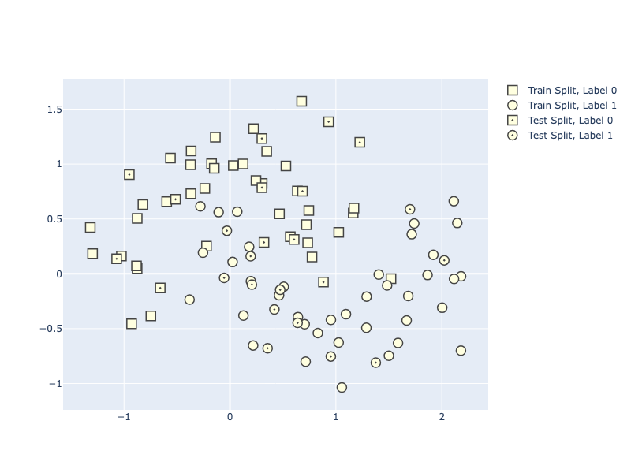
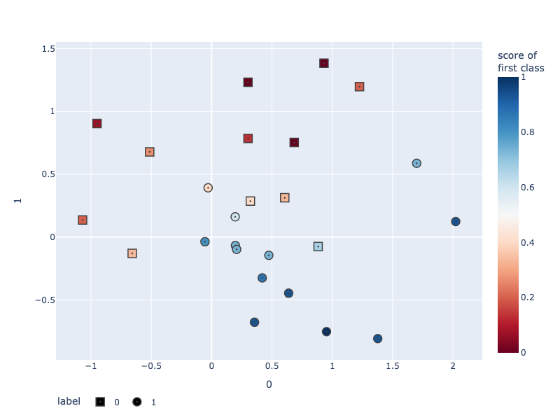
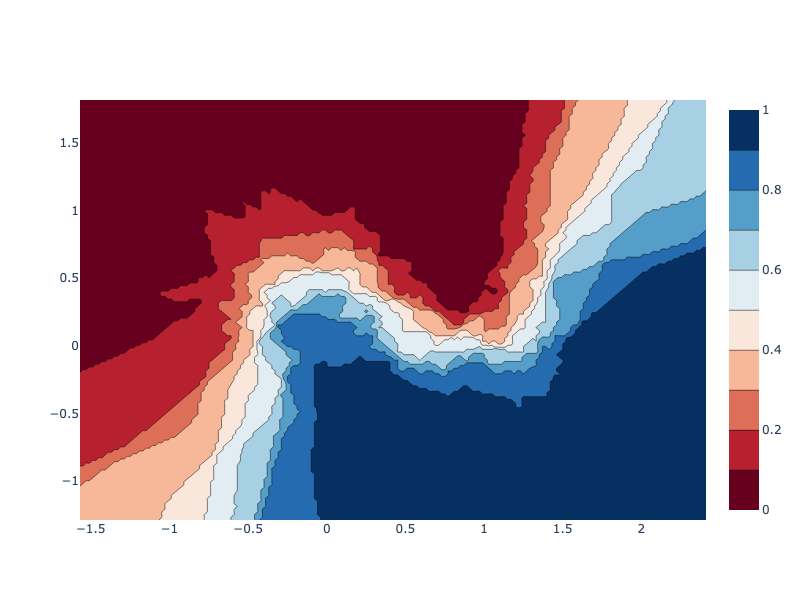
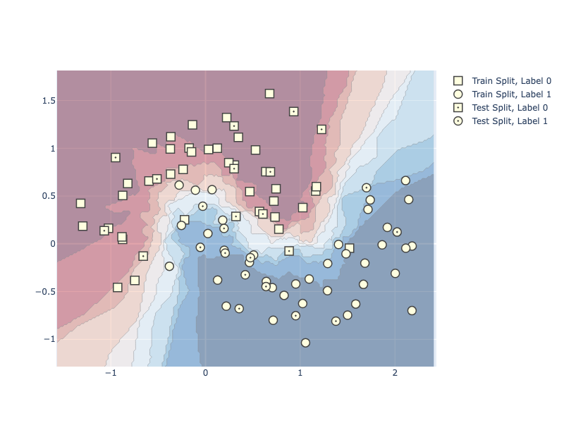

---
jupyter:
  jupytext:
    notebook_metadata_filter: all
    text_representation:
      extension: .md
      format_name: markdown
      format_version: '1.3'
      jupytext_version: 1.14.1
  kernelspec:
    display_name: Python 3
    language: python
    name: python3
  language_info:
    codemirror_mode:
      name: ipython
      version: 3
    file_extension: .py
    mimetype: text/x-python
    name: python
    nbconvert_exporter: python
    pygments_lexer: ipython3
    version: 3.8.8
  plotly:
    description: Visualize scikit-learn's k-Nearest Neighbors (kNN) classification
      in Python with Plotly.
    display_as: ai_ml
    language: python
    layout: base
    name: kNN Classification
    order: 2
    page_type: u-guide
    permalink: python/knn-classification/
    thumbnail: thumbnail/knn-classification.png
---

## Basic binary classification with kNN

This section gets us started with displaying basic binary classification using 2D data. We first show how to display training versus testing data using [various marker styles](https://plot.ly/python/marker-style/), then demonstrate how to evaluate our classifier's performance on the **test split** using a continuous color gradient to indicate the model's predicted score.

We will use [Scikit-learn](https://scikit-learn.org/) for training our model and for loading and splitting data. Scikit-learn is a popular Machine Learning (ML) library that offers various tools for creating and training ML algorithms, feature engineering, data cleaning, and evaluating and testing models. It was designed to be accessible, and to work seamlessly with popular libraries like NumPy and Pandas.

We will train a [k-Nearest Neighbors (kNN)](https://scikit-learn.org/stable/modules/neighbors.html) classifier. First, the model records the label of each training sample. Then, whenever we give it a new sample, it will look at the `k` closest samples from the training set to find the most common label, and assign it to our new sample.


### Display training and test splits

Using Scikit-learn, we first generate synthetic data that form the shape of a moon. We then split it into a training and testing set. Finally, we display the ground truth labels using [a scatter plot](https://plotly.com/python/line-and-scatter/).

In the graph, we display all the negative labels as squares, and positive labels as circles. We differentiate the training and test set by adding a dot to the center of test data.

In this example, we will use [graph objects](/python/graph-objects/), Plotly's low-level API for building figures.

```python
import plotly.graph_objects as go
import numpy as np
from sklearn.datasets import make_moons
from sklearn.model_selection import train_test_split
from sklearn.neighbors import KNeighborsClassifier

# Load and split data
X, y = make_moons(noise=0.3, random_state=0)
X_train, X_test, y_train, y_test = train_test_split(
    X, y.astype(str), test_size=0.25, random_state=0)

trace_specs = [
    [X_train, y_train, '0', 'Train', 'square'],
    [X_train, y_train, '1', 'Train', 'circle'],
    [X_test, y_test, '0', 'Test', 'square-dot'],
    [X_test, y_test, '1', 'Test', 'circle-dot']
]

fig = go.Figure(data=[
    go.Scatter(
        x=X[y==label, 0], y=X[y==label, 1],
        name=f'{split} Split, Label {label}',
        mode='markers', marker_symbol=marker
    )
    for X, y, label, split, marker in trace_specs
])
fig.update_traces(
    marker_size=12, marker_line_width=1.5,
    marker_color="lightyellow"
)
fig.show()
```



**Interactive Plot:**

<div>                        <script type="text/javascript">window.PlotlyConfig = {MathJaxConfig: 'local'};</script>
        <script charset="utf-8" src="https://cdn.plot.ly/plotly-3.1.0.min.js" integrity="sha256-Ei4740bWZhaUTQuD6q9yQlgVCMPBz6CZWhevDYPv93A=" crossorigin="anonymous"></script>                <div id="plotly-div-1" class="plotly-graph-div" style="height:100%; width:100%;"></div>            <script type="text/javascript">                window.PLOTLYENV=window.PLOTLYENV || {};                                if (document.getElementById("plotly-div-1")) {                    Plotly.newPlot(                        "plotly-div-1",                        [{"marker":{"symbol":"square","line":{"width":1.5},"color":"lightyellow","size":12},"mode":"markers","name":"Train Split, Label 0","x":{"dtype":"f8","bdata":"oCMQmPxk8L9dsEcv7DriPyIavNvDv\u002fS\u002fwpI5kYQv1j9Yv5+WWF7kP0JC1AECocG\u002ffkXqYX\u002fS5z9ihN72G1rOv9fds69b5+A\u002f3ZKIHGnT179MBTISeAnsvy9C3pFDdde\u002fL28PAsZ50z9oAfj9AVL4P\u002f5MWKiNS+q\u002fKnS+EDgtoD8t0TrRfS\u002fGv2wsobv0Fuc\u002fsMaWx172wr+CmhinJ1\u002fMv6vHUaHytu2\u002flVH4n2Do3T9DSvONR53yPyXztCYlyeg\u002fhQQv0ZMY9b\u002fRBT5s0hrjv3b9Q6vbufI\u002fQJvpHN077L\u002f+gtZ4Y+Tnv9AQMH7h+eG\u002fZ8Hc32Oo5T+OE5JyoJbMP+p92DTudM8\u002fhFZsSoJ45z8UpXqfmsa\u002fP4e8I405A+y\u002fy+Bax1ub179Xsyct52zwPw=="},"y":{"dtype":"f8","bdata":"lOPlozW5xD9887mio5jVP0\u002fwGMEhksc\u002f5gc0Ve\u002fZ8T+w7EqpcCToP7UoBSrb7PM\u002fh+Sslp5z4j9GeojLmuvoP2wWdD7RdO8\u002fa+IC1fHF7z+Q2sl5htenPz\u002fswaxb6vE\u002fn14gohJc6j9IzgCmqR6nv7BDciKENOQ\u002faJa4WWeV7z8jdkLPzwjwP+vFDkUyn9w\u002f7q8PMlHF7j9Q3UC0PBrQP7YUYWdYNN2\u002f9k4ZF0mB4T8loABXYLHhP9q4q9tXrsM\u002f3msI0kUU2z945+7\u002fEwjlP8aw2HElJuM\u002fysSEzbuOsj8miuUYeILYv4XaCGq14PA\u002fJmTL5H8m+T+30yalnSf1P2S6n6k8MOs\u002fV9QQ6AwG0j+FdQt4kwLwP94N+meELOA\u002fYt7A0d5S5z9O5loiRy7YPw=="},"type":"scatter"},{"marker":{"symbol":"circle","line":{"width":1.5},"color":"lightyellow","size":12},"mode":"markers","name":"Train Split, Label 1","x":{"dtype":"f8","bdata":"W3L1Vv6j9D9f\u002fTSef676P1Y3PXQIati\u002fp+04\u002f3JzAUD6k19cZUzAP9etEiWLKgFA+VOVarjrAEAKz14YI4nkPz1eyAOii+o\u002f0BUjxftJ0L9HHmCcIecAQKKFgyJZZ7u\u002fUImyTXWYsT+UybfYhrf+P3KiBSjhePY\u002foyy1Nw4HAED2qrxjpZDmPzJy3mBa2NG\u002fyr+qZfnl8D97Svd+Spr0P\u002fCuCinoiJk\u002f18Uu6xHX\u002fT\u002fLULPXmD7gP5KvCc8nvPc\u002fyoEcGUZ+7j9yMUSo3XABQLC24X3q0\u002fs\u002ferhEl+8xxz8Mf0lEtGnwP9x0y++ehPE\u002f9z6d1GQA+D+Q090KV+36PzjiEWQWq90\u002fxJMkD+Zz+z+oXRGb2PvLP\u002fwzs6oGYfk\u002f+Uo5X\u002fnb5j8="},"y":{"dtype":"f8","bdata":"veWO1Sh8yr+csL\u002f02TDbvxP8gOHKEM6\u002fgJQ0VK13l7\u002fHNEkNREzYv\u002f+c5iYyod0\u002f0CnTE0qtp7+3McgvSzLZv6fr0yUfQuG\u002fPB2zMOK5yD+mB3HOyS\u002flP8nUhOQg+uE\u002fu0WSdaQg4j\u002f4A8TPmhPGP9CgbWTO53y\u002ftCaeaxvJ078ojl2dBF\u002fdv5EX2g2Sp+M\u002fEcfqVDyS8L+0NonHJG3fv7Rhoi\u002fIg7s\u002f6IOy9HKwhr+s4ZmDqwi+v0h0zLBv7Lq\u002fvN19s3Dd2r\u002frj8zMk2Tmvw1qTFFQYN0\u002fenQIk4Kjzz\u002f26mnEGwbkvwAElvgqlNe\u002fcE5RQDbi578tjUSuhdzJv\u002fKyoOjQ+si\u002fCjSqjJ4V1z++CKMcdOHkv2SxewyxJ+S\u002fEQ3cJh+Z6b8="},"type":"scatter"},{"marker":{"symbol":"square-dot","line":{"width":1.5},"color":"lightyellow","size":12},"mode":"markers","name":"Test Split, Label 0","x":{"dtype":"f8","bdata":"1tNtRSRj4z9N\u002fe8UWz3sP3EtJGiXR9M\u002fTNJGd02O1D9PrCkNUm7gv\u002fLAlWAzT9M\u002fWL0FyUWb8z+c0Szag+flP\u002fbw6Qm\u002fDuW\u002fqiZxSkkd8b\u002fmIa6BsWbuv+mnM3RRze0\u002f"},"y":{"dtype":"f8","bdata":"4mZjM3cA1D8s\u002fFmzv2Szv5Ym680Cu\u002fM\u002fnpJlChNZ0j\u002fY37kX1rflP064jpUzJ+k\u002fI40V07gq8z+EyksykRfoP1jsTiOPkcC\u002fwm5xPhV+wT9z3CktbursPzOwqNawKfY\u002f"},"type":"scatter"},{"marker":{"symbol":"circle-dot","line":{"width":1.5},"color":"lightyellow","size":12},"mode":"markers","name":"Test Split, Label 1","x":{"dtype":"f8","bdata":"CNP3aa4\u002fyT+vgnz6pQHJPya\u002f54NLvtY\u002fMGlwWwYH9j\u002fF1uhOCy8AQGt9U7r1MPs\u002fANWOLB9v5D+nkaG7NnjuP02iKC3KVt4\u002fv9sUhKHY2j8IoynlJeydvyrkUMrmhMo\u002fknkbFtk7rL8="},"y":{"dtype":"f8","bdata":"bMZoh4ppsb8i7CuIxJbEP8o+XnMbtuW\u002fXhgky5Dk6b8UacS9aI2\u002fP0CAInuZzuI\u002fcj4Bdque3L++L+YhMBnov1gWukD1p8K\u002fsEOySzbJ1L\u002f+BzlK1iTZP0iXbqL+ALm\u002fbGDgdj0do78="},"type":"scatter"}],                        {"template":{"data":{"histogram2dcontour":[{"type":"histogram2dcontour","colorbar":{"outlinewidth":0,"ticks":""},"colorscale":[[0.0,"#0d0887"],[0.1111111111111111,"#46039f"],[0.2222222222222222,"#7201a8"],[0.3333333333333333,"#9c179e"],[0.4444444444444444,"#bd3786"],[0.5555555555555556,"#d8576b"],[0.6666666666666666,"#ed7953"],[0.7777777777777778,"#fb9f3a"],[0.8888888888888888,"#fdca26"],[1.0,"#f0f921"]]}],"choropleth":[{"type":"choropleth","colorbar":{"outlinewidth":0,"ticks":""}}],"histogram2d":[{"type":"histogram2d","colorbar":{"outlinewidth":0,"ticks":""},"colorscale":[[0.0,"#0d0887"],[0.1111111111111111,"#46039f"],[0.2222222222222222,"#7201a8"],[0.3333333333333333,"#9c179e"],[0.4444444444444444,"#bd3786"],[0.5555555555555556,"#d8576b"],[0.6666666666666666,"#ed7953"],[0.7777777777777778,"#fb9f3a"],[0.8888888888888888,"#fdca26"],[1.0,"#f0f921"]]}],"heatmap":[{"type":"heatmap","colorbar":{"outlinewidth":0,"ticks":""},"colorscale":[[0.0,"#0d0887"],[0.1111111111111111,"#46039f"],[0.2222222222222222,"#7201a8"],[0.3333333333333333,"#9c179e"],[0.4444444444444444,"#bd3786"],[0.5555555555555556,"#d8576b"],[0.6666666666666666,"#ed7953"],[0.7777777777777778,"#fb9f3a"],[0.8888888888888888,"#fdca26"],[1.0,"#f0f921"]]}],"contourcarpet":[{"type":"contourcarpet","colorbar":{"outlinewidth":0,"ticks":""}}],"contour":[{"type":"contour","colorbar":{"outlinewidth":0,"ticks":""},"colorscale":[[0.0,"#0d0887"],[0.1111111111111111,"#46039f"],[0.2222222222222222,"#7201a8"],[0.3333333333333333,"#9c179e"],[0.4444444444444444,"#bd3786"],[0.5555555555555556,"#d8576b"],[0.6666666666666666,"#ed7953"],[0.7777777777777778,"#fb9f3a"],[0.8888888888888888,"#fdca26"],[1.0,"#f0f921"]]}],"surface":[{"type":"surface","colorbar":{"outlinewidth":0,"ticks":""},"colorscale":[[0.0,"#0d0887"],[0.1111111111111111,"#46039f"],[0.2222222222222222,"#7201a8"],[0.3333333333333333,"#9c179e"],[0.4444444444444444,"#bd3786"],[0.5555555555555556,"#d8576b"],[0.6666666666666666,"#ed7953"],[0.7777777777777778,"#fb9f3a"],[0.8888888888888888,"#fdca26"],[1.0,"#f0f921"]]}],"mesh3d":[{"type":"mesh3d","colorbar":{"outlinewidth":0,"ticks":""}}],"scatter":[{"fillpattern":{"fillmode":"overlay","size":10,"solidity":0.2},"type":"scatter"}],"parcoords":[{"type":"parcoords","line":{"colorbar":{"outlinewidth":0,"ticks":""}}}],"scatterpolargl":[{"type":"scatterpolargl","marker":{"colorbar":{"outlinewidth":0,"ticks":""}}}],"bar":[{"error_x":{"color":"#2a3f5f"},"error_y":{"color":"#2a3f5f"},"marker":{"line":{"color":"#E5ECF6","width":0.5},"pattern":{"fillmode":"overlay","size":10,"solidity":0.2}},"type":"bar"}],"scattergeo":[{"type":"scattergeo","marker":{"colorbar":{"outlinewidth":0,"ticks":""}}}],"scatterpolar":[{"type":"scatterpolar","marker":{"colorbar":{"outlinewidth":0,"ticks":""}}}],"histogram":[{"marker":{"pattern":{"fillmode":"overlay","size":10,"solidity":0.2}},"type":"histogram"}],"scattergl":[{"type":"scattergl","marker":{"colorbar":{"outlinewidth":0,"ticks":""}}}],"scatter3d":[{"type":"scatter3d","line":{"colorbar":{"outlinewidth":0,"ticks":""}},"marker":{"colorbar":{"outlinewidth":0,"ticks":""}}}],"scattermap":[{"type":"scattermap","marker":{"colorbar":{"outlinewidth":0,"ticks":""}}}],"scattermapbox":[{"type":"scattermapbox","marker":{"colorbar":{"outlinewidth":0,"ticks":""}}}],"scatterternary":[{"type":"scatterternary","marker":{"colorbar":{"outlinewidth":0,"ticks":""}}}],"scattercarpet":[{"type":"scattercarpet","marker":{"colorbar":{"outlinewidth":0,"ticks":""}}}],"carpet":[{"aaxis":{"endlinecolor":"#2a3f5f","gridcolor":"white","linecolor":"white","minorgridcolor":"white","startlinecolor":"#2a3f5f"},"baxis":{"endlinecolor":"#2a3f5f","gridcolor":"white","linecolor":"white","minorgridcolor":"white","startlinecolor":"#2a3f5f"},"type":"carpet"}],"table":[{"cells":{"fill":{"color":"#EBF0F8"},"line":{"color":"white"}},"header":{"fill":{"color":"#C8D4E3"},"line":{"color":"white"}},"type":"table"}],"barpolar":[{"marker":{"line":{"color":"#E5ECF6","width":0.5},"pattern":{"fillmode":"overlay","size":10,"solidity":0.2}},"type":"barpolar"}],"pie":[{"automargin":true,"type":"pie"}]},"layout":{"autotypenumbers":"strict","colorway":["#636efa","#EF553B","#00cc96","#ab63fa","#FFA15A","#19d3f3","#FF6692","#B6E880","#FF97FF","#FECB52"],"font":{"color":"#2a3f5f"},"hovermode":"closest","hoverlabel":{"align":"left"},"paper_bgcolor":"white","plot_bgcolor":"#E5ECF6","polar":{"bgcolor":"#E5ECF6","angularaxis":{"gridcolor":"white","linecolor":"white","ticks":""},"radialaxis":{"gridcolor":"white","linecolor":"white","ticks":""}},"ternary":{"bgcolor":"#E5ECF6","aaxis":{"gridcolor":"white","linecolor":"white","ticks":""},"baxis":{"gridcolor":"white","linecolor":"white","ticks":""},"caxis":{"gridcolor":"white","linecolor":"white","ticks":""}},"coloraxis":{"colorbar":{"outlinewidth":0,"ticks":""}},"colorscale":{"sequential":[[0.0,"#0d0887"],[0.1111111111111111,"#46039f"],[0.2222222222222222,"#7201a8"],[0.3333333333333333,"#9c179e"],[0.4444444444444444,"#bd3786"],[0.5555555555555556,"#d8576b"],[0.6666666666666666,"#ed7953"],[0.7777777777777778,"#fb9f3a"],[0.8888888888888888,"#fdca26"],[1.0,"#f0f921"]],"sequentialminus":[[0.0,"#0d0887"],[0.1111111111111111,"#46039f"],[0.2222222222222222,"#7201a8"],[0.3333333333333333,"#9c179e"],[0.4444444444444444,"#bd3786"],[0.5555555555555556,"#d8576b"],[0.6666666666666666,"#ed7953"],[0.7777777777777778,"#fb9f3a"],[0.8888888888888888,"#fdca26"],[1.0,"#f0f921"]],"diverging":[[0,"#8e0152"],[0.1,"#c51b7d"],[0.2,"#de77ae"],[0.3,"#f1b6da"],[0.4,"#fde0ef"],[0.5,"#f7f7f7"],[0.6,"#e6f5d0"],[0.7,"#b8e186"],[0.8,"#7fbc41"],[0.9,"#4d9221"],[1,"#276419"]]},"xaxis":{"gridcolor":"white","linecolor":"white","ticks":"","title":{"standoff":15},"zerolinecolor":"white","automargin":true,"zerolinewidth":2},"yaxis":{"gridcolor":"white","linecolor":"white","ticks":"","title":{"standoff":15},"zerolinecolor":"white","automargin":true,"zerolinewidth":2},"scene":{"xaxis":{"backgroundcolor":"#E5ECF6","gridcolor":"white","linecolor":"white","showbackground":true,"ticks":"","zerolinecolor":"white","gridwidth":2},"yaxis":{"backgroundcolor":"#E5ECF6","gridcolor":"white","linecolor":"white","showbackground":true,"ticks":"","zerolinecolor":"white","gridwidth":2},"zaxis":{"backgroundcolor":"#E5ECF6","gridcolor":"white","linecolor":"white","showbackground":true,"ticks":"","zerolinecolor":"white","gridwidth":2}},"shapedefaults":{"line":{"color":"#2a3f5f"}},"annotationdefaults":{"arrowcolor":"#2a3f5f","arrowhead":0,"arrowwidth":1},"geo":{"bgcolor":"white","landcolor":"#E5ECF6","subunitcolor":"white","showland":true,"showlakes":true,"lakecolor":"white"},"title":{"x":0.05},"mapbox":{"style":"light"}}}},                        {"responsive": true}                    )                };            </script>        </div>

### Visualize predictions on test split with [`plotly.express`](https://plotly.com/python/plotly-express/)


Now, we train the kNN model on the same training data displayed in the previous graph. Then, we predict the confidence score of the model for each of the data points in the test set. We will use shapes to denote the true labels, and the color will indicate the confidence of the model for assign that score.

In this example, we will use [Plotly Express](/python/plotly-express/), Plotly's high-level API for building figures. Notice that `px.scatter` only require 1 function call to plot both negative and positive labels, and can additionally set a continuous color scale based on the `y_score` output by our kNN model.

```python
import plotly.express as px
import numpy as np
from sklearn.datasets import make_moons
from sklearn.model_selection import train_test_split
from sklearn.neighbors import KNeighborsClassifier

# Load and split data
X, y = make_moons(noise=0.3, random_state=0)
X_train, X_test, y_train, y_test = train_test_split(
    X, y.astype(str), test_size=0.25, random_state=0)

# Fit the model on training data, predict on test data
clf = KNeighborsClassifier(15)
clf.fit(X_train, y_train)
y_score = clf.predict_proba(X_test)[:, 1]

fig = px.scatter(
    X_test, x=0, y=1,
    color=y_score, color_continuous_scale='RdBu',
    symbol=y_test, symbol_map={'0': 'square-dot', '1': 'circle-dot'},
    labels={'symbol': 'label', 'color': 'score of <br>first class'}
)
fig.update_traces(marker_size=12, marker_line_width=1.5)
fig.update_layout(legend_orientation='h')
fig.show()
```



**Interactive Plot:**

<div>                        <script type="text/javascript">window.PlotlyConfig = {MathJaxConfig: 'local'};</script>
        <script charset="utf-8" src="https://cdn.plot.ly/plotly-3.1.0.min.js" integrity="sha256-Ei4740bWZhaUTQuD6q9yQlgVCMPBz6CZWhevDYPv93A=" crossorigin="anonymous"></script>                <div id="plotly-div-2" class="plotly-graph-div" style="height:100%; width:100%;"></div>            <script type="text/javascript">                window.PLOTLYENV=window.PLOTLYENV || {};                                if (document.getElementById("plotly-div-2")) {                    Plotly.newPlot(                        "plotly-div-2",                        [{"hovertemplate":"label=0\u003cbr\u003e0=%{x}\u003cbr\u003e1=%{y}\u003cbr\u003escore of \u003cbr\u003efirst class=%{marker.color}\u003cextra\u003e\u003c\u002fextra\u003e","legendgroup":"0","marker":{"color":{"dtype":"f8","bdata":"VVVVVVVV1T9VVVVVVVXlPwAAAAAAAAAAmpmZmZmZ2T8RERERERHRPxEREREREcE\u002fmpmZmZmZyT8AAAAAAAAAAFVVVVVVVdU\u002fmpmZmZmZyT8RERERERGxPwAAAAAAAAAA"},"coloraxis":"coloraxis","symbol":"square-dot","line":{"width":1.5},"size":12},"mode":"markers","name":"0","orientation":"v","showlegend":true,"x":{"dtype":"f8","bdata":"1tNtRSRj4z9N\u002fe8UWz3sP3EtJGiXR9M\u002fTNJGd02O1D9PrCkNUm7gv\u002fLAlWAzT9M\u002fWL0FyUWb8z+c0Szag+flP\u002fbw6Qm\u002fDuW\u002fqiZxSkkd8b\u002fmIa6BsWbuv+mnM3RRze0\u002f"},"xaxis":"x","y":{"dtype":"f8","bdata":"4mZjM3cA1D8s\u002fFmzv2Szv5Ym680Cu\u002fM\u002fnpJlChNZ0j\u002fY37kX1rflP064jpUzJ+k\u002fI40V07gq8z+EyksykRfoP1jsTiOPkcC\u002fwm5xPhV+wT9z3CktbursPzOwqNawKfY\u002f"},"yaxis":"y","type":"scatter"},{"hovertemplate":"label=1\u003cbr\u003e0=%{x}\u003cbr\u003e1=%{y}\u003cbr\u003escore of \u003cbr\u003efirst class=%{marker.color}\u003cextra\u003e\u003c\u002fextra\u003e","legendgroup":"1","marker":{"color":{"dtype":"f8","bdata":"d3d3d3d35z8zMzMzMzPjP97d3d3d3e0\u002f3t3d3d3d7T\u002fe3d3d3d3tP3d3d3d3d+c\u002f3t3d3d3d7T8AAAAAAADwP3d3d3d3d+c\u002fvLu7u7u76z+amZmZmZnZP3d3d3d3d+c\u002fmpmZmZmZ6T8="},"coloraxis":"coloraxis","symbol":"circle-dot","line":{"width":1.5},"size":12},"mode":"markers","name":"1","orientation":"v","showlegend":true,"x":{"dtype":"f8","bdata":"CNP3aa4\u002fyT+vgnz6pQHJPya\u002f54NLvtY\u002fMGlwWwYH9j\u002fF1uhOCy8AQGt9U7r1MPs\u002fANWOLB9v5D+nkaG7NnjuP02iKC3KVt4\u002fv9sUhKHY2j8IoynlJeydvyrkUMrmhMo\u002fknkbFtk7rL8="},"xaxis":"x","y":{"dtype":"f8","bdata":"bMZoh4ppsb8i7CuIxJbEP8o+XnMbtuW\u002fXhgky5Dk6b8UacS9aI2\u002fP0CAInuZzuI\u002fcj4Bdque3L++L+YhMBnov1gWukD1p8K\u002fsEOySzbJ1L\u002f+BzlK1iTZP0iXbqL+ALm\u002fbGDgdj0do78="},"yaxis":"y","type":"scatter"}],                        {"template":{"data":{"histogram2dcontour":[{"type":"histogram2dcontour","colorbar":{"outlinewidth":0,"ticks":""},"colorscale":[[0.0,"#0d0887"],[0.1111111111111111,"#46039f"],[0.2222222222222222,"#7201a8"],[0.3333333333333333,"#9c179e"],[0.4444444444444444,"#bd3786"],[0.5555555555555556,"#d8576b"],[0.6666666666666666,"#ed7953"],[0.7777777777777778,"#fb9f3a"],[0.8888888888888888,"#fdca26"],[1.0,"#f0f921"]]}],"choropleth":[{"type":"choropleth","colorbar":{"outlinewidth":0,"ticks":""}}],"histogram2d":[{"type":"histogram2d","colorbar":{"outlinewidth":0,"ticks":""},"colorscale":[[0.0,"#0d0887"],[0.1111111111111111,"#46039f"],[0.2222222222222222,"#7201a8"],[0.3333333333333333,"#9c179e"],[0.4444444444444444,"#bd3786"],[0.5555555555555556,"#d8576b"],[0.6666666666666666,"#ed7953"],[0.7777777777777778,"#fb9f3a"],[0.8888888888888888,"#fdca26"],[1.0,"#f0f921"]]}],"heatmap":[{"type":"heatmap","colorbar":{"outlinewidth":0,"ticks":""},"colorscale":[[0.0,"#0d0887"],[0.1111111111111111,"#46039f"],[0.2222222222222222,"#7201a8"],[0.3333333333333333,"#9c179e"],[0.4444444444444444,"#bd3786"],[0.5555555555555556,"#d8576b"],[0.6666666666666666,"#ed7953"],[0.7777777777777778,"#fb9f3a"],[0.8888888888888888,"#fdca26"],[1.0,"#f0f921"]]}],"contourcarpet":[{"type":"contourcarpet","colorbar":{"outlinewidth":0,"ticks":""}}],"contour":[{"type":"contour","colorbar":{"outlinewidth":0,"ticks":""},"colorscale":[[0.0,"#0d0887"],[0.1111111111111111,"#46039f"],[0.2222222222222222,"#7201a8"],[0.3333333333333333,"#9c179e"],[0.4444444444444444,"#bd3786"],[0.5555555555555556,"#d8576b"],[0.6666666666666666,"#ed7953"],[0.7777777777777778,"#fb9f3a"],[0.8888888888888888,"#fdca26"],[1.0,"#f0f921"]]}],"surface":[{"type":"surface","colorbar":{"outlinewidth":0,"ticks":""},"colorscale":[[0.0,"#0d0887"],[0.1111111111111111,"#46039f"],[0.2222222222222222,"#7201a8"],[0.3333333333333333,"#9c179e"],[0.4444444444444444,"#bd3786"],[0.5555555555555556,"#d8576b"],[0.6666666666666666,"#ed7953"],[0.7777777777777778,"#fb9f3a"],[0.8888888888888888,"#fdca26"],[1.0,"#f0f921"]]}],"mesh3d":[{"type":"mesh3d","colorbar":{"outlinewidth":0,"ticks":""}}],"scatter":[{"fillpattern":{"fillmode":"overlay","size":10,"solidity":0.2},"type":"scatter"}],"parcoords":[{"type":"parcoords","line":{"colorbar":{"outlinewidth":0,"ticks":""}}}],"scatterpolargl":[{"type":"scatterpolargl","marker":{"colorbar":{"outlinewidth":0,"ticks":""}}}],"bar":[{"error_x":{"color":"#2a3f5f"},"error_y":{"color":"#2a3f5f"},"marker":{"line":{"color":"#E5ECF6","width":0.5},"pattern":{"fillmode":"overlay","size":10,"solidity":0.2}},"type":"bar"}],"scattergeo":[{"type":"scattergeo","marker":{"colorbar":{"outlinewidth":0,"ticks":""}}}],"scatterpolar":[{"type":"scatterpolar","marker":{"colorbar":{"outlinewidth":0,"ticks":""}}}],"histogram":[{"marker":{"pattern":{"fillmode":"overlay","size":10,"solidity":0.2}},"type":"histogram"}],"scattergl":[{"type":"scattergl","marker":{"colorbar":{"outlinewidth":0,"ticks":""}}}],"scatter3d":[{"type":"scatter3d","line":{"colorbar":{"outlinewidth":0,"ticks":""}},"marker":{"colorbar":{"outlinewidth":0,"ticks":""}}}],"scattermap":[{"type":"scattermap","marker":{"colorbar":{"outlinewidth":0,"ticks":""}}}],"scattermapbox":[{"type":"scattermapbox","marker":{"colorbar":{"outlinewidth":0,"ticks":""}}}],"scatterternary":[{"type":"scatterternary","marker":{"colorbar":{"outlinewidth":0,"ticks":""}}}],"scattercarpet":[{"type":"scattercarpet","marker":{"colorbar":{"outlinewidth":0,"ticks":""}}}],"carpet":[{"aaxis":{"endlinecolor":"#2a3f5f","gridcolor":"white","linecolor":"white","minorgridcolor":"white","startlinecolor":"#2a3f5f"},"baxis":{"endlinecolor":"#2a3f5f","gridcolor":"white","linecolor":"white","minorgridcolor":"white","startlinecolor":"#2a3f5f"},"type":"carpet"}],"table":[{"cells":{"fill":{"color":"#EBF0F8"},"line":{"color":"white"}},"header":{"fill":{"color":"#C8D4E3"},"line":{"color":"white"}},"type":"table"}],"barpolar":[{"marker":{"line":{"color":"#E5ECF6","width":0.5},"pattern":{"fillmode":"overlay","size":10,"solidity":0.2}},"type":"barpolar"}],"pie":[{"automargin":true,"type":"pie"}]},"layout":{"autotypenumbers":"strict","colorway":["#636efa","#EF553B","#00cc96","#ab63fa","#FFA15A","#19d3f3","#FF6692","#B6E880","#FF97FF","#FECB52"],"font":{"color":"#2a3f5f"},"hovermode":"closest","hoverlabel":{"align":"left"},"paper_bgcolor":"white","plot_bgcolor":"#E5ECF6","polar":{"bgcolor":"#E5ECF6","angularaxis":{"gridcolor":"white","linecolor":"white","ticks":""},"radialaxis":{"gridcolor":"white","linecolor":"white","ticks":""}},"ternary":{"bgcolor":"#E5ECF6","aaxis":{"gridcolor":"white","linecolor":"white","ticks":""},"baxis":{"gridcolor":"white","linecolor":"white","ticks":""},"caxis":{"gridcolor":"white","linecolor":"white","ticks":""}},"coloraxis":{"colorbar":{"outlinewidth":0,"ticks":""}},"colorscale":{"sequential":[[0.0,"#0d0887"],[0.1111111111111111,"#46039f"],[0.2222222222222222,"#7201a8"],[0.3333333333333333,"#9c179e"],[0.4444444444444444,"#bd3786"],[0.5555555555555556,"#d8576b"],[0.6666666666666666,"#ed7953"],[0.7777777777777778,"#fb9f3a"],[0.8888888888888888,"#fdca26"],[1.0,"#f0f921"]],"sequentialminus":[[0.0,"#0d0887"],[0.1111111111111111,"#46039f"],[0.2222222222222222,"#7201a8"],[0.3333333333333333,"#9c179e"],[0.4444444444444444,"#bd3786"],[0.5555555555555556,"#d8576b"],[0.6666666666666666,"#ed7953"],[0.7777777777777778,"#fb9f3a"],[0.8888888888888888,"#fdca26"],[1.0,"#f0f921"]],"diverging":[[0,"#8e0152"],[0.1,"#c51b7d"],[0.2,"#de77ae"],[0.3,"#f1b6da"],[0.4,"#fde0ef"],[0.5,"#f7f7f7"],[0.6,"#e6f5d0"],[0.7,"#b8e186"],[0.8,"#7fbc41"],[0.9,"#4d9221"],[1,"#276419"]]},"xaxis":{"gridcolor":"white","linecolor":"white","ticks":"","title":{"standoff":15},"zerolinecolor":"white","automargin":true,"zerolinewidth":2},"yaxis":{"gridcolor":"white","linecolor":"white","ticks":"","title":{"standoff":15},"zerolinecolor":"white","automargin":true,"zerolinewidth":2},"scene":{"xaxis":{"backgroundcolor":"#E5ECF6","gridcolor":"white","linecolor":"white","showbackground":true,"ticks":"","zerolinecolor":"white","gridwidth":2},"yaxis":{"backgroundcolor":"#E5ECF6","gridcolor":"white","linecolor":"white","showbackground":true,"ticks":"","zerolinecolor":"white","gridwidth":2},"zaxis":{"backgroundcolor":"#E5ECF6","gridcolor":"white","linecolor":"white","showbackground":true,"ticks":"","zerolinecolor":"white","gridwidth":2}},"shapedefaults":{"line":{"color":"#2a3f5f"}},"annotationdefaults":{"arrowcolor":"#2a3f5f","arrowhead":0,"arrowwidth":1},"geo":{"bgcolor":"white","landcolor":"#E5ECF6","subunitcolor":"white","showland":true,"showlakes":true,"lakecolor":"white"},"title":{"x":0.05},"mapbox":{"style":"light"}}},"xaxis":{"anchor":"y","domain":[0.0,1.0],"title":{"text":"0"}},"yaxis":{"anchor":"x","domain":[0.0,1.0],"title":{"text":"1"}},"coloraxis":{"colorbar":{"title":{"text":"score of \u003cbr\u003efirst class"}},"colorscale":[[0.0,"rgb(103,0,31)"],[0.1,"rgb(178,24,43)"],[0.2,"rgb(214,96,77)"],[0.3,"rgb(244,165,130)"],[0.4,"rgb(253,219,199)"],[0.5,"rgb(247,247,247)"],[0.6,"rgb(209,229,240)"],[0.7,"rgb(146,197,222)"],[0.8,"rgb(67,147,195)"],[0.9,"rgb(33,102,172)"],[1.0,"rgb(5,48,97)"]]},"legend":{"title":{"text":"label"},"tracegroupgap":0,"orientation":"h"},"margin":{"t":60}},                        {"responsive": true}                    )                };            </script>        </div>

## Probability Estimates with `go.Contour`

Just like the previous example, we will first train our kNN model on the training set.

Instead of predicting the conference for the test set, we can predict the confidence map for the entire area that wraps around the dimensions of our dataset. To do this, we use [`np.meshgrid`](https://numpy.org/doc/stable/reference/generated/numpy.meshgrid.html) to create a grid, where the distance between each point is denoted by the `mesh_size` variable.

Then, for each of those points, we will use our model to give a confidence score, and plot it with a [contour plot](https://plotly.com/python/contour-plots/).

In this example, we will use [graph objects](/python/graph-objects/), Plotly's low-level API for building figures.

```python
import plotly.graph_objects as go
import numpy as np
from sklearn.datasets import make_moons
from sklearn.model_selection import train_test_split
from sklearn.neighbors import KNeighborsClassifier

mesh_size = .02
margin = 0.25

# Load and split data
X, y = make_moons(noise=0.3, random_state=0)
X_train, X_test, y_train, y_test = train_test_split(
    X, y.astype(str), test_size=0.25, random_state=0)

# Create a mesh grid on which we will run our model
x_min, x_max = X[:, 0].min() - margin, X[:, 0].max() + margin
y_min, y_max = X[:, 1].min() - margin, X[:, 1].max() + margin
xrange = np.arange(x_min, x_max, mesh_size)
yrange = np.arange(y_min, y_max, mesh_size)
xx, yy = np.meshgrid(xrange, yrange)

# Create classifier, run predictions on grid
clf = KNeighborsClassifier(15, weights='uniform')
clf.fit(X, y)
Z = clf.predict_proba(np.c_[xx.ravel(), yy.ravel()])[:, 1]
Z = Z.reshape(xx.shape)


# Plot the figure
fig = go.Figure(data=[
    go.Contour(
        x=xrange,
        y=yrange,
        z=Z,
        colorscale='RdBu'
    )
])
fig.show()
```



**Interactive Plot:**

<div>                        <script type="text/javascript">window.PlotlyConfig = {MathJaxConfig: 'local'};</script>
        <script charset="utf-8" src="https://cdn.plot.ly/plotly-3.1.0.min.js" integrity="sha256-Ei4740bWZhaUTQuD6q9yQlgVCMPBz6CZWhevDYPv93A=" crossorigin="anonymous"></script>                <div id="plotly-div-3" class="plotly-graph-div" style="height:100%; width:100%;"></div>            <script type="text/javascript">                window.PLOTLYENV=window.PLOTLYENV || {};                                if (document.getElementById("plotly-div-3")) {                    Plotly.newPlot(                        "plotly-div-3",                        [{"colorscale":[[0.0,"rgb(103,0,31)"],[0.1,"rgb(178,24,43)"],[0.2,"rgb(214,96,77)"],[0.3,"rgb(244,165,130)"],[0.4,"rgb(253,219,199)"],[0.5,"rgb(247,247,247)"],[0.6,"rgb(209,229,240)"],[0.7,"rgb(146,197,222)"],[0.8,"rgb(67,147,195)"],[0.9,"rgb(33,102,172)"],[1.0,"rgb(5,48,97)"]],"x":{"dtype":"f8","bdata":"hQQv0ZMY+b8zTBBMqMb4v+GT8ca8dPi\u002fj9vSQdEi+L89I7S85dD3v+tqlTf6fve\u002fmbJ2sg4t979H+lctI9v2v\u002fVBOag3ifa\u002fo4kaI0w39r9R0fudYOX1v\u002f8Y3Rh1k\u002fW\u002frWC+k4lB9b9bqJ8Onu\u002f0vwnwgImynfS\u002ftzdiBMdL9L9lf0N\u002f2\u002fnzvxPHJPrvp\u002fO\u002fwQ4GdQRW879vVufvGATzvx2eyGotsvK\u002fy+Wp5UFg8r95LYtgVg7yvyd1bNtqvPG\u002f1bxNVn9q8b+DBC\u002fRkxjxvzFMEEyoxvC\u002f35Pxxrx08L+N29JB0SLwv3ZGaHnLoe+\u002f0tUqb\u002fT97r8uZe1kHVruv4r0r1pGtu2\u002f5oNyUG8S7b9CEzVGmG7sv56i9zvByuu\u002f+jG6Meom679WwXwnE4Pqv7JQPx083+m\u002fDuABE2U76b9qb8QIjpfov8b+hv628+e\u002fIo5J9N9P579+HQzqCKzmv9qszt8xCOa\u002fNjyR1Vpk5b+Sy1PLg8Dkv+5aFsGsHOS\u002fSurYttV447+meZus\u002ftTivwIJXqInMeK\u002fXpggmFCN4b+6J+ONeengvxa3pYOiReC\u002f5IzQ8pZD37+cq1Xe6Pvdv1TK2sk6tNy\u002fDOlftYxs27\u002fEB+Wg3iTav3wmaoww3di\u002fNEXvd4KV17\u002fsY3Rj1E3Wv6SC+U4mBtW\u002fXKF+Oni+078UwAMmynbSv8zeiBEcL9G\u002fCPsb+tvOz794OCbRfz\u002fNv+h1MKgjsMq\u002fWLM6f8cgyL\u002fI8ERWa5HFvzguTy0PAsO\u002fqGtZBLNywL8wUse2rca7vxDN22T1p7a\u002f8EfwEj2Jsb+ghQmCCdWov8D2ZLwxL52\u002fgMRt6aBogb+AZO6lIY2HP2CjUg25IKA\u002foK0psSleqj\u002fwW4AqzU2yPxDha3yFbLc\u002fMGZXzj2LvD+odSEQ+9TAPzg4FzlXZMM\u002fyPoMYrPzxT9YvQKLD4PIP+h\u002f+LNrEss\u002feELu3MehzT+EAvICkhjQP8zjbBdAYNE\u002fFMXnK+6n0j9cpmJAnO\u002fTP6SH3VRKN9U\u002f7GhYafh+1j80StN9psbXP3wrTpJUDtk\u002fxAzJpgJW2j8M7kO7sJ3bP1TPvs9e5dw\u002fnLA55Awt3j\u002fkkbT4unTfP5a5l4Y0XuA\u002fOirVkAsC4T\u002femhKb4qXhP4ILUKW5SeI\u002fJnyNr5Dt4j\u002fK7Mq5Z5HjP25dCMQ+NeQ\u002fEs5FzhXZ5D+2PoPY7HzlP1qvwOLDIOY\u002f\u002fh\u002f+7JrE5j+ikDv3cWjnP0YBeQFJDOg\u002f6nG2CyCw6D+O4vMV91PpPzJTMSDO9+k\u002f1sNuKqWb6j96NKw0fD\u002frPx6l6T5T4+s\u002fwhUnSSqH7D9mhmRTASvtPwr3oV3Yzu0\u002frmffZ69y7j9S2BxyhhbvP\u002fZIWnxduu8\u002fzdxLQxov8D8flWrIBYHwP3FNiU3x0vA\u002fwwWo0twk8T8VvsZXyHbxP2d25dyzyPE\u002fuS4EYp8a8j8L5yLnimzyP12fQWx2vvI\u002fr1dg8WEQ8z8BEH92TWLzP1PInfs4tPM\u002fpYC8gCQG9D\u002f3ONsFEFj0P0nx+Yr7qfQ\u002fm6kYEOf79D\u002ftYTeV0k31Pz8aVhq+n\u002fU\u002fkdJ0n6nx9T\u002fjipMklUP2PzVDsqmAlfY\u002fh\u002fvQLmzn9j\u002fZs++zVzn3PytsDjlDi\u002fc\u002ffSQtvi7d9z\u002fP3EtDGi\u002f4PyGVasgFgfg\u002fc02JTfHS+D\u002fFBajS3CT5Pxe+xlfIdvk\u002faXbl3LPI+T+7LgRinxr6Pw3nIueKbPo\u002fX59BbHa++j+xV2DxYRD7PwMQf3ZNYvs\u002fVcid+zi0+z+ngLyAJAb8P\u002fk42wUQWPw\u002fS\u002fH5ivup\u002fD+dqRgQ5\u002fv8P+9hN5XSTf0\u002fQRpWGr6f\u002fT+T0nSfqfH9P+WKkySVQ\u002f4\u002fN0OyqYCV\u002fj+J+9AubOf+P9uz77NXOf8\u002fLWwOOUOL\u002fz9\u002fJC2+Lt3\u002fP2jupSGNFwBAkko15IJAAEC6psSmeGkAQOQCVGlukgBADF\u002fjK2S7AEA2u3LuWeQAQF4XArFPDQFAiHORc0U2AUCwzyA2O18BQNorsPgwiAFAAog\u002fuyaxAUAs5M59HNoBQFRAXkASAwJAfpztAggsAkCm+HzF\u002fVQCQNBUDIjzfQJA+LCbSummAkAiDSsN388CQEppus\u002fU+AJAdMVJksohA0CcIdlUwEoDQA=="},"y":{"dtype":"f8","bdata":"EcfqVDyS9L+\u002fDszPUED0v21WrUpl7vO\u002fG56OxXmc87\u002fJ5W9Ajkrzv3ctUbui+PK\u002fJXUyNrem8r\u002fTvBOxy1Tyv4EE9SvgAvK\u002fL0zWpvSw8b\u002fdk7chCV\u002fxv4vbmJwdDfG\u002fOSN6FzK78L\u002fnaluSRmnwv5WyPA1bF\u002fC\u002fhvQ7EN+K77\u002fig\u002f4FCOfuvz4TwfswQ+6\u002fmqKD8Vmf7b\u002f2MUbngvvsv1LBCN2rV+y\u002frlDL0tSz678K4I3I\u002fQ\u002frv2ZvUL4mbOq\u002fwv4StE\u002fI6b8ejtWpeCTpv3odmJ+hgOi\u002f1qxalcrc578yPB2L8zjnv47L34Aclea\u002f6lqidkXx5b9G6mRsbk3lv6J5J2KXqeS\u002f\u002fgjqV8AF5L9amKxN6WHjv7Ynb0MSvuK\u002fErcxOTsa4r9uRvQuZHbhv8rVtiSN0uC\u002fJmV5GrYu4L8E6XcgvhXfv7wH\u002fQsQzt2\u002fdCaC92GG3L8sRQfjsz7bv+RjjM4F99m\u002fnIIRulev2L9UoZalqWfXvwzAG5H7H9a\u002fxN6gfE3Y1L98\u002fSVon5DTvzQcq1PxSNK\u002f7DowP0MB0b9Is2pVKnPPv7jwdCzO48y\u002fKC5\u002fA3JUyr+Ya4naFcXHvwipk7G5NcW\u002feOadiF2mwr\u002foI6hfARfAv7DCZG1KD7u\u002fkD15G5Lwtb9wuI3J2dGwv6BmRO9CZqe\u002fwLjalqRRmr8AkbI8DVt3v4DgAvE7SI0\u002fYMIXoH+PoT+gzO5D8MyrP3Dr4nMwBbM\u002fkHDOxegjuD+w9bkXoUK9P2i90rSsMME\u002f+H\u002fI3QjAwz+IQr4GZU\u002fGPxgFtC\u002fB3sg\u002fqMepWB1uyz84ip+Bef3NP2SmStVqRtA\u002frIfF6RiO0T\u002f0aED+xtXSPzxKuxJ1HdQ\u002fhCs2JyNl1T\u002fMDLE70azWPxTuK1B\u002f9Nc\u002fXM+mZC082T+ksCF524PaP+yRnI2Jy9s\u002fNHMXojcT3T98VJK25VreP8Q1DcuTot8\u002fhgvE7yB14D8qfAH69xjhP87sPgTPvOE\u002fcl18DqZg4j8WzrkYfQTjP7o+9yJUqOM\u002fXq80LStM5D8CIHI3AvDkP6aQr0HZk+U\u002fSgHtS7A35j\u002fucSpWh9vmP5LiZ2Bef+c\u002fNlOlajUj6D\u002faw+J0DMfoP340IH\u002fjauk\u002fIqVdiboO6j\u002fGFZuTkbLqP2qG2J1oVus\u002fDvcVqD\u002f66z+yZ1OyFp7sP1bYkLztQe0\u002f+kjOxsTl7T+euQvRm4nuP0IqSdtyLe8\u002f5pqG5UnR7z\u002fFBeJ3kDrwPxe+AP17jPA\u002faXYfgmfe8D+7Lj4HUzDxPw3nXIw+gvE\u002fX597ESrU8T+xV5qWFSbyPwMQuRsBePI\u002fVcjXoOzJ8j+ngPYl2BvzP\u002fk4FavDbfM\u002fS\u002fEzMK+\u002f8z+dqVK1mhH0P+9hcTqGY\u002fQ\u002fQRqQv3G19D+T0q5EXQf1P+WKzclIWfU\u002fN0PsTjSr9T+J+wrUH\u002f31P9uzKVkLT\u002fY\u002fLWxI3vag9j9\u002fJGdj4vL2P9HchejNRPc\u002fI5WkbbmW9z91TcPypOj3P8cF4neQOvg\u002fGb4A\u002fXuM+D9rdh+CZ974P70uPgdTMPk\u002fD+dcjD6C+T9hn3sRKtT5P7NXmpYVJvo\u002fBRC5GwF4+j9XyNeg7Mn6P6mA9iXYG\u002fs\u002f+zgVq8Nt+z9N8TMwr7\u002f7P5+pUrWaEfw\u002f8WFxOoZj\u002fD9DGpC\u002fcbX8P5XSrkRdB\u002f0\u002f"},"z":{"dtype":"f8","bdata":"VVVVVVVV1T9VVVVVVVXVP1VVVVVVVdU\u002fVVVVVVVV1T9VVVVVVVXVP1VVVVVVVdU\u002fVVVVVVVV1T9VVVVVVVXVP1VVVVVVVdU\u002fVVVVVVVV1T+amZmZmZnZP5qZmZmZmdk\u002fmpmZmZmZ2T+amZmZmZnZP5qZmZmZmdk\u002fmpmZmZmZ2T+amZmZmZnZP5qZmZmZmdk\u002fmpmZmZmZ2T+amZmZmZnZP5qZmZmZmdk\u002fmpmZmZmZ2T+amZmZmZnZP5qZmZmZmdk\u002fmpmZmZmZ2T+amZmZmZnZP97d3d3d3d0\u002f3t3d3d3d3T\u002fe3d3d3d3dP97d3d3d3d0\u002f3t3d3d3d3T\u002fe3d3d3d3dP97d3d3d3d0\u002f3t3d3d3d3T\u002fe3d3d3d3dP97d3d3d3d0\u002f3t3d3d3d3T\u002fe3d3d3d3dP97d3d3d3d0\u002f3t3d3d3d3T8RERERERHhPxEREREREeE\u002fERERERER4T8RERERERHhPxEREREREeE\u002fERERERER4T8zMzMzMzPjPzMzMzMzM+M\u002fMzMzMzMz4z9VVVVVVVXlP1VVVVVVVeU\u002fVVVVVVVV5T9VVVVVVVXlP1VVVVVVVeU\u002fVVVVVVVV5T9VVVVVVVXlP3d3d3d3d+c\u002fmpmZmZmZ6T+amZmZmZnpP5qZmZmZmek\u002fmpmZmZmZ6T+amZmZmZnpP5qZmZmZmek\u002fmpmZmZmZ6T+amZmZmZnpP5qZmZmZmek\u002fmpmZmZmZ6T+amZmZmZnpP5qZmZmZmek\u002fmpmZmZmZ6T+8u7u7u7vrP7y7u7u7u+s\u002fvLu7u7u76z+8u7u7u7vrP7y7u7u7u+s\u002fvLu7u7u76z+8u7u7u7vrP97d3d3d3e0\u002f3t3d3d3d7T\u002fe3d3d3d3tP97d3d3d3e0\u002fAAAAAAAA8D8AAAAAAADwPwAAAAAAAPA\u002fAAAAAAAA8D8AAAAAAADwPwAAAAAAAPA\u002fAAAAAAAA8D8AAAAAAADwPwAAAAAAAPA\u002fAAAAAAAA8D8AAAAAAADwPwAAAAAAAPA\u002fAAAAAAAA8D8AAAAAAADwPwAAAAAAAPA\u002fAAAAAAAA8D8AAAAAAADwPwAAAAAAAPA\u002fAAAAAAAA8D8AAAAAAADwPwAAAAAAAPA\u002fAAAAAAAA8D8AAAAAAADwPwAAAAAAAPA\u002fAAAAAAAA8D8AAAAAAADwPwAAAAAAAPA\u002fAAAAAAAA8D8AAAAAAADwPwAAAAAAAPA\u002fAAAAAAAA8D8AAAAAAADwPwAAAAAAAPA\u002fAAAAAAAA8D8AAAAAAADwPwAAAAAAAPA\u002fAAAAAAAA8D8AAAAAAADwPwAAAAAAAPA\u002fAAAAAAAA8D8AAAAAAADwPwAAAAAAAPA\u002fAAAAAAAA8D8AAAAAAADwPwAAAAAAAPA\u002fAAAAAAAA8D8AAAAAAADwPwAAAAAAAPA\u002fAAAAAAAA8D8AAAAAAADwPwAAAAAAAPA\u002fAAAAAAAA8D8AAAAAAADwPwAAAAAAAPA\u002fAAAAAAAA8D8AAAAAAADwPwAAAAAAAPA\u002fAAAAAAAA8D8AAAAAAADwPwAAAAAAAPA\u002fAAAAAAAA8D8AAAAAAADwPwAAAAAAAPA\u002fAAAAAAAA8D8AAAAAAADwPwAAAAAAAPA\u002fAAAAAAAA8D8AAAAAAADwPwAAAAAAAPA\u002fAAAAAAAA8D8AAAAAAADwPwAAAAAAAPA\u002fAAAAAAAA8D8AAAAAAADwPwAAAAAAAPA\u002fAAAAAAAA8D8AAAAAAADwPwAAAAAAAPA\u002fAAAAAAAA8D8AAAAAAADwPwAAAAAAAPA\u002fAAAAAAAA8D8AAAAAAADwPwAAAAAAAPA\u002fAAAAAAAA8D8AAAAAAADwPwAAAAAAAPA\u002fAAAAAAAA8D8AAAAAAADwPwAAAAAAAPA\u002fAAAAAAAA8D8AAAAAAADwPwAAAAAAAPA\u002fAAAAAAAA8D8AAAAAAADwPwAAAAAAAPA\u002fAAAAAAAA8D8AAAAAAADwPwAAAAAAAPA\u002fAAAAAAAA8D8AAAAAAADwPwAAAAAAAPA\u002fAAAAAAAA8D8AAAAAAADwPwAAAAAAAPA\u002fAAAAAAAA8D8AAAAAAADwPwAAAAAAAPA\u002fAAAAAAAA8D8AAAAAAADwPwAAAAAAAPA\u002fAAAAAAAA8D8AAAAAAADwPwAAAAAAAPA\u002fAAAAAAAA8D8AAAAAAADwPwAAAAAAAPA\u002f3t3d3d3d7T\u002fe3d3d3d3tP1VVVVVVVdU\u002fVVVVVVVV1T9VVVVVVVXVP1VVVVVVVdU\u002fVVVVVVVV1T9VVVVVVVXVP1VVVVVVVdU\u002fVVVVVVVV1T9VVVVVVVXVP1VVVVVVVdU\u002fmpmZmZmZ2T+amZmZmZnZP5qZmZmZmdk\u002fmpmZmZmZ2T+amZmZmZnZP5qZmZmZmdk\u002fmpmZmZmZ2T+amZmZmZnZP5qZmZmZmdk\u002fmpmZmZmZ2T+amZmZmZnZP5qZmZmZmdk\u002fmpmZmZmZ2T+amZmZmZnZP5qZmZmZmdk\u002fmpmZmZmZ2T+amZmZmZnZP97d3d3d3d0\u002f3t3d3d3d3T\u002fe3d3d3d3dP97d3d3d3d0\u002f3t3d3d3d3T\u002fe3d3d3d3dP97d3d3d3d0\u002f3t3d3d3d3T\u002fe3d3d3d3dP97d3d3d3d0\u002f3t3d3d3d3T\u002fe3d3d3d3dP97d3d3d3d0\u002fERERERER4T8RERERERHhPxEREREREeE\u002fERERERER4T8RERERERHhPxEREREREeE\u002fMzMzMzMz4z8zMzMzMzPjPzMzMzMzM+M\u002fVVVVVVVV5T9VVVVVVVXlP1VVVVVVVeU\u002fVVVVVVVV5T9VVVVVVVXlP1VVVVVVVeU\u002fVVVVVVVV5T93d3d3d3fnP3d3d3d3d+c\u002fmpmZmZmZ6T+amZmZmZnpP5qZmZmZmek\u002fmpmZmZmZ6T+amZmZmZnpP5qZmZmZmek\u002fmpmZmZmZ6T+amZmZmZnpP5qZmZmZmek\u002fmpmZmZmZ6T+amZmZmZnpP5qZmZmZmek\u002fvLu7u7u76z+8u7u7u7vrP7y7u7u7u+s\u002fvLu7u7u76z+8u7u7u7vrP7y7u7u7u+s\u002fvLu7u7u76z\u002fe3d3d3d3tP97d3d3d3e0\u002f3t3d3d3d7T\u002fe3d3d3d3tPwAAAAAAAPA\u002fAAAAAAAA8D8AAAAAAADwPwAAAAAAAPA\u002fAAAAAAAA8D8AAAAAAADwPwAAAAAAAPA\u002fAAAAAAAA8D8AAAAAAADwPwAAAAAAAPA\u002fAAAAAAAA8D8AAAAAAADwPwAAAAAAAPA\u002fAAAAAAAA8D8AAAAAAADwPwAAAAAAAPA\u002fAAAAAAAA8D8AAAAAAADwPwAAAAAAAPA\u002fAAAAAAAA8D8AAAAAAADwPwAAAAAAAPA\u002fAAAAAAAA8D8AAAAAAADwPwAAAAAAAPA\u002fAAAAAAAA8D8AAAAAAADwPwAAAAAAAPA\u002fAAAAAAAA8D8AAAAAAADwPwAAAAAAAPA\u002fAAAAAAAA8D8AAAAAAADwPwAAAAAAAPA\u002fAAAAAAAA8D8AAAAAAADwPwAAAAAAAPA\u002fAAAAAAAA8D8AAAAAAADwPwAAAAAAAPA\u002fAAAAAAAA8D8AAAAAAADwPwAAAAAAAPA\u002fAAAAAAAA8D8AAAAAAADwPwAAAAAAAPA\u002fAAAAAAAA8D8AAAAAAADwPwAAAAAAAPA\u002fAAAAAAAA8D8AAAAAAADwPwAAAAAAAPA\u002fAAAAAAAA8D8AAAAAAADwPwAAAAAAAPA\u002fAAAAAAAA8D8AAAAAAADwPwAAAAAAAPA\u002fAAAAAAAA8D8AAAAAAADwPwAAAAAAAPA\u002fAAAAAAAA8D8AAAAAAADwPwAAAAAAAPA\u002fAAAAAAAA8D8AAAAAAADwPwAAAAAAAPA\u002fAAAAAAAA8D8AAAAAAADwPwAAAAAAAPA\u002fAAAAAAAA8D8AAAAAAADwPwAAAAAAAPA\u002fAAAAAAAA8D8AAAAAAADwPwAAAAAAAPA\u002fAAAAAAAA8D8AAAAAAADwPwAAAAAAAPA\u002fAAAAAAAA8D8AAAAAAADwPwAAAAAAAPA\u002fAAAAAAAA8D8AAAAAAADwPwAAAAAAAPA\u002fAAAAAAAA8D8AAAAAAADwPwAAAAAAAPA\u002fAAAAAAAA8D8AAAAAAADwPwAAAAAAAPA\u002fAAAAAAAA8D8AAAAAAADwPwAAAAAAAPA\u002fAAAAAAAA8D8AAAAAAADwPwAAAAAAAPA\u002fAAAAAAAA8D8AAAAAAADwPwAAAAAAAPA\u002fAAAAAAAA8D8AAAAAAADwPwAAAAAAAPA\u002fAAAAAAAA8D8AAAAAAADwPwAAAAAAAPA\u002fAAAAAAAA8D8AAAAAAADwPwAAAAAAAPA\u002fAAAAAAAA8D8AAAAAAADwPwAAAAAAAPA\u002fAAAAAAAA8D8AAAAAAADwPwAAAAAAAPA\u002fAAAAAAAA8D\u002fe3d3d3d3tP97d3d3d3e0\u002f3t3d3d3d7T9VVVVVVVXVP1VVVVVVVdU\u002fVVVVVVVV1T9VVVVVVVXVP1VVVVVVVdU\u002fVVVVVVVV1T9VVVVVVVXVP1VVVVVVVdU\u002fVVVVVVVV1T9VVVVVVVXVP1VVVVVVVdU\u002fmpmZmZmZ2T+amZmZmZnZP5qZmZmZmdk\u002fmpmZmZmZ2T+amZmZmZnZP5qZmZmZmdk\u002fmpmZmZmZ2T+amZmZmZnZP5qZmZmZmdk\u002fmpmZmZmZ2T+amZmZmZnZP5qZmZmZmdk\u002fmpmZmZmZ2T+amZmZmZnZP5qZmZmZmdk\u002fmpmZmZmZ2T\u002fe3d3d3d3dP97d3d3d3d0\u002f3t3d3d3d3T\u002fe3d3d3d3dP97d3d3d3d0\u002f3t3d3d3d3T\u002fe3d3d3d3dP97d3d3d3d0\u002f3t3d3d3d3T\u002fe3d3d3d3dP97d3d3d3d0\u002f3t3d3d3d3T\u002fe3d3d3d3dPxEREREREeE\u002fERERERER4T8RERERERHhPxEREREREeE\u002fERERERER4T8RERERERHhPzMzMzMzM+M\u002fMzMzMzMz4z8zMzMzMzPjPzMzMzMzM+M\u002fVVVVVVVV5T9VVVVVVVXlP1VVVVVVVeU\u002fVVVVVVVV5T9VVVVVVVXlP1VVVVVVVeU\u002fd3d3d3d35z93d3d3d3fnP5qZmZmZmek\u002fmpmZmZmZ6T+amZmZmZnpP5qZmZmZmek\u002fmpmZmZmZ6T+amZmZmZnpP5qZmZmZmek\u002fmpmZmZmZ6T+amZmZmZnpP5qZmZmZmek\u002fmpmZmZmZ6T+amZmZmZnpP5qZmZmZmek\u002fvLu7u7u76z+8u7u7u7vrP7y7u7u7u+s\u002fvLu7u7u76z+8u7u7u7vrP97d3d3d3e0\u002f3t3d3d3d7T\u002fe3d3d3d3tP97d3d3d3e0\u002f3t3d3d3d7T8AAAAAAADwPwAAAAAAAPA\u002fAAAAAAAA8D8AAAAAAADwPwAAAAAAAPA\u002fAAAAAAAA8D8AAAAAAADwPwAAAAAAAPA\u002fAAAAAAAA8D8AAAAAAADwPwAAAAAAAPA\u002fAAAAAAAA8D8AAAAAAADwPwAAAAAAAPA\u002fAAAAAAAA8D8AAAAAAADwPwAAAAAAAPA\u002fAAAAAAAA8D8AAAAAAADwPwAAAAAAAPA\u002fAAAAAAAA8D8AAAAAAADwPwAAAAAAAPA\u002fAAAAAAAA8D8AAAAAAADwPwAAAAAAAPA\u002fAAAAAAAA8D8AAAAAAADwPwAAAAAAAPA\u002fAAAAAAAA8D8AAAAAAADwPwAAAAAAAPA\u002fAAAAAAAA8D8AAAAAAADwPwAAAAAAAPA\u002fAAAAAAAA8D8AAAAAAADwPwAAAAAAAPA\u002fAAAAAAAA8D8AAAAAAADwPwAAAAAAAPA\u002fAAAAAAAA8D8AAAAAAADwPwAAAAAAAPA\u002fAAAAAAAA8D8AAAAAAADwPwAAAAAAAPA\u002fAAAAAAAA8D8AAAAAAADwPwAAAAAAAPA\u002fAAAAAAAA8D8AAAAAAADwPwAAAAAAAPA\u002fAAAAAAAA8D8AAAAAAADwPwAAAAAAAPA\u002fAAAAAAAA8D8AAAAAAADwPwAAAAAAAPA\u002fAAAAAAAA8D8AAAAAAADwPwAAAAAAAPA\u002fAAAAAAAA8D8AAAAAAADwPwAAAAAAAPA\u002fAAAAAAAA8D8AAAAAAADwPwAAAAAAAPA\u002fAAAAAAAA8D8AAAAAAADwPwAAAAAAAPA\u002fAAAAAAAA8D8AAAAAAADwPwAAAAAAAPA\u002fAAAAAAAA8D8AAAAAAADwPwAAAAAAAPA\u002fAAAAAAAA8D8AAAAAAADwPwAAAAAAAPA\u002fAAAAAAAA8D8AAAAAAADwPwAAAAAAAPA\u002fAAAAAAAA8D8AAAAAAADwPwAAAAAAAPA\u002fAAAAAAAA8D8AAAAAAADwPwAAAAAAAPA\u002fAAAAAAAA8D8AAAAAAADwPwAAAAAAAPA\u002fAAAAAAAA8D8AAAAAAADwPwAAAAAAAPA\u002fAAAAAAAA8D8AAAAAAADwPwAAAAAAAPA\u002fAAAAAAAA8D8AAAAAAADwPwAAAAAAAPA\u002fAAAAAAAA8D8AAAAAAADwPwAAAAAAAPA\u002fAAAAAAAA8D8AAAAAAADwPwAAAAAAAPA\u002fAAAAAAAA8D8AAAAAAADwPwAAAAAAAPA\u002fAAAAAAAA8D8AAAAAAADwPwAAAAAAAPA\u002fAAAAAAAA8D8AAAAAAADwP97d3d3d3e0\u002f3t3d3d3d7T\u002fe3d3d3d3tP97d3d3d3e0\u002fVVVVVVVV1T9VVVVVVVXVP1VVVVVVVdU\u002fVVVVVVVV1T9VVVVVVVXVP1VVVVVVVdU\u002fVVVVVVVV1T9VVVVVVVXVP1VVVVVVVdU\u002fVVVVVVVV1T9VVVVVVVXVP5qZmZmZmdk\u002fmpmZmZmZ2T+amZmZmZnZP5qZmZmZmdk\u002fmpmZmZmZ2T+amZmZmZnZP5qZmZmZmdk\u002fmpmZmZmZ2T+amZmZmZnZP5qZmZmZmdk\u002fmpmZmZmZ2T+amZmZmZnZP5qZmZmZmdk\u002fmpmZmZmZ2T+amZmZmZnZP5qZmZmZmdk\u002f3t3d3d3d3T\u002fe3d3d3d3dP97d3d3d3d0\u002f3t3d3d3d3T\u002fe3d3d3d3dP97d3d3d3d0\u002f3t3d3d3d3T\u002fe3d3d3d3dP97d3d3d3d0\u002f3t3d3d3d3T\u002fe3d3d3d3dP97d3d3d3d0\u002f3t3d3d3d3T\u002fe3d3d3d3dPxEREREREeE\u002fERERERER4T8RERERERHhPxEREREREeE\u002fERERERER4T8zMzMzMzPjPzMzMzMzM+M\u002fMzMzMzMz4z8zMzMzMzPjP1VVVVVVVeU\u002fVVVVVVVV5T9VVVVVVVXlP1VVVVVVVeU\u002fVVVVVVVV5T9VVVVVVVXlP1VVVVVVVeU\u002fd3d3d3d35z+amZmZmZnpP5qZmZmZmek\u002fmpmZmZmZ6T+amZmZmZnpP5qZmZmZmek\u002fmpmZmZmZ6T+amZmZmZnpP5qZmZmZmek\u002fmpmZmZmZ6T+amZmZmZnpP5qZmZmZmek\u002fmpmZmZmZ6T+amZmZmZnpP7y7u7u7u+s\u002fvLu7u7u76z+8u7u7u7vrP7y7u7u7u+s\u002fvLu7u7u76z\u002fe3d3d3d3tP97d3d3d3e0\u002f3t3d3d3d7T\u002fe3d3d3d3tP97d3d3d3e0\u002fAAAAAAAA8D8AAAAAAADwPwAAAAAAAPA\u002fAAAAAAAA8D8AAAAAAADwPwAAAAAAAPA\u002fAAAAAAAA8D8AAAAAAADwPwAAAAAAAPA\u002fAAAAAAAA8D8AAAAAAADwPwAAAAAAAPA\u002fAAAAAAAA8D8AAAAAAADwPwAAAAAAAPA\u002fAAAAAAAA8D8AAAAAAADwPwAAAAAAAPA\u002fAAAAAAAA8D8AAAAAAADwPwAAAAAAAPA\u002fAAAAAAAA8D8AAAAAAADwPwAAAAAAAPA\u002fAAAAAAAA8D8AAAAAAADwPwAAAAAAAPA\u002fAAAAAAAA8D8AAAAAAADwPwAAAAAAAPA\u002fAAAAAAAA8D8AAAAAAADwPwAAAAAAAPA\u002fAAAAAAAA8D8AAAAAAADwPwAAAAAAAPA\u002fAAAAAAAA8D8AAAAAAADwPwAAAAAAAPA\u002fAAAAAAAA8D8AAAAAAADwPwAAAAAAAPA\u002fAAAAAAAA8D8AAAAAAADwPwAAAAAAAPA\u002fAAAAAAAA8D8AAAAAAADwPwAAAAAAAPA\u002fAAAAAAAA8D8AAAAAAADwPwAAAAAAAPA\u002fAAAAAAAA8D8AAAAAAADwPwAAAAAAAPA\u002fAAAAAAAA8D8AAAAAAADwPwAAAAAAAPA\u002fAAAAAAAA8D8AAAAAAADwPwAAAAAAAPA\u002fAAAAAAAA8D8AAAAAAADwPwAAAAAAAPA\u002fAAAAAAAA8D8AAAAAAADwPwAAAAAAAPA\u002fAAAAAAAA8D8AAAAAAADwPwAAAAAAAPA\u002fAAAAAAAA8D8AAAAAAADwPwAAAAAAAPA\u002fAAAAAAAA8D8AAAAAAADwPwAAAAAAAPA\u002fAAAAAAAA8D8AAAAAAADwPwAAAAAAAPA\u002fAAAAAAAA8D8AAAAAAADwPwAAAAAAAPA\u002fAAAAAAAA8D8AAAAAAADwPwAAAAAAAPA\u002fAAAAAAAA8D8AAAAAAADwPwAAAAAAAPA\u002fAAAAAAAA8D8AAAAAAADwPwAAAAAAAPA\u002fAAAAAAAA8D8AAAAAAADwPwAAAAAAAPA\u002fAAAAAAAA8D8AAAAAAADwPwAAAAAAAPA\u002fAAAAAAAA8D8AAAAAAADwPwAAAAAAAPA\u002fAAAAAAAA8D8AAAAAAADwPwAAAAAAAPA\u002fAAAAAAAA8D8AAAAAAADwPwAAAAAAAPA\u002fAAAAAAAA8D8AAAAAAADwPwAAAAAAAPA\u002fAAAAAAAA8D8AAAAAAADwPwAAAAAAAPA\u002fAAAAAAAA8D8AAAAAAADwPwAAAAAAAPA\u002f3t3d3d3d7T\u002fe3d3d3d3tP97d3d3d3e0\u002f3t3d3d3d7T\u002fe3d3d3d3tP1VVVVVVVdU\u002fVVVVVVVV1T9VVVVVVVXVP1VVVVVVVdU\u002fVVVVVVVV1T9VVVVVVVXVP1VVVVVVVdU\u002fVVVVVVVV1T9VVVVVVVXVP1VVVVVVVdU\u002fVVVVVVVV1T9VVVVVVVXVP5qZmZmZmdk\u002fmpmZmZmZ2T+amZmZmZnZP5qZmZmZmdk\u002fmpmZmZmZ2T+amZmZmZnZP5qZmZmZmdk\u002fmpmZmZmZ2T+amZmZmZnZP5qZmZmZmdk\u002fmpmZmZmZ2T+amZmZmZnZP5qZmZmZmdk\u002fmpmZmZmZ2T+amZmZmZnZP5qZmZmZmdk\u002f3t3d3d3d3T\u002fe3d3d3d3dP97d3d3d3d0\u002f3t3d3d3d3T\u002fe3d3d3d3dP97d3d3d3d0\u002f3t3d3d3d3T\u002fe3d3d3d3dP97d3d3d3d0\u002f3t3d3d3d3T\u002fe3d3d3d3dP97d3d3d3d0\u002f3t3d3d3d3T8RERERERHhPxEREREREeE\u002fERERERER4T8RERERERHhPxEREREREeE\u002fERERERER4T8zMzMzMzPjPzMzMzMzM+M\u002fMzMzMzMz4z9VVVVVVVXlP1VVVVVVVeU\u002fVVVVVVVV5T9VVVVVVVXlP1VVVVVVVeU\u002fVVVVVVVV5T9VVVVVVVXlP3d3d3d3d+c\u002fmpmZmZmZ6T+amZmZmZnpP5qZmZmZmek\u002fmpmZmZmZ6T+amZmZmZnpP5qZmZmZmek\u002fmpmZmZmZ6T+amZmZmZnpP5qZmZmZmek\u002fmpmZmZmZ6T+amZmZmZnpP5qZmZmZmek\u002fmpmZmZmZ6T+8u7u7u7vrP7y7u7u7u+s\u002fvLu7u7u76z+8u7u7u7vrP7y7u7u7u+s\u002f3t3d3d3d7T\u002fe3d3d3d3tP97d3d3d3e0\u002f3t3d3d3d7T\u002fe3d3d3d3tPwAAAAAAAPA\u002fAAAAAAAA8D8AAAAAAADwPwAAAAAAAPA\u002fAAAAAAAA8D8AAAAAAADwPwAAAAAAAPA\u002fAAAAAAAA8D8AAAAAAADwPwAAAAAAAPA\u002fAAAAAAAA8D8AAAAAAADwPwAAAAAAAPA\u002fAAAAAAAA8D8AAAAAAADwPwAAAAAAAPA\u002fAAAAAAAA8D8AAAAAAADwPwAAAAAAAPA\u002fAAAAAAAA8D8AAAAAAADwPwAAAAAAAPA\u002fAAAAAAAA8D8AAAAAAADwPwAAAAAAAPA\u002fAAAAAAAA8D8AAAAAAADwPwAAAAAAAPA\u002fAAAAAAAA8D8AAAAAAADwPwAAAAAAAPA\u002fAAAAAAAA8D8AAAAAAADwPwAAAAAAAPA\u002fAAAAAAAA8D8AAAAAAADwPwAAAAAAAPA\u002fAAAAAAAA8D8AAAAAAADwPwAAAAAAAPA\u002fAAAAAAAA8D8AAAAAAADwPwAAAAAAAPA\u002fAAAAAAAA8D8AAAAAAADwPwAAAAAAAPA\u002fAAAAAAAA8D8AAAAAAADwPwAAAAAAAPA\u002fAAAAAAAA8D8AAAAAAADwPwAAAAAAAPA\u002fAAAAAAAA8D8AAAAAAADwPwAAAAAAAPA\u002fAAAAAAAA8D8AAAAAAADwPwAAAAAAAPA\u002fAAAAAAAA8D8AAAAAAADwPwAAAAAAAPA\u002fAAAAAAAA8D8AAAAAAADwPwAAAAAAAPA\u002fAAAAAAAA8D8AAAAAAADwPwAAAAAAAPA\u002fAAAAAAAA8D8AAAAAAADwPwAAAAAAAPA\u002fAAAAAAAA8D8AAAAAAADwPwAAAAAAAPA\u002fAAAAAAAA8D8AAAAAAADwPwAAAAAAAPA\u002fAAAAAAAA8D8AAAAAAADwPwAAAAAAAPA\u002fAAAAAAAA8D8AAAAAAADwPwAAAAAAAPA\u002fAAAAAAAA8D8AAAAAAADwPwAAAAAAAPA\u002fAAAAAAAA8D8AAAAAAADwPwAAAAAAAPA\u002fAAAAAAAA8D8AAAAAAADwPwAAAAAAAPA\u002fAAAAAAAA8D8AAAAAAADwPwAAAAAAAPA\u002fAAAAAAAA8D8AAAAAAADwPwAAAAAAAPA\u002fAAAAAAAA8D8AAAAAAADwPwAAAAAAAPA\u002fAAAAAAAA8D8AAAAAAADwPwAAAAAAAPA\u002fAAAAAAAA8D8AAAAAAADwPwAAAAAAAPA\u002fAAAAAAAA8D8AAAAAAADwPwAAAAAAAPA\u002fAAAAAAAA8D8AAAAAAADwPwAAAAAAAPA\u002fAAAAAAAA8D\u002fe3d3d3d3tP97d3d3d3e0\u002f3t3d3d3d7T\u002fe3d3d3d3tP97d3d3d3e0\u002fAAAAAAAA8D9VVVVVVVXVP1VVVVVVVdU\u002fVVVVVVVV1T9VVVVVVVXVP1VVVVVVVdU\u002fVVVVVVVV1T9VVVVVVVXVP1VVVVVVVdU\u002fVVVVVVVV1T9VVVVVVVXVP1VVVVVVVdU\u002fVVVVVVVV1T9VVVVVVVXVP5qZmZmZmdk\u002fmpmZmZmZ2T+amZmZmZnZP5qZmZmZmdk\u002fmpmZmZmZ2T+amZmZmZnZP5qZmZmZmdk\u002fmpmZmZmZ2T+amZmZmZnZP5qZmZmZmdk\u002fmpmZmZmZ2T+amZmZmZnZP5qZmZmZmdk\u002fmpmZmZmZ2T+amZmZmZnZP97d3d3d3d0\u002f3t3d3d3d3T\u002fe3d3d3d3dP97d3d3d3d0\u002f3t3d3d3d3T\u002fe3d3d3d3dP97d3d3d3d0\u002f3t3d3d3d3T\u002fe3d3d3d3dP97d3d3d3d0\u002f3t3d3d3d3T\u002fe3d3d3d3dP97d3d3d3d0\u002fERERERER4T8RERERERHhPxEREREREeE\u002fERERERER4T8RERERERHhPxEREREREeE\u002fMzMzMzMz4z8zMzMzMzPjPzMzMzMzM+M\u002fMzMzMzMz4z9VVVVVVVXlP1VVVVVVVeU\u002fVVVVVVVV5T9VVVVVVVXlP1VVVVVVVeU\u002fVVVVVVVV5T93d3d3d3fnP3d3d3d3d+c\u002fmpmZmZmZ6T+amZmZmZnpP5qZmZmZmek\u002fmpmZmZmZ6T+amZmZmZnpP5qZmZmZmek\u002fmpmZmZmZ6T+amZmZmZnpP5qZmZmZmek\u002fmpmZmZmZ6T+amZmZmZnpP5qZmZmZmek\u002fvLu7u7u76z+8u7u7u7vrP7y7u7u7u+s\u002fvLu7u7u76z+8u7u7u7vrP97d3d3d3e0\u002f3t3d3d3d7T\u002fe3d3d3d3tP97d3d3d3e0\u002f3t3d3d3d7T8AAAAAAADwPwAAAAAAAPA\u002fAAAAAAAA8D8AAAAAAADwPwAAAAAAAPA\u002fAAAAAAAA8D8AAAAAAADwPwAAAAAAAPA\u002fAAAAAAAA8D8AAAAAAADwPwAAAAAAAPA\u002fAAAAAAAA8D8AAAAAAADwPwAAAAAAAPA\u002fAAAAAAAA8D8AAAAAAADwPwAAAAAAAPA\u002fAAAAAAAA8D8AAAAAAADwPwAAAAAAAPA\u002fAAAAAAAA8D8AAAAAAADwPwAAAAAAAPA\u002fAAAAAAAA8D8AAAAAAADwPwAAAAAAAPA\u002fAAAAAAAA8D8AAAAAAADwPwAAAAAAAPA\u002fAAAAAAAA8D8AAAAAAADwPwAAAAAAAPA\u002fAAAAAAAA8D8AAAAAAADwPwAAAAAAAPA\u002fAAAAAAAA8D8AAAAAAADwPwAAAAAAAPA\u002fAAAAAAAA8D8AAAAAAADwPwAAAAAAAPA\u002fAAAAAAAA8D8AAAAAAADwPwAAAAAAAPA\u002fAAAAAAAA8D8AAAAAAADwPwAAAAAAAPA\u002fAAAAAAAA8D8AAAAAAADwPwAAAAAAAPA\u002fAAAAAAAA8D8AAAAAAADwPwAAAAAAAPA\u002fAAAAAAAA8D8AAAAAAADwPwAAAAAAAPA\u002fAAAAAAAA8D8AAAAAAADwPwAAAAAAAPA\u002fAAAAAAAA8D8AAAAAAADwPwAAAAAAAPA\u002fAAAAAAAA8D8AAAAAAADwPwAAAAAAAPA\u002fAAAAAAAA8D8AAAAAAADwPwAAAAAAAPA\u002fAAAAAAAA8D8AAAAAAADwPwAAAAAAAPA\u002fAAAAAAAA8D8AAAAAAADwPwAAAAAAAPA\u002fAAAAAAAA8D8AAAAAAADwPwAAAAAAAPA\u002fAAAAAAAA8D8AAAAAAADwPwAAAAAAAPA\u002fAAAAAAAA8D8AAAAAAADwPwAAAAAAAPA\u002fAAAAAAAA8D8AAAAAAADwPwAAAAAAAPA\u002fAAAAAAAA8D8AAAAAAADwPwAAAAAAAPA\u002fAAAAAAAA8D8AAAAAAADwPwAAAAAAAPA\u002fAAAAAAAA8D8AAAAAAADwPwAAAAAAAPA\u002fAAAAAAAA8D8AAAAAAADwPwAAAAAAAPA\u002fAAAAAAAA8D8AAAAAAADwPwAAAAAAAPA\u002fAAAAAAAA8D8AAAAAAADwPwAAAAAAAPA\u002fAAAAAAAA8D8AAAAAAADwPwAAAAAAAPA\u002fAAAAAAAA8D8AAAAAAADwPwAAAAAAAPA\u002fAAAAAAAA8D8AAAAAAADwP97d3d3d3e0\u002f3t3d3d3d7T\u002fe3d3d3d3tP97d3d3d3e0\u002f3t3d3d3d7T\u002fe3d3d3d3tPwAAAAAAAPA\u002fVVVVVVVV1T9VVVVVVVXVP1VVVVVVVdU\u002fVVVVVVVV1T9VVVVVVVXVP1VVVVVVVdU\u002fVVVVVVVV1T9VVVVVVVXVP1VVVVVVVdU\u002fVVVVVVVV1T9VVVVVVVXVP1VVVVVVVdU\u002fVVVVVVVV1T9VVVVVVVXVP5qZmZmZmdk\u002fmpmZmZmZ2T+amZmZmZnZP5qZmZmZmdk\u002fmpmZmZmZ2T+amZmZmZnZP5qZmZmZmdk\u002fmpmZmZmZ2T+amZmZmZnZP5qZmZmZmdk\u002fmpmZmZmZ2T+amZmZmZnZP5qZmZmZmdk\u002fmpmZmZmZ2T\u002fe3d3d3d3dP97d3d3d3d0\u002f3t3d3d3d3T\u002fe3d3d3d3dP97d3d3d3d0\u002f3t3d3d3d3T\u002fe3d3d3d3dP97d3d3d3d0\u002f3t3d3d3d3T\u002fe3d3d3d3dP97d3d3d3d0\u002f3t3d3d3d3T\u002fe3d3d3d3dPxEREREREeE\u002fERERERER4T8RERERERHhPxEREREREeE\u002fERERERER4T8RERERERHhPxEREREREeE\u002fMzMzMzMz4z8zMzMzMzPjP1VVVVVVVeU\u002fVVVVVVVV5T9VVVVVVVXlP1VVVVVVVeU\u002fVVVVVVVV5T9VVVVVVVXlP1VVVVVVVeU\u002fd3d3d3d35z93d3d3d3fnP5qZmZmZmek\u002fmpmZmZmZ6T+amZmZmZnpP5qZmZmZmek\u002fmpmZmZmZ6T+amZmZmZnpP5qZmZmZmek\u002fmpmZmZmZ6T+amZmZmZnpP5qZmZmZmek\u002fmpmZmZmZ6T+amZmZmZnpP7y7u7u7u+s\u002fvLu7u7u76z+8u7u7u7vrP7y7u7u7u+s\u002fvLu7u7u76z\u002fe3d3d3d3tP97d3d3d3e0\u002f3t3d3d3d7T\u002fe3d3d3d3tP97d3d3d3e0\u002fAAAAAAAA8D8AAAAAAADwPwAAAAAAAPA\u002fAAAAAAAA8D8AAAAAAADwPwAAAAAAAPA\u002fAAAAAAAA8D8AAAAAAADwPwAAAAAAAPA\u002fAAAAAAAA8D8AAAAAAADwPwAAAAAAAPA\u002fAAAAAAAA8D8AAAAAAADwPwAAAAAAAPA\u002fAAAAAAAA8D8AAAAAAADwPwAAAAAAAPA\u002fAAAAAAAA8D8AAAAAAADwPwAAAAAAAPA\u002fAAAAAAAA8D8AAAAAAADwPwAAAAAAAPA\u002fAAAAAAAA8D8AAAAAAADwPwAAAAAAAPA\u002fAAAAAAAA8D8AAAAAAADwPwAAAAAAAPA\u002fAAAAAAAA8D8AAAAAAADwPwAAAAAAAPA\u002fAAAAAAAA8D8AAAAAAADwPwAAAAAAAPA\u002fAAAAAAAA8D8AAAAAAADwPwAAAAAAAPA\u002fAAAAAAAA8D8AAAAAAADwPwAAAAAAAPA\u002fAAAAAAAA8D8AAAAAAADwPwAAAAAAAPA\u002fAAAAAAAA8D8AAAAAAADwPwAAAAAAAPA\u002fAAAAAAAA8D8AAAAAAADwPwAAAAAAAPA\u002fAAAAAAAA8D8AAAAAAADwPwAAAAAAAPA\u002fAAAAAAAA8D8AAAAAAADwPwAAAAAAAPA\u002fAAAAAAAA8D8AAAAAAADwPwAAAAAAAPA\u002fAAAAAAAA8D8AAAAAAADwPwAAAAAAAPA\u002fAAAAAAAA8D8AAAAAAADwPwAAAAAAAPA\u002fAAAAAAAA8D8AAAAAAADwPwAAAAAAAPA\u002fAAAAAAAA8D8AAAAAAADwPwAAAAAAAPA\u002fAAAAAAAA8D8AAAAAAADwPwAAAAAAAPA\u002fAAAAAAAA8D8AAAAAAADwPwAAAAAAAPA\u002fAAAAAAAA8D8AAAAAAADwPwAAAAAAAPA\u002fAAAAAAAA8D8AAAAAAADwPwAAAAAAAPA\u002fAAAAAAAA8D8AAAAAAADwPwAAAAAAAPA\u002fAAAAAAAA8D8AAAAAAADwPwAAAAAAAPA\u002fAAAAAAAA8D8AAAAAAADwPwAAAAAAAPA\u002fAAAAAAAA8D8AAAAAAADwPwAAAAAAAPA\u002fAAAAAAAA8D8AAAAAAADwPwAAAAAAAPA\u002fAAAAAAAA8D8AAAAAAADwPwAAAAAAAPA\u002fAAAAAAAA8D8AAAAAAADwPwAAAAAAAPA\u002fAAAAAAAA8D8AAAAAAADwPwAAAAAAAPA\u002fAAAAAAAA8D8AAAAAAADwP97d3d3d3e0\u002f3t3d3d3d7T\u002fe3d3d3d3tP97d3d3d3e0\u002f3t3d3d3d7T\u002fe3d3d3d3tP97d3d3d3e0\u002fAAAAAAAA8D8AAAAAAADwP1VVVVVVVdU\u002fVVVVVVVV1T9VVVVVVVXVP1VVVVVVVdU\u002fVVVVVVVV1T9VVVVVVVXVP1VVVVVVVdU\u002fVVVVVVVV1T9VVVVVVVXVP1VVVVVVVdU\u002fVVVVVVVV1T9VVVVVVVXVP1VVVVVVVdU\u002fVVVVVVVV1T9VVVVVVVXVP5qZmZmZmdk\u002fmpmZmZmZ2T+amZmZmZnZP5qZmZmZmdk\u002fmpmZmZmZ2T+amZmZmZnZP5qZmZmZmdk\u002fmpmZmZmZ2T+amZmZmZnZP5qZmZmZmdk\u002fmpmZmZmZ2T+amZmZmZnZP5qZmZmZmdk\u002fmpmZmZmZ2T\u002fe3d3d3d3dP97d3d3d3d0\u002f3t3d3d3d3T\u002fe3d3d3d3dP97d3d3d3d0\u002f3t3d3d3d3T\u002fe3d3d3d3dP97d3d3d3d0\u002f3t3d3d3d3T\u002fe3d3d3d3dP97d3d3d3d0\u002f3t3d3d3d3T8RERERERHhPxEREREREeE\u002fERERERER4T8RERERERHhPxEREREREeE\u002fERERERER4T8RERERERHhPzMzMzMzM+M\u002fMzMzMzMz4z9VVVVVVVXlP1VVVVVVVeU\u002fVVVVVVVV5T9VVVVVVVXlP1VVVVVVVeU\u002fVVVVVVVV5T9VVVVVVVXlP1VVVVVVVeU\u002fd3d3d3d35z+amZmZmZnpP5qZmZmZmek\u002fmpmZmZmZ6T+amZmZmZnpP5qZmZmZmek\u002fmpmZmZmZ6T+amZmZmZnpP5qZmZmZmek\u002fmpmZmZmZ6T+amZmZmZnpP5qZmZmZmek\u002fmpmZmZmZ6T+8u7u7u7vrP7y7u7u7u+s\u002fvLu7u7u76z+8u7u7u7vrP7y7u7u7u+s\u002f3t3d3d3d7T\u002fe3d3d3d3tP97d3d3d3e0\u002f3t3d3d3d7T\u002fe3d3d3d3tPwAAAAAAAPA\u002fAAAAAAAA8D8AAAAAAADwPwAAAAAAAPA\u002fAAAAAAAA8D8AAAAAAADwPwAAAAAAAPA\u002fAAAAAAAA8D8AAAAAAADwPwAAAAAAAPA\u002fAAAAAAAA8D8AAAAAAADwPwAAAAAAAPA\u002fAAAAAAAA8D8AAAAAAADwPwAAAAAAAPA\u002fAAAAAAAA8D8AAAAAAADwPwAAAAAAAPA\u002fAAAAAAAA8D8AAAAAAADwPwAAAAAAAPA\u002fAAAAAAAA8D8AAAAAAADwPwAAAAAAAPA\u002fAAAAAAAA8D8AAAAAAADwPwAAAAAAAPA\u002fAAAAAAAA8D8AAAAAAADwPwAAAAAAAPA\u002fAAAAAAAA8D8AAAAAAADwPwAAAAAAAPA\u002fAAAAAAAA8D8AAAAAAADwPwAAAAAAAPA\u002fAAAAAAAA8D8AAAAAAADwPwAAAAAAAPA\u002fAAAAAAAA8D8AAAAAAADwPwAAAAAAAPA\u002fAAAAAAAA8D8AAAAAAADwPwAAAAAAAPA\u002fAAAAAAAA8D8AAAAAAADwPwAAAAAAAPA\u002fAAAAAAAA8D8AAAAAAADwPwAAAAAAAPA\u002fAAAAAAAA8D8AAAAAAADwPwAAAAAAAPA\u002fAAAAAAAA8D8AAAAAAADwPwAAAAAAAPA\u002fAAAAAAAA8D8AAAAAAADwPwAAAAAAAPA\u002fAAAAAAAA8D8AAAAAAADwPwAAAAAAAPA\u002fAAAAAAAA8D8AAAAAAADwPwAAAAAAAPA\u002fAAAAAAAA8D8AAAAAAADwPwAAAAAAAPA\u002fAAAAAAAA8D8AAAAAAADwPwAAAAAAAPA\u002fAAAAAAAA8D8AAAAAAADwPwAAAAAAAPA\u002fAAAAAAAA8D8AAAAAAADwPwAAAAAAAPA\u002fAAAAAAAA8D8AAAAAAADwPwAAAAAAAPA\u002fAAAAAAAA8D8AAAAAAADwPwAAAAAAAPA\u002fAAAAAAAA8D8AAAAAAADwPwAAAAAAAPA\u002fAAAAAAAA8D8AAAAAAADwPwAAAAAAAPA\u002fAAAAAAAA8D8AAAAAAADwPwAAAAAAAPA\u002fAAAAAAAA8D8AAAAAAADwPwAAAAAAAPA\u002fAAAAAAAA8D8AAAAAAADwPwAAAAAAAPA\u002fAAAAAAAA8D8AAAAAAADwPwAAAAAAAPA\u002fAAAAAAAA8D8AAAAAAADwPwAAAAAAAPA\u002fAAAAAAAA8D8AAAAAAADwPwAAAAAAAPA\u002f3t3d3d3d7T\u002fe3d3d3d3tP97d3d3d3e0\u002f3t3d3d3d7T\u002fe3d3d3d3tP97d3d3d3e0\u002f3t3d3d3d7T\u002fe3d3d3d3tPwAAAAAAAPA\u002fAAAAAAAA8D9VVVVVVVXVP1VVVVVVVdU\u002fVVVVVVVV1T9VVVVVVVXVP1VVVVVVVdU\u002fVVVVVVVV1T9VVVVVVVXVP1VVVVVVVdU\u002fVVVVVVVV1T9VVVVVVVXVP1VVVVVVVdU\u002fVVVVVVVV1T9VVVVVVVXVP1VVVVVVVdU\u002fVVVVVVVV1T9VVVVVVVXVP5qZmZmZmdk\u002fmpmZmZmZ2T+amZmZmZnZP5qZmZmZmdk\u002fmpmZmZmZ2T+amZmZmZnZP5qZmZmZmdk\u002fmpmZmZmZ2T+amZmZmZnZP5qZmZmZmdk\u002fmpmZmZmZ2T+amZmZmZnZP5qZmZmZmdk\u002fmpmZmZmZ2T\u002fe3d3d3d3dP97d3d3d3d0\u002f3t3d3d3d3T\u002fe3d3d3d3dP97d3d3d3d0\u002f3t3d3d3d3T\u002fe3d3d3d3dP97d3d3d3d0\u002f3t3d3d3d3T\u002fe3d3d3d3dP97d3d3d3d0\u002fERERERER4T8RERERERHhPxEREREREeE\u002fERERERER4T8RERERERHhPxEREREREeE\u002fERERERER4T8RERERERHhPzMzMzMzM+M\u002fVVVVVVVV5T9VVVVVVVXlP1VVVVVVVeU\u002fVVVVVVVV5T9VVVVVVVXlP1VVVVVVVeU\u002fVVVVVVVV5T9VVVVVVVXlP3d3d3d3d+c\u002fmpmZmZmZ6T+amZmZmZnpP5qZmZmZmek\u002fmpmZmZmZ6T+amZmZmZnpP5qZmZmZmek\u002fmpmZmZmZ6T+amZmZmZnpP5qZmZmZmek\u002fmpmZmZmZ6T+amZmZmZnpP5qZmZmZmek\u002fvLu7u7u76z+8u7u7u7vrP7y7u7u7u+s\u002fvLu7u7u76z\u002fe3d3d3d3tP97d3d3d3e0\u002f3t3d3d3d7T\u002fe3d3d3d3tP97d3d3d3e0\u002fAAAAAAAA8D8AAAAAAADwPwAAAAAAAPA\u002fAAAAAAAA8D8AAAAAAADwPwAAAAAAAPA\u002fAAAAAAAA8D8AAAAAAADwPwAAAAAAAPA\u002fAAAAAAAA8D8AAAAAAADwPwAAAAAAAPA\u002fAAAAAAAA8D8AAAAAAADwPwAAAAAAAPA\u002fAAAAAAAA8D8AAAAAAADwPwAAAAAAAPA\u002fAAAAAAAA8D8AAAAAAADwPwAAAAAAAPA\u002fAAAAAAAA8D8AAAAAAADwPwAAAAAAAPA\u002fAAAAAAAA8D8AAAAAAADwPwAAAAAAAPA\u002fAAAAAAAA8D8AAAAAAADwPwAAAAAAAPA\u002fAAAAAAAA8D8AAAAAAADwPwAAAAAAAPA\u002fAAAAAAAA8D8AAAAAAADwPwAAAAAAAPA\u002fAAAAAAAA8D8AAAAAAADwPwAAAAAAAPA\u002fAAAAAAAA8D8AAAAAAADwPwAAAAAAAPA\u002fAAAAAAAA8D8AAAAAAADwPwAAAAAAAPA\u002fAAAAAAAA8D8AAAAAAADwPwAAAAAAAPA\u002fAAAAAAAA8D8AAAAAAADwPwAAAAAAAPA\u002fAAAAAAAA8D8AAAAAAADwPwAAAAAAAPA\u002fAAAAAAAA8D8AAAAAAADwPwAAAAAAAPA\u002fAAAAAAAA8D8AAAAAAADwPwAAAAAAAPA\u002fAAAAAAAA8D8AAAAAAADwPwAAAAAAAPA\u002fAAAAAAAA8D8AAAAAAADwPwAAAAAAAPA\u002fAAAAAAAA8D8AAAAAAADwPwAAAAAAAPA\u002fAAAAAAAA8D8AAAAAAADwPwAAAAAAAPA\u002fAAAAAAAA8D8AAAAAAADwPwAAAAAAAPA\u002fAAAAAAAA8D8AAAAAAADwPwAAAAAAAPA\u002fAAAAAAAA8D8AAAAAAADwPwAAAAAAAPA\u002fAAAAAAAA8D8AAAAAAADwPwAAAAAAAPA\u002fAAAAAAAA8D8AAAAAAADwPwAAAAAAAPA\u002fAAAAAAAA8D8AAAAAAADwPwAAAAAAAPA\u002fAAAAAAAA8D8AAAAAAADwPwAAAAAAAPA\u002fAAAAAAAA8D8AAAAAAADwPwAAAAAAAPA\u002fAAAAAAAA8D8AAAAAAADwPwAAAAAAAPA\u002fAAAAAAAA8D8AAAAAAADwPwAAAAAAAPA\u002fAAAAAAAA8D8AAAAAAADwPwAAAAAAAPA\u002fAAAAAAAA8D\u002fe3d3d3d3tPwAAAAAAAPA\u002fAAAAAAAA8D\u002fe3d3d3d3tP97d3d3d3e0\u002f3t3d3d3d7T\u002fe3d3d3d3tP97d3d3d3e0\u002f3t3d3d3d7T\u002fe3d3d3d3tP97d3d3d3e0\u002fAAAAAAAA8D8AAAAAAADwPwAAAAAAAPA\u002fVVVVVVVV1T9VVVVVVVXVP1VVVVVVVdU\u002fVVVVVVVV1T9VVVVVVVXVP1VVVVVVVdU\u002fVVVVVVVV1T9VVVVVVVXVP1VVVVVVVdU\u002fVVVVVVVV1T9VVVVVVVXVP1VVVVVVVdU\u002fVVVVVVVV1T9VVVVVVVXVP1VVVVVVVdU\u002fVVVVVVVV1T9VVVVVVVXVP5qZmZmZmdk\u002fmpmZmZmZ2T+amZmZmZnZP5qZmZmZmdk\u002fmpmZmZmZ2T+amZmZmZnZP5qZmZmZmdk\u002fmpmZmZmZ2T+amZmZmZnZP5qZmZmZmdk\u002fmpmZmZmZ2T+amZmZmZnZP5qZmZmZmdk\u002f3t3d3d3d3T\u002fe3d3d3d3dP97d3d3d3d0\u002f3t3d3d3d3T\u002fe3d3d3d3dP97d3d3d3d0\u002f3t3d3d3d3T\u002fe3d3d3d3dP97d3d3d3d0\u002f3t3d3d3d3T\u002fe3d3d3d3dP97d3d3d3d0\u002fERERERER4T8RERERERHhPxEREREREeE\u002fERERERER4T8RERERERHhPxEREREREeE\u002fERERERER4T8zMzMzMzPjP1VVVVVVVeU\u002fVVVVVVVV5T9VVVVVVVXlP1VVVVVVVeU\u002fVVVVVVVV5T9VVVVVVVXlP1VVVVVVVeU\u002fVVVVVVVV5T93d3d3d3fnP3d3d3d3d+c\u002fmpmZmZmZ6T+amZmZmZnpP5qZmZmZmek\u002fmpmZmZmZ6T+amZmZmZnpP5qZmZmZmek\u002fmpmZmZmZ6T+amZmZmZnpP5qZmZmZmek\u002fmpmZmZmZ6T+amZmZmZnpP7y7u7u7u+s\u002fvLu7u7u76z+8u7u7u7vrP7y7u7u7u+s\u002f3t3d3d3d7T\u002fe3d3d3d3tP97d3d3d3e0\u002f3t3d3d3d7T\u002fe3d3d3d3tPwAAAAAAAPA\u002fAAAAAAAA8D8AAAAAAADwPwAAAAAAAPA\u002fAAAAAAAA8D8AAAAAAADwPwAAAAAAAPA\u002fAAAAAAAA8D8AAAAAAADwPwAAAAAAAPA\u002fAAAAAAAA8D8AAAAAAADwPwAAAAAAAPA\u002fAAAAAAAA8D8AAAAAAADwPwAAAAAAAPA\u002fAAAAAAAA8D8AAAAAAADwPwAAAAAAAPA\u002fAAAAAAAA8D8AAAAAAADwPwAAAAAAAPA\u002fAAAAAAAA8D8AAAAAAADwPwAAAAAAAPA\u002fAAAAAAAA8D8AAAAAAADwPwAAAAAAAPA\u002fAAAAAAAA8D8AAAAAAADwPwAAAAAAAPA\u002fAAAAAAAA8D8AAAAAAADwPwAAAAAAAPA\u002fAAAAAAAA8D8AAAAAAADwPwAAAAAAAPA\u002fAAAAAAAA8D8AAAAAAADwPwAAAAAAAPA\u002fAAAAAAAA8D8AAAAAAADwPwAAAAAAAPA\u002fAAAAAAAA8D8AAAAAAADwPwAAAAAAAPA\u002fAAAAAAAA8D8AAAAAAADwPwAAAAAAAPA\u002fAAAAAAAA8D8AAAAAAADwPwAAAAAAAPA\u002fAAAAAAAA8D8AAAAAAADwPwAAAAAAAPA\u002fAAAAAAAA8D8AAAAAAADwPwAAAAAAAPA\u002fAAAAAAAA8D8AAAAAAADwPwAAAAAAAPA\u002fAAAAAAAA8D8AAAAAAADwPwAAAAAAAPA\u002fAAAAAAAA8D8AAAAAAADwPwAAAAAAAPA\u002fAAAAAAAA8D8AAAAAAADwPwAAAAAAAPA\u002fAAAAAAAA8D8AAAAAAADwPwAAAAAAAPA\u002fAAAAAAAA8D8AAAAAAADwPwAAAAAAAPA\u002fAAAAAAAA8D8AAAAAAADwPwAAAAAAAPA\u002fAAAAAAAA8D8AAAAAAADwPwAAAAAAAPA\u002fAAAAAAAA8D8AAAAAAADwPwAAAAAAAPA\u002fAAAAAAAA8D8AAAAAAADwPwAAAAAAAPA\u002fAAAAAAAA8D8AAAAAAADwPwAAAAAAAPA\u002fAAAAAAAA8D8AAAAAAADwPwAAAAAAAPA\u002fAAAAAAAA8D8AAAAAAADwPwAAAAAAAPA\u002fAAAAAAAA8D8AAAAAAADwPwAAAAAAAPA\u002fAAAAAAAA8D8AAAAAAADwPwAAAAAAAPA\u002fAAAAAAAA8D8AAAAAAADwP97d3d3d3e0\u002f3t3d3d3d7T8AAAAAAADwP97d3d3d3e0\u002f3t3d3d3d7T\u002fe3d3d3d3tP97d3d3d3e0\u002f3t3d3d3d7T\u002fe3d3d3d3tP97d3d3d3e0\u002f3t3d3d3d7T\u002fe3d3d3d3tPwAAAAAAAPA\u002fAAAAAAAA8D8AAAAAAADwP1VVVVVVVdU\u002fVVVVVVVV1T9VVVVVVVXVP1VVVVVVVdU\u002fVVVVVVVV1T9VVVVVVVXVP1VVVVVVVdU\u002fVVVVVVVV1T9VVVVVVVXVP1VVVVVVVdU\u002fVVVVVVVV1T9VVVVVVVXVP1VVVVVVVdU\u002fVVVVVVVV1T9VVVVVVVXVP1VVVVVVVdU\u002fVVVVVVVV1T9VVVVVVVXVP5qZmZmZmdk\u002fmpmZmZmZ2T+amZmZmZnZP5qZmZmZmdk\u002fmpmZmZmZ2T+amZmZmZnZP5qZmZmZmdk\u002fmpmZmZmZ2T+amZmZmZnZP5qZmZmZmdk\u002fmpmZmZmZ2T+amZmZmZnZP5qZmZmZmdk\u002f3t3d3d3d3T\u002fe3d3d3d3dP97d3d3d3d0\u002f3t3d3d3d3T\u002fe3d3d3d3dP97d3d3d3d0\u002f3t3d3d3d3T\u002fe3d3d3d3dP97d3d3d3d0\u002f3t3d3d3d3T\u002fe3d3d3d3dPxEREREREeE\u002fERERERER4T8RERERERHhPxEREREREeE\u002fERERERER4T8RERERERHhPxEREREREeE\u002fERERERER4T9VVVVVVVXlP1VVVVVVVeU\u002fVVVVVVVV5T9VVVVVVVXlP1VVVVVVVeU\u002fVVVVVVVV5T9VVVVVVVXlP1VVVVVVVeU\u002fd3d3d3d35z93d3d3d3fnP5qZmZmZmek\u002fmpmZmZmZ6T+amZmZmZnpP5qZmZmZmek\u002fmpmZmZmZ6T+amZmZmZnpP5qZmZmZmek\u002fmpmZmZmZ6T+amZmZmZnpP5qZmZmZmek\u002fmpmZmZmZ6T+8u7u7u7vrP7y7u7u7u+s\u002fvLu7u7u76z+8u7u7u7vrP97d3d3d3e0\u002f3t3d3d3d7T\u002fe3d3d3d3tP97d3d3d3e0\u002f3t3d3d3d7T8AAAAAAADwPwAAAAAAAPA\u002fAAAAAAAA8D8AAAAAAADwPwAAAAAAAPA\u002fAAAAAAAA8D8AAAAAAADwPwAAAAAAAPA\u002fAAAAAAAA8D8AAAAAAADwPwAAAAAAAPA\u002fAAAAAAAA8D8AAAAAAADwPwAAAAAAAPA\u002fAAAAAAAA8D8AAAAAAADwPwAAAAAAAPA\u002fAAAAAAAA8D8AAAAAAADwPwAAAAAAAPA\u002fAAAAAAAA8D8AAAAAAADwPwAAAAAAAPA\u002fAAAAAAAA8D8AAAAAAADwPwAAAAAAAPA\u002fAAAAAAAA8D8AAAAAAADwPwAAAAAAAPA\u002fAAAAAAAA8D8AAAAAAADwPwAAAAAAAPA\u002fAAAAAAAA8D8AAAAAAADwPwAAAAAAAPA\u002fAAAAAAAA8D8AAAAAAADwPwAAAAAAAPA\u002fAAAAAAAA8D8AAAAAAADwPwAAAAAAAPA\u002fAAAAAAAA8D8AAAAAAADwPwAAAAAAAPA\u002fAAAAAAAA8D8AAAAAAADwPwAAAAAAAPA\u002fAAAAAAAA8D8AAAAAAADwPwAAAAAAAPA\u002fAAAAAAAA8D8AAAAAAADwPwAAAAAAAPA\u002fAAAAAAAA8D8AAAAAAADwPwAAAAAAAPA\u002fAAAAAAAA8D8AAAAAAADwPwAAAAAAAPA\u002fAAAAAAAA8D8AAAAAAADwPwAAAAAAAPA\u002fAAAAAAAA8D8AAAAAAADwPwAAAAAAAPA\u002fAAAAAAAA8D8AAAAAAADwPwAAAAAAAPA\u002fAAAAAAAA8D8AAAAAAADwPwAAAAAAAPA\u002fAAAAAAAA8D8AAAAAAADwPwAAAAAAAPA\u002fAAAAAAAA8D8AAAAAAADwPwAAAAAAAPA\u002fAAAAAAAA8D8AAAAAAADwPwAAAAAAAPA\u002fAAAAAAAA8D8AAAAAAADwPwAAAAAAAPA\u002fAAAAAAAA8D8AAAAAAADwPwAAAAAAAPA\u002fAAAAAAAA8D8AAAAAAADwPwAAAAAAAPA\u002fAAAAAAAA8D8AAAAAAADwPwAAAAAAAPA\u002fAAAAAAAA8D8AAAAAAADwPwAAAAAAAPA\u002fAAAAAAAA8D8AAAAAAADwPwAAAAAAAPA\u002fAAAAAAAA8D8AAAAAAADwPwAAAAAAAPA\u002fAAAAAAAA8D8AAAAAAADwPwAAAAAAAPA\u002f3t3d3d3d7T\u002fe3d3d3d3tPwAAAAAAAPA\u002f3t3d3d3d7T\u002fe3d3d3d3tP97d3d3d3e0\u002f3t3d3d3d7T\u002fe3d3d3d3tP97d3d3d3e0\u002f3t3d3d3d7T\u002fe3d3d3d3tP97d3d3d3e0\u002fAAAAAAAA8D8AAAAAAADwPwAAAAAAAPA\u002fAAAAAAAA8D9VVVVVVVXVP1VVVVVVVdU\u002fVVVVVVVV1T9VVVVVVVXVP1VVVVVVVdU\u002fVVVVVVVV1T9VVVVVVVXVP1VVVVVVVdU\u002fVVVVVVVV1T9VVVVVVVXVP1VVVVVVVdU\u002fVVVVVVVV1T9VVVVVVVXVP1VVVVVVVdU\u002fVVVVVVVV1T9VVVVVVVXVP1VVVVVVVdU\u002fVVVVVVVV1T9VVVVVVVXVP5qZmZmZmdk\u002fmpmZmZmZ2T+amZmZmZnZP5qZmZmZmdk\u002fmpmZmZmZ2T+amZmZmZnZP5qZmZmZmdk\u002fmpmZmZmZ2T+amZmZmZnZP5qZmZmZmdk\u002fmpmZmZmZ2T+amZmZmZnZP5qZmZmZmdk\u002f3t3d3d3d3T\u002fe3d3d3d3dP97d3d3d3d0\u002f3t3d3d3d3T\u002fe3d3d3d3dP97d3d3d3d0\u002f3t3d3d3d3T\u002fe3d3d3d3dP97d3d3d3d0\u002f3t3d3d3d3T8RERERERHhPxEREREREeE\u002fERERERER4T8RERERERHhPxEREREREeE\u002fERERERER4T8RERERERHhPzMzMzMzM+M\u002fMzMzMzMz4z9VVVVVVVXlP1VVVVVVVeU\u002fVVVVVVVV5T9VVVVVVVXlP1VVVVVVVeU\u002fVVVVVVVV5T9VVVVVVVXlP3d3d3d3d+c\u002fd3d3d3d35z+amZmZmZnpP5qZmZmZmek\u002fmpmZmZmZ6T+amZmZmZnpP5qZmZmZmek\u002fmpmZmZmZ6T+amZmZmZnpP5qZmZmZmek\u002fmpmZmZmZ6T+amZmZmZnpP5qZmZmZmek\u002fvLu7u7u76z+8u7u7u7vrP7y7u7u7u+s\u002fvLu7u7u76z\u002fe3d3d3d3tP97d3d3d3e0\u002f3t3d3d3d7T\u002fe3d3d3d3tP97d3d3d3e0\u002fAAAAAAAA8D8AAAAAAADwPwAAAAAAAPA\u002fAAAAAAAA8D8AAAAAAADwPwAAAAAAAPA\u002fAAAAAAAA8D8AAAAAAADwPwAAAAAAAPA\u002fAAAAAAAA8D8AAAAAAADwPwAAAAAAAPA\u002fAAAAAAAA8D8AAAAAAADwPwAAAAAAAPA\u002fAAAAAAAA8D8AAAAAAADwPwAAAAAAAPA\u002fAAAAAAAA8D8AAAAAAADwPwAAAAAAAPA\u002fAAAAAAAA8D8AAAAAAADwPwAAAAAAAPA\u002fAAAAAAAA8D8AAAAAAADwPwAAAAAAAPA\u002fAAAAAAAA8D8AAAAAAADwPwAAAAAAAPA\u002fAAAAAAAA8D8AAAAAAADwPwAAAAAAAPA\u002fAAAAAAAA8D8AAAAAAADwPwAAAAAAAPA\u002fAAAAAAAA8D8AAAAAAADwPwAAAAAAAPA\u002fAAAAAAAA8D8AAAAAAADwPwAAAAAAAPA\u002fAAAAAAAA8D8AAAAAAADwPwAAAAAAAPA\u002fAAAAAAAA8D8AAAAAAADwPwAAAAAAAPA\u002fAAAAAAAA8D8AAAAAAADwPwAAAAAAAPA\u002fAAAAAAAA8D8AAAAAAADwPwAAAAAAAPA\u002fAAAAAAAA8D8AAAAAAADwPwAAAAAAAPA\u002fAAAAAAAA8D8AAAAAAADwPwAAAAAAAPA\u002fAAAAAAAA8D8AAAAAAADwPwAAAAAAAPA\u002fAAAAAAAA8D8AAAAAAADwPwAAAAAAAPA\u002fAAAAAAAA8D8AAAAAAADwPwAAAAAAAPA\u002fAAAAAAAA8D8AAAAAAADwPwAAAAAAAPA\u002fAAAAAAAA8D8AAAAAAADwPwAAAAAAAPA\u002fAAAAAAAA8D8AAAAAAADwPwAAAAAAAPA\u002fAAAAAAAA8D8AAAAAAADwPwAAAAAAAPA\u002fAAAAAAAA8D8AAAAAAADwPwAAAAAAAPA\u002fAAAAAAAA8D8AAAAAAADwPwAAAAAAAPA\u002fAAAAAAAA8D\u002fe3d3d3d3tPwAAAAAAAPA\u002fAAAAAAAA8D8AAAAAAADwPwAAAAAAAPA\u002fAAAAAAAA8D8AAAAAAADwPwAAAAAAAPA\u002fAAAAAAAA8D8AAAAAAADwPwAAAAAAAPA\u002fAAAAAAAA8D8AAAAAAADwPwAAAAAAAPA\u002f3t3d3d3d7T\u002fe3d3d3d3tP97d3d3d3e0\u002f3t3d3d3d7T\u002fe3d3d3d3tP97d3d3d3e0\u002f3t3d3d3d7T\u002fe3d3d3d3tP97d3d3d3e0\u002f3t3d3d3d7T\u002fe3d3d3d3tP97d3d3d3e0\u002f3t3d3d3d7T\u002fe3d3d3d3tPwAAAAAAAPA\u002fAAAAAAAA8D8AAAAAAADwP97d3d3d3e0\u002fVVVVVVVV1T9VVVVVVVXVP1VVVVVVVdU\u002fVVVVVVVV1T9VVVVVVVXVP1VVVVVVVdU\u002fVVVVVVVV1T9VVVVVVVXVP1VVVVVVVdU\u002fVVVVVVVV1T9VVVVVVVXVP1VVVVVVVdU\u002fVVVVVVVV1T9VVVVVVVXVP1VVVVVVVdU\u002fVVVVVVVV1T9VVVVVVVXVP1VVVVVVVdU\u002fVVVVVVVV1T9VVVVVVVXVP5qZmZmZmdk\u002fmpmZmZmZ2T+amZmZmZnZP5qZmZmZmdk\u002fmpmZmZmZ2T+amZmZmZnZP5qZmZmZmdk\u002fmpmZmZmZ2T+amZmZmZnZP5qZmZmZmdk\u002fmpmZmZmZ2T+amZmZmZnZP5qZmZmZmdk\u002f3t3d3d3d3T\u002fe3d3d3d3dP97d3d3d3d0\u002f3t3d3d3d3T\u002fe3d3d3d3dP97d3d3d3d0\u002f3t3d3d3d3T\u002fe3d3d3d3dP97d3d3d3d0\u002fERERERER4T8RERERERHhPxEREREREeE\u002fERERERER4T8RERERERHhPxEREREREeE\u002fERERERER4T8zMzMzMzPjPzMzMzMzM+M\u002fVVVVVVVV5T9VVVVVVVXlP1VVVVVVVeU\u002fVVVVVVVV5T9VVVVVVVXlP1VVVVVVVeU\u002fVVVVVVVV5T9VVVVVVVXlP3d3d3d3d+c\u002fmpmZmZmZ6T+amZmZmZnpP5qZmZmZmek\u002fmpmZmZmZ6T+amZmZmZnpP5qZmZmZmek\u002fmpmZmZmZ6T+amZmZmZnpP5qZmZmZmek\u002fmpmZmZmZ6T+amZmZmZnpP7y7u7u7u+s\u002fvLu7u7u76z+8u7u7u7vrP7y7u7u7u+s\u002f3t3d3d3d7T\u002fe3d3d3d3tP97d3d3d3e0\u002f3t3d3d3d7T\u002fe3d3d3d3tPwAAAAAAAPA\u002fAAAAAAAA8D8AAAAAAADwPwAAAAAAAPA\u002fAAAAAAAA8D8AAAAAAADwPwAAAAAAAPA\u002fAAAAAAAA8D8AAAAAAADwPwAAAAAAAPA\u002fAAAAAAAA8D8AAAAAAADwPwAAAAAAAPA\u002fAAAAAAAA8D8AAAAAAADwPwAAAAAAAPA\u002fAAAAAAAA8D8AAAAAAADwPwAAAAAAAPA\u002fAAAAAAAA8D8AAAAAAADwPwAAAAAAAPA\u002fAAAAAAAA8D8AAAAAAADwPwAAAAAAAPA\u002fAAAAAAAA8D8AAAAAAADwPwAAAAAAAPA\u002fAAAAAAAA8D8AAAAAAADwPwAAAAAAAPA\u002fAAAAAAAA8D8AAAAAAADwPwAAAAAAAPA\u002fAAAAAAAA8D8AAAAAAADwPwAAAAAAAPA\u002fAAAAAAAA8D8AAAAAAADwPwAAAAAAAPA\u002fAAAAAAAA8D8AAAAAAADwPwAAAAAAAPA\u002fAAAAAAAA8D8AAAAAAADwPwAAAAAAAPA\u002fAAAAAAAA8D8AAAAAAADwPwAAAAAAAPA\u002fAAAAAAAA8D8AAAAAAADwPwAAAAAAAPA\u002fAAAAAAAA8D8AAAAAAADwPwAAAAAAAPA\u002fAAAAAAAA8D8AAAAAAADwPwAAAAAAAPA\u002fAAAAAAAA8D8AAAAAAADwPwAAAAAAAPA\u002fAAAAAAAA8D8AAAAAAADwPwAAAAAAAPA\u002fAAAAAAAA8D8AAAAAAADwPwAAAAAAAPA\u002fAAAAAAAA8D8AAAAAAADwPwAAAAAAAPA\u002fAAAAAAAA8D8AAAAAAADwPwAAAAAAAPA\u002fAAAAAAAA8D8AAAAAAADwPwAAAAAAAPA\u002fAAAAAAAA8D8AAAAAAADwPwAAAAAAAPA\u002fAAAAAAAA8D8AAAAAAADwPwAAAAAAAPA\u002fAAAAAAAA8D8AAAAAAADwPwAAAAAAAPA\u002fAAAAAAAA8D8AAAAAAADwPwAAAAAAAPA\u002f3t3d3d3d7T8AAAAAAADwPwAAAAAAAPA\u002fAAAAAAAA8D8AAAAAAADwPwAAAAAAAPA\u002fAAAAAAAA8D8AAAAAAADwPwAAAAAAAPA\u002fAAAAAAAA8D8AAAAAAADwPwAAAAAAAPA\u002fAAAAAAAA8D8AAAAAAADwP97d3d3d3e0\u002f3t3d3d3d7T\u002fe3d3d3d3tP97d3d3d3e0\u002f3t3d3d3d7T\u002fe3d3d3d3tP97d3d3d3e0\u002f3t3d3d3d7T\u002fe3d3d3d3tP97d3d3d3e0\u002f3t3d3d3d7T\u002fe3d3d3d3tP97d3d3d3e0\u002fAAAAAAAA8D8AAAAAAADwP97d3d3d3e0\u002f3t3d3d3d7T\u002fe3d3d3d3tPxEREREREdE\u002fVVVVVVVV1T9VVVVVVVXVP1VVVVVVVdU\u002fVVVVVVVV1T9VVVVVVVXVP1VVVVVVVdU\u002fVVVVVVVV1T9VVVVVVVXVP1VVVVVVVdU\u002fVVVVVVVV1T9VVVVVVVXVP1VVVVVVVdU\u002fVVVVVVVV1T9VVVVVVVXVP1VVVVVVVdU\u002fVVVVVVVV1T9VVVVVVVXVP1VVVVVVVdU\u002fVVVVVVVV1T9VVVVVVVXVP5qZmZmZmdk\u002fmpmZmZmZ2T+amZmZmZnZP5qZmZmZmdk\u002fmpmZmZmZ2T+amZmZmZnZP5qZmZmZmdk\u002fmpmZmZmZ2T+amZmZmZnZP5qZmZmZmdk\u002fmpmZmZmZ2T+amZmZmZnZP5qZmZmZmdk\u002f3t3d3d3d3T\u002fe3d3d3d3dP97d3d3d3d0\u002f3t3d3d3d3T\u002fe3d3d3d3dP97d3d3d3d0\u002f3t3d3d3d3T\u002fe3d3d3d3dPxEREREREeE\u002fERERERER4T8RERERERHhPxEREREREeE\u002fERERERER4T8RERERERHhPxEREREREeE\u002fMzMzMzMz4z8zMzMzMzPjP1VVVVVVVeU\u002fVVVVVVVV5T9VVVVVVVXlP1VVVVVVVeU\u002fVVVVVVVV5T9VVVVVVVXlP1VVVVVVVeU\u002fVVVVVVVV5T93d3d3d3fnP3d3d3d3d+c\u002fmpmZmZmZ6T+amZmZmZnpP5qZmZmZmek\u002fmpmZmZmZ6T+amZmZmZnpP5qZmZmZmek\u002fmpmZmZmZ6T+amZmZmZnpP5qZmZmZmek\u002fmpmZmZmZ6T+amZmZmZnpP7y7u7u7u+s\u002fvLu7u7u76z+8u7u7u7vrP97d3d3d3e0\u002f3t3d3d3d7T\u002fe3d3d3d3tP97d3d3d3e0\u002fAAAAAAAA8D8AAAAAAADwPwAAAAAAAPA\u002fAAAAAAAA8D8AAAAAAADwPwAAAAAAAPA\u002fAAAAAAAA8D8AAAAAAADwPwAAAAAAAPA\u002fAAAAAAAA8D8AAAAAAADwPwAAAAAAAPA\u002fAAAAAAAA8D8AAAAAAADwPwAAAAAAAPA\u002fAAAAAAAA8D8AAAAAAADwPwAAAAAAAPA\u002fAAAAAAAA8D8AAAAAAADwPwAAAAAAAPA\u002fAAAAAAAA8D8AAAAAAADwPwAAAAAAAPA\u002fAAAAAAAA8D8AAAAAAADwPwAAAAAAAPA\u002fAAAAAAAA8D8AAAAAAADwPwAAAAAAAPA\u002fAAAAAAAA8D8AAAAAAADwPwAAAAAAAPA\u002fAAAAAAAA8D8AAAAAAADwPwAAAAAAAPA\u002fAAAAAAAA8D8AAAAAAADwPwAAAAAAAPA\u002fAAAAAAAA8D8AAAAAAADwPwAAAAAAAPA\u002fAAAAAAAA8D8AAAAAAADwPwAAAAAAAPA\u002fAAAAAAAA8D8AAAAAAADwPwAAAAAAAPA\u002fAAAAAAAA8D8AAAAAAADwPwAAAAAAAPA\u002fAAAAAAAA8D8AAAAAAADwPwAAAAAAAPA\u002fAAAAAAAA8D8AAAAAAADwPwAAAAAAAPA\u002fAAAAAAAA8D8AAAAAAADwPwAAAAAAAPA\u002fAAAAAAAA8D8AAAAAAADwPwAAAAAAAPA\u002fAAAAAAAA8D8AAAAAAADwPwAAAAAAAPA\u002fAAAAAAAA8D8AAAAAAADwPwAAAAAAAPA\u002fAAAAAAAA8D8AAAAAAADwPwAAAAAAAPA\u002fAAAAAAAA8D8AAAAAAADwPwAAAAAAAPA\u002fAAAAAAAA8D8AAAAAAADwPwAAAAAAAPA\u002fAAAAAAAA8D8AAAAAAADwPwAAAAAAAPA\u002fAAAAAAAA8D8AAAAAAADwPwAAAAAAAPA\u002fAAAAAAAA8D8AAAAAAADwPwAAAAAAAPA\u002fAAAAAAAA8D\u002fe3d3d3d3tPwAAAAAAAPA\u002fAAAAAAAA8D8AAAAAAADwPwAAAAAAAPA\u002fAAAAAAAA8D8AAAAAAADwPwAAAAAAAPA\u002fAAAAAAAA8D8AAAAAAADwPwAAAAAAAPA\u002fAAAAAAAA8D8AAAAAAADwPwAAAAAAAPA\u002f3t3d3d3d7T\u002fe3d3d3d3tP97d3d3d3e0\u002f3t3d3d3d7T\u002fe3d3d3d3tP97d3d3d3e0\u002f3t3d3d3d7T\u002fe3d3d3d3tP97d3d3d3e0\u002f3t3d3d3d7T\u002fe3d3d3d3tP97d3d3d3e0\u002f3t3d3d3d7T\u002fe3d3d3d3tP97d3d3d3e0\u002f3t3d3d3d7T\u002fe3d3d3d3tP97d3d3d3e0\u002f3t3d3d3d7T8RERERERHRPxEREREREdE\u002fVVVVVVVV1T9VVVVVVVXVP1VVVVVVVdU\u002fVVVVVVVV1T9VVVVVVVXVP1VVVVVVVdU\u002fVVVVVVVV1T9VVVVVVVXVP1VVVVVVVdU\u002fVVVVVVVV1T9VVVVVVVXVP1VVVVVVVdU\u002fVVVVVVVV1T9VVVVVVVXVP1VVVVVVVdU\u002fVVVVVVVV1T9VVVVVVVXVP1VVVVVVVdU\u002fVVVVVVVV1T9VVVVVVVXVP5qZmZmZmdk\u002fmpmZmZmZ2T+amZmZmZnZP5qZmZmZmdk\u002fmpmZmZmZ2T+amZmZmZnZP5qZmZmZmdk\u002fmpmZmZmZ2T+amZmZmZnZP5qZmZmZmdk\u002fmpmZmZmZ2T+amZmZmZnZP97d3d3d3d0\u002f3t3d3d3d3T\u002fe3d3d3d3dP97d3d3d3d0\u002f3t3d3d3d3T\u002fe3d3d3d3dP97d3d3d3d0\u002f3t3d3d3d3T8RERERERHhPxEREREREeE\u002fERERERER4T8RERERERHhPxEREREREeE\u002fERERERER4T8RERERERHhPzMzMzMzM+M\u002fMzMzMzMz4z9VVVVVVVXlP1VVVVVVVeU\u002fVVVVVVVV5T9VVVVVVVXlP1VVVVVVVeU\u002fVVVVVVVV5T9VVVVVVVXlP1VVVVVVVeU\u002fd3d3d3d35z93d3d3d3fnP5qZmZmZmek\u002fmpmZmZmZ6T+amZmZmZnpP5qZmZmZmek\u002fmpmZmZmZ6T+amZmZmZnpP5qZmZmZmek\u002fmpmZmZmZ6T+amZmZmZnpP5qZmZmZmek\u002fmpmZmZmZ6T+8u7u7u7vrP7y7u7u7u+s\u002fvLu7u7u76z\u002fe3d3d3d3tP97d3d3d3e0\u002f3t3d3d3d7T\u002fe3d3d3d3tPwAAAAAAAPA\u002fAAAAAAAA8D8AAAAAAADwPwAAAAAAAPA\u002fAAAAAAAA8D8AAAAAAADwPwAAAAAAAPA\u002fAAAAAAAA8D8AAAAAAADwPwAAAAAAAPA\u002fAAAAAAAA8D8AAAAAAADwPwAAAAAAAPA\u002fAAAAAAAA8D8AAAAAAADwPwAAAAAAAPA\u002fAAAAAAAA8D8AAAAAAADwPwAAAAAAAPA\u002fAAAAAAAA8D8AAAAAAADwPwAAAAAAAPA\u002fAAAAAAAA8D8AAAAAAADwPwAAAAAAAPA\u002fAAAAAAAA8D8AAAAAAADwPwAAAAAAAPA\u002fAAAAAAAA8D8AAAAAAADwPwAAAAAAAPA\u002fAAAAAAAA8D8AAAAAAADwPwAAAAAAAPA\u002fAAAAAAAA8D8AAAAAAADwPwAAAAAAAPA\u002fAAAAAAAA8D8AAAAAAADwPwAAAAAAAPA\u002fAAAAAAAA8D8AAAAAAADwPwAAAAAAAPA\u002fAAAAAAAA8D8AAAAAAADwPwAAAAAAAPA\u002fAAAAAAAA8D8AAAAAAADwPwAAAAAAAPA\u002fAAAAAAAA8D8AAAAAAADwPwAAAAAAAPA\u002fAAAAAAAA8D8AAAAAAADwPwAAAAAAAPA\u002fAAAAAAAA8D8AAAAAAADwPwAAAAAAAPA\u002fAAAAAAAA8D8AAAAAAADwPwAAAAAAAPA\u002fAAAAAAAA8D8AAAAAAADwPwAAAAAAAPA\u002fAAAAAAAA8D8AAAAAAADwPwAAAAAAAPA\u002fAAAAAAAA8D8AAAAAAADwPwAAAAAAAPA\u002fAAAAAAAA8D8AAAAAAADwPwAAAAAAAPA\u002fAAAAAAAA8D8AAAAAAADwPwAAAAAAAPA\u002fAAAAAAAA8D8AAAAAAADwPwAAAAAAAPA\u002fAAAAAAAA8D8AAAAAAADwPwAAAAAAAPA\u002fAAAAAAAA8D8AAAAAAADwPwAAAAAAAPA\u002fAAAAAAAA8D8AAAAAAADwP97d3d3d3e0\u002f3t3d3d3d7T8AAAAAAADwPwAAAAAAAPA\u002fAAAAAAAA8D8AAAAAAADwPwAAAAAAAPA\u002fAAAAAAAA8D8AAAAAAADwPwAAAAAAAPA\u002fAAAAAAAA8D8AAAAAAADwPwAAAAAAAPA\u002fAAAAAAAA8D\u002fe3d3d3d3tP97d3d3d3e0\u002f3t3d3d3d7T\u002fe3d3d3d3tP97d3d3d3e0\u002f3t3d3d3d7T\u002fe3d3d3d3tP97d3d3d3e0\u002f3t3d3d3d7T\u002fe3d3d3d3tP97d3d3d3e0\u002f3t3d3d3d7T\u002fe3d3d3d3tP97d3d3d3e0\u002f3t3d3d3d7T\u002fe3d3d3d3tP97d3d3d3e0\u002f3t3d3d3d7T\u002fe3d3d3d3tP97d3d3d3e0\u002fERERERER0T8RERERERHRPxEREREREdE\u002fERERERER0T9VVVVVVVXVP1VVVVVVVdU\u002fVVVVVVVV1T9VVVVVVVXVP1VVVVVVVdU\u002fVVVVVVVV1T9VVVVVVVXVP1VVVVVVVdU\u002fVVVVVVVV1T9VVVVVVVXVP1VVVVVVVdU\u002fVVVVVVVV1T9VVVVVVVXVP1VVVVVVVdU\u002fVVVVVVVV1T9VVVVVVVXVP1VVVVVVVdU\u002fVVVVVVVV1T9VVVVVVVXVP5qZmZmZmdk\u002fmpmZmZmZ2T+amZmZmZnZP5qZmZmZmdk\u002fmpmZmZmZ2T+amZmZmZnZP5qZmZmZmdk\u002fmpmZmZmZ2T+amZmZmZnZP5qZmZmZmdk\u002fmpmZmZmZ2T+amZmZmZnZP97d3d3d3d0\u002f3t3d3d3d3T\u002fe3d3d3d3dP97d3d3d3d0\u002f3t3d3d3d3T\u002fe3d3d3d3dP97d3d3d3d0\u002f3t3d3d3d3T8RERERERHhPxEREREREeE\u002fERERERER4T8RERERERHhPxEREREREeE\u002fERERERER4T8zMzMzMzPjPzMzMzMzM+M\u002fVVVVVVVV5T9VVVVVVVXlP1VVVVVVVeU\u002fVVVVVVVV5T9VVVVVVVXlP1VVVVVVVeU\u002fVVVVVVVV5T9VVVVVVVXlP3d3d3d3d+c\u002fd3d3d3d35z+amZmZmZnpP5qZmZmZmek\u002fmpmZmZmZ6T+amZmZmZnpP5qZmZmZmek\u002fmpmZmZmZ6T+amZmZmZnpP5qZmZmZmek\u002fmpmZmZmZ6T+amZmZmZnpP5qZmZmZmek\u002fvLu7u7u76z+8u7u7u7vrP7y7u7u7u+s\u002f3t3d3d3d7T\u002fe3d3d3d3tP97d3d3d3e0\u002f3t3d3d3d7T8AAAAAAADwPwAAAAAAAPA\u002fAAAAAAAA8D8AAAAAAADwPwAAAAAAAPA\u002fAAAAAAAA8D8AAAAAAADwPwAAAAAAAPA\u002fAAAAAAAA8D8AAAAAAADwPwAAAAAAAPA\u002fAAAAAAAA8D8AAAAAAADwPwAAAAAAAPA\u002fAAAAAAAA8D8AAAAAAADwPwAAAAAAAPA\u002fAAAAAAAA8D8AAAAAAADwPwAAAAAAAPA\u002fAAAAAAAA8D8AAAAAAADwPwAAAAAAAPA\u002fAAAAAAAA8D8AAAAAAADwPwAAAAAAAPA\u002fAAAAAAAA8D8AAAAAAADwPwAAAAAAAPA\u002fAAAAAAAA8D8AAAAAAADwPwAAAAAAAPA\u002fAAAAAAAA8D8AAAAAAADwPwAAAAAAAPA\u002fAAAAAAAA8D8AAAAAAADwPwAAAAAAAPA\u002fAAAAAAAA8D8AAAAAAADwPwAAAAAAAPA\u002fAAAAAAAA8D8AAAAAAADwPwAAAAAAAPA\u002fAAAAAAAA8D8AAAAAAADwPwAAAAAAAPA\u002fAAAAAAAA8D8AAAAAAADwPwAAAAAAAPA\u002fAAAAAAAA8D8AAAAAAADwPwAAAAAAAPA\u002fAAAAAAAA8D8AAAAAAADwPwAAAAAAAPA\u002fAAAAAAAA8D8AAAAAAADwPwAAAAAAAPA\u002fAAAAAAAA8D8AAAAAAADwPwAAAAAAAPA\u002fAAAAAAAA8D8AAAAAAADwPwAAAAAAAPA\u002fAAAAAAAA8D8AAAAAAADwPwAAAAAAAPA\u002fAAAAAAAA8D8AAAAAAADwPwAAAAAAAPA\u002fAAAAAAAA8D8AAAAAAADwPwAAAAAAAPA\u002fAAAAAAAA8D8AAAAAAADwPwAAAAAAAPA\u002fAAAAAAAA8D8AAAAAAADwPwAAAAAAAPA\u002fAAAAAAAA8D8AAAAAAADwPwAAAAAAAPA\u002fAAAAAAAA8D8AAAAAAADwPwAAAAAAAPA\u002fAAAAAAAA8D\u002fe3d3d3d3tP97d3d3d3e0\u002fAAAAAAAA8D8AAAAAAADwPwAAAAAAAPA\u002fAAAAAAAA8D8AAAAAAADwPwAAAAAAAPA\u002fAAAAAAAA8D8AAAAAAADwPwAAAAAAAPA\u002fAAAAAAAA8D8AAAAAAADwP97d3d3d3e0\u002f3t3d3d3d7T\u002fe3d3d3d3tP97d3d3d3e0\u002f3t3d3d3d7T\u002fe3d3d3d3tP97d3d3d3e0\u002f3t3d3d3d7T\u002fe3d3d3d3tP97d3d3d3e0\u002f3t3d3d3d7T\u002fe3d3d3d3tP97d3d3d3e0\u002f3t3d3d3d7T\u002fe3d3d3d3tP97d3d3d3e0\u002f3t3d3d3d7T\u002fe3d3d3d3tP97d3d3d3e0\u002f3t3d3d3d7T\u002fe3d3d3d3tPxEREREREdE\u002fERERERER0T8RERERERHRPxEREREREdE\u002fERERERER0T9VVVVVVVXVP1VVVVVVVdU\u002fVVVVVVVV1T9VVVVVVVXVP1VVVVVVVdU\u002fVVVVVVVV1T9VVVVVVVXVP1VVVVVVVdU\u002fVVVVVVVV1T9VVVVVVVXVP1VVVVVVVdU\u002fVVVVVVVV1T9VVVVVVVXVP1VVVVVVVdU\u002fVVVVVVVV1T9VVVVVVVXVP1VVVVVVVdU\u002fVVVVVVVV1T9VVVVVVVXVP5qZmZmZmdk\u002fmpmZmZmZ2T+amZmZmZnZP5qZmZmZmdk\u002fmpmZmZmZ2T+amZmZmZnZP5qZmZmZmdk\u002fmpmZmZmZ2T+amZmZmZnZP5qZmZmZmdk\u002fmpmZmZmZ2T+amZmZmZnZP97d3d3d3d0\u002f3t3d3d3d3T\u002fe3d3d3d3dP97d3d3d3d0\u002f3t3d3d3d3T\u002fe3d3d3d3dP97d3d3d3d0\u002fERERERER4T8RERERERHhPxEREREREeE\u002fERERERER4T8RERERERHhPxEREREREeE\u002fMzMzMzMz4z8zMzMzMzPjP1VVVVVVVeU\u002fVVVVVVVV5T9VVVVVVVXlP1VVVVVVVeU\u002fVVVVVVVV5T9VVVVVVVXlP1VVVVVVVeU\u002fVVVVVVVV5T9VVVVVVVXlP3d3d3d3d+c\u002fmpmZmZmZ6T+amZmZmZnpP5qZmZmZmek\u002fmpmZmZmZ6T+amZmZmZnpP5qZmZmZmek\u002fmpmZmZmZ6T+amZmZmZnpP5qZmZmZmek\u002fmpmZmZmZ6T+amZmZmZnpP7y7u7u7u+s\u002fvLu7u7u76z+8u7u7u7vrP97d3d3d3e0\u002f3t3d3d3d7T\u002fe3d3d3d3tP97d3d3d3e0\u002fAAAAAAAA8D8AAAAAAADwPwAAAAAAAPA\u002fAAAAAAAA8D8AAAAAAADwPwAAAAAAAPA\u002fAAAAAAAA8D8AAAAAAADwPwAAAAAAAPA\u002fAAAAAAAA8D8AAAAAAADwPwAAAAAAAPA\u002fAAAAAAAA8D8AAAAAAADwPwAAAAAAAPA\u002fAAAAAAAA8D8AAAAAAADwPwAAAAAAAPA\u002fAAAAAAAA8D8AAAAAAADwPwAAAAAAAPA\u002fAAAAAAAA8D8AAAAAAADwPwAAAAAAAPA\u002fAAAAAAAA8D8AAAAAAADwPwAAAAAAAPA\u002fAAAAAAAA8D8AAAAAAADwPwAAAAAAAPA\u002fAAAAAAAA8D8AAAAAAADwPwAAAAAAAPA\u002fAAAAAAAA8D8AAAAAAADwPwAAAAAAAPA\u002fAAAAAAAA8D8AAAAAAADwPwAAAAAAAPA\u002fAAAAAAAA8D8AAAAAAADwPwAAAAAAAPA\u002fAAAAAAAA8D8AAAAAAADwPwAAAAAAAPA\u002fAAAAAAAA8D8AAAAAAADwPwAAAAAAAPA\u002fAAAAAAAA8D8AAAAAAADwPwAAAAAAAPA\u002fAAAAAAAA8D8AAAAAAADwPwAAAAAAAPA\u002fAAAAAAAA8D8AAAAAAADwPwAAAAAAAPA\u002fAAAAAAAA8D8AAAAAAADwPwAAAAAAAPA\u002fAAAAAAAA8D8AAAAAAADwPwAAAAAAAPA\u002fAAAAAAAA8D8AAAAAAADwPwAAAAAAAPA\u002fAAAAAAAA8D8AAAAAAADwPwAAAAAAAPA\u002fAAAAAAAA8D8AAAAAAADwPwAAAAAAAPA\u002fAAAAAAAA8D8AAAAAAADwPwAAAAAAAPA\u002fAAAAAAAA8D8AAAAAAADwPwAAAAAAAPA\u002fAAAAAAAA8D8AAAAAAADwPwAAAAAAAPA\u002fAAAAAAAA8D8AAAAAAADwPwAAAAAAAPA\u002fAAAAAAAA8D8AAAAAAADwP97d3d3d3e0\u002f3t3d3d3d7T\u002fe3d3d3d3tPwAAAAAAAPA\u002fAAAAAAAA8D8AAAAAAADwPwAAAAAAAPA\u002fAAAAAAAA8D8AAAAAAADwPwAAAAAAAPA\u002fAAAAAAAA8D8AAAAAAADwPwAAAAAAAPA\u002fAAAAAAAA8D\u002fe3d3d3d3tP97d3d3d3e0\u002f3t3d3d3d7T\u002fe3d3d3d3tP97d3d3d3e0\u002f3t3d3d3d7T\u002fe3d3d3d3tP97d3d3d3e0\u002f3t3d3d3d7T\u002fe3d3d3d3tP97d3d3d3e0\u002f3t3d3d3d7T\u002fe3d3d3d3tP97d3d3d3e0\u002f3t3d3d3d7T\u002fe3d3d3d3tP97d3d3d3e0\u002f3t3d3d3d7T\u002fe3d3d3d3tP97d3d3d3e0\u002f3t3d3d3d7T8RERERERHRPxEREREREdE\u002fERERERER0T8RERERERHRPxEREREREdE\u002fERERERER0T9VVVVVVVXVP1VVVVVVVdU\u002fVVVVVVVV1T9VVVVVVVXVP1VVVVVVVdU\u002fVVVVVVVV1T9VVVVVVVXVP1VVVVVVVdU\u002fVVVVVVVV1T9VVVVVVVXVP1VVVVVVVdU\u002fVVVVVVVV1T9VVVVVVVXVP1VVVVVVVdU\u002fVVVVVVVV1T9VVVVVVVXVP1VVVVVVVdU\u002fVVVVVVVV1T9VVVVVVVXVP5qZmZmZmdk\u002fmpmZmZmZ2T+amZmZmZnZP5qZmZmZmdk\u002fmpmZmZmZ2T+amZmZmZnZP5qZmZmZmdk\u002fmpmZmZmZ2T+amZmZmZnZP5qZmZmZmdk\u002fmpmZmZmZ2T+amZmZmZnZP97d3d3d3d0\u002f3t3d3d3d3T\u002fe3d3d3d3dP97d3d3d3d0\u002f3t3d3d3d3T\u002fe3d3d3d3dPxEREREREeE\u002fERERERER4T8RERERERHhPxEREREREeE\u002fERERERER4T8RERERERHhPzMzMzMzM+M\u002fMzMzMzMz4z9VVVVVVVXlP1VVVVVVVeU\u002fVVVVVVVV5T9VVVVVVVXlP1VVVVVVVeU\u002fVVVVVVVV5T9VVVVVVVXlP1VVVVVVVeU\u002fVVVVVVVV5T93d3d3d3fnP5qZmZmZmek\u002fmpmZmZmZ6T+amZmZmZnpP5qZmZmZmek\u002fmpmZmZmZ6T+amZmZmZnpP5qZmZmZmek\u002fmpmZmZmZ6T+amZmZmZnpP5qZmZmZmek\u002fmpmZmZmZ6T+8u7u7u7vrP7y7u7u7u+s\u002fvLu7u7u76z\u002fe3d3d3d3tP97d3d3d3e0\u002f3t3d3d3d7T\u002fe3d3d3d3tPwAAAAAAAPA\u002fAAAAAAAA8D8AAAAAAADwPwAAAAAAAPA\u002fAAAAAAAA8D8AAAAAAADwPwAAAAAAAPA\u002fAAAAAAAA8D8AAAAAAADwPwAAAAAAAPA\u002fAAAAAAAA8D8AAAAAAADwPwAAAAAAAPA\u002fAAAAAAAA8D8AAAAAAADwPwAAAAAAAPA\u002fAAAAAAAA8D8AAAAAAADwPwAAAAAAAPA\u002fAAAAAAAA8D8AAAAAAADwPwAAAAAAAPA\u002fAAAAAAAA8D8AAAAAAADwPwAAAAAAAPA\u002fAAAAAAAA8D8AAAAAAADwPwAAAAAAAPA\u002fAAAAAAAA8D8AAAAAAADwPwAAAAAAAPA\u002fAAAAAAAA8D8AAAAAAADwPwAAAAAAAPA\u002fAAAAAAAA8D8AAAAAAADwPwAAAAAAAPA\u002fAAAAAAAA8D8AAAAAAADwPwAAAAAAAPA\u002fAAAAAAAA8D8AAAAAAADwPwAAAAAAAPA\u002fAAAAAAAA8D8AAAAAAADwPwAAAAAAAPA\u002fAAAAAAAA8D8AAAAAAADwPwAAAAAAAPA\u002fAAAAAAAA8D8AAAAAAADwPwAAAAAAAPA\u002fAAAAAAAA8D8AAAAAAADwPwAAAAAAAPA\u002fAAAAAAAA8D8AAAAAAADwPwAAAAAAAPA\u002fAAAAAAAA8D8AAAAAAADwPwAAAAAAAPA\u002fAAAAAAAA8D8AAAAAAADwPwAAAAAAAPA\u002fAAAAAAAA8D8AAAAAAADwPwAAAAAAAPA\u002fAAAAAAAA8D8AAAAAAADwPwAAAAAAAPA\u002fAAAAAAAA8D8AAAAAAADwPwAAAAAAAPA\u002fAAAAAAAA8D8AAAAAAADwPwAAAAAAAPA\u002fAAAAAAAA8D8AAAAAAADwPwAAAAAAAPA\u002fAAAAAAAA8D8AAAAAAADwPwAAAAAAAPA\u002fAAAAAAAA8D8AAAAAAADwPwAAAAAAAPA\u002f3t3d3d3d7T\u002fe3d3d3d3tP97d3d3d3e0\u002f3t3d3d3d7T8AAAAAAADwPwAAAAAAAPA\u002fAAAAAAAA8D8AAAAAAADwPwAAAAAAAPA\u002fAAAAAAAA8D8AAAAAAADwPwAAAAAAAPA\u002fAAAAAAAA8D8AAAAAAADwP97d3d3d3e0\u002f3t3d3d3d7T\u002fe3d3d3d3tP97d3d3d3e0\u002f3t3d3d3d7T\u002fe3d3d3d3tP97d3d3d3e0\u002f3t3d3d3d7T\u002fe3d3d3d3tP97d3d3d3e0\u002f3t3d3d3d7T\u002fe3d3d3d3tP97d3d3d3e0\u002f3t3d3d3d7T\u002fe3d3d3d3tP97d3d3d3e0\u002f3t3d3d3d7T\u002fe3d3d3d3tP97d3d3d3e0\u002f3t3d3d3d7T\u002fe3d3d3d3tP97d3d3d3e0\u002fERERERER0T8RERERERHRPxEREREREdE\u002fERERERER0T8RERERERHRPxEREREREdE\u002fERERERER0T9VVVVVVVXVP1VVVVVVVdU\u002fVVVVVVVV1T9VVVVVVVXVP1VVVVVVVdU\u002fVVVVVVVV1T9VVVVVVVXVP1VVVVVVVdU\u002fVVVVVVVV1T9VVVVVVVXVP1VVVVVVVdU\u002fVVVVVVVV1T9VVVVVVVXVP1VVVVVVVdU\u002fVVVVVVVV1T9VVVVVVVXVP1VVVVVVVdU\u002fVVVVVVVV1T9VVVVVVVXVP5qZmZmZmdk\u002fmpmZmZmZ2T+amZmZmZnZP5qZmZmZmdk\u002fmpmZmZmZ2T+amZmZmZnZP5qZmZmZmdk\u002fmpmZmZmZ2T+amZmZmZnZP5qZmZmZmdk\u002fmpmZmZmZ2T+amZmZmZnZP97d3d3d3d0\u002f3t3d3d3d3T\u002fe3d3d3d3dP97d3d3d3d0\u002f3t3d3d3d3T8RERERERHhPxEREREREeE\u002fERERERER4T8RERERERHhPxEREREREeE\u002fERERERER4T8RERERERHhPzMzMzMzM+M\u002fVVVVVVVV5T9VVVVVVVXlP1VVVVVVVeU\u002fVVVVVVVV5T9VVVVVVVXlP1VVVVVVVeU\u002fVVVVVVVV5T9VVVVVVVXlP1VVVVVVVeU\u002fd3d3d3d35z+amZmZmZnpP5qZmZmZmek\u002fmpmZmZmZ6T+amZmZmZnpP5qZmZmZmek\u002fmpmZmZmZ6T+amZmZmZnpP5qZmZmZmek\u002fmpmZmZmZ6T+amZmZmZnpP5qZmZmZmek\u002fvLu7u7u76z+8u7u7u7vrP97d3d3d3e0\u002f3t3d3d3d7T\u002fe3d3d3d3tP97d3d3d3e0\u002f3t3d3d3d7T8AAAAAAADwPwAAAAAAAPA\u002fAAAAAAAA8D8AAAAAAADwPwAAAAAAAPA\u002fAAAAAAAA8D8AAAAAAADwPwAAAAAAAPA\u002fAAAAAAAA8D8AAAAAAADwPwAAAAAAAPA\u002fAAAAAAAA8D8AAAAAAADwPwAAAAAAAPA\u002fAAAAAAAA8D8AAAAAAADwPwAAAAAAAPA\u002fAAAAAAAA8D8AAAAAAADwPwAAAAAAAPA\u002fAAAAAAAA8D8AAAAAAADwPwAAAAAAAPA\u002fAAAAAAAA8D8AAAAAAADwPwAAAAAAAPA\u002fAAAAAAAA8D8AAAAAAADwPwAAAAAAAPA\u002fAAAAAAAA8D8AAAAAAADwPwAAAAAAAPA\u002fAAAAAAAA8D8AAAAAAADwPwAAAAAAAPA\u002fAAAAAAAA8D8AAAAAAADwPwAAAAAAAPA\u002fAAAAAAAA8D8AAAAAAADwPwAAAAAAAPA\u002fAAAAAAAA8D8AAAAAAADwPwAAAAAAAPA\u002fAAAAAAAA8D8AAAAAAADwPwAAAAAAAPA\u002fAAAAAAAA8D8AAAAAAADwPwAAAAAAAPA\u002fAAAAAAAA8D8AAAAAAADwPwAAAAAAAPA\u002fAAAAAAAA8D8AAAAAAADwPwAAAAAAAPA\u002fAAAAAAAA8D8AAAAAAADwPwAAAAAAAPA\u002fAAAAAAAA8D8AAAAAAADwPwAAAAAAAPA\u002fAAAAAAAA8D8AAAAAAADwPwAAAAAAAPA\u002fAAAAAAAA8D8AAAAAAADwPwAAAAAAAPA\u002fAAAAAAAA8D8AAAAAAADwPwAAAAAAAPA\u002fAAAAAAAA8D8AAAAAAADwPwAAAAAAAPA\u002fAAAAAAAA8D8AAAAAAADwPwAAAAAAAPA\u002fAAAAAAAA8D8AAAAAAADwPwAAAAAAAPA\u002fAAAAAAAA8D8AAAAAAADwPwAAAAAAAPA\u002fAAAAAAAA8D8AAAAAAADwP97d3d3d3e0\u002f3t3d3d3d7T\u002fe3d3d3d3tP97d3d3d3e0\u002fAAAAAAAA8D8AAAAAAADwPwAAAAAAAPA\u002fAAAAAAAA8D8AAAAAAADwPwAAAAAAAPA\u002fAAAAAAAA8D8AAAAAAADwPwAAAAAAAPA\u002f3t3d3d3d7T\u002fe3d3d3d3tP97d3d3d3e0\u002f3t3d3d3d7T\u002fe3d3d3d3tP97d3d3d3e0\u002f3t3d3d3d7T\u002fe3d3d3d3tP97d3d3d3e0\u002f3t3d3d3d7T\u002fe3d3d3d3tP97d3d3d3e0\u002f3t3d3d3d7T\u002fe3d3d3d3tP97d3d3d3e0\u002f3t3d3d3d7T\u002fe3d3d3d3tP97d3d3d3e0\u002f3t3d3d3d7T\u002fe3d3d3d3tP97d3d3d3e0\u002f3t3d3d3d7T\u002fe3d3d3d3tPxEREREREdE\u002fERERERER0T8RERERERHRPxEREREREdE\u002fERERERER0T8RERERERHRPxEREREREdE\u002fERERERER0T8RERERERHRP1VVVVVVVdU\u002fVVVVVVVV1T9VVVVVVVXVP1VVVVVVVdU\u002fVVVVVVVV1T9VVVVVVVXVP1VVVVVVVdU\u002fVVVVVVVV1T9VVVVVVVXVP1VVVVVVVdU\u002fVVVVVVVV1T9VVVVVVVXVP1VVVVVVVdU\u002fVVVVVVVV1T9VVVVVVVXVP1VVVVVVVdU\u002fVVVVVVVV1T9VVVVVVVXVP5qZmZmZmdk\u002fmpmZmZmZ2T+amZmZmZnZP5qZmZmZmdk\u002fmpmZmZmZ2T+amZmZmZnZP5qZmZmZmdk\u002fmpmZmZmZ2T+amZmZmZnZP5qZmZmZmdk\u002fmpmZmZmZ2T+amZmZmZnZP97d3d3d3d0\u002f3t3d3d3d3T\u002fe3d3d3d3dP97d3d3d3d0\u002fERERERER4T8RERERERHhPxEREREREeE\u002fERERERER4T8RERERERHhPxEREREREeE\u002fERERERER4T8zMzMzMzPjP1VVVVVVVeU\u002fVVVVVVVV5T9VVVVVVVXlP1VVVVVVVeU\u002fVVVVVVVV5T9VVVVVVVXlP1VVVVVVVeU\u002fVVVVVVVV5T9VVVVVVVXlP3d3d3d3d+c\u002fmpmZmZmZ6T+amZmZmZnpP5qZmZmZmek\u002fmpmZmZmZ6T+amZmZmZnpP5qZmZmZmek\u002fmpmZmZmZ6T+amZmZmZnpP5qZmZmZmek\u002fmpmZmZmZ6T+amZmZmZnpP5qZmZmZmek\u002fvLu7u7u76z\u002fe3d3d3d3tP97d3d3d3e0\u002f3t3d3d3d7T\u002fe3d3d3d3tP97d3d3d3e0\u002fAAAAAAAA8D8AAAAAAADwPwAAAAAAAPA\u002fAAAAAAAA8D8AAAAAAADwPwAAAAAAAPA\u002fAAAAAAAA8D8AAAAAAADwPwAAAAAAAPA\u002fAAAAAAAA8D8AAAAAAADwPwAAAAAAAPA\u002fAAAAAAAA8D8AAAAAAADwPwAAAAAAAPA\u002fAAAAAAAA8D8AAAAAAADwPwAAAAAAAPA\u002fAAAAAAAA8D8AAAAAAADwPwAAAAAAAPA\u002fAAAAAAAA8D8AAAAAAADwPwAAAAAAAPA\u002fAAAAAAAA8D8AAAAAAADwPwAAAAAAAPA\u002fAAAAAAAA8D8AAAAAAADwPwAAAAAAAPA\u002fAAAAAAAA8D8AAAAAAADwPwAAAAAAAPA\u002fAAAAAAAA8D8AAAAAAADwPwAAAAAAAPA\u002fAAAAAAAA8D8AAAAAAADwPwAAAAAAAPA\u002fAAAAAAAA8D8AAAAAAADwPwAAAAAAAPA\u002fAAAAAAAA8D8AAAAAAADwPwAAAAAAAPA\u002fAAAAAAAA8D8AAAAAAADwPwAAAAAAAPA\u002fAAAAAAAA8D8AAAAAAADwPwAAAAAAAPA\u002fAAAAAAAA8D8AAAAAAADwPwAAAAAAAPA\u002fAAAAAAAA8D8AAAAAAADwPwAAAAAAAPA\u002fAAAAAAAA8D8AAAAAAADwPwAAAAAAAPA\u002fAAAAAAAA8D8AAAAAAADwPwAAAAAAAPA\u002fAAAAAAAA8D8AAAAAAADwPwAAAAAAAPA\u002fAAAAAAAA8D8AAAAAAADwPwAAAAAAAPA\u002fAAAAAAAA8D8AAAAAAADwPwAAAAAAAPA\u002fAAAAAAAA8D8AAAAAAADwPwAAAAAAAPA\u002fAAAAAAAA8D8AAAAAAADwPwAAAAAAAPA\u002fAAAAAAAA8D8AAAAAAADwPwAAAAAAAPA\u002fAAAAAAAA8D8AAAAAAADwPwAAAAAAAPA\u002f3t3d3d3d7T\u002fe3d3d3d3tP97d3d3d3e0\u002f3t3d3d3d7T\u002fe3d3d3d3tPwAAAAAAAPA\u002fAAAAAAAA8D8AAAAAAADwPwAAAAAAAPA\u002f3t3d3d3d7T8AAAAAAADwPwAAAAAAAPA\u002fAAAAAAAA8D\u002fe3d3d3d3tP97d3d3d3e0\u002f3t3d3d3d7T\u002fe3d3d3d3tP97d3d3d3e0\u002f3t3d3d3d7T\u002fe3d3d3d3tP97d3d3d3e0\u002f3t3d3d3d7T\u002fe3d3d3d3tP97d3d3d3e0\u002f3t3d3d3d7T\u002fe3d3d3d3tP97d3d3d3e0\u002f3t3d3d3d7T\u002fe3d3d3d3tP97d3d3d3e0\u002f3t3d3d3d7T\u002fe3d3d3d3tP97d3d3d3e0\u002f3t3d3d3d7T\u002fe3d3d3d3tP97d3d3d3e0\u002f3t3d3d3d7T+amZmZmZnJP5qZmZmZmck\u002fERERERER0T8RERERERHRPxEREREREdE\u002fERERERER0T8RERERERHRPxEREREREdE\u002fERERERER0T8RERERERHRP1VVVVVVVdU\u002fVVVVVVVV1T9VVVVVVVXVP1VVVVVVVdU\u002fVVVVVVVV1T9VVVVVVVXVP1VVVVVVVdU\u002fVVVVVVVV1T9VVVVVVVXVP1VVVVVVVdU\u002fVVVVVVVV1T9VVVVVVVXVP1VVVVVVVdU\u002fVVVVVVVV1T9VVVVVVVXVP1VVVVVVVdU\u002fVVVVVVVV1T9VVVVVVVXVP5qZmZmZmdk\u002fmpmZmZmZ2T+amZmZmZnZP5qZmZmZmdk\u002fmpmZmZmZ2T+amZmZmZnZP5qZmZmZmdk\u002fmpmZmZmZ2T+amZmZmZnZP5qZmZmZmdk\u002fmpmZmZmZ2T\u002fe3d3d3d3dP97d3d3d3d0\u002f3t3d3d3d3T\u002fe3d3d3d3dPxEREREREeE\u002fERERERER4T8RERERERHhPxEREREREeE\u002fERERERER4T8RERERERHhPxEREREREeE\u002fMzMzMzMz4z9VVVVVVVXlP1VVVVVVVeU\u002fVVVVVVVV5T9VVVVVVVXlP1VVVVVVVeU\u002fVVVVVVVV5T9VVVVVVVXlP1VVVVVVVeU\u002fVVVVVVVV5T93d3d3d3fnP3d3d3d3d+c\u002fmpmZmZmZ6T+amZmZmZnpP5qZmZmZmek\u002fmpmZmZmZ6T+amZmZmZnpP5qZmZmZmek\u002fmpmZmZmZ6T+amZmZmZnpP5qZmZmZmek\u002fmpmZmZmZ6T+amZmZmZnpP7y7u7u7u+s\u002f3t3d3d3d7T\u002fe3d3d3d3tP97d3d3d3e0\u002f3t3d3d3d7T\u002fe3d3d3d3tPwAAAAAAAPA\u002fAAAAAAAA8D8AAAAAAADwPwAAAAAAAPA\u002fAAAAAAAA8D8AAAAAAADwPwAAAAAAAPA\u002fAAAAAAAA8D8AAAAAAADwPwAAAAAAAPA\u002fAAAAAAAA8D8AAAAAAADwPwAAAAAAAPA\u002fAAAAAAAA8D8AAAAAAADwPwAAAAAAAPA\u002fAAAAAAAA8D8AAAAAAADwPwAAAAAAAPA\u002fAAAAAAAA8D8AAAAAAADwPwAAAAAAAPA\u002fAAAAAAAA8D8AAAAAAADwPwAAAAAAAPA\u002fAAAAAAAA8D8AAAAAAADwPwAAAAAAAPA\u002fAAAAAAAA8D8AAAAAAADwPwAAAAAAAPA\u002fAAAAAAAA8D8AAAAAAADwPwAAAAAAAPA\u002fAAAAAAAA8D8AAAAAAADwPwAAAAAAAPA\u002fAAAAAAAA8D8AAAAAAADwPwAAAAAAAPA\u002fAAAAAAAA8D8AAAAAAADwPwAAAAAAAPA\u002fAAAAAAAA8D8AAAAAAADwPwAAAAAAAPA\u002fAAAAAAAA8D8AAAAAAADwPwAAAAAAAPA\u002fAAAAAAAA8D8AAAAAAADwPwAAAAAAAPA\u002fAAAAAAAA8D8AAAAAAADwPwAAAAAAAPA\u002fAAAAAAAA8D8AAAAAAADwPwAAAAAAAPA\u002fAAAAAAAA8D8AAAAAAADwPwAAAAAAAPA\u002fAAAAAAAA8D8AAAAAAADwPwAAAAAAAPA\u002fAAAAAAAA8D8AAAAAAADwPwAAAAAAAPA\u002fAAAAAAAA8D8AAAAAAADwPwAAAAAAAPA\u002fAAAAAAAA8D8AAAAAAADwPwAAAAAAAPA\u002fAAAAAAAA8D8AAAAAAADwPwAAAAAAAPA\u002fAAAAAAAA8D8AAAAAAADwPwAAAAAAAPA\u002fAAAAAAAA8D8AAAAAAADwPwAAAAAAAPA\u002fAAAAAAAA8D\u002fe3d3d3d3tP97d3d3d3e0\u002f3t3d3d3d7T\u002fe3d3d3d3tP97d3d3d3e0\u002f3t3d3d3d7T8AAAAAAADwPwAAAAAAAPA\u002fAAAAAAAA8D\u002fe3d3d3d3tP97d3d3d3e0\u002fAAAAAAAA8D8AAAAAAADwP97d3d3d3e0\u002f3t3d3d3d7T\u002fe3d3d3d3tP97d3d3d3e0\u002f3t3d3d3d7T\u002fe3d3d3d3tP97d3d3d3e0\u002f3t3d3d3d7T\u002fe3d3d3d3tP97d3d3d3e0\u002f3t3d3d3d7T\u002fe3d3d3d3tP97d3d3d3e0\u002f3t3d3d3d7T\u002fe3d3d3d3tP97d3d3d3e0\u002f3t3d3d3d7T\u002fe3d3d3d3tP97d3d3d3e0\u002f3t3d3d3d7T\u002fe3d3d3d3tP97d3d3d3e0\u002f3t3d3d3d7T\u002fe3d3d3d3tP97d3d3d3e0\u002fmpmZmZmZyT+amZmZmZnJP5qZmZmZmck\u002fmpmZmZmZyT8RERERERHRPxEREREREdE\u002fERERERER0T8RERERERHRPxEREREREdE\u002fERERERER0T8RERERERHRP1VVVVVVVdU\u002fVVVVVVVV1T9VVVVVVVXVP1VVVVVVVdU\u002fVVVVVVVV1T9VVVVVVVXVP1VVVVVVVdU\u002fVVVVVVVV1T9VVVVVVVXVP1VVVVVVVdU\u002fVVVVVVVV1T9VVVVVVVXVP1VVVVVVVdU\u002fVVVVVVVV1T9VVVVVVVXVP1VVVVVVVdU\u002fVVVVVVVV1T9VVVVVVVXVP1VVVVVVVdU\u002fmpmZmZmZ2T+amZmZmZnZP5qZmZmZmdk\u002fmpmZmZmZ2T+amZmZmZnZP5qZmZmZmdk\u002fmpmZmZmZ2T+amZmZmZnZP5qZmZmZmdk\u002fmpmZmZmZ2T\u002fe3d3d3d3dP97d3d3d3d0\u002f3t3d3d3d3T\u002fe3d3d3d3dPxEREREREeE\u002fERERERER4T8RERERERHhPxEREREREeE\u002fERERERER4T8RERERERHhPxEREREREeE\u002fVVVVVVVV5T9VVVVVVVXlP1VVVVVVVeU\u002fVVVVVVVV5T9VVVVVVVXlP1VVVVVVVeU\u002fVVVVVVVV5T9VVVVVVVXlP1VVVVVVVeU\u002fd3d3d3d35z93d3d3d3fnP5qZmZmZmek\u002fmpmZmZmZ6T+amZmZmZnpP5qZmZmZmek\u002fmpmZmZmZ6T+amZmZmZnpP5qZmZmZmek\u002fmpmZmZmZ6T+amZmZmZnpP5qZmZmZmek\u002fmpmZmZmZ6T+8u7u7u7vrP97d3d3d3e0\u002f3t3d3d3d7T\u002fe3d3d3d3tP97d3d3d3e0\u002f3t3d3d3d7T8AAAAAAADwPwAAAAAAAPA\u002fAAAAAAAA8D8AAAAAAADwPwAAAAAAAPA\u002fAAAAAAAA8D8AAAAAAADwPwAAAAAAAPA\u002fAAAAAAAA8D8AAAAAAADwPwAAAAAAAPA\u002fAAAAAAAA8D8AAAAAAADwPwAAAAAAAPA\u002fAAAAAAAA8D8AAAAAAADwPwAAAAAAAPA\u002fAAAAAAAA8D8AAAAAAADwPwAAAAAAAPA\u002fAAAAAAAA8D8AAAAAAADwPwAAAAAAAPA\u002fAAAAAAAA8D8AAAAAAADwPwAAAAAAAPA\u002fAAAAAAAA8D8AAAAAAADwPwAAAAAAAPA\u002fAAAAAAAA8D8AAAAAAADwPwAAAAAAAPA\u002fAAAAAAAA8D8AAAAAAADwPwAAAAAAAPA\u002fAAAAAAAA8D8AAAAAAADwPwAAAAAAAPA\u002fAAAAAAAA8D8AAAAAAADwPwAAAAAAAPA\u002fAAAAAAAA8D8AAAAAAADwPwAAAAAAAPA\u002fAAAAAAAA8D8AAAAAAADwPwAAAAAAAPA\u002fAAAAAAAA8D8AAAAAAADwPwAAAAAAAPA\u002fAAAAAAAA8D8AAAAAAADwPwAAAAAAAPA\u002fAAAAAAAA8D8AAAAAAADwPwAAAAAAAPA\u002fAAAAAAAA8D8AAAAAAADwPwAAAAAAAPA\u002fAAAAAAAA8D8AAAAAAADwPwAAAAAAAPA\u002fAAAAAAAA8D8AAAAAAADwPwAAAAAAAPA\u002fAAAAAAAA8D8AAAAAAADwPwAAAAAAAPA\u002fAAAAAAAA8D8AAAAAAADwPwAAAAAAAPA\u002fAAAAAAAA8D8AAAAAAADwPwAAAAAAAPA\u002fAAAAAAAA8D8AAAAAAADwPwAAAAAAAPA\u002fAAAAAAAA8D8AAAAAAADwPwAAAAAAAPA\u002fAAAAAAAA8D8AAAAAAADwPwAAAAAAAPA\u002f3t3d3d3d7T\u002fe3d3d3d3tP97d3d3d3e0\u002f3t3d3d3d7T\u002fe3d3d3d3tP97d3d3d3e0\u002fAAAAAAAA8D\u002fe3d3d3d3tP97d3d3d3e0\u002f3t3d3d3d7T\u002fe3d3d3d3tPwAAAAAAAPA\u002f3t3d3d3d7T\u002fe3d3d3d3tP97d3d3d3e0\u002f3t3d3d3d7T\u002fe3d3d3d3tP97d3d3d3e0\u002f3t3d3d3d7T\u002fe3d3d3d3tP97d3d3d3e0\u002f3t3d3d3d7T\u002fe3d3d3d3tP97d3d3d3e0\u002f3t3d3d3d7T\u002fe3d3d3d3tP97d3d3d3e0\u002f3t3d3d3d7T\u002fe3d3d3d3tP97d3d3d3e0\u002f3t3d3d3d7T\u002fe3d3d3d3tP97d3d3d3e0\u002f3t3d3d3d7T\u002fe3d3d3d3tP97d3d3d3e0\u002f3t3d3d3d7T\u002fe3d3d3d3tP5qZmZmZmck\u002fmpmZmZmZyT+amZmZmZnJP5qZmZmZmck\u002fmpmZmZmZyT+amZmZmZnJPxEREREREdE\u002fERERERER0T8RERERERHRPxEREREREdE\u002fERERERER0T8RERERERHRPxEREREREdE\u002fVVVVVVVV1T9VVVVVVVXVP1VVVVVVVdU\u002fVVVVVVVV1T9VVVVVVVXVP1VVVVVVVdU\u002fVVVVVVVV1T9VVVVVVVXVP1VVVVVVVdU\u002fVVVVVVVV1T9VVVVVVVXVP1VVVVVVVdU\u002fVVVVVVVV1T9VVVVVVVXVP1VVVVVVVdU\u002fVVVVVVVV1T9VVVVVVVXVP1VVVVVVVdU\u002fmpmZmZmZ2T+amZmZmZnZP5qZmZmZmdk\u002fmpmZmZmZ2T+amZmZmZnZP5qZmZmZmdk\u002fmpmZmZmZ2T+amZmZmZnZP5qZmZmZmdk\u002fmpmZmZmZ2T\u002fe3d3d3d3dP97d3d3d3d0\u002f3t3d3d3d3T8RERERERHhPxEREREREeE\u002fERERERER4T8RERERERHhPxEREREREeE\u002fERERERER4T8RERERERHhPzMzMzMzM+M\u002fVVVVVVVV5T9VVVVVVVXlP1VVVVVVVeU\u002fVVVVVVVV5T9VVVVVVVXlP1VVVVVVVeU\u002fVVVVVVVV5T9VVVVVVVXlP1VVVVVVVeU\u002fd3d3d3d35z+amZmZmZnpP5qZmZmZmek\u002fmpmZmZmZ6T+amZmZmZnpP5qZmZmZmek\u002fmpmZmZmZ6T+amZmZmZnpP5qZmZmZmek\u002fmpmZmZmZ6T+amZmZmZnpP5qZmZmZmek\u002fvLu7u7u76z\u002fe3d3d3d3tP97d3d3d3e0\u002f3t3d3d3d7T\u002fe3d3d3d3tP97d3d3d3e0\u002fAAAAAAAA8D8AAAAAAADwPwAAAAAAAPA\u002fAAAAAAAA8D8AAAAAAADwPwAAAAAAAPA\u002fAAAAAAAA8D8AAAAAAADwPwAAAAAAAPA\u002fAAAAAAAA8D8AAAAAAADwPwAAAAAAAPA\u002fAAAAAAAA8D8AAAAAAADwPwAAAAAAAPA\u002fAAAAAAAA8D8AAAAAAADwPwAAAAAAAPA\u002fAAAAAAAA8D8AAAAAAADwPwAAAAAAAPA\u002fAAAAAAAA8D8AAAAAAADwPwAAAAAAAPA\u002fAAAAAAAA8D8AAAAAAADwPwAAAAAAAPA\u002fAAAAAAAA8D8AAAAAAADwPwAAAAAAAPA\u002fAAAAAAAA8D8AAAAAAADwPwAAAAAAAPA\u002fAAAAAAAA8D8AAAAAAADwPwAAAAAAAPA\u002fAAAAAAAA8D8AAAAAAADwPwAAAAAAAPA\u002fAAAAAAAA8D8AAAAAAADwPwAAAAAAAPA\u002fAAAAAAAA8D8AAAAAAADwPwAAAAAAAPA\u002fAAAAAAAA8D8AAAAAAADwPwAAAAAAAPA\u002fAAAAAAAA8D8AAAAAAADwPwAAAAAAAPA\u002fAAAAAAAA8D8AAAAAAADwPwAAAAAAAPA\u002fAAAAAAAA8D8AAAAAAADwPwAAAAAAAPA\u002fAAAAAAAA8D8AAAAAAADwPwAAAAAAAPA\u002fAAAAAAAA8D8AAAAAAADwPwAAAAAAAPA\u002fAAAAAAAA8D8AAAAAAADwPwAAAAAAAPA\u002fAAAAAAAA8D8AAAAAAADwPwAAAAAAAPA\u002fAAAAAAAA8D8AAAAAAADwPwAAAAAAAPA\u002fAAAAAAAA8D8AAAAAAADwPwAAAAAAAPA\u002fAAAAAAAA8D8AAAAAAADwPwAAAAAAAPA\u002fAAAAAAAA8D8AAAAAAADwPwAAAAAAAPA\u002fAAAAAAAA8D\u002fe3d3d3d3tP97d3d3d3e0\u002f3t3d3d3d7T\u002fe3d3d3d3tP97d3d3d3e0\u002f3t3d3d3d7T\u002fe3d3d3d3tPwAAAAAAAPA\u002f3t3d3d3d7T\u002fe3d3d3d3tP97d3d3d3e0\u002f3t3d3d3d7T\u002fe3d3d3d3tP97d3d3d3e0\u002f3t3d3d3d7T\u002fe3d3d3d3tP97d3d3d3e0\u002f3t3d3d3d7T\u002fe3d3d3d3tP97d3d3d3e0\u002f3t3d3d3d7T\u002fe3d3d3d3tP97d3d3d3e0\u002f3t3d3d3d7T\u002fe3d3d3d3tP97d3d3d3e0\u002f3t3d3d3d7T\u002fe3d3d3d3tP97d3d3d3e0\u002f3t3d3d3d7T\u002fe3d3d3d3tP97d3d3d3e0\u002f3t3d3d3d7T\u002fe3d3d3d3tP97d3d3d3e0\u002f3t3d3d3d7T\u002fe3d3d3d3tP97d3d3d3e0\u002f3t3d3d3d7T+amZmZmZnJP5qZmZmZmck\u002fmpmZmZmZyT+amZmZmZnJP5qZmZmZmck\u002fmpmZmZmZyT+amZmZmZnJP5qZmZmZmck\u002fERERERER0T8RERERERHRPxEREREREdE\u002fERERERER0T8RERERERHRPxEREREREdE\u002fERERERER0T9VVVVVVVXVP1VVVVVVVdU\u002fVVVVVVVV1T9VVVVVVVXVP1VVVVVVVdU\u002fVVVVVVVV1T9VVVVVVVXVP1VVVVVVVdU\u002fVVVVVVVV1T9VVVVVVVXVP1VVVVVVVdU\u002fVVVVVVVV1T9VVVVVVVXVP1VVVVVVVdU\u002fVVVVVVVV1T9VVVVVVVXVP1VVVVVVVdU\u002fmpmZmZmZ2T+amZmZmZnZP5qZmZmZmdk\u002fmpmZmZmZ2T+amZmZmZnZP5qZmZmZmdk\u002fmpmZmZmZ2T+amZmZmZnZP5qZmZmZmdk\u002fmpmZmZmZ2T\u002fe3d3d3d3dP97d3d3d3d0\u002fERERERER4T8RERERERHhPxEREREREeE\u002fERERERER4T8RERERERHhPxEREREREeE\u002fERERERER4T8zMzMzMzPjP1VVVVVVVeU\u002fVVVVVVVV5T9VVVVVVVXlP1VVVVVVVeU\u002fVVVVVVVV5T9VVVVVVVXlP1VVVVVVVeU\u002fVVVVVVVV5T9VVVVVVVXlP3d3d3d3d+c\u002fd3d3d3d35z+amZmZmZnpP5qZmZmZmek\u002fmpmZmZmZ6T+amZmZmZnpP5qZmZmZmek\u002fmpmZmZmZ6T+amZmZmZnpP5qZmZmZmek\u002fmpmZmZmZ6T+amZmZmZnpP7y7u7u7u+s\u002f3t3d3d3d7T\u002fe3d3d3d3tP97d3d3d3e0\u002f3t3d3d3d7T\u002fe3d3d3d3tPwAAAAAAAPA\u002fAAAAAAAA8D8AAAAAAADwPwAAAAAAAPA\u002fAAAAAAAA8D8AAAAAAADwPwAAAAAAAPA\u002fAAAAAAAA8D8AAAAAAADwPwAAAAAAAPA\u002fAAAAAAAA8D8AAAAAAADwPwAAAAAAAPA\u002fAAAAAAAA8D8AAAAAAADwPwAAAAAAAPA\u002fAAAAAAAA8D8AAAAAAADwPwAAAAAAAPA\u002fAAAAAAAA8D8AAAAAAADwPwAAAAAAAPA\u002fAAAAAAAA8D8AAAAAAADwPwAAAAAAAPA\u002fAAAAAAAA8D8AAAAAAADwPwAAAAAAAPA\u002fAAAAAAAA8D8AAAAAAADwPwAAAAAAAPA\u002fAAAAAAAA8D8AAAAAAADwPwAAAAAAAPA\u002fAAAAAAAA8D8AAAAAAADwPwAAAAAAAPA\u002fAAAAAAAA8D8AAAAAAADwPwAAAAAAAPA\u002fAAAAAAAA8D8AAAAAAADwPwAAAAAAAPA\u002fAAAAAAAA8D8AAAAAAADwPwAAAAAAAPA\u002fAAAAAAAA8D8AAAAAAADwPwAAAAAAAPA\u002fAAAAAAAA8D8AAAAAAADwPwAAAAAAAPA\u002fAAAAAAAA8D8AAAAAAADwPwAAAAAAAPA\u002fAAAAAAAA8D8AAAAAAADwPwAAAAAAAPA\u002fAAAAAAAA8D8AAAAAAADwPwAAAAAAAPA\u002fAAAAAAAA8D8AAAAAAADwPwAAAAAAAPA\u002fAAAAAAAA8D8AAAAAAADwPwAAAAAAAPA\u002fAAAAAAAA8D8AAAAAAADwPwAAAAAAAPA\u002fAAAAAAAA8D8AAAAAAADwPwAAAAAAAPA\u002fAAAAAAAA8D8AAAAAAADwPwAAAAAAAPA\u002fAAAAAAAA8D8AAAAAAADwPwAAAAAAAPA\u002fAAAAAAAA8D8AAAAAAADwP97d3d3d3e0\u002f3t3d3d3d7T\u002fe3d3d3d3tP97d3d3d3e0\u002f3t3d3d3d7T\u002fe3d3d3d3tP97d3d3d3e0\u002f3t3d3d3d7T\u002fe3d3d3d3tP97d3d3d3e0\u002f3t3d3d3d7T\u002fe3d3d3d3tP97d3d3d3e0\u002f3t3d3d3d7T\u002fe3d3d3d3tP97d3d3d3e0\u002f3t3d3d3d7T\u002fe3d3d3d3tP97d3d3d3e0\u002f3t3d3d3d7T\u002fe3d3d3d3tP97d3d3d3e0\u002f3t3d3d3d7T\u002fe3d3d3d3tP97d3d3d3e0\u002f3t3d3d3d7T\u002fe3d3d3d3tP97d3d3d3e0\u002f3t3d3d3d7T\u002fe3d3d3d3tP97d3d3d3e0\u002f3t3d3d3d7T\u002fe3d3d3d3tP97d3d3d3e0\u002f3t3d3d3d7T\u002fe3d3d3d3tP97d3d3d3e0\u002f3t3d3d3d7T\u002fe3d3d3d3tP97d3d3d3e0\u002fmpmZmZmZyT+amZmZmZnJP5qZmZmZmck\u002fmpmZmZmZyT+amZmZmZnJP5qZmZmZmck\u002fmpmZmZmZyT+amZmZmZnJP5qZmZmZmck\u002fERERERER0T8RERERERHRPxEREREREdE\u002fERERERER0T8RERERERHRPxEREREREdE\u002fERERERER0T8RERERERHRP1VVVVVVVdU\u002fVVVVVVVV1T9VVVVVVVXVP1VVVVVVVdU\u002fVVVVVVVV1T9VVVVVVVXVP1VVVVVVVdU\u002fVVVVVVVV1T9VVVVVVVXVP1VVVVVVVdU\u002fVVVVVVVV1T9VVVVVVVXVP1VVVVVVVdU\u002fVVVVVVVV1T9VVVVVVVXVP1VVVVVVVdU\u002fmpmZmZmZ2T+amZmZmZnZP5qZmZmZmdk\u002fmpmZmZmZ2T+amZmZmZnZP5qZmZmZmdk\u002fmpmZmZmZ2T+amZmZmZnZP5qZmZmZmdk\u002fmpmZmZmZ2T\u002fe3d3d3d3dPxEREREREeE\u002fERERERER4T8RERERERHhPxEREREREeE\u002fERERERER4T8RERERERHhPxEREREREeE\u002fMzMzMzMz4z9VVVVVVVXlP1VVVVVVVeU\u002fVVVVVVVV5T9VVVVVVVXlP1VVVVVVVeU\u002fVVVVVVVV5T9VVVVVVVXlP1VVVVVVVeU\u002fVVVVVVVV5T93d3d3d3fnP3d3d3d3d+c\u002fmpmZmZmZ6T+amZmZmZnpP5qZmZmZmek\u002fmpmZmZmZ6T+amZmZmZnpP5qZmZmZmek\u002fmpmZmZmZ6T+amZmZmZnpP5qZmZmZmek\u002fmpmZmZmZ6T+8u7u7u7vrP97d3d3d3e0\u002f3t3d3d3d7T\u002fe3d3d3d3tP97d3d3d3e0\u002f3t3d3d3d7T8AAAAAAADwPwAAAAAAAPA\u002fAAAAAAAA8D8AAAAAAADwPwAAAAAAAPA\u002fAAAAAAAA8D8AAAAAAADwPwAAAAAAAPA\u002fAAAAAAAA8D8AAAAAAADwPwAAAAAAAPA\u002fAAAAAAAA8D8AAAAAAADwPwAAAAAAAPA\u002fAAAAAAAA8D8AAAAAAADwPwAAAAAAAPA\u002fAAAAAAAA8D8AAAAAAADwPwAAAAAAAPA\u002fAAAAAAAA8D8AAAAAAADwPwAAAAAAAPA\u002fAAAAAAAA8D8AAAAAAADwPwAAAAAAAPA\u002fAAAAAAAA8D8AAAAAAADwPwAAAAAAAPA\u002fAAAAAAAA8D8AAAAAAADwPwAAAAAAAPA\u002fAAAAAAAA8D8AAAAAAADwPwAAAAAAAPA\u002fAAAAAAAA8D8AAAAAAADwPwAAAAAAAPA\u002fAAAAAAAA8D8AAAAAAADwPwAAAAAAAPA\u002fAAAAAAAA8D8AAAAAAADwPwAAAAAAAPA\u002fAAAAAAAA8D8AAAAAAADwPwAAAAAAAPA\u002fAAAAAAAA8D8AAAAAAADwPwAAAAAAAPA\u002fAAAAAAAA8D8AAAAAAADwPwAAAAAAAPA\u002fAAAAAAAA8D8AAAAAAADwPwAAAAAAAPA\u002fAAAAAAAA8D8AAAAAAADwPwAAAAAAAPA\u002fAAAAAAAA8D8AAAAAAADwPwAAAAAAAPA\u002fAAAAAAAA8D8AAAAAAADwPwAAAAAAAPA\u002fAAAAAAAA8D8AAAAAAADwPwAAAAAAAPA\u002fAAAAAAAA8D8AAAAAAADwPwAAAAAAAPA\u002fAAAAAAAA8D8AAAAAAADwPwAAAAAAAPA\u002fAAAAAAAA8D8AAAAAAADwPwAAAAAAAPA\u002fAAAAAAAA8D8AAAAAAADwPwAAAAAAAPA\u002fAAAAAAAA8D\u002fe3d3d3d3tP97d3d3d3e0\u002f3t3d3d3d7T\u002fe3d3d3d3tP97d3d3d3e0\u002f3t3d3d3d7T\u002fe3d3d3d3tP97d3d3d3e0\u002f3t3d3d3d7T\u002fe3d3d3d3tP97d3d3d3e0\u002f3t3d3d3d7T\u002fe3d3d3d3tP97d3d3d3e0\u002f3t3d3d3d7T\u002fe3d3d3d3tP97d3d3d3e0\u002f3t3d3d3d7T\u002fe3d3d3d3tP97d3d3d3e0\u002f3t3d3d3d7T\u002fe3d3d3d3tP97d3d3d3e0\u002f3t3d3d3d7T\u002fe3d3d3d3tP97d3d3d3e0\u002f3t3d3d3d7T\u002fe3d3d3d3tP97d3d3d3e0\u002f3t3d3d3d7T\u002fe3d3d3d3tP97d3d3d3e0\u002f3t3d3d3d7T\u002fe3d3d3d3tP97d3d3d3e0\u002f3t3d3d3d7T\u002fe3d3d3d3tP97d3d3d3e0\u002f3t3d3d3d7T\u002fe3d3d3d3tP5qZmZmZmck\u002fmpmZmZmZyT+amZmZmZnJP5qZmZmZmck\u002fmpmZmZmZyT+amZmZmZnJP5qZmZmZmck\u002fmpmZmZmZyT+amZmZmZnJP5qZmZmZmck\u002fmpmZmZmZyT8RERERERHRPxEREREREdE\u002fERERERER0T8RERERERHRPxEREREREdE\u002fERERERER0T8RERERERHRPxEREREREdE\u002fVVVVVVVV1T9VVVVVVVXVP1VVVVVVVdU\u002fVVVVVVVV1T9VVVVVVVXVP1VVVVVVVdU\u002fVVVVVVVV1T9VVVVVVVXVP1VVVVVVVdU\u002fVVVVVVVV1T9VVVVVVVXVP1VVVVVVVdU\u002fVVVVVVVV1T9VVVVVVVXVP5qZmZmZmdk\u002fmpmZmZmZ2T+amZmZmZnZP5qZmZmZmdk\u002fmpmZmZmZ2T+amZmZmZnZP5qZmZmZmdk\u002fmpmZmZmZ2T+amZmZmZnZP5qZmZmZmdk\u002f3t3d3d3d3T\u002fe3d3d3d3dPxEREREREeE\u002fERERERER4T8RERERERHhPxEREREREeE\u002fERERERER4T8RERERERHhPxEREREREeE\u002fVVVVVVVV5T9VVVVVVVXlP1VVVVVVVeU\u002fVVVVVVVV5T9VVVVVVVXlP1VVVVVVVeU\u002fVVVVVVVV5T9VVVVVVVXlP1VVVVVVVeU\u002fd3d3d3d35z93d3d3d3fnP5qZmZmZmek\u002fmpmZmZmZ6T+amZmZmZnpP5qZmZmZmek\u002fmpmZmZmZ6T+amZmZmZnpP5qZmZmZmek\u002fmpmZmZmZ6T+amZmZmZnpP5qZmZmZmek\u002fvLu7u7u76z\u002fe3d3d3d3tP97d3d3d3e0\u002f3t3d3d3d7T\u002fe3d3d3d3tP97d3d3d3e0\u002fAAAAAAAA8D8AAAAAAADwPwAAAAAAAPA\u002fAAAAAAAA8D8AAAAAAADwPwAAAAAAAPA\u002fAAAAAAAA8D8AAAAAAADwPwAAAAAAAPA\u002fAAAAAAAA8D8AAAAAAADwPwAAAAAAAPA\u002fAAAAAAAA8D8AAAAAAADwPwAAAAAAAPA\u002fAAAAAAAA8D8AAAAAAADwPwAAAAAAAPA\u002fAAAAAAAA8D8AAAAAAADwPwAAAAAAAPA\u002fAAAAAAAA8D8AAAAAAADwPwAAAAAAAPA\u002fAAAAAAAA8D8AAAAAAADwPwAAAAAAAPA\u002fAAAAAAAA8D8AAAAAAADwPwAAAAAAAPA\u002fAAAAAAAA8D8AAAAAAADwPwAAAAAAAPA\u002fAAAAAAAA8D8AAAAAAADwPwAAAAAAAPA\u002fAAAAAAAA8D8AAAAAAADwPwAAAAAAAPA\u002fAAAAAAAA8D8AAAAAAADwPwAAAAAAAPA\u002fAAAAAAAA8D8AAAAAAADwPwAAAAAAAPA\u002fAAAAAAAA8D8AAAAAAADwPwAAAAAAAPA\u002fAAAAAAAA8D8AAAAAAADwPwAAAAAAAPA\u002fAAAAAAAA8D8AAAAAAADwPwAAAAAAAPA\u002fAAAAAAAA8D8AAAAAAADwPwAAAAAAAPA\u002fAAAAAAAA8D8AAAAAAADwPwAAAAAAAPA\u002fAAAAAAAA8D8AAAAAAADwPwAAAAAAAPA\u002fAAAAAAAA8D8AAAAAAADwPwAAAAAAAPA\u002fAAAAAAAA8D8AAAAAAADwPwAAAAAAAPA\u002fAAAAAAAA8D8AAAAAAADwPwAAAAAAAPA\u002fAAAAAAAA8D8AAAAAAADwPwAAAAAAAPA\u002fAAAAAAAA8D8AAAAAAADwPwAAAAAAAPA\u002fAAAAAAAA8D8AAAAAAADwP97d3d3d3e0\u002f3t3d3d3d7T\u002fe3d3d3d3tP97d3d3d3e0\u002f3t3d3d3d7T\u002fe3d3d3d3tP97d3d3d3e0\u002f3t3d3d3d7T\u002fe3d3d3d3tP97d3d3d3e0\u002f3t3d3d3d7T\u002fe3d3d3d3tP97d3d3d3e0\u002f3t3d3d3d7T\u002fe3d3d3d3tP97d3d3d3e0\u002f3t3d3d3d7T\u002fe3d3d3d3tP97d3d3d3e0\u002f3t3d3d3d7T\u002fe3d3d3d3tP97d3d3d3e0\u002f3t3d3d3d7T\u002fe3d3d3d3tP97d3d3d3e0\u002f3t3d3d3d7T\u002fe3d3d3d3tP97d3d3d3e0\u002f3t3d3d3d7T\u002fe3d3d3d3tP97d3d3d3e0\u002f3t3d3d3d7T\u002fe3d3d3d3tP97d3d3d3e0\u002f3t3d3d3d7T\u002fe3d3d3d3tP97d3d3d3e0\u002f3t3d3d3d7T\u002fe3d3d3d3tP97d3d3d3e0\u002f3t3d3d3d7T+amZmZmZnJP5qZmZmZmck\u002fmpmZmZmZyT+amZmZmZnJP5qZmZmZmck\u002fmpmZmZmZyT+amZmZmZnJP5qZmZmZmck\u002fmpmZmZmZyT+amZmZmZnJP5qZmZmZmck\u002fmpmZmZmZyT+amZmZmZnJPxEREREREdE\u002fERERERER0T8RERERERHRPxEREREREdE\u002fERERERER0T8RERERERHRPxEREREREdE\u002fERERERER0T9VVVVVVVXVP1VVVVVVVdU\u002fVVVVVVVV1T9VVVVVVVXVP1VVVVVVVdU\u002fVVVVVVVV1T9VVVVVVVXVP1VVVVVVVdU\u002fVVVVVVVV1T9VVVVVVVXVP1VVVVVVVdU\u002fVVVVVVVV1T9VVVVVVVXVP5qZmZmZmdk\u002fmpmZmZmZ2T+amZmZmZnZP5qZmZmZmdk\u002fmpmZmZmZ2T+amZmZmZnZP5qZmZmZmdk\u002fmpmZmZmZ2T+amZmZmZnZP5qZmZmZmdk\u002f3t3d3d3d3T\u002fe3d3d3d3dPxEREREREeE\u002fERERERER4T8RERERERHhPxEREREREeE\u002fERERERER4T8RERERERHhP1VVVVVVVeU\u002fVVVVVVVV5T9VVVVVVVXlP1VVVVVVVeU\u002fVVVVVVVV5T9VVVVVVVXlP1VVVVVVVeU\u002fVVVVVVVV5T9VVVVVVVXlP3d3d3d3d+c\u002fd3d3d3d35z93d3d3d3fnP5qZmZmZmek\u002fmpmZmZmZ6T+amZmZmZnpP5qZmZmZmek\u002fmpmZmZmZ6T+amZmZmZnpP5qZmZmZmek\u002fmpmZmZmZ6T+amZmZmZnpP7y7u7u7u+s\u002f3t3d3d3d7T\u002fe3d3d3d3tP97d3d3d3e0\u002f3t3d3d3d7T8AAAAAAADwPwAAAAAAAPA\u002fAAAAAAAA8D8AAAAAAADwPwAAAAAAAPA\u002fAAAAAAAA8D8AAAAAAADwPwAAAAAAAPA\u002fAAAAAAAA8D8AAAAAAADwPwAAAAAAAPA\u002fAAAAAAAA8D8AAAAAAADwPwAAAAAAAPA\u002fAAAAAAAA8D8AAAAAAADwPwAAAAAAAPA\u002fAAAAAAAA8D8AAAAAAADwPwAAAAAAAPA\u002fAAAAAAAA8D8AAAAAAADwPwAAAAAAAPA\u002fAAAAAAAA8D8AAAAAAADwPwAAAAAAAPA\u002fAAAAAAAA8D8AAAAAAADwPwAAAAAAAPA\u002fAAAAAAAA8D8AAAAAAADwPwAAAAAAAPA\u002fAAAAAAAA8D8AAAAAAADwPwAAAAAAAPA\u002fAAAAAAAA8D8AAAAAAADwPwAAAAAAAPA\u002fAAAAAAAA8D8AAAAAAADwPwAAAAAAAPA\u002fAAAAAAAA8D8AAAAAAADwPwAAAAAAAPA\u002fAAAAAAAA8D8AAAAAAADwPwAAAAAAAPA\u002fAAAAAAAA8D8AAAAAAADwPwAAAAAAAPA\u002fAAAAAAAA8D8AAAAAAADwPwAAAAAAAPA\u002fAAAAAAAA8D8AAAAAAADwPwAAAAAAAPA\u002fAAAAAAAA8D8AAAAAAADwPwAAAAAAAPA\u002fAAAAAAAA8D8AAAAAAADwPwAAAAAAAPA\u002fAAAAAAAA8D8AAAAAAADwPwAAAAAAAPA\u002fAAAAAAAA8D8AAAAAAADwPwAAAAAAAPA\u002fAAAAAAAA8D8AAAAAAADwPwAAAAAAAPA\u002fAAAAAAAA8D8AAAAAAADwPwAAAAAAAPA\u002fAAAAAAAA8D8AAAAAAADwPwAAAAAAAPA\u002fAAAAAAAA8D8AAAAAAADwPwAAAAAAAPA\u002f3t3d3d3d7T\u002fe3d3d3d3tP97d3d3d3e0\u002f3t3d3d3d7T\u002fe3d3d3d3tP97d3d3d3e0\u002f3t3d3d3d7T\u002fe3d3d3d3tP97d3d3d3e0\u002f3t3d3d3d7T\u002fe3d3d3d3tP97d3d3d3e0\u002f3t3d3d3d7T\u002fe3d3d3d3tP97d3d3d3e0\u002f3t3d3d3d7T\u002fe3d3d3d3tP97d3d3d3e0\u002f3t3d3d3d7T\u002fe3d3d3d3tP97d3d3d3e0\u002f3t3d3d3d7T\u002fe3d3d3d3tP97d3d3d3e0\u002f3t3d3d3d7T\u002fe3d3d3d3tP97d3d3d3e0\u002f3t3d3d3d7T\u002fe3d3d3d3tP97d3d3d3e0\u002f3t3d3d3d7T\u002fe3d3d3d3tP97d3d3d3e0\u002f3t3d3d3d7T\u002fe3d3d3d3tP97d3d3d3e0\u002f3t3d3d3d7T\u002fe3d3d3d3tP97d3d3d3e0\u002f3t3d3d3d7T\u002fe3d3d3d3tP97d3d3d3e0\u002fmpmZmZmZyT+amZmZmZnJP5qZmZmZmck\u002fmpmZmZmZyT+amZmZmZnJP5qZmZmZmck\u002fmpmZmZmZyT+amZmZmZnJP5qZmZmZmck\u002fmpmZmZmZyT+amZmZmZnJP5qZmZmZmck\u002fmpmZmZmZyT+amZmZmZnJP5qZmZmZmck\u002fERERERER0T8RERERERHRPxEREREREdE\u002fERERERER0T8RERERERHRPxEREREREdE\u002fERERERER0T8RERERERHRP1VVVVVVVdU\u002fVVVVVVVV1T9VVVVVVVXVP1VVVVVVVdU\u002fVVVVVVVV1T9VVVVVVVXVP1VVVVVVVdU\u002fVVVVVVVV1T9VVVVVVVXVP1VVVVVVVdU\u002fVVVVVVVV1T9VVVVVVVXVP5qZmZmZmdk\u002fmpmZmZmZ2T+amZmZmZnZP5qZmZmZmdk\u002fmpmZmZmZ2T+amZmZmZnZP5qZmZmZmdk\u002fmpmZmZmZ2T+amZmZmZnZP97d3d3d3d0\u002f3t3d3d3d3T8RERERERHhPxEREREREeE\u002fERERERER4T8RERERERHhPxEREREREeE\u002fERERERER4T8zMzMzMzPjP1VVVVVVVeU\u002fVVVVVVVV5T9VVVVVVVXlP1VVVVVVVeU\u002fVVVVVVVV5T9VVVVVVVXlP1VVVVVVVeU\u002fVVVVVVVV5T9VVVVVVVXlP3d3d3d3d+c\u002fd3d3d3d35z+amZmZmZnpP5qZmZmZmek\u002fmpmZmZmZ6T+amZmZmZnpP5qZmZmZmek\u002fmpmZmZmZ6T+amZmZmZnpP5qZmZmZmek\u002fvLu7u7u76z+8u7u7u7vrP7y7u7u7u+s\u002f3t3d3d3d7T\u002fe3d3d3d3tP97d3d3d3e0\u002fAAAAAAAA8D8AAAAAAADwPwAAAAAAAPA\u002fAAAAAAAA8D8AAAAAAADwPwAAAAAAAPA\u002fAAAAAAAA8D8AAAAAAADwPwAAAAAAAPA\u002fAAAAAAAA8D8AAAAAAADwPwAAAAAAAPA\u002fAAAAAAAA8D8AAAAAAADwPwAAAAAAAPA\u002fAAAAAAAA8D8AAAAAAADwPwAAAAAAAPA\u002fAAAAAAAA8D8AAAAAAADwPwAAAAAAAPA\u002fAAAAAAAA8D8AAAAAAADwPwAAAAAAAPA\u002fAAAAAAAA8D8AAAAAAADwPwAAAAAAAPA\u002fAAAAAAAA8D8AAAAAAADwPwAAAAAAAPA\u002fAAAAAAAA8D8AAAAAAADwPwAAAAAAAPA\u002fAAAAAAAA8D8AAAAAAADwPwAAAAAAAPA\u002fAAAAAAAA8D8AAAAAAADwPwAAAAAAAPA\u002fAAAAAAAA8D8AAAAAAADwPwAAAAAAAPA\u002fAAAAAAAA8D8AAAAAAADwPwAAAAAAAPA\u002fAAAAAAAA8D8AAAAAAADwPwAAAAAAAPA\u002fAAAAAAAA8D8AAAAAAADwPwAAAAAAAPA\u002fAAAAAAAA8D8AAAAAAADwPwAAAAAAAPA\u002fAAAAAAAA8D8AAAAAAADwPwAAAAAAAPA\u002fAAAAAAAA8D8AAAAAAADwPwAAAAAAAPA\u002fAAAAAAAA8D8AAAAAAADwPwAAAAAAAPA\u002fAAAAAAAA8D8AAAAAAADwPwAAAAAAAPA\u002fAAAAAAAA8D8AAAAAAADwPwAAAAAAAPA\u002fAAAAAAAA8D8AAAAAAADwPwAAAAAAAPA\u002f3t3d3d3d7T8AAAAAAADwPwAAAAAAAPA\u002fAAAAAAAA8D8AAAAAAADwPwAAAAAAAPA\u002fAAAAAAAA8D8AAAAAAADwP97d3d3d3e0\u002f3t3d3d3d7T\u002fe3d3d3d3tP97d3d3d3e0\u002f3t3d3d3d7T\u002fe3d3d3d3tP97d3d3d3e0\u002f3t3d3d3d7T\u002fe3d3d3d3tP97d3d3d3e0\u002f3t3d3d3d7T\u002fe3d3d3d3tP97d3d3d3e0\u002f3t3d3d3d7T\u002fe3d3d3d3tP97d3d3d3e0\u002f3t3d3d3d7T\u002fe3d3d3d3tP97d3d3d3e0\u002f3t3d3d3d7T\u002fe3d3d3d3tP97d3d3d3e0\u002f3t3d3d3d7T\u002fe3d3d3d3tP97d3d3d3e0\u002f3t3d3d3d7T\u002fe3d3d3d3tP97d3d3d3e0\u002f3t3d3d3d7T\u002fe3d3d3d3tP97d3d3d3e0\u002f3t3d3d3d7T\u002fe3d3d3d3tP97d3d3d3e0\u002f3t3d3d3d7T\u002fe3d3d3d3tP97d3d3d3e0\u002f3t3d3d3d7T\u002fe3d3d3d3tP97d3d3d3e0\u002f3t3d3d3d7T\u002fe3d3d3d3tP5qZmZmZmck\u002fmpmZmZmZyT+amZmZmZnJP5qZmZmZmck\u002fmpmZmZmZyT+amZmZmZnJP5qZmZmZmck\u002fmpmZmZmZyT+amZmZmZnJP5qZmZmZmck\u002fmpmZmZmZyT+amZmZmZnJP5qZmZmZmck\u002fmpmZmZmZyT+amZmZmZnJP5qZmZmZmck\u002fERERERER0T8RERERERHRPxEREREREdE\u002fERERERER0T8RERERERHRPxEREREREdE\u002fERERERER0T8RERERERHRPxEREREREdE\u002fVVVVVVVV1T9VVVVVVVXVP1VVVVVVVdU\u002fVVVVVVVV1T9VVVVVVVXVP1VVVVVVVdU\u002fVVVVVVVV1T9VVVVVVVXVP1VVVVVVVdU\u002fVVVVVVVV1T+amZmZmZnZP5qZmZmZmdk\u002fmpmZmZmZ2T+amZmZmZnZP5qZmZmZmdk\u002fmpmZmZmZ2T+amZmZmZnZP5qZmZmZmdk\u002fmpmZmZmZ2T\u002fe3d3d3d3dP97d3d3d3d0\u002f3t3d3d3d3T8RERERERHhPxEREREREeE\u002fERERERER4T8RERERERHhPxEREREREeE\u002fMzMzMzMz4z9VVVVVVVXlP1VVVVVVVeU\u002fVVVVVVVV5T9VVVVVVVXlP1VVVVVVVeU\u002fVVVVVVVV5T9VVVVVVVXlP1VVVVVVVeU\u002fVVVVVVVV5T93d3d3d3fnP3d3d3d3d+c\u002fmpmZmZmZ6T+amZmZmZnpP5qZmZmZmek\u002fmpmZmZmZ6T+amZmZmZnpP5qZmZmZmek\u002fmpmZmZmZ6T+amZmZmZnpP5qZmZmZmek\u002fvLu7u7u76z+8u7u7u7vrP97d3d3d3e0\u002f3t3d3d3d7T\u002fe3d3d3d3tPwAAAAAAAPA\u002fAAAAAAAA8D8AAAAAAADwPwAAAAAAAPA\u002fAAAAAAAA8D8AAAAAAADwPwAAAAAAAPA\u002fAAAAAAAA8D8AAAAAAADwPwAAAAAAAPA\u002fAAAAAAAA8D8AAAAAAADwPwAAAAAAAPA\u002fAAAAAAAA8D8AAAAAAADwPwAAAAAAAPA\u002fAAAAAAAA8D8AAAAAAADwPwAAAAAAAPA\u002fAAAAAAAA8D8AAAAAAADwPwAAAAAAAPA\u002fAAAAAAAA8D8AAAAAAADwPwAAAAAAAPA\u002fAAAAAAAA8D8AAAAAAADwPwAAAAAAAPA\u002fAAAAAAAA8D8AAAAAAADwPwAAAAAAAPA\u002fAAAAAAAA8D8AAAAAAADwPwAAAAAAAPA\u002fAAAAAAAA8D8AAAAAAADwPwAAAAAAAPA\u002fAAAAAAAA8D8AAAAAAADwPwAAAAAAAPA\u002fAAAAAAAA8D8AAAAAAADwPwAAAAAAAPA\u002fAAAAAAAA8D8AAAAAAADwPwAAAAAAAPA\u002fAAAAAAAA8D8AAAAAAADwPwAAAAAAAPA\u002fAAAAAAAA8D8AAAAAAADwPwAAAAAAAPA\u002fAAAAAAAA8D8AAAAAAADwPwAAAAAAAPA\u002fAAAAAAAA8D8AAAAAAADwPwAAAAAAAPA\u002fAAAAAAAA8D8AAAAAAADwPwAAAAAAAPA\u002fAAAAAAAA8D8AAAAAAADwPwAAAAAAAPA\u002fAAAAAAAA8D8AAAAAAADwPwAAAAAAAPA\u002fAAAAAAAA8D8AAAAAAADwPwAAAAAAAPA\u002fAAAAAAAA8D\u002fe3d3d3d3tP97d3d3d3e0\u002f3t3d3d3d7T8AAAAAAADwP97d3d3d3e0\u002fAAAAAAAA8D8AAAAAAADwPwAAAAAAAPA\u002f3t3d3d3d7T\u002fe3d3d3d3tP97d3d3d3e0\u002f3t3d3d3d7T\u002fe3d3d3d3tP97d3d3d3e0\u002f3t3d3d3d7T\u002fe3d3d3d3tP97d3d3d3e0\u002f3t3d3d3d7T\u002fe3d3d3d3tP97d3d3d3e0\u002f3t3d3d3d7T\u002fe3d3d3d3tP97d3d3d3e0\u002f3t3d3d3d7T\u002fe3d3d3d3tP97d3d3d3e0\u002f3t3d3d3d7T\u002fe3d3d3d3tP97d3d3d3e0\u002f3t3d3d3d7T\u002fe3d3d3d3tP97d3d3d3e0\u002f3t3d3d3d7T\u002fe3d3d3d3tP97d3d3d3e0\u002f3t3d3d3d7T\u002fe3d3d3d3tP97d3d3d3e0\u002f3t3d3d3d7T\u002fe3d3d3d3tP97d3d3d3e0\u002f3t3d3d3d7T\u002fe3d3d3d3tP97d3d3d3e0\u002f3t3d3d3d7T\u002fe3d3d3d3tP97d3d3d3e0\u002f3t3d3d3d7T\u002fe3d3d3d3tP97d3d3d3e0\u002f3t3d3d3d7T+amZmZmZnJP5qZmZmZmck\u002fmpmZmZmZyT+amZmZmZnJP5qZmZmZmck\u002fmpmZmZmZyT+amZmZmZnJP5qZmZmZmck\u002fmpmZmZmZyT+amZmZmZnJP5qZmZmZmck\u002fmpmZmZmZyT+amZmZmZnJP5qZmZmZmck\u002fmpmZmZmZyT+amZmZmZnJP5qZmZmZmck\u002fERERERER0T8RERERERHRPxEREREREdE\u002fERERERER0T8RERERERHRPxEREREREdE\u002fERERERER0T8RERERERHRPxEREREREdE\u002fERERERER0T9VVVVVVVXVP1VVVVVVVdU\u002fVVVVVVVV1T9VVVVVVVXVP1VVVVVVVdU\u002fVVVVVVVV1T9VVVVVVVXVP1VVVVVVVdU\u002fmpmZmZmZ2T+amZmZmZnZP5qZmZmZmdk\u002fmpmZmZmZ2T+amZmZmZnZP5qZmZmZmdk\u002fmpmZmZmZ2T+amZmZmZnZP5qZmZmZmdk\u002fmpmZmZmZ2T\u002fe3d3d3d3dP97d3d3d3d0\u002f3t3d3d3d3T8RERERERHhPxEREREREeE\u002fERERERER4T8RERERERHhPzMzMzMzM+M\u002fMzMzMzMz4z9VVVVVVVXlP1VVVVVVVeU\u002fVVVVVVVV5T9VVVVVVVXlP1VVVVVVVeU\u002fVVVVVVVV5T9VVVVVVVXlP1VVVVVVVeU\u002fd3d3d3d35z93d3d3d3fnP5qZmZmZmek\u002fmpmZmZmZ6T+amZmZmZnpP5qZmZmZmek\u002fmpmZmZmZ6T+amZmZmZnpP5qZmZmZmek\u002fmpmZmZmZ6T+8u7u7u7vrP7y7u7u7u+s\u002fvLu7u7u76z\u002fe3d3d3d3tP97d3d3d3e0\u002f3t3d3d3d7T8AAAAAAADwPwAAAAAAAPA\u002fAAAAAAAA8D8AAAAAAADwPwAAAAAAAPA\u002fAAAAAAAA8D8AAAAAAADwPwAAAAAAAPA\u002fAAAAAAAA8D8AAAAAAADwPwAAAAAAAPA\u002fAAAAAAAA8D8AAAAAAADwPwAAAAAAAPA\u002fAAAAAAAA8D8AAAAAAADwPwAAAAAAAPA\u002fAAAAAAAA8D8AAAAAAADwPwAAAAAAAPA\u002fAAAAAAAA8D8AAAAAAADwPwAAAAAAAPA\u002fAAAAAAAA8D8AAAAAAADwPwAAAAAAAPA\u002fAAAAAAAA8D8AAAAAAADwPwAAAAAAAPA\u002fAAAAAAAA8D8AAAAAAADwPwAAAAAAAPA\u002fAAAAAAAA8D8AAAAAAADwPwAAAAAAAPA\u002fAAAAAAAA8D8AAAAAAADwPwAAAAAAAPA\u002fAAAAAAAA8D8AAAAAAADwPwAAAAAAAPA\u002fAAAAAAAA8D8AAAAAAADwP97d3d3d3e0\u002fAAAAAAAA8D8AAAAAAADwPwAAAAAAAPA\u002fAAAAAAAA8D8AAAAAAADwPwAAAAAAAPA\u002fAAAAAAAA8D8AAAAAAADwPwAAAAAAAPA\u002fAAAAAAAA8D8AAAAAAADwPwAAAAAAAPA\u002fAAAAAAAA8D8AAAAAAADwPwAAAAAAAPA\u002fAAAAAAAA8D8AAAAAAADwPwAAAAAAAPA\u002fAAAAAAAA8D8AAAAAAADwPwAAAAAAAPA\u002fAAAAAAAA8D8AAAAAAADwPwAAAAAAAPA\u002fAAAAAAAA8D8AAAAAAADwP97d3d3d3e0\u002f3t3d3d3d7T\u002fe3d3d3d3tP97d3d3d3e0\u002f3t3d3d3d7T\u002fe3d3d3d3tP97d3d3d3e0\u002fAAAAAAAA8D\u002fe3d3d3d3tP97d3d3d3e0\u002f3t3d3d3d7T\u002fe3d3d3d3tP97d3d3d3e0\u002f3t3d3d3d7T\u002fe3d3d3d3tP97d3d3d3e0\u002f3t3d3d3d7T\u002fe3d3d3d3tP97d3d3d3e0\u002f3t3d3d3d7T\u002fe3d3d3d3tP97d3d3d3e0\u002f3t3d3d3d7T\u002fe3d3d3d3tP97d3d3d3e0\u002f3t3d3d3d7T\u002fe3d3d3d3tP97d3d3d3e0\u002f3t3d3d3d7T\u002fe3d3d3d3tP97d3d3d3e0\u002f3t3d3d3d7T\u002fe3d3d3d3tP97d3d3d3e0\u002f3t3d3d3d7T\u002fe3d3d3d3tP97d3d3d3e0\u002f3t3d3d3d7T\u002fe3d3d3d3tP97d3d3d3e0\u002f3t3d3d3d7T\u002fe3d3d3d3tP97d3d3d3e0\u002f3t3d3d3d7T\u002fe3d3d3d3tP97d3d3d3e0\u002f3t3d3d3d7T\u002fe3d3d3d3tP97d3d3d3e0\u002f3t3d3d3d7T\u002fe3d3d3d3tP97d3d3d3e0\u002fmpmZmZmZyT+amZmZmZnJP5qZmZmZmck\u002fmpmZmZmZyT+amZmZmZnJP5qZmZmZmck\u002fmpmZmZmZyT+amZmZmZnJP5qZmZmZmck\u002fmpmZmZmZyT+amZmZmZnJP5qZmZmZmck\u002fmpmZmZmZyT+amZmZmZnJP5qZmZmZmck\u002fmpmZmZmZyT+amZmZmZnJP5qZmZmZmck\u002fERERERER0T8RERERERHRPxEREREREdE\u002fERERERER0T8RERERERHRPxEREREREdE\u002fERERERER0T8RERERERHRPxEREREREdE\u002fERERERER0T8RERERERHRP1VVVVVVVdU\u002fVVVVVVVV1T9VVVVVVVXVP1VVVVVVVdU\u002fVVVVVVVV1T9VVVVVVVXVP1VVVVVVVdU\u002fmpmZmZmZ2T+amZmZmZnZP5qZmZmZmdk\u002fmpmZmZmZ2T+amZmZmZnZP5qZmZmZmdk\u002fmpmZmZmZ2T+amZmZmZnZP5qZmZmZmdk\u002f3t3d3d3d3T\u002fe3d3d3d3dP97d3d3d3d0\u002f3t3d3d3d3T8RERERERHhPxEREREREeE\u002fERERERER4T8zMzMzMzPjPzMzMzMzM+M\u002fMzMzMzMz4z9VVVVVVVXlP1VVVVVVVeU\u002fVVVVVVVV5T9VVVVVVVXlP1VVVVVVVeU\u002fVVVVVVVV5T9VVVVVVVXlP3d3d3d3d+c\u002fd3d3d3d35z+amZmZmZnpP5qZmZmZmek\u002fmpmZmZmZ6T+amZmZmZnpP5qZmZmZmek\u002fmpmZmZmZ6T+amZmZmZnpP5qZmZmZmek\u002fvLu7u7u76z+8u7u7u7vrP7y7u7u7u+s\u002f3t3d3d3d7T\u002fe3d3d3d3tP97d3d3d3e0\u002fAAAAAAAA8D8AAAAAAADwPwAAAAAAAPA\u002fAAAAAAAA8D8AAAAAAADwPwAAAAAAAPA\u002fAAAAAAAA8D8AAAAAAADwPwAAAAAAAPA\u002fAAAAAAAA8D8AAAAAAADwPwAAAAAAAPA\u002fAAAAAAAA8D8AAAAAAADwPwAAAAAAAPA\u002fAAAAAAAA8D8AAAAAAADwPwAAAAAAAPA\u002fAAAAAAAA8D8AAAAAAADwPwAAAAAAAPA\u002fAAAAAAAA8D8AAAAAAADwPwAAAAAAAPA\u002fAAAAAAAA8D8AAAAAAADwPwAAAAAAAPA\u002fAAAAAAAA8D8AAAAAAADwPwAAAAAAAPA\u002fAAAAAAAA8D8AAAAAAADwPwAAAAAAAPA\u002fAAAAAAAA8D8AAAAAAADwPwAAAAAAAPA\u002fAAAAAAAA8D8AAAAAAADwPwAAAAAAAPA\u002fAAAAAAAA8D8AAAAAAADwPwAAAAAAAPA\u002f3t3d3d3d7T\u002fe3d3d3d3tP97d3d3d3e0\u002f3t3d3d3d7T8AAAAAAADwPwAAAAAAAPA\u002fAAAAAAAA8D8AAAAAAADwPwAAAAAAAPA\u002fAAAAAAAA8D8AAAAAAADwPwAAAAAAAPA\u002fAAAAAAAA8D8AAAAAAADwPwAAAAAAAPA\u002fAAAAAAAA8D8AAAAAAADwPwAAAAAAAPA\u002fAAAAAAAA8D8AAAAAAADwPwAAAAAAAPA\u002fAAAAAAAA8D8AAAAAAADwPwAAAAAAAPA\u002fAAAAAAAA8D8AAAAAAADwPwAAAAAAAPA\u002f3t3d3d3d7T\u002fe3d3d3d3tP97d3d3d3e0\u002f3t3d3d3d7T\u002fe3d3d3d3tP97d3d3d3e0\u002f3t3d3d3d7T\u002fe3d3d3d3tP97d3d3d3e0\u002f3t3d3d3d7T\u002fe3d3d3d3tP97d3d3d3e0\u002f3t3d3d3d7T\u002fe3d3d3d3tP97d3d3d3e0\u002f3t3d3d3d7T\u002fe3d3d3d3tP97d3d3d3e0\u002f3t3d3d3d7T\u002fe3d3d3d3tP97d3d3d3e0\u002f3t3d3d3d7T\u002fe3d3d3d3tP97d3d3d3e0\u002f3t3d3d3d7T\u002fe3d3d3d3tP97d3d3d3e0\u002f3t3d3d3d7T\u002fe3d3d3d3tP97d3d3d3e0\u002f3t3d3d3d7T\u002fe3d3d3d3tP97d3d3d3e0\u002f3t3d3d3d7T\u002fe3d3d3d3tP97d3d3d3e0\u002f3t3d3d3d7T\u002fe3d3d3d3tP97d3d3d3e0\u002f3t3d3d3d7T\u002fe3d3d3d3tP97d3d3d3e0\u002f3t3d3d3d7T\u002fe3d3d3d3tP97d3d3d3e0\u002f3t3d3d3d7T\u002fe3d3d3d3tP97d3d3d3e0\u002f3t3d3d3d7T\u002fe3d3d3d3tP97d3d3d3e0\u002f3t3d3d3d7T\u002fe3d3d3d3tP5qZmZmZmck\u002fmpmZmZmZyT+amZmZmZnJP5qZmZmZmck\u002fmpmZmZmZyT+amZmZmZnJP5qZmZmZmck\u002fmpmZmZmZyT+amZmZmZnJP5qZmZmZmck\u002fmpmZmZmZyT+amZmZmZnJP5qZmZmZmck\u002fmpmZmZmZyT+amZmZmZnJP5qZmZmZmck\u002fmpmZmZmZyT+amZmZmZnJP5qZmZmZmck\u002fERERERER0T8RERERERHRPxEREREREdE\u002fERERERER0T8RERERERHRPxEREREREdE\u002fERERERER0T8RERERERHRPxEREREREdE\u002fERERERER0T8RERERERHRPxEREREREdE\u002fVVVVVVVV1T9VVVVVVVXVP1VVVVVVVdU\u002fVVVVVVVV1T9VVVVVVVXVP5qZmZmZmdk\u002fmpmZmZmZ2T+amZmZmZnZP5qZmZmZmdk\u002fmpmZmZmZ2T+amZmZmZnZP5qZmZmZmdk\u002fmpmZmZmZ2T+amZmZmZnZP97d3d3d3d0\u002f3t3d3d3d3T\u002fe3d3d3d3dP97d3d3d3d0\u002fERERERER4T8RERERERHhPxEREREREeE\u002fMzMzMzMz4z8zMzMzMzPjPzMzMzMzM+M\u002fMzMzMzMz4z9VVVVVVVXlP1VVVVVVVeU\u002fVVVVVVVV5T9VVVVVVVXlP1VVVVVVVeU\u002fVVVVVVVV5T93d3d3d3fnP3d3d3d3d+c\u002fd3d3d3d35z+amZmZmZnpP5qZmZmZmek\u002fmpmZmZmZ6T+amZmZmZnpP5qZmZmZmek\u002fmpmZmZmZ6T+amZmZmZnpP7y7u7u7u+s\u002fvLu7u7u76z+8u7u7u7vrP97d3d3d3e0\u002f3t3d3d3d7T8AAAAAAADwPwAAAAAAAPA\u002fAAAAAAAA8D8AAAAAAADwPwAAAAAAAPA\u002fAAAAAAAA8D8AAAAAAADwPwAAAAAAAPA\u002fAAAAAAAA8D8AAAAAAADwPwAAAAAAAPA\u002fAAAAAAAA8D8AAAAAAADwPwAAAAAAAPA\u002fAAAAAAAA8D8AAAAAAADwPwAAAAAAAPA\u002fAAAAAAAA8D8AAAAAAADwPwAAAAAAAPA\u002fAAAAAAAA8D8AAAAAAADwPwAAAAAAAPA\u002fAAAAAAAA8D8AAAAAAADwPwAAAAAAAPA\u002fAAAAAAAA8D8AAAAAAADwPwAAAAAAAPA\u002fAAAAAAAA8D8AAAAAAADwPwAAAAAAAPA\u002fAAAAAAAA8D8AAAAAAADwPwAAAAAAAPA\u002fAAAAAAAA8D8AAAAAAADwPwAAAAAAAPA\u002fAAAAAAAA8D8AAAAAAADwPwAAAAAAAPA\u002fAAAAAAAA8D8AAAAAAADwP97d3d3d3e0\u002f3t3d3d3d7T\u002fe3d3d3d3tP97d3d3d3e0\u002f3t3d3d3d7T8AAAAAAADwP97d3d3d3e0\u002f3t3d3d3d7T8AAAAAAADwPwAAAAAAAPA\u002fAAAAAAAA8D8AAAAAAADwPwAAAAAAAPA\u002fAAAAAAAA8D8AAAAAAADwPwAAAAAAAPA\u002fAAAAAAAA8D8AAAAAAADwPwAAAAAAAPA\u002fAAAAAAAA8D8AAAAAAADwPwAAAAAAAPA\u002fAAAAAAAA8D8AAAAAAADwPwAAAAAAAPA\u002fAAAAAAAA8D\u002fe3d3d3d3tP97d3d3d3e0\u002f3t3d3d3d7T\u002fe3d3d3d3tP97d3d3d3e0\u002f3t3d3d3d7T\u002fe3d3d3d3tP97d3d3d3e0\u002f3t3d3d3d7T\u002fe3d3d3d3tP97d3d3d3e0\u002f3t3d3d3d7T\u002fe3d3d3d3tP97d3d3d3e0\u002f3t3d3d3d7T\u002fe3d3d3d3tP97d3d3d3e0\u002f3t3d3d3d7T\u002fe3d3d3d3tP97d3d3d3e0\u002f3t3d3d3d7T\u002fe3d3d3d3tP97d3d3d3e0\u002f3t3d3d3d7T\u002fe3d3d3d3tP97d3d3d3e0\u002f3t3d3d3d7T\u002fe3d3d3d3tP97d3d3d3e0\u002f3t3d3d3d7T\u002fe3d3d3d3tP97d3d3d3e0\u002f3t3d3d3d7T\u002fe3d3d3d3tP97d3d3d3e0\u002f3t3d3d3d7T\u002fe3d3d3d3tP97d3d3d3e0\u002f3t3d3d3d7T\u002fe3d3d3d3tP97d3d3d3e0\u002f3t3d3d3d7T\u002fe3d3d3d3tP97d3d3d3e0\u002f3t3d3d3d7T\u002fe3d3d3d3tP97d3d3d3e0\u002f3t3d3d3d7T\u002fe3d3d3d3tP97d3d3d3e0\u002f3t3d3d3d7T\u002fe3d3d3d3tP97d3d3d3e0\u002f3t3d3d3d7T8RERERERHBP5qZmZmZmck\u002fmpmZmZmZyT+amZmZmZnJP5qZmZmZmck\u002fmpmZmZmZyT+amZmZmZnJP5qZmZmZmck\u002fmpmZmZmZyT+amZmZmZnJP5qZmZmZmck\u002fmpmZmZmZyT+amZmZmZnJP5qZmZmZmck\u002fmpmZmZmZyT+amZmZmZnJP5qZmZmZmck\u002fmpmZmZmZyT+amZmZmZnJP5qZmZmZmck\u002fERERERER0T8RERERERHRPxEREREREdE\u002fERERERER0T8RERERERHRPxEREREREdE\u002fERERERER0T8RERERERHRPxEREREREdE\u002fERERERER0T8RERERERHRPxEREREREdE\u002fVVVVVVVV1T9VVVVVVVXVP1VVVVVVVdU\u002fVVVVVVVV1T9VVVVVVVXVP5qZmZmZmdk\u002fmpmZmZmZ2T+amZmZmZnZP5qZmZmZmdk\u002fmpmZmZmZ2T+amZmZmZnZP5qZmZmZmdk\u002fmpmZmZmZ2T\u002fe3d3d3d3dP97d3d3d3d0\u002f3t3d3d3d3T\u002fe3d3d3d3dP97d3d3d3d0\u002fERERERER4T8RERERERHhPzMzMzMzM+M\u002fMzMzMzMz4z8zMzMzMzPjPzMzMzMzM+M\u002fVVVVVVVV5T9VVVVVVVXlP1VVVVVVVeU\u002fVVVVVVVV5T9VVVVVVVXlP1VVVVVVVeU\u002fVVVVVVVV5T93d3d3d3fnP3d3d3d3d+c\u002fmpmZmZmZ6T+amZmZmZnpP5qZmZmZmek\u002fmpmZmZmZ6T+amZmZmZnpP5qZmZmZmek\u002fmpmZmZmZ6T+8u7u7u7vrP7y7u7u7u+s\u002fvLu7u7u76z\u002fe3d3d3d3tP97d3d3d3e0\u002fAAAAAAAA8D8AAAAAAADwPwAAAAAAAPA\u002fAAAAAAAA8D8AAAAAAADwPwAAAAAAAPA\u002fAAAAAAAA8D8AAAAAAADwPwAAAAAAAPA\u002fAAAAAAAA8D8AAAAAAADwPwAAAAAAAPA\u002fAAAAAAAA8D8AAAAAAADwPwAAAAAAAPA\u002fAAAAAAAA8D8AAAAAAADwPwAAAAAAAPA\u002fAAAAAAAA8D8AAAAAAADwPwAAAAAAAPA\u002fAAAAAAAA8D8AAAAAAADwPwAAAAAAAPA\u002fAAAAAAAA8D8AAAAAAADwPwAAAAAAAPA\u002fAAAAAAAA8D8AAAAAAADwPwAAAAAAAPA\u002fAAAAAAAA8D8AAAAAAADwPwAAAAAAAPA\u002fAAAAAAAA8D8AAAAAAADwPwAAAAAAAPA\u002fAAAAAAAA8D8AAAAAAADwPwAAAAAAAPA\u002fAAAAAAAA8D8AAAAAAADwPwAAAAAAAPA\u002f3t3d3d3d7T\u002fe3d3d3d3tP97d3d3d3e0\u002f3t3d3d3d7T\u002fe3d3d3d3tP97d3d3d3e0\u002f3t3d3d3d7T\u002fe3d3d3d3tP97d3d3d3e0\u002f3t3d3d3d7T8AAAAAAADwPwAAAAAAAPA\u002fAAAAAAAA8D8AAAAAAADwPwAAAAAAAPA\u002fAAAAAAAA8D8AAAAAAADwPwAAAAAAAPA\u002fAAAAAAAA8D8AAAAAAADwPwAAAAAAAPA\u002fAAAAAAAA8D8AAAAAAADwPwAAAAAAAPA\u002fAAAAAAAA8D8AAAAAAADwP97d3d3d3e0\u002f3t3d3d3d7T\u002fe3d3d3d3tP97d3d3d3e0\u002f3t3d3d3d7T\u002fe3d3d3d3tP97d3d3d3e0\u002f3t3d3d3d7T\u002fe3d3d3d3tP97d3d3d3e0\u002f3t3d3d3d7T\u002fe3d3d3d3tP97d3d3d3e0\u002f3t3d3d3d7T\u002fe3d3d3d3tP97d3d3d3e0\u002f3t3d3d3d7T\u002fe3d3d3d3tP97d3d3d3e0\u002f3t3d3d3d7T\u002fe3d3d3d3tP97d3d3d3e0\u002f3t3d3d3d7T\u002fe3d3d3d3tP97d3d3d3e0\u002f3t3d3d3d7T\u002fe3d3d3d3tP97d3d3d3e0\u002f3t3d3d3d7T\u002fe3d3d3d3tP97d3d3d3e0\u002f3t3d3d3d7T\u002fe3d3d3d3tP97d3d3d3e0\u002f3t3d3d3d7T\u002fe3d3d3d3tP97d3d3d3e0\u002f3t3d3d3d7T\u002fe3d3d3d3tP97d3d3d3e0\u002f3t3d3d3d7T\u002fe3d3d3d3tP97d3d3d3e0\u002f3t3d3d3d7T\u002fe3d3d3d3tP97d3d3d3e0\u002f3t3d3d3d7T\u002fe3d3d3d3tP97d3d3d3e0\u002f3t3d3d3d7T\u002fe3d3d3d3tP97d3d3d3e0\u002f3t3d3d3d7T\u002fe3d3d3d3tP97d3d3d3e0\u002fERERERERwT8RERERERHBPxEREREREcE\u002fmpmZmZmZyT+amZmZmZnJP5qZmZmZmck\u002fmpmZmZmZyT+amZmZmZnJP5qZmZmZmck\u002fmpmZmZmZyT+amZmZmZnJP5qZmZmZmck\u002fmpmZmZmZyT+amZmZmZnJP5qZmZmZmck\u002fmpmZmZmZyT+amZmZmZnJP5qZmZmZmck\u002fmpmZmZmZyT+amZmZmZnJP5qZmZmZmck\u002fmpmZmZmZyT8RERERERHRPxEREREREdE\u002fERERERER0T8RERERERHRPxEREREREdE\u002fERERERER0T8RERERERHRPxEREREREdE\u002fERERERER0T8RERERERHRPxEREREREdE\u002fVVVVVVVV1T9VVVVVVVXVP1VVVVVVVdU\u002fVVVVVVVV1T+amZmZmZnZP5qZmZmZmdk\u002fmpmZmZmZ2T+amZmZmZnZP5qZmZmZmdk\u002fmpmZmZmZ2T+amZmZmZnZP5qZmZmZmdk\u002f3t3d3d3d3T\u002fe3d3d3d3dP97d3d3d3d0\u002f3t3d3d3d3T\u002fe3d3d3d3dPxEREREREeE\u002fERERERER4T8zMzMzMzPjPzMzMzMzM+M\u002fMzMzMzMz4z8zMzMzMzPjPzMzMzMzM+M\u002fVVVVVVVV5T9VVVVVVVXlP1VVVVVVVeU\u002fVVVVVVVV5T9VVVVVVVXlP1VVVVVVVeU\u002fVVVVVVVV5T93d3d3d3fnP3d3d3d3d+c\u002fmpmZmZmZ6T+amZmZmZnpP5qZmZmZmek\u002fmpmZmZmZ6T+amZmZmZnpP5qZmZmZmek\u002fvLu7u7u76z+8u7u7u7vrP7y7u7u7u+s\u002f3t3d3d3d7T\u002fe3d3d3d3tPwAAAAAAAPA\u002fAAAAAAAA8D8AAAAAAADwPwAAAAAAAPA\u002fAAAAAAAA8D8AAAAAAADwPwAAAAAAAPA\u002fAAAAAAAA8D8AAAAAAADwPwAAAAAAAPA\u002fAAAAAAAA8D8AAAAAAADwPwAAAAAAAPA\u002fAAAAAAAA8D8AAAAAAADwPwAAAAAAAPA\u002fAAAAAAAA8D8AAAAAAADwPwAAAAAAAPA\u002fAAAAAAAA8D8AAAAAAADwPwAAAAAAAPA\u002fAAAAAAAA8D8AAAAAAADwPwAAAAAAAPA\u002fAAAAAAAA8D8AAAAAAADwPwAAAAAAAPA\u002fAAAAAAAA8D8AAAAAAADwPwAAAAAAAPA\u002fAAAAAAAA8D8AAAAAAADwPwAAAAAAAPA\u002fAAAAAAAA8D8AAAAAAADwPwAAAAAAAPA\u002fAAAAAAAA8D8AAAAAAADwPwAAAAAAAPA\u002fAAAAAAAA8D\u002fe3d3d3d3tP97d3d3d3e0\u002f3t3d3d3d7T\u002fe3d3d3d3tP97d3d3d3e0\u002f3t3d3d3d7T\u002fe3d3d3d3tP97d3d3d3e0\u002f3t3d3d3d7T\u002fe3d3d3d3tP97d3d3d3e0\u002f3t3d3d3d7T8AAAAAAADwPwAAAAAAAPA\u002fAAAAAAAA8D8AAAAAAADwPwAAAAAAAPA\u002fAAAAAAAA8D8AAAAAAADwPwAAAAAAAPA\u002fAAAAAAAA8D8AAAAAAADwPwAAAAAAAPA\u002fAAAAAAAA8D8AAAAAAADwPwAAAAAAAPA\u002f3t3d3d3d7T\u002fe3d3d3d3tP97d3d3d3e0\u002f3t3d3d3d7T\u002fe3d3d3d3tP97d3d3d3e0\u002f3t3d3d3d7T\u002fe3d3d3d3tP97d3d3d3e0\u002f3t3d3d3d7T\u002fe3d3d3d3tP97d3d3d3e0\u002f3t3d3d3d7T\u002fe3d3d3d3tP97d3d3d3e0\u002f3t3d3d3d7T\u002fe3d3d3d3tP97d3d3d3e0\u002f3t3d3d3d7T\u002fe3d3d3d3tP97d3d3d3e0\u002f3t3d3d3d7T\u002fe3d3d3d3tP97d3d3d3e0\u002f3t3d3d3d7T\u002fe3d3d3d3tP97d3d3d3e0\u002f3t3d3d3d7T\u002fe3d3d3d3tP97d3d3d3e0\u002f3t3d3d3d7T\u002fe3d3d3d3tP97d3d3d3e0\u002f3t3d3d3d7T\u002fe3d3d3d3tP97d3d3d3e0\u002f3t3d3d3d7T\u002fe3d3d3d3tP97d3d3d3e0\u002f3t3d3d3d7T\u002fe3d3d3d3tP97d3d3d3e0\u002f3t3d3d3d7T\u002fe3d3d3d3tP97d3d3d3e0\u002f3t3d3d3d7T\u002fe3d3d3d3tP97d3d3d3e0\u002f3t3d3d3d7T\u002fe3d3d3d3tP97d3d3d3e0\u002f3t3d3d3d7T\u002fe3d3d3d3tP97d3d3d3e0\u002f3t3d3d3d7T\u002fe3d3d3d3tPxEREREREcE\u002fERERERERwT8RERERERHBPxEREREREcE\u002fmpmZmZmZyT+amZmZmZnJP5qZmZmZmck\u002fmpmZmZmZyT+amZmZmZnJP5qZmZmZmck\u002fmpmZmZmZyT+amZmZmZnJP5qZmZmZmck\u002fmpmZmZmZyT+amZmZmZnJP5qZmZmZmck\u002fmpmZmZmZyT+amZmZmZnJP5qZmZmZmck\u002fmpmZmZmZyT+amZmZmZnJP5qZmZmZmck\u002fmpmZmZmZyT8RERERERHRPxEREREREdE\u002fERERERER0T8RERERERHRPxEREREREdE\u002fERERERER0T8RERERERHRPxEREREREdE\u002fERERERER0T8RERERERHRPxEREREREdE\u002fVVVVVVVV1T9VVVVVVVXVP1VVVVVVVdU\u002fVVVVVVVV1T+amZmZmZnZP5qZmZmZmdk\u002fmpmZmZmZ2T+amZmZmZnZP5qZmZmZmdk\u002fmpmZmZmZ2T+amZmZmZnZP5qZmZmZmdk\u002f3t3d3d3d3T\u002fe3d3d3d3dP97d3d3d3d0\u002f3t3d3d3d3T\u002fe3d3d3d3dPxEREREREeE\u002fMzMzMzMz4z8zMzMzMzPjPzMzMzMzM+M\u002fMzMzMzMz4z8zMzMzMzPjPzMzMzMzM+M\u002fVVVVVVVV5T9VVVVVVVXlP1VVVVVVVeU\u002fVVVVVVVV5T9VVVVVVVXlP1VVVVVVVeU\u002fd3d3d3d35z93d3d3d3fnP5qZmZmZmek\u002fmpmZmZmZ6T+amZmZmZnpP5qZmZmZmek\u002fmpmZmZmZ6T+amZmZmZnpP7y7u7u7u+s\u002fvLu7u7u76z+8u7u7u7vrP97d3d3d3e0\u002f3t3d3d3d7T8AAAAAAADwPwAAAAAAAPA\u002fAAAAAAAA8D8AAAAAAADwPwAAAAAAAPA\u002fAAAAAAAA8D8AAAAAAADwPwAAAAAAAPA\u002fAAAAAAAA8D8AAAAAAADwPwAAAAAAAPA\u002fAAAAAAAA8D8AAAAAAADwPwAAAAAAAPA\u002fAAAAAAAA8D8AAAAAAADwPwAAAAAAAPA\u002fAAAAAAAA8D8AAAAAAADwPwAAAAAAAPA\u002fAAAAAAAA8D8AAAAAAADwPwAAAAAAAPA\u002fAAAAAAAA8D8AAAAAAADwPwAAAAAAAPA\u002fAAAAAAAA8D8AAAAAAADwPwAAAAAAAPA\u002fAAAAAAAA8D8AAAAAAADwPwAAAAAAAPA\u002fAAAAAAAA8D8AAAAAAADwPwAAAAAAAPA\u002fAAAAAAAA8D8AAAAAAADwPwAAAAAAAPA\u002fAAAAAAAA8D8AAAAAAADwP97d3d3d3e0\u002f3t3d3d3d7T\u002fe3d3d3d3tP97d3d3d3e0\u002f3t3d3d3d7T\u002fe3d3d3d3tP97d3d3d3e0\u002f3t3d3d3d7T\u002fe3d3d3d3tP97d3d3d3e0\u002f3t3d3d3d7T\u002fe3d3d3d3tP97d3d3d3e0\u002f3t3d3d3d7T8AAAAAAADwPwAAAAAAAPA\u002fAAAAAAAA8D8AAAAAAADwPwAAAAAAAPA\u002fAAAAAAAA8D8AAAAAAADwPwAAAAAAAPA\u002fAAAAAAAA8D8AAAAAAADwPwAAAAAAAPA\u002fAAAAAAAA8D8AAAAAAADwP97d3d3d3e0\u002f3t3d3d3d7T\u002fe3d3d3d3tP97d3d3d3e0\u002f3t3d3d3d7T\u002fe3d3d3d3tP97d3d3d3e0\u002f3t3d3d3d7T\u002fe3d3d3d3tP97d3d3d3e0\u002f3t3d3d3d7T\u002fe3d3d3d3tP97d3d3d3e0\u002f3t3d3d3d7T\u002fe3d3d3d3tP97d3d3d3e0\u002f3t3d3d3d7T\u002fe3d3d3d3tP97d3d3d3e0\u002f3t3d3d3d7T\u002fe3d3d3d3tP97d3d3d3e0\u002f3t3d3d3d7T\u002fe3d3d3d3tP97d3d3d3e0\u002f3t3d3d3d7T\u002fe3d3d3d3tP97d3d3d3e0\u002f3t3d3d3d7T\u002fe3d3d3d3tP97d3d3d3e0\u002f3t3d3d3d7T\u002fe3d3d3d3tP97d3d3d3e0\u002f3t3d3d3d7T\u002fe3d3d3d3tP97d3d3d3e0\u002f3t3d3d3d7T\u002fe3d3d3d3tP97d3d3d3e0\u002f3t3d3d3d7T\u002fe3d3d3d3tP97d3d3d3e0\u002f3t3d3d3d7T\u002fe3d3d3d3tP97d3d3d3e0\u002f3t3d3d3d7T\u002fe3d3d3d3tP97d3d3d3e0\u002f3t3d3d3d7T\u002fe3d3d3d3tP97d3d3d3e0\u002f3t3d3d3d7T\u002fe3d3d3d3tP97d3d3d3e0\u002f3t3d3d3d7T8RERERERHBPxEREREREcE\u002fERERERERwT8RERERERHBPxEREREREcE\u002fmpmZmZmZyT+amZmZmZnJP5qZmZmZmck\u002fmpmZmZmZyT+amZmZmZnJP5qZmZmZmck\u002fmpmZmZmZyT+amZmZmZnJP5qZmZmZmck\u002fmpmZmZmZyT+amZmZmZnJP5qZmZmZmck\u002fmpmZmZmZyT+amZmZmZnJP5qZmZmZmck\u002fmpmZmZmZyT+amZmZmZnJP5qZmZmZmck\u002fmpmZmZmZyT8RERERERHRPxEREREREdE\u002fERERERER0T8RERERERHRPxEREREREdE\u002fERERERER0T8RERERERHRPxEREREREdE\u002fERERERER0T8RERERERHRPxEREREREdE\u002fVVVVVVVV1T9VVVVVVVXVP1VVVVVVVdU\u002fmpmZmZmZ2T+amZmZmZnZP5qZmZmZmdk\u002fmpmZmZmZ2T+amZmZmZnZP5qZmZmZmdk\u002fmpmZmZmZ2T+amZmZmZnZP97d3d3d3d0\u002f3t3d3d3d3T\u002fe3d3d3d3dP97d3d3d3d0\u002f3t3d3d3d3T\u002fe3d3d3d3dPzMzMzMzM+M\u002fMzMzMzMz4z8zMzMzMzPjPzMzMzMzM+M\u002fMzMzMzMz4z8zMzMzMzPjPzMzMzMzM+M\u002fVVVVVVVV5T9VVVVVVVXlP1VVVVVVVeU\u002fVVVVVVVV5T9VVVVVVVXlP3d3d3d3d+c\u002fd3d3d3d35z93d3d3d3fnP5qZmZmZmek\u002fmpmZmZmZ6T+amZmZmZnpP5qZmZmZmek\u002fmpmZmZmZ6T+8u7u7u7vrP7y7u7u7u+s\u002fvLu7u7u76z\u002fe3d3d3d3tP97d3d3d3e0\u002fAAAAAAAA8D8AAAAAAADwPwAAAAAAAPA\u002fAAAAAAAA8D8AAAAAAADwPwAAAAAAAPA\u002fAAAAAAAA8D8AAAAAAADwPwAAAAAAAPA\u002fAAAAAAAA8D8AAAAAAADwPwAAAAAAAPA\u002fAAAAAAAA8D8AAAAAAADwPwAAAAAAAPA\u002fAAAAAAAA8D8AAAAAAADwPwAAAAAAAPA\u002fAAAAAAAA8D8AAAAAAADwPwAAAAAAAPA\u002fAAAAAAAA8D8AAAAAAADwPwAAAAAAAPA\u002fAAAAAAAA8D8AAAAAAADwPwAAAAAAAPA\u002fAAAAAAAA8D8AAAAAAADwPwAAAAAAAPA\u002fAAAAAAAA8D8AAAAAAADwPwAAAAAAAPA\u002fAAAAAAAA8D8AAAAAAADwPwAAAAAAAPA\u002fAAAAAAAA8D8AAAAAAADwPwAAAAAAAPA\u002f3t3d3d3d7T\u002fe3d3d3d3tP97d3d3d3e0\u002f3t3d3d3d7T\u002fe3d3d3d3tP97d3d3d3e0\u002f3t3d3d3d7T\u002fe3d3d3d3tP97d3d3d3e0\u002f3t3d3d3d7T\u002fe3d3d3d3tP97d3d3d3e0\u002f3t3d3d3d7T\u002fe3d3d3d3tP97d3d3d3e0\u002fAAAAAAAA8D8AAAAAAADwPwAAAAAAAPA\u002fAAAAAAAA8D8AAAAAAADwPwAAAAAAAPA\u002fAAAAAAAA8D8AAAAAAADwPwAAAAAAAPA\u002fAAAAAAAA8D8AAAAAAADwPwAAAAAAAPA\u002f3t3d3d3d7T\u002fe3d3d3d3tP97d3d3d3e0\u002f3t3d3d3d7T\u002fe3d3d3d3tP97d3d3d3e0\u002f3t3d3d3d7T\u002fe3d3d3d3tP97d3d3d3e0\u002f3t3d3d3d7T\u002fe3d3d3d3tP97d3d3d3e0\u002f3t3d3d3d7T\u002fe3d3d3d3tP97d3d3d3e0\u002f3t3d3d3d7T\u002fe3d3d3d3tP97d3d3d3e0\u002f3t3d3d3d7T\u002fe3d3d3d3tP97d3d3d3e0\u002f3t3d3d3d7T\u002fe3d3d3d3tP97d3d3d3e0\u002f3t3d3d3d7T\u002fe3d3d3d3tP97d3d3d3e0\u002f3t3d3d3d7T\u002fe3d3d3d3tP97d3d3d3e0\u002f3t3d3d3d7T\u002fe3d3d3d3tP97d3d3d3e0\u002f3t3d3d3d7T\u002fe3d3d3d3tP97d3d3d3e0\u002f3t3d3d3d7T\u002fe3d3d3d3tP97d3d3d3e0\u002f3t3d3d3d7T\u002fe3d3d3d3tP97d3d3d3e0\u002f3t3d3d3d7T\u002fe3d3d3d3tP97d3d3d3e0\u002f3t3d3d3d7T\u002fe3d3d3d3tP97d3d3d3e0\u002f3t3d3d3d7T\u002fe3d3d3d3tP97d3d3d3e0\u002f3t3d3d3d7T\u002fe3d3d3d3tP97d3d3d3e0\u002f3t3d3d3d7T\u002fe3d3d3d3tP97d3d3d3e0\u002fERERERERwT8RERERERHBPxEREREREcE\u002fERERERERwT8RERERERHBPxEREREREcE\u002fERERERERwT+amZmZmZnJP5qZmZmZmck\u002fmpmZmZmZyT+amZmZmZnJP5qZmZmZmck\u002fmpmZmZmZyT+amZmZmZnJP5qZmZmZmck\u002fmpmZmZmZyT+amZmZmZnJP5qZmZmZmck\u002fmpmZmZmZyT+amZmZmZnJP5qZmZmZmck\u002fmpmZmZmZyT+amZmZmZnJP5qZmZmZmck\u002fmpmZmZmZyT8RERERERHRPxEREREREdE\u002fERERERER0T8RERERERHRPxEREREREdE\u002fERERERER0T8RERERERHRPxEREREREdE\u002fERERERER0T8RERERERHRPxEREREREdE\u002fVVVVVVVV1T9VVVVVVVXVP5qZmZmZmdk\u002fmpmZmZmZ2T+amZmZmZnZP5qZmZmZmdk\u002fmpmZmZmZ2T+amZmZmZnZP5qZmZmZmdk\u002fmpmZmZmZ2T\u002fe3d3d3d3dP97d3d3d3d0\u002f3t3d3d3d3T\u002fe3d3d3d3dP97d3d3d3d0\u002f3t3d3d3d3T8RERERERHhPzMzMzMzM+M\u002fMzMzMzMz4z8zMzMzMzPjPzMzMzMzM+M\u002fMzMzMzMz4z8zMzMzMzPjPzMzMzMzM+M\u002fVVVVVVVV5T9VVVVVVVXlP1VVVVVVVeU\u002fVVVVVVVV5T93d3d3d3fnP3d3d3d3d+c\u002fd3d3d3d35z93d3d3d3fnP5qZmZmZmek\u002fmpmZmZmZ6T+amZmZmZnpP5qZmZmZmek\u002fvLu7u7u76z+8u7u7u7vrP7y7u7u7u+s\u002f3t3d3d3d7T\u002fe3d3d3d3tP97d3d3d3e0\u002fAAAAAAAA8D8AAAAAAADwPwAAAAAAAPA\u002fAAAAAAAA8D8AAAAAAADwPwAAAAAAAPA\u002fAAAAAAAA8D8AAAAAAADwPwAAAAAAAPA\u002fAAAAAAAA8D8AAAAAAADwPwAAAAAAAPA\u002fAAAAAAAA8D8AAAAAAADwPwAAAAAAAPA\u002fAAAAAAAA8D8AAAAAAADwPwAAAAAAAPA\u002fAAAAAAAA8D8AAAAAAADwPwAAAAAAAPA\u002fAAAAAAAA8D8AAAAAAADwPwAAAAAAAPA\u002fAAAAAAAA8D8AAAAAAADwPwAAAAAAAPA\u002fAAAAAAAA8D8AAAAAAADwPwAAAAAAAPA\u002fAAAAAAAA8D8AAAAAAADwPwAAAAAAAPA\u002fAAAAAAAA8D8AAAAAAADwPwAAAAAAAPA\u002fAAAAAAAA8D\u002fe3d3d3d3tP97d3d3d3e0\u002f3t3d3d3d7T\u002fe3d3d3d3tP97d3d3d3e0\u002f3t3d3d3d7T\u002fe3d3d3d3tP97d3d3d3e0\u002f3t3d3d3d7T\u002fe3d3d3d3tP97d3d3d3e0\u002f3t3d3d3d7T\u002fe3d3d3d3tP97d3d3d3e0\u002f3t3d3d3d7T\u002fe3d3d3d3tP97d3d3d3e0\u002fAAAAAAAA8D8AAAAAAADwPwAAAAAAAPA\u002fAAAAAAAA8D8AAAAAAADwPwAAAAAAAPA\u002fAAAAAAAA8D8AAAAAAADwPwAAAAAAAPA\u002fAAAAAAAA8D8AAAAAAADwP97d3d3d3e0\u002f3t3d3d3d7T\u002fe3d3d3d3tP97d3d3d3e0\u002f3t3d3d3d7T\u002fe3d3d3d3tP97d3d3d3e0\u002f3t3d3d3d7T\u002fe3d3d3d3tP97d3d3d3e0\u002f3t3d3d3d7T\u002fe3d3d3d3tP97d3d3d3e0\u002f3t3d3d3d7T\u002fe3d3d3d3tP97d3d3d3e0\u002f3t3d3d3d7T\u002fe3d3d3d3tP97d3d3d3e0\u002f3t3d3d3d7T\u002fe3d3d3d3tP97d3d3d3e0\u002f3t3d3d3d7T\u002fe3d3d3d3tP97d3d3d3e0\u002f3t3d3d3d7T\u002fe3d3d3d3tP97d3d3d3e0\u002f3t3d3d3d7T\u002fe3d3d3d3tP97d3d3d3e0\u002f3t3d3d3d7T\u002fe3d3d3d3tP97d3d3d3e0\u002f3t3d3d3d7T\u002fe3d3d3d3tP97d3d3d3e0\u002f3t3d3d3d7T\u002fe3d3d3d3tP97d3d3d3e0\u002f3t3d3d3d7T\u002fe3d3d3d3tP97d3d3d3e0\u002f3t3d3d3d7T\u002fe3d3d3d3tP97d3d3d3e0\u002f3t3d3d3d7T\u002fe3d3d3d3tP97d3d3d3e0\u002f3t3d3d3d7T\u002fe3d3d3d3tP97d3d3d3e0\u002f3t3d3d3d7T\u002fe3d3d3d3tP97d3d3d3e0\u002f3t3d3d3d7T\u002fe3d3d3d3tPxEREREREcE\u002fERERERERwT8RERERERHBPxEREREREcE\u002fERERERERwT8RERERERHBPxEREREREcE\u002fERERERERwT+amZmZmZnJP5qZmZmZmck\u002fmpmZmZmZyT+amZmZmZnJP5qZmZmZmck\u002fmpmZmZmZyT+amZmZmZnJP5qZmZmZmck\u002fmpmZmZmZyT+amZmZmZnJP5qZmZmZmck\u002fmpmZmZmZyT+amZmZmZnJP5qZmZmZmck\u002fmpmZmZmZyT+amZmZmZnJP5qZmZmZmck\u002fmpmZmZmZyT8RERERERHRPxEREREREdE\u002fERERERER0T8RERERERHRPxEREREREdE\u002fERERERER0T8RERERERHRPxEREREREdE\u002fERERERER0T8RERERERHRP1VVVVVVVdU\u002fVVVVVVVV1T9VVVVVVVXVP5qZmZmZmdk\u002fmpmZmZmZ2T+amZmZmZnZP5qZmZmZmdk\u002fmpmZmZmZ2T+amZmZmZnZP5qZmZmZmdk\u002f3t3d3d3d3T\u002fe3d3d3d3dP97d3d3d3d0\u002f3t3d3d3d3T\u002fe3d3d3d3dP97d3d3d3d0\u002fERERERER4T8zMzMzMzPjPzMzMzMzM+M\u002fMzMzMzMz4z8zMzMzMzPjPzMzMzMzM+M\u002fMzMzMzMz4z8zMzMzMzPjPzMzMzMzM+M\u002fVVVVVVVV5T9VVVVVVVXlP1VVVVVVVeU\u002fd3d3d3d35z93d3d3d3fnP3d3d3d3d+c\u002fd3d3d3d35z+amZmZmZnpP5qZmZmZmek\u002fmpmZmZmZ6T+8u7u7u7vrP7y7u7u7u+s\u002fvLu7u7u76z+8u7u7u7vrP7y7u7u7u+s\u002f3t3d3d3d7T\u002fe3d3d3d3tPwAAAAAAAPA\u002fAAAAAAAA8D8AAAAAAADwPwAAAAAAAPA\u002fAAAAAAAA8D8AAAAAAADwPwAAAAAAAPA\u002fAAAAAAAA8D8AAAAAAADwPwAAAAAAAPA\u002fAAAAAAAA8D8AAAAAAADwPwAAAAAAAPA\u002fAAAAAAAA8D8AAAAAAADwPwAAAAAAAPA\u002fAAAAAAAA8D8AAAAAAADwPwAAAAAAAPA\u002fAAAAAAAA8D8AAAAAAADwPwAAAAAAAPA\u002fAAAAAAAA8D8AAAAAAADwPwAAAAAAAPA\u002fAAAAAAAA8D8AAAAAAADwPwAAAAAAAPA\u002fAAAAAAAA8D8AAAAAAADwPwAAAAAAAPA\u002fAAAAAAAA8D8AAAAAAADwPwAAAAAAAPA\u002fAAAAAAAA8D8AAAAAAADwP97d3d3d3e0\u002f3t3d3d3d7T\u002fe3d3d3d3tP97d3d3d3e0\u002f3t3d3d3d7T\u002fe3d3d3d3tP97d3d3d3e0\u002f3t3d3d3d7T\u002fe3d3d3d3tP97d3d3d3e0\u002f3t3d3d3d7T\u002fe3d3d3d3tP97d3d3d3e0\u002f3t3d3d3d7T\u002fe3d3d3d3tP97d3d3d3e0\u002f3t3d3d3d7T\u002fe3d3d3d3tP97d3d3d3e0\u002fAAAAAAAA8D8AAAAAAADwPwAAAAAAAPA\u002fAAAAAAAA8D8AAAAAAADwPwAAAAAAAPA\u002fAAAAAAAA8D8AAAAAAADwPwAAAAAAAPA\u002fAAAAAAAA8D\u002fe3d3d3d3tP97d3d3d3e0\u002f3t3d3d3d7T\u002fe3d3d3d3tP97d3d3d3e0\u002f3t3d3d3d7T\u002fe3d3d3d3tP97d3d3d3e0\u002f3t3d3d3d7T\u002fe3d3d3d3tP97d3d3d3e0\u002f3t3d3d3d7T\u002fe3d3d3d3tP97d3d3d3e0\u002f3t3d3d3d7T\u002fe3d3d3d3tP97d3d3d3e0\u002f3t3d3d3d7T\u002fe3d3d3d3tP97d3d3d3e0\u002f3t3d3d3d7T\u002fe3d3d3d3tP97d3d3d3e0\u002f3t3d3d3d7T\u002fe3d3d3d3tP97d3d3d3e0\u002f3t3d3d3d7T\u002fe3d3d3d3tP97d3d3d3e0\u002f3t3d3d3d7T\u002fe3d3d3d3tP97d3d3d3e0\u002f3t3d3d3d7T\u002fe3d3d3d3tP97d3d3d3e0\u002f3t3d3d3d7T\u002fe3d3d3d3tP97d3d3d3e0\u002f3t3d3d3d7T\u002fe3d3d3d3tP97d3d3d3e0\u002f3t3d3d3d7T\u002fe3d3d3d3tP97d3d3d3e0\u002f3t3d3d3d7T\u002fe3d3d3d3tP97d3d3d3e0\u002f3t3d3d3d7T\u002fe3d3d3d3tP97d3d3d3e0\u002f3t3d3d3d7T\u002fe3d3d3d3tP97d3d3d3e0\u002f3t3d3d3d7T\u002fe3d3d3d3tP97d3d3d3e0\u002f3t3d3d3d7T8RERERERHBPxEREREREcE\u002fERERERERwT8RERERERHBPxEREREREcE\u002fERERERERwT8RERERERHBPxEREREREcE\u002fERERERERwT+amZmZmZnJP5qZmZmZmck\u002fmpmZmZmZyT+amZmZmZnJP5qZmZmZmck\u002fmpmZmZmZyT+amZmZmZnJP5qZmZmZmck\u002fmpmZmZmZyT+amZmZmZnJP5qZmZmZmck\u002fmpmZmZmZyT+amZmZmZnJP5qZmZmZmck\u002fmpmZmZmZyT+amZmZmZnJP5qZmZmZmck\u002fmpmZmZmZyT8RERERERHRPxEREREREdE\u002fERERERER0T8RERERERHRPxEREREREdE\u002fERERERER0T8RERERERHRPxEREREREdE\u002fERERERER0T8RERERERHRP1VVVVVVVdU\u002fVVVVVVVV1T+amZmZmZnZP5qZmZmZmdk\u002fmpmZmZmZ2T+amZmZmZnZP5qZmZmZmdk\u002fmpmZmZmZ2T+amZmZmZnZP97d3d3d3d0\u002f3t3d3d3d3T\u002fe3d3d3d3dP97d3d3d3d0\u002f3t3d3d3d3T\u002fe3d3d3d3dP97d3d3d3d0\u002fERERERER4T8zMzMzMzPjPzMzMzMzM+M\u002fMzMzMzMz4z8zMzMzMzPjPzMzMzMzM+M\u002fMzMzMzMz4z8zMzMzMzPjP1VVVVVVVeU\u002fVVVVVVVV5T9VVVVVVVXlP1VVVVVVVeU\u002fd3d3d3d35z93d3d3d3fnP3d3d3d3d+c\u002fd3d3d3d35z+amZmZmZnpP5qZmZmZmek\u002fvLu7u7u76z+8u7u7u7vrP7y7u7u7u+s\u002fvLu7u7u76z+8u7u7u7vrP97d3d3d3e0\u002fAAAAAAAA8D8AAAAAAADwPwAAAAAAAPA\u002fAAAAAAAA8D8AAAAAAADwPwAAAAAAAPA\u002fAAAAAAAA8D8AAAAAAADwPwAAAAAAAPA\u002fAAAAAAAA8D8AAAAAAADwPwAAAAAAAPA\u002fAAAAAAAA8D8AAAAAAADwPwAAAAAAAPA\u002fAAAAAAAA8D8AAAAAAADwPwAAAAAAAPA\u002fAAAAAAAA8D8AAAAAAADwPwAAAAAAAPA\u002fAAAAAAAA8D8AAAAAAADwPwAAAAAAAPA\u002fAAAAAAAA8D8AAAAAAADwPwAAAAAAAPA\u002fAAAAAAAA8D8AAAAAAADwPwAAAAAAAPA\u002fAAAAAAAA8D8AAAAAAADwPwAAAAAAAPA\u002fAAAAAAAA8D8AAAAAAADwPwAAAAAAAPA\u002f3t3d3d3d7T\u002fe3d3d3d3tP97d3d3d3e0\u002f3t3d3d3d7T\u002fe3d3d3d3tP97d3d3d3e0\u002f3t3d3d3d7T\u002fe3d3d3d3tP97d3d3d3e0\u002f3t3d3d3d7T\u002fe3d3d3d3tP97d3d3d3e0\u002f3t3d3d3d7T\u002fe3d3d3d3tP97d3d3d3e0\u002f3t3d3d3d7T\u002fe3d3d3d3tP97d3d3d3e0\u002f3t3d3d3d7T\u002fe3d3d3d3tP97d3d3d3e0\u002f3t3d3d3d7T\u002fe3d3d3d3tP97d3d3d3e0\u002fAAAAAAAA8D\u002fe3d3d3d3tPwAAAAAAAPA\u002fAAAAAAAA8D8AAAAAAADwP97d3d3d3e0\u002f3t3d3d3d7T\u002fe3d3d3d3tP97d3d3d3e0\u002f3t3d3d3d7T\u002fe3d3d3d3tP97d3d3d3e0\u002f3t3d3d3d7T\u002fe3d3d3d3tP97d3d3d3e0\u002f3t3d3d3d7T\u002fe3d3d3d3tP97d3d3d3e0\u002f3t3d3d3d7T\u002fe3d3d3d3tP97d3d3d3e0\u002f3t3d3d3d7T\u002fe3d3d3d3tP97d3d3d3e0\u002f3t3d3d3d7T\u002fe3d3d3d3tP97d3d3d3e0\u002f3t3d3d3d7T\u002fe3d3d3d3tP97d3d3d3e0\u002f3t3d3d3d7T\u002fe3d3d3d3tP97d3d3d3e0\u002f3t3d3d3d7T\u002fe3d3d3d3tP97d3d3d3e0\u002f3t3d3d3d7T\u002fe3d3d3d3tP97d3d3d3e0\u002f3t3d3d3d7T\u002fe3d3d3d3tP97d3d3d3e0\u002f3t3d3d3d7T\u002fe3d3d3d3tP97d3d3d3e0\u002f3t3d3d3d7T\u002fe3d3d3d3tP97d3d3d3e0\u002f3t3d3d3d7T\u002fe3d3d3d3tP97d3d3d3e0\u002f3t3d3d3d7T\u002fe3d3d3d3tP97d3d3d3e0\u002f3t3d3d3d7T\u002fe3d3d3d3tP97d3d3d3e0\u002f3t3d3d3d7T\u002fe3d3d3d3tP97d3d3d3e0\u002f3t3d3d3d7T\u002fe3d3d3d3tP97d3d3d3e0\u002fERERERERwT8RERERERHBPxEREREREcE\u002fERERERERwT8RERERERHBPxEREREREcE\u002fERERERERwT8RERERERHBPxEREREREcE\u002fERERERERwT+amZmZmZnJP5qZmZmZmck\u002fmpmZmZmZyT+amZmZmZnJP5qZmZmZmck\u002fmpmZmZmZyT+amZmZmZnJP5qZmZmZmck\u002fmpmZmZmZyT+amZmZmZnJP5qZmZmZmck\u002fmpmZmZmZyT+amZmZmZnJP5qZmZmZmck\u002fmpmZmZmZyT+amZmZmZnJP5qZmZmZmck\u002fmpmZmZmZyT8RERERERHRPxEREREREdE\u002fERERERER0T8RERERERHRPxEREREREdE\u002fERERERER0T8RERERERHRPxEREREREdE\u002fERERERER0T8RERERERHRP1VVVVVVVdU\u002fVVVVVVVV1T+amZmZmZnZP5qZmZmZmdk\u002fmpmZmZmZ2T+amZmZmZnZP5qZmZmZmdk\u002fmpmZmZmZ2T+amZmZmZnZP97d3d3d3d0\u002f3t3d3d3d3T\u002fe3d3d3d3dP97d3d3d3d0\u002f3t3d3d3d3T\u002fe3d3d3d3dPxEREREREeE\u002fERERERER4T8zMzMzMzPjPzMzMzMzM+M\u002fMzMzMzMz4z8zMzMzMzPjPzMzMzMzM+M\u002fMzMzMzMz4z8zMzMzMzPjP1VVVVVVVeU\u002fVVVVVVVV5T9VVVVVVVXlP3d3d3d3d+c\u002fd3d3d3d35z93d3d3d3fnP3d3d3d3d+c\u002fmpmZmZmZ6T+amZmZmZnpP7y7u7u7u+s\u002fvLu7u7u76z+8u7u7u7vrP7y7u7u7u+s\u002fvLu7u7u76z\u002fe3d3d3d3tPwAAAAAAAPA\u002fAAAAAAAA8D8AAAAAAADwPwAAAAAAAPA\u002fAAAAAAAA8D8AAAAAAADwPwAAAAAAAPA\u002fAAAAAAAA8D8AAAAAAADwPwAAAAAAAPA\u002fAAAAAAAA8D8AAAAAAADwPwAAAAAAAPA\u002fAAAAAAAA8D8AAAAAAADwPwAAAAAAAPA\u002fAAAAAAAA8D8AAAAAAADwPwAAAAAAAPA\u002fAAAAAAAA8D8AAAAAAADwPwAAAAAAAPA\u002fAAAAAAAA8D8AAAAAAADwPwAAAAAAAPA\u002fAAAAAAAA8D8AAAAAAADwPwAAAAAAAPA\u002fAAAAAAAA8D8AAAAAAADwPwAAAAAAAPA\u002fAAAAAAAA8D8AAAAAAADwPwAAAAAAAPA\u002fAAAAAAAA8D8AAAAAAADwP97d3d3d3e0\u002f3t3d3d3d7T\u002fe3d3d3d3tP97d3d3d3e0\u002f3t3d3d3d7T\u002fe3d3d3d3tP97d3d3d3e0\u002f3t3d3d3d7T\u002fe3d3d3d3tP97d3d3d3e0\u002f3t3d3d3d7T\u002fe3d3d3d3tP97d3d3d3e0\u002f3t3d3d3d7T\u002fe3d3d3d3tP97d3d3d3e0\u002f3t3d3d3d7T\u002fe3d3d3d3tP97d3d3d3e0\u002f3t3d3d3d7T\u002fe3d3d3d3tP97d3d3d3e0\u002f3t3d3d3d7T\u002fe3d3d3d3tP97d3d3d3e0\u002f3t3d3d3d7T\u002fe3d3d3d3tP97d3d3d3e0\u002f3t3d3d3d7T\u002fe3d3d3d3tP97d3d3d3e0\u002f3t3d3d3d7T\u002fe3d3d3d3tP97d3d3d3e0\u002f3t3d3d3d7T\u002fe3d3d3d3tP97d3d3d3e0\u002f3t3d3d3d7T\u002fe3d3d3d3tP97d3d3d3e0\u002f3t3d3d3d7T\u002fe3d3d3d3tP97d3d3d3e0\u002f3t3d3d3d7T\u002fe3d3d3d3tP97d3d3d3e0\u002f3t3d3d3d7T\u002fe3d3d3d3tP97d3d3d3e0\u002f3t3d3d3d7T\u002fe3d3d3d3tP97d3d3d3e0\u002f3t3d3d3d7T\u002fe3d3d3d3tP97d3d3d3e0\u002f3t3d3d3d7T\u002fe3d3d3d3tP97d3d3d3e0\u002f3t3d3d3d7T\u002fe3d3d3d3tP97d3d3d3e0\u002f3t3d3d3d7T\u002fe3d3d3d3tP97d3d3d3e0\u002f3t3d3d3d7T\u002fe3d3d3d3tP97d3d3d3e0\u002f3t3d3d3d7T\u002fe3d3d3d3tP97d3d3d3e0\u002f3t3d3d3d7T\u002fe3d3d3d3tP97d3d3d3e0\u002f3t3d3d3d7T\u002fe3d3d3d3tP97d3d3d3e0\u002f3t3d3d3d7T\u002fe3d3d3d3tP97d3d3d3e0\u002f3t3d3d3d7T\u002fe3d3d3d3tP97d3d3d3e0\u002f3t3d3d3d7T\u002fe3d3d3d3tP97d3d3d3e0\u002f3t3d3d3d7T\u002fe3d3d3d3tPxEREREREcE\u002fERERERERwT8RERERERHBPxEREREREcE\u002fERERERERwT8RERERERHBPxEREREREcE\u002fERERERERwT8RERERERHBPxEREREREcE\u002fERERERERwT8RERERERHBP5qZmZmZmck\u002fmpmZmZmZyT+amZmZmZnJP5qZmZmZmck\u002fmpmZmZmZyT+amZmZmZnJP5qZmZmZmck\u002fmpmZmZmZyT+amZmZmZnJP5qZmZmZmck\u002fmpmZmZmZyT+amZmZmZnJP5qZmZmZmck\u002fmpmZmZmZyT+amZmZmZnJP5qZmZmZmck\u002fmpmZmZmZyT8RERERERHRPxEREREREdE\u002fERERERER0T8RERERERHRPxEREREREdE\u002fERERERER0T8RERERERHRPxEREREREdE\u002fERERERER0T9VVVVVVVXVP1VVVVVVVdU\u002fVVVVVVVV1T+amZmZmZnZP5qZmZmZmdk\u002fmpmZmZmZ2T+amZmZmZnZP5qZmZmZmdk\u002fmpmZmZmZ2T\u002fe3d3d3d3dP97d3d3d3d0\u002f3t3d3d3d3T\u002fe3d3d3d3dP97d3d3d3d0\u002f3t3d3d3d3T8RERERERHhPxEREREREeE\u002fMzMzMzMz4z8zMzMzMzPjPzMzMzMzM+M\u002fMzMzMzMz4z8zMzMzMzPjPzMzMzMzM+M\u002fMzMzMzMz4z9VVVVVVVXlP1VVVVVVVeU\u002fVVVVVVVV5T93d3d3d3fnP3d3d3d3d+c\u002fd3d3d3d35z93d3d3d3fnP3d3d3d3d+c\u002fmpmZmZmZ6T+8u7u7u7vrP7y7u7u7u+s\u002fvLu7u7u76z+8u7u7u7vrP7y7u7u7u+s\u002fAAAAAAAA8D8AAAAAAADwPwAAAAAAAPA\u002fAAAAAAAA8D8AAAAAAADwPwAAAAAAAPA\u002fAAAAAAAA8D8AAAAAAADwPwAAAAAAAPA\u002fAAAAAAAA8D8AAAAAAADwPwAAAAAAAPA\u002fAAAAAAAA8D8AAAAAAADwPwAAAAAAAPA\u002fAAAAAAAA8D8AAAAAAADwPwAAAAAAAPA\u002fAAAAAAAA8D8AAAAAAADwPwAAAAAAAPA\u002fAAAAAAAA8D8AAAAAAADwPwAAAAAAAPA\u002fAAAAAAAA8D8AAAAAAADwPwAAAAAAAPA\u002fAAAAAAAA8D8AAAAAAADwPwAAAAAAAPA\u002fAAAAAAAA8D8AAAAAAADwPwAAAAAAAPA\u002f3t3d3d3d7T8AAAAAAADwPwAAAAAAAPA\u002f3t3d3d3d7T\u002fe3d3d3d3tP97d3d3d3e0\u002f3t3d3d3d7T\u002fe3d3d3d3tP97d3d3d3e0\u002f3t3d3d3d7T\u002fe3d3d3d3tP97d3d3d3e0\u002f3t3d3d3d7T\u002fe3d3d3d3tP97d3d3d3e0\u002f3t3d3d3d7T\u002fe3d3d3d3tP97d3d3d3e0\u002f3t3d3d3d7T\u002fe3d3d3d3tP97d3d3d3e0\u002f3t3d3d3d7T\u002fe3d3d3d3tP97d3d3d3e0\u002f3t3d3d3d7T\u002fe3d3d3d3tP97d3d3d3e0\u002f3t3d3d3d7T\u002fe3d3d3d3tP97d3d3d3e0\u002f3t3d3d3d7T\u002fe3d3d3d3tP97d3d3d3e0\u002f3t3d3d3d7T\u002fe3d3d3d3tP97d3d3d3e0\u002f3t3d3d3d7T\u002fe3d3d3d3tP97d3d3d3e0\u002f3t3d3d3d7T\u002fe3d3d3d3tP97d3d3d3e0\u002f3t3d3d3d7T\u002fe3d3d3d3tP97d3d3d3e0\u002f3t3d3d3d7T\u002fe3d3d3d3tP97d3d3d3e0\u002f3t3d3d3d7T\u002fe3d3d3d3tP97d3d3d3e0\u002f3t3d3d3d7T\u002fe3d3d3d3tP97d3d3d3e0\u002f3t3d3d3d7T\u002fe3d3d3d3tP97d3d3d3e0\u002f3t3d3d3d7T\u002fe3d3d3d3tP97d3d3d3e0\u002f3t3d3d3d7T\u002fe3d3d3d3tP97d3d3d3e0\u002f3t3d3d3d7T\u002fe3d3d3d3tP97d3d3d3e0\u002f3t3d3d3d7T\u002fe3d3d3d3tP97d3d3d3e0\u002f3t3d3d3d7T\u002fe3d3d3d3tP97d3d3d3e0\u002f3t3d3d3d7T\u002fe3d3d3d3tP97d3d3d3e0\u002f3t3d3d3d7T\u002fe3d3d3d3tP97d3d3d3e0\u002f3t3d3d3d7T\u002fe3d3d3d3tP97d3d3d3e0\u002f3t3d3d3d7T\u002fe3d3d3d3tP97d3d3d3e0\u002f3t3d3d3d7T\u002fe3d3d3d3tP97d3d3d3e0\u002f3t3d3d3d7T\u002fe3d3d3d3tP97d3d3d3e0\u002f3t3d3d3d7T8RERERERHBPxEREREREcE\u002fERERERERwT8RERERERHBPxEREREREcE\u002fERERERERwT8RERERERHBPxEREREREcE\u002fERERERERwT8RERERERHBPxEREREREcE\u002fERERERERwT8RERERERHBP5qZmZmZmck\u002fmpmZmZmZyT+amZmZmZnJP5qZmZmZmck\u002fmpmZmZmZyT+amZmZmZnJP5qZmZmZmck\u002fmpmZmZmZyT+amZmZmZnJP5qZmZmZmck\u002fmpmZmZmZyT+amZmZmZnJP5qZmZmZmck\u002fmpmZmZmZyT+amZmZmZnJP5qZmZmZmck\u002fmpmZmZmZyT8RERERERHRPxEREREREdE\u002fERERERER0T8RERERERHRPxEREREREdE\u002fERERERER0T8RERERERHRPxEREREREdE\u002fVVVVVVVV1T9VVVVVVVXVP1VVVVVVVdU\u002fVVVVVVVV1T+amZmZmZnZP5qZmZmZmdk\u002fmpmZmZmZ2T+amZmZmZnZP5qZmZmZmdk\u002f3t3d3d3d3T\u002fe3d3d3d3dP97d3d3d3d0\u002f3t3d3d3d3T\u002fe3d3d3d3dP97d3d3d3d0\u002fERERERER4T8RERERERHhPxEREREREeE\u002fMzMzMzMz4z8zMzMzMzPjPzMzMzMzM+M\u002fMzMzMzMz4z8zMzMzMzPjPzMzMzMzM+M\u002fVVVVVVVV5T9VVVVVVVXlP1VVVVVVVeU\u002fd3d3d3d35z93d3d3d3fnP3d3d3d3d+c\u002fd3d3d3d35z+amZmZmZnpP5qZmZmZmek\u002fvLu7u7u76z+8u7u7u7vrP7y7u7u7u+s\u002fvLu7u7u76z+8u7u7u7vrPwAAAAAAAPA\u002fAAAAAAAA8D8AAAAAAADwPwAAAAAAAPA\u002fAAAAAAAA8D8AAAAAAADwPwAAAAAAAPA\u002fAAAAAAAA8D8AAAAAAADwPwAAAAAAAPA\u002fAAAAAAAA8D8AAAAAAADwPwAAAAAAAPA\u002fAAAAAAAA8D8AAAAAAADwPwAAAAAAAPA\u002fAAAAAAAA8D8AAAAAAADwPwAAAAAAAPA\u002fAAAAAAAA8D8AAAAAAADwPwAAAAAAAPA\u002fAAAAAAAA8D8AAAAAAADwPwAAAAAAAPA\u002fAAAAAAAA8D8AAAAAAADwPwAAAAAAAPA\u002fAAAAAAAA8D8AAAAAAADwPwAAAAAAAPA\u002fAAAAAAAA8D8AAAAAAADwP97d3d3d3e0\u002f3t3d3d3d7T\u002fe3d3d3d3tP97d3d3d3e0\u002f3t3d3d3d7T\u002fe3d3d3d3tP97d3d3d3e0\u002f3t3d3d3d7T\u002fe3d3d3d3tP97d3d3d3e0\u002f3t3d3d3d7T\u002fe3d3d3d3tP97d3d3d3e0\u002f3t3d3d3d7T\u002fe3d3d3d3tP97d3d3d3e0\u002f3t3d3d3d7T\u002fe3d3d3d3tP97d3d3d3e0\u002f3t3d3d3d7T\u002fe3d3d3d3tP97d3d3d3e0\u002f3t3d3d3d7T\u002fe3d3d3d3tP97d3d3d3e0\u002f3t3d3d3d7T\u002fe3d3d3d3tP97d3d3d3e0\u002f3t3d3d3d7T\u002fe3d3d3d3tP97d3d3d3e0\u002f3t3d3d3d7T\u002fe3d3d3d3tP97d3d3d3e0\u002f3t3d3d3d7T\u002fe3d3d3d3tP97d3d3d3e0\u002f3t3d3d3d7T\u002fe3d3d3d3tP97d3d3d3e0\u002f3t3d3d3d7T\u002fe3d3d3d3tP97d3d3d3e0\u002f3t3d3d3d7T\u002fe3d3d3d3tP97d3d3d3e0\u002f3t3d3d3d7T\u002fe3d3d3d3tP97d3d3d3e0\u002f3t3d3d3d7T\u002fe3d3d3d3tP97d3d3d3e0\u002f3t3d3d3d7T\u002fe3d3d3d3tP97d3d3d3e0\u002f3t3d3d3d7T\u002fe3d3d3d3tP97d3d3d3e0\u002f3t3d3d3d7T\u002fe3d3d3d3tP97d3d3d3e0\u002f3t3d3d3d7T\u002fe3d3d3d3tP97d3d3d3e0\u002f3t3d3d3d7T\u002fe3d3d3d3tP97d3d3d3e0\u002f3t3d3d3d7T\u002fe3d3d3d3tP97d3d3d3e0\u002f3t3d3d3d7T\u002fe3d3d3d3tP97d3d3d3e0\u002f3t3d3d3d7T\u002fe3d3d3d3tP97d3d3d3e0\u002f3t3d3d3d7T\u002fe3d3d3d3tP97d3d3d3e0\u002f3t3d3d3d7T\u002fe3d3d3d3tP97d3d3d3e0\u002f3t3d3d3d7T\u002fe3d3d3d3tP97d3d3d3e0\u002f3t3d3d3d7T\u002fe3d3d3d3tP97d3d3d3e0\u002f3t3d3d3d7T\u002fe3d3d3d3tP97d3d3d3e0\u002fERERERERwT8RERERERHBPxEREREREcE\u002fERERERERwT8RERERERHBPxEREREREcE\u002fERERERERwT8RERERERHBPxEREREREcE\u002fERERERERwT8RERERERHBPxEREREREcE\u002fERERERERwT8RERERERHBP5qZmZmZmck\u002fmpmZmZmZyT+amZmZmZnJP5qZmZmZmck\u002fmpmZmZmZyT+amZmZmZnJP5qZmZmZmck\u002fmpmZmZmZyT+amZmZmZnJP5qZmZmZmck\u002fmpmZmZmZyT+amZmZmZnJP5qZmZmZmck\u002fmpmZmZmZyT+amZmZmZnJP5qZmZmZmck\u002fmpmZmZmZyT8RERERERHRPxEREREREdE\u002fERERERER0T8RERERERHRPxEREREREdE\u002fERERERER0T8RERERERHRP1VVVVVVVdU\u002fVVVVVVVV1T9VVVVVVVXVP1VVVVVVVdU\u002fVVVVVVVV1T+amZmZmZnZP5qZmZmZmdk\u002fmpmZmZmZ2T+amZmZmZnZP97d3d3d3d0\u002f3t3d3d3d3T\u002fe3d3d3d3dP97d3d3d3d0\u002f3t3d3d3d3T\u002fe3d3d3d3dPxEREREREeE\u002fERERERER4T8RERERERHhPzMzMzMzM+M\u002fMzMzMzMz4z8zMzMzMzPjPzMzMzMzM+M\u002fMzMzMzMz4z8zMzMzMzPjP1VVVVVVVeU\u002fVVVVVVVV5T9VVVVVVVXlP3d3d3d3d+c\u002fd3d3d3d35z93d3d3d3fnP3d3d3d3d+c\u002fmpmZmZmZ6T+amZmZmZnpP7y7u7u7u+s\u002fvLu7u7u76z+8u7u7u7vrP7y7u7u7u+s\u002f3t3d3d3d7T\u002fe3d3d3d3tPwAAAAAAAPA\u002fAAAAAAAA8D8AAAAAAADwPwAAAAAAAPA\u002fAAAAAAAA8D8AAAAAAADwPwAAAAAAAPA\u002fAAAAAAAA8D8AAAAAAADwPwAAAAAAAPA\u002fAAAAAAAA8D8AAAAAAADwPwAAAAAAAPA\u002fAAAAAAAA8D8AAAAAAADwPwAAAAAAAPA\u002fAAAAAAAA8D8AAAAAAADwPwAAAAAAAPA\u002fAAAAAAAA8D8AAAAAAADwPwAAAAAAAPA\u002fAAAAAAAA8D8AAAAAAADwPwAAAAAAAPA\u002fAAAAAAAA8D8AAAAAAADwPwAAAAAAAPA\u002fAAAAAAAA8D\u002fe3d3d3d3tP97d3d3d3e0\u002f3t3d3d3d7T\u002fe3d3d3d3tP97d3d3d3e0\u002f3t3d3d3d7T\u002fe3d3d3d3tP97d3d3d3e0\u002f3t3d3d3d7T\u002fe3d3d3d3tP97d3d3d3e0\u002f3t3d3d3d7T\u002fe3d3d3d3tP97d3d3d3e0\u002f3t3d3d3d7T\u002fe3d3d3d3tP97d3d3d3e0\u002f3t3d3d3d7T\u002fe3d3d3d3tP97d3d3d3e0\u002f3t3d3d3d7T\u002fe3d3d3d3tP97d3d3d3e0\u002f3t3d3d3d7T\u002fe3d3d3d3tP97d3d3d3e0\u002f3t3d3d3d7T\u002fe3d3d3d3tP97d3d3d3e0\u002f3t3d3d3d7T\u002fe3d3d3d3tP97d3d3d3e0\u002f3t3d3d3d7T+8u7u7u7vrP7y7u7u7u+s\u002f3t3d3d3d7T\u002fe3d3d3d3tP97d3d3d3e0\u002f3t3d3d3d7T\u002fe3d3d3d3tP97d3d3d3e0\u002f3t3d3d3d7T\u002fe3d3d3d3tP97d3d3d3e0\u002f3t3d3d3d7T\u002fe3d3d3d3tP97d3d3d3e0\u002f3t3d3d3d7T\u002fe3d3d3d3tP97d3d3d3e0\u002f3t3d3d3d7T\u002fe3d3d3d3tP97d3d3d3e0\u002f3t3d3d3d7T\u002fe3d3d3d3tP97d3d3d3e0\u002f3t3d3d3d7T\u002fe3d3d3d3tP97d3d3d3e0\u002f3t3d3d3d7T\u002fe3d3d3d3tP97d3d3d3e0\u002f3t3d3d3d7T\u002fe3d3d3d3tP97d3d3d3e0\u002f3t3d3d3d7T\u002fe3d3d3d3tP97d3d3d3e0\u002f3t3d3d3d7T\u002fe3d3d3d3tP97d3d3d3e0\u002f3t3d3d3d7T\u002fe3d3d3d3tP97d3d3d3e0\u002f3t3d3d3d7T\u002fe3d3d3d3tP97d3d3d3e0\u002f3t3d3d3d7T\u002fe3d3d3d3tP97d3d3d3e0\u002f3t3d3d3d7T\u002fe3d3d3d3tP97d3d3d3e0\u002f3t3d3d3d7T\u002fe3d3d3d3tP97d3d3d3e0\u002f3t3d3d3d7T\u002fe3d3d3d3tP97d3d3d3e0\u002f3t3d3d3d7T\u002fe3d3d3d3tP97d3d3d3e0\u002f3t3d3d3d7T\u002fe3d3d3d3tPxEREREREcE\u002fERERERERwT8RERERERHBPxEREREREcE\u002fERERERERwT8RERERERHBPxEREREREcE\u002fERERERERwT8RERERERHBPxEREREREcE\u002fERERERERwT8RERERERHBPxEREREREcE\u002fERERERERwT8RERERERHBP5qZmZmZmck\u002fmpmZmZmZyT+amZmZmZnJP5qZmZmZmck\u002fmpmZmZmZyT+amZmZmZnJP5qZmZmZmck\u002fmpmZmZmZyT+amZmZmZnJP5qZmZmZmck\u002fmpmZmZmZyT+amZmZmZnJP5qZmZmZmck\u002fmpmZmZmZyT+amZmZmZnJP5qZmZmZmck\u002fmpmZmZmZyT8RERERERHRPxEREREREdE\u002fERERERER0T8RERERERHRPxEREREREdE\u002fERERERER0T9VVVVVVVXVP1VVVVVVVdU\u002fVVVVVVVV1T9VVVVVVVXVP1VVVVVVVdU\u002fVVVVVVVV1T+amZmZmZnZP5qZmZmZmdk\u002fmpmZmZmZ2T\u002fe3d3d3d3dP97d3d3d3d0\u002f3t3d3d3d3T\u002fe3d3d3d3dP97d3d3d3d0\u002f3t3d3d3d3T8RERERERHhPxEREREREeE\u002fERERERER4T8RERERERHhPzMzMzMzM+M\u002fMzMzMzMz4z8zMzMzMzPjPzMzMzMzM+M\u002fMzMzMzMz4z8zMzMzMzPjP1VVVVVVVeU\u002fVVVVVVVV5T93d3d3d3fnP3d3d3d3d+c\u002fd3d3d3d35z+amZmZmZnpP5qZmZmZmek\u002fmpmZmZmZ6T+amZmZmZnpP7y7u7u7u+s\u002fvLu7u7u76z+8u7u7u7vrP97d3d3d3e0\u002f3t3d3d3d7T8AAAAAAADwPwAAAAAAAPA\u002fAAAAAAAA8D8AAAAAAADwPwAAAAAAAPA\u002fAAAAAAAA8D8AAAAAAADwPwAAAAAAAPA\u002fAAAAAAAA8D8AAAAAAADwPwAAAAAAAPA\u002fAAAAAAAA8D8AAAAAAADwPwAAAAAAAPA\u002fAAAAAAAA8D8AAAAAAADwPwAAAAAAAPA\u002fAAAAAAAA8D8AAAAAAADwPwAAAAAAAPA\u002fAAAAAAAA8D8AAAAAAADwPwAAAAAAAPA\u002fAAAAAAAA8D8AAAAAAADwPwAAAAAAAPA\u002fAAAAAAAA8D8AAAAAAADwPwAAAAAAAPA\u002f3t3d3d3d7T\u002fe3d3d3d3tP97d3d3d3e0\u002f3t3d3d3d7T\u002fe3d3d3d3tP97d3d3d3e0\u002f3t3d3d3d7T\u002fe3d3d3d3tP97d3d3d3e0\u002f3t3d3d3d7T\u002fe3d3d3d3tP97d3d3d3e0\u002f3t3d3d3d7T\u002fe3d3d3d3tP97d3d3d3e0\u002f3t3d3d3d7T\u002fe3d3d3d3tP97d3d3d3e0\u002f3t3d3d3d7T\u002fe3d3d3d3tP97d3d3d3e0\u002f3t3d3d3d7T\u002fe3d3d3d3tP97d3d3d3e0\u002f3t3d3d3d7T\u002fe3d3d3d3tP97d3d3d3e0\u002f3t3d3d3d7T\u002fe3d3d3d3tP97d3d3d3e0\u002f3t3d3d3d7T\u002fe3d3d3d3tP97d3d3d3e0\u002fvLu7u7u76z+8u7u7u7vrP97d3d3d3e0\u002f3t3d3d3d7T\u002fe3d3d3d3tP97d3d3d3e0\u002f3t3d3d3d7T\u002fe3d3d3d3tP97d3d3d3e0\u002f3t3d3d3d7T\u002fe3d3d3d3tP97d3d3d3e0\u002f3t3d3d3d7T\u002fe3d3d3d3tP97d3d3d3e0\u002f3t3d3d3d7T\u002fe3d3d3d3tP97d3d3d3e0\u002f3t3d3d3d7T\u002fe3d3d3d3tP97d3d3d3e0\u002f3t3d3d3d7T\u002fe3d3d3d3tP97d3d3d3e0\u002f3t3d3d3d7T\u002fe3d3d3d3tP97d3d3d3e0\u002f3t3d3d3d7T\u002fe3d3d3d3tP97d3d3d3e0\u002f3t3d3d3d7T\u002fe3d3d3d3tP97d3d3d3e0\u002f3t3d3d3d7T\u002fe3d3d3d3tP97d3d3d3e0\u002f3t3d3d3d7T\u002fe3d3d3d3tP97d3d3d3e0\u002f3t3d3d3d7T\u002fe3d3d3d3tP97d3d3d3e0\u002f3t3d3d3d7T\u002fe3d3d3d3tP97d3d3d3e0\u002f3t3d3d3d7T\u002fe3d3d3d3tP97d3d3d3e0\u002f3t3d3d3d7T\u002fe3d3d3d3tP97d3d3d3e0\u002f3t3d3d3d7T\u002fe3d3d3d3tP97d3d3d3e0\u002f3t3d3d3d7T\u002fe3d3d3d3tP97d3d3d3e0\u002f3t3d3d3d7T\u002fe3d3d3d3tP97d3d3d3e0\u002f3t3d3d3d7T8RERERERHBPxEREREREcE\u002fERERERERwT8RERERERHBPxEREREREcE\u002fERERERERwT8RERERERHBPxEREREREcE\u002fERERERERwT8RERERERHBPxEREREREcE\u002fERERERERwT8RERERERHBPxEREREREcE\u002fERERERERwT8RERERERHBPxEREREREcE\u002fmpmZmZmZyT+amZmZmZnJP5qZmZmZmck\u002fmpmZmZmZyT+amZmZmZnJP5qZmZmZmck\u002fmpmZmZmZyT+amZmZmZnJP5qZmZmZmck\u002fmpmZmZmZyT+amZmZmZnJP5qZmZmZmck\u002fmpmZmZmZyT+amZmZmZnJP5qZmZmZmck\u002fmpmZmZmZyT8RERERERHRPxEREREREdE\u002fERERERER0T8RERERERHRPxEREREREdE\u002fERERERER0T9VVVVVVVXVP1VVVVVVVdU\u002fVVVVVVVV1T9VVVVVVVXVP1VVVVVVVdU\u002fVVVVVVVV1T+amZmZmZnZP5qZmZmZmdk\u002f3t3d3d3d3T\u002fe3d3d3d3dP97d3d3d3d0\u002f3t3d3d3d3T\u002fe3d3d3d3dP97d3d3d3d0\u002f3t3d3d3d3T8RERERERHhPxEREREREeE\u002fERERERER4T8RERERERHhPzMzMzMzM+M\u002fMzMzMzMz4z8zMzMzMzPjPzMzMzMzM+M\u002fMzMzMzMz4z9VVVVVVVXlP1VVVVVVVeU\u002fd3d3d3d35z93d3d3d3fnP3d3d3d3d+c\u002fmpmZmZmZ6T+amZmZmZnpP5qZmZmZmek\u002fmpmZmZmZ6T+8u7u7u7vrP7y7u7u7u+s\u002fvLu7u7u76z\u002fe3d3d3d3tP97d3d3d3e0\u002fAAAAAAAA8D8AAAAAAADwPwAAAAAAAPA\u002fAAAAAAAA8D8AAAAAAADwPwAAAAAAAPA\u002fAAAAAAAA8D8AAAAAAADwPwAAAAAAAPA\u002fAAAAAAAA8D8AAAAAAADwPwAAAAAAAPA\u002fAAAAAAAA8D8AAAAAAADwPwAAAAAAAPA\u002fAAAAAAAA8D8AAAAAAADwPwAAAAAAAPA\u002fAAAAAAAA8D8AAAAAAADwPwAAAAAAAPA\u002fAAAAAAAA8D8AAAAAAADwPwAAAAAAAPA\u002fAAAAAAAA8D8AAAAAAADwPwAAAAAAAPA\u002fAAAAAAAA8D8AAAAAAADwP97d3d3d3e0\u002f3t3d3d3d7T\u002fe3d3d3d3tP97d3d3d3e0\u002f3t3d3d3d7T\u002fe3d3d3d3tP97d3d3d3e0\u002f3t3d3d3d7T\u002fe3d3d3d3tP97d3d3d3e0\u002f3t3d3d3d7T\u002fe3d3d3d3tP97d3d3d3e0\u002f3t3d3d3d7T\u002fe3d3d3d3tP97d3d3d3e0\u002f3t3d3d3d7T\u002fe3d3d3d3tP97d3d3d3e0\u002f3t3d3d3d7T\u002fe3d3d3d3tP97d3d3d3e0\u002f3t3d3d3d7T\u002fe3d3d3d3tP97d3d3d3e0\u002f3t3d3d3d7T\u002fe3d3d3d3tP97d3d3d3e0\u002f3t3d3d3d7T\u002fe3d3d3d3tP97d3d3d3e0\u002f3t3d3d3d7T+8u7u7u7vrP7y7u7u7u+s\u002fvLu7u7u76z\u002fe3d3d3d3tP97d3d3d3e0\u002f3t3d3d3d7T\u002fe3d3d3d3tP97d3d3d3e0\u002f3t3d3d3d7T\u002fe3d3d3d3tP97d3d3d3e0\u002f3t3d3d3d7T\u002fe3d3d3d3tP97d3d3d3e0\u002f3t3d3d3d7T\u002fe3d3d3d3tP97d3d3d3e0\u002f3t3d3d3d7T\u002fe3d3d3d3tP97d3d3d3e0\u002f3t3d3d3d7T\u002fe3d3d3d3tP97d3d3d3e0\u002f3t3d3d3d7T\u002fe3d3d3d3tP97d3d3d3e0\u002f3t3d3d3d7T\u002fe3d3d3d3tP97d3d3d3e0\u002f3t3d3d3d7T\u002fe3d3d3d3tP97d3d3d3e0\u002f3t3d3d3d7T\u002fe3d3d3d3tP97d3d3d3e0\u002f3t3d3d3d7T\u002fe3d3d3d3tP97d3d3d3e0\u002f3t3d3d3d7T\u002fe3d3d3d3tP97d3d3d3e0\u002f3t3d3d3d7T\u002fe3d3d3d3tP97d3d3d3e0\u002f3t3d3d3d7T\u002fe3d3d3d3tP97d3d3d3e0\u002f3t3d3d3d7T\u002fe3d3d3d3tP97d3d3d3e0\u002f3t3d3d3d7T\u002fe3d3d3d3tP97d3d3d3e0\u002f3t3d3d3d7T\u002fe3d3d3d3tP97d3d3d3e0\u002f3t3d3d3d7T\u002fe3d3d3d3tP97d3d3d3e0\u002f3t3d3d3d7T\u002fe3d3d3d3tP97d3d3d3e0\u002fERERERERwT8RERERERHBPxEREREREcE\u002fERERERERwT8RERERERHBPxEREREREcE\u002fERERERERwT8RERERERHBPxEREREREcE\u002fERERERERwT8RERERERHBPxEREREREcE\u002fERERERERwT8RERERERHBPxEREREREcE\u002fERERERERwT8RERERERHBPxEREREREcE\u002fmpmZmZmZyT+amZmZmZnJP5qZmZmZmck\u002fmpmZmZmZyT+amZmZmZnJP5qZmZmZmck\u002fmpmZmZmZyT+amZmZmZnJP5qZmZmZmck\u002fmpmZmZmZyT+amZmZmZnJP5qZmZmZmck\u002fmpmZmZmZyT+amZmZmZnJP5qZmZmZmck\u002fmpmZmZmZyT8RERERERHRPxEREREREdE\u002fERERERER0T8RERERERHRPxEREREREdE\u002fVVVVVVVV1T9VVVVVVVXVP1VVVVVVVdU\u002fVVVVVVVV1T9VVVVVVVXVP1VVVVVVVdU\u002fVVVVVVVV1T+amZmZmZnZP5qZmZmZmdk\u002f3t3d3d3d3T\u002fe3d3d3d3dP97d3d3d3d0\u002f3t3d3d3d3T\u002fe3d3d3d3dP97d3d3d3d0\u002fERERERER4T8RERERERHhPxEREREREeE\u002fERERERER4T8zMzMzMzPjPzMzMzMzM+M\u002fMzMzMzMz4z8zMzMzMzPjPzMzMzMzM+M\u002fVVVVVVVV5T9VVVVVVVXlP3d3d3d3d+c\u002fd3d3d3d35z93d3d3d3fnP5qZmZmZmek\u002fmpmZmZmZ6T+amZmZmZnpP5qZmZmZmek\u002fmpmZmZmZ6T+8u7u7u7vrP7y7u7u7u+s\u002f3t3d3d3d7T\u002fe3d3d3d3tP97d3d3d3e0\u002fAAAAAAAA8D8AAAAAAADwPwAAAAAAAPA\u002fAAAAAAAA8D8AAAAAAADwPwAAAAAAAPA\u002fAAAAAAAA8D8AAAAAAADwPwAAAAAAAPA\u002fAAAAAAAA8D8AAAAAAADwPwAAAAAAAPA\u002fAAAAAAAA8D8AAAAAAADwPwAAAAAAAPA\u002fAAAAAAAA8D8AAAAAAADwPwAAAAAAAPA\u002fAAAAAAAA8D8AAAAAAADwPwAAAAAAAPA\u002fAAAAAAAA8D8AAAAAAADwPwAAAAAAAPA\u002fAAAAAAAA8D8AAAAAAADwPwAAAAAAAPA\u002fAAAAAAAA8D\u002fe3d3d3d3tP97d3d3d3e0\u002f3t3d3d3d7T\u002fe3d3d3d3tP97d3d3d3e0\u002f3t3d3d3d7T\u002fe3d3d3d3tP97d3d3d3e0\u002f3t3d3d3d7T\u002fe3d3d3d3tP97d3d3d3e0\u002f3t3d3d3d7T\u002fe3d3d3d3tP97d3d3d3e0\u002f3t3d3d3d7T\u002fe3d3d3d3tP97d3d3d3e0\u002f3t3d3d3d7T\u002fe3d3d3d3tP97d3d3d3e0\u002f3t3d3d3d7T\u002fe3d3d3d3tP97d3d3d3e0\u002f3t3d3d3d7T\u002fe3d3d3d3tP97d3d3d3e0\u002f3t3d3d3d7T\u002fe3d3d3d3tP97d3d3d3e0\u002f3t3d3d3d7T+8u7u7u7vrP7y7u7u7u+s\u002fvLu7u7u76z+8u7u7u7vrP7y7u7u7u+s\u002f3t3d3d3d7T\u002fe3d3d3d3tP97d3d3d3e0\u002f3t3d3d3d7T\u002fe3d3d3d3tP97d3d3d3e0\u002f3t3d3d3d7T\u002fe3d3d3d3tP97d3d3d3e0\u002f3t3d3d3d7T\u002fe3d3d3d3tP97d3d3d3e0\u002f3t3d3d3d7T\u002fe3d3d3d3tP97d3d3d3e0\u002f3t3d3d3d7T\u002fe3d3d3d3tP97d3d3d3e0\u002f3t3d3d3d7T\u002fe3d3d3d3tP97d3d3d3e0\u002f3t3d3d3d7T\u002fe3d3d3d3tP97d3d3d3e0\u002f3t3d3d3d7T\u002fe3d3d3d3tP97d3d3d3e0\u002f3t3d3d3d7T\u002fe3d3d3d3tP97d3d3d3e0\u002f3t3d3d3d7T\u002fe3d3d3d3tP97d3d3d3e0\u002f3t3d3d3d7T\u002fe3d3d3d3tP97d3d3d3e0\u002f3t3d3d3d7T\u002fe3d3d3d3tP97d3d3d3e0\u002f3t3d3d3d7T\u002fe3d3d3d3tP97d3d3d3e0\u002f3t3d3d3d7T\u002fe3d3d3d3tP97d3d3d3e0\u002f3t3d3d3d7T\u002fe3d3d3d3tP97d3d3d3e0\u002f3t3d3d3d7T\u002fe3d3d3d3tP97d3d3d3e0\u002f3t3d3d3d7T\u002fe3d3d3d3tP97d3d3d3e0\u002f3t3d3d3d7T\u002fe3d3d3d3tP97d3d3d3e0\u002f3t3d3d3d7T\u002fe3d3d3d3tPxEREREREcE\u002fERERERERwT8RERERERHBPxEREREREcE\u002fERERERERwT8RERERERHBPxEREREREcE\u002fERERERERwT8RERERERHBPxEREREREcE\u002fERERERERwT8RERERERHBPxEREREREcE\u002fERERERERwT8RERERERHBPxEREREREcE\u002fERERERERwT8RERERERHBPxEREREREcE\u002fmpmZmZmZyT+amZmZmZnJP5qZmZmZmck\u002fmpmZmZmZyT+amZmZmZnJP5qZmZmZmck\u002fmpmZmZmZyT+amZmZmZnJP5qZmZmZmck\u002fmpmZmZmZyT+amZmZmZnJP5qZmZmZmck\u002fmpmZmZmZyT+amZmZmZnJP5qZmZmZmck\u002fmpmZmZmZyT8RERERERHRPxEREREREdE\u002fERERERER0T8RERERERHRP1VVVVVVVdU\u002fVVVVVVVV1T9VVVVVVVXVP1VVVVVVVdU\u002fVVVVVVVV1T9VVVVVVVXVP1VVVVVVVdU\u002fmpmZmZmZ2T+amZmZmZnZP97d3d3d3d0\u002f3t3d3d3d3T\u002fe3d3d3d3dP97d3d3d3d0\u002f3t3d3d3d3T\u002fe3d3d3d3dPxEREREREeE\u002fERERERER4T8RERERERHhPxEREREREeE\u002fMzMzMzMz4z8zMzMzMzPjPzMzMzMzM+M\u002fMzMzMzMz4z8zMzMzMzPjPzMzMzMzM+M\u002fd3d3d3d35z93d3d3d3fnP3d3d3d3d+c\u002fd3d3d3d35z+amZmZmZnpP5qZmZmZmek\u002fmpmZmZmZ6T+amZmZmZnpP5qZmZmZmek\u002fvLu7u7u76z+8u7u7u7vrP97d3d3d3e0\u002f3t3d3d3d7T\u002fe3d3d3d3tPwAAAAAAAPA\u002fAAAAAAAA8D8AAAAAAADwPwAAAAAAAPA\u002fAAAAAAAA8D8AAAAAAADwPwAAAAAAAPA\u002fAAAAAAAA8D8AAAAAAADwPwAAAAAAAPA\u002fAAAAAAAA8D8AAAAAAADwPwAAAAAAAPA\u002fAAAAAAAA8D8AAAAAAADwPwAAAAAAAPA\u002fAAAAAAAA8D8AAAAAAADwPwAAAAAAAPA\u002fAAAAAAAA8D8AAAAAAADwPwAAAAAAAPA\u002fAAAAAAAA8D8AAAAAAADwPwAAAAAAAPA\u002f3t3d3d3d7T\u002fe3d3d3d3tP97d3d3d3e0\u002f3t3d3d3d7T\u002fe3d3d3d3tP97d3d3d3e0\u002f3t3d3d3d7T\u002fe3d3d3d3tP97d3d3d3e0\u002f3t3d3d3d7T\u002fe3d3d3d3tP97d3d3d3e0\u002f3t3d3d3d7T\u002fe3d3d3d3tP7y7u7u7u+s\u002f3t3d3d3d7T\u002fe3d3d3d3tP97d3d3d3e0\u002f3t3d3d3d7T\u002fe3d3d3d3tP97d3d3d3e0\u002f3t3d3d3d7T\u002fe3d3d3d3tP97d3d3d3e0\u002f3t3d3d3d7T\u002fe3d3d3d3tP97d3d3d3e0\u002f3t3d3d3d7T\u002fe3d3d3d3tP7y7u7u7u+s\u002fvLu7u7u76z+8u7u7u7vrP7y7u7u7u+s\u002fvLu7u7u76z+8u7u7u7vrP7y7u7u7u+s\u002fvLu7u7u76z+8u7u7u7vrP7y7u7u7u+s\u002fvLu7u7u76z+8u7u7u7vrP7y7u7u7u+s\u002fvLu7u7u76z+8u7u7u7vrP7y7u7u7u+s\u002fvLu7u7u76z\u002fe3d3d3d3tP97d3d3d3e0\u002f3t3d3d3d7T\u002fe3d3d3d3tP97d3d3d3e0\u002f3t3d3d3d7T\u002fe3d3d3d3tP97d3d3d3e0\u002f3t3d3d3d7T\u002fe3d3d3d3tP97d3d3d3e0\u002f3t3d3d3d7T\u002fe3d3d3d3tP97d3d3d3e0\u002f3t3d3d3d7T\u002fe3d3d3d3tP97d3d3d3e0\u002f3t3d3d3d7T\u002fe3d3d3d3tP97d3d3d3e0\u002f3t3d3d3d7T\u002fe3d3d3d3tP97d3d3d3e0\u002f3t3d3d3d7T\u002fe3d3d3d3tP97d3d3d3e0\u002f3t3d3d3d7T\u002fe3d3d3d3tP97d3d3d3e0\u002f3t3d3d3d7T\u002fe3d3d3d3tP97d3d3d3e0\u002f3t3d3d3d7T\u002fe3d3d3d3tP97d3d3d3e0\u002f3t3d3d3d7T\u002fe3d3d3d3tP97d3d3d3e0\u002f3t3d3d3d7T\u002fe3d3d3d3tP97d3d3d3e0\u002f3t3d3d3d7T\u002fe3d3d3d3tP97d3d3d3e0\u002f3t3d3d3d7T\u002fe3d3d3d3tP97d3d3d3e0\u002f3t3d3d3d7T\u002fe3d3d3d3tP97d3d3d3e0\u002f3t3d3d3d7T8RERERERHBPxEREREREcE\u002fERERERERwT8RERERERHBPxEREREREcE\u002fERERERERwT8RERERERHBPxEREREREcE\u002fERERERERwT8RERERERHBPxEREREREcE\u002fERERERERwT8RERERERHBPxEREREREcE\u002fERERERERwT8RERERERHBPxEREREREcE\u002fERERERERwT8RERERERHBPxEREREREcE\u002fERERERERwT+amZmZmZnJP5qZmZmZmck\u002fmpmZmZmZyT+amZmZmZnJP5qZmZmZmck\u002fmpmZmZmZyT+amZmZmZnJP5qZmZmZmck\u002fmpmZmZmZyT+amZmZmZnJP5qZmZmZmck\u002fmpmZmZmZyT+amZmZmZnJP5qZmZmZmck\u002fmpmZmZmZyT8RERERERHRPxEREREREdE\u002fERERERER0T9VVVVVVVXVP1VVVVVVVdU\u002fVVVVVVVV1T9VVVVVVVXVP1VVVVVVVdU\u002fVVVVVVVV1T9VVVVVVVXVP1VVVVVVVdU\u002fmpmZmZmZ2T\u002fe3d3d3d3dP97d3d3d3d0\u002f3t3d3d3d3T\u002fe3d3d3d3dP97d3d3d3d0\u002f3t3d3d3d3T\u002fe3d3d3d3dPxEREREREeE\u002fERERERER4T8RERERERHhPzMzMzMzM+M\u002fMzMzMzMz4z8zMzMzMzPjPzMzMzMzM+M\u002fMzMzMzMz4z8zMzMzMzPjP1VVVVVVVeU\u002fd3d3d3d35z93d3d3d3fnP5qZmZmZmek\u002fmpmZmZmZ6T+amZmZmZnpP5qZmZmZmek\u002fmpmZmZmZ6T+amZmZmZnpP7y7u7u7u+s\u002fvLu7u7u76z\u002fe3d3d3d3tP97d3d3d3e0\u002f3t3d3d3d7T8AAAAAAADwPwAAAAAAAPA\u002fAAAAAAAA8D8AAAAAAADwPwAAAAAAAPA\u002fAAAAAAAA8D8AAAAAAADwPwAAAAAAAPA\u002fAAAAAAAA8D8AAAAAAADwPwAAAAAAAPA\u002fAAAAAAAA8D8AAAAAAADwPwAAAAAAAPA\u002fAAAAAAAA8D8AAAAAAADwPwAAAAAAAPA\u002fAAAAAAAA8D8AAAAAAADwPwAAAAAAAPA\u002fAAAAAAAA8D\u002fe3d3d3d3tP97d3d3d3e0\u002f3t3d3d3d7T\u002fe3d3d3d3tP97d3d3d3e0\u002f3t3d3d3d7T\u002fe3d3d3d3tP97d3d3d3e0\u002f3t3d3d3d7T\u002fe3d3d3d3tP97d3d3d3e0\u002f3t3d3d3d7T\u002fe3d3d3d3tP97d3d3d3e0\u002f3t3d3d3d7T\u002fe3d3d3d3tP7y7u7u7u+s\u002fvLu7u7u76z+8u7u7u7vrP7y7u7u7u+s\u002f3t3d3d3d7T\u002fe3d3d3d3tP97d3d3d3e0\u002f3t3d3d3d7T\u002fe3d3d3d3tP97d3d3d3e0\u002f3t3d3d3d7T\u002fe3d3d3d3tP97d3d3d3e0\u002fvLu7u7u76z+8u7u7u7vrP7y7u7u7u+s\u002fvLu7u7u76z+8u7u7u7vrP7y7u7u7u+s\u002fvLu7u7u76z+8u7u7u7vrP7y7u7u7u+s\u002fvLu7u7u76z+8u7u7u7vrP7y7u7u7u+s\u002fvLu7u7u76z+8u7u7u7vrP7y7u7u7u+s\u002fvLu7u7u76z+8u7u7u7vrP7y7u7u7u+s\u002fvLu7u7u76z+8u7u7u7vrP7y7u7u7u+s\u002f3t3d3d3d7T\u002fe3d3d3d3tP97d3d3d3e0\u002f3t3d3d3d7T\u002fe3d3d3d3tP97d3d3d3e0\u002f3t3d3d3d7T\u002fe3d3d3d3tP97d3d3d3e0\u002f3t3d3d3d7T\u002fe3d3d3d3tP97d3d3d3e0\u002f3t3d3d3d7T\u002fe3d3d3d3tP97d3d3d3e0\u002f3t3d3d3d7T\u002fe3d3d3d3tP97d3d3d3e0\u002f3t3d3d3d7T\u002fe3d3d3d3tP97d3d3d3e0\u002f3t3d3d3d7T\u002fe3d3d3d3tP97d3d3d3e0\u002f3t3d3d3d7T\u002fe3d3d3d3tP97d3d3d3e0\u002f3t3d3d3d7T\u002fe3d3d3d3tP97d3d3d3e0\u002f3t3d3d3d7T\u002fe3d3d3d3tP97d3d3d3e0\u002f3t3d3d3d7T\u002fe3d3d3d3tP97d3d3d3e0\u002f3t3d3d3d7T\u002fe3d3d3d3tP97d3d3d3e0\u002f3t3d3d3d7T\u002fe3d3d3d3tP97d3d3d3e0\u002f3t3d3d3d7T\u002fe3d3d3d3tP97d3d3d3e0\u002f3t3d3d3d7T\u002fe3d3d3d3tP97d3d3d3e0\u002f3t3d3d3d7T\u002fe3d3d3d3tP97d3d3d3e0\u002fERERERERwT8RERERERHBPxEREREREcE\u002fERERERERwT8RERERERHBPxEREREREcE\u002fERERERERwT8RERERERHBPxEREREREcE\u002fERERERERwT8RERERERHBPxEREREREcE\u002fERERERERwT8RERERERHBPxEREREREcE\u002fERERERERwT8RERERERHBPxEREREREcE\u002fERERERERwT8RERERERHBPxEREREREcE\u002fERERERERwT+amZmZmZnJP5qZmZmZmck\u002fmpmZmZmZyT+amZmZmZnJP5qZmZmZmck\u002fmpmZmZmZyT+amZmZmZnJP5qZmZmZmck\u002fmpmZmZmZyT+amZmZmZnJP5qZmZmZmck\u002fmpmZmZmZyT+amZmZmZnJP5qZmZmZmck\u002fmpmZmZmZyT8RERERERHRPxEREREREdE\u002fERERERER0T9VVVVVVVXVP1VVVVVVVdU\u002fVVVVVVVV1T9VVVVVVVXVP1VVVVVVVdU\u002fVVVVVVVV1T9VVVVVVVXVP5qZmZmZmdk\u002f3t3d3d3d3T\u002fe3d3d3d3dP97d3d3d3d0\u002f3t3d3d3d3T\u002fe3d3d3d3dP97d3d3d3d0\u002f3t3d3d3d3T\u002fe3d3d3d3dPxEREREREeE\u002fERERERER4T8zMzMzMzPjPzMzMzMzM+M\u002fMzMzMzMz4z8zMzMzMzPjPzMzMzMzM+M\u002fMzMzMzMz4z9VVVVVVVXlP1VVVVVVVeU\u002fd3d3d3d35z+amZmZmZnpP5qZmZmZmek\u002fmpmZmZmZ6T+amZmZmZnpP5qZmZmZmek\u002fmpmZmZmZ6T+8u7u7u7vrP7y7u7u7u+s\u002f3t3d3d3d7T\u002fe3d3d3d3tP97d3d3d3e0\u002fAAAAAAAA8D8AAAAAAADwPwAAAAAAAPA\u002fAAAAAAAA8D8AAAAAAADwPwAAAAAAAPA\u002fAAAAAAAA8D8AAAAAAADwPwAAAAAAAPA\u002fAAAAAAAA8D8AAAAAAADwPwAAAAAAAPA\u002fAAAAAAAA8D8AAAAAAADwPwAAAAAAAPA\u002fAAAAAAAA8D8AAAAAAADwPwAAAAAAAPA\u002fAAAAAAAA8D8AAAAAAADwPwAAAAAAAPA\u002f3t3d3d3d7T\u002fe3d3d3d3tP97d3d3d3e0\u002f3t3d3d3d7T\u002fe3d3d3d3tP97d3d3d3e0\u002f3t3d3d3d7T\u002fe3d3d3d3tP97d3d3d3e0\u002f3t3d3d3d7T\u002fe3d3d3d3tP97d3d3d3e0\u002fvLu7u7u76z+8u7u7u7vrP7y7u7u7u+s\u002fvLu7u7u76z+8u7u7u7vrP7y7u7u7u+s\u002fvLu7u7u76z+8u7u7u7vrP7y7u7u7u+s\u002fvLu7u7u76z\u002fe3d3d3d3tP97d3d3d3e0\u002f3t3d3d3d7T\u002fe3d3d3d3tP7y7u7u7u+s\u002fvLu7u7u76z+8u7u7u7vrP7y7u7u7u+s\u002fvLu7u7u76z+amZmZmZnpP5qZmZmZmek\u002fmpmZmZmZ6T+8u7u7u7vrP7y7u7u7u+s\u002fvLu7u7u76z+8u7u7u7vrP7y7u7u7u+s\u002fvLu7u7u76z+8u7u7u7vrP7y7u7u7u+s\u002fvLu7u7u76z+8u7u7u7vrP7y7u7u7u+s\u002fvLu7u7u76z+8u7u7u7vrP7y7u7u7u+s\u002fvLu7u7u76z+8u7u7u7vrP7y7u7u7u+s\u002f3t3d3d3d7T\u002fe3d3d3d3tP97d3d3d3e0\u002f3t3d3d3d7T\u002fe3d3d3d3tP97d3d3d3e0\u002f3t3d3d3d7T\u002fe3d3d3d3tP97d3d3d3e0\u002f3t3d3d3d7T\u002fe3d3d3d3tP97d3d3d3e0\u002f3t3d3d3d7T\u002fe3d3d3d3tP97d3d3d3e0\u002f3t3d3d3d7T\u002fe3d3d3d3tP97d3d3d3e0\u002f3t3d3d3d7T\u002fe3d3d3d3tP97d3d3d3e0\u002f3t3d3d3d7T\u002fe3d3d3d3tP97d3d3d3e0\u002f3t3d3d3d7T\u002fe3d3d3d3tP97d3d3d3e0\u002f3t3d3d3d7T\u002fe3d3d3d3tP97d3d3d3e0\u002f3t3d3d3d7T\u002fe3d3d3d3tP97d3d3d3e0\u002f3t3d3d3d7T\u002fe3d3d3d3tP97d3d3d3e0\u002f3t3d3d3d7T\u002fe3d3d3d3tP97d3d3d3e0\u002f3t3d3d3d7T\u002fe3d3d3d3tP97d3d3d3e0\u002f3t3d3d3d7T\u002fe3d3d3d3tP97d3d3d3e0\u002f3t3d3d3d7T\u002fe3d3d3d3tP97d3d3d3e0\u002f3t3d3d3d7T\u002fe3d3d3d3tPxEREREREcE\u002fERERERERwT8RERERERHBPxEREREREcE\u002fERERERERwT8RERERERHBPxEREREREcE\u002fERERERERwT8RERERERHBPxEREREREcE\u002fERERERERwT8RERERERHBPxEREREREcE\u002fERERERERwT8RERERERHBPxEREREREcE\u002fERERERERwT8RERERERHBPxEREREREcE\u002fERERERERwT8RERERERHBPxEREREREcE\u002fERERERERwT+amZmZmZnJP5qZmZmZmck\u002fmpmZmZmZyT+amZmZmZnJP5qZmZmZmck\u002fmpmZmZmZyT+amZmZmZnJP5qZmZmZmck\u002fmpmZmZmZyT+amZmZmZnJP5qZmZmZmck\u002fmpmZmZmZyT+amZmZmZnJP5qZmZmZmck\u002fmpmZmZmZyT8RERERERHRPxEREREREdE\u002fVVVVVVVV1T9VVVVVVVXVP1VVVVVVVdU\u002fVVVVVVVV1T9VVVVVVVXVP1VVVVVVVdU\u002fVVVVVVVV1T9VVVVVVVXVP97d3d3d3d0\u002f3t3d3d3d3T\u002fe3d3d3d3dP97d3d3d3d0\u002f3t3d3d3d3T\u002fe3d3d3d3dP97d3d3d3d0\u002f3t3d3d3d3T8RERERERHhPxEREREREeE\u002fMzMzMzMz4z8zMzMzMzPjPzMzMzMzM+M\u002fMzMzMzMz4z8zMzMzMzPjPzMzMzMzM+M\u002fMzMzMzMz4z9VVVVVVVXlP3d3d3d3d+c\u002fmpmZmZmZ6T+amZmZmZnpP5qZmZmZmek\u002fmpmZmZmZ6T+amZmZmZnpP5qZmZmZmek\u002fvLu7u7u76z+8u7u7u7vrP97d3d3d3e0\u002f3t3d3d3d7T\u002fe3d3d3d3tPwAAAAAAAPA\u002fAAAAAAAA8D8AAAAAAADwPwAAAAAAAPA\u002fAAAAAAAA8D8AAAAAAADwPwAAAAAAAPA\u002fAAAAAAAA8D8AAAAAAADwPwAAAAAAAPA\u002fAAAAAAAA8D8AAAAAAADwPwAAAAAAAPA\u002fAAAAAAAA8D8AAAAAAADwPwAAAAAAAPA\u002fAAAAAAAA8D8AAAAAAADwPwAAAAAAAPA\u002fAAAAAAAA8D8AAAAAAADwP97d3d3d3e0\u002f3t3d3d3d7T\u002fe3d3d3d3tP97d3d3d3e0\u002f3t3d3d3d7T\u002fe3d3d3d3tP97d3d3d3e0\u002f3t3d3d3d7T\u002fe3d3d3d3tP7y7u7u7u+s\u002fvLu7u7u76z+8u7u7u7vrP7y7u7u7u+s\u002fvLu7u7u76z+8u7u7u7vrP7y7u7u7u+s\u002fvLu7u7u76z+8u7u7u7vrP7y7u7u7u+s\u002fvLu7u7u76z+8u7u7u7vrP7y7u7u7u+s\u002fvLu7u7u76z\u002fe3d3d3d3tP97d3d3d3e0\u002fvLu7u7u76z+8u7u7u7vrP7y7u7u7u+s\u002fvLu7u7u76z+8u7u7u7vrP7y7u7u7u+s\u002fmpmZmZmZ6T+amZmZmZnpP5qZmZmZmek\u002fmpmZmZmZ6T+8u7u7u7vrP7y7u7u7u+s\u002fvLu7u7u76z+8u7u7u7vrP7y7u7u7u+s\u002fvLu7u7u76z+8u7u7u7vrP7y7u7u7u+s\u002fvLu7u7u76z+8u7u7u7vrP7y7u7u7u+s\u002fvLu7u7u76z+8u7u7u7vrP7y7u7u7u+s\u002fvLu7u7u76z+8u7u7u7vrP97d3d3d3e0\u002f3t3d3d3d7T\u002fe3d3d3d3tP97d3d3d3e0\u002f3t3d3d3d7T\u002fe3d3d3d3tP97d3d3d3e0\u002f3t3d3d3d7T\u002fe3d3d3d3tP97d3d3d3e0\u002f3t3d3d3d7T\u002fe3d3d3d3tP97d3d3d3e0\u002f3t3d3d3d7T\u002fe3d3d3d3tP97d3d3d3e0\u002f3t3d3d3d7T\u002fe3d3d3d3tP97d3d3d3e0\u002f3t3d3d3d7T\u002fe3d3d3d3tP97d3d3d3e0\u002f3t3d3d3d7T\u002fe3d3d3d3tP97d3d3d3e0\u002f3t3d3d3d7T\u002fe3d3d3d3tP97d3d3d3e0\u002f3t3d3d3d7T\u002fe3d3d3d3tP97d3d3d3e0\u002f3t3d3d3d7T\u002fe3d3d3d3tP97d3d3d3e0\u002f3t3d3d3d7T\u002fe3d3d3d3tP97d3d3d3e0\u002f3t3d3d3d7T\u002fe3d3d3d3tP97d3d3d3e0\u002f3t3d3d3d7T\u002fe3d3d3d3tP97d3d3d3e0\u002f3t3d3d3d7T\u002fe3d3d3d3tP97d3d3d3e0\u002f3t3d3d3d7T\u002fe3d3d3d3tP97d3d3d3e0\u002f3t3d3d3d7T8RERERERHBPxEREREREcE\u002fERERERERwT8RERERERHBPxEREREREcE\u002fERERERERwT8RERERERHBPxEREREREcE\u002fERERERERwT8RERERERHBPxEREREREcE\u002fERERERERwT8RERERERHBPxEREREREcE\u002fERERERERwT8RERERERHBPxEREREREcE\u002fERERERERwT8RERERERHBPxEREREREcE\u002fERERERERwT8RERERERHBPxEREREREcE\u002fERERERERwT+amZmZmZnJP5qZmZmZmck\u002fmpmZmZmZyT+amZmZmZnJP5qZmZmZmck\u002fmpmZmZmZyT+amZmZmZnJP5qZmZmZmck\u002fmpmZmZmZyT+amZmZmZnJP5qZmZmZmck\u002fmpmZmZmZyT+amZmZmZnJP5qZmZmZmck\u002fmpmZmZmZyT8RERERERHRPxEREREREdE\u002fVVVVVVVV1T9VVVVVVVXVP1VVVVVVVdU\u002fVVVVVVVV1T9VVVVVVVXVP1VVVVVVVdU\u002fVVVVVVVV1T+amZmZmZnZP97d3d3d3d0\u002f3t3d3d3d3T\u002fe3d3d3d3dP97d3d3d3d0\u002f3t3d3d3d3T\u002fe3d3d3d3dP97d3d3d3d0\u002f3t3d3d3d3T8RERERERHhPzMzMzMzM+M\u002fMzMzMzMz4z8zMzMzMzPjPzMzMzMzM+M\u002fMzMzMzMz4z8zMzMzMzPjPzMzMzMzM+M\u002fVVVVVVVV5T93d3d3d3fnP5qZmZmZmek\u002fmpmZmZmZ6T+amZmZmZnpP5qZmZmZmek\u002fmpmZmZmZ6T+8u7u7u7vrP7y7u7u7u+s\u002fvLu7u7u76z\u002fe3d3d3d3tP97d3d3d3e0\u002f3t3d3d3d7T8AAAAAAADwPwAAAAAAAPA\u002fAAAAAAAA8D8AAAAAAADwPwAAAAAAAPA\u002fAAAAAAAA8D8AAAAAAADwPwAAAAAAAPA\u002fAAAAAAAA8D8AAAAAAADwPwAAAAAAAPA\u002fAAAAAAAA8D8AAAAAAADwPwAAAAAAAPA\u002fAAAAAAAA8D8AAAAAAADwPwAAAAAAAPA\u002fAAAAAAAA8D8AAAAAAADwPwAAAAAAAPA\u002fAAAAAAAA8D\u002fe3d3d3d3tP97d3d3d3e0\u002f3t3d3d3d7T\u002fe3d3d3d3tP97d3d3d3e0\u002f3t3d3d3d7T\u002fe3d3d3d3tP7y7u7u7u+s\u002fvLu7u7u76z+8u7u7u7vrP7y7u7u7u+s\u002fvLu7u7u76z+8u7u7u7vrP7y7u7u7u+s\u002fvLu7u7u76z+8u7u7u7vrP7y7u7u7u+s\u002fvLu7u7u76z+8u7u7u7vrP7y7u7u7u+s\u002fvLu7u7u76z+8u7u7u7vrP7y7u7u7u+s\u002fvLu7u7u76z+8u7u7u7vrP7y7u7u7u+s\u002fvLu7u7u76z+8u7u7u7vrP7y7u7u7u+s\u002fvLu7u7u76z+8u7u7u7vrP5qZmZmZmek\u002fmpmZmZmZ6T+amZmZmZnpP5qZmZmZmek\u002fmpmZmZmZ6T+8u7u7u7vrP7y7u7u7u+s\u002fvLu7u7u76z+8u7u7u7vrP7y7u7u7u+s\u002fvLu7u7u76z+8u7u7u7vrP7y7u7u7u+s\u002fvLu7u7u76z+8u7u7u7vrP7y7u7u7u+s\u002fvLu7u7u76z+8u7u7u7vrP7y7u7u7u+s\u002fvLu7u7u76z\u002fe3d3d3d3tP97d3d3d3e0\u002f3t3d3d3d7T\u002fe3d3d3d3tP97d3d3d3e0\u002f3t3d3d3d7T\u002fe3d3d3d3tP97d3d3d3e0\u002f3t3d3d3d7T\u002fe3d3d3d3tP97d3d3d3e0\u002f3t3d3d3d7T\u002fe3d3d3d3tP97d3d3d3e0\u002f3t3d3d3d7T\u002fe3d3d3d3tP97d3d3d3e0\u002f3t3d3d3d7T\u002fe3d3d3d3tP97d3d3d3e0\u002f3t3d3d3d7T\u002fe3d3d3d3tP97d3d3d3e0\u002f3t3d3d3d7T\u002fe3d3d3d3tP97d3d3d3e0\u002f3t3d3d3d7T\u002fe3d3d3d3tP97d3d3d3e0\u002f3t3d3d3d7T\u002fe3d3d3d3tP97d3d3d3e0\u002f3t3d3d3d7T\u002fe3d3d3d3tP97d3d3d3e0\u002f3t3d3d3d7T\u002fe3d3d3d3tP97d3d3d3e0\u002f3t3d3d3d7T\u002fe3d3d3d3tP97d3d3d3e0\u002f3t3d3d3d7T\u002fe3d3d3d3tP97d3d3d3e0\u002f3t3d3d3d7T\u002fe3d3d3d3tP97d3d3d3e0\u002f3t3d3d3d7T\u002fe3d3d3d3tP97d3d3d3e0\u002fERERERERwT8RERERERHBPxEREREREcE\u002fERERERERwT8RERERERHBPxEREREREcE\u002fERERERERwT8RERERERHBPxEREREREcE\u002fERERERERwT8RERERERHBPxEREREREcE\u002fERERERERwT8RERERERHBPxEREREREcE\u002fERERERERwT8RERERERHBPxEREREREcE\u002fERERERERwT8RERERERHBPxEREREREcE\u002fERERERERwT8RERERERHBPxEREREREcE\u002fERERERERwT8RERERERHBP5qZmZmZmck\u002fmpmZmZmZyT+amZmZmZnJP5qZmZmZmck\u002fmpmZmZmZyT+amZmZmZnJP5qZmZmZmck\u002fmpmZmZmZyT+amZmZmZnJP5qZmZmZmck\u002fmpmZmZmZyT+amZmZmZnJP5qZmZmZmck\u002fERERERER0T8RERERERHRP1VVVVVVVdU\u002fVVVVVVVV1T9VVVVVVVXVP1VVVVVVVdU\u002fVVVVVVVV1T9VVVVVVVXVP1VVVVVVVdU\u002fVVVVVVVV1T\u002fe3d3d3d3dP97d3d3d3d0\u002f3t3d3d3d3T\u002fe3d3d3d3dP97d3d3d3d0\u002f3t3d3d3d3T\u002fe3d3d3d3dP97d3d3d3d0\u002fERERERER4T8zMzMzMzPjPzMzMzMzM+M\u002fMzMzMzMz4z8zMzMzMzPjPzMzMzMzM+M\u002fMzMzMzMz4z8zMzMzMzPjP1VVVVVVVeU\u002fmpmZmZmZ6T+amZmZmZnpP5qZmZmZmek\u002fmpmZmZmZ6T+amZmZmZnpP5qZmZmZmek\u002fvLu7u7u76z+8u7u7u7vrP7y7u7u7u+s\u002f3t3d3d3d7T\u002fe3d3d3d3tP97d3d3d3e0\u002fAAAAAAAA8D8AAAAAAADwPwAAAAAAAPA\u002fAAAAAAAA8D8AAAAAAADwPwAAAAAAAPA\u002fAAAAAAAA8D8AAAAAAADwPwAAAAAAAPA\u002fAAAAAAAA8D8AAAAAAADwPwAAAAAAAPA\u002fAAAAAAAA8D8AAAAAAADwPwAAAAAAAPA\u002fAAAAAAAA8D8AAAAAAADwPwAAAAAAAPA\u002fAAAAAAAA8D8AAAAAAADwPwAAAAAAAPA\u002f3t3d3d3d7T\u002fe3d3d3d3tP97d3d3d3e0\u002f3t3d3d3d7T\u002fe3d3d3d3tP97d3d3d3e0\u002fvLu7u7u76z+8u7u7u7vrP7y7u7u7u+s\u002fvLu7u7u76z+8u7u7u7vrP7y7u7u7u+s\u002fvLu7u7u76z+8u7u7u7vrP7y7u7u7u+s\u002fvLu7u7u76z+8u7u7u7vrP7y7u7u7u+s\u002fvLu7u7u76z+8u7u7u7vrP7y7u7u7u+s\u002fvLu7u7u76z+8u7u7u7vrP7y7u7u7u+s\u002fvLu7u7u76z+8u7u7u7vrP7y7u7u7u+s\u002fvLu7u7u76z+8u7u7u7vrP7y7u7u7u+s\u002fvLu7u7u76z+amZmZmZnpP5qZmZmZmek\u002fmpmZmZmZ6T+amZmZmZnpP5qZmZmZmek\u002fmpmZmZmZ6T+8u7u7u7vrP7y7u7u7u+s\u002fvLu7u7u76z+8u7u7u7vrP7y7u7u7u+s\u002fvLu7u7u76z+8u7u7u7vrP7y7u7u7u+s\u002fvLu7u7u76z+8u7u7u7vrP7y7u7u7u+s\u002fvLu7u7u76z+8u7u7u7vrP7y7u7u7u+s\u002f3t3d3d3d7T\u002fe3d3d3d3tP97d3d3d3e0\u002f3t3d3d3d7T\u002fe3d3d3d3tP97d3d3d3e0\u002f3t3d3d3d7T\u002fe3d3d3d3tP97d3d3d3e0\u002f3t3d3d3d7T\u002fe3d3d3d3tP97d3d3d3e0\u002f3t3d3d3d7T\u002fe3d3d3d3tP97d3d3d3e0\u002f3t3d3d3d7T\u002fe3d3d3d3tP97d3d3d3e0\u002f3t3d3d3d7T\u002fe3d3d3d3tP97d3d3d3e0\u002f3t3d3d3d7T\u002fe3d3d3d3tP97d3d3d3e0\u002f3t3d3d3d7T\u002fe3d3d3d3tP97d3d3d3e0\u002f3t3d3d3d7T\u002fe3d3d3d3tP97d3d3d3e0\u002f3t3d3d3d7T\u002fe3d3d3d3tP97d3d3d3e0\u002f3t3d3d3d7T\u002fe3d3d3d3tP97d3d3d3e0\u002f3t3d3d3d7T\u002fe3d3d3d3tP97d3d3d3e0\u002f3t3d3d3d7T\u002fe3d3d3d3tP97d3d3d3e0\u002f3t3d3d3d7T\u002fe3d3d3d3tP97d3d3d3e0\u002f3t3d3d3d7T\u002fe3d3d3d3tP97d3d3d3e0\u002f3t3d3d3d7T\u002fe3d3d3d3tPxEREREREcE\u002fERERERERwT8RERERERHBPxEREREREcE\u002fERERERERwT8RERERERHBPxEREREREcE\u002fERERERERwT8RERERERHBPxEREREREcE\u002fERERERERwT8RERERERHBPxEREREREcE\u002fERERERERwT8RERERERHBPxEREREREcE\u002fERERERERwT8RERERERHBPxEREREREcE\u002fERERERERwT8RERERERHBPxEREREREcE\u002fERERERERwT8RERERERHBPxEREREREcE\u002fERERERERwT8RERERERHBP5qZmZmZmck\u002fmpmZmZmZyT+amZmZmZnJP5qZmZmZmck\u002fmpmZmZmZyT+amZmZmZnJP5qZmZmZmck\u002fmpmZmZmZyT+amZmZmZnJP5qZmZmZmck\u002fmpmZmZmZyT+amZmZmZnJP5qZmZmZmck\u002fERERERER0T8RERERERHRP1VVVVVVVdU\u002fVVVVVVVV1T9VVVVVVVXVP1VVVVVVVdU\u002fVVVVVVVV1T9VVVVVVVXVP1VVVVVVVdU\u002fmpmZmZmZ2T\u002fe3d3d3d3dP97d3d3d3d0\u002f3t3d3d3d3T\u002fe3d3d3d3dP97d3d3d3d0\u002f3t3d3d3d3T\u002fe3d3d3d3dPxEREREREeE\u002fERERERER4T8zMzMzMzPjPzMzMzMzM+M\u002fMzMzMzMz4z8zMzMzMzPjPzMzMzMzM+M\u002fMzMzMzMz4z93d3d3d3fnP5qZmZmZmek\u002fmpmZmZmZ6T+amZmZmZnpP5qZmZmZmek\u002fmpmZmZmZ6T+amZmZmZnpP7y7u7u7u+s\u002fvLu7u7u76z+8u7u7u7vrP97d3d3d3e0\u002f3t3d3d3d7T\u002fe3d3d3d3tP97d3d3d3e0\u002f3t3d3d3d7T8AAAAAAADwPwAAAAAAAPA\u002fAAAAAAAA8D8AAAAAAADwPwAAAAAAAPA\u002fAAAAAAAA8D8AAAAAAADwPwAAAAAAAPA\u002fAAAAAAAA8D8AAAAAAADwPwAAAAAAAPA\u002fAAAAAAAA8D8AAAAAAADwPwAAAAAAAPA\u002fAAAAAAAA8D8AAAAAAADwPwAAAAAAAPA\u002fAAAAAAAA8D8AAAAAAADwP97d3d3d3e0\u002f3t3d3d3d7T\u002fe3d3d3d3tP97d3d3d3e0\u002fvLu7u7u76z+8u7u7u7vrP7y7u7u7u+s\u002fvLu7u7u76z+8u7u7u7vrP7y7u7u7u+s\u002fvLu7u7u76z+8u7u7u7vrP7y7u7u7u+s\u002fvLu7u7u76z+8u7u7u7vrP5qZmZmZmek\u002fmpmZmZmZ6T+amZmZmZnpP5qZmZmZmek\u002fmpmZmZmZ6T+8u7u7u7vrP7y7u7u7u+s\u002fvLu7u7u76z+8u7u7u7vrP7y7u7u7u+s\u002fvLu7u7u76z+8u7u7u7vrP7y7u7u7u+s\u002fvLu7u7u76z+8u7u7u7vrP7y7u7u7u+s\u002fmpmZmZmZ6T+amZmZmZnpP5qZmZmZmek\u002fmpmZmZmZ6T+amZmZmZnpP5qZmZmZmek\u002fvLu7u7u76z+8u7u7u7vrP7y7u7u7u+s\u002fvLu7u7u76z+8u7u7u7vrP7y7u7u7u+s\u002fvLu7u7u76z+8u7u7u7vrP7y7u7u7u+s\u002fvLu7u7u76z+8u7u7u7vrP7y7u7u7u+s\u002fvLu7u7u76z+8u7u7u7vrP7y7u7u7u+s\u002f3t3d3d3d7T\u002fe3d3d3d3tP97d3d3d3e0\u002f3t3d3d3d7T\u002fe3d3d3d3tP97d3d3d3e0\u002f3t3d3d3d7T\u002fe3d3d3d3tP97d3d3d3e0\u002f3t3d3d3d7T\u002fe3d3d3d3tP97d3d3d3e0\u002f3t3d3d3d7T\u002fe3d3d3d3tP97d3d3d3e0\u002f3t3d3d3d7T\u002fe3d3d3d3tP97d3d3d3e0\u002f3t3d3d3d7T\u002fe3d3d3d3tP97d3d3d3e0\u002f3t3d3d3d7T\u002fe3d3d3d3tP97d3d3d3e0\u002f3t3d3d3d7T\u002fe3d3d3d3tP97d3d3d3e0\u002f3t3d3d3d7T\u002fe3d3d3d3tP97d3d3d3e0\u002f3t3d3d3d7T\u002fe3d3d3d3tP97d3d3d3e0\u002f3t3d3d3d7T\u002fe3d3d3d3tP97d3d3d3e0\u002f3t3d3d3d7T\u002fe3d3d3d3tP97d3d3d3e0\u002f3t3d3d3d7T\u002fe3d3d3d3tP97d3d3d3e0\u002f3t3d3d3d7T\u002fe3d3d3d3tP97d3d3d3e0\u002f3t3d3d3d7T\u002fe3d3d3d3tP97d3d3d3e0\u002f3t3d3d3d7T8RERERERHBPxEREREREcE\u002fERERERERwT8RERERERHBPxEREREREcE\u002fERERERERwT8RERERERHBPxEREREREcE\u002fERERERERwT8RERERERHBPxEREREREcE\u002fERERERERwT8RERERERHBPxEREREREcE\u002fERERERERwT8RERERERHBPxEREREREcE\u002fERERERERwT8RERERERHBPxEREREREcE\u002fERERERERwT8RERERERHBPxEREREREcE\u002fERERERERwT8RERERERHBPxEREREREcE\u002fERERERERwT8RERERERHBP5qZmZmZmck\u002fmpmZmZmZyT+amZmZmZnJP5qZmZmZmck\u002fmpmZmZmZyT+amZmZmZnJP5qZmZmZmck\u002fmpmZmZmZyT+amZmZmZnJP5qZmZmZmck\u002fmpmZmZmZyT+amZmZmZnJP5qZmZmZmck\u002fERERERER0T8RERERERHRP1VVVVVVVdU\u002fVVVVVVVV1T9VVVVVVVXVP1VVVVVVVdU\u002fVVVVVVVV1T9VVVVVVVXVP5qZmZmZmdk\u002f3t3d3d3d3T\u002fe3d3d3d3dP97d3d3d3d0\u002f3t3d3d3d3T\u002fe3d3d3d3dP97d3d3d3d0\u002f3t3d3d3d3T8RERERERHhPzMzMzMzM+M\u002fMzMzMzMz4z8zMzMzMzPjPzMzMzMzM+M\u002fMzMzMzMz4z8zMzMzMzPjP1VVVVVVVeU\u002fd3d3d3d35z+amZmZmZnpP5qZmZmZmek\u002fmpmZmZmZ6T+amZmZmZnpP5qZmZmZmek\u002fmpmZmZmZ6T+8u7u7u7vrP7y7u7u7u+s\u002fvLu7u7u76z\u002fe3d3d3d3tP97d3d3d3e0\u002f3t3d3d3d7T\u002fe3d3d3d3tP97d3d3d3e0\u002f3t3d3d3d7T8AAAAAAADwPwAAAAAAAPA\u002fAAAAAAAA8D\u002fe3d3d3d3tPwAAAAAAAPA\u002fAAAAAAAA8D8AAAAAAADwPwAAAAAAAPA\u002fAAAAAAAA8D8AAAAAAADwPwAAAAAAAPA\u002fAAAAAAAA8D8AAAAAAADwPwAAAAAAAPA\u002fAAAAAAAA8D8AAAAAAADwPwAAAAAAAPA\u002fAAAAAAAA8D\u002fe3d3d3d3tP97d3d3d3e0\u002f3t3d3d3d7T+8u7u7u7vrP7y7u7u7u+s\u002fvLu7u7u76z+8u7u7u7vrP7y7u7u7u+s\u002fvLu7u7u76z+8u7u7u7vrP7y7u7u7u+s\u002fmpmZmZmZ6T+amZmZmZnpP5qZmZmZmek\u002fmpmZmZmZ6T+amZmZmZnpP5qZmZmZmek\u002fmpmZmZmZ6T+amZmZmZnpP5qZmZmZmek\u002fmpmZmZmZ6T+amZmZmZnpP7y7u7u7u+s\u002fvLu7u7u76z+8u7u7u7vrP7y7u7u7u+s\u002fvLu7u7u76z+8u7u7u7vrP7y7u7u7u+s\u002fvLu7u7u76z+8u7u7u7vrP5qZmZmZmek\u002fmpmZmZmZ6T+amZmZmZnpP5qZmZmZmek\u002fmpmZmZmZ6T+amZmZmZnpP5qZmZmZmek\u002fmpmZmZmZ6T+amZmZmZnpP5qZmZmZmek\u002fvLu7u7u76z+8u7u7u7vrP7y7u7u7u+s\u002fvLu7u7u76z+8u7u7u7vrP7y7u7u7u+s\u002fvLu7u7u76z+8u7u7u7vrP7y7u7u7u+s\u002fvLu7u7u76z+8u7u7u7vrP97d3d3d3e0\u002f3t3d3d3d7T\u002fe3d3d3d3tP97d3d3d3e0\u002f3t3d3d3d7T\u002fe3d3d3d3tP97d3d3d3e0\u002f3t3d3d3d7T\u002fe3d3d3d3tP97d3d3d3e0\u002f3t3d3d3d7T\u002fe3d3d3d3tP97d3d3d3e0\u002f3t3d3d3d7T\u002fe3d3d3d3tP97d3d3d3e0\u002f3t3d3d3d7T\u002fe3d3d3d3tP97d3d3d3e0\u002f3t3d3d3d7T\u002fe3d3d3d3tP97d3d3d3e0\u002f3t3d3d3d7T\u002fe3d3d3d3tP97d3d3d3e0\u002f3t3d3d3d7T\u002fe3d3d3d3tP97d3d3d3e0\u002f3t3d3d3d7T\u002fe3d3d3d3tP97d3d3d3e0\u002f3t3d3d3d7T\u002fe3d3d3d3tP97d3d3d3e0\u002f3t3d3d3d7T\u002fe3d3d3d3tP97d3d3d3e0\u002f3t3d3d3d7T\u002fe3d3d3d3tP97d3d3d3e0\u002f3t3d3d3d7T\u002fe3d3d3d3tP97d3d3d3e0\u002f3t3d3d3d7T\u002fe3d3d3d3tP97d3d3d3e0\u002f3t3d3d3d7T\u002fe3d3d3d3tP97d3d3d3e0\u002fERERERERwT8RERERERHBPxEREREREcE\u002fERERERERwT8RERERERHBPxEREREREcE\u002fERERERERwT8RERERERHBPxEREREREcE\u002fERERERERwT8RERERERHBPxEREREREcE\u002fERERERERwT8RERERERHBPxEREREREcE\u002fERERERERwT8RERERERHBPxEREREREcE\u002fERERERERwT8RERERERHBPxEREREREcE\u002fERERERERwT8RERERERHBPxEREREREcE\u002fERERERERwT8RERERERHBPxEREREREcE\u002fERERERERwT8RERERERHBPxEREREREcE\u002fmpmZmZmZyT+amZmZmZnJP5qZmZmZmck\u002fmpmZmZmZyT+amZmZmZnJP5qZmZmZmck\u002fmpmZmZmZyT+amZmZmZnJP5qZmZmZmck\u002fmpmZmZmZyT+amZmZmZnJPxEREREREdE\u002fERERERER0T8RERERERHRP1VVVVVVVdU\u002fVVVVVVVV1T9VVVVVVVXVP1VVVVVVVdU\u002fVVVVVVVV1T+amZmZmZnZP5qZmZmZmdk\u002f3t3d3d3d3T\u002fe3d3d3d3dP97d3d3d3d0\u002f3t3d3d3d3T\u002fe3d3d3d3dP97d3d3d3d0\u002fERERERER4T8zMzMzMzPjPzMzMzMzM+M\u002fMzMzMzMz4z8zMzMzMzPjPzMzMzMzM+M\u002fVVVVVVVV5T9VVVVVVVXlP3d3d3d3d+c\u002fd3d3d3d35z+amZmZmZnpP5qZmZmZmek\u002fmpmZmZmZ6T+amZmZmZnpP7y7u7u7u+s\u002fvLu7u7u76z+8u7u7u7vrP7y7u7u7u+s\u002f3t3d3d3d7T\u002fe3d3d3d3tP97d3d3d3e0\u002f3t3d3d3d7T\u002fe3d3d3d3tP97d3d3d3e0\u002f3t3d3d3d7T\u002fe3d3d3d3tPwAAAAAAAPA\u002f3t3d3d3d7T\u002fe3d3d3d3tP97d3d3d3e0\u002f3t3d3d3d7T8AAAAAAADwPwAAAAAAAPA\u002fAAAAAAAA8D8AAAAAAADwPwAAAAAAAPA\u002fAAAAAAAA8D8AAAAAAADwPwAAAAAAAPA\u002fAAAAAAAA8D8AAAAAAADwPwAAAAAAAPA\u002f3t3d3d3d7T+8u7u7u7vrP7y7u7u7u+s\u002fvLu7u7u76z+8u7u7u7vrP7y7u7u7u+s\u002fvLu7u7u76z+8u7u7u7vrP5qZmZmZmek\u002fmpmZmZmZ6T+amZmZmZnpP5qZmZmZmek\u002fmpmZmZmZ6T+amZmZmZnpP5qZmZmZmek\u002fmpmZmZmZ6T93d3d3d3fnP3d3d3d3d+c\u002fmpmZmZmZ6T+amZmZmZnpP5qZmZmZmek\u002fmpmZmZmZ6T+amZmZmZnpP7y7u7u7u+s\u002fvLu7u7u76z+8u7u7u7vrP7y7u7u7u+s\u002fvLu7u7u76z+8u7u7u7vrP7y7u7u7u+s\u002fmpmZmZmZ6T+amZmZmZnpP5qZmZmZmek\u002fmpmZmZmZ6T+amZmZmZnpP5qZmZmZmek\u002fmpmZmZmZ6T+amZmZmZnpP5qZmZmZmek\u002fmpmZmZmZ6T+amZmZmZnpP5qZmZmZmek\u002fmpmZmZmZ6T+8u7u7u7vrP7y7u7u7u+s\u002fvLu7u7u76z+8u7u7u7vrP7y7u7u7u+s\u002fvLu7u7u76z+8u7u7u7vrP7y7u7u7u+s\u002fvLu7u7u76z+8u7u7u7vrP7y7u7u7u+s\u002f3t3d3d3d7T\u002fe3d3d3d3tP97d3d3d3e0\u002f3t3d3d3d7T\u002fe3d3d3d3tP97d3d3d3e0\u002f3t3d3d3d7T\u002fe3d3d3d3tP97d3d3d3e0\u002f3t3d3d3d7T\u002fe3d3d3d3tP97d3d3d3e0\u002f3t3d3d3d7T\u002fe3d3d3d3tP97d3d3d3e0\u002f3t3d3d3d7T\u002fe3d3d3d3tP97d3d3d3e0\u002f3t3d3d3d7T\u002fe3d3d3d3tP97d3d3d3e0\u002f3t3d3d3d7T\u002fe3d3d3d3tP97d3d3d3e0\u002f3t3d3d3d7T\u002fe3d3d3d3tP97d3d3d3e0\u002f3t3d3d3d7T\u002fe3d3d3d3tP97d3d3d3e0\u002f3t3d3d3d7T\u002fe3d3d3d3tP97d3d3d3e0\u002f3t3d3d3d7T\u002fe3d3d3d3tP97d3d3d3e0\u002f3t3d3d3d7T\u002fe3d3d3d3tP97d3d3d3e0\u002f3t3d3d3d7T\u002fe3d3d3d3tP97d3d3d3e0\u002f3t3d3d3d7T\u002fe3d3d3d3tP97d3d3d3e0\u002f3t3d3d3d7T\u002fe3d3d3d3tPxEREREREbE\u002fERERERERwT8RERERERHBPxEREREREcE\u002fERERERERwT8RERERERHBPxEREREREcE\u002fERERERERwT8RERERERHBPxEREREREcE\u002fERERERERwT8RERERERHBPxEREREREcE\u002fERERERERwT8RERERERHBPxEREREREcE\u002fERERERERwT8RERERERHBPxEREREREcE\u002fERERERERwT8RERERERHBPxEREREREcE\u002fERERERERwT8RERERERHBPxEREREREcE\u002fERERERERwT8RERERERHBPxEREREREcE\u002fERERERERwT8RERERERHBPxEREREREcE\u002fmpmZmZmZyT+amZmZmZnJP5qZmZmZmck\u002fmpmZmZmZyT+amZmZmZnJP5qZmZmZmck\u002fmpmZmZmZyT+amZmZmZnJP5qZmZmZmck\u002fmpmZmZmZyT8RERERERHRPxEREREREdE\u002fERERERER0T8RERERERHRP1VVVVVVVdU\u002fVVVVVVVV1T9VVVVVVVXVP1VVVVVVVdU\u002fmpmZmZmZ2T+amZmZmZnZP97d3d3d3d0\u002f3t3d3d3d3T\u002fe3d3d3d3dP97d3d3d3d0\u002f3t3d3d3d3T\u002fe3d3d3d3dPxEREREREeE\u002fMzMzMzMz4z8zMzMzMzPjPzMzMzMzM+M\u002fMzMzMzMz4z8zMzMzMzPjP1VVVVVVVeU\u002fVVVVVVVV5T9VVVVVVVXlP3d3d3d3d+c\u002fmpmZmZmZ6T+amZmZmZnpP5qZmZmZmek\u002fmpmZmZmZ6T+8u7u7u7vrP7y7u7u7u+s\u002fvLu7u7u76z+8u7u7u7vrP97d3d3d3e0\u002f3t3d3d3d7T\u002fe3d3d3d3tP97d3d3d3e0\u002f3t3d3d3d7T\u002fe3d3d3d3tP97d3d3d3e0\u002f3t3d3d3d7T\u002fe3d3d3d3tP97d3d3d3e0\u002f3t3d3d3d7T\u002fe3d3d3d3tP97d3d3d3e0\u002f3t3d3d3d7T\u002fe3d3d3d3tP97d3d3d3e0\u002f3t3d3d3d7T\u002fe3d3d3d3tP97d3d3d3e0\u002f3t3d3d3d7T\u002fe3d3d3d3tP97d3d3d3e0\u002f3t3d3d3d7T\u002fe3d3d3d3tP7y7u7u7u+s\u002fmpmZmZmZ6T+amZmZmZnpP5qZmZmZmek\u002fmpmZmZmZ6T+8u7u7u7vrP7y7u7u7u+s\u002fvLu7u7u76z+amZmZmZnpP3d3d3d3d+c\u002fd3d3d3d35z+amZmZmZnpP5qZmZmZmek\u002fmpmZmZmZ6T93d3d3d3fnP3d3d3d3d+c\u002fd3d3d3d35z93d3d3d3fnP5qZmZmZmek\u002fmpmZmZmZ6T+amZmZmZnpP5qZmZmZmek\u002fmpmZmZmZ6T+amZmZmZnpP5qZmZmZmek\u002fmpmZmZmZ6T+8u7u7u7vrP7y7u7u7u+s\u002fvLu7u7u76z+8u7u7u7vrP5qZmZmZmek\u002fmpmZmZmZ6T+amZmZmZnpP3d3d3d3d+c\u002fd3d3d3d35z93d3d3d3fnP5qZmZmZmek\u002fmpmZmZmZ6T+amZmZmZnpP3d3d3d3d+c\u002fmpmZmZmZ6T+amZmZmZnpP3d3d3d3d+c\u002fmpmZmZmZ6T+8u7u7u7vrP7y7u7u7u+s\u002fvLu7u7u76z+8u7u7u7vrP7y7u7u7u+s\u002fvLu7u7u76z+8u7u7u7vrP7y7u7u7u+s\u002fvLu7u7u76z\u002fe3d3d3d3tP97d3d3d3e0\u002f3t3d3d3d7T\u002fe3d3d3d3tP97d3d3d3e0\u002f3t3d3d3d7T\u002fe3d3d3d3tP97d3d3d3e0\u002f3t3d3d3d7T\u002fe3d3d3d3tP97d3d3d3e0\u002f3t3d3d3d7T\u002fe3d3d3d3tP97d3d3d3e0\u002f3t3d3d3d7T\u002fe3d3d3d3tP97d3d3d3e0\u002f3t3d3d3d7T\u002fe3d3d3d3tP97d3d3d3e0\u002f3t3d3d3d7T\u002fe3d3d3d3tP97d3d3d3e0\u002f3t3d3d3d7T\u002fe3d3d3d3tP97d3d3d3e0\u002f3t3d3d3d7T\u002fe3d3d3d3tP97d3d3d3e0\u002f3t3d3d3d7T\u002fe3d3d3d3tP97d3d3d3e0\u002f3t3d3d3d7T\u002fe3d3d3d3tP97d3d3d3e0\u002f3t3d3d3d7T\u002fe3d3d3d3tP97d3d3d3e0\u002f3t3d3d3d7T\u002fe3d3d3d3tP97d3d3d3e0\u002f3t3d3d3d7T\u002fe3d3d3d3tP97d3d3d3e0\u002f3t3d3d3d7T\u002fe3d3d3d3tP97d3d3d3e0\u002f3t3d3d3d7T8RERERERGxPxEREREREbE\u002fERERERERsT8RERERERHBPxEREREREcE\u002fERERERERwT8RERERERHBPxEREREREcE\u002fERERERERwT8RERERERHBPxEREREREcE\u002fERERERERwT8RERERERHBPxEREREREcE\u002fERERERERwT8RERERERHBPxEREREREcE\u002fERERERERwT8RERERERHBPxEREREREcE\u002fERERERERwT8RERERERHBPxEREREREcE\u002fERERERERwT8RERERERHBPxEREREREcE\u002fERERERERwT8RERERERHBPxEREREREcE\u002fERERERERwT8RERERERHBPxEREREREcE\u002fmpmZmZmZyT+amZmZmZnJP5qZmZmZmck\u002fmpmZmZmZyT+amZmZmZnJP5qZmZmZmck\u002fmpmZmZmZyT+amZmZmZnJP5qZmZmZmck\u002fmpmZmZmZyT8RERERERHRPxEREREREdE\u002fERERERER0T8RERERERHRP1VVVVVVVdU\u002fVVVVVVVV1T9VVVVVVVXVP1VVVVVVVdU\u002fmpmZmZmZ2T+amZmZmZnZP97d3d3d3d0\u002f3t3d3d3d3T\u002fe3d3d3d3dP97d3d3d3d0\u002f3t3d3d3d3T8RERERERHhPzMzMzMzM+M\u002fMzMzMzMz4z8zMzMzMzPjPzMzMzMzM+M\u002fVVVVVVVV5T9VVVVVVVXlP1VVVVVVVeU\u002fVVVVVVVV5T93d3d3d3fnP5qZmZmZmek\u002fmpmZmZmZ6T+amZmZmZnpP5qZmZmZmek\u002fvLu7u7u76z+8u7u7u7vrP7y7u7u7u+s\u002fvLu7u7u76z\u002fe3d3d3d3tP97d3d3d3e0\u002f3t3d3d3d7T\u002fe3d3d3d3tP97d3d3d3e0\u002f3t3d3d3d7T\u002fe3d3d3d3tP97d3d3d3e0\u002f3t3d3d3d7T\u002fe3d3d3d3tP97d3d3d3e0\u002f3t3d3d3d7T\u002fe3d3d3d3tP97d3d3d3e0\u002f3t3d3d3d7T\u002fe3d3d3d3tP97d3d3d3e0\u002f3t3d3d3d7T\u002fe3d3d3d3tP97d3d3d3e0\u002f3t3d3d3d7T\u002fe3d3d3d3tP97d3d3d3e0\u002f3t3d3d3d7T+8u7u7u7vrP5qZmZmZmek\u002fmpmZmZmZ6T93d3d3d3fnP3d3d3d3d+c\u002fmpmZmZmZ6T+amZmZmZnpP5qZmZmZmek\u002fd3d3d3d35z93d3d3d3fnP3d3d3d3d+c\u002fd3d3d3d35z93d3d3d3fnP3d3d3d3d+c\u002fd3d3d3d35z93d3d3d3fnP1VVVVVVVeU\u002fVVVVVVVV5T93d3d3d3fnP3d3d3d3d+c\u002fmpmZmZmZ6T+amZmZmZnpP5qZmZmZmek\u002fmpmZmZmZ6T+amZmZmZnpP5qZmZmZmek\u002fmpmZmZmZ6T+8u7u7u7vrP5qZmZmZmek\u002fmpmZmZmZ6T+amZmZmZnpP5qZmZmZmek\u002fd3d3d3d35z93d3d3d3fnP3d3d3d3d+c\u002fd3d3d3d35z93d3d3d3fnP3d3d3d3d+c\u002fd3d3d3d35z93d3d3d3fnP3d3d3d3d+c\u002fd3d3d3d35z93d3d3d3fnP3d3d3d3d+c\u002fmpmZmZmZ6T+8u7u7u7vrP5qZmZmZmek\u002fmpmZmZmZ6T+8u7u7u7vrP7y7u7u7u+s\u002fvLu7u7u76z+8u7u7u7vrP7y7u7u7u+s\u002f3t3d3d3d7T\u002fe3d3d3d3tP97d3d3d3e0\u002f3t3d3d3d7T\u002fe3d3d3d3tP97d3d3d3e0\u002f3t3d3d3d7T\u002fe3d3d3d3tP97d3d3d3e0\u002f3t3d3d3d7T\u002fe3d3d3d3tP97d3d3d3e0\u002f3t3d3d3d7T\u002fe3d3d3d3tP97d3d3d3e0\u002f3t3d3d3d7T\u002fe3d3d3d3tP97d3d3d3e0\u002f3t3d3d3d7T\u002fe3d3d3d3tP97d3d3d3e0\u002f3t3d3d3d7T\u002fe3d3d3d3tP97d3d3d3e0\u002f3t3d3d3d7T\u002fe3d3d3d3tP97d3d3d3e0\u002f3t3d3d3d7T\u002fe3d3d3d3tP97d3d3d3e0\u002f3t3d3d3d7T\u002fe3d3d3d3tP97d3d3d3e0\u002f3t3d3d3d7T\u002fe3d3d3d3tP97d3d3d3e0\u002f3t3d3d3d7T\u002fe3d3d3d3tP97d3d3d3e0\u002f3t3d3d3d7T\u002fe3d3d3d3tP97d3d3d3e0\u002f3t3d3d3d7T\u002fe3d3d3d3tP97d3d3d3e0\u002f3t3d3d3d7T\u002fe3d3d3d3tP97d3d3d3e0\u002fERERERERsT8RERERERGxPxEREREREbE\u002fERERERERsT8RERERERGxPxEREREREcE\u002fERERERERwT8RERERERHBPxEREREREcE\u002fERERERERwT8RERERERHBPxEREREREcE\u002fERERERERwT8RERERERHBPxEREREREcE\u002fERERERERwT8RERERERHBPxEREREREcE\u002fERERERERwT8RERERERHBPxEREREREcE\u002fERERERERwT8RERERERHBPxEREREREcE\u002fERERERERwT8RERERERHBPxEREREREcE\u002fERERERERwT8RERERERHBPxEREREREcE\u002fERERERERwT8RERERERHBPxEREREREcE\u002fmpmZmZmZyT+amZmZmZnJP5qZmZmZmck\u002fmpmZmZmZyT+amZmZmZnJP5qZmZmZmck\u002fmpmZmZmZyT+amZmZmZnJP5qZmZmZmck\u002fERERERER0T8RERERERHRPxEREREREdE\u002fERERERER0T8RERERERHRP1VVVVVVVdU\u002fVVVVVVVV1T+amZmZmZnZP5qZmZmZmdk\u002fmpmZmZmZ2T\u002fe3d3d3d3dP97d3d3d3d0\u002f3t3d3d3d3T\u002fe3d3d3d3dP97d3d3d3d0\u002fERERERER4T8zMzMzMzPjPzMzMzMzM+M\u002fMzMzMzMz4z8zMzMzMzPjP1VVVVVVVeU\u002fVVVVVVVV5T9VVVVVVVXlP1VVVVVVVeU\u002fVVVVVVVV5T93d3d3d3fnP5qZmZmZmek\u002fmpmZmZmZ6T+amZmZmZnpP7y7u7u7u+s\u002fvLu7u7u76z+8u7u7u7vrP7y7u7u7u+s\u002f3t3d3d3d7T\u002fe3d3d3d3tP97d3d3d3e0\u002f3t3d3d3d7T+8u7u7u7vrP7y7u7u7u+s\u002fvLu7u7u76z+8u7u7u7vrP7y7u7u7u+s\u002f3t3d3d3d7T\u002fe3d3d3d3tP97d3d3d3e0\u002f3t3d3d3d7T\u002fe3d3d3d3tP97d3d3d3e0\u002f3t3d3d3d7T\u002fe3d3d3d3tP97d3d3d3e0\u002f3t3d3d3d7T\u002fe3d3d3d3tP97d3d3d3e0\u002f3t3d3d3d7T\u002fe3d3d3d3tP97d3d3d3e0\u002fvLu7u7u76z+amZmZmZnpP5qZmZmZmek\u002fd3d3d3d35z93d3d3d3fnP3d3d3d3d+c\u002fd3d3d3d35z93d3d3d3fnP3d3d3d3d+c\u002fd3d3d3d35z93d3d3d3fnP3d3d3d3d+c\u002fd3d3d3d35z93d3d3d3fnP3d3d3d3d+c\u002fVVVVVVVV5T9VVVVVVVXlP1VVVVVVVeU\u002fd3d3d3d35z93d3d3d3fnP3d3d3d3d+c\u002fd3d3d3d35z+amZmZmZnpP5qZmZmZmek\u002fmpmZmZmZ6T+amZmZmZnpP5qZmZmZmek\u002fmpmZmZmZ6T+amZmZmZnpP5qZmZmZmek\u002fmpmZmZmZ6T93d3d3d3fnP3d3d3d3d+c\u002fd3d3d3d35z93d3d3d3fnP3d3d3d3d+c\u002fd3d3d3d35z93d3d3d3fnP3d3d3d3d+c\u002fd3d3d3d35z93d3d3d3fnP3d3d3d3d+c\u002fd3d3d3d35z93d3d3d3fnP3d3d3d3d+c\u002fd3d3d3d35z+amZmZmZnpP5qZmZmZmek\u002fvLu7u7u76z+8u7u7u7vrP7y7u7u7u+s\u002fvLu7u7u76z+8u7u7u7vrP7y7u7u7u+s\u002f3t3d3d3d7T\u002fe3d3d3d3tP97d3d3d3e0\u002f3t3d3d3d7T\u002fe3d3d3d3tP97d3d3d3e0\u002f3t3d3d3d7T\u002fe3d3d3d3tP97d3d3d3e0\u002f3t3d3d3d7T\u002fe3d3d3d3tP97d3d3d3e0\u002f3t3d3d3d7T\u002fe3d3d3d3tP97d3d3d3e0\u002f3t3d3d3d7T\u002fe3d3d3d3tP97d3d3d3e0\u002f3t3d3d3d7T\u002fe3d3d3d3tP97d3d3d3e0\u002f3t3d3d3d7T\u002fe3d3d3d3tP97d3d3d3e0\u002f3t3d3d3d7T\u002fe3d3d3d3tP97d3d3d3e0\u002f3t3d3d3d7T\u002fe3d3d3d3tP97d3d3d3e0\u002f3t3d3d3d7T\u002fe3d3d3d3tP97d3d3d3e0\u002f3t3d3d3d7T\u002fe3d3d3d3tP97d3d3d3e0\u002f3t3d3d3d7T\u002fe3d3d3d3tP97d3d3d3e0\u002f3t3d3d3d7T\u002fe3d3d3d3tP97d3d3d3e0\u002f3t3d3d3d7T\u002fe3d3d3d3tP97d3d3d3e0\u002f3t3d3d3d7T\u002fe3d3d3d3tPxEREREREbE\u002fERERERERsT8RERERERGxPxEREREREbE\u002fERERERERsT8RERERERGxPxEREREREbE\u002fERERERERwT8RERERERHBPxEREREREcE\u002fERERERERwT8RERERERHBPxEREREREcE\u002fERERERERwT8RERERERHBPxEREREREcE\u002fERERERERwT8RERERERHBPxEREREREcE\u002fERERERERwT8RERERERHBPxEREREREcE\u002fERERERERwT8RERERERHBPxEREREREcE\u002fERERERERwT8RERERERHBPxEREREREcE\u002fERERERERwT8RERERERHBPxEREREREcE\u002fERERERERwT8RERERERHBPxEREREREcE\u002fERERERERwT+amZmZmZnJP5qZmZmZmck\u002fmpmZmZmZyT+amZmZmZnJP5qZmZmZmck\u002fmpmZmZmZyT+amZmZmZnJPxEREREREdE\u002fERERERER0T8RERERERHRPxEREREREdE\u002fERERERER0T8RERERERHRP1VVVVVVVdU\u002fmpmZmZmZ2T+amZmZmZnZP5qZmZmZmdk\u002fmpmZmZmZ2T\u002fe3d3d3d3dP97d3d3d3d0\u002f3t3d3d3d3T8RERERERHhPxEREREREeE\u002fMzMzMzMz4z8zMzMzMzPjPzMzMzMzM+M\u002fVVVVVVVV5T9VVVVVVVXlP1VVVVVVVeU\u002fVVVVVVVV5T9VVVVVVVXlP1VVVVVVVeU\u002fd3d3d3d35z93d3d3d3fnP3d3d3d3d+c\u002fmpmZmZmZ6T+8u7u7u7vrP7y7u7u7u+s\u002fvLu7u7u76z+8u7u7u7vrP7y7u7u7u+s\u002fvLu7u7u76z\u002fe3d3d3d3tP97d3d3d3e0\u002fvLu7u7u76z+8u7u7u7vrP7y7u7u7u+s\u002fvLu7u7u76z+8u7u7u7vrP7y7u7u7u+s\u002fvLu7u7u76z+8u7u7u7vrP97d3d3d3e0\u002f3t3d3d3d7T\u002fe3d3d3d3tP97d3d3d3e0\u002f3t3d3d3d7T\u002fe3d3d3d3tP97d3d3d3e0\u002f3t3d3d3d7T\u002fe3d3d3d3tP97d3d3d3e0\u002f3t3d3d3d7T\u002fe3d3d3d3tP7y7u7u7u+s\u002fmpmZmZmZ6T+amZmZmZnpP3d3d3d3d+c\u002fd3d3d3d35z93d3d3d3fnP1VVVVVVVeU\u002fVVVVVVVV5T9VVVVVVVXlP1VVVVVVVeU\u002fVVVVVVVV5T93d3d3d3fnP3d3d3d3d+c\u002fVVVVVVVV5T9VVVVVVVXlP1VVVVVVVeU\u002fVVVVVVVV5T9VVVVVVVXlP1VVVVVVVeU\u002fd3d3d3d35z93d3d3d3fnP3d3d3d3d+c\u002fd3d3d3d35z93d3d3d3fnP5qZmZmZmek\u002fmpmZmZmZ6T+amZmZmZnpP5qZmZmZmek\u002fmpmZmZmZ6T+amZmZmZnpP3d3d3d3d+c\u002fVVVVVVVV5T9VVVVVVVXlP1VVVVVVVeU\u002fVVVVVVVV5T9VVVVVVVXlP3d3d3d3d+c\u002fd3d3d3d35z93d3d3d3fnP3d3d3d3d+c\u002fd3d3d3d35z93d3d3d3fnP3d3d3d3d+c\u002fd3d3d3d35z93d3d3d3fnP3d3d3d3d+c\u002fmpmZmZmZ6T+amZmZmZnpP5qZmZmZmek\u002fvLu7u7u76z+8u7u7u7vrP7y7u7u7u+s\u002fvLu7u7u76z+8u7u7u7vrP7y7u7u7u+s\u002f3t3d3d3d7T\u002fe3d3d3d3tP97d3d3d3e0\u002f3t3d3d3d7T\u002fe3d3d3d3tP97d3d3d3e0\u002f3t3d3d3d7T\u002fe3d3d3d3tP97d3d3d3e0\u002f3t3d3d3d7T\u002fe3d3d3d3tP97d3d3d3e0\u002f3t3d3d3d7T\u002fe3d3d3d3tP97d3d3d3e0\u002f3t3d3d3d7T\u002fe3d3d3d3tP97d3d3d3e0\u002f3t3d3d3d7T\u002fe3d3d3d3tP97d3d3d3e0\u002f3t3d3d3d7T\u002fe3d3d3d3tP97d3d3d3e0\u002f3t3d3d3d7T\u002fe3d3d3d3tP97d3d3d3e0\u002f3t3d3d3d7T\u002fe3d3d3d3tP97d3d3d3e0\u002f3t3d3d3d7T\u002fe3d3d3d3tP97d3d3d3e0\u002f3t3d3d3d7T\u002fe3d3d3d3tP97d3d3d3e0\u002f3t3d3d3d7T\u002fe3d3d3d3tP97d3d3d3e0\u002f3t3d3d3d7T\u002fe3d3d3d3tP97d3d3d3e0\u002f3t3d3d3d7T\u002fe3d3d3d3tP97d3d3d3e0\u002f3t3d3d3d7T8RERERERGxPxEREREREbE\u002fERERERERsT8RERERERGxPxEREREREbE\u002fERERERERsT8RERERERGxPxEREREREbE\u002fERERERERsT8RERERERHBPxEREREREcE\u002fERERERERwT8RERERERHBPxEREREREcE\u002fERERERERwT8RERERERHBPxEREREREcE\u002fERERERERwT8RERERERHBPxEREREREcE\u002fERERERERwT8RERERERHBPxEREREREcE\u002fERERERERwT8RERERERHBPxEREREREcE\u002fERERERERwT8RERERERHBPxEREREREcE\u002fERERERERwT8RERERERHBPxEREREREcE\u002fERERERERwT8RERERERHBPxEREREREcE\u002fERERERERwT+amZmZmZnJP5qZmZmZmck\u002fmpmZmZmZyT+amZmZmZnJP5qZmZmZmck\u002fmpmZmZmZyT+amZmZmZnJPxEREREREdE\u002fERERERER0T8RERERERHRPxEREREREdE\u002fERERERER0T8RERERERHRP1VVVVVVVdU\u002fmpmZmZmZ2T+amZmZmZnZP5qZmZmZmdk\u002f3t3d3d3d3T\u002fe3d3d3d3dP97d3d3d3d0\u002fERERERER4T8RERERERHhPzMzMzMzM+M\u002fMzMzMzMz4z9VVVVVVVXlP1VVVVVVVeU\u002fVVVVVVVV5T9VVVVVVVXlP1VVVVVVVeU\u002fVVVVVVVV5T9VVVVVVVXlP1VVVVVVVeU\u002fd3d3d3d35z93d3d3d3fnP5qZmZmZmek\u002fmpmZmZmZ6T+amZmZmZnpP5qZmZmZmek\u002fvLu7u7u76z+8u7u7u7vrP7y7u7u7u+s\u002fvLu7u7u76z+8u7u7u7vrP7y7u7u7u+s\u002fvLu7u7u76z+8u7u7u7vrP7y7u7u7u+s\u002fvLu7u7u76z+8u7u7u7vrP7y7u7u7u+s\u002fvLu7u7u76z+8u7u7u7vrP97d3d3d3e0\u002f3t3d3d3d7T\u002fe3d3d3d3tP7y7u7u7u+s\u002fvLu7u7u76z+8u7u7u7vrP7y7u7u7u+s\u002fvLu7u7u76z+8u7u7u7vrP7y7u7u7u+s\u002fvLu7u7u76z+8u7u7u7vrP5qZmZmZmek\u002fmpmZmZmZ6T93d3d3d3fnP1VVVVVVVeU\u002fVVVVVVVV5T9VVVVVVVXlP1VVVVVVVeU\u002fVVVVVVVV5T8zMzMzMzPjP1VVVVVVVeU\u002fVVVVVVVV5T9VVVVVVVXlP1VVVVVVVeU\u002fVVVVVVVV5T9VVVVVVVXlP1VVVVVVVeU\u002fVVVVVVVV5T9VVVVVVVXlP1VVVVVVVeU\u002fd3d3d3d35z93d3d3d3fnP3d3d3d3d+c\u002fd3d3d3d35z9VVVVVVVXlP3d3d3d3d+c\u002fd3d3d3d35z93d3d3d3fnP3d3d3d3d+c\u002fd3d3d3d35z93d3d3d3fnP1VVVVVVVeU\u002fVVVVVVVV5T9VVVVVVVXlP1VVVVVVVeU\u002fVVVVVVVV5T9VVVVVVVXlP1VVVVVVVeU\u002fVVVVVVVV5T9VVVVVVVXlP1VVVVVVVeU\u002fVVVVVVVV5T93d3d3d3fnP3d3d3d3d+c\u002fd3d3d3d35z93d3d3d3fnP5qZmZmZmek\u002fmpmZmZmZ6T+amZmZmZnpP5qZmZmZmek\u002fmpmZmZmZ6T+8u7u7u7vrP7y7u7u7u+s\u002fvLu7u7u76z+8u7u7u7vrP97d3d3d3e0\u002f3t3d3d3d7T\u002fe3d3d3d3tP97d3d3d3e0\u002f3t3d3d3d7T\u002fe3d3d3d3tP97d3d3d3e0\u002f3t3d3d3d7T\u002fe3d3d3d3tP97d3d3d3e0\u002f3t3d3d3d7T\u002fe3d3d3d3tP97d3d3d3e0\u002f3t3d3d3d7T\u002fe3d3d3d3tP97d3d3d3e0\u002f3t3d3d3d7T\u002fe3d3d3d3tP97d3d3d3e0\u002f3t3d3d3d7T\u002fe3d3d3d3tP97d3d3d3e0\u002f3t3d3d3d7T\u002fe3d3d3d3tP97d3d3d3e0\u002f3t3d3d3d7T\u002fe3d3d3d3tP97d3d3d3e0\u002f3t3d3d3d7T\u002fe3d3d3d3tP97d3d3d3e0\u002f3t3d3d3d7T\u002fe3d3d3d3tP97d3d3d3e0\u002f3t3d3d3d7T\u002fe3d3d3d3tP97d3d3d3e0\u002f3t3d3d3d7T\u002fe3d3d3d3tP97d3d3d3e0\u002f3t3d3d3d7T\u002fe3d3d3d3tP97d3d3d3e0\u002f3t3d3d3d7T\u002fe3d3d3d3tP97d3d3d3e0\u002fERERERERsT8RERERERGxPxEREREREbE\u002fERERERERsT8RERERERGxPxEREREREbE\u002fERERERERsT8RERERERGxPxEREREREbE\u002fERERERERsT8RERERERGxPxEREREREcE\u002fERERERERwT8RERERERHBPxEREREREcE\u002fERERERERwT8RERERERHBPxEREREREcE\u002fERERERERwT8RERERERHBPxEREREREcE\u002fERERERERwT8RERERERHBPxEREREREcE\u002fERERERERwT8RERERERHBPxEREREREcE\u002fERERERERwT8RERERERHBPxEREREREcE\u002fERERERERwT8RERERERHBPxEREREREcE\u002fERERERERwT8RERERERHBPxEREREREcE\u002fERERERERwT+amZmZmZnJP5qZmZmZmck\u002fmpmZmZmZyT+amZmZmZnJP5qZmZmZmck\u002fmpmZmZmZyT+amZmZmZnJPxEREREREdE\u002fERERERER0T8RERERERHRPxEREREREdE\u002fERERERER0T9VVVVVVVXVP1VVVVVVVdU\u002fmpmZmZmZ2T+amZmZmZnZP5qZmZmZmdk\u002f3t3d3d3d3T\u002fe3d3d3d3dPxEREREREeE\u002fERERERER4T8zMzMzMzPjPzMzMzMzM+M\u002fVVVVVVVV5T9VVVVVVVXlP1VVVVVVVeU\u002fVVVVVVVV5T9VVVVVVVXlP1VVVVVVVeU\u002fVVVVVVVV5T93d3d3d3fnP3d3d3d3d+c\u002fd3d3d3d35z+amZmZmZnpP5qZmZmZmek\u002fmpmZmZmZ6T+amZmZmZnpP7y7u7u7u+s\u002fvLu7u7u76z+8u7u7u7vrP7y7u7u7u+s\u002fvLu7u7u76z+8u7u7u7vrP7y7u7u7u+s\u002fvLu7u7u76z+8u7u7u7vrP7y7u7u7u+s\u002fvLu7u7u76z+8u7u7u7vrP7y7u7u7u+s\u002fvLu7u7u76z+8u7u7u7vrP97d3d3d3e0\u002fvLu7u7u76z+8u7u7u7vrP7y7u7u7u+s\u002fvLu7u7u76z+8u7u7u7vrP7y7u7u7u+s\u002fvLu7u7u76z+8u7u7u7vrP7y7u7u7u+s\u002fmpmZmZmZ6T93d3d3d3fnP3d3d3d3d+c\u002fVVVVVVVV5T9VVVVVVVXlP1VVVVVVVeU\u002fVVVVVVVV5T9VVVVVVVXlPzMzMzMzM+M\u002fMzMzMzMz4z8zMzMzMzPjP1VVVVVVVeU\u002fVVVVVVVV5T9VVVVVVVXlP1VVVVVVVeU\u002fVVVVVVVV5T9VVVVVVVXlP1VVVVVVVeU\u002fVVVVVVVV5T9VVVVVVVXlP1VVVVVVVeU\u002fd3d3d3d35z93d3d3d3fnP1VVVVVVVeU\u002fVVVVVVVV5T93d3d3d3fnP3d3d3d3d+c\u002fd3d3d3d35z93d3d3d3fnP3d3d3d3d+c\u002fVVVVVVVV5T9VVVVVVVXlP1VVVVVVVeU\u002fVVVVVVVV5T9VVVVVVVXlP1VVVVVVVeU\u002fVVVVVVVV5T9VVVVVVVXlP1VVVVVVVeU\u002fVVVVVVVV5T9VVVVVVVXlP1VVVVVVVeU\u002fd3d3d3d35z93d3d3d3fnP3d3d3d3d+c\u002fd3d3d3d35z93d3d3d3fnP5qZmZmZmek\u002fmpmZmZmZ6T+amZmZmZnpP5qZmZmZmek\u002fvLu7u7u76z+8u7u7u7vrP7y7u7u7u+s\u002f3t3d3d3d7T\u002fe3d3d3d3tP97d3d3d3e0\u002f3t3d3d3d7T\u002fe3d3d3d3tP97d3d3d3e0\u002f3t3d3d3d7T\u002fe3d3d3d3tP97d3d3d3e0\u002f3t3d3d3d7T\u002fe3d3d3d3tP97d3d3d3e0\u002f3t3d3d3d7T\u002fe3d3d3d3tP97d3d3d3e0\u002f3t3d3d3d7T\u002fe3d3d3d3tP97d3d3d3e0\u002f3t3d3d3d7T\u002fe3d3d3d3tP97d3d3d3e0\u002f3t3d3d3d7T\u002fe3d3d3d3tP97d3d3d3e0\u002f3t3d3d3d7T\u002fe3d3d3d3tP97d3d3d3e0\u002f3t3d3d3d7T\u002fe3d3d3d3tP97d3d3d3e0\u002f3t3d3d3d7T\u002fe3d3d3d3tP97d3d3d3e0\u002f3t3d3d3d7T\u002fe3d3d3d3tP97d3d3d3e0\u002f3t3d3d3d7T\u002fe3d3d3d3tP97d3d3d3e0\u002f3t3d3d3d7T\u002fe3d3d3d3tP97d3d3d3e0\u002f3t3d3d3d7T\u002fe3d3d3d3tP97d3d3d3e0\u002f3t3d3d3d7T\u002fe3d3d3d3tPxEREREREbE\u002fERERERERsT8RERERERGxPxEREREREbE\u002fERERERERsT8RERERERGxPxEREREREbE\u002fERERERERsT8RERERERGxPxEREREREbE\u002fERERERERsT8RERERERGxPxEREREREbE\u002fERERERERwT8RERERERHBPxEREREREcE\u002fERERERERwT8RERERERHBPxEREREREcE\u002fERERERERwT8RERERERHBPxEREREREcE\u002fERERERERwT8RERERERHBPxEREREREcE\u002fERERERERwT8RERERERHBPxEREREREcE\u002fERERERERwT8RERERERHBPxEREREREcE\u002fERERERERwT8RERERERHBPxEREREREcE\u002fERERERERwT8RERERERHBPxEREREREcE\u002fERERERERwT8RERERERHBP5qZmZmZmck\u002fmpmZmZmZyT+amZmZmZnJP5qZmZmZmck\u002fmpmZmZmZyT+amZmZmZnJPxEREREREdE\u002fERERERER0T8RERERERHRPxEREREREdE\u002fVVVVVVVV1T9VVVVVVVXVP1VVVVVVVdU\u002fmpmZmZmZ2T+amZmZmZnZP5qZmZmZmdk\u002f3t3d3d3d3T\u002fe3d3d3d3dPxEREREREeE\u002fMzMzMzMz4z9VVVVVVVXlP1VVVVVVVeU\u002fVVVVVVVV5T9VVVVVVVXlP1VVVVVVVeU\u002fVVVVVVVV5T9VVVVVVVXlP3d3d3d3d+c\u002fd3d3d3d35z93d3d3d3fnP3d3d3d3d+c\u002fmpmZmZmZ6T+amZmZmZnpP5qZmZmZmek\u002fmpmZmZmZ6T+8u7u7u7vrP7y7u7u7u+s\u002fvLu7u7u76z+8u7u7u7vrP7y7u7u7u+s\u002fvLu7u7u76z+8u7u7u7vrP7y7u7u7u+s\u002fvLu7u7u76z+8u7u7u7vrP7y7u7u7u+s\u002fvLu7u7u76z+8u7u7u7vrP7y7u7u7u+s\u002fvLu7u7u76z+8u7u7u7vrP7y7u7u7u+s\u002fmpmZmZmZ6T+amZmZmZnpP5qZmZmZmek\u002fmpmZmZmZ6T+amZmZmZnpP5qZmZmZmek\u002fmpmZmZmZ6T93d3d3d3fnP3d3d3d3d+c\u002fd3d3d3d35z9VVVVVVVXlP1VVVVVVVeU\u002fMzMzMzMz4z8zMzMzMzPjPzMzMzMzM+M\u002fMzMzMzMz4z8zMzMzMzPjPzMzMzMzM+M\u002fMzMzMzMz4z8zMzMzMzPjP1VVVVVVVeU\u002fVVVVVVVV5T9VVVVVVVXlP1VVVVVVVeU\u002fVVVVVVVV5T9VVVVVVVXlP1VVVVVVVeU\u002fVVVVVVVV5T9VVVVVVVXlP1VVVVVVVeU\u002fVVVVVVVV5T9VVVVVVVXlP1VVVVVVVeU\u002fVVVVVVVV5T93d3d3d3fnP3d3d3d3d+c\u002fd3d3d3d35z93d3d3d3fnP1VVVVVVVeU\u002fVVVVVVVV5T9VVVVVVVXlP1VVVVVVVeU\u002fVVVVVVVV5T9VVVVVVVXlP1VVVVVVVeU\u002fVVVVVVVV5T9VVVVVVVXlP1VVVVVVVeU\u002fVVVVVVVV5T9VVVVVVVXlP1VVVVVVVeU\u002fd3d3d3d35z93d3d3d3fnP3d3d3d3d+c\u002fd3d3d3d35z+amZmZmZnpP5qZmZmZmek\u002fmpmZmZmZ6T+amZmZmZnpP5qZmZmZmek\u002fvLu7u7u76z\u002fe3d3d3d3tP97d3d3d3e0\u002f3t3d3d3d7T\u002fe3d3d3d3tP97d3d3d3e0\u002f3t3d3d3d7T\u002fe3d3d3d3tP97d3d3d3e0\u002f3t3d3d3d7T\u002fe3d3d3d3tP97d3d3d3e0\u002f3t3d3d3d7T\u002fe3d3d3d3tP97d3d3d3e0\u002f3t3d3d3d7T\u002fe3d3d3d3tP97d3d3d3e0\u002f3t3d3d3d7T\u002fe3d3d3d3tP97d3d3d3e0\u002f3t3d3d3d7T\u002fe3d3d3d3tP97d3d3d3e0\u002f3t3d3d3d7T\u002fe3d3d3d3tP97d3d3d3e0\u002f3t3d3d3d7T\u002fe3d3d3d3tP97d3d3d3e0\u002f3t3d3d3d7T\u002fe3d3d3d3tP97d3d3d3e0\u002f3t3d3d3d7T\u002fe3d3d3d3tP97d3d3d3e0\u002f3t3d3d3d7T\u002fe3d3d3d3tP97d3d3d3e0\u002f3t3d3d3d7T\u002fe3d3d3d3tP97d3d3d3e0\u002f3t3d3d3d7T\u002fe3d3d3d3tP97d3d3d3e0\u002f3t3d3d3d7T\u002fe3d3d3d3tP97d3d3d3e0\u002f3t3d3d3d7T8RERERERGxPxEREREREbE\u002fERERERERsT8RERERERGxPxEREREREbE\u002fERERERERsT8RERERERGxPxEREREREbE\u002fERERERERsT8RERERERGxPxEREREREbE\u002fERERERERsT8RERERERGxPxEREREREbE\u002fERERERERsT8RERERERHBPxEREREREcE\u002fERERERERwT8RERERERHBPxEREREREcE\u002fERERERERwT8RERERERHBPxEREREREcE\u002fERERERERwT8RERERERHBPxEREREREcE\u002fERERERERwT8RERERERHBPxEREREREcE\u002fERERERERwT8RERERERHBPxEREREREcE\u002fERERERERwT8RERERERHBPxEREREREcE\u002fERERERERwT8RERERERHBPxEREREREcE\u002fERERERERwT8RERERERHBP5qZmZmZmck\u002fmpmZmZmZyT+amZmZmZnJP5qZmZmZmck\u002fmpmZmZmZyT+amZmZmZnJPxEREREREdE\u002fERERERER0T8RERERERHRP1VVVVVVVdU\u002fVVVVVVVV1T9VVVVVVVXVP5qZmZmZmdk\u002fmpmZmZmZ2T+amZmZmZnZP97d3d3d3d0\u002f3t3d3d3d3T8RERERERHhPzMzMzMzM+M\u002fVVVVVVVV5T9VVVVVVVXlP1VVVVVVVeU\u002fVVVVVVVV5T9VVVVVVVXlP1VVVVVVVeU\u002fVVVVVVVV5T93d3d3d3fnP3d3d3d3d+c\u002fd3d3d3d35z93d3d3d3fnP5qZmZmZmek\u002fmpmZmZmZ6T+amZmZmZnpP5qZmZmZmek\u002fmpmZmZmZ6T+8u7u7u7vrP7y7u7u7u+s\u002fvLu7u7u76z+8u7u7u7vrP7y7u7u7u+s\u002fvLu7u7u76z+8u7u7u7vrP7y7u7u7u+s\u002fvLu7u7u76z+8u7u7u7vrP7y7u7u7u+s\u002fvLu7u7u76z+8u7u7u7vrP7y7u7u7u+s\u002fvLu7u7u76z+amZmZmZnpP5qZmZmZmek\u002fmpmZmZmZ6T+amZmZmZnpP5qZmZmZmek\u002fmpmZmZmZ6T+amZmZmZnpP5qZmZmZmek\u002fd3d3d3d35z93d3d3d3fnP1VVVVVVVeU\u002fMzMzMzMz4z8zMzMzMzPjPzMzMzMzM+M\u002fMzMzMzMz4z8zMzMzMzPjPzMzMzMzM+M\u002fMzMzMzMz4z8zMzMzMzPjPzMzMzMzM+M\u002fMzMzMzMz4z8zMzMzMzPjP1VVVVVVVeU\u002fMzMzMzMz4z8zMzMzMzPjPzMzMzMzM+M\u002fMzMzMzMz4z8zMzMzMzPjPzMzMzMzM+M\u002fMzMzMzMz4z8zMzMzMzPjPzMzMzMzM+M\u002fMzMzMzMz4z9VVVVVVVXlP1VVVVVVVeU\u002fVVVVVVVV5T9VVVVVVVXlP1VVVVVVVeU\u002fVVVVVVVV5T9VVVVVVVXlP1VVVVVVVeU\u002fVVVVVVVV5T9VVVVVVVXlP1VVVVVVVeU\u002fVVVVVVVV5T9VVVVVVVXlPzMzMzMzM+M\u002fMzMzMzMz4z8zMzMzMzPjPzMzMzMzM+M\u002fMzMzMzMz4z8zMzMzMzPjP1VVVVVVVeU\u002fVVVVVVVV5T9VVVVVVVXlP1VVVVVVVeU\u002fd3d3d3d35z+amZmZmZnpP5qZmZmZmek\u002fmpmZmZmZ6T+amZmZmZnpP7y7u7u7u+s\u002fvLu7u7u76z\u002fe3d3d3d3tP97d3d3d3e0\u002f3t3d3d3d7T\u002fe3d3d3d3tP97d3d3d3e0\u002f3t3d3d3d7T\u002fe3d3d3d3tP97d3d3d3e0\u002f3t3d3d3d7T\u002fe3d3d3d3tP97d3d3d3e0\u002f3t3d3d3d7T\u002fe3d3d3d3tP97d3d3d3e0\u002f3t3d3d3d7T\u002fe3d3d3d3tP97d3d3d3e0\u002f3t3d3d3d7T\u002fe3d3d3d3tP97d3d3d3e0\u002f3t3d3d3d7T\u002fe3d3d3d3tP97d3d3d3e0\u002f3t3d3d3d7T\u002fe3d3d3d3tP97d3d3d3e0\u002f3t3d3d3d7T\u002fe3d3d3d3tP97d3d3d3e0\u002f3t3d3d3d7T\u002fe3d3d3d3tP97d3d3d3e0\u002f3t3d3d3d7T\u002fe3d3d3d3tP97d3d3d3e0\u002f3t3d3d3d7T\u002fe3d3d3d3tP97d3d3d3e0\u002f3t3d3d3d7T\u002fe3d3d3d3tP97d3d3d3e0\u002f3t3d3d3d7T\u002fe3d3d3d3tP97d3d3d3e0\u002f3t3d3d3d7T\u002fe3d3d3d3tP97d3d3d3e0\u002fERERERERsT8RERERERGxPxEREREREbE\u002fERERERERsT8RERERERGxPxEREREREbE\u002fERERERERsT8RERERERGxPxEREREREbE\u002fERERERERsT8RERERERGxPxEREREREbE\u002fERERERERsT8RERERERGxPxEREREREbE\u002fERERERERsT8RERERERHBPxEREREREcE\u002fERERERERwT8RERERERHBPxEREREREcE\u002fERERERERwT8RERERERHBPxEREREREcE\u002fERERERERwT8RERERERHBPxEREREREcE\u002fERERERERwT8RERERERHBPxEREREREcE\u002fERERERERwT8RERERERHBPxEREREREcE\u002fERERERERwT8RERERERHBPxEREREREcE\u002fERERERERwT8RERERERHBPxEREREREcE\u002fERERERERwT8RERERERHBP5qZmZmZmck\u002fmpmZmZmZyT+amZmZmZnJP5qZmZmZmck\u002fmpmZmZmZyT+amZmZmZnJPxEREREREdE\u002fERERERER0T8RERERERHRP1VVVVVVVdU\u002fVVVVVVVV1T9VVVVVVVXVP5qZmZmZmdk\u002fmpmZmZmZ2T\u002fe3d3d3d3dP97d3d3d3d0\u002fMzMzMzMz4z8zMzMzMzPjP1VVVVVVVeU\u002fVVVVVVVV5T9VVVVVVVXlP1VVVVVVVeU\u002fVVVVVVVV5T9VVVVVVVXlP3d3d3d3d+c\u002fd3d3d3d35z93d3d3d3fnP5qZmZmZmek\u002fmpmZmZmZ6T+amZmZmZnpP5qZmZmZmek\u002fmpmZmZmZ6T+amZmZmZnpP5qZmZmZmek\u002fvLu7u7u76z+8u7u7u7vrP7y7u7u7u+s\u002fvLu7u7u76z+8u7u7u7vrP7y7u7u7u+s\u002fvLu7u7u76z+8u7u7u7vrP7y7u7u7u+s\u002fvLu7u7u76z+8u7u7u7vrP7y7u7u7u+s\u002fvLu7u7u76z+8u7u7u7vrP5qZmZmZmek\u002fmpmZmZmZ6T+amZmZmZnpP5qZmZmZmek\u002fmpmZmZmZ6T+amZmZmZnpP3d3d3d3d+c\u002fd3d3d3d35z93d3d3d3fnP3d3d3d3d+c\u002fVVVVVVVV5T9VVVVVVVXlPzMzMzMzM+M\u002fMzMzMzMz4z8zMzMzMzPjPzMzMzMzM+M\u002fMzMzMzMz4z8zMzMzMzPjPzMzMzMzM+M\u002fMzMzMzMz4z8zMzMzMzPjPzMzMzMzM+M\u002fMzMzMzMz4z8RERERERHhPxEREREREeE\u002fERERERER4T8zMzMzMzPjPzMzMzMzM+M\u002fMzMzMzMz4z8zMzMzMzPjPxEREREREeE\u002fERERERER4T8zMzMzMzPjPzMzMzMzM+M\u002fMzMzMzMz4z8zMzMzMzPjPzMzMzMzM+M\u002fVVVVVVVV5T9VVVVVVVXlPzMzMzMzM+M\u002fMzMzMzMz4z8zMzMzMzPjPzMzMzMzM+M\u002fVVVVVVVV5T8zMzMzMzPjPzMzMzMzM+M\u002fMzMzMzMz4z8zMzMzMzPjPzMzMzMzM+M\u002fMzMzMzMz4z8RERERERHhPzMzMzMzM+M\u002fMzMzMzMz4z9VVVVVVVXlP1VVVVVVVeU\u002fVVVVVVVV5T9VVVVVVVXlP3d3d3d3d+c\u002fmpmZmZmZ6T+amZmZmZnpP5qZmZmZmek\u002fmpmZmZmZ6T+amZmZmZnpP5qZmZmZmek\u002fvLu7u7u76z\u002fe3d3d3d3tP97d3d3d3e0\u002f3t3d3d3d7T\u002fe3d3d3d3tP97d3d3d3e0\u002f3t3d3d3d7T\u002fe3d3d3d3tP97d3d3d3e0\u002f3t3d3d3d7T\u002fe3d3d3d3tP97d3d3d3e0\u002f3t3d3d3d7T\u002fe3d3d3d3tP97d3d3d3e0\u002f3t3d3d3d7T\u002fe3d3d3d3tP97d3d3d3e0\u002f3t3d3d3d7T\u002fe3d3d3d3tP97d3d3d3e0\u002f3t3d3d3d7T\u002fe3d3d3d3tP97d3d3d3e0\u002f3t3d3d3d7T\u002fe3d3d3d3tP97d3d3d3e0\u002f3t3d3d3d7T\u002fe3d3d3d3tP97d3d3d3e0\u002f3t3d3d3d7T\u002fe3d3d3d3tP97d3d3d3e0\u002f3t3d3d3d7T\u002fe3d3d3d3tP97d3d3d3e0\u002f3t3d3d3d7T\u002fe3d3d3d3tP97d3d3d3e0\u002f3t3d3d3d7T\u002fe3d3d3d3tP97d3d3d3e0\u002f3t3d3d3d7T\u002fe3d3d3d3tP97d3d3d3e0\u002f3t3d3d3d7T\u002fe3d3d3d3tPxEREREREbE\u002fERERERERsT8RERERERGxPxEREREREbE\u002fERERERERsT8RERERERGxPxEREREREbE\u002fERERERERsT8RERERERGxPxEREREREbE\u002fERERERERsT8RERERERGxPxEREREREbE\u002fERERERERsT8RERERERGxPxEREREREbE\u002fERERERERsT8RERERERGxPxEREREREcE\u002fERERERERwT8RERERERHBPxEREREREcE\u002fERERERERwT8RERERERHBPxEREREREcE\u002fERERERERwT8RERERERHBPxEREREREcE\u002fERERERERwT8RERERERHBPxEREREREcE\u002fERERERERwT8RERERERHBPxEREREREcE\u002fERERERERwT8RERERERHBPxEREREREcE\u002fERERERERwT8RERERERHBPxEREREREcE\u002fERERERERwT+amZmZmZnJP5qZmZmZmck\u002fmpmZmZmZyT+amZmZmZnJP5qZmZmZmck\u002fmpmZmZmZyT8RERERERHRPxEREREREdE\u002fERERERER0T9VVVVVVVXVP1VVVVVVVdU\u002fVVVVVVVV1T+amZmZmZnZP5qZmZmZmdk\u002fmpmZmZmZ2T\u002fe3d3d3d3dPzMzMzMzM+M\u002fMzMzMzMz4z9VVVVVVVXlP1VVVVVVVeU\u002fVVVVVVVV5T9VVVVVVVXlP1VVVVVVVeU\u002fd3d3d3d35z93d3d3d3fnP5qZmZmZmek\u002fmpmZmZmZ6T+amZmZmZnpP5qZmZmZmek\u002fmpmZmZmZ6T+amZmZmZnpP5qZmZmZmek\u002fmpmZmZmZ6T+amZmZmZnpP7y7u7u7u+s\u002fvLu7u7u76z+8u7u7u7vrP7y7u7u7u+s\u002fvLu7u7u76z+8u7u7u7vrP7y7u7u7u+s\u002fvLu7u7u76z+8u7u7u7vrP7y7u7u7u+s\u002fvLu7u7u76z+8u7u7u7vrP7y7u7u7u+s\u002fvLu7u7u76z+amZmZmZnpP5qZmZmZmek\u002fmpmZmZmZ6T+amZmZmZnpP3d3d3d3d+c\u002fd3d3d3d35z93d3d3d3fnP3d3d3d3d+c\u002fd3d3d3d35z9VVVVVVVXlP1VVVVVVVeU\u002fVVVVVVVV5T8zMzMzMzPjPzMzMzMzM+M\u002fMzMzMzMz4z8zMzMzMzPjPzMzMzMzM+M\u002fMzMzMzMz4z8zMzMzMzPjPzMzMzMzM+M\u002fMzMzMzMz4z8zMzMzMzPjPxEREREREeE\u002fERERERER4T8RERERERHhPxEREREREeE\u002fERERERER4T8RERERERHhPxEREREREeE\u002fERERERER4T8RERERERHhPxEREREREeE\u002fERERERER4T8RERERERHhPxEREREREeE\u002fERERERER4T8RERERERHhPxEREREREeE\u002fMzMzMzMz4z8RERERERHhPxEREREREeE\u002fERERERER4T8RERERERHhP97d3d3d3d0\u002f3t3d3d3d3T\u002fe3d3d3d3dP97d3d3d3d0\u002fERERERER4T8RERERERHhPxEREREREeE\u002fERERERER4T8RERERERHhPzMzMzMzM+M\u002fVVVVVVVV5T9VVVVVVVXlP1VVVVVVVeU\u002fVVVVVVVV5T93d3d3d3fnP5qZmZmZmek\u002fmpmZmZmZ6T93d3d3d3fnP5qZmZmZmek\u002fmpmZmZmZ6T+amZmZmZnpP7y7u7u7u+s\u002f3t3d3d3d7T\u002fe3d3d3d3tP97d3d3d3e0\u002f3t3d3d3d7T\u002fe3d3d3d3tP97d3d3d3e0\u002f3t3d3d3d7T\u002fe3d3d3d3tP97d3d3d3e0\u002f3t3d3d3d7T\u002fe3d3d3d3tP97d3d3d3e0\u002f3t3d3d3d7T\u002fe3d3d3d3tP97d3d3d3e0\u002f3t3d3d3d7T\u002fe3d3d3d3tP97d3d3d3e0\u002f3t3d3d3d7T\u002fe3d3d3d3tP97d3d3d3e0\u002f3t3d3d3d7T\u002fe3d3d3d3tP97d3d3d3e0\u002f3t3d3d3d7T\u002fe3d3d3d3tP97d3d3d3e0\u002f3t3d3d3d7T\u002fe3d3d3d3tP97d3d3d3e0\u002f3t3d3d3d7T\u002fe3d3d3d3tP97d3d3d3e0\u002f3t3d3d3d7T\u002fe3d3d3d3tP97d3d3d3e0\u002f3t3d3d3d7T\u002fe3d3d3d3tP97d3d3d3e0\u002f3t3d3d3d7T\u002fe3d3d3d3tP97d3d3d3e0\u002f3t3d3d3d7T\u002fe3d3d3d3tP97d3d3d3e0\u002f3t3d3d3d7T8RERERERGxPxEREREREbE\u002fERERERERsT8RERERERGxPxEREREREbE\u002fERERERERsT8RERERERGxPxEREREREbE\u002fERERERERsT8RERERERGxPxEREREREbE\u002fERERERERsT8RERERERGxPxEREREREbE\u002fERERERERsT8RERERERGxPxEREREREbE\u002fERERERERsT8RERERERGxPxEREREREbE\u002fERERERERwT8RERERERHBPxEREREREcE\u002fERERERERwT8RERERERHBPxEREREREcE\u002fERERERERwT8RERERERHBPxEREREREcE\u002fERERERERwT8RERERERHBPxEREREREcE\u002fERERERERwT8RERERERHBPxEREREREcE\u002fERERERERwT8RERERERHBPxEREREREcE\u002fERERERERwT8RERERERHBPxEREREREcE\u002fmpmZmZmZyT+amZmZmZnJP5qZmZmZmck\u002fmpmZmZmZyT+amZmZmZnJP5qZmZmZmck\u002fERERERER0T8RERERERHRPxEREREREdE\u002fVVVVVVVV1T9VVVVVVVXVP1VVVVVVVdU\u002fmpmZmZmZ2T+amZmZmZnZP5qZmZmZmdk\u002f3t3d3d3d3T8zMzMzMzPjP1VVVVVVVeU\u002fVVVVVVVV5T9VVVVVVVXlP1VVVVVVVeU\u002fVVVVVVVV5T93d3d3d3fnP3d3d3d3d+c\u002fmpmZmZmZ6T+amZmZmZnpP5qZmZmZmek\u002fmpmZmZmZ6T+amZmZmZnpP5qZmZmZmek\u002fmpmZmZmZ6T+amZmZmZnpP5qZmZmZmek\u002fvLu7u7u76z+8u7u7u7vrP7y7u7u7u+s\u002fvLu7u7u76z+8u7u7u7vrP7y7u7u7u+s\u002fvLu7u7u76z+8u7u7u7vrP7y7u7u7u+s\u002fvLu7u7u76z+8u7u7u7vrP7y7u7u7u+s\u002fvLu7u7u76z+8u7u7u7vrP7y7u7u7u+s\u002fmpmZmZmZ6T+amZmZmZnpP5qZmZmZmek\u002fmpmZmZmZ6T+amZmZmZnpP3d3d3d3d+c\u002fd3d3d3d35z93d3d3d3fnP1VVVVVVVeU\u002fVVVVVVVV5T9VVVVVVVXlP1VVVVVVVeU\u002fMzMzMzMz4z8zMzMzMzPjPzMzMzMzM+M\u002fMzMzMzMz4z8zMzMzMzPjPzMzMzMzM+M\u002fMzMzMzMz4z8RERERERHhPxEREREREeE\u002fERERERER4T8RERERERHhPxEREREREeE\u002f3t3d3d3d3T\u002fe3d3d3d3dPxEREREREeE\u002fERERERER4T8RERERERHhPxEREREREeE\u002fERERERER4T8RERERERHhPxEREREREeE\u002fERERERER4T8RERERERHhPxEREREREeE\u002fERERERER4T8RERERERHhPxEREREREeE\u002f3t3d3d3d3T\u002fe3d3d3d3dP5qZmZmZmdk\u002f3t3d3d3d3T\u002fe3d3d3d3dP5qZmZmZmdk\u002fmpmZmZmZ2T\u002fe3d3d3d3dP97d3d3d3d0\u002f3t3d3d3d3T8RERERERHhPxEREREREeE\u002fERERERER4T8RERERERHhPzMzMzMzM+M\u002fVVVVVVVV5T9VVVVVVVXlP1VVVVVVVeU\u002fd3d3d3d35z93d3d3d3fnP3d3d3d3d+c\u002fd3d3d3d35z+amZmZmZnpP5qZmZmZmek\u002fmpmZmZmZ6T+8u7u7u7vrP97d3d3d3e0\u002f3t3d3d3d7T\u002fe3d3d3d3tP97d3d3d3e0\u002f3t3d3d3d7T\u002fe3d3d3d3tP97d3d3d3e0\u002f3t3d3d3d7T\u002fe3d3d3d3tP97d3d3d3e0\u002f3t3d3d3d7T\u002fe3d3d3d3tP97d3d3d3e0\u002f3t3d3d3d7T\u002fe3d3d3d3tP97d3d3d3e0\u002f3t3d3d3d7T\u002fe3d3d3d3tP97d3d3d3e0\u002f3t3d3d3d7T\u002fe3d3d3d3tP97d3d3d3e0\u002f3t3d3d3d7T\u002fe3d3d3d3tP97d3d3d3e0\u002f3t3d3d3d7T\u002fe3d3d3d3tP97d3d3d3e0\u002f3t3d3d3d7T\u002fe3d3d3d3tP97d3d3d3e0\u002f3t3d3d3d7T\u002fe3d3d3d3tP97d3d3d3e0\u002f3t3d3d3d7T\u002fe3d3d3d3tP97d3d3d3e0\u002f3t3d3d3d7T\u002fe3d3d3d3tP97d3d3d3e0\u002f3t3d3d3d7T\u002fe3d3d3d3tP97d3d3d3e0\u002f3t3d3d3d7T\u002fe3d3d3d3tP97d3d3d3e0\u002fERERERERsT8RERERERGxPxEREREREbE\u002fERERERERsT8RERERERGxPxEREREREbE\u002fERERERERsT8RERERERGxPxEREREREbE\u002fERERERERsT8RERERERGxPxEREREREbE\u002fERERERERsT8RERERERGxPxEREREREbE\u002fERERERERsT8RERERERGxPxEREREREbE\u002fERERERERsT8RERERERGxPxEREREREbE\u002fERERERERsT8RERERERHBPxEREREREcE\u002fERERERERwT8RERERERHBPxEREREREcE\u002fERERERERwT8RERERERHBPxEREREREcE\u002fERERERERwT8RERERERHBPxEREREREcE\u002fERERERERwT8RERERERHBPxEREREREcE\u002fERERERERwT8RERERERHBPxEREREREcE\u002fERERERERwT8RERERERHBPxEREREREcE\u002fmpmZmZmZyT+amZmZmZnJP5qZmZmZmck\u002fmpmZmZmZyT+amZmZmZnJP5qZmZmZmck\u002fERERERER0T8RERERERHRPxEREREREdE\u002fVVVVVVVV1T+amZmZmZnZP5qZmZmZmdk\u002fmpmZmZmZ2T+amZmZmZnZP97d3d3d3d0\u002fMzMzMzMz4z9VVVVVVVXlP1VVVVVVVeU\u002fVVVVVVVV5T9VVVVVVVXlP3d3d3d3d+c\u002fd3d3d3d35z+amZmZmZnpP5qZmZmZmek\u002fvLu7u7u76z+amZmZmZnpP5qZmZmZmek\u002fmpmZmZmZ6T+amZmZmZnpP5qZmZmZmek\u002fmpmZmZmZ6T+amZmZmZnpP7y7u7u7u+s\u002fvLu7u7u76z+8u7u7u7vrP7y7u7u7u+s\u002fvLu7u7u76z+8u7u7u7vrP7y7u7u7u+s\u002fvLu7u7u76z+8u7u7u7vrP7y7u7u7u+s\u002fvLu7u7u76z+8u7u7u7vrP7y7u7u7u+s\u002fvLu7u7u76z+8u7u7u7vrP5qZmZmZmek\u002fmpmZmZmZ6T+amZmZmZnpP5qZmZmZmek\u002fmpmZmZmZ6T93d3d3d3fnP3d3d3d3d+c\u002fVVVVVVVV5T9VVVVVVVXlP1VVVVVVVeU\u002fVVVVVVVV5T8zMzMzMzPjPzMzMzMzM+M\u002fMzMzMzMz4z8zMzMzMzPjPzMzMzMzM+M\u002fMzMzMzMz4z8zMzMzMzPjPxEREREREeE\u002fERERERER4T8RERERERHhPxEREREREeE\u002fERERERER4T8RERERERHhP97d3d3d3d0\u002f3t3d3d3d3T\u002fe3d3d3d3dPxEREREREeE\u002fERERERER4T8RERERERHhPxEREREREeE\u002fERERERER4T8RERERERHhPxEREREREeE\u002fERERERER4T8RERERERHhPxEREREREeE\u002fERERERER4T8RERERERHhP5qZmZmZmdk\u002fmpmZmZmZ2T+amZmZmZnZP5qZmZmZmdk\u002fmpmZmZmZ2T+amZmZmZnZP5qZmZmZmdk\u002fmpmZmZmZ2T\u002fe3d3d3d3dP97d3d3d3d0\u002fERERERER4T8RERERERHhPxEREREREeE\u002fERERERER4T8RERERERHhPzMzMzMzM+M\u002fVVVVVVVV5T8zMzMzMzPjP3d3d3d3d+c\u002fd3d3d3d35z93d3d3d3fnP3d3d3d3d+c\u002fd3d3d3d35z+amZmZmZnpP7y7u7u7u+s\u002fvLu7u7u76z+8u7u7u7vrP97d3d3d3e0\u002f3t3d3d3d7T\u002fe3d3d3d3tP97d3d3d3e0\u002f3t3d3d3d7T\u002fe3d3d3d3tP97d3d3d3e0\u002f3t3d3d3d7T\u002fe3d3d3d3tP97d3d3d3e0\u002f3t3d3d3d7T\u002fe3d3d3d3tP97d3d3d3e0\u002f3t3d3d3d7T\u002fe3d3d3d3tP97d3d3d3e0\u002f3t3d3d3d7T\u002fe3d3d3d3tP97d3d3d3e0\u002f3t3d3d3d7T\u002fe3d3d3d3tP97d3d3d3e0\u002f3t3d3d3d7T\u002fe3d3d3d3tP97d3d3d3e0\u002f3t3d3d3d7T\u002fe3d3d3d3tP97d3d3d3e0\u002f3t3d3d3d7T\u002fe3d3d3d3tP97d3d3d3e0\u002f3t3d3d3d7T\u002fe3d3d3d3tP97d3d3d3e0\u002f3t3d3d3d7T\u002fe3d3d3d3tP97d3d3d3e0\u002f3t3d3d3d7T\u002fe3d3d3d3tP97d3d3d3e0\u002f3t3d3d3d7T\u002fe3d3d3d3tP97d3d3d3e0\u002f3t3d3d3d7T\u002fe3d3d3d3tPxEREREREbE\u002fERERERERsT8RERERERGxPxEREREREbE\u002fERERERERsT8RERERERGxPxEREREREbE\u002fERERERERsT8RERERERGxPxEREREREbE\u002fERERERERsT8RERERERGxPxEREREREbE\u002fERERERERsT8RERERERGxPxEREREREbE\u002fERERERERsT8RERERERGxPxEREREREbE\u002fERERERERsT8RERERERGxPxEREREREbE\u002fERERERERsT8RERERERGxPxEREREREcE\u002fERERERERwT8RERERERHBPxEREREREcE\u002fERERERERwT8RERERERHBPxEREREREcE\u002fERERERERwT8RERERERHBPxEREREREcE\u002fERERERERwT8RERERERHBPxEREREREcE\u002fERERERERwT8RERERERHBPxEREREREcE\u002fERERERERwT8RERERERHBPxEREREREcE\u002fERERERERwT+amZmZmZnJP5qZmZmZmck\u002fmpmZmZmZyT+amZmZmZnJP5qZmZmZmck\u002fERERERER0T8RERERERHRP5qZmZmZmdk\u002fmpmZmZmZ2T+amZmZmZnZP5qZmZmZmdk\u002fmpmZmZmZ2T\u002fe3d3d3d3dP97d3d3d3d0\u002fVVVVVVVV5T9VVVVVVVXlP1VVVVVVVeU\u002fd3d3d3d35z93d3d3d3fnP3d3d3d3d+c\u002fd3d3d3d35z+amZmZmZnpP7y7u7u7u+s\u002fvLu7u7u76z+amZmZmZnpP5qZmZmZmek\u002fmpmZmZmZ6T+amZmZmZnpP5qZmZmZmek\u002fmpmZmZmZ6T+8u7u7u7vrP7y7u7u7u+s\u002fvLu7u7u76z+8u7u7u7vrP7y7u7u7u+s\u002fvLu7u7u76z+8u7u7u7vrP7y7u7u7u+s\u002fvLu7u7u76z+8u7u7u7vrP7y7u7u7u+s\u002fvLu7u7u76z+8u7u7u7vrP7y7u7u7u+s\u002fvLu7u7u76z+amZmZmZnpP5qZmZmZmek\u002fmpmZmZmZ6T+amZmZmZnpP5qZmZmZmek\u002fd3d3d3d35z9VVVVVVVXlP1VVVVVVVeU\u002fVVVVVVVV5T9VVVVVVVXlP1VVVVVVVeU\u002fMzMzMzMz4z8zMzMzMzPjPzMzMzMzM+M\u002fERERERER4T8RERERERHhPxEREREREeE\u002fERERERER4T8RERERERHhPxEREREREeE\u002fERERERER4T8RERERERHhPxEREREREeE\u002f3t3d3d3d3T\u002fe3d3d3d3dP97d3d3d3d0\u002f3t3d3d3d3T\u002fe3d3d3d3dP97d3d3d3d0\u002fERERERER4T\u002fe3d3d3d3dPxEREREREeE\u002f3t3d3d3d3T8RERERERHhPxEREREREeE\u002fERERERER4T8RERERERHhP97d3d3d3d0\u002f3t3d3d3d3T+amZmZmZnZP5qZmZmZmdk\u002fmpmZmZmZ2T9VVVVVVVXVP1VVVVVVVdU\u002fmpmZmZmZ2T+amZmZmZnZP5qZmZmZmdk\u002f3t3d3d3d3T\u002fe3d3d3d3dPxEREREREeE\u002fERERERER4T8RERERERHhPxEREREREeE\u002fERERERER4T8zMzMzMzPjPzMzMzMzM+M\u002fMzMzMzMz4z9VVVVVVVXlP3d3d3d3d+c\u002fd3d3d3d35z93d3d3d3fnP3d3d3d3d+c\u002fmpmZmZmZ6T+8u7u7u7vrP7y7u7u7u+s\u002fvLu7u7u76z\u002fe3d3d3d3tP97d3d3d3e0\u002f3t3d3d3d7T\u002fe3d3d3d3tP97d3d3d3e0\u002f3t3d3d3d7T\u002fe3d3d3d3tP97d3d3d3e0\u002f3t3d3d3d7T\u002fe3d3d3d3tP97d3d3d3e0\u002f3t3d3d3d7T\u002fe3d3d3d3tP97d3d3d3e0\u002f3t3d3d3d7T\u002fe3d3d3d3tP97d3d3d3e0\u002f3t3d3d3d7T\u002fe3d3d3d3tP97d3d3d3e0\u002f3t3d3d3d7T\u002fe3d3d3d3tP97d3d3d3e0\u002f3t3d3d3d7T\u002fe3d3d3d3tP97d3d3d3e0\u002f3t3d3d3d7T\u002fe3d3d3d3tP97d3d3d3e0\u002f3t3d3d3d7T\u002fe3d3d3d3tP97d3d3d3e0\u002f3t3d3d3d7T\u002fe3d3d3d3tP97d3d3d3e0\u002f3t3d3d3d7T\u002fe3d3d3d3tP97d3d3d3e0\u002f3t3d3d3d7T\u002fe3d3d3d3tP97d3d3d3e0\u002f3t3d3d3d7T\u002fe3d3d3d3tP97d3d3d3e0\u002f3t3d3d3d7T8RERERERGxPxEREREREbE\u002fERERERERsT8RERERERGxPxEREREREbE\u002fERERERERsT8RERERERGxPxEREREREbE\u002fERERERERsT8RERERERGxPxEREREREbE\u002fERERERERsT8RERERERGxPxEREREREbE\u002fERERERERsT8RERERERGxPxEREREREbE\u002fERERERERsT8RERERERGxPxEREREREbE\u002fERERERERsT8RERERERGxPxEREREREbE\u002fERERERERsT8RERERERGxPxEREREREcE\u002fERERERERwT8RERERERHBPxEREREREcE\u002fERERERERwT8RERERERHBPxEREREREcE\u002fERERERERwT8RERERERHBPxEREREREcE\u002fERERERERwT8RERERERHBPxEREREREcE\u002fERERERERwT8RERERERHBPxEREREREcE\u002fERERERERwT8RERERERHBPxEREREREcE\u002fERERERERwT+amZmZmZnJP5qZmZmZmck\u002fmpmZmZmZyT+amZmZmZnJPxEREREREdE\u002fERERERER0T9VVVVVVVXVP5qZmZmZmdk\u002fmpmZmZmZ2T+amZmZmZnZP5qZmZmZmdk\u002f3t3d3d3d3T\u002fe3d3d3d3dPxEREREREeE\u002fVVVVVVVV5T9VVVVVVVXlP3d3d3d3d+c\u002fd3d3d3d35z93d3d3d3fnP3d3d3d3d+c\u002fvLu7u7u76z+8u7u7u7vrP7y7u7u7u+s\u002fvLu7u7u76z+amZmZmZnpP5qZmZmZmek\u002fmpmZmZmZ6T+8u7u7u7vrP7y7u7u7u+s\u002fvLu7u7u76z+8u7u7u7vrP7y7u7u7u+s\u002fvLu7u7u76z+8u7u7u7vrP7y7u7u7u+s\u002fvLu7u7u76z+8u7u7u7vrP7y7u7u7u+s\u002fvLu7u7u76z+8u7u7u7vrP7y7u7u7u+s\u002fvLu7u7u76z+8u7u7u7vrP5qZmZmZmek\u002fmpmZmZmZ6T+amZmZmZnpP5qZmZmZmek\u002fmpmZmZmZ6T+amZmZmZnpP3d3d3d3d+c\u002fVVVVVVVV5T9VVVVVVVXlP1VVVVVVVeU\u002fVVVVVVVV5T8zMzMzMzPjPzMzMzMzM+M\u002fMzMzMzMz4z8zMzMzMzPjPxEREREREeE\u002fERERERER4T8RERERERHhPxEREREREeE\u002fERERERER4T8RERERERHhPxEREREREeE\u002fERERERER4T8RERERERHhP97d3d3d3d0\u002fmpmZmZmZ2T+amZmZmZnZP5qZmZmZmdk\u002fmpmZmZmZ2T+amZmZmZnZP5qZmZmZmdk\u002fmpmZmZmZ2T\u002fe3d3d3d3dP97d3d3d3d0\u002f3t3d3d3d3T\u002fe3d3d3d3dP97d3d3d3d0\u002fmpmZmZmZ2T+amZmZmZnZP97d3d3d3d0\u002fmpmZmZmZ2T+amZmZmZnZP1VVVVVVVdU\u002fVVVVVVVV1T9VVVVVVVXVP1VVVVVVVdU\u002fmpmZmZmZ2T+amZmZmZnZP5qZmZmZmdk\u002f3t3d3d3d3T8RERERERHhPxEREREREeE\u002fERERERER4T8RERERERHhPxEREREREeE\u002fMzMzMzMz4z8zMzMzMzPjPzMzMzMzM+M\u002fVVVVVVVV5T9VVVVVVVXlP1VVVVVVVeU\u002fVVVVVVVV5T93d3d3d3fnP5qZmZmZmek\u002fmpmZmZmZ6T+amZmZmZnpP5qZmZmZmek\u002fmpmZmZmZ6T+8u7u7u7vrP97d3d3d3e0\u002f3t3d3d3d7T\u002fe3d3d3d3tP97d3d3d3e0\u002f3t3d3d3d7T\u002fe3d3d3d3tP97d3d3d3e0\u002f3t3d3d3d7T\u002fe3d3d3d3tP97d3d3d3e0\u002f3t3d3d3d7T\u002fe3d3d3d3tP97d3d3d3e0\u002f3t3d3d3d7T\u002fe3d3d3d3tP97d3d3d3e0\u002f3t3d3d3d7T\u002fe3d3d3d3tP97d3d3d3e0\u002f3t3d3d3d7T\u002fe3d3d3d3tP97d3d3d3e0\u002f3t3d3d3d7T\u002fe3d3d3d3tP97d3d3d3e0\u002f3t3d3d3d7T\u002fe3d3d3d3tP97d3d3d3e0\u002f3t3d3d3d7T\u002fe3d3d3d3tP97d3d3d3e0\u002f3t3d3d3d7T\u002fe3d3d3d3tP97d3d3d3e0\u002f3t3d3d3d7T\u002fe3d3d3d3tP97d3d3d3e0\u002f3t3d3d3d7T\u002fe3d3d3d3tP97d3d3d3e0\u002f3t3d3d3d7T\u002fe3d3d3d3tP97d3d3d3e0\u002fERERERERsT8RERERERGxPxEREREREbE\u002fERERERERsT8RERERERGxPxEREREREbE\u002fERERERERsT8RERERERGxPxEREREREbE\u002fERERERERsT8RERERERGxPxEREREREbE\u002fERERERERsT8RERERERGxPxEREREREbE\u002fERERERERsT8RERERERGxPxEREREREbE\u002fERERERERsT8RERERERGxPxEREREREbE\u002fERERERERsT8RERERERGxPxEREREREbE\u002fERERERERsT8RERERERGxPxEREREREcE\u002fERERERERwT8RERERERHBPxEREREREcE\u002fERERERERwT8RERERERHBPxEREREREcE\u002fERERERERwT8RERERERHBPxEREREREcE\u002fERERERERwT8RERERERHBPxEREREREcE\u002fERERERERwT8RERERERHBPxEREREREcE\u002fERERERERwT8RERERERHBPxEREREREcE\u002fmpmZmZmZyT+amZmZmZnJPxEREREREdE\u002fERERERER0T8RERERERHRPxEREREREdE\u002fVVVVVVVV1T+amZmZmZnZP5qZmZmZmdk\u002fmpmZmZmZ2T+amZmZmZnZP97d3d3d3d0\u002f3t3d3d3d3T8RERERERHhPzMzMzMzM+M\u002fVVVVVVVV5T93d3d3d3fnP3d3d3d3d+c\u002fd3d3d3d35z+amZmZmZnpP5qZmZmZmek\u002fmpmZmZmZ6T+amZmZmZnpP5qZmZmZmek\u002fmpmZmZmZ6T+amZmZmZnpP7y7u7u7u+s\u002fvLu7u7u76z+8u7u7u7vrP7y7u7u7u+s\u002fvLu7u7u76z+8u7u7u7vrP7y7u7u7u+s\u002fvLu7u7u76z+8u7u7u7vrP7y7u7u7u+s\u002fvLu7u7u76z+8u7u7u7vrP7y7u7u7u+s\u002fvLu7u7u76z+8u7u7u7vrP7y7u7u7u+s\u002fmpmZmZmZ6T93d3d3d3fnP3d3d3d3d+c\u002fd3d3d3d35z+amZmZmZnpP3d3d3d3d+c\u002fd3d3d3d35z93d3d3d3fnP1VVVVVVVeU\u002fVVVVVVVV5T9VVVVVVVXlPzMzMzMzM+M\u002fMzMzMzMz4z8zMzMzMzPjPzMzMzMzM+M\u002fERERERER4T8RERERERHhPxEREREREeE\u002fERERERER4T8RERERERHhPxEREREREeE\u002fERERERER4T8RERERERHhPxEREREREeE\u002f3t3d3d3d3T+amZmZmZnZP5qZmZmZmdk\u002fVVVVVVVV1T9VVVVVVVXVP1VVVVVVVdU\u002fVVVVVVVV1T+amZmZmZnZP5qZmZmZmdk\u002fmpmZmZmZ2T\u002fe3d3d3d3dP97d3d3d3d0\u002f3t3d3d3d3T+amZmZmZnZP5qZmZmZmdk\u002fmpmZmZmZ2T9VVVVVVVXVP5qZmZmZmdk\u002fVVVVVVVV1T9VVVVVVVXVP1VVVVVVVdU\u002fVVVVVVVV1T9VVVVVVVXVP1VVVVVVVdU\u002fmpmZmZmZ2T+amZmZmZnZP97d3d3d3d0\u002f3t3d3d3d3T8RERERERHhPxEREREREeE\u002fERERERER4T8RERERERHhPzMzMzMzM+M\u002fMzMzMzMz4z8zMzMzMzPjPzMzMzMzM+M\u002fVVVVVVVV5T9VVVVVVVXlP1VVVVVVVeU\u002fd3d3d3d35z93d3d3d3fnP3d3d3d3d+c\u002fd3d3d3d35z93d3d3d3fnP5qZmZmZmek\u002fmpmZmZmZ6T+8u7u7u7vrP97d3d3d3e0\u002f3t3d3d3d7T\u002fe3d3d3d3tP97d3d3d3e0\u002f3t3d3d3d7T\u002fe3d3d3d3tP97d3d3d3e0\u002f3t3d3d3d7T\u002fe3d3d3d3tP97d3d3d3e0\u002f3t3d3d3d7T\u002fe3d3d3d3tP97d3d3d3e0\u002f3t3d3d3d7T\u002fe3d3d3d3tP97d3d3d3e0\u002f3t3d3d3d7T\u002fe3d3d3d3tP97d3d3d3e0\u002f3t3d3d3d7T\u002fe3d3d3d3tP97d3d3d3e0\u002f3t3d3d3d7T\u002fe3d3d3d3tP97d3d3d3e0\u002f3t3d3d3d7T\u002fe3d3d3d3tP97d3d3d3e0\u002f3t3d3d3d7T\u002fe3d3d3d3tP97d3d3d3e0\u002f3t3d3d3d7T\u002fe3d3d3d3tP97d3d3d3e0\u002f3t3d3d3d7T\u002fe3d3d3d3tP97d3d3d3e0\u002f3t3d3d3d7T\u002fe3d3d3d3tP97d3d3d3e0\u002f3t3d3d3d7T\u002fe3d3d3d3tPxEREREREbE\u002fERERERERsT8RERERERGxPxEREREREbE\u002fERERERERsT8RERERERGxPxEREREREbE\u002fERERERERsT8RERERERGxPxEREREREbE\u002fERERERERsT8RERERERGxPxEREREREbE\u002fERERERERsT8RERERERGxPxEREREREbE\u002fERERERERsT8RERERERGxPxEREREREbE\u002fERERERERsT8RERERERGxPxEREREREbE\u002fERERERERsT8RERERERGxPxEREREREbE\u002fERERERERsT8RERERERGxPxEREREREcE\u002fERERERERwT8RERERERHBPxEREREREcE\u002fERERERERwT8RERERERHBPxEREREREcE\u002fERERERERwT8RERERERHBPxEREREREcE\u002fERERERERwT8RERERERHBPxEREREREcE\u002fERERERERwT8RERERERHBPxEREREREcE\u002fERERERERwT8RERERERHBP5qZmZmZmck\u002fERERERER0T8RERERERHRPxEREREREdE\u002fERERERER0T8RERERERHRP1VVVVVVVdU\u002fVVVVVVVV1T+amZmZmZnZP5qZmZmZmdk\u002fmpmZmZmZ2T\u002fe3d3d3d3dP97d3d3d3d0\u002fERERERER4T8zMzMzMzPjPzMzMzMzM+M\u002fVVVVVVVV5T93d3d3d3fnP3d3d3d3d+c\u002fmpmZmZmZ6T+amZmZmZnpP5qZmZmZmek\u002fmpmZmZmZ6T+amZmZmZnpP5qZmZmZmek\u002fmpmZmZmZ6T+amZmZmZnpP7y7u7u7u+s\u002fvLu7u7u76z+8u7u7u7vrP7y7u7u7u+s\u002fvLu7u7u76z+8u7u7u7vrP7y7u7u7u+s\u002fvLu7u7u76z+8u7u7u7vrP7y7u7u7u+s\u002fvLu7u7u76z+8u7u7u7vrP7y7u7u7u+s\u002fmpmZmZmZ6T+amZmZmZnpP5qZmZmZmek\u002fd3d3d3d35z93d3d3d3fnP3d3d3d3d+c\u002fd3d3d3d35z93d3d3d3fnP3d3d3d3d+c\u002fd3d3d3d35z9VVVVVVVXlP1VVVVVVVeU\u002fMzMzMzMz4z8zMzMzMzPjPzMzMzMzM+M\u002fMzMzMzMz4z8RERERERHhPxEREREREeE\u002f3t3d3d3d3T\u002fe3d3d3d3dP97d3d3d3d0\u002f3t3d3d3d3T\u002fe3d3d3d3dP97d3d3d3d0\u002f3t3d3d3d3T\u002fe3d3d3d3dP1VVVVVVVdU\u002fVVVVVVVV1T9VVVVVVVXVP1VVVVVVVdU\u002fVVVVVVVV1T9VVVVVVVXVP1VVVVVVVdU\u002fVVVVVVVV1T9VVVVVVVXVP5qZmZmZmdk\u002fmpmZmZmZ2T+amZmZmZnZP5qZmZmZmdk\u002fmpmZmZmZ2T+amZmZmZnZP1VVVVVVVdU\u002fVVVVVVVV1T9VVVVVVVXVPxEREREREdE\u002fVVVVVVVV1T9VVVVVVVXVP1VVVVVVVdU\u002fVVVVVVVV1T9VVVVVVVXVP1VVVVVVVdU\u002fmpmZmZmZ2T+amZmZmZnZP97d3d3d3d0\u002f3t3d3d3d3T8RERERERHhPxEREREREeE\u002fERERERER4T8RERERERHhPxEREREREeE\u002fMzMzMzMz4z8zMzMzMzPjP1VVVVVVVeU\u002fVVVVVVVV5T9VVVVVVVXlP1VVVVVVVeU\u002fd3d3d3d35z93d3d3d3fnP3d3d3d3d+c\u002fd3d3d3d35z93d3d3d3fnP5qZmZmZmek\u002fvLu7u7u76z\u002fe3d3d3d3tP97d3d3d3e0\u002f3t3d3d3d7T\u002fe3d3d3d3tP97d3d3d3e0\u002f3t3d3d3d7T\u002fe3d3d3d3tP97d3d3d3e0\u002f3t3d3d3d7T\u002fe3d3d3d3tP97d3d3d3e0\u002f3t3d3d3d7T\u002fe3d3d3d3tP97d3d3d3e0\u002f3t3d3d3d7T\u002fe3d3d3d3tP97d3d3d3e0\u002f3t3d3d3d7T\u002fe3d3d3d3tP97d3d3d3e0\u002f3t3d3d3d7T\u002fe3d3d3d3tP97d3d3d3e0\u002f3t3d3d3d7T\u002fe3d3d3d3tP97d3d3d3e0\u002f3t3d3d3d7T\u002fe3d3d3d3tP97d3d3d3e0\u002f3t3d3d3d7T\u002fe3d3d3d3tP97d3d3d3e0\u002f3t3d3d3d7T\u002fe3d3d3d3tP97d3d3d3e0\u002f3t3d3d3d7T\u002fe3d3d3d3tP97d3d3d3e0\u002f3t3d3d3d7T\u002fe3d3d3d3tP97d3d3d3e0\u002f3t3d3d3d7T8RERERERGxPxEREREREbE\u002fERERERERsT8RERERERGxPxEREREREbE\u002fERERERERsT8RERERERGxPxEREREREbE\u002fERERERERsT8RERERERGxPxEREREREbE\u002fERERERERsT8RERERERGxPxEREREREbE\u002fERERERERsT8RERERERGxPxEREREREbE\u002fERERERERsT8RERERERGxPxEREREREbE\u002fERERERERsT8RERERERGxPxEREREREbE\u002fERERERERsT8RERERERGxPxEREREREbE\u002fERERERERsT8RERERERGxPxEREREREcE\u002fERERERERwT8RERERERHBPxEREREREcE\u002fERERERERwT8RERERERHBPxEREREREcE\u002fERERERERwT8RERERERHBPxEREREREcE\u002fERERERERwT8RERERERHBPxEREREREcE\u002fERERERERwT8RERERERHBPxEREREREcE\u002fmpmZmZmZyT+amZmZmZnJPxEREREREdE\u002fERERERER0T8RERERERHRPxEREREREdE\u002fERERERER0T8RERERERHRP1VVVVVVVdU\u002fmpmZmZmZ2T\u002fe3d3d3d3dP97d3d3d3d0\u002f3t3d3d3d3T\u002fe3d3d3d3dP97d3d3d3d0\u002fMzMzMzMz4z8zMzMzMzPjPzMzMzMzM+M\u002fVVVVVVVV5T+amZmZmZnpP5qZmZmZmek\u002fmpmZmZmZ6T+amZmZmZnpP5qZmZmZmek\u002fmpmZmZmZ6T+amZmZmZnpP5qZmZmZmek\u002fmpmZmZmZ6T+8u7u7u7vrP7y7u7u7u+s\u002fvLu7u7u76z+8u7u7u7vrP7y7u7u7u+s\u002fvLu7u7u76z+8u7u7u7vrP7y7u7u7u+s\u002fvLu7u7u76z+8u7u7u7vrP7y7u7u7u+s\u002fvLu7u7u76z+8u7u7u7vrP5qZmZmZmek\u002fmpmZmZmZ6T+amZmZmZnpP5qZmZmZmek\u002fd3d3d3d35z93d3d3d3fnP3d3d3d3d+c\u002fd3d3d3d35z9VVVVVVVXlP1VVVVVVVeU\u002fMzMzMzMz4z8zMzMzMzPjPzMzMzMzM+M\u002fERERERER4T8RERERERHhPxEREREREeE\u002fERERERER4T8RERERERHhP97d3d3d3d0\u002f3t3d3d3d3T\u002fe3d3d3d3dP97d3d3d3d0\u002f3t3d3d3d3T\u002fe3d3d3d3dP5qZmZmZmdk\u002fVVVVVVVV1T9VVVVVVVXVP1VVVVVVVdU\u002fVVVVVVVV1T9VVVVVVVXVP1VVVVVVVdU\u002fVVVVVVVV1T8RERERERHRPxEREREREdE\u002fERERERER0T8RERERERHRP1VVVVVVVdU\u002fmpmZmZmZ2T9VVVVVVVXVP1VVVVVVVdU\u002fVVVVVVVV1T9VVVVVVVXVP1VVVVVVVdU\u002fVVVVVVVV1T8RERERERHRPxEREREREdE\u002fERERERER0T8RERERERHRPxEREREREdE\u002fVVVVVVVV1T9VVVVVVVXVP1VVVVVVVdU\u002fmpmZmZmZ2T\u002fe3d3d3d3dP97d3d3d3d0\u002f3t3d3d3d3T\u002fe3d3d3d3dPxEREREREeE\u002fERERERER4T8RERERERHhPzMzMzMzM+M\u002fVVVVVVVV5T9VVVVVVVXlP1VVVVVVVeU\u002fVVVVVVVV5T9VVVVVVVXlP3d3d3d3d+c\u002fd3d3d3d35z93d3d3d3fnP3d3d3d3d+c\u002fd3d3d3d35z+amZmZmZnpP5qZmZmZmek\u002fvLu7u7u76z\u002fe3d3d3d3tP97d3d3d3e0\u002f3t3d3d3d7T\u002fe3d3d3d3tP97d3d3d3e0\u002f3t3d3d3d7T\u002fe3d3d3d3tP97d3d3d3e0\u002f3t3d3d3d7T\u002fe3d3d3d3tP97d3d3d3e0\u002f3t3d3d3d7T\u002fe3d3d3d3tP97d3d3d3e0\u002f3t3d3d3d7T\u002fe3d3d3d3tP97d3d3d3e0\u002f3t3d3d3d7T\u002fe3d3d3d3tP97d3d3d3e0\u002f3t3d3d3d7T\u002fe3d3d3d3tP97d3d3d3e0\u002f3t3d3d3d7T\u002fe3d3d3d3tP97d3d3d3e0\u002f3t3d3d3d7T\u002fe3d3d3d3tP97d3d3d3e0\u002f3t3d3d3d7T\u002fe3d3d3d3tP97d3d3d3e0\u002f3t3d3d3d7T\u002fe3d3d3d3tP97d3d3d3e0\u002f3t3d3d3d7T\u002fe3d3d3d3tP97d3d3d3e0\u002f3t3d3d3d7T\u002fe3d3d3d3tP97d3d3d3e0\u002fERERERERsT8RERERERGxPxEREREREbE\u002fERERERERsT8RERERERGxPxEREREREbE\u002fERERERERsT8RERERERGxPxEREREREbE\u002fERERERERsT8RERERERGxPxEREREREbE\u002fERERERERsT8RERERERGxPxEREREREbE\u002fERERERERsT8RERERERGxPxEREREREbE\u002fERERERERsT8RERERERGxPxEREREREbE\u002fERERERERsT8RERERERGxPxEREREREbE\u002fERERERERsT8RERERERGxPxEREREREbE\u002fERERERERsT8RERERERGxPxEREREREcE\u002fERERERERwT8RERERERHBPxEREREREcE\u002fERERERERwT8RERERERHBPxEREREREcE\u002fERERERERwT8RERERERHBPxEREREREcE\u002fERERERERwT8RERERERHBPxEREREREcE\u002fERERERERwT+amZmZmZnJP5qZmZmZmck\u002fmpmZmZmZyT8RERERERHRPxEREREREdE\u002fERERERER0T8RERERERHRPxEREREREdE\u002fVVVVVVVV1T+amZmZmZnZP5qZmZmZmdk\u002f3t3d3d3d3T\u002fe3d3d3d3dP97d3d3d3d0\u002f3t3d3d3d3T\u002fe3d3d3d3dPxEREREREeE\u002fMzMzMzMz4z8zMzMzMzPjPzMzMzMzM+M\u002fmpmZmZmZ6T+amZmZmZnpP5qZmZmZmek\u002fmpmZmZmZ6T+amZmZmZnpP5qZmZmZmek\u002fmpmZmZmZ6T+amZmZmZnpP5qZmZmZmek\u002fvLu7u7u76z+8u7u7u7vrP7y7u7u7u+s\u002fvLu7u7u76z+8u7u7u7vrP7y7u7u7u+s\u002fvLu7u7u76z+8u7u7u7vrP7y7u7u7u+s\u002fvLu7u7u76z+8u7u7u7vrP7y7u7u7u+s\u002fmpmZmZmZ6T+amZmZmZnpP5qZmZmZmek\u002fmpmZmZmZ6T93d3d3d3fnP3d3d3d3d+c\u002fd3d3d3d35z93d3d3d3fnP3d3d3d3d+c\u002fVVVVVVVV5T9VVVVVVVXlP1VVVVVVVeU\u002fMzMzMzMz4z8RERERERHhPxEREREREeE\u002fERERERER4T8RERERERHhPxEREREREeE\u002fERERERER4T\u002fe3d3d3d3dP97d3d3d3d0\u002f3t3d3d3d3T\u002fe3d3d3d3dP97d3d3d3d0\u002fmpmZmZmZ2T+amZmZmZnZP1VVVVVVVdU\u002fVVVVVVVV1T9VVVVVVVXVP1VVVVVVVdU\u002fVVVVVVVV1T9VVVVVVVXVP1VVVVVVVdU\u002fERERERER0T8RERERERHRP5qZmZmZmck\u002fmpmZmZmZyT+amZmZmZnJP1VVVVVVVdU\u002fVVVVVVVV1T9VVVVVVVXVP1VVVVVVVdU\u002fVVVVVVVV1T9VVVVVVVXVP1VVVVVVVdU\u002fERERERER0T8RERERERHRPxEREREREdE\u002fERERERER0T8RERERERHRPxEREREREdE\u002fERERERER0T9VVVVVVVXVP1VVVVVVVdU\u002fmpmZmZmZ2T\u002fe3d3d3d3dP97d3d3d3d0\u002f3t3d3d3d3T8RERERERHhPxEREREREeE\u002fMzMzMzMz4z8zMzMzMzPjPzMzMzMzM+M\u002fVVVVVVVV5T9VVVVVVVXlP1VVVVVVVeU\u002fVVVVVVVV5T9VVVVVVVXlP3d3d3d3d+c\u002fd3d3d3d35z93d3d3d3fnP3d3d3d3d+c\u002fd3d3d3d35z+amZmZmZnpP5qZmZmZmek\u002fvLu7u7u76z\u002fe3d3d3d3tP97d3d3d3e0\u002f3t3d3d3d7T\u002fe3d3d3d3tP97d3d3d3e0\u002f3t3d3d3d7T\u002fe3d3d3d3tP97d3d3d3e0\u002f3t3d3d3d7T\u002fe3d3d3d3tP97d3d3d3e0\u002f3t3d3d3d7T\u002fe3d3d3d3tP97d3d3d3e0\u002f3t3d3d3d7T\u002fe3d3d3d3tP97d3d3d3e0\u002f3t3d3d3d7T\u002fe3d3d3d3tP97d3d3d3e0\u002f3t3d3d3d7T\u002fe3d3d3d3tP97d3d3d3e0\u002f3t3d3d3d7T\u002fe3d3d3d3tP97d3d3d3e0\u002f3t3d3d3d7T\u002fe3d3d3d3tP97d3d3d3e0\u002f3t3d3d3d7T\u002fe3d3d3d3tP97d3d3d3e0\u002f3t3d3d3d7T\u002fe3d3d3d3tP97d3d3d3e0\u002f3t3d3d3d7T\u002fe3d3d3d3tP97d3d3d3e0\u002f3t3d3d3d7T\u002fe3d3d3d3tPxEREREREbE\u002fERERERERsT8RERERERGxPxEREREREbE\u002fERERERERsT8RERERERGxPxEREREREbE\u002fERERERERsT8RERERERGxPxEREREREbE\u002fERERERERsT8RERERERGxPxEREREREbE\u002fERERERERsT8RERERERGxPxEREREREbE\u002fERERERERsT8RERERERGxPxEREREREbE\u002fERERERERsT8RERERERGxPxEREREREbE\u002fERERERERsT8RERERERGxPxEREREREbE\u002fERERERERsT8RERERERGxPxEREREREbE\u002fERERERERsT8RERERERGxPxEREREREcE\u002fERERERERwT8RERERERHBPxEREREREcE\u002fERERERERwT8RERERERHBPxEREREREcE\u002fERERERERwT8RERERERHBPxEREREREcE\u002fERERERERwT8RERERERHBP5qZmZmZmck\u002fmpmZmZmZyT+amZmZmZnJP5qZmZmZmck\u002fmpmZmZmZyT8RERERERHRPxEREREREdE\u002fERERERER0T9VVVVVVVXVP1VVVVVVVdU\u002fVVVVVVVV1T+amZmZmZnZP97d3d3d3d0\u002f3t3d3d3d3T\u002fe3d3d3d3dP97d3d3d3d0\u002f3t3d3d3d3T8RERERERHhPxEREREREeE\u002fMzMzMzMz4z9VVVVVVVXlP3d3d3d3d+c\u002fd3d3d3d35z+amZmZmZnpP5qZmZmZmek\u002fmpmZmZmZ6T+amZmZmZnpP5qZmZmZmek\u002fmpmZmZmZ6T+amZmZmZnpP5qZmZmZmek\u002fvLu7u7u76z+8u7u7u7vrP7y7u7u7u+s\u002fvLu7u7u76z+8u7u7u7vrP7y7u7u7u+s\u002fvLu7u7u76z+8u7u7u7vrP5qZmZmZmek\u002fmpmZmZmZ6T+amZmZmZnpP5qZmZmZmek\u002fmpmZmZmZ6T+amZmZmZnpP3d3d3d3d+c\u002fd3d3d3d35z93d3d3d3fnP3d3d3d3d+c\u002fd3d3d3d35z93d3d3d3fnP3d3d3d3d+c\u002fVVVVVVVV5T9VVVVVVVXlPzMzMzMzM+M\u002fERERERER4T8RERERERHhPxEREREREeE\u002fERERERER4T8RERERERHhPxEREREREeE\u002f3t3d3d3d3T\u002fe3d3d3d3dP97d3d3d3d0\u002f3t3d3d3d3T+amZmZmZnZP5qZmZmZmdk\u002fVVVVVVVV1T9VVVVVVVXVP1VVVVVVVdU\u002fVVVVVVVV1T9VVVVVVVXVP1VVVVVVVdU\u002fVVVVVVVV1T8RERERERHRPxEREREREdE\u002fmpmZmZmZyT+amZmZmZnJP5qZmZmZmck\u002fmpmZmZmZyT+amZmZmZnJPxEREREREdE\u002fVVVVVVVV1T9VVVVVVVXVP1VVVVVVVdU\u002fVVVVVVVV1T9VVVVVVVXVPxEREREREdE\u002fERERERER0T8RERERERHRPxEREREREdE\u002fERERERER0T8RERERERHRPxEREREREdE\u002fVVVVVVVV1T9VVVVVVVXVP1VVVVVVVdU\u002f3t3d3d3d3T\u002fe3d3d3d3dP97d3d3d3d0\u002fERERERER4T8RERERERHhPzMzMzMzM+M\u002fMzMzMzMz4z8zMzMzMzPjPzMzMzMzM+M\u002fMzMzMzMz4z9VVVVVVVXlP1VVVVVVVeU\u002fVVVVVVVV5T93d3d3d3fnP3d3d3d3d+c\u002fd3d3d3d35z93d3d3d3fnP3d3d3d3d+c\u002fd3d3d3d35z93d3d3d3fnP7y7u7u7u+s\u002f3t3d3d3d7T\u002fe3d3d3d3tP97d3d3d3e0\u002f3t3d3d3d7T\u002fe3d3d3d3tP97d3d3d3e0\u002f3t3d3d3d7T\u002fe3d3d3d3tP97d3d3d3e0\u002f3t3d3d3d7T\u002fe3d3d3d3tP97d3d3d3e0\u002f3t3d3d3d7T\u002fe3d3d3d3tP97d3d3d3e0\u002f3t3d3d3d7T\u002fe3d3d3d3tP97d3d3d3e0\u002f3t3d3d3d7T\u002fe3d3d3d3tP97d3d3d3e0\u002f3t3d3d3d7T\u002fe3d3d3d3tP97d3d3d3e0\u002f3t3d3d3d7T\u002fe3d3d3d3tP97d3d3d3e0\u002f3t3d3d3d7T\u002fe3d3d3d3tP97d3d3d3e0\u002f3t3d3d3d7T\u002fe3d3d3d3tP97d3d3d3e0\u002f3t3d3d3d7T\u002fe3d3d3d3tP97d3d3d3e0\u002f3t3d3d3d7T\u002fe3d3d3d3tP97d3d3d3e0\u002f3t3d3d3d7T8RERERERGxPxEREREREbE\u002fERERERERsT8RERERERGxPxEREREREbE\u002fERERERERsT8RERERERGxPxEREREREbE\u002fERERERERsT8RERERERGxPxEREREREbE\u002fERERERERsT8RERERERGxPxEREREREbE\u002fERERERERsT8RERERERGxPxEREREREbE\u002fERERERERsT8RERERERGxPxEREREREbE\u002fERERERERsT8RERERERGxPxEREREREbE\u002fERERERERsT8RERERERGxPxEREREREbE\u002fERERERERsT8RERERERGxPxEREREREbE\u002fERERERERsT8RERERERGxPxEREREREbE\u002fERERERERwT8RERERERHBPxEREREREcE\u002fERERERERwT8RERERERHBPxEREREREcE\u002fERERERERwT8RERERERHBPxEREREREcE\u002fERERERERwT+amZmZmZnJP5qZmZmZmck\u002fmpmZmZmZyT+amZmZmZnJP5qZmZmZmck\u002fmpmZmZmZyT+amZmZmZnJPxEREREREdE\u002fERERERER0T9VVVVVVVXVP1VVVVVVVdU\u002fmpmZmZmZ2T\u002fe3d3d3d3dP97d3d3d3d0\u002f3t3d3d3d3T\u002fe3d3d3d3dP97d3d3d3d0\u002fERERERER4T8RERERERHhPzMzMzMzM+M\u002fVVVVVVVV5T9VVVVVVVXlP3d3d3d3d+c\u002fd3d3d3d35z+amZmZmZnpP5qZmZmZmek\u002fmpmZmZmZ6T+amZmZmZnpP5qZmZmZmek\u002fmpmZmZmZ6T+amZmZmZnpP5qZmZmZmek\u002fmpmZmZmZ6T+8u7u7u7vrP7y7u7u7u+s\u002fvLu7u7u76z+8u7u7u7vrP5qZmZmZmek\u002fmpmZmZmZ6T+amZmZmZnpP3d3d3d3d+c\u002fd3d3d3d35z93d3d3d3fnP3d3d3d3d+c\u002fd3d3d3d35z93d3d3d3fnP3d3d3d3d+c\u002fVVVVVVVV5T93d3d3d3fnP3d3d3d3d+c\u002fd3d3d3d35z93d3d3d3fnP1VVVVVVVeU\u002fMzMzMzMz4z8zMzMzMzPjPxEREREREeE\u002fERERERER4T8RERERERHhPxEREREREeE\u002fERERERER4T8RERERERHhP97d3d3d3d0\u002f3t3d3d3d3T\u002fe3d3d3d3dP5qZmZmZmdk\u002fmpmZmZmZ2T9VVVVVVVXVP1VVVVVVVdU\u002fVVVVVVVV1T9VVVVVVVXVP1VVVVVVVdU\u002fVVVVVVVV1T9VVVVVVVXVP1VVVVVVVdU\u002fERERERER0T+amZmZmZnJP5qZmZmZmck\u002fmpmZmZmZyT+amZmZmZnJP5qZmZmZmck\u002fmpmZmZmZyT8RERERERHRPxEREREREdE\u002fERERERER0T9VVVVVVVXVP1VVVVVVVdU\u002fVVVVVVVV1T8RERERERHRPxEREREREdE\u002fERERERER0T8RERERERHRPxEREREREdE\u002fERERERER0T8RERERERHRP1VVVVVVVdU\u002fVVVVVVVV1T9VVVVVVVXVP5qZmZmZmdk\u002f3t3d3d3d3T\u002fe3d3d3d3dPxEREREREeE\u002fERERERER4T8RERERERHhPzMzMzMzM+M\u002fMzMzMzMz4z8zMzMzMzPjPzMzMzMzM+M\u002fVVVVVVVV5T9VVVVVVVXlP1VVVVVVVeU\u002fVVVVVVVV5T93d3d3d3fnP3d3d3d3d+c\u002fd3d3d3d35z93d3d3d3fnP3d3d3d3d+c\u002fd3d3d3d35z+amZmZmZnpP7y7u7u7u+s\u002fvLu7u7u76z\u002fe3d3d3d3tP97d3d3d3e0\u002f3t3d3d3d7T\u002fe3d3d3d3tP97d3d3d3e0\u002f3t3d3d3d7T\u002fe3d3d3d3tP97d3d3d3e0\u002f3t3d3d3d7T\u002fe3d3d3d3tP97d3d3d3e0\u002f3t3d3d3d7T\u002fe3d3d3d3tP97d3d3d3e0\u002f3t3d3d3d7T\u002fe3d3d3d3tP97d3d3d3e0\u002f3t3d3d3d7T\u002fe3d3d3d3tP97d3d3d3e0\u002f3t3d3d3d7T\u002fe3d3d3d3tP97d3d3d3e0\u002f3t3d3d3d7T\u002fe3d3d3d3tP97d3d3d3e0\u002f3t3d3d3d7T\u002fe3d3d3d3tP97d3d3d3e0\u002f3t3d3d3d7T\u002fe3d3d3d3tP97d3d3d3e0\u002f3t3d3d3d7T\u002fe3d3d3d3tP97d3d3d3e0\u002f3t3d3d3d7T\u002fe3d3d3d3tP97d3d3d3e0\u002fERERERERsT8RERERERGxPxEREREREbE\u002fERERERERsT8RERERERGxPxEREREREbE\u002fERERERERsT8RERERERGxPxEREREREbE\u002fERERERERsT8RERERERGxPxEREREREbE\u002fERERERERsT8RERERERGxPxEREREREbE\u002fERERERERsT8RERERERGxPxEREREREbE\u002fERERERERsT8RERERERGxPxEREREREbE\u002fERERERERsT8RERERERGxPxEREREREbE\u002fERERERERsT8RERERERGxPxEREREREbE\u002fERERERERsT8RERERERGxPxEREREREbE\u002fERERERERsT8RERERERGxPxEREREREbE\u002fERERERERsT8RERERERGxPxEREREREcE\u002fERERERERwT8RERERERHBPxEREREREcE\u002fERERERERwT8RERERERHBPxEREREREcE\u002fmpmZmZmZyT+amZmZmZnJP5qZmZmZmck\u002fmpmZmZmZyT+amZmZmZnJP5qZmZmZmck\u002fERERERER0T8RERERERHRPxEREREREdE\u002fERERERER0T9VVVVVVVXVP5qZmZmZmdk\u002f3t3d3d3d3T\u002fe3d3d3d3dP97d3d3d3d0\u002f3t3d3d3d3T\u002fe3d3d3d3dP97d3d3d3d0\u002fERERERER4T9VVVVVVVXlP1VVVVVVVeU\u002fVVVVVVVV5T9VVVVVVVXlP3d3d3d3d+c\u002fd3d3d3d35z+amZmZmZnpP5qZmZmZmek\u002fmpmZmZmZ6T+amZmZmZnpP5qZmZmZmek\u002fmpmZmZmZ6T+amZmZmZnpP5qZmZmZmek\u002fmpmZmZmZ6T+amZmZmZnpP5qZmZmZmek\u002fmpmZmZmZ6T93d3d3d3fnP3d3d3d3d+c\u002fd3d3d3d35z93d3d3d3fnP1VVVVVVVeU\u002fVVVVVVVV5T9VVVVVVVXlP1VVVVVVVeU\u002fVVVVVVVV5T9VVVVVVVXlP1VVVVVVVeU\u002fVVVVVVVV5T93d3d3d3fnP3d3d3d3d+c\u002fd3d3d3d35z9VVVVVVVXlP1VVVVVVVeU\u002fMzMzMzMz4z8RERERERHhPxEREREREeE\u002fERERERER4T8RERERERHhPxEREREREeE\u002f3t3d3d3d3T\u002fe3d3d3d3dP97d3d3d3d0\u002f3t3d3d3d3T+amZmZmZnZP5qZmZmZmdk\u002fVVVVVVVV1T9VVVVVVVXVP1VVVVVVVdU\u002fVVVVVVVV1T9VVVVVVVXVP1VVVVVVVdU\u002fVVVVVVVV1T8RERERERHRP5qZmZmZmck\u002fmpmZmZmZyT+amZmZmZnJP5qZmZmZmck\u002fmpmZmZmZyT8RERERERHBPxEREREREcE\u002fmpmZmZmZyT8RERERERHRPxEREREREdE\u002fERERERER0T9VVVVVVVXVPxEREREREdE\u002fERERERER0T8RERERERHRPxEREREREdE\u002fERERERER0T8RERERERHRPxEREREREdE\u002fERERERER0T9VVVVVVVXVP1VVVVVVVdU\u002fVVVVVVVV1T+amZmZmZnZP97d3d3d3d0\u002f3t3d3d3d3T\u002fe3d3d3d3dPxEREREREeE\u002fERERERER4T8zMzMzMzPjPzMzMzMzM+M\u002fMzMzMzMz4z8zMzMzMzPjP1VVVVVVVeU\u002fVVVVVVVV5T9VVVVVVVXlP1VVVVVVVeU\u002fd3d3d3d35z93d3d3d3fnP3d3d3d3d+c\u002fd3d3d3d35z93d3d3d3fnP3d3d3d3d+c\u002fmpmZmZmZ6T+8u7u7u7vrP7y7u7u7u+s\u002fvLu7u7u76z\u002fe3d3d3d3tP97d3d3d3e0\u002f3t3d3d3d7T\u002fe3d3d3d3tP97d3d3d3e0\u002f3t3d3d3d7T\u002fe3d3d3d3tP97d3d3d3e0\u002f3t3d3d3d7T\u002fe3d3d3d3tP97d3d3d3e0\u002f3t3d3d3d7T\u002fe3d3d3d3tP97d3d3d3e0\u002f3t3d3d3d7T\u002fe3d3d3d3tP97d3d3d3e0\u002f3t3d3d3d7T\u002fe3d3d3d3tP97d3d3d3e0\u002f3t3d3d3d7T\u002fe3d3d3d3tP97d3d3d3e0\u002f3t3d3d3d7T\u002fe3d3d3d3tP97d3d3d3e0\u002f3t3d3d3d7T\u002fe3d3d3d3tP97d3d3d3e0\u002f3t3d3d3d7T\u002fe3d3d3d3tP97d3d3d3e0\u002f3t3d3d3d7T\u002fe3d3d3d3tP97d3d3d3e0\u002f3t3d3d3d7T\u002fe3d3d3d3tPxEREREREbE\u002fERERERERsT8RERERERGxPxEREREREbE\u002fERERERERsT8RERERERGxPxEREREREbE\u002fERERERERsT8RERERERGxPxEREREREbE\u002fERERERERsT8RERERERGxPxEREREREbE\u002fERERERERsT8RERERERGxPxEREREREbE\u002fERERERERsT8RERERERGxPxEREREREbE\u002fERERERERsT8RERERERGxPxEREREREbE\u002fERERERERsT8RERERERGxPxEREREREbE\u002fERERERERsT8RERERERGxPxEREREREbE\u002fERERERERsT8RERERERGxPxEREREREbE\u002fERERERERsT8RERERERGxPxEREREREbE\u002fERERERERsT8RERERERGxPxEREREREcE\u002fERERERERwT8RERERERHBPxEREREREcE\u002fERERERERwT+amZmZmZnJP5qZmZmZmck\u002fmpmZmZmZyT+amZmZmZnJP5qZmZmZmck\u002fmpmZmZmZyT8RERERERHRPxEREREREdE\u002fERERERER0T8RERERERHRPxEREREREdE\u002fVVVVVVVV1T9VVVVVVVXVP5qZmZmZmdk\u002f3t3d3d3d3T\u002fe3d3d3d3dP97d3d3d3d0\u002f3t3d3d3d3T\u002fe3d3d3d3dPxEREREREeE\u002fVVVVVVVV5T9VVVVVVVXlP1VVVVVVVeU\u002fVVVVVVVV5T9VVVVVVVXlP3d3d3d3d+c\u002fd3d3d3d35z+amZmZmZnpP5qZmZmZmek\u002fmpmZmZmZ6T+amZmZmZnpP5qZmZmZmek\u002fmpmZmZmZ6T+amZmZmZnpP5qZmZmZmek\u002fmpmZmZmZ6T93d3d3d3fnP3d3d3d3d+c\u002fd3d3d3d35z93d3d3d3fnP3d3d3d3d+c\u002fd3d3d3d35z9VVVVVVVXlP1VVVVVVVeU\u002fVVVVVVVV5T9VVVVVVVXlP1VVVVVVVeU\u002fVVVVVVVV5T9VVVVVVVXlP1VVVVVVVeU\u002fVVVVVVVV5T9VVVVVVVXlP1VVVVVVVeU\u002fVVVVVVVV5T8zMzMzMzPjPxEREREREeE\u002fERERERER4T8RERERERHhPxEREREREeE\u002fERERERER4T8RERERERHhP97d3d3d3d0\u002f3t3d3d3d3T\u002fe3d3d3d3dP97d3d3d3d0\u002fmpmZmZmZ2T9VVVVVVVXVP1VVVVVVVdU\u002fVVVVVVVV1T9VVVVVVVXVP1VVVVVVVdU\u002fVVVVVVVV1T9VVVVVVVXVPxEREREREdE\u002fmpmZmZmZyT+amZmZmZnJP5qZmZmZmck\u002fERERERERwT8RERERERHBPxEREREREcE\u002fERERERERwT8RERERERHBP5qZmZmZmck\u002fmpmZmZmZyT+amZmZmZnJP5qZmZmZmck\u002fmpmZmZmZyT8RERERERHRPxEREREREdE\u002fERERERER0T8RERERERHRPxEREREREdE\u002fERERERER0T8RERERERHRPxEREREREdE\u002fERERERER0T9VVVVVVVXVP1VVVVVVVdU\u002fmpmZmZmZ2T+amZmZmZnZP5qZmZmZmdk\u002f3t3d3d3d3T\u002fe3d3d3d3dPxEREREREeE\u002fMzMzMzMz4z8zMzMzMzPjPzMzMzMzM+M\u002fMzMzMzMz4z9VVVVVVVXlP1VVVVVVVeU\u002fVVVVVVVV5T9VVVVVVVXlP3d3d3d3d+c\u002fd3d3d3d35z93d3d3d3fnP3d3d3d3d+c\u002fd3d3d3d35z93d3d3d3fnP5qZmZmZmek\u002fmpmZmZmZ6T+8u7u7u7vrP7y7u7u7u+s\u002f3t3d3d3d7T\u002fe3d3d3d3tP97d3d3d3e0\u002f3t3d3d3d7T\u002fe3d3d3d3tP97d3d3d3e0\u002f3t3d3d3d7T\u002fe3d3d3d3tP97d3d3d3e0\u002f3t3d3d3d7T\u002fe3d3d3d3tP97d3d3d3e0\u002f3t3d3d3d7T\u002fe3d3d3d3tP97d3d3d3e0\u002f3t3d3d3d7T\u002fe3d3d3d3tP97d3d3d3e0\u002f3t3d3d3d7T\u002fe3d3d3d3tP97d3d3d3e0\u002f3t3d3d3d7T\u002fe3d3d3d3tP97d3d3d3e0\u002f3t3d3d3d7T\u002fe3d3d3d3tP97d3d3d3e0\u002f3t3d3d3d7T\u002fe3d3d3d3tP97d3d3d3e0\u002f3t3d3d3d7T\u002fe3d3d3d3tP97d3d3d3e0\u002f3t3d3d3d7T\u002fe3d3d3d3tP97d3d3d3e0\u002f3t3d3d3d7T8RERERERGxPxEREREREbE\u002fERERERERsT8RERERERGxPxEREREREbE\u002fERERERERsT8RERERERGxPxEREREREbE\u002fERERERERsT8RERERERGxPxEREREREbE\u002fERERERERsT8RERERERGxPxEREREREbE\u002fERERERERsT8RERERERGxPxEREREREbE\u002fERERERERsT8RERERERGxPxEREREREbE\u002fERERERERsT8RERERERGxPxEREREREbE\u002fERERERERsT8RERERERGxPxEREREREbE\u002fERERERERsT8RERERERGxPxEREREREbE\u002fERERERERsT8RERERERGxPxEREREREbE\u002fERERERERsT8RERERERGxPxEREREREbE\u002fERERERERsT8RERERERGxPxEREREREcE\u002fERERERERwT8RERERERHBPxEREREREcE\u002fERERERERwT+amZmZmZnJP5qZmZmZmck\u002fmpmZmZmZyT+amZmZmZnJPxEREREREdE\u002fERERERER0T8RERERERHRPxEREREREdE\u002fERERERER0T8RERERERHRP1VVVVVVVdU\u002fVVVVVVVV1T+amZmZmZnZP97d3d3d3d0\u002f3t3d3d3d3T\u002fe3d3d3d3dP97d3d3d3d0\u002f3t3d3d3d3T8RERERERHhPzMzMzMzM+M\u002fVVVVVVVV5T9VVVVVVVXlP1VVVVVVVeU\u002fVVVVVVVV5T9VVVVVVVXlP3d3d3d3d+c\u002fd3d3d3d35z93d3d3d3fnP3d3d3d3d+c\u002fd3d3d3d35z93d3d3d3fnP3d3d3d3d+c\u002fd3d3d3d35z93d3d3d3fnP3d3d3d3d+c\u002fd3d3d3d35z93d3d3d3fnP3d3d3d3d+c\u002fd3d3d3d35z93d3d3d3fnP3d3d3d3d+c\u002fd3d3d3d35z9VVVVVVVXlP1VVVVVVVeU\u002fVVVVVVVV5T9VVVVVVVXlP1VVVVVVVeU\u002fVVVVVVVV5T9VVVVVVVXlP3d3d3d3d+c\u002fVVVVVVVV5T9VVVVVVVXlPzMzMzMzM+M\u002fMzMzMzMz4z8zMzMzMzPjPxEREREREeE\u002fERERERER4T8RERERERHhP97d3d3d3d0\u002f3t3d3d3d3T\u002fe3d3d3d3dP97d3d3d3d0\u002f3t3d3d3d3T\u002fe3d3d3d3dP5qZmZmZmdk\u002fVVVVVVVV1T9VVVVVVVXVP1VVVVVVVdU\u002fVVVVVVVV1T9VVVVVVVXVP1VVVVVVVdU\u002fmpmZmZmZyT+amZmZmZnJP5qZmZmZmck\u002fERERERERwT8RERERERHBPxEREREREcE\u002fERERERERwT8RERERERHBPxEREREREbE\u002fERERERERsT8RERERERGxPxEREREREcE\u002fERERERERwT+amZmZmZnJP5qZmZmZmck\u002fERERERERwT+amZmZmZnJP5qZmZmZmck\u002fmpmZmZmZyT8RERERERHRPxEREREREdE\u002fERERERER0T8RERERERHRPxEREREREdE\u002fVVVVVVVV1T9VVVVVVVXVP5qZmZmZmdk\u002fmpmZmZmZ2T+amZmZmZnZP97d3d3d3d0\u002f3t3d3d3d3T8RERERERHhPzMzMzMzM+M\u002fMzMzMzMz4z8zMzMzMzPjPzMzMzMzM+M\u002fVVVVVVVV5T9VVVVVVVXlP1VVVVVVVeU\u002fVVVVVVVV5T93d3d3d3fnP3d3d3d3d+c\u002fd3d3d3d35z93d3d3d3fnP3d3d3d3d+c\u002fd3d3d3d35z+amZmZmZnpP5qZmZmZmek\u002fmpmZmZmZ6T+8u7u7u7vrP7y7u7u7u+s\u002fvLu7u7u76z\u002fe3d3d3d3tP97d3d3d3e0\u002f3t3d3d3d7T\u002fe3d3d3d3tP97d3d3d3e0\u002f3t3d3d3d7T\u002fe3d3d3d3tP97d3d3d3e0\u002f3t3d3d3d7T\u002fe3d3d3d3tP97d3d3d3e0\u002f3t3d3d3d7T\u002fe3d3d3d3tP97d3d3d3e0\u002f3t3d3d3d7T\u002fe3d3d3d3tP97d3d3d3e0\u002f3t3d3d3d7T\u002fe3d3d3d3tP97d3d3d3e0\u002f3t3d3d3d7T\u002fe3d3d3d3tP97d3d3d3e0\u002f3t3d3d3d7T\u002fe3d3d3d3tP97d3d3d3e0\u002f3t3d3d3d7T\u002fe3d3d3d3tP97d3d3d3e0\u002f3t3d3d3d7T\u002fe3d3d3d3tP97d3d3d3e0\u002f3t3d3d3d7T\u002fe3d3d3d3tP97d3d3d3e0\u002fAAAAAAAAAAAAAAAAAAAAAAAAAAAAAAAAAAAAAAAAAAAAAAAAAAAAAAAAAAAAAAAAAAAAAAAAAAAAAAAAAAAAAAAAAAAAAAAAAAAAAAAAAAAAAAAAAAAAAAAAAAAAAAAAAAAAAAAAAAAAAAAAAAAAAAAAAAAAAAAAAAAAAAAAAAAAAAAAAAAAAAAAAAAAAAAAAAAAAAAAAAAAAAAAAAAAABEREREREbE\u002fERERERERsT8RERERERGxPxEREREREbE\u002fERERERERsT8RERERERGxPxEREREREbE\u002fERERERERsT8RERERERGxPxEREREREbE\u002fERERERERsT8RERERERGxPxEREREREbE\u002fERERERERsT8RERERERGxPxEREREREbE\u002fERERERERsT8RERERERHBPxEREREREcE\u002fERERERERwT8RERERERHBPxEREREREcE\u002fERERERERwT+amZmZmZnJP5qZmZmZmck\u002fERERERER0T8RERERERHRPxEREREREdE\u002fERERERER0T8RERERERHRPxEREREREdE\u002fVVVVVVVV1T9VVVVVVVXVP1VVVVVVVdU\u002fmpmZmZmZ2T+amZmZmZnZP97d3d3d3d0\u002f3t3d3d3d3T\u002fe3d3d3d3dP97d3d3d3d0\u002fMzMzMzMz4z8zMzMzMzPjPzMzMzMzM+M\u002fVVVVVVVV5T9VVVVVVVXlP1VVVVVVVeU\u002fVVVVVVVV5T9VVVVVVVXlP1VVVVVVVeU\u002fVVVVVVVV5T93d3d3d3fnP3d3d3d3d+c\u002fd3d3d3d35z93d3d3d3fnP3d3d3d3d+c\u002fd3d3d3d35z93d3d3d3fnP3d3d3d3d+c\u002fd3d3d3d35z93d3d3d3fnP3d3d3d3d+c\u002fd3d3d3d35z93d3d3d3fnP3d3d3d3d+c\u002fVVVVVVVV5T9VVVVVVVXlP1VVVVVVVeU\u002fVVVVVVVV5T9VVVVVVVXlP1VVVVVVVeU\u002fVVVVVVVV5T9VVVVVVVXlP1VVVVVVVeU\u002fMzMzMzMz4z8zMzMzMzPjPzMzMzMzM+M\u002fMzMzMzMz4z8RERERERHhPxEREREREeE\u002f3t3d3d3d3T\u002fe3d3d3d3dP97d3d3d3d0\u002f3t3d3d3d3T\u002fe3d3d3d3dP97d3d3d3d0\u002fmpmZmZmZ2T9VVVVVVVXVP1VVVVVVVdU\u002fERERERER0T8RERERERHRPxEREREREdE\u002fERERERER0T+amZmZmZnJP5qZmZmZmck\u002fmpmZmZmZyT8RERERERHBPxEREREREcE\u002fERERERERsT8RERERERGxPxEREREREbE\u002fERERERERsT8RERERERGxPxEREREREbE\u002fERERERERsT8RERERERHBPxEREREREcE\u002fERERERERwT8RERERERHBPxEREREREcE\u002fmpmZmZmZyT+amZmZmZnJP5qZmZmZmck\u002fmpmZmZmZyT+amZmZmZnJPxEREREREdE\u002fERERERER0T8RERERERHRP1VVVVVVVdU\u002fVVVVVVVV1T+amZmZmZnZP5qZmZmZmdk\u002fmpmZmZmZ2T+amZmZmZnZP97d3d3d3d0\u002f3t3d3d3d3T8RERERERHhPzMzMzMzM+M\u002fMzMzMzMz4z8zMzMzMzPjP1VVVVVVVeU\u002fVVVVVVVV5T9VVVVVVVXlP1VVVVVVVeU\u002fd3d3d3d35z93d3d3d3fnP3d3d3d3d+c\u002fd3d3d3d35z93d3d3d3fnP3d3d3d3d+c\u002fd3d3d3d35z+amZmZmZnpP5qZmZmZmek\u002fvLu7u7u76z+8u7u7u7vrP7y7u7u7u+s\u002fvLu7u7u76z\u002fe3d3d3d3tP97d3d3d3e0\u002f3t3d3d3d7T\u002fe3d3d3d3tP97d3d3d3e0\u002f3t3d3d3d7T\u002fe3d3d3d3tP97d3d3d3e0\u002f3t3d3d3d7T\u002fe3d3d3d3tP97d3d3d3e0\u002f3t3d3d3d7T\u002fe3d3d3d3tP97d3d3d3e0\u002f3t3d3d3d7T\u002fe3d3d3d3tP97d3d3d3e0\u002f3t3d3d3d7T\u002fe3d3d3d3tP97d3d3d3e0\u002f3t3d3d3d7T\u002fe3d3d3d3tP97d3d3d3e0\u002f3t3d3d3d7T\u002fe3d3d3d3tP97d3d3d3e0\u002f3t3d3d3d7T\u002fe3d3d3d3tP97d3d3d3e0\u002f3t3d3d3d7T\u002fe3d3d3d3tP97d3d3d3e0\u002f3t3d3d3d7T\u002fe3d3d3d3tPwAAAAAAAAAAAAAAAAAAAAAAAAAAAAAAAAAAAAAAAAAAAAAAAAAAAAAAAAAAAAAAAAAAAAAAAAAAAAAAAAAAAAAAAAAAAAAAAAAAAAAAAAAAAAAAAAAAAAAAAAAAAAAAAAAAAAAAAAAAAAAAAAAAAAAAAAAAAAAAAAAAAAAAAAAAAAAAAAAAAAAAAAAAAAAAAAAAAAAAAAAAAAAAAAAAAAAAAAAAAAAAAAAAAAAAAAAAAAAAAAAAAAAAAAAAAAAAABEREREREbE\u002fERERERERsT8RERERERGxPxEREREREbE\u002fERERERERsT8RERERERGxPxEREREREbE\u002fERERERERsT8RERERERGxPxEREREREbE\u002fERERERERsT8RERERERGxPxEREREREbE\u002fERERERERsT8RERERERHBPxEREREREcE\u002fERERERERwT8RERERERHBPxEREREREcE\u002fmpmZmZmZyT+amZmZmZnJPxEREREREdE\u002fERERERER0T8RERERERHRPxEREREREdE\u002fERERERER0T8RERERERHRPxEREREREdE\u002fVVVVVVVV1T9VVVVVVVXVP5qZmZmZmdk\u002fmpmZmZmZ2T+amZmZmZnZP5qZmZmZmdk\u002fmpmZmZmZ2T8RERERERHhPxEREREREeE\u002fMzMzMzMz4z8zMzMzMzPjP1VVVVVVVeU\u002fVVVVVVVV5T9VVVVVVVXlP1VVVVVVVeU\u002fMzMzMzMz4z8zMzMzMzPjP1VVVVVVVeU\u002fVVVVVVVV5T93d3d3d3fnP3d3d3d3d+c\u002fd3d3d3d35z93d3d3d3fnP3d3d3d3d+c\u002fd3d3d3d35z93d3d3d3fnP3d3d3d3d+c\u002fd3d3d3d35z93d3d3d3fnP3d3d3d3d+c\u002fd3d3d3d35z93d3d3d3fnP1VVVVVVVeU\u002fVVVVVVVV5T9VVVVVVVXlP1VVVVVVVeU\u002fVVVVVVVV5T9VVVVVVVXlP1VVVVVVVeU\u002fMzMzMzMz4z9VVVVVVVXlPzMzMzMzM+M\u002fMzMzMzMz4z8zMzMzMzPjPxEREREREeE\u002fERERERER4T8RERERERHhP97d3d3d3d0\u002f3t3d3d3d3T\u002fe3d3d3d3dP97d3d3d3d0\u002fmpmZmZmZ2T9VVVVVVVXVP1VVVVVVVdU\u002fERERERER0T8RERERERHRPxEREREREdE\u002fERERERER0T+amZmZmZnJP5qZmZmZmck\u002fmpmZmZmZyT+amZmZmZnJPxEREREREcE\u002fERERERERwT8RERERERGxPxEREREREbE\u002fERERERERsT8RERERERGxPxEREREREbE\u002fERERERERsT8RERERERGxPxEREREREbE\u002fERERERERwT8RERERERHBPxEREREREcE\u002fERERERERwT8RERERERHBPxEREREREcE\u002fmpmZmZmZyT+amZmZmZnJP5qZmZmZmck\u002fmpmZmZmZyT8RERERERHRPxEREREREdE\u002fERERERER0T9VVVVVVVXVP1VVVVVVVdU\u002fmpmZmZmZ2T+amZmZmZnZP5qZmZmZmdk\u002fmpmZmZmZ2T+amZmZmZnZP97d3d3d3d0\u002fERERERER4T8zMzMzMzPjPzMzMzMzM+M\u002fMzMzMzMz4z9VVVVVVVXlP1VVVVVVVeU\u002fVVVVVVVV5T93d3d3d3fnP3d3d3d3d+c\u002fd3d3d3d35z93d3d3d3fnP3d3d3d3d+c\u002fd3d3d3d35z93d3d3d3fnP3d3d3d3d+c\u002fmpmZmZmZ6T+amZmZmZnpP5qZmZmZmek\u002fvLu7u7u76z+8u7u7u7vrP7y7u7u7u+s\u002fvLu7u7u76z\u002fe3d3d3d3tP97d3d3d3e0\u002f3t3d3d3d7T\u002fe3d3d3d3tP97d3d3d3e0\u002f3t3d3d3d7T\u002fe3d3d3d3tP97d3d3d3e0\u002f3t3d3d3d7T\u002fe3d3d3d3tP97d3d3d3e0\u002f3t3d3d3d7T\u002fe3d3d3d3tP97d3d3d3e0\u002f3t3d3d3d7T\u002fe3d3d3d3tP97d3d3d3e0\u002f3t3d3d3d7T\u002fe3d3d3d3tP97d3d3d3e0\u002f3t3d3d3d7T\u002fe3d3d3d3tP97d3d3d3e0\u002f3t3d3d3d7T\u002fe3d3d3d3tP97d3d3d3e0\u002f3t3d3d3d7T\u002fe3d3d3d3tP97d3d3d3e0\u002f3t3d3d3d7T\u002fe3d3d3d3tP97d3d3d3e0\u002f3t3d3d3d7T8AAAAAAAAAAAAAAAAAAAAAAAAAAAAAAAAAAAAAAAAAAAAAAAAAAAAAAAAAAAAAAAAAAAAAAAAAAAAAAAAAAAAAAAAAAAAAAAAAAAAAAAAAAAAAAAAAAAAAAAAAAAAAAAAAAAAAAAAAAAAAAAAAAAAAAAAAAAAAAAAAAAAAAAAAAAAAAAAAAAAAAAAAAAAAAAAAAAAAAAAAAAAAAAAAAAAAAAAAAAAAAAAAAAAAAAAAAAAAAAAAAAAAAAAAAAAAAAAAAAAAAAAAAAAAAAAAAAAAAAAAAAAAAAAAAAAAAAAAABEREREREbE\u002fERERERERsT8RERERERGxPxEREREREbE\u002fERERERERsT8RERERERGxPxEREREREbE\u002fERERERERsT8RERERERGxPxEREREREbE\u002fERERERERsT8RERERERHBPxEREREREcE\u002fERERERERwT8RERERERHBPxEREREREcE\u002fmpmZmZmZyT8RERERERHRPxEREREREdE\u002fERERERER0T8RERERERHRPxEREREREdE\u002fERERERER0T8RERERERHRPxEREREREdE\u002fERERERER0T9VVVVVVVXVP1VVVVVVVdU\u002fVVVVVVVV1T+amZmZmZnZP5qZmZmZmdk\u002f3t3d3d3d3T8RERERERHhPzMzMzMzM+M\u002fVVVVVVVV5T9VVVVVVVXlP1VVVVVVVeU\u002fVVVVVVVV5T9VVVVVVVXlPzMzMzMzM+M\u002fMzMzMzMz4z8zMzMzMzPjP1VVVVVVVeU\u002fVVVVVVVV5T9VVVVVVVXlP3d3d3d3d+c\u002fd3d3d3d35z93d3d3d3fnP3d3d3d3d+c\u002fd3d3d3d35z93d3d3d3fnP3d3d3d3d+c\u002fd3d3d3d35z93d3d3d3fnP3d3d3d3d+c\u002fd3d3d3d35z93d3d3d3fnP1VVVVVVVeU\u002fVVVVVVVV5T9VVVVVVVXlP1VVVVVVVeU\u002fMzMzMzMz4z8zMzMzMzPjPzMzMzMzM+M\u002fERERERER4T8RERERERHhPxEREREREeE\u002fERERERER4T8RERERERHhPxEREREREeE\u002f3t3d3d3d3T\u002fe3d3d3d3dP97d3d3d3d0\u002f3t3d3d3d3T+amZmZmZnZP1VVVVVVVdU\u002fVVVVVVVV1T8RERERERHRPxEREREREdE\u002fERERERER0T8RERERERHRP5qZmZmZmck\u002fmpmZmZmZyT+amZmZmZnJP5qZmZmZmck\u002fmpmZmZmZyT8RERERERHBPxEREREREbE\u002fERERERERsT8RERERERGxPxEREREREbE\u002fERERERERsT8RERERERGxPxEREREREbE\u002fERERERERsT8RERERERGxPxEREREREbE\u002fERERERERwT8RERERERHBPxEREREREcE\u002fERERERERwT8RERERERHBPxEREREREcE\u002fmpmZmZmZyT+amZmZmZnJP5qZmZmZmck\u002fERERERER0T8RERERERHRPxEREREREdE\u002fVVVVVVVV1T+amZmZmZnZP5qZmZmZmdk\u002fmpmZmZmZ2T+amZmZmZnZP5qZmZmZmdk\u002fmpmZmZmZ2T\u002fe3d3d3d3dP97d3d3d3d0\u002fMzMzMzMz4z8zMzMzMzPjPzMzMzMzM+M\u002fVVVVVVVV5T9VVVVVVVXlP1VVVVVVVeU\u002fd3d3d3d35z93d3d3d3fnP3d3d3d3d+c\u002fd3d3d3d35z93d3d3d3fnP3d3d3d3d+c\u002fd3d3d3d35z93d3d3d3fnP5qZmZmZmek\u002fmpmZmZmZ6T+amZmZmZnpP5qZmZmZmek\u002fvLu7u7u76z+8u7u7u7vrP7y7u7u7u+s\u002fvLu7u7u76z\u002fe3d3d3d3tP97d3d3d3e0\u002f3t3d3d3d7T\u002fe3d3d3d3tP97d3d3d3e0\u002f3t3d3d3d7T\u002fe3d3d3d3tP97d3d3d3e0\u002f3t3d3d3d7T\u002fe3d3d3d3tP97d3d3d3e0\u002f3t3d3d3d7T\u002fe3d3d3d3tP97d3d3d3e0\u002f3t3d3d3d7T\u002fe3d3d3d3tP97d3d3d3e0\u002f3t3d3d3d7T\u002fe3d3d3d3tP97d3d3d3e0\u002f3t3d3d3d7T\u002fe3d3d3d3tP97d3d3d3e0\u002f3t3d3d3d7T\u002fe3d3d3d3tP97d3d3d3e0\u002f3t3d3d3d7T\u002fe3d3d3d3tP97d3d3d3e0\u002f3t3d3d3d7T\u002fe3d3d3d3tP97d3d3d3e0\u002fAAAAAAAAAAAAAAAAAAAAAAAAAAAAAAAAAAAAAAAAAAAAAAAAAAAAAAAAAAAAAAAAAAAAAAAAAAAAAAAAAAAAAAAAAAAAAAAAAAAAAAAAAAAAAAAAAAAAAAAAAAAAAAAAAAAAAAAAAAAAAAAAAAAAAAAAAAAAAAAAAAAAAAAAAAAAAAAAAAAAAAAAAAAAAAAAAAAAAAAAAAAAAAAAAAAAAAAAAAAAAAAAAAAAAAAAAAAAAAAAAAAAAAAAAAAAAAAAAAAAAAAAAAAAAAAAAAAAAAAAAAAAAAAAERERERERsT8RERERERGxPxEREREREbE\u002fERERERERwT8RERERERHBPxEREREREcE\u002fERERERERwT8RERERERHBPxEREREREbE\u002fERERERERsT8RERERERGxPxEREREREbE\u002fERERERERwT8RERERERHBPxEREREREcE\u002fERERERERwT8RERERERHBP5qZmZmZmck\u002fmpmZmZmZyT+amZmZmZnJP5qZmZmZmck\u002fmpmZmZmZyT8RERERERHRPxEREREREdE\u002fERERERER0T8RERERERHRPxEREREREdE\u002fVVVVVVVV1T9VVVVVVVXVP1VVVVVVVdU\u002fmpmZmZmZ2T\u002fe3d3d3d3dP97d3d3d3d0\u002f3t3d3d3d3T8RERERERHhPzMzMzMzM+M\u002fVVVVVVVV5T9VVVVVVVXlP1VVVVVVVeU\u002fMzMzMzMz4z8zMzMzMzPjPzMzMzMzM+M\u002fMzMzMzMz4z8zMzMzMzPjP1VVVVVVVeU\u002fVVVVVVVV5T9VVVVVVVXlP3d3d3d3d+c\u002fd3d3d3d35z93d3d3d3fnP3d3d3d3d+c\u002fd3d3d3d35z93d3d3d3fnP3d3d3d3d+c\u002fd3d3d3d35z93d3d3d3fnP3d3d3d3d+c\u002fd3d3d3d35z9VVVVVVVXlP1VVVVVVVeU\u002fVVVVVVVV5T8zMzMzMzPjPzMzMzMzM+M\u002fMzMzMzMz4z8zMzMzMzPjPxEREREREeE\u002fERERERER4T8RERERERHhP97d3d3d3d0\u002f3t3d3d3d3T+amZmZmZnZP5qZmZmZmdk\u002f3t3d3d3d3T\u002fe3d3d3d3dP1VVVVVVVdU\u002fVVVVVVVV1T9VVVVVVVXVPxEREREREdE\u002fERERERER0T8RERERERHRPxEREREREdE\u002fERERERER0T+amZmZmZnJP5qZmZmZmck\u002fmpmZmZmZyT+amZmZmZnJPxEREREREcE\u002fERERERERsT8RERERERGxPxEREREREbE\u002fERERERERsT8RERERERGxPxEREREREbE\u002fERERERERsT8RERERERGxPxEREREREbE\u002fERERERERsT8RERERERGxPxEREREREbE\u002fERERERERsT8RERERERHBPxEREREREcE\u002fERERERERwT8RERERERHBPxEREREREcE\u002fmpmZmZmZyT+amZmZmZnJP5qZmZmZmck\u002fERERERER0T8RERERERHRP1VVVVVVVdU\u002fmpmZmZmZ2T+amZmZmZnZP5qZmZmZmdk\u002fmpmZmZmZ2T+amZmZmZnZP5qZmZmZmdk\u002fmpmZmZmZ2T\u002fe3d3d3d3dPxEREREREeE\u002fMzMzMzMz4z8zMzMzMzPjP1VVVVVVVeU\u002fVVVVVVVV5T9VVVVVVVXlP3d3d3d3d+c\u002fd3d3d3d35z93d3d3d3fnP3d3d3d3d+c\u002fd3d3d3d35z93d3d3d3fnP3d3d3d3d+c\u002fd3d3d3d35z93d3d3d3fnP5qZmZmZmek\u002fmpmZmZmZ6T+amZmZmZnpP7y7u7u7u+s\u002fvLu7u7u76z+8u7u7u7vrP7y7u7u7u+s\u002fvLu7u7u76z\u002fe3d3d3d3tP97d3d3d3e0\u002f3t3d3d3d7T\u002fe3d3d3d3tP97d3d3d3e0\u002f3t3d3d3d7T\u002fe3d3d3d3tP97d3d3d3e0\u002f3t3d3d3d7T\u002fe3d3d3d3tP97d3d3d3e0\u002f3t3d3d3d7T\u002fe3d3d3d3tP97d3d3d3e0\u002f3t3d3d3d7T\u002fe3d3d3d3tP97d3d3d3e0\u002f3t3d3d3d7T\u002fe3d3d3d3tP97d3d3d3e0\u002f3t3d3d3d7T\u002fe3d3d3d3tP97d3d3d3e0\u002f3t3d3d3d7T\u002fe3d3d3d3tP97d3d3d3e0\u002f3t3d3d3d7T\u002fe3d3d3d3tP97d3d3d3e0\u002f3t3d3d3d7T\u002fe3d3d3d3tPwAAAAAAAAAAAAAAAAAAAAAAAAAAAAAAAAAAAAAAAAAAAAAAAAAAAAAAAAAAAAAAAAAAAAAAAAAAAAAAAAAAAAAAAAAAAAAAAAAAAAAAAAAAAAAAAAAAAAAAAAAAAAAAAAAAAAAAAAAAAAAAAAAAAAAAAAAAAAAAAAAAAAAAAAAAAAAAAAAAAAAAAAAAAAAAAAAAAAAAAAAAAAAAAAAAAAAAAAAAAAAAAAAAAAAAAAAAAAAAAAAAAAAAAAAAAAAAAAAAAAAAAAAAAAAAAAAAAAARERERERGxPxEREREREbE\u002fERERERERwT8RERERERHBPxEREREREcE\u002fERERERERwT8RERERERHBPxEREREREcE\u002fERERERERwT8RERERERHBPxEREREREcE\u002fERERERERwT8RERERERHBPxEREREREcE\u002fERERERERwT8RERERERHBPxEREREREcE\u002fERERERERwT+amZmZmZnJP5qZmZmZmck\u002fmpmZmZmZyT+amZmZmZnJP5qZmZmZmck\u002fmpmZmZmZyT8RERERERHRPxEREREREdE\u002fERERERER0T8RERERERHRPxEREREREdE\u002fVVVVVVVV1T9VVVVVVVXVP5qZmZmZmdk\u002f3t3d3d3d3T\u002fe3d3d3d3dPxEREREREeE\u002fERERERER4T8zMzMzMzPjPzMzMzMzM+M\u002fVVVVVVVV5T8zMzMzMzPjPzMzMzMzM+M\u002fMzMzMzMz4z8zMzMzMzPjPzMzMzMzM+M\u002fMzMzMzMz4z8zMzMzMzPjP1VVVVVVVeU\u002fVVVVVVVV5T9VVVVVVVXlP3d3d3d3d+c\u002fd3d3d3d35z93d3d3d3fnP3d3d3d3d+c\u002fd3d3d3d35z93d3d3d3fnP3d3d3d3d+c\u002fd3d3d3d35z93d3d3d3fnP3d3d3d3d+c\u002fVVVVVVVV5T9VVVVVVVXlPzMzMzMzM+M\u002fMzMzMzMz4z8zMzMzMzPjPxEREREREeE\u002fERERERER4T8RERERERHhPxEREREREeE\u002fERERERER4T\u002fe3d3d3d3dP5qZmZmZmdk\u002fmpmZmZmZ2T+amZmZmZnZP1VVVVVVVdU\u002fERERERER0T8RERERERHRPxEREREREdE\u002fERERERER0T8RERERERHRP5qZmZmZmck\u002fmpmZmZmZyT+amZmZmZnJPxEREREREdE\u002fmpmZmZmZyT+amZmZmZnJP5qZmZmZmck\u002fmpmZmZmZyT8RERERERHBPxEREREREbE\u002fERERERERsT8RERERERGxPxEREREREbE\u002fERERERERsT8RERERERGxPxEREREREbE\u002fERERERERsT8RERERERGxPxEREREREbE\u002fERERERERsT8RERERERGxPxEREREREbE\u002fERERERERwT8RERERERHBPxEREREREcE\u002fERERERERwT8RERERERHBPxEREREREcE\u002fmpmZmZmZyT+amZmZmZnJPxEREREREdE\u002fERERERER0T9VVVVVVVXVP5qZmZmZmdk\u002fmpmZmZmZ2T+amZmZmZnZP5qZmZmZmdk\u002fmpmZmZmZ2T+amZmZmZnZP5qZmZmZmdk\u002f3t3d3d3d3T8RERERERHhPzMzMzMzM+M\u002fMzMzMzMz4z9VVVVVVVXlP1VVVVVVVeU\u002fd3d3d3d35z93d3d3d3fnP3d3d3d3d+c\u002fd3d3d3d35z93d3d3d3fnP3d3d3d3d+c\u002fd3d3d3d35z93d3d3d3fnP3d3d3d3d+c\u002fd3d3d3d35z+amZmZmZnpP5qZmZmZmek\u002fmpmZmZmZ6T+amZmZmZnpP7y7u7u7u+s\u002fvLu7u7u76z+8u7u7u7vrP7y7u7u7u+s\u002fvLu7u7u76z\u002fe3d3d3d3tP97d3d3d3e0\u002f3t3d3d3d7T\u002fe3d3d3d3tP97d3d3d3e0\u002f3t3d3d3d7T\u002fe3d3d3d3tP97d3d3d3e0\u002f3t3d3d3d7T\u002fe3d3d3d3tP97d3d3d3e0\u002f3t3d3d3d7T\u002fe3d3d3d3tP97d3d3d3e0\u002f3t3d3d3d7T\u002fe3d3d3d3tP97d3d3d3e0\u002f3t3d3d3d7T\u002fe3d3d3d3tP97d3d3d3e0\u002f3t3d3d3d7T\u002fe3d3d3d3tP97d3d3d3e0\u002f3t3d3d3d7T\u002fe3d3d3d3tP97d3d3d3e0\u002f3t3d3d3d7T\u002fe3d3d3d3tP97d3d3d3e0\u002f3t3d3d3d7T8AAAAAAAAAAAAAAAAAAAAAAAAAAAAAAAAAAAAAAAAAAAAAAAAAAAAAAAAAAAAAAAAAAAAAAAAAAAAAAAAAAAAAAAAAAAAAAAAAAAAAAAAAAAAAAAAAAAAAAAAAAAAAAAAAAAAAAAAAAAAAAAAAAAAAAAAAAAAAAAAAAAAAAAAAAAAAAAAAAAAAAAAAAAAAAAAAAAAAAAAAAAAAAAAAAAAAAAAAAAAAAAAAAAAAAAAAAAAAAAAAAAAAAAAAAAAAAAARERERERGxPxEREREREbE\u002fERERERERwT8RERERERHBPxEREREREcE\u002fERERERERwT8RERERERHBPxEREREREcE\u002fERERERERwT8RERERERHBPxEREREREcE\u002fERERERERwT8RERERERHBPxEREREREcE\u002fERERERERwT8RERERERHBPxEREREREcE\u002fERERERERwT8RERERERHBPxEREREREcE\u002fERERERERwT+amZmZmZnJP5qZmZmZmck\u002fmpmZmZmZyT+amZmZmZnJP5qZmZmZmck\u002fERERERER0T8RERERERHRPxEREREREdE\u002fERERERER0T8RERERERHRP1VVVVVVVdU\u002fVVVVVVVV1T+amZmZmZnZP97d3d3d3d0\u002f3t3d3d3d3T8RERERERHhPxEREREREeE\u002fERERERER4T8zMzMzMzPjPzMzMzMzM+M\u002fMzMzMzMz4z8zMzMzMzPjPzMzMzMzM+M\u002fMzMzMzMz4z8zMzMzMzPjPzMzMzMzM+M\u002fMzMzMzMz4z8zMzMzMzPjP1VVVVVVVeU\u002fVVVVVVVV5T9VVVVVVVXlP3d3d3d3d+c\u002fVVVVVVVV5T9VVVVVVVXlP1VVVVVVVeU\u002fVVVVVVVV5T9VVVVVVVXlP3d3d3d3d+c\u002fVVVVVVVV5T9VVVVVVVXlP1VVVVVVVeU\u002fMzMzMzMz4z8RERERERHhPxEREREREeE\u002fERERERER4T8RERERERHhPxEREREREeE\u002f3t3d3d3d3T\u002fe3d3d3d3dP97d3d3d3d0\u002fmpmZmZmZ2T+amZmZmZnZP1VVVVVVVdU\u002fVVVVVVVV1T8RERERERHRPxEREREREdE\u002fmpmZmZmZyT+amZmZmZnJP5qZmZmZmck\u002fERERERER0T+amZmZmZnJP5qZmZmZmck\u002fmpmZmZmZyT+amZmZmZnJP5qZmZmZmck\u002fmpmZmZmZyT+amZmZmZnJP5qZmZmZmck\u002fERERERERwT8RERERERGxPxEREREREbE\u002fERERERERsT8RERERERGxPxEREREREbE\u002fERERERERsT8RERERERGxPxEREREREbE\u002fERERERERsT8RERERERGxPxEREREREbE\u002fERERERERsT8RERERERGxPxEREREREbE\u002fERERERERwT8RERERERHBPxEREREREcE\u002fERERERERwT8RERERERHBPxEREREREcE\u002fmpmZmZmZyT+amZmZmZnJPxEREREREdE\u002fVVVVVVVV1T9VVVVVVVXVP5qZmZmZmdk\u002fmpmZmZmZ2T+amZmZmZnZP5qZmZmZmdk\u002fmpmZmZmZ2T+amZmZmZnZP97d3d3d3d0\u002f3t3d3d3d3T8RERERERHhPzMzMzMzM+M\u002fVVVVVVVV5T9VVVVVVVXlP3d3d3d3d+c\u002fd3d3d3d35z93d3d3d3fnP3d3d3d3d+c\u002fd3d3d3d35z93d3d3d3fnP3d3d3d3d+c\u002fd3d3d3d35z93d3d3d3fnP3d3d3d3d+c\u002fd3d3d3d35z+amZmZmZnpP5qZmZmZmek\u002fmpmZmZmZ6T+8u7u7u7vrP7y7u7u7u+s\u002fvLu7u7u76z+8u7u7u7vrP7y7u7u7u+s\u002fvLu7u7u76z\u002fe3d3d3d3tP97d3d3d3e0\u002f3t3d3d3d7T\u002fe3d3d3d3tP97d3d3d3e0\u002f3t3d3d3d7T\u002fe3d3d3d3tP97d3d3d3e0\u002f3t3d3d3d7T\u002fe3d3d3d3tP97d3d3d3e0\u002f3t3d3d3d7T\u002fe3d3d3d3tP97d3d3d3e0\u002f3t3d3d3d7T\u002fe3d3d3d3tP97d3d3d3e0\u002f3t3d3d3d7T\u002fe3d3d3d3tP97d3d3d3e0\u002f3t3d3d3d7T\u002fe3d3d3d3tP97d3d3d3e0\u002f3t3d3d3d7T\u002fe3d3d3d3tP97d3d3d3e0\u002f3t3d3d3d7T\u002fe3d3d3d3tP97d3d3d3e0\u002fAAAAAAAAAAAAAAAAAAAAAAAAAAAAAAAAAAAAAAAAAAAAAAAAAAAAAAAAAAAAAAAAAAAAAAAAAAAAAAAAAAAAAAAAAAAAAAAAAAAAAAAAAAAAAAAAAAAAAAAAAAAAAAAAAAAAAAAAAAAAAAAAAAAAAAAAAAAAAAAAAAAAAAAAAAAAAAAAAAAAAAAAAAAAAAAAAAAAAAAAAAAAAAAAAAAAAAAAAAAAAAAAAAAAAAAAAAAAAAAAAAAAAAAAAAAAAAAAERERERERsT8RERERERGxPxEREREREcE\u002fERERERERwT8RERERERHBPxEREREREcE\u002fERERERERwT8RERERERHBPxEREREREcE\u002fERERERERwT8RERERERHBPxEREREREcE\u002fERERERERwT8RERERERHBPxEREREREcE\u002fERERERERwT8RERERERHBPxEREREREcE\u002fERERERERwT8RERERERHBPxEREREREcE\u002fERERERERwT+amZmZmZnJP5qZmZmZmck\u002fmpmZmZmZyT+amZmZmZnJPxEREREREdE\u002fERERERER0T8RERERERHRPxEREREREdE\u002fVVVVVVVV1T9VVVVVVVXVP5qZmZmZmdk\u002fmpmZmZmZ2T\u002fe3d3d3d3dPxEREREREeE\u002fERERERER4T8RERERERHhPxEREREREeE\u002fMzMzMzMz4z8zMzMzMzPjPzMzMzMzM+M\u002fMzMzMzMz4z8zMzMzMzPjPzMzMzMzM+M\u002fMzMzMzMz4z8zMzMzMzPjPzMzMzMzM+M\u002fMzMzMzMz4z9VVVVVVVXlP1VVVVVVVeU\u002fVVVVVVVV5T9VVVVVVVXlP1VVVVVVVeU\u002fMzMzMzMz4z9VVVVVVVXlP1VVVVVVVeU\u002fVVVVVVVV5T9VVVVVVVXlP1VVVVVVVeU\u002fVVVVVVVV5T8zMzMzMzPjPxEREREREeE\u002f3t3d3d3d3T\u002fe3d3d3d3dP97d3d3d3d0\u002f3t3d3d3d3T\u002fe3d3d3d3dP97d3d3d3d0\u002fmpmZmZmZ2T+amZmZmZnZP1VVVVVVVdU\u002fVVVVVVVV1T9VVVVVVVXVPxEREREREdE\u002fERERERER0T+amZmZmZnJP5qZmZmZmck\u002fmpmZmZmZyT+amZmZmZnJP5qZmZmZmck\u002fmpmZmZmZyT8RERERERHBPxEREREREcE\u002fERERERERwT+amZmZmZnJP5qZmZmZmck\u002fERERERERwT8RERERERHBPxEREREREbE\u002fERERERERsT8RERERERGxPxEREREREbE\u002fERERERERsT8RERERERGxPxEREREREbE\u002fERERERERsT8RERERERGxPxEREREREbE\u002fERERERERsT8RERERERGxPxEREREREbE\u002fERERERERsT8RERERERGxPxEREREREcE\u002fERERERERwT8RERERERHBPxEREREREbE\u002fERERERERsT8RERERERHBPxEREREREcE\u002fmpmZmZmZyT+amZmZmZnJP1VVVVVVVdU\u002fVVVVVVVV1T+amZmZmZnZP5qZmZmZmdk\u002fmpmZmZmZ2T+amZmZmZnZP5qZmZmZmdk\u002fmpmZmZmZ2T\u002fe3d3d3d3dP97d3d3d3d0\u002fERERERER4T8zMzMzMzPjP1VVVVVVVeU\u002fVVVVVVVV5T93d3d3d3fnP3d3d3d3d+c\u002fd3d3d3d35z93d3d3d3fnP3d3d3d3d+c\u002fd3d3d3d35z93d3d3d3fnP3d3d3d3d+c\u002fd3d3d3d35z93d3d3d3fnP3d3d3d3d+c\u002fmpmZmZmZ6T+amZmZmZnpP5qZmZmZmek\u002fmpmZmZmZ6T+8u7u7u7vrP7y7u7u7u+s\u002fvLu7u7u76z+8u7u7u7vrP7y7u7u7u+s\u002fvLu7u7u76z\u002fe3d3d3d3tP97d3d3d3e0\u002f3t3d3d3d7T\u002fe3d3d3d3tP97d3d3d3e0\u002f3t3d3d3d7T\u002fe3d3d3d3tP97d3d3d3e0\u002f3t3d3d3d7T\u002fe3d3d3d3tP97d3d3d3e0\u002f3t3d3d3d7T\u002fe3d3d3d3tP97d3d3d3e0\u002f3t3d3d3d7T\u002fe3d3d3d3tP97d3d3d3e0\u002f3t3d3d3d7T\u002fe3d3d3d3tP97d3d3d3e0\u002f3t3d3d3d7T\u002fe3d3d3d3tP97d3d3d3e0\u002f3t3d3d3d7T\u002fe3d3d3d3tP97d3d3d3e0\u002f3t3d3d3d7T\u002fe3d3d3d3tPwAAAAAAAAAAAAAAAAAAAAAAAAAAAAAAAAAAAAAAAAAAAAAAAAAAAAAAAAAAAAAAAAAAAAAAAAAAAAAAAAAAAAAAAAAAAAAAAAAAAAAAAAAAAAAAAAAAAAAAAAAAAAAAAAAAAAAAAAAAAAAAAAAAAAAAAAAAAAAAAAAAAAAAAAAAAAAAAAAAAAAAAAAAAAAAAAAAAAAAAAAAAAAAAAAAAAAAAAAAAAAAABEREREREbE\u002fERERERERsT8RERERERGxPxEREREREbE\u002fERERERERsT8RERERERGxPxEREREREbE\u002fERERERERsT8RERERERHBPxEREREREcE\u002fERERERERwT8RERERERHBPxEREREREcE\u002fERERERERwT8RERERERHBPxEREREREcE\u002fERERERERwT8RERERERHBPxEREREREcE\u002fERERERERwT8RERERERHBPxEREREREcE\u002fERERERERwT8RERERERHBPxEREREREcE\u002fmpmZmZmZyT+amZmZmZnJP5qZmZmZmck\u002fmpmZmZmZyT8RERERERHRPxEREREREdE\u002fERERERER0T8RERERERHRP1VVVVVVVdU\u002fVVVVVVVV1T+amZmZmZnZP5qZmZmZmdk\u002f3t3d3d3d3T\u002fe3d3d3d3dPxEREREREeE\u002fERERERER4T8RERERERHhPzMzMzMzM+M\u002fMzMzMzMz4z8zMzMzMzPjPzMzMzMzM+M\u002fMzMzMzMz4z8zMzMzMzPjPzMzMzMzM+M\u002fMzMzMzMz4z8zMzMzMzPjPzMzMzMzM+M\u002fMzMzMzMz4z8zMzMzMzPjPzMzMzMzM+M\u002fMzMzMzMz4z8zMzMzMzPjPzMzMzMzM+M\u002fMzMzMzMz4z8zMzMzMzPjPzMzMzMzM+M\u002fMzMzMzMz4z8zMzMzMzPjPxEREREREeE\u002fERERERER4T\u002fe3d3d3d3dP97d3d3d3d0\u002f3t3d3d3d3T\u002fe3d3d3d3dP97d3d3d3d0\u002f3t3d3d3d3T+amZmZmZnZP5qZmZmZmdk\u002fmpmZmZmZ2T9VVVVVVVXVPxEREREREdE\u002fERERERER0T8RERERERHRPxEREREREdE\u002fmpmZmZmZyT+amZmZmZnJP5qZmZmZmck\u002fmpmZmZmZyT+amZmZmZnJP5qZmZmZmck\u002fERERERERwT8RERERERHBPxEREREREcE\u002fERERERERwT8RERERERHBPxEREREREcE\u002fERERERERsT8RERERERGxPwAAAAAAAAAAAAAAAAAAAAAAAAAAAAAAABEREREREbE\u002fERERERERsT8RERERERGxPxEREREREbE\u002fERERERERsT8RERERERGxPxEREREREbE\u002fERERERERsT8RERERERGxPxEREREREbE\u002fERERERERsT8RERERERGxPxEREREREcE\u002fERERERERsT8RERERERGxPxEREREREbE\u002fERERERERwT+amZmZmZnJP5qZmZmZmck\u002fmpmZmZmZyT8RERERERHRP1VVVVVVVdU\u002fVVVVVVVV1T+amZmZmZnZP5qZmZmZmdk\u002fmpmZmZmZ2T+amZmZmZnZP5qZmZmZmdk\u002f3t3d3d3d3T\u002fe3d3d3d3dPxEREREREeE\u002fERERERER4T9VVVVVVVXlP1VVVVVVVeU\u002fd3d3d3d35z93d3d3d3fnP3d3d3d3d+c\u002fd3d3d3d35z93d3d3d3fnP3d3d3d3d+c\u002fd3d3d3d35z93d3d3d3fnP3d3d3d3d+c\u002fd3d3d3d35z93d3d3d3fnP5qZmZmZmek\u002fmpmZmZmZ6T+amZmZmZnpP5qZmZmZmek\u002fmpmZmZmZ6T+8u7u7u7vrP7y7u7u7u+s\u002fvLu7u7u76z+8u7u7u7vrP7y7u7u7u+s\u002fvLu7u7u76z\u002fe3d3d3d3tP97d3d3d3e0\u002f3t3d3d3d7T\u002fe3d3d3d3tP97d3d3d3e0\u002f3t3d3d3d7T\u002fe3d3d3d3tP97d3d3d3e0\u002f3t3d3d3d7T\u002fe3d3d3d3tP97d3d3d3e0\u002f3t3d3d3d7T\u002fe3d3d3d3tP97d3d3d3e0\u002f3t3d3d3d7T\u002fe3d3d3d3tP97d3d3d3e0\u002f3t3d3d3d7T\u002fe3d3d3d3tP97d3d3d3e0\u002f3t3d3d3d7T\u002fe3d3d3d3tP97d3d3d3e0\u002f3t3d3d3d7T\u002fe3d3d3d3tP97d3d3d3e0\u002f3t3d3d3d7T8AAAAAAAAAAAAAAAAAAAAAAAAAAAAAAAAAAAAAAAAAAAAAAAAAAAAAAAAAAAAAAAAAAAAAAAAAAAAAAAAAAAAAAAAAAAAAAAAAAAAAAAAAAAAAAAAAAAAAAAAAAAAAAAAAAAAAAAAAAAAAAAAAAAAAAAAAAAAAAAAAAAAAAAAAAAAAAAAAAAAAAAAAAAAAAAAAAAAAAAAAABEREREREbE\u002fERERERERsT8RERERERGxPxEREREREbE\u002fERERERERsT8RERERERGxPxEREREREbE\u002fERERERERsT8RERERERGxPxEREREREbE\u002fERERERERsT8RERERERGxPxEREREREbE\u002fERERERERwT8RERERERHBPxEREREREcE\u002fERERERERwT8RERERERHBPxEREREREcE\u002fERERERERwT8RERERERHBPxEREREREcE\u002fERERERERwT8RERERERHBPxEREREREcE\u002fERERERERwT8RERERERHBP5qZmZmZmck\u002fmpmZmZmZyT+amZmZmZnJPxEREREREdE\u002fERERERER0T8RERERERHRPxEREREREdE\u002fERERERER0T9VVVVVVVXVP1VVVVVVVdU\u002fmpmZmZmZ2T+amZmZmZnZP5qZmZmZmdk\u002f3t3d3d3d3T\u002fe3d3d3d3dP97d3d3d3d0\u002fERERERER4T8RERERERHhPzMzMzMzM+M\u002fMzMzMzMz4z8zMzMzMzPjPzMzMzMzM+M\u002fMzMzMzMz4z8zMzMzMzPjPzMzMzMzM+M\u002fMzMzMzMz4z8zMzMzMzPjPzMzMzMzM+M\u002fMzMzMzMz4z8zMzMzMzPjPzMzMzMzM+M\u002fMzMzMzMz4z8zMzMzMzPjPzMzMzMzM+M\u002fERERERER4T8RERERERHhPxEREREREeE\u002fERERERER4T8RERERERHhPxEREREREeE\u002f3t3d3d3d3T\u002fe3d3d3d3dP97d3d3d3d0\u002f3t3d3d3d3T+amZmZmZnZP5qZmZmZmdk\u002fmpmZmZmZ2T+amZmZmZnZP5qZmZmZmdk\u002fERERERER0T8RERERERHRPxEREREREdE\u002fERERERER0T8RERERERHRP5qZmZmZmck\u002fmpmZmZmZyT+amZmZmZnJP5qZmZmZmck\u002fmpmZmZmZyT+amZmZmZnJPxEREREREcE\u002fERERERERwT8RERERERHBPxEREREREcE\u002fERERERERwT8RERERERGxPxEREREREbE\u002fERERERERsT8AAAAAAAAAAAAAAAAAAAAAAAAAAAAAAAAAAAAAAAAAAAAAAAAAAAAAAAAAAAAAAAAAAAAAAAAAAAAAAAAAAAAAAAAAAAAAAAAAAAAAAAAAABEREREREbE\u002fERERERERsT8RERERERGxPxEREREREbE\u002fERERERERsT8RERERERGxPxEREREREbE\u002fERERERERwT8RERERERHBP5qZmZmZmck\u002fmpmZmZmZyT+amZmZmZnJPxEREREREdE\u002fERERERER0T8RERERERHRP1VVVVVVVdU\u002fVVVVVVVV1T+amZmZmZnZP5qZmZmZmdk\u002fmpmZmZmZ2T\u002fe3d3d3d3dP97d3d3d3d0\u002f3t3d3d3d3T\u002fe3d3d3d3dPxEREREREeE\u002fMzMzMzMz4z9VVVVVVVXlP3d3d3d3d+c\u002fd3d3d3d35z93d3d3d3fnP3d3d3d3d+c\u002fd3d3d3d35z93d3d3d3fnP3d3d3d3d+c\u002fd3d3d3d35z93d3d3d3fnP3d3d3d3d+c\u002fd3d3d3d35z93d3d3d3fnP5qZmZmZmek\u002fmpmZmZmZ6T+amZmZmZnpP5qZmZmZmek\u002fmpmZmZmZ6T+amZmZmZnpP7y7u7u7u+s\u002fvLu7u7u76z+8u7u7u7vrP7y7u7u7u+s\u002fvLu7u7u76z\u002fe3d3d3d3tP97d3d3d3e0\u002f3t3d3d3d7T\u002fe3d3d3d3tP97d3d3d3e0\u002f3t3d3d3d7T\u002fe3d3d3d3tP97d3d3d3e0\u002f3t3d3d3d7T\u002fe3d3d3d3tP97d3d3d3e0\u002f3t3d3d3d7T\u002fe3d3d3d3tP97d3d3d3e0\u002f3t3d3d3d7T\u002fe3d3d3d3tP97d3d3d3e0\u002f3t3d3d3d7T\u002fe3d3d3d3tP97d3d3d3e0\u002f3t3d3d3d7T\u002fe3d3d3d3tP97d3d3d3e0\u002f3t3d3d3d7T\u002fe3d3d3d3tP97d3d3d3e0\u002fAAAAAAAAAAAAAAAAAAAAAAAAAAAAAAAAAAAAAAAAAAAAAAAAAAAAAAAAAAAAAAAAAAAAAAAAAAAAAAAAAAAAAAAAAAAAAAAAAAAAAAAAAAAAAAAAAAAAAAAAAAAAAAAAAAAAAAAAAAAAAAAAAAAAAAAAAAAAAAAAAAAAAAAAAAAAAAAAAAAAAAAAAAAAAAAAERERERERsT8RERERERGxPxEREREREbE\u002fERERERERsT8RERERERGxPxEREREREbE\u002fERERERERsT8RERERERGxPxEREREREbE\u002fERERERERsT8RERERERGxPxEREREREbE\u002fERERERERsT8RERERERGxPxEREREREbE\u002fERERERERsT8RERERERGxPxEREREREcE\u002fERERERERwT8RERERERHBPxEREREREcE\u002fERERERERwT8RERERERHBPxEREREREcE\u002fERERERERwT8RERERERHBPxEREREREcE\u002fmpmZmZmZyT+amZmZmZnJP5qZmZmZmck\u002fmpmZmZmZyT8RERERERHRPxEREREREdE\u002fERERERER0T8RERERERHRP1VVVVVVVdU\u002fVVVVVVVV1T9VVVVVVVXVP5qZmZmZmdk\u002fmpmZmZmZ2T+amZmZmZnZP5qZmZmZmdk\u002fmpmZmZmZ2T+amZmZmZnZP5qZmZmZmdk\u002f3t3d3d3d3T8RERERERHhPxEREREREeE\u002fMzMzMzMz4z8zMzMzMzPjPzMzMzMzM+M\u002fMzMzMzMz4z8zMzMzMzPjPzMzMzMzM+M\u002fMzMzMzMz4z8zMzMzMzPjPzMzMzMzM+M\u002fMzMzMzMz4z8zMzMzMzPjPzMzMzMzM+M\u002fERERERER4T8RERERERHhPxEREREREeE\u002fERERERER4T8RERERERHhPxEREREREeE\u002fERERERER4T8RERERERHhP97d3d3d3d0\u002f3t3d3d3d3T\u002fe3d3d3d3dP5qZmZmZmdk\u002fmpmZmZmZ2T+amZmZmZnZP5qZmZmZmdk\u002fmpmZmZmZ2T+amZmZmZnZPxEREREREdE\u002fERERERER0T8RERERERHRP5qZmZmZmck\u002fmpmZmZmZyT+amZmZmZnJP5qZmZmZmck\u002fmpmZmZmZyT+amZmZmZnJP5qZmZmZmck\u002fmpmZmZmZyT8RERERERHBPxEREREREcE\u002fERERERERwT8RERERERHBPxEREREREcE\u002fERERERERsT8AAAAAAAAAAAAAAAAAAAAAAAAAAAAAAAAAAAAAAAAAAAAAAAAAAAAAAAAAAAAAAAAAAAAAAAAAAAAAAAAAAAAAAAAAAAAAAAAAAAAAAAAAAAAAAAAAAAAAAAAAAAAAAAAAAAAAAAAAABEREREREbE\u002fERERERERsT8RERERERGxPxEREREREbE\u002fERERERERwT8RERERERHBPxEREREREcE\u002fERERERERwT8RERERERHBP5qZmZmZmck\u002fmpmZmZmZyT8RERERERHRPxEREREREdE\u002fERERERER0T9VVVVVVVXVP1VVVVVVVdU\u002fVVVVVVVV1T9VVVVVVVXVP5qZmZmZmdk\u002f3t3d3d3d3T\u002fe3d3d3d3dP97d3d3d3d0\u002f3t3d3d3d3T8RERERERHhPzMzMzMzM+M\u002fVVVVVVVV5T93d3d3d3fnP3d3d3d3d+c\u002fd3d3d3d35z93d3d3d3fnP3d3d3d3d+c\u002fd3d3d3d35z93d3d3d3fnP3d3d3d3d+c\u002fd3d3d3d35z93d3d3d3fnP3d3d3d3d+c\u002fd3d3d3d35z+amZmZmZnpP5qZmZmZmek\u002fmpmZmZmZ6T+amZmZmZnpP5qZmZmZmek\u002fmpmZmZmZ6T+amZmZmZnpP7y7u7u7u+s\u002fvLu7u7u76z+8u7u7u7vrP7y7u7u7u+s\u002fvLu7u7u76z\u002fe3d3d3d3tP97d3d3d3e0\u002f3t3d3d3d7T\u002fe3d3d3d3tP97d3d3d3e0\u002f3t3d3d3d7T\u002fe3d3d3d3tP97d3d3d3e0\u002f3t3d3d3d7T\u002fe3d3d3d3tP97d3d3d3e0\u002f3t3d3d3d7T\u002fe3d3d3d3tP97d3d3d3e0\u002f3t3d3d3d7T\u002fe3d3d3d3tP97d3d3d3e0\u002f3t3d3d3d7T\u002fe3d3d3d3tP97d3d3d3e0\u002f3t3d3d3d7T\u002fe3d3d3d3tP97d3d3d3e0\u002f3t3d3d3d7T\u002fe3d3d3d3tPwAAAAAAAAAAAAAAAAAAAAAAAAAAAAAAAAAAAAAAAAAAAAAAAAAAAAAAAAAAAAAAAAAAAAAAAAAAAAAAAAAAAAAAAAAAAAAAAAAAAAAAAAAAAAAAAAAAAAAAAAAAAAAAAAAAAAAAAAAAAAAAAAAAAAAAAAAAAAAAAAAAAAAAAAAAERERERERsT8RERERERGxPxEREREREbE\u002fERERERERsT8RERERERGxPxEREREREbE\u002fERERERERsT8RERERERGxPxEREREREbE\u002fERERERERsT8RERERERGxPxEREREREbE\u002fERERERERsT8RERERERGxPxEREREREbE\u002fERERERERsT8RERERERGxPxEREREREbE\u002fERERERERsT8RERERERGxPxEREREREbE\u002fERERERERsT8RERERERHBPxEREREREcE\u002fERERERERwT8RERERERHBPxEREREREcE\u002fERERERERwT+amZmZmZnJP5qZmZmZmck\u002fmpmZmZmZyT+amZmZmZnJP5qZmZmZmck\u002fmpmZmZmZyT8RERERERHRPxEREREREdE\u002fERERERER0T8RERERERHRP1VVVVVVVdU\u002fVVVVVVVV1T9VVVVVVVXVP5qZmZmZmdk\u002fmpmZmZmZ2T+amZmZmZnZP5qZmZmZmdk\u002fmpmZmZmZ2T+amZmZmZnZP97d3d3d3d0\u002f3t3d3d3d3T\u002fe3d3d3d3dP97d3d3d3d0\u002fERERERER4T8RERERERHhPxEREREREeE\u002fMzMzMzMz4z8RERERERHhPxEREREREeE\u002fMzMzMzMz4z8RERERERHhPxEREREREeE\u002fERERERER4T8RERERERHhPxEREREREeE\u002fERERERER4T8RERERERHhPxEREREREeE\u002fERERERER4T8RERERERHhPxEREREREeE\u002fERERERER4T\u002fe3d3d3d3dP97d3d3d3d0\u002f3t3d3d3d3T+amZmZmZnZP5qZmZmZmdk\u002fmpmZmZmZ2T+amZmZmZnZP5qZmZmZmdk\u002fVVVVVVVV1T8RERERERHRPxEREREREdE\u002fERERERER0T+amZmZmZnJP5qZmZmZmck\u002fmpmZmZmZyT+amZmZmZnJP5qZmZmZmck\u002fmpmZmZmZyT+amZmZmZnJPxEREREREcE\u002fERERERERwT8RERERERHBPxEREREREcE\u002fERERERERsT8RERERERGxPxEREREREbE\u002fAAAAAAAAAAAAAAAAAAAAAAAAAAAAAAAAAAAAAAAAAAAAAAAAAAAAAAAAAAAAAAAAAAAAAAAAAAAAAAAAAAAAAAAAAAAAAAAAAAAAAAAAAAAAAAAAAAAAAAAAAAAAAAAAAAAAAAAAAAAAAAAAAAAAABEREREREbE\u002fERERERERsT8RERERERGxPxEREREREcE\u002fERERERERwT8RERERERHBPxEREREREcE\u002fERERERERwT+amZmZmZnJP5qZmZmZmck\u002fERERERER0T8RERERERHRPxEREREREdE\u002fERERERER0T9VVVVVVVXVP1VVVVVVVdU\u002fVVVVVVVV1T+amZmZmZnZP97d3d3d3d0\u002f3t3d3d3d3T\u002fe3d3d3d3dP97d3d3d3d0\u002fERERERER4T8RERERERHhP1VVVVVVVeU\u002fd3d3d3d35z93d3d3d3fnP3d3d3d3d+c\u002fd3d3d3d35z93d3d3d3fnP3d3d3d3d+c\u002fd3d3d3d35z93d3d3d3fnP3d3d3d3d+c\u002fd3d3d3d35z93d3d3d3fnP3d3d3d3d+c\u002fd3d3d3d35z+amZmZmZnpP5qZmZmZmek\u002fmpmZmZmZ6T+amZmZmZnpP5qZmZmZmek\u002fmpmZmZmZ6T+amZmZmZnpP5qZmZmZmek\u002fvLu7u7u76z+8u7u7u7vrP7y7u7u7u+s\u002fvLu7u7u76z\u002fe3d3d3d3tP97d3d3d3e0\u002f3t3d3d3d7T\u002fe3d3d3d3tP97d3d3d3e0\u002f3t3d3d3d7T\u002fe3d3d3d3tP97d3d3d3e0\u002f3t3d3d3d7T\u002fe3d3d3d3tP97d3d3d3e0\u002f3t3d3d3d7T\u002fe3d3d3d3tP97d3d3d3e0\u002f3t3d3d3d7T\u002fe3d3d3d3tP97d3d3d3e0\u002f3t3d3d3d7T\u002fe3d3d3d3tP97d3d3d3e0\u002f3t3d3d3d7T\u002fe3d3d3d3tP97d3d3d3e0\u002f3t3d3d3d7T8AAAAAAAAAAAAAAAAAAAAAAAAAAAAAAAAAAAAAAAAAAAAAAAAAAAAAAAAAAAAAAAAAAAAAAAAAAAAAAAAAAAAAAAAAAAAAAAAAAAAAAAAAAAAAAAAAAAAAAAAAAAAAAAAAAAAAAAAAAAAAAAAAAAAAAAAAAAAAAAARERERERGxPxEREREREbE\u002fERERERERsT8RERERERGxPxEREREREbE\u002fERERERERsT8RERERERGxPxEREREREbE\u002fERERERERsT8RERERERGxPxEREREREbE\u002fERERERERsT8RERERERGxPxEREREREbE\u002fERERERERsT8RERERERGxPxEREREREbE\u002fERERERERsT8RERERERGxPxEREREREbE\u002fERERERERsT8RERERERGxPxEREREREbE\u002fERERERERwT8RERERERHBPxEREREREcE\u002fERERERERwT8RERERERHBPxEREREREcE\u002fERERERERwT+amZmZmZnJP5qZmZmZmck\u002fmpmZmZmZyT+amZmZmZnJP5qZmZmZmck\u002fERERERER0T8RERERERHRPxEREREREdE\u002fERERERER0T9VVVVVVVXVP1VVVVVVVdU\u002fVVVVVVVV1T9VVVVVVVXVP1VVVVVVVdU\u002fVVVVVVVV1T9VVVVVVVXVP1VVVVVVVdU\u002fmpmZmZmZ2T+amZmZmZnZP97d3d3d3d0\u002f3t3d3d3d3T\u002fe3d3d3d3dP97d3d3d3d0\u002fERERERER4T8RERERERHhPxEREREREeE\u002fERERERER4T8RERERERHhPxEREREREeE\u002fERERERER4T8RERERERHhPxEREREREeE\u002fERERERER4T8RERERERHhPxEREREREeE\u002fERERERER4T8RERERERHhPxEREREREeE\u002fERERERER4T8RERERERHhP97d3d3d3d0\u002f3t3d3d3d3T\u002fe3d3d3d3dP97d3d3d3d0\u002fmpmZmZmZ2T+amZmZmZnZP5qZmZmZmdk\u002fmpmZmZmZ2T9VVVVVVVXVP1VVVVVVVdU\u002fERERERER0T8RERERERHRPxEREREREdE\u002fmpmZmZmZyT+amZmZmZnJP5qZmZmZmck\u002fmpmZmZmZyT+amZmZmZnJPxEREREREcE\u002fERERERERwT8RERERERHBPxEREREREcE\u002fERERERERsT8RERERERGxPxEREREREbE\u002fERERERERsT8AAAAAAAAAAAAAAAAAAAAAAAAAAAAAAAAAAAAAAAAAAAAAAAAAAAAAAAAAAAAAAAAAAAAAAAAAAAAAAAAAAAAAAAAAAAAAAAAAAAAAAAAAAAAAAAAAAAAAAAAAAAAAAAAAAAAAAAAAAAAAAAAAAAAAAAAAAAAAAAAAAAAAAAAAABEREREREbE\u002fERERERERsT8RERERERGxPxEREREREcE\u002fERERERERwT8RERERERHBPxEREREREcE\u002fmpmZmZmZyT8RERERERHRPxEREREREdE\u002fERERERER0T8RERERERHRPxEREREREdE\u002fVVVVVVVV1T9VVVVVVVXVP1VVVVVVVdU\u002fmpmZmZmZ2T+amZmZmZnZP5qZmZmZmdk\u002f3t3d3d3d3T\u002fe3d3d3d3dP97d3d3d3d0\u002fERERERER4T8zMzMzMzPjP1VVVVVVVeU\u002fd3d3d3d35z93d3d3d3fnP3d3d3d3d+c\u002fd3d3d3d35z93d3d3d3fnP3d3d3d3d+c\u002fd3d3d3d35z93d3d3d3fnP3d3d3d3d+c\u002fd3d3d3d35z93d3d3d3fnP3d3d3d3d+c\u002fd3d3d3d35z+amZmZmZnpP5qZmZmZmek\u002fmpmZmZmZ6T+amZmZmZnpP5qZmZmZmek\u002fmpmZmZmZ6T+amZmZmZnpP5qZmZmZmek\u002fvLu7u7u76z+8u7u7u7vrP7y7u7u7u+s\u002fvLu7u7u76z\u002fe3d3d3d3tP97d3d3d3e0\u002f3t3d3d3d7T\u002fe3d3d3d3tP97d3d3d3e0\u002f3t3d3d3d7T\u002fe3d3d3d3tP97d3d3d3e0\u002f3t3d3d3d7T\u002fe3d3d3d3tP97d3d3d3e0\u002f3t3d3d3d7T\u002fe3d3d3d3tP97d3d3d3e0\u002f3t3d3d3d7T\u002fe3d3d3d3tP97d3d3d3e0\u002f3t3d3d3d7T\u002fe3d3d3d3tP97d3d3d3e0\u002f3t3d3d3d7T\u002fe3d3d3d3tP97d3d3d3e0\u002fAAAAAAAAAAAAAAAAAAAAAAAAAAAAAAAAAAAAAAAAAAAAAAAAAAAAAAAAAAAAAAAAAAAAAAAAAAAAAAAAAAAAAAAAAAAAAAAAAAAAAAAAAAAAAAAAAAAAAAAAAAAAAAAAAAAAAAAAAAARERERERGxPxEREREREbE\u002fERERERERsT8RERERERGxPxEREREREbE\u002fERERERERsT8RERERERGxPxEREREREbE\u002fERERERERsT8RERERERGxPxEREREREbE\u002fERERERERsT8RERERERGxPxEREREREbE\u002fERERERERsT8RERERERGxPxEREREREbE\u002fERERERERsT8RERERERGxPxEREREREbE\u002fERERERERsT8RERERERGxPxEREREREbE\u002fERERERERsT8RERERERGxPxEREREREbE\u002fERERERERsT8RERERERHBPxEREREREbE\u002fERERERERwT8RERERERHBPxEREREREcE\u002fERERERERwT+amZmZmZnJP5qZmZmZmck\u002fmpmZmZmZyT+amZmZmZnJPxEREREREdE\u002fERERERER0T8RERERERHRPxEREREREdE\u002fVVVVVVVV1T9VVVVVVVXVP1VVVVVVVdU\u002fVVVVVVVV1T9VVVVVVVXVP1VVVVVVVdU\u002fVVVVVVVV1T9VVVVVVVXVP5qZmZmZmdk\u002fmpmZmZmZ2T\u002fe3d3d3d3dP97d3d3d3d0\u002f3t3d3d3d3T\u002fe3d3d3d3dP97d3d3d3d0\u002f3t3d3d3d3T8RERERERHhPxEREREREeE\u002fERERERER4T8RERERERHhPxEREREREeE\u002fERERERER4T8RERERERHhPxEREREREeE\u002fERERERER4T8RERERERHhPxEREREREeE\u002fERERERER4T8RERERERHhPxEREREREeE\u002f3t3d3d3d3T\u002fe3d3d3d3dP97d3d3d3d0\u002f3t3d3d3d3T\u002fe3d3d3d3dP5qZmZmZmdk\u002fmpmZmZmZ2T+amZmZmZnZP5qZmZmZmdk\u002fVVVVVVVV1T9VVVVVVVXVPxEREREREdE\u002fERERERER0T8RERERERHRP5qZmZmZmck\u002fmpmZmZmZyT+amZmZmZnJP5qZmZmZmck\u002fmpmZmZmZyT8RERERERHBPxEREREREcE\u002fERERERERwT8RERERERGxPxEREREREbE\u002fAAAAAAAAAAAAAAAAAAAAAAAAAAAAAAAAAAAAAAAAAAAAAAAAAAAAAAAAAAAAAAAAAAAAAAAAAAAAAAAAAAAAAAAAAAAAAAAAAAAAAAAAAAAAAAAAAAAAAAAAAAAAAAAAAAAAAAAAAAAAAAAAAAAAAAAAAAAAAAAAAAAAAAAAAAAAAAAAAAAAAAAAAAAAAAAAAAAAAAAAAAARERERERGxPxEREREREbE\u002fERERERERsT8RERERERHBPxEREREREcE\u002fERERERERwT8RERERERHBPxEREREREdE\u002fERERERER0T8RERERERHRPxEREREREdE\u002fERERERER0T8RERERERHRPxEREREREdE\u002fVVVVVVVV1T9VVVVVVVXVP1VVVVVVVdU\u002fVVVVVVVV1T+amZmZmZnZP5qZmZmZmdk\u002fmpmZmZmZ2T\u002fe3d3d3d3dPxEREREREeE\u002fMzMzMzMz4z9VVVVVVVXlP1VVVVVVVeU\u002fVVVVVVVV5T93d3d3d3fnP3d3d3d3d+c\u002fd3d3d3d35z93d3d3d3fnP3d3d3d3d+c\u002fd3d3d3d35z93d3d3d3fnP3d3d3d3d+c\u002fd3d3d3d35z93d3d3d3fnP3d3d3d3d+c\u002fmpmZmZmZ6T+amZmZmZnpP5qZmZmZmek\u002fmpmZmZmZ6T+amZmZmZnpP5qZmZmZmek\u002fmpmZmZmZ6T+amZmZmZnpP5qZmZmZmek\u002fmpmZmZmZ6T+8u7u7u7vrP7y7u7u7u+s\u002fvLu7u7u76z\u002fe3d3d3d3tP97d3d3d3e0\u002f3t3d3d3d7T\u002fe3d3d3d3tP97d3d3d3e0\u002f3t3d3d3d7T\u002fe3d3d3d3tP97d3d3d3e0\u002f3t3d3d3d7T\u002fe3d3d3d3tP97d3d3d3e0\u002f3t3d3d3d7T\u002fe3d3d3d3tP97d3d3d3e0\u002f3t3d3d3d7T\u002fe3d3d3d3tP97d3d3d3e0\u002f3t3d3d3d7T\u002fe3d3d3d3tP97d3d3d3e0\u002f3t3d3d3d7T\u002fe3d3d3d3tPwAAAAAAAAAAAAAAAAAAAAAAAAAAAAAAAAAAAAAAAAAAAAAAAAAAAAAAAAAAAAAAAAAAAAAAAAAAAAAAAAAAAAAAAAAAAAAAAAAAAAAAAAAAAAAAAAAAAAARERERERGxPxEREREREbE\u002fERERERERsT8RERERERGxPxEREREREbE\u002fERERERERsT8RERERERGxPxEREREREbE\u002fERERERERsT8RERERERGxPxEREREREbE\u002fERERERERsT8RERERERGxPxEREREREbE\u002fERERERERsT8RERERERGxPxEREREREbE\u002fERERERERsT8RERERERGxPxEREREREbE\u002fERERERERsT8RERERERGxPxEREREREbE\u002fERERERERsT8RERERERGxPxEREREREbE\u002fERERERERsT8RERERERGxPxEREREREbE\u002fERERERERsT8RERERERGxPxEREREREbE\u002fERERERERwT8RERERERHBPxEREREREcE\u002fERERERERwT+amZmZmZnJP5qZmZmZmck\u002fmpmZmZmZyT8RERERERHRPxEREREREdE\u002fERERERER0T8RERERERHRP1VVVVVVVdU\u002fVVVVVVVV1T9VVVVVVVXVP1VVVVVVVdU\u002fVVVVVVVV1T9VVVVVVVXVP1VVVVVVVdU\u002fVVVVVVVV1T9VVVVVVVXVP5qZmZmZmdk\u002fmpmZmZmZ2T\u002fe3d3d3d3dP97d3d3d3d0\u002f3t3d3d3d3T\u002fe3d3d3d3dP97d3d3d3d0\u002f3t3d3d3d3T\u002fe3d3d3d3dP97d3d3d3d0\u002f3t3d3d3d3T\u002fe3d3d3d3dPxEREREREeE\u002fERERERER4T8RERERERHhPxEREREREeE\u002fERERERER4T\u002fe3d3d3d3dP97d3d3d3d0\u002f3t3d3d3d3T\u002fe3d3d3d3dP97d3d3d3d0\u002f3t3d3d3d3T\u002fe3d3d3d3dP97d3d3d3d0\u002f3t3d3d3d3T+amZmZmZnZP5qZmZmZmdk\u002fmpmZmZmZ2T9VVVVVVVXVP1VVVVVVVdU\u002fVVVVVVVV1T8RERERERHRPxEREREREdE\u002fERERERER0T+amZmZmZnJP5qZmZmZmck\u002fmpmZmZmZyT+amZmZmZnJPxEREREREcE\u002fERERERERwT8RERERERHBPxEREREREbE\u002fERERERERsT8AAAAAAAAAAAAAAAAAAAAAAAAAAAAAAAAAAAAAAAAAAAAAAAAAAAAAAAAAAAAAAAAAAAAAAAAAAAAAAAAAAAAAAAAAAAAAAAAAAAAAAAAAAAAAAAAAAAAAAAAAAAAAAAAAAAAAAAAAAAAAAAAAAAAAAAAAAAAAAAAAAAAAAAAAAAAAAAAAAAAAAAAAAAAAAAAAAAAAAAAAAAAAAAAAAAAAERERERERsT8RERERERGxPxEREREREbE\u002fERERERERwT8RERERERHBPxEREREREcE\u002fERERERERwT8RERERERHRPxEREREREdE\u002fERERERER0T8RERERERHRPxEREREREdE\u002fERERERER0T8RERERERHRPxEREREREdE\u002fERERERER0T9VVVVVVVXVP1VVVVVVVdU\u002fVVVVVVVV1T+amZmZmZnZP5qZmZmZmdk\u002f3t3d3d3d3T8RERERERHhPxEREREREeE\u002fVVVVVVVV5T9VVVVVVVXlP1VVVVVVVeU\u002fVVVVVVVV5T9VVVVVVVXlP1VVVVVVVeU\u002fd3d3d3d35z93d3d3d3fnP3d3d3d3d+c\u002fd3d3d3d35z93d3d3d3fnP3d3d3d3d+c\u002fd3d3d3d35z93d3d3d3fnP5qZmZmZmek\u002fmpmZmZmZ6T+amZmZmZnpP5qZmZmZmek\u002fmpmZmZmZ6T+amZmZmZnpP5qZmZmZmek\u002fmpmZmZmZ6T+amZmZmZnpP5qZmZmZmek\u002fmpmZmZmZ6T+amZmZmZnpP7y7u7u7u+s\u002fvLu7u7u76z\u002fe3d3d3d3tP97d3d3d3e0\u002f3t3d3d3d7T\u002fe3d3d3d3tP97d3d3d3e0\u002f3t3d3d3d7T\u002fe3d3d3d3tP97d3d3d3e0\u002f3t3d3d3d7T\u002fe3d3d3d3tP97d3d3d3e0\u002f3t3d3d3d7T\u002fe3d3d3d3tP97d3d3d3e0\u002f3t3d3d3d7T\u002fe3d3d3d3tP97d3d3d3e0\u002f3t3d3d3d7T\u002fe3d3d3d3tP97d3d3d3e0\u002f3t3d3d3d7T8AAAAAAAAAAAAAAAAAAAAAAAAAAAAAAAAAAAAAAAAAAAAAAAAAAAAAAAAAAAAAAAAAAAAAAAAAAAAAAAAAAAAAAAAAAAAAAAAAAAAAAAAAAAAAAAAAAAAAAAAAAAAAAAARERERERGxPxEREREREbE\u002fERERERERsT8RERERERGxPxEREREREbE\u002fERERERERsT8RERERERGxPxEREREREbE\u002fERERERERsT8RERERERGxPxEREREREbE\u002fERERERERsT8RERERERGxPxEREREREbE\u002fERERERERsT8RERERERGxPxEREREREbE\u002fERERERERsT8RERERERGxPxEREREREbE\u002fERERERERsT8RERERERGxPxEREREREbE\u002fERERERERsT8RERERERGxPxEREREREbE\u002fERERERERsT8RERERERGxPxEREREREbE\u002fERERERERsT8RERERERGxPxEREREREbE\u002fERERERERwT8RERERERHBP5qZmZmZmck\u002fmpmZmZmZyT+amZmZmZnJPxEREREREdE\u002fERERERER0T8RERERERHRPxEREREREdE\u002fERERERER0T8RERERERHRPxEREREREdE\u002fVVVVVVVV1T9VVVVVVVXVP1VVVVVVVdU\u002fVVVVVVVV1T9VVVVVVVXVP1VVVVVVVdU\u002fVVVVVVVV1T9VVVVVVVXVP1VVVVVVVdU\u002fmpmZmZmZ2T+amZmZmZnZP5qZmZmZmdk\u002fmpmZmZmZ2T+amZmZmZnZP5qZmZmZmdk\u002f3t3d3d3d3T\u002fe3d3d3d3dP97d3d3d3d0\u002fmpmZmZmZ2T\u002fe3d3d3d3dP97d3d3d3d0\u002fmpmZmZmZ2T+amZmZmZnZP5qZmZmZmdk\u002fmpmZmZmZ2T\u002fe3d3d3d3dP97d3d3d3d0\u002fmpmZmZmZ2T+amZmZmZnZP97d3d3d3d0\u002f3t3d3d3d3T+amZmZmZnZP97d3d3d3d0\u002fVVVVVVVV1T9VVVVVVVXVP1VVVVVVVdU\u002fVVVVVVVV1T9VVVVVVVXVP1VVVVVVVdU\u002fERERERER0T8RERERERHRPxEREREREdE\u002fmpmZmZmZyT8RERERERHBPxEREREREcE\u002fERERERERwT8RERERERHBPxEREREREcE\u002fERERERERwT8RERERERHBPxEREREREbE\u002fAAAAAAAAAAAAAAAAAAAAAAAAAAAAAAAAAAAAAAAAAAAAAAAAAAAAAAAAAAAAAAAAAAAAAAAAAAAAAAAAAAAAAAAAAAAAAAAAAAAAAAAAAAAAAAAAAAAAAAAAAAAAAAAAAAAAAAAAAAAAAAAAAAAAAAAAAAAAAAAAAAAAAAAAAAAAAAAAAAAAAAAAAAAAAAAAAAAAAAAAAAAAAAAAAAAAAAAAAAAAAAAAAAAAAAAAAAAAAAAAAAAAABEREREREbE\u002fERERERERwT8RERERERHBP5qZmZmZmck\u002fERERERER0T8RERERERHRPxEREREREdE\u002fERERERER0T8RERERERHRPxEREREREdE\u002fERERERER0T8RERERERHRPxEREREREdE\u002fERERERER0T9VVVVVVVXVP1VVVVVVVdU\u002fmpmZmZmZ2T+amZmZmZnZP97d3d3d3d0\u002fERERERER4T8RERERERHhPzMzMzMzM+M\u002fVVVVVVVV5T9VVVVVVVXlP1VVVVVVVeU\u002fVVVVVVVV5T9VVVVVVVXlP1VVVVVVVeU\u002fVVVVVVVV5T9VVVVVVVXlP3d3d3d3d+c\u002fd3d3d3d35z93d3d3d3fnP3d3d3d3d+c\u002fd3d3d3d35z93d3d3d3fnP5qZmZmZmek\u002fmpmZmZmZ6T+amZmZmZnpP5qZmZmZmek\u002fmpmZmZmZ6T+amZmZmZnpP5qZmZmZmek\u002fmpmZmZmZ6T+amZmZmZnpP5qZmZmZmek\u002fmpmZmZmZ6T+amZmZmZnpP5qZmZmZmek\u002fvLu7u7u76z+8u7u7u7vrP97d3d3d3e0\u002f3t3d3d3d7T\u002fe3d3d3d3tP97d3d3d3e0\u002f3t3d3d3d7T\u002fe3d3d3d3tP97d3d3d3e0\u002f3t3d3d3d7T\u002fe3d3d3d3tP97d3d3d3e0\u002f3t3d3d3d7T\u002fe3d3d3d3tP97d3d3d3e0\u002f3t3d3d3d7T\u002fe3d3d3d3tP97d3d3d3e0\u002f3t3d3d3d7T\u002fe3d3d3d3tP97d3d3d3e0\u002fAAAAAAAAAAAAAAAAAAAAAAAAAAAAAAAAAAAAAAAAAAAAAAAAAAAAAAAAAAAAAAAAAAAAAAAAAAAAAAAAAAAAAAAAAAAAAAAAAAAAAAAAAAAAAAAAAAAAAAAAAAAAAAAAAAAAAAAAAAAAAAAAAAAAAAAAAAAAAAAAAAAAAAAAAAARERERERGxPxEREREREbE\u002fERERERERsT8RERERERGxPxEREREREbE\u002fERERERERsT8RERERERGxPxEREREREbE\u002fERERERERsT8RERERERGxPxEREREREbE\u002fERERERERsT8RERERERGxPxEREREREbE\u002fERERERERsT8RERERERGxPxEREREREbE\u002fERERERERsT8RERERERGxPxEREREREbE\u002fERERERERsT8RERERERGxPxEREREREbE\u002fERERERERsT8RERERERGxPxEREREREbE\u002fERERERERsT8RERERERGxPxEREREREcE\u002fmpmZmZmZyT+amZmZmZnJP5qZmZmZmck\u002fmpmZmZmZyT+amZmZmZnJPxEREREREdE\u002fERERERER0T8RERERERHRPxEREREREdE\u002fERERERER0T8RERERERHRPxEREREREdE\u002fVVVVVVVV1T9VVVVVVVXVP1VVVVVVVdU\u002fVVVVVVVV1T9VVVVVVVXVP1VVVVVVVdU\u002fVVVVVVVV1T9VVVVVVVXVP5qZmZmZmdk\u002fmpmZmZmZ2T+amZmZmZnZP5qZmZmZmdk\u002fmpmZmZmZ2T+amZmZmZnZP5qZmZmZmdk\u002fmpmZmZmZ2T+amZmZmZnZP5qZmZmZmdk\u002fmpmZmZmZ2T+amZmZmZnZP5qZmZmZmdk\u002fVVVVVVVV1T9VVVVVVVXVP1VVVVVVVdU\u002fVVVVVVVV1T+amZmZmZnZP5qZmZmZmdk\u002fmpmZmZmZ2T+amZmZmZnZP5qZmZmZmdk\u002fmpmZmZmZ2T+amZmZmZnZP1VVVVVVVdU\u002fVVVVVVVV1T9VVVVVVVXVP1VVVVVVVdU\u002fVVVVVVVV1T9VVVVVVVXVPxEREREREdE\u002fERERERER0T+amZmZmZnJPxEREREREcE\u002fERERERERwT8RERERERHBPxEREREREcE\u002fERERERERwT8RERERERHBPxEREREREcE\u002fERERERERwT8RERERERGxPwAAAAAAAAAAAAAAAAAAAAAAAAAAAAAAAAAAAAAAAAAAAAAAAAAAAAAAAAAAAAAAAAAAAAAAAAAAAAAAAAAAAAAAAAAAAAAAAAAAAAAAAAAAAAAAAAAAAAAAAAAAAAAAAAAAAAAAAAAAAAAAAAAAAAAAAAAAAAAAAAAAAAAAAAAAAAAAAAAAAAAAAAAAAAAAAAAAAAAAAAAAAAAAAAAAAAAAAAAAAAAAAAAAAAAAAAAAAAAAAAAAAAAAAAAAAAAAABEREREREbE\u002fERERERERwT8RERERERHBP5qZmZmZmck\u002fmpmZmZmZyT+amZmZmZnJPxEREREREdE\u002fERERERER0T8RERERERHRPxEREREREdE\u002fERERERER0T8RERERERHRPxEREREREdE\u002fERERERER0T9VVVVVVVXVP5qZmZmZmdk\u002fmpmZmZmZ2T\u002fe3d3d3d3dP97d3d3d3d0\u002fERERERER4T8zMzMzMzPjP1VVVVVVVeU\u002fVVVVVVVV5T9VVVVVVVXlP1VVVVVVVeU\u002fVVVVVVVV5T9VVVVVVVXlP1VVVVVVVeU\u002fVVVVVVVV5T9VVVVVVVXlP1VVVVVVVeU\u002fd3d3d3d35z93d3d3d3fnP3d3d3d3d+c\u002fd3d3d3d35z+amZmZmZnpP5qZmZmZmek\u002fmpmZmZmZ6T+amZmZmZnpP5qZmZmZmek\u002fmpmZmZmZ6T+amZmZmZnpP5qZmZmZmek\u002fmpmZmZmZ6T+amZmZmZnpP5qZmZmZmek\u002fmpmZmZmZ6T+amZmZmZnpP5qZmZmZmek\u002fmpmZmZmZ6T+8u7u7u7vrP97d3d3d3e0\u002f3t3d3d3d7T\u002fe3d3d3d3tP97d3d3d3e0\u002f3t3d3d3d7T\u002fe3d3d3d3tP97d3d3d3e0\u002f3t3d3d3d7T\u002fe3d3d3d3tP97d3d3d3e0\u002f3t3d3d3d7T\u002fe3d3d3d3tP97d3d3d3e0\u002f3t3d3d3d7T\u002fe3d3d3d3tP97d3d3d3e0\u002f3t3d3d3d7T\u002fe3d3d3d3tPwAAAAAAAAAAAAAAAAAAAAAAAAAAAAAAAAAAAAAAAAAAAAAAAAAAAAAAAAAAAAAAAAAAAAAAAAAAAAAAAAAAAAAAAAAAAAAAAAAAAAAAAAAAAAAAAAAAAAAAAAAAAAAAAAAAAAAAAAAAAAAAAAAAAAAAAAAAAAAAAAAAAAAAAAAAAAAAAAAAAAAAAAAAAAAAAAAAAAAAAAAAAAAAAAAAAAARERERERGxPxEREREREbE\u002fERERERERsT8RERERERGxPxEREREREbE\u002fERERERERsT8RERERERGxPxEREREREbE\u002fERERERERsT8RERERERGxPxEREREREbE\u002fERERERERsT8RERERERGxPxEREREREbE\u002fERERERERsT8RERERERGxPxEREREREbE\u002fERERERERsT8RERERERGxPxEREREREbE\u002fERERERERsT8RERERERGxPxEREREREbE\u002fERERERERsT8RERERERHBP5qZmZmZmck\u002fmpmZmZmZyT+amZmZmZnJP5qZmZmZmck\u002fmpmZmZmZyT+amZmZmZnJP5qZmZmZmck\u002fERERERER0T8RERERERHRPxEREREREdE\u002fERERERER0T8RERERERHRPxEREREREdE\u002fVVVVVVVV1T9VVVVVVVXVP1VVVVVVVdU\u002fVVVVVVVV1T9VVVVVVVXVP1VVVVVVVdU\u002fVVVVVVVV1T9VVVVVVVXVP1VVVVVVVdU\u002fmpmZmZmZ2T9VVVVVVVXVP1VVVVVVVdU\u002fVVVVVVVV1T9VVVVVVVXVP5qZmZmZmdk\u002fmpmZmZmZ2T+amZmZmZnZP5qZmZmZmdk\u002fVVVVVVVV1T9VVVVVVVXVP1VVVVVVVdU\u002fVVVVVVVV1T9VVVVVVVXVP1VVVVVVVdU\u002fmpmZmZmZ2T+amZmZmZnZP5qZmZmZmdk\u002fmpmZmZmZ2T+amZmZmZnZP5qZmZmZmdk\u002fmpmZmZmZ2T9VVVVVVVXVP1VVVVVVVdU\u002fVVVVVVVV1T9VVVVVVVXVP1VVVVVVVdU\u002fERERERER0T+amZmZmZnJP5qZmZmZmck\u002fmpmZmZmZyT8RERERERHBPxEREREREcE\u002fERERERERwT8RERERERHBPxEREREREcE\u002fERERERERwT8RERERERHBPxEREREREcE\u002fERERERERsT8RERERERGxPwAAAAAAAAAAAAAAAAAAAAAAAAAAAAAAAAAAAAAAAAAAAAAAAAAAAAAAAAAAAAAAAAAAAAAAAAAAAAAAAAAAAAAAAAAAAAAAAAAAAAAAAAAAAAAAAAAAAAAAAAAAAAAAAAAAAAAAAAAAAAAAAAAAAAAAAAAAAAAAAAAAAAAAAAAAAAAAAAAAAAAAAAAAAAAAAAAAAAAAAAAAAAAAAAAAAAAAAAAAAAAAAAAAAAAAAAAAERERERERsT8RERERERGxPxEREREREbE\u002fERERERERwT8RERERERHBP5qZmZmZmck\u002fmpmZmZmZyT8RERERERHRPxEREREREdE\u002fERERERER0T8RERERERHRPxEREREREdE\u002fERERERER0T8RERERERHRPxEREREREdE\u002fERERERER0T+amZmZmZnZP5qZmZmZmdk\u002f3t3d3d3d3T\u002fe3d3d3d3dPxEREREREeE\u002fMzMzMzMz4z9VVVVVVVXlP1VVVVVVVeU\u002fVVVVVVVV5T9VVVVVVVXlP1VVVVVVVeU\u002fVVVVVVVV5T9VVVVVVVXlP1VVVVVVVeU\u002fVVVVVVVV5T9VVVVVVVXlP1VVVVVVVeU\u002fVVVVVVVV5T93d3d3d3fnP3d3d3d3d+c\u002fmpmZmZmZ6T+amZmZmZnpP5qZmZmZmek\u002fmpmZmZmZ6T+amZmZmZnpP5qZmZmZmek\u002fmpmZmZmZ6T+amZmZmZnpP5qZmZmZmek\u002fmpmZmZmZ6T+amZmZmZnpP5qZmZmZmek\u002fmpmZmZmZ6T+amZmZmZnpP5qZmZmZmek\u002fmpmZmZmZ6T+8u7u7u7vrP7y7u7u7u+s\u002f3t3d3d3d7T\u002fe3d3d3d3tP97d3d3d3e0\u002f3t3d3d3d7T\u002fe3d3d3d3tP97d3d3d3e0\u002f3t3d3d3d7T\u002fe3d3d3d3tP97d3d3d3e0\u002f3t3d3d3d7T\u002fe3d3d3d3tP97d3d3d3e0\u002f3t3d3d3d7T\u002fe3d3d3d3tP97d3d3d3e0\u002f3t3d3d3d7T8AAAAAAAAAAAAAAAAAAAAAAAAAAAAAAAAAAAAAAAAAAAAAAAAAAAAAAAAAAAAAAAAAAAAAAAAAAAAAAAAAAAAAAAAAAAAAAAAAAAAAAAAAAAAAAAAAAAAAAAAAAAAAAAAAAAAAAAAAAAAAAAAAAAAAAAAAAAAAAAAAAAAAAAAAAAAAAAAAAAAAAAAAAAAAAAAAAAAAAAAAABEREREREbE\u002fERERERERsT8RERERERGxPxEREREREbE\u002fERERERERsT8RERERERGxPxEREREREbE\u002fERERERERsT8RERERERGxPxEREREREbE\u002fERERERERsT8RERERERGxPxEREREREbE\u002fERERERERsT8RERERERGxPxEREREREbE\u002fERERERERsT8RERERERGxPxEREREREbE\u002fERERERERsT8RERERERGxPxEREREREbE\u002fERERERERsT8RERERERGxPxEREREREcE\u002fERERERERwT8RERERERHBP5qZmZmZmck\u002fmpmZmZmZyT+amZmZmZnJP5qZmZmZmck\u002fmpmZmZmZyT+amZmZmZnJP5qZmZmZmck\u002fmpmZmZmZyT8RERERERHRPxEREREREdE\u002fERERERER0T8RERERERHRPxEREREREdE\u002fVVVVVVVV1T9VVVVVVVXVP1VVVVVVVdU\u002fVVVVVVVV1T9VVVVVVVXVP1VVVVVVVdU\u002fVVVVVVVV1T9VVVVVVVXVP1VVVVVVVdU\u002fVVVVVVVV1T9VVVVVVVXVP1VVVVVVVdU\u002fVVVVVVVV1T9VVVVVVVXVP1VVVVVVVdU\u002fERERERER0T9VVVVVVVXVP1VVVVVVVdU\u002fVVVVVVVV1T9VVVVVVVXVP1VVVVVVVdU\u002fVVVVVVVV1T9VVVVVVVXVP1VVVVVVVdU\u002fmpmZmZmZ2T+amZmZmZnZP5qZmZmZmdk\u002fmpmZmZmZ2T+amZmZmZnZP1VVVVVVVdU\u002fVVVVVVVV1T9VVVVVVVXVP1VVVVVVVdU\u002fERERERER0T8RERERERHRPxEREREREdE\u002fmpmZmZmZyT+amZmZmZnJP5qZmZmZmck\u002fERERERERwT8RERERERHBPxEREREREcE\u002fERERERERwT8RERERERHBPxEREREREcE\u002fERERERERwT8RERERERHBPxEREREREbE\u002fERERERERsT8AAAAAAAAAAAAAAAAAAAAAAAAAAAAAAAAAAAAAAAAAAAAAAAAAAAAAAAAAAAAAAAAAAAAAAAAAAAAAAAAAAAAAAAAAAAAAAAAAAAAAAAAAAAAAAAAAAAAAAAAAAAAAAAAAAAAAAAAAAAAAAAAAAAAAAAAAAAAAAAAAAAAAAAAAAAAAAAAAAAAAAAAAAAAAAAAAAAAAAAAAAAAAAAAAAAAAAAAAAAAAAAARERERERGxPxEREREREbE\u002fERERERERsT8RERERERGxPxEREREREcE\u002fERERERERwT+amZmZmZnJP5qZmZmZmck\u002fmpmZmZmZyT8RERERERHRPxEREREREdE\u002fERERERER0T8RERERERHRPxEREREREdE\u002fERERERER0T8RERERERHRPxEREREREdE\u002fVVVVVVVV1T+amZmZmZnZP97d3d3d3d0\u002f3t3d3d3d3T8RERERERHhPxEREREREeE\u002fMzMzMzMz4z9VVVVVVVXlP1VVVVVVVeU\u002fVVVVVVVV5T9VVVVVVVXlP1VVVVVVVeU\u002fVVVVVVVV5T9VVVVVVVXlP1VVVVVVVeU\u002fVVVVVVVV5T9VVVVVVVXlP1VVVVVVVeU\u002fVVVVVVVV5T93d3d3d3fnP3d3d3d3d+c\u002fmpmZmZmZ6T+amZmZmZnpP5qZmZmZmek\u002fmpmZmZmZ6T+amZmZmZnpP5qZmZmZmek\u002fmpmZmZmZ6T+amZmZmZnpP5qZmZmZmek\u002fmpmZmZmZ6T+amZmZmZnpP5qZmZmZmek\u002fmpmZmZmZ6T+amZmZmZnpP5qZmZmZmek\u002fmpmZmZmZ6T+8u7u7u7vrP7y7u7u7u+s\u002fvLu7u7u76z+8u7u7u7vrP97d3d3d3e0\u002f3t3d3d3d7T\u002fe3d3d3d3tP97d3d3d3e0\u002f3t3d3d3d7T\u002fe3d3d3d3tP97d3d3d3e0\u002f3t3d3d3d7T\u002fe3d3d3d3tP97d3d3d3e0\u002f3t3d3d3d7T\u002fe3d3d3d3tP97d3d3d3e0\u002fAAAAAAAAAAAAAAAAAAAAAAAAAAAAAAAAAAAAAAAAAAAAAAAAAAAAAAAAAAAAAAAAAAAAAAAAAAAAAAAAAAAAAAAAAAAAAAAAAAAAAAAAAAAAAAAAAAAAAAAAAAAAAAAAAAAAAAAAAAAAAAAAAAAAAAAAAAAAAAAAAAAAAAAAAAAAAAAAAAAAABEREREREbE\u002fERERERERsT8RERERERGxPxEREREREbE\u002fERERERERsT8RERERERGxPxEREREREbE\u002fERERERERsT8RERERERGxPxEREREREbE\u002fERERERERsT8RERERERGxPxEREREREbE\u002fERERERERsT8RERERERGxPxEREREREbE\u002fERERERERsT8RERERERGxPxEREREREbE\u002fERERERERsT8RERERERGxPxEREREREbE\u002fERERERERsT8RERERERGxPxEREREREbE\u002fERERERERsT8RERERERHBPxEREREREcE\u002fERERERERwT+amZmZmZnJP5qZmZmZmck\u002fmpmZmZmZyT+amZmZmZnJPxEREREREcE\u002fERERERERwT8RERERERHBP5qZmZmZmck\u002fmpmZmZmZyT+amZmZmZnJPxEREREREdE\u002fERERERER0T9VVVVVVVXVP1VVVVVVVdU\u002fVVVVVVVV1T9VVVVVVVXVP1VVVVVVVdU\u002fVVVVVVVV1T9VVVVVVVXVP1VVVVVVVdU\u002fVVVVVVVV1T9VVVVVVVXVP1VVVVVVVdU\u002fVVVVVVVV1T9VVVVVVVXVP1VVVVVVVdU\u002fERERERER0T8RERERERHRPxEREREREdE\u002fERERERER0T9VVVVVVVXVP1VVVVVVVdU\u002fVVVVVVVV1T9VVVVVVVXVP1VVVVVVVdU\u002fVVVVVVVV1T9VVVVVVVXVP1VVVVVVVdU\u002fVVVVVVVV1T+amZmZmZnZP5qZmZmZmdk\u002fmpmZmZmZ2T9VVVVVVVXVPxEREREREdE\u002fERERERER0T8RERERERHRPxEREREREdE\u002fERERERER0T8RERERERHRPxEREREREcE\u002fERERERERwT8RERERERHBPxEREREREcE\u002fERERERERwT8RERERERHBPxEREREREcE\u002fERERERERwT8RERERERHBPxEREREREbE\u002fERERERERsT8RERERERGxPxEREREREbE\u002fAAAAAAAAAAAAAAAAAAAAAAAAAAAAAAAAAAAAAAAAAAAAAAAAAAAAAAAAAAAAAAAAAAAAAAAAAAAAAAAAAAAAAAAAAAAAAAAAAAAAAAAAAAAAAAAAAAAAAAAAAAAAAAAAAAAAAAAAAAAAAAAAAAAAAAAAAAAAAAAAAAAAAAAAAAAAAAAAAAAAAAAAAAAAAAAAAAAAAAAAAAAAAAAAAAAAAAAAAAAAAAAAERERERERsT8RERERERGxPxEREREREbE\u002fERERERERsT8RERERERGxPxEREREREcE\u002fmpmZmZmZyT+amZmZmZnJP5qZmZmZmck\u002fERERERER0T8RERERERHRPxEREREREdE\u002fERERERER0T8RERERERHRPxEREREREdE\u002fERERERER0T8RERERERHRP1VVVVVVVdU\u002fmpmZmZmZ2T\u002fe3d3d3d3dP97d3d3d3d0\u002fERERERER4T8RERERERHhPzMzMzMzM+M\u002fVVVVVVVV5T9VVVVVVVXlP1VVVVVVVeU\u002fVVVVVVVV5T9VVVVVVVXlP1VVVVVVVeU\u002fVVVVVVVV5T9VVVVVVVXlP1VVVVVVVeU\u002fVVVVVVVV5T9VVVVVVVXlP1VVVVVVVeU\u002fVVVVVVVV5T9VVVVVVVXlP3d3d3d3d+c\u002fd3d3d3d35z+amZmZmZnpP5qZmZmZmek\u002fmpmZmZmZ6T+amZmZmZnpP5qZmZmZmek\u002fmpmZmZmZ6T+amZmZmZnpP5qZmZmZmek\u002fmpmZmZmZ6T+amZmZmZnpP5qZmZmZmek\u002fmpmZmZmZ6T+amZmZmZnpP5qZmZmZmek\u002fmpmZmZmZ6T+amZmZmZnpP7y7u7u7u+s\u002fvLu7u7u76z+8u7u7u7vrP7y7u7u7u+s\u002f3t3d3d3d7T\u002fe3d3d3d3tP97d3d3d3e0\u002f3t3d3d3d7T\u002fe3d3d3d3tP97d3d3d3e0\u002f3t3d3d3d7T\u002fe3d3d3d3tP97d3d3d3e0\u002f3t3d3d3d7T\u002fe3d3d3d3tPwAAAAAAAAAAAAAAAAAAAAAAAAAAAAAAAAAAAAAAAAAAAAAAAAAAAAAAAAAAAAAAAAAAAAAAAAAAAAAAAAAAAAAAAAAAAAAAAAAAAAAAAAAAAAAAAAAAAAAAAAAAAAAAAAAAAAAAAAAAAAAAAAAAAAAAAAAAAAAAABEREREREbE\u002fERERERERsT8RERERERGxPxEREREREbE\u002fERERERERsT8RERERERGxPxEREREREbE\u002fERERERERsT8RERERERGxPxEREREREbE\u002fERERERERsT8RERERERGxPxEREREREbE\u002fERERERERsT8RERERERGxPxEREREREbE\u002fERERERERsT8RERERERGxPxEREREREbE\u002fERERERERsT8RERERERGxPxEREREREbE\u002fERERERERsT8RERERERGxPxEREREREbE\u002fERERERERsT8RERERERGxPxEREREREbE\u002fERERERERwT8RERERERHBPxEREREREcE\u002fERERERERwT8RERERERHBPxEREREREcE\u002fERERERERwT8RERERERHBPxEREREREcE\u002fERERERERwT8RERERERHBP5qZmZmZmck\u002fmpmZmZmZyT+amZmZmZnJP5qZmZmZmck\u002fERERERER0T8RERERERHRPxEREREREdE\u002fVVVVVVVV1T9VVVVVVVXVP1VVVVVVVdU\u002fVVVVVVVV1T9VVVVVVVXVP1VVVVVVVdU\u002fVVVVVVVV1T9VVVVVVVXVP1VVVVVVVdU\u002fERERERER0T8RERERERHRPxEREREREdE\u002fERERERER0T8RERERERHRPxEREREREdE\u002fERERERER0T9VVVVVVVXVP1VVVVVVVdU\u002fVVVVVVVV1T9VVVVVVVXVP1VVVVVVVdU\u002fVVVVVVVV1T9VVVVVVVXVP1VVVVVVVdU\u002fVVVVVVVV1T9VVVVVVVXVP1VVVVVVVdU\u002fERERERER0T8RERERERHRPxEREREREdE\u002fERERERER0T8RERERERHRPxEREREREdE\u002fERERERER0T8RERERERHBPxEREREREcE\u002fERERERERwT8RERERERHBPxEREREREbE\u002fERERERERsT8RERERERGxPxEREREREbE\u002fERERERERsT8RERERERGxPxEREREREbE\u002fERERERERsT8RERERERGxPwAAAAAAAAAAAAAAAAAAAAAAAAAAAAAAAAAAAAAAAAAAAAAAAAAAAAAAAAAAAAAAAAAAAAAAAAAAAAAAAAAAAAAAAAAAAAAAAAAAAAAAAAAAAAAAAAAAAAAAAAAAAAAAAAAAAAAAAAAAAAAAAAAAAAAAAAAAAAAAAAAAAAAAAAAAAAAAAAAAAAAAAAAAAAAAAAAAAAAAAAAAAAAAAAAAAAAAAAAAAAAAABEREREREbE\u002fERERERERsT8RERERERGxPxEREREREbE\u002fERERERERsT8RERERERHBP5qZmZmZmck\u002fmpmZmZmZyT+amZmZmZnJPxEREREREdE\u002fERERERER0T8RERERERHRPxEREREREdE\u002fERERERER0T8RERERERHRPxEREREREdE\u002fERERERER0T9VVVVVVVXVP5qZmZmZmdk\u002fmpmZmZmZ2T\u002fe3d3d3d3dP97d3d3d3d0\u002fERERERER4T8zMzMzMzPjPzMzMzMzM+M\u002fVVVVVVVV5T9VVVVVVVXlP1VVVVVVVeU\u002fVVVVVVVV5T9VVVVVVVXlP1VVVVVVVeU\u002fVVVVVVVV5T9VVVVVVVXlP1VVVVVVVeU\u002fVVVVVVVV5T9VVVVVVVXlP1VVVVVVVeU\u002fVVVVVVVV5T93d3d3d3fnP3d3d3d3d+c\u002fd3d3d3d35z93d3d3d3fnP3d3d3d3d+c\u002fd3d3d3d35z93d3d3d3fnP5qZmZmZmek\u002fmpmZmZmZ6T+amZmZmZnpP5qZmZmZmek\u002fmpmZmZmZ6T+amZmZmZnpP5qZmZmZmek\u002fmpmZmZmZ6T+amZmZmZnpP5qZmZmZmek\u002fmpmZmZmZ6T+amZmZmZnpP5qZmZmZmek\u002fvLu7u7u76z+8u7u7u7vrP7y7u7u7u+s\u002fvLu7u7u76z\u002fe3d3d3d3tP97d3d3d3e0\u002f3t3d3d3d7T\u002fe3d3d3d3tP97d3d3d3e0\u002f3t3d3d3d7T\u002fe3d3d3d3tP97d3d3d3e0\u002f3t3d3d3d7T8AAAAAAAAAAAAAAAAAAAAAAAAAAAAAAAAAAAAAAAAAAAAAAAAAAAAAAAAAAAAAAAAAAAAAAAAAAAAAAAAAAAAAAAAAAAAAAAAAAAAAAAAAAAAAAAAAAAAAAAAAAAAAAAAAAAAAAAAAABEREREREbE\u002fERERERERsT8RERERERGxPxEREREREbE\u002fERERERERsT8RERERERGxPxEREREREbE\u002fERERERERsT8RERERERGxPxEREREREbE\u002fERERERERsT8RERERERGxPxEREREREbE\u002fERERERERsT8RERERERGxPxEREREREbE\u002fERERERERsT8RERERERGxPxEREREREbE\u002fERERERERsT8RERERERGxPxEREREREbE\u002fERERERERsT8RERERERGxPxEREREREbE\u002fERERERERsT8RERERERGxPxEREREREbE\u002fERERERERsT8RERERERHBPxEREREREcE\u002fERERERERwT8RERERERHBPxEREREREcE\u002fERERERERwT8RERERERHBPxEREREREcE\u002fERERERERwT8RERERERHBPxEREREREcE\u002fERERERERwT8RERERERHBP5qZmZmZmck\u002fmpmZmZmZyT+amZmZmZnJPxEREREREdE\u002fERERERER0T8RERERERHRPxEREREREdE\u002fERERERER0T8RERERERHRPxEREREREdE\u002fERERERER0T9VVVVVVVXVPxEREREREdE\u002fERERERER0T8RERERERHRPxEREREREdE\u002fERERERER0T8RERERERHRPxEREREREdE\u002fERERERER0T8RERERERHRPxEREREREdE\u002fERERERER0T9VVVVVVVXVP1VVVVVVVdU\u002fVVVVVVVV1T9VVVVVVVXVP1VVVVVVVdU\u002fVVVVVVVV1T9VVVVVVVXVP1VVVVVVVdU\u002fVVVVVVVV1T9VVVVVVVXVPxEREREREdE\u002fERERERER0T8RERERERHRPxEREREREdE\u002fERERERER0T8RERERERHRP5qZmZmZmck\u002fERERERERsT8RERERERGxPxEREREREbE\u002fERERERERsT8RERERERGxPxEREREREbE\u002fERERERERsT8RERERERGxPxEREREREbE\u002fERERERERsT8RERERERGxPxEREREREbE\u002fERERERERsT8AAAAAAAAAAAAAAAAAAAAAAAAAAAAAAAAAAAAAAAAAAAAAAAAAAAAAAAAAAAAAAAAAAAAAAAAAAAAAAAAAAAAAAAAAAAAAAAAAAAAAAAAAAAAAAAAAAAAAAAAAAAAAAAAAAAAAAAAAAAAAAAAAAAAAAAAAAAAAAAAAAAAAAAAAAAAAAAAAAAAAAAAAAAAAAAAAAAAAAAAAAAAAAAAAAAAAAAAAAAAAAAARERERERGxPxEREREREbE\u002fERERERERsT8RERERERGxPxEREREREbE\u002fERERERERsT+amZmZmZnJP5qZmZmZmck\u002fmpmZmZmZyT+amZmZmZnJPxEREREREdE\u002fERERERER0T8RERERERHRPxEREREREdE\u002fERERERER0T8RERERERHRPxEREREREdE\u002fVVVVVVVV1T+amZmZmZnZP5qZmZmZmdk\u002f3t3d3d3d3T\u002fe3d3d3d3dP97d3d3d3d0\u002fMzMzMzMz4z8zMzMzMzPjPzMzMzMzM+M\u002fVVVVVVVV5T9VVVVVVVXlP1VVVVVVVeU\u002fVVVVVVVV5T9VVVVVVVXlP1VVVVVVVeU\u002fVVVVVVVV5T9VVVVVVVXlP1VVVVVVVeU\u002fVVVVVVVV5T9VVVVVVVXlP1VVVVVVVeU\u002fVVVVVVVV5T93d3d3d3fnP3d3d3d3d+c\u002fd3d3d3d35z93d3d3d3fnP3d3d3d3d+c\u002fd3d3d3d35z93d3d3d3fnP3d3d3d3d+c\u002fd3d3d3d35z93d3d3d3fnP3d3d3d3d+c\u002fmpmZmZmZ6T+amZmZmZnpP5qZmZmZmek\u002fmpmZmZmZ6T+amZmZmZnpP5qZmZmZmek\u002fmpmZmZmZ6T+amZmZmZnpP5qZmZmZmek\u002fmpmZmZmZ6T+amZmZmZnpP7y7u7u7u+s\u002fvLu7u7u76z+8u7u7u7vrP97d3d3d3e0\u002f3t3d3d3d7T\u002fe3d3d3d3tP97d3d3d3e0\u002f3t3d3d3d7T\u002fe3d3d3d3tP97d3d3d3e0\u002fAAAAAAAAAAAAAAAAAAAAAAAAAAAAAAAAAAAAAAAAAAAAAAAAAAAAAAAAAAAAAAAAAAAAAAAAAAAAAAAAAAAAAAAAAAAAAAAAAAAAAAAAAAAAAAAAAAAAAAAAAAAAAAAAAAAAAAAAAAARERERERGxPxEREREREbE\u002fERERERERsT8RERERERGxPxEREREREbE\u002fERERERERsT8RERERERGxPxEREREREbE\u002fERERERERsT8RERERERGxPxEREREREbE\u002fERERERERsT8RERERERGxPxEREREREbE\u002fERERERERsT8RERERERGxPxEREREREbE\u002fERERERERsT8RERERERGxPxEREREREbE\u002fERERERERsT8RERERERGxPxEREREREbE\u002fERERERERsT8RERERERGxPxEREREREbE\u002fERERERERsT8RERERERGxPxEREREREbE\u002fERERERERwT8RERERERHBPxEREREREcE\u002fERERERERwT8RERERERHBPxEREREREcE\u002fERERERERwT8RERERERHBPxEREREREcE\u002fERERERERwT8RERERERHBPxEREREREcE\u002fERERERERwT8RERERERHBP5qZmZmZmck\u002fmpmZmZmZyT8RERERERHRPxEREREREdE\u002fERERERER0T8RERERERHRPxEREREREdE\u002fERERERER0T8RERERERHRPxEREREREdE\u002fERERERER0T8RERERERHRPxEREREREdE\u002fERERERER0T8RERERERHRPxEREREREdE\u002fERERERER0T8RERERERHRPxEREREREdE\u002fERERERER0T8RERERERHRPxEREREREdE\u002fVVVVVVVV1T9VVVVVVVXVP1VVVVVVVdU\u002fVVVVVVVV1T9VVVVVVVXVP1VVVVVVVdU\u002fVVVVVVVV1T9VVVVVVVXVP1VVVVVVVdU\u002fVVVVVVVV1T8RERERERHRPxEREREREdE\u002fERERERER0T8RERERERHRPxEREREREdE\u002fmpmZmZmZyT8RERERERHBPxEREREREcE\u002fERERERERsT8RERERERGxPxEREREREbE\u002fERERERERsT8RERERERGxPxEREREREbE\u002fERERERERsT8RERERERGxPxEREREREbE\u002fERERERERsT8RERERERGxPxEREREREbE\u002fAAAAAAAAAAAAAAAAAAAAAAAAAAAAAAAAAAAAAAAAAAAAAAAAAAAAAAAAAAAAAAAAAAAAAAAAAAAAAAAAAAAAAAAAAAAAAAAAAAAAAAAAAAAAAAAAAAAAAAAAAAAAAAAAAAAAAAAAAAAAAAAAAAAAAAAAAAAAAAAAAAAAAAAAAAAAAAAAAAAAAAAAAAAAAAAAAAAAAAAAAAAAAAAAAAAAAAAAAAAAAAAAAAAAAAAAAAARERERERGxPxEREREREbE\u002fERERERERsT8RERERERGxPxEREREREbE\u002fERERERERwT+amZmZmZnJP5qZmZmZmck\u002fmpmZmZmZyT8RERERERHRPxEREREREdE\u002fERERERER0T8RERERERHRPxEREREREdE\u002fERERERER0T8RERERERHRP1VVVVVVVdU\u002fmpmZmZmZ2T+amZmZmZnZP97d3d3d3d0\u002f3t3d3d3d3T\u002fe3d3d3d3dP97d3d3d3d0\u002fMzMzMzMz4z8zMzMzMzPjPzMzMzMzM+M\u002fVVVVVVVV5T9VVVVVVVXlP1VVVVVVVeU\u002fVVVVVVVV5T9VVVVVVVXlP1VVVVVVVeU\u002fVVVVVVVV5T9VVVVVVVXlP1VVVVVVVeU\u002fVVVVVVVV5T9VVVVVVVXlP1VVVVVVVeU\u002fd3d3d3d35z93d3d3d3fnP3d3d3d3d+c\u002fd3d3d3d35z93d3d3d3fnP3d3d3d3d+c\u002fd3d3d3d35z93d3d3d3fnP3d3d3d3d+c\u002fd3d3d3d35z93d3d3d3fnP3d3d3d3d+c\u002fd3d3d3d35z93d3d3d3fnP5qZmZmZmek\u002fmpmZmZmZ6T+amZmZmZnpP5qZmZmZmek\u002fmpmZmZmZ6T+amZmZmZnpP5qZmZmZmek\u002fmpmZmZmZ6T+amZmZmZnpP5qZmZmZmek\u002fvLu7u7u76z+8u7u7u7vrP7y7u7u7u+s\u002fvLu7u7u76z\u002fe3d3d3d3tP97d3d3d3e0\u002f3t3d3d3d7T\u002fe3d3d3d3tPwAAAAAAAAAAAAAAAAAAAAAAAAAAAAAAAAAAAAAAAAAAAAAAAAAAAAAAAAAAAAAAAAAAAAAAAAAAAAAAAAAAAAAAAAAAAAAAAAAAAAAAAAAAAAAAAAAAAAAAAAAAAAAAAAAAAAAAAAAAAAAAAAAAAAAAAAAAAAAAAAAAAAAAAAAAAAAAAAAAAAAAAAAAAAAAAAAAAAAAAAAAERERERERsT8RERERERGxPxEREREREbE\u002fERERERERsT8RERERERGxPxEREREREbE\u002fERERERERsT8RERERERGxPxEREREREbE\u002fERERERERsT8RERERERGxPxEREREREbE\u002fERERERERsT8RERERERGxPxEREREREbE\u002fERERERERsT8RERERERGxPxEREREREbE\u002fERERERERsT8RERERERGxPxEREREREbE\u002fERERERERsT8RERERERGxPxEREREREcE\u002fERERERERwT8RERERERHBPxEREREREcE\u002fERERERERwT8RERERERHBPxEREREREcE\u002fERERERERwT8RERERERHBPxEREREREcE\u002fERERERERwT8RERERERHBPxEREREREcE\u002fERERERERwT+amZmZmZnJP5qZmZmZmck\u002fERERERER0T8RERERERHRPxEREREREdE\u002fERERERER0T8RERERERHRPxEREREREdE\u002fERERERER0T8RERERERHRPxEREREREdE\u002fERERERER0T8RERERERHRPxEREREREdE\u002fERERERER0T8RERERERHRPxEREREREdE\u002fERERERER0T8RERERERHRPxEREREREdE\u002fERERERER0T8RERERERHRP1VVVVVVVdU\u002fERERERER0T9VVVVVVVXVP1VVVVVVVdU\u002fVVVVVVVV1T8RERERERHRP1VVVVVVVdU\u002fERERERER0T8RERERERHRP5qZmZmZmck\u002fmpmZmZmZyT+amZmZmZnJP5qZmZmZmck\u002fmpmZmZmZyT8RERERERHRP5qZmZmZmck\u002fERERERERwT8RERERERHBPxEREREREbE\u002fERERERERsT8RERERERGxPxEREREREbE\u002fERERERERsT8RERERERGxPxEREREREbE\u002fERERERERsT8RERERERGxPxEREREREbE\u002fERERERERsT8RERERERGxPxEREREREbE\u002fAAAAAAAAAAAAAAAAAAAAAAAAAAAAAAAAAAAAAAAAAAAAAAAAAAAAAAAAAAAAAAAAAAAAAAAAAAAAAAAAAAAAAAAAAAAAAAAAAAAAAAAAAAAAAAAAAAAAAAAAAAAAAAAAAAAAAAAAAAAAAAAAAAAAAAAAAAAAAAAAAAAAAAAAAAAAAAAAAAAAAAAAAAAAAAAAAAAAAAAAAAAAAAAAAAAAAAAAAAAAAAAAAAAAAAAAAAARERERERGxPxEREREREbE\u002fERERERERsT8RERERERGxPxEREREREcE\u002fmpmZmZmZyT+amZmZmZnJP5qZmZmZmck\u002fmpmZmZmZyT8RERERERHRPxEREREREdE\u002fERERERER0T8RERERERHRPxEREREREdE\u002fERERERER0T9VVVVVVVXVP5qZmZmZmdk\u002fmpmZmZmZ2T+amZmZmZnZP97d3d3d3d0\u002f3t3d3d3d3T\u002fe3d3d3d3dPxEREREREeE\u002fMzMzMzMz4z8zMzMzMzPjPzMzMzMzM+M\u002fVVVVVVVV5T9VVVVVVVXlP1VVVVVVVeU\u002fVVVVVVVV5T9VVVVVVVXlP1VVVVVVVeU\u002fVVVVVVVV5T9VVVVVVVXlP1VVVVVVVeU\u002fVVVVVVVV5T9VVVVVVVXlP3d3d3d3d+c\u002fd3d3d3d35z93d3d3d3fnP3d3d3d3d+c\u002fd3d3d3d35z93d3d3d3fnP3d3d3d3d+c\u002fd3d3d3d35z93d3d3d3fnP3d3d3d3d+c\u002fd3d3d3d35z93d3d3d3fnP3d3d3d3d+c\u002fd3d3d3d35z93d3d3d3fnP3d3d3d3d+c\u002fd3d3d3d35z+amZmZmZnpP5qZmZmZmek\u002fmpmZmZmZ6T+amZmZmZnpP5qZmZmZmek\u002fmpmZmZmZ6T+amZmZmZnpP5qZmZmZmek\u002fmpmZmZmZ6T+8u7u7u7vrP7y7u7u7u+s\u002fvLu7u7u76z+8u7u7u7vrP97d3d3d3e0\u002f3t3d3d3d7T8AAAAAAAAAAAAAAAAAAAAAAAAAAAAAAAAAAAAAAAAAAAAAAAAAAAAAAAAAAAAAAAAAAAAAAAAAAAAAAAAAAAAAAAAAAAAAAAAAAAAAAAAAAAAAAAAAAAAAAAAAAAAAAAAAAAAAAAAAAAAAAAAAAAAAAAAAAAAAAAAAAAAAAAAAAAAAAAAAAAAAAAAAAAAAAAAAAAAAAAAAAAAAAAAAAAAAAAAAAAAAAAAAAAAAAAAAAAAAAAAAAAAAAAAAAAAAAAAAAAAAAAAAABEREREREbE\u002fERERERERsT8RERERERGxPxEREREREbE\u002fERERERERsT8RERERERGxPxEREREREbE\u002fERERERERsT8RERERERGxPxEREREREbE\u002fERERERERsT8RERERERGxPxEREREREbE\u002fERERERERsT8RERERERGxPxEREREREbE\u002fERERERERsT8RERERERHBPxEREREREcE\u002fERERERERwT8RERERERHBPxEREREREcE\u002fERERERERwT8RERERERHBPxEREREREcE\u002fERERERERwT8RERERERHBPxEREREREcE\u002fERERERERwT8RERERERHBPxEREREREcE\u002fERERERERwT+amZmZmZnJPxEREREREdE\u002fERERERER0T8RERERERHRPxEREREREdE\u002fERERERER0T8RERERERHRPxEREREREdE\u002fERERERER0T8RERERERHRPxEREREREdE\u002fERERERER0T8RERERERHRPxEREREREdE\u002fERERERER0T8RERERERHRPxEREREREdE\u002fERERERER0T8RERERERHRPxEREREREdE\u002fERERERER0T8RERERERHRPxEREREREdE\u002fERERERER0T8RERERERHRPxEREREREdE\u002fERERERER0T8RERERERHRPxEREREREdE\u002fERERERER0T+amZmZmZnJP5qZmZmZmck\u002fmpmZmZmZyT+amZmZmZnJP5qZmZmZmck\u002fmpmZmZmZyT+amZmZmZnJPxEREREREcE\u002fERERERERwT8RERERERGxPxEREREREbE\u002fERERERERsT8RERERERGxPxEREREREbE\u002fERERERERsT8RERERERGxPxEREREREbE\u002fERERERERsT8RERERERGxPwAAAAAAAAAAAAAAAAAAAAAAAAAAAAAAAAAAAAAAAAAAAAAAAAAAAAAAAAAAAAAAAAAAAAAAAAAAAAAAAAAAAAAAAAAAAAAAAAAAAAAAAAAAAAAAAAAAAAAAAAAAAAAAAAAAAAAAAAAAAAAAAAAAAAAAAAAAAAAAAAAAAAAAAAAAAAAAAAAAAAAAAAAAAAAAAAAAAAAAAAAAAAAAAAAAAAAAAAAAAAAAAAAAAAAAAAAAAAAAAAAAAAAAAAAAAAAAAAAAAAAAAAAAAAAAAAAAAAARERERERGxPxEREREREbE\u002fERERERERsT8RERERERHBP5qZmZmZmck\u002fmpmZmZmZyT+amZmZmZnJP5qZmZmZmck\u002fmpmZmZmZyT8RERERERHRPxEREREREdE\u002fERERERER0T8RERERERHRP1VVVVVVVdU\u002fVVVVVVVV1T+amZmZmZnZP5qZmZmZmdk\u002f3t3d3d3d3T\u002fe3d3d3d3dP97d3d3d3d0\u002f3t3d3d3d3T8RERERERHhPzMzMzMzM+M\u002fMzMzMzMz4z8zMzMzMzPjPzMzMzMzM+M\u002fVVVVVVVV5T9VVVVVVVXlP1VVVVVVVeU\u002fVVVVVVVV5T9VVVVVVVXlP1VVVVVVVeU\u002fVVVVVVVV5T9VVVVVVVXlP1VVVVVVVeU\u002fVVVVVVVV5T9VVVVVVVXlP3d3d3d3d+c\u002fd3d3d3d35z93d3d3d3fnP3d3d3d3d+c\u002fd3d3d3d35z93d3d3d3fnP3d3d3d3d+c\u002fd3d3d3d35z93d3d3d3fnP3d3d3d3d+c\u002fd3d3d3d35z93d3d3d3fnP3d3d3d3d+c\u002fd3d3d3d35z93d3d3d3fnP3d3d3d3d+c\u002fd3d3d3d35z93d3d3d3fnP3d3d3d3d+c\u002fmpmZmZmZ6T+amZmZmZnpP5qZmZmZmek\u002fmpmZmZmZ6T+amZmZmZnpP5qZmZmZmek\u002fmpmZmZmZ6T+amZmZmZnpP5qZmZmZmek\u002fvLu7u7u76z+8u7u7u7vrP7y7u7u7u+s\u002fAAAAAAAAAAAAAAAAAAAAAAAAAAAAAAAAAAAAAAAAAAAAAAAAAAAAAAAAAAAAAAAAAAAAAAAAAAAAAAAAAAAAAAAAAAAAAAAAAAAAAAAAAAAAAAAAAAAAAAAAAAAAAAAAAAAAAAAAAAAAAAAAAAAAAAAAAAAAAAAAAAAAAAAAAAAAAAAAAAAAAAAAAAAAAAAAAAAAAAAAAAAAAAAAAAAAAAAAAAAAAAAAAAAAAAAAAAAAAAAAAAAAAAAAAAAAAAAAAAAAAAAAAAAAAAAAAAAAAAAAAAAAAAAAAAAAAAAAAAAAAAAAAAAAAAAAAAAAAAAAERERERERsT8RERERERGxPxEREREREbE\u002fERERERERsT8RERERERGxPxEREREREbE\u002fERERERERsT8RERERERGxPxEREREREbE\u002fERERERERsT8RERERERGxPxEREREREbE\u002fERERERERwT8RERERERHBPxEREREREcE\u002fERERERERwT8RERERERHBPxEREREREcE\u002fERERERERwT8RERERERHBPxEREREREcE\u002fERERERERwT8RERERERHBPxEREREREcE\u002fERERERERwT8RERERERHBPxEREREREcE\u002fmpmZmZmZyT8RERERERHRPxEREREREdE\u002fERERERER0T8RERERERHRPxEREREREdE\u002fERERERER0T8RERERERHRPxEREREREdE\u002fERERERER0T8RERERERHRPxEREREREdE\u002fERERERER0T8RERERERHRPxEREREREdE\u002fERERERER0T8RERERERHRPxEREREREdE\u002fERERERER0T8RERERERHRPxEREREREdE\u002fERERERER0T8RERERERHRPxEREREREdE\u002fERERERER0T8RERERERHRPxEREREREdE\u002fERERERER0T8RERERERHRPxEREREREdE\u002fmpmZmZmZyT+amZmZmZnJP5qZmZmZmck\u002fmpmZmZmZyT+amZmZmZnJP5qZmZmZmck\u002fmpmZmZmZyT8RERERERHBPxEREREREcE\u002fERERERERsT8RERERERGxPxEREREREbE\u002fERERERERsT8RERERERGxPxEREREREbE\u002fERERERERsT8RERERERGxPxEREREREbE\u002fERERERERsT8RERERERGxPwAAAAAAAAAAAAAAAAAAAAAAAAAAAAAAAAAAAAAAAAAAAAAAAAAAAAAAAAAAAAAAAAAAAAAAAAAAAAAAAAAAAAAAAAAAAAAAAAAAAAAAAAAAAAAAAAAAAAAAAAAAAAAAAAAAAAAAAAAAAAAAAAAAAAAAAAAAAAAAAAAAAAAAAAAAAAAAAAAAAAAAAAAAAAAAAAAAAAAAAAAAAAAAAAAAAAAAAAAAAAAAAAAAAAAAAAAAAAAAAAAAAAAAAAAAAAAAAAAAAAAAAAAAERERERERsT8RERERERGxPxEREREREbE\u002fERERERERwT+amZmZmZnJP5qZmZmZmck\u002fmpmZmZmZyT+amZmZmZnJP5qZmZmZmck\u002fmpmZmZmZyT8RERERERHRPxEREREREdE\u002fERERERER0T9VVVVVVVXVP1VVVVVVVdU\u002fVVVVVVVV1T+amZmZmZnZP97d3d3d3d0\u002f3t3d3d3d3T\u002fe3d3d3d3dP97d3d3d3d0\u002fERERERER4T8RERERERHhPzMzMzMzM+M\u002fMzMzMzMz4z8zMzMzMzPjPzMzMzMzM+M\u002fVVVVVVVV5T9VVVVVVVXlP1VVVVVVVeU\u002fVVVVVVVV5T9VVVVVVVXlP1VVVVVVVeU\u002fVVVVVVVV5T9VVVVVVVXlP1VVVVVVVeU\u002fVVVVVVVV5T93d3d3d3fnP3d3d3d3d+c\u002fd3d3d3d35z93d3d3d3fnP3d3d3d3d+c\u002fd3d3d3d35z93d3d3d3fnP3d3d3d3d+c\u002fd3d3d3d35z93d3d3d3fnP3d3d3d3d+c\u002fd3d3d3d35z93d3d3d3fnP3d3d3d3d+c\u002fd3d3d3d35z93d3d3d3fnP3d3d3d3d+c\u002fd3d3d3d35z93d3d3d3fnP3d3d3d3d+c\u002fd3d3d3d35z93d3d3d3fnP5qZmZmZmek\u002fmpmZmZmZ6T+amZmZmZnpP5qZmZmZmek\u002fmpmZmZmZ6T+amZmZmZnpP5qZmZmZmek\u002fmpmZmZmZ6T+8u7u7u7vrPwAAAAAAAAAAAAAAAAAAAAAAAAAAAAAAAAAAAAAAAAAAAAAAAAAAAAAAAAAAAAAAAAAAAAAAAAAAAAAAAAAAAAAAAAAAAAAAAAAAAAAAAAAAAAAAAAAAAAAAAAAAAAAAAAAAAAAAAAAAAAAAAAAAAAAAAAAAAAAAAAAAAAAAAAAAAAAAAAAAAAAAAAAAAAAAAAAAAAAAAAAAAAAAAAAAAAAAAAAAAAAAAAAAAAAAAAAAAAAAAAAAAAAAAAAAAAAAAAAAAAAAAAAAAAAAAAAAAAAAAAAAAAAAAAAAAAAAAAAAAAAAAAAAAAARERERERGxPxEREREREbE\u002fERERERERsT8RERERERGxPxEREREREbE\u002fERERERERsT8RERERERGxPxEREREREbE\u002fERERERERsT8RERERERGxPxEREREREbE\u002fERERERERsT8RERERERGxPxEREREREcE\u002fERERERERwT8RERERERHBPxEREREREcE\u002fERERERERwT8RERERERHBPxEREREREcE\u002fERERERERwT8RERERERHBPxEREREREcE\u002fERERERERwT8RERERERHBPxEREREREcE\u002fERERERERwT8RERERERHBPxEREREREcE\u002fERERERER0T8RERERERHRPxEREREREdE\u002fERERERER0T8RERERERHRPxEREREREdE\u002fERERERER0T8RERERERHRPxEREREREdE\u002fERERERER0T8RERERERHRPxEREREREdE\u002fERERERER0T8RERERERHRPxEREREREdE\u002fERERERER0T8RERERERHRPxEREREREdE\u002fERERERER0T8RERERERHRPxEREREREdE\u002fERERERER0T8RERERERHRPxEREREREdE\u002fERERERER0T8RERERERHRPxEREREREdE\u002fERERERER0T8RERERERHRP5qZmZmZmck\u002fmpmZmZmZyT+amZmZmZnJP5qZmZmZmck\u002fmpmZmZmZyT+amZmZmZnJPxEREREREcE\u002fERERERERwT8RERERERHBPxEREREREbE\u002fERERERERsT8RERERERGxPxEREREREbE\u002fERERERERsT8RERERERGxPxEREREREbE\u002fERERERERsT8RERERERGxPxEREREREbE\u002fAAAAAAAAAAAAAAAAAAAAAAAAAAAAAAAAAAAAAAAAAAAAAAAAAAAAAAAAAAAAAAAAAAAAAAAAAAAAAAAAAAAAAAAAAAAAAAAAAAAAAAAAAAAAAAAAAAAAAAAAAAAAAAAAAAAAAAAAAAAAAAAAAAAAAAAAAAAAAAAAAAAAAAAAAAAAAAAAAAAAAAAAAAAAAAAAAAAAAAAAAAAAAAAAAAAAAAAAAAAAAAAAAAAAAAAAAAAAAAAAAAAAAAAAAAAAAAAAAAAAAAAAAAARERERERGxPxEREREREbE\u002fERERERERsT8RERERERGxPxEREREREcE\u002fmpmZmZmZyT+amZmZmZnJP5qZmZmZmck\u002fmpmZmZmZyT+amZmZmZnJP5qZmZmZmck\u002fERERERER0T8RERERERHRP1VVVVVVVdU\u002fVVVVVVVV1T9VVVVVVVXVP1VVVVVVVdU\u002fmpmZmZmZ2T+amZmZmZnZP97d3d3d3d0\u002f3t3d3d3d3T\u002fe3d3d3d3dP97d3d3d3d0\u002fERERERER4T8RERERERHhPzMzMzMzM+M\u002fMzMzMzMz4z8zMzMzMzPjP1VVVVVVVeU\u002fVVVVVVVV5T9VVVVVVVXlP1VVVVVVVeU\u002fVVVVVVVV5T9VVVVVVVXlP1VVVVVVVeU\u002fVVVVVVVV5T9VVVVVVVXlP1VVVVVVVeU\u002fVVVVVVVV5T93d3d3d3fnP3d3d3d3d+c\u002fd3d3d3d35z93d3d3d3fnP3d3d3d3d+c\u002fd3d3d3d35z93d3d3d3fnP3d3d3d3d+c\u002fd3d3d3d35z93d3d3d3fnP3d3d3d3d+c\u002fd3d3d3d35z93d3d3d3fnP3d3d3d3d+c\u002fd3d3d3d35z93d3d3d3fnP3d3d3d3d+c\u002fd3d3d3d35z93d3d3d3fnP3d3d3d3d+c\u002fd3d3d3d35z93d3d3d3fnP3d3d3d3d+c\u002fd3d3d3d35z+amZmZmZnpP5qZmZmZmek\u002fmpmZmZmZ6T+amZmZmZnpP5qZmZmZmek\u002fmpmZmZmZ6T8AAAAAAAAAAAAAAAAAAAAAAAAAAAAAAAAAAAAAAAAAAAAAAAAAAAAAAAAAAAAAAAAAAAAAAAAAAAAAAAAAAAAAAAAAAAAAAAAAAAAAAAAAAAAAAAAAAAAAAAAAAAAAAAAAAAAAAAAAAAAAAAAAAAAAAAAAAAAAAAAAAAAAAAAAAAAAAAAAAAAAAAAAAAAAAAAAAAAAAAAAAAAAAAAAAAAAAAAAAAAAAAAAAAAAAAAAAAAAAAAAAAAAAAAAAAAAAAAAAAAAAAAAAAAAAAAAAAAAAAAAAAAAAAAAAAAAAAAAABEREREREbE\u002fERERERERsT8RERERERGxPxEREREREbE\u002fERERERERsT8RERERERGxPxEREREREbE\u002fERERERERsT8RERERERGxPxEREREREbE\u002fERERERERsT8RERERERGxPxEREREREbE\u002fERERERERwT8RERERERHBPxEREREREcE\u002fERERERERwT8RERERERHBPxEREREREcE\u002fERERERERwT8RERERERHBPxEREREREcE\u002fERERERERwT8RERERERHBPxEREREREcE\u002fERERERERwT8RERERERHBPxEREREREcE\u002fERERERERwT8RERERERHBP5qZmZmZmck\u002fmpmZmZmZyT+amZmZmZnJP5qZmZmZmck\u002fmpmZmZmZyT+amZmZmZnJP5qZmZmZmck\u002fERERERER0T8RERERERHRPxEREREREdE\u002fERERERER0T8RERERERHRPxEREREREdE\u002fERERERER0T8RERERERHRPxEREREREdE\u002fERERERER0T8RERERERHRPxEREREREdE\u002fERERERER0T8RERERERHRPxEREREREdE\u002fERERERER0T8RERERERHRPxEREREREdE\u002fERERERER0T8RERERERHRPxEREREREdE\u002fmpmZmZmZyT+amZmZmZnJPxEREREREcE\u002fERERERERwT8RERERERHBPxEREREREcE\u002fERERERERwT8RERERERHBPxEREREREcE\u002fERERERERwT8RERERERGxPxEREREREbE\u002fERERERERsT8RERERERGxPxEREREREbE\u002fERERERERsT8RERERERGxPxEREREREbE\u002fERERERERsT8RERERERGxPxEREREREbE\u002fAAAAAAAAAAAAAAAAAAAAAAAAAAAAAAAAAAAAAAAAAAAAAAAAAAAAAAAAAAAAAAAAAAAAAAAAAAAAAAAAAAAAAAAAAAAAAAAAAAAAAAAAAAAAAAAAAAAAAAAAAAAAAAAAAAAAAAAAAAAAAAAAAAAAAAAAAAAAAAAAAAAAAAAAAAAAAAAAAAAAAAAAAAAAAAAAAAAAAAAAAAAAAAAAAAAAAAAAAAAAAAAAAAAAAAAAAAAAAAAAAAAAAAAAAAAAAAAAERERERERsT8RERERERGxPxEREREREbE\u002fERERERERsT8RERERERHBP5qZmZmZmck\u002fmpmZmZmZyT+amZmZmZnJP5qZmZmZmck\u002fmpmZmZmZyT+amZmZmZnJP5qZmZmZmck\u002fERERERER0T8RERERERHRP1VVVVVVVdU\u002fVVVVVVVV1T9VVVVVVVXVP5qZmZmZmdk\u002fmpmZmZmZ2T+amZmZmZnZP97d3d3d3d0\u002f3t3d3d3d3T\u002fe3d3d3d3dP97d3d3d3d0\u002fERERERER4T8RERERERHhPzMzMzMzM+M\u002fMzMzMzMz4z8zMzMzMzPjP1VVVVVVVeU\u002fVVVVVVVV5T9VVVVVVVXlP1VVVVVVVeU\u002fVVVVVVVV5T9VVVVVVVXlP1VVVVVVVeU\u002fVVVVVVVV5T9VVVVVVVXlP1VVVVVVVeU\u002fVVVVVVVV5T93d3d3d3fnP3d3d3d3d+c\u002fd3d3d3d35z93d3d3d3fnP3d3d3d3d+c\u002fd3d3d3d35z93d3d3d3fnP3d3d3d3d+c\u002fd3d3d3d35z93d3d3d3fnP3d3d3d3d+c\u002fd3d3d3d35z93d3d3d3fnP3d3d3d3d+c\u002fd3d3d3d35z93d3d3d3fnP3d3d3d3d+c\u002fd3d3d3d35z93d3d3d3fnP3d3d3d3d+c\u002fd3d3d3d35z93d3d3d3fnP3d3d3d3d+c\u002fd3d3d3d35z+amZmZmZnpP5qZmZmZmek\u002fmpmZmZmZ6T+amZmZmZnpP5qZmZmZmek\u002fAAAAAAAAAAAAAAAAAAAAAAAAAAAAAAAAAAAAAAAAAAAAAAAAAAAAAAAAAAAAAAAAAAAAAAAAAAAAAAAAAAAAAAAAAAAAAAAAAAAAAAAAAAAAAAAAAAAAAAAAAAAAAAAAAAAAAAAAAAAAAAAAAAAAAAAAAAAAAAAAAAAAAAAAAAAAAAAAAAAAAAAAAAAAAAAAAAAAAAAAAAAAAAAAAAAAAAAAAAAAAAAAAAAAAAAAAAAAAAAAAAAAAAAAAAAAAAAAAAAAAAAAAAAAAAAAAAAAAAAAAAAAAAAAERERERERsT8RERERERGxPxEREREREbE\u002fERERERERsT8RERERERGxPxEREREREbE\u002fERERERERsT8RERERERGxPxEREREREbE\u002fERERERERsT8RERERERGxPxEREREREbE\u002fERERERERsT8RERERERGxPxEREREREcE\u002fERERERERwT8RERERERHBPxEREREREcE\u002fERERERERwT8RERERERHBPxEREREREcE\u002fERERERERwT8RERERERHBPxEREREREcE\u002fERERERERwT8RERERERHBPxEREREREcE\u002fERERERERwT8RERERERHBPxEREREREcE\u002fERERERERwT+amZmZmZnJP5qZmZmZmck\u002fmpmZmZmZyT+amZmZmZnJP5qZmZmZmck\u002fmpmZmZmZyT+amZmZmZnJP5qZmZmZmck\u002fmpmZmZmZyT+amZmZmZnJP5qZmZmZmck\u002fmpmZmZmZyT8RERERERHRPxEREREREdE\u002fmpmZmZmZyT+amZmZmZnJPxEREREREdE\u002fERERERER0T8RERERERHRPxEREREREdE\u002fERERERER0T8RERERERHRPxEREREREdE\u002fERERERER0T8RERERERHRPxEREREREdE\u002fERERERER0T+amZmZmZnJP5qZmZmZmck\u002fmpmZmZmZyT8RERERERHBPxEREREREcE\u002fERERERERwT8RERERERHBPxEREREREcE\u002fERERERERwT8RERERERHBPxEREREREcE\u002fERERERERsT8RERERERGxPxEREREREbE\u002fERERERERsT8RERERERGxPxEREREREbE\u002fERERERERsT8RERERERGxPxEREREREbE\u002fERERERERsT8RERERERGxPwAAAAAAAAAAAAAAAAAAAAAAAAAAAAAAAAAAAAAAAAAAAAAAAAAAAAAAAAAAAAAAAAAAAAAAAAAAAAAAAAAAAAAAAAAAAAAAAAAAAAAAAAAAAAAAAAAAAAAAAAAAAAAAAAAAAAAAAAAAAAAAAAAAAAAAAAAAAAAAAAAAAAAAAAAAAAAAAAAAAAAAAAAAAAAAAAAAAAAAAAAAAAAAAAAAAAAAAAAAAAAAAAAAAAAAAAAAAAAAAAAAAAARERERERGxPxEREREREbE\u002fERERERERsT8RERERERGxPxEREREREcE\u002fERERERERwT+amZmZmZnJP5qZmZmZmck\u002fmpmZmZmZyT+amZmZmZnJP5qZmZmZmck\u002fmpmZmZmZyT+amZmZmZnJPxEREREREdE\u002fERERERER0T8RERERERHRP1VVVVVVVdU\u002fVVVVVVVV1T+amZmZmZnZP5qZmZmZmdk\u002fmpmZmZmZ2T+amZmZmZnZP97d3d3d3d0\u002f3t3d3d3d3T\u002fe3d3d3d3dPxEREREREeE\u002fERERERER4T8RERERERHhPzMzMzMzM+M\u002fMzMzMzMz4z8zMzMzMzPjPzMzMzMzM+M\u002fMzMzMzMz4z9VVVVVVVXlP1VVVVVVVeU\u002fVVVVVVVV5T9VVVVVVVXlP1VVVVVVVeU\u002fVVVVVVVV5T9VVVVVVVXlP1VVVVVVVeU\u002fVVVVVVVV5T93d3d3d3fnP3d3d3d3d+c\u002fd3d3d3d35z93d3d3d3fnP3d3d3d3d+c\u002fd3d3d3d35z93d3d3d3fnP3d3d3d3d+c\u002fd3d3d3d35z93d3d3d3fnP3d3d3d3d+c\u002fd3d3d3d35z93d3d3d3fnP3d3d3d3d+c\u002fd3d3d3d35z93d3d3d3fnP3d3d3d3d+c\u002fd3d3d3d35z93d3d3d3fnP3d3d3d3d+c\u002fd3d3d3d35z93d3d3d3fnP3d3d3d3d+c\u002fd3d3d3d35z93d3d3d3fnP5qZmZmZmek\u002fmpmZmZmZ6T+amZmZmZnpPwAAAAAAAAAAAAAAAAAAAAAAAAAAAAAAAAAAAAAAAAAAAAAAAAAAAAAAAAAAAAAAAAAAAAAAAAAAAAAAAAAAAAAAAAAAAAAAAAAAAAAAAAAAAAAAAAAAAAAAAAAAAAAAAAAAAAAAAAAAAAAAAAAAAAAAAAAAAAAAAAAAAAAAAAAAAAAAAAAAAAAAAAAAAAAAAAAAAAAAAAAAAAAAAAAAAAAAAAAAAAAAAAAAAAAAAAAAAAAAAAAAAAAAAAAAAAAAAAAAAAAAAAAAAAAAAAAAAAARERERERGxPxEREREREbE\u002fERERERERsT8RERERERGxPxEREREREbE\u002fERERERERsT8RERERERGxPxEREREREbE\u002fERERERERsT8RERERERGxPxEREREREbE\u002fERERERERsT8RERERERGxPxEREREREbE\u002fERERERERwT8RERERERHBPxEREREREcE\u002fERERERERwT8RERERERHBPxEREREREcE\u002fERERERERwT8RERERERHBPxEREREREcE\u002fERERERERwT8RERERERHBPxEREREREcE\u002fERERERERwT8RERERERHBPxEREREREcE\u002fERERERERwT8RERERERHBPxEREREREcE\u002fERERERERwT+amZmZmZnJP5qZmZmZmck\u002fmpmZmZmZyT+amZmZmZnJP5qZmZmZmck\u002fmpmZmZmZyT+amZmZmZnJP5qZmZmZmck\u002fmpmZmZmZyT+amZmZmZnJP5qZmZmZmck\u002fmpmZmZmZyT+amZmZmZnJP5qZmZmZmck\u002fmpmZmZmZyT+amZmZmZnJP5qZmZmZmck\u002fmpmZmZmZyT8RERERERHRPxEREREREdE\u002fmpmZmZmZyT+amZmZmZnJPxEREREREdE\u002fERERERER0T8RERERERHRP5qZmZmZmck\u002fmpmZmZmZyT+amZmZmZnJPxEREREREcE\u002fERERERERwT8RERERERHBPxEREREREcE\u002fERERERERwT8RERERERHBPxEREREREcE\u002fERERERERwT8RERERERGxPxEREREREbE\u002fERERERERsT8RERERERGxPxEREREREbE\u002fERERERERsT8RERERERGxPxEREREREbE\u002fERERERERsT8RERERERGxPwAAAAAAAAAAAAAAAAAAAAAAAAAAAAAAAAAAAAAAAAAAAAAAAAAAAAAAAAAAAAAAAAAAAAAAAAAAAAAAAAAAAAAAAAAAAAAAAAAAAAAAAAAAAAAAAAAAAAAAAAAAAAAAAAAAAAAAAAAAAAAAAAAAAAAAAAAAAAAAAAAAAAAAAAAAAAAAAAAAAAAAAAAAAAAAAAAAAAAAAAAAAAAAAAAAAAAAAAAAAAAAAAAAAAAAAAAAAAAAAAAAAAAAAAAAAAAAAAAAAAAAAAAAERERERERsT8RERERERGxPxEREREREbE\u002fERERERERsT8RERERERHBPxEREREREcE\u002fmpmZmZmZyT+amZmZmZnJP5qZmZmZmck\u002fmpmZmZmZyT+amZmZmZnJP5qZmZmZmck\u002fmpmZmZmZyT8RERERERHRPxEREREREdE\u002fERERERER0T8RERERERHRP1VVVVVVVdU\u002fmpmZmZmZ2T+amZmZmZnZP5qZmZmZmdk\u002fmpmZmZmZ2T+amZmZmZnZP97d3d3d3d0\u002fERERERER4T8RERERERHhPxEREREREeE\u002fERERERER4T8RERERERHhPzMzMzMzM+M\u002fMzMzMzMz4z8zMzMzMzPjPzMzMzMzM+M\u002fMzMzMzMz4z8zMzMzMzPjP1VVVVVVVeU\u002fVVVVVVVV5T9VVVVVVVXlP1VVVVVVVeU\u002fVVVVVVVV5T9VVVVVVVXlP1VVVVVVVeU\u002fVVVVVVVV5T93d3d3d3fnP3d3d3d3d+c\u002fd3d3d3d35z93d3d3d3fnP3d3d3d3d+c\u002fd3d3d3d35z93d3d3d3fnP3d3d3d3d+c\u002fd3d3d3d35z93d3d3d3fnP3d3d3d3d+c\u002fd3d3d3d35z93d3d3d3fnP3d3d3d3d+c\u002fd3d3d3d35z93d3d3d3fnP3d3d3d3d+c\u002fd3d3d3d35z93d3d3d3fnP3d3d3d3d+c\u002fd3d3d3d35z93d3d3d3fnP3d3d3d3d+c\u002fd3d3d3d35z93d3d3d3fnP5qZmZmZmek\u002fmpmZmZmZ6T8AAAAAAAAAAAAAAAAAAAAAAAAAAAAAAAAAAAAAAAAAAAAAAAAAAAAAAAAAAAAAAAAAAAAAAAAAAAAAAAAAAAAAAAAAAAAAAAAAAAAAAAAAAAAAAAAAAAAAAAAAAAAAAAAAAAAAAAAAAAAAAAAAAAAAAAAAAAAAAAAAAAAAAAAAAAAAAAAAAAAAAAAAAAAAAAAAAAAAAAAAAAAAAAAAAAAAAAAAAAAAAAAAAAAAAAAAAAAAAAAAAAAAAAAAAAAAAAAAAAAAAAAAABEREREREbE\u002fERERERERsT8RERERERGxPxEREREREbE\u002fERERERERsT8RERERERGxPxEREREREbE\u002fERERERERsT8RERERERGxPxEREREREbE\u002fERERERERsT8RERERERGxPxEREREREbE\u002fERERERERsT8RERERERGxPxEREREREcE\u002fERERERERwT8RERERERHBPxEREREREcE\u002fERERERERwT8RERERERHBPxEREREREcE\u002fERERERERwT8RERERERHBPxEREREREcE\u002fERERERERwT8RERERERHBPxEREREREcE\u002fERERERERwT8RERERERHBPxEREREREcE\u002fERERERERwT8RERERERHBPxEREREREcE\u002fERERERERwT8RERERERHBP5qZmZmZmck\u002fmpmZmZmZyT+amZmZmZnJP5qZmZmZmck\u002fmpmZmZmZyT+amZmZmZnJP5qZmZmZmck\u002fmpmZmZmZyT+amZmZmZnJP5qZmZmZmck\u002fmpmZmZmZyT+amZmZmZnJP5qZmZmZmck\u002fmpmZmZmZyT+amZmZmZnJP5qZmZmZmck\u002fmpmZmZmZyT+amZmZmZnJP5qZmZmZmck\u002fmpmZmZmZyT+amZmZmZnJP5qZmZmZmck\u002fmpmZmZmZyT+amZmZmZnJPxEREREREcE\u002fERERERERwT8RERERERHBPxEREREREcE\u002fERERERERwT8RERERERHBPxEREREREcE\u002fERERERERsT8RERERERGxPxEREREREbE\u002fERERERERsT8RERERERGxPxEREREREbE\u002fERERERERsT8RERERERGxPxEREREREbE\u002fERERERERsT8RERERERGxPxEREREREbE\u002fERERERERsT8RERERERGxPwAAAAAAAAAAAAAAAAAAAAAAAAAAAAAAAAAAAAAAAAAAAAAAAAAAAAAAAAAAAAAAAAAAAAAAAAAAAAAAAAAAAAAAAAAAAAAAAAAAAAAAAAAAAAAAAAAAAAAAAAAAAAAAAAAAAAAAAAAAAAAAAAAAAAAAAAAAAAAAAAAAAAAAAAAAAAAAAAAAAAAAAAAAAAAAAAAAAAAAAAAAAAAAAAAAAAAAAAAAAAAAAAAAAAAAAAAAAAAAAAAAAAAAAAAAAAAAABEREREREbE\u002fERERERERsT8RERERERGxPxEREREREbE\u002fERERERERwT8RERERERHBP5qZmZmZmck\u002fmpmZmZmZyT+amZmZmZnJP5qZmZmZmck\u002fmpmZmZmZyT+amZmZmZnJP5qZmZmZmck\u002fERERERER0T8RERERERHRPxEREREREdE\u002fERERERER0T8RERERERHRP5qZmZmZmdk\u002fmpmZmZmZ2T+amZmZmZnZP5qZmZmZmdk\u002fmpmZmZmZ2T\u002fe3d3d3d3dP97d3d3d3d0\u002fERERERER4T8RERERERHhPxEREREREeE\u002fERERERER4T8zMzMzMzPjPzMzMzMzM+M\u002fMzMzMzMz4z8zMzMzMzPjPzMzMzMzM+M\u002fMzMzMzMz4z8zMzMzMzPjP1VVVVVVVeU\u002fVVVVVVVV5T9VVVVVVVXlP1VVVVVVVeU\u002fVVVVVVVV5T9VVVVVVVXlP1VVVVVVVeU\u002fVVVVVVVV5T93d3d3d3fnP3d3d3d3d+c\u002fd3d3d3d35z93d3d3d3fnP3d3d3d3d+c\u002fd3d3d3d35z93d3d3d3fnP3d3d3d3d+c\u002fd3d3d3d35z93d3d3d3fnP3d3d3d3d+c\u002fd3d3d3d35z93d3d3d3fnP3d3d3d3d+c\u002fd3d3d3d35z93d3d3d3fnP3d3d3d3d+c\u002fd3d3d3d35z93d3d3d3fnP3d3d3d3d+c\u002fd3d3d3d35z93d3d3d3fnP3d3d3d3d+c\u002fd3d3d3d35z93d3d3d3fnP5qZmZmZmek\u002fAAAAAAAAAAAAAAAAAAAAAAAAAAAAAAAAAAAAAAAAAAAAAAAAAAAAAAAAAAAAAAAAAAAAAAAAAAAAAAAAAAAAAAAAAAAAAAAAAAAAAAAAAAAAAAAAAAAAAAAAAAAAAAAAAAAAAAAAAAAAAAAAAAAAAAAAAAAAAAAAAAAAAAAAAAAAAAAAAAAAAAAAAAAAAAAAAAAAAAAAAAAAAAAAAAAAAAAAAAAAAAAAAAAAAAAAAAAAAAAAAAAAAAAAAAAAAAAAERERERERsT8RERERERGxPxEREREREbE\u002fERERERERsT8RERERERGxPxEREREREbE\u002fERERERERsT8RERERERGxPxEREREREbE\u002fERERERERsT8RERERERGxPxEREREREbE\u002fERERERERsT8RERERERGxPxEREREREbE\u002fERERERERsT8RERERERHBPxEREREREcE\u002fERERERERwT8RERERERHBPxEREREREcE\u002fERERERERwT8RERERERHBPxEREREREcE\u002fERERERERwT8RERERERHBPxEREREREcE\u002fERERERERwT8RERERERHBPxEREREREcE\u002fERERERERwT8RERERERHBPxEREREREcE\u002fERERERERwT8RERERERHBPxEREREREcE\u002fERERERERwT+amZmZmZnJP5qZmZmZmck\u002fmpmZmZmZyT+amZmZmZnJP5qZmZmZmck\u002fmpmZmZmZyT+amZmZmZnJP5qZmZmZmck\u002fmpmZmZmZyT+amZmZmZnJP5qZmZmZmck\u002fmpmZmZmZyT+amZmZmZnJP5qZmZmZmck\u002fmpmZmZmZyT+amZmZmZnJP5qZmZmZmck\u002fmpmZmZmZyT+amZmZmZnJP5qZmZmZmck\u002fmpmZmZmZyT+amZmZmZnJP5qZmZmZmck\u002fERERERERwT8RERERERHBPxEREREREcE\u002fERERERERwT8RERERERHBPxEREREREcE\u002fERERERERwT8RERERERGxPxEREREREbE\u002fERERERERsT8RERERERGxPxEREREREbE\u002fERERERERsT8RERERERGxPxEREREREbE\u002fERERERERsT8RERERERGxPxEREREREbE\u002fERERERERsT8RERERERGxPxEREREREbE\u002fAAAAAAAAAAAAAAAAAAAAAAAAAAAAAAAAAAAAAAAAAAAAAAAAAAAAAAAAAAAAAAAAAAAAAAAAAAAAAAAAAAAAAAAAAAAAAAAAAAAAAAAAAAAAAAAAAAAAAAAAAAAAAAAAAAAAAAAAAAAAAAAAAAAAAAAAAAAAAAAAAAAAAAAAAAAAAAAAAAAAAAAAAAAAAAAAAAAAAAAAAAAAAAAAAAAAAAAAAAAAAAAAAAAAAAAAAAAAAAAAAAAAAAAAAAAAAAAAAAAAAAAAAAAAAAAAAAAAABEREREREbE\u002fERERERERsT8RERERERGxPxEREREREcE\u002fERERERERwT+amZmZmZnJP5qZmZmZmck\u002fmpmZmZmZyT+amZmZmZnJP5qZmZmZmck\u002fmpmZmZmZyT8RERERERHRPxEREREREdE\u002fERERERER0T8RERERERHRPxEREREREdE\u002fERERERER0T9VVVVVVVXVP5qZmZmZmdk\u002fmpmZmZmZ2T+amZmZmZnZP5qZmZmZmdk\u002fmpmZmZmZ2T\u002fe3d3d3d3dPxEREREREeE\u002fERERERER4T8RERERERHhPxEREREREeE\u002fMzMzMzMz4z8zMzMzMzPjPzMzMzMzM+M\u002fMzMzMzMz4z8zMzMzMzPjPzMzMzMzM+M\u002fMzMzMzMz4z8zMzMzMzPjP1VVVVVVVeU\u002fVVVVVVVV5T9VVVVVVVXlP1VVVVVVVeU\u002fVVVVVVVV5T9VVVVVVVXlP1VVVVVVVeU\u002fVVVVVVVV5T93d3d3d3fnP3d3d3d3d+c\u002fd3d3d3d35z93d3d3d3fnP3d3d3d3d+c\u002fd3d3d3d35z93d3d3d3fnP3d3d3d3d+c\u002fd3d3d3d35z93d3d3d3fnP3d3d3d3d+c\u002fd3d3d3d35z93d3d3d3fnP3d3d3d3d+c\u002fd3d3d3d35z93d3d3d3fnP3d3d3d3d+c\u002fd3d3d3d35z93d3d3d3fnP3d3d3d3d+c\u002fd3d3d3d35z93d3d3d3fnP3d3d3d3d+c\u002fd3d3d3d35z93d3d3d3fnPwAAAAAAAAAAAAAAAAAAAAAAAAAAAAAAAAAAAAAAAAAAAAAAAAAAAAAAAAAAAAAAAAAAAAAAAAAAAAAAAAAAAAAAAAAAAAAAAAAAAAAAAAAAAAAAAAAAAAAAAAAAAAAAAAAAAAAAAAAAAAAAAAAAAAAAAAAAAAAAAAAAAAAAAAAAAAAAAAAAAAAAAAAAAAAAAAAAAAAAAAAAAAAAAAAAAAAAAAAAAAAAAAAAAAAAAAAAAAAAAAAAAAARERERERGxPxEREREREbE\u002fERERERERsT8RERERERGxPxEREREREbE\u002fERERERERsT8RERERERGxPxEREREREbE\u002fERERERERsT8RERERERGxPxEREREREbE\u002fERERERERsT8RERERERGxPxEREREREbE\u002fERERERERsT8RERERERGxPxEREREREbE\u002fERERERERsT8RERERERHBPxEREREREcE\u002fERERERERwT8RERERERHBPxEREREREcE\u002fERERERERwT8RERERERHBPxEREREREcE\u002fERERERERwT8RERERERHBPxEREREREcE\u002fERERERERwT8RERERERHBPxEREREREcE\u002fERERERERwT8RERERERHBPxEREREREcE\u002fERERERERwT8RERERERHBPxEREREREcE\u002fmpmZmZmZyT+amZmZmZnJP5qZmZmZmck\u002fmpmZmZmZyT+amZmZmZnJP5qZmZmZmck\u002fmpmZmZmZyT+amZmZmZnJP5qZmZmZmck\u002fmpmZmZmZyT+amZmZmZnJP5qZmZmZmck\u002fmpmZmZmZyT+amZmZmZnJP5qZmZmZmck\u002fmpmZmZmZyT+amZmZmZnJP5qZmZmZmck\u002fmpmZmZmZyT+amZmZmZnJP5qZmZmZmck\u002fmpmZmZmZyT8RERERERHBPxEREREREcE\u002fERERERERwT8RERERERHBPxEREREREcE\u002fERERERERwT8RERERERHBPxEREREREcE\u002fERERERERsT8RERERERGxPxEREREREbE\u002fERERERERsT8RERERERGxPxEREREREbE\u002fERERERERsT8RERERERGxPxEREREREbE\u002fERERERERsT8RERERERGxPxEREREREbE\u002fERERERERsT8RERERERGxPwAAAAAAAAAAAAAAAAAAAAAAAAAAAAAAAAAAAAAAAAAAAAAAAAAAAAAAAAAAAAAAAAAAAAAAAAAAAAAAAAAAAAAAAAAAAAAAAAAAAAAAAAAAAAAAAAAAAAAAAAAAAAAAAAAAAAAAAAAAAAAAAAAAAAAAAAAAAAAAAAAAAAAAAAAAAAAAAAAAAAAAAAAAAAAAAAAAAAAAAAAAAAAAAAAAAAAAAAAAAAAAAAAAAAAAAAAAAAAAAAAAAAAAAAAAAAAAAAAAAAAAAAAAAAAAAAAAAAARERERERGxPxEREREREbE\u002fERERERERsT8RERERERHBPxEREREREcE\u002fmpmZmZmZyT+amZmZmZnJP5qZmZmZmck\u002fmpmZmZmZyT+amZmZmZnJP5qZmZmZmck\u002fERERERER0T8RERERERHRPxEREREREdE\u002fERERERER0T8RERERERHRPxEREREREdE\u002fVVVVVVVV1T+amZmZmZnZP5qZmZmZmdk\u002fmpmZmZmZ2T+amZmZmZnZP5qZmZmZmdk\u002f3t3d3d3d3T\u002fe3d3d3d3dPxEREREREeE\u002fERERERER4T8RERERERHhPxEREREREeE\u002fMzMzMzMz4z8zMzMzMzPjPzMzMzMzM+M\u002fMzMzMzMz4z8zMzMzMzPjPzMzMzMzM+M\u002fMzMzMzMz4z8zMzMzMzPjPzMzMzMzM+M\u002fVVVVVVVV5T9VVVVVVVXlP1VVVVVVVeU\u002fVVVVVVVV5T9VVVVVVVXlP1VVVVVVVeU\u002fVVVVVVVV5T93d3d3d3fnP3d3d3d3d+c\u002fd3d3d3d35z93d3d3d3fnP3d3d3d3d+c\u002fd3d3d3d35z93d3d3d3fnP3d3d3d3d+c\u002fd3d3d3d35z93d3d3d3fnP3d3d3d3d+c\u002fd3d3d3d35z93d3d3d3fnP3d3d3d3d+c\u002fd3d3d3d35z93d3d3d3fnP3d3d3d3d+c\u002fd3d3d3d35z93d3d3d3fnP3d3d3d3d+c\u002fd3d3d3d35z93d3d3d3fnP3d3d3d3d+c\u002fd3d3d3d35z8AAAAAAAAAAAAAAAAAAAAAAAAAAAAAAAAAAAAAAAAAAAAAAAAAAAAAAAAAAAAAAAAAAAAAAAAAAAAAAAAAAAAAAAAAAAAAAAAAAAAAAAAAAAAAAAAAAAAAAAAAAAAAAAAAAAAAAAAAAAAAAAAAAAAAAAAAAAAAAAAAAAAAAAAAAAAAAAAAAAAAAAAAAAAAAAAAAAAAAAAAAAAAAAAAAAAAAAAAAAAAAAAAAAAAAAAAABEREREREbE\u002fAAAAAAAAAAARERERERGxPxEREREREbE\u002fERERERERsT8RERERERGxPxEREREREbE\u002fERERERERsT8RERERERGxPxEREREREbE\u002fERERERERsT8RERERERGxPxEREREREbE\u002fERERERERsT8RERERERGxPxEREREREbE\u002fERERERERsT8RERERERGxPxEREREREbE\u002fERERERERwT8RERERERHBPxEREREREcE\u002fERERERERwT8RERERERHBPxEREREREcE\u002fERERERERwT8RERERERHBPxEREREREcE\u002fERERERERwT8RERERERHBPxEREREREcE\u002fERERERERwT8RERERERHBPxEREREREcE\u002fERERERERwT8RERERERHBPxEREREREcE\u002fERERERERwT8RERERERHBP5qZmZmZmck\u002fmpmZmZmZyT+amZmZmZnJP5qZmZmZmck\u002fmpmZmZmZyT+amZmZmZnJP5qZmZmZmck\u002fmpmZmZmZyT+amZmZmZnJP5qZmZmZmck\u002fmpmZmZmZyT+amZmZmZnJP5qZmZmZmck\u002fmpmZmZmZyT+amZmZmZnJP5qZmZmZmck\u002fmpmZmZmZyT+amZmZmZnJP5qZmZmZmck\u002fmpmZmZmZyT8RERERERHBPxEREREREcE\u002fERERERERwT8RERERERHBPxEREREREcE\u002fERERERERwT8RERERERHBPxEREREREcE\u002fERERERERsT8RERERERGxPxEREREREbE\u002fERERERERsT8RERERERGxPxEREREREbE\u002fERERERERsT8RERERERGxPxEREREREbE\u002fERERERERsT8RERERERGxPxEREREREbE\u002fERERERERsT8RERERERGxPxEREREREbE\u002fERERERERsT8AAAAAAAAAAAAAAAAAAAAAAAAAAAAAAAAAAAAAAAAAAAAAAAAAAAAAAAAAAAAAAAAAAAAAAAAAAAAAAAAAAAAAAAAAAAAAAAAAAAAAAAAAAAAAAAAAAAAAAAAAAAAAAAAAAAAAAAAAAAAAAAAAAAAAAAAAAAAAAAAAAAAAAAAAAAAAAAAAAAAAAAAAAAAAAAAAAAAAAAAAAAAAAAAAAAAAAAAAAAAAAAAAAAAAAAAAAAAAAAAAAAAAAAAAAAAAAAAAAAAAAAAAAAAAAAAAAAAAERERERERsT8RERERERGxPxEREREREbE\u002fERERERERwT8RERERERHBP5qZmZmZmck\u002fmpmZmZmZyT+amZmZmZnJP5qZmZmZmck\u002fmpmZmZmZyT+amZmZmZnJPxEREREREdE\u002fERERERER0T8RERERERHRPxEREREREdE\u002fERERERER0T9VVVVVVVXVP1VVVVVVVdU\u002fVVVVVVVV1T+amZmZmZnZP5qZmZmZmdk\u002fmpmZmZmZ2T+amZmZmZnZP5qZmZmZmdk\u002f3t3d3d3d3T\u002fe3d3d3d3dPxEREREREeE\u002fERERERER4T8RERERERHhPzMzMzMzM+M\u002fMzMzMzMz4z8zMzMzMzPjPzMzMzMzM+M\u002fMzMzMzMz4z8zMzMzMzPjPzMzMzMzM+M\u002fMzMzMzMz4z8zMzMzMzPjPzMzMzMzM+M\u002fVVVVVVVV5T9VVVVVVVXlP1VVVVVVVeU\u002fVVVVVVVV5T9VVVVVVVXlP1VVVVVVVeU\u002fVVVVVVVV5T93d3d3d3fnP3d3d3d3d+c\u002fd3d3d3d35z93d3d3d3fnP3d3d3d3d+c\u002fd3d3d3d35z93d3d3d3fnP3d3d3d3d+c\u002fd3d3d3d35z93d3d3d3fnP3d3d3d3d+c\u002fd3d3d3d35z93d3d3d3fnP3d3d3d3d+c\u002fd3d3d3d35z93d3d3d3fnP3d3d3d3d+c\u002fd3d3d3d35z93d3d3d3fnP3d3d3d3d+c\u002fd3d3d3d35z93d3d3d3fnP3d3d3d3d+c\u002fAAAAAAAAAAAAAAAAAAAAAAAAAAAAAAAAAAAAAAAAAAAAAAAAAAAAAAAAAAAAAAAAAAAAAAAAAAAAAAAAAAAAAAAAAAAAAAAAAAAAAAAAAAAAAAAAAAAAAAAAAAAAAAAAAAAAAAAAAAAAAAAAAAAAAAAAAAAAAAAAAAAAAAAAAAAAAAAAAAAAAAAAAAAAAAAAAAAAAAAAAAAAAAAAAAAAAAAAAAAAAAAAAAAAAAAAAAAAAAAAAAAAABEREREREbE\u002fERERERERsT8RERERERGxPxEREREREbE\u002fERERERERsT8RERERERGxPxEREREREbE\u002fERERERERsT8RERERERGxPxEREREREbE\u002fERERERERsT8RERERERGxPxEREREREbE\u002fERERERERsT8RERERERGxPxEREREREbE\u002fERERERERsT8RERERERGxPxEREREREcE\u002fERERERERwT8RERERERHBPxEREREREcE\u002fERERERERwT8RERERERHBPxEREREREcE\u002fERERERERwT8RERERERHBPxEREREREcE\u002fERERERERwT8RERERERHBPxEREREREcE\u002fERERERERwT8RERERERHBPxEREREREcE\u002fERERERERwT8RERERERHBPxEREREREcE\u002fERERERERwT+amZmZmZnJP5qZmZmZmck\u002fmpmZmZmZyT+amZmZmZnJP5qZmZmZmck\u002fmpmZmZmZyT+amZmZmZnJP5qZmZmZmck\u002fmpmZmZmZyT+amZmZmZnJP5qZmZmZmck\u002fmpmZmZmZyT+amZmZmZnJP5qZmZmZmck\u002fmpmZmZmZyT+amZmZmZnJP5qZmZmZmck\u002fERERERERwT8RERERERHBPxEREREREcE\u002fERERERERwT8RERERERHBPxEREREREcE\u002fERERERERwT8RERERERHBPxEREREREcE\u002fERERERERwT8RERERERGxPxEREREREbE\u002fERERERERsT8RERERERGxPxEREREREbE\u002fERERERERsT8RERERERGxPxEREREREbE\u002fERERERERsT8RERERERGxPxEREREREbE\u002fERERERERsT8RERERERGxPxEREREREbE\u002fERERERERsT8RERERERGxPxEREREREbE\u002fERERERERsT8AAAAAAAAAAAAAAAAAAAAAAAAAAAAAAAAAAAAAAAAAAAAAAAAAAAAAAAAAAAAAAAAAAAAAAAAAAAAAAAAAAAAAAAAAAAAAAAAAAAAAAAAAAAAAAAAAAAAAAAAAAAAAAAAAAAAAAAAAAAAAAAAAAAAAAAAAAAAAAAAAAAAAAAAAAAAAAAAAAAAAAAAAAAAAAAAAAAAAAAAAAAAAAAAAAAAAAAAAAAAAAAAAAAAAAAAAAAAAAAAAAAAAAAAAAAAAAAAAAAAAAAAAABEREREREbE\u002fERERERERsT8RERERERGxPxEREREREbE\u002fERERERERwT8RERERERHBP5qZmZmZmck\u002fmpmZmZmZyT+amZmZmZnJP5qZmZmZmck\u002fmpmZmZmZyT+amZmZmZnJPxEREREREdE\u002fERERERER0T8RERERERHRPxEREREREdE\u002fVVVVVVVV1T9VVVVVVVXVP1VVVVVVVdU\u002fVVVVVVVV1T+amZmZmZnZP5qZmZmZmdk\u002fmpmZmZmZ2T+amZmZmZnZP5qZmZmZmdk\u002f3t3d3d3d3T\u002fe3d3d3d3dPxEREREREeE\u002fERERERER4T8RERERERHhPzMzMzMzM+M\u002fMzMzMzMz4z8zMzMzMzPjPzMzMzMzM+M\u002fMzMzMzMz4z8zMzMzMzPjPzMzMzMzM+M\u002fMzMzMzMz4z8zMzMzMzPjP1VVVVVVVeU\u002fVVVVVVVV5T9VVVVVVVXlP1VVVVVVVeU\u002fVVVVVVVV5T9VVVVVVVXlP1VVVVVVVeU\u002fVVVVVVVV5T93d3d3d3fnP3d3d3d3d+c\u002fd3d3d3d35z93d3d3d3fnP3d3d3d3d+c\u002fd3d3d3d35z93d3d3d3fnP3d3d3d3d+c\u002fd3d3d3d35z93d3d3d3fnP3d3d3d3d+c\u002fd3d3d3d35z93d3d3d3fnP3d3d3d3d+c\u002fd3d3d3d35z93d3d3d3fnP3d3d3d3d+c\u002fd3d3d3d35z93d3d3d3fnP3d3d3d3d+c\u002fd3d3d3d35z93d3d3d3fnPwAAAAAAAAAAAAAAAAAAAAAAAAAAAAAAAAAAAAAAAAAAAAAAAAAAAAAAAAAAAAAAAAAAAAAAAAAAAAAAAAAAAAAAAAAAAAAAAAAAAAAAAAAAAAAAAAAAAAAAAAAAAAAAAAAAAAAAAAAAAAAAAAAAAAAAAAAAAAAAAAAAAAAAAAAAAAAAAAAAAAAAAAAAAAAAAAAAAAAAAAAAAAAAAAAAAAAAAAAAAAAAAAAAAAAAAAAAERERERERsT8RERERERGxPxEREREREbE\u002fERERERERsT8RERERERGxPxEREREREbE\u002fERERERERsT8RERERERGxPxEREREREbE\u002fERERERERsT8RERERERGxPxEREREREbE\u002fERERERERsT8RERERERGxPxEREREREbE\u002fERERERERsT8RERERERGxPxEREREREbE\u002fERERERERsT8RERERERHBPxEREREREcE\u002fERERERERwT8RERERERHBPxEREREREcE\u002fERERERERwT8RERERERHBPxEREREREcE\u002fERERERERsT8RERERERGxPxEREREREbE\u002fERERERERsT8RERERERHBPxEREREREcE\u002fERERERERwT8RERERERHBPxEREREREcE\u002fERERERERwT8RERERERHBPxEREREREcE\u002fmpmZmZmZyT+amZmZmZnJP5qZmZmZmck\u002fmpmZmZmZyT+amZmZmZnJP5qZmZmZmck\u002fERERERERwT+amZmZmZnJP5qZmZmZmck\u002fmpmZmZmZyT+amZmZmZnJP5qZmZmZmck\u002fmpmZmZmZyT+amZmZmZnJP5qZmZmZmck\u002fmpmZmZmZyT8RERERERHBPxEREREREcE\u002fERERERERwT8RERERERHBPxEREREREcE\u002fERERERERwT8RERERERHBPxEREREREcE\u002fERERERERwT8RERERERHBPxEREREREcE\u002fERERERERsT8RERERERGxPxEREREREbE\u002fERERERERsT8RERERERGxPxEREREREbE\u002fERERERERsT8RERERERGxPxEREREREbE\u002fERERERERsT8RERERERGxPxEREREREbE\u002fERERERERsT8RERERERGxPxEREREREbE\u002fERERERERsT8RERERERGxPwAAAAAAAAAAAAAAAAAAAAAAAAAAAAAAAAAAAAAAAAAAAAAAAAAAAAAAAAAAAAAAAAAAAAAAAAAAAAAAAAAAAAAAAAAAAAAAAAAAAAAAAAAAAAAAAAAAAAAAAAAAAAAAAAAAAAAAAAAAAAAAAAAAAAAAAAAAAAAAAAAAAAAAAAAAAAAAAAAAAAAAAAAAAAAAAAAAAAAAAAAAAAAAAAAAAAAAAAAAAAAAAAAAAAAAAAAAAAAAAAAAAAAAAAAAAAAAAAAAAAAAAAAAAAAAAAAAAAARERERERGxPxEREREREbE\u002fERERERERsT8RERERERGxPxEREREREcE\u002fERERERERwT+amZmZmZnJP5qZmZmZmck\u002fmpmZmZmZyT+amZmZmZnJP5qZmZmZmck\u002fmpmZmZmZyT8RERERERHRPxEREREREdE\u002fERERERER0T8RERERERHRP1VVVVVVVdU\u002fVVVVVVVV1T9VVVVVVVXVP1VVVVVVVdU\u002fmpmZmZmZ2T+amZmZmZnZP5qZmZmZmdk\u002fmpmZmZmZ2T+amZmZmZnZP97d3d3d3d0\u002f3t3d3d3d3T\u002fe3d3d3d3dPxEREREREeE\u002fERERERER4T8RERERERHhPzMzMzMzM+M\u002fMzMzMzMz4z8zMzMzMzPjPzMzMzMzM+M\u002fMzMzMzMz4z8zMzMzMzPjPzMzMzMzM+M\u002fMzMzMzMz4z9VVVVVVVXlP1VVVVVVVeU\u002fVVVVVVVV5T9VVVVVVVXlP1VVVVVVVeU\u002fVVVVVVVV5T9VVVVVVVXlP1VVVVVVVeU\u002fVVVVVVVV5T93d3d3d3fnP3d3d3d3d+c\u002fd3d3d3d35z93d3d3d3fnP3d3d3d3d+c\u002fd3d3d3d35z93d3d3d3fnP3d3d3d3d+c\u002fd3d3d3d35z93d3d3d3fnP3d3d3d3d+c\u002fd3d3d3d35z93d3d3d3fnP3d3d3d3d+c\u002fd3d3d3d35z93d3d3d3fnP3d3d3d3d+c\u002fd3d3d3d35z93d3d3d3fnP3d3d3d3d+c\u002fd3d3d3d35z8AAAAAAAAAAAAAAAAAAAAAAAAAAAAAAAAAAAAAAAAAAAAAAAAAAAAAAAAAAAAAAAAAAAAAAAAAAAAAAAAAAAAAAAAAAAAAAAAAAAAAAAAAAAAAAAAAAAAAAAAAAAAAAAAAAAAAAAAAAAAAAAAAAAAAAAAAAAAAAAAAAAAAAAAAAAAAAAAAAAAAAAAAAAAAAAAAAAAAAAAAAAAAAAAAAAAAAAAAAAAAAAAAAAAAAAAAABEREREREbE\u002fERERERERsT8RERERERGxPxEREREREbE\u002fERERERERsT8RERERERGxPxEREREREbE\u002fERERERERsT8RERERERGxPxEREREREbE\u002fERERERERsT8RERERERGxPxEREREREbE\u002fERERERERsT8RERERERGxPxEREREREbE\u002fERERERERsT8RERERERGxPxEREREREbE\u002fERERERERwT8RERERERHBPxEREREREcE\u002fERERERERwT8RERERERHBPxEREREREbE\u002fERERERERsT8RERERERGxPxEREREREbE\u002fERERERERsT8RERERERGxPxEREREREbE\u002fERERERERwT8RERERERHBPxEREREREcE\u002fERERERERwT8RERERERHBPxEREREREcE\u002fERERERERwT8RERERERHBP5qZmZmZmck\u002fmpmZmZmZyT+amZmZmZnJP5qZmZmZmck\u002fERERERERwT8RERERERHBPxEREREREcE\u002fmpmZmZmZyT+amZmZmZnJP5qZmZmZmck\u002fmpmZmZmZyT+amZmZmZnJP5qZmZmZmck\u002fmpmZmZmZyT+amZmZmZnJPxEREREREcE\u002fERERERERsT8RERERERGxPxEREREREbE\u002fERERERERsT8RERERERHBPxEREREREcE\u002fERERERERwT8RERERERHBPxEREREREcE\u002fERERERERwT8RERERERHBPxEREREREbE\u002fERERERERsT8RERERERGxPxEREREREbE\u002fERERERERsT8RERERERGxPxEREREREbE\u002fERERERERsT8RERERERGxPxEREREREbE\u002fERERERERsT8RERERERGxPxEREREREbE\u002fERERERERsT8RERERERGxPxEREREREbE\u002fAAAAAAAAAAAAAAAAAAAAAAAAAAAAAAAAAAAAAAAAAAAAAAAAAAAAAAAAAAAAAAAAAAAAAAAAAAAAAAAAAAAAAAAAAAAAAAAAAAAAAAAAAAAAAAAAAAAAAAAAAAAAAAAAAAAAAAAAAAAAAAAAAAAAAAAAAAAAAAAAAAAAAAAAAAAAAAAAAAAAAAAAAAAAAAAAAAAAAAAAAAAAAAAAAAAAAAAAAAAAAAAAAAAAAAAAAAAAAAAAAAAAAAAAAAAAAAAAAAAAAAAAAAAAAAAAAAAAAAAAAAAAAAAAERERERERsT8RERERERGxPxEREREREbE\u002fERERERERsT8RERERERHBPxEREREREcE\u002fmpmZmZmZyT+amZmZmZnJP5qZmZmZmck\u002fmpmZmZmZyT+amZmZmZnJP5qZmZmZmck\u002fERERERER0T8RERERERHRPxEREREREdE\u002fERERERER0T8RERERERHRP1VVVVVVVdU\u002fVVVVVVVV1T9VVVVVVVXVP1VVVVVVVdU\u002fmpmZmZmZ2T+amZmZmZnZP5qZmZmZmdk\u002fmpmZmZmZ2T\u002fe3d3d3d3dP97d3d3d3d0\u002f3t3d3d3d3T\u002fe3d3d3d3dPxEREREREeE\u002fERERERER4T8RERERERHhPzMzMzMzM+M\u002fMzMzMzMz4z8zMzMzMzPjPzMzMzMzM+M\u002fMzMzMzMz4z8zMzMzMzPjPzMzMzMzM+M\u002fVVVVVVVV5T9VVVVVVVXlP1VVVVVVVeU\u002fVVVVVVVV5T9VVVVVVVXlP1VVVVVVVeU\u002fVVVVVVVV5T9VVVVVVVXlP1VVVVVVVeU\u002fVVVVVVVV5T93d3d3d3fnP3d3d3d3d+c\u002fd3d3d3d35z93d3d3d3fnP3d3d3d3d+c\u002fd3d3d3d35z93d3d3d3fnP3d3d3d3d+c\u002fd3d3d3d35z93d3d3d3fnP3d3d3d3d+c\u002fd3d3d3d35z93d3d3d3fnP3d3d3d3d+c\u002fd3d3d3d35z93d3d3d3fnP3d3d3d3d+c\u002fd3d3d3d35z93d3d3d3fnP3d3d3d3d+c\u002fAAAAAAAAAAAAAAAAAAAAAAAAAAAAAAAAAAAAAAAAAAAAAAAAAAAAAAAAAAAAAAAAAAAAAAAAAAAAAAAAAAAAAAAAAAAAAAAAAAAAAAAAAAAAAAAAAAAAAAAAAAAAAAAAAAAAAAAAAAAAAAAAAAAAAAAAAAAAAAAAAAAAAAAAAAAAAAAAAAAAAAAAAAAAAAAAAAAAAAAAAAAAAAAAAAAAAAAAAAAAAAAAERERERERsT8RERERERGxPxEREREREbE\u002fERERERERsT8RERERERGxPxEREREREbE\u002fERERERERsT8RERERERGxPxEREREREbE\u002fERERERERsT8RERERERGxPxEREREREbE\u002fERERERERsT8RERERERGxPxEREREREbE\u002fERERERERsT8RERERERGxPxEREREREbE\u002fERERERERsT8RERERERHBPxEREREREcE\u002fERERERERwT8RERERERGxPxEREREREbE\u002fERERERERsT8RERERERGxPxEREREREbE\u002fERERERERsT8RERERERGxPxEREREREbE\u002fERERERERsT8RERERERGxPxEREREREcE\u002fERERERERwT8RERERERHBPxEREREREcE\u002fERERERERwT8RERERERHBPxEREREREcE\u002fERERERERwT8RERERERHBP5qZmZmZmck\u002fmpmZmZmZyT8RERERERHBPxEREREREcE\u002fERERERERwT8RERERERHBP5qZmZmZmck\u002fmpmZmZmZyT+amZmZmZnJP5qZmZmZmck\u002fmpmZmZmZyT8RERERERHBPxEREREREcE\u002fERERERERwT8AAAAAAAAAAAAAAAAAAAAAERERERERsT8RERERERGxPxEREREREbE\u002fERERERERsT8RERERERGxPxEREREREbE\u002fERERERERsT8RERERERHBPxEREREREcE\u002fERERERERwT8RERERERGxPxEREREREbE\u002fERERERERsT8RERERERGxPxEREREREbE\u002fERERERERsT8RERERERGxPxEREREREbE\u002fERERERERsT8RERERERGxPxEREREREbE\u002fERERERERsT8RERERERGxPxEREREREbE\u002fERERERERsT8AAAAAAAAAAAAAAAAAAAAAAAAAAAAAAAAAAAAAAAAAAAAAAAAAAAAAAAAAAAAAAAAAAAAAAAAAAAAAAAAAAAAAAAAAAAAAAAAAAAAAAAAAAAAAAAAAAAAAAAAAAAAAAAAAAAAAAAAAAAAAAAAAAAAAAAAAAAAAAAAAAAAAAAAAAAAAAAAAAAAAAAAAAAAAAAAAAAAAAAAAAAAAAAAAAAAAAAAAAAAAAAAAAAAAAAAAAAAAAAAAAAAAAAAAAAAAAAAAAAAAAAAAAAAAAAAAAAAAAAAAAAAAAAAAAAAAAAAAABEREREREbE\u002fERERERERsT8RERERERGxPxEREREREbE\u002fERERERERwT8RERERERHBPxEREREREcE\u002fmpmZmZmZyT+amZmZmZnJP5qZmZmZmck\u002fmpmZmZmZyT+amZmZmZnJPxEREREREdE\u002fERERERER0T8RERERERHRPxEREREREdE\u002fERERERER0T8RERERERHRP1VVVVVVVdU\u002fVVVVVVVV1T9VVVVVVVXVP5qZmZmZmdk\u002fmpmZmZmZ2T+amZmZmZnZP5qZmZmZmdk\u002f3t3d3d3d3T\u002fe3d3d3d3dP97d3d3d3d0\u002f3t3d3d3d3T\u002fe3d3d3d3dPxEREREREeE\u002fERERERER4T8RERERERHhPzMzMzMzM+M\u002fMzMzMzMz4z8zMzMzMzPjPzMzMzMzM+M\u002fMzMzMzMz4z8zMzMzMzPjP1VVVVVVVeU\u002fVVVVVVVV5T9VVVVVVVXlP1VVVVVVVeU\u002fVVVVVVVV5T9VVVVVVVXlP1VVVVVVVeU\u002fVVVVVVVV5T9VVVVVVVXlP1VVVVVVVeU\u002fVVVVVVVV5T9VVVVVVVXlP3d3d3d3d+c\u002fd3d3d3d35z93d3d3d3fnP3d3d3d3d+c\u002fd3d3d3d35z93d3d3d3fnP3d3d3d3d+c\u002fd3d3d3d35z93d3d3d3fnP3d3d3d3d+c\u002fd3d3d3d35z93d3d3d3fnP3d3d3d3d+c\u002fd3d3d3d35z93d3d3d3fnP3d3d3d3d+c\u002fd3d3d3d35z93d3d3d3fnPwAAAAAAAAAAAAAAAAAAAAAAAAAAAAAAAAAAAAAAAAAAAAAAAAAAAAAAAAAAAAAAAAAAAAAAAAAAAAAAAAAAAAAAAAAAAAAAAAAAAAAAAAAAAAAAAAAAAAAAAAAAAAAAAAAAAAAAAAAAAAAAAAAAAAAAAAAAAAAAAAAAAAAAAAAAAAAAAAAAAAAAAAAAAAAAAAAAAAAAAAAAAAAAAAAAAAARERERERGxPxEREREREbE\u002fERERERERsT8RERERERGxPxEREREREbE\u002fERERERERsT8RERERERGxPxEREREREbE\u002fERERERERsT8RERERERGxPxEREREREbE\u002fERERERERsT8RERERERGxPxEREREREbE\u002fERERERERsT8RERERERGxPxEREREREbE\u002fERERERERsT8RERERERGxPxEREREREbE\u002fERERERERsT8RERERERGxPxEREREREbE\u002fERERERERsT8RERERERGxPxEREREREbE\u002fERERERERsT8RERERERGxPxEREREREbE\u002fERERERERsT8RERERERGxPxEREREREbE\u002fERERERERsT8RERERERHBPxEREREREcE\u002fERERERERwT8RERERERHBPxEREREREbE\u002fERERERERwT8RERERERHBPxEREREREcE\u002fERERERERwT8RERERERHBPxEREREREcE\u002fERERERERwT8RERERERHBPxEREREREcE\u002fERERERERwT+amZmZmZnJPxEREREREcE\u002fERERERERwT8RERERERHBPxEREREREcE\u002fERERERERwT8RERERERGxPwAAAAAAAAAAAAAAAAAAAAAAAAAAAAAAABEREREREbE\u002fERERERERsT8RERERERGxPxEREREREbE\u002fERERERERsT8RERERERGxPxEREREREbE\u002fERERERERsT8RERERERHBPxEREREREcE\u002fERERERERsT8RERERERGxPxEREREREbE\u002fERERERERsT8RERERERGxPwAAAAAAAAAAAAAAAAAAAAARERERERGxPxEREREREbE\u002fERERERERsT8RERERERGxPxEREREREbE\u002fERERERERsT8RERERERGxPwAAAAAAAAAAAAAAAAAAAAAAAAAAAAAAAAAAAAAAAAAAAAAAAAAAAAAAAAAAAAAAAAAAAAAAAAAAAAAAAAAAAAAAAAAAAAAAAAAAAAAAAAAAAAAAAAAAAAAAAAAAAAAAAAAAAAAAAAAAAAAAAAAAAAAAAAAAAAAAAAAAAAAAAAAAAAAAAAAAAAAAAAAAAAAAAAAAAAAAAAAAAAAAAAAAAAAAAAAAAAAAAAAAAAAAAAAAAAAAAAAAAAAAAAAAAAAAAAAAAAAAAAAAAAAAAAAAAAAAAAAAAAAAAAAAAAAAAAAAAAAAAAAAAAARERERERGxPxEREREREbE\u002fERERERERsT8RERERERGxPxEREREREcE\u002fERERERERwT8RERERERHBP5qZmZmZmck\u002fmpmZmZmZyT+amZmZmZnJP5qZmZmZmck\u002fmpmZmZmZyT8RERERERHRPxEREREREdE\u002fERERERER0T8RERERERHRPxEREREREdE\u002fERERERER0T9VVVVVVVXVP1VVVVVVVdU\u002fVVVVVVVV1T9VVVVVVVXVP5qZmZmZmdk\u002fmpmZmZmZ2T+amZmZmZnZP5qZmZmZmdk\u002f3t3d3d3d3T\u002fe3d3d3d3dP97d3d3d3d0\u002f3t3d3d3d3T8RERERERHhPxEREREREeE\u002fERERERER4T8RERERERHhPzMzMzMzM+M\u002fMzMzMzMz4z8zMzMzMzPjPzMzMzMzM+M\u002fMzMzMzMz4z9VVVVVVVXlP1VVVVVVVeU\u002fVVVVVVVV5T9VVVVVVVXlP1VVVVVVVeU\u002fVVVVVVVV5T9VVVVVVVXlP1VVVVVVVeU\u002fVVVVVVVV5T9VVVVVVVXlP1VVVVVVVeU\u002fVVVVVVVV5T9VVVVVVVXlP1VVVVVVVeU\u002fVVVVVVVV5T93d3d3d3fnP3d3d3d3d+c\u002fd3d3d3d35z93d3d3d3fnP3d3d3d3d+c\u002fd3d3d3d35z93d3d3d3fnP3d3d3d3d+c\u002fd3d3d3d35z93d3d3d3fnP3d3d3d3d+c\u002fd3d3d3d35z93d3d3d3fnP3d3d3d3d+c\u002fd3d3d3d35z8AAAAAAAAAAAAAAAAAAAAAAAAAAAAAAAAAAAAAAAAAAAAAAAAAAAAAAAAAAAAAAAAAAAAAAAAAAAAAAAAAAAAAAAAAAAAAAAAAAAAAAAAAAAAAAAAAAAAAAAAAAAAAAAAAAAAAAAAAAAAAAAAAAAAAAAAAAAAAAAAAAAAAAAAAAAAAAAAAAAAAAAAAAAAAAAAAAAAAAAAAABEREREREbE\u002fERERERERsT8RERERERGxPxEREREREbE\u002fERERERERsT8RERERERGxPxEREREREbE\u002fERERERERsT8RERERERGxPxEREREREbE\u002fERERERERsT8RERERERGxPxEREREREbE\u002fERERERERsT8RERERERGxPxEREREREbE\u002fERERERERsT8RERERERGxPxEREREREbE\u002fERERERERsT8RERERERGxPxEREREREbE\u002fERERERERsT8RERERERGxPxEREREREbE\u002fERERERERsT8RERERERGxPxEREREREbE\u002fERERERERsT8RERERERGxPxEREREREbE\u002fERERERERsT8RERERERGxPxEREREREbE\u002fERERERERwT8RERERERHBPxEREREREbE\u002fERERERERsT8RERERERGxPxEREREREcE\u002fERERERERwT8RERERERHBPxEREREREcE\u002fERERERERwT8RERERERHBPxEREREREcE\u002fERERERERwT8RERERERHBPxEREREREcE\u002fERERERERwT8RERERERHBPxEREREREcE\u002fERERERERwT8RERERERHBPxEREREREbE\u002fERERERERsT8AAAAAAAAAAAAAAAAAAAAAAAAAAAAAAAAAAAAAAAAAABEREREREbE\u002fERERERERsT8RERERERGxPwAAAAAAAAAAAAAAAAAAAAARERERERGxPxEREREREbE\u002fERERERERsT8RERERERGxPxEREREREbE\u002fERERERERsT8RERERERGxPxEREREREbE\u002fERERERERsT8AAAAAAAAAAAAAAAAAAAAAAAAAAAAAAAAAAAAAAAAAAAAAAAAAAAAAERERERERsT8RERERERGxPwAAAAAAAAAAAAAAAAAAAAAAAAAAAAAAAAAAAAAAAAAAAAAAAAAAAAAAAAAAAAAAAAAAAAAAAAAAAAAAAAAAAAAAAAAAAAAAAAAAAAAAAAAAAAAAAAAAAAAAAAAAAAAAAAAAAAAAAAAAAAAAAAAAAAAAAAAAAAAAAAAAAAAAAAAAAAAAAAAAAAAAAAAAAAAAAAAAAAAAAAAAAAAAAAAAAAAAAAAAAAAAAAAAAAAAAAAAAAAAAAAAAAAAAAAAAAAAAAAAAAAAAAAAAAAAAAAAAAAAAAAAAAAAAAAAAAAAAAAAAAAAAAAAAAAAAAAAAAAAAAAAAAAAAAAAAAAAAAAAAAARERERERGxPxEREREREbE\u002fERERERERsT8RERERERHBPxEREREREcE\u002fERERERERwT+amZmZmZnJP5qZmZmZmck\u002fmpmZmZmZyT+amZmZmZnJPxEREREREdE\u002fERERERER0T8RERERERHRPxEREREREdE\u002fERERERER0T8RERERERHRPxEREREREdE\u002fERERERER0T9VVVVVVVXVP1VVVVVVVdU\u002fVVVVVVVV1T+amZmZmZnZP5qZmZmZmdk\u002fmpmZmZmZ2T+amZmZmZnZP97d3d3d3d0\u002f3t3d3d3d3T\u002fe3d3d3d3dP97d3d3d3d0\u002f3t3d3d3d3T8RERERERHhPxEREREREeE\u002fERERERER4T8RERERERHhPzMzMzMzM+M\u002fMzMzMzMz4z8zMzMzMzPjPzMzMzMzM+M\u002fVVVVVVVV5T9VVVVVVVXlP1VVVVVVVeU\u002fVVVVVVVV5T9VVVVVVVXlP1VVVVVVVeU\u002fVVVVVVVV5T9VVVVVVVXlP1VVVVVVVeU\u002fVVVVVVVV5T9VVVVVVVXlP1VVVVVVVeU\u002fVVVVVVVV5T9VVVVVVVXlP1VVVVVVVeU\u002fVVVVVVVV5T9VVVVVVVXlP1VVVVVVVeU\u002fd3d3d3d35z93d3d3d3fnP3d3d3d3d+c\u002fd3d3d3d35z93d3d3d3fnP3d3d3d3d+c\u002fd3d3d3d35z93d3d3d3fnP3d3d3d3d+c\u002fd3d3d3d35z93d3d3d3fnP3d3d3d3d+c\u002fAAAAAAAAAAAAAAAAAAAAAAAAAAAAAAAAAAAAAAAAAAAAAAAAAAAAAAAAAAAAAAAAAAAAAAAAAAAAAAAAAAAAAAAAAAAAAAAAAAAAAAAAAAAAAAAAAAAAAAAAAAAAAAAAAAAAAAAAAAAAAAAAAAAAAAAAAAAAAAAAAAAAAAAAAAAAAAAAAAAAAAAAAAAAAAAAERERERERsT8RERERERGxPxEREREREbE\u002fERERERERsT8AAAAAAAAAAAAAAAAAAAAAAAAAAAAAAAARERERERGxPxEREREREbE\u002fERERERERsT8RERERERGxPxEREREREbE\u002fERERERERsT8RERERERGxPxEREREREbE\u002fERERERERsT8RERERERGxPxEREREREbE\u002fERERERERsT8RERERERGxPxEREREREbE\u002fERERERERsT8RERERERGxPxEREREREbE\u002fERERERERsT8RERERERGxPxEREREREbE\u002fERERERERsT8RERERERGxPxEREREREbE\u002fERERERERsT8RERERERGxPxEREREREbE\u002fERERERERsT8RERERERHBPxEREREREbE\u002fERERERERsT8RERERERGxPxEREREREbE\u002fERERERERsT8RERERERHBPxEREREREcE\u002fERERERERwT8RERERERHBPxEREREREcE\u002fERERERERwT8RERERERHBPxEREREREcE\u002fERERERERwT8RERERERHBPxEREREREcE\u002fERERERERwT8RERERERHBPxEREREREcE\u002fERERERERsT8RERERERGxPwAAAAAAAAAAAAAAAAAAAAAAAAAAAAAAAAAAAAAAAAAAAAAAAAAAAAARERERERGxPxEREREREbE\u002fAAAAAAAAAAAAAAAAAAAAAAAAAAAAAAAAAAAAAAAAAAARERERERGxPxEREREREbE\u002fERERERERsT8RERERERGxPxEREREREbE\u002fERERERERsT8RERERERGxPxEREREREbE\u002fERERERERsT8AAAAAAAAAAAAAAAAAAAAAAAAAAAAAAAAAAAAAAAAAAAAAAAAAAAAAAAAAAAAAAAAAAAAAAAAAAAAAAAAAAAAAAAAAAAAAAAAAAAAAAAAAAAAAAAAAAAAAAAAAAAAAAAAAAAAAAAAAAAAAAAAAAAAAAAAAAAAAAAAAAAAAAAAAAAAAAAAAAAAAAAAAAAAAAAAAAAAAAAAAAAAAAAAAAAAAAAAAAAAAAAAAAAAAAAAAAAAAAAAAAAAAAAAAAAAAAAAAAAAAAAAAAAAAAAAAAAAAAAAAAAAAAAAAAAAAAAAAAAAAAAAAAAAAAAAAAAAAAAAAAAAAAAAAAAAAAAAAAAAAAAAAAAAAAAAAAAAAAAAAAAAAAAAAAAAAAAAAAAAAAAAAAAAAAAAAAAAAAAAAAAAAERERERERsT8RERERERGxPxEREREREbE\u002fERERERERsT8RERERERHBPxEREREREcE\u002fmpmZmZmZyT+amZmZmZnJP5qZmZmZmck\u002fmpmZmZmZyT+amZmZmZnJPxEREREREdE\u002fERERERER0T8RERERERHRPxEREREREdE\u002fERERERER0T8RERERERHRPxEREREREdE\u002fVVVVVVVV1T9VVVVVVVXVP1VVVVVVVdU\u002fVVVVVVVV1T+amZmZmZnZP5qZmZmZmdk\u002fmpmZmZmZ2T+amZmZmZnZP97d3d3d3d0\u002f3t3d3d3d3T\u002fe3d3d3d3dP97d3d3d3d0\u002f3t3d3d3d3T8RERERERHhPxEREREREeE\u002fERERERER4T8RERERERHhPzMzMzMzM+M\u002fMzMzMzMz4z8zMzMzMzPjP1VVVVVVVeU\u002fVVVVVVVV5T9VVVVVVVXlP1VVVVVVVeU\u002fVVVVVVVV5T9VVVVVVVXlP1VVVVVVVeU\u002fVVVVVVVV5T9VVVVVVVXlP1VVVVVVVeU\u002fVVVVVVVV5T9VVVVVVVXlP1VVVVVVVeU\u002fVVVVVVVV5T9VVVVVVVXlP1VVVVVVVeU\u002fVVVVVVVV5T9VVVVVVVXlP1VVVVVVVeU\u002fVVVVVVVV5T9VVVVVVVXlP3d3d3d3d+c\u002fd3d3d3d35z93d3d3d3fnP3d3d3d3d+c\u002fd3d3d3d35z93d3d3d3fnP3d3d3d3d+c\u002fd3d3d3d35z93d3d3d3fnPwAAAAAAAAAAAAAAAAAAAAAAAAAAAAAAAAAAAAAAAAAAAAAAAAAAAAAAAAAAAAAAAAAAAAAAAAAAAAAAAAAAAAAAAAAAAAAAAAAAAAAAAAAAAAAAAAAAAAAAAAAAAAAAAAAAAAAAAAAAAAAAAAAAAAAAAAAAAAAAAAAAAAAAAAAAAAAAAAAAAAARERERERGxPxEREREREbE\u002fAAAAAAAAAAAAAAAAAAAAAAAAAAAAAAAAAAAAAAAAAAAAAAAAAAAAABEREREREbE\u002fERERERERsT8RERERERGxPxEREREREbE\u002fERERERERsT8RERERERGxPxEREREREbE\u002fERERERERsT8RERERERGxPxEREREREbE\u002fERERERERsT8RERERERGxPxEREREREbE\u002fERERERERsT8RERERERGxPxEREREREbE\u002fERERERERsT8RERERERGxPxEREREREbE\u002fERERERERsT8RERERERGxPxEREREREbE\u002fERERERERsT8RERERERGxPxEREREREbE\u002fERERERERsT8RERERERGxPxEREREREbE\u002fERERERERsT8RERERERGxPxEREREREbE\u002fERERERERsT8RERERERGxPxEREREREbE\u002fERERERERwT8RERERERHBPxEREREREcE\u002fERERERERwT8RERERERHBPxEREREREcE\u002fERERERERwT8RERERERHBPxEREREREcE\u002fERERERERwT8RERERERHBPxEREREREbE\u002fERERERERwT8RERERERGxPxEREREREbE\u002fAAAAAAAAAAAAAAAAAAAAAAAAAAAAAAAAAAAAAAAAAAAAAAAAAAAAAAAAAAAAAAAAERERERERsT8AAAAAAAAAAAAAAAAAAAAAAAAAAAAAAAAAAAAAAAAAAAAAAAAAAAAAAAAAAAAAAAARERERERGxPxEREREREbE\u002fERERERERsT8RERERERGxPxEREREREbE\u002fERERERERsT8RERERERGxPxEREREREbE\u002fAAAAAAAAAAAAAAAAAAAAAAAAAAAAAAAAAAAAAAAAAAAAAAAAAAAAAAAAAAAAAAAAAAAAAAAAAAAAAAAAAAAAAAAAAAAAAAAAAAAAAAAAAAAAAAAAAAAAAAAAAAAAAAAAAAAAAAAAAAAAAAAAAAAAAAAAAAAAAAAAAAAAAAAAAAAAAAAAAAAAAAAAAAAAAAAAAAAAAAAAAAAAAAAAAAAAAAAAAAAAAAAAAAAAAAAAAAAAAAAAAAAAAAAAAAAAAAAAAAAAAAAAAAAAAAAAAAAAAAAAAAAAAAAAAAAAAAAAAAAAAAAAAAAAAAAAAAAAAAAAAAAAAAAAAAAAAAAAAAAAAAAAAAAAAAAAAAAAAAAAAAAAAAAAAAAAAAAAAAAAAAAAAAAAAAAAAAAAAAAAAAAAABEREREREbE\u002fERERERERsT8RERERERGxPxEREREREbE\u002fERERERERwT8RERERERHBP5qZmZmZmck\u002fmpmZmZmZyT+amZmZmZnJP5qZmZmZmck\u002fmpmZmZmZyT8RERERERHRPxEREREREdE\u002fERERERER0T8RERERERHRPxEREREREdE\u002fERERERER0T8RERERERHRP1VVVVVVVdU\u002fVVVVVVVV1T9VVVVVVVXVP1VVVVVVVdU\u002fVVVVVVVV1T+amZmZmZnZP5qZmZmZmdk\u002fmpmZmZmZ2T+amZmZmZnZP97d3d3d3d0\u002f3t3d3d3d3T\u002fe3d3d3d3dP97d3d3d3d0\u002fERERERER4T8RERERERHhPxEREREREeE\u002fERERERER4T8RERERERHhPzMzMzMzM+M\u002fMzMzMzMz4z9VVVVVVVXlP1VVVVVVVeU\u002fVVVVVVVV5T9VVVVVVVXlP1VVVVVVVeU\u002fVVVVVVVV5T9VVVVVVVXlP1VVVVVVVeU\u002fVVVVVVVV5T9VVVVVVVXlP1VVVVVVVeU\u002fVVVVVVVV5T9VVVVVVVXlP1VVVVVVVeU\u002fVVVVVVVV5T9VVVVVVVXlP1VVVVVVVeU\u002fVVVVVVVV5T9VVVVVVVXlP1VVVVVVVeU\u002fVVVVVVVV5T9VVVVVVVXlP1VVVVVVVeU\u002fVVVVVVVV5T93d3d3d3fnP3d3d3d3d+c\u002fd3d3d3d35z93d3d3d3fnP3d3d3d3d+c\u002fd3d3d3d35z8AAAAAAAAAAAAAAAAAAAAAAAAAAAAAAAAAAAAAAAAAAAAAAAAAAAAAAAAAAAAAAAAAAAAAAAAAAAAAAAAAAAAAAAAAAAAAAAAAAAAAAAAAAAAAAAAAAAAAAAAAAAAAAAAAAAAAAAAAAAAAAAAAAAAAAAAAAAAAAAAAAAAAAAAAAAAAAAAAAAAAAAAAAAAAAAAAAAAAAAAAAAAAAAAAAAAAAAAAAAAAAAAAAAAAAAAAAAAAAAAAAAAAAAAAAAAAAAARERERERGxPxEREREREbE\u002fERERERERsT8RERERERGxPxEREREREbE\u002fERERERERsT8RERERERGxPxEREREREbE\u002fERERERERsT8RERERERGxPxEREREREbE\u002fERERERERsT8RERERERGxPxEREREREbE\u002fERERERERsT8RERERERGxPxEREREREbE\u002fERERERERsT8RERERERGxPxEREREREbE\u002fERERERERsT8RERERERGxPxEREREREbE\u002fERERERERsT8RERERERGxPxEREREREbE\u002fERERERERsT8RERERERGxPxEREREREbE\u002fERERERERsT8RERERERGxPxEREREREbE\u002fERERERERsT8RERERERGxPxEREREREcE\u002fERERERERwT8RERERERHBPxEREREREcE\u002fERERERERwT8RERERERHBPxEREREREcE\u002fERERERERwT8RERERERHBPxEREREREcE\u002fERERERERsT8RERERERGxPxEREREREbE\u002fERERERERsT8RERERERGxPwAAAAAAAAAAAAAAAAAAAAAAAAAAAAAAAAAAAAAAAAAAAAAAAAAAAAAAAAAAAAAAAAAAAAAAAAAAAAAAAAAAAAAAAAAAAAAAAAAAAAAAAAAAAAAAAAAAAAAAAAAAAAAAAAAAAAAAAAAAAAAAAAAAAAARERERERGxPxEREREREbE\u002fERERERERsT8RERERERGxPxEREREREbE\u002fERERERERsT8RERERERGxPwAAAAAAAAAAAAAAAAAAAAAAAAAAAAAAAAAAAAAAAAAAAAAAAAAAAAAAAAAAAAAAAAAAAAAAAAAAAAAAAAAAAAAAAAAAAAAAAAAAAAAAAAAAAAAAAAAAAAAAAAAAAAAAAAAAAAAAAAAAAAAAAAAAAAAAAAAAAAAAAAAAAAAAAAAAAAAAAAAAAAAAAAAAAAAAAAAAAAAAAAAAAAAAAAAAAAAAAAAAAAAAAAAAAAAAAAAAAAAAAAAAAAAAAAAAAAAAAAAAAAAAAAAAAAAAAAAAAAAAAAAAAAAAAAAAAAAAAAAAAAAAAAAAAAAAAAAAAAAAAAAAAAAAAAAAAAAAAAAAAAAAAAAAAAAAAAAAAAAAAAAAAAAAAAAAAAAAAAAAAAAAAAAAAAAAAAAAAAAAAAAAAAARERERERGxPxEREREREbE\u002fERERERERsT8RERERERGxPxEREREREcE\u002fERERERERwT8RERERERHBP5qZmZmZmck\u002fmpmZmZmZyT+amZmZmZnJP5qZmZmZmck\u002fERERERER0T8RERERERHRPxEREREREdE\u002fERERERER0T8RERERERHRPxEREREREdE\u002fERERERER0T9VVVVVVVXVP1VVVVVVVdU\u002fVVVVVVVV1T9VVVVVVVXVP1VVVVVVVdU\u002fmpmZmZmZ2T+amZmZmZnZP5qZmZmZmdk\u002fmpmZmZmZ2T+amZmZmZnZP97d3d3d3d0\u002f3t3d3d3d3T\u002fe3d3d3d3dP97d3d3d3d0\u002fERERERER4T8RERERERHhPxEREREREeE\u002fERERERER4T8zMzMzMzPjPzMzMzMzM+M\u002fVVVVVVVV5T9VVVVVVVXlP1VVVVVVVeU\u002fVVVVVVVV5T9VVVVVVVXlP1VVVVVVVeU\u002fVVVVVVVV5T9VVVVVVVXlP1VVVVVVVeU\u002fVVVVVVVV5T9VVVVVVVXlP1VVVVVVVeU\u002fVVVVVVVV5T9VVVVVVVXlP1VVVVVVVeU\u002fVVVVVVVV5T9VVVVVVVXlP1VVVVVVVeU\u002fVVVVVVVV5T9VVVVVVVXlP1VVVVVVVeU\u002fVVVVVVVV5T9VVVVVVVXlP1VVVVVVVeU\u002fVVVVVVVV5T9VVVVVVVXlP3d3d3d3d+c\u002fd3d3d3d35z93d3d3d3fnP3d3d3d3d+c\u002fAAAAAAAAAAAAAAAAAAAAAAAAAAAAAAAAAAAAAAAAAAAAAAAAAAAAAAAAAAAAAAAAAAAAAAAAAAAAAAAAAAAAAAAAAAAAAAAAAAAAAAAAAAAAAAAAAAAAAAAAAAAAAAAAAAAAAAAAAAAAAAAAAAAAAAAAAAAAAAAAAAAAAAAAAAAAAAAAAAAAAAAAAAAAAAAAAAAAAAAAAAAAAAAAAAAAAAAAAAAAAAAAAAAAAAAAAAAAAAAAAAAAABEREREREbE\u002fERERERERsT8RERERERGxPxEREREREbE\u002fERERERERsT8RERERERGxPxEREREREbE\u002fERERERERsT8RERERERGxPxEREREREbE\u002fERERERERsT8RERERERGxPxEREREREbE\u002fERERERERsT8RERERERGxPxEREREREbE\u002fERERERERsT8RERERERGxPxEREREREbE\u002fERERERERsT8RERERERGxPxEREREREbE\u002fERERERERsT8RERERERGxPxEREREREbE\u002fERERERERsT8RERERERGxPxEREREREbE\u002fERERERERsT8RERERERGxPxEREREREbE\u002fERERERERsT8RERERERGxPxEREREREbE\u002fERERERERsT8RERERERHBPxEREREREcE\u002fERERERERwT8RERERERHBPxEREREREcE\u002fERERERERwT8RERERERHBPxEREREREcE\u002fERERERERsT8RERERERGxPxEREREREbE\u002fERERERERsT8RERERERGxPxEREREREbE\u002fAAAAAAAAAAAAAAAAAAAAAAAAAAAAAAAAAAAAAAAAAAAAAAAAAAAAAAAAAAAAAAAAAAAAAAAAAAAAAAAAAAAAAAAAAAAAAAAAAAAAAAAAAAAAAAAAAAAAAAAAAAAAAAAAAAAAAAAAAAAAAAAAAAAAAAAAAAAAAAAAAAAAAAAAAAARERERERGxPxEREREREbE\u002fERERERERsT8RERERERGxPxEREREREbE\u002fERERERERsT8AAAAAAAAAAAAAAAAAAAAAAAAAAAAAAAAAAAAAAAAAAAAAAAAAAAAAAAAAAAAAAAAAAAAAAAAAAAAAAAAAAAAAAAAAAAAAAAAAAAAAAAAAAAAAAAAAAAAAAAAAAAAAAAAAAAAAAAAAAAAAAAAAAAAAAAAAAAAAAAAAAAAAAAAAAAAAAAAAAAAAAAAAAAAAAAAAAAAAAAAAAAAAAAAAAAAAAAAAAAAAAAAAAAAAAAAAAAAAAAAAAAAAAAAAAAAAAAAAAAAAAAAAAAAAAAAAAAAAAAAAAAAAAAAAAAAAAAAAAAAAAAAAAAAAAAAAAAAAAAAAAAAAAAAAAAAAAAAAAAAAAAAAAAAAAAAAAAAAAAAAAAAAAAAAAAAAAAAAAAAAAAAAAAAAAAAAAAAAAAAAAAAAERERERERsT8RERERERGxPxEREREREbE\u002fERERERERsT8RERERERHBPxEREREREcE\u002fERERERERwT+amZmZmZnJP5qZmZmZmck\u002fmpmZmZmZyT+amZmZmZnJPxEREREREdE\u002fERERERER0T8RERERERHRPxEREREREdE\u002fERERERER0T8RERERERHRPxEREREREdE\u002fVVVVVVVV1T9VVVVVVVXVP1VVVVVVVdU\u002fVVVVVVVV1T9VVVVVVVXVP1VVVVVVVdU\u002fmpmZmZmZ2T+amZmZmZnZP5qZmZmZmdk\u002fmpmZmZmZ2T+amZmZmZnZP97d3d3d3d0\u002f3t3d3d3d3T\u002fe3d3d3d3dP97d3d3d3d0\u002fERERERER4T8RERERERHhPxEREREREeE\u002fERERERER4T8zMzMzMzPjP1VVVVVVVeU\u002fVVVVVVVV5T9VVVVVVVXlP1VVVVVVVeU\u002fVVVVVVVV5T9VVVVVVVXlP1VVVVVVVeU\u002fVVVVVVVV5T9VVVVVVVXlP1VVVVVVVeU\u002fVVVVVVVV5T9VVVVVVVXlP1VVVVVVVeU\u002fVVVVVVVV5T9VVVVVVVXlP1VVVVVVVeU\u002fVVVVVVVV5T9VVVVVVVXlP1VVVVVVVeU\u002fVVVVVVVV5T9VVVVVVVXlP1VVVVVVVeU\u002fVVVVVVVV5T9VVVVVVVXlP1VVVVVVVeU\u002fVVVVVVVV5T9VVVVVVVXlP1VVVVVVVeU\u002fd3d3d3d35z93d3d3d3fnPwAAAAAAAAAAAAAAAAAAAAAAAAAAAAAAAAAAAAAAAAAAAAAAAAAAAAAAAAAAAAAAAAAAAAAAAAAAAAAAAAAAAAAAAAAAAAAAAAAAAAAAAAAAAAAAAAAAAAAAAAAAAAAAAAAAAAAAAAAAAAAAAAAAAAAAAAAAAAAAAAAAAAAAAAAAAAAAAAAAAAAAAAAAAAAAAAAAAAAAAAAAAAAAAAAAAAAAAAAAAAAAAAAAAAAAAAAAAAAAAAAAAAAAAAAAAAAAABEREREREbE\u002fERERERERsT8RERERERGxPxEREREREbE\u002fERERERERsT8RERERERGxPxEREREREbE\u002fERERERERsT8RERERERGxPxEREREREbE\u002fERERERERsT8RERERERGxPxEREREREbE\u002fERERERERsT8RERERERGxPxEREREREbE\u002fERERERERsT8RERERERGxPxEREREREbE\u002fERERERERsT8RERERERGxPxEREREREbE\u002fERERERERsT8RERERERGxPxEREREREbE\u002fERERERERsT8RERERERGxPxEREREREbE\u002fERERERERsT8RERERERGxPxEREREREbE\u002fERERERERsT8RERERERGxPxEREREREbE\u002fERERERERwT8RERERERHBPxEREREREbE\u002fERERERERwT8RERERERHBPxEREREREcE\u002fERERERERsT8RERERERGxPxEREREREbE\u002fERERERERsT8RERERERGxPxEREREREbE\u002fERERERERsT8RERERERGxPwAAAAAAAAAAAAAAAAAAAAAAAAAAAAAAAAAAAAAAAAAAAAAAAAAAAAAAAAAAAAAAAAAAAAAAAAAAAAAAAAAAAAAAAAAAAAAAAAAAAAAAAAAAAAAAAAAAAAAAAAAAAAAAAAAAAAAAAAAAAAAAAAAAAAAAAAAAAAAAAAAAAAAAAAAAERERERERsT8AAAAAAAAAABEREREREbE\u002fERERERERsT8AAAAAAAAAAAAAAAAAAAAAAAAAAAAAAAAAAAAAAAAAAAAAAAAAAAAAAAAAAAAAAAAAAAAAAAAAAAAAAAAAAAAAAAAAAAAAAAAAAAAAAAAAAAAAAAAAAAAAAAAAAAAAAAAAAAAAAAAAAAAAAAAAAAAAAAAAAAAAAAAAAAAAAAAAAAAAAAAAAAAAAAAAAAAAAAAAAAAAAAAAAAAAAAAAAAAAAAAAAAAAAAAAAAAAAAAAAAAAAAAAAAAAAAAAAAAAAAAAAAAAAAAAAAAAAAAAAAAAAAAAAAAAAAAAAAAAAAAAAAAAAAAAAAAAAAAAAAAAAAAAAAAAAAAAAAAAAAAAAAAAAAAAAAAAAAAAAAAAAAAAAAAAAAAAAAAAAAAAAAAAAAAAAAAAAAAAAAAAAAAAAAAAAAAAAAAAAAAAAAAAAAAAABEREREREbE\u002fERERERERsT8RERERERGxPxEREREREbE\u002fERERERERwT8RERERERHBPxEREREREcE\u002fERERERERwT+amZmZmZnJP5qZmZmZmck\u002fmpmZmZmZyT+amZmZmZnJPxEREREREdE\u002fERERERER0T8RERERERHRPxEREREREdE\u002fERERERER0T8RERERERHRP1VVVVVVVdU\u002fVVVVVVVV1T9VVVVVVVXVP1VVVVVVVdU\u002fVVVVVVVV1T9VVVVVVVXVP5qZmZmZmdk\u002fmpmZmZmZ2T+amZmZmZnZP5qZmZmZmdk\u002fmpmZmZmZ2T\u002fe3d3d3d3dP97d3d3d3d0\u002f3t3d3d3d3T\u002fe3d3d3d3dP97d3d3d3d0\u002fERERERER4T8RERERERHhPxEREREREeE\u002fERERERER4T8zMzMzMzPjP1VVVVVVVeU\u002fVVVVVVVV5T9VVVVVVVXlP1VVVVVVVeU\u002fVVVVVVVV5T9VVVVVVVXlP1VVVVVVVeU\u002fVVVVVVVV5T9VVVVVVVXlP1VVVVVVVeU\u002fVVVVVVVV5T9VVVVVVVXlP1VVVVVVVeU\u002fVVVVVVVV5T9VVVVVVVXlP1VVVVVVVeU\u002fVVVVVVVV5T9VVVVVVVXlP1VVVVVVVeU\u002fVVVVVVVV5T9VVVVVVVXlP1VVVVVVVeU\u002fVVVVVVVV5T9VVVVVVVXlP1VVVVVVVeU\u002fVVVVVVVV5T9VVVVVVVXlP1VVVVVVVeU\u002fd3d3d3d35z8AAAAAAAAAAAAAAAAAAAAAAAAAAAAAAAAAAAAAAAAAAAAAAAAAAAAAAAAAAAAAAAAAAAAAAAAAAAAAAAAAAAAAAAAAAAAAAAAAAAAAAAAAAAAAAAAAAAAAAAAAAAAAAAAAAAAAAAAAAAAAAAAAAAAAAAAAAAAAAAAAAAAAAAAAAAAAAAAAAAAAAAAAAAAAAAAAAAAAAAAAAAAAAAAAAAAAAAAAAAAAAAAAAAAAAAAAAAAAAAAAAAAAAAAAAAAAAAARERERERGxPxEREREREbE\u002fERERERERsT8RERERERGxPxEREREREbE\u002fERERERERsT8RERERERGxPxEREREREbE\u002fERERERERsT8RERERERGxPxEREREREbE\u002fERERERERsT8RERERERGxPxEREREREbE\u002fERERERERsT8RERERERGxPxEREREREbE\u002fERERERERsT8RERERERGxPxEREREREbE\u002fERERERERsT8RERERERGxPxEREREREbE\u002fERERERERsT8RERERERGxPxEREREREbE\u002fERERERERsT8RERERERGxPxEREREREbE\u002fERERERERsT8RERERERGxPxEREREREbE\u002fERERERERsT8RERERERGxPxEREREREbE\u002fERERERERsT8RERERERGxPxEREREREcE\u002fERERERERwT8RERERERGxPxEREREREbE\u002fERERERERsT8RERERERGxPxEREREREbE\u002fERERERERsT8RERERERGxPxEREREREbE\u002fERERERERsT8AAAAAAAAAAAAAAAAAAAAAAAAAAAAAAAAAAAAAAAAAAAAAAAAAAAAAAAAAAAAAAAAAAAAAAAAAAAAAAAAAAAAAAAAAAAAAAAAAAAAAAAAAAAAAAAAAAAAAAAAAAAAAAAAAAAAAAAAAAAAAAAAAAAAAAAAAAAAAAAAAAAAAAAAAAAAAAAAAAAAAAAAAAAAAAAAAAAAAAAAAAAAAAAAAAAAAAAAAAAAAAAAAAAAAAAAAAAAAAAAAAAAAAAAAAAAAAAAAAAAAAAAAAAAAAAAAAAAAAAAAAAAAAAAAAAAAAAAAAAAAAAAAAAAAAAAAAAAAAAAAAAAAAAAAAAAAAAAAAAAAAAAAAAAAAAAAAAAAAAAAAAAAAAAAAAAAAAAAAAAAAAAAAAAAAAAAAAAAAAAAAAAAAAAAAAAAAAAAAAAAAAAAAAAAAAAAAAAAAAAAAAAAAAAAAAAAAAAAAAAAAAAAAAAAAAAAAAAAAAAAAAAAAAAAAAAAAAAAAAAAAAAAAAAAAAAAAAAAAAAAAAAAAAAAAAAAAAAAAAAAAAAAAAAAAAAAAAAAAAAAAAAAAAAAAAAAAAAAAAAAAAAAAAAAAAAAAAAAAAAAAAAAAAAAAAAAAAAAAAAAAAAAAAAAAAAAAAAAAAARERERERGxPxEREREREbE\u002fERERERERsT8RERERERGxPxEREREREbE\u002fERERERERwT8RERERERHBPxEREREREcE\u002fmpmZmZmZyT+amZmZmZnJP5qZmZmZmck\u002fmpmZmZmZyT8RERERERHRPxEREREREdE\u002fERERERER0T8RERERERHRPxEREREREdE\u002fERERERER0T9VVVVVVVXVP1VVVVVVVdU\u002fVVVVVVVV1T9VVVVVVVXVP1VVVVVVVdU\u002fVVVVVVVV1T9VVVVVVVXVP5qZmZmZmdk\u002fmpmZmZmZ2T+amZmZmZnZP5qZmZmZmdk\u002fmpmZmZmZ2T\u002fe3d3d3d3dP97d3d3d3d0\u002f3t3d3d3d3T\u002fe3d3d3d3dP97d3d3d3d0\u002fERERERER4T8RERERERHhPxEREREREeE\u002fERERERER4T9VVVVVVVXlP1VVVVVVVeU\u002fVVVVVVVV5T9VVVVVVVXlP1VVVVVVVeU\u002fVVVVVVVV5T9VVVVVVVXlP1VVVVVVVeU\u002fVVVVVVVV5T9VVVVVVVXlP1VVVVVVVeU\u002fVVVVVVVV5T9VVVVVVVXlP1VVVVVVVeU\u002fVVVVVVVV5T9VVVVVVVXlP1VVVVVVVeU\u002fVVVVVVVV5T9VVVVVVVXlP1VVVVVVVeU\u002fVVVVVVVV5T9VVVVVVVXlP1VVVVVVVeU\u002fVVVVVVVV5T9VVVVVVVXlP1VVVVVVVeU\u002fVVVVVVVV5T9VVVVVVVXlP1VVVVVVVeU\u002fAAAAAAAAAAAAAAAAAAAAAAAAAAAAAAAAAAAAAAAAAAAAAAAAAAAAAAAAAAAAAAAAAAAAAAAAAAAAAAAAAAAAAAAAAAAAAAAAAAAAAAAAAAAAAAAAAAAAAAAAAAAAAAAAAAAAAAAAAAAAAAAAAAAAAAAAAAAAAAAAAAAAAAAAAAAAAAAAAAAAAAAAAAAAAAAAAAAAAAAAAAAAAAAAAAAAAAAAAAAAAAAAAAAAAAAAAAAAAAAAAAAAABEREREREbE\u002fERERERERsT8RERERERGxPxEREREREbE\u002fERERERERsT8RERERERGxPxEREREREbE\u002fERERERERsT8RERERERGxPxEREREREbE\u002fERERERERsT8RERERERGxPxEREREREbE\u002fERERERERsT8RERERERGxPxEREREREbE\u002fERERERERsT8RERERERGxPxEREREREbE\u002fERERERERsT8RERERERGxPxEREREREbE\u002fERERERERsT8RERERERGxPxEREREREbE\u002fERERERERsT8RERERERGxPxEREREREbE\u002fERERERERsT8RERERERGxPxEREREREbE\u002fERERERERsT8RERERERGxPxEREREREbE\u002fERERERERsT8RERERERGxPxEREREREbE\u002fERERERERsT8RERERERGxPxEREREREbE\u002fERERERERsT8RERERERGxPxEREREREbE\u002fERERERERsT8RERERERGxPxEREREREbE\u002fERERERERsT8RERERERGxPwAAAAAAAAAAAAAAAAAAAAAAAAAAAAAAAAAAAAAAAAAAAAAAAAAAAAAAAAAAAAAAAAAAAAAAAAAAAAAAAAAAAAAAAAAAAAAAAAAAAAAAAAAAAAAAAAAAAAAAAAAAAAAAAAAAAAAAAAAAAAAAAAAAAAAAAAAAAAAAAAAAAAAAAAAAAAAAAAAAAAAAAAAAAAAAAAAAAAAAAAAAAAAAAAAAAAAAAAAAAAAAAAAAAAAAAAAAAAAAAAAAAAAAAAAAAAAAAAAAAAAAAAAAAAAAAAAAAAAAAAAAAAAAAAAAAAAAAAAAAAAAAAAAAAAAAAAAAAAAAAAAAAAAAAAAAAAAAAAAAAAAAAAAAAAAAAAAAAAAAAAAAAAAAAAAAAAAAAAAAAAAAAAAAAAAAAAAAAAAAAAAAAAAAAAAAAAAAAAAAAAAAAAAAAAAAAAAAAAAAAAAAAAAAAAAAAAAAAAAAAAAAAAAAAAAAAAAAAAAAAAAAAAAAAAAAAAAAAAAAAAAAAAAAAAAAAAAAAAAAAAAAAAAAAAAAAAAAAAAAAAAAAAAAAAAAAAAAAAAAAAAAAAAAAAAAAAAAAAAAAAAAAAAAAAAAAAAAAAAAAAAAAAAAAAAAAAAAAAAAAAAAAAAAAAAAAAAAAAAAAAAAAAAAAAAERERERERsT8RERERERGxPxEREREREbE\u002fERERERERsT8RERERERGxPxEREREREcE\u002fERERERERwT8RERERERHBPxEREREREcE\u002fmpmZmZmZyT+amZmZmZnJP5qZmZmZmck\u002fERERERER0T8RERERERHRPxEREREREdE\u002fERERERER0T8RERERERHRPxEREREREdE\u002fVVVVVVVV1T9VVVVVVVXVP1VVVVVVVdU\u002fVVVVVVVV1T9VVVVVVVXVP1VVVVVVVdU\u002fVVVVVVVV1T+amZmZmZnZP5qZmZmZmdk\u002fmpmZmZmZ2T+amZmZmZnZP5qZmZmZmdk\u002f3t3d3d3d3T\u002fe3d3d3d3dP97d3d3d3d0\u002f3t3d3d3d3T\u002fe3d3d3d3dP97d3d3d3d0\u002fERERERER4T8RERERERHhPxEREREREeE\u002fERERERER4T9VVVVVVVXlP1VVVVVVVeU\u002fVVVVVVVV5T9VVVVVVVXlP1VVVVVVVeU\u002fVVVVVVVV5T9VVVVVVVXlP1VVVVVVVeU\u002fVVVVVVVV5T9VVVVVVVXlP1VVVVVVVeU\u002fVVVVVVVV5T9VVVVVVVXlP1VVVVVVVeU\u002fVVVVVVVV5T9VVVVVVVXlP1VVVVVVVeU\u002fVVVVVVVV5T9VVVVVVVXlP1VVVVVVVeU\u002fVVVVVVVV5T9VVVVVVVXlP1VVVVVVVeU\u002fVVVVVVVV5T9VVVVVVVXlP1VVVVVVVeU\u002fVVVVVVVV5T9VVVVVVVXlPwAAAAAAAAAAAAAAAAAAAAAAAAAAAAAAAAAAAAAAAAAAAAAAAAAAAAAAAAAAAAAAAAAAAAAAAAAAAAAAAAAAAAAAAAAAAAAAAAAAAAAAAAAAAAAAAAAAAAAAAAAAAAAAAAAAAAAAAAAAAAAAAAAAAAAAAAAAAAAAAAAAAAAAAAAAAAAAAAAAAAAAAAAAAAAAAAAAAAAAAAAAAAAAAAAAAAAAAAAAAAAAAAAAAAAAAAAAAAAAAAAAAAARERERERGxPxEREREREbE\u002fERERERERsT8RERERERGxPxEREREREbE\u002fERERERERsT8RERERERGxPxEREREREbE\u002fERERERERsT8RERERERGxPxEREREREbE\u002fERERERERsT8RERERERGxPxEREREREbE\u002fERERERERsT8RERERERGxPxEREREREbE\u002fERERERERsT8RERERERGxPxEREREREbE\u002fERERERERsT8RERERERGxPxEREREREbE\u002fERERERERsT8RERERERGxPxEREREREbE\u002fERERERERsT8RERERERGxPxEREREREbE\u002fERERERERsT8RERERERGxPxEREREREbE\u002fERERERERsT8RERERERGxPxEREREREbE\u002fERERERERsT8RERERERGxPxEREREREbE\u002fERERERERsT8RERERERGxPxEREREREbE\u002fERERERERsT8RERERERGxPxEREREREbE\u002fERERERERsT8RERERERGxPxEREREREbE\u002fERERERERsT8AAAAAAAAAAAAAAAAAAAAAAAAAAAAAAAAAAAAAAAAAAAAAAAAAAAAAAAAAAAAAAAAAAAAAAAAAAAAAAAAAAAAAAAAAAAAAAAAAAAAAAAAAAAAAAAAAAAAAAAAAAAAAAAAAAAAAAAAAAAAAAAAAAAAAAAAAAAAAAAAAAAAAAAAAAAAAAAAAAAAAAAAAAAAAAAAAAAAAAAAAAAAAAAAAAAAAAAAAAAAAAAAAAAAAAAAAAAAAAAAAAAAAAAAAAAAAAAAAAAAAAAAAAAAAAAAAAAAAAAAAAAAAAAAAAAAAAAAAAAAAAAAAAAAAAAAAAAAAAAAAAAAAAAAAAAAAAAAAAAAAAAAAAAAAAAAAAAAAAAAAAAAAAAAAAAAAAAAAAAAAAAAAAAAAAAAAAAAAAAAAAAAAAAAAAAAAAAAAAAAAAAAAAAAAAAAAAAAAAAAAAAAAAAAAAAAAAAAAAAAAAAAAAAAAAAAAAAAAAAAAAAAAAAAAAAAAAAAAAAAAAAAAAAAAAAAAAAAAAAAAAAAAAAAAAAAAAAAAAAAAAAAAAAAAAAAAAAAAAAAAAAAAAAAAAAAAAAAAAAAAAAAAAAAAAAAAAAAAAAAAAAAAAAAAAAAAAAAAAAAAAAAAAAAAAAAAAAAAAAAAAAAAAAAAAAAAAAAAAAAAERERERERsT8RERERERGxPxEREREREbE\u002fERERERERsT8RERERERHBPxEREREREcE\u002fERERERERwT8RERERERHBPxEREREREcE\u002fmpmZmZmZyT+amZmZmZnJPxEREREREdE\u002fERERERER0T8RERERERHRPxEREREREdE\u002fERERERER0T8RERERERHRP1VVVVVVVdU\u002fVVVVVVVV1T9VVVVVVVXVP1VVVVVVVdU\u002fVVVVVVVV1T9VVVVVVVXVP1VVVVVVVdU\u002fVVVVVVVV1T+amZmZmZnZP5qZmZmZmdk\u002fmpmZmZmZ2T+amZmZmZnZP5qZmZmZmdk\u002f3t3d3d3d3T\u002fe3d3d3d3dP97d3d3d3d0\u002f3t3d3d3d3T\u002fe3d3d3d3dPxEREREREeE\u002fERERERER4T8RERERERHhPxEREREREeE\u002fMzMzMzMz4z9VVVVVVVXlP1VVVVVVVeU\u002fVVVVVVVV5T9VVVVVVVXlP1VVVVVVVeU\u002fVVVVVVVV5T9VVVVVVVXlP1VVVVVVVeU\u002fVVVVVVVV5T9VVVVVVVXlP1VVVVVVVeU\u002fVVVVVVVV5T9VVVVVVVXlP1VVVVVVVeU\u002fVVVVVVVV5T9VVVVVVVXlP1VVVVVVVeU\u002fVVVVVVVV5T9VVVVVVVXlP1VVVVVVVeU\u002fVVVVVVVV5T9VVVVVVVXlP1VVVVVVVeU\u002fVVVVVVVV5T9VVVVVVVXlP1VVVVVVVeU\u002fVVVVVVVV5T8AAAAAAAAAAAAAAAAAAAAAAAAAAAAAAAAAAAAAAAAAAAAAAAAAAAAAAAAAAAAAAAAAAAAAAAAAAAAAAAAAAAAAAAAAAAAAAAAAAAAAAAAAAAAAAAAAAAAAAAAAAAAAAAAAAAAAAAAAAAAAAAAAAAAAAAAAAAAAAAAAAAAAAAAAAAAAAAAAAAAAAAAAAAAAAAAAAAAAAAAAAAAAAAAAAAAAAAAAAAAAAAAAAAAAAAAAABEREREREbE\u002fERERERERsT8RERERERGxPxEREREREbE\u002fERERERERsT8RERERERGxPxEREREREbE\u002fERERERERsT8RERERERGxPxEREREREbE\u002fERERERERsT8RERERERGxPxEREREREbE\u002fERERERERsT8RERERERGxPxEREREREbE\u002fERERERERsT8RERERERGxPxEREREREbE\u002fERERERERsT8RERERERGxPxEREREREbE\u002fERERERERsT8RERERERGxPxEREREREbE\u002fERERERERsT8RERERERGxPxEREREREbE\u002fERERERERsT8RERERERGxPxEREREREbE\u002fERERERERsT8RERERERGxPxEREREREbE\u002fERERERERsT8RERERERGxPxEREREREbE\u002fERERERERsT8RERERERGxPxEREREREbE\u002fERERERERsT8RERERERGxPxEREREREbE\u002fERERERERsT8RERERERGxPxEREREREbE\u002fERERERERsT8RERERERGxPxEREREREbE\u002fAAAAAAAAAAAAAAAAAAAAAAAAAAAAAAAAAAAAAAAAAAAAAAAAAAAAAAAAAAAAAAAAAAAAAAAAAAAAAAAAAAAAAAAAAAAAAAAAAAAAAAAAAAAAAAAAAAAAAAAAAAAAAAAAAAAAAAAAAAAAAAAAAAAAAAAAAAAAAAAAAAAAAAAAAAAAAAAAAAAAAAAAAAAAAAAAAAAAAAAAAAAAAAAAAAAAAAAAAAAAAAAAAAAAAAAAAAAAAAAAAAAAAAAAAAAAAAAAAAAAAAAAAAAAAAAAAAAAAAAAAAAAAAAAAAAAAAAAAAAAAAAAAAAAAAAAAAAAAAAAAAAAAAAAAAAAAAAAAAAAAAAAAAAAAAAAAAAAAAAAAAAAAAAAAAAAAAAAAAAAAAAAAAAAAAAAAAAAAAAAAAAAAAAAAAAAAAAAAAAAAAAAAAAAAAAAAAAAAAAAAAAAAAAAAAAAAAAAAAAAAAAAAAAAAAAAAAAAAAAAAAAAAAAAAAAAAAAAAAAAAAAAAAAAAAAAAAAAAAAAAAAAAAAAAAAAAAAAAAAAAAAAAAAAAAAAAAAAAAAAAAAAAAAAAAAAAAAAAAAAAAAAAAAAAAAAAAAAAAAAAAAAAAAAAAAAAAAAAAAAAAAAAAAAAAAAAAAAAAAAAAAAAAAAAAAAAAAAAAAAABEREREREbE\u002fERERERERsT8RERERERGxPxEREREREbE\u002fERERERERwT8RERERERHBPxEREREREcE\u002fERERERERwT8RERERERHBP5qZmZmZmck\u002fmpmZmZmZyT+amZmZmZnJPxEREREREdE\u002fERERERER0T8RERERERHRPxEREREREdE\u002fERERERER0T9VVVVVVVXVP1VVVVVVVdU\u002fVVVVVVVV1T9VVVVVVVXVP1VVVVVVVdU\u002fVVVVVVVV1T9VVVVVVVXVP1VVVVVVVdU\u002fVVVVVVVV1T+amZmZmZnZP5qZmZmZmdk\u002fmpmZmZmZ2T+amZmZmZnZP97d3d3d3d0\u002f3t3d3d3d3T\u002fe3d3d3d3dP97d3d3d3d0\u002f3t3d3d3d3T\u002fe3d3d3d3dPxEREREREeE\u002fERERERER4T8RERERERHhPxEREREREeE\u002fMzMzMzMz4z9VVVVVVVXlP1VVVVVVVeU\u002fVVVVVVVV5T9VVVVVVVXlP1VVVVVVVeU\u002fVVVVVVVV5T9VVVVVVVXlP1VVVVVVVeU\u002fVVVVVVVV5T9VVVVVVVXlP1VVVVVVVeU\u002fVVVVVVVV5T9VVVVVVVXlP1VVVVVVVeU\u002fVVVVVVVV5T9VVVVVVVXlP1VVVVVVVeU\u002fVVVVVVVV5T9VVVVVVVXlP1VVVVVVVeU\u002fVVVVVVVV5T9VVVVVVVXlP1VVVVVVVeU\u002fVVVVVVVV5T9VVVVVVVXlP1VVVVVVVeU\u002fAAAAAAAAAAAAAAAAAAAAAAAAAAAAAAAAAAAAAAAAAAAAAAAAAAAAAAAAAAAAAAAAAAAAAAAAAAAAAAAAAAAAAAAAAAAAAAAAAAAAAAAAAAAAAAAAAAAAAAAAAAAAAAAAAAAAAAAAAAAAAAAAAAAAAAAAAAAAAAAAAAAAAAAAAAAAAAAAAAAAAAAAAAAAAAAAAAAAAAAAAAAAAAAAAAAAAAAAAAAAAAAAAAAAAAAAAAARERERERGxPxEREREREbE\u002fERERERERsT8RERERERGxPxEREREREbE\u002fERERERERsT8RERERERGxPxEREREREbE\u002fERERERERsT8RERERERGxPxEREREREbE\u002fERERERERsT8RERERERGxPxEREREREbE\u002fERERERERsT8RERERERGxPxEREREREbE\u002fERERERERsT8RERERERGxPxEREREREbE\u002fERERERERsT8RERERERGxPxEREREREbE\u002fERERERERsT8RERERERGxPxEREREREbE\u002fERERERERsT8RERERERGxPxEREREREbE\u002fERERERERsT8RERERERGxPxEREREREbE\u002fERERERERsT8RERERERGxPxEREREREbE\u002fERERERERsT8RERERERGxPxEREREREbE\u002fERERERERsT8RERERERGxPxEREREREbE\u002fERERERERsT8RERERERGxPxEREREREbE\u002fERERERERsT8RERERERGxPxEREREREbE\u002fERERERERsT8AAAAAAAAAAAAAAAAAAAAAAAAAAAAAAAAAAAAAAAAAAAAAAAAAAAAAAAAAAAAAAAAAAAAAAAAAAAAAAAAAAAAAAAAAAAAAAAAAAAAAAAAAAAAAAAAAAAAAAAAAAAAAAAAAAAAAAAAAAAAAAAAAAAAAAAAAAAAAAAAAAAAAAAAAAAAAAAAAAAAAAAAAAAAAAAAAAAAAAAAAAAAAAAAAAAAAAAAAAAAAAAAAAAAAAAAAAAAAAAAAAAAAAAAAAAAAAAAAAAAAAAAAAAAAAAAAAAAAAAAAAAAAAAAAAAAAAAAAAAAAAAAAAAAAAAAAAAAAAAAAAAAAAAAAAAAAAAAAAAAAAAAAAAAAAAAAAAAAAAAAAAAAAAAAAAAAAAAAAAAAAAAAAAAAAAAAAAAAAAAAAAAAAAAAAAAAAAAAAAAAAAAAAAAAAAAAAAAAAAAAAAAAAAAAAAAAAAAAAAAAAAAAAAAAAAAAAAAAAAAAAAAAAAAAAAAAAAAAAAAAAAAAAAAAAAAAAAAAAAAAAAAAAAAAAAAAAAAAAAAAAAAAAAAAAAAAAAAAAAAAAAAAAAAAAAAAAAAAAAAAAAAAAAAAAAAAAAAAAAAAAAAAAAAAAAAAAAAAAAAAAAAAAAAAAAAAAAAAAAAAAAAAAAAAAAAAAAAAAAAAAAAAAAAAAAARERERERGxPxEREREREbE\u002fERERERERsT8RERERERGxPxEREREREbE\u002fERERERERwT8RERERERHBPxEREREREcE\u002fERERERERwT8RERERERHBP5qZmZmZmck\u002fmpmZmZmZyT8RERERERHRPxEREREREdE\u002fERERERER0T8RERERERHRPxEREREREdE\u002fVVVVVVVV1T9VVVVVVVXVP1VVVVVVVdU\u002fVVVVVVVV1T9VVVVVVVXVP1VVVVVVVdU\u002fVVVVVVVV1T9VVVVVVVXVP1VVVVVVVdU\u002fmpmZmZmZ2T+amZmZmZnZP5qZmZmZmdk\u002fmpmZmZmZ2T+amZmZmZnZP97d3d3d3d0\u002f3t3d3d3d3T\u002fe3d3d3d3dP97d3d3d3d0\u002f3t3d3d3d3T8RERERERHhPxEREREREeE\u002fERERERER4T8RERERERHhPzMzMzMzM+M\u002fMzMzMzMz4z9VVVVVVVXlP1VVVVVVVeU\u002fVVVVVVVV5T9VVVVVVVXlP1VVVVVVVeU\u002fVVVVVVVV5T9VVVVVVVXlP1VVVVVVVeU\u002fVVVVVVVV5T9VVVVVVVXlP1VVVVVVVeU\u002fVVVVVVVV5T9VVVVVVVXlP1VVVVVVVeU\u002fVVVVVVVV5T9VVVVVVVXlP1VVVVVVVeU\u002fVVVVVVVV5T9VVVVVVVXlP1VVVVVVVeU\u002fVVVVVVVV5T9VVVVVVVXlP1VVVVVVVeU\u002fVVVVVVVV5T9VVVVVVVXlPwAAAAAAAAAAAAAAAAAAAAAAAAAAAAAAAAAAAAAAAAAAAAAAAAAAAAAAAAAAAAAAAAAAAAAAAAAAAAAAAAAAAAAAAAAAAAAAAAAAAAAAAAAAAAAAAAAAAAAAAAAAAAAAAAAAAAAAAAAAAAAAAAAAAAAAAAAAAAAAAAAAAAAAAAAAAAAAAAAAAAAAAAAAAAAAAAAAAAAAAAAAAAAAAAAAAAAAAAAAAAAAABEREREREbE\u002fERERERERsT8RERERERGxPxEREREREbE\u002fERERERERsT8RERERERGxPxEREREREbE\u002fERERERERsT8RERERERGxPxEREREREbE\u002fERERERERsT8RERERERGxPxEREREREbE\u002fERERERERsT8RERERERGxPxEREREREbE\u002fERERERERsT8RERERERGxPxEREREREbE\u002fERERERERsT8RERERERGxPxEREREREbE\u002fERERERERsT8RERERERGxPxEREREREbE\u002fERERERERsT8RERERERGxPxEREREREbE\u002fERERERERsT8RERERERGxPxEREREREbE\u002fERERERERsT8RERERERGxPxEREREREbE\u002fERERERERsT8RERERERGxPxEREREREbE\u002fERERERERsT8RERERERGxPxEREREREbE\u002fERERERERsT8RERERERGxPxEREREREbE\u002fERERERERsT8RERERERGxPwAAAAAAAAAAERERERERsT8RERERERGxPxEREREREbE\u002fAAAAAAAAAAAAAAAAAAAAAAAAAAAAAAAAAAAAAAAAAAAAAAAAAAAAAAAAAAAAAAAAAAAAAAAAAAAAAAAAAAAAAAAAAAAAAAAAAAAAAAAAAAAAAAAAAAAAAAAAAAAAAAAAAAAAAAAAAAAAAAAAAAAAAAAAAAAAAAAAAAAAAAAAAAAAAAAAAAAAAAAAAAAAAAAAAAAAAAAAAAAAAAAAAAAAAAAAAAAAAAAAAAAAAAAAAAAAAAAAAAAAAAAAAAAAAAAAAAAAAAAAAAAAAAAAAAAAAAAAAAAAAAAAAAAAAAAAAAAAAAAAAAAAAAAAAAAAAAAAAAAAAAAAAAAAAAAAAAAAAAAAAAAAAAAAAAAAAAAAAAAAAAAAAAAAAAAAAAAAAAAAAAAAAAAAAAAAAAAAAAAAAAAAAAAAAAAAAAAAAAAAAAAAAAAAAAAAAAAAAAAAAAAAAAAAAAAAAAAAAAAAAAAAAAAAAAAAAAAAAAAAAAAAAAAAAAAAAAAAAAAAAAAAAAAAAAAAAAAAAAAAAAAAAAAAAAAAAAAAAAAAAAAAAAAAAAAAAAAAAAAAAAAAAAAAAAAAAAAAAAAAAAAAAAAAAAAAAAAAAAAAAAAAAAAAAAAAAAAAAAAAAAAAAAAAAAAAAAAAAAAAAAAAAAAAAAAAAAAAAAAAAAAAAAAAAAAAAAAAAAARERERERGxPxEREREREbE\u002fERERERERsT8RERERERGxPxEREREREcE\u002fERERERERwT8RERERERHBPxEREREREcE\u002fERERERERwT+amZmZmZnJPxEREREREdE\u002fERERERER0T8RERERERHRPxEREREREdE\u002fERERERER0T8RERERERHRP1VVVVVVVdU\u002fVVVVVVVV1T9VVVVVVVXVP1VVVVVVVdU\u002fVVVVVVVV1T9VVVVVVVXVP1VVVVVVVdU\u002fVVVVVVVV1T9VVVVVVVXVP1VVVVVVVdU\u002fmpmZmZmZ2T+amZmZmZnZP5qZmZmZmdk\u002fmpmZmZmZ2T\u002fe3d3d3d3dP97d3d3d3d0\u002f3t3d3d3d3T\u002fe3d3d3d3dP97d3d3d3d0\u002f3t3d3d3d3T8RERERERHhPxEREREREeE\u002fERERERER4T8RERERERHhPzMzMzMzM+M\u002fMzMzMzMz4z9VVVVVVVXlP1VVVVVVVeU\u002fVVVVVVVV5T9VVVVVVVXlP1VVVVVVVeU\u002fVVVVVVVV5T9VVVVVVVXlP1VVVVVVVeU\u002fVVVVVVVV5T9VVVVVVVXlP1VVVVVVVeU\u002fVVVVVVVV5T9VVVVVVVXlP1VVVVVVVeU\u002fVVVVVVVV5T9VVVVVVVXlP1VVVVVVVeU\u002fVVVVVVVV5T9VVVVVVVXlP1VVVVVVVeU\u002fVVVVVVVV5T9VVVVVVVXlP1VVVVVVVeU\u002fVVVVVVVV5T8AAAAAAAAAAAAAAAAAAAAAAAAAAAAAAAAAAAAAAAAAAAAAAAAAAAAAAAAAAAAAAAAAAAAAAAAAAAAAAAAAAAAAAAAAAAAAAAAAAAAAAAAAAAAAAAAAAAAAAAAAAAAAAAAAAAAAAAAAAAAAAAAAAAAAAAAAAAAAAAAAAAAAAAAAAAAAAAAAAAAAAAAAAAAAAAAAAAAAAAAAAAAAAAAAAAAAAAAAAAAAAAARERERERGxPxEREREREbE\u002fERERERERsT8RERERERGxPxEREREREbE\u002fERERERERsT8RERERERGxPxEREREREbE\u002fERERERERsT8RERERERGxPxEREREREbE\u002fERERERERsT8RERERERGxPxEREREREbE\u002fERERERERsT8RERERERGxPxEREREREbE\u002fERERERERsT8RERERERGxPxEREREREbE\u002fERERERERsT8RERERERGxPxEREREREbE\u002fERERERERsT8RERERERGxPxEREREREbE\u002fERERERERsT8RERERERGxPxEREREREbE\u002fERERERERsT8RERERERGxPxEREREREbE\u002fERERERERsT8RERERERGxPxEREREREbE\u002fERERERERsT8RERERERGxPxEREREREbE\u002fERERERERsT8RERERERGxPxEREREREbE\u002fERERERERsT8RERERERGxPxEREREREbE\u002fERERERERsT8AAAAAAAAAAAAAAAAAAAAAERERERERsT8RERERERGxPwAAAAAAAAAAAAAAAAAAAAAAAAAAAAAAAAAAAAAAAAAAAAAAAAAAAAAAAAAAAAAAAAAAAAAAAAAAAAAAAAAAAAAAAAAAAAAAAAAAAAAAAAAAAAAAAAAAAAAAAAAAAAAAAAAAAAAAAAAAAAAAAAAAAAAAAAAAAAAAAAAAAAAAAAAAAAAAAAAAAAAAAAAAAAAAAAAAAAAAAAAAAAAAAAAAAAAAAAAAAAAAAAAAAAAAAAAAAAAAAAAAAAAAAAAAAAAAAAAAAAAAAAAAAAAAAAAAAAAAAAAAAAAAAAAAAAAAAAAAAAAAAAAAAAAAAAAAAAAAAAAAAAAAAAAAAAAAAAAAAAAAAAAAAAAAAAAAAAAAAAAAAAAAAAAAAAAAAAAAAAAAAAAAAAAAAAAAAAAAAAAAAAAAAAAAAAAAAAAAAAAAAAAAAAAAAAAAAAAAAAAAAAAAAAAAAAAAAAAAAAAAAAAAAAAAAAAAAAAAAAAAAAAAAAAAAAAAAAAAAAAAAAAAAAAAAAAAAAAAAAAAAAAAAAAAAAAAAAAAAAAAAAAAAAAAAAAAAAAAAAAAAAAAAAAAAAAAAAAAAAAAAAAAAAAAAAAAAAAAAAAAAAAAAAAAAAAAAAAAAAAAAAAAAAAAAAAAAAAAAAAAAAAAAAAAAAAAAAAAAAAAAAAAAAAAAAAAAAAAAAAAERERERERsT8RERERERGxPxEREREREbE\u002fERERERERsT8RERERERGxPxEREREREcE\u002fERERERERwT8RERERERHBPxEREREREcE\u002fERERERERwT8RERERERHRPxEREREREdE\u002fERERERER0T8RERERERHRPxEREREREdE\u002fERERERER0T9VVVVVVVXVP1VVVVVVVdU\u002fVVVVVVVV1T9VVVVVVVXVP1VVVVVVVdU\u002fVVVVVVVV1T9VVVVVVVXVP1VVVVVVVdU\u002fVVVVVVVV1T9VVVVVVVXVP5qZmZmZmdk\u002fmpmZmZmZ2T+amZmZmZnZP5qZmZmZmdk\u002f3t3d3d3d3T\u002fe3d3d3d3dP97d3d3d3d0\u002f3t3d3d3d3T\u002fe3d3d3d3dP97d3d3d3d0\u002fERERERER4T8RERERERHhPxEREREREeE\u002fERERERER4T8zMzMzMzPjPzMzMzMzM+M\u002fMzMzMzMz4z9VVVVVVVXlP1VVVVVVVeU\u002fVVVVVVVV5T9VVVVVVVXlP1VVVVVVVeU\u002fVVVVVVVV5T9VVVVVVVXlP1VVVVVVVeU\u002fVVVVVVVV5T9VVVVVVVXlP1VVVVVVVeU\u002fVVVVVVVV5T9VVVVVVVXlP1VVVVVVVeU\u002fVVVVVVVV5T9VVVVVVVXlP1VVVVVVVeU\u002fVVVVVVVV5T9VVVVVVVXlP1VVVVVVVeU\u002fVVVVVVVV5T9VVVVVVVXlP1VVVVVVVeU\u002fAAAAAAAAAAAAAAAAAAAAAAAAAAAAAAAAAAAAAAAAAAAAAAAAAAAAAAAAAAAAAAAAAAAAAAAAAAAAAAAAAAAAAAAAAAAAAAAAAAAAAAAAAAAAAAAAAAAAAAAAAAAAAAAAAAAAAAAAAAAAAAAAAAAAAAAAAAAAAAAAAAAAAAAAAAAAAAAAAAAAAAAAAAAAAAAAAAAAAAAAAAAAAAAAAAAAAAAAAAAAAAAAERERERERsT8RERERERGxPxEREREREbE\u002fERERERERsT8RERERERGxPxEREREREbE\u002fERERERERsT8RERERERGxPxEREREREbE\u002fERERERERsT8RERERERGxPxEREREREbE\u002fERERERERsT8RERERERGxPxEREREREbE\u002fERERERERsT8RERERERGxPxEREREREbE\u002fERERERERsT8RERERERGxPxEREREREbE\u002fERERERERsT8RERERERGxPxEREREREbE\u002fERERERERsT8RERERERGxPxEREREREbE\u002fERERERERsT8RERERERGxPxEREREREbE\u002fERERERERsT8RERERERGxPxEREREREbE\u002fERERERERsT8RERERERGxPxEREREREbE\u002fERERERERsT8RERERERGxPxEREREREbE\u002fERERERERsT8RERERERGxPxEREREREbE\u002fERERERERsT8RERERERGxPwAAAAAAAAAAAAAAAAAAAAAAAAAAAAAAABEREREREbE\u002fAAAAAAAAAAAAAAAAAAAAAAAAAAAAAAAAAAAAAAAAAAAAAAAAAAAAAAAAAAAAAAAAAAAAAAAAAAAAAAAAAAAAAAAAAAAAAAAAAAAAAAAAAAAAAAAAAAAAAAAAAAAAAAAAAAAAAAAAAAAAAAAAAAAAAAAAAAAAAAAAAAAAAAAAAAAAAAAAAAAAAAAAAAAAAAAAAAAAAAAAAAAAAAAAAAAAAAAAAAAAAAAAAAAAAAAAAAAAAAAAAAAAAAAAAAAAAAAAAAAAAAAAAAAAAAAAAAAAAAAAAAAAAAAAAAAAAAAAAAAAAAAAAAAAAAAAAAAAAAAAAAAAAAAAAAAAAAAAAAAAAAAAAAAAAAAAAAAAAAAAAAAAAAAAAAAAAAAAAAAAAAAAAAAAAAAAAAAAAAAAAAAAAAAAAAAAAAAAAAAAAAAAAAAAAAAAAAAAAAAAAAAAAAAAAAAAAAAAAAAAAAAAAAAAAAAAAAAAAAAAAAAAAAAAAAAAAAAAAAAAAAAAAAAAAAAAAAAAAAAAAAAAAAAAAAAAAAAAAAAAAAAAAAAAAAAAAAAAAAAAAAAAAAAAAAAAAAAAAAAAAAAAAAAAAAAAAAAAAAAAAAAAAAAAAAAAAAAAAAAAAAAAAAAAAAAAAAAAAAAAAAAAAAAAAAAAAAAAAAAAAAAAAAAAAAAAAAAAAAAAAAAAAAAAAAAAABEREREREbE\u002fERERERERsT8RERERERGxPxEREREREbE\u002fERERERERsT8RERERERHBPxEREREREcE\u002fERERERERwT8RERERERHBPxEREREREcE\u002fmpmZmZmZyT8RERERERHRPxEREREREdE\u002fERERERER0T8RERERERHRPxEREREREdE\u002fVVVVVVVV1T9VVVVVVVXVP1VVVVVVVdU\u002fVVVVVVVV1T9VVVVVVVXVP1VVVVVVVdU\u002fVVVVVVVV1T9VVVVVVVXVP1VVVVVVVdU\u002fVVVVVVVV1T9VVVVVVVXVP5qZmZmZmdk\u002fmpmZmZmZ2T+amZmZmZnZP5qZmZmZmdk\u002f3t3d3d3d3T\u002fe3d3d3d3dP97d3d3d3d0\u002f3t3d3d3d3T\u002fe3d3d3d3dP97d3d3d3d0\u002fERERERER4T8RERERERHhPxEREREREeE\u002fERERERER4T8zMzMzMzPjPzMzMzMzM+M\u002fMzMzMzMz4z8zMzMzMzPjP1VVVVVVVeU\u002fVVVVVVVV5T9VVVVVVVXlP1VVVVVVVeU\u002fVVVVVVVV5T9VVVVVVVXlP1VVVVVVVeU\u002fVVVVVVVV5T9VVVVVVVXlP1VVVVVVVeU\u002fVVVVVVVV5T9VVVVVVVXlP1VVVVVVVeU\u002fVVVVVVVV5T9VVVVVVVXlP1VVVVVVVeU\u002fVVVVVVVV5T9VVVVVVVXlP1VVVVVVVeU\u002fVVVVVVVV5T9VVVVVVVXlPwAAAAAAAAAAAAAAAAAAAAAAAAAAAAAAAAAAAAAAAAAAAAAAAAAAAAAAAAAAAAAAAAAAAAAAAAAAAAAAAAAAAAAAAAAAAAAAAAAAAAAAAAAAAAAAAAAAAAAAAAAAAAAAAAAAAAAAAAAAAAAAAAAAAAAAAAAAAAAAAAAAAAAAAAAAAAAAAAAAAAAAAAAAAAAAAAAAAAAAAAAAAAAAAAAAAAARERERERGxPxEREREREbE\u002fERERERERsT8RERERERGxPxEREREREbE\u002fERERERERsT8RERERERGxPxEREREREbE\u002fERERERERsT8RERERERGxPxEREREREbE\u002fERERERERsT8RERERERGxPxEREREREbE\u002fERERERERsT8RERERERGxPxEREREREbE\u002fERERERERsT8RERERERGxPxEREREREbE\u002fERERERERsT8RERERERGxPxEREREREbE\u002fERERERERsT8RERERERGxPxEREREREbE\u002fERERERERsT8RERERERGxPxEREREREbE\u002fERERERERsT8RERERERGxPxEREREREbE\u002fERERERERsT8RERERERGxPxEREREREbE\u002fERERERERsT8RERERERGxPxEREREREbE\u002fERERERERsT8AAAAAAAAAABEREREREbE\u002fERERERERsT8RERERERGxPxEREREREbE\u002fERERERERsT8AAAAAAAAAAAAAAAAAAAAAAAAAAAAAAAARERERERGxPwAAAAAAAAAAAAAAAAAAAAAAAAAAAAAAAAAAAAAAAAAAAAAAAAAAAAAAAAAAAAAAAAAAAAAAAAAAAAAAAAAAAAAAAAAAAAAAAAAAAAAAAAAAAAAAAAAAAAAAAAAAAAAAAAAAAAAAAAAAAAAAAAAAAAAAAAAAAAAAAAAAAAAAAAAAAAAAAAAAAAAAAAAAAAAAAAAAAAAAAAAAAAAAAAAAAAAAAAAAAAAAAAAAAAAAAAAAAAAAAAAAAAAAAAAAAAAAAAAAAAAAAAAAAAAAAAAAAAAAAAAAAAAAAAAAAAAAAAAAAAAAAAAAAAAAAAAAAAAAAAAAAAAAAAAAAAAAAAAAAAAAAAAAAAAAAAAAAAAAAAAAAAAAAAAAAAAAAAAAAAAAAAAAAAAAAAAAAAAAAAAAAAAAAAAAAAAAAAAAAAAAAAAAAAAAAAAAAAAAAAAAAAAAAAAAAAAAAAAAAAAAAAAAAAAAAAAAAAAAAAAAAAAAAAAAAAAAAAAAAAAAAAAAAAAAAAAAAAAAAAAAAAAAAAAAAAAAAAAAAAAAAAAAAAAAAAAAAAAAAAAAAAAAAAAAAAAAAAAAAAAAAAAAAAAAAAAAAAAAAAAAAAAAAAAAAAAAAAAAAAAAAAAAAAAAAAAAAAAAAAAAAAAAAAAAAAAAAAAAAAAAAAAAAAAAAAAAAAAAAAAAAAAAAAAAAAARERERERGxPxEREREREbE\u002fERERERERsT8RERERERGxPxEREREREbE\u002fERERERERsT8RERERERHBPxEREREREcE\u002fERERERERwT8RERERERHBP5qZmZmZmck\u002fERERERER0T8RERERERHRPxEREREREdE\u002fERERERER0T8RERERERHRPxEREREREdE\u002fVVVVVVVV1T9VVVVVVVXVP1VVVVVVVdU\u002fVVVVVVVV1T9VVVVVVVXVP1VVVVVVVdU\u002fVVVVVVVV1T9VVVVVVVXVP1VVVVVVVdU\u002fVVVVVVVV1T9VVVVVVVXVP5qZmZmZmdk\u002fmpmZmZmZ2T+amZmZmZnZP97d3d3d3d0\u002f3t3d3d3d3T\u002fe3d3d3d3dP97d3d3d3d0\u002f3t3d3d3d3T\u002fe3d3d3d3dPxEREREREeE\u002fERERERER4T8RERERERHhPxEREREREeE\u002fMzMzMzMz4z8zMzMzMzPjPzMzMzMzM+M\u002fMzMzMzMz4z8zMzMzMzPjP1VVVVVVVeU\u002fVVVVVVVV5T9VVVVVVVXlP1VVVVVVVeU\u002fVVVVVVVV5T9VVVVVVVXlP1VVVVVVVeU\u002fVVVVVVVV5T9VVVVVVVXlP1VVVVVVVeU\u002fVVVVVVVV5T9VVVVVVVXlP1VVVVVVVeU\u002fVVVVVVVV5T9VVVVVVVXlP1VVVVVVVeU\u002fVVVVVVVV5T9VVVVVVVXlP1VVVVVVVeU\u002fVVVVVVVV5T8AAAAAAAAAAAAAAAAAAAAAAAAAAAAAAAAAAAAAAAAAAAAAAAAAAAAAAAAAAAAAAAAAAAAAAAAAAAAAAAAAAAAAAAAAAAAAAAAAAAAAAAAAAAAAAAAAAAAAAAAAAAAAAAAAAAAAAAAAAAAAAAAAAAAAAAAAAAAAAAAAAAAAAAAAAAAAAAAAAAAAAAAAAAAAAAAAAAAAAAAAAAAAAAAAAAAAERERERERsT8RERERERGxPxEREREREbE\u002fERERERERsT8RERERERGxPxEREREREbE\u002fERERERERsT8RERERERGxPxEREREREbE\u002fERERERERsT8RERERERGxPxEREREREbE\u002fERERERERsT8RERERERGxPxEREREREbE\u002fERERERERsT8RERERERGxPxEREREREbE\u002fERERERERsT8RERERERGxPxEREREREbE\u002fERERERERsT8RERERERGxPxEREREREbE\u002fERERERERsT8RERERERGxPxEREREREbE\u002fERERERERsT8RERERERGxPxEREREREbE\u002fERERERERsT8RERERERGxPwAAAAAAAAAAERERERERsT8RERERERGxPxEREREREbE\u002fERERERERsT8RERERERGxPwAAAAAAAAAAAAAAAAAAAAAAAAAAAAAAABEREREREbE\u002fERERERERsT8RERERERGxPxEREREREbE\u002fAAAAAAAAAAAAAAAAAAAAAAAAAAAAAAAAAAAAAAAAAAAAAAAAAAAAAAAAAAAAAAAAAAAAAAAAAAAAAAAAAAAAAAAAAAAAAAAAAAAAAAAAAAAAAAAAAAAAAAAAAAAAAAAAAAAAAAAAAAAAAAAAAAAAAAAAAAAAAAAAAAAAAAAAAAAAAAAAAAAAAAAAAAAAAAAAAAAAAAAAAAAAAAAAAAAAAAAAAAAAAAAAAAAAAAAAAAAAAAAAAAAAAAAAAAAAAAAAAAAAAAAAAAAAAAAAAAAAAAAAAAAAAAAAAAAAAAAAAAAAAAAAAAAAAAAAAAAAAAAAAAAAAAAAAAAAAAAAAAAAAAAAAAAAAAAAAAAAAAAAAAAAAAAAAAAAAAAAAAAAAAAAAAAAAAAAAAAAAAAAAAAAAAAAAAAAAAAAAAAAAAAAAAAAAAAAAAAAAAAAAAAAAAAAAAAAAAAAAAAAAAAAAAAAAAAAAAAAAAAAAAAAAAAAAAAAAAAAAAAAAAAAAAAAAAAAAAAAAAAAAAAAAAAAAAAAAAAAAAAAAAAAAAAAAAAAAAAAAAAAAAAAAAAAAAAAAAAAAAAAAAAAAAAAAAAAAAAAAAAAAAAAAAAAAAAAAAAAAAAAAAAAAAAAAAAAAAAAAAAAAAAAAAAAAAAAAAAAAAAAAAAAAAAAAAAAAAAAAAAAAAAAAAAAAAAAAAAAAAAAAAAAAAAAAAAAAAAAAAAAAAAAAAAAAAAAAAAAERERERERsT8RERERERGxPxEREREREbE\u002fERERERERsT8RERERERGxPxEREREREbE\u002fERERERERwT8RERERERHBPxEREREREcE\u002fERERERERwT+amZmZmZnJP5qZmZmZmck\u002fERERERER0T8RERERERHRPxEREREREdE\u002fERERERER0T8RERERERHRP1VVVVVVVdU\u002fVVVVVVVV1T9VVVVVVVXVP1VVVVVVVdU\u002fVVVVVVVV1T9VVVVVVVXVP1VVVVVVVdU\u002fVVVVVVVV1T9VVVVVVVXVP1VVVVVVVdU\u002fVVVVVVVV1T+amZmZmZnZP5qZmZmZmdk\u002fmpmZmZmZ2T+amZmZmZnZP97d3d3d3d0\u002f3t3d3d3d3T\u002fe3d3d3d3dP97d3d3d3d0\u002f3t3d3d3d3T\u002fe3d3d3d3dPxEREREREeE\u002fERERERER4T8RERERERHhPxEREREREeE\u002fMzMzMzMz4z8zMzMzMzPjPzMzMzMzM+M\u002fMzMzMzMz4z9VVVVVVVXlP1VVVVVVVeU\u002fVVVVVVVV5T9VVVVVVVXlP1VVVVVVVeU\u002fVVVVVVVV5T9VVVVVVVXlP1VVVVVVVeU\u002fVVVVVVVV5T9VVVVVVVXlP1VVVVVVVeU\u002fVVVVVVVV5T9VVVVVVVXlP1VVVVVVVeU\u002fVVVVVVVV5T9VVVVVVVXlP1VVVVVVVeU\u002fVVVVVVVV5T9VVVVVVVXlP1VVVVVVVeU\u002fAAAAAAAAAAAAAAAAAAAAAAAAAAAAAAAAAAAAAAAAAAAAAAAAAAAAAAAAAAAAAAAAAAAAAAAAAAAAAAAAAAAAAAAAAAAAAAAAAAAAAAAAAAAAAAAAAAAAAAAAAAAAAAAAAAAAAAAAAAAAAAAAAAAAAAAAAAAAAAAAAAAAAAAAAAAAAAAAAAAAAAAAAAAAAAAAAAAAAAAAAAARERERERGxPxEREREREbE\u002fERERERERsT8RERERERGxPxEREREREbE\u002fERERERERsT8RERERERGxPxEREREREbE\u002fERERERERsT8RERERERGxPxEREREREbE\u002fERERERERsT8RERERERGxPxEREREREbE\u002fERERERERsT8RERERERGxPxEREREREbE\u002fERERERERsT8RERERERGxPxEREREREbE\u002fERERERERsT8RERERERGxPxEREREREbE\u002fERERERERsT8RERERERGxPxEREREREbE\u002fERERERERsT8RERERERGxPxEREREREbE\u002fERERERERsT8RERERERGxPwAAAAAAAAAAAAAAAAAAAAAAAAAAAAAAABEREREREbE\u002fERERERERsT8RERERERGxPxEREREREbE\u002fAAAAAAAAAAAAAAAAAAAAAAAAAAAAAAAAAAAAAAAAAAAAAAAAAAAAABEREREREbE\u002fERERERERsT8AAAAAAAAAAAAAAAAAAAAAAAAAAAAAAAAAAAAAAAAAAAAAAAAAAAAAAAAAAAAAAAAAAAAAAAAAAAAAAAAAAAAAAAAAAAAAAAAAAAAAAAAAAAAAAAAAAAAAAAAAAAAAAAAAAAAAAAAAAAAAAAAAAAAAAAAAAAAAAAAAAAAAAAAAAAAAAAAAAAAAAAAAAAAAAAAAAAAAAAAAAAAAAAAAAAAAAAAAAAAAAAAAAAAAAAAAAAAAAAAAAAAAAAAAAAAAAAAAAAAAAAAAAAAAAAAAAAAAAAAAAAAAAAAAAAAAAAAAAAAAAAAAAAAAAAAAAAAAAAAAAAAAAAAAAAAAAAAAAAAAAAAAAAAAAAAAAAAAAAAAAAAAAAAAAAAAAAAAAAAAAAAAAAAAAAAAAAAAAAAAAAAAAAAAAAAAAAAAAAAAAAAAAAAAAAAAAAAAAAAAAAAAAAAAAAAAAAAAAAAAAAAAAAAAAAAAAAAAAAAAAAAAAAAAAAAAAAAAAAAAAAAAAAAAAAAAAAAAAAAAAAAAAAAAAAAAAAAAAAAAAAAAAAAAAAAAAAAAAAAAAAAAAAAAAAAAAAAAAAAAAAAAAAAAAAAAAAAAAAAAAAAAAAAAAAAAAAAAAAAAAAAAAAAAAAAAAAAAAAAAAAAAAAAAAAAAAAAAAAAAAAAAAAAAAAAAAAAAAAAAAAAAAAAAAAAAAAAAAAAAAAAAAAAAAAAAAAAAAAAAAAAAAAAAAAAAAAARERERERGxPxEREREREbE\u002fERERERERsT8RERERERGxPxEREREREbE\u002fERERERERsT8RERERERGxPxEREREREcE\u002fERERERERwT8RERERERHBPxEREREREcE\u002fmpmZmZmZyT+amZmZmZnJP5qZmZmZmck\u002fERERERER0T8RERERERHRPxEREREREdE\u002fERERERER0T9VVVVVVVXVP1VVVVVVVdU\u002fVVVVVVVV1T9VVVVVVVXVP1VVVVVVVdU\u002fVVVVVVVV1T9VVVVVVVXVP1VVVVVVVdU\u002fVVVVVVVV1T9VVVVVVVXVP1VVVVVVVdU\u002fmpmZmZmZ2T+amZmZmZnZP5qZmZmZmdk\u002fmpmZmZmZ2T\u002fe3d3d3d3dP97d3d3d3d0\u002f3t3d3d3d3T\u002fe3d3d3d3dP97d3d3d3d0\u002f3t3d3d3d3T8RERERERHhPxEREREREeE\u002fERERERER4T8RERERERHhPzMzMzMzM+M\u002fMzMzMzMz4z8zMzMzMzPjPzMzMzMzM+M\u002fMzMzMzMz4z9VVVVVVVXlP1VVVVVVVeU\u002fVVVVVVVV5T9VVVVVVVXlP1VVVVVVVeU\u002fVVVVVVVV5T9VVVVVVVXlP1VVVVVVVeU\u002fVVVVVVVV5T9VVVVVVVXlP1VVVVVVVeU\u002fVVVVVVVV5T9VVVVVVVXlP1VVVVVVVeU\u002fVVVVVVVV5T9VVVVVVVXlP1VVVVVVVeU\u002fVVVVVVVV5T9VVVVVVVXlPwAAAAAAAAAAAAAAAAAAAAAAAAAAAAAAAAAAAAAAAAAAAAAAAAAAAAAAAAAAAAAAAAAAAAAAAAAAAAAAAAAAAAAAAAAAAAAAAAAAAAAAAAAAAAAAAAAAAAAAAAAAAAAAAAAAAAAAAAAAAAAAAAAAAAAAAAAAAAAAAAAAAAAAAAAAAAAAAAAAAAAAAAAAAAAAAAAAAAAAAAAAERERERERsT8RERERERGxPxEREREREbE\u002fERERERERsT8RERERERGxPxEREREREbE\u002fERERERERsT8RERERERGxPxEREREREbE\u002fERERERERsT8RERERERGxPxEREREREbE\u002fERERERERsT8RERERERGxPxEREREREbE\u002fERERERERsT8RERERERGxPxEREREREbE\u002fERERERERsT8RERERERGxPxEREREREbE\u002fERERERERsT8RERERERGxPxEREREREbE\u002fERERERERsT8RERERERGxPxEREREREbE\u002fERERERERsT8RERERERGxPxEREREREbE\u002fAAAAAAAAAAAAAAAAAAAAAAAAAAAAAAAAAAAAAAAAAAARERERERGxPxEREREREbE\u002fAAAAAAAAAAAAAAAAAAAAAAAAAAAAAAAAAAAAAAAAAAAAAAAAAAAAAAAAAAAAAAAAAAAAAAAAAAARERERERGxPxEREREREbE\u002fAAAAAAAAAAAAAAAAAAAAAAAAAAAAAAAAAAAAAAAAAAAAAAAAAAAAAAAAAAAAAAAAAAAAAAAAAAAAAAAAAAAAAAAAAAAAAAAAAAAAAAAAAAAAAAAAAAAAAAAAAAAAAAAAAAAAAAAAAAAAAAAAAAAAAAAAAAAAAAAAAAAAAAAAAAAAAAAAAAAAAAAAAAAAAAAAAAAAAAAAAAAAAAAAAAAAAAAAAAAAAAAAAAAAAAAAAAAAAAAAAAAAAAAAAAAAAAAAAAAAAAAAAAAAAAAAAAAAAAAAAAAAAAAAAAAAAAAAAAAAAAAAAAAAAAAAAAAAAAAAAAAAAAAAAAAAAAAAAAAAAAAAAAAAAAAAAAAAAAAAAAAAAAAAAAAAAAAAAAAAAAAAAAAAAAAAAAAAAAAAAAAAAAAAAAAAAAAAAAAAAAAAAAAAAAAAAAAAAAAAAAAAAAAAAAAAAAAAAAAAAAAAAAAAAAAAAAAAAAAAAAAAAAAAAAAAAAAAAAAAAAAAAAAAAAAAAAAAAAAAAAAAAAAAAAAAAAAAAAAAAAAAAAAAAAAAAAAAAAAAAAAAAAAAAAAAAAAAAAAAAAAAAAAAAAAAAAAAAAAAAAAAAAAAAAAAAAAAAAAAAAAAAAAAAAAAAAAAAAAAAAAAAAAAAAAAAAAAAAAAAAAAAAAAAAAAAAAAAAAAAAAAAAAAAAAAAAAAAAAAAAAAAAAAAAAAAAAAAAAAAAAAAAAAAAAAAAAAERERERERsT8RERERERGxPxEREREREbE\u002fERERERERsT8RERERERGxPxEREREREbE\u002fERERERERsT8RERERERHBPxEREREREcE\u002fERERERERwT8RERERERHBP5qZmZmZmck\u002fmpmZmZmZyT+amZmZmZnJPxEREREREdE\u002fERERERER0T8RERERERHRPxEREREREdE\u002fERERERER0T9VVVVVVVXVP1VVVVVVVdU\u002fVVVVVVVV1T9VVVVVVVXVP1VVVVVVVdU\u002fVVVVVVVV1T9VVVVVVVXVP1VVVVVVVdU\u002fVVVVVVVV1T9VVVVVVVXVP1VVVVVVVdU\u002fmpmZmZmZ2T+amZmZmZnZP5qZmZmZmdk\u002f3t3d3d3d3T\u002fe3d3d3d3dP97d3d3d3d0\u002f3t3d3d3d3T\u002fe3d3d3d3dP97d3d3d3d0\u002f3t3d3d3d3T8RERERERHhPxEREREREeE\u002fERERERER4T8RERERERHhPzMzMzMzM+M\u002fMzMzMzMz4z8zMzMzMzPjPzMzMzMzM+M\u002fVVVVVVVV5T9VVVVVVVXlP1VVVVVVVeU\u002fVVVVVVVV5T9VVVVVVVXlP1VVVVVVVeU\u002fVVVVVVVV5T9VVVVVVVXlP1VVVVVVVeU\u002fVVVVVVVV5T9VVVVVVVXlP1VVVVVVVeU\u002fVVVVVVVV5T9VVVVVVVXlP1VVVVVVVeU\u002fVVVVVVVV5T9VVVVVVVXlP1VVVVVVVeU\u002fVVVVVVVV5T8AAAAAAAAAAAAAAAAAAAAAAAAAAAAAAAAAAAAAAAAAAAAAAAAAAAAAAAAAAAAAAAAAAAAAAAAAAAAAAAAAAAAAAAAAAAAAAAAAAAAAAAAAAAAAAAAAAAAAAAAAAAAAAAAAAAAAAAAAAAAAAAAAAAAAAAAAAAAAAAAAAAAAAAAAAAAAAAAAAAAAAAAAAAAAAAAAAAAAAAAAABEREREREbE\u002fERERERERsT8RERERERGxPxEREREREbE\u002fERERERERsT8RERERERGxPxEREREREbE\u002fERERERERsT8RERERERGxPxEREREREbE\u002fERERERERsT8RERERERGxPxEREREREbE\u002fERERERERsT8RERERERGxPxEREREREbE\u002fERERERERsT8RERERERGxPxEREREREbE\u002fERERERERsT8RERERERGxPxEREREREbE\u002fERERERERsT8RERERERGxPxEREREREbE\u002fERERERERsT8RERERERGxPxEREREREbE\u002fERERERERsT8AAAAAAAAAAAAAAAAAAAAAAAAAAAAAAAAAAAAAAAAAAAAAAAAAAAAAERERERERsT8AAAAAAAAAAAAAAAAAAAAAAAAAAAAAAAAAAAAAAAAAAAAAAAAAAAAAAAAAAAAAAAAAAAAAAAAAAAAAAAAAAAAAERERERERsT8AAAAAAAAAAAAAAAAAAAAAAAAAAAAAAAAAAAAAAAAAAAAAAAAAAAAAAAAAAAAAAAAAAAAAAAAAAAAAAAAAAAAAAAAAAAAAAAAAAAAAAAAAAAAAAAAAAAAAAAAAAAAAAAAAAAAAAAAAAAAAAAAAAAAAAAAAAAAAAAAAAAAAAAAAAAAAAAAAAAAAAAAAAAAAAAAAAAAAAAAAAAAAAAAAAAAAAAAAAAAAAAAAAAAAAAAAAAAAAAAAAAAAAAAAAAAAAAAAAAAAAAAAAAAAAAAAAAAAAAAAAAAAAAAAAAAAAAAAAAAAAAAAAAAAAAAAAAAAAAAAAAAAAAAAAAAAAAAAAAAAAAAAAAAAAAAAAAAAAAAAAAAAAAAAAAAAAAAAAAAAAAAAAAAAAAAAAAAAAAAAAAAAAAAAAAAAAAAAAAAAAAAAAAAAAAAAAAAAAAAAAAAAAAAAAAAAAAAAAAAAAAAAAAAAAAAAAAAAAAAAAAAAAAAAAAAAAAAAAAAAAAAAAAAAAAAAAAAAAAAAAAAAAAAAAAAAAAAAAAAAAAAAAAAAAAAAAAAAAAAAAAAAAAAAAAAAAAAAAAAAAAAAAAAAAAAAAAAAAAAAAAAAAAAAAAAAAAAAAAAAAAAAAAAAAAAAAAAAAAAAAAAAAAAAAAAAAAAAAAAAAAAAAAAAAAAAAAAAAAAAAAAAAAAAAAAAAAAAAAAAAAAAAAAAAAAAAAAAAAAAAAAAAAAAAAAAAAAAAAAAAAAAAAAAAAAAAAAAERERERERsT8RERERERGxPxEREREREbE\u002fERERERERsT8RERERERGxPxEREREREbE\u002fERERERERwT8RERERERHBPxEREREREcE\u002fERERERERwT+amZmZmZnJP5qZmZmZmck\u002fmpmZmZmZyT+amZmZmZnJPxEREREREdE\u002fERERERER0T8RERERERHRPxEREREREdE\u002fVVVVVVVV1T9VVVVVVVXVP1VVVVVVVdU\u002fVVVVVVVV1T9VVVVVVVXVP1VVVVVVVdU\u002fVVVVVVVV1T9VVVVVVVXVP1VVVVVVVdU\u002fVVVVVVVV1T9VVVVVVVXVP5qZmZmZmdk\u002fmpmZmZmZ2T+amZmZmZnZP5qZmZmZmdk\u002f3t3d3d3d3T\u002fe3d3d3d3dP97d3d3d3d0\u002f3t3d3d3d3T\u002fe3d3d3d3dP97d3d3d3d0\u002fERERERER4T8RERERERHhPxEREREREeE\u002fERERERER4T8zMzMzMzPjPzMzMzMzM+M\u002fMzMzMzMz4z8zMzMzMzPjP1VVVVVVVeU\u002fVVVVVVVV5T9VVVVVVVXlP1VVVVVVVeU\u002fVVVVVVVV5T9VVVVVVVXlP1VVVVVVVeU\u002fVVVVVVVV5T9VVVVVVVXlP1VVVVVVVeU\u002fVVVVVVVV5T9VVVVVVVXlP1VVVVVVVeU\u002fVVVVVVVV5T9VVVVVVVXlP1VVVVVVVeU\u002fVVVVVVVV5T9VVVVVVVXlP1VVVVVVVeU\u002fAAAAAAAAAAAAAAAAAAAAAAAAAAAAAAAAAAAAAAAAAAAAAAAAAAAAAAAAAAAAAAAAAAAAAAAAAAAAAAAAAAAAAAAAAAAAAAAAAAAAAAAAAAAAAAAAAAAAAAAAAAAAAAAAAAAAAAAAAAAAAAAAAAAAAAAAAAAAAAAAAAAAAAAAAAAAAAAAAAAAAAAAAAAAAAAAERERERERsT8RERERERGxPxEREREREbE\u002fERERERERsT8RERERERGxPxEREREREbE\u002fERERERERsT8RERERERGxPxEREREREbE\u002fERERERERsT8RERERERGxPxEREREREbE\u002fERERERERsT8RERERERGxPxEREREREbE\u002fERERERERsT8RERERERGxPxEREREREbE\u002fERERERERsT8RERERERGxPxEREREREbE\u002fERERERERsT8RERERERGxPxEREREREbE\u002fERERERERsT8RERERERGxPxEREREREbE\u002fERERERERsT8AAAAAAAAAAAAAAAAAAAAAAAAAAAAAAAAAAAAAAAAAAAAAAAAAAAAAAAAAAAAAAAAAAAAAAAAAAAAAAAAAAAAAAAAAAAAAAAAAAAAAAAAAAAAAAAAAAAAAAAAAAAAAAAAAAAAAAAAAAAAAAAAAAAAAAAAAAAAAAAAAAAAAAAAAABEREREREbE\u002fAAAAAAAAAAAAAAAAAAAAAAAAAAAAAAAAAAAAAAAAAAAAAAAAAAAAAAAAAAAAAAAAAAAAAAAAAAAAAAAAAAAAAAAAAAAAAAAAAAAAAAAAAAAAAAAAAAAAAAAAAAAAAAAAAAAAAAAAAAAAAAAAAAAAAAAAAAAAAAAAAAAAAAAAAAAAAAAAAAAAAAAAAAAAAAAAAAAAAAAAAAAAAAAAAAAAAAAAAAAAAAAAAAAAAAAAAAAAAAAAAAAAAAAAAAAAAAAAAAAAAAAAAAAAAAAAAAAAAAAAAAAAAAAAAAAAAAAAAAAAAAAAAAAAAAAAAAAAAAAAAAAAAAAAAAAAAAAAAAAAAAAAAAAAAAAAAAAAAAAAAAAAAAAAAAAAAAAAAAAAAAAAAAAAAAAAAAAAAAAAAAAAAAAAAAAAAAAAAAAAAAAAAAAAAAAAAAAAAAAAAAAAAAAAAAAAAAAAAAAAAAAAAAAAAAAAAAAAAAAAAAAAAAAAAAAAAAAAAAAAAAAAAAAAAAAAAAAAAAAAAAAAAAAAAAAAAAAAAAAAAAAAAAAAAAAAAAAAAAAAAAAAAAAAAAAAAAAAAAAAAAAAAAAAAAAAAAAAAAAAAAAAAAAAAAAAAAAAAAAAAAAAAAAAAAAAAAAAAAAAAAAAAAAAAAAAAAAAAAAAAAAAAAAAAAAAAAAAAAAAAAAAAAAAAAAAAAAAAAAAAAAAAAAAAAAAAAAAAAAAAAAAAAAAAAAAAAAAAAAAAAAAAAAAAAAAAAAAABEREREREbE\u002fERERERERsT8RERERERGxPxEREREREbE\u002fERERERERsT8RERERERGxPxEREREREcE\u002fERERERERwT8RERERERHBPxEREREREcE\u002fERERERERwT+amZmZmZnJP5qZmZmZmck\u002fmpmZmZmZyT8RERERERHRPxEREREREdE\u002fERERERER0T8RERERERHRPxEREREREdE\u002fVVVVVVVV1T9VVVVVVVXVP1VVVVVVVdU\u002fVVVVVVVV1T9VVVVVVVXVP1VVVVVVVdU\u002fVVVVVVVV1T9VVVVVVVXVP1VVVVVVVdU\u002fVVVVVVVV1T+amZmZmZnZP5qZmZmZmdk\u002fmpmZmZmZ2T+amZmZmZnZP97d3d3d3d0\u002f3t3d3d3d3T\u002fe3d3d3d3dP97d3d3d3d0\u002f3t3d3d3d3T\u002fe3d3d3d3dP97d3d3d3d0\u002fERERERER4T8RERERERHhPxEREREREeE\u002fERERERER4T8zMzMzMzPjPzMzMzMzM+M\u002fMzMzMzMz4z8zMzMzMzPjP1VVVVVVVeU\u002fVVVVVVVV5T9VVVVVVVXlP1VVVVVVVeU\u002fVVVVVVVV5T9VVVVVVVXlP1VVVVVVVeU\u002fVVVVVVVV5T9VVVVVVVXlP1VVVVVVVeU\u002fVVVVVVVV5T9VVVVVVVXlP1VVVVVVVeU\u002fVVVVVVVV5T9VVVVVVVXlP1VVVVVVVeU\u002fVVVVVVVV5T9VVVVVVVXlPwAAAAAAAAAAAAAAAAAAAAAAAAAAAAAAAAAAAAAAAAAAAAAAAAAAAAAAAAAAAAAAAAAAAAAAAAAAAAAAAAAAAAAAAAAAAAAAAAAAAAAAAAAAAAAAAAAAAAAAAAAAAAAAAAAAAAAAAAAAAAAAAAAAAAAAAAAAAAAAAAAAAAAAAAAAAAAAAAAAAAAAAAAAAAAAABEREREREbE\u002fERERERERsT8RERERERGxPxEREREREbE\u002fERERERERsT8RERERERGxPxEREREREbE\u002fERERERERsT8RERERERGxPxEREREREbE\u002fERERERERsT8RERERERGxPxEREREREbE\u002fERERERERsT8RERERERGxPxEREREREbE\u002fERERERERsT8RERERERGxPxEREREREbE\u002fERERERERsT8RERERERGxPxEREREREbE\u002fERERERERsT8RERERERGxPxEREREREbE\u002fERERERERsT8RERERERGxPwAAAAAAAAAAAAAAAAAAAAAAAAAAAAAAAAAAAAAAAAAAAAAAAAAAAAAAAAAAAAAAAAAAAAAAAAAAAAAAAAAAAAAAAAAAAAAAAAAAAAAAAAAAAAAAAAAAAAAAAAAAAAAAAAAAAAAAAAAAAAAAAAAAAAAAAAAAAAAAAAAAAAAAAAAAAAAAAAAAAAAAAAAAAAAAAAAAAAAAAAAAAAAAAAAAAAAAAAAAAAAAAAAAAAAAAAAAAAAAAAAAAAAAAAAAAAAAAAAAAAAAAAAAAAAAAAAAAAAAAAAAAAAAAAAAAAAAAAAAAAAAAAAAAAAAAAAAAAAAAAAAAAAAAAAAAAAAAAAAAAAAAAAAAAAAAAAAAAAAAAAAAAAAAAAAAAAAAAAAAAAAAAAAAAAAAAAAAAAAAAAAAAAAAAAAAAAAAAAAAAAAAAAAAAAAAAAAAAAAAAAAAAAAAAAAAAAAAAAAAAAAAAAAAAAAAAAAAAAAAAAAAAAAAAAAAAAAAAAAAAAAAAAAAAAAAAAAAAAAAAAAAAAAAAAAAAAAAAAAAAAAAAAAAAAAAAAAAAAAAAAAAAAAAAAAAAAAAAAAAAAAAAAAAAAAAAAAAAAAAAAAAAAAAAAAAAAAAAAAAAAAAAAAAAAAAAAAAAAAAAAAAAAAAAAAAAAAAAAAAAAAAAAAAAAAAAAAAAAAAAAAAAAAAAAAAAAAAAAAAAAAAAAAAAAAAAAAAAAAAAAAAAAAAAAAAAAAAAAAAAAAAAAAAAAAAAAAAAAAAAAAAAAAAAAAAAAAAAAAAAAAAAAAAAAAAAAAAAAAAAAAAAAAAAAAAAAAAAAAAAAAAAAAAAAAAAAAAAAAAAAAAAAAAAAAAAAAAAAAAAAAAAAAAAAAAAAAAAAAAAAAAAAAAAAAAAAAAAAAAAAAAAAAAAAAAAAAAAAAAAAAAAAAAAAAAAAAAAAAAAAAAAAAAAARERERERGxPxEREREREbE\u002fERERERERsT8RERERERGxPxEREREREbE\u002fERERERERsT8RERERERHBPxEREREREcE\u002fERERERERwT8RERERERHBPxEREREREcE\u002fmpmZmZmZyT+amZmZmZnJP5qZmZmZmck\u002fmpmZmZmZyT8RERERERHRPxEREREREdE\u002fERERERER0T8RERERERHRP1VVVVVVVdU\u002fVVVVVVVV1T9VVVVVVVXVP1VVVVVVVdU\u002fVVVVVVVV1T9VVVVVVVXVP1VVVVVVVdU\u002fVVVVVVVV1T9VVVVVVVXVP1VVVVVVVdU\u002fVVVVVVVV1T+amZmZmZnZP5qZmZmZmdk\u002fmpmZmZmZ2T+amZmZmZnZP97d3d3d3d0\u002f3t3d3d3d3T\u002fe3d3d3d3dP97d3d3d3d0\u002f3t3d3d3d3T\u002fe3d3d3d3dP97d3d3d3d0\u002fERERERER4T8RERERERHhPxEREREREeE\u002fMzMzMzMz4z8zMzMzMzPjPzMzMzMzM+M\u002fMzMzMzMz4z9VVVVVVVXlP1VVVVVVVeU\u002fVVVVVVVV5T9VVVVVVVXlP1VVVVVVVeU\u002fVVVVVVVV5T9VVVVVVVXlP1VVVVVVVeU\u002fVVVVVVVV5T9VVVVVVVXlP1VVVVVVVeU\u002fVVVVVVVV5T9VVVVVVVXlP1VVVVVVVeU\u002fVVVVVVVV5T9VVVVVVVXlP1VVVVVVVeU\u002fVVVVVVVV5T8AAAAAAAAAAAAAAAAAAAAAAAAAAAAAAAAAAAAAAAAAAAAAAAAAAAAAAAAAAAAAAAAAAAAAAAAAAAAAAAAAAAAAAAAAAAAAAAAAAAAAAAAAAAAAAAAAAAAAAAAAAAAAAAAAAAAAAAAAAAAAAAAAAAAAAAAAAAAAAAAAAAAAAAAAAAAAAAAAAAAAERERERERsT8RERERERGxPxEREREREbE\u002fERERERERsT8RERERERGxPxEREREREbE\u002fERERERERsT8RERERERGxPxEREREREbE\u002fERERERERsT8RERERERGxPxEREREREbE\u002fERERERERsT8RERERERGxPxEREREREbE\u002fERERERERsT8RERERERGxPxEREREREbE\u002fERERERERsT8RERERERGxPxEREREREbE\u002fERERERERsT8RERERERGxPxEREREREbE\u002fERERERERsT8RERERERGxPxEREREREbE\u002fAAAAAAAAAAAAAAAAAAAAAAAAAAAAAAAAAAAAAAAAAAAAAAAAAAAAAAAAAAAAAAAAAAAAAAAAAAAAAAAAAAAAAAAAAAAAAAAAAAAAAAAAAAAAAAAAAAAAAAAAAAAAAAAAAAAAAAAAAAAAAAAAAAAAAAAAAAAAAAAAAAAAAAAAAAAAAAAAAAAAAAAAAAAAAAAAAAAAAAAAAAAAAAAAAAAAAAAAAAAAAAAAAAAAAAAAAAAAAAAAAAAAAAAAAAAAAAAAAAAAAAAAAAAAAAAAAAAAAAAAAAAAAAAAAAAAAAAAAAAAAAAAAAAAAAAAAAAAAAAAAAAAAAAAAAAAAAAAAAAAAAAAAAAAAAAAAAAAAAAAAAAAAAAAAAAAAAAAAAAAAAAAAAAAAAAAAAAAAAAAAAAAAAAAAAAAAAAAAAAAAAAAAAAAAAAAAAAAAAAAAAAAAAAAAAAAAAAAAAAAAAAAAAAAAAAAAAAAAAAAAAAAAAAAAAAAAAAAAAAAAAAAAAAAAAAAAAAAAAAAAAAAAAAAAAAAAAAAAAAAAAAAAAAAAAAAAAAAAAAAAAAAAAAAAAAAAAAAAAAAAAAAAAAAAAAAAAAAAAAAAAAAAAAAAAAAAAAAAAAAAAAAAAAAAAAAAAAAAAAAAAAAAAAAAAAAAAAAAAAAAAAAAAAAAAAAAAAAAAAAAAAAAAAAAAAAAAAAAAAAAAAAAAAAAAAAAAAAAAAAAAAAAAAAAAAAAAAAAAAAAAAAAAAAAAAAAAAAAAAAAAAAAAAAAAAAAAAAAAAAAAAAAAAAAAAAAAAAAAAAAAAAAAAAAAAAAAAAAAAAAAAAAAAAAAAAAAAAAAAAAAAAAAAAAAAAAAAAAAAAAAAAAAAAAAAAAAAAAAAAAAAAAAAAAAAAAAAAAAAAAAAAAAAAAAAAAAAAAAAAAAAAAAAAAAAAAAAAAAAAAAAAAAAAAAAAAAAAAAAAERERERERsT8RERERERGxPxEREREREbE\u002fERERERERsT8RERERERGxPxEREREREbE\u002fERERERERwT8RERERERHBPxEREREREcE\u002fERERERERwT8RERERERHBP5qZmZmZmck\u002fmpmZmZmZyT+amZmZmZnJP5qZmZmZmck\u002fERERERER0T8RERERERHRPxEREREREdE\u002fERERERER0T9VVVVVVVXVP1VVVVVVVdU\u002fVVVVVVVV1T9VVVVVVVXVP1VVVVVVVdU\u002fVVVVVVVV1T9VVVVVVVXVP1VVVVVVVdU\u002fVVVVVVVV1T9VVVVVVVXVP1VVVVVVVdU\u002fmpmZmZmZ2T+amZmZmZnZP5qZmZmZmdk\u002fmpmZmZmZ2T+amZmZmZnZP97d3d3d3d0\u002f3t3d3d3d3T\u002fe3d3d3d3dP97d3d3d3d0\u002f3t3d3d3d3T\u002fe3d3d3d3dPxEREREREeE\u002fERERERER4T8RERERERHhPxEREREREeE\u002fMzMzMzMz4z8zMzMzMzPjPzMzMzMzM+M\u002fMzMzMzMz4z9VVVVVVVXlP1VVVVVVVeU\u002fVVVVVVVV5T9VVVVVVVXlP1VVVVVVVeU\u002fVVVVVVVV5T9VVVVVVVXlP1VVVVVVVeU\u002fVVVVVVVV5T9VVVVVVVXlP1VVVVVVVeU\u002fVVVVVVVV5T9VVVVVVVXlP1VVVVVVVeU\u002fVVVVVVVV5T9VVVVVVVXlP1VVVVVVVeU\u002fAAAAAAAAAAAAAAAAAAAAAAAAAAAAAAAAAAAAAAAAAAAAAAAAAAAAAAAAAAAAAAAAAAAAAAAAAAAAAAAAAAAAAAAAAAAAAAAAAAAAAAAAAAAAAAAAAAAAAAAAAAAAAAAAAAAAAAAAAAAAAAAAAAAAAAAAAAAAAAAAAAAAAAAAAAAAAAAAAAAAABEREREREbE\u002fERERERERsT8RERERERGxPxEREREREbE\u002fERERERERsT8RERERERGxPxEREREREbE\u002fERERERERsT8RERERERGxPxEREREREbE\u002fERERERERsT8RERERERGxPxEREREREbE\u002fERERERERsT8RERERERGxPxEREREREbE\u002fERERERERsT8RERERERGxPxEREREREbE\u002fERERERERsT8RERERERGxPxEREREREbE\u002fERERERERsT8RERERERGxPxEREREREbE\u002fERERERERsT8AAAAAAAAAAAAAAAAAAAAAAAAAAAAAAAAAAAAAAAAAAAAAAAAAAAAAAAAAAAAAAAAAAAAAAAAAAAAAAAAAAAAAAAAAAAAAAAAAAAAAAAAAAAAAAAAAAAAAAAAAAAAAAAAAAAAAAAAAAAAAAAAAAAAAAAAAAAAAAAAAAAAAAAAAAAAAAAAAAAAAAAAAAAAAAAAAAAAAAAAAAAAAAAAAAAAAAAAAAAAAAAAAAAAAAAAAAAAAAAAAAAAAAAAAAAAAAAAAAAAAAAAAAAAAAAAAAAAAAAAAAAAAAAAAAAAAAAAAAAAAAAAAAAAAAAAAAAAAAAAAAAAAAAAAAAAAAAAAAAAAAAAAAAAAAAAAAAAAAAAAAAAAAAAAAAAAAAAAAAAAAAAAAAAAAAAAAAAAAAAAAAAAAAAAAAAAAAAAAAAAAAAAAAAAAAAAAAAAAAAAAAAAAAAAAAAAAAAAAAAAAAAAAAAAAAAAAAAAAAAAAAAAAAAAAAAAAAAAAAAAAAAAAAAAAAAAAAAAAAAAAAAAAAAAAAAAAAAAAAAAAAAAAAAAAAAAAAAAAAAAAAAAAAAAAAAAAAAAAAAAAAAAAAAAAAAAAAAAAAAAAAAAAAAAAAAAAAAAAAAAAAAAAAAAAAAAAAAAAAAAAAAAAAAAAAAAAAAAAAAAAAAAAAAAAAAAAAAAAAAAAAAAAAAAAAAAAAAAAAAAAAAAAAAAAAAAAAAAAAAAAAAAAAAAAAAAAAAAAAAAAAAAAAAAAAAAAAAAAAAAAAAAAAAAAAAAAAAAAAAAAAAAAAAAAAAAAAAAAAAAAAAAAAAAAAAAAAAAAAAAAAAAAAAAAAAAAAAAAAAAAAAAAAAAAAAAAAAAAAAAAAAAAAAAAAAAAAAAAAAAAAAAAAAAAAAAAAAAAAAAAAAAAAAAAAAAAAAAAAAAAAAAAAAAAAAAAAAAAAAAAAAAAAAAAAAAAAAAAAAAAAAAAAAAABEREREREbE\u002fERERERERsT8RERERERGxPxEREREREbE\u002fERERERERsT8RERERERGxPxEREREREbE\u002fERERERERwT8RERERERHBPxEREREREcE\u002fERERERERwT+amZmZmZnJP5qZmZmZmck\u002fmpmZmZmZyT+amZmZmZnJPxEREREREdE\u002fERERERER0T8RERERERHRPxEREREREdE\u002fERERERER0T9VVVVVVVXVP1VVVVVVVdU\u002fVVVVVVVV1T9VVVVVVVXVP1VVVVVVVdU\u002fVVVVVVVV1T9VVVVVVVXVP1VVVVVVVdU\u002fVVVVVVVV1T9VVVVVVVXVP5qZmZmZmdk\u002fmpmZmZmZ2T+amZmZmZnZP5qZmZmZmdk\u002fmpmZmZmZ2T\u002fe3d3d3d3dP97d3d3d3d0\u002f3t3d3d3d3T\u002fe3d3d3d3dP97d3d3d3d0\u002f3t3d3d3d3T\u002fe3d3d3d3dPxEREREREeE\u002fERERERER4T8RERERERHhPzMzMzMzM+M\u002fMzMzMzMz4z8zMzMzMzPjPzMzMzMzM+M\u002fVVVVVVVV5T9VVVVVVVXlP1VVVVVVVeU\u002fVVVVVVVV5T9VVVVVVVXlP1VVVVVVVeU\u002fVVVVVVVV5T9VVVVVVVXlP1VVVVVVVeU\u002fVVVVVVVV5T9VVVVVVVXlP1VVVVVVVeU\u002fVVVVVVVV5T9VVVVVVVXlP1VVVVVVVeU\u002fVVVVVVVV5T9VVVVVVVXlPwAAAAAAAAAAAAAAAAAAAAAAAAAAAAAAAAAAAAAAAAAAAAAAAAAAAAAAAAAAAAAAAAAAAAAAAAAAAAAAAAAAAAAAAAAAAAAAAAAAAAAAAAAAAAAAAAAAAAAAAAAAAAAAAAAAAAAAAAAAAAAAAAAAAAAAAAAAAAAAAAAAAAAAAAAAERERERERsT8RERERERGxPxEREREREbE\u002fERERERERsT8RERERERGxPxEREREREbE\u002fERERERERsT8RERERERGxPxEREREREbE\u002fERERERERsT8RERERERGxPxEREREREbE\u002fERERERERsT8RERERERGxPxEREREREbE\u002fERERERERsT8RERERERGxPxEREREREbE\u002fERERERERsT8RERERERGxPxEREREREbE\u002fERERERERsT8RERERERGxPxEREREREbE\u002fAAAAAAAAAAAAAAAAAAAAAAAAAAAAAAAAAAAAAAAAAAAAAAAAAAAAAAAAAAAAAAAAAAAAAAAAAAAAAAAAAAAAAAAAAAAAAAAAAAAAAAAAAAAAAAAAAAAAAAAAAAAAAAAAAAAAAAAAAAAAAAAAAAAAAAAAAAAAAAAAAAAAAAAAAAAAAAAAAAAAAAAAAAAAAAAAAAAAAAAAAAAAAAAAAAAAAAAAAAAAAAAAAAAAAAAAAAAAAAAAAAAAAAAAAAAAAAAAAAAAAAAAAAAAAAAAAAAAAAAAAAAAAAAAAAAAAAAAAAAAAAAAAAAAAAAAAAAAAAAAAAAAAAAAAAAAAAAAAAAAAAAAAAAAAAAAAAAAAAAAAAAAAAAAAAAAAAAAAAAAAAAAAAAAAAAAAAAAAAAAAAAAAAAAAAAAAAAAAAAAAAAAAAAAAAAAAAAAAAAAAAAAAAAAAAAAAAAAAAAAAAAAAAAAAAAAAAAAAAAAAAAAAAAAAAAAAAAAAAAAAAAAAAAAAAAAAAAAAAAAAAAAAAAAAAAAAAAAAAAAAAAAAAAAAAAAAAAAAAAAAAAAAAAAAAAAAAAAAAAAAAAAAAAAAAAAAAAAAAAAAAAAAAAAAAAAAAAAAAAAAAAAAAAAAAAAAAAAAAAAAAAAAAAAAAAAAAAAAAAAAAAAAAAAAAAAAAAAAAAAAAAAAAAAAAAAAAAAAAAAAAAAAAAAAAAAAAAAAAAAAAAAAAAAAAAAAAAAAAAAAAAAAAAAAAAAAAAAAAAAAAAAAAAAAAAAAAAAAAAAAAAAAAAAAAAAAAAAAAAAAAAAAAAAAAAAAAAAAAAAAAAAAAAAAAAAAAAAAAAAAAAAAAAAAAAAAAAAAAAAAAAAAAAAAAAAAAAAAAAAAAAAAAAAAAAAAAAAAAAAAAAAAAAAAAAAAAAAAAAAAAAAAAAAAAAAAAAAAAAAAAAAAAAAAAAAAAAAAAAAAAAAAAAAAAAAAAAAAAAAAAAAAAAAAAAAAAAAAAAAAAAAAAAAAAAAABEREREREbE\u002fERERERERsT8RERERERGxPxEREREREbE\u002fERERERERsT8RERERERGxPxEREREREcE\u002fERERERERwT8RERERERHBPxEREREREcE\u002fmpmZmZmZyT+amZmZmZnJP5qZmZmZmck\u002fmpmZmZmZyT8RERERERHRPxEREREREdE\u002fERERERER0T8RERERERHRPxEREREREdE\u002fVVVVVVVV1T9VVVVVVVXVP1VVVVVVVdU\u002fVVVVVVVV1T9VVVVVVVXVP1VVVVVVVdU\u002fVVVVVVVV1T9VVVVVVVXVP1VVVVVVVdU\u002fVVVVVVVV1T9VVVVVVVXVP5qZmZmZmdk\u002fmpmZmZmZ2T+amZmZmZnZP5qZmZmZmdk\u002f3t3d3d3d3T\u002fe3d3d3d3dP97d3d3d3d0\u002f3t3d3d3d3T\u002fe3d3d3d3dP97d3d3d3d0\u002f3t3d3d3d3T8RERERERHhPxEREREREeE\u002fERERERER4T8RERERERHhPzMzMzMzM+M\u002fMzMzMzMz4z8zMzMzMzPjP1VVVVVVVeU\u002fVVVVVVVV5T9VVVVVVVXlP1VVVVVVVeU\u002fVVVVVVVV5T9VVVVVVVXlP1VVVVVVVeU\u002fVVVVVVVV5T9VVVVVVVXlP1VVVVVVVeU\u002fVVVVVVVV5T9VVVVVVVXlP1VVVVVVVeU\u002fVVVVVVVV5T9VVVVVVVXlP1VVVVVVVeU\u002fVVVVVVVV5T8AAAAAAAAAAAAAAAAAAAAAAAAAAAAAAAAAAAAAAAAAAAAAAAAAAAAAAAAAAAAAAAAAAAAAAAAAAAAAAAAAAAAAAAAAAAAAAAAAAAAAAAAAAAAAAAAAAAAAAAAAAAAAAAAAAAAAAAAAAAAAAAAAAAAAAAAAAAAAAAAAAAAAAAAAABEREREREbE\u002fERERERERsT8RERERERGxPxEREREREbE\u002fERERERERsT8RERERERGxPxEREREREbE\u002fERERERERsT8RERERERGxPxEREREREbE\u002fERERERERsT8RERERERGxPxEREREREbE\u002fERERERERsT8RERERERGxPxEREREREbE\u002fERERERERsT8RERERERGxPxEREREREbE\u002fERERERERsT8RERERERGxPxEREREREbE\u002fERERERERsT8AAAAAAAAAAAAAAAAAAAAAAAAAAAAAAAAAAAAAAAAAAAAAAAAAAAAAAAAAAAAAAAAAAAAAAAAAAAAAAAAAAAAAAAAAAAAAAAAAAAAAAAAAAAAAAAAAAAAAAAAAAAAAAAAAAAAAAAAAAAAAAAAAAAAAAAAAAAAAAAAAAAAAAAAAAAAAAAAAAAAAAAAAAAAAAAAAAAAAAAAAAAAAAAAAAAAAAAAAAAAAAAAAAAAAAAAAAAAAAAAAAAAAAAAAAAAAAAAAAAAAAAAAAAAAAAAAAAAAAAAAAAAAAAAAAAAAAAAAAAAAAAAAAAAAAAAAAAAAAAAAAAAAAAAAAAAAAAAAAAAAAAAAAAAAAAAAAAAAAAAAAAAAAAAAAAAAAAAAAAAAAAAAAAAAAAAAAAAAAAAAAAAAAAAAAAAAAAAAAAAAAAAAAAAAAAAAAAAAAAAAAAAAAAAAAAAAAAAAAAAAAAAAAAAAAAAAAAAAAAAAAAAAAAAAAAAAAAAAAAAAAAAAAAAAAAAAAAAAAAAAAAAAAAAAAAAAAAAAAAAAAAAAAAAAAAAAAAAAAAAAAAAAAAAAAAAAAAAAAAAAAAAAAAAAAAAAAAAAAAAAAAAAAAAAAAAAAAAAAAAAAAAAAAAAAAAAAAAAAAAAAAAAAAAAAAAAAAAAAAAAAAAAAAAAAAAAAAAAAAAAAAAAAAAAAAAAAAAAAAAAAAAAAAAAAAAAAAAAAAAAAAAAAAAAAAAAAAAAAAAAAAAAAAAAAAAAAAAAAAAAAAAAAAAAAAAAAAAAAAAAAAAAAAAAAAAAAAAAAAAAAAAAAAAAAAAAAAAAAAAAAAAAAAAAAAAAAAAAAAAAAAAAAAAAAAAAAAAAAAAAAAAAAAAAAAAAAAAAAAAAAAAAAAAAAAAAAAAAAAAAAAAAAAAAAAAAAAAAAAAAAAAAAAAAAAAAAAAAAAAAAAAAAAAAAAAAAAAAAAAAAAAAAAAAAAAAAAAAAAAAAAAAAAAAAAAAAAAAAAAAAAAAAAAAAAAAAAAAAAAAAAARERERERGxPxEREREREbE\u002fERERERERsT8RERERERGxPxEREREREbE\u002fERERERERsT8RERERERHBPxEREREREcE\u002fERERERERwT+amZmZmZnJP5qZmZmZmck\u002fmpmZmZmZyT+amZmZmZnJP5qZmZmZmck\u002fERERERER0T8RERERERHRPxEREREREdE\u002fERERERER0T8RERERERHRP1VVVVVVVdU\u002fVVVVVVVV1T9VVVVVVVXVP1VVVVVVVdU\u002fVVVVVVVV1T9VVVVVVVXVP1VVVVVVVdU\u002fVVVVVVVV1T9VVVVVVVXVP1VVVVVVVdU\u002fVVVVVVVV1T+amZmZmZnZP5qZmZmZmdk\u002fmpmZmZmZ2T+amZmZmZnZP5qZmZmZmdk\u002f3t3d3d3d3T\u002fe3d3d3d3dP97d3d3d3d0\u002f3t3d3d3d3T\u002fe3d3d3d3dP97d3d3d3d0\u002f3t3d3d3d3T8RERERERHhPxEREREREeE\u002fERERERER4T8zMzMzMzPjPzMzMzMzM+M\u002fMzMzMzMz4z8zMzMzMzPjP1VVVVVVVeU\u002fVVVVVVVV5T9VVVVVVVXlP1VVVVVVVeU\u002fVVVVVVVV5T9VVVVVVVXlP1VVVVVVVeU\u002fVVVVVVVV5T9VVVVVVVXlP1VVVVVVVeU\u002fVVVVVVVV5T9VVVVVVVXlP1VVVVVVVeU\u002fVVVVVVVV5T9VVVVVVVXlP1VVVVVVVeU\u002fAAAAAAAAAAAAAAAAAAAAAAAAAAAAAAAAAAAAAAAAAAAAAAAAAAAAAAAAAAAAAAAAAAAAAAAAAAAAAAAAAAAAAAAAAAAAAAAAAAAAAAAAAAAAAAAAAAAAAAAAAAAAAAAAAAAAAAAAAAAAAAAAAAAAAAAAAAAAAAAAAAAAAAAAAAARERERERGxPxEREREREbE\u002fERERERERsT8RERERERGxPxEREREREbE\u002fERERERERsT8RERERERGxPxEREREREbE\u002fERERERERsT8RERERERGxPxEREREREbE\u002fERERERERsT8RERERERGxPwAAAAAAAAAAERERERERsT8RERERERGxPxEREREREbE\u002fERERERERsT8RERERERGxPxEREREREbE\u002fERERERERsT8RERERERGxPwAAAAAAAAAAAAAAAAAAAAAAAAAAAAAAAAAAAAAAAAAAAAAAAAAAAAAAAAAAAAAAAAAAAAAAAAAAAAAAAAAAAAAAAAAAAAAAAAAAAAAAAAAAAAAAAAAAAAAAAAAAAAAAAAAAAAAAAAAAAAAAAAAAAAAAAAAAAAAAAAAAAAAAAAAAAAAAAAAAAAAAAAAAAAAAAAAAAAAAAAAAAAAAAAAAAAAAAAAAAAAAAAAAAAAAAAAAAAAAAAAAAAAAAAAAAAAAAAAAAAAAAAAAAAAAAAAAAAAAAAAAAAAAAAAAAAAAAAAAAAAAAAAAAAAAAAAAAAAAAAAAAAAAAAAAAAAAAAAAAAAAAAAAAAAAAAAAAAAAAAAAAAAAAAAAAAAAAAAAAAAAAAAAAAAAAAAAAAAAAAAAAAAAAAAAAAAAAAAAAAAAAAAAAAAAAAAAAAAAAAAAAAAAAAAAAAAAAAAAAAAAAAAAAAAAAAAAAAAAAAAAAAAAAAAAAAAAAAAAAAAAAAAAAAAAAAAAAAAAAAAAAAAAAAAAAAAAAAAAAAAAAAAAAAAAAAAAAAAAAAAAAAAAAAAAAAAAAAAAAAAAAAAAAAAAAAAAAAAAAAAAAAAAAAAAAAAAAAAAAAAAAAAAAAAAAAAAAAAAAAAAAAAAAAAAAAAAAAAAAAAAAAAAAAAAAAAAAAAAAAAAAAAAAAAAAAAAAAAAAAAAAAAAAAAAAAAAAAAAAAAAAAAAAAAAAAAAAAAAAAAAAAAAAAAAAAAAAAAAAAAAAAAAAAAAAAAAAAAAAAAAAAAAAAAAAAAAAAAAAAAAAAAAAAAAAAAAAAAAAAAAAAAAAAAAAAAAAAAAAAAAAAAAAAAAAAAAAAAAAAAAAAAAAAAAAAAAAAAAAAAAAAAAAAAAAAAAAAAAAAAAAAAAAAAAAAAAAAAAAAAAAAAAAAAAAAAAAAAAAAAAAAAAAAAAAAAAAAAAAAAAAAAAAAAAAAAAAAAAAAAAAAAAAAAAAAAAAAAAAAAAAAAAAAAAAAAAAAAAAAAAAAAAAAAAAAAAERERERERsT8RERERERGxPxEREREREbE\u002fERERERERsT8RERERERGxPxEREREREbE\u002fERERERERwT8RERERERHBPxEREREREcE\u002fmpmZmZmZyT+amZmZmZnJP5qZmZmZmck\u002fmpmZmZmZyT+amZmZmZnJP5qZmZmZmck\u002fERERERER0T8RERERERHRPxEREREREdE\u002fERERERER0T9VVVVVVVXVP1VVVVVVVdU\u002fVVVVVVVV1T9VVVVVVVXVP1VVVVVVVdU\u002fVVVVVVVV1T9VVVVVVVXVP1VVVVVVVdU\u002fVVVVVVVV1T9VVVVVVVXVP1VVVVVVVdU\u002fmpmZmZmZ2T+amZmZmZnZP5qZmZmZmdk\u002fmpmZmZmZ2T+amZmZmZnZP97d3d3d3d0\u002f3t3d3d3d3T\u002fe3d3d3d3dP97d3d3d3d0\u002f3t3d3d3d3T\u002fe3d3d3d3dP97d3d3d3d0\u002f3t3d3d3d3T8RERERERHhPxEREREREeE\u002fERERERER4T8zMzMzMzPjPzMzMzMzM+M\u002fMzMzMzMz4z9VVVVVVVXlP1VVVVVVVeU\u002fVVVVVVVV5T9VVVVVVVXlP1VVVVVVVeU\u002fVVVVVVVV5T9VVVVVVVXlP1VVVVVVVeU\u002fVVVVVVVV5T9VVVVVVVXlP1VVVVVVVeU\u002fVVVVVVVV5T9VVVVVVVXlP1VVVVVVVeU\u002fVVVVVVVV5T9VVVVVVVXlPwAAAAAAAAAAAAAAAAAAAAAAAAAAAAAAAAAAAAAAAAAAAAAAAAAAAAAAAAAAAAAAAAAAAAAAAAAAAAAAAAAAAAAAAAAAAAAAAAAAAAAAAAAAAAAAAAAAAAAAAAAAAAAAAAAAAAAAAAAAAAAAAAAAAAAAAAAAAAAAABEREREREbE\u002fERERERERsT8RERERERGxPxEREREREbE\u002fERERERERsT8RERERERGxPxEREREREbE\u002fERERERERsT8RERERERGxPxEREREREbE\u002fERERERERsT8RERERERGxPwAAAAAAAAAAAAAAAAAAAAARERERERGxPxEREREREbE\u002fERERERERsT8RERERERGxPxEREREREbE\u002fERERERERsT8RERERERGxPwAAAAAAAAAAAAAAAAAAAAAAAAAAAAAAAAAAAAAAAAAAAAAAAAAAAAAAAAAAAAAAAAAAAAAAAAAAAAAAAAAAAAAAAAAAAAAAAAAAAAAAAAAAAAAAAAAAAAAAAAAAAAAAAAAAAAAAAAAAAAAAAAAAAAAAAAAAAAAAAAAAAAAAAAAAAAAAAAAAAAAAAAAAAAAAAAAAAAAAAAAAAAAAAAAAAAAAAAAAAAAAAAAAAAAAAAAAAAAAAAAAAAAAAAAAAAAAAAAAAAAAAAAAAAAAAAAAAAAAAAAAAAAAAAAAAAAAAAAAAAAAAAAAAAAAAAAAAAAAAAAAAAAAAAAAAAAAAAAAAAAAAAAAAAAAAAAAAAAAAAAAAAAAAAAAAAAAAAAAAAAAAAAAAAAAAAAAAAAAAAAAAAAAAAAAAAAAAAAAAAAAAAAAAAAAAAAAAAAAAAAAAAAAAAAAAAAAAAAAAAAAAAAAAAAAAAAAAAAAAAAAAAAAAAAAAAAAAAAAAAAAAAAAAAAAAAAAAAAAAAAAAAAAAAAAAAAAAAAAAAAAAAAAAAAAAAAAAAAAAAAAAAAAAAAAAAAAAAAAAAAAAAAAAAAAAAAAAAAAAAAAAAAAAAAAAAAAAAAAAAAAAAAAAAAAAAAAAAAAAAAAAAAAAAAAAAAAAAAAAAAAAAAAAAAAAAAAAAAAAAAAAAAAAAAAAAAAAAAAAAAAAAAAAAAAAAAAAAAAAAAAAAAAAAAAAAAAAAAAAAAAAAAAAAAAAAAAAAAAAAAAAAAAAAAAAAAAAAAAAAAAAAAAAAAAAAAAAAAAAAAAAAAAAAAAAAAAAAAAAAAAAAAAAAAAAAAAAAAAAAAAAAAAAAAAAAAAAAAAAAAAAAAAAAAAAAAAAAAAAAAAAAAAAAAAAAAAAAAAAAAAAAAAAAAAAAAAAAAAAAAAAAAAAAAAAAAAAAAAAAAAAAAAAAAAAAAAAAAAAAAAAAAAAAAAAAAAAAAAAAAAAAAAAAAAAAAAAAAAAAAAAAAAAAAAAAAAAAAAAAAAAAAAAAAAAAAAAAAAAAAAAAAAAAAAAAAAABEREREREbE\u002fERERERERsT8RERERERGxPxEREREREbE\u002fERERERERsT8RERERERGxPxEREREREbE\u002fERERERERwT8RERERERHBP5qZmZmZmck\u002fmpmZmZmZyT+amZmZmZnJP5qZmZmZmck\u002fmpmZmZmZyT+amZmZmZnJPxEREREREdE\u002fERERERER0T8RERERERHRPxEREREREdE\u002fERERERER0T9VVVVVVVXVP1VVVVVVVdU\u002fVVVVVVVV1T9VVVVVVVXVP1VVVVVVVdU\u002fVVVVVVVV1T9VVVVVVVXVP1VVVVVVVdU\u002fVVVVVVVV1T9VVVVVVVXVP1VVVVVVVdU\u002fmpmZmZmZ2T+amZmZmZnZP5qZmZmZmdk\u002fmpmZmZmZ2T+amZmZmZnZP97d3d3d3d0\u002f3t3d3d3d3T\u002fe3d3d3d3dP97d3d3d3d0\u002f3t3d3d3d3T\u002fe3d3d3d3dP97d3d3d3d0\u002fERERERER4T8RERERERHhPxEREREREeE\u002fMzMzMzMz4z8zMzMzMzPjPzMzMzMzM+M\u002fMzMzMzMz4z9VVVVVVVXlP1VVVVVVVeU\u002fVVVVVVVV5T9VVVVVVVXlP1VVVVVVVeU\u002fVVVVVVVV5T9VVVVVVVXlP1VVVVVVVeU\u002fVVVVVVVV5T9VVVVVVVXlP1VVVVVVVeU\u002fVVVVVVVV5T9VVVVVVVXlP1VVVVVVVeU\u002fVVVVVVVV5T8AAAAAAAAAAAAAAAAAAAAAAAAAAAAAAAAAAAAAAAAAAAAAAAAAAAAAAAAAAAAAAAAAAAAAAAAAAAAAAAAAAAAAAAAAAAAAAAAAAAAAAAAAAAAAAAAAAAAAAAAAAAAAAAAAAAAAAAAAAAAAAAAAAAAAAAAAAAAAAAARERERERGxPxEREREREbE\u002fERERERERsT8RERERERGxPxEREREREbE\u002fERERERERsT8RERERERGxPxEREREREbE\u002fERERERERsT8RERERERGxPxEREREREbE\u002fAAAAAAAAAAAAAAAAAAAAAAAAAAAAAAAAERERERERsT8RERERERGxPxEREREREbE\u002fERERERERsT8RERERERGxPxEREREREbE\u002fAAAAAAAAAAAAAAAAAAAAAAAAAAAAAAAAAAAAAAAAAAAAAAAAAAAAAAAAAAAAAAAAAAAAAAAAAAAAAAAAAAAAAAAAAAAAAAAAAAAAAAAAAAAAAAAAAAAAAAAAAAAAAAAAAAAAAAAAAAAAAAAAAAAAAAAAAAAAAAAAAAAAAAAAAAAAAAAAAAAAAAAAAAAAAAAAAAAAAAAAAAAAAAAAAAAAAAAAAAAAAAAAAAAAAAAAAAAAAAAAAAAAAAAAAAAAAAAAAAAAAAAAAAAAAAAAAAAAAAAAAAAAAAAAAAAAAAAAAAAAAAAAAAAAAAAAAAAAAAAAAAAAAAAAAAAAAAAAAAAAAAAAAAAAAAAAAAAAAAAAAAAAAAAAAAAAAAAAAAAAAAAAAAAAAAAAAAAAAAAAAAAAAAAAAAAAAAAAAAAAAAAAAAAAAAAAAAAAAAAAAAAAAAAAAAAAAAAAAAAAAAAAAAAAAAAAAAAAAAAAAAAAAAAAAAAAAAAAAAAAAAAAAAAAAAAAAAAAAAAAAAAAAAAAAAAAAAAAAAAAAAAAAAAAAAAAAAAAAAAAAAAAAAAAAAAAAAAAAAAAAAAAAAAAAAAAAAAAAAAAAAAAAAAAAAAAAAAAAAAAAAAAAAAAAAAAAAAAAAAAAAAAAAAAAAAAAAAAAAAAAAAAAAAAAAAAAAAAAAAAAAAAAAAAAAAAAAAAAAAAAAAAAAAAAAAAAAAAAAAAAAAAAAAAAAAAAAAAAAAAAAAAAAAAAAAAAAAAAAAAAAAAAAAAAAAAAAAAAAAAAAAAAAAAAAAAAAAAAAAAAAAAAAAAAAAAAAAAAAAAAAAAAAAAAAAAAAAAAAAAAAAAAAAAAAAAAAAAAAAAAAAAAAAAAAAAAAAAAAAAAAAAAAAAAAAAAAAAAAAAAAAAAAAAAAAAAAAAAAAAAAAAAAAAAAAAAAAAAAAAAAAAAAAAAAAAAAAAAAAAAAAAAAAAAAAAAAAAAAAAAAAAAAAAAAAAAAAAAAAAAAAAAAAAAAAAAAAAAAAAAAAAAAAAAAAAAAAAAAAAAAAAAAAAAAAAAAAAAAAAAAAAAAARERERERGxPxEREREREbE\u002fERERERERsT8RERERERGxPxEREREREbE\u002fERERERERsT8RERERERHBPxEREREREcE\u002fERERERERwT+amZmZmZnJP5qZmZmZmck\u002fmpmZmZmZyT+amZmZmZnJP5qZmZmZmck\u002fmpmZmZmZyT+amZmZmZnJPxEREREREdE\u002fERERERER0T8RERERERHRPxEREREREdE\u002fVVVVVVVV1T9VVVVVVVXVP1VVVVVVVdU\u002fVVVVVVVV1T9VVVVVVVXVP1VVVVVVVdU\u002fVVVVVVVV1T9VVVVVVVXVP1VVVVVVVdU\u002fVVVVVVVV1T9VVVVVVVXVP5qZmZmZmdk\u002fmpmZmZmZ2T+amZmZmZnZP5qZmZmZmdk\u002fmpmZmZmZ2T\u002fe3d3d3d3dP97d3d3d3d0\u002f3t3d3d3d3T\u002fe3d3d3d3dP97d3d3d3d0\u002f3t3d3d3d3T\u002fe3d3d3d3dP97d3d3d3d0\u002fERERERER4T8RERERERHhPxEREREREeE\u002fMzMzMzMz4z8zMzMzMzPjPzMzMzMzM+M\u002fVVVVVVVV5T9VVVVVVVXlP1VVVVVVVeU\u002fVVVVVVVV5T9VVVVVVVXlP1VVVVVVVeU\u002fVVVVVVVV5T9VVVVVVVXlP1VVVVVVVeU\u002fVVVVVVVV5T9VVVVVVVXlP1VVVVVVVeU\u002fVVVVVVVV5T9VVVVVVVXlP1VVVVVVVeU\u002fAAAAAAAAAAAAAAAAAAAAAAAAAAAAAAAAAAAAAAAAAAAAAAAAAAAAAAAAAAAAAAAAAAAAAAAAAAAAAAAAAAAAAAAAAAAAAAAAAAAAAAAAAAAAAAAAAAAAAAAAAAAAAAAAAAAAAAAAAAAAAAAAAAAAABEREREREbE\u002fERERERERsT8RERERERGxPxEREREREbE\u002fERERERERsT8RERERERGxPxEREREREbE\u002fERERERERsT8RERERERGxPxEREREREbE\u002fERERERERsT8AAAAAAAAAAAAAAAAAAAAAAAAAAAAAAAAAAAAAAAAAABEREREREbE\u002fERERERERsT8RERERERGxPxEREREREbE\u002fAAAAAAAAAAAAAAAAAAAAAAAAAAAAAAAAAAAAAAAAAAAAAAAAAAAAAAAAAAAAAAAAAAAAAAAAAAAAAAAAAAAAAAAAAAAAAAAAAAAAAAAAAAAAAAAAAAAAAAAAAAAAAAAAAAAAAAAAAAAAAAAAAAAAAAAAAAAAAAAAAAAAAAAAAAAAAAAAAAAAAAAAAAAAAAAAAAAAAAAAAAAAAAAAAAAAAAAAAAAAAAAAAAAAAAAAAAAAAAAAAAAAAAAAAAAAAAAAAAAAAAAAAAAAAAAAAAAAAAAAAAAAAAAAAAAAAAAAAAAAAAAAAAAAAAAAAAAAAAAAAAAAAAAAAAAAAAAAAAAAAAAAAAAAAAAAAAAAAAAAAAAAAAAAAAAAAAAAAAAAAAAAAAAAAAAAAAAAAAAAAAAAAAAAAAAAAAAAAAAAAAAAAAAAAAAAAAAAAAAAAAAAAAAAAAAAAAAAAAAAAAAAAAAAAAAAAAAAAAAAAAAAAAAAAAAAAAAAAAAAAAAAAAAAAAAAAAAAAAAAAAAAAAAAAAAAAAAAAAAAAAAAAAAAAAAAAAAAAAAAAAAAAAAAAAAAAAAAAAAAAAAAAAAAAAAAAAAAAAAAAAAAAAAAAAAAAAAAAAAAAAAAAAAAAAAAAAAAAAAAAAAAAAAAAAAAAAAAAAAAAAAAAAAAAAAAAAAAAAAAAAAAAAAAAAAAAAAAAAAAAAAAAAAAAAAAAAAAAAAAAAAAAAAAAAAAAAAAAAAAAAAAAAAAAAAAAAAAAAAAAAAAAAAAAAAAAAAAAAAAAAAAAAAAAAAAAAAAAAAAAAAAAAAAAAAAAAAAAAAAAAAAAAAAAAAAAAAAAAAAAAAAAAAAAAAAAAAAAAAAAAAAAAAAAAAAAAAAAAAAAAAAAAAAAAAAAAAAAAAAAAAAAAAAAAAAAAAAAAAAAAAAAAAAAAAAAAAAAAAAAAAAAAAAAAAAAAAAAAAAAAAAAAAAAAAAAAAAAAAAAAAAAAAAAAAAAAAAAAAAAAAAAAAAAAAAAAAAAAAAAAAAAAAAAAAAAAAAAAAAAAAAAAAAAAAAAAAAAAAAAAAAAAAAAAAAAAAAAAAAAAAAAAAAERERERERsT8RERERERGxPxEREREREbE\u002fERERERERsT8RERERERGxPxEREREREbE\u002fERERERERwT8RERERERHBP5qZmZmZmck\u002fmpmZmZmZyT+amZmZmZnJP5qZmZmZmck\u002fmpmZmZmZyT+amZmZmZnJP5qZmZmZmck\u002fmpmZmZmZyT+amZmZmZnJPxEREREREdE\u002fERERERER0T8RERERERHRPxEREREREdE\u002fVVVVVVVV1T9VVVVVVVXVP1VVVVVVVdU\u002fVVVVVVVV1T9VVVVVVVXVP1VVVVVVVdU\u002fVVVVVVVV1T9VVVVVVVXVP1VVVVVVVdU\u002fVVVVVVVV1T9VVVVVVVXVP5qZmZmZmdk\u002fmpmZmZmZ2T+amZmZmZnZP5qZmZmZmdk\u002fmpmZmZmZ2T\u002fe3d3d3d3dP97d3d3d3d0\u002f3t3d3d3d3T\u002fe3d3d3d3dP97d3d3d3d0\u002f3t3d3d3d3T\u002fe3d3d3d3dP97d3d3d3d0\u002fERERERER4T8RERERERHhPzMzMzMzM+M\u002fMzMzMzMz4z8zMzMzMzPjP1VVVVVVVeU\u002fVVVVVVVV5T9VVVVVVVXlP1VVVVVVVeU\u002fVVVVVVVV5T9VVVVVVVXlP1VVVVVVVeU\u002fVVVVVVVV5T9VVVVVVVXlP1VVVVVVVeU\u002fVVVVVVVV5T9VVVVVVVXlP1VVVVVVVeU\u002fVVVVVVVV5T9VVVVVVVXlPwAAAAAAAAAAAAAAAAAAAAAAAAAAAAAAAAAAAAAAAAAAAAAAAAAAAAAAAAAAAAAAAAAAAAAAAAAAAAAAAAAAAAAAAAAAAAAAAAAAAAAAAAAAAAAAAAAAAAAAAAAAAAAAAAAAAAAAAAAAAAAAAAAAAAARERERERGxPxEREREREbE\u002fERERERERsT8RERERERGxPxEREREREbE\u002fERERERERsT8RERERERGxPxEREREREbE\u002fERERERERsT8RERERERGxPwAAAAAAAAAAAAAAAAAAAAAAAAAAAAAAAAAAAAAAAAAAAAAAAAAAAAARERERERGxPxEREREREbE\u002fERERERERsT8AAAAAAAAAAAAAAAAAAAAAAAAAAAAAAAAAAAAAAAAAAAAAAAAAAAAAAAAAAAAAAAAAAAAAAAAAAAAAAAAAAAAAAAAAAAAAAAAAAAAAAAAAAAAAAAAAAAAAAAAAAAAAAAAAAAAAAAAAAAAAAAAAAAAAAAAAAAAAAAAAAAAAAAAAAAAAAAAAAAAAAAAAAAAAAAAAAAAAAAAAAAAAAAAAAAAAAAAAAAAAAAAAAAAAAAAAAAAAAAAAAAAAAAAAAAAAAAAAAAAAAAAAAAAAAAAAAAAAAAAAAAAAAAAAAAAAAAAAAAAAAAAAAAAAAAAAAAAAAAAAAAAAAAAAAAAAAAAAAAAAAAAAAAAAAAAAAAAAAAAAAAAAAAAAAAAAAAAAAAAAAAAAAAAAAAAAAAAAAAAAAAAAAAAAAAAAAAAAAAAAAAAAAAAAAAAAAAAAAAAAAAAAAAAAAAAAAAAAAAAAAAAAAAAAAAAAAAAAAAAAAAAAAAAAAAAAAAAAAAAAAAAAAAAAAAAAAAAAAAAAAAAAAAAAAAAAAAAAAAAAAAAAAAAAAAAAAAAAAAAAAAAAAAAAAAAAAAAAAAAAAAAAAAAAAAAAAAAAAAAAAAAAAAAAAAAAAAAAAAAAAAAAAAAAAAAAAAAAAAAAAAAAAAAAAAAAAAAAAAAAAAAAAAAAAAAAAAAAAAAAAAAAAAAAAAAAAAAAAAAAAAAAAAAAAAAAAAAAAAAAAAAAAAAAAAAAAAAAAAAAAAAAAAAAAAAAAAAAAAAAAAAAAAAAAAAAAAAAAAAAAAAAAAAAAAAAAAAAAAAAAAAAAAAAAAAAAAAAAAAAAAAAAAAAAAAAAAAAAAAAAAAAAAAAAAAAAAAAAAAAAAAAAAAAAAAAAAAAAAAAAAAAAAAAAAAAAAAAAAAAAAAAAAAAAAAAAAAAAAAAAAAAAAAAAAAAAAAAAAAAAAAAAAAAAAAAAAAAAAAAAAAAAAAAAAAAAAAAAAAAAAAAAAAAAAAAAAAAAAAAAAAAAAAAAAAAAAAAAAAAAAAAAAAAAAAAAAAAAAAAAAAAAAAAAAAAAAAAAAAAAAAAAAAAAAAAAAAAAAAAAAAAAAAAAAAAAAAAAAAAAAAAAAAAERERERERsT8RERERERGxPxEREREREbE\u002fERERERERsT8RERERERGxPxEREREREcE\u002fERERERERwT+amZmZmZnJP5qZmZmZmck\u002fmpmZmZmZyT+amZmZmZnJP5qZmZmZmck\u002fmpmZmZmZyT+amZmZmZnJP5qZmZmZmck\u002fmpmZmZmZyT8RERERERHRPxEREREREdE\u002fERERERER0T8RERERERHRP1VVVVVVVdU\u002fVVVVVVVV1T9VVVVVVVXVP1VVVVVVVdU\u002fVVVVVVVV1T9VVVVVVVXVP1VVVVVVVdU\u002fVVVVVVVV1T9VVVVVVVXVP1VVVVVVVdU\u002fVVVVVVVV1T+amZmZmZnZP5qZmZmZmdk\u002fmpmZmZmZ2T+amZmZmZnZP5qZmZmZmdk\u002f3t3d3d3d3T\u002fe3d3d3d3dP97d3d3d3d0\u002f3t3d3d3d3T\u002fe3d3d3d3dP97d3d3d3d0\u002f3t3d3d3d3T\u002fe3d3d3d3dP97d3d3d3d0\u002fERERERER4T8RERERERHhPzMzMzMzM+M\u002fMzMzMzMz4z8zMzMzMzPjP1VVVVVVVeU\u002fVVVVVVVV5T9VVVVVVVXlP1VVVVVVVeU\u002fVVVVVVVV5T9VVVVVVVXlP1VVVVVVVeU\u002fVVVVVVVV5T9VVVVVVVXlP1VVVVVVVeU\u002fVVVVVVVV5T9VVVVVVVXlP1VVVVVVVeU\u002fVVVVVVVV5T8AAAAAAAAAAAAAAAAAAAAAAAAAAAAAAAAAAAAAAAAAAAAAAAAAAAAAAAAAAAAAAAAAAAAAAAAAAAAAAAAAAAAAAAAAAAAAAAAAAAAAAAAAAAAAAAAAAAAAAAAAAAAAAAAAAAAAAAAAABEREREREbE\u002fERERERERsT8RERERERGxPxEREREREbE\u002fERERERERsT8RERERERGxPxEREREREbE\u002fERERERERsT8RERERERGxPxEREREREbE\u002fAAAAAAAAAAAAAAAAAAAAAAAAAAAAAAAAAAAAAAAAAAAAAAAAAAAAAAAAAAAAAAAAERERERERsT8RERERERGxPwAAAAAAAAAAAAAAAAAAAAAAAAAAAAAAAAAAAAAAAAAAAAAAAAAAAAAAAAAAAAAAAAAAAAAAAAAAAAAAAAAAAAAAAAAAAAAAAAAAAAAAAAAAAAAAAAAAAAAAAAAAAAAAAAAAAAAAAAAAAAAAAAAAAAAAAAAAAAAAAAAAAAAAAAAAAAAAAAAAAAAAAAAAAAAAAAAAAAAAAAAAAAAAAAAAAAAAAAAAAAAAAAAAAAAAAAAAAAAAAAAAAAAAAAAAAAAAAAAAAAAAAAAAAAAAAAAAAAAAAAAAAAAAAAAAAAAAAAAAAAAAAAAAAAAAAAAAAAAAAAAAAAAAAAAAAAAAAAAAAAAAAAAAAAAAAAAAAAAAAAAAAAAAAAAAAAAAAAAAAAAAAAAAAAAAAAAAAAAAAAAAAAAAAAAAAAAAAAAAAAAAAAAAAAAAAAAAAAAAAAAAAAAAAAAAAAAAAAAAAAAAAAAAAAAAAAAAAAAAAAAAAAAAAAAAAAAAAAAAAAAAAAAAAAAAAAAAAAAAAAAAAAAAAAAAAAAAAAAAAAAAAAAAAAAAAAAAAAAAAAAAAAAAAAAAAAAAAAAAAAAAAAAAAAAAAAAAAAAAAAAAAAAAAAAAAAAAAAAAAAAAAAAAAAAAAAAAAAAAAAAAAAAAAAAAAAAAAAAAAAAAAAAAAAAAAAAAAAAAAAAAAAAAAAAAAAAAAAAAAAAAAAAAAAAAAAAAAAAAAAAAAAAAAAAAAAAAAAAAAAAAAAAAAAAAAAAAAAAAAAAAAAAAAAAAAAAAAAAAAAAAAAAAAAAAAAAAAAAAAAAAAAAAAAAAAAAAAAAAAAAAAAAAAAAAAAAAAAAAAAAAAAAAAAAAAAAAAAAAAAAAAAAAAAAAAAAAAAAAAAAAAAAAAAAAAAAAAAAAAAAAAAAAAAAAAAAAAAAAAAAAAAAAAAAAAAAAAAAAAAAAAAAAAAAAAAAAAAAAAAAAAAAAAAAAAAAAAAAAAAAAAAAAAAAAAAAAAAAAAAAAAAAAAAAAAAAAAAAAAAAAAAAAAAAAAAAAAAAAAAAAAAAAAAAAAAAAAAAAAAAAAAAAAAAAAAAAAAAAAAAAAAAAAAAAAAAAAAAAAAAAAAAAAAAAAAAAAAAAABEREREREbE\u002fERERERERsT8RERERERGxPxEREREREbE\u002fERERERERsT8RERERERHBPxEREREREcE\u002fmpmZmZmZyT+amZmZmZnJP5qZmZmZmck\u002fmpmZmZmZyT+amZmZmZnJP5qZmZmZmck\u002fmpmZmZmZyT+amZmZmZnJP5qZmZmZmck\u002fmpmZmZmZyT8RERERERHRPxEREREREdE\u002fERERERER0T9VVVVVVVXVP1VVVVVVVdU\u002fVVVVVVVV1T9VVVVVVVXVP1VVVVVVVdU\u002fVVVVVVVV1T9VVVVVVVXVP1VVVVVVVdU\u002fVVVVVVVV1T9VVVVVVVXVP1VVVVVVVdU\u002fmpmZmZmZ2T+amZmZmZnZP5qZmZmZmdk\u002fmpmZmZmZ2T+amZmZmZnZP5qZmZmZmdk\u002f3t3d3d3d3T\u002fe3d3d3d3dP97d3d3d3d0\u002f3t3d3d3d3T\u002fe3d3d3d3dP97d3d3d3d0\u002f3t3d3d3d3T\u002fe3d3d3d3dPxEREREREeE\u002fERERERER4T8RERERERHhPzMzMzMzM+M\u002fMzMzMzMz4z9VVVVVVVXlP1VVVVVVVeU\u002fVVVVVVVV5T9VVVVVVVXlP1VVVVVVVeU\u002fVVVVVVVV5T9VVVVVVVXlP1VVVVVVVeU\u002fVVVVVVVV5T9VVVVVVVXlP1VVVVVVVeU\u002fVVVVVVVV5T9VVVVVVVXlP1VVVVVVVeU\u002fAAAAAAAAAAAAAAAAAAAAAAAAAAAAAAAAAAAAAAAAAAAAAAAAAAAAAAAAAAAAAAAAAAAAAAAAAAAAAAAAAAAAAAAAAAAAAAAAAAAAAAAAAAAAAAAAAAAAAAAAAAAAAAAAAAAAAAAAAAARERERERGxPxEREREREbE\u002fERERERERsT8RERERERGxPxEREREREbE\u002fERERERERsT8RERERERGxPxEREREREbE\u002fAAAAAAAAAAAAAAAAAAAAAAAAAAAAAAAAAAAAAAAAAAAAAAAAAAAAAAAAAAAAAAAAAAAAAAAAAAAAAAAAAAAAAAAAAAAAAAAAAAAAAAAAAAAAAAAAAAAAAAAAAAAAAAAAAAAAAAAAAAAAAAAAAAAAAAAAAAAAAAAAAAAAAAAAAAAAAAAAAAAAAAAAAAAAAAAAAAAAAAAAAAAAAAAAAAAAAAAAAAAAAAAAAAAAAAAAAAAAAAAAAAAAAAAAAAAAAAAAAAAAAAAAAAAAAAAAAAAAAAAAAAAAAAAAAAAAAAAAAAAAAAAAAAAAAAAAAAAAAAAAAAAAAAAAAAAAAAAAAAAAAAAAAAAAAAAAAAAAAAAAAAAAAAAAAAAAAAAAAAAAAAAAAAAAAAAAAAAAAAAAAAAAAAAAAAAAAAAAAAAAAAAAAAAAAAAAAAAAAAAAAAAAAAAAAAAAAAAAAAAAAAAAAAAAAAAAAAAAAAAAAAAAAAAAAAAAAAAAAAAAAAAAAAAAAAAAAAAAAAAAAAAAAAAAAAAAAAAAAAAAAAAAAAAAAAAAAAAAAAAAAAAAAAAAAAAAAAAAAAAAAAAAAAAAAAAAAAAAAAAAAAAAAAAAAAAAAAAAAAAAAAAAAAAAAAAAAAAAAAAAAAAAAAAAAAAAAAAAAAAAAAAAAAAAAAAAAAAAAAAAAAAAAAAAAAAAAAAAAAAAAAAAAAAAAAAAAAAAAAAAAAAAAAAAAAAAAAAAAAAAAAAAAAAAAAAAAAAAAAAAAAAAAAAAAAAAAAAAAAAAAAAAAAAAAAAAAAAAAAAAAAAAAAAAAAAAAAAAAAAAAAAAAAAAAAAAAAAAAAAAAAAAAAAAAAAAAAAAAAAAAAAAAAAAAAAAAAAAAAAAAAAAAAAAAAAAAAAAAAAAAAAAAAAAAAAAAAAAAAAAAAAAAAAAAAAAAAAAAAAAAAAAAAAAAAAAAAAAAAAAAAAAAAAAAAAAAAAAAAAAAAAAAAAAAAAAAAAAAAAAAAAAAAAAAAAAAAAAAAAAAAAAAAAAAAAAAAAAAAAAAAAAAAAAAAAAAAAAAAAAAAAAAAAAAAAAAAAAAAAAAAAAAAAAAAAAAAAAAAAAAAAAAAAAAAAAAAAAAAAAAAAAAAAAAAAAAAAAAAAAAAAAAAAAAAAAAAAAAAAAAAAAAAAAAAAAAAAAAAAAAAAAAAAAAAAAAAAAAAAAAAAAAAAAAAAAAAAAAAAAAAAAAAARERERERGxPxEREREREbE\u002fERERERERsT8RERERERGxPxEREREREbE\u002fERERERERsT8RERERERHBP5qZmZmZmck\u002fmpmZmZmZyT+amZmZmZnJP5qZmZmZmck\u002fmpmZmZmZyT+amZmZmZnJP5qZmZmZmck\u002fmpmZmZmZyT+amZmZmZnJP5qZmZmZmck\u002fmpmZmZmZyT8RERERERHRPxEREREREdE\u002fVVVVVVVV1T9VVVVVVVXVP1VVVVVVVdU\u002fVVVVVVVV1T9VVVVVVVXVP1VVVVVVVdU\u002fVVVVVVVV1T9VVVVVVVXVP1VVVVVVVdU\u002fVVVVVVVV1T9VVVVVVVXVP1VVVVVVVdU\u002fmpmZmZmZ2T+amZmZmZnZP5qZmZmZmdk\u002fmpmZmZmZ2T+amZmZmZnZP97d3d3d3d0\u002f3t3d3d3d3T\u002fe3d3d3d3dP97d3d3d3d0\u002f3t3d3d3d3T\u002fe3d3d3d3dP97d3d3d3d0\u002f3t3d3d3d3T\u002fe3d3d3d3dPxEREREREeE\u002fERERERER4T8zMzMzMzPjPzMzMzMzM+M\u002fVVVVVVVV5T9VVVVVVVXlP1VVVVVVVeU\u002fVVVVVVVV5T9VVVVVVVXlP1VVVVVVVeU\u002fVVVVVVVV5T9VVVVVVVXlP1VVVVVVVeU\u002fVVVVVVVV5T9VVVVVVVXlP1VVVVVVVeU\u002fVVVVVVVV5T9VVVVVVVXlPwAAAAAAAAAAAAAAAAAAAAAAAAAAAAAAAAAAAAAAAAAAAAAAAAAAAAAAAAAAAAAAAAAAAAAAAAAAAAAAAAAAAAAAAAAAAAAAAAAAAAAAAAAAAAAAAAAAAAAAAAAAAAAAAAAAAAAAAAAAERERERERsT8RERERERGxPxEREREREbE\u002fERERERERsT8RERERERGxPxEREREREbE\u002fERERERERsT8AAAAAAAAAAAAAAAAAAAAAAAAAAAAAAAAAAAAAAAAAAAAAAAAAAAAAAAAAAAAAAAAAAAAAAAAAAAAAAAAAAAAAAAAAAAAAAAAAAAAAAAAAAAAAAAAAAAAAAAAAAAAAAAAAAAAAAAAAAAAAAAAAAAAAAAAAAAAAAAAAAAAAAAAAAAAAAAAAAAAAAAAAAAAAAAAAAAAAAAAAAAAAAAAAAAAAAAAAAAAAAAAAAAAAAAAAAAAAAAAAAAAAAAAAAAAAAAAAAAAAAAAAAAAAAAAAAAAAAAAAAAAAAAAAAAAAAAAAAAAAAAAAAAAAAAAAAAAAAAAAAAAAAAAAAAAAAAAAAAAAAAAAAAAAAAAAAAAAAAAAAAAAAAAAAAAAAAAAAAAAAAAAAAAAAAAAAAAAAAAAAAAAAAAAAAAAAAAAAAAAAAAAAAAAAAAAAAAAAAAAAAAAAAAAAAAAAAAAAAAAAAAAAAAAAAAAAAAAAAAAAAAAAAAAAAAAAAAAAAAAAAAAAAAAAAAAAAAAAAAAAAAAAAAAAAAAAAAAAAAAAAAAAAAAAAAAAAAAAAAAAAAAAAAAAAAAAAAAAAAAAAAAAAAAAAAAAAAAAAAAAAAAAAAAAAAAAAAAAAAAAAAAAAAAAAAAAAAAAAAAAAAAAAAAAAAAAAAAAAAAAAAAAAAAAAAAAAAAAAAAAAAAAAAAAAAAAAAAAAAAAAAAAAAAAAAAAAAAAAAAAAAAAAAAAAAAAAAAAAAAAAAAAAAAAAAAAAAAAAAAAAAAAAAAAAAAAAAAAAAAAAAAAAAAAAAAAAAAAAAAAAAAAAAAAAAAAAAAAAAAAAAAAAAAAAAAAAAAAAAAAAAAAAAAAAAAAAAAAAAAAAAAAAAAAAAAAAAAAAAAAAAAAAAAAAAAAAAAAAAAAAAAAAAAAAAAAAAAAAAAAAAAAAAAAAAAAAAAAAAAAAAAAAAAAAAAAAAAAAAAAAAAAAAAAAAAAAAAAAAAAAAAAAAAAAAAAAAAAAAAAAAAAAAAAAAAAAAAAAAAAAAAAAAAAAAAAAAAAAAAAAAAAAAAAAAAAAAAAAAAAAAAAAAAAAAAAAAAAAAAAAAAAAAAAAAAAAAAAAAAAAAAAAAAAAAAAAAAAAAAAAAAAAAAAAAAAAAAAAAAAAAAAAAAAAAAAAAAAAAAAAAAAAAAAAAAAAAAAAAAAAAAAAAAAAAAAAAAAAAAAAAAAAAAAAAAAAAAAAAAAAAAAAAAAAAAAAAAERERERERsT8RERERERGxPxEREREREbE\u002fERERERERsT8RERERERGxPxEREREREbE\u002fERERERERwT8RERERERHBP5qZmZmZmck\u002fmpmZmZmZyT+amZmZmZnJP5qZmZmZmck\u002fmpmZmZmZyT+amZmZmZnJP5qZmZmZmck\u002fmpmZmZmZyT+amZmZmZnJP5qZmZmZmck\u002fERERERER0T8RERERERHRP1VVVVVVVdU\u002fVVVVVVVV1T9VVVVVVVXVP1VVVVVVVdU\u002fVVVVVVVV1T9VVVVVVVXVP1VVVVVVVdU\u002fVVVVVVVV1T9VVVVVVVXVP1VVVVVVVdU\u002fVVVVVVVV1T9VVVVVVVXVP5qZmZmZmdk\u002fmpmZmZmZ2T+amZmZmZnZP5qZmZmZmdk\u002fmpmZmZmZ2T\u002fe3d3d3d3dP97d3d3d3d0\u002f3t3d3d3d3T\u002fe3d3d3d3dP97d3d3d3d0\u002f3t3d3d3d3T\u002fe3d3d3d3dP97d3d3d3d0\u002f3t3d3d3d3T\u002fe3d3d3d3dPxEREREREeE\u002fERERERER4T8zMzMzMzPjPzMzMzMzM+M\u002fVVVVVVVV5T9VVVVVVVXlP1VVVVVVVeU\u002fVVVVVVVV5T9VVVVVVVXlP1VVVVVVVeU\u002fVVVVVVVV5T9VVVVVVVXlP1VVVVVVVeU\u002fVVVVVVVV5T9VVVVVVVXlP1VVVVVVVeU\u002fVVVVVVVV5T8AAAAAAAAAAAAAAAAAAAAAAAAAAAAAAAAAAAAAAAAAAAAAAAAAAAAAAAAAAAAAAAAAAAAAAAAAAAAAAAAAAAAAAAAAAAAAAAAAAAAAAAAAAAAAAAAAAAAAAAAAAAAAAAARERERERGxPxEREREREbE\u002fERERERERsT8RERERERGxPxEREREREbE\u002fERERERERsT8RERERERGxPwAAAAAAAAAAAAAAAAAAAAAAAAAAAAAAAAAAAAAAAAAAAAAAAAAAAAAAAAAAAAAAAAAAAAAAAAAAAAAAAAAAAAAAAAAAAAAAAAAAAAAAAAAAAAAAAAAAAAAAAAAAAAAAAAAAAAAAAAAAAAAAAAAAAAAAAAAAAAAAAAAAAAAAAAAAAAAAAAAAAAAAAAAAAAAAAAAAAAAAAAAAAAAAAAAAAAAAAAAAAAAAAAAAAAAAAAAAAAAAAAAAAAAAAAAAAAAAAAAAAAAAAAAAAAAAAAAAAAAAAAAAAAAAAAAAAAAAAAAAAAAAAAAAAAAAAAAAAAAAAAAAAAAAAAAAAAAAAAAAAAAAAAAAAAAAAAAAAAAAAAAAAAAAAAAAAAAAAAAAAAAAAAAAAAAAAAAAAAAAAAAAAAAAAAAAAAAAAAAAAAAAAAAAAAAAAAAAAAAAAAAAAAAAAAAAAAAAAAAAAAAAAAAAAAAAAAAAAAAAAAAAAAAAAAAAAAAAAAAAAAAAAAAAAAAAAAAAAAAAAAAAAAAAAAAAAAAAAAAAAAAAAAAAAAAAAAAAAAAAAAAAAAAAAAAAAAAAAAAAAAAAAAAAAAAAAAAAAAAAAAAAAAAAAAAAAAAAAAAAAAAAAAAAAAAAAAAAAAAAAAAAAAAAAAAAAAAAAAAAAAAAAAAAAAAAAAAAAAAAAAAAAAAAAAAAAAAAAAAAAAAAAAAAAAAAAAAAAAAAAAAAAAAAAAAAAAAAAAAAAAAAAAAAAAAAAAAAAAAAAAAAAAAAAAAAAAAAAAAAAAAAAAAAAAAAAAAAAAAAAAAAAAAAAAAAAAAAAAAAAAAAAAAAAAAAAAAAAAAAAAAAAAAAAAAAAAAAAAAAAAAAAAAAAAAAAAAAAAAAAAAAAAAAAAAAAAAAAAAAAAAAAAAAAAAAAAAAAAAAAAAAAAAAAAAAAAAAAAAAAAAAAAAAAAAAAAAAAAAAAAAAAAAAAAAAAAAAAAAAAAAAAAAAAAAAAAAAAAAAAAAAAAAAAAAAAAAAAAAAAAAAAAAAAAAAAAAAAAAAAAAAAAAAAAAAAAAAAAAAAAAAAAAAAAAAAAAAAAAAAAAAAAAAAAAAAAAAAAAAAAAAAAAAAAAAAAAAAAAAAAAAAAAAAAAAAAAAAAAAAAAAAAAAAAAAAAAAAAAAAAAAAAAAAAAAAAAAAAAAAAAAAAAAAAAAAAAAAAAAAAAAAAAAAAAAAAAAAAAAAAAAAAAAAAAAAAAAAAAAAAAAAAAAABEREREREbE\u002fERERERERsT8RERERERGxPxEREREREbE\u002fERERERERsT8RERERERGxPxEREREREcE\u002fERERERERwT+amZmZmZnJP5qZmZmZmck\u002fmpmZmZmZyT+amZmZmZnJP5qZmZmZmck\u002fmpmZmZmZyT+amZmZmZnJP5qZmZmZmck\u002fmpmZmZmZyT+amZmZmZnJPxEREREREdE\u002fERERERER0T9VVVVVVVXVP1VVVVVVVdU\u002fVVVVVVVV1T9VVVVVVVXVP1VVVVVVVdU\u002fVVVVVVVV1T9VVVVVVVXVP1VVVVVVVdU\u002fVVVVVVVV1T9VVVVVVVXVP1VVVVVVVdU\u002fVVVVVVVV1T+amZmZmZnZP5qZmZmZmdk\u002fmpmZmZmZ2T+amZmZmZnZP5qZmZmZmdk\u002fmpmZmZmZ2T\u002fe3d3d3d3dP97d3d3d3d0\u002f3t3d3d3d3T\u002fe3d3d3d3dP97d3d3d3d0\u002f3t3d3d3d3T\u002fe3d3d3d3dP97d3d3d3d0\u002f3t3d3d3d3T\u002fe3d3d3d3dPxEREREREeE\u002fMzMzMzMz4z8zMzMzMzPjP1VVVVVVVeU\u002fVVVVVVVV5T9VVVVVVVXlP1VVVVVVVeU\u002fVVVVVVVV5T9VVVVVVVXlP1VVVVVVVeU\u002fVVVVVVVV5T9VVVVVVVXlP1VVVVVVVeU\u002fVVVVVVVV5T9VVVVVVVXlP1VVVVVVVeU\u002fAAAAAAAAAAAAAAAAAAAAAAAAAAAAAAAAAAAAAAAAAAAAAAAAAAAAAAAAAAAAAAAAAAAAAAAAAAAAAAAAAAAAAAAAAAAAAAAAAAAAAAAAAAAAAAAAAAAAAAAAAAAAAAAAERERERERsT8RERERERGxPxEREREREbE\u002fERERERERsT8RERERERGxPxEREREREbE\u002fAAAAAAAAAAAAAAAAAAAAAAAAAAAAAAAAAAAAAAAAAAAAAAAAAAAAAAAAAAAAAAAAAAAAAAAAAAAAAAAAAAAAAAAAAAAAAAAAAAAAAAAAAAAAAAAAAAAAAAAAAAAAAAAAAAAAAAAAAAAAAAAAAAAAAAAAAAAAAAAAAAAAAAAAAAAAAAAAAAAAAAAAAAAAAAAAAAAAAAAAAAAAAAAAAAAAAAAAAAAAAAAAAAAAAAAAAAAAAAAAAAAAAAAAAAAAAAAAAAAAAAAAAAAAAAAAAAAAAAAAAAAAAAAAAAAAAAAAAAAAAAAAAAAAAAAAAAAAAAAAAAAAAAAAAAAAAAAAAAAAAAAAAAAAAAAAAAAAAAAAAAAAAAAAAAAAAAAAAAAAAAAAAAAAAAAAAAAAAAAAAAAAAAAAAAAAAAAAAAAAAAAAAAAAAAAAAAAAAAAAAAAAAAAAAAAAAAAAAAAAAAAAAAAAAAAAAAAAAAAAAAAAAAAAAAAAAAAAAAAAAAAAAAAAAAAAAAAAAAAAAAAAAAAAAAAAAAAAAAAAAAAAAAAAAAAAAAAAAAAAAAAAAAAAAAAAAAAAAAAAAAAAAAAAAAAAAAAAAAAAAAAAAAAAAAAAAAAAAAAAAAAAAAAAAAAAAAAAAAAAAAAAAAAAAAAAAAAAAAAAAAAAAAAAAAAAAAAAAAAAAAAAAAAAAAAAAAAAAAAAAAAAAAAAAAAAAAAAAAAAAAAAAAAAAAAAAAAAAAAAAAAAAAAAAAAAAAAAAAAAAAAAAAAAAAAAAAAAAAAAAAAAAAAAAAAAAAAAAAAAAAAAAAAAAAAAAAAAAAAAAAAAAAAAAAAAAAAAAAAAAAAAAAAAAAAAAAAAAAAAAAAAAAAAAAAAAAAAAAAAAAAAAAAAAAAAAAAAAAAAAAAAAAAAAAAAAAAAAAAAAAAAAAAAAAAAAAAAAAAAAAAAAAAAAAAAAAAAAAAAAAAAAAAAAAAAAAAAAAAAAAAAAAAAAAAAAAAAAAAAAAAAAAAAAAAAAAAAAAAAAAAAAAAAAAAAAAAAAAAAAAAAAAAAAAAAAAAAAAAAAAAAAAAAAAAAAAAAAAAAAAAAAAAAAAAAAAAAAAAAAAAAAAAAAAAAAAAAAAAAAAAAAAAAAAAAAAAAAAAAAAAAAAAAAAAAAAAAAAAAAAAAAAAAAAAAAAAAAAAAAAAAAAAAAAAAAAAAAAAAAAAAAAAAAAAAAAAAAAAAAAAAAAAAAAAAAAAAAAAAAAAAAAAAAAAAAAAAAAAAAAAAAAAAABEREREREbE\u002fERERERERsT8RERERERGxPxEREREREbE\u002fERERERERsT8RERERERHBPxEREREREcE\u002fmpmZmZmZyT+amZmZmZnJP5qZmZmZmck\u002fmpmZmZmZyT+amZmZmZnJP5qZmZmZmck\u002fmpmZmZmZyT+amZmZmZnJP5qZmZmZmck\u002fmpmZmZmZyT8RERERERHRPxEREREREdE\u002fERERERER0T9VVVVVVVXVP1VVVVVVVdU\u002fVVVVVVVV1T9VVVVVVVXVP1VVVVVVVdU\u002fVVVVVVVV1T9VVVVVVVXVP1VVVVVVVdU\u002fVVVVVVVV1T9VVVVVVVXVP1VVVVVVVdU\u002fVVVVVVVV1T+amZmZmZnZP5qZmZmZmdk\u002fmpmZmZmZ2T+amZmZmZnZP5qZmZmZmdk\u002f3t3d3d3d3T\u002fe3d3d3d3dP97d3d3d3d0\u002f3t3d3d3d3T\u002fe3d3d3d3dP97d3d3d3d0\u002f3t3d3d3d3T\u002fe3d3d3d3dP97d3d3d3d0\u002f3t3d3d3d3T8RERERERHhPxEREREREeE\u002fMzMzMzMz4z8zMzMzMzPjP1VVVVVVVeU\u002fVVVVVVVV5T9VVVVVVVXlP1VVVVVVVeU\u002fVVVVVVVV5T9VVVVVVVXlP1VVVVVVVeU\u002fVVVVVVVV5T9VVVVVVVXlP1VVVVVVVeU\u002fVVVVVVVV5T9VVVVVVVXlPwAAAAAAAAAAAAAAAAAAAAAAAAAAAAAAAAAAAAAAAAAAAAAAAAAAAAAAAAAAAAAAAAAAAAAAAAAAAAAAAAAAAAAAAAAAAAAAAAAAAAAAAAAAAAAAAAAAAAARERERERGxPxEREREREbE\u002fERERERERsT8RERERERGxPxEREREREbE\u002fERERERERsT8AAAAAAAAAAAAAAAAAAAAAAAAAAAAAAAAAAAAAAAAAAAAAAAAAAAAAAAAAAAAAAAAAAAAAAAAAAAAAAAAAAAAAAAAAAAAAAAAAAAAAAAAAAAAAAAAAAAAAAAAAAAAAAAAAAAAAAAAAAAAAAAAAAAAAAAAAAAAAAAAAAAAAAAAAAAAAAAAAAAAAAAAAAAAAAAAAAAAAAAAAAAAAAAAAAAAAAAAAAAAAAAAAAAAAAAAAAAAAAAAAAAAAAAAAAAAAAAAAAAAAAAAAAAAAAAAAAAAAAAAAAAAAAAAAAAAAAAAAAAAAAAAAAAAAAAAAAAAAAAAAAAAAAAAAAAAAAAAAAAAAAAAAAAAAAAAAAAAAAAAAAAAAAAAAAAAAAAAAAAAAAAAAAAAAAAAAAAAAAAAAAAAAAAAAAAAAAAAAAAAAAAAAAAAAAAAAAAAAAAAAAAAAAAAAAAAAAAAAAAAAAAAAAAAAAAAAAAAAAAAAAAAAAAAAAAAAAAAAAAAAAAAAAAAAAAAAAAAAAAAAAAAAAAAAAAAAAAAAAAAAAAAAAAAAAAAAAAAAAAAAAAAAAAAAAAAAAAAAAAAAAAAAAAAAAAAAAAAAAAAAAAAAAAAAAAAAAAAAAAAAAAAAAAAAAAAAAAAAAAAAAAAAAAAAAAAAAAAAAAAAAAAAAAAAAAAAAAAAAAAAAAAAAAAAAAAAAAAAAAAAAAAAAAAAAAAAAAAAAAAAAAAAAAAAAAAAAAAAAAAAAAAAAAAAAAAAAAAAAAAAAAAAAAAAAAAAAAAAAAAAAAAAAAAAAAAAAAAAAAAAAAAAAAAAAAAAAAAAAAAAAAAAAAAAAAAAAAAAAAAAAAAAAAAAAAAAAAAAAAAAAAAAAAAAAAAAAAAAAAAAAAAAAAAAAAAAAAAAAAAAAAAAAAAAAAAAAAAAAAAAAAAAAAAAAAAAAAAAAAAAAAAAAAAAAAAAAAAAAAAAAAAAAAAAAAAAAAAAAAAAAAAAAAAAAAAAAAAAAAAAAAAAAAAAAAAAAAAAAAAAAAAAAAAAAAAAAAAAAAAAAAAAAAAAAAAAAAAAAAAAAAAAAAAAAAAAAAAAAAAAAAAAAAAAAAAAAAAAAAAAAAAAAAAAAAAAAAAAAAAAAAAAAAAAAAAAAAAAAAAAAAAAAAAAAAAAAAAAAAAAAAAAAAAAAAAAAAAAAAAAAAAAAAAAAAAAAAAAAAAAAAAAAAAAAAAAAAAAAAAAAAAAAAAAAAAAAAAAAAAAAAAAAAAAAAAAAAAAAAAAAAAAAAAAAAAAAAAAAAARERERERGxPxEREREREbE\u002fERERERERsT8RERERERGxPxEREREREbE\u002fERERERERsT8RERERERHBP5qZmZmZmck\u002fmpmZmZmZyT+amZmZmZnJP5qZmZmZmck\u002fmpmZmZmZyT+amZmZmZnJP5qZmZmZmck\u002fmpmZmZmZyT+amZmZmZnJP5qZmZmZmck\u002fERERERER0T8RERERERHRPxEREREREdE\u002fVVVVVVVV1T9VVVVVVVXVP1VVVVVVVdU\u002fVVVVVVVV1T9VVVVVVVXVP1VVVVVVVdU\u002fVVVVVVVV1T9VVVVVVVXVP1VVVVVVVdU\u002fVVVVVVVV1T9VVVVVVVXVP1VVVVVVVdU\u002fmpmZmZmZ2T+amZmZmZnZP5qZmZmZmdk\u002fmpmZmZmZ2T+amZmZmZnZP97d3d3d3d0\u002f3t3d3d3d3T\u002fe3d3d3d3dP97d3d3d3d0\u002f3t3d3d3d3T\u002fe3d3d3d3dP97d3d3d3d0\u002f3t3d3d3d3T\u002fe3d3d3d3dP97d3d3d3d0\u002f3t3d3d3d3T8RERERERHhPxEREREREeE\u002fMzMzMzMz4z9VVVVVVVXlP1VVVVVVVeU\u002fVVVVVVVV5T9VVVVVVVXlP1VVVVVVVeU\u002fVVVVVVVV5T9VVVVVVVXlP1VVVVVVVeU\u002fVVVVVVVV5T9VVVVVVVXlP1VVVVVVVeU\u002fVVVVVVVV5T8AAAAAAAAAAAAAAAAAAAAAAAAAAAAAAAAAAAAAAAAAAAAAAAAAAAAAAAAAAAAAAAAAAAAAAAAAAAAAAAAAAAAAAAAAAAAAAAAAAAAAAAAAAAAAAAAAAAAAERERERERsT8RERERERGxPxEREREREbE\u002fERERERERsT8AAAAAAAAAAAAAAAAAAAAAAAAAAAAAAAAAAAAAAAAAAAAAAAAAAAAAAAAAAAAAAAAAAAAAAAAAAAAAAAAAAAAAAAAAAAAAAAAAAAAAAAAAAAAAAAAAAAAAAAAAAAAAAAAAAAAAAAAAAAAAAAAAAAAAAAAAAAAAAAAAAAAAAAAAAAAAAAAAAAAAAAAAAAAAAAAAAAAAAAAAAAAAAAAAAAAAAAAAAAAAAAAAAAAAAAAAAAAAAAAAAAAAAAAAAAAAAAAAAAAAAAAAAAAAAAAAAAAAAAAAAAAAAAAAAAAAAAAAAAAAAAAAAAAAAAAAAAAAAAAAAAAAAAAAAAAAAAAAAAAAAAAAAAAAAAAAAAAAAAAAAAAAAAAAAAAAAAAAAAAAAAAAAAAAAAAAAAAAAAAAAAAAAAAAAAAAAAAAAAAAAAAAAAAAAAAAAAAAAAAAAAAAAAAAAAAAAAAAAAAAAAAAAAAAAAAAAAAAAAAAAAAAAAAAAAAAAAAAAAAAAAAAAAAAAAAAAAAAAAAAAAAAAAAAAAAAAAAAAAAAAAAAAAAAAAAAAAAAAAAAAAAAAAAAAAAAAAAAAAAAAAAAAAAAAAAAAAAAAAAAAAAAAAAAAAAAAAAAAAAAAAAAAAAAAAAAAAAAAAAAAAAAAAAAAAAAAAAAAAAAAAAAAAAAAAAAAAAAAAAAAAAAAAAAAAAAAAAAAAAAAAAAAAAAAAAAAAAAAAAAAAAAAAAAAAAAAAAAAAAAAAAAAAAAAAAAAAAAAAAAAAAAAAAAAAAAAAAAAAAAAAAAAAAAAAAAAAAAAAAAAAAAAAAAAAAAAAAAAAAAAAAAAAAAAAAAAAAAAAAAAAAAAAAAAAAAAAAAAAAAAAAAAAAAAAAAAAAAAAAAAAAAAAAAAAAAAAAAAAAAAAAAAAAAAAAAAAAAAAAAAAAAAAAAAAAAAAAAAAAAAAAAAAAAAAAAAAAAAAAAAAAAAAAAAAAAAAAAAAAAAAAAAAAAAAAAAAAAAAAAAAAAAAAAAAAAAAAAAAAAAAAAAAAAAAAAAAAAAAAAAAAAAAAAAAAAAAAAAAAAAAAAAAAAAAAAAAAAAAAAAAAAAAAAAAAAAAAAAAAAAAAAAAAAAAAAAAAAAAAAAAAAAAAAAAAAAAAAAAAAAAAAAAAAAAAAAAAAAAAAAAAAAAAAAAAAAAAAAAAAAAAAAAAAAAAAAAAAAAAAAAAAAAAAAAAAAAAAAAAAAAAAAAAAAAAAAAAAAAAAAAAAAAAAAAAAAAAAAAAAAAAAAAAAAAAAAAAAAAAAAAAAAAAAAAAAAAAAAAAAERERERERsT8RERERERGxPxEREREREbE\u002fERERERERsT8RERERERGxPxEREREREbE\u002fERERERERwT+amZmZmZnJP5qZmZmZmck\u002fmpmZmZmZyT+amZmZmZnJP5qZmZmZmck\u002fmpmZmZmZyT+amZmZmZnJP5qZmZmZmck\u002fmpmZmZmZyT+amZmZmZnJP5qZmZmZmck\u002fERERERER0T8RERERERHRP1VVVVVVVdU\u002fVVVVVVVV1T9VVVVVVVXVP1VVVVVVVdU\u002fVVVVVVVV1T9VVVVVVVXVP1VVVVVVVdU\u002fVVVVVVVV1T9VVVVVVVXVP1VVVVVVVdU\u002fVVVVVVVV1T9VVVVVVVXVP5qZmZmZmdk\u002fmpmZmZmZ2T+amZmZmZnZP5qZmZmZmdk\u002fmpmZmZmZ2T\u002fe3d3d3d3dP97d3d3d3d0\u002f3t3d3d3d3T\u002fe3d3d3d3dP97d3d3d3d0\u002f3t3d3d3d3T\u002fe3d3d3d3dP97d3d3d3d0\u002f3t3d3d3d3T\u002fe3d3d3d3dP97d3d3d3d0\u002fERERERER4T8RERERERHhPzMzMzMzM+M\u002fVVVVVVVV5T9VVVVVVVXlP1VVVVVVVeU\u002fVVVVVVVV5T9VVVVVVVXlP1VVVVVVVeU\u002fVVVVVVVV5T9VVVVVVVXlP1VVVVVVVeU\u002fVVVVVVVV5T9VVVVVVVXlP1VVVVVVVeU\u002fAAAAAAAAAAAAAAAAAAAAAAAAAAAAAAAAAAAAAAAAAAAAAAAAAAAAAAAAAAAAAAAAAAAAAAAAAAAAAAAAAAAAAAAAAAAAAAAAAAAAAAAAAAARERERERGxPxEREREREbE\u002fERERERERsT8RERERERGxPwAAAAAAAAAAAAAAAAAAAAAAAAAAAAAAAAAAAAAAAAAAAAAAAAAAAAAAAAAAAAAAAAAAAAAAAAAAAAAAAAAAAAAAAAAAAAAAAAAAAAAAAAAAAAAAAAAAAAAAAAAAAAAAAAAAAAAAAAAAAAAAAAAAAAAAAAAAAAAAAAAAAAAAAAAAAAAAAAAAAAAAAAAAAAAAAAAAAAAAAAAAAAAAAAAAAAAAAAAAAAAAAAAAAAAAAAAAAAAAAAAAAAAAAAAAAAAAAAAAAAAAAAAAAAAAAAAAAAAAAAAAAAAAAAAAAAAAAAAAAAAAAAAAAAAAAAAAAAAAAAAAAAAAAAAAAAAAAAAAAAAAAAAAAAAAAAAAAAAAAAAAAAAAAAAAAAAAAAAAAAAAAAAAAAAAAAAAAAAAAAAAAAAAAAAAAAAAAAAAAAAAAAAAAAAAAAAAAAAAAAAAAAAAAAAAAAAAAAAAAAAAAAAAAAAAAAAAAAAAAAAAAAAAAAAAAAAAAAAAAAAAAAAAAAAAAAAAAAAAAAAAAAAAAAAAAAAAAAAAAAAAAAAAAAAAAAAAAAAAAAAAAAAAAAAAAAAAAAAAAAAAAAAAAAAAAAAAAAAAAAAAAAAAAAAAAAAAAAAAAAAAAAAAAAAAAAAAAAAAAAAAAAAAAAAAAAAAAAAAAAAAAAAAAAAAAAAAAAAAAAAAAAAAAAAAAAAAAAAAAAAAAAAAAAAAAAAAAAAAAAAAAAAAAAAAAAAAAAAAAAAAAAAAAAAAAAAAAAAAAAAAAAAAAAAAAAAAAAAAAAAAAAAAAAAAAAAAAAAAAAAAAAAAAAAAAAAAAAAAAAAAAAAAAAAAAAAAAAAAAAAAAAAAAAAAAAAAAAAAAAAAAAAAAAAAAAAAAAAAAAAAAAAAAAAAAAAAAAAAAAAAAAAAAAAAAAAAAAAAAAAAAAAAAAAAAAAAAAAAAAAAAAAAAAAAAAAAAAAAAAAAAAAAAAAAAAAAAAAAAAAAAAAAAAAAAAAAAAAAAAAAAAAAAAAAAAAAAAAAAAAAAAAAAAAAAAAAAAAAAAAAAAAAAAAAAAAAAAAAAAAAAAAAAAAAAAAAAAAAAAAAAAAAAAAAAAAAAAAAAAAAAAAAAAAAAAAAAAAAAAAAAAAAAAAAAAAAAAAAAAAAAAAAAAAAAAAAAAAAAAAAAAAAAAAAAAAAAAAAAAAAAAAAAAAAAAAAAAAAAAAAAAAAAAAAAAAAAAAAAAAAAAAAAAAAAAAAAAAAAAAAAAAAAAAAAAAAAAAAAAAAAAAAAAAAAAAAAAAAAAAAAAAAAAAAAAAAAAAAAAAAAAAAAAAAABEREREREbE\u002fERERERERsT8RERERERGxPxEREREREbE\u002fERERERERsT8RERERERGxPxEREREREcE\u002fmpmZmZmZyT+amZmZmZnJP5qZmZmZmck\u002fmpmZmZmZyT+amZmZmZnJP5qZmZmZmck\u002fmpmZmZmZyT+amZmZmZnJP5qZmZmZmck\u002fmpmZmZmZyT+amZmZmZnJPxEREREREdE\u002fERERERER0T8RERERERHRP1VVVVVVVdU\u002fVVVVVVVV1T9VVVVVVVXVP1VVVVVVVdU\u002fVVVVVVVV1T9VVVVVVVXVP1VVVVVVVdU\u002fVVVVVVVV1T9VVVVVVVXVP1VVVVVVVdU\u002fVVVVVVVV1T9VVVVVVVXVP5qZmZmZmdk\u002fmpmZmZmZ2T+amZmZmZnZP5qZmZmZmdk\u002fmpmZmZmZ2T\u002fe3d3d3d3dP97d3d3d3d0\u002f3t3d3d3d3T\u002fe3d3d3d3dP97d3d3d3d0\u002f3t3d3d3d3T\u002fe3d3d3d3dP97d3d3d3d0\u002f3t3d3d3d3T\u002fe3d3d3d3dP97d3d3d3d0\u002fERERERER4T8RERERERHhPzMzMzMzM+M\u002fVVVVVVVV5T9VVVVVVVXlP1VVVVVVVeU\u002fVVVVVVVV5T9VVVVVVVXlP1VVVVVVVeU\u002fVVVVVVVV5T9VVVVVVVXlP1VVVVVVVeU\u002fVVVVVVVV5T9VVVVVVVXlPwAAAAAAAAAAAAAAAAAAAAAAAAAAAAAAAAAAAAAAAAAAAAAAAAAAAAAAAAAAAAAAAAAAAAAAAAAAAAAAAAAAAAAAAAAAAAAAAAAAAAAAAAAAERERERERsT8RERERERGxPxEREREREbE\u002fAAAAAAAAAAAAAAAAAAAAAAAAAAAAAAAAAAAAAAAAAAAAAAAAAAAAAAAAAAAAAAAAAAAAAAAAAAAAAAAAAAAAAAAAAAAAAAAAAAAAAAAAAAAAAAAAAAAAAAAAAAAAAAAAAAAAAAAAAAAAAAAAAAAAAAAAAAAAAAAAAAAAAAAAAAAAAAAAAAAAAAAAAAAAAAAAAAAAAAAAAAAAAAAAAAAAAAAAAAAAAAAAAAAAAAAAAAAAAAAAAAAAAAAAAAAAAAAAAAAAAAAAAAAAAAAAAAAAAAAAAAAAAAAAAAAAAAAAAAAAAAAAAAAAAAAAAAAAAAAAAAAAAAAAAAAAAAAAAAAAAAAAAAAAAAAAAAAAAAAAAAAAAAAAAAAAAAAAAAAAAAAAAAAAAAAAAAAAAAAAAAAAAAAAAAAAAAAAAAAAAAAAAAAAAAAAAAAAAAAAAAAAAAAAAAAAAAAAAAAAAAAAAAAAAAAAAAAAAAAAAAAAAAAAAAAAAAAAAAAAAAAAAAAAAAAAAAAAAAAAAAAAAAAAAAAAAAAAAAAAAAAAAAAAAAAAAAAAAAAAAAAAAAAAAAAAAAAAAAAAAAAAAAAAAAAAAAAAAAAAAAAAAAAAAAAAAAAAAAAAAAAAAAAAAAAAAAAAAAAAAAAAAAAAAAAAAAAAAAAAAAAAAAAAAAAAAAAAAAAAAAAAAAAAAAAAAAAAAAAAAAAAAAAAAAAAAAAAAAAAAAAAAAAAAAAAAAAAAAAAAAAAAAAAAAAAAAAAAAAAAAAAAAAAAAAAAAAAAAAAAAAAAAAAAAAAAAAAAAAAAAAAAAAAAAAAAAAAAAAAAAAAAAAAAAAAAAAAAAAAAAAAAAAAAAAAAAAAAAAAAAAAAAAAAAAAAAAAAAAAAAAAAAAAAAAAAAAAAAAAAAAAAAAAAAAAAAAAAAAAAAAAAAAAAAAAAAAAAAAAAAAAAAAAAAAAAAAAAAAAAAAAAAAAAAAAAAAAAAAAAAAAAAAAAAAAAAAAAAAAAAAAAAAAAAAAAAAAAAAAAAAAAAAAAAAAAAAAAAAAAAAAAAAAAAAAAAAAAAAAAAAAAAAAAAAAAAAAAAAAAAAAAAAAAAAAAAAAAAAAAAAAAAAAAAAAAAAAAAAAAAAAAAAAAAAAAAAAAAAAAAAAAAAAAAAAAAAAAAAAAAAAAAAAAAAAAAAAAAAAAAAAAAAAAAAAAAAAAAAAAAAAAAAAAAAAAAAAAAAAAAAAAAAAAAAAAAAAAAAAAAAAAAAAAAAAAAAAAAAAAAAAAAAAAAAAAAAAAAAAAAAAAAAAAAAAAAAAAAAAAAAAAAAAAAAAAAAAAAAAAAARERERERGxPxEREREREbE\u002fERERERERsT8RERERERGxPxEREREREbE\u002fERERERERsT8RERERERHBPxEREREREcE\u002fmpmZmZmZyT+amZmZmZnJP5qZmZmZmck\u002fmpmZmZmZyT+amZmZmZnJP5qZmZmZmck\u002fmpmZmZmZyT+amZmZmZnJP5qZmZmZmck\u002fmpmZmZmZyT8RERERERHRPxEREREREdE\u002fERERERER0T9VVVVVVVXVP1VVVVVVVdU\u002fVVVVVVVV1T9VVVVVVVXVP1VVVVVVVdU\u002fVVVVVVVV1T9VVVVVVVXVP1VVVVVVVdU\u002fVVVVVVVV1T9VVVVVVVXVP1VVVVVVVdU\u002fVVVVVVVV1T+amZmZmZnZP5qZmZmZmdk\u002fmpmZmZmZ2T+amZmZmZnZP5qZmZmZmdk\u002f3t3d3d3d3T\u002fe3d3d3d3dP97d3d3d3d0\u002f3t3d3d3d3T\u002fe3d3d3d3dP97d3d3d3d0\u002f3t3d3d3d3T\u002fe3d3d3d3dP97d3d3d3d0\u002f3t3d3d3d3T\u002fe3d3d3d3dP97d3d3d3d0\u002fERERERER4T8RERERERHhP1VVVVVVVeU\u002fVVVVVVVV5T9VVVVVVVXlP1VVVVVVVeU\u002fVVVVVVVV5T9VVVVVVVXlP1VVVVVVVeU\u002fVVVVVVVV5T9VVVVVVVXlP1VVVVVVVeU\u002fVVVVVVVV5T8AAAAAAAAAAAAAAAAAAAAAAAAAAAAAAAAAAAAAAAAAAAAAAAAAAAAAAAAAAAAAAAAAAAAAAAAAAAAAAAAAAAAAAAAAAAAAAAAAAAAAAAAAABEREREREbE\u002fERERERERsT8AAAAAAAAAAAAAAAAAAAAAAAAAAAAAAAAAAAAAAAAAAAAAAAAAAAAAAAAAAAAAAAAAAAAAAAAAAAAAAAAAAAAAAAAAAAAAAAAAAAAAAAAAAAAAAAAAAAAAAAAAAAAAAAAAAAAAAAAAAAAAAAAAAAAAAAAAAAAAAAAAAAAAAAAAAAAAAAAAAAAAAAAAAAAAAAAAAAAAAAAAAAAAAAAAAAAAAAAAAAAAAAAAAAAAAAAAAAAAAAAAAAAAAAAAAAAAAAAAAAAAAAAAAAAAAAAAAAAAAAAAAAAAAAAAAAAAAAAAAAAAAAAAAAAAAAAAAAAAAAAAAAAAAAAAAAAAAAAAAAAAAAAAAAAAAAAAAAAAAAAAAAAAAAAAAAAAAAAAAAAAAAAAAAAAAAAAAAAAAAAAAAAAAAAAAAAAAAAAAAAAAAAAAAAAAAAAAAAAAAAAAAAAAAAAAAAAAAAAAAAAAAAAAAAAAAAAAAAAAAAAAAAAAAAAAAAAAAAAAAAAAAAAAAAAAAAAAAAAAAAAAAAAAAAAAAAAAAAAAAAAAAAAAAAAAAAAAAAAAAAAAAAAAAAAAAAAAAAAAAAAAAAAAAAAAAAAAAAAAAAAAAAAAAAAAAAAAAAAAAAAAAAAAAAAAAAAAAAAAAAAAAAAAAAAAAAAAAAAAAAAAAAAAAAAAAAAAAAAAAAAAAAAAAAAAAAAAAAAAAAAAAAAAAAAAAAAAAAAAAAAAAAAAAAAAAAAAAAAAAAAAAAAAAAAAAAAAAAAAAAAAAAAAAAAAAAAAAAAAAAAAAAAAAAAAAAAAAAAAAAAAAAAAAAAAAAAAAAAAAAAAAAAAAAAAAAAAAAAAAAAAAAAAAAAAAAAAAAAAAAAAAAAAAAAAAAAAAAAAAAAAAAAAAAAAAAAAAAAAAAAAAAAAAAAAAAAAAAAAAAAAAAAAAAAAAAAAAAAAAAAAAAAAAAAAAAAAAAAAAAAAAAAAAAAAAAAAAAAAAAAAAAAAAAAAAAAAAAAAAAAAAAAAAAAAAAAAAAAAAAAAAAAAAAAAAAAAAAAAAAAAAAAAAAAAAAAAAAAAAAAAAAAAAAAAAAAAAAAAAAAAAAAAAAAAAAAAAAAAAAAAAAAAAAAAAAAAAAAAAAAAAAAAAAAAAAAAAAAAAAAAAAAAAAAAAAAAAAAAAAAAAAAAAAAAAAAAAAAAAAAAAAAAAAAAAAAAAAAAAAAAAAAAAAAAAAAAAAAAAAAAAAAAAAAAAAAAAAAAAAAAAAAAAAAAAAAAAAAAAAAAAAAAAAAAAAAAAAAAAAAAAAAAAAAAAAAAAAAAAAAAAAAAAAAAAAAAAAAAAAAAAAAAAAAAAAAERERERERsT8RERERERGxPxEREREREbE\u002fERERERERsT8RERERERGxPxEREREREbE\u002fERERERERwT8RERERERHBP5qZmZmZmck\u002fmpmZmZmZyT+amZmZmZnJP5qZmZmZmck\u002fmpmZmZmZyT+amZmZmZnJP5qZmZmZmck\u002fmpmZmZmZyT+amZmZmZnJP5qZmZmZmck\u002fERERERER0T8RERERERHRPxEREREREdE\u002fERERERER0T9VVVVVVVXVP1VVVVVVVdU\u002fVVVVVVVV1T9VVVVVVVXVP1VVVVVVVdU\u002fVVVVVVVV1T9VVVVVVVXVP1VVVVVVVdU\u002fVVVVVVVV1T9VVVVVVVXVP1VVVVVVVdU\u002fVVVVVVVV1T+amZmZmZnZP5qZmZmZmdk\u002fmpmZmZmZ2T+amZmZmZnZP97d3d3d3d0\u002f3t3d3d3d3T\u002fe3d3d3d3dP97d3d3d3d0\u002f3t3d3d3d3T\u002fe3d3d3d3dP97d3d3d3d0\u002f3t3d3d3d3T\u002fe3d3d3d3dP97d3d3d3d0\u002f3t3d3d3d3T\u002fe3d3d3d3dPxEREREREeE\u002fERERERER4T8zMzMzMzPjP1VVVVVVVeU\u002fVVVVVVVV5T9VVVVVVVXlP1VVVVVVVeU\u002fVVVVVVVV5T9VVVVVVVXlP1VVVVVVVeU\u002fVVVVVVVV5T9VVVVVVVXlP1VVVVVVVeU\u002f","shape":"156, 200"},"type":"contour"}],                        {"template":{"data":{"histogram2dcontour":[{"type":"histogram2dcontour","colorbar":{"outlinewidth":0,"ticks":""},"colorscale":[[0.0,"#0d0887"],[0.1111111111111111,"#46039f"],[0.2222222222222222,"#7201a8"],[0.3333333333333333,"#9c179e"],[0.4444444444444444,"#bd3786"],[0.5555555555555556,"#d8576b"],[0.6666666666666666,"#ed7953"],[0.7777777777777778,"#fb9f3a"],[0.8888888888888888,"#fdca26"],[1.0,"#f0f921"]]}],"choropleth":[{"type":"choropleth","colorbar":{"outlinewidth":0,"ticks":""}}],"histogram2d":[{"type":"histogram2d","colorbar":{"outlinewidth":0,"ticks":""},"colorscale":[[0.0,"#0d0887"],[0.1111111111111111,"#46039f"],[0.2222222222222222,"#7201a8"],[0.3333333333333333,"#9c179e"],[0.4444444444444444,"#bd3786"],[0.5555555555555556,"#d8576b"],[0.6666666666666666,"#ed7953"],[0.7777777777777778,"#fb9f3a"],[0.8888888888888888,"#fdca26"],[1.0,"#f0f921"]]}],"heatmap":[{"type":"heatmap","colorbar":{"outlinewidth":0,"ticks":""},"colorscale":[[0.0,"#0d0887"],[0.1111111111111111,"#46039f"],[0.2222222222222222,"#7201a8"],[0.3333333333333333,"#9c179e"],[0.4444444444444444,"#bd3786"],[0.5555555555555556,"#d8576b"],[0.6666666666666666,"#ed7953"],[0.7777777777777778,"#fb9f3a"],[0.8888888888888888,"#fdca26"],[1.0,"#f0f921"]]}],"contourcarpet":[{"type":"contourcarpet","colorbar":{"outlinewidth":0,"ticks":""}}],"contour":[{"type":"contour","colorbar":{"outlinewidth":0,"ticks":""},"colorscale":[[0.0,"#0d0887"],[0.1111111111111111,"#46039f"],[0.2222222222222222,"#7201a8"],[0.3333333333333333,"#9c179e"],[0.4444444444444444,"#bd3786"],[0.5555555555555556,"#d8576b"],[0.6666666666666666,"#ed7953"],[0.7777777777777778,"#fb9f3a"],[0.8888888888888888,"#fdca26"],[1.0,"#f0f921"]]}],"surface":[{"type":"surface","colorbar":{"outlinewidth":0,"ticks":""},"colorscale":[[0.0,"#0d0887"],[0.1111111111111111,"#46039f"],[0.2222222222222222,"#7201a8"],[0.3333333333333333,"#9c179e"],[0.4444444444444444,"#bd3786"],[0.5555555555555556,"#d8576b"],[0.6666666666666666,"#ed7953"],[0.7777777777777778,"#fb9f3a"],[0.8888888888888888,"#fdca26"],[1.0,"#f0f921"]]}],"mesh3d":[{"type":"mesh3d","colorbar":{"outlinewidth":0,"ticks":""}}],"scatter":[{"fillpattern":{"fillmode":"overlay","size":10,"solidity":0.2},"type":"scatter"}],"parcoords":[{"type":"parcoords","line":{"colorbar":{"outlinewidth":0,"ticks":""}}}],"scatterpolargl":[{"type":"scatterpolargl","marker":{"colorbar":{"outlinewidth":0,"ticks":""}}}],"bar":[{"error_x":{"color":"#2a3f5f"},"error_y":{"color":"#2a3f5f"},"marker":{"line":{"color":"#E5ECF6","width":0.5},"pattern":{"fillmode":"overlay","size":10,"solidity":0.2}},"type":"bar"}],"scattergeo":[{"type":"scattergeo","marker":{"colorbar":{"outlinewidth":0,"ticks":""}}}],"scatterpolar":[{"type":"scatterpolar","marker":{"colorbar":{"outlinewidth":0,"ticks":""}}}],"histogram":[{"marker":{"pattern":{"fillmode":"overlay","size":10,"solidity":0.2}},"type":"histogram"}],"scattergl":[{"type":"scattergl","marker":{"colorbar":{"outlinewidth":0,"ticks":""}}}],"scatter3d":[{"type":"scatter3d","line":{"colorbar":{"outlinewidth":0,"ticks":""}},"marker":{"colorbar":{"outlinewidth":0,"ticks":""}}}],"scattermap":[{"type":"scattermap","marker":{"colorbar":{"outlinewidth":0,"ticks":""}}}],"scattermapbox":[{"type":"scattermapbox","marker":{"colorbar":{"outlinewidth":0,"ticks":""}}}],"scatterternary":[{"type":"scatterternary","marker":{"colorbar":{"outlinewidth":0,"ticks":""}}}],"scattercarpet":[{"type":"scattercarpet","marker":{"colorbar":{"outlinewidth":0,"ticks":""}}}],"carpet":[{"aaxis":{"endlinecolor":"#2a3f5f","gridcolor":"white","linecolor":"white","minorgridcolor":"white","startlinecolor":"#2a3f5f"},"baxis":{"endlinecolor":"#2a3f5f","gridcolor":"white","linecolor":"white","minorgridcolor":"white","startlinecolor":"#2a3f5f"},"type":"carpet"}],"table":[{"cells":{"fill":{"color":"#EBF0F8"},"line":{"color":"white"}},"header":{"fill":{"color":"#C8D4E3"},"line":{"color":"white"}},"type":"table"}],"barpolar":[{"marker":{"line":{"color":"#E5ECF6","width":0.5},"pattern":{"fillmode":"overlay","size":10,"solidity":0.2}},"type":"barpolar"}],"pie":[{"automargin":true,"type":"pie"}]},"layout":{"autotypenumbers":"strict","colorway":["#636efa","#EF553B","#00cc96","#ab63fa","#FFA15A","#19d3f3","#FF6692","#B6E880","#FF97FF","#FECB52"],"font":{"color":"#2a3f5f"},"hovermode":"closest","hoverlabel":{"align":"left"},"paper_bgcolor":"white","plot_bgcolor":"#E5ECF6","polar":{"bgcolor":"#E5ECF6","angularaxis":{"gridcolor":"white","linecolor":"white","ticks":""},"radialaxis":{"gridcolor":"white","linecolor":"white","ticks":""}},"ternary":{"bgcolor":"#E5ECF6","aaxis":{"gridcolor":"white","linecolor":"white","ticks":""},"baxis":{"gridcolor":"white","linecolor":"white","ticks":""},"caxis":{"gridcolor":"white","linecolor":"white","ticks":""}},"coloraxis":{"colorbar":{"outlinewidth":0,"ticks":""}},"colorscale":{"sequential":[[0.0,"#0d0887"],[0.1111111111111111,"#46039f"],[0.2222222222222222,"#7201a8"],[0.3333333333333333,"#9c179e"],[0.4444444444444444,"#bd3786"],[0.5555555555555556,"#d8576b"],[0.6666666666666666,"#ed7953"],[0.7777777777777778,"#fb9f3a"],[0.8888888888888888,"#fdca26"],[1.0,"#f0f921"]],"sequentialminus":[[0.0,"#0d0887"],[0.1111111111111111,"#46039f"],[0.2222222222222222,"#7201a8"],[0.3333333333333333,"#9c179e"],[0.4444444444444444,"#bd3786"],[0.5555555555555556,"#d8576b"],[0.6666666666666666,"#ed7953"],[0.7777777777777778,"#fb9f3a"],[0.8888888888888888,"#fdca26"],[1.0,"#f0f921"]],"diverging":[[0,"#8e0152"],[0.1,"#c51b7d"],[0.2,"#de77ae"],[0.3,"#f1b6da"],[0.4,"#fde0ef"],[0.5,"#f7f7f7"],[0.6,"#e6f5d0"],[0.7,"#b8e186"],[0.8,"#7fbc41"],[0.9,"#4d9221"],[1,"#276419"]]},"xaxis":{"gridcolor":"white","linecolor":"white","ticks":"","title":{"standoff":15},"zerolinecolor":"white","automargin":true,"zerolinewidth":2},"yaxis":{"gridcolor":"white","linecolor":"white","ticks":"","title":{"standoff":15},"zerolinecolor":"white","automargin":true,"zerolinewidth":2},"scene":{"xaxis":{"backgroundcolor":"#E5ECF6","gridcolor":"white","linecolor":"white","showbackground":true,"ticks":"","zerolinecolor":"white","gridwidth":2},"yaxis":{"backgroundcolor":"#E5ECF6","gridcolor":"white","linecolor":"white","showbackground":true,"ticks":"","zerolinecolor":"white","gridwidth":2},"zaxis":{"backgroundcolor":"#E5ECF6","gridcolor":"white","linecolor":"white","showbackground":true,"ticks":"","zerolinecolor":"white","gridwidth":2}},"shapedefaults":{"line":{"color":"#2a3f5f"}},"annotationdefaults":{"arrowcolor":"#2a3f5f","arrowhead":0,"arrowwidth":1},"geo":{"bgcolor":"white","landcolor":"#E5ECF6","subunitcolor":"white","showland":true,"showlakes":true,"lakecolor":"white"},"title":{"x":0.05},"mapbox":{"style":"light"}}}},                        {"responsive": true}                    )                };            </script>        </div>

Now, let's try to combine our `go.Contour` plot with the first scatter plot of our data points, so that we can visually compare the confidence of our model with the true labels.

```python
import plotly.graph_objects as go
import numpy as np
from sklearn.datasets import make_moons
from sklearn.model_selection import train_test_split
from sklearn.neighbors import KNeighborsClassifier

mesh_size = .02
margin = 0.25

# Load and split data
X, y = make_moons(noise=0.3, random_state=0)
X_train, X_test, y_train, y_test = train_test_split(
    X, y.astype(str), test_size=0.25, random_state=0)

# Create a mesh grid on which we will run our model
x_min, x_max = X[:, 0].min() - margin, X[:, 0].max() + margin
y_min, y_max = X[:, 1].min() - margin, X[:, 1].max() + margin
xrange = np.arange(x_min, x_max, mesh_size)
yrange = np.arange(y_min, y_max, mesh_size)
xx, yy = np.meshgrid(xrange, yrange)

# Create classifier, run predictions on grid
clf = KNeighborsClassifier(15, weights='uniform')
clf.fit(X, y)
Z = clf.predict_proba(np.c_[xx.ravel(), yy.ravel()])[:, 1]
Z = Z.reshape(xx.shape)

trace_specs = [
    [X_train, y_train, '0', 'Train', 'square'],
    [X_train, y_train, '1', 'Train', 'circle'],
    [X_test, y_test, '0', 'Test', 'square-dot'],
    [X_test, y_test, '1', 'Test', 'circle-dot']
]

fig = go.Figure(data=[
    go.Scatter(
        x=X[y==label, 0], y=X[y==label, 1],
        name=f'{split} Split, Label {label}',
        mode='markers', marker_symbol=marker
    )
    for X, y, label, split, marker in trace_specs
])
fig.update_traces(
    marker_size=12, marker_line_width=1.5,
    marker_color="lightyellow"
)

fig.add_trace(
    go.Contour(
        x=xrange,
        y=yrange,
        z=Z,
        showscale=False,
        colorscale='RdBu',
        opacity=0.4,
        name='Score',
        hoverinfo='skip'
    )
)
fig.show()
```



**Interactive Plot:**

<div>                        <script type="text/javascript">window.PlotlyConfig = {MathJaxConfig: 'local'};</script>
        <script charset="utf-8" src="https://cdn.plot.ly/plotly-3.1.0.min.js" integrity="sha256-Ei4740bWZhaUTQuD6q9yQlgVCMPBz6CZWhevDYPv93A=" crossorigin="anonymous"></script>                <div id="plotly-div-4" class="plotly-graph-div" style="height:100%; width:100%;"></div>            <script type="text/javascript">                window.PLOTLYENV=window.PLOTLYENV || {};                                if (document.getElementById("plotly-div-4")) {                    Plotly.newPlot(                        "plotly-div-4",                        [{"marker":{"symbol":"square","line":{"width":1.5},"color":"lightyellow","size":12},"mode":"markers","name":"Train Split, Label 0","x":{"dtype":"f8","bdata":"oCMQmPxk8L9dsEcv7DriPyIavNvDv\u002fS\u002fwpI5kYQv1j9Yv5+WWF7kP0JC1AECocG\u002ffkXqYX\u002fS5z9ihN72G1rOv9fds69b5+A\u002f3ZKIHGnT179MBTISeAnsvy9C3pFDdde\u002fL28PAsZ50z9oAfj9AVL4P\u002f5MWKiNS+q\u002fKnS+EDgtoD8t0TrRfS\u002fGv2wsobv0Fuc\u002fsMaWx172wr+CmhinJ1\u002fMv6vHUaHytu2\u002flVH4n2Do3T9DSvONR53yPyXztCYlyeg\u002fhQQv0ZMY9b\u002fRBT5s0hrjv3b9Q6vbufI\u002fQJvpHN077L\u002f+gtZ4Y+Tnv9AQMH7h+eG\u002fZ8Hc32Oo5T+OE5JyoJbMP+p92DTudM8\u002fhFZsSoJ45z8UpXqfmsa\u002fP4e8I405A+y\u002fy+Bax1ub179Xsyct52zwPw=="},"y":{"dtype":"f8","bdata":"lOPlozW5xD9887mio5jVP0\u002fwGMEhksc\u002f5gc0Ve\u002fZ8T+w7EqpcCToP7UoBSrb7PM\u002fh+Sslp5z4j9GeojLmuvoP2wWdD7RdO8\u002fa+IC1fHF7z+Q2sl5htenPz\u002fswaxb6vE\u002fn14gohJc6j9IzgCmqR6nv7BDciKENOQ\u002faJa4WWeV7z8jdkLPzwjwP+vFDkUyn9w\u002f7q8PMlHF7j9Q3UC0PBrQP7YUYWdYNN2\u002f9k4ZF0mB4T8loABXYLHhP9q4q9tXrsM\u002f3msI0kUU2z945+7\u002fEwjlP8aw2HElJuM\u002fysSEzbuOsj8miuUYeILYv4XaCGq14PA\u002fJmTL5H8m+T+30yalnSf1P2S6n6k8MOs\u002fV9QQ6AwG0j+FdQt4kwLwP94N+meELOA\u002fYt7A0d5S5z9O5loiRy7YPw=="},"type":"scatter"},{"marker":{"symbol":"circle","line":{"width":1.5},"color":"lightyellow","size":12},"mode":"markers","name":"Train Split, Label 1","x":{"dtype":"f8","bdata":"W3L1Vv6j9D9f\u002fTSef676P1Y3PXQIati\u002fp+04\u002f3JzAUD6k19cZUzAP9etEiWLKgFA+VOVarjrAEAKz14YI4nkPz1eyAOii+o\u002f0BUjxftJ0L9HHmCcIecAQKKFgyJZZ7u\u002fUImyTXWYsT+UybfYhrf+P3KiBSjhePY\u002foyy1Nw4HAED2qrxjpZDmPzJy3mBa2NG\u002fyr+qZfnl8D97Svd+Spr0P\u002fCuCinoiJk\u002f18Uu6xHX\u002fT\u002fLULPXmD7gP5KvCc8nvPc\u002fyoEcGUZ+7j9yMUSo3XABQLC24X3q0\u002fs\u002ferhEl+8xxz8Mf0lEtGnwP9x0y++ehPE\u002f9z6d1GQA+D+Q090KV+36PzjiEWQWq90\u002fxJMkD+Zz+z+oXRGb2PvLP\u002fwzs6oGYfk\u002f+Uo5X\u002fnb5j8="},"y":{"dtype":"f8","bdata":"veWO1Sh8yr+csL\u002f02TDbvxP8gOHKEM6\u002fgJQ0VK13l7\u002fHNEkNREzYv\u002f+c5iYyod0\u002f0CnTE0qtp7+3McgvSzLZv6fr0yUfQuG\u002fPB2zMOK5yD+mB3HOyS\u002flP8nUhOQg+uE\u002fu0WSdaQg4j\u002f4A8TPmhPGP9CgbWTO53y\u002ftCaeaxvJ078ojl2dBF\u002fdv5EX2g2Sp+M\u002fEcfqVDyS8L+0NonHJG3fv7Rhoi\u002fIg7s\u002f6IOy9HKwhr+s4ZmDqwi+v0h0zLBv7Lq\u002fvN19s3Dd2r\u002frj8zMk2Tmvw1qTFFQYN0\u002fenQIk4Kjzz\u002f26mnEGwbkvwAElvgqlNe\u002fcE5RQDbi578tjUSuhdzJv\u002fKyoOjQ+si\u002fCjSqjJ4V1z++CKMcdOHkv2SxewyxJ+S\u002fEQ3cJh+Z6b8="},"type":"scatter"},{"marker":{"symbol":"square-dot","line":{"width":1.5},"color":"lightyellow","size":12},"mode":"markers","name":"Test Split, Label 0","x":{"dtype":"f8","bdata":"1tNtRSRj4z9N\u002fe8UWz3sP3EtJGiXR9M\u002fTNJGd02O1D9PrCkNUm7gv\u002fLAlWAzT9M\u002fWL0FyUWb8z+c0Szag+flP\u002fbw6Qm\u002fDuW\u002fqiZxSkkd8b\u002fmIa6BsWbuv+mnM3RRze0\u002f"},"y":{"dtype":"f8","bdata":"4mZjM3cA1D8s\u002fFmzv2Szv5Ym680Cu\u002fM\u002fnpJlChNZ0j\u002fY37kX1rflP064jpUzJ+k\u002fI40V07gq8z+EyksykRfoP1jsTiOPkcC\u002fwm5xPhV+wT9z3CktbursPzOwqNawKfY\u002f"},"type":"scatter"},{"marker":{"symbol":"circle-dot","line":{"width":1.5},"color":"lightyellow","size":12},"mode":"markers","name":"Test Split, Label 1","x":{"dtype":"f8","bdata":"CNP3aa4\u002fyT+vgnz6pQHJPya\u002f54NLvtY\u002fMGlwWwYH9j\u002fF1uhOCy8AQGt9U7r1MPs\u002fANWOLB9v5D+nkaG7NnjuP02iKC3KVt4\u002fv9sUhKHY2j8IoynlJeydvyrkUMrmhMo\u002fknkbFtk7rL8="},"y":{"dtype":"f8","bdata":"bMZoh4ppsb8i7CuIxJbEP8o+XnMbtuW\u002fXhgky5Dk6b8UacS9aI2\u002fP0CAInuZzuI\u002fcj4Bdque3L++L+YhMBnov1gWukD1p8K\u002fsEOySzbJ1L\u002f+BzlK1iTZP0iXbqL+ALm\u002fbGDgdj0do78="},"type":"scatter"},{"colorscale":[[0.0,"rgb(103,0,31)"],[0.1,"rgb(178,24,43)"],[0.2,"rgb(214,96,77)"],[0.3,"rgb(244,165,130)"],[0.4,"rgb(253,219,199)"],[0.5,"rgb(247,247,247)"],[0.6,"rgb(209,229,240)"],[0.7,"rgb(146,197,222)"],[0.8,"rgb(67,147,195)"],[0.9,"rgb(33,102,172)"],[1.0,"rgb(5,48,97)"]],"hoverinfo":"skip","name":"Score","opacity":0.4,"showscale":false,"x":{"dtype":"f8","bdata":"hQQv0ZMY+b8zTBBMqMb4v+GT8ca8dPi\u002fj9vSQdEi+L89I7S85dD3v+tqlTf6fve\u002fmbJ2sg4t979H+lctI9v2v\u002fVBOag3ifa\u002fo4kaI0w39r9R0fudYOX1v\u002f8Y3Rh1k\u002fW\u002frWC+k4lB9b9bqJ8Onu\u002f0vwnwgImynfS\u002ftzdiBMdL9L9lf0N\u002f2\u002fnzvxPHJPrvp\u002fO\u002fwQ4GdQRW879vVufvGATzvx2eyGotsvK\u002fy+Wp5UFg8r95LYtgVg7yvyd1bNtqvPG\u002f1bxNVn9q8b+DBC\u002fRkxjxvzFMEEyoxvC\u002f35Pxxrx08L+N29JB0SLwv3ZGaHnLoe+\u002f0tUqb\u002fT97r8uZe1kHVruv4r0r1pGtu2\u002f5oNyUG8S7b9CEzVGmG7sv56i9zvByuu\u002f+jG6Meom679WwXwnE4Pqv7JQPx083+m\u002fDuABE2U76b9qb8QIjpfov8b+hv628+e\u002fIo5J9N9P579+HQzqCKzmv9qszt8xCOa\u002fNjyR1Vpk5b+Sy1PLg8Dkv+5aFsGsHOS\u002fSurYttV447+meZus\u002ftTivwIJXqInMeK\u002fXpggmFCN4b+6J+ONeengvxa3pYOiReC\u002f5IzQ8pZD37+cq1Xe6Pvdv1TK2sk6tNy\u002fDOlftYxs27\u002fEB+Wg3iTav3wmaoww3di\u002fNEXvd4KV17\u002fsY3Rj1E3Wv6SC+U4mBtW\u002fXKF+Oni+078UwAMmynbSv8zeiBEcL9G\u002fCPsb+tvOz794OCbRfz\u002fNv+h1MKgjsMq\u002fWLM6f8cgyL\u002fI8ERWa5HFvzguTy0PAsO\u002fqGtZBLNywL8wUse2rca7vxDN22T1p7a\u002f8EfwEj2Jsb+ghQmCCdWov8D2ZLwxL52\u002fgMRt6aBogb+AZO6lIY2HP2CjUg25IKA\u002foK0psSleqj\u002fwW4AqzU2yPxDha3yFbLc\u002fMGZXzj2LvD+odSEQ+9TAPzg4FzlXZMM\u002fyPoMYrPzxT9YvQKLD4PIP+h\u002f+LNrEss\u002feELu3MehzT+EAvICkhjQP8zjbBdAYNE\u002fFMXnK+6n0j9cpmJAnO\u002fTP6SH3VRKN9U\u002f7GhYafh+1j80StN9psbXP3wrTpJUDtk\u002fxAzJpgJW2j8M7kO7sJ3bP1TPvs9e5dw\u002fnLA55Awt3j\u002fkkbT4unTfP5a5l4Y0XuA\u002fOirVkAsC4T\u002femhKb4qXhP4ILUKW5SeI\u002fJnyNr5Dt4j\u002fK7Mq5Z5HjP25dCMQ+NeQ\u002fEs5FzhXZ5D+2PoPY7HzlP1qvwOLDIOY\u002f\u002fh\u002f+7JrE5j+ikDv3cWjnP0YBeQFJDOg\u002f6nG2CyCw6D+O4vMV91PpPzJTMSDO9+k\u002f1sNuKqWb6j96NKw0fD\u002frPx6l6T5T4+s\u002fwhUnSSqH7D9mhmRTASvtPwr3oV3Yzu0\u002frmffZ69y7j9S2BxyhhbvP\u002fZIWnxduu8\u002fzdxLQxov8D8flWrIBYHwP3FNiU3x0vA\u002fwwWo0twk8T8VvsZXyHbxP2d25dyzyPE\u002fuS4EYp8a8j8L5yLnimzyP12fQWx2vvI\u002fr1dg8WEQ8z8BEH92TWLzP1PInfs4tPM\u002fpYC8gCQG9D\u002f3ONsFEFj0P0nx+Yr7qfQ\u002fm6kYEOf79D\u002ftYTeV0k31Pz8aVhq+n\u002fU\u002fkdJ0n6nx9T\u002fjipMklUP2PzVDsqmAlfY\u002fh\u002fvQLmzn9j\u002fZs++zVzn3PytsDjlDi\u002fc\u002ffSQtvi7d9z\u002fP3EtDGi\u002f4PyGVasgFgfg\u002fc02JTfHS+D\u002fFBajS3CT5Pxe+xlfIdvk\u002faXbl3LPI+T+7LgRinxr6Pw3nIueKbPo\u002fX59BbHa++j+xV2DxYRD7PwMQf3ZNYvs\u002fVcid+zi0+z+ngLyAJAb8P\u002fk42wUQWPw\u002fS\u002fH5ivup\u002fD+dqRgQ5\u002fv8P+9hN5XSTf0\u002fQRpWGr6f\u002fT+T0nSfqfH9P+WKkySVQ\u002f4\u002fN0OyqYCV\u002fj+J+9AubOf+P9uz77NXOf8\u002fLWwOOUOL\u002fz9\u002fJC2+Lt3\u002fP2jupSGNFwBAkko15IJAAEC6psSmeGkAQOQCVGlukgBADF\u002fjK2S7AEA2u3LuWeQAQF4XArFPDQFAiHORc0U2AUCwzyA2O18BQNorsPgwiAFAAog\u002fuyaxAUAs5M59HNoBQFRAXkASAwJAfpztAggsAkCm+HzF\u002fVQCQNBUDIjzfQJA+LCbSummAkAiDSsN388CQEppus\u002fU+AJAdMVJksohA0CcIdlUwEoDQA=="},"y":{"dtype":"f8","bdata":"EcfqVDyS9L+\u002fDszPUED0v21WrUpl7vO\u002fG56OxXmc87\u002fJ5W9Ajkrzv3ctUbui+PK\u002fJXUyNrem8r\u002fTvBOxy1Tyv4EE9SvgAvK\u002fL0zWpvSw8b\u002fdk7chCV\u002fxv4vbmJwdDfG\u002fOSN6FzK78L\u002fnaluSRmnwv5WyPA1bF\u002fC\u002fhvQ7EN+K77\u002fig\u002f4FCOfuvz4TwfswQ+6\u002fmqKD8Vmf7b\u002f2MUbngvvsv1LBCN2rV+y\u002frlDL0tSz678K4I3I\u002fQ\u002frv2ZvUL4mbOq\u002fwv4StE\u002fI6b8ejtWpeCTpv3odmJ+hgOi\u002f1qxalcrc578yPB2L8zjnv47L34Aclea\u002f6lqidkXx5b9G6mRsbk3lv6J5J2KXqeS\u002f\u002fgjqV8AF5L9amKxN6WHjv7Ynb0MSvuK\u002fErcxOTsa4r9uRvQuZHbhv8rVtiSN0uC\u002fJmV5GrYu4L8E6XcgvhXfv7wH\u002fQsQzt2\u002fdCaC92GG3L8sRQfjsz7bv+RjjM4F99m\u002fnIIRulev2L9UoZalqWfXvwzAG5H7H9a\u002fxN6gfE3Y1L98\u002fSVon5DTvzQcq1PxSNK\u002f7DowP0MB0b9Is2pVKnPPv7jwdCzO48y\u002fKC5\u002fA3JUyr+Ya4naFcXHvwipk7G5NcW\u002feOadiF2mwr\u002foI6hfARfAv7DCZG1KD7u\u002fkD15G5Lwtb9wuI3J2dGwv6BmRO9CZqe\u002fwLjalqRRmr8AkbI8DVt3v4DgAvE7SI0\u002fYMIXoH+PoT+gzO5D8MyrP3Dr4nMwBbM\u002fkHDOxegjuD+w9bkXoUK9P2i90rSsMME\u002f+H\u002fI3QjAwz+IQr4GZU\u002fGPxgFtC\u002fB3sg\u002fqMepWB1uyz84ip+Bef3NP2SmStVqRtA\u002frIfF6RiO0T\u002f0aED+xtXSPzxKuxJ1HdQ\u002fhCs2JyNl1T\u002fMDLE70azWPxTuK1B\u002f9Nc\u002fXM+mZC082T+ksCF524PaP+yRnI2Jy9s\u002fNHMXojcT3T98VJK25VreP8Q1DcuTot8\u002fhgvE7yB14D8qfAH69xjhP87sPgTPvOE\u002fcl18DqZg4j8WzrkYfQTjP7o+9yJUqOM\u002fXq80LStM5D8CIHI3AvDkP6aQr0HZk+U\u002fSgHtS7A35j\u002fucSpWh9vmP5LiZ2Bef+c\u002fNlOlajUj6D\u002faw+J0DMfoP340IH\u002fjauk\u002fIqVdiboO6j\u002fGFZuTkbLqP2qG2J1oVus\u002fDvcVqD\u002f66z+yZ1OyFp7sP1bYkLztQe0\u002f+kjOxsTl7T+euQvRm4nuP0IqSdtyLe8\u002f5pqG5UnR7z\u002fFBeJ3kDrwPxe+AP17jPA\u002faXYfgmfe8D+7Lj4HUzDxPw3nXIw+gvE\u002fX597ESrU8T+xV5qWFSbyPwMQuRsBePI\u002fVcjXoOzJ8j+ngPYl2BvzP\u002fk4FavDbfM\u002fS\u002fEzMK+\u002f8z+dqVK1mhH0P+9hcTqGY\u002fQ\u002fQRqQv3G19D+T0q5EXQf1P+WKzclIWfU\u002fN0PsTjSr9T+J+wrUH\u002f31P9uzKVkLT\u002fY\u002fLWxI3vag9j9\u002fJGdj4vL2P9HchejNRPc\u002fI5WkbbmW9z91TcPypOj3P8cF4neQOvg\u002fGb4A\u002fXuM+D9rdh+CZ974P70uPgdTMPk\u002fD+dcjD6C+T9hn3sRKtT5P7NXmpYVJvo\u002fBRC5GwF4+j9XyNeg7Mn6P6mA9iXYG\u002fs\u002f+zgVq8Nt+z9N8TMwr7\u002f7P5+pUrWaEfw\u002f8WFxOoZj\u002fD9DGpC\u002fcbX8P5XSrkRdB\u002f0\u002f"},"z":{"dtype":"f8","bdata":"VVVVVVVV1T9VVVVVVVXVP1VVVVVVVdU\u002fVVVVVVVV1T9VVVVVVVXVP1VVVVVVVdU\u002fVVVVVVVV1T9VVVVVVVXVP1VVVVVVVdU\u002fVVVVVVVV1T+amZmZmZnZP5qZmZmZmdk\u002fmpmZmZmZ2T+amZmZmZnZP5qZmZmZmdk\u002fmpmZmZmZ2T+amZmZmZnZP5qZmZmZmdk\u002fmpmZmZmZ2T+amZmZmZnZP5qZmZmZmdk\u002fmpmZmZmZ2T+amZmZmZnZP5qZmZmZmdk\u002fmpmZmZmZ2T+amZmZmZnZP97d3d3d3d0\u002f3t3d3d3d3T\u002fe3d3d3d3dP97d3d3d3d0\u002f3t3d3d3d3T\u002fe3d3d3d3dP97d3d3d3d0\u002f3t3d3d3d3T\u002fe3d3d3d3dP97d3d3d3d0\u002f3t3d3d3d3T\u002fe3d3d3d3dP97d3d3d3d0\u002f3t3d3d3d3T8RERERERHhPxEREREREeE\u002fERERERER4T8RERERERHhPxEREREREeE\u002fERERERER4T8zMzMzMzPjPzMzMzMzM+M\u002fMzMzMzMz4z9VVVVVVVXlP1VVVVVVVeU\u002fVVVVVVVV5T9VVVVVVVXlP1VVVVVVVeU\u002fVVVVVVVV5T9VVVVVVVXlP3d3d3d3d+c\u002fmpmZmZmZ6T+amZmZmZnpP5qZmZmZmek\u002fmpmZmZmZ6T+amZmZmZnpP5qZmZmZmek\u002fmpmZmZmZ6T+amZmZmZnpP5qZmZmZmek\u002fmpmZmZmZ6T+amZmZmZnpP5qZmZmZmek\u002fmpmZmZmZ6T+8u7u7u7vrP7y7u7u7u+s\u002fvLu7u7u76z+8u7u7u7vrP7y7u7u7u+s\u002fvLu7u7u76z+8u7u7u7vrP97d3d3d3e0\u002f3t3d3d3d7T\u002fe3d3d3d3tP97d3d3d3e0\u002fAAAAAAAA8D8AAAAAAADwPwAAAAAAAPA\u002fAAAAAAAA8D8AAAAAAADwPwAAAAAAAPA\u002fAAAAAAAA8D8AAAAAAADwPwAAAAAAAPA\u002fAAAAAAAA8D8AAAAAAADwPwAAAAAAAPA\u002fAAAAAAAA8D8AAAAAAADwPwAAAAAAAPA\u002fAAAAAAAA8D8AAAAAAADwPwAAAAAAAPA\u002fAAAAAAAA8D8AAAAAAADwPwAAAAAAAPA\u002fAAAAAAAA8D8AAAAAAADwPwAAAAAAAPA\u002fAAAAAAAA8D8AAAAAAADwPwAAAAAAAPA\u002fAAAAAAAA8D8AAAAAAADwPwAAAAAAAPA\u002fAAAAAAAA8D8AAAAAAADwPwAAAAAAAPA\u002fAAAAAAAA8D8AAAAAAADwPwAAAAAAAPA\u002fAAAAAAAA8D8AAAAAAADwPwAAAAAAAPA\u002fAAAAAAAA8D8AAAAAAADwPwAAAAAAAPA\u002fAAAAAAAA8D8AAAAAAADwPwAAAAAAAPA\u002fAAAAAAAA8D8AAAAAAADwPwAAAAAAAPA\u002fAAAAAAAA8D8AAAAAAADwPwAAAAAAAPA\u002fAAAAAAAA8D8AAAAAAADwPwAAAAAAAPA\u002fAAAAAAAA8D8AAAAAAADwPwAAAAAAAPA\u002fAAAAAAAA8D8AAAAAAADwPwAAAAAAAPA\u002fAAAAAAAA8D8AAAAAAADwPwAAAAAAAPA\u002fAAAAAAAA8D8AAAAAAADwPwAAAAAAAPA\u002fAAAAAAAA8D8AAAAAAADwPwAAAAAAAPA\u002fAAAAAAAA8D8AAAAAAADwPwAAAAAAAPA\u002fAAAAAAAA8D8AAAAAAADwPwAAAAAAAPA\u002fAAAAAAAA8D8AAAAAAADwPwAAAAAAAPA\u002fAAAAAAAA8D8AAAAAAADwPwAAAAAAAPA\u002fAAAAAAAA8D8AAAAAAADwPwAAAAAAAPA\u002fAAAAAAAA8D8AAAAAAADwPwAAAAAAAPA\u002fAAAAAAAA8D8AAAAAAADwPwAAAAAAAPA\u002fAAAAAAAA8D8AAAAAAADwPwAAAAAAAPA\u002fAAAAAAAA8D8AAAAAAADwPwAAAAAAAPA\u002fAAAAAAAA8D8AAAAAAADwPwAAAAAAAPA\u002fAAAAAAAA8D8AAAAAAADwPwAAAAAAAPA\u002fAAAAAAAA8D8AAAAAAADwPwAAAAAAAPA\u002fAAAAAAAA8D8AAAAAAADwPwAAAAAAAPA\u002fAAAAAAAA8D8AAAAAAADwPwAAAAAAAPA\u002fAAAAAAAA8D8AAAAAAADwPwAAAAAAAPA\u002fAAAAAAAA8D8AAAAAAADwPwAAAAAAAPA\u002f3t3d3d3d7T\u002fe3d3d3d3tP1VVVVVVVdU\u002fVVVVVVVV1T9VVVVVVVXVP1VVVVVVVdU\u002fVVVVVVVV1T9VVVVVVVXVP1VVVVVVVdU\u002fVVVVVVVV1T9VVVVVVVXVP1VVVVVVVdU\u002fmpmZmZmZ2T+amZmZmZnZP5qZmZmZmdk\u002fmpmZmZmZ2T+amZmZmZnZP5qZmZmZmdk\u002fmpmZmZmZ2T+amZmZmZnZP5qZmZmZmdk\u002fmpmZmZmZ2T+amZmZmZnZP5qZmZmZmdk\u002fmpmZmZmZ2T+amZmZmZnZP5qZmZmZmdk\u002fmpmZmZmZ2T+amZmZmZnZP97d3d3d3d0\u002f3t3d3d3d3T\u002fe3d3d3d3dP97d3d3d3d0\u002f3t3d3d3d3T\u002fe3d3d3d3dP97d3d3d3d0\u002f3t3d3d3d3T\u002fe3d3d3d3dP97d3d3d3d0\u002f3t3d3d3d3T\u002fe3d3d3d3dP97d3d3d3d0\u002fERERERER4T8RERERERHhPxEREREREeE\u002fERERERER4T8RERERERHhPxEREREREeE\u002fMzMzMzMz4z8zMzMzMzPjPzMzMzMzM+M\u002fVVVVVVVV5T9VVVVVVVXlP1VVVVVVVeU\u002fVVVVVVVV5T9VVVVVVVXlP1VVVVVVVeU\u002fVVVVVVVV5T93d3d3d3fnP3d3d3d3d+c\u002fmpmZmZmZ6T+amZmZmZnpP5qZmZmZmek\u002fmpmZmZmZ6T+amZmZmZnpP5qZmZmZmek\u002fmpmZmZmZ6T+amZmZmZnpP5qZmZmZmek\u002fmpmZmZmZ6T+amZmZmZnpP5qZmZmZmek\u002fvLu7u7u76z+8u7u7u7vrP7y7u7u7u+s\u002fvLu7u7u76z+8u7u7u7vrP7y7u7u7u+s\u002fvLu7u7u76z\u002fe3d3d3d3tP97d3d3d3e0\u002f3t3d3d3d7T\u002fe3d3d3d3tPwAAAAAAAPA\u002fAAAAAAAA8D8AAAAAAADwPwAAAAAAAPA\u002fAAAAAAAA8D8AAAAAAADwPwAAAAAAAPA\u002fAAAAAAAA8D8AAAAAAADwPwAAAAAAAPA\u002fAAAAAAAA8D8AAAAAAADwPwAAAAAAAPA\u002fAAAAAAAA8D8AAAAAAADwPwAAAAAAAPA\u002fAAAAAAAA8D8AAAAAAADwPwAAAAAAAPA\u002fAAAAAAAA8D8AAAAAAADwPwAAAAAAAPA\u002fAAAAAAAA8D8AAAAAAADwPwAAAAAAAPA\u002fAAAAAAAA8D8AAAAAAADwPwAAAAAAAPA\u002fAAAAAAAA8D8AAAAAAADwPwAAAAAAAPA\u002fAAAAAAAA8D8AAAAAAADwPwAAAAAAAPA\u002fAAAAAAAA8D8AAAAAAADwPwAAAAAAAPA\u002fAAAAAAAA8D8AAAAAAADwPwAAAAAAAPA\u002fAAAAAAAA8D8AAAAAAADwPwAAAAAAAPA\u002fAAAAAAAA8D8AAAAAAADwPwAAAAAAAPA\u002fAAAAAAAA8D8AAAAAAADwPwAAAAAAAPA\u002fAAAAAAAA8D8AAAAAAADwPwAAAAAAAPA\u002fAAAAAAAA8D8AAAAAAADwPwAAAAAAAPA\u002fAAAAAAAA8D8AAAAAAADwPwAAAAAAAPA\u002fAAAAAAAA8D8AAAAAAADwPwAAAAAAAPA\u002fAAAAAAAA8D8AAAAAAADwPwAAAAAAAPA\u002fAAAAAAAA8D8AAAAAAADwPwAAAAAAAPA\u002fAAAAAAAA8D8AAAAAAADwPwAAAAAAAPA\u002fAAAAAAAA8D8AAAAAAADwPwAAAAAAAPA\u002fAAAAAAAA8D8AAAAAAADwPwAAAAAAAPA\u002fAAAAAAAA8D8AAAAAAADwPwAAAAAAAPA\u002fAAAAAAAA8D8AAAAAAADwPwAAAAAAAPA\u002fAAAAAAAA8D8AAAAAAADwPwAAAAAAAPA\u002fAAAAAAAA8D8AAAAAAADwPwAAAAAAAPA\u002fAAAAAAAA8D8AAAAAAADwPwAAAAAAAPA\u002fAAAAAAAA8D8AAAAAAADwPwAAAAAAAPA\u002fAAAAAAAA8D8AAAAAAADwPwAAAAAAAPA\u002fAAAAAAAA8D8AAAAAAADwPwAAAAAAAPA\u002fAAAAAAAA8D8AAAAAAADwPwAAAAAAAPA\u002fAAAAAAAA8D8AAAAAAADwPwAAAAAAAPA\u002fAAAAAAAA8D8AAAAAAADwPwAAAAAAAPA\u002fAAAAAAAA8D8AAAAAAADwPwAAAAAAAPA\u002fAAAAAAAA8D8AAAAAAADwPwAAAAAAAPA\u002fAAAAAAAA8D\u002fe3d3d3d3tP97d3d3d3e0\u002f3t3d3d3d7T9VVVVVVVXVP1VVVVVVVdU\u002fVVVVVVVV1T9VVVVVVVXVP1VVVVVVVdU\u002fVVVVVVVV1T9VVVVVVVXVP1VVVVVVVdU\u002fVVVVVVVV1T9VVVVVVVXVP1VVVVVVVdU\u002fmpmZmZmZ2T+amZmZmZnZP5qZmZmZmdk\u002fmpmZmZmZ2T+amZmZmZnZP5qZmZmZmdk\u002fmpmZmZmZ2T+amZmZmZnZP5qZmZmZmdk\u002fmpmZmZmZ2T+amZmZmZnZP5qZmZmZmdk\u002fmpmZmZmZ2T+amZmZmZnZP5qZmZmZmdk\u002fmpmZmZmZ2T\u002fe3d3d3d3dP97d3d3d3d0\u002f3t3d3d3d3T\u002fe3d3d3d3dP97d3d3d3d0\u002f3t3d3d3d3T\u002fe3d3d3d3dP97d3d3d3d0\u002f3t3d3d3d3T\u002fe3d3d3d3dP97d3d3d3d0\u002f3t3d3d3d3T\u002fe3d3d3d3dPxEREREREeE\u002fERERERER4T8RERERERHhPxEREREREeE\u002fERERERER4T8RERERERHhPzMzMzMzM+M\u002fMzMzMzMz4z8zMzMzMzPjPzMzMzMzM+M\u002fVVVVVVVV5T9VVVVVVVXlP1VVVVVVVeU\u002fVVVVVVVV5T9VVVVVVVXlP1VVVVVVVeU\u002fd3d3d3d35z93d3d3d3fnP5qZmZmZmek\u002fmpmZmZmZ6T+amZmZmZnpP5qZmZmZmek\u002fmpmZmZmZ6T+amZmZmZnpP5qZmZmZmek\u002fmpmZmZmZ6T+amZmZmZnpP5qZmZmZmek\u002fmpmZmZmZ6T+amZmZmZnpP5qZmZmZmek\u002fvLu7u7u76z+8u7u7u7vrP7y7u7u7u+s\u002fvLu7u7u76z+8u7u7u7vrP97d3d3d3e0\u002f3t3d3d3d7T\u002fe3d3d3d3tP97d3d3d3e0\u002f3t3d3d3d7T8AAAAAAADwPwAAAAAAAPA\u002fAAAAAAAA8D8AAAAAAADwPwAAAAAAAPA\u002fAAAAAAAA8D8AAAAAAADwPwAAAAAAAPA\u002fAAAAAAAA8D8AAAAAAADwPwAAAAAAAPA\u002fAAAAAAAA8D8AAAAAAADwPwAAAAAAAPA\u002fAAAAAAAA8D8AAAAAAADwPwAAAAAAAPA\u002fAAAAAAAA8D8AAAAAAADwPwAAAAAAAPA\u002fAAAAAAAA8D8AAAAAAADwPwAAAAAAAPA\u002fAAAAAAAA8D8AAAAAAADwPwAAAAAAAPA\u002fAAAAAAAA8D8AAAAAAADwPwAAAAAAAPA\u002fAAAAAAAA8D8AAAAAAADwPwAAAAAAAPA\u002fAAAAAAAA8D8AAAAAAADwPwAAAAAAAPA\u002fAAAAAAAA8D8AAAAAAADwPwAAAAAAAPA\u002fAAAAAAAA8D8AAAAAAADwPwAAAAAAAPA\u002fAAAAAAAA8D8AAAAAAADwPwAAAAAAAPA\u002fAAAAAAAA8D8AAAAAAADwPwAAAAAAAPA\u002fAAAAAAAA8D8AAAAAAADwPwAAAAAAAPA\u002fAAAAAAAA8D8AAAAAAADwPwAAAAAAAPA\u002fAAAAAAAA8D8AAAAAAADwPwAAAAAAAPA\u002fAAAAAAAA8D8AAAAAAADwPwAAAAAAAPA\u002fAAAAAAAA8D8AAAAAAADwPwAAAAAAAPA\u002fAAAAAAAA8D8AAAAAAADwPwAAAAAAAPA\u002fAAAAAAAA8D8AAAAAAADwPwAAAAAAAPA\u002fAAAAAAAA8D8AAAAAAADwPwAAAAAAAPA\u002fAAAAAAAA8D8AAAAAAADwPwAAAAAAAPA\u002fAAAAAAAA8D8AAAAAAADwPwAAAAAAAPA\u002fAAAAAAAA8D8AAAAAAADwPwAAAAAAAPA\u002fAAAAAAAA8D8AAAAAAADwPwAAAAAAAPA\u002fAAAAAAAA8D8AAAAAAADwPwAAAAAAAPA\u002fAAAAAAAA8D8AAAAAAADwPwAAAAAAAPA\u002fAAAAAAAA8D8AAAAAAADwPwAAAAAAAPA\u002fAAAAAAAA8D8AAAAAAADwPwAAAAAAAPA\u002fAAAAAAAA8D8AAAAAAADwPwAAAAAAAPA\u002fAAAAAAAA8D8AAAAAAADwPwAAAAAAAPA\u002fAAAAAAAA8D8AAAAAAADwPwAAAAAAAPA\u002fAAAAAAAA8D8AAAAAAADwPwAAAAAAAPA\u002fAAAAAAAA8D8AAAAAAADwPwAAAAAAAPA\u002fAAAAAAAA8D8AAAAAAADwPwAAAAAAAPA\u002fAAAAAAAA8D8AAAAAAADwP97d3d3d3e0\u002f3t3d3d3d7T\u002fe3d3d3d3tP97d3d3d3e0\u002fVVVVVVVV1T9VVVVVVVXVP1VVVVVVVdU\u002fVVVVVVVV1T9VVVVVVVXVP1VVVVVVVdU\u002fVVVVVVVV1T9VVVVVVVXVP1VVVVVVVdU\u002fVVVVVVVV1T9VVVVVVVXVP5qZmZmZmdk\u002fmpmZmZmZ2T+amZmZmZnZP5qZmZmZmdk\u002fmpmZmZmZ2T+amZmZmZnZP5qZmZmZmdk\u002fmpmZmZmZ2T+amZmZmZnZP5qZmZmZmdk\u002fmpmZmZmZ2T+amZmZmZnZP5qZmZmZmdk\u002fmpmZmZmZ2T+amZmZmZnZP5qZmZmZmdk\u002f3t3d3d3d3T\u002fe3d3d3d3dP97d3d3d3d0\u002f3t3d3d3d3T\u002fe3d3d3d3dP97d3d3d3d0\u002f3t3d3d3d3T\u002fe3d3d3d3dP97d3d3d3d0\u002f3t3d3d3d3T\u002fe3d3d3d3dP97d3d3d3d0\u002f3t3d3d3d3T\u002fe3d3d3d3dPxEREREREeE\u002fERERERER4T8RERERERHhPxEREREREeE\u002fERERERER4T8zMzMzMzPjPzMzMzMzM+M\u002fMzMzMzMz4z8zMzMzMzPjP1VVVVVVVeU\u002fVVVVVVVV5T9VVVVVVVXlP1VVVVVVVeU\u002fVVVVVVVV5T9VVVVVVVXlP1VVVVVVVeU\u002fd3d3d3d35z+amZmZmZnpP5qZmZmZmek\u002fmpmZmZmZ6T+amZmZmZnpP5qZmZmZmek\u002fmpmZmZmZ6T+amZmZmZnpP5qZmZmZmek\u002fmpmZmZmZ6T+amZmZmZnpP5qZmZmZmek\u002fmpmZmZmZ6T+amZmZmZnpP7y7u7u7u+s\u002fvLu7u7u76z+8u7u7u7vrP7y7u7u7u+s\u002fvLu7u7u76z\u002fe3d3d3d3tP97d3d3d3e0\u002f3t3d3d3d7T\u002fe3d3d3d3tP97d3d3d3e0\u002fAAAAAAAA8D8AAAAAAADwPwAAAAAAAPA\u002fAAAAAAAA8D8AAAAAAADwPwAAAAAAAPA\u002fAAAAAAAA8D8AAAAAAADwPwAAAAAAAPA\u002fAAAAAAAA8D8AAAAAAADwPwAAAAAAAPA\u002fAAAAAAAA8D8AAAAAAADwPwAAAAAAAPA\u002fAAAAAAAA8D8AAAAAAADwPwAAAAAAAPA\u002fAAAAAAAA8D8AAAAAAADwPwAAAAAAAPA\u002fAAAAAAAA8D8AAAAAAADwPwAAAAAAAPA\u002fAAAAAAAA8D8AAAAAAADwPwAAAAAAAPA\u002fAAAAAAAA8D8AAAAAAADwPwAAAAAAAPA\u002fAAAAAAAA8D8AAAAAAADwPwAAAAAAAPA\u002fAAAAAAAA8D8AAAAAAADwPwAAAAAAAPA\u002fAAAAAAAA8D8AAAAAAADwPwAAAAAAAPA\u002fAAAAAAAA8D8AAAAAAADwPwAAAAAAAPA\u002fAAAAAAAA8D8AAAAAAADwPwAAAAAAAPA\u002fAAAAAAAA8D8AAAAAAADwPwAAAAAAAPA\u002fAAAAAAAA8D8AAAAAAADwPwAAAAAAAPA\u002fAAAAAAAA8D8AAAAAAADwPwAAAAAAAPA\u002fAAAAAAAA8D8AAAAAAADwPwAAAAAAAPA\u002fAAAAAAAA8D8AAAAAAADwPwAAAAAAAPA\u002fAAAAAAAA8D8AAAAAAADwPwAAAAAAAPA\u002fAAAAAAAA8D8AAAAAAADwPwAAAAAAAPA\u002fAAAAAAAA8D8AAAAAAADwPwAAAAAAAPA\u002fAAAAAAAA8D8AAAAAAADwPwAAAAAAAPA\u002fAAAAAAAA8D8AAAAAAADwPwAAAAAAAPA\u002fAAAAAAAA8D8AAAAAAADwPwAAAAAAAPA\u002fAAAAAAAA8D8AAAAAAADwPwAAAAAAAPA\u002fAAAAAAAA8D8AAAAAAADwPwAAAAAAAPA\u002fAAAAAAAA8D8AAAAAAADwPwAAAAAAAPA\u002fAAAAAAAA8D8AAAAAAADwPwAAAAAAAPA\u002fAAAAAAAA8D8AAAAAAADwPwAAAAAAAPA\u002fAAAAAAAA8D8AAAAAAADwPwAAAAAAAPA\u002fAAAAAAAA8D8AAAAAAADwPwAAAAAAAPA\u002fAAAAAAAA8D8AAAAAAADwPwAAAAAAAPA\u002fAAAAAAAA8D8AAAAAAADwPwAAAAAAAPA\u002fAAAAAAAA8D8AAAAAAADwPwAAAAAAAPA\u002fAAAAAAAA8D8AAAAAAADwPwAAAAAAAPA\u002fAAAAAAAA8D8AAAAAAADwPwAAAAAAAPA\u002f3t3d3d3d7T\u002fe3d3d3d3tP97d3d3d3e0\u002f3t3d3d3d7T\u002fe3d3d3d3tP1VVVVVVVdU\u002fVVVVVVVV1T9VVVVVVVXVP1VVVVVVVdU\u002fVVVVVVVV1T9VVVVVVVXVP1VVVVVVVdU\u002fVVVVVVVV1T9VVVVVVVXVP1VVVVVVVdU\u002fVVVVVVVV1T9VVVVVVVXVP5qZmZmZmdk\u002fmpmZmZmZ2T+amZmZmZnZP5qZmZmZmdk\u002fmpmZmZmZ2T+amZmZmZnZP5qZmZmZmdk\u002fmpmZmZmZ2T+amZmZmZnZP5qZmZmZmdk\u002fmpmZmZmZ2T+amZmZmZnZP5qZmZmZmdk\u002fmpmZmZmZ2T+amZmZmZnZP5qZmZmZmdk\u002f3t3d3d3d3T\u002fe3d3d3d3dP97d3d3d3d0\u002f3t3d3d3d3T\u002fe3d3d3d3dP97d3d3d3d0\u002f3t3d3d3d3T\u002fe3d3d3d3dP97d3d3d3d0\u002f3t3d3d3d3T\u002fe3d3d3d3dP97d3d3d3d0\u002f3t3d3d3d3T8RERERERHhPxEREREREeE\u002fERERERER4T8RERERERHhPxEREREREeE\u002fERERERER4T8zMzMzMzPjPzMzMzMzM+M\u002fMzMzMzMz4z9VVVVVVVXlP1VVVVVVVeU\u002fVVVVVVVV5T9VVVVVVVXlP1VVVVVVVeU\u002fVVVVVVVV5T9VVVVVVVXlP3d3d3d3d+c\u002fmpmZmZmZ6T+amZmZmZnpP5qZmZmZmek\u002fmpmZmZmZ6T+amZmZmZnpP5qZmZmZmek\u002fmpmZmZmZ6T+amZmZmZnpP5qZmZmZmek\u002fmpmZmZmZ6T+amZmZmZnpP5qZmZmZmek\u002fmpmZmZmZ6T+8u7u7u7vrP7y7u7u7u+s\u002fvLu7u7u76z+8u7u7u7vrP7y7u7u7u+s\u002f3t3d3d3d7T\u002fe3d3d3d3tP97d3d3d3e0\u002f3t3d3d3d7T\u002fe3d3d3d3tPwAAAAAAAPA\u002fAAAAAAAA8D8AAAAAAADwPwAAAAAAAPA\u002fAAAAAAAA8D8AAAAAAADwPwAAAAAAAPA\u002fAAAAAAAA8D8AAAAAAADwPwAAAAAAAPA\u002fAAAAAAAA8D8AAAAAAADwPwAAAAAAAPA\u002fAAAAAAAA8D8AAAAAAADwPwAAAAAAAPA\u002fAAAAAAAA8D8AAAAAAADwPwAAAAAAAPA\u002fAAAAAAAA8D8AAAAAAADwPwAAAAAAAPA\u002fAAAAAAAA8D8AAAAAAADwPwAAAAAAAPA\u002fAAAAAAAA8D8AAAAAAADwPwAAAAAAAPA\u002fAAAAAAAA8D8AAAAAAADwPwAAAAAAAPA\u002fAAAAAAAA8D8AAAAAAADwPwAAAAAAAPA\u002fAAAAAAAA8D8AAAAAAADwPwAAAAAAAPA\u002fAAAAAAAA8D8AAAAAAADwPwAAAAAAAPA\u002fAAAAAAAA8D8AAAAAAADwPwAAAAAAAPA\u002fAAAAAAAA8D8AAAAAAADwPwAAAAAAAPA\u002fAAAAAAAA8D8AAAAAAADwPwAAAAAAAPA\u002fAAAAAAAA8D8AAAAAAADwPwAAAAAAAPA\u002fAAAAAAAA8D8AAAAAAADwPwAAAAAAAPA\u002fAAAAAAAA8D8AAAAAAADwPwAAAAAAAPA\u002fAAAAAAAA8D8AAAAAAADwPwAAAAAAAPA\u002fAAAAAAAA8D8AAAAAAADwPwAAAAAAAPA\u002fAAAAAAAA8D8AAAAAAADwPwAAAAAAAPA\u002fAAAAAAAA8D8AAAAAAADwPwAAAAAAAPA\u002fAAAAAAAA8D8AAAAAAADwPwAAAAAAAPA\u002fAAAAAAAA8D8AAAAAAADwPwAAAAAAAPA\u002fAAAAAAAA8D8AAAAAAADwPwAAAAAAAPA\u002fAAAAAAAA8D8AAAAAAADwPwAAAAAAAPA\u002fAAAAAAAA8D8AAAAAAADwPwAAAAAAAPA\u002fAAAAAAAA8D8AAAAAAADwPwAAAAAAAPA\u002fAAAAAAAA8D8AAAAAAADwPwAAAAAAAPA\u002fAAAAAAAA8D8AAAAAAADwPwAAAAAAAPA\u002fAAAAAAAA8D8AAAAAAADwPwAAAAAAAPA\u002fAAAAAAAA8D8AAAAAAADwPwAAAAAAAPA\u002fAAAAAAAA8D8AAAAAAADwPwAAAAAAAPA\u002fAAAAAAAA8D8AAAAAAADwPwAAAAAAAPA\u002fAAAAAAAA8D8AAAAAAADwPwAAAAAAAPA\u002fAAAAAAAA8D8AAAAAAADwPwAAAAAAAPA\u002fAAAAAAAA8D\u002fe3d3d3d3tP97d3d3d3e0\u002f3t3d3d3d7T\u002fe3d3d3d3tP97d3d3d3e0\u002fAAAAAAAA8D9VVVVVVVXVP1VVVVVVVdU\u002fVVVVVVVV1T9VVVVVVVXVP1VVVVVVVdU\u002fVVVVVVVV1T9VVVVVVVXVP1VVVVVVVdU\u002fVVVVVVVV1T9VVVVVVVXVP1VVVVVVVdU\u002fVVVVVVVV1T9VVVVVVVXVP5qZmZmZmdk\u002fmpmZmZmZ2T+amZmZmZnZP5qZmZmZmdk\u002fmpmZmZmZ2T+amZmZmZnZP5qZmZmZmdk\u002fmpmZmZmZ2T+amZmZmZnZP5qZmZmZmdk\u002fmpmZmZmZ2T+amZmZmZnZP5qZmZmZmdk\u002fmpmZmZmZ2T+amZmZmZnZP97d3d3d3d0\u002f3t3d3d3d3T\u002fe3d3d3d3dP97d3d3d3d0\u002f3t3d3d3d3T\u002fe3d3d3d3dP97d3d3d3d0\u002f3t3d3d3d3T\u002fe3d3d3d3dP97d3d3d3d0\u002f3t3d3d3d3T\u002fe3d3d3d3dP97d3d3d3d0\u002fERERERER4T8RERERERHhPxEREREREeE\u002fERERERER4T8RERERERHhPxEREREREeE\u002fMzMzMzMz4z8zMzMzMzPjPzMzMzMzM+M\u002fMzMzMzMz4z9VVVVVVVXlP1VVVVVVVeU\u002fVVVVVVVV5T9VVVVVVVXlP1VVVVVVVeU\u002fVVVVVVVV5T93d3d3d3fnP3d3d3d3d+c\u002fmpmZmZmZ6T+amZmZmZnpP5qZmZmZmek\u002fmpmZmZmZ6T+amZmZmZnpP5qZmZmZmek\u002fmpmZmZmZ6T+amZmZmZnpP5qZmZmZmek\u002fmpmZmZmZ6T+amZmZmZnpP5qZmZmZmek\u002fvLu7u7u76z+8u7u7u7vrP7y7u7u7u+s\u002fvLu7u7u76z+8u7u7u7vrP97d3d3d3e0\u002f3t3d3d3d7T\u002fe3d3d3d3tP97d3d3d3e0\u002f3t3d3d3d7T8AAAAAAADwPwAAAAAAAPA\u002fAAAAAAAA8D8AAAAAAADwPwAAAAAAAPA\u002fAAAAAAAA8D8AAAAAAADwPwAAAAAAAPA\u002fAAAAAAAA8D8AAAAAAADwPwAAAAAAAPA\u002fAAAAAAAA8D8AAAAAAADwPwAAAAAAAPA\u002fAAAAAAAA8D8AAAAAAADwPwAAAAAAAPA\u002fAAAAAAAA8D8AAAAAAADwPwAAAAAAAPA\u002fAAAAAAAA8D8AAAAAAADwPwAAAAAAAPA\u002fAAAAAAAA8D8AAAAAAADwPwAAAAAAAPA\u002fAAAAAAAA8D8AAAAAAADwPwAAAAAAAPA\u002fAAAAAAAA8D8AAAAAAADwPwAAAAAAAPA\u002fAAAAAAAA8D8AAAAAAADwPwAAAAAAAPA\u002fAAAAAAAA8D8AAAAAAADwPwAAAAAAAPA\u002fAAAAAAAA8D8AAAAAAADwPwAAAAAAAPA\u002fAAAAAAAA8D8AAAAAAADwPwAAAAAAAPA\u002fAAAAAAAA8D8AAAAAAADwPwAAAAAAAPA\u002fAAAAAAAA8D8AAAAAAADwPwAAAAAAAPA\u002fAAAAAAAA8D8AAAAAAADwPwAAAAAAAPA\u002fAAAAAAAA8D8AAAAAAADwPwAAAAAAAPA\u002fAAAAAAAA8D8AAAAAAADwPwAAAAAAAPA\u002fAAAAAAAA8D8AAAAAAADwPwAAAAAAAPA\u002fAAAAAAAA8D8AAAAAAADwPwAAAAAAAPA\u002fAAAAAAAA8D8AAAAAAADwPwAAAAAAAPA\u002fAAAAAAAA8D8AAAAAAADwPwAAAAAAAPA\u002fAAAAAAAA8D8AAAAAAADwPwAAAAAAAPA\u002fAAAAAAAA8D8AAAAAAADwPwAAAAAAAPA\u002fAAAAAAAA8D8AAAAAAADwPwAAAAAAAPA\u002fAAAAAAAA8D8AAAAAAADwPwAAAAAAAPA\u002fAAAAAAAA8D8AAAAAAADwPwAAAAAAAPA\u002fAAAAAAAA8D8AAAAAAADwPwAAAAAAAPA\u002fAAAAAAAA8D8AAAAAAADwPwAAAAAAAPA\u002fAAAAAAAA8D8AAAAAAADwPwAAAAAAAPA\u002fAAAAAAAA8D8AAAAAAADwPwAAAAAAAPA\u002fAAAAAAAA8D8AAAAAAADwPwAAAAAAAPA\u002fAAAAAAAA8D8AAAAAAADwPwAAAAAAAPA\u002fAAAAAAAA8D8AAAAAAADwPwAAAAAAAPA\u002fAAAAAAAA8D8AAAAAAADwPwAAAAAAAPA\u002fAAAAAAAA8D8AAAAAAADwP97d3d3d3e0\u002f3t3d3d3d7T\u002fe3d3d3d3tP97d3d3d3e0\u002f3t3d3d3d7T\u002fe3d3d3d3tPwAAAAAAAPA\u002fVVVVVVVV1T9VVVVVVVXVP1VVVVVVVdU\u002fVVVVVVVV1T9VVVVVVVXVP1VVVVVVVdU\u002fVVVVVVVV1T9VVVVVVVXVP1VVVVVVVdU\u002fVVVVVVVV1T9VVVVVVVXVP1VVVVVVVdU\u002fVVVVVVVV1T9VVVVVVVXVP5qZmZmZmdk\u002fmpmZmZmZ2T+amZmZmZnZP5qZmZmZmdk\u002fmpmZmZmZ2T+amZmZmZnZP5qZmZmZmdk\u002fmpmZmZmZ2T+amZmZmZnZP5qZmZmZmdk\u002fmpmZmZmZ2T+amZmZmZnZP5qZmZmZmdk\u002fmpmZmZmZ2T\u002fe3d3d3d3dP97d3d3d3d0\u002f3t3d3d3d3T\u002fe3d3d3d3dP97d3d3d3d0\u002f3t3d3d3d3T\u002fe3d3d3d3dP97d3d3d3d0\u002f3t3d3d3d3T\u002fe3d3d3d3dP97d3d3d3d0\u002f3t3d3d3d3T\u002fe3d3d3d3dPxEREREREeE\u002fERERERER4T8RERERERHhPxEREREREeE\u002fERERERER4T8RERERERHhPxEREREREeE\u002fMzMzMzMz4z8zMzMzMzPjP1VVVVVVVeU\u002fVVVVVVVV5T9VVVVVVVXlP1VVVVVVVeU\u002fVVVVVVVV5T9VVVVVVVXlP1VVVVVVVeU\u002fd3d3d3d35z93d3d3d3fnP5qZmZmZmek\u002fmpmZmZmZ6T+amZmZmZnpP5qZmZmZmek\u002fmpmZmZmZ6T+amZmZmZnpP5qZmZmZmek\u002fmpmZmZmZ6T+amZmZmZnpP5qZmZmZmek\u002fmpmZmZmZ6T+amZmZmZnpP7y7u7u7u+s\u002fvLu7u7u76z+8u7u7u7vrP7y7u7u7u+s\u002fvLu7u7u76z\u002fe3d3d3d3tP97d3d3d3e0\u002f3t3d3d3d7T\u002fe3d3d3d3tP97d3d3d3e0\u002fAAAAAAAA8D8AAAAAAADwPwAAAAAAAPA\u002fAAAAAAAA8D8AAAAAAADwPwAAAAAAAPA\u002fAAAAAAAA8D8AAAAAAADwPwAAAAAAAPA\u002fAAAAAAAA8D8AAAAAAADwPwAAAAAAAPA\u002fAAAAAAAA8D8AAAAAAADwPwAAAAAAAPA\u002fAAAAAAAA8D8AAAAAAADwPwAAAAAAAPA\u002fAAAAAAAA8D8AAAAAAADwPwAAAAAAAPA\u002fAAAAAAAA8D8AAAAAAADwPwAAAAAAAPA\u002fAAAAAAAA8D8AAAAAAADwPwAAAAAAAPA\u002fAAAAAAAA8D8AAAAAAADwPwAAAAAAAPA\u002fAAAAAAAA8D8AAAAAAADwPwAAAAAAAPA\u002fAAAAAAAA8D8AAAAAAADwPwAAAAAAAPA\u002fAAAAAAAA8D8AAAAAAADwPwAAAAAAAPA\u002fAAAAAAAA8D8AAAAAAADwPwAAAAAAAPA\u002fAAAAAAAA8D8AAAAAAADwPwAAAAAAAPA\u002fAAAAAAAA8D8AAAAAAADwPwAAAAAAAPA\u002fAAAAAAAA8D8AAAAAAADwPwAAAAAAAPA\u002fAAAAAAAA8D8AAAAAAADwPwAAAAAAAPA\u002fAAAAAAAA8D8AAAAAAADwPwAAAAAAAPA\u002fAAAAAAAA8D8AAAAAAADwPwAAAAAAAPA\u002fAAAAAAAA8D8AAAAAAADwPwAAAAAAAPA\u002fAAAAAAAA8D8AAAAAAADwPwAAAAAAAPA\u002fAAAAAAAA8D8AAAAAAADwPwAAAAAAAPA\u002fAAAAAAAA8D8AAAAAAADwPwAAAAAAAPA\u002fAAAAAAAA8D8AAAAAAADwPwAAAAAAAPA\u002fAAAAAAAA8D8AAAAAAADwPwAAAAAAAPA\u002fAAAAAAAA8D8AAAAAAADwPwAAAAAAAPA\u002fAAAAAAAA8D8AAAAAAADwPwAAAAAAAPA\u002fAAAAAAAA8D8AAAAAAADwPwAAAAAAAPA\u002fAAAAAAAA8D8AAAAAAADwPwAAAAAAAPA\u002fAAAAAAAA8D8AAAAAAADwPwAAAAAAAPA\u002fAAAAAAAA8D8AAAAAAADwPwAAAAAAAPA\u002fAAAAAAAA8D8AAAAAAADwPwAAAAAAAPA\u002fAAAAAAAA8D8AAAAAAADwPwAAAAAAAPA\u002fAAAAAAAA8D8AAAAAAADwPwAAAAAAAPA\u002fAAAAAAAA8D8AAAAAAADwPwAAAAAAAPA\u002fAAAAAAAA8D8AAAAAAADwP97d3d3d3e0\u002f3t3d3d3d7T\u002fe3d3d3d3tP97d3d3d3e0\u002f3t3d3d3d7T\u002fe3d3d3d3tP97d3d3d3e0\u002fAAAAAAAA8D8AAAAAAADwP1VVVVVVVdU\u002fVVVVVVVV1T9VVVVVVVXVP1VVVVVVVdU\u002fVVVVVVVV1T9VVVVVVVXVP1VVVVVVVdU\u002fVVVVVVVV1T9VVVVVVVXVP1VVVVVVVdU\u002fVVVVVVVV1T9VVVVVVVXVP1VVVVVVVdU\u002fVVVVVVVV1T9VVVVVVVXVP5qZmZmZmdk\u002fmpmZmZmZ2T+amZmZmZnZP5qZmZmZmdk\u002fmpmZmZmZ2T+amZmZmZnZP5qZmZmZmdk\u002fmpmZmZmZ2T+amZmZmZnZP5qZmZmZmdk\u002fmpmZmZmZ2T+amZmZmZnZP5qZmZmZmdk\u002fmpmZmZmZ2T\u002fe3d3d3d3dP97d3d3d3d0\u002f3t3d3d3d3T\u002fe3d3d3d3dP97d3d3d3d0\u002f3t3d3d3d3T\u002fe3d3d3d3dP97d3d3d3d0\u002f3t3d3d3d3T\u002fe3d3d3d3dP97d3d3d3d0\u002f3t3d3d3d3T8RERERERHhPxEREREREeE\u002fERERERER4T8RERERERHhPxEREREREeE\u002fERERERER4T8RERERERHhPzMzMzMzM+M\u002fMzMzMzMz4z9VVVVVVVXlP1VVVVVVVeU\u002fVVVVVVVV5T9VVVVVVVXlP1VVVVVVVeU\u002fVVVVVVVV5T9VVVVVVVXlP1VVVVVVVeU\u002fd3d3d3d35z+amZmZmZnpP5qZmZmZmek\u002fmpmZmZmZ6T+amZmZmZnpP5qZmZmZmek\u002fmpmZmZmZ6T+amZmZmZnpP5qZmZmZmek\u002fmpmZmZmZ6T+amZmZmZnpP5qZmZmZmek\u002fmpmZmZmZ6T+8u7u7u7vrP7y7u7u7u+s\u002fvLu7u7u76z+8u7u7u7vrP7y7u7u7u+s\u002f3t3d3d3d7T\u002fe3d3d3d3tP97d3d3d3e0\u002f3t3d3d3d7T\u002fe3d3d3d3tPwAAAAAAAPA\u002fAAAAAAAA8D8AAAAAAADwPwAAAAAAAPA\u002fAAAAAAAA8D8AAAAAAADwPwAAAAAAAPA\u002fAAAAAAAA8D8AAAAAAADwPwAAAAAAAPA\u002fAAAAAAAA8D8AAAAAAADwPwAAAAAAAPA\u002fAAAAAAAA8D8AAAAAAADwPwAAAAAAAPA\u002fAAAAAAAA8D8AAAAAAADwPwAAAAAAAPA\u002fAAAAAAAA8D8AAAAAAADwPwAAAAAAAPA\u002fAAAAAAAA8D8AAAAAAADwPwAAAAAAAPA\u002fAAAAAAAA8D8AAAAAAADwPwAAAAAAAPA\u002fAAAAAAAA8D8AAAAAAADwPwAAAAAAAPA\u002fAAAAAAAA8D8AAAAAAADwPwAAAAAAAPA\u002fAAAAAAAA8D8AAAAAAADwPwAAAAAAAPA\u002fAAAAAAAA8D8AAAAAAADwPwAAAAAAAPA\u002fAAAAAAAA8D8AAAAAAADwPwAAAAAAAPA\u002fAAAAAAAA8D8AAAAAAADwPwAAAAAAAPA\u002fAAAAAAAA8D8AAAAAAADwPwAAAAAAAPA\u002fAAAAAAAA8D8AAAAAAADwPwAAAAAAAPA\u002fAAAAAAAA8D8AAAAAAADwPwAAAAAAAPA\u002fAAAAAAAA8D8AAAAAAADwPwAAAAAAAPA\u002fAAAAAAAA8D8AAAAAAADwPwAAAAAAAPA\u002fAAAAAAAA8D8AAAAAAADwPwAAAAAAAPA\u002fAAAAAAAA8D8AAAAAAADwPwAAAAAAAPA\u002fAAAAAAAA8D8AAAAAAADwPwAAAAAAAPA\u002fAAAAAAAA8D8AAAAAAADwPwAAAAAAAPA\u002fAAAAAAAA8D8AAAAAAADwPwAAAAAAAPA\u002fAAAAAAAA8D8AAAAAAADwPwAAAAAAAPA\u002fAAAAAAAA8D8AAAAAAADwPwAAAAAAAPA\u002fAAAAAAAA8D8AAAAAAADwPwAAAAAAAPA\u002fAAAAAAAA8D8AAAAAAADwPwAAAAAAAPA\u002fAAAAAAAA8D8AAAAAAADwPwAAAAAAAPA\u002fAAAAAAAA8D8AAAAAAADwPwAAAAAAAPA\u002fAAAAAAAA8D8AAAAAAADwPwAAAAAAAPA\u002fAAAAAAAA8D8AAAAAAADwPwAAAAAAAPA\u002fAAAAAAAA8D8AAAAAAADwPwAAAAAAAPA\u002fAAAAAAAA8D8AAAAAAADwPwAAAAAAAPA\u002fAAAAAAAA8D8AAAAAAADwPwAAAAAAAPA\u002f3t3d3d3d7T\u002fe3d3d3d3tP97d3d3d3e0\u002f3t3d3d3d7T\u002fe3d3d3d3tP97d3d3d3e0\u002f3t3d3d3d7T\u002fe3d3d3d3tPwAAAAAAAPA\u002fAAAAAAAA8D9VVVVVVVXVP1VVVVVVVdU\u002fVVVVVVVV1T9VVVVVVVXVP1VVVVVVVdU\u002fVVVVVVVV1T9VVVVVVVXVP1VVVVVVVdU\u002fVVVVVVVV1T9VVVVVVVXVP1VVVVVVVdU\u002fVVVVVVVV1T9VVVVVVVXVP1VVVVVVVdU\u002fVVVVVVVV1T9VVVVVVVXVP5qZmZmZmdk\u002fmpmZmZmZ2T+amZmZmZnZP5qZmZmZmdk\u002fmpmZmZmZ2T+amZmZmZnZP5qZmZmZmdk\u002fmpmZmZmZ2T+amZmZmZnZP5qZmZmZmdk\u002fmpmZmZmZ2T+amZmZmZnZP5qZmZmZmdk\u002fmpmZmZmZ2T\u002fe3d3d3d3dP97d3d3d3d0\u002f3t3d3d3d3T\u002fe3d3d3d3dP97d3d3d3d0\u002f3t3d3d3d3T\u002fe3d3d3d3dP97d3d3d3d0\u002f3t3d3d3d3T\u002fe3d3d3d3dP97d3d3d3d0\u002fERERERER4T8RERERERHhPxEREREREeE\u002fERERERER4T8RERERERHhPxEREREREeE\u002fERERERER4T8RERERERHhPzMzMzMzM+M\u002fVVVVVVVV5T9VVVVVVVXlP1VVVVVVVeU\u002fVVVVVVVV5T9VVVVVVVXlP1VVVVVVVeU\u002fVVVVVVVV5T9VVVVVVVXlP3d3d3d3d+c\u002fmpmZmZmZ6T+amZmZmZnpP5qZmZmZmek\u002fmpmZmZmZ6T+amZmZmZnpP5qZmZmZmek\u002fmpmZmZmZ6T+amZmZmZnpP5qZmZmZmek\u002fmpmZmZmZ6T+amZmZmZnpP5qZmZmZmek\u002fvLu7u7u76z+8u7u7u7vrP7y7u7u7u+s\u002fvLu7u7u76z\u002fe3d3d3d3tP97d3d3d3e0\u002f3t3d3d3d7T\u002fe3d3d3d3tP97d3d3d3e0\u002fAAAAAAAA8D8AAAAAAADwPwAAAAAAAPA\u002fAAAAAAAA8D8AAAAAAADwPwAAAAAAAPA\u002fAAAAAAAA8D8AAAAAAADwPwAAAAAAAPA\u002fAAAAAAAA8D8AAAAAAADwPwAAAAAAAPA\u002fAAAAAAAA8D8AAAAAAADwPwAAAAAAAPA\u002fAAAAAAAA8D8AAAAAAADwPwAAAAAAAPA\u002fAAAAAAAA8D8AAAAAAADwPwAAAAAAAPA\u002fAAAAAAAA8D8AAAAAAADwPwAAAAAAAPA\u002fAAAAAAAA8D8AAAAAAADwPwAAAAAAAPA\u002fAAAAAAAA8D8AAAAAAADwPwAAAAAAAPA\u002fAAAAAAAA8D8AAAAAAADwPwAAAAAAAPA\u002fAAAAAAAA8D8AAAAAAADwPwAAAAAAAPA\u002fAAAAAAAA8D8AAAAAAADwPwAAAAAAAPA\u002fAAAAAAAA8D8AAAAAAADwPwAAAAAAAPA\u002fAAAAAAAA8D8AAAAAAADwPwAAAAAAAPA\u002fAAAAAAAA8D8AAAAAAADwPwAAAAAAAPA\u002fAAAAAAAA8D8AAAAAAADwPwAAAAAAAPA\u002fAAAAAAAA8D8AAAAAAADwPwAAAAAAAPA\u002fAAAAAAAA8D8AAAAAAADwPwAAAAAAAPA\u002fAAAAAAAA8D8AAAAAAADwPwAAAAAAAPA\u002fAAAAAAAA8D8AAAAAAADwPwAAAAAAAPA\u002fAAAAAAAA8D8AAAAAAADwPwAAAAAAAPA\u002fAAAAAAAA8D8AAAAAAADwPwAAAAAAAPA\u002fAAAAAAAA8D8AAAAAAADwPwAAAAAAAPA\u002fAAAAAAAA8D8AAAAAAADwPwAAAAAAAPA\u002fAAAAAAAA8D8AAAAAAADwPwAAAAAAAPA\u002fAAAAAAAA8D8AAAAAAADwPwAAAAAAAPA\u002fAAAAAAAA8D8AAAAAAADwPwAAAAAAAPA\u002fAAAAAAAA8D8AAAAAAADwPwAAAAAAAPA\u002fAAAAAAAA8D8AAAAAAADwPwAAAAAAAPA\u002fAAAAAAAA8D8AAAAAAADwPwAAAAAAAPA\u002fAAAAAAAA8D8AAAAAAADwPwAAAAAAAPA\u002fAAAAAAAA8D8AAAAAAADwPwAAAAAAAPA\u002fAAAAAAAA8D8AAAAAAADwPwAAAAAAAPA\u002fAAAAAAAA8D8AAAAAAADwPwAAAAAAAPA\u002fAAAAAAAA8D\u002fe3d3d3d3tPwAAAAAAAPA\u002fAAAAAAAA8D\u002fe3d3d3d3tP97d3d3d3e0\u002f3t3d3d3d7T\u002fe3d3d3d3tP97d3d3d3e0\u002f3t3d3d3d7T\u002fe3d3d3d3tP97d3d3d3e0\u002fAAAAAAAA8D8AAAAAAADwPwAAAAAAAPA\u002fVVVVVVVV1T9VVVVVVVXVP1VVVVVVVdU\u002fVVVVVVVV1T9VVVVVVVXVP1VVVVVVVdU\u002fVVVVVVVV1T9VVVVVVVXVP1VVVVVVVdU\u002fVVVVVVVV1T9VVVVVVVXVP1VVVVVVVdU\u002fVVVVVVVV1T9VVVVVVVXVP1VVVVVVVdU\u002fVVVVVVVV1T9VVVVVVVXVP5qZmZmZmdk\u002fmpmZmZmZ2T+amZmZmZnZP5qZmZmZmdk\u002fmpmZmZmZ2T+amZmZmZnZP5qZmZmZmdk\u002fmpmZmZmZ2T+amZmZmZnZP5qZmZmZmdk\u002fmpmZmZmZ2T+amZmZmZnZP5qZmZmZmdk\u002f3t3d3d3d3T\u002fe3d3d3d3dP97d3d3d3d0\u002f3t3d3d3d3T\u002fe3d3d3d3dP97d3d3d3d0\u002f3t3d3d3d3T\u002fe3d3d3d3dP97d3d3d3d0\u002f3t3d3d3d3T\u002fe3d3d3d3dP97d3d3d3d0\u002fERERERER4T8RERERERHhPxEREREREeE\u002fERERERER4T8RERERERHhPxEREREREeE\u002fERERERER4T8zMzMzMzPjP1VVVVVVVeU\u002fVVVVVVVV5T9VVVVVVVXlP1VVVVVVVeU\u002fVVVVVVVV5T9VVVVVVVXlP1VVVVVVVeU\u002fVVVVVVVV5T93d3d3d3fnP3d3d3d3d+c\u002fmpmZmZmZ6T+amZmZmZnpP5qZmZmZmek\u002fmpmZmZmZ6T+amZmZmZnpP5qZmZmZmek\u002fmpmZmZmZ6T+amZmZmZnpP5qZmZmZmek\u002fmpmZmZmZ6T+amZmZmZnpP7y7u7u7u+s\u002fvLu7u7u76z+8u7u7u7vrP7y7u7u7u+s\u002f3t3d3d3d7T\u002fe3d3d3d3tP97d3d3d3e0\u002f3t3d3d3d7T\u002fe3d3d3d3tPwAAAAAAAPA\u002fAAAAAAAA8D8AAAAAAADwPwAAAAAAAPA\u002fAAAAAAAA8D8AAAAAAADwPwAAAAAAAPA\u002fAAAAAAAA8D8AAAAAAADwPwAAAAAAAPA\u002fAAAAAAAA8D8AAAAAAADwPwAAAAAAAPA\u002fAAAAAAAA8D8AAAAAAADwPwAAAAAAAPA\u002fAAAAAAAA8D8AAAAAAADwPwAAAAAAAPA\u002fAAAAAAAA8D8AAAAAAADwPwAAAAAAAPA\u002fAAAAAAAA8D8AAAAAAADwPwAAAAAAAPA\u002fAAAAAAAA8D8AAAAAAADwPwAAAAAAAPA\u002fAAAAAAAA8D8AAAAAAADwPwAAAAAAAPA\u002fAAAAAAAA8D8AAAAAAADwPwAAAAAAAPA\u002fAAAAAAAA8D8AAAAAAADwPwAAAAAAAPA\u002fAAAAAAAA8D8AAAAAAADwPwAAAAAAAPA\u002fAAAAAAAA8D8AAAAAAADwPwAAAAAAAPA\u002fAAAAAAAA8D8AAAAAAADwPwAAAAAAAPA\u002fAAAAAAAA8D8AAAAAAADwPwAAAAAAAPA\u002fAAAAAAAA8D8AAAAAAADwPwAAAAAAAPA\u002fAAAAAAAA8D8AAAAAAADwPwAAAAAAAPA\u002fAAAAAAAA8D8AAAAAAADwPwAAAAAAAPA\u002fAAAAAAAA8D8AAAAAAADwPwAAAAAAAPA\u002fAAAAAAAA8D8AAAAAAADwPwAAAAAAAPA\u002fAAAAAAAA8D8AAAAAAADwPwAAAAAAAPA\u002fAAAAAAAA8D8AAAAAAADwPwAAAAAAAPA\u002fAAAAAAAA8D8AAAAAAADwPwAAAAAAAPA\u002fAAAAAAAA8D8AAAAAAADwPwAAAAAAAPA\u002fAAAAAAAA8D8AAAAAAADwPwAAAAAAAPA\u002fAAAAAAAA8D8AAAAAAADwPwAAAAAAAPA\u002fAAAAAAAA8D8AAAAAAADwPwAAAAAAAPA\u002fAAAAAAAA8D8AAAAAAADwPwAAAAAAAPA\u002fAAAAAAAA8D8AAAAAAADwPwAAAAAAAPA\u002fAAAAAAAA8D8AAAAAAADwPwAAAAAAAPA\u002fAAAAAAAA8D8AAAAAAADwPwAAAAAAAPA\u002fAAAAAAAA8D8AAAAAAADwPwAAAAAAAPA\u002fAAAAAAAA8D8AAAAAAADwPwAAAAAAAPA\u002fAAAAAAAA8D8AAAAAAADwP97d3d3d3e0\u002f3t3d3d3d7T8AAAAAAADwP97d3d3d3e0\u002f3t3d3d3d7T\u002fe3d3d3d3tP97d3d3d3e0\u002f3t3d3d3d7T\u002fe3d3d3d3tP97d3d3d3e0\u002f3t3d3d3d7T\u002fe3d3d3d3tPwAAAAAAAPA\u002fAAAAAAAA8D8AAAAAAADwP1VVVVVVVdU\u002fVVVVVVVV1T9VVVVVVVXVP1VVVVVVVdU\u002fVVVVVVVV1T9VVVVVVVXVP1VVVVVVVdU\u002fVVVVVVVV1T9VVVVVVVXVP1VVVVVVVdU\u002fVVVVVVVV1T9VVVVVVVXVP1VVVVVVVdU\u002fVVVVVVVV1T9VVVVVVVXVP1VVVVVVVdU\u002fVVVVVVVV1T9VVVVVVVXVP5qZmZmZmdk\u002fmpmZmZmZ2T+amZmZmZnZP5qZmZmZmdk\u002fmpmZmZmZ2T+amZmZmZnZP5qZmZmZmdk\u002fmpmZmZmZ2T+amZmZmZnZP5qZmZmZmdk\u002fmpmZmZmZ2T+amZmZmZnZP5qZmZmZmdk\u002f3t3d3d3d3T\u002fe3d3d3d3dP97d3d3d3d0\u002f3t3d3d3d3T\u002fe3d3d3d3dP97d3d3d3d0\u002f3t3d3d3d3T\u002fe3d3d3d3dP97d3d3d3d0\u002f3t3d3d3d3T\u002fe3d3d3d3dPxEREREREeE\u002fERERERER4T8RERERERHhPxEREREREeE\u002fERERERER4T8RERERERHhPxEREREREeE\u002fERERERER4T9VVVVVVVXlP1VVVVVVVeU\u002fVVVVVVVV5T9VVVVVVVXlP1VVVVVVVeU\u002fVVVVVVVV5T9VVVVVVVXlP1VVVVVVVeU\u002fd3d3d3d35z93d3d3d3fnP5qZmZmZmek\u002fmpmZmZmZ6T+amZmZmZnpP5qZmZmZmek\u002fmpmZmZmZ6T+amZmZmZnpP5qZmZmZmek\u002fmpmZmZmZ6T+amZmZmZnpP5qZmZmZmek\u002fmpmZmZmZ6T+8u7u7u7vrP7y7u7u7u+s\u002fvLu7u7u76z+8u7u7u7vrP97d3d3d3e0\u002f3t3d3d3d7T\u002fe3d3d3d3tP97d3d3d3e0\u002f3t3d3d3d7T8AAAAAAADwPwAAAAAAAPA\u002fAAAAAAAA8D8AAAAAAADwPwAAAAAAAPA\u002fAAAAAAAA8D8AAAAAAADwPwAAAAAAAPA\u002fAAAAAAAA8D8AAAAAAADwPwAAAAAAAPA\u002fAAAAAAAA8D8AAAAAAADwPwAAAAAAAPA\u002fAAAAAAAA8D8AAAAAAADwPwAAAAAAAPA\u002fAAAAAAAA8D8AAAAAAADwPwAAAAAAAPA\u002fAAAAAAAA8D8AAAAAAADwPwAAAAAAAPA\u002fAAAAAAAA8D8AAAAAAADwPwAAAAAAAPA\u002fAAAAAAAA8D8AAAAAAADwPwAAAAAAAPA\u002fAAAAAAAA8D8AAAAAAADwPwAAAAAAAPA\u002fAAAAAAAA8D8AAAAAAADwPwAAAAAAAPA\u002fAAAAAAAA8D8AAAAAAADwPwAAAAAAAPA\u002fAAAAAAAA8D8AAAAAAADwPwAAAAAAAPA\u002fAAAAAAAA8D8AAAAAAADwPwAAAAAAAPA\u002fAAAAAAAA8D8AAAAAAADwPwAAAAAAAPA\u002fAAAAAAAA8D8AAAAAAADwPwAAAAAAAPA\u002fAAAAAAAA8D8AAAAAAADwPwAAAAAAAPA\u002fAAAAAAAA8D8AAAAAAADwPwAAAAAAAPA\u002fAAAAAAAA8D8AAAAAAADwPwAAAAAAAPA\u002fAAAAAAAA8D8AAAAAAADwPwAAAAAAAPA\u002fAAAAAAAA8D8AAAAAAADwPwAAAAAAAPA\u002fAAAAAAAA8D8AAAAAAADwPwAAAAAAAPA\u002fAAAAAAAA8D8AAAAAAADwPwAAAAAAAPA\u002fAAAAAAAA8D8AAAAAAADwPwAAAAAAAPA\u002fAAAAAAAA8D8AAAAAAADwPwAAAAAAAPA\u002fAAAAAAAA8D8AAAAAAADwPwAAAAAAAPA\u002fAAAAAAAA8D8AAAAAAADwPwAAAAAAAPA\u002fAAAAAAAA8D8AAAAAAADwPwAAAAAAAPA\u002fAAAAAAAA8D8AAAAAAADwPwAAAAAAAPA\u002fAAAAAAAA8D8AAAAAAADwPwAAAAAAAPA\u002fAAAAAAAA8D8AAAAAAADwPwAAAAAAAPA\u002fAAAAAAAA8D8AAAAAAADwPwAAAAAAAPA\u002fAAAAAAAA8D8AAAAAAADwPwAAAAAAAPA\u002fAAAAAAAA8D8AAAAAAADwPwAAAAAAAPA\u002f3t3d3d3d7T\u002fe3d3d3d3tPwAAAAAAAPA\u002f3t3d3d3d7T\u002fe3d3d3d3tP97d3d3d3e0\u002f3t3d3d3d7T\u002fe3d3d3d3tP97d3d3d3e0\u002f3t3d3d3d7T\u002fe3d3d3d3tP97d3d3d3e0\u002fAAAAAAAA8D8AAAAAAADwPwAAAAAAAPA\u002fAAAAAAAA8D9VVVVVVVXVP1VVVVVVVdU\u002fVVVVVVVV1T9VVVVVVVXVP1VVVVVVVdU\u002fVVVVVVVV1T9VVVVVVVXVP1VVVVVVVdU\u002fVVVVVVVV1T9VVVVVVVXVP1VVVVVVVdU\u002fVVVVVVVV1T9VVVVVVVXVP1VVVVVVVdU\u002fVVVVVVVV1T9VVVVVVVXVP1VVVVVVVdU\u002fVVVVVVVV1T9VVVVVVVXVP5qZmZmZmdk\u002fmpmZmZmZ2T+amZmZmZnZP5qZmZmZmdk\u002fmpmZmZmZ2T+amZmZmZnZP5qZmZmZmdk\u002fmpmZmZmZ2T+amZmZmZnZP5qZmZmZmdk\u002fmpmZmZmZ2T+amZmZmZnZP5qZmZmZmdk\u002f3t3d3d3d3T\u002fe3d3d3d3dP97d3d3d3d0\u002f3t3d3d3d3T\u002fe3d3d3d3dP97d3d3d3d0\u002f3t3d3d3d3T\u002fe3d3d3d3dP97d3d3d3d0\u002f3t3d3d3d3T8RERERERHhPxEREREREeE\u002fERERERER4T8RERERERHhPxEREREREeE\u002fERERERER4T8RERERERHhPzMzMzMzM+M\u002fMzMzMzMz4z9VVVVVVVXlP1VVVVVVVeU\u002fVVVVVVVV5T9VVVVVVVXlP1VVVVVVVeU\u002fVVVVVVVV5T9VVVVVVVXlP3d3d3d3d+c\u002fd3d3d3d35z+amZmZmZnpP5qZmZmZmek\u002fmpmZmZmZ6T+amZmZmZnpP5qZmZmZmek\u002fmpmZmZmZ6T+amZmZmZnpP5qZmZmZmek\u002fmpmZmZmZ6T+amZmZmZnpP5qZmZmZmek\u002fvLu7u7u76z+8u7u7u7vrP7y7u7u7u+s\u002fvLu7u7u76z\u002fe3d3d3d3tP97d3d3d3e0\u002f3t3d3d3d7T\u002fe3d3d3d3tP97d3d3d3e0\u002fAAAAAAAA8D8AAAAAAADwPwAAAAAAAPA\u002fAAAAAAAA8D8AAAAAAADwPwAAAAAAAPA\u002fAAAAAAAA8D8AAAAAAADwPwAAAAAAAPA\u002fAAAAAAAA8D8AAAAAAADwPwAAAAAAAPA\u002fAAAAAAAA8D8AAAAAAADwPwAAAAAAAPA\u002fAAAAAAAA8D8AAAAAAADwPwAAAAAAAPA\u002fAAAAAAAA8D8AAAAAAADwPwAAAAAAAPA\u002fAAAAAAAA8D8AAAAAAADwPwAAAAAAAPA\u002fAAAAAAAA8D8AAAAAAADwPwAAAAAAAPA\u002fAAAAAAAA8D8AAAAAAADwPwAAAAAAAPA\u002fAAAAAAAA8D8AAAAAAADwPwAAAAAAAPA\u002fAAAAAAAA8D8AAAAAAADwPwAAAAAAAPA\u002fAAAAAAAA8D8AAAAAAADwPwAAAAAAAPA\u002fAAAAAAAA8D8AAAAAAADwPwAAAAAAAPA\u002fAAAAAAAA8D8AAAAAAADwPwAAAAAAAPA\u002fAAAAAAAA8D8AAAAAAADwPwAAAAAAAPA\u002fAAAAAAAA8D8AAAAAAADwPwAAAAAAAPA\u002fAAAAAAAA8D8AAAAAAADwPwAAAAAAAPA\u002fAAAAAAAA8D8AAAAAAADwPwAAAAAAAPA\u002fAAAAAAAA8D8AAAAAAADwPwAAAAAAAPA\u002fAAAAAAAA8D8AAAAAAADwPwAAAAAAAPA\u002fAAAAAAAA8D8AAAAAAADwPwAAAAAAAPA\u002fAAAAAAAA8D8AAAAAAADwPwAAAAAAAPA\u002fAAAAAAAA8D8AAAAAAADwPwAAAAAAAPA\u002fAAAAAAAA8D8AAAAAAADwPwAAAAAAAPA\u002fAAAAAAAA8D8AAAAAAADwPwAAAAAAAPA\u002fAAAAAAAA8D8AAAAAAADwPwAAAAAAAPA\u002fAAAAAAAA8D8AAAAAAADwPwAAAAAAAPA\u002fAAAAAAAA8D8AAAAAAADwPwAAAAAAAPA\u002fAAAAAAAA8D\u002fe3d3d3d3tPwAAAAAAAPA\u002fAAAAAAAA8D8AAAAAAADwPwAAAAAAAPA\u002fAAAAAAAA8D8AAAAAAADwPwAAAAAAAPA\u002fAAAAAAAA8D8AAAAAAADwPwAAAAAAAPA\u002fAAAAAAAA8D8AAAAAAADwPwAAAAAAAPA\u002f3t3d3d3d7T\u002fe3d3d3d3tP97d3d3d3e0\u002f3t3d3d3d7T\u002fe3d3d3d3tP97d3d3d3e0\u002f3t3d3d3d7T\u002fe3d3d3d3tP97d3d3d3e0\u002f3t3d3d3d7T\u002fe3d3d3d3tP97d3d3d3e0\u002f3t3d3d3d7T\u002fe3d3d3d3tPwAAAAAAAPA\u002fAAAAAAAA8D8AAAAAAADwP97d3d3d3e0\u002fVVVVVVVV1T9VVVVVVVXVP1VVVVVVVdU\u002fVVVVVVVV1T9VVVVVVVXVP1VVVVVVVdU\u002fVVVVVVVV1T9VVVVVVVXVP1VVVVVVVdU\u002fVVVVVVVV1T9VVVVVVVXVP1VVVVVVVdU\u002fVVVVVVVV1T9VVVVVVVXVP1VVVVVVVdU\u002fVVVVVVVV1T9VVVVVVVXVP1VVVVVVVdU\u002fVVVVVVVV1T9VVVVVVVXVP5qZmZmZmdk\u002fmpmZmZmZ2T+amZmZmZnZP5qZmZmZmdk\u002fmpmZmZmZ2T+amZmZmZnZP5qZmZmZmdk\u002fmpmZmZmZ2T+amZmZmZnZP5qZmZmZmdk\u002fmpmZmZmZ2T+amZmZmZnZP5qZmZmZmdk\u002f3t3d3d3d3T\u002fe3d3d3d3dP97d3d3d3d0\u002f3t3d3d3d3T\u002fe3d3d3d3dP97d3d3d3d0\u002f3t3d3d3d3T\u002fe3d3d3d3dP97d3d3d3d0\u002fERERERER4T8RERERERHhPxEREREREeE\u002fERERERER4T8RERERERHhPxEREREREeE\u002fERERERER4T8zMzMzMzPjPzMzMzMzM+M\u002fVVVVVVVV5T9VVVVVVVXlP1VVVVVVVeU\u002fVVVVVVVV5T9VVVVVVVXlP1VVVVVVVeU\u002fVVVVVVVV5T9VVVVVVVXlP3d3d3d3d+c\u002fmpmZmZmZ6T+amZmZmZnpP5qZmZmZmek\u002fmpmZmZmZ6T+amZmZmZnpP5qZmZmZmek\u002fmpmZmZmZ6T+amZmZmZnpP5qZmZmZmek\u002fmpmZmZmZ6T+amZmZmZnpP7y7u7u7u+s\u002fvLu7u7u76z+8u7u7u7vrP7y7u7u7u+s\u002f3t3d3d3d7T\u002fe3d3d3d3tP97d3d3d3e0\u002f3t3d3d3d7T\u002fe3d3d3d3tPwAAAAAAAPA\u002fAAAAAAAA8D8AAAAAAADwPwAAAAAAAPA\u002fAAAAAAAA8D8AAAAAAADwPwAAAAAAAPA\u002fAAAAAAAA8D8AAAAAAADwPwAAAAAAAPA\u002fAAAAAAAA8D8AAAAAAADwPwAAAAAAAPA\u002fAAAAAAAA8D8AAAAAAADwPwAAAAAAAPA\u002fAAAAAAAA8D8AAAAAAADwPwAAAAAAAPA\u002fAAAAAAAA8D8AAAAAAADwPwAAAAAAAPA\u002fAAAAAAAA8D8AAAAAAADwPwAAAAAAAPA\u002fAAAAAAAA8D8AAAAAAADwPwAAAAAAAPA\u002fAAAAAAAA8D8AAAAAAADwPwAAAAAAAPA\u002fAAAAAAAA8D8AAAAAAADwPwAAAAAAAPA\u002fAAAAAAAA8D8AAAAAAADwPwAAAAAAAPA\u002fAAAAAAAA8D8AAAAAAADwPwAAAAAAAPA\u002fAAAAAAAA8D8AAAAAAADwPwAAAAAAAPA\u002fAAAAAAAA8D8AAAAAAADwPwAAAAAAAPA\u002fAAAAAAAA8D8AAAAAAADwPwAAAAAAAPA\u002fAAAAAAAA8D8AAAAAAADwPwAAAAAAAPA\u002fAAAAAAAA8D8AAAAAAADwPwAAAAAAAPA\u002fAAAAAAAA8D8AAAAAAADwPwAAAAAAAPA\u002fAAAAAAAA8D8AAAAAAADwPwAAAAAAAPA\u002fAAAAAAAA8D8AAAAAAADwPwAAAAAAAPA\u002fAAAAAAAA8D8AAAAAAADwPwAAAAAAAPA\u002fAAAAAAAA8D8AAAAAAADwPwAAAAAAAPA\u002fAAAAAAAA8D8AAAAAAADwPwAAAAAAAPA\u002fAAAAAAAA8D8AAAAAAADwPwAAAAAAAPA\u002fAAAAAAAA8D8AAAAAAADwPwAAAAAAAPA\u002fAAAAAAAA8D8AAAAAAADwPwAAAAAAAPA\u002fAAAAAAAA8D8AAAAAAADwPwAAAAAAAPA\u002fAAAAAAAA8D8AAAAAAADwPwAAAAAAAPA\u002f3t3d3d3d7T8AAAAAAADwPwAAAAAAAPA\u002fAAAAAAAA8D8AAAAAAADwPwAAAAAAAPA\u002fAAAAAAAA8D8AAAAAAADwPwAAAAAAAPA\u002fAAAAAAAA8D8AAAAAAADwPwAAAAAAAPA\u002fAAAAAAAA8D8AAAAAAADwP97d3d3d3e0\u002f3t3d3d3d7T\u002fe3d3d3d3tP97d3d3d3e0\u002f3t3d3d3d7T\u002fe3d3d3d3tP97d3d3d3e0\u002f3t3d3d3d7T\u002fe3d3d3d3tP97d3d3d3e0\u002f3t3d3d3d7T\u002fe3d3d3d3tP97d3d3d3e0\u002fAAAAAAAA8D8AAAAAAADwP97d3d3d3e0\u002f3t3d3d3d7T\u002fe3d3d3d3tPxEREREREdE\u002fVVVVVVVV1T9VVVVVVVXVP1VVVVVVVdU\u002fVVVVVVVV1T9VVVVVVVXVP1VVVVVVVdU\u002fVVVVVVVV1T9VVVVVVVXVP1VVVVVVVdU\u002fVVVVVVVV1T9VVVVVVVXVP1VVVVVVVdU\u002fVVVVVVVV1T9VVVVVVVXVP1VVVVVVVdU\u002fVVVVVVVV1T9VVVVVVVXVP1VVVVVVVdU\u002fVVVVVVVV1T9VVVVVVVXVP5qZmZmZmdk\u002fmpmZmZmZ2T+amZmZmZnZP5qZmZmZmdk\u002fmpmZmZmZ2T+amZmZmZnZP5qZmZmZmdk\u002fmpmZmZmZ2T+amZmZmZnZP5qZmZmZmdk\u002fmpmZmZmZ2T+amZmZmZnZP5qZmZmZmdk\u002f3t3d3d3d3T\u002fe3d3d3d3dP97d3d3d3d0\u002f3t3d3d3d3T\u002fe3d3d3d3dP97d3d3d3d0\u002f3t3d3d3d3T\u002fe3d3d3d3dPxEREREREeE\u002fERERERER4T8RERERERHhPxEREREREeE\u002fERERERER4T8RERERERHhPxEREREREeE\u002fMzMzMzMz4z8zMzMzMzPjP1VVVVVVVeU\u002fVVVVVVVV5T9VVVVVVVXlP1VVVVVVVeU\u002fVVVVVVVV5T9VVVVVVVXlP1VVVVVVVeU\u002fVVVVVVVV5T93d3d3d3fnP3d3d3d3d+c\u002fmpmZmZmZ6T+amZmZmZnpP5qZmZmZmek\u002fmpmZmZmZ6T+amZmZmZnpP5qZmZmZmek\u002fmpmZmZmZ6T+amZmZmZnpP5qZmZmZmek\u002fmpmZmZmZ6T+amZmZmZnpP7y7u7u7u+s\u002fvLu7u7u76z+8u7u7u7vrP97d3d3d3e0\u002f3t3d3d3d7T\u002fe3d3d3d3tP97d3d3d3e0\u002fAAAAAAAA8D8AAAAAAADwPwAAAAAAAPA\u002fAAAAAAAA8D8AAAAAAADwPwAAAAAAAPA\u002fAAAAAAAA8D8AAAAAAADwPwAAAAAAAPA\u002fAAAAAAAA8D8AAAAAAADwPwAAAAAAAPA\u002fAAAAAAAA8D8AAAAAAADwPwAAAAAAAPA\u002fAAAAAAAA8D8AAAAAAADwPwAAAAAAAPA\u002fAAAAAAAA8D8AAAAAAADwPwAAAAAAAPA\u002fAAAAAAAA8D8AAAAAAADwPwAAAAAAAPA\u002fAAAAAAAA8D8AAAAAAADwPwAAAAAAAPA\u002fAAAAAAAA8D8AAAAAAADwPwAAAAAAAPA\u002fAAAAAAAA8D8AAAAAAADwPwAAAAAAAPA\u002fAAAAAAAA8D8AAAAAAADwPwAAAAAAAPA\u002fAAAAAAAA8D8AAAAAAADwPwAAAAAAAPA\u002fAAAAAAAA8D8AAAAAAADwPwAAAAAAAPA\u002fAAAAAAAA8D8AAAAAAADwPwAAAAAAAPA\u002fAAAAAAAA8D8AAAAAAADwPwAAAAAAAPA\u002fAAAAAAAA8D8AAAAAAADwPwAAAAAAAPA\u002fAAAAAAAA8D8AAAAAAADwPwAAAAAAAPA\u002fAAAAAAAA8D8AAAAAAADwPwAAAAAAAPA\u002fAAAAAAAA8D8AAAAAAADwPwAAAAAAAPA\u002fAAAAAAAA8D8AAAAAAADwPwAAAAAAAPA\u002fAAAAAAAA8D8AAAAAAADwPwAAAAAAAPA\u002fAAAAAAAA8D8AAAAAAADwPwAAAAAAAPA\u002fAAAAAAAA8D8AAAAAAADwPwAAAAAAAPA\u002fAAAAAAAA8D8AAAAAAADwPwAAAAAAAPA\u002fAAAAAAAA8D8AAAAAAADwPwAAAAAAAPA\u002fAAAAAAAA8D8AAAAAAADwPwAAAAAAAPA\u002fAAAAAAAA8D8AAAAAAADwPwAAAAAAAPA\u002fAAAAAAAA8D8AAAAAAADwPwAAAAAAAPA\u002fAAAAAAAA8D\u002fe3d3d3d3tPwAAAAAAAPA\u002fAAAAAAAA8D8AAAAAAADwPwAAAAAAAPA\u002fAAAAAAAA8D8AAAAAAADwPwAAAAAAAPA\u002fAAAAAAAA8D8AAAAAAADwPwAAAAAAAPA\u002fAAAAAAAA8D8AAAAAAADwPwAAAAAAAPA\u002f3t3d3d3d7T\u002fe3d3d3d3tP97d3d3d3e0\u002f3t3d3d3d7T\u002fe3d3d3d3tP97d3d3d3e0\u002f3t3d3d3d7T\u002fe3d3d3d3tP97d3d3d3e0\u002f3t3d3d3d7T\u002fe3d3d3d3tP97d3d3d3e0\u002f3t3d3d3d7T\u002fe3d3d3d3tP97d3d3d3e0\u002f3t3d3d3d7T\u002fe3d3d3d3tP97d3d3d3e0\u002f3t3d3d3d7T8RERERERHRPxEREREREdE\u002fVVVVVVVV1T9VVVVVVVXVP1VVVVVVVdU\u002fVVVVVVVV1T9VVVVVVVXVP1VVVVVVVdU\u002fVVVVVVVV1T9VVVVVVVXVP1VVVVVVVdU\u002fVVVVVVVV1T9VVVVVVVXVP1VVVVVVVdU\u002fVVVVVVVV1T9VVVVVVVXVP1VVVVVVVdU\u002fVVVVVVVV1T9VVVVVVVXVP1VVVVVVVdU\u002fVVVVVVVV1T9VVVVVVVXVP5qZmZmZmdk\u002fmpmZmZmZ2T+amZmZmZnZP5qZmZmZmdk\u002fmpmZmZmZ2T+amZmZmZnZP5qZmZmZmdk\u002fmpmZmZmZ2T+amZmZmZnZP5qZmZmZmdk\u002fmpmZmZmZ2T+amZmZmZnZP97d3d3d3d0\u002f3t3d3d3d3T\u002fe3d3d3d3dP97d3d3d3d0\u002f3t3d3d3d3T\u002fe3d3d3d3dP97d3d3d3d0\u002f3t3d3d3d3T8RERERERHhPxEREREREeE\u002fERERERER4T8RERERERHhPxEREREREeE\u002fERERERER4T8RERERERHhPzMzMzMzM+M\u002fMzMzMzMz4z9VVVVVVVXlP1VVVVVVVeU\u002fVVVVVVVV5T9VVVVVVVXlP1VVVVVVVeU\u002fVVVVVVVV5T9VVVVVVVXlP1VVVVVVVeU\u002fd3d3d3d35z93d3d3d3fnP5qZmZmZmek\u002fmpmZmZmZ6T+amZmZmZnpP5qZmZmZmek\u002fmpmZmZmZ6T+amZmZmZnpP5qZmZmZmek\u002fmpmZmZmZ6T+amZmZmZnpP5qZmZmZmek\u002fmpmZmZmZ6T+8u7u7u7vrP7y7u7u7u+s\u002fvLu7u7u76z\u002fe3d3d3d3tP97d3d3d3e0\u002f3t3d3d3d7T\u002fe3d3d3d3tPwAAAAAAAPA\u002fAAAAAAAA8D8AAAAAAADwPwAAAAAAAPA\u002fAAAAAAAA8D8AAAAAAADwPwAAAAAAAPA\u002fAAAAAAAA8D8AAAAAAADwPwAAAAAAAPA\u002fAAAAAAAA8D8AAAAAAADwPwAAAAAAAPA\u002fAAAAAAAA8D8AAAAAAADwPwAAAAAAAPA\u002fAAAAAAAA8D8AAAAAAADwPwAAAAAAAPA\u002fAAAAAAAA8D8AAAAAAADwPwAAAAAAAPA\u002fAAAAAAAA8D8AAAAAAADwPwAAAAAAAPA\u002fAAAAAAAA8D8AAAAAAADwPwAAAAAAAPA\u002fAAAAAAAA8D8AAAAAAADwPwAAAAAAAPA\u002fAAAAAAAA8D8AAAAAAADwPwAAAAAAAPA\u002fAAAAAAAA8D8AAAAAAADwPwAAAAAAAPA\u002fAAAAAAAA8D8AAAAAAADwPwAAAAAAAPA\u002fAAAAAAAA8D8AAAAAAADwPwAAAAAAAPA\u002fAAAAAAAA8D8AAAAAAADwPwAAAAAAAPA\u002fAAAAAAAA8D8AAAAAAADwPwAAAAAAAPA\u002fAAAAAAAA8D8AAAAAAADwPwAAAAAAAPA\u002fAAAAAAAA8D8AAAAAAADwPwAAAAAAAPA\u002fAAAAAAAA8D8AAAAAAADwPwAAAAAAAPA\u002fAAAAAAAA8D8AAAAAAADwPwAAAAAAAPA\u002fAAAAAAAA8D8AAAAAAADwPwAAAAAAAPA\u002fAAAAAAAA8D8AAAAAAADwPwAAAAAAAPA\u002fAAAAAAAA8D8AAAAAAADwPwAAAAAAAPA\u002fAAAAAAAA8D8AAAAAAADwPwAAAAAAAPA\u002fAAAAAAAA8D8AAAAAAADwPwAAAAAAAPA\u002fAAAAAAAA8D8AAAAAAADwPwAAAAAAAPA\u002fAAAAAAAA8D8AAAAAAADwPwAAAAAAAPA\u002fAAAAAAAA8D8AAAAAAADwPwAAAAAAAPA\u002fAAAAAAAA8D8AAAAAAADwP97d3d3d3e0\u002f3t3d3d3d7T8AAAAAAADwPwAAAAAAAPA\u002fAAAAAAAA8D8AAAAAAADwPwAAAAAAAPA\u002fAAAAAAAA8D8AAAAAAADwPwAAAAAAAPA\u002fAAAAAAAA8D8AAAAAAADwPwAAAAAAAPA\u002fAAAAAAAA8D\u002fe3d3d3d3tP97d3d3d3e0\u002f3t3d3d3d7T\u002fe3d3d3d3tP97d3d3d3e0\u002f3t3d3d3d7T\u002fe3d3d3d3tP97d3d3d3e0\u002f3t3d3d3d7T\u002fe3d3d3d3tP97d3d3d3e0\u002f3t3d3d3d7T\u002fe3d3d3d3tP97d3d3d3e0\u002f3t3d3d3d7T\u002fe3d3d3d3tP97d3d3d3e0\u002f3t3d3d3d7T\u002fe3d3d3d3tP97d3d3d3e0\u002fERERERER0T8RERERERHRPxEREREREdE\u002fERERERER0T9VVVVVVVXVP1VVVVVVVdU\u002fVVVVVVVV1T9VVVVVVVXVP1VVVVVVVdU\u002fVVVVVVVV1T9VVVVVVVXVP1VVVVVVVdU\u002fVVVVVVVV1T9VVVVVVVXVP1VVVVVVVdU\u002fVVVVVVVV1T9VVVVVVVXVP1VVVVVVVdU\u002fVVVVVVVV1T9VVVVVVVXVP1VVVVVVVdU\u002fVVVVVVVV1T9VVVVVVVXVP5qZmZmZmdk\u002fmpmZmZmZ2T+amZmZmZnZP5qZmZmZmdk\u002fmpmZmZmZ2T+amZmZmZnZP5qZmZmZmdk\u002fmpmZmZmZ2T+amZmZmZnZP5qZmZmZmdk\u002fmpmZmZmZ2T+amZmZmZnZP97d3d3d3d0\u002f3t3d3d3d3T\u002fe3d3d3d3dP97d3d3d3d0\u002f3t3d3d3d3T\u002fe3d3d3d3dP97d3d3d3d0\u002f3t3d3d3d3T8RERERERHhPxEREREREeE\u002fERERERER4T8RERERERHhPxEREREREeE\u002fERERERER4T8zMzMzMzPjPzMzMzMzM+M\u002fVVVVVVVV5T9VVVVVVVXlP1VVVVVVVeU\u002fVVVVVVVV5T9VVVVVVVXlP1VVVVVVVeU\u002fVVVVVVVV5T9VVVVVVVXlP3d3d3d3d+c\u002fd3d3d3d35z+amZmZmZnpP5qZmZmZmek\u002fmpmZmZmZ6T+amZmZmZnpP5qZmZmZmek\u002fmpmZmZmZ6T+amZmZmZnpP5qZmZmZmek\u002fmpmZmZmZ6T+amZmZmZnpP5qZmZmZmek\u002fvLu7u7u76z+8u7u7u7vrP7y7u7u7u+s\u002f3t3d3d3d7T\u002fe3d3d3d3tP97d3d3d3e0\u002f3t3d3d3d7T8AAAAAAADwPwAAAAAAAPA\u002fAAAAAAAA8D8AAAAAAADwPwAAAAAAAPA\u002fAAAAAAAA8D8AAAAAAADwPwAAAAAAAPA\u002fAAAAAAAA8D8AAAAAAADwPwAAAAAAAPA\u002fAAAAAAAA8D8AAAAAAADwPwAAAAAAAPA\u002fAAAAAAAA8D8AAAAAAADwPwAAAAAAAPA\u002fAAAAAAAA8D8AAAAAAADwPwAAAAAAAPA\u002fAAAAAAAA8D8AAAAAAADwPwAAAAAAAPA\u002fAAAAAAAA8D8AAAAAAADwPwAAAAAAAPA\u002fAAAAAAAA8D8AAAAAAADwPwAAAAAAAPA\u002fAAAAAAAA8D8AAAAAAADwPwAAAAAAAPA\u002fAAAAAAAA8D8AAAAAAADwPwAAAAAAAPA\u002fAAAAAAAA8D8AAAAAAADwPwAAAAAAAPA\u002fAAAAAAAA8D8AAAAAAADwPwAAAAAAAPA\u002fAAAAAAAA8D8AAAAAAADwPwAAAAAAAPA\u002fAAAAAAAA8D8AAAAAAADwPwAAAAAAAPA\u002fAAAAAAAA8D8AAAAAAADwPwAAAAAAAPA\u002fAAAAAAAA8D8AAAAAAADwPwAAAAAAAPA\u002fAAAAAAAA8D8AAAAAAADwPwAAAAAAAPA\u002fAAAAAAAA8D8AAAAAAADwPwAAAAAAAPA\u002fAAAAAAAA8D8AAAAAAADwPwAAAAAAAPA\u002fAAAAAAAA8D8AAAAAAADwPwAAAAAAAPA\u002fAAAAAAAA8D8AAAAAAADwPwAAAAAAAPA\u002fAAAAAAAA8D8AAAAAAADwPwAAAAAAAPA\u002fAAAAAAAA8D8AAAAAAADwPwAAAAAAAPA\u002fAAAAAAAA8D8AAAAAAADwPwAAAAAAAPA\u002fAAAAAAAA8D8AAAAAAADwPwAAAAAAAPA\u002fAAAAAAAA8D8AAAAAAADwPwAAAAAAAPA\u002fAAAAAAAA8D8AAAAAAADwPwAAAAAAAPA\u002fAAAAAAAA8D\u002fe3d3d3d3tP97d3d3d3e0\u002fAAAAAAAA8D8AAAAAAADwPwAAAAAAAPA\u002fAAAAAAAA8D8AAAAAAADwPwAAAAAAAPA\u002fAAAAAAAA8D8AAAAAAADwPwAAAAAAAPA\u002fAAAAAAAA8D8AAAAAAADwP97d3d3d3e0\u002f3t3d3d3d7T\u002fe3d3d3d3tP97d3d3d3e0\u002f3t3d3d3d7T\u002fe3d3d3d3tP97d3d3d3e0\u002f3t3d3d3d7T\u002fe3d3d3d3tP97d3d3d3e0\u002f3t3d3d3d7T\u002fe3d3d3d3tP97d3d3d3e0\u002f3t3d3d3d7T\u002fe3d3d3d3tP97d3d3d3e0\u002f3t3d3d3d7T\u002fe3d3d3d3tP97d3d3d3e0\u002f3t3d3d3d7T\u002fe3d3d3d3tPxEREREREdE\u002fERERERER0T8RERERERHRPxEREREREdE\u002fERERERER0T9VVVVVVVXVP1VVVVVVVdU\u002fVVVVVVVV1T9VVVVVVVXVP1VVVVVVVdU\u002fVVVVVVVV1T9VVVVVVVXVP1VVVVVVVdU\u002fVVVVVVVV1T9VVVVVVVXVP1VVVVVVVdU\u002fVVVVVVVV1T9VVVVVVVXVP1VVVVVVVdU\u002fVVVVVVVV1T9VVVVVVVXVP1VVVVVVVdU\u002fVVVVVVVV1T9VVVVVVVXVP5qZmZmZmdk\u002fmpmZmZmZ2T+amZmZmZnZP5qZmZmZmdk\u002fmpmZmZmZ2T+amZmZmZnZP5qZmZmZmdk\u002fmpmZmZmZ2T+amZmZmZnZP5qZmZmZmdk\u002fmpmZmZmZ2T+amZmZmZnZP97d3d3d3d0\u002f3t3d3d3d3T\u002fe3d3d3d3dP97d3d3d3d0\u002f3t3d3d3d3T\u002fe3d3d3d3dP97d3d3d3d0\u002fERERERER4T8RERERERHhPxEREREREeE\u002fERERERER4T8RERERERHhPxEREREREeE\u002fMzMzMzMz4z8zMzMzMzPjP1VVVVVVVeU\u002fVVVVVVVV5T9VVVVVVVXlP1VVVVVVVeU\u002fVVVVVVVV5T9VVVVVVVXlP1VVVVVVVeU\u002fVVVVVVVV5T9VVVVVVVXlP3d3d3d3d+c\u002fmpmZmZmZ6T+amZmZmZnpP5qZmZmZmek\u002fmpmZmZmZ6T+amZmZmZnpP5qZmZmZmek\u002fmpmZmZmZ6T+amZmZmZnpP5qZmZmZmek\u002fmpmZmZmZ6T+amZmZmZnpP7y7u7u7u+s\u002fvLu7u7u76z+8u7u7u7vrP97d3d3d3e0\u002f3t3d3d3d7T\u002fe3d3d3d3tP97d3d3d3e0\u002fAAAAAAAA8D8AAAAAAADwPwAAAAAAAPA\u002fAAAAAAAA8D8AAAAAAADwPwAAAAAAAPA\u002fAAAAAAAA8D8AAAAAAADwPwAAAAAAAPA\u002fAAAAAAAA8D8AAAAAAADwPwAAAAAAAPA\u002fAAAAAAAA8D8AAAAAAADwPwAAAAAAAPA\u002fAAAAAAAA8D8AAAAAAADwPwAAAAAAAPA\u002fAAAAAAAA8D8AAAAAAADwPwAAAAAAAPA\u002fAAAAAAAA8D8AAAAAAADwPwAAAAAAAPA\u002fAAAAAAAA8D8AAAAAAADwPwAAAAAAAPA\u002fAAAAAAAA8D8AAAAAAADwPwAAAAAAAPA\u002fAAAAAAAA8D8AAAAAAADwPwAAAAAAAPA\u002fAAAAAAAA8D8AAAAAAADwPwAAAAAAAPA\u002fAAAAAAAA8D8AAAAAAADwPwAAAAAAAPA\u002fAAAAAAAA8D8AAAAAAADwPwAAAAAAAPA\u002fAAAAAAAA8D8AAAAAAADwPwAAAAAAAPA\u002fAAAAAAAA8D8AAAAAAADwPwAAAAAAAPA\u002fAAAAAAAA8D8AAAAAAADwPwAAAAAAAPA\u002fAAAAAAAA8D8AAAAAAADwPwAAAAAAAPA\u002fAAAAAAAA8D8AAAAAAADwPwAAAAAAAPA\u002fAAAAAAAA8D8AAAAAAADwPwAAAAAAAPA\u002fAAAAAAAA8D8AAAAAAADwPwAAAAAAAPA\u002fAAAAAAAA8D8AAAAAAADwPwAAAAAAAPA\u002fAAAAAAAA8D8AAAAAAADwPwAAAAAAAPA\u002fAAAAAAAA8D8AAAAAAADwPwAAAAAAAPA\u002fAAAAAAAA8D8AAAAAAADwPwAAAAAAAPA\u002fAAAAAAAA8D8AAAAAAADwPwAAAAAAAPA\u002fAAAAAAAA8D8AAAAAAADwPwAAAAAAAPA\u002fAAAAAAAA8D8AAAAAAADwPwAAAAAAAPA\u002fAAAAAAAA8D8AAAAAAADwP97d3d3d3e0\u002f3t3d3d3d7T\u002fe3d3d3d3tPwAAAAAAAPA\u002fAAAAAAAA8D8AAAAAAADwPwAAAAAAAPA\u002fAAAAAAAA8D8AAAAAAADwPwAAAAAAAPA\u002fAAAAAAAA8D8AAAAAAADwPwAAAAAAAPA\u002fAAAAAAAA8D\u002fe3d3d3d3tP97d3d3d3e0\u002f3t3d3d3d7T\u002fe3d3d3d3tP97d3d3d3e0\u002f3t3d3d3d7T\u002fe3d3d3d3tP97d3d3d3e0\u002f3t3d3d3d7T\u002fe3d3d3d3tP97d3d3d3e0\u002f3t3d3d3d7T\u002fe3d3d3d3tP97d3d3d3e0\u002f3t3d3d3d7T\u002fe3d3d3d3tP97d3d3d3e0\u002f3t3d3d3d7T\u002fe3d3d3d3tP97d3d3d3e0\u002f3t3d3d3d7T8RERERERHRPxEREREREdE\u002fERERERER0T8RERERERHRPxEREREREdE\u002fERERERER0T9VVVVVVVXVP1VVVVVVVdU\u002fVVVVVVVV1T9VVVVVVVXVP1VVVVVVVdU\u002fVVVVVVVV1T9VVVVVVVXVP1VVVVVVVdU\u002fVVVVVVVV1T9VVVVVVVXVP1VVVVVVVdU\u002fVVVVVVVV1T9VVVVVVVXVP1VVVVVVVdU\u002fVVVVVVVV1T9VVVVVVVXVP1VVVVVVVdU\u002fVVVVVVVV1T9VVVVVVVXVP5qZmZmZmdk\u002fmpmZmZmZ2T+amZmZmZnZP5qZmZmZmdk\u002fmpmZmZmZ2T+amZmZmZnZP5qZmZmZmdk\u002fmpmZmZmZ2T+amZmZmZnZP5qZmZmZmdk\u002fmpmZmZmZ2T+amZmZmZnZP97d3d3d3d0\u002f3t3d3d3d3T\u002fe3d3d3d3dP97d3d3d3d0\u002f3t3d3d3d3T\u002fe3d3d3d3dPxEREREREeE\u002fERERERER4T8RERERERHhPxEREREREeE\u002fERERERER4T8RERERERHhPzMzMzMzM+M\u002fMzMzMzMz4z9VVVVVVVXlP1VVVVVVVeU\u002fVVVVVVVV5T9VVVVVVVXlP1VVVVVVVeU\u002fVVVVVVVV5T9VVVVVVVXlP1VVVVVVVeU\u002fVVVVVVVV5T93d3d3d3fnP5qZmZmZmek\u002fmpmZmZmZ6T+amZmZmZnpP5qZmZmZmek\u002fmpmZmZmZ6T+amZmZmZnpP5qZmZmZmek\u002fmpmZmZmZ6T+amZmZmZnpP5qZmZmZmek\u002fmpmZmZmZ6T+8u7u7u7vrP7y7u7u7u+s\u002fvLu7u7u76z\u002fe3d3d3d3tP97d3d3d3e0\u002f3t3d3d3d7T\u002fe3d3d3d3tPwAAAAAAAPA\u002fAAAAAAAA8D8AAAAAAADwPwAAAAAAAPA\u002fAAAAAAAA8D8AAAAAAADwPwAAAAAAAPA\u002fAAAAAAAA8D8AAAAAAADwPwAAAAAAAPA\u002fAAAAAAAA8D8AAAAAAADwPwAAAAAAAPA\u002fAAAAAAAA8D8AAAAAAADwPwAAAAAAAPA\u002fAAAAAAAA8D8AAAAAAADwPwAAAAAAAPA\u002fAAAAAAAA8D8AAAAAAADwPwAAAAAAAPA\u002fAAAAAAAA8D8AAAAAAADwPwAAAAAAAPA\u002fAAAAAAAA8D8AAAAAAADwPwAAAAAAAPA\u002fAAAAAAAA8D8AAAAAAADwPwAAAAAAAPA\u002fAAAAAAAA8D8AAAAAAADwPwAAAAAAAPA\u002fAAAAAAAA8D8AAAAAAADwPwAAAAAAAPA\u002fAAAAAAAA8D8AAAAAAADwPwAAAAAAAPA\u002fAAAAAAAA8D8AAAAAAADwPwAAAAAAAPA\u002fAAAAAAAA8D8AAAAAAADwPwAAAAAAAPA\u002fAAAAAAAA8D8AAAAAAADwPwAAAAAAAPA\u002fAAAAAAAA8D8AAAAAAADwPwAAAAAAAPA\u002fAAAAAAAA8D8AAAAAAADwPwAAAAAAAPA\u002fAAAAAAAA8D8AAAAAAADwPwAAAAAAAPA\u002fAAAAAAAA8D8AAAAAAADwPwAAAAAAAPA\u002fAAAAAAAA8D8AAAAAAADwPwAAAAAAAPA\u002fAAAAAAAA8D8AAAAAAADwPwAAAAAAAPA\u002fAAAAAAAA8D8AAAAAAADwPwAAAAAAAPA\u002fAAAAAAAA8D8AAAAAAADwPwAAAAAAAPA\u002fAAAAAAAA8D8AAAAAAADwPwAAAAAAAPA\u002fAAAAAAAA8D8AAAAAAADwPwAAAAAAAPA\u002fAAAAAAAA8D8AAAAAAADwPwAAAAAAAPA\u002fAAAAAAAA8D8AAAAAAADwPwAAAAAAAPA\u002f3t3d3d3d7T\u002fe3d3d3d3tP97d3d3d3e0\u002f3t3d3d3d7T8AAAAAAADwPwAAAAAAAPA\u002fAAAAAAAA8D8AAAAAAADwPwAAAAAAAPA\u002fAAAAAAAA8D8AAAAAAADwPwAAAAAAAPA\u002fAAAAAAAA8D8AAAAAAADwP97d3d3d3e0\u002f3t3d3d3d7T\u002fe3d3d3d3tP97d3d3d3e0\u002f3t3d3d3d7T\u002fe3d3d3d3tP97d3d3d3e0\u002f3t3d3d3d7T\u002fe3d3d3d3tP97d3d3d3e0\u002f3t3d3d3d7T\u002fe3d3d3d3tP97d3d3d3e0\u002f3t3d3d3d7T\u002fe3d3d3d3tP97d3d3d3e0\u002f3t3d3d3d7T\u002fe3d3d3d3tP97d3d3d3e0\u002f3t3d3d3d7T\u002fe3d3d3d3tP97d3d3d3e0\u002fERERERER0T8RERERERHRPxEREREREdE\u002fERERERER0T8RERERERHRPxEREREREdE\u002fERERERER0T9VVVVVVVXVP1VVVVVVVdU\u002fVVVVVVVV1T9VVVVVVVXVP1VVVVVVVdU\u002fVVVVVVVV1T9VVVVVVVXVP1VVVVVVVdU\u002fVVVVVVVV1T9VVVVVVVXVP1VVVVVVVdU\u002fVVVVVVVV1T9VVVVVVVXVP1VVVVVVVdU\u002fVVVVVVVV1T9VVVVVVVXVP1VVVVVVVdU\u002fVVVVVVVV1T9VVVVVVVXVP5qZmZmZmdk\u002fmpmZmZmZ2T+amZmZmZnZP5qZmZmZmdk\u002fmpmZmZmZ2T+amZmZmZnZP5qZmZmZmdk\u002fmpmZmZmZ2T+amZmZmZnZP5qZmZmZmdk\u002fmpmZmZmZ2T+amZmZmZnZP97d3d3d3d0\u002f3t3d3d3d3T\u002fe3d3d3d3dP97d3d3d3d0\u002f3t3d3d3d3T8RERERERHhPxEREREREeE\u002fERERERER4T8RERERERHhPxEREREREeE\u002fERERERER4T8RERERERHhPzMzMzMzM+M\u002fVVVVVVVV5T9VVVVVVVXlP1VVVVVVVeU\u002fVVVVVVVV5T9VVVVVVVXlP1VVVVVVVeU\u002fVVVVVVVV5T9VVVVVVVXlP1VVVVVVVeU\u002fd3d3d3d35z+amZmZmZnpP5qZmZmZmek\u002fmpmZmZmZ6T+amZmZmZnpP5qZmZmZmek\u002fmpmZmZmZ6T+amZmZmZnpP5qZmZmZmek\u002fmpmZmZmZ6T+amZmZmZnpP5qZmZmZmek\u002fvLu7u7u76z+8u7u7u7vrP97d3d3d3e0\u002f3t3d3d3d7T\u002fe3d3d3d3tP97d3d3d3e0\u002f3t3d3d3d7T8AAAAAAADwPwAAAAAAAPA\u002fAAAAAAAA8D8AAAAAAADwPwAAAAAAAPA\u002fAAAAAAAA8D8AAAAAAADwPwAAAAAAAPA\u002fAAAAAAAA8D8AAAAAAADwPwAAAAAAAPA\u002fAAAAAAAA8D8AAAAAAADwPwAAAAAAAPA\u002fAAAAAAAA8D8AAAAAAADwPwAAAAAAAPA\u002fAAAAAAAA8D8AAAAAAADwPwAAAAAAAPA\u002fAAAAAAAA8D8AAAAAAADwPwAAAAAAAPA\u002fAAAAAAAA8D8AAAAAAADwPwAAAAAAAPA\u002fAAAAAAAA8D8AAAAAAADwPwAAAAAAAPA\u002fAAAAAAAA8D8AAAAAAADwPwAAAAAAAPA\u002fAAAAAAAA8D8AAAAAAADwPwAAAAAAAPA\u002fAAAAAAAA8D8AAAAAAADwPwAAAAAAAPA\u002fAAAAAAAA8D8AAAAAAADwPwAAAAAAAPA\u002fAAAAAAAA8D8AAAAAAADwPwAAAAAAAPA\u002fAAAAAAAA8D8AAAAAAADwPwAAAAAAAPA\u002fAAAAAAAA8D8AAAAAAADwPwAAAAAAAPA\u002fAAAAAAAA8D8AAAAAAADwPwAAAAAAAPA\u002fAAAAAAAA8D8AAAAAAADwPwAAAAAAAPA\u002fAAAAAAAA8D8AAAAAAADwPwAAAAAAAPA\u002fAAAAAAAA8D8AAAAAAADwPwAAAAAAAPA\u002fAAAAAAAA8D8AAAAAAADwPwAAAAAAAPA\u002fAAAAAAAA8D8AAAAAAADwPwAAAAAAAPA\u002fAAAAAAAA8D8AAAAAAADwPwAAAAAAAPA\u002fAAAAAAAA8D8AAAAAAADwPwAAAAAAAPA\u002fAAAAAAAA8D8AAAAAAADwPwAAAAAAAPA\u002fAAAAAAAA8D8AAAAAAADwPwAAAAAAAPA\u002fAAAAAAAA8D8AAAAAAADwPwAAAAAAAPA\u002fAAAAAAAA8D8AAAAAAADwP97d3d3d3e0\u002f3t3d3d3d7T\u002fe3d3d3d3tP97d3d3d3e0\u002fAAAAAAAA8D8AAAAAAADwPwAAAAAAAPA\u002fAAAAAAAA8D8AAAAAAADwPwAAAAAAAPA\u002fAAAAAAAA8D8AAAAAAADwPwAAAAAAAPA\u002f3t3d3d3d7T\u002fe3d3d3d3tP97d3d3d3e0\u002f3t3d3d3d7T\u002fe3d3d3d3tP97d3d3d3e0\u002f3t3d3d3d7T\u002fe3d3d3d3tP97d3d3d3e0\u002f3t3d3d3d7T\u002fe3d3d3d3tP97d3d3d3e0\u002f3t3d3d3d7T\u002fe3d3d3d3tP97d3d3d3e0\u002f3t3d3d3d7T\u002fe3d3d3d3tP97d3d3d3e0\u002f3t3d3d3d7T\u002fe3d3d3d3tP97d3d3d3e0\u002f3t3d3d3d7T\u002fe3d3d3d3tPxEREREREdE\u002fERERERER0T8RERERERHRPxEREREREdE\u002fERERERER0T8RERERERHRPxEREREREdE\u002fERERERER0T8RERERERHRP1VVVVVVVdU\u002fVVVVVVVV1T9VVVVVVVXVP1VVVVVVVdU\u002fVVVVVVVV1T9VVVVVVVXVP1VVVVVVVdU\u002fVVVVVVVV1T9VVVVVVVXVP1VVVVVVVdU\u002fVVVVVVVV1T9VVVVVVVXVP1VVVVVVVdU\u002fVVVVVVVV1T9VVVVVVVXVP1VVVVVVVdU\u002fVVVVVVVV1T9VVVVVVVXVP5qZmZmZmdk\u002fmpmZmZmZ2T+amZmZmZnZP5qZmZmZmdk\u002fmpmZmZmZ2T+amZmZmZnZP5qZmZmZmdk\u002fmpmZmZmZ2T+amZmZmZnZP5qZmZmZmdk\u002fmpmZmZmZ2T+amZmZmZnZP97d3d3d3d0\u002f3t3d3d3d3T\u002fe3d3d3d3dP97d3d3d3d0\u002fERERERER4T8RERERERHhPxEREREREeE\u002fERERERER4T8RERERERHhPxEREREREeE\u002fERERERER4T8zMzMzMzPjP1VVVVVVVeU\u002fVVVVVVVV5T9VVVVVVVXlP1VVVVVVVeU\u002fVVVVVVVV5T9VVVVVVVXlP1VVVVVVVeU\u002fVVVVVVVV5T9VVVVVVVXlP3d3d3d3d+c\u002fmpmZmZmZ6T+amZmZmZnpP5qZmZmZmek\u002fmpmZmZmZ6T+amZmZmZnpP5qZmZmZmek\u002fmpmZmZmZ6T+amZmZmZnpP5qZmZmZmek\u002fmpmZmZmZ6T+amZmZmZnpP5qZmZmZmek\u002fvLu7u7u76z\u002fe3d3d3d3tP97d3d3d3e0\u002f3t3d3d3d7T\u002fe3d3d3d3tP97d3d3d3e0\u002fAAAAAAAA8D8AAAAAAADwPwAAAAAAAPA\u002fAAAAAAAA8D8AAAAAAADwPwAAAAAAAPA\u002fAAAAAAAA8D8AAAAAAADwPwAAAAAAAPA\u002fAAAAAAAA8D8AAAAAAADwPwAAAAAAAPA\u002fAAAAAAAA8D8AAAAAAADwPwAAAAAAAPA\u002fAAAAAAAA8D8AAAAAAADwPwAAAAAAAPA\u002fAAAAAAAA8D8AAAAAAADwPwAAAAAAAPA\u002fAAAAAAAA8D8AAAAAAADwPwAAAAAAAPA\u002fAAAAAAAA8D8AAAAAAADwPwAAAAAAAPA\u002fAAAAAAAA8D8AAAAAAADwPwAAAAAAAPA\u002fAAAAAAAA8D8AAAAAAADwPwAAAAAAAPA\u002fAAAAAAAA8D8AAAAAAADwPwAAAAAAAPA\u002fAAAAAAAA8D8AAAAAAADwPwAAAAAAAPA\u002fAAAAAAAA8D8AAAAAAADwPwAAAAAAAPA\u002fAAAAAAAA8D8AAAAAAADwPwAAAAAAAPA\u002fAAAAAAAA8D8AAAAAAADwPwAAAAAAAPA\u002fAAAAAAAA8D8AAAAAAADwPwAAAAAAAPA\u002fAAAAAAAA8D8AAAAAAADwPwAAAAAAAPA\u002fAAAAAAAA8D8AAAAAAADwPwAAAAAAAPA\u002fAAAAAAAA8D8AAAAAAADwPwAAAAAAAPA\u002fAAAAAAAA8D8AAAAAAADwPwAAAAAAAPA\u002fAAAAAAAA8D8AAAAAAADwPwAAAAAAAPA\u002fAAAAAAAA8D8AAAAAAADwPwAAAAAAAPA\u002fAAAAAAAA8D8AAAAAAADwPwAAAAAAAPA\u002fAAAAAAAA8D8AAAAAAADwPwAAAAAAAPA\u002fAAAAAAAA8D8AAAAAAADwPwAAAAAAAPA\u002fAAAAAAAA8D8AAAAAAADwPwAAAAAAAPA\u002fAAAAAAAA8D8AAAAAAADwPwAAAAAAAPA\u002f3t3d3d3d7T\u002fe3d3d3d3tP97d3d3d3e0\u002f3t3d3d3d7T\u002fe3d3d3d3tPwAAAAAAAPA\u002fAAAAAAAA8D8AAAAAAADwPwAAAAAAAPA\u002f3t3d3d3d7T8AAAAAAADwPwAAAAAAAPA\u002fAAAAAAAA8D\u002fe3d3d3d3tP97d3d3d3e0\u002f3t3d3d3d7T\u002fe3d3d3d3tP97d3d3d3e0\u002f3t3d3d3d7T\u002fe3d3d3d3tP97d3d3d3e0\u002f3t3d3d3d7T\u002fe3d3d3d3tP97d3d3d3e0\u002f3t3d3d3d7T\u002fe3d3d3d3tP97d3d3d3e0\u002f3t3d3d3d7T\u002fe3d3d3d3tP97d3d3d3e0\u002f3t3d3d3d7T\u002fe3d3d3d3tP97d3d3d3e0\u002f3t3d3d3d7T\u002fe3d3d3d3tP97d3d3d3e0\u002f3t3d3d3d7T+amZmZmZnJP5qZmZmZmck\u002fERERERER0T8RERERERHRPxEREREREdE\u002fERERERER0T8RERERERHRPxEREREREdE\u002fERERERER0T8RERERERHRP1VVVVVVVdU\u002fVVVVVVVV1T9VVVVVVVXVP1VVVVVVVdU\u002fVVVVVVVV1T9VVVVVVVXVP1VVVVVVVdU\u002fVVVVVVVV1T9VVVVVVVXVP1VVVVVVVdU\u002fVVVVVVVV1T9VVVVVVVXVP1VVVVVVVdU\u002fVVVVVVVV1T9VVVVVVVXVP1VVVVVVVdU\u002fVVVVVVVV1T9VVVVVVVXVP5qZmZmZmdk\u002fmpmZmZmZ2T+amZmZmZnZP5qZmZmZmdk\u002fmpmZmZmZ2T+amZmZmZnZP5qZmZmZmdk\u002fmpmZmZmZ2T+amZmZmZnZP5qZmZmZmdk\u002fmpmZmZmZ2T\u002fe3d3d3d3dP97d3d3d3d0\u002f3t3d3d3d3T\u002fe3d3d3d3dPxEREREREeE\u002fERERERER4T8RERERERHhPxEREREREeE\u002fERERERER4T8RERERERHhPxEREREREeE\u002fMzMzMzMz4z9VVVVVVVXlP1VVVVVVVeU\u002fVVVVVVVV5T9VVVVVVVXlP1VVVVVVVeU\u002fVVVVVVVV5T9VVVVVVVXlP1VVVVVVVeU\u002fVVVVVVVV5T93d3d3d3fnP3d3d3d3d+c\u002fmpmZmZmZ6T+amZmZmZnpP5qZmZmZmek\u002fmpmZmZmZ6T+amZmZmZnpP5qZmZmZmek\u002fmpmZmZmZ6T+amZmZmZnpP5qZmZmZmek\u002fmpmZmZmZ6T+amZmZmZnpP7y7u7u7u+s\u002f3t3d3d3d7T\u002fe3d3d3d3tP97d3d3d3e0\u002f3t3d3d3d7T\u002fe3d3d3d3tPwAAAAAAAPA\u002fAAAAAAAA8D8AAAAAAADwPwAAAAAAAPA\u002fAAAAAAAA8D8AAAAAAADwPwAAAAAAAPA\u002fAAAAAAAA8D8AAAAAAADwPwAAAAAAAPA\u002fAAAAAAAA8D8AAAAAAADwPwAAAAAAAPA\u002fAAAAAAAA8D8AAAAAAADwPwAAAAAAAPA\u002fAAAAAAAA8D8AAAAAAADwPwAAAAAAAPA\u002fAAAAAAAA8D8AAAAAAADwPwAAAAAAAPA\u002fAAAAAAAA8D8AAAAAAADwPwAAAAAAAPA\u002fAAAAAAAA8D8AAAAAAADwPwAAAAAAAPA\u002fAAAAAAAA8D8AAAAAAADwPwAAAAAAAPA\u002fAAAAAAAA8D8AAAAAAADwPwAAAAAAAPA\u002fAAAAAAAA8D8AAAAAAADwPwAAAAAAAPA\u002fAAAAAAAA8D8AAAAAAADwPwAAAAAAAPA\u002fAAAAAAAA8D8AAAAAAADwPwAAAAAAAPA\u002fAAAAAAAA8D8AAAAAAADwPwAAAAAAAPA\u002fAAAAAAAA8D8AAAAAAADwPwAAAAAAAPA\u002fAAAAAAAA8D8AAAAAAADwPwAAAAAAAPA\u002fAAAAAAAA8D8AAAAAAADwPwAAAAAAAPA\u002fAAAAAAAA8D8AAAAAAADwPwAAAAAAAPA\u002fAAAAAAAA8D8AAAAAAADwPwAAAAAAAPA\u002fAAAAAAAA8D8AAAAAAADwPwAAAAAAAPA\u002fAAAAAAAA8D8AAAAAAADwPwAAAAAAAPA\u002fAAAAAAAA8D8AAAAAAADwPwAAAAAAAPA\u002fAAAAAAAA8D8AAAAAAADwPwAAAAAAAPA\u002fAAAAAAAA8D8AAAAAAADwPwAAAAAAAPA\u002fAAAAAAAA8D8AAAAAAADwPwAAAAAAAPA\u002fAAAAAAAA8D8AAAAAAADwPwAAAAAAAPA\u002fAAAAAAAA8D\u002fe3d3d3d3tP97d3d3d3e0\u002f3t3d3d3d7T\u002fe3d3d3d3tP97d3d3d3e0\u002f3t3d3d3d7T8AAAAAAADwPwAAAAAAAPA\u002fAAAAAAAA8D\u002fe3d3d3d3tP97d3d3d3e0\u002fAAAAAAAA8D8AAAAAAADwP97d3d3d3e0\u002f3t3d3d3d7T\u002fe3d3d3d3tP97d3d3d3e0\u002f3t3d3d3d7T\u002fe3d3d3d3tP97d3d3d3e0\u002f3t3d3d3d7T\u002fe3d3d3d3tP97d3d3d3e0\u002f3t3d3d3d7T\u002fe3d3d3d3tP97d3d3d3e0\u002f3t3d3d3d7T\u002fe3d3d3d3tP97d3d3d3e0\u002f3t3d3d3d7T\u002fe3d3d3d3tP97d3d3d3e0\u002f3t3d3d3d7T\u002fe3d3d3d3tP97d3d3d3e0\u002f3t3d3d3d7T\u002fe3d3d3d3tP97d3d3d3e0\u002fmpmZmZmZyT+amZmZmZnJP5qZmZmZmck\u002fmpmZmZmZyT8RERERERHRPxEREREREdE\u002fERERERER0T8RERERERHRPxEREREREdE\u002fERERERER0T8RERERERHRP1VVVVVVVdU\u002fVVVVVVVV1T9VVVVVVVXVP1VVVVVVVdU\u002fVVVVVVVV1T9VVVVVVVXVP1VVVVVVVdU\u002fVVVVVVVV1T9VVVVVVVXVP1VVVVVVVdU\u002fVVVVVVVV1T9VVVVVVVXVP1VVVVVVVdU\u002fVVVVVVVV1T9VVVVVVVXVP1VVVVVVVdU\u002fVVVVVVVV1T9VVVVVVVXVP1VVVVVVVdU\u002fmpmZmZmZ2T+amZmZmZnZP5qZmZmZmdk\u002fmpmZmZmZ2T+amZmZmZnZP5qZmZmZmdk\u002fmpmZmZmZ2T+amZmZmZnZP5qZmZmZmdk\u002fmpmZmZmZ2T\u002fe3d3d3d3dP97d3d3d3d0\u002f3t3d3d3d3T\u002fe3d3d3d3dPxEREREREeE\u002fERERERER4T8RERERERHhPxEREREREeE\u002fERERERER4T8RERERERHhPxEREREREeE\u002fVVVVVVVV5T9VVVVVVVXlP1VVVVVVVeU\u002fVVVVVVVV5T9VVVVVVVXlP1VVVVVVVeU\u002fVVVVVVVV5T9VVVVVVVXlP1VVVVVVVeU\u002fd3d3d3d35z93d3d3d3fnP5qZmZmZmek\u002fmpmZmZmZ6T+amZmZmZnpP5qZmZmZmek\u002fmpmZmZmZ6T+amZmZmZnpP5qZmZmZmek\u002fmpmZmZmZ6T+amZmZmZnpP5qZmZmZmek\u002fmpmZmZmZ6T+8u7u7u7vrP97d3d3d3e0\u002f3t3d3d3d7T\u002fe3d3d3d3tP97d3d3d3e0\u002f3t3d3d3d7T8AAAAAAADwPwAAAAAAAPA\u002fAAAAAAAA8D8AAAAAAADwPwAAAAAAAPA\u002fAAAAAAAA8D8AAAAAAADwPwAAAAAAAPA\u002fAAAAAAAA8D8AAAAAAADwPwAAAAAAAPA\u002fAAAAAAAA8D8AAAAAAADwPwAAAAAAAPA\u002fAAAAAAAA8D8AAAAAAADwPwAAAAAAAPA\u002fAAAAAAAA8D8AAAAAAADwPwAAAAAAAPA\u002fAAAAAAAA8D8AAAAAAADwPwAAAAAAAPA\u002fAAAAAAAA8D8AAAAAAADwPwAAAAAAAPA\u002fAAAAAAAA8D8AAAAAAADwPwAAAAAAAPA\u002fAAAAAAAA8D8AAAAAAADwPwAAAAAAAPA\u002fAAAAAAAA8D8AAAAAAADwPwAAAAAAAPA\u002fAAAAAAAA8D8AAAAAAADwPwAAAAAAAPA\u002fAAAAAAAA8D8AAAAAAADwPwAAAAAAAPA\u002fAAAAAAAA8D8AAAAAAADwPwAAAAAAAPA\u002fAAAAAAAA8D8AAAAAAADwPwAAAAAAAPA\u002fAAAAAAAA8D8AAAAAAADwPwAAAAAAAPA\u002fAAAAAAAA8D8AAAAAAADwPwAAAAAAAPA\u002fAAAAAAAA8D8AAAAAAADwPwAAAAAAAPA\u002fAAAAAAAA8D8AAAAAAADwPwAAAAAAAPA\u002fAAAAAAAA8D8AAAAAAADwPwAAAAAAAPA\u002fAAAAAAAA8D8AAAAAAADwPwAAAAAAAPA\u002fAAAAAAAA8D8AAAAAAADwPwAAAAAAAPA\u002fAAAAAAAA8D8AAAAAAADwPwAAAAAAAPA\u002fAAAAAAAA8D8AAAAAAADwPwAAAAAAAPA\u002fAAAAAAAA8D8AAAAAAADwPwAAAAAAAPA\u002fAAAAAAAA8D8AAAAAAADwPwAAAAAAAPA\u002fAAAAAAAA8D8AAAAAAADwPwAAAAAAAPA\u002f3t3d3d3d7T\u002fe3d3d3d3tP97d3d3d3e0\u002f3t3d3d3d7T\u002fe3d3d3d3tP97d3d3d3e0\u002fAAAAAAAA8D\u002fe3d3d3d3tP97d3d3d3e0\u002f3t3d3d3d7T\u002fe3d3d3d3tPwAAAAAAAPA\u002f3t3d3d3d7T\u002fe3d3d3d3tP97d3d3d3e0\u002f3t3d3d3d7T\u002fe3d3d3d3tP97d3d3d3e0\u002f3t3d3d3d7T\u002fe3d3d3d3tP97d3d3d3e0\u002f3t3d3d3d7T\u002fe3d3d3d3tP97d3d3d3e0\u002f3t3d3d3d7T\u002fe3d3d3d3tP97d3d3d3e0\u002f3t3d3d3d7T\u002fe3d3d3d3tP97d3d3d3e0\u002f3t3d3d3d7T\u002fe3d3d3d3tP97d3d3d3e0\u002f3t3d3d3d7T\u002fe3d3d3d3tP97d3d3d3e0\u002f3t3d3d3d7T\u002fe3d3d3d3tP5qZmZmZmck\u002fmpmZmZmZyT+amZmZmZnJP5qZmZmZmck\u002fmpmZmZmZyT+amZmZmZnJPxEREREREdE\u002fERERERER0T8RERERERHRPxEREREREdE\u002fERERERER0T8RERERERHRPxEREREREdE\u002fVVVVVVVV1T9VVVVVVVXVP1VVVVVVVdU\u002fVVVVVVVV1T9VVVVVVVXVP1VVVVVVVdU\u002fVVVVVVVV1T9VVVVVVVXVP1VVVVVVVdU\u002fVVVVVVVV1T9VVVVVVVXVP1VVVVVVVdU\u002fVVVVVVVV1T9VVVVVVVXVP1VVVVVVVdU\u002fVVVVVVVV1T9VVVVVVVXVP1VVVVVVVdU\u002fmpmZmZmZ2T+amZmZmZnZP5qZmZmZmdk\u002fmpmZmZmZ2T+amZmZmZnZP5qZmZmZmdk\u002fmpmZmZmZ2T+amZmZmZnZP5qZmZmZmdk\u002fmpmZmZmZ2T\u002fe3d3d3d3dP97d3d3d3d0\u002f3t3d3d3d3T8RERERERHhPxEREREREeE\u002fERERERER4T8RERERERHhPxEREREREeE\u002fERERERER4T8RERERERHhPzMzMzMzM+M\u002fVVVVVVVV5T9VVVVVVVXlP1VVVVVVVeU\u002fVVVVVVVV5T9VVVVVVVXlP1VVVVVVVeU\u002fVVVVVVVV5T9VVVVVVVXlP1VVVVVVVeU\u002fd3d3d3d35z+amZmZmZnpP5qZmZmZmek\u002fmpmZmZmZ6T+amZmZmZnpP5qZmZmZmek\u002fmpmZmZmZ6T+amZmZmZnpP5qZmZmZmek\u002fmpmZmZmZ6T+amZmZmZnpP5qZmZmZmek\u002fvLu7u7u76z\u002fe3d3d3d3tP97d3d3d3e0\u002f3t3d3d3d7T\u002fe3d3d3d3tP97d3d3d3e0\u002fAAAAAAAA8D8AAAAAAADwPwAAAAAAAPA\u002fAAAAAAAA8D8AAAAAAADwPwAAAAAAAPA\u002fAAAAAAAA8D8AAAAAAADwPwAAAAAAAPA\u002fAAAAAAAA8D8AAAAAAADwPwAAAAAAAPA\u002fAAAAAAAA8D8AAAAAAADwPwAAAAAAAPA\u002fAAAAAAAA8D8AAAAAAADwPwAAAAAAAPA\u002fAAAAAAAA8D8AAAAAAADwPwAAAAAAAPA\u002fAAAAAAAA8D8AAAAAAADwPwAAAAAAAPA\u002fAAAAAAAA8D8AAAAAAADwPwAAAAAAAPA\u002fAAAAAAAA8D8AAAAAAADwPwAAAAAAAPA\u002fAAAAAAAA8D8AAAAAAADwPwAAAAAAAPA\u002fAAAAAAAA8D8AAAAAAADwPwAAAAAAAPA\u002fAAAAAAAA8D8AAAAAAADwPwAAAAAAAPA\u002fAAAAAAAA8D8AAAAAAADwPwAAAAAAAPA\u002fAAAAAAAA8D8AAAAAAADwPwAAAAAAAPA\u002fAAAAAAAA8D8AAAAAAADwPwAAAAAAAPA\u002fAAAAAAAA8D8AAAAAAADwPwAAAAAAAPA\u002fAAAAAAAA8D8AAAAAAADwPwAAAAAAAPA\u002fAAAAAAAA8D8AAAAAAADwPwAAAAAAAPA\u002fAAAAAAAA8D8AAAAAAADwPwAAAAAAAPA\u002fAAAAAAAA8D8AAAAAAADwPwAAAAAAAPA\u002fAAAAAAAA8D8AAAAAAADwPwAAAAAAAPA\u002fAAAAAAAA8D8AAAAAAADwPwAAAAAAAPA\u002fAAAAAAAA8D8AAAAAAADwPwAAAAAAAPA\u002fAAAAAAAA8D8AAAAAAADwPwAAAAAAAPA\u002fAAAAAAAA8D8AAAAAAADwPwAAAAAAAPA\u002fAAAAAAAA8D8AAAAAAADwPwAAAAAAAPA\u002fAAAAAAAA8D\u002fe3d3d3d3tP97d3d3d3e0\u002f3t3d3d3d7T\u002fe3d3d3d3tP97d3d3d3e0\u002f3t3d3d3d7T\u002fe3d3d3d3tPwAAAAAAAPA\u002f3t3d3d3d7T\u002fe3d3d3d3tP97d3d3d3e0\u002f3t3d3d3d7T\u002fe3d3d3d3tP97d3d3d3e0\u002f3t3d3d3d7T\u002fe3d3d3d3tP97d3d3d3e0\u002f3t3d3d3d7T\u002fe3d3d3d3tP97d3d3d3e0\u002f3t3d3d3d7T\u002fe3d3d3d3tP97d3d3d3e0\u002f3t3d3d3d7T\u002fe3d3d3d3tP97d3d3d3e0\u002f3t3d3d3d7T\u002fe3d3d3d3tP97d3d3d3e0\u002f3t3d3d3d7T\u002fe3d3d3d3tP97d3d3d3e0\u002f3t3d3d3d7T\u002fe3d3d3d3tP97d3d3d3e0\u002f3t3d3d3d7T\u002fe3d3d3d3tP97d3d3d3e0\u002f3t3d3d3d7T+amZmZmZnJP5qZmZmZmck\u002fmpmZmZmZyT+amZmZmZnJP5qZmZmZmck\u002fmpmZmZmZyT+amZmZmZnJP5qZmZmZmck\u002fERERERER0T8RERERERHRPxEREREREdE\u002fERERERER0T8RERERERHRPxEREREREdE\u002fERERERER0T9VVVVVVVXVP1VVVVVVVdU\u002fVVVVVVVV1T9VVVVVVVXVP1VVVVVVVdU\u002fVVVVVVVV1T9VVVVVVVXVP1VVVVVVVdU\u002fVVVVVVVV1T9VVVVVVVXVP1VVVVVVVdU\u002fVVVVVVVV1T9VVVVVVVXVP1VVVVVVVdU\u002fVVVVVVVV1T9VVVVVVVXVP1VVVVVVVdU\u002fmpmZmZmZ2T+amZmZmZnZP5qZmZmZmdk\u002fmpmZmZmZ2T+amZmZmZnZP5qZmZmZmdk\u002fmpmZmZmZ2T+amZmZmZnZP5qZmZmZmdk\u002fmpmZmZmZ2T\u002fe3d3d3d3dP97d3d3d3d0\u002fERERERER4T8RERERERHhPxEREREREeE\u002fERERERER4T8RERERERHhPxEREREREeE\u002fERERERER4T8zMzMzMzPjP1VVVVVVVeU\u002fVVVVVVVV5T9VVVVVVVXlP1VVVVVVVeU\u002fVVVVVVVV5T9VVVVVVVXlP1VVVVVVVeU\u002fVVVVVVVV5T9VVVVVVVXlP3d3d3d3d+c\u002fd3d3d3d35z+amZmZmZnpP5qZmZmZmek\u002fmpmZmZmZ6T+amZmZmZnpP5qZmZmZmek\u002fmpmZmZmZ6T+amZmZmZnpP5qZmZmZmek\u002fmpmZmZmZ6T+amZmZmZnpP7y7u7u7u+s\u002f3t3d3d3d7T\u002fe3d3d3d3tP97d3d3d3e0\u002f3t3d3d3d7T\u002fe3d3d3d3tPwAAAAAAAPA\u002fAAAAAAAA8D8AAAAAAADwPwAAAAAAAPA\u002fAAAAAAAA8D8AAAAAAADwPwAAAAAAAPA\u002fAAAAAAAA8D8AAAAAAADwPwAAAAAAAPA\u002fAAAAAAAA8D8AAAAAAADwPwAAAAAAAPA\u002fAAAAAAAA8D8AAAAAAADwPwAAAAAAAPA\u002fAAAAAAAA8D8AAAAAAADwPwAAAAAAAPA\u002fAAAAAAAA8D8AAAAAAADwPwAAAAAAAPA\u002fAAAAAAAA8D8AAAAAAADwPwAAAAAAAPA\u002fAAAAAAAA8D8AAAAAAADwPwAAAAAAAPA\u002fAAAAAAAA8D8AAAAAAADwPwAAAAAAAPA\u002fAAAAAAAA8D8AAAAAAADwPwAAAAAAAPA\u002fAAAAAAAA8D8AAAAAAADwPwAAAAAAAPA\u002fAAAAAAAA8D8AAAAAAADwPwAAAAAAAPA\u002fAAAAAAAA8D8AAAAAAADwPwAAAAAAAPA\u002fAAAAAAAA8D8AAAAAAADwPwAAAAAAAPA\u002fAAAAAAAA8D8AAAAAAADwPwAAAAAAAPA\u002fAAAAAAAA8D8AAAAAAADwPwAAAAAAAPA\u002fAAAAAAAA8D8AAAAAAADwPwAAAAAAAPA\u002fAAAAAAAA8D8AAAAAAADwPwAAAAAAAPA\u002fAAAAAAAA8D8AAAAAAADwPwAAAAAAAPA\u002fAAAAAAAA8D8AAAAAAADwPwAAAAAAAPA\u002fAAAAAAAA8D8AAAAAAADwPwAAAAAAAPA\u002fAAAAAAAA8D8AAAAAAADwPwAAAAAAAPA\u002fAAAAAAAA8D8AAAAAAADwPwAAAAAAAPA\u002fAAAAAAAA8D8AAAAAAADwPwAAAAAAAPA\u002fAAAAAAAA8D8AAAAAAADwPwAAAAAAAPA\u002fAAAAAAAA8D8AAAAAAADwP97d3d3d3e0\u002f3t3d3d3d7T\u002fe3d3d3d3tP97d3d3d3e0\u002f3t3d3d3d7T\u002fe3d3d3d3tP97d3d3d3e0\u002f3t3d3d3d7T\u002fe3d3d3d3tP97d3d3d3e0\u002f3t3d3d3d7T\u002fe3d3d3d3tP97d3d3d3e0\u002f3t3d3d3d7T\u002fe3d3d3d3tP97d3d3d3e0\u002f3t3d3d3d7T\u002fe3d3d3d3tP97d3d3d3e0\u002f3t3d3d3d7T\u002fe3d3d3d3tP97d3d3d3e0\u002f3t3d3d3d7T\u002fe3d3d3d3tP97d3d3d3e0\u002f3t3d3d3d7T\u002fe3d3d3d3tP97d3d3d3e0\u002f3t3d3d3d7T\u002fe3d3d3d3tP97d3d3d3e0\u002f3t3d3d3d7T\u002fe3d3d3d3tP97d3d3d3e0\u002f3t3d3d3d7T\u002fe3d3d3d3tP97d3d3d3e0\u002f3t3d3d3d7T\u002fe3d3d3d3tP97d3d3d3e0\u002fmpmZmZmZyT+amZmZmZnJP5qZmZmZmck\u002fmpmZmZmZyT+amZmZmZnJP5qZmZmZmck\u002fmpmZmZmZyT+amZmZmZnJP5qZmZmZmck\u002fERERERER0T8RERERERHRPxEREREREdE\u002fERERERER0T8RERERERHRPxEREREREdE\u002fERERERER0T8RERERERHRP1VVVVVVVdU\u002fVVVVVVVV1T9VVVVVVVXVP1VVVVVVVdU\u002fVVVVVVVV1T9VVVVVVVXVP1VVVVVVVdU\u002fVVVVVVVV1T9VVVVVVVXVP1VVVVVVVdU\u002fVVVVVVVV1T9VVVVVVVXVP1VVVVVVVdU\u002fVVVVVVVV1T9VVVVVVVXVP1VVVVVVVdU\u002fmpmZmZmZ2T+amZmZmZnZP5qZmZmZmdk\u002fmpmZmZmZ2T+amZmZmZnZP5qZmZmZmdk\u002fmpmZmZmZ2T+amZmZmZnZP5qZmZmZmdk\u002fmpmZmZmZ2T\u002fe3d3d3d3dPxEREREREeE\u002fERERERER4T8RERERERHhPxEREREREeE\u002fERERERER4T8RERERERHhPxEREREREeE\u002fMzMzMzMz4z9VVVVVVVXlP1VVVVVVVeU\u002fVVVVVVVV5T9VVVVVVVXlP1VVVVVVVeU\u002fVVVVVVVV5T9VVVVVVVXlP1VVVVVVVeU\u002fVVVVVVVV5T93d3d3d3fnP3d3d3d3d+c\u002fmpmZmZmZ6T+amZmZmZnpP5qZmZmZmek\u002fmpmZmZmZ6T+amZmZmZnpP5qZmZmZmek\u002fmpmZmZmZ6T+amZmZmZnpP5qZmZmZmek\u002fmpmZmZmZ6T+8u7u7u7vrP97d3d3d3e0\u002f3t3d3d3d7T\u002fe3d3d3d3tP97d3d3d3e0\u002f3t3d3d3d7T8AAAAAAADwPwAAAAAAAPA\u002fAAAAAAAA8D8AAAAAAADwPwAAAAAAAPA\u002fAAAAAAAA8D8AAAAAAADwPwAAAAAAAPA\u002fAAAAAAAA8D8AAAAAAADwPwAAAAAAAPA\u002fAAAAAAAA8D8AAAAAAADwPwAAAAAAAPA\u002fAAAAAAAA8D8AAAAAAADwPwAAAAAAAPA\u002fAAAAAAAA8D8AAAAAAADwPwAAAAAAAPA\u002fAAAAAAAA8D8AAAAAAADwPwAAAAAAAPA\u002fAAAAAAAA8D8AAAAAAADwPwAAAAAAAPA\u002fAAAAAAAA8D8AAAAAAADwPwAAAAAAAPA\u002fAAAAAAAA8D8AAAAAAADwPwAAAAAAAPA\u002fAAAAAAAA8D8AAAAAAADwPwAAAAAAAPA\u002fAAAAAAAA8D8AAAAAAADwPwAAAAAAAPA\u002fAAAAAAAA8D8AAAAAAADwPwAAAAAAAPA\u002fAAAAAAAA8D8AAAAAAADwPwAAAAAAAPA\u002fAAAAAAAA8D8AAAAAAADwPwAAAAAAAPA\u002fAAAAAAAA8D8AAAAAAADwPwAAAAAAAPA\u002fAAAAAAAA8D8AAAAAAADwPwAAAAAAAPA\u002fAAAAAAAA8D8AAAAAAADwPwAAAAAAAPA\u002fAAAAAAAA8D8AAAAAAADwPwAAAAAAAPA\u002fAAAAAAAA8D8AAAAAAADwPwAAAAAAAPA\u002fAAAAAAAA8D8AAAAAAADwPwAAAAAAAPA\u002fAAAAAAAA8D8AAAAAAADwPwAAAAAAAPA\u002fAAAAAAAA8D8AAAAAAADwPwAAAAAAAPA\u002fAAAAAAAA8D8AAAAAAADwPwAAAAAAAPA\u002fAAAAAAAA8D8AAAAAAADwPwAAAAAAAPA\u002fAAAAAAAA8D8AAAAAAADwPwAAAAAAAPA\u002fAAAAAAAA8D\u002fe3d3d3d3tP97d3d3d3e0\u002f3t3d3d3d7T\u002fe3d3d3d3tP97d3d3d3e0\u002f3t3d3d3d7T\u002fe3d3d3d3tP97d3d3d3e0\u002f3t3d3d3d7T\u002fe3d3d3d3tP97d3d3d3e0\u002f3t3d3d3d7T\u002fe3d3d3d3tP97d3d3d3e0\u002f3t3d3d3d7T\u002fe3d3d3d3tP97d3d3d3e0\u002f3t3d3d3d7T\u002fe3d3d3d3tP97d3d3d3e0\u002f3t3d3d3d7T\u002fe3d3d3d3tP97d3d3d3e0\u002f3t3d3d3d7T\u002fe3d3d3d3tP97d3d3d3e0\u002f3t3d3d3d7T\u002fe3d3d3d3tP97d3d3d3e0\u002f3t3d3d3d7T\u002fe3d3d3d3tP97d3d3d3e0\u002f3t3d3d3d7T\u002fe3d3d3d3tP97d3d3d3e0\u002f3t3d3d3d7T\u002fe3d3d3d3tP97d3d3d3e0\u002f3t3d3d3d7T\u002fe3d3d3d3tP5qZmZmZmck\u002fmpmZmZmZyT+amZmZmZnJP5qZmZmZmck\u002fmpmZmZmZyT+amZmZmZnJP5qZmZmZmck\u002fmpmZmZmZyT+amZmZmZnJP5qZmZmZmck\u002fmpmZmZmZyT8RERERERHRPxEREREREdE\u002fERERERER0T8RERERERHRPxEREREREdE\u002fERERERER0T8RERERERHRPxEREREREdE\u002fVVVVVVVV1T9VVVVVVVXVP1VVVVVVVdU\u002fVVVVVVVV1T9VVVVVVVXVP1VVVVVVVdU\u002fVVVVVVVV1T9VVVVVVVXVP1VVVVVVVdU\u002fVVVVVVVV1T9VVVVVVVXVP1VVVVVVVdU\u002fVVVVVVVV1T9VVVVVVVXVP5qZmZmZmdk\u002fmpmZmZmZ2T+amZmZmZnZP5qZmZmZmdk\u002fmpmZmZmZ2T+amZmZmZnZP5qZmZmZmdk\u002fmpmZmZmZ2T+amZmZmZnZP5qZmZmZmdk\u002f3t3d3d3d3T\u002fe3d3d3d3dPxEREREREeE\u002fERERERER4T8RERERERHhPxEREREREeE\u002fERERERER4T8RERERERHhPxEREREREeE\u002fVVVVVVVV5T9VVVVVVVXlP1VVVVVVVeU\u002fVVVVVVVV5T9VVVVVVVXlP1VVVVVVVeU\u002fVVVVVVVV5T9VVVVVVVXlP1VVVVVVVeU\u002fd3d3d3d35z93d3d3d3fnP5qZmZmZmek\u002fmpmZmZmZ6T+amZmZmZnpP5qZmZmZmek\u002fmpmZmZmZ6T+amZmZmZnpP5qZmZmZmek\u002fmpmZmZmZ6T+amZmZmZnpP5qZmZmZmek\u002fvLu7u7u76z\u002fe3d3d3d3tP97d3d3d3e0\u002f3t3d3d3d7T\u002fe3d3d3d3tP97d3d3d3e0\u002fAAAAAAAA8D8AAAAAAADwPwAAAAAAAPA\u002fAAAAAAAA8D8AAAAAAADwPwAAAAAAAPA\u002fAAAAAAAA8D8AAAAAAADwPwAAAAAAAPA\u002fAAAAAAAA8D8AAAAAAADwPwAAAAAAAPA\u002fAAAAAAAA8D8AAAAAAADwPwAAAAAAAPA\u002fAAAAAAAA8D8AAAAAAADwPwAAAAAAAPA\u002fAAAAAAAA8D8AAAAAAADwPwAAAAAAAPA\u002fAAAAAAAA8D8AAAAAAADwPwAAAAAAAPA\u002fAAAAAAAA8D8AAAAAAADwPwAAAAAAAPA\u002fAAAAAAAA8D8AAAAAAADwPwAAAAAAAPA\u002fAAAAAAAA8D8AAAAAAADwPwAAAAAAAPA\u002fAAAAAAAA8D8AAAAAAADwPwAAAAAAAPA\u002fAAAAAAAA8D8AAAAAAADwPwAAAAAAAPA\u002fAAAAAAAA8D8AAAAAAADwPwAAAAAAAPA\u002fAAAAAAAA8D8AAAAAAADwPwAAAAAAAPA\u002fAAAAAAAA8D8AAAAAAADwPwAAAAAAAPA\u002fAAAAAAAA8D8AAAAAAADwPwAAAAAAAPA\u002fAAAAAAAA8D8AAAAAAADwPwAAAAAAAPA\u002fAAAAAAAA8D8AAAAAAADwPwAAAAAAAPA\u002fAAAAAAAA8D8AAAAAAADwPwAAAAAAAPA\u002fAAAAAAAA8D8AAAAAAADwPwAAAAAAAPA\u002fAAAAAAAA8D8AAAAAAADwPwAAAAAAAPA\u002fAAAAAAAA8D8AAAAAAADwPwAAAAAAAPA\u002fAAAAAAAA8D8AAAAAAADwPwAAAAAAAPA\u002fAAAAAAAA8D8AAAAAAADwPwAAAAAAAPA\u002fAAAAAAAA8D8AAAAAAADwPwAAAAAAAPA\u002fAAAAAAAA8D8AAAAAAADwP97d3d3d3e0\u002f3t3d3d3d7T\u002fe3d3d3d3tP97d3d3d3e0\u002f3t3d3d3d7T\u002fe3d3d3d3tP97d3d3d3e0\u002f3t3d3d3d7T\u002fe3d3d3d3tP97d3d3d3e0\u002f3t3d3d3d7T\u002fe3d3d3d3tP97d3d3d3e0\u002f3t3d3d3d7T\u002fe3d3d3d3tP97d3d3d3e0\u002f3t3d3d3d7T\u002fe3d3d3d3tP97d3d3d3e0\u002f3t3d3d3d7T\u002fe3d3d3d3tP97d3d3d3e0\u002f3t3d3d3d7T\u002fe3d3d3d3tP97d3d3d3e0\u002f3t3d3d3d7T\u002fe3d3d3d3tP97d3d3d3e0\u002f3t3d3d3d7T\u002fe3d3d3d3tP97d3d3d3e0\u002f3t3d3d3d7T\u002fe3d3d3d3tP97d3d3d3e0\u002f3t3d3d3d7T\u002fe3d3d3d3tP97d3d3d3e0\u002f3t3d3d3d7T\u002fe3d3d3d3tP97d3d3d3e0\u002f3t3d3d3d7T+amZmZmZnJP5qZmZmZmck\u002fmpmZmZmZyT+amZmZmZnJP5qZmZmZmck\u002fmpmZmZmZyT+amZmZmZnJP5qZmZmZmck\u002fmpmZmZmZyT+amZmZmZnJP5qZmZmZmck\u002fmpmZmZmZyT+amZmZmZnJPxEREREREdE\u002fERERERER0T8RERERERHRPxEREREREdE\u002fERERERER0T8RERERERHRPxEREREREdE\u002fERERERER0T9VVVVVVVXVP1VVVVVVVdU\u002fVVVVVVVV1T9VVVVVVVXVP1VVVVVVVdU\u002fVVVVVVVV1T9VVVVVVVXVP1VVVVVVVdU\u002fVVVVVVVV1T9VVVVVVVXVP1VVVVVVVdU\u002fVVVVVVVV1T9VVVVVVVXVP5qZmZmZmdk\u002fmpmZmZmZ2T+amZmZmZnZP5qZmZmZmdk\u002fmpmZmZmZ2T+amZmZmZnZP5qZmZmZmdk\u002fmpmZmZmZ2T+amZmZmZnZP5qZmZmZmdk\u002f3t3d3d3d3T\u002fe3d3d3d3dPxEREREREeE\u002fERERERER4T8RERERERHhPxEREREREeE\u002fERERERER4T8RERERERHhP1VVVVVVVeU\u002fVVVVVVVV5T9VVVVVVVXlP1VVVVVVVeU\u002fVVVVVVVV5T9VVVVVVVXlP1VVVVVVVeU\u002fVVVVVVVV5T9VVVVVVVXlP3d3d3d3d+c\u002fd3d3d3d35z93d3d3d3fnP5qZmZmZmek\u002fmpmZmZmZ6T+amZmZmZnpP5qZmZmZmek\u002fmpmZmZmZ6T+amZmZmZnpP5qZmZmZmek\u002fmpmZmZmZ6T+amZmZmZnpP7y7u7u7u+s\u002f3t3d3d3d7T\u002fe3d3d3d3tP97d3d3d3e0\u002f3t3d3d3d7T8AAAAAAADwPwAAAAAAAPA\u002fAAAAAAAA8D8AAAAAAADwPwAAAAAAAPA\u002fAAAAAAAA8D8AAAAAAADwPwAAAAAAAPA\u002fAAAAAAAA8D8AAAAAAADwPwAAAAAAAPA\u002fAAAAAAAA8D8AAAAAAADwPwAAAAAAAPA\u002fAAAAAAAA8D8AAAAAAADwPwAAAAAAAPA\u002fAAAAAAAA8D8AAAAAAADwPwAAAAAAAPA\u002fAAAAAAAA8D8AAAAAAADwPwAAAAAAAPA\u002fAAAAAAAA8D8AAAAAAADwPwAAAAAAAPA\u002fAAAAAAAA8D8AAAAAAADwPwAAAAAAAPA\u002fAAAAAAAA8D8AAAAAAADwPwAAAAAAAPA\u002fAAAAAAAA8D8AAAAAAADwPwAAAAAAAPA\u002fAAAAAAAA8D8AAAAAAADwPwAAAAAAAPA\u002fAAAAAAAA8D8AAAAAAADwPwAAAAAAAPA\u002fAAAAAAAA8D8AAAAAAADwPwAAAAAAAPA\u002fAAAAAAAA8D8AAAAAAADwPwAAAAAAAPA\u002fAAAAAAAA8D8AAAAAAADwPwAAAAAAAPA\u002fAAAAAAAA8D8AAAAAAADwPwAAAAAAAPA\u002fAAAAAAAA8D8AAAAAAADwPwAAAAAAAPA\u002fAAAAAAAA8D8AAAAAAADwPwAAAAAAAPA\u002fAAAAAAAA8D8AAAAAAADwPwAAAAAAAPA\u002fAAAAAAAA8D8AAAAAAADwPwAAAAAAAPA\u002fAAAAAAAA8D8AAAAAAADwPwAAAAAAAPA\u002fAAAAAAAA8D8AAAAAAADwPwAAAAAAAPA\u002fAAAAAAAA8D8AAAAAAADwPwAAAAAAAPA\u002fAAAAAAAA8D8AAAAAAADwPwAAAAAAAPA\u002fAAAAAAAA8D8AAAAAAADwPwAAAAAAAPA\u002f3t3d3d3d7T\u002fe3d3d3d3tP97d3d3d3e0\u002f3t3d3d3d7T\u002fe3d3d3d3tP97d3d3d3e0\u002f3t3d3d3d7T\u002fe3d3d3d3tP97d3d3d3e0\u002f3t3d3d3d7T\u002fe3d3d3d3tP97d3d3d3e0\u002f3t3d3d3d7T\u002fe3d3d3d3tP97d3d3d3e0\u002f3t3d3d3d7T\u002fe3d3d3d3tP97d3d3d3e0\u002f3t3d3d3d7T\u002fe3d3d3d3tP97d3d3d3e0\u002f3t3d3d3d7T\u002fe3d3d3d3tP97d3d3d3e0\u002f3t3d3d3d7T\u002fe3d3d3d3tP97d3d3d3e0\u002f3t3d3d3d7T\u002fe3d3d3d3tP97d3d3d3e0\u002f3t3d3d3d7T\u002fe3d3d3d3tP97d3d3d3e0\u002f3t3d3d3d7T\u002fe3d3d3d3tP97d3d3d3e0\u002f3t3d3d3d7T\u002fe3d3d3d3tP97d3d3d3e0\u002f3t3d3d3d7T\u002fe3d3d3d3tP97d3d3d3e0\u002fmpmZmZmZyT+amZmZmZnJP5qZmZmZmck\u002fmpmZmZmZyT+amZmZmZnJP5qZmZmZmck\u002fmpmZmZmZyT+amZmZmZnJP5qZmZmZmck\u002fmpmZmZmZyT+amZmZmZnJP5qZmZmZmck\u002fmpmZmZmZyT+amZmZmZnJP5qZmZmZmck\u002fERERERER0T8RERERERHRPxEREREREdE\u002fERERERER0T8RERERERHRPxEREREREdE\u002fERERERER0T8RERERERHRP1VVVVVVVdU\u002fVVVVVVVV1T9VVVVVVVXVP1VVVVVVVdU\u002fVVVVVVVV1T9VVVVVVVXVP1VVVVVVVdU\u002fVVVVVVVV1T9VVVVVVVXVP1VVVVVVVdU\u002fVVVVVVVV1T9VVVVVVVXVP5qZmZmZmdk\u002fmpmZmZmZ2T+amZmZmZnZP5qZmZmZmdk\u002fmpmZmZmZ2T+amZmZmZnZP5qZmZmZmdk\u002fmpmZmZmZ2T+amZmZmZnZP97d3d3d3d0\u002f3t3d3d3d3T8RERERERHhPxEREREREeE\u002fERERERER4T8RERERERHhPxEREREREeE\u002fERERERER4T8zMzMzMzPjP1VVVVVVVeU\u002fVVVVVVVV5T9VVVVVVVXlP1VVVVVVVeU\u002fVVVVVVVV5T9VVVVVVVXlP1VVVVVVVeU\u002fVVVVVVVV5T9VVVVVVVXlP3d3d3d3d+c\u002fd3d3d3d35z+amZmZmZnpP5qZmZmZmek\u002fmpmZmZmZ6T+amZmZmZnpP5qZmZmZmek\u002fmpmZmZmZ6T+amZmZmZnpP5qZmZmZmek\u002fvLu7u7u76z+8u7u7u7vrP7y7u7u7u+s\u002f3t3d3d3d7T\u002fe3d3d3d3tP97d3d3d3e0\u002fAAAAAAAA8D8AAAAAAADwPwAAAAAAAPA\u002fAAAAAAAA8D8AAAAAAADwPwAAAAAAAPA\u002fAAAAAAAA8D8AAAAAAADwPwAAAAAAAPA\u002fAAAAAAAA8D8AAAAAAADwPwAAAAAAAPA\u002fAAAAAAAA8D8AAAAAAADwPwAAAAAAAPA\u002fAAAAAAAA8D8AAAAAAADwPwAAAAAAAPA\u002fAAAAAAAA8D8AAAAAAADwPwAAAAAAAPA\u002fAAAAAAAA8D8AAAAAAADwPwAAAAAAAPA\u002fAAAAAAAA8D8AAAAAAADwPwAAAAAAAPA\u002fAAAAAAAA8D8AAAAAAADwPwAAAAAAAPA\u002fAAAAAAAA8D8AAAAAAADwPwAAAAAAAPA\u002fAAAAAAAA8D8AAAAAAADwPwAAAAAAAPA\u002fAAAAAAAA8D8AAAAAAADwPwAAAAAAAPA\u002fAAAAAAAA8D8AAAAAAADwPwAAAAAAAPA\u002fAAAAAAAA8D8AAAAAAADwPwAAAAAAAPA\u002fAAAAAAAA8D8AAAAAAADwPwAAAAAAAPA\u002fAAAAAAAA8D8AAAAAAADwPwAAAAAAAPA\u002fAAAAAAAA8D8AAAAAAADwPwAAAAAAAPA\u002fAAAAAAAA8D8AAAAAAADwPwAAAAAAAPA\u002fAAAAAAAA8D8AAAAAAADwPwAAAAAAAPA\u002fAAAAAAAA8D8AAAAAAADwPwAAAAAAAPA\u002fAAAAAAAA8D8AAAAAAADwPwAAAAAAAPA\u002fAAAAAAAA8D8AAAAAAADwPwAAAAAAAPA\u002fAAAAAAAA8D8AAAAAAADwPwAAAAAAAPA\u002f3t3d3d3d7T8AAAAAAADwPwAAAAAAAPA\u002fAAAAAAAA8D8AAAAAAADwPwAAAAAAAPA\u002fAAAAAAAA8D8AAAAAAADwP97d3d3d3e0\u002f3t3d3d3d7T\u002fe3d3d3d3tP97d3d3d3e0\u002f3t3d3d3d7T\u002fe3d3d3d3tP97d3d3d3e0\u002f3t3d3d3d7T\u002fe3d3d3d3tP97d3d3d3e0\u002f3t3d3d3d7T\u002fe3d3d3d3tP97d3d3d3e0\u002f3t3d3d3d7T\u002fe3d3d3d3tP97d3d3d3e0\u002f3t3d3d3d7T\u002fe3d3d3d3tP97d3d3d3e0\u002f3t3d3d3d7T\u002fe3d3d3d3tP97d3d3d3e0\u002f3t3d3d3d7T\u002fe3d3d3d3tP97d3d3d3e0\u002f3t3d3d3d7T\u002fe3d3d3d3tP97d3d3d3e0\u002f3t3d3d3d7T\u002fe3d3d3d3tP97d3d3d3e0\u002f3t3d3d3d7T\u002fe3d3d3d3tP97d3d3d3e0\u002f3t3d3d3d7T\u002fe3d3d3d3tP97d3d3d3e0\u002f3t3d3d3d7T\u002fe3d3d3d3tP97d3d3d3e0\u002f3t3d3d3d7T\u002fe3d3d3d3tP5qZmZmZmck\u002fmpmZmZmZyT+amZmZmZnJP5qZmZmZmck\u002fmpmZmZmZyT+amZmZmZnJP5qZmZmZmck\u002fmpmZmZmZyT+amZmZmZnJP5qZmZmZmck\u002fmpmZmZmZyT+amZmZmZnJP5qZmZmZmck\u002fmpmZmZmZyT+amZmZmZnJP5qZmZmZmck\u002fERERERER0T8RERERERHRPxEREREREdE\u002fERERERER0T8RERERERHRPxEREREREdE\u002fERERERER0T8RERERERHRPxEREREREdE\u002fVVVVVVVV1T9VVVVVVVXVP1VVVVVVVdU\u002fVVVVVVVV1T9VVVVVVVXVP1VVVVVVVdU\u002fVVVVVVVV1T9VVVVVVVXVP1VVVVVVVdU\u002fVVVVVVVV1T+amZmZmZnZP5qZmZmZmdk\u002fmpmZmZmZ2T+amZmZmZnZP5qZmZmZmdk\u002fmpmZmZmZ2T+amZmZmZnZP5qZmZmZmdk\u002fmpmZmZmZ2T\u002fe3d3d3d3dP97d3d3d3d0\u002f3t3d3d3d3T8RERERERHhPxEREREREeE\u002fERERERER4T8RERERERHhPxEREREREeE\u002fMzMzMzMz4z9VVVVVVVXlP1VVVVVVVeU\u002fVVVVVVVV5T9VVVVVVVXlP1VVVVVVVeU\u002fVVVVVVVV5T9VVVVVVVXlP1VVVVVVVeU\u002fVVVVVVVV5T93d3d3d3fnP3d3d3d3d+c\u002fmpmZmZmZ6T+amZmZmZnpP5qZmZmZmek\u002fmpmZmZmZ6T+amZmZmZnpP5qZmZmZmek\u002fmpmZmZmZ6T+amZmZmZnpP5qZmZmZmek\u002fvLu7u7u76z+8u7u7u7vrP97d3d3d3e0\u002f3t3d3d3d7T\u002fe3d3d3d3tPwAAAAAAAPA\u002fAAAAAAAA8D8AAAAAAADwPwAAAAAAAPA\u002fAAAAAAAA8D8AAAAAAADwPwAAAAAAAPA\u002fAAAAAAAA8D8AAAAAAADwPwAAAAAAAPA\u002fAAAAAAAA8D8AAAAAAADwPwAAAAAAAPA\u002fAAAAAAAA8D8AAAAAAADwPwAAAAAAAPA\u002fAAAAAAAA8D8AAAAAAADwPwAAAAAAAPA\u002fAAAAAAAA8D8AAAAAAADwPwAAAAAAAPA\u002fAAAAAAAA8D8AAAAAAADwPwAAAAAAAPA\u002fAAAAAAAA8D8AAAAAAADwPwAAAAAAAPA\u002fAAAAAAAA8D8AAAAAAADwPwAAAAAAAPA\u002fAAAAAAAA8D8AAAAAAADwPwAAAAAAAPA\u002fAAAAAAAA8D8AAAAAAADwPwAAAAAAAPA\u002fAAAAAAAA8D8AAAAAAADwPwAAAAAAAPA\u002fAAAAAAAA8D8AAAAAAADwPwAAAAAAAPA\u002fAAAAAAAA8D8AAAAAAADwPwAAAAAAAPA\u002fAAAAAAAA8D8AAAAAAADwPwAAAAAAAPA\u002fAAAAAAAA8D8AAAAAAADwPwAAAAAAAPA\u002fAAAAAAAA8D8AAAAAAADwPwAAAAAAAPA\u002fAAAAAAAA8D8AAAAAAADwPwAAAAAAAPA\u002fAAAAAAAA8D8AAAAAAADwPwAAAAAAAPA\u002fAAAAAAAA8D8AAAAAAADwPwAAAAAAAPA\u002fAAAAAAAA8D8AAAAAAADwPwAAAAAAAPA\u002fAAAAAAAA8D8AAAAAAADwPwAAAAAAAPA\u002fAAAAAAAA8D\u002fe3d3d3d3tP97d3d3d3e0\u002f3t3d3d3d7T8AAAAAAADwP97d3d3d3e0\u002fAAAAAAAA8D8AAAAAAADwPwAAAAAAAPA\u002f3t3d3d3d7T\u002fe3d3d3d3tP97d3d3d3e0\u002f3t3d3d3d7T\u002fe3d3d3d3tP97d3d3d3e0\u002f3t3d3d3d7T\u002fe3d3d3d3tP97d3d3d3e0\u002f3t3d3d3d7T\u002fe3d3d3d3tP97d3d3d3e0\u002f3t3d3d3d7T\u002fe3d3d3d3tP97d3d3d3e0\u002f3t3d3d3d7T\u002fe3d3d3d3tP97d3d3d3e0\u002f3t3d3d3d7T\u002fe3d3d3d3tP97d3d3d3e0\u002f3t3d3d3d7T\u002fe3d3d3d3tP97d3d3d3e0\u002f3t3d3d3d7T\u002fe3d3d3d3tP97d3d3d3e0\u002f3t3d3d3d7T\u002fe3d3d3d3tP97d3d3d3e0\u002f3t3d3d3d7T\u002fe3d3d3d3tP97d3d3d3e0\u002f3t3d3d3d7T\u002fe3d3d3d3tP97d3d3d3e0\u002f3t3d3d3d7T\u002fe3d3d3d3tP97d3d3d3e0\u002f3t3d3d3d7T\u002fe3d3d3d3tP97d3d3d3e0\u002f3t3d3d3d7T+amZmZmZnJP5qZmZmZmck\u002fmpmZmZmZyT+amZmZmZnJP5qZmZmZmck\u002fmpmZmZmZyT+amZmZmZnJP5qZmZmZmck\u002fmpmZmZmZyT+amZmZmZnJP5qZmZmZmck\u002fmpmZmZmZyT+amZmZmZnJP5qZmZmZmck\u002fmpmZmZmZyT+amZmZmZnJP5qZmZmZmck\u002fERERERER0T8RERERERHRPxEREREREdE\u002fERERERER0T8RERERERHRPxEREREREdE\u002fERERERER0T8RERERERHRPxEREREREdE\u002fERERERER0T9VVVVVVVXVP1VVVVVVVdU\u002fVVVVVVVV1T9VVVVVVVXVP1VVVVVVVdU\u002fVVVVVVVV1T9VVVVVVVXVP1VVVVVVVdU\u002fmpmZmZmZ2T+amZmZmZnZP5qZmZmZmdk\u002fmpmZmZmZ2T+amZmZmZnZP5qZmZmZmdk\u002fmpmZmZmZ2T+amZmZmZnZP5qZmZmZmdk\u002fmpmZmZmZ2T\u002fe3d3d3d3dP97d3d3d3d0\u002f3t3d3d3d3T8RERERERHhPxEREREREeE\u002fERERERER4T8RERERERHhPzMzMzMzM+M\u002fMzMzMzMz4z9VVVVVVVXlP1VVVVVVVeU\u002fVVVVVVVV5T9VVVVVVVXlP1VVVVVVVeU\u002fVVVVVVVV5T9VVVVVVVXlP1VVVVVVVeU\u002fd3d3d3d35z93d3d3d3fnP5qZmZmZmek\u002fmpmZmZmZ6T+amZmZmZnpP5qZmZmZmek\u002fmpmZmZmZ6T+amZmZmZnpP5qZmZmZmek\u002fmpmZmZmZ6T+8u7u7u7vrP7y7u7u7u+s\u002fvLu7u7u76z\u002fe3d3d3d3tP97d3d3d3e0\u002f3t3d3d3d7T8AAAAAAADwPwAAAAAAAPA\u002fAAAAAAAA8D8AAAAAAADwPwAAAAAAAPA\u002fAAAAAAAA8D8AAAAAAADwPwAAAAAAAPA\u002fAAAAAAAA8D8AAAAAAADwPwAAAAAAAPA\u002fAAAAAAAA8D8AAAAAAADwPwAAAAAAAPA\u002fAAAAAAAA8D8AAAAAAADwPwAAAAAAAPA\u002fAAAAAAAA8D8AAAAAAADwPwAAAAAAAPA\u002fAAAAAAAA8D8AAAAAAADwPwAAAAAAAPA\u002fAAAAAAAA8D8AAAAAAADwPwAAAAAAAPA\u002fAAAAAAAA8D8AAAAAAADwPwAAAAAAAPA\u002fAAAAAAAA8D8AAAAAAADwPwAAAAAAAPA\u002fAAAAAAAA8D8AAAAAAADwPwAAAAAAAPA\u002fAAAAAAAA8D8AAAAAAADwPwAAAAAAAPA\u002fAAAAAAAA8D8AAAAAAADwPwAAAAAAAPA\u002fAAAAAAAA8D8AAAAAAADwP97d3d3d3e0\u002fAAAAAAAA8D8AAAAAAADwPwAAAAAAAPA\u002fAAAAAAAA8D8AAAAAAADwPwAAAAAAAPA\u002fAAAAAAAA8D8AAAAAAADwPwAAAAAAAPA\u002fAAAAAAAA8D8AAAAAAADwPwAAAAAAAPA\u002fAAAAAAAA8D8AAAAAAADwPwAAAAAAAPA\u002fAAAAAAAA8D8AAAAAAADwPwAAAAAAAPA\u002fAAAAAAAA8D8AAAAAAADwPwAAAAAAAPA\u002fAAAAAAAA8D8AAAAAAADwPwAAAAAAAPA\u002fAAAAAAAA8D8AAAAAAADwP97d3d3d3e0\u002f3t3d3d3d7T\u002fe3d3d3d3tP97d3d3d3e0\u002f3t3d3d3d7T\u002fe3d3d3d3tP97d3d3d3e0\u002fAAAAAAAA8D\u002fe3d3d3d3tP97d3d3d3e0\u002f3t3d3d3d7T\u002fe3d3d3d3tP97d3d3d3e0\u002f3t3d3d3d7T\u002fe3d3d3d3tP97d3d3d3e0\u002f3t3d3d3d7T\u002fe3d3d3d3tP97d3d3d3e0\u002f3t3d3d3d7T\u002fe3d3d3d3tP97d3d3d3e0\u002f3t3d3d3d7T\u002fe3d3d3d3tP97d3d3d3e0\u002f3t3d3d3d7T\u002fe3d3d3d3tP97d3d3d3e0\u002f3t3d3d3d7T\u002fe3d3d3d3tP97d3d3d3e0\u002f3t3d3d3d7T\u002fe3d3d3d3tP97d3d3d3e0\u002f3t3d3d3d7T\u002fe3d3d3d3tP97d3d3d3e0\u002f3t3d3d3d7T\u002fe3d3d3d3tP97d3d3d3e0\u002f3t3d3d3d7T\u002fe3d3d3d3tP97d3d3d3e0\u002f3t3d3d3d7T\u002fe3d3d3d3tP97d3d3d3e0\u002f3t3d3d3d7T\u002fe3d3d3d3tP97d3d3d3e0\u002f3t3d3d3d7T\u002fe3d3d3d3tP97d3d3d3e0\u002fmpmZmZmZyT+amZmZmZnJP5qZmZmZmck\u002fmpmZmZmZyT+amZmZmZnJP5qZmZmZmck\u002fmpmZmZmZyT+amZmZmZnJP5qZmZmZmck\u002fmpmZmZmZyT+amZmZmZnJP5qZmZmZmck\u002fmpmZmZmZyT+amZmZmZnJP5qZmZmZmck\u002fmpmZmZmZyT+amZmZmZnJP5qZmZmZmck\u002fERERERER0T8RERERERHRPxEREREREdE\u002fERERERER0T8RERERERHRPxEREREREdE\u002fERERERER0T8RERERERHRPxEREREREdE\u002fERERERER0T8RERERERHRP1VVVVVVVdU\u002fVVVVVVVV1T9VVVVVVVXVP1VVVVVVVdU\u002fVVVVVVVV1T9VVVVVVVXVP1VVVVVVVdU\u002fmpmZmZmZ2T+amZmZmZnZP5qZmZmZmdk\u002fmpmZmZmZ2T+amZmZmZnZP5qZmZmZmdk\u002fmpmZmZmZ2T+amZmZmZnZP5qZmZmZmdk\u002f3t3d3d3d3T\u002fe3d3d3d3dP97d3d3d3d0\u002f3t3d3d3d3T8RERERERHhPxEREREREeE\u002fERERERER4T8zMzMzMzPjPzMzMzMzM+M\u002fMzMzMzMz4z9VVVVVVVXlP1VVVVVVVeU\u002fVVVVVVVV5T9VVVVVVVXlP1VVVVVVVeU\u002fVVVVVVVV5T9VVVVVVVXlP3d3d3d3d+c\u002fd3d3d3d35z+amZmZmZnpP5qZmZmZmek\u002fmpmZmZmZ6T+amZmZmZnpP5qZmZmZmek\u002fmpmZmZmZ6T+amZmZmZnpP5qZmZmZmek\u002fvLu7u7u76z+8u7u7u7vrP7y7u7u7u+s\u002f3t3d3d3d7T\u002fe3d3d3d3tP97d3d3d3e0\u002fAAAAAAAA8D8AAAAAAADwPwAAAAAAAPA\u002fAAAAAAAA8D8AAAAAAADwPwAAAAAAAPA\u002fAAAAAAAA8D8AAAAAAADwPwAAAAAAAPA\u002fAAAAAAAA8D8AAAAAAADwPwAAAAAAAPA\u002fAAAAAAAA8D8AAAAAAADwPwAAAAAAAPA\u002fAAAAAAAA8D8AAAAAAADwPwAAAAAAAPA\u002fAAAAAAAA8D8AAAAAAADwPwAAAAAAAPA\u002fAAAAAAAA8D8AAAAAAADwPwAAAAAAAPA\u002fAAAAAAAA8D8AAAAAAADwPwAAAAAAAPA\u002fAAAAAAAA8D8AAAAAAADwPwAAAAAAAPA\u002fAAAAAAAA8D8AAAAAAADwPwAAAAAAAPA\u002fAAAAAAAA8D8AAAAAAADwPwAAAAAAAPA\u002fAAAAAAAA8D8AAAAAAADwPwAAAAAAAPA\u002fAAAAAAAA8D8AAAAAAADwPwAAAAAAAPA\u002f3t3d3d3d7T\u002fe3d3d3d3tP97d3d3d3e0\u002f3t3d3d3d7T8AAAAAAADwPwAAAAAAAPA\u002fAAAAAAAA8D8AAAAAAADwPwAAAAAAAPA\u002fAAAAAAAA8D8AAAAAAADwPwAAAAAAAPA\u002fAAAAAAAA8D8AAAAAAADwPwAAAAAAAPA\u002fAAAAAAAA8D8AAAAAAADwPwAAAAAAAPA\u002fAAAAAAAA8D8AAAAAAADwPwAAAAAAAPA\u002fAAAAAAAA8D8AAAAAAADwPwAAAAAAAPA\u002fAAAAAAAA8D8AAAAAAADwPwAAAAAAAPA\u002f3t3d3d3d7T\u002fe3d3d3d3tP97d3d3d3e0\u002f3t3d3d3d7T\u002fe3d3d3d3tP97d3d3d3e0\u002f3t3d3d3d7T\u002fe3d3d3d3tP97d3d3d3e0\u002f3t3d3d3d7T\u002fe3d3d3d3tP97d3d3d3e0\u002f3t3d3d3d7T\u002fe3d3d3d3tP97d3d3d3e0\u002f3t3d3d3d7T\u002fe3d3d3d3tP97d3d3d3e0\u002f3t3d3d3d7T\u002fe3d3d3d3tP97d3d3d3e0\u002f3t3d3d3d7T\u002fe3d3d3d3tP97d3d3d3e0\u002f3t3d3d3d7T\u002fe3d3d3d3tP97d3d3d3e0\u002f3t3d3d3d7T\u002fe3d3d3d3tP97d3d3d3e0\u002f3t3d3d3d7T\u002fe3d3d3d3tP97d3d3d3e0\u002f3t3d3d3d7T\u002fe3d3d3d3tP97d3d3d3e0\u002f3t3d3d3d7T\u002fe3d3d3d3tP97d3d3d3e0\u002f3t3d3d3d7T\u002fe3d3d3d3tP97d3d3d3e0\u002f3t3d3d3d7T\u002fe3d3d3d3tP97d3d3d3e0\u002f3t3d3d3d7T\u002fe3d3d3d3tP97d3d3d3e0\u002f3t3d3d3d7T\u002fe3d3d3d3tP97d3d3d3e0\u002f3t3d3d3d7T\u002fe3d3d3d3tP5qZmZmZmck\u002fmpmZmZmZyT+amZmZmZnJP5qZmZmZmck\u002fmpmZmZmZyT+amZmZmZnJP5qZmZmZmck\u002fmpmZmZmZyT+amZmZmZnJP5qZmZmZmck\u002fmpmZmZmZyT+amZmZmZnJP5qZmZmZmck\u002fmpmZmZmZyT+amZmZmZnJP5qZmZmZmck\u002fmpmZmZmZyT+amZmZmZnJP5qZmZmZmck\u002fERERERER0T8RERERERHRPxEREREREdE\u002fERERERER0T8RERERERHRPxEREREREdE\u002fERERERER0T8RERERERHRPxEREREREdE\u002fERERERER0T8RERERERHRPxEREREREdE\u002fVVVVVVVV1T9VVVVVVVXVP1VVVVVVVdU\u002fVVVVVVVV1T9VVVVVVVXVP5qZmZmZmdk\u002fmpmZmZmZ2T+amZmZmZnZP5qZmZmZmdk\u002fmpmZmZmZ2T+amZmZmZnZP5qZmZmZmdk\u002fmpmZmZmZ2T+amZmZmZnZP97d3d3d3d0\u002f3t3d3d3d3T\u002fe3d3d3d3dP97d3d3d3d0\u002fERERERER4T8RERERERHhPxEREREREeE\u002fMzMzMzMz4z8zMzMzMzPjPzMzMzMzM+M\u002fMzMzMzMz4z9VVVVVVVXlP1VVVVVVVeU\u002fVVVVVVVV5T9VVVVVVVXlP1VVVVVVVeU\u002fVVVVVVVV5T93d3d3d3fnP3d3d3d3d+c\u002fd3d3d3d35z+amZmZmZnpP5qZmZmZmek\u002fmpmZmZmZ6T+amZmZmZnpP5qZmZmZmek\u002fmpmZmZmZ6T+amZmZmZnpP7y7u7u7u+s\u002fvLu7u7u76z+8u7u7u7vrP97d3d3d3e0\u002f3t3d3d3d7T8AAAAAAADwPwAAAAAAAPA\u002fAAAAAAAA8D8AAAAAAADwPwAAAAAAAPA\u002fAAAAAAAA8D8AAAAAAADwPwAAAAAAAPA\u002fAAAAAAAA8D8AAAAAAADwPwAAAAAAAPA\u002fAAAAAAAA8D8AAAAAAADwPwAAAAAAAPA\u002fAAAAAAAA8D8AAAAAAADwPwAAAAAAAPA\u002fAAAAAAAA8D8AAAAAAADwPwAAAAAAAPA\u002fAAAAAAAA8D8AAAAAAADwPwAAAAAAAPA\u002fAAAAAAAA8D8AAAAAAADwPwAAAAAAAPA\u002fAAAAAAAA8D8AAAAAAADwPwAAAAAAAPA\u002fAAAAAAAA8D8AAAAAAADwPwAAAAAAAPA\u002fAAAAAAAA8D8AAAAAAADwPwAAAAAAAPA\u002fAAAAAAAA8D8AAAAAAADwPwAAAAAAAPA\u002fAAAAAAAA8D8AAAAAAADwPwAAAAAAAPA\u002fAAAAAAAA8D8AAAAAAADwP97d3d3d3e0\u002f3t3d3d3d7T\u002fe3d3d3d3tP97d3d3d3e0\u002f3t3d3d3d7T8AAAAAAADwP97d3d3d3e0\u002f3t3d3d3d7T8AAAAAAADwPwAAAAAAAPA\u002fAAAAAAAA8D8AAAAAAADwPwAAAAAAAPA\u002fAAAAAAAA8D8AAAAAAADwPwAAAAAAAPA\u002fAAAAAAAA8D8AAAAAAADwPwAAAAAAAPA\u002fAAAAAAAA8D8AAAAAAADwPwAAAAAAAPA\u002fAAAAAAAA8D8AAAAAAADwPwAAAAAAAPA\u002fAAAAAAAA8D\u002fe3d3d3d3tP97d3d3d3e0\u002f3t3d3d3d7T\u002fe3d3d3d3tP97d3d3d3e0\u002f3t3d3d3d7T\u002fe3d3d3d3tP97d3d3d3e0\u002f3t3d3d3d7T\u002fe3d3d3d3tP97d3d3d3e0\u002f3t3d3d3d7T\u002fe3d3d3d3tP97d3d3d3e0\u002f3t3d3d3d7T\u002fe3d3d3d3tP97d3d3d3e0\u002f3t3d3d3d7T\u002fe3d3d3d3tP97d3d3d3e0\u002f3t3d3d3d7T\u002fe3d3d3d3tP97d3d3d3e0\u002f3t3d3d3d7T\u002fe3d3d3d3tP97d3d3d3e0\u002f3t3d3d3d7T\u002fe3d3d3d3tP97d3d3d3e0\u002f3t3d3d3d7T\u002fe3d3d3d3tP97d3d3d3e0\u002f3t3d3d3d7T\u002fe3d3d3d3tP97d3d3d3e0\u002f3t3d3d3d7T\u002fe3d3d3d3tP97d3d3d3e0\u002f3t3d3d3d7T\u002fe3d3d3d3tP97d3d3d3e0\u002f3t3d3d3d7T\u002fe3d3d3d3tP97d3d3d3e0\u002f3t3d3d3d7T\u002fe3d3d3d3tP97d3d3d3e0\u002f3t3d3d3d7T\u002fe3d3d3d3tP97d3d3d3e0\u002f3t3d3d3d7T\u002fe3d3d3d3tP97d3d3d3e0\u002f3t3d3d3d7T8RERERERHBP5qZmZmZmck\u002fmpmZmZmZyT+amZmZmZnJP5qZmZmZmck\u002fmpmZmZmZyT+amZmZmZnJP5qZmZmZmck\u002fmpmZmZmZyT+amZmZmZnJP5qZmZmZmck\u002fmpmZmZmZyT+amZmZmZnJP5qZmZmZmck\u002fmpmZmZmZyT+amZmZmZnJP5qZmZmZmck\u002fmpmZmZmZyT+amZmZmZnJP5qZmZmZmck\u002fERERERER0T8RERERERHRPxEREREREdE\u002fERERERER0T8RERERERHRPxEREREREdE\u002fERERERER0T8RERERERHRPxEREREREdE\u002fERERERER0T8RERERERHRPxEREREREdE\u002fVVVVVVVV1T9VVVVVVVXVP1VVVVVVVdU\u002fVVVVVVVV1T9VVVVVVVXVP5qZmZmZmdk\u002fmpmZmZmZ2T+amZmZmZnZP5qZmZmZmdk\u002fmpmZmZmZ2T+amZmZmZnZP5qZmZmZmdk\u002fmpmZmZmZ2T\u002fe3d3d3d3dP97d3d3d3d0\u002f3t3d3d3d3T\u002fe3d3d3d3dP97d3d3d3d0\u002fERERERER4T8RERERERHhPzMzMzMzM+M\u002fMzMzMzMz4z8zMzMzMzPjPzMzMzMzM+M\u002fVVVVVVVV5T9VVVVVVVXlP1VVVVVVVeU\u002fVVVVVVVV5T9VVVVVVVXlP1VVVVVVVeU\u002fVVVVVVVV5T93d3d3d3fnP3d3d3d3d+c\u002fmpmZmZmZ6T+amZmZmZnpP5qZmZmZmek\u002fmpmZmZmZ6T+amZmZmZnpP5qZmZmZmek\u002fmpmZmZmZ6T+8u7u7u7vrP7y7u7u7u+s\u002fvLu7u7u76z\u002fe3d3d3d3tP97d3d3d3e0\u002fAAAAAAAA8D8AAAAAAADwPwAAAAAAAPA\u002fAAAAAAAA8D8AAAAAAADwPwAAAAAAAPA\u002fAAAAAAAA8D8AAAAAAADwPwAAAAAAAPA\u002fAAAAAAAA8D8AAAAAAADwPwAAAAAAAPA\u002fAAAAAAAA8D8AAAAAAADwPwAAAAAAAPA\u002fAAAAAAAA8D8AAAAAAADwPwAAAAAAAPA\u002fAAAAAAAA8D8AAAAAAADwPwAAAAAAAPA\u002fAAAAAAAA8D8AAAAAAADwPwAAAAAAAPA\u002fAAAAAAAA8D8AAAAAAADwPwAAAAAAAPA\u002fAAAAAAAA8D8AAAAAAADwPwAAAAAAAPA\u002fAAAAAAAA8D8AAAAAAADwPwAAAAAAAPA\u002fAAAAAAAA8D8AAAAAAADwPwAAAAAAAPA\u002fAAAAAAAA8D8AAAAAAADwPwAAAAAAAPA\u002fAAAAAAAA8D8AAAAAAADwPwAAAAAAAPA\u002f3t3d3d3d7T\u002fe3d3d3d3tP97d3d3d3e0\u002f3t3d3d3d7T\u002fe3d3d3d3tP97d3d3d3e0\u002f3t3d3d3d7T\u002fe3d3d3d3tP97d3d3d3e0\u002f3t3d3d3d7T8AAAAAAADwPwAAAAAAAPA\u002fAAAAAAAA8D8AAAAAAADwPwAAAAAAAPA\u002fAAAAAAAA8D8AAAAAAADwPwAAAAAAAPA\u002fAAAAAAAA8D8AAAAAAADwPwAAAAAAAPA\u002fAAAAAAAA8D8AAAAAAADwPwAAAAAAAPA\u002fAAAAAAAA8D8AAAAAAADwP97d3d3d3e0\u002f3t3d3d3d7T\u002fe3d3d3d3tP97d3d3d3e0\u002f3t3d3d3d7T\u002fe3d3d3d3tP97d3d3d3e0\u002f3t3d3d3d7T\u002fe3d3d3d3tP97d3d3d3e0\u002f3t3d3d3d7T\u002fe3d3d3d3tP97d3d3d3e0\u002f3t3d3d3d7T\u002fe3d3d3d3tP97d3d3d3e0\u002f3t3d3d3d7T\u002fe3d3d3d3tP97d3d3d3e0\u002f3t3d3d3d7T\u002fe3d3d3d3tP97d3d3d3e0\u002f3t3d3d3d7T\u002fe3d3d3d3tP97d3d3d3e0\u002f3t3d3d3d7T\u002fe3d3d3d3tP97d3d3d3e0\u002f3t3d3d3d7T\u002fe3d3d3d3tP97d3d3d3e0\u002f3t3d3d3d7T\u002fe3d3d3d3tP97d3d3d3e0\u002f3t3d3d3d7T\u002fe3d3d3d3tP97d3d3d3e0\u002f3t3d3d3d7T\u002fe3d3d3d3tP97d3d3d3e0\u002f3t3d3d3d7T\u002fe3d3d3d3tP97d3d3d3e0\u002f3t3d3d3d7T\u002fe3d3d3d3tP97d3d3d3e0\u002f3t3d3d3d7T\u002fe3d3d3d3tP97d3d3d3e0\u002f3t3d3d3d7T\u002fe3d3d3d3tP97d3d3d3e0\u002f3t3d3d3d7T\u002fe3d3d3d3tP97d3d3d3e0\u002fERERERERwT8RERERERHBPxEREREREcE\u002fmpmZmZmZyT+amZmZmZnJP5qZmZmZmck\u002fmpmZmZmZyT+amZmZmZnJP5qZmZmZmck\u002fmpmZmZmZyT+amZmZmZnJP5qZmZmZmck\u002fmpmZmZmZyT+amZmZmZnJP5qZmZmZmck\u002fmpmZmZmZyT+amZmZmZnJP5qZmZmZmck\u002fmpmZmZmZyT+amZmZmZnJP5qZmZmZmck\u002fmpmZmZmZyT8RERERERHRPxEREREREdE\u002fERERERER0T8RERERERHRPxEREREREdE\u002fERERERER0T8RERERERHRPxEREREREdE\u002fERERERER0T8RERERERHRPxEREREREdE\u002fVVVVVVVV1T9VVVVVVVXVP1VVVVVVVdU\u002fVVVVVVVV1T+amZmZmZnZP5qZmZmZmdk\u002fmpmZmZmZ2T+amZmZmZnZP5qZmZmZmdk\u002fmpmZmZmZ2T+amZmZmZnZP5qZmZmZmdk\u002f3t3d3d3d3T\u002fe3d3d3d3dP97d3d3d3d0\u002f3t3d3d3d3T\u002fe3d3d3d3dPxEREREREeE\u002fERERERER4T8zMzMzMzPjPzMzMzMzM+M\u002fMzMzMzMz4z8zMzMzMzPjPzMzMzMzM+M\u002fVVVVVVVV5T9VVVVVVVXlP1VVVVVVVeU\u002fVVVVVVVV5T9VVVVVVVXlP1VVVVVVVeU\u002fVVVVVVVV5T93d3d3d3fnP3d3d3d3d+c\u002fmpmZmZmZ6T+amZmZmZnpP5qZmZmZmek\u002fmpmZmZmZ6T+amZmZmZnpP5qZmZmZmek\u002fvLu7u7u76z+8u7u7u7vrP7y7u7u7u+s\u002f3t3d3d3d7T\u002fe3d3d3d3tPwAAAAAAAPA\u002fAAAAAAAA8D8AAAAAAADwPwAAAAAAAPA\u002fAAAAAAAA8D8AAAAAAADwPwAAAAAAAPA\u002fAAAAAAAA8D8AAAAAAADwPwAAAAAAAPA\u002fAAAAAAAA8D8AAAAAAADwPwAAAAAAAPA\u002fAAAAAAAA8D8AAAAAAADwPwAAAAAAAPA\u002fAAAAAAAA8D8AAAAAAADwPwAAAAAAAPA\u002fAAAAAAAA8D8AAAAAAADwPwAAAAAAAPA\u002fAAAAAAAA8D8AAAAAAADwPwAAAAAAAPA\u002fAAAAAAAA8D8AAAAAAADwPwAAAAAAAPA\u002fAAAAAAAA8D8AAAAAAADwPwAAAAAAAPA\u002fAAAAAAAA8D8AAAAAAADwPwAAAAAAAPA\u002fAAAAAAAA8D8AAAAAAADwPwAAAAAAAPA\u002fAAAAAAAA8D8AAAAAAADwPwAAAAAAAPA\u002fAAAAAAAA8D\u002fe3d3d3d3tP97d3d3d3e0\u002f3t3d3d3d7T\u002fe3d3d3d3tP97d3d3d3e0\u002f3t3d3d3d7T\u002fe3d3d3d3tP97d3d3d3e0\u002f3t3d3d3d7T\u002fe3d3d3d3tP97d3d3d3e0\u002f3t3d3d3d7T8AAAAAAADwPwAAAAAAAPA\u002fAAAAAAAA8D8AAAAAAADwPwAAAAAAAPA\u002fAAAAAAAA8D8AAAAAAADwPwAAAAAAAPA\u002fAAAAAAAA8D8AAAAAAADwPwAAAAAAAPA\u002fAAAAAAAA8D8AAAAAAADwPwAAAAAAAPA\u002f3t3d3d3d7T\u002fe3d3d3d3tP97d3d3d3e0\u002f3t3d3d3d7T\u002fe3d3d3d3tP97d3d3d3e0\u002f3t3d3d3d7T\u002fe3d3d3d3tP97d3d3d3e0\u002f3t3d3d3d7T\u002fe3d3d3d3tP97d3d3d3e0\u002f3t3d3d3d7T\u002fe3d3d3d3tP97d3d3d3e0\u002f3t3d3d3d7T\u002fe3d3d3d3tP97d3d3d3e0\u002f3t3d3d3d7T\u002fe3d3d3d3tP97d3d3d3e0\u002f3t3d3d3d7T\u002fe3d3d3d3tP97d3d3d3e0\u002f3t3d3d3d7T\u002fe3d3d3d3tP97d3d3d3e0\u002f3t3d3d3d7T\u002fe3d3d3d3tP97d3d3d3e0\u002f3t3d3d3d7T\u002fe3d3d3d3tP97d3d3d3e0\u002f3t3d3d3d7T\u002fe3d3d3d3tP97d3d3d3e0\u002f3t3d3d3d7T\u002fe3d3d3d3tP97d3d3d3e0\u002f3t3d3d3d7T\u002fe3d3d3d3tP97d3d3d3e0\u002f3t3d3d3d7T\u002fe3d3d3d3tP97d3d3d3e0\u002f3t3d3d3d7T\u002fe3d3d3d3tP97d3d3d3e0\u002f3t3d3d3d7T\u002fe3d3d3d3tP97d3d3d3e0\u002f3t3d3d3d7T\u002fe3d3d3d3tP97d3d3d3e0\u002f3t3d3d3d7T\u002fe3d3d3d3tPxEREREREcE\u002fERERERERwT8RERERERHBPxEREREREcE\u002fmpmZmZmZyT+amZmZmZnJP5qZmZmZmck\u002fmpmZmZmZyT+amZmZmZnJP5qZmZmZmck\u002fmpmZmZmZyT+amZmZmZnJP5qZmZmZmck\u002fmpmZmZmZyT+amZmZmZnJP5qZmZmZmck\u002fmpmZmZmZyT+amZmZmZnJP5qZmZmZmck\u002fmpmZmZmZyT+amZmZmZnJP5qZmZmZmck\u002fmpmZmZmZyT8RERERERHRPxEREREREdE\u002fERERERER0T8RERERERHRPxEREREREdE\u002fERERERER0T8RERERERHRPxEREREREdE\u002fERERERER0T8RERERERHRPxEREREREdE\u002fVVVVVVVV1T9VVVVVVVXVP1VVVVVVVdU\u002fVVVVVVVV1T+amZmZmZnZP5qZmZmZmdk\u002fmpmZmZmZ2T+amZmZmZnZP5qZmZmZmdk\u002fmpmZmZmZ2T+amZmZmZnZP5qZmZmZmdk\u002f3t3d3d3d3T\u002fe3d3d3d3dP97d3d3d3d0\u002f3t3d3d3d3T\u002fe3d3d3d3dPxEREREREeE\u002fMzMzMzMz4z8zMzMzMzPjPzMzMzMzM+M\u002fMzMzMzMz4z8zMzMzMzPjPzMzMzMzM+M\u002fVVVVVVVV5T9VVVVVVVXlP1VVVVVVVeU\u002fVVVVVVVV5T9VVVVVVVXlP1VVVVVVVeU\u002fd3d3d3d35z93d3d3d3fnP5qZmZmZmek\u002fmpmZmZmZ6T+amZmZmZnpP5qZmZmZmek\u002fmpmZmZmZ6T+amZmZmZnpP7y7u7u7u+s\u002fvLu7u7u76z+8u7u7u7vrP97d3d3d3e0\u002f3t3d3d3d7T8AAAAAAADwPwAAAAAAAPA\u002fAAAAAAAA8D8AAAAAAADwPwAAAAAAAPA\u002fAAAAAAAA8D8AAAAAAADwPwAAAAAAAPA\u002fAAAAAAAA8D8AAAAAAADwPwAAAAAAAPA\u002fAAAAAAAA8D8AAAAAAADwPwAAAAAAAPA\u002fAAAAAAAA8D8AAAAAAADwPwAAAAAAAPA\u002fAAAAAAAA8D8AAAAAAADwPwAAAAAAAPA\u002fAAAAAAAA8D8AAAAAAADwPwAAAAAAAPA\u002fAAAAAAAA8D8AAAAAAADwPwAAAAAAAPA\u002fAAAAAAAA8D8AAAAAAADwPwAAAAAAAPA\u002fAAAAAAAA8D8AAAAAAADwPwAAAAAAAPA\u002fAAAAAAAA8D8AAAAAAADwPwAAAAAAAPA\u002fAAAAAAAA8D8AAAAAAADwPwAAAAAAAPA\u002fAAAAAAAA8D8AAAAAAADwP97d3d3d3e0\u002f3t3d3d3d7T\u002fe3d3d3d3tP97d3d3d3e0\u002f3t3d3d3d7T\u002fe3d3d3d3tP97d3d3d3e0\u002f3t3d3d3d7T\u002fe3d3d3d3tP97d3d3d3e0\u002f3t3d3d3d7T\u002fe3d3d3d3tP97d3d3d3e0\u002f3t3d3d3d7T8AAAAAAADwPwAAAAAAAPA\u002fAAAAAAAA8D8AAAAAAADwPwAAAAAAAPA\u002fAAAAAAAA8D8AAAAAAADwPwAAAAAAAPA\u002fAAAAAAAA8D8AAAAAAADwPwAAAAAAAPA\u002fAAAAAAAA8D8AAAAAAADwP97d3d3d3e0\u002f3t3d3d3d7T\u002fe3d3d3d3tP97d3d3d3e0\u002f3t3d3d3d7T\u002fe3d3d3d3tP97d3d3d3e0\u002f3t3d3d3d7T\u002fe3d3d3d3tP97d3d3d3e0\u002f3t3d3d3d7T\u002fe3d3d3d3tP97d3d3d3e0\u002f3t3d3d3d7T\u002fe3d3d3d3tP97d3d3d3e0\u002f3t3d3d3d7T\u002fe3d3d3d3tP97d3d3d3e0\u002f3t3d3d3d7T\u002fe3d3d3d3tP97d3d3d3e0\u002f3t3d3d3d7T\u002fe3d3d3d3tP97d3d3d3e0\u002f3t3d3d3d7T\u002fe3d3d3d3tP97d3d3d3e0\u002f3t3d3d3d7T\u002fe3d3d3d3tP97d3d3d3e0\u002f3t3d3d3d7T\u002fe3d3d3d3tP97d3d3d3e0\u002f3t3d3d3d7T\u002fe3d3d3d3tP97d3d3d3e0\u002f3t3d3d3d7T\u002fe3d3d3d3tP97d3d3d3e0\u002f3t3d3d3d7T\u002fe3d3d3d3tP97d3d3d3e0\u002f3t3d3d3d7T\u002fe3d3d3d3tP97d3d3d3e0\u002f3t3d3d3d7T\u002fe3d3d3d3tP97d3d3d3e0\u002f3t3d3d3d7T\u002fe3d3d3d3tP97d3d3d3e0\u002f3t3d3d3d7T\u002fe3d3d3d3tP97d3d3d3e0\u002f3t3d3d3d7T8RERERERHBPxEREREREcE\u002fERERERERwT8RERERERHBPxEREREREcE\u002fmpmZmZmZyT+amZmZmZnJP5qZmZmZmck\u002fmpmZmZmZyT+amZmZmZnJP5qZmZmZmck\u002fmpmZmZmZyT+amZmZmZnJP5qZmZmZmck\u002fmpmZmZmZyT+amZmZmZnJP5qZmZmZmck\u002fmpmZmZmZyT+amZmZmZnJP5qZmZmZmck\u002fmpmZmZmZyT+amZmZmZnJP5qZmZmZmck\u002fmpmZmZmZyT8RERERERHRPxEREREREdE\u002fERERERER0T8RERERERHRPxEREREREdE\u002fERERERER0T8RERERERHRPxEREREREdE\u002fERERERER0T8RERERERHRPxEREREREdE\u002fVVVVVVVV1T9VVVVVVVXVP1VVVVVVVdU\u002fmpmZmZmZ2T+amZmZmZnZP5qZmZmZmdk\u002fmpmZmZmZ2T+amZmZmZnZP5qZmZmZmdk\u002fmpmZmZmZ2T+amZmZmZnZP97d3d3d3d0\u002f3t3d3d3d3T\u002fe3d3d3d3dP97d3d3d3d0\u002f3t3d3d3d3T\u002fe3d3d3d3dPzMzMzMzM+M\u002fMzMzMzMz4z8zMzMzMzPjPzMzMzMzM+M\u002fMzMzMzMz4z8zMzMzMzPjPzMzMzMzM+M\u002fVVVVVVVV5T9VVVVVVVXlP1VVVVVVVeU\u002fVVVVVVVV5T9VVVVVVVXlP3d3d3d3d+c\u002fd3d3d3d35z93d3d3d3fnP5qZmZmZmek\u002fmpmZmZmZ6T+amZmZmZnpP5qZmZmZmek\u002fmpmZmZmZ6T+8u7u7u7vrP7y7u7u7u+s\u002fvLu7u7u76z\u002fe3d3d3d3tP97d3d3d3e0\u002fAAAAAAAA8D8AAAAAAADwPwAAAAAAAPA\u002fAAAAAAAA8D8AAAAAAADwPwAAAAAAAPA\u002fAAAAAAAA8D8AAAAAAADwPwAAAAAAAPA\u002fAAAAAAAA8D8AAAAAAADwPwAAAAAAAPA\u002fAAAAAAAA8D8AAAAAAADwPwAAAAAAAPA\u002fAAAAAAAA8D8AAAAAAADwPwAAAAAAAPA\u002fAAAAAAAA8D8AAAAAAADwPwAAAAAAAPA\u002fAAAAAAAA8D8AAAAAAADwPwAAAAAAAPA\u002fAAAAAAAA8D8AAAAAAADwPwAAAAAAAPA\u002fAAAAAAAA8D8AAAAAAADwPwAAAAAAAPA\u002fAAAAAAAA8D8AAAAAAADwPwAAAAAAAPA\u002fAAAAAAAA8D8AAAAAAADwPwAAAAAAAPA\u002fAAAAAAAA8D8AAAAAAADwPwAAAAAAAPA\u002f3t3d3d3d7T\u002fe3d3d3d3tP97d3d3d3e0\u002f3t3d3d3d7T\u002fe3d3d3d3tP97d3d3d3e0\u002f3t3d3d3d7T\u002fe3d3d3d3tP97d3d3d3e0\u002f3t3d3d3d7T\u002fe3d3d3d3tP97d3d3d3e0\u002f3t3d3d3d7T\u002fe3d3d3d3tP97d3d3d3e0\u002fAAAAAAAA8D8AAAAAAADwPwAAAAAAAPA\u002fAAAAAAAA8D8AAAAAAADwPwAAAAAAAPA\u002fAAAAAAAA8D8AAAAAAADwPwAAAAAAAPA\u002fAAAAAAAA8D8AAAAAAADwPwAAAAAAAPA\u002f3t3d3d3d7T\u002fe3d3d3d3tP97d3d3d3e0\u002f3t3d3d3d7T\u002fe3d3d3d3tP97d3d3d3e0\u002f3t3d3d3d7T\u002fe3d3d3d3tP97d3d3d3e0\u002f3t3d3d3d7T\u002fe3d3d3d3tP97d3d3d3e0\u002f3t3d3d3d7T\u002fe3d3d3d3tP97d3d3d3e0\u002f3t3d3d3d7T\u002fe3d3d3d3tP97d3d3d3e0\u002f3t3d3d3d7T\u002fe3d3d3d3tP97d3d3d3e0\u002f3t3d3d3d7T\u002fe3d3d3d3tP97d3d3d3e0\u002f3t3d3d3d7T\u002fe3d3d3d3tP97d3d3d3e0\u002f3t3d3d3d7T\u002fe3d3d3d3tP97d3d3d3e0\u002f3t3d3d3d7T\u002fe3d3d3d3tP97d3d3d3e0\u002f3t3d3d3d7T\u002fe3d3d3d3tP97d3d3d3e0\u002f3t3d3d3d7T\u002fe3d3d3d3tP97d3d3d3e0\u002f3t3d3d3d7T\u002fe3d3d3d3tP97d3d3d3e0\u002f3t3d3d3d7T\u002fe3d3d3d3tP97d3d3d3e0\u002f3t3d3d3d7T\u002fe3d3d3d3tP97d3d3d3e0\u002f3t3d3d3d7T\u002fe3d3d3d3tP97d3d3d3e0\u002f3t3d3d3d7T\u002fe3d3d3d3tP97d3d3d3e0\u002f3t3d3d3d7T\u002fe3d3d3d3tP97d3d3d3e0\u002fERERERERwT8RERERERHBPxEREREREcE\u002fERERERERwT8RERERERHBPxEREREREcE\u002fERERERERwT+amZmZmZnJP5qZmZmZmck\u002fmpmZmZmZyT+amZmZmZnJP5qZmZmZmck\u002fmpmZmZmZyT+amZmZmZnJP5qZmZmZmck\u002fmpmZmZmZyT+amZmZmZnJP5qZmZmZmck\u002fmpmZmZmZyT+amZmZmZnJP5qZmZmZmck\u002fmpmZmZmZyT+amZmZmZnJP5qZmZmZmck\u002fmpmZmZmZyT8RERERERHRPxEREREREdE\u002fERERERER0T8RERERERHRPxEREREREdE\u002fERERERER0T8RERERERHRPxEREREREdE\u002fERERERER0T8RERERERHRPxEREREREdE\u002fVVVVVVVV1T9VVVVVVVXVP5qZmZmZmdk\u002fmpmZmZmZ2T+amZmZmZnZP5qZmZmZmdk\u002fmpmZmZmZ2T+amZmZmZnZP5qZmZmZmdk\u002fmpmZmZmZ2T\u002fe3d3d3d3dP97d3d3d3d0\u002f3t3d3d3d3T\u002fe3d3d3d3dP97d3d3d3d0\u002f3t3d3d3d3T8RERERERHhPzMzMzMzM+M\u002fMzMzMzMz4z8zMzMzMzPjPzMzMzMzM+M\u002fMzMzMzMz4z8zMzMzMzPjPzMzMzMzM+M\u002fVVVVVVVV5T9VVVVVVVXlP1VVVVVVVeU\u002fVVVVVVVV5T93d3d3d3fnP3d3d3d3d+c\u002fd3d3d3d35z93d3d3d3fnP5qZmZmZmek\u002fmpmZmZmZ6T+amZmZmZnpP5qZmZmZmek\u002fvLu7u7u76z+8u7u7u7vrP7y7u7u7u+s\u002f3t3d3d3d7T\u002fe3d3d3d3tP97d3d3d3e0\u002fAAAAAAAA8D8AAAAAAADwPwAAAAAAAPA\u002fAAAAAAAA8D8AAAAAAADwPwAAAAAAAPA\u002fAAAAAAAA8D8AAAAAAADwPwAAAAAAAPA\u002fAAAAAAAA8D8AAAAAAADwPwAAAAAAAPA\u002fAAAAAAAA8D8AAAAAAADwPwAAAAAAAPA\u002fAAAAAAAA8D8AAAAAAADwPwAAAAAAAPA\u002fAAAAAAAA8D8AAAAAAADwPwAAAAAAAPA\u002fAAAAAAAA8D8AAAAAAADwPwAAAAAAAPA\u002fAAAAAAAA8D8AAAAAAADwPwAAAAAAAPA\u002fAAAAAAAA8D8AAAAAAADwPwAAAAAAAPA\u002fAAAAAAAA8D8AAAAAAADwPwAAAAAAAPA\u002fAAAAAAAA8D8AAAAAAADwPwAAAAAAAPA\u002fAAAAAAAA8D\u002fe3d3d3d3tP97d3d3d3e0\u002f3t3d3d3d7T\u002fe3d3d3d3tP97d3d3d3e0\u002f3t3d3d3d7T\u002fe3d3d3d3tP97d3d3d3e0\u002f3t3d3d3d7T\u002fe3d3d3d3tP97d3d3d3e0\u002f3t3d3d3d7T\u002fe3d3d3d3tP97d3d3d3e0\u002f3t3d3d3d7T\u002fe3d3d3d3tP97d3d3d3e0\u002fAAAAAAAA8D8AAAAAAADwPwAAAAAAAPA\u002fAAAAAAAA8D8AAAAAAADwPwAAAAAAAPA\u002fAAAAAAAA8D8AAAAAAADwPwAAAAAAAPA\u002fAAAAAAAA8D8AAAAAAADwP97d3d3d3e0\u002f3t3d3d3d7T\u002fe3d3d3d3tP97d3d3d3e0\u002f3t3d3d3d7T\u002fe3d3d3d3tP97d3d3d3e0\u002f3t3d3d3d7T\u002fe3d3d3d3tP97d3d3d3e0\u002f3t3d3d3d7T\u002fe3d3d3d3tP97d3d3d3e0\u002f3t3d3d3d7T\u002fe3d3d3d3tP97d3d3d3e0\u002f3t3d3d3d7T\u002fe3d3d3d3tP97d3d3d3e0\u002f3t3d3d3d7T\u002fe3d3d3d3tP97d3d3d3e0\u002f3t3d3d3d7T\u002fe3d3d3d3tP97d3d3d3e0\u002f3t3d3d3d7T\u002fe3d3d3d3tP97d3d3d3e0\u002f3t3d3d3d7T\u002fe3d3d3d3tP97d3d3d3e0\u002f3t3d3d3d7T\u002fe3d3d3d3tP97d3d3d3e0\u002f3t3d3d3d7T\u002fe3d3d3d3tP97d3d3d3e0\u002f3t3d3d3d7T\u002fe3d3d3d3tP97d3d3d3e0\u002f3t3d3d3d7T\u002fe3d3d3d3tP97d3d3d3e0\u002f3t3d3d3d7T\u002fe3d3d3d3tP97d3d3d3e0\u002f3t3d3d3d7T\u002fe3d3d3d3tP97d3d3d3e0\u002f3t3d3d3d7T\u002fe3d3d3d3tP97d3d3d3e0\u002f3t3d3d3d7T\u002fe3d3d3d3tP97d3d3d3e0\u002f3t3d3d3d7T\u002fe3d3d3d3tPxEREREREcE\u002fERERERERwT8RERERERHBPxEREREREcE\u002fERERERERwT8RERERERHBPxEREREREcE\u002fERERERERwT+amZmZmZnJP5qZmZmZmck\u002fmpmZmZmZyT+amZmZmZnJP5qZmZmZmck\u002fmpmZmZmZyT+amZmZmZnJP5qZmZmZmck\u002fmpmZmZmZyT+amZmZmZnJP5qZmZmZmck\u002fmpmZmZmZyT+amZmZmZnJP5qZmZmZmck\u002fmpmZmZmZyT+amZmZmZnJP5qZmZmZmck\u002fmpmZmZmZyT8RERERERHRPxEREREREdE\u002fERERERER0T8RERERERHRPxEREREREdE\u002fERERERER0T8RERERERHRPxEREREREdE\u002fERERERER0T8RERERERHRP1VVVVVVVdU\u002fVVVVVVVV1T9VVVVVVVXVP5qZmZmZmdk\u002fmpmZmZmZ2T+amZmZmZnZP5qZmZmZmdk\u002fmpmZmZmZ2T+amZmZmZnZP5qZmZmZmdk\u002f3t3d3d3d3T\u002fe3d3d3d3dP97d3d3d3d0\u002f3t3d3d3d3T\u002fe3d3d3d3dP97d3d3d3d0\u002fERERERER4T8zMzMzMzPjPzMzMzMzM+M\u002fMzMzMzMz4z8zMzMzMzPjPzMzMzMzM+M\u002fMzMzMzMz4z8zMzMzMzPjPzMzMzMzM+M\u002fVVVVVVVV5T9VVVVVVVXlP1VVVVVVVeU\u002fd3d3d3d35z93d3d3d3fnP3d3d3d3d+c\u002fd3d3d3d35z+amZmZmZnpP5qZmZmZmek\u002fmpmZmZmZ6T+8u7u7u7vrP7y7u7u7u+s\u002fvLu7u7u76z+8u7u7u7vrP7y7u7u7u+s\u002f3t3d3d3d7T\u002fe3d3d3d3tPwAAAAAAAPA\u002fAAAAAAAA8D8AAAAAAADwPwAAAAAAAPA\u002fAAAAAAAA8D8AAAAAAADwPwAAAAAAAPA\u002fAAAAAAAA8D8AAAAAAADwPwAAAAAAAPA\u002fAAAAAAAA8D8AAAAAAADwPwAAAAAAAPA\u002fAAAAAAAA8D8AAAAAAADwPwAAAAAAAPA\u002fAAAAAAAA8D8AAAAAAADwPwAAAAAAAPA\u002fAAAAAAAA8D8AAAAAAADwPwAAAAAAAPA\u002fAAAAAAAA8D8AAAAAAADwPwAAAAAAAPA\u002fAAAAAAAA8D8AAAAAAADwPwAAAAAAAPA\u002fAAAAAAAA8D8AAAAAAADwPwAAAAAAAPA\u002fAAAAAAAA8D8AAAAAAADwPwAAAAAAAPA\u002fAAAAAAAA8D8AAAAAAADwP97d3d3d3e0\u002f3t3d3d3d7T\u002fe3d3d3d3tP97d3d3d3e0\u002f3t3d3d3d7T\u002fe3d3d3d3tP97d3d3d3e0\u002f3t3d3d3d7T\u002fe3d3d3d3tP97d3d3d3e0\u002f3t3d3d3d7T\u002fe3d3d3d3tP97d3d3d3e0\u002f3t3d3d3d7T\u002fe3d3d3d3tP97d3d3d3e0\u002f3t3d3d3d7T\u002fe3d3d3d3tP97d3d3d3e0\u002fAAAAAAAA8D8AAAAAAADwPwAAAAAAAPA\u002fAAAAAAAA8D8AAAAAAADwPwAAAAAAAPA\u002fAAAAAAAA8D8AAAAAAADwPwAAAAAAAPA\u002fAAAAAAAA8D\u002fe3d3d3d3tP97d3d3d3e0\u002f3t3d3d3d7T\u002fe3d3d3d3tP97d3d3d3e0\u002f3t3d3d3d7T\u002fe3d3d3d3tP97d3d3d3e0\u002f3t3d3d3d7T\u002fe3d3d3d3tP97d3d3d3e0\u002f3t3d3d3d7T\u002fe3d3d3d3tP97d3d3d3e0\u002f3t3d3d3d7T\u002fe3d3d3d3tP97d3d3d3e0\u002f3t3d3d3d7T\u002fe3d3d3d3tP97d3d3d3e0\u002f3t3d3d3d7T\u002fe3d3d3d3tP97d3d3d3e0\u002f3t3d3d3d7T\u002fe3d3d3d3tP97d3d3d3e0\u002f3t3d3d3d7T\u002fe3d3d3d3tP97d3d3d3e0\u002f3t3d3d3d7T\u002fe3d3d3d3tP97d3d3d3e0\u002f3t3d3d3d7T\u002fe3d3d3d3tP97d3d3d3e0\u002f3t3d3d3d7T\u002fe3d3d3d3tP97d3d3d3e0\u002f3t3d3d3d7T\u002fe3d3d3d3tP97d3d3d3e0\u002f3t3d3d3d7T\u002fe3d3d3d3tP97d3d3d3e0\u002f3t3d3d3d7T\u002fe3d3d3d3tP97d3d3d3e0\u002f3t3d3d3d7T\u002fe3d3d3d3tP97d3d3d3e0\u002f3t3d3d3d7T\u002fe3d3d3d3tP97d3d3d3e0\u002f3t3d3d3d7T\u002fe3d3d3d3tP97d3d3d3e0\u002f3t3d3d3d7T8RERERERHBPxEREREREcE\u002fERERERERwT8RERERERHBPxEREREREcE\u002fERERERERwT8RERERERHBPxEREREREcE\u002fERERERERwT+amZmZmZnJP5qZmZmZmck\u002fmpmZmZmZyT+amZmZmZnJP5qZmZmZmck\u002fmpmZmZmZyT+amZmZmZnJP5qZmZmZmck\u002fmpmZmZmZyT+amZmZmZnJP5qZmZmZmck\u002fmpmZmZmZyT+amZmZmZnJP5qZmZmZmck\u002fmpmZmZmZyT+amZmZmZnJP5qZmZmZmck\u002fmpmZmZmZyT8RERERERHRPxEREREREdE\u002fERERERER0T8RERERERHRPxEREREREdE\u002fERERERER0T8RERERERHRPxEREREREdE\u002fERERERER0T8RERERERHRP1VVVVVVVdU\u002fVVVVVVVV1T+amZmZmZnZP5qZmZmZmdk\u002fmpmZmZmZ2T+amZmZmZnZP5qZmZmZmdk\u002fmpmZmZmZ2T+amZmZmZnZP97d3d3d3d0\u002f3t3d3d3d3T\u002fe3d3d3d3dP97d3d3d3d0\u002f3t3d3d3d3T\u002fe3d3d3d3dP97d3d3d3d0\u002fERERERER4T8zMzMzMzPjPzMzMzMzM+M\u002fMzMzMzMz4z8zMzMzMzPjPzMzMzMzM+M\u002fMzMzMzMz4z8zMzMzMzPjP1VVVVVVVeU\u002fVVVVVVVV5T9VVVVVVVXlP1VVVVVVVeU\u002fd3d3d3d35z93d3d3d3fnP3d3d3d3d+c\u002fd3d3d3d35z+amZmZmZnpP5qZmZmZmek\u002fvLu7u7u76z+8u7u7u7vrP7y7u7u7u+s\u002fvLu7u7u76z+8u7u7u7vrP97d3d3d3e0\u002fAAAAAAAA8D8AAAAAAADwPwAAAAAAAPA\u002fAAAAAAAA8D8AAAAAAADwPwAAAAAAAPA\u002fAAAAAAAA8D8AAAAAAADwPwAAAAAAAPA\u002fAAAAAAAA8D8AAAAAAADwPwAAAAAAAPA\u002fAAAAAAAA8D8AAAAAAADwPwAAAAAAAPA\u002fAAAAAAAA8D8AAAAAAADwPwAAAAAAAPA\u002fAAAAAAAA8D8AAAAAAADwPwAAAAAAAPA\u002fAAAAAAAA8D8AAAAAAADwPwAAAAAAAPA\u002fAAAAAAAA8D8AAAAAAADwPwAAAAAAAPA\u002fAAAAAAAA8D8AAAAAAADwPwAAAAAAAPA\u002fAAAAAAAA8D8AAAAAAADwPwAAAAAAAPA\u002fAAAAAAAA8D8AAAAAAADwPwAAAAAAAPA\u002f3t3d3d3d7T\u002fe3d3d3d3tP97d3d3d3e0\u002f3t3d3d3d7T\u002fe3d3d3d3tP97d3d3d3e0\u002f3t3d3d3d7T\u002fe3d3d3d3tP97d3d3d3e0\u002f3t3d3d3d7T\u002fe3d3d3d3tP97d3d3d3e0\u002f3t3d3d3d7T\u002fe3d3d3d3tP97d3d3d3e0\u002f3t3d3d3d7T\u002fe3d3d3d3tP97d3d3d3e0\u002f3t3d3d3d7T\u002fe3d3d3d3tP97d3d3d3e0\u002f3t3d3d3d7T\u002fe3d3d3d3tP97d3d3d3e0\u002fAAAAAAAA8D\u002fe3d3d3d3tPwAAAAAAAPA\u002fAAAAAAAA8D8AAAAAAADwP97d3d3d3e0\u002f3t3d3d3d7T\u002fe3d3d3d3tP97d3d3d3e0\u002f3t3d3d3d7T\u002fe3d3d3d3tP97d3d3d3e0\u002f3t3d3d3d7T\u002fe3d3d3d3tP97d3d3d3e0\u002f3t3d3d3d7T\u002fe3d3d3d3tP97d3d3d3e0\u002f3t3d3d3d7T\u002fe3d3d3d3tP97d3d3d3e0\u002f3t3d3d3d7T\u002fe3d3d3d3tP97d3d3d3e0\u002f3t3d3d3d7T\u002fe3d3d3d3tP97d3d3d3e0\u002f3t3d3d3d7T\u002fe3d3d3d3tP97d3d3d3e0\u002f3t3d3d3d7T\u002fe3d3d3d3tP97d3d3d3e0\u002f3t3d3d3d7T\u002fe3d3d3d3tP97d3d3d3e0\u002f3t3d3d3d7T\u002fe3d3d3d3tP97d3d3d3e0\u002f3t3d3d3d7T\u002fe3d3d3d3tP97d3d3d3e0\u002f3t3d3d3d7T\u002fe3d3d3d3tP97d3d3d3e0\u002f3t3d3d3d7T\u002fe3d3d3d3tP97d3d3d3e0\u002f3t3d3d3d7T\u002fe3d3d3d3tP97d3d3d3e0\u002f3t3d3d3d7T\u002fe3d3d3d3tP97d3d3d3e0\u002f3t3d3d3d7T\u002fe3d3d3d3tP97d3d3d3e0\u002f3t3d3d3d7T\u002fe3d3d3d3tP97d3d3d3e0\u002f3t3d3d3d7T\u002fe3d3d3d3tP97d3d3d3e0\u002fERERERERwT8RERERERHBPxEREREREcE\u002fERERERERwT8RERERERHBPxEREREREcE\u002fERERERERwT8RERERERHBPxEREREREcE\u002fERERERERwT+amZmZmZnJP5qZmZmZmck\u002fmpmZmZmZyT+amZmZmZnJP5qZmZmZmck\u002fmpmZmZmZyT+amZmZmZnJP5qZmZmZmck\u002fmpmZmZmZyT+amZmZmZnJP5qZmZmZmck\u002fmpmZmZmZyT+amZmZmZnJP5qZmZmZmck\u002fmpmZmZmZyT+amZmZmZnJP5qZmZmZmck\u002fmpmZmZmZyT8RERERERHRPxEREREREdE\u002fERERERER0T8RERERERHRPxEREREREdE\u002fERERERER0T8RERERERHRPxEREREREdE\u002fERERERER0T8RERERERHRP1VVVVVVVdU\u002fVVVVVVVV1T+amZmZmZnZP5qZmZmZmdk\u002fmpmZmZmZ2T+amZmZmZnZP5qZmZmZmdk\u002fmpmZmZmZ2T+amZmZmZnZP97d3d3d3d0\u002f3t3d3d3d3T\u002fe3d3d3d3dP97d3d3d3d0\u002f3t3d3d3d3T\u002fe3d3d3d3dPxEREREREeE\u002fERERERER4T8zMzMzMzPjPzMzMzMzM+M\u002fMzMzMzMz4z8zMzMzMzPjPzMzMzMzM+M\u002fMzMzMzMz4z8zMzMzMzPjP1VVVVVVVeU\u002fVVVVVVVV5T9VVVVVVVXlP3d3d3d3d+c\u002fd3d3d3d35z93d3d3d3fnP3d3d3d3d+c\u002fmpmZmZmZ6T+amZmZmZnpP7y7u7u7u+s\u002fvLu7u7u76z+8u7u7u7vrP7y7u7u7u+s\u002fvLu7u7u76z\u002fe3d3d3d3tPwAAAAAAAPA\u002fAAAAAAAA8D8AAAAAAADwPwAAAAAAAPA\u002fAAAAAAAA8D8AAAAAAADwPwAAAAAAAPA\u002fAAAAAAAA8D8AAAAAAADwPwAAAAAAAPA\u002fAAAAAAAA8D8AAAAAAADwPwAAAAAAAPA\u002fAAAAAAAA8D8AAAAAAADwPwAAAAAAAPA\u002fAAAAAAAA8D8AAAAAAADwPwAAAAAAAPA\u002fAAAAAAAA8D8AAAAAAADwPwAAAAAAAPA\u002fAAAAAAAA8D8AAAAAAADwPwAAAAAAAPA\u002fAAAAAAAA8D8AAAAAAADwPwAAAAAAAPA\u002fAAAAAAAA8D8AAAAAAADwPwAAAAAAAPA\u002fAAAAAAAA8D8AAAAAAADwPwAAAAAAAPA\u002fAAAAAAAA8D8AAAAAAADwP97d3d3d3e0\u002f3t3d3d3d7T\u002fe3d3d3d3tP97d3d3d3e0\u002f3t3d3d3d7T\u002fe3d3d3d3tP97d3d3d3e0\u002f3t3d3d3d7T\u002fe3d3d3d3tP97d3d3d3e0\u002f3t3d3d3d7T\u002fe3d3d3d3tP97d3d3d3e0\u002f3t3d3d3d7T\u002fe3d3d3d3tP97d3d3d3e0\u002f3t3d3d3d7T\u002fe3d3d3d3tP97d3d3d3e0\u002f3t3d3d3d7T\u002fe3d3d3d3tP97d3d3d3e0\u002f3t3d3d3d7T\u002fe3d3d3d3tP97d3d3d3e0\u002f3t3d3d3d7T\u002fe3d3d3d3tP97d3d3d3e0\u002f3t3d3d3d7T\u002fe3d3d3d3tP97d3d3d3e0\u002f3t3d3d3d7T\u002fe3d3d3d3tP97d3d3d3e0\u002f3t3d3d3d7T\u002fe3d3d3d3tP97d3d3d3e0\u002f3t3d3d3d7T\u002fe3d3d3d3tP97d3d3d3e0\u002f3t3d3d3d7T\u002fe3d3d3d3tP97d3d3d3e0\u002f3t3d3d3d7T\u002fe3d3d3d3tP97d3d3d3e0\u002f3t3d3d3d7T\u002fe3d3d3d3tP97d3d3d3e0\u002f3t3d3d3d7T\u002fe3d3d3d3tP97d3d3d3e0\u002f3t3d3d3d7T\u002fe3d3d3d3tP97d3d3d3e0\u002f3t3d3d3d7T\u002fe3d3d3d3tP97d3d3d3e0\u002f3t3d3d3d7T\u002fe3d3d3d3tP97d3d3d3e0\u002f3t3d3d3d7T\u002fe3d3d3d3tP97d3d3d3e0\u002f3t3d3d3d7T\u002fe3d3d3d3tP97d3d3d3e0\u002f3t3d3d3d7T\u002fe3d3d3d3tP97d3d3d3e0\u002f3t3d3d3d7T\u002fe3d3d3d3tP97d3d3d3e0\u002f3t3d3d3d7T\u002fe3d3d3d3tP97d3d3d3e0\u002f3t3d3d3d7T\u002fe3d3d3d3tP97d3d3d3e0\u002f3t3d3d3d7T\u002fe3d3d3d3tP97d3d3d3e0\u002f3t3d3d3d7T\u002fe3d3d3d3tP97d3d3d3e0\u002f3t3d3d3d7T\u002fe3d3d3d3tPxEREREREcE\u002fERERERERwT8RERERERHBPxEREREREcE\u002fERERERERwT8RERERERHBPxEREREREcE\u002fERERERERwT8RERERERHBPxEREREREcE\u002fERERERERwT8RERERERHBP5qZmZmZmck\u002fmpmZmZmZyT+amZmZmZnJP5qZmZmZmck\u002fmpmZmZmZyT+amZmZmZnJP5qZmZmZmck\u002fmpmZmZmZyT+amZmZmZnJP5qZmZmZmck\u002fmpmZmZmZyT+amZmZmZnJP5qZmZmZmck\u002fmpmZmZmZyT+amZmZmZnJP5qZmZmZmck\u002fmpmZmZmZyT8RERERERHRPxEREREREdE\u002fERERERER0T8RERERERHRPxEREREREdE\u002fERERERER0T8RERERERHRPxEREREREdE\u002fERERERER0T9VVVVVVVXVP1VVVVVVVdU\u002fVVVVVVVV1T+amZmZmZnZP5qZmZmZmdk\u002fmpmZmZmZ2T+amZmZmZnZP5qZmZmZmdk\u002fmpmZmZmZ2T\u002fe3d3d3d3dP97d3d3d3d0\u002f3t3d3d3d3T\u002fe3d3d3d3dP97d3d3d3d0\u002f3t3d3d3d3T8RERERERHhPxEREREREeE\u002fMzMzMzMz4z8zMzMzMzPjPzMzMzMzM+M\u002fMzMzMzMz4z8zMzMzMzPjPzMzMzMzM+M\u002fMzMzMzMz4z9VVVVVVVXlP1VVVVVVVeU\u002fVVVVVVVV5T93d3d3d3fnP3d3d3d3d+c\u002fd3d3d3d35z93d3d3d3fnP3d3d3d3d+c\u002fmpmZmZmZ6T+8u7u7u7vrP7y7u7u7u+s\u002fvLu7u7u76z+8u7u7u7vrP7y7u7u7u+s\u002fAAAAAAAA8D8AAAAAAADwPwAAAAAAAPA\u002fAAAAAAAA8D8AAAAAAADwPwAAAAAAAPA\u002fAAAAAAAA8D8AAAAAAADwPwAAAAAAAPA\u002fAAAAAAAA8D8AAAAAAADwPwAAAAAAAPA\u002fAAAAAAAA8D8AAAAAAADwPwAAAAAAAPA\u002fAAAAAAAA8D8AAAAAAADwPwAAAAAAAPA\u002fAAAAAAAA8D8AAAAAAADwPwAAAAAAAPA\u002fAAAAAAAA8D8AAAAAAADwPwAAAAAAAPA\u002fAAAAAAAA8D8AAAAAAADwPwAAAAAAAPA\u002fAAAAAAAA8D8AAAAAAADwPwAAAAAAAPA\u002fAAAAAAAA8D8AAAAAAADwPwAAAAAAAPA\u002f3t3d3d3d7T8AAAAAAADwPwAAAAAAAPA\u002f3t3d3d3d7T\u002fe3d3d3d3tP97d3d3d3e0\u002f3t3d3d3d7T\u002fe3d3d3d3tP97d3d3d3e0\u002f3t3d3d3d7T\u002fe3d3d3d3tP97d3d3d3e0\u002f3t3d3d3d7T\u002fe3d3d3d3tP97d3d3d3e0\u002f3t3d3d3d7T\u002fe3d3d3d3tP97d3d3d3e0\u002f3t3d3d3d7T\u002fe3d3d3d3tP97d3d3d3e0\u002f3t3d3d3d7T\u002fe3d3d3d3tP97d3d3d3e0\u002f3t3d3d3d7T\u002fe3d3d3d3tP97d3d3d3e0\u002f3t3d3d3d7T\u002fe3d3d3d3tP97d3d3d3e0\u002f3t3d3d3d7T\u002fe3d3d3d3tP97d3d3d3e0\u002f3t3d3d3d7T\u002fe3d3d3d3tP97d3d3d3e0\u002f3t3d3d3d7T\u002fe3d3d3d3tP97d3d3d3e0\u002f3t3d3d3d7T\u002fe3d3d3d3tP97d3d3d3e0\u002f3t3d3d3d7T\u002fe3d3d3d3tP97d3d3d3e0\u002f3t3d3d3d7T\u002fe3d3d3d3tP97d3d3d3e0\u002f3t3d3d3d7T\u002fe3d3d3d3tP97d3d3d3e0\u002f3t3d3d3d7T\u002fe3d3d3d3tP97d3d3d3e0\u002f3t3d3d3d7T\u002fe3d3d3d3tP97d3d3d3e0\u002f3t3d3d3d7T\u002fe3d3d3d3tP97d3d3d3e0\u002f3t3d3d3d7T\u002fe3d3d3d3tP97d3d3d3e0\u002f3t3d3d3d7T\u002fe3d3d3d3tP97d3d3d3e0\u002f3t3d3d3d7T\u002fe3d3d3d3tP97d3d3d3e0\u002f3t3d3d3d7T\u002fe3d3d3d3tP97d3d3d3e0\u002f3t3d3d3d7T\u002fe3d3d3d3tP97d3d3d3e0\u002f3t3d3d3d7T\u002fe3d3d3d3tP97d3d3d3e0\u002f3t3d3d3d7T\u002fe3d3d3d3tP97d3d3d3e0\u002f3t3d3d3d7T\u002fe3d3d3d3tP97d3d3d3e0\u002f3t3d3d3d7T\u002fe3d3d3d3tP97d3d3d3e0\u002f3t3d3d3d7T\u002fe3d3d3d3tP97d3d3d3e0\u002f3t3d3d3d7T8RERERERHBPxEREREREcE\u002fERERERERwT8RERERERHBPxEREREREcE\u002fERERERERwT8RERERERHBPxEREREREcE\u002fERERERERwT8RERERERHBPxEREREREcE\u002fERERERERwT8RERERERHBP5qZmZmZmck\u002fmpmZmZmZyT+amZmZmZnJP5qZmZmZmck\u002fmpmZmZmZyT+amZmZmZnJP5qZmZmZmck\u002fmpmZmZmZyT+amZmZmZnJP5qZmZmZmck\u002fmpmZmZmZyT+amZmZmZnJP5qZmZmZmck\u002fmpmZmZmZyT+amZmZmZnJP5qZmZmZmck\u002fmpmZmZmZyT8RERERERHRPxEREREREdE\u002fERERERER0T8RERERERHRPxEREREREdE\u002fERERERER0T8RERERERHRPxEREREREdE\u002fVVVVVVVV1T9VVVVVVVXVP1VVVVVVVdU\u002fVVVVVVVV1T+amZmZmZnZP5qZmZmZmdk\u002fmpmZmZmZ2T+amZmZmZnZP5qZmZmZmdk\u002f3t3d3d3d3T\u002fe3d3d3d3dP97d3d3d3d0\u002f3t3d3d3d3T\u002fe3d3d3d3dP97d3d3d3d0\u002fERERERER4T8RERERERHhPxEREREREeE\u002fMzMzMzMz4z8zMzMzMzPjPzMzMzMzM+M\u002fMzMzMzMz4z8zMzMzMzPjPzMzMzMzM+M\u002fVVVVVVVV5T9VVVVVVVXlP1VVVVVVVeU\u002fd3d3d3d35z93d3d3d3fnP3d3d3d3d+c\u002fd3d3d3d35z+amZmZmZnpP5qZmZmZmek\u002fvLu7u7u76z+8u7u7u7vrP7y7u7u7u+s\u002fvLu7u7u76z+8u7u7u7vrPwAAAAAAAPA\u002fAAAAAAAA8D8AAAAAAADwPwAAAAAAAPA\u002fAAAAAAAA8D8AAAAAAADwPwAAAAAAAPA\u002fAAAAAAAA8D8AAAAAAADwPwAAAAAAAPA\u002fAAAAAAAA8D8AAAAAAADwPwAAAAAAAPA\u002fAAAAAAAA8D8AAAAAAADwPwAAAAAAAPA\u002fAAAAAAAA8D8AAAAAAADwPwAAAAAAAPA\u002fAAAAAAAA8D8AAAAAAADwPwAAAAAAAPA\u002fAAAAAAAA8D8AAAAAAADwPwAAAAAAAPA\u002fAAAAAAAA8D8AAAAAAADwPwAAAAAAAPA\u002fAAAAAAAA8D8AAAAAAADwPwAAAAAAAPA\u002fAAAAAAAA8D8AAAAAAADwP97d3d3d3e0\u002f3t3d3d3d7T\u002fe3d3d3d3tP97d3d3d3e0\u002f3t3d3d3d7T\u002fe3d3d3d3tP97d3d3d3e0\u002f3t3d3d3d7T\u002fe3d3d3d3tP97d3d3d3e0\u002f3t3d3d3d7T\u002fe3d3d3d3tP97d3d3d3e0\u002f3t3d3d3d7T\u002fe3d3d3d3tP97d3d3d3e0\u002f3t3d3d3d7T\u002fe3d3d3d3tP97d3d3d3e0\u002f3t3d3d3d7T\u002fe3d3d3d3tP97d3d3d3e0\u002f3t3d3d3d7T\u002fe3d3d3d3tP97d3d3d3e0\u002f3t3d3d3d7T\u002fe3d3d3d3tP97d3d3d3e0\u002f3t3d3d3d7T\u002fe3d3d3d3tP97d3d3d3e0\u002f3t3d3d3d7T\u002fe3d3d3d3tP97d3d3d3e0\u002f3t3d3d3d7T\u002fe3d3d3d3tP97d3d3d3e0\u002f3t3d3d3d7T\u002fe3d3d3d3tP97d3d3d3e0\u002f3t3d3d3d7T\u002fe3d3d3d3tP97d3d3d3e0\u002f3t3d3d3d7T\u002fe3d3d3d3tP97d3d3d3e0\u002f3t3d3d3d7T\u002fe3d3d3d3tP97d3d3d3e0\u002f3t3d3d3d7T\u002fe3d3d3d3tP97d3d3d3e0\u002f3t3d3d3d7T\u002fe3d3d3d3tP97d3d3d3e0\u002f3t3d3d3d7T\u002fe3d3d3d3tP97d3d3d3e0\u002f3t3d3d3d7T\u002fe3d3d3d3tP97d3d3d3e0\u002f3t3d3d3d7T\u002fe3d3d3d3tP97d3d3d3e0\u002f3t3d3d3d7T\u002fe3d3d3d3tP97d3d3d3e0\u002f3t3d3d3d7T\u002fe3d3d3d3tP97d3d3d3e0\u002f3t3d3d3d7T\u002fe3d3d3d3tP97d3d3d3e0\u002f3t3d3d3d7T\u002fe3d3d3d3tP97d3d3d3e0\u002f3t3d3d3d7T\u002fe3d3d3d3tP97d3d3d3e0\u002f3t3d3d3d7T\u002fe3d3d3d3tP97d3d3d3e0\u002f3t3d3d3d7T\u002fe3d3d3d3tP97d3d3d3e0\u002f3t3d3d3d7T\u002fe3d3d3d3tP97d3d3d3e0\u002f3t3d3d3d7T\u002fe3d3d3d3tP97d3d3d3e0\u002fERERERERwT8RERERERHBPxEREREREcE\u002fERERERERwT8RERERERHBPxEREREREcE\u002fERERERERwT8RERERERHBPxEREREREcE\u002fERERERERwT8RERERERHBPxEREREREcE\u002fERERERERwT8RERERERHBP5qZmZmZmck\u002fmpmZmZmZyT+amZmZmZnJP5qZmZmZmck\u002fmpmZmZmZyT+amZmZmZnJP5qZmZmZmck\u002fmpmZmZmZyT+amZmZmZnJP5qZmZmZmck\u002fmpmZmZmZyT+amZmZmZnJP5qZmZmZmck\u002fmpmZmZmZyT+amZmZmZnJP5qZmZmZmck\u002fmpmZmZmZyT8RERERERHRPxEREREREdE\u002fERERERER0T8RERERERHRPxEREREREdE\u002fERERERER0T8RERERERHRP1VVVVVVVdU\u002fVVVVVVVV1T9VVVVVVVXVP1VVVVVVVdU\u002fVVVVVVVV1T+amZmZmZnZP5qZmZmZmdk\u002fmpmZmZmZ2T+amZmZmZnZP97d3d3d3d0\u002f3t3d3d3d3T\u002fe3d3d3d3dP97d3d3d3d0\u002f3t3d3d3d3T\u002fe3d3d3d3dPxEREREREeE\u002fERERERER4T8RERERERHhPzMzMzMzM+M\u002fMzMzMzMz4z8zMzMzMzPjPzMzMzMzM+M\u002fMzMzMzMz4z8zMzMzMzPjP1VVVVVVVeU\u002fVVVVVVVV5T9VVVVVVVXlP3d3d3d3d+c\u002fd3d3d3d35z93d3d3d3fnP3d3d3d3d+c\u002fmpmZmZmZ6T+amZmZmZnpP7y7u7u7u+s\u002fvLu7u7u76z+8u7u7u7vrP7y7u7u7u+s\u002f3t3d3d3d7T\u002fe3d3d3d3tPwAAAAAAAPA\u002fAAAAAAAA8D8AAAAAAADwPwAAAAAAAPA\u002fAAAAAAAA8D8AAAAAAADwPwAAAAAAAPA\u002fAAAAAAAA8D8AAAAAAADwPwAAAAAAAPA\u002fAAAAAAAA8D8AAAAAAADwPwAAAAAAAPA\u002fAAAAAAAA8D8AAAAAAADwPwAAAAAAAPA\u002fAAAAAAAA8D8AAAAAAADwPwAAAAAAAPA\u002fAAAAAAAA8D8AAAAAAADwPwAAAAAAAPA\u002fAAAAAAAA8D8AAAAAAADwPwAAAAAAAPA\u002fAAAAAAAA8D8AAAAAAADwPwAAAAAAAPA\u002fAAAAAAAA8D\u002fe3d3d3d3tP97d3d3d3e0\u002f3t3d3d3d7T\u002fe3d3d3d3tP97d3d3d3e0\u002f3t3d3d3d7T\u002fe3d3d3d3tP97d3d3d3e0\u002f3t3d3d3d7T\u002fe3d3d3d3tP97d3d3d3e0\u002f3t3d3d3d7T\u002fe3d3d3d3tP97d3d3d3e0\u002f3t3d3d3d7T\u002fe3d3d3d3tP97d3d3d3e0\u002f3t3d3d3d7T\u002fe3d3d3d3tP97d3d3d3e0\u002f3t3d3d3d7T\u002fe3d3d3d3tP97d3d3d3e0\u002f3t3d3d3d7T\u002fe3d3d3d3tP97d3d3d3e0\u002f3t3d3d3d7T\u002fe3d3d3d3tP97d3d3d3e0\u002f3t3d3d3d7T\u002fe3d3d3d3tP97d3d3d3e0\u002f3t3d3d3d7T+8u7u7u7vrP7y7u7u7u+s\u002f3t3d3d3d7T\u002fe3d3d3d3tP97d3d3d3e0\u002f3t3d3d3d7T\u002fe3d3d3d3tP97d3d3d3e0\u002f3t3d3d3d7T\u002fe3d3d3d3tP97d3d3d3e0\u002f3t3d3d3d7T\u002fe3d3d3d3tP97d3d3d3e0\u002f3t3d3d3d7T\u002fe3d3d3d3tP97d3d3d3e0\u002f3t3d3d3d7T\u002fe3d3d3d3tP97d3d3d3e0\u002f3t3d3d3d7T\u002fe3d3d3d3tP97d3d3d3e0\u002f3t3d3d3d7T\u002fe3d3d3d3tP97d3d3d3e0\u002f3t3d3d3d7T\u002fe3d3d3d3tP97d3d3d3e0\u002f3t3d3d3d7T\u002fe3d3d3d3tP97d3d3d3e0\u002f3t3d3d3d7T\u002fe3d3d3d3tP97d3d3d3e0\u002f3t3d3d3d7T\u002fe3d3d3d3tP97d3d3d3e0\u002f3t3d3d3d7T\u002fe3d3d3d3tP97d3d3d3e0\u002f3t3d3d3d7T\u002fe3d3d3d3tP97d3d3d3e0\u002f3t3d3d3d7T\u002fe3d3d3d3tP97d3d3d3e0\u002f3t3d3d3d7T\u002fe3d3d3d3tP97d3d3d3e0\u002f3t3d3d3d7T\u002fe3d3d3d3tP97d3d3d3e0\u002f3t3d3d3d7T\u002fe3d3d3d3tP97d3d3d3e0\u002f3t3d3d3d7T\u002fe3d3d3d3tP97d3d3d3e0\u002f3t3d3d3d7T\u002fe3d3d3d3tPxEREREREcE\u002fERERERERwT8RERERERHBPxEREREREcE\u002fERERERERwT8RERERERHBPxEREREREcE\u002fERERERERwT8RERERERHBPxEREREREcE\u002fERERERERwT8RERERERHBPxEREREREcE\u002fERERERERwT8RERERERHBP5qZmZmZmck\u002fmpmZmZmZyT+amZmZmZnJP5qZmZmZmck\u002fmpmZmZmZyT+amZmZmZnJP5qZmZmZmck\u002fmpmZmZmZyT+amZmZmZnJP5qZmZmZmck\u002fmpmZmZmZyT+amZmZmZnJP5qZmZmZmck\u002fmpmZmZmZyT+amZmZmZnJP5qZmZmZmck\u002fmpmZmZmZyT8RERERERHRPxEREREREdE\u002fERERERER0T8RERERERHRPxEREREREdE\u002fERERERER0T9VVVVVVVXVP1VVVVVVVdU\u002fVVVVVVVV1T9VVVVVVVXVP1VVVVVVVdU\u002fVVVVVVVV1T+amZmZmZnZP5qZmZmZmdk\u002fmpmZmZmZ2T\u002fe3d3d3d3dP97d3d3d3d0\u002f3t3d3d3d3T\u002fe3d3d3d3dP97d3d3d3d0\u002f3t3d3d3d3T8RERERERHhPxEREREREeE\u002fERERERER4T8RERERERHhPzMzMzMzM+M\u002fMzMzMzMz4z8zMzMzMzPjPzMzMzMzM+M\u002fMzMzMzMz4z8zMzMzMzPjP1VVVVVVVeU\u002fVVVVVVVV5T93d3d3d3fnP3d3d3d3d+c\u002fd3d3d3d35z+amZmZmZnpP5qZmZmZmek\u002fmpmZmZmZ6T+amZmZmZnpP7y7u7u7u+s\u002fvLu7u7u76z+8u7u7u7vrP97d3d3d3e0\u002f3t3d3d3d7T8AAAAAAADwPwAAAAAAAPA\u002fAAAAAAAA8D8AAAAAAADwPwAAAAAAAPA\u002fAAAAAAAA8D8AAAAAAADwPwAAAAAAAPA\u002fAAAAAAAA8D8AAAAAAADwPwAAAAAAAPA\u002fAAAAAAAA8D8AAAAAAADwPwAAAAAAAPA\u002fAAAAAAAA8D8AAAAAAADwPwAAAAAAAPA\u002fAAAAAAAA8D8AAAAAAADwPwAAAAAAAPA\u002fAAAAAAAA8D8AAAAAAADwPwAAAAAAAPA\u002fAAAAAAAA8D8AAAAAAADwPwAAAAAAAPA\u002fAAAAAAAA8D8AAAAAAADwPwAAAAAAAPA\u002f3t3d3d3d7T\u002fe3d3d3d3tP97d3d3d3e0\u002f3t3d3d3d7T\u002fe3d3d3d3tP97d3d3d3e0\u002f3t3d3d3d7T\u002fe3d3d3d3tP97d3d3d3e0\u002f3t3d3d3d7T\u002fe3d3d3d3tP97d3d3d3e0\u002f3t3d3d3d7T\u002fe3d3d3d3tP97d3d3d3e0\u002f3t3d3d3d7T\u002fe3d3d3d3tP97d3d3d3e0\u002f3t3d3d3d7T\u002fe3d3d3d3tP97d3d3d3e0\u002f3t3d3d3d7T\u002fe3d3d3d3tP97d3d3d3e0\u002f3t3d3d3d7T\u002fe3d3d3d3tP97d3d3d3e0\u002f3t3d3d3d7T\u002fe3d3d3d3tP97d3d3d3e0\u002f3t3d3d3d7T\u002fe3d3d3d3tP97d3d3d3e0\u002fvLu7u7u76z+8u7u7u7vrP97d3d3d3e0\u002f3t3d3d3d7T\u002fe3d3d3d3tP97d3d3d3e0\u002f3t3d3d3d7T\u002fe3d3d3d3tP97d3d3d3e0\u002f3t3d3d3d7T\u002fe3d3d3d3tP97d3d3d3e0\u002f3t3d3d3d7T\u002fe3d3d3d3tP97d3d3d3e0\u002f3t3d3d3d7T\u002fe3d3d3d3tP97d3d3d3e0\u002f3t3d3d3d7T\u002fe3d3d3d3tP97d3d3d3e0\u002f3t3d3d3d7T\u002fe3d3d3d3tP97d3d3d3e0\u002f3t3d3d3d7T\u002fe3d3d3d3tP97d3d3d3e0\u002f3t3d3d3d7T\u002fe3d3d3d3tP97d3d3d3e0\u002f3t3d3d3d7T\u002fe3d3d3d3tP97d3d3d3e0\u002f3t3d3d3d7T\u002fe3d3d3d3tP97d3d3d3e0\u002f3t3d3d3d7T\u002fe3d3d3d3tP97d3d3d3e0\u002f3t3d3d3d7T\u002fe3d3d3d3tP97d3d3d3e0\u002f3t3d3d3d7T\u002fe3d3d3d3tP97d3d3d3e0\u002f3t3d3d3d7T\u002fe3d3d3d3tP97d3d3d3e0\u002f3t3d3d3d7T\u002fe3d3d3d3tP97d3d3d3e0\u002f3t3d3d3d7T\u002fe3d3d3d3tP97d3d3d3e0\u002f3t3d3d3d7T\u002fe3d3d3d3tP97d3d3d3e0\u002f3t3d3d3d7T\u002fe3d3d3d3tP97d3d3d3e0\u002f3t3d3d3d7T8RERERERHBPxEREREREcE\u002fERERERERwT8RERERERHBPxEREREREcE\u002fERERERERwT8RERERERHBPxEREREREcE\u002fERERERERwT8RERERERHBPxEREREREcE\u002fERERERERwT8RERERERHBPxEREREREcE\u002fERERERERwT8RERERERHBPxEREREREcE\u002fmpmZmZmZyT+amZmZmZnJP5qZmZmZmck\u002fmpmZmZmZyT+amZmZmZnJP5qZmZmZmck\u002fmpmZmZmZyT+amZmZmZnJP5qZmZmZmck\u002fmpmZmZmZyT+amZmZmZnJP5qZmZmZmck\u002fmpmZmZmZyT+amZmZmZnJP5qZmZmZmck\u002fmpmZmZmZyT8RERERERHRPxEREREREdE\u002fERERERER0T8RERERERHRPxEREREREdE\u002fERERERER0T9VVVVVVVXVP1VVVVVVVdU\u002fVVVVVVVV1T9VVVVVVVXVP1VVVVVVVdU\u002fVVVVVVVV1T+amZmZmZnZP5qZmZmZmdk\u002f3t3d3d3d3T\u002fe3d3d3d3dP97d3d3d3d0\u002f3t3d3d3d3T\u002fe3d3d3d3dP97d3d3d3d0\u002f3t3d3d3d3T8RERERERHhPxEREREREeE\u002fERERERER4T8RERERERHhPzMzMzMzM+M\u002fMzMzMzMz4z8zMzMzMzPjPzMzMzMzM+M\u002fMzMzMzMz4z9VVVVVVVXlP1VVVVVVVeU\u002fd3d3d3d35z93d3d3d3fnP3d3d3d3d+c\u002fmpmZmZmZ6T+amZmZmZnpP5qZmZmZmek\u002fmpmZmZmZ6T+8u7u7u7vrP7y7u7u7u+s\u002fvLu7u7u76z\u002fe3d3d3d3tP97d3d3d3e0\u002fAAAAAAAA8D8AAAAAAADwPwAAAAAAAPA\u002fAAAAAAAA8D8AAAAAAADwPwAAAAAAAPA\u002fAAAAAAAA8D8AAAAAAADwPwAAAAAAAPA\u002fAAAAAAAA8D8AAAAAAADwPwAAAAAAAPA\u002fAAAAAAAA8D8AAAAAAADwPwAAAAAAAPA\u002fAAAAAAAA8D8AAAAAAADwPwAAAAAAAPA\u002fAAAAAAAA8D8AAAAAAADwPwAAAAAAAPA\u002fAAAAAAAA8D8AAAAAAADwPwAAAAAAAPA\u002fAAAAAAAA8D8AAAAAAADwPwAAAAAAAPA\u002fAAAAAAAA8D8AAAAAAADwP97d3d3d3e0\u002f3t3d3d3d7T\u002fe3d3d3d3tP97d3d3d3e0\u002f3t3d3d3d7T\u002fe3d3d3d3tP97d3d3d3e0\u002f3t3d3d3d7T\u002fe3d3d3d3tP97d3d3d3e0\u002f3t3d3d3d7T\u002fe3d3d3d3tP97d3d3d3e0\u002f3t3d3d3d7T\u002fe3d3d3d3tP97d3d3d3e0\u002f3t3d3d3d7T\u002fe3d3d3d3tP97d3d3d3e0\u002f3t3d3d3d7T\u002fe3d3d3d3tP97d3d3d3e0\u002f3t3d3d3d7T\u002fe3d3d3d3tP97d3d3d3e0\u002f3t3d3d3d7T\u002fe3d3d3d3tP97d3d3d3e0\u002f3t3d3d3d7T\u002fe3d3d3d3tP97d3d3d3e0\u002f3t3d3d3d7T+8u7u7u7vrP7y7u7u7u+s\u002fvLu7u7u76z\u002fe3d3d3d3tP97d3d3d3e0\u002f3t3d3d3d7T\u002fe3d3d3d3tP97d3d3d3e0\u002f3t3d3d3d7T\u002fe3d3d3d3tP97d3d3d3e0\u002f3t3d3d3d7T\u002fe3d3d3d3tP97d3d3d3e0\u002f3t3d3d3d7T\u002fe3d3d3d3tP97d3d3d3e0\u002f3t3d3d3d7T\u002fe3d3d3d3tP97d3d3d3e0\u002f3t3d3d3d7T\u002fe3d3d3d3tP97d3d3d3e0\u002f3t3d3d3d7T\u002fe3d3d3d3tP97d3d3d3e0\u002f3t3d3d3d7T\u002fe3d3d3d3tP97d3d3d3e0\u002f3t3d3d3d7T\u002fe3d3d3d3tP97d3d3d3e0\u002f3t3d3d3d7T\u002fe3d3d3d3tP97d3d3d3e0\u002f3t3d3d3d7T\u002fe3d3d3d3tP97d3d3d3e0\u002f3t3d3d3d7T\u002fe3d3d3d3tP97d3d3d3e0\u002f3t3d3d3d7T\u002fe3d3d3d3tP97d3d3d3e0\u002f3t3d3d3d7T\u002fe3d3d3d3tP97d3d3d3e0\u002f3t3d3d3d7T\u002fe3d3d3d3tP97d3d3d3e0\u002f3t3d3d3d7T\u002fe3d3d3d3tP97d3d3d3e0\u002f3t3d3d3d7T\u002fe3d3d3d3tP97d3d3d3e0\u002f3t3d3d3d7T\u002fe3d3d3d3tP97d3d3d3e0\u002f3t3d3d3d7T\u002fe3d3d3d3tP97d3d3d3e0\u002fERERERERwT8RERERERHBPxEREREREcE\u002fERERERERwT8RERERERHBPxEREREREcE\u002fERERERERwT8RERERERHBPxEREREREcE\u002fERERERERwT8RERERERHBPxEREREREcE\u002fERERERERwT8RERERERHBPxEREREREcE\u002fERERERERwT8RERERERHBPxEREREREcE\u002fmpmZmZmZyT+amZmZmZnJP5qZmZmZmck\u002fmpmZmZmZyT+amZmZmZnJP5qZmZmZmck\u002fmpmZmZmZyT+amZmZmZnJP5qZmZmZmck\u002fmpmZmZmZyT+amZmZmZnJP5qZmZmZmck\u002fmpmZmZmZyT+amZmZmZnJP5qZmZmZmck\u002fmpmZmZmZyT8RERERERHRPxEREREREdE\u002fERERERER0T8RERERERHRPxEREREREdE\u002fVVVVVVVV1T9VVVVVVVXVP1VVVVVVVdU\u002fVVVVVVVV1T9VVVVVVVXVP1VVVVVVVdU\u002fVVVVVVVV1T+amZmZmZnZP5qZmZmZmdk\u002f3t3d3d3d3T\u002fe3d3d3d3dP97d3d3d3d0\u002f3t3d3d3d3T\u002fe3d3d3d3dP97d3d3d3d0\u002fERERERER4T8RERERERHhPxEREREREeE\u002fERERERER4T8zMzMzMzPjPzMzMzMzM+M\u002fMzMzMzMz4z8zMzMzMzPjPzMzMzMzM+M\u002fVVVVVVVV5T9VVVVVVVXlP3d3d3d3d+c\u002fd3d3d3d35z93d3d3d3fnP5qZmZmZmek\u002fmpmZmZmZ6T+amZmZmZnpP5qZmZmZmek\u002fmpmZmZmZ6T+8u7u7u7vrP7y7u7u7u+s\u002f3t3d3d3d7T\u002fe3d3d3d3tP97d3d3d3e0\u002fAAAAAAAA8D8AAAAAAADwPwAAAAAAAPA\u002fAAAAAAAA8D8AAAAAAADwPwAAAAAAAPA\u002fAAAAAAAA8D8AAAAAAADwPwAAAAAAAPA\u002fAAAAAAAA8D8AAAAAAADwPwAAAAAAAPA\u002fAAAAAAAA8D8AAAAAAADwPwAAAAAAAPA\u002fAAAAAAAA8D8AAAAAAADwPwAAAAAAAPA\u002fAAAAAAAA8D8AAAAAAADwPwAAAAAAAPA\u002fAAAAAAAA8D8AAAAAAADwPwAAAAAAAPA\u002fAAAAAAAA8D8AAAAAAADwPwAAAAAAAPA\u002fAAAAAAAA8D\u002fe3d3d3d3tP97d3d3d3e0\u002f3t3d3d3d7T\u002fe3d3d3d3tP97d3d3d3e0\u002f3t3d3d3d7T\u002fe3d3d3d3tP97d3d3d3e0\u002f3t3d3d3d7T\u002fe3d3d3d3tP97d3d3d3e0\u002f3t3d3d3d7T\u002fe3d3d3d3tP97d3d3d3e0\u002f3t3d3d3d7T\u002fe3d3d3d3tP97d3d3d3e0\u002f3t3d3d3d7T\u002fe3d3d3d3tP97d3d3d3e0\u002f3t3d3d3d7T\u002fe3d3d3d3tP97d3d3d3e0\u002f3t3d3d3d7T\u002fe3d3d3d3tP97d3d3d3e0\u002f3t3d3d3d7T\u002fe3d3d3d3tP97d3d3d3e0\u002f3t3d3d3d7T+8u7u7u7vrP7y7u7u7u+s\u002fvLu7u7u76z+8u7u7u7vrP7y7u7u7u+s\u002f3t3d3d3d7T\u002fe3d3d3d3tP97d3d3d3e0\u002f3t3d3d3d7T\u002fe3d3d3d3tP97d3d3d3e0\u002f3t3d3d3d7T\u002fe3d3d3d3tP97d3d3d3e0\u002f3t3d3d3d7T\u002fe3d3d3d3tP97d3d3d3e0\u002f3t3d3d3d7T\u002fe3d3d3d3tP97d3d3d3e0\u002f3t3d3d3d7T\u002fe3d3d3d3tP97d3d3d3e0\u002f3t3d3d3d7T\u002fe3d3d3d3tP97d3d3d3e0\u002f3t3d3d3d7T\u002fe3d3d3d3tP97d3d3d3e0\u002f3t3d3d3d7T\u002fe3d3d3d3tP97d3d3d3e0\u002f3t3d3d3d7T\u002fe3d3d3d3tP97d3d3d3e0\u002f3t3d3d3d7T\u002fe3d3d3d3tP97d3d3d3e0\u002f3t3d3d3d7T\u002fe3d3d3d3tP97d3d3d3e0\u002f3t3d3d3d7T\u002fe3d3d3d3tP97d3d3d3e0\u002f3t3d3d3d7T\u002fe3d3d3d3tP97d3d3d3e0\u002f3t3d3d3d7T\u002fe3d3d3d3tP97d3d3d3e0\u002f3t3d3d3d7T\u002fe3d3d3d3tP97d3d3d3e0\u002f3t3d3d3d7T\u002fe3d3d3d3tP97d3d3d3e0\u002f3t3d3d3d7T\u002fe3d3d3d3tP97d3d3d3e0\u002f3t3d3d3d7T\u002fe3d3d3d3tP97d3d3d3e0\u002f3t3d3d3d7T\u002fe3d3d3d3tPxEREREREcE\u002fERERERERwT8RERERERHBPxEREREREcE\u002fERERERERwT8RERERERHBPxEREREREcE\u002fERERERERwT8RERERERHBPxEREREREcE\u002fERERERERwT8RERERERHBPxEREREREcE\u002fERERERERwT8RERERERHBPxEREREREcE\u002fERERERERwT8RERERERHBPxEREREREcE\u002fmpmZmZmZyT+amZmZmZnJP5qZmZmZmck\u002fmpmZmZmZyT+amZmZmZnJP5qZmZmZmck\u002fmpmZmZmZyT+amZmZmZnJP5qZmZmZmck\u002fmpmZmZmZyT+amZmZmZnJP5qZmZmZmck\u002fmpmZmZmZyT+amZmZmZnJP5qZmZmZmck\u002fmpmZmZmZyT8RERERERHRPxEREREREdE\u002fERERERER0T8RERERERHRP1VVVVVVVdU\u002fVVVVVVVV1T9VVVVVVVXVP1VVVVVVVdU\u002fVVVVVVVV1T9VVVVVVVXVP1VVVVVVVdU\u002fmpmZmZmZ2T+amZmZmZnZP97d3d3d3d0\u002f3t3d3d3d3T\u002fe3d3d3d3dP97d3d3d3d0\u002f3t3d3d3d3T\u002fe3d3d3d3dPxEREREREeE\u002fERERERER4T8RERERERHhPxEREREREeE\u002fMzMzMzMz4z8zMzMzMzPjPzMzMzMzM+M\u002fMzMzMzMz4z8zMzMzMzPjPzMzMzMzM+M\u002fd3d3d3d35z93d3d3d3fnP3d3d3d3d+c\u002fd3d3d3d35z+amZmZmZnpP5qZmZmZmek\u002fmpmZmZmZ6T+amZmZmZnpP5qZmZmZmek\u002fvLu7u7u76z+8u7u7u7vrP97d3d3d3e0\u002f3t3d3d3d7T\u002fe3d3d3d3tPwAAAAAAAPA\u002fAAAAAAAA8D8AAAAAAADwPwAAAAAAAPA\u002fAAAAAAAA8D8AAAAAAADwPwAAAAAAAPA\u002fAAAAAAAA8D8AAAAAAADwPwAAAAAAAPA\u002fAAAAAAAA8D8AAAAAAADwPwAAAAAAAPA\u002fAAAAAAAA8D8AAAAAAADwPwAAAAAAAPA\u002fAAAAAAAA8D8AAAAAAADwPwAAAAAAAPA\u002fAAAAAAAA8D8AAAAAAADwPwAAAAAAAPA\u002fAAAAAAAA8D8AAAAAAADwPwAAAAAAAPA\u002f3t3d3d3d7T\u002fe3d3d3d3tP97d3d3d3e0\u002f3t3d3d3d7T\u002fe3d3d3d3tP97d3d3d3e0\u002f3t3d3d3d7T\u002fe3d3d3d3tP97d3d3d3e0\u002f3t3d3d3d7T\u002fe3d3d3d3tP97d3d3d3e0\u002f3t3d3d3d7T\u002fe3d3d3d3tP7y7u7u7u+s\u002f3t3d3d3d7T\u002fe3d3d3d3tP97d3d3d3e0\u002f3t3d3d3d7T\u002fe3d3d3d3tP97d3d3d3e0\u002f3t3d3d3d7T\u002fe3d3d3d3tP97d3d3d3e0\u002f3t3d3d3d7T\u002fe3d3d3d3tP97d3d3d3e0\u002f3t3d3d3d7T\u002fe3d3d3d3tP7y7u7u7u+s\u002fvLu7u7u76z+8u7u7u7vrP7y7u7u7u+s\u002fvLu7u7u76z+8u7u7u7vrP7y7u7u7u+s\u002fvLu7u7u76z+8u7u7u7vrP7y7u7u7u+s\u002fvLu7u7u76z+8u7u7u7vrP7y7u7u7u+s\u002fvLu7u7u76z+8u7u7u7vrP7y7u7u7u+s\u002fvLu7u7u76z\u002fe3d3d3d3tP97d3d3d3e0\u002f3t3d3d3d7T\u002fe3d3d3d3tP97d3d3d3e0\u002f3t3d3d3d7T\u002fe3d3d3d3tP97d3d3d3e0\u002f3t3d3d3d7T\u002fe3d3d3d3tP97d3d3d3e0\u002f3t3d3d3d7T\u002fe3d3d3d3tP97d3d3d3e0\u002f3t3d3d3d7T\u002fe3d3d3d3tP97d3d3d3e0\u002f3t3d3d3d7T\u002fe3d3d3d3tP97d3d3d3e0\u002f3t3d3d3d7T\u002fe3d3d3d3tP97d3d3d3e0\u002f3t3d3d3d7T\u002fe3d3d3d3tP97d3d3d3e0\u002f3t3d3d3d7T\u002fe3d3d3d3tP97d3d3d3e0\u002f3t3d3d3d7T\u002fe3d3d3d3tP97d3d3d3e0\u002f3t3d3d3d7T\u002fe3d3d3d3tP97d3d3d3e0\u002f3t3d3d3d7T\u002fe3d3d3d3tP97d3d3d3e0\u002f3t3d3d3d7T\u002fe3d3d3d3tP97d3d3d3e0\u002f3t3d3d3d7T\u002fe3d3d3d3tP97d3d3d3e0\u002f3t3d3d3d7T\u002fe3d3d3d3tP97d3d3d3e0\u002f3t3d3d3d7T\u002fe3d3d3d3tP97d3d3d3e0\u002f3t3d3d3d7T8RERERERHBPxEREREREcE\u002fERERERERwT8RERERERHBPxEREREREcE\u002fERERERERwT8RERERERHBPxEREREREcE\u002fERERERERwT8RERERERHBPxEREREREcE\u002fERERERERwT8RERERERHBPxEREREREcE\u002fERERERERwT8RERERERHBPxEREREREcE\u002fERERERERwT8RERERERHBPxEREREREcE\u002fERERERERwT+amZmZmZnJP5qZmZmZmck\u002fmpmZmZmZyT+amZmZmZnJP5qZmZmZmck\u002fmpmZmZmZyT+amZmZmZnJP5qZmZmZmck\u002fmpmZmZmZyT+amZmZmZnJP5qZmZmZmck\u002fmpmZmZmZyT+amZmZmZnJP5qZmZmZmck\u002fmpmZmZmZyT8RERERERHRPxEREREREdE\u002fERERERER0T9VVVVVVVXVP1VVVVVVVdU\u002fVVVVVVVV1T9VVVVVVVXVP1VVVVVVVdU\u002fVVVVVVVV1T9VVVVVVVXVP1VVVVVVVdU\u002fmpmZmZmZ2T\u002fe3d3d3d3dP97d3d3d3d0\u002f3t3d3d3d3T\u002fe3d3d3d3dP97d3d3d3d0\u002f3t3d3d3d3T\u002fe3d3d3d3dPxEREREREeE\u002fERERERER4T8RERERERHhPzMzMzMzM+M\u002fMzMzMzMz4z8zMzMzMzPjPzMzMzMzM+M\u002fMzMzMzMz4z8zMzMzMzPjP1VVVVVVVeU\u002fd3d3d3d35z93d3d3d3fnP5qZmZmZmek\u002fmpmZmZmZ6T+amZmZmZnpP5qZmZmZmek\u002fmpmZmZmZ6T+amZmZmZnpP7y7u7u7u+s\u002fvLu7u7u76z\u002fe3d3d3d3tP97d3d3d3e0\u002f3t3d3d3d7T8AAAAAAADwPwAAAAAAAPA\u002fAAAAAAAA8D8AAAAAAADwPwAAAAAAAPA\u002fAAAAAAAA8D8AAAAAAADwPwAAAAAAAPA\u002fAAAAAAAA8D8AAAAAAADwPwAAAAAAAPA\u002fAAAAAAAA8D8AAAAAAADwPwAAAAAAAPA\u002fAAAAAAAA8D8AAAAAAADwPwAAAAAAAPA\u002fAAAAAAAA8D8AAAAAAADwPwAAAAAAAPA\u002fAAAAAAAA8D\u002fe3d3d3d3tP97d3d3d3e0\u002f3t3d3d3d7T\u002fe3d3d3d3tP97d3d3d3e0\u002f3t3d3d3d7T\u002fe3d3d3d3tP97d3d3d3e0\u002f3t3d3d3d7T\u002fe3d3d3d3tP97d3d3d3e0\u002f3t3d3d3d7T\u002fe3d3d3d3tP97d3d3d3e0\u002f3t3d3d3d7T\u002fe3d3d3d3tP7y7u7u7u+s\u002fvLu7u7u76z+8u7u7u7vrP7y7u7u7u+s\u002f3t3d3d3d7T\u002fe3d3d3d3tP97d3d3d3e0\u002f3t3d3d3d7T\u002fe3d3d3d3tP97d3d3d3e0\u002f3t3d3d3d7T\u002fe3d3d3d3tP97d3d3d3e0\u002fvLu7u7u76z+8u7u7u7vrP7y7u7u7u+s\u002fvLu7u7u76z+8u7u7u7vrP7y7u7u7u+s\u002fvLu7u7u76z+8u7u7u7vrP7y7u7u7u+s\u002fvLu7u7u76z+8u7u7u7vrP7y7u7u7u+s\u002fvLu7u7u76z+8u7u7u7vrP7y7u7u7u+s\u002fvLu7u7u76z+8u7u7u7vrP7y7u7u7u+s\u002fvLu7u7u76z+8u7u7u7vrP7y7u7u7u+s\u002f3t3d3d3d7T\u002fe3d3d3d3tP97d3d3d3e0\u002f3t3d3d3d7T\u002fe3d3d3d3tP97d3d3d3e0\u002f3t3d3d3d7T\u002fe3d3d3d3tP97d3d3d3e0\u002f3t3d3d3d7T\u002fe3d3d3d3tP97d3d3d3e0\u002f3t3d3d3d7T\u002fe3d3d3d3tP97d3d3d3e0\u002f3t3d3d3d7T\u002fe3d3d3d3tP97d3d3d3e0\u002f3t3d3d3d7T\u002fe3d3d3d3tP97d3d3d3e0\u002f3t3d3d3d7T\u002fe3d3d3d3tP97d3d3d3e0\u002f3t3d3d3d7T\u002fe3d3d3d3tP97d3d3d3e0\u002f3t3d3d3d7T\u002fe3d3d3d3tP97d3d3d3e0\u002f3t3d3d3d7T\u002fe3d3d3d3tP97d3d3d3e0\u002f3t3d3d3d7T\u002fe3d3d3d3tP97d3d3d3e0\u002f3t3d3d3d7T\u002fe3d3d3d3tP97d3d3d3e0\u002f3t3d3d3d7T\u002fe3d3d3d3tP97d3d3d3e0\u002f3t3d3d3d7T\u002fe3d3d3d3tP97d3d3d3e0\u002f3t3d3d3d7T\u002fe3d3d3d3tP97d3d3d3e0\u002f3t3d3d3d7T\u002fe3d3d3d3tP97d3d3d3e0\u002fERERERERwT8RERERERHBPxEREREREcE\u002fERERERERwT8RERERERHBPxEREREREcE\u002fERERERERwT8RERERERHBPxEREREREcE\u002fERERERERwT8RERERERHBPxEREREREcE\u002fERERERERwT8RERERERHBPxEREREREcE\u002fERERERERwT8RERERERHBPxEREREREcE\u002fERERERERwT8RERERERHBPxEREREREcE\u002fERERERERwT+amZmZmZnJP5qZmZmZmck\u002fmpmZmZmZyT+amZmZmZnJP5qZmZmZmck\u002fmpmZmZmZyT+amZmZmZnJP5qZmZmZmck\u002fmpmZmZmZyT+amZmZmZnJP5qZmZmZmck\u002fmpmZmZmZyT+amZmZmZnJP5qZmZmZmck\u002fmpmZmZmZyT8RERERERHRPxEREREREdE\u002fERERERER0T9VVVVVVVXVP1VVVVVVVdU\u002fVVVVVVVV1T9VVVVVVVXVP1VVVVVVVdU\u002fVVVVVVVV1T9VVVVVVVXVP5qZmZmZmdk\u002f3t3d3d3d3T\u002fe3d3d3d3dP97d3d3d3d0\u002f3t3d3d3d3T\u002fe3d3d3d3dP97d3d3d3d0\u002f3t3d3d3d3T\u002fe3d3d3d3dPxEREREREeE\u002fERERERER4T8zMzMzMzPjPzMzMzMzM+M\u002fMzMzMzMz4z8zMzMzMzPjPzMzMzMzM+M\u002fMzMzMzMz4z9VVVVVVVXlP1VVVVVVVeU\u002fd3d3d3d35z+amZmZmZnpP5qZmZmZmek\u002fmpmZmZmZ6T+amZmZmZnpP5qZmZmZmek\u002fmpmZmZmZ6T+8u7u7u7vrP7y7u7u7u+s\u002f3t3d3d3d7T\u002fe3d3d3d3tP97d3d3d3e0\u002fAAAAAAAA8D8AAAAAAADwPwAAAAAAAPA\u002fAAAAAAAA8D8AAAAAAADwPwAAAAAAAPA\u002fAAAAAAAA8D8AAAAAAADwPwAAAAAAAPA\u002fAAAAAAAA8D8AAAAAAADwPwAAAAAAAPA\u002fAAAAAAAA8D8AAAAAAADwPwAAAAAAAPA\u002fAAAAAAAA8D8AAAAAAADwPwAAAAAAAPA\u002fAAAAAAAA8D8AAAAAAADwPwAAAAAAAPA\u002f3t3d3d3d7T\u002fe3d3d3d3tP97d3d3d3e0\u002f3t3d3d3d7T\u002fe3d3d3d3tP97d3d3d3e0\u002f3t3d3d3d7T\u002fe3d3d3d3tP97d3d3d3e0\u002f3t3d3d3d7T\u002fe3d3d3d3tP97d3d3d3e0\u002fvLu7u7u76z+8u7u7u7vrP7y7u7u7u+s\u002fvLu7u7u76z+8u7u7u7vrP7y7u7u7u+s\u002fvLu7u7u76z+8u7u7u7vrP7y7u7u7u+s\u002fvLu7u7u76z\u002fe3d3d3d3tP97d3d3d3e0\u002f3t3d3d3d7T\u002fe3d3d3d3tP7y7u7u7u+s\u002fvLu7u7u76z+8u7u7u7vrP7y7u7u7u+s\u002fvLu7u7u76z+amZmZmZnpP5qZmZmZmek\u002fmpmZmZmZ6T+8u7u7u7vrP7y7u7u7u+s\u002fvLu7u7u76z+8u7u7u7vrP7y7u7u7u+s\u002fvLu7u7u76z+8u7u7u7vrP7y7u7u7u+s\u002fvLu7u7u76z+8u7u7u7vrP7y7u7u7u+s\u002fvLu7u7u76z+8u7u7u7vrP7y7u7u7u+s\u002fvLu7u7u76z+8u7u7u7vrP7y7u7u7u+s\u002f3t3d3d3d7T\u002fe3d3d3d3tP97d3d3d3e0\u002f3t3d3d3d7T\u002fe3d3d3d3tP97d3d3d3e0\u002f3t3d3d3d7T\u002fe3d3d3d3tP97d3d3d3e0\u002f3t3d3d3d7T\u002fe3d3d3d3tP97d3d3d3e0\u002f3t3d3d3d7T\u002fe3d3d3d3tP97d3d3d3e0\u002f3t3d3d3d7T\u002fe3d3d3d3tP97d3d3d3e0\u002f3t3d3d3d7T\u002fe3d3d3d3tP97d3d3d3e0\u002f3t3d3d3d7T\u002fe3d3d3d3tP97d3d3d3e0\u002f3t3d3d3d7T\u002fe3d3d3d3tP97d3d3d3e0\u002f3t3d3d3d7T\u002fe3d3d3d3tP97d3d3d3e0\u002f3t3d3d3d7T\u002fe3d3d3d3tP97d3d3d3e0\u002f3t3d3d3d7T\u002fe3d3d3d3tP97d3d3d3e0\u002f3t3d3d3d7T\u002fe3d3d3d3tP97d3d3d3e0\u002f3t3d3d3d7T\u002fe3d3d3d3tP97d3d3d3e0\u002f3t3d3d3d7T\u002fe3d3d3d3tP97d3d3d3e0\u002f3t3d3d3d7T\u002fe3d3d3d3tP97d3d3d3e0\u002f3t3d3d3d7T\u002fe3d3d3d3tPxEREREREcE\u002fERERERERwT8RERERERHBPxEREREREcE\u002fERERERERwT8RERERERHBPxEREREREcE\u002fERERERERwT8RERERERHBPxEREREREcE\u002fERERERERwT8RERERERHBPxEREREREcE\u002fERERERERwT8RERERERHBPxEREREREcE\u002fERERERERwT8RERERERHBPxEREREREcE\u002fERERERERwT8RERERERHBPxEREREREcE\u002fERERERERwT+amZmZmZnJP5qZmZmZmck\u002fmpmZmZmZyT+amZmZmZnJP5qZmZmZmck\u002fmpmZmZmZyT+amZmZmZnJP5qZmZmZmck\u002fmpmZmZmZyT+amZmZmZnJP5qZmZmZmck\u002fmpmZmZmZyT+amZmZmZnJP5qZmZmZmck\u002fmpmZmZmZyT8RERERERHRPxEREREREdE\u002fVVVVVVVV1T9VVVVVVVXVP1VVVVVVVdU\u002fVVVVVVVV1T9VVVVVVVXVP1VVVVVVVdU\u002fVVVVVVVV1T9VVVVVVVXVP97d3d3d3d0\u002f3t3d3d3d3T\u002fe3d3d3d3dP97d3d3d3d0\u002f3t3d3d3d3T\u002fe3d3d3d3dP97d3d3d3d0\u002f3t3d3d3d3T8RERERERHhPxEREREREeE\u002fMzMzMzMz4z8zMzMzMzPjPzMzMzMzM+M\u002fMzMzMzMz4z8zMzMzMzPjPzMzMzMzM+M\u002fMzMzMzMz4z9VVVVVVVXlP3d3d3d3d+c\u002fmpmZmZmZ6T+amZmZmZnpP5qZmZmZmek\u002fmpmZmZmZ6T+amZmZmZnpP5qZmZmZmek\u002fvLu7u7u76z+8u7u7u7vrP97d3d3d3e0\u002f3t3d3d3d7T\u002fe3d3d3d3tPwAAAAAAAPA\u002fAAAAAAAA8D8AAAAAAADwPwAAAAAAAPA\u002fAAAAAAAA8D8AAAAAAADwPwAAAAAAAPA\u002fAAAAAAAA8D8AAAAAAADwPwAAAAAAAPA\u002fAAAAAAAA8D8AAAAAAADwPwAAAAAAAPA\u002fAAAAAAAA8D8AAAAAAADwPwAAAAAAAPA\u002fAAAAAAAA8D8AAAAAAADwPwAAAAAAAPA\u002fAAAAAAAA8D8AAAAAAADwP97d3d3d3e0\u002f3t3d3d3d7T\u002fe3d3d3d3tP97d3d3d3e0\u002f3t3d3d3d7T\u002fe3d3d3d3tP97d3d3d3e0\u002f3t3d3d3d7T\u002fe3d3d3d3tP7y7u7u7u+s\u002fvLu7u7u76z+8u7u7u7vrP7y7u7u7u+s\u002fvLu7u7u76z+8u7u7u7vrP7y7u7u7u+s\u002fvLu7u7u76z+8u7u7u7vrP7y7u7u7u+s\u002fvLu7u7u76z+8u7u7u7vrP7y7u7u7u+s\u002fvLu7u7u76z\u002fe3d3d3d3tP97d3d3d3e0\u002fvLu7u7u76z+8u7u7u7vrP7y7u7u7u+s\u002fvLu7u7u76z+8u7u7u7vrP7y7u7u7u+s\u002fmpmZmZmZ6T+amZmZmZnpP5qZmZmZmek\u002fmpmZmZmZ6T+8u7u7u7vrP7y7u7u7u+s\u002fvLu7u7u76z+8u7u7u7vrP7y7u7u7u+s\u002fvLu7u7u76z+8u7u7u7vrP7y7u7u7u+s\u002fvLu7u7u76z+8u7u7u7vrP7y7u7u7u+s\u002fvLu7u7u76z+8u7u7u7vrP7y7u7u7u+s\u002fvLu7u7u76z+8u7u7u7vrP97d3d3d3e0\u002f3t3d3d3d7T\u002fe3d3d3d3tP97d3d3d3e0\u002f3t3d3d3d7T\u002fe3d3d3d3tP97d3d3d3e0\u002f3t3d3d3d7T\u002fe3d3d3d3tP97d3d3d3e0\u002f3t3d3d3d7T\u002fe3d3d3d3tP97d3d3d3e0\u002f3t3d3d3d7T\u002fe3d3d3d3tP97d3d3d3e0\u002f3t3d3d3d7T\u002fe3d3d3d3tP97d3d3d3e0\u002f3t3d3d3d7T\u002fe3d3d3d3tP97d3d3d3e0\u002f3t3d3d3d7T\u002fe3d3d3d3tP97d3d3d3e0\u002f3t3d3d3d7T\u002fe3d3d3d3tP97d3d3d3e0\u002f3t3d3d3d7T\u002fe3d3d3d3tP97d3d3d3e0\u002f3t3d3d3d7T\u002fe3d3d3d3tP97d3d3d3e0\u002f3t3d3d3d7T\u002fe3d3d3d3tP97d3d3d3e0\u002f3t3d3d3d7T\u002fe3d3d3d3tP97d3d3d3e0\u002f3t3d3d3d7T\u002fe3d3d3d3tP97d3d3d3e0\u002f3t3d3d3d7T\u002fe3d3d3d3tP97d3d3d3e0\u002f3t3d3d3d7T\u002fe3d3d3d3tP97d3d3d3e0\u002f3t3d3d3d7T8RERERERHBPxEREREREcE\u002fERERERERwT8RERERERHBPxEREREREcE\u002fERERERERwT8RERERERHBPxEREREREcE\u002fERERERERwT8RERERERHBPxEREREREcE\u002fERERERERwT8RERERERHBPxEREREREcE\u002fERERERERwT8RERERERHBPxEREREREcE\u002fERERERERwT8RERERERHBPxEREREREcE\u002fERERERERwT8RERERERHBPxEREREREcE\u002fERERERERwT+amZmZmZnJP5qZmZmZmck\u002fmpmZmZmZyT+amZmZmZnJP5qZmZmZmck\u002fmpmZmZmZyT+amZmZmZnJP5qZmZmZmck\u002fmpmZmZmZyT+amZmZmZnJP5qZmZmZmck\u002fmpmZmZmZyT+amZmZmZnJP5qZmZmZmck\u002fmpmZmZmZyT8RERERERHRPxEREREREdE\u002fVVVVVVVV1T9VVVVVVVXVP1VVVVVVVdU\u002fVVVVVVVV1T9VVVVVVVXVP1VVVVVVVdU\u002fVVVVVVVV1T+amZmZmZnZP97d3d3d3d0\u002f3t3d3d3d3T\u002fe3d3d3d3dP97d3d3d3d0\u002f3t3d3d3d3T\u002fe3d3d3d3dP97d3d3d3d0\u002f3t3d3d3d3T8RERERERHhPzMzMzMzM+M\u002fMzMzMzMz4z8zMzMzMzPjPzMzMzMzM+M\u002fMzMzMzMz4z8zMzMzMzPjPzMzMzMzM+M\u002fVVVVVVVV5T93d3d3d3fnP5qZmZmZmek\u002fmpmZmZmZ6T+amZmZmZnpP5qZmZmZmek\u002fmpmZmZmZ6T+8u7u7u7vrP7y7u7u7u+s\u002fvLu7u7u76z\u002fe3d3d3d3tP97d3d3d3e0\u002f3t3d3d3d7T8AAAAAAADwPwAAAAAAAPA\u002fAAAAAAAA8D8AAAAAAADwPwAAAAAAAPA\u002fAAAAAAAA8D8AAAAAAADwPwAAAAAAAPA\u002fAAAAAAAA8D8AAAAAAADwPwAAAAAAAPA\u002fAAAAAAAA8D8AAAAAAADwPwAAAAAAAPA\u002fAAAAAAAA8D8AAAAAAADwPwAAAAAAAPA\u002fAAAAAAAA8D8AAAAAAADwPwAAAAAAAPA\u002fAAAAAAAA8D\u002fe3d3d3d3tP97d3d3d3e0\u002f3t3d3d3d7T\u002fe3d3d3d3tP97d3d3d3e0\u002f3t3d3d3d7T\u002fe3d3d3d3tP7y7u7u7u+s\u002fvLu7u7u76z+8u7u7u7vrP7y7u7u7u+s\u002fvLu7u7u76z+8u7u7u7vrP7y7u7u7u+s\u002fvLu7u7u76z+8u7u7u7vrP7y7u7u7u+s\u002fvLu7u7u76z+8u7u7u7vrP7y7u7u7u+s\u002fvLu7u7u76z+8u7u7u7vrP7y7u7u7u+s\u002fvLu7u7u76z+8u7u7u7vrP7y7u7u7u+s\u002fvLu7u7u76z+8u7u7u7vrP7y7u7u7u+s\u002fvLu7u7u76z+8u7u7u7vrP5qZmZmZmek\u002fmpmZmZmZ6T+amZmZmZnpP5qZmZmZmek\u002fmpmZmZmZ6T+8u7u7u7vrP7y7u7u7u+s\u002fvLu7u7u76z+8u7u7u7vrP7y7u7u7u+s\u002fvLu7u7u76z+8u7u7u7vrP7y7u7u7u+s\u002fvLu7u7u76z+8u7u7u7vrP7y7u7u7u+s\u002fvLu7u7u76z+8u7u7u7vrP7y7u7u7u+s\u002fvLu7u7u76z\u002fe3d3d3d3tP97d3d3d3e0\u002f3t3d3d3d7T\u002fe3d3d3d3tP97d3d3d3e0\u002f3t3d3d3d7T\u002fe3d3d3d3tP97d3d3d3e0\u002f3t3d3d3d7T\u002fe3d3d3d3tP97d3d3d3e0\u002f3t3d3d3d7T\u002fe3d3d3d3tP97d3d3d3e0\u002f3t3d3d3d7T\u002fe3d3d3d3tP97d3d3d3e0\u002f3t3d3d3d7T\u002fe3d3d3d3tP97d3d3d3e0\u002f3t3d3d3d7T\u002fe3d3d3d3tP97d3d3d3e0\u002f3t3d3d3d7T\u002fe3d3d3d3tP97d3d3d3e0\u002f3t3d3d3d7T\u002fe3d3d3d3tP97d3d3d3e0\u002f3t3d3d3d7T\u002fe3d3d3d3tP97d3d3d3e0\u002f3t3d3d3d7T\u002fe3d3d3d3tP97d3d3d3e0\u002f3t3d3d3d7T\u002fe3d3d3d3tP97d3d3d3e0\u002f3t3d3d3d7T\u002fe3d3d3d3tP97d3d3d3e0\u002f3t3d3d3d7T\u002fe3d3d3d3tP97d3d3d3e0\u002f3t3d3d3d7T\u002fe3d3d3d3tP97d3d3d3e0\u002f3t3d3d3d7T\u002fe3d3d3d3tP97d3d3d3e0\u002fERERERERwT8RERERERHBPxEREREREcE\u002fERERERERwT8RERERERHBPxEREREREcE\u002fERERERERwT8RERERERHBPxEREREREcE\u002fERERERERwT8RERERERHBPxEREREREcE\u002fERERERERwT8RERERERHBPxEREREREcE\u002fERERERERwT8RERERERHBPxEREREREcE\u002fERERERERwT8RERERERHBPxEREREREcE\u002fERERERERwT8RERERERHBPxEREREREcE\u002fERERERERwT8RERERERHBP5qZmZmZmck\u002fmpmZmZmZyT+amZmZmZnJP5qZmZmZmck\u002fmpmZmZmZyT+amZmZmZnJP5qZmZmZmck\u002fmpmZmZmZyT+amZmZmZnJP5qZmZmZmck\u002fmpmZmZmZyT+amZmZmZnJP5qZmZmZmck\u002fERERERER0T8RERERERHRP1VVVVVVVdU\u002fVVVVVVVV1T9VVVVVVVXVP1VVVVVVVdU\u002fVVVVVVVV1T9VVVVVVVXVP1VVVVVVVdU\u002fVVVVVVVV1T\u002fe3d3d3d3dP97d3d3d3d0\u002f3t3d3d3d3T\u002fe3d3d3d3dP97d3d3d3d0\u002f3t3d3d3d3T\u002fe3d3d3d3dP97d3d3d3d0\u002fERERERER4T8zMzMzMzPjPzMzMzMzM+M\u002fMzMzMzMz4z8zMzMzMzPjPzMzMzMzM+M\u002fMzMzMzMz4z8zMzMzMzPjP1VVVVVVVeU\u002fmpmZmZmZ6T+amZmZmZnpP5qZmZmZmek\u002fmpmZmZmZ6T+amZmZmZnpP5qZmZmZmek\u002fvLu7u7u76z+8u7u7u7vrP7y7u7u7u+s\u002f3t3d3d3d7T\u002fe3d3d3d3tP97d3d3d3e0\u002fAAAAAAAA8D8AAAAAAADwPwAAAAAAAPA\u002fAAAAAAAA8D8AAAAAAADwPwAAAAAAAPA\u002fAAAAAAAA8D8AAAAAAADwPwAAAAAAAPA\u002fAAAAAAAA8D8AAAAAAADwPwAAAAAAAPA\u002fAAAAAAAA8D8AAAAAAADwPwAAAAAAAPA\u002fAAAAAAAA8D8AAAAAAADwPwAAAAAAAPA\u002fAAAAAAAA8D8AAAAAAADwPwAAAAAAAPA\u002f3t3d3d3d7T\u002fe3d3d3d3tP97d3d3d3e0\u002f3t3d3d3d7T\u002fe3d3d3d3tP97d3d3d3e0\u002fvLu7u7u76z+8u7u7u7vrP7y7u7u7u+s\u002fvLu7u7u76z+8u7u7u7vrP7y7u7u7u+s\u002fvLu7u7u76z+8u7u7u7vrP7y7u7u7u+s\u002fvLu7u7u76z+8u7u7u7vrP7y7u7u7u+s\u002fvLu7u7u76z+8u7u7u7vrP7y7u7u7u+s\u002fvLu7u7u76z+8u7u7u7vrP7y7u7u7u+s\u002fvLu7u7u76z+8u7u7u7vrP7y7u7u7u+s\u002fvLu7u7u76z+8u7u7u7vrP7y7u7u7u+s\u002fvLu7u7u76z+amZmZmZnpP5qZmZmZmek\u002fmpmZmZmZ6T+amZmZmZnpP5qZmZmZmek\u002fmpmZmZmZ6T+8u7u7u7vrP7y7u7u7u+s\u002fvLu7u7u76z+8u7u7u7vrP7y7u7u7u+s\u002fvLu7u7u76z+8u7u7u7vrP7y7u7u7u+s\u002fvLu7u7u76z+8u7u7u7vrP7y7u7u7u+s\u002fvLu7u7u76z+8u7u7u7vrP7y7u7u7u+s\u002f3t3d3d3d7T\u002fe3d3d3d3tP97d3d3d3e0\u002f3t3d3d3d7T\u002fe3d3d3d3tP97d3d3d3e0\u002f3t3d3d3d7T\u002fe3d3d3d3tP97d3d3d3e0\u002f3t3d3d3d7T\u002fe3d3d3d3tP97d3d3d3e0\u002f3t3d3d3d7T\u002fe3d3d3d3tP97d3d3d3e0\u002f3t3d3d3d7T\u002fe3d3d3d3tP97d3d3d3e0\u002f3t3d3d3d7T\u002fe3d3d3d3tP97d3d3d3e0\u002f3t3d3d3d7T\u002fe3d3d3d3tP97d3d3d3e0\u002f3t3d3d3d7T\u002fe3d3d3d3tP97d3d3d3e0\u002f3t3d3d3d7T\u002fe3d3d3d3tP97d3d3d3e0\u002f3t3d3d3d7T\u002fe3d3d3d3tP97d3d3d3e0\u002f3t3d3d3d7T\u002fe3d3d3d3tP97d3d3d3e0\u002f3t3d3d3d7T\u002fe3d3d3d3tP97d3d3d3e0\u002f3t3d3d3d7T\u002fe3d3d3d3tP97d3d3d3e0\u002f3t3d3d3d7T\u002fe3d3d3d3tP97d3d3d3e0\u002f3t3d3d3d7T\u002fe3d3d3d3tP97d3d3d3e0\u002f3t3d3d3d7T\u002fe3d3d3d3tPxEREREREcE\u002fERERERERwT8RERERERHBPxEREREREcE\u002fERERERERwT8RERERERHBPxEREREREcE\u002fERERERERwT8RERERERHBPxEREREREcE\u002fERERERERwT8RERERERHBPxEREREREcE\u002fERERERERwT8RERERERHBPxEREREREcE\u002fERERERERwT8RERERERHBPxEREREREcE\u002fERERERERwT8RERERERHBPxEREREREcE\u002fERERERERwT8RERERERHBPxEREREREcE\u002fERERERERwT8RERERERHBP5qZmZmZmck\u002fmpmZmZmZyT+amZmZmZnJP5qZmZmZmck\u002fmpmZmZmZyT+amZmZmZnJP5qZmZmZmck\u002fmpmZmZmZyT+amZmZmZnJP5qZmZmZmck\u002fmpmZmZmZyT+amZmZmZnJP5qZmZmZmck\u002fERERERER0T8RERERERHRP1VVVVVVVdU\u002fVVVVVVVV1T9VVVVVVVXVP1VVVVVVVdU\u002fVVVVVVVV1T9VVVVVVVXVP1VVVVVVVdU\u002fmpmZmZmZ2T\u002fe3d3d3d3dP97d3d3d3d0\u002f3t3d3d3d3T\u002fe3d3d3d3dP97d3d3d3d0\u002f3t3d3d3d3T\u002fe3d3d3d3dPxEREREREeE\u002fERERERER4T8zMzMzMzPjPzMzMzMzM+M\u002fMzMzMzMz4z8zMzMzMzPjPzMzMzMzM+M\u002fMzMzMzMz4z93d3d3d3fnP5qZmZmZmek\u002fmpmZmZmZ6T+amZmZmZnpP5qZmZmZmek\u002fmpmZmZmZ6T+amZmZmZnpP7y7u7u7u+s\u002fvLu7u7u76z+8u7u7u7vrP97d3d3d3e0\u002f3t3d3d3d7T\u002fe3d3d3d3tP97d3d3d3e0\u002f3t3d3d3d7T8AAAAAAADwPwAAAAAAAPA\u002fAAAAAAAA8D8AAAAAAADwPwAAAAAAAPA\u002fAAAAAAAA8D8AAAAAAADwPwAAAAAAAPA\u002fAAAAAAAA8D8AAAAAAADwPwAAAAAAAPA\u002fAAAAAAAA8D8AAAAAAADwPwAAAAAAAPA\u002fAAAAAAAA8D8AAAAAAADwPwAAAAAAAPA\u002fAAAAAAAA8D8AAAAAAADwP97d3d3d3e0\u002f3t3d3d3d7T\u002fe3d3d3d3tP97d3d3d3e0\u002fvLu7u7u76z+8u7u7u7vrP7y7u7u7u+s\u002fvLu7u7u76z+8u7u7u7vrP7y7u7u7u+s\u002fvLu7u7u76z+8u7u7u7vrP7y7u7u7u+s\u002fvLu7u7u76z+8u7u7u7vrP5qZmZmZmek\u002fmpmZmZmZ6T+amZmZmZnpP5qZmZmZmek\u002fmpmZmZmZ6T+8u7u7u7vrP7y7u7u7u+s\u002fvLu7u7u76z+8u7u7u7vrP7y7u7u7u+s\u002fvLu7u7u76z+8u7u7u7vrP7y7u7u7u+s\u002fvLu7u7u76z+8u7u7u7vrP7y7u7u7u+s\u002fmpmZmZmZ6T+amZmZmZnpP5qZmZmZmek\u002fmpmZmZmZ6T+amZmZmZnpP5qZmZmZmek\u002fvLu7u7u76z+8u7u7u7vrP7y7u7u7u+s\u002fvLu7u7u76z+8u7u7u7vrP7y7u7u7u+s\u002fvLu7u7u76z+8u7u7u7vrP7y7u7u7u+s\u002fvLu7u7u76z+8u7u7u7vrP7y7u7u7u+s\u002fvLu7u7u76z+8u7u7u7vrP7y7u7u7u+s\u002f3t3d3d3d7T\u002fe3d3d3d3tP97d3d3d3e0\u002f3t3d3d3d7T\u002fe3d3d3d3tP97d3d3d3e0\u002f3t3d3d3d7T\u002fe3d3d3d3tP97d3d3d3e0\u002f3t3d3d3d7T\u002fe3d3d3d3tP97d3d3d3e0\u002f3t3d3d3d7T\u002fe3d3d3d3tP97d3d3d3e0\u002f3t3d3d3d7T\u002fe3d3d3d3tP97d3d3d3e0\u002f3t3d3d3d7T\u002fe3d3d3d3tP97d3d3d3e0\u002f3t3d3d3d7T\u002fe3d3d3d3tP97d3d3d3e0\u002f3t3d3d3d7T\u002fe3d3d3d3tP97d3d3d3e0\u002f3t3d3d3d7T\u002fe3d3d3d3tP97d3d3d3e0\u002f3t3d3d3d7T\u002fe3d3d3d3tP97d3d3d3e0\u002f3t3d3d3d7T\u002fe3d3d3d3tP97d3d3d3e0\u002f3t3d3d3d7T\u002fe3d3d3d3tP97d3d3d3e0\u002f3t3d3d3d7T\u002fe3d3d3d3tP97d3d3d3e0\u002f3t3d3d3d7T\u002fe3d3d3d3tP97d3d3d3e0\u002f3t3d3d3d7T\u002fe3d3d3d3tP97d3d3d3e0\u002f3t3d3d3d7T8RERERERHBPxEREREREcE\u002fERERERERwT8RERERERHBPxEREREREcE\u002fERERERERwT8RERERERHBPxEREREREcE\u002fERERERERwT8RERERERHBPxEREREREcE\u002fERERERERwT8RERERERHBPxEREREREcE\u002fERERERERwT8RERERERHBPxEREREREcE\u002fERERERERwT8RERERERHBPxEREREREcE\u002fERERERERwT8RERERERHBPxEREREREcE\u002fERERERERwT8RERERERHBPxEREREREcE\u002fERERERERwT8RERERERHBP5qZmZmZmck\u002fmpmZmZmZyT+amZmZmZnJP5qZmZmZmck\u002fmpmZmZmZyT+amZmZmZnJP5qZmZmZmck\u002fmpmZmZmZyT+amZmZmZnJP5qZmZmZmck\u002fmpmZmZmZyT+amZmZmZnJP5qZmZmZmck\u002fERERERER0T8RERERERHRP1VVVVVVVdU\u002fVVVVVVVV1T9VVVVVVVXVP1VVVVVVVdU\u002fVVVVVVVV1T9VVVVVVVXVP5qZmZmZmdk\u002f3t3d3d3d3T\u002fe3d3d3d3dP97d3d3d3d0\u002f3t3d3d3d3T\u002fe3d3d3d3dP97d3d3d3d0\u002f3t3d3d3d3T8RERERERHhPzMzMzMzM+M\u002fMzMzMzMz4z8zMzMzMzPjPzMzMzMzM+M\u002fMzMzMzMz4z8zMzMzMzPjP1VVVVVVVeU\u002fd3d3d3d35z+amZmZmZnpP5qZmZmZmek\u002fmpmZmZmZ6T+amZmZmZnpP5qZmZmZmek\u002fmpmZmZmZ6T+8u7u7u7vrP7y7u7u7u+s\u002fvLu7u7u76z\u002fe3d3d3d3tP97d3d3d3e0\u002f3t3d3d3d7T\u002fe3d3d3d3tP97d3d3d3e0\u002f3t3d3d3d7T8AAAAAAADwPwAAAAAAAPA\u002fAAAAAAAA8D\u002fe3d3d3d3tPwAAAAAAAPA\u002fAAAAAAAA8D8AAAAAAADwPwAAAAAAAPA\u002fAAAAAAAA8D8AAAAAAADwPwAAAAAAAPA\u002fAAAAAAAA8D8AAAAAAADwPwAAAAAAAPA\u002fAAAAAAAA8D8AAAAAAADwPwAAAAAAAPA\u002fAAAAAAAA8D\u002fe3d3d3d3tP97d3d3d3e0\u002f3t3d3d3d7T+8u7u7u7vrP7y7u7u7u+s\u002fvLu7u7u76z+8u7u7u7vrP7y7u7u7u+s\u002fvLu7u7u76z+8u7u7u7vrP7y7u7u7u+s\u002fmpmZmZmZ6T+amZmZmZnpP5qZmZmZmek\u002fmpmZmZmZ6T+amZmZmZnpP5qZmZmZmek\u002fmpmZmZmZ6T+amZmZmZnpP5qZmZmZmek\u002fmpmZmZmZ6T+amZmZmZnpP7y7u7u7u+s\u002fvLu7u7u76z+8u7u7u7vrP7y7u7u7u+s\u002fvLu7u7u76z+8u7u7u7vrP7y7u7u7u+s\u002fvLu7u7u76z+8u7u7u7vrP5qZmZmZmek\u002fmpmZmZmZ6T+amZmZmZnpP5qZmZmZmek\u002fmpmZmZmZ6T+amZmZmZnpP5qZmZmZmek\u002fmpmZmZmZ6T+amZmZmZnpP5qZmZmZmek\u002fvLu7u7u76z+8u7u7u7vrP7y7u7u7u+s\u002fvLu7u7u76z+8u7u7u7vrP7y7u7u7u+s\u002fvLu7u7u76z+8u7u7u7vrP7y7u7u7u+s\u002fvLu7u7u76z+8u7u7u7vrP97d3d3d3e0\u002f3t3d3d3d7T\u002fe3d3d3d3tP97d3d3d3e0\u002f3t3d3d3d7T\u002fe3d3d3d3tP97d3d3d3e0\u002f3t3d3d3d7T\u002fe3d3d3d3tP97d3d3d3e0\u002f3t3d3d3d7T\u002fe3d3d3d3tP97d3d3d3e0\u002f3t3d3d3d7T\u002fe3d3d3d3tP97d3d3d3e0\u002f3t3d3d3d7T\u002fe3d3d3d3tP97d3d3d3e0\u002f3t3d3d3d7T\u002fe3d3d3d3tP97d3d3d3e0\u002f3t3d3d3d7T\u002fe3d3d3d3tP97d3d3d3e0\u002f3t3d3d3d7T\u002fe3d3d3d3tP97d3d3d3e0\u002f3t3d3d3d7T\u002fe3d3d3d3tP97d3d3d3e0\u002f3t3d3d3d7T\u002fe3d3d3d3tP97d3d3d3e0\u002f3t3d3d3d7T\u002fe3d3d3d3tP97d3d3d3e0\u002f3t3d3d3d7T\u002fe3d3d3d3tP97d3d3d3e0\u002f3t3d3d3d7T\u002fe3d3d3d3tP97d3d3d3e0\u002f3t3d3d3d7T\u002fe3d3d3d3tP97d3d3d3e0\u002f3t3d3d3d7T\u002fe3d3d3d3tP97d3d3d3e0\u002fERERERERwT8RERERERHBPxEREREREcE\u002fERERERERwT8RERERERHBPxEREREREcE\u002fERERERERwT8RERERERHBPxEREREREcE\u002fERERERERwT8RERERERHBPxEREREREcE\u002fERERERERwT8RERERERHBPxEREREREcE\u002fERERERERwT8RERERERHBPxEREREREcE\u002fERERERERwT8RERERERHBPxEREREREcE\u002fERERERERwT8RERERERHBPxEREREREcE\u002fERERERERwT8RERERERHBPxEREREREcE\u002fERERERERwT8RERERERHBPxEREREREcE\u002fmpmZmZmZyT+amZmZmZnJP5qZmZmZmck\u002fmpmZmZmZyT+amZmZmZnJP5qZmZmZmck\u002fmpmZmZmZyT+amZmZmZnJP5qZmZmZmck\u002fmpmZmZmZyT+amZmZmZnJPxEREREREdE\u002fERERERER0T8RERERERHRP1VVVVVVVdU\u002fVVVVVVVV1T9VVVVVVVXVP1VVVVVVVdU\u002fVVVVVVVV1T+amZmZmZnZP5qZmZmZmdk\u002f3t3d3d3d3T\u002fe3d3d3d3dP97d3d3d3d0\u002f3t3d3d3d3T\u002fe3d3d3d3dP97d3d3d3d0\u002fERERERER4T8zMzMzMzPjPzMzMzMzM+M\u002fMzMzMzMz4z8zMzMzMzPjPzMzMzMzM+M\u002fVVVVVVVV5T9VVVVVVVXlP3d3d3d3d+c\u002fd3d3d3d35z+amZmZmZnpP5qZmZmZmek\u002fmpmZmZmZ6T+amZmZmZnpP7y7u7u7u+s\u002fvLu7u7u76z+8u7u7u7vrP7y7u7u7u+s\u002f3t3d3d3d7T\u002fe3d3d3d3tP97d3d3d3e0\u002f3t3d3d3d7T\u002fe3d3d3d3tP97d3d3d3e0\u002f3t3d3d3d7T\u002fe3d3d3d3tPwAAAAAAAPA\u002f3t3d3d3d7T\u002fe3d3d3d3tP97d3d3d3e0\u002f3t3d3d3d7T8AAAAAAADwPwAAAAAAAPA\u002fAAAAAAAA8D8AAAAAAADwPwAAAAAAAPA\u002fAAAAAAAA8D8AAAAAAADwPwAAAAAAAPA\u002fAAAAAAAA8D8AAAAAAADwPwAAAAAAAPA\u002f3t3d3d3d7T+8u7u7u7vrP7y7u7u7u+s\u002fvLu7u7u76z+8u7u7u7vrP7y7u7u7u+s\u002fvLu7u7u76z+8u7u7u7vrP5qZmZmZmek\u002fmpmZmZmZ6T+amZmZmZnpP5qZmZmZmek\u002fmpmZmZmZ6T+amZmZmZnpP5qZmZmZmek\u002fmpmZmZmZ6T93d3d3d3fnP3d3d3d3d+c\u002fmpmZmZmZ6T+amZmZmZnpP5qZmZmZmek\u002fmpmZmZmZ6T+amZmZmZnpP7y7u7u7u+s\u002fvLu7u7u76z+8u7u7u7vrP7y7u7u7u+s\u002fvLu7u7u76z+8u7u7u7vrP7y7u7u7u+s\u002fmpmZmZmZ6T+amZmZmZnpP5qZmZmZmek\u002fmpmZmZmZ6T+amZmZmZnpP5qZmZmZmek\u002fmpmZmZmZ6T+amZmZmZnpP5qZmZmZmek\u002fmpmZmZmZ6T+amZmZmZnpP5qZmZmZmek\u002fmpmZmZmZ6T+8u7u7u7vrP7y7u7u7u+s\u002fvLu7u7u76z+8u7u7u7vrP7y7u7u7u+s\u002fvLu7u7u76z+8u7u7u7vrP7y7u7u7u+s\u002fvLu7u7u76z+8u7u7u7vrP7y7u7u7u+s\u002f3t3d3d3d7T\u002fe3d3d3d3tP97d3d3d3e0\u002f3t3d3d3d7T\u002fe3d3d3d3tP97d3d3d3e0\u002f3t3d3d3d7T\u002fe3d3d3d3tP97d3d3d3e0\u002f3t3d3d3d7T\u002fe3d3d3d3tP97d3d3d3e0\u002f3t3d3d3d7T\u002fe3d3d3d3tP97d3d3d3e0\u002f3t3d3d3d7T\u002fe3d3d3d3tP97d3d3d3e0\u002f3t3d3d3d7T\u002fe3d3d3d3tP97d3d3d3e0\u002f3t3d3d3d7T\u002fe3d3d3d3tP97d3d3d3e0\u002f3t3d3d3d7T\u002fe3d3d3d3tP97d3d3d3e0\u002f3t3d3d3d7T\u002fe3d3d3d3tP97d3d3d3e0\u002f3t3d3d3d7T\u002fe3d3d3d3tP97d3d3d3e0\u002f3t3d3d3d7T\u002fe3d3d3d3tP97d3d3d3e0\u002f3t3d3d3d7T\u002fe3d3d3d3tP97d3d3d3e0\u002f3t3d3d3d7T\u002fe3d3d3d3tP97d3d3d3e0\u002f3t3d3d3d7T\u002fe3d3d3d3tP97d3d3d3e0\u002f3t3d3d3d7T\u002fe3d3d3d3tPxEREREREbE\u002fERERERERwT8RERERERHBPxEREREREcE\u002fERERERERwT8RERERERHBPxEREREREcE\u002fERERERERwT8RERERERHBPxEREREREcE\u002fERERERERwT8RERERERHBPxEREREREcE\u002fERERERERwT8RERERERHBPxEREREREcE\u002fERERERERwT8RERERERHBPxEREREREcE\u002fERERERERwT8RERERERHBPxEREREREcE\u002fERERERERwT8RERERERHBPxEREREREcE\u002fERERERERwT8RERERERHBPxEREREREcE\u002fERERERERwT8RERERERHBPxEREREREcE\u002fmpmZmZmZyT+amZmZmZnJP5qZmZmZmck\u002fmpmZmZmZyT+amZmZmZnJP5qZmZmZmck\u002fmpmZmZmZyT+amZmZmZnJP5qZmZmZmck\u002fmpmZmZmZyT8RERERERHRPxEREREREdE\u002fERERERER0T8RERERERHRP1VVVVVVVdU\u002fVVVVVVVV1T9VVVVVVVXVP1VVVVVVVdU\u002fmpmZmZmZ2T+amZmZmZnZP97d3d3d3d0\u002f3t3d3d3d3T\u002fe3d3d3d3dP97d3d3d3d0\u002f3t3d3d3d3T\u002fe3d3d3d3dPxEREREREeE\u002fMzMzMzMz4z8zMzMzMzPjPzMzMzMzM+M\u002fMzMzMzMz4z8zMzMzMzPjP1VVVVVVVeU\u002fVVVVVVVV5T9VVVVVVVXlP3d3d3d3d+c\u002fmpmZmZmZ6T+amZmZmZnpP5qZmZmZmek\u002fmpmZmZmZ6T+8u7u7u7vrP7y7u7u7u+s\u002fvLu7u7u76z+8u7u7u7vrP97d3d3d3e0\u002f3t3d3d3d7T\u002fe3d3d3d3tP97d3d3d3e0\u002f3t3d3d3d7T\u002fe3d3d3d3tP97d3d3d3e0\u002f3t3d3d3d7T\u002fe3d3d3d3tP97d3d3d3e0\u002f3t3d3d3d7T\u002fe3d3d3d3tP97d3d3d3e0\u002f3t3d3d3d7T\u002fe3d3d3d3tP97d3d3d3e0\u002f3t3d3d3d7T\u002fe3d3d3d3tP97d3d3d3e0\u002f3t3d3d3d7T\u002fe3d3d3d3tP97d3d3d3e0\u002f3t3d3d3d7T\u002fe3d3d3d3tP7y7u7u7u+s\u002fmpmZmZmZ6T+amZmZmZnpP5qZmZmZmek\u002fmpmZmZmZ6T+8u7u7u7vrP7y7u7u7u+s\u002fvLu7u7u76z+amZmZmZnpP3d3d3d3d+c\u002fd3d3d3d35z+amZmZmZnpP5qZmZmZmek\u002fmpmZmZmZ6T93d3d3d3fnP3d3d3d3d+c\u002fd3d3d3d35z93d3d3d3fnP5qZmZmZmek\u002fmpmZmZmZ6T+amZmZmZnpP5qZmZmZmek\u002fmpmZmZmZ6T+amZmZmZnpP5qZmZmZmek\u002fmpmZmZmZ6T+8u7u7u7vrP7y7u7u7u+s\u002fvLu7u7u76z+8u7u7u7vrP5qZmZmZmek\u002fmpmZmZmZ6T+amZmZmZnpP3d3d3d3d+c\u002fd3d3d3d35z93d3d3d3fnP5qZmZmZmek\u002fmpmZmZmZ6T+amZmZmZnpP3d3d3d3d+c\u002fmpmZmZmZ6T+amZmZmZnpP3d3d3d3d+c\u002fmpmZmZmZ6T+8u7u7u7vrP7y7u7u7u+s\u002fvLu7u7u76z+8u7u7u7vrP7y7u7u7u+s\u002fvLu7u7u76z+8u7u7u7vrP7y7u7u7u+s\u002fvLu7u7u76z\u002fe3d3d3d3tP97d3d3d3e0\u002f3t3d3d3d7T\u002fe3d3d3d3tP97d3d3d3e0\u002f3t3d3d3d7T\u002fe3d3d3d3tP97d3d3d3e0\u002f3t3d3d3d7T\u002fe3d3d3d3tP97d3d3d3e0\u002f3t3d3d3d7T\u002fe3d3d3d3tP97d3d3d3e0\u002f3t3d3d3d7T\u002fe3d3d3d3tP97d3d3d3e0\u002f3t3d3d3d7T\u002fe3d3d3d3tP97d3d3d3e0\u002f3t3d3d3d7T\u002fe3d3d3d3tP97d3d3d3e0\u002f3t3d3d3d7T\u002fe3d3d3d3tP97d3d3d3e0\u002f3t3d3d3d7T\u002fe3d3d3d3tP97d3d3d3e0\u002f3t3d3d3d7T\u002fe3d3d3d3tP97d3d3d3e0\u002f3t3d3d3d7T\u002fe3d3d3d3tP97d3d3d3e0\u002f3t3d3d3d7T\u002fe3d3d3d3tP97d3d3d3e0\u002f3t3d3d3d7T\u002fe3d3d3d3tP97d3d3d3e0\u002f3t3d3d3d7T\u002fe3d3d3d3tP97d3d3d3e0\u002f3t3d3d3d7T\u002fe3d3d3d3tP97d3d3d3e0\u002f3t3d3d3d7T8RERERERGxPxEREREREbE\u002fERERERERsT8RERERERHBPxEREREREcE\u002fERERERERwT8RERERERHBPxEREREREcE\u002fERERERERwT8RERERERHBPxEREREREcE\u002fERERERERwT8RERERERHBPxEREREREcE\u002fERERERERwT8RERERERHBPxEREREREcE\u002fERERERERwT8RERERERHBPxEREREREcE\u002fERERERERwT8RERERERHBPxEREREREcE\u002fERERERERwT8RERERERHBPxEREREREcE\u002fERERERERwT8RERERERHBPxEREREREcE\u002fERERERERwT8RERERERHBPxEREREREcE\u002fmpmZmZmZyT+amZmZmZnJP5qZmZmZmck\u002fmpmZmZmZyT+amZmZmZnJP5qZmZmZmck\u002fmpmZmZmZyT+amZmZmZnJP5qZmZmZmck\u002fmpmZmZmZyT8RERERERHRPxEREREREdE\u002fERERERER0T8RERERERHRP1VVVVVVVdU\u002fVVVVVVVV1T9VVVVVVVXVP1VVVVVVVdU\u002fmpmZmZmZ2T+amZmZmZnZP97d3d3d3d0\u002f3t3d3d3d3T\u002fe3d3d3d3dP97d3d3d3d0\u002f3t3d3d3d3T8RERERERHhPzMzMzMzM+M\u002fMzMzMzMz4z8zMzMzMzPjPzMzMzMzM+M\u002fVVVVVVVV5T9VVVVVVVXlP1VVVVVVVeU\u002fVVVVVVVV5T93d3d3d3fnP5qZmZmZmek\u002fmpmZmZmZ6T+amZmZmZnpP5qZmZmZmek\u002fvLu7u7u76z+8u7u7u7vrP7y7u7u7u+s\u002fvLu7u7u76z\u002fe3d3d3d3tP97d3d3d3e0\u002f3t3d3d3d7T\u002fe3d3d3d3tP97d3d3d3e0\u002f3t3d3d3d7T\u002fe3d3d3d3tP97d3d3d3e0\u002f3t3d3d3d7T\u002fe3d3d3d3tP97d3d3d3e0\u002f3t3d3d3d7T\u002fe3d3d3d3tP97d3d3d3e0\u002f3t3d3d3d7T\u002fe3d3d3d3tP97d3d3d3e0\u002f3t3d3d3d7T\u002fe3d3d3d3tP97d3d3d3e0\u002f3t3d3d3d7T\u002fe3d3d3d3tP97d3d3d3e0\u002f3t3d3d3d7T+8u7u7u7vrP5qZmZmZmek\u002fmpmZmZmZ6T93d3d3d3fnP3d3d3d3d+c\u002fmpmZmZmZ6T+amZmZmZnpP5qZmZmZmek\u002fd3d3d3d35z93d3d3d3fnP3d3d3d3d+c\u002fd3d3d3d35z93d3d3d3fnP3d3d3d3d+c\u002fd3d3d3d35z93d3d3d3fnP1VVVVVVVeU\u002fVVVVVVVV5T93d3d3d3fnP3d3d3d3d+c\u002fmpmZmZmZ6T+amZmZmZnpP5qZmZmZmek\u002fmpmZmZmZ6T+amZmZmZnpP5qZmZmZmek\u002fmpmZmZmZ6T+8u7u7u7vrP5qZmZmZmek\u002fmpmZmZmZ6T+amZmZmZnpP5qZmZmZmek\u002fd3d3d3d35z93d3d3d3fnP3d3d3d3d+c\u002fd3d3d3d35z93d3d3d3fnP3d3d3d3d+c\u002fd3d3d3d35z93d3d3d3fnP3d3d3d3d+c\u002fd3d3d3d35z93d3d3d3fnP3d3d3d3d+c\u002fmpmZmZmZ6T+8u7u7u7vrP5qZmZmZmek\u002fmpmZmZmZ6T+8u7u7u7vrP7y7u7u7u+s\u002fvLu7u7u76z+8u7u7u7vrP7y7u7u7u+s\u002f3t3d3d3d7T\u002fe3d3d3d3tP97d3d3d3e0\u002f3t3d3d3d7T\u002fe3d3d3d3tP97d3d3d3e0\u002f3t3d3d3d7T\u002fe3d3d3d3tP97d3d3d3e0\u002f3t3d3d3d7T\u002fe3d3d3d3tP97d3d3d3e0\u002f3t3d3d3d7T\u002fe3d3d3d3tP97d3d3d3e0\u002f3t3d3d3d7T\u002fe3d3d3d3tP97d3d3d3e0\u002f3t3d3d3d7T\u002fe3d3d3d3tP97d3d3d3e0\u002f3t3d3d3d7T\u002fe3d3d3d3tP97d3d3d3e0\u002f3t3d3d3d7T\u002fe3d3d3d3tP97d3d3d3e0\u002f3t3d3d3d7T\u002fe3d3d3d3tP97d3d3d3e0\u002f3t3d3d3d7T\u002fe3d3d3d3tP97d3d3d3e0\u002f3t3d3d3d7T\u002fe3d3d3d3tP97d3d3d3e0\u002f3t3d3d3d7T\u002fe3d3d3d3tP97d3d3d3e0\u002f3t3d3d3d7T\u002fe3d3d3d3tP97d3d3d3e0\u002f3t3d3d3d7T\u002fe3d3d3d3tP97d3d3d3e0\u002f3t3d3d3d7T\u002fe3d3d3d3tP97d3d3d3e0\u002fERERERERsT8RERERERGxPxEREREREbE\u002fERERERERsT8RERERERGxPxEREREREcE\u002fERERERERwT8RERERERHBPxEREREREcE\u002fERERERERwT8RERERERHBPxEREREREcE\u002fERERERERwT8RERERERHBPxEREREREcE\u002fERERERERwT8RERERERHBPxEREREREcE\u002fERERERERwT8RERERERHBPxEREREREcE\u002fERERERERwT8RERERERHBPxEREREREcE\u002fERERERERwT8RERERERHBPxEREREREcE\u002fERERERERwT8RERERERHBPxEREREREcE\u002fERERERERwT8RERERERHBPxEREREREcE\u002fmpmZmZmZyT+amZmZmZnJP5qZmZmZmck\u002fmpmZmZmZyT+amZmZmZnJP5qZmZmZmck\u002fmpmZmZmZyT+amZmZmZnJP5qZmZmZmck\u002fERERERER0T8RERERERHRPxEREREREdE\u002fERERERER0T8RERERERHRP1VVVVVVVdU\u002fVVVVVVVV1T+amZmZmZnZP5qZmZmZmdk\u002fmpmZmZmZ2T\u002fe3d3d3d3dP97d3d3d3d0\u002f3t3d3d3d3T\u002fe3d3d3d3dP97d3d3d3d0\u002fERERERER4T8zMzMzMzPjPzMzMzMzM+M\u002fMzMzMzMz4z8zMzMzMzPjP1VVVVVVVeU\u002fVVVVVVVV5T9VVVVVVVXlP1VVVVVVVeU\u002fVVVVVVVV5T93d3d3d3fnP5qZmZmZmek\u002fmpmZmZmZ6T+amZmZmZnpP7y7u7u7u+s\u002fvLu7u7u76z+8u7u7u7vrP7y7u7u7u+s\u002f3t3d3d3d7T\u002fe3d3d3d3tP97d3d3d3e0\u002f3t3d3d3d7T+8u7u7u7vrP7y7u7u7u+s\u002fvLu7u7u76z+8u7u7u7vrP7y7u7u7u+s\u002f3t3d3d3d7T\u002fe3d3d3d3tP97d3d3d3e0\u002f3t3d3d3d7T\u002fe3d3d3d3tP97d3d3d3e0\u002f3t3d3d3d7T\u002fe3d3d3d3tP97d3d3d3e0\u002f3t3d3d3d7T\u002fe3d3d3d3tP97d3d3d3e0\u002f3t3d3d3d7T\u002fe3d3d3d3tP97d3d3d3e0\u002fvLu7u7u76z+amZmZmZnpP5qZmZmZmek\u002fd3d3d3d35z93d3d3d3fnP3d3d3d3d+c\u002fd3d3d3d35z93d3d3d3fnP3d3d3d3d+c\u002fd3d3d3d35z93d3d3d3fnP3d3d3d3d+c\u002fd3d3d3d35z93d3d3d3fnP3d3d3d3d+c\u002fVVVVVVVV5T9VVVVVVVXlP1VVVVVVVeU\u002fd3d3d3d35z93d3d3d3fnP3d3d3d3d+c\u002fd3d3d3d35z+amZmZmZnpP5qZmZmZmek\u002fmpmZmZmZ6T+amZmZmZnpP5qZmZmZmek\u002fmpmZmZmZ6T+amZmZmZnpP5qZmZmZmek\u002fmpmZmZmZ6T93d3d3d3fnP3d3d3d3d+c\u002fd3d3d3d35z93d3d3d3fnP3d3d3d3d+c\u002fd3d3d3d35z93d3d3d3fnP3d3d3d3d+c\u002fd3d3d3d35z93d3d3d3fnP3d3d3d3d+c\u002fd3d3d3d35z93d3d3d3fnP3d3d3d3d+c\u002fd3d3d3d35z+amZmZmZnpP5qZmZmZmek\u002fvLu7u7u76z+8u7u7u7vrP7y7u7u7u+s\u002fvLu7u7u76z+8u7u7u7vrP7y7u7u7u+s\u002f3t3d3d3d7T\u002fe3d3d3d3tP97d3d3d3e0\u002f3t3d3d3d7T\u002fe3d3d3d3tP97d3d3d3e0\u002f3t3d3d3d7T\u002fe3d3d3d3tP97d3d3d3e0\u002f3t3d3d3d7T\u002fe3d3d3d3tP97d3d3d3e0\u002f3t3d3d3d7T\u002fe3d3d3d3tP97d3d3d3e0\u002f3t3d3d3d7T\u002fe3d3d3d3tP97d3d3d3e0\u002f3t3d3d3d7T\u002fe3d3d3d3tP97d3d3d3e0\u002f3t3d3d3d7T\u002fe3d3d3d3tP97d3d3d3e0\u002f3t3d3d3d7T\u002fe3d3d3d3tP97d3d3d3e0\u002f3t3d3d3d7T\u002fe3d3d3d3tP97d3d3d3e0\u002f3t3d3d3d7T\u002fe3d3d3d3tP97d3d3d3e0\u002f3t3d3d3d7T\u002fe3d3d3d3tP97d3d3d3e0\u002f3t3d3d3d7T\u002fe3d3d3d3tP97d3d3d3e0\u002f3t3d3d3d7T\u002fe3d3d3d3tP97d3d3d3e0\u002f3t3d3d3d7T\u002fe3d3d3d3tP97d3d3d3e0\u002f3t3d3d3d7T\u002fe3d3d3d3tPxEREREREbE\u002fERERERERsT8RERERERGxPxEREREREbE\u002fERERERERsT8RERERERGxPxEREREREbE\u002fERERERERwT8RERERERHBPxEREREREcE\u002fERERERERwT8RERERERHBPxEREREREcE\u002fERERERERwT8RERERERHBPxEREREREcE\u002fERERERERwT8RERERERHBPxEREREREcE\u002fERERERERwT8RERERERHBPxEREREREcE\u002fERERERERwT8RERERERHBPxEREREREcE\u002fERERERERwT8RERERERHBPxEREREREcE\u002fERERERERwT8RERERERHBPxEREREREcE\u002fERERERERwT8RERERERHBPxEREREREcE\u002fERERERERwT+amZmZmZnJP5qZmZmZmck\u002fmpmZmZmZyT+amZmZmZnJP5qZmZmZmck\u002fmpmZmZmZyT+amZmZmZnJPxEREREREdE\u002fERERERER0T8RERERERHRPxEREREREdE\u002fERERERER0T8RERERERHRP1VVVVVVVdU\u002fmpmZmZmZ2T+amZmZmZnZP5qZmZmZmdk\u002fmpmZmZmZ2T\u002fe3d3d3d3dP97d3d3d3d0\u002f3t3d3d3d3T8RERERERHhPxEREREREeE\u002fMzMzMzMz4z8zMzMzMzPjPzMzMzMzM+M\u002fVVVVVVVV5T9VVVVVVVXlP1VVVVVVVeU\u002fVVVVVVVV5T9VVVVVVVXlP1VVVVVVVeU\u002fd3d3d3d35z93d3d3d3fnP3d3d3d3d+c\u002fmpmZmZmZ6T+8u7u7u7vrP7y7u7u7u+s\u002fvLu7u7u76z+8u7u7u7vrP7y7u7u7u+s\u002fvLu7u7u76z\u002fe3d3d3d3tP97d3d3d3e0\u002fvLu7u7u76z+8u7u7u7vrP7y7u7u7u+s\u002fvLu7u7u76z+8u7u7u7vrP7y7u7u7u+s\u002fvLu7u7u76z+8u7u7u7vrP97d3d3d3e0\u002f3t3d3d3d7T\u002fe3d3d3d3tP97d3d3d3e0\u002f3t3d3d3d7T\u002fe3d3d3d3tP97d3d3d3e0\u002f3t3d3d3d7T\u002fe3d3d3d3tP97d3d3d3e0\u002f3t3d3d3d7T\u002fe3d3d3d3tP7y7u7u7u+s\u002fmpmZmZmZ6T+amZmZmZnpP3d3d3d3d+c\u002fd3d3d3d35z93d3d3d3fnP1VVVVVVVeU\u002fVVVVVVVV5T9VVVVVVVXlP1VVVVVVVeU\u002fVVVVVVVV5T93d3d3d3fnP3d3d3d3d+c\u002fVVVVVVVV5T9VVVVVVVXlP1VVVVVVVeU\u002fVVVVVVVV5T9VVVVVVVXlP1VVVVVVVeU\u002fd3d3d3d35z93d3d3d3fnP3d3d3d3d+c\u002fd3d3d3d35z93d3d3d3fnP5qZmZmZmek\u002fmpmZmZmZ6T+amZmZmZnpP5qZmZmZmek\u002fmpmZmZmZ6T+amZmZmZnpP3d3d3d3d+c\u002fVVVVVVVV5T9VVVVVVVXlP1VVVVVVVeU\u002fVVVVVVVV5T9VVVVVVVXlP3d3d3d3d+c\u002fd3d3d3d35z93d3d3d3fnP3d3d3d3d+c\u002fd3d3d3d35z93d3d3d3fnP3d3d3d3d+c\u002fd3d3d3d35z93d3d3d3fnP3d3d3d3d+c\u002fmpmZmZmZ6T+amZmZmZnpP5qZmZmZmek\u002fvLu7u7u76z+8u7u7u7vrP7y7u7u7u+s\u002fvLu7u7u76z+8u7u7u7vrP7y7u7u7u+s\u002f3t3d3d3d7T\u002fe3d3d3d3tP97d3d3d3e0\u002f3t3d3d3d7T\u002fe3d3d3d3tP97d3d3d3e0\u002f3t3d3d3d7T\u002fe3d3d3d3tP97d3d3d3e0\u002f3t3d3d3d7T\u002fe3d3d3d3tP97d3d3d3e0\u002f3t3d3d3d7T\u002fe3d3d3d3tP97d3d3d3e0\u002f3t3d3d3d7T\u002fe3d3d3d3tP97d3d3d3e0\u002f3t3d3d3d7T\u002fe3d3d3d3tP97d3d3d3e0\u002f3t3d3d3d7T\u002fe3d3d3d3tP97d3d3d3e0\u002f3t3d3d3d7T\u002fe3d3d3d3tP97d3d3d3e0\u002f3t3d3d3d7T\u002fe3d3d3d3tP97d3d3d3e0\u002f3t3d3d3d7T\u002fe3d3d3d3tP97d3d3d3e0\u002f3t3d3d3d7T\u002fe3d3d3d3tP97d3d3d3e0\u002f3t3d3d3d7T\u002fe3d3d3d3tP97d3d3d3e0\u002f3t3d3d3d7T\u002fe3d3d3d3tP97d3d3d3e0\u002f3t3d3d3d7T\u002fe3d3d3d3tP97d3d3d3e0\u002f3t3d3d3d7T8RERERERGxPxEREREREbE\u002fERERERERsT8RERERERGxPxEREREREbE\u002fERERERERsT8RERERERGxPxEREREREbE\u002fERERERERsT8RERERERHBPxEREREREcE\u002fERERERERwT8RERERERHBPxEREREREcE\u002fERERERERwT8RERERERHBPxEREREREcE\u002fERERERERwT8RERERERHBPxEREREREcE\u002fERERERERwT8RERERERHBPxEREREREcE\u002fERERERERwT8RERERERHBPxEREREREcE\u002fERERERERwT8RERERERHBPxEREREREcE\u002fERERERERwT8RERERERHBPxEREREREcE\u002fERERERERwT8RERERERHBPxEREREREcE\u002fERERERERwT+amZmZmZnJP5qZmZmZmck\u002fmpmZmZmZyT+amZmZmZnJP5qZmZmZmck\u002fmpmZmZmZyT+amZmZmZnJPxEREREREdE\u002fERERERER0T8RERERERHRPxEREREREdE\u002fERERERER0T8RERERERHRP1VVVVVVVdU\u002fmpmZmZmZ2T+amZmZmZnZP5qZmZmZmdk\u002f3t3d3d3d3T\u002fe3d3d3d3dP97d3d3d3d0\u002fERERERER4T8RERERERHhPzMzMzMzM+M\u002fMzMzMzMz4z9VVVVVVVXlP1VVVVVVVeU\u002fVVVVVVVV5T9VVVVVVVXlP1VVVVVVVeU\u002fVVVVVVVV5T9VVVVVVVXlP1VVVVVVVeU\u002fd3d3d3d35z93d3d3d3fnP5qZmZmZmek\u002fmpmZmZmZ6T+amZmZmZnpP5qZmZmZmek\u002fvLu7u7u76z+8u7u7u7vrP7y7u7u7u+s\u002fvLu7u7u76z+8u7u7u7vrP7y7u7u7u+s\u002fvLu7u7u76z+8u7u7u7vrP7y7u7u7u+s\u002fvLu7u7u76z+8u7u7u7vrP7y7u7u7u+s\u002fvLu7u7u76z+8u7u7u7vrP97d3d3d3e0\u002f3t3d3d3d7T\u002fe3d3d3d3tP7y7u7u7u+s\u002fvLu7u7u76z+8u7u7u7vrP7y7u7u7u+s\u002fvLu7u7u76z+8u7u7u7vrP7y7u7u7u+s\u002fvLu7u7u76z+8u7u7u7vrP5qZmZmZmek\u002fmpmZmZmZ6T93d3d3d3fnP1VVVVVVVeU\u002fVVVVVVVV5T9VVVVVVVXlP1VVVVVVVeU\u002fVVVVVVVV5T8zMzMzMzPjP1VVVVVVVeU\u002fVVVVVVVV5T9VVVVVVVXlP1VVVVVVVeU\u002fVVVVVVVV5T9VVVVVVVXlP1VVVVVVVeU\u002fVVVVVVVV5T9VVVVVVVXlP1VVVVVVVeU\u002fd3d3d3d35z93d3d3d3fnP3d3d3d3d+c\u002fd3d3d3d35z9VVVVVVVXlP3d3d3d3d+c\u002fd3d3d3d35z93d3d3d3fnP3d3d3d3d+c\u002fd3d3d3d35z93d3d3d3fnP1VVVVVVVeU\u002fVVVVVVVV5T9VVVVVVVXlP1VVVVVVVeU\u002fVVVVVVVV5T9VVVVVVVXlP1VVVVVVVeU\u002fVVVVVVVV5T9VVVVVVVXlP1VVVVVVVeU\u002fVVVVVVVV5T93d3d3d3fnP3d3d3d3d+c\u002fd3d3d3d35z93d3d3d3fnP5qZmZmZmek\u002fmpmZmZmZ6T+amZmZmZnpP5qZmZmZmek\u002fmpmZmZmZ6T+8u7u7u7vrP7y7u7u7u+s\u002fvLu7u7u76z+8u7u7u7vrP97d3d3d3e0\u002f3t3d3d3d7T\u002fe3d3d3d3tP97d3d3d3e0\u002f3t3d3d3d7T\u002fe3d3d3d3tP97d3d3d3e0\u002f3t3d3d3d7T\u002fe3d3d3d3tP97d3d3d3e0\u002f3t3d3d3d7T\u002fe3d3d3d3tP97d3d3d3e0\u002f3t3d3d3d7T\u002fe3d3d3d3tP97d3d3d3e0\u002f3t3d3d3d7T\u002fe3d3d3d3tP97d3d3d3e0\u002f3t3d3d3d7T\u002fe3d3d3d3tP97d3d3d3e0\u002f3t3d3d3d7T\u002fe3d3d3d3tP97d3d3d3e0\u002f3t3d3d3d7T\u002fe3d3d3d3tP97d3d3d3e0\u002f3t3d3d3d7T\u002fe3d3d3d3tP97d3d3d3e0\u002f3t3d3d3d7T\u002fe3d3d3d3tP97d3d3d3e0\u002f3t3d3d3d7T\u002fe3d3d3d3tP97d3d3d3e0\u002f3t3d3d3d7T\u002fe3d3d3d3tP97d3d3d3e0\u002f3t3d3d3d7T\u002fe3d3d3d3tP97d3d3d3e0\u002f3t3d3d3d7T\u002fe3d3d3d3tP97d3d3d3e0\u002fERERERERsT8RERERERGxPxEREREREbE\u002fERERERERsT8RERERERGxPxEREREREbE\u002fERERERERsT8RERERERGxPxEREREREbE\u002fERERERERsT8RERERERGxPxEREREREcE\u002fERERERERwT8RERERERHBPxEREREREcE\u002fERERERERwT8RERERERHBPxEREREREcE\u002fERERERERwT8RERERERHBPxEREREREcE\u002fERERERERwT8RERERERHBPxEREREREcE\u002fERERERERwT8RERERERHBPxEREREREcE\u002fERERERERwT8RERERERHBPxEREREREcE\u002fERERERERwT8RERERERHBPxEREREREcE\u002fERERERERwT8RERERERHBPxEREREREcE\u002fERERERERwT+amZmZmZnJP5qZmZmZmck\u002fmpmZmZmZyT+amZmZmZnJP5qZmZmZmck\u002fmpmZmZmZyT+amZmZmZnJPxEREREREdE\u002fERERERER0T8RERERERHRPxEREREREdE\u002fERERERER0T9VVVVVVVXVP1VVVVVVVdU\u002fmpmZmZmZ2T+amZmZmZnZP5qZmZmZmdk\u002f3t3d3d3d3T\u002fe3d3d3d3dPxEREREREeE\u002fERERERER4T8zMzMzMzPjPzMzMzMzM+M\u002fVVVVVVVV5T9VVVVVVVXlP1VVVVVVVeU\u002fVVVVVVVV5T9VVVVVVVXlP1VVVVVVVeU\u002fVVVVVVVV5T93d3d3d3fnP3d3d3d3d+c\u002fd3d3d3d35z+amZmZmZnpP5qZmZmZmek\u002fmpmZmZmZ6T+amZmZmZnpP7y7u7u7u+s\u002fvLu7u7u76z+8u7u7u7vrP7y7u7u7u+s\u002fvLu7u7u76z+8u7u7u7vrP7y7u7u7u+s\u002fvLu7u7u76z+8u7u7u7vrP7y7u7u7u+s\u002fvLu7u7u76z+8u7u7u7vrP7y7u7u7u+s\u002fvLu7u7u76z+8u7u7u7vrP97d3d3d3e0\u002fvLu7u7u76z+8u7u7u7vrP7y7u7u7u+s\u002fvLu7u7u76z+8u7u7u7vrP7y7u7u7u+s\u002fvLu7u7u76z+8u7u7u7vrP7y7u7u7u+s\u002fmpmZmZmZ6T93d3d3d3fnP3d3d3d3d+c\u002fVVVVVVVV5T9VVVVVVVXlP1VVVVVVVeU\u002fVVVVVVVV5T9VVVVVVVXlPzMzMzMzM+M\u002fMzMzMzMz4z8zMzMzMzPjP1VVVVVVVeU\u002fVVVVVVVV5T9VVVVVVVXlP1VVVVVVVeU\u002fVVVVVVVV5T9VVVVVVVXlP1VVVVVVVeU\u002fVVVVVVVV5T9VVVVVVVXlP1VVVVVVVeU\u002fd3d3d3d35z93d3d3d3fnP1VVVVVVVeU\u002fVVVVVVVV5T93d3d3d3fnP3d3d3d3d+c\u002fd3d3d3d35z93d3d3d3fnP3d3d3d3d+c\u002fVVVVVVVV5T9VVVVVVVXlP1VVVVVVVeU\u002fVVVVVVVV5T9VVVVVVVXlP1VVVVVVVeU\u002fVVVVVVVV5T9VVVVVVVXlP1VVVVVVVeU\u002fVVVVVVVV5T9VVVVVVVXlP1VVVVVVVeU\u002fd3d3d3d35z93d3d3d3fnP3d3d3d3d+c\u002fd3d3d3d35z93d3d3d3fnP5qZmZmZmek\u002fmpmZmZmZ6T+amZmZmZnpP5qZmZmZmek\u002fvLu7u7u76z+8u7u7u7vrP7y7u7u7u+s\u002f3t3d3d3d7T\u002fe3d3d3d3tP97d3d3d3e0\u002f3t3d3d3d7T\u002fe3d3d3d3tP97d3d3d3e0\u002f3t3d3d3d7T\u002fe3d3d3d3tP97d3d3d3e0\u002f3t3d3d3d7T\u002fe3d3d3d3tP97d3d3d3e0\u002f3t3d3d3d7T\u002fe3d3d3d3tP97d3d3d3e0\u002f3t3d3d3d7T\u002fe3d3d3d3tP97d3d3d3e0\u002f3t3d3d3d7T\u002fe3d3d3d3tP97d3d3d3e0\u002f3t3d3d3d7T\u002fe3d3d3d3tP97d3d3d3e0\u002f3t3d3d3d7T\u002fe3d3d3d3tP97d3d3d3e0\u002f3t3d3d3d7T\u002fe3d3d3d3tP97d3d3d3e0\u002f3t3d3d3d7T\u002fe3d3d3d3tP97d3d3d3e0\u002f3t3d3d3d7T\u002fe3d3d3d3tP97d3d3d3e0\u002f3t3d3d3d7T\u002fe3d3d3d3tP97d3d3d3e0\u002f3t3d3d3d7T\u002fe3d3d3d3tP97d3d3d3e0\u002f3t3d3d3d7T\u002fe3d3d3d3tP97d3d3d3e0\u002f3t3d3d3d7T\u002fe3d3d3d3tPxEREREREbE\u002fERERERERsT8RERERERGxPxEREREREbE\u002fERERERERsT8RERERERGxPxEREREREbE\u002fERERERERsT8RERERERGxPxEREREREbE\u002fERERERERsT8RERERERGxPxEREREREbE\u002fERERERERwT8RERERERHBPxEREREREcE\u002fERERERERwT8RERERERHBPxEREREREcE\u002fERERERERwT8RERERERHBPxEREREREcE\u002fERERERERwT8RERERERHBPxEREREREcE\u002fERERERERwT8RERERERHBPxEREREREcE\u002fERERERERwT8RERERERHBPxEREREREcE\u002fERERERERwT8RERERERHBPxEREREREcE\u002fERERERERwT8RERERERHBPxEREREREcE\u002fERERERERwT8RERERERHBP5qZmZmZmck\u002fmpmZmZmZyT+amZmZmZnJP5qZmZmZmck\u002fmpmZmZmZyT+amZmZmZnJPxEREREREdE\u002fERERERER0T8RERERERHRPxEREREREdE\u002fVVVVVVVV1T9VVVVVVVXVP1VVVVVVVdU\u002fmpmZmZmZ2T+amZmZmZnZP5qZmZmZmdk\u002f3t3d3d3d3T\u002fe3d3d3d3dPxEREREREeE\u002fMzMzMzMz4z9VVVVVVVXlP1VVVVVVVeU\u002fVVVVVVVV5T9VVVVVVVXlP1VVVVVVVeU\u002fVVVVVVVV5T9VVVVVVVXlP3d3d3d3d+c\u002fd3d3d3d35z93d3d3d3fnP3d3d3d3d+c\u002fmpmZmZmZ6T+amZmZmZnpP5qZmZmZmek\u002fmpmZmZmZ6T+8u7u7u7vrP7y7u7u7u+s\u002fvLu7u7u76z+8u7u7u7vrP7y7u7u7u+s\u002fvLu7u7u76z+8u7u7u7vrP7y7u7u7u+s\u002fvLu7u7u76z+8u7u7u7vrP7y7u7u7u+s\u002fvLu7u7u76z+8u7u7u7vrP7y7u7u7u+s\u002fvLu7u7u76z+8u7u7u7vrP7y7u7u7u+s\u002fmpmZmZmZ6T+amZmZmZnpP5qZmZmZmek\u002fmpmZmZmZ6T+amZmZmZnpP5qZmZmZmek\u002fmpmZmZmZ6T93d3d3d3fnP3d3d3d3d+c\u002fd3d3d3d35z9VVVVVVVXlP1VVVVVVVeU\u002fMzMzMzMz4z8zMzMzMzPjPzMzMzMzM+M\u002fMzMzMzMz4z8zMzMzMzPjPzMzMzMzM+M\u002fMzMzMzMz4z8zMzMzMzPjP1VVVVVVVeU\u002fVVVVVVVV5T9VVVVVVVXlP1VVVVVVVeU\u002fVVVVVVVV5T9VVVVVVVXlP1VVVVVVVeU\u002fVVVVVVVV5T9VVVVVVVXlP1VVVVVVVeU\u002fVVVVVVVV5T9VVVVVVVXlP1VVVVVVVeU\u002fVVVVVVVV5T93d3d3d3fnP3d3d3d3d+c\u002fd3d3d3d35z93d3d3d3fnP1VVVVVVVeU\u002fVVVVVVVV5T9VVVVVVVXlP1VVVVVVVeU\u002fVVVVVVVV5T9VVVVVVVXlP1VVVVVVVeU\u002fVVVVVVVV5T9VVVVVVVXlP1VVVVVVVeU\u002fVVVVVVVV5T9VVVVVVVXlP1VVVVVVVeU\u002fd3d3d3d35z93d3d3d3fnP3d3d3d3d+c\u002fd3d3d3d35z+amZmZmZnpP5qZmZmZmek\u002fmpmZmZmZ6T+amZmZmZnpP5qZmZmZmek\u002fvLu7u7u76z\u002fe3d3d3d3tP97d3d3d3e0\u002f3t3d3d3d7T\u002fe3d3d3d3tP97d3d3d3e0\u002f3t3d3d3d7T\u002fe3d3d3d3tP97d3d3d3e0\u002f3t3d3d3d7T\u002fe3d3d3d3tP97d3d3d3e0\u002f3t3d3d3d7T\u002fe3d3d3d3tP97d3d3d3e0\u002f3t3d3d3d7T\u002fe3d3d3d3tP97d3d3d3e0\u002f3t3d3d3d7T\u002fe3d3d3d3tP97d3d3d3e0\u002f3t3d3d3d7T\u002fe3d3d3d3tP97d3d3d3e0\u002f3t3d3d3d7T\u002fe3d3d3d3tP97d3d3d3e0\u002f3t3d3d3d7T\u002fe3d3d3d3tP97d3d3d3e0\u002f3t3d3d3d7T\u002fe3d3d3d3tP97d3d3d3e0\u002f3t3d3d3d7T\u002fe3d3d3d3tP97d3d3d3e0\u002f3t3d3d3d7T\u002fe3d3d3d3tP97d3d3d3e0\u002f3t3d3d3d7T\u002fe3d3d3d3tP97d3d3d3e0\u002f3t3d3d3d7T\u002fe3d3d3d3tP97d3d3d3e0\u002f3t3d3d3d7T\u002fe3d3d3d3tP97d3d3d3e0\u002f3t3d3d3d7T8RERERERGxPxEREREREbE\u002fERERERERsT8RERERERGxPxEREREREbE\u002fERERERERsT8RERERERGxPxEREREREbE\u002fERERERERsT8RERERERGxPxEREREREbE\u002fERERERERsT8RERERERGxPxEREREREbE\u002fERERERERsT8RERERERHBPxEREREREcE\u002fERERERERwT8RERERERHBPxEREREREcE\u002fERERERERwT8RERERERHBPxEREREREcE\u002fERERERERwT8RERERERHBPxEREREREcE\u002fERERERERwT8RERERERHBPxEREREREcE\u002fERERERERwT8RERERERHBPxEREREREcE\u002fERERERERwT8RERERERHBPxEREREREcE\u002fERERERERwT8RERERERHBPxEREREREcE\u002fERERERERwT8RERERERHBP5qZmZmZmck\u002fmpmZmZmZyT+amZmZmZnJP5qZmZmZmck\u002fmpmZmZmZyT+amZmZmZnJPxEREREREdE\u002fERERERER0T8RERERERHRP1VVVVVVVdU\u002fVVVVVVVV1T9VVVVVVVXVP5qZmZmZmdk\u002fmpmZmZmZ2T+amZmZmZnZP97d3d3d3d0\u002f3t3d3d3d3T8RERERERHhPzMzMzMzM+M\u002fVVVVVVVV5T9VVVVVVVXlP1VVVVVVVeU\u002fVVVVVVVV5T9VVVVVVVXlP1VVVVVVVeU\u002fVVVVVVVV5T93d3d3d3fnP3d3d3d3d+c\u002fd3d3d3d35z93d3d3d3fnP5qZmZmZmek\u002fmpmZmZmZ6T+amZmZmZnpP5qZmZmZmek\u002fmpmZmZmZ6T+8u7u7u7vrP7y7u7u7u+s\u002fvLu7u7u76z+8u7u7u7vrP7y7u7u7u+s\u002fvLu7u7u76z+8u7u7u7vrP7y7u7u7u+s\u002fvLu7u7u76z+8u7u7u7vrP7y7u7u7u+s\u002fvLu7u7u76z+8u7u7u7vrP7y7u7u7u+s\u002fvLu7u7u76z+amZmZmZnpP5qZmZmZmek\u002fmpmZmZmZ6T+amZmZmZnpP5qZmZmZmek\u002fmpmZmZmZ6T+amZmZmZnpP5qZmZmZmek\u002fd3d3d3d35z93d3d3d3fnP1VVVVVVVeU\u002fMzMzMzMz4z8zMzMzMzPjPzMzMzMzM+M\u002fMzMzMzMz4z8zMzMzMzPjPzMzMzMzM+M\u002fMzMzMzMz4z8zMzMzMzPjPzMzMzMzM+M\u002fMzMzMzMz4z8zMzMzMzPjP1VVVVVVVeU\u002fMzMzMzMz4z8zMzMzMzPjPzMzMzMzM+M\u002fMzMzMzMz4z8zMzMzMzPjPzMzMzMzM+M\u002fMzMzMzMz4z8zMzMzMzPjPzMzMzMzM+M\u002fMzMzMzMz4z9VVVVVVVXlP1VVVVVVVeU\u002fVVVVVVVV5T9VVVVVVVXlP1VVVVVVVeU\u002fVVVVVVVV5T9VVVVVVVXlP1VVVVVVVeU\u002fVVVVVVVV5T9VVVVVVVXlP1VVVVVVVeU\u002fVVVVVVVV5T9VVVVVVVXlPzMzMzMzM+M\u002fMzMzMzMz4z8zMzMzMzPjPzMzMzMzM+M\u002fMzMzMzMz4z8zMzMzMzPjP1VVVVVVVeU\u002fVVVVVVVV5T9VVVVVVVXlP1VVVVVVVeU\u002fd3d3d3d35z+amZmZmZnpP5qZmZmZmek\u002fmpmZmZmZ6T+amZmZmZnpP7y7u7u7u+s\u002fvLu7u7u76z\u002fe3d3d3d3tP97d3d3d3e0\u002f3t3d3d3d7T\u002fe3d3d3d3tP97d3d3d3e0\u002f3t3d3d3d7T\u002fe3d3d3d3tP97d3d3d3e0\u002f3t3d3d3d7T\u002fe3d3d3d3tP97d3d3d3e0\u002f3t3d3d3d7T\u002fe3d3d3d3tP97d3d3d3e0\u002f3t3d3d3d7T\u002fe3d3d3d3tP97d3d3d3e0\u002f3t3d3d3d7T\u002fe3d3d3d3tP97d3d3d3e0\u002f3t3d3d3d7T\u002fe3d3d3d3tP97d3d3d3e0\u002f3t3d3d3d7T\u002fe3d3d3d3tP97d3d3d3e0\u002f3t3d3d3d7T\u002fe3d3d3d3tP97d3d3d3e0\u002f3t3d3d3d7T\u002fe3d3d3d3tP97d3d3d3e0\u002f3t3d3d3d7T\u002fe3d3d3d3tP97d3d3d3e0\u002f3t3d3d3d7T\u002fe3d3d3d3tP97d3d3d3e0\u002f3t3d3d3d7T\u002fe3d3d3d3tP97d3d3d3e0\u002f3t3d3d3d7T\u002fe3d3d3d3tP97d3d3d3e0\u002f3t3d3d3d7T\u002fe3d3d3d3tP97d3d3d3e0\u002fERERERERsT8RERERERGxPxEREREREbE\u002fERERERERsT8RERERERGxPxEREREREbE\u002fERERERERsT8RERERERGxPxEREREREbE\u002fERERERERsT8RERERERGxPxEREREREbE\u002fERERERERsT8RERERERGxPxEREREREbE\u002fERERERERsT8RERERERHBPxEREREREcE\u002fERERERERwT8RERERERHBPxEREREREcE\u002fERERERERwT8RERERERHBPxEREREREcE\u002fERERERERwT8RERERERHBPxEREREREcE\u002fERERERERwT8RERERERHBPxEREREREcE\u002fERERERERwT8RERERERHBPxEREREREcE\u002fERERERERwT8RERERERHBPxEREREREcE\u002fERERERERwT8RERERERHBPxEREREREcE\u002fERERERERwT8RERERERHBP5qZmZmZmck\u002fmpmZmZmZyT+amZmZmZnJP5qZmZmZmck\u002fmpmZmZmZyT+amZmZmZnJPxEREREREdE\u002fERERERER0T8RERERERHRP1VVVVVVVdU\u002fVVVVVVVV1T9VVVVVVVXVP5qZmZmZmdk\u002fmpmZmZmZ2T\u002fe3d3d3d3dP97d3d3d3d0\u002fMzMzMzMz4z8zMzMzMzPjP1VVVVVVVeU\u002fVVVVVVVV5T9VVVVVVVXlP1VVVVVVVeU\u002fVVVVVVVV5T9VVVVVVVXlP3d3d3d3d+c\u002fd3d3d3d35z93d3d3d3fnP5qZmZmZmek\u002fmpmZmZmZ6T+amZmZmZnpP5qZmZmZmek\u002fmpmZmZmZ6T+amZmZmZnpP5qZmZmZmek\u002fvLu7u7u76z+8u7u7u7vrP7y7u7u7u+s\u002fvLu7u7u76z+8u7u7u7vrP7y7u7u7u+s\u002fvLu7u7u76z+8u7u7u7vrP7y7u7u7u+s\u002fvLu7u7u76z+8u7u7u7vrP7y7u7u7u+s\u002fvLu7u7u76z+8u7u7u7vrP5qZmZmZmek\u002fmpmZmZmZ6T+amZmZmZnpP5qZmZmZmek\u002fmpmZmZmZ6T+amZmZmZnpP3d3d3d3d+c\u002fd3d3d3d35z93d3d3d3fnP3d3d3d3d+c\u002fVVVVVVVV5T9VVVVVVVXlPzMzMzMzM+M\u002fMzMzMzMz4z8zMzMzMzPjPzMzMzMzM+M\u002fMzMzMzMz4z8zMzMzMzPjPzMzMzMzM+M\u002fMzMzMzMz4z8zMzMzMzPjPzMzMzMzM+M\u002fMzMzMzMz4z8RERERERHhPxEREREREeE\u002fERERERER4T8zMzMzMzPjPzMzMzMzM+M\u002fMzMzMzMz4z8zMzMzMzPjPxEREREREeE\u002fERERERER4T8zMzMzMzPjPzMzMzMzM+M\u002fMzMzMzMz4z8zMzMzMzPjPzMzMzMzM+M\u002fVVVVVVVV5T9VVVVVVVXlPzMzMzMzM+M\u002fMzMzMzMz4z8zMzMzMzPjPzMzMzMzM+M\u002fVVVVVVVV5T8zMzMzMzPjPzMzMzMzM+M\u002fMzMzMzMz4z8zMzMzMzPjPzMzMzMzM+M\u002fMzMzMzMz4z8RERERERHhPzMzMzMzM+M\u002fMzMzMzMz4z9VVVVVVVXlP1VVVVVVVeU\u002fVVVVVVVV5T9VVVVVVVXlP3d3d3d3d+c\u002fmpmZmZmZ6T+amZmZmZnpP5qZmZmZmek\u002fmpmZmZmZ6T+amZmZmZnpP5qZmZmZmek\u002fvLu7u7u76z\u002fe3d3d3d3tP97d3d3d3e0\u002f3t3d3d3d7T\u002fe3d3d3d3tP97d3d3d3e0\u002f3t3d3d3d7T\u002fe3d3d3d3tP97d3d3d3e0\u002f3t3d3d3d7T\u002fe3d3d3d3tP97d3d3d3e0\u002f3t3d3d3d7T\u002fe3d3d3d3tP97d3d3d3e0\u002f3t3d3d3d7T\u002fe3d3d3d3tP97d3d3d3e0\u002f3t3d3d3d7T\u002fe3d3d3d3tP97d3d3d3e0\u002f3t3d3d3d7T\u002fe3d3d3d3tP97d3d3d3e0\u002f3t3d3d3d7T\u002fe3d3d3d3tP97d3d3d3e0\u002f3t3d3d3d7T\u002fe3d3d3d3tP97d3d3d3e0\u002f3t3d3d3d7T\u002fe3d3d3d3tP97d3d3d3e0\u002f3t3d3d3d7T\u002fe3d3d3d3tP97d3d3d3e0\u002f3t3d3d3d7T\u002fe3d3d3d3tP97d3d3d3e0\u002f3t3d3d3d7T\u002fe3d3d3d3tP97d3d3d3e0\u002f3t3d3d3d7T\u002fe3d3d3d3tP97d3d3d3e0\u002f3t3d3d3d7T\u002fe3d3d3d3tPxEREREREbE\u002fERERERERsT8RERERERGxPxEREREREbE\u002fERERERERsT8RERERERGxPxEREREREbE\u002fERERERERsT8RERERERGxPxEREREREbE\u002fERERERERsT8RERERERGxPxEREREREbE\u002fERERERERsT8RERERERGxPxEREREREbE\u002fERERERERsT8RERERERGxPxEREREREcE\u002fERERERERwT8RERERERHBPxEREREREcE\u002fERERERERwT8RERERERHBPxEREREREcE\u002fERERERERwT8RERERERHBPxEREREREcE\u002fERERERERwT8RERERERHBPxEREREREcE\u002fERERERERwT8RERERERHBPxEREREREcE\u002fERERERERwT8RERERERHBPxEREREREcE\u002fERERERERwT8RERERERHBPxEREREREcE\u002fERERERERwT+amZmZmZnJP5qZmZmZmck\u002fmpmZmZmZyT+amZmZmZnJP5qZmZmZmck\u002fmpmZmZmZyT8RERERERHRPxEREREREdE\u002fERERERER0T9VVVVVVVXVP1VVVVVVVdU\u002fVVVVVVVV1T+amZmZmZnZP5qZmZmZmdk\u002fmpmZmZmZ2T\u002fe3d3d3d3dPzMzMzMzM+M\u002fMzMzMzMz4z9VVVVVVVXlP1VVVVVVVeU\u002fVVVVVVVV5T9VVVVVVVXlP1VVVVVVVeU\u002fd3d3d3d35z93d3d3d3fnP5qZmZmZmek\u002fmpmZmZmZ6T+amZmZmZnpP5qZmZmZmek\u002fmpmZmZmZ6T+amZmZmZnpP5qZmZmZmek\u002fmpmZmZmZ6T+amZmZmZnpP7y7u7u7u+s\u002fvLu7u7u76z+8u7u7u7vrP7y7u7u7u+s\u002fvLu7u7u76z+8u7u7u7vrP7y7u7u7u+s\u002fvLu7u7u76z+8u7u7u7vrP7y7u7u7u+s\u002fvLu7u7u76z+8u7u7u7vrP7y7u7u7u+s\u002fvLu7u7u76z+amZmZmZnpP5qZmZmZmek\u002fmpmZmZmZ6T+amZmZmZnpP3d3d3d3d+c\u002fd3d3d3d35z93d3d3d3fnP3d3d3d3d+c\u002fd3d3d3d35z9VVVVVVVXlP1VVVVVVVeU\u002fVVVVVVVV5T8zMzMzMzPjPzMzMzMzM+M\u002fMzMzMzMz4z8zMzMzMzPjPzMzMzMzM+M\u002fMzMzMzMz4z8zMzMzMzPjPzMzMzMzM+M\u002fMzMzMzMz4z8zMzMzMzPjPxEREREREeE\u002fERERERER4T8RERERERHhPxEREREREeE\u002fERERERER4T8RERERERHhPxEREREREeE\u002fERERERER4T8RERERERHhPxEREREREeE\u002fERERERER4T8RERERERHhPxEREREREeE\u002fERERERER4T8RERERERHhPxEREREREeE\u002fMzMzMzMz4z8RERERERHhPxEREREREeE\u002fERERERER4T8RERERERHhP97d3d3d3d0\u002f3t3d3d3d3T\u002fe3d3d3d3dP97d3d3d3d0\u002fERERERER4T8RERERERHhPxEREREREeE\u002fERERERER4T8RERERERHhPzMzMzMzM+M\u002fVVVVVVVV5T9VVVVVVVXlP1VVVVVVVeU\u002fVVVVVVVV5T93d3d3d3fnP5qZmZmZmek\u002fmpmZmZmZ6T93d3d3d3fnP5qZmZmZmek\u002fmpmZmZmZ6T+amZmZmZnpP7y7u7u7u+s\u002f3t3d3d3d7T\u002fe3d3d3d3tP97d3d3d3e0\u002f3t3d3d3d7T\u002fe3d3d3d3tP97d3d3d3e0\u002f3t3d3d3d7T\u002fe3d3d3d3tP97d3d3d3e0\u002f3t3d3d3d7T\u002fe3d3d3d3tP97d3d3d3e0\u002f3t3d3d3d7T\u002fe3d3d3d3tP97d3d3d3e0\u002f3t3d3d3d7T\u002fe3d3d3d3tP97d3d3d3e0\u002f3t3d3d3d7T\u002fe3d3d3d3tP97d3d3d3e0\u002f3t3d3d3d7T\u002fe3d3d3d3tP97d3d3d3e0\u002f3t3d3d3d7T\u002fe3d3d3d3tP97d3d3d3e0\u002f3t3d3d3d7T\u002fe3d3d3d3tP97d3d3d3e0\u002f3t3d3d3d7T\u002fe3d3d3d3tP97d3d3d3e0\u002f3t3d3d3d7T\u002fe3d3d3d3tP97d3d3d3e0\u002f3t3d3d3d7T\u002fe3d3d3d3tP97d3d3d3e0\u002f3t3d3d3d7T\u002fe3d3d3d3tP97d3d3d3e0\u002f3t3d3d3d7T\u002fe3d3d3d3tP97d3d3d3e0\u002f3t3d3d3d7T8RERERERGxPxEREREREbE\u002fERERERERsT8RERERERGxPxEREREREbE\u002fERERERERsT8RERERERGxPxEREREREbE\u002fERERERERsT8RERERERGxPxEREREREbE\u002fERERERERsT8RERERERGxPxEREREREbE\u002fERERERERsT8RERERERGxPxEREREREbE\u002fERERERERsT8RERERERGxPxEREREREbE\u002fERERERERwT8RERERERHBPxEREREREcE\u002fERERERERwT8RERERERHBPxEREREREcE\u002fERERERERwT8RERERERHBPxEREREREcE\u002fERERERERwT8RERERERHBPxEREREREcE\u002fERERERERwT8RERERERHBPxEREREREcE\u002fERERERERwT8RERERERHBPxEREREREcE\u002fERERERERwT8RERERERHBPxEREREREcE\u002fmpmZmZmZyT+amZmZmZnJP5qZmZmZmck\u002fmpmZmZmZyT+amZmZmZnJP5qZmZmZmck\u002fERERERER0T8RERERERHRPxEREREREdE\u002fVVVVVVVV1T9VVVVVVVXVP1VVVVVVVdU\u002fmpmZmZmZ2T+amZmZmZnZP5qZmZmZmdk\u002f3t3d3d3d3T8zMzMzMzPjP1VVVVVVVeU\u002fVVVVVVVV5T9VVVVVVVXlP1VVVVVVVeU\u002fVVVVVVVV5T93d3d3d3fnP3d3d3d3d+c\u002fmpmZmZmZ6T+amZmZmZnpP5qZmZmZmek\u002fmpmZmZmZ6T+amZmZmZnpP5qZmZmZmek\u002fmpmZmZmZ6T+amZmZmZnpP5qZmZmZmek\u002fvLu7u7u76z+8u7u7u7vrP7y7u7u7u+s\u002fvLu7u7u76z+8u7u7u7vrP7y7u7u7u+s\u002fvLu7u7u76z+8u7u7u7vrP7y7u7u7u+s\u002fvLu7u7u76z+8u7u7u7vrP7y7u7u7u+s\u002fvLu7u7u76z+8u7u7u7vrP7y7u7u7u+s\u002fmpmZmZmZ6T+amZmZmZnpP5qZmZmZmek\u002fmpmZmZmZ6T+amZmZmZnpP3d3d3d3d+c\u002fd3d3d3d35z93d3d3d3fnP1VVVVVVVeU\u002fVVVVVVVV5T9VVVVVVVXlP1VVVVVVVeU\u002fMzMzMzMz4z8zMzMzMzPjPzMzMzMzM+M\u002fMzMzMzMz4z8zMzMzMzPjPzMzMzMzM+M\u002fMzMzMzMz4z8RERERERHhPxEREREREeE\u002fERERERER4T8RERERERHhPxEREREREeE\u002f3t3d3d3d3T\u002fe3d3d3d3dPxEREREREeE\u002fERERERER4T8RERERERHhPxEREREREeE\u002fERERERER4T8RERERERHhPxEREREREeE\u002fERERERER4T8RERERERHhPxEREREREeE\u002fERERERER4T8RERERERHhPxEREREREeE\u002f3t3d3d3d3T\u002fe3d3d3d3dP5qZmZmZmdk\u002f3t3d3d3d3T\u002fe3d3d3d3dP5qZmZmZmdk\u002fmpmZmZmZ2T\u002fe3d3d3d3dP97d3d3d3d0\u002f3t3d3d3d3T8RERERERHhPxEREREREeE\u002fERERERER4T8RERERERHhPzMzMzMzM+M\u002fVVVVVVVV5T9VVVVVVVXlP1VVVVVVVeU\u002fd3d3d3d35z93d3d3d3fnP3d3d3d3d+c\u002fd3d3d3d35z+amZmZmZnpP5qZmZmZmek\u002fmpmZmZmZ6T+8u7u7u7vrP97d3d3d3e0\u002f3t3d3d3d7T\u002fe3d3d3d3tP97d3d3d3e0\u002f3t3d3d3d7T\u002fe3d3d3d3tP97d3d3d3e0\u002f3t3d3d3d7T\u002fe3d3d3d3tP97d3d3d3e0\u002f3t3d3d3d7T\u002fe3d3d3d3tP97d3d3d3e0\u002f3t3d3d3d7T\u002fe3d3d3d3tP97d3d3d3e0\u002f3t3d3d3d7T\u002fe3d3d3d3tP97d3d3d3e0\u002f3t3d3d3d7T\u002fe3d3d3d3tP97d3d3d3e0\u002f3t3d3d3d7T\u002fe3d3d3d3tP97d3d3d3e0\u002f3t3d3d3d7T\u002fe3d3d3d3tP97d3d3d3e0\u002f3t3d3d3d7T\u002fe3d3d3d3tP97d3d3d3e0\u002f3t3d3d3d7T\u002fe3d3d3d3tP97d3d3d3e0\u002f3t3d3d3d7T\u002fe3d3d3d3tP97d3d3d3e0\u002f3t3d3d3d7T\u002fe3d3d3d3tP97d3d3d3e0\u002f3t3d3d3d7T\u002fe3d3d3d3tP97d3d3d3e0\u002f3t3d3d3d7T\u002fe3d3d3d3tP97d3d3d3e0\u002fERERERERsT8RERERERGxPxEREREREbE\u002fERERERERsT8RERERERGxPxEREREREbE\u002fERERERERsT8RERERERGxPxEREREREbE\u002fERERERERsT8RERERERGxPxEREREREbE\u002fERERERERsT8RERERERGxPxEREREREbE\u002fERERERERsT8RERERERGxPxEREREREbE\u002fERERERERsT8RERERERGxPxEREREREbE\u002fERERERERsT8RERERERHBPxEREREREcE\u002fERERERERwT8RERERERHBPxEREREREcE\u002fERERERERwT8RERERERHBPxEREREREcE\u002fERERERERwT8RERERERHBPxEREREREcE\u002fERERERERwT8RERERERHBPxEREREREcE\u002fERERERERwT8RERERERHBPxEREREREcE\u002fERERERERwT8RERERERHBPxEREREREcE\u002fmpmZmZmZyT+amZmZmZnJP5qZmZmZmck\u002fmpmZmZmZyT+amZmZmZnJP5qZmZmZmck\u002fERERERER0T8RERERERHRPxEREREREdE\u002fVVVVVVVV1T+amZmZmZnZP5qZmZmZmdk\u002fmpmZmZmZ2T+amZmZmZnZP97d3d3d3d0\u002fMzMzMzMz4z9VVVVVVVXlP1VVVVVVVeU\u002fVVVVVVVV5T9VVVVVVVXlP3d3d3d3d+c\u002fd3d3d3d35z+amZmZmZnpP5qZmZmZmek\u002fvLu7u7u76z+amZmZmZnpP5qZmZmZmek\u002fmpmZmZmZ6T+amZmZmZnpP5qZmZmZmek\u002fmpmZmZmZ6T+amZmZmZnpP7y7u7u7u+s\u002fvLu7u7u76z+8u7u7u7vrP7y7u7u7u+s\u002fvLu7u7u76z+8u7u7u7vrP7y7u7u7u+s\u002fvLu7u7u76z+8u7u7u7vrP7y7u7u7u+s\u002fvLu7u7u76z+8u7u7u7vrP7y7u7u7u+s\u002fvLu7u7u76z+8u7u7u7vrP5qZmZmZmek\u002fmpmZmZmZ6T+amZmZmZnpP5qZmZmZmek\u002fmpmZmZmZ6T93d3d3d3fnP3d3d3d3d+c\u002fVVVVVVVV5T9VVVVVVVXlP1VVVVVVVeU\u002fVVVVVVVV5T8zMzMzMzPjPzMzMzMzM+M\u002fMzMzMzMz4z8zMzMzMzPjPzMzMzMzM+M\u002fMzMzMzMz4z8zMzMzMzPjPxEREREREeE\u002fERERERER4T8RERERERHhPxEREREREeE\u002fERERERER4T8RERERERHhP97d3d3d3d0\u002f3t3d3d3d3T\u002fe3d3d3d3dPxEREREREeE\u002fERERERER4T8RERERERHhPxEREREREeE\u002fERERERER4T8RERERERHhPxEREREREeE\u002fERERERER4T8RERERERHhPxEREREREeE\u002fERERERER4T8RERERERHhP5qZmZmZmdk\u002fmpmZmZmZ2T+amZmZmZnZP5qZmZmZmdk\u002fmpmZmZmZ2T+amZmZmZnZP5qZmZmZmdk\u002fmpmZmZmZ2T\u002fe3d3d3d3dP97d3d3d3d0\u002fERERERER4T8RERERERHhPxEREREREeE\u002fERERERER4T8RERERERHhPzMzMzMzM+M\u002fVVVVVVVV5T8zMzMzMzPjP3d3d3d3d+c\u002fd3d3d3d35z93d3d3d3fnP3d3d3d3d+c\u002fd3d3d3d35z+amZmZmZnpP7y7u7u7u+s\u002fvLu7u7u76z+8u7u7u7vrP97d3d3d3e0\u002f3t3d3d3d7T\u002fe3d3d3d3tP97d3d3d3e0\u002f3t3d3d3d7T\u002fe3d3d3d3tP97d3d3d3e0\u002f3t3d3d3d7T\u002fe3d3d3d3tP97d3d3d3e0\u002f3t3d3d3d7T\u002fe3d3d3d3tP97d3d3d3e0\u002f3t3d3d3d7T\u002fe3d3d3d3tP97d3d3d3e0\u002f3t3d3d3d7T\u002fe3d3d3d3tP97d3d3d3e0\u002f3t3d3d3d7T\u002fe3d3d3d3tP97d3d3d3e0\u002f3t3d3d3d7T\u002fe3d3d3d3tP97d3d3d3e0\u002f3t3d3d3d7T\u002fe3d3d3d3tP97d3d3d3e0\u002f3t3d3d3d7T\u002fe3d3d3d3tP97d3d3d3e0\u002f3t3d3d3d7T\u002fe3d3d3d3tP97d3d3d3e0\u002f3t3d3d3d7T\u002fe3d3d3d3tP97d3d3d3e0\u002f3t3d3d3d7T\u002fe3d3d3d3tP97d3d3d3e0\u002f3t3d3d3d7T\u002fe3d3d3d3tP97d3d3d3e0\u002f3t3d3d3d7T\u002fe3d3d3d3tPxEREREREbE\u002fERERERERsT8RERERERGxPxEREREREbE\u002fERERERERsT8RERERERGxPxEREREREbE\u002fERERERERsT8RERERERGxPxEREREREbE\u002fERERERERsT8RERERERGxPxEREREREbE\u002fERERERERsT8RERERERGxPxEREREREbE\u002fERERERERsT8RERERERGxPxEREREREbE\u002fERERERERsT8RERERERGxPxEREREREbE\u002fERERERERsT8RERERERGxPxEREREREcE\u002fERERERERwT8RERERERHBPxEREREREcE\u002fERERERERwT8RERERERHBPxEREREREcE\u002fERERERERwT8RERERERHBPxEREREREcE\u002fERERERERwT8RERERERHBPxEREREREcE\u002fERERERERwT8RERERERHBPxEREREREcE\u002fERERERERwT8RERERERHBPxEREREREcE\u002fERERERERwT+amZmZmZnJP5qZmZmZmck\u002fmpmZmZmZyT+amZmZmZnJP5qZmZmZmck\u002fERERERER0T8RERERERHRP5qZmZmZmdk\u002fmpmZmZmZ2T+amZmZmZnZP5qZmZmZmdk\u002fmpmZmZmZ2T\u002fe3d3d3d3dP97d3d3d3d0\u002fVVVVVVVV5T9VVVVVVVXlP1VVVVVVVeU\u002fd3d3d3d35z93d3d3d3fnP3d3d3d3d+c\u002fd3d3d3d35z+amZmZmZnpP7y7u7u7u+s\u002fvLu7u7u76z+amZmZmZnpP5qZmZmZmek\u002fmpmZmZmZ6T+amZmZmZnpP5qZmZmZmek\u002fmpmZmZmZ6T+8u7u7u7vrP7y7u7u7u+s\u002fvLu7u7u76z+8u7u7u7vrP7y7u7u7u+s\u002fvLu7u7u76z+8u7u7u7vrP7y7u7u7u+s\u002fvLu7u7u76z+8u7u7u7vrP7y7u7u7u+s\u002fvLu7u7u76z+8u7u7u7vrP7y7u7u7u+s\u002fvLu7u7u76z+amZmZmZnpP5qZmZmZmek\u002fmpmZmZmZ6T+amZmZmZnpP5qZmZmZmek\u002fd3d3d3d35z9VVVVVVVXlP1VVVVVVVeU\u002fVVVVVVVV5T9VVVVVVVXlP1VVVVVVVeU\u002fMzMzMzMz4z8zMzMzMzPjPzMzMzMzM+M\u002fERERERER4T8RERERERHhPxEREREREeE\u002fERERERER4T8RERERERHhPxEREREREeE\u002fERERERER4T8RERERERHhPxEREREREeE\u002f3t3d3d3d3T\u002fe3d3d3d3dP97d3d3d3d0\u002f3t3d3d3d3T\u002fe3d3d3d3dP97d3d3d3d0\u002fERERERER4T\u002fe3d3d3d3dPxEREREREeE\u002f3t3d3d3d3T8RERERERHhPxEREREREeE\u002fERERERER4T8RERERERHhP97d3d3d3d0\u002f3t3d3d3d3T+amZmZmZnZP5qZmZmZmdk\u002fmpmZmZmZ2T9VVVVVVVXVP1VVVVVVVdU\u002fmpmZmZmZ2T+amZmZmZnZP5qZmZmZmdk\u002f3t3d3d3d3T\u002fe3d3d3d3dPxEREREREeE\u002fERERERER4T8RERERERHhPxEREREREeE\u002fERERERER4T8zMzMzMzPjPzMzMzMzM+M\u002fMzMzMzMz4z9VVVVVVVXlP3d3d3d3d+c\u002fd3d3d3d35z93d3d3d3fnP3d3d3d3d+c\u002fmpmZmZmZ6T+8u7u7u7vrP7y7u7u7u+s\u002fvLu7u7u76z\u002fe3d3d3d3tP97d3d3d3e0\u002f3t3d3d3d7T\u002fe3d3d3d3tP97d3d3d3e0\u002f3t3d3d3d7T\u002fe3d3d3d3tP97d3d3d3e0\u002f3t3d3d3d7T\u002fe3d3d3d3tP97d3d3d3e0\u002f3t3d3d3d7T\u002fe3d3d3d3tP97d3d3d3e0\u002f3t3d3d3d7T\u002fe3d3d3d3tP97d3d3d3e0\u002f3t3d3d3d7T\u002fe3d3d3d3tP97d3d3d3e0\u002f3t3d3d3d7T\u002fe3d3d3d3tP97d3d3d3e0\u002f3t3d3d3d7T\u002fe3d3d3d3tP97d3d3d3e0\u002f3t3d3d3d7T\u002fe3d3d3d3tP97d3d3d3e0\u002f3t3d3d3d7T\u002fe3d3d3d3tP97d3d3d3e0\u002f3t3d3d3d7T\u002fe3d3d3d3tP97d3d3d3e0\u002f3t3d3d3d7T\u002fe3d3d3d3tP97d3d3d3e0\u002f3t3d3d3d7T\u002fe3d3d3d3tP97d3d3d3e0\u002f3t3d3d3d7T\u002fe3d3d3d3tP97d3d3d3e0\u002f3t3d3d3d7T8RERERERGxPxEREREREbE\u002fERERERERsT8RERERERGxPxEREREREbE\u002fERERERERsT8RERERERGxPxEREREREbE\u002fERERERERsT8RERERERGxPxEREREREbE\u002fERERERERsT8RERERERGxPxEREREREbE\u002fERERERERsT8RERERERGxPxEREREREbE\u002fERERERERsT8RERERERGxPxEREREREbE\u002fERERERERsT8RERERERGxPxEREREREbE\u002fERERERERsT8RERERERGxPxEREREREcE\u002fERERERERwT8RERERERHBPxEREREREcE\u002fERERERERwT8RERERERHBPxEREREREcE\u002fERERERERwT8RERERERHBPxEREREREcE\u002fERERERERwT8RERERERHBPxEREREREcE\u002fERERERERwT8RERERERHBPxEREREREcE\u002fERERERERwT8RERERERHBPxEREREREcE\u002fERERERERwT+amZmZmZnJP5qZmZmZmck\u002fmpmZmZmZyT+amZmZmZnJPxEREREREdE\u002fERERERER0T9VVVVVVVXVP5qZmZmZmdk\u002fmpmZmZmZ2T+amZmZmZnZP5qZmZmZmdk\u002f3t3d3d3d3T\u002fe3d3d3d3dPxEREREREeE\u002fVVVVVVVV5T9VVVVVVVXlP3d3d3d3d+c\u002fd3d3d3d35z93d3d3d3fnP3d3d3d3d+c\u002fvLu7u7u76z+8u7u7u7vrP7y7u7u7u+s\u002fvLu7u7u76z+amZmZmZnpP5qZmZmZmek\u002fmpmZmZmZ6T+8u7u7u7vrP7y7u7u7u+s\u002fvLu7u7u76z+8u7u7u7vrP7y7u7u7u+s\u002fvLu7u7u76z+8u7u7u7vrP7y7u7u7u+s\u002fvLu7u7u76z+8u7u7u7vrP7y7u7u7u+s\u002fvLu7u7u76z+8u7u7u7vrP7y7u7u7u+s\u002fvLu7u7u76z+8u7u7u7vrP5qZmZmZmek\u002fmpmZmZmZ6T+amZmZmZnpP5qZmZmZmek\u002fmpmZmZmZ6T+amZmZmZnpP3d3d3d3d+c\u002fVVVVVVVV5T9VVVVVVVXlP1VVVVVVVeU\u002fVVVVVVVV5T8zMzMzMzPjPzMzMzMzM+M\u002fMzMzMzMz4z8zMzMzMzPjPxEREREREeE\u002fERERERER4T8RERERERHhPxEREREREeE\u002fERERERER4T8RERERERHhPxEREREREeE\u002fERERERER4T8RERERERHhP97d3d3d3d0\u002fmpmZmZmZ2T+amZmZmZnZP5qZmZmZmdk\u002fmpmZmZmZ2T+amZmZmZnZP5qZmZmZmdk\u002fmpmZmZmZ2T\u002fe3d3d3d3dP97d3d3d3d0\u002f3t3d3d3d3T\u002fe3d3d3d3dP97d3d3d3d0\u002fmpmZmZmZ2T+amZmZmZnZP97d3d3d3d0\u002fmpmZmZmZ2T+amZmZmZnZP1VVVVVVVdU\u002fVVVVVVVV1T9VVVVVVVXVP1VVVVVVVdU\u002fmpmZmZmZ2T+amZmZmZnZP5qZmZmZmdk\u002f3t3d3d3d3T8RERERERHhPxEREREREeE\u002fERERERER4T8RERERERHhPxEREREREeE\u002fMzMzMzMz4z8zMzMzMzPjPzMzMzMzM+M\u002fVVVVVVVV5T9VVVVVVVXlP1VVVVVVVeU\u002fVVVVVVVV5T93d3d3d3fnP5qZmZmZmek\u002fmpmZmZmZ6T+amZmZmZnpP5qZmZmZmek\u002fmpmZmZmZ6T+8u7u7u7vrP97d3d3d3e0\u002f3t3d3d3d7T\u002fe3d3d3d3tP97d3d3d3e0\u002f3t3d3d3d7T\u002fe3d3d3d3tP97d3d3d3e0\u002f3t3d3d3d7T\u002fe3d3d3d3tP97d3d3d3e0\u002f3t3d3d3d7T\u002fe3d3d3d3tP97d3d3d3e0\u002f3t3d3d3d7T\u002fe3d3d3d3tP97d3d3d3e0\u002f3t3d3d3d7T\u002fe3d3d3d3tP97d3d3d3e0\u002f3t3d3d3d7T\u002fe3d3d3d3tP97d3d3d3e0\u002f3t3d3d3d7T\u002fe3d3d3d3tP97d3d3d3e0\u002f3t3d3d3d7T\u002fe3d3d3d3tP97d3d3d3e0\u002f3t3d3d3d7T\u002fe3d3d3d3tP97d3d3d3e0\u002f3t3d3d3d7T\u002fe3d3d3d3tP97d3d3d3e0\u002f3t3d3d3d7T\u002fe3d3d3d3tP97d3d3d3e0\u002f3t3d3d3d7T\u002fe3d3d3d3tP97d3d3d3e0\u002f3t3d3d3d7T\u002fe3d3d3d3tP97d3d3d3e0\u002fERERERERsT8RERERERGxPxEREREREbE\u002fERERERERsT8RERERERGxPxEREREREbE\u002fERERERERsT8RERERERGxPxEREREREbE\u002fERERERERsT8RERERERGxPxEREREREbE\u002fERERERERsT8RERERERGxPxEREREREbE\u002fERERERERsT8RERERERGxPxEREREREbE\u002fERERERERsT8RERERERGxPxEREREREbE\u002fERERERERsT8RERERERGxPxEREREREbE\u002fERERERERsT8RERERERGxPxEREREREcE\u002fERERERERwT8RERERERHBPxEREREREcE\u002fERERERERwT8RERERERHBPxEREREREcE\u002fERERERERwT8RERERERHBPxEREREREcE\u002fERERERERwT8RERERERHBPxEREREREcE\u002fERERERERwT8RERERERHBPxEREREREcE\u002fERERERERwT8RERERERHBPxEREREREcE\u002fmpmZmZmZyT+amZmZmZnJPxEREREREdE\u002fERERERER0T8RERERERHRPxEREREREdE\u002fVVVVVVVV1T+amZmZmZnZP5qZmZmZmdk\u002fmpmZmZmZ2T+amZmZmZnZP97d3d3d3d0\u002f3t3d3d3d3T8RERERERHhPzMzMzMzM+M\u002fVVVVVVVV5T93d3d3d3fnP3d3d3d3d+c\u002fd3d3d3d35z+amZmZmZnpP5qZmZmZmek\u002fmpmZmZmZ6T+amZmZmZnpP5qZmZmZmek\u002fmpmZmZmZ6T+amZmZmZnpP7y7u7u7u+s\u002fvLu7u7u76z+8u7u7u7vrP7y7u7u7u+s\u002fvLu7u7u76z+8u7u7u7vrP7y7u7u7u+s\u002fvLu7u7u76z+8u7u7u7vrP7y7u7u7u+s\u002fvLu7u7u76z+8u7u7u7vrP7y7u7u7u+s\u002fvLu7u7u76z+8u7u7u7vrP7y7u7u7u+s\u002fmpmZmZmZ6T93d3d3d3fnP3d3d3d3d+c\u002fd3d3d3d35z+amZmZmZnpP3d3d3d3d+c\u002fd3d3d3d35z93d3d3d3fnP1VVVVVVVeU\u002fVVVVVVVV5T9VVVVVVVXlPzMzMzMzM+M\u002fMzMzMzMz4z8zMzMzMzPjPzMzMzMzM+M\u002fERERERER4T8RERERERHhPxEREREREeE\u002fERERERER4T8RERERERHhPxEREREREeE\u002fERERERER4T8RERERERHhPxEREREREeE\u002f3t3d3d3d3T+amZmZmZnZP5qZmZmZmdk\u002fVVVVVVVV1T9VVVVVVVXVP1VVVVVVVdU\u002fVVVVVVVV1T+amZmZmZnZP5qZmZmZmdk\u002fmpmZmZmZ2T\u002fe3d3d3d3dP97d3d3d3d0\u002f3t3d3d3d3T+amZmZmZnZP5qZmZmZmdk\u002fmpmZmZmZ2T9VVVVVVVXVP5qZmZmZmdk\u002fVVVVVVVV1T9VVVVVVVXVP1VVVVVVVdU\u002fVVVVVVVV1T9VVVVVVVXVP1VVVVVVVdU\u002fmpmZmZmZ2T+amZmZmZnZP97d3d3d3d0\u002f3t3d3d3d3T8RERERERHhPxEREREREeE\u002fERERERER4T8RERERERHhPzMzMzMzM+M\u002fMzMzMzMz4z8zMzMzMzPjPzMzMzMzM+M\u002fVVVVVVVV5T9VVVVVVVXlP1VVVVVVVeU\u002fd3d3d3d35z93d3d3d3fnP3d3d3d3d+c\u002fd3d3d3d35z93d3d3d3fnP5qZmZmZmek\u002fmpmZmZmZ6T+8u7u7u7vrP97d3d3d3e0\u002f3t3d3d3d7T\u002fe3d3d3d3tP97d3d3d3e0\u002f3t3d3d3d7T\u002fe3d3d3d3tP97d3d3d3e0\u002f3t3d3d3d7T\u002fe3d3d3d3tP97d3d3d3e0\u002f3t3d3d3d7T\u002fe3d3d3d3tP97d3d3d3e0\u002f3t3d3d3d7T\u002fe3d3d3d3tP97d3d3d3e0\u002f3t3d3d3d7T\u002fe3d3d3d3tP97d3d3d3e0\u002f3t3d3d3d7T\u002fe3d3d3d3tP97d3d3d3e0\u002f3t3d3d3d7T\u002fe3d3d3d3tP97d3d3d3e0\u002f3t3d3d3d7T\u002fe3d3d3d3tP97d3d3d3e0\u002f3t3d3d3d7T\u002fe3d3d3d3tP97d3d3d3e0\u002f3t3d3d3d7T\u002fe3d3d3d3tP97d3d3d3e0\u002f3t3d3d3d7T\u002fe3d3d3d3tP97d3d3d3e0\u002f3t3d3d3d7T\u002fe3d3d3d3tP97d3d3d3e0\u002f3t3d3d3d7T\u002fe3d3d3d3tPxEREREREbE\u002fERERERERsT8RERERERGxPxEREREREbE\u002fERERERERsT8RERERERGxPxEREREREbE\u002fERERERERsT8RERERERGxPxEREREREbE\u002fERERERERsT8RERERERGxPxEREREREbE\u002fERERERERsT8RERERERGxPxEREREREbE\u002fERERERERsT8RERERERGxPxEREREREbE\u002fERERERERsT8RERERERGxPxEREREREbE\u002fERERERERsT8RERERERGxPxEREREREbE\u002fERERERERsT8RERERERGxPxEREREREcE\u002fERERERERwT8RERERERHBPxEREREREcE\u002fERERERERwT8RERERERHBPxEREREREcE\u002fERERERERwT8RERERERHBPxEREREREcE\u002fERERERERwT8RERERERHBPxEREREREcE\u002fERERERERwT8RERERERHBPxEREREREcE\u002fERERERERwT8RERERERHBP5qZmZmZmck\u002fERERERER0T8RERERERHRPxEREREREdE\u002fERERERER0T8RERERERHRP1VVVVVVVdU\u002fVVVVVVVV1T+amZmZmZnZP5qZmZmZmdk\u002fmpmZmZmZ2T\u002fe3d3d3d3dP97d3d3d3d0\u002fERERERER4T8zMzMzMzPjPzMzMzMzM+M\u002fVVVVVVVV5T93d3d3d3fnP3d3d3d3d+c\u002fmpmZmZmZ6T+amZmZmZnpP5qZmZmZmek\u002fmpmZmZmZ6T+amZmZmZnpP5qZmZmZmek\u002fmpmZmZmZ6T+amZmZmZnpP7y7u7u7u+s\u002fvLu7u7u76z+8u7u7u7vrP7y7u7u7u+s\u002fvLu7u7u76z+8u7u7u7vrP7y7u7u7u+s\u002fvLu7u7u76z+8u7u7u7vrP7y7u7u7u+s\u002fvLu7u7u76z+8u7u7u7vrP7y7u7u7u+s\u002fmpmZmZmZ6T+amZmZmZnpP5qZmZmZmek\u002fd3d3d3d35z93d3d3d3fnP3d3d3d3d+c\u002fd3d3d3d35z93d3d3d3fnP3d3d3d3d+c\u002fd3d3d3d35z9VVVVVVVXlP1VVVVVVVeU\u002fMzMzMzMz4z8zMzMzMzPjPzMzMzMzM+M\u002fMzMzMzMz4z8RERERERHhPxEREREREeE\u002f3t3d3d3d3T\u002fe3d3d3d3dP97d3d3d3d0\u002f3t3d3d3d3T\u002fe3d3d3d3dP97d3d3d3d0\u002f3t3d3d3d3T\u002fe3d3d3d3dP1VVVVVVVdU\u002fVVVVVVVV1T9VVVVVVVXVP1VVVVVVVdU\u002fVVVVVVVV1T9VVVVVVVXVP1VVVVVVVdU\u002fVVVVVVVV1T9VVVVVVVXVP5qZmZmZmdk\u002fmpmZmZmZ2T+amZmZmZnZP5qZmZmZmdk\u002fmpmZmZmZ2T+amZmZmZnZP1VVVVVVVdU\u002fVVVVVVVV1T9VVVVVVVXVPxEREREREdE\u002fVVVVVVVV1T9VVVVVVVXVP1VVVVVVVdU\u002fVVVVVVVV1T9VVVVVVVXVP1VVVVVVVdU\u002fmpmZmZmZ2T+amZmZmZnZP97d3d3d3d0\u002f3t3d3d3d3T8RERERERHhPxEREREREeE\u002fERERERER4T8RERERERHhPxEREREREeE\u002fMzMzMzMz4z8zMzMzMzPjP1VVVVVVVeU\u002fVVVVVVVV5T9VVVVVVVXlP1VVVVVVVeU\u002fd3d3d3d35z93d3d3d3fnP3d3d3d3d+c\u002fd3d3d3d35z93d3d3d3fnP5qZmZmZmek\u002fvLu7u7u76z\u002fe3d3d3d3tP97d3d3d3e0\u002f3t3d3d3d7T\u002fe3d3d3d3tP97d3d3d3e0\u002f3t3d3d3d7T\u002fe3d3d3d3tP97d3d3d3e0\u002f3t3d3d3d7T\u002fe3d3d3d3tP97d3d3d3e0\u002f3t3d3d3d7T\u002fe3d3d3d3tP97d3d3d3e0\u002f3t3d3d3d7T\u002fe3d3d3d3tP97d3d3d3e0\u002f3t3d3d3d7T\u002fe3d3d3d3tP97d3d3d3e0\u002f3t3d3d3d7T\u002fe3d3d3d3tP97d3d3d3e0\u002f3t3d3d3d7T\u002fe3d3d3d3tP97d3d3d3e0\u002f3t3d3d3d7T\u002fe3d3d3d3tP97d3d3d3e0\u002f3t3d3d3d7T\u002fe3d3d3d3tP97d3d3d3e0\u002f3t3d3d3d7T\u002fe3d3d3d3tP97d3d3d3e0\u002f3t3d3d3d7T\u002fe3d3d3d3tP97d3d3d3e0\u002f3t3d3d3d7T\u002fe3d3d3d3tP97d3d3d3e0\u002f3t3d3d3d7T8RERERERGxPxEREREREbE\u002fERERERERsT8RERERERGxPxEREREREbE\u002fERERERERsT8RERERERGxPxEREREREbE\u002fERERERERsT8RERERERGxPxEREREREbE\u002fERERERERsT8RERERERGxPxEREREREbE\u002fERERERERsT8RERERERGxPxEREREREbE\u002fERERERERsT8RERERERGxPxEREREREbE\u002fERERERERsT8RERERERGxPxEREREREbE\u002fERERERERsT8RERERERGxPxEREREREbE\u002fERERERERsT8RERERERGxPxEREREREcE\u002fERERERERwT8RERERERHBPxEREREREcE\u002fERERERERwT8RERERERHBPxEREREREcE\u002fERERERERwT8RERERERHBPxEREREREcE\u002fERERERERwT8RERERERHBPxEREREREcE\u002fERERERERwT8RERERERHBPxEREREREcE\u002fmpmZmZmZyT+amZmZmZnJPxEREREREdE\u002fERERERER0T8RERERERHRPxEREREREdE\u002fERERERER0T8RERERERHRP1VVVVVVVdU\u002fmpmZmZmZ2T\u002fe3d3d3d3dP97d3d3d3d0\u002f3t3d3d3d3T\u002fe3d3d3d3dP97d3d3d3d0\u002fMzMzMzMz4z8zMzMzMzPjPzMzMzMzM+M\u002fVVVVVVVV5T+amZmZmZnpP5qZmZmZmek\u002fmpmZmZmZ6T+amZmZmZnpP5qZmZmZmek\u002fmpmZmZmZ6T+amZmZmZnpP5qZmZmZmek\u002fmpmZmZmZ6T+8u7u7u7vrP7y7u7u7u+s\u002fvLu7u7u76z+8u7u7u7vrP7y7u7u7u+s\u002fvLu7u7u76z+8u7u7u7vrP7y7u7u7u+s\u002fvLu7u7u76z+8u7u7u7vrP7y7u7u7u+s\u002fvLu7u7u76z+8u7u7u7vrP5qZmZmZmek\u002fmpmZmZmZ6T+amZmZmZnpP5qZmZmZmek\u002fd3d3d3d35z93d3d3d3fnP3d3d3d3d+c\u002fd3d3d3d35z9VVVVVVVXlP1VVVVVVVeU\u002fMzMzMzMz4z8zMzMzMzPjPzMzMzMzM+M\u002fERERERER4T8RERERERHhPxEREREREeE\u002fERERERER4T8RERERERHhP97d3d3d3d0\u002f3t3d3d3d3T\u002fe3d3d3d3dP97d3d3d3d0\u002f3t3d3d3d3T\u002fe3d3d3d3dP5qZmZmZmdk\u002fVVVVVVVV1T9VVVVVVVXVP1VVVVVVVdU\u002fVVVVVVVV1T9VVVVVVVXVP1VVVVVVVdU\u002fVVVVVVVV1T8RERERERHRPxEREREREdE\u002fERERERER0T8RERERERHRP1VVVVVVVdU\u002fmpmZmZmZ2T9VVVVVVVXVP1VVVVVVVdU\u002fVVVVVVVV1T9VVVVVVVXVP1VVVVVVVdU\u002fVVVVVVVV1T8RERERERHRPxEREREREdE\u002fERERERER0T8RERERERHRPxEREREREdE\u002fVVVVVVVV1T9VVVVVVVXVP1VVVVVVVdU\u002fmpmZmZmZ2T\u002fe3d3d3d3dP97d3d3d3d0\u002f3t3d3d3d3T\u002fe3d3d3d3dPxEREREREeE\u002fERERERER4T8RERERERHhPzMzMzMzM+M\u002fVVVVVVVV5T9VVVVVVVXlP1VVVVVVVeU\u002fVVVVVVVV5T9VVVVVVVXlP3d3d3d3d+c\u002fd3d3d3d35z93d3d3d3fnP3d3d3d3d+c\u002fd3d3d3d35z+amZmZmZnpP5qZmZmZmek\u002fvLu7u7u76z\u002fe3d3d3d3tP97d3d3d3e0\u002f3t3d3d3d7T\u002fe3d3d3d3tP97d3d3d3e0\u002f3t3d3d3d7T\u002fe3d3d3d3tP97d3d3d3e0\u002f3t3d3d3d7T\u002fe3d3d3d3tP97d3d3d3e0\u002f3t3d3d3d7T\u002fe3d3d3d3tP97d3d3d3e0\u002f3t3d3d3d7T\u002fe3d3d3d3tP97d3d3d3e0\u002f3t3d3d3d7T\u002fe3d3d3d3tP97d3d3d3e0\u002f3t3d3d3d7T\u002fe3d3d3d3tP97d3d3d3e0\u002f3t3d3d3d7T\u002fe3d3d3d3tP97d3d3d3e0\u002f3t3d3d3d7T\u002fe3d3d3d3tP97d3d3d3e0\u002f3t3d3d3d7T\u002fe3d3d3d3tP97d3d3d3e0\u002f3t3d3d3d7T\u002fe3d3d3d3tP97d3d3d3e0\u002f3t3d3d3d7T\u002fe3d3d3d3tP97d3d3d3e0\u002f3t3d3d3d7T\u002fe3d3d3d3tP97d3d3d3e0\u002fERERERERsT8RERERERGxPxEREREREbE\u002fERERERERsT8RERERERGxPxEREREREbE\u002fERERERERsT8RERERERGxPxEREREREbE\u002fERERERERsT8RERERERGxPxEREREREbE\u002fERERERERsT8RERERERGxPxEREREREbE\u002fERERERERsT8RERERERGxPxEREREREbE\u002fERERERERsT8RERERERGxPxEREREREbE\u002fERERERERsT8RERERERGxPxEREREREbE\u002fERERERERsT8RERERERGxPxEREREREbE\u002fERERERERsT8RERERERGxPxEREREREcE\u002fERERERERwT8RERERERHBPxEREREREcE\u002fERERERERwT8RERERERHBPxEREREREcE\u002fERERERERwT8RERERERHBPxEREREREcE\u002fERERERERwT8RERERERHBPxEREREREcE\u002fERERERERwT+amZmZmZnJP5qZmZmZmck\u002fmpmZmZmZyT8RERERERHRPxEREREREdE\u002fERERERER0T8RERERERHRPxEREREREdE\u002fVVVVVVVV1T+amZmZmZnZP5qZmZmZmdk\u002f3t3d3d3d3T\u002fe3d3d3d3dP97d3d3d3d0\u002f3t3d3d3d3T\u002fe3d3d3d3dPxEREREREeE\u002fMzMzMzMz4z8zMzMzMzPjPzMzMzMzM+M\u002fmpmZmZmZ6T+amZmZmZnpP5qZmZmZmek\u002fmpmZmZmZ6T+amZmZmZnpP5qZmZmZmek\u002fmpmZmZmZ6T+amZmZmZnpP5qZmZmZmek\u002fvLu7u7u76z+8u7u7u7vrP7y7u7u7u+s\u002fvLu7u7u76z+8u7u7u7vrP7y7u7u7u+s\u002fvLu7u7u76z+8u7u7u7vrP7y7u7u7u+s\u002fvLu7u7u76z+8u7u7u7vrP7y7u7u7u+s\u002fmpmZmZmZ6T+amZmZmZnpP5qZmZmZmek\u002fmpmZmZmZ6T93d3d3d3fnP3d3d3d3d+c\u002fd3d3d3d35z93d3d3d3fnP3d3d3d3d+c\u002fVVVVVVVV5T9VVVVVVVXlP1VVVVVVVeU\u002fMzMzMzMz4z8RERERERHhPxEREREREeE\u002fERERERER4T8RERERERHhPxEREREREeE\u002fERERERER4T\u002fe3d3d3d3dP97d3d3d3d0\u002f3t3d3d3d3T\u002fe3d3d3d3dP97d3d3d3d0\u002fmpmZmZmZ2T+amZmZmZnZP1VVVVVVVdU\u002fVVVVVVVV1T9VVVVVVVXVP1VVVVVVVdU\u002fVVVVVVVV1T9VVVVVVVXVP1VVVVVVVdU\u002fERERERER0T8RERERERHRP5qZmZmZmck\u002fmpmZmZmZyT+amZmZmZnJP1VVVVVVVdU\u002fVVVVVVVV1T9VVVVVVVXVP1VVVVVVVdU\u002fVVVVVVVV1T9VVVVVVVXVP1VVVVVVVdU\u002fERERERER0T8RERERERHRPxEREREREdE\u002fERERERER0T8RERERERHRPxEREREREdE\u002fERERERER0T9VVVVVVVXVP1VVVVVVVdU\u002fmpmZmZmZ2T\u002fe3d3d3d3dP97d3d3d3d0\u002f3t3d3d3d3T8RERERERHhPxEREREREeE\u002fMzMzMzMz4z8zMzMzMzPjPzMzMzMzM+M\u002fVVVVVVVV5T9VVVVVVVXlP1VVVVVVVeU\u002fVVVVVVVV5T9VVVVVVVXlP3d3d3d3d+c\u002fd3d3d3d35z93d3d3d3fnP3d3d3d3d+c\u002fd3d3d3d35z+amZmZmZnpP5qZmZmZmek\u002fvLu7u7u76z\u002fe3d3d3d3tP97d3d3d3e0\u002f3t3d3d3d7T\u002fe3d3d3d3tP97d3d3d3e0\u002f3t3d3d3d7T\u002fe3d3d3d3tP97d3d3d3e0\u002f3t3d3d3d7T\u002fe3d3d3d3tP97d3d3d3e0\u002f3t3d3d3d7T\u002fe3d3d3d3tP97d3d3d3e0\u002f3t3d3d3d7T\u002fe3d3d3d3tP97d3d3d3e0\u002f3t3d3d3d7T\u002fe3d3d3d3tP97d3d3d3e0\u002f3t3d3d3d7T\u002fe3d3d3d3tP97d3d3d3e0\u002f3t3d3d3d7T\u002fe3d3d3d3tP97d3d3d3e0\u002f3t3d3d3d7T\u002fe3d3d3d3tP97d3d3d3e0\u002f3t3d3d3d7T\u002fe3d3d3d3tP97d3d3d3e0\u002f3t3d3d3d7T\u002fe3d3d3d3tP97d3d3d3e0\u002f3t3d3d3d7T\u002fe3d3d3d3tP97d3d3d3e0\u002f3t3d3d3d7T\u002fe3d3d3d3tPxEREREREbE\u002fERERERERsT8RERERERGxPxEREREREbE\u002fERERERERsT8RERERERGxPxEREREREbE\u002fERERERERsT8RERERERGxPxEREREREbE\u002fERERERERsT8RERERERGxPxEREREREbE\u002fERERERERsT8RERERERGxPxEREREREbE\u002fERERERERsT8RERERERGxPxEREREREbE\u002fERERERERsT8RERERERGxPxEREREREbE\u002fERERERERsT8RERERERGxPxEREREREbE\u002fERERERERsT8RERERERGxPxEREREREbE\u002fERERERERsT8RERERERGxPxEREREREcE\u002fERERERERwT8RERERERHBPxEREREREcE\u002fERERERERwT8RERERERHBPxEREREREcE\u002fERERERERwT8RERERERHBPxEREREREcE\u002fERERERERwT8RERERERHBP5qZmZmZmck\u002fmpmZmZmZyT+amZmZmZnJP5qZmZmZmck\u002fmpmZmZmZyT8RERERERHRPxEREREREdE\u002fERERERER0T9VVVVVVVXVP1VVVVVVVdU\u002fVVVVVVVV1T+amZmZmZnZP97d3d3d3d0\u002f3t3d3d3d3T\u002fe3d3d3d3dP97d3d3d3d0\u002f3t3d3d3d3T8RERERERHhPxEREREREeE\u002fMzMzMzMz4z9VVVVVVVXlP3d3d3d3d+c\u002fd3d3d3d35z+amZmZmZnpP5qZmZmZmek\u002fmpmZmZmZ6T+amZmZmZnpP5qZmZmZmek\u002fmpmZmZmZ6T+amZmZmZnpP5qZmZmZmek\u002fvLu7u7u76z+8u7u7u7vrP7y7u7u7u+s\u002fvLu7u7u76z+8u7u7u7vrP7y7u7u7u+s\u002fvLu7u7u76z+8u7u7u7vrP5qZmZmZmek\u002fmpmZmZmZ6T+amZmZmZnpP5qZmZmZmek\u002fmpmZmZmZ6T+amZmZmZnpP3d3d3d3d+c\u002fd3d3d3d35z93d3d3d3fnP3d3d3d3d+c\u002fd3d3d3d35z93d3d3d3fnP3d3d3d3d+c\u002fVVVVVVVV5T9VVVVVVVXlPzMzMzMzM+M\u002fERERERER4T8RERERERHhPxEREREREeE\u002fERERERER4T8RERERERHhPxEREREREeE\u002f3t3d3d3d3T\u002fe3d3d3d3dP97d3d3d3d0\u002f3t3d3d3d3T+amZmZmZnZP5qZmZmZmdk\u002fVVVVVVVV1T9VVVVVVVXVP1VVVVVVVdU\u002fVVVVVVVV1T9VVVVVVVXVP1VVVVVVVdU\u002fVVVVVVVV1T8RERERERHRPxEREREREdE\u002fmpmZmZmZyT+amZmZmZnJP5qZmZmZmck\u002fmpmZmZmZyT+amZmZmZnJPxEREREREdE\u002fVVVVVVVV1T9VVVVVVVXVP1VVVVVVVdU\u002fVVVVVVVV1T9VVVVVVVXVPxEREREREdE\u002fERERERER0T8RERERERHRPxEREREREdE\u002fERERERER0T8RERERERHRPxEREREREdE\u002fVVVVVVVV1T9VVVVVVVXVP1VVVVVVVdU\u002f3t3d3d3d3T\u002fe3d3d3d3dP97d3d3d3d0\u002fERERERER4T8RERERERHhPzMzMzMzM+M\u002fMzMzMzMz4z8zMzMzMzPjPzMzMzMzM+M\u002fMzMzMzMz4z9VVVVVVVXlP1VVVVVVVeU\u002fVVVVVVVV5T93d3d3d3fnP3d3d3d3d+c\u002fd3d3d3d35z93d3d3d3fnP3d3d3d3d+c\u002fd3d3d3d35z93d3d3d3fnP7y7u7u7u+s\u002f3t3d3d3d7T\u002fe3d3d3d3tP97d3d3d3e0\u002f3t3d3d3d7T\u002fe3d3d3d3tP97d3d3d3e0\u002f3t3d3d3d7T\u002fe3d3d3d3tP97d3d3d3e0\u002f3t3d3d3d7T\u002fe3d3d3d3tP97d3d3d3e0\u002f3t3d3d3d7T\u002fe3d3d3d3tP97d3d3d3e0\u002f3t3d3d3d7T\u002fe3d3d3d3tP97d3d3d3e0\u002f3t3d3d3d7T\u002fe3d3d3d3tP97d3d3d3e0\u002f3t3d3d3d7T\u002fe3d3d3d3tP97d3d3d3e0\u002f3t3d3d3d7T\u002fe3d3d3d3tP97d3d3d3e0\u002f3t3d3d3d7T\u002fe3d3d3d3tP97d3d3d3e0\u002f3t3d3d3d7T\u002fe3d3d3d3tP97d3d3d3e0\u002f3t3d3d3d7T\u002fe3d3d3d3tP97d3d3d3e0\u002f3t3d3d3d7T\u002fe3d3d3d3tP97d3d3d3e0\u002f3t3d3d3d7T8RERERERGxPxEREREREbE\u002fERERERERsT8RERERERGxPxEREREREbE\u002fERERERERsT8RERERERGxPxEREREREbE\u002fERERERERsT8RERERERGxPxEREREREbE\u002fERERERERsT8RERERERGxPxEREREREbE\u002fERERERERsT8RERERERGxPxEREREREbE\u002fERERERERsT8RERERERGxPxEREREREbE\u002fERERERERsT8RERERERGxPxEREREREbE\u002fERERERERsT8RERERERGxPxEREREREbE\u002fERERERERsT8RERERERGxPxEREREREbE\u002fERERERERsT8RERERERGxPxEREREREbE\u002fERERERERwT8RERERERHBPxEREREREcE\u002fERERERERwT8RERERERHBPxEREREREcE\u002fERERERERwT8RERERERHBPxEREREREcE\u002fERERERERwT+amZmZmZnJP5qZmZmZmck\u002fmpmZmZmZyT+amZmZmZnJP5qZmZmZmck\u002fmpmZmZmZyT+amZmZmZnJPxEREREREdE\u002fERERERER0T9VVVVVVVXVP1VVVVVVVdU\u002fmpmZmZmZ2T\u002fe3d3d3d3dP97d3d3d3d0\u002f3t3d3d3d3T\u002fe3d3d3d3dP97d3d3d3d0\u002fERERERER4T8RERERERHhPzMzMzMzM+M\u002fVVVVVVVV5T9VVVVVVVXlP3d3d3d3d+c\u002fd3d3d3d35z+amZmZmZnpP5qZmZmZmek\u002fmpmZmZmZ6T+amZmZmZnpP5qZmZmZmek\u002fmpmZmZmZ6T+amZmZmZnpP5qZmZmZmek\u002fmpmZmZmZ6T+8u7u7u7vrP7y7u7u7u+s\u002fvLu7u7u76z+8u7u7u7vrP5qZmZmZmek\u002fmpmZmZmZ6T+amZmZmZnpP3d3d3d3d+c\u002fd3d3d3d35z93d3d3d3fnP3d3d3d3d+c\u002fd3d3d3d35z93d3d3d3fnP3d3d3d3d+c\u002fVVVVVVVV5T93d3d3d3fnP3d3d3d3d+c\u002fd3d3d3d35z93d3d3d3fnP1VVVVVVVeU\u002fMzMzMzMz4z8zMzMzMzPjPxEREREREeE\u002fERERERER4T8RERERERHhPxEREREREeE\u002fERERERER4T8RERERERHhP97d3d3d3d0\u002f3t3d3d3d3T\u002fe3d3d3d3dP5qZmZmZmdk\u002fmpmZmZmZ2T9VVVVVVVXVP1VVVVVVVdU\u002fVVVVVVVV1T9VVVVVVVXVP1VVVVVVVdU\u002fVVVVVVVV1T9VVVVVVVXVP1VVVVVVVdU\u002fERERERER0T+amZmZmZnJP5qZmZmZmck\u002fmpmZmZmZyT+amZmZmZnJP5qZmZmZmck\u002fmpmZmZmZyT8RERERERHRPxEREREREdE\u002fERERERER0T9VVVVVVVXVP1VVVVVVVdU\u002fVVVVVVVV1T8RERERERHRPxEREREREdE\u002fERERERER0T8RERERERHRPxEREREREdE\u002fERERERER0T8RERERERHRP1VVVVVVVdU\u002fVVVVVVVV1T9VVVVVVVXVP5qZmZmZmdk\u002f3t3d3d3d3T\u002fe3d3d3d3dPxEREREREeE\u002fERERERER4T8RERERERHhPzMzMzMzM+M\u002fMzMzMzMz4z8zMzMzMzPjPzMzMzMzM+M\u002fVVVVVVVV5T9VVVVVVVXlP1VVVVVVVeU\u002fVVVVVVVV5T93d3d3d3fnP3d3d3d3d+c\u002fd3d3d3d35z93d3d3d3fnP3d3d3d3d+c\u002fd3d3d3d35z+amZmZmZnpP7y7u7u7u+s\u002fvLu7u7u76z\u002fe3d3d3d3tP97d3d3d3e0\u002f3t3d3d3d7T\u002fe3d3d3d3tP97d3d3d3e0\u002f3t3d3d3d7T\u002fe3d3d3d3tP97d3d3d3e0\u002f3t3d3d3d7T\u002fe3d3d3d3tP97d3d3d3e0\u002f3t3d3d3d7T\u002fe3d3d3d3tP97d3d3d3e0\u002f3t3d3d3d7T\u002fe3d3d3d3tP97d3d3d3e0\u002f3t3d3d3d7T\u002fe3d3d3d3tP97d3d3d3e0\u002f3t3d3d3d7T\u002fe3d3d3d3tP97d3d3d3e0\u002f3t3d3d3d7T\u002fe3d3d3d3tP97d3d3d3e0\u002f3t3d3d3d7T\u002fe3d3d3d3tP97d3d3d3e0\u002f3t3d3d3d7T\u002fe3d3d3d3tP97d3d3d3e0\u002f3t3d3d3d7T\u002fe3d3d3d3tP97d3d3d3e0\u002f3t3d3d3d7T\u002fe3d3d3d3tP97d3d3d3e0\u002fERERERERsT8RERERERGxPxEREREREbE\u002fERERERERsT8RERERERGxPxEREREREbE\u002fERERERERsT8RERERERGxPxEREREREbE\u002fERERERERsT8RERERERGxPxEREREREbE\u002fERERERERsT8RERERERGxPxEREREREbE\u002fERERERERsT8RERERERGxPxEREREREbE\u002fERERERERsT8RERERERGxPxEREREREbE\u002fERERERERsT8RERERERGxPxEREREREbE\u002fERERERERsT8RERERERGxPxEREREREbE\u002fERERERERsT8RERERERGxPxEREREREbE\u002fERERERERsT8RERERERGxPxEREREREbE\u002fERERERERsT8RERERERGxPxEREREREcE\u002fERERERERwT8RERERERHBPxEREREREcE\u002fERERERERwT8RERERERHBPxEREREREcE\u002fmpmZmZmZyT+amZmZmZnJP5qZmZmZmck\u002fmpmZmZmZyT+amZmZmZnJP5qZmZmZmck\u002fERERERER0T8RERERERHRPxEREREREdE\u002fERERERER0T9VVVVVVVXVP5qZmZmZmdk\u002f3t3d3d3d3T\u002fe3d3d3d3dP97d3d3d3d0\u002f3t3d3d3d3T\u002fe3d3d3d3dP97d3d3d3d0\u002fERERERER4T9VVVVVVVXlP1VVVVVVVeU\u002fVVVVVVVV5T9VVVVVVVXlP3d3d3d3d+c\u002fd3d3d3d35z+amZmZmZnpP5qZmZmZmek\u002fmpmZmZmZ6T+amZmZmZnpP5qZmZmZmek\u002fmpmZmZmZ6T+amZmZmZnpP5qZmZmZmek\u002fmpmZmZmZ6T+amZmZmZnpP5qZmZmZmek\u002fmpmZmZmZ6T93d3d3d3fnP3d3d3d3d+c\u002fd3d3d3d35z93d3d3d3fnP1VVVVVVVeU\u002fVVVVVVVV5T9VVVVVVVXlP1VVVVVVVeU\u002fVVVVVVVV5T9VVVVVVVXlP1VVVVVVVeU\u002fVVVVVVVV5T93d3d3d3fnP3d3d3d3d+c\u002fd3d3d3d35z9VVVVVVVXlP1VVVVVVVeU\u002fMzMzMzMz4z8RERERERHhPxEREREREeE\u002fERERERER4T8RERERERHhPxEREREREeE\u002f3t3d3d3d3T\u002fe3d3d3d3dP97d3d3d3d0\u002f3t3d3d3d3T+amZmZmZnZP5qZmZmZmdk\u002fVVVVVVVV1T9VVVVVVVXVP1VVVVVVVdU\u002fVVVVVVVV1T9VVVVVVVXVP1VVVVVVVdU\u002fVVVVVVVV1T8RERERERHRP5qZmZmZmck\u002fmpmZmZmZyT+amZmZmZnJP5qZmZmZmck\u002fmpmZmZmZyT8RERERERHBPxEREREREcE\u002fmpmZmZmZyT8RERERERHRPxEREREREdE\u002fERERERER0T9VVVVVVVXVPxEREREREdE\u002fERERERER0T8RERERERHRPxEREREREdE\u002fERERERER0T8RERERERHRPxEREREREdE\u002fERERERER0T9VVVVVVVXVP1VVVVVVVdU\u002fVVVVVVVV1T+amZmZmZnZP97d3d3d3d0\u002f3t3d3d3d3T\u002fe3d3d3d3dPxEREREREeE\u002fERERERER4T8zMzMzMzPjPzMzMzMzM+M\u002fMzMzMzMz4z8zMzMzMzPjP1VVVVVVVeU\u002fVVVVVVVV5T9VVVVVVVXlP1VVVVVVVeU\u002fd3d3d3d35z93d3d3d3fnP3d3d3d3d+c\u002fd3d3d3d35z93d3d3d3fnP3d3d3d3d+c\u002fmpmZmZmZ6T+8u7u7u7vrP7y7u7u7u+s\u002fvLu7u7u76z\u002fe3d3d3d3tP97d3d3d3e0\u002f3t3d3d3d7T\u002fe3d3d3d3tP97d3d3d3e0\u002f3t3d3d3d7T\u002fe3d3d3d3tP97d3d3d3e0\u002f3t3d3d3d7T\u002fe3d3d3d3tP97d3d3d3e0\u002f3t3d3d3d7T\u002fe3d3d3d3tP97d3d3d3e0\u002f3t3d3d3d7T\u002fe3d3d3d3tP97d3d3d3e0\u002f3t3d3d3d7T\u002fe3d3d3d3tP97d3d3d3e0\u002f3t3d3d3d7T\u002fe3d3d3d3tP97d3d3d3e0\u002f3t3d3d3d7T\u002fe3d3d3d3tP97d3d3d3e0\u002f3t3d3d3d7T\u002fe3d3d3d3tP97d3d3d3e0\u002f3t3d3d3d7T\u002fe3d3d3d3tP97d3d3d3e0\u002f3t3d3d3d7T\u002fe3d3d3d3tP97d3d3d3e0\u002f3t3d3d3d7T\u002fe3d3d3d3tPxEREREREbE\u002fERERERERsT8RERERERGxPxEREREREbE\u002fERERERERsT8RERERERGxPxEREREREbE\u002fERERERERsT8RERERERGxPxEREREREbE\u002fERERERERsT8RERERERGxPxEREREREbE\u002fERERERERsT8RERERERGxPxEREREREbE\u002fERERERERsT8RERERERGxPxEREREREbE\u002fERERERERsT8RERERERGxPxEREREREbE\u002fERERERERsT8RERERERGxPxEREREREbE\u002fERERERERsT8RERERERGxPxEREREREbE\u002fERERERERsT8RERERERGxPxEREREREbE\u002fERERERERsT8RERERERGxPxEREREREbE\u002fERERERERsT8RERERERGxPxEREREREcE\u002fERERERERwT8RERERERHBPxEREREREcE\u002fERERERERwT+amZmZmZnJP5qZmZmZmck\u002fmpmZmZmZyT+amZmZmZnJP5qZmZmZmck\u002fmpmZmZmZyT8RERERERHRPxEREREREdE\u002fERERERER0T8RERERERHRPxEREREREdE\u002fVVVVVVVV1T9VVVVVVVXVP5qZmZmZmdk\u002f3t3d3d3d3T\u002fe3d3d3d3dP97d3d3d3d0\u002f3t3d3d3d3T\u002fe3d3d3d3dPxEREREREeE\u002fVVVVVVVV5T9VVVVVVVXlP1VVVVVVVeU\u002fVVVVVVVV5T9VVVVVVVXlP3d3d3d3d+c\u002fd3d3d3d35z+amZmZmZnpP5qZmZmZmek\u002fmpmZmZmZ6T+amZmZmZnpP5qZmZmZmek\u002fmpmZmZmZ6T+amZmZmZnpP5qZmZmZmek\u002fmpmZmZmZ6T93d3d3d3fnP3d3d3d3d+c\u002fd3d3d3d35z93d3d3d3fnP3d3d3d3d+c\u002fd3d3d3d35z9VVVVVVVXlP1VVVVVVVeU\u002fVVVVVVVV5T9VVVVVVVXlP1VVVVVVVeU\u002fVVVVVVVV5T9VVVVVVVXlP1VVVVVVVeU\u002fVVVVVVVV5T9VVVVVVVXlP1VVVVVVVeU\u002fVVVVVVVV5T8zMzMzMzPjPxEREREREeE\u002fERERERER4T8RERERERHhPxEREREREeE\u002fERERERER4T8RERERERHhP97d3d3d3d0\u002f3t3d3d3d3T\u002fe3d3d3d3dP97d3d3d3d0\u002fmpmZmZmZ2T9VVVVVVVXVP1VVVVVVVdU\u002fVVVVVVVV1T9VVVVVVVXVP1VVVVVVVdU\u002fVVVVVVVV1T9VVVVVVVXVPxEREREREdE\u002fmpmZmZmZyT+amZmZmZnJP5qZmZmZmck\u002fERERERERwT8RERERERHBPxEREREREcE\u002fERERERERwT8RERERERHBP5qZmZmZmck\u002fmpmZmZmZyT+amZmZmZnJP5qZmZmZmck\u002fmpmZmZmZyT8RERERERHRPxEREREREdE\u002fERERERER0T8RERERERHRPxEREREREdE\u002fERERERER0T8RERERERHRPxEREREREdE\u002fERERERER0T9VVVVVVVXVP1VVVVVVVdU\u002fmpmZmZmZ2T+amZmZmZnZP5qZmZmZmdk\u002f3t3d3d3d3T\u002fe3d3d3d3dPxEREREREeE\u002fMzMzMzMz4z8zMzMzMzPjPzMzMzMzM+M\u002fMzMzMzMz4z9VVVVVVVXlP1VVVVVVVeU\u002fVVVVVVVV5T9VVVVVVVXlP3d3d3d3d+c\u002fd3d3d3d35z93d3d3d3fnP3d3d3d3d+c\u002fd3d3d3d35z93d3d3d3fnP5qZmZmZmek\u002fmpmZmZmZ6T+8u7u7u7vrP7y7u7u7u+s\u002f3t3d3d3d7T\u002fe3d3d3d3tP97d3d3d3e0\u002f3t3d3d3d7T\u002fe3d3d3d3tP97d3d3d3e0\u002f3t3d3d3d7T\u002fe3d3d3d3tP97d3d3d3e0\u002f3t3d3d3d7T\u002fe3d3d3d3tP97d3d3d3e0\u002f3t3d3d3d7T\u002fe3d3d3d3tP97d3d3d3e0\u002f3t3d3d3d7T\u002fe3d3d3d3tP97d3d3d3e0\u002f3t3d3d3d7T\u002fe3d3d3d3tP97d3d3d3e0\u002f3t3d3d3d7T\u002fe3d3d3d3tP97d3d3d3e0\u002f3t3d3d3d7T\u002fe3d3d3d3tP97d3d3d3e0\u002f3t3d3d3d7T\u002fe3d3d3d3tP97d3d3d3e0\u002f3t3d3d3d7T\u002fe3d3d3d3tP97d3d3d3e0\u002f3t3d3d3d7T\u002fe3d3d3d3tP97d3d3d3e0\u002f3t3d3d3d7T8RERERERGxPxEREREREbE\u002fERERERERsT8RERERERGxPxEREREREbE\u002fERERERERsT8RERERERGxPxEREREREbE\u002fERERERERsT8RERERERGxPxEREREREbE\u002fERERERERsT8RERERERGxPxEREREREbE\u002fERERERERsT8RERERERGxPxEREREREbE\u002fERERERERsT8RERERERGxPxEREREREbE\u002fERERERERsT8RERERERGxPxEREREREbE\u002fERERERERsT8RERERERGxPxEREREREbE\u002fERERERERsT8RERERERGxPxEREREREbE\u002fERERERERsT8RERERERGxPxEREREREbE\u002fERERERERsT8RERERERGxPxEREREREbE\u002fERERERERsT8RERERERGxPxEREREREcE\u002fERERERERwT8RERERERHBPxEREREREcE\u002fERERERERwT+amZmZmZnJP5qZmZmZmck\u002fmpmZmZmZyT+amZmZmZnJPxEREREREdE\u002fERERERER0T8RERERERHRPxEREREREdE\u002fERERERER0T8RERERERHRP1VVVVVVVdU\u002fVVVVVVVV1T+amZmZmZnZP97d3d3d3d0\u002f3t3d3d3d3T\u002fe3d3d3d3dP97d3d3d3d0\u002f3t3d3d3d3T8RERERERHhPzMzMzMzM+M\u002fVVVVVVVV5T9VVVVVVVXlP1VVVVVVVeU\u002fVVVVVVVV5T9VVVVVVVXlP3d3d3d3d+c\u002fd3d3d3d35z93d3d3d3fnP3d3d3d3d+c\u002fd3d3d3d35z93d3d3d3fnP3d3d3d3d+c\u002fd3d3d3d35z93d3d3d3fnP3d3d3d3d+c\u002fd3d3d3d35z93d3d3d3fnP3d3d3d3d+c\u002fd3d3d3d35z93d3d3d3fnP3d3d3d3d+c\u002fd3d3d3d35z9VVVVVVVXlP1VVVVVVVeU\u002fVVVVVVVV5T9VVVVVVVXlP1VVVVVVVeU\u002fVVVVVVVV5T9VVVVVVVXlP3d3d3d3d+c\u002fVVVVVVVV5T9VVVVVVVXlPzMzMzMzM+M\u002fMzMzMzMz4z8zMzMzMzPjPxEREREREeE\u002fERERERER4T8RERERERHhP97d3d3d3d0\u002f3t3d3d3d3T\u002fe3d3d3d3dP97d3d3d3d0\u002f3t3d3d3d3T\u002fe3d3d3d3dP5qZmZmZmdk\u002fVVVVVVVV1T9VVVVVVVXVP1VVVVVVVdU\u002fVVVVVVVV1T9VVVVVVVXVP1VVVVVVVdU\u002fmpmZmZmZyT+amZmZmZnJP5qZmZmZmck\u002fERERERERwT8RERERERHBPxEREREREcE\u002fERERERERwT8RERERERHBPxEREREREbE\u002fERERERERsT8RERERERGxPxEREREREcE\u002fERERERERwT+amZmZmZnJP5qZmZmZmck\u002fERERERERwT+amZmZmZnJP5qZmZmZmck\u002fmpmZmZmZyT8RERERERHRPxEREREREdE\u002fERERERER0T8RERERERHRPxEREREREdE\u002fVVVVVVVV1T9VVVVVVVXVP5qZmZmZmdk\u002fmpmZmZmZ2T+amZmZmZnZP97d3d3d3d0\u002f3t3d3d3d3T8RERERERHhPzMzMzMzM+M\u002fMzMzMzMz4z8zMzMzMzPjPzMzMzMzM+M\u002fVVVVVVVV5T9VVVVVVVXlP1VVVVVVVeU\u002fVVVVVVVV5T93d3d3d3fnP3d3d3d3d+c\u002fd3d3d3d35z93d3d3d3fnP3d3d3d3d+c\u002fd3d3d3d35z+amZmZmZnpP5qZmZmZmek\u002fmpmZmZmZ6T+8u7u7u7vrP7y7u7u7u+s\u002fvLu7u7u76z\u002fe3d3d3d3tP97d3d3d3e0\u002f3t3d3d3d7T\u002fe3d3d3d3tP97d3d3d3e0\u002f3t3d3d3d7T\u002fe3d3d3d3tP97d3d3d3e0\u002f3t3d3d3d7T\u002fe3d3d3d3tP97d3d3d3e0\u002f3t3d3d3d7T\u002fe3d3d3d3tP97d3d3d3e0\u002f3t3d3d3d7T\u002fe3d3d3d3tP97d3d3d3e0\u002f3t3d3d3d7T\u002fe3d3d3d3tP97d3d3d3e0\u002f3t3d3d3d7T\u002fe3d3d3d3tP97d3d3d3e0\u002f3t3d3d3d7T\u002fe3d3d3d3tP97d3d3d3e0\u002f3t3d3d3d7T\u002fe3d3d3d3tP97d3d3d3e0\u002f3t3d3d3d7T\u002fe3d3d3d3tP97d3d3d3e0\u002f3t3d3d3d7T\u002fe3d3d3d3tP97d3d3d3e0\u002fAAAAAAAAAAAAAAAAAAAAAAAAAAAAAAAAAAAAAAAAAAAAAAAAAAAAAAAAAAAAAAAAAAAAAAAAAAAAAAAAAAAAAAAAAAAAAAAAAAAAAAAAAAAAAAAAAAAAAAAAAAAAAAAAAAAAAAAAAAAAAAAAAAAAAAAAAAAAAAAAAAAAAAAAAAAAAAAAAAAAAAAAAAAAAAAAAAAAAAAAAAAAAAAAAAAAABEREREREbE\u002fERERERERsT8RERERERGxPxEREREREbE\u002fERERERERsT8RERERERGxPxEREREREbE\u002fERERERERsT8RERERERGxPxEREREREbE\u002fERERERERsT8RERERERGxPxEREREREbE\u002fERERERERsT8RERERERGxPxEREREREbE\u002fERERERERsT8RERERERHBPxEREREREcE\u002fERERERERwT8RERERERHBPxEREREREcE\u002fERERERERwT+amZmZmZnJP5qZmZmZmck\u002fERERERER0T8RERERERHRPxEREREREdE\u002fERERERER0T8RERERERHRPxEREREREdE\u002fVVVVVVVV1T9VVVVVVVXVP1VVVVVVVdU\u002fmpmZmZmZ2T+amZmZmZnZP97d3d3d3d0\u002f3t3d3d3d3T\u002fe3d3d3d3dP97d3d3d3d0\u002fMzMzMzMz4z8zMzMzMzPjPzMzMzMzM+M\u002fVVVVVVVV5T9VVVVVVVXlP1VVVVVVVeU\u002fVVVVVVVV5T9VVVVVVVXlP1VVVVVVVeU\u002fVVVVVVVV5T93d3d3d3fnP3d3d3d3d+c\u002fd3d3d3d35z93d3d3d3fnP3d3d3d3d+c\u002fd3d3d3d35z93d3d3d3fnP3d3d3d3d+c\u002fd3d3d3d35z93d3d3d3fnP3d3d3d3d+c\u002fd3d3d3d35z93d3d3d3fnP3d3d3d3d+c\u002fVVVVVVVV5T9VVVVVVVXlP1VVVVVVVeU\u002fVVVVVVVV5T9VVVVVVVXlP1VVVVVVVeU\u002fVVVVVVVV5T9VVVVVVVXlP1VVVVVVVeU\u002fMzMzMzMz4z8zMzMzMzPjPzMzMzMzM+M\u002fMzMzMzMz4z8RERERERHhPxEREREREeE\u002f3t3d3d3d3T\u002fe3d3d3d3dP97d3d3d3d0\u002f3t3d3d3d3T\u002fe3d3d3d3dP97d3d3d3d0\u002fmpmZmZmZ2T9VVVVVVVXVP1VVVVVVVdU\u002fERERERER0T8RERERERHRPxEREREREdE\u002fERERERER0T+amZmZmZnJP5qZmZmZmck\u002fmpmZmZmZyT8RERERERHBPxEREREREcE\u002fERERERERsT8RERERERGxPxEREREREbE\u002fERERERERsT8RERERERGxPxEREREREbE\u002fERERERERsT8RERERERHBPxEREREREcE\u002fERERERERwT8RERERERHBPxEREREREcE\u002fmpmZmZmZyT+amZmZmZnJP5qZmZmZmck\u002fmpmZmZmZyT+amZmZmZnJPxEREREREdE\u002fERERERER0T8RERERERHRP1VVVVVVVdU\u002fVVVVVVVV1T+amZmZmZnZP5qZmZmZmdk\u002fmpmZmZmZ2T+amZmZmZnZP97d3d3d3d0\u002f3t3d3d3d3T8RERERERHhPzMzMzMzM+M\u002fMzMzMzMz4z8zMzMzMzPjP1VVVVVVVeU\u002fVVVVVVVV5T9VVVVVVVXlP1VVVVVVVeU\u002fd3d3d3d35z93d3d3d3fnP3d3d3d3d+c\u002fd3d3d3d35z93d3d3d3fnP3d3d3d3d+c\u002fd3d3d3d35z+amZmZmZnpP5qZmZmZmek\u002fvLu7u7u76z+8u7u7u7vrP7y7u7u7u+s\u002fvLu7u7u76z\u002fe3d3d3d3tP97d3d3d3e0\u002f3t3d3d3d7T\u002fe3d3d3d3tP97d3d3d3e0\u002f3t3d3d3d7T\u002fe3d3d3d3tP97d3d3d3e0\u002f3t3d3d3d7T\u002fe3d3d3d3tP97d3d3d3e0\u002f3t3d3d3d7T\u002fe3d3d3d3tP97d3d3d3e0\u002f3t3d3d3d7T\u002fe3d3d3d3tP97d3d3d3e0\u002f3t3d3d3d7T\u002fe3d3d3d3tP97d3d3d3e0\u002f3t3d3d3d7T\u002fe3d3d3d3tP97d3d3d3e0\u002f3t3d3d3d7T\u002fe3d3d3d3tP97d3d3d3e0\u002f3t3d3d3d7T\u002fe3d3d3d3tP97d3d3d3e0\u002f3t3d3d3d7T\u002fe3d3d3d3tP97d3d3d3e0\u002f3t3d3d3d7T\u002fe3d3d3d3tPwAAAAAAAAAAAAAAAAAAAAAAAAAAAAAAAAAAAAAAAAAAAAAAAAAAAAAAAAAAAAAAAAAAAAAAAAAAAAAAAAAAAAAAAAAAAAAAAAAAAAAAAAAAAAAAAAAAAAAAAAAAAAAAAAAAAAAAAAAAAAAAAAAAAAAAAAAAAAAAAAAAAAAAAAAAAAAAAAAAAAAAAAAAAAAAAAAAAAAAAAAAAAAAAAAAAAAAAAAAAAAAAAAAAAAAAAAAAAAAAAAAAAAAAAAAAAAAABEREREREbE\u002fERERERERsT8RERERERGxPxEREREREbE\u002fERERERERsT8RERERERGxPxEREREREbE\u002fERERERERsT8RERERERGxPxEREREREbE\u002fERERERERsT8RERERERGxPxEREREREbE\u002fERERERERsT8RERERERHBPxEREREREcE\u002fERERERERwT8RERERERHBPxEREREREcE\u002fmpmZmZmZyT+amZmZmZnJPxEREREREdE\u002fERERERER0T8RERERERHRPxEREREREdE\u002fERERERER0T8RERERERHRPxEREREREdE\u002fVVVVVVVV1T9VVVVVVVXVP5qZmZmZmdk\u002fmpmZmZmZ2T+amZmZmZnZP5qZmZmZmdk\u002fmpmZmZmZ2T8RERERERHhPxEREREREeE\u002fMzMzMzMz4z8zMzMzMzPjP1VVVVVVVeU\u002fVVVVVVVV5T9VVVVVVVXlP1VVVVVVVeU\u002fMzMzMzMz4z8zMzMzMzPjP1VVVVVVVeU\u002fVVVVVVVV5T93d3d3d3fnP3d3d3d3d+c\u002fd3d3d3d35z93d3d3d3fnP3d3d3d3d+c\u002fd3d3d3d35z93d3d3d3fnP3d3d3d3d+c\u002fd3d3d3d35z93d3d3d3fnP3d3d3d3d+c\u002fd3d3d3d35z93d3d3d3fnP1VVVVVVVeU\u002fVVVVVVVV5T9VVVVVVVXlP1VVVVVVVeU\u002fVVVVVVVV5T9VVVVVVVXlP1VVVVVVVeU\u002fMzMzMzMz4z9VVVVVVVXlPzMzMzMzM+M\u002fMzMzMzMz4z8zMzMzMzPjPxEREREREeE\u002fERERERER4T8RERERERHhP97d3d3d3d0\u002f3t3d3d3d3T\u002fe3d3d3d3dP97d3d3d3d0\u002fmpmZmZmZ2T9VVVVVVVXVP1VVVVVVVdU\u002fERERERER0T8RERERERHRPxEREREREdE\u002fERERERER0T+amZmZmZnJP5qZmZmZmck\u002fmpmZmZmZyT+amZmZmZnJPxEREREREcE\u002fERERERERwT8RERERERGxPxEREREREbE\u002fERERERERsT8RERERERGxPxEREREREbE\u002fERERERERsT8RERERERGxPxEREREREbE\u002fERERERERwT8RERERERHBPxEREREREcE\u002fERERERERwT8RERERERHBPxEREREREcE\u002fmpmZmZmZyT+amZmZmZnJP5qZmZmZmck\u002fmpmZmZmZyT8RERERERHRPxEREREREdE\u002fERERERER0T9VVVVVVVXVP1VVVVVVVdU\u002fmpmZmZmZ2T+amZmZmZnZP5qZmZmZmdk\u002fmpmZmZmZ2T+amZmZmZnZP97d3d3d3d0\u002fERERERER4T8zMzMzMzPjPzMzMzMzM+M\u002fMzMzMzMz4z9VVVVVVVXlP1VVVVVVVeU\u002fVVVVVVVV5T93d3d3d3fnP3d3d3d3d+c\u002fd3d3d3d35z93d3d3d3fnP3d3d3d3d+c\u002fd3d3d3d35z93d3d3d3fnP3d3d3d3d+c\u002fmpmZmZmZ6T+amZmZmZnpP5qZmZmZmek\u002fvLu7u7u76z+8u7u7u7vrP7y7u7u7u+s\u002fvLu7u7u76z\u002fe3d3d3d3tP97d3d3d3e0\u002f3t3d3d3d7T\u002fe3d3d3d3tP97d3d3d3e0\u002f3t3d3d3d7T\u002fe3d3d3d3tP97d3d3d3e0\u002f3t3d3d3d7T\u002fe3d3d3d3tP97d3d3d3e0\u002f3t3d3d3d7T\u002fe3d3d3d3tP97d3d3d3e0\u002f3t3d3d3d7T\u002fe3d3d3d3tP97d3d3d3e0\u002f3t3d3d3d7T\u002fe3d3d3d3tP97d3d3d3e0\u002f3t3d3d3d7T\u002fe3d3d3d3tP97d3d3d3e0\u002f3t3d3d3d7T\u002fe3d3d3d3tP97d3d3d3e0\u002f3t3d3d3d7T\u002fe3d3d3d3tP97d3d3d3e0\u002f3t3d3d3d7T\u002fe3d3d3d3tP97d3d3d3e0\u002f3t3d3d3d7T8AAAAAAAAAAAAAAAAAAAAAAAAAAAAAAAAAAAAAAAAAAAAAAAAAAAAAAAAAAAAAAAAAAAAAAAAAAAAAAAAAAAAAAAAAAAAAAAAAAAAAAAAAAAAAAAAAAAAAAAAAAAAAAAAAAAAAAAAAAAAAAAAAAAAAAAAAAAAAAAAAAAAAAAAAAAAAAAAAAAAAAAAAAAAAAAAAAAAAAAAAAAAAAAAAAAAAAAAAAAAAAAAAAAAAAAAAAAAAAAAAAAAAAAAAAAAAAAAAAAAAAAAAAAAAAAAAAAAAAAAAAAAAAAAAAAAAAAAAABEREREREbE\u002fERERERERsT8RERERERGxPxEREREREbE\u002fERERERERsT8RERERERGxPxEREREREbE\u002fERERERERsT8RERERERGxPxEREREREbE\u002fERERERERsT8RERERERHBPxEREREREcE\u002fERERERERwT8RERERERHBPxEREREREcE\u002fmpmZmZmZyT8RERERERHRPxEREREREdE\u002fERERERER0T8RERERERHRPxEREREREdE\u002fERERERER0T8RERERERHRPxEREREREdE\u002fERERERER0T9VVVVVVVXVP1VVVVVVVdU\u002fVVVVVVVV1T+amZmZmZnZP5qZmZmZmdk\u002f3t3d3d3d3T8RERERERHhPzMzMzMzM+M\u002fVVVVVVVV5T9VVVVVVVXlP1VVVVVVVeU\u002fVVVVVVVV5T9VVVVVVVXlPzMzMzMzM+M\u002fMzMzMzMz4z8zMzMzMzPjP1VVVVVVVeU\u002fVVVVVVVV5T9VVVVVVVXlP3d3d3d3d+c\u002fd3d3d3d35z93d3d3d3fnP3d3d3d3d+c\u002fd3d3d3d35z93d3d3d3fnP3d3d3d3d+c\u002fd3d3d3d35z93d3d3d3fnP3d3d3d3d+c\u002fd3d3d3d35z93d3d3d3fnP1VVVVVVVeU\u002fVVVVVVVV5T9VVVVVVVXlP1VVVVVVVeU\u002fMzMzMzMz4z8zMzMzMzPjPzMzMzMzM+M\u002fERERERER4T8RERERERHhPxEREREREeE\u002fERERERER4T8RERERERHhPxEREREREeE\u002f3t3d3d3d3T\u002fe3d3d3d3dP97d3d3d3d0\u002f3t3d3d3d3T+amZmZmZnZP1VVVVVVVdU\u002fVVVVVVVV1T8RERERERHRPxEREREREdE\u002fERERERER0T8RERERERHRP5qZmZmZmck\u002fmpmZmZmZyT+amZmZmZnJP5qZmZmZmck\u002fmpmZmZmZyT8RERERERHBPxEREREREbE\u002fERERERERsT8RERERERGxPxEREREREbE\u002fERERERERsT8RERERERGxPxEREREREbE\u002fERERERERsT8RERERERGxPxEREREREbE\u002fERERERERwT8RERERERHBPxEREREREcE\u002fERERERERwT8RERERERHBPxEREREREcE\u002fmpmZmZmZyT+amZmZmZnJP5qZmZmZmck\u002fERERERER0T8RERERERHRPxEREREREdE\u002fVVVVVVVV1T+amZmZmZnZP5qZmZmZmdk\u002fmpmZmZmZ2T+amZmZmZnZP5qZmZmZmdk\u002fmpmZmZmZ2T\u002fe3d3d3d3dP97d3d3d3d0\u002fMzMzMzMz4z8zMzMzMzPjPzMzMzMzM+M\u002fVVVVVVVV5T9VVVVVVVXlP1VVVVVVVeU\u002fd3d3d3d35z93d3d3d3fnP3d3d3d3d+c\u002fd3d3d3d35z93d3d3d3fnP3d3d3d3d+c\u002fd3d3d3d35z93d3d3d3fnP5qZmZmZmek\u002fmpmZmZmZ6T+amZmZmZnpP5qZmZmZmek\u002fvLu7u7u76z+8u7u7u7vrP7y7u7u7u+s\u002fvLu7u7u76z\u002fe3d3d3d3tP97d3d3d3e0\u002f3t3d3d3d7T\u002fe3d3d3d3tP97d3d3d3e0\u002f3t3d3d3d7T\u002fe3d3d3d3tP97d3d3d3e0\u002f3t3d3d3d7T\u002fe3d3d3d3tP97d3d3d3e0\u002f3t3d3d3d7T\u002fe3d3d3d3tP97d3d3d3e0\u002f3t3d3d3d7T\u002fe3d3d3d3tP97d3d3d3e0\u002f3t3d3d3d7T\u002fe3d3d3d3tP97d3d3d3e0\u002f3t3d3d3d7T\u002fe3d3d3d3tP97d3d3d3e0\u002f3t3d3d3d7T\u002fe3d3d3d3tP97d3d3d3e0\u002f3t3d3d3d7T\u002fe3d3d3d3tP97d3d3d3e0\u002f3t3d3d3d7T\u002fe3d3d3d3tP97d3d3d3e0\u002fAAAAAAAAAAAAAAAAAAAAAAAAAAAAAAAAAAAAAAAAAAAAAAAAAAAAAAAAAAAAAAAAAAAAAAAAAAAAAAAAAAAAAAAAAAAAAAAAAAAAAAAAAAAAAAAAAAAAAAAAAAAAAAAAAAAAAAAAAAAAAAAAAAAAAAAAAAAAAAAAAAAAAAAAAAAAAAAAAAAAAAAAAAAAAAAAAAAAAAAAAAAAAAAAAAAAAAAAAAAAAAAAAAAAAAAAAAAAAAAAAAAAAAAAAAAAAAAAAAAAAAAAAAAAAAAAAAAAAAAAAAAAAAAAERERERERsT8RERERERGxPxEREREREbE\u002fERERERERwT8RERERERHBPxEREREREcE\u002fERERERERwT8RERERERHBPxEREREREbE\u002fERERERERsT8RERERERGxPxEREREREbE\u002fERERERERwT8RERERERHBPxEREREREcE\u002fERERERERwT8RERERERHBP5qZmZmZmck\u002fmpmZmZmZyT+amZmZmZnJP5qZmZmZmck\u002fmpmZmZmZyT8RERERERHRPxEREREREdE\u002fERERERER0T8RERERERHRPxEREREREdE\u002fVVVVVVVV1T9VVVVVVVXVP1VVVVVVVdU\u002fmpmZmZmZ2T\u002fe3d3d3d3dP97d3d3d3d0\u002f3t3d3d3d3T8RERERERHhPzMzMzMzM+M\u002fVVVVVVVV5T9VVVVVVVXlP1VVVVVVVeU\u002fMzMzMzMz4z8zMzMzMzPjPzMzMzMzM+M\u002fMzMzMzMz4z8zMzMzMzPjP1VVVVVVVeU\u002fVVVVVVVV5T9VVVVVVVXlP3d3d3d3d+c\u002fd3d3d3d35z93d3d3d3fnP3d3d3d3d+c\u002fd3d3d3d35z93d3d3d3fnP3d3d3d3d+c\u002fd3d3d3d35z93d3d3d3fnP3d3d3d3d+c\u002fd3d3d3d35z9VVVVVVVXlP1VVVVVVVeU\u002fVVVVVVVV5T8zMzMzMzPjPzMzMzMzM+M\u002fMzMzMzMz4z8zMzMzMzPjPxEREREREeE\u002fERERERER4T8RERERERHhP97d3d3d3d0\u002f3t3d3d3d3T+amZmZmZnZP5qZmZmZmdk\u002f3t3d3d3d3T\u002fe3d3d3d3dP1VVVVVVVdU\u002fVVVVVVVV1T9VVVVVVVXVPxEREREREdE\u002fERERERER0T8RERERERHRPxEREREREdE\u002fERERERER0T+amZmZmZnJP5qZmZmZmck\u002fmpmZmZmZyT+amZmZmZnJPxEREREREcE\u002fERERERERsT8RERERERGxPxEREREREbE\u002fERERERERsT8RERERERGxPxEREREREbE\u002fERERERERsT8RERERERGxPxEREREREbE\u002fERERERERsT8RERERERGxPxEREREREbE\u002fERERERERsT8RERERERHBPxEREREREcE\u002fERERERERwT8RERERERHBPxEREREREcE\u002fmpmZmZmZyT+amZmZmZnJP5qZmZmZmck\u002fERERERER0T8RERERERHRP1VVVVVVVdU\u002fmpmZmZmZ2T+amZmZmZnZP5qZmZmZmdk\u002fmpmZmZmZ2T+amZmZmZnZP5qZmZmZmdk\u002fmpmZmZmZ2T\u002fe3d3d3d3dPxEREREREeE\u002fMzMzMzMz4z8zMzMzMzPjP1VVVVVVVeU\u002fVVVVVVVV5T9VVVVVVVXlP3d3d3d3d+c\u002fd3d3d3d35z93d3d3d3fnP3d3d3d3d+c\u002fd3d3d3d35z93d3d3d3fnP3d3d3d3d+c\u002fd3d3d3d35z93d3d3d3fnP5qZmZmZmek\u002fmpmZmZmZ6T+amZmZmZnpP7y7u7u7u+s\u002fvLu7u7u76z+8u7u7u7vrP7y7u7u7u+s\u002fvLu7u7u76z\u002fe3d3d3d3tP97d3d3d3e0\u002f3t3d3d3d7T\u002fe3d3d3d3tP97d3d3d3e0\u002f3t3d3d3d7T\u002fe3d3d3d3tP97d3d3d3e0\u002f3t3d3d3d7T\u002fe3d3d3d3tP97d3d3d3e0\u002f3t3d3d3d7T\u002fe3d3d3d3tP97d3d3d3e0\u002f3t3d3d3d7T\u002fe3d3d3d3tP97d3d3d3e0\u002f3t3d3d3d7T\u002fe3d3d3d3tP97d3d3d3e0\u002f3t3d3d3d7T\u002fe3d3d3d3tP97d3d3d3e0\u002f3t3d3d3d7T\u002fe3d3d3d3tP97d3d3d3e0\u002f3t3d3d3d7T\u002fe3d3d3d3tP97d3d3d3e0\u002f3t3d3d3d7T\u002fe3d3d3d3tPwAAAAAAAAAAAAAAAAAAAAAAAAAAAAAAAAAAAAAAAAAAAAAAAAAAAAAAAAAAAAAAAAAAAAAAAAAAAAAAAAAAAAAAAAAAAAAAAAAAAAAAAAAAAAAAAAAAAAAAAAAAAAAAAAAAAAAAAAAAAAAAAAAAAAAAAAAAAAAAAAAAAAAAAAAAAAAAAAAAAAAAAAAAAAAAAAAAAAAAAAAAAAAAAAAAAAAAAAAAAAAAAAAAAAAAAAAAAAAAAAAAAAAAAAAAAAAAAAAAAAAAAAAAAAAAAAAAAAARERERERGxPxEREREREbE\u002fERERERERwT8RERERERHBPxEREREREcE\u002fERERERERwT8RERERERHBPxEREREREcE\u002fERERERERwT8RERERERHBPxEREREREcE\u002fERERERERwT8RERERERHBPxEREREREcE\u002fERERERERwT8RERERERHBPxEREREREcE\u002fERERERERwT+amZmZmZnJP5qZmZmZmck\u002fmpmZmZmZyT+amZmZmZnJP5qZmZmZmck\u002fmpmZmZmZyT8RERERERHRPxEREREREdE\u002fERERERER0T8RERERERHRPxEREREREdE\u002fVVVVVVVV1T9VVVVVVVXVP5qZmZmZmdk\u002f3t3d3d3d3T\u002fe3d3d3d3dPxEREREREeE\u002fERERERER4T8zMzMzMzPjPzMzMzMzM+M\u002fVVVVVVVV5T8zMzMzMzPjPzMzMzMzM+M\u002fMzMzMzMz4z8zMzMzMzPjPzMzMzMzM+M\u002fMzMzMzMz4z8zMzMzMzPjP1VVVVVVVeU\u002fVVVVVVVV5T9VVVVVVVXlP3d3d3d3d+c\u002fd3d3d3d35z93d3d3d3fnP3d3d3d3d+c\u002fd3d3d3d35z93d3d3d3fnP3d3d3d3d+c\u002fd3d3d3d35z93d3d3d3fnP3d3d3d3d+c\u002fVVVVVVVV5T9VVVVVVVXlPzMzMzMzM+M\u002fMzMzMzMz4z8zMzMzMzPjPxEREREREeE\u002fERERERER4T8RERERERHhPxEREREREeE\u002fERERERER4T\u002fe3d3d3d3dP5qZmZmZmdk\u002fmpmZmZmZ2T+amZmZmZnZP1VVVVVVVdU\u002fERERERER0T8RERERERHRPxEREREREdE\u002fERERERER0T8RERERERHRP5qZmZmZmck\u002fmpmZmZmZyT+amZmZmZnJPxEREREREdE\u002fmpmZmZmZyT+amZmZmZnJP5qZmZmZmck\u002fmpmZmZmZyT8RERERERHBPxEREREREbE\u002fERERERERsT8RERERERGxPxEREREREbE\u002fERERERERsT8RERERERGxPxEREREREbE\u002fERERERERsT8RERERERGxPxEREREREbE\u002fERERERERsT8RERERERGxPxEREREREbE\u002fERERERERwT8RERERERHBPxEREREREcE\u002fERERERERwT8RERERERHBPxEREREREcE\u002fmpmZmZmZyT+amZmZmZnJPxEREREREdE\u002fERERERER0T9VVVVVVVXVP5qZmZmZmdk\u002fmpmZmZmZ2T+amZmZmZnZP5qZmZmZmdk\u002fmpmZmZmZ2T+amZmZmZnZP5qZmZmZmdk\u002f3t3d3d3d3T8RERERERHhPzMzMzMzM+M\u002fMzMzMzMz4z9VVVVVVVXlP1VVVVVVVeU\u002fd3d3d3d35z93d3d3d3fnP3d3d3d3d+c\u002fd3d3d3d35z93d3d3d3fnP3d3d3d3d+c\u002fd3d3d3d35z93d3d3d3fnP3d3d3d3d+c\u002fd3d3d3d35z+amZmZmZnpP5qZmZmZmek\u002fmpmZmZmZ6T+amZmZmZnpP7y7u7u7u+s\u002fvLu7u7u76z+8u7u7u7vrP7y7u7u7u+s\u002fvLu7u7u76z\u002fe3d3d3d3tP97d3d3d3e0\u002f3t3d3d3d7T\u002fe3d3d3d3tP97d3d3d3e0\u002f3t3d3d3d7T\u002fe3d3d3d3tP97d3d3d3e0\u002f3t3d3d3d7T\u002fe3d3d3d3tP97d3d3d3e0\u002f3t3d3d3d7T\u002fe3d3d3d3tP97d3d3d3e0\u002f3t3d3d3d7T\u002fe3d3d3d3tP97d3d3d3e0\u002f3t3d3d3d7T\u002fe3d3d3d3tP97d3d3d3e0\u002f3t3d3d3d7T\u002fe3d3d3d3tP97d3d3d3e0\u002f3t3d3d3d7T\u002fe3d3d3d3tP97d3d3d3e0\u002f3t3d3d3d7T\u002fe3d3d3d3tP97d3d3d3e0\u002f3t3d3d3d7T8AAAAAAAAAAAAAAAAAAAAAAAAAAAAAAAAAAAAAAAAAAAAAAAAAAAAAAAAAAAAAAAAAAAAAAAAAAAAAAAAAAAAAAAAAAAAAAAAAAAAAAAAAAAAAAAAAAAAAAAAAAAAAAAAAAAAAAAAAAAAAAAAAAAAAAAAAAAAAAAAAAAAAAAAAAAAAAAAAAAAAAAAAAAAAAAAAAAAAAAAAAAAAAAAAAAAAAAAAAAAAAAAAAAAAAAAAAAAAAAAAAAAAAAAAAAAAAAARERERERGxPxEREREREbE\u002fERERERERwT8RERERERHBPxEREREREcE\u002fERERERERwT8RERERERHBPxEREREREcE\u002fERERERERwT8RERERERHBPxEREREREcE\u002fERERERERwT8RERERERHBPxEREREREcE\u002fERERERERwT8RERERERHBPxEREREREcE\u002fERERERERwT8RERERERHBPxEREREREcE\u002fERERERERwT+amZmZmZnJP5qZmZmZmck\u002fmpmZmZmZyT+amZmZmZnJP5qZmZmZmck\u002fERERERER0T8RERERERHRPxEREREREdE\u002fERERERER0T8RERERERHRP1VVVVVVVdU\u002fVVVVVVVV1T+amZmZmZnZP97d3d3d3d0\u002f3t3d3d3d3T8RERERERHhPxEREREREeE\u002fERERERER4T8zMzMzMzPjPzMzMzMzM+M\u002fMzMzMzMz4z8zMzMzMzPjPzMzMzMzM+M\u002fMzMzMzMz4z8zMzMzMzPjPzMzMzMzM+M\u002fMzMzMzMz4z8zMzMzMzPjP1VVVVVVVeU\u002fVVVVVVVV5T9VVVVVVVXlP3d3d3d3d+c\u002fVVVVVVVV5T9VVVVVVVXlP1VVVVVVVeU\u002fVVVVVVVV5T9VVVVVVVXlP3d3d3d3d+c\u002fVVVVVVVV5T9VVVVVVVXlP1VVVVVVVeU\u002fMzMzMzMz4z8RERERERHhPxEREREREeE\u002fERERERER4T8RERERERHhPxEREREREeE\u002f3t3d3d3d3T\u002fe3d3d3d3dP97d3d3d3d0\u002fmpmZmZmZ2T+amZmZmZnZP1VVVVVVVdU\u002fVVVVVVVV1T8RERERERHRPxEREREREdE\u002fmpmZmZmZyT+amZmZmZnJP5qZmZmZmck\u002fERERERER0T+amZmZmZnJP5qZmZmZmck\u002fmpmZmZmZyT+amZmZmZnJP5qZmZmZmck\u002fmpmZmZmZyT+amZmZmZnJP5qZmZmZmck\u002fERERERERwT8RERERERGxPxEREREREbE\u002fERERERERsT8RERERERGxPxEREREREbE\u002fERERERERsT8RERERERGxPxEREREREbE\u002fERERERERsT8RERERERGxPxEREREREbE\u002fERERERERsT8RERERERGxPxEREREREbE\u002fERERERERwT8RERERERHBPxEREREREcE\u002fERERERERwT8RERERERHBPxEREREREcE\u002fmpmZmZmZyT+amZmZmZnJPxEREREREdE\u002fVVVVVVVV1T9VVVVVVVXVP5qZmZmZmdk\u002fmpmZmZmZ2T+amZmZmZnZP5qZmZmZmdk\u002fmpmZmZmZ2T+amZmZmZnZP97d3d3d3d0\u002f3t3d3d3d3T8RERERERHhPzMzMzMzM+M\u002fVVVVVVVV5T9VVVVVVVXlP3d3d3d3d+c\u002fd3d3d3d35z93d3d3d3fnP3d3d3d3d+c\u002fd3d3d3d35z93d3d3d3fnP3d3d3d3d+c\u002fd3d3d3d35z93d3d3d3fnP3d3d3d3d+c\u002fd3d3d3d35z+amZmZmZnpP5qZmZmZmek\u002fmpmZmZmZ6T+8u7u7u7vrP7y7u7u7u+s\u002fvLu7u7u76z+8u7u7u7vrP7y7u7u7u+s\u002fvLu7u7u76z\u002fe3d3d3d3tP97d3d3d3e0\u002f3t3d3d3d7T\u002fe3d3d3d3tP97d3d3d3e0\u002f3t3d3d3d7T\u002fe3d3d3d3tP97d3d3d3e0\u002f3t3d3d3d7T\u002fe3d3d3d3tP97d3d3d3e0\u002f3t3d3d3d7T\u002fe3d3d3d3tP97d3d3d3e0\u002f3t3d3d3d7T\u002fe3d3d3d3tP97d3d3d3e0\u002f3t3d3d3d7T\u002fe3d3d3d3tP97d3d3d3e0\u002f3t3d3d3d7T\u002fe3d3d3d3tP97d3d3d3e0\u002f3t3d3d3d7T\u002fe3d3d3d3tP97d3d3d3e0\u002f3t3d3d3d7T\u002fe3d3d3d3tP97d3d3d3e0\u002fAAAAAAAAAAAAAAAAAAAAAAAAAAAAAAAAAAAAAAAAAAAAAAAAAAAAAAAAAAAAAAAAAAAAAAAAAAAAAAAAAAAAAAAAAAAAAAAAAAAAAAAAAAAAAAAAAAAAAAAAAAAAAAAAAAAAAAAAAAAAAAAAAAAAAAAAAAAAAAAAAAAAAAAAAAAAAAAAAAAAAAAAAAAAAAAAAAAAAAAAAAAAAAAAAAAAAAAAAAAAAAAAAAAAAAAAAAAAAAAAAAAAAAAAAAAAAAAAERERERERsT8RERERERGxPxEREREREcE\u002fERERERERwT8RERERERHBPxEREREREcE\u002fERERERERwT8RERERERHBPxEREREREcE\u002fERERERERwT8RERERERHBPxEREREREcE\u002fERERERERwT8RERERERHBPxEREREREcE\u002fERERERERwT8RERERERHBPxEREREREcE\u002fERERERERwT8RERERERHBPxEREREREcE\u002fERERERERwT+amZmZmZnJP5qZmZmZmck\u002fmpmZmZmZyT+amZmZmZnJPxEREREREdE\u002fERERERER0T8RERERERHRPxEREREREdE\u002fVVVVVVVV1T9VVVVVVVXVP5qZmZmZmdk\u002fmpmZmZmZ2T\u002fe3d3d3d3dPxEREREREeE\u002fERERERER4T8RERERERHhPxEREREREeE\u002fMzMzMzMz4z8zMzMzMzPjPzMzMzMzM+M\u002fMzMzMzMz4z8zMzMzMzPjPzMzMzMzM+M\u002fMzMzMzMz4z8zMzMzMzPjPzMzMzMzM+M\u002fMzMzMzMz4z9VVVVVVVXlP1VVVVVVVeU\u002fVVVVVVVV5T9VVVVVVVXlP1VVVVVVVeU\u002fMzMzMzMz4z9VVVVVVVXlP1VVVVVVVeU\u002fVVVVVVVV5T9VVVVVVVXlP1VVVVVVVeU\u002fVVVVVVVV5T8zMzMzMzPjPxEREREREeE\u002f3t3d3d3d3T\u002fe3d3d3d3dP97d3d3d3d0\u002f3t3d3d3d3T\u002fe3d3d3d3dP97d3d3d3d0\u002fmpmZmZmZ2T+amZmZmZnZP1VVVVVVVdU\u002fVVVVVVVV1T9VVVVVVVXVPxEREREREdE\u002fERERERER0T+amZmZmZnJP5qZmZmZmck\u002fmpmZmZmZyT+amZmZmZnJP5qZmZmZmck\u002fmpmZmZmZyT8RERERERHBPxEREREREcE\u002fERERERERwT+amZmZmZnJP5qZmZmZmck\u002fERERERERwT8RERERERHBPxEREREREbE\u002fERERERERsT8RERERERGxPxEREREREbE\u002fERERERERsT8RERERERGxPxEREREREbE\u002fERERERERsT8RERERERGxPxEREREREbE\u002fERERERERsT8RERERERGxPxEREREREbE\u002fERERERERsT8RERERERGxPxEREREREcE\u002fERERERERwT8RERERERHBPxEREREREbE\u002fERERERERsT8RERERERHBPxEREREREcE\u002fmpmZmZmZyT+amZmZmZnJP1VVVVVVVdU\u002fVVVVVVVV1T+amZmZmZnZP5qZmZmZmdk\u002fmpmZmZmZ2T+amZmZmZnZP5qZmZmZmdk\u002fmpmZmZmZ2T\u002fe3d3d3d3dP97d3d3d3d0\u002fERERERER4T8zMzMzMzPjP1VVVVVVVeU\u002fVVVVVVVV5T93d3d3d3fnP3d3d3d3d+c\u002fd3d3d3d35z93d3d3d3fnP3d3d3d3d+c\u002fd3d3d3d35z93d3d3d3fnP3d3d3d3d+c\u002fd3d3d3d35z93d3d3d3fnP3d3d3d3d+c\u002fmpmZmZmZ6T+amZmZmZnpP5qZmZmZmek\u002fmpmZmZmZ6T+8u7u7u7vrP7y7u7u7u+s\u002fvLu7u7u76z+8u7u7u7vrP7y7u7u7u+s\u002fvLu7u7u76z\u002fe3d3d3d3tP97d3d3d3e0\u002f3t3d3d3d7T\u002fe3d3d3d3tP97d3d3d3e0\u002f3t3d3d3d7T\u002fe3d3d3d3tP97d3d3d3e0\u002f3t3d3d3d7T\u002fe3d3d3d3tP97d3d3d3e0\u002f3t3d3d3d7T\u002fe3d3d3d3tP97d3d3d3e0\u002f3t3d3d3d7T\u002fe3d3d3d3tP97d3d3d3e0\u002f3t3d3d3d7T\u002fe3d3d3d3tP97d3d3d3e0\u002f3t3d3d3d7T\u002fe3d3d3d3tP97d3d3d3e0\u002f3t3d3d3d7T\u002fe3d3d3d3tP97d3d3d3e0\u002f3t3d3d3d7T\u002fe3d3d3d3tPwAAAAAAAAAAAAAAAAAAAAAAAAAAAAAAAAAAAAAAAAAAAAAAAAAAAAAAAAAAAAAAAAAAAAAAAAAAAAAAAAAAAAAAAAAAAAAAAAAAAAAAAAAAAAAAAAAAAAAAAAAAAAAAAAAAAAAAAAAAAAAAAAAAAAAAAAAAAAAAAAAAAAAAAAAAAAAAAAAAAAAAAAAAAAAAAAAAAAAAAAAAAAAAAAAAAAAAAAAAAAAAABEREREREbE\u002fERERERERsT8RERERERGxPxEREREREbE\u002fERERERERsT8RERERERGxPxEREREREbE\u002fERERERERsT8RERERERHBPxEREREREcE\u002fERERERERwT8RERERERHBPxEREREREcE\u002fERERERERwT8RERERERHBPxEREREREcE\u002fERERERERwT8RERERERHBPxEREREREcE\u002fERERERERwT8RERERERHBPxEREREREcE\u002fERERERERwT8RERERERHBPxEREREREcE\u002fmpmZmZmZyT+amZmZmZnJP5qZmZmZmck\u002fmpmZmZmZyT8RERERERHRPxEREREREdE\u002fERERERER0T8RERERERHRP1VVVVVVVdU\u002fVVVVVVVV1T+amZmZmZnZP5qZmZmZmdk\u002f3t3d3d3d3T\u002fe3d3d3d3dPxEREREREeE\u002fERERERER4T8RERERERHhPzMzMzMzM+M\u002fMzMzMzMz4z8zMzMzMzPjPzMzMzMzM+M\u002fMzMzMzMz4z8zMzMzMzPjPzMzMzMzM+M\u002fMzMzMzMz4z8zMzMzMzPjPzMzMzMzM+M\u002fMzMzMzMz4z8zMzMzMzPjPzMzMzMzM+M\u002fMzMzMzMz4z8zMzMzMzPjPzMzMzMzM+M\u002fMzMzMzMz4z8zMzMzMzPjPzMzMzMzM+M\u002fMzMzMzMz4z8zMzMzMzPjPxEREREREeE\u002fERERERER4T\u002fe3d3d3d3dP97d3d3d3d0\u002f3t3d3d3d3T\u002fe3d3d3d3dP97d3d3d3d0\u002f3t3d3d3d3T+amZmZmZnZP5qZmZmZmdk\u002fmpmZmZmZ2T9VVVVVVVXVPxEREREREdE\u002fERERERER0T8RERERERHRPxEREREREdE\u002fmpmZmZmZyT+amZmZmZnJP5qZmZmZmck\u002fmpmZmZmZyT+amZmZmZnJP5qZmZmZmck\u002fERERERERwT8RERERERHBPxEREREREcE\u002fERERERERwT8RERERERHBPxEREREREcE\u002fERERERERsT8RERERERGxPwAAAAAAAAAAAAAAAAAAAAAAAAAAAAAAABEREREREbE\u002fERERERERsT8RERERERGxPxEREREREbE\u002fERERERERsT8RERERERGxPxEREREREbE\u002fERERERERsT8RERERERGxPxEREREREbE\u002fERERERERsT8RERERERGxPxEREREREcE\u002fERERERERsT8RERERERGxPxEREREREbE\u002fERERERERwT+amZmZmZnJP5qZmZmZmck\u002fmpmZmZmZyT8RERERERHRP1VVVVVVVdU\u002fVVVVVVVV1T+amZmZmZnZP5qZmZmZmdk\u002fmpmZmZmZ2T+amZmZmZnZP5qZmZmZmdk\u002f3t3d3d3d3T\u002fe3d3d3d3dPxEREREREeE\u002fERERERER4T9VVVVVVVXlP1VVVVVVVeU\u002fd3d3d3d35z93d3d3d3fnP3d3d3d3d+c\u002fd3d3d3d35z93d3d3d3fnP3d3d3d3d+c\u002fd3d3d3d35z93d3d3d3fnP3d3d3d3d+c\u002fd3d3d3d35z93d3d3d3fnP5qZmZmZmek\u002fmpmZmZmZ6T+amZmZmZnpP5qZmZmZmek\u002fmpmZmZmZ6T+8u7u7u7vrP7y7u7u7u+s\u002fvLu7u7u76z+8u7u7u7vrP7y7u7u7u+s\u002fvLu7u7u76z\u002fe3d3d3d3tP97d3d3d3e0\u002f3t3d3d3d7T\u002fe3d3d3d3tP97d3d3d3e0\u002f3t3d3d3d7T\u002fe3d3d3d3tP97d3d3d3e0\u002f3t3d3d3d7T\u002fe3d3d3d3tP97d3d3d3e0\u002f3t3d3d3d7T\u002fe3d3d3d3tP97d3d3d3e0\u002f3t3d3d3d7T\u002fe3d3d3d3tP97d3d3d3e0\u002f3t3d3d3d7T\u002fe3d3d3d3tP97d3d3d3e0\u002f3t3d3d3d7T\u002fe3d3d3d3tP97d3d3d3e0\u002f3t3d3d3d7T\u002fe3d3d3d3tP97d3d3d3e0\u002f3t3d3d3d7T8AAAAAAAAAAAAAAAAAAAAAAAAAAAAAAAAAAAAAAAAAAAAAAAAAAAAAAAAAAAAAAAAAAAAAAAAAAAAAAAAAAAAAAAAAAAAAAAAAAAAAAAAAAAAAAAAAAAAAAAAAAAAAAAAAAAAAAAAAAAAAAAAAAAAAAAAAAAAAAAAAAAAAAAAAAAAAAAAAAAAAAAAAAAAAAAAAAAAAAAAAABEREREREbE\u002fERERERERsT8RERERERGxPxEREREREbE\u002fERERERERsT8RERERERGxPxEREREREbE\u002fERERERERsT8RERERERGxPxEREREREbE\u002fERERERERsT8RERERERGxPxEREREREbE\u002fERERERERwT8RERERERHBPxEREREREcE\u002fERERERERwT8RERERERHBPxEREREREcE\u002fERERERERwT8RERERERHBPxEREREREcE\u002fERERERERwT8RERERERHBPxEREREREcE\u002fERERERERwT8RERERERHBP5qZmZmZmck\u002fmpmZmZmZyT+amZmZmZnJPxEREREREdE\u002fERERERER0T8RERERERHRPxEREREREdE\u002fERERERER0T9VVVVVVVXVP1VVVVVVVdU\u002fmpmZmZmZ2T+amZmZmZnZP5qZmZmZmdk\u002f3t3d3d3d3T\u002fe3d3d3d3dP97d3d3d3d0\u002fERERERER4T8RERERERHhPzMzMzMzM+M\u002fMzMzMzMz4z8zMzMzMzPjPzMzMzMzM+M\u002fMzMzMzMz4z8zMzMzMzPjPzMzMzMzM+M\u002fMzMzMzMz4z8zMzMzMzPjPzMzMzMzM+M\u002fMzMzMzMz4z8zMzMzMzPjPzMzMzMzM+M\u002fMzMzMzMz4z8zMzMzMzPjPzMzMzMzM+M\u002fERERERER4T8RERERERHhPxEREREREeE\u002fERERERER4T8RERERERHhPxEREREREeE\u002f3t3d3d3d3T\u002fe3d3d3d3dP97d3d3d3d0\u002f3t3d3d3d3T+amZmZmZnZP5qZmZmZmdk\u002fmpmZmZmZ2T+amZmZmZnZP5qZmZmZmdk\u002fERERERER0T8RERERERHRPxEREREREdE\u002fERERERER0T8RERERERHRP5qZmZmZmck\u002fmpmZmZmZyT+amZmZmZnJP5qZmZmZmck\u002fmpmZmZmZyT+amZmZmZnJPxEREREREcE\u002fERERERERwT8RERERERHBPxEREREREcE\u002fERERERERwT8RERERERGxPxEREREREbE\u002fERERERERsT8AAAAAAAAAAAAAAAAAAAAAAAAAAAAAAAAAAAAAAAAAAAAAAAAAAAAAAAAAAAAAAAAAAAAAAAAAAAAAAAAAAAAAAAAAAAAAAAAAAAAAAAAAABEREREREbE\u002fERERERERsT8RERERERGxPxEREREREbE\u002fERERERERsT8RERERERGxPxEREREREbE\u002fERERERERwT8RERERERHBP5qZmZmZmck\u002fmpmZmZmZyT+amZmZmZnJPxEREREREdE\u002fERERERER0T8RERERERHRP1VVVVVVVdU\u002fVVVVVVVV1T+amZmZmZnZP5qZmZmZmdk\u002fmpmZmZmZ2T\u002fe3d3d3d3dP97d3d3d3d0\u002f3t3d3d3d3T\u002fe3d3d3d3dPxEREREREeE\u002fMzMzMzMz4z9VVVVVVVXlP3d3d3d3d+c\u002fd3d3d3d35z93d3d3d3fnP3d3d3d3d+c\u002fd3d3d3d35z93d3d3d3fnP3d3d3d3d+c\u002fd3d3d3d35z93d3d3d3fnP3d3d3d3d+c\u002fd3d3d3d35z93d3d3d3fnP5qZmZmZmek\u002fmpmZmZmZ6T+amZmZmZnpP5qZmZmZmek\u002fmpmZmZmZ6T+amZmZmZnpP7y7u7u7u+s\u002fvLu7u7u76z+8u7u7u7vrP7y7u7u7u+s\u002fvLu7u7u76z\u002fe3d3d3d3tP97d3d3d3e0\u002f3t3d3d3d7T\u002fe3d3d3d3tP97d3d3d3e0\u002f3t3d3d3d7T\u002fe3d3d3d3tP97d3d3d3e0\u002f3t3d3d3d7T\u002fe3d3d3d3tP97d3d3d3e0\u002f3t3d3d3d7T\u002fe3d3d3d3tP97d3d3d3e0\u002f3t3d3d3d7T\u002fe3d3d3d3tP97d3d3d3e0\u002f3t3d3d3d7T\u002fe3d3d3d3tP97d3d3d3e0\u002f3t3d3d3d7T\u002fe3d3d3d3tP97d3d3d3e0\u002f3t3d3d3d7T\u002fe3d3d3d3tP97d3d3d3e0\u002fAAAAAAAAAAAAAAAAAAAAAAAAAAAAAAAAAAAAAAAAAAAAAAAAAAAAAAAAAAAAAAAAAAAAAAAAAAAAAAAAAAAAAAAAAAAAAAAAAAAAAAAAAAAAAAAAAAAAAAAAAAAAAAAAAAAAAAAAAAAAAAAAAAAAAAAAAAAAAAAAAAAAAAAAAAAAAAAAAAAAAAAAAAAAAAAAERERERERsT8RERERERGxPxEREREREbE\u002fERERERERsT8RERERERGxPxEREREREbE\u002fERERERERsT8RERERERGxPxEREREREbE\u002fERERERERsT8RERERERGxPxEREREREbE\u002fERERERERsT8RERERERGxPxEREREREbE\u002fERERERERsT8RERERERGxPxEREREREcE\u002fERERERERwT8RERERERHBPxEREREREcE\u002fERERERERwT8RERERERHBPxEREREREcE\u002fERERERERwT8RERERERHBPxEREREREcE\u002fmpmZmZmZyT+amZmZmZnJP5qZmZmZmck\u002fmpmZmZmZyT8RERERERHRPxEREREREdE\u002fERERERER0T8RERERERHRP1VVVVVVVdU\u002fVVVVVVVV1T9VVVVVVVXVP5qZmZmZmdk\u002fmpmZmZmZ2T+amZmZmZnZP5qZmZmZmdk\u002fmpmZmZmZ2T+amZmZmZnZP5qZmZmZmdk\u002f3t3d3d3d3T8RERERERHhPxEREREREeE\u002fMzMzMzMz4z8zMzMzMzPjPzMzMzMzM+M\u002fMzMzMzMz4z8zMzMzMzPjPzMzMzMzM+M\u002fMzMzMzMz4z8zMzMzMzPjPzMzMzMzM+M\u002fMzMzMzMz4z8zMzMzMzPjPzMzMzMzM+M\u002fERERERER4T8RERERERHhPxEREREREeE\u002fERERERER4T8RERERERHhPxEREREREeE\u002fERERERER4T8RERERERHhP97d3d3d3d0\u002f3t3d3d3d3T\u002fe3d3d3d3dP5qZmZmZmdk\u002fmpmZmZmZ2T+amZmZmZnZP5qZmZmZmdk\u002fmpmZmZmZ2T+amZmZmZnZPxEREREREdE\u002fERERERER0T8RERERERHRP5qZmZmZmck\u002fmpmZmZmZyT+amZmZmZnJP5qZmZmZmck\u002fmpmZmZmZyT+amZmZmZnJP5qZmZmZmck\u002fmpmZmZmZyT8RERERERHBPxEREREREcE\u002fERERERERwT8RERERERHBPxEREREREcE\u002fERERERERsT8AAAAAAAAAAAAAAAAAAAAAAAAAAAAAAAAAAAAAAAAAAAAAAAAAAAAAAAAAAAAAAAAAAAAAAAAAAAAAAAAAAAAAAAAAAAAAAAAAAAAAAAAAAAAAAAAAAAAAAAAAAAAAAAAAAAAAAAAAABEREREREbE\u002fERERERERsT8RERERERGxPxEREREREbE\u002fERERERERwT8RERERERHBPxEREREREcE\u002fERERERERwT8RERERERHBP5qZmZmZmck\u002fmpmZmZmZyT8RERERERHRPxEREREREdE\u002fERERERER0T9VVVVVVVXVP1VVVVVVVdU\u002fVVVVVVVV1T9VVVVVVVXVP5qZmZmZmdk\u002f3t3d3d3d3T\u002fe3d3d3d3dP97d3d3d3d0\u002f3t3d3d3d3T8RERERERHhPzMzMzMzM+M\u002fVVVVVVVV5T93d3d3d3fnP3d3d3d3d+c\u002fd3d3d3d35z93d3d3d3fnP3d3d3d3d+c\u002fd3d3d3d35z93d3d3d3fnP3d3d3d3d+c\u002fd3d3d3d35z93d3d3d3fnP3d3d3d3d+c\u002fd3d3d3d35z+amZmZmZnpP5qZmZmZmek\u002fmpmZmZmZ6T+amZmZmZnpP5qZmZmZmek\u002fmpmZmZmZ6T+amZmZmZnpP7y7u7u7u+s\u002fvLu7u7u76z+8u7u7u7vrP7y7u7u7u+s\u002fvLu7u7u76z\u002fe3d3d3d3tP97d3d3d3e0\u002f3t3d3d3d7T\u002fe3d3d3d3tP97d3d3d3e0\u002f3t3d3d3d7T\u002fe3d3d3d3tP97d3d3d3e0\u002f3t3d3d3d7T\u002fe3d3d3d3tP97d3d3d3e0\u002f3t3d3d3d7T\u002fe3d3d3d3tP97d3d3d3e0\u002f3t3d3d3d7T\u002fe3d3d3d3tP97d3d3d3e0\u002f3t3d3d3d7T\u002fe3d3d3d3tP97d3d3d3e0\u002f3t3d3d3d7T\u002fe3d3d3d3tP97d3d3d3e0\u002f3t3d3d3d7T\u002fe3d3d3d3tPwAAAAAAAAAAAAAAAAAAAAAAAAAAAAAAAAAAAAAAAAAAAAAAAAAAAAAAAAAAAAAAAAAAAAAAAAAAAAAAAAAAAAAAAAAAAAAAAAAAAAAAAAAAAAAAAAAAAAAAAAAAAAAAAAAAAAAAAAAAAAAAAAAAAAAAAAAAAAAAAAAAAAAAAAAAERERERERsT8RERERERGxPxEREREREbE\u002fERERERERsT8RERERERGxPxEREREREbE\u002fERERERERsT8RERERERGxPxEREREREbE\u002fERERERERsT8RERERERGxPxEREREREbE\u002fERERERERsT8RERERERGxPxEREREREbE\u002fERERERERsT8RERERERGxPxEREREREbE\u002fERERERERsT8RERERERGxPxEREREREbE\u002fERERERERsT8RERERERHBPxEREREREcE\u002fERERERERwT8RERERERHBPxEREREREcE\u002fERERERERwT+amZmZmZnJP5qZmZmZmck\u002fmpmZmZmZyT+amZmZmZnJP5qZmZmZmck\u002fmpmZmZmZyT8RERERERHRPxEREREREdE\u002fERERERER0T8RERERERHRP1VVVVVVVdU\u002fVVVVVVVV1T9VVVVVVVXVP5qZmZmZmdk\u002fmpmZmZmZ2T+amZmZmZnZP5qZmZmZmdk\u002fmpmZmZmZ2T+amZmZmZnZP97d3d3d3d0\u002f3t3d3d3d3T\u002fe3d3d3d3dP97d3d3d3d0\u002fERERERER4T8RERERERHhPxEREREREeE\u002fMzMzMzMz4z8RERERERHhPxEREREREeE\u002fMzMzMzMz4z8RERERERHhPxEREREREeE\u002fERERERER4T8RERERERHhPxEREREREeE\u002fERERERER4T8RERERERHhPxEREREREeE\u002fERERERER4T8RERERERHhPxEREREREeE\u002fERERERER4T\u002fe3d3d3d3dP97d3d3d3d0\u002f3t3d3d3d3T+amZmZmZnZP5qZmZmZmdk\u002fmpmZmZmZ2T+amZmZmZnZP5qZmZmZmdk\u002fVVVVVVVV1T8RERERERHRPxEREREREdE\u002fERERERER0T+amZmZmZnJP5qZmZmZmck\u002fmpmZmZmZyT+amZmZmZnJP5qZmZmZmck\u002fmpmZmZmZyT+amZmZmZnJPxEREREREcE\u002fERERERERwT8RERERERHBPxEREREREcE\u002fERERERERsT8RERERERGxPxEREREREbE\u002fAAAAAAAAAAAAAAAAAAAAAAAAAAAAAAAAAAAAAAAAAAAAAAAAAAAAAAAAAAAAAAAAAAAAAAAAAAAAAAAAAAAAAAAAAAAAAAAAAAAAAAAAAAAAAAAAAAAAAAAAAAAAAAAAAAAAAAAAAAAAAAAAAAAAABEREREREbE\u002fERERERERsT8RERERERGxPxEREREREcE\u002fERERERERwT8RERERERHBPxEREREREcE\u002fERERERERwT+amZmZmZnJP5qZmZmZmck\u002fERERERER0T8RERERERHRPxEREREREdE\u002fERERERER0T9VVVVVVVXVP1VVVVVVVdU\u002fVVVVVVVV1T+amZmZmZnZP97d3d3d3d0\u002f3t3d3d3d3T\u002fe3d3d3d3dP97d3d3d3d0\u002fERERERER4T8RERERERHhP1VVVVVVVeU\u002fd3d3d3d35z93d3d3d3fnP3d3d3d3d+c\u002fd3d3d3d35z93d3d3d3fnP3d3d3d3d+c\u002fd3d3d3d35z93d3d3d3fnP3d3d3d3d+c\u002fd3d3d3d35z93d3d3d3fnP3d3d3d3d+c\u002fd3d3d3d35z+amZmZmZnpP5qZmZmZmek\u002fmpmZmZmZ6T+amZmZmZnpP5qZmZmZmek\u002fmpmZmZmZ6T+amZmZmZnpP5qZmZmZmek\u002fvLu7u7u76z+8u7u7u7vrP7y7u7u7u+s\u002fvLu7u7u76z\u002fe3d3d3d3tP97d3d3d3e0\u002f3t3d3d3d7T\u002fe3d3d3d3tP97d3d3d3e0\u002f3t3d3d3d7T\u002fe3d3d3d3tP97d3d3d3e0\u002f3t3d3d3d7T\u002fe3d3d3d3tP97d3d3d3e0\u002f3t3d3d3d7T\u002fe3d3d3d3tP97d3d3d3e0\u002f3t3d3d3d7T\u002fe3d3d3d3tP97d3d3d3e0\u002f3t3d3d3d7T\u002fe3d3d3d3tP97d3d3d3e0\u002f3t3d3d3d7T\u002fe3d3d3d3tP97d3d3d3e0\u002f3t3d3d3d7T8AAAAAAAAAAAAAAAAAAAAAAAAAAAAAAAAAAAAAAAAAAAAAAAAAAAAAAAAAAAAAAAAAAAAAAAAAAAAAAAAAAAAAAAAAAAAAAAAAAAAAAAAAAAAAAAAAAAAAAAAAAAAAAAAAAAAAAAAAAAAAAAAAAAAAAAAAAAAAAAARERERERGxPxEREREREbE\u002fERERERERsT8RERERERGxPxEREREREbE\u002fERERERERsT8RERERERGxPxEREREREbE\u002fERERERERsT8RERERERGxPxEREREREbE\u002fERERERERsT8RERERERGxPxEREREREbE\u002fERERERERsT8RERERERGxPxEREREREbE\u002fERERERERsT8RERERERGxPxEREREREbE\u002fERERERERsT8RERERERGxPxEREREREbE\u002fERERERERwT8RERERERHBPxEREREREcE\u002fERERERERwT8RERERERHBPxEREREREcE\u002fERERERERwT+amZmZmZnJP5qZmZmZmck\u002fmpmZmZmZyT+amZmZmZnJP5qZmZmZmck\u002fERERERER0T8RERERERHRPxEREREREdE\u002fERERERER0T9VVVVVVVXVP1VVVVVVVdU\u002fVVVVVVVV1T9VVVVVVVXVP1VVVVVVVdU\u002fVVVVVVVV1T9VVVVVVVXVP1VVVVVVVdU\u002fmpmZmZmZ2T+amZmZmZnZP97d3d3d3d0\u002f3t3d3d3d3T\u002fe3d3d3d3dP97d3d3d3d0\u002fERERERER4T8RERERERHhPxEREREREeE\u002fERERERER4T8RERERERHhPxEREREREeE\u002fERERERER4T8RERERERHhPxEREREREeE\u002fERERERER4T8RERERERHhPxEREREREeE\u002fERERERER4T8RERERERHhPxEREREREeE\u002fERERERER4T8RERERERHhP97d3d3d3d0\u002f3t3d3d3d3T\u002fe3d3d3d3dP97d3d3d3d0\u002fmpmZmZmZ2T+amZmZmZnZP5qZmZmZmdk\u002fmpmZmZmZ2T9VVVVVVVXVP1VVVVVVVdU\u002fERERERER0T8RERERERHRPxEREREREdE\u002fmpmZmZmZyT+amZmZmZnJP5qZmZmZmck\u002fmpmZmZmZyT+amZmZmZnJPxEREREREcE\u002fERERERERwT8RERERERHBPxEREREREcE\u002fERERERERsT8RERERERGxPxEREREREbE\u002fERERERERsT8AAAAAAAAAAAAAAAAAAAAAAAAAAAAAAAAAAAAAAAAAAAAAAAAAAAAAAAAAAAAAAAAAAAAAAAAAAAAAAAAAAAAAAAAAAAAAAAAAAAAAAAAAAAAAAAAAAAAAAAAAAAAAAAAAAAAAAAAAAAAAAAAAAAAAAAAAAAAAAAAAAAAAAAAAABEREREREbE\u002fERERERERsT8RERERERGxPxEREREREcE\u002fERERERERwT8RERERERHBPxEREREREcE\u002fmpmZmZmZyT8RERERERHRPxEREREREdE\u002fERERERER0T8RERERERHRPxEREREREdE\u002fVVVVVVVV1T9VVVVVVVXVP1VVVVVVVdU\u002fmpmZmZmZ2T+amZmZmZnZP5qZmZmZmdk\u002f3t3d3d3d3T\u002fe3d3d3d3dP97d3d3d3d0\u002fERERERER4T8zMzMzMzPjP1VVVVVVVeU\u002fd3d3d3d35z93d3d3d3fnP3d3d3d3d+c\u002fd3d3d3d35z93d3d3d3fnP3d3d3d3d+c\u002fd3d3d3d35z93d3d3d3fnP3d3d3d3d+c\u002fd3d3d3d35z93d3d3d3fnP3d3d3d3d+c\u002fd3d3d3d35z+amZmZmZnpP5qZmZmZmek\u002fmpmZmZmZ6T+amZmZmZnpP5qZmZmZmek\u002fmpmZmZmZ6T+amZmZmZnpP5qZmZmZmek\u002fvLu7u7u76z+8u7u7u7vrP7y7u7u7u+s\u002fvLu7u7u76z\u002fe3d3d3d3tP97d3d3d3e0\u002f3t3d3d3d7T\u002fe3d3d3d3tP97d3d3d3e0\u002f3t3d3d3d7T\u002fe3d3d3d3tP97d3d3d3e0\u002f3t3d3d3d7T\u002fe3d3d3d3tP97d3d3d3e0\u002f3t3d3d3d7T\u002fe3d3d3d3tP97d3d3d3e0\u002f3t3d3d3d7T\u002fe3d3d3d3tP97d3d3d3e0\u002f3t3d3d3d7T\u002fe3d3d3d3tP97d3d3d3e0\u002f3t3d3d3d7T\u002fe3d3d3d3tP97d3d3d3e0\u002fAAAAAAAAAAAAAAAAAAAAAAAAAAAAAAAAAAAAAAAAAAAAAAAAAAAAAAAAAAAAAAAAAAAAAAAAAAAAAAAAAAAAAAAAAAAAAAAAAAAAAAAAAAAAAAAAAAAAAAAAAAAAAAAAAAAAAAAAAAARERERERGxPxEREREREbE\u002fERERERERsT8RERERERGxPxEREREREbE\u002fERERERERsT8RERERERGxPxEREREREbE\u002fERERERERsT8RERERERGxPxEREREREbE\u002fERERERERsT8RERERERGxPxEREREREbE\u002fERERERERsT8RERERERGxPxEREREREbE\u002fERERERERsT8RERERERGxPxEREREREbE\u002fERERERERsT8RERERERGxPxEREREREbE\u002fERERERERsT8RERERERGxPxEREREREbE\u002fERERERERsT8RERERERHBPxEREREREbE\u002fERERERERwT8RERERERHBPxEREREREcE\u002fERERERERwT+amZmZmZnJP5qZmZmZmck\u002fmpmZmZmZyT+amZmZmZnJPxEREREREdE\u002fERERERER0T8RERERERHRPxEREREREdE\u002fVVVVVVVV1T9VVVVVVVXVP1VVVVVVVdU\u002fVVVVVVVV1T9VVVVVVVXVP1VVVVVVVdU\u002fVVVVVVVV1T9VVVVVVVXVP5qZmZmZmdk\u002fmpmZmZmZ2T\u002fe3d3d3d3dP97d3d3d3d0\u002f3t3d3d3d3T\u002fe3d3d3d3dP97d3d3d3d0\u002f3t3d3d3d3T8RERERERHhPxEREREREeE\u002fERERERER4T8RERERERHhPxEREREREeE\u002fERERERER4T8RERERERHhPxEREREREeE\u002fERERERER4T8RERERERHhPxEREREREeE\u002fERERERER4T8RERERERHhPxEREREREeE\u002f3t3d3d3d3T\u002fe3d3d3d3dP97d3d3d3d0\u002f3t3d3d3d3T\u002fe3d3d3d3dP5qZmZmZmdk\u002fmpmZmZmZ2T+amZmZmZnZP5qZmZmZmdk\u002fVVVVVVVV1T9VVVVVVVXVPxEREREREdE\u002fERERERER0T8RERERERHRP5qZmZmZmck\u002fmpmZmZmZyT+amZmZmZnJP5qZmZmZmck\u002fmpmZmZmZyT8RERERERHBPxEREREREcE\u002fERERERERwT8RERERERGxPxEREREREbE\u002fAAAAAAAAAAAAAAAAAAAAAAAAAAAAAAAAAAAAAAAAAAAAAAAAAAAAAAAAAAAAAAAAAAAAAAAAAAAAAAAAAAAAAAAAAAAAAAAAAAAAAAAAAAAAAAAAAAAAAAAAAAAAAAAAAAAAAAAAAAAAAAAAAAAAAAAAAAAAAAAAAAAAAAAAAAAAAAAAAAAAAAAAAAAAAAAAAAAAAAAAAAARERERERGxPxEREREREbE\u002fERERERERsT8RERERERHBPxEREREREcE\u002fERERERERwT8RERERERHBPxEREREREdE\u002fERERERER0T8RERERERHRPxEREREREdE\u002fERERERER0T8RERERERHRPxEREREREdE\u002fVVVVVVVV1T9VVVVVVVXVP1VVVVVVVdU\u002fVVVVVVVV1T+amZmZmZnZP5qZmZmZmdk\u002fmpmZmZmZ2T\u002fe3d3d3d3dPxEREREREeE\u002fMzMzMzMz4z9VVVVVVVXlP1VVVVVVVeU\u002fVVVVVVVV5T93d3d3d3fnP3d3d3d3d+c\u002fd3d3d3d35z93d3d3d3fnP3d3d3d3d+c\u002fd3d3d3d35z93d3d3d3fnP3d3d3d3d+c\u002fd3d3d3d35z93d3d3d3fnP3d3d3d3d+c\u002fmpmZmZmZ6T+amZmZmZnpP5qZmZmZmek\u002fmpmZmZmZ6T+amZmZmZnpP5qZmZmZmek\u002fmpmZmZmZ6T+amZmZmZnpP5qZmZmZmek\u002fmpmZmZmZ6T+8u7u7u7vrP7y7u7u7u+s\u002fvLu7u7u76z\u002fe3d3d3d3tP97d3d3d3e0\u002f3t3d3d3d7T\u002fe3d3d3d3tP97d3d3d3e0\u002f3t3d3d3d7T\u002fe3d3d3d3tP97d3d3d3e0\u002f3t3d3d3d7T\u002fe3d3d3d3tP97d3d3d3e0\u002f3t3d3d3d7T\u002fe3d3d3d3tP97d3d3d3e0\u002f3t3d3d3d7T\u002fe3d3d3d3tP97d3d3d3e0\u002f3t3d3d3d7T\u002fe3d3d3d3tP97d3d3d3e0\u002f3t3d3d3d7T\u002fe3d3d3d3tPwAAAAAAAAAAAAAAAAAAAAAAAAAAAAAAAAAAAAAAAAAAAAAAAAAAAAAAAAAAAAAAAAAAAAAAAAAAAAAAAAAAAAAAAAAAAAAAAAAAAAAAAAAAAAAAAAAAAAARERERERGxPxEREREREbE\u002fERERERERsT8RERERERGxPxEREREREbE\u002fERERERERsT8RERERERGxPxEREREREbE\u002fERERERERsT8RERERERGxPxEREREREbE\u002fERERERERsT8RERERERGxPxEREREREbE\u002fERERERERsT8RERERERGxPxEREREREbE\u002fERERERERsT8RERERERGxPxEREREREbE\u002fERERERERsT8RERERERGxPxEREREREbE\u002fERERERERsT8RERERERGxPxEREREREbE\u002fERERERERsT8RERERERGxPxEREREREbE\u002fERERERERsT8RERERERGxPxEREREREbE\u002fERERERERwT8RERERERHBPxEREREREcE\u002fERERERERwT+amZmZmZnJP5qZmZmZmck\u002fmpmZmZmZyT8RERERERHRPxEREREREdE\u002fERERERER0T8RERERERHRP1VVVVVVVdU\u002fVVVVVVVV1T9VVVVVVVXVP1VVVVVVVdU\u002fVVVVVVVV1T9VVVVVVVXVP1VVVVVVVdU\u002fVVVVVVVV1T9VVVVVVVXVP5qZmZmZmdk\u002fmpmZmZmZ2T\u002fe3d3d3d3dP97d3d3d3d0\u002f3t3d3d3d3T\u002fe3d3d3d3dP97d3d3d3d0\u002f3t3d3d3d3T\u002fe3d3d3d3dP97d3d3d3d0\u002f3t3d3d3d3T\u002fe3d3d3d3dPxEREREREeE\u002fERERERER4T8RERERERHhPxEREREREeE\u002fERERERER4T\u002fe3d3d3d3dP97d3d3d3d0\u002f3t3d3d3d3T\u002fe3d3d3d3dP97d3d3d3d0\u002f3t3d3d3d3T\u002fe3d3d3d3dP97d3d3d3d0\u002f3t3d3d3d3T+amZmZmZnZP5qZmZmZmdk\u002fmpmZmZmZ2T9VVVVVVVXVP1VVVVVVVdU\u002fVVVVVVVV1T8RERERERHRPxEREREREdE\u002fERERERER0T+amZmZmZnJP5qZmZmZmck\u002fmpmZmZmZyT+amZmZmZnJPxEREREREcE\u002fERERERERwT8RERERERHBPxEREREREbE\u002fERERERERsT8AAAAAAAAAAAAAAAAAAAAAAAAAAAAAAAAAAAAAAAAAAAAAAAAAAAAAAAAAAAAAAAAAAAAAAAAAAAAAAAAAAAAAAAAAAAAAAAAAAAAAAAAAAAAAAAAAAAAAAAAAAAAAAAAAAAAAAAAAAAAAAAAAAAAAAAAAAAAAAAAAAAAAAAAAAAAAAAAAAAAAAAAAAAAAAAAAAAAAAAAAAAAAAAAAAAAAERERERERsT8RERERERGxPxEREREREbE\u002fERERERERwT8RERERERHBPxEREREREcE\u002fERERERERwT8RERERERHRPxEREREREdE\u002fERERERER0T8RERERERHRPxEREREREdE\u002fERERERER0T8RERERERHRPxEREREREdE\u002fERERERER0T9VVVVVVVXVP1VVVVVVVdU\u002fVVVVVVVV1T+amZmZmZnZP5qZmZmZmdk\u002f3t3d3d3d3T8RERERERHhPxEREREREeE\u002fVVVVVVVV5T9VVVVVVVXlP1VVVVVVVeU\u002fVVVVVVVV5T9VVVVVVVXlP1VVVVVVVeU\u002fd3d3d3d35z93d3d3d3fnP3d3d3d3d+c\u002fd3d3d3d35z93d3d3d3fnP3d3d3d3d+c\u002fd3d3d3d35z93d3d3d3fnP5qZmZmZmek\u002fmpmZmZmZ6T+amZmZmZnpP5qZmZmZmek\u002fmpmZmZmZ6T+amZmZmZnpP5qZmZmZmek\u002fmpmZmZmZ6T+amZmZmZnpP5qZmZmZmek\u002fmpmZmZmZ6T+amZmZmZnpP7y7u7u7u+s\u002fvLu7u7u76z\u002fe3d3d3d3tP97d3d3d3e0\u002f3t3d3d3d7T\u002fe3d3d3d3tP97d3d3d3e0\u002f3t3d3d3d7T\u002fe3d3d3d3tP97d3d3d3e0\u002f3t3d3d3d7T\u002fe3d3d3d3tP97d3d3d3e0\u002f3t3d3d3d7T\u002fe3d3d3d3tP97d3d3d3e0\u002f3t3d3d3d7T\u002fe3d3d3d3tP97d3d3d3e0\u002f3t3d3d3d7T\u002fe3d3d3d3tP97d3d3d3e0\u002f3t3d3d3d7T8AAAAAAAAAAAAAAAAAAAAAAAAAAAAAAAAAAAAAAAAAAAAAAAAAAAAAAAAAAAAAAAAAAAAAAAAAAAAAAAAAAAAAAAAAAAAAAAAAAAAAAAAAAAAAAAAAAAAAAAAAAAAAAAARERERERGxPxEREREREbE\u002fERERERERsT8RERERERGxPxEREREREbE\u002fERERERERsT8RERERERGxPxEREREREbE\u002fERERERERsT8RERERERGxPxEREREREbE\u002fERERERERsT8RERERERGxPxEREREREbE\u002fERERERERsT8RERERERGxPxEREREREbE\u002fERERERERsT8RERERERGxPxEREREREbE\u002fERERERERsT8RERERERGxPxEREREREbE\u002fERERERERsT8RERERERGxPxEREREREbE\u002fERERERERsT8RERERERGxPxEREREREbE\u002fERERERERsT8RERERERGxPxEREREREbE\u002fERERERERwT8RERERERHBP5qZmZmZmck\u002fmpmZmZmZyT+amZmZmZnJPxEREREREdE\u002fERERERER0T8RERERERHRPxEREREREdE\u002fERERERER0T8RERERERHRPxEREREREdE\u002fVVVVVVVV1T9VVVVVVVXVP1VVVVVVVdU\u002fVVVVVVVV1T9VVVVVVVXVP1VVVVVVVdU\u002fVVVVVVVV1T9VVVVVVVXVP1VVVVVVVdU\u002fmpmZmZmZ2T+amZmZmZnZP5qZmZmZmdk\u002fmpmZmZmZ2T+amZmZmZnZP5qZmZmZmdk\u002f3t3d3d3d3T\u002fe3d3d3d3dP97d3d3d3d0\u002fmpmZmZmZ2T\u002fe3d3d3d3dP97d3d3d3d0\u002fmpmZmZmZ2T+amZmZmZnZP5qZmZmZmdk\u002fmpmZmZmZ2T\u002fe3d3d3d3dP97d3d3d3d0\u002fmpmZmZmZ2T+amZmZmZnZP97d3d3d3d0\u002f3t3d3d3d3T+amZmZmZnZP97d3d3d3d0\u002fVVVVVVVV1T9VVVVVVVXVP1VVVVVVVdU\u002fVVVVVVVV1T9VVVVVVVXVP1VVVVVVVdU\u002fERERERER0T8RERERERHRPxEREREREdE\u002fmpmZmZmZyT8RERERERHBPxEREREREcE\u002fERERERERwT8RERERERHBPxEREREREcE\u002fERERERERwT8RERERERHBPxEREREREbE\u002fAAAAAAAAAAAAAAAAAAAAAAAAAAAAAAAAAAAAAAAAAAAAAAAAAAAAAAAAAAAAAAAAAAAAAAAAAAAAAAAAAAAAAAAAAAAAAAAAAAAAAAAAAAAAAAAAAAAAAAAAAAAAAAAAAAAAAAAAAAAAAAAAAAAAAAAAAAAAAAAAAAAAAAAAAAAAAAAAAAAAAAAAAAAAAAAAAAAAAAAAAAAAAAAAAAAAAAAAAAAAAAAAAAAAAAAAAAAAAAAAAAAAABEREREREbE\u002fERERERERwT8RERERERHBP5qZmZmZmck\u002fERERERER0T8RERERERHRPxEREREREdE\u002fERERERER0T8RERERERHRPxEREREREdE\u002fERERERER0T8RERERERHRPxEREREREdE\u002fERERERER0T9VVVVVVVXVP1VVVVVVVdU\u002fmpmZmZmZ2T+amZmZmZnZP97d3d3d3d0\u002fERERERER4T8RERERERHhPzMzMzMzM+M\u002fVVVVVVVV5T9VVVVVVVXlP1VVVVVVVeU\u002fVVVVVVVV5T9VVVVVVVXlP1VVVVVVVeU\u002fVVVVVVVV5T9VVVVVVVXlP3d3d3d3d+c\u002fd3d3d3d35z93d3d3d3fnP3d3d3d3d+c\u002fd3d3d3d35z93d3d3d3fnP5qZmZmZmek\u002fmpmZmZmZ6T+amZmZmZnpP5qZmZmZmek\u002fmpmZmZmZ6T+amZmZmZnpP5qZmZmZmek\u002fmpmZmZmZ6T+amZmZmZnpP5qZmZmZmek\u002fmpmZmZmZ6T+amZmZmZnpP5qZmZmZmek\u002fvLu7u7u76z+8u7u7u7vrP97d3d3d3e0\u002f3t3d3d3d7T\u002fe3d3d3d3tP97d3d3d3e0\u002f3t3d3d3d7T\u002fe3d3d3d3tP97d3d3d3e0\u002f3t3d3d3d7T\u002fe3d3d3d3tP97d3d3d3e0\u002f3t3d3d3d7T\u002fe3d3d3d3tP97d3d3d3e0\u002f3t3d3d3d7T\u002fe3d3d3d3tP97d3d3d3e0\u002f3t3d3d3d7T\u002fe3d3d3d3tP97d3d3d3e0\u002fAAAAAAAAAAAAAAAAAAAAAAAAAAAAAAAAAAAAAAAAAAAAAAAAAAAAAAAAAAAAAAAAAAAAAAAAAAAAAAAAAAAAAAAAAAAAAAAAAAAAAAAAAAAAAAAAAAAAAAAAAAAAAAAAAAAAAAAAAAAAAAAAAAAAAAAAAAAAAAAAAAAAAAAAAAARERERERGxPxEREREREbE\u002fERERERERsT8RERERERGxPxEREREREbE\u002fERERERERsT8RERERERGxPxEREREREbE\u002fERERERERsT8RERERERGxPxEREREREbE\u002fERERERERsT8RERERERGxPxEREREREbE\u002fERERERERsT8RERERERGxPxEREREREbE\u002fERERERERsT8RERERERGxPxEREREREbE\u002fERERERERsT8RERERERGxPxEREREREbE\u002fERERERERsT8RERERERGxPxEREREREbE\u002fERERERERsT8RERERERGxPxEREREREcE\u002fmpmZmZmZyT+amZmZmZnJP5qZmZmZmck\u002fmpmZmZmZyT+amZmZmZnJPxEREREREdE\u002fERERERER0T8RERERERHRPxEREREREdE\u002fERERERER0T8RERERERHRPxEREREREdE\u002fVVVVVVVV1T9VVVVVVVXVP1VVVVVVVdU\u002fVVVVVVVV1T9VVVVVVVXVP1VVVVVVVdU\u002fVVVVVVVV1T9VVVVVVVXVP5qZmZmZmdk\u002fmpmZmZmZ2T+amZmZmZnZP5qZmZmZmdk\u002fmpmZmZmZ2T+amZmZmZnZP5qZmZmZmdk\u002fmpmZmZmZ2T+amZmZmZnZP5qZmZmZmdk\u002fmpmZmZmZ2T+amZmZmZnZP5qZmZmZmdk\u002fVVVVVVVV1T9VVVVVVVXVP1VVVVVVVdU\u002fVVVVVVVV1T+amZmZmZnZP5qZmZmZmdk\u002fmpmZmZmZ2T+amZmZmZnZP5qZmZmZmdk\u002fmpmZmZmZ2T+amZmZmZnZP1VVVVVVVdU\u002fVVVVVVVV1T9VVVVVVVXVP1VVVVVVVdU\u002fVVVVVVVV1T9VVVVVVVXVPxEREREREdE\u002fERERERER0T+amZmZmZnJPxEREREREcE\u002fERERERERwT8RERERERHBPxEREREREcE\u002fERERERERwT8RERERERHBPxEREREREcE\u002fERERERERwT8RERERERGxPwAAAAAAAAAAAAAAAAAAAAAAAAAAAAAAAAAAAAAAAAAAAAAAAAAAAAAAAAAAAAAAAAAAAAAAAAAAAAAAAAAAAAAAAAAAAAAAAAAAAAAAAAAAAAAAAAAAAAAAAAAAAAAAAAAAAAAAAAAAAAAAAAAAAAAAAAAAAAAAAAAAAAAAAAAAAAAAAAAAAAAAAAAAAAAAAAAAAAAAAAAAAAAAAAAAAAAAAAAAAAAAAAAAAAAAAAAAAAAAAAAAAAAAAAAAAAAAABEREREREbE\u002fERERERERwT8RERERERHBP5qZmZmZmck\u002fmpmZmZmZyT+amZmZmZnJPxEREREREdE\u002fERERERER0T8RERERERHRPxEREREREdE\u002fERERERER0T8RERERERHRPxEREREREdE\u002fERERERER0T9VVVVVVVXVP5qZmZmZmdk\u002fmpmZmZmZ2T\u002fe3d3d3d3dP97d3d3d3d0\u002fERERERER4T8zMzMzMzPjP1VVVVVVVeU\u002fVVVVVVVV5T9VVVVVVVXlP1VVVVVVVeU\u002fVVVVVVVV5T9VVVVVVVXlP1VVVVVVVeU\u002fVVVVVVVV5T9VVVVVVVXlP1VVVVVVVeU\u002fd3d3d3d35z93d3d3d3fnP3d3d3d3d+c\u002fd3d3d3d35z+amZmZmZnpP5qZmZmZmek\u002fmpmZmZmZ6T+amZmZmZnpP5qZmZmZmek\u002fmpmZmZmZ6T+amZmZmZnpP5qZmZmZmek\u002fmpmZmZmZ6T+amZmZmZnpP5qZmZmZmek\u002fmpmZmZmZ6T+amZmZmZnpP5qZmZmZmek\u002fmpmZmZmZ6T+8u7u7u7vrP97d3d3d3e0\u002f3t3d3d3d7T\u002fe3d3d3d3tP97d3d3d3e0\u002f3t3d3d3d7T\u002fe3d3d3d3tP97d3d3d3e0\u002f3t3d3d3d7T\u002fe3d3d3d3tP97d3d3d3e0\u002f3t3d3d3d7T\u002fe3d3d3d3tP97d3d3d3e0\u002f3t3d3d3d7T\u002fe3d3d3d3tP97d3d3d3e0\u002f3t3d3d3d7T\u002fe3d3d3d3tPwAAAAAAAAAAAAAAAAAAAAAAAAAAAAAAAAAAAAAAAAAAAAAAAAAAAAAAAAAAAAAAAAAAAAAAAAAAAAAAAAAAAAAAAAAAAAAAAAAAAAAAAAAAAAAAAAAAAAAAAAAAAAAAAAAAAAAAAAAAAAAAAAAAAAAAAAAAAAAAAAAAAAAAAAAAAAAAAAAAAAAAAAAAAAAAAAAAAAAAAAAAAAAAAAAAAAARERERERGxPxEREREREbE\u002fERERERERsT8RERERERGxPxEREREREbE\u002fERERERERsT8RERERERGxPxEREREREbE\u002fERERERERsT8RERERERGxPxEREREREbE\u002fERERERERsT8RERERERGxPxEREREREbE\u002fERERERERsT8RERERERGxPxEREREREbE\u002fERERERERsT8RERERERGxPxEREREREbE\u002fERERERERsT8RERERERGxPxEREREREbE\u002fERERERERsT8RERERERHBP5qZmZmZmck\u002fmpmZmZmZyT+amZmZmZnJP5qZmZmZmck\u002fmpmZmZmZyT+amZmZmZnJP5qZmZmZmck\u002fERERERER0T8RERERERHRPxEREREREdE\u002fERERERER0T8RERERERHRPxEREREREdE\u002fVVVVVVVV1T9VVVVVVVXVP1VVVVVVVdU\u002fVVVVVVVV1T9VVVVVVVXVP1VVVVVVVdU\u002fVVVVVVVV1T9VVVVVVVXVP1VVVVVVVdU\u002fmpmZmZmZ2T9VVVVVVVXVP1VVVVVVVdU\u002fVVVVVVVV1T9VVVVVVVXVP5qZmZmZmdk\u002fmpmZmZmZ2T+amZmZmZnZP5qZmZmZmdk\u002fVVVVVVVV1T9VVVVVVVXVP1VVVVVVVdU\u002fVVVVVVVV1T9VVVVVVVXVP1VVVVVVVdU\u002fmpmZmZmZ2T+amZmZmZnZP5qZmZmZmdk\u002fmpmZmZmZ2T+amZmZmZnZP5qZmZmZmdk\u002fmpmZmZmZ2T9VVVVVVVXVP1VVVVVVVdU\u002fVVVVVVVV1T9VVVVVVVXVP1VVVVVVVdU\u002fERERERER0T+amZmZmZnJP5qZmZmZmck\u002fmpmZmZmZyT8RERERERHBPxEREREREcE\u002fERERERERwT8RERERERHBPxEREREREcE\u002fERERERERwT8RERERERHBPxEREREREcE\u002fERERERERsT8RERERERGxPwAAAAAAAAAAAAAAAAAAAAAAAAAAAAAAAAAAAAAAAAAAAAAAAAAAAAAAAAAAAAAAAAAAAAAAAAAAAAAAAAAAAAAAAAAAAAAAAAAAAAAAAAAAAAAAAAAAAAAAAAAAAAAAAAAAAAAAAAAAAAAAAAAAAAAAAAAAAAAAAAAAAAAAAAAAAAAAAAAAAAAAAAAAAAAAAAAAAAAAAAAAAAAAAAAAAAAAAAAAAAAAAAAAAAAAAAAAERERERERsT8RERERERGxPxEREREREbE\u002fERERERERwT8RERERERHBP5qZmZmZmck\u002fmpmZmZmZyT8RERERERHRPxEREREREdE\u002fERERERER0T8RERERERHRPxEREREREdE\u002fERERERER0T8RERERERHRPxEREREREdE\u002fERERERER0T+amZmZmZnZP5qZmZmZmdk\u002f3t3d3d3d3T\u002fe3d3d3d3dPxEREREREeE\u002fMzMzMzMz4z9VVVVVVVXlP1VVVVVVVeU\u002fVVVVVVVV5T9VVVVVVVXlP1VVVVVVVeU\u002fVVVVVVVV5T9VVVVVVVXlP1VVVVVVVeU\u002fVVVVVVVV5T9VVVVVVVXlP1VVVVVVVeU\u002fVVVVVVVV5T93d3d3d3fnP3d3d3d3d+c\u002fmpmZmZmZ6T+amZmZmZnpP5qZmZmZmek\u002fmpmZmZmZ6T+amZmZmZnpP5qZmZmZmek\u002fmpmZmZmZ6T+amZmZmZnpP5qZmZmZmek\u002fmpmZmZmZ6T+amZmZmZnpP5qZmZmZmek\u002fmpmZmZmZ6T+amZmZmZnpP5qZmZmZmek\u002fmpmZmZmZ6T+8u7u7u7vrP7y7u7u7u+s\u002f3t3d3d3d7T\u002fe3d3d3d3tP97d3d3d3e0\u002f3t3d3d3d7T\u002fe3d3d3d3tP97d3d3d3e0\u002f3t3d3d3d7T\u002fe3d3d3d3tP97d3d3d3e0\u002f3t3d3d3d7T\u002fe3d3d3d3tP97d3d3d3e0\u002f3t3d3d3d7T\u002fe3d3d3d3tP97d3d3d3e0\u002f3t3d3d3d7T8AAAAAAAAAAAAAAAAAAAAAAAAAAAAAAAAAAAAAAAAAAAAAAAAAAAAAAAAAAAAAAAAAAAAAAAAAAAAAAAAAAAAAAAAAAAAAAAAAAAAAAAAAAAAAAAAAAAAAAAAAAAAAAAAAAAAAAAAAAAAAAAAAAAAAAAAAAAAAAAAAAAAAAAAAAAAAAAAAAAAAAAAAAAAAAAAAAAAAAAAAABEREREREbE\u002fERERERERsT8RERERERGxPxEREREREbE\u002fERERERERsT8RERERERGxPxEREREREbE\u002fERERERERsT8RERERERGxPxEREREREbE\u002fERERERERsT8RERERERGxPxEREREREbE\u002fERERERERsT8RERERERGxPxEREREREbE\u002fERERERERsT8RERERERGxPxEREREREbE\u002fERERERERsT8RERERERGxPxEREREREbE\u002fERERERERsT8RERERERGxPxEREREREcE\u002fERERERERwT8RERERERHBP5qZmZmZmck\u002fmpmZmZmZyT+amZmZmZnJP5qZmZmZmck\u002fmpmZmZmZyT+amZmZmZnJP5qZmZmZmck\u002fmpmZmZmZyT8RERERERHRPxEREREREdE\u002fERERERER0T8RERERERHRPxEREREREdE\u002fVVVVVVVV1T9VVVVVVVXVP1VVVVVVVdU\u002fVVVVVVVV1T9VVVVVVVXVP1VVVVVVVdU\u002fVVVVVVVV1T9VVVVVVVXVP1VVVVVVVdU\u002fVVVVVVVV1T9VVVVVVVXVP1VVVVVVVdU\u002fVVVVVVVV1T9VVVVVVVXVP1VVVVVVVdU\u002fERERERER0T9VVVVVVVXVP1VVVVVVVdU\u002fVVVVVVVV1T9VVVVVVVXVP1VVVVVVVdU\u002fVVVVVVVV1T9VVVVVVVXVP1VVVVVVVdU\u002fmpmZmZmZ2T+amZmZmZnZP5qZmZmZmdk\u002fmpmZmZmZ2T+amZmZmZnZP1VVVVVVVdU\u002fVVVVVVVV1T9VVVVVVVXVP1VVVVVVVdU\u002fERERERER0T8RERERERHRPxEREREREdE\u002fmpmZmZmZyT+amZmZmZnJP5qZmZmZmck\u002fERERERERwT8RERERERHBPxEREREREcE\u002fERERERERwT8RERERERHBPxEREREREcE\u002fERERERERwT8RERERERHBPxEREREREbE\u002fERERERERsT8AAAAAAAAAAAAAAAAAAAAAAAAAAAAAAAAAAAAAAAAAAAAAAAAAAAAAAAAAAAAAAAAAAAAAAAAAAAAAAAAAAAAAAAAAAAAAAAAAAAAAAAAAAAAAAAAAAAAAAAAAAAAAAAAAAAAAAAAAAAAAAAAAAAAAAAAAAAAAAAAAAAAAAAAAAAAAAAAAAAAAAAAAAAAAAAAAAAAAAAAAAAAAAAAAAAAAAAAAAAAAAAARERERERGxPxEREREREbE\u002fERERERERsT8RERERERGxPxEREREREcE\u002fERERERERwT+amZmZmZnJP5qZmZmZmck\u002fmpmZmZmZyT8RERERERHRPxEREREREdE\u002fERERERER0T8RERERERHRPxEREREREdE\u002fERERERER0T8RERERERHRPxEREREREdE\u002fVVVVVVVV1T+amZmZmZnZP97d3d3d3d0\u002f3t3d3d3d3T8RERERERHhPxEREREREeE\u002fMzMzMzMz4z9VVVVVVVXlP1VVVVVVVeU\u002fVVVVVVVV5T9VVVVVVVXlP1VVVVVVVeU\u002fVVVVVVVV5T9VVVVVVVXlP1VVVVVVVeU\u002fVVVVVVVV5T9VVVVVVVXlP1VVVVVVVeU\u002fVVVVVVVV5T93d3d3d3fnP3d3d3d3d+c\u002fmpmZmZmZ6T+amZmZmZnpP5qZmZmZmek\u002fmpmZmZmZ6T+amZmZmZnpP5qZmZmZmek\u002fmpmZmZmZ6T+amZmZmZnpP5qZmZmZmek\u002fmpmZmZmZ6T+amZmZmZnpP5qZmZmZmek\u002fmpmZmZmZ6T+amZmZmZnpP5qZmZmZmek\u002fmpmZmZmZ6T+8u7u7u7vrP7y7u7u7u+s\u002fvLu7u7u76z+8u7u7u7vrP97d3d3d3e0\u002f3t3d3d3d7T\u002fe3d3d3d3tP97d3d3d3e0\u002f3t3d3d3d7T\u002fe3d3d3d3tP97d3d3d3e0\u002f3t3d3d3d7T\u002fe3d3d3d3tP97d3d3d3e0\u002f3t3d3d3d7T\u002fe3d3d3d3tP97d3d3d3e0\u002fAAAAAAAAAAAAAAAAAAAAAAAAAAAAAAAAAAAAAAAAAAAAAAAAAAAAAAAAAAAAAAAAAAAAAAAAAAAAAAAAAAAAAAAAAAAAAAAAAAAAAAAAAAAAAAAAAAAAAAAAAAAAAAAAAAAAAAAAAAAAAAAAAAAAAAAAAAAAAAAAAAAAAAAAAAAAAAAAAAAAABEREREREbE\u002fERERERERsT8RERERERGxPxEREREREbE\u002fERERERERsT8RERERERGxPxEREREREbE\u002fERERERERsT8RERERERGxPxEREREREbE\u002fERERERERsT8RERERERGxPxEREREREbE\u002fERERERERsT8RERERERGxPxEREREREbE\u002fERERERERsT8RERERERGxPxEREREREbE\u002fERERERERsT8RERERERGxPxEREREREbE\u002fERERERERsT8RERERERGxPxEREREREbE\u002fERERERERsT8RERERERHBPxEREREREcE\u002fERERERERwT+amZmZmZnJP5qZmZmZmck\u002fmpmZmZmZyT+amZmZmZnJPxEREREREcE\u002fERERERERwT8RERERERHBP5qZmZmZmck\u002fmpmZmZmZyT+amZmZmZnJPxEREREREdE\u002fERERERER0T9VVVVVVVXVP1VVVVVVVdU\u002fVVVVVVVV1T9VVVVVVVXVP1VVVVVVVdU\u002fVVVVVVVV1T9VVVVVVVXVP1VVVVVVVdU\u002fVVVVVVVV1T9VVVVVVVXVP1VVVVVVVdU\u002fVVVVVVVV1T9VVVVVVVXVP1VVVVVVVdU\u002fERERERER0T8RERERERHRPxEREREREdE\u002fERERERER0T9VVVVVVVXVP1VVVVVVVdU\u002fVVVVVVVV1T9VVVVVVVXVP1VVVVVVVdU\u002fVVVVVVVV1T9VVVVVVVXVP1VVVVVVVdU\u002fVVVVVVVV1T+amZmZmZnZP5qZmZmZmdk\u002fmpmZmZmZ2T9VVVVVVVXVPxEREREREdE\u002fERERERER0T8RERERERHRPxEREREREdE\u002fERERERER0T8RERERERHRPxEREREREcE\u002fERERERERwT8RERERERHBPxEREREREcE\u002fERERERERwT8RERERERHBPxEREREREcE\u002fERERERERwT8RERERERHBPxEREREREbE\u002fERERERERsT8RERERERGxPxEREREREbE\u002fAAAAAAAAAAAAAAAAAAAAAAAAAAAAAAAAAAAAAAAAAAAAAAAAAAAAAAAAAAAAAAAAAAAAAAAAAAAAAAAAAAAAAAAAAAAAAAAAAAAAAAAAAAAAAAAAAAAAAAAAAAAAAAAAAAAAAAAAAAAAAAAAAAAAAAAAAAAAAAAAAAAAAAAAAAAAAAAAAAAAAAAAAAAAAAAAAAAAAAAAAAAAAAAAAAAAAAAAAAAAAAAAERERERERsT8RERERERGxPxEREREREbE\u002fERERERERsT8RERERERGxPxEREREREcE\u002fmpmZmZmZyT+amZmZmZnJP5qZmZmZmck\u002fERERERER0T8RERERERHRPxEREREREdE\u002fERERERER0T8RERERERHRPxEREREREdE\u002fERERERER0T8RERERERHRP1VVVVVVVdU\u002fmpmZmZmZ2T\u002fe3d3d3d3dP97d3d3d3d0\u002fERERERER4T8RERERERHhPzMzMzMzM+M\u002fVVVVVVVV5T9VVVVVVVXlP1VVVVVVVeU\u002fVVVVVVVV5T9VVVVVVVXlP1VVVVVVVeU\u002fVVVVVVVV5T9VVVVVVVXlP1VVVVVVVeU\u002fVVVVVVVV5T9VVVVVVVXlP1VVVVVVVeU\u002fVVVVVVVV5T9VVVVVVVXlP3d3d3d3d+c\u002fd3d3d3d35z+amZmZmZnpP5qZmZmZmek\u002fmpmZmZmZ6T+amZmZmZnpP5qZmZmZmek\u002fmpmZmZmZ6T+amZmZmZnpP5qZmZmZmek\u002fmpmZmZmZ6T+amZmZmZnpP5qZmZmZmek\u002fmpmZmZmZ6T+amZmZmZnpP5qZmZmZmek\u002fmpmZmZmZ6T+amZmZmZnpP7y7u7u7u+s\u002fvLu7u7u76z+8u7u7u7vrP7y7u7u7u+s\u002f3t3d3d3d7T\u002fe3d3d3d3tP97d3d3d3e0\u002f3t3d3d3d7T\u002fe3d3d3d3tP97d3d3d3e0\u002f3t3d3d3d7T\u002fe3d3d3d3tP97d3d3d3e0\u002f3t3d3d3d7T\u002fe3d3d3d3tPwAAAAAAAAAAAAAAAAAAAAAAAAAAAAAAAAAAAAAAAAAAAAAAAAAAAAAAAAAAAAAAAAAAAAAAAAAAAAAAAAAAAAAAAAAAAAAAAAAAAAAAAAAAAAAAAAAAAAAAAAAAAAAAAAAAAAAAAAAAAAAAAAAAAAAAAAAAAAAAABEREREREbE\u002fERERERERsT8RERERERGxPxEREREREbE\u002fERERERERsT8RERERERGxPxEREREREbE\u002fERERERERsT8RERERERGxPxEREREREbE\u002fERERERERsT8RERERERGxPxEREREREbE\u002fERERERERsT8RERERERGxPxEREREREbE\u002fERERERERsT8RERERERGxPxEREREREbE\u002fERERERERsT8RERERERGxPxEREREREbE\u002fERERERERsT8RERERERGxPxEREREREbE\u002fERERERERsT8RERERERGxPxEREREREbE\u002fERERERERwT8RERERERHBPxEREREREcE\u002fERERERERwT8RERERERHBPxEREREREcE\u002fERERERERwT8RERERERHBPxEREREREcE\u002fERERERERwT8RERERERHBP5qZmZmZmck\u002fmpmZmZmZyT+amZmZmZnJP5qZmZmZmck\u002fERERERER0T8RERERERHRPxEREREREdE\u002fVVVVVVVV1T9VVVVVVVXVP1VVVVVVVdU\u002fVVVVVVVV1T9VVVVVVVXVP1VVVVVVVdU\u002fVVVVVVVV1T9VVVVVVVXVP1VVVVVVVdU\u002fERERERER0T8RERERERHRPxEREREREdE\u002fERERERER0T8RERERERHRPxEREREREdE\u002fERERERER0T9VVVVVVVXVP1VVVVVVVdU\u002fVVVVVVVV1T9VVVVVVVXVP1VVVVVVVdU\u002fVVVVVVVV1T9VVVVVVVXVP1VVVVVVVdU\u002fVVVVVVVV1T9VVVVVVVXVP1VVVVVVVdU\u002fERERERER0T8RERERERHRPxEREREREdE\u002fERERERER0T8RERERERHRPxEREREREdE\u002fERERERER0T8RERERERHBPxEREREREcE\u002fERERERERwT8RERERERHBPxEREREREbE\u002fERERERERsT8RERERERGxPxEREREREbE\u002fERERERERsT8RERERERGxPxEREREREbE\u002fERERERERsT8RERERERGxPwAAAAAAAAAAAAAAAAAAAAAAAAAAAAAAAAAAAAAAAAAAAAAAAAAAAAAAAAAAAAAAAAAAAAAAAAAAAAAAAAAAAAAAAAAAAAAAAAAAAAAAAAAAAAAAAAAAAAAAAAAAAAAAAAAAAAAAAAAAAAAAAAAAAAAAAAAAAAAAAAAAAAAAAAAAAAAAAAAAAAAAAAAAAAAAAAAAAAAAAAAAAAAAAAAAAAAAAAAAAAAAABEREREREbE\u002fERERERERsT8RERERERGxPxEREREREbE\u002fERERERERsT8RERERERHBP5qZmZmZmck\u002fmpmZmZmZyT+amZmZmZnJPxEREREREdE\u002fERERERER0T8RERERERHRPxEREREREdE\u002fERERERER0T8RERERERHRPxEREREREdE\u002fERERERER0T9VVVVVVVXVP5qZmZmZmdk\u002fmpmZmZmZ2T\u002fe3d3d3d3dP97d3d3d3d0\u002fERERERER4T8zMzMzMzPjPzMzMzMzM+M\u002fVVVVVVVV5T9VVVVVVVXlP1VVVVVVVeU\u002fVVVVVVVV5T9VVVVVVVXlP1VVVVVVVeU\u002fVVVVVVVV5T9VVVVVVVXlP1VVVVVVVeU\u002fVVVVVVVV5T9VVVVVVVXlP1VVVVVVVeU\u002fVVVVVVVV5T93d3d3d3fnP3d3d3d3d+c\u002fd3d3d3d35z93d3d3d3fnP3d3d3d3d+c\u002fd3d3d3d35z93d3d3d3fnP5qZmZmZmek\u002fmpmZmZmZ6T+amZmZmZnpP5qZmZmZmek\u002fmpmZmZmZ6T+amZmZmZnpP5qZmZmZmek\u002fmpmZmZmZ6T+amZmZmZnpP5qZmZmZmek\u002fmpmZmZmZ6T+amZmZmZnpP5qZmZmZmek\u002fvLu7u7u76z+8u7u7u7vrP7y7u7u7u+s\u002fvLu7u7u76z\u002fe3d3d3d3tP97d3d3d3e0\u002f3t3d3d3d7T\u002fe3d3d3d3tP97d3d3d3e0\u002f3t3d3d3d7T\u002fe3d3d3d3tP97d3d3d3e0\u002f3t3d3d3d7T8AAAAAAAAAAAAAAAAAAAAAAAAAAAAAAAAAAAAAAAAAAAAAAAAAAAAAAAAAAAAAAAAAAAAAAAAAAAAAAAAAAAAAAAAAAAAAAAAAAAAAAAAAAAAAAAAAAAAAAAAAAAAAAAAAAAAAAAAAABEREREREbE\u002fERERERERsT8RERERERGxPxEREREREbE\u002fERERERERsT8RERERERGxPxEREREREbE\u002fERERERERsT8RERERERGxPxEREREREbE\u002fERERERERsT8RERERERGxPxEREREREbE\u002fERERERERsT8RERERERGxPxEREREREbE\u002fERERERERsT8RERERERGxPxEREREREbE\u002fERERERERsT8RERERERGxPxEREREREbE\u002fERERERERsT8RERERERGxPxEREREREbE\u002fERERERERsT8RERERERGxPxEREREREbE\u002fERERERERsT8RERERERHBPxEREREREcE\u002fERERERERwT8RERERERHBPxEREREREcE\u002fERERERERwT8RERERERHBPxEREREREcE\u002fERERERERwT8RERERERHBPxEREREREcE\u002fERERERERwT8RERERERHBP5qZmZmZmck\u002fmpmZmZmZyT+amZmZmZnJPxEREREREdE\u002fERERERER0T8RERERERHRPxEREREREdE\u002fERERERER0T8RERERERHRPxEREREREdE\u002fERERERER0T9VVVVVVVXVPxEREREREdE\u002fERERERER0T8RERERERHRPxEREREREdE\u002fERERERER0T8RERERERHRPxEREREREdE\u002fERERERER0T8RERERERHRPxEREREREdE\u002fERERERER0T9VVVVVVVXVP1VVVVVVVdU\u002fVVVVVVVV1T9VVVVVVVXVP1VVVVVVVdU\u002fVVVVVVVV1T9VVVVVVVXVP1VVVVVVVdU\u002fVVVVVVVV1T9VVVVVVVXVPxEREREREdE\u002fERERERER0T8RERERERHRPxEREREREdE\u002fERERERER0T8RERERERHRP5qZmZmZmck\u002fERERERERsT8RERERERGxPxEREREREbE\u002fERERERERsT8RERERERGxPxEREREREbE\u002fERERERERsT8RERERERGxPxEREREREbE\u002fERERERERsT8RERERERGxPxEREREREbE\u002fERERERERsT8AAAAAAAAAAAAAAAAAAAAAAAAAAAAAAAAAAAAAAAAAAAAAAAAAAAAAAAAAAAAAAAAAAAAAAAAAAAAAAAAAAAAAAAAAAAAAAAAAAAAAAAAAAAAAAAAAAAAAAAAAAAAAAAAAAAAAAAAAAAAAAAAAAAAAAAAAAAAAAAAAAAAAAAAAAAAAAAAAAAAAAAAAAAAAAAAAAAAAAAAAAAAAAAAAAAAAAAAAAAAAAAARERERERGxPxEREREREbE\u002fERERERERsT8RERERERGxPxEREREREbE\u002fERERERERsT+amZmZmZnJP5qZmZmZmck\u002fmpmZmZmZyT+amZmZmZnJPxEREREREdE\u002fERERERER0T8RERERERHRPxEREREREdE\u002fERERERER0T8RERERERHRPxEREREREdE\u002fVVVVVVVV1T+amZmZmZnZP5qZmZmZmdk\u002f3t3d3d3d3T\u002fe3d3d3d3dP97d3d3d3d0\u002fMzMzMzMz4z8zMzMzMzPjPzMzMzMzM+M\u002fVVVVVVVV5T9VVVVVVVXlP1VVVVVVVeU\u002fVVVVVVVV5T9VVVVVVVXlP1VVVVVVVeU\u002fVVVVVVVV5T9VVVVVVVXlP1VVVVVVVeU\u002fVVVVVVVV5T9VVVVVVVXlP1VVVVVVVeU\u002fVVVVVVVV5T93d3d3d3fnP3d3d3d3d+c\u002fd3d3d3d35z93d3d3d3fnP3d3d3d3d+c\u002fd3d3d3d35z93d3d3d3fnP3d3d3d3d+c\u002fd3d3d3d35z93d3d3d3fnP3d3d3d3d+c\u002fmpmZmZmZ6T+amZmZmZnpP5qZmZmZmek\u002fmpmZmZmZ6T+amZmZmZnpP5qZmZmZmek\u002fmpmZmZmZ6T+amZmZmZnpP5qZmZmZmek\u002fmpmZmZmZ6T+amZmZmZnpP7y7u7u7u+s\u002fvLu7u7u76z+8u7u7u7vrP97d3d3d3e0\u002f3t3d3d3d7T\u002fe3d3d3d3tP97d3d3d3e0\u002f3t3d3d3d7T\u002fe3d3d3d3tP97d3d3d3e0\u002fAAAAAAAAAAAAAAAAAAAAAAAAAAAAAAAAAAAAAAAAAAAAAAAAAAAAAAAAAAAAAAAAAAAAAAAAAAAAAAAAAAAAAAAAAAAAAAAAAAAAAAAAAAAAAAAAAAAAAAAAAAAAAAAAAAAAAAAAAAARERERERGxPxEREREREbE\u002fERERERERsT8RERERERGxPxEREREREbE\u002fERERERERsT8RERERERGxPxEREREREbE\u002fERERERERsT8RERERERGxPxEREREREbE\u002fERERERERsT8RERERERGxPxEREREREbE\u002fERERERERsT8RERERERGxPxEREREREbE\u002fERERERERsT8RERERERGxPxEREREREbE\u002fERERERERsT8RERERERGxPxEREREREbE\u002fERERERERsT8RERERERGxPxEREREREbE\u002fERERERERsT8RERERERGxPxEREREREbE\u002fERERERERwT8RERERERHBPxEREREREcE\u002fERERERERwT8RERERERHBPxEREREREcE\u002fERERERERwT8RERERERHBPxEREREREcE\u002fERERERERwT8RERERERHBPxEREREREcE\u002fERERERERwT8RERERERHBP5qZmZmZmck\u002fmpmZmZmZyT8RERERERHRPxEREREREdE\u002fERERERER0T8RERERERHRPxEREREREdE\u002fERERERER0T8RERERERHRPxEREREREdE\u002fERERERER0T8RERERERHRPxEREREREdE\u002fERERERER0T8RERERERHRPxEREREREdE\u002fERERERER0T8RERERERHRPxEREREREdE\u002fERERERER0T8RERERERHRPxEREREREdE\u002fVVVVVVVV1T9VVVVVVVXVP1VVVVVVVdU\u002fVVVVVVVV1T9VVVVVVVXVP1VVVVVVVdU\u002fVVVVVVVV1T9VVVVVVVXVP1VVVVVVVdU\u002fVVVVVVVV1T8RERERERHRPxEREREREdE\u002fERERERER0T8RERERERHRPxEREREREdE\u002fmpmZmZmZyT8RERERERHBPxEREREREcE\u002fERERERERsT8RERERERGxPxEREREREbE\u002fERERERERsT8RERERERGxPxEREREREbE\u002fERERERERsT8RERERERGxPxEREREREbE\u002fERERERERsT8RERERERGxPxEREREREbE\u002fAAAAAAAAAAAAAAAAAAAAAAAAAAAAAAAAAAAAAAAAAAAAAAAAAAAAAAAAAAAAAAAAAAAAAAAAAAAAAAAAAAAAAAAAAAAAAAAAAAAAAAAAAAAAAAAAAAAAAAAAAAAAAAAAAAAAAAAAAAAAAAAAAAAAAAAAAAAAAAAAAAAAAAAAAAAAAAAAAAAAAAAAAAAAAAAAAAAAAAAAAAAAAAAAAAAAAAAAAAAAAAAAAAAAAAAAAAARERERERGxPxEREREREbE\u002fERERERERsT8RERERERGxPxEREREREbE\u002fERERERERwT+amZmZmZnJP5qZmZmZmck\u002fmpmZmZmZyT8RERERERHRPxEREREREdE\u002fERERERER0T8RERERERHRPxEREREREdE\u002fERERERER0T8RERERERHRP1VVVVVVVdU\u002fmpmZmZmZ2T+amZmZmZnZP97d3d3d3d0\u002f3t3d3d3d3T\u002fe3d3d3d3dP97d3d3d3d0\u002fMzMzMzMz4z8zMzMzMzPjPzMzMzMzM+M\u002fVVVVVVVV5T9VVVVVVVXlP1VVVVVVVeU\u002fVVVVVVVV5T9VVVVVVVXlP1VVVVVVVeU\u002fVVVVVVVV5T9VVVVVVVXlP1VVVVVVVeU\u002fVVVVVVVV5T9VVVVVVVXlP1VVVVVVVeU\u002fd3d3d3d35z93d3d3d3fnP3d3d3d3d+c\u002fd3d3d3d35z93d3d3d3fnP3d3d3d3d+c\u002fd3d3d3d35z93d3d3d3fnP3d3d3d3d+c\u002fd3d3d3d35z93d3d3d3fnP3d3d3d3d+c\u002fd3d3d3d35z93d3d3d3fnP5qZmZmZmek\u002fmpmZmZmZ6T+amZmZmZnpP5qZmZmZmek\u002fmpmZmZmZ6T+amZmZmZnpP5qZmZmZmek\u002fmpmZmZmZ6T+amZmZmZnpP5qZmZmZmek\u002fvLu7u7u76z+8u7u7u7vrP7y7u7u7u+s\u002fvLu7u7u76z\u002fe3d3d3d3tP97d3d3d3e0\u002f3t3d3d3d7T\u002fe3d3d3d3tPwAAAAAAAAAAAAAAAAAAAAAAAAAAAAAAAAAAAAAAAAAAAAAAAAAAAAAAAAAAAAAAAAAAAAAAAAAAAAAAAAAAAAAAAAAAAAAAAAAAAAAAAAAAAAAAAAAAAAAAAAAAAAAAAAAAAAAAAAAAAAAAAAAAAAAAAAAAAAAAAAAAAAAAAAAAAAAAAAAAAAAAAAAAAAAAAAAAAAAAAAAAERERERERsT8RERERERGxPxEREREREbE\u002fERERERERsT8RERERERGxPxEREREREbE\u002fERERERERsT8RERERERGxPxEREREREbE\u002fERERERERsT8RERERERGxPxEREREREbE\u002fERERERERsT8RERERERGxPxEREREREbE\u002fERERERERsT8RERERERGxPxEREREREbE\u002fERERERERsT8RERERERGxPxEREREREbE\u002fERERERERsT8RERERERGxPxEREREREcE\u002fERERERERwT8RERERERHBPxEREREREcE\u002fERERERERwT8RERERERHBPxEREREREcE\u002fERERERERwT8RERERERHBPxEREREREcE\u002fERERERERwT8RERERERHBPxEREREREcE\u002fERERERERwT+amZmZmZnJP5qZmZmZmck\u002fERERERER0T8RERERERHRPxEREREREdE\u002fERERERER0T8RERERERHRPxEREREREdE\u002fERERERER0T8RERERERHRPxEREREREdE\u002fERERERER0T8RERERERHRPxEREREREdE\u002fERERERER0T8RERERERHRPxEREREREdE\u002fERERERER0T8RERERERHRPxEREREREdE\u002fERERERER0T8RERERERHRP1VVVVVVVdU\u002fERERERER0T9VVVVVVVXVP1VVVVVVVdU\u002fVVVVVVVV1T8RERERERHRP1VVVVVVVdU\u002fERERERER0T8RERERERHRP5qZmZmZmck\u002fmpmZmZmZyT+amZmZmZnJP5qZmZmZmck\u002fmpmZmZmZyT8RERERERHRP5qZmZmZmck\u002fERERERERwT8RERERERHBPxEREREREbE\u002fERERERERsT8RERERERGxPxEREREREbE\u002fERERERERsT8RERERERGxPxEREREREbE\u002fERERERERsT8RERERERGxPxEREREREbE\u002fERERERERsT8RERERERGxPxEREREREbE\u002fAAAAAAAAAAAAAAAAAAAAAAAAAAAAAAAAAAAAAAAAAAAAAAAAAAAAAAAAAAAAAAAAAAAAAAAAAAAAAAAAAAAAAAAAAAAAAAAAAAAAAAAAAAAAAAAAAAAAAAAAAAAAAAAAAAAAAAAAAAAAAAAAAAAAAAAAAAAAAAAAAAAAAAAAAAAAAAAAAAAAAAAAAAAAAAAAAAAAAAAAAAAAAAAAAAAAAAAAAAAAAAAAAAAAAAAAAAARERERERGxPxEREREREbE\u002fERERERERsT8RERERERGxPxEREREREcE\u002fmpmZmZmZyT+amZmZmZnJP5qZmZmZmck\u002fmpmZmZmZyT8RERERERHRPxEREREREdE\u002fERERERER0T8RERERERHRPxEREREREdE\u002fERERERER0T9VVVVVVVXVP5qZmZmZmdk\u002fmpmZmZmZ2T+amZmZmZnZP97d3d3d3d0\u002f3t3d3d3d3T\u002fe3d3d3d3dPxEREREREeE\u002fMzMzMzMz4z8zMzMzMzPjPzMzMzMzM+M\u002fVVVVVVVV5T9VVVVVVVXlP1VVVVVVVeU\u002fVVVVVVVV5T9VVVVVVVXlP1VVVVVVVeU\u002fVVVVVVVV5T9VVVVVVVXlP1VVVVVVVeU\u002fVVVVVVVV5T9VVVVVVVXlP3d3d3d3d+c\u002fd3d3d3d35z93d3d3d3fnP3d3d3d3d+c\u002fd3d3d3d35z93d3d3d3fnP3d3d3d3d+c\u002fd3d3d3d35z93d3d3d3fnP3d3d3d3d+c\u002fd3d3d3d35z93d3d3d3fnP3d3d3d3d+c\u002fd3d3d3d35z93d3d3d3fnP3d3d3d3d+c\u002fd3d3d3d35z+amZmZmZnpP5qZmZmZmek\u002fmpmZmZmZ6T+amZmZmZnpP5qZmZmZmek\u002fmpmZmZmZ6T+amZmZmZnpP5qZmZmZmek\u002fmpmZmZmZ6T+8u7u7u7vrP7y7u7u7u+s\u002fvLu7u7u76z+8u7u7u7vrP97d3d3d3e0\u002f3t3d3d3d7T8AAAAAAAAAAAAAAAAAAAAAAAAAAAAAAAAAAAAAAAAAAAAAAAAAAAAAAAAAAAAAAAAAAAAAAAAAAAAAAAAAAAAAAAAAAAAAAAAAAAAAAAAAAAAAAAAAAAAAAAAAAAAAAAAAAAAAAAAAAAAAAAAAAAAAAAAAAAAAAAAAAAAAAAAAAAAAAAAAAAAAAAAAAAAAAAAAAAAAAAAAAAAAAAAAAAAAAAAAAAAAAAAAAAAAAAAAAAAAAAAAAAAAAAAAAAAAAAAAAAAAAAAAABEREREREbE\u002fERERERERsT8RERERERGxPxEREREREbE\u002fERERERERsT8RERERERGxPxEREREREbE\u002fERERERERsT8RERERERGxPxEREREREbE\u002fERERERERsT8RERERERGxPxEREREREbE\u002fERERERERsT8RERERERGxPxEREREREbE\u002fERERERERsT8RERERERHBPxEREREREcE\u002fERERERERwT8RERERERHBPxEREREREcE\u002fERERERERwT8RERERERHBPxEREREREcE\u002fERERERERwT8RERERERHBPxEREREREcE\u002fERERERERwT8RERERERHBPxEREREREcE\u002fERERERERwT+amZmZmZnJPxEREREREdE\u002fERERERER0T8RERERERHRPxEREREREdE\u002fERERERER0T8RERERERHRPxEREREREdE\u002fERERERER0T8RERERERHRPxEREREREdE\u002fERERERER0T8RERERERHRPxEREREREdE\u002fERERERER0T8RERERERHRPxEREREREdE\u002fERERERER0T8RERERERHRPxEREREREdE\u002fERERERER0T8RERERERHRPxEREREREdE\u002fERERERER0T8RERERERHRPxEREREREdE\u002fERERERER0T8RERERERHRPxEREREREdE\u002fERERERER0T+amZmZmZnJP5qZmZmZmck\u002fmpmZmZmZyT+amZmZmZnJP5qZmZmZmck\u002fmpmZmZmZyT+amZmZmZnJPxEREREREcE\u002fERERERERwT8RERERERGxPxEREREREbE\u002fERERERERsT8RERERERGxPxEREREREbE\u002fERERERERsT8RERERERGxPxEREREREbE\u002fERERERERsT8RERERERGxPwAAAAAAAAAAAAAAAAAAAAAAAAAAAAAAAAAAAAAAAAAAAAAAAAAAAAAAAAAAAAAAAAAAAAAAAAAAAAAAAAAAAAAAAAAAAAAAAAAAAAAAAAAAAAAAAAAAAAAAAAAAAAAAAAAAAAAAAAAAAAAAAAAAAAAAAAAAAAAAAAAAAAAAAAAAAAAAAAAAAAAAAAAAAAAAAAAAAAAAAAAAAAAAAAAAAAAAAAAAAAAAAAAAAAAAAAAAAAAAAAAAAAAAAAAAAAAAAAAAAAAAAAAAAAAAAAAAAAARERERERGxPxEREREREbE\u002fERERERERsT8RERERERHBP5qZmZmZmck\u002fmpmZmZmZyT+amZmZmZnJP5qZmZmZmck\u002fmpmZmZmZyT8RERERERHRPxEREREREdE\u002fERERERER0T8RERERERHRP1VVVVVVVdU\u002fVVVVVVVV1T+amZmZmZnZP5qZmZmZmdk\u002f3t3d3d3d3T\u002fe3d3d3d3dP97d3d3d3d0\u002f3t3d3d3d3T8RERERERHhPzMzMzMzM+M\u002fMzMzMzMz4z8zMzMzMzPjPzMzMzMzM+M\u002fVVVVVVVV5T9VVVVVVVXlP1VVVVVVVeU\u002fVVVVVVVV5T9VVVVVVVXlP1VVVVVVVeU\u002fVVVVVVVV5T9VVVVVVVXlP1VVVVVVVeU\u002fVVVVVVVV5T9VVVVVVVXlP3d3d3d3d+c\u002fd3d3d3d35z93d3d3d3fnP3d3d3d3d+c\u002fd3d3d3d35z93d3d3d3fnP3d3d3d3d+c\u002fd3d3d3d35z93d3d3d3fnP3d3d3d3d+c\u002fd3d3d3d35z93d3d3d3fnP3d3d3d3d+c\u002fd3d3d3d35z93d3d3d3fnP3d3d3d3d+c\u002fd3d3d3d35z93d3d3d3fnP3d3d3d3d+c\u002fmpmZmZmZ6T+amZmZmZnpP5qZmZmZmek\u002fmpmZmZmZ6T+amZmZmZnpP5qZmZmZmek\u002fmpmZmZmZ6T+amZmZmZnpP5qZmZmZmek\u002fvLu7u7u76z+8u7u7u7vrP7y7u7u7u+s\u002fAAAAAAAAAAAAAAAAAAAAAAAAAAAAAAAAAAAAAAAAAAAAAAAAAAAAAAAAAAAAAAAAAAAAAAAAAAAAAAAAAAAAAAAAAAAAAAAAAAAAAAAAAAAAAAAAAAAAAAAAAAAAAAAAAAAAAAAAAAAAAAAAAAAAAAAAAAAAAAAAAAAAAAAAAAAAAAAAAAAAAAAAAAAAAAAAAAAAAAAAAAAAAAAAAAAAAAAAAAAAAAAAAAAAAAAAAAAAAAAAAAAAAAAAAAAAAAAAAAAAAAAAAAAAAAAAAAAAAAAAAAAAAAAAAAAAAAAAAAAAAAAAAAAAAAAAAAAAAAAAERERERERsT8RERERERGxPxEREREREbE\u002fERERERERsT8RERERERGxPxEREREREbE\u002fERERERERsT8RERERERGxPxEREREREbE\u002fERERERERsT8RERERERGxPxEREREREbE\u002fERERERERwT8RERERERHBPxEREREREcE\u002fERERERERwT8RERERERHBPxEREREREcE\u002fERERERERwT8RERERERHBPxEREREREcE\u002fERERERERwT8RERERERHBPxEREREREcE\u002fERERERERwT8RERERERHBPxEREREREcE\u002fmpmZmZmZyT8RERERERHRPxEREREREdE\u002fERERERER0T8RERERERHRPxEREREREdE\u002fERERERER0T8RERERERHRPxEREREREdE\u002fERERERER0T8RERERERHRPxEREREREdE\u002fERERERER0T8RERERERHRPxEREREREdE\u002fERERERER0T8RERERERHRPxEREREREdE\u002fERERERER0T8RERERERHRPxEREREREdE\u002fERERERER0T8RERERERHRPxEREREREdE\u002fERERERER0T8RERERERHRPxEREREREdE\u002fERERERER0T8RERERERHRPxEREREREdE\u002fmpmZmZmZyT+amZmZmZnJP5qZmZmZmck\u002fmpmZmZmZyT+amZmZmZnJP5qZmZmZmck\u002fmpmZmZmZyT8RERERERHBPxEREREREcE\u002fERERERERsT8RERERERGxPxEREREREbE\u002fERERERERsT8RERERERGxPxEREREREbE\u002fERERERERsT8RERERERGxPxEREREREbE\u002fERERERERsT8RERERERGxPwAAAAAAAAAAAAAAAAAAAAAAAAAAAAAAAAAAAAAAAAAAAAAAAAAAAAAAAAAAAAAAAAAAAAAAAAAAAAAAAAAAAAAAAAAAAAAAAAAAAAAAAAAAAAAAAAAAAAAAAAAAAAAAAAAAAAAAAAAAAAAAAAAAAAAAAAAAAAAAAAAAAAAAAAAAAAAAAAAAAAAAAAAAAAAAAAAAAAAAAAAAAAAAAAAAAAAAAAAAAAAAAAAAAAAAAAAAAAAAAAAAAAAAAAAAAAAAAAAAAAAAAAAAERERERERsT8RERERERGxPxEREREREbE\u002fERERERERwT+amZmZmZnJP5qZmZmZmck\u002fmpmZmZmZyT+amZmZmZnJP5qZmZmZmck\u002fmpmZmZmZyT8RERERERHRPxEREREREdE\u002fERERERER0T9VVVVVVVXVP1VVVVVVVdU\u002fVVVVVVVV1T+amZmZmZnZP97d3d3d3d0\u002f3t3d3d3d3T\u002fe3d3d3d3dP97d3d3d3d0\u002fERERERER4T8RERERERHhPzMzMzMzM+M\u002fMzMzMzMz4z8zMzMzMzPjPzMzMzMzM+M\u002fVVVVVVVV5T9VVVVVVVXlP1VVVVVVVeU\u002fVVVVVVVV5T9VVVVVVVXlP1VVVVVVVeU\u002fVVVVVVVV5T9VVVVVVVXlP1VVVVVVVeU\u002fVVVVVVVV5T93d3d3d3fnP3d3d3d3d+c\u002fd3d3d3d35z93d3d3d3fnP3d3d3d3d+c\u002fd3d3d3d35z93d3d3d3fnP3d3d3d3d+c\u002fd3d3d3d35z93d3d3d3fnP3d3d3d3d+c\u002fd3d3d3d35z93d3d3d3fnP3d3d3d3d+c\u002fd3d3d3d35z93d3d3d3fnP3d3d3d3d+c\u002fd3d3d3d35z93d3d3d3fnP3d3d3d3d+c\u002fd3d3d3d35z93d3d3d3fnP5qZmZmZmek\u002fmpmZmZmZ6T+amZmZmZnpP5qZmZmZmek\u002fmpmZmZmZ6T+amZmZmZnpP5qZmZmZmek\u002fmpmZmZmZ6T+8u7u7u7vrPwAAAAAAAAAAAAAAAAAAAAAAAAAAAAAAAAAAAAAAAAAAAAAAAAAAAAAAAAAAAAAAAAAAAAAAAAAAAAAAAAAAAAAAAAAAAAAAAAAAAAAAAAAAAAAAAAAAAAAAAAAAAAAAAAAAAAAAAAAAAAAAAAAAAAAAAAAAAAAAAAAAAAAAAAAAAAAAAAAAAAAAAAAAAAAAAAAAAAAAAAAAAAAAAAAAAAAAAAAAAAAAAAAAAAAAAAAAAAAAAAAAAAAAAAAAAAAAAAAAAAAAAAAAAAAAAAAAAAAAAAAAAAAAAAAAAAAAAAAAAAAAAAAAAAARERERERGxPxEREREREbE\u002fERERERERsT8RERERERGxPxEREREREbE\u002fERERERERsT8RERERERGxPxEREREREbE\u002fERERERERsT8RERERERGxPxEREREREbE\u002fERERERERsT8RERERERGxPxEREREREcE\u002fERERERERwT8RERERERHBPxEREREREcE\u002fERERERERwT8RERERERHBPxEREREREcE\u002fERERERERwT8RERERERHBPxEREREREcE\u002fERERERERwT8RERERERHBPxEREREREcE\u002fERERERERwT8RERERERHBPxEREREREcE\u002fERERERER0T8RERERERHRPxEREREREdE\u002fERERERER0T8RERERERHRPxEREREREdE\u002fERERERER0T8RERERERHRPxEREREREdE\u002fERERERER0T8RERERERHRPxEREREREdE\u002fERERERER0T8RERERERHRPxEREREREdE\u002fERERERER0T8RERERERHRPxEREREREdE\u002fERERERER0T8RERERERHRPxEREREREdE\u002fERERERER0T8RERERERHRPxEREREREdE\u002fERERERER0T8RERERERHRPxEREREREdE\u002fERERERER0T8RERERERHRP5qZmZmZmck\u002fmpmZmZmZyT+amZmZmZnJP5qZmZmZmck\u002fmpmZmZmZyT+amZmZmZnJPxEREREREcE\u002fERERERERwT8RERERERHBPxEREREREbE\u002fERERERERsT8RERERERGxPxEREREREbE\u002fERERERERsT8RERERERGxPxEREREREbE\u002fERERERERsT8RERERERGxPxEREREREbE\u002fAAAAAAAAAAAAAAAAAAAAAAAAAAAAAAAAAAAAAAAAAAAAAAAAAAAAAAAAAAAAAAAAAAAAAAAAAAAAAAAAAAAAAAAAAAAAAAAAAAAAAAAAAAAAAAAAAAAAAAAAAAAAAAAAAAAAAAAAAAAAAAAAAAAAAAAAAAAAAAAAAAAAAAAAAAAAAAAAAAAAAAAAAAAAAAAAAAAAAAAAAAAAAAAAAAAAAAAAAAAAAAAAAAAAAAAAAAAAAAAAAAAAAAAAAAAAAAAAAAAAAAAAAAARERERERGxPxEREREREbE\u002fERERERERsT8RERERERGxPxEREREREcE\u002fmpmZmZmZyT+amZmZmZnJP5qZmZmZmck\u002fmpmZmZmZyT+amZmZmZnJP5qZmZmZmck\u002fERERERER0T8RERERERHRP1VVVVVVVdU\u002fVVVVVVVV1T9VVVVVVVXVP1VVVVVVVdU\u002fmpmZmZmZ2T+amZmZmZnZP97d3d3d3d0\u002f3t3d3d3d3T\u002fe3d3d3d3dP97d3d3d3d0\u002fERERERER4T8RERERERHhPzMzMzMzM+M\u002fMzMzMzMz4z8zMzMzMzPjP1VVVVVVVeU\u002fVVVVVVVV5T9VVVVVVVXlP1VVVVVVVeU\u002fVVVVVVVV5T9VVVVVVVXlP1VVVVVVVeU\u002fVVVVVVVV5T9VVVVVVVXlP1VVVVVVVeU\u002fVVVVVVVV5T93d3d3d3fnP3d3d3d3d+c\u002fd3d3d3d35z93d3d3d3fnP3d3d3d3d+c\u002fd3d3d3d35z93d3d3d3fnP3d3d3d3d+c\u002fd3d3d3d35z93d3d3d3fnP3d3d3d3d+c\u002fd3d3d3d35z93d3d3d3fnP3d3d3d3d+c\u002fd3d3d3d35z93d3d3d3fnP3d3d3d3d+c\u002fd3d3d3d35z93d3d3d3fnP3d3d3d3d+c\u002fd3d3d3d35z93d3d3d3fnP3d3d3d3d+c\u002fd3d3d3d35z+amZmZmZnpP5qZmZmZmek\u002fmpmZmZmZ6T+amZmZmZnpP5qZmZmZmek\u002fmpmZmZmZ6T8AAAAAAAAAAAAAAAAAAAAAAAAAAAAAAAAAAAAAAAAAAAAAAAAAAAAAAAAAAAAAAAAAAAAAAAAAAAAAAAAAAAAAAAAAAAAAAAAAAAAAAAAAAAAAAAAAAAAAAAAAAAAAAAAAAAAAAAAAAAAAAAAAAAAAAAAAAAAAAAAAAAAAAAAAAAAAAAAAAAAAAAAAAAAAAAAAAAAAAAAAAAAAAAAAAAAAAAAAAAAAAAAAAAAAAAAAAAAAAAAAAAAAAAAAAAAAAAAAAAAAAAAAAAAAAAAAAAAAAAAAAAAAAAAAAAAAAAAAABEREREREbE\u002fERERERERsT8RERERERGxPxEREREREbE\u002fERERERERsT8RERERERGxPxEREREREbE\u002fERERERERsT8RERERERGxPxEREREREbE\u002fERERERERsT8RERERERGxPxEREREREbE\u002fERERERERwT8RERERERHBPxEREREREcE\u002fERERERERwT8RERERERHBPxEREREREcE\u002fERERERERwT8RERERERHBPxEREREREcE\u002fERERERERwT8RERERERHBPxEREREREcE\u002fERERERERwT8RERERERHBPxEREREREcE\u002fERERERERwT8RERERERHBP5qZmZmZmck\u002fmpmZmZmZyT+amZmZmZnJP5qZmZmZmck\u002fmpmZmZmZyT+amZmZmZnJP5qZmZmZmck\u002fERERERER0T8RERERERHRPxEREREREdE\u002fERERERER0T8RERERERHRPxEREREREdE\u002fERERERER0T8RERERERHRPxEREREREdE\u002fERERERER0T8RERERERHRPxEREREREdE\u002fERERERER0T8RERERERHRPxEREREREdE\u002fERERERER0T8RERERERHRPxEREREREdE\u002fERERERER0T8RERERERHRPxEREREREdE\u002fmpmZmZmZyT+amZmZmZnJPxEREREREcE\u002fERERERERwT8RERERERHBPxEREREREcE\u002fERERERERwT8RERERERHBPxEREREREcE\u002fERERERERwT8RERERERGxPxEREREREbE\u002fERERERERsT8RERERERGxPxEREREREbE\u002fERERERERsT8RERERERGxPxEREREREbE\u002fERERERERsT8RERERERGxPxEREREREbE\u002fAAAAAAAAAAAAAAAAAAAAAAAAAAAAAAAAAAAAAAAAAAAAAAAAAAAAAAAAAAAAAAAAAAAAAAAAAAAAAAAAAAAAAAAAAAAAAAAAAAAAAAAAAAAAAAAAAAAAAAAAAAAAAAAAAAAAAAAAAAAAAAAAAAAAAAAAAAAAAAAAAAAAAAAAAAAAAAAAAAAAAAAAAAAAAAAAAAAAAAAAAAAAAAAAAAAAAAAAAAAAAAAAAAAAAAAAAAAAAAAAAAAAAAAAAAAAAAAAERERERERsT8RERERERGxPxEREREREbE\u002fERERERERsT8RERERERHBP5qZmZmZmck\u002fmpmZmZmZyT+amZmZmZnJP5qZmZmZmck\u002fmpmZmZmZyT+amZmZmZnJP5qZmZmZmck\u002fERERERER0T8RERERERHRP1VVVVVVVdU\u002fVVVVVVVV1T9VVVVVVVXVP5qZmZmZmdk\u002fmpmZmZmZ2T+amZmZmZnZP97d3d3d3d0\u002f3t3d3d3d3T\u002fe3d3d3d3dP97d3d3d3d0\u002fERERERER4T8RERERERHhPzMzMzMzM+M\u002fMzMzMzMz4z8zMzMzMzPjP1VVVVVVVeU\u002fVVVVVVVV5T9VVVVVVVXlP1VVVVVVVeU\u002fVVVVVVVV5T9VVVVVVVXlP1VVVVVVVeU\u002fVVVVVVVV5T9VVVVVVVXlP1VVVVVVVeU\u002fVVVVVVVV5T93d3d3d3fnP3d3d3d3d+c\u002fd3d3d3d35z93d3d3d3fnP3d3d3d3d+c\u002fd3d3d3d35z93d3d3d3fnP3d3d3d3d+c\u002fd3d3d3d35z93d3d3d3fnP3d3d3d3d+c\u002fd3d3d3d35z93d3d3d3fnP3d3d3d3d+c\u002fd3d3d3d35z93d3d3d3fnP3d3d3d3d+c\u002fd3d3d3d35z93d3d3d3fnP3d3d3d3d+c\u002fd3d3d3d35z93d3d3d3fnP3d3d3d3d+c\u002fd3d3d3d35z+amZmZmZnpP5qZmZmZmek\u002fmpmZmZmZ6T+amZmZmZnpP5qZmZmZmek\u002fAAAAAAAAAAAAAAAAAAAAAAAAAAAAAAAAAAAAAAAAAAAAAAAAAAAAAAAAAAAAAAAAAAAAAAAAAAAAAAAAAAAAAAAAAAAAAAAAAAAAAAAAAAAAAAAAAAAAAAAAAAAAAAAAAAAAAAAAAAAAAAAAAAAAAAAAAAAAAAAAAAAAAAAAAAAAAAAAAAAAAAAAAAAAAAAAAAAAAAAAAAAAAAAAAAAAAAAAAAAAAAAAAAAAAAAAAAAAAAAAAAAAAAAAAAAAAAAAAAAAAAAAAAAAAAAAAAAAAAAAAAAAAAAAERERERERsT8RERERERGxPxEREREREbE\u002fERERERERsT8RERERERGxPxEREREREbE\u002fERERERERsT8RERERERGxPxEREREREbE\u002fERERERERsT8RERERERGxPxEREREREbE\u002fERERERERsT8RERERERGxPxEREREREcE\u002fERERERERwT8RERERERHBPxEREREREcE\u002fERERERERwT8RERERERHBPxEREREREcE\u002fERERERERwT8RERERERHBPxEREREREcE\u002fERERERERwT8RERERERHBPxEREREREcE\u002fERERERERwT8RERERERHBPxEREREREcE\u002fERERERERwT+amZmZmZnJP5qZmZmZmck\u002fmpmZmZmZyT+amZmZmZnJP5qZmZmZmck\u002fmpmZmZmZyT+amZmZmZnJP5qZmZmZmck\u002fmpmZmZmZyT+amZmZmZnJP5qZmZmZmck\u002fmpmZmZmZyT8RERERERHRPxEREREREdE\u002fmpmZmZmZyT+amZmZmZnJPxEREREREdE\u002fERERERER0T8RERERERHRPxEREREREdE\u002fERERERER0T8RERERERHRPxEREREREdE\u002fERERERER0T8RERERERHRPxEREREREdE\u002fERERERER0T+amZmZmZnJP5qZmZmZmck\u002fmpmZmZmZyT8RERERERHBPxEREREREcE\u002fERERERERwT8RERERERHBPxEREREREcE\u002fERERERERwT8RERERERHBPxEREREREcE\u002fERERERERsT8RERERERGxPxEREREREbE\u002fERERERERsT8RERERERGxPxEREREREbE\u002fERERERERsT8RERERERGxPxEREREREbE\u002fERERERERsT8RERERERGxPwAAAAAAAAAAAAAAAAAAAAAAAAAAAAAAAAAAAAAAAAAAAAAAAAAAAAAAAAAAAAAAAAAAAAAAAAAAAAAAAAAAAAAAAAAAAAAAAAAAAAAAAAAAAAAAAAAAAAAAAAAAAAAAAAAAAAAAAAAAAAAAAAAAAAAAAAAAAAAAAAAAAAAAAAAAAAAAAAAAAAAAAAAAAAAAAAAAAAAAAAAAAAAAAAAAAAAAAAAAAAAAAAAAAAAAAAAAAAAAAAAAAAARERERERGxPxEREREREbE\u002fERERERERsT8RERERERGxPxEREREREcE\u002fERERERERwT+amZmZmZnJP5qZmZmZmck\u002fmpmZmZmZyT+amZmZmZnJP5qZmZmZmck\u002fmpmZmZmZyT+amZmZmZnJPxEREREREdE\u002fERERERER0T8RERERERHRP1VVVVVVVdU\u002fVVVVVVVV1T+amZmZmZnZP5qZmZmZmdk\u002fmpmZmZmZ2T+amZmZmZnZP97d3d3d3d0\u002f3t3d3d3d3T\u002fe3d3d3d3dPxEREREREeE\u002fERERERER4T8RERERERHhPzMzMzMzM+M\u002fMzMzMzMz4z8zMzMzMzPjPzMzMzMzM+M\u002fMzMzMzMz4z9VVVVVVVXlP1VVVVVVVeU\u002fVVVVVVVV5T9VVVVVVVXlP1VVVVVVVeU\u002fVVVVVVVV5T9VVVVVVVXlP1VVVVVVVeU\u002fVVVVVVVV5T93d3d3d3fnP3d3d3d3d+c\u002fd3d3d3d35z93d3d3d3fnP3d3d3d3d+c\u002fd3d3d3d35z93d3d3d3fnP3d3d3d3d+c\u002fd3d3d3d35z93d3d3d3fnP3d3d3d3d+c\u002fd3d3d3d35z93d3d3d3fnP3d3d3d3d+c\u002fd3d3d3d35z93d3d3d3fnP3d3d3d3d+c\u002fd3d3d3d35z93d3d3d3fnP3d3d3d3d+c\u002fd3d3d3d35z93d3d3d3fnP3d3d3d3d+c\u002fd3d3d3d35z93d3d3d3fnP5qZmZmZmek\u002fmpmZmZmZ6T+amZmZmZnpPwAAAAAAAAAAAAAAAAAAAAAAAAAAAAAAAAAAAAAAAAAAAAAAAAAAAAAAAAAAAAAAAAAAAAAAAAAAAAAAAAAAAAAAAAAAAAAAAAAAAAAAAAAAAAAAAAAAAAAAAAAAAAAAAAAAAAAAAAAAAAAAAAAAAAAAAAAAAAAAAAAAAAAAAAAAAAAAAAAAAAAAAAAAAAAAAAAAAAAAAAAAAAAAAAAAAAAAAAAAAAAAAAAAAAAAAAAAAAAAAAAAAAAAAAAAAAAAAAAAAAAAAAAAAAAAAAAAAAARERERERGxPxEREREREbE\u002fERERERERsT8RERERERGxPxEREREREbE\u002fERERERERsT8RERERERGxPxEREREREbE\u002fERERERERsT8RERERERGxPxEREREREbE\u002fERERERERsT8RERERERGxPxEREREREbE\u002fERERERERwT8RERERERHBPxEREREREcE\u002fERERERERwT8RERERERHBPxEREREREcE\u002fERERERERwT8RERERERHBPxEREREREcE\u002fERERERERwT8RERERERHBPxEREREREcE\u002fERERERERwT8RERERERHBPxEREREREcE\u002fERERERERwT8RERERERHBPxEREREREcE\u002fERERERERwT+amZmZmZnJP5qZmZmZmck\u002fmpmZmZmZyT+amZmZmZnJP5qZmZmZmck\u002fmpmZmZmZyT+amZmZmZnJP5qZmZmZmck\u002fmpmZmZmZyT+amZmZmZnJP5qZmZmZmck\u002fmpmZmZmZyT+amZmZmZnJP5qZmZmZmck\u002fmpmZmZmZyT+amZmZmZnJP5qZmZmZmck\u002fmpmZmZmZyT8RERERERHRPxEREREREdE\u002fmpmZmZmZyT+amZmZmZnJPxEREREREdE\u002fERERERER0T8RERERERHRP5qZmZmZmck\u002fmpmZmZmZyT+amZmZmZnJPxEREREREcE\u002fERERERERwT8RERERERHBPxEREREREcE\u002fERERERERwT8RERERERHBPxEREREREcE\u002fERERERERwT8RERERERGxPxEREREREbE\u002fERERERERsT8RERERERGxPxEREREREbE\u002fERERERERsT8RERERERGxPxEREREREbE\u002fERERERERsT8RERERERGxPwAAAAAAAAAAAAAAAAAAAAAAAAAAAAAAAAAAAAAAAAAAAAAAAAAAAAAAAAAAAAAAAAAAAAAAAAAAAAAAAAAAAAAAAAAAAAAAAAAAAAAAAAAAAAAAAAAAAAAAAAAAAAAAAAAAAAAAAAAAAAAAAAAAAAAAAAAAAAAAAAAAAAAAAAAAAAAAAAAAAAAAAAAAAAAAAAAAAAAAAAAAAAAAAAAAAAAAAAAAAAAAAAAAAAAAAAAAAAAAAAAAAAAAAAAAAAAAAAAAAAAAAAAAERERERERsT8RERERERGxPxEREREREbE\u002fERERERERsT8RERERERHBPxEREREREcE\u002fmpmZmZmZyT+amZmZmZnJP5qZmZmZmck\u002fmpmZmZmZyT+amZmZmZnJP5qZmZmZmck\u002fmpmZmZmZyT8RERERERHRPxEREREREdE\u002fERERERER0T8RERERERHRP1VVVVVVVdU\u002fmpmZmZmZ2T+amZmZmZnZP5qZmZmZmdk\u002fmpmZmZmZ2T+amZmZmZnZP97d3d3d3d0\u002fERERERER4T8RERERERHhPxEREREREeE\u002fERERERER4T8RERERERHhPzMzMzMzM+M\u002fMzMzMzMz4z8zMzMzMzPjPzMzMzMzM+M\u002fMzMzMzMz4z8zMzMzMzPjP1VVVVVVVeU\u002fVVVVVVVV5T9VVVVVVVXlP1VVVVVVVeU\u002fVVVVVVVV5T9VVVVVVVXlP1VVVVVVVeU\u002fVVVVVVVV5T93d3d3d3fnP3d3d3d3d+c\u002fd3d3d3d35z93d3d3d3fnP3d3d3d3d+c\u002fd3d3d3d35z93d3d3d3fnP3d3d3d3d+c\u002fd3d3d3d35z93d3d3d3fnP3d3d3d3d+c\u002fd3d3d3d35z93d3d3d3fnP3d3d3d3d+c\u002fd3d3d3d35z93d3d3d3fnP3d3d3d3d+c\u002fd3d3d3d35z93d3d3d3fnP3d3d3d3d+c\u002fd3d3d3d35z93d3d3d3fnP3d3d3d3d+c\u002fd3d3d3d35z93d3d3d3fnP5qZmZmZmek\u002fmpmZmZmZ6T8AAAAAAAAAAAAAAAAAAAAAAAAAAAAAAAAAAAAAAAAAAAAAAAAAAAAAAAAAAAAAAAAAAAAAAAAAAAAAAAAAAAAAAAAAAAAAAAAAAAAAAAAAAAAAAAAAAAAAAAAAAAAAAAAAAAAAAAAAAAAAAAAAAAAAAAAAAAAAAAAAAAAAAAAAAAAAAAAAAAAAAAAAAAAAAAAAAAAAAAAAAAAAAAAAAAAAAAAAAAAAAAAAAAAAAAAAAAAAAAAAAAAAAAAAAAAAAAAAAAAAAAAAABEREREREbE\u002fERERERERsT8RERERERGxPxEREREREbE\u002fERERERERsT8RERERERGxPxEREREREbE\u002fERERERERsT8RERERERGxPxEREREREbE\u002fERERERERsT8RERERERGxPxEREREREbE\u002fERERERERsT8RERERERGxPxEREREREcE\u002fERERERERwT8RERERERHBPxEREREREcE\u002fERERERERwT8RERERERHBPxEREREREcE\u002fERERERERwT8RERERERHBPxEREREREcE\u002fERERERERwT8RERERERHBPxEREREREcE\u002fERERERERwT8RERERERHBPxEREREREcE\u002fERERERERwT8RERERERHBPxEREREREcE\u002fERERERERwT8RERERERHBP5qZmZmZmck\u002fmpmZmZmZyT+amZmZmZnJP5qZmZmZmck\u002fmpmZmZmZyT+amZmZmZnJP5qZmZmZmck\u002fmpmZmZmZyT+amZmZmZnJP5qZmZmZmck\u002fmpmZmZmZyT+amZmZmZnJP5qZmZmZmck\u002fmpmZmZmZyT+amZmZmZnJP5qZmZmZmck\u002fmpmZmZmZyT+amZmZmZnJP5qZmZmZmck\u002fmpmZmZmZyT+amZmZmZnJP5qZmZmZmck\u002fmpmZmZmZyT+amZmZmZnJPxEREREREcE\u002fERERERERwT8RERERERHBPxEREREREcE\u002fERERERERwT8RERERERHBPxEREREREcE\u002fERERERERsT8RERERERGxPxEREREREbE\u002fERERERERsT8RERERERGxPxEREREREbE\u002fERERERERsT8RERERERGxPxEREREREbE\u002fERERERERsT8RERERERGxPxEREREREbE\u002fERERERERsT8RERERERGxPwAAAAAAAAAAAAAAAAAAAAAAAAAAAAAAAAAAAAAAAAAAAAAAAAAAAAAAAAAAAAAAAAAAAAAAAAAAAAAAAAAAAAAAAAAAAAAAAAAAAAAAAAAAAAAAAAAAAAAAAAAAAAAAAAAAAAAAAAAAAAAAAAAAAAAAAAAAAAAAAAAAAAAAAAAAAAAAAAAAAAAAAAAAAAAAAAAAAAAAAAAAAAAAAAAAAAAAAAAAAAAAAAAAAAAAAAAAAAAAAAAAAAAAAAAAAAAAABEREREREbE\u002fERERERERsT8RERERERGxPxEREREREbE\u002fERERERERwT8RERERERHBP5qZmZmZmck\u002fmpmZmZmZyT+amZmZmZnJP5qZmZmZmck\u002fmpmZmZmZyT+amZmZmZnJP5qZmZmZmck\u002fERERERER0T8RERERERHRPxEREREREdE\u002fERERERER0T8RERERERHRP5qZmZmZmdk\u002fmpmZmZmZ2T+amZmZmZnZP5qZmZmZmdk\u002fmpmZmZmZ2T\u002fe3d3d3d3dP97d3d3d3d0\u002fERERERER4T8RERERERHhPxEREREREeE\u002fERERERER4T8zMzMzMzPjPzMzMzMzM+M\u002fMzMzMzMz4z8zMzMzMzPjPzMzMzMzM+M\u002fMzMzMzMz4z8zMzMzMzPjP1VVVVVVVeU\u002fVVVVVVVV5T9VVVVVVVXlP1VVVVVVVeU\u002fVVVVVVVV5T9VVVVVVVXlP1VVVVVVVeU\u002fVVVVVVVV5T93d3d3d3fnP3d3d3d3d+c\u002fd3d3d3d35z93d3d3d3fnP3d3d3d3d+c\u002fd3d3d3d35z93d3d3d3fnP3d3d3d3d+c\u002fd3d3d3d35z93d3d3d3fnP3d3d3d3d+c\u002fd3d3d3d35z93d3d3d3fnP3d3d3d3d+c\u002fd3d3d3d35z93d3d3d3fnP3d3d3d3d+c\u002fd3d3d3d35z93d3d3d3fnP3d3d3d3d+c\u002fd3d3d3d35z93d3d3d3fnP3d3d3d3d+c\u002fd3d3d3d35z93d3d3d3fnP5qZmZmZmek\u002fAAAAAAAAAAAAAAAAAAAAAAAAAAAAAAAAAAAAAAAAAAAAAAAAAAAAAAAAAAAAAAAAAAAAAAAAAAAAAAAAAAAAAAAAAAAAAAAAAAAAAAAAAAAAAAAAAAAAAAAAAAAAAAAAAAAAAAAAAAAAAAAAAAAAAAAAAAAAAAAAAAAAAAAAAAAAAAAAAAAAAAAAAAAAAAAAAAAAAAAAAAAAAAAAAAAAAAAAAAAAAAAAAAAAAAAAAAAAAAAAAAAAAAAAAAAAAAAAERERERERsT8RERERERGxPxEREREREbE\u002fERERERERsT8RERERERGxPxEREREREbE\u002fERERERERsT8RERERERGxPxEREREREbE\u002fERERERERsT8RERERERGxPxEREREREbE\u002fERERERERsT8RERERERGxPxEREREREbE\u002fERERERERsT8RERERERHBPxEREREREcE\u002fERERERERwT8RERERERHBPxEREREREcE\u002fERERERERwT8RERERERHBPxEREREREcE\u002fERERERERwT8RERERERHBPxEREREREcE\u002fERERERERwT8RERERERHBPxEREREREcE\u002fERERERERwT8RERERERHBPxEREREREcE\u002fERERERERwT8RERERERHBPxEREREREcE\u002fERERERERwT+amZmZmZnJP5qZmZmZmck\u002fmpmZmZmZyT+amZmZmZnJP5qZmZmZmck\u002fmpmZmZmZyT+amZmZmZnJP5qZmZmZmck\u002fmpmZmZmZyT+amZmZmZnJP5qZmZmZmck\u002fmpmZmZmZyT+amZmZmZnJP5qZmZmZmck\u002fmpmZmZmZyT+amZmZmZnJP5qZmZmZmck\u002fmpmZmZmZyT+amZmZmZnJP5qZmZmZmck\u002fmpmZmZmZyT+amZmZmZnJP5qZmZmZmck\u002fERERERERwT8RERERERHBPxEREREREcE\u002fERERERERwT8RERERERHBPxEREREREcE\u002fERERERERwT8RERERERGxPxEREREREbE\u002fERERERERsT8RERERERGxPxEREREREbE\u002fERERERERsT8RERERERGxPxEREREREbE\u002fERERERERsT8RERERERGxPxEREREREbE\u002fERERERERsT8RERERERGxPxEREREREbE\u002fAAAAAAAAAAAAAAAAAAAAAAAAAAAAAAAAAAAAAAAAAAAAAAAAAAAAAAAAAAAAAAAAAAAAAAAAAAAAAAAAAAAAAAAAAAAAAAAAAAAAAAAAAAAAAAAAAAAAAAAAAAAAAAAAAAAAAAAAAAAAAAAAAAAAAAAAAAAAAAAAAAAAAAAAAAAAAAAAAAAAAAAAAAAAAAAAAAAAAAAAAAAAAAAAAAAAAAAAAAAAAAAAAAAAAAAAAAAAAAAAAAAAAAAAAAAAAAAAAAAAAAAAAAAAAAAAAAAAABEREREREbE\u002fERERERERsT8RERERERGxPxEREREREcE\u002fERERERERwT+amZmZmZnJP5qZmZmZmck\u002fmpmZmZmZyT+amZmZmZnJP5qZmZmZmck\u002fmpmZmZmZyT8RERERERHRPxEREREREdE\u002fERERERER0T8RERERERHRPxEREREREdE\u002fERERERER0T9VVVVVVVXVP5qZmZmZmdk\u002fmpmZmZmZ2T+amZmZmZnZP5qZmZmZmdk\u002fmpmZmZmZ2T\u002fe3d3d3d3dPxEREREREeE\u002fERERERER4T8RERERERHhPxEREREREeE\u002fMzMzMzMz4z8zMzMzMzPjPzMzMzMzM+M\u002fMzMzMzMz4z8zMzMzMzPjPzMzMzMzM+M\u002fMzMzMzMz4z8zMzMzMzPjP1VVVVVVVeU\u002fVVVVVVVV5T9VVVVVVVXlP1VVVVVVVeU\u002fVVVVVVVV5T9VVVVVVVXlP1VVVVVVVeU\u002fVVVVVVVV5T93d3d3d3fnP3d3d3d3d+c\u002fd3d3d3d35z93d3d3d3fnP3d3d3d3d+c\u002fd3d3d3d35z93d3d3d3fnP3d3d3d3d+c\u002fd3d3d3d35z93d3d3d3fnP3d3d3d3d+c\u002fd3d3d3d35z93d3d3d3fnP3d3d3d3d+c\u002fd3d3d3d35z93d3d3d3fnP3d3d3d3d+c\u002fd3d3d3d35z93d3d3d3fnP3d3d3d3d+c\u002fd3d3d3d35z93d3d3d3fnP3d3d3d3d+c\u002fd3d3d3d35z93d3d3d3fnPwAAAAAAAAAAAAAAAAAAAAAAAAAAAAAAAAAAAAAAAAAAAAAAAAAAAAAAAAAAAAAAAAAAAAAAAAAAAAAAAAAAAAAAAAAAAAAAAAAAAAAAAAAAAAAAAAAAAAAAAAAAAAAAAAAAAAAAAAAAAAAAAAAAAAAAAAAAAAAAAAAAAAAAAAAAAAAAAAAAAAAAAAAAAAAAAAAAAAAAAAAAAAAAAAAAAAAAAAAAAAAAAAAAAAAAAAAAAAAAAAAAAAARERERERGxPxEREREREbE\u002fERERERERsT8RERERERGxPxEREREREbE\u002fERERERERsT8RERERERGxPxEREREREbE\u002fERERERERsT8RERERERGxPxEREREREbE\u002fERERERERsT8RERERERGxPxEREREREbE\u002fERERERERsT8RERERERGxPxEREREREbE\u002fERERERERsT8RERERERHBPxEREREREcE\u002fERERERERwT8RERERERHBPxEREREREcE\u002fERERERERwT8RERERERHBPxEREREREcE\u002fERERERERwT8RERERERHBPxEREREREcE\u002fERERERERwT8RERERERHBPxEREREREcE\u002fERERERERwT8RERERERHBPxEREREREcE\u002fERERERERwT8RERERERHBPxEREREREcE\u002fmpmZmZmZyT+amZmZmZnJP5qZmZmZmck\u002fmpmZmZmZyT+amZmZmZnJP5qZmZmZmck\u002fmpmZmZmZyT+amZmZmZnJP5qZmZmZmck\u002fmpmZmZmZyT+amZmZmZnJP5qZmZmZmck\u002fmpmZmZmZyT+amZmZmZnJP5qZmZmZmck\u002fmpmZmZmZyT+amZmZmZnJP5qZmZmZmck\u002fmpmZmZmZyT+amZmZmZnJP5qZmZmZmck\u002fmpmZmZmZyT8RERERERHBPxEREREREcE\u002fERERERERwT8RERERERHBPxEREREREcE\u002fERERERERwT8RERERERHBPxEREREREcE\u002fERERERERsT8RERERERGxPxEREREREbE\u002fERERERERsT8RERERERGxPxEREREREbE\u002fERERERERsT8RERERERGxPxEREREREbE\u002fERERERERsT8RERERERGxPxEREREREbE\u002fERERERERsT8RERERERGxPwAAAAAAAAAAAAAAAAAAAAAAAAAAAAAAAAAAAAAAAAAAAAAAAAAAAAAAAAAAAAAAAAAAAAAAAAAAAAAAAAAAAAAAAAAAAAAAAAAAAAAAAAAAAAAAAAAAAAAAAAAAAAAAAAAAAAAAAAAAAAAAAAAAAAAAAAAAAAAAAAAAAAAAAAAAAAAAAAAAAAAAAAAAAAAAAAAAAAAAAAAAAAAAAAAAAAAAAAAAAAAAAAAAAAAAAAAAAAAAAAAAAAAAAAAAAAAAAAAAAAAAAAAAAAAAAAAAAAARERERERGxPxEREREREbE\u002fERERERERsT8RERERERHBPxEREREREcE\u002fmpmZmZmZyT+amZmZmZnJP5qZmZmZmck\u002fmpmZmZmZyT+amZmZmZnJP5qZmZmZmck\u002fERERERER0T8RERERERHRPxEREREREdE\u002fERERERER0T8RERERERHRPxEREREREdE\u002fVVVVVVVV1T+amZmZmZnZP5qZmZmZmdk\u002fmpmZmZmZ2T+amZmZmZnZP5qZmZmZmdk\u002f3t3d3d3d3T\u002fe3d3d3d3dPxEREREREeE\u002fERERERER4T8RERERERHhPxEREREREeE\u002fMzMzMzMz4z8zMzMzMzPjPzMzMzMzM+M\u002fMzMzMzMz4z8zMzMzMzPjPzMzMzMzM+M\u002fMzMzMzMz4z8zMzMzMzPjPzMzMzMzM+M\u002fVVVVVVVV5T9VVVVVVVXlP1VVVVVVVeU\u002fVVVVVVVV5T9VVVVVVVXlP1VVVVVVVeU\u002fVVVVVVVV5T93d3d3d3fnP3d3d3d3d+c\u002fd3d3d3d35z93d3d3d3fnP3d3d3d3d+c\u002fd3d3d3d35z93d3d3d3fnP3d3d3d3d+c\u002fd3d3d3d35z93d3d3d3fnP3d3d3d3d+c\u002fd3d3d3d35z93d3d3d3fnP3d3d3d3d+c\u002fd3d3d3d35z93d3d3d3fnP3d3d3d3d+c\u002fd3d3d3d35z93d3d3d3fnP3d3d3d3d+c\u002fd3d3d3d35z93d3d3d3fnP3d3d3d3d+c\u002fd3d3d3d35z8AAAAAAAAAAAAAAAAAAAAAAAAAAAAAAAAAAAAAAAAAAAAAAAAAAAAAAAAAAAAAAAAAAAAAAAAAAAAAAAAAAAAAAAAAAAAAAAAAAAAAAAAAAAAAAAAAAAAAAAAAAAAAAAAAAAAAAAAAAAAAAAAAAAAAAAAAAAAAAAAAAAAAAAAAAAAAAAAAAAAAAAAAAAAAAAAAAAAAAAAAAAAAAAAAAAAAAAAAAAAAAAAAAAAAAAAAABEREREREbE\u002fAAAAAAAAAAARERERERGxPxEREREREbE\u002fERERERERsT8RERERERGxPxEREREREbE\u002fERERERERsT8RERERERGxPxEREREREbE\u002fERERERERsT8RERERERGxPxEREREREbE\u002fERERERERsT8RERERERGxPxEREREREbE\u002fERERERERsT8RERERERGxPxEREREREbE\u002fERERERERwT8RERERERHBPxEREREREcE\u002fERERERERwT8RERERERHBPxEREREREcE\u002fERERERERwT8RERERERHBPxEREREREcE\u002fERERERERwT8RERERERHBPxEREREREcE\u002fERERERERwT8RERERERHBPxEREREREcE\u002fERERERERwT8RERERERHBPxEREREREcE\u002fERERERERwT8RERERERHBP5qZmZmZmck\u002fmpmZmZmZyT+amZmZmZnJP5qZmZmZmck\u002fmpmZmZmZyT+amZmZmZnJP5qZmZmZmck\u002fmpmZmZmZyT+amZmZmZnJP5qZmZmZmck\u002fmpmZmZmZyT+amZmZmZnJP5qZmZmZmck\u002fmpmZmZmZyT+amZmZmZnJP5qZmZmZmck\u002fmpmZmZmZyT+amZmZmZnJP5qZmZmZmck\u002fmpmZmZmZyT8RERERERHBPxEREREREcE\u002fERERERERwT8RERERERHBPxEREREREcE\u002fERERERERwT8RERERERHBPxEREREREcE\u002fERERERERsT8RERERERGxPxEREREREbE\u002fERERERERsT8RERERERGxPxEREREREbE\u002fERERERERsT8RERERERGxPxEREREREbE\u002fERERERERsT8RERERERGxPxEREREREbE\u002fERERERERsT8RERERERGxPxEREREREbE\u002fERERERERsT8AAAAAAAAAAAAAAAAAAAAAAAAAAAAAAAAAAAAAAAAAAAAAAAAAAAAAAAAAAAAAAAAAAAAAAAAAAAAAAAAAAAAAAAAAAAAAAAAAAAAAAAAAAAAAAAAAAAAAAAAAAAAAAAAAAAAAAAAAAAAAAAAAAAAAAAAAAAAAAAAAAAAAAAAAAAAAAAAAAAAAAAAAAAAAAAAAAAAAAAAAAAAAAAAAAAAAAAAAAAAAAAAAAAAAAAAAAAAAAAAAAAAAAAAAAAAAAAAAAAAAAAAAAAAAAAAAAAAAERERERERsT8RERERERGxPxEREREREbE\u002fERERERERwT8RERERERHBP5qZmZmZmck\u002fmpmZmZmZyT+amZmZmZnJP5qZmZmZmck\u002fmpmZmZmZyT+amZmZmZnJPxEREREREdE\u002fERERERER0T8RERERERHRPxEREREREdE\u002fERERERER0T9VVVVVVVXVP1VVVVVVVdU\u002fVVVVVVVV1T+amZmZmZnZP5qZmZmZmdk\u002fmpmZmZmZ2T+amZmZmZnZP5qZmZmZmdk\u002f3t3d3d3d3T\u002fe3d3d3d3dPxEREREREeE\u002fERERERER4T8RERERERHhPzMzMzMzM+M\u002fMzMzMzMz4z8zMzMzMzPjPzMzMzMzM+M\u002fMzMzMzMz4z8zMzMzMzPjPzMzMzMzM+M\u002fMzMzMzMz4z8zMzMzMzPjPzMzMzMzM+M\u002fVVVVVVVV5T9VVVVVVVXlP1VVVVVVVeU\u002fVVVVVVVV5T9VVVVVVVXlP1VVVVVVVeU\u002fVVVVVVVV5T93d3d3d3fnP3d3d3d3d+c\u002fd3d3d3d35z93d3d3d3fnP3d3d3d3d+c\u002fd3d3d3d35z93d3d3d3fnP3d3d3d3d+c\u002fd3d3d3d35z93d3d3d3fnP3d3d3d3d+c\u002fd3d3d3d35z93d3d3d3fnP3d3d3d3d+c\u002fd3d3d3d35z93d3d3d3fnP3d3d3d3d+c\u002fd3d3d3d35z93d3d3d3fnP3d3d3d3d+c\u002fd3d3d3d35z93d3d3d3fnP3d3d3d3d+c\u002fAAAAAAAAAAAAAAAAAAAAAAAAAAAAAAAAAAAAAAAAAAAAAAAAAAAAAAAAAAAAAAAAAAAAAAAAAAAAAAAAAAAAAAAAAAAAAAAAAAAAAAAAAAAAAAAAAAAAAAAAAAAAAAAAAAAAAAAAAAAAAAAAAAAAAAAAAAAAAAAAAAAAAAAAAAAAAAAAAAAAAAAAAAAAAAAAAAAAAAAAAAAAAAAAAAAAAAAAAAAAAAAAAAAAAAAAAAAAAAAAAAAAABEREREREbE\u002fERERERERsT8RERERERGxPxEREREREbE\u002fERERERERsT8RERERERGxPxEREREREbE\u002fERERERERsT8RERERERGxPxEREREREbE\u002fERERERERsT8RERERERGxPxEREREREbE\u002fERERERERsT8RERERERGxPxEREREREbE\u002fERERERERsT8RERERERGxPxEREREREcE\u002fERERERERwT8RERERERHBPxEREREREcE\u002fERERERERwT8RERERERHBPxEREREREcE\u002fERERERERwT8RERERERHBPxEREREREcE\u002fERERERERwT8RERERERHBPxEREREREcE\u002fERERERERwT8RERERERHBPxEREREREcE\u002fERERERERwT8RERERERHBPxEREREREcE\u002fERERERERwT+amZmZmZnJP5qZmZmZmck\u002fmpmZmZmZyT+amZmZmZnJP5qZmZmZmck\u002fmpmZmZmZyT+amZmZmZnJP5qZmZmZmck\u002fmpmZmZmZyT+amZmZmZnJP5qZmZmZmck\u002fmpmZmZmZyT+amZmZmZnJP5qZmZmZmck\u002fmpmZmZmZyT+amZmZmZnJP5qZmZmZmck\u002fERERERERwT8RERERERHBPxEREREREcE\u002fERERERERwT8RERERERHBPxEREREREcE\u002fERERERERwT8RERERERHBPxEREREREcE\u002fERERERERwT8RERERERGxPxEREREREbE\u002fERERERERsT8RERERERGxPxEREREREbE\u002fERERERERsT8RERERERGxPxEREREREbE\u002fERERERERsT8RERERERGxPxEREREREbE\u002fERERERERsT8RERERERGxPxEREREREbE\u002fERERERERsT8RERERERGxPxEREREREbE\u002fERERERERsT8AAAAAAAAAAAAAAAAAAAAAAAAAAAAAAAAAAAAAAAAAAAAAAAAAAAAAAAAAAAAAAAAAAAAAAAAAAAAAAAAAAAAAAAAAAAAAAAAAAAAAAAAAAAAAAAAAAAAAAAAAAAAAAAAAAAAAAAAAAAAAAAAAAAAAAAAAAAAAAAAAAAAAAAAAAAAAAAAAAAAAAAAAAAAAAAAAAAAAAAAAAAAAAAAAAAAAAAAAAAAAAAAAAAAAAAAAAAAAAAAAAAAAAAAAAAAAAAAAAAAAAAAAABEREREREbE\u002fERERERERsT8RERERERGxPxEREREREbE\u002fERERERERwT8RERERERHBP5qZmZmZmck\u002fmpmZmZmZyT+amZmZmZnJP5qZmZmZmck\u002fmpmZmZmZyT+amZmZmZnJPxEREREREdE\u002fERERERER0T8RERERERHRPxEREREREdE\u002fVVVVVVVV1T9VVVVVVVXVP1VVVVVVVdU\u002fVVVVVVVV1T+amZmZmZnZP5qZmZmZmdk\u002fmpmZmZmZ2T+amZmZmZnZP5qZmZmZmdk\u002f3t3d3d3d3T\u002fe3d3d3d3dPxEREREREeE\u002fERERERER4T8RERERERHhPzMzMzMzM+M\u002fMzMzMzMz4z8zMzMzMzPjPzMzMzMzM+M\u002fMzMzMzMz4z8zMzMzMzPjPzMzMzMzM+M\u002fMzMzMzMz4z8zMzMzMzPjP1VVVVVVVeU\u002fVVVVVVVV5T9VVVVVVVXlP1VVVVVVVeU\u002fVVVVVVVV5T9VVVVVVVXlP1VVVVVVVeU\u002fVVVVVVVV5T93d3d3d3fnP3d3d3d3d+c\u002fd3d3d3d35z93d3d3d3fnP3d3d3d3d+c\u002fd3d3d3d35z93d3d3d3fnP3d3d3d3d+c\u002fd3d3d3d35z93d3d3d3fnP3d3d3d3d+c\u002fd3d3d3d35z93d3d3d3fnP3d3d3d3d+c\u002fd3d3d3d35z93d3d3d3fnP3d3d3d3d+c\u002fd3d3d3d35z93d3d3d3fnP3d3d3d3d+c\u002fd3d3d3d35z93d3d3d3fnPwAAAAAAAAAAAAAAAAAAAAAAAAAAAAAAAAAAAAAAAAAAAAAAAAAAAAAAAAAAAAAAAAAAAAAAAAAAAAAAAAAAAAAAAAAAAAAAAAAAAAAAAAAAAAAAAAAAAAAAAAAAAAAAAAAAAAAAAAAAAAAAAAAAAAAAAAAAAAAAAAAAAAAAAAAAAAAAAAAAAAAAAAAAAAAAAAAAAAAAAAAAAAAAAAAAAAAAAAAAAAAAAAAAAAAAAAAAERERERERsT8RERERERGxPxEREREREbE\u002fERERERERsT8RERERERGxPxEREREREbE\u002fERERERERsT8RERERERGxPxEREREREbE\u002fERERERERsT8RERERERGxPxEREREREbE\u002fERERERERsT8RERERERGxPxEREREREbE\u002fERERERERsT8RERERERGxPxEREREREbE\u002fERERERERsT8RERERERHBPxEREREREcE\u002fERERERERwT8RERERERHBPxEREREREcE\u002fERERERERwT8RERERERHBPxEREREREcE\u002fERERERERsT8RERERERGxPxEREREREbE\u002fERERERERsT8RERERERHBPxEREREREcE\u002fERERERERwT8RERERERHBPxEREREREcE\u002fERERERERwT8RERERERHBPxEREREREcE\u002fmpmZmZmZyT+amZmZmZnJP5qZmZmZmck\u002fmpmZmZmZyT+amZmZmZnJP5qZmZmZmck\u002fERERERERwT+amZmZmZnJP5qZmZmZmck\u002fmpmZmZmZyT+amZmZmZnJP5qZmZmZmck\u002fmpmZmZmZyT+amZmZmZnJP5qZmZmZmck\u002fmpmZmZmZyT8RERERERHBPxEREREREcE\u002fERERERERwT8RERERERHBPxEREREREcE\u002fERERERERwT8RERERERHBPxEREREREcE\u002fERERERERwT8RERERERHBPxEREREREcE\u002fERERERERsT8RERERERGxPxEREREREbE\u002fERERERERsT8RERERERGxPxEREREREbE\u002fERERERERsT8RERERERGxPxEREREREbE\u002fERERERERsT8RERERERGxPxEREREREbE\u002fERERERERsT8RERERERGxPxEREREREbE\u002fERERERERsT8RERERERGxPwAAAAAAAAAAAAAAAAAAAAAAAAAAAAAAAAAAAAAAAAAAAAAAAAAAAAAAAAAAAAAAAAAAAAAAAAAAAAAAAAAAAAAAAAAAAAAAAAAAAAAAAAAAAAAAAAAAAAAAAAAAAAAAAAAAAAAAAAAAAAAAAAAAAAAAAAAAAAAAAAAAAAAAAAAAAAAAAAAAAAAAAAAAAAAAAAAAAAAAAAAAAAAAAAAAAAAAAAAAAAAAAAAAAAAAAAAAAAAAAAAAAAAAAAAAAAAAAAAAAAAAAAAAAAAAAAAAAAARERERERGxPxEREREREbE\u002fERERERERsT8RERERERGxPxEREREREcE\u002fERERERERwT+amZmZmZnJP5qZmZmZmck\u002fmpmZmZmZyT+amZmZmZnJP5qZmZmZmck\u002fmpmZmZmZyT8RERERERHRPxEREREREdE\u002fERERERER0T8RERERERHRP1VVVVVVVdU\u002fVVVVVVVV1T9VVVVVVVXVP1VVVVVVVdU\u002fmpmZmZmZ2T+amZmZmZnZP5qZmZmZmdk\u002fmpmZmZmZ2T+amZmZmZnZP97d3d3d3d0\u002f3t3d3d3d3T\u002fe3d3d3d3dPxEREREREeE\u002fERERERER4T8RERERERHhPzMzMzMzM+M\u002fMzMzMzMz4z8zMzMzMzPjPzMzMzMzM+M\u002fMzMzMzMz4z8zMzMzMzPjPzMzMzMzM+M\u002fMzMzMzMz4z9VVVVVVVXlP1VVVVVVVeU\u002fVVVVVVVV5T9VVVVVVVXlP1VVVVVVVeU\u002fVVVVVVVV5T9VVVVVVVXlP1VVVVVVVeU\u002fVVVVVVVV5T93d3d3d3fnP3d3d3d3d+c\u002fd3d3d3d35z93d3d3d3fnP3d3d3d3d+c\u002fd3d3d3d35z93d3d3d3fnP3d3d3d3d+c\u002fd3d3d3d35z93d3d3d3fnP3d3d3d3d+c\u002fd3d3d3d35z93d3d3d3fnP3d3d3d3d+c\u002fd3d3d3d35z93d3d3d3fnP3d3d3d3d+c\u002fd3d3d3d35z93d3d3d3fnP3d3d3d3d+c\u002fd3d3d3d35z8AAAAAAAAAAAAAAAAAAAAAAAAAAAAAAAAAAAAAAAAAAAAAAAAAAAAAAAAAAAAAAAAAAAAAAAAAAAAAAAAAAAAAAAAAAAAAAAAAAAAAAAAAAAAAAAAAAAAAAAAAAAAAAAAAAAAAAAAAAAAAAAAAAAAAAAAAAAAAAAAAAAAAAAAAAAAAAAAAAAAAAAAAAAAAAAAAAAAAAAAAAAAAAAAAAAAAAAAAAAAAAAAAAAAAAAAAABEREREREbE\u002fERERERERsT8RERERERGxPxEREREREbE\u002fERERERERsT8RERERERGxPxEREREREbE\u002fERERERERsT8RERERERGxPxEREREREbE\u002fERERERERsT8RERERERGxPxEREREREbE\u002fERERERERsT8RERERERGxPxEREREREbE\u002fERERERERsT8RERERERGxPxEREREREbE\u002fERERERERwT8RERERERHBPxEREREREcE\u002fERERERERwT8RERERERHBPxEREREREbE\u002fERERERERsT8RERERERGxPxEREREREbE\u002fERERERERsT8RERERERGxPxEREREREbE\u002fERERERERwT8RERERERHBPxEREREREcE\u002fERERERERwT8RERERERHBPxEREREREcE\u002fERERERERwT8RERERERHBP5qZmZmZmck\u002fmpmZmZmZyT+amZmZmZnJP5qZmZmZmck\u002fERERERERwT8RERERERHBPxEREREREcE\u002fmpmZmZmZyT+amZmZmZnJP5qZmZmZmck\u002fmpmZmZmZyT+amZmZmZnJP5qZmZmZmck\u002fmpmZmZmZyT+amZmZmZnJPxEREREREcE\u002fERERERERsT8RERERERGxPxEREREREbE\u002fERERERERsT8RERERERHBPxEREREREcE\u002fERERERERwT8RERERERHBPxEREREREcE\u002fERERERERwT8RERERERHBPxEREREREbE\u002fERERERERsT8RERERERGxPxEREREREbE\u002fERERERERsT8RERERERGxPxEREREREbE\u002fERERERERsT8RERERERGxPxEREREREbE\u002fERERERERsT8RERERERGxPxEREREREbE\u002fERERERERsT8RERERERGxPxEREREREbE\u002fAAAAAAAAAAAAAAAAAAAAAAAAAAAAAAAAAAAAAAAAAAAAAAAAAAAAAAAAAAAAAAAAAAAAAAAAAAAAAAAAAAAAAAAAAAAAAAAAAAAAAAAAAAAAAAAAAAAAAAAAAAAAAAAAAAAAAAAAAAAAAAAAAAAAAAAAAAAAAAAAAAAAAAAAAAAAAAAAAAAAAAAAAAAAAAAAAAAAAAAAAAAAAAAAAAAAAAAAAAAAAAAAAAAAAAAAAAAAAAAAAAAAAAAAAAAAAAAAAAAAAAAAAAAAAAAAAAAAAAAAAAAAAAAAERERERERsT8RERERERGxPxEREREREbE\u002fERERERERsT8RERERERHBPxEREREREcE\u002fmpmZmZmZyT+amZmZmZnJP5qZmZmZmck\u002fmpmZmZmZyT+amZmZmZnJP5qZmZmZmck\u002fERERERER0T8RERERERHRPxEREREREdE\u002fERERERER0T8RERERERHRP1VVVVVVVdU\u002fVVVVVVVV1T9VVVVVVVXVP1VVVVVVVdU\u002fmpmZmZmZ2T+amZmZmZnZP5qZmZmZmdk\u002fmpmZmZmZ2T\u002fe3d3d3d3dP97d3d3d3d0\u002f3t3d3d3d3T\u002fe3d3d3d3dPxEREREREeE\u002fERERERER4T8RERERERHhPzMzMzMzM+M\u002fMzMzMzMz4z8zMzMzMzPjPzMzMzMzM+M\u002fMzMzMzMz4z8zMzMzMzPjPzMzMzMzM+M\u002fVVVVVVVV5T9VVVVVVVXlP1VVVVVVVeU\u002fVVVVVVVV5T9VVVVVVVXlP1VVVVVVVeU\u002fVVVVVVVV5T9VVVVVVVXlP1VVVVVVVeU\u002fVVVVVVVV5T93d3d3d3fnP3d3d3d3d+c\u002fd3d3d3d35z93d3d3d3fnP3d3d3d3d+c\u002fd3d3d3d35z93d3d3d3fnP3d3d3d3d+c\u002fd3d3d3d35z93d3d3d3fnP3d3d3d3d+c\u002fd3d3d3d35z93d3d3d3fnP3d3d3d3d+c\u002fd3d3d3d35z93d3d3d3fnP3d3d3d3d+c\u002fd3d3d3d35z93d3d3d3fnP3d3d3d3d+c\u002fAAAAAAAAAAAAAAAAAAAAAAAAAAAAAAAAAAAAAAAAAAAAAAAAAAAAAAAAAAAAAAAAAAAAAAAAAAAAAAAAAAAAAAAAAAAAAAAAAAAAAAAAAAAAAAAAAAAAAAAAAAAAAAAAAAAAAAAAAAAAAAAAAAAAAAAAAAAAAAAAAAAAAAAAAAAAAAAAAAAAAAAAAAAAAAAAAAAAAAAAAAAAAAAAAAAAAAAAAAAAAAAAERERERERsT8RERERERGxPxEREREREbE\u002fERERERERsT8RERERERGxPxEREREREbE\u002fERERERERsT8RERERERGxPxEREREREbE\u002fERERERERsT8RERERERGxPxEREREREbE\u002fERERERERsT8RERERERGxPxEREREREbE\u002fERERERERsT8RERERERGxPxEREREREbE\u002fERERERERsT8RERERERHBPxEREREREcE\u002fERERERERwT8RERERERGxPxEREREREbE\u002fERERERERsT8RERERERGxPxEREREREbE\u002fERERERERsT8RERERERGxPxEREREREbE\u002fERERERERsT8RERERERGxPxEREREREcE\u002fERERERERwT8RERERERHBPxEREREREcE\u002fERERERERwT8RERERERHBPxEREREREcE\u002fERERERERwT8RERERERHBP5qZmZmZmck\u002fmpmZmZmZyT8RERERERHBPxEREREREcE\u002fERERERERwT8RERERERHBP5qZmZmZmck\u002fmpmZmZmZyT+amZmZmZnJP5qZmZmZmck\u002fmpmZmZmZyT8RERERERHBPxEREREREcE\u002fERERERERwT8AAAAAAAAAAAAAAAAAAAAAERERERERsT8RERERERGxPxEREREREbE\u002fERERERERsT8RERERERGxPxEREREREbE\u002fERERERERsT8RERERERHBPxEREREREcE\u002fERERERERwT8RERERERGxPxEREREREbE\u002fERERERERsT8RERERERGxPxEREREREbE\u002fERERERERsT8RERERERGxPxEREREREbE\u002fERERERERsT8RERERERGxPxEREREREbE\u002fERERERERsT8RERERERGxPxEREREREbE\u002fERERERERsT8AAAAAAAAAAAAAAAAAAAAAAAAAAAAAAAAAAAAAAAAAAAAAAAAAAAAAAAAAAAAAAAAAAAAAAAAAAAAAAAAAAAAAAAAAAAAAAAAAAAAAAAAAAAAAAAAAAAAAAAAAAAAAAAAAAAAAAAAAAAAAAAAAAAAAAAAAAAAAAAAAAAAAAAAAAAAAAAAAAAAAAAAAAAAAAAAAAAAAAAAAAAAAAAAAAAAAAAAAAAAAAAAAAAAAAAAAAAAAAAAAAAAAAAAAAAAAAAAAAAAAAAAAAAAAAAAAAAAAAAAAAAAAAAAAAAAAAAAAABEREREREbE\u002fERERERERsT8RERERERGxPxEREREREbE\u002fERERERERwT8RERERERHBPxEREREREcE\u002fmpmZmZmZyT+amZmZmZnJP5qZmZmZmck\u002fmpmZmZmZyT+amZmZmZnJPxEREREREdE\u002fERERERER0T8RERERERHRPxEREREREdE\u002fERERERER0T8RERERERHRP1VVVVVVVdU\u002fVVVVVVVV1T9VVVVVVVXVP5qZmZmZmdk\u002fmpmZmZmZ2T+amZmZmZnZP5qZmZmZmdk\u002f3t3d3d3d3T\u002fe3d3d3d3dP97d3d3d3d0\u002f3t3d3d3d3T\u002fe3d3d3d3dPxEREREREeE\u002fERERERER4T8RERERERHhPzMzMzMzM+M\u002fMzMzMzMz4z8zMzMzMzPjPzMzMzMzM+M\u002fMzMzMzMz4z8zMzMzMzPjP1VVVVVVVeU\u002fVVVVVVVV5T9VVVVVVVXlP1VVVVVVVeU\u002fVVVVVVVV5T9VVVVVVVXlP1VVVVVVVeU\u002fVVVVVVVV5T9VVVVVVVXlP1VVVVVVVeU\u002fVVVVVVVV5T9VVVVVVVXlP3d3d3d3d+c\u002fd3d3d3d35z93d3d3d3fnP3d3d3d3d+c\u002fd3d3d3d35z93d3d3d3fnP3d3d3d3d+c\u002fd3d3d3d35z93d3d3d3fnP3d3d3d3d+c\u002fd3d3d3d35z93d3d3d3fnP3d3d3d3d+c\u002fd3d3d3d35z93d3d3d3fnP3d3d3d3d+c\u002fd3d3d3d35z93d3d3d3fnPwAAAAAAAAAAAAAAAAAAAAAAAAAAAAAAAAAAAAAAAAAAAAAAAAAAAAAAAAAAAAAAAAAAAAAAAAAAAAAAAAAAAAAAAAAAAAAAAAAAAAAAAAAAAAAAAAAAAAAAAAAAAAAAAAAAAAAAAAAAAAAAAAAAAAAAAAAAAAAAAAAAAAAAAAAAAAAAAAAAAAAAAAAAAAAAAAAAAAAAAAAAAAAAAAAAAAARERERERGxPxEREREREbE\u002fERERERERsT8RERERERGxPxEREREREbE\u002fERERERERsT8RERERERGxPxEREREREbE\u002fERERERERsT8RERERERGxPxEREREREbE\u002fERERERERsT8RERERERGxPxEREREREbE\u002fERERERERsT8RERERERGxPxEREREREbE\u002fERERERERsT8RERERERGxPxEREREREbE\u002fERERERERsT8RERERERGxPxEREREREbE\u002fERERERERsT8RERERERGxPxEREREREbE\u002fERERERERsT8RERERERGxPxEREREREbE\u002fERERERERsT8RERERERGxPxEREREREbE\u002fERERERERsT8RERERERHBPxEREREREcE\u002fERERERERwT8RERERERHBPxEREREREbE\u002fERERERERwT8RERERERHBPxEREREREcE\u002fERERERERwT8RERERERHBPxEREREREcE\u002fERERERERwT8RERERERHBPxEREREREcE\u002fERERERERwT+amZmZmZnJPxEREREREcE\u002fERERERERwT8RERERERHBPxEREREREcE\u002fERERERERwT8RERERERGxPwAAAAAAAAAAAAAAAAAAAAAAAAAAAAAAABEREREREbE\u002fERERERERsT8RERERERGxPxEREREREbE\u002fERERERERsT8RERERERGxPxEREREREbE\u002fERERERERsT8RERERERHBPxEREREREcE\u002fERERERERsT8RERERERGxPxEREREREbE\u002fERERERERsT8RERERERGxPwAAAAAAAAAAAAAAAAAAAAARERERERGxPxEREREREbE\u002fERERERERsT8RERERERGxPxEREREREbE\u002fERERERERsT8RERERERGxPwAAAAAAAAAAAAAAAAAAAAAAAAAAAAAAAAAAAAAAAAAAAAAAAAAAAAAAAAAAAAAAAAAAAAAAAAAAAAAAAAAAAAAAAAAAAAAAAAAAAAAAAAAAAAAAAAAAAAAAAAAAAAAAAAAAAAAAAAAAAAAAAAAAAAAAAAAAAAAAAAAAAAAAAAAAAAAAAAAAAAAAAAAAAAAAAAAAAAAAAAAAAAAAAAAAAAAAAAAAAAAAAAAAAAAAAAAAAAAAAAAAAAAAAAAAAAAAAAAAAAAAAAAAAAAAAAAAAAAAAAAAAAAAAAAAAAAAAAAAAAAAAAAAAAARERERERGxPxEREREREbE\u002fERERERERsT8RERERERGxPxEREREREcE\u002fERERERERwT8RERERERHBP5qZmZmZmck\u002fmpmZmZmZyT+amZmZmZnJP5qZmZmZmck\u002fmpmZmZmZyT8RERERERHRPxEREREREdE\u002fERERERER0T8RERERERHRPxEREREREdE\u002fERERERER0T9VVVVVVVXVP1VVVVVVVdU\u002fVVVVVVVV1T9VVVVVVVXVP5qZmZmZmdk\u002fmpmZmZmZ2T+amZmZmZnZP5qZmZmZmdk\u002f3t3d3d3d3T\u002fe3d3d3d3dP97d3d3d3d0\u002f3t3d3d3d3T8RERERERHhPxEREREREeE\u002fERERERER4T8RERERERHhPzMzMzMzM+M\u002fMzMzMzMz4z8zMzMzMzPjPzMzMzMzM+M\u002fMzMzMzMz4z9VVVVVVVXlP1VVVVVVVeU\u002fVVVVVVVV5T9VVVVVVVXlP1VVVVVVVeU\u002fVVVVVVVV5T9VVVVVVVXlP1VVVVVVVeU\u002fVVVVVVVV5T9VVVVVVVXlP1VVVVVVVeU\u002fVVVVVVVV5T9VVVVVVVXlP1VVVVVVVeU\u002fVVVVVVVV5T93d3d3d3fnP3d3d3d3d+c\u002fd3d3d3d35z93d3d3d3fnP3d3d3d3d+c\u002fd3d3d3d35z93d3d3d3fnP3d3d3d3d+c\u002fd3d3d3d35z93d3d3d3fnP3d3d3d3d+c\u002fd3d3d3d35z93d3d3d3fnP3d3d3d3d+c\u002fd3d3d3d35z8AAAAAAAAAAAAAAAAAAAAAAAAAAAAAAAAAAAAAAAAAAAAAAAAAAAAAAAAAAAAAAAAAAAAAAAAAAAAAAAAAAAAAAAAAAAAAAAAAAAAAAAAAAAAAAAAAAAAAAAAAAAAAAAAAAAAAAAAAAAAAAAAAAAAAAAAAAAAAAAAAAAAAAAAAAAAAAAAAAAAAAAAAAAAAAAAAAAAAAAAAABEREREREbE\u002fERERERERsT8RERERERGxPxEREREREbE\u002fERERERERsT8RERERERGxPxEREREREbE\u002fERERERERsT8RERERERGxPxEREREREbE\u002fERERERERsT8RERERERGxPxEREREREbE\u002fERERERERsT8RERERERGxPxEREREREbE\u002fERERERERsT8RERERERGxPxEREREREbE\u002fERERERERsT8RERERERGxPxEREREREbE\u002fERERERERsT8RERERERGxPxEREREREbE\u002fERERERERsT8RERERERGxPxEREREREbE\u002fERERERERsT8RERERERGxPxEREREREbE\u002fERERERERsT8RERERERGxPxEREREREbE\u002fERERERERwT8RERERERHBPxEREREREbE\u002fERERERERsT8RERERERGxPxEREREREcE\u002fERERERERwT8RERERERHBPxEREREREcE\u002fERERERERwT8RERERERHBPxEREREREcE\u002fERERERERwT8RERERERHBPxEREREREcE\u002fERERERERwT8RERERERHBPxEREREREcE\u002fERERERERwT8RERERERHBPxEREREREbE\u002fERERERERsT8AAAAAAAAAAAAAAAAAAAAAAAAAAAAAAAAAAAAAAAAAABEREREREbE\u002fERERERERsT8RERERERGxPwAAAAAAAAAAAAAAAAAAAAARERERERGxPxEREREREbE\u002fERERERERsT8RERERERGxPxEREREREbE\u002fERERERERsT8RERERERGxPxEREREREbE\u002fERERERERsT8AAAAAAAAAAAAAAAAAAAAAAAAAAAAAAAAAAAAAAAAAAAAAAAAAAAAAERERERERsT8RERERERGxPwAAAAAAAAAAAAAAAAAAAAAAAAAAAAAAAAAAAAAAAAAAAAAAAAAAAAAAAAAAAAAAAAAAAAAAAAAAAAAAAAAAAAAAAAAAAAAAAAAAAAAAAAAAAAAAAAAAAAAAAAAAAAAAAAAAAAAAAAAAAAAAAAAAAAAAAAAAAAAAAAAAAAAAAAAAAAAAAAAAAAAAAAAAAAAAAAAAAAAAAAAAAAAAAAAAAAAAAAAAAAAAAAAAAAAAAAAAAAAAAAAAAAAAAAAAAAAAAAAAAAAAAAAAAAAAAAAAAAAAAAAAAAAAAAAAAAAAAAAAAAAAAAAAAAAAAAAAAAAAAAAAAAAAAAAAAAAAAAAAAAARERERERGxPxEREREREbE\u002fERERERERsT8RERERERHBPxEREREREcE\u002fERERERERwT+amZmZmZnJP5qZmZmZmck\u002fmpmZmZmZyT+amZmZmZnJPxEREREREdE\u002fERERERER0T8RERERERHRPxEREREREdE\u002fERERERER0T8RERERERHRPxEREREREdE\u002fERERERER0T9VVVVVVVXVP1VVVVVVVdU\u002fVVVVVVVV1T+amZmZmZnZP5qZmZmZmdk\u002fmpmZmZmZ2T+amZmZmZnZP97d3d3d3d0\u002f3t3d3d3d3T\u002fe3d3d3d3dP97d3d3d3d0\u002f3t3d3d3d3T8RERERERHhPxEREREREeE\u002fERERERER4T8RERERERHhPzMzMzMzM+M\u002fMzMzMzMz4z8zMzMzMzPjPzMzMzMzM+M\u002fVVVVVVVV5T9VVVVVVVXlP1VVVVVVVeU\u002fVVVVVVVV5T9VVVVVVVXlP1VVVVVVVeU\u002fVVVVVVVV5T9VVVVVVVXlP1VVVVVVVeU\u002fVVVVVVVV5T9VVVVVVVXlP1VVVVVVVeU\u002fVVVVVVVV5T9VVVVVVVXlP1VVVVVVVeU\u002fVVVVVVVV5T9VVVVVVVXlP1VVVVVVVeU\u002fd3d3d3d35z93d3d3d3fnP3d3d3d3d+c\u002fd3d3d3d35z93d3d3d3fnP3d3d3d3d+c\u002fd3d3d3d35z93d3d3d3fnP3d3d3d3d+c\u002fd3d3d3d35z93d3d3d3fnP3d3d3d3d+c\u002fAAAAAAAAAAAAAAAAAAAAAAAAAAAAAAAAAAAAAAAAAAAAAAAAAAAAAAAAAAAAAAAAAAAAAAAAAAAAAAAAAAAAAAAAAAAAAAAAAAAAAAAAAAAAAAAAAAAAAAAAAAAAAAAAAAAAAAAAAAAAAAAAAAAAAAAAAAAAAAAAAAAAAAAAAAAAAAAAAAAAAAAAAAAAAAAAERERERERsT8RERERERGxPxEREREREbE\u002fERERERERsT8AAAAAAAAAAAAAAAAAAAAAAAAAAAAAAAARERERERGxPxEREREREbE\u002fERERERERsT8RERERERGxPxEREREREbE\u002fERERERERsT8RERERERGxPxEREREREbE\u002fERERERERsT8RERERERGxPxEREREREbE\u002fERERERERsT8RERERERGxPxEREREREbE\u002fERERERERsT8RERERERGxPxEREREREbE\u002fERERERERsT8RERERERGxPxEREREREbE\u002fERERERERsT8RERERERGxPxEREREREbE\u002fERERERERsT8RERERERGxPxEREREREbE\u002fERERERERsT8RERERERHBPxEREREREbE\u002fERERERERsT8RERERERGxPxEREREREbE\u002fERERERERsT8RERERERHBPxEREREREcE\u002fERERERERwT8RERERERHBPxEREREREcE\u002fERERERERwT8RERERERHBPxEREREREcE\u002fERERERERwT8RERERERHBPxEREREREcE\u002fERERERERwT8RERERERHBPxEREREREcE\u002fERERERERsT8RERERERGxPwAAAAAAAAAAAAAAAAAAAAAAAAAAAAAAAAAAAAAAAAAAAAAAAAAAAAARERERERGxPxEREREREbE\u002fAAAAAAAAAAAAAAAAAAAAAAAAAAAAAAAAAAAAAAAAAAARERERERGxPxEREREREbE\u002fERERERERsT8RERERERGxPxEREREREbE\u002fERERERERsT8RERERERGxPxEREREREbE\u002fERERERERsT8AAAAAAAAAAAAAAAAAAAAAAAAAAAAAAAAAAAAAAAAAAAAAAAAAAAAAAAAAAAAAAAAAAAAAAAAAAAAAAAAAAAAAAAAAAAAAAAAAAAAAAAAAAAAAAAAAAAAAAAAAAAAAAAAAAAAAAAAAAAAAAAAAAAAAAAAAAAAAAAAAAAAAAAAAAAAAAAAAAAAAAAAAAAAAAAAAAAAAAAAAAAAAAAAAAAAAAAAAAAAAAAAAAAAAAAAAAAAAAAAAAAAAAAAAAAAAAAAAAAAAAAAAAAAAAAAAAAAAAAAAAAAAAAAAAAAAAAAAAAAAAAAAAAAAAAAAAAAAAAAAAAAAAAAAAAAAAAAAAAAAAAAAAAAAAAAAAAAAAAAAAAAAAAAAAAAAAAAAAAAAAAAAAAAAAAAAAAAAAAAAAAAAERERERERsT8RERERERGxPxEREREREbE\u002fERERERERsT8RERERERHBPxEREREREcE\u002fmpmZmZmZyT+amZmZmZnJP5qZmZmZmck\u002fmpmZmZmZyT+amZmZmZnJPxEREREREdE\u002fERERERER0T8RERERERHRPxEREREREdE\u002fERERERER0T8RERERERHRPxEREREREdE\u002fVVVVVVVV1T9VVVVVVVXVP1VVVVVVVdU\u002fVVVVVVVV1T+amZmZmZnZP5qZmZmZmdk\u002fmpmZmZmZ2T+amZmZmZnZP97d3d3d3d0\u002f3t3d3d3d3T\u002fe3d3d3d3dP97d3d3d3d0\u002f3t3d3d3d3T8RERERERHhPxEREREREeE\u002fERERERER4T8RERERERHhPzMzMzMzM+M\u002fMzMzMzMz4z8zMzMzMzPjP1VVVVVVVeU\u002fVVVVVVVV5T9VVVVVVVXlP1VVVVVVVeU\u002fVVVVVVVV5T9VVVVVVVXlP1VVVVVVVeU\u002fVVVVVVVV5T9VVVVVVVXlP1VVVVVVVeU\u002fVVVVVVVV5T9VVVVVVVXlP1VVVVVVVeU\u002fVVVVVVVV5T9VVVVVVVXlP1VVVVVVVeU\u002fVVVVVVVV5T9VVVVVVVXlP1VVVVVVVeU\u002fVVVVVVVV5T9VVVVVVVXlP3d3d3d3d+c\u002fd3d3d3d35z93d3d3d3fnP3d3d3d3d+c\u002fd3d3d3d35z93d3d3d3fnP3d3d3d3d+c\u002fd3d3d3d35z93d3d3d3fnPwAAAAAAAAAAAAAAAAAAAAAAAAAAAAAAAAAAAAAAAAAAAAAAAAAAAAAAAAAAAAAAAAAAAAAAAAAAAAAAAAAAAAAAAAAAAAAAAAAAAAAAAAAAAAAAAAAAAAAAAAAAAAAAAAAAAAAAAAAAAAAAAAAAAAAAAAAAAAAAAAAAAAAAAAAAAAAAAAAAAAARERERERGxPxEREREREbE\u002fAAAAAAAAAAAAAAAAAAAAAAAAAAAAAAAAAAAAAAAAAAAAAAAAAAAAABEREREREbE\u002fERERERERsT8RERERERGxPxEREREREbE\u002fERERERERsT8RERERERGxPxEREREREbE\u002fERERERERsT8RERERERGxPxEREREREbE\u002fERERERERsT8RERERERGxPxEREREREbE\u002fERERERERsT8RERERERGxPxEREREREbE\u002fERERERERsT8RERERERGxPxEREREREbE\u002fERERERERsT8RERERERGxPxEREREREbE\u002fERERERERsT8RERERERGxPxEREREREbE\u002fERERERERsT8RERERERGxPxEREREREbE\u002fERERERERsT8RERERERGxPxEREREREbE\u002fERERERERsT8RERERERGxPxEREREREbE\u002fERERERERwT8RERERERHBPxEREREREcE\u002fERERERERwT8RERERERHBPxEREREREcE\u002fERERERERwT8RERERERHBPxEREREREcE\u002fERERERERwT8RERERERHBPxEREREREbE\u002fERERERERwT8RERERERGxPxEREREREbE\u002fAAAAAAAAAAAAAAAAAAAAAAAAAAAAAAAAAAAAAAAAAAAAAAAAAAAAAAAAAAAAAAAAERERERERsT8AAAAAAAAAAAAAAAAAAAAAAAAAAAAAAAAAAAAAAAAAAAAAAAAAAAAAAAAAAAAAAAARERERERGxPxEREREREbE\u002fERERERERsT8RERERERGxPxEREREREbE\u002fERERERERsT8RERERERGxPxEREREREbE\u002fAAAAAAAAAAAAAAAAAAAAAAAAAAAAAAAAAAAAAAAAAAAAAAAAAAAAAAAAAAAAAAAAAAAAAAAAAAAAAAAAAAAAAAAAAAAAAAAAAAAAAAAAAAAAAAAAAAAAAAAAAAAAAAAAAAAAAAAAAAAAAAAAAAAAAAAAAAAAAAAAAAAAAAAAAAAAAAAAAAAAAAAAAAAAAAAAAAAAAAAAAAAAAAAAAAAAAAAAAAAAAAAAAAAAAAAAAAAAAAAAAAAAAAAAAAAAAAAAAAAAAAAAAAAAAAAAAAAAAAAAAAAAAAAAAAAAAAAAAAAAAAAAAAAAAAAAAAAAAAAAAAAAAAAAAAAAAAAAAAAAAAAAAAAAAAAAAAAAAAAAAAAAAAAAAAAAAAAAAAAAAAAAAAAAAAAAAAAAAAAAAAAAABEREREREbE\u002fERERERERsT8RERERERGxPxEREREREbE\u002fERERERERwT8RERERERHBP5qZmZmZmck\u002fmpmZmZmZyT+amZmZmZnJP5qZmZmZmck\u002fmpmZmZmZyT8RERERERHRPxEREREREdE\u002fERERERER0T8RERERERHRPxEREREREdE\u002fERERERER0T8RERERERHRP1VVVVVVVdU\u002fVVVVVVVV1T9VVVVVVVXVP1VVVVVVVdU\u002fVVVVVVVV1T+amZmZmZnZP5qZmZmZmdk\u002fmpmZmZmZ2T+amZmZmZnZP97d3d3d3d0\u002f3t3d3d3d3T\u002fe3d3d3d3dP97d3d3d3d0\u002fERERERER4T8RERERERHhPxEREREREeE\u002fERERERER4T8RERERERHhPzMzMzMzM+M\u002fMzMzMzMz4z9VVVVVVVXlP1VVVVVVVeU\u002fVVVVVVVV5T9VVVVVVVXlP1VVVVVVVeU\u002fVVVVVVVV5T9VVVVVVVXlP1VVVVVVVeU\u002fVVVVVVVV5T9VVVVVVVXlP1VVVVVVVeU\u002fVVVVVVVV5T9VVVVVVVXlP1VVVVVVVeU\u002fVVVVVVVV5T9VVVVVVVXlP1VVVVVVVeU\u002fVVVVVVVV5T9VVVVVVVXlP1VVVVVVVeU\u002fVVVVVVVV5T9VVVVVVVXlP1VVVVVVVeU\u002fVVVVVVVV5T93d3d3d3fnP3d3d3d3d+c\u002fd3d3d3d35z93d3d3d3fnP3d3d3d3d+c\u002fd3d3d3d35z8AAAAAAAAAAAAAAAAAAAAAAAAAAAAAAAAAAAAAAAAAAAAAAAAAAAAAAAAAAAAAAAAAAAAAAAAAAAAAAAAAAAAAAAAAAAAAAAAAAAAAAAAAAAAAAAAAAAAAAAAAAAAAAAAAAAAAAAAAAAAAAAAAAAAAAAAAAAAAAAAAAAAAAAAAAAAAAAAAAAAAAAAAAAAAAAAAAAAAAAAAAAAAAAAAAAAAAAAAAAAAAAAAAAAAAAAAAAAAAAAAAAAAAAAAAAAAAAARERERERGxPxEREREREbE\u002fERERERERsT8RERERERGxPxEREREREbE\u002fERERERERsT8RERERERGxPxEREREREbE\u002fERERERERsT8RERERERGxPxEREREREbE\u002fERERERERsT8RERERERGxPxEREREREbE\u002fERERERERsT8RERERERGxPxEREREREbE\u002fERERERERsT8RERERERGxPxEREREREbE\u002fERERERERsT8RERERERGxPxEREREREbE\u002fERERERERsT8RERERERGxPxEREREREbE\u002fERERERERsT8RERERERGxPxEREREREbE\u002fERERERERsT8RERERERGxPxEREREREbE\u002fERERERERsT8RERERERGxPxEREREREcE\u002fERERERERwT8RERERERHBPxEREREREcE\u002fERERERERwT8RERERERHBPxEREREREcE\u002fERERERERwT8RERERERHBPxEREREREcE\u002fERERERERsT8RERERERGxPxEREREREbE\u002fERERERERsT8RERERERGxPwAAAAAAAAAAAAAAAAAAAAAAAAAAAAAAAAAAAAAAAAAAAAAAAAAAAAAAAAAAAAAAAAAAAAAAAAAAAAAAAAAAAAAAAAAAAAAAAAAAAAAAAAAAAAAAAAAAAAAAAAAAAAAAAAAAAAAAAAAAAAAAAAAAAAARERERERGxPxEREREREbE\u002fERERERERsT8RERERERGxPxEREREREbE\u002fERERERERsT8RERERERGxPwAAAAAAAAAAAAAAAAAAAAAAAAAAAAAAAAAAAAAAAAAAAAAAAAAAAAAAAAAAAAAAAAAAAAAAAAAAAAAAAAAAAAAAAAAAAAAAAAAAAAAAAAAAAAAAAAAAAAAAAAAAAAAAAAAAAAAAAAAAAAAAAAAAAAAAAAAAAAAAAAAAAAAAAAAAAAAAAAAAAAAAAAAAAAAAAAAAAAAAAAAAAAAAAAAAAAAAAAAAAAAAAAAAAAAAAAAAAAAAAAAAAAAAAAAAAAAAAAAAAAAAAAAAAAAAAAAAAAAAAAAAAAAAAAAAAAAAAAAAAAAAAAAAAAAAAAAAAAAAAAAAAAAAAAAAAAAAAAAAAAAAAAAAAAAAAAAAAAAAAAAAAAAAAAAAAAAAAAAAAAAAAAAAAAAAAAAAAAAAAAAAAAARERERERGxPxEREREREbE\u002fERERERERsT8RERERERGxPxEREREREcE\u002fERERERERwT8RERERERHBP5qZmZmZmck\u002fmpmZmZmZyT+amZmZmZnJP5qZmZmZmck\u002fERERERER0T8RERERERHRPxEREREREdE\u002fERERERER0T8RERERERHRPxEREREREdE\u002fERERERER0T9VVVVVVVXVP1VVVVVVVdU\u002fVVVVVVVV1T9VVVVVVVXVP1VVVVVVVdU\u002fmpmZmZmZ2T+amZmZmZnZP5qZmZmZmdk\u002fmpmZmZmZ2T+amZmZmZnZP97d3d3d3d0\u002f3t3d3d3d3T\u002fe3d3d3d3dP97d3d3d3d0\u002fERERERER4T8RERERERHhPxEREREREeE\u002fERERERER4T8zMzMzMzPjPzMzMzMzM+M\u002fVVVVVVVV5T9VVVVVVVXlP1VVVVVVVeU\u002fVVVVVVVV5T9VVVVVVVXlP1VVVVVVVeU\u002fVVVVVVVV5T9VVVVVVVXlP1VVVVVVVeU\u002fVVVVVVVV5T9VVVVVVVXlP1VVVVVVVeU\u002fVVVVVVVV5T9VVVVVVVXlP1VVVVVVVeU\u002fVVVVVVVV5T9VVVVVVVXlP1VVVVVVVeU\u002fVVVVVVVV5T9VVVVVVVXlP1VVVVVVVeU\u002fVVVVVVVV5T9VVVVVVVXlP1VVVVVVVeU\u002fVVVVVVVV5T9VVVVVVVXlP3d3d3d3d+c\u002fd3d3d3d35z93d3d3d3fnP3d3d3d3d+c\u002fAAAAAAAAAAAAAAAAAAAAAAAAAAAAAAAAAAAAAAAAAAAAAAAAAAAAAAAAAAAAAAAAAAAAAAAAAAAAAAAAAAAAAAAAAAAAAAAAAAAAAAAAAAAAAAAAAAAAAAAAAAAAAAAAAAAAAAAAAAAAAAAAAAAAAAAAAAAAAAAAAAAAAAAAAAAAAAAAAAAAAAAAAAAAAAAAAAAAAAAAAAAAAAAAAAAAAAAAAAAAAAAAAAAAAAAAAAAAAAAAAAAAABEREREREbE\u002fERERERERsT8RERERERGxPxEREREREbE\u002fERERERERsT8RERERERGxPxEREREREbE\u002fERERERERsT8RERERERGxPxEREREREbE\u002fERERERERsT8RERERERGxPxEREREREbE\u002fERERERERsT8RERERERGxPxEREREREbE\u002fERERERERsT8RERERERGxPxEREREREbE\u002fERERERERsT8RERERERGxPxEREREREbE\u002fERERERERsT8RERERERGxPxEREREREbE\u002fERERERERsT8RERERERGxPxEREREREbE\u002fERERERERsT8RERERERGxPxEREREREbE\u002fERERERERsT8RERERERGxPxEREREREbE\u002fERERERERsT8RERERERHBPxEREREREcE\u002fERERERERwT8RERERERHBPxEREREREcE\u002fERERERERwT8RERERERHBPxEREREREcE\u002fERERERERsT8RERERERGxPxEREREREbE\u002fERERERERsT8RERERERGxPxEREREREbE\u002fAAAAAAAAAAAAAAAAAAAAAAAAAAAAAAAAAAAAAAAAAAAAAAAAAAAAAAAAAAAAAAAAAAAAAAAAAAAAAAAAAAAAAAAAAAAAAAAAAAAAAAAAAAAAAAAAAAAAAAAAAAAAAAAAAAAAAAAAAAAAAAAAAAAAAAAAAAAAAAAAAAAAAAAAAAARERERERGxPxEREREREbE\u002fERERERERsT8RERERERGxPxEREREREbE\u002fERERERERsT8AAAAAAAAAAAAAAAAAAAAAAAAAAAAAAAAAAAAAAAAAAAAAAAAAAAAAAAAAAAAAAAAAAAAAAAAAAAAAAAAAAAAAAAAAAAAAAAAAAAAAAAAAAAAAAAAAAAAAAAAAAAAAAAAAAAAAAAAAAAAAAAAAAAAAAAAAAAAAAAAAAAAAAAAAAAAAAAAAAAAAAAAAAAAAAAAAAAAAAAAAAAAAAAAAAAAAAAAAAAAAAAAAAAAAAAAAAAAAAAAAAAAAAAAAAAAAAAAAAAAAAAAAAAAAAAAAAAAAAAAAAAAAAAAAAAAAAAAAAAAAAAAAAAAAAAAAAAAAAAAAAAAAAAAAAAAAAAAAAAAAAAAAAAAAAAAAAAAAAAAAAAAAAAAAAAAAAAAAAAAAAAAAAAAAAAAAAAAAAAAAAAAAERERERERsT8RERERERGxPxEREREREbE\u002fERERERERsT8RERERERHBPxEREREREcE\u002fERERERERwT+amZmZmZnJP5qZmZmZmck\u002fmpmZmZmZyT+amZmZmZnJPxEREREREdE\u002fERERERER0T8RERERERHRPxEREREREdE\u002fERERERER0T8RERERERHRPxEREREREdE\u002fVVVVVVVV1T9VVVVVVVXVP1VVVVVVVdU\u002fVVVVVVVV1T9VVVVVVVXVP1VVVVVVVdU\u002fmpmZmZmZ2T+amZmZmZnZP5qZmZmZmdk\u002fmpmZmZmZ2T+amZmZmZnZP97d3d3d3d0\u002f3t3d3d3d3T\u002fe3d3d3d3dP97d3d3d3d0\u002fERERERER4T8RERERERHhPxEREREREeE\u002fERERERER4T8zMzMzMzPjP1VVVVVVVeU\u002fVVVVVVVV5T9VVVVVVVXlP1VVVVVVVeU\u002fVVVVVVVV5T9VVVVVVVXlP1VVVVVVVeU\u002fVVVVVVVV5T9VVVVVVVXlP1VVVVVVVeU\u002fVVVVVVVV5T9VVVVVVVXlP1VVVVVVVeU\u002fVVVVVVVV5T9VVVVVVVXlP1VVVVVVVeU\u002fVVVVVVVV5T9VVVVVVVXlP1VVVVVVVeU\u002fVVVVVVVV5T9VVVVVVVXlP1VVVVVVVeU\u002fVVVVVVVV5T9VVVVVVVXlP1VVVVVVVeU\u002fVVVVVVVV5T9VVVVVVVXlP1VVVVVVVeU\u002fd3d3d3d35z93d3d3d3fnPwAAAAAAAAAAAAAAAAAAAAAAAAAAAAAAAAAAAAAAAAAAAAAAAAAAAAAAAAAAAAAAAAAAAAAAAAAAAAAAAAAAAAAAAAAAAAAAAAAAAAAAAAAAAAAAAAAAAAAAAAAAAAAAAAAAAAAAAAAAAAAAAAAAAAAAAAAAAAAAAAAAAAAAAAAAAAAAAAAAAAAAAAAAAAAAAAAAAAAAAAAAAAAAAAAAAAAAAAAAAAAAAAAAAAAAAAAAAAAAAAAAAAAAAAAAAAAAABEREREREbE\u002fERERERERsT8RERERERGxPxEREREREbE\u002fERERERERsT8RERERERGxPxEREREREbE\u002fERERERERsT8RERERERGxPxEREREREbE\u002fERERERERsT8RERERERGxPxEREREREbE\u002fERERERERsT8RERERERGxPxEREREREbE\u002fERERERERsT8RERERERGxPxEREREREbE\u002fERERERERsT8RERERERGxPxEREREREbE\u002fERERERERsT8RERERERGxPxEREREREbE\u002fERERERERsT8RERERERGxPxEREREREbE\u002fERERERERsT8RERERERGxPxEREREREbE\u002fERERERERsT8RERERERGxPxEREREREbE\u002fERERERERwT8RERERERHBPxEREREREbE\u002fERERERERwT8RERERERHBPxEREREREcE\u002fERERERERsT8RERERERGxPxEREREREbE\u002fERERERERsT8RERERERGxPxEREREREbE\u002fERERERERsT8RERERERGxPwAAAAAAAAAAAAAAAAAAAAAAAAAAAAAAAAAAAAAAAAAAAAAAAAAAAAAAAAAAAAAAAAAAAAAAAAAAAAAAAAAAAAAAAAAAAAAAAAAAAAAAAAAAAAAAAAAAAAAAAAAAAAAAAAAAAAAAAAAAAAAAAAAAAAAAAAAAAAAAAAAAAAAAAAAAERERERERsT8AAAAAAAAAABEREREREbE\u002fERERERERsT8AAAAAAAAAAAAAAAAAAAAAAAAAAAAAAAAAAAAAAAAAAAAAAAAAAAAAAAAAAAAAAAAAAAAAAAAAAAAAAAAAAAAAAAAAAAAAAAAAAAAAAAAAAAAAAAAAAAAAAAAAAAAAAAAAAAAAAAAAAAAAAAAAAAAAAAAAAAAAAAAAAAAAAAAAAAAAAAAAAAAAAAAAAAAAAAAAAAAAAAAAAAAAAAAAAAAAAAAAAAAAAAAAAAAAAAAAAAAAAAAAAAAAAAAAAAAAAAAAAAAAAAAAAAAAAAAAAAAAAAAAAAAAAAAAAAAAAAAAAAAAAAAAAAAAAAAAAAAAAAAAAAAAAAAAAAAAAAAAAAAAAAAAAAAAAAAAAAAAAAAAAAAAAAAAAAAAAAAAAAAAAAAAAAAAAAAAAAAAAAAAAAAAAAAAAAAAAAAAAAAAAAAAABEREREREbE\u002fERERERERsT8RERERERGxPxEREREREbE\u002fERERERERwT8RERERERHBPxEREREREcE\u002fERERERERwT+amZmZmZnJP5qZmZmZmck\u002fmpmZmZmZyT+amZmZmZnJPxEREREREdE\u002fERERERER0T8RERERERHRPxEREREREdE\u002fERERERER0T8RERERERHRP1VVVVVVVdU\u002fVVVVVVVV1T9VVVVVVVXVP1VVVVVVVdU\u002fVVVVVVVV1T9VVVVVVVXVP5qZmZmZmdk\u002fmpmZmZmZ2T+amZmZmZnZP5qZmZmZmdk\u002fmpmZmZmZ2T\u002fe3d3d3d3dP97d3d3d3d0\u002f3t3d3d3d3T\u002fe3d3d3d3dP97d3d3d3d0\u002fERERERER4T8RERERERHhPxEREREREeE\u002fERERERER4T8zMzMzMzPjP1VVVVVVVeU\u002fVVVVVVVV5T9VVVVVVVXlP1VVVVVVVeU\u002fVVVVVVVV5T9VVVVVVVXlP1VVVVVVVeU\u002fVVVVVVVV5T9VVVVVVVXlP1VVVVVVVeU\u002fVVVVVVVV5T9VVVVVVVXlP1VVVVVVVeU\u002fVVVVVVVV5T9VVVVVVVXlP1VVVVVVVeU\u002fVVVVVVVV5T9VVVVVVVXlP1VVVVVVVeU\u002fVVVVVVVV5T9VVVVVVVXlP1VVVVVVVeU\u002fVVVVVVVV5T9VVVVVVVXlP1VVVVVVVeU\u002fVVVVVVVV5T9VVVVVVVXlP1VVVVVVVeU\u002fd3d3d3d35z8AAAAAAAAAAAAAAAAAAAAAAAAAAAAAAAAAAAAAAAAAAAAAAAAAAAAAAAAAAAAAAAAAAAAAAAAAAAAAAAAAAAAAAAAAAAAAAAAAAAAAAAAAAAAAAAAAAAAAAAAAAAAAAAAAAAAAAAAAAAAAAAAAAAAAAAAAAAAAAAAAAAAAAAAAAAAAAAAAAAAAAAAAAAAAAAAAAAAAAAAAAAAAAAAAAAAAAAAAAAAAAAAAAAAAAAAAAAAAAAAAAAAAAAAAAAAAAAARERERERGxPxEREREREbE\u002fERERERERsT8RERERERGxPxEREREREbE\u002fERERERERsT8RERERERGxPxEREREREbE\u002fERERERERsT8RERERERGxPxEREREREbE\u002fERERERERsT8RERERERGxPxEREREREbE\u002fERERERERsT8RERERERGxPxEREREREbE\u002fERERERERsT8RERERERGxPxEREREREbE\u002fERERERERsT8RERERERGxPxEREREREbE\u002fERERERERsT8RERERERGxPxEREREREbE\u002fERERERERsT8RERERERGxPxEREREREbE\u002fERERERERsT8RERERERGxPxEREREREbE\u002fERERERERsT8RERERERGxPxEREREREbE\u002fERERERERsT8RERERERGxPxEREREREcE\u002fERERERERwT8RERERERGxPxEREREREbE\u002fERERERERsT8RERERERGxPxEREREREbE\u002fERERERERsT8RERERERGxPxEREREREbE\u002fERERERERsT8AAAAAAAAAAAAAAAAAAAAAAAAAAAAAAAAAAAAAAAAAAAAAAAAAAAAAAAAAAAAAAAAAAAAAAAAAAAAAAAAAAAAAAAAAAAAAAAAAAAAAAAAAAAAAAAAAAAAAAAAAAAAAAAAAAAAAAAAAAAAAAAAAAAAAAAAAAAAAAAAAAAAAAAAAAAAAAAAAAAAAAAAAAAAAAAAAAAAAAAAAAAAAAAAAAAAAAAAAAAAAAAAAAAAAAAAAAAAAAAAAAAAAAAAAAAAAAAAAAAAAAAAAAAAAAAAAAAAAAAAAAAAAAAAAAAAAAAAAAAAAAAAAAAAAAAAAAAAAAAAAAAAAAAAAAAAAAAAAAAAAAAAAAAAAAAAAAAAAAAAAAAAAAAAAAAAAAAAAAAAAAAAAAAAAAAAAAAAAAAAAAAAAAAAAAAAAAAAAAAAAAAAAAAAAAAAAAAAAAAAAAAAAAAAAAAAAAAAAAAAAAAAAAAAAAAAAAAAAAAAAAAAAAAAAAAAAAAAAAAAAAAAAAAAAAAAAAAAAAAAAAAAAAAAAAAAAAAAAAAAAAAAAAAAAAAAAAAAAAAAAAAAAAAAAAAAAAAAAAAAAAAAAAAAAAAAAAAAAAAAAAAAAAAAAAAAAAAAAAAAAAAAAAAAAAAAAAAAAAAARERERERGxPxEREREREbE\u002fERERERERsT8RERERERGxPxEREREREbE\u002fERERERERwT8RERERERHBPxEREREREcE\u002fmpmZmZmZyT+amZmZmZnJP5qZmZmZmck\u002fmpmZmZmZyT8RERERERHRPxEREREREdE\u002fERERERER0T8RERERERHRPxEREREREdE\u002fERERERER0T9VVVVVVVXVP1VVVVVVVdU\u002fVVVVVVVV1T9VVVVVVVXVP1VVVVVVVdU\u002fVVVVVVVV1T9VVVVVVVXVP5qZmZmZmdk\u002fmpmZmZmZ2T+amZmZmZnZP5qZmZmZmdk\u002fmpmZmZmZ2T\u002fe3d3d3d3dP97d3d3d3d0\u002f3t3d3d3d3T\u002fe3d3d3d3dP97d3d3d3d0\u002fERERERER4T8RERERERHhPxEREREREeE\u002fERERERER4T9VVVVVVVXlP1VVVVVVVeU\u002fVVVVVVVV5T9VVVVVVVXlP1VVVVVVVeU\u002fVVVVVVVV5T9VVVVVVVXlP1VVVVVVVeU\u002fVVVVVVVV5T9VVVVVVVXlP1VVVVVVVeU\u002fVVVVVVVV5T9VVVVVVVXlP1VVVVVVVeU\u002fVVVVVVVV5T9VVVVVVVXlP1VVVVVVVeU\u002fVVVVVVVV5T9VVVVVVVXlP1VVVVVVVeU\u002fVVVVVVVV5T9VVVVVVVXlP1VVVVVVVeU\u002fVVVVVVVV5T9VVVVVVVXlP1VVVVVVVeU\u002fVVVVVVVV5T9VVVVVVVXlP1VVVVVVVeU\u002fAAAAAAAAAAAAAAAAAAAAAAAAAAAAAAAAAAAAAAAAAAAAAAAAAAAAAAAAAAAAAAAAAAAAAAAAAAAAAAAAAAAAAAAAAAAAAAAAAAAAAAAAAAAAAAAAAAAAAAAAAAAAAAAAAAAAAAAAAAAAAAAAAAAAAAAAAAAAAAAAAAAAAAAAAAAAAAAAAAAAAAAAAAAAAAAAAAAAAAAAAAAAAAAAAAAAAAAAAAAAAAAAAAAAAAAAAAAAAAAAAAAAABEREREREbE\u002fERERERERsT8RERERERGxPxEREREREbE\u002fERERERERsT8RERERERGxPxEREREREbE\u002fERERERERsT8RERERERGxPxEREREREbE\u002fERERERERsT8RERERERGxPxEREREREbE\u002fERERERERsT8RERERERGxPxEREREREbE\u002fERERERERsT8RERERERGxPxEREREREbE\u002fERERERERsT8RERERERGxPxEREREREbE\u002fERERERERsT8RERERERGxPxEREREREbE\u002fERERERERsT8RERERERGxPxEREREREbE\u002fERERERERsT8RERERERGxPxEREREREbE\u002fERERERERsT8RERERERGxPxEREREREbE\u002fERERERERsT8RERERERGxPxEREREREbE\u002fERERERERsT8RERERERGxPxEREREREbE\u002fERERERERsT8RERERERGxPxEREREREbE\u002fERERERERsT8RERERERGxPxEREREREbE\u002fERERERERsT8RERERERGxPwAAAAAAAAAAAAAAAAAAAAAAAAAAAAAAAAAAAAAAAAAAAAAAAAAAAAAAAAAAAAAAAAAAAAAAAAAAAAAAAAAAAAAAAAAAAAAAAAAAAAAAAAAAAAAAAAAAAAAAAAAAAAAAAAAAAAAAAAAAAAAAAAAAAAAAAAAAAAAAAAAAAAAAAAAAAAAAAAAAAAAAAAAAAAAAAAAAAAAAAAAAAAAAAAAAAAAAAAAAAAAAAAAAAAAAAAAAAAAAAAAAAAAAAAAAAAAAAAAAAAAAAAAAAAAAAAAAAAAAAAAAAAAAAAAAAAAAAAAAAAAAAAAAAAAAAAAAAAAAAAAAAAAAAAAAAAAAAAAAAAAAAAAAAAAAAAAAAAAAAAAAAAAAAAAAAAAAAAAAAAAAAAAAAAAAAAAAAAAAAAAAAAAAAAAAAAAAAAAAAAAAAAAAAAAAAAAAAAAAAAAAAAAAAAAAAAAAAAAAAAAAAAAAAAAAAAAAAAAAAAAAAAAAAAAAAAAAAAAAAAAAAAAAAAAAAAAAAAAAAAAAAAAAAAAAAAAAAAAAAAAAAAAAAAAAAAAAAAAAAAAAAAAAAAAAAAAAAAAAAAAAAAAAAAAAAAAAAAAAAAAAAAAAAAAAAAAAAAAAAAAAAAAAAAAAAAAAAAAAAAAAAAAAAAAAERERERERsT8RERERERGxPxEREREREbE\u002fERERERERsT8RERERERGxPxEREREREcE\u002fERERERERwT8RERERERHBPxEREREREcE\u002fmpmZmZmZyT+amZmZmZnJP5qZmZmZmck\u002fERERERER0T8RERERERHRPxEREREREdE\u002fERERERER0T8RERERERHRPxEREREREdE\u002fVVVVVVVV1T9VVVVVVVXVP1VVVVVVVdU\u002fVVVVVVVV1T9VVVVVVVXVP1VVVVVVVdU\u002fVVVVVVVV1T+amZmZmZnZP5qZmZmZmdk\u002fmpmZmZmZ2T+amZmZmZnZP5qZmZmZmdk\u002f3t3d3d3d3T\u002fe3d3d3d3dP97d3d3d3d0\u002f3t3d3d3d3T\u002fe3d3d3d3dP97d3d3d3d0\u002fERERERER4T8RERERERHhPxEREREREeE\u002fERERERER4T9VVVVVVVXlP1VVVVVVVeU\u002fVVVVVVVV5T9VVVVVVVXlP1VVVVVVVeU\u002fVVVVVVVV5T9VVVVVVVXlP1VVVVVVVeU\u002fVVVVVVVV5T9VVVVVVVXlP1VVVVVVVeU\u002fVVVVVVVV5T9VVVVVVVXlP1VVVVVVVeU\u002fVVVVVVVV5T9VVVVVVVXlP1VVVVVVVeU\u002fVVVVVVVV5T9VVVVVVVXlP1VVVVVVVeU\u002fVVVVVVVV5T9VVVVVVVXlP1VVVVVVVeU\u002fVVVVVVVV5T9VVVVVVVXlP1VVVVVVVeU\u002fVVVVVVVV5T9VVVVVVVXlPwAAAAAAAAAAAAAAAAAAAAAAAAAAAAAAAAAAAAAAAAAAAAAAAAAAAAAAAAAAAAAAAAAAAAAAAAAAAAAAAAAAAAAAAAAAAAAAAAAAAAAAAAAAAAAAAAAAAAAAAAAAAAAAAAAAAAAAAAAAAAAAAAAAAAAAAAAAAAAAAAAAAAAAAAAAAAAAAAAAAAAAAAAAAAAAAAAAAAAAAAAAAAAAAAAAAAAAAAAAAAAAAAAAAAAAAAAAAAAAAAAAAAARERERERGxPxEREREREbE\u002fERERERERsT8RERERERGxPxEREREREbE\u002fERERERERsT8RERERERGxPxEREREREbE\u002fERERERERsT8RERERERGxPxEREREREbE\u002fERERERERsT8RERERERGxPxEREREREbE\u002fERERERERsT8RERERERGxPxEREREREbE\u002fERERERERsT8RERERERGxPxEREREREbE\u002fERERERERsT8RERERERGxPxEREREREbE\u002fERERERERsT8RERERERGxPxEREREREbE\u002fERERERERsT8RERERERGxPxEREREREbE\u002fERERERERsT8RERERERGxPxEREREREbE\u002fERERERERsT8RERERERGxPxEREREREbE\u002fERERERERsT8RERERERGxPxEREREREbE\u002fERERERERsT8RERERERGxPxEREREREbE\u002fERERERERsT8RERERERGxPxEREREREbE\u002fERERERERsT8RERERERGxPxEREREREbE\u002fERERERERsT8AAAAAAAAAAAAAAAAAAAAAAAAAAAAAAAAAAAAAAAAAAAAAAAAAAAAAAAAAAAAAAAAAAAAAAAAAAAAAAAAAAAAAAAAAAAAAAAAAAAAAAAAAAAAAAAAAAAAAAAAAAAAAAAAAAAAAAAAAAAAAAAAAAAAAAAAAAAAAAAAAAAAAAAAAAAAAAAAAAAAAAAAAAAAAAAAAAAAAAAAAAAAAAAAAAAAAAAAAAAAAAAAAAAAAAAAAAAAAAAAAAAAAAAAAAAAAAAAAAAAAAAAAAAAAAAAAAAAAAAAAAAAAAAAAAAAAAAAAAAAAAAAAAAAAAAAAAAAAAAAAAAAAAAAAAAAAAAAAAAAAAAAAAAAAAAAAAAAAAAAAAAAAAAAAAAAAAAAAAAAAAAAAAAAAAAAAAAAAAAAAAAAAAAAAAAAAAAAAAAAAAAAAAAAAAAAAAAAAAAAAAAAAAAAAAAAAAAAAAAAAAAAAAAAAAAAAAAAAAAAAAAAAAAAAAAAAAAAAAAAAAAAAAAAAAAAAAAAAAAAAAAAAAAAAAAAAAAAAAAAAAAAAAAAAAAAAAAAAAAAAAAAAAAAAAAAAAAAAAAAAAAAAAAAAAAAAAAAAAAAAAAAAAAAAAAAAAAAAAAAAAAAAAAAAAAAAAAAAAAAAAAAAAAAAAAAAAAAAAAAAERERERERsT8RERERERGxPxEREREREbE\u002fERERERERsT8RERERERHBPxEREREREcE\u002fERERERERwT8RERERERHBPxEREREREcE\u002fmpmZmZmZyT+amZmZmZnJPxEREREREdE\u002fERERERER0T8RERERERHRPxEREREREdE\u002fERERERER0T8RERERERHRP1VVVVVVVdU\u002fVVVVVVVV1T9VVVVVVVXVP1VVVVVVVdU\u002fVVVVVVVV1T9VVVVVVVXVP1VVVVVVVdU\u002fVVVVVVVV1T+amZmZmZnZP5qZmZmZmdk\u002fmpmZmZmZ2T+amZmZmZnZP5qZmZmZmdk\u002f3t3d3d3d3T\u002fe3d3d3d3dP97d3d3d3d0\u002f3t3d3d3d3T\u002fe3d3d3d3dPxEREREREeE\u002fERERERER4T8RERERERHhPxEREREREeE\u002fMzMzMzMz4z9VVVVVVVXlP1VVVVVVVeU\u002fVVVVVVVV5T9VVVVVVVXlP1VVVVVVVeU\u002fVVVVVVVV5T9VVVVVVVXlP1VVVVVVVeU\u002fVVVVVVVV5T9VVVVVVVXlP1VVVVVVVeU\u002fVVVVVVVV5T9VVVVVVVXlP1VVVVVVVeU\u002fVVVVVVVV5T9VVVVVVVXlP1VVVVVVVeU\u002fVVVVVVVV5T9VVVVVVVXlP1VVVVVVVeU\u002fVVVVVVVV5T9VVVVVVVXlP1VVVVVVVeU\u002fVVVVVVVV5T9VVVVVVVXlP1VVVVVVVeU\u002fVVVVVVVV5T8AAAAAAAAAAAAAAAAAAAAAAAAAAAAAAAAAAAAAAAAAAAAAAAAAAAAAAAAAAAAAAAAAAAAAAAAAAAAAAAAAAAAAAAAAAAAAAAAAAAAAAAAAAAAAAAAAAAAAAAAAAAAAAAAAAAAAAAAAAAAAAAAAAAAAAAAAAAAAAAAAAAAAAAAAAAAAAAAAAAAAAAAAAAAAAAAAAAAAAAAAAAAAAAAAAAAAAAAAAAAAAAAAAAAAAAAAABEREREREbE\u002fERERERERsT8RERERERGxPxEREREREbE\u002fERERERERsT8RERERERGxPxEREREREbE\u002fERERERERsT8RERERERGxPxEREREREbE\u002fERERERERsT8RERERERGxPxEREREREbE\u002fERERERERsT8RERERERGxPxEREREREbE\u002fERERERERsT8RERERERGxPxEREREREbE\u002fERERERERsT8RERERERGxPxEREREREbE\u002fERERERERsT8RERERERGxPxEREREREbE\u002fERERERERsT8RERERERGxPxEREREREbE\u002fERERERERsT8RERERERGxPxEREREREbE\u002fERERERERsT8RERERERGxPxEREREREbE\u002fERERERERsT8RERERERGxPxEREREREbE\u002fERERERERsT8RERERERGxPxEREREREbE\u002fERERERERsT8RERERERGxPxEREREREbE\u002fERERERERsT8RERERERGxPxEREREREbE\u002fERERERERsT8RERERERGxPxEREREREbE\u002fAAAAAAAAAAAAAAAAAAAAAAAAAAAAAAAAAAAAAAAAAAAAAAAAAAAAAAAAAAAAAAAAAAAAAAAAAAAAAAAAAAAAAAAAAAAAAAAAAAAAAAAAAAAAAAAAAAAAAAAAAAAAAAAAAAAAAAAAAAAAAAAAAAAAAAAAAAAAAAAAAAAAAAAAAAAAAAAAAAAAAAAAAAAAAAAAAAAAAAAAAAAAAAAAAAAAAAAAAAAAAAAAAAAAAAAAAAAAAAAAAAAAAAAAAAAAAAAAAAAAAAAAAAAAAAAAAAAAAAAAAAAAAAAAAAAAAAAAAAAAAAAAAAAAAAAAAAAAAAAAAAAAAAAAAAAAAAAAAAAAAAAAAAAAAAAAAAAAAAAAAAAAAAAAAAAAAAAAAAAAAAAAAAAAAAAAAAAAAAAAAAAAAAAAAAAAAAAAAAAAAAAAAAAAAAAAAAAAAAAAAAAAAAAAAAAAAAAAAAAAAAAAAAAAAAAAAAAAAAAAAAAAAAAAAAAAAAAAAAAAAAAAAAAAAAAAAAAAAAAAAAAAAAAAAAAAAAAAAAAAAAAAAAAAAAAAAAAAAAAAAAAAAAAAAAAAAAAAAAAAAAAAAAAAAAAAAAAAAAAAAAAAAAAAAAAAAAAAAAAAAAAAAAAAAAAAAAAAAAAAAAAAAAAAAAAAAAAAAAAAABEREREREbE\u002fERERERERsT8RERERERGxPxEREREREbE\u002fERERERERwT8RERERERHBPxEREREREcE\u002fERERERERwT8RERERERHBP5qZmZmZmck\u002fmpmZmZmZyT+amZmZmZnJPxEREREREdE\u002fERERERER0T8RERERERHRPxEREREREdE\u002fERERERER0T9VVVVVVVXVP1VVVVVVVdU\u002fVVVVVVVV1T9VVVVVVVXVP1VVVVVVVdU\u002fVVVVVVVV1T9VVVVVVVXVP1VVVVVVVdU\u002fVVVVVVVV1T+amZmZmZnZP5qZmZmZmdk\u002fmpmZmZmZ2T+amZmZmZnZP97d3d3d3d0\u002f3t3d3d3d3T\u002fe3d3d3d3dP97d3d3d3d0\u002f3t3d3d3d3T\u002fe3d3d3d3dPxEREREREeE\u002fERERERER4T8RERERERHhPxEREREREeE\u002fMzMzMzMz4z9VVVVVVVXlP1VVVVVVVeU\u002fVVVVVVVV5T9VVVVVVVXlP1VVVVVVVeU\u002fVVVVVVVV5T9VVVVVVVXlP1VVVVVVVeU\u002fVVVVVVVV5T9VVVVVVVXlP1VVVVVVVeU\u002fVVVVVVVV5T9VVVVVVVXlP1VVVVVVVeU\u002fVVVVVVVV5T9VVVVVVVXlP1VVVVVVVeU\u002fVVVVVVVV5T9VVVVVVVXlP1VVVVVVVeU\u002fVVVVVVVV5T9VVVVVVVXlP1VVVVVVVeU\u002fVVVVVVVV5T9VVVVVVVXlP1VVVVVVVeU\u002fAAAAAAAAAAAAAAAAAAAAAAAAAAAAAAAAAAAAAAAAAAAAAAAAAAAAAAAAAAAAAAAAAAAAAAAAAAAAAAAAAAAAAAAAAAAAAAAAAAAAAAAAAAAAAAAAAAAAAAAAAAAAAAAAAAAAAAAAAAAAAAAAAAAAAAAAAAAAAAAAAAAAAAAAAAAAAAAAAAAAAAAAAAAAAAAAAAAAAAAAAAAAAAAAAAAAAAAAAAAAAAAAAAAAAAAAAAARERERERGxPxEREREREbE\u002fERERERERsT8RERERERGxPxEREREREbE\u002fERERERERsT8RERERERGxPxEREREREbE\u002fERERERERsT8RERERERGxPxEREREREbE\u002fERERERERsT8RERERERGxPxEREREREbE\u002fERERERERsT8RERERERGxPxEREREREbE\u002fERERERERsT8RERERERGxPxEREREREbE\u002fERERERERsT8RERERERGxPxEREREREbE\u002fERERERERsT8RERERERGxPxEREREREbE\u002fERERERERsT8RERERERGxPxEREREREbE\u002fERERERERsT8RERERERGxPxEREREREbE\u002fERERERERsT8RERERERGxPxEREREREbE\u002fERERERERsT8RERERERGxPxEREREREbE\u002fERERERERsT8RERERERGxPxEREREREbE\u002fERERERERsT8RERERERGxPxEREREREbE\u002fERERERERsT8RERERERGxPxEREREREbE\u002fERERERERsT8AAAAAAAAAAAAAAAAAAAAAAAAAAAAAAAAAAAAAAAAAAAAAAAAAAAAAAAAAAAAAAAAAAAAAAAAAAAAAAAAAAAAAAAAAAAAAAAAAAAAAAAAAAAAAAAAAAAAAAAAAAAAAAAAAAAAAAAAAAAAAAAAAAAAAAAAAAAAAAAAAAAAAAAAAAAAAAAAAAAAAAAAAAAAAAAAAAAAAAAAAAAAAAAAAAAAAAAAAAAAAAAAAAAAAAAAAAAAAAAAAAAAAAAAAAAAAAAAAAAAAAAAAAAAAAAAAAAAAAAAAAAAAAAAAAAAAAAAAAAAAAAAAAAAAAAAAAAAAAAAAAAAAAAAAAAAAAAAAAAAAAAAAAAAAAAAAAAAAAAAAAAAAAAAAAAAAAAAAAAAAAAAAAAAAAAAAAAAAAAAAAAAAAAAAAAAAAAAAAAAAAAAAAAAAAAAAAAAAAAAAAAAAAAAAAAAAAAAAAAAAAAAAAAAAAAAAAAAAAAAAAAAAAAAAAAAAAAAAAAAAAAAAAAAAAAAAAAAAAAAAAAAAAAAAAAAAAAAAAAAAAAAAAAAAAAAAAAAAAAAAAAAAAAAAAAAAAAAAAAAAAAAAAAAAAAAAAAAAAAAAAAAAAAAAAAAAAAAAAAAAAAAAAAAAAAAAAAAAAAAAAAAAAAAAAAAAAAAAAAAAAAAAAAAAAAARERERERGxPxEREREREbE\u002fERERERERsT8RERERERGxPxEREREREbE\u002fERERERERwT8RERERERHBPxEREREREcE\u002fERERERERwT8RERERERHBP5qZmZmZmck\u002fmpmZmZmZyT8RERERERHRPxEREREREdE\u002fERERERER0T8RERERERHRPxEREREREdE\u002fVVVVVVVV1T9VVVVVVVXVP1VVVVVVVdU\u002fVVVVVVVV1T9VVVVVVVXVP1VVVVVVVdU\u002fVVVVVVVV1T9VVVVVVVXVP1VVVVVVVdU\u002fmpmZmZmZ2T+amZmZmZnZP5qZmZmZmdk\u002fmpmZmZmZ2T+amZmZmZnZP97d3d3d3d0\u002f3t3d3d3d3T\u002fe3d3d3d3dP97d3d3d3d0\u002f3t3d3d3d3T8RERERERHhPxEREREREeE\u002fERERERER4T8RERERERHhPzMzMzMzM+M\u002fMzMzMzMz4z9VVVVVVVXlP1VVVVVVVeU\u002fVVVVVVVV5T9VVVVVVVXlP1VVVVVVVeU\u002fVVVVVVVV5T9VVVVVVVXlP1VVVVVVVeU\u002fVVVVVVVV5T9VVVVVVVXlP1VVVVVVVeU\u002fVVVVVVVV5T9VVVVVVVXlP1VVVVVVVeU\u002fVVVVVVVV5T9VVVVVVVXlP1VVVVVVVeU\u002fVVVVVVVV5T9VVVVVVVXlP1VVVVVVVeU\u002fVVVVVVVV5T9VVVVVVVXlP1VVVVVVVeU\u002fVVVVVVVV5T9VVVVVVVXlPwAAAAAAAAAAAAAAAAAAAAAAAAAAAAAAAAAAAAAAAAAAAAAAAAAAAAAAAAAAAAAAAAAAAAAAAAAAAAAAAAAAAAAAAAAAAAAAAAAAAAAAAAAAAAAAAAAAAAAAAAAAAAAAAAAAAAAAAAAAAAAAAAAAAAAAAAAAAAAAAAAAAAAAAAAAAAAAAAAAAAAAAAAAAAAAAAAAAAAAAAAAAAAAAAAAAAAAAAAAAAAAABEREREREbE\u002fERERERERsT8RERERERGxPxEREREREbE\u002fERERERERsT8RERERERGxPxEREREREbE\u002fERERERERsT8RERERERGxPxEREREREbE\u002fERERERERsT8RERERERGxPxEREREREbE\u002fERERERERsT8RERERERGxPxEREREREbE\u002fERERERERsT8RERERERGxPxEREREREbE\u002fERERERERsT8RERERERGxPxEREREREbE\u002fERERERERsT8RERERERGxPxEREREREbE\u002fERERERERsT8RERERERGxPxEREREREbE\u002fERERERERsT8RERERERGxPxEREREREbE\u002fERERERERsT8RERERERGxPxEREREREbE\u002fERERERERsT8RERERERGxPxEREREREbE\u002fERERERERsT8RERERERGxPxEREREREbE\u002fERERERERsT8RERERERGxPxEREREREbE\u002fERERERERsT8RERERERGxPwAAAAAAAAAAERERERERsT8RERERERGxPxEREREREbE\u002fAAAAAAAAAAAAAAAAAAAAAAAAAAAAAAAAAAAAAAAAAAAAAAAAAAAAAAAAAAAAAAAAAAAAAAAAAAAAAAAAAAAAAAAAAAAAAAAAAAAAAAAAAAAAAAAAAAAAAAAAAAAAAAAAAAAAAAAAAAAAAAAAAAAAAAAAAAAAAAAAAAAAAAAAAAAAAAAAAAAAAAAAAAAAAAAAAAAAAAAAAAAAAAAAAAAAAAAAAAAAAAAAAAAAAAAAAAAAAAAAAAAAAAAAAAAAAAAAAAAAAAAAAAAAAAAAAAAAAAAAAAAAAAAAAAAAAAAAAAAAAAAAAAAAAAAAAAAAAAAAAAAAAAAAAAAAAAAAAAAAAAAAAAAAAAAAAAAAAAAAAAAAAAAAAAAAAAAAAAAAAAAAAAAAAAAAAAAAAAAAAAAAAAAAAAAAAAAAAAAAAAAAAAAAAAAAAAAAAAAAAAAAAAAAAAAAAAAAAAAAAAAAAAAAAAAAAAAAAAAAAAAAAAAAAAAAAAAAAAAAAAAAAAAAAAAAAAAAAAAAAAAAAAAAAAAAAAAAAAAAAAAAAAAAAAAAAAAAAAAAAAAAAAAAAAAAAAAAAAAAAAAAAAAAAAAAAAAAAAAAAAAAAAAAAAAAAAAAAAAAAAAAAAAAAAAAAAAAAAAAAAAAAAAAAAAAAAAAAAAAAAAAAAAAAAAAAAAAAAAAAAARERERERGxPxEREREREbE\u002fERERERERsT8RERERERGxPxEREREREcE\u002fERERERERwT8RERERERHBPxEREREREcE\u002fERERERERwT+amZmZmZnJPxEREREREdE\u002fERERERER0T8RERERERHRPxEREREREdE\u002fERERERER0T8RERERERHRP1VVVVVVVdU\u002fVVVVVVVV1T9VVVVVVVXVP1VVVVVVVdU\u002fVVVVVVVV1T9VVVVVVVXVP1VVVVVVVdU\u002fVVVVVVVV1T9VVVVVVVXVP1VVVVVVVdU\u002fmpmZmZmZ2T+amZmZmZnZP5qZmZmZmdk\u002fmpmZmZmZ2T\u002fe3d3d3d3dP97d3d3d3d0\u002f3t3d3d3d3T\u002fe3d3d3d3dP97d3d3d3d0\u002f3t3d3d3d3T8RERERERHhPxEREREREeE\u002fERERERER4T8RERERERHhPzMzMzMzM+M\u002fMzMzMzMz4z9VVVVVVVXlP1VVVVVVVeU\u002fVVVVVVVV5T9VVVVVVVXlP1VVVVVVVeU\u002fVVVVVVVV5T9VVVVVVVXlP1VVVVVVVeU\u002fVVVVVVVV5T9VVVVVVVXlP1VVVVVVVeU\u002fVVVVVVVV5T9VVVVVVVXlP1VVVVVVVeU\u002fVVVVVVVV5T9VVVVVVVXlP1VVVVVVVeU\u002fVVVVVVVV5T9VVVVVVVXlP1VVVVVVVeU\u002fVVVVVVVV5T9VVVVVVVXlP1VVVVVVVeU\u002fVVVVVVVV5T8AAAAAAAAAAAAAAAAAAAAAAAAAAAAAAAAAAAAAAAAAAAAAAAAAAAAAAAAAAAAAAAAAAAAAAAAAAAAAAAAAAAAAAAAAAAAAAAAAAAAAAAAAAAAAAAAAAAAAAAAAAAAAAAAAAAAAAAAAAAAAAAAAAAAAAAAAAAAAAAAAAAAAAAAAAAAAAAAAAAAAAAAAAAAAAAAAAAAAAAAAAAAAAAAAAAAAAAAAAAAAAAARERERERGxPxEREREREbE\u002fERERERERsT8RERERERGxPxEREREREbE\u002fERERERERsT8RERERERGxPxEREREREbE\u002fERERERERsT8RERERERGxPxEREREREbE\u002fERERERERsT8RERERERGxPxEREREREbE\u002fERERERERsT8RERERERGxPxEREREREbE\u002fERERERERsT8RERERERGxPxEREREREbE\u002fERERERERsT8RERERERGxPxEREREREbE\u002fERERERERsT8RERERERGxPxEREREREbE\u002fERERERERsT8RERERERGxPxEREREREbE\u002fERERERERsT8RERERERGxPxEREREREbE\u002fERERERERsT8RERERERGxPxEREREREbE\u002fERERERERsT8RERERERGxPxEREREREbE\u002fERERERERsT8RERERERGxPxEREREREbE\u002fERERERERsT8RERERERGxPxEREREREbE\u002fERERERERsT8AAAAAAAAAAAAAAAAAAAAAERERERERsT8RERERERGxPwAAAAAAAAAAAAAAAAAAAAAAAAAAAAAAAAAAAAAAAAAAAAAAAAAAAAAAAAAAAAAAAAAAAAAAAAAAAAAAAAAAAAAAAAAAAAAAAAAAAAAAAAAAAAAAAAAAAAAAAAAAAAAAAAAAAAAAAAAAAAAAAAAAAAAAAAAAAAAAAAAAAAAAAAAAAAAAAAAAAAAAAAAAAAAAAAAAAAAAAAAAAAAAAAAAAAAAAAAAAAAAAAAAAAAAAAAAAAAAAAAAAAAAAAAAAAAAAAAAAAAAAAAAAAAAAAAAAAAAAAAAAAAAAAAAAAAAAAAAAAAAAAAAAAAAAAAAAAAAAAAAAAAAAAAAAAAAAAAAAAAAAAAAAAAAAAAAAAAAAAAAAAAAAAAAAAAAAAAAAAAAAAAAAAAAAAAAAAAAAAAAAAAAAAAAAAAAAAAAAAAAAAAAAAAAAAAAAAAAAAAAAAAAAAAAAAAAAAAAAAAAAAAAAAAAAAAAAAAAAAAAAAAAAAAAAAAAAAAAAAAAAAAAAAAAAAAAAAAAAAAAAAAAAAAAAAAAAAAAAAAAAAAAAAAAAAAAAAAAAAAAAAAAAAAAAAAAAAAAAAAAAAAAAAAAAAAAAAAAAAAAAAAAAAAAAAAAAAAAAAAAAAAAAAAAAAAAAAAAAAAAAAAAAAAAAAAAAAAAAAAAAAAAAAAAAAAAAAAAAAAAERERERERsT8RERERERGxPxEREREREbE\u002fERERERERsT8RERERERGxPxEREREREcE\u002fERERERERwT8RERERERHBPxEREREREcE\u002fERERERERwT8RERERERHRPxEREREREdE\u002fERERERER0T8RERERERHRPxEREREREdE\u002fERERERER0T9VVVVVVVXVP1VVVVVVVdU\u002fVVVVVVVV1T9VVVVVVVXVP1VVVVVVVdU\u002fVVVVVVVV1T9VVVVVVVXVP1VVVVVVVdU\u002fVVVVVVVV1T9VVVVVVVXVP5qZmZmZmdk\u002fmpmZmZmZ2T+amZmZmZnZP5qZmZmZmdk\u002f3t3d3d3d3T\u002fe3d3d3d3dP97d3d3d3d0\u002f3t3d3d3d3T\u002fe3d3d3d3dP97d3d3d3d0\u002fERERERER4T8RERERERHhPxEREREREeE\u002fERERERER4T8zMzMzMzPjPzMzMzMzM+M\u002fMzMzMzMz4z9VVVVVVVXlP1VVVVVVVeU\u002fVVVVVVVV5T9VVVVVVVXlP1VVVVVVVeU\u002fVVVVVVVV5T9VVVVVVVXlP1VVVVVVVeU\u002fVVVVVVVV5T9VVVVVVVXlP1VVVVVVVeU\u002fVVVVVVVV5T9VVVVVVVXlP1VVVVVVVeU\u002fVVVVVVVV5T9VVVVVVVXlP1VVVVVVVeU\u002fVVVVVVVV5T9VVVVVVVXlP1VVVVVVVeU\u002fVVVVVVVV5T9VVVVVVVXlP1VVVVVVVeU\u002fAAAAAAAAAAAAAAAAAAAAAAAAAAAAAAAAAAAAAAAAAAAAAAAAAAAAAAAAAAAAAAAAAAAAAAAAAAAAAAAAAAAAAAAAAAAAAAAAAAAAAAAAAAAAAAAAAAAAAAAAAAAAAAAAAAAAAAAAAAAAAAAAAAAAAAAAAAAAAAAAAAAAAAAAAAAAAAAAAAAAAAAAAAAAAAAAAAAAAAAAAAAAAAAAAAAAAAAAAAAAAAAAERERERERsT8RERERERGxPxEREREREbE\u002fERERERERsT8RERERERGxPxEREREREbE\u002fERERERERsT8RERERERGxPxEREREREbE\u002fERERERERsT8RERERERGxPxEREREREbE\u002fERERERERsT8RERERERGxPxEREREREbE\u002fERERERERsT8RERERERGxPxEREREREbE\u002fERERERERsT8RERERERGxPxEREREREbE\u002fERERERERsT8RERERERGxPxEREREREbE\u002fERERERERsT8RERERERGxPxEREREREbE\u002fERERERERsT8RERERERGxPxEREREREbE\u002fERERERERsT8RERERERGxPxEREREREbE\u002fERERERERsT8RERERERGxPxEREREREbE\u002fERERERERsT8RERERERGxPxEREREREbE\u002fERERERERsT8RERERERGxPxEREREREbE\u002fERERERERsT8RERERERGxPwAAAAAAAAAAAAAAAAAAAAAAAAAAAAAAABEREREREbE\u002fAAAAAAAAAAAAAAAAAAAAAAAAAAAAAAAAAAAAAAAAAAAAAAAAAAAAAAAAAAAAAAAAAAAAAAAAAAAAAAAAAAAAAAAAAAAAAAAAAAAAAAAAAAAAAAAAAAAAAAAAAAAAAAAAAAAAAAAAAAAAAAAAAAAAAAAAAAAAAAAAAAAAAAAAAAAAAAAAAAAAAAAAAAAAAAAAAAAAAAAAAAAAAAAAAAAAAAAAAAAAAAAAAAAAAAAAAAAAAAAAAAAAAAAAAAAAAAAAAAAAAAAAAAAAAAAAAAAAAAAAAAAAAAAAAAAAAAAAAAAAAAAAAAAAAAAAAAAAAAAAAAAAAAAAAAAAAAAAAAAAAAAAAAAAAAAAAAAAAAAAAAAAAAAAAAAAAAAAAAAAAAAAAAAAAAAAAAAAAAAAAAAAAAAAAAAAAAAAAAAAAAAAAAAAAAAAAAAAAAAAAAAAAAAAAAAAAAAAAAAAAAAAAAAAAAAAAAAAAAAAAAAAAAAAAAAAAAAAAAAAAAAAAAAAAAAAAAAAAAAAAAAAAAAAAAAAAAAAAAAAAAAAAAAAAAAAAAAAAAAAAAAAAAAAAAAAAAAAAAAAAAAAAAAAAAAAAAAAAAAAAAAAAAAAAAAAAAAAAAAAAAAAAAAAAAAAAAAAAAAAAAAAAAAAAAAAAAAAAAAAAAAAAAAAAAAAAAAAAAAAAAAAAAAAAAAAABEREREREbE\u002fERERERERsT8RERERERGxPxEREREREbE\u002fERERERERsT8RERERERHBPxEREREREcE\u002fERERERERwT8RERERERHBPxEREREREcE\u002fmpmZmZmZyT8RERERERHRPxEREREREdE\u002fERERERER0T8RERERERHRPxEREREREdE\u002fVVVVVVVV1T9VVVVVVVXVP1VVVVVVVdU\u002fVVVVVVVV1T9VVVVVVVXVP1VVVVVVVdU\u002fVVVVVVVV1T9VVVVVVVXVP1VVVVVVVdU\u002fVVVVVVVV1T9VVVVVVVXVP5qZmZmZmdk\u002fmpmZmZmZ2T+amZmZmZnZP5qZmZmZmdk\u002f3t3d3d3d3T\u002fe3d3d3d3dP97d3d3d3d0\u002f3t3d3d3d3T\u002fe3d3d3d3dP97d3d3d3d0\u002fERERERER4T8RERERERHhPxEREREREeE\u002fERERERER4T8zMzMzMzPjPzMzMzMzM+M\u002fMzMzMzMz4z8zMzMzMzPjP1VVVVVVVeU\u002fVVVVVVVV5T9VVVVVVVXlP1VVVVVVVeU\u002fVVVVVVVV5T9VVVVVVVXlP1VVVVVVVeU\u002fVVVVVVVV5T9VVVVVVVXlP1VVVVVVVeU\u002fVVVVVVVV5T9VVVVVVVXlP1VVVVVVVeU\u002fVVVVVVVV5T9VVVVVVVXlP1VVVVVVVeU\u002fVVVVVVVV5T9VVVVVVVXlP1VVVVVVVeU\u002fVVVVVVVV5T9VVVVVVVXlPwAAAAAAAAAAAAAAAAAAAAAAAAAAAAAAAAAAAAAAAAAAAAAAAAAAAAAAAAAAAAAAAAAAAAAAAAAAAAAAAAAAAAAAAAAAAAAAAAAAAAAAAAAAAAAAAAAAAAAAAAAAAAAAAAAAAAAAAAAAAAAAAAAAAAAAAAAAAAAAAAAAAAAAAAAAAAAAAAAAAAAAAAAAAAAAAAAAAAAAAAAAAAAAAAAAAAARERERERGxPxEREREREbE\u002fERERERERsT8RERERERGxPxEREREREbE\u002fERERERERsT8RERERERGxPxEREREREbE\u002fERERERERsT8RERERERGxPxEREREREbE\u002fERERERERsT8RERERERGxPxEREREREbE\u002fERERERERsT8RERERERGxPxEREREREbE\u002fERERERERsT8RERERERGxPxEREREREbE\u002fERERERERsT8RERERERGxPxEREREREbE\u002fERERERERsT8RERERERGxPxEREREREbE\u002fERERERERsT8RERERERGxPxEREREREbE\u002fERERERERsT8RERERERGxPxEREREREbE\u002fERERERERsT8RERERERGxPxEREREREbE\u002fERERERERsT8RERERERGxPxEREREREbE\u002fERERERERsT8AAAAAAAAAABEREREREbE\u002fERERERERsT8RERERERGxPxEREREREbE\u002fERERERERsT8AAAAAAAAAAAAAAAAAAAAAAAAAAAAAAAARERERERGxPwAAAAAAAAAAAAAAAAAAAAAAAAAAAAAAAAAAAAAAAAAAAAAAAAAAAAAAAAAAAAAAAAAAAAAAAAAAAAAAAAAAAAAAAAAAAAAAAAAAAAAAAAAAAAAAAAAAAAAAAAAAAAAAAAAAAAAAAAAAAAAAAAAAAAAAAAAAAAAAAAAAAAAAAAAAAAAAAAAAAAAAAAAAAAAAAAAAAAAAAAAAAAAAAAAAAAAAAAAAAAAAAAAAAAAAAAAAAAAAAAAAAAAAAAAAAAAAAAAAAAAAAAAAAAAAAAAAAAAAAAAAAAAAAAAAAAAAAAAAAAAAAAAAAAAAAAAAAAAAAAAAAAAAAAAAAAAAAAAAAAAAAAAAAAAAAAAAAAAAAAAAAAAAAAAAAAAAAAAAAAAAAAAAAAAAAAAAAAAAAAAAAAAAAAAAAAAAAAAAAAAAAAAAAAAAAAAAAAAAAAAAAAAAAAAAAAAAAAAAAAAAAAAAAAAAAAAAAAAAAAAAAAAAAAAAAAAAAAAAAAAAAAAAAAAAAAAAAAAAAAAAAAAAAAAAAAAAAAAAAAAAAAAAAAAAAAAAAAAAAAAAAAAAAAAAAAAAAAAAAAAAAAAAAAAAAAAAAAAAAAAAAAAAAAAAAAAAAAAAAAAAAAAAAAAAAAAAAAAAAAAAAAAAAAAAAAAAAAAAAAAAAAAAAAAAAAAAAAAAAAAAAAAAAAAAAAARERERERGxPxEREREREbE\u002fERERERERsT8RERERERGxPxEREREREbE\u002fERERERERsT8RERERERHBPxEREREREcE\u002fERERERERwT8RERERERHBP5qZmZmZmck\u002fERERERER0T8RERERERHRPxEREREREdE\u002fERERERER0T8RERERERHRPxEREREREdE\u002fVVVVVVVV1T9VVVVVVVXVP1VVVVVVVdU\u002fVVVVVVVV1T9VVVVVVVXVP1VVVVVVVdU\u002fVVVVVVVV1T9VVVVVVVXVP1VVVVVVVdU\u002fVVVVVVVV1T9VVVVVVVXVP5qZmZmZmdk\u002fmpmZmZmZ2T+amZmZmZnZP97d3d3d3d0\u002f3t3d3d3d3T\u002fe3d3d3d3dP97d3d3d3d0\u002f3t3d3d3d3T\u002fe3d3d3d3dPxEREREREeE\u002fERERERER4T8RERERERHhPxEREREREeE\u002fMzMzMzMz4z8zMzMzMzPjPzMzMzMzM+M\u002fMzMzMzMz4z8zMzMzMzPjP1VVVVVVVeU\u002fVVVVVVVV5T9VVVVVVVXlP1VVVVVVVeU\u002fVVVVVVVV5T9VVVVVVVXlP1VVVVVVVeU\u002fVVVVVVVV5T9VVVVVVVXlP1VVVVVVVeU\u002fVVVVVVVV5T9VVVVVVVXlP1VVVVVVVeU\u002fVVVVVVVV5T9VVVVVVVXlP1VVVVVVVeU\u002fVVVVVVVV5T9VVVVVVVXlP1VVVVVVVeU\u002fVVVVVVVV5T8AAAAAAAAAAAAAAAAAAAAAAAAAAAAAAAAAAAAAAAAAAAAAAAAAAAAAAAAAAAAAAAAAAAAAAAAAAAAAAAAAAAAAAAAAAAAAAAAAAAAAAAAAAAAAAAAAAAAAAAAAAAAAAAAAAAAAAAAAAAAAAAAAAAAAAAAAAAAAAAAAAAAAAAAAAAAAAAAAAAAAAAAAAAAAAAAAAAAAAAAAAAAAAAAAAAAAERERERERsT8RERERERGxPxEREREREbE\u002fERERERERsT8RERERERGxPxEREREREbE\u002fERERERERsT8RERERERGxPxEREREREbE\u002fERERERERsT8RERERERGxPxEREREREbE\u002fERERERERsT8RERERERGxPxEREREREbE\u002fERERERERsT8RERERERGxPxEREREREbE\u002fERERERERsT8RERERERGxPxEREREREbE\u002fERERERERsT8RERERERGxPxEREREREbE\u002fERERERERsT8RERERERGxPxEREREREbE\u002fERERERERsT8RERERERGxPxEREREREbE\u002fERERERERsT8RERERERGxPwAAAAAAAAAAERERERERsT8RERERERGxPxEREREREbE\u002fERERERERsT8RERERERGxPwAAAAAAAAAAAAAAAAAAAAAAAAAAAAAAABEREREREbE\u002fERERERERsT8RERERERGxPxEREREREbE\u002fAAAAAAAAAAAAAAAAAAAAAAAAAAAAAAAAAAAAAAAAAAAAAAAAAAAAAAAAAAAAAAAAAAAAAAAAAAAAAAAAAAAAAAAAAAAAAAAAAAAAAAAAAAAAAAAAAAAAAAAAAAAAAAAAAAAAAAAAAAAAAAAAAAAAAAAAAAAAAAAAAAAAAAAAAAAAAAAAAAAAAAAAAAAAAAAAAAAAAAAAAAAAAAAAAAAAAAAAAAAAAAAAAAAAAAAAAAAAAAAAAAAAAAAAAAAAAAAAAAAAAAAAAAAAAAAAAAAAAAAAAAAAAAAAAAAAAAAAAAAAAAAAAAAAAAAAAAAAAAAAAAAAAAAAAAAAAAAAAAAAAAAAAAAAAAAAAAAAAAAAAAAAAAAAAAAAAAAAAAAAAAAAAAAAAAAAAAAAAAAAAAAAAAAAAAAAAAAAAAAAAAAAAAAAAAAAAAAAAAAAAAAAAAAAAAAAAAAAAAAAAAAAAAAAAAAAAAAAAAAAAAAAAAAAAAAAAAAAAAAAAAAAAAAAAAAAAAAAAAAAAAAAAAAAAAAAAAAAAAAAAAAAAAAAAAAAAAAAAAAAAAAAAAAAAAAAAAAAAAAAAAAAAAAAAAAAAAAAAAAAAAAAAAAAAAAAAAAAAAAAAAAAAAAAAAAAAAAAAAAAAAAAAAAAAAAAAAAAAAAAAAAAAAAAAAAAAAAAAAAAAAAAAAAAAAAAAAAAAAAAAAAAAAAAAAAAAAAAAAAAAAAAAAAAAAAAAAAAERERERERsT8RERERERGxPxEREREREbE\u002fERERERERsT8RERERERGxPxEREREREbE\u002fERERERERwT8RERERERHBPxEREREREcE\u002fERERERERwT+amZmZmZnJP5qZmZmZmck\u002fERERERER0T8RERERERHRPxEREREREdE\u002fERERERER0T8RERERERHRP1VVVVVVVdU\u002fVVVVVVVV1T9VVVVVVVXVP1VVVVVVVdU\u002fVVVVVVVV1T9VVVVVVVXVP1VVVVVVVdU\u002fVVVVVVVV1T9VVVVVVVXVP1VVVVVVVdU\u002fVVVVVVVV1T+amZmZmZnZP5qZmZmZmdk\u002fmpmZmZmZ2T+amZmZmZnZP97d3d3d3d0\u002f3t3d3d3d3T\u002fe3d3d3d3dP97d3d3d3d0\u002f3t3d3d3d3T\u002fe3d3d3d3dPxEREREREeE\u002fERERERER4T8RERERERHhPxEREREREeE\u002fMzMzMzMz4z8zMzMzMzPjPzMzMzMzM+M\u002fMzMzMzMz4z9VVVVVVVXlP1VVVVVVVeU\u002fVVVVVVVV5T9VVVVVVVXlP1VVVVVVVeU\u002fVVVVVVVV5T9VVVVVVVXlP1VVVVVVVeU\u002fVVVVVVVV5T9VVVVVVVXlP1VVVVVVVeU\u002fVVVVVVVV5T9VVVVVVVXlP1VVVVVVVeU\u002fVVVVVVVV5T9VVVVVVVXlP1VVVVVVVeU\u002fVVVVVVVV5T9VVVVVVVXlP1VVVVVVVeU\u002fAAAAAAAAAAAAAAAAAAAAAAAAAAAAAAAAAAAAAAAAAAAAAAAAAAAAAAAAAAAAAAAAAAAAAAAAAAAAAAAAAAAAAAAAAAAAAAAAAAAAAAAAAAAAAAAAAAAAAAAAAAAAAAAAAAAAAAAAAAAAAAAAAAAAAAAAAAAAAAAAAAAAAAAAAAAAAAAAAAAAAAAAAAAAAAAAAAAAAAAAAAARERERERGxPxEREREREbE\u002fERERERERsT8RERERERGxPxEREREREbE\u002fERERERERsT8RERERERGxPxEREREREbE\u002fERERERERsT8RERERERGxPxEREREREbE\u002fERERERERsT8RERERERGxPxEREREREbE\u002fERERERERsT8RERERERGxPxEREREREbE\u002fERERERERsT8RERERERGxPxEREREREbE\u002fERERERERsT8RERERERGxPxEREREREbE\u002fERERERERsT8RERERERGxPxEREREREbE\u002fERERERERsT8RERERERGxPxEREREREbE\u002fERERERERsT8RERERERGxPwAAAAAAAAAAAAAAAAAAAAAAAAAAAAAAABEREREREbE\u002fERERERERsT8RERERERGxPxEREREREbE\u002fAAAAAAAAAAAAAAAAAAAAAAAAAAAAAAAAAAAAAAAAAAAAAAAAAAAAABEREREREbE\u002fERERERERsT8AAAAAAAAAAAAAAAAAAAAAAAAAAAAAAAAAAAAAAAAAAAAAAAAAAAAAAAAAAAAAAAAAAAAAAAAAAAAAAAAAAAAAAAAAAAAAAAAAAAAAAAAAAAAAAAAAAAAAAAAAAAAAAAAAAAAAAAAAAAAAAAAAAAAAAAAAAAAAAAAAAAAAAAAAAAAAAAAAAAAAAAAAAAAAAAAAAAAAAAAAAAAAAAAAAAAAAAAAAAAAAAAAAAAAAAAAAAAAAAAAAAAAAAAAAAAAAAAAAAAAAAAAAAAAAAAAAAAAAAAAAAAAAAAAAAAAAAAAAAAAAAAAAAAAAAAAAAAAAAAAAAAAAAAAAAAAAAAAAAAAAAAAAAAAAAAAAAAAAAAAAAAAAAAAAAAAAAAAAAAAAAAAAAAAAAAAAAAAAAAAAAAAAAAAAAAAAAAAAAAAAAAAAAAAAAAAAAAAAAAAAAAAAAAAAAAAAAAAAAAAAAAAAAAAAAAAAAAAAAAAAAAAAAAAAAAAAAAAAAAAAAAAAAAAAAAAAAAAAAAAAAAAAAAAAAAAAAAAAAAAAAAAAAAAAAAAAAAAAAAAAAAAAAAAAAAAAAAAAAAAAAAAAAAAAAAAAAAAAAAAAAAAAAAAAAAAAAAAAAAAAAAAAAAAAAAAAAAAAAAAAAAAAAAAAAAAAAAAAAAAAAAAAAAAAAAAAAAAAAAAAAAAAAAAAAAAAAAAAAAAAAAAAAAAAAAAAAAAAAAAAAAAAAAAAAAAAAARERERERGxPxEREREREbE\u002fERERERERsT8RERERERGxPxEREREREbE\u002fERERERERsT8RERERERGxPxEREREREcE\u002fERERERERwT8RERERERHBPxEREREREcE\u002fmpmZmZmZyT+amZmZmZnJP5qZmZmZmck\u002fERERERER0T8RERERERHRPxEREREREdE\u002fERERERER0T9VVVVVVVXVP1VVVVVVVdU\u002fVVVVVVVV1T9VVVVVVVXVP1VVVVVVVdU\u002fVVVVVVVV1T9VVVVVVVXVP1VVVVVVVdU\u002fVVVVVVVV1T9VVVVVVVXVP1VVVVVVVdU\u002fmpmZmZmZ2T+amZmZmZnZP5qZmZmZmdk\u002fmpmZmZmZ2T\u002fe3d3d3d3dP97d3d3d3d0\u002f3t3d3d3d3T\u002fe3d3d3d3dP97d3d3d3d0\u002f3t3d3d3d3T8RERERERHhPxEREREREeE\u002fERERERER4T8RERERERHhPzMzMzMzM+M\u002fMzMzMzMz4z8zMzMzMzPjPzMzMzMzM+M\u002fMzMzMzMz4z9VVVVVVVXlP1VVVVVVVeU\u002fVVVVVVVV5T9VVVVVVVXlP1VVVVVVVeU\u002fVVVVVVVV5T9VVVVVVVXlP1VVVVVVVeU\u002fVVVVVVVV5T9VVVVVVVXlP1VVVVVVVeU\u002fVVVVVVVV5T9VVVVVVVXlP1VVVVVVVeU\u002fVVVVVVVV5T9VVVVVVVXlP1VVVVVVVeU\u002fVVVVVVVV5T9VVVVVVVXlPwAAAAAAAAAAAAAAAAAAAAAAAAAAAAAAAAAAAAAAAAAAAAAAAAAAAAAAAAAAAAAAAAAAAAAAAAAAAAAAAAAAAAAAAAAAAAAAAAAAAAAAAAAAAAAAAAAAAAAAAAAAAAAAAAAAAAAAAAAAAAAAAAAAAAAAAAAAAAAAAAAAAAAAAAAAAAAAAAAAAAAAAAAAAAAAAAAAAAAAAAAAERERERERsT8RERERERGxPxEREREREbE\u002fERERERERsT8RERERERGxPxEREREREbE\u002fERERERERsT8RERERERGxPxEREREREbE\u002fERERERERsT8RERERERGxPxEREREREbE\u002fERERERERsT8RERERERGxPxEREREREbE\u002fERERERERsT8RERERERGxPxEREREREbE\u002fERERERERsT8RERERERGxPxEREREREbE\u002fERERERERsT8RERERERGxPxEREREREbE\u002fERERERERsT8RERERERGxPxEREREREbE\u002fERERERERsT8RERERERGxPxEREREREbE\u002fAAAAAAAAAAAAAAAAAAAAAAAAAAAAAAAAAAAAAAAAAAARERERERGxPxEREREREbE\u002fAAAAAAAAAAAAAAAAAAAAAAAAAAAAAAAAAAAAAAAAAAAAAAAAAAAAAAAAAAAAAAAAAAAAAAAAAAARERERERGxPxEREREREbE\u002fAAAAAAAAAAAAAAAAAAAAAAAAAAAAAAAAAAAAAAAAAAAAAAAAAAAAAAAAAAAAAAAAAAAAAAAAAAAAAAAAAAAAAAAAAAAAAAAAAAAAAAAAAAAAAAAAAAAAAAAAAAAAAAAAAAAAAAAAAAAAAAAAAAAAAAAAAAAAAAAAAAAAAAAAAAAAAAAAAAAAAAAAAAAAAAAAAAAAAAAAAAAAAAAAAAAAAAAAAAAAAAAAAAAAAAAAAAAAAAAAAAAAAAAAAAAAAAAAAAAAAAAAAAAAAAAAAAAAAAAAAAAAAAAAAAAAAAAAAAAAAAAAAAAAAAAAAAAAAAAAAAAAAAAAAAAAAAAAAAAAAAAAAAAAAAAAAAAAAAAAAAAAAAAAAAAAAAAAAAAAAAAAAAAAAAAAAAAAAAAAAAAAAAAAAAAAAAAAAAAAAAAAAAAAAAAAAAAAAAAAAAAAAAAAAAAAAAAAAAAAAAAAAAAAAAAAAAAAAAAAAAAAAAAAAAAAAAAAAAAAAAAAAAAAAAAAAAAAAAAAAAAAAAAAAAAAAAAAAAAAAAAAAAAAAAAAAAAAAAAAAAAAAAAAAAAAAAAAAAAAAAAAAAAAAAAAAAAAAAAAAAAAAAAAAAAAAAAAAAAAAAAAAAAAAAAAAAAAAAAAAAAAAAAAAAAAAAAAAAAAAAAAAAAAAAAAAAAAAAAAAAAAAAAAAAAAAAAAAAAAAAAAAAAAAAAAAAAAAAAAAAAAAAAAAAAAAAAAERERERERsT8RERERERGxPxEREREREbE\u002fERERERERsT8RERERERGxPxEREREREbE\u002fERERERERsT8RERERERHBPxEREREREcE\u002fERERERERwT8RERERERHBP5qZmZmZmck\u002fmpmZmZmZyT+amZmZmZnJPxEREREREdE\u002fERERERER0T8RERERERHRPxEREREREdE\u002fERERERER0T9VVVVVVVXVP1VVVVVVVdU\u002fVVVVVVVV1T9VVVVVVVXVP1VVVVVVVdU\u002fVVVVVVVV1T9VVVVVVVXVP1VVVVVVVdU\u002fVVVVVVVV1T9VVVVVVVXVP1VVVVVVVdU\u002fmpmZmZmZ2T+amZmZmZnZP5qZmZmZmdk\u002f3t3d3d3d3T\u002fe3d3d3d3dP97d3d3d3d0\u002f3t3d3d3d3T\u002fe3d3d3d3dP97d3d3d3d0\u002f3t3d3d3d3T8RERERERHhPxEREREREeE\u002fERERERER4T8RERERERHhPzMzMzMzM+M\u002fMzMzMzMz4z8zMzMzMzPjPzMzMzMzM+M\u002fVVVVVVVV5T9VVVVVVVXlP1VVVVVVVeU\u002fVVVVVVVV5T9VVVVVVVXlP1VVVVVVVeU\u002fVVVVVVVV5T9VVVVVVVXlP1VVVVVVVeU\u002fVVVVVVVV5T9VVVVVVVXlP1VVVVVVVeU\u002fVVVVVVVV5T9VVVVVVVXlP1VVVVVVVeU\u002fVVVVVVVV5T9VVVVVVVXlP1VVVVVVVeU\u002fVVVVVVVV5T8AAAAAAAAAAAAAAAAAAAAAAAAAAAAAAAAAAAAAAAAAAAAAAAAAAAAAAAAAAAAAAAAAAAAAAAAAAAAAAAAAAAAAAAAAAAAAAAAAAAAAAAAAAAAAAAAAAAAAAAAAAAAAAAAAAAAAAAAAAAAAAAAAAAAAAAAAAAAAAAAAAAAAAAAAAAAAAAAAAAAAAAAAAAAAAAAAAAAAAAAAABEREREREbE\u002fERERERERsT8RERERERGxPxEREREREbE\u002fERERERERsT8RERERERGxPxEREREREbE\u002fERERERERsT8RERERERGxPxEREREREbE\u002fERERERERsT8RERERERGxPxEREREREbE\u002fERERERERsT8RERERERGxPxEREREREbE\u002fERERERERsT8RERERERGxPxEREREREbE\u002fERERERERsT8RERERERGxPxEREREREbE\u002fERERERERsT8RERERERGxPxEREREREbE\u002fERERERERsT8RERERERGxPxEREREREbE\u002fERERERERsT8AAAAAAAAAAAAAAAAAAAAAAAAAAAAAAAAAAAAAAAAAAAAAAAAAAAAAERERERERsT8AAAAAAAAAAAAAAAAAAAAAAAAAAAAAAAAAAAAAAAAAAAAAAAAAAAAAAAAAAAAAAAAAAAAAAAAAAAAAAAAAAAAAERERERERsT8AAAAAAAAAAAAAAAAAAAAAAAAAAAAAAAAAAAAAAAAAAAAAAAAAAAAAAAAAAAAAAAAAAAAAAAAAAAAAAAAAAAAAAAAAAAAAAAAAAAAAAAAAAAAAAAAAAAAAAAAAAAAAAAAAAAAAAAAAAAAAAAAAAAAAAAAAAAAAAAAAAAAAAAAAAAAAAAAAAAAAAAAAAAAAAAAAAAAAAAAAAAAAAAAAAAAAAAAAAAAAAAAAAAAAAAAAAAAAAAAAAAAAAAAAAAAAAAAAAAAAAAAAAAAAAAAAAAAAAAAAAAAAAAAAAAAAAAAAAAAAAAAAAAAAAAAAAAAAAAAAAAAAAAAAAAAAAAAAAAAAAAAAAAAAAAAAAAAAAAAAAAAAAAAAAAAAAAAAAAAAAAAAAAAAAAAAAAAAAAAAAAAAAAAAAAAAAAAAAAAAAAAAAAAAAAAAAAAAAAAAAAAAAAAAAAAAAAAAAAAAAAAAAAAAAAAAAAAAAAAAAAAAAAAAAAAAAAAAAAAAAAAAAAAAAAAAAAAAAAAAAAAAAAAAAAAAAAAAAAAAAAAAAAAAAAAAAAAAAAAAAAAAAAAAAAAAAAAAAAAAAAAAAAAAAAAAAAAAAAAAAAAAAAAAAAAAAAAAAAAAAAAAAAAAAAAAAAAAAAAAAAAAAAAAAAAAAAAAAAAAAAAAAAAAAAAAAAAAAAAAAAAAAAAAAAAAAAAAAAAAAAAAAAAAAAAAAAAAAAAAAAAAAAAAAAAAAAAAAAAAAAAAAAAAAAAAAAAAERERERERsT8RERERERGxPxEREREREbE\u002fERERERERsT8RERERERGxPxEREREREbE\u002fERERERERwT8RERERERHBPxEREREREcE\u002fERERERERwT+amZmZmZnJP5qZmZmZmck\u002fmpmZmZmZyT+amZmZmZnJPxEREREREdE\u002fERERERER0T8RERERERHRPxEREREREdE\u002fVVVVVVVV1T9VVVVVVVXVP1VVVVVVVdU\u002fVVVVVVVV1T9VVVVVVVXVP1VVVVVVVdU\u002fVVVVVVVV1T9VVVVVVVXVP1VVVVVVVdU\u002fVVVVVVVV1T9VVVVVVVXVP5qZmZmZmdk\u002fmpmZmZmZ2T+amZmZmZnZP5qZmZmZmdk\u002f3t3d3d3d3T\u002fe3d3d3d3dP97d3d3d3d0\u002f3t3d3d3d3T\u002fe3d3d3d3dP97d3d3d3d0\u002fERERERER4T8RERERERHhPxEREREREeE\u002fERERERER4T8zMzMzMzPjPzMzMzMzM+M\u002fMzMzMzMz4z8zMzMzMzPjP1VVVVVVVeU\u002fVVVVVVVV5T9VVVVVVVXlP1VVVVVVVeU\u002fVVVVVVVV5T9VVVVVVVXlP1VVVVVVVeU\u002fVVVVVVVV5T9VVVVVVVXlP1VVVVVVVeU\u002fVVVVVVVV5T9VVVVVVVXlP1VVVVVVVeU\u002fVVVVVVVV5T9VVVVVVVXlP1VVVVVVVeU\u002fVVVVVVVV5T9VVVVVVVXlP1VVVVVVVeU\u002fAAAAAAAAAAAAAAAAAAAAAAAAAAAAAAAAAAAAAAAAAAAAAAAAAAAAAAAAAAAAAAAAAAAAAAAAAAAAAAAAAAAAAAAAAAAAAAAAAAAAAAAAAAAAAAAAAAAAAAAAAAAAAAAAAAAAAAAAAAAAAAAAAAAAAAAAAAAAAAAAAAAAAAAAAAAAAAAAAAAAAAAAAAAAAAAAERERERERsT8RERERERGxPxEREREREbE\u002fERERERERsT8RERERERGxPxEREREREbE\u002fERERERERsT8RERERERGxPxEREREREbE\u002fERERERERsT8RERERERGxPxEREREREbE\u002fERERERERsT8RERERERGxPxEREREREbE\u002fERERERERsT8RERERERGxPxEREREREbE\u002fERERERERsT8RERERERGxPxEREREREbE\u002fERERERERsT8RERERERGxPxEREREREbE\u002fERERERERsT8RERERERGxPxEREREREbE\u002fERERERERsT8AAAAAAAAAAAAAAAAAAAAAAAAAAAAAAAAAAAAAAAAAAAAAAAAAAAAAAAAAAAAAAAAAAAAAAAAAAAAAAAAAAAAAAAAAAAAAAAAAAAAAAAAAAAAAAAAAAAAAAAAAAAAAAAAAAAAAAAAAAAAAAAAAAAAAAAAAAAAAAAAAAAAAAAAAABEREREREbE\u002fAAAAAAAAAAAAAAAAAAAAAAAAAAAAAAAAAAAAAAAAAAAAAAAAAAAAAAAAAAAAAAAAAAAAAAAAAAAAAAAAAAAAAAAAAAAAAAAAAAAAAAAAAAAAAAAAAAAAAAAAAAAAAAAAAAAAAAAAAAAAAAAAAAAAAAAAAAAAAAAAAAAAAAAAAAAAAAAAAAAAAAAAAAAAAAAAAAAAAAAAAAAAAAAAAAAAAAAAAAAAAAAAAAAAAAAAAAAAAAAAAAAAAAAAAAAAAAAAAAAAAAAAAAAAAAAAAAAAAAAAAAAAAAAAAAAAAAAAAAAAAAAAAAAAAAAAAAAAAAAAAAAAAAAAAAAAAAAAAAAAAAAAAAAAAAAAAAAAAAAAAAAAAAAAAAAAAAAAAAAAAAAAAAAAAAAAAAAAAAAAAAAAAAAAAAAAAAAAAAAAAAAAAAAAAAAAAAAAAAAAAAAAAAAAAAAAAAAAAAAAAAAAAAAAAAAAAAAAAAAAAAAAAAAAAAAAAAAAAAAAAAAAAAAAAAAAAAAAAAAAAAAAAAAAAAAAAAAAAAAAAAAAAAAAAAAAAAAAAAAAAAAAAAAAAAAAAAAAAAAAAAAAAAAAAAAAAAAAAAAAAAAAAAAAAAAAAAAAAAAAAAAAAAAAAAAAAAAAAAAAAAAAAAAAAAAAAAAAAAAAAAAAAAAAAAAAAAAAAAAAAAAAAAAAAAAAAAAAAAAAAAAAAAAAAAAAAAAAAAAAAAAAAAAAAAAAAAAAAAAAAAAAAAAAAAAAAAAAABEREREREbE\u002fERERERERsT8RERERERGxPxEREREREbE\u002fERERERERsT8RERERERGxPxEREREREcE\u002fERERERERwT8RERERERHBPxEREREREcE\u002fERERERERwT+amZmZmZnJP5qZmZmZmck\u002fmpmZmZmZyT8RERERERHRPxEREREREdE\u002fERERERER0T8RERERERHRPxEREREREdE\u002fVVVVVVVV1T9VVVVVVVXVP1VVVVVVVdU\u002fVVVVVVVV1T9VVVVVVVXVP1VVVVVVVdU\u002fVVVVVVVV1T9VVVVVVVXVP1VVVVVVVdU\u002fVVVVVVVV1T+amZmZmZnZP5qZmZmZmdk\u002fmpmZmZmZ2T+amZmZmZnZP97d3d3d3d0\u002f3t3d3d3d3T\u002fe3d3d3d3dP97d3d3d3d0\u002f3t3d3d3d3T\u002fe3d3d3d3dP97d3d3d3d0\u002fERERERER4T8RERERERHhPxEREREREeE\u002fERERERER4T8zMzMzMzPjPzMzMzMzM+M\u002fMzMzMzMz4z8zMzMzMzPjP1VVVVVVVeU\u002fVVVVVVVV5T9VVVVVVVXlP1VVVVVVVeU\u002fVVVVVVVV5T9VVVVVVVXlP1VVVVVVVeU\u002fVVVVVVVV5T9VVVVVVVXlP1VVVVVVVeU\u002fVVVVVVVV5T9VVVVVVVXlP1VVVVVVVeU\u002fVVVVVVVV5T9VVVVVVVXlP1VVVVVVVeU\u002fVVVVVVVV5T9VVVVVVVXlPwAAAAAAAAAAAAAAAAAAAAAAAAAAAAAAAAAAAAAAAAAAAAAAAAAAAAAAAAAAAAAAAAAAAAAAAAAAAAAAAAAAAAAAAAAAAAAAAAAAAAAAAAAAAAAAAAAAAAAAAAAAAAAAAAAAAAAAAAAAAAAAAAAAAAAAAAAAAAAAAAAAAAAAAAAAAAAAAAAAAAAAAAAAAAAAABEREREREbE\u002fERERERERsT8RERERERGxPxEREREREbE\u002fERERERERsT8RERERERGxPxEREREREbE\u002fERERERERsT8RERERERGxPxEREREREbE\u002fERERERERsT8RERERERGxPxEREREREbE\u002fERERERERsT8RERERERGxPxEREREREbE\u002fERERERERsT8RERERERGxPxEREREREbE\u002fERERERERsT8RERERERGxPxEREREREbE\u002fERERERERsT8RERERERGxPxEREREREbE\u002fERERERERsT8RERERERGxPwAAAAAAAAAAAAAAAAAAAAAAAAAAAAAAAAAAAAAAAAAAAAAAAAAAAAAAAAAAAAAAAAAAAAAAAAAAAAAAAAAAAAAAAAAAAAAAAAAAAAAAAAAAAAAAAAAAAAAAAAAAAAAAAAAAAAAAAAAAAAAAAAAAAAAAAAAAAAAAAAAAAAAAAAAAAAAAAAAAAAAAAAAAAAAAAAAAAAAAAAAAAAAAAAAAAAAAAAAAAAAAAAAAAAAAAAAAAAAAAAAAAAAAAAAAAAAAAAAAAAAAAAAAAAAAAAAAAAAAAAAAAAAAAAAAAAAAAAAAAAAAAAAAAAAAAAAAAAAAAAAAAAAAAAAAAAAAAAAAAAAAAAAAAAAAAAAAAAAAAAAAAAAAAAAAAAAAAAAAAAAAAAAAAAAAAAAAAAAAAAAAAAAAAAAAAAAAAAAAAAAAAAAAAAAAAAAAAAAAAAAAAAAAAAAAAAAAAAAAAAAAAAAAAAAAAAAAAAAAAAAAAAAAAAAAAAAAAAAAAAAAAAAAAAAAAAAAAAAAAAAAAAAAAAAAAAAAAAAAAAAAAAAAAAAAAAAAAAAAAAAAAAAAAAAAAAAAAAAAAAAAAAAAAAAAAAAAAAAAAAAAAAAAAAAAAAAAAAAAAAAAAAAAAAAAAAAAAAAAAAAAAAAAAAAAAAAAAAAAAAAAAAAAAAAAAAAAAAAAAAAAAAAAAAAAAAAAAAAAAAAAAAAAAAAAAAAAAAAAAAAAAAAAAAAAAAAAAAAAAAAAAAAAAAAAAAAAAAAAAAAAAAAAAAAAAAAAAAAAAAAAAAAAAAAAAAAAAAAAAAAAAAAAAAAAAAAAAAAAAAAAAAAAAAAAAAAAAAAAAAAAAAAAAAAAAAAAAAAAAAAAAAAAAAAAAAAAAAAAAAAAAAAAAAAAAAAAAAAAAAAAAAAAAAAAAAAAAAAAAAAAAAAAAAAAAAAAAAAAAAAAAAAAAAARERERERGxPxEREREREbE\u002fERERERERsT8RERERERGxPxEREREREbE\u002fERERERERsT8RERERERHBPxEREREREcE\u002fERERERERwT8RERERERHBPxEREREREcE\u002fmpmZmZmZyT+amZmZmZnJP5qZmZmZmck\u002fmpmZmZmZyT8RERERERHRPxEREREREdE\u002fERERERER0T8RERERERHRP1VVVVVVVdU\u002fVVVVVVVV1T9VVVVVVVXVP1VVVVVVVdU\u002fVVVVVVVV1T9VVVVVVVXVP1VVVVVVVdU\u002fVVVVVVVV1T9VVVVVVVXVP1VVVVVVVdU\u002fVVVVVVVV1T+amZmZmZnZP5qZmZmZmdk\u002fmpmZmZmZ2T+amZmZmZnZP97d3d3d3d0\u002f3t3d3d3d3T\u002fe3d3d3d3dP97d3d3d3d0\u002f3t3d3d3d3T\u002fe3d3d3d3dP97d3d3d3d0\u002fERERERER4T8RERERERHhPxEREREREeE\u002fMzMzMzMz4z8zMzMzMzPjPzMzMzMzM+M\u002fMzMzMzMz4z9VVVVVVVXlP1VVVVVVVeU\u002fVVVVVVVV5T9VVVVVVVXlP1VVVVVVVeU\u002fVVVVVVVV5T9VVVVVVVXlP1VVVVVVVeU\u002fVVVVVVVV5T9VVVVVVVXlP1VVVVVVVeU\u002fVVVVVVVV5T9VVVVVVVXlP1VVVVVVVeU\u002fVVVVVVVV5T9VVVVVVVXlP1VVVVVVVeU\u002fVVVVVVVV5T8AAAAAAAAAAAAAAAAAAAAAAAAAAAAAAAAAAAAAAAAAAAAAAAAAAAAAAAAAAAAAAAAAAAAAAAAAAAAAAAAAAAAAAAAAAAAAAAAAAAAAAAAAAAAAAAAAAAAAAAAAAAAAAAAAAAAAAAAAAAAAAAAAAAAAAAAAAAAAAAAAAAAAAAAAAAAAAAAAAAAAERERERERsT8RERERERGxPxEREREREbE\u002fERERERERsT8RERERERGxPxEREREREbE\u002fERERERERsT8RERERERGxPxEREREREbE\u002fERERERERsT8RERERERGxPxEREREREbE\u002fERERERERsT8RERERERGxPxEREREREbE\u002fERERERERsT8RERERERGxPxEREREREbE\u002fERERERERsT8RERERERGxPxEREREREbE\u002fERERERERsT8RERERERGxPxEREREREbE\u002fERERERERsT8RERERERGxPxEREREREbE\u002fAAAAAAAAAAAAAAAAAAAAAAAAAAAAAAAAAAAAAAAAAAAAAAAAAAAAAAAAAAAAAAAAAAAAAAAAAAAAAAAAAAAAAAAAAAAAAAAAAAAAAAAAAAAAAAAAAAAAAAAAAAAAAAAAAAAAAAAAAAAAAAAAAAAAAAAAAAAAAAAAAAAAAAAAAAAAAAAAAAAAAAAAAAAAAAAAAAAAAAAAAAAAAAAAAAAAAAAAAAAAAAAAAAAAAAAAAAAAAAAAAAAAAAAAAAAAAAAAAAAAAAAAAAAAAAAAAAAAAAAAAAAAAAAAAAAAAAAAAAAAAAAAAAAAAAAAAAAAAAAAAAAAAAAAAAAAAAAAAAAAAAAAAAAAAAAAAAAAAAAAAAAAAAAAAAAAAAAAAAAAAAAAAAAAAAAAAAAAAAAAAAAAAAAAAAAAAAAAAAAAAAAAAAAAAAAAAAAAAAAAAAAAAAAAAAAAAAAAAAAAAAAAAAAAAAAAAAAAAAAAAAAAAAAAAAAAAAAAAAAAAAAAAAAAAAAAAAAAAAAAAAAAAAAAAAAAAAAAAAAAAAAAAAAAAAAAAAAAAAAAAAAAAAAAAAAAAAAAAAAAAAAAAAAAAAAAAAAAAAAAAAAAAAAAAAAAAAAAAAAAAAAAAAAAAAAAAAAAAAAAAAAAAAAAAAAAAAAAAAAAAAAAAAAAAAAAAAAAAAAAAAAAAAAAAAAAAAAAAAAAAAAAAAAAAAAAAAAAAAAAAAAAAAAAAAAAAAAAAAAAAAAAAAAAAAAAAAAAAAAAAAAAAAAAAAAAAAAAAAAAAAAAAAAAAAAAAAAAAAAAAAAAAAAAAAAAAAAAAAAAAAAAAAAAAAAAAAAAAAAAAAAAAAAAAAAAAAAAAAAAAAAAAAAAAAAAAAAAAAAAAAAAAAAAAAAAAAAAAAAAAAAAAAAAAAAAAAAAAAAAAAAAAAAAAAAAAAAAAAAAAAAAAAAAAAAAAAAAAAAAERERERERsT8RERERERGxPxEREREREbE\u002fERERERERsT8RERERERGxPxEREREREbE\u002fERERERERwT8RERERERHBPxEREREREcE\u002fERERERERwT8RERERERHBP5qZmZmZmck\u002fmpmZmZmZyT+amZmZmZnJP5qZmZmZmck\u002fERERERER0T8RERERERHRPxEREREREdE\u002fERERERER0T9VVVVVVVXVP1VVVVVVVdU\u002fVVVVVVVV1T9VVVVVVVXVP1VVVVVVVdU\u002fVVVVVVVV1T9VVVVVVVXVP1VVVVVVVdU\u002fVVVVVVVV1T9VVVVVVVXVP1VVVVVVVdU\u002fmpmZmZmZ2T+amZmZmZnZP5qZmZmZmdk\u002fmpmZmZmZ2T+amZmZmZnZP97d3d3d3d0\u002f3t3d3d3d3T\u002fe3d3d3d3dP97d3d3d3d0\u002f3t3d3d3d3T\u002fe3d3d3d3dPxEREREREeE\u002fERERERER4T8RERERERHhPxEREREREeE\u002fMzMzMzMz4z8zMzMzMzPjPzMzMzMzM+M\u002fMzMzMzMz4z9VVVVVVVXlP1VVVVVVVeU\u002fVVVVVVVV5T9VVVVVVVXlP1VVVVVVVeU\u002fVVVVVVVV5T9VVVVVVVXlP1VVVVVVVeU\u002fVVVVVVVV5T9VVVVVVVXlP1VVVVVVVeU\u002fVVVVVVVV5T9VVVVVVVXlP1VVVVVVVeU\u002fVVVVVVVV5T9VVVVVVVXlP1VVVVVVVeU\u002fAAAAAAAAAAAAAAAAAAAAAAAAAAAAAAAAAAAAAAAAAAAAAAAAAAAAAAAAAAAAAAAAAAAAAAAAAAAAAAAAAAAAAAAAAAAAAAAAAAAAAAAAAAAAAAAAAAAAAAAAAAAAAAAAAAAAAAAAAAAAAAAAAAAAAAAAAAAAAAAAAAAAAAAAAAAAAAAAAAAAABEREREREbE\u002fERERERERsT8RERERERGxPxEREREREbE\u002fERERERERsT8RERERERGxPxEREREREbE\u002fERERERERsT8RERERERGxPxEREREREbE\u002fERERERERsT8RERERERGxPxEREREREbE\u002fERERERERsT8RERERERGxPxEREREREbE\u002fERERERERsT8RERERERGxPxEREREREbE\u002fERERERERsT8RERERERGxPxEREREREbE\u002fERERERERsT8RERERERGxPxEREREREbE\u002fERERERERsT8AAAAAAAAAAAAAAAAAAAAAAAAAAAAAAAAAAAAAAAAAAAAAAAAAAAAAAAAAAAAAAAAAAAAAAAAAAAAAAAAAAAAAAAAAAAAAAAAAAAAAAAAAAAAAAAAAAAAAAAAAAAAAAAAAAAAAAAAAAAAAAAAAAAAAAAAAAAAAAAAAAAAAAAAAAAAAAAAAAAAAAAAAAAAAAAAAAAAAAAAAAAAAAAAAAAAAAAAAAAAAAAAAAAAAAAAAAAAAAAAAAAAAAAAAAAAAAAAAAAAAAAAAAAAAAAAAAAAAAAAAAAAAAAAAAAAAAAAAAAAAAAAAAAAAAAAAAAAAAAAAAAAAAAAAAAAAAAAAAAAAAAAAAAAAAAAAAAAAAAAAAAAAAAAAAAAAAAAAAAAAAAAAAAAAAAAAAAAAAAAAAAAAAAAAAAAAAAAAAAAAAAAAAAAAAAAAAAAAAAAAAAAAAAAAAAAAAAAAAAAAAAAAAAAAAAAAAAAAAAAAAAAAAAAAAAAAAAAAAAAAAAAAAAAAAAAAAAAAAAAAAAAAAAAAAAAAAAAAAAAAAAAAAAAAAAAAAAAAAAAAAAAAAAAAAAAAAAAAAAAAAAAAAAAAAAAAAAAAAAAAAAAAAAAAAAAAAAAAAAAAAAAAAAAAAAAAAAAAAAAAAAAAAAAAAAAAAAAAAAAAAAAAAAAAAAAAAAAAAAAAAAAAAAAAAAAAAAAAAAAAAAAAAAAAAAAAAAAAAAAAAAAAAAAAAAAAAAAAAAAAAAAAAAAAAAAAAAAAAAAAAAAAAAAAAAAAAAAAAAAAAAAAAAAAAAAAAAAAAAAAAAAAAAAAAAAAAAAAAAAAAAAAAAAAAAAAAAAAAAAAAAAAAAAAAAAAAAAAAAAAAAAAAAAAAAAAAAAAAAAAAAAAAAAAAAAAAAAAAAAAAAAAAAAAAAAAAAAAAAAAAAAAAAAAAAAAAAAAAAAAAAAAAAAAAAAAAAAAAAAAAAAAAAAAABEREREREbE\u002fERERERERsT8RERERERGxPxEREREREbE\u002fERERERERsT8RERERERGxPxEREREREbE\u002fERERERERwT8RERERERHBPxEREREREcE\u002fERERERERwT+amZmZmZnJP5qZmZmZmck\u002fmpmZmZmZyT+amZmZmZnJPxEREREREdE\u002fERERERER0T8RERERERHRPxEREREREdE\u002fERERERER0T9VVVVVVVXVP1VVVVVVVdU\u002fVVVVVVVV1T9VVVVVVVXVP1VVVVVVVdU\u002fVVVVVVVV1T9VVVVVVVXVP1VVVVVVVdU\u002fVVVVVVVV1T9VVVVVVVXVP5qZmZmZmdk\u002fmpmZmZmZ2T+amZmZmZnZP5qZmZmZmdk\u002fmpmZmZmZ2T\u002fe3d3d3d3dP97d3d3d3d0\u002f3t3d3d3d3T\u002fe3d3d3d3dP97d3d3d3d0\u002f3t3d3d3d3T\u002fe3d3d3d3dPxEREREREeE\u002fERERERER4T8RERERERHhPzMzMzMzM+M\u002fMzMzMzMz4z8zMzMzMzPjPzMzMzMzM+M\u002fVVVVVVVV5T9VVVVVVVXlP1VVVVVVVeU\u002fVVVVVVVV5T9VVVVVVVXlP1VVVVVVVeU\u002fVVVVVVVV5T9VVVVVVVXlP1VVVVVVVeU\u002fVVVVVVVV5T9VVVVVVVXlP1VVVVVVVeU\u002fVVVVVVVV5T9VVVVVVVXlP1VVVVVVVeU\u002fVVVVVVVV5T9VVVVVVVXlPwAAAAAAAAAAAAAAAAAAAAAAAAAAAAAAAAAAAAAAAAAAAAAAAAAAAAAAAAAAAAAAAAAAAAAAAAAAAAAAAAAAAAAAAAAAAAAAAAAAAAAAAAAAAAAAAAAAAAAAAAAAAAAAAAAAAAAAAAAAAAAAAAAAAAAAAAAAAAAAAAAAAAAAAAAAERERERERsT8RERERERGxPxEREREREbE\u002fERERERERsT8RERERERGxPxEREREREbE\u002fERERERERsT8RERERERGxPxEREREREbE\u002fERERERERsT8RERERERGxPxEREREREbE\u002fERERERERsT8RERERERGxPxEREREREbE\u002fERERERERsT8RERERERGxPxEREREREbE\u002fERERERERsT8RERERERGxPxEREREREbE\u002fERERERERsT8RERERERGxPxEREREREbE\u002fAAAAAAAAAAAAAAAAAAAAAAAAAAAAAAAAAAAAAAAAAAAAAAAAAAAAAAAAAAAAAAAAAAAAAAAAAAAAAAAAAAAAAAAAAAAAAAAAAAAAAAAAAAAAAAAAAAAAAAAAAAAAAAAAAAAAAAAAAAAAAAAAAAAAAAAAAAAAAAAAAAAAAAAAAAAAAAAAAAAAAAAAAAAAAAAAAAAAAAAAAAAAAAAAAAAAAAAAAAAAAAAAAAAAAAAAAAAAAAAAAAAAAAAAAAAAAAAAAAAAAAAAAAAAAAAAAAAAAAAAAAAAAAAAAAAAAAAAAAAAAAAAAAAAAAAAAAAAAAAAAAAAAAAAAAAAAAAAAAAAAAAAAAAAAAAAAAAAAAAAAAAAAAAAAAAAAAAAAAAAAAAAAAAAAAAAAAAAAAAAAAAAAAAAAAAAAAAAAAAAAAAAAAAAAAAAAAAAAAAAAAAAAAAAAAAAAAAAAAAAAAAAAAAAAAAAAAAAAAAAAAAAAAAAAAAAAAAAAAAAAAAAAAAAAAAAAAAAAAAAAAAAAAAAAAAAAAAAAAAAAAAAAAAAAAAAAAAAAAAAAAAAAAAAAAAAAAAAAAAAAAAAAAAAAAAAAAAAAAAAAAAAAAAAAAAAAAAAAAAAAAAAAAAAAAAAAAAAAAAAAAAAAAAAAAAAAAAAAAAAAAAAAAAAAAAAAAAAAAAAAAAAAAAAAAAAAAAAAAAAAAAAAAAAAAAAAAAAAAAAAAAAAAAAAAAAAAAAAAAAAAAAAAAAAAAAAAAAAAAAAAAAAAAAAAAAAAAAAAAAAAAAAAAAAAAAAAAAAAAAAAAAAAAAAAAAAAAAAAAAAAAAAAAAAAAAAAAAAAAAAAAAAAAAAAAAAAAAAAAAAAAAAAAAAAAAAAAAAAAAAAAAAAAAAAAAAAAAAAAAAAAAAAAAAAAAAAAAAAAAAAAAAAAAAAAAAAAAAAAAAAAAAAAAAAAAAAAAAAAAAAAAAAAAAAAAAAAAAAAAAAAAAAAAAAAAAAAAAAAAAAAAAAAAAAAAABEREREREbE\u002fERERERERsT8RERERERGxPxEREREREbE\u002fERERERERsT8RERERERGxPxEREREREcE\u002fERERERERwT8RERERERHBPxEREREREcE\u002fmpmZmZmZyT+amZmZmZnJP5qZmZmZmck\u002fmpmZmZmZyT8RERERERHRPxEREREREdE\u002fERERERER0T8RERERERHRPxEREREREdE\u002fVVVVVVVV1T9VVVVVVVXVP1VVVVVVVdU\u002fVVVVVVVV1T9VVVVVVVXVP1VVVVVVVdU\u002fVVVVVVVV1T9VVVVVVVXVP1VVVVVVVdU\u002fVVVVVVVV1T9VVVVVVVXVP5qZmZmZmdk\u002fmpmZmZmZ2T+amZmZmZnZP5qZmZmZmdk\u002f3t3d3d3d3T\u002fe3d3d3d3dP97d3d3d3d0\u002f3t3d3d3d3T\u002fe3d3d3d3dP97d3d3d3d0\u002f3t3d3d3d3T8RERERERHhPxEREREREeE\u002fERERERER4T8RERERERHhPzMzMzMzM+M\u002fMzMzMzMz4z8zMzMzMzPjP1VVVVVVVeU\u002fVVVVVVVV5T9VVVVVVVXlP1VVVVVVVeU\u002fVVVVVVVV5T9VVVVVVVXlP1VVVVVVVeU\u002fVVVVVVVV5T9VVVVVVVXlP1VVVVVVVeU\u002fVVVVVVVV5T9VVVVVVVXlP1VVVVVVVeU\u002fVVVVVVVV5T9VVVVVVVXlP1VVVVVVVeU\u002fVVVVVVVV5T8AAAAAAAAAAAAAAAAAAAAAAAAAAAAAAAAAAAAAAAAAAAAAAAAAAAAAAAAAAAAAAAAAAAAAAAAAAAAAAAAAAAAAAAAAAAAAAAAAAAAAAAAAAAAAAAAAAAAAAAAAAAAAAAAAAAAAAAAAAAAAAAAAAAAAAAAAAAAAAAAAAAAAAAAAABEREREREbE\u002fERERERERsT8RERERERGxPxEREREREbE\u002fERERERERsT8RERERERGxPxEREREREbE\u002fERERERERsT8RERERERGxPxEREREREbE\u002fERERERERsT8RERERERGxPxEREREREbE\u002fERERERERsT8RERERERGxPxEREREREbE\u002fERERERERsT8RERERERGxPxEREREREbE\u002fERERERERsT8RERERERGxPxEREREREbE\u002fERERERERsT8AAAAAAAAAAAAAAAAAAAAAAAAAAAAAAAAAAAAAAAAAAAAAAAAAAAAAAAAAAAAAAAAAAAAAAAAAAAAAAAAAAAAAAAAAAAAAAAAAAAAAAAAAAAAAAAAAAAAAAAAAAAAAAAAAAAAAAAAAAAAAAAAAAAAAAAAAAAAAAAAAAAAAAAAAAAAAAAAAAAAAAAAAAAAAAAAAAAAAAAAAAAAAAAAAAAAAAAAAAAAAAAAAAAAAAAAAAAAAAAAAAAAAAAAAAAAAAAAAAAAAAAAAAAAAAAAAAAAAAAAAAAAAAAAAAAAAAAAAAAAAAAAAAAAAAAAAAAAAAAAAAAAAAAAAAAAAAAAAAAAAAAAAAAAAAAAAAAAAAAAAAAAAAAAAAAAAAAAAAAAAAAAAAAAAAAAAAAAAAAAAAAAAAAAAAAAAAAAAAAAAAAAAAAAAAAAAAAAAAAAAAAAAAAAAAAAAAAAAAAAAAAAAAAAAAAAAAAAAAAAAAAAAAAAAAAAAAAAAAAAAAAAAAAAAAAAAAAAAAAAAAAAAAAAAAAAAAAAAAAAAAAAAAAAAAAAAAAAAAAAAAAAAAAAAAAAAAAAAAAAAAAAAAAAAAAAAAAAAAAAAAAAAAAAAAAAAAAAAAAAAAAAAAAAAAAAAAAAAAAAAAAAAAAAAAAAAAAAAAAAAAAAAAAAAAAAAAAAAAAAAAAAAAAAAAAAAAAAAAAAAAAAAAAAAAAAAAAAAAAAAAAAAAAAAAAAAAAAAAAAAAAAAAAAAAAAAAAAAAAAAAAAAAAAAAAAAAAAAAAAAAAAAAAAAAAAAAAAAAAAAAAAAAAAAAAAAAAAAAAAAAAAAAAAAAAAAAAAAAAAAAAAAAAAAAAAAAAAAAAAAAAAAAAAAAAAAAAAAAAAAAAAAAAAAAAAAAAAAAAAAAAAAAAAAAAAAAAAAAAAAAAAAAAAAAAAAAAAAAAAAAAAAAAAAAAAAAAAAAAAAAAAAAAAAAAAAAAAAAAAAAAAAAAAAAAAAAAAAAAAAAAAAAAAAAAAAAAAAAAAAAAARERERERGxPxEREREREbE\u002fERERERERsT8RERERERGxPxEREREREbE\u002fERERERERsT8RERERERHBPxEREREREcE\u002fERERERERwT+amZmZmZnJP5qZmZmZmck\u002fmpmZmZmZyT+amZmZmZnJP5qZmZmZmck\u002fERERERER0T8RERERERHRPxEREREREdE\u002fERERERER0T8RERERERHRP1VVVVVVVdU\u002fVVVVVVVV1T9VVVVVVVXVP1VVVVVVVdU\u002fVVVVVVVV1T9VVVVVVVXVP1VVVVVVVdU\u002fVVVVVVVV1T9VVVVVVVXVP1VVVVVVVdU\u002fVVVVVVVV1T+amZmZmZnZP5qZmZmZmdk\u002fmpmZmZmZ2T+amZmZmZnZP5qZmZmZmdk\u002f3t3d3d3d3T\u002fe3d3d3d3dP97d3d3d3d0\u002f3t3d3d3d3T\u002fe3d3d3d3dP97d3d3d3d0\u002f3t3d3d3d3T8RERERERHhPxEREREREeE\u002fERERERER4T8zMzMzMzPjPzMzMzMzM+M\u002fMzMzMzMz4z8zMzMzMzPjP1VVVVVVVeU\u002fVVVVVVVV5T9VVVVVVVXlP1VVVVVVVeU\u002fVVVVVVVV5T9VVVVVVVXlP1VVVVVVVeU\u002fVVVVVVVV5T9VVVVVVVXlP1VVVVVVVeU\u002fVVVVVVVV5T9VVVVVVVXlP1VVVVVVVeU\u002fVVVVVVVV5T9VVVVVVVXlP1VVVVVVVeU\u002fAAAAAAAAAAAAAAAAAAAAAAAAAAAAAAAAAAAAAAAAAAAAAAAAAAAAAAAAAAAAAAAAAAAAAAAAAAAAAAAAAAAAAAAAAAAAAAAAAAAAAAAAAAAAAAAAAAAAAAAAAAAAAAAAAAAAAAAAAAAAAAAAAAAAAAAAAAAAAAAAAAAAAAAAAAARERERERGxPxEREREREbE\u002fERERERERsT8RERERERGxPxEREREREbE\u002fERERERERsT8RERERERGxPxEREREREbE\u002fERERERERsT8RERERERGxPxEREREREbE\u002fERERERERsT8RERERERGxPwAAAAAAAAAAERERERERsT8RERERERGxPxEREREREbE\u002fERERERERsT8RERERERGxPxEREREREbE\u002fERERERERsT8RERERERGxPwAAAAAAAAAAAAAAAAAAAAAAAAAAAAAAAAAAAAAAAAAAAAAAAAAAAAAAAAAAAAAAAAAAAAAAAAAAAAAAAAAAAAAAAAAAAAAAAAAAAAAAAAAAAAAAAAAAAAAAAAAAAAAAAAAAAAAAAAAAAAAAAAAAAAAAAAAAAAAAAAAAAAAAAAAAAAAAAAAAAAAAAAAAAAAAAAAAAAAAAAAAAAAAAAAAAAAAAAAAAAAAAAAAAAAAAAAAAAAAAAAAAAAAAAAAAAAAAAAAAAAAAAAAAAAAAAAAAAAAAAAAAAAAAAAAAAAAAAAAAAAAAAAAAAAAAAAAAAAAAAAAAAAAAAAAAAAAAAAAAAAAAAAAAAAAAAAAAAAAAAAAAAAAAAAAAAAAAAAAAAAAAAAAAAAAAAAAAAAAAAAAAAAAAAAAAAAAAAAAAAAAAAAAAAAAAAAAAAAAAAAAAAAAAAAAAAAAAAAAAAAAAAAAAAAAAAAAAAAAAAAAAAAAAAAAAAAAAAAAAAAAAAAAAAAAAAAAAAAAAAAAAAAAAAAAAAAAAAAAAAAAAAAAAAAAAAAAAAAAAAAAAAAAAAAAAAAAAAAAAAAAAAAAAAAAAAAAAAAAAAAAAAAAAAAAAAAAAAAAAAAAAAAAAAAAAAAAAAAAAAAAAAAAAAAAAAAAAAAAAAAAAAAAAAAAAAAAAAAAAAAAAAAAAAAAAAAAAAAAAAAAAAAAAAAAAAAAAAAAAAAAAAAAAAAAAAAAAAAAAAAAAAAAAAAAAAAAAAAAAAAAAAAAAAAAAAAAAAAAAAAAAAAAAAAAAAAAAAAAAAAAAAAAAAAAAAAAAAAAAAAAAAAAAAAAAAAAAAAAAAAAAAAAAAAAAAAAAAAAAAAAAAAAAAAAAAAAAAAAAAAAAAAAAAAAAAAAAAAAAAAAAAAAAAAAAAAAAAAAAAAAAAAAAAAAAAAAAAAAAAAAAAAAAAAAAAAAAAAAAAAAAAAAAAAAAAAAAAAAAAAAAAAAAAAAAAAAAAAAAAAAAAAAAAAAAAAAAAAAAAAAAAAAAAAAAAAAERERERERsT8RERERERGxPxEREREREbE\u002fERERERERsT8RERERERGxPxEREREREbE\u002fERERERERwT8RERERERHBPxEREREREcE\u002fmpmZmZmZyT+amZmZmZnJP5qZmZmZmck\u002fmpmZmZmZyT+amZmZmZnJP5qZmZmZmck\u002fERERERER0T8RERERERHRPxEREREREdE\u002fERERERER0T9VVVVVVVXVP1VVVVVVVdU\u002fVVVVVVVV1T9VVVVVVVXVP1VVVVVVVdU\u002fVVVVVVVV1T9VVVVVVVXVP1VVVVVVVdU\u002fVVVVVVVV1T9VVVVVVVXVP1VVVVVVVdU\u002fmpmZmZmZ2T+amZmZmZnZP5qZmZmZmdk\u002fmpmZmZmZ2T+amZmZmZnZP97d3d3d3d0\u002f3t3d3d3d3T\u002fe3d3d3d3dP97d3d3d3d0\u002f3t3d3d3d3T\u002fe3d3d3d3dP97d3d3d3d0\u002f3t3d3d3d3T8RERERERHhPxEREREREeE\u002fERERERER4T8zMzMzMzPjPzMzMzMzM+M\u002fMzMzMzMz4z9VVVVVVVXlP1VVVVVVVeU\u002fVVVVVVVV5T9VVVVVVVXlP1VVVVVVVeU\u002fVVVVVVVV5T9VVVVVVVXlP1VVVVVVVeU\u002fVVVVVVVV5T9VVVVVVVXlP1VVVVVVVeU\u002fVVVVVVVV5T9VVVVVVVXlP1VVVVVVVeU\u002fVVVVVVVV5T9VVVVVVVXlPwAAAAAAAAAAAAAAAAAAAAAAAAAAAAAAAAAAAAAAAAAAAAAAAAAAAAAAAAAAAAAAAAAAAAAAAAAAAAAAAAAAAAAAAAAAAAAAAAAAAAAAAAAAAAAAAAAAAAAAAAAAAAAAAAAAAAAAAAAAAAAAAAAAAAAAAAAAAAAAABEREREREbE\u002fERERERERsT8RERERERGxPxEREREREbE\u002fERERERERsT8RERERERGxPxEREREREbE\u002fERERERERsT8RERERERGxPxEREREREbE\u002fERERERERsT8RERERERGxPwAAAAAAAAAAAAAAAAAAAAARERERERGxPxEREREREbE\u002fERERERERsT8RERERERGxPxEREREREbE\u002fERERERERsT8RERERERGxPwAAAAAAAAAAAAAAAAAAAAAAAAAAAAAAAAAAAAAAAAAAAAAAAAAAAAAAAAAAAAAAAAAAAAAAAAAAAAAAAAAAAAAAAAAAAAAAAAAAAAAAAAAAAAAAAAAAAAAAAAAAAAAAAAAAAAAAAAAAAAAAAAAAAAAAAAAAAAAAAAAAAAAAAAAAAAAAAAAAAAAAAAAAAAAAAAAAAAAAAAAAAAAAAAAAAAAAAAAAAAAAAAAAAAAAAAAAAAAAAAAAAAAAAAAAAAAAAAAAAAAAAAAAAAAAAAAAAAAAAAAAAAAAAAAAAAAAAAAAAAAAAAAAAAAAAAAAAAAAAAAAAAAAAAAAAAAAAAAAAAAAAAAAAAAAAAAAAAAAAAAAAAAAAAAAAAAAAAAAAAAAAAAAAAAAAAAAAAAAAAAAAAAAAAAAAAAAAAAAAAAAAAAAAAAAAAAAAAAAAAAAAAAAAAAAAAAAAAAAAAAAAAAAAAAAAAAAAAAAAAAAAAAAAAAAAAAAAAAAAAAAAAAAAAAAAAAAAAAAAAAAAAAAAAAAAAAAAAAAAAAAAAAAAAAAAAAAAAAAAAAAAAAAAAAAAAAAAAAAAAAAAAAAAAAAAAAAAAAAAAAAAAAAAAAAAAAAAAAAAAAAAAAAAAAAAAAAAAAAAAAAAAAAAAAAAAAAAAAAAAAAAAAAAAAAAAAAAAAAAAAAAAAAAAAAAAAAAAAAAAAAAAAAAAAAAAAAAAAAAAAAAAAAAAAAAAAAAAAAAAAAAAAAAAAAAAAAAAAAAAAAAAAAAAAAAAAAAAAAAAAAAAAAAAAAAAAAAAAAAAAAAAAAAAAAAAAAAAAAAAAAAAAAAAAAAAAAAAAAAAAAAAAAAAAAAAAAAAAAAAAAAAAAAAAAAAAAAAAAAAAAAAAAAAAAAAAAAAAAAAAAAAAAAAAAAAAAAAAAAAAAAAAAAAAAAAAAAAAAAAAAAAAAAAAAAAAAAAAAAAAAAAAAAAAAAAAAAAAAAAAAAAAAAAAAAAAAAAAAAAAAAAAAAAAAAAAAAAAAAAAAAAAAAAAAAAAAAAAAAAAAAAAAAAAAAAAAABEREREREbE\u002fERERERERsT8RERERERGxPxEREREREbE\u002fERERERERsT8RERERERGxPxEREREREbE\u002fERERERERwT8RERERERHBP5qZmZmZmck\u002fmpmZmZmZyT+amZmZmZnJP5qZmZmZmck\u002fmpmZmZmZyT+amZmZmZnJPxEREREREdE\u002fERERERER0T8RERERERHRPxEREREREdE\u002fERERERER0T9VVVVVVVXVP1VVVVVVVdU\u002fVVVVVVVV1T9VVVVVVVXVP1VVVVVVVdU\u002fVVVVVVVV1T9VVVVVVVXVP1VVVVVVVdU\u002fVVVVVVVV1T9VVVVVVVXVP1VVVVVVVdU\u002fmpmZmZmZ2T+amZmZmZnZP5qZmZmZmdk\u002fmpmZmZmZ2T+amZmZmZnZP97d3d3d3d0\u002f3t3d3d3d3T\u002fe3d3d3d3dP97d3d3d3d0\u002f3t3d3d3d3T\u002fe3d3d3d3dP97d3d3d3d0\u002fERERERER4T8RERERERHhPxEREREREeE\u002fMzMzMzMz4z8zMzMzMzPjPzMzMzMzM+M\u002fMzMzMzMz4z9VVVVVVVXlP1VVVVVVVeU\u002fVVVVVVVV5T9VVVVVVVXlP1VVVVVVVeU\u002fVVVVVVVV5T9VVVVVVVXlP1VVVVVVVeU\u002fVVVVVVVV5T9VVVVVVVXlP1VVVVVVVeU\u002fVVVVVVVV5T9VVVVVVVXlP1VVVVVVVeU\u002fVVVVVVVV5T8AAAAAAAAAAAAAAAAAAAAAAAAAAAAAAAAAAAAAAAAAAAAAAAAAAAAAAAAAAAAAAAAAAAAAAAAAAAAAAAAAAAAAAAAAAAAAAAAAAAAAAAAAAAAAAAAAAAAAAAAAAAAAAAAAAAAAAAAAAAAAAAAAAAAAAAAAAAAAAAARERERERGxPxEREREREbE\u002fERERERERsT8RERERERGxPxEREREREbE\u002fERERERERsT8RERERERGxPxEREREREbE\u002fERERERERsT8RERERERGxPxEREREREbE\u002fAAAAAAAAAAAAAAAAAAAAAAAAAAAAAAAAERERERERsT8RERERERGxPxEREREREbE\u002fERERERERsT8RERERERGxPxEREREREbE\u002fAAAAAAAAAAAAAAAAAAAAAAAAAAAAAAAAAAAAAAAAAAAAAAAAAAAAAAAAAAAAAAAAAAAAAAAAAAAAAAAAAAAAAAAAAAAAAAAAAAAAAAAAAAAAAAAAAAAAAAAAAAAAAAAAAAAAAAAAAAAAAAAAAAAAAAAAAAAAAAAAAAAAAAAAAAAAAAAAAAAAAAAAAAAAAAAAAAAAAAAAAAAAAAAAAAAAAAAAAAAAAAAAAAAAAAAAAAAAAAAAAAAAAAAAAAAAAAAAAAAAAAAAAAAAAAAAAAAAAAAAAAAAAAAAAAAAAAAAAAAAAAAAAAAAAAAAAAAAAAAAAAAAAAAAAAAAAAAAAAAAAAAAAAAAAAAAAAAAAAAAAAAAAAAAAAAAAAAAAAAAAAAAAAAAAAAAAAAAAAAAAAAAAAAAAAAAAAAAAAAAAAAAAAAAAAAAAAAAAAAAAAAAAAAAAAAAAAAAAAAAAAAAAAAAAAAAAAAAAAAAAAAAAAAAAAAAAAAAAAAAAAAAAAAAAAAAAAAAAAAAAAAAAAAAAAAAAAAAAAAAAAAAAAAAAAAAAAAAAAAAAAAAAAAAAAAAAAAAAAAAAAAAAAAAAAAAAAAAAAAAAAAAAAAAAAAAAAAAAAAAAAAAAAAAAAAAAAAAAAAAAAAAAAAAAAAAAAAAAAAAAAAAAAAAAAAAAAAAAAAAAAAAAAAAAAAAAAAAAAAAAAAAAAAAAAAAAAAAAAAAAAAAAAAAAAAAAAAAAAAAAAAAAAAAAAAAAAAAAAAAAAAAAAAAAAAAAAAAAAAAAAAAAAAAAAAAAAAAAAAAAAAAAAAAAAAAAAAAAAAAAAAAAAAAAAAAAAAAAAAAAAAAAAAAAAAAAAAAAAAAAAAAAAAAAAAAAAAAAAAAAAAAAAAAAAAAAAAAAAAAAAAAAAAAAAAAAAAAAAAAAAAAAAAAAAAAAAAAAAAAAAAAAAAAAAAAAAAAAAAAAAAAAAAAAAAAAAAAAAAAAAAAAAAAAAAAAAAAAAAAAAAAAAAAAAAAAAAAAAAAAAAAAAAAAAAAAAAAAAAAAAAAAAAAAAAAAAAAAAAAAAAAAAARERERERGxPxEREREREbE\u002fERERERERsT8RERERERGxPxEREREREbE\u002fERERERERsT8RERERERHBPxEREREREcE\u002fERERERERwT+amZmZmZnJP5qZmZmZmck\u002fmpmZmZmZyT+amZmZmZnJP5qZmZmZmck\u002fmpmZmZmZyT+amZmZmZnJPxEREREREdE\u002fERERERER0T8RERERERHRPxEREREREdE\u002fVVVVVVVV1T9VVVVVVVXVP1VVVVVVVdU\u002fVVVVVVVV1T9VVVVVVVXVP1VVVVVVVdU\u002fVVVVVVVV1T9VVVVVVVXVP1VVVVVVVdU\u002fVVVVVVVV1T9VVVVVVVXVP5qZmZmZmdk\u002fmpmZmZmZ2T+amZmZmZnZP5qZmZmZmdk\u002fmpmZmZmZ2T\u002fe3d3d3d3dP97d3d3d3d0\u002f3t3d3d3d3T\u002fe3d3d3d3dP97d3d3d3d0\u002f3t3d3d3d3T\u002fe3d3d3d3dP97d3d3d3d0\u002fERERERER4T8RERERERHhPxEREREREeE\u002fMzMzMzMz4z8zMzMzMzPjPzMzMzMzM+M\u002fVVVVVVVV5T9VVVVVVVXlP1VVVVVVVeU\u002fVVVVVVVV5T9VVVVVVVXlP1VVVVVVVeU\u002fVVVVVVVV5T9VVVVVVVXlP1VVVVVVVeU\u002fVVVVVVVV5T9VVVVVVVXlP1VVVVVVVeU\u002fVVVVVVVV5T9VVVVVVVXlP1VVVVVVVeU\u002fAAAAAAAAAAAAAAAAAAAAAAAAAAAAAAAAAAAAAAAAAAAAAAAAAAAAAAAAAAAAAAAAAAAAAAAAAAAAAAAAAAAAAAAAAAAAAAAAAAAAAAAAAAAAAAAAAAAAAAAAAAAAAAAAAAAAAAAAAAAAAAAAAAAAABEREREREbE\u002fERERERERsT8RERERERGxPxEREREREbE\u002fERERERERsT8RERERERGxPxEREREREbE\u002fERERERERsT8RERERERGxPxEREREREbE\u002fERERERERsT8AAAAAAAAAAAAAAAAAAAAAAAAAAAAAAAAAAAAAAAAAABEREREREbE\u002fERERERERsT8RERERERGxPxEREREREbE\u002fAAAAAAAAAAAAAAAAAAAAAAAAAAAAAAAAAAAAAAAAAAAAAAAAAAAAAAAAAAAAAAAAAAAAAAAAAAAAAAAAAAAAAAAAAAAAAAAAAAAAAAAAAAAAAAAAAAAAAAAAAAAAAAAAAAAAAAAAAAAAAAAAAAAAAAAAAAAAAAAAAAAAAAAAAAAAAAAAAAAAAAAAAAAAAAAAAAAAAAAAAAAAAAAAAAAAAAAAAAAAAAAAAAAAAAAAAAAAAAAAAAAAAAAAAAAAAAAAAAAAAAAAAAAAAAAAAAAAAAAAAAAAAAAAAAAAAAAAAAAAAAAAAAAAAAAAAAAAAAAAAAAAAAAAAAAAAAAAAAAAAAAAAAAAAAAAAAAAAAAAAAAAAAAAAAAAAAAAAAAAAAAAAAAAAAAAAAAAAAAAAAAAAAAAAAAAAAAAAAAAAAAAAAAAAAAAAAAAAAAAAAAAAAAAAAAAAAAAAAAAAAAAAAAAAAAAAAAAAAAAAAAAAAAAAAAAAAAAAAAAAAAAAAAAAAAAAAAAAAAAAAAAAAAAAAAAAAAAAAAAAAAAAAAAAAAAAAAAAAAAAAAAAAAAAAAAAAAAAAAAAAAAAAAAAAAAAAAAAAAAAAAAAAAAAAAAAAAAAAAAAAAAAAAAAAAAAAAAAAAAAAAAAAAAAAAAAAAAAAAAAAAAAAAAAAAAAAAAAAAAAAAAAAAAAAAAAAAAAAAAAAAAAAAAAAAAAAAAAAAAAAAAAAAAAAAAAAAAAAAAAAAAAAAAAAAAAAAAAAAAAAAAAAAAAAAAAAAAAAAAAAAAAAAAAAAAAAAAAAAAAAAAAAAAAAAAAAAAAAAAAAAAAAAAAAAAAAAAAAAAAAAAAAAAAAAAAAAAAAAAAAAAAAAAAAAAAAAAAAAAAAAAAAAAAAAAAAAAAAAAAAAAAAAAAAAAAAAAAAAAAAAAAAAAAAAAAAAAAAAAAAAAAAAAAAAAAAAAAAAAAAAAAAAAAAAAAAAAAAAAAAAAAAAAAAAAAAAAAAAAAAAAAAAAAAAAAAAAAAAAAAAAAAAAAAAAAAAAAAAAAAAAAAAAAAAAAAAAAAAAAAAAAAAAAAAAAAAAAAAAAAAAAAAAERERERERsT8RERERERGxPxEREREREbE\u002fERERERERsT8RERERERGxPxEREREREbE\u002fERERERERwT8RERERERHBP5qZmZmZmck\u002fmpmZmZmZyT+amZmZmZnJP5qZmZmZmck\u002fmpmZmZmZyT+amZmZmZnJP5qZmZmZmck\u002fmpmZmZmZyT+amZmZmZnJPxEREREREdE\u002fERERERER0T8RERERERHRPxEREREREdE\u002fVVVVVVVV1T9VVVVVVVXVP1VVVVVVVdU\u002fVVVVVVVV1T9VVVVVVVXVP1VVVVVVVdU\u002fVVVVVVVV1T9VVVVVVVXVP1VVVVVVVdU\u002fVVVVVVVV1T9VVVVVVVXVP5qZmZmZmdk\u002fmpmZmZmZ2T+amZmZmZnZP5qZmZmZmdk\u002fmpmZmZmZ2T\u002fe3d3d3d3dP97d3d3d3d0\u002f3t3d3d3d3T\u002fe3d3d3d3dP97d3d3d3d0\u002f3t3d3d3d3T\u002fe3d3d3d3dP97d3d3d3d0\u002fERERERER4T8RERERERHhPzMzMzMzM+M\u002fMzMzMzMz4z8zMzMzMzPjP1VVVVVVVeU\u002fVVVVVVVV5T9VVVVVVVXlP1VVVVVVVeU\u002fVVVVVVVV5T9VVVVVVVXlP1VVVVVVVeU\u002fVVVVVVVV5T9VVVVVVVXlP1VVVVVVVeU\u002fVVVVVVVV5T9VVVVVVVXlP1VVVVVVVeU\u002fVVVVVVVV5T9VVVVVVVXlPwAAAAAAAAAAAAAAAAAAAAAAAAAAAAAAAAAAAAAAAAAAAAAAAAAAAAAAAAAAAAAAAAAAAAAAAAAAAAAAAAAAAAAAAAAAAAAAAAAAAAAAAAAAAAAAAAAAAAAAAAAAAAAAAAAAAAAAAAAAAAAAAAAAAAARERERERGxPxEREREREbE\u002fERERERERsT8RERERERGxPxEREREREbE\u002fERERERERsT8RERERERGxPxEREREREbE\u002fERERERERsT8RERERERGxPwAAAAAAAAAAAAAAAAAAAAAAAAAAAAAAAAAAAAAAAAAAAAAAAAAAAAARERERERGxPxEREREREbE\u002fERERERERsT8AAAAAAAAAAAAAAAAAAAAAAAAAAAAAAAAAAAAAAAAAAAAAAAAAAAAAAAAAAAAAAAAAAAAAAAAAAAAAAAAAAAAAAAAAAAAAAAAAAAAAAAAAAAAAAAAAAAAAAAAAAAAAAAAAAAAAAAAAAAAAAAAAAAAAAAAAAAAAAAAAAAAAAAAAAAAAAAAAAAAAAAAAAAAAAAAAAAAAAAAAAAAAAAAAAAAAAAAAAAAAAAAAAAAAAAAAAAAAAAAAAAAAAAAAAAAAAAAAAAAAAAAAAAAAAAAAAAAAAAAAAAAAAAAAAAAAAAAAAAAAAAAAAAAAAAAAAAAAAAAAAAAAAAAAAAAAAAAAAAAAAAAAAAAAAAAAAAAAAAAAAAAAAAAAAAAAAAAAAAAAAAAAAAAAAAAAAAAAAAAAAAAAAAAAAAAAAAAAAAAAAAAAAAAAAAAAAAAAAAAAAAAAAAAAAAAAAAAAAAAAAAAAAAAAAAAAAAAAAAAAAAAAAAAAAAAAAAAAAAAAAAAAAAAAAAAAAAAAAAAAAAAAAAAAAAAAAAAAAAAAAAAAAAAAAAAAAAAAAAAAAAAAAAAAAAAAAAAAAAAAAAAAAAAAAAAAAAAAAAAAAAAAAAAAAAAAAAAAAAAAAAAAAAAAAAAAAAAAAAAAAAAAAAAAAAAAAAAAAAAAAAAAAAAAAAAAAAAAAAAAAAAAAAAAAAAAAAAAAAAAAAAAAAAAAAAAAAAAAAAAAAAAAAAAAAAAAAAAAAAAAAAAAAAAAAAAAAAAAAAAAAAAAAAAAAAAAAAAAAAAAAAAAAAAAAAAAAAAAAAAAAAAAAAAAAAAAAAAAAAAAAAAAAAAAAAAAAAAAAAAAAAAAAAAAAAAAAAAAAAAAAAAAAAAAAAAAAAAAAAAAAAAAAAAAAAAAAAAAAAAAAAAAAAAAAAAAAAAAAAAAAAAAAAAAAAAAAAAAAAAAAAAAAAAAAAAAAAAAAAAAAAAAAAAAAAAAAAAAAAAAAAAAAAAAAAAAAAAAAAAAAAAAAAAAAAAAAAAAAAAAAAAAAAAAAAAAAAAAAAAAAAAAAAAAAAAAAAAAAAAAAAAAAAAAAAAAAAAAAAAAAAAAAAAAAAAAAAAAAAAAAAAAAAAERERERERsT8RERERERGxPxEREREREbE\u002fERERERERsT8RERERERGxPxEREREREcE\u002fERERERERwT+amZmZmZnJP5qZmZmZmck\u002fmpmZmZmZyT+amZmZmZnJP5qZmZmZmck\u002fmpmZmZmZyT+amZmZmZnJP5qZmZmZmck\u002fmpmZmZmZyT8RERERERHRPxEREREREdE\u002fERERERER0T8RERERERHRP1VVVVVVVdU\u002fVVVVVVVV1T9VVVVVVVXVP1VVVVVVVdU\u002fVVVVVVVV1T9VVVVVVVXVP1VVVVVVVdU\u002fVVVVVVVV1T9VVVVVVVXVP1VVVVVVVdU\u002fVVVVVVVV1T+amZmZmZnZP5qZmZmZmdk\u002fmpmZmZmZ2T+amZmZmZnZP5qZmZmZmdk\u002f3t3d3d3d3T\u002fe3d3d3d3dP97d3d3d3d0\u002f3t3d3d3d3T\u002fe3d3d3d3dP97d3d3d3d0\u002f3t3d3d3d3T\u002fe3d3d3d3dP97d3d3d3d0\u002fERERERER4T8RERERERHhPzMzMzMzM+M\u002fMzMzMzMz4z8zMzMzMzPjP1VVVVVVVeU\u002fVVVVVVVV5T9VVVVVVVXlP1VVVVVVVeU\u002fVVVVVVVV5T9VVVVVVVXlP1VVVVVVVeU\u002fVVVVVVVV5T9VVVVVVVXlP1VVVVVVVeU\u002fVVVVVVVV5T9VVVVVVVXlP1VVVVVVVeU\u002fVVVVVVVV5T8AAAAAAAAAAAAAAAAAAAAAAAAAAAAAAAAAAAAAAAAAAAAAAAAAAAAAAAAAAAAAAAAAAAAAAAAAAAAAAAAAAAAAAAAAAAAAAAAAAAAAAAAAAAAAAAAAAAAAAAAAAAAAAAAAAAAAAAAAABEREREREbE\u002fERERERERsT8RERERERGxPxEREREREbE\u002fERERERERsT8RERERERGxPxEREREREbE\u002fERERERERsT8RERERERGxPxEREREREbE\u002fAAAAAAAAAAAAAAAAAAAAAAAAAAAAAAAAAAAAAAAAAAAAAAAAAAAAAAAAAAAAAAAAERERERERsT8RERERERGxPwAAAAAAAAAAAAAAAAAAAAAAAAAAAAAAAAAAAAAAAAAAAAAAAAAAAAAAAAAAAAAAAAAAAAAAAAAAAAAAAAAAAAAAAAAAAAAAAAAAAAAAAAAAAAAAAAAAAAAAAAAAAAAAAAAAAAAAAAAAAAAAAAAAAAAAAAAAAAAAAAAAAAAAAAAAAAAAAAAAAAAAAAAAAAAAAAAAAAAAAAAAAAAAAAAAAAAAAAAAAAAAAAAAAAAAAAAAAAAAAAAAAAAAAAAAAAAAAAAAAAAAAAAAAAAAAAAAAAAAAAAAAAAAAAAAAAAAAAAAAAAAAAAAAAAAAAAAAAAAAAAAAAAAAAAAAAAAAAAAAAAAAAAAAAAAAAAAAAAAAAAAAAAAAAAAAAAAAAAAAAAAAAAAAAAAAAAAAAAAAAAAAAAAAAAAAAAAAAAAAAAAAAAAAAAAAAAAAAAAAAAAAAAAAAAAAAAAAAAAAAAAAAAAAAAAAAAAAAAAAAAAAAAAAAAAAAAAAAAAAAAAAAAAAAAAAAAAAAAAAAAAAAAAAAAAAAAAAAAAAAAAAAAAAAAAAAAAAAAAAAAAAAAAAAAAAAAAAAAAAAAAAAAAAAAAAAAAAAAAAAAAAAAAAAAAAAAAAAAAAAAAAAAAAAAAAAAAAAAAAAAAAAAAAAAAAAAAAAAAAAAAAAAAAAAAAAAAAAAAAAAAAAAAAAAAAAAAAAAAAAAAAAAAAAAAAAAAAAAAAAAAAAAAAAAAAAAAAAAAAAAAAAAAAAAAAAAAAAAAAAAAAAAAAAAAAAAAAAAAAAAAAAAAAAAAAAAAAAAAAAAAAAAAAAAAAAAAAAAAAAAAAAAAAAAAAAAAAAAAAAAAAAAAAAAAAAAAAAAAAAAAAAAAAAAAAAAAAAAAAAAAAAAAAAAAAAAAAAAAAAAAAAAAAAAAAAAAAAAAAAAAAAAAAAAAAAAAAAAAAAAAAAAAAAAAAAAAAAAAAAAAAAAAAAAAAAAAAAAAAAAAAAAAAAAAAAAAAAAAAAAAAAAAAAAAAAAAAAAAAAAAAAAAAAAAAAAAAAAAAAAAAAAAAAAAAAAAAAAAAAAAAAAAAAAAAAAAAAAAAAAAAAAAAAAAAAAAAAAAAAAAAAAAAAAAAAAAAAAAABEREREREbE\u002fERERERERsT8RERERERGxPxEREREREbE\u002fERERERERsT8RERERERHBPxEREREREcE\u002fmpmZmZmZyT+amZmZmZnJP5qZmZmZmck\u002fmpmZmZmZyT+amZmZmZnJP5qZmZmZmck\u002fmpmZmZmZyT+amZmZmZnJP5qZmZmZmck\u002fmpmZmZmZyT8RERERERHRPxEREREREdE\u002fERERERER0T9VVVVVVVXVP1VVVVVVVdU\u002fVVVVVVVV1T9VVVVVVVXVP1VVVVVVVdU\u002fVVVVVVVV1T9VVVVVVVXVP1VVVVVVVdU\u002fVVVVVVVV1T9VVVVVVVXVP1VVVVVVVdU\u002fmpmZmZmZ2T+amZmZmZnZP5qZmZmZmdk\u002fmpmZmZmZ2T+amZmZmZnZP5qZmZmZmdk\u002f3t3d3d3d3T\u002fe3d3d3d3dP97d3d3d3d0\u002f3t3d3d3d3T\u002fe3d3d3d3dP97d3d3d3d0\u002f3t3d3d3d3T\u002fe3d3d3d3dPxEREREREeE\u002fERERERER4T8RERERERHhPzMzMzMzM+M\u002fMzMzMzMz4z9VVVVVVVXlP1VVVVVVVeU\u002fVVVVVVVV5T9VVVVVVVXlP1VVVVVVVeU\u002fVVVVVVVV5T9VVVVVVVXlP1VVVVVVVeU\u002fVVVVVVVV5T9VVVVVVVXlP1VVVVVVVeU\u002fVVVVVVVV5T9VVVVVVVXlP1VVVVVVVeU\u002fAAAAAAAAAAAAAAAAAAAAAAAAAAAAAAAAAAAAAAAAAAAAAAAAAAAAAAAAAAAAAAAAAAAAAAAAAAAAAAAAAAAAAAAAAAAAAAAAAAAAAAAAAAAAAAAAAAAAAAAAAAAAAAAAAAAAAAAAAAARERERERGxPxEREREREbE\u002fERERERERsT8RERERERGxPxEREREREbE\u002fERERERERsT8RERERERGxPxEREREREbE\u002fAAAAAAAAAAAAAAAAAAAAAAAAAAAAAAAAAAAAAAAAAAAAAAAAAAAAAAAAAAAAAAAAAAAAAAAAAAAAAAAAAAAAAAAAAAAAAAAAAAAAAAAAAAAAAAAAAAAAAAAAAAAAAAAAAAAAAAAAAAAAAAAAAAAAAAAAAAAAAAAAAAAAAAAAAAAAAAAAAAAAAAAAAAAAAAAAAAAAAAAAAAAAAAAAAAAAAAAAAAAAAAAAAAAAAAAAAAAAAAAAAAAAAAAAAAAAAAAAAAAAAAAAAAAAAAAAAAAAAAAAAAAAAAAAAAAAAAAAAAAAAAAAAAAAAAAAAAAAAAAAAAAAAAAAAAAAAAAAAAAAAAAAAAAAAAAAAAAAAAAAAAAAAAAAAAAAAAAAAAAAAAAAAAAAAAAAAAAAAAAAAAAAAAAAAAAAAAAAAAAAAAAAAAAAAAAAAAAAAAAAAAAAAAAAAAAAAAAAAAAAAAAAAAAAAAAAAAAAAAAAAAAAAAAAAAAAAAAAAAAAAAAAAAAAAAAAAAAAAAAAAAAAAAAAAAAAAAAAAAAAAAAAAAAAAAAAAAAAAAAAAAAAAAAAAAAAAAAAAAAAAAAAAAAAAAAAAAAAAAAAAAAAAAAAAAAAAAAAAAAAAAAAAAAAAAAAAAAAAAAAAAAAAAAAAAAAAAAAAAAAAAAAAAAAAAAAAAAAAAAAAAAAAAAAAAAAAAAAAAAAAAAAAAAAAAAAAAAAAAAAAAAAAAAAAAAAAAAAAAAAAAAAAAAAAAAAAAAAAAAAAAAAAAAAAAAAAAAAAAAAAAAAAAAAAAAAAAAAAAAAAAAAAAAAAAAAAAAAAAAAAAAAAAAAAAAAAAAAAAAAAAAAAAAAAAAAAAAAAAAAAAAAAAAAAAAAAAAAAAAAAAAAAAAAAAAAAAAAAAAAAAAAAAAAAAAAAAAAAAAAAAAAAAAAAAAAAAAAAAAAAAAAAAAAAAAAAAAAAAAAAAAAAAAAAAAAAAAAAAAAAAAAAAAAAAAAAAAAAAAAAAAAAAAAAAAAAAAAAAAAAAAAAAAAAAAAAAAAAAAAAAAAAAAAAAAAAAAAAAAAAAAAAAAAAAAAAAAAAAAAAAAAAAAAAAAAAAAAAAAAAAAAAAAAAAAAAAAAAAAAAAAAAAAAAAAAAAAAAAAAAAAAAAAAAAAAAAAAAAAAAAAAAAAAAAAAAAAAAAAAAAAAAAAAAAAAAAAAAAAAAAAAAAAAAAAAAAAAAAAAAAAAAAARERERERGxPxEREREREbE\u002fERERERERsT8RERERERGxPxEREREREbE\u002fERERERERsT8RERERERHBP5qZmZmZmck\u002fmpmZmZmZyT+amZmZmZnJP5qZmZmZmck\u002fmpmZmZmZyT+amZmZmZnJP5qZmZmZmck\u002fmpmZmZmZyT+amZmZmZnJP5qZmZmZmck\u002fmpmZmZmZyT8RERERERHRPxEREREREdE\u002fVVVVVVVV1T9VVVVVVVXVP1VVVVVVVdU\u002fVVVVVVVV1T9VVVVVVVXVP1VVVVVVVdU\u002fVVVVVVVV1T9VVVVVVVXVP1VVVVVVVdU\u002fVVVVVVVV1T9VVVVVVVXVP1VVVVVVVdU\u002fmpmZmZmZ2T+amZmZmZnZP5qZmZmZmdk\u002fmpmZmZmZ2T+amZmZmZnZP97d3d3d3d0\u002f3t3d3d3d3T\u002fe3d3d3d3dP97d3d3d3d0\u002f3t3d3d3d3T\u002fe3d3d3d3dP97d3d3d3d0\u002f3t3d3d3d3T\u002fe3d3d3d3dPxEREREREeE\u002fERERERER4T8zMzMzMzPjPzMzMzMzM+M\u002fVVVVVVVV5T9VVVVVVVXlP1VVVVVVVeU\u002fVVVVVVVV5T9VVVVVVVXlP1VVVVVVVeU\u002fVVVVVVVV5T9VVVVVVVXlP1VVVVVVVeU\u002fVVVVVVVV5T9VVVVVVVXlP1VVVVVVVeU\u002fVVVVVVVV5T9VVVVVVVXlPwAAAAAAAAAAAAAAAAAAAAAAAAAAAAAAAAAAAAAAAAAAAAAAAAAAAAAAAAAAAAAAAAAAAAAAAAAAAAAAAAAAAAAAAAAAAAAAAAAAAAAAAAAAAAAAAAAAAAAAAAAAAAAAAAAAAAAAAAAAERERERERsT8RERERERGxPxEREREREbE\u002fERERERERsT8RERERERGxPxEREREREbE\u002fERERERERsT8AAAAAAAAAAAAAAAAAAAAAAAAAAAAAAAAAAAAAAAAAAAAAAAAAAAAAAAAAAAAAAAAAAAAAAAAAAAAAAAAAAAAAAAAAAAAAAAAAAAAAAAAAAAAAAAAAAAAAAAAAAAAAAAAAAAAAAAAAAAAAAAAAAAAAAAAAAAAAAAAAAAAAAAAAAAAAAAAAAAAAAAAAAAAAAAAAAAAAAAAAAAAAAAAAAAAAAAAAAAAAAAAAAAAAAAAAAAAAAAAAAAAAAAAAAAAAAAAAAAAAAAAAAAAAAAAAAAAAAAAAAAAAAAAAAAAAAAAAAAAAAAAAAAAAAAAAAAAAAAAAAAAAAAAAAAAAAAAAAAAAAAAAAAAAAAAAAAAAAAAAAAAAAAAAAAAAAAAAAAAAAAAAAAAAAAAAAAAAAAAAAAAAAAAAAAAAAAAAAAAAAAAAAAAAAAAAAAAAAAAAAAAAAAAAAAAAAAAAAAAAAAAAAAAAAAAAAAAAAAAAAAAAAAAAAAAAAAAAAAAAAAAAAAAAAAAAAAAAAAAAAAAAAAAAAAAAAAAAAAAAAAAAAAAAAAAAAAAAAAAAAAAAAAAAAAAAAAAAAAAAAAAAAAAAAAAAAAAAAAAAAAAAAAAAAAAAAAAAAAAAAAAAAAAAAAAAAAAAAAAAAAAAAAAAAAAAAAAAAAAAAAAAAAAAAAAAAAAAAAAAAAAAAAAAAAAAAAAAAAAAAAAAAAAAAAAAAAAAAAAAAAAAAAAAAAAAAAAAAAAAAAAAAAAAAAAAAAAAAAAAAAAAAAAAAAAAAAAAAAAAAAAAAAAAAAAAAAAAAAAAAAAAAAAAAAAAAAAAAAAAAAAAAAAAAAAAAAAAAAAAAAAAAAAAAAAAAAAAAAAAAAAAAAAAAAAAAAAAAAAAAAAAAAAAAAAAAAAAAAAAAAAAAAAAAAAAAAAAAAAAAAAAAAAAAAAAAAAAAAAAAAAAAAAAAAAAAAAAAAAAAAAAAAAAAAAAAAAAAAAAAAAAAAAAAAAAAAAAAAAAAAAAAAAAAAAAAAAAAAAAAAAAAAAAAAAAAAAAAAAAAAAAAAAAAAAAAAAAAAAAAAAAAAAAAAAAAAAAAAAAAAAAAAAAAAAAAAAAAAAAAAAAAAAAAAAAAAAAAAAAAAAAAAAAAAAAAAAAAAAAAAAAAAAAAAAAAAAAAAAAAAAAAAAAAAAAAAAAAAAAAAAAAAAAAAAAAAAAAAAAAAAAAAAAAAAAAAAAAAAAAAAAAAAAAAAAAAAAERERERERsT8RERERERGxPxEREREREbE\u002fERERERERsT8RERERERGxPxEREREREbE\u002fERERERERwT8RERERERHBP5qZmZmZmck\u002fmpmZmZmZyT+amZmZmZnJP5qZmZmZmck\u002fmpmZmZmZyT+amZmZmZnJP5qZmZmZmck\u002fmpmZmZmZyT+amZmZmZnJP5qZmZmZmck\u002fERERERER0T8RERERERHRP1VVVVVVVdU\u002fVVVVVVVV1T9VVVVVVVXVP1VVVVVVVdU\u002fVVVVVVVV1T9VVVVVVVXVP1VVVVVVVdU\u002fVVVVVVVV1T9VVVVVVVXVP1VVVVVVVdU\u002fVVVVVVVV1T9VVVVVVVXVP5qZmZmZmdk\u002fmpmZmZmZ2T+amZmZmZnZP5qZmZmZmdk\u002fmpmZmZmZ2T\u002fe3d3d3d3dP97d3d3d3d0\u002f3t3d3d3d3T\u002fe3d3d3d3dP97d3d3d3d0\u002f3t3d3d3d3T\u002fe3d3d3d3dP97d3d3d3d0\u002f3t3d3d3d3T\u002fe3d3d3d3dPxEREREREeE\u002fERERERER4T8zMzMzMzPjPzMzMzMzM+M\u002fVVVVVVVV5T9VVVVVVVXlP1VVVVVVVeU\u002fVVVVVVVV5T9VVVVVVVXlP1VVVVVVVeU\u002fVVVVVVVV5T9VVVVVVVXlP1VVVVVVVeU\u002fVVVVVVVV5T9VVVVVVVXlP1VVVVVVVeU\u002fVVVVVVVV5T8AAAAAAAAAAAAAAAAAAAAAAAAAAAAAAAAAAAAAAAAAAAAAAAAAAAAAAAAAAAAAAAAAAAAAAAAAAAAAAAAAAAAAAAAAAAAAAAAAAAAAAAAAAAAAAAAAAAAAAAAAAAAAAAARERERERGxPxEREREREbE\u002fERERERERsT8RERERERGxPxEREREREbE\u002fERERERERsT8RERERERGxPwAAAAAAAAAAAAAAAAAAAAAAAAAAAAAAAAAAAAAAAAAAAAAAAAAAAAAAAAAAAAAAAAAAAAAAAAAAAAAAAAAAAAAAAAAAAAAAAAAAAAAAAAAAAAAAAAAAAAAAAAAAAAAAAAAAAAAAAAAAAAAAAAAAAAAAAAAAAAAAAAAAAAAAAAAAAAAAAAAAAAAAAAAAAAAAAAAAAAAAAAAAAAAAAAAAAAAAAAAAAAAAAAAAAAAAAAAAAAAAAAAAAAAAAAAAAAAAAAAAAAAAAAAAAAAAAAAAAAAAAAAAAAAAAAAAAAAAAAAAAAAAAAAAAAAAAAAAAAAAAAAAAAAAAAAAAAAAAAAAAAAAAAAAAAAAAAAAAAAAAAAAAAAAAAAAAAAAAAAAAAAAAAAAAAAAAAAAAAAAAAAAAAAAAAAAAAAAAAAAAAAAAAAAAAAAAAAAAAAAAAAAAAAAAAAAAAAAAAAAAAAAAAAAAAAAAAAAAAAAAAAAAAAAAAAAAAAAAAAAAAAAAAAAAAAAAAAAAAAAAAAAAAAAAAAAAAAAAAAAAAAAAAAAAAAAAAAAAAAAAAAAAAAAAAAAAAAAAAAAAAAAAAAAAAAAAAAAAAAAAAAAAAAAAAAAAAAAAAAAAAAAAAAAAAAAAAAAAAAAAAAAAAAAAAAAAAAAAAAAAAAAAAAAAAAAAAAAAAAAAAAAAAAAAAAAAAAAAAAAAAAAAAAAAAAAAAAAAAAAAAAAAAAAAAAAAAAAAAAAAAAAAAAAAAAAAAAAAAAAAAAAAAAAAAAAAAAAAAAAAAAAAAAAAAAAAAAAAAAAAAAAAAAAAAAAAAAAAAAAAAAAAAAAAAAAAAAAAAAAAAAAAAAAAAAAAAAAAAAAAAAAAAAAAAAAAAAAAAAAAAAAAAAAAAAAAAAAAAAAAAAAAAAAAAAAAAAAAAAAAAAAAAAAAAAAAAAAAAAAAAAAAAAAAAAAAAAAAAAAAAAAAAAAAAAAAAAAAAAAAAAAAAAAAAAAAAAAAAAAAAAAAAAAAAAAAAAAAAAAAAAAAAAAAAAAAAAAAAAAAAAAAAAAAAAAAAAAAAAAAAAAAAAAAAAAAAAAAAAAAAAAAAAAAAAAAAAAAAAAAAAAAAAAAAAAAAAAAAAAAAAAAAAAAAAAAAAAAAAAAAAAAAAAAAAAAAAAAAAAAAAAAAAAAAAAAAAAAAAAAAAAAAAAAAAAAAAAAAAAAAAAAAAAAAAAAAAAAAAAAAAAAAAAAAAAAAAAAAAAAAAAAAAAABEREREREbE\u002fERERERERsT8RERERERGxPxEREREREbE\u002fERERERERsT8RERERERGxPxEREREREcE\u002fERERERERwT+amZmZmZnJP5qZmZmZmck\u002fmpmZmZmZyT+amZmZmZnJP5qZmZmZmck\u002fmpmZmZmZyT+amZmZmZnJP5qZmZmZmck\u002fmpmZmZmZyT+amZmZmZnJPxEREREREdE\u002fERERERER0T9VVVVVVVXVP1VVVVVVVdU\u002fVVVVVVVV1T9VVVVVVVXVP1VVVVVVVdU\u002fVVVVVVVV1T9VVVVVVVXVP1VVVVVVVdU\u002fVVVVVVVV1T9VVVVVVVXVP1VVVVVVVdU\u002fVVVVVVVV1T+amZmZmZnZP5qZmZmZmdk\u002fmpmZmZmZ2T+amZmZmZnZP5qZmZmZmdk\u002fmpmZmZmZ2T\u002fe3d3d3d3dP97d3d3d3d0\u002f3t3d3d3d3T\u002fe3d3d3d3dP97d3d3d3d0\u002f3t3d3d3d3T\u002fe3d3d3d3dP97d3d3d3d0\u002f3t3d3d3d3T\u002fe3d3d3d3dPxEREREREeE\u002fMzMzMzMz4z8zMzMzMzPjP1VVVVVVVeU\u002fVVVVVVVV5T9VVVVVVVXlP1VVVVVVVeU\u002fVVVVVVVV5T9VVVVVVVXlP1VVVVVVVeU\u002fVVVVVVVV5T9VVVVVVVXlP1VVVVVVVeU\u002fVVVVVVVV5T9VVVVVVVXlP1VVVVVVVeU\u002fAAAAAAAAAAAAAAAAAAAAAAAAAAAAAAAAAAAAAAAAAAAAAAAAAAAAAAAAAAAAAAAAAAAAAAAAAAAAAAAAAAAAAAAAAAAAAAAAAAAAAAAAAAAAAAAAAAAAAAAAAAAAAAAAERERERERsT8RERERERGxPxEREREREbE\u002fERERERERsT8RERERERGxPxEREREREbE\u002fAAAAAAAAAAAAAAAAAAAAAAAAAAAAAAAAAAAAAAAAAAAAAAAAAAAAAAAAAAAAAAAAAAAAAAAAAAAAAAAAAAAAAAAAAAAAAAAAAAAAAAAAAAAAAAAAAAAAAAAAAAAAAAAAAAAAAAAAAAAAAAAAAAAAAAAAAAAAAAAAAAAAAAAAAAAAAAAAAAAAAAAAAAAAAAAAAAAAAAAAAAAAAAAAAAAAAAAAAAAAAAAAAAAAAAAAAAAAAAAAAAAAAAAAAAAAAAAAAAAAAAAAAAAAAAAAAAAAAAAAAAAAAAAAAAAAAAAAAAAAAAAAAAAAAAAAAAAAAAAAAAAAAAAAAAAAAAAAAAAAAAAAAAAAAAAAAAAAAAAAAAAAAAAAAAAAAAAAAAAAAAAAAAAAAAAAAAAAAAAAAAAAAAAAAAAAAAAAAAAAAAAAAAAAAAAAAAAAAAAAAAAAAAAAAAAAAAAAAAAAAAAAAAAAAAAAAAAAAAAAAAAAAAAAAAAAAAAAAAAAAAAAAAAAAAAAAAAAAAAAAAAAAAAAAAAAAAAAAAAAAAAAAAAAAAAAAAAAAAAAAAAAAAAAAAAAAAAAAAAAAAAAAAAAAAAAAAAAAAAAAAAAAAAAAAAAAAAAAAAAAAAAAAAAAAAAAAAAAAAAAAAAAAAAAAAAAAAAAAAAAAAAAAAAAAAAAAAAAAAAAAAAAAAAAAAAAAAAAAAAAAAAAAAAAAAAAAAAAAAAAAAAAAAAAAAAAAAAAAAAAAAAAAAAAAAAAAAAAAAAAAAAAAAAAAAAAAAAAAAAAAAAAAAAAAAAAAAAAAAAAAAAAAAAAAAAAAAAAAAAAAAAAAAAAAAAAAAAAAAAAAAAAAAAAAAAAAAAAAAAAAAAAAAAAAAAAAAAAAAAAAAAAAAAAAAAAAAAAAAAAAAAAAAAAAAAAAAAAAAAAAAAAAAAAAAAAAAAAAAAAAAAAAAAAAAAAAAAAAAAAAAAAAAAAAAAAAAAAAAAAAAAAAAAAAAAAAAAAAAAAAAAAAAAAAAAAAAAAAAAAAAAAAAAAAAAAAAAAAAAAAAAAAAAAAAAAAAAAAAAAAAAAAAAAAAAAAAAAAAAAAAAAAAAAAAAAAAAAAAAAAAAAAAAAAAAAAAAAAAAAAAAAAAAAAAAAAAAAAAAAAAAAAAAAAAAAAAAAAAAAAAAAAAAAAAAAAAAAAAAAAAAAAAAAAAAAAAAAAAAAAAAAAAAAAAAAAAAAAAAAAAAAAAAAAAAAAAAAAAAAAAAAAAAAAAAAAAAAAAAAAAAAAAAABEREREREbE\u002fERERERERsT8RERERERGxPxEREREREbE\u002fERERERERsT8RERERERHBPxEREREREcE\u002fmpmZmZmZyT+amZmZmZnJP5qZmZmZmck\u002fmpmZmZmZyT+amZmZmZnJP5qZmZmZmck\u002fmpmZmZmZyT+amZmZmZnJP5qZmZmZmck\u002fmpmZmZmZyT8RERERERHRPxEREREREdE\u002fERERERER0T9VVVVVVVXVP1VVVVVVVdU\u002fVVVVVVVV1T9VVVVVVVXVP1VVVVVVVdU\u002fVVVVVVVV1T9VVVVVVVXVP1VVVVVVVdU\u002fVVVVVVVV1T9VVVVVVVXVP1VVVVVVVdU\u002fVVVVVVVV1T+amZmZmZnZP5qZmZmZmdk\u002fmpmZmZmZ2T+amZmZmZnZP5qZmZmZmdk\u002f3t3d3d3d3T\u002fe3d3d3d3dP97d3d3d3d0\u002f3t3d3d3d3T\u002fe3d3d3d3dP97d3d3d3d0\u002f3t3d3d3d3T\u002fe3d3d3d3dP97d3d3d3d0\u002f3t3d3d3d3T8RERERERHhPxEREREREeE\u002fMzMzMzMz4z8zMzMzMzPjP1VVVVVVVeU\u002fVVVVVVVV5T9VVVVVVVXlP1VVVVVVVeU\u002fVVVVVVVV5T9VVVVVVVXlP1VVVVVVVeU\u002fVVVVVVVV5T9VVVVVVVXlP1VVVVVVVeU\u002fVVVVVVVV5T9VVVVVVVXlPwAAAAAAAAAAAAAAAAAAAAAAAAAAAAAAAAAAAAAAAAAAAAAAAAAAAAAAAAAAAAAAAAAAAAAAAAAAAAAAAAAAAAAAAAAAAAAAAAAAAAAAAAAAAAAAAAAAAAARERERERGxPxEREREREbE\u002fERERERERsT8RERERERGxPxEREREREbE\u002fERERERERsT8AAAAAAAAAAAAAAAAAAAAAAAAAAAAAAAAAAAAAAAAAAAAAAAAAAAAAAAAAAAAAAAAAAAAAAAAAAAAAAAAAAAAAAAAAAAAAAAAAAAAAAAAAAAAAAAAAAAAAAAAAAAAAAAAAAAAAAAAAAAAAAAAAAAAAAAAAAAAAAAAAAAAAAAAAAAAAAAAAAAAAAAAAAAAAAAAAAAAAAAAAAAAAAAAAAAAAAAAAAAAAAAAAAAAAAAAAAAAAAAAAAAAAAAAAAAAAAAAAAAAAAAAAAAAAAAAAAAAAAAAAAAAAAAAAAAAAAAAAAAAAAAAAAAAAAAAAAAAAAAAAAAAAAAAAAAAAAAAAAAAAAAAAAAAAAAAAAAAAAAAAAAAAAAAAAAAAAAAAAAAAAAAAAAAAAAAAAAAAAAAAAAAAAAAAAAAAAAAAAAAAAAAAAAAAAAAAAAAAAAAAAAAAAAAAAAAAAAAAAAAAAAAAAAAAAAAAAAAAAAAAAAAAAAAAAAAAAAAAAAAAAAAAAAAAAAAAAAAAAAAAAAAAAAAAAAAAAAAAAAAAAAAAAAAAAAAAAAAAAAAAAAAAAAAAAAAAAAAAAAAAAAAAAAAAAAAAAAAAAAAAAAAAAAAAAAAAAAAAAAAAAAAAAAAAAAAAAAAAAAAAAAAAAAAAAAAAAAAAAAAAAAAAAAAAAAAAAAAAAAAAAAAAAAAAAAAAAAAAAAAAAAAAAAAAAAAAAAAAAAAAAAAAAAAAAAAAAAAAAAAAAAAAAAAAAAAAAAAAAAAAAAAAAAAAAAAAAAAAAAAAAAAAAAAAAAAAAAAAAAAAAAAAAAAAAAAAAAAAAAAAAAAAAAAAAAAAAAAAAAAAAAAAAAAAAAAAAAAAAAAAAAAAAAAAAAAAAAAAAAAAAAAAAAAAAAAAAAAAAAAAAAAAAAAAAAAAAAAAAAAAAAAAAAAAAAAAAAAAAAAAAAAAAAAAAAAAAAAAAAAAAAAAAAAAAAAAAAAAAAAAAAAAAAAAAAAAAAAAAAAAAAAAAAAAAAAAAAAAAAAAAAAAAAAAAAAAAAAAAAAAAAAAAAAAAAAAAAAAAAAAAAAAAAAAAAAAAAAAAAAAAAAAAAAAAAAAAAAAAAAAAAAAAAAAAAAAAAAAAAAAAAAAAAAAAAAAAAAAAAAAAAAAAAAAAAAAAAAAAAAAAAAAAAAAAAAAAAAAAAAAAAAAAAAAAAAAAAAAAAAAAAAAAAAAAAAAAAAAAAAAAAAAAAAAAAAAAAAAAAAAAAAAAAAAAAAAAAAAAAAAAAAAAAAAAAAAAAAAAAARERERERGxPxEREREREbE\u002fERERERERsT8RERERERGxPxEREREREbE\u002fERERERERsT8RERERERHBP5qZmZmZmck\u002fmpmZmZmZyT+amZmZmZnJP5qZmZmZmck\u002fmpmZmZmZyT+amZmZmZnJP5qZmZmZmck\u002fmpmZmZmZyT+amZmZmZnJP5qZmZmZmck\u002fERERERER0T8RERERERHRPxEREREREdE\u002fVVVVVVVV1T9VVVVVVVXVP1VVVVVVVdU\u002fVVVVVVVV1T9VVVVVVVXVP1VVVVVVVdU\u002fVVVVVVVV1T9VVVVVVVXVP1VVVVVVVdU\u002fVVVVVVVV1T9VVVVVVVXVP1VVVVVVVdU\u002fmpmZmZmZ2T+amZmZmZnZP5qZmZmZmdk\u002fmpmZmZmZ2T+amZmZmZnZP97d3d3d3d0\u002f3t3d3d3d3T\u002fe3d3d3d3dP97d3d3d3d0\u002f3t3d3d3d3T\u002fe3d3d3d3dP97d3d3d3d0\u002f3t3d3d3d3T\u002fe3d3d3d3dP97d3d3d3d0\u002f3t3d3d3d3T8RERERERHhPxEREREREeE\u002fMzMzMzMz4z9VVVVVVVXlP1VVVVVVVeU\u002fVVVVVVVV5T9VVVVVVVXlP1VVVVVVVeU\u002fVVVVVVVV5T9VVVVVVVXlP1VVVVVVVeU\u002fVVVVVVVV5T9VVVVVVVXlP1VVVVVVVeU\u002fVVVVVVVV5T8AAAAAAAAAAAAAAAAAAAAAAAAAAAAAAAAAAAAAAAAAAAAAAAAAAAAAAAAAAAAAAAAAAAAAAAAAAAAAAAAAAAAAAAAAAAAAAAAAAAAAAAAAAAAAAAAAAAAAERERERERsT8RERERERGxPxEREREREbE\u002fERERERERsT8AAAAAAAAAAAAAAAAAAAAAAAAAAAAAAAAAAAAAAAAAAAAAAAAAAAAAAAAAAAAAAAAAAAAAAAAAAAAAAAAAAAAAAAAAAAAAAAAAAAAAAAAAAAAAAAAAAAAAAAAAAAAAAAAAAAAAAAAAAAAAAAAAAAAAAAAAAAAAAAAAAAAAAAAAAAAAAAAAAAAAAAAAAAAAAAAAAAAAAAAAAAAAAAAAAAAAAAAAAAAAAAAAAAAAAAAAAAAAAAAAAAAAAAAAAAAAAAAAAAAAAAAAAAAAAAAAAAAAAAAAAAAAAAAAAAAAAAAAAAAAAAAAAAAAAAAAAAAAAAAAAAAAAAAAAAAAAAAAAAAAAAAAAAAAAAAAAAAAAAAAAAAAAAAAAAAAAAAAAAAAAAAAAAAAAAAAAAAAAAAAAAAAAAAAAAAAAAAAAAAAAAAAAAAAAAAAAAAAAAAAAAAAAAAAAAAAAAAAAAAAAAAAAAAAAAAAAAAAAAAAAAAAAAAAAAAAAAAAAAAAAAAAAAAAAAAAAAAAAAAAAAAAAAAAAAAAAAAAAAAAAAAAAAAAAAAAAAAAAAAAAAAAAAAAAAAAAAAAAAAAAAAAAAAAAAAAAAAAAAAAAAAAAAAAAAAAAAAAAAAAAAAAAAAAAAAAAAAAAAAAAAAAAAAAAAAAAAAAAAAAAAAAAAAAAAAAAAAAAAAAAAAAAAAAAAAAAAAAAAAAAAAAAAAAAAAAAAAAAAAAAAAAAAAAAAAAAAAAAAAAAAAAAAAAAAAAAAAAAAAAAAAAAAAAAAAAAAAAAAAAAAAAAAAAAAAAAAAAAAAAAAAAAAAAAAAAAAAAAAAAAAAAAAAAAAAAAAAAAAAAAAAAAAAAAAAAAAAAAAAAAAAAAAAAAAAAAAAAAAAAAAAAAAAAAAAAAAAAAAAAAAAAAAAAAAAAAAAAAAAAAAAAAAAAAAAAAAAAAAAAAAAAAAAAAAAAAAAAAAAAAAAAAAAAAAAAAAAAAAAAAAAAAAAAAAAAAAAAAAAAAAAAAAAAAAAAAAAAAAAAAAAAAAAAAAAAAAAAAAAAAAAAAAAAAAAAAAAAAAAAAAAAAAAAAAAAAAAAAAAAAAAAAAAAAAAAAAAAAAAAAAAAAAAAAAAAAAAAAAAAAAAAAAAAAAAAAAAAAAAAAAAAAAAAAAAAAAAAAAAAAAAAAAAAAAAAAAAAAAAAAAAAAAAAAAAAAAAAAAAAAAAAAAAAAAAAAAAAAAAAAAAAAAAAAAAAAAAAAAAAAAAAAAAAAAAAAAAAAAAAAAAAAAAAAAAAAAAAAAAAAAAAAAAAAAAAAAAAAAAAERERERERsT8RERERERGxPxEREREREbE\u002fERERERERsT8RERERERGxPxEREREREbE\u002fERERERERwT+amZmZmZnJP5qZmZmZmck\u002fmpmZmZmZyT+amZmZmZnJP5qZmZmZmck\u002fmpmZmZmZyT+amZmZmZnJP5qZmZmZmck\u002fmpmZmZmZyT+amZmZmZnJP5qZmZmZmck\u002fERERERER0T8RERERERHRP1VVVVVVVdU\u002fVVVVVVVV1T9VVVVVVVXVP1VVVVVVVdU\u002fVVVVVVVV1T9VVVVVVVXVP1VVVVVVVdU\u002fVVVVVVVV1T9VVVVVVVXVP1VVVVVVVdU\u002fVVVVVVVV1T9VVVVVVVXVP5qZmZmZmdk\u002fmpmZmZmZ2T+amZmZmZnZP5qZmZmZmdk\u002fmpmZmZmZ2T\u002fe3d3d3d3dP97d3d3d3d0\u002f3t3d3d3d3T\u002fe3d3d3d3dP97d3d3d3d0\u002f3t3d3d3d3T\u002fe3d3d3d3dP97d3d3d3d0\u002f3t3d3d3d3T\u002fe3d3d3d3dP97d3d3d3d0\u002fERERERER4T8RERERERHhPzMzMzMzM+M\u002fVVVVVVVV5T9VVVVVVVXlP1VVVVVVVeU\u002fVVVVVVVV5T9VVVVVVVXlP1VVVVVVVeU\u002fVVVVVVVV5T9VVVVVVVXlP1VVVVVVVeU\u002fVVVVVVVV5T9VVVVVVVXlP1VVVVVVVeU\u002fAAAAAAAAAAAAAAAAAAAAAAAAAAAAAAAAAAAAAAAAAAAAAAAAAAAAAAAAAAAAAAAAAAAAAAAAAAAAAAAAAAAAAAAAAAAAAAAAAAAAAAAAAAARERERERGxPxEREREREbE\u002fERERERERsT8RERERERGxPwAAAAAAAAAAAAAAAAAAAAAAAAAAAAAAAAAAAAAAAAAAAAAAAAAAAAAAAAAAAAAAAAAAAAAAAAAAAAAAAAAAAAAAAAAAAAAAAAAAAAAAAAAAAAAAAAAAAAAAAAAAAAAAAAAAAAAAAAAAAAAAAAAAAAAAAAAAAAAAAAAAAAAAAAAAAAAAAAAAAAAAAAAAAAAAAAAAAAAAAAAAAAAAAAAAAAAAAAAAAAAAAAAAAAAAAAAAAAAAAAAAAAAAAAAAAAAAAAAAAAAAAAAAAAAAAAAAAAAAAAAAAAAAAAAAAAAAAAAAAAAAAAAAAAAAAAAAAAAAAAAAAAAAAAAAAAAAAAAAAAAAAAAAAAAAAAAAAAAAAAAAAAAAAAAAAAAAAAAAAAAAAAAAAAAAAAAAAAAAAAAAAAAAAAAAAAAAAAAAAAAAAAAAAAAAAAAAAAAAAAAAAAAAAAAAAAAAAAAAAAAAAAAAAAAAAAAAAAAAAAAAAAAAAAAAAAAAAAAAAAAAAAAAAAAAAAAAAAAAAAAAAAAAAAAAAAAAAAAAAAAAAAAAAAAAAAAAAAAAAAAAAAAAAAAAAAAAAAAAAAAAAAAAAAAAAAAAAAAAAAAAAAAAAAAAAAAAAAAAAAAAAAAAAAAAAAAAAAAAAAAAAAAAAAAAAAAAAAAAAAAAAAAAAAAAAAAAAAAAAAAAAAAAAAAAAAAAAAAAAAAAAAAAAAAAAAAAAAAAAAAAAAAAAAAAAAAAAAAAAAAAAAAAAAAAAAAAAAAAAAAAAAAAAAAAAAAAAAAAAAAAAAAAAAAAAAAAAAAAAAAAAAAAAAAAAAAAAAAAAAAAAAAAAAAAAAAAAAAAAAAAAAAAAAAAAAAAAAAAAAAAAAAAAAAAAAAAAAAAAAAAAAAAAAAAAAAAAAAAAAAAAAAAAAAAAAAAAAAAAAAAAAAAAAAAAAAAAAAAAAAAAAAAAAAAAAAAAAAAAAAAAAAAAAAAAAAAAAAAAAAAAAAAAAAAAAAAAAAAAAAAAAAAAAAAAAAAAAAAAAAAAAAAAAAAAAAAAAAAAAAAAAAAAAAAAAAAAAAAAAAAAAAAAAAAAAAAAAAAAAAAAAAAAAAAAAAAAAAAAAAAAAAAAAAAAAAAAAAAAAAAAAAAAAAAAAAAAAAAAAAAAAAAAAAAAAAAAAAAAAAAAAAAAAAAAAAAAAAAAAAAAAAAAAAAAAAAAAAAAAAAAAAAAAAAAAAAAAAAAAAAAAAAAAAAAAAAAAAAAAAAAAAAAAAAAAAAAAAAAAAAAAAAAAAAAAAAAAAAAAAAAAAAAAAAAAAAAAAAAAAAAAAAAAAAABEREREREbE\u002fERERERERsT8RERERERGxPxEREREREbE\u002fERERERERsT8RERERERGxPxEREREREcE\u002fmpmZmZmZyT+amZmZmZnJP5qZmZmZmck\u002fmpmZmZmZyT+amZmZmZnJP5qZmZmZmck\u002fmpmZmZmZyT+amZmZmZnJP5qZmZmZmck\u002fmpmZmZmZyT+amZmZmZnJPxEREREREdE\u002fERERERER0T8RERERERHRP1VVVVVVVdU\u002fVVVVVVVV1T9VVVVVVVXVP1VVVVVVVdU\u002fVVVVVVVV1T9VVVVVVVXVP1VVVVVVVdU\u002fVVVVVVVV1T9VVVVVVVXVP1VVVVVVVdU\u002fVVVVVVVV1T9VVVVVVVXVP5qZmZmZmdk\u002fmpmZmZmZ2T+amZmZmZnZP5qZmZmZmdk\u002fmpmZmZmZ2T\u002fe3d3d3d3dP97d3d3d3d0\u002f3t3d3d3d3T\u002fe3d3d3d3dP97d3d3d3d0\u002f3t3d3d3d3T\u002fe3d3d3d3dP97d3d3d3d0\u002f3t3d3d3d3T\u002fe3d3d3d3dP97d3d3d3d0\u002fERERERER4T8RERERERHhPzMzMzMzM+M\u002fVVVVVVVV5T9VVVVVVVXlP1VVVVVVVeU\u002fVVVVVVVV5T9VVVVVVVXlP1VVVVVVVeU\u002fVVVVVVVV5T9VVVVVVVXlP1VVVVVVVeU\u002fVVVVVVVV5T9VVVVVVVXlPwAAAAAAAAAAAAAAAAAAAAAAAAAAAAAAAAAAAAAAAAAAAAAAAAAAAAAAAAAAAAAAAAAAAAAAAAAAAAAAAAAAAAAAAAAAAAAAAAAAAAAAAAAAERERERERsT8RERERERGxPxEREREREbE\u002fAAAAAAAAAAAAAAAAAAAAAAAAAAAAAAAAAAAAAAAAAAAAAAAAAAAAAAAAAAAAAAAAAAAAAAAAAAAAAAAAAAAAAAAAAAAAAAAAAAAAAAAAAAAAAAAAAAAAAAAAAAAAAAAAAAAAAAAAAAAAAAAAAAAAAAAAAAAAAAAAAAAAAAAAAAAAAAAAAAAAAAAAAAAAAAAAAAAAAAAAAAAAAAAAAAAAAAAAAAAAAAAAAAAAAAAAAAAAAAAAAAAAAAAAAAAAAAAAAAAAAAAAAAAAAAAAAAAAAAAAAAAAAAAAAAAAAAAAAAAAAAAAAAAAAAAAAAAAAAAAAAAAAAAAAAAAAAAAAAAAAAAAAAAAAAAAAAAAAAAAAAAAAAAAAAAAAAAAAAAAAAAAAAAAAAAAAAAAAAAAAAAAAAAAAAAAAAAAAAAAAAAAAAAAAAAAAAAAAAAAAAAAAAAAAAAAAAAAAAAAAAAAAAAAAAAAAAAAAAAAAAAAAAAAAAAAAAAAAAAAAAAAAAAAAAAAAAAAAAAAAAAAAAAAAAAAAAAAAAAAAAAAAAAAAAAAAAAAAAAAAAAAAAAAAAAAAAAAAAAAAAAAAAAAAAAAAAAAAAAAAAAAAAAAAAAAAAAAAAAAAAAAAAAAAAAAAAAAAAAAAAAAAAAAAAAAAAAAAAAAAAAAAAAAAAAAAAAAAAAAAAAAAAAAAAAAAAAAAAAAAAAAAAAAAAAAAAAAAAAAAAAAAAAAAAAAAAAAAAAAAAAAAAAAAAAAAAAAAAAAAAAAAAAAAAAAAAAAAAAAAAAAAAAAAAAAAAAAAAAAAAAAAAAAAAAAAAAAAAAAAAAAAAAAAAAAAAAAAAAAAAAAAAAAAAAAAAAAAAAAAAAAAAAAAAAAAAAAAAAAAAAAAAAAAAAAAAAAAAAAAAAAAAAAAAAAAAAAAAAAAAAAAAAAAAAAAAAAAAAAAAAAAAAAAAAAAAAAAAAAAAAAAAAAAAAAAAAAAAAAAAAAAAAAAAAAAAAAAAAAAAAAAAAAAAAAAAAAAAAAAAAAAAAAAAAAAAAAAAAAAAAAAAAAAAAAAAAAAAAAAAAAAAAAAAAAAAAAAAAAAAAAAAAAAAAAAAAAAAAAAAAAAAAAAAAAAAAAAAAAAAAAAAAAAAAAAAAAAAAAAAAAAAAAAAAAAAAAAAAAAAAAAAAAAAAAAAAAAAAAAAAAAAAAAAAAAAAAAAAAAAAAAAAAAAAAAAAAAAAAAAAAAAAAAAAAAAAAAAAAAAAAAAAAAAAAAAAAAAAAAAAAAAAAAAAAAAAAAAAAAAAAAAAAAAAAAAAAAAAAAAAAAAAAAAAAAAAAAAAAAAARERERERGxPxEREREREbE\u002fERERERERsT8RERERERGxPxEREREREbE\u002fERERERERsT8RERERERHBPxEREREREcE\u002fmpmZmZmZyT+amZmZmZnJP5qZmZmZmck\u002fmpmZmZmZyT+amZmZmZnJP5qZmZmZmck\u002fmpmZmZmZyT+amZmZmZnJP5qZmZmZmck\u002fmpmZmZmZyT8RERERERHRPxEREREREdE\u002fERERERER0T9VVVVVVVXVP1VVVVVVVdU\u002fVVVVVVVV1T9VVVVVVVXVP1VVVVVVVdU\u002fVVVVVVVV1T9VVVVVVVXVP1VVVVVVVdU\u002fVVVVVVVV1T9VVVVVVVXVP1VVVVVVVdU\u002fVVVVVVVV1T+amZmZmZnZP5qZmZmZmdk\u002fmpmZmZmZ2T+amZmZmZnZP5qZmZmZmdk\u002f3t3d3d3d3T\u002fe3d3d3d3dP97d3d3d3d0\u002f3t3d3d3d3T\u002fe3d3d3d3dP97d3d3d3d0\u002f3t3d3d3d3T\u002fe3d3d3d3dP97d3d3d3d0\u002f3t3d3d3d3T\u002fe3d3d3d3dP97d3d3d3d0\u002fERERERER4T8RERERERHhP1VVVVVVVeU\u002fVVVVVVVV5T9VVVVVVVXlP1VVVVVVVeU\u002fVVVVVVVV5T9VVVVVVVXlP1VVVVVVVeU\u002fVVVVVVVV5T9VVVVVVVXlP1VVVVVVVeU\u002fVVVVVVVV5T8AAAAAAAAAAAAAAAAAAAAAAAAAAAAAAAAAAAAAAAAAAAAAAAAAAAAAAAAAAAAAAAAAAAAAAAAAAAAAAAAAAAAAAAAAAAAAAAAAAAAAAAAAABEREREREbE\u002fERERERERsT8AAAAAAAAAAAAAAAAAAAAAAAAAAAAAAAAAAAAAAAAAAAAAAAAAAAAAAAAAAAAAAAAAAAAAAAAAAAAAAAAAAAAAAAAAAAAAAAAAAAAAAAAAAAAAAAAAAAAAAAAAAAAAAAAAAAAAAAAAAAAAAAAAAAAAAAAAAAAAAAAAAAAAAAAAAAAAAAAAAAAAAAAAAAAAAAAAAAAAAAAAAAAAAAAAAAAAAAAAAAAAAAAAAAAAAAAAAAAAAAAAAAAAAAAAAAAAAAAAAAAAAAAAAAAAAAAAAAAAAAAAAAAAAAAAAAAAAAAAAAAAAAAAAAAAAAAAAAAAAAAAAAAAAAAAAAAAAAAAAAAAAAAAAAAAAAAAAAAAAAAAAAAAAAAAAAAAAAAAAAAAAAAAAAAAAAAAAAAAAAAAAAAAAAAAAAAAAAAAAAAAAAAAAAAAAAAAAAAAAAAAAAAAAAAAAAAAAAAAAAAAAAAAAAAAAAAAAAAAAAAAAAAAAAAAAAAAAAAAAAAAAAAAAAAAAAAAAAAAAAAAAAAAAAAAAAAAAAAAAAAAAAAAAAAAAAAAAAAAAAAAAAAAAAAAAAAAAAAAAAAAAAAAAAAAAAAAAAAAAAAAAAAAAAAAAAAAAAAAAAAAAAAAAAAAAAAAAAAAAAAAAAAAAAAAAAAAAAAAAAAAAAAAAAAAAAAAAAAAAAAAAAAAAAAAAAAAAAAAAAAAAAAAAAAAAAAAAAAAAAAAAAAAAAAAAAAAAAAAAAAAAAAAAAAAAAAAAAAAAAAAAAAAAAAAAAAAAAAAAAAAAAAAAAAAAAAAAAAAAAAAAAAAAAAAAAAAAAAAAAAAAAAAAAAAAAAAAAAAAAAAAAAAAAAAAAAAAAAAAAAAAAAAAAAAAAAAAAAAAAAAAAAAAAAAAAAAAAAAAAAAAAAAAAAAAAAAAAAAAAAAAAAAAAAAAAAAAAAAAAAAAAAAAAAAAAAAAAAAAAAAAAAAAAAAAAAAAAAAAAAAAAAAAAAAAAAAAAAAAAAAAAAAAAAAAAAAAAAAAAAAAAAAAAAAAAAAAAAAAAAAAAAAAAAAAAAAAAAAAAAAAAAAAAAAAAAAAAAAAAAAAAAAAAAAAAAAAAAAAAAAAAAAAAAAAAAAAAAAAAAAAAAAAAAAAAAAAAAAAAAAAAAAAAAAAAAAAAAAAAAAAAAAAAAAAAAAAAAAAAAAAAAAAAAAAAAAAAAAAAAAAAAAAAAAAAAAAAAAAAAAAAAAAAAAAAAAAAAAAAAAAAAAAAAAAAAAAAAAAAAAAAAAAAAAAAAAAAAAAAAAAAAAAAAAAAAAAAAAAAAAAAAAAAAAAAAAAAAAAAAAAAAAAAAAAAAAERERERERsT8RERERERGxPxEREREREbE\u002fERERERERsT8RERERERGxPxEREREREbE\u002fERERERERwT8RERERERHBP5qZmZmZmck\u002fmpmZmZmZyT+amZmZmZnJP5qZmZmZmck\u002fmpmZmZmZyT+amZmZmZnJP5qZmZmZmck\u002fmpmZmZmZyT+amZmZmZnJP5qZmZmZmck\u002fERERERER0T8RERERERHRPxEREREREdE\u002fERERERER0T9VVVVVVVXVP1VVVVVVVdU\u002fVVVVVVVV1T9VVVVVVVXVP1VVVVVVVdU\u002fVVVVVVVV1T9VVVVVVVXVP1VVVVVVVdU\u002fVVVVVVVV1T9VVVVVVVXVP1VVVVVVVdU\u002fVVVVVVVV1T+amZmZmZnZP5qZmZmZmdk\u002fmpmZmZmZ2T+amZmZmZnZP97d3d3d3d0\u002f3t3d3d3d3T\u002fe3d3d3d3dP97d3d3d3d0\u002f3t3d3d3d3T\u002fe3d3d3d3dP97d3d3d3d0\u002f3t3d3d3d3T\u002fe3d3d3d3dP97d3d3d3d0\u002f3t3d3d3d3T\u002fe3d3d3d3dPxEREREREeE\u002fERERERER4T8zMzMzMzPjP1VVVVVVVeU\u002fVVVVVVVV5T9VVVVVVVXlP1VVVVVVVeU\u002fVVVVVVVV5T9VVVVVVVXlP1VVVVVVVeU\u002fVVVVVVVV5T9VVVVVVVXlP1VVVVVVVeU\u002f","shape":"156, 200"},"type":"contour"}],                        {"template":{"data":{"histogram2dcontour":[{"type":"histogram2dcontour","colorbar":{"outlinewidth":0,"ticks":""},"colorscale":[[0.0,"#0d0887"],[0.1111111111111111,"#46039f"],[0.2222222222222222,"#7201a8"],[0.3333333333333333,"#9c179e"],[0.4444444444444444,"#bd3786"],[0.5555555555555556,"#d8576b"],[0.6666666666666666,"#ed7953"],[0.7777777777777778,"#fb9f3a"],[0.8888888888888888,"#fdca26"],[1.0,"#f0f921"]]}],"choropleth":[{"type":"choropleth","colorbar":{"outlinewidth":0,"ticks":""}}],"histogram2d":[{"type":"histogram2d","colorbar":{"outlinewidth":0,"ticks":""},"colorscale":[[0.0,"#0d0887"],[0.1111111111111111,"#46039f"],[0.2222222222222222,"#7201a8"],[0.3333333333333333,"#9c179e"],[0.4444444444444444,"#bd3786"],[0.5555555555555556,"#d8576b"],[0.6666666666666666,"#ed7953"],[0.7777777777777778,"#fb9f3a"],[0.8888888888888888,"#fdca26"],[1.0,"#f0f921"]]}],"heatmap":[{"type":"heatmap","colorbar":{"outlinewidth":0,"ticks":""},"colorscale":[[0.0,"#0d0887"],[0.1111111111111111,"#46039f"],[0.2222222222222222,"#7201a8"],[0.3333333333333333,"#9c179e"],[0.4444444444444444,"#bd3786"],[0.5555555555555556,"#d8576b"],[0.6666666666666666,"#ed7953"],[0.7777777777777778,"#fb9f3a"],[0.8888888888888888,"#fdca26"],[1.0,"#f0f921"]]}],"contourcarpet":[{"type":"contourcarpet","colorbar":{"outlinewidth":0,"ticks":""}}],"contour":[{"type":"contour","colorbar":{"outlinewidth":0,"ticks":""},"colorscale":[[0.0,"#0d0887"],[0.1111111111111111,"#46039f"],[0.2222222222222222,"#7201a8"],[0.3333333333333333,"#9c179e"],[0.4444444444444444,"#bd3786"],[0.5555555555555556,"#d8576b"],[0.6666666666666666,"#ed7953"],[0.7777777777777778,"#fb9f3a"],[0.8888888888888888,"#fdca26"],[1.0,"#f0f921"]]}],"surface":[{"type":"surface","colorbar":{"outlinewidth":0,"ticks":""},"colorscale":[[0.0,"#0d0887"],[0.1111111111111111,"#46039f"],[0.2222222222222222,"#7201a8"],[0.3333333333333333,"#9c179e"],[0.4444444444444444,"#bd3786"],[0.5555555555555556,"#d8576b"],[0.6666666666666666,"#ed7953"],[0.7777777777777778,"#fb9f3a"],[0.8888888888888888,"#fdca26"],[1.0,"#f0f921"]]}],"mesh3d":[{"type":"mesh3d","colorbar":{"outlinewidth":0,"ticks":""}}],"scatter":[{"fillpattern":{"fillmode":"overlay","size":10,"solidity":0.2},"type":"scatter"}],"parcoords":[{"type":"parcoords","line":{"colorbar":{"outlinewidth":0,"ticks":""}}}],"scatterpolargl":[{"type":"scatterpolargl","marker":{"colorbar":{"outlinewidth":0,"ticks":""}}}],"bar":[{"error_x":{"color":"#2a3f5f"},"error_y":{"color":"#2a3f5f"},"marker":{"line":{"color":"#E5ECF6","width":0.5},"pattern":{"fillmode":"overlay","size":10,"solidity":0.2}},"type":"bar"}],"scattergeo":[{"type":"scattergeo","marker":{"colorbar":{"outlinewidth":0,"ticks":""}}}],"scatterpolar":[{"type":"scatterpolar","marker":{"colorbar":{"outlinewidth":0,"ticks":""}}}],"histogram":[{"marker":{"pattern":{"fillmode":"overlay","size":10,"solidity":0.2}},"type":"histogram"}],"scattergl":[{"type":"scattergl","marker":{"colorbar":{"outlinewidth":0,"ticks":""}}}],"scatter3d":[{"type":"scatter3d","line":{"colorbar":{"outlinewidth":0,"ticks":""}},"marker":{"colorbar":{"outlinewidth":0,"ticks":""}}}],"scattermap":[{"type":"scattermap","marker":{"colorbar":{"outlinewidth":0,"ticks":""}}}],"scattermapbox":[{"type":"scattermapbox","marker":{"colorbar":{"outlinewidth":0,"ticks":""}}}],"scatterternary":[{"type":"scatterternary","marker":{"colorbar":{"outlinewidth":0,"ticks":""}}}],"scattercarpet":[{"type":"scattercarpet","marker":{"colorbar":{"outlinewidth":0,"ticks":""}}}],"carpet":[{"aaxis":{"endlinecolor":"#2a3f5f","gridcolor":"white","linecolor":"white","minorgridcolor":"white","startlinecolor":"#2a3f5f"},"baxis":{"endlinecolor":"#2a3f5f","gridcolor":"white","linecolor":"white","minorgridcolor":"white","startlinecolor":"#2a3f5f"},"type":"carpet"}],"table":[{"cells":{"fill":{"color":"#EBF0F8"},"line":{"color":"white"}},"header":{"fill":{"color":"#C8D4E3"},"line":{"color":"white"}},"type":"table"}],"barpolar":[{"marker":{"line":{"color":"#E5ECF6","width":0.5},"pattern":{"fillmode":"overlay","size":10,"solidity":0.2}},"type":"barpolar"}],"pie":[{"automargin":true,"type":"pie"}]},"layout":{"autotypenumbers":"strict","colorway":["#636efa","#EF553B","#00cc96","#ab63fa","#FFA15A","#19d3f3","#FF6692","#B6E880","#FF97FF","#FECB52"],"font":{"color":"#2a3f5f"},"hovermode":"closest","hoverlabel":{"align":"left"},"paper_bgcolor":"white","plot_bgcolor":"#E5ECF6","polar":{"bgcolor":"#E5ECF6","angularaxis":{"gridcolor":"white","linecolor":"white","ticks":""},"radialaxis":{"gridcolor":"white","linecolor":"white","ticks":""}},"ternary":{"bgcolor":"#E5ECF6","aaxis":{"gridcolor":"white","linecolor":"white","ticks":""},"baxis":{"gridcolor":"white","linecolor":"white","ticks":""},"caxis":{"gridcolor":"white","linecolor":"white","ticks":""}},"coloraxis":{"colorbar":{"outlinewidth":0,"ticks":""}},"colorscale":{"sequential":[[0.0,"#0d0887"],[0.1111111111111111,"#46039f"],[0.2222222222222222,"#7201a8"],[0.3333333333333333,"#9c179e"],[0.4444444444444444,"#bd3786"],[0.5555555555555556,"#d8576b"],[0.6666666666666666,"#ed7953"],[0.7777777777777778,"#fb9f3a"],[0.8888888888888888,"#fdca26"],[1.0,"#f0f921"]],"sequentialminus":[[0.0,"#0d0887"],[0.1111111111111111,"#46039f"],[0.2222222222222222,"#7201a8"],[0.3333333333333333,"#9c179e"],[0.4444444444444444,"#bd3786"],[0.5555555555555556,"#d8576b"],[0.6666666666666666,"#ed7953"],[0.7777777777777778,"#fb9f3a"],[0.8888888888888888,"#fdca26"],[1.0,"#f0f921"]],"diverging":[[0,"#8e0152"],[0.1,"#c51b7d"],[0.2,"#de77ae"],[0.3,"#f1b6da"],[0.4,"#fde0ef"],[0.5,"#f7f7f7"],[0.6,"#e6f5d0"],[0.7,"#b8e186"],[0.8,"#7fbc41"],[0.9,"#4d9221"],[1,"#276419"]]},"xaxis":{"gridcolor":"white","linecolor":"white","ticks":"","title":{"standoff":15},"zerolinecolor":"white","automargin":true,"zerolinewidth":2},"yaxis":{"gridcolor":"white","linecolor":"white","ticks":"","title":{"standoff":15},"zerolinecolor":"white","automargin":true,"zerolinewidth":2},"scene":{"xaxis":{"backgroundcolor":"#E5ECF6","gridcolor":"white","linecolor":"white","showbackground":true,"ticks":"","zerolinecolor":"white","gridwidth":2},"yaxis":{"backgroundcolor":"#E5ECF6","gridcolor":"white","linecolor":"white","showbackground":true,"ticks":"","zerolinecolor":"white","gridwidth":2},"zaxis":{"backgroundcolor":"#E5ECF6","gridcolor":"white","linecolor":"white","showbackground":true,"ticks":"","zerolinecolor":"white","gridwidth":2}},"shapedefaults":{"line":{"color":"#2a3f5f"}},"annotationdefaults":{"arrowcolor":"#2a3f5f","arrowhead":0,"arrowwidth":1},"geo":{"bgcolor":"white","landcolor":"#E5ECF6","subunitcolor":"white","showland":true,"showlakes":true,"lakecolor":"white"},"title":{"x":0.05},"mapbox":{"style":"light"}}}},                        {"responsive": true}                    )                };            </script>        </div>

## k-NN classification in Dash

[Dash](https://plotly.com/dash/) is the best way to build analytical apps in Python using Plotly figures. To run the app below, run `pip install dash`, click "Download" to get the code and run `python app.py`.

Get started  with [the official Dash docs](https://dash.plotly.com/installation) and **learn how to effortlessly [style](https://plotly.com/dash/design-kit/) & [deploy](https://plotly.com/dash/app-manager/) apps like this with <a class="plotly-red" href="https://plotly.com/dash/">Dash Enterprise</a>.**


```python hide_code=true
from IPython.display import IFrame
snippet_url = 'https://python-docs-dash-snippets.herokuapp.com/python-docs-dash-snippets/'
IFrame(snippet_url + 'knn-classification', width='100%', height=1200)
```

<div style="font-size: 0.9em;"><div style="width: calc(100% - 30px); box-shadow: none; border: thin solid rgb(229, 229, 229);"><div style="padding: 5px;"><div><p><strong>Sign up for Dash Club</strong> → Free cheat sheets plus updates from Chris Parmer and Adam Schroeder delivered to your inbox every two months. Includes tips and tricks, community apps, and deep dives into the Dash architecture.
<u><a href="https://go.plotly.com/dash-club?utm_source=Dash+Club+2022&utm_medium=graphing_libraries&utm_content=inline">Join now</a></u>.</p></div></div></div></div>


## Multi-class prediction confidence with [`go.Heatmap`](https://plotly.com/python/heatmaps/)

It is also possible to visualize the prediction confidence of the model using [heatmaps](https://plotly.com/python/heatmaps/). In this example, you can see how to compute how confident the model is about its prediction at every point in the 2D grid. Here, we define the confidence as the difference between the highest score and the score of the other classes summed, at a certain point.

In this example, we will use [Plotly Express](/python/plotly-express/), Plotly's high-level API for building figures.

```python
import plotly.express as px
import plotly.graph_objects as go
import numpy as np
from sklearn.neighbors import KNeighborsClassifier

mesh_size = .02
margin = 1

# We will use the iris data, which is included in px
df = px.data.iris()
df_train, df_test = train_test_split(df, test_size=0.25, random_state=0)
X_train = df_train[['sepal_length', 'sepal_width']]
y_train = df_train.species_id

# Create a mesh grid on which we will run our model
l_min, l_max = df.sepal_length.min() - margin, df.sepal_length.max() + margin
w_min, w_max = df.sepal_width.min() - margin, df.sepal_width.max() + margin
lrange = np.arange(l_min, l_max, mesh_size)
wrange = np.arange(w_min, w_max, mesh_size)
ll, ww = np.meshgrid(lrange, wrange)

# Create classifier, run predictions on grid
clf = KNeighborsClassifier(15, weights='distance')
clf.fit(X_train, y_train)
Z = clf.predict(np.c_[ll.ravel(), ww.ravel()])
Z = Z.reshape(ll.shape)
proba = clf.predict_proba(np.c_[ll.ravel(), ww.ravel()])
proba = proba.reshape(ll.shape + (3,))

# Compute the confidence, which is the difference
diff = proba.max(axis=-1) - (proba.sum(axis=-1) - proba.max(axis=-1))

fig = px.scatter(
    df_test, x='sepal_length', y='sepal_width',
    symbol='species',
    symbol_map={
        'setosa': 'square-dot',
        'versicolor': 'circle-dot',
        'virginica': 'diamond-dot'},
)
fig.update_traces(
    marker_size=12, marker_line_width=1.5,
    marker_color="lightyellow"
)
fig.add_trace(
    go.Heatmap(
        x=lrange,
        y=wrange,
        z=diff,
        opacity=0.25,
        customdata=proba,
        colorscale='RdBu',
        hovertemplate=(
            'sepal length: %{x} <br>'
            'sepal width: %{y} <br>'
            'p(setosa): %{customdata[0]:.3f}<br>'
            'p(versicolor): %{customdata[1]:.3f}<br>'
            'p(virginica): %{customdata[2]:.3f}<extra></extra>'
        )
    )
)
fig.update_layout(
    legend_orientation='h',
    title=dict(text='Prediction Confidence on Test Split')
)
fig.show()
```

**Error:**
```
Error executing code: name 'train_test_split' is not defined
Traceback (most recent call last):
  File "/Users/gvwilson/plotly.py/bin/run_markdown.py", line 236, in _run_code
    exec(code, exec_globals)
  File "<string>", line 11, in <module>
NameError: name 'train_test_split' is not defined
```

### Reference

Learn more about `px`, `go.Contour`, and `go.Heatmap` here:
* https://plot.ly/python/plotly-express/
* https://plot.ly/python/heatmaps/
* https://plot.ly/python/contour-plots/

This tutorial was inspired by amazing examples from the official scikit-learn docs:
* https://scikit-learn.org/stable/auto_examples/neighbors/plot_classification.html
* https://scikit-learn.org/stable/auto_examples/classification/plot_classifier_comparison.html
* https://scikit-learn.org/stable/auto_examples/datasets/plot_iris_dataset.html
