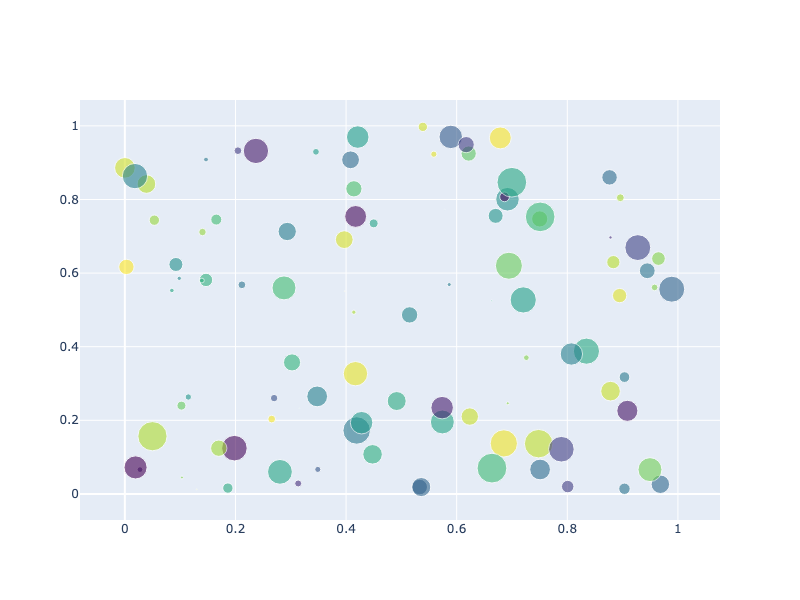

---
jupyter:
  jupytext:
    notebook_metadata_filter: all
    text_representation:
      extension: .md
      format_name: markdown
      format_version: '1.3'
      jupytext_version: 1.16.4
  kernelspec:
    display_name: Python 3 (ipykernel)
    language: python
    name: python3
  language_info:
    codemirror_mode:
      name: ipython
      version: 3
    file_extension: .py
    mimetype: text/x-python
    name: python
    nbconvert_exporter: python
    pygments_lexer: ipython3
    version: 3.11.10
  plotly:
    description: This section covers the low-level details of how plotly.py uses orca
      to perform static image generation.
    display_as: file_settings
    language: python
    layout: base
    name: Orca Management
    order: 9
    permalink: python/orca-management/
    thumbnail: thumbnail/orca-management.png
---

> Orca support in Plotly.py is deprecated and will be removed after September 2025. See the [Static Image Export page](/python/static-image-export/) for details on using Kaleido for static image generation.

### Overview
This section covers the lower-level details of how plotly.py can use orca to perform static image generation.

Please refer to the [Static Image Export](/python/static-image-export/) section for general information on creating static images from plotly.py figures.

### What is orca?
Orca is an [Electron](https://electronjs.org/) application that inputs plotly figure specifications and converts them into static images.  Orca can run as a command-line utility or as a long-running server process. In order to provide the fastest possible image export experience, plotly.py launches orca in server mode, and communicates with it over a local port. See https://github.com/plotly/orca for more information.

By default, plotly.py launches the orca server process the first time an image export operation is performed, and then leaves it running until the main Python process exits. Because of this, the first image export operation in an interactive session will typically take a couple of seconds, but then all subsequent export operations will be significantly faster, since the server is already running.

### Installing orca
There are 3 general approaches to installing orca and its Python dependencies.

##### conda
Using the [conda](https://conda.io/docs/) package manager, you can install these dependencies in a single command:
<!-- #raw -->
$ conda install -c plotly plotly-orca==1.2.1 psutil requests
<!-- #endraw -->

**Note:** Even if you do not want to use conda to manage your Python dependencies, it is still useful as a cross platform tool for managing native libraries and command-line utilities (e.g. git, wget, graphviz, boost, gcc, nodejs, cairo, etc.).  For this use-case, start with [Miniconda](https://conda.io/miniconda.html) (~60MB) and tell the installer to add itself to your system `PATH`.  Then run `conda install plotly-orca==1.2.1` and the orca executable will be available system wide.

##### npm + pip
You can use the [npm](https://www.npmjs.com/get-npm) package manager to install `orca` (and its `electron` dependency), and then use pip to install `psutil`:

<!-- #raw -->
$ npm install -g electron@1.8.4 orca
$ pip install psutil requests
<!-- #endraw -->

##### Standalone Binaries + pip
If you are unable to install conda or npm, you can install orca as a precompiled binary for your operating system. Follow the instructions in the orca [README](https://github.com/plotly/orca) to install orca and add it to your system `PATH`. Then use pip to install `psutil`.

<!-- #raw -->
$ pip install psutil requests
<!-- #endraw -->

<!-- #region -->
### Install orca on Google Colab
```
!pip install plotly>=4.7.1
!wget https://github.com/plotly/orca/releases/download/v1.2.1/orca-1.2.1-x86_64.AppImage -O /usr/local/bin/orca
!chmod +x /usr/local/bin/orca
!apt-get install xvfb libgtk2.0-0 libgconf-2-4
```

Once this is done you can use this code to make, show and export a figure:

```python
import plotly.graph_objects as go
fig = go.Figure( go.Scatter(x=[1,2,3], y=[1,3,2] ) )
fig.write_image("fig1.svg")
fig.write_image("fig1.png")
```

The files can then be downloaded with:

```python
from google.colab import files
files.download('fig1.svg')
files.download('fig1.png')
```
<!-- #endregion -->

### Create a Figure
Now let's create a simple scatter plot with 100 random points of varying color and size.

```python
import plotly.graph_objects as go

import numpy as np
np.random.seed(1)

# Generate scatter plot data
N = 100
x = np.random.rand(N)
y = np.random.rand(N)
colors = np.random.rand(N)
sz = np.random.rand(N) * 30

# Build and display figure
fig = go.Figure()
fig.add_trace(go.Scatter(
    x=x,
    y=y,
    mode="markers",
    marker={"size": sz,
            "color": colors,
            "opacity": 0.6,
            "colorscale": "Viridis"
            }
))

fig.show()
```



**Interactive Plot:**

<div>                        <script type="text/javascript">window.PlotlyConfig = {MathJaxConfig: 'local'};</script>
        <script charset="utf-8" src="https://cdn.plot.ly/plotly-3.1.0.min.js" integrity="sha256-Ei4740bWZhaUTQuD6q9yQlgVCMPBz6CZWhevDYPv93A=" crossorigin="anonymous"></script>                <div id="plotly-div-1" class="plotly-graph-div" style="height:100%; width:100%;"></div>            <script type="text/javascript">                window.PLOTLYENV=window.PLOTLYENV || {};                                if (document.getElementById("plotly-div-1")) {                    Plotly.newPlot(                        "plotly-div-1",                        [{"marker":{"color":{"dtype":"f8","bdata":"qGezv9dn7j8CZdBYGtDhP9wxCLClTO0\u002fR5W027WH5D\u002feKFvq4vXYP7bqVZl4Gt8\u002fGK4Y8IJW4z+C2c6F5ZXhPya9OztHo+0\u002fyDd5qUNm7T\u002fop99cpEXZPx+vI\u002fAL0+4\u002fLFms5S1Exj8knkHRkCvAP1xJFxtGSsE\u002fjAQNbGIu4D8gYdI6mQqWP41j2J\u002fFVe4\u002fpjRW3bp36j+Addp4RcKOP7yur1GZjcY\u002fqEwGlIdA1T8gySsugcTAP9AzIwZZ5+k\u002f4nZAUioQ1j8\u002fGGtJXBXuP33KlTPcn+I\u002f7Uj3QGQf7D8SdRiIEAjrP3zn3E\u002f5+Ow\u002fApNwo61u3T90mWJRrHvhP9HqTh4pjuk\u002fJCADuTdJ0j9OsJlPUGDfPzIjQWHpK+M\u002fgL3s8+jPjz95ot+4zP3iP4ZW\u002fXFawds\u002fdYh0v+XV6T9c1OGJ+CzUP5apQleLkuw\u002fZfMsas594j\u002fsZg9zpY3HP9v4Wl63Nuk\u002fxUoxaMKV4z8QEAQB\u002f5mrP+LOZQh05No\u002fUgCZke665T\u002fpv06OL2XtPwDws8LbWDo\u002ftgclZ5xB7z+YoQlS5BnYP6E6VBg8Ke8\u002fyYqhlNVZ4z9Nhdak54XqP2Vmq2EJZOI\u002f2ghkQTMZ5D\u002fMXJm94UbSP+0\u002fyrZWx+I\u002fa4RMpC0A6D9QWCWUTnfrP25YKB+iKeg\u002fJySaJ3xW5j91xgTE0KnrP54WHTLOptQ\u002fJ5jeDRp35T9Q5+BaHtvcPzj36xlfdNg\u002fFnMvsLtK2j8020Bs17HZP4ajCsEEUNQ\u002fGO8+csPm4z+st1fZK4nbPzgur\u002fliKe8\u002f0x69fouw5T9M5WH0vGrJP7x6FMART9s\u002fQknCgWL51T8huSDQQYbpPyNPvSvyKOw\u002futwg90Xs7D8oBBIuADXlPzq3IZgXS9E\u002fXvFjqsYm0D9isinuUlvrP1GFcNMJ4+A\u002fmo69uE2r6T8sjVVw01HiP7dVLVDndec\u002fmXXGRb6b4D9LyBO8FKvoPwykRKwVNOI\u002fEIJ+zjDO3T+IHxd1ne7VP9Awu\u002fgqdrE\u002frDyl5egv2D94bJ\u002fnX2K0P+V7LeA8c+8\u002fSN1\u002fBBc\u002fxz8="},"colorscale":[[0.0,"#440154"],[0.1111111111111111,"#482878"],[0.2222222222222222,"#3e4989"],[0.3333333333333333,"#31688e"],[0.4444444444444444,"#26828e"],[0.5555555555555556,"#1f9e89"],[0.6666666666666666,"#35b779"],[0.7777777777777778,"#6ece58"],[0.8888888888888888,"#b5de2b"],[1.0,"#fde725"]],"opacity":0.6,"size":{"dtype":"f8","bdata":"bXz+JRNbOEDJMkaXtD86QCrr+YYDpzRAKOIzk7cVMUCWlNXjClETQLtyR\u002fNGAyxAEkuQu9e1JEDIkLQ9OgEbQG06Jbx9xjFA7GoL93a8IkA\u002fscYFOn07QOJmgDYASjtACr5HiqzaHkC4jzlZKZ0KQKlENKzQJxdA5+d\u002f5Jz5LUBhjsi1ids1QEL7lK+7+xhAs+IYRpfDHUCvPTUK14w5QIiNLrJv8yhAK+ZELSSAMkDC0clKOQocQOQrt1DeeAhAZITtU5DzLkA2mSG04qAsQHLNAKoSUhJA8zjNy3inMkDZ9xVq\u002f1EwQFHy6VrGnzNAGivSYXBYEUB754rPu4s2QNR4uX1ZpRpA7zM+eD4pL0Blt67QEo83QFhFPQ3tb+U\u002f\u002fnHyFjV2I0Bojc05CzA6QFUJUqpeVzlABvnARzknMEAvpRcyjf85QLNCQJCCfjxAbBsYRc7KOEAAmLRKm585QGhna2vLsgdAHm72awSKM0DF4RiuAhs1QFgNxkGmTjJAYCnkkgv9N0AJHh+LHJjwPyzIovhuGzdAKrmj96zzNUAW0rRE7ykfQNGcZTor2R5A8HAF6Bb4MkDbh9fdxLckQL0nbBHN5TdABE8dXs7EKkCw1Sv4g3s3QGpBrMPStj1Ak5XCgtADIkAntmSYIykRQPHek30MCjtAduZKEC0\u002fMECaZ1+MAT49QH\u002fvwi0fGTNADx35hEDRPUD71Pji0mEwQKRtEQDnlS9AoEzfXVhAEECnoSeloVclQGR2EqB5K+k\u002fxsCoBFc\u002fE0BhzDBffl42QMCUsh0HL+0\u002fjy\u002fyGhr+JUDCBoW40d45QEPcjM7DxzRARxLUhm+6NEC+A58q7KIWQOOcKlamgypABhaDtYNyMUDjRZMJS7E9QIo\u002fI87\u002fdxhA2H9h0Fq6HUD2iLMG9XUfQMpJdPpSgTZAWumAGiRrK0Aqi8pIfVP7P8xZfjjPgi5AdOzfj2pvGUCowWLVR\u002fU3QN7kqpAC1yFAAOBwGHSA6j9UEpWrj80xQOIPX8qxUDlA2cDFXGjcJkDoE3Rt6X42QGLqRhMiqy5APb5ShoI6MEA="}},"mode":"markers","x":{"dtype":"f8","bdata":"Bjz6D32w2j9R8Lrz5QznPwDAYWaQ+x0\u002f9Aj+t2pZ0z88Bcej5cjCPxDKsIyAo7c\u002f5OE05l\u002fXxz\u002fOo1u9qh3WP+j7e2ejZNk\u002fVJ9il\u002fw94T+KlYE6FdTaPycjGXJR7eU\u002fDGIYx30ryj9KFuu8iRnsP8CsZ0R+C5w\u002fqeWnR3h05T\u002f+WqgzH7XaPwsJuX3J4OE\u002f3KoG\u002fzL4wT9ESHS8Y1vJP18n3RKzn+k\u002fEAY2s\u002f\u002f77j9YDr5IJA\u002fUP5SWEsKBJ+Y\u002f3sd1Q2EL7D\u002fjC1EnnqDsP1gcjBp1xbU\u002fkKZ5Ef3+oz\u002f8qPLQAL3FP+eerk6+Gew\u002fiGT6EkItuT8ujF9lbfPaP7irpfEHp+4\u002fyErKpLAP4T+slCh52yPmP+API3loMdQ\u002fMB0iy9D35T+VcKblQLXqP6C5X4QpupI\u002ftwF\u002fpi4B6D+xfaQCwKTvP8CoMRn58Oc\u002f9q6RW8vy0T+edOO4xkHpP9D\u002fWAIFbbo\u002fIADBm0mq3D\u002f7emLgNhPtPyIaOv+SytI\u002farf0QOlq0j8IlGW4xqTAP4AotIru1JM\u002fst2qSwW55T9QMpFOoRbLP3g1ZGq3\u002ftA\u002fNNSsRO913z8Q5zfkVVKrPz+sdOIrX+I\u002fVPhNfwDIwj8SPgtJl9viP06P7KRrZOY\u002fkAIS0ZYyuj8qeZmv5H\u002faP53k+K2GOOY\u002fXCZTxOmB2j8wtf3wf5OpPxxvLjgQJuE\u002fR1OPRM495T\u002fYayu7+HngPz+EHsgeOu4\u002fC1KIEw\u002fF4j9hxCkiq+jsP0TtKmfFmME\u002fQDBGrs7TwT94pYJBJtbpP5qxToyJc9k\u002f8NBvilMqxT9o7nF5Jq7tP+5skbzLQdY\u002fASWNGqcG6D+wWIEgYDvnP\u002f3EwiILROw\u002fnkuXah\u002f14z8Cb2ptuAfoP+4ZG7ZZVNY\u002fTC3aon9G0T\u002fz2gKTGavsP\u002fD8DJfYZds\u002fAvMLPPjf7j9NEP6p6TrlPyKQS2zu5OM\u002f2LQu+f1fvT\u002fdmkFMN2LuP\u002fSs10Jcy9w\u002f53DE7yqC4j9O1gnT6R7aP6zrNGzmVs4\u002f\u002fxwWK3zo7D\u002fYlzQVlVviPwDuSBeDg2c\u002fopmcsKa\u002f4z8="},"y":{"dtype":"f8","bdata":"0gqhBMDn1D9kOQn0qN3gPz4P1j6jWew\u002fUt\u002fD+4Hd1j9a8Q5PuBLtPzCc3umQ8uM\u002fQKBuonEzkD84p1Mn873tP4aONNrTG+Y\u002fccNHnBHq7z\u002f8QY\u002f3QA\u002fGP1xd4guqjcE\u002fIpDEcNLX7T95dNuZVUzmP9AhXydj5bA\u002fCnII2sAs6D\u002fuktX0wB\u002foP898MsBqie0\u002fh1ATks\u002fE5j\u002fgTYPFONC\u002fP8BkujJ1W5Q\u002fYCW+jQ3Xmj+AdkFBYPycP4xYoiHYg88\u002fpaUnVVmF6z8XUu2kGj7hP1fk3re3sOE\u002fnf8cxerx6j\u002fw1XmH0sm\u002fP\u002fCBuzgl3tE\u002fjb9HOoq+4j\u002fv9Kup7QbvP+areKX18+E\u002fADgQaEYYkz\u002fYtihpyJ7pP5xvetsZ0s0\u002fqqhzRs7T6T+yT2pztdLYP\u002fzqAYcious\u002fgxS2pWvo5z\u002fgqbZRuMzhP1BcymVdd8E\u002fMEzQCYitrj+Qdv1dXRC\u002fP5B1pvqAz6Y\u002fwM0FObyEuz+8e9wpC+TMPwndJETO0OY\u002fDQeeljPp4T\u002fAlDgh87aJP4hkawnobLI\u002fbHlxfe3z7j+UPBkF4S3iPxz6LkGDBco\u002frpM34Rom0D9Tf6Xga83nP4z2BE\u002fVA8k\u002fhgp8CX6a4j\u002fwNzNcZwrvPw299rY4Ges\u002f7GTH1FSzzj+ChqJJ7JnfP5xR7V+t1uM\u002fJ3SS8wKH6j\u002fsSiaMvRHEPyDrV9OjBZM\u002fUBZFofjssT+c0YI+RyDfP\u002fjfDAsNZ+M\u002fkTXS7Qc04j84LkFsqk\u002fUP8v1b1i+ou8\u002fm4mV2EWN4j\u002fU\u002fxGkO1TYP23T3CheoeE\u002fN3Cql8fZ5z+CPtkZW2rlPyTiDilx9NA\u002f0Kp02FH7sD+4rbOhda\u002fXP2cKTFSlJuQ\u002fVNaGYfvmyj8zGabQkhboP4AmaOuICLE\u002fvDDDqACp0D+Js5KkjMDpP9Bt5V50wsg\u002fF2xOqnZ25D\u002f0y1tjGcrgP0lAfuIGmO0\u002foJyYstrZ0D8Q30t30+KwP0VIFw6phec\u002ftH7ysq616D84YKnU0wztPzWMvxa30u0\u002fgHlDbaSSjD\u002fMK6irk\u002f\u002fNP8h8BvelvOM\u002faSeXeVde7j8="},"type":"scatter"}],                        {"template":{"data":{"histogram2dcontour":[{"type":"histogram2dcontour","colorbar":{"outlinewidth":0,"ticks":""},"colorscale":[[0.0,"#0d0887"],[0.1111111111111111,"#46039f"],[0.2222222222222222,"#7201a8"],[0.3333333333333333,"#9c179e"],[0.4444444444444444,"#bd3786"],[0.5555555555555556,"#d8576b"],[0.6666666666666666,"#ed7953"],[0.7777777777777778,"#fb9f3a"],[0.8888888888888888,"#fdca26"],[1.0,"#f0f921"]]}],"choropleth":[{"type":"choropleth","colorbar":{"outlinewidth":0,"ticks":""}}],"histogram2d":[{"type":"histogram2d","colorbar":{"outlinewidth":0,"ticks":""},"colorscale":[[0.0,"#0d0887"],[0.1111111111111111,"#46039f"],[0.2222222222222222,"#7201a8"],[0.3333333333333333,"#9c179e"],[0.4444444444444444,"#bd3786"],[0.5555555555555556,"#d8576b"],[0.6666666666666666,"#ed7953"],[0.7777777777777778,"#fb9f3a"],[0.8888888888888888,"#fdca26"],[1.0,"#f0f921"]]}],"heatmap":[{"type":"heatmap","colorbar":{"outlinewidth":0,"ticks":""},"colorscale":[[0.0,"#0d0887"],[0.1111111111111111,"#46039f"],[0.2222222222222222,"#7201a8"],[0.3333333333333333,"#9c179e"],[0.4444444444444444,"#bd3786"],[0.5555555555555556,"#d8576b"],[0.6666666666666666,"#ed7953"],[0.7777777777777778,"#fb9f3a"],[0.8888888888888888,"#fdca26"],[1.0,"#f0f921"]]}],"contourcarpet":[{"type":"contourcarpet","colorbar":{"outlinewidth":0,"ticks":""}}],"contour":[{"type":"contour","colorbar":{"outlinewidth":0,"ticks":""},"colorscale":[[0.0,"#0d0887"],[0.1111111111111111,"#46039f"],[0.2222222222222222,"#7201a8"],[0.3333333333333333,"#9c179e"],[0.4444444444444444,"#bd3786"],[0.5555555555555556,"#d8576b"],[0.6666666666666666,"#ed7953"],[0.7777777777777778,"#fb9f3a"],[0.8888888888888888,"#fdca26"],[1.0,"#f0f921"]]}],"surface":[{"type":"surface","colorbar":{"outlinewidth":0,"ticks":""},"colorscale":[[0.0,"#0d0887"],[0.1111111111111111,"#46039f"],[0.2222222222222222,"#7201a8"],[0.3333333333333333,"#9c179e"],[0.4444444444444444,"#bd3786"],[0.5555555555555556,"#d8576b"],[0.6666666666666666,"#ed7953"],[0.7777777777777778,"#fb9f3a"],[0.8888888888888888,"#fdca26"],[1.0,"#f0f921"]]}],"mesh3d":[{"type":"mesh3d","colorbar":{"outlinewidth":0,"ticks":""}}],"scatter":[{"fillpattern":{"fillmode":"overlay","size":10,"solidity":0.2},"type":"scatter"}],"parcoords":[{"type":"parcoords","line":{"colorbar":{"outlinewidth":0,"ticks":""}}}],"scatterpolargl":[{"type":"scatterpolargl","marker":{"colorbar":{"outlinewidth":0,"ticks":""}}}],"bar":[{"error_x":{"color":"#2a3f5f"},"error_y":{"color":"#2a3f5f"},"marker":{"line":{"color":"#E5ECF6","width":0.5},"pattern":{"fillmode":"overlay","size":10,"solidity":0.2}},"type":"bar"}],"scattergeo":[{"type":"scattergeo","marker":{"colorbar":{"outlinewidth":0,"ticks":""}}}],"scatterpolar":[{"type":"scatterpolar","marker":{"colorbar":{"outlinewidth":0,"ticks":""}}}],"histogram":[{"marker":{"pattern":{"fillmode":"overlay","size":10,"solidity":0.2}},"type":"histogram"}],"scattergl":[{"type":"scattergl","marker":{"colorbar":{"outlinewidth":0,"ticks":""}}}],"scatter3d":[{"type":"scatter3d","line":{"colorbar":{"outlinewidth":0,"ticks":""}},"marker":{"colorbar":{"outlinewidth":0,"ticks":""}}}],"scattermap":[{"type":"scattermap","marker":{"colorbar":{"outlinewidth":0,"ticks":""}}}],"scattermapbox":[{"type":"scattermapbox","marker":{"colorbar":{"outlinewidth":0,"ticks":""}}}],"scatterternary":[{"type":"scatterternary","marker":{"colorbar":{"outlinewidth":0,"ticks":""}}}],"scattercarpet":[{"type":"scattercarpet","marker":{"colorbar":{"outlinewidth":0,"ticks":""}}}],"carpet":[{"aaxis":{"endlinecolor":"#2a3f5f","gridcolor":"white","linecolor":"white","minorgridcolor":"white","startlinecolor":"#2a3f5f"},"baxis":{"endlinecolor":"#2a3f5f","gridcolor":"white","linecolor":"white","minorgridcolor":"white","startlinecolor":"#2a3f5f"},"type":"carpet"}],"table":[{"cells":{"fill":{"color":"#EBF0F8"},"line":{"color":"white"}},"header":{"fill":{"color":"#C8D4E3"},"line":{"color":"white"}},"type":"table"}],"barpolar":[{"marker":{"line":{"color":"#E5ECF6","width":0.5},"pattern":{"fillmode":"overlay","size":10,"solidity":0.2}},"type":"barpolar"}],"pie":[{"automargin":true,"type":"pie"}]},"layout":{"autotypenumbers":"strict","colorway":["#636efa","#EF553B","#00cc96","#ab63fa","#FFA15A","#19d3f3","#FF6692","#B6E880","#FF97FF","#FECB52"],"font":{"color":"#2a3f5f"},"hovermode":"closest","hoverlabel":{"align":"left"},"paper_bgcolor":"white","plot_bgcolor":"#E5ECF6","polar":{"bgcolor":"#E5ECF6","angularaxis":{"gridcolor":"white","linecolor":"white","ticks":""},"radialaxis":{"gridcolor":"white","linecolor":"white","ticks":""}},"ternary":{"bgcolor":"#E5ECF6","aaxis":{"gridcolor":"white","linecolor":"white","ticks":""},"baxis":{"gridcolor":"white","linecolor":"white","ticks":""},"caxis":{"gridcolor":"white","linecolor":"white","ticks":""}},"coloraxis":{"colorbar":{"outlinewidth":0,"ticks":""}},"colorscale":{"sequential":[[0.0,"#0d0887"],[0.1111111111111111,"#46039f"],[0.2222222222222222,"#7201a8"],[0.3333333333333333,"#9c179e"],[0.4444444444444444,"#bd3786"],[0.5555555555555556,"#d8576b"],[0.6666666666666666,"#ed7953"],[0.7777777777777778,"#fb9f3a"],[0.8888888888888888,"#fdca26"],[1.0,"#f0f921"]],"sequentialminus":[[0.0,"#0d0887"],[0.1111111111111111,"#46039f"],[0.2222222222222222,"#7201a8"],[0.3333333333333333,"#9c179e"],[0.4444444444444444,"#bd3786"],[0.5555555555555556,"#d8576b"],[0.6666666666666666,"#ed7953"],[0.7777777777777778,"#fb9f3a"],[0.8888888888888888,"#fdca26"],[1.0,"#f0f921"]],"diverging":[[0,"#8e0152"],[0.1,"#c51b7d"],[0.2,"#de77ae"],[0.3,"#f1b6da"],[0.4,"#fde0ef"],[0.5,"#f7f7f7"],[0.6,"#e6f5d0"],[0.7,"#b8e186"],[0.8,"#7fbc41"],[0.9,"#4d9221"],[1,"#276419"]]},"xaxis":{"gridcolor":"white","linecolor":"white","ticks":"","title":{"standoff":15},"zerolinecolor":"white","automargin":true,"zerolinewidth":2},"yaxis":{"gridcolor":"white","linecolor":"white","ticks":"","title":{"standoff":15},"zerolinecolor":"white","automargin":true,"zerolinewidth":2},"scene":{"xaxis":{"backgroundcolor":"#E5ECF6","gridcolor":"white","linecolor":"white","showbackground":true,"ticks":"","zerolinecolor":"white","gridwidth":2},"yaxis":{"backgroundcolor":"#E5ECF6","gridcolor":"white","linecolor":"white","showbackground":true,"ticks":"","zerolinecolor":"white","gridwidth":2},"zaxis":{"backgroundcolor":"#E5ECF6","gridcolor":"white","linecolor":"white","showbackground":true,"ticks":"","zerolinecolor":"white","gridwidth":2}},"shapedefaults":{"line":{"color":"#2a3f5f"}},"annotationdefaults":{"arrowcolor":"#2a3f5f","arrowhead":0,"arrowwidth":1},"geo":{"bgcolor":"white","landcolor":"#E5ECF6","subunitcolor":"white","showland":true,"showlakes":true,"lakecolor":"white"},"title":{"x":0.05},"mapbox":{"style":"light"}}}},                        {"responsive": true}                    )                };            </script>        </div>

### config
We can use the `plotly.io.orca.config` object to view the current orca configuration settings.

```python
import plotly.io as pio
pio.orca.config
```

### status
We can use the `plotly.io.orca.status` object to see the current status of the orca server

```python
import plotly.io as pio
pio.orca.status
```

Since no image export operations have been performed yet, the orca server is not yet running.

Let's export this figure as an SVG image, and record the runtime.

```python
%%time
import plotly.io as pio
from IPython.display import SVG, display
img_bytes = pio.to_image(fig, format="svg")
display(SVG(img_bytes))
```

**Error:**
```
Error executing code: invalid syntax (<string>, line 1)
Traceback (most recent call last):
  File "/Users/gvwilson/plotly.py/bin/run_markdown.py", line 236, in _run_code
    exec(code, exec_globals)
  File "<string>", line 1
    %%time
    ^
SyntaxError: invalid syntax
```

By checking the `status` object again, we see that the orca server is now running

```python
import plotly.io as pio
pio.orca.status
```

Let's perform this same export operation again, now that the server is already running.

```python
%%time
import plotly.io as pio
from IPython.display import SVG, display
img_bytes = pio.to_image(fig, format="svg")
display(SVG(img_bytes))
```

**Error:**
```
Error executing code: invalid syntax (<string>, line 1)
Traceback (most recent call last):
  File "/Users/gvwilson/plotly.py/bin/run_markdown.py", line 236, in _run_code
    exec(code, exec_globals)
  File "<string>", line 1
    %%time
    ^
SyntaxError: invalid syntax
```

The difference in runtime is dramatic. Starting the server and exporting the first image takes a couple seconds, while exporting an image with a running server is much faster.


### Shutdown the Server
By default, the orca server will continue to run until the main Python process exits.  It can also be manually shut down by calling the `plotly.io.orca.shutdown_server()` function.  Additionally, it is possible to configure the server to shut down automatically after a certain period of inactivity. See the `timeout` configuration parameter below for more information.

Regardless of how the server is shut down, it will start back up automatically the next time an image export operation is performed.

```python
import plotly.io as pio
pio.orca.shutdown_server()
pio.orca.status
```

```python
import plotly.io as pio
img_bytes = pio.to_image(fig, format="svg")
display(SVG(img_bytes))
```

**Error:**
```
Error executing code: name 'fig' is not defined
Traceback (most recent call last):
  File "/Users/gvwilson/plotly.py/bin/run_markdown.py", line 236, in _run_code
    exec(code, exec_globals)
  File "<string>", line 2, in <module>
NameError: name 'fig' is not defined
```

```python
import plotly.io as pio
pio.orca.status
```

<!-- #region -->
### Configuring the Executable
By default, plotly.py searches the `PATH` for an executable named `orca` and checks that it is a valid plotly orca executable. If plotly.py is unable to find the executable, you'll get an error message that looks something like this:

```
----------------------------------------------------------------------------
ValueError:
The orca executable is required in order to export figures as static images,
but it could not be found on the system path.

Searched for executable 'orca' on the following path:
    /anaconda3/envs/plotly_env/bin
    /usr/local/bin
    /usr/bin
    /bin
    /usr/sbin
    /sbin

If you haven't installed orca yet, you can do so using conda as follows:

    $ conda install -c plotly plotly-orca==1.2.1

Alternatively, see other installation methods in the orca project README at
https://github.com/plotly/orca.

After installation is complete, no further configuration should be needed.

If you have installed orca, then for some reason plotly.py was unable to
locate it. In this case, set the `plotly.io.orca.config.executable`
property to the full path to your orca executable. For example:

    >>> plotly.io.orca.config.executable = '/path/to/orca'

After updating this executable property, try the export operation again.
If it is successful then you may want to save this configuration so that it
will be applied automatically in future sessions. You can do this as follows:

    >>> plotly.io.orca.config.save()

If you're still having trouble, feel free to ask for help on the forums at
https://community.plotly.com/c/api/python
----------------------------------------------------------------------------
```
If this happens, follow the instructions in the error message and specify the full path to you orca executable using the `plotly.io.orca.config.executable` configuration property.
<!-- #endregion -->

### Other Configuration Settings
In addition to the `executable` property, the `plotly.io.orca.config` object can also be used to configure the following options:

 - **`server_url`**: The URL to an externally running instance of Orca. When this is set, plotly.py will not launch an orca server process and instead use the one provided.
 - **`port`**: The specific port to use to communicate with the orca server, or `None` if the port will be chosen automatically.
 - **`timeout`**: The number of seconds of inactivity required before the orca server is shut down. For example, if timeout is set to 20, then the orca server will shutdown once is has not been used for at least 20 seconds. If timeout is set to `None` (the default), then the server will not be automatically shut down due to inactivity.
 - **`default_width`**: The default pixel width to use on image export.
 - **`default_height`**: The default pixel height to use on image export.
 - **`default_scale`**: The default image scale factor applied on image export.
 - **`default_format`**: The default image format used on export. One of `"png"`, `"jpeg"`, `"webp"`, `"svg"`, `"pdf"`, or `"eps"`.
 - **`mathjax`**: Location of the MathJax bundle needed to render LaTeX characters. Defaults to a CDN location. If fully offline export is required, set this to a local MathJax bundle.
 - **`topojson`**: Location of the topojson files needed to render choropleth traces. Defaults to a CDN location. If fully offline export is required, set this to a local directory containing the [Plotly.js topojson files](https://github.com/plotly/plotly.js/tree/master/dist/topojson).
 - **`mapbox_access_token`**: Mapbox access token required to render `scattermapbox` traces.
 - **`use_xvfb`**: Whether to call orca using [Xvfb](https://www.x.org/releases/X11R7.6/doc/man/man1/Xvfb.1.xhtml) on Linux. Xvfb is needed for orca to work in a Linux environment if an X11 display server is not available.  By default, plotly.py will automatically use Xvfb if it is installed, and no active X11 display server is detected.  This can be set to `True` to force the use of Xvfb, or it can be set to `False` to disable the use of Xvfb.


### Saving Configuration Settings
Configuration options can optionally be saved to the `~/.plotly/` directory by calling the `plotly.io.config.save()` method.  Saved setting will be automatically loaded at the start of future sessions.
