---
jupyter:
  jupytext:
    notebook_metadata_filter: all
    text_representation:
      extension: .md
      format_name: markdown
      format_version: '1.3'
      jupytext_version: 1.14.7
  kernelspec:
    display_name: Python 3 (ipykernel)
    language: python
    name: python3
  language_info:
    codemirror_mode:
      name: ipython
      version: 3
    file_extension: .py
    mimetype: text/x-python
    name: python
    nbconvert_exporter: python
    pygments_lexer: ipython3
    version: 3.10.4
  plotly:
    description: Plotly Express is a terse, consistent, high-level API for creating
      figures.
    display_as: file_settings
    language: python
    layout: base
    name: Plotly Express
    order: 4
    page_type: example_index
    permalink: python/plotly-express/
    thumbnail: thumbnail/plotly-express.png
---

### Overview

The `plotly.express` module (usually imported as `px`) contains functions that can create entire figures at once, and is referred to as Plotly Express or PX. Plotly Express is a built-in part of the `plotly` library, and is the recommended starting point for creating most common figures. Every Plotly Express function uses [graph objects](graph-objects.md) internally and returns a `plotly.graph_objects.Figure` instance. Throughout the `plotly` documentation, you will find the Plotly Express way of building figures at the top of any applicable page, followed by a section on how to use graph objects to build similar figures. Any figure created in a single function call with Plotly Express could be created using graph objects alone, but with between 5 and 100 times more code.

Plotly Express provides [more than 30 functions for creating different types of figures](https://plotly.com/python-api-reference/plotly.express.html). The API for these functions was carefully designed to be as consistent and easy to learn as possible, making it easy to switch from a scatter plot to a bar chart to a histogram to a sunburst chart throughout a data exploration session. *Scroll down for a gallery of Plotly Express plots, each made in a single function call.*

Here is a talk from the [SciPy 2021 conference](https://www.scipy2021.scipy.org/) that gives a good introduction to Plotly Express and [Dash](https://dash.plotly.com/):

```html hide_code=true
<div align="center">
<iframe width="560" height="315"
src="https://www.youtube.com/embed/FpCgG85g2Hw"
title="Data Visualization as The First and Last Mile of Data Science: Plotly Express and Dash | SciPy 2021"
frameborder="0" allow="accelerometer; autoplay; clipboard-write; encrypted-media; gyroscope; picture-in-picture" allowfullscreen></iframe>
</div>
```

Plotly Express currently includes the following functions:

* **Basics**: [`scatter`](line-and-scatter.md), [`line`](line-charts.md), [`area`](filled-area-plots.md), [`bar`](bar-charts.md), [`funnel`](funnel-charts.md), [`timeline`](https://plotly.com/python/gantt/)
* **Part-of-Whole**: [`pie`](pie-charts.md), [`sunburst`](sunburst-charts.md), [`treemap`](treemaps.md), [`icicle`](icicle-charts.md), [`funnel_area`](funnel-charts.md)
* **1D Distributions**: [`histogram`](histograms.md), [`box`](box-plots.md), [`violin`](violin.md), [`strip`](strip-charts.md), [`ecdf`](ecdf-plots.md)
* **2D Distributions**: [`density_heatmap`](2D-Histogram.md), [`density_contour`](2d-histogram-contour.md)
* **Matrix or Image Input**: [`imshow`](imshow.md)
* **3-Dimensional**: [`scatter_3d`](3d-scatter-plots.md), [`line_3d`](3d-line-plots.md)
* **Multidimensional**: [`scatter_matrix`](splom.md), [`parallel_coordinates`](parallel-coordinates-plot.md), [`parallel_categories`](parallel-categories-diagram.md)
* **Tile Maps**: [`scatter_map`](tile-scatter-maps.md), [`line_map`](lines-on-tile-maps.md), [`choropleth_map`](tile-county-choropleth.md), [`density_map`](tile-density-heatmaps.md)
* **Outline Maps**: [`scatter_geo`](scatter-plots-on-maps.md), [`line_geo`](lines-on-maps.md), [`choropleth`](choropleth-maps.md)
* **Polar Charts**: [`scatter_polar`](polar-chart.md), [`line_polar`](polar-chart.md), [`bar_polar`](wind-rose-charts.md)
* **Ternary Charts**: [`scatter_ternary`](ternary-plots.md), [`line_ternary`](ternary-plots.md)

### High-Level Features

The Plotly Express API in general offers the following features:

* **A single entry point into `plotly`**: just `import plotly.express as px` and get access to [all the plotting functions](https://plotly.com/python-api-reference/plotly.express.html), plus [built-in demo datasets under `px.data`](https://plotly.com/python-api-reference/generated/plotly.data.html#module-plotly.data) and [built-in color scales and sequences under `px.color`](https://plotly.com/python-api-reference/generated/plotly.colors.html#module-plotly.colors). Every PX function returns a `plotly.graph_objects.Figure` object, so you can edit it using all the same methods like [`update_layout` and `add_trace`](https://plotly.com/python/creating-and-updating-figures/#updating-figures).
* **Sensible, Overridable Defaults**: PX functions will infer sensible defaults wherever possible, and will always let you override them.
* **Flexible Input Formats**: PX functions [accept input in a variety of formats](px-arguments.md), from `list`s and `dict`s to [long-form or wide-form `DataFrame`s](wide-form.md) to [`numpy` arrays and `xarrays`](imshow.md) to [GeoPandas `GeoDataFrames`](maps.md).
* **Automatic Trace and Layout configuration**: PX functions will create one [trace](figure-structure) per animation frame for each unique combination of data values mapped to discrete color, symbol, line-dash, facet-row and/or facet-column. Traces' [`legendgroup` and `showlegend` attributes](https://plotly.com/python/legend.md) are set such that only one legend item appears per unique combination of discrete color, symbol and/or line-dash. Traces are automatically linked to a correctly-configured [subplot of the appropriate type](../figure-structure).
* **Automatic Figure Labelling**: PX functions [label axes, legends and colorbars](https://plotly.com/python/figure-labels/) based in the input `DataFrame` or `xarray`, and provide [extra control with the `labels` argument](styling-plotly-express.md).
* **Automatic Hover Labels**: PX functions populate the hover-label using the labels mentioned above, and provide [extra control with the `hover_name` and `hover_data` arguments](hover-text-and-formatting.md).
* **Styling Control**: PX functions [read styling information from the default figure template](styling-plotly-express.md), and support commonly-needed [cosmetic controls like `category_orders` and `color_discrete_map`](styling-plotly-express.md) to precisely control categorical variables.
* **Uniform Color Handling**: PX functions automatically switch between [continuous](colorscales.md) and [categorical color](discrete-color.md) based on the input type.
* **Faceting**: the 2D-cartesian plotting functions support [row, column and wrapped facetting with `facet_row`, `facet_col` and `facet_col_wrap` arguments](facet-plots.md).
* **Marginal Plots**: the 2D-cartesian plotting functions support [marginal distribution plots](marginal-plots.md) with the `marginal`, `marginal_x` and `marginal_y` arguments.
* **A Pandas backend**: the 2D-cartesian plotting functions are available as [a Pandas plotting backend](pandas-backend.md) so you can call them via `df.plot()`.
* **Trendlines**: `px.scatter` supports [built-in trendlines with accessible model output](linear-fits.md).
* **Animations**: many PX functions support [simple animation support via the `animation_frame` and `animation_group` arguments](animations.md).
* **Automatic WebGL switching**: for sufficiently large scatter plots, PX will automatically [use WebGL for hardware-accelerated rendering](https://plotly.com/python/webgl-vs-svg/).


### Plotly Express in Dash

[Dash](https://plotly.com/dash/) is the best way to build analytical apps in Python using Plotly figures. To run the app below, run `pip install dash`, click "Download" to get the code and run `python app.py`.

Get started  with [the official Dash docs](https://dash.plotly.com/installation) and **learn how to effortlessly [style](https://plotly.com/dash/design-kit/) & [deploy](https://plotly.com/dash/app-manager/) apps like this with <a class="plotly-red" href="https://plotly.com/dash/">Dash Enterprise</a>.**


```python hide_code=true
from IPython.display import IFrame
snippet_url = 'https://python-docs-dash-snippets.herokuapp.com/python-docs-dash-snippets/'
IFrame(snippet_url + 'plotly-express', width='100%', height=1200)
```

### Gallery

The following set of figures is just a sampling of what can be done with Plotly Express.

#### Scatter, Line, Area and Bar Charts

**Read more about [scatter plots](line-and-scatter.md) and [discrete color](discrete-color.md).**

```python
import plotly.express as px
df = px.data.iris()
fig = px.scatter(df, x="sepal_width", y="sepal_length", color="species")
fig.show()
```

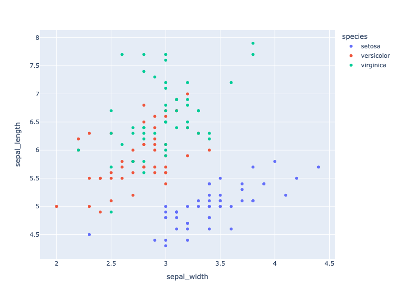

**Interactive Plot:**

<div>                        <script type="text/javascript">window.PlotlyConfig = {MathJaxConfig: 'local'};</script>
        <script charset="utf-8" src="https://cdn.plot.ly/plotly-3.1.0.min.js" integrity="sha256-Ei4740bWZhaUTQuD6q9yQlgVCMPBz6CZWhevDYPv93A=" crossorigin="anonymous"></script>                <div id="plotly-div-1" class="plotly-graph-div" style="height:100%; width:100%;"></div>            <script type="text/javascript">                window.PLOTLYENV=window.PLOTLYENV || {};                                if (document.getElementById("plotly-div-1")) {                    Plotly.newPlot(                        "plotly-div-1",                        [{"hovertemplate":"species=setosa\u003cbr\u003esepal_width=%{x}\u003cbr\u003esepal_length=%{y}\u003cextra\u003e\u003c\u002fextra\u003e","legendgroup":"setosa","marker":{"color":"#636efa","symbol":"circle"},"mode":"markers","name":"setosa","orientation":"v","showlegend":true,"x":{"dtype":"f8","bdata":"AAAAAAAADEAAAAAAAAAIQJqZmZmZmQlAzczMzMzMCEDNzMzMzMwMQDMzMzMzMw9AMzMzMzMzC0AzMzMzMzMLQDMzMzMzMwdAzczMzMzMCECamZmZmZkNQDMzMzMzMwtAAAAAAAAACEAAAAAAAAAIQAAAAAAAABBAmpmZmZmZEUAzMzMzMzMPQAAAAAAAAAxAZmZmZmZmDkBmZmZmZmYOQDMzMzMzMwtAmpmZmZmZDUDNzMzMzMwMQGZmZmZmZgpAMzMzMzMzC0AAAAAAAAAIQDMzMzMzMwtAAAAAAAAADEAzMzMzMzMLQJqZmZmZmQlAzczMzMzMCEAzMzMzMzMLQGZmZmZmZhBAzczMzMzMEEDNzMzMzMwIQJqZmZmZmQlAAAAAAAAADEDNzMzMzMwIQAAAAAAAAAhAMzMzMzMzC0AAAAAAAAAMQGZmZmZmZgJAmpmZmZmZCUAAAAAAAAAMQGZmZmZmZg5AAAAAAAAACEBmZmZmZmYOQJqZmZmZmQlAmpmZmZmZDUBmZmZmZmYKQA=="},"xaxis":"x","y":{"dtype":"f8","bdata":"ZmZmZmZmFECamZmZmZkTQM3MzMzMzBJAZmZmZmZmEkAAAAAAAAAUQJqZmZmZmRVAZmZmZmZmEkAAAAAAAAAUQJqZmZmZmRFAmpmZmZmZE0CamZmZmZkVQDMzMzMzMxNAMzMzMzMzE0AzMzMzMzMRQDMzMzMzMxdAzczMzMzMFkCamZmZmZkVQGZmZmZmZhRAzczMzMzMFkBmZmZmZmYUQJqZmZmZmRVAZmZmZmZmFEBmZmZmZmYSQGZmZmZmZhRAMzMzMzMzE0AAAAAAAAAUQAAAAAAAABRAzczMzMzMFEDNzMzMzMwUQM3MzMzMzBJAMzMzMzMzE0CamZmZmZkVQM3MzMzMzBRAAAAAAAAAFkCamZmZmZkTQAAAAAAAABRAAAAAAAAAFkCamZmZmZkTQJqZmZmZmRFAZmZmZmZmFEAAAAAAAAAUQAAAAAAAABJAmpmZmZmZEUAAAAAAAAAUQGZmZmZmZhRAMzMzMzMzE0BmZmZmZmYUQGZmZmZmZhJAMzMzMzMzFUAAAAAAAAAUQA=="},"yaxis":"y","type":"scatter"},{"hovertemplate":"species=versicolor\u003cbr\u003esepal_width=%{x}\u003cbr\u003esepal_length=%{y}\u003cextra\u003e\u003c\u002fextra\u003e","legendgroup":"versicolor","marker":{"color":"#EF553B","symbol":"circle"},"mode":"markers","name":"versicolor","orientation":"v","showlegend":true,"x":{"dtype":"f8","bdata":"mpmZmZmZCUCamZmZmZkJQM3MzMzMzAhAZmZmZmZmAkBmZmZmZmYGQGZmZmZmZgZAZmZmZmZmCkAzMzMzMzMDQDMzMzMzMwdAmpmZmZmZBUAAAAAAAAAAQAAAAAAAAAhAmpmZmZmZAUAzMzMzMzMHQDMzMzMzMwdAzczMzMzMCEAAAAAAAAAIQJqZmZmZmQVAmpmZmZmZAUAAAAAAAAAEQJqZmZmZmQlAZmZmZmZmBkAAAAAAAAAEQGZmZmZmZgZAMzMzMzMzB0AAAAAAAAAIQGZmZmZmZgZAAAAAAAAACEAzMzMzMzMHQM3MzMzMzARAMzMzMzMzA0AzMzMzMzMDQJqZmZmZmQVAmpmZmZmZBUAAAAAAAAAIQDMzMzMzMwtAzczMzMzMCEBmZmZmZmYCQAAAAAAAAAhAAAAAAAAABEDNzMzMzMwEQAAAAAAAAAhAzczMzMzMBEBmZmZmZmYCQJqZmZmZmQVAAAAAAAAACEAzMzMzMzMHQDMzMzMzMwdAAAAAAAAABEBmZmZmZmYGQA=="},"xaxis":"x","y":{"dtype":"f8","bdata":"AAAAAAAAHECamZmZmZkZQJqZmZmZmRtAAAAAAAAAFkAAAAAAAAAaQM3MzMzMzBZAMzMzMzMzGUCamZmZmZkTQGZmZmZmZhpAzczMzMzMFEAAAAAAAAAUQJqZmZmZmRdAAAAAAAAAGEBmZmZmZmYYQGZmZmZmZhZAzczMzMzMGkBmZmZmZmYWQDMzMzMzMxdAzczMzMzMGEBmZmZmZmYWQJqZmZmZmRdAZmZmZmZmGEAzMzMzMzMZQGZmZmZmZhhAmpmZmZmZGUBmZmZmZmYaQDMzMzMzMxtAzczMzMzMGkAAAAAAAAAYQM3MzMzMzBZAAAAAAAAAFkAAAAAAAAAWQDMzMzMzMxdAAAAAAAAAGECamZmZmZkVQAAAAAAAABhAzczMzMzMGkAzMzMzMzMZQGZmZmZmZhZAAAAAAAAAFkAAAAAAAAAWQGZmZmZmZhhAMzMzMzMzF0AAAAAAAAAUQGZmZmZmZhZAzczMzMzMFkDNzMzMzMwWQM3MzMzMzBhAZmZmZmZmFEDNzMzMzMwWQA=="},"yaxis":"y","type":"scatter"},{"hovertemplate":"species=virginica\u003cbr\u003esepal_width=%{x}\u003cbr\u003esepal_length=%{y}\u003cextra\u003e\u003c\u002fextra\u003e","legendgroup":"virginica","marker":{"color":"#00cc96","symbol":"circle"},"mode":"markers","name":"virginica","orientation":"v","showlegend":true,"x":{"dtype":"f8","bdata":"ZmZmZmZmCkCamZmZmZkFQAAAAAAAAAhAMzMzMzMzB0AAAAAAAAAIQAAAAAAAAAhAAAAAAAAABEAzMzMzMzMHQAAAAAAAAARAzczMzMzMDECamZmZmZkJQJqZmZmZmQVAAAAAAAAACEAAAAAAAAAEQGZmZmZmZgZAmpmZmZmZCUAAAAAAAAAIQGZmZmZmZg5AzczMzMzMBECamZmZmZkBQJqZmZmZmQlAZmZmZmZmBkBmZmZmZmYGQJqZmZmZmQVAZmZmZmZmCkCamZmZmZkJQGZmZmZmZgZAAAAAAAAACEBmZmZmZmYGQAAAAAAAAAhAZmZmZmZmBkBmZmZmZmYOQGZmZmZmZgZAZmZmZmZmBkDNzMzMzMwEQAAAAAAAAAhAMzMzMzMzC0DNzMzMzMwIQAAAAAAAAAhAzczMzMzMCEDNzMzMzMwIQM3MzMzMzAhAmpmZmZmZBUCamZmZmZkJQGZmZmZmZgpAAAAAAAAACEAAAAAAAAAEQAAAAAAAAAhAMzMzMzMzC0AAAAAAAAAIQA=="},"xaxis":"x","y":{"dtype":"f8","bdata":"MzMzMzMzGUAzMzMzMzMXQGZmZmZmZhxAMzMzMzMzGUAAAAAAAAAaQGZmZmZmZh5AmpmZmZmZE0AzMzMzMzMdQM3MzMzMzBpAzczMzMzMHEAAAAAAAAAaQJqZmZmZmRlAMzMzMzMzG0DNzMzMzMwWQDMzMzMzMxdAmpmZmZmZGUAAAAAAAAAaQM3MzMzMzB5AzczMzMzMHkAAAAAAAAAYQJqZmZmZmRtAZmZmZmZmFkDNzMzMzMweQDMzMzMzMxlAzczMzMzMGkDNzMzMzMwcQM3MzMzMzBhAZmZmZmZmGECamZmZmZkZQM3MzMzMzBxAmpmZmZmZHUCamZmZmZkfQJqZmZmZmRlAMzMzMzMzGUBmZmZmZmYYQM3MzMzMzB5AMzMzMzMzGUCamZmZmZkZQAAAAAAAABhAmpmZmZmZG0DNzMzMzMwaQJqZmZmZmRtAMzMzMzMzF0AzMzMzMzMbQM3MzMzMzBpAzczMzMzMGkAzMzMzMzMZQAAAAAAAABpAzczMzMzMGECamZmZmZkXQA=="},"yaxis":"y","type":"scatter"}],                        {"template":{"data":{"histogram2dcontour":[{"type":"histogram2dcontour","colorbar":{"outlinewidth":0,"ticks":""},"colorscale":[[0.0,"#0d0887"],[0.1111111111111111,"#46039f"],[0.2222222222222222,"#7201a8"],[0.3333333333333333,"#9c179e"],[0.4444444444444444,"#bd3786"],[0.5555555555555556,"#d8576b"],[0.6666666666666666,"#ed7953"],[0.7777777777777778,"#fb9f3a"],[0.8888888888888888,"#fdca26"],[1.0,"#f0f921"]]}],"choropleth":[{"type":"choropleth","colorbar":{"outlinewidth":0,"ticks":""}}],"histogram2d":[{"type":"histogram2d","colorbar":{"outlinewidth":0,"ticks":""},"colorscale":[[0.0,"#0d0887"],[0.1111111111111111,"#46039f"],[0.2222222222222222,"#7201a8"],[0.3333333333333333,"#9c179e"],[0.4444444444444444,"#bd3786"],[0.5555555555555556,"#d8576b"],[0.6666666666666666,"#ed7953"],[0.7777777777777778,"#fb9f3a"],[0.8888888888888888,"#fdca26"],[1.0,"#f0f921"]]}],"heatmap":[{"type":"heatmap","colorbar":{"outlinewidth":0,"ticks":""},"colorscale":[[0.0,"#0d0887"],[0.1111111111111111,"#46039f"],[0.2222222222222222,"#7201a8"],[0.3333333333333333,"#9c179e"],[0.4444444444444444,"#bd3786"],[0.5555555555555556,"#d8576b"],[0.6666666666666666,"#ed7953"],[0.7777777777777778,"#fb9f3a"],[0.8888888888888888,"#fdca26"],[1.0,"#f0f921"]]}],"contourcarpet":[{"type":"contourcarpet","colorbar":{"outlinewidth":0,"ticks":""}}],"contour":[{"type":"contour","colorbar":{"outlinewidth":0,"ticks":""},"colorscale":[[0.0,"#0d0887"],[0.1111111111111111,"#46039f"],[0.2222222222222222,"#7201a8"],[0.3333333333333333,"#9c179e"],[0.4444444444444444,"#bd3786"],[0.5555555555555556,"#d8576b"],[0.6666666666666666,"#ed7953"],[0.7777777777777778,"#fb9f3a"],[0.8888888888888888,"#fdca26"],[1.0,"#f0f921"]]}],"surface":[{"type":"surface","colorbar":{"outlinewidth":0,"ticks":""},"colorscale":[[0.0,"#0d0887"],[0.1111111111111111,"#46039f"],[0.2222222222222222,"#7201a8"],[0.3333333333333333,"#9c179e"],[0.4444444444444444,"#bd3786"],[0.5555555555555556,"#d8576b"],[0.6666666666666666,"#ed7953"],[0.7777777777777778,"#fb9f3a"],[0.8888888888888888,"#fdca26"],[1.0,"#f0f921"]]}],"mesh3d":[{"type":"mesh3d","colorbar":{"outlinewidth":0,"ticks":""}}],"scatter":[{"fillpattern":{"fillmode":"overlay","size":10,"solidity":0.2},"type":"scatter"}],"parcoords":[{"type":"parcoords","line":{"colorbar":{"outlinewidth":0,"ticks":""}}}],"scatterpolargl":[{"type":"scatterpolargl","marker":{"colorbar":{"outlinewidth":0,"ticks":""}}}],"bar":[{"error_x":{"color":"#2a3f5f"},"error_y":{"color":"#2a3f5f"},"marker":{"line":{"color":"#E5ECF6","width":0.5},"pattern":{"fillmode":"overlay","size":10,"solidity":0.2}},"type":"bar"}],"scattergeo":[{"type":"scattergeo","marker":{"colorbar":{"outlinewidth":0,"ticks":""}}}],"scatterpolar":[{"type":"scatterpolar","marker":{"colorbar":{"outlinewidth":0,"ticks":""}}}],"histogram":[{"marker":{"pattern":{"fillmode":"overlay","size":10,"solidity":0.2}},"type":"histogram"}],"scattergl":[{"type":"scattergl","marker":{"colorbar":{"outlinewidth":0,"ticks":""}}}],"scatter3d":[{"type":"scatter3d","line":{"colorbar":{"outlinewidth":0,"ticks":""}},"marker":{"colorbar":{"outlinewidth":0,"ticks":""}}}],"scattermap":[{"type":"scattermap","marker":{"colorbar":{"outlinewidth":0,"ticks":""}}}],"scattermapbox":[{"type":"scattermapbox","marker":{"colorbar":{"outlinewidth":0,"ticks":""}}}],"scatterternary":[{"type":"scatterternary","marker":{"colorbar":{"outlinewidth":0,"ticks":""}}}],"scattercarpet":[{"type":"scattercarpet","marker":{"colorbar":{"outlinewidth":0,"ticks":""}}}],"carpet":[{"aaxis":{"endlinecolor":"#2a3f5f","gridcolor":"white","linecolor":"white","minorgridcolor":"white","startlinecolor":"#2a3f5f"},"baxis":{"endlinecolor":"#2a3f5f","gridcolor":"white","linecolor":"white","minorgridcolor":"white","startlinecolor":"#2a3f5f"},"type":"carpet"}],"table":[{"cells":{"fill":{"color":"#EBF0F8"},"line":{"color":"white"}},"header":{"fill":{"color":"#C8D4E3"},"line":{"color":"white"}},"type":"table"}],"barpolar":[{"marker":{"line":{"color":"#E5ECF6","width":0.5},"pattern":{"fillmode":"overlay","size":10,"solidity":0.2}},"type":"barpolar"}],"pie":[{"automargin":true,"type":"pie"}]},"layout":{"autotypenumbers":"strict","colorway":["#636efa","#EF553B","#00cc96","#ab63fa","#FFA15A","#19d3f3","#FF6692","#B6E880","#FF97FF","#FECB52"],"font":{"color":"#2a3f5f"},"hovermode":"closest","hoverlabel":{"align":"left"},"paper_bgcolor":"white","plot_bgcolor":"#E5ECF6","polar":{"bgcolor":"#E5ECF6","angularaxis":{"gridcolor":"white","linecolor":"white","ticks":""},"radialaxis":{"gridcolor":"white","linecolor":"white","ticks":""}},"ternary":{"bgcolor":"#E5ECF6","aaxis":{"gridcolor":"white","linecolor":"white","ticks":""},"baxis":{"gridcolor":"white","linecolor":"white","ticks":""},"caxis":{"gridcolor":"white","linecolor":"white","ticks":""}},"coloraxis":{"colorbar":{"outlinewidth":0,"ticks":""}},"colorscale":{"sequential":[[0.0,"#0d0887"],[0.1111111111111111,"#46039f"],[0.2222222222222222,"#7201a8"],[0.3333333333333333,"#9c179e"],[0.4444444444444444,"#bd3786"],[0.5555555555555556,"#d8576b"],[0.6666666666666666,"#ed7953"],[0.7777777777777778,"#fb9f3a"],[0.8888888888888888,"#fdca26"],[1.0,"#f0f921"]],"sequentialminus":[[0.0,"#0d0887"],[0.1111111111111111,"#46039f"],[0.2222222222222222,"#7201a8"],[0.3333333333333333,"#9c179e"],[0.4444444444444444,"#bd3786"],[0.5555555555555556,"#d8576b"],[0.6666666666666666,"#ed7953"],[0.7777777777777778,"#fb9f3a"],[0.8888888888888888,"#fdca26"],[1.0,"#f0f921"]],"diverging":[[0,"#8e0152"],[0.1,"#c51b7d"],[0.2,"#de77ae"],[0.3,"#f1b6da"],[0.4,"#fde0ef"],[0.5,"#f7f7f7"],[0.6,"#e6f5d0"],[0.7,"#b8e186"],[0.8,"#7fbc41"],[0.9,"#4d9221"],[1,"#276419"]]},"xaxis":{"gridcolor":"white","linecolor":"white","ticks":"","title":{"standoff":15},"zerolinecolor":"white","automargin":true,"zerolinewidth":2},"yaxis":{"gridcolor":"white","linecolor":"white","ticks":"","title":{"standoff":15},"zerolinecolor":"white","automargin":true,"zerolinewidth":2},"scene":{"xaxis":{"backgroundcolor":"#E5ECF6","gridcolor":"white","linecolor":"white","showbackground":true,"ticks":"","zerolinecolor":"white","gridwidth":2},"yaxis":{"backgroundcolor":"#E5ECF6","gridcolor":"white","linecolor":"white","showbackground":true,"ticks":"","zerolinecolor":"white","gridwidth":2},"zaxis":{"backgroundcolor":"#E5ECF6","gridcolor":"white","linecolor":"white","showbackground":true,"ticks":"","zerolinecolor":"white","gridwidth":2}},"shapedefaults":{"line":{"color":"#2a3f5f"}},"annotationdefaults":{"arrowcolor":"#2a3f5f","arrowhead":0,"arrowwidth":1},"geo":{"bgcolor":"white","landcolor":"#E5ECF6","subunitcolor":"white","showland":true,"showlakes":true,"lakecolor":"white"},"title":{"x":0.05},"mapbox":{"style":"light"}}},"xaxis":{"anchor":"y","domain":[0.0,1.0],"title":{"text":"sepal_width"}},"yaxis":{"anchor":"x","domain":[0.0,1.0],"title":{"text":"sepal_length"}},"legend":{"title":{"text":"species"},"tracegroupgap":0},"margin":{"t":60}},                        {"responsive": true}                    )                };            </script>        </div>

**Read more about [trendlines](linear-fits.md) and [templates](templates.md) and [marginal distribution plots](https://plotly.com/python/marginal-plots/).**

```python
import plotly.express as px
df = px.data.iris()
fig = px.scatter(df, x="sepal_width", y="sepal_length", color="species", marginal_y="violin",
           marginal_x="box", trendline="ols", template="simple_white")
fig.show()
```


**Interactive Plot:**

<div>                        <script type="text/javascript">window.PlotlyConfig = {MathJaxConfig: 'local'};</script>
        <script charset="utf-8" src="https://cdn.plot.ly/plotly-3.1.0.min.js" integrity="sha256-Ei4740bWZhaUTQuD6q9yQlgVCMPBz6CZWhevDYPv93A=" crossorigin="anonymous"></script>                <div id="plotly-div-2" class="plotly-graph-div" style="height:100%; width:100%;"></div>            <script type="text/javascript">                window.PLOTLYENV=window.PLOTLYENV || {};                                if (document.getElementById("plotly-div-2")) {                    Plotly.newPlot(                        "plotly-div-2",                        [{"hovertemplate":"species=setosa\u003cbr\u003esepal_width=%{x}\u003cbr\u003esepal_length=%{y}\u003cextra\u003e\u003c\u002fextra\u003e","legendgroup":"setosa","marker":{"color":"#1F77B4","symbol":"circle"},"mode":"markers","name":"setosa","orientation":"v","showlegend":true,"x":{"dtype":"f8","bdata":"AAAAAAAADEAAAAAAAAAIQJqZmZmZmQlAzczMzMzMCEDNzMzMzMwMQDMzMzMzMw9AMzMzMzMzC0AzMzMzMzMLQDMzMzMzMwdAzczMzMzMCECamZmZmZkNQDMzMzMzMwtAAAAAAAAACEAAAAAAAAAIQAAAAAAAABBAmpmZmZmZEUAzMzMzMzMPQAAAAAAAAAxAZmZmZmZmDkBmZmZmZmYOQDMzMzMzMwtAmpmZmZmZDUDNzMzMzMwMQGZmZmZmZgpAMzMzMzMzC0AAAAAAAAAIQDMzMzMzMwtAAAAAAAAADEAzMzMzMzMLQJqZmZmZmQlAzczMzMzMCEAzMzMzMzMLQGZmZmZmZhBAzczMzMzMEEDNzMzMzMwIQJqZmZmZmQlAAAAAAAAADEDNzMzMzMwIQAAAAAAAAAhAMzMzMzMzC0AAAAAAAAAMQGZmZmZmZgJAmpmZmZmZCUAAAAAAAAAMQGZmZmZmZg5AAAAAAAAACEBmZmZmZmYOQJqZmZmZmQlAmpmZmZmZDUBmZmZmZmYKQA=="},"xaxis":"x","y":{"dtype":"f8","bdata":"ZmZmZmZmFECamZmZmZkTQM3MzMzMzBJAZmZmZmZmEkAAAAAAAAAUQJqZmZmZmRVAZmZmZmZmEkAAAAAAAAAUQJqZmZmZmRFAmpmZmZmZE0CamZmZmZkVQDMzMzMzMxNAMzMzMzMzE0AzMzMzMzMRQDMzMzMzMxdAzczMzMzMFkCamZmZmZkVQGZmZmZmZhRAzczMzMzMFkBmZmZmZmYUQJqZmZmZmRVAZmZmZmZmFEBmZmZmZmYSQGZmZmZmZhRAMzMzMzMzE0AAAAAAAAAUQAAAAAAAABRAzczMzMzMFEDNzMzMzMwUQM3MzMzMzBJAMzMzMzMzE0CamZmZmZkVQM3MzMzMzBRAAAAAAAAAFkCamZmZmZkTQAAAAAAAABRAAAAAAAAAFkCamZmZmZkTQJqZmZmZmRFAZmZmZmZmFEAAAAAAAAAUQAAAAAAAABJAmpmZmZmZEUAAAAAAAAAUQGZmZmZmZhRAMzMzMzMzE0BmZmZmZmYUQGZmZmZmZhJAMzMzMzMzFUAAAAAAAAAUQA=="},"yaxis":"y","type":"scatter"},{"alignmentgroup":"True","hovertemplate":"species=setosa\u003cbr\u003esepal_width=%{x}\u003cextra\u003e\u003c\u002fextra\u003e","legendgroup":"setosa","marker":{"color":"#1F77B4","symbol":"circle"},"name":"setosa","notched":true,"offsetgroup":"setosa","showlegend":false,"x":{"dtype":"f8","bdata":"AAAAAAAADEAAAAAAAAAIQJqZmZmZmQlAzczMzMzMCEDNzMzMzMwMQDMzMzMzMw9AMzMzMzMzC0AzMzMzMzMLQDMzMzMzMwdAzczMzMzMCECamZmZmZkNQDMzMzMzMwtAAAAAAAAACEAAAAAAAAAIQAAAAAAAABBAmpmZmZmZEUAzMzMzMzMPQAAAAAAAAAxAZmZmZmZmDkBmZmZmZmYOQDMzMzMzMwtAmpmZmZmZDUDNzMzMzMwMQGZmZmZmZgpAMzMzMzMzC0AAAAAAAAAIQDMzMzMzMwtAAAAAAAAADEAzMzMzMzMLQJqZmZmZmQlAzczMzMzMCEAzMzMzMzMLQGZmZmZmZhBAzczMzMzMEEDNzMzMzMwIQJqZmZmZmQlAAAAAAAAADEDNzMzMzMwIQAAAAAAAAAhAMzMzMzMzC0AAAAAAAAAMQGZmZmZmZgJAmpmZmZmZCUAAAAAAAAAMQGZmZmZmZg5AAAAAAAAACEBmZmZmZmYOQJqZmZmZmQlAmpmZmZmZDUBmZmZmZmYKQA=="},"xaxis":"x3","yaxis":"y3","type":"box"},{"alignmentgroup":"True","hovertemplate":"species=setosa\u003cbr\u003esepal_length=%{y}\u003cextra\u003e\u003c\u002fextra\u003e","legendgroup":"setosa","marker":{"color":"#1F77B4","symbol":"circle"},"name":"setosa","offsetgroup":"setosa","scalegroup":"y","showlegend":false,"xaxis":"x2","y":{"dtype":"f8","bdata":"ZmZmZmZmFECamZmZmZkTQM3MzMzMzBJAZmZmZmZmEkAAAAAAAAAUQJqZmZmZmRVAZmZmZmZmEkAAAAAAAAAUQJqZmZmZmRFAmpmZmZmZE0CamZmZmZkVQDMzMzMzMxNAMzMzMzMzE0AzMzMzMzMRQDMzMzMzMxdAzczMzMzMFkCamZmZmZkVQGZmZmZmZhRAzczMzMzMFkBmZmZmZmYUQJqZmZmZmRVAZmZmZmZmFEBmZmZmZmYSQGZmZmZmZhRAMzMzMzMzE0AAAAAAAAAUQAAAAAAAABRAzczMzMzMFEDNzMzMzMwUQM3MzMzMzBJAMzMzMzMzE0CamZmZmZkVQM3MzMzMzBRAAAAAAAAAFkCamZmZmZkTQAAAAAAAABRAAAAAAAAAFkCamZmZmZkTQJqZmZmZmRFAZmZmZmZmFEAAAAAAAAAUQAAAAAAAABJAmpmZmZmZEUAAAAAAAAAUQGZmZmZmZhRAMzMzMzMzE0BmZmZmZmYUQGZmZmZmZhJAMzMzMzMzFUAAAAAAAAAUQA=="},"yaxis":"y2","type":"violin"},{"hovertemplate":"\u003cb\u003eOLS trendline\u003c\u002fb\u003e\u003cbr\u003esepal_length = 0.690854 * sepal_width + 2.64466\u003cbr\u003eR\u003csup\u003e2\u003c\u002fsup\u003e=0.557681\u003cbr\u003e\u003cbr\u003especies=setosa\u003cbr\u003esepal_width=%{x}\u003cbr\u003esepal_length=%{y} \u003cb\u003e(trend)\u003c\u002fb\u003e\u003cextra\u003e\u003c\u002fextra\u003e","legendgroup":"setosa","marker":{"color":"#1F77B4","symbol":"circle"},"mode":"lines","name":"setosa","showlegend":false,"x":{"dtype":"f8","bdata":"ZmZmZmZmAkAzMzMzMzMHQAAAAAAAAAhAAAAAAAAACEAAAAAAAAAIQAAAAAAAAAhAAAAAAAAACEAAAAAAAAAIQM3MzMzMzAhAzczMzMzMCEDNzMzMzMwIQM3MzMzMzAhAzczMzMzMCECamZmZmZkJQJqZmZmZmQlAmpmZmZmZCUCamZmZmZkJQJqZmZmZmQlAZmZmZmZmCkBmZmZmZmYKQDMzMzMzMwtAMzMzMzMzC0AzMzMzMzMLQDMzMzMzMwtAMzMzMzMzC0AzMzMzMzMLQDMzMzMzMwtAMzMzMzMzC0AzMzMzMzMLQAAAAAAAAAxAAAAAAAAADEAAAAAAAAAMQAAAAAAAAAxAAAAAAAAADEAAAAAAAAAMQM3MzMzMzAxAzczMzMzMDECamZmZmZkNQJqZmZmZmQ1AmpmZmZmZDUBmZmZmZmYOQGZmZmZmZg5AZmZmZmZmDkBmZmZmZmYOQDMzMzMzMw9AMzMzMzMzD0AAAAAAAAAQQGZmZmZmZhBAzczMzMzMEECamZmZmZkRQA=="},"xaxis":"x","y":{"dtype":"f8","bdata":"Vjr3VTvvEEBrBy1WsZcSQERUi6tv3hJARFSLq2\u002feEkBEVIurb94SQERUi6tv3hJARFSLq2\u002feEkBEVIurb94SQB2h6QAuJRNAHaHpAC4lE0AdoekALiUTQB2h6QAuJRNAHaHpAC4lE0D27UdW7GsTQPbtR1bsaxNA9u1HVuxrE0D27UdW7GsTQPbtR1bsaxNAzjqmq6qyE0DOOqarqrITQKiHBAFp+RNAqIcEAWn5E0CohwQBafkTQKiHBAFp+RNAqIcEAWn5E0CohwQBafkTQKiHBAFp+RNAqIcEAWn5E0CohwQBafkTQIDUYlYnQBRAgNRiVidAFECA1GJWJ0AUQIDUYlYnQBRAgNRiVidAFECA1GJWJ0AUQFkhwavlhhRAWSHBq+WGFEAybh8BpM0UQDJuHwGkzRRAMm4fAaTNFEAKu31WYhQVQAq7fVZiFBVACrt9VmIUFUAKu31WYhQVQOQH3KsgWxVA5AfcqyBbFUC8VDoB36EVQJWhmFad6BVAbu72q1svFkAgiLNW2LwWQA=="},"yaxis":"y","type":"scatter"},{"hovertemplate":"species=versicolor\u003cbr\u003esepal_width=%{x}\u003cbr\u003esepal_length=%{y}\u003cextra\u003e\u003c\u002fextra\u003e","legendgroup":"versicolor","marker":{"color":"#FF7F0E","symbol":"circle"},"mode":"markers","name":"versicolor","orientation":"v","showlegend":true,"x":{"dtype":"f8","bdata":"mpmZmZmZCUCamZmZmZkJQM3MzMzMzAhAZmZmZmZmAkBmZmZmZmYGQGZmZmZmZgZAZmZmZmZmCkAzMzMzMzMDQDMzMzMzMwdAmpmZmZmZBUAAAAAAAAAAQAAAAAAAAAhAmpmZmZmZAUAzMzMzMzMHQDMzMzMzMwdAzczMzMzMCEAAAAAAAAAIQJqZmZmZmQVAmpmZmZmZAUAAAAAAAAAEQJqZmZmZmQlAZmZmZmZmBkAAAAAAAAAEQGZmZmZmZgZAMzMzMzMzB0AAAAAAAAAIQGZmZmZmZgZAAAAAAAAACEAzMzMzMzMHQM3MzMzMzARAMzMzMzMzA0AzMzMzMzMDQJqZmZmZmQVAmpmZmZmZBUAAAAAAAAAIQDMzMzMzMwtAzczMzMzMCEBmZmZmZmYCQAAAAAAAAAhAAAAAAAAABEDNzMzMzMwEQAAAAAAAAAhAzczMzMzMBEBmZmZmZmYCQJqZmZmZmQVAAAAAAAAACEAzMzMzMzMHQDMzMzMzMwdAAAAAAAAABEBmZmZmZmYGQA=="},"xaxis":"x","y":{"dtype":"f8","bdata":"AAAAAAAAHECamZmZmZkZQJqZmZmZmRtAAAAAAAAAFkAAAAAAAAAaQM3MzMzMzBZAMzMzMzMzGUCamZmZmZkTQGZmZmZmZhpAzczMzMzMFEAAAAAAAAAUQJqZmZmZmRdAAAAAAAAAGEBmZmZmZmYYQGZmZmZmZhZAzczMzMzMGkBmZmZmZmYWQDMzMzMzMxdAzczMzMzMGEBmZmZmZmYWQJqZmZmZmRdAZmZmZmZmGEAzMzMzMzMZQGZmZmZmZhhAmpmZmZmZGUBmZmZmZmYaQDMzMzMzMxtAzczMzMzMGkAAAAAAAAAYQM3MzMzMzBZAAAAAAAAAFkAAAAAAAAAWQDMzMzMzMxdAAAAAAAAAGECamZmZmZkVQAAAAAAAABhAzczMzMzMGkAzMzMzMzMZQGZmZmZmZhZAAAAAAAAAFkAAAAAAAAAWQGZmZmZmZhhAMzMzMzMzF0AAAAAAAAAUQGZmZmZmZhZAzczMzMzMFkDNzMzMzMwWQM3MzMzMzBhAZmZmZmZmFEDNzMzMzMwWQA=="},"yaxis":"y","type":"scatter"},{"alignmentgroup":"True","hovertemplate":"species=versicolor\u003cbr\u003esepal_width=%{x}\u003cextra\u003e\u003c\u002fextra\u003e","legendgroup":"versicolor","marker":{"color":"#FF7F0E","symbol":"circle"},"name":"versicolor","notched":true,"offsetgroup":"versicolor","showlegend":false,"x":{"dtype":"f8","bdata":"mpmZmZmZCUCamZmZmZkJQM3MzMzMzAhAZmZmZmZmAkBmZmZmZmYGQGZmZmZmZgZAZmZmZmZmCkAzMzMzMzMDQDMzMzMzMwdAmpmZmZmZBUAAAAAAAAAAQAAAAAAAAAhAmpmZmZmZAUAzMzMzMzMHQDMzMzMzMwdAzczMzMzMCEAAAAAAAAAIQJqZmZmZmQVAmpmZmZmZAUAAAAAAAAAEQJqZmZmZmQlAZmZmZmZmBkAAAAAAAAAEQGZmZmZmZgZAMzMzMzMzB0AAAAAAAAAIQGZmZmZmZgZAAAAAAAAACEAzMzMzMzMHQM3MzMzMzARAMzMzMzMzA0AzMzMzMzMDQJqZmZmZmQVAmpmZmZmZBUAAAAAAAAAIQDMzMzMzMwtAzczMzMzMCEBmZmZmZmYCQAAAAAAAAAhAAAAAAAAABEDNzMzMzMwEQAAAAAAAAAhAzczMzMzMBEBmZmZmZmYCQJqZmZmZmQVAAAAAAAAACEAzMzMzMzMHQDMzMzMzMwdAAAAAAAAABEBmZmZmZmYGQA=="},"xaxis":"x3","yaxis":"y3","type":"box"},{"alignmentgroup":"True","hovertemplate":"species=versicolor\u003cbr\u003esepal_length=%{y}\u003cextra\u003e\u003c\u002fextra\u003e","legendgroup":"versicolor","marker":{"color":"#FF7F0E","symbol":"circle"},"name":"versicolor","offsetgroup":"versicolor","scalegroup":"y","showlegend":false,"xaxis":"x2","y":{"dtype":"f8","bdata":"AAAAAAAAHECamZmZmZkZQJqZmZmZmRtAAAAAAAAAFkAAAAAAAAAaQM3MzMzMzBZAMzMzMzMzGUCamZmZmZkTQGZmZmZmZhpAzczMzMzMFEAAAAAAAAAUQJqZmZmZmRdAAAAAAAAAGEBmZmZmZmYYQGZmZmZmZhZAzczMzMzMGkBmZmZmZmYWQDMzMzMzMxdAzczMzMzMGEBmZmZmZmYWQJqZmZmZmRdAZmZmZmZmGEAzMzMzMzMZQGZmZmZmZhhAmpmZmZmZGUBmZmZmZmYaQDMzMzMzMxtAzczMzMzMGkAAAAAAAAAYQM3MzMzMzBZAAAAAAAAAFkAAAAAAAAAWQDMzMzMzMxdAAAAAAAAAGECamZmZmZkVQAAAAAAAABhAzczMzMzMGkAzMzMzMzMZQGZmZmZmZhZAAAAAAAAAFkAAAAAAAAAWQGZmZmZmZhhAMzMzMzMzF0AAAAAAAAAUQGZmZmZmZhZAzczMzMzMFkDNzMzMzMwWQM3MzMzMzBhAZmZmZmZmFEDNzMzMzMwWQA=="},"yaxis":"y2","type":"violin"},{"hovertemplate":"\u003cb\u003eOLS trendline\u003c\u002fb\u003e\u003cbr\u003esepal_length = 0.865078 * sepal_width + 3.53973\u003cbr\u003eR\u003csup\u003e2\u003c\u002fsup\u003e=0.276582\u003cbr\u003e\u003cbr\u003especies=versicolor\u003cbr\u003esepal_width=%{x}\u003cbr\u003esepal_length=%{y} \u003cb\u003e(trend)\u003c\u002fb\u003e\u003cextra\u003e\u003c\u002fextra\u003e","legendgroup":"versicolor","marker":{"color":"#FF7F0E","symbol":"circle"},"mode":"lines","name":"versicolor","showlegend":false,"x":{"dtype":"f8","bdata":"AAAAAAAAAECamZmZmZkBQJqZmZmZmQFAZmZmZmZmAkBmZmZmZmYCQGZmZmZmZgJAMzMzMzMzA0AzMzMzMzMDQDMzMzMzMwNAAAAAAAAABEAAAAAAAAAEQAAAAAAAAARAAAAAAAAABEDNzMzMzMwEQM3MzMzMzARAzczMzMzMBECamZmZmZkFQJqZmZmZmQVAmpmZmZmZBUCamZmZmZkFQJqZmZmZmQVAZmZmZmZmBkBmZmZmZmYGQGZmZmZmZgZAZmZmZmZmBkBmZmZmZmYGQGZmZmZmZgZAMzMzMzMzB0AzMzMzMzMHQDMzMzMzMwdAMzMzMzMzB0AzMzMzMzMHQDMzMzMzMwdAMzMzMzMzB0AAAAAAAAAIQAAAAAAAAAhAAAAAAAAACEAAAAAAAAAIQAAAAAAAAAhAAAAAAAAACEAAAAAAAAAIQAAAAAAAAAhAzczMzMzMCEDNzMzMzMwIQM3MzMzMzAhAmpmZmZmZCUCamZmZmZkJQJqZmZmZmQlAZmZmZmZmCkAzMzMzMzMLQA=="},"xaxis":"x","y":{"dtype":"f8","bdata":"DIS8FV4UFUBP8lkSicUVQE\u002fyWRKJxRVAcKmokB4eFkBwqaiQHh4WQHCpqJAeHhZAkmD3DrR2FkCSYPcOtHYWQJJg9w60dhZAtBdGjUnPFkC0F0aNSc8WQLQXRo1JzxZAtBdGjUnPFkDVzpQL3ycXQNXOlAvfJxdA1c6UC98nF0D2heOJdIAXQPaF44l0gBdA9oXjiXSAF0D2heOJdIAXQPaF44l0gBdAGD0yCArZF0AYPTIICtkXQBg9MggK2RdAGD0yCArZF0AYPTIICtkXQBg9MggK2RdAOvSAhp8xGEA69ICGnzEYQDr0gIafMRhAOvSAhp8xGEA69ICGnzEYQDr0gIafMRhAOvSAhp8xGEBbq88ENYoYQFurzwQ1ihhAW6vPBDWKGEBbq88ENYoYQFurzwQ1ihhAW6vPBDWKGEBbq88ENYoYQFurzwQ1ihhAfGIeg8riGEB8Yh6DyuIYQHxiHoPK4hhAnhltAWA7GUCeGW0BYDsZQJ4ZbQFgOxlAwNC7f\u002fWTGUDhhwr+iuwZQA=="},"yaxis":"y","type":"scatter"},{"hovertemplate":"species=virginica\u003cbr\u003esepal_width=%{x}\u003cbr\u003esepal_length=%{y}\u003cextra\u003e\u003c\u002fextra\u003e","legendgroup":"virginica","marker":{"color":"#2CA02C","symbol":"circle"},"mode":"markers","name":"virginica","orientation":"v","showlegend":true,"x":{"dtype":"f8","bdata":"ZmZmZmZmCkCamZmZmZkFQAAAAAAAAAhAMzMzMzMzB0AAAAAAAAAIQAAAAAAAAAhAAAAAAAAABEAzMzMzMzMHQAAAAAAAAARAzczMzMzMDECamZmZmZkJQJqZmZmZmQVAAAAAAAAACEAAAAAAAAAEQGZmZmZmZgZAmpmZmZmZCUAAAAAAAAAIQGZmZmZmZg5AzczMzMzMBECamZmZmZkBQJqZmZmZmQlAZmZmZmZmBkBmZmZmZmYGQJqZmZmZmQVAZmZmZmZmCkCamZmZmZkJQGZmZmZmZgZAAAAAAAAACEBmZmZmZmYGQAAAAAAAAAhAZmZmZmZmBkBmZmZmZmYOQGZmZmZmZgZAZmZmZmZmBkDNzMzMzMwEQAAAAAAAAAhAMzMzMzMzC0DNzMzMzMwIQAAAAAAAAAhAzczMzMzMCEDNzMzMzMwIQM3MzMzMzAhAmpmZmZmZBUCamZmZmZkJQGZmZmZmZgpAAAAAAAAACEAAAAAAAAAEQAAAAAAAAAhAMzMzMzMzC0AAAAAAAAAIQA=="},"xaxis":"x","y":{"dtype":"f8","bdata":"MzMzMzMzGUAzMzMzMzMXQGZmZmZmZhxAMzMzMzMzGUAAAAAAAAAaQGZmZmZmZh5AmpmZmZmZE0AzMzMzMzMdQM3MzMzMzBpAzczMzMzMHEAAAAAAAAAaQJqZmZmZmRlAMzMzMzMzG0DNzMzMzMwWQDMzMzMzMxdAmpmZmZmZGUAAAAAAAAAaQM3MzMzMzB5AzczMzMzMHkAAAAAAAAAYQJqZmZmZmRtAZmZmZmZmFkDNzMzMzMweQDMzMzMzMxlAzczMzMzMGkDNzMzMzMwcQM3MzMzMzBhAZmZmZmZmGECamZmZmZkZQM3MzMzMzBxAmpmZmZmZHUCamZmZmZkfQJqZmZmZmRlAMzMzMzMzGUBmZmZmZmYYQM3MzMzMzB5AMzMzMzMzGUCamZmZmZkZQAAAAAAAABhAmpmZmZmZG0DNzMzMzMwaQJqZmZmZmRtAMzMzMzMzF0AzMzMzMzMbQM3MzMzMzBpAzczMzMzMGkAzMzMzMzMZQAAAAAAAABpAzczMzMzMGECamZmZmZkXQA=="},"yaxis":"y","type":"scatter"},{"alignmentgroup":"True","hovertemplate":"species=virginica\u003cbr\u003esepal_width=%{x}\u003cextra\u003e\u003c\u002fextra\u003e","legendgroup":"virginica","marker":{"color":"#2CA02C","symbol":"circle"},"name":"virginica","notched":true,"offsetgroup":"virginica","showlegend":false,"x":{"dtype":"f8","bdata":"ZmZmZmZmCkCamZmZmZkFQAAAAAAAAAhAMzMzMzMzB0AAAAAAAAAIQAAAAAAAAAhAAAAAAAAABEAzMzMzMzMHQAAAAAAAAARAzczMzMzMDECamZmZmZkJQJqZmZmZmQVAAAAAAAAACEAAAAAAAAAEQGZmZmZmZgZAmpmZmZmZCUAAAAAAAAAIQGZmZmZmZg5AzczMzMzMBECamZmZmZkBQJqZmZmZmQlAZmZmZmZmBkBmZmZmZmYGQJqZmZmZmQVAZmZmZmZmCkCamZmZmZkJQGZmZmZmZgZAAAAAAAAACEBmZmZmZmYGQAAAAAAAAAhAZmZmZmZmBkBmZmZmZmYOQGZmZmZmZgZAZmZmZmZmBkDNzMzMzMwEQAAAAAAAAAhAMzMzMzMzC0DNzMzMzMwIQAAAAAAAAAhAzczMzMzMCEDNzMzMzMwIQM3MzMzMzAhAmpmZmZmZBUCamZmZmZkJQGZmZmZmZgpAAAAAAAAACEAAAAAAAAAEQAAAAAAAAAhAMzMzMzMzC0AAAAAAAAAIQA=="},"xaxis":"x3","yaxis":"y3","type":"box"},{"alignmentgroup":"True","hovertemplate":"species=virginica\u003cbr\u003esepal_length=%{y}\u003cextra\u003e\u003c\u002fextra\u003e","legendgroup":"virginica","marker":{"color":"#2CA02C","symbol":"circle"},"name":"virginica","offsetgroup":"virginica","scalegroup":"y","showlegend":false,"xaxis":"x2","y":{"dtype":"f8","bdata":"MzMzMzMzGUAzMzMzMzMXQGZmZmZmZhxAMzMzMzMzGUAAAAAAAAAaQGZmZmZmZh5AmpmZmZmZE0AzMzMzMzMdQM3MzMzMzBpAzczMzMzMHEAAAAAAAAAaQJqZmZmZmRlAMzMzMzMzG0DNzMzMzMwWQDMzMzMzMxdAmpmZmZmZGUAAAAAAAAAaQM3MzMzMzB5AzczMzMzMHkAAAAAAAAAYQJqZmZmZmRtAZmZmZmZmFkDNzMzMzMweQDMzMzMzMxlAzczMzMzMGkDNzMzMzMwcQM3MzMzMzBhAZmZmZmZmGECamZmZmZkZQM3MzMzMzBxAmpmZmZmZHUCamZmZmZkfQJqZmZmZmRlAMzMzMzMzGUBmZmZmZmYYQM3MzMzMzB5AMzMzMzMzGUCamZmZmZkZQAAAAAAAABhAmpmZmZmZG0DNzMzMzMwaQJqZmZmZmRtAMzMzMzMzF0AzMzMzMzMbQM3MzMzMzBpAzczMzMzMGkAzMzMzMzMZQAAAAAAAABpAzczMzMzMGECamZmZmZkXQA=="},"yaxis":"y2","type":"violin"},{"hovertemplate":"\u003cb\u003eOLS trendline\u003c\u002fb\u003e\u003cbr\u003esepal_length = 0.901534 * sepal_width + 3.90684\u003cbr\u003eR\u003csup\u003e2\u003c\u002fsup\u003e=0.209057\u003cbr\u003e\u003cbr\u003especies=virginica\u003cbr\u003esepal_width=%{x}\u003cbr\u003esepal_length=%{y} \u003cb\u003e(trend)\u003c\u002fb\u003e\u003cextra\u003e\u003c\u002fextra\u003e","legendgroup":"virginica","marker":{"color":"#2CA02C","symbol":"circle"},"mode":"lines","name":"virginica","showlegend":false,"x":{"dtype":"f8","bdata":"mpmZmZmZAUAAAAAAAAAEQAAAAAAAAARAAAAAAAAABEAAAAAAAAAEQM3MzMzMzARAzczMzMzMBECamZmZmZkFQJqZmZmZmQVAmpmZmZmZBUCamZmZmZkFQGZmZmZmZgZAZmZmZmZmBkBmZmZmZmYGQGZmZmZmZgZAZmZmZmZmBkBmZmZmZmYGQGZmZmZmZgZAZmZmZmZmBkAzMzMzMzMHQDMzMzMzMwdAAAAAAAAACEAAAAAAAAAIQAAAAAAAAAhAAAAAAAAACEAAAAAAAAAIQAAAAAAAAAhAAAAAAAAACEAAAAAAAAAIQAAAAAAAAAhAAAAAAAAACEAAAAAAAAAIQAAAAAAAAAhAzczMzMzMCEDNzMzMzMwIQM3MzMzMzAhAzczMzMzMCECamZmZmZkJQJqZmZmZmQlAmpmZmZmZCUCamZmZmZkJQJqZmZmZmQlAZmZmZmZmCkBmZmZmZmYKQGZmZmZmZgpAMzMzMzMzC0AzMzMzMzMLQM3MzMzMzAxAZmZmZmZmDkBmZmZmZmYOQA=="},"xaxis":"x","y":{"dtype":"f8","bdata":"468u0ZOPF0D25Y5fh6QYQPbljl+HpBhA9uWOX4ekGED25Y5fh6QYQFJNBI\u002fYABlAUk0Ej9gAGUCutHm+KV0ZQK60eb4pXRlArrR5vildGUCutHm+KV0ZQAoc7+16uRlAChzv7Xq5GUAKHO\u002fterkZQAoc7+16uRlAChzv7Xq5GUAKHO\u002fterkZQAoc7+16uRlAChzv7Xq5GUBmg2QdzBUaQGaDZB3MFRpAwurZTB1yGkDC6tlMHXIaQMLq2UwdchpAwurZTB1yGkDC6tlMHXIaQMLq2UwdchpAwurZTB1yGkDC6tlMHXIaQMLq2UwdchpAwurZTB1yGkDC6tlMHXIaQMLq2UwdchpAHlJPfG7OGkAeUk98bs4aQB5ST3xuzhpAHlJPfG7OGkB6ucSrvyobQHq5xKu\u002fKhtAernEq78qG0B6ucSrvyobQHq5xKu\u002fKhtA1CA62xCHG0DUIDrbEIcbQNQgOtsQhxtAMIivCmLjG0AwiK8KYuMbQOhWmmkEnBxAoCWFyKZUHUCgJYXIplQdQA=="},"yaxis":"y","type":"scatter"}],                        {"template":{"data":{"barpolar":[{"marker":{"line":{"color":"white","width":0.5},"pattern":{"fillmode":"overlay","size":10,"solidity":0.2}},"type":"barpolar"}],"bar":[{"error_x":{"color":"rgb(36,36,36)"},"error_y":{"color":"rgb(36,36,36)"},"marker":{"line":{"color":"white","width":0.5},"pattern":{"fillmode":"overlay","size":10,"solidity":0.2}},"type":"bar"}],"carpet":[{"aaxis":{"endlinecolor":"rgb(36,36,36)","gridcolor":"white","linecolor":"white","minorgridcolor":"white","startlinecolor":"rgb(36,36,36)"},"baxis":{"endlinecolor":"rgb(36,36,36)","gridcolor":"white","linecolor":"white","minorgridcolor":"white","startlinecolor":"rgb(36,36,36)"},"type":"carpet"}],"choropleth":[{"colorbar":{"outlinewidth":1,"tickcolor":"rgb(36,36,36)","ticks":"outside"},"type":"choropleth"}],"contourcarpet":[{"colorbar":{"outlinewidth":1,"tickcolor":"rgb(36,36,36)","ticks":"outside"},"type":"contourcarpet"}],"contour":[{"colorbar":{"outlinewidth":1,"tickcolor":"rgb(36,36,36)","ticks":"outside"},"colorscale":[[0.0,"#440154"],[0.1111111111111111,"#482878"],[0.2222222222222222,"#3e4989"],[0.3333333333333333,"#31688e"],[0.4444444444444444,"#26828e"],[0.5555555555555556,"#1f9e89"],[0.6666666666666666,"#35b779"],[0.7777777777777778,"#6ece58"],[0.8888888888888888,"#b5de2b"],[1.0,"#fde725"]],"type":"contour"}],"heatmap":[{"colorbar":{"outlinewidth":1,"tickcolor":"rgb(36,36,36)","ticks":"outside"},"colorscale":[[0.0,"#440154"],[0.1111111111111111,"#482878"],[0.2222222222222222,"#3e4989"],[0.3333333333333333,"#31688e"],[0.4444444444444444,"#26828e"],[0.5555555555555556,"#1f9e89"],[0.6666666666666666,"#35b779"],[0.7777777777777778,"#6ece58"],[0.8888888888888888,"#b5de2b"],[1.0,"#fde725"]],"type":"heatmap"}],"histogram2dcontour":[{"colorbar":{"outlinewidth":1,"tickcolor":"rgb(36,36,36)","ticks":"outside"},"colorscale":[[0.0,"#440154"],[0.1111111111111111,"#482878"],[0.2222222222222222,"#3e4989"],[0.3333333333333333,"#31688e"],[0.4444444444444444,"#26828e"],[0.5555555555555556,"#1f9e89"],[0.6666666666666666,"#35b779"],[0.7777777777777778,"#6ece58"],[0.8888888888888888,"#b5de2b"],[1.0,"#fde725"]],"type":"histogram2dcontour"}],"histogram2d":[{"colorbar":{"outlinewidth":1,"tickcolor":"rgb(36,36,36)","ticks":"outside"},"colorscale":[[0.0,"#440154"],[0.1111111111111111,"#482878"],[0.2222222222222222,"#3e4989"],[0.3333333333333333,"#31688e"],[0.4444444444444444,"#26828e"],[0.5555555555555556,"#1f9e89"],[0.6666666666666666,"#35b779"],[0.7777777777777778,"#6ece58"],[0.8888888888888888,"#b5de2b"],[1.0,"#fde725"]],"type":"histogram2d"}],"histogram":[{"marker":{"line":{"color":"white","width":0.6}},"type":"histogram"}],"mesh3d":[{"colorbar":{"outlinewidth":1,"tickcolor":"rgb(36,36,36)","ticks":"outside"},"type":"mesh3d"}],"parcoords":[{"line":{"colorbar":{"outlinewidth":1,"tickcolor":"rgb(36,36,36)","ticks":"outside"}},"type":"parcoords"}],"pie":[{"automargin":true,"type":"pie"}],"scatter3d":[{"line":{"colorbar":{"outlinewidth":1,"tickcolor":"rgb(36,36,36)","ticks":"outside"}},"marker":{"colorbar":{"outlinewidth":1,"tickcolor":"rgb(36,36,36)","ticks":"outside"}},"type":"scatter3d"}],"scattercarpet":[{"marker":{"colorbar":{"outlinewidth":1,"tickcolor":"rgb(36,36,36)","ticks":"outside"}},"type":"scattercarpet"}],"scattergeo":[{"marker":{"colorbar":{"outlinewidth":1,"tickcolor":"rgb(36,36,36)","ticks":"outside"}},"type":"scattergeo"}],"scattergl":[{"marker":{"colorbar":{"outlinewidth":1,"tickcolor":"rgb(36,36,36)","ticks":"outside"}},"type":"scattergl"}],"scattermapbox":[{"marker":{"colorbar":{"outlinewidth":1,"tickcolor":"rgb(36,36,36)","ticks":"outside"}},"type":"scattermapbox"}],"scattermap":[{"marker":{"colorbar":{"outlinewidth":1,"tickcolor":"rgb(36,36,36)","ticks":"outside"}},"type":"scattermap"}],"scatterpolargl":[{"marker":{"colorbar":{"outlinewidth":1,"tickcolor":"rgb(36,36,36)","ticks":"outside"}},"type":"scatterpolargl"}],"scatterpolar":[{"marker":{"colorbar":{"outlinewidth":1,"tickcolor":"rgb(36,36,36)","ticks":"outside"}},"type":"scatterpolar"}],"scatter":[{"fillpattern":{"fillmode":"overlay","size":10,"solidity":0.2},"type":"scatter"}],"scatterternary":[{"marker":{"colorbar":{"outlinewidth":1,"tickcolor":"rgb(36,36,36)","ticks":"outside"}},"type":"scatterternary"}],"surface":[{"colorbar":{"outlinewidth":1,"tickcolor":"rgb(36,36,36)","ticks":"outside"},"colorscale":[[0.0,"#440154"],[0.1111111111111111,"#482878"],[0.2222222222222222,"#3e4989"],[0.3333333333333333,"#31688e"],[0.4444444444444444,"#26828e"],[0.5555555555555556,"#1f9e89"],[0.6666666666666666,"#35b779"],[0.7777777777777778,"#6ece58"],[0.8888888888888888,"#b5de2b"],[1.0,"#fde725"]],"type":"surface"}],"table":[{"cells":{"fill":{"color":"rgb(237,237,237)"},"line":{"color":"white"}},"header":{"fill":{"color":"rgb(217,217,217)"},"line":{"color":"white"}},"type":"table"}]},"layout":{"annotationdefaults":{"arrowhead":0,"arrowwidth":1},"autotypenumbers":"strict","coloraxis":{"colorbar":{"outlinewidth":1,"tickcolor":"rgb(36,36,36)","ticks":"outside"}},"colorscale":{"diverging":[[0.0,"rgb(103,0,31)"],[0.1,"rgb(178,24,43)"],[0.2,"rgb(214,96,77)"],[0.3,"rgb(244,165,130)"],[0.4,"rgb(253,219,199)"],[0.5,"rgb(247,247,247)"],[0.6,"rgb(209,229,240)"],[0.7,"rgb(146,197,222)"],[0.8,"rgb(67,147,195)"],[0.9,"rgb(33,102,172)"],[1.0,"rgb(5,48,97)"]],"sequential":[[0.0,"#440154"],[0.1111111111111111,"#482878"],[0.2222222222222222,"#3e4989"],[0.3333333333333333,"#31688e"],[0.4444444444444444,"#26828e"],[0.5555555555555556,"#1f9e89"],[0.6666666666666666,"#35b779"],[0.7777777777777778,"#6ece58"],[0.8888888888888888,"#b5de2b"],[1.0,"#fde725"]],"sequentialminus":[[0.0,"#440154"],[0.1111111111111111,"#482878"],[0.2222222222222222,"#3e4989"],[0.3333333333333333,"#31688e"],[0.4444444444444444,"#26828e"],[0.5555555555555556,"#1f9e89"],[0.6666666666666666,"#35b779"],[0.7777777777777778,"#6ece58"],[0.8888888888888888,"#b5de2b"],[1.0,"#fde725"]]},"colorway":["#1F77B4","#FF7F0E","#2CA02C","#D62728","#9467BD","#8C564B","#E377C2","#7F7F7F","#BCBD22","#17BECF"],"font":{"color":"rgb(36,36,36)"},"geo":{"bgcolor":"white","lakecolor":"white","landcolor":"white","showlakes":true,"showland":true,"subunitcolor":"white"},"hoverlabel":{"align":"left"},"hovermode":"closest","mapbox":{"style":"light"},"paper_bgcolor":"white","plot_bgcolor":"white","polar":{"angularaxis":{"gridcolor":"rgb(232,232,232)","linecolor":"rgb(36,36,36)","showgrid":false,"showline":true,"ticks":"outside"},"bgcolor":"white","radialaxis":{"gridcolor":"rgb(232,232,232)","linecolor":"rgb(36,36,36)","showgrid":false,"showline":true,"ticks":"outside"}},"scene":{"xaxis":{"backgroundcolor":"white","gridcolor":"rgb(232,232,232)","gridwidth":2,"linecolor":"rgb(36,36,36)","showbackground":true,"showgrid":false,"showline":true,"ticks":"outside","zeroline":false,"zerolinecolor":"rgb(36,36,36)"},"yaxis":{"backgroundcolor":"white","gridcolor":"rgb(232,232,232)","gridwidth":2,"linecolor":"rgb(36,36,36)","showbackground":true,"showgrid":false,"showline":true,"ticks":"outside","zeroline":false,"zerolinecolor":"rgb(36,36,36)"},"zaxis":{"backgroundcolor":"white","gridcolor":"rgb(232,232,232)","gridwidth":2,"linecolor":"rgb(36,36,36)","showbackground":true,"showgrid":false,"showline":true,"ticks":"outside","zeroline":false,"zerolinecolor":"rgb(36,36,36)"}},"shapedefaults":{"fillcolor":"black","line":{"width":0},"opacity":0.3},"ternary":{"aaxis":{"gridcolor":"rgb(232,232,232)","linecolor":"rgb(36,36,36)","showgrid":false,"showline":true,"ticks":"outside"},"baxis":{"gridcolor":"rgb(232,232,232)","linecolor":"rgb(36,36,36)","showgrid":false,"showline":true,"ticks":"outside"},"bgcolor":"white","caxis":{"gridcolor":"rgb(232,232,232)","linecolor":"rgb(36,36,36)","showgrid":false,"showline":true,"ticks":"outside"}},"title":{"x":0.05},"xaxis":{"automargin":true,"gridcolor":"rgb(232,232,232)","linecolor":"rgb(36,36,36)","showgrid":false,"showline":true,"ticks":"outside","title":{"standoff":15},"zeroline":false,"zerolinecolor":"rgb(36,36,36)"},"yaxis":{"automargin":true,"gridcolor":"rgb(232,232,232)","linecolor":"rgb(36,36,36)","showgrid":false,"showline":true,"ticks":"outside","title":{"standoff":15},"zeroline":false,"zerolinecolor":"rgb(36,36,36)"}}},"xaxis":{"anchor":"y","domain":[0.0,0.7363],"title":{"text":"sepal_width"}},"yaxis":{"anchor":"x","domain":[0.0,0.7326],"title":{"text":"sepal_length"}},"xaxis2":{"anchor":"y2","domain":[0.7413,1.0],"matches":"x2","showticklabels":false,"showline":false,"ticks":""},"yaxis2":{"anchor":"x2","domain":[0.0,0.7326],"matches":"y","showticklabels":false},"xaxis3":{"anchor":"y3","domain":[0.0,0.7363],"matches":"x","showticklabels":false},"yaxis3":{"anchor":"x3","domain":[0.7426,1.0],"matches":"y3","showticklabels":false,"showline":false,"ticks":""},"xaxis4":{"anchor":"y4","domain":[0.7413,1.0],"matches":"x2","showticklabels":false,"showline":false,"ticks":""},"yaxis4":{"anchor":"x4","domain":[0.7426,1.0],"matches":"y3","showticklabels":false,"showline":false,"ticks":""},"legend":{"title":{"text":"species"},"tracegroupgap":0},"margin":{"t":60}},                        {"responsive": true}                    )                };            </script>        </div>

**Read more about [error bars](error-bars.md).**

```python
import plotly.express as px
df = px.data.iris()
df["e"] = df["sepal_width"]/100
fig = px.scatter(df, x="sepal_width", y="sepal_length", color="species", error_x="e", error_y="e")
fig.show()
```

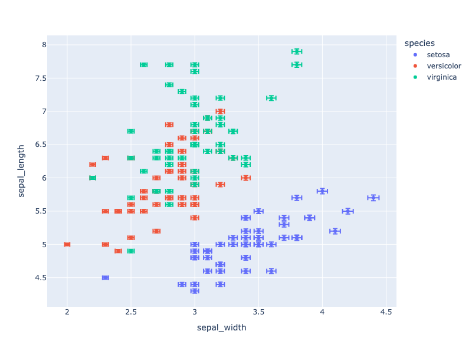

**Interactive Plot:**

<div>                        <script type="text/javascript">window.PlotlyConfig = {MathJaxConfig: 'local'};</script>
        <script charset="utf-8" src="https://cdn.plot.ly/plotly-3.1.0.min.js" integrity="sha256-Ei4740bWZhaUTQuD6q9yQlgVCMPBz6CZWhevDYPv93A=" crossorigin="anonymous"></script>                <div id="plotly-div-3" class="plotly-graph-div" style="height:100%; width:100%;"></div>            <script type="text/javascript">                window.PLOTLYENV=window.PLOTLYENV || {};                                if (document.getElementById("plotly-div-3")) {                    Plotly.newPlot(                        "plotly-div-3",                        [{"error_x":{"array":{"dtype":"f8","bdata":"7FG4HoXroT+4HoXrUbieP\u002fyp8dJNYqA\u002fWDm0yHa+nz8830+Nl26iPyuHFtnO96M\u002fnMQgsHJooT+cxCCwcmihPxgEVg4tsp0\u002fWDm0yHa+nz+MbOf7qfGiP5zEILByaKE\u002fuB6F61G4nj+4HoXrUbieP3sUrkfheqQ\u002fu0kMAiuHpj8rhxbZzvejP+xRuB6F66E\u002f2\u002fl+arx0oz\u002fb+X5qvHSjP5zEILByaKE\u002fjGzn+6nxoj8830+Nl26iP0w3iUFg5aA\u002fnMQgsHJooT+4HoXrUbieP5zEILByaKE\u002f7FG4HoXroT+cxCCwcmihP\u002fyp8dJNYqA\u002fWDm0yHa+nz+cxCCwcmihP8qhRbbz\u002faQ\u002fGy\u002fdJAaBpT9YObTIdr6fP\u002fyp8dJNYqA\u002f7FG4HoXroT9YObTIdr6fP7gehetRuJ4\u002fnMQgsHJooT\u002fsUbgeheuhP1pkO99PjZc\u002f\u002fKnx0k1ioD\u002fsUbgeheuhP9v5fmq8dKM\u002fuB6F61G4nj\u002fb+X5qvHSjP\u002fyp8dJNYqA\u002fjGzn+6nxoj9MN4lBYOWgPw=="}},"error_y":{"array":{"dtype":"f8","bdata":"7FG4HoXroT+4HoXrUbieP\u002fyp8dJNYqA\u002fWDm0yHa+nz8830+Nl26iPyuHFtnO96M\u002fnMQgsHJooT+cxCCwcmihPxgEVg4tsp0\u002fWDm0yHa+nz+MbOf7qfGiP5zEILByaKE\u002fuB6F61G4nj+4HoXrUbieP3sUrkfheqQ\u002fu0kMAiuHpj8rhxbZzvejP+xRuB6F66E\u002f2\u002fl+arx0oz\u002fb+X5qvHSjP5zEILByaKE\u002fjGzn+6nxoj8830+Nl26iP0w3iUFg5aA\u002fnMQgsHJooT+4HoXrUbieP5zEILByaKE\u002f7FG4HoXroT+cxCCwcmihP\u002fyp8dJNYqA\u002fWDm0yHa+nz+cxCCwcmihP8qhRbbz\u002faQ\u002fGy\u002fdJAaBpT9YObTIdr6fP\u002fyp8dJNYqA\u002f7FG4HoXroT9YObTIdr6fP7gehetRuJ4\u002fnMQgsHJooT\u002fsUbgeheuhP1pkO99PjZc\u002f\u002fKnx0k1ioD\u002fsUbgeheuhP9v5fmq8dKM\u002fuB6F61G4nj\u002fb+X5qvHSjP\u002fyp8dJNYqA\u002fjGzn+6nxoj9MN4lBYOWgPw=="}},"hovertemplate":"species=setosa\u003cbr\u003esepal_width=%{x}\u003cbr\u003esepal_length=%{y}\u003cextra\u003e\u003c\u002fextra\u003e","legendgroup":"setosa","marker":{"color":"#636efa","symbol":"circle"},"mode":"markers","name":"setosa","orientation":"v","showlegend":true,"x":{"dtype":"f8","bdata":"AAAAAAAADEAAAAAAAAAIQJqZmZmZmQlAzczMzMzMCEDNzMzMzMwMQDMzMzMzMw9AMzMzMzMzC0AzMzMzMzMLQDMzMzMzMwdAzczMzMzMCECamZmZmZkNQDMzMzMzMwtAAAAAAAAACEAAAAAAAAAIQAAAAAAAABBAmpmZmZmZEUAzMzMzMzMPQAAAAAAAAAxAZmZmZmZmDkBmZmZmZmYOQDMzMzMzMwtAmpmZmZmZDUDNzMzMzMwMQGZmZmZmZgpAMzMzMzMzC0AAAAAAAAAIQDMzMzMzMwtAAAAAAAAADEAzMzMzMzMLQJqZmZmZmQlAzczMzMzMCEAzMzMzMzMLQGZmZmZmZhBAzczMzMzMEEDNzMzMzMwIQJqZmZmZmQlAAAAAAAAADEDNzMzMzMwIQAAAAAAAAAhAMzMzMzMzC0AAAAAAAAAMQGZmZmZmZgJAmpmZmZmZCUAAAAAAAAAMQGZmZmZmZg5AAAAAAAAACEBmZmZmZmYOQJqZmZmZmQlAmpmZmZmZDUBmZmZmZmYKQA=="},"xaxis":"x","y":{"dtype":"f8","bdata":"ZmZmZmZmFECamZmZmZkTQM3MzMzMzBJAZmZmZmZmEkAAAAAAAAAUQJqZmZmZmRVAZmZmZmZmEkAAAAAAAAAUQJqZmZmZmRFAmpmZmZmZE0CamZmZmZkVQDMzMzMzMxNAMzMzMzMzE0AzMzMzMzMRQDMzMzMzMxdAzczMzMzMFkCamZmZmZkVQGZmZmZmZhRAzczMzMzMFkBmZmZmZmYUQJqZmZmZmRVAZmZmZmZmFEBmZmZmZmYSQGZmZmZmZhRAMzMzMzMzE0AAAAAAAAAUQAAAAAAAABRAzczMzMzMFEDNzMzMzMwUQM3MzMzMzBJAMzMzMzMzE0CamZmZmZkVQM3MzMzMzBRAAAAAAAAAFkCamZmZmZkTQAAAAAAAABRAAAAAAAAAFkCamZmZmZkTQJqZmZmZmRFAZmZmZmZmFEAAAAAAAAAUQAAAAAAAABJAmpmZmZmZEUAAAAAAAAAUQGZmZmZmZhRAMzMzMzMzE0BmZmZmZmYUQGZmZmZmZhJAMzMzMzMzFUAAAAAAAAAUQA=="},"yaxis":"y","type":"scatter"},{"error_x":{"array":{"dtype":"f8","bdata":"\u002fKnx0k1ioD\u002f8qfHSTWKgP1g5tMh2vp8\u002fWmQ730+Nlz946SYxCKycP3jpJjEIrJw\u002fTDeJQWDloD\u002f6fmq8dJOYPxgEVg4tsp0\u002f2s73U+Olmz97FK5H4XqUP7gehetRuJ4\u002fu0kMAiuHlj8YBFYOLbKdPxgEVg4tsp0\u002fWDm0yHa+nz+4HoXrUbieP9rO91PjpZs\u002fu0kMAiuHlj+amZmZmZmZP\u002fyp8dJNYqA\u002feOkmMQisnD+amZmZmZmZP3jpJjEIrJw\u002fGARWDi2ynT+4HoXrUbieP3jpJjEIrJw\u002fuB6F61G4nj8YBFYOLbKdPzq0yHa+n5o\u002f+n5qvHSTmD\u002f6fmq8dJOYP9rO91PjpZs\u002f2s73U+Olmz+4HoXrUbieP5zEILByaKE\u002fWDm0yHa+nz9aZDvfT42XP7gehetRuJ4\u002fmpmZmZmZmT86tMh2vp+aP7gehetRuJ4\u002fOrTIdr6fmj9aZDvfT42XP9rO91PjpZs\u002fuB6F61G4nj8YBFYOLbKdPxgEVg4tsp0\u002fmpmZmZmZmT946SYxCKycPw=="}},"error_y":{"array":{"dtype":"f8","bdata":"\u002fKnx0k1ioD\u002f8qfHSTWKgP1g5tMh2vp8\u002fWmQ730+Nlz946SYxCKycP3jpJjEIrJw\u002fTDeJQWDloD\u002f6fmq8dJOYPxgEVg4tsp0\u002f2s73U+Olmz97FK5H4XqUP7gehetRuJ4\u002fu0kMAiuHlj8YBFYOLbKdPxgEVg4tsp0\u002fWDm0yHa+nz+4HoXrUbieP9rO91PjpZs\u002fu0kMAiuHlj+amZmZmZmZP\u002fyp8dJNYqA\u002feOkmMQisnD+amZmZmZmZP3jpJjEIrJw\u002fGARWDi2ynT+4HoXrUbieP3jpJjEIrJw\u002fuB6F61G4nj8YBFYOLbKdPzq0yHa+n5o\u002f+n5qvHSTmD\u002f6fmq8dJOYP9rO91PjpZs\u002f2s73U+Olmz+4HoXrUbieP5zEILByaKE\u002fWDm0yHa+nz9aZDvfT42XP7gehetRuJ4\u002fmpmZmZmZmT86tMh2vp+aP7gehetRuJ4\u002fOrTIdr6fmj9aZDvfT42XP9rO91PjpZs\u002fuB6F61G4nj8YBFYOLbKdPxgEVg4tsp0\u002fmpmZmZmZmT946SYxCKycPw=="}},"hovertemplate":"species=versicolor\u003cbr\u003esepal_width=%{x}\u003cbr\u003esepal_length=%{y}\u003cextra\u003e\u003c\u002fextra\u003e","legendgroup":"versicolor","marker":{"color":"#EF553B","symbol":"circle"},"mode":"markers","name":"versicolor","orientation":"v","showlegend":true,"x":{"dtype":"f8","bdata":"mpmZmZmZCUCamZmZmZkJQM3MzMzMzAhAZmZmZmZmAkBmZmZmZmYGQGZmZmZmZgZAZmZmZmZmCkAzMzMzMzMDQDMzMzMzMwdAmpmZmZmZBUAAAAAAAAAAQAAAAAAAAAhAmpmZmZmZAUAzMzMzMzMHQDMzMzMzMwdAzczMzMzMCEAAAAAAAAAIQJqZmZmZmQVAmpmZmZmZAUAAAAAAAAAEQJqZmZmZmQlAZmZmZmZmBkAAAAAAAAAEQGZmZmZmZgZAMzMzMzMzB0AAAAAAAAAIQGZmZmZmZgZAAAAAAAAACEAzMzMzMzMHQM3MzMzMzARAMzMzMzMzA0AzMzMzMzMDQJqZmZmZmQVAmpmZmZmZBUAAAAAAAAAIQDMzMzMzMwtAzczMzMzMCEBmZmZmZmYCQAAAAAAAAAhAAAAAAAAABEDNzMzMzMwEQAAAAAAAAAhAzczMzMzMBEBmZmZmZmYCQJqZmZmZmQVAAAAAAAAACEAzMzMzMzMHQDMzMzMzMwdAAAAAAAAABEBmZmZmZmYGQA=="},"xaxis":"x","y":{"dtype":"f8","bdata":"AAAAAAAAHECamZmZmZkZQJqZmZmZmRtAAAAAAAAAFkAAAAAAAAAaQM3MzMzMzBZAMzMzMzMzGUCamZmZmZkTQGZmZmZmZhpAzczMzMzMFEAAAAAAAAAUQJqZmZmZmRdAAAAAAAAAGEBmZmZmZmYYQGZmZmZmZhZAzczMzMzMGkBmZmZmZmYWQDMzMzMzMxdAzczMzMzMGEBmZmZmZmYWQJqZmZmZmRdAZmZmZmZmGEAzMzMzMzMZQGZmZmZmZhhAmpmZmZmZGUBmZmZmZmYaQDMzMzMzMxtAzczMzMzMGkAAAAAAAAAYQM3MzMzMzBZAAAAAAAAAFkAAAAAAAAAWQDMzMzMzMxdAAAAAAAAAGECamZmZmZkVQAAAAAAAABhAzczMzMzMGkAzMzMzMzMZQGZmZmZmZhZAAAAAAAAAFkAAAAAAAAAWQGZmZmZmZhhAMzMzMzMzF0AAAAAAAAAUQGZmZmZmZhZAzczMzMzMFkDNzMzMzMwWQM3MzMzMzBhAZmZmZmZmFEDNzMzMzMwWQA=="},"yaxis":"y","type":"scatter"},{"error_x":{"array":{"dtype":"f8","bdata":"TDeJQWDloD\u002fazvdT46WbP7gehetRuJ4\u002fGARWDi2ynT+4HoXrUbieP7gehetRuJ4\u002fmpmZmZmZmT8YBFYOLbKdP5qZmZmZmZk\u002fPN9PjZduoj\u002f8qfHSTWKgP9rO91PjpZs\u002fuB6F61G4nj+amZmZmZmZP3jpJjEIrJw\u002f\u002fKnx0k1ioD+4HoXrUbieP9v5fmq8dKM\u002fOrTIdr6fmj+7SQwCK4eWP\u002fyp8dJNYqA\u002feOkmMQisnD946SYxCKycP9rO91PjpZs\u002fTDeJQWDloD\u002f8qfHSTWKgP3jpJjEIrJw\u002fuB6F61G4nj946SYxCKycP7gehetRuJ4\u002feOkmMQisnD\u002fb+X5qvHSjP3jpJjEIrJw\u002feOkmMQisnD86tMh2vp+aP7gehetRuJ4\u002fnMQgsHJooT9YObTIdr6fP7gehetRuJ4\u002fWDm0yHa+nz9YObTIdr6fP1g5tMh2vp8\u002f2s73U+Olmz\u002f8qfHSTWKgP0w3iUFg5aA\u002fuB6F61G4nj+amZmZmZmZP7gehetRuJ4\u002fnMQgsHJooT+4HoXrUbiePw=="}},"error_y":{"array":{"dtype":"f8","bdata":"TDeJQWDloD\u002fazvdT46WbP7gehetRuJ4\u002fGARWDi2ynT+4HoXrUbieP7gehetRuJ4\u002fmpmZmZmZmT8YBFYOLbKdP5qZmZmZmZk\u002fPN9PjZduoj\u002f8qfHSTWKgP9rO91PjpZs\u002fuB6F61G4nj+amZmZmZmZP3jpJjEIrJw\u002f\u002fKnx0k1ioD+4HoXrUbieP9v5fmq8dKM\u002fOrTIdr6fmj+7SQwCK4eWP\u002fyp8dJNYqA\u002feOkmMQisnD946SYxCKycP9rO91PjpZs\u002fTDeJQWDloD\u002f8qfHSTWKgP3jpJjEIrJw\u002fuB6F61G4nj946SYxCKycP7gehetRuJ4\u002feOkmMQisnD\u002fb+X5qvHSjP3jpJjEIrJw\u002feOkmMQisnD86tMh2vp+aP7gehetRuJ4\u002fnMQgsHJooT9YObTIdr6fP7gehetRuJ4\u002fWDm0yHa+nz9YObTIdr6fP1g5tMh2vp8\u002f2s73U+Olmz\u002f8qfHSTWKgP0w3iUFg5aA\u002fuB6F61G4nj+amZmZmZmZP7gehetRuJ4\u002fnMQgsHJooT+4HoXrUbiePw=="}},"hovertemplate":"species=virginica\u003cbr\u003esepal_width=%{x}\u003cbr\u003esepal_length=%{y}\u003cextra\u003e\u003c\u002fextra\u003e","legendgroup":"virginica","marker":{"color":"#00cc96","symbol":"circle"},"mode":"markers","name":"virginica","orientation":"v","showlegend":true,"x":{"dtype":"f8","bdata":"ZmZmZmZmCkCamZmZmZkFQAAAAAAAAAhAMzMzMzMzB0AAAAAAAAAIQAAAAAAAAAhAAAAAAAAABEAzMzMzMzMHQAAAAAAAAARAzczMzMzMDECamZmZmZkJQJqZmZmZmQVAAAAAAAAACEAAAAAAAAAEQGZmZmZmZgZAmpmZmZmZCUAAAAAAAAAIQGZmZmZmZg5AzczMzMzMBECamZmZmZkBQJqZmZmZmQlAZmZmZmZmBkBmZmZmZmYGQJqZmZmZmQVAZmZmZmZmCkCamZmZmZkJQGZmZmZmZgZAAAAAAAAACEBmZmZmZmYGQAAAAAAAAAhAZmZmZmZmBkBmZmZmZmYOQGZmZmZmZgZAZmZmZmZmBkDNzMzMzMwEQAAAAAAAAAhAMzMzMzMzC0DNzMzMzMwIQAAAAAAAAAhAzczMzMzMCEDNzMzMzMwIQM3MzMzMzAhAmpmZmZmZBUCamZmZmZkJQGZmZmZmZgpAAAAAAAAACEAAAAAAAAAEQAAAAAAAAAhAMzMzMzMzC0AAAAAAAAAIQA=="},"xaxis":"x","y":{"dtype":"f8","bdata":"MzMzMzMzGUAzMzMzMzMXQGZmZmZmZhxAMzMzMzMzGUAAAAAAAAAaQGZmZmZmZh5AmpmZmZmZE0AzMzMzMzMdQM3MzMzMzBpAzczMzMzMHEAAAAAAAAAaQJqZmZmZmRlAMzMzMzMzG0DNzMzMzMwWQDMzMzMzMxdAmpmZmZmZGUAAAAAAAAAaQM3MzMzMzB5AzczMzMzMHkAAAAAAAAAYQJqZmZmZmRtAZmZmZmZmFkDNzMzMzMweQDMzMzMzMxlAzczMzMzMGkDNzMzMzMwcQM3MzMzMzBhAZmZmZmZmGECamZmZmZkZQM3MzMzMzBxAmpmZmZmZHUCamZmZmZkfQJqZmZmZmRlAMzMzMzMzGUBmZmZmZmYYQM3MzMzMzB5AMzMzMzMzGUCamZmZmZkZQAAAAAAAABhAmpmZmZmZG0DNzMzMzMwaQJqZmZmZmRtAMzMzMzMzF0AzMzMzMzMbQM3MzMzMzBpAzczMzMzMGkAzMzMzMzMZQAAAAAAAABpAzczMzMzMGECamZmZmZkXQA=="},"yaxis":"y","type":"scatter"}],                        {"template":{"data":{"histogram2dcontour":[{"type":"histogram2dcontour","colorbar":{"outlinewidth":0,"ticks":""},"colorscale":[[0.0,"#0d0887"],[0.1111111111111111,"#46039f"],[0.2222222222222222,"#7201a8"],[0.3333333333333333,"#9c179e"],[0.4444444444444444,"#bd3786"],[0.5555555555555556,"#d8576b"],[0.6666666666666666,"#ed7953"],[0.7777777777777778,"#fb9f3a"],[0.8888888888888888,"#fdca26"],[1.0,"#f0f921"]]}],"choropleth":[{"type":"choropleth","colorbar":{"outlinewidth":0,"ticks":""}}],"histogram2d":[{"type":"histogram2d","colorbar":{"outlinewidth":0,"ticks":""},"colorscale":[[0.0,"#0d0887"],[0.1111111111111111,"#46039f"],[0.2222222222222222,"#7201a8"],[0.3333333333333333,"#9c179e"],[0.4444444444444444,"#bd3786"],[0.5555555555555556,"#d8576b"],[0.6666666666666666,"#ed7953"],[0.7777777777777778,"#fb9f3a"],[0.8888888888888888,"#fdca26"],[1.0,"#f0f921"]]}],"heatmap":[{"type":"heatmap","colorbar":{"outlinewidth":0,"ticks":""},"colorscale":[[0.0,"#0d0887"],[0.1111111111111111,"#46039f"],[0.2222222222222222,"#7201a8"],[0.3333333333333333,"#9c179e"],[0.4444444444444444,"#bd3786"],[0.5555555555555556,"#d8576b"],[0.6666666666666666,"#ed7953"],[0.7777777777777778,"#fb9f3a"],[0.8888888888888888,"#fdca26"],[1.0,"#f0f921"]]}],"contourcarpet":[{"type":"contourcarpet","colorbar":{"outlinewidth":0,"ticks":""}}],"contour":[{"type":"contour","colorbar":{"outlinewidth":0,"ticks":""},"colorscale":[[0.0,"#0d0887"],[0.1111111111111111,"#46039f"],[0.2222222222222222,"#7201a8"],[0.3333333333333333,"#9c179e"],[0.4444444444444444,"#bd3786"],[0.5555555555555556,"#d8576b"],[0.6666666666666666,"#ed7953"],[0.7777777777777778,"#fb9f3a"],[0.8888888888888888,"#fdca26"],[1.0,"#f0f921"]]}],"surface":[{"type":"surface","colorbar":{"outlinewidth":0,"ticks":""},"colorscale":[[0.0,"#0d0887"],[0.1111111111111111,"#46039f"],[0.2222222222222222,"#7201a8"],[0.3333333333333333,"#9c179e"],[0.4444444444444444,"#bd3786"],[0.5555555555555556,"#d8576b"],[0.6666666666666666,"#ed7953"],[0.7777777777777778,"#fb9f3a"],[0.8888888888888888,"#fdca26"],[1.0,"#f0f921"]]}],"mesh3d":[{"type":"mesh3d","colorbar":{"outlinewidth":0,"ticks":""}}],"scatter":[{"fillpattern":{"fillmode":"overlay","size":10,"solidity":0.2},"type":"scatter"}],"parcoords":[{"type":"parcoords","line":{"colorbar":{"outlinewidth":0,"ticks":""}}}],"scatterpolargl":[{"type":"scatterpolargl","marker":{"colorbar":{"outlinewidth":0,"ticks":""}}}],"bar":[{"error_x":{"color":"#2a3f5f"},"error_y":{"color":"#2a3f5f"},"marker":{"line":{"color":"#E5ECF6","width":0.5},"pattern":{"fillmode":"overlay","size":10,"solidity":0.2}},"type":"bar"}],"scattergeo":[{"type":"scattergeo","marker":{"colorbar":{"outlinewidth":0,"ticks":""}}}],"scatterpolar":[{"type":"scatterpolar","marker":{"colorbar":{"outlinewidth":0,"ticks":""}}}],"histogram":[{"marker":{"pattern":{"fillmode":"overlay","size":10,"solidity":0.2}},"type":"histogram"}],"scattergl":[{"type":"scattergl","marker":{"colorbar":{"outlinewidth":0,"ticks":""}}}],"scatter3d":[{"type":"scatter3d","line":{"colorbar":{"outlinewidth":0,"ticks":""}},"marker":{"colorbar":{"outlinewidth":0,"ticks":""}}}],"scattermap":[{"type":"scattermap","marker":{"colorbar":{"outlinewidth":0,"ticks":""}}}],"scattermapbox":[{"type":"scattermapbox","marker":{"colorbar":{"outlinewidth":0,"ticks":""}}}],"scatterternary":[{"type":"scatterternary","marker":{"colorbar":{"outlinewidth":0,"ticks":""}}}],"scattercarpet":[{"type":"scattercarpet","marker":{"colorbar":{"outlinewidth":0,"ticks":""}}}],"carpet":[{"aaxis":{"endlinecolor":"#2a3f5f","gridcolor":"white","linecolor":"white","minorgridcolor":"white","startlinecolor":"#2a3f5f"},"baxis":{"endlinecolor":"#2a3f5f","gridcolor":"white","linecolor":"white","minorgridcolor":"white","startlinecolor":"#2a3f5f"},"type":"carpet"}],"table":[{"cells":{"fill":{"color":"#EBF0F8"},"line":{"color":"white"}},"header":{"fill":{"color":"#C8D4E3"},"line":{"color":"white"}},"type":"table"}],"barpolar":[{"marker":{"line":{"color":"#E5ECF6","width":0.5},"pattern":{"fillmode":"overlay","size":10,"solidity":0.2}},"type":"barpolar"}],"pie":[{"automargin":true,"type":"pie"}]},"layout":{"autotypenumbers":"strict","colorway":["#636efa","#EF553B","#00cc96","#ab63fa","#FFA15A","#19d3f3","#FF6692","#B6E880","#FF97FF","#FECB52"],"font":{"color":"#2a3f5f"},"hovermode":"closest","hoverlabel":{"align":"left"},"paper_bgcolor":"white","plot_bgcolor":"#E5ECF6","polar":{"bgcolor":"#E5ECF6","angularaxis":{"gridcolor":"white","linecolor":"white","ticks":""},"radialaxis":{"gridcolor":"white","linecolor":"white","ticks":""}},"ternary":{"bgcolor":"#E5ECF6","aaxis":{"gridcolor":"white","linecolor":"white","ticks":""},"baxis":{"gridcolor":"white","linecolor":"white","ticks":""},"caxis":{"gridcolor":"white","linecolor":"white","ticks":""}},"coloraxis":{"colorbar":{"outlinewidth":0,"ticks":""}},"colorscale":{"sequential":[[0.0,"#0d0887"],[0.1111111111111111,"#46039f"],[0.2222222222222222,"#7201a8"],[0.3333333333333333,"#9c179e"],[0.4444444444444444,"#bd3786"],[0.5555555555555556,"#d8576b"],[0.6666666666666666,"#ed7953"],[0.7777777777777778,"#fb9f3a"],[0.8888888888888888,"#fdca26"],[1.0,"#f0f921"]],"sequentialminus":[[0.0,"#0d0887"],[0.1111111111111111,"#46039f"],[0.2222222222222222,"#7201a8"],[0.3333333333333333,"#9c179e"],[0.4444444444444444,"#bd3786"],[0.5555555555555556,"#d8576b"],[0.6666666666666666,"#ed7953"],[0.7777777777777778,"#fb9f3a"],[0.8888888888888888,"#fdca26"],[1.0,"#f0f921"]],"diverging":[[0,"#8e0152"],[0.1,"#c51b7d"],[0.2,"#de77ae"],[0.3,"#f1b6da"],[0.4,"#fde0ef"],[0.5,"#f7f7f7"],[0.6,"#e6f5d0"],[0.7,"#b8e186"],[0.8,"#7fbc41"],[0.9,"#4d9221"],[1,"#276419"]]},"xaxis":{"gridcolor":"white","linecolor":"white","ticks":"","title":{"standoff":15},"zerolinecolor":"white","automargin":true,"zerolinewidth":2},"yaxis":{"gridcolor":"white","linecolor":"white","ticks":"","title":{"standoff":15},"zerolinecolor":"white","automargin":true,"zerolinewidth":2},"scene":{"xaxis":{"backgroundcolor":"#E5ECF6","gridcolor":"white","linecolor":"white","showbackground":true,"ticks":"","zerolinecolor":"white","gridwidth":2},"yaxis":{"backgroundcolor":"#E5ECF6","gridcolor":"white","linecolor":"white","showbackground":true,"ticks":"","zerolinecolor":"white","gridwidth":2},"zaxis":{"backgroundcolor":"#E5ECF6","gridcolor":"white","linecolor":"white","showbackground":true,"ticks":"","zerolinecolor":"white","gridwidth":2}},"shapedefaults":{"line":{"color":"#2a3f5f"}},"annotationdefaults":{"arrowcolor":"#2a3f5f","arrowhead":0,"arrowwidth":1},"geo":{"bgcolor":"white","landcolor":"#E5ECF6","subunitcolor":"white","showland":true,"showlakes":true,"lakecolor":"white"},"title":{"x":0.05},"mapbox":{"style":"light"}}},"xaxis":{"anchor":"y","domain":[0.0,1.0],"title":{"text":"sepal_width"}},"yaxis":{"anchor":"x","domain":[0.0,1.0],"title":{"text":"sepal_length"}},"legend":{"title":{"text":"species"},"tracegroupgap":0},"margin":{"t":60}},                        {"responsive": true}                    )                };            </script>        </div>

**Read more about [bar charts](bar-charts.md).**

```python
import plotly.express as px
df = px.data.tips()
fig = px.bar(df, x="sex", y="total_bill", color="smoker", barmode="group")
fig.show()
```

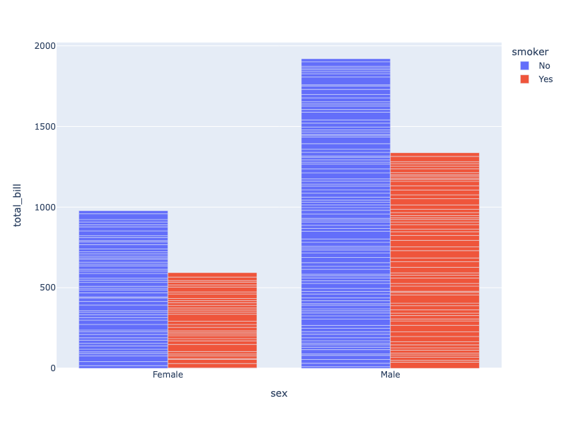

**Interactive Plot:**

<div>                        <script type="text/javascript">window.PlotlyConfig = {MathJaxConfig: 'local'};</script>
        <script charset="utf-8" src="https://cdn.plot.ly/plotly-3.1.0.min.js" integrity="sha256-Ei4740bWZhaUTQuD6q9yQlgVCMPBz6CZWhevDYPv93A=" crossorigin="anonymous"></script>                <div id="plotly-div-4" class="plotly-graph-div" style="height:100%; width:100%;"></div>            <script type="text/javascript">                window.PLOTLYENV=window.PLOTLYENV || {};                                if (document.getElementById("plotly-div-4")) {                    Plotly.newPlot(                        "plotly-div-4",                        [{"alignmentgroup":"True","hovertemplate":"smoker=No\u003cbr\u003esex=%{x}\u003cbr\u003etotal_bill=%{y}\u003cextra\u003e\u003c\u002fextra\u003e","legendgroup":"No","marker":{"color":"#636efa","pattern":{"shape":""}},"name":"No","offsetgroup":"No","orientation":"v","showlegend":true,"textposition":"auto","x":["Female","Male","Male","Male","Female","Male","Male","Male","Male","Male","Male","Female","Male","Male","Female","Male","Female","Male","Female","Male","Male","Female","Female","Male","Male","Male","Male","Male","Male","Female","Male","Male","Female","Female","Male","Male","Male","Female","Male","Male","Male","Male","Male","Male","Male","Male","Male","Male","Male","Male","Male","Female","Female","Male","Male","Male","Female","Male","Male","Male","Female","Male","Male","Female","Female","Male","Male","Male","Male","Male","Female","Male","Female","Male","Male","Male","Male","Male","Female","Male","Female","Male","Male","Female","Male","Male","Female","Female","Male","Female","Female","Female","Male","Female","Male","Male","Female","Female","Male","Female","Female","Male","Male","Female","Female","Female","Female","Female","Female","Female","Female","Female","Male","Male","Female","Female","Female","Female","Female","Male","Male","Male","Male","Male","Male","Male","Female","Male","Female","Female","Male","Male","Male","Female","Male","Male","Male","Male","Male","Male","Male","Female","Male","Male","Male","Male","Male","Female","Male","Male","Female"],"xaxis":"x","y":{"dtype":"f8","bdata":"PQrXo3D9MECuR+F6FK4kQMP1KFyPAjVArkfhehSuN0DXo3A9Cpc4QArXo3A9SjlACtejcD2KIUDhehSuR+E6QBSuR+F6FC5Aj8L1KFyPLUAK16NwPYokQOF6FK5HoUFA16NwPQrXLkCuR+F6FG4yQClcj8L1qC1AFK5H4XqUNUApXI\u002fC9agkQArXo3A9SjBAuB6F61H4MEBmZmZmZqY0QOxRuB6F6zFACtejcD1KNEAK16NwPYovQPYoXI\u002fCtUNAUrgehevRM0CPwvUoXM8xQD0K16NwvSpA4XoUrkdhKUAzMzMzM7M1QGZmZmZmpjNAmpmZmZkZI0CamZmZmVkyQB+F61G4Hi5AcT0K16OwNEBI4XoUrscxQI\u002fC9ShcDzhAj8L1KFxPMECuR+F6FO4wQHE9CtejsDJAhetRuB5FP0AK16NwPQowQPYoXI\u002fCdTFA4XoUrkfhK0Bcj8L1KFwjQGZmZmZmZj5ACtejcD1KMkB7FK5H4To2QDMzMzMzM0BAzczMzMyMPEAK16NwPQoyQBSuR+F6FClAFK5H4XqUJEBI4XoUrmdBQOF6FK5H4SNAj8L1KFyPOUA9CtejcH0zQClcj8L1aDpAw\u002fUoXI8iSEDXo3A9CpcxQBSuR+F6FDRAMzMzMzNzMEB7FK5H4To0QArXo3A9CihAUrgehesRMUD2KFyPwnUtQIXrUbgeBSVAMzMzMzMzO0DD9Shcj8I2QArXo3A9SjFAKVyPwvWoMECkcD0K1yMkQPYoXI\u002fC9S9ACtejcD1qQUCPwvUoXA8qQEjhehSuRzJA9ihcj8K1OEApXI\u002fC9Sg1QD0K16NwfTZAAAAAAADANkDsUbgehesoQOxRuB6F6zRAPQrXo3A9MkAAAAAAAAAsQAAAAAAAAB1AKVyPwvUIQ0AzMzMzM\u002fM3QPYoXI\u002fCtTlAj8L1KFxPMUCuR+F6FO49QM3MzMzMTCVAXI\u002fC9SjcKEAUrkfhehQ4QOF6FK5HYSdA16NwPQrXKkCF61G4HoUsQGZmZmZm5i9A9ihcj8L1KEDNzMzMzMw9QArXo3A9CiFACtejcD0KLUDD9Shcj8ImQFK4HoXr0TZAFK5H4XoUM0CF61G4HkU0QNejcD0KVyZAhetRuB6FKEDD9Shcj0IyQIXrUbgeBSFAKVyPwvWoJEDNzMzMzEwsQFK4HoXrUSpAuB6F61F4MUBmZmZmZiZBQLgehetRmERAzczMzMwMO0CuR+F6FG4wQDMzMzMzsyBApHA9CtejMkA9CtejcL0nQI\u002fC9ShcjyNACtejcD0KHkCkcD0K1yMsQMP1KFyPQipAw\u002fUoXI9CMUDNzMzMzIw4QIXrUbgexTNAmpmZmZnZPUD2KFyPwhVIQAAAAAAAADlASOF6FK7HKkA9CtejcH0wQAAAAAAAgDVAUrgehetRKUD2KFyPwjUwQB+F61G4nitAhetRuB6FOEDD9Shcj8I0QPYoXI\u002fCtT9AcT0K16OwNEA9CtejcD0eQArXo3A9KkhA9ihcj8L1L0AzMzMzM3M0QI\u002fC9ShcjypAuB6F61E4J0AK16NwPYolQKRwPQrXIyRACtejcD3qQUBI4XoUrgc9QFK4HoXr0TFASOF6FK7HMkA="},"yaxis":"y","type":"bar"},{"alignmentgroup":"True","hovertemplate":"smoker=Yes\u003cbr\u003esex=%{x}\u003cbr\u003etotal_bill=%{y}\u003cextra\u003e\u003c\u002fextra\u003e","legendgroup":"Yes","marker":{"color":"#EF553B","pattern":{"shape":""}},"name":"Yes","offsetgroup":"Yes","orientation":"v","showlegend":true,"textposition":"auto","x":["Male","Male","Male","Male","Male","Male","Female","Male","Female","Female","Male","Male","Male","Male","Female","Female","Male","Male","Male","Male","Female","Female","Female","Female","Male","Male","Male","Female","Male","Female","Female","Female","Male","Male","Male","Male","Male","Male","Male","Male","Female","Male","Male","Male","Male","Male","Male","Female","Male","Female","Male","Male","Female","Male","Male","Male","Male","Female","Female","Male","Male","Female","Female","Female","Male","Female","Male","Male","Male","Female","Male","Male","Female","Female","Female","Male","Male","Male","Female","Male","Female","Male","Male","Female","Female","Female","Male","Male","Male","Male","Male","Female","Male"],"xaxis":"x","y":{"dtype":"f8","bdata":"4XoUrkcBQ0B7FK5H4XomQArXo3A9SjRAH4XrUbieK0AK16NwPQomQArXo3A9SjJAj8L1KFyPCECF61G4HgUuQFyPwvUo3DpASOF6FK5HOUDsUbgehesxQHE9CtejcDNA16NwPQpXQEC4HoXrUfg8QAAAAAAAABdAUrgehetRMED2KFyPwhVEQEjhehSuRztAj8L1KFwPKEDD9ShcjwI1QDMzMzMzsyZAw\u002fUoXI\u002fCLkBmZmZmZiZGQOxRuB6FazZAuB6F61G4LkA9CtejcH00QPYoXI\u002fCNTlAH4XrUbieLEAAAAAAAAAwQMP1KFyPgjFArkfhehQuJUDD9Shcj0IlQEjhehSuZ0lAH4XrUbieL0AAAAAAAAAdQJqZmZmZ2T9AUrgehevRMEAzMzMzM3NAQKRwPQrX4zFA9ihcj8L1LEAzMzMzMzMjQHE9CtejUEFAMzMzMzNTQUAUrkfhelQ3QM3MzMzMrEZA7FG4HoUrN0BmZmZmZkZEQGZmZmZm5jRA9ihcj8J1PkBmZmZmZiYyQJqZmZmZGTdA4XoUrkdhL0CPwvUoXM8zQHE9CtejcDxA9ihcj8L1LkAUrkfhepQwQK5H4XoUriRArkfhehSORUAAAAAAAAAqQIXrUbgeBStA9ihcj8K1MkB7FK5H4XopQAAAAAAAACpAZmZmZmZmMEBI4XoUroc0QLgehetReDBA16NwPQqXOkA9CtejcF1DQIXrUbgeRThAhetRuB6FKUCPwvUoXA8+QKRwPQrX4zlACtejcD2KKkDsUbgehSs8QM3MzMzMzClAZmZmZmYmPECuR+F6FC4nQPYoXI\u002fC9R5ApHA9CtcjPkBSuB6F61EoQNejcD0K1ypAKVyPwvUoIUDXo3A9CtcqQIXrUbgeRTBArkfhehQuJEAfhetRuB42QMP1KFyPAjhA4XoUrkdhL0CPwvUoXA8vQDMzMzMzMylACtejcD1qQECuR+F6FC47QOxRuB6FqzZA"},"yaxis":"y","type":"bar"}],                        {"template":{"data":{"histogram2dcontour":[{"type":"histogram2dcontour","colorbar":{"outlinewidth":0,"ticks":""},"colorscale":[[0.0,"#0d0887"],[0.1111111111111111,"#46039f"],[0.2222222222222222,"#7201a8"],[0.3333333333333333,"#9c179e"],[0.4444444444444444,"#bd3786"],[0.5555555555555556,"#d8576b"],[0.6666666666666666,"#ed7953"],[0.7777777777777778,"#fb9f3a"],[0.8888888888888888,"#fdca26"],[1.0,"#f0f921"]]}],"choropleth":[{"type":"choropleth","colorbar":{"outlinewidth":0,"ticks":""}}],"histogram2d":[{"type":"histogram2d","colorbar":{"outlinewidth":0,"ticks":""},"colorscale":[[0.0,"#0d0887"],[0.1111111111111111,"#46039f"],[0.2222222222222222,"#7201a8"],[0.3333333333333333,"#9c179e"],[0.4444444444444444,"#bd3786"],[0.5555555555555556,"#d8576b"],[0.6666666666666666,"#ed7953"],[0.7777777777777778,"#fb9f3a"],[0.8888888888888888,"#fdca26"],[1.0,"#f0f921"]]}],"heatmap":[{"type":"heatmap","colorbar":{"outlinewidth":0,"ticks":""},"colorscale":[[0.0,"#0d0887"],[0.1111111111111111,"#46039f"],[0.2222222222222222,"#7201a8"],[0.3333333333333333,"#9c179e"],[0.4444444444444444,"#bd3786"],[0.5555555555555556,"#d8576b"],[0.6666666666666666,"#ed7953"],[0.7777777777777778,"#fb9f3a"],[0.8888888888888888,"#fdca26"],[1.0,"#f0f921"]]}],"contourcarpet":[{"type":"contourcarpet","colorbar":{"outlinewidth":0,"ticks":""}}],"contour":[{"type":"contour","colorbar":{"outlinewidth":0,"ticks":""},"colorscale":[[0.0,"#0d0887"],[0.1111111111111111,"#46039f"],[0.2222222222222222,"#7201a8"],[0.3333333333333333,"#9c179e"],[0.4444444444444444,"#bd3786"],[0.5555555555555556,"#d8576b"],[0.6666666666666666,"#ed7953"],[0.7777777777777778,"#fb9f3a"],[0.8888888888888888,"#fdca26"],[1.0,"#f0f921"]]}],"surface":[{"type":"surface","colorbar":{"outlinewidth":0,"ticks":""},"colorscale":[[0.0,"#0d0887"],[0.1111111111111111,"#46039f"],[0.2222222222222222,"#7201a8"],[0.3333333333333333,"#9c179e"],[0.4444444444444444,"#bd3786"],[0.5555555555555556,"#d8576b"],[0.6666666666666666,"#ed7953"],[0.7777777777777778,"#fb9f3a"],[0.8888888888888888,"#fdca26"],[1.0,"#f0f921"]]}],"mesh3d":[{"type":"mesh3d","colorbar":{"outlinewidth":0,"ticks":""}}],"scatter":[{"fillpattern":{"fillmode":"overlay","size":10,"solidity":0.2},"type":"scatter"}],"parcoords":[{"type":"parcoords","line":{"colorbar":{"outlinewidth":0,"ticks":""}}}],"scatterpolargl":[{"type":"scatterpolargl","marker":{"colorbar":{"outlinewidth":0,"ticks":""}}}],"bar":[{"error_x":{"color":"#2a3f5f"},"error_y":{"color":"#2a3f5f"},"marker":{"line":{"color":"#E5ECF6","width":0.5},"pattern":{"fillmode":"overlay","size":10,"solidity":0.2}},"type":"bar"}],"scattergeo":[{"type":"scattergeo","marker":{"colorbar":{"outlinewidth":0,"ticks":""}}}],"scatterpolar":[{"type":"scatterpolar","marker":{"colorbar":{"outlinewidth":0,"ticks":""}}}],"histogram":[{"marker":{"pattern":{"fillmode":"overlay","size":10,"solidity":0.2}},"type":"histogram"}],"scattergl":[{"type":"scattergl","marker":{"colorbar":{"outlinewidth":0,"ticks":""}}}],"scatter3d":[{"type":"scatter3d","line":{"colorbar":{"outlinewidth":0,"ticks":""}},"marker":{"colorbar":{"outlinewidth":0,"ticks":""}}}],"scattermap":[{"type":"scattermap","marker":{"colorbar":{"outlinewidth":0,"ticks":""}}}],"scattermapbox":[{"type":"scattermapbox","marker":{"colorbar":{"outlinewidth":0,"ticks":""}}}],"scatterternary":[{"type":"scatterternary","marker":{"colorbar":{"outlinewidth":0,"ticks":""}}}],"scattercarpet":[{"type":"scattercarpet","marker":{"colorbar":{"outlinewidth":0,"ticks":""}}}],"carpet":[{"aaxis":{"endlinecolor":"#2a3f5f","gridcolor":"white","linecolor":"white","minorgridcolor":"white","startlinecolor":"#2a3f5f"},"baxis":{"endlinecolor":"#2a3f5f","gridcolor":"white","linecolor":"white","minorgridcolor":"white","startlinecolor":"#2a3f5f"},"type":"carpet"}],"table":[{"cells":{"fill":{"color":"#EBF0F8"},"line":{"color":"white"}},"header":{"fill":{"color":"#C8D4E3"},"line":{"color":"white"}},"type":"table"}],"barpolar":[{"marker":{"line":{"color":"#E5ECF6","width":0.5},"pattern":{"fillmode":"overlay","size":10,"solidity":0.2}},"type":"barpolar"}],"pie":[{"automargin":true,"type":"pie"}]},"layout":{"autotypenumbers":"strict","colorway":["#636efa","#EF553B","#00cc96","#ab63fa","#FFA15A","#19d3f3","#FF6692","#B6E880","#FF97FF","#FECB52"],"font":{"color":"#2a3f5f"},"hovermode":"closest","hoverlabel":{"align":"left"},"paper_bgcolor":"white","plot_bgcolor":"#E5ECF6","polar":{"bgcolor":"#E5ECF6","angularaxis":{"gridcolor":"white","linecolor":"white","ticks":""},"radialaxis":{"gridcolor":"white","linecolor":"white","ticks":""}},"ternary":{"bgcolor":"#E5ECF6","aaxis":{"gridcolor":"white","linecolor":"white","ticks":""},"baxis":{"gridcolor":"white","linecolor":"white","ticks":""},"caxis":{"gridcolor":"white","linecolor":"white","ticks":""}},"coloraxis":{"colorbar":{"outlinewidth":0,"ticks":""}},"colorscale":{"sequential":[[0.0,"#0d0887"],[0.1111111111111111,"#46039f"],[0.2222222222222222,"#7201a8"],[0.3333333333333333,"#9c179e"],[0.4444444444444444,"#bd3786"],[0.5555555555555556,"#d8576b"],[0.6666666666666666,"#ed7953"],[0.7777777777777778,"#fb9f3a"],[0.8888888888888888,"#fdca26"],[1.0,"#f0f921"]],"sequentialminus":[[0.0,"#0d0887"],[0.1111111111111111,"#46039f"],[0.2222222222222222,"#7201a8"],[0.3333333333333333,"#9c179e"],[0.4444444444444444,"#bd3786"],[0.5555555555555556,"#d8576b"],[0.6666666666666666,"#ed7953"],[0.7777777777777778,"#fb9f3a"],[0.8888888888888888,"#fdca26"],[1.0,"#f0f921"]],"diverging":[[0,"#8e0152"],[0.1,"#c51b7d"],[0.2,"#de77ae"],[0.3,"#f1b6da"],[0.4,"#fde0ef"],[0.5,"#f7f7f7"],[0.6,"#e6f5d0"],[0.7,"#b8e186"],[0.8,"#7fbc41"],[0.9,"#4d9221"],[1,"#276419"]]},"xaxis":{"gridcolor":"white","linecolor":"white","ticks":"","title":{"standoff":15},"zerolinecolor":"white","automargin":true,"zerolinewidth":2},"yaxis":{"gridcolor":"white","linecolor":"white","ticks":"","title":{"standoff":15},"zerolinecolor":"white","automargin":true,"zerolinewidth":2},"scene":{"xaxis":{"backgroundcolor":"#E5ECF6","gridcolor":"white","linecolor":"white","showbackground":true,"ticks":"","zerolinecolor":"white","gridwidth":2},"yaxis":{"backgroundcolor":"#E5ECF6","gridcolor":"white","linecolor":"white","showbackground":true,"ticks":"","zerolinecolor":"white","gridwidth":2},"zaxis":{"backgroundcolor":"#E5ECF6","gridcolor":"white","linecolor":"white","showbackground":true,"ticks":"","zerolinecolor":"white","gridwidth":2}},"shapedefaults":{"line":{"color":"#2a3f5f"}},"annotationdefaults":{"arrowcolor":"#2a3f5f","arrowhead":0,"arrowwidth":1},"geo":{"bgcolor":"white","landcolor":"#E5ECF6","subunitcolor":"white","showland":true,"showlakes":true,"lakecolor":"white"},"title":{"x":0.05},"mapbox":{"style":"light"}}},"xaxis":{"anchor":"y","domain":[0.0,1.0],"title":{"text":"sex"}},"yaxis":{"anchor":"x","domain":[0.0,1.0],"title":{"text":"total_bill"}},"legend":{"title":{"text":"smoker"},"tracegroupgap":0},"margin":{"t":60},"barmode":"group"},                        {"responsive": true}                    )                };            </script>        </div>

```python
import plotly.express as px
df = px.data.medals_long()

fig = px.bar(df, x="medal", y="count", color="nation",
             pattern_shape="nation", pattern_shape_sequence=[".", "x", "+"])
fig.show()
```


**Interactive Plot:**

<div>                        <script type="text/javascript">window.PlotlyConfig = {MathJaxConfig: 'local'};</script>
        <script charset="utf-8" src="https://cdn.plot.ly/plotly-3.1.0.min.js" integrity="sha256-Ei4740bWZhaUTQuD6q9yQlgVCMPBz6CZWhevDYPv93A=" crossorigin="anonymous"></script>                <div id="plotly-div-5" class="plotly-graph-div" style="height:100%; width:100%;"></div>            <script type="text/javascript">                window.PLOTLYENV=window.PLOTLYENV || {};                                if (document.getElementById("plotly-div-5")) {                    Plotly.newPlot(                        "plotly-div-5",                        [{"hovertemplate":"nation=South Korea\u003cbr\u003emedal=%{x}\u003cbr\u003ecount=%{y}\u003cextra\u003e\u003c\u002fextra\u003e","legendgroup":"South Korea","marker":{"color":"#636efa","pattern":{"shape":"."}},"name":"South Korea","orientation":"v","showlegend":true,"textposition":"auto","x":["gold","silver","bronze"],"xaxis":"x","y":{"dtype":"i1","bdata":"GA0L"},"yaxis":"y","type":"bar"},{"hovertemplate":"nation=China\u003cbr\u003emedal=%{x}\u003cbr\u003ecount=%{y}\u003cextra\u003e\u003c\u002fextra\u003e","legendgroup":"China","marker":{"color":"#EF553B","pattern":{"shape":"x"}},"name":"China","orientation":"v","showlegend":true,"textposition":"auto","x":["gold","silver","bronze"],"xaxis":"x","y":{"dtype":"i1","bdata":"Cg8I"},"yaxis":"y","type":"bar"},{"hovertemplate":"nation=Canada\u003cbr\u003emedal=%{x}\u003cbr\u003ecount=%{y}\u003cextra\u003e\u003c\u002fextra\u003e","legendgroup":"Canada","marker":{"color":"#00cc96","pattern":{"shape":"+"}},"name":"Canada","orientation":"v","showlegend":true,"textposition":"auto","x":["gold","silver","bronze"],"xaxis":"x","y":{"dtype":"i1","bdata":"CQwM"},"yaxis":"y","type":"bar"}],                        {"template":{"data":{"histogram2dcontour":[{"type":"histogram2dcontour","colorbar":{"outlinewidth":0,"ticks":""},"colorscale":[[0.0,"#0d0887"],[0.1111111111111111,"#46039f"],[0.2222222222222222,"#7201a8"],[0.3333333333333333,"#9c179e"],[0.4444444444444444,"#bd3786"],[0.5555555555555556,"#d8576b"],[0.6666666666666666,"#ed7953"],[0.7777777777777778,"#fb9f3a"],[0.8888888888888888,"#fdca26"],[1.0,"#f0f921"]]}],"choropleth":[{"type":"choropleth","colorbar":{"outlinewidth":0,"ticks":""}}],"histogram2d":[{"type":"histogram2d","colorbar":{"outlinewidth":0,"ticks":""},"colorscale":[[0.0,"#0d0887"],[0.1111111111111111,"#46039f"],[0.2222222222222222,"#7201a8"],[0.3333333333333333,"#9c179e"],[0.4444444444444444,"#bd3786"],[0.5555555555555556,"#d8576b"],[0.6666666666666666,"#ed7953"],[0.7777777777777778,"#fb9f3a"],[0.8888888888888888,"#fdca26"],[1.0,"#f0f921"]]}],"heatmap":[{"type":"heatmap","colorbar":{"outlinewidth":0,"ticks":""},"colorscale":[[0.0,"#0d0887"],[0.1111111111111111,"#46039f"],[0.2222222222222222,"#7201a8"],[0.3333333333333333,"#9c179e"],[0.4444444444444444,"#bd3786"],[0.5555555555555556,"#d8576b"],[0.6666666666666666,"#ed7953"],[0.7777777777777778,"#fb9f3a"],[0.8888888888888888,"#fdca26"],[1.0,"#f0f921"]]}],"contourcarpet":[{"type":"contourcarpet","colorbar":{"outlinewidth":0,"ticks":""}}],"contour":[{"type":"contour","colorbar":{"outlinewidth":0,"ticks":""},"colorscale":[[0.0,"#0d0887"],[0.1111111111111111,"#46039f"],[0.2222222222222222,"#7201a8"],[0.3333333333333333,"#9c179e"],[0.4444444444444444,"#bd3786"],[0.5555555555555556,"#d8576b"],[0.6666666666666666,"#ed7953"],[0.7777777777777778,"#fb9f3a"],[0.8888888888888888,"#fdca26"],[1.0,"#f0f921"]]}],"surface":[{"type":"surface","colorbar":{"outlinewidth":0,"ticks":""},"colorscale":[[0.0,"#0d0887"],[0.1111111111111111,"#46039f"],[0.2222222222222222,"#7201a8"],[0.3333333333333333,"#9c179e"],[0.4444444444444444,"#bd3786"],[0.5555555555555556,"#d8576b"],[0.6666666666666666,"#ed7953"],[0.7777777777777778,"#fb9f3a"],[0.8888888888888888,"#fdca26"],[1.0,"#f0f921"]]}],"mesh3d":[{"type":"mesh3d","colorbar":{"outlinewidth":0,"ticks":""}}],"scatter":[{"fillpattern":{"fillmode":"overlay","size":10,"solidity":0.2},"type":"scatter"}],"parcoords":[{"type":"parcoords","line":{"colorbar":{"outlinewidth":0,"ticks":""}}}],"scatterpolargl":[{"type":"scatterpolargl","marker":{"colorbar":{"outlinewidth":0,"ticks":""}}}],"bar":[{"error_x":{"color":"#2a3f5f"},"error_y":{"color":"#2a3f5f"},"marker":{"line":{"color":"#E5ECF6","width":0.5},"pattern":{"fillmode":"overlay","size":10,"solidity":0.2}},"type":"bar"}],"scattergeo":[{"type":"scattergeo","marker":{"colorbar":{"outlinewidth":0,"ticks":""}}}],"scatterpolar":[{"type":"scatterpolar","marker":{"colorbar":{"outlinewidth":0,"ticks":""}}}],"histogram":[{"marker":{"pattern":{"fillmode":"overlay","size":10,"solidity":0.2}},"type":"histogram"}],"scattergl":[{"type":"scattergl","marker":{"colorbar":{"outlinewidth":0,"ticks":""}}}],"scatter3d":[{"type":"scatter3d","line":{"colorbar":{"outlinewidth":0,"ticks":""}},"marker":{"colorbar":{"outlinewidth":0,"ticks":""}}}],"scattermap":[{"type":"scattermap","marker":{"colorbar":{"outlinewidth":0,"ticks":""}}}],"scattermapbox":[{"type":"scattermapbox","marker":{"colorbar":{"outlinewidth":0,"ticks":""}}}],"scatterternary":[{"type":"scatterternary","marker":{"colorbar":{"outlinewidth":0,"ticks":""}}}],"scattercarpet":[{"type":"scattercarpet","marker":{"colorbar":{"outlinewidth":0,"ticks":""}}}],"carpet":[{"aaxis":{"endlinecolor":"#2a3f5f","gridcolor":"white","linecolor":"white","minorgridcolor":"white","startlinecolor":"#2a3f5f"},"baxis":{"endlinecolor":"#2a3f5f","gridcolor":"white","linecolor":"white","minorgridcolor":"white","startlinecolor":"#2a3f5f"},"type":"carpet"}],"table":[{"cells":{"fill":{"color":"#EBF0F8"},"line":{"color":"white"}},"header":{"fill":{"color":"#C8D4E3"},"line":{"color":"white"}},"type":"table"}],"barpolar":[{"marker":{"line":{"color":"#E5ECF6","width":0.5},"pattern":{"fillmode":"overlay","size":10,"solidity":0.2}},"type":"barpolar"}],"pie":[{"automargin":true,"type":"pie"}]},"layout":{"autotypenumbers":"strict","colorway":["#636efa","#EF553B","#00cc96","#ab63fa","#FFA15A","#19d3f3","#FF6692","#B6E880","#FF97FF","#FECB52"],"font":{"color":"#2a3f5f"},"hovermode":"closest","hoverlabel":{"align":"left"},"paper_bgcolor":"white","plot_bgcolor":"#E5ECF6","polar":{"bgcolor":"#E5ECF6","angularaxis":{"gridcolor":"white","linecolor":"white","ticks":""},"radialaxis":{"gridcolor":"white","linecolor":"white","ticks":""}},"ternary":{"bgcolor":"#E5ECF6","aaxis":{"gridcolor":"white","linecolor":"white","ticks":""},"baxis":{"gridcolor":"white","linecolor":"white","ticks":""},"caxis":{"gridcolor":"white","linecolor":"white","ticks":""}},"coloraxis":{"colorbar":{"outlinewidth":0,"ticks":""}},"colorscale":{"sequential":[[0.0,"#0d0887"],[0.1111111111111111,"#46039f"],[0.2222222222222222,"#7201a8"],[0.3333333333333333,"#9c179e"],[0.4444444444444444,"#bd3786"],[0.5555555555555556,"#d8576b"],[0.6666666666666666,"#ed7953"],[0.7777777777777778,"#fb9f3a"],[0.8888888888888888,"#fdca26"],[1.0,"#f0f921"]],"sequentialminus":[[0.0,"#0d0887"],[0.1111111111111111,"#46039f"],[0.2222222222222222,"#7201a8"],[0.3333333333333333,"#9c179e"],[0.4444444444444444,"#bd3786"],[0.5555555555555556,"#d8576b"],[0.6666666666666666,"#ed7953"],[0.7777777777777778,"#fb9f3a"],[0.8888888888888888,"#fdca26"],[1.0,"#f0f921"]],"diverging":[[0,"#8e0152"],[0.1,"#c51b7d"],[0.2,"#de77ae"],[0.3,"#f1b6da"],[0.4,"#fde0ef"],[0.5,"#f7f7f7"],[0.6,"#e6f5d0"],[0.7,"#b8e186"],[0.8,"#7fbc41"],[0.9,"#4d9221"],[1,"#276419"]]},"xaxis":{"gridcolor":"white","linecolor":"white","ticks":"","title":{"standoff":15},"zerolinecolor":"white","automargin":true,"zerolinewidth":2},"yaxis":{"gridcolor":"white","linecolor":"white","ticks":"","title":{"standoff":15},"zerolinecolor":"white","automargin":true,"zerolinewidth":2},"scene":{"xaxis":{"backgroundcolor":"#E5ECF6","gridcolor":"white","linecolor":"white","showbackground":true,"ticks":"","zerolinecolor":"white","gridwidth":2},"yaxis":{"backgroundcolor":"#E5ECF6","gridcolor":"white","linecolor":"white","showbackground":true,"ticks":"","zerolinecolor":"white","gridwidth":2},"zaxis":{"backgroundcolor":"#E5ECF6","gridcolor":"white","linecolor":"white","showbackground":true,"ticks":"","zerolinecolor":"white","gridwidth":2}},"shapedefaults":{"line":{"color":"#2a3f5f"}},"annotationdefaults":{"arrowcolor":"#2a3f5f","arrowhead":0,"arrowwidth":1},"geo":{"bgcolor":"white","landcolor":"#E5ECF6","subunitcolor":"white","showland":true,"showlakes":true,"lakecolor":"white"},"title":{"x":0.05},"mapbox":{"style":"light"}}},"xaxis":{"anchor":"y","domain":[0.0,1.0],"title":{"text":"medal"}},"yaxis":{"anchor":"x","domain":[0.0,1.0],"title":{"text":"count"}},"legend":{"title":{"text":"nation"},"tracegroupgap":0},"margin":{"t":60},"barmode":"relative"},                        {"responsive": true}                    )                };            </script>        </div>

**Read more about [facet plots](facet-plots.md).**

```python
import plotly.express as px
df = px.data.tips()
fig = px.bar(df, x="sex", y="total_bill", color="smoker", barmode="group", facet_row="time", facet_col="day",
       category_orders={"day": ["Thur", "Fri", "Sat", "Sun"], "time": ["Lunch", "Dinner"]})
fig.show()
```

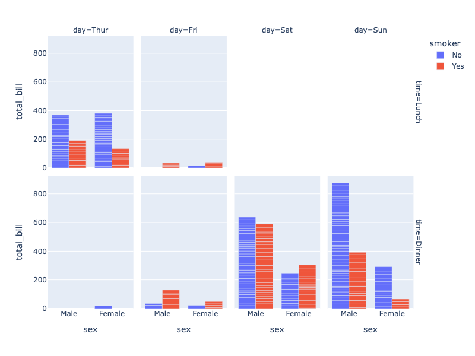

**Interactive Plot:**

<div>                        <script type="text/javascript">window.PlotlyConfig = {MathJaxConfig: 'local'};</script>
        <script charset="utf-8" src="https://cdn.plot.ly/plotly-3.1.0.min.js" integrity="sha256-Ei4740bWZhaUTQuD6q9yQlgVCMPBz6CZWhevDYPv93A=" crossorigin="anonymous"></script>                <div id="plotly-div-6" class="plotly-graph-div" style="height:100%; width:100%;"></div>            <script type="text/javascript">                window.PLOTLYENV=window.PLOTLYENV || {};                                if (document.getElementById("plotly-div-6")) {                    Plotly.newPlot(                        "plotly-div-6",                        [{"alignmentgroup":"True","hovertemplate":"smoker=No\u003cbr\u003etime=Lunch\u003cbr\u003eday=Thur\u003cbr\u003esex=%{x}\u003cbr\u003etotal_bill=%{y}\u003cextra\u003e\u003c\u002fextra\u003e","legendgroup":"No","marker":{"color":"#636efa","pattern":{"shape":""}},"name":"No","offsetgroup":"No","orientation":"v","showlegend":true,"textposition":"auto","x":["Male","Male","Male","Male","Female","Male","Female","Male","Male","Male","Male","Female","Female","Female","Male","Female","Male","Male","Female","Female","Male","Female","Female","Male","Male","Female","Female","Female","Female","Female","Female","Female","Female","Female","Male","Male","Female","Female","Female","Female","Female","Male","Male","Male"],"xaxis":"x5","y":{"dtype":"f8","bdata":"MzMzMzMzO0DD9Shcj8I2QArXo3A9SjFAKVyPwvWoMECkcD0K1yMkQPYoXI\u002fC9S9ACtejcD1qQUCPwvUoXA8qQEjhehSuRzJA9ihcj8K1OEApXI\u002fC9Sg1QM3MzMzMTCVAXI\u002fC9SjcKEAUrkfhehQ4QOF6FK5HYSdA16NwPQrXKkCF61G4HoUsQGZmZmZm5i9A9ihcj8L1KEDNzMzMzMw9QArXo3A9CiFACtejcD0KLUDD9Shcj8ImQFK4HoXr0TZAFK5H4XoUM0CF61G4HkU0QNejcD0KVyZAhetRuB6FKEDD9Shcj0IyQIXrUbgeBSFAKVyPwvWoJEDNzMzMzEwsQFK4HoXrUSpAuB6F61F4MUBmZmZmZiZBQLgehetRmERAzczMzMwMO0CuR+F6FG4wQDMzMzMzsyBApHA9CtejMkA9CtejcL0nQI\u002fC9ShcjyNACtejcD0KHkA9CtejcD0eQA=="},"yaxis":"y5","type":"bar"},{"alignmentgroup":"True","hovertemplate":"smoker=Yes\u003cbr\u003etime=Lunch\u003cbr\u003eday=Thur\u003cbr\u003esex=%{x}\u003cbr\u003etotal_bill=%{y}\u003cextra\u003e\u003c\u002fextra\u003e","legendgroup":"Yes","marker":{"color":"#EF553B","pattern":{"shape":""}},"name":"Yes","offsetgroup":"Yes","orientation":"v","showlegend":true,"textposition":"auto","x":["Male","Male","Male","Female","Male","Male","Male","Male","Female","Female","Male","Male","Female","Female","Female","Male","Female"],"xaxis":"x5","y":{"dtype":"f8","bdata":"cT0K16NwM0DXo3A9CldAQAAAAAAAADBAj8L1KFzPM0BxPQrXo3A8QPYoXI\u002fC9S5AFK5H4XqUMECuR+F6FK4kQK5H4XoUjkVAAAAAAAAAKkCF61G4HgUrQPYoXI\u002fCtTJAexSuR+F6KUAAAAAAAAAqQGZmZmZmZjBASOF6FK6HNEC4HoXrUXgwQA=="},"yaxis":"y5","type":"bar"},{"alignmentgroup":"True","hovertemplate":"smoker=No\u003cbr\u003etime=Dinner\u003cbr\u003eday=Thur\u003cbr\u003esex=%{x}\u003cbr\u003etotal_bill=%{y}\u003cextra\u003e\u003c\u002fextra\u003e","legendgroup":"No","marker":{"color":"#636efa","pattern":{"shape":""}},"name":"No","offsetgroup":"No","orientation":"v","showlegend":false,"textposition":"auto","x":["Female"],"xaxis":"x","y":{"dtype":"f8","bdata":"SOF6FK7HMkA="},"yaxis":"y","type":"bar"},{"alignmentgroup":"True","hovertemplate":"smoker=No\u003cbr\u003etime=Lunch\u003cbr\u003eday=Fri\u003cbr\u003esex=%{x}\u003cbr\u003etotal_bill=%{y}\u003cextra\u003e\u003c\u002fextra\u003e","legendgroup":"No","marker":{"color":"#636efa","pattern":{"shape":""}},"name":"No","offsetgroup":"No","orientation":"v","showlegend":false,"textposition":"auto","x":["Female"],"xaxis":"x6","y":{"dtype":"f8","bdata":"9ihcj8L1L0A="},"yaxis":"y6","type":"bar"},{"alignmentgroup":"True","hovertemplate":"smoker=Yes\u003cbr\u003etime=Lunch\u003cbr\u003eday=Fri\u003cbr\u003esex=%{x}\u003cbr\u003etotal_bill=%{y}\u003cextra\u003e\u003c\u002fextra\u003e","legendgroup":"Yes","marker":{"color":"#EF553B","pattern":{"shape":""}},"name":"Yes","offsetgroup":"Yes","orientation":"v","showlegend":false,"textposition":"auto","x":["Male","Female","Male","Male","Female","Female"],"xaxis":"x6","y":{"dtype":"f8","bdata":"UrgehetRKEDXo3A9CtcqQClcj8L1KCFA16NwPQrXKkCF61G4HkUwQK5H4XoULiRA"},"yaxis":"y6","type":"bar"},{"alignmentgroup":"True","hovertemplate":"smoker=No\u003cbr\u003etime=Dinner\u003cbr\u003eday=Fri\u003cbr\u003esex=%{x}\u003cbr\u003etotal_bill=%{y}\u003cextra\u003e\u003c\u002fextra\u003e","legendgroup":"No","marker":{"color":"#636efa","pattern":{"shape":""}},"name":"No","offsetgroup":"No","orientation":"v","showlegend":false,"textposition":"auto","x":["Male","Female","Male"],"xaxis":"x2","y":{"dtype":"f8","bdata":"PQrXo3B9NkAAAAAAAMA2QOxRuB6F6yhA"},"yaxis":"y2","type":"bar"},{"alignmentgroup":"True","hovertemplate":"smoker=Yes\u003cbr\u003etime=Dinner\u003cbr\u003eday=Fri\u003cbr\u003esex=%{x}\u003cbr\u003etotal_bill=%{y}\u003cextra\u003e\u003c\u002fextra\u003e","legendgroup":"Yes","marker":{"color":"#EF553B","pattern":{"shape":""}},"name":"Yes","offsetgroup":"Yes","orientation":"v","showlegend":false,"textposition":"auto","x":["Male","Female","Female","Male","Male","Male","Male","Female","Female"],"xaxis":"x2","y":{"dtype":"f8","bdata":"uB6F61H4PEAAAAAAAAAXQFK4HoXrUTBA9ihcj8IVREBI4XoUrkc7QI\u002fC9ShcDyhAw\u002fUoXI8CNUAzMzMzM7MmQMP1KFyPwi5A"},"yaxis":"y2","type":"bar"},{"alignmentgroup":"True","hovertemplate":"smoker=No\u003cbr\u003etime=Dinner\u003cbr\u003eday=Sat\u003cbr\u003esex=%{x}\u003cbr\u003etotal_bill=%{y}\u003cextra\u003e\u003c\u002fextra\u003e","legendgroup":"No","marker":{"color":"#636efa","pattern":{"shape":""}},"name":"No","offsetgroup":"No","orientation":"v","showlegend":false,"textposition":"auto","x":["Male","Male","Female","Female","Male","Male","Male","Male","Male","Male","Female","Male","Male","Female","Female","Male","Male","Male","Female","Male","Male","Male","Female","Male","Male","Male","Female","Male","Male","Female","Female","Male","Female","Male","Male","Female","Male","Male","Male","Male","Male","Male","Female","Male","Male"],"xaxis":"x3","y":{"dtype":"f8","bdata":"ZmZmZmamNEDsUbgehesxQArXo3A9SjRACtejcD2KL0D2KFyPwrVDQFK4HoXr0TNAj8L1KFzPMUA9CtejcL0qQOF6FK5HYSlAMzMzMzOzNUBmZmZmZqYzQJqZmZmZGSNAmpmZmZlZMkAfhetRuB4uQHE9CtejsDRASOF6FK7HMUCPwvUoXA84QI\u002fC9ShcTzBArkfhehTuMEBxPQrXo7AyQIXrUbgeRT9ACtejcD0KMEApXI\u002fC9Wg6QMP1KFyPIkhA16NwPQqXMUAUrkfhehQ0QDMzMzMzczBAexSuR+E6NEAK16NwPQooQFK4HoXrETFA9ihcj8J1LUCF61G4HgUlQOxRuB6F6zRAPQrXo3A9MkAAAAAAAAAsQAAAAAAAAB1ACtejcD0qSEAzMzMzM3M0QI\u002fC9ShcjypAuB6F61E4J0AK16NwPYolQKRwPQrXIyRACtejcD3qQUBI4XoUrgc9QFK4HoXr0TFA"},"yaxis":"y3","type":"bar"},{"alignmentgroup":"True","hovertemplate":"smoker=Yes\u003cbr\u003etime=Dinner\u003cbr\u003eday=Sat\u003cbr\u003esex=%{x}\u003cbr\u003etotal_bill=%{y}\u003cextra\u003e\u003c\u002fextra\u003e","legendgroup":"Yes","marker":{"color":"#EF553B","pattern":{"shape":""}},"name":"Yes","offsetgroup":"Yes","orientation":"v","showlegend":false,"textposition":"auto","x":["Male","Male","Male","Male","Male","Male","Female","Male","Female","Female","Male","Female","Female","Male","Male","Male","Female","Female","Female","Male","Male","Male","Male","Male","Female","Male","Male","Female","Female","Female","Male","Male","Male","Female","Female","Male","Male","Male","Male","Male","Female","Male"],"xaxis":"x3","y":{"dtype":"f8","bdata":"4XoUrkcBQ0B7FK5H4XomQArXo3A9SjRAH4XrUbieK0AK16NwPQomQArXo3A9SjJAj8L1KFyPCECF61G4HgUuQFyPwvUo3DpASOF6FK5HOUDsUbgehesxQGZmZmZmJkZA7FG4HoVrNkC4HoXrUbguQD0K16NwfTRA9ihcj8I1OUAfhetRuJ4sQK5H4XoULiVAw\u002fUoXI9CJUBI4XoUrmdJQB+F61G4ni9A16NwPQqXOkA9CtejcF1DQIXrUbgeRThAhetRuB6FKUCPwvUoXA8+QKRwPQrX4zlACtejcD2KKkDsUbgehSs8QM3MzMzMzClAZmZmZmYmPECuR+F6FC4nQPYoXI\u002fC9R5ApHA9CtcjPkAfhetRuB42QMP1KFyPAjhA4XoUrkdhL0CPwvUoXA8vQDMzMzMzMylACtejcD1qQECuR+F6FC47QOxRuB6FqzZA"},"yaxis":"y3","type":"bar"},{"alignmentgroup":"True","hovertemplate":"smoker=No\u003cbr\u003etime=Dinner\u003cbr\u003eday=Sun\u003cbr\u003esex=%{x}\u003cbr\u003etotal_bill=%{y}\u003cextra\u003e\u003c\u002fextra\u003e","legendgroup":"No","marker":{"color":"#636efa","pattern":{"shape":""}},"name":"No","offsetgroup":"No","orientation":"v","showlegend":false,"textposition":"auto","x":["Female","Male","Male","Male","Female","Male","Male","Male","Male","Male","Male","Female","Male","Male","Female","Male","Female","Male","Female","Male","Male","Male","Male","Male","Male","Male","Male","Male","Male","Female","Female","Male","Male","Male","Male","Male","Female","Female","Male","Male","Male","Male","Male","Male","Female","Male","Female","Female","Male","Male","Male","Female","Male","Male","Male","Male","Male"],"xaxis":"x4","y":{"dtype":"f8","bdata":"PQrXo3D9MECuR+F6FK4kQMP1KFyPAjVArkfhehSuN0DXo3A9Cpc4QArXo3A9SjlACtejcD2KIUDhehSuR+E6QBSuR+F6FC5Aj8L1KFyPLUAK16NwPYokQOF6FK5HoUFA16NwPQrXLkCuR+F6FG4yQClcj8L1qC1AFK5H4XqUNUApXI\u002fC9agkQArXo3A9SjBAuB6F61H4MED2KFyPwnUxQOF6FK5H4StAXI\u002fC9ShcI0BmZmZmZmY+QArXo3A9SjJAexSuR+E6NkAzMzMzMzNAQM3MzMzMjDxACtejcD0KMkAUrkfhehQpQBSuR+F6lCRASOF6FK5nQUDhehSuR+EjQI\u002fC9ShcjzlAPQrXo3B9M0ApXI\u002fC9QhDQDMzMzMz8zdA9ihcj8K1OUCPwvUoXE8xQK5H4XoU7j1ApHA9CtcjLEDD9Shcj0IqQMP1KFyPQjFAzczMzMyMOECF61G4HsUzQJqZmZmZ2T1A9ihcj8IVSEAAAAAAAAA5QEjhehSuxypAPQrXo3B9MEAAAAAAAIA1QFK4HoXrUSlA9ihcj8I1MEAfhetRuJ4rQIXrUbgehThAw\u002fUoXI\u002fCNED2KFyPwrU\u002fQHE9CtejsDRA"},"yaxis":"y4","type":"bar"},{"alignmentgroup":"True","hovertemplate":"smoker=Yes\u003cbr\u003etime=Dinner\u003cbr\u003eday=Sun\u003cbr\u003esex=%{x}\u003cbr\u003etotal_bill=%{y}\u003cextra\u003e\u003c\u002fextra\u003e","legendgroup":"Yes","marker":{"color":"#EF553B","pattern":{"shape":""}},"name":"Yes","offsetgroup":"Yes","orientation":"v","showlegend":false,"textposition":"auto","x":["Female","Male","Male","Male","Male","Male","Male","Female","Male","Male","Male","Male","Male","Male","Female","Male","Female","Male","Male"],"xaxis":"x4","y":{"dtype":"f8","bdata":"w\u002fUoXI+CMUAAAAAAAAAdQJqZmZmZ2T9AUrgehevRMEAzMzMzM3NAQKRwPQrX4zFA9ihcj8L1LEAzMzMzMzMjQHE9CtejUEFAMzMzMzNTQUAUrkfhelQ3QM3MzMzMrEZA7FG4HoUrN0BmZmZmZkZEQGZmZmZm5jRA9ihcj8J1PkBmZmZmZiYyQJqZmZmZGTdA4XoUrkdhL0A="},"yaxis":"y4","type":"bar"}],                        {"template":{"data":{"histogram2dcontour":[{"type":"histogram2dcontour","colorbar":{"outlinewidth":0,"ticks":""},"colorscale":[[0.0,"#0d0887"],[0.1111111111111111,"#46039f"],[0.2222222222222222,"#7201a8"],[0.3333333333333333,"#9c179e"],[0.4444444444444444,"#bd3786"],[0.5555555555555556,"#d8576b"],[0.6666666666666666,"#ed7953"],[0.7777777777777778,"#fb9f3a"],[0.8888888888888888,"#fdca26"],[1.0,"#f0f921"]]}],"choropleth":[{"type":"choropleth","colorbar":{"outlinewidth":0,"ticks":""}}],"histogram2d":[{"type":"histogram2d","colorbar":{"outlinewidth":0,"ticks":""},"colorscale":[[0.0,"#0d0887"],[0.1111111111111111,"#46039f"],[0.2222222222222222,"#7201a8"],[0.3333333333333333,"#9c179e"],[0.4444444444444444,"#bd3786"],[0.5555555555555556,"#d8576b"],[0.6666666666666666,"#ed7953"],[0.7777777777777778,"#fb9f3a"],[0.8888888888888888,"#fdca26"],[1.0,"#f0f921"]]}],"heatmap":[{"type":"heatmap","colorbar":{"outlinewidth":0,"ticks":""},"colorscale":[[0.0,"#0d0887"],[0.1111111111111111,"#46039f"],[0.2222222222222222,"#7201a8"],[0.3333333333333333,"#9c179e"],[0.4444444444444444,"#bd3786"],[0.5555555555555556,"#d8576b"],[0.6666666666666666,"#ed7953"],[0.7777777777777778,"#fb9f3a"],[0.8888888888888888,"#fdca26"],[1.0,"#f0f921"]]}],"contourcarpet":[{"type":"contourcarpet","colorbar":{"outlinewidth":0,"ticks":""}}],"contour":[{"type":"contour","colorbar":{"outlinewidth":0,"ticks":""},"colorscale":[[0.0,"#0d0887"],[0.1111111111111111,"#46039f"],[0.2222222222222222,"#7201a8"],[0.3333333333333333,"#9c179e"],[0.4444444444444444,"#bd3786"],[0.5555555555555556,"#d8576b"],[0.6666666666666666,"#ed7953"],[0.7777777777777778,"#fb9f3a"],[0.8888888888888888,"#fdca26"],[1.0,"#f0f921"]]}],"surface":[{"type":"surface","colorbar":{"outlinewidth":0,"ticks":""},"colorscale":[[0.0,"#0d0887"],[0.1111111111111111,"#46039f"],[0.2222222222222222,"#7201a8"],[0.3333333333333333,"#9c179e"],[0.4444444444444444,"#bd3786"],[0.5555555555555556,"#d8576b"],[0.6666666666666666,"#ed7953"],[0.7777777777777778,"#fb9f3a"],[0.8888888888888888,"#fdca26"],[1.0,"#f0f921"]]}],"mesh3d":[{"type":"mesh3d","colorbar":{"outlinewidth":0,"ticks":""}}],"scatter":[{"fillpattern":{"fillmode":"overlay","size":10,"solidity":0.2},"type":"scatter"}],"parcoords":[{"type":"parcoords","line":{"colorbar":{"outlinewidth":0,"ticks":""}}}],"scatterpolargl":[{"type":"scatterpolargl","marker":{"colorbar":{"outlinewidth":0,"ticks":""}}}],"bar":[{"error_x":{"color":"#2a3f5f"},"error_y":{"color":"#2a3f5f"},"marker":{"line":{"color":"#E5ECF6","width":0.5},"pattern":{"fillmode":"overlay","size":10,"solidity":0.2}},"type":"bar"}],"scattergeo":[{"type":"scattergeo","marker":{"colorbar":{"outlinewidth":0,"ticks":""}}}],"scatterpolar":[{"type":"scatterpolar","marker":{"colorbar":{"outlinewidth":0,"ticks":""}}}],"histogram":[{"marker":{"pattern":{"fillmode":"overlay","size":10,"solidity":0.2}},"type":"histogram"}],"scattergl":[{"type":"scattergl","marker":{"colorbar":{"outlinewidth":0,"ticks":""}}}],"scatter3d":[{"type":"scatter3d","line":{"colorbar":{"outlinewidth":0,"ticks":""}},"marker":{"colorbar":{"outlinewidth":0,"ticks":""}}}],"scattermap":[{"type":"scattermap","marker":{"colorbar":{"outlinewidth":0,"ticks":""}}}],"scattermapbox":[{"type":"scattermapbox","marker":{"colorbar":{"outlinewidth":0,"ticks":""}}}],"scatterternary":[{"type":"scatterternary","marker":{"colorbar":{"outlinewidth":0,"ticks":""}}}],"scattercarpet":[{"type":"scattercarpet","marker":{"colorbar":{"outlinewidth":0,"ticks":""}}}],"carpet":[{"aaxis":{"endlinecolor":"#2a3f5f","gridcolor":"white","linecolor":"white","minorgridcolor":"white","startlinecolor":"#2a3f5f"},"baxis":{"endlinecolor":"#2a3f5f","gridcolor":"white","linecolor":"white","minorgridcolor":"white","startlinecolor":"#2a3f5f"},"type":"carpet"}],"table":[{"cells":{"fill":{"color":"#EBF0F8"},"line":{"color":"white"}},"header":{"fill":{"color":"#C8D4E3"},"line":{"color":"white"}},"type":"table"}],"barpolar":[{"marker":{"line":{"color":"#E5ECF6","width":0.5},"pattern":{"fillmode":"overlay","size":10,"solidity":0.2}},"type":"barpolar"}],"pie":[{"automargin":true,"type":"pie"}]},"layout":{"autotypenumbers":"strict","colorway":["#636efa","#EF553B","#00cc96","#ab63fa","#FFA15A","#19d3f3","#FF6692","#B6E880","#FF97FF","#FECB52"],"font":{"color":"#2a3f5f"},"hovermode":"closest","hoverlabel":{"align":"left"},"paper_bgcolor":"white","plot_bgcolor":"#E5ECF6","polar":{"bgcolor":"#E5ECF6","angularaxis":{"gridcolor":"white","linecolor":"white","ticks":""},"radialaxis":{"gridcolor":"white","linecolor":"white","ticks":""}},"ternary":{"bgcolor":"#E5ECF6","aaxis":{"gridcolor":"white","linecolor":"white","ticks":""},"baxis":{"gridcolor":"white","linecolor":"white","ticks":""},"caxis":{"gridcolor":"white","linecolor":"white","ticks":""}},"coloraxis":{"colorbar":{"outlinewidth":0,"ticks":""}},"colorscale":{"sequential":[[0.0,"#0d0887"],[0.1111111111111111,"#46039f"],[0.2222222222222222,"#7201a8"],[0.3333333333333333,"#9c179e"],[0.4444444444444444,"#bd3786"],[0.5555555555555556,"#d8576b"],[0.6666666666666666,"#ed7953"],[0.7777777777777778,"#fb9f3a"],[0.8888888888888888,"#fdca26"],[1.0,"#f0f921"]],"sequentialminus":[[0.0,"#0d0887"],[0.1111111111111111,"#46039f"],[0.2222222222222222,"#7201a8"],[0.3333333333333333,"#9c179e"],[0.4444444444444444,"#bd3786"],[0.5555555555555556,"#d8576b"],[0.6666666666666666,"#ed7953"],[0.7777777777777778,"#fb9f3a"],[0.8888888888888888,"#fdca26"],[1.0,"#f0f921"]],"diverging":[[0,"#8e0152"],[0.1,"#c51b7d"],[0.2,"#de77ae"],[0.3,"#f1b6da"],[0.4,"#fde0ef"],[0.5,"#f7f7f7"],[0.6,"#e6f5d0"],[0.7,"#b8e186"],[0.8,"#7fbc41"],[0.9,"#4d9221"],[1,"#276419"]]},"xaxis":{"gridcolor":"white","linecolor":"white","ticks":"","title":{"standoff":15},"zerolinecolor":"white","automargin":true,"zerolinewidth":2},"yaxis":{"gridcolor":"white","linecolor":"white","ticks":"","title":{"standoff":15},"zerolinecolor":"white","automargin":true,"zerolinewidth":2},"scene":{"xaxis":{"backgroundcolor":"#E5ECF6","gridcolor":"white","linecolor":"white","showbackground":true,"ticks":"","zerolinecolor":"white","gridwidth":2},"yaxis":{"backgroundcolor":"#E5ECF6","gridcolor":"white","linecolor":"white","showbackground":true,"ticks":"","zerolinecolor":"white","gridwidth":2},"zaxis":{"backgroundcolor":"#E5ECF6","gridcolor":"white","linecolor":"white","showbackground":true,"ticks":"","zerolinecolor":"white","gridwidth":2}},"shapedefaults":{"line":{"color":"#2a3f5f"}},"annotationdefaults":{"arrowcolor":"#2a3f5f","arrowhead":0,"arrowwidth":1},"geo":{"bgcolor":"white","landcolor":"#E5ECF6","subunitcolor":"white","showland":true,"showlakes":true,"lakecolor":"white"},"title":{"x":0.05},"mapbox":{"style":"light"}}},"xaxis":{"anchor":"y","domain":[0.0,0.22999999999999998],"title":{"text":"sex"}},"yaxis":{"anchor":"x","domain":[0.0,0.485],"title":{"text":"total_bill"}},"xaxis2":{"anchor":"y2","domain":[0.24999999999999997,0.48],"matches":"x","title":{"text":"sex"}},"yaxis2":{"anchor":"x2","domain":[0.0,0.485],"matches":"y","showticklabels":false},"xaxis3":{"anchor":"y3","domain":[0.49999999999999994,0.73],"matches":"x","title":{"text":"sex"}},"yaxis3":{"anchor":"x3","domain":[0.0,0.485],"matches":"y","showticklabels":false},"xaxis4":{"anchor":"y4","domain":[0.75,0.98],"matches":"x","title":{"text":"sex"}},"yaxis4":{"anchor":"x4","domain":[0.0,0.485],"matches":"y","showticklabels":false},"xaxis5":{"anchor":"y5","domain":[0.0,0.22999999999999998],"matches":"x","showticklabels":false},"yaxis5":{"anchor":"x5","domain":[0.515,1.0],"matches":"y","title":{"text":"total_bill"}},"xaxis6":{"anchor":"y6","domain":[0.24999999999999997,0.48],"matches":"x","showticklabels":false},"yaxis6":{"anchor":"x6","domain":[0.515,1.0],"matches":"y","showticklabels":false},"xaxis7":{"anchor":"y7","domain":[0.49999999999999994,0.73],"matches":"x","showticklabels":false},"yaxis7":{"anchor":"x7","domain":[0.515,1.0],"matches":"y","showticklabels":false},"xaxis8":{"anchor":"y8","domain":[0.75,0.98],"matches":"x","showticklabels":false},"yaxis8":{"anchor":"x8","domain":[0.515,1.0],"matches":"y","showticklabels":false},"annotations":[{"font":{},"showarrow":false,"text":"day=Thur","x":0.11499999999999999,"xanchor":"center","xref":"paper","y":1.0,"yanchor":"bottom","yref":"paper"},{"font":{},"showarrow":false,"text":"day=Fri","x":0.365,"xanchor":"center","xref":"paper","y":1.0,"yanchor":"bottom","yref":"paper"},{"font":{},"showarrow":false,"text":"day=Sat","x":0.615,"xanchor":"center","xref":"paper","y":1.0,"yanchor":"bottom","yref":"paper"},{"font":{},"showarrow":false,"text":"day=Sun","x":0.865,"xanchor":"center","xref":"paper","y":1.0,"yanchor":"bottom","yref":"paper"},{"font":{},"showarrow":false,"text":"time=Dinner","textangle":90,"x":0.98,"xanchor":"left","xref":"paper","y":0.2425,"yanchor":"middle","yref":"paper"},{"font":{},"showarrow":false,"text":"time=Lunch","textangle":90,"x":0.98,"xanchor":"left","xref":"paper","y":0.7575000000000001,"yanchor":"middle","yref":"paper"}],"legend":{"title":{"text":"smoker"},"tracegroupgap":0},"margin":{"t":60},"barmode":"group"},                        {"responsive": true}                    )                };            </script>        </div>

**Read more about [scatterplot matrices (SPLOMs)](splom.md).**


```python
import plotly.express as px
df = px.data.iris()
fig = px.scatter_matrix(df, dimensions=["sepal_width", "sepal_length", "petal_width", "petal_length"], color="species")
fig.show()
```

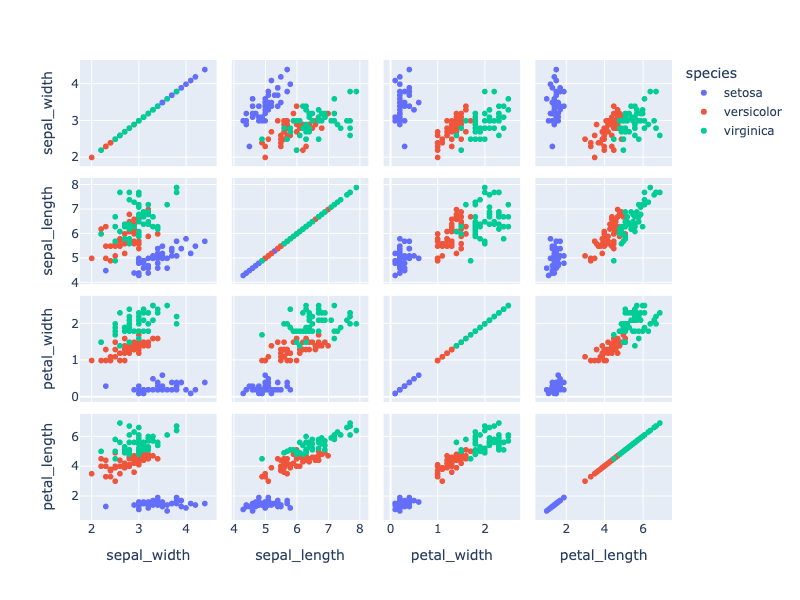

**Interactive Plot:**

<div>                        <script type="text/javascript">window.PlotlyConfig = {MathJaxConfig: 'local'};</script>
        <script charset="utf-8" src="https://cdn.plot.ly/plotly-3.1.0.min.js" integrity="sha256-Ei4740bWZhaUTQuD6q9yQlgVCMPBz6CZWhevDYPv93A=" crossorigin="anonymous"></script>                <div id="plotly-div-7" class="plotly-graph-div" style="height:100%; width:100%;"></div>            <script type="text/javascript">                window.PLOTLYENV=window.PLOTLYENV || {};                                if (document.getElementById("plotly-div-7")) {                    Plotly.newPlot(                        "plotly-div-7",                        [{"dimensions":[{"axis":{"matches":true},"label":"sepal_width","values":{"dtype":"f8","bdata":"AAAAAAAADEAAAAAAAAAIQJqZmZmZmQlAzczMzMzMCEDNzMzMzMwMQDMzMzMzMw9AMzMzMzMzC0AzMzMzMzMLQDMzMzMzMwdAzczMzMzMCECamZmZmZkNQDMzMzMzMwtAAAAAAAAACEAAAAAAAAAIQAAAAAAAABBAmpmZmZmZEUAzMzMzMzMPQAAAAAAAAAxAZmZmZmZmDkBmZmZmZmYOQDMzMzMzMwtAmpmZmZmZDUDNzMzMzMwMQGZmZmZmZgpAMzMzMzMzC0AAAAAAAAAIQDMzMzMzMwtAAAAAAAAADEAzMzMzMzMLQJqZmZmZmQlAzczMzMzMCEAzMzMzMzMLQGZmZmZmZhBAzczMzMzMEEDNzMzMzMwIQJqZmZmZmQlAAAAAAAAADEDNzMzMzMwIQAAAAAAAAAhAMzMzMzMzC0AAAAAAAAAMQGZmZmZmZgJAmpmZmZmZCUAAAAAAAAAMQGZmZmZmZg5AAAAAAAAACEBmZmZmZmYOQJqZmZmZmQlAmpmZmZmZDUBmZmZmZmYKQA=="}},{"axis":{"matches":true},"label":"sepal_length","values":{"dtype":"f8","bdata":"ZmZmZmZmFECamZmZmZkTQM3MzMzMzBJAZmZmZmZmEkAAAAAAAAAUQJqZmZmZmRVAZmZmZmZmEkAAAAAAAAAUQJqZmZmZmRFAmpmZmZmZE0CamZmZmZkVQDMzMzMzMxNAMzMzMzMzE0AzMzMzMzMRQDMzMzMzMxdAzczMzMzMFkCamZmZmZkVQGZmZmZmZhRAzczMzMzMFkBmZmZmZmYUQJqZmZmZmRVAZmZmZmZmFEBmZmZmZmYSQGZmZmZmZhRAMzMzMzMzE0AAAAAAAAAUQAAAAAAAABRAzczMzMzMFEDNzMzMzMwUQM3MzMzMzBJAMzMzMzMzE0CamZmZmZkVQM3MzMzMzBRAAAAAAAAAFkCamZmZmZkTQAAAAAAAABRAAAAAAAAAFkCamZmZmZkTQJqZmZmZmRFAZmZmZmZmFEAAAAAAAAAUQAAAAAAAABJAmpmZmZmZEUAAAAAAAAAUQGZmZmZmZhRAMzMzMzMzE0BmZmZmZmYUQGZmZmZmZhJAMzMzMzMzFUAAAAAAAAAUQA=="}},{"axis":{"matches":true},"label":"petal_width","values":{"dtype":"f8","bdata":"mpmZmZmZyT+amZmZmZnJP5qZmZmZmck\u002fmpmZmZmZyT+amZmZmZnJP5qZmZmZmdk\u002fMzMzMzMz0z+amZmZmZnJP5qZmZmZmck\u002fmpmZmZmZuT+amZmZmZnJP5qZmZmZmck\u002fmpmZmZmZuT+amZmZmZm5P5qZmZmZmck\u002fmpmZmZmZ2T+amZmZmZnZPzMzMzMzM9M\u002fMzMzMzMz0z8zMzMzMzPTP5qZmZmZmck\u002fmpmZmZmZ2T+amZmZmZnJPwAAAAAAAOA\u002fmpmZmZmZyT+amZmZmZnJP5qZmZmZmdk\u002fmpmZmZmZyT+amZmZmZnJP5qZmZmZmck\u002fmpmZmZmZyT+amZmZmZnZP5qZmZmZmbk\u002fmpmZmZmZyT+amZmZmZm5P5qZmZmZmck\u002fmpmZmZmZyT+amZmZmZm5P5qZmZmZmck\u002fmpmZmZmZyT8zMzMzMzPTPzMzMzMzM9M\u002fmpmZmZmZyT8zMzMzMzPjP5qZmZmZmdk\u002fMzMzMzMz0z+amZmZmZnJP5qZmZmZmck\u002fmpmZmZmZyT+amZmZmZnJPw=="}},{"axis":{"matches":true},"label":"petal_length","values":{"dtype":"f8","bdata":"ZmZmZmZm9j9mZmZmZmb2P83MzMzMzPQ\u002fAAAAAAAA+D9mZmZmZmb2PzMzMzMzM\u002fs\u002fZmZmZmZm9j8AAAAAAAD4P2ZmZmZmZvY\u002fAAAAAAAA+D8AAAAAAAD4P5qZmZmZmfk\u002fZmZmZmZm9j+amZmZmZnxPzMzMzMzM\u002fM\u002fAAAAAAAA+D\u002fNzMzMzMz0P2ZmZmZmZvY\u002fMzMzMzMz+z8AAAAAAAD4PzMzMzMzM\u002fs\u002fAAAAAAAA+D8AAAAAAADwPzMzMzMzM\u002fs\u002fZmZmZmZm\u002fj+amZmZmZn5P5qZmZmZmfk\u002fAAAAAAAA+D9mZmZmZmb2P5qZmZmZmfk\u002fmpmZmZmZ+T8AAAAAAAD4PwAAAAAAAPg\u002fZmZmZmZm9j8AAAAAAAD4PzMzMzMzM\u002fM\u002fzczMzMzM9D8AAAAAAAD4P83MzMzMzPQ\u002fAAAAAAAA+D\u002fNzMzMzMz0P83MzMzMzPQ\u002fzczMzMzM9D+amZmZmZn5P2ZmZmZmZv4\u002fZmZmZmZm9j+amZmZmZn5P2ZmZmZmZvY\u002fAAAAAAAA+D9mZmZmZmb2Pw=="}}],"hovertemplate":"species=setosa\u003cbr\u003e%{xaxis.title.text}=%{x}\u003cbr\u003e%{yaxis.title.text}=%{y}\u003cextra\u003e\u003c\u002fextra\u003e","legendgroup":"setosa","marker":{"color":"#636efa","symbol":"circle"},"name":"setosa","showlegend":true,"type":"splom"},{"dimensions":[{"axis":{"matches":true},"label":"sepal_width","values":{"dtype":"f8","bdata":"mpmZmZmZCUCamZmZmZkJQM3MzMzMzAhAZmZmZmZmAkBmZmZmZmYGQGZmZmZmZgZAZmZmZmZmCkAzMzMzMzMDQDMzMzMzMwdAmpmZmZmZBUAAAAAAAAAAQAAAAAAAAAhAmpmZmZmZAUAzMzMzMzMHQDMzMzMzMwdAzczMzMzMCEAAAAAAAAAIQJqZmZmZmQVAmpmZmZmZAUAAAAAAAAAEQJqZmZmZmQlAZmZmZmZmBkAAAAAAAAAEQGZmZmZmZgZAMzMzMzMzB0AAAAAAAAAIQGZmZmZmZgZAAAAAAAAACEAzMzMzMzMHQM3MzMzMzARAMzMzMzMzA0AzMzMzMzMDQJqZmZmZmQVAmpmZmZmZBUAAAAAAAAAIQDMzMzMzMwtAzczMzMzMCEBmZmZmZmYCQAAAAAAAAAhAAAAAAAAABEDNzMzMzMwEQAAAAAAAAAhAzczMzMzMBEBmZmZmZmYCQJqZmZmZmQVAAAAAAAAACEAzMzMzMzMHQDMzMzMzMwdAAAAAAAAABEBmZmZmZmYGQA=="}},{"axis":{"matches":true},"label":"sepal_length","values":{"dtype":"f8","bdata":"AAAAAAAAHECamZmZmZkZQJqZmZmZmRtAAAAAAAAAFkAAAAAAAAAaQM3MzMzMzBZAMzMzMzMzGUCamZmZmZkTQGZmZmZmZhpAzczMzMzMFEAAAAAAAAAUQJqZmZmZmRdAAAAAAAAAGEBmZmZmZmYYQGZmZmZmZhZAzczMzMzMGkBmZmZmZmYWQDMzMzMzMxdAzczMzMzMGEBmZmZmZmYWQJqZmZmZmRdAZmZmZmZmGEAzMzMzMzMZQGZmZmZmZhhAmpmZmZmZGUBmZmZmZmYaQDMzMzMzMxtAzczMzMzMGkAAAAAAAAAYQM3MzMzMzBZAAAAAAAAAFkAAAAAAAAAWQDMzMzMzMxdAAAAAAAAAGECamZmZmZkVQAAAAAAAABhAzczMzMzMGkAzMzMzMzMZQGZmZmZmZhZAAAAAAAAAFkAAAAAAAAAWQGZmZmZmZhhAMzMzMzMzF0AAAAAAAAAUQGZmZmZmZhZAzczMzMzMFkDNzMzMzMwWQM3MzMzMzBhAZmZmZmZmFEDNzMzMzMwWQA=="}},{"axis":{"matches":true},"label":"petal_width","values":{"dtype":"f8","bdata":"ZmZmZmZm9j8AAAAAAAD4PwAAAAAAAPg\u002fzczMzMzM9D8AAAAAAAD4P83MzMzMzPQ\u002fmpmZmZmZ+T8AAAAAAADwP83MzMzMzPQ\u002fZmZmZmZm9j8AAAAAAADwPwAAAAAAAPg\u002fAAAAAAAA8D9mZmZmZmb2P83MzMzMzPQ\u002fZmZmZmZm9j8AAAAAAAD4PwAAAAAAAPA\u002fAAAAAAAA+D+amZmZmZnxP83MzMzMzPw\u002fzczMzMzM9D8AAAAAAAD4PzMzMzMzM\u002fM\u002fzczMzMzM9D9mZmZmZmb2P2ZmZmZmZvY\u002fMzMzMzMz+z8AAAAAAAD4PwAAAAAAAPA\u002fmpmZmZmZ8T8AAAAAAADwPzMzMzMzM\u002fM\u002fmpmZmZmZ+T8AAAAAAAD4P5qZmZmZmfk\u002fAAAAAAAA+D\u002fNzMzMzMz0P83MzMzMzPQ\u002fzczMzMzM9D8zMzMzMzPzP2ZmZmZmZvY\u002fMzMzMzMz8z8AAAAAAADwP83MzMzMzPQ\u002fMzMzMzMz8z\u002fNzMzMzMz0P83MzMzMzPQ\u002fmpmZmZmZ8T\u002fNzMzMzMz0Pw=="}},{"axis":{"matches":true},"label":"petal_length","values":{"dtype":"f8","bdata":"zczMzMzMEkAAAAAAAAASQJqZmZmZmRNAAAAAAAAAEEBmZmZmZmYSQAAAAAAAABJAzczMzMzMEkBmZmZmZmYKQGZmZmZmZhJAMzMzMzMzD0AAAAAAAAAMQM3MzMzMzBBAAAAAAAAAEEDNzMzMzMwSQM3MzMzMzAxAmpmZmZmZEUAAAAAAAAASQGZmZmZmZhBAAAAAAAAAEkAzMzMzMzMPQDMzMzMzMxNAAAAAAAAAEECamZmZmZkTQM3MzMzMzBJAMzMzMzMzEUCamZmZmZkRQDMzMzMzMxNAAAAAAAAAFEAAAAAAAAASQAAAAAAAAAxAZmZmZmZmDkCamZmZmZkNQDMzMzMzMw9AZmZmZmZmFEAAAAAAAAASQAAAAAAAABJAzczMzMzMEkCamZmZmZkRQGZmZmZmZhBAAAAAAAAAEECamZmZmZkRQGZmZmZmZhJAAAAAAAAAEEBmZmZmZmYKQM3MzMzMzBBAzczMzMzMEEDNzMzMzMwQQDMzMzMzMxFAAAAAAAAACEBmZmZmZmYQQA=="}}],"hovertemplate":"species=versicolor\u003cbr\u003e%{xaxis.title.text}=%{x}\u003cbr\u003e%{yaxis.title.text}=%{y}\u003cextra\u003e\u003c\u002fextra\u003e","legendgroup":"versicolor","marker":{"color":"#EF553B","symbol":"circle"},"name":"versicolor","showlegend":true,"type":"splom"},{"dimensions":[{"axis":{"matches":true},"label":"sepal_width","values":{"dtype":"f8","bdata":"ZmZmZmZmCkCamZmZmZkFQAAAAAAAAAhAMzMzMzMzB0AAAAAAAAAIQAAAAAAAAAhAAAAAAAAABEAzMzMzMzMHQAAAAAAAAARAzczMzMzMDECamZmZmZkJQJqZmZmZmQVAAAAAAAAACEAAAAAAAAAEQGZmZmZmZgZAmpmZmZmZCUAAAAAAAAAIQGZmZmZmZg5AzczMzMzMBECamZmZmZkBQJqZmZmZmQlAZmZmZmZmBkBmZmZmZmYGQJqZmZmZmQVAZmZmZmZmCkCamZmZmZkJQGZmZmZmZgZAAAAAAAAACEBmZmZmZmYGQAAAAAAAAAhAZmZmZmZmBkBmZmZmZmYOQGZmZmZmZgZAZmZmZmZmBkDNzMzMzMwEQAAAAAAAAAhAMzMzMzMzC0DNzMzMzMwIQAAAAAAAAAhAzczMzMzMCEDNzMzMzMwIQM3MzMzMzAhAmpmZmZmZBUCamZmZmZkJQGZmZmZmZgpAAAAAAAAACEAAAAAAAAAEQAAAAAAAAAhAMzMzMzMzC0AAAAAAAAAIQA=="}},{"axis":{"matches":true},"label":"sepal_length","values":{"dtype":"f8","bdata":"MzMzMzMzGUAzMzMzMzMXQGZmZmZmZhxAMzMzMzMzGUAAAAAAAAAaQGZmZmZmZh5AmpmZmZmZE0AzMzMzMzMdQM3MzMzMzBpAzczMzMzMHEAAAAAAAAAaQJqZmZmZmRlAMzMzMzMzG0DNzMzMzMwWQDMzMzMzMxdAmpmZmZmZGUAAAAAAAAAaQM3MzMzMzB5AzczMzMzMHkAAAAAAAAAYQJqZmZmZmRtAZmZmZmZmFkDNzMzMzMweQDMzMzMzMxlAzczMzMzMGkDNzMzMzMwcQM3MzMzMzBhAZmZmZmZmGECamZmZmZkZQM3MzMzMzBxAmpmZmZmZHUCamZmZmZkfQJqZmZmZmRlAMzMzMzMzGUBmZmZmZmYYQM3MzMzMzB5AMzMzMzMzGUCamZmZmZkZQAAAAAAAABhAmpmZmZmZG0DNzMzMzMwaQJqZmZmZmRtAMzMzMzMzF0AzMzMzMzMbQM3MzMzMzBpAzczMzMzMGkAzMzMzMzMZQAAAAAAAABpAzczMzMzMGECamZmZmZkXQA=="}},{"axis":{"matches":true},"label":"petal_width","values":{"dtype":"f8","bdata":"AAAAAAAABEBmZmZmZmb+P83MzMzMzABAzczMzMzM\u002fD+amZmZmZkBQM3MzMzMzABAMzMzMzMz+z\u002fNzMzMzMz8P83MzMzMzPw\u002fAAAAAAAABEAAAAAAAAAAQGZmZmZmZv4\u002fzczMzMzMAEAAAAAAAAAAQDMzMzMzMwNAZmZmZmZmAkDNzMzMzMz8P5qZmZmZmQFAZmZmZmZmAkAAAAAAAAD4P2ZmZmZmZgJAAAAAAAAAAEAAAAAAAAAAQM3MzMzMzPw\u002fzczMzMzMAEDNzMzMzMz8P83MzMzMzPw\u002fzczMzMzM\u002fD\u002fNzMzMzMwAQJqZmZmZmfk\u002fZmZmZmZm\u002fj8AAAAAAAAAQJqZmZmZmQFAAAAAAAAA+D9mZmZmZmb2P2ZmZmZmZgJAMzMzMzMzA0DNzMzMzMz8P83MzMzMzPw\u002fzczMzMzMAEAzMzMzMzMDQGZmZmZmZgJAZmZmZmZm\u002fj9mZmZmZmYCQAAAAAAAAARAZmZmZmZmAkBmZmZmZmb+PwAAAAAAAABAZmZmZmZmAkDNzMzMzMz8Pw=="}},{"axis":{"matches":true},"label":"petal_length","values":{"dtype":"f8","bdata":"AAAAAAAAGEBmZmZmZmYUQJqZmZmZmRdAZmZmZmZmFkAzMzMzMzMXQGZmZmZmZhpAAAAAAAAAEkAzMzMzMzMZQDMzMzMzMxdAZmZmZmZmGEBmZmZmZmYUQDMzMzMzMxVAAAAAAAAAFkAAAAAAAAAUQGZmZmZmZhRAMzMzMzMzFUAAAAAAAAAWQM3MzMzMzBpAmpmZmZmZG0AAAAAAAAAUQM3MzMzMzBZAmpmZmZmZE0DNzMzMzMwaQJqZmZmZmRNAzczMzMzMFkAAAAAAAAAYQDMzMzMzMxNAmpmZmZmZE0BmZmZmZmYWQDMzMzMzMxdAZmZmZmZmGECamZmZmZkZQGZmZmZmZhZAZmZmZmZmFEBmZmZmZmYWQGZmZmZmZhhAZmZmZmZmFkAAAAAAAAAWQDMzMzMzMxNAmpmZmZmZFUBmZmZmZmYWQGZmZmZmZhRAZmZmZmZmFECamZmZmZkXQM3MzMzMzBZAzczMzMzMFEAAAAAAAAAUQM3MzMzMzBRAmpmZmZmZFUBmZmZmZmYUQA=="}}],"hovertemplate":"species=virginica\u003cbr\u003e%{xaxis.title.text}=%{x}\u003cbr\u003e%{yaxis.title.text}=%{y}\u003cextra\u003e\u003c\u002fextra\u003e","legendgroup":"virginica","marker":{"color":"#00cc96","symbol":"circle"},"name":"virginica","showlegend":true,"type":"splom"}],                        {"template":{"data":{"histogram2dcontour":[{"type":"histogram2dcontour","colorbar":{"outlinewidth":0,"ticks":""},"colorscale":[[0.0,"#0d0887"],[0.1111111111111111,"#46039f"],[0.2222222222222222,"#7201a8"],[0.3333333333333333,"#9c179e"],[0.4444444444444444,"#bd3786"],[0.5555555555555556,"#d8576b"],[0.6666666666666666,"#ed7953"],[0.7777777777777778,"#fb9f3a"],[0.8888888888888888,"#fdca26"],[1.0,"#f0f921"]]}],"choropleth":[{"type":"choropleth","colorbar":{"outlinewidth":0,"ticks":""}}],"histogram2d":[{"type":"histogram2d","colorbar":{"outlinewidth":0,"ticks":""},"colorscale":[[0.0,"#0d0887"],[0.1111111111111111,"#46039f"],[0.2222222222222222,"#7201a8"],[0.3333333333333333,"#9c179e"],[0.4444444444444444,"#bd3786"],[0.5555555555555556,"#d8576b"],[0.6666666666666666,"#ed7953"],[0.7777777777777778,"#fb9f3a"],[0.8888888888888888,"#fdca26"],[1.0,"#f0f921"]]}],"heatmap":[{"type":"heatmap","colorbar":{"outlinewidth":0,"ticks":""},"colorscale":[[0.0,"#0d0887"],[0.1111111111111111,"#46039f"],[0.2222222222222222,"#7201a8"],[0.3333333333333333,"#9c179e"],[0.4444444444444444,"#bd3786"],[0.5555555555555556,"#d8576b"],[0.6666666666666666,"#ed7953"],[0.7777777777777778,"#fb9f3a"],[0.8888888888888888,"#fdca26"],[1.0,"#f0f921"]]}],"contourcarpet":[{"type":"contourcarpet","colorbar":{"outlinewidth":0,"ticks":""}}],"contour":[{"type":"contour","colorbar":{"outlinewidth":0,"ticks":""},"colorscale":[[0.0,"#0d0887"],[0.1111111111111111,"#46039f"],[0.2222222222222222,"#7201a8"],[0.3333333333333333,"#9c179e"],[0.4444444444444444,"#bd3786"],[0.5555555555555556,"#d8576b"],[0.6666666666666666,"#ed7953"],[0.7777777777777778,"#fb9f3a"],[0.8888888888888888,"#fdca26"],[1.0,"#f0f921"]]}],"surface":[{"type":"surface","colorbar":{"outlinewidth":0,"ticks":""},"colorscale":[[0.0,"#0d0887"],[0.1111111111111111,"#46039f"],[0.2222222222222222,"#7201a8"],[0.3333333333333333,"#9c179e"],[0.4444444444444444,"#bd3786"],[0.5555555555555556,"#d8576b"],[0.6666666666666666,"#ed7953"],[0.7777777777777778,"#fb9f3a"],[0.8888888888888888,"#fdca26"],[1.0,"#f0f921"]]}],"mesh3d":[{"type":"mesh3d","colorbar":{"outlinewidth":0,"ticks":""}}],"scatter":[{"fillpattern":{"fillmode":"overlay","size":10,"solidity":0.2},"type":"scatter"}],"parcoords":[{"type":"parcoords","line":{"colorbar":{"outlinewidth":0,"ticks":""}}}],"scatterpolargl":[{"type":"scatterpolargl","marker":{"colorbar":{"outlinewidth":0,"ticks":""}}}],"bar":[{"error_x":{"color":"#2a3f5f"},"error_y":{"color":"#2a3f5f"},"marker":{"line":{"color":"#E5ECF6","width":0.5},"pattern":{"fillmode":"overlay","size":10,"solidity":0.2}},"type":"bar"}],"scattergeo":[{"type":"scattergeo","marker":{"colorbar":{"outlinewidth":0,"ticks":""}}}],"scatterpolar":[{"type":"scatterpolar","marker":{"colorbar":{"outlinewidth":0,"ticks":""}}}],"histogram":[{"marker":{"pattern":{"fillmode":"overlay","size":10,"solidity":0.2}},"type":"histogram"}],"scattergl":[{"type":"scattergl","marker":{"colorbar":{"outlinewidth":0,"ticks":""}}}],"scatter3d":[{"type":"scatter3d","line":{"colorbar":{"outlinewidth":0,"ticks":""}},"marker":{"colorbar":{"outlinewidth":0,"ticks":""}}}],"scattermap":[{"type":"scattermap","marker":{"colorbar":{"outlinewidth":0,"ticks":""}}}],"scattermapbox":[{"type":"scattermapbox","marker":{"colorbar":{"outlinewidth":0,"ticks":""}}}],"scatterternary":[{"type":"scatterternary","marker":{"colorbar":{"outlinewidth":0,"ticks":""}}}],"scattercarpet":[{"type":"scattercarpet","marker":{"colorbar":{"outlinewidth":0,"ticks":""}}}],"carpet":[{"aaxis":{"endlinecolor":"#2a3f5f","gridcolor":"white","linecolor":"white","minorgridcolor":"white","startlinecolor":"#2a3f5f"},"baxis":{"endlinecolor":"#2a3f5f","gridcolor":"white","linecolor":"white","minorgridcolor":"white","startlinecolor":"#2a3f5f"},"type":"carpet"}],"table":[{"cells":{"fill":{"color":"#EBF0F8"},"line":{"color":"white"}},"header":{"fill":{"color":"#C8D4E3"},"line":{"color":"white"}},"type":"table"}],"barpolar":[{"marker":{"line":{"color":"#E5ECF6","width":0.5},"pattern":{"fillmode":"overlay","size":10,"solidity":0.2}},"type":"barpolar"}],"pie":[{"automargin":true,"type":"pie"}]},"layout":{"autotypenumbers":"strict","colorway":["#636efa","#EF553B","#00cc96","#ab63fa","#FFA15A","#19d3f3","#FF6692","#B6E880","#FF97FF","#FECB52"],"font":{"color":"#2a3f5f"},"hovermode":"closest","hoverlabel":{"align":"left"},"paper_bgcolor":"white","plot_bgcolor":"#E5ECF6","polar":{"bgcolor":"#E5ECF6","angularaxis":{"gridcolor":"white","linecolor":"white","ticks":""},"radialaxis":{"gridcolor":"white","linecolor":"white","ticks":""}},"ternary":{"bgcolor":"#E5ECF6","aaxis":{"gridcolor":"white","linecolor":"white","ticks":""},"baxis":{"gridcolor":"white","linecolor":"white","ticks":""},"caxis":{"gridcolor":"white","linecolor":"white","ticks":""}},"coloraxis":{"colorbar":{"outlinewidth":0,"ticks":""}},"colorscale":{"sequential":[[0.0,"#0d0887"],[0.1111111111111111,"#46039f"],[0.2222222222222222,"#7201a8"],[0.3333333333333333,"#9c179e"],[0.4444444444444444,"#bd3786"],[0.5555555555555556,"#d8576b"],[0.6666666666666666,"#ed7953"],[0.7777777777777778,"#fb9f3a"],[0.8888888888888888,"#fdca26"],[1.0,"#f0f921"]],"sequentialminus":[[0.0,"#0d0887"],[0.1111111111111111,"#46039f"],[0.2222222222222222,"#7201a8"],[0.3333333333333333,"#9c179e"],[0.4444444444444444,"#bd3786"],[0.5555555555555556,"#d8576b"],[0.6666666666666666,"#ed7953"],[0.7777777777777778,"#fb9f3a"],[0.8888888888888888,"#fdca26"],[1.0,"#f0f921"]],"diverging":[[0,"#8e0152"],[0.1,"#c51b7d"],[0.2,"#de77ae"],[0.3,"#f1b6da"],[0.4,"#fde0ef"],[0.5,"#f7f7f7"],[0.6,"#e6f5d0"],[0.7,"#b8e186"],[0.8,"#7fbc41"],[0.9,"#4d9221"],[1,"#276419"]]},"xaxis":{"gridcolor":"white","linecolor":"white","ticks":"","title":{"standoff":15},"zerolinecolor":"white","automargin":true,"zerolinewidth":2},"yaxis":{"gridcolor":"white","linecolor":"white","ticks":"","title":{"standoff":15},"zerolinecolor":"white","automargin":true,"zerolinewidth":2},"scene":{"xaxis":{"backgroundcolor":"#E5ECF6","gridcolor":"white","linecolor":"white","showbackground":true,"ticks":"","zerolinecolor":"white","gridwidth":2},"yaxis":{"backgroundcolor":"#E5ECF6","gridcolor":"white","linecolor":"white","showbackground":true,"ticks":"","zerolinecolor":"white","gridwidth":2},"zaxis":{"backgroundcolor":"#E5ECF6","gridcolor":"white","linecolor":"white","showbackground":true,"ticks":"","zerolinecolor":"white","gridwidth":2}},"shapedefaults":{"line":{"color":"#2a3f5f"}},"annotationdefaults":{"arrowcolor":"#2a3f5f","arrowhead":0,"arrowwidth":1},"geo":{"bgcolor":"white","landcolor":"#E5ECF6","subunitcolor":"white","showland":true,"showlakes":true,"lakecolor":"white"},"title":{"x":0.05},"mapbox":{"style":"light"}}},"legend":{"title":{"text":"species"},"tracegroupgap":0},"margin":{"t":60},"dragmode":"select"},                        {"responsive": true}                    )                };            </script>        </div>

**Read more about [parallel coordinates](parallel-coordinates-plot.md) and [parallel categories](parallel-categories-diagram.md), as well as [continuous color](colorscales.md).**

```python
import plotly.express as px
df = px.data.iris()
fig = px.parallel_coordinates(df, color="species_id", labels={"species_id": "Species",
                  "sepal_width": "Sepal Width", "sepal_length": "Sepal Length",
                  "petal_width": "Petal Width", "petal_length": "Petal Length", },
                    color_continuous_scale=px.colors.diverging.Tealrose, color_continuous_midpoint=2)
fig.show()
```

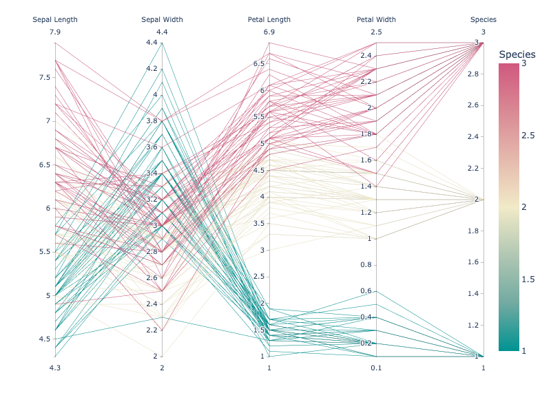

**Interactive Plot:**

<div>                        <script type="text/javascript">window.PlotlyConfig = {MathJaxConfig: 'local'};</script>
        <script charset="utf-8" src="https://cdn.plot.ly/plotly-3.1.0.min.js" integrity="sha256-Ei4740bWZhaUTQuD6q9yQlgVCMPBz6CZWhevDYPv93A=" crossorigin="anonymous"></script>                <div id="plotly-div-8" class="plotly-graph-div" style="height:100%; width:100%;"></div>            <script type="text/javascript">                window.PLOTLYENV=window.PLOTLYENV || {};                                if (document.getElementById("plotly-div-8")) {                    Plotly.newPlot(                        "plotly-div-8",                        [{"dimensions":[{"label":"Sepal Length","values":{"dtype":"f8","bdata":"ZmZmZmZmFECamZmZmZkTQM3MzMzMzBJAZmZmZmZmEkAAAAAAAAAUQJqZmZmZmRVAZmZmZmZmEkAAAAAAAAAUQJqZmZmZmRFAmpmZmZmZE0CamZmZmZkVQDMzMzMzMxNAMzMzMzMzE0AzMzMzMzMRQDMzMzMzMxdAzczMzMzMFkCamZmZmZkVQGZmZmZmZhRAzczMzMzMFkBmZmZmZmYUQJqZmZmZmRVAZmZmZmZmFEBmZmZmZmYSQGZmZmZmZhRAMzMzMzMzE0AAAAAAAAAUQAAAAAAAABRAzczMzMzMFEDNzMzMzMwUQM3MzMzMzBJAMzMzMzMzE0CamZmZmZkVQM3MzMzMzBRAAAAAAAAAFkCamZmZmZkTQAAAAAAAABRAAAAAAAAAFkCamZmZmZkTQJqZmZmZmRFAZmZmZmZmFEAAAAAAAAAUQAAAAAAAABJAmpmZmZmZEUAAAAAAAAAUQGZmZmZmZhRAMzMzMzMzE0BmZmZmZmYUQGZmZmZmZhJAMzMzMzMzFUAAAAAAAAAUQAAAAAAAABxAmpmZmZmZGUCamZmZmZkbQAAAAAAAABZAAAAAAAAAGkDNzMzMzMwWQDMzMzMzMxlAmpmZmZmZE0BmZmZmZmYaQM3MzMzMzBRAAAAAAAAAFECamZmZmZkXQAAAAAAAABhAZmZmZmZmGEBmZmZmZmYWQM3MzMzMzBpAZmZmZmZmFkAzMzMzMzMXQM3MzMzMzBhAZmZmZmZmFkCamZmZmZkXQGZmZmZmZhhAMzMzMzMzGUBmZmZmZmYYQJqZmZmZmRlAZmZmZmZmGkAzMzMzMzMbQM3MzMzMzBpAAAAAAAAAGEDNzMzMzMwWQAAAAAAAABZAAAAAAAAAFkAzMzMzMzMXQAAAAAAAABhAmpmZmZmZFUAAAAAAAAAYQM3MzMzMzBpAMzMzMzMzGUBmZmZmZmYWQAAAAAAAABZAAAAAAAAAFkBmZmZmZmYYQDMzMzMzMxdAAAAAAAAAFEBmZmZmZmYWQM3MzMzMzBZAzczMzMzMFkDNzMzMzMwYQGZmZmZmZhRAzczMzMzMFkAzMzMzMzMZQDMzMzMzMxdAZmZmZmZmHEAzMzMzMzMZQAAAAAAAABpAZmZmZmZmHkCamZmZmZkTQDMzMzMzMx1AzczMzMzMGkDNzMzMzMwcQAAAAAAAABpAmpmZmZmZGUAzMzMzMzMbQM3MzMzMzBZAMzMzMzMzF0CamZmZmZkZQAAAAAAAABpAzczMzMzMHkDNzMzMzMweQAAAAAAAABhAmpmZmZmZG0BmZmZmZmYWQM3MzMzMzB5AMzMzMzMzGUDNzMzMzMwaQM3MzMzMzBxAzczMzMzMGEBmZmZmZmYYQJqZmZmZmRlAzczMzMzMHECamZmZmZkdQJqZmZmZmR9AmpmZmZmZGUAzMzMzMzMZQGZmZmZmZhhAzczMzMzMHkAzMzMzMzMZQJqZmZmZmRlAAAAAAAAAGECamZmZmZkbQM3MzMzMzBpAmpmZmZmZG0AzMzMzMzMXQDMzMzMzMxtAzczMzMzMGkDNzMzMzMwaQDMzMzMzMxlAAAAAAAAAGkDNzMzMzMwYQJqZmZmZmRdA"}},{"label":"Sepal Width","values":{"dtype":"f8","bdata":"AAAAAAAADEAAAAAAAAAIQJqZmZmZmQlAzczMzMzMCEDNzMzMzMwMQDMzMzMzMw9AMzMzMzMzC0AzMzMzMzMLQDMzMzMzMwdAzczMzMzMCECamZmZmZkNQDMzMzMzMwtAAAAAAAAACEAAAAAAAAAIQAAAAAAAABBAmpmZmZmZEUAzMzMzMzMPQAAAAAAAAAxAZmZmZmZmDkBmZmZmZmYOQDMzMzMzMwtAmpmZmZmZDUDNzMzMzMwMQGZmZmZmZgpAMzMzMzMzC0AAAAAAAAAIQDMzMzMzMwtAAAAAAAAADEAzMzMzMzMLQJqZmZmZmQlAzczMzMzMCEAzMzMzMzMLQGZmZmZmZhBAzczMzMzMEEDNzMzMzMwIQJqZmZmZmQlAAAAAAAAADEDNzMzMzMwIQAAAAAAAAAhAMzMzMzMzC0AAAAAAAAAMQGZmZmZmZgJAmpmZmZmZCUAAAAAAAAAMQGZmZmZmZg5AAAAAAAAACEBmZmZmZmYOQJqZmZmZmQlAmpmZmZmZDUBmZmZmZmYKQJqZmZmZmQlAmpmZmZmZCUDNzMzMzMwIQGZmZmZmZgJAZmZmZmZmBkBmZmZmZmYGQGZmZmZmZgpAMzMzMzMzA0AzMzMzMzMHQJqZmZmZmQVAAAAAAAAAAEAAAAAAAAAIQJqZmZmZmQFAMzMzMzMzB0AzMzMzMzMHQM3MzMzMzAhAAAAAAAAACECamZmZmZkFQJqZmZmZmQFAAAAAAAAABECamZmZmZkJQGZmZmZmZgZAAAAAAAAABEBmZmZmZmYGQDMzMzMzMwdAAAAAAAAACEBmZmZmZmYGQAAAAAAAAAhAMzMzMzMzB0DNzMzMzMwEQDMzMzMzMwNAMzMzMzMzA0CamZmZmZkFQJqZmZmZmQVAAAAAAAAACEAzMzMzMzMLQM3MzMzMzAhAZmZmZmZmAkAAAAAAAAAIQAAAAAAAAARAzczMzMzMBEAAAAAAAAAIQM3MzMzMzARAZmZmZmZmAkCamZmZmZkFQAAAAAAAAAhAMzMzMzMzB0AzMzMzMzMHQAAAAAAAAARAZmZmZmZmBkBmZmZmZmYKQJqZmZmZmQVAAAAAAAAACEAzMzMzMzMHQAAAAAAAAAhAAAAAAAAACEAAAAAAAAAEQDMzMzMzMwdAAAAAAAAABEDNzMzMzMwMQJqZmZmZmQlAmpmZmZmZBUAAAAAAAAAIQAAAAAAAAARAZmZmZmZmBkCamZmZmZkJQAAAAAAAAAhAZmZmZmZmDkDNzMzMzMwEQJqZmZmZmQFAmpmZmZmZCUBmZmZmZmYGQGZmZmZmZgZAmpmZmZmZBUBmZmZmZmYKQJqZmZmZmQlAZmZmZmZmBkAAAAAAAAAIQGZmZmZmZgZAAAAAAAAACEBmZmZmZmYGQGZmZmZmZg5AZmZmZmZmBkBmZmZmZmYGQM3MzMzMzARAAAAAAAAACEAzMzMzMzMLQM3MzMzMzAhAAAAAAAAACEDNzMzMzMwIQM3MzMzMzAhAzczMzMzMCECamZmZmZkFQJqZmZmZmQlAZmZmZmZmCkAAAAAAAAAIQAAAAAAAAARAAAAAAAAACEAzMzMzMzMLQAAAAAAAAAhA"}},{"label":"Petal Length","values":{"dtype":"f8","bdata":"ZmZmZmZm9j9mZmZmZmb2P83MzMzMzPQ\u002fAAAAAAAA+D9mZmZmZmb2PzMzMzMzM\u002fs\u002fZmZmZmZm9j8AAAAAAAD4P2ZmZmZmZvY\u002fAAAAAAAA+D8AAAAAAAD4P5qZmZmZmfk\u002fZmZmZmZm9j+amZmZmZnxPzMzMzMzM\u002fM\u002fAAAAAAAA+D\u002fNzMzMzMz0P2ZmZmZmZvY\u002fMzMzMzMz+z8AAAAAAAD4PzMzMzMzM\u002fs\u002fAAAAAAAA+D8AAAAAAADwPzMzMzMzM\u002fs\u002fZmZmZmZm\u002fj+amZmZmZn5P5qZmZmZmfk\u002fAAAAAAAA+D9mZmZmZmb2P5qZmZmZmfk\u002fmpmZmZmZ+T8AAAAAAAD4PwAAAAAAAPg\u002fZmZmZmZm9j8AAAAAAAD4PzMzMzMzM\u002fM\u002fzczMzMzM9D8AAAAAAAD4P83MzMzMzPQ\u002fAAAAAAAA+D\u002fNzMzMzMz0P83MzMzMzPQ\u002fzczMzMzM9D+amZmZmZn5P2ZmZmZmZv4\u002fZmZmZmZm9j+amZmZmZn5P2ZmZmZmZvY\u002fAAAAAAAA+D9mZmZmZmb2P83MzMzMzBJAAAAAAAAAEkCamZmZmZkTQAAAAAAAABBAZmZmZmZmEkAAAAAAAAASQM3MzMzMzBJAZmZmZmZmCkBmZmZmZmYSQDMzMzMzMw9AAAAAAAAADEDNzMzMzMwQQAAAAAAAABBAzczMzMzMEkDNzMzMzMwMQJqZmZmZmRFAAAAAAAAAEkBmZmZmZmYQQAAAAAAAABJAMzMzMzMzD0AzMzMzMzMTQAAAAAAAABBAmpmZmZmZE0DNzMzMzMwSQDMzMzMzMxFAmpmZmZmZEUAzMzMzMzMTQAAAAAAAABRAAAAAAAAAEkAAAAAAAAAMQGZmZmZmZg5AmpmZmZmZDUAzMzMzMzMPQGZmZmZmZhRAAAAAAAAAEkAAAAAAAAASQM3MzMzMzBJAmpmZmZmZEUBmZmZmZmYQQAAAAAAAABBAmpmZmZmZEUBmZmZmZmYSQAAAAAAAABBAZmZmZmZmCkDNzMzMzMwQQM3MzMzMzBBAzczMzMzMEEAzMzMzMzMRQAAAAAAAAAhAZmZmZmZmEEAAAAAAAAAYQGZmZmZmZhRAmpmZmZmZF0BmZmZmZmYWQDMzMzMzMxdAZmZmZmZmGkAAAAAAAAASQDMzMzMzMxlAMzMzMzMzF0BmZmZmZmYYQGZmZmZmZhRAMzMzMzMzFUAAAAAAAAAWQAAAAAAAABRAZmZmZmZmFEAzMzMzMzMVQAAAAAAAABZAzczMzMzMGkCamZmZmZkbQAAAAAAAABRAzczMzMzMFkCamZmZmZkTQM3MzMzMzBpAmpmZmZmZE0DNzMzMzMwWQAAAAAAAABhAMzMzMzMzE0CamZmZmZkTQGZmZmZmZhZAMzMzMzMzF0BmZmZmZmYYQJqZmZmZmRlAZmZmZmZmFkBmZmZmZmYUQGZmZmZmZhZAZmZmZmZmGEBmZmZmZmYWQAAAAAAAABZAMzMzMzMzE0CamZmZmZkVQGZmZmZmZhZAZmZmZmZmFEBmZmZmZmYUQJqZmZmZmRdAzczMzMzMFkDNzMzMzMwUQAAAAAAAABRAzczMzMzMFECamZmZmZkVQGZmZmZmZhRA"}},{"label":"Petal Width","values":{"dtype":"f8","bdata":"mpmZmZmZyT+amZmZmZnJP5qZmZmZmck\u002fmpmZmZmZyT+amZmZmZnJP5qZmZmZmdk\u002fMzMzMzMz0z+amZmZmZnJP5qZmZmZmck\u002fmpmZmZmZuT+amZmZmZnJP5qZmZmZmck\u002fmpmZmZmZuT+amZmZmZm5P5qZmZmZmck\u002fmpmZmZmZ2T+amZmZmZnZPzMzMzMzM9M\u002fMzMzMzMz0z8zMzMzMzPTP5qZmZmZmck\u002fmpmZmZmZ2T+amZmZmZnJPwAAAAAAAOA\u002fmpmZmZmZyT+amZmZmZnJP5qZmZmZmdk\u002fmpmZmZmZyT+amZmZmZnJP5qZmZmZmck\u002fmpmZmZmZyT+amZmZmZnZP5qZmZmZmbk\u002fmpmZmZmZyT+amZmZmZm5P5qZmZmZmck\u002fmpmZmZmZyT+amZmZmZm5P5qZmZmZmck\u002fmpmZmZmZyT8zMzMzMzPTPzMzMzMzM9M\u002fmpmZmZmZyT8zMzMzMzPjP5qZmZmZmdk\u002fMzMzMzMz0z+amZmZmZnJP5qZmZmZmck\u002fmpmZmZmZyT+amZmZmZnJP2ZmZmZmZvY\u002fAAAAAAAA+D8AAAAAAAD4P83MzMzMzPQ\u002fAAAAAAAA+D\u002fNzMzMzMz0P5qZmZmZmfk\u002fAAAAAAAA8D\u002fNzMzMzMz0P2ZmZmZmZvY\u002fAAAAAAAA8D8AAAAAAAD4PwAAAAAAAPA\u002fZmZmZmZm9j\u002fNzMzMzMz0P2ZmZmZmZvY\u002fAAAAAAAA+D8AAAAAAADwPwAAAAAAAPg\u002fmpmZmZmZ8T\u002fNzMzMzMz8P83MzMzMzPQ\u002fAAAAAAAA+D8zMzMzMzPzP83MzMzMzPQ\u002fZmZmZmZm9j9mZmZmZmb2PzMzMzMzM\u002fs\u002fAAAAAAAA+D8AAAAAAADwP5qZmZmZmfE\u002fAAAAAAAA8D8zMzMzMzPzP5qZmZmZmfk\u002fAAAAAAAA+D+amZmZmZn5PwAAAAAAAPg\u002fzczMzMzM9D\u002fNzMzMzMz0P83MzMzMzPQ\u002fMzMzMzMz8z9mZmZmZmb2PzMzMzMzM\u002fM\u002fAAAAAAAA8D\u002fNzMzMzMz0PzMzMzMzM\u002fM\u002fzczMzMzM9D\u002fNzMzMzMz0P5qZmZmZmfE\u002fzczMzMzM9D8AAAAAAAAEQGZmZmZmZv4\u002fzczMzMzMAEDNzMzMzMz8P5qZmZmZmQFAzczMzMzMAEAzMzMzMzP7P83MzMzMzPw\u002fzczMzMzM\u002fD8AAAAAAAAEQAAAAAAAAABAZmZmZmZm\u002fj\u002fNzMzMzMwAQAAAAAAAAABAMzMzMzMzA0BmZmZmZmYCQM3MzMzMzPw\u002fmpmZmZmZAUBmZmZmZmYCQAAAAAAAAPg\u002fZmZmZmZmAkAAAAAAAAAAQAAAAAAAAABAzczMzMzM\u002fD\u002fNzMzMzMwAQM3MzMzMzPw\u002fzczMzMzM\u002fD\u002fNzMzMzMz8P83MzMzMzABAmpmZmZmZ+T9mZmZmZmb+PwAAAAAAAABAmpmZmZmZAUAAAAAAAAD4P2ZmZmZmZvY\u002fZmZmZmZmAkAzMzMzMzMDQM3MzMzMzPw\u002fzczMzMzM\u002fD\u002fNzMzMzMwAQDMzMzMzMwNAZmZmZmZmAkBmZmZmZmb+P2ZmZmZmZgJAAAAAAAAABEBmZmZmZmYCQGZmZmZmZv4\u002fAAAAAAAAAEBmZmZmZmYCQM3MzMzMzPw\u002f"}},{"label":"Species","values":{"dtype":"i1","bdata":"AQEBAQEBAQEBAQEBAQEBAQEBAQEBAQEBAQEBAQEBAQEBAQEBAQEBAQEBAQEBAQEBAQECAgICAgICAgICAgICAgICAgICAgICAgICAgICAgICAgICAgICAgICAgICAgICAgICAgMDAwMDAwMDAwMDAwMDAwMDAwMDAwMDAwMDAwMDAwMDAwMDAwMDAwMDAwMDAwMDAwMD"}}],"domain":{"x":[0.0,1.0],"y":[0.0,1.0]},"line":{"color":{"dtype":"i1","bdata":"AQEBAQEBAQEBAQEBAQEBAQEBAQEBAQEBAQEBAQEBAQEBAQEBAQEBAQEBAQEBAQEBAQECAgICAgICAgICAgICAgICAgICAgICAgICAgICAgICAgICAgICAgICAgICAgICAgICAgMDAwMDAwMDAwMDAwMDAwMDAwMDAwMDAwMDAwMDAwMDAwMDAwMDAwMDAwMDAwMDAwMD"},"coloraxis":"coloraxis"},"name":"","type":"parcoords"}],                        {"template":{"data":{"histogram2dcontour":[{"type":"histogram2dcontour","colorbar":{"outlinewidth":0,"ticks":""},"colorscale":[[0.0,"#0d0887"],[0.1111111111111111,"#46039f"],[0.2222222222222222,"#7201a8"],[0.3333333333333333,"#9c179e"],[0.4444444444444444,"#bd3786"],[0.5555555555555556,"#d8576b"],[0.6666666666666666,"#ed7953"],[0.7777777777777778,"#fb9f3a"],[0.8888888888888888,"#fdca26"],[1.0,"#f0f921"]]}],"choropleth":[{"type":"choropleth","colorbar":{"outlinewidth":0,"ticks":""}}],"histogram2d":[{"type":"histogram2d","colorbar":{"outlinewidth":0,"ticks":""},"colorscale":[[0.0,"#0d0887"],[0.1111111111111111,"#46039f"],[0.2222222222222222,"#7201a8"],[0.3333333333333333,"#9c179e"],[0.4444444444444444,"#bd3786"],[0.5555555555555556,"#d8576b"],[0.6666666666666666,"#ed7953"],[0.7777777777777778,"#fb9f3a"],[0.8888888888888888,"#fdca26"],[1.0,"#f0f921"]]}],"heatmap":[{"type":"heatmap","colorbar":{"outlinewidth":0,"ticks":""},"colorscale":[[0.0,"#0d0887"],[0.1111111111111111,"#46039f"],[0.2222222222222222,"#7201a8"],[0.3333333333333333,"#9c179e"],[0.4444444444444444,"#bd3786"],[0.5555555555555556,"#d8576b"],[0.6666666666666666,"#ed7953"],[0.7777777777777778,"#fb9f3a"],[0.8888888888888888,"#fdca26"],[1.0,"#f0f921"]]}],"contourcarpet":[{"type":"contourcarpet","colorbar":{"outlinewidth":0,"ticks":""}}],"contour":[{"type":"contour","colorbar":{"outlinewidth":0,"ticks":""},"colorscale":[[0.0,"#0d0887"],[0.1111111111111111,"#46039f"],[0.2222222222222222,"#7201a8"],[0.3333333333333333,"#9c179e"],[0.4444444444444444,"#bd3786"],[0.5555555555555556,"#d8576b"],[0.6666666666666666,"#ed7953"],[0.7777777777777778,"#fb9f3a"],[0.8888888888888888,"#fdca26"],[1.0,"#f0f921"]]}],"surface":[{"type":"surface","colorbar":{"outlinewidth":0,"ticks":""},"colorscale":[[0.0,"#0d0887"],[0.1111111111111111,"#46039f"],[0.2222222222222222,"#7201a8"],[0.3333333333333333,"#9c179e"],[0.4444444444444444,"#bd3786"],[0.5555555555555556,"#d8576b"],[0.6666666666666666,"#ed7953"],[0.7777777777777778,"#fb9f3a"],[0.8888888888888888,"#fdca26"],[1.0,"#f0f921"]]}],"mesh3d":[{"type":"mesh3d","colorbar":{"outlinewidth":0,"ticks":""}}],"scatter":[{"fillpattern":{"fillmode":"overlay","size":10,"solidity":0.2},"type":"scatter"}],"parcoords":[{"type":"parcoords","line":{"colorbar":{"outlinewidth":0,"ticks":""}}}],"scatterpolargl":[{"type":"scatterpolargl","marker":{"colorbar":{"outlinewidth":0,"ticks":""}}}],"bar":[{"error_x":{"color":"#2a3f5f"},"error_y":{"color":"#2a3f5f"},"marker":{"line":{"color":"#E5ECF6","width":0.5},"pattern":{"fillmode":"overlay","size":10,"solidity":0.2}},"type":"bar"}],"scattergeo":[{"type":"scattergeo","marker":{"colorbar":{"outlinewidth":0,"ticks":""}}}],"scatterpolar":[{"type":"scatterpolar","marker":{"colorbar":{"outlinewidth":0,"ticks":""}}}],"histogram":[{"marker":{"pattern":{"fillmode":"overlay","size":10,"solidity":0.2}},"type":"histogram"}],"scattergl":[{"type":"scattergl","marker":{"colorbar":{"outlinewidth":0,"ticks":""}}}],"scatter3d":[{"type":"scatter3d","line":{"colorbar":{"outlinewidth":0,"ticks":""}},"marker":{"colorbar":{"outlinewidth":0,"ticks":""}}}],"scattermap":[{"type":"scattermap","marker":{"colorbar":{"outlinewidth":0,"ticks":""}}}],"scattermapbox":[{"type":"scattermapbox","marker":{"colorbar":{"outlinewidth":0,"ticks":""}}}],"scatterternary":[{"type":"scatterternary","marker":{"colorbar":{"outlinewidth":0,"ticks":""}}}],"scattercarpet":[{"type":"scattercarpet","marker":{"colorbar":{"outlinewidth":0,"ticks":""}}}],"carpet":[{"aaxis":{"endlinecolor":"#2a3f5f","gridcolor":"white","linecolor":"white","minorgridcolor":"white","startlinecolor":"#2a3f5f"},"baxis":{"endlinecolor":"#2a3f5f","gridcolor":"white","linecolor":"white","minorgridcolor":"white","startlinecolor":"#2a3f5f"},"type":"carpet"}],"table":[{"cells":{"fill":{"color":"#EBF0F8"},"line":{"color":"white"}},"header":{"fill":{"color":"#C8D4E3"},"line":{"color":"white"}},"type":"table"}],"barpolar":[{"marker":{"line":{"color":"#E5ECF6","width":0.5},"pattern":{"fillmode":"overlay","size":10,"solidity":0.2}},"type":"barpolar"}],"pie":[{"automargin":true,"type":"pie"}]},"layout":{"autotypenumbers":"strict","colorway":["#636efa","#EF553B","#00cc96","#ab63fa","#FFA15A","#19d3f3","#FF6692","#B6E880","#FF97FF","#FECB52"],"font":{"color":"#2a3f5f"},"hovermode":"closest","hoverlabel":{"align":"left"},"paper_bgcolor":"white","plot_bgcolor":"#E5ECF6","polar":{"bgcolor":"#E5ECF6","angularaxis":{"gridcolor":"white","linecolor":"white","ticks":""},"radialaxis":{"gridcolor":"white","linecolor":"white","ticks":""}},"ternary":{"bgcolor":"#E5ECF6","aaxis":{"gridcolor":"white","linecolor":"white","ticks":""},"baxis":{"gridcolor":"white","linecolor":"white","ticks":""},"caxis":{"gridcolor":"white","linecolor":"white","ticks":""}},"coloraxis":{"colorbar":{"outlinewidth":0,"ticks":""}},"colorscale":{"sequential":[[0.0,"#0d0887"],[0.1111111111111111,"#46039f"],[0.2222222222222222,"#7201a8"],[0.3333333333333333,"#9c179e"],[0.4444444444444444,"#bd3786"],[0.5555555555555556,"#d8576b"],[0.6666666666666666,"#ed7953"],[0.7777777777777778,"#fb9f3a"],[0.8888888888888888,"#fdca26"],[1.0,"#f0f921"]],"sequentialminus":[[0.0,"#0d0887"],[0.1111111111111111,"#46039f"],[0.2222222222222222,"#7201a8"],[0.3333333333333333,"#9c179e"],[0.4444444444444444,"#bd3786"],[0.5555555555555556,"#d8576b"],[0.6666666666666666,"#ed7953"],[0.7777777777777778,"#fb9f3a"],[0.8888888888888888,"#fdca26"],[1.0,"#f0f921"]],"diverging":[[0,"#8e0152"],[0.1,"#c51b7d"],[0.2,"#de77ae"],[0.3,"#f1b6da"],[0.4,"#fde0ef"],[0.5,"#f7f7f7"],[0.6,"#e6f5d0"],[0.7,"#b8e186"],[0.8,"#7fbc41"],[0.9,"#4d9221"],[1,"#276419"]]},"xaxis":{"gridcolor":"white","linecolor":"white","ticks":"","title":{"standoff":15},"zerolinecolor":"white","automargin":true,"zerolinewidth":2},"yaxis":{"gridcolor":"white","linecolor":"white","ticks":"","title":{"standoff":15},"zerolinecolor":"white","automargin":true,"zerolinewidth":2},"scene":{"xaxis":{"backgroundcolor":"#E5ECF6","gridcolor":"white","linecolor":"white","showbackground":true,"ticks":"","zerolinecolor":"white","gridwidth":2},"yaxis":{"backgroundcolor":"#E5ECF6","gridcolor":"white","linecolor":"white","showbackground":true,"ticks":"","zerolinecolor":"white","gridwidth":2},"zaxis":{"backgroundcolor":"#E5ECF6","gridcolor":"white","linecolor":"white","showbackground":true,"ticks":"","zerolinecolor":"white","gridwidth":2}},"shapedefaults":{"line":{"color":"#2a3f5f"}},"annotationdefaults":{"arrowcolor":"#2a3f5f","arrowhead":0,"arrowwidth":1},"geo":{"bgcolor":"white","landcolor":"#E5ECF6","subunitcolor":"white","showland":true,"showlakes":true,"lakecolor":"white"},"title":{"x":0.05},"mapbox":{"style":"light"}}},"coloraxis":{"colorbar":{"title":{"text":"Species"}},"colorscale":[[0.0,"rgb(0, 147, 146)"],[0.16666666666666666,"rgb(114, 170, 161)"],[0.3333333333333333,"rgb(177, 199, 179)"],[0.5,"rgb(241, 234, 200)"],[0.6666666666666666,"rgb(229, 185, 173)"],[0.8333333333333334,"rgb(217, 137, 148)"],[1.0,"rgb(208, 88, 126)"]],"cmid":2},"legend":{"tracegroupgap":0},"margin":{"t":60}},                        {"responsive": true}                    )                };            </script>        </div>

```python
import plotly.express as px
df = px.data.tips()
fig = px.parallel_categories(df, color="size", color_continuous_scale=px.colors.sequential.Inferno)
fig.show()
```

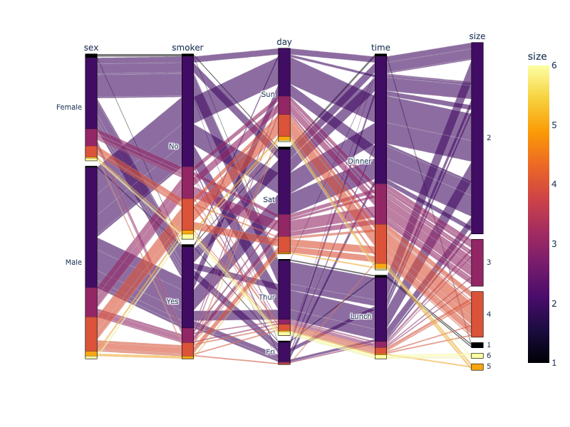

**Interactive Plot:**

<div>                        <script type="text/javascript">window.PlotlyConfig = {MathJaxConfig: 'local'};</script>
        <script charset="utf-8" src="https://cdn.plot.ly/plotly-3.1.0.min.js" integrity="sha256-Ei4740bWZhaUTQuD6q9yQlgVCMPBz6CZWhevDYPv93A=" crossorigin="anonymous"></script>                <div id="plotly-div-9" class="plotly-graph-div" style="height:100%; width:100%;"></div>            <script type="text/javascript">                window.PLOTLYENV=window.PLOTLYENV || {};                                if (document.getElementById("plotly-div-9")) {                    Plotly.newPlot(                        "plotly-div-9",                        [{"dimensions":[{"label":"sex","values":["Female","Male","Male","Male","Female","Male","Male","Male","Male","Male","Male","Female","Male","Male","Female","Male","Female","Male","Female","Male","Male","Female","Female","Male","Male","Male","Male","Male","Male","Female","Male","Male","Female","Female","Male","Male","Male","Female","Male","Male","Male","Male","Male","Male","Male","Male","Male","Male","Male","Male","Male","Female","Female","Male","Male","Male","Male","Female","Male","Male","Male","Male","Male","Male","Male","Male","Female","Female","Male","Male","Male","Female","Female","Female","Female","Male","Male","Male","Male","Male","Male","Male","Female","Male","Male","Female","Male","Male","Male","Male","Male","Male","Female","Female","Female","Male","Male","Male","Male","Male","Female","Female","Female","Female","Female","Male","Male","Male","Male","Female","Male","Female","Male","Male","Female","Female","Male","Female","Female","Female","Male","Female","Male","Male","Female","Female","Male","Female","Female","Male","Male","Female","Female","Female","Female","Female","Female","Female","Male","Female","Female","Male","Male","Female","Female","Female","Female","Female","Male","Male","Male","Male","Male","Male","Male","Female","Male","Female","Female","Male","Male","Male","Female","Male","Female","Male","Male","Male","Female","Female","Male","Male","Male","Male","Male","Male","Male","Male","Female","Male","Male","Male","Male","Male","Male","Male","Female","Male","Female","Male","Male","Female","Male","Male","Male","Male","Male","Female","Female","Male","Male","Female","Female","Female","Male","Female","Male","Male","Male","Female","Male","Male","Male","Female","Female","Female","Male","Male","Male","Female","Male","Female","Male","Female","Male","Female","Female","Male","Male","Female","Male","Male","Male","Male","Male","Male","Male","Male","Female","Male","Female","Male","Male","Female"]},{"label":"smoker","values":["No","No","No","No","No","No","No","No","No","No","No","No","No","No","No","No","No","No","No","No","No","No","No","No","No","No","No","No","No","No","No","No","No","No","No","No","No","No","No","No","No","No","No","No","No","No","No","No","No","No","No","No","No","No","No","No","Yes","No","Yes","No","Yes","Yes","Yes","Yes","No","No","No","Yes","No","Yes","No","No","Yes","Yes","No","No","Yes","No","No","No","Yes","No","No","Yes","No","No","No","No","No","No","Yes","No","Yes","Yes","No","Yes","Yes","Yes","Yes","No","Yes","Yes","Yes","Yes","No","Yes","Yes","Yes","No","Yes","No","No","No","No","No","No","No","No","No","No","No","No","No","No","No","No","No","No","No","No","No","No","No","No","No","No","No","No","Yes","No","No","No","No","No","No","No","No","No","No","No","No","No","No","No","No","No","No","No","No","No","No","No","No","No","Yes","No","No","No","Yes","Yes","Yes","Yes","Yes","Yes","Yes","Yes","Yes","Yes","Yes","Yes","Yes","Yes","Yes","Yes","Yes","No","Yes","Yes","Yes","Yes","Yes","Yes","Yes","Yes","Yes","No","Yes","Yes","Yes","Yes","Yes","Yes","Yes","Yes","Yes","Yes","Yes","Yes","Yes","Yes","Yes","Yes","No","Yes","Yes","Yes","Yes","Yes","Yes","Yes","Yes","Yes","Yes","No","Yes","Yes","Yes","No","No","Yes","Yes","Yes","No","No","Yes","No","Yes","Yes","No","No","Yes","Yes","No","No"]},{"label":"day","values":["Sun","Sun","Sun","Sun","Sun","Sun","Sun","Sun","Sun","Sun","Sun","Sun","Sun","Sun","Sun","Sun","Sun","Sun","Sun","Sat","Sat","Sat","Sat","Sat","Sat","Sat","Sat","Sat","Sat","Sat","Sat","Sat","Sat","Sat","Sat","Sat","Sat","Sat","Sat","Sat","Sat","Sun","Sun","Sun","Sun","Sun","Sun","Sun","Sun","Sun","Sun","Sun","Sun","Sun","Sun","Sun","Sat","Sat","Sat","Sat","Sat","Sat","Sat","Sat","Sat","Sat","Sat","Sat","Sat","Sat","Sat","Sat","Sat","Sat","Sat","Sat","Sat","Thur","Thur","Thur","Thur","Thur","Thur","Thur","Thur","Thur","Thur","Thur","Thur","Thur","Fri","Fri","Fri","Fri","Fri","Fri","Fri","Fri","Fri","Fri","Fri","Fri","Sat","Sat","Sat","Sat","Sat","Sat","Sat","Sat","Sat","Sat","Sun","Sun","Sun","Sun","Sun","Thur","Thur","Thur","Thur","Thur","Thur","Thur","Thur","Thur","Thur","Thur","Thur","Thur","Thur","Thur","Thur","Thur","Thur","Thur","Thur","Thur","Thur","Thur","Thur","Thur","Thur","Thur","Thur","Thur","Thur","Thur","Thur","Thur","Sun","Sun","Sun","Sun","Sun","Sun","Sun","Sun","Sun","Sun","Sun","Sun","Sun","Sun","Sun","Sun","Sun","Sun","Sat","Sat","Sat","Sat","Sun","Sun","Sun","Sun","Sun","Sun","Sun","Sun","Sun","Sun","Sun","Sun","Sun","Sun","Sun","Sun","Sun","Sun","Sun","Thur","Thur","Thur","Thur","Thur","Thur","Thur","Thur","Thur","Thur","Thur","Thur","Thur","Thur","Thur","Sat","Sat","Sat","Sat","Sat","Sat","Sat","Sat","Sat","Sat","Sat","Sat","Sat","Sat","Fri","Fri","Fri","Fri","Fri","Fri","Fri","Sat","Sat","Sat","Sat","Sat","Sat","Sat","Sat","Sat","Sat","Sat","Sat","Sat","Sat","Sat","Sat","Thur"]},{"label":"time","values":["Dinner","Dinner","Dinner","Dinner","Dinner","Dinner","Dinner","Dinner","Dinner","Dinner","Dinner","Dinner","Dinner","Dinner","Dinner","Dinner","Dinner","Dinner","Dinner","Dinner","Dinner","Dinner","Dinner","Dinner","Dinner","Dinner","Dinner","Dinner","Dinner","Dinner","Dinner","Dinner","Dinner","Dinner","Dinner","Dinner","Dinner","Dinner","Dinner","Dinner","Dinner","Dinner","Dinner","Dinner","Dinner","Dinner","Dinner","Dinner","Dinner","Dinner","Dinner","Dinner","Dinner","Dinner","Dinner","Dinner","Dinner","Dinner","Dinner","Dinner","Dinner","Dinner","Dinner","Dinner","Dinner","Dinner","Dinner","Dinner","Dinner","Dinner","Dinner","Dinner","Dinner","Dinner","Dinner","Dinner","Dinner","Lunch","Lunch","Lunch","Lunch","Lunch","Lunch","Lunch","Lunch","Lunch","Lunch","Lunch","Lunch","Lunch","Dinner","Dinner","Dinner","Dinner","Dinner","Dinner","Dinner","Dinner","Dinner","Dinner","Dinner","Dinner","Dinner","Dinner","Dinner","Dinner","Dinner","Dinner","Dinner","Dinner","Dinner","Dinner","Dinner","Dinner","Dinner","Dinner","Dinner","Lunch","Lunch","Lunch","Lunch","Lunch","Lunch","Lunch","Lunch","Lunch","Lunch","Lunch","Lunch","Lunch","Lunch","Lunch","Lunch","Lunch","Lunch","Lunch","Lunch","Lunch","Lunch","Lunch","Lunch","Lunch","Lunch","Lunch","Lunch","Lunch","Lunch","Lunch","Lunch","Lunch","Dinner","Dinner","Dinner","Dinner","Dinner","Dinner","Dinner","Dinner","Dinner","Dinner","Dinner","Dinner","Dinner","Dinner","Dinner","Dinner","Dinner","Dinner","Dinner","Dinner","Dinner","Dinner","Dinner","Dinner","Dinner","Dinner","Dinner","Dinner","Dinner","Dinner","Dinner","Dinner","Dinner","Dinner","Dinner","Dinner","Dinner","Dinner","Dinner","Dinner","Dinner","Lunch","Lunch","Lunch","Lunch","Lunch","Lunch","Lunch","Lunch","Lunch","Lunch","Lunch","Lunch","Lunch","Lunch","Lunch","Dinner","Dinner","Dinner","Dinner","Dinner","Dinner","Dinner","Dinner","Dinner","Dinner","Dinner","Dinner","Dinner","Dinner","Lunch","Lunch","Lunch","Lunch","Lunch","Lunch","Lunch","Dinner","Dinner","Dinner","Dinner","Dinner","Dinner","Dinner","Dinner","Dinner","Dinner","Dinner","Dinner","Dinner","Dinner","Dinner","Dinner","Dinner"]},{"label":"size","values":{"dtype":"i1","bdata":"AgMDAgQEAgQCAgIEAgQCAgMDAwMCAgIEAgQCAgICAgQCBAIDAwMDAwMCAgIEAgIEAwICAgQCBAIEAgIEAgICBAMDAgECAgIDAgICAgIEAgICAgECAgQCAgICAgICAgIEAgICAgICAwICAgICAgICAQMCAwIEAgIEAgICAgIGAgICAwICAgICAgICAgICBgUGAgIDAgICAgIDBAQFBgQCBAQCAwICAwIEAgIDAgICAgICAgICBAIDBAIFAwUDAwICAgICAgIEAgIDAgICBAMDBAICAwQEAgMCBQICBAICAQMCAgIEAgIEAwICAgICAgMDAgICAg=="}}],"domain":{"x":[0.0,1.0],"y":[0.0,1.0]},"line":{"color":{"dtype":"i1","bdata":"AgMDAgQEAgQCAgIEAgQCAgMDAwMCAgIEAgQCAgICAgQCBAIDAwMDAwMCAgIEAgIEAwICAgQCBAIEAgIEAgICBAMDAgECAgIDAgICAgIEAgICAgECAgQCAgICAgICAgIEAgICAgICAwICAgICAgICAQMCAwIEAgIEAgICAgIGAgICAwICAgICAgICAgICBgUGAgIDAgICAgIDBAQFBgQCBAQCAwICAwIEAgIDAgICAgICAgICBAIDBAIFAwUDAwICAgICAgIEAgIDAgICBAMDBAICAwQEAgMCBQICBAICAQMCAgIEAgIEAwICAgICAgMDAgICAg=="},"coloraxis":"coloraxis"},"name":"","type":"parcats"}],                        {"template":{"data":{"histogram2dcontour":[{"type":"histogram2dcontour","colorbar":{"outlinewidth":0,"ticks":""},"colorscale":[[0.0,"#0d0887"],[0.1111111111111111,"#46039f"],[0.2222222222222222,"#7201a8"],[0.3333333333333333,"#9c179e"],[0.4444444444444444,"#bd3786"],[0.5555555555555556,"#d8576b"],[0.6666666666666666,"#ed7953"],[0.7777777777777778,"#fb9f3a"],[0.8888888888888888,"#fdca26"],[1.0,"#f0f921"]]}],"choropleth":[{"type":"choropleth","colorbar":{"outlinewidth":0,"ticks":""}}],"histogram2d":[{"type":"histogram2d","colorbar":{"outlinewidth":0,"ticks":""},"colorscale":[[0.0,"#0d0887"],[0.1111111111111111,"#46039f"],[0.2222222222222222,"#7201a8"],[0.3333333333333333,"#9c179e"],[0.4444444444444444,"#bd3786"],[0.5555555555555556,"#d8576b"],[0.6666666666666666,"#ed7953"],[0.7777777777777778,"#fb9f3a"],[0.8888888888888888,"#fdca26"],[1.0,"#f0f921"]]}],"heatmap":[{"type":"heatmap","colorbar":{"outlinewidth":0,"ticks":""},"colorscale":[[0.0,"#0d0887"],[0.1111111111111111,"#46039f"],[0.2222222222222222,"#7201a8"],[0.3333333333333333,"#9c179e"],[0.4444444444444444,"#bd3786"],[0.5555555555555556,"#d8576b"],[0.6666666666666666,"#ed7953"],[0.7777777777777778,"#fb9f3a"],[0.8888888888888888,"#fdca26"],[1.0,"#f0f921"]]}],"contourcarpet":[{"type":"contourcarpet","colorbar":{"outlinewidth":0,"ticks":""}}],"contour":[{"type":"contour","colorbar":{"outlinewidth":0,"ticks":""},"colorscale":[[0.0,"#0d0887"],[0.1111111111111111,"#46039f"],[0.2222222222222222,"#7201a8"],[0.3333333333333333,"#9c179e"],[0.4444444444444444,"#bd3786"],[0.5555555555555556,"#d8576b"],[0.6666666666666666,"#ed7953"],[0.7777777777777778,"#fb9f3a"],[0.8888888888888888,"#fdca26"],[1.0,"#f0f921"]]}],"surface":[{"type":"surface","colorbar":{"outlinewidth":0,"ticks":""},"colorscale":[[0.0,"#0d0887"],[0.1111111111111111,"#46039f"],[0.2222222222222222,"#7201a8"],[0.3333333333333333,"#9c179e"],[0.4444444444444444,"#bd3786"],[0.5555555555555556,"#d8576b"],[0.6666666666666666,"#ed7953"],[0.7777777777777778,"#fb9f3a"],[0.8888888888888888,"#fdca26"],[1.0,"#f0f921"]]}],"mesh3d":[{"type":"mesh3d","colorbar":{"outlinewidth":0,"ticks":""}}],"scatter":[{"fillpattern":{"fillmode":"overlay","size":10,"solidity":0.2},"type":"scatter"}],"parcoords":[{"type":"parcoords","line":{"colorbar":{"outlinewidth":0,"ticks":""}}}],"scatterpolargl":[{"type":"scatterpolargl","marker":{"colorbar":{"outlinewidth":0,"ticks":""}}}],"bar":[{"error_x":{"color":"#2a3f5f"},"error_y":{"color":"#2a3f5f"},"marker":{"line":{"color":"#E5ECF6","width":0.5},"pattern":{"fillmode":"overlay","size":10,"solidity":0.2}},"type":"bar"}],"scattergeo":[{"type":"scattergeo","marker":{"colorbar":{"outlinewidth":0,"ticks":""}}}],"scatterpolar":[{"type":"scatterpolar","marker":{"colorbar":{"outlinewidth":0,"ticks":""}}}],"histogram":[{"marker":{"pattern":{"fillmode":"overlay","size":10,"solidity":0.2}},"type":"histogram"}],"scattergl":[{"type":"scattergl","marker":{"colorbar":{"outlinewidth":0,"ticks":""}}}],"scatter3d":[{"type":"scatter3d","line":{"colorbar":{"outlinewidth":0,"ticks":""}},"marker":{"colorbar":{"outlinewidth":0,"ticks":""}}}],"scattermap":[{"type":"scattermap","marker":{"colorbar":{"outlinewidth":0,"ticks":""}}}],"scattermapbox":[{"type":"scattermapbox","marker":{"colorbar":{"outlinewidth":0,"ticks":""}}}],"scatterternary":[{"type":"scatterternary","marker":{"colorbar":{"outlinewidth":0,"ticks":""}}}],"scattercarpet":[{"type":"scattercarpet","marker":{"colorbar":{"outlinewidth":0,"ticks":""}}}],"carpet":[{"aaxis":{"endlinecolor":"#2a3f5f","gridcolor":"white","linecolor":"white","minorgridcolor":"white","startlinecolor":"#2a3f5f"},"baxis":{"endlinecolor":"#2a3f5f","gridcolor":"white","linecolor":"white","minorgridcolor":"white","startlinecolor":"#2a3f5f"},"type":"carpet"}],"table":[{"cells":{"fill":{"color":"#EBF0F8"},"line":{"color":"white"}},"header":{"fill":{"color":"#C8D4E3"},"line":{"color":"white"}},"type":"table"}],"barpolar":[{"marker":{"line":{"color":"#E5ECF6","width":0.5},"pattern":{"fillmode":"overlay","size":10,"solidity":0.2}},"type":"barpolar"}],"pie":[{"automargin":true,"type":"pie"}]},"layout":{"autotypenumbers":"strict","colorway":["#636efa","#EF553B","#00cc96","#ab63fa","#FFA15A","#19d3f3","#FF6692","#B6E880","#FF97FF","#FECB52"],"font":{"color":"#2a3f5f"},"hovermode":"closest","hoverlabel":{"align":"left"},"paper_bgcolor":"white","plot_bgcolor":"#E5ECF6","polar":{"bgcolor":"#E5ECF6","angularaxis":{"gridcolor":"white","linecolor":"white","ticks":""},"radialaxis":{"gridcolor":"white","linecolor":"white","ticks":""}},"ternary":{"bgcolor":"#E5ECF6","aaxis":{"gridcolor":"white","linecolor":"white","ticks":""},"baxis":{"gridcolor":"white","linecolor":"white","ticks":""},"caxis":{"gridcolor":"white","linecolor":"white","ticks":""}},"coloraxis":{"colorbar":{"outlinewidth":0,"ticks":""}},"colorscale":{"sequential":[[0.0,"#0d0887"],[0.1111111111111111,"#46039f"],[0.2222222222222222,"#7201a8"],[0.3333333333333333,"#9c179e"],[0.4444444444444444,"#bd3786"],[0.5555555555555556,"#d8576b"],[0.6666666666666666,"#ed7953"],[0.7777777777777778,"#fb9f3a"],[0.8888888888888888,"#fdca26"],[1.0,"#f0f921"]],"sequentialminus":[[0.0,"#0d0887"],[0.1111111111111111,"#46039f"],[0.2222222222222222,"#7201a8"],[0.3333333333333333,"#9c179e"],[0.4444444444444444,"#bd3786"],[0.5555555555555556,"#d8576b"],[0.6666666666666666,"#ed7953"],[0.7777777777777778,"#fb9f3a"],[0.8888888888888888,"#fdca26"],[1.0,"#f0f921"]],"diverging":[[0,"#8e0152"],[0.1,"#c51b7d"],[0.2,"#de77ae"],[0.3,"#f1b6da"],[0.4,"#fde0ef"],[0.5,"#f7f7f7"],[0.6,"#e6f5d0"],[0.7,"#b8e186"],[0.8,"#7fbc41"],[0.9,"#4d9221"],[1,"#276419"]]},"xaxis":{"gridcolor":"white","linecolor":"white","ticks":"","title":{"standoff":15},"zerolinecolor":"white","automargin":true,"zerolinewidth":2},"yaxis":{"gridcolor":"white","linecolor":"white","ticks":"","title":{"standoff":15},"zerolinecolor":"white","automargin":true,"zerolinewidth":2},"scene":{"xaxis":{"backgroundcolor":"#E5ECF6","gridcolor":"white","linecolor":"white","showbackground":true,"ticks":"","zerolinecolor":"white","gridwidth":2},"yaxis":{"backgroundcolor":"#E5ECF6","gridcolor":"white","linecolor":"white","showbackground":true,"ticks":"","zerolinecolor":"white","gridwidth":2},"zaxis":{"backgroundcolor":"#E5ECF6","gridcolor":"white","linecolor":"white","showbackground":true,"ticks":"","zerolinecolor":"white","gridwidth":2}},"shapedefaults":{"line":{"color":"#2a3f5f"}},"annotationdefaults":{"arrowcolor":"#2a3f5f","arrowhead":0,"arrowwidth":1},"geo":{"bgcolor":"white","landcolor":"#E5ECF6","subunitcolor":"white","showland":true,"showlakes":true,"lakecolor":"white"},"title":{"x":0.05},"mapbox":{"style":"light"}}},"coloraxis":{"colorbar":{"title":{"text":"size"}},"colorscale":[[0.0,"#000004"],[0.1111111111111111,"#1b0c41"],[0.2222222222222222,"#4a0c6b"],[0.3333333333333333,"#781c6d"],[0.4444444444444444,"#a52c60"],[0.5555555555555556,"#cf4446"],[0.6666666666666666,"#ed6925"],[0.7777777777777778,"#fb9b06"],[0.8888888888888888,"#f7d13d"],[1.0,"#fcffa4"]]},"legend":{"tracegroupgap":0},"margin":{"t":60}},                        {"responsive": true}                    )                };            </script>        </div>

**Read more about [hover labels](hover-text-and-formatting.md).**

```python
import plotly.express as px
df = px.data.gapminder()
fig = px.scatter(df.query("year==2007"), x="gdpPercap", y="lifeExp", size="pop", color="continent",
           hover_name="country", log_x=True, size_max=60)
fig.show()
```

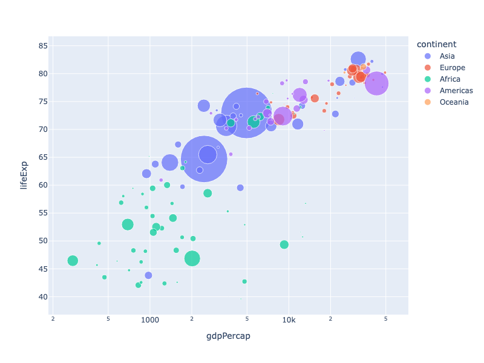

**Interactive Plot:**

<div>                        <script type="text/javascript">window.PlotlyConfig = {MathJaxConfig: 'local'};</script>
        <script charset="utf-8" src="https://cdn.plot.ly/plotly-3.1.0.min.js" integrity="sha256-Ei4740bWZhaUTQuD6q9yQlgVCMPBz6CZWhevDYPv93A=" crossorigin="anonymous"></script>                <div id="plotly-div-10" class="plotly-graph-div" style="height:100%; width:100%;"></div>            <script type="text/javascript">                window.PLOTLYENV=window.PLOTLYENV || {};                                if (document.getElementById("plotly-div-10")) {                    Plotly.newPlot(                        "plotly-div-10",                        [{"hovertemplate":"\u003cb\u003e%{hovertext}\u003c\u002fb\u003e\u003cbr\u003e\u003cbr\u003econtinent=Asia\u003cbr\u003egdpPercap=%{x}\u003cbr\u003elifeExp=%{y}\u003cbr\u003epop=%{marker.size}\u003cextra\u003e\u003c\u002fextra\u003e","hovertext":["Afghanistan","Bahrain","Bangladesh","Cambodia","China","Hong Kong, China","India","Indonesia","Iran","Iraq","Israel","Japan","Jordan","Korea, Dem. Rep.","Korea, Rep.","Kuwait","Lebanon","Malaysia","Mongolia","Myanmar","Nepal","Oman","Pakistan","Philippines","Saudi Arabia","Singapore","Sri Lanka","Syria","Taiwan","Thailand","Vietnam","West Bank and Gaza","Yemen, Rep."],"legendgroup":"Asia","marker":{"color":"#636efa","size":{"dtype":"i4","bdata":"A5rmAd3PCgDTqPcIkqLXANiBmU48g2oAq00vQngOUw0CxyMEdpyjATcQYgDEAZkHSV1cAF2OYwE2XewCVzsmAH7VOwAmvnoBD9srADzK2AKeAbkBIecwAFndFgqnum0FjiilATF5RQB\u002f8jYBO7gmAZacYQF13OADFAAVBZxQPQCf7FIB"},"sizemode":"area","sizeref":366300.86,"symbol":"circle"},"mode":"markers","name":"Asia","orientation":"v","showlegend":true,"x":{"dtype":"f8","bdata":"54R1iKR0jkDGpwAYAxndQPLPDOIDvZVAat\u002fcXx3HmkDRXRJnHV+zQHK\u002fQ1GfZeNAs193umsoo0CA7suZTamrQKmHaHTbqsZAbVUS2Q93sUBuowG80ezYQItUGFsE6t5A3XpND3ansUArajANQ+SYQBMZVvEIzdZASBtHrF8Z50B3hNOCh27EQFwgQfHTUchATsEaZ4svqEAAAAAAAICNQEjfpGlwDZFAmGn7VwzL1UCwrDQp5VukQLWpukf27KhAD0WBPrUl1UCiYpy\u002f5QTnQJ6xL9kwBK9ATIqPT4xYsECOHr+3kQvcQIOvr3VlIr1AkdJsHicTo0BqNLkYs6KnQP2FHjGK0aFA"},"xaxis":"x","y":{"dtype":"f8","bdata":"RIts5\u002fvpRUBxPQrXo+hSQIcW2c73A1BABoGVQ4vcTUAv3SQGgT1SQFpkO99PjVRA6iYxCKwsUECamZmZmalRQARWDi2yvVFA9ihcj8LFTUBI4XoUri9UQDvfT42XplRACtejcD0iUkBeukkMAtNQQB1aZDvfp1NAFIPAyqFlU0BkO99Pjf9RQIGVQ4tsj1JACKwcWmSzUEBGtvP91AhPQBSuR+F65E9AKVyPwvXoUkD0\u002fdR46V5QQHnpJjEI7FFAfT81XroxUkCR7Xw\u002fNf5TQNNNYhBYGVJA\u002ftR46SaJUkCamZmZmZlTQIGVQ4tsp1FADi2yne+PUkBeukkMAltSQNNNYhBYWU9A"},"yaxis":"y","type":"scatter"},{"hovertemplate":"\u003cb\u003e%{hovertext}\u003c\u002fb\u003e\u003cbr\u003e\u003cbr\u003econtinent=Europe\u003cbr\u003egdpPercap=%{x}\u003cbr\u003elifeExp=%{y}\u003cbr\u003epop=%{marker.size}\u003cextra\u003e\u003c\u002fextra\u003e","hovertext":["Albania","Austria","Belgium","Bosnia and Herzegovina","Bulgaria","Croatia","Czech Republic","Denmark","Finland","France","Germany","Greece","Hungary","Iceland","Ireland","Italy","Montenegro","Netherlands","Norway","Poland","Portugal","Romania","Serbia","Slovak Republic","Slovenia","Spain","Sweden","Switzerland","Turkey","United Kingdom"],"legendgroup":"Europe","marker":{"color":"#EF553B","size":{"dtype":"i4","bdata":"i\u002fA2AGcefQCikp4ABnZFAOq8bwAAkEQACBScANhvUwC87k8ADBGkA+RW6QRyXaMADOuXAGubBAAesz4AlUN3A8ByCgD12PwA1p1GAOG9SwKUZaIA2OdTAXnhmgBOH1MAnageAL8waQKwzYkAZUZzAHfLPQQuX58D"},"sizemode":"area","sizeref":366300.86,"symbol":"circle"},"mode":"markers","name":"Europe","orientation":"v","showlegend":true,"x":{"dtype":"f8","bdata":"YBQEjwcxt0BYyjLEz6PhQG+70FyTc+BA8nhafkwWvUDPMSB7ZdzEQBTGFoKcjcxAH7qgvlNM1kCxbVFmzTnhQPmgZ7PiNuBAduCcEYHB3UC+TX\u002f2l2rfQHjuPVya5NpAQni0cTyW0UALYwtBmarhQCxlGeJ\u002f3ONAvJaQD27m20BL58Oz8hLCQJbnwd299+FAVmXfFaYZ6ECjC+pb9g7OQFVNEHVpB9RA09nJ4DwcxUBbI4JxRB3DQGB2Tx6UPdJAcsRafBAq2UAwKqkTRCXcQP+ye\u002fJ3iOBAGH0FaU1Q4kCSCI1gI4XAQOPfZ1xoNuBA"},"xaxis":"x","y":{"dtype":"f8","bdata":"UI2XbhIbU0CTGARWDvVTQE5iEFg53FNASgwCK4e2UkC4HoXrUUBSQB1aZDvf71JAyXa+nxofU0Boke18P5VTQHnpJjEI1FNANV66SQwqVEBEi2zn+9lTQPT91Hjp3lNAFIPAyqFVUkCcxCCwcnBUQHE9CtejuFNAbef7qfEiVECYbhKDwKJSQFTjpZvE8FNABoGVQ4sMVEB56SYxCORSQIPAyqFFhlNAWDm0yHYeUkDjpZvEIIBSQN9PjZduqlJAJQaBlUN7U0BOYhBYOTxUQH9qvHSTOFRAwJ8aL91sVEB9PzVeuvFRQDMzMzMz21NA"},"yaxis":"y","type":"scatter"},{"hovertemplate":"\u003cb\u003e%{hovertext}\u003c\u002fb\u003e\u003cbr\u003e\u003cbr\u003econtinent=Africa\u003cbr\u003egdpPercap=%{x}\u003cbr\u003elifeExp=%{y}\u003cbr\u003epop=%{marker.size}\u003cextra\u003e\u003c\u002fextra\u003e","hovertext":["Algeria","Angola","Benin","Botswana","Burkina Faso","Burundi","Cameroon","Central African Republic","Chad","Comoros","Congo, Dem. Rep.","Congo, Rep.","Cote d'Ivoire","Djibouti","Egypt","Equatorial Guinea","Eritrea","Ethiopia","Gabon","Gambia","Ghana","Guinea","Guinea-Bissau","Kenya","Lesotho","Liberia","Libya","Madagascar","Malawi","Mali","Mauritania","Mauritius","Morocco","Mozambique","Namibia","Niger","Nigeria","Reunion","Rwanda","Sao Tome and Principe","Senegal","Sierra Leone","Somalia","South Africa","Sudan","Swaziland","Tanzania","Togo","Tunisia","Uganda","Zambia","Zimbabwe"],"legendgroup":"Africa","marker":{"color":"#00cc96","size":{"dtype":"i4","bdata":"4J\u002f8AXyFvQDqQ3sA2wIZALuZ2gBpB4AAJQYOAY6qQgBXO5wAMNkKACfS2QMi\u002fjkA4dwSAfaSBwBfvcgEIWkIAFneSgCPeo8EEzMWACfDGQD6BF0BpsqXACl2FgBBXh8C6bUeAFa8MACyHVwApnkkAedaywAzl7cAseUxAEIWEwD3FwMCKHAwAahbHwCRwsQAfGkMCI4tDACsM4cAmwsDAOUvuwAywl0ANSSLAIRanwLBVoUCCkoRAPj2RQLL\u002f1YAPs2cAN4avQHzOrMAZ9q7AA=="},"sizemode":"area","sizeref":366300.86,"symbol":"circle"},"mode":"markers","name":"Africa","orientation":"v","showlegend":true,"x":{"dtype":"f8","bdata":"ba0vEl5PuEClaVA0O72yQA5qv7UjhZZA26LMBu2MyEDb2y3JIQSTQKHhg40h4XpAFjWYhmHon0BkkSbeIRCGQOI\u002f3UBBoJpAEj5K2y7RjkA2yMlp1FhxQIwPs5cdYaxAWTFcHQAjmECsJ\u002fOP9kSgQKSK4lUuzbVAaJHtfAu9x0DPCMrI9AqEQJEHx9FxloVAIVnABD7LyUCOc5tw\u002f4WHQNRgGoZvvpRAcXkH0zt1jUCc8BKc2hmCQO3Vx0P\u002f3JZAFRqIZVOFmEB15h4SHuh5QMYzaOi\u002fjMdAMv\u002fomxRTkEBSoKqdzLqHQAqfrYNTSpBA5nXEIZssnEA1KQXdfmbFQI4ev7dZ2K1AvceZJny9iUC7YkZ4D8uyQEgHkEZqXYNA3lSkwuh3n0DdCfZfH\u002fa9QAWrjyy1+IpAZof4h735mEAPnZ5348GaQOgk73dT9IpABbhq6CDxjECGcw0z1BrCQCveyDzKVKRADW5rC3uhsUDhQh7B7U2RQKkf5XHCl4tAZMxdS+y0u0AXfnA+hYGQQEDc1avY3JNA2On2SFlbfUA="},"xaxis":"x","y":{"dtype":"f8","bdata":"JQaBlUMTUkAhsHJokV1FQHe+nxovXUxAd76fGi9dSUD2KFyPwiVKQArXo3A9ykhA16NwPQo3SUADK4cW2V5GQBfZzvdTU0lAfT81XrpJUEBCYOXQIjtHQPCnxks3qUtARIts5\u002fspSEBoke18P2VLQBSDwMqh1VFAJjEIrBzKSUCF61G4HgVNQPCnxks3eUpArkfhehReTEDTTWIQWLlNQIlBYOXQAk5AN4lBYOUATECNbOf7qTFHQK5H4XoUDktAsp3vp8ZLRUAQWDm0yNZGQLByaJHtfFJAZBBYObS4TUAQWDm0yCZIQLKd76fGO0tA0SLb+X4KUEAlBoGVQzNSQNEi2\u002fl+ylFA0SLb+X4KRUCJFtnO93NKQOXQItv5bkxAy6FFtvNtR0A\u002fNV66SRxTQOXQItv5HkdAbxKDwMphUEAOLbKd74dPQGQQWDm0SEVAMQisHFoUSEAIrBxaZKtIQLpJDAIrR01AWDm0yHbOQ0AZBFYOLUJKQPYoXI\u002fCNU1AUI2XbhJ7UkBMN4lBYMVJQP3UeOkmMUVAdZMYBFa+RUA="},"yaxis":"y","type":"scatter"},{"hovertemplate":"\u003cb\u003e%{hovertext}\u003c\u002fb\u003e\u003cbr\u003e\u003cbr\u003econtinent=Americas\u003cbr\u003egdpPercap=%{x}\u003cbr\u003elifeExp=%{y}\u003cbr\u003epop=%{marker.size}\u003cextra\u003e\u003c\u002fextra\u003e","hovertext":["Argentina","Bolivia","Brazil","Canada","Chile","Colombia","Costa Rica","Cuba","Dominican Republic","Ecuador","El Salvador","Guatemala","Haiti","Honduras","Jamaica","Mexico","Nicaragua","Panama","Paraguay","Peru","Puerto Rico","Trinidad and Tobago","United States","Uruguay","Venezuela"],"legendgroup":"Americas","marker":{"color":"#ab63fa","size":{"dtype":"i4","bdata":"Z\u002fVmArAliwAXVVMLPX79AUV8+ADe26IC\u002fBM\u002fAJs1rgDGNI4AIOXRACjkaQAA2b8AHr6BAHMxcgDkayoA26R6BlyZVgC9eDEAi7tlAMWKtQFbKDwAYB8QAOsH8xHImjQANgWOAQ=="},"sizemode":"area","sizeref":366300.86,"symbol":"circle"},"mode":"markers","name":"Americas","orientation":"v","showlegend":true,"x":{"dtype":"f8","bdata":"ICQLmLD1yECcwd8vRtytQGkAb4HmtMFAB7Ezhee74UCGONbF0bnJQPruVpaUXrtAqU2c3IfWwkCBs5QsDXrBQB5Av+9fibdA5fbLJ0PZukCuvOR\u002fWmC2QLQh\u002f8wMQrRAECIZcozGkkAInKVkqbirQOu12VjhmLxAQQ5KmMlkx0BSRIZVpHqlQHui68KXKMNA4KKTpdZMsECIf9jS5\u002fC8QKJ6a2At4NJAdF5jlyCW0UDr\u002fxzm9PjkQDCeQUO7ucRAW5TZIOdLxkA="},"xaxis":"x","y":{"dtype":"f8","bdata":"FK5H4XrUUkD6fmq8dGNQQClcj8L1GFJAbxKDwMopVEAIrBxaZKNTQDeJQWDlOFJANV66SQyyU0C28\u002f3UeJFTQNejcD0KD1JAVg4tsp2\u002fUkDVeOkmMfhRQH9qvHSTkFFAaJHtfD91TkDqJjEIrIxRQD81XrpJJFJAFK5H4XoMU0Coxks3iTlSQOx8PzVe4lJA46WbxCDwUUBt5\u002fup8dpRQDu0yHa+r1NAI9v5fmp0UUBzaJHtfI9TQH9qvHSTGFNAK4cW2c5vUkA="},"yaxis":"y","type":"scatter"},{"hovertemplate":"\u003cb\u003e%{hovertext}\u003c\u002fb\u003e\u003cbr\u003e\u003cbr\u003econtinent=Oceania\u003cbr\u003egdpPercap=%{x}\u003cbr\u003elifeExp=%{y}\u003cbr\u003epop=%{marker.size}\u003cextra\u003e\u003c\u002fextra\u003e","hovertext":["Australia","New Zealand"],"legendgroup":"Oceania","marker":{"color":"#FFA15A","size":{"dtype":"i4","bdata":"AM03ATvNPgA="},"sizemode":"area","sizeref":366300.86,"symbol":"circle"},"mode":"markers","name":"Oceania","orientation":"v","showlegend":true,"x":{"dtype":"f8","bdata":"54cRwmvQ4EAEHEKVQJjYQA=="},"xaxis":"x","y":{"dtype":"f8","bdata":"16NwPQpPVECTGARWDg1UQA=="},"yaxis":"y","type":"scatter"}],                        {"template":{"data":{"histogram2dcontour":[{"type":"histogram2dcontour","colorbar":{"outlinewidth":0,"ticks":""},"colorscale":[[0.0,"#0d0887"],[0.1111111111111111,"#46039f"],[0.2222222222222222,"#7201a8"],[0.3333333333333333,"#9c179e"],[0.4444444444444444,"#bd3786"],[0.5555555555555556,"#d8576b"],[0.6666666666666666,"#ed7953"],[0.7777777777777778,"#fb9f3a"],[0.8888888888888888,"#fdca26"],[1.0,"#f0f921"]]}],"choropleth":[{"type":"choropleth","colorbar":{"outlinewidth":0,"ticks":""}}],"histogram2d":[{"type":"histogram2d","colorbar":{"outlinewidth":0,"ticks":""},"colorscale":[[0.0,"#0d0887"],[0.1111111111111111,"#46039f"],[0.2222222222222222,"#7201a8"],[0.3333333333333333,"#9c179e"],[0.4444444444444444,"#bd3786"],[0.5555555555555556,"#d8576b"],[0.6666666666666666,"#ed7953"],[0.7777777777777778,"#fb9f3a"],[0.8888888888888888,"#fdca26"],[1.0,"#f0f921"]]}],"heatmap":[{"type":"heatmap","colorbar":{"outlinewidth":0,"ticks":""},"colorscale":[[0.0,"#0d0887"],[0.1111111111111111,"#46039f"],[0.2222222222222222,"#7201a8"],[0.3333333333333333,"#9c179e"],[0.4444444444444444,"#bd3786"],[0.5555555555555556,"#d8576b"],[0.6666666666666666,"#ed7953"],[0.7777777777777778,"#fb9f3a"],[0.8888888888888888,"#fdca26"],[1.0,"#f0f921"]]}],"contourcarpet":[{"type":"contourcarpet","colorbar":{"outlinewidth":0,"ticks":""}}],"contour":[{"type":"contour","colorbar":{"outlinewidth":0,"ticks":""},"colorscale":[[0.0,"#0d0887"],[0.1111111111111111,"#46039f"],[0.2222222222222222,"#7201a8"],[0.3333333333333333,"#9c179e"],[0.4444444444444444,"#bd3786"],[0.5555555555555556,"#d8576b"],[0.6666666666666666,"#ed7953"],[0.7777777777777778,"#fb9f3a"],[0.8888888888888888,"#fdca26"],[1.0,"#f0f921"]]}],"surface":[{"type":"surface","colorbar":{"outlinewidth":0,"ticks":""},"colorscale":[[0.0,"#0d0887"],[0.1111111111111111,"#46039f"],[0.2222222222222222,"#7201a8"],[0.3333333333333333,"#9c179e"],[0.4444444444444444,"#bd3786"],[0.5555555555555556,"#d8576b"],[0.6666666666666666,"#ed7953"],[0.7777777777777778,"#fb9f3a"],[0.8888888888888888,"#fdca26"],[1.0,"#f0f921"]]}],"mesh3d":[{"type":"mesh3d","colorbar":{"outlinewidth":0,"ticks":""}}],"scatter":[{"fillpattern":{"fillmode":"overlay","size":10,"solidity":0.2},"type":"scatter"}],"parcoords":[{"type":"parcoords","line":{"colorbar":{"outlinewidth":0,"ticks":""}}}],"scatterpolargl":[{"type":"scatterpolargl","marker":{"colorbar":{"outlinewidth":0,"ticks":""}}}],"bar":[{"error_x":{"color":"#2a3f5f"},"error_y":{"color":"#2a3f5f"},"marker":{"line":{"color":"#E5ECF6","width":0.5},"pattern":{"fillmode":"overlay","size":10,"solidity":0.2}},"type":"bar"}],"scattergeo":[{"type":"scattergeo","marker":{"colorbar":{"outlinewidth":0,"ticks":""}}}],"scatterpolar":[{"type":"scatterpolar","marker":{"colorbar":{"outlinewidth":0,"ticks":""}}}],"histogram":[{"marker":{"pattern":{"fillmode":"overlay","size":10,"solidity":0.2}},"type":"histogram"}],"scattergl":[{"type":"scattergl","marker":{"colorbar":{"outlinewidth":0,"ticks":""}}}],"scatter3d":[{"type":"scatter3d","line":{"colorbar":{"outlinewidth":0,"ticks":""}},"marker":{"colorbar":{"outlinewidth":0,"ticks":""}}}],"scattermap":[{"type":"scattermap","marker":{"colorbar":{"outlinewidth":0,"ticks":""}}}],"scattermapbox":[{"type":"scattermapbox","marker":{"colorbar":{"outlinewidth":0,"ticks":""}}}],"scatterternary":[{"type":"scatterternary","marker":{"colorbar":{"outlinewidth":0,"ticks":""}}}],"scattercarpet":[{"type":"scattercarpet","marker":{"colorbar":{"outlinewidth":0,"ticks":""}}}],"carpet":[{"aaxis":{"endlinecolor":"#2a3f5f","gridcolor":"white","linecolor":"white","minorgridcolor":"white","startlinecolor":"#2a3f5f"},"baxis":{"endlinecolor":"#2a3f5f","gridcolor":"white","linecolor":"white","minorgridcolor":"white","startlinecolor":"#2a3f5f"},"type":"carpet"}],"table":[{"cells":{"fill":{"color":"#EBF0F8"},"line":{"color":"white"}},"header":{"fill":{"color":"#C8D4E3"},"line":{"color":"white"}},"type":"table"}],"barpolar":[{"marker":{"line":{"color":"#E5ECF6","width":0.5},"pattern":{"fillmode":"overlay","size":10,"solidity":0.2}},"type":"barpolar"}],"pie":[{"automargin":true,"type":"pie"}]},"layout":{"autotypenumbers":"strict","colorway":["#636efa","#EF553B","#00cc96","#ab63fa","#FFA15A","#19d3f3","#FF6692","#B6E880","#FF97FF","#FECB52"],"font":{"color":"#2a3f5f"},"hovermode":"closest","hoverlabel":{"align":"left"},"paper_bgcolor":"white","plot_bgcolor":"#E5ECF6","polar":{"bgcolor":"#E5ECF6","angularaxis":{"gridcolor":"white","linecolor":"white","ticks":""},"radialaxis":{"gridcolor":"white","linecolor":"white","ticks":""}},"ternary":{"bgcolor":"#E5ECF6","aaxis":{"gridcolor":"white","linecolor":"white","ticks":""},"baxis":{"gridcolor":"white","linecolor":"white","ticks":""},"caxis":{"gridcolor":"white","linecolor":"white","ticks":""}},"coloraxis":{"colorbar":{"outlinewidth":0,"ticks":""}},"colorscale":{"sequential":[[0.0,"#0d0887"],[0.1111111111111111,"#46039f"],[0.2222222222222222,"#7201a8"],[0.3333333333333333,"#9c179e"],[0.4444444444444444,"#bd3786"],[0.5555555555555556,"#d8576b"],[0.6666666666666666,"#ed7953"],[0.7777777777777778,"#fb9f3a"],[0.8888888888888888,"#fdca26"],[1.0,"#f0f921"]],"sequentialminus":[[0.0,"#0d0887"],[0.1111111111111111,"#46039f"],[0.2222222222222222,"#7201a8"],[0.3333333333333333,"#9c179e"],[0.4444444444444444,"#bd3786"],[0.5555555555555556,"#d8576b"],[0.6666666666666666,"#ed7953"],[0.7777777777777778,"#fb9f3a"],[0.8888888888888888,"#fdca26"],[1.0,"#f0f921"]],"diverging":[[0,"#8e0152"],[0.1,"#c51b7d"],[0.2,"#de77ae"],[0.3,"#f1b6da"],[0.4,"#fde0ef"],[0.5,"#f7f7f7"],[0.6,"#e6f5d0"],[0.7,"#b8e186"],[0.8,"#7fbc41"],[0.9,"#4d9221"],[1,"#276419"]]},"xaxis":{"gridcolor":"white","linecolor":"white","ticks":"","title":{"standoff":15},"zerolinecolor":"white","automargin":true,"zerolinewidth":2},"yaxis":{"gridcolor":"white","linecolor":"white","ticks":"","title":{"standoff":15},"zerolinecolor":"white","automargin":true,"zerolinewidth":2},"scene":{"xaxis":{"backgroundcolor":"#E5ECF6","gridcolor":"white","linecolor":"white","showbackground":true,"ticks":"","zerolinecolor":"white","gridwidth":2},"yaxis":{"backgroundcolor":"#E5ECF6","gridcolor":"white","linecolor":"white","showbackground":true,"ticks":"","zerolinecolor":"white","gridwidth":2},"zaxis":{"backgroundcolor":"#E5ECF6","gridcolor":"white","linecolor":"white","showbackground":true,"ticks":"","zerolinecolor":"white","gridwidth":2}},"shapedefaults":{"line":{"color":"#2a3f5f"}},"annotationdefaults":{"arrowcolor":"#2a3f5f","arrowhead":0,"arrowwidth":1},"geo":{"bgcolor":"white","landcolor":"#E5ECF6","subunitcolor":"white","showland":true,"showlakes":true,"lakecolor":"white"},"title":{"x":0.05},"mapbox":{"style":"light"}}},"xaxis":{"anchor":"y","domain":[0.0,1.0],"title":{"text":"gdpPercap"},"type":"log"},"yaxis":{"anchor":"x","domain":[0.0,1.0],"title":{"text":"lifeExp"}},"legend":{"title":{"text":"continent"},"tracegroupgap":0,"itemsizing":"constant"},"margin":{"t":60}},                        {"responsive": true}                    )                };            </script>        </div>

**Read more about [animations](animations.md).**

```python
import plotly.express as px
df = px.data.gapminder()
fig = px.scatter(df, x="gdpPercap", y="lifeExp", animation_frame="year", animation_group="country",
           size="pop", color="continent", hover_name="country", facet_col="continent",
           log_x=True, size_max=45, range_x=[100,100000], range_y=[25,90])
fig.show()
```

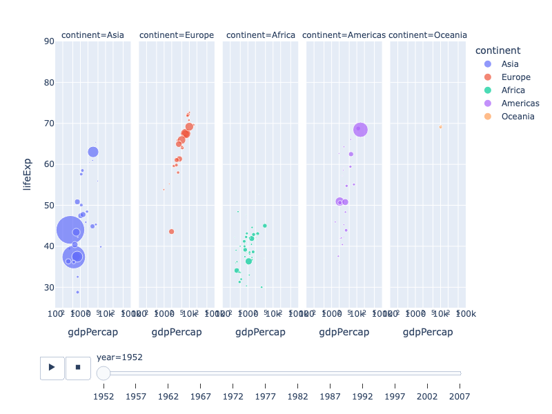

**Interactive Plot:**

<div>                        <script type="text/javascript">window.PlotlyConfig = {MathJaxConfig: 'local'};</script>
        <script charset="utf-8" src="https://cdn.plot.ly/plotly-3.1.0.min.js" integrity="sha256-Ei4740bWZhaUTQuD6q9yQlgVCMPBz6CZWhevDYPv93A=" crossorigin="anonymous"></script>                <div id="plotly-div-11" class="plotly-graph-div" style="height:100%; width:100%;"></div>            <script type="text/javascript">                window.PLOTLYENV=window.PLOTLYENV || {};                                if (document.getElementById("plotly-div-11")) {                    Plotly.newPlot(                        "plotly-div-11",                        [{"hovertemplate":"\u003cb\u003e%{hovertext}\u003c\u002fb\u003e\u003cbr\u003e\u003cbr\u003econtinent=Asia\u003cbr\u003eyear=1952\u003cbr\u003egdpPercap=%{x}\u003cbr\u003elifeExp=%{y}\u003cbr\u003epop=%{marker.size}\u003cextra\u003e\u003c\u002fextra\u003e","hovertext":["Afghanistan","Bahrain","Bangladesh","Cambodia","China","Hong Kong, China","India","Indonesia","Iran","Iraq","Israel","Japan","Jordan","Korea, Dem. Rep.","Korea, Rep.","Kuwait","Lebanon","Malaysia","Mongolia","Myanmar","Nepal","Oman","Pakistan","Philippines","Saudi Arabia","Singapore","Sri Lanka","Syria","Taiwan","Thailand","Vietnam","West Bank and Gaza","Yemen, Rep."],"ids":["Afghanistan","Bahrain","Bangladesh","Cambodia","China","Hong Kong, China","India","Indonesia","Iran","Iraq","Israel","Japan","Jordan","Korea, Dem. Rep.","Korea, Rep.","Kuwait","Lebanon","Malaysia","Mongolia","Myanmar","Nepal","Oman","Pakistan","Philippines","Saudi Arabia","Singapore","Sri Lanka","Syria","Taiwan","Thailand","Vietnam","West Bank and Gaza","Yemen, Rep."],"legendgroup":"Asia","marker":{"color":"#636efa","size":{"dtype":"i4","bdata":"dY+AAH\u002fWAQDLb8sCTJ9HAGfoJyFMcCAAAEUsFqAD5ATAjAcB5ghTALK7GACRQicFqkYJANBGhwBzoj8BAHECACn3FQDa+GYAlzcMAESYMgFIHYwAub8HAADmdgIjY1YBLR89AFgyEQAGzXkA7d43ANp3ggC62UQBt36QAbm5DwD1vUsA"},"sizemode":"area","sizeref":651201.5288888889,"symbol":"circle"},"mode":"markers","name":"Asia","orientation":"v","showlegend":true,"x":{"dtype":"f8","bdata":"em8MAZBbiEBsW5TZikXDQOVkPRD0YYVAvQeeMYIHd0AEWrqCLQd5QJC\u002ftKjX3KdA4amRp4YUgUBYsVMHdG2HQNzwu+mmtqdA6Po+HMQhsECneFxUC+2vQEFhUKbpIalAUoAomKErmEDP2JdsHAGRQF0XfnBeGpBAbHh6peV1+kDLvFXXzeKyQFdfXRWInJxA8L+V7IiUiEAAAAAAALB0QC63IADtDoFAKSSZ1euQnEARIFTzxmSFQMKjjSOG45NAElDhCI47uUDZeLDFRhaiQPfpeMwg7pBA7pOjAPGtmUDQmbSpytuSQAP2hxxhrodApefMLIjogkDiTX6LXq6XQCHPiZi9bYhA"},"xaxis":"x","y":{"dtype":"f8","bdata":"kxgEVg7NPEDUeOkmMXhJQMuhRbbzvUJATDeJQWC1Q0AAAAAAAABGQHsUrkfhek5AO7TIdr6vQkCWQ4ts57tCQKwcWmQ7b0ZAKVyPwvWoRkApXI\u002fC9VhQQKRwPQrXg09ATmIQWDmURUC6SQwCKwdJQESLbOf7uUdAuB6F61HIS0AQWDm0yPZLQCUGgZVDO0hArBxaZDsfRUBGtvP91ChCQGq8dJMYFEJARIts5\u002fvJQkAshxbZzrdFQMdLN4lB4EdAAAAAAADwQ0Cmm8QgsDJOQJZDi2zny0xAGy\u002fdJAbxRkAAAAAAAEBNQAaBlUOLbElA2\u002fl+arw0REAUrkfhepRFQKAaL90kRkBA"},"yaxis":"y","type":"scatter"},{"hovertemplate":"\u003cb\u003e%{hovertext}\u003c\u002fb\u003e\u003cbr\u003e\u003cbr\u003econtinent=Europe\u003cbr\u003eyear=1952\u003cbr\u003egdpPercap=%{x}\u003cbr\u003elifeExp=%{y}\u003cbr\u003epop=%{marker.size}\u003cextra\u003e\u003c\u002fextra\u003e","hovertext":["Albania","Austria","Belgium","Bosnia and Herzegovina","Bulgaria","Croatia","Czech Republic","Denmark","Finland","France","Germany","Greece","Hungary","Iceland","Ireland","Italy","Montenegro","Netherlands","Norway","Poland","Portugal","Romania","Serbia","Slovak Republic","Slovenia","Spain","Sweden","Switzerland","Turkey","United Kingdom"],"ids":["Albania","Austria","Belgium","Bosnia and Herzegovina","Bulgaria","Croatia","Czech Republic","Denmark","Finland","France","Germany","Greece","Hungary","Iceland","Ireland","Italy","Montenegro","Netherlands","Norway","Poland","Portugal","Romania","Serbia","Slovak Republic","Slovenia","Spain","Sweden","Switzerland","Turkey","United Kingdom"],"legendgroup":"Europe","marker":{"color":"#EF553B","size":{"dtype":"i4","bdata":"iZITAJy1aQAlN4UAWJYqAJQBbwD1PDsAPz2LALAhQgCEaj4AE+KHAmAVHwQCAHYAAAWRAPpBAgDcCy0AUFPXAopQBgCkap4A8MYyAPediAHiGIIA8MD9AHOtaAD5SjYAbroWAO6iswHBtmwAmHhJAB1KUwEwgAED"},"sizemode":"area","sizeref":651201.5288888889,"symbol":"circle"},"mode":"markers","name":"Europe","orientation":"v","showlegend":true,"x":{"dtype":"f8","bdata":"gzC3ezkEmUBozvqUE\u002fm3QHYxzXSNS8BALqOi+0NsjkDt0obDkhijQLNBJhl5XqhARIts5yPcukD5SbVPMe7CQE1J1uGEGLlAxeQNMM91u0DmEdxIHei7QBk6dlBhlatAhpM0f6yPtECnQdE8sGO8QCdok8NHWrRAgruzdmdDs0AD7+TTK6+kQPqXpDLJdsFACcTr+rW3w0AMrU7OqHqvQCSAm8Wj+KdAu\u002fCD8zmRqEBtrMQ86\u002fqrQKosCruo0rNA58WJrwp3sECYE7TJEfStQBdp4h3sp8BAEoPAyh3HzEAzFk1nZ8SeQLgdGhbBfcNA"},"xaxis":"x2","y":{"dtype":"f8","bdata":"PQrXo3CdS0AzMzMzM7NQQAAAAAAAAFFAKVyPwvXoSkDNzMzMzMxNQHsUrkfhmk5ASOF6FK63UEBSuB6F67FRQDMzMzMzo1BACtejcD3aUEAAAAAAAOBQQNejcD0Kd1BAUrgehesBUECPwvUoXB9SQArXo3A9ulBAXI\u002fC9Sh8UECiRbbz\u002fZRNQLgehetRCFJAexSuR+EqUkBI4XoUrqdOQClcj8L16E1AZmZmZmaGTkBzaJHtfP9MQNejcD0KF1BAFK5H4XpkUEBcj8L1KDxQQNejcD0K91FASOF6FK5nUUB7FK5H4cpFQOxRuB6FS1FA"},"yaxis":"y2","type":"scatter"},{"hovertemplate":"\u003cb\u003e%{hovertext}\u003c\u002fb\u003e\u003cbr\u003e\u003cbr\u003econtinent=Africa\u003cbr\u003eyear=1952\u003cbr\u003egdpPercap=%{x}\u003cbr\u003elifeExp=%{y}\u003cbr\u003epop=%{marker.size}\u003cextra\u003e\u003c\u002fextra\u003e","hovertext":["Algeria","Angola","Benin","Botswana","Burkina Faso","Burundi","Cameroon","Central African Republic","Chad","Comoros","Congo, Dem. Rep.","Congo, Rep.","Cote d'Ivoire","Djibouti","Egypt","Equatorial Guinea","Eritrea","Ethiopia","Gabon","Gambia","Ghana","Guinea","Guinea-Bissau","Kenya","Lesotho","Liberia","Libya","Madagascar","Malawi","Mali","Mauritania","Mauritius","Morocco","Mozambique","Namibia","Niger","Nigeria","Reunion","Rwanda","Sao Tome and Principe","Senegal","Sierra Leone","Somalia","South Africa","Sudan","Swaziland","Tanzania","Togo","Tunisia","Uganda","Zambia","Zimbabwe"],"ids":["Algeria","Angola","Benin","Botswana","Burkina Faso","Burundi","Cameroon","Central African Republic","Chad","Comoros","Congo, Dem. Rep.","Congo, Rep.","Cote d'Ivoire","Djibouti","Egypt","Equatorial Guinea","Eritrea","Ethiopia","Gabon","Gambia","Ghana","Guinea","Guinea-Bissau","Kenya","Lesotho","Liberia","Libya","Madagascar","Malawi","Mali","Mauritania","Mauritius","Morocco","Mozambique","Namibia","Niger","Nigeria","Reunion","Rwanda","Sao Tome and Principe","Senegal","Sierra Leone","Somalia","South Africa","Sudan","Swaziland","Tanzania","Togo","Tunisia","Uganda","Zambia","Zimbabwe"],"legendgroup":"Africa","marker":{"color":"#00cc96","size":{"dtype":"i4","bdata":"JZiNAJ+TQABLhhoAxL8GANs0RAAyUSUAq25MAK+1EwBe7igAUFkCACUm1wBlCw0A+2wtAK32AADNGVMBhE8DACj0FQANUD4BXmsGAKBWBADJKFUAOacoAC3cCAAuomIAy2wLAEwsDQBRjw8AIK1IAKqFLADYkDoAXJoPAMzhBwARqZcA7FxiAMdpBwAMkTMAeFv5AaTuAwAPriYAa+oAAAUMKgARtCAAEo8mAGeq2QBbxYEAw20EAG3\u002ffgApmhIA96g3AB3hWACAxSgAywIvAA=="},"sizemode":"area","sizeref":651201.5288888889,"symbol":"circle"},"mode":"markers","name":"Africa","orientation":"v","showlegend":true,"x":{"dtype":"f8","bdata":"owbTMAQio0BD4bN1OIGrQDSAt0ACm5BA4OEs2+2ZikC1YPO7CvqAQNZReku+NHVAC5jAratSkkDFdYwrPr2QQBh6xOipapJAt0Htt\u002fY7kUA+StuuVmSIQEsGgCo+m6BAiudsAWGylUAZ4lgXD9ukQAmnBS9KK5ZA1pxyO0p6d0BWCJqFDI90QCchRylXonZAXf5D+nnFsEBmsJjHsFN+QH1gIjlkeoxAqSYc1STjf0Cughjomr1yQEY2V81TrIpArO+yFYqtckDksfp+lfyBQH4AUpsYp6JAflcE\u002fwuMlkB5wyIrpBJ3QCLe30VkRXxAUJYQYu04h0A8Ftuk0r+eQMlxp3TQYJpAMz\u002ftpmpIfUDJkjmWj++iQBnHSPYIz4dAuvjbniDVkECg4GJFxT2lQMT\u002fwpcu1X5AXOffLqt8i0DpmPOMbamWQBtXbUhNfotAq8yU1v++kUD2a+unS3WyQHhEher2P5lASwM\u002fqoHxkUBWTABZM2WGQIgBASF43opA2xfQC+fxlkB5kJ4iB\u002faGQK+ytimO7ZFAjn6PVSVueUA="},"xaxis":"x3","y":{"dtype":"f8","bdata":"YOXQItuJRUCkcD0K1wM+QAaBlUOLHENAVg4tsp3PR0CamZmZmfk\u002fQIcW2c73g0NAbef7qfFCQ0AlBoGVQ7tBQLKd76fGC0NA7FG4HoVbRED8qfHSTZJDQJHtfD81DkVAkxgEVg49REAOLbKd72dBQPyp8dJN8kRABFYOLbI9QUASWDm0yPZBQESLbOf7CUFAqvHSTWKAQkAAAAAAAAA+QFCNl24Sk0VAy6FFtvPNQEAAAAAAAEBAQMP1KFyPIkVAjWzn+6kRRUA9CtejcD1DQAaBlUOLXEVAukkMAitXQkBU46WbxCBCQEjhehSu10BAL90kBoFFRECR7Xw\u002fNX5JQDu0yHa+b0VA8KfGSzdJP0DNzMzMzNxEQEa28\u002f3UuEJAtvP91HgpQkDpJjEIrFxKQAAAAAAAAERAPzVeukk8R0DdJAaBlaNCQNv5fmq8VD5Ad76fGi99QED91HjpJoFGQOF6FK5HUUNAarx0kxi0REDsUbgehZtEQD81XrpJTENAzczMzMxMRkB3vp8aL\u002f1DQL6fGi\u002fdBEVAfT81Xro5SEA="},"yaxis":"y3","type":"scatter"},{"hovertemplate":"\u003cb\u003e%{hovertext}\u003c\u002fb\u003e\u003cbr\u003e\u003cbr\u003econtinent=Americas\u003cbr\u003eyear=1952\u003cbr\u003egdpPercap=%{x}\u003cbr\u003elifeExp=%{y}\u003cbr\u003epop=%{marker.size}\u003cextra\u003e\u003c\u002fextra\u003e","hovertext":["Argentina","Bolivia","Brazil","Canada","Chile","Colombia","Costa Rica","Cuba","Dominican Republic","Ecuador","El Salvador","Guatemala","Haiti","Honduras","Jamaica","Mexico","Nicaragua","Panama","Paraguay","Peru","Puerto Rico","Trinidad and Tobago","United States","Uruguay","Venezuela"],"ids":["Argentina","Bolivia","Brazil","Canada","Chile","Colombia","Costa Rica","Cuba","Dominican Republic","Ecuador","El Salvador","Guatemala","Haiti","Honduras","Jamaica","Mexico","Nicaragua","Panama","Paraguay","Peru","Puerto Rico","Trinidad and Tobago","United States","Uruguay","Venezuela"],"legendgroup":"Americas","marker":{"color":"#ab63fa","size":{"dtype":"i4","bdata":"3McQAfP+KwDAr18DMJzhAJNQYQAzdbwAbSIOAPWrWwDSAyYAUSY2APErHwCNAjAA0NkwAI0nFwCvwhUAPffLAd7JEQAwWA4ApL0XAGR2egA4+yEAQh0KAGgRZAmlYCIAUABTAA=="},"sizemode":"area","sizeref":651201.5288888889,"symbol":"circle"},"mode":"markers","name":"Americas","orientation":"v","showlegend":true,"x":{"dtype":"f8","bdata":"gjtQp1AXt0BMOPQWp+qkQKGhf4LjeaBAXoWUn5QzxkBe8dQj9ceuQM3n3O06wKBAhwZi2QSGpEC9b3ztidK1QAJnKVne1pVAOQzmrziEq0Drc7UVm9CnQAO+27x5+KJAgnLbvnfBnEDZImk32iWhQCNqos8PpaZAZktWRUAsq0DkamRXulCoQB1XI7vCYKNA+GwdHDyBnkAIOe\u002f\u002fC12tQGKE8GjrE6hAvJUlOouep0AIJcy0PVPLQGe0VUnEVLZAngsjvcwJvkA="},"xaxis":"x4","y":{"dtype":"f8","bdata":"rkfhehQ+T0CiRbbz\u002fTREQEw3iUFgdUlAAAAAAAAwUUCPwvUoXF9LQPyp8dJNUklA7nw\u002fNV6aTEDazvdT47VNQBBYObTI9kZABFYOLbItSECoxks3iaFGQG3n+6nxAkVAJzEIrBzKQkDb+X5qvPREQKRwPQrXQ01AokW28\u002f1kSUDUeOkmMShFQJzEILBymEtAUI2XbhJTT0D6fmq8dPNFQFK4HoXrEVBAzczMzMyMTUBcj8L1KBxRQAaBlUOLhFBAJQaBlUOLS0A="},"yaxis":"y4","type":"scatter"},{"hovertemplate":"\u003cb\u003e%{hovertext}\u003c\u002fb\u003e\u003cbr\u003e\u003cbr\u003econtinent=Oceania\u003cbr\u003eyear=1952\u003cbr\u003egdpPercap=%{x}\u003cbr\u003elifeExp=%{y}\u003cbr\u003epop=%{marker.size}\u003cextra\u003e\u003c\u002fextra\u003e","hovertext":["Australia","New Zealand"],"ids":["Australia","New Zealand"],"legendgroup":"Oceania","marker":{"color":"#FFA15A","size":{"dtype":"i4","bdata":"DJ6EACpwHgA="},"sizemode":"area","sizeref":651201.5288888889,"symbol":"circle"},"mode":"markers","name":"Oceania","orientation":"v","showlegend":true,"x":{"dtype":"f8","bdata":"GHjuPcybw0DPFDqvSZ7EQA=="},"xaxis":"x5","y":{"dtype":"f8","bdata":"SOF6FK5HUUApXI\u002fC9VhRQA=="},"yaxis":"y5","type":"scatter"}],                        {"template":{"data":{"histogram2dcontour":[{"type":"histogram2dcontour","colorbar":{"outlinewidth":0,"ticks":""},"colorscale":[[0.0,"#0d0887"],[0.1111111111111111,"#46039f"],[0.2222222222222222,"#7201a8"],[0.3333333333333333,"#9c179e"],[0.4444444444444444,"#bd3786"],[0.5555555555555556,"#d8576b"],[0.6666666666666666,"#ed7953"],[0.7777777777777778,"#fb9f3a"],[0.8888888888888888,"#fdca26"],[1.0,"#f0f921"]]}],"choropleth":[{"type":"choropleth","colorbar":{"outlinewidth":0,"ticks":""}}],"histogram2d":[{"type":"histogram2d","colorbar":{"outlinewidth":0,"ticks":""},"colorscale":[[0.0,"#0d0887"],[0.1111111111111111,"#46039f"],[0.2222222222222222,"#7201a8"],[0.3333333333333333,"#9c179e"],[0.4444444444444444,"#bd3786"],[0.5555555555555556,"#d8576b"],[0.6666666666666666,"#ed7953"],[0.7777777777777778,"#fb9f3a"],[0.8888888888888888,"#fdca26"],[1.0,"#f0f921"]]}],"heatmap":[{"type":"heatmap","colorbar":{"outlinewidth":0,"ticks":""},"colorscale":[[0.0,"#0d0887"],[0.1111111111111111,"#46039f"],[0.2222222222222222,"#7201a8"],[0.3333333333333333,"#9c179e"],[0.4444444444444444,"#bd3786"],[0.5555555555555556,"#d8576b"],[0.6666666666666666,"#ed7953"],[0.7777777777777778,"#fb9f3a"],[0.8888888888888888,"#fdca26"],[1.0,"#f0f921"]]}],"contourcarpet":[{"type":"contourcarpet","colorbar":{"outlinewidth":0,"ticks":""}}],"contour":[{"type":"contour","colorbar":{"outlinewidth":0,"ticks":""},"colorscale":[[0.0,"#0d0887"],[0.1111111111111111,"#46039f"],[0.2222222222222222,"#7201a8"],[0.3333333333333333,"#9c179e"],[0.4444444444444444,"#bd3786"],[0.5555555555555556,"#d8576b"],[0.6666666666666666,"#ed7953"],[0.7777777777777778,"#fb9f3a"],[0.8888888888888888,"#fdca26"],[1.0,"#f0f921"]]}],"surface":[{"type":"surface","colorbar":{"outlinewidth":0,"ticks":""},"colorscale":[[0.0,"#0d0887"],[0.1111111111111111,"#46039f"],[0.2222222222222222,"#7201a8"],[0.3333333333333333,"#9c179e"],[0.4444444444444444,"#bd3786"],[0.5555555555555556,"#d8576b"],[0.6666666666666666,"#ed7953"],[0.7777777777777778,"#fb9f3a"],[0.8888888888888888,"#fdca26"],[1.0,"#f0f921"]]}],"mesh3d":[{"type":"mesh3d","colorbar":{"outlinewidth":0,"ticks":""}}],"scatter":[{"fillpattern":{"fillmode":"overlay","size":10,"solidity":0.2},"type":"scatter"}],"parcoords":[{"type":"parcoords","line":{"colorbar":{"outlinewidth":0,"ticks":""}}}],"scatterpolargl":[{"type":"scatterpolargl","marker":{"colorbar":{"outlinewidth":0,"ticks":""}}}],"bar":[{"error_x":{"color":"#2a3f5f"},"error_y":{"color":"#2a3f5f"},"marker":{"line":{"color":"#E5ECF6","width":0.5},"pattern":{"fillmode":"overlay","size":10,"solidity":0.2}},"type":"bar"}],"scattergeo":[{"type":"scattergeo","marker":{"colorbar":{"outlinewidth":0,"ticks":""}}}],"scatterpolar":[{"type":"scatterpolar","marker":{"colorbar":{"outlinewidth":0,"ticks":""}}}],"histogram":[{"marker":{"pattern":{"fillmode":"overlay","size":10,"solidity":0.2}},"type":"histogram"}],"scattergl":[{"type":"scattergl","marker":{"colorbar":{"outlinewidth":0,"ticks":""}}}],"scatter3d":[{"type":"scatter3d","line":{"colorbar":{"outlinewidth":0,"ticks":""}},"marker":{"colorbar":{"outlinewidth":0,"ticks":""}}}],"scattermap":[{"type":"scattermap","marker":{"colorbar":{"outlinewidth":0,"ticks":""}}}],"scattermapbox":[{"type":"scattermapbox","marker":{"colorbar":{"outlinewidth":0,"ticks":""}}}],"scatterternary":[{"type":"scatterternary","marker":{"colorbar":{"outlinewidth":0,"ticks":""}}}],"scattercarpet":[{"type":"scattercarpet","marker":{"colorbar":{"outlinewidth":0,"ticks":""}}}],"carpet":[{"aaxis":{"endlinecolor":"#2a3f5f","gridcolor":"white","linecolor":"white","minorgridcolor":"white","startlinecolor":"#2a3f5f"},"baxis":{"endlinecolor":"#2a3f5f","gridcolor":"white","linecolor":"white","minorgridcolor":"white","startlinecolor":"#2a3f5f"},"type":"carpet"}],"table":[{"cells":{"fill":{"color":"#EBF0F8"},"line":{"color":"white"}},"header":{"fill":{"color":"#C8D4E3"},"line":{"color":"white"}},"type":"table"}],"barpolar":[{"marker":{"line":{"color":"#E5ECF6","width":0.5},"pattern":{"fillmode":"overlay","size":10,"solidity":0.2}},"type":"barpolar"}],"pie":[{"automargin":true,"type":"pie"}]},"layout":{"autotypenumbers":"strict","colorway":["#636efa","#EF553B","#00cc96","#ab63fa","#FFA15A","#19d3f3","#FF6692","#B6E880","#FF97FF","#FECB52"],"font":{"color":"#2a3f5f"},"hovermode":"closest","hoverlabel":{"align":"left"},"paper_bgcolor":"white","plot_bgcolor":"#E5ECF6","polar":{"bgcolor":"#E5ECF6","angularaxis":{"gridcolor":"white","linecolor":"white","ticks":""},"radialaxis":{"gridcolor":"white","linecolor":"white","ticks":""}},"ternary":{"bgcolor":"#E5ECF6","aaxis":{"gridcolor":"white","linecolor":"white","ticks":""},"baxis":{"gridcolor":"white","linecolor":"white","ticks":""},"caxis":{"gridcolor":"white","linecolor":"white","ticks":""}},"coloraxis":{"colorbar":{"outlinewidth":0,"ticks":""}},"colorscale":{"sequential":[[0.0,"#0d0887"],[0.1111111111111111,"#46039f"],[0.2222222222222222,"#7201a8"],[0.3333333333333333,"#9c179e"],[0.4444444444444444,"#bd3786"],[0.5555555555555556,"#d8576b"],[0.6666666666666666,"#ed7953"],[0.7777777777777778,"#fb9f3a"],[0.8888888888888888,"#fdca26"],[1.0,"#f0f921"]],"sequentialminus":[[0.0,"#0d0887"],[0.1111111111111111,"#46039f"],[0.2222222222222222,"#7201a8"],[0.3333333333333333,"#9c179e"],[0.4444444444444444,"#bd3786"],[0.5555555555555556,"#d8576b"],[0.6666666666666666,"#ed7953"],[0.7777777777777778,"#fb9f3a"],[0.8888888888888888,"#fdca26"],[1.0,"#f0f921"]],"diverging":[[0,"#8e0152"],[0.1,"#c51b7d"],[0.2,"#de77ae"],[0.3,"#f1b6da"],[0.4,"#fde0ef"],[0.5,"#f7f7f7"],[0.6,"#e6f5d0"],[0.7,"#b8e186"],[0.8,"#7fbc41"],[0.9,"#4d9221"],[1,"#276419"]]},"xaxis":{"gridcolor":"white","linecolor":"white","ticks":"","title":{"standoff":15},"zerolinecolor":"white","automargin":true,"zerolinewidth":2},"yaxis":{"gridcolor":"white","linecolor":"white","ticks":"","title":{"standoff":15},"zerolinecolor":"white","automargin":true,"zerolinewidth":2},"scene":{"xaxis":{"backgroundcolor":"#E5ECF6","gridcolor":"white","linecolor":"white","showbackground":true,"ticks":"","zerolinecolor":"white","gridwidth":2},"yaxis":{"backgroundcolor":"#E5ECF6","gridcolor":"white","linecolor":"white","showbackground":true,"ticks":"","zerolinecolor":"white","gridwidth":2},"zaxis":{"backgroundcolor":"#E5ECF6","gridcolor":"white","linecolor":"white","showbackground":true,"ticks":"","zerolinecolor":"white","gridwidth":2}},"shapedefaults":{"line":{"color":"#2a3f5f"}},"annotationdefaults":{"arrowcolor":"#2a3f5f","arrowhead":0,"arrowwidth":1},"geo":{"bgcolor":"white","landcolor":"#E5ECF6","subunitcolor":"white","showland":true,"showlakes":true,"lakecolor":"white"},"title":{"x":0.05},"mapbox":{"style":"light"}}},"xaxis":{"anchor":"y","domain":[0.0,0.18400000000000002],"title":{"text":"gdpPercap"},"type":"log","range":[2.0,5.0]},"yaxis":{"anchor":"x","domain":[0.0,1.0],"title":{"text":"lifeExp"},"range":[25,90]},"xaxis2":{"anchor":"y2","domain":[0.20400000000000001,0.388],"matches":"x","title":{"text":"gdpPercap"},"type":"log","range":[2.0,5.0]},"yaxis2":{"anchor":"x2","domain":[0.0,1.0],"matches":"y","showticklabels":false},"xaxis3":{"anchor":"y3","domain":[0.40800000000000003,0.5920000000000001],"matches":"x","title":{"text":"gdpPercap"},"type":"log","range":[2.0,5.0]},"yaxis3":{"anchor":"x3","domain":[0.0,1.0],"matches":"y","showticklabels":false},"xaxis4":{"anchor":"y4","domain":[0.6120000000000001,0.7960000000000002],"matches":"x","title":{"text":"gdpPercap"},"type":"log","range":[2.0,5.0]},"yaxis4":{"anchor":"x4","domain":[0.0,1.0],"matches":"y","showticklabels":false},"xaxis5":{"anchor":"y5","domain":[0.8160000000000001,1.0],"matches":"x","title":{"text":"gdpPercap"},"type":"log","range":[2.0,5.0]},"yaxis5":{"anchor":"x5","domain":[0.0,1.0],"matches":"y","showticklabels":false},"annotations":[{"font":{},"showarrow":false,"text":"continent=Asia","x":0.09200000000000001,"xanchor":"center","xref":"paper","y":1.0,"yanchor":"bottom","yref":"paper"},{"font":{},"showarrow":false,"text":"continent=Europe","x":0.29600000000000004,"xanchor":"center","xref":"paper","y":1.0,"yanchor":"bottom","yref":"paper"},{"font":{},"showarrow":false,"text":"continent=Africa","x":0.5,"xanchor":"center","xref":"paper","y":1.0,"yanchor":"bottom","yref":"paper"},{"font":{},"showarrow":false,"text":"continent=Americas","x":0.7040000000000002,"xanchor":"center","xref":"paper","y":1.0,"yanchor":"bottom","yref":"paper"},{"font":{},"showarrow":false,"text":"continent=Oceania","x":0.908,"xanchor":"center","xref":"paper","y":1.0,"yanchor":"bottom","yref":"paper"}],"legend":{"title":{"text":"continent"},"tracegroupgap":0,"itemsizing":"constant"},"margin":{"t":60},"updatemenus":[{"buttons":[{"args":[null,{"frame":{"duration":500,"redraw":false},"mode":"immediate","fromcurrent":true,"transition":{"duration":500,"easing":"linear"}}],"label":"&#9654;","method":"animate"},{"args":[[null],{"frame":{"duration":0,"redraw":false},"mode":"immediate","fromcurrent":true,"transition":{"duration":0,"easing":"linear"}}],"label":"&#9724;","method":"animate"}],"direction":"left","pad":{"r":10,"t":70},"showactive":false,"type":"buttons","x":0.1,"xanchor":"right","y":0,"yanchor":"top"}],"sliders":[{"active":0,"currentvalue":{"prefix":"year="},"len":0.9,"pad":{"b":10,"t":60},"steps":[{"args":[["1952"],{"frame":{"duration":0,"redraw":false},"mode":"immediate","fromcurrent":true,"transition":{"duration":0,"easing":"linear"}}],"label":"1952","method":"animate"},{"args":[["1957"],{"frame":{"duration":0,"redraw":false},"mode":"immediate","fromcurrent":true,"transition":{"duration":0,"easing":"linear"}}],"label":"1957","method":"animate"},{"args":[["1962"],{"frame":{"duration":0,"redraw":false},"mode":"immediate","fromcurrent":true,"transition":{"duration":0,"easing":"linear"}}],"label":"1962","method":"animate"},{"args":[["1967"],{"frame":{"duration":0,"redraw":false},"mode":"immediate","fromcurrent":true,"transition":{"duration":0,"easing":"linear"}}],"label":"1967","method":"animate"},{"args":[["1972"],{"frame":{"duration":0,"redraw":false},"mode":"immediate","fromcurrent":true,"transition":{"duration":0,"easing":"linear"}}],"label":"1972","method":"animate"},{"args":[["1977"],{"frame":{"duration":0,"redraw":false},"mode":"immediate","fromcurrent":true,"transition":{"duration":0,"easing":"linear"}}],"label":"1977","method":"animate"},{"args":[["1982"],{"frame":{"duration":0,"redraw":false},"mode":"immediate","fromcurrent":true,"transition":{"duration":0,"easing":"linear"}}],"label":"1982","method":"animate"},{"args":[["1987"],{"frame":{"duration":0,"redraw":false},"mode":"immediate","fromcurrent":true,"transition":{"duration":0,"easing":"linear"}}],"label":"1987","method":"animate"},{"args":[["1992"],{"frame":{"duration":0,"redraw":false},"mode":"immediate","fromcurrent":true,"transition":{"duration":0,"easing":"linear"}}],"label":"1992","method":"animate"},{"args":[["1997"],{"frame":{"duration":0,"redraw":false},"mode":"immediate","fromcurrent":true,"transition":{"duration":0,"easing":"linear"}}],"label":"1997","method":"animate"},{"args":[["2002"],{"frame":{"duration":0,"redraw":false},"mode":"immediate","fromcurrent":true,"transition":{"duration":0,"easing":"linear"}}],"label":"2002","method":"animate"},{"args":[["2007"],{"frame":{"duration":0,"redraw":false},"mode":"immediate","fromcurrent":true,"transition":{"duration":0,"easing":"linear"}}],"label":"2007","method":"animate"}],"x":0.1,"xanchor":"left","y":0,"yanchor":"top"}]},                        {"responsive": true}                    ).then(function(){
                            Plotly.addFrames('plotly-div-11', [{"data":[{"hovertemplate":"\u003cb\u003e%{hovertext}\u003c\u002fb\u003e\u003cbr\u003e\u003cbr\u003econtinent=Asia\u003cbr\u003eyear=1952\u003cbr\u003egdpPercap=%{x}\u003cbr\u003elifeExp=%{y}\u003cbr\u003epop=%{marker.size}\u003cextra\u003e\u003c\u002fextra\u003e","hovertext":["Afghanistan","Bahrain","Bangladesh","Cambodia","China","Hong Kong, China","India","Indonesia","Iran","Iraq","Israel","Japan","Jordan","Korea, Dem. Rep.","Korea, Rep.","Kuwait","Lebanon","Malaysia","Mongolia","Myanmar","Nepal","Oman","Pakistan","Philippines","Saudi Arabia","Singapore","Sri Lanka","Syria","Taiwan","Thailand","Vietnam","West Bank and Gaza","Yemen, Rep."],"ids":["Afghanistan","Bahrain","Bangladesh","Cambodia","China","Hong Kong, China","India","Indonesia","Iran","Iraq","Israel","Japan","Jordan","Korea, Dem. Rep.","Korea, Rep.","Kuwait","Lebanon","Malaysia","Mongolia","Myanmar","Nepal","Oman","Pakistan","Philippines","Saudi Arabia","Singapore","Sri Lanka","Syria","Taiwan","Thailand","Vietnam","West Bank and Gaza","Yemen, Rep."],"legendgroup":"Asia","marker":{"color":"#636efa","size":{"dtype":"i4","bdata":"dY+AAH\u002fWAQDLb8sCTJ9HAGfoJyFMcCAAAEUsFqAD5ATAjAcB5ghTALK7GACRQicFqkYJANBGhwBzoj8BAHECACn3FQDa+GYAlzcMAESYMgFIHYwAub8HAADmdgIjY1YBLR89AFgyEQAGzXkA7d43ANp3ggC62UQBt36QAbm5DwD1vUsA"},"sizemode":"area","sizeref":651201.5288888889,"symbol":"circle"},"mode":"markers","name":"Asia","orientation":"v","showlegend":true,"x":{"dtype":"f8","bdata":"em8MAZBbiEBsW5TZikXDQOVkPRD0YYVAvQeeMYIHd0AEWrqCLQd5QJC\u002ftKjX3KdA4amRp4YUgUBYsVMHdG2HQNzwu+mmtqdA6Po+HMQhsECneFxUC+2vQEFhUKbpIalAUoAomKErmEDP2JdsHAGRQF0XfnBeGpBAbHh6peV1+kDLvFXXzeKyQFdfXRWInJxA8L+V7IiUiEAAAAAAALB0QC63IADtDoFAKSSZ1euQnEARIFTzxmSFQMKjjSOG45NAElDhCI47uUDZeLDFRhaiQPfpeMwg7pBA7pOjAPGtmUDQmbSpytuSQAP2hxxhrodApefMLIjogkDiTX6LXq6XQCHPiZi9bYhA"},"xaxis":"x","y":{"dtype":"f8","bdata":"kxgEVg7NPEDUeOkmMXhJQMuhRbbzvUJATDeJQWC1Q0AAAAAAAABGQHsUrkfhek5AO7TIdr6vQkCWQ4ts57tCQKwcWmQ7b0ZAKVyPwvWoRkApXI\u002fC9VhQQKRwPQrXg09ATmIQWDmURUC6SQwCKwdJQESLbOf7uUdAuB6F61HIS0AQWDm0yPZLQCUGgZVDO0hArBxaZDsfRUBGtvP91ChCQGq8dJMYFEJARIts5\u002fvJQkAshxbZzrdFQMdLN4lB4EdAAAAAAADwQ0Cmm8QgsDJOQJZDi2zny0xAGy\u002fdJAbxRkAAAAAAAEBNQAaBlUOLbElA2\u002fl+arw0REAUrkfhepRFQKAaL90kRkBA"},"yaxis":"y","type":"scatter"},{"hovertemplate":"\u003cb\u003e%{hovertext}\u003c\u002fb\u003e\u003cbr\u003e\u003cbr\u003econtinent=Europe\u003cbr\u003eyear=1952\u003cbr\u003egdpPercap=%{x}\u003cbr\u003elifeExp=%{y}\u003cbr\u003epop=%{marker.size}\u003cextra\u003e\u003c\u002fextra\u003e","hovertext":["Albania","Austria","Belgium","Bosnia and Herzegovina","Bulgaria","Croatia","Czech Republic","Denmark","Finland","France","Germany","Greece","Hungary","Iceland","Ireland","Italy","Montenegro","Netherlands","Norway","Poland","Portugal","Romania","Serbia","Slovak Republic","Slovenia","Spain","Sweden","Switzerland","Turkey","United Kingdom"],"ids":["Albania","Austria","Belgium","Bosnia and Herzegovina","Bulgaria","Croatia","Czech Republic","Denmark","Finland","France","Germany","Greece","Hungary","Iceland","Ireland","Italy","Montenegro","Netherlands","Norway","Poland","Portugal","Romania","Serbia","Slovak Republic","Slovenia","Spain","Sweden","Switzerland","Turkey","United Kingdom"],"legendgroup":"Europe","marker":{"color":"#EF553B","size":{"dtype":"i4","bdata":"iZITAJy1aQAlN4UAWJYqAJQBbwD1PDsAPz2LALAhQgCEaj4AE+KHAmAVHwQCAHYAAAWRAPpBAgDcCy0AUFPXAopQBgCkap4A8MYyAPediAHiGIIA8MD9AHOtaAD5SjYAbroWAO6iswHBtmwAmHhJAB1KUwEwgAED"},"sizemode":"area","sizeref":651201.5288888889,"symbol":"circle"},"mode":"markers","name":"Europe","orientation":"v","showlegend":true,"x":{"dtype":"f8","bdata":"gzC3ezkEmUBozvqUE\u002fm3QHYxzXSNS8BALqOi+0NsjkDt0obDkhijQLNBJhl5XqhARIts5yPcukD5SbVPMe7CQE1J1uGEGLlAxeQNMM91u0DmEdxIHei7QBk6dlBhlatAhpM0f6yPtECnQdE8sGO8QCdok8NHWrRAgruzdmdDs0AD7+TTK6+kQPqXpDLJdsFACcTr+rW3w0AMrU7OqHqvQCSAm8Wj+KdAu\u002fCD8zmRqEBtrMQ86\u002fqrQKosCruo0rNA58WJrwp3sECYE7TJEfStQBdp4h3sp8BAEoPAyh3HzEAzFk1nZ8SeQLgdGhbBfcNA"},"xaxis":"x2","y":{"dtype":"f8","bdata":"PQrXo3CdS0AzMzMzM7NQQAAAAAAAAFFAKVyPwvXoSkDNzMzMzMxNQHsUrkfhmk5ASOF6FK63UEBSuB6F67FRQDMzMzMzo1BACtejcD3aUEAAAAAAAOBQQNejcD0Kd1BAUrgehesBUECPwvUoXB9SQArXo3A9ulBAXI\u002fC9Sh8UECiRbbz\u002fZRNQLgehetRCFJAexSuR+EqUkBI4XoUrqdOQClcj8L16E1AZmZmZmaGTkBzaJHtfP9MQNejcD0KF1BAFK5H4XpkUEBcj8L1KDxQQNejcD0K91FASOF6FK5nUUB7FK5H4cpFQOxRuB6FS1FA"},"yaxis":"y2","type":"scatter"},{"hovertemplate":"\u003cb\u003e%{hovertext}\u003c\u002fb\u003e\u003cbr\u003e\u003cbr\u003econtinent=Africa\u003cbr\u003eyear=1952\u003cbr\u003egdpPercap=%{x}\u003cbr\u003elifeExp=%{y}\u003cbr\u003epop=%{marker.size}\u003cextra\u003e\u003c\u002fextra\u003e","hovertext":["Algeria","Angola","Benin","Botswana","Burkina Faso","Burundi","Cameroon","Central African Republic","Chad","Comoros","Congo, Dem. Rep.","Congo, Rep.","Cote d'Ivoire","Djibouti","Egypt","Equatorial Guinea","Eritrea","Ethiopia","Gabon","Gambia","Ghana","Guinea","Guinea-Bissau","Kenya","Lesotho","Liberia","Libya","Madagascar","Malawi","Mali","Mauritania","Mauritius","Morocco","Mozambique","Namibia","Niger","Nigeria","Reunion","Rwanda","Sao Tome and Principe","Senegal","Sierra Leone","Somalia","South Africa","Sudan","Swaziland","Tanzania","Togo","Tunisia","Uganda","Zambia","Zimbabwe"],"ids":["Algeria","Angola","Benin","Botswana","Burkina Faso","Burundi","Cameroon","Central African Republic","Chad","Comoros","Congo, Dem. Rep.","Congo, Rep.","Cote d'Ivoire","Djibouti","Egypt","Equatorial Guinea","Eritrea","Ethiopia","Gabon","Gambia","Ghana","Guinea","Guinea-Bissau","Kenya","Lesotho","Liberia","Libya","Madagascar","Malawi","Mali","Mauritania","Mauritius","Morocco","Mozambique","Namibia","Niger","Nigeria","Reunion","Rwanda","Sao Tome and Principe","Senegal","Sierra Leone","Somalia","South Africa","Sudan","Swaziland","Tanzania","Togo","Tunisia","Uganda","Zambia","Zimbabwe"],"legendgroup":"Africa","marker":{"color":"#00cc96","size":{"dtype":"i4","bdata":"JZiNAJ+TQABLhhoAxL8GANs0RAAyUSUAq25MAK+1EwBe7igAUFkCACUm1wBlCw0A+2wtAK32AADNGVMBhE8DACj0FQANUD4BXmsGAKBWBADJKFUAOacoAC3cCAAuomIAy2wLAEwsDQBRjw8AIK1IAKqFLADYkDoAXJoPAMzhBwARqZcA7FxiAMdpBwAMkTMAeFv5AaTuAwAPriYAa+oAAAUMKgARtCAAEo8mAGeq2QBbxYEAw20EAG3\u002ffgApmhIA96g3AB3hWACAxSgAywIvAA=="},"sizemode":"area","sizeref":651201.5288888889,"symbol":"circle"},"mode":"markers","name":"Africa","orientation":"v","showlegend":true,"x":{"dtype":"f8","bdata":"owbTMAQio0BD4bN1OIGrQDSAt0ACm5BA4OEs2+2ZikC1YPO7CvqAQNZReku+NHVAC5jAratSkkDFdYwrPr2QQBh6xOipapJAt0Htt\u002fY7kUA+StuuVmSIQEsGgCo+m6BAiudsAWGylUAZ4lgXD9ukQAmnBS9KK5ZA1pxyO0p6d0BWCJqFDI90QCchRylXonZAXf5D+nnFsEBmsJjHsFN+QH1gIjlkeoxAqSYc1STjf0Cughjomr1yQEY2V81TrIpArO+yFYqtckDksfp+lfyBQH4AUpsYp6JAflcE\u002fwuMlkB5wyIrpBJ3QCLe30VkRXxAUJYQYu04h0A8Ftuk0r+eQMlxp3TQYJpAMz\u002ftpmpIfUDJkjmWj++iQBnHSPYIz4dAuvjbniDVkECg4GJFxT2lQMT\u002fwpcu1X5AXOffLqt8i0DpmPOMbamWQBtXbUhNfotAq8yU1v++kUD2a+unS3WyQHhEher2P5lASwM\u002fqoHxkUBWTABZM2WGQIgBASF43opA2xfQC+fxlkB5kJ4iB\u002faGQK+ytimO7ZFAjn6PVSVueUA="},"xaxis":"x3","y":{"dtype":"f8","bdata":"YOXQItuJRUCkcD0K1wM+QAaBlUOLHENAVg4tsp3PR0CamZmZmfk\u002fQIcW2c73g0NAbef7qfFCQ0AlBoGVQ7tBQLKd76fGC0NA7FG4HoVbRED8qfHSTZJDQJHtfD81DkVAkxgEVg49REAOLbKd72dBQPyp8dJN8kRABFYOLbI9QUASWDm0yPZBQESLbOf7CUFAqvHSTWKAQkAAAAAAAAA+QFCNl24Sk0VAy6FFtvPNQEAAAAAAAEBAQMP1KFyPIkVAjWzn+6kRRUA9CtejcD1DQAaBlUOLXEVAukkMAitXQkBU46WbxCBCQEjhehSu10BAL90kBoFFRECR7Xw\u002fNX5JQDu0yHa+b0VA8KfGSzdJP0DNzMzMzNxEQEa28\u002f3UuEJAtvP91HgpQkDpJjEIrFxKQAAAAAAAAERAPzVeukk8R0DdJAaBlaNCQNv5fmq8VD5Ad76fGi99QED91HjpJoFGQOF6FK5HUUNAarx0kxi0REDsUbgehZtEQD81XrpJTENAzczMzMxMRkB3vp8aL\u002f1DQL6fGi\u002fdBEVAfT81Xro5SEA="},"yaxis":"y3","type":"scatter"},{"hovertemplate":"\u003cb\u003e%{hovertext}\u003c\u002fb\u003e\u003cbr\u003e\u003cbr\u003econtinent=Americas\u003cbr\u003eyear=1952\u003cbr\u003egdpPercap=%{x}\u003cbr\u003elifeExp=%{y}\u003cbr\u003epop=%{marker.size}\u003cextra\u003e\u003c\u002fextra\u003e","hovertext":["Argentina","Bolivia","Brazil","Canada","Chile","Colombia","Costa Rica","Cuba","Dominican Republic","Ecuador","El Salvador","Guatemala","Haiti","Honduras","Jamaica","Mexico","Nicaragua","Panama","Paraguay","Peru","Puerto Rico","Trinidad and Tobago","United States","Uruguay","Venezuela"],"ids":["Argentina","Bolivia","Brazil","Canada","Chile","Colombia","Costa Rica","Cuba","Dominican Republic","Ecuador","El Salvador","Guatemala","Haiti","Honduras","Jamaica","Mexico","Nicaragua","Panama","Paraguay","Peru","Puerto Rico","Trinidad and Tobago","United States","Uruguay","Venezuela"],"legendgroup":"Americas","marker":{"color":"#ab63fa","size":{"dtype":"i4","bdata":"3McQAfP+KwDAr18DMJzhAJNQYQAzdbwAbSIOAPWrWwDSAyYAUSY2APErHwCNAjAA0NkwAI0nFwCvwhUAPffLAd7JEQAwWA4ApL0XAGR2egA4+yEAQh0KAGgRZAmlYCIAUABTAA=="},"sizemode":"area","sizeref":651201.5288888889,"symbol":"circle"},"mode":"markers","name":"Americas","orientation":"v","showlegend":true,"x":{"dtype":"f8","bdata":"gjtQp1AXt0BMOPQWp+qkQKGhf4LjeaBAXoWUn5QzxkBe8dQj9ceuQM3n3O06wKBAhwZi2QSGpEC9b3ztidK1QAJnKVne1pVAOQzmrziEq0Drc7UVm9CnQAO+27x5+KJAgnLbvnfBnEDZImk32iWhQCNqos8PpaZAZktWRUAsq0DkamRXulCoQB1XI7vCYKNA+GwdHDyBnkAIOe\u002f\u002fC12tQGKE8GjrE6hAvJUlOouep0AIJcy0PVPLQGe0VUnEVLZAngsjvcwJvkA="},"xaxis":"x4","y":{"dtype":"f8","bdata":"rkfhehQ+T0CiRbbz\u002fTREQEw3iUFgdUlAAAAAAAAwUUCPwvUoXF9LQPyp8dJNUklA7nw\u002fNV6aTEDazvdT47VNQBBYObTI9kZABFYOLbItSECoxks3iaFGQG3n+6nxAkVAJzEIrBzKQkDb+X5qvPREQKRwPQrXQ01AokW28\u002f1kSUDUeOkmMShFQJzEILBymEtAUI2XbhJTT0D6fmq8dPNFQFK4HoXrEVBAzczMzMyMTUBcj8L1KBxRQAaBlUOLhFBAJQaBlUOLS0A="},"yaxis":"y4","type":"scatter"},{"hovertemplate":"\u003cb\u003e%{hovertext}\u003c\u002fb\u003e\u003cbr\u003e\u003cbr\u003econtinent=Oceania\u003cbr\u003eyear=1952\u003cbr\u003egdpPercap=%{x}\u003cbr\u003elifeExp=%{y}\u003cbr\u003epop=%{marker.size}\u003cextra\u003e\u003c\u002fextra\u003e","hovertext":["Australia","New Zealand"],"ids":["Australia","New Zealand"],"legendgroup":"Oceania","marker":{"color":"#FFA15A","size":{"dtype":"i4","bdata":"DJ6EACpwHgA="},"sizemode":"area","sizeref":651201.5288888889,"symbol":"circle"},"mode":"markers","name":"Oceania","orientation":"v","showlegend":true,"x":{"dtype":"f8","bdata":"GHjuPcybw0DPFDqvSZ7EQA=="},"xaxis":"x5","y":{"dtype":"f8","bdata":"SOF6FK5HUUApXI\u002fC9VhRQA=="},"yaxis":"y5","type":"scatter"}],"name":"1952"},{"data":[{"hovertemplate":"\u003cb\u003e%{hovertext}\u003c\u002fb\u003e\u003cbr\u003e\u003cbr\u003econtinent=Asia\u003cbr\u003eyear=1957\u003cbr\u003egdpPercap=%{x}\u003cbr\u003elifeExp=%{y}\u003cbr\u003epop=%{marker.size}\u003cextra\u003e\u003c\u002fextra\u003e","hovertext":["Afghanistan","Bahrain","Bangladesh","Cambodia","China","Hong Kong, China","India","Indonesia","Iran","Iraq","Israel","Japan","Jordan","Korea, Dem. Rep.","Korea, Rep.","Kuwait","Lebanon","Malaysia","Mongolia","Myanmar","Nepal","Oman","Pakistan","Philippines","Saudi Arabia","Singapore","Sri Lanka","Syria","Taiwan","Thailand","Vietnam","West Bank and Gaza","Yemen, Rep."],"ids":["Afghanistan","Bahrain","Bangladesh","Cambodia","China","Hong Kong, China","India","Indonesia","Iran","Iraq","Israel","Japan","Jordan","Korea, Dem. Rep.","Korea, Rep.","Kuwait","Lebanon","Malaysia","Mongolia","Myanmar","Nepal","Oman","Pakistan","Philippines","Saudi Arabia","Singapore","Sri Lanka","Syria","Taiwan","Thailand","Vietnam","West Bank and Gaza","Yemen, Rep."],"legendgroup":"Asia","marker":{"color":"#636efa","size":{"dtype":"i4","bdata":"ZgGNAJ8dAgBcxg8DKDdRAAAT\u002fiWswCkAQNhgGOAuXwWAAC4Bw1hfAFGrHQABJHUFP2QLADWbjwBgBlkBbj8DADQjGQBjF3YA1nUNAASaSwGivZMAOZMIAIhHyAKC1I0BQnBDACkQFgBiSosAlFI\u002fAPcXmwD9G34Bj3u6AWdVEADq5FMA"},"sizemode":"area","sizeref":651201.5288888889,"symbol":"circle"},"mode":"markers","name":"Asia","orientation":"v","showlegend":true,"x":{"dtype":"f8","bdata":"KdQuAdOmiUBlqmBU5rnGQKswbIMZrYRA8QOhBp0ge0D7VLpg5f+BQBo1XyUnWqxA3UPC935wgkBi8B\u002fBM9eKQBaGyOmDtKlAMLlRZFVVuECKkpBIRwm1QH2W58Gx3bBAaHVyhlJ4nUD5FADjiYyYQN3PKchfPpdAGsBbIDK3+0AesoF0ycm3QGMEjZlESJxAamyvBU2FjEAAAAAAAOB1QFsTHKh9r4JAmMPuO36FoUAXclsRq1iHQEp\u002fL4XHL5hA1WcHXJfdv0DRsBh1NTamQLZHb7gvwpBAHjLlQ3iKoEB9eQH2cY+XQM6RpouezIhAty3bmEgihUBDqiheRYycQHoKb8WkJolA"},"xaxis":"x","y":{"dtype":"f8","bdata":"okW28\u002f1UPkDRItv5fupKQAaBlUOLrENAAyuHFtmuRED1Zz9SREZJQAAAAAAAMFBAHVpkO98fREAv3SQGgfVDQLpJDAIrl0dADi2yne83SED2KFyPwvVQQAAAAAAAYFBAEoPAyqHVRkDufD81XgpLQLpJDAIrV0pATmIQWDkETUA730+Nl75NQJMYBFYODUpAO7TIdr6fRkCkcD0K1\u002fNEQCuHFtnO10JACtejcD0KRECe76fGS8dGQJhuEoPAqklAyXa+nxpvRUD0\u002fdR46ZZPQO58PzVeuk5AMQisHFokSEAzMzMzMzNPQHE9Ctej0EpAqMZLN4lxRUDazvdT49VGQFyPwvUo\u002fEBA"},"yaxis":"y","type":"scatter"},{"hovertemplate":"\u003cb\u003e%{hovertext}\u003c\u002fb\u003e\u003cbr\u003e\u003cbr\u003econtinent=Europe\u003cbr\u003eyear=1957\u003cbr\u003egdpPercap=%{x}\u003cbr\u003elifeExp=%{y}\u003cbr\u003epop=%{marker.size}\u003cextra\u003e\u003c\u002fextra\u003e","hovertext":["Albania","Austria","Belgium","Bosnia and Herzegovina","Bulgaria","Croatia","Czech Republic","Denmark","Finland","France","Germany","Greece","Hungary","Iceland","Ireland","Italy","Montenegro","Netherlands","Norway","Poland","Portugal","Romania","Serbia","Slovak Republic","Slovenia","Spain","Sweden","Switzerland","Turkey","United Kingdom"],"ids":["Albania","Austria","Belgium","Bosnia and Herzegovina","Bulgaria","Croatia","Czech Republic","Denmark","Finland","France","Germany","Greece","Hungary","Iceland","Ireland","Italy","Montenegro","Netherlands","Norway","Poland","Portugal","Romania","Serbia","Slovak Republic","Slovenia","Spain","Sweden","Switzerland","Turkey","United Kingdom"],"legendgroup":"Europe","marker":{"color":"#EF553B","size":{"dtype":"i4","bdata":"mYcWAGRKagC3KYkAoO8uALa\u002fdADK5jwAHiuRAJd6RACg+kEATyGkAj2qOwTaiXsAmCGWAPaEAgAM6ysAMHXuAs3BBgDPP6gAYkg1AFLWrgHyi4YAzw0QAd\u002fybgC1qDoAjmQXAM5YxwHaXHAAcDdOABu1hwFwwhAD"},"sizemode":"area","sizeref":651201.5288888889,"symbol":"circle"},"mode":"markers","name":"Europe","orientation":"v","showlegend":true,"x":{"dtype":"f8","bdata":"VvDbECNZnkADPj+MTEXBQGXIsfV6+cJA9KeN6vQnlUAXg4dpV4GnQDNwQEs78rBAQUmBBSwgwEBPr5Rl1K3FQDelvFZqeb1AwArw3WrrwECfzarP6eXDQG6HhsVMNLNA7G0zFS6Yt0DptkQuAA7CQEZda+8T37VAlwLS\u002fqdouEBEigEShcSsQN5UpMIYBsZA2iCTjPzCxkBEatrFQH6yQG+df7skfa1AU5Yhjr3OrkCA8KFEF3WzQIFDqFJDzbdAIHwo0UbmtkD8471qzdSxQECmtWnwW8NAeH+8V1990UCPN\u002fktglWhQCnLEMeWCcZA"},"xaxis":"x2","y":{"dtype":"f8","bdata":"pHA9CtejTUAfhetRuN5QQI\u002fC9ShcT1FAmpmZmZk5TUDXo3A9CqdQQOF6FK5HMVBAUrgehetBUUCkcD0K1\u002fNRQI\u002fC9Shc31BA7FG4HoU7UUBmZmZmZkZRQNejcD0K91BACtejcD2aUECuR+F6FF5SQJqZmZmZOVFApHA9CtfzUEDTTWIQWLlOQI\u002fC9ShcP1JAXI\u002fC9ShcUkDhehSuR3FQQOF6FK5HwU5AZmZmZmYGUEBI4XoUrtdOQM3MzMzM3FBAZmZmZmb2UEAK16NwPapQQI\u002fC9ShcH1JApHA9CtejUUAmMQisHApIQHsUrkfhmlFA"},"yaxis":"y2","type":"scatter"},{"hovertemplate":"\u003cb\u003e%{hovertext}\u003c\u002fb\u003e\u003cbr\u003e\u003cbr\u003econtinent=Africa\u003cbr\u003eyear=1957\u003cbr\u003egdpPercap=%{x}\u003cbr\u003elifeExp=%{y}\u003cbr\u003epop=%{marker.size}\u003cextra\u003e\u003c\u002fextra\u003e","hovertext":["Algeria","Angola","Benin","Botswana","Burkina Faso","Burundi","Cameroon","Central African Republic","Chad","Comoros","Congo, Dem. Rep.","Congo, Rep.","Cote d'Ivoire","Djibouti","Egypt","Equatorial Guinea","Eritrea","Ethiopia","Gabon","Gambia","Ghana","Guinea","Guinea-Bissau","Kenya","Lesotho","Liberia","Libya","Madagascar","Malawi","Mali","Mauritania","Mauritius","Morocco","Mozambique","Namibia","Niger","Nigeria","Reunion","Rwanda","Sao Tome and Principe","Senegal","Sierra Leone","Somalia","South Africa","Sudan","Swaziland","Tanzania","Togo","Tunisia","Uganda","Zambia","Zimbabwe"],"ids":["Algeria","Angola","Benin","Botswana","Burkina Faso","Burundi","Cameroon","Central African Republic","Chad","Comoros","Congo, Dem. Rep.","Congo, Rep.","Cote d'Ivoire","Djibouti","Egypt","Equatorial Guinea","Eritrea","Ethiopia","Gabon","Gambia","Ghana","Guinea","Guinea-Bissau","Kenya","Lesotho","Liberia","Libya","Madagascar","Malawi","Mali","Mauritania","Mauritius","Morocco","Mozambique","Namibia","Niger","Nigeria","Reunion","Rwanda","Sao Tome and Principe","Senegal","Sierra Leone","Somalia","South Africa","Sudan","Swaziland","Tanzania","Togo","Tunisia","Uganda","Zambia","Zimbabwe"],"legendgroup":"Africa","marker":{"color":"#00cc96","size":{"dtype":"i4","bdata":"iLicANGZRQA1YB0ADz4HAMjrRwD+sygAM8lRAJw+FQAHLCwAsJsCAEyz7QCqWQ4AoFoyAKsYAQBNnn0B2o0DANOJFwB+I1wB2KIGAE7uBAD4hWEANuUrAAcsCQA7wHEAGmkMAE7kDgCqVRIA7xBPAPYmMQDcuUAAdG4QABhOCQAODK4AU2RrAPBcCACYVjgAXDg3Aty1BADCDysAje8AANObLgB+ByMA\u002f2wqAP1z9gAw05QAVfwEABo9kACFthQAAUk8AC3cZQBABS4AhKM3AA=="},"sizemode":"area","sizeref":651201.5288888889,"symbol":"circle"},"mode":"markers","name":"Africa","orientation":"v","showlegend":true,"x":{"dtype":"f8","bdata":"SmJJufOLp0AR5KCE4eetQBsOSwPP\u002fI1AbvVBO9yxjEC7n2S8d0mDQHN+ebcIuXdA4j\u002fdQDGElEBj7ISXYJuSQJl+iXj7cZRAi4f3HJjskkA6bGzA4U6MQL1TAfccFqJArfpcbZVzl0Cvvroq8GGmQMcrED2py5ZAHUk444qhekDwYqsVl4J1QPPj1HN3rndAX7adtjJws0C5WoLnaUeAQPgpjgM\u002fTpBA2bW93SICgkCH3tG1pfx6QLhKZquBg41Ako32LvT\u002fdECNZyuKwmeDQEuwOJyR8KpADi2ync\u002fUmECgnR266gV6QHUXzW8dpn5AzHOOS\u002fZwikB6w33kJsifQEvpmV4CqJlARXtQq2P5fkBssdtn5XqkQCphpu0vHIpAScfVyF4ykUDKxRhY56KlQCRQDrBQ4oBAs7owLeXlikBe2JqtnH6YQMd\u002fgSDgY49ABfhu85aok0CfrBiuGm+1QFM57SlZqZtAqFZfXdVyk0D+53rsSNSFQF+KYT1E74xAd2UXDO7MlUBu9CDz9zKIQLNfd7rTf5RAAveXOB02gEA="},"xaxis":"x3","y":{"dtype":"f8","bdata":"SOF6FK7XRkA5tMh2vv8\u002fQOf7qfHSLURAyXa+nxrPSECHFtnO93NBQE5iEFg5RERAEFg5tMg2REAIrBxaZLtCQFTjpZvE8ENAexSuR+E6RUD6fmq8dFNEQBBYObTIhkZAeekmMQg8RUBEi2zn+6lCQEa28\u002f3UOEZA6fup8dL9QUC8dJMYBAZDQEw3iUFgVUJAHVpkO99\u002fQ0C4HoXrUQhAQMHKoUW2Y0ZAgZVDi2xHQUA830+Nl75AQCyHFtnOV0ZAvHSTGASGRkCR7Xw\u002fNb5DQKJFtvP9pEZAH4XrUbhuQ0DRItv5fppCQJzvp8ZLp0FAJQaBlUMrRUAIrBxaZAtNQKAaL90ktkZAwcqhRbbjQECxcmiR7ZxGQAaBlUOLTENALbKd76fmQkDsUbgehYtLQAAAAAAAwERAKVyPwvV4SEAnMQisHKpDQFK4HoXrkT9AkxgEVg59QUCuR+F6FP5HQB1aZDvfz0NAg8DKoUW2RUDpJjEIrHxFQLTIdr6fmkRAzczMzMyMR0AOAiuHFklFQGDl0CLbCUZAeekmMQg8SUA="},"yaxis":"y3","type":"scatter"},{"hovertemplate":"\u003cb\u003e%{hovertext}\u003c\u002fb\u003e\u003cbr\u003e\u003cbr\u003econtinent=Americas\u003cbr\u003eyear=1957\u003cbr\u003egdpPercap=%{x}\u003cbr\u003elifeExp=%{y}\u003cbr\u003epop=%{marker.size}\u003cextra\u003e\u003c\u002fextra\u003e","hovertext":["Argentina","Bolivia","Brazil","Canada","Chile","Colombia","Costa Rica","Cuba","Dominican Republic","Ecuador","El Salvador","Guatemala","Haiti","Honduras","Jamaica","Mexico","Nicaragua","Panama","Paraguay","Peru","Puerto Rico","Trinidad and Tobago","United States","Uruguay","Venezuela"],"ids":["Argentina","Bolivia","Brazil","Canada","Chile","Colombia","Costa Rica","Cuba","Dominican Republic","Ecuador","El Salvador","Guatemala","Haiti","Honduras","Jamaica","Mexico","Nicaragua","Panama","Paraguay","Peru","Puerto Rico","Trinidad and Tobago","United States","Uruguay","Venezuela"],"legendgroup":"Americas","marker":{"color":"#ab63fa","size":{"dtype":"i4","bdata":"qjsrAdoBMQBDO+gD6o0DAeqMawDpCd0A7PgQAHBUZQCymiwAEe09AF3yIwAsjjcA9YU1AJYDGwBybBcAfEsWAuy7FABSOhAAlgUbAPSOiwAgfCIA5KsLAIBEQAp\u002fACUATEZmAA=="},"sizemode":"area","sizeref":651201.5288888889,"symbol":"circle"},"mode":"markers","name":"Americas","orientation":"v","showlegend":true,"x":{"dtype":"f8","bdata":"c6q1MNvIukDKGB9mX5+gQGQD6WK7bqNAnuqQm\u002flkyEB4R8Zqn9uwQI\u002fiHHWcJ6JAdvnWhwVcp0DFmsqiLMy3QM6luKqcIZhAp86j4heJrUBbzTrjC7uqQIMY6NpPcqRA1GLwMI37mkCygXSx+VihQNxnlZmGlLJApyGq8IsjsEC9UwH31AKrQGhcOBCaI6dA++k\u002fa574n0DyyvW2QZWwQP0tAfhPhq5AP8bctWQEsEBV2XdFkP\u002fMQNLfS+HFBrhAXrwftzslw0A="},"xaxis":"x4","y":{"dtype":"f8","bdata":"qMZLN4kZUEBSuB6F6\u002fFEQBSuR+F6pEpAPQrXo3B9UUC28\u002f3UeAlMQMl2vp8aj0tAF9nO91MDTkCamZmZmSlPQESLbOf76UhAIbByaJGtSUApXI\u002fC9UhIQBkEVg4tEkZADAIrhxZZRECF61G4HlVGQK5H4XoUTk9AuB6F61GYS0Ce76fGS7dGQH0\u002fNV66mU1ADgIrhxaZT0CNbOf7qSFHQMP1KFyPIlFAZmZmZmbmTkCPwvUoXF9RQIlBYOXQwlBAarx0kxj0TEA="},"yaxis":"y4","type":"scatter"},{"hovertemplate":"\u003cb\u003e%{hovertext}\u003c\u002fb\u003e\u003cbr\u003e\u003cbr\u003econtinent=Oceania\u003cbr\u003eyear=1957\u003cbr\u003egdpPercap=%{x}\u003cbr\u003elifeExp=%{y}\u003cbr\u003epop=%{marker.size}\u003cextra\u003e\u003c\u002fextra\u003e","hovertext":["Australia","New Zealand"],"ids":["Australia","New Zealand"],"legendgroup":"Oceania","marker":{"color":"#FFA15A","size":{"dtype":"i4","bdata":"uTOUAJ8EIgA="},"sizemode":"area","sizeref":651201.5288888889,"symbol":"circle"},"mode":"markers","name":"Oceania","orientation":"v","showlegend":true,"x":{"dtype":"f8","bdata":"6N7DJdNixUC6g9iZsuvHQA=="},"xaxis":"x5","y":{"dtype":"f8","bdata":"hetRuB6VUUBxPQrXo5BRQA=="},"yaxis":"y5","type":"scatter"}],"name":"1957"},{"data":[{"hovertemplate":"\u003cb\u003e%{hovertext}\u003c\u002fb\u003e\u003cbr\u003e\u003cbr\u003econtinent=Asia\u003cbr\u003eyear=1962\u003cbr\u003egdpPercap=%{x}\u003cbr\u003elifeExp=%{y}\u003cbr\u003epop=%{marker.size}\u003cextra\u003e\u003c\u002fextra\u003e","hovertext":["Afghanistan","Bahrain","Bangladesh","Cambodia","China","Hong Kong, China","India","Indonesia","Iran","Iraq","Israel","Japan","Jordan","Korea, Dem. Rep.","Korea, Rep.","Kuwait","Lebanon","Malaysia","Mongolia","Myanmar","Nepal","Oman","Pakistan","Philippines","Saudi Arabia","Singapore","Sri Lanka","Syria","Taiwan","Thailand","Vietnam","West Bank and Gaza","Yemen, Rep."],"ids":["Afghanistan","Bahrain","Bangladesh","Cambodia","China","Hong Kong, China","India","Indonesia","Iran","Iraq","Israel","Japan","Jordan","Korea, Dem. Rep.","Korea, Rep.","Kuwait","Lebanon","Malaysia","Mongolia","Myanmar","Nepal","Oman","Pakistan","Philippines","Saudi Arabia","Singapore","Sri Lanka","Syria","Taiwan","Thailand","Vietnam","West Bank and Gaza","Yemen, Rep."],"legendgroup":"Asia","marker":{"color":"#636efa","size":{"dtype":"i4","bdata":"y6mcAFefAgB5TGMDI9RcABDYrifwbjIAgH0PGyAM5wWQB10BRHpuAPhCIwDNRrYFtz4OAHaWpgBTJJMBencFAIDKHACR5ocAaGoPAASiaAGZp50AxJUJAH9AKgMQus4BtWxLALi0GgCwBp8APcVJAFretQAlhr4BLLADAk5KEQCRYl0A"},"sizemode":"area","sizeref":651201.5288888889,"symbol":"circle"},"mode":"markers","name":"Asia","orientation":"v","showlegend":true,"x":{"dtype":"f8","bdata":"CWMLQc6oikDpmsk3o+jIQJcGj4C7coVAGiHyTJ4Of0B9tmnHyHp+QOheJ\u002fWlVLJANxIN98aShEDddvxyUYqKQChk521UW7BAwM+4cN5KwEBky\u002fJ1ocG7QAd7E0OmsLlA\u002fnxbsARYokBJ2o0+xlaZQKxY\u002fKZgAZhAkNrEySFO90DH1jOEj1K2QCqLwi6K059AoUj3c2qBkEAAAAAAAEB4QOiUkcQsY4RATkS\u002ftkbZpkDHr2nvvRqJQI6VmGc1xplAPzVeujW1xkC1p+SceLWsQBV0e0njyZBANLkYAxMioUATgeofhHucQDtSfeeXUY9AIFoarmQgiECN+bmh6S2hQMiemFD8zIlA"},"xaxis":"x","y":{"dtype":"f8","bdata":"rBxaZDv\u002fP0CgGi\u002fdJHZMQM\u002f3U+Olm0RAhetRuB61RUDjwoGQLEBGQJqZmZmZ6VBAPQrXo3DNRUD8qfHSTUJFQJqZmZmZqUhA0SLb+X66SUApXI\u002fC9VhRQB+F61G4LlFA5aWbxCAQSECJFtnO91NMQEw3iUFgpUtAXI\u002fC9Sg8TkB56SYxCAxPQHWTGARW3ktA5aWbxCAgSEDn+6nx0o1GQPyp8dJNskNAhetRuB6VRUD2KFyPwtVHQDeJQWDlYEtAokW28\u002f30RkBQjZduEnNQQH9qvHSTGE9A16NwPQonSUDNzMzMzExQQCyHFtnOB0xAWDm0yHauRkDHSzeJQRBIQNejcD0Kl0FA"},"yaxis":"y","type":"scatter"},{"hovertemplate":"\u003cb\u003e%{hovertext}\u003c\u002fb\u003e\u003cbr\u003e\u003cbr\u003econtinent=Europe\u003cbr\u003eyear=1962\u003cbr\u003egdpPercap=%{x}\u003cbr\u003elifeExp=%{y}\u003cbr\u003epop=%{marker.size}\u003cextra\u003e\u003c\u002fextra\u003e","hovertext":["Albania","Austria","Belgium","Bosnia and Herzegovina","Bulgaria","Croatia","Czech Republic","Denmark","Finland","France","Germany","Greece","Hungary","Iceland","Ireland","Italy","Montenegro","Netherlands","Norway","Poland","Portugal","Romania","Serbia","Slovak Republic","Slovenia","Spain","Sweden","Switzerland","Turkey","United Kingdom"],"ids":["Albania","Austria","Belgium","Bosnia and Herzegovina","Bulgaria","Croatia","Czech Republic","Denmark","Finland","France","Germany","Greece","Hungary","Iceland","Ireland","Italy","Montenegro","Netherlands","Norway","Poland","Portugal","Romania","Serbia","Slovak Republic","Slovenia","Spain","Sweden","Switzerland","Turkey","United Kingdom"],"legendgroup":"Europe","marker":{"color":"#EF553B","size":{"dtype":"i4","bdata":"iV4aAAjLbABgqYwACBozAJJEegANND4AOsuSAPPnRgCziEQAIA7PAm0rZQTp6IAAmIyZACXHAgCwLisAQM4HA6A9BwD5I7QAh4Y3ABHLzgGYoYkAkQsdATw2dABIqEAAcicYAC1v2wF0YXMA0HRWABeKxgHgKy0D"},"sizemode":"area","sizeref":651201.5288888889,"symbol":"circle"},"mode":"markers","name":"Europe","orientation":"v","showlegend":true,"x":{"dtype":"f8","bdata":"CcOAJccRokBpHVVNXP\u002fEQA+XHHead8VA2QdZFry2mkBQ4J18Vp6wQNo6ONjjZbVAsacd\u002fm7Mw0B8fhghqIfKQPHxCdnrTcJAndfYJT6gxEB\u002fh6JAOzPJQEO94NMwgbdAlSnmIFx+vUAN\u002fRNcFDfEQHH\u002fkemY57lAlPsdisoZwEDbM0sCmCmyQP\u002fPYb5s+8hAgv+tZDNFykDqknGMwNq0QE8Cm3P0d7JA88zLYf9+skAN424QoZG4QB3jiosbOb1AxXJLq03qvEDIQnQI2D22QLml1ZC4FMhAFvvL7sXz00AP1ZRkvSWiQI3ROqqWXshA"},"xaxis":"x2","y":{"dtype":"f8","bdata":"FK5H4Xo0UEDD9Shcj2JRQAAAAAAAkFFA16NwPQr3TkBxPQrXo2BRQLgehetRyFBAmpmZmZl5UUBmZmZmZhZSQAAAAAAAMFFAcT0K16OgUUAzMzMzM5NRQHE9CtejYFFAPQrXo3D9UEDsUbgehWtSQMP1KFyPklFAj8L1KFxPUUB3vp8aL91PQB+F61G4TlJArkfhehReUkApXI\u002fC9ehQQClcj8L1GFBAMzMzMzOzUEBEi2zn+yFQQIXrUbgelVFAmpmZmZlJUUBcj8L1KGxRQEjhehSuV1JAFK5H4XrUUUAGgZVDiwxKQHE9CtejsFFA"},"yaxis":"y2","type":"scatter"},{"hovertemplate":"\u003cb\u003e%{hovertext}\u003c\u002fb\u003e\u003cbr\u003e\u003cbr\u003econtinent=Africa\u003cbr\u003eyear=1962\u003cbr\u003egdpPercap=%{x}\u003cbr\u003elifeExp=%{y}\u003cbr\u003epop=%{marker.size}\u003cextra\u003e\u003c\u002fextra\u003e","hovertext":["Algeria","Angola","Benin","Botswana","Burkina Faso","Burundi","Cameroon","Central African Republic","Chad","Comoros","Congo, Dem. Rep.","Congo, Rep.","Cote d'Ivoire","Djibouti","Egypt","Equatorial Guinea","Eritrea","Ethiopia","Gabon","Gambia","Ghana","Guinea","Guinea-Bissau","Kenya","Lesotho","Liberia","Libya","Madagascar","Malawi","Mali","Mauritania","Mauritius","Morocco","Mozambique","Namibia","Niger","Nigeria","Reunion","Rwanda","Sao Tome and Principe","Senegal","Sierra Leone","Somalia","South Africa","Sudan","Swaziland","Tanzania","Togo","Tunisia","Uganda","Zambia","Zimbabwe"],"ids":["Algeria","Angola","Benin","Botswana","Burkina Faso","Burundi","Cameroon","Central African Republic","Chad","Comoros","Congo, Dem. Rep.","Congo, Rep.","Cote d'Ivoire","Djibouti","Egypt","Equatorial Guinea","Eritrea","Ethiopia","Gabon","Gambia","Ghana","Guinea","Guinea-Bissau","Kenya","Lesotho","Liberia","Libya","Madagascar","Malawi","Mali","Mauritania","Mauritius","Morocco","Mozambique","Namibia","Niger","Nigeria","Reunion","Rwanda","Sao Tome and Principe","Senegal","Sierra Leone","Somalia","South Africa","Sudan","Swaziland","Tanzania","Togo","Tunisia","Uganda","Zambia","Zimbabwe"],"legendgroup":"Africa","marker":{"color":"#00cc96","size":{"dtype":"i4","bdata":"dNynAJ+jSQDX1SAA\u002fNIHAFARSwD7MS0AYWdYABY\u002fFwBREjAAyewCAGLSCgF0\u002fQ8AWHo6ACpfAQD9460BhM0DADpuGQAcsH8B7fMGAAS1BQBwO3AAo+kvAGyUCQCdbIQA16ANANz6EABHABYAnAZXAEBeNwDEkUcAhX8RAFiyCgBcOscAkNl2AFB7CQDoMT4A9+d+AvR5BQDqji4AQf8AAGNXNAA3qCUA2f8uALEZGAF7pKoAVqUFAFbFpQAiURcAWGhBAF1SdQBIMzQA6EVBAA=="},"sizemode":"area","sizeref":651201.5288888889,"symbol":"circle"},"mode":"markers","name":"Africa","orientation":"v","showlegend":true,"x":{"dtype":"f8","bdata":"g2kYPqLto0BuT5DYRq2wQN2gURX+q41A2ZL6Vzu9jkAHn0GeGJSGQHjyRGtAM3ZAAHUDBW7elUACui9nRqSSQHwqpz1Ft5VA3SIw1pf6lUDQhZFehAKMQERN9PmQQaNA6WhVS3oDm0BJEK6A+pmnQA5N2elXdZpAVVmAW7w2gkAPV2L57s93QOPt93pNN3pAm6+Sj3XnuUD9SufDM72CQBxF1hoqmJJA8969SP1yhUAO2xZlRlCAQNlN3yG7B4xA7HTWXc+8eUA\u002fV1uxj9GDQDKwjuMHZbpA0VeQZoytmUBY7rvYar56QLAErRvKAn9AKBB2ipV\u002fkEDR86eNIsKjQHapEfppeZhA2w8dp31lgUBdxHdibsqoQGf8sf8gLo9ACPfKvLX7kUDH155ZcsuoQAz5VtrIq4JA0QSKWDS+kEA2V81z9NuZQNiR6juPcpFA1jVaDvRllUBWurvOuoi2QMfZdARgnp5AI9v5froAnUDjJx\u002fMB5CGQEyOO6UjrpBASKeufDbxmUArkOqFLPqHQDLKMy\u002fnspZAiMymbS16gEA="},"xaxis":"x3","y":{"dtype":"f8","bdata":"EFg5tMgmSEAAAAAAAABBQMl2vp8aT0VAw\u002fUoXI\u002fCSUDVeOkmMehCQPYoXI\u002fCBUVA\u002fKnx0k1SRUDNzMzMzLxDQM\u002f3U+Ol20RAsp3vp8Y7RkBWDi2ynQ9FQEjhehSuN0hA16NwPQp3RkBkEFg5tNhDQOXQItv5fkdArkfhehS+QkBOYhBYORREQGQ730+NB0RAO99PjZc+RECmm8QgsPJAQGDl0CLbOUdAqvHSTWLgQUBYObTIdj5BQLbz\u002fdR4+UdAVg4tsp3fR0DHSzeJQUBEQIGVQ4ts50dABoGVQ4tsREAUrkfhejRDQCuHFtnOd0JAO7TIdr4fRkBzaJHtfB9OQIPAyqFF9kdA+FPjpZsUQkDFILByaDFIQHWTGARWvkNArkfhehSuQ0Boke18P9VMQAAAAAAAgEVA\u002fKnx0k3ySUAmMQisHLpEQBkEVg4tYkBAIbByaJF9QkB9PzVeuvlIQI\u002fC9Shcb0RA5dAi2\u002fl+RkBzaJHtfB9GQLx0kxgE9kVAJjEIrBzKSEB56SYxCKxGQG3n+6nxAkdA5\u002fup8dItSkA="},"yaxis":"y3","type":"scatter"},{"hovertemplate":"\u003cb\u003e%{hovertext}\u003c\u002fb\u003e\u003cbr\u003e\u003cbr\u003econtinent=Americas\u003cbr\u003eyear=1962\u003cbr\u003egdpPercap=%{x}\u003cbr\u003elifeExp=%{y}\u003cbr\u003epop=%{marker.size}\u003cextra\u003e\u003c\u002fextra\u003e","hovertext":["Argentina","Bolivia","Brazil","Canada","Chile","Colombia","Costa Rica","Cuba","Dominican Republic","Ecuador","El Salvador","Guatemala","Haiti","Honduras","Jamaica","Mexico","Nicaragua","Panama","Paraguay","Peru","Puerto Rico","Trinidad and Tobago","United States","Uruguay","Venezuela"],"ids":["Argentina","Bolivia","Brazil","Canada","Chile","Colombia","Costa Rica","Cuba","Dominican Republic","Ecuador","El Salvador","Guatemala","Haiti","Honduras","Jamaica","Mexico","Nicaragua","Panama","Paraguay","Peru","Puerto Rico","Trinidad and Tobago","United States","Uruguay","Venezuela"],"legendgroup":"Americas","marker":{"color":"#ab63fa","size":{"dtype":"i4","bdata":"x8NEAb7WNgDeRIgEebMhAap6eQDdjAMBo4YUAGWxbgD6sTQA629HACftKQDaOEAAwjQ7ALLkHwBoaBkAzXZzAkVFGADtjBIA1aoeABR4oACuWiUAyooNABBYHgtCpicAD0J8AA=="},"sizemode":"area","sizeref":651201.5288888889,"symbol":"circle"},"mode":"markers","name":"Americas","orientation":"v","showlegend":true,"x":{"dtype":"f8","bdata":"ZLt7gCrdu0C2n4zx8QmhQN1fPe4rEapASZ2AJj5LykAAkBMmGKexQKoQj8SzeKNAEqW9wd8Jq0C4WFGDwTy0QD9z1qeM+JlAY35uaDrsr0Bdhv90m4GtQFGGqpi6fKVAMWE0K1sSnEC8V61MUOahQIlfsYYbfrRArMWnAJzlsUDvWGyTumSsQP4pVaIUoatAb5wU5g3IoEDWNzC5CV2zQDjzqzlY9LNAD6X2IoaFs0DmXIqrkpbPQDlgV5Nb47VA9U9wsXxzwEA="},"xaxis":"x4","y":{"dtype":"f8","bdata":"DAIrhxZJUEAQWDm0yLZFQIXrUbge1UtAMzMzMzPTUUCDwMqhRfZMQFg5tMh27kxAsp3vp8ZrT0A6tMh2vk9QQJhuEoPAukpAUrgehetRS0Ce76fGSydKQCYxCKwcekdA7FG4HoXLRUBoke18PwVIQNejcD0KZ1BAg8DKoUUmTUA3iUFg5VBIQH9qvHST6E5AyXa+nxoXUEA\u002fNV66SYxIQEjhehSuZ1FAmpmZmZk5UEA9CtejcI1RQNV46SYxEFFAw\u002fUoXI9iTkA="},"yaxis":"y4","type":"scatter"},{"hovertemplate":"\u003cb\u003e%{hovertext}\u003c\u002fb\u003e\u003cbr\u003e\u003cbr\u003econtinent=Oceania\u003cbr\u003eyear=1962\u003cbr\u003egdpPercap=%{x}\u003cbr\u003elifeExp=%{y}\u003cbr\u003epop=%{marker.size}\u003cextra\u003e\u003c\u002fextra\u003e","hovertext":["Australia","New Zealand"],"ids":["Australia","New Zealand"],"legendgroup":"Oceania","marker":{"color":"#FFA15A","size":{"dtype":"i4","bdata":"2LekAOb4JQA="},"sizemode":"area","sizeref":651201.5288888889,"symbol":"circle"},"mode":"markers","name":"Oceania","orientation":"v","showlegend":true,"x":{"dtype":"f8","bdata":"Y5y\u002fCZ3cx0BYObTI1rvJQA=="},"xaxis":"x5","y":{"dtype":"f8","bdata":"7FG4HoW7UUCPwvUoXM9RQA=="},"yaxis":"y5","type":"scatter"}],"name":"1962"},{"data":[{"hovertemplate":"\u003cb\u003e%{hovertext}\u003c\u002fb\u003e\u003cbr\u003e\u003cbr\u003econtinent=Asia\u003cbr\u003eyear=1967\u003cbr\u003egdpPercap=%{x}\u003cbr\u003elifeExp=%{y}\u003cbr\u003epop=%{marker.size}\u003cextra\u003e\u003c\u002fextra\u003e","hovertext":["Afghanistan","Bahrain","Bangladesh","Cambodia","China","Hong Kong, China","India","Indonesia","Iran","Iraq","Israel","Japan","Jordan","Korea, Dem. Rep.","Korea, Rep.","Kuwait","Lebanon","Malaysia","Mongolia","Myanmar","Nepal","Oman","Pakistan","Philippines","Saudi Arabia","Singapore","Sri Lanka","Syria","Taiwan","Thailand","Vietnam","West Bank and Gaza","Yemen, Rep."],"ids":["Afghanistan","Bahrain","Bangladesh","Cambodia","China","Hong Kong, China","India","Indonesia","Iran","Iraq","Israel","Japan","Jordan","Korea, Dem. Rep.","Korea, Rep.","Kuwait","Lebanon","Malaysia","Mongolia","Myanmar","Nepal","Oman","Pakistan","Philippines","Saudi Arabia","Singapore","Sri Lanka","Syria","Taiwan","Thailand","Vietnam","West Bank and Gaza","Yemen, Rep."],"legendgroup":"Asia","marker":{"color":"#636efa","size":{"dtype":"i4","bdata":"Lg6wAMYVAwD8lb4DwzNqAPCE+SwwzjgAgPIoHhhxhAYQ8JQBcv6BANEZKQC\u002feAIGkiYTADGFwAA4w8sBG8YIAI5eIQB+85oAPIoRAL+\u002figH61qsAF+gKAGtSnQO4fxsCFrpVAAAtHgA0GbMArK5WADRD0AA5KwcC5itaAmxvEQAx22YA"},"sizemode":"area","sizeref":651201.5288888889,"symbol":"circle"},"mode":"markers","name":"Asia","orientation":"v","showlegend":true,"x":{"dtype":"f8","bdata":"V04xvZMhikACmggbVurMQOf5whp9iYZAxbQlYXVbgEAG0JRCpSWDQCJy+nr2NbhAllPxNSrmhUCaRu5EdNOHQAuOkle7ErdArDsW27pxwUCQhlPm3mTAQDP9EvHkO8NAwJZXrpdrpUDZ7bPKFL+gQGBzDp7ptJ9A3jzVIe6\u002f80CY+KOo+3a3QF0ZVBt8y6FAipP7HSook0AAAAAAANB1QK9zeK2JI4VAXWvvU\u002fFwskBvkjAdRHONQB6KAn2CWJxAhbGFIMOB0EAR\u002fG8la3GzQO6VeasOvpFAKEaWzLFnnUBlOQmlt6ekQE1KQbfXPZRAuzPJfvzog0DSwmUVbrOkQGHU\u002f4OJ84pA"},"xaxis":"x","y":{"dtype":"f8","bdata":"w\u002fUoXI8CQUCgGi\u002fdJPZNQESLbOf7uUVAhetRuB61RkD\u002f7EeKyDBNQAAAAAAAgFFAZBBYObSYR0AIrBxaZPtGQHnpJjEIPEpAmG4Sg8A6S0AAAAAAALBRQOxRuB6F21FAjZduEoPQSUB\u002farx0k\u002fhNQM\u002f3U+Ol20xADi2yne8nUECPwvUoXO9PQHNoke18r01AqvHSTWKgSUCNl24Sg7BIQCPb+X5qvERAWDm0yHZ+R0BmZmZmZuZIQPyp8dJNMkxAF9nO91PzSEAGgZVDi\u002fxQQBsv3SQGEVBApHA9CtfTSkAAAAAAAOBQQBSuR+F6JE1AJQaBlUPrR0BU46WbxNBJQMuhRbbzfUJA"},"yaxis":"y","type":"scatter"},{"hovertemplate":"\u003cb\u003e%{hovertext}\u003c\u002fb\u003e\u003cbr\u003e\u003cbr\u003econtinent=Europe\u003cbr\u003eyear=1967\u003cbr\u003egdpPercap=%{x}\u003cbr\u003elifeExp=%{y}\u003cbr\u003epop=%{marker.size}\u003cextra\u003e\u003c\u002fextra\u003e","hovertext":["Albania","Austria","Belgium","Bosnia and Herzegovina","Bulgaria","Croatia","Czech Republic","Denmark","Finland","France","Germany","Greece","Hungary","Iceland","Ireland","Italy","Montenegro","Netherlands","Norway","Poland","Portugal","Romania","Serbia","Slovak Republic","Slovenia","Spain","Sweden","Switzerland","Turkey","United Kingdom"],"ids":["Albania","Austria","Belgium","Bosnia and Herzegovina","Bulgaria","Croatia","Czech Republic","Denmark","Finland","France","Germany","Greece","Hungary","Iceland","Ireland","Italy","Montenegro","Netherlands","Norway","Poland","Portugal","Romania","Serbia","Slovak Republic","Slovenia","Spain","Sweden","Switzerland","Turkey","United Kingdom"],"legendgroup":"Europe","marker":{"color":"#EF553B","size":{"dtype":"i4","bdata":"PEYeAGaQcAAU0pEA6LM2ANLNfgAesj8AZRKWAJDVSQAwR0YA6Fz0AkVKjQSZAIUAPv+bABQIAwCEQCwA3KIjAyulBwBWNsAAI8U5AKIB5QGY5ooATkMmAZaheQB+yEMAQCEZAGNB9QEbDngAmINcAPXQ\u002fQGYm0YD"},"sizemode":"area","sizeref":651201.5288888889,"symbol":"circle"},"mode":"markers","name":"Europe","orientation":"v","showlegend":true,"x":{"dtype":"f8","bdata":"I9kj1GSQpUCOdXEbTRHJQHbDtkWFrslAuZbJcLT4oEBuNIC3AMm1QMFVnkBMMLtAKdAn8rhDxkD4qpUJmyDPQOC593DRVMVAbATidfVjyUAGDf0T0MzMQJgxBWuMoMBAW+uLhFI3wkDXaaSl8gPKQKIlj6eR571Ax0YgXjOTw0D12QHX2RO3QMOBkCygAc5A9kArMPD0z0Cd81McJ525QI9yMJuE2bhAg6Pk1d1GuUAdAkcCtTe\u002fQIGxvoFzbsBA4ZaPpL5ewkDwF7Mlgzm\u002fQPLqHAMmzc1ACvSJPIlt1kByW1t4thSmQD+p9ulsn8tA"},"xaxis":"x2","y":{"dtype":"f8","bdata":"rkfhehSOUEApXI\u002fC9YhRQFyPwvUovFFAw\u002fUoXI8yUEB7FK5H4ZpRQAAAAAAAIFFAuB6F61GYUUA9CtejcD1SQIXrUbgedVFAMzMzMzPjUUAzMzMzM7NRQAAAAAAAwFFAAAAAAABgUUAfhetRuG5SQIXrUbgexVFApHA9CtfDUUAIrBxaZMtQQBSuR+F6dFJAhetRuB6FUkDXo3A9CmdRQGZmZmZmplBAMzMzMzOzUEDRItv5frpQQB+F61G4vlFA7FG4HoVLUUBcj8L1KNxRQArXo3A9ilJA4XoUrkcxUkBgukkMAitLQNejcD0K11FA"},"yaxis":"y2","type":"scatter"},{"hovertemplate":"\u003cb\u003e%{hovertext}\u003c\u002fb\u003e\u003cbr\u003e\u003cbr\u003econtinent=Africa\u003cbr\u003eyear=1967\u003cbr\u003egdpPercap=%{x}\u003cbr\u003elifeExp=%{y}\u003cbr\u003epop=%{marker.size}\u003cextra\u003e\u003c\u002fextra\u003e","hovertext":["Algeria","Angola","Benin","Botswana","Burkina Faso","Burundi","Cameroon","Central African Republic","Chad","Comoros","Congo, Dem. Rep.","Congo, Rep.","Cote d'Ivoire","Djibouti","Egypt","Equatorial Guinea","Eritrea","Ethiopia","Gabon","Gambia","Ghana","Guinea","Guinea-Bissau","Kenya","Lesotho","Liberia","Libya","Madagascar","Malawi","Mali","Mauritania","Mauritius","Morocco","Mozambique","Namibia","Niger","Nigeria","Reunion","Rwanda","Sao Tome and Principe","Senegal","Sierra Leone","Somalia","South Africa","Sudan","Swaziland","Tanzania","Togo","Tunisia","Uganda","Zambia","Zimbabwe"],"ids":["Algeria","Angola","Benin","Botswana","Burkina Faso","Burundi","Cameroon","Central African Republic","Chad","Comoros","Congo, Dem. Rep.","Congo, Rep.","Cote d'Ivoire","Djibouti","Egypt","Equatorial Guinea","Eritrea","Ethiopia","Gabon","Gambia","Ghana","Guinea","Guinea-Bissau","Kenya","Lesotho","Liberia","Libya","Madagascar","Malawi","Mali","Mauritania","Mauritius","Morocco","Mozambique","Namibia","Niger","Nigeria","Reunion","Rwanda","Sao Tome and Principe","Senegal","Sierra Leone","Somalia","South Africa","Sudan","Swaziland","Tanzania","Togo","Tunisia","Uganda","Zambia","Zimbabwe"],"legendgroup":"Africa","marker":{"color":"#00cc96","size":{"dtype":"i4","bdata":"s7XCAO0RUADGCSUARXIIAP8+TgCt0zIAEqxgAAZ0GgAfWDUAIlEDANFGMAFwABIApmZIAIHyAQCkauMBGPcDAJ\u002fGGwBJHakBLHYHACm1BgDljIEAGqo0AMcsCQCYgpsAHDQPAK6FEwD41xoAXKhgADRIPwAAiU8AzsYSAD0LDAB4YOEAzXWEAFDICgAuL0UAyI3RAkhRBgDHqDQAgxQBAJGDPAAunygA51E0AMlkQAFhCMIAUmsGAFBfwAB+exoAKgtJAMbOhwBggjsAaDlMAA=="},"sizemode":"area","sizeref":651201.5288888889,"symbol":"circle"},"mode":"markers","name":"Africa","orientation":"v","showlegend":true,"x":{"dtype":"f8","bdata":"PpRoyftdqUBvEoPAxpK1QCO6Z11TL5BA\u002f5QqUdb6kkCI\u002fVTLnNaIQFT2TOWjz3lA\u002foAHBtCRl0DaVUj5OcCRQCFZwAQ+s5JAOQ68Wh5QnUDOFN\u002f1vuyKQOeXwRjh66RAqdiY1xkIoEAMBtfcGZinQLCSj92FW5xArW71nMScjEDfnFsyuEx9QPxGhfvyIIBAfT7KiGFTwEAQjZNnQ\u002faGQFGgT+TJlpFAzOstihMmhkDzbbAmpVyGQKSnyCHygpBAcOzZczkqf0BIVo9F1EyGQK9fsBswVdJAwk6xajCImUDYGZWKPPh+QCrxyj8UCIFAb0p5rZQ0lkBYxoZuxlajQF7XL9gtvJpA7SNcbVq1gUCZS6q2Y6OtQBnG3SCKeZBA8dWO4hy0j0BDU3b6WWqvQA67lF9r739A\u002fFBpxFyjlUCp29lXnjGZQBXGFoIs2JJAVei8xu4SlEButU5cesq7QJgwmpX9X5pATFRvDTRqpEAz3IDPv4GKQD6uDRVjFpdAZziez3AxnkBVsechWWeMQJIlcyxPxJtA7w9KTlzOgUA="},"xaxis":"x3","y":{"dtype":"f8","bdata":"arx0kxi0SUCuR+F6FP5BQOF6FK5HcUZAoBov3SSmSkDwp8ZLN1lEQKAaL90kxkVAg8DKoUVmRkB3vp8aL71EQLFyaJHtzEVAI9v5fmo8R0C6SQwCKwdGQIXrUbgeBUpAzczMzMysR0C28\u002f3UeAlFQC\u002fdJAaBpUhAdZMYBFZ+Q0DUeOkmMRhFQB+F61G4DkVABoGVQ4tMRkAEVg4tsu1BQPCnxks3CUhA8KfGSzeZQkDl0CLb+b5BQMHKoUW2U0lA5dAi2\u002fk+SED4U+Olm8REQJMYBFYOHUlAVOOlm8RwRUB1kxgEVr5DQHWTGARWPkNAokW28\u002f0kR0Ce76fGS8dOQHsUrkfhKklAWDm0yHYOQ0AxCKwcWpRJQMl2vp8aD0RAhetRuB6FREBMN4lBYEVOQM3MzMzMDEZAZmZmZmY2S0Dy0k1iEMhFQFg5tMh2DkFAkxgEVg59Q0Atsp3vp\u002fZJQOf7qfHSbUVAGy\u002fdJAZRR0A3iUFg5eBGQN9PjZduYkdAEFg5tMgGSkBKDAIrhwZIQPyp8dJN4kdAj8L1KFz\u002fSkA="},"yaxis":"y3","type":"scatter"},{"hovertemplate":"\u003cb\u003e%{hovertext}\u003c\u002fb\u003e\u003cbr\u003e\u003cbr\u003econtinent=Americas\u003cbr\u003eyear=1967\u003cbr\u003egdpPercap=%{x}\u003cbr\u003elifeExp=%{y}\u003cbr\u003epop=%{marker.size}\u003cextra\u003e\u003c\u002fextra\u003e","hovertext":["Argentina","Bolivia","Brazil","Canada","Chile","Colombia","Costa Rica","Cuba","Dominican Republic","Ecuador","El Salvador","Guatemala","Haiti","Honduras","Jamaica","Mexico","Nicaragua","Panama","Paraguay","Peru","Puerto Rico","Trinidad and Tobago","United States","Uruguay","Venezuela"],"ids":["Argentina","Bolivia","Brazil","Canada","Chile","Colombia","Costa Rica","Cuba","Dominican Republic","Ecuador","El Salvador","Guatemala","Haiti","Honduras","Jamaica","Mexico","Nicaragua","Panama","Paraguay","Peru","Puerto Rico","Trinidad and Tobago","United States","Uruguay","Venezuela"],"legendgroup":"Americas","marker":{"color":"#ab63fa","size":{"dtype":"i4","bdata":"0fJdAdmnPQCfiD8FN689ARwthwA7ky0B7T0YAEQyfAD6yD0AaORSAJ9UMQBVk0cAueNBAFEoJgDoZRwAp1rcAhJ3HAAuchUAcekiAGgfuQCBaygAm6YOAMAa2Auj8CkA8CeUAA=="},"sizemode":"area","sizeref":651201.5288888889,"symbol":"circle"},"mode":"markers","name":"Americas","orientation":"v","showlegend":true,"x":{"dtype":"f8","bdata":"ZSsv+fN0v0AMI72oxTWkQCMuAI26y6pAiSmRREtmz0BZiA6Bp\u002fKzQLEYda117aRA6zpUU7pBsEDWi6GcRDq2QKL\u002f5Vrk1plA3xXB\u002fxLjsUBE96xrmAaxQL3kf\u002fIPValAXcDLDDuwlkDVsUrpidSjQFVfXRW07LdAF5zB37t6tkDf66S+ZCOyQOs6VFMCRbFAQNzVq8D2oUC8kXnkF5y2QKTDQxhHEbtAflUuVF71tUCatn9llxLTQPOTap+eRLVAFEAxsryiwkA="},"xaxis":"x4","y":{"dtype":"f8","bdata":"f2q8dJNoUEBqvHSTGIRGQDeJQWDl0ExAuB6F61EIUkBt5\u002fup8UJOQCUGgZVD+01AQWDl0CJbUEDD9ShcjxJRQOWlm8QgYExAEFg5tMhWTEA9CtejcO1LQDdeukkMAklAyXa+nxofR0CDwMqhRXZJQHE9Ctej4FBArkfhehQOTkD91HjpJvFJQAaBlUOLBFBAv58aL908UEApXI\u002fC9bhJQGZmZmZmxlFAmpmZmZlZUEBxPQrXo7BRQMuhRbbzHVFAWmQ730+9T0A="},"yaxis":"y4","type":"scatter"},{"hovertemplate":"\u003cb\u003e%{hovertext}\u003c\u002fb\u003e\u003cbr\u003e\u003cbr\u003econtinent=Oceania\u003cbr\u003eyear=1967\u003cbr\u003egdpPercap=%{x}\u003cbr\u003elifeExp=%{y}\u003cbr\u003epop=%{marker.size}\u003cextra\u003e\u003c\u002fextra\u003e","hovertext":["Australia","New Zealand"],"ids":["Australia","New Zealand"],"legendgroup":"Oceania","marker":{"color":"#FFA15A","size":{"dtype":"i4","bdata":"CCi1ANagKQA="},"sizemode":"area","sizeref":651201.5288888889,"symbol":"circle"},"mode":"markers","name":"Oceania","orientation":"v","showlegend":true,"x":{"dtype":"f8","bdata":"ufyH9A9fzECpjH+f9T\u002fMQA=="},"xaxis":"x5","y":{"dtype":"f8","bdata":"ZmZmZmbGUUDhehSuR+FRQA=="},"yaxis":"y5","type":"scatter"}],"name":"1967"},{"data":[{"hovertemplate":"\u003cb\u003e%{hovertext}\u003c\u002fb\u003e\u003cbr\u003e\u003cbr\u003econtinent=Asia\u003cbr\u003eyear=1972\u003cbr\u003egdpPercap=%{x}\u003cbr\u003elifeExp=%{y}\u003cbr\u003epop=%{marker.size}\u003cextra\u003e\u003c\u002fextra\u003e","hovertext":["Afghanistan","Bahrain","Bangladesh","Cambodia","China","Hong Kong, China","India","Indonesia","Iran","Iraq","Israel","Japan","Jordan","Korea, Dem. Rep.","Korea, Rep.","Kuwait","Lebanon","Malaysia","Mongolia","Myanmar","Nepal","Oman","Pakistan","Philippines","Saudi Arabia","Singapore","Sri Lanka","Syria","Taiwan","Thailand","Vietnam","West Bank and Gaza","Yemen, Rep."],"ids":["Afghanistan","Bahrain","Bangladesh","Cambodia","China","Hong Kong, China","India","Indonesia","Iran","Iraq","Israel","Japan","Jordan","Korea, Dem. Rep.","Korea, Rep.","Kuwait","Lebanon","Malaysia","Mongolia","Myanmar","Nepal","Oman","Pakistan","Philippines","Saudi Arabia","Singapore","Sri Lanka","Syria","Taiwan","Thailand","Vietnam","West Bank and Gaza","Yemen, Rep."],"legendgroup":"Asia","marker":{"color":"#636efa","size":{"dtype":"i4","bdata":"pJPHAJCFAwB\u002fszcE7q9xALCIYTP0zD4AwLvLIdCdOgfwIdMBwoaZAFU9LwAxkGMG754YADmL4QDoPv8BztgMANLkKAA2la4ANCYUANZcsgGxZr0AeqYMAGHUIQTdUm8CNMRiANDXIACdnsYAdEBmALdU6AB5TlcCpmGpAiSgEADjBXEA"},"sizemode":"area","sizeref":651201.5288888889,"symbol":"circle"},"mode":"markers","name":"Asia","orientation":"v","showlegend":true,"x":{"dtype":"f8","bdata":"Umf\u002fTdkfh0CBzw8jKtfRQNUHknfesYNA0VVfAvxZekAbp3xjMyeFQHmSdM32PcBA5QmEnUKghkAKMCx\u002fblyRQKM6HcjoxsJAOxvyzwS0wkAtCVBTd\u002fnIQHHJcadk3cxAihwibrZ9oEC7JqQ1PuusQBTQRNjAradAWmQ73z2y+kCD+StkYj69QKEQAYcwQqZAzF1LyPc2lkAAAAAAAFB2QBRI5BZOFoVAodY07wS9xEBDOjyEwWeQQKnBNAx\u002fFZ9A3GgAb1tB2ECWJTrL4MrAQFn60AWV9ZJAgH9KldgWpEDyQjo8DL2vQG4164xv0ZdA2l37XQPchUADRMGM0XqoQJj75CgwxJNA"},"xaxis":"x","y":{"dtype":"f8","bdata":"JQaBlUMLQkBmZmZmZqZPQMdLN4lBoEZAf2q8dJMoREABE7h1N49PQAAAAAAAAFJAF9nO91NTSUBEi2zn+5lIQMuhRbbznUtAmpmZmZl5TEC4HoXrUehRQHsUrkfhWlJA3SQGgZVDTEDn+6nx0v1PQHWTGARWTk9AIbByaJHtUEBt5\u002fup8VpQQOF6FK5HgU9AjZduEoPgSkApXI\u002fC9YhKQD81XrpJ\u002fEVA\u002fKnx0k0SSkD0\u002fdR46fZJQLgehetRCE1AxSCwcmjxSkDTTWIQWGFRQKabxCCwQlBA2s73U+OlTEApXI\u002fC9VhRQKRwPQrXM05AjZduEoMgSUBqvHSTGERMQAaBlUOL7ENA"},"yaxis":"y","type":"scatter"},{"hovertemplate":"\u003cb\u003e%{hovertext}\u003c\u002fb\u003e\u003cbr\u003e\u003cbr\u003econtinent=Europe\u003cbr\u003eyear=1972\u003cbr\u003egdpPercap=%{x}\u003cbr\u003elifeExp=%{y}\u003cbr\u003epop=%{marker.size}\u003cextra\u003e\u003c\u002fextra\u003e","hovertext":["Albania","Austria","Belgium","Bosnia and Herzegovina","Bulgaria","Croatia","Czech Republic","Denmark","Finland","France","Germany","Greece","Hungary","Iceland","Ireland","Italy","Montenegro","Netherlands","Norway","Poland","Portugal","Romania","Serbia","Slovak Republic","Slovenia","Spain","Sweden","Switzerland","Turkey","United Kingdom"],"ids":["Albania","Austria","Belgium","Bosnia and Herzegovina","Bulgaria","Croatia","Czech Republic","Denmark","Finland","France","Germany","Greece","Hungary","Iceland","Ireland","Italy","Montenegro","Netherlands","Norway","Poland","Portugal","Romania","Serbia","Slovak Republic","Slovenia","Spain","Sweden","Switzerland","Turkey","United Kingdom"],"legendgroup":"Europe","marker":{"color":"#EF553B","size":{"dtype":"i4","bdata":"AooiAIkdcwAsJpQA+EU6AMjcggAeeUAADnyWAGwqTACpy0YAIF4VA6AgsQQ0oYcA65meAHsxAwAQJi4AfI09Az4NCADSZcsATAM8ALkk+AHS4IgAeEk7AcjZfgAZF0YALtsZAAmhDgK173sAeK1hANkYPAKYslcD"},"sizemode":"area","sizeref":651201.5288888889,"symbol":"circle"},"mode":"markers","name":"Europe","orientation":"v","showlegend":true,"x":{"dtype":"f8","bdata":"h4kGKdjiqUAYldQJaEXQQEFIFjAJSNBA\u002ftR46VZYpkA1Cd6QfsW5QL4SSIkL5sFAvJaQDzqayUBau+1CjWzSQEi\u002ffR1wC8xAKAr0iZh1z0CdLouJC5jRQN+JWS9q2shASphp+1Pcw0CwPbMkCNvOQJuRQe5incJAJhk5C6P2x0D9ogT9aWK+QOepDrmvWtJAptB5jUOF0kBOEkvKgUa\u002fQL05XKsfn8FAZN0\u002fFmpLv0BnJ4OjCI3EQPvNxHQV5cJAqDXNO74vyECUE+0qYMfEQIums5MBatFAyR8MPMeO2kAtW+uLZPWqQHfbheaOC89A"},"xaxis":"x2","y":{"dtype":"f8","bdata":"XI\u002fC9SjsUEC4HoXrUahRQFyPwvUo3FFAzczMzMzcUECamZmZmblRQNejcD0KZ1FAw\u002fUoXI+SUUCuR+F6FF5SQEjhehSut1FAuB6F61EYUkAAAAAAAMBRQPYoXI\u002fCFVJAcT0K16NwUUA9CtejcJ1SQFK4HoXr0VFAXI\u002fC9SgMUkBkEFg5tKhRQAAAAAAAcFJA9ihcj8KVUkBmZmZmZrZRQHE9CtejUFFAPQrXo3BNUUDNzMzMzCxRQGZmZmZmllFAFK5H4Xp0UUCkcD0K10NSQK5H4XoUrlJAUrgehetxUkBxPQrXo4BMQHE9CtejAFJA"},"yaxis":"y2","type":"scatter"},{"hovertemplate":"\u003cb\u003e%{hovertext}\u003c\u002fb\u003e\u003cbr\u003e\u003cbr\u003econtinent=Africa\u003cbr\u003eyear=1972\u003cbr\u003egdpPercap=%{x}\u003cbr\u003elifeExp=%{y}\u003cbr\u003epop=%{marker.size}\u003cextra\u003e\u003c\u002fextra\u003e","hovertext":["Algeria","Angola","Benin","Botswana","Burkina Faso","Burundi","Cameroon","Central African Republic","Chad","Comoros","Congo, Dem. Rep.","Congo, Rep.","Cote d'Ivoire","Djibouti","Egypt","Equatorial Guinea","Eritrea","Ethiopia","Gabon","Gambia","Ghana","Guinea","Guinea-Bissau","Kenya","Lesotho","Liberia","Libya","Madagascar","Malawi","Mali","Mauritania","Mauritius","Morocco","Mozambique","Namibia","Niger","Nigeria","Reunion","Rwanda","Sao Tome and Principe","Senegal","Sierra Leone","Somalia","South Africa","Sudan","Swaziland","Tanzania","Togo","Tunisia","Uganda","Zambia","Zimbabwe"],"ids":["Algeria","Angola","Benin","Botswana","Burkina Faso","Burundi","Cameroon","Central African Republic","Chad","Comoros","Congo, Dem. Rep.","Congo, Rep.","Cote d'Ivoire","Djibouti","Egypt","Equatorial Guinea","Eritrea","Ethiopia","Gabon","Gambia","Ghana","Guinea","Guinea-Bissau","Kenya","Lesotho","Liberia","Libya","Madagascar","Malawi","Mali","Mauritania","Mauritius","Morocco","Mozambique","Namibia","Niger","Nigeria","Reunion","Rwanda","Sao Tome and Principe","Senegal","Sierra Leone","Somalia","South Africa","Sudan","Swaziland","Tanzania","Togo","Tunisia","Uganda","Zambia","Zimbabwe"],"legendgroup":"Africa","marker":{"color":"#00cc96","size":{"dtype":"i4","bdata":"UzvhAMryWQC\u002fIioAV3MJAB7qUgD\u002f3DUA5CFrAFxoHQC8fjsAq9ADALURXwEqdBQAkKVcAKC6AgB5HhMCYzwEANt8IgDEhNUBeTUIAO3jBwCIu44AOyg6ANGKCQDxybcAawoRAISfFgDFUiEAvhFsAHUwSAA+7lgAMlYUAIb9DAC+OP4AvK6VABaKDACmNk0ANQI0A0ELBwA56jwAMysBAJgERgAl7isAoZg6AEI7bQGbu94AaVMHAKFn4ACfYB8A0+xQAM19mwCBw0QAD29ZAA=="},"sizemode":"area","sizeref":651201.5288888889,"symbol":"circle"},"mode":"markers","name":"Africa","orientation":"v","showlegend":true,"x":{"dtype":"f8","bdata":"Mo6R7KlWsEAUGLK6SWG1QHpvDAEw95BAQyjv4zivoUAO2YpH47WKQDHFZpGXAX1AzJ9vC5ZQmkBrK\u002faXDbiQQNZwkXtqQJFA3gIJik9GnkDOM\u002fYlK0eMQE9XdyxOGqlAu18F+GaUokB+vma5bNysQD7qr1cIoJ9AWlBzTUwDhUDBAHj6lxKAQGVIBJnzsYFAmrZ\u002fZflExkDY5DrXsaCHQGq\u002ftRPlaJJAu+DCcFQth0C0aJX0y6GJQG2Oc5twGZNAv2mfM04Jf0AxYTQrCxiJQFDkSdLfhNRA8nhafkBSm0CCFOHL+USCQDUOUHXzKoJAa0lHOWjLmEAysI7j9x6kQCfChqfHKJ5AL113qVenhkBaKQRyKUStQBfNFISs0Y1AxXWMK46JmkBbs5WXqLezQMP3DzOldIJAA7Fs5vDzl0CvQzUl2faYQPm6DP8JJ5VAX3089E2ak0D0GVBv9lW+QJayDHGc7plACKwcWqxJqkD+xLdm4Z+MQNm0UgikxplAtjnObZKCpUAfSUkP47WNQPceLjn+tZtANwNtvOX6iEA="},"xaxis":"x3","y":{"dtype":"f8","bdata":"\u002fKnx0k1CS0AQWDm0yPZCQG8Sg8DKgUdAUI2XbhIDTEDP91PjpctFQJ7vp8ZLB0ZAg8DKoUWGR0DRItv5frpFQEa28\u002f3UyEZARrbz\u002fdR4SEA730+Nl\u002f5GQGq8dJMYdEtASgwCK4fmSEADK4cW2S5GQKjGSzeJkUlANV66SQxCREAZBFYOLRJGQFK4HoXrwUVAuB6F61FYSECBlUOLbCdDQAAAAAAA8EhAsp3vp8ZrQ0CR7Xw\u002fNT5CQGQ730+Nx0pAGQRWDi3iSEA730+Nl05FQG3n+6nxYkpAsXJoke1sRkA3XrpJDOJEQJMYBFYO\u002fUNADi2yne83SEBGtvP91HhPQHWTGARWbkpARIts5\u002fspREDl0CLb+e5KQNnO91PjRURADgIrhxZpRUCoxks3iRFQQM3MzMzMTEZAPQrXo3A9TEC4HoXrUehGQDMzMzMzs0FABoGVQ4t8REAOAiuHFtlKQLTIdr6fikZALbKd76fGSECPwvUoXM9HQP3UeOkm4UhAkxgEVg7NS0A3XrpJDIJJQARWDi2yDUlA4XoUrkfRS0A="},"yaxis":"y3","type":"scatter"},{"hovertemplate":"\u003cb\u003e%{hovertext}\u003c\u002fb\u003e\u003cbr\u003e\u003cbr\u003econtinent=Americas\u003cbr\u003eyear=1972\u003cbr\u003egdpPercap=%{x}\u003cbr\u003elifeExp=%{y}\u003cbr\u003epop=%{marker.size}\u003cextra\u003e\u003c\u002fextra\u003e","hovertext":["Argentina","Bolivia","Brazil","Canada","Chile","Colombia","Costa Rica","Cuba","Dominican Republic","Ecuador","El Salvador","Guatemala","Haiti","Honduras","Jamaica","Mexico","Nicaragua","Panama","Paraguay","Peru","Puerto Rico","Trinidad and Tobago","United States","Uruguay","Venezuela"],"ids":["Argentina","Bolivia","Brazil","Canada","Chile","Colombia","Costa Rica","Cuba","Dominican Republic","Ecuador","El Salvador","Guatemala","Haiti","Honduras","Jamaica","Mexico","Nicaragua","Panama","Paraguay","Peru","Puerto Rico","Trinidad and Tobago","United States","Uruguay","Venezuela"],"legendgroup":"Americas","marker":{"color":"#ab63fa","size":{"dtype":"i4","bdata":"Fxx6AXCrRQB6sgIG1AhUARRHlAAq+lcBLP8bAHTBhgBhR0cAGxxgADfYOQCNk04AvbBHAJo+LQAwex4ApkBWA\u002fxOIQAAqhgAWOMnAIzu1ACccSsAX+EOAEDCggzWLCsAAbevAA=="},"sizemode":"area","sizeref":651201.5288888889,"symbol":"circle"},"mode":"markers","name":"Americas","orientation":"v","showlegend":true,"x":{"dtype":"f8","bdata":"BoNr7oRxwkDH8UOlqUinQC+JsyK2ebNApmH4iKSG0kDQ04BBBna1QAra5PBRgalAglfLnSX+s0BZFkz8cbm0QMU6Vb6\u002fG6FAAYdQpf6gtECOWmH6PqixQM+B5QjRfq9AJ\u002fim6dPZmUDmBdhHr8OjQJG\u002ftKjjCb1AnvnVHGiZukDMmljgl1CyQAcU6uk\u002f9LRAmkNSC622o0CJldHI0zG3QG9GzVeF0cFAY6vLKY3buUAoSddMgkvVQGYRiq1oR7ZACvSJPKGExEA="},"xaxis":"x4","y":{"dtype":"f8","bdata":"XI\u002fC9SjEUEAIrBxaZFtHQI2XbhKDwE1AuB6F61E4UkCcxCCwcrhPQDu0yHa+z05AdJMYBFb2UECDwMqhRa5RQFTjpZvE0E1A2s73U+NlTUDRItv5fhpNQFg5tMh23kpATDeJQWAFSED91HjpJvFKQAAAAAAAQFFAke18PzUuT0AX2c73U5NLQOj7qfHSjVBAXI\u002fC9Sh0UEDTTWIQWLlLQArXo3A9ClJAmpmZmZl5UED2KFyPwtVRQFCNl24SK1FAIbByaJFtUEA="},"yaxis":"y4","type":"scatter"},{"hovertemplate":"\u003cb\u003e%{hovertext}\u003c\u002fb\u003e\u003cbr\u003e\u003cbr\u003econtinent=Oceania\u003cbr\u003eyear=1972\u003cbr\u003egdpPercap=%{x}\u003cbr\u003elifeExp=%{y}\u003cbr\u003epop=%{marker.size}\u003cextra\u003e\u003c\u002fextra\u003e","hovertext":["Australia","New Zealand"],"ids":["Australia","New Zealand"],"legendgroup":"Oceania","marker":{"color":"#FFA15A","size":{"dtype":"i4","bdata":"qBDJAMyxLAA="},"sizemode":"area","sizeref":651201.5288888889,"symbol":"circle"},"mode":"markers","name":"Oceania","orientation":"v","showlegend":true,"x":{"dtype":"f8","bdata":"X3tmSShl0EBmTpfFBFfPQA=="},"xaxis":"x5","y":{"dtype":"f8","bdata":"7FG4HoX7UUApXI\u002fC9fhRQA=="},"yaxis":"y5","type":"scatter"}],"name":"1972"},{"data":[{"hovertemplate":"\u003cb\u003e%{hovertext}\u003c\u002fb\u003e\u003cbr\u003e\u003cbr\u003econtinent=Asia\u003cbr\u003eyear=1977\u003cbr\u003egdpPercap=%{x}\u003cbr\u003elifeExp=%{y}\u003cbr\u003epop=%{marker.size}\u003cextra\u003e\u003c\u002fextra\u003e","hovertext":["Afghanistan","Bahrain","Bangladesh","Cambodia","China","Hong Kong, China","India","Indonesia","Iran","Iraq","Israel","Japan","Jordan","Korea, Dem. Rep.","Korea, Rep.","Kuwait","Lebanon","Malaysia","Mongolia","Myanmar","Nepal","Oman","Pakistan","Philippines","Saudi Arabia","Singapore","Sri Lanka","Syria","Taiwan","Thailand","Vietnam","West Bank and Gaza","Yemen, Rep."],"ids":["Afghanistan","Bahrain","Bangladesh","Cambodia","China","Hong Kong, China","India","Indonesia","Iran","Iraq","Israel","Japan","Jordan","Korea, Dem. Rep.","Korea, Rep.","Kuwait","Lebanon","Malaysia","Mongolia","Myanmar","Nepal","Oman","Pakistan","Philippines","Saudi Arabia","Singapore","Sri Lanka","Syria","Taiwan","Thailand","Vietnam","West Bank and Gaza","Yemen, Rep."],"legendgroup":"Asia","marker":{"color":"#636efa","size":{"dtype":"i4","bdata":"dA7jAMKJBAASPcsEL3xqABj7OzgU8UUAgBLKJQhCJghnZB0CpFG1AO5XNQBZjskG9JAdAMga+QAg+CsChWYRAAuLLwBFAcQAwFAXAJcU4QGOmtQA9VMPAO6DqASS48oC+Qd8ADR7IwDkZ9cAVwp5ACwfAAE9pqECghQDAyM+EwAWPIAA"},"sizemode":"area","sizeref":651201.5288888889,"symbol":"circle"},"mode":"markers","name":"Asia","orientation":"v","showlegend":true,"x":{"dtype":"f8","bdata":"ZaVJKeiQiEBgPIOGBuPSQP7PUJIEn4RAw038B8dngEBGcp5W5imHQEjhehQS2cVAhKlm1rJqiUDYn8TnzpqVQEDZlCtMOMdAIxXGFh6wzECu9UVCT\u002f3JQBGN7iCYONBApIy4ALRIpkD0iqceTQqwQMNHxJQ4MbJA9Bq7RC\u002fw7EBWC+wx2enAQOJzJ9jX561ACObo8Qu+mUAAAAAAADB3QCZ+1kbmsIVAOBCSBSwkx0A3wTdNr1+SQP8\u002fTphoiqJAfh04Z\u002fiu4EDTpBR0C+XFQHB4QUQaE5VAdsQhG\u002fj2qECcFVEThdy1QCmqtwbmpJ5AVGBcBUxMhkCk4ZS5qcWsQJs6j4oPl5xA"},"xaxis":"x","y":{"dtype":"f8","bdata":"8tJNYhA4Q0DLoUW282VQQKAaL90kdkdAuB6F61E4P0CyutVz0vtPQGZmZmZmZlJAtMh2vp8aS0Bg5dAi21lKQGDl0CLb2UxAvp8aL900TkCkcD0K10NSQLgehetR2FJA\u002fdR46SaRTkAYBFYOLcpQQBsv3SQGMVBAy6FFtvNVUUB0kxgEVoZQQKrx0k1iUFBAAyuHFtm+S0BkO99PjQdMQDu0yHa+X0dA5dAi2\u002fmuTEAv3SQGgQVLQEjhehSuB05AuB6F61FYTUB7FK5H4bJRQNv5fmq8fFBAKVyPwvWYTkD2KFyPwqVRQKwcWmQ7P09AbxKDwMrhS0BSuB6F62FOQGZmZmZmFkZA"},"yaxis":"y","type":"scatter"},{"hovertemplate":"\u003cb\u003e%{hovertext}\u003c\u002fb\u003e\u003cbr\u003e\u003cbr\u003econtinent=Europe\u003cbr\u003eyear=1977\u003cbr\u003egdpPercap=%{x}\u003cbr\u003elifeExp=%{y}\u003cbr\u003epop=%{marker.size}\u003cextra\u003e\u003c\u002fextra\u003e","hovertext":["Albania","Austria","Belgium","Bosnia and Herzegovina","Bulgaria","Croatia","Czech Republic","Denmark","Finland","France","Germany","Greece","Hungary","Iceland","Ireland","Italy","Montenegro","Netherlands","Norway","Poland","Portugal","Romania","Serbia","Slovak Republic","Slovenia","Spain","Sweden","Switzerland","Turkey","United Kingdom"],"ids":["Albania","Austria","Belgium","Bosnia and Herzegovina","Bulgaria","Croatia","Czech Republic","Denmark","Finland","France","Germany","Greece","Hungary","Iceland","Ireland","Italy","Montenegro","Netherlands","Norway","Poland","Portugal","Romania","Serbia","Slovak Republic","Slovenia","Spain","Sweden","Switzerland","Turkey","United Kingdom"],"legendgroup":"Europe","marker":{"color":"#EF553B","size":{"dtype":"i4","bdata":"+EgmAC58cwBo3pUA8Fg+AF47hgDR5UEA+w6bAKOkTQBWT0gA2zsrA4WjqAQ\u002fCY4Ac0+iAH9iAwDc7DEAbWVXA8mLCAA9YdMAxbE9AEZHEAKIcJMA5XtKAR+LhACbqkkA56caANgDLAIA6X0AiGFgAMEIhwI4OVkD"},"sizemode":"area","sizeref":651201.5288888889,"symbol":"circle"},"mode":"markers","name":"Europe","orientation":"v","showlegend":true,"x":{"dtype":"f8","bdata":"Q9R9AAKaq0BGlPYGW0nTQKdc4V1+q9JAzeSbbfaQq0C3QliNPby9QLMkQE2xFMZAizcyjxTozEBWDi2yufHTQOIeSx+2es5AGD4ipijd0UCGrG71OgjUQPlmmxvDuctAU67wLmvNxkBYxRuZvTHTQJD3qpV9x8VAXrpJDP7Xy0CyhSAH973CQPvL7slDttRA499nXNbD1kDyJyobEpLCQIKtEiw+3sNAVaTC2DJGwkBbXyS0VVrJQJ5BQ\u002f9UVcVAqE2c3IPWzUAHCOboddrJQC8012nuadJAtTLhl5JZ2kBzucFQH62wQJfFxOYvBdFA"},"xaxis":"x2","y":{"dtype":"f8","bdata":"7FG4HoU7UUB7FK5H4QpSQDMzMzMzM1JA16NwPQp3UUCkcD0K17NRQClcj8L1qFFAPQrXo3CtUUBcj8L1KKxSQOF6FK5HIVJAhetRuB51UkAAAAAAACBSQOxRuB6Fa1JAzczMzMx8UUDXo3A9CgdTQFK4HoXrAVJAH4XrUbheUkBOYhBYOURSQI\u002fC9Shcz1JASOF6FK7XUkB7FK5H4apRQArXo3A9mlFAPQrXo3BdUUAzMzMzM5NRQM3MzMzMnFFArkfhehS+UUApXI\u002fC9ZhSQFyPwvUo3FJAKVyPwvXYUkA3iUFg5cBNQHE9CtejMFJA"},"yaxis":"y2","type":"scatter"},{"hovertemplate":"\u003cb\u003e%{hovertext}\u003c\u002fb\u003e\u003cbr\u003e\u003cbr\u003econtinent=Africa\u003cbr\u003eyear=1977\u003cbr\u003egdpPercap=%{x}\u003cbr\u003elifeExp=%{y}\u003cbr\u003epop=%{marker.size}\u003cextra\u003e\u003c\u002fextra\u003e","hovertext":["Algeria","Angola","Benin","Botswana","Burkina Faso","Burundi","Cameroon","Central African Republic","Chad","Comoros","Congo, Dem. Rep.","Congo, Rep.","Cote d'Ivoire","Djibouti","Egypt","Equatorial Guinea","Eritrea","Ethiopia","Gabon","Gambia","Ghana","Guinea","Guinea-Bissau","Kenya","Lesotho","Liberia","Libya","Madagascar","Malawi","Mali","Mauritania","Mauritius","Morocco","Mozambique","Namibia","Niger","Nigeria","Reunion","Rwanda","Sao Tome and Principe","Senegal","Sierra Leone","Somalia","South Africa","Sudan","Swaziland","Tanzania","Togo","Tunisia","Uganda","Zambia","Zimbabwe"],"ids":["Algeria","Angola","Benin","Botswana","Burkina Faso","Burundi","Cameroon","Central African Republic","Chad","Comoros","Congo, Dem. Rep.","Congo, Rep.","Cote d'Ivoire","Djibouti","Egypt","Equatorial Guinea","Eritrea","Ethiopia","Gabon","Gambia","Ghana","Guinea","Guinea-Bissau","Kenya","Lesotho","Liberia","Libya","Madagascar","Malawi","Mali","Mauritania","Mauritius","Morocco","Mozambique","Namibia","Niger","Nigeria","Reunion","Rwanda","Sao Tome and Principe","Senegal","Sierra Leone","Somalia","South Africa","Sudan","Swaziland","Tanzania","Togo","Tunisia","Uganda","Zambia","Zimbabwe"],"legendgroup":"Africa","marker":{"color":"#00cc96","size":{"dtype":"i4","bdata":"JLsFAfMIXgALWDAAoOwLACbeWQAvgjoAOXV5AO0SIQCk9UIAY6YEAOYQlAEBcxcA9tJxAFZ9AwB3y08Co\u002fACAAJXJgDHORACP8cKABJICQBtzKAA0n9AAAxfCwA0Qt0AxBgTAMH+GQD3hykA\u002fi16AH4EVgABDmMAMDoWAIHuDQANtxgBPMypAILoDgCms1YAlTy1Az+CBwCwD0cADFMBADdGUAAh7S8Agm5CAEz4nQFaAAUBAWoIAF1gBQHmOSMARaFbAN7UrgAmmU8Au1llAA=="},"sizemode":"area","sizeref":651201.5288888889,"symbol":"circle"},"mode":"markers","name":"Africa","orientation":"v","showlegend":true,"x":{"dtype":"f8","bdata":"a26FsGous0DOUx1yS4GnQMpt+x6lFJBA17\u002frM7cdqUDK8r+mGDuHQIwap3zTYIFASUkPQ7vdm0Ca7nVSf1WRQMiYu5bwt5FAzhsnhWlSkkDMft3pDt6IQGghAaNbdqlA7zmwHHmro0AT86ykhROoQMqnx7b8wqVAvYfw1Ij0jUCRr6mYD5x\u002fQAlNt5F3ZoFA3ZiesGQ81UBBBuHACqaLQKghBarKCY9A8g9spnxVi0DloJXFzuWHQBvXv+tzzpNATZTO0fRKh0DRC4halAKEQKbQeY3Nb9VAS8lyEuogmEALD\u002fUWyrmEQOdk84Ipc4VAW11OCfhll0BbJO1G9\u002f2sQJyIfm09haJABgfFoB1lf0B2qnzP+EiuQAsRgTQtR4lAjGg7ps73nkDLvFXXzd+wQCyEMBKl8IRARzoDIz8mm0BSCyWTE2eYQKSMuAAkEZVAa+9TVfirlkBX0LTEply\u002fQDpXlBL6NaFATMKFPNKKrUBY0Go38BOOQDscXaUb85dAjBNf7cBhqEDaSwl33V2KQHr7c9HA0phAjz+skrNshUA="},"xaxis":"x3","y":{"dtype":"f8","bdata":"bxKDwMoBTUDn+6nx0r1DQLgehetRmEhARrbz\u002fdSoTUCoxks3iRFHQBSuR+F69EZAPQrXo3CtSEAzMzMzM2NHQBsv3SQGsUdA1HjpJjF4SUD0\u002fdR46eZHQAAAAAAA0EtAHVpkO98vSkDfT42XbkJHQEa28\u002f3UqEpAUI2XbhIDRUAUrkfhekRGQOF6FK5HQUZAhetRuB5lSkCyne+nxutEQFTjpZvE4ElAqMZLN4lhREDsUbgehbtCQKRwPQrXE0xAtMh2vp8aSkBvEoPAyuFFQH9qvHSTuExAVOOlm8RwR0AZBFYOLeJFQAisHFpk20RAkxgEVg5tSUDsUbgehTtQQD0K16Nw3UtAj8L1KFw\u002fRUAOLbKd7zdMQGiR7Xw\u002fpURAbxKDwMpBRkBqvHSTGMRQQAAAAAAAgEZAZmZmZmZGTUCNl24Sg3BIQL6fGi\u002fdZEJA6SYxCKz8RED6fmq8dMNLQGZmZmZm5kdA2\u002fl+arxESkASg8DKofVIQKjGSzeJcUpAQmDl0CLrTUDNzMzMzCxJQMUgsHJosUlAg8DKoUXWTEA="},"yaxis":"y3","type":"scatter"},{"hovertemplate":"\u003cb\u003e%{hovertext}\u003c\u002fb\u003e\u003cbr\u003e\u003cbr\u003econtinent=Americas\u003cbr\u003eyear=1977\u003cbr\u003egdpPercap=%{x}\u003cbr\u003elifeExp=%{y}\u003cbr\u003epop=%{marker.size}\u003cextra\u003e\u003c\u002fextra\u003e","hovertext":["Argentina","Bolivia","Brazil","Canada","Chile","Colombia","Costa Rica","Cuba","Dominican Republic","Ecuador","El Salvador","Guatemala","Haiti","Honduras","Jamaica","Mexico","Nicaragua","Panama","Paraguay","Peru","Puerto Rico","Trinidad and Tobago","United States","Uruguay","Venezuela"],"ids":["Argentina","Bolivia","Brazil","Canada","Chile","Colombia","Costa Rica","Cuba","Dominican Republic","Ecuador","El Salvador","Guatemala","Haiti","Honduras","Jamaica","Mexico","Nicaragua","Panama","Paraguay","Peru","Puerto Rico","Trinidad and Tobago","United States","Uruguay","Venezuela"],"legendgroup":"Americas","marker":{"color":"#ab63fa","size":{"dtype":"i4","bdata":"lL2bAaSCTQDfStAGsBprAXG9oQAM6X4BKSwgAMSJkQAQ6lAAEhFvANpYQQAGB1cACuZKAIOeLgAO6SAAaObMA+b6JgCmEhwALootAFP98wB8Ai8AodoPAJiUIA2w2CsASwzOAA=="},"sizemode":"area","sizeref":651201.5288888889,"symbol":"circle"},"mode":"markers","name":"Americas","orientation":"v","showlegend":true,"x":{"dtype":"f8","bdata":"v2A3bIOvw0ABMQkXMrirQIrJG2AeBLpAGhcOhLiS1UCCj8GKw5SyQNf6IqGdz61ArMjogOAmt0Cgfhe2fuy4QAfOGVH686RA6KT3jZ8XukCu1LMg7BK0QCuhuyT+D7NAC9P3GjJJnUDScqCHagapQPt2EhEy+rlAdJoF2u36vUDoTrD\u002fXm61QD7pRILp57RAeZCeIr9gqUDfKHl1Som4QP5\u002fnDBDFcNAJxqk4I3bvkA1Y9F0KILXQKuEJ\u002fRWaLlAEce6uPmryUA="},"xaxis":"x4","y":{"dtype":"f8","bdata":"EVg5tMgeUUBt5\u002fup8QJJQDvfT42Xvk5APQrXo3CNUkAW2c73U8NQQEJg5dAi609AAAAAAACwUUCoxks3iSlSQL6fGi\u002fd5E5ASOF6FK6nTkAOAiuHFllMQMHKoUW2A0xAoBov3ST2SED6fmq8dLNMQNejcD0Kh1FANV66SQxCUEBcj8L1KLxMQN0kBoGVK1FAPN9PjZeWUEDwp8ZLNzlNQFyPwvUoXFJAMzMzMzMTUUC4HoXrUVhSQBFYObTIXlFAd76fGi\u002fdUEA="},"yaxis":"y4","type":"scatter"},{"hovertemplate":"\u003cb\u003e%{hovertext}\u003c\u002fb\u003e\u003cbr\u003e\u003cbr\u003econtinent=Oceania\u003cbr\u003eyear=1977\u003cbr\u003egdpPercap=%{x}\u003cbr\u003elifeExp=%{y}\u003cbr\u003epop=%{marker.size}\u003cextra\u003e\u003c\u002fextra\u003e","hovertext":["Australia","New Zealand"],"ids":["Australia","New Zealand"],"legendgroup":"Oceania","marker":{"color":"#FFA15A","size":{"dtype":"i4","bdata":"9MDWAORKMAA="},"sizemode":"area","sizeref":651201.5288888889,"symbol":"circle"},"mode":"markers","name":"Oceania","orientation":"v","showlegend":true,"x":{"dtype":"f8","bdata":"qfsApIzn0UAr9pfd27TPQA=="},"xaxis":"x5","y":{"dtype":"f8","bdata":"j8L1KFxfUkCuR+F6FA5SQA=="},"yaxis":"y5","type":"scatter"}],"name":"1977"},{"data":[{"hovertemplate":"\u003cb\u003e%{hovertext}\u003c\u002fb\u003e\u003cbr\u003e\u003cbr\u003econtinent=Asia\u003cbr\u003eyear=1982\u003cbr\u003egdpPercap=%{x}\u003cbr\u003elifeExp=%{y}\u003cbr\u003epop=%{marker.size}\u003cextra\u003e\u003c\u002fextra\u003e","hovertext":["Afghanistan","Bahrain","Bangladesh","Cambodia","China","Hong Kong, China","India","Indonesia","Iran","Iraq","Israel","Japan","Jordan","Korea, Dem. Rep.","Korea, Rep.","Kuwait","Lebanon","Malaysia","Mongolia","Myanmar","Nepal","Oman","Pakistan","Philippines","Saudi Arabia","Singapore","Sri Lanka","Syria","Taiwan","Thailand","Vietnam","West Bank and Gaza","Yemen, Rep."],"ids":["Afghanistan","Bahrain","Bangladesh","Cambodia","China","Hong Kong, China","India","Indonesia","Iran","Iraq","Israel","Japan","Jordan","Korea, Dem. Rep.","Korea, Rep.","Kuwait","Lebanon","Malaysia","Mongolia","Myanmar","Nepal","Oman","Pakistan","Philippines","Saudi Arabia","Singapore","Sri Lanka","Syria","Taiwan","Thailand","Vietnam","West Bank and Gaza","Yemen, Rep."],"legendgroup":"Asia","marker":{"color":"#636efa","size":{"dtype":"i4","bdata":"mI\u002fEAG\u002fEBQDmM4wFJfhuAKgTnzt0VFAAADkzKhjUIwnvPJEChkTYAPXfOgC+eg8HF9AjAJ5HDQEwEVgCltkWABwaLwC8XdwAgMsaAHouEQJaCPEAONoTAMiZcwWGry8DkLurAN12KADnI+sAvpePAA5PGgEYC+kCZalYA9TBFQASXZMA"},"sizemode":"area","sizeref":651201.5288888889,"symbol":"circle"},"mode":"markers","name":"Asia","orientation":"v","showlegend":true,"x":{"dtype":"f8","bdata":"Pr85bReQjkAY7IZtycLSQIoIWtzaJ4VAo4+ex82Dg0BhVb38XhOOQBpuwOdDcMxAZDcizsm9ikA095DwfbOXQC0HeqhVuL1A8DMuHPRazECGWtO8gwPOQDfg88MG7tJAev1JfGpBsEDRH5p5hgqwQKgZUkXx9rVAX3tmSYKe3kCUCFT\u002fhNi9QPrPmh9bOLNAxR9FnWlCn0AAAAAAAIB6QH32Ehn8coZAaNDQP2VNyUAZO+EluI2WQJQT7SqMVqRAVOOlm6Vz4EBehZSflKDNQFImNbRRwJlAvQD76KxjrUB3B3jSWgK9QJCeIodwsqJAwnrt4+IZhkDKpIY2CPCwQC5W1GA65p5A"},"xaxis":"x","y":{"dtype":"f8","bdata":"WmQ730\u002ftQ0AW2c73U0NRQP3UeOkmAUlA0SLb+X56SUCamZmZmWFQQM3MzMzM3FJAPzVeuklMTEAxCKwcWhRMQI\u002fC9Shcz01Avp8aL90ET0DNzMzMzJxSQNejcD0KR1NAO99PjZfeT0BmZmZmZkZRQB1aZDvfx1BAsp3vp8bTUUD0\u002fdR46b5QQAAAAAAAAFFAO99PjZe+TEC6SQwCKwdNQHnpJjEIzEhAd76fGi9dT0BOYhBYORRMQNEi2\u002fl+Ck9AqMZLN4mBT0BxPQrXo\u002fBRQJzEILByMFFA9ihcj8IlUEAK16NwPQpSQJHtfD81JlBAnMQgsHJoTUBEi2zn+xlQQFg5tMh2jkhA"},"yaxis":"y","type":"scatter"},{"hovertemplate":"\u003cb\u003e%{hovertext}\u003c\u002fb\u003e\u003cbr\u003e\u003cbr\u003econtinent=Europe\u003cbr\u003eyear=1982\u003cbr\u003egdpPercap=%{x}\u003cbr\u003elifeExp=%{y}\u003cbr\u003epop=%{marker.size}\u003cextra\u003e\u003c\u002fextra\u003e","hovertext":["Albania","Austria","Belgium","Bosnia and Herzegovina","Bulgaria","Croatia","Czech Republic","Denmark","Finland","France","Germany","Greece","Hungary","Iceland","Ireland","Italy","Montenegro","Netherlands","Norway","Poland","Portugal","Romania","Serbia","Slovak Republic","Slovenia","Spain","Sweden","Switzerland","Turkey","United Kingdom"],"ids":["Albania","Austria","Belgium","Bosnia and Herzegovina","Bulgaria","Croatia","Czech Republic","Denmark","Finland","France","Germany","Greece","Hungary","Iceland","Ireland","Italy","Montenegro","Netherlands","Norway","Poland","Portugal","Romania","Serbia","Slovak Republic","Slovenia","Spain","Sweden","Switzerland","Turkey","United Kingdom"],"legendgroup":"Europe","marker":{"color":"#EF553B","size":{"dtype":"i4","bdata":"wWsqAFWUcwAvZZYAlas\u002fAMKuhwC4V0MA2DidAHIXTgA1p0kAHZc+AyJNqwRwVJUAf1qjAA2SAwDAGTUAVKpeA3SVCAABXNoAY8k+ADXJKAJCcpYA9iJVAXjUiQDrBk0AhGYcAE6UQwKMCH8AHrJiABcu0gL4rFsD"},"sizemode":"area","sizeref":651201.5288888889,"symbol":"circle"},"mode":"markers","name":"Europe","orientation":"v","showlegend":true,"x":{"dtype":"f8","bdata":"vHX+7cJdrEBTswdaRRfVQIHPDyP2fNRAUG7b95wesECwjuOHGBDAQEaZDTLp0slAwFsgQZ0IzkAJbTmXAi7VQOFASBZKGdJAXhH8b3nR00BRg2kY4oPVQJs4ud810s1Aumbyzf6AyEAUrkfhZrnWQE5\u002f9iMppchA5\u002fup8V4m0EA91SE3S+vFQEc4LXjd5dRANUbrqKiu2UAGZ\u002fD3w4HAQLyReeTr9MZAG4LjMqjCwkAr9pfdi6bNQEOtad5FKsZAeekmMa5y0UCns5PBFTPLQGZmZmbYLtRALq2GxG2720AgQlw5W5GwQCDvVSsbztFA"},"xaxis":"x2","y":{"dtype":"f8","bdata":"exSuR+GaUUDsUbgehUtSQOxRuB6Fe1JAXI\u002fC9SisUUCF61G4HsVRQD0K16NwnVFAPQrXo3C9UUC4HoXrUahSQDMzMzMzo1JAKVyPwvW4UkAzMzMzM3NSQI\u002fC9Shcz1JAKVyPwvVYUUCPwvUoXD9TQGZmZmZmRlJAH4XrUbi+UkBYObTIdoZSQDMzMzMzA1NArkfhehT+UkAUrkfhetRRQOF6FK5HMVJACtejcD1qUUDtfD81XopRQDMzMzMzs1FAeekmMQjEUUAzMzMzMxNTQHsUrkfhGlNAPQrXo3ANU0D4U+Olm4ROQMP1KFyPglJA"},"yaxis":"y2","type":"scatter"},{"hovertemplate":"\u003cb\u003e%{hovertext}\u003c\u002fb\u003e\u003cbr\u003e\u003cbr\u003econtinent=Africa\u003cbr\u003eyear=1982\u003cbr\u003egdpPercap=%{x}\u003cbr\u003elifeExp=%{y}\u003cbr\u003epop=%{marker.size}\u003cextra\u003e\u003c\u002fextra\u003e","hovertext":["Algeria","Angola","Benin","Botswana","Burkina Faso","Burundi","Cameroon","Central African Republic","Chad","Comoros","Congo, Dem. Rep.","Congo, Rep.","Cote d'Ivoire","Djibouti","Egypt","Equatorial Guinea","Eritrea","Ethiopia","Gabon","Gambia","Ghana","Guinea","Guinea-Bissau","Kenya","Lesotho","Liberia","Libya","Madagascar","Malawi","Mali","Mauritania","Mauritius","Morocco","Mozambique","Namibia","Niger","Nigeria","Reunion","Rwanda","Sao Tome and Principe","Senegal","Sierra Leone","Somalia","South Africa","Sudan","Swaziland","Tanzania","Togo","Tunisia","Uganda","Zambia","Zimbabwe"],"ids":["Algeria","Angola","Benin","Botswana","Burkina Faso","Burundi","Cameroon","Central African Republic","Chad","Comoros","Congo, Dem. Rep.","Congo, Rep.","Cote d'Ivoire","Djibouti","Egypt","Equatorial Guinea","Eritrea","Ethiopia","Gabon","Gambia","Ghana","Guinea","Guinea-Bissau","Kenya","Lesotho","Liberia","Libya","Madagascar","Malawi","Mali","Mauritania","Mauritius","Morocco","Mozambique","Namibia","Niger","Nigeria","Reunion","Rwanda","Sao Tome and Principe","Senegal","Sierra Leone","Somalia","South Africa","Sudan","Swaziland","Tanzania","Togo","Tunisia","Uganda","Zambia","Zimbabwe"],"legendgroup":"Africa","marker":{"color":"#00cc96","size":{"dtype":"i4","bdata":"2bAxAcAPawADkTcAa84OAGQ8ZQA65EUADyiNAKvLJQBuY0oA41EFAN+g0wGPFBsAn7mJAEerBACTDLkCK1sEAPE9KAAMikUC0oALAAPrCgCS9K0AYeBHAIOaDAAMfg0B34oVAAvcHQDKBjMAFfKLAKk5YwDwyGoAeMAYACgjDwBKNTQB1xDAAALFEABEOWIAEH5aBLLmBwDtCVQAIYEBAMfOXQBK3TQAHPFYAL0o2wHNxjYBreoJAB7NLgEdWygAEsFmAIhwxQC3FV0ALIZ0AA=="},"sizemode":"area","sizeref":651201.5288888889,"symbol":"circle"},"mode":"markers","name":"Africa","orientation":"v","showlegend":true,"x":{"dtype":"f8","bdata":"ZRu4AylxtkA5RrJH6ImlQHcRpiiX95NAIEHxYyTHsUCun\u002f6zljmJQHZHxmrTfIFAfgG9cPd\u002fokCK9fwfBuaNQNNTP8pD74hAi28ofGbMk0DbVg6I+w2FQAA49uyBD7NARGtFm2tVpECsUnqm736mQPiL2ZJ1X6tA8ANGTZr+jEDMHUe9AWeAQAQlYM\u002fiDoJAj8cMVK6EzUDnIzoVeh6KQOguibNCYItAaq6JuwDKikA9gnbi\u002fTCKQO2CwTXnEJVAr3IN2BrqiEBCcte3mOGBQIBv058R9dBAejnsvoNblECRsBRubsaDQGCMo80cUINA4Cwly5kkl0CRtYZSE9CsQME3TZ89HaVAMhaX9GHjfEDjwRa7GV+wQEWy7O7GbYxA7FG4HuWjmEBIqYQnOJO0QJCQN6+QjItAzhYQWt+InUBq+uyA67mXQEj99QoL5JZAb59VZjpjkkCkVMITIrzAQIz2eCEtnp1AJ94BnsRurkBG6uLb8FGLQIBG6dJPApVAjyCVYnfQq0CLOoQ7IVKFQNdMvtm2ApZA48nJH9emiEA="},"xaxis":"x3","y":{"dtype":"f8","bdata":"yXa+nxqvTkB\u002farx0k\u002fhDQMHKoUW2c0lAy6FFtvO9TkBWDi2ynQ9IQD81XrpJvEdAYLpJDAJ7SkD2KFyPwiVIQBkEVg4twkhAgZVDi2x3SkAxCKwcWuRHQClcj8L1WExA5\u002fup8dL9SkAOLbKd72dIQFTjpZvEAExA2\u002fl+arzURUBSuB6F6\u002fFFQGiR7Xw\u002fdUZA1HjpJjFITEAK16NwPcpGQKwcWmQ730pAN166SQxyRUBg5dAi26lDQDdeukkMYk1ARIts5\u002fuJS0CTGARWDm1GQKRwPQrXE09AeekmMQh8SEAZBFYOLdJGQGiR7Xw\u002f9UVA6SYxCKzMSkAv3SQGga1QQDMzMzMz001A9ihcj8JlRUCWQ4ts53tNQAaBlUOLTEVAfT81XrrpRkBxPQrXo3hRQJZDi2znG0dAsXJoke0sTkCNl24SgzBKQClcj8L1OENACtejcD16RUD4U+OlmxRNQCUGgZVDK0lALIcW2c7HS0Dn+6nx0k1JQD81XrpJvEtAUI2XbhIDUEDpJjEIrOxIQA4CK4cW6UlAWDm0yHYuTkA="},"yaxis":"y3","type":"scatter"},{"hovertemplate":"\u003cb\u003e%{hovertext}\u003c\u002fb\u003e\u003cbr\u003e\u003cbr\u003econtinent=Americas\u003cbr\u003eyear=1982\u003cbr\u003egdpPercap=%{x}\u003cbr\u003elifeExp=%{y}\u003cbr\u003epop=%{marker.size}\u003cextra\u003e\u003c\u002fextra\u003e","hovertext":["Argentina","Bolivia","Brazil","Canada","Chile","Colombia","Costa Rica","Cuba","Dominican Republic","Ecuador","El Salvador","Guatemala","Haiti","Honduras","Jamaica","Mexico","Nicaragua","Panama","Paraguay","Peru","Puerto Rico","Trinidad and Tobago","United States","Uruguay","Venezuela"],"ids":["Argentina","Bolivia","Brazil","Canada","Chile","Colombia","Costa Rica","Cuba","Dominican Republic","Ecuador","El Salvador","Guatemala","Haiti","Honduras","Jamaica","Mexico","Nicaragua","Panama","Paraguay","Peru","Puerto Rico","Trinidad and Tobago","United States","Uruguay","Venezuela"],"legendgroup":"Americas","marker":{"color":"#ab63fa","size":{"dtype":"i4","bdata":"vra\u002fAfAXVgB70a8H7IyAAYhHrwCkp6cBL\u002f4kAChflQDdEVsAGqd\u002fAPlHRADulmEAP1JPAMj9NwDFESMASCdFBF92LQBREh8AJ14zAEmRFAGZCDIAPwkRALvn1g0NEy0AnlruAA=="},"sizemode":"area","sizeref":651201.5288888889,"symbol":"circle"},"mode":"markers","name":"Americas","orientation":"v","showlegend":true,"x":{"dtype":"f8","bdata":"hXtl3vKSwUBb7PZZBamoQHLBGfzVdrtAd\u002fhrsrJc1kC2Oc5tquezQKZiY16TLbFAtDukGLyOtEA4cw8J65S8QDfBN00vWqZAZ195kMotvEAaUdobWAKwQGO0jqp+1LJAcCTQYKNsn0D+icqGhWOoQKYKRiUNtLdA6Zyf4pLFwkDmgcgirRyrQFeXUwKaYbtAIxYx7ICisEA7qMR1gCK5QGuad5x+LcRAuOhkqcPPwUB5I\u002fPIY2zYQFjO3hk5CLtA4gZ8fjTIxUA="},"xaxis":"x4","y":{"dtype":"f8","bdata":"PzVeukl8UUDLoUW28+1KQGC6SQwCq09AcT0K16PwUkBcj8L1KKRRQG8Sg8DKqVBAzczMzMxcUkDZzvdT421SQJMYBFYO3U9A2c73U+MVUEBaZDvfT01MQKjGSzeJEU1AYLpJDAK7SUAxCKwcWnROQD0K16NwzVFAUrgehevZUECgGi\u002fdJKZNQJHtfD81nlFADi2yne+3UECJFtnO97NOQAAAAAAAcFJAaJHtfD81UUCamZmZmalSQOxRuB6Fs1FAz\u002fdT46UjUUA="},"yaxis":"y4","type":"scatter"},{"hovertemplate":"\u003cb\u003e%{hovertext}\u003c\u002fb\u003e\u003cbr\u003e\u003cbr\u003econtinent=Oceania\u003cbr\u003eyear=1982\u003cbr\u003egdpPercap=%{x}\u003cbr\u003elifeExp=%{y}\u003cbr\u003epop=%{marker.size}\u003cextra\u003e\u003c\u002fextra\u003e","hovertext":["Australia","New Zealand"],"ids":["Australia","New Zealand"],"legendgroup":"Oceania","marker":{"color":"#FFA15A","size":{"dtype":"i4","bdata":"SLHnAJr9MAA="},"sizemode":"area","sizeref":651201.5288888889,"symbol":"circle"},"mode":"markers","name":"Oceania","orientation":"v","showlegend":true,"x":{"dtype":"f8","bdata":"ICQLmEAF00CSXP5DGjjRQA=="},"xaxis":"x5","y":{"dtype":"f8","bdata":"j8L1KFyvUkD2KFyPwnVSQA=="},"yaxis":"y5","type":"scatter"}],"name":"1982"},{"data":[{"hovertemplate":"\u003cb\u003e%{hovertext}\u003c\u002fb\u003e\u003cbr\u003e\u003cbr\u003econtinent=Asia\u003cbr\u003eyear=1987\u003cbr\u003egdpPercap=%{x}\u003cbr\u003elifeExp=%{y}\u003cbr\u003epop=%{marker.size}\u003cextra\u003e\u003c\u002fextra\u003e","hovertext":["Afghanistan","Bahrain","Bangladesh","Cambodia","China","Hong Kong, China","India","Indonesia","Iran","Iraq","Israel","Japan","Jordan","Korea, Dem. Rep.","Korea, Rep.","Kuwait","Lebanon","Malaysia","Mongolia","Myanmar","Nepal","Oman","Pakistan","Philippines","Saudi Arabia","Singapore","Sri Lanka","Syria","Taiwan","Thailand","Vietnam","West Bank and Gaza","Yemen, Rep."],"ids":["Afghanistan","Bahrain","Bangladesh","Cambodia","China","Hong Kong, China","India","Indonesia","Iran","Iraq","Israel","Japan","Jordan","Korea, Dem. Rep.","Korea, Rep.","Kuwait","Lebanon","Malaysia","Mongolia","Myanmar","Nepal","Oman","Pakistan","Philippines","Saudi Arabia","Singapore","Sri Lanka","Syria","Taiwan","Thailand","Vietnam","West Bank and Gaza","Yemen, Rep."],"legendgroup":"Asia","marker":{"color":"#636efa","size":{"dtype":"i4","bdata":"tZvTANTvBgARUS8GT75\u002fALgPnUB+NlUAAO33LmDyFgogxhcD1W38AIwiQAA990YHygcrAKLyIgHwGXsCn9wcAMkjLwAJNPkAnb8eACJFRAL8ZBEBGlIYAEEGRQZ8zJMDYRTfADikKgDIsvsAX42rAOd6LQEGWScD+6e+A0rOGQCMMasA"},"sizemode":"area","sizeref":651201.5288888889,"symbol":"circle"},"mode":"markers","name":"Asia","orientation":"v","showlegend":true,"x":{"dtype":"f8","bdata":"Kngb5SqjikBJ9DKKARfSQLSQgNHVf4dAZilIIipfhUD7A+W2nYuVQMmOjUCekdNAqDuq9RmEjkDKMy+HbVGbQKWkh6Hh8rlAiQeUTcm9xkCqtwa2nrjQQJv+7Ef82dVAKHy2Dq5gsUBVGFsIfgqwQFxV9l2LqsBAfNXKhJt120AtXFZhFwG1QAnBqnrNgbRA2gBsQAREokAAAAAAABB4QNF+\u002f0EPPYhAMA3DR86w0UD1K50Pv6KaQD+MEB5FG6FAH0sfupCz1ECZgcr4YWvSQMLaGDsRU51AkWEVb4xZqEBEi2znR5fFQASsVbtOTadAoiNeQ2WmiUDBAMKHMvOzQPfKvFX3zp5A"},"xaxis":"x","y":{"dtype":"f8","bdata":"8KfGSzdpREAAAAAAALBRQEa28\u002f3UaEpAokW28\u002f30SkCoxks3idFQQM3MzMzMDFNAEFg5tMhGTUCoxks3iRFOQIXrUbgehU9AiUFg5dBCUEBmZmZmZuZSQHsUrkfhqlNAVg4tsp13UEDDILByaKlRQKRwPQrXc1FAQGDl0CKLUkAlBoGVQ\u002ftQQAAAAAAAYFFAI9v5fmocTkAIrBxaZCtNQNv5fmq8REpA5dAi2\u002fnuUECPwvUoXB9NQIxs5\u002fupCVBAexSuR+GSUECkcD0K12NSQGMQWDm0QFFAdJMYBFa+UECamZmZmVlSQEw3iUFghVBAKVyPwvVoT0Bt5\u002fup8cJQQLx0kxgEdkpA"},"yaxis":"y","type":"scatter"},{"hovertemplate":"\u003cb\u003e%{hovertext}\u003c\u002fb\u003e\u003cbr\u003e\u003cbr\u003econtinent=Europe\u003cbr\u003eyear=1987\u003cbr\u003egdpPercap=%{x}\u003cbr\u003elifeExp=%{y}\u003cbr\u003epop=%{marker.size}\u003cextra\u003e\u003c\u002fextra\u003e","hovertext":["Albania","Austria","Belgium","Bosnia and Herzegovina","Bulgaria","Croatia","Czech Republic","Denmark","Finland","France","Germany","Greece","Hungary","Iceland","Ireland","Italy","Montenegro","Netherlands","Norway","Poland","Portugal","Romania","Serbia","Slovak Republic","Slovenia","Spain","Sweden","Switzerland","Turkey","United Kingdom"],"ids":["Albania","Austria","Belgium","Bosnia and Herzegovina","Bulgaria","Croatia","Czech Republic","Denmark","Finland","France","Germany","Greece","Hungary","Iceland","Ireland","Italy","Montenegro","Netherlands","Norway","Poland","Portugal","Romania","Serbia","Slovak Republic","Slovenia","Spain","Sweden","Switzerland","Turkey","United Kingdom"],"legendgroup":"Europe","marker":{"color":"#EF553B","size":{"dtype":"i4","bdata":"+ewuABelcwB4m5YAITVCALbmiADWbEQArVedAHA7TgCRQEsAFNlQAxrjoQTaMpgABPChAMS7AwC8AzYAZ6BhA4GwCAA+xt8AI+A\u002fAKbgPwKZS5cAoypaAb\u002fZjADWVU8ADrEdAL5FUQIbgIAAVnhlALDnJgN0eGUD"},"sizemode":"area","sizeref":651201.5288888889,"symbol":"circle"},"mode":"markers","name":"Europe","orientation":"v","showlegend":true,"x":{"dtype":"f8","bdata":"qyFxj901rUCNtFTe9CHXQEKygAlk\u002f9VA\u002ffm2YB3asEDrcd9q7RfAQGrBi75K\u002f8pAhslUwTjbz0AUlnhAC4fYQIJWYMhApdRAEJIFTJyM1UALe9rhyw\u002fYQMSUSKJDfM9AXhH8bz1dyUB0B7EzzUraQKqaIOpuGMtAHXdKB8\u002fB0kCzJEBNQerGQKq3BrbUGNdACYofYz7N3kCjPzTzLL3BQCibcoWnd8lAlZ9U+yLwwkCbAwRzcP\u002fOQIi6D0CigsdAfhghPKI90kDcLjTXfcrOQMrgKHm7CNdAxqcAGG2S3UBLdQEvC+GzQINuL2kyKNVA"},"xaxis":"x2","y":{"dtype":"f8","bdata":"AAAAAAAAUkBcj8L1KLxSQGZmZmZm1lJAKVyPwvXIUUD2KFyPwtVRQOF6FK5H4VFAhetRuB7lUUAzMzMzM7NSQIXrUbgetVJA9ihcj8IVU0CR7Xw\u002fNbZSQHsUrkfhKlNAhetRuB5lUUAfhetRuE5TQNejcD0Kl1JAexSuR+EaU0CPwvUoXLdSQIXrUbgeNVNAKVyPwvX4UkAfhetRuL5RQKRwPQrXg1JAUrgehethUUDLoUW2881RQIXrUbgexVFAAAAAAAAQUkCamZmZmTlTQFyPwvUoTFNACtejcD1aU0Dn+6nx0o1PQJzEILBywFJA"},"yaxis":"y2","type":"scatter"},{"hovertemplate":"\u003cb\u003e%{hovertext}\u003c\u002fb\u003e\u003cbr\u003e\u003cbr\u003econtinent=Africa\u003cbr\u003eyear=1987\u003cbr\u003egdpPercap=%{x}\u003cbr\u003elifeExp=%{y}\u003cbr\u003epop=%{marker.size}\u003cextra\u003e\u003c\u002fextra\u003e","hovertext":["Algeria","Angola","Benin","Botswana","Burkina Faso","Burundi","Cameroon","Central African Republic","Chad","Comoros","Congo, Dem. Rep.","Congo, Rep.","Cote d'Ivoire","Djibouti","Egypt","Equatorial Guinea","Eritrea","Ethiopia","Gabon","Gambia","Ghana","Guinea","Guinea-Bissau","Kenya","Lesotho","Liberia","Libya","Madagascar","Malawi","Mali","Mauritania","Mauritius","Morocco","Mozambique","Namibia","Niger","Nigeria","Reunion","Rwanda","Sao Tome and Principe","Senegal","Sierra Leone","Somalia","South Africa","Sudan","Swaziland","Tanzania","Togo","Tunisia","Uganda","Zambia","Zimbabwe"],"ids":["Algeria","Angola","Benin","Botswana","Burkina Faso","Burundi","Cameroon","Central African Republic","Chad","Comoros","Congo, Dem. Rep.","Congo, Rep.","Cote d'Ivoire","Djibouti","Egypt","Equatorial Guinea","Eritrea","Ethiopia","Gabon","Gambia","Ghana","Guinea","Guinea-Bissau","Kenya","Lesotho","Liberia","Libya","Madagascar","Malawi","Mali","Mauritania","Mauritius","Morocco","Mozambique","Namibia","Niger","Nigeria","Reunion","Rwanda","Sao Tome and Principe","Senegal","Sierra Leone","Somalia","South Africa","Sudan","Swaziland","Tanzania","Togo","Tunisia","Uganda","Zambia","Zimbabwe"],"legendgroup":"Africa","marker":{"color":"#00cc96","size":{"dtype":"i4","bdata":"rNdiAbYmeABMwUAA0JARAPfCcwCHN04A+3+kAMlVKwBL6FMAagcGAC1oHQLffh8AijOkAPG+BABWpiUD\u002fDQFAHd+LADqHpACDW8NABbyDAAlMNgAVjdWACQnDgACdUMB4GYYAOagIgAl+zkAwkOhAGtldwBYfHQAWBgcAOfoDwCFwl4BMLfEAOiAEwAe428AoGDcBHOTCAA14mAA3LABABNtbQDpCDsAgp5pAMNMJALISXkBVOQLAHaSXwFYITAAsN91AGoz6QDW924AoqGMAA=="},"sizemode":"area","sizeref":651201.5288888889,"symbol":"circle"},"mode":"markers","name":"Africa","orientation":"v","showlegend":true,"x":{"dtype":"f8","bdata":"Vz82yVsxtkDLSL2navyiQDKs4o1sJ5NAklz+Q+I9uEAchG9QgYCMQMVm7PCMboNAnQ\u002fPElRVpECznv\u002fDAmeKQEwYzcoWw41AGR77WeyPlEBjRKLQMgaFQMYnZOcxabBAcj\u002fggenZoEA7+8qDNICmQOFdLuLrWq5AhlBKrSw3jkBwxnq0EkmAQH2oIzbu7YFAMA3DRzQsx0Dc6PdYRR2DQIMUPIUMeIpADlcYbJQsiUAi5Be5UgOHQD\u002fkLVe\u002fR5VAZ+s7GvIviECTPghc0qF\u002fQJf\u002fkH5L\u002fcZAIToEjsQNkkAsGWyPI9yDQAtLl1lfYYVAmrLTD2o2lkDtZkY\u002flq+yQGpQNA8YhqVAJKQk2gReeEC2os1xdtusQG+QWnJm4oRAsFjDRR6klUCitg2jYLe0QOqxLQPuf4pA0VlmERqyl0BLdmwE4oaWQCz+74jKOZRA7KaU1\u002foUkUCYGTbK0pG+QOXsndFGj5dAlKXW+60hr0C5TV2ek\u002f6JQML2kzHOyJJAsB73rdbErUAUlKKVy02DQMnJxK1C9ZJAvn+YKUIRhkA="},"xaxis":"x3","y":{"dtype":"f8","bdata":"QWDl0CJzUECHFtnO9\u002fNDQEJg5dAiK0pAVg4tsp3PT0Ce76fGS8dIQGC6SQwCG0hArkfhehR+S0CuR+F6FD5JQEoMAiuHhklASgwCK4d2S0Db+X5qvLRHQFyPwvUovExApHA9CtdTS0CF61G4HgVJQLx0kxgE5k1AokW28\u002f3URkBEi2zn+zlHQGQ730+NV0dAuB6F61EYTkBSuB6F66FIQFpkO99P3UtALbKd76fGRkCPwvUoXJ9EQAisHFpkq01A16NwPQqXTED6fmq8dANHQOXQItv5jlBAzczMzMysSEDRItv5frpHQDvfT42XLkdAw\u002fUoXI8STECPwvUoXC9RQC2yne+nVk9Ake18PzVuRUB7FK5H4WpOQNejcD0KR0ZAxSCwcmhxR0DfT42XbvpRQMP1KFyPAkZAd76fGi\u002fdTkDfT42XbuJLQFTjpZvEAERA5aWbxCBARkCYbhKDwGpOQKwcWmQ730lAEFg5tMjWTEAUrkfhesRJQJzEILByeExA76fGSze5UED91HjpJsFJQA4CK4cWaUlAsXJoke0sT0A="},"yaxis":"y3","type":"scatter"},{"hovertemplate":"\u003cb\u003e%{hovertext}\u003c\u002fb\u003e\u003cbr\u003e\u003cbr\u003econtinent=Americas\u003cbr\u003eyear=1987\u003cbr\u003egdpPercap=%{x}\u003cbr\u003elifeExp=%{y}\u003cbr\u003epop=%{marker.size}\u003cextra\u003e\u003c\u002fextra\u003e","hovertext":["Argentina","Bolivia","Brazil","Canada","Chile","Colombia","Costa Rica","Cuba","Dominican Republic","Ecuador","El Salvador","Guatemala","Haiti","Honduras","Jamaica","Mexico","Nicaragua","Panama","Paraguay","Peru","Puerto Rico","Trinidad and Tobago","United States","Uruguay","Venezuela"],"ids":["Argentina","Bolivia","Brazil","Canada","Chile","Colombia","Costa Rica","Cuba","Dominican Republic","Ecuador","El Salvador","Guatemala","Haiti","Honduras","Jamaica","Mexico","Nicaragua","Panama","Paraguay","Peru","Puerto Rico","Trinidad and Tobago","United States","Uruguay","Venezuela"],"legendgroup":"Americas","marker":{"color":"#ab63fa","size":{"dtype":"i4","bdata":"Nn\u002fiAVHwXQDcD4UIxB2VAfosvgAVetgBw7gqAF8\u002fnABBjWUAxqWRANLiSQDGym8AK9VXAOu2QgBOgCMAfJLGBOEHMwBHYyIAsE07AFQqNAH0jjQAqC0SAE3jeA4hdy4ApkkRAQ=="},"sizemode":"area","sizeref":651201.5288888889,"symbol":"circle"},"mode":"markers","name":"Americas","orientation":"v","showlegend":true,"x":{"dtype":"f8","bdata":"8iIT8NXZwUAGL\u002foKYoOlQGBIh4cYf75AnWNA9qAA2kD9oC5SEKu1QI4G8BY4J7NAcctHUur9tUCMmUS97Gy9QAXFjzGvp6ZAOWQD6cZRuUCp3EQtcSywQLXEymh8lrBAmUf+YBB8nEAdBYiCMZ6nQPfpeMw8z7hAigPo9xP4wEAAAAAA+BenQFJlGHfHertAi1QYW8A9r0CcxYuF8di4QBb2tMOr\u002fMdAzJntCpncvECOEB5tFi\u002fdQB4X1SJmHL1A1uO+1cpNw0A="},"xaxis":"x4","y":{"dtype":"f8","bdata":"qMZLN4mxUUDlpZvEIKBMQIXrUbgeTVBA16NwPQo3U0BzaJHtfB9SQP7UeOkm8VBA46WbxCCwUkBAYOXQIotSQG3n+6nxglBAEVg5tMjOUEDByqFFtpNPQGq8dJMYZE5AxSCwcmjRSkBzaJHtfB9QQOF6FK5H8VFAHVpkO99fUUAbL90kBgFPQLbz\u002fdR44VFA1XjpJjHYUEB\u002farx0kwhQQLgehetRqFJAaJHtfD9lUUDhehSuR8FSQJhuEoPA+lFAXI\u002fC9SiMUUA="},"yaxis":"y4","type":"scatter"},{"hovertemplate":"\u003cb\u003e%{hovertext}\u003c\u002fb\u003e\u003cbr\u003e\u003cbr\u003econtinent=Oceania\u003cbr\u003eyear=1987\u003cbr\u003egdpPercap=%{x}\u003cbr\u003elifeExp=%{y}\u003cbr\u003epop=%{marker.size}\u003cextra\u003e\u003c\u002fextra\u003e","hovertext":["Australia","New Zealand"],"ids":["Australia","New Zealand"],"legendgroup":"Oceania","marker":{"color":"#FFA15A","size":{"dtype":"i4","bdata":"4RD4AK6dMgA="},"sizemode":"area","sizeref":651201.5288888889,"symbol":"circle"},"mode":"markers","name":"Oceania","orientation":"v","showlegend":true,"x":{"dtype":"f8","bdata":"yhXe5Thg1UCDaRg+zI\u002fSQA=="},"xaxis":"x5","y":{"dtype":"f8","bdata":"FK5H4XoUU0AUrkfhepRSQA=="},"yaxis":"y5","type":"scatter"}],"name":"1987"},{"data":[{"hovertemplate":"\u003cb\u003e%{hovertext}\u003c\u002fb\u003e\u003cbr\u003e\u003cbr\u003econtinent=Asia\u003cbr\u003eyear=1992\u003cbr\u003egdpPercap=%{x}\u003cbr\u003elifeExp=%{y}\u003cbr\u003epop=%{marker.size}\u003cextra\u003e\u003c\u002fextra\u003e","hovertext":["Afghanistan","Bahrain","Bangladesh","Cambodia","China","Hong Kong, China","India","Indonesia","Iran","Iraq","Israel","Japan","Jordan","Korea, Dem. Rep.","Korea, Rep.","Kuwait","Lebanon","Malaysia","Mongolia","Myanmar","Nepal","Oman","Pakistan","Philippines","Saudi Arabia","Singapore","Sri Lanka","Syria","Taiwan","Thailand","Vietnam","West Bank and Gaza","Yemen, Rep."],"ids":["Afghanistan","Bahrain","Bangladesh","Cambodia","China","Hong Kong, China","India","Indonesia","Iran","Iraq","Israel","Japan","Jordan","Korea, Dem. Rep.","Korea, Rep.","Kuwait","Lebanon","Malaysia","Mongolia","Myanmar","Nepal","Oman","Pakistan","Philippines","Saudi Arabia","Singapore","Sri Lanka","Syria","Taiwan","Thailand","Vietnam","West Bank and Gaza","Yemen, Rep."],"legendgroup":"Asia","marker":{"color":"#636efa","size":{"dtype":"i4","bdata":"4f34AFMUCACD\u002fsYGzuCaABAIcEVA9FgAAKr5M4ARBAuVmZkDEY0QAWZTSwA1HWkHEQM7AM8HPAEKa5wCb6MVABoiMQCOiBcBYkojAOqwagJBJzYBSDkdAOwLKAdmLAEEwZICARlgMQB0WwwB9rTJAEaoOwHXq2AD+DUrBMsdIAC9+ssA"},"sizemode":"area","sizeref":651201.5288888889,"symbol":"circle"},"mode":"markers","name":"Asia","orientation":"v","showlegend":true,"x":{"dtype":"f8","bdata":"GRhoLbtKhEA1DB8R5ZbSQBenazd7LopAlstG52xShUCWk1D6It+ZQEpBt5dmLdhA4NqJkqAxkkAlXMgjSJ6iQCIqVDenQ7xA8l8gCEhDrUC3nEtx4aDRQBV0e0k5MtpAveR\u002f8i\u002fPqkAiUP2DIBytQF\u002fSGK0jpMdA9wFIbZ0O4UCm1vuNzuq6QLlRZK3pbbxA4BEVqpvlm0AAAAAAALB1QAfKEkLsDYxAznADPi0u0kDWxAJfUc+eQLRkjuWlzqFAnS6LiWdC2ECMuWsJeTDYQPhUTnt606BAofKv5RUZqkAFNBE21LfNQGYe+YPlCLJAj+uVaC\u002fojkDc1haep4G3QDrP2Jf8XZ1A"},"xaxis":"x","y":{"dtype":"f8","bdata":"g8DKoUXWREBYObTIdiZSQPyp8dJNAkxAEFg5tMjmS0Bcj8L1KCxRQFg5tMh2ZlNABoGVQ4scTkC6SQwCK1dPQHNoke18b1BAYLpJDAK7TUDsUbgehTtTQNejcD0K11NAKVyPwvUAUUA830+Nl35RQFYOLbKdD1JAXI\u002fC9SjMUkCmm8QgsFJRQDEIrBxarFFAppvEILCiTkApXI\u002fC9ahNQJMYBFYO3UtA+FPjpZvMUUAlBoGVQ2tOQFpkO99PnVBA\u002ftR46SYxUUDfT42XbvJSQMVLN4lBmFFADi2yne9PUUBxPQrXo5BSQFCNl24S01BA7Xw\u002fNV7qUEDLoUW2821RQOkmMQiszEtA"},"yaxis":"y","type":"scatter"},{"hovertemplate":"\u003cb\u003e%{hovertext}\u003c\u002fb\u003e\u003cbr\u003e\u003cbr\u003econtinent=Europe\u003cbr\u003eyear=1992\u003cbr\u003egdpPercap=%{x}\u003cbr\u003elifeExp=%{y}\u003cbr\u003epop=%{marker.size}\u003cextra\u003e\u003c\u002fextra\u003e","hovertext":["Albania","Austria","Belgium","Bosnia and Herzegovina","Bulgaria","Croatia","Czech Republic","Denmark","Finland","France","Germany","Greece","Hungary","Iceland","Ireland","Italy","Montenegro","Netherlands","Norway","Poland","Portugal","Romania","Serbia","Slovak Republic","Slovenia","Spain","Sweden","Switzerland","Turkey","United Kingdom"],"ids":["Albania","Austria","Belgium","Bosnia and Herzegovina","Bulgaria","Croatia","Czech Republic","Denmark","Finland","France","Germany","Greece","Hungary","Iceland","Ireland","Italy","Montenegro","Netherlands","Norway","Poland","Portugal","Romania","Serbia","Slovak Republic","Slovenia","Spain","Sweden","Switzerland","Turkey","United Kingdom"],"legendgroup":"Europe","marker":{"color":"#EF553B","size":{"dtype":"i4","bdata":"IsIyANnFeAC2SJkADfFAAEoehAC9kkQAtmedAMHoTgCP60wA43VrAwTTzQS1jZ0AjOidAMTzAwCBSTYAj1JjAzV8CQBkiucAlWdBAIl9SQIAfJcA49pbAV3wlQBo6lAAaoEeAP55WwITCoUA971qAEi+dwNt+HID"},"sizemode":"area","sizeref":651201.5288888889,"symbol":"circle"},"mode":"markers","name":"Europe","orientation":"v","showlegend":true,"x":{"dtype":"f8","bdata":"xVOPNOCCo0BGmQ0ygWjaQIpZL4bk+dhAPx2PGZDlo0AX\u002faGZn564QL0BZr7lf8BAA0NWt4Lsy0B90LNZr8nZQIs3Mo\u002fKKdRALSEf9PIf2EDIJCNnU+LZQO3YCMRfIdFA845TdNCTxEBtHLEWGY7YQJCg+DG0JdFAoOBiRWl\u002f1UAk+yDLVlu7QH0Faca8KdpAeAskKLWV4ECzRGeZ4Tq+QBKN7iCip89AiCtn72jGuUAs1QW8iDbCQEvmWN47jcJAuRluwFvDy0B8fhghxCrSQOYivhMBUtdARGlv8OEf30Aly0koWS62QGXkLOxFLNZA"},"xaxis":"x2","y":{"dtype":"f8","bdata":"d76fGi\u002flUUDD9ShcjwJTQD0K16NwHVNACKwcWmQLUkBcj8L1KMxRQH0\u002fNV66IVJAmpmZmZkZUkCF61G4HtVSQM3MzMzM7FJAPQrXo3BdU0AUrkfhegRTQFK4HoXrQVNAexSuR+FKUUDhehSuR7FTQNnO91Pj3VJAXI\u002fC9ShcU0CkcD0K19tSQHsUrkfhWlNAFK5H4XpUU0CPwvUoXL9RQNejcD0Kt1JA16NwPQpXUUAXBFYOLepRQLgehetR2FFAKVyPwvVoUkAUrkfhemRTQArXo3A9ilNAUrgeheuBU0DTTWIQWIlQQHsUrkfhGlNA"},"yaxis":"y2","type":"scatter"},{"hovertemplate":"\u003cb\u003e%{hovertext}\u003c\u002fb\u003e\u003cbr\u003e\u003cbr\u003econtinent=Africa\u003cbr\u003eyear=1992\u003cbr\u003egdpPercap=%{x}\u003cbr\u003elifeExp=%{y}\u003cbr\u003epop=%{marker.size}\u003cextra\u003e\u003c\u002fextra\u003e","hovertext":["Algeria","Angola","Benin","Botswana","Burkina Faso","Burundi","Cameroon","Central African Republic","Chad","Comoros","Congo, Dem. Rep.","Congo, Rep.","Cote d'Ivoire","Djibouti","Egypt","Equatorial Guinea","Eritrea","Ethiopia","Gabon","Gambia","Ghana","Guinea","Guinea-Bissau","Kenya","Lesotho","Liberia","Libya","Madagascar","Malawi","Mali","Mauritania","Mauritius","Morocco","Mozambique","Namibia","Niger","Nigeria","Reunion","Rwanda","Sao Tome and Principe","Senegal","Sierra Leone","Somalia","South Africa","Sudan","Swaziland","Tanzania","Togo","Tunisia","Uganda","Zambia","Zimbabwe"],"ids":["Algeria","Angola","Benin","Botswana","Burkina Faso","Burundi","Cameroon","Central African Republic","Chad","Comoros","Congo, Dem. Rep.","Congo, Rep.","Cote d'Ivoire","Djibouti","Egypt","Equatorial Guinea","Eritrea","Ethiopia","Gabon","Gambia","Ghana","Guinea","Guinea-Bissau","Kenya","Lesotho","Liberia","Libya","Madagascar","Malawi","Mali","Mauritania","Mauritius","Morocco","Mozambique","Namibia","Niger","Nigeria","Reunion","Rwanda","Sao Tome and Principe","Senegal","Sierra Leone","Somalia","South Africa","Sudan","Swaziland","Tanzania","Togo","Tunisia","Uganda","Zambia","Zimbabwe"],"legendgroup":"Africa","marker":{"color":"#00cc96","size":{"dtype":"i4","bdata":"BUiRAfRMhQCnA0wAlnwUAN94hwBUpFgA4zu+AGTSMQDpGmIAHe8GAM\u002fdewJxwiQA9OTCAJzcBQDWZ4oD\u002fuoFANj5NwDvzhoDiwoPAGilDwDSZPgA7qpqADoJEAB7yH0Bu4MbAI4wHQDVmEIA21C6ACnOmADXa4AAKVcgAAq6EABfpokBG9HIAE23FwByEIAAFKCQBW9+CQBbPW8A1+sBANDEfgAUBEEAVxNdAP\u002fNYQIEuK4BKK8OAKH3lQHhLjkARQ2CAJ6BFgHr4n8A1FWjAA=="},"sizemode":"area","sizeref":651201.5288888889,"symbol":"circle"},"mode":"markers","name":"Africa","orientation":"v","showlegend":true,"x":{"dtype":"f8","bdata":"x4Mtdjefs0Bv05\u002f9sIekQAH8U6rUnJJAw0fElBwSv0B4LuetBR6NQJIxiFmZvYNAoRhZMqcEnECi\u002ff6DPl+HQIj029dBiJBAfO2ZJaF7k0ChJp\u002fDgZt8QOOKi6N6YK9A9S7ej0vAmUDN12X4T5KiQDVG66iCpa1ArDjVWjiwkUBEgpg63jaCQFX8OsunVXpAPIidKRRpykCvgQjM\u002fsyEQMo1BTJ76IxAXWUSmsnSiECTWK2nUUyHQCc8odev95RAjiPW4uOLjkBvVAK9++SDQLuYZroR1MJAh78ma7RCkEDOwTOhmZmBQArXo3AdGIdAViqoqHpFlUA6LA38QKq3QFcFajEYCKdAV4wEZFmueUCQ3Jp0E7mtQEtZhjh2KYJApUv\u002fkmRPmUCRup19QdW3QGGhe3uMCIdAfPFFexxTlkAl6C\u002f0mF+VQLKbGf3IspBAuwPhr673jED6bOS6ETm8QJ\u002fjo8XJUJdA3EYDeAvCq0AyWHGqdc2JQJPi4xMyKZBAwvuqXLjssEAP3sPKXSGEQNmvO92J65JABjXXxF2rhUA="},"xaxis":"x3","y":{"dtype":"f8","bdata":"Vg4tsp3vUECJQWDl0FJEQBKDwMqh9UpAj8L1KFxfT0DhehSuRyFJQJHtfD81XkZA1HjpJjEoS0Cmm8QgsLJIQOkmMQis3ElA1HjpJjH4TECgGi\u002fdJMZGQIGVQ4tsN0xAEoPAyqEFSkBaZDvfT81JQIPAyqFF1k9A9ihcj8LFR0ADK4cW2f5IQM\u002f3U+OlC0hAAyuHFtmuTkDfT42XblJKQOWlm8QgwExAfT81XrpJSEA3XrpJDKJFQBSuR+F6pE1ASOF6FK7XTUAtsp3vp2ZEQLgehetRMFFACKwcWmQbSkD2KFyPwrVIQI1s5\u002fupMUhAtMh2vp8qTUBI4XoUrm9RQP7UeOkmWVBAMQisHFokRkAdWmQ73\u002f9OQDdeukkMskdAI9v5fmq8R0CPwvUoXGdSQNNNYhBYmTdA5dAi2\u002fleT0AOAiuHFhlNQLTIdr6fKkNATmIQWDnUQ0CNbOf7qfFOQLpJDAIrx0pA6SYxCKw8TUC4HoXrUThJQCyHFtnOB01A8tJNYhCAUUCamZmZmWlIQM3MzMzMDEdAx0s3iUEwTkA="},"yaxis":"y3","type":"scatter"},{"hovertemplate":"\u003cb\u003e%{hovertext}\u003c\u002fb\u003e\u003cbr\u003e\u003cbr\u003econtinent=Americas\u003cbr\u003eyear=1992\u003cbr\u003egdpPercap=%{x}\u003cbr\u003elifeExp=%{y}\u003cbr\u003epop=%{marker.size}\u003cextra\u003e\u003c\u002fextra\u003e","hovertext":["Argentina","Bolivia","Brazil","Canada","Chile","Colombia","Costa Rica","Cuba","Dominican Republic","Ecuador","El Salvador","Guatemala","Haiti","Honduras","Jamaica","Mexico","Nicaragua","Panama","Paraguay","Peru","Puerto Rico","Trinidad and Tobago","United States","Uruguay","Venezuela"],"ids":["Argentina","Bolivia","Brazil","Canada","Chile","Colombia","Costa Rica","Cuba","Dominican Republic","Ecuador","El Salvador","Guatemala","Haiti","Honduras","Jamaica","Mexico","Nicaragua","Panama","Paraguay","Peru","Puerto Rico","Trinidad and Tobago","United States","Uruguay","Venezuela"],"legendgroup":"Americas","marker":{"color":"#ab63fa","size":{"dtype":"i4","bdata":"IywGAosvaQAmAUwJ7juzAYIbzwBh5AkCYGswALyfowCNK3AA6gGkABl8UAAlgIEAmolgAGN5TQB6SyQAtndABRNPPQAF6yUAaWtEAPFCVgGYtDYAtQ8SAO3kTw\u002fODTAAWzo1AQ=="},"sizemode":"area","sizeref":651201.5288888889,"symbol":"circle"},"mode":"markers","name":"Americas","orientation":"v","showlegend":true,"x":{"dtype":"f8","bdata":"QQ5KmDUuwkBqvko+ZiOnQBNzEHRIJrtASkG3l7i52UB5PC0\u002fIKy9QKGCwwumRLVAxTvAk2oQuEAJjPUN2Ni1QLEYda1tyKdAVxNE3bO\u002fu0B88rBQO1yxQLsPQGpzV7FAOUIG8jzBlkBoIQGjYxOoQM7Cnnbs7LxAghyUMDGAwkAJpMSuTfSgQEtZhji+2rlAG2ZoPGlksEBDOjyEYV6xQJSkaybLmMxAjzS4rf3KvEAB9tGp+0DfQNc07zgByb9A+3lTkfb2xEA="},"xaxis":"x4","y":{"dtype":"f8","bdata":"ZDvfT433UUDRItv5fvpNQM\u002f3U+Olw1BAzczMzMx8U0Dy0k1iEIhSQG3n+6nxGlFAFIPAyqHtUkDRItv5fppSQGiR7Xw\u002fHVFArBxaZDtnUUBQjZduErNQQDu0yHa+r09ACKwcWmSLS0Coxks3iZlQQBsv3SQG8VFAhetRuB7dUUDLoUW283VQQCGwcmiRHVJAZmZmZmYOUUBaZDvfT51QQPyp8dJNelJAukkMAit3UUD2KFyPwgVTQOOlm8QgMFJAmpmZmZnJUUA="},"yaxis":"y4","type":"scatter"},{"hovertemplate":"\u003cb\u003e%{hovertext}\u003c\u002fb\u003e\u003cbr\u003e\u003cbr\u003econtinent=Oceania\u003cbr\u003eyear=1992\u003cbr\u003egdpPercap=%{x}\u003cbr\u003elifeExp=%{y}\u003cbr\u003epop=%{marker.size}\u003cextra\u003e\u003c\u002fextra\u003e","hovertext":["Australia","New Zealand"],"ids":["Australia","New Zealand"],"legendgroup":"Oceania","marker":{"color":"#FFA15A","size":{"dtype":"i4","bdata":"+cAKAWp0NAA="},"sizemode":"area","sizeref":651201.5288888889,"symbol":"circle"},"mode":"markers","name":"Oceania","orientation":"v","showlegend":true,"x":{"dtype":"f8","bdata":"5iK+EzHg1kBKJNHL1O7RQA=="},"xaxis":"x5","y":{"dtype":"f8","bdata":"pHA9CtdjU0CF61G4HhVTQA=="},"yaxis":"y5","type":"scatter"}],"name":"1992"},{"data":[{"hovertemplate":"\u003cb\u003e%{hovertext}\u003c\u002fb\u003e\u003cbr\u003e\u003cbr\u003econtinent=Asia\u003cbr\u003eyear=1997\u003cbr\u003egdpPercap=%{x}\u003cbr\u003elifeExp=%{y}\u003cbr\u003epop=%{marker.size}\u003cextra\u003e\u003c\u002fextra\u003e","hovertext":["Afghanistan","Bahrain","Bangladesh","Cambodia","China","Hong Kong, China","India","Indonesia","Iran","Iraq","Israel","Japan","Jordan","Korea, Dem. Rep.","Korea, Rep.","Kuwait","Lebanon","Malaysia","Mongolia","Myanmar","Nepal","Oman","Pakistan","Philippines","Saudi Arabia","Singapore","Sri Lanka","Syria","Taiwan","Thailand","Vietnam","West Bank and Gaza","Yemen, Rep."],"ids":["Afghanistan","Bahrain","Bangladesh","Cambodia","China","Hong Kong, China","India","Indonesia","Iran","Iraq","Israel","Japan","Jordan","Korea, Dem. Rep.","Korea, Rep.","Kuwait","Lebanon","Malaysia","Mongolia","Myanmar","Nepal","Oman","Pakistan","Philippines","Saudi Arabia","Singapore","Sri Lanka","Syria","Taiwan","Thailand","Vietnam","West Bank and Gaza","Yemen, Rep."],"legendgroup":"Asia","marker":{"color":"#636efa","size":{"dtype":"i4","bdata":"1ylTASEiCQBYpFkHMsuzAHh0UUmuHmMAwC0pObC94AvzTsYDFwM9AftmVACT8YEHmxBFANFcSQF4jsAC4e8aAPRXNAC7cDgBUxEmAPvokwIZ+F4Bc9giACKOFAh8m3gEv\u002fBDAcUEOgCfUR0BOB7mAL0GSgFl1ZYDZGqIBD4fKwBBfvEA"},"sizemode":"area","sizeref":651201.5288888889,"symbol":"circle"},"mode":"markers","name":"Asia","orientation":"v","showlegend":true,"x":{"dtype":"f8","bdata":"qKs7Frvag0A6XRYTAdHTQCcGNwgpZo5AZ341B0jyhkCifazgd+KhQLcLzXVotttAggGED0XLlkDhCijUq16oQOaw+47LI8BAfQVpxnoIqEDbxMn9JmjUQJ\u002fleXAlJNxA9NxCV8J6rECfzD\u002f6BmuaQMx6MZTDPM9Am1q21pOt40Ag0m9fexnBQJFhFW90ysNASZ2AJgK5nUAAAAAAAPB5QCdsPxkjl49AMxtkkoM900AhD313swKgQKCJsOER0aNAgq0SLKwa1ECppE5A713gQJONB1v00KRAUrmJWnpcr0Crsu+KtLvTQL9GkiCg3LZARNycSpanlUAwKxTpqsa7QCC4yhP4iqBA"},"xaxis":"x","y":{"dtype":"f8","bdata":"jWzn+6nhREAzMzMzM3tSQNv5fmq8tE1AMQisHFpETEAlBoGVQ5tRQAAAAAAAAFRAUrgehevhTkC0yHa+n4JQQKabxCCwAlFALIcW2c5nTUDup8ZLN5FTQFyPwvUoLFRAxCCwcmhxUUBKDAIrh+5QQMMgsHJoqVJARIts5\u002fsJU0ApXI\u002fC9ZBRQHnpJjEI\u002fFFAAAAAAADQT0BEi2zn+ylOQEoMAiuHtk1ADi2yne8fUkBkEFg5tOhOQGq8dJMYJFFAJzEIrByiUUAnMQisHEpTQGiR7Xw\u002fnVFAfT81XrrhUUAAAAAAANBSQNNNYhBY4VBAXrpJDAKrUUCgGi\u002fdJMZRQMP1KFyPAk1A"},"yaxis":"y","type":"scatter"},{"hovertemplate":"\u003cb\u003e%{hovertext}\u003c\u002fb\u003e\u003cbr\u003e\u003cbr\u003econtinent=Europe\u003cbr\u003eyear=1997\u003cbr\u003egdpPercap=%{x}\u003cbr\u003elifeExp=%{y}\u003cbr\u003epop=%{marker.size}\u003cextra\u003e\u003c\u002fextra\u003e","hovertext":["Albania","Austria","Belgium","Bosnia and Herzegovina","Bulgaria","Croatia","Czech Republic","Denmark","Finland","France","Germany","Greece","Hungary","Iceland","Ireland","Italy","Montenegro","Netherlands","Norway","Poland","Portugal","Romania","Serbia","Slovak Republic","Slovenia","Spain","Sweden","Switzerland","Turkey","United Kingdom"],"ids":["Albania","Austria","Belgium","Bosnia and Herzegovina","Bulgaria","Croatia","Czech Republic","Denmark","Finland","France","Germany","Greece","Hungary","Iceland","Ireland","Italy","Montenegro","Netherlands","Norway","Poland","Portugal","Romania","Serbia","Slovak Republic","Slovenia","Spain","Sweden","Switzerland","Turkey","United Kingdom"],"legendgroup":"Europe","marker":{"color":"#EF553B","size":{"dtype":"i4","bdata":"xk40APQiewDropsA2Ak3AAkUewCz0UMAIy2dAE+fUABGWE4AxIV+A8Fj4wTkQKAATFKcAFgjBAAh9TcALRFtA6uRCgDwGu4AqDlDAO3TTQJ\u002f+ZoAmkZYAVK5nQBiI1IA3LEeAFIlYAJTxIcAocRtAN8HwgPKV4ED"},"sizemode":"area","sizeref":651201.5288888889,"symbol":"circle"},"mode":"markers","name":"Europe","orientation":"v","showlegend":true,"x":{"dtype":"f8","bdata":"djQO9RvyqECw6xfs+mncQNr+lZVM6tpAhEiGHFueskD+fcaFY1K3QHldv2DNScNAJsed0kFYz0BNEHUfFhvdQCqpE9D8KtdAZ2FPO3JI2UAc0xOWOCPbQAJlU67sTtJAxLEubmPgxkAvVtRgRmfbQMQlx5188tdABK3AkMEY2EAJqHAEnUG5QHjuPVyIid1A+PwwQmUo5ECqtwa2ytfDQPc7FAVCOtFAsQ+yLIyyvEDJZHH\u002fUeq+QGlv8IUdr8dAzojS3kbC0EC0HykiU\u002ffTQN3vUBSmrNhAkyIyrNRh30AP0egObsm5QJpfzQGidtlA"},"xaxis":"x2","y":{"dtype":"f8","bdata":"zczMzMw8UkBxPQrXo2BTQFK4HoXrYVNAVg4tsp1PUkAUrkfhepRRQOxRuB6Fa1JAcT0K16OAUkDXo3A9CgdTQLgehetRSFNAKVyPwvWoU0D2KFyPwlVTQFYOLbKdd1NAw\u002fUoXI\u002fCUUDNzMzMzLxTQCuHFtnOB1NAFK5H4Xq0U0AUrkfhetxSQFK4HoXrgVNAFK5H4XqUU0AAAAAAADBSQK5H4XoU\u002flJArkfhehRuUUACK4cW2Q5SQD0K16NwLVJAuB6F61HIUkDhehSuR7FTQClcj8L12FNASOF6FK7XU0A9CtejcDVRQMuhRbbzTVNA"},"yaxis":"y2","type":"scatter"},{"hovertemplate":"\u003cb\u003e%{hovertext}\u003c\u002fb\u003e\u003cbr\u003e\u003cbr\u003econtinent=Africa\u003cbr\u003eyear=1997\u003cbr\u003egdpPercap=%{x}\u003cbr\u003elifeExp=%{y}\u003cbr\u003epop=%{marker.size}\u003cextra\u003e\u003c\u002fextra\u003e","hovertext":["Algeria","Angola","Benin","Botswana","Burkina Faso","Burundi","Cameroon","Central African Republic","Chad","Comoros","Congo, Dem. Rep.","Congo, Rep.","Cote d'Ivoire","Djibouti","Egypt","Equatorial Guinea","Eritrea","Ethiopia","Gabon","Gambia","Ghana","Guinea","Guinea-Bissau","Kenya","Lesotho","Liberia","Libya","Madagascar","Malawi","Mali","Mauritania","Mauritius","Morocco","Mozambique","Namibia","Niger","Nigeria","Reunion","Rwanda","Sao Tome and Principe","Senegal","Sierra Leone","Somalia","South Africa","Sudan","Swaziland","Tanzania","Togo","Tunisia","Uganda","Zambia","Zimbabwe"],"ids":["Algeria","Angola","Benin","Botswana","Burkina Faso","Burundi","Cameroon","Central African Republic","Chad","Comoros","Congo, Dem. Rep.","Congo, Rep.","Cote d'Ivoire","Djibouti","Egypt","Equatorial Guinea","Eritrea","Ethiopia","Gabon","Gambia","Ghana","Guinea","Guinea-Bissau","Kenya","Lesotho","Liberia","Libya","Madagascar","Malawi","Mali","Mauritania","Mauritius","Morocco","Mozambique","Namibia","Niger","Nigeria","Reunion","Rwanda","Sao Tome and Principe","Senegal","Sierra Leone","Somalia","South Africa","Sudan","Swaziland","Tanzania","Togo","Tunisia","Uganda","Zambia","Zimbabwe"],"legendgroup":"Africa","marker":{"color":"#00cc96","size":{"dtype":"i4","bdata":"j5q7AVCulgCgj1wAGHIXAMv4nQCKaF0AYZzYAIFnOAAbY3MAbg4IAMpa2QIzvSoAryzfAHRgBgATIfEDo7YGAM\u002fsPQA1aZEDLS8RADfbEgBwChkBwtB6AOw2EgCTRa8BZ0EeAJWUIQB2oEgAeiTYABf\u002fngAYNI8AxU0lAHqLEQBdU7MBxlj9AK4UGwDMfpMAX5pUBgpzCgAnDm4AyDgCAFJ\u002fkQCk20UAKjhlAD2cjQLZu+oBFhcQAKk+1AF67kEANd2MAI6kQwE9tI8AlAauAA=="},"sizemode":"area","sizeref":651201.5288888889,"symbol":"circle"},"mode":"markers","name":"Africa","orientation":"v","showlegend":true,"x":{"dtype":"f8","bdata":"p1t2iEu9skAPmfIhSMqhQDQw8rLmQ5NAZvhPN5LjwECOpO4UXJKNQE0zOKXX8XxAqDl5kVl5mkBtY6L3DCSHQEt319mwZ49A+IiYEnlWkkAH7dXHA4NzQH9QFylUOKtAhUTaxg\u002fpm0A58kBkEZydQIOJP4ouTbBAx\u002fSEJfb8pUBFKowtxIuMQCnEbX4dH4BAlU25wmvBzEAPJJRj122EQLcnSGz3aY9AmwZWH5kri0DitabUUOWIQIBTWKnwQZVABDi9i5eIkkDnKFFAZAmDQBjuXBi5fcJAPiiD\u002fl3SjkAy0wfcNKKFQPneOloQsohAPE88Z4ssl0AKjzaOtAG9QKxVuyY0TKdAUSYkiImFfUA0hc5rDHeuQIJjhRFxIoJAK\u002faX3cNjmUAYsU8A8be3QD6bsFiOb4JARpVh3E3slEBSuvQvecGVQDt1QG0v9YFAP8NAfMUUjUCrP8IwMDe9QLSchNLXgJlAkdCWc4lJrkAUYolifamIQGyn955Lso5AIZT3ccwMs0CFlnX\u002feISJQPIKRE9qvZBA+yfJhJnDiEA="},"xaxis":"x3","y":{"dtype":"f8","bdata":"fT81XrpJUUAlBoGVQ3tEQPp+arx0Y0tAukkMAitHSkC28\u002f3UeClJQH0\u002fNV66qUZAtvP91HgZSkCcxCCwcghHQNNNYhBYyUlAFK5H4XpUTkBCYOXQIktFQEJg5dAie0pAAyuHFtn+R0BqvHSTGJRKQNnO91PjzVBAj8L1KFwfSECq8dJNYrBKQPp+arx0s0hAYLpJDAI7TkCR7Xw\u002fNe5LQLpJDAIrR01ACtejcD26SUA7tMh2vm9GQGq8dJMYNEtAgZVDi2zHS0A\u002fNV66SRxFQOxRuB6F41FAd76fGi99S0CPwvUoXL9HQN0kBoGV80hA16NwPQo3TkDJdr6fGq9RQArXo3A96lBAeekmMQgsR0AxCKwcWnRNQPLSTWIQqElACKwcWmS7R0DDILByaLFSQEJg5dAiC0JAukkMAiunT0AOLbKd7xdOQIlBYOXQ8kNA9ihcj8LlRUCR7Xw\u002fNR5OQDu0yHa+r0tAokW28\u002f0kS0DP91PjpTtIQFK4HoXrMU1Ag8DKoUX+UUBEi2zn+0lGQFg5tMh2HkRAZDvfT41nR0A="},"yaxis":"y3","type":"scatter"},{"hovertemplate":"\u003cb\u003e%{hovertext}\u003c\u002fb\u003e\u003cbr\u003e\u003cbr\u003econtinent=Americas\u003cbr\u003eyear=1997\u003cbr\u003egdpPercap=%{x}\u003cbr\u003elifeExp=%{y}\u003cbr\u003epop=%{marker.size}\u003cextra\u003e\u003c\u002fextra\u003e","hovertext":["Argentina","Bolivia","Brazil","Canada","Chile","Colombia","Costa Rica","Cuba","Dominican Republic","Ecuador","El Salvador","Guatemala","Haiti","Honduras","Jamaica","Mexico","Nicaragua","Panama","Paraguay","Peru","Puerto Rico","Trinidad and Tobago","United States","Uruguay","Venezuela"],"ids":["Argentina","Bolivia","Brazil","Canada","Chile","Colombia","Costa Rica","Cuba","Dominican Republic","Ecuador","El Salvador","Guatemala","Haiti","Honduras","Jamaica","Mexico","Nicaragua","Panama","Paraguay","Peru","Puerto Rico","Trinidad and Tobago","United States","Uruguay","Venezuela"],"legendgroup":"Americas","marker":{"color":"#ab63fa","size":{"dtype":"i4","bdata":"x2soAoRjdQCf0QsKM27OAfnG3gDmnD4Cm641AF+WpwAl9HkAi8K1AI8\u002fWABjmJUACX5pALWJWQDvnyYAaj63BSRWRgDDuSkAS6VOAFqgeQFGXTkAtV0RAJBNRBB2yTEA\u002fmdVAQ=="},"sizemode":"area","sizeref":651201.5288888889,"symbol":"circle"},"mode":"markers","name":"Americas","orientation":"v","showlegend":true,"x":{"dtype":"f8","bdata":"jgbwFqRrxUAqrFRQSfypQCAbSBf7Fb9AbCHIQbtG3EBnLJrOBsPDQHfHYptc5bdADcSymQsVukB4YtaL\u002fTe1QCeloNszPKxA\u002fuVatHQFvUD7srRT0yK0QELSp1VQTLJAy52ZYOj2lECCcXDp6LCoQHy+Zrns0btAyol2FaYTw0BbJy7HC5qhQJdUbTexybtA3UCBd2aXsEA6lQwAWc62QFfsL7vbmdBAP1kxXEkswUAGu2Hb7XbhQPENhc8eB8JA0egOYr\u002faw0A="},"xaxis":"x4","y":{"dtype":"f8","bdata":"mpmZmZlRUkBmZmZmZgZPQEa28\u002f3UWFFA16NwPQqnU0BOYhBYOfRSQHnpJjEIlFFAcT0K16NQU0CNbOf7qQlTQGiR7Xw\u002ffVFAhxbZzvcTUkAK16NwPWJRQPhT46WblFBA2s73U+NVTEAYBFYOLepQQFTjpZvEEFJAexSuR+FqUkAlBoGVQxtRQKwcWmQ7b1JAmpmZmZlZUUBjEFg5tBhRQKabxCCwulJA9ihcj8JdUUCkcD0K1zNTQIPAyqFFjlJA001iEFgJUkA="},"yaxis":"y4","type":"scatter"},{"hovertemplate":"\u003cb\u003e%{hovertext}\u003c\u002fb\u003e\u003cbr\u003e\u003cbr\u003econtinent=Oceania\u003cbr\u003eyear=1997\u003cbr\u003egdpPercap=%{x}\u003cbr\u003elifeExp=%{y}\u003cbr\u003epop=%{marker.size}\u003cextra\u003e\u003c\u002fextra\u003e","hovertext":["Australia","New Zealand"],"ids":["Australia","New Zealand"],"legendgroup":"Oceania","marker":{"color":"#FFA15A","size":{"dtype":"i4","bdata":"e0gbARsYOAA="},"sizemode":"area","sizeref":651201.5288888889,"symbol":"circle"},"mode":"markers","name":"Oceania","orientation":"v","showlegend":true,"x":{"dtype":"f8","bdata":"G0zD8Htd2kCEKjV7mo7UQA=="},"xaxis":"x5","y":{"dtype":"f8","bdata":"hetRuB61U0AzMzMzM2NTQA=="},"yaxis":"y5","type":"scatter"}],"name":"1997"},{"data":[{"hovertemplate":"\u003cb\u003e%{hovertext}\u003c\u002fb\u003e\u003cbr\u003e\u003cbr\u003econtinent=Asia\u003cbr\u003eyear=2002\u003cbr\u003egdpPercap=%{x}\u003cbr\u003elifeExp=%{y}\u003cbr\u003epop=%{marker.size}\u003cextra\u003e\u003c\u002fextra\u003e","hovertext":["Afghanistan","Bahrain","Bangladesh","Cambodia","China","Hong Kong, China","India","Indonesia","Iran","Iraq","Israel","Japan","Jordan","Korea, Dem. Rep.","Korea, Rep.","Kuwait","Lebanon","Malaysia","Mongolia","Myanmar","Nepal","Oman","Pakistan","Philippines","Saudi Arabia","Singapore","Sri Lanka","Syria","Taiwan","Thailand","Vietnam","West Bank and Gaza","Yemen, Rep."],"ids":["Afghanistan","Bahrain","Bangladesh","Cambodia","China","Hong Kong, China","India","Indonesia","Iran","Iraq","Israel","Japan","Jordan","Korea, Dem. Rep.","Korea, Rep.","Kuwait","Lebanon","Malaysia","Mongolia","Myanmar","Nepal","Oman","Pakistan","Philippines","Saudi Arabia","Singapore","Sri Lanka","Syria","Taiwan","Thailand","Vietnam","West Bank and Gaza","Yemen, Rep."],"legendgroup":"Asia","marker":{"color":"#636efa","size":{"dtype":"i4","bdata":"tZCBAQ0ECgBW9RUI8z7FAIBaUUzsL2cAgzikPSCFlAyy7vwDGD1uAdkAXADx3pIHTvxQAMX6UgF+89sCSTggAFQeOADdzFkBOs4oAIHFtwL9zYoBdmcpAITAJAmQZ\u002fIEGt11AZANQADPtyoB5sYFAd+fVgHcWr4Dc4\u002fSBIq4MwDJWx0B"},"sizemode":"area","sizeref":651201.5288888889,"symbol":"circle"},"mode":"markers","name":"Asia","orientation":"v","showlegend":true,"x":{"dtype":"f8","bdata":"xnsfWN+1hkDpZRTL49rWQITF4cyPwZFAKQ8c4c4BjEAou5nRj16oQA+mYfhAgN1AG9e\u002f6xNLm0AAV7Jj03OmQK+UZYhhDMJAB13CobcmsUAjFcYWZmTVQKCJsOEl79tALbRzmtUJrkC4WbxYCLuZQKRTVz5\u002fyNJAkBSRYcMk4UBA2ZQr+DDCQLpOIy1978NAXFSLiHq5oEAAAAAAABiDQDjXMEPThJBAQDBHj7VP00CpFhHFbFmgQMmSOZbXtaRAUHCxoqKR0kAg0m9f45bhQEsjZvbBjqdA8x38xNn1r0Cu8C4X27DWQA2K5gEwGbdAV68io9ORm0BZF7fRfKOxQFnBb0OkdaFA"},"xaxis":"x","y":{"dtype":"f8","bdata":"jZduEoMQRUB7FK5H4bJSQI1s5\u002fupAU9Ax0s3iUFgTEBvEoPAygFSQEjhehSuX1RAjZduEoNwT0ATg8DKoSVRQL+fGi\u002fdXFFA2s73U+OFTEAGgZVDi+xTQAAAAAAAgFRARrbz\u002fdTQUUDtfD81XqpQQHsUrkfhQlNAYOXQIts5U0BvEoPAysFRQIlBYOXQQlJAJzEIrBxCUEBOYhBYOfRNQOxRuB6Fq05AMQisHFqMUkCuR+F6FM5PQAisHFpkk1FA8tJNYhDoUUDhehSuR7FTQFyPwvUotFFACKwcWmRDUkCPwvUoXD9TQGq8dJMYJFFADAIrhxZBUkBI4XoUrhdSQIGVQ4tsJ05A"},"yaxis":"y","type":"scatter"},{"hovertemplate":"\u003cb\u003e%{hovertext}\u003c\u002fb\u003e\u003cbr\u003e\u003cbr\u003econtinent=Europe\u003cbr\u003eyear=2002\u003cbr\u003egdpPercap=%{x}\u003cbr\u003elifeExp=%{y}\u003cbr\u003epop=%{marker.size}\u003cextra\u003e\u003c\u002fextra\u003e","hovertext":["Albania","Austria","Belgium","Bosnia and Herzegovina","Bulgaria","Croatia","Czech Republic","Denmark","Finland","France","Germany","Greece","Hungary","Iceland","Ireland","Italy","Montenegro","Netherlands","Norway","Poland","Portugal","Romania","Serbia","Slovak Republic","Slovenia","Spain","Sweden","Switzerland","Turkey","United Kingdom"],"ids":["Albania","Austria","Belgium","Bosnia and Herzegovina","Bulgaria","Croatia","Czech Republic","Denmark","Finland","France","Germany","Greece","Hungary","Iceland","Ireland","Italy","Montenegro","Netherlands","Norway","Poland","Portugal","Romania","Serbia","Slovak Republic","Slovenia","Spain","Sweden","Switzerland","Turkey","United Kingdom"],"legendgroup":"Europe","marker":{"color":"#EF553B","size":{"dtype":"i4","bdata":"IIk1AFhVfAAiWZ0AKI8\u002fAOfodAD8X0QAp3+cAOUCUgBPPU8AK2KSA0+S6ARXzaEA8duZAB5lBADzMDsAV+VzA2b9CgDOA\u002fYAJzVFALhiTQJLNZ8A8dxVAUdKmgAEjVIAabEeAMWtZAI\u002foYgA3VRwAIANAwTvMJID"},"sizemode":"area","sizeref":651201.5288888889,"symbol":"circle"},"mode":"markers","name":"Europe","orientation":"v","showlegend":true,"x":{"dtype":"f8","bdata":"WmJlNDb8sUAHmWTkZqjfQPYoXI94xd1AyVpDqfmCt0BIUPwYxxC+QOQUHckxtsZAPJY+dA0v0UCCqPsAoGnfQAAd5ssli9tAl8rbEYI\u002f3EAD7KNT81TdQMGopE6Q\u002fNVAuRluwPf9zEDGounszG7eQFhWmpSho+BA3dJqSAZQ20A0FHe8MZ25QLLXuz+Yd+BA7nw\u002fNX\u002fR5UCQZiyaHnHHQMHFihq6gNNA6bZELlzNvkD+R6ZDE0S8QBfPoKFjo8pAtrkxPQEt1EC1bK0v3kDYQAY5KGFop9xAInGPpR7W4ECuZp3xFWy5QB+duvK\u002fydxA"},"xaxis":"x2","y":{"dtype":"f8","bdata":"jWzn+6npUkAfhetRuL5TQBSuR+F6lFNA9ihcj8KFUkApXI\u002fC9QhSQPLSTWIQuFJAcT0K16PgUkDsUbgehUtTQEjhehSul1NA9ihcj8LlU0B7FK5H4apTQKrx0k1ikFNA9ihcj8IlUkAAAAAAACBUQCcxCKwcclNAj8L1KFwPVEASWDm0yH5SQFK4HoXroVNAMzMzMzPDU0B7FK5H4apSQMP1KFyPUlNA+FPjpZvUUUAUg8DKoU1SQDMzMzMzc1JACtejcD0qU0BSuB6F6\u002fFTQMP1KFyPAlRASOF6FK4nVECuR+F6FLZRQKAaL90knlNA"},"yaxis":"y2","type":"scatter"},{"hovertemplate":"\u003cb\u003e%{hovertext}\u003c\u002fb\u003e\u003cbr\u003e\u003cbr\u003econtinent=Africa\u003cbr\u003eyear=2002\u003cbr\u003egdpPercap=%{x}\u003cbr\u003elifeExp=%{y}\u003cbr\u003epop=%{marker.size}\u003cextra\u003e\u003c\u002fextra\u003e","hovertext":["Algeria","Angola","Benin","Botswana","Burkina Faso","Burundi","Cameroon","Central African Republic","Chad","Comoros","Congo, Dem. Rep.","Congo, Rep.","Cote d'Ivoire","Djibouti","Egypt","Equatorial Guinea","Eritrea","Ethiopia","Gabon","Gambia","Ghana","Guinea","Guinea-Bissau","Kenya","Lesotho","Liberia","Libya","Madagascar","Malawi","Mali","Mauritania","Mauritius","Morocco","Mozambique","Namibia","Niger","Nigeria","Reunion","Rwanda","Sao Tome and Principe","Senegal","Sierra Leone","Somalia","South Africa","Sudan","Swaziland","Tanzania","Togo","Tunisia","Uganda","Zambia","Zimbabwe"],"ids":["Algeria","Angola","Benin","Botswana","Burkina Faso","Burundi","Cameroon","Central African Republic","Chad","Comoros","Congo, Dem. Rep.","Congo, Rep.","Cote d'Ivoire","Djibouti","Egypt","Equatorial Guinea","Eritrea","Ethiopia","Gabon","Gambia","Ghana","Guinea","Guinea-Bissau","Kenya","Lesotho","Liberia","Libya","Madagascar","Malawi","Mali","Mauritania","Mauritius","Morocco","Mozambique","Namibia","Niger","Nigeria","Reunion","Rwanda","Sao Tome and Principe","Senegal","Sierra Leone","Somalia","South Africa","Sudan","Swaziland","Tanzania","Togo","Tunisia","Uganda","Zambia","Zimbabwe"],"legendgroup":"Africa","marker":{"color":"#00cc96","size":{"dtype":"i4","bdata":"ZmfdAbrNpQDBNWsAi+AYAEnwugAWImsAhBLzAI3EPQCb0oYA7l8JAIwHTQMbyzIANv\u002f3ALjTBgAvqV4EC5AHAJFdQwAtyQwEaNMTAGY+FgBflDkBimWGAOtUFADa7N4BNDsfALvyKgAJ61EAhV37AG9ttADQcKEAOiorAE5QEgAnldsBNOMZAbkXHgAv\u002fqkAWowlBy1aCwBx0XcAhJkCABXdpQD0xVEAXk52ANYApgL68zUCHT8RAPPbDwLi8ksATxaVAB2AeQHjraEAI\u002fy1AA=="},"sizemode":"area","sizeref":651201.5288888889,"symbol":"circle"},"mode":"markers","name":"Africa","orientation":"v","showlegend":true,"x":{"dtype":"f8","bdata":"WYl5VgqotEB\u002f944ak6qlQJQUWACDc5VAu+1Cc819xUDFVtC0lDaQQGLIoMl05ntASmJJuQs4nkApo9tchhWHQM0Bgjm6EJJAO3MPCT\u002fPkECZ1TvcTiVuQKsmiLofOKtAisvxCjTDmUBsBrggC9GdQD874LqakrJAFmpN834XvkBoIJbNzOqHQFj+IaJtkIBA+wW7Ydt0yEBhQOVOr6SEQHAZNzXwX5FA1E\u002fuLauMjUBTJ\u002ftCo\u002f2BQNLI5xUPHpRAo5I6Ab3sk0AfmbPj25uAQI8YPbdWn8JA6W6Nvhj1i0CkKgGMYsuEQNGj8ytHu41Ad4cUAxSsmECA7zZv6J7BQNegL739dKlAZa38jfHMg0CwWMNFptCvQBrMFZSYyIJA9Bq7RCU9mUBNFYxKKqy4QDQaCuk6jYhA6fF7m14klUCRKR+Cir6XQGc7pu7q24VAzhgwkqeQi0B\u002faydK8h6+QCgOoN+XJZ9Af\u002fj57x0gsEAAPP37lxiMQCKunL3DsYtAfmWlSeVatkDbepecxP2MQBi\u002fKax0vpBAEgtrGU8AhUA="},"xaxis":"x3","y":{"dtype":"f8","bdata":"Vg4tsp2\u002fUUCq8dJNYoBEQIkW2c73M0tA\u002fdR46SZRR0AzMzMzM1NJQK5H4XoUrkdAIbByaJHtSECBlUOLbKdFQDMzMzMzQ0lA6SYxCKx8T0DP91PjpXtGQFyPwvUofEpA0SLb+X5qR0A7tMh2vq9KQN0kBoGVc1FABoGVQ4usSEAfhetRuJ5LQM3MzMzMXElAxSCwcmhhTEBoke18PwVNQESLbOf7OU1ASgwCK4fWSkCNl24Sg8BGQOXQItv5fklAlkOLbOdLRkCq8dJNYuBFQLpJDAIrL1JA+FPjpZukTED91HjpJoFGQGQQWDm06ElAVg4tsp0fT0CTGARWDv1RQI\u002fC9ShcZ1FAF9nO91MDRkBaZDvfT71JQHNoke18P0tA5\u002fup8dJNR0BWDi2yne9SQL6fGi\u002fdtEVAIbByaJEVUEDNzMzMzMxOQKjGSzeJgURALIcW2c73RkAfhetRuK5KQKwcWmQ7L0xArBxaZDvvRUAX2c73U9NIQCyHFtnOx0xAppvEILBCUkDy0k1iEOhHQGQQWDm0mENAO99PjZf+Q0A="},"yaxis":"y3","type":"scatter"},{"hovertemplate":"\u003cb\u003e%{hovertext}\u003c\u002fb\u003e\u003cbr\u003e\u003cbr\u003econtinent=Americas\u003cbr\u003eyear=2002\u003cbr\u003egdpPercap=%{x}\u003cbr\u003elifeExp=%{y}\u003cbr\u003epop=%{marker.size}\u003cextra\u003e\u003c\u002fextra\u003e","hovertext":["Argentina","Bolivia","Brazil","Canada","Chile","Colombia","Costa Rica","Cuba","Dominican Republic","Ecuador","El Salvador","Guatemala","Haiti","Honduras","Jamaica","Mexico","Nicaragua","Panama","Paraguay","Peru","Puerto Rico","Trinidad and Tobago","United States","Uruguay","Venezuela"],"ids":["Argentina","Bolivia","Brazil","Canada","Chile","Colombia","Costa Rica","Cuba","Dominican Republic","Ecuador","El Salvador","Guatemala","Haiti","Honduras","Jamaica","Mexico","Nicaragua","Panama","Paraguay","Peru","Puerto Rico","Trinidad and Tobago","United States","Uruguay","Venezuela"],"legendgroup":"Americas","marker":{"color":"#ab63fa","size":{"dtype":"i4","bdata":"8eJIAs7cgADkRbkKPMrmAVZ37ABjvHECNoQ6AHdPqwBS\u002foMAkinFABHzYACakqoAYxV0AFDjZQDTqCgAN7gbBuCITgAboy0AS8pZABx4mAGW5DoACNAQAIaUJRENUTMAtplyAQ=="},"sizemode":"area","sizeref":651201.5288888889,"symbol":"circle"},"mode":"markers","name":"Americas","orientation":"v","showlegend":true,"x":{"dtype":"f8","bdata":"A137AtIuwUD5vU1\u002fhqqqQDD84Hw2w79AC3va4R5G4EB8YTJVZA3FQDSg3oxCe7ZA8Rtfe3IrvkDhXwSNpcS4QCI4LuPO07FASHAjZQuNtkBYUBiUkee0QIasbvVY+rJADvW7sHXZk0DPa+wSdTeoQPJdSl3GUrtAdHtJYzj7xEDZ0M3+GFWjQKOd0ywIvLxAHeVgNlmPrUCIDoEjBRW3QN8yp8vmadJACi5W1ExixkBKe4MvIxfjQHeKVYMAL75AXoJTH4bOwEA="},"xaxis":"x4","y":{"dtype":"f8","bdata":"9ihcj8KVUkAbL90kBvFPQKrx0k1iwFFA4XoUrkfxU0DXo3A9CndTQM\u002f3U+Ol61FAHVpkO9+HU0AnMQisHEpTQJHtfD81tlFAUI2XbhKLUkDl0CLb+a5RQDzfT42XPlFAqMZLN4kRTUBcj8L1KCRRQF66SQwCA1JAfT81Xrq5UkAv3SQGgbVRQCGwcmiRrVJAuB6F61GwUUBEi2zn+3lRQG8Sg8DKcVNAWDm0yHY+UUCkcD0K11NTQM\u002f3U+Ol01JAGy\u002fdJAYxUkA="},"yaxis":"y4","type":"scatter"},{"hovertemplate":"\u003cb\u003e%{hovertext}\u003c\u002fb\u003e\u003cbr\u003e\u003cbr\u003econtinent=Oceania\u003cbr\u003eyear=2002\u003cbr\u003egdpPercap=%{x}\u003cbr\u003elifeExp=%{y}\u003cbr\u003epop=%{marker.size}\u003cextra\u003e\u003c\u002fextra\u003e","hovertext":["Australia","New Zealand"],"ids":["Australia","New Zealand"],"legendgroup":"Oceania","marker":{"color":"#FFA15A","size":{"dtype":"i4","bdata":"qEIqAcWhOwA="},"sizemode":"area","sizeref":651201.5288888889,"symbol":"circle"},"mode":"markers","name":"Oceania","orientation":"v","showlegend":true,"x":{"dtype":"f8","bdata":"1A5\u002fTfD33UCqglFJc6XWQA=="},"xaxis":"x5","y":{"dtype":"f8","bdata":"SOF6FK4XVEDXo3A9CsdTQA=="},"yaxis":"y5","type":"scatter"}],"name":"2002"},{"data":[{"hovertemplate":"\u003cb\u003e%{hovertext}\u003c\u002fb\u003e\u003cbr\u003e\u003cbr\u003econtinent=Asia\u003cbr\u003eyear=2007\u003cbr\u003egdpPercap=%{x}\u003cbr\u003elifeExp=%{y}\u003cbr\u003epop=%{marker.size}\u003cextra\u003e\u003c\u002fextra\u003e","hovertext":["Afghanistan","Bahrain","Bangladesh","Cambodia","China","Hong Kong, China","India","Indonesia","Iran","Iraq","Israel","Japan","Jordan","Korea, Dem. Rep.","Korea, Rep.","Kuwait","Lebanon","Malaysia","Mongolia","Myanmar","Nepal","Oman","Pakistan","Philippines","Saudi Arabia","Singapore","Sri Lanka","Syria","Taiwan","Thailand","Vietnam","West Bank and Gaza","Yemen, Rep."],"ids":["Afghanistan","Bahrain","Bangladesh","Cambodia","China","Hong Kong, China","India","Indonesia","Iran","Iraq","Israel","Japan","Jordan","Korea, Dem. Rep.","Korea, Rep.","Kuwait","Lebanon","Malaysia","Mongolia","Myanmar","Nepal","Oman","Pakistan","Philippines","Saudi Arabia","Singapore","Sri Lanka","Syria","Taiwan","Thailand","Vietnam","West Bank and Gaza","Yemen, Rep."],"legendgroup":"Asia","marker":{"color":"#636efa","size":{"dtype":"i4","bdata":"A5rmAd3PCgDTqPcIkqLXANiBmU48g2oAq00vQngOUw0CxyMEdpyjATcQYgDEAZkHSV1cAF2OYwE2XewCVzsmAH7VOwAmvnoBD9srADzK2AKeAbkBIecwAFndFgqnum0FjiilATF5RQB\u002f8jYBO7gmAZacYQF13OADFAAVBZxQPQCf7FIB"},"sizemode":"area","sizeref":651201.5288888889,"symbol":"circle"},"mode":"markers","name":"Asia","orientation":"v","showlegend":true,"x":{"dtype":"f8","bdata":"54R1iKR0jkDGpwAYAxndQPLPDOIDvZVAat\u002fcXx3HmkDRXRJnHV+zQHK\u002fQ1GfZeNAs193umsoo0CA7suZTamrQKmHaHTbqsZAbVUS2Q93sUBuowG80ezYQItUGFsE6t5A3XpND3ansUArajANQ+SYQBMZVvEIzdZASBtHrF8Z50B3hNOCh27EQFwgQfHTUchATsEaZ4svqEAAAAAAAICNQEjfpGlwDZFAmGn7VwzL1UCwrDQp5VukQLWpukf27KhAD0WBPrUl1UCiYpy\u002f5QTnQJ6xL9kwBK9ATIqPT4xYsECOHr+3kQvcQIOvr3VlIr1AkdJsHicTo0BqNLkYs6KnQP2FHjGK0aFA"},"xaxis":"x","y":{"dtype":"f8","bdata":"RIts5\u002fvpRUBxPQrXo+hSQIcW2c73A1BABoGVQ4vcTUAv3SQGgT1SQFpkO99PjVRA6iYxCKwsUECamZmZmalRQARWDi2yvVFA9ihcj8LFTUBI4XoUri9UQDvfT42XplRACtejcD0iUkBeukkMAtNQQB1aZDvfp1NAFIPAyqFlU0BkO99Pjf9RQIGVQ4tsj1JACKwcWmSzUEBGtvP91AhPQBSuR+F65E9AKVyPwvXoUkD0\u002fdR46V5QQHnpJjEI7FFAfT81XroxUkCR7Xw\u002fNf5TQNNNYhBYGVJA\u002ftR46SaJUkCamZmZmZlTQIGVQ4tsp1FADi2yne+PUkBeukkMAltSQNNNYhBYWU9A"},"yaxis":"y","type":"scatter"},{"hovertemplate":"\u003cb\u003e%{hovertext}\u003c\u002fb\u003e\u003cbr\u003e\u003cbr\u003econtinent=Europe\u003cbr\u003eyear=2007\u003cbr\u003egdpPercap=%{x}\u003cbr\u003elifeExp=%{y}\u003cbr\u003epop=%{marker.size}\u003cextra\u003e\u003c\u002fextra\u003e","hovertext":["Albania","Austria","Belgium","Bosnia and Herzegovina","Bulgaria","Croatia","Czech Republic","Denmark","Finland","France","Germany","Greece","Hungary","Iceland","Ireland","Italy","Montenegro","Netherlands","Norway","Poland","Portugal","Romania","Serbia","Slovak Republic","Slovenia","Spain","Sweden","Switzerland","Turkey","United Kingdom"],"ids":["Albania","Austria","Belgium","Bosnia and Herzegovina","Bulgaria","Croatia","Czech Republic","Denmark","Finland","France","Germany","Greece","Hungary","Iceland","Ireland","Italy","Montenegro","Netherlands","Norway","Poland","Portugal","Romania","Serbia","Slovak Republic","Slovenia","Spain","Sweden","Switzerland","Turkey","United Kingdom"],"legendgroup":"Europe","marker":{"color":"#EF553B","size":{"dtype":"i4","bdata":"i\u002fA2AGcefQCikp4ABnZFAOq8bwAAkEQACBScANhvUwC87k8ADBGkA+RW6QRyXaMADOuXAGubBAAesz4AlUN3A8ByCgD12PwA1p1GAOG9SwKUZaIA2OdTAXnhmgBOH1MAnageAL8waQKwzYkAZUZzAHfLPQQuX58D"},"sizemode":"area","sizeref":651201.5288888889,"symbol":"circle"},"mode":"markers","name":"Europe","orientation":"v","showlegend":true,"x":{"dtype":"f8","bdata":"YBQEjwcxt0BYyjLEz6PhQG+70FyTc+BA8nhafkwWvUDPMSB7ZdzEQBTGFoKcjcxAH7qgvlNM1kCxbVFmzTnhQPmgZ7PiNuBAduCcEYHB3UC+TX\u002f2l2rfQHjuPVya5NpAQni0cTyW0UALYwtBmarhQCxlGeJ\u002f3ONAvJaQD27m20BL58Oz8hLCQJbnwd299+FAVmXfFaYZ6ECjC+pb9g7OQFVNEHVpB9RA09nJ4DwcxUBbI4JxRB3DQGB2Tx6UPdJAcsRafBAq2UAwKqkTRCXcQP+ye\u002fJ3iOBAGH0FaU1Q4kCSCI1gI4XAQOPfZ1xoNuBA"},"xaxis":"x2","y":{"dtype":"f8","bdata":"UI2XbhIbU0CTGARWDvVTQE5iEFg53FNASgwCK4e2UkC4HoXrUUBSQB1aZDvf71JAyXa+nxofU0Boke18P5VTQHnpJjEI1FNANV66SQwqVEBEi2zn+9lTQPT91Hjp3lNAFIPAyqFVUkCcxCCwcnBUQHE9CtejuFNAbef7qfEiVECYbhKDwKJSQFTjpZvE8FNABoGVQ4sMVEB56SYxCORSQIPAyqFFhlNAWDm0yHYeUkDjpZvEIIBSQN9PjZduqlJAJQaBlUN7U0BOYhBYOTxUQH9qvHSTOFRAwJ8aL91sVEB9PzVeuvFRQDMzMzMz21NA"},"yaxis":"y2","type":"scatter"},{"hovertemplate":"\u003cb\u003e%{hovertext}\u003c\u002fb\u003e\u003cbr\u003e\u003cbr\u003econtinent=Africa\u003cbr\u003eyear=2007\u003cbr\u003egdpPercap=%{x}\u003cbr\u003elifeExp=%{y}\u003cbr\u003epop=%{marker.size}\u003cextra\u003e\u003c\u002fextra\u003e","hovertext":["Algeria","Angola","Benin","Botswana","Burkina Faso","Burundi","Cameroon","Central African Republic","Chad","Comoros","Congo, Dem. Rep.","Congo, Rep.","Cote d'Ivoire","Djibouti","Egypt","Equatorial Guinea","Eritrea","Ethiopia","Gabon","Gambia","Ghana","Guinea","Guinea-Bissau","Kenya","Lesotho","Liberia","Libya","Madagascar","Malawi","Mali","Mauritania","Mauritius","Morocco","Mozambique","Namibia","Niger","Nigeria","Reunion","Rwanda","Sao Tome and Principe","Senegal","Sierra Leone","Somalia","South Africa","Sudan","Swaziland","Tanzania","Togo","Tunisia","Uganda","Zambia","Zimbabwe"],"ids":["Algeria","Angola","Benin","Botswana","Burkina Faso","Burundi","Cameroon","Central African Republic","Chad","Comoros","Congo, Dem. Rep.","Congo, Rep.","Cote d'Ivoire","Djibouti","Egypt","Equatorial Guinea","Eritrea","Ethiopia","Gabon","Gambia","Ghana","Guinea","Guinea-Bissau","Kenya","Lesotho","Liberia","Libya","Madagascar","Malawi","Mali","Mauritania","Mauritius","Morocco","Mozambique","Namibia","Niger","Nigeria","Reunion","Rwanda","Sao Tome and Principe","Senegal","Sierra Leone","Somalia","South Africa","Sudan","Swaziland","Tanzania","Togo","Tunisia","Uganda","Zambia","Zimbabwe"],"legendgroup":"Africa","marker":{"color":"#00cc96","size":{"dtype":"i4","bdata":"4J\u002f8AXyFvQDqQ3sA2wIZALuZ2gBpB4AAJQYOAY6qQgBXO5wAMNkKACfS2QMi\u002fjkA4dwSAfaSBwBfvcgEIWkIAFneSgCPeo8EEzMWACfDGQD6BF0BpsqXACl2FgBBXh8C6bUeAFa8MACyHVwApnkkAedaywAzl7cAseUxAEIWEwD3FwMCKHAwAahbHwCRwsQAfGkMCI4tDACsM4cAmwsDAOUvuwAywl0ANSSLAIRanwLBVoUCCkoRAPj2RQLL\u002f1YAPs2cAN4avQHzOrMAZ9q7AA=="},"sizemode":"area","sizeref":651201.5288888889,"symbol":"circle"},"mode":"markers","name":"Africa","orientation":"v","showlegend":true,"x":{"dtype":"f8","bdata":"ba0vEl5PuEClaVA0O72yQA5qv7UjhZZA26LMBu2MyEDb2y3JIQSTQKHhg40h4XpAFjWYhmHon0BkkSbeIRCGQOI\u002f3UBBoJpAEj5K2y7RjkA2yMlp1FhxQIwPs5cdYaxAWTFcHQAjmECsJ\u002fOP9kSgQKSK4lUuzbVAaJHtfAu9x0DPCMrI9AqEQJEHx9FxloVAIVnABD7LyUCOc5tw\u002f4WHQNRgGoZvvpRAcXkH0zt1jUCc8BKc2hmCQO3Vx0P\u002f3JZAFRqIZVOFmEB15h4SHuh5QMYzaOi\u002fjMdAMv\u002fomxRTkEBSoKqdzLqHQAqfrYNTSpBA5nXEIZssnEA1KQXdfmbFQI4ev7dZ2K1AvceZJny9iUC7YkZ4D8uyQEgHkEZqXYNA3lSkwuh3n0DdCfZfH\u002fa9QAWrjyy1+IpAZof4h735mEAPnZ5348GaQOgk73dT9IpABbhq6CDxjECGcw0z1BrCQCveyDzKVKRADW5rC3uhsUDhQh7B7U2RQKkf5XHCl4tAZMxdS+y0u0AXfnA+hYGQQEDc1avY3JNA2On2SFlbfUA="},"xaxis":"x3","y":{"dtype":"f8","bdata":"JQaBlUMTUkAhsHJokV1FQHe+nxovXUxAd76fGi9dSUD2KFyPwiVKQArXo3A9ykhA16NwPQo3SUADK4cW2V5GQBfZzvdTU0lAfT81XrpJUEBCYOXQIjtHQPCnxks3qUtARIts5\u002fspSEBoke18P2VLQBSDwMqh1VFAJjEIrBzKSUCF61G4HgVNQPCnxks3eUpArkfhehReTEDTTWIQWLlNQIlBYOXQAk5AN4lBYOUATECNbOf7qTFHQK5H4XoUDktAsp3vp8ZLRUAQWDm0yNZGQLByaJHtfFJAZBBYObS4TUAQWDm0yCZIQLKd76fGO0tA0SLb+X4KUEAlBoGVQzNSQNEi2\u002fl+ylFA0SLb+X4KRUCJFtnO93NKQOXQItv5bkxAy6FFtvNtR0A\u002fNV66SRxTQOXQItv5HkdAbxKDwMphUEAOLbKd74dPQGQQWDm0SEVAMQisHFoUSEAIrBxaZKtIQLpJDAIrR01AWDm0yHbOQ0AZBFYOLUJKQPYoXI\u002fCNU1AUI2XbhJ7UkBMN4lBYMVJQP3UeOkmMUVAdZMYBFa+RUA="},"yaxis":"y3","type":"scatter"},{"hovertemplate":"\u003cb\u003e%{hovertext}\u003c\u002fb\u003e\u003cbr\u003e\u003cbr\u003econtinent=Americas\u003cbr\u003eyear=2007\u003cbr\u003egdpPercap=%{x}\u003cbr\u003elifeExp=%{y}\u003cbr\u003epop=%{marker.size}\u003cextra\u003e\u003c\u002fextra\u003e","hovertext":["Argentina","Bolivia","Brazil","Canada","Chile","Colombia","Costa Rica","Cuba","Dominican Republic","Ecuador","El Salvador","Guatemala","Haiti","Honduras","Jamaica","Mexico","Nicaragua","Panama","Paraguay","Peru","Puerto Rico","Trinidad and Tobago","United States","Uruguay","Venezuela"],"ids":["Argentina","Bolivia","Brazil","Canada","Chile","Colombia","Costa Rica","Cuba","Dominican Republic","Ecuador","El Salvador","Guatemala","Haiti","Honduras","Jamaica","Mexico","Nicaragua","Panama","Paraguay","Peru","Puerto Rico","Trinidad and Tobago","United States","Uruguay","Venezuela"],"legendgroup":"Americas","marker":{"color":"#ab63fa","size":{"dtype":"i4","bdata":"Z\u002fVmArAliwAXVVMLPX79AUV8+ADe26IC\u002fBM\u002fAJs1rgDGNI4AIOXRACjkaQAA2b8AHr6BAHMxcgDkayoA26R6BlyZVgC9eDEAi7tlAMWKtQFbKDwAYB8QAOsH8xHImjQANgWOAQ=="},"sizemode":"area","sizeref":651201.5288888889,"symbol":"circle"},"mode":"markers","name":"Americas","orientation":"v","showlegend":true,"x":{"dtype":"f8","bdata":"ICQLmLD1yECcwd8vRtytQGkAb4HmtMFAB7Ezhee74UCGONbF0bnJQPruVpaUXrtAqU2c3IfWwkCBs5QsDXrBQB5Av+9fibdA5fbLJ0PZukCuvOR\u002fWmC2QLQh\u002f8wMQrRAECIZcozGkkAInKVkqbirQOu12VjhmLxAQQ5KmMlkx0BSRIZVpHqlQHui68KXKMNA4KKTpdZMsECIf9jS5\u002fC8QKJ6a2At4NJAdF5jlyCW0UDr\u002fxzm9PjkQDCeQUO7ucRAW5TZIOdLxkA="},"xaxis":"x4","y":{"dtype":"f8","bdata":"FK5H4XrUUkD6fmq8dGNQQClcj8L1GFJAbxKDwMopVEAIrBxaZKNTQDeJQWDlOFJANV66SQyyU0C28\u002f3UeJFTQNejcD0KD1JAVg4tsp2\u002fUkDVeOkmMfhRQH9qvHSTkFFAaJHtfD91TkDqJjEIrIxRQD81XrpJJFJAFK5H4XoMU0Coxks3iTlSQOx8PzVe4lJA46WbxCDwUUBt5\u002fup8dpRQDu0yHa+r1NAI9v5fmp0UUBzaJHtfI9TQH9qvHSTGFNAK4cW2c5vUkA="},"yaxis":"y4","type":"scatter"},{"hovertemplate":"\u003cb\u003e%{hovertext}\u003c\u002fb\u003e\u003cbr\u003e\u003cbr\u003econtinent=Oceania\u003cbr\u003eyear=2007\u003cbr\u003egdpPercap=%{x}\u003cbr\u003elifeExp=%{y}\u003cbr\u003epop=%{marker.size}\u003cextra\u003e\u003c\u002fextra\u003e","hovertext":["Australia","New Zealand"],"ids":["Australia","New Zealand"],"legendgroup":"Oceania","marker":{"color":"#FFA15A","size":{"dtype":"i4","bdata":"AM03ATvNPgA="},"sizemode":"area","sizeref":651201.5288888889,"symbol":"circle"},"mode":"markers","name":"Oceania","orientation":"v","showlegend":true,"x":{"dtype":"f8","bdata":"54cRwmvQ4EAEHEKVQJjYQA=="},"xaxis":"x5","y":{"dtype":"f8","bdata":"16NwPQpPVECTGARWDg1UQA=="},"yaxis":"y5","type":"scatter"}],"name":"2007"}]);
                        }).then(function(){
                            Plotly.animate('plotly-div-11', null);
                        })                };            </script>        </div>

**Read more about [line charts](line-charts.md).**

```python
import plotly.express as px
df = px.data.gapminder()
fig = px.line(df, x="year", y="lifeExp", color="continent", line_group="country", hover_name="country",
        line_shape="spline", render_mode="svg")
fig.show()
```

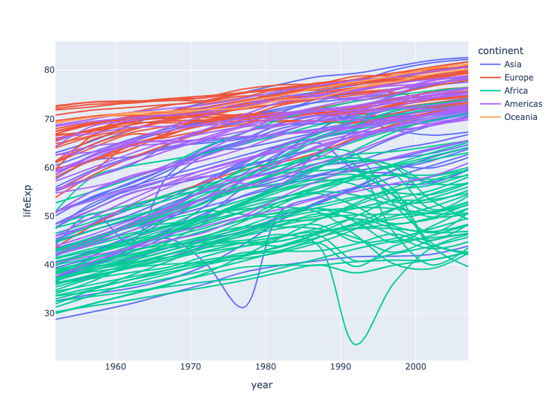

**Interactive Plot:**

<div>                        <script type="text/javascript">window.PlotlyConfig = {MathJaxConfig: 'local'};</script>
        <script charset="utf-8" src="https://cdn.plot.ly/plotly-3.1.0.min.js" integrity="sha256-Ei4740bWZhaUTQuD6q9yQlgVCMPBz6CZWhevDYPv93A=" crossorigin="anonymous"></script>                <div id="plotly-div-12" class="plotly-graph-div" style="height:100%; width:100%;"></div>            <script type="text/javascript">                window.PLOTLYENV=window.PLOTLYENV || {};                                if (document.getElementById("plotly-div-12")) {                    Plotly.newPlot(                        "plotly-div-12",                        [{"hovertemplate":"\u003cb\u003e%{hovertext}\u003c\u002fb\u003e\u003cbr\u003e\u003cbr\u003econtinent=Asia\u003cbr\u003ecountry=Afghanistan\u003cbr\u003eyear=%{x}\u003cbr\u003elifeExp=%{y}\u003cextra\u003e\u003c\u002fextra\u003e","hovertext":["Afghanistan","Afghanistan","Afghanistan","Afghanistan","Afghanistan","Afghanistan","Afghanistan","Afghanistan","Afghanistan","Afghanistan","Afghanistan","Afghanistan"],"legendgroup":"Asia","line":{"color":"#636efa","dash":"solid","shape":"spline"},"marker":{"symbol":"circle"},"mode":"lines","name":"Asia","orientation":"v","showlegend":true,"x":{"dtype":"i2","bdata":"oAelB6oHrwe0B7kHvgfDB8gHzQfSB9cH"},"xaxis":"x","y":{"dtype":"f8","bdata":"kxgEVg7NPECiRbbz\u002fVQ+QKwcWmQ7\u002fz9Aw\u002fUoXI8CQUAlBoGVQwtCQPLSTWIQOENAWmQ730\u002ftQ0Dwp8ZLN2lEQIPAyqFF1kRAjWzn+6nhRECNl24SgxBFQESLbOf76UVA"},"yaxis":"y","type":"scatter"},{"hovertemplate":"\u003cb\u003e%{hovertext}\u003c\u002fb\u003e\u003cbr\u003e\u003cbr\u003econtinent=Asia\u003cbr\u003ecountry=Bahrain\u003cbr\u003eyear=%{x}\u003cbr\u003elifeExp=%{y}\u003cextra\u003e\u003c\u002fextra\u003e","hovertext":["Bahrain","Bahrain","Bahrain","Bahrain","Bahrain","Bahrain","Bahrain","Bahrain","Bahrain","Bahrain","Bahrain","Bahrain"],"legendgroup":"Asia","line":{"color":"#636efa","dash":"solid","shape":"spline"},"marker":{"symbol":"circle"},"mode":"lines","name":"Asia","orientation":"v","showlegend":false,"x":{"dtype":"i2","bdata":"oAelB6oHrwe0B7kHvgfDB8gHzQfSB9cH"},"xaxis":"x","y":{"dtype":"f8","bdata":"1HjpJjF4SUDRItv5fupKQKAaL90kdkxAoBov3ST2TUBmZmZmZqZPQMuhRbbzZVBAFtnO91NDUUAAAAAAALBRQFg5tMh2JlJAMzMzMzN7UkB7FK5H4bJSQHE9Ctej6FJA"},"yaxis":"y","type":"scatter"},{"hovertemplate":"\u003cb\u003e%{hovertext}\u003c\u002fb\u003e\u003cbr\u003e\u003cbr\u003econtinent=Asia\u003cbr\u003ecountry=Bangladesh\u003cbr\u003eyear=%{x}\u003cbr\u003elifeExp=%{y}\u003cextra\u003e\u003c\u002fextra\u003e","hovertext":["Bangladesh","Bangladesh","Bangladesh","Bangladesh","Bangladesh","Bangladesh","Bangladesh","Bangladesh","Bangladesh","Bangladesh","Bangladesh","Bangladesh"],"legendgroup":"Asia","line":{"color":"#636efa","dash":"solid","shape":"spline"},"marker":{"symbol":"circle"},"mode":"lines","name":"Asia","orientation":"v","showlegend":false,"x":{"dtype":"i2","bdata":"oAelB6oHrwe0B7kHvgfDB8gHzQfSB9cH"},"xaxis":"x","y":{"dtype":"f8","bdata":"y6FFtvO9QkAGgZVDi6xDQM\u002f3U+Olm0RARIts5\u002fu5RUDHSzeJQaBGQKAaL90kdkdA\u002fdR46SYBSUBGtvP91GhKQPyp8dJNAkxA2\u002fl+ary0TUCNbOf7qQFPQIcW2c73A1BA"},"yaxis":"y","type":"scatter"},{"hovertemplate":"\u003cb\u003e%{hovertext}\u003c\u002fb\u003e\u003cbr\u003e\u003cbr\u003econtinent=Asia\u003cbr\u003ecountry=Cambodia\u003cbr\u003eyear=%{x}\u003cbr\u003elifeExp=%{y}\u003cextra\u003e\u003c\u002fextra\u003e","hovertext":["Cambodia","Cambodia","Cambodia","Cambodia","Cambodia","Cambodia","Cambodia","Cambodia","Cambodia","Cambodia","Cambodia","Cambodia"],"legendgroup":"Asia","line":{"color":"#636efa","dash":"solid","shape":"spline"},"marker":{"symbol":"circle"},"mode":"lines","name":"Asia","orientation":"v","showlegend":false,"x":{"dtype":"i2","bdata":"oAelB6oHrwe0B7kHvgfDB8gHzQfSB9cH"},"xaxis":"x","y":{"dtype":"f8","bdata":"TDeJQWC1Q0ADK4cW2a5EQIXrUbgetUVAhetRuB61RkB\u002farx0kyhEQLgehetROD9A0SLb+X56SUCiRbbz\u002ffRKQBBYObTI5ktAMQisHFpETEDHSzeJQWBMQAaBlUOL3E1A"},"yaxis":"y","type":"scatter"},{"hovertemplate":"\u003cb\u003e%{hovertext}\u003c\u002fb\u003e\u003cbr\u003e\u003cbr\u003econtinent=Asia\u003cbr\u003ecountry=China\u003cbr\u003eyear=%{x}\u003cbr\u003elifeExp=%{y}\u003cextra\u003e\u003c\u002fextra\u003e","hovertext":["China","China","China","China","China","China","China","China","China","China","China","China"],"legendgroup":"Asia","line":{"color":"#636efa","dash":"solid","shape":"spline"},"marker":{"symbol":"circle"},"mode":"lines","name":"Asia","orientation":"v","showlegend":false,"x":{"dtype":"i2","bdata":"oAelB6oHrwe0B7kHvgfDB8gHzQfSB9cH"},"xaxis":"x","y":{"dtype":"f8","bdata":"AAAAAAAARkD1Zz9SREZJQOPCgZAsQEZA\u002f+xHisgwTUABE7h1N49PQLK61XPS+09AmpmZmZlhUECoxks3idFQQFyPwvUoLFFAJQaBlUObUUBvEoPAygFSQC\u002fdJAaBPVJA"},"yaxis":"y","type":"scatter"},{"hovertemplate":"\u003cb\u003e%{hovertext}\u003c\u002fb\u003e\u003cbr\u003e\u003cbr\u003econtinent=Asia\u003cbr\u003ecountry=Hong Kong, China\u003cbr\u003eyear=%{x}\u003cbr\u003elifeExp=%{y}\u003cextra\u003e\u003c\u002fextra\u003e","hovertext":["Hong Kong, China","Hong Kong, China","Hong Kong, China","Hong Kong, China","Hong Kong, China","Hong Kong, China","Hong Kong, China","Hong Kong, China","Hong Kong, China","Hong Kong, China","Hong Kong, China","Hong Kong, China"],"legendgroup":"Asia","line":{"color":"#636efa","dash":"solid","shape":"spline"},"marker":{"symbol":"circle"},"mode":"lines","name":"Asia","orientation":"v","showlegend":false,"x":{"dtype":"i2","bdata":"oAelB6oHrwe0B7kHvgfDB8gHzQfSB9cH"},"xaxis":"x","y":{"dtype":"f8","bdata":"exSuR+F6TkAAAAAAADBQQJqZmZmZ6VBAAAAAAACAUUAAAAAAAABSQGZmZmZmZlJAzczMzMzcUkDNzMzMzAxTQFg5tMh2ZlNAAAAAAAAAVEBI4XoUrl9UQFpkO99PjVRA"},"yaxis":"y","type":"scatter"},{"hovertemplate":"\u003cb\u003e%{hovertext}\u003c\u002fb\u003e\u003cbr\u003e\u003cbr\u003econtinent=Asia\u003cbr\u003ecountry=India\u003cbr\u003eyear=%{x}\u003cbr\u003elifeExp=%{y}\u003cextra\u003e\u003c\u002fextra\u003e","hovertext":["India","India","India","India","India","India","India","India","India","India","India","India"],"legendgroup":"Asia","line":{"color":"#636efa","dash":"solid","shape":"spline"},"marker":{"symbol":"circle"},"mode":"lines","name":"Asia","orientation":"v","showlegend":false,"x":{"dtype":"i2","bdata":"oAelB6oHrwe0B7kHvgfDB8gHzQfSB9cH"},"xaxis":"x","y":{"dtype":"f8","bdata":"O7TIdr6vQkAdWmQ73x9EQD0K16NwzUVAZBBYObSYR0AX2c73U1NJQLTIdr6fGktAPzVeuklMTEAQWDm0yEZNQAaBlUOLHE5AUrgehevhTkCNl24Sg3BPQOomMQisLFBA"},"yaxis":"y","type":"scatter"},{"hovertemplate":"\u003cb\u003e%{hovertext}\u003c\u002fb\u003e\u003cbr\u003e\u003cbr\u003econtinent=Asia\u003cbr\u003ecountry=Indonesia\u003cbr\u003eyear=%{x}\u003cbr\u003elifeExp=%{y}\u003cextra\u003e\u003c\u002fextra\u003e","hovertext":["Indonesia","Indonesia","Indonesia","Indonesia","Indonesia","Indonesia","Indonesia","Indonesia","Indonesia","Indonesia","Indonesia","Indonesia"],"legendgroup":"Asia","line":{"color":"#636efa","dash":"solid","shape":"spline"},"marker":{"symbol":"circle"},"mode":"lines","name":"Asia","orientation":"v","showlegend":false,"x":{"dtype":"i2","bdata":"oAelB6oHrwe0B7kHvgfDB8gHzQfSB9cH"},"xaxis":"x","y":{"dtype":"f8","bdata":"lkOLbOe7QkAv3SQGgfVDQPyp8dJNQkVACKwcWmT7RkBEi2zn+5lIQGDl0CLbWUpAMQisHFoUTECoxks3iRFOQLpJDAIrV09AtMh2vp+CUEATg8DKoSVRQJqZmZmZqVFA"},"yaxis":"y","type":"scatter"},{"hovertemplate":"\u003cb\u003e%{hovertext}\u003c\u002fb\u003e\u003cbr\u003e\u003cbr\u003econtinent=Asia\u003cbr\u003ecountry=Iran\u003cbr\u003eyear=%{x}\u003cbr\u003elifeExp=%{y}\u003cextra\u003e\u003c\u002fextra\u003e","hovertext":["Iran","Iran","Iran","Iran","Iran","Iran","Iran","Iran","Iran","Iran","Iran","Iran"],"legendgroup":"Asia","line":{"color":"#636efa","dash":"solid","shape":"spline"},"marker":{"symbol":"circle"},"mode":"lines","name":"Asia","orientation":"v","showlegend":false,"x":{"dtype":"i2","bdata":"oAelB6oHrwe0B7kHvgfDB8gHzQfSB9cH"},"xaxis":"x","y":{"dtype":"f8","bdata":"rBxaZDtvRkC6SQwCK5dHQJqZmZmZqUhAeekmMQg8SkDLoUW2851LQGDl0CLb2UxAj8L1KFzPTUCF61G4HoVPQHNoke18b1BAppvEILACUUC\u002fnxov3VxRQARWDi2yvVFA"},"yaxis":"y","type":"scatter"},{"hovertemplate":"\u003cb\u003e%{hovertext}\u003c\u002fb\u003e\u003cbr\u003e\u003cbr\u003econtinent=Asia\u003cbr\u003ecountry=Iraq\u003cbr\u003eyear=%{x}\u003cbr\u003elifeExp=%{y}\u003cextra\u003e\u003c\u002fextra\u003e","hovertext":["Iraq","Iraq","Iraq","Iraq","Iraq","Iraq","Iraq","Iraq","Iraq","Iraq","Iraq","Iraq"],"legendgroup":"Asia","line":{"color":"#636efa","dash":"solid","shape":"spline"},"marker":{"symbol":"circle"},"mode":"lines","name":"Asia","orientation":"v","showlegend":false,"x":{"dtype":"i2","bdata":"oAelB6oHrwe0B7kHvgfDB8gHzQfSB9cH"},"xaxis":"x","y":{"dtype":"f8","bdata":"KVyPwvWoRkAOLbKd7zdIQNEi2\u002fl+uklAmG4Sg8A6S0CamZmZmXlMQL6fGi\u002fdNE5Avp8aL90ET0CJQWDl0EJQQGC6SQwCu01ALIcW2c5nTUDazvdT44VMQPYoXI\u002fCxU1A"},"yaxis":"y","type":"scatter"},{"hovertemplate":"\u003cb\u003e%{hovertext}\u003c\u002fb\u003e\u003cbr\u003e\u003cbr\u003econtinent=Asia\u003cbr\u003ecountry=Israel\u003cbr\u003eyear=%{x}\u003cbr\u003elifeExp=%{y}\u003cextra\u003e\u003c\u002fextra\u003e","hovertext":["Israel","Israel","Israel","Israel","Israel","Israel","Israel","Israel","Israel","Israel","Israel","Israel"],"legendgroup":"Asia","line":{"color":"#636efa","dash":"solid","shape":"spline"},"marker":{"symbol":"circle"},"mode":"lines","name":"Asia","orientation":"v","showlegend":false,"x":{"dtype":"i2","bdata":"oAelB6oHrwe0B7kHvgfDB8gHzQfSB9cH"},"xaxis":"x","y":{"dtype":"f8","bdata":"KVyPwvVYUED2KFyPwvVQQClcj8L1WFFAAAAAAACwUUC4HoXrUehRQKRwPQrXQ1JAzczMzMycUkBmZmZmZuZSQOxRuB6FO1NA7qfGSzeRU0AGgZVDi+xTQEjhehSuL1RA"},"yaxis":"y","type":"scatter"},{"hovertemplate":"\u003cb\u003e%{hovertext}\u003c\u002fb\u003e\u003cbr\u003e\u003cbr\u003econtinent=Asia\u003cbr\u003ecountry=Japan\u003cbr\u003eyear=%{x}\u003cbr\u003elifeExp=%{y}\u003cextra\u003e\u003c\u002fextra\u003e","hovertext":["Japan","Japan","Japan","Japan","Japan","Japan","Japan","Japan","Japan","Japan","Japan","Japan"],"legendgroup":"Asia","line":{"color":"#636efa","dash":"solid","shape":"spline"},"marker":{"symbol":"circle"},"mode":"lines","name":"Asia","orientation":"v","showlegend":false,"x":{"dtype":"i2","bdata":"oAelB6oHrwe0B7kHvgfDB8gHzQfSB9cH"},"xaxis":"x","y":{"dtype":"f8","bdata":"pHA9CteDT0AAAAAAAGBQQB+F61G4LlFA7FG4HoXbUUB7FK5H4VpSQLgehetR2FJA16NwPQpHU0B7FK5H4apTQNejcD0K11NAXI\u002fC9SgsVEAAAAAAAIBUQDvfT42XplRA"},"yaxis":"y","type":"scatter"},{"hovertemplate":"\u003cb\u003e%{hovertext}\u003c\u002fb\u003e\u003cbr\u003e\u003cbr\u003econtinent=Asia\u003cbr\u003ecountry=Jordan\u003cbr\u003eyear=%{x}\u003cbr\u003elifeExp=%{y}\u003cextra\u003e\u003c\u002fextra\u003e","hovertext":["Jordan","Jordan","Jordan","Jordan","Jordan","Jordan","Jordan","Jordan","Jordan","Jordan","Jordan","Jordan"],"legendgroup":"Asia","line":{"color":"#636efa","dash":"solid","shape":"spline"},"marker":{"symbol":"circle"},"mode":"lines","name":"Asia","orientation":"v","showlegend":false,"x":{"dtype":"i2","bdata":"oAelB6oHrwe0B7kHvgfDB8gHzQfSB9cH"},"xaxis":"x","y":{"dtype":"f8","bdata":"TmIQWDmURUASg8DKodVGQOWlm8QgEEhAjZduEoPQSUDdJAaBlUNMQP3UeOkmkU5AO99PjZfeT0BWDi2ynXdQQClcj8L1AFFAxCCwcmhxUUBGtvP91NBRQArXo3A9IlJA"},"yaxis":"y","type":"scatter"},{"hovertemplate":"\u003cb\u003e%{hovertext}\u003c\u002fb\u003e\u003cbr\u003e\u003cbr\u003econtinent=Asia\u003cbr\u003ecountry=Korea, Dem. Rep.\u003cbr\u003eyear=%{x}\u003cbr\u003elifeExp=%{y}\u003cextra\u003e\u003c\u002fextra\u003e","hovertext":["Korea, Dem. Rep.","Korea, Dem. Rep.","Korea, Dem. Rep.","Korea, Dem. Rep.","Korea, Dem. Rep.","Korea, Dem. Rep.","Korea, Dem. Rep.","Korea, Dem. Rep.","Korea, Dem. Rep.","Korea, Dem. Rep.","Korea, Dem. Rep.","Korea, Dem. Rep."],"legendgroup":"Asia","line":{"color":"#636efa","dash":"solid","shape":"spline"},"marker":{"symbol":"circle"},"mode":"lines","name":"Asia","orientation":"v","showlegend":false,"x":{"dtype":"i2","bdata":"oAelB6oHrwe0B7kHvgfDB8gHzQfSB9cH"},"xaxis":"x","y":{"dtype":"f8","bdata":"ukkMAisHSUDufD81XgpLQIkW2c73U0xAf2q8dJP4TUDn+6nx0v1PQBgEVg4tylBAZmZmZmZGUUDDILByaKlRQDzfT42XflFASgwCK4fuUEDtfD81XqpQQF66SQwC01BA"},"yaxis":"y","type":"scatter"},{"hovertemplate":"\u003cb\u003e%{hovertext}\u003c\u002fb\u003e\u003cbr\u003e\u003cbr\u003econtinent=Asia\u003cbr\u003ecountry=Korea, Rep.\u003cbr\u003eyear=%{x}\u003cbr\u003elifeExp=%{y}\u003cextra\u003e\u003c\u002fextra\u003e","hovertext":["Korea, Rep.","Korea, Rep.","Korea, Rep.","Korea, Rep.","Korea, Rep.","Korea, Rep.","Korea, Rep.","Korea, Rep.","Korea, Rep.","Korea, Rep.","Korea, Rep.","Korea, Rep."],"legendgroup":"Asia","line":{"color":"#636efa","dash":"solid","shape":"spline"},"marker":{"symbol":"circle"},"mode":"lines","name":"Asia","orientation":"v","showlegend":false,"x":{"dtype":"i2","bdata":"oAelB6oHrwe0B7kHvgfDB8gHzQfSB9cH"},"xaxis":"x","y":{"dtype":"f8","bdata":"RIts5\u002fu5R0C6SQwCK1dKQEw3iUFgpUtAz\u002fdT46XbTEB1kxgEVk5PQBsv3SQGMVBAHVpkO9\u002fHUECkcD0K13NRQFYOLbKdD1JAwyCwcmipUkB7FK5H4UJTQB1aZDvfp1NA"},"yaxis":"y","type":"scatter"},{"hovertemplate":"\u003cb\u003e%{hovertext}\u003c\u002fb\u003e\u003cbr\u003e\u003cbr\u003econtinent=Asia\u003cbr\u003ecountry=Kuwait\u003cbr\u003eyear=%{x}\u003cbr\u003elifeExp=%{y}\u003cextra\u003e\u003c\u002fextra\u003e","hovertext":["Kuwait","Kuwait","Kuwait","Kuwait","Kuwait","Kuwait","Kuwait","Kuwait","Kuwait","Kuwait","Kuwait","Kuwait"],"legendgroup":"Asia","line":{"color":"#636efa","dash":"solid","shape":"spline"},"marker":{"symbol":"circle"},"mode":"lines","name":"Asia","orientation":"v","showlegend":false,"x":{"dtype":"i2","bdata":"oAelB6oHrwe0B7kHvgfDB8gHzQfSB9cH"},"xaxis":"x","y":{"dtype":"f8","bdata":"uB6F61HIS0BOYhBYOQRNQFyPwvUoPE5ADi2yne8nUEAhsHJoke1QQMuhRbbzVVFAsp3vp8bTUUBAYOXQIotSQFyPwvUozFJARIts5\u002fsJU0Bg5dAi2zlTQBSDwMqhZVNA"},"yaxis":"y","type":"scatter"},{"hovertemplate":"\u003cb\u003e%{hovertext}\u003c\u002fb\u003e\u003cbr\u003e\u003cbr\u003econtinent=Asia\u003cbr\u003ecountry=Lebanon\u003cbr\u003eyear=%{x}\u003cbr\u003elifeExp=%{y}\u003cextra\u003e\u003c\u002fextra\u003e","hovertext":["Lebanon","Lebanon","Lebanon","Lebanon","Lebanon","Lebanon","Lebanon","Lebanon","Lebanon","Lebanon","Lebanon","Lebanon"],"legendgroup":"Asia","line":{"color":"#636efa","dash":"solid","shape":"spline"},"marker":{"symbol":"circle"},"mode":"lines","name":"Asia","orientation":"v","showlegend":false,"x":{"dtype":"i2","bdata":"oAelB6oHrwe0B7kHvgfDB8gHzQfSB9cH"},"xaxis":"x","y":{"dtype":"f8","bdata":"EFg5tMj2S0A730+Nl75NQHnpJjEIDE9Aj8L1KFzvT0Bt5\u002fup8VpQQHSTGARWhlBA9P3UeOm+UEAlBoGVQ\u002ftQQKabxCCwUlFAKVyPwvWQUUBvEoPAysFRQGQ730+N\u002f1FA"},"yaxis":"y","type":"scatter"},{"hovertemplate":"\u003cb\u003e%{hovertext}\u003c\u002fb\u003e\u003cbr\u003e\u003cbr\u003econtinent=Asia\u003cbr\u003ecountry=Malaysia\u003cbr\u003eyear=%{x}\u003cbr\u003elifeExp=%{y}\u003cextra\u003e\u003c\u002fextra\u003e","hovertext":["Malaysia","Malaysia","Malaysia","Malaysia","Malaysia","Malaysia","Malaysia","Malaysia","Malaysia","Malaysia","Malaysia","Malaysia"],"legendgroup":"Asia","line":{"color":"#636efa","dash":"solid","shape":"spline"},"marker":{"symbol":"circle"},"mode":"lines","name":"Asia","orientation":"v","showlegend":false,"x":{"dtype":"i2","bdata":"oAelB6oHrwe0B7kHvgfDB8gHzQfSB9cH"},"xaxis":"x","y":{"dtype":"f8","bdata":"JQaBlUM7SECTGARWDg1KQHWTGARW3ktAc2iR7XyvTUDhehSuR4FPQKrx0k1iUFBAAAAAAAAAUUAAAAAAAGBRQDEIrBxarFFAeekmMQj8UUCJQWDl0EJSQIGVQ4tsj1JA"},"yaxis":"y","type":"scatter"},{"hovertemplate":"\u003cb\u003e%{hovertext}\u003c\u002fb\u003e\u003cbr\u003e\u003cbr\u003econtinent=Asia\u003cbr\u003ecountry=Mongolia\u003cbr\u003eyear=%{x}\u003cbr\u003elifeExp=%{y}\u003cextra\u003e\u003c\u002fextra\u003e","hovertext":["Mongolia","Mongolia","Mongolia","Mongolia","Mongolia","Mongolia","Mongolia","Mongolia","Mongolia","Mongolia","Mongolia","Mongolia"],"legendgroup":"Asia","line":{"color":"#636efa","dash":"solid","shape":"spline"},"marker":{"symbol":"circle"},"mode":"lines","name":"Asia","orientation":"v","showlegend":false,"x":{"dtype":"i2","bdata":"oAelB6oHrwe0B7kHvgfDB8gHzQfSB9cH"},"xaxis":"x","y":{"dtype":"f8","bdata":"rBxaZDsfRUA7tMh2vp9GQOWlm8QgIEhAqvHSTWKgSUCNl24Sg+BKQAMrhxbZvktAO99PjZe+TEAj2\u002fl+ahxOQKabxCCwok5AAAAAAADQT0AnMQisHEJQQAisHFpks1BA"},"yaxis":"y","type":"scatter"},{"hovertemplate":"\u003cb\u003e%{hovertext}\u003c\u002fb\u003e\u003cbr\u003e\u003cbr\u003econtinent=Asia\u003cbr\u003ecountry=Myanmar\u003cbr\u003eyear=%{x}\u003cbr\u003elifeExp=%{y}\u003cextra\u003e\u003c\u002fextra\u003e","hovertext":["Myanmar","Myanmar","Myanmar","Myanmar","Myanmar","Myanmar","Myanmar","Myanmar","Myanmar","Myanmar","Myanmar","Myanmar"],"legendgroup":"Asia","line":{"color":"#636efa","dash":"solid","shape":"spline"},"marker":{"symbol":"circle"},"mode":"lines","name":"Asia","orientation":"v","showlegend":false,"x":{"dtype":"i2","bdata":"oAelB6oHrwe0B7kHvgfDB8gHzQfSB9cH"},"xaxis":"x","y":{"dtype":"f8","bdata":"Rrbz\u002fdQoQkCkcD0K1\u002fNEQOf7qfHSjUZAjZduEoOwSEApXI\u002fC9YhKQGQ730+NB0xAukkMAisHTUAIrBxaZCtNQClcj8L1qE1ARIts5\u002fspTkBOYhBYOfRNQEa28\u002f3UCE9A"},"yaxis":"y","type":"scatter"},{"hovertemplate":"\u003cb\u003e%{hovertext}\u003c\u002fb\u003e\u003cbr\u003e\u003cbr\u003econtinent=Asia\u003cbr\u003ecountry=Nepal\u003cbr\u003eyear=%{x}\u003cbr\u003elifeExp=%{y}\u003cextra\u003e\u003c\u002fextra\u003e","hovertext":["Nepal","Nepal","Nepal","Nepal","Nepal","Nepal","Nepal","Nepal","Nepal","Nepal","Nepal","Nepal"],"legendgroup":"Asia","line":{"color":"#636efa","dash":"solid","shape":"spline"},"marker":{"symbol":"circle"},"mode":"lines","name":"Asia","orientation":"v","showlegend":false,"x":{"dtype":"i2","bdata":"oAelB6oHrwe0B7kHvgfDB8gHzQfSB9cH"},"xaxis":"x","y":{"dtype":"f8","bdata":"arx0kxgUQkArhxbZztdCQPyp8dJNskNAI9v5fmq8REA\u002fNV66SfxFQDu0yHa+X0dAeekmMQjMSEDb+X5qvERKQJMYBFYO3UtASgwCK4e2TUDsUbgehatOQBSuR+F65E9A"},"yaxis":"y","type":"scatter"},{"hovertemplate":"\u003cb\u003e%{hovertext}\u003c\u002fb\u003e\u003cbr\u003e\u003cbr\u003econtinent=Asia\u003cbr\u003ecountry=Oman\u003cbr\u003eyear=%{x}\u003cbr\u003elifeExp=%{y}\u003cextra\u003e\u003c\u002fextra\u003e","hovertext":["Oman","Oman","Oman","Oman","Oman","Oman","Oman","Oman","Oman","Oman","Oman","Oman"],"legendgroup":"Asia","line":{"color":"#636efa","dash":"solid","shape":"spline"},"marker":{"symbol":"circle"},"mode":"lines","name":"Asia","orientation":"v","showlegend":false,"x":{"dtype":"i2","bdata":"oAelB6oHrwe0B7kHvgfDB8gHzQfSB9cH"},"xaxis":"x","y":{"dtype":"f8","bdata":"RIts5\u002fvJQkAK16NwPQpEQIXrUbgelUVAWDm0yHZ+R0D8qfHSTRJKQOXQItv5rkxAd76fGi9dT0Dl0CLb+e5QQPhT46WbzFFADi2yne8fUkAxCKwcWoxSQClcj8L16FJA"},"yaxis":"y","type":"scatter"},{"hovertemplate":"\u003cb\u003e%{hovertext}\u003c\u002fb\u003e\u003cbr\u003e\u003cbr\u003econtinent=Asia\u003cbr\u003ecountry=Pakistan\u003cbr\u003eyear=%{x}\u003cbr\u003elifeExp=%{y}\u003cextra\u003e\u003c\u002fextra\u003e","hovertext":["Pakistan","Pakistan","Pakistan","Pakistan","Pakistan","Pakistan","Pakistan","Pakistan","Pakistan","Pakistan","Pakistan","Pakistan"],"legendgroup":"Asia","line":{"color":"#636efa","dash":"solid","shape":"spline"},"marker":{"symbol":"circle"},"mode":"lines","name":"Asia","orientation":"v","showlegend":false,"x":{"dtype":"i2","bdata":"oAelB6oHrwe0B7kHvgfDB8gHzQfSB9cH"},"xaxis":"x","y":{"dtype":"f8","bdata":"LIcW2c63RUCe76fGS8dGQPYoXI\u002fC1UdAZmZmZmbmSED0\u002fdR46fZJQC\u002fdJAaBBUtATmIQWDkUTECPwvUoXB9NQCUGgZVDa05AZBBYObToTkCuR+F6FM5PQPT91HjpXlBA"},"yaxis":"y","type":"scatter"},{"hovertemplate":"\u003cb\u003e%{hovertext}\u003c\u002fb\u003e\u003cbr\u003e\u003cbr\u003econtinent=Asia\u003cbr\u003ecountry=Philippines\u003cbr\u003eyear=%{x}\u003cbr\u003elifeExp=%{y}\u003cextra\u003e\u003c\u002fextra\u003e","hovertext":["Philippines","Philippines","Philippines","Philippines","Philippines","Philippines","Philippines","Philippines","Philippines","Philippines","Philippines","Philippines"],"legendgroup":"Asia","line":{"color":"#636efa","dash":"solid","shape":"spline"},"marker":{"symbol":"circle"},"mode":"lines","name":"Asia","orientation":"v","showlegend":false,"x":{"dtype":"i2","bdata":"oAelB6oHrwe0B7kHvgfDB8gHzQfSB9cH"},"xaxis":"x","y":{"dtype":"f8","bdata":"x0s3iUHgR0CYbhKDwKpJQDeJQWDlYEtA\u002fKnx0k0yTEC4HoXrUQhNQEjhehSuB05A0SLb+X4KT0CMbOf7qQlQQFpkO99PnVBAarx0kxgkUUAIrBxaZJNRQHnpJjEI7FFA"},"yaxis":"y","type":"scatter"},{"hovertemplate":"\u003cb\u003e%{hovertext}\u003c\u002fb\u003e\u003cbr\u003e\u003cbr\u003econtinent=Asia\u003cbr\u003ecountry=Saudi Arabia\u003cbr\u003eyear=%{x}\u003cbr\u003elifeExp=%{y}\u003cextra\u003e\u003c\u002fextra\u003e","hovertext":["Saudi Arabia","Saudi Arabia","Saudi Arabia","Saudi Arabia","Saudi Arabia","Saudi Arabia","Saudi Arabia","Saudi Arabia","Saudi Arabia","Saudi Arabia","Saudi Arabia","Saudi Arabia"],"legendgroup":"Asia","line":{"color":"#636efa","dash":"solid","shape":"spline"},"marker":{"symbol":"circle"},"mode":"lines","name":"Asia","orientation":"v","showlegend":false,"x":{"dtype":"i2","bdata":"oAelB6oHrwe0B7kHvgfDB8gHzQfSB9cH"},"xaxis":"x","y":{"dtype":"f8","bdata":"AAAAAADwQ0DJdr6fGm9FQKJFtvP99EZAF9nO91PzSEDFILByaPFKQLgehetRWE1AqMZLN4mBT0B7FK5H4ZJQQP7UeOkmMVFAJzEIrByiUUDy0k1iEOhRQH0\u002fNV66MVJA"},"yaxis":"y","type":"scatter"},{"hovertemplate":"\u003cb\u003e%{hovertext}\u003c\u002fb\u003e\u003cbr\u003e\u003cbr\u003econtinent=Asia\u003cbr\u003ecountry=Singapore\u003cbr\u003eyear=%{x}\u003cbr\u003elifeExp=%{y}\u003cextra\u003e\u003c\u002fextra\u003e","hovertext":["Singapore","Singapore","Singapore","Singapore","Singapore","Singapore","Singapore","Singapore","Singapore","Singapore","Singapore","Singapore"],"legendgroup":"Asia","line":{"color":"#636efa","dash":"solid","shape":"spline"},"marker":{"symbol":"circle"},"mode":"lines","name":"Asia","orientation":"v","showlegend":false,"x":{"dtype":"i2","bdata":"oAelB6oHrwe0B7kHvgfDB8gHzQfSB9cH"},"xaxis":"x","y":{"dtype":"f8","bdata":"ppvEILAyTkD0\u002fdR46ZZPQFCNl24Sc1BABoGVQ4v8UEDTTWIQWGFRQHsUrkfhslFAcT0K16PwUUCkcD0K12NSQN9PjZdu8lJAJzEIrBxKU0DhehSuR7FTQJHtfD81\u002flNA"},"yaxis":"y","type":"scatter"},{"hovertemplate":"\u003cb\u003e%{hovertext}\u003c\u002fb\u003e\u003cbr\u003e\u003cbr\u003econtinent=Asia\u003cbr\u003ecountry=Sri Lanka\u003cbr\u003eyear=%{x}\u003cbr\u003elifeExp=%{y}\u003cextra\u003e\u003c\u002fextra\u003e","hovertext":["Sri Lanka","Sri Lanka","Sri Lanka","Sri Lanka","Sri Lanka","Sri Lanka","Sri Lanka","Sri Lanka","Sri Lanka","Sri Lanka","Sri Lanka","Sri Lanka"],"legendgroup":"Asia","line":{"color":"#636efa","dash":"solid","shape":"spline"},"marker":{"symbol":"circle"},"mode":"lines","name":"Asia","orientation":"v","showlegend":false,"x":{"dtype":"i2","bdata":"oAelB6oHrwe0B7kHvgfDB8gHzQfSB9cH"},"xaxis":"x","y":{"dtype":"f8","bdata":"lkOLbOfLTEDufD81XrpOQH9qvHSTGE9AGy\u002fdJAYRUECmm8QgsEJQQNv5fmq8fFBAnMQgsHIwUUBjEFg5tEBRQMVLN4lBmFFAaJHtfD+dUUBcj8L1KLRRQNNNYhBYGVJA"},"yaxis":"y","type":"scatter"},{"hovertemplate":"\u003cb\u003e%{hovertext}\u003c\u002fb\u003e\u003cbr\u003e\u003cbr\u003econtinent=Asia\u003cbr\u003ecountry=Syria\u003cbr\u003eyear=%{x}\u003cbr\u003elifeExp=%{y}\u003cextra\u003e\u003c\u002fextra\u003e","hovertext":["Syria","Syria","Syria","Syria","Syria","Syria","Syria","Syria","Syria","Syria","Syria","Syria"],"legendgroup":"Asia","line":{"color":"#636efa","dash":"solid","shape":"spline"},"marker":{"symbol":"circle"},"mode":"lines","name":"Asia","orientation":"v","showlegend":false,"x":{"dtype":"i2","bdata":"oAelB6oHrwe0B7kHvgfDB8gHzQfSB9cH"},"xaxis":"x","y":{"dtype":"f8","bdata":"Gy\u002fdJAbxRkAxCKwcWiRIQNejcD0KJ0lApHA9CtfTSkDazvdT46VMQClcj8L1mE5A9ihcj8IlUEB0kxgEVr5QQA4tsp3vT1FAfT81XrrhUUAIrBxaZENSQP7UeOkmiVJA"},"yaxis":"y","type":"scatter"},{"hovertemplate":"\u003cb\u003e%{hovertext}\u003c\u002fb\u003e\u003cbr\u003e\u003cbr\u003econtinent=Asia\u003cbr\u003ecountry=Taiwan\u003cbr\u003eyear=%{x}\u003cbr\u003elifeExp=%{y}\u003cextra\u003e\u003c\u002fextra\u003e","hovertext":["Taiwan","Taiwan","Taiwan","Taiwan","Taiwan","Taiwan","Taiwan","Taiwan","Taiwan","Taiwan","Taiwan","Taiwan"],"legendgroup":"Asia","line":{"color":"#636efa","dash":"solid","shape":"spline"},"marker":{"symbol":"circle"},"mode":"lines","name":"Asia","orientation":"v","showlegend":false,"x":{"dtype":"i2","bdata":"oAelB6oHrwe0B7kHvgfDB8gHzQfSB9cH"},"xaxis":"x","y":{"dtype":"f8","bdata":"AAAAAABATUAzMzMzMzNPQM3MzMzMTFBAAAAAAADgUEApXI\u002fC9VhRQPYoXI\u002fCpVFACtejcD0KUkCamZmZmVlSQHE9CtejkFJAAAAAAADQUkCPwvUoXD9TQJqZmZmZmVNA"},"yaxis":"y","type":"scatter"},{"hovertemplate":"\u003cb\u003e%{hovertext}\u003c\u002fb\u003e\u003cbr\u003e\u003cbr\u003econtinent=Asia\u003cbr\u003ecountry=Thailand\u003cbr\u003eyear=%{x}\u003cbr\u003elifeExp=%{y}\u003cextra\u003e\u003c\u002fextra\u003e","hovertext":["Thailand","Thailand","Thailand","Thailand","Thailand","Thailand","Thailand","Thailand","Thailand","Thailand","Thailand","Thailand"],"legendgroup":"Asia","line":{"color":"#636efa","dash":"solid","shape":"spline"},"marker":{"symbol":"circle"},"mode":"lines","name":"Asia","orientation":"v","showlegend":false,"x":{"dtype":"i2","bdata":"oAelB6oHrwe0B7kHvgfDB8gHzQfSB9cH"},"xaxis":"x","y":{"dtype":"f8","bdata":"BoGVQ4tsSUBxPQrXo9BKQCyHFtnOB0xAFK5H4XokTUCkcD0K1zNOQKwcWmQ7P09Ake18PzUmUEBMN4lBYIVQQFCNl24S01BA001iEFjhUEBqvHSTGCRRQIGVQ4tsp1FA"},"yaxis":"y","type":"scatter"},{"hovertemplate":"\u003cb\u003e%{hovertext}\u003c\u002fb\u003e\u003cbr\u003e\u003cbr\u003econtinent=Asia\u003cbr\u003ecountry=Vietnam\u003cbr\u003eyear=%{x}\u003cbr\u003elifeExp=%{y}\u003cextra\u003e\u003c\u002fextra\u003e","hovertext":["Vietnam","Vietnam","Vietnam","Vietnam","Vietnam","Vietnam","Vietnam","Vietnam","Vietnam","Vietnam","Vietnam","Vietnam"],"legendgroup":"Asia","line":{"color":"#636efa","dash":"solid","shape":"spline"},"marker":{"symbol":"circle"},"mode":"lines","name":"Asia","orientation":"v","showlegend":false,"x":{"dtype":"i2","bdata":"oAelB6oHrwe0B7kHvgfDB8gHzQfSB9cH"},"xaxis":"x","y":{"dtype":"f8","bdata":"2\u002fl+arw0RECoxks3iXFFQFg5tMh2rkZAJQaBlUPrR0CNl24SgyBJQG8Sg8DK4UtAnMQgsHJoTUApXI\u002fC9WhPQO18PzVe6lBAXrpJDAKrUUAMAiuHFkFSQA4tsp3vj1JA"},"yaxis":"y","type":"scatter"},{"hovertemplate":"\u003cb\u003e%{hovertext}\u003c\u002fb\u003e\u003cbr\u003e\u003cbr\u003econtinent=Asia\u003cbr\u003ecountry=West Bank and Gaza\u003cbr\u003eyear=%{x}\u003cbr\u003elifeExp=%{y}\u003cextra\u003e\u003c\u002fextra\u003e","hovertext":["West Bank and Gaza","West Bank and Gaza","West Bank and Gaza","West Bank and Gaza","West Bank and Gaza","West Bank and Gaza","West Bank and Gaza","West Bank and Gaza","West Bank and Gaza","West Bank and Gaza","West Bank and Gaza","West Bank and Gaza"],"legendgroup":"Asia","line":{"color":"#636efa","dash":"solid","shape":"spline"},"marker":{"symbol":"circle"},"mode":"lines","name":"Asia","orientation":"v","showlegend":false,"x":{"dtype":"i2","bdata":"oAelB6oHrwe0B7kHvgfDB8gHzQfSB9cH"},"xaxis":"x","y":{"dtype":"f8","bdata":"FK5H4XqURUDazvdT49VGQMdLN4lBEEhAVOOlm8TQSUBqvHSTGERMQFK4HoXrYU5ARIts5\u002fsZUEBt5\u002fup8cJQQMuhRbbzbVFAoBov3STGUUBI4XoUrhdSQF66SQwCW1JA"},"yaxis":"y","type":"scatter"},{"hovertemplate":"\u003cb\u003e%{hovertext}\u003c\u002fb\u003e\u003cbr\u003e\u003cbr\u003econtinent=Asia\u003cbr\u003ecountry=Yemen, Rep.\u003cbr\u003eyear=%{x}\u003cbr\u003elifeExp=%{y}\u003cextra\u003e\u003c\u002fextra\u003e","hovertext":["Yemen, Rep.","Yemen, Rep.","Yemen, Rep.","Yemen, Rep.","Yemen, Rep.","Yemen, Rep.","Yemen, Rep.","Yemen, Rep.","Yemen, Rep.","Yemen, Rep.","Yemen, Rep.","Yemen, Rep."],"legendgroup":"Asia","line":{"color":"#636efa","dash":"solid","shape":"spline"},"marker":{"symbol":"circle"},"mode":"lines","name":"Asia","orientation":"v","showlegend":false,"x":{"dtype":"i2","bdata":"oAelB6oHrwe0B7kHvgfDB8gHzQfSB9cH"},"xaxis":"x","y":{"dtype":"f8","bdata":"oBov3SRGQEBcj8L1KPxAQNejcD0Kl0FAy6FFtvN9QkAGgZVDi+xDQGZmZmZmFkZAWDm0yHaOSEC8dJMYBHZKQOkmMQiszEtAw\u002fUoXI8CTUCBlUOLbCdOQNNNYhBYWU9A"},"yaxis":"y","type":"scatter"},{"hovertemplate":"\u003cb\u003e%{hovertext}\u003c\u002fb\u003e\u003cbr\u003e\u003cbr\u003econtinent=Europe\u003cbr\u003ecountry=Albania\u003cbr\u003eyear=%{x}\u003cbr\u003elifeExp=%{y}\u003cextra\u003e\u003c\u002fextra\u003e","hovertext":["Albania","Albania","Albania","Albania","Albania","Albania","Albania","Albania","Albania","Albania","Albania","Albania"],"legendgroup":"Europe","line":{"color":"#EF553B","dash":"solid","shape":"spline"},"marker":{"symbol":"circle"},"mode":"lines","name":"Europe","orientation":"v","showlegend":true,"x":{"dtype":"i2","bdata":"oAelB6oHrwe0B7kHvgfDB8gHzQfSB9cH"},"xaxis":"x","y":{"dtype":"f8","bdata":"PQrXo3CdS0CkcD0K16NNQBSuR+F6NFBArkfhehSOUEBcj8L1KOxQQOxRuB6FO1FAexSuR+GaUUAAAAAAAABSQHe+nxov5VFAzczMzMw8UkCNbOf7qelSQFCNl24SG1NA"},"yaxis":"y","type":"scatter"},{"hovertemplate":"\u003cb\u003e%{hovertext}\u003c\u002fb\u003e\u003cbr\u003e\u003cbr\u003econtinent=Europe\u003cbr\u003ecountry=Austria\u003cbr\u003eyear=%{x}\u003cbr\u003elifeExp=%{y}\u003cextra\u003e\u003c\u002fextra\u003e","hovertext":["Austria","Austria","Austria","Austria","Austria","Austria","Austria","Austria","Austria","Austria","Austria","Austria"],"legendgroup":"Europe","line":{"color":"#EF553B","dash":"solid","shape":"spline"},"marker":{"symbol":"circle"},"mode":"lines","name":"Europe","orientation":"v","showlegend":false,"x":{"dtype":"i2","bdata":"oAelB6oHrwe0B7kHvgfDB8gHzQfSB9cH"},"xaxis":"x","y":{"dtype":"f8","bdata":"MzMzMzOzUEAfhetRuN5QQMP1KFyPYlFAKVyPwvWIUUC4HoXrUahRQHsUrkfhClJA7FG4HoVLUkBcj8L1KLxSQMP1KFyPAlNAcT0K16NgU0AfhetRuL5TQJMYBFYO9VNA"},"yaxis":"y","type":"scatter"},{"hovertemplate":"\u003cb\u003e%{hovertext}\u003c\u002fb\u003e\u003cbr\u003e\u003cbr\u003econtinent=Europe\u003cbr\u003ecountry=Belgium\u003cbr\u003eyear=%{x}\u003cbr\u003elifeExp=%{y}\u003cextra\u003e\u003c\u002fextra\u003e","hovertext":["Belgium","Belgium","Belgium","Belgium","Belgium","Belgium","Belgium","Belgium","Belgium","Belgium","Belgium","Belgium"],"legendgroup":"Europe","line":{"color":"#EF553B","dash":"solid","shape":"spline"},"marker":{"symbol":"circle"},"mode":"lines","name":"Europe","orientation":"v","showlegend":false,"x":{"dtype":"i2","bdata":"oAelB6oHrwe0B7kHvgfDB8gHzQfSB9cH"},"xaxis":"x","y":{"dtype":"f8","bdata":"AAAAAAAAUUCPwvUoXE9RQAAAAAAAkFFAXI\u002fC9Si8UUBcj8L1KNxRQDMzMzMzM1JA7FG4HoV7UkBmZmZmZtZSQD0K16NwHVNAUrgehethU0AUrkfhepRTQE5iEFg53FNA"},"yaxis":"y","type":"scatter"},{"hovertemplate":"\u003cb\u003e%{hovertext}\u003c\u002fb\u003e\u003cbr\u003e\u003cbr\u003econtinent=Europe\u003cbr\u003ecountry=Bosnia and Herzegovina\u003cbr\u003eyear=%{x}\u003cbr\u003elifeExp=%{y}\u003cextra\u003e\u003c\u002fextra\u003e","hovertext":["Bosnia and Herzegovina","Bosnia and Herzegovina","Bosnia and Herzegovina","Bosnia and Herzegovina","Bosnia and Herzegovina","Bosnia and Herzegovina","Bosnia and Herzegovina","Bosnia and Herzegovina","Bosnia and Herzegovina","Bosnia and Herzegovina","Bosnia and Herzegovina","Bosnia and Herzegovina"],"legendgroup":"Europe","line":{"color":"#EF553B","dash":"solid","shape":"spline"},"marker":{"symbol":"circle"},"mode":"lines","name":"Europe","orientation":"v","showlegend":false,"x":{"dtype":"i2","bdata":"oAelB6oHrwe0B7kHvgfDB8gHzQfSB9cH"},"xaxis":"x","y":{"dtype":"f8","bdata":"KVyPwvXoSkCamZmZmTlNQNejcD0K905Aw\u002fUoXI8yUEDNzMzMzNxQQNejcD0Kd1FAXI\u002fC9SisUUApXI\u002fC9chRQAisHFpkC1JAVg4tsp1PUkD2KFyPwoVSQEoMAiuHtlJA"},"yaxis":"y","type":"scatter"},{"hovertemplate":"\u003cb\u003e%{hovertext}\u003c\u002fb\u003e\u003cbr\u003e\u003cbr\u003econtinent=Europe\u003cbr\u003ecountry=Bulgaria\u003cbr\u003eyear=%{x}\u003cbr\u003elifeExp=%{y}\u003cextra\u003e\u003c\u002fextra\u003e","hovertext":["Bulgaria","Bulgaria","Bulgaria","Bulgaria","Bulgaria","Bulgaria","Bulgaria","Bulgaria","Bulgaria","Bulgaria","Bulgaria","Bulgaria"],"legendgroup":"Europe","line":{"color":"#EF553B","dash":"solid","shape":"spline"},"marker":{"symbol":"circle"},"mode":"lines","name":"Europe","orientation":"v","showlegend":false,"x":{"dtype":"i2","bdata":"oAelB6oHrwe0B7kHvgfDB8gHzQfSB9cH"},"xaxis":"x","y":{"dtype":"f8","bdata":"zczMzMzMTUDXo3A9CqdQQHE9CtejYFFAexSuR+GaUUCamZmZmblRQKRwPQrXs1FAhetRuB7FUUD2KFyPwtVRQFyPwvUozFFAFK5H4XqUUUApXI\u002fC9QhSQLgehetRQFJA"},"yaxis":"y","type":"scatter"},{"hovertemplate":"\u003cb\u003e%{hovertext}\u003c\u002fb\u003e\u003cbr\u003e\u003cbr\u003econtinent=Europe\u003cbr\u003ecountry=Croatia\u003cbr\u003eyear=%{x}\u003cbr\u003elifeExp=%{y}\u003cextra\u003e\u003c\u002fextra\u003e","hovertext":["Croatia","Croatia","Croatia","Croatia","Croatia","Croatia","Croatia","Croatia","Croatia","Croatia","Croatia","Croatia"],"legendgroup":"Europe","line":{"color":"#EF553B","dash":"solid","shape":"spline"},"marker":{"symbol":"circle"},"mode":"lines","name":"Europe","orientation":"v","showlegend":false,"x":{"dtype":"i2","bdata":"oAelB6oHrwe0B7kHvgfDB8gHzQfSB9cH"},"xaxis":"x","y":{"dtype":"f8","bdata":"exSuR+GaTkDhehSuRzFQQLgehetRyFBAAAAAAAAgUUDXo3A9CmdRQClcj8L1qFFAPQrXo3CdUUDhehSuR+FRQH0\u002fNV66IVJA7FG4HoVrUkDy0k1iELhSQB1aZDvf71JA"},"yaxis":"y","type":"scatter"},{"hovertemplate":"\u003cb\u003e%{hovertext}\u003c\u002fb\u003e\u003cbr\u003e\u003cbr\u003econtinent=Europe\u003cbr\u003ecountry=Czech Republic\u003cbr\u003eyear=%{x}\u003cbr\u003elifeExp=%{y}\u003cextra\u003e\u003c\u002fextra\u003e","hovertext":["Czech Republic","Czech Republic","Czech Republic","Czech Republic","Czech Republic","Czech Republic","Czech Republic","Czech Republic","Czech Republic","Czech Republic","Czech Republic","Czech Republic"],"legendgroup":"Europe","line":{"color":"#EF553B","dash":"solid","shape":"spline"},"marker":{"symbol":"circle"},"mode":"lines","name":"Europe","orientation":"v","showlegend":false,"x":{"dtype":"i2","bdata":"oAelB6oHrwe0B7kHvgfDB8gHzQfSB9cH"},"xaxis":"x","y":{"dtype":"f8","bdata":"SOF6FK63UEBSuB6F60FRQJqZmZmZeVFAuB6F61GYUUDD9Shcj5JRQD0K16NwrVFAPQrXo3C9UUCF61G4HuVRQJqZmZmZGVJAcT0K16OAUkBxPQrXo+BSQMl2vp8aH1NA"},"yaxis":"y","type":"scatter"},{"hovertemplate":"\u003cb\u003e%{hovertext}\u003c\u002fb\u003e\u003cbr\u003e\u003cbr\u003econtinent=Europe\u003cbr\u003ecountry=Denmark\u003cbr\u003eyear=%{x}\u003cbr\u003elifeExp=%{y}\u003cextra\u003e\u003c\u002fextra\u003e","hovertext":["Denmark","Denmark","Denmark","Denmark","Denmark","Denmark","Denmark","Denmark","Denmark","Denmark","Denmark","Denmark"],"legendgroup":"Europe","line":{"color":"#EF553B","dash":"solid","shape":"spline"},"marker":{"symbol":"circle"},"mode":"lines","name":"Europe","orientation":"v","showlegend":false,"x":{"dtype":"i2","bdata":"oAelB6oHrwe0B7kHvgfDB8gHzQfSB9cH"},"xaxis":"x","y":{"dtype":"f8","bdata":"UrgeheuxUUCkcD0K1\u002fNRQGZmZmZmFlJAPQrXo3A9UkCuR+F6FF5SQFyPwvUorFJAuB6F61GoUkAzMzMzM7NSQIXrUbge1VJA16NwPQoHU0DsUbgehUtTQGiR7Xw\u002flVNA"},"yaxis":"y","type":"scatter"},{"hovertemplate":"\u003cb\u003e%{hovertext}\u003c\u002fb\u003e\u003cbr\u003e\u003cbr\u003econtinent=Europe\u003cbr\u003ecountry=Finland\u003cbr\u003eyear=%{x}\u003cbr\u003elifeExp=%{y}\u003cextra\u003e\u003c\u002fextra\u003e","hovertext":["Finland","Finland","Finland","Finland","Finland","Finland","Finland","Finland","Finland","Finland","Finland","Finland"],"legendgroup":"Europe","line":{"color":"#EF553B","dash":"solid","shape":"spline"},"marker":{"symbol":"circle"},"mode":"lines","name":"Europe","orientation":"v","showlegend":false,"x":{"dtype":"i2","bdata":"oAelB6oHrwe0B7kHvgfDB8gHzQfSB9cH"},"xaxis":"x","y":{"dtype":"f8","bdata":"MzMzMzOjUECPwvUoXN9QQAAAAAAAMFFAhetRuB51UUBI4XoUrrdRQOF6FK5HIVJAMzMzMzOjUkCF61G4HrVSQM3MzMzM7FJAuB6F61FIU0BI4XoUrpdTQHnpJjEI1FNA"},"yaxis":"y","type":"scatter"},{"hovertemplate":"\u003cb\u003e%{hovertext}\u003c\u002fb\u003e\u003cbr\u003e\u003cbr\u003econtinent=Europe\u003cbr\u003ecountry=France\u003cbr\u003eyear=%{x}\u003cbr\u003elifeExp=%{y}\u003cextra\u003e\u003c\u002fextra\u003e","hovertext":["France","France","France","France","France","France","France","France","France","France","France","France"],"legendgroup":"Europe","line":{"color":"#EF553B","dash":"solid","shape":"spline"},"marker":{"symbol":"circle"},"mode":"lines","name":"Europe","orientation":"v","showlegend":false,"x":{"dtype":"i2","bdata":"oAelB6oHrwe0B7kHvgfDB8gHzQfSB9cH"},"xaxis":"x","y":{"dtype":"f8","bdata":"CtejcD3aUEDsUbgehTtRQHE9CtejoFFAMzMzMzPjUUC4HoXrURhSQIXrUbgedVJAKVyPwvW4UkD2KFyPwhVTQD0K16NwXVNAKVyPwvWoU0D2KFyPwuVTQDVeukkMKlRA"},"yaxis":"y","type":"scatter"},{"hovertemplate":"\u003cb\u003e%{hovertext}\u003c\u002fb\u003e\u003cbr\u003e\u003cbr\u003econtinent=Europe\u003cbr\u003ecountry=Germany\u003cbr\u003eyear=%{x}\u003cbr\u003elifeExp=%{y}\u003cextra\u003e\u003c\u002fextra\u003e","hovertext":["Germany","Germany","Germany","Germany","Germany","Germany","Germany","Germany","Germany","Germany","Germany","Germany"],"legendgroup":"Europe","line":{"color":"#EF553B","dash":"solid","shape":"spline"},"marker":{"symbol":"circle"},"mode":"lines","name":"Europe","orientation":"v","showlegend":false,"x":{"dtype":"i2","bdata":"oAelB6oHrwe0B7kHvgfDB8gHzQfSB9cH"},"xaxis":"x","y":{"dtype":"f8","bdata":"AAAAAADgUEBmZmZmZkZRQDMzMzMzk1FAMzMzMzOzUUAAAAAAAMBRQAAAAAAAIFJAMzMzMzNzUkCR7Xw\u002fNbZSQBSuR+F6BFNA9ihcj8JVU0B7FK5H4apTQESLbOf72VNA"},"yaxis":"y","type":"scatter"},{"hovertemplate":"\u003cb\u003e%{hovertext}\u003c\u002fb\u003e\u003cbr\u003e\u003cbr\u003econtinent=Europe\u003cbr\u003ecountry=Greece\u003cbr\u003eyear=%{x}\u003cbr\u003elifeExp=%{y}\u003cextra\u003e\u003c\u002fextra\u003e","hovertext":["Greece","Greece","Greece","Greece","Greece","Greece","Greece","Greece","Greece","Greece","Greece","Greece"],"legendgroup":"Europe","line":{"color":"#EF553B","dash":"solid","shape":"spline"},"marker":{"symbol":"circle"},"mode":"lines","name":"Europe","orientation":"v","showlegend":false,"x":{"dtype":"i2","bdata":"oAelB6oHrwe0B7kHvgfDB8gHzQfSB9cH"},"xaxis":"x","y":{"dtype":"f8","bdata":"16NwPQp3UEDXo3A9CvdQQHE9CtejYFFAAAAAAADAUUD2KFyPwhVSQOxRuB6Fa1JAj8L1KFzPUkB7FK5H4SpTQFK4HoXrQVNAVg4tsp13U0Cq8dJNYpBTQPT91Hjp3lNA"},"yaxis":"y","type":"scatter"},{"hovertemplate":"\u003cb\u003e%{hovertext}\u003c\u002fb\u003e\u003cbr\u003e\u003cbr\u003econtinent=Europe\u003cbr\u003ecountry=Hungary\u003cbr\u003eyear=%{x}\u003cbr\u003elifeExp=%{y}\u003cextra\u003e\u003c\u002fextra\u003e","hovertext":["Hungary","Hungary","Hungary","Hungary","Hungary","Hungary","Hungary","Hungary","Hungary","Hungary","Hungary","Hungary"],"legendgroup":"Europe","line":{"color":"#EF553B","dash":"solid","shape":"spline"},"marker":{"symbol":"circle"},"mode":"lines","name":"Europe","orientation":"v","showlegend":false,"x":{"dtype":"i2","bdata":"oAelB6oHrwe0B7kHvgfDB8gHzQfSB9cH"},"xaxis":"x","y":{"dtype":"f8","bdata":"UrgehesBUEAK16NwPZpQQD0K16Nw\u002fVBAAAAAAABgUUBxPQrXo3BRQM3MzMzMfFFAKVyPwvVYUUCF61G4HmVRQHsUrkfhSlFAw\u002fUoXI\u002fCUUD2KFyPwiVSQBSDwMqhVVJA"},"yaxis":"y","type":"scatter"},{"hovertemplate":"\u003cb\u003e%{hovertext}\u003c\u002fb\u003e\u003cbr\u003e\u003cbr\u003econtinent=Europe\u003cbr\u003ecountry=Iceland\u003cbr\u003eyear=%{x}\u003cbr\u003elifeExp=%{y}\u003cextra\u003e\u003c\u002fextra\u003e","hovertext":["Iceland","Iceland","Iceland","Iceland","Iceland","Iceland","Iceland","Iceland","Iceland","Iceland","Iceland","Iceland"],"legendgroup":"Europe","line":{"color":"#EF553B","dash":"solid","shape":"spline"},"marker":{"symbol":"circle"},"mode":"lines","name":"Europe","orientation":"v","showlegend":false,"x":{"dtype":"i2","bdata":"oAelB6oHrwe0B7kHvgfDB8gHzQfSB9cH"},"xaxis":"x","y":{"dtype":"f8","bdata":"j8L1KFwfUkCuR+F6FF5SQOxRuB6Fa1JAH4XrUbhuUkA9CtejcJ1SQNejcD0KB1NAj8L1KFw\u002fU0AfhetRuE5TQOF6FK5HsVNAzczMzMy8U0AAAAAAACBUQJzEILBycFRA"},"yaxis":"y","type":"scatter"},{"hovertemplate":"\u003cb\u003e%{hovertext}\u003c\u002fb\u003e\u003cbr\u003e\u003cbr\u003econtinent=Europe\u003cbr\u003ecountry=Ireland\u003cbr\u003eyear=%{x}\u003cbr\u003elifeExp=%{y}\u003cextra\u003e\u003c\u002fextra\u003e","hovertext":["Ireland","Ireland","Ireland","Ireland","Ireland","Ireland","Ireland","Ireland","Ireland","Ireland","Ireland","Ireland"],"legendgroup":"Europe","line":{"color":"#EF553B","dash":"solid","shape":"spline"},"marker":{"symbol":"circle"},"mode":"lines","name":"Europe","orientation":"v","showlegend":false,"x":{"dtype":"i2","bdata":"oAelB6oHrwe0B7kHvgfDB8gHzQfSB9cH"},"xaxis":"x","y":{"dtype":"f8","bdata":"CtejcD26UECamZmZmTlRQMP1KFyPklFAhetRuB7FUUBSuB6F69FRQFK4HoXrAVJAZmZmZmZGUkDXo3A9CpdSQNnO91Pj3VJAK4cW2c4HU0AnMQisHHJTQHE9CtejuFNA"},"yaxis":"y","type":"scatter"},{"hovertemplate":"\u003cb\u003e%{hovertext}\u003c\u002fb\u003e\u003cbr\u003e\u003cbr\u003econtinent=Europe\u003cbr\u003ecountry=Italy\u003cbr\u003eyear=%{x}\u003cbr\u003elifeExp=%{y}\u003cextra\u003e\u003c\u002fextra\u003e","hovertext":["Italy","Italy","Italy","Italy","Italy","Italy","Italy","Italy","Italy","Italy","Italy","Italy"],"legendgroup":"Europe","line":{"color":"#EF553B","dash":"solid","shape":"spline"},"marker":{"symbol":"circle"},"mode":"lines","name":"Europe","orientation":"v","showlegend":false,"x":{"dtype":"i2","bdata":"oAelB6oHrwe0B7kHvgfDB8gHzQfSB9cH"},"xaxis":"x","y":{"dtype":"f8","bdata":"XI\u002fC9Sh8UECkcD0K1\u002fNQQI\u002fC9ShcT1FApHA9CtfDUUBcj8L1KAxSQB+F61G4XlJAH4XrUbi+UkB7FK5H4RpTQFyPwvUoXFNAFK5H4Xq0U0CPwvUoXA9UQG3n+6nxIlRA"},"yaxis":"y","type":"scatter"},{"hovertemplate":"\u003cb\u003e%{hovertext}\u003c\u002fb\u003e\u003cbr\u003e\u003cbr\u003econtinent=Europe\u003cbr\u003ecountry=Montenegro\u003cbr\u003eyear=%{x}\u003cbr\u003elifeExp=%{y}\u003cextra\u003e\u003c\u002fextra\u003e","hovertext":["Montenegro","Montenegro","Montenegro","Montenegro","Montenegro","Montenegro","Montenegro","Montenegro","Montenegro","Montenegro","Montenegro","Montenegro"],"legendgroup":"Europe","line":{"color":"#EF553B","dash":"solid","shape":"spline"},"marker":{"symbol":"circle"},"mode":"lines","name":"Europe","orientation":"v","showlegend":false,"x":{"dtype":"i2","bdata":"oAelB6oHrwe0B7kHvgfDB8gHzQfSB9cH"},"xaxis":"x","y":{"dtype":"f8","bdata":"okW28\u002f2UTUDTTWIQWLlOQHe+nxov3U9ACKwcWmTLUEBkEFg5tKhRQE5iEFg5RFJAWDm0yHaGUkCPwvUoXLdSQKRwPQrX21JAFK5H4XrcUkASWDm0yH5SQJhuEoPAolJA"},"yaxis":"y","type":"scatter"},{"hovertemplate":"\u003cb\u003e%{hovertext}\u003c\u002fb\u003e\u003cbr\u003e\u003cbr\u003econtinent=Europe\u003cbr\u003ecountry=Netherlands\u003cbr\u003eyear=%{x}\u003cbr\u003elifeExp=%{y}\u003cextra\u003e\u003c\u002fextra\u003e","hovertext":["Netherlands","Netherlands","Netherlands","Netherlands","Netherlands","Netherlands","Netherlands","Netherlands","Netherlands","Netherlands","Netherlands","Netherlands"],"legendgroup":"Europe","line":{"color":"#EF553B","dash":"solid","shape":"spline"},"marker":{"symbol":"circle"},"mode":"lines","name":"Europe","orientation":"v","showlegend":false,"x":{"dtype":"i2","bdata":"oAelB6oHrwe0B7kHvgfDB8gHzQfSB9cH"},"xaxis":"x","y":{"dtype":"f8","bdata":"uB6F61EIUkCPwvUoXD9SQB+F61G4TlJAFK5H4Xp0UkAAAAAAAHBSQI\u002fC9Shcz1JAMzMzMzMDU0CF61G4HjVTQHsUrkfhWlNAUrgeheuBU0BSuB6F66FTQFTjpZvE8FNA"},"yaxis":"y","type":"scatter"},{"hovertemplate":"\u003cb\u003e%{hovertext}\u003c\u002fb\u003e\u003cbr\u003e\u003cbr\u003econtinent=Europe\u003cbr\u003ecountry=Norway\u003cbr\u003eyear=%{x}\u003cbr\u003elifeExp=%{y}\u003cextra\u003e\u003c\u002fextra\u003e","hovertext":["Norway","Norway","Norway","Norway","Norway","Norway","Norway","Norway","Norway","Norway","Norway","Norway"],"legendgroup":"Europe","line":{"color":"#EF553B","dash":"solid","shape":"spline"},"marker":{"symbol":"circle"},"mode":"lines","name":"Europe","orientation":"v","showlegend":false,"x":{"dtype":"i2","bdata":"oAelB6oHrwe0B7kHvgfDB8gHzQfSB9cH"},"xaxis":"x","y":{"dtype":"f8","bdata":"exSuR+EqUkBcj8L1KFxSQK5H4XoUXlJAhetRuB6FUkD2KFyPwpVSQEjhehSu11JArkfhehT+UkApXI\u002fC9fhSQBSuR+F6VFNAFK5H4XqUU0AzMzMzM8NTQAaBlUOLDFRA"},"yaxis":"y","type":"scatter"},{"hovertemplate":"\u003cb\u003e%{hovertext}\u003c\u002fb\u003e\u003cbr\u003e\u003cbr\u003econtinent=Europe\u003cbr\u003ecountry=Poland\u003cbr\u003eyear=%{x}\u003cbr\u003elifeExp=%{y}\u003cextra\u003e\u003c\u002fextra\u003e","hovertext":["Poland","Poland","Poland","Poland","Poland","Poland","Poland","Poland","Poland","Poland","Poland","Poland"],"legendgroup":"Europe","line":{"color":"#EF553B","dash":"solid","shape":"spline"},"marker":{"symbol":"circle"},"mode":"lines","name":"Europe","orientation":"v","showlegend":false,"x":{"dtype":"i2","bdata":"oAelB6oHrwe0B7kHvgfDB8gHzQfSB9cH"},"xaxis":"x","y":{"dtype":"f8","bdata":"SOF6FK6nTkDhehSuR3FQQClcj8L16FBA16NwPQpnUUBmZmZmZrZRQHsUrkfhqlFAFK5H4XrUUUAfhetRuL5RQI\u002fC9Shcv1FAAAAAAAAwUkB7FK5H4apSQHnpJjEI5FJA"},"yaxis":"y","type":"scatter"},{"hovertemplate":"\u003cb\u003e%{hovertext}\u003c\u002fb\u003e\u003cbr\u003e\u003cbr\u003econtinent=Europe\u003cbr\u003ecountry=Portugal\u003cbr\u003eyear=%{x}\u003cbr\u003elifeExp=%{y}\u003cextra\u003e\u003c\u002fextra\u003e","hovertext":["Portugal","Portugal","Portugal","Portugal","Portugal","Portugal","Portugal","Portugal","Portugal","Portugal","Portugal","Portugal"],"legendgroup":"Europe","line":{"color":"#EF553B","dash":"solid","shape":"spline"},"marker":{"symbol":"circle"},"mode":"lines","name":"Europe","orientation":"v","showlegend":false,"x":{"dtype":"i2","bdata":"oAelB6oHrwe0B7kHvgfDB8gHzQfSB9cH"},"xaxis":"x","y":{"dtype":"f8","bdata":"KVyPwvXoTUDhehSuR8FOQClcj8L1GFBAZmZmZmamUEBxPQrXo1BRQArXo3A9mlFA4XoUrkcxUkCkcD0K14NSQNejcD0Kt1JArkfhehT+UkDD9Shcj1JTQIPAyqFFhlNA"},"yaxis":"y","type":"scatter"},{"hovertemplate":"\u003cb\u003e%{hovertext}\u003c\u002fb\u003e\u003cbr\u003e\u003cbr\u003econtinent=Europe\u003cbr\u003ecountry=Romania\u003cbr\u003eyear=%{x}\u003cbr\u003elifeExp=%{y}\u003cextra\u003e\u003c\u002fextra\u003e","hovertext":["Romania","Romania","Romania","Romania","Romania","Romania","Romania","Romania","Romania","Romania","Romania","Romania"],"legendgroup":"Europe","line":{"color":"#EF553B","dash":"solid","shape":"spline"},"marker":{"symbol":"circle"},"mode":"lines","name":"Europe","orientation":"v","showlegend":false,"x":{"dtype":"i2","bdata":"oAelB6oHrwe0B7kHvgfDB8gHzQfSB9cH"},"xaxis":"x","y":{"dtype":"f8","bdata":"ZmZmZmaGTkBmZmZmZgZQQDMzMzMzs1BAMzMzMzOzUEA9CtejcE1RQD0K16NwXVFACtejcD1qUUBSuB6F62FRQNejcD0KV1FArkfhehRuUUD4U+Olm9RRQFg5tMh2HlJA"},"yaxis":"y","type":"scatter"},{"hovertemplate":"\u003cb\u003e%{hovertext}\u003c\u002fb\u003e\u003cbr\u003e\u003cbr\u003econtinent=Europe\u003cbr\u003ecountry=Serbia\u003cbr\u003eyear=%{x}\u003cbr\u003elifeExp=%{y}\u003cextra\u003e\u003c\u002fextra\u003e","hovertext":["Serbia","Serbia","Serbia","Serbia","Serbia","Serbia","Serbia","Serbia","Serbia","Serbia","Serbia","Serbia"],"legendgroup":"Europe","line":{"color":"#EF553B","dash":"solid","shape":"spline"},"marker":{"symbol":"circle"},"mode":"lines","name":"Europe","orientation":"v","showlegend":false,"x":{"dtype":"i2","bdata":"oAelB6oHrwe0B7kHvgfDB8gHzQfSB9cH"},"xaxis":"x","y":{"dtype":"f8","bdata":"c2iR7Xz\u002fTEBI4XoUrtdOQESLbOf7IVBA0SLb+X66UEDNzMzMzCxRQDMzMzMzk1FA7Xw\u002fNV6KUUDLoUW2881RQBcEVg4t6lFAAiuHFtkOUkAUg8DKoU1SQOOlm8QggFJA"},"yaxis":"y","type":"scatter"},{"hovertemplate":"\u003cb\u003e%{hovertext}\u003c\u002fb\u003e\u003cbr\u003e\u003cbr\u003econtinent=Europe\u003cbr\u003ecountry=Slovak Republic\u003cbr\u003eyear=%{x}\u003cbr\u003elifeExp=%{y}\u003cextra\u003e\u003c\u002fextra\u003e","hovertext":["Slovak Republic","Slovak Republic","Slovak Republic","Slovak Republic","Slovak Republic","Slovak Republic","Slovak Republic","Slovak Republic","Slovak Republic","Slovak Republic","Slovak Republic","Slovak Republic"],"legendgroup":"Europe","line":{"color":"#EF553B","dash":"solid","shape":"spline"},"marker":{"symbol":"circle"},"mode":"lines","name":"Europe","orientation":"v","showlegend":false,"x":{"dtype":"i2","bdata":"oAelB6oHrwe0B7kHvgfDB8gHzQfSB9cH"},"xaxis":"x","y":{"dtype":"f8","bdata":"16NwPQoXUEDNzMzMzNxQQIXrUbgelVFAH4XrUbi+UUBmZmZmZpZRQM3MzMzMnFFAMzMzMzOzUUCF61G4HsVRQLgehetR2FFAPQrXo3AtUkAzMzMzM3NSQN9PjZduqlJA"},"yaxis":"y","type":"scatter"},{"hovertemplate":"\u003cb\u003e%{hovertext}\u003c\u002fb\u003e\u003cbr\u003e\u003cbr\u003econtinent=Europe\u003cbr\u003ecountry=Slovenia\u003cbr\u003eyear=%{x}\u003cbr\u003elifeExp=%{y}\u003cextra\u003e\u003c\u002fextra\u003e","hovertext":["Slovenia","Slovenia","Slovenia","Slovenia","Slovenia","Slovenia","Slovenia","Slovenia","Slovenia","Slovenia","Slovenia","Slovenia"],"legendgroup":"Europe","line":{"color":"#EF553B","dash":"solid","shape":"spline"},"marker":{"symbol":"circle"},"mode":"lines","name":"Europe","orientation":"v","showlegend":false,"x":{"dtype":"i2","bdata":"oAelB6oHrwe0B7kHvgfDB8gHzQfSB9cH"},"xaxis":"x","y":{"dtype":"f8","bdata":"FK5H4XpkUEBmZmZmZvZQQJqZmZmZSVFA7FG4HoVLUUAUrkfhenRRQK5H4XoUvlFAeekmMQjEUUAAAAAAABBSQClcj8L1aFJAuB6F61HIUkAK16NwPSpTQCUGgZVDe1NA"},"yaxis":"y","type":"scatter"},{"hovertemplate":"\u003cb\u003e%{hovertext}\u003c\u002fb\u003e\u003cbr\u003e\u003cbr\u003econtinent=Europe\u003cbr\u003ecountry=Spain\u003cbr\u003eyear=%{x}\u003cbr\u003elifeExp=%{y}\u003cextra\u003e\u003c\u002fextra\u003e","hovertext":["Spain","Spain","Spain","Spain","Spain","Spain","Spain","Spain","Spain","Spain","Spain","Spain"],"legendgroup":"Europe","line":{"color":"#EF553B","dash":"solid","shape":"spline"},"marker":{"symbol":"circle"},"mode":"lines","name":"Europe","orientation":"v","showlegend":false,"x":{"dtype":"i2","bdata":"oAelB6oHrwe0B7kHvgfDB8gHzQfSB9cH"},"xaxis":"x","y":{"dtype":"f8","bdata":"XI\u002fC9Sg8UEAK16NwPapQQFyPwvUobFFAXI\u002fC9SjcUUCkcD0K10NSQClcj8L1mFJAMzMzMzMTU0CamZmZmTlTQBSuR+F6ZFNA4XoUrkexU0BSuB6F6\u002fFTQE5iEFg5PFRA"},"yaxis":"y","type":"scatter"},{"hovertemplate":"\u003cb\u003e%{hovertext}\u003c\u002fb\u003e\u003cbr\u003e\u003cbr\u003econtinent=Europe\u003cbr\u003ecountry=Sweden\u003cbr\u003eyear=%{x}\u003cbr\u003elifeExp=%{y}\u003cextra\u003e\u003c\u002fextra\u003e","hovertext":["Sweden","Sweden","Sweden","Sweden","Sweden","Sweden","Sweden","Sweden","Sweden","Sweden","Sweden","Sweden"],"legendgroup":"Europe","line":{"color":"#EF553B","dash":"solid","shape":"spline"},"marker":{"symbol":"circle"},"mode":"lines","name":"Europe","orientation":"v","showlegend":false,"x":{"dtype":"i2","bdata":"oAelB6oHrwe0B7kHvgfDB8gHzQfSB9cH"},"xaxis":"x","y":{"dtype":"f8","bdata":"16NwPQr3UUCPwvUoXB9SQEjhehSuV1JACtejcD2KUkCuR+F6FK5SQFyPwvUo3FJAexSuR+EaU0Bcj8L1KExTQArXo3A9ilNAKVyPwvXYU0DD9ShcjwJUQH9qvHSTOFRA"},"yaxis":"y","type":"scatter"},{"hovertemplate":"\u003cb\u003e%{hovertext}\u003c\u002fb\u003e\u003cbr\u003e\u003cbr\u003econtinent=Europe\u003cbr\u003ecountry=Switzerland\u003cbr\u003eyear=%{x}\u003cbr\u003elifeExp=%{y}\u003cextra\u003e\u003c\u002fextra\u003e","hovertext":["Switzerland","Switzerland","Switzerland","Switzerland","Switzerland","Switzerland","Switzerland","Switzerland","Switzerland","Switzerland","Switzerland","Switzerland"],"legendgroup":"Europe","line":{"color":"#EF553B","dash":"solid","shape":"spline"},"marker":{"symbol":"circle"},"mode":"lines","name":"Europe","orientation":"v","showlegend":false,"x":{"dtype":"i2","bdata":"oAelB6oHrwe0B7kHvgfDB8gHzQfSB9cH"},"xaxis":"x","y":{"dtype":"f8","bdata":"SOF6FK5nUUCkcD0K16NRQBSuR+F61FFA4XoUrkcxUkBSuB6F63FSQClcj8L12FJAPQrXo3ANU0AK16NwPVpTQFK4HoXrgVNASOF6FK7XU0BI4XoUridUQMCfGi\u002fdbFRA"},"yaxis":"y","type":"scatter"},{"hovertemplate":"\u003cb\u003e%{hovertext}\u003c\u002fb\u003e\u003cbr\u003e\u003cbr\u003econtinent=Europe\u003cbr\u003ecountry=Turkey\u003cbr\u003eyear=%{x}\u003cbr\u003elifeExp=%{y}\u003cextra\u003e\u003c\u002fextra\u003e","hovertext":["Turkey","Turkey","Turkey","Turkey","Turkey","Turkey","Turkey","Turkey","Turkey","Turkey","Turkey","Turkey"],"legendgroup":"Europe","line":{"color":"#EF553B","dash":"solid","shape":"spline"},"marker":{"symbol":"circle"},"mode":"lines","name":"Europe","orientation":"v","showlegend":false,"x":{"dtype":"i2","bdata":"oAelB6oHrwe0B7kHvgfDB8gHzQfSB9cH"},"xaxis":"x","y":{"dtype":"f8","bdata":"exSuR+HKRUAmMQisHApIQAaBlUOLDEpAYLpJDAIrS0BxPQrXo4BMQDeJQWDlwE1A+FPjpZuETkDn+6nx0o1PQNNNYhBYiVBAPQrXo3A1UUCuR+F6FLZRQH0\u002fNV668VFA"},"yaxis":"y","type":"scatter"},{"hovertemplate":"\u003cb\u003e%{hovertext}\u003c\u002fb\u003e\u003cbr\u003e\u003cbr\u003econtinent=Europe\u003cbr\u003ecountry=United Kingdom\u003cbr\u003eyear=%{x}\u003cbr\u003elifeExp=%{y}\u003cextra\u003e\u003c\u002fextra\u003e","hovertext":["United Kingdom","United Kingdom","United Kingdom","United Kingdom","United Kingdom","United Kingdom","United Kingdom","United Kingdom","United Kingdom","United Kingdom","United Kingdom","United Kingdom"],"legendgroup":"Europe","line":{"color":"#EF553B","dash":"solid","shape":"spline"},"marker":{"symbol":"circle"},"mode":"lines","name":"Europe","orientation":"v","showlegend":false,"x":{"dtype":"i2","bdata":"oAelB6oHrwe0B7kHvgfDB8gHzQfSB9cH"},"xaxis":"x","y":{"dtype":"f8","bdata":"7FG4HoVLUUB7FK5H4ZpRQHE9CtejsFFA16NwPQrXUUBxPQrXowBSQHE9CtejMFJAw\u002fUoXI+CUkCcxCCwcsBSQHsUrkfhGlNAy6FFtvNNU0CgGi\u002fdJJ5TQDMzMzMz21NA"},"yaxis":"y","type":"scatter"},{"hovertemplate":"\u003cb\u003e%{hovertext}\u003c\u002fb\u003e\u003cbr\u003e\u003cbr\u003econtinent=Africa\u003cbr\u003ecountry=Algeria\u003cbr\u003eyear=%{x}\u003cbr\u003elifeExp=%{y}\u003cextra\u003e\u003c\u002fextra\u003e","hovertext":["Algeria","Algeria","Algeria","Algeria","Algeria","Algeria","Algeria","Algeria","Algeria","Algeria","Algeria","Algeria"],"legendgroup":"Africa","line":{"color":"#00cc96","dash":"solid","shape":"spline"},"marker":{"symbol":"circle"},"mode":"lines","name":"Africa","orientation":"v","showlegend":true,"x":{"dtype":"i2","bdata":"oAelB6oHrwe0B7kHvgfDB8gHzQfSB9cH"},"xaxis":"x","y":{"dtype":"f8","bdata":"YOXQItuJRUBI4XoUrtdGQBBYObTIJkhAarx0kxi0SUD8qfHSTUJLQG8Sg8DKAU1AyXa+nxqvTkBBYOXQInNQQFYOLbKd71BAfT81XrpJUUBWDi2ynb9RQCUGgZVDE1JA"},"yaxis":"y","type":"scatter"},{"hovertemplate":"\u003cb\u003e%{hovertext}\u003c\u002fb\u003e\u003cbr\u003e\u003cbr\u003econtinent=Africa\u003cbr\u003ecountry=Angola\u003cbr\u003eyear=%{x}\u003cbr\u003elifeExp=%{y}\u003cextra\u003e\u003c\u002fextra\u003e","hovertext":["Angola","Angola","Angola","Angola","Angola","Angola","Angola","Angola","Angola","Angola","Angola","Angola"],"legendgroup":"Africa","line":{"color":"#00cc96","dash":"solid","shape":"spline"},"marker":{"symbol":"circle"},"mode":"lines","name":"Africa","orientation":"v","showlegend":false,"x":{"dtype":"i2","bdata":"oAelB6oHrwe0B7kHvgfDB8gHzQfSB9cH"},"xaxis":"x","y":{"dtype":"f8","bdata":"pHA9CtcDPkA5tMh2vv8\u002fQAAAAAAAAEFArkfhehT+QUAQWDm0yPZCQOf7qfHSvUNAf2q8dJP4Q0CHFtnO9\u002fNDQIlBYOXQUkRAJQaBlUN7RECq8dJNYoBEQCGwcmiRXUVA"},"yaxis":"y","type":"scatter"},{"hovertemplate":"\u003cb\u003e%{hovertext}\u003c\u002fb\u003e\u003cbr\u003e\u003cbr\u003econtinent=Africa\u003cbr\u003ecountry=Benin\u003cbr\u003eyear=%{x}\u003cbr\u003elifeExp=%{y}\u003cextra\u003e\u003c\u002fextra\u003e","hovertext":["Benin","Benin","Benin","Benin","Benin","Benin","Benin","Benin","Benin","Benin","Benin","Benin"],"legendgroup":"Africa","line":{"color":"#00cc96","dash":"solid","shape":"spline"},"marker":{"symbol":"circle"},"mode":"lines","name":"Africa","orientation":"v","showlegend":false,"x":{"dtype":"i2","bdata":"oAelB6oHrwe0B7kHvgfDB8gHzQfSB9cH"},"xaxis":"x","y":{"dtype":"f8","bdata":"BoGVQ4scQ0Dn+6nx0i1EQMl2vp8aT0VA4XoUrkdxRkBvEoPAyoFHQLgehetRmEhAwcqhRbZzSUBCYOXQIitKQBKDwMqh9UpA+n5qvHRjS0CJFtnO9zNLQHe+nxovXUxA"},"yaxis":"y","type":"scatter"},{"hovertemplate":"\u003cb\u003e%{hovertext}\u003c\u002fb\u003e\u003cbr\u003e\u003cbr\u003econtinent=Africa\u003cbr\u003ecountry=Botswana\u003cbr\u003eyear=%{x}\u003cbr\u003elifeExp=%{y}\u003cextra\u003e\u003c\u002fextra\u003e","hovertext":["Botswana","Botswana","Botswana","Botswana","Botswana","Botswana","Botswana","Botswana","Botswana","Botswana","Botswana","Botswana"],"legendgroup":"Africa","line":{"color":"#00cc96","dash":"solid","shape":"spline"},"marker":{"symbol":"circle"},"mode":"lines","name":"Africa","orientation":"v","showlegend":false,"x":{"dtype":"i2","bdata":"oAelB6oHrwe0B7kHvgfDB8gHzQfSB9cH"},"xaxis":"x","y":{"dtype":"f8","bdata":"Vg4tsp3PR0DJdr6fGs9IQMP1KFyPwklAoBov3SSmSkBQjZduEgNMQEa28\u002f3UqE1Ay6FFtvO9TkBWDi2ync9PQI\u002fC9ShcX09AukkMAitHSkD91HjpJlFHQHe+nxovXUlA"},"yaxis":"y","type":"scatter"},{"hovertemplate":"\u003cb\u003e%{hovertext}\u003c\u002fb\u003e\u003cbr\u003e\u003cbr\u003econtinent=Africa\u003cbr\u003ecountry=Burkina Faso\u003cbr\u003eyear=%{x}\u003cbr\u003elifeExp=%{y}\u003cextra\u003e\u003c\u002fextra\u003e","hovertext":["Burkina Faso","Burkina Faso","Burkina Faso","Burkina Faso","Burkina Faso","Burkina Faso","Burkina Faso","Burkina Faso","Burkina Faso","Burkina Faso","Burkina Faso","Burkina Faso"],"legendgroup":"Africa","line":{"color":"#00cc96","dash":"solid","shape":"spline"},"marker":{"symbol":"circle"},"mode":"lines","name":"Africa","orientation":"v","showlegend":false,"x":{"dtype":"i2","bdata":"oAelB6oHrwe0B7kHvgfDB8gHzQfSB9cH"},"xaxis":"x","y":{"dtype":"f8","bdata":"mpmZmZn5P0CHFtnO93NBQNV46SYx6EJA8KfGSzdZREDP91PjpctFQKjGSzeJEUdAVg4tsp0PSECe76fGS8dIQOF6FK5HIUlAtvP91HgpSUAzMzMzM1NJQPYoXI\u002fCJUpA"},"yaxis":"y","type":"scatter"},{"hovertemplate":"\u003cb\u003e%{hovertext}\u003c\u002fb\u003e\u003cbr\u003e\u003cbr\u003econtinent=Africa\u003cbr\u003ecountry=Burundi\u003cbr\u003eyear=%{x}\u003cbr\u003elifeExp=%{y}\u003cextra\u003e\u003c\u002fextra\u003e","hovertext":["Burundi","Burundi","Burundi","Burundi","Burundi","Burundi","Burundi","Burundi","Burundi","Burundi","Burundi","Burundi"],"legendgroup":"Africa","line":{"color":"#00cc96","dash":"solid","shape":"spline"},"marker":{"symbol":"circle"},"mode":"lines","name":"Africa","orientation":"v","showlegend":false,"x":{"dtype":"i2","bdata":"oAelB6oHrwe0B7kHvgfDB8gHzQfSB9cH"},"xaxis":"x","y":{"dtype":"f8","bdata":"hxbZzveDQ0BOYhBYOUREQPYoXI\u002fCBUVAoBov3STGRUCe76fGSwdGQBSuR+F69EZAPzVeukm8R0BgukkMAhtIQJHtfD81XkZAfT81XrqpRkCuR+F6FK5HQArXo3A9ykhA"},"yaxis":"y","type":"scatter"},{"hovertemplate":"\u003cb\u003e%{hovertext}\u003c\u002fb\u003e\u003cbr\u003e\u003cbr\u003econtinent=Africa\u003cbr\u003ecountry=Cameroon\u003cbr\u003eyear=%{x}\u003cbr\u003elifeExp=%{y}\u003cextra\u003e\u003c\u002fextra\u003e","hovertext":["Cameroon","Cameroon","Cameroon","Cameroon","Cameroon","Cameroon","Cameroon","Cameroon","Cameroon","Cameroon","Cameroon","Cameroon"],"legendgroup":"Africa","line":{"color":"#00cc96","dash":"solid","shape":"spline"},"marker":{"symbol":"circle"},"mode":"lines","name":"Africa","orientation":"v","showlegend":false,"x":{"dtype":"i2","bdata":"oAelB6oHrwe0B7kHvgfDB8gHzQfSB9cH"},"xaxis":"x","y":{"dtype":"f8","bdata":"bef7qfFCQ0AQWDm0yDZEQPyp8dJNUkVAg8DKoUVmRkCDwMqhRYZHQD0K16NwrUhAYLpJDAJ7SkCuR+F6FH5LQNR46SYxKEtAtvP91HgZSkAhsHJoke1IQNejcD0KN0lA"},"yaxis":"y","type":"scatter"},{"hovertemplate":"\u003cb\u003e%{hovertext}\u003c\u002fb\u003e\u003cbr\u003e\u003cbr\u003econtinent=Africa\u003cbr\u003ecountry=Central African Republic\u003cbr\u003eyear=%{x}\u003cbr\u003elifeExp=%{y}\u003cextra\u003e\u003c\u002fextra\u003e","hovertext":["Central African Republic","Central African Republic","Central African Republic","Central African Republic","Central African Republic","Central African Republic","Central African Republic","Central African Republic","Central African Republic","Central African Republic","Central African Republic","Central African Republic"],"legendgroup":"Africa","line":{"color":"#00cc96","dash":"solid","shape":"spline"},"marker":{"symbol":"circle"},"mode":"lines","name":"Africa","orientation":"v","showlegend":false,"x":{"dtype":"i2","bdata":"oAelB6oHrwe0B7kHvgfDB8gHzQfSB9cH"},"xaxis":"x","y":{"dtype":"f8","bdata":"JQaBlUO7QUAIrBxaZLtCQM3MzMzMvENAd76fGi+9REDRItv5frpFQDMzMzMzY0dA9ihcj8IlSECuR+F6FD5JQKabxCCwskhAnMQgsHIIR0CBlUOLbKdFQAMrhxbZXkZA"},"yaxis":"y","type":"scatter"},{"hovertemplate":"\u003cb\u003e%{hovertext}\u003c\u002fb\u003e\u003cbr\u003e\u003cbr\u003econtinent=Africa\u003cbr\u003ecountry=Chad\u003cbr\u003eyear=%{x}\u003cbr\u003elifeExp=%{y}\u003cextra\u003e\u003c\u002fextra\u003e","hovertext":["Chad","Chad","Chad","Chad","Chad","Chad","Chad","Chad","Chad","Chad","Chad","Chad"],"legendgroup":"Africa","line":{"color":"#00cc96","dash":"solid","shape":"spline"},"marker":{"symbol":"circle"},"mode":"lines","name":"Africa","orientation":"v","showlegend":false,"x":{"dtype":"i2","bdata":"oAelB6oHrwe0B7kHvgfDB8gHzQfSB9cH"},"xaxis":"x","y":{"dtype":"f8","bdata":"sp3vp8YLQ0BU46WbxPBDQM\u002f3U+Ol20RAsXJoke3MRUBGtvP91MhGQBsv3SQGsUdAGQRWDi3CSEBKDAIrh4ZJQOkmMQis3ElA001iEFjJSUAzMzMzM0NJQBfZzvdTU0lA"},"yaxis":"y","type":"scatter"},{"hovertemplate":"\u003cb\u003e%{hovertext}\u003c\u002fb\u003e\u003cbr\u003e\u003cbr\u003econtinent=Africa\u003cbr\u003ecountry=Comoros\u003cbr\u003eyear=%{x}\u003cbr\u003elifeExp=%{y}\u003cextra\u003e\u003c\u002fextra\u003e","hovertext":["Comoros","Comoros","Comoros","Comoros","Comoros","Comoros","Comoros","Comoros","Comoros","Comoros","Comoros","Comoros"],"legendgroup":"Africa","line":{"color":"#00cc96","dash":"solid","shape":"spline"},"marker":{"symbol":"circle"},"mode":"lines","name":"Africa","orientation":"v","showlegend":false,"x":{"dtype":"i2","bdata":"oAelB6oHrwe0B7kHvgfDB8gHzQfSB9cH"},"xaxis":"x","y":{"dtype":"f8","bdata":"7FG4HoVbREB7FK5H4TpFQLKd76fGO0ZAI9v5fmo8R0BGtvP91HhIQNR46SYxeElAgZVDi2x3SkBKDAIrh3ZLQNR46SYx+ExAFK5H4XpUTkDpJjEIrHxPQH0\u002fNV66SVBA"},"yaxis":"y","type":"scatter"},{"hovertemplate":"\u003cb\u003e%{hovertext}\u003c\u002fb\u003e\u003cbr\u003e\u003cbr\u003econtinent=Africa\u003cbr\u003ecountry=Congo, Dem. Rep.\u003cbr\u003eyear=%{x}\u003cbr\u003elifeExp=%{y}\u003cextra\u003e\u003c\u002fextra\u003e","hovertext":["Congo, Dem. Rep.","Congo, Dem. Rep.","Congo, Dem. Rep.","Congo, Dem. Rep.","Congo, Dem. Rep.","Congo, Dem. Rep.","Congo, Dem. Rep.","Congo, Dem. Rep.","Congo, Dem. Rep.","Congo, Dem. Rep.","Congo, Dem. Rep.","Congo, Dem. Rep."],"legendgroup":"Africa","line":{"color":"#00cc96","dash":"solid","shape":"spline"},"marker":{"symbol":"circle"},"mode":"lines","name":"Africa","orientation":"v","showlegend":false,"x":{"dtype":"i2","bdata":"oAelB6oHrwe0B7kHvgfDB8gHzQfSB9cH"},"xaxis":"x","y":{"dtype":"f8","bdata":"\u002fKnx0k2SQ0D6fmq8dFNEQFYOLbKdD0VAukkMAisHRkA730+Nl\u002f5GQPT91Hjp5kdAMQisHFrkR0Db+X5qvLRHQKAaL90kxkZAQmDl0CJLRUDP91PjpXtGQEJg5dAiO0dA"},"yaxis":"y","type":"scatter"},{"hovertemplate":"\u003cb\u003e%{hovertext}\u003c\u002fb\u003e\u003cbr\u003e\u003cbr\u003econtinent=Africa\u003cbr\u003ecountry=Congo, Rep.\u003cbr\u003eyear=%{x}\u003cbr\u003elifeExp=%{y}\u003cextra\u003e\u003c\u002fextra\u003e","hovertext":["Congo, Rep.","Congo, Rep.","Congo, Rep.","Congo, Rep.","Congo, Rep.","Congo, Rep.","Congo, Rep.","Congo, Rep.","Congo, Rep.","Congo, Rep.","Congo, Rep.","Congo, Rep."],"legendgroup":"Africa","line":{"color":"#00cc96","dash":"solid","shape":"spline"},"marker":{"symbol":"circle"},"mode":"lines","name":"Africa","orientation":"v","showlegend":false,"x":{"dtype":"i2","bdata":"oAelB6oHrwe0B7kHvgfDB8gHzQfSB9cH"},"xaxis":"x","y":{"dtype":"f8","bdata":"ke18PzUORUAQWDm0yIZGQEjhehSuN0hAhetRuB4FSkBqvHSTGHRLQAAAAAAA0EtAKVyPwvVYTEBcj8L1KLxMQIGVQ4tsN0xAQmDl0CJ7SkBcj8L1KHxKQPCnxks3qUtA"},"yaxis":"y","type":"scatter"},{"hovertemplate":"\u003cb\u003e%{hovertext}\u003c\u002fb\u003e\u003cbr\u003e\u003cbr\u003econtinent=Africa\u003cbr\u003ecountry=Cote d'Ivoire\u003cbr\u003eyear=%{x}\u003cbr\u003elifeExp=%{y}\u003cextra\u003e\u003c\u002fextra\u003e","hovertext":["Cote d'Ivoire","Cote d'Ivoire","Cote d'Ivoire","Cote d'Ivoire","Cote d'Ivoire","Cote d'Ivoire","Cote d'Ivoire","Cote d'Ivoire","Cote d'Ivoire","Cote d'Ivoire","Cote d'Ivoire","Cote d'Ivoire"],"legendgroup":"Africa","line":{"color":"#00cc96","dash":"solid","shape":"spline"},"marker":{"symbol":"circle"},"mode":"lines","name":"Africa","orientation":"v","showlegend":false,"x":{"dtype":"i2","bdata":"oAelB6oHrwe0B7kHvgfDB8gHzQfSB9cH"},"xaxis":"x","y":{"dtype":"f8","bdata":"kxgEVg49REB56SYxCDxFQNejcD0Kd0ZAzczMzMysR0BKDAIrh+ZIQB1aZDvfL0pA5\u002fup8dL9SkCkcD0K11NLQBKDwMqhBUpAAyuHFtn+R0DRItv5fmpHQESLbOf7KUhA"},"yaxis":"y","type":"scatter"},{"hovertemplate":"\u003cb\u003e%{hovertext}\u003c\u002fb\u003e\u003cbr\u003e\u003cbr\u003econtinent=Africa\u003cbr\u003ecountry=Djibouti\u003cbr\u003eyear=%{x}\u003cbr\u003elifeExp=%{y}\u003cextra\u003e\u003c\u002fextra\u003e","hovertext":["Djibouti","Djibouti","Djibouti","Djibouti","Djibouti","Djibouti","Djibouti","Djibouti","Djibouti","Djibouti","Djibouti","Djibouti"],"legendgroup":"Africa","line":{"color":"#00cc96","dash":"solid","shape":"spline"},"marker":{"symbol":"circle"},"mode":"lines","name":"Africa","orientation":"v","showlegend":false,"x":{"dtype":"i2","bdata":"oAelB6oHrwe0B7kHvgfDB8gHzQfSB9cH"},"xaxis":"x","y":{"dtype":"f8","bdata":"Di2yne9nQUBEi2zn+6lCQGQQWDm02ENAtvP91HgJRUADK4cW2S5GQN9PjZduQkdADi2yne9nSECF61G4HgVJQFpkO99PzUlAarx0kxiUSkA7tMh2vq9KQGiR7Xw\u002fZUtA"},"yaxis":"y","type":"scatter"},{"hovertemplate":"\u003cb\u003e%{hovertext}\u003c\u002fb\u003e\u003cbr\u003e\u003cbr\u003econtinent=Africa\u003cbr\u003ecountry=Egypt\u003cbr\u003eyear=%{x}\u003cbr\u003elifeExp=%{y}\u003cextra\u003e\u003c\u002fextra\u003e","hovertext":["Egypt","Egypt","Egypt","Egypt","Egypt","Egypt","Egypt","Egypt","Egypt","Egypt","Egypt","Egypt"],"legendgroup":"Africa","line":{"color":"#00cc96","dash":"solid","shape":"spline"},"marker":{"symbol":"circle"},"mode":"lines","name":"Africa","orientation":"v","showlegend":false,"x":{"dtype":"i2","bdata":"oAelB6oHrwe0B7kHvgfDB8gHzQfSB9cH"},"xaxis":"x","y":{"dtype":"f8","bdata":"\u002fKnx0k3yREBGtvP91DhGQOXQItv5fkdAL90kBoGlSECoxks3iZFJQEa28\u002f3UqEpAVOOlm8QATEC8dJMYBOZNQIPAyqFF1k9A2c73U+PNUEDdJAaBlXNRQBSDwMqh1VFA"},"yaxis":"y","type":"scatter"},{"hovertemplate":"\u003cb\u003e%{hovertext}\u003c\u002fb\u003e\u003cbr\u003e\u003cbr\u003econtinent=Africa\u003cbr\u003ecountry=Equatorial Guinea\u003cbr\u003eyear=%{x}\u003cbr\u003elifeExp=%{y}\u003cextra\u003e\u003c\u002fextra\u003e","hovertext":["Equatorial Guinea","Equatorial Guinea","Equatorial Guinea","Equatorial Guinea","Equatorial Guinea","Equatorial Guinea","Equatorial Guinea","Equatorial Guinea","Equatorial Guinea","Equatorial Guinea","Equatorial Guinea","Equatorial Guinea"],"legendgroup":"Africa","line":{"color":"#00cc96","dash":"solid","shape":"spline"},"marker":{"symbol":"circle"},"mode":"lines","name":"Africa","orientation":"v","showlegend":false,"x":{"dtype":"i2","bdata":"oAelB6oHrwe0B7kHvgfDB8gHzQfSB9cH"},"xaxis":"x","y":{"dtype":"f8","bdata":"BFYOLbI9QUDp+6nx0v1BQK5H4XoUvkJAdZMYBFZ+Q0A1XrpJDEJEQFCNl24SA0VA2\u002fl+arzURUCiRbbz\u002fdRGQPYoXI\u002fCxUdAj8L1KFwfSEAGgZVDi6xIQCYxCKwcyklA"},"yaxis":"y","type":"scatter"},{"hovertemplate":"\u003cb\u003e%{hovertext}\u003c\u002fb\u003e\u003cbr\u003e\u003cbr\u003econtinent=Africa\u003cbr\u003ecountry=Eritrea\u003cbr\u003eyear=%{x}\u003cbr\u003elifeExp=%{y}\u003cextra\u003e\u003c\u002fextra\u003e","hovertext":["Eritrea","Eritrea","Eritrea","Eritrea","Eritrea","Eritrea","Eritrea","Eritrea","Eritrea","Eritrea","Eritrea","Eritrea"],"legendgroup":"Africa","line":{"color":"#00cc96","dash":"solid","shape":"spline"},"marker":{"symbol":"circle"},"mode":"lines","name":"Africa","orientation":"v","showlegend":false,"x":{"dtype":"i2","bdata":"oAelB6oHrwe0B7kHvgfDB8gHzQfSB9cH"},"xaxis":"x","y":{"dtype":"f8","bdata":"Elg5tMj2QUC8dJMYBAZDQE5iEFg5FERA1HjpJjEYRUAZBFYOLRJGQBSuR+F6REZAUrgehevxRUBEi2zn+zlHQAMrhxbZ\u002fkhAqvHSTWKwSkAfhetRuJ5LQIXrUbgeBU1A"},"yaxis":"y","type":"scatter"},{"hovertemplate":"\u003cb\u003e%{hovertext}\u003c\u002fb\u003e\u003cbr\u003e\u003cbr\u003econtinent=Africa\u003cbr\u003ecountry=Ethiopia\u003cbr\u003eyear=%{x}\u003cbr\u003elifeExp=%{y}\u003cextra\u003e\u003c\u002fextra\u003e","hovertext":["Ethiopia","Ethiopia","Ethiopia","Ethiopia","Ethiopia","Ethiopia","Ethiopia","Ethiopia","Ethiopia","Ethiopia","Ethiopia","Ethiopia"],"legendgroup":"Africa","line":{"color":"#00cc96","dash":"solid","shape":"spline"},"marker":{"symbol":"circle"},"mode":"lines","name":"Africa","orientation":"v","showlegend":false,"x":{"dtype":"i2","bdata":"oAelB6oHrwe0B7kHvgfDB8gHzQfSB9cH"},"xaxis":"x","y":{"dtype":"f8","bdata":"RIts5\u002fsJQUBMN4lBYFVCQGQ730+NB0RAH4XrUbgORUBSuB6F68FFQOF6FK5HQUZAaJHtfD91RkBkO99PjVdHQM\u002f3U+OlC0hA+n5qvHSzSEDNzMzMzFxJQPCnxks3eUpA"},"yaxis":"y","type":"scatter"},{"hovertemplate":"\u003cb\u003e%{hovertext}\u003c\u002fb\u003e\u003cbr\u003e\u003cbr\u003econtinent=Africa\u003cbr\u003ecountry=Gabon\u003cbr\u003eyear=%{x}\u003cbr\u003elifeExp=%{y}\u003cextra\u003e\u003c\u002fextra\u003e","hovertext":["Gabon","Gabon","Gabon","Gabon","Gabon","Gabon","Gabon","Gabon","Gabon","Gabon","Gabon","Gabon"],"legendgroup":"Africa","line":{"color":"#00cc96","dash":"solid","shape":"spline"},"marker":{"symbol":"circle"},"mode":"lines","name":"Africa","orientation":"v","showlegend":false,"x":{"dtype":"i2","bdata":"oAelB6oHrwe0B7kHvgfDB8gHzQfSB9cH"},"xaxis":"x","y":{"dtype":"f8","bdata":"qvHSTWKAQkAdWmQ7339DQDvfT42XPkRABoGVQ4tMRkC4HoXrUVhIQIXrUbgeZUpA1HjpJjFITEC4HoXrURhOQAMrhxbZrk5AYLpJDAI7TkDFILByaGFMQK5H4XoUXkxA"},"yaxis":"y","type":"scatter"},{"hovertemplate":"\u003cb\u003e%{hovertext}\u003c\u002fb\u003e\u003cbr\u003e\u003cbr\u003econtinent=Africa\u003cbr\u003ecountry=Gambia\u003cbr\u003eyear=%{x}\u003cbr\u003elifeExp=%{y}\u003cextra\u003e\u003c\u002fextra\u003e","hovertext":["Gambia","Gambia","Gambia","Gambia","Gambia","Gambia","Gambia","Gambia","Gambia","Gambia","Gambia","Gambia"],"legendgroup":"Africa","line":{"color":"#00cc96","dash":"solid","shape":"spline"},"marker":{"symbol":"circle"},"mode":"lines","name":"Africa","orientation":"v","showlegend":false,"x":{"dtype":"i2","bdata":"oAelB6oHrwe0B7kHvgfDB8gHzQfSB9cH"},"xaxis":"x","y":{"dtype":"f8","bdata":"AAAAAAAAPkC4HoXrUQhAQKabxCCw8kBABFYOLbLtQUCBlUOLbCdDQLKd76fG60RACtejcD3KRkBSuB6F66FIQN9PjZduUkpAke18PzXuS0Boke18PwVNQNNNYhBYuU1A"},"yaxis":"y","type":"scatter"},{"hovertemplate":"\u003cb\u003e%{hovertext}\u003c\u002fb\u003e\u003cbr\u003e\u003cbr\u003econtinent=Africa\u003cbr\u003ecountry=Ghana\u003cbr\u003eyear=%{x}\u003cbr\u003elifeExp=%{y}\u003cextra\u003e\u003c\u002fextra\u003e","hovertext":["Ghana","Ghana","Ghana","Ghana","Ghana","Ghana","Ghana","Ghana","Ghana","Ghana","Ghana","Ghana"],"legendgroup":"Africa","line":{"color":"#00cc96","dash":"solid","shape":"spline"},"marker":{"symbol":"circle"},"mode":"lines","name":"Africa","orientation":"v","showlegend":false,"x":{"dtype":"i2","bdata":"oAelB6oHrwe0B7kHvgfDB8gHzQfSB9cH"},"xaxis":"x","y":{"dtype":"f8","bdata":"UI2XbhKTRUDByqFFtmNGQGDl0CLbOUdA8KfGSzcJSEAAAAAAAPBIQFTjpZvE4ElArBxaZDvfSkBaZDvfT91LQOWlm8QgwExAukkMAitHTUBEi2zn+zlNQIlBYOXQAk5A"},"yaxis":"y","type":"scatter"},{"hovertemplate":"\u003cb\u003e%{hovertext}\u003c\u002fb\u003e\u003cbr\u003e\u003cbr\u003econtinent=Africa\u003cbr\u003ecountry=Guinea\u003cbr\u003eyear=%{x}\u003cbr\u003elifeExp=%{y}\u003cextra\u003e\u003c\u002fextra\u003e","hovertext":["Guinea","Guinea","Guinea","Guinea","Guinea","Guinea","Guinea","Guinea","Guinea","Guinea","Guinea","Guinea"],"legendgroup":"Africa","line":{"color":"#00cc96","dash":"solid","shape":"spline"},"marker":{"symbol":"circle"},"mode":"lines","name":"Africa","orientation":"v","showlegend":false,"x":{"dtype":"i2","bdata":"oAelB6oHrwe0B7kHvgfDB8gHzQfSB9cH"},"xaxis":"x","y":{"dtype":"f8","bdata":"y6FFtvPNQECBlUOLbEdBQKrx0k1i4EFA8KfGSzeZQkCyne+nxmtDQKjGSzeJYURAN166SQxyRUAtsp3vp8ZGQH0\u002fNV66SUhACtejcD26SUBKDAIrh9ZKQDeJQWDlAExA"},"yaxis":"y","type":"scatter"},{"hovertemplate":"\u003cb\u003e%{hovertext}\u003c\u002fb\u003e\u003cbr\u003e\u003cbr\u003econtinent=Africa\u003cbr\u003ecountry=Guinea-Bissau\u003cbr\u003eyear=%{x}\u003cbr\u003elifeExp=%{y}\u003cextra\u003e\u003c\u002fextra\u003e","hovertext":["Guinea-Bissau","Guinea-Bissau","Guinea-Bissau","Guinea-Bissau","Guinea-Bissau","Guinea-Bissau","Guinea-Bissau","Guinea-Bissau","Guinea-Bissau","Guinea-Bissau","Guinea-Bissau","Guinea-Bissau"],"legendgroup":"Africa","line":{"color":"#00cc96","dash":"solid","shape":"spline"},"marker":{"symbol":"circle"},"mode":"lines","name":"Africa","orientation":"v","showlegend":false,"x":{"dtype":"i2","bdata":"oAelB6oHrwe0B7kHvgfDB8gHzQfSB9cH"},"xaxis":"x","y":{"dtype":"f8","bdata":"AAAAAABAQEA830+Nl75AQFg5tMh2PkFA5dAi2\u002fm+QUCR7Xw\u002fNT5CQOxRuB6Fu0JAYOXQItupQ0CPwvUoXJ9EQDdeukkMokVAO7TIdr5vRkCNl24Sg8BGQI1s5\u002fupMUdA"},"yaxis":"y","type":"scatter"},{"hovertemplate":"\u003cb\u003e%{hovertext}\u003c\u002fb\u003e\u003cbr\u003e\u003cbr\u003econtinent=Africa\u003cbr\u003ecountry=Kenya\u003cbr\u003eyear=%{x}\u003cbr\u003elifeExp=%{y}\u003cextra\u003e\u003c\u002fextra\u003e","hovertext":["Kenya","Kenya","Kenya","Kenya","Kenya","Kenya","Kenya","Kenya","Kenya","Kenya","Kenya","Kenya"],"legendgroup":"Africa","line":{"color":"#00cc96","dash":"solid","shape":"spline"},"marker":{"symbol":"circle"},"mode":"lines","name":"Africa","orientation":"v","showlegend":false,"x":{"dtype":"i2","bdata":"oAelB6oHrwe0B7kHvgfDB8gHzQfSB9cH"},"xaxis":"x","y":{"dtype":"f8","bdata":"w\u002fUoXI8iRUAshxbZzldGQLbz\u002fdR4+UdAwcqhRbZTSUBkO99PjcdKQKRwPQrXE0xAN166SQxiTUAIrBxaZKtNQBSuR+F6pE1Aarx0kxg0S0Dl0CLb+X5JQK5H4XoUDktA"},"yaxis":"y","type":"scatter"},{"hovertemplate":"\u003cb\u003e%{hovertext}\u003c\u002fb\u003e\u003cbr\u003e\u003cbr\u003econtinent=Africa\u003cbr\u003ecountry=Lesotho\u003cbr\u003eyear=%{x}\u003cbr\u003elifeExp=%{y}\u003cextra\u003e\u003c\u002fextra\u003e","hovertext":["Lesotho","Lesotho","Lesotho","Lesotho","Lesotho","Lesotho","Lesotho","Lesotho","Lesotho","Lesotho","Lesotho","Lesotho"],"legendgroup":"Africa","line":{"color":"#00cc96","dash":"solid","shape":"spline"},"marker":{"symbol":"circle"},"mode":"lines","name":"Africa","orientation":"v","showlegend":false,"x":{"dtype":"i2","bdata":"oAelB6oHrwe0B7kHvgfDB8gHzQfSB9cH"},"xaxis":"x","y":{"dtype":"f8","bdata":"jWzn+6kRRUC8dJMYBIZGQFYOLbKd30dA5dAi2\u002fk+SEAZBFYOLeJIQLTIdr6fGkpARIts5\u002fuJS0DXo3A9CpdMQEjhehSu101AgZVDi2zHS0CWQ4ts50tGQLKd76fGS0VA"},"yaxis":"y","type":"scatter"},{"hovertemplate":"\u003cb\u003e%{hovertext}\u003c\u002fb\u003e\u003cbr\u003e\u003cbr\u003econtinent=Africa\u003cbr\u003ecountry=Liberia\u003cbr\u003eyear=%{x}\u003cbr\u003elifeExp=%{y}\u003cextra\u003e\u003c\u002fextra\u003e","hovertext":["Liberia","Liberia","Liberia","Liberia","Liberia","Liberia","Liberia","Liberia","Liberia","Liberia","Liberia","Liberia"],"legendgroup":"Africa","line":{"color":"#00cc96","dash":"solid","shape":"spline"},"marker":{"symbol":"circle"},"mode":"lines","name":"Africa","orientation":"v","showlegend":false,"x":{"dtype":"i2","bdata":"oAelB6oHrwe0B7kHvgfDB8gHzQfSB9cH"},"xaxis":"x","y":{"dtype":"f8","bdata":"PQrXo3A9Q0CR7Xw\u002fNb5DQMdLN4lBQERA+FPjpZvEREA730+Nl05FQG8Sg8DK4UVAkxgEVg5tRkD6fmq8dANHQC2yne+nZkRAPzVeukkcRUCq8dJNYuBFQBBYObTI1kZA"},"yaxis":"y","type":"scatter"},{"hovertemplate":"\u003cb\u003e%{hovertext}\u003c\u002fb\u003e\u003cbr\u003e\u003cbr\u003econtinent=Africa\u003cbr\u003ecountry=Libya\u003cbr\u003eyear=%{x}\u003cbr\u003elifeExp=%{y}\u003cextra\u003e\u003c\u002fextra\u003e","hovertext":["Libya","Libya","Libya","Libya","Libya","Libya","Libya","Libya","Libya","Libya","Libya","Libya"],"legendgroup":"Africa","line":{"color":"#00cc96","dash":"solid","shape":"spline"},"marker":{"symbol":"circle"},"mode":"lines","name":"Africa","orientation":"v","showlegend":false,"x":{"dtype":"i2","bdata":"oAelB6oHrwe0B7kHvgfDB8gHzQfSB9cH"},"xaxis":"x","y":{"dtype":"f8","bdata":"BoGVQ4tcRUCiRbbz\u002faRGQIGVQ4ts50dAkxgEVg4dSUBt5\u002fup8WJKQH9qvHSTuExApHA9CtcTT0Dl0CLb+Y5QQLgehetRMFFA7FG4HoXjUUC6SQwCKy9SQLByaJHtfFJA"},"yaxis":"y","type":"scatter"},{"hovertemplate":"\u003cb\u003e%{hovertext}\u003c\u002fb\u003e\u003cbr\u003e\u003cbr\u003econtinent=Africa\u003cbr\u003ecountry=Madagascar\u003cbr\u003eyear=%{x}\u003cbr\u003elifeExp=%{y}\u003cextra\u003e\u003c\u002fextra\u003e","hovertext":["Madagascar","Madagascar","Madagascar","Madagascar","Madagascar","Madagascar","Madagascar","Madagascar","Madagascar","Madagascar","Madagascar","Madagascar"],"legendgroup":"Africa","line":{"color":"#00cc96","dash":"solid","shape":"spline"},"marker":{"symbol":"circle"},"mode":"lines","name":"Africa","orientation":"v","showlegend":false,"x":{"dtype":"i2","bdata":"oAelB6oHrwe0B7kHvgfDB8gHzQfSB9cH"},"xaxis":"x","y":{"dtype":"f8","bdata":"ukkMAitXQkAfhetRuG5DQAaBlUOLbERAVOOlm8RwRUCxcmiR7WxGQFTjpZvEcEdAeekmMQh8SEDNzMzMzKxIQAisHFpkG0pAd76fGi99S0D4U+Olm6RMQGQQWDm0uE1A"},"yaxis":"y","type":"scatter"},{"hovertemplate":"\u003cb\u003e%{hovertext}\u003c\u002fb\u003e\u003cbr\u003e\u003cbr\u003econtinent=Africa\u003cbr\u003ecountry=Malawi\u003cbr\u003eyear=%{x}\u003cbr\u003elifeExp=%{y}\u003cextra\u003e\u003c\u002fextra\u003e","hovertext":["Malawi","Malawi","Malawi","Malawi","Malawi","Malawi","Malawi","Malawi","Malawi","Malawi","Malawi","Malawi"],"legendgroup":"Africa","line":{"color":"#00cc96","dash":"solid","shape":"spline"},"marker":{"symbol":"circle"},"mode":"lines","name":"Africa","orientation":"v","showlegend":false,"x":{"dtype":"i2","bdata":"oAelB6oHrwe0B7kHvgfDB8gHzQfSB9cH"},"xaxis":"x","y":{"dtype":"f8","bdata":"VOOlm8QgQkDRItv5fppCQBSuR+F6NENAdZMYBFa+Q0A3XrpJDOJEQBkEVg4t4kVAGQRWDi3SRkDRItv5frpHQPYoXI\u002fCtUhAj8L1KFy\u002fR0D91HjpJoFGQBBYObTIJkhA"},"yaxis":"y","type":"scatter"},{"hovertemplate":"\u003cb\u003e%{hovertext}\u003c\u002fb\u003e\u003cbr\u003e\u003cbr\u003econtinent=Africa\u003cbr\u003ecountry=Mali\u003cbr\u003eyear=%{x}\u003cbr\u003elifeExp=%{y}\u003cextra\u003e\u003c\u002fextra\u003e","hovertext":["Mali","Mali","Mali","Mali","Mali","Mali","Mali","Mali","Mali","Mali","Mali","Mali"],"legendgroup":"Africa","line":{"color":"#00cc96","dash":"solid","shape":"spline"},"marker":{"symbol":"circle"},"mode":"lines","name":"Africa","orientation":"v","showlegend":false,"x":{"dtype":"i2","bdata":"oAelB6oHrwe0B7kHvgfDB8gHzQfSB9cH"},"xaxis":"x","y":{"dtype":"f8","bdata":"SOF6FK7XQECc76fGS6dBQCuHFtnOd0JAdZMYBFY+Q0CTGARWDv1DQAisHFpk20RAaJHtfD\u002f1RUA730+Nly5HQI1s5\u002fupMUhA3SQGgZXzSEBkEFg5tOhJQLKd76fGO0tA"},"yaxis":"y","type":"scatter"},{"hovertemplate":"\u003cb\u003e%{hovertext}\u003c\u002fb\u003e\u003cbr\u003e\u003cbr\u003econtinent=Africa\u003cbr\u003ecountry=Mauritania\u003cbr\u003eyear=%{x}\u003cbr\u003elifeExp=%{y}\u003cextra\u003e\u003c\u002fextra\u003e","hovertext":["Mauritania","Mauritania","Mauritania","Mauritania","Mauritania","Mauritania","Mauritania","Mauritania","Mauritania","Mauritania","Mauritania","Mauritania"],"legendgroup":"Africa","line":{"color":"#00cc96","dash":"solid","shape":"spline"},"marker":{"symbol":"circle"},"mode":"lines","name":"Africa","orientation":"v","showlegend":false,"x":{"dtype":"i2","bdata":"oAelB6oHrwe0B7kHvgfDB8gHzQfSB9cH"},"xaxis":"x","y":{"dtype":"f8","bdata":"L90kBoFFREAlBoGVQytFQDu0yHa+H0ZAokW28\u002f0kR0AOLbKd7zdIQJMYBFYObUlA6SYxCKzMSkDD9ShcjxJMQLTIdr6fKk1A16NwPQo3TkBWDi2ynR9PQNEi2\u002fl+ClBA"},"yaxis":"y","type":"scatter"},{"hovertemplate":"\u003cb\u003e%{hovertext}\u003c\u002fb\u003e\u003cbr\u003e\u003cbr\u003econtinent=Africa\u003cbr\u003ecountry=Mauritius\u003cbr\u003eyear=%{x}\u003cbr\u003elifeExp=%{y}\u003cextra\u003e\u003c\u002fextra\u003e","hovertext":["Mauritius","Mauritius","Mauritius","Mauritius","Mauritius","Mauritius","Mauritius","Mauritius","Mauritius","Mauritius","Mauritius","Mauritius"],"legendgroup":"Africa","line":{"color":"#00cc96","dash":"solid","shape":"spline"},"marker":{"symbol":"circle"},"mode":"lines","name":"Africa","orientation":"v","showlegend":false,"x":{"dtype":"i2","bdata":"oAelB6oHrwe0B7kHvgfDB8gHzQfSB9cH"},"xaxis":"x","y":{"dtype":"f8","bdata":"ke18PzV+SUAIrBxaZAtNQHNoke18H05Anu+nxkvHTkBGtvP91HhPQOxRuB6FO1BAL90kBoGtUECPwvUoXC9RQEjhehSub1FAyXa+nxqvUUCTGARWDv1RQCUGgZVDM1JA"},"yaxis":"y","type":"scatter"},{"hovertemplate":"\u003cb\u003e%{hovertext}\u003c\u002fb\u003e\u003cbr\u003e\u003cbr\u003econtinent=Africa\u003cbr\u003ecountry=Morocco\u003cbr\u003eyear=%{x}\u003cbr\u003elifeExp=%{y}\u003cextra\u003e\u003c\u002fextra\u003e","hovertext":["Morocco","Morocco","Morocco","Morocco","Morocco","Morocco","Morocco","Morocco","Morocco","Morocco","Morocco","Morocco"],"legendgroup":"Africa","line":{"color":"#00cc96","dash":"solid","shape":"spline"},"marker":{"symbol":"circle"},"mode":"lines","name":"Africa","orientation":"v","showlegend":false,"x":{"dtype":"i2","bdata":"oAelB6oHrwe0B7kHvgfDB8gHzQfSB9cH"},"xaxis":"x","y":{"dtype":"f8","bdata":"O7TIdr5vRUCgGi\u002fdJLZGQIPAyqFF9kdAexSuR+EqSUB1kxgEVm5KQD0K16Nw3UtAMzMzMzPTTUAtsp3vp1ZPQP7UeOkmWVBACtejcD3qUECPwvUoXGdRQNEi2\u002fl+ylFA"},"yaxis":"y","type":"scatter"},{"hovertemplate":"\u003cb\u003e%{hovertext}\u003c\u002fb\u003e\u003cbr\u003e\u003cbr\u003econtinent=Africa\u003cbr\u003ecountry=Mozambique\u003cbr\u003eyear=%{x}\u003cbr\u003elifeExp=%{y}\u003cextra\u003e\u003c\u002fextra\u003e","hovertext":["Mozambique","Mozambique","Mozambique","Mozambique","Mozambique","Mozambique","Mozambique","Mozambique","Mozambique","Mozambique","Mozambique","Mozambique"],"legendgroup":"Africa","line":{"color":"#00cc96","dash":"solid","shape":"spline"},"marker":{"symbol":"circle"},"mode":"lines","name":"Africa","orientation":"v","showlegend":false,"x":{"dtype":"i2","bdata":"oAelB6oHrwe0B7kHvgfDB8gHzQfSB9cH"},"xaxis":"x","y":{"dtype":"f8","bdata":"8KfGSzdJP0DByqFFtuNAQPhT46WbFEJAWDm0yHYOQ0BEi2zn+ylEQI\u002fC9ShcP0VA9ihcj8JlRUCR7Xw\u002fNW5FQDEIrBxaJEZAeekmMQgsR0AX2c73UwNGQNEi2\u002fl+CkVA"},"yaxis":"y","type":"scatter"},{"hovertemplate":"\u003cb\u003e%{hovertext}\u003c\u002fb\u003e\u003cbr\u003e\u003cbr\u003econtinent=Africa\u003cbr\u003ecountry=Namibia\u003cbr\u003eyear=%{x}\u003cbr\u003elifeExp=%{y}\u003cextra\u003e\u003c\u002fextra\u003e","hovertext":["Namibia","Namibia","Namibia","Namibia","Namibia","Namibia","Namibia","Namibia","Namibia","Namibia","Namibia","Namibia"],"legendgroup":"Africa","line":{"color":"#00cc96","dash":"solid","shape":"spline"},"marker":{"symbol":"circle"},"mode":"lines","name":"Africa","orientation":"v","showlegend":false,"x":{"dtype":"i2","bdata":"oAelB6oHrwe0B7kHvgfDB8gHzQfSB9cH"},"xaxis":"x","y":{"dtype":"f8","bdata":"zczMzMzcRECxcmiR7ZxGQMUgsHJoMUhAMQisHFqUSUDl0CLb+e5KQA4tsp3vN0xAlkOLbOd7TUB7FK5H4WpOQB1aZDvf\u002f05AMQisHFp0TUBaZDvfT71JQIkW2c73c0pA"},"yaxis":"y","type":"scatter"},{"hovertemplate":"\u003cb\u003e%{hovertext}\u003c\u002fb\u003e\u003cbr\u003e\u003cbr\u003econtinent=Africa\u003cbr\u003ecountry=Niger\u003cbr\u003eyear=%{x}\u003cbr\u003elifeExp=%{y}\u003cextra\u003e\u003c\u002fextra\u003e","hovertext":["Niger","Niger","Niger","Niger","Niger","Niger","Niger","Niger","Niger","Niger","Niger","Niger"],"legendgroup":"Africa","line":{"color":"#00cc96","dash":"solid","shape":"spline"},"marker":{"symbol":"circle"},"mode":"lines","name":"Africa","orientation":"v","showlegend":false,"x":{"dtype":"i2","bdata":"oAelB6oHrwe0B7kHvgfDB8gHzQfSB9cH"},"xaxis":"x","y":{"dtype":"f8","bdata":"Rrbz\u002fdS4QkAGgZVDi0xDQHWTGARWvkNAyXa+nxoPREDZzvdT40VEQGiR7Xw\u002fpURABoGVQ4tMRUDXo3A9CkdGQDdeukkMskdA8tJNYhCoSUBzaJHtfD9LQOXQItv5bkxA"},"yaxis":"y","type":"scatter"},{"hovertemplate":"\u003cb\u003e%{hovertext}\u003c\u002fb\u003e\u003cbr\u003e\u003cbr\u003econtinent=Africa\u003cbr\u003ecountry=Nigeria\u003cbr\u003eyear=%{x}\u003cbr\u003elifeExp=%{y}\u003cextra\u003e\u003c\u002fextra\u003e","hovertext":["Nigeria","Nigeria","Nigeria","Nigeria","Nigeria","Nigeria","Nigeria","Nigeria","Nigeria","Nigeria","Nigeria","Nigeria"],"legendgroup":"Africa","line":{"color":"#00cc96","dash":"solid","shape":"spline"},"marker":{"symbol":"circle"},"mode":"lines","name":"Africa","orientation":"v","showlegend":false,"x":{"dtype":"i2","bdata":"oAelB6oHrwe0B7kHvgfDB8gHzQfSB9cH"},"xaxis":"x","y":{"dtype":"f8","bdata":"tvP91HgpQkAtsp3vp+ZCQK5H4XoUrkNAhetRuB6FREAOAiuHFmlFQG8Sg8DKQUZAfT81XrrpRkDFILByaHFHQCPb+X5qvEdACKwcWmS7R0Dn+6nx0k1HQMuhRbbzbUdA"},"yaxis":"y","type":"scatter"},{"hovertemplate":"\u003cb\u003e%{hovertext}\u003c\u002fb\u003e\u003cbr\u003e\u003cbr\u003econtinent=Africa\u003cbr\u003ecountry=Reunion\u003cbr\u003eyear=%{x}\u003cbr\u003elifeExp=%{y}\u003cextra\u003e\u003c\u002fextra\u003e","hovertext":["Reunion","Reunion","Reunion","Reunion","Reunion","Reunion","Reunion","Reunion","Reunion","Reunion","Reunion","Reunion"],"legendgroup":"Africa","line":{"color":"#00cc96","dash":"solid","shape":"spline"},"marker":{"symbol":"circle"},"mode":"lines","name":"Africa","orientation":"v","showlegend":false,"x":{"dtype":"i2","bdata":"oAelB6oHrwe0B7kHvgfDB8gHzQfSB9cH"},"xaxis":"x","y":{"dtype":"f8","bdata":"6SYxCKxcSkDsUbgehYtLQGiR7Xw\u002f1UxATDeJQWBFTkCoxks3iRFQQGq8dJMYxFBAcT0K16N4UUDfT42XbvpRQI\u002fC9ShcZ1JAwyCwcmixUkBWDi2yne9SQD81XrpJHFNA"},"yaxis":"y","type":"scatter"},{"hovertemplate":"\u003cb\u003e%{hovertext}\u003c\u002fb\u003e\u003cbr\u003e\u003cbr\u003econtinent=Africa\u003cbr\u003ecountry=Rwanda\u003cbr\u003eyear=%{x}\u003cbr\u003elifeExp=%{y}\u003cextra\u003e\u003c\u002fextra\u003e","hovertext":["Rwanda","Rwanda","Rwanda","Rwanda","Rwanda","Rwanda","Rwanda","Rwanda","Rwanda","Rwanda","Rwanda","Rwanda"],"legendgroup":"Africa","line":{"color":"#00cc96","dash":"solid","shape":"spline"},"marker":{"symbol":"circle"},"mode":"lines","name":"Africa","orientation":"v","showlegend":false,"x":{"dtype":"i2","bdata":"oAelB6oHrwe0B7kHvgfDB8gHzQfSB9cH"},"xaxis":"x","y":{"dtype":"f8","bdata":"AAAAAAAAREAAAAAAAMBEQAAAAAAAgEVAzczMzMwMRkDNzMzMzExGQAAAAAAAgEZAlkOLbOcbR0DD9ShcjwJGQNNNYhBYmTdAQmDl0CILQkC+nxov3bRFQOXQItv5HkdA"},"yaxis":"y","type":"scatter"},{"hovertemplate":"\u003cb\u003e%{hovertext}\u003c\u002fb\u003e\u003cbr\u003e\u003cbr\u003econtinent=Africa\u003cbr\u003ecountry=Sao Tome and Principe\u003cbr\u003eyear=%{x}\u003cbr\u003elifeExp=%{y}\u003cextra\u003e\u003c\u002fextra\u003e","hovertext":["Sao Tome and Principe","Sao Tome and Principe","Sao Tome and Principe","Sao Tome and Principe","Sao Tome and Principe","Sao Tome and Principe","Sao Tome and Principe","Sao Tome and Principe","Sao Tome and Principe","Sao Tome and Principe","Sao Tome and Principe","Sao Tome and Principe"],"legendgroup":"Africa","line":{"color":"#00cc96","dash":"solid","shape":"spline"},"marker":{"symbol":"circle"},"mode":"lines","name":"Africa","orientation":"v","showlegend":false,"x":{"dtype":"i2","bdata":"oAelB6oHrwe0B7kHvgfDB8gHzQfSB9cH"},"xaxis":"x","y":{"dtype":"f8","bdata":"PzVeukk8R0ApXI\u002fC9XhIQPyp8dJN8klAZmZmZmY2S0A9CtejcD1MQGZmZmZmRk1AsXJoke0sTkB3vp8aL91OQOXQItv5Xk9AukkMAiunT0AhsHJokRVQQG8Sg8DKYVBA"},"yaxis":"y","type":"scatter"},{"hovertemplate":"\u003cb\u003e%{hovertext}\u003c\u002fb\u003e\u003cbr\u003e\u003cbr\u003econtinent=Africa\u003cbr\u003ecountry=Senegal\u003cbr\u003eyear=%{x}\u003cbr\u003elifeExp=%{y}\u003cextra\u003e\u003c\u002fextra\u003e","hovertext":["Senegal","Senegal","Senegal","Senegal","Senegal","Senegal","Senegal","Senegal","Senegal","Senegal","Senegal","Senegal"],"legendgroup":"Africa","line":{"color":"#00cc96","dash":"solid","shape":"spline"},"marker":{"symbol":"circle"},"mode":"lines","name":"Africa","orientation":"v","showlegend":false,"x":{"dtype":"i2","bdata":"oAelB6oHrwe0B7kHvgfDB8gHzQfSB9cH"},"xaxis":"x","y":{"dtype":"f8","bdata":"3SQGgZWjQkAnMQisHKpDQCYxCKwcukRA8tJNYhDIRUC4HoXrUehGQI2XbhKDcEhAjZduEoMwSkDfT42XbuJLQA4CK4cWGU1ADi2yne8XTkDNzMzMzMxOQA4tsp3vh09A"},"yaxis":"y","type":"scatter"},{"hovertemplate":"\u003cb\u003e%{hovertext}\u003c\u002fb\u003e\u003cbr\u003e\u003cbr\u003econtinent=Africa\u003cbr\u003ecountry=Sierra Leone\u003cbr\u003eyear=%{x}\u003cbr\u003elifeExp=%{y}\u003cextra\u003e\u003c\u002fextra\u003e","hovertext":["Sierra Leone","Sierra Leone","Sierra Leone","Sierra Leone","Sierra Leone","Sierra Leone","Sierra Leone","Sierra Leone","Sierra Leone","Sierra Leone","Sierra Leone","Sierra Leone"],"legendgroup":"Africa","line":{"color":"#00cc96","dash":"solid","shape":"spline"},"marker":{"symbol":"circle"},"mode":"lines","name":"Africa","orientation":"v","showlegend":false,"x":{"dtype":"i2","bdata":"oAelB6oHrwe0B7kHvgfDB8gHzQfSB9cH"},"xaxis":"x","y":{"dtype":"f8","bdata":"2\u002fl+arxUPkBSuB6F65E\u002fQBkEVg4tYkBAWDm0yHYOQUAzMzMzM7NBQL6fGi\u002fdZEJAKVyPwvU4Q0BU46WbxABEQLTIdr6fKkNAiUFg5dDyQ0Coxks3iYFEQGQQWDm0SEVA"},"yaxis":"y","type":"scatter"},{"hovertemplate":"\u003cb\u003e%{hovertext}\u003c\u002fb\u003e\u003cbr\u003e\u003cbr\u003econtinent=Africa\u003cbr\u003ecountry=Somalia\u003cbr\u003eyear=%{x}\u003cbr\u003elifeExp=%{y}\u003cextra\u003e\u003c\u002fextra\u003e","hovertext":["Somalia","Somalia","Somalia","Somalia","Somalia","Somalia","Somalia","Somalia","Somalia","Somalia","Somalia","Somalia"],"legendgroup":"Africa","line":{"color":"#00cc96","dash":"solid","shape":"spline"},"marker":{"symbol":"circle"},"mode":"lines","name":"Africa","orientation":"v","showlegend":false,"x":{"dtype":"i2","bdata":"oAelB6oHrwe0B7kHvgfDB8gHzQfSB9cH"},"xaxis":"x","y":{"dtype":"f8","bdata":"d76fGi99QECTGARWDn1BQCGwcmiRfUJAkxgEVg59Q0AGgZVDi3xEQOkmMQis\u002fERACtejcD16RUDlpZvEIEBGQE5iEFg51ENA9ihcj8LlRUAshxbZzvdGQDEIrBxaFEhA"},"yaxis":"y","type":"scatter"},{"hovertemplate":"\u003cb\u003e%{hovertext}\u003c\u002fb\u003e\u003cbr\u003e\u003cbr\u003econtinent=Africa\u003cbr\u003ecountry=South Africa\u003cbr\u003eyear=%{x}\u003cbr\u003elifeExp=%{y}\u003cextra\u003e\u003c\u002fextra\u003e","hovertext":["South Africa","South Africa","South Africa","South Africa","South Africa","South Africa","South Africa","South Africa","South Africa","South Africa","South Africa","South Africa"],"legendgroup":"Africa","line":{"color":"#00cc96","dash":"solid","shape":"spline"},"marker":{"symbol":"circle"},"mode":"lines","name":"Africa","orientation":"v","showlegend":false,"x":{"dtype":"i2","bdata":"oAelB6oHrwe0B7kHvgfDB8gHzQfSB9cH"},"xaxis":"x","y":{"dtype":"f8","bdata":"\u002fdR46SaBRkCuR+F6FP5HQH0\u002fNV66+UhALbKd76f2SUAOAiuHFtlKQPp+arx0w0tA+FPjpZsUTUCYbhKDwGpOQI1s5\u002fup8U5Ake18PzUeTkAfhetRuK5KQAisHFpkq0hA"},"yaxis":"y","type":"scatter"},{"hovertemplate":"\u003cb\u003e%{hovertext}\u003c\u002fb\u003e\u003cbr\u003e\u003cbr\u003econtinent=Africa\u003cbr\u003ecountry=Sudan\u003cbr\u003eyear=%{x}\u003cbr\u003elifeExp=%{y}\u003cextra\u003e\u003c\u002fextra\u003e","hovertext":["Sudan","Sudan","Sudan","Sudan","Sudan","Sudan","Sudan","Sudan","Sudan","Sudan","Sudan","Sudan"],"legendgroup":"Africa","line":{"color":"#00cc96","dash":"solid","shape":"spline"},"marker":{"symbol":"circle"},"mode":"lines","name":"Africa","orientation":"v","showlegend":false,"x":{"dtype":"i2","bdata":"oAelB6oHrwe0B7kHvgfDB8gHzQfSB9cH"},"xaxis":"x","y":{"dtype":"f8","bdata":"4XoUrkdRQ0AdWmQ7389DQI\u002fC9Shcb0RA5\u002fup8dJtRUC0yHa+n4pGQGZmZmZm5kdAJQaBlUMrSUCsHFpkO99JQLpJDAIrx0pAO7TIdr6vS0CsHFpkOy9MQLpJDAIrR01A"},"yaxis":"y","type":"scatter"},{"hovertemplate":"\u003cb\u003e%{hovertext}\u003c\u002fb\u003e\u003cbr\u003e\u003cbr\u003econtinent=Africa\u003cbr\u003ecountry=Swaziland\u003cbr\u003eyear=%{x}\u003cbr\u003elifeExp=%{y}\u003cextra\u003e\u003c\u002fextra\u003e","hovertext":["Swaziland","Swaziland","Swaziland","Swaziland","Swaziland","Swaziland","Swaziland","Swaziland","Swaziland","Swaziland","Swaziland","Swaziland"],"legendgroup":"Africa","line":{"color":"#00cc96","dash":"solid","shape":"spline"},"marker":{"symbol":"circle"},"mode":"lines","name":"Africa","orientation":"v","showlegend":false,"x":{"dtype":"i2","bdata":"oAelB6oHrwe0B7kHvgfDB8gHzQfSB9cH"},"xaxis":"x","y":{"dtype":"f8","bdata":"arx0kxi0RECDwMqhRbZFQOXQItv5fkZAGy\u002fdJAZRR0Atsp3vp8ZIQNv5fmq8REpALIcW2c7HS0AQWDm0yNZMQOkmMQisPE1AokW28\u002f0kS0CsHFpkO+9FQFg5tMh2zkNA"},"yaxis":"y","type":"scatter"},{"hovertemplate":"\u003cb\u003e%{hovertext}\u003c\u002fb\u003e\u003cbr\u003e\u003cbr\u003econtinent=Africa\u003cbr\u003ecountry=Tanzania\u003cbr\u003eyear=%{x}\u003cbr\u003elifeExp=%{y}\u003cextra\u003e\u003c\u002fextra\u003e","hovertext":["Tanzania","Tanzania","Tanzania","Tanzania","Tanzania","Tanzania","Tanzania","Tanzania","Tanzania","Tanzania","Tanzania","Tanzania"],"legendgroup":"Africa","line":{"color":"#00cc96","dash":"solid","shape":"spline"},"marker":{"symbol":"circle"},"mode":"lines","name":"Africa","orientation":"v","showlegend":false,"x":{"dtype":"i2","bdata":"oAelB6oHrwe0B7kHvgfDB8gHzQfSB9cH"},"xaxis":"x","y":{"dtype":"f8","bdata":"7FG4HoWbREDpJjEIrHxFQHNoke18H0ZAN4lBYOXgRkCPwvUoXM9HQBKDwMqh9UhA5\u002fup8dJNSUAUrkfhesRJQLgehetROElAz\u002fdT46U7SEAX2c73U9NIQBkEVg4tQkpA"},"yaxis":"y","type":"scatter"},{"hovertemplate":"\u003cb\u003e%{hovertext}\u003c\u002fb\u003e\u003cbr\u003e\u003cbr\u003econtinent=Africa\u003cbr\u003ecountry=Togo\u003cbr\u003eyear=%{x}\u003cbr\u003elifeExp=%{y}\u003cextra\u003e\u003c\u002fextra\u003e","hovertext":["Togo","Togo","Togo","Togo","Togo","Togo","Togo","Togo","Togo","Togo","Togo","Togo"],"legendgroup":"Africa","line":{"color":"#00cc96","dash":"solid","shape":"spline"},"marker":{"symbol":"circle"},"mode":"lines","name":"Africa","orientation":"v","showlegend":false,"x":{"dtype":"i2","bdata":"oAelB6oHrwe0B7kHvgfDB8gHzQfSB9cH"},"xaxis":"x","y":{"dtype":"f8","bdata":"PzVeuklMQ0C0yHa+n5pEQLx0kxgE9kVA30+Nl25iR0D91HjpJuFIQKjGSzeJcUpAPzVeukm8S0CcxCCwcnhMQCyHFtnOB01AUrgehesxTUAshxbZzsdMQPYoXI\u002fCNU1A"},"yaxis":"y","type":"scatter"},{"hovertemplate":"\u003cb\u003e%{hovertext}\u003c\u002fb\u003e\u003cbr\u003e\u003cbr\u003econtinent=Africa\u003cbr\u003ecountry=Tunisia\u003cbr\u003eyear=%{x}\u003cbr\u003elifeExp=%{y}\u003cextra\u003e\u003c\u002fextra\u003e","hovertext":["Tunisia","Tunisia","Tunisia","Tunisia","Tunisia","Tunisia","Tunisia","Tunisia","Tunisia","Tunisia","Tunisia","Tunisia"],"legendgroup":"Africa","line":{"color":"#00cc96","dash":"solid","shape":"spline"},"marker":{"symbol":"circle"},"mode":"lines","name":"Africa","orientation":"v","showlegend":false,"x":{"dtype":"i2","bdata":"oAelB6oHrwe0B7kHvgfDB8gHzQfSB9cH"},"xaxis":"x","y":{"dtype":"f8","bdata":"zczMzMxMRkDNzMzMzIxHQCYxCKwcykhAEFg5tMgGSkCTGARWDs1LQEJg5dAi601AUI2XbhIDUEDvp8ZLN7lQQPLSTWIQgFFAg8DKoUX+UUCmm8QgsEJSQFCNl24Se1JA"},"yaxis":"y","type":"scatter"},{"hovertemplate":"\u003cb\u003e%{hovertext}\u003c\u002fb\u003e\u003cbr\u003e\u003cbr\u003econtinent=Africa\u003cbr\u003ecountry=Uganda\u003cbr\u003eyear=%{x}\u003cbr\u003elifeExp=%{y}\u003cextra\u003e\u003c\u002fextra\u003e","hovertext":["Uganda","Uganda","Uganda","Uganda","Uganda","Uganda","Uganda","Uganda","Uganda","Uganda","Uganda","Uganda"],"legendgroup":"Africa","line":{"color":"#00cc96","dash":"solid","shape":"spline"},"marker":{"symbol":"circle"},"mode":"lines","name":"Africa","orientation":"v","showlegend":false,"x":{"dtype":"i2","bdata":"oAelB6oHrwe0B7kHvgfDB8gHzQfSB9cH"},"xaxis":"x","y":{"dtype":"f8","bdata":"d76fGi\u002f9Q0AOAiuHFklFQHnpJjEIrEZASgwCK4cGSEA3XrpJDIJJQM3MzMzMLElA6SYxCKzsSED91HjpJsFJQJqZmZmZaUhARIts5\u002ftJRkDy0k1iEOhHQEw3iUFgxUlA"},"yaxis":"y","type":"scatter"},{"hovertemplate":"\u003cb\u003e%{hovertext}\u003c\u002fb\u003e\u003cbr\u003e\u003cbr\u003econtinent=Africa\u003cbr\u003ecountry=Zambia\u003cbr\u003eyear=%{x}\u003cbr\u003elifeExp=%{y}\u003cextra\u003e\u003c\u002fextra\u003e","hovertext":["Zambia","Zambia","Zambia","Zambia","Zambia","Zambia","Zambia","Zambia","Zambia","Zambia","Zambia","Zambia"],"legendgroup":"Africa","line":{"color":"#00cc96","dash":"solid","shape":"spline"},"marker":{"symbol":"circle"},"mode":"lines","name":"Africa","orientation":"v","showlegend":false,"x":{"dtype":"i2","bdata":"oAelB6oHrwe0B7kHvgfDB8gHzQfSB9cH"},"xaxis":"x","y":{"dtype":"f8","bdata":"vp8aL90ERUBg5dAi2wlGQG3n+6nxAkdA\u002fKnx0k3iR0AEVg4tsg1JQMUgsHJosUlADgIrhxbpSUAOAiuHFmlJQM3MzMzMDEdAWDm0yHYeREBkEFg5tJhDQP3UeOkmMUVA"},"yaxis":"y","type":"scatter"},{"hovertemplate":"\u003cb\u003e%{hovertext}\u003c\u002fb\u003e\u003cbr\u003e\u003cbr\u003econtinent=Africa\u003cbr\u003ecountry=Zimbabwe\u003cbr\u003eyear=%{x}\u003cbr\u003elifeExp=%{y}\u003cextra\u003e\u003c\u002fextra\u003e","hovertext":["Zimbabwe","Zimbabwe","Zimbabwe","Zimbabwe","Zimbabwe","Zimbabwe","Zimbabwe","Zimbabwe","Zimbabwe","Zimbabwe","Zimbabwe","Zimbabwe"],"legendgroup":"Africa","line":{"color":"#00cc96","dash":"solid","shape":"spline"},"marker":{"symbol":"circle"},"mode":"lines","name":"Africa","orientation":"v","showlegend":false,"x":{"dtype":"i2","bdata":"oAelB6oHrwe0B7kHvgfDB8gHzQfSB9cH"},"xaxis":"x","y":{"dtype":"f8","bdata":"fT81Xro5SEB56SYxCDxJQOf7qfHSLUpAj8L1KFz\u002fSkDhehSuR9FLQIPAyqFF1kxAWDm0yHYuTkCxcmiR7SxPQMdLN4lBME5AZDvfT41nR0A730+Nl\u002f5DQHWTGARWvkVA"},"yaxis":"y","type":"scatter"},{"hovertemplate":"\u003cb\u003e%{hovertext}\u003c\u002fb\u003e\u003cbr\u003e\u003cbr\u003econtinent=Americas\u003cbr\u003ecountry=Argentina\u003cbr\u003eyear=%{x}\u003cbr\u003elifeExp=%{y}\u003cextra\u003e\u003c\u002fextra\u003e","hovertext":["Argentina","Argentina","Argentina","Argentina","Argentina","Argentina","Argentina","Argentina","Argentina","Argentina","Argentina","Argentina"],"legendgroup":"Americas","line":{"color":"#ab63fa","dash":"solid","shape":"spline"},"marker":{"symbol":"circle"},"mode":"lines","name":"Americas","orientation":"v","showlegend":true,"x":{"dtype":"i2","bdata":"oAelB6oHrwe0B7kHvgfDB8gHzQfSB9cH"},"xaxis":"x","y":{"dtype":"f8","bdata":"rkfhehQ+T0Coxks3iRlQQAwCK4cWSVBAf2q8dJNoUEBcj8L1KMRQQBFYObTIHlFAPzVeukl8UUCoxks3ibFRQGQ730+N91FAmpmZmZlRUkD2KFyPwpVSQBSuR+F61FJA"},"yaxis":"y","type":"scatter"},{"hovertemplate":"\u003cb\u003e%{hovertext}\u003c\u002fb\u003e\u003cbr\u003e\u003cbr\u003econtinent=Americas\u003cbr\u003ecountry=Bolivia\u003cbr\u003eyear=%{x}\u003cbr\u003elifeExp=%{y}\u003cextra\u003e\u003c\u002fextra\u003e","hovertext":["Bolivia","Bolivia","Bolivia","Bolivia","Bolivia","Bolivia","Bolivia","Bolivia","Bolivia","Bolivia","Bolivia","Bolivia"],"legendgroup":"Americas","line":{"color":"#ab63fa","dash":"solid","shape":"spline"},"marker":{"symbol":"circle"},"mode":"lines","name":"Americas","orientation":"v","showlegend":false,"x":{"dtype":"i2","bdata":"oAelB6oHrwe0B7kHvgfDB8gHzQfSB9cH"},"xaxis":"x","y":{"dtype":"f8","bdata":"okW28\u002f00REBSuB6F6\u002fFEQBBYObTItkVAarx0kxiERkAIrBxaZFtHQG3n+6nxAklAy6FFtvPtSkDlpZvEIKBMQNEi2\u002fl++k1AZmZmZmYGT0AbL90kBvFPQPp+arx0Y1BA"},"yaxis":"y","type":"scatter"},{"hovertemplate":"\u003cb\u003e%{hovertext}\u003c\u002fb\u003e\u003cbr\u003e\u003cbr\u003econtinent=Americas\u003cbr\u003ecountry=Brazil\u003cbr\u003eyear=%{x}\u003cbr\u003elifeExp=%{y}\u003cextra\u003e\u003c\u002fextra\u003e","hovertext":["Brazil","Brazil","Brazil","Brazil","Brazil","Brazil","Brazil","Brazil","Brazil","Brazil","Brazil","Brazil"],"legendgroup":"Americas","line":{"color":"#ab63fa","dash":"solid","shape":"spline"},"marker":{"symbol":"circle"},"mode":"lines","name":"Americas","orientation":"v","showlegend":false,"x":{"dtype":"i2","bdata":"oAelB6oHrwe0B7kHvgfDB8gHzQfSB9cH"},"xaxis":"x","y":{"dtype":"f8","bdata":"TDeJQWB1SUAUrkfheqRKQIXrUbge1UtAN4lBYOXQTECNl24Sg8BNQDvfT42Xvk5AYLpJDAKrT0CF61G4Hk1QQM\u002f3U+Olw1BARrbz\u002fdRYUUCq8dJNYsBRQClcj8L1GFJA"},"yaxis":"y","type":"scatter"},{"hovertemplate":"\u003cb\u003e%{hovertext}\u003c\u002fb\u003e\u003cbr\u003e\u003cbr\u003econtinent=Americas\u003cbr\u003ecountry=Canada\u003cbr\u003eyear=%{x}\u003cbr\u003elifeExp=%{y}\u003cextra\u003e\u003c\u002fextra\u003e","hovertext":["Canada","Canada","Canada","Canada","Canada","Canada","Canada","Canada","Canada","Canada","Canada","Canada"],"legendgroup":"Americas","line":{"color":"#ab63fa","dash":"solid","shape":"spline"},"marker":{"symbol":"circle"},"mode":"lines","name":"Americas","orientation":"v","showlegend":false,"x":{"dtype":"i2","bdata":"oAelB6oHrwe0B7kHvgfDB8gHzQfSB9cH"},"xaxis":"x","y":{"dtype":"f8","bdata":"AAAAAAAwUUA9CtejcH1RQDMzMzMz01FAuB6F61EIUkC4HoXrUThSQD0K16NwjVJAcT0K16PwUkDXo3A9CjdTQM3MzMzMfFNA16NwPQqnU0DhehSuR\u002fFTQG8Sg8DKKVRA"},"yaxis":"y","type":"scatter"},{"hovertemplate":"\u003cb\u003e%{hovertext}\u003c\u002fb\u003e\u003cbr\u003e\u003cbr\u003econtinent=Americas\u003cbr\u003ecountry=Chile\u003cbr\u003eyear=%{x}\u003cbr\u003elifeExp=%{y}\u003cextra\u003e\u003c\u002fextra\u003e","hovertext":["Chile","Chile","Chile","Chile","Chile","Chile","Chile","Chile","Chile","Chile","Chile","Chile"],"legendgroup":"Americas","line":{"color":"#ab63fa","dash":"solid","shape":"spline"},"marker":{"symbol":"circle"},"mode":"lines","name":"Americas","orientation":"v","showlegend":false,"x":{"dtype":"i2","bdata":"oAelB6oHrwe0B7kHvgfDB8gHzQfSB9cH"},"xaxis":"x","y":{"dtype":"f8","bdata":"j8L1KFxfS0C28\u002f3UeAlMQIPAyqFF9kxAbef7qfFCTkCcxCCwcrhPQBbZzvdTw1BAXI\u002fC9SikUUBzaJHtfB9SQPLSTWIQiFJATmIQWDn0UkDXo3A9CndTQAisHFpko1NA"},"yaxis":"y","type":"scatter"},{"hovertemplate":"\u003cb\u003e%{hovertext}\u003c\u002fb\u003e\u003cbr\u003e\u003cbr\u003econtinent=Americas\u003cbr\u003ecountry=Colombia\u003cbr\u003eyear=%{x}\u003cbr\u003elifeExp=%{y}\u003cextra\u003e\u003c\u002fextra\u003e","hovertext":["Colombia","Colombia","Colombia","Colombia","Colombia","Colombia","Colombia","Colombia","Colombia","Colombia","Colombia","Colombia"],"legendgroup":"Americas","line":{"color":"#ab63fa","dash":"solid","shape":"spline"},"marker":{"symbol":"circle"},"mode":"lines","name":"Americas","orientation":"v","showlegend":false,"x":{"dtype":"i2","bdata":"oAelB6oHrwe0B7kHvgfDB8gHzQfSB9cH"},"xaxis":"x","y":{"dtype":"f8","bdata":"\u002fKnx0k1SSUDJdr6fGo9LQFg5tMh27kxAJQaBlUP7TUA7tMh2vs9OQEJg5dAi609AbxKDwMqpUED+1HjpJvFQQG3n+6nxGlFAeekmMQiUUUDP91PjpetRQDeJQWDlOFJA"},"yaxis":"y","type":"scatter"},{"hovertemplate":"\u003cb\u003e%{hovertext}\u003c\u002fb\u003e\u003cbr\u003e\u003cbr\u003econtinent=Americas\u003cbr\u003ecountry=Costa Rica\u003cbr\u003eyear=%{x}\u003cbr\u003elifeExp=%{y}\u003cextra\u003e\u003c\u002fextra\u003e","hovertext":["Costa Rica","Costa Rica","Costa Rica","Costa Rica","Costa Rica","Costa Rica","Costa Rica","Costa Rica","Costa Rica","Costa Rica","Costa Rica","Costa Rica"],"legendgroup":"Americas","line":{"color":"#ab63fa","dash":"solid","shape":"spline"},"marker":{"symbol":"circle"},"mode":"lines","name":"Americas","orientation":"v","showlegend":false,"x":{"dtype":"i2","bdata":"oAelB6oHrwe0B7kHvgfDB8gHzQfSB9cH"},"xaxis":"x","y":{"dtype":"f8","bdata":"7nw\u002fNV6aTEAX2c73UwNOQLKd76fGa09AQWDl0CJbUEB0kxgEVvZQQAAAAAAAsFFAzczMzMxcUkDjpZvEILBSQBSDwMqh7VJAcT0K16NQU0AdWmQ734dTQDVeukkMslNA"},"yaxis":"y","type":"scatter"},{"hovertemplate":"\u003cb\u003e%{hovertext}\u003c\u002fb\u003e\u003cbr\u003e\u003cbr\u003econtinent=Americas\u003cbr\u003ecountry=Cuba\u003cbr\u003eyear=%{x}\u003cbr\u003elifeExp=%{y}\u003cextra\u003e\u003c\u002fextra\u003e","hovertext":["Cuba","Cuba","Cuba","Cuba","Cuba","Cuba","Cuba","Cuba","Cuba","Cuba","Cuba","Cuba"],"legendgroup":"Americas","line":{"color":"#ab63fa","dash":"solid","shape":"spline"},"marker":{"symbol":"circle"},"mode":"lines","name":"Americas","orientation":"v","showlegend":false,"x":{"dtype":"i2","bdata":"oAelB6oHrwe0B7kHvgfDB8gHzQfSB9cH"},"xaxis":"x","y":{"dtype":"f8","bdata":"2s73U+O1TUCamZmZmSlPQDq0yHa+T1BAw\u002fUoXI8SUUCDwMqhRa5RQKjGSzeJKVJA2c73U+NtUkBAYOXQIotSQNEi2\u002fl+mlJAjWzn+6kJU0AnMQisHEpTQLbz\u002fdR4kVNA"},"yaxis":"y","type":"scatter"},{"hovertemplate":"\u003cb\u003e%{hovertext}\u003c\u002fb\u003e\u003cbr\u003e\u003cbr\u003econtinent=Americas\u003cbr\u003ecountry=Dominican Republic\u003cbr\u003eyear=%{x}\u003cbr\u003elifeExp=%{y}\u003cextra\u003e\u003c\u002fextra\u003e","hovertext":["Dominican Republic","Dominican Republic","Dominican Republic","Dominican Republic","Dominican Republic","Dominican Republic","Dominican Republic","Dominican Republic","Dominican Republic","Dominican Republic","Dominican Republic","Dominican Republic"],"legendgroup":"Americas","line":{"color":"#ab63fa","dash":"solid","shape":"spline"},"marker":{"symbol":"circle"},"mode":"lines","name":"Americas","orientation":"v","showlegend":false,"x":{"dtype":"i2","bdata":"oAelB6oHrwe0B7kHvgfDB8gHzQfSB9cH"},"xaxis":"x","y":{"dtype":"f8","bdata":"EFg5tMj2RkBEi2zn++lIQJhuEoPAukpA5aWbxCBgTEBU46WbxNBNQL6fGi\u002fd5E5AkxgEVg7dT0Bt5\u002fup8YJQQGiR7Xw\u002fHVFAaJHtfD99UUCR7Xw\u002fNbZRQNejcD0KD1JA"},"yaxis":"y","type":"scatter"},{"hovertemplate":"\u003cb\u003e%{hovertext}\u003c\u002fb\u003e\u003cbr\u003e\u003cbr\u003econtinent=Americas\u003cbr\u003ecountry=Ecuador\u003cbr\u003eyear=%{x}\u003cbr\u003elifeExp=%{y}\u003cextra\u003e\u003c\u002fextra\u003e","hovertext":["Ecuador","Ecuador","Ecuador","Ecuador","Ecuador","Ecuador","Ecuador","Ecuador","Ecuador","Ecuador","Ecuador","Ecuador"],"legendgroup":"Americas","line":{"color":"#ab63fa","dash":"solid","shape":"spline"},"marker":{"symbol":"circle"},"mode":"lines","name":"Americas","orientation":"v","showlegend":false,"x":{"dtype":"i2","bdata":"oAelB6oHrwe0B7kHvgfDB8gHzQfSB9cH"},"xaxis":"x","y":{"dtype":"f8","bdata":"BFYOLbItSEAhsHJoka1JQFK4HoXrUUtAEFg5tMhWTEDazvdT42VNQEjhehSup05A2c73U+MVUEARWDm0yM5QQKwcWmQ7Z1FAhxbZzvcTUkBQjZduEotSQFYOLbKdv1JA"},"yaxis":"y","type":"scatter"},{"hovertemplate":"\u003cb\u003e%{hovertext}\u003c\u002fb\u003e\u003cbr\u003e\u003cbr\u003econtinent=Americas\u003cbr\u003ecountry=El Salvador\u003cbr\u003eyear=%{x}\u003cbr\u003elifeExp=%{y}\u003cextra\u003e\u003c\u002fextra\u003e","hovertext":["El Salvador","El Salvador","El Salvador","El Salvador","El Salvador","El Salvador","El Salvador","El Salvador","El Salvador","El Salvador","El Salvador","El Salvador"],"legendgroup":"Americas","line":{"color":"#ab63fa","dash":"solid","shape":"spline"},"marker":{"symbol":"circle"},"mode":"lines","name":"Americas","orientation":"v","showlegend":false,"x":{"dtype":"i2","bdata":"oAelB6oHrwe0B7kHvgfDB8gHzQfSB9cH"},"xaxis":"x","y":{"dtype":"f8","bdata":"qMZLN4mhRkApXI\u002fC9UhIQJ7vp8ZLJ0pAPQrXo3DtS0DRItv5fhpNQA4CK4cWWUxAWmQ7309NTEDByqFFtpNPQFCNl24Ss1BACtejcD1iUUDl0CLb+a5RQNV46SYx+FFA"},"yaxis":"y","type":"scatter"},{"hovertemplate":"\u003cb\u003e%{hovertext}\u003c\u002fb\u003e\u003cbr\u003e\u003cbr\u003econtinent=Americas\u003cbr\u003ecountry=Guatemala\u003cbr\u003eyear=%{x}\u003cbr\u003elifeExp=%{y}\u003cextra\u003e\u003c\u002fextra\u003e","hovertext":["Guatemala","Guatemala","Guatemala","Guatemala","Guatemala","Guatemala","Guatemala","Guatemala","Guatemala","Guatemala","Guatemala","Guatemala"],"legendgroup":"Americas","line":{"color":"#ab63fa","dash":"solid","shape":"spline"},"marker":{"symbol":"circle"},"mode":"lines","name":"Americas","orientation":"v","showlegend":false,"x":{"dtype":"i2","bdata":"oAelB6oHrwe0B7kHvgfDB8gHzQfSB9cH"},"xaxis":"x","y":{"dtype":"f8","bdata":"bef7qfECRUAZBFYOLRJGQCYxCKwcekdAN166SQwCSUBYObTIdt5KQMHKoUW2A0xAqMZLN4kRTUBqvHSTGGROQDu0yHa+r09A+FPjpZuUUEA830+Nlz5RQH9qvHSTkFFA"},"yaxis":"y","type":"scatter"},{"hovertemplate":"\u003cb\u003e%{hovertext}\u003c\u002fb\u003e\u003cbr\u003e\u003cbr\u003econtinent=Americas\u003cbr\u003ecountry=Haiti\u003cbr\u003eyear=%{x}\u003cbr\u003elifeExp=%{y}\u003cextra\u003e\u003c\u002fextra\u003e","hovertext":["Haiti","Haiti","Haiti","Haiti","Haiti","Haiti","Haiti","Haiti","Haiti","Haiti","Haiti","Haiti"],"legendgroup":"Americas","line":{"color":"#ab63fa","dash":"solid","shape":"spline"},"marker":{"symbol":"circle"},"mode":"lines","name":"Americas","orientation":"v","showlegend":false,"x":{"dtype":"i2","bdata":"oAelB6oHrwe0B7kHvgfDB8gHzQfSB9cH"},"xaxis":"x","y":{"dtype":"f8","bdata":"JzEIrBzKQkAMAiuHFllEQOxRuB6Fy0VAyXa+nxofR0BMN4lBYAVIQKAaL90k9khAYLpJDAK7SUDFILByaNFKQAisHFpki0tA2s73U+NVTECoxks3iRFNQGiR7Xw\u002fdU5A"},"yaxis":"y","type":"scatter"},{"hovertemplate":"\u003cb\u003e%{hovertext}\u003c\u002fb\u003e\u003cbr\u003e\u003cbr\u003econtinent=Americas\u003cbr\u003ecountry=Honduras\u003cbr\u003eyear=%{x}\u003cbr\u003elifeExp=%{y}\u003cextra\u003e\u003c\u002fextra\u003e","hovertext":["Honduras","Honduras","Honduras","Honduras","Honduras","Honduras","Honduras","Honduras","Honduras","Honduras","Honduras","Honduras"],"legendgroup":"Americas","line":{"color":"#ab63fa","dash":"solid","shape":"spline"},"marker":{"symbol":"circle"},"mode":"lines","name":"Americas","orientation":"v","showlegend":false,"x":{"dtype":"i2","bdata":"oAelB6oHrwe0B7kHvgfDB8gHzQfSB9cH"},"xaxis":"x","y":{"dtype":"f8","bdata":"2\u002fl+arz0RECF61G4HlVGQGiR7Xw\u002fBUhAg8DKoUV2SUD91HjpJvFKQPp+arx0s0xAMQisHFp0TkBzaJHtfB9QQKjGSzeJmVBAGARWDi3qUEBcj8L1KCRRQOomMQisjFFA"},"yaxis":"y","type":"scatter"},{"hovertemplate":"\u003cb\u003e%{hovertext}\u003c\u002fb\u003e\u003cbr\u003e\u003cbr\u003econtinent=Americas\u003cbr\u003ecountry=Jamaica\u003cbr\u003eyear=%{x}\u003cbr\u003elifeExp=%{y}\u003cextra\u003e\u003c\u002fextra\u003e","hovertext":["Jamaica","Jamaica","Jamaica","Jamaica","Jamaica","Jamaica","Jamaica","Jamaica","Jamaica","Jamaica","Jamaica","Jamaica"],"legendgroup":"Americas","line":{"color":"#ab63fa","dash":"solid","shape":"spline"},"marker":{"symbol":"circle"},"mode":"lines","name":"Americas","orientation":"v","showlegend":false,"x":{"dtype":"i2","bdata":"oAelB6oHrwe0B7kHvgfDB8gHzQfSB9cH"},"xaxis":"x","y":{"dtype":"f8","bdata":"pHA9CtdDTUCuR+F6FE5PQNejcD0KZ1BAcT0K16PgUEAAAAAAAEBRQNejcD0Kh1FAPQrXo3DNUUDhehSuR\u002fFRQBsv3SQG8VFAVOOlm8QQUkBeukkMAgNSQD81XrpJJFJA"},"yaxis":"y","type":"scatter"},{"hovertemplate":"\u003cb\u003e%{hovertext}\u003c\u002fb\u003e\u003cbr\u003e\u003cbr\u003econtinent=Americas\u003cbr\u003ecountry=Mexico\u003cbr\u003eyear=%{x}\u003cbr\u003elifeExp=%{y}\u003cextra\u003e\u003c\u002fextra\u003e","hovertext":["Mexico","Mexico","Mexico","Mexico","Mexico","Mexico","Mexico","Mexico","Mexico","Mexico","Mexico","Mexico"],"legendgroup":"Americas","line":{"color":"#ab63fa","dash":"solid","shape":"spline"},"marker":{"symbol":"circle"},"mode":"lines","name":"Americas","orientation":"v","showlegend":false,"x":{"dtype":"i2","bdata":"oAelB6oHrwe0B7kHvgfDB8gHzQfSB9cH"},"xaxis":"x","y":{"dtype":"f8","bdata":"okW28\u002f1kSUC4HoXrUZhLQIPAyqFFJk1ArkfhehQOTkCR7Xw\u002fNS5PQDVeukkMQlBAUrgehevZUEAdWmQ7319RQIXrUbge3VFAexSuR+FqUkB9PzVeurlSQBSuR+F6DFNA"},"yaxis":"y","type":"scatter"},{"hovertemplate":"\u003cb\u003e%{hovertext}\u003c\u002fb\u003e\u003cbr\u003e\u003cbr\u003econtinent=Americas\u003cbr\u003ecountry=Nicaragua\u003cbr\u003eyear=%{x}\u003cbr\u003elifeExp=%{y}\u003cextra\u003e\u003c\u002fextra\u003e","hovertext":["Nicaragua","Nicaragua","Nicaragua","Nicaragua","Nicaragua","Nicaragua","Nicaragua","Nicaragua","Nicaragua","Nicaragua","Nicaragua","Nicaragua"],"legendgroup":"Americas","line":{"color":"#ab63fa","dash":"solid","shape":"spline"},"marker":{"symbol":"circle"},"mode":"lines","name":"Americas","orientation":"v","showlegend":false,"x":{"dtype":"i2","bdata":"oAelB6oHrwe0B7kHvgfDB8gHzQfSB9cH"},"xaxis":"x","y":{"dtype":"f8","bdata":"1HjpJjEoRUCe76fGS7dGQDeJQWDlUEhA\u002fdR46SbxSUAX2c73U5NLQFyPwvUovExAoBov3SSmTUAbL90kBgFPQMuhRbbzdVBAJQaBlUMbUUAv3SQGgbVRQKjGSzeJOVJA"},"yaxis":"y","type":"scatter"},{"hovertemplate":"\u003cb\u003e%{hovertext}\u003c\u002fb\u003e\u003cbr\u003e\u003cbr\u003econtinent=Americas\u003cbr\u003ecountry=Panama\u003cbr\u003eyear=%{x}\u003cbr\u003elifeExp=%{y}\u003cextra\u003e\u003c\u002fextra\u003e","hovertext":["Panama","Panama","Panama","Panama","Panama","Panama","Panama","Panama","Panama","Panama","Panama","Panama"],"legendgroup":"Americas","line":{"color":"#ab63fa","dash":"solid","shape":"spline"},"marker":{"symbol":"circle"},"mode":"lines","name":"Americas","orientation":"v","showlegend":false,"x":{"dtype":"i2","bdata":"oAelB6oHrwe0B7kHvgfDB8gHzQfSB9cH"},"xaxis":"x","y":{"dtype":"f8","bdata":"nMQgsHKYS0B9PzVeuplNQH9qvHST6E5ABoGVQ4sEUEDo+6nx0o1QQN0kBoGVK1FAke18PzWeUUC28\u002f3UeOFRQCGwcmiRHVJArBxaZDtvUkAhsHJoka1SQOx8PzVe4lJA"},"yaxis":"y","type":"scatter"},{"hovertemplate":"\u003cb\u003e%{hovertext}\u003c\u002fb\u003e\u003cbr\u003e\u003cbr\u003econtinent=Americas\u003cbr\u003ecountry=Paraguay\u003cbr\u003eyear=%{x}\u003cbr\u003elifeExp=%{y}\u003cextra\u003e\u003c\u002fextra\u003e","hovertext":["Paraguay","Paraguay","Paraguay","Paraguay","Paraguay","Paraguay","Paraguay","Paraguay","Paraguay","Paraguay","Paraguay","Paraguay"],"legendgroup":"Americas","line":{"color":"#ab63fa","dash":"solid","shape":"spline"},"marker":{"symbol":"circle"},"mode":"lines","name":"Americas","orientation":"v","showlegend":false,"x":{"dtype":"i2","bdata":"oAelB6oHrwe0B7kHvgfDB8gHzQfSB9cH"},"xaxis":"x","y":{"dtype":"f8","bdata":"UI2XbhJTT0AOAiuHFplPQMl2vp8aF1BAv58aL908UEBcj8L1KHRQQDzfT42XllBADi2yne+3UEDVeOkmMdhQQGZmZmZmDlFAmpmZmZlZUUC4HoXrUbBRQOOlm8Qg8FFA"},"yaxis":"y","type":"scatter"},{"hovertemplate":"\u003cb\u003e%{hovertext}\u003c\u002fb\u003e\u003cbr\u003e\u003cbr\u003econtinent=Americas\u003cbr\u003ecountry=Peru\u003cbr\u003eyear=%{x}\u003cbr\u003elifeExp=%{y}\u003cextra\u003e\u003c\u002fextra\u003e","hovertext":["Peru","Peru","Peru","Peru","Peru","Peru","Peru","Peru","Peru","Peru","Peru","Peru"],"legendgroup":"Americas","line":{"color":"#ab63fa","dash":"solid","shape":"spline"},"marker":{"symbol":"circle"},"mode":"lines","name":"Americas","orientation":"v","showlegend":false,"x":{"dtype":"i2","bdata":"oAelB6oHrwe0B7kHvgfDB8gHzQfSB9cH"},"xaxis":"x","y":{"dtype":"f8","bdata":"+n5qvHTzRUCNbOf7qSFHQD81XrpJjEhAKVyPwvW4SUDTTWIQWLlLQPCnxks3OU1AiRbZzvezTkB\u002farx0kwhQQFpkO99PnVBAYxBYObQYUUBEi2zn+3lRQG3n+6nx2lFA"},"yaxis":"y","type":"scatter"},{"hovertemplate":"\u003cb\u003e%{hovertext}\u003c\u002fb\u003e\u003cbr\u003e\u003cbr\u003econtinent=Americas\u003cbr\u003ecountry=Puerto Rico\u003cbr\u003eyear=%{x}\u003cbr\u003elifeExp=%{y}\u003cextra\u003e\u003c\u002fextra\u003e","hovertext":["Puerto Rico","Puerto Rico","Puerto Rico","Puerto Rico","Puerto Rico","Puerto Rico","Puerto Rico","Puerto Rico","Puerto Rico","Puerto Rico","Puerto Rico","Puerto Rico"],"legendgroup":"Americas","line":{"color":"#ab63fa","dash":"solid","shape":"spline"},"marker":{"symbol":"circle"},"mode":"lines","name":"Americas","orientation":"v","showlegend":false,"x":{"dtype":"i2","bdata":"oAelB6oHrwe0B7kHvgfDB8gHzQfSB9cH"},"xaxis":"x","y":{"dtype":"f8","bdata":"UrgehesRUEDD9ShcjyJRQEjhehSuZ1FAZmZmZmbGUUAK16NwPQpSQFyPwvUoXFJAAAAAAABwUkC4HoXrUahSQPyp8dJNelJAppvEILC6UkBvEoPAynFTQDu0yHa+r1NA"},"yaxis":"y","type":"scatter"},{"hovertemplate":"\u003cb\u003e%{hovertext}\u003c\u002fb\u003e\u003cbr\u003e\u003cbr\u003econtinent=Americas\u003cbr\u003ecountry=Trinidad and Tobago\u003cbr\u003eyear=%{x}\u003cbr\u003elifeExp=%{y}\u003cextra\u003e\u003c\u002fextra\u003e","hovertext":["Trinidad and Tobago","Trinidad and Tobago","Trinidad and Tobago","Trinidad and Tobago","Trinidad and Tobago","Trinidad and Tobago","Trinidad and Tobago","Trinidad and Tobago","Trinidad and Tobago","Trinidad and Tobago","Trinidad and Tobago","Trinidad and Tobago"],"legendgroup":"Americas","line":{"color":"#ab63fa","dash":"solid","shape":"spline"},"marker":{"symbol":"circle"},"mode":"lines","name":"Americas","orientation":"v","showlegend":false,"x":{"dtype":"i2","bdata":"oAelB6oHrwe0B7kHvgfDB8gHzQfSB9cH"},"xaxis":"x","y":{"dtype":"f8","bdata":"zczMzMyMTUBmZmZmZuZOQJqZmZmZOVBAmpmZmZlZUECamZmZmXlQQDMzMzMzE1FAaJHtfD81UUBoke18P2VRQLpJDAIrd1FA9ihcj8JdUUBYObTIdj5RQCPb+X5qdFFA"},"yaxis":"y","type":"scatter"},{"hovertemplate":"\u003cb\u003e%{hovertext}\u003c\u002fb\u003e\u003cbr\u003e\u003cbr\u003econtinent=Americas\u003cbr\u003ecountry=United States\u003cbr\u003eyear=%{x}\u003cbr\u003elifeExp=%{y}\u003cextra\u003e\u003c\u002fextra\u003e","hovertext":["United States","United States","United States","United States","United States","United States","United States","United States","United States","United States","United States","United States"],"legendgroup":"Americas","line":{"color":"#ab63fa","dash":"solid","shape":"spline"},"marker":{"symbol":"circle"},"mode":"lines","name":"Americas","orientation":"v","showlegend":false,"x":{"dtype":"i2","bdata":"oAelB6oHrwe0B7kHvgfDB8gHzQfSB9cH"},"xaxis":"x","y":{"dtype":"f8","bdata":"XI\u002fC9SgcUUCPwvUoXF9RQD0K16NwjVFAcT0K16OwUUD2KFyPwtVRQLgehetRWFJAmpmZmZmpUkDhehSuR8FSQPYoXI\u002fCBVNApHA9CtczU0CkcD0K11NTQHNoke18j1NA"},"yaxis":"y","type":"scatter"},{"hovertemplate":"\u003cb\u003e%{hovertext}\u003c\u002fb\u003e\u003cbr\u003e\u003cbr\u003econtinent=Americas\u003cbr\u003ecountry=Uruguay\u003cbr\u003eyear=%{x}\u003cbr\u003elifeExp=%{y}\u003cextra\u003e\u003c\u002fextra\u003e","hovertext":["Uruguay","Uruguay","Uruguay","Uruguay","Uruguay","Uruguay","Uruguay","Uruguay","Uruguay","Uruguay","Uruguay","Uruguay"],"legendgroup":"Americas","line":{"color":"#ab63fa","dash":"solid","shape":"spline"},"marker":{"symbol":"circle"},"mode":"lines","name":"Americas","orientation":"v","showlegend":false,"x":{"dtype":"i2","bdata":"oAelB6oHrwe0B7kHvgfDB8gHzQfSB9cH"},"xaxis":"x","y":{"dtype":"f8","bdata":"BoGVQ4uEUECJQWDl0MJQQNV46SYxEFFAy6FFtvMdUUBQjZduEitRQBFYObTIXlFA7FG4HoWzUUCYbhKDwPpRQOOlm8QgMFJAg8DKoUWOUkDP91PjpdNSQH9qvHSTGFNA"},"yaxis":"y","type":"scatter"},{"hovertemplate":"\u003cb\u003e%{hovertext}\u003c\u002fb\u003e\u003cbr\u003e\u003cbr\u003econtinent=Americas\u003cbr\u003ecountry=Venezuela\u003cbr\u003eyear=%{x}\u003cbr\u003elifeExp=%{y}\u003cextra\u003e\u003c\u002fextra\u003e","hovertext":["Venezuela","Venezuela","Venezuela","Venezuela","Venezuela","Venezuela","Venezuela","Venezuela","Venezuela","Venezuela","Venezuela","Venezuela"],"legendgroup":"Americas","line":{"color":"#ab63fa","dash":"solid","shape":"spline"},"marker":{"symbol":"circle"},"mode":"lines","name":"Americas","orientation":"v","showlegend":false,"x":{"dtype":"i2","bdata":"oAelB6oHrwe0B7kHvgfDB8gHzQfSB9cH"},"xaxis":"x","y":{"dtype":"f8","bdata":"JQaBlUOLS0BqvHSTGPRMQMP1KFyPYk5AWmQ730+9T0AhsHJokW1QQHe+nxov3VBAz\u002fdT46UjUUBcj8L1KIxRQJqZmZmZyVFA001iEFgJUkAbL90kBjFSQCuHFtnOb1JA"},"yaxis":"y","type":"scatter"},{"hovertemplate":"\u003cb\u003e%{hovertext}\u003c\u002fb\u003e\u003cbr\u003e\u003cbr\u003econtinent=Oceania\u003cbr\u003ecountry=Australia\u003cbr\u003eyear=%{x}\u003cbr\u003elifeExp=%{y}\u003cextra\u003e\u003c\u002fextra\u003e","hovertext":["Australia","Australia","Australia","Australia","Australia","Australia","Australia","Australia","Australia","Australia","Australia","Australia"],"legendgroup":"Oceania","line":{"color":"#FFA15A","dash":"solid","shape":"spline"},"marker":{"symbol":"circle"},"mode":"lines","name":"Oceania","orientation":"v","showlegend":true,"x":{"dtype":"i2","bdata":"oAelB6oHrwe0B7kHvgfDB8gHzQfSB9cH"},"xaxis":"x","y":{"dtype":"f8","bdata":"SOF6FK5HUUCF61G4HpVRQOxRuB6Fu1FAZmZmZmbGUUDsUbgehftRQI\u002fC9ShcX1JAj8L1KFyvUkAUrkfhehRTQKRwPQrXY1NAhetRuB61U0BI4XoUrhdUQNejcD0KT1RA"},"yaxis":"y","type":"scatter"},{"hovertemplate":"\u003cb\u003e%{hovertext}\u003c\u002fb\u003e\u003cbr\u003e\u003cbr\u003econtinent=Oceania\u003cbr\u003ecountry=New Zealand\u003cbr\u003eyear=%{x}\u003cbr\u003elifeExp=%{y}\u003cextra\u003e\u003c\u002fextra\u003e","hovertext":["New Zealand","New Zealand","New Zealand","New Zealand","New Zealand","New Zealand","New Zealand","New Zealand","New Zealand","New Zealand","New Zealand","New Zealand"],"legendgroup":"Oceania","line":{"color":"#FFA15A","dash":"solid","shape":"spline"},"marker":{"symbol":"circle"},"mode":"lines","name":"Oceania","orientation":"v","showlegend":false,"x":{"dtype":"i2","bdata":"oAelB6oHrwe0B7kHvgfDB8gHzQfSB9cH"},"xaxis":"x","y":{"dtype":"f8","bdata":"KVyPwvVYUUBxPQrXo5BRQI\u002fC9Shcz1FA4XoUrkfhUUApXI\u002fC9fhRQK5H4XoUDlJA9ihcj8J1UkAUrkfhepRSQIXrUbgeFVNAMzMzMzNjU0DXo3A9CsdTQJMYBFYODVRA"},"yaxis":"y","type":"scatter"}],                        {"template":{"data":{"histogram2dcontour":[{"type":"histogram2dcontour","colorbar":{"outlinewidth":0,"ticks":""},"colorscale":[[0.0,"#0d0887"],[0.1111111111111111,"#46039f"],[0.2222222222222222,"#7201a8"],[0.3333333333333333,"#9c179e"],[0.4444444444444444,"#bd3786"],[0.5555555555555556,"#d8576b"],[0.6666666666666666,"#ed7953"],[0.7777777777777778,"#fb9f3a"],[0.8888888888888888,"#fdca26"],[1.0,"#f0f921"]]}],"choropleth":[{"type":"choropleth","colorbar":{"outlinewidth":0,"ticks":""}}],"histogram2d":[{"type":"histogram2d","colorbar":{"outlinewidth":0,"ticks":""},"colorscale":[[0.0,"#0d0887"],[0.1111111111111111,"#46039f"],[0.2222222222222222,"#7201a8"],[0.3333333333333333,"#9c179e"],[0.4444444444444444,"#bd3786"],[0.5555555555555556,"#d8576b"],[0.6666666666666666,"#ed7953"],[0.7777777777777778,"#fb9f3a"],[0.8888888888888888,"#fdca26"],[1.0,"#f0f921"]]}],"heatmap":[{"type":"heatmap","colorbar":{"outlinewidth":0,"ticks":""},"colorscale":[[0.0,"#0d0887"],[0.1111111111111111,"#46039f"],[0.2222222222222222,"#7201a8"],[0.3333333333333333,"#9c179e"],[0.4444444444444444,"#bd3786"],[0.5555555555555556,"#d8576b"],[0.6666666666666666,"#ed7953"],[0.7777777777777778,"#fb9f3a"],[0.8888888888888888,"#fdca26"],[1.0,"#f0f921"]]}],"contourcarpet":[{"type":"contourcarpet","colorbar":{"outlinewidth":0,"ticks":""}}],"contour":[{"type":"contour","colorbar":{"outlinewidth":0,"ticks":""},"colorscale":[[0.0,"#0d0887"],[0.1111111111111111,"#46039f"],[0.2222222222222222,"#7201a8"],[0.3333333333333333,"#9c179e"],[0.4444444444444444,"#bd3786"],[0.5555555555555556,"#d8576b"],[0.6666666666666666,"#ed7953"],[0.7777777777777778,"#fb9f3a"],[0.8888888888888888,"#fdca26"],[1.0,"#f0f921"]]}],"surface":[{"type":"surface","colorbar":{"outlinewidth":0,"ticks":""},"colorscale":[[0.0,"#0d0887"],[0.1111111111111111,"#46039f"],[0.2222222222222222,"#7201a8"],[0.3333333333333333,"#9c179e"],[0.4444444444444444,"#bd3786"],[0.5555555555555556,"#d8576b"],[0.6666666666666666,"#ed7953"],[0.7777777777777778,"#fb9f3a"],[0.8888888888888888,"#fdca26"],[1.0,"#f0f921"]]}],"mesh3d":[{"type":"mesh3d","colorbar":{"outlinewidth":0,"ticks":""}}],"scatter":[{"fillpattern":{"fillmode":"overlay","size":10,"solidity":0.2},"type":"scatter"}],"parcoords":[{"type":"parcoords","line":{"colorbar":{"outlinewidth":0,"ticks":""}}}],"scatterpolargl":[{"type":"scatterpolargl","marker":{"colorbar":{"outlinewidth":0,"ticks":""}}}],"bar":[{"error_x":{"color":"#2a3f5f"},"error_y":{"color":"#2a3f5f"},"marker":{"line":{"color":"#E5ECF6","width":0.5},"pattern":{"fillmode":"overlay","size":10,"solidity":0.2}},"type":"bar"}],"scattergeo":[{"type":"scattergeo","marker":{"colorbar":{"outlinewidth":0,"ticks":""}}}],"scatterpolar":[{"type":"scatterpolar","marker":{"colorbar":{"outlinewidth":0,"ticks":""}}}],"histogram":[{"marker":{"pattern":{"fillmode":"overlay","size":10,"solidity":0.2}},"type":"histogram"}],"scattergl":[{"type":"scattergl","marker":{"colorbar":{"outlinewidth":0,"ticks":""}}}],"scatter3d":[{"type":"scatter3d","line":{"colorbar":{"outlinewidth":0,"ticks":""}},"marker":{"colorbar":{"outlinewidth":0,"ticks":""}}}],"scattermap":[{"type":"scattermap","marker":{"colorbar":{"outlinewidth":0,"ticks":""}}}],"scattermapbox":[{"type":"scattermapbox","marker":{"colorbar":{"outlinewidth":0,"ticks":""}}}],"scatterternary":[{"type":"scatterternary","marker":{"colorbar":{"outlinewidth":0,"ticks":""}}}],"scattercarpet":[{"type":"scattercarpet","marker":{"colorbar":{"outlinewidth":0,"ticks":""}}}],"carpet":[{"aaxis":{"endlinecolor":"#2a3f5f","gridcolor":"white","linecolor":"white","minorgridcolor":"white","startlinecolor":"#2a3f5f"},"baxis":{"endlinecolor":"#2a3f5f","gridcolor":"white","linecolor":"white","minorgridcolor":"white","startlinecolor":"#2a3f5f"},"type":"carpet"}],"table":[{"cells":{"fill":{"color":"#EBF0F8"},"line":{"color":"white"}},"header":{"fill":{"color":"#C8D4E3"},"line":{"color":"white"}},"type":"table"}],"barpolar":[{"marker":{"line":{"color":"#E5ECF6","width":0.5},"pattern":{"fillmode":"overlay","size":10,"solidity":0.2}},"type":"barpolar"}],"pie":[{"automargin":true,"type":"pie"}]},"layout":{"autotypenumbers":"strict","colorway":["#636efa","#EF553B","#00cc96","#ab63fa","#FFA15A","#19d3f3","#FF6692","#B6E880","#FF97FF","#FECB52"],"font":{"color":"#2a3f5f"},"hovermode":"closest","hoverlabel":{"align":"left"},"paper_bgcolor":"white","plot_bgcolor":"#E5ECF6","polar":{"bgcolor":"#E5ECF6","angularaxis":{"gridcolor":"white","linecolor":"white","ticks":""},"radialaxis":{"gridcolor":"white","linecolor":"white","ticks":""}},"ternary":{"bgcolor":"#E5ECF6","aaxis":{"gridcolor":"white","linecolor":"white","ticks":""},"baxis":{"gridcolor":"white","linecolor":"white","ticks":""},"caxis":{"gridcolor":"white","linecolor":"white","ticks":""}},"coloraxis":{"colorbar":{"outlinewidth":0,"ticks":""}},"colorscale":{"sequential":[[0.0,"#0d0887"],[0.1111111111111111,"#46039f"],[0.2222222222222222,"#7201a8"],[0.3333333333333333,"#9c179e"],[0.4444444444444444,"#bd3786"],[0.5555555555555556,"#d8576b"],[0.6666666666666666,"#ed7953"],[0.7777777777777778,"#fb9f3a"],[0.8888888888888888,"#fdca26"],[1.0,"#f0f921"]],"sequentialminus":[[0.0,"#0d0887"],[0.1111111111111111,"#46039f"],[0.2222222222222222,"#7201a8"],[0.3333333333333333,"#9c179e"],[0.4444444444444444,"#bd3786"],[0.5555555555555556,"#d8576b"],[0.6666666666666666,"#ed7953"],[0.7777777777777778,"#fb9f3a"],[0.8888888888888888,"#fdca26"],[1.0,"#f0f921"]],"diverging":[[0,"#8e0152"],[0.1,"#c51b7d"],[0.2,"#de77ae"],[0.3,"#f1b6da"],[0.4,"#fde0ef"],[0.5,"#f7f7f7"],[0.6,"#e6f5d0"],[0.7,"#b8e186"],[0.8,"#7fbc41"],[0.9,"#4d9221"],[1,"#276419"]]},"xaxis":{"gridcolor":"white","linecolor":"white","ticks":"","title":{"standoff":15},"zerolinecolor":"white","automargin":true,"zerolinewidth":2},"yaxis":{"gridcolor":"white","linecolor":"white","ticks":"","title":{"standoff":15},"zerolinecolor":"white","automargin":true,"zerolinewidth":2},"scene":{"xaxis":{"backgroundcolor":"#E5ECF6","gridcolor":"white","linecolor":"white","showbackground":true,"ticks":"","zerolinecolor":"white","gridwidth":2},"yaxis":{"backgroundcolor":"#E5ECF6","gridcolor":"white","linecolor":"white","showbackground":true,"ticks":"","zerolinecolor":"white","gridwidth":2},"zaxis":{"backgroundcolor":"#E5ECF6","gridcolor":"white","linecolor":"white","showbackground":true,"ticks":"","zerolinecolor":"white","gridwidth":2}},"shapedefaults":{"line":{"color":"#2a3f5f"}},"annotationdefaults":{"arrowcolor":"#2a3f5f","arrowhead":0,"arrowwidth":1},"geo":{"bgcolor":"white","landcolor":"#E5ECF6","subunitcolor":"white","showland":true,"showlakes":true,"lakecolor":"white"},"title":{"x":0.05},"mapbox":{"style":"light"}}},"xaxis":{"anchor":"y","domain":[0.0,1.0],"title":{"text":"year"}},"yaxis":{"anchor":"x","domain":[0.0,1.0],"title":{"text":"lifeExp"}},"legend":{"title":{"text":"continent"},"tracegroupgap":0},"margin":{"t":60}},                        {"responsive": true}                    )                };            </script>        </div>

**Read more about [area charts](filled-area-plots.md).**

```python
import plotly.express as px
df = px.data.gapminder()
fig = px.area(df, x="year", y="pop", color="continent", line_group="country")
fig.show()
```

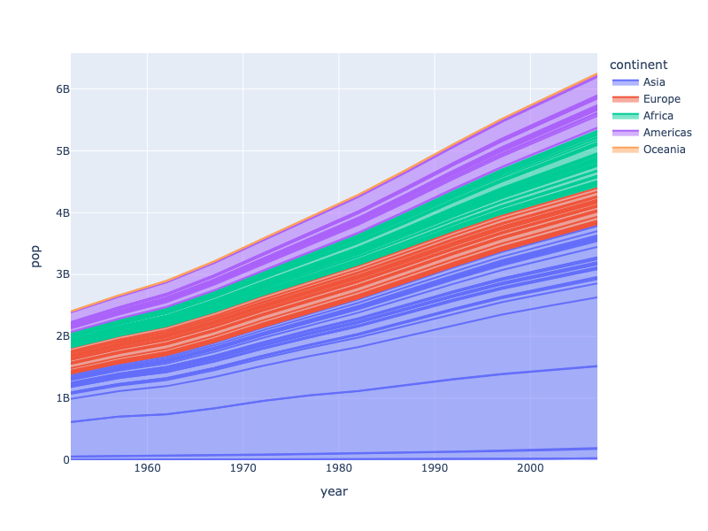

**Interactive Plot:**

<div>                        <script type="text/javascript">window.PlotlyConfig = {MathJaxConfig: 'local'};</script>
        <script charset="utf-8" src="https://cdn.plot.ly/plotly-3.1.0.min.js" integrity="sha256-Ei4740bWZhaUTQuD6q9yQlgVCMPBz6CZWhevDYPv93A=" crossorigin="anonymous"></script>                <div id="plotly-div-13" class="plotly-graph-div" style="height:100%; width:100%;"></div>            <script type="text/javascript">                window.PLOTLYENV=window.PLOTLYENV || {};                                if (document.getElementById("plotly-div-13")) {                    Plotly.newPlot(                        "plotly-div-13",                        [{"fillpattern":{"shape":""},"hovertemplate":"continent=Asia\u003cbr\u003ecountry=Afghanistan\u003cbr\u003eyear=%{x}\u003cbr\u003epop=%{y}\u003cextra\u003e\u003c\u002fextra\u003e","legendgroup":"Asia","line":{"color":"#636efa"},"marker":{"symbol":"circle"},"mode":"lines","name":"Asia","orientation":"v","showlegend":true,"stackgroup":"1","x":{"dtype":"i2","bdata":"oAelB6oHrwe0B7kHvgfDB8gHzQfSB9cH"},"xaxis":"x","y":{"dtype":"i4","bdata":"dY+AAGYBjQDLqZwALg6wAKSTxwB0DuMAmI\u002fEALWb0wDh\u002ffgA1ylTAbWQgQEDmuYB"},"yaxis":"y","type":"scatter"},{"fillpattern":{"shape":""},"hovertemplate":"continent=Asia\u003cbr\u003ecountry=Bahrain\u003cbr\u003eyear=%{x}\u003cbr\u003epop=%{y}\u003cextra\u003e\u003c\u002fextra\u003e","legendgroup":"Asia","line":{"color":"#636efa"},"marker":{"symbol":"circle"},"mode":"lines","name":"Asia","orientation":"v","showlegend":false,"stackgroup":"1","x":{"dtype":"i2","bdata":"oAelB6oHrwe0B7kHvgfDB8gHzQfSB9cH"},"xaxis":"x","y":{"dtype":"i4","bdata":"f9YBAJ8dAgBXnwIAxhUDAJCFAwDCiQQAb8QFANTvBgBTFAgAISIJAA0ECgDdzwoA"},"yaxis":"y","type":"scatter"},{"fillpattern":{"shape":""},"hovertemplate":"continent=Asia\u003cbr\u003ecountry=Bangladesh\u003cbr\u003eyear=%{x}\u003cbr\u003epop=%{y}\u003cextra\u003e\u003c\u002fextra\u003e","legendgroup":"Asia","line":{"color":"#636efa"},"marker":{"symbol":"circle"},"mode":"lines","name":"Asia","orientation":"v","showlegend":false,"stackgroup":"1","x":{"dtype":"i2","bdata":"oAelB6oHrwe0B7kHvgfDB8gHzQfSB9cH"},"xaxis":"x","y":{"dtype":"i4","bdata":"y2\u002fLAlzGDwN5TGMD\u002fJW+A3+zNwQSPcsE5jOMBRFRLwaD\u002fsYGWKRZB1b1FQjTqPcI"},"yaxis":"y","type":"scatter"},{"fillpattern":{"shape":""},"hovertemplate":"continent=Asia\u003cbr\u003ecountry=Cambodia\u003cbr\u003eyear=%{x}\u003cbr\u003epop=%{y}\u003cextra\u003e\u003c\u002fextra\u003e","legendgroup":"Asia","line":{"color":"#636efa"},"marker":{"symbol":"circle"},"mode":"lines","name":"Asia","orientation":"v","showlegend":false,"stackgroup":"1","x":{"dtype":"i2","bdata":"oAelB6oHrwe0B7kHvgfDB8gHzQfSB9cH"},"xaxis":"x","y":{"dtype":"i4","bdata":"TJ9HACg3UQAj1FwAwzNqAO6vcQAvfGoAJfhuAE++fwDO4JoAMsuzAPM+xQCSotcA"},"yaxis":"y","type":"scatter"},{"fillpattern":{"shape":""},"hovertemplate":"continent=Asia\u003cbr\u003ecountry=China\u003cbr\u003eyear=%{x}\u003cbr\u003epop=%{y}\u003cextra\u003e\u003c\u002fextra\u003e","legendgroup":"Asia","line":{"color":"#636efa"},"marker":{"symbol":"circle"},"mode":"lines","name":"Asia","orientation":"v","showlegend":false,"stackgroup":"1","x":{"dtype":"i2","bdata":"oAelB6oHrwe0B7kHvgfDB8gHzQfSB9cH"},"xaxis":"x","y":{"dtype":"i4","bdata":"Z+gnIQAT\u002fiUQ2K4n8IT5LLCIYTMY+zs4qBOfO7gPnUAQCHBFeHRRSYBaUUzYgZlO"},"yaxis":"y","type":"scatter"},{"fillpattern":{"shape":""},"hovertemplate":"continent=Asia\u003cbr\u003ecountry=Hong Kong, China\u003cbr\u003eyear=%{x}\u003cbr\u003epop=%{y}\u003cextra\u003e\u003c\u002fextra\u003e","legendgroup":"Asia","line":{"color":"#636efa"},"marker":{"symbol":"circle"},"mode":"lines","name":"Asia","orientation":"v","showlegend":false,"stackgroup":"1","x":{"dtype":"i2","bdata":"oAelB6oHrwe0B7kHvgfDB8gHzQfSB9cH"},"xaxis":"x","y":{"dtype":"i4","bdata":"THAgAKzAKQDwbjIAMM44APTMPgAU8UUAdFRQAH42VQBA9FgArh5jAOwvZwA8g2oA"},"yaxis":"y","type":"scatter"},{"fillpattern":{"shape":""},"hovertemplate":"continent=Asia\u003cbr\u003ecountry=India\u003cbr\u003eyear=%{x}\u003cbr\u003epop=%{y}\u003cextra\u003e\u003c\u002fextra\u003e","legendgroup":"Asia","line":{"color":"#636efa"},"marker":{"symbol":"circle"},"mode":"lines","name":"Asia","orientation":"v","showlegend":false,"stackgroup":"1","x":{"dtype":"i2","bdata":"oAelB6oHrwe0B7kHvgfDB8gHzQfSB9cH"},"xaxis":"x","y":{"dtype":"i4","bdata":"AEUsFkDYYBiAfQ8bgPIoHsC7yyGAEsolADkzKgDt9y4AqvkzwC0pOYM4pD2rTS9C"},"yaxis":"y","type":"scatter"},{"fillpattern":{"shape":""},"hovertemplate":"continent=Asia\u003cbr\u003ecountry=Indonesia\u003cbr\u003eyear=%{x}\u003cbr\u003epop=%{y}\u003cextra\u003e\u003c\u002fextra\u003e","legendgroup":"Asia","line":{"color":"#636efa"},"marker":{"symbol":"circle"},"mode":"lines","name":"Asia","orientation":"v","showlegend":false,"stackgroup":"1","x":{"dtype":"i2","bdata":"oAelB6oHrwe0B7kHvgfDB8gHzQfSB9cH"},"xaxis":"x","y":{"dtype":"i4","bdata":"oAPkBOAuXwUgDOcFGHGEBtCdOgcIQiYIGNQjCWDyFgqAEQQLsL3gCyCFlAx4DlMN"},"yaxis":"y","type":"scatter"},{"fillpattern":{"shape":""},"hovertemplate":"continent=Asia\u003cbr\u003ecountry=Iran\u003cbr\u003eyear=%{x}\u003cbr\u003epop=%{y}\u003cextra\u003e\u003c\u002fextra\u003e","legendgroup":"Asia","line":{"color":"#636efa"},"marker":{"symbol":"circle"},"mode":"lines","name":"Asia","orientation":"v","showlegend":false,"stackgroup":"1","x":{"dtype":"i2","bdata":"oAelB6oHrwe0B7kHvgfDB8gHzQfSB9cH"},"xaxis":"x","y":{"dtype":"i4","bdata":"wIwHAYAALgGQB10BEPCUAfAh0wFnZB0C7zyRAiDGFwOVmZkD807GA7Lu\u002fAMCxyME"},"yaxis":"y","type":"scatter"},{"fillpattern":{"shape":""},"hovertemplate":"continent=Asia\u003cbr\u003ecountry=Iraq\u003cbr\u003eyear=%{x}\u003cbr\u003epop=%{y}\u003cextra\u003e\u003c\u002fextra\u003e","legendgroup":"Asia","line":{"color":"#636efa"},"marker":{"symbol":"circle"},"mode":"lines","name":"Asia","orientation":"v","showlegend":false,"stackgroup":"1","x":{"dtype":"i2","bdata":"oAelB6oHrwe0B7kHvgfDB8gHzQfSB9cH"},"xaxis":"x","y":{"dtype":"i4","bdata":"5ghTAMNYXwBEem4Acv6BAMKGmQCkUbUAhkTYANVt\u002fAARjRABFwM9ARg9bgF2nKMB"},"yaxis":"y","type":"scatter"},{"fillpattern":{"shape":""},"hovertemplate":"continent=Asia\u003cbr\u003ecountry=Israel\u003cbr\u003eyear=%{x}\u003cbr\u003epop=%{y}\u003cextra\u003e\u003c\u002fextra\u003e","legendgroup":"Asia","line":{"color":"#636efa"},"marker":{"symbol":"circle"},"mode":"lines","name":"Asia","orientation":"v","showlegend":false,"stackgroup":"1","x":{"dtype":"i2","bdata":"oAelB6oHrwe0B7kHvgfDB8gHzQfSB9cH"},"xaxis":"x","y":{"dtype":"i4","bdata":"srsYAFGrHQD4QiMA0RkpAFU9LwDuVzUA9d86AIwiQABmU0sA+2ZUANkAXAA3EGIA"},"yaxis":"y","type":"scatter"},{"fillpattern":{"shape":""},"hovertemplate":"continent=Asia\u003cbr\u003ecountry=Japan\u003cbr\u003eyear=%{x}\u003cbr\u003epop=%{y}\u003cextra\u003e\u003c\u002fextra\u003e","legendgroup":"Asia","line":{"color":"#636efa"},"marker":{"symbol":"circle"},"mode":"lines","name":"Asia","orientation":"v","showlegend":false,"stackgroup":"1","x":{"dtype":"i2","bdata":"oAelB6oHrwe0B7kHvgfDB8gHzQfSB9cH"},"xaxis":"x","y":{"dtype":"i4","bdata":"kUInBQEkdQXNRrYFv3gCBjGQYwZZjskGvnoPBz33Rgc1HWkHk\u002fGBB\u002fHekgfEAZkH"},"yaxis":"y","type":"scatter"},{"fillpattern":{"shape":""},"hovertemplate":"continent=Asia\u003cbr\u003ecountry=Jordan\u003cbr\u003eyear=%{x}\u003cbr\u003epop=%{y}\u003cextra\u003e\u003c\u002fextra\u003e","legendgroup":"Asia","line":{"color":"#636efa"},"marker":{"symbol":"circle"},"mode":"lines","name":"Asia","orientation":"v","showlegend":false,"stackgroup":"1","x":{"dtype":"i2","bdata":"oAelB6oHrwe0B7kHvgfDB8gHzQfSB9cH"},"xaxis":"x","y":{"dtype":"i4","bdata":"qkYJAD9kCwC3Pg4AkiYTAO+eGAD0kB0AF9AjAMoHKwARAzsAmxBFAE78UABJXVwA"},"yaxis":"y","type":"scatter"},{"fillpattern":{"shape":""},"hovertemplate":"continent=Asia\u003cbr\u003ecountry=Korea, Dem. Rep.\u003cbr\u003eyear=%{x}\u003cbr\u003epop=%{y}\u003cextra\u003e\u003c\u002fextra\u003e","legendgroup":"Asia","line":{"color":"#636efa"},"marker":{"symbol":"circle"},"mode":"lines","name":"Asia","orientation":"v","showlegend":false,"stackgroup":"1","x":{"dtype":"i2","bdata":"oAelB6oHrwe0B7kHvgfDB8gHzQfSB9cH"},"xaxis":"x","y":{"dtype":"i4","bdata":"0EaHADWbjwB2lqYAMYXAADmL4QDIGvkAnkcNAaLyIgHPBzwB0VxJAcX6UgFdjmMB"},"yaxis":"y","type":"scatter"},{"fillpattern":{"shape":""},"hovertemplate":"continent=Asia\u003cbr\u003ecountry=Korea, Rep.\u003cbr\u003eyear=%{x}\u003cbr\u003epop=%{y}\u003cextra\u003e\u003c\u002fextra\u003e","legendgroup":"Asia","line":{"color":"#636efa"},"marker":{"symbol":"circle"},"mode":"lines","name":"Asia","orientation":"v","showlegend":false,"stackgroup":"1","x":{"dtype":"i2","bdata":"oAelB6oHrwe0B7kHvgfDB8gHzQfSB9cH"},"xaxis":"x","y":{"dtype":"i4","bdata":"c6I\u002fAWAGWQFTJJMBOMPLAeg+\u002fwEg+CsCMBFYAvAZewIKa5wCeI7AAn7z2wI2XewC"},"yaxis":"y","type":"scatter"},{"fillpattern":{"shape":""},"hovertemplate":"continent=Asia\u003cbr\u003ecountry=Kuwait\u003cbr\u003eyear=%{x}\u003cbr\u003epop=%{y}\u003cextra\u003e\u003c\u002fextra\u003e","legendgroup":"Asia","line":{"color":"#636efa"},"marker":{"symbol":"circle"},"mode":"lines","name":"Asia","orientation":"v","showlegend":false,"stackgroup":"1","x":{"dtype":"i2","bdata":"oAelB6oHrwe0B7kHvgfDB8gHzQfSB9cH"},"xaxis":"x","y":{"dtype":"i4","bdata":"AHECAG4\u002fAwB6dwUAG8YIAM7YDACFZhEAltkWAJ\u002fcHABvoxUA4e8aAEk4IABXOyYA"},"yaxis":"y","type":"scatter"},{"fillpattern":{"shape":""},"hovertemplate":"continent=Asia\u003cbr\u003ecountry=Lebanon\u003cbr\u003eyear=%{x}\u003cbr\u003epop=%{y}\u003cextra\u003e\u003c\u002fextra\u003e","legendgroup":"Asia","line":{"color":"#636efa"},"marker":{"symbol":"circle"},"mode":"lines","name":"Asia","orientation":"v","showlegend":false,"stackgroup":"1","x":{"dtype":"i2","bdata":"oAelB6oHrwe0B7kHvgfDB8gHzQfSB9cH"},"xaxis":"x","y":{"dtype":"i4","bdata":"KfcVADQjGQCAyhwAjl4hANLkKAALiy8AHBovAMkjLwAaIjEA9Fc0AFQeOAB+1TsA"},"yaxis":"y","type":"scatter"},{"fillpattern":{"shape":""},"hovertemplate":"continent=Asia\u003cbr\u003ecountry=Malaysia\u003cbr\u003eyear=%{x}\u003cbr\u003epop=%{y}\u003cextra\u003e\u003c\u002fextra\u003e","legendgroup":"Asia","line":{"color":"#636efa"},"marker":{"symbol":"circle"},"mode":"lines","name":"Asia","orientation":"v","showlegend":false,"stackgroup":"1","x":{"dtype":"i2","bdata":"oAelB6oHrwe0B7kHvgfDB8gHzQfSB9cH"},"xaxis":"x","y":{"dtype":"i4","bdata":"2vhmAGMXdgCR5ocAfvOaADaVrgBFAcQAvF3cAAk0+QCOiBcBu3A4Ad3MWQEmvnoB"},"yaxis":"y","type":"scatter"},{"fillpattern":{"shape":""},"hovertemplate":"continent=Asia\u003cbr\u003ecountry=Mongolia\u003cbr\u003eyear=%{x}\u003cbr\u003epop=%{y}\u003cextra\u003e\u003c\u002fextra\u003e","legendgroup":"Asia","line":{"color":"#636efa"},"marker":{"symbol":"circle"},"mode":"lines","name":"Asia","orientation":"v","showlegend":false,"stackgroup":"1","x":{"dtype":"i2","bdata":"oAelB6oHrwe0B7kHvgfDB8gHzQfSB9cH"},"xaxis":"x","y":{"dtype":"i4","bdata":"lzcMANZ1DQBoag8APIoRADQmFADAUBcAgMsaAJ2\u002fHgBiSiMAUxEmADrOKAAP2ysA"},"yaxis":"y","type":"scatter"},{"fillpattern":{"shape":""},"hovertemplate":"continent=Asia\u003cbr\u003ecountry=Myanmar\u003cbr\u003eyear=%{x}\u003cbr\u003epop=%{y}\u003cextra\u003e\u003c\u002fextra\u003e","legendgroup":"Asia","line":{"color":"#636efa"},"marker":{"symbol":"circle"},"mode":"lines","name":"Asia","orientation":"v","showlegend":false,"stackgroup":"1","x":{"dtype":"i2","bdata":"oAelB6oHrwe0B7kHvgfDB8gHzQfSB9cH"},"xaxis":"x","y":{"dtype":"i4","bdata":"RJgyAQSaSwEEomgBv7+KAdZcsgGXFOEBei4RAiJFRALqsGoC++iTAoHFtwI8ytgC"},"yaxis":"y","type":"scatter"},{"fillpattern":{"shape":""},"hovertemplate":"continent=Asia\u003cbr\u003ecountry=Nepal\u003cbr\u003eyear=%{x}\u003cbr\u003epop=%{y}\u003cextra\u003e\u003c\u002fextra\u003e","legendgroup":"Asia","line":{"color":"#636efa"},"marker":{"symbol":"circle"},"mode":"lines","name":"Asia","orientation":"v","showlegend":false,"stackgroup":"1","x":{"dtype":"i2","bdata":"oAelB6oHrwe0B7kHvgfDB8gHzQfSB9cH"},"xaxis":"x","y":{"dtype":"i4","bdata":"SB2MAKK9kwCZp50A+tarALFmvQCOmtQAWgjxAPxkEQFBJzYBGfheAf3NigGeAbkB"},"yaxis":"y","type":"scatter"},{"fillpattern":{"shape":""},"hovertemplate":"continent=Asia\u003cbr\u003ecountry=Oman\u003cbr\u003eyear=%{x}\u003cbr\u003epop=%{y}\u003cextra\u003e\u003c\u002fextra\u003e","legendgroup":"Asia","line":{"color":"#636efa"},"marker":{"symbol":"circle"},"mode":"lines","name":"Asia","orientation":"v","showlegend":false,"stackgroup":"1","x":{"dtype":"i2","bdata":"oAelB6oHrwe0B7kHvgfDB8gHzQfSB9cH"},"xaxis":"x","y":{"dtype":"i4","bdata":"ub8HADmTCADElQkAF+gKAHqmDAD1Uw8AONoTABpSGABIOR0Ac9giAHZnKQAh5zAA"},"yaxis":"y","type":"scatter"},{"fillpattern":{"shape":""},"hovertemplate":"continent=Asia\u003cbr\u003ecountry=Pakistan\u003cbr\u003eyear=%{x}\u003cbr\u003epop=%{y}\u003cextra\u003e\u003c\u002fextra\u003e","legendgroup":"Asia","line":{"color":"#636efa"},"marker":{"symbol":"circle"},"mode":"lines","name":"Asia","orientation":"v","showlegend":false,"stackgroup":"1","x":{"dtype":"i2","bdata":"oAelB6oHrwe0B7kHvgfDB8gHzQfSB9cH"},"xaxis":"x","y":{"dtype":"i4","bdata":"AOZ2AohHyAJ\u002fQCoDa1KdA2HUIQTug6gEyJlzBUEGRQbsCygHIo4UCITAJAlZ3RYK"},"yaxis":"y","type":"scatter"},{"fillpattern":{"shape":""},"hovertemplate":"continent=Asia\u003cbr\u003ecountry=Philippines\u003cbr\u003eyear=%{x}\u003cbr\u003epop=%{y}\u003cextra\u003e\u003c\u002fextra\u003e","legendgroup":"Asia","line":{"color":"#636efa"},"marker":{"symbol":"circle"},"mode":"lines","name":"Asia","orientation":"v","showlegend":false,"stackgroup":"1","x":{"dtype":"i2","bdata":"oAelB6oHrwe0B7kHvgfDB8gHzQfSB9cH"},"xaxis":"x","y":{"dtype":"i4","bdata":"I2NWAYLUjQEQus4BuH8bAt1SbwKS48oChq8vA3zMkwNmLAEEfJt4BJBn8gSnum0F"},"yaxis":"y","type":"scatter"},{"fillpattern":{"shape":""},"hovertemplate":"continent=Asia\u003cbr\u003ecountry=Saudi Arabia\u003cbr\u003eyear=%{x}\u003cbr\u003epop=%{y}\u003cextra\u003e\u003c\u002fextra\u003e","legendgroup":"Asia","line":{"color":"#636efa"},"marker":{"symbol":"circle"},"mode":"lines","name":"Asia","orientation":"v","showlegend":false,"stackgroup":"1","x":{"dtype":"i2","bdata":"oAelB6oHrwe0B7kHvgfDB8gHzQfSB9cH"},"xaxis":"x","y":{"dtype":"i4","bdata":"LR89AEJwQwC1bEsAFrpVADTEYgD5B3wAkLurAGEU3wDBkgIBv\u002fBDARrddQGOKKUB"},"yaxis":"y","type":"scatter"},{"fillpattern":{"shape":""},"hovertemplate":"continent=Asia\u003cbr\u003ecountry=Singapore\u003cbr\u003eyear=%{x}\u003cbr\u003epop=%{y}\u003cextra\u003e\u003c\u002fextra\u003e","legendgroup":"Asia","line":{"color":"#636efa"},"marker":{"symbol":"circle"},"mode":"lines","name":"Asia","orientation":"v","showlegend":false,"stackgroup":"1","x":{"dtype":"i2","bdata":"oAelB6oHrwe0B7kHvgfDB8gHzQfSB9cH"},"xaxis":"x","y":{"dtype":"i4","bdata":"WDIRACkQFgC4tBoAAC0eANDXIAA0eyMA3XYoADikKgAZYDEAxQQ6AJANQAAxeUUA"},"yaxis":"y","type":"scatter"},{"fillpattern":{"shape":""},"hovertemplate":"continent=Asia\u003cbr\u003ecountry=Sri Lanka\u003cbr\u003eyear=%{x}\u003cbr\u003epop=%{y}\u003cextra\u003e\u003c\u002fextra\u003e","legendgroup":"Asia","line":{"color":"#636efa"},"marker":{"symbol":"circle"},"mode":"lines","name":"Asia","orientation":"v","showlegend":false,"stackgroup":"1","x":{"dtype":"i2","bdata":"oAelB6oHrwe0B7kHvgfDB8gHzQfSB9cH"},"xaxis":"x","y":{"dtype":"i4","bdata":"Bs15AGJKiwCwBp8ANBmzAJ2exgDkZ9cA5yPrAMiy+wB0WwwBn1EdAc+3KgF\u002f8jYB"},"yaxis":"y","type":"scatter"},{"fillpattern":{"shape":""},"hovertemplate":"continent=Asia\u003cbr\u003ecountry=Syria\u003cbr\u003eyear=%{x}\u003cbr\u003epop=%{y}\u003cextra\u003e\u003c\u002fextra\u003e","legendgroup":"Asia","line":{"color":"#636efa"},"marker":{"symbol":"circle"},"mode":"lines","name":"Asia","orientation":"v","showlegend":false,"stackgroup":"1","x":{"dtype":"i2","bdata":"oAelB6oHrwe0B7kHvgfDB8gHzQfSB9cH"},"xaxis":"x","y":{"dtype":"i4","bdata":"7d43AJRSPwA9xUkArK5WAHRAZgBXCnkAvpePAF+NqwD2tMkAOB7mAObGBQE7uCYB"},"yaxis":"y","type":"scatter"},{"fillpattern":{"shape":""},"hovertemplate":"continent=Asia\u003cbr\u003ecountry=Taiwan\u003cbr\u003eyear=%{x}\u003cbr\u003epop=%{y}\u003cextra\u003e\u003c\u002fextra\u003e","legendgroup":"Asia","line":{"color":"#636efa"},"marker":{"symbol":"circle"},"mode":"lines","name":"Asia","orientation":"v","showlegend":false,"stackgroup":"1","x":{"dtype":"i2","bdata":"oAelB6oHrwe0B7kHvgfDB8gHzQfSB9cH"},"xaxis":"x","y":{"dtype":"i4","bdata":"2neCAPcXmwBa3rUANEPQALdU6AAsHwABDk8aAed6LQFGqDsBvQZKAd+fVgGWnGEB"},"yaxis":"y","type":"scatter"},{"fillpattern":{"shape":""},"hovertemplate":"continent=Asia\u003cbr\u003ecountry=Thailand\u003cbr\u003eyear=%{x}\u003cbr\u003epop=%{y}\u003cextra\u003e\u003c\u002fextra\u003e","legendgroup":"Asia","line":{"color":"#636efa"},"marker":{"symbol":"circle"},"mode":"lines","name":"Asia","orientation":"v","showlegend":false,"stackgroup":"1","x":{"dtype":"i2","bdata":"oAelB6oHrwe0B7kHvgfDB8gHzQfSB9cH"},"xaxis":"x","y":{"dtype":"i4","bdata":"utlEAf0bfgElhr4BOSsHAnlOVwI9pqECGAvpAgZZJwPXq2ADZdWWA9xavgN13OAD"},"yaxis":"y","type":"scatter"},{"fillpattern":{"shape":""},"hovertemplate":"continent=Asia\u003cbr\u003ecountry=Vietnam\u003cbr\u003eyear=%{x}\u003cbr\u003epop=%{y}\u003cextra\u003e\u003c\u002fextra\u003e","legendgroup":"Asia","line":{"color":"#636efa"},"marker":{"symbol":"circle"},"mode":"lines","name":"Asia","orientation":"v","showlegend":false,"stackgroup":"1","x":{"dtype":"i2","bdata":"oAelB6oHrwe0B7kHvgfDB8gHzQfSB9cH"},"xaxis":"x","y":{"dtype":"i4","bdata":"t36QAY97ugEssAMC5itaAqZhqQKCFAMDZalYA\u002funvgP4NSsEZGqIBHOP0gQUABUF"},"yaxis":"y","type":"scatter"},{"fillpattern":{"shape":""},"hovertemplate":"continent=Asia\u003cbr\u003ecountry=West Bank and Gaza\u003cbr\u003eyear=%{x}\u003cbr\u003epop=%{y}\u003cextra\u003e\u003c\u002fextra\u003e","legendgroup":"Asia","line":{"color":"#636efa"},"marker":{"symbol":"circle"},"mode":"lines","name":"Asia","orientation":"v","showlegend":false,"stackgroup":"1","x":{"dtype":"i2","bdata":"oAelB6oHrwe0B7kHvgfDB8gHzQfSB9cH"},"xaxis":"x","y":{"dtype":"i4","bdata":"ubkPAGdVEABOShEAbG8RACSgEAAjPhMA1MEVAErOGQDLHSAAPh8rAIq4MwCcUD0A"},"yaxis":"y","type":"scatter"},{"fillpattern":{"shape":""},"hovertemplate":"continent=Asia\u003cbr\u003ecountry=Yemen, Rep.\u003cbr\u003eyear=%{x}\u003cbr\u003epop=%{y}\u003cextra\u003e\u003c\u002fextra\u003e","legendgroup":"Asia","line":{"color":"#636efa"},"marker":{"symbol":"circle"},"mode":"lines","name":"Asia","orientation":"v","showlegend":false,"stackgroup":"1","x":{"dtype":"i2","bdata":"oAelB6oHrwe0B7kHvgfDB8gHzQfSB9cH"},"xaxis":"x","y":{"dtype":"i4","bdata":"9b1LAOrkUwCRYl0AMdtmAOMFcQAWPIAAEl2TAIwxqwC9+ssAQX7xAMlbHQGf7FIB"},"yaxis":"y","type":"scatter"},{"fillpattern":{"shape":""},"hovertemplate":"continent=Europe\u003cbr\u003ecountry=Albania\u003cbr\u003eyear=%{x}\u003cbr\u003epop=%{y}\u003cextra\u003e\u003c\u002fextra\u003e","legendgroup":"Europe","line":{"color":"#EF553B"},"marker":{"symbol":"circle"},"mode":"lines","name":"Europe","orientation":"v","showlegend":true,"stackgroup":"1","x":{"dtype":"i2","bdata":"oAelB6oHrwe0B7kHvgfDB8gHzQfSB9cH"},"xaxis":"x","y":{"dtype":"i4","bdata":"iZITAJmHFgCJXhoAPEYeAAKKIgD4SCYAwWsqAPnsLgAiwjIAxk40ACCJNQCL8DYA"},"yaxis":"y","type":"scatter"},{"fillpattern":{"shape":""},"hovertemplate":"continent=Europe\u003cbr\u003ecountry=Austria\u003cbr\u003eyear=%{x}\u003cbr\u003epop=%{y}\u003cextra\u003e\u003c\u002fextra\u003e","legendgroup":"Europe","line":{"color":"#EF553B"},"marker":{"symbol":"circle"},"mode":"lines","name":"Europe","orientation":"v","showlegend":false,"stackgroup":"1","x":{"dtype":"i2","bdata":"oAelB6oHrwe0B7kHvgfDB8gHzQfSB9cH"},"xaxis":"x","y":{"dtype":"i4","bdata":"nLVpAGRKagAIy2wAZpBwAIkdcwAufHMAVZRzABelcwDZxXgA9CJ7AFhVfABnHn0A"},"yaxis":"y","type":"scatter"},{"fillpattern":{"shape":""},"hovertemplate":"continent=Europe\u003cbr\u003ecountry=Belgium\u003cbr\u003eyear=%{x}\u003cbr\u003epop=%{y}\u003cextra\u003e\u003c\u002fextra\u003e","legendgroup":"Europe","line":{"color":"#EF553B"},"marker":{"symbol":"circle"},"mode":"lines","name":"Europe","orientation":"v","showlegend":false,"stackgroup":"1","x":{"dtype":"i2","bdata":"oAelB6oHrwe0B7kHvgfDB8gHzQfSB9cH"},"xaxis":"x","y":{"dtype":"i4","bdata":"JTeFALcpiQBgqYwAFNKRACwmlABo3pUAL2WWAHiblgC2SJkA66KbACJZnQCikp4A"},"yaxis":"y","type":"scatter"},{"fillpattern":{"shape":""},"hovertemplate":"continent=Europe\u003cbr\u003ecountry=Bosnia and Herzegovina\u003cbr\u003eyear=%{x}\u003cbr\u003epop=%{y}\u003cextra\u003e\u003c\u002fextra\u003e","legendgroup":"Europe","line":{"color":"#EF553B"},"marker":{"symbol":"circle"},"mode":"lines","name":"Europe","orientation":"v","showlegend":false,"stackgroup":"1","x":{"dtype":"i2","bdata":"oAelB6oHrwe0B7kHvgfDB8gHzQfSB9cH"},"xaxis":"x","y":{"dtype":"i4","bdata":"WJYqAKDvLgAIGjMA6LM2APhFOgDwWD4Alas\u002fACE1QgAN8UAA2Ak3ACiPPwAGdkUA"},"yaxis":"y","type":"scatter"},{"fillpattern":{"shape":""},"hovertemplate":"continent=Europe\u003cbr\u003ecountry=Bulgaria\u003cbr\u003eyear=%{x}\u003cbr\u003epop=%{y}\u003cextra\u003e\u003c\u002fextra\u003e","legendgroup":"Europe","line":{"color":"#EF553B"},"marker":{"symbol":"circle"},"mode":"lines","name":"Europe","orientation":"v","showlegend":false,"stackgroup":"1","x":{"dtype":"i2","bdata":"oAelB6oHrwe0B7kHvgfDB8gHzQfSB9cH"},"xaxis":"x","y":{"dtype":"i4","bdata":"lAFvALa\u002fdACSRHoA0s1+AMjcggBeO4YAwq6HALbmiABKHoQACRR7AOfodADqvG8A"},"yaxis":"y","type":"scatter"},{"fillpattern":{"shape":""},"hovertemplate":"continent=Europe\u003cbr\u003ecountry=Croatia\u003cbr\u003eyear=%{x}\u003cbr\u003epop=%{y}\u003cextra\u003e\u003c\u002fextra\u003e","legendgroup":"Europe","line":{"color":"#EF553B"},"marker":{"symbol":"circle"},"mode":"lines","name":"Europe","orientation":"v","showlegend":false,"stackgroup":"1","x":{"dtype":"i2","bdata":"oAelB6oHrwe0B7kHvgfDB8gHzQfSB9cH"},"xaxis":"x","y":{"dtype":"i4","bdata":"9Tw7AMrmPAANND4AHrI\u002fAB55QADR5UEAuFdDANZsRAC9kkQAs9FDAPxfRAAAkEQA"},"yaxis":"y","type":"scatter"},{"fillpattern":{"shape":""},"hovertemplate":"continent=Europe\u003cbr\u003ecountry=Czech Republic\u003cbr\u003eyear=%{x}\u003cbr\u003epop=%{y}\u003cextra\u003e\u003c\u002fextra\u003e","legendgroup":"Europe","line":{"color":"#EF553B"},"marker":{"symbol":"circle"},"mode":"lines","name":"Europe","orientation":"v","showlegend":false,"stackgroup":"1","x":{"dtype":"i2","bdata":"oAelB6oHrwe0B7kHvgfDB8gHzQfSB9cH"},"xaxis":"x","y":{"dtype":"i4","bdata":"Pz2LAB4rkQA6y5IAZRKWAA58lgD7DpsA2DidAK1XnQC2Z50AIy2dAKd\u002fnAAIFJwA"},"yaxis":"y","type":"scatter"},{"fillpattern":{"shape":""},"hovertemplate":"continent=Europe\u003cbr\u003ecountry=Denmark\u003cbr\u003eyear=%{x}\u003cbr\u003epop=%{y}\u003cextra\u003e\u003c\u002fextra\u003e","legendgroup":"Europe","line":{"color":"#EF553B"},"marker":{"symbol":"circle"},"mode":"lines","name":"Europe","orientation":"v","showlegend":false,"stackgroup":"1","x":{"dtype":"i2","bdata":"oAelB6oHrwe0B7kHvgfDB8gHzQfSB9cH"},"xaxis":"x","y":{"dtype":"i4","bdata":"sCFCAJd6RADz50YAkNVJAGwqTACjpE0AchdOAHA7TgDB6E4AT59QAOUCUgDYb1MA"},"yaxis":"y","type":"scatter"},{"fillpattern":{"shape":""},"hovertemplate":"continent=Europe\u003cbr\u003ecountry=Finland\u003cbr\u003eyear=%{x}\u003cbr\u003epop=%{y}\u003cextra\u003e\u003c\u002fextra\u003e","legendgroup":"Europe","line":{"color":"#EF553B"},"marker":{"symbol":"circle"},"mode":"lines","name":"Europe","orientation":"v","showlegend":false,"stackgroup":"1","x":{"dtype":"i2","bdata":"oAelB6oHrwe0B7kHvgfDB8gHzQfSB9cH"},"xaxis":"x","y":{"dtype":"i4","bdata":"hGo+AKD6QQCziEQAMEdGAKnLRgBWT0gANadJAJFASwCP60wARlhOAE89TwC87k8A"},"yaxis":"y","type":"scatter"},{"fillpattern":{"shape":""},"hovertemplate":"continent=Europe\u003cbr\u003ecountry=France\u003cbr\u003eyear=%{x}\u003cbr\u003epop=%{y}\u003cextra\u003e\u003c\u002fextra\u003e","legendgroup":"Europe","line":{"color":"#EF553B"},"marker":{"symbol":"circle"},"mode":"lines","name":"Europe","orientation":"v","showlegend":false,"stackgroup":"1","x":{"dtype":"i2","bdata":"oAelB6oHrwe0B7kHvgfDB8gHzQfSB9cH"},"xaxis":"x","y":{"dtype":"i4","bdata":"E+KHAk8hpAIgDs8C6Fz0AiBeFQPbOysDHZc+AxTZUAPjdWsDxIV+AytikgMMEaQD"},"yaxis":"y","type":"scatter"},{"fillpattern":{"shape":""},"hovertemplate":"continent=Europe\u003cbr\u003ecountry=Germany\u003cbr\u003eyear=%{x}\u003cbr\u003epop=%{y}\u003cextra\u003e\u003c\u002fextra\u003e","legendgroup":"Europe","line":{"color":"#EF553B"},"marker":{"symbol":"circle"},"mode":"lines","name":"Europe","orientation":"v","showlegend":false,"stackgroup":"1","x":{"dtype":"i2","bdata":"oAelB6oHrwe0B7kHvgfDB8gHzQfSB9cH"},"xaxis":"x","y":{"dtype":"i4","bdata":"YBUfBD2qOwRtK2UERUqNBKAgsQSFo6gEIk2rBBrjoQQE080EwWPjBE+S6ATkVukE"},"yaxis":"y","type":"scatter"},{"fillpattern":{"shape":""},"hovertemplate":"continent=Europe\u003cbr\u003ecountry=Greece\u003cbr\u003eyear=%{x}\u003cbr\u003epop=%{y}\u003cextra\u003e\u003c\u002fextra\u003e","legendgroup":"Europe","line":{"color":"#EF553B"},"marker":{"symbol":"circle"},"mode":"lines","name":"Europe","orientation":"v","showlegend":false,"stackgroup":"1","x":{"dtype":"i2","bdata":"oAelB6oHrwe0B7kHvgfDB8gHzQfSB9cH"},"xaxis":"x","y":{"dtype":"i4","bdata":"AgB2ANqJewDp6IAAmQCFADShhwA\u002fCY4AcFSVANoymAC1jZ0A5ECgAFfNoQByXaMA"},"yaxis":"y","type":"scatter"},{"fillpattern":{"shape":""},"hovertemplate":"continent=Europe\u003cbr\u003ecountry=Hungary\u003cbr\u003eyear=%{x}\u003cbr\u003epop=%{y}\u003cextra\u003e\u003c\u002fextra\u003e","legendgroup":"Europe","line":{"color":"#EF553B"},"marker":{"symbol":"circle"},"mode":"lines","name":"Europe","orientation":"v","showlegend":false,"stackgroup":"1","x":{"dtype":"i2","bdata":"oAelB6oHrwe0B7kHvgfDB8gHzQfSB9cH"},"xaxis":"x","y":{"dtype":"i4","bdata":"AAWRAJghlgCYjJkAPv+bAOuZngBzT6IAf1qjAATwoQCM6J0ATFKcAPHbmQAM65cA"},"yaxis":"y","type":"scatter"},{"fillpattern":{"shape":""},"hovertemplate":"continent=Europe\u003cbr\u003ecountry=Iceland\u003cbr\u003eyear=%{x}\u003cbr\u003epop=%{y}\u003cextra\u003e\u003c\u002fextra\u003e","legendgroup":"Europe","line":{"color":"#EF553B"},"marker":{"symbol":"circle"},"mode":"lines","name":"Europe","orientation":"v","showlegend":false,"stackgroup":"1","x":{"dtype":"i2","bdata":"oAelB6oHrwe0B7kHvgfDB8gHzQfSB9cH"},"xaxis":"x","y":{"dtype":"i4","bdata":"+kECAPaEAgAlxwIAFAgDAHsxAwB\u002fYgMADZIDAMS7AwDE8wMAWCMEAB5lBABrmwQA"},"yaxis":"y","type":"scatter"},{"fillpattern":{"shape":""},"hovertemplate":"continent=Europe\u003cbr\u003ecountry=Ireland\u003cbr\u003eyear=%{x}\u003cbr\u003epop=%{y}\u003cextra\u003e\u003c\u002fextra\u003e","legendgroup":"Europe","line":{"color":"#EF553B"},"marker":{"symbol":"circle"},"mode":"lines","name":"Europe","orientation":"v","showlegend":false,"stackgroup":"1","x":{"dtype":"i2","bdata":"oAelB6oHrwe0B7kHvgfDB8gHzQfSB9cH"},"xaxis":"x","y":{"dtype":"i4","bdata":"3AstAAzrKwCwLisAhEAsABAmLgDc7DEAwBk1ALwDNgCBSTYAIfU3APMwOwAesz4A"},"yaxis":"y","type":"scatter"},{"fillpattern":{"shape":""},"hovertemplate":"continent=Europe\u003cbr\u003ecountry=Italy\u003cbr\u003eyear=%{x}\u003cbr\u003epop=%{y}\u003cextra\u003e\u003c\u002fextra\u003e","legendgroup":"Europe","line":{"color":"#EF553B"},"marker":{"symbol":"circle"},"mode":"lines","name":"Europe","orientation":"v","showlegend":false,"stackgroup":"1","x":{"dtype":"i2","bdata":"oAelB6oHrwe0B7kHvgfDB8gHzQfSB9cH"},"xaxis":"x","y":{"dtype":"i4","bdata":"UFPXAjB17gJAzgcD3KIjA3yNPQNtZVcDVKpeA2egYQOPUmMDLRFtA1flcwOVQ3cD"},"yaxis":"y","type":"scatter"},{"fillpattern":{"shape":""},"hovertemplate":"continent=Europe\u003cbr\u003ecountry=Montenegro\u003cbr\u003eyear=%{x}\u003cbr\u003epop=%{y}\u003cextra\u003e\u003c\u002fextra\u003e","legendgroup":"Europe","line":{"color":"#EF553B"},"marker":{"symbol":"circle"},"mode":"lines","name":"Europe","orientation":"v","showlegend":false,"stackgroup":"1","x":{"dtype":"i2","bdata":"oAelB6oHrwe0B7kHvgfDB8gHzQfSB9cH"},"xaxis":"x","y":{"dtype":"i4","bdata":"ilAGAM3BBgCgPQcAK6UHAD4NCADJiwgAdJUIAIGwCAA1fAkAq5EKAGb9CgDAcgoA"},"yaxis":"y","type":"scatter"},{"fillpattern":{"shape":""},"hovertemplate":"continent=Europe\u003cbr\u003ecountry=Netherlands\u003cbr\u003eyear=%{x}\u003cbr\u003epop=%{y}\u003cextra\u003e\u003c\u002fextra\u003e","legendgroup":"Europe","line":{"color":"#EF553B"},"marker":{"symbol":"circle"},"mode":"lines","name":"Europe","orientation":"v","showlegend":false,"stackgroup":"1","x":{"dtype":"i2","bdata":"oAelB6oHrwe0B7kHvgfDB8gHzQfSB9cH"},"xaxis":"x","y":{"dtype":"i4","bdata":"pGqeAM8\u002fqAD5I7QAVjbAANJlywA9YdMAAVzaAD7G3wBkiucA8BruAM4D9gD12PwA"},"yaxis":"y","type":"scatter"},{"fillpattern":{"shape":""},"hovertemplate":"continent=Europe\u003cbr\u003ecountry=Norway\u003cbr\u003eyear=%{x}\u003cbr\u003epop=%{y}\u003cextra\u003e\u003c\u002fextra\u003e","legendgroup":"Europe","line":{"color":"#EF553B"},"marker":{"symbol":"circle"},"mode":"lines","name":"Europe","orientation":"v","showlegend":false,"stackgroup":"1","x":{"dtype":"i2","bdata":"oAelB6oHrwe0B7kHvgfDB8gHzQfSB9cH"},"xaxis":"x","y":{"dtype":"i4","bdata":"8MYyAGJINQCHhjcAI8U5AEwDPADFsT0AY8k+ACPgPwCVZ0EAqDlDACc1RQDWnUYA"},"yaxis":"y","type":"scatter"},{"fillpattern":{"shape":""},"hovertemplate":"continent=Europe\u003cbr\u003ecountry=Poland\u003cbr\u003eyear=%{x}\u003cbr\u003epop=%{y}\u003cextra\u003e\u003c\u002fextra\u003e","legendgroup":"Europe","line":{"color":"#EF553B"},"marker":{"symbol":"circle"},"mode":"lines","name":"Europe","orientation":"v","showlegend":false,"stackgroup":"1","x":{"dtype":"i2","bdata":"oAelB6oHrwe0B7kHvgfDB8gHzQfSB9cH"},"xaxis":"x","y":{"dtype":"i4","bdata":"952IAVLWrgERy84BogHlAbkk+AFGRxACNckoAqbgPwKJfUkC7dNNArhiTQLhvUsC"},"yaxis":"y","type":"scatter"},{"fillpattern":{"shape":""},"hovertemplate":"continent=Europe\u003cbr\u003ecountry=Portugal\u003cbr\u003eyear=%{x}\u003cbr\u003epop=%{y}\u003cextra\u003e\u003c\u002fextra\u003e","legendgroup":"Europe","line":{"color":"#EF553B"},"marker":{"symbol":"circle"},"mode":"lines","name":"Europe","orientation":"v","showlegend":false,"stackgroup":"1","x":{"dtype":"i2","bdata":"oAelB6oHrwe0B7kHvgfDB8gHzQfSB9cH"},"xaxis":"x","y":{"dtype":"i4","bdata":"4hiCAPKLhgCYoYkAmOaKANLgiACIcJMAQnKWAJlLlwAAfJcAf\u002fmaAEs1nwCUZaIA"},"yaxis":"y","type":"scatter"},{"fillpattern":{"shape":""},"hovertemplate":"continent=Europe\u003cbr\u003ecountry=Romania\u003cbr\u003eyear=%{x}\u003cbr\u003epop=%{y}\u003cextra\u003e\u003c\u002fextra\u003e","legendgroup":"Europe","line":{"color":"#EF553B"},"marker":{"symbol":"circle"},"mode":"lines","name":"Europe","orientation":"v","showlegend":false,"stackgroup":"1","x":{"dtype":"i2","bdata":"oAelB6oHrwe0B7kHvgfDB8gHzQfSB9cH"},"xaxis":"x","y":{"dtype":"i4","bdata":"8MD9AM8NEAGRCx0BTkMmAXhJOwHle0oB9iJVAaMqWgHj2lsBmkZYAfHcVQHY51MB"},"yaxis":"y","type":"scatter"},{"fillpattern":{"shape":""},"hovertemplate":"continent=Europe\u003cbr\u003ecountry=Serbia\u003cbr\u003eyear=%{x}\u003cbr\u003epop=%{y}\u003cextra\u003e\u003c\u002fextra\u003e","legendgroup":"Europe","line":{"color":"#EF553B"},"marker":{"symbol":"circle"},"mode":"lines","name":"Europe","orientation":"v","showlegend":false,"stackgroup":"1","x":{"dtype":"i2","bdata":"oAelB6oHrwe0B7kHvgfDB8gHzQfSB9cH"},"xaxis":"x","y":{"dtype":"i4","bdata":"c61oAN\u002fybgA8NnQAlqF5AMjZfgAfi4QAeNSJAL\u002fZjABd8JUAUrmdAEdKmgB54ZoA"},"yaxis":"y","type":"scatter"},{"fillpattern":{"shape":""},"hovertemplate":"continent=Europe\u003cbr\u003ecountry=Slovak Republic\u003cbr\u003eyear=%{x}\u003cbr\u003epop=%{y}\u003cextra\u003e\u003c\u002fextra\u003e","legendgroup":"Europe","line":{"color":"#EF553B"},"marker":{"symbol":"circle"},"mode":"lines","name":"Europe","orientation":"v","showlegend":false,"stackgroup":"1","x":{"dtype":"i2","bdata":"oAelB6oHrwe0B7kHvgfDB8gHzQfSB9cH"},"xaxis":"x","y":{"dtype":"i4","bdata":"+Uo2ALWoOgBIqEAAfshDABkXRgCbqkkA6wZNANZVTwBo6lAAYiNSAASNUgBOH1MA"},"yaxis":"y","type":"scatter"},{"fillpattern":{"shape":""},"hovertemplate":"continent=Europe\u003cbr\u003ecountry=Slovenia\u003cbr\u003eyear=%{x}\u003cbr\u003epop=%{y}\u003cextra\u003e\u003c\u002fextra\u003e","legendgroup":"Europe","line":{"color":"#EF553B"},"marker":{"symbol":"circle"},"mode":"lines","name":"Europe","orientation":"v","showlegend":false,"stackgroup":"1","x":{"dtype":"i2","bdata":"oAelB6oHrwe0B7kHvgfDB8gHzQfSB9cH"},"xaxis":"x","y":{"dtype":"i4","bdata":"broWAI5kFwByJxgAQCEZAC7bGQDnpxoAhGYcAA6xHQBqgR4A3LEeAGmxHgCdqB4A"},"yaxis":"y","type":"scatter"},{"fillpattern":{"shape":""},"hovertemplate":"continent=Europe\u003cbr\u003ecountry=Spain\u003cbr\u003eyear=%{x}\u003cbr\u003epop=%{y}\u003cextra\u003e\u003c\u002fextra\u003e","legendgroup":"Europe","line":{"color":"#EF553B"},"marker":{"symbol":"circle"},"mode":"lines","name":"Europe","orientation":"v","showlegend":false,"stackgroup":"1","x":{"dtype":"i2","bdata":"oAelB6oHrwe0B7kHvgfDB8gHzQfSB9cH"},"xaxis":"x","y":{"dtype":"i4","bdata":"7qKzAc5YxwEtb9sBY0H1AQmhDgLYAywCTpRDAr5FUQL+eVsCUiVgAsWtZAK\u002fMGkC"},"yaxis":"y","type":"scatter"},{"fillpattern":{"shape":""},"hovertemplate":"continent=Europe\u003cbr\u003ecountry=Sweden\u003cbr\u003eyear=%{x}\u003cbr\u003epop=%{y}\u003cextra\u003e\u003c\u002fextra\u003e","legendgroup":"Europe","line":{"color":"#EF553B"},"marker":{"symbol":"circle"},"mode":"lines","name":"Europe","orientation":"v","showlegend":false,"stackgroup":"1","x":{"dtype":"i2","bdata":"oAelB6oHrwe0B7kHvgfDB8gHzQfSB9cH"},"xaxis":"x","y":{"dtype":"i4","bdata":"wbZsANpccAB0YXMAGw54ALXvewAA6X0AjAh\u002fABuAgAATCoUAU8SHAD+hiACwzYkA"},"yaxis":"y","type":"scatter"},{"fillpattern":{"shape":""},"hovertemplate":"continent=Europe\u003cbr\u003ecountry=Switzerland\u003cbr\u003eyear=%{x}\u003cbr\u003epop=%{y}\u003cextra\u003e\u003c\u002fextra\u003e","legendgroup":"Europe","line":{"color":"#EF553B"},"marker":{"symbol":"circle"},"mode":"lines","name":"Europe","orientation":"v","showlegend":false,"stackgroup":"1","x":{"dtype":"i2","bdata":"oAelB6oHrwe0B7kHvgfDB8gHzQfSB9cH"},"xaxis":"x","y":{"dtype":"i4","bdata":"mHhJAHA3TgDQdFYAmINcAHitYQCIYWAAHrJiAFZ4ZQD3vWoAocRtAN1UcABlRnMA"},"yaxis":"y","type":"scatter"},{"fillpattern":{"shape":""},"hovertemplate":"continent=Europe\u003cbr\u003ecountry=Turkey\u003cbr\u003eyear=%{x}\u003cbr\u003epop=%{y}\u003cextra\u003e\u003c\u002fextra\u003e","legendgroup":"Europe","line":{"color":"#EF553B"},"marker":{"symbol":"circle"},"mode":"lines","name":"Europe","orientation":"v","showlegend":false,"stackgroup":"1","x":{"dtype":"i2","bdata":"oAelB6oHrwe0B7kHvgfDB8gHzQfSB9cH"},"xaxis":"x","y":{"dtype":"i4","bdata":"HUpTARu1hwEXisYB9dD9AdkYPALBCIcCFy7SArDnJgNIvncD3wfCA4ANAwR3yz0E"},"yaxis":"y","type":"scatter"},{"fillpattern":{"shape":""},"hovertemplate":"continent=Europe\u003cbr\u003ecountry=United Kingdom\u003cbr\u003eyear=%{x}\u003cbr\u003epop=%{y}\u003cextra\u003e\u003c\u002fextra\u003e","legendgroup":"Europe","line":{"color":"#EF553B"},"marker":{"symbol":"circle"},"mode":"lines","name":"Europe","orientation":"v","showlegend":false,"stackgroup":"1","x":{"dtype":"i2","bdata":"oAelB6oHrwe0B7kHvgfDB8gHzQfSB9cH"},"xaxis":"x","y":{"dtype":"i4","bdata":"MIABA3DCEAPgKy0DmJtGA5iyVwM4OVkD+KxbA3R4ZQNt+HIDyleBA+8wkgMuX58D"},"yaxis":"y","type":"scatter"},{"fillpattern":{"shape":""},"hovertemplate":"continent=Africa\u003cbr\u003ecountry=Algeria\u003cbr\u003eyear=%{x}\u003cbr\u003epop=%{y}\u003cextra\u003e\u003c\u002fextra\u003e","legendgroup":"Africa","line":{"color":"#00cc96"},"marker":{"symbol":"circle"},"mode":"lines","name":"Africa","orientation":"v","showlegend":true,"stackgroup":"1","x":{"dtype":"i2","bdata":"oAelB6oHrwe0B7kHvgfDB8gHzQfSB9cH"},"xaxis":"x","y":{"dtype":"i4","bdata":"JZiNAIi4nAB03KcAs7XCAFM74QAkuwUB2bAxAazXYgEFSJEBj5q7AWZn3QHgn\u002fwB"},"yaxis":"y","type":"scatter"},{"fillpattern":{"shape":""},"hovertemplate":"continent=Africa\u003cbr\u003ecountry=Angola\u003cbr\u003eyear=%{x}\u003cbr\u003epop=%{y}\u003cextra\u003e\u003c\u002fextra\u003e","legendgroup":"Africa","line":{"color":"#00cc96"},"marker":{"symbol":"circle"},"mode":"lines","name":"Africa","orientation":"v","showlegend":false,"stackgroup":"1","x":{"dtype":"i2","bdata":"oAelB6oHrwe0B7kHvgfDB8gHzQfSB9cH"},"xaxis":"x","y":{"dtype":"i4","bdata":"n5NAANGZRQCfo0kA7RFQAMryWQDzCF4AwA9rALYmeAD0TIUAUK6WALrNpQB8hb0A"},"yaxis":"y","type":"scatter"},{"fillpattern":{"shape":""},"hovertemplate":"continent=Africa\u003cbr\u003ecountry=Benin\u003cbr\u003eyear=%{x}\u003cbr\u003epop=%{y}\u003cextra\u003e\u003c\u002fextra\u003e","legendgroup":"Africa","line":{"color":"#00cc96"},"marker":{"symbol":"circle"},"mode":"lines","name":"Africa","orientation":"v","showlegend":false,"stackgroup":"1","x":{"dtype":"i2","bdata":"oAelB6oHrwe0B7kHvgfDB8gHzQfSB9cH"},"xaxis":"x","y":{"dtype":"i4","bdata":"S4YaADVgHQDX1SAAxgklAL8iKgALWDAAA5E3AEzBQACnA0wAoI9cAME1awDqQ3sA"},"yaxis":"y","type":"scatter"},{"fillpattern":{"shape":""},"hovertemplate":"continent=Africa\u003cbr\u003ecountry=Botswana\u003cbr\u003eyear=%{x}\u003cbr\u003epop=%{y}\u003cextra\u003e\u003c\u002fextra\u003e","legendgroup":"Africa","line":{"color":"#00cc96"},"marker":{"symbol":"circle"},"mode":"lines","name":"Africa","orientation":"v","showlegend":false,"stackgroup":"1","x":{"dtype":"i2","bdata":"oAelB6oHrwe0B7kHvgfDB8gHzQfSB9cH"},"xaxis":"x","y":{"dtype":"i4","bdata":"xL8GAA8+BwD80gcARXIIAFdzCQCg7AsAa84OANCQEQCWfBQAGHIXAIvgGADbAhkA"},"yaxis":"y","type":"scatter"},{"fillpattern":{"shape":""},"hovertemplate":"continent=Africa\u003cbr\u003ecountry=Burkina Faso\u003cbr\u003eyear=%{x}\u003cbr\u003epop=%{y}\u003cextra\u003e\u003c\u002fextra\u003e","legendgroup":"Africa","line":{"color":"#00cc96"},"marker":{"symbol":"circle"},"mode":"lines","name":"Africa","orientation":"v","showlegend":false,"stackgroup":"1","x":{"dtype":"i2","bdata":"oAelB6oHrwe0B7kHvgfDB8gHzQfSB9cH"},"xaxis":"x","y":{"dtype":"i4","bdata":"2zREAMjrRwBQEUsA\u002fz5OAB7qUgAm3lkAZDxlAPfCcwDfeIcAy\u002fidAEnwugC7mdoA"},"yaxis":"y","type":"scatter"},{"fillpattern":{"shape":""},"hovertemplate":"continent=Africa\u003cbr\u003ecountry=Burundi\u003cbr\u003eyear=%{x}\u003cbr\u003epop=%{y}\u003cextra\u003e\u003c\u002fextra\u003e","legendgroup":"Africa","line":{"color":"#00cc96"},"marker":{"symbol":"circle"},"mode":"lines","name":"Africa","orientation":"v","showlegend":false,"stackgroup":"1","x":{"dtype":"i2","bdata":"oAelB6oHrwe0B7kHvgfDB8gHzQfSB9cH"},"xaxis":"x","y":{"dtype":"i4","bdata":"MlElAP6zKAD7MS0ArdMyAP\u002fcNQAvgjoAOuRFAIc3TgBUpFgAimhdABYiawBpB4AA"},"yaxis":"y","type":"scatter"},{"fillpattern":{"shape":""},"hovertemplate":"continent=Africa\u003cbr\u003ecountry=Cameroon\u003cbr\u003eyear=%{x}\u003cbr\u003epop=%{y}\u003cextra\u003e\u003c\u002fextra\u003e","legendgroup":"Africa","line":{"color":"#00cc96"},"marker":{"symbol":"circle"},"mode":"lines","name":"Africa","orientation":"v","showlegend":false,"stackgroup":"1","x":{"dtype":"i2","bdata":"oAelB6oHrwe0B7kHvgfDB8gHzQfSB9cH"},"xaxis":"x","y":{"dtype":"i4","bdata":"q25MADPJUQBhZ1gAEqxgAOQhawA5dXkADyiNAPt\u002fpADjO74AYZzYAIQS8wAlBg4B"},"yaxis":"y","type":"scatter"},{"fillpattern":{"shape":""},"hovertemplate":"continent=Africa\u003cbr\u003ecountry=Central African Republic\u003cbr\u003eyear=%{x}\u003cbr\u003epop=%{y}\u003cextra\u003e\u003c\u002fextra\u003e","legendgroup":"Africa","line":{"color":"#00cc96"},"marker":{"symbol":"circle"},"mode":"lines","name":"Africa","orientation":"v","showlegend":false,"stackgroup":"1","x":{"dtype":"i2","bdata":"oAelB6oHrwe0B7kHvgfDB8gHzQfSB9cH"},"xaxis":"x","y":{"dtype":"i4","bdata":"r7UTAJw+FQAWPxcABnQaAFxoHQDtEiEAq8slAMlVKwBk0jEAgWc4AI3EPQCOqkIA"},"yaxis":"y","type":"scatter"},{"fillpattern":{"shape":""},"hovertemplate":"continent=Africa\u003cbr\u003ecountry=Chad\u003cbr\u003eyear=%{x}\u003cbr\u003epop=%{y}\u003cextra\u003e\u003c\u002fextra\u003e","legendgroup":"Africa","line":{"color":"#00cc96"},"marker":{"symbol":"circle"},"mode":"lines","name":"Africa","orientation":"v","showlegend":false,"stackgroup":"1","x":{"dtype":"i2","bdata":"oAelB6oHrwe0B7kHvgfDB8gHzQfSB9cH"},"xaxis":"x","y":{"dtype":"i4","bdata":"Xu4oAAcsLABREjAAH1g1ALx+OwCk9UIAbmNKAEvoUwDpGmIAG2NzAJvShgBXO5wA"},"yaxis":"y","type":"scatter"},{"fillpattern":{"shape":""},"hovertemplate":"continent=Africa\u003cbr\u003ecountry=Comoros\u003cbr\u003eyear=%{x}\u003cbr\u003epop=%{y}\u003cextra\u003e\u003c\u002fextra\u003e","legendgroup":"Africa","line":{"color":"#00cc96"},"marker":{"symbol":"circle"},"mode":"lines","name":"Africa","orientation":"v","showlegend":false,"stackgroup":"1","x":{"dtype":"i2","bdata":"oAelB6oHrwe0B7kHvgfDB8gHzQfSB9cH"},"xaxis":"x","y":{"dtype":"i4","bdata":"UFkCALCbAgDJ7AIAIlEDAKvQAwBjpgQA41EFAGoHBgAd7wYAbg4IAO5fCQAw2QoA"},"yaxis":"y","type":"scatter"},{"fillpattern":{"shape":""},"hovertemplate":"continent=Africa\u003cbr\u003ecountry=Congo, Dem. Rep.\u003cbr\u003eyear=%{x}\u003cbr\u003epop=%{y}\u003cextra\u003e\u003c\u002fextra\u003e","legendgroup":"Africa","line":{"color":"#00cc96"},"marker":{"symbol":"circle"},"mode":"lines","name":"Africa","orientation":"v","showlegend":false,"stackgroup":"1","x":{"dtype":"i2","bdata":"oAelB6oHrwe0B7kHvgfDB8gHzQfSB9cH"},"xaxis":"x","y":{"dtype":"i4","bdata":"JSbXAEyz7QBi0goB0UYwAbURXwHmEJQB36DTAS1oHQLP3XsCylrZAowHTQMn0tkD"},"yaxis":"y","type":"scatter"},{"fillpattern":{"shape":""},"hovertemplate":"continent=Africa\u003cbr\u003ecountry=Congo, Rep.\u003cbr\u003eyear=%{x}\u003cbr\u003epop=%{y}\u003cextra\u003e\u003c\u002fextra\u003e","legendgroup":"Africa","line":{"color":"#00cc96"},"marker":{"symbol":"circle"},"mode":"lines","name":"Africa","orientation":"v","showlegend":false,"stackgroup":"1","x":{"dtype":"i2","bdata":"oAelB6oHrwe0B7kHvgfDB8gHzQfSB9cH"},"xaxis":"x","y":{"dtype":"i4","bdata":"ZQsNAKpZDgB0\u002fQ8AcAASACp0FAABcxcAjxQbAN9+HwBxwiQAM70qABvLMgAi\u002fjkA"},"yaxis":"y","type":"scatter"},{"fillpattern":{"shape":""},"hovertemplate":"continent=Africa\u003cbr\u003ecountry=Cote d'Ivoire\u003cbr\u003eyear=%{x}\u003cbr\u003epop=%{y}\u003cextra\u003e\u003c\u002fextra\u003e","legendgroup":"Africa","line":{"color":"#00cc96"},"marker":{"symbol":"circle"},"mode":"lines","name":"Africa","orientation":"v","showlegend":false,"stackgroup":"1","x":{"dtype":"i2","bdata":"oAelB6oHrwe0B7kHvgfDB8gHzQfSB9cH"},"xaxis":"x","y":{"dtype":"i4","bdata":"+2wtAKBaMgBYejoApmZIAJClXAD20nEAn7mJAIozpAD05MIAryzfADb\u002f9wDh3BIB"},"yaxis":"y","type":"scatter"},{"fillpattern":{"shape":""},"hovertemplate":"continent=Africa\u003cbr\u003ecountry=Djibouti\u003cbr\u003eyear=%{x}\u003cbr\u003epop=%{y}\u003cextra\u003e\u003c\u002fextra\u003e","legendgroup":"Africa","line":{"color":"#00cc96"},"marker":{"symbol":"circle"},"mode":"lines","name":"Africa","orientation":"v","showlegend":false,"stackgroup":"1","x":{"dtype":"i2","bdata":"oAelB6oHrwe0B7kHvgfDB8gHzQfSB9cH"},"xaxis":"x","y":{"dtype":"i4","bdata":"rfYAAKsYAQAqXwEAgfIBAKC6AgBWfQMAR6sEAPG+BACc3AUAdGAGALjTBgD2kgcA"},"yaxis":"y","type":"scatter"},{"fillpattern":{"shape":""},"hovertemplate":"continent=Africa\u003cbr\u003ecountry=Egypt\u003cbr\u003eyear=%{x}\u003cbr\u003epop=%{y}\u003cextra\u003e\u003c\u002fextra\u003e","legendgroup":"Africa","line":{"color":"#00cc96"},"marker":{"symbol":"circle"},"mode":"lines","name":"Africa","orientation":"v","showlegend":false,"stackgroup":"1","x":{"dtype":"i2","bdata":"oAelB6oHrwe0B7kHvgfDB8gHzQfSB9cH"},"xaxis":"x","y":{"dtype":"i4","bdata":"zRlTAU2efQH9460BpGrjAXkeEwJ3y08Ckwy5AlamJQPWZ4oDEyHxAy+pXgRfvcgE"},"yaxis":"y","type":"scatter"},{"fillpattern":{"shape":""},"hovertemplate":"continent=Africa\u003cbr\u003ecountry=Equatorial Guinea\u003cbr\u003eyear=%{x}\u003cbr\u003epop=%{y}\u003cextra\u003e\u003c\u002fextra\u003e","legendgroup":"Africa","line":{"color":"#00cc96"},"marker":{"symbol":"circle"},"mode":"lines","name":"Africa","orientation":"v","showlegend":false,"stackgroup":"1","x":{"dtype":"i2","bdata":"oAelB6oHrwe0B7kHvgfDB8gHzQfSB9cH"},"xaxis":"x","y":{"dtype":"i4","bdata":"hE8DANqNAwCEzQMAGPcDAGM8BACj8AIAK1sEAPw0BQD+6gUAo7YGAAuQBwAhaQgA"},"yaxis":"y","type":"scatter"},{"fillpattern":{"shape":""},"hovertemplate":"continent=Africa\u003cbr\u003ecountry=Eritrea\u003cbr\u003eyear=%{x}\u003cbr\u003epop=%{y}\u003cextra\u003e\u003c\u002fextra\u003e","legendgroup":"Africa","line":{"color":"#00cc96"},"marker":{"symbol":"circle"},"mode":"lines","name":"Africa","orientation":"v","showlegend":false,"stackgroup":"1","x":{"dtype":"i2","bdata":"oAelB6oHrwe0B7kHvgfDB8gHzQfSB9cH"},"xaxis":"x","y":{"dtype":"i4","bdata":"KPQVANOJFwA6bhkAn8YbANt8IgACVyYA8T0oAHd+LADY+TcAz+w9AJFdQwBZ3koA"},"yaxis":"y","type":"scatter"},{"fillpattern":{"shape":""},"hovertemplate":"continent=Africa\u003cbr\u003ecountry=Ethiopia\u003cbr\u003eyear=%{x}\u003cbr\u003epop=%{y}\u003cextra\u003e\u003c\u002fextra\u003e","legendgroup":"Africa","line":{"color":"#00cc96"},"marker":{"symbol":"circle"},"mode":"lines","name":"Africa","orientation":"v","showlegend":false,"stackgroup":"1","x":{"dtype":"i2","bdata":"oAelB6oHrwe0B7kHvgfDB8gHzQfSB9cH"},"xaxis":"x","y":{"dtype":"i4","bdata":"DVA+AX4jXAEcsH8BSR2pAcSE1QHHORACDIpFAuoekALvzhoDNWmRAy3JDASPeo8E"},"yaxis":"y","type":"scatter"},{"fillpattern":{"shape":""},"hovertemplate":"continent=Africa\u003cbr\u003ecountry=Gabon\u003cbr\u003eyear=%{x}\u003cbr\u003epop=%{y}\u003cextra\u003e\u003c\u002fextra\u003e","legendgroup":"Africa","line":{"color":"#00cc96"},"marker":{"symbol":"circle"},"mode":"lines","name":"Africa","orientation":"v","showlegend":false,"stackgroup":"1","x":{"dtype":"i2","bdata":"oAelB6oHrwe0B7kHvgfDB8gHzQfSB9cH"},"xaxis":"x","y":{"dtype":"i4","bdata":"XmsGANiiBgDt8wYALHYHAHk1CAA\u002fxwoA0oALAA1vDQCLCg8ALS8RAGjTEwATMxYA"},"yaxis":"y","type":"scatter"},{"fillpattern":{"shape":""},"hovertemplate":"continent=Africa\u003cbr\u003ecountry=Gambia\u003cbr\u003eyear=%{x}\u003cbr\u003epop=%{y}\u003cextra\u003e\u003c\u002fextra\u003e","legendgroup":"Africa","line":{"color":"#00cc96"},"marker":{"symbol":"circle"},"mode":"lines","name":"Africa","orientation":"v","showlegend":false,"stackgroup":"1","x":{"dtype":"i2","bdata":"oAelB6oHrwe0B7kHvgfDB8gHzQfSB9cH"},"xaxis":"x","y":{"dtype":"i4","bdata":"oFYEAE7uBAAEtQUAKbUGAO3jBwASSAkAA+sKABbyDABopQ8AN9sSAGY+FgAnwxkA"},"yaxis":"y","type":"scatter"},{"fillpattern":{"shape":""},"hovertemplate":"continent=Africa\u003cbr\u003ecountry=Ghana\u003cbr\u003eyear=%{x}\u003cbr\u003epop=%{y}\u003cextra\u003e\u003c\u002fextra\u003e","legendgroup":"Africa","line":{"color":"#00cc96"},"marker":{"symbol":"circle"},"mode":"lines","name":"Africa","orientation":"v","showlegend":false,"stackgroup":"1","x":{"dtype":"i2","bdata":"oAelB6oHrwe0B7kHvgfDB8gHzQfSB9cH"},"xaxis":"x","y":{"dtype":"i4","bdata":"yShVAPiFYQBwO3AA5YyBAIi7jgBtzKAAkvStACUw2ADSZPgAcAoZAV+UOQH6BF0B"},"yaxis":"y","type":"scatter"},{"fillpattern":{"shape":""},"hovertemplate":"continent=Africa\u003cbr\u003ecountry=Guinea\u003cbr\u003eyear=%{x}\u003cbr\u003epop=%{y}\u003cextra\u003e\u003c\u002fextra\u003e","legendgroup":"Africa","line":{"color":"#00cc96"},"marker":{"symbol":"circle"},"mode":"lines","name":"Africa","orientation":"v","showlegend":false,"stackgroup":"1","x":{"dtype":"i2","bdata":"oAelB6oHrwe0B7kHvgfDB8gHzQfSB9cH"},"xaxis":"x","y":{"dtype":"i4","bdata":"OacoADblKwCj6S8AGqo0ADsoOgDSf0AAYeBHAFY3VgDuqmoAwtB6AIplhgCmypcA"},"yaxis":"y","type":"scatter"},{"fillpattern":{"shape":""},"hovertemplate":"continent=Africa\u003cbr\u003ecountry=Guinea-Bissau\u003cbr\u003eyear=%{x}\u003cbr\u003epop=%{y}\u003cextra\u003e\u003c\u002fextra\u003e","legendgroup":"Africa","line":{"color":"#00cc96"},"marker":{"symbol":"circle"},"mode":"lines","name":"Africa","orientation":"v","showlegend":false,"stackgroup":"1","x":{"dtype":"i2","bdata":"oAelB6oHrwe0B7kHvgfDB8gHzQfSB9cH"},"xaxis":"x","y":{"dtype":"i4","bdata":"LdwIAAcsCQBslAkAxywJANGKCQAMXwsAg5oMACQnDgA6CRAA7DYSAOtUFAApdhYA"},"yaxis":"y","type":"scatter"},{"fillpattern":{"shape":""},"hovertemplate":"continent=Africa\u003cbr\u003ecountry=Kenya\u003cbr\u003eyear=%{x}\u003cbr\u003epop=%{y}\u003cextra\u003e\u003c\u002fextra\u003e","legendgroup":"Africa","line":{"color":"#00cc96"},"marker":{"symbol":"circle"},"mode":"lines","name":"Africa","orientation":"v","showlegend":false,"stackgroup":"1","x":{"dtype":"i2","bdata":"oAelB6oHrwe0B7kHvgfDB8gHzQfSB9cH"},"xaxis":"x","y":{"dtype":"i4","bdata":"LqJiADvAcQCdbIQAmIKbAPHJtwA0Qt0ADH4NAQJ1QwF7yH0Bk0WvAdrs3gFBXh8C"},"yaxis":"y","type":"scatter"},{"fillpattern":{"shape":""},"hovertemplate":"continent=Africa\u003cbr\u003ecountry=Lesotho\u003cbr\u003eyear=%{x}\u003cbr\u003epop=%{y}\u003cextra\u003e\u003c\u002fextra\u003e","legendgroup":"Africa","line":{"color":"#00cc96"},"marker":{"symbol":"circle"},"mode":"lines","name":"Africa","orientation":"v","showlegend":false,"stackgroup":"1","x":{"dtype":"i2","bdata":"oAelB6oHrwe0B7kHvgfDB8gHzQfSB9cH"},"xaxis":"x","y":{"dtype":"i4","bdata":"y2wLABppDADXoA0AHDQPAGsKEQDEGBMA34oVAOBmGAC7gxsAZ0EeADQ7HwDptR4A"},"yaxis":"y","type":"scatter"},{"fillpattern":{"shape":""},"hovertemplate":"continent=Africa\u003cbr\u003ecountry=Liberia\u003cbr\u003eyear=%{x}\u003cbr\u003epop=%{y}\u003cextra\u003e\u003c\u002fextra\u003e","legendgroup":"Africa","line":{"color":"#00cc96"},"marker":{"symbol":"circle"},"mode":"lines","name":"Africa","orientation":"v","showlegend":false,"stackgroup":"1","x":{"dtype":"i2","bdata":"oAelB6oHrwe0B7kHvgfDB8gHzQfSB9cH"},"xaxis":"x","y":{"dtype":"i4","bdata":"TCwNAE7kDgDc+hAAroUTAISfFgDB\u002fhkAC9wdAOagIgCOMB0AlZQhALvyKgBWvDAA"},"yaxis":"y","type":"scatter"},{"fillpattern":{"shape":""},"hovertemplate":"continent=Africa\u003cbr\u003ecountry=Libya\u003cbr\u003eyear=%{x}\u003cbr\u003epop=%{y}\u003cextra\u003e\u003c\u002fextra\u003e","legendgroup":"Africa","line":{"color":"#00cc96"},"marker":{"symbol":"circle"},"mode":"lines","name":"Africa","orientation":"v","showlegend":false,"stackgroup":"1","x":{"dtype":"i2","bdata":"oAelB6oHrwe0B7kHvgfDB8gHzQfSB9cH"},"xaxis":"x","y":{"dtype":"i4","bdata":"UY8PAKpVEgBHABYA+NcaAMVSIQD3hykAygYzACX7OQDVmEIAdqBIAAnrUQCyHVwA"},"yaxis":"y","type":"scatter"},{"fillpattern":{"shape":""},"hovertemplate":"continent=Africa\u003cbr\u003ecountry=Madagascar\u003cbr\u003eyear=%{x}\u003cbr\u003epop=%{y}\u003cextra\u003e\u003c\u002fextra\u003e","legendgroup":"Africa","line":{"color":"#00cc96"},"marker":{"symbol":"circle"},"mode":"lines","name":"Africa","orientation":"v","showlegend":false,"stackgroup":"1","x":{"dtype":"i2","bdata":"oAelB6oHrwe0B7kHvgfDB8gHzQfSB9cH"},"xaxis":"x","y":{"dtype":"i4","bdata":"IK1IAO8QTwCcBlcAXKhgAL4RbAD+LXoAFfKLAMJDoQDbULoAeiTYAIVd+wCmeSQB"},"yaxis":"y","type":"scatter"},{"fillpattern":{"shape":""},"hovertemplate":"continent=Africa\u003cbr\u003ecountry=Malawi\u003cbr\u003eyear=%{x}\u003cbr\u003epop=%{y}\u003cextra\u003e\u003c\u002fextra\u003e","legendgroup":"Africa","line":{"color":"#00cc96"},"marker":{"symbol":"circle"},"mode":"lines","name":"Africa","orientation":"v","showlegend":false,"stackgroup":"1","x":{"dtype":"i2","bdata":"oAelB6oHrwe0B7kHvgfDB8gHzQfSB9cH"},"xaxis":"x","y":{"dtype":"i4","bdata":"qoUsAPYmMQBAXjcANEg\u002fAHUwSAB+BFYAqTljAGtldwApzpgAF\u002f+eAG9ttADnWssA"},"yaxis":"y","type":"scatter"},{"fillpattern":{"shape":""},"hovertemplate":"continent=Africa\u003cbr\u003ecountry=Mali\u003cbr\u003eyear=%{x}\u003cbr\u003epop=%{y}\u003cextra\u003e\u003c\u002fextra\u003e","legendgroup":"Africa","line":{"color":"#00cc96"},"marker":{"symbol":"circle"},"mode":"lines","name":"Africa","orientation":"v","showlegend":false,"stackgroup":"1","x":{"dtype":"i2","bdata":"oAelB6oHrwe0B7kHvgfDB8gHzQfSB9cH"},"xaxis":"x","y":{"dtype":"i4","bdata":"2JA6ANy5QADEkUcAAIlPAD7uWAABDmMA8MhqAFh8dADXa4AAGDSPANBwoQAzl7cA"},"yaxis":"y","type":"scatter"},{"fillpattern":{"shape":""},"hovertemplate":"continent=Africa\u003cbr\u003ecountry=Mauritania\u003cbr\u003eyear=%{x}\u003cbr\u003epop=%{y}\u003cextra\u003e\u003c\u002fextra\u003e","legendgroup":"Africa","line":{"color":"#00cc96"},"marker":{"symbol":"circle"},"mode":"lines","name":"Africa","orientation":"v","showlegend":false,"stackgroup":"1","x":{"dtype":"i2","bdata":"oAelB6oHrwe0B7kHvgfDB8gHzQfSB9cH"},"xaxis":"x","y":{"dtype":"i4","bdata":"XJoPAHRuEACFfxEAzsYSADJWFAAwOhYAeMAYAFgYHAApVyAAxU0lADoqKwCx5TEA"},"yaxis":"y","type":"scatter"},{"fillpattern":{"shape":""},"hovertemplate":"continent=Africa\u003cbr\u003ecountry=Mauritius\u003cbr\u003eyear=%{x}\u003cbr\u003epop=%{y}\u003cextra\u003e\u003c\u002fextra\u003e","legendgroup":"Africa","line":{"color":"#00cc96"},"marker":{"symbol":"circle"},"mode":"lines","name":"Africa","orientation":"v","showlegend":false,"stackgroup":"1","x":{"dtype":"i2","bdata":"oAelB6oHrwe0B7kHvgfDB8gHzQfSB9cH"},"xaxis":"x","y":{"dtype":"i4","bdata":"zOEHABhOCQBYsgoAPQsMAIb9DACB7g0AKCMPAOfoDwAKuhAAeosRAE5QEgBCFhMA"},"yaxis":"y","type":"scatter"},{"fillpattern":{"shape":""},"hovertemplate":"continent=Africa\u003cbr\u003ecountry=Morocco\u003cbr\u003eyear=%{x}\u003cbr\u003epop=%{y}\u003cextra\u003e\u003c\u002fextra\u003e","legendgroup":"Africa","line":{"color":"#00cc96"},"marker":{"symbol":"circle"},"mode":"lines","name":"Africa","orientation":"v","showlegend":false,"stackgroup":"1","x":{"dtype":"i2","bdata":"oAelB6oHrwe0B7kHvgfDB8gHzQfSB9cH"},"xaxis":"x","y":{"dtype":"i4","bdata":"EamXAA4MrgBcOscAeGDhAL44\u002fgANtxgBSjU0AYXCXgFfpokBXVOzASeV2wH3FwMC"},"yaxis":"y","type":"scatter"},{"fillpattern":{"shape":""},"hovertemplate":"continent=Africa\u003cbr\u003ecountry=Mozambique\u003cbr\u003eyear=%{x}\u003cbr\u003epop=%{y}\u003cextra\u003e\u003c\u002fextra\u003e","legendgroup":"Africa","line":{"color":"#00cc96"},"marker":{"symbol":"circle"},"mode":"lines","name":"Africa","orientation":"v","showlegend":false,"stackgroup":"1","x":{"dtype":"i2","bdata":"oAelB6oHrwe0B7kHvgfDB8gHzQfSB9cH"},"xaxis":"x","y":{"dtype":"i4","bdata":"7FxiAFNkawCQ2XYAzXWEALyulQA8zKkA1xDAADC3xAAb0cgAxlj9ADTjGQEocDAB"},"yaxis":"y","type":"scatter"},{"fillpattern":{"shape":""},"hovertemplate":"continent=Africa\u003cbr\u003ecountry=Namibia\u003cbr\u003eyear=%{x}\u003cbr\u003epop=%{y}\u003cextra\u003e\u003c\u002fextra\u003e","legendgroup":"Africa","line":{"color":"#00cc96"},"marker":{"symbol":"circle"},"mode":"lines","name":"Africa","orientation":"v","showlegend":false,"stackgroup":"1","x":{"dtype":"i2","bdata":"oAelB6oHrwe0B7kHvgfDB8gHzQfSB9cH"},"xaxis":"x","y":{"dtype":"i4","bdata":"x2kHAPBcCABQewkAUMgKABaKDACC6A4AAsUQAOiAEwBNtxcArhQbALkXHgCoWx8A"},"yaxis":"y","type":"scatter"},{"fillpattern":{"shape":""},"hovertemplate":"continent=Africa\u003cbr\u003ecountry=Niger\u003cbr\u003eyear=%{x}\u003cbr\u003epop=%{y}\u003cextra\u003e\u003c\u002fextra\u003e","legendgroup":"Africa","line":{"color":"#00cc96"},"marker":{"symbol":"circle"},"mode":"lines","name":"Africa","orientation":"v","showlegend":false,"stackgroup":"1","x":{"dtype":"i2","bdata":"oAelB6oHrwe0B7kHvgfDB8gHzQfSB9cH"},"xaxis":"x","y":{"dtype":"i4","bdata":"DJEzAJhWOADoMT4ALi9FAKY2TQCms1YARDliAB7jbwByEIAAzH6TAC\u002f+qQCRwsQA"},"yaxis":"y","type":"scatter"},{"fillpattern":{"shape":""},"hovertemplate":"continent=Africa\u003cbr\u003ecountry=Nigeria\u003cbr\u003eyear=%{x}\u003cbr\u003epop=%{y}\u003cextra\u003e\u003c\u002fextra\u003e","legendgroup":"Africa","line":{"color":"#00cc96"},"marker":{"symbol":"circle"},"mode":"lines","name":"Africa","orientation":"v","showlegend":false,"stackgroup":"1","x":{"dtype":"i2","bdata":"oAelB6oHrwe0B7kHvgfDB8gHzQfSB9cH"},"xaxis":"x","y":{"dtype":"i4","bdata":"eFv5AVw4NwL3534CyI3RAjUCNAOVPLUDEH5aBKBg3AQUoJAFX5pUBlqMJQd8aQwI"},"yaxis":"y","type":"scatter"},{"fillpattern":{"shape":""},"hovertemplate":"continent=Africa\u003cbr\u003ecountry=Reunion\u003cbr\u003eyear=%{x}\u003cbr\u003epop=%{y}\u003cextra\u003e\u003c\u002fextra\u003e","legendgroup":"Africa","line":{"color":"#00cc96"},"marker":{"symbol":"circle"},"mode":"lines","name":"Africa","orientation":"v","showlegend":false,"stackgroup":"1","x":{"dtype":"i2","bdata":"oAelB6oHrwe0B7kHvgfDB8gHzQfSB9cH"},"xaxis":"x","y":{"dtype":"i4","bdata":"pO4DANy1BAD0eQUASFEGAEELBwA\u002fggcAsuYHAHOTCABvfgkACnMKAC1aCwCOLQwA"},"yaxis":"y","type":"scatter"},{"fillpattern":{"shape":""},"hovertemplate":"continent=Africa\u003cbr\u003ecountry=Rwanda\u003cbr\u003eyear=%{x}\u003cbr\u003epop=%{y}\u003cextra\u003e\u003c\u002fextra\u003e","legendgroup":"Africa","line":{"color":"#00cc96"},"marker":{"symbol":"circle"},"mode":"lines","name":"Africa","orientation":"v","showlegend":false,"stackgroup":"1","x":{"dtype":"i2","bdata":"oAelB6oHrwe0B7kHvgfDB8gHzQfSB9cH"},"xaxis":"x","y":{"dtype":"i4","bdata":"D64mAMIPKwDqji4Ax6g0ADnqPACwD0cA7QlUADXiYABbPW8AJw5uAHHRdwCsM4cA"},"yaxis":"y","type":"scatter"},{"fillpattern":{"shape":""},"hovertemplate":"continent=Africa\u003cbr\u003ecountry=Sao Tome and Principe\u003cbr\u003eyear=%{x}\u003cbr\u003epop=%{y}\u003cextra\u003e\u003c\u002fextra\u003e","legendgroup":"Africa","line":{"color":"#00cc96"},"marker":{"symbol":"circle"},"mode":"lines","name":"Africa","orientation":"v","showlegend":false,"stackgroup":"1","x":{"dtype":"i2","bdata":"oAelB6oHrwe0B7kHvgfDB8gHzQfSB9cH"},"xaxis":"x","y":{"dtype":"i4","bdata":"a+oAAI3vAABB\u002fwAAgxQBADMrAQAMUwEAIYEBANywAQDX6wEAyDgCAISZAgCbCwMA"},"yaxis":"y","type":"scatter"},{"fillpattern":{"shape":""},"hovertemplate":"continent=Africa\u003cbr\u003ecountry=Senegal\u003cbr\u003eyear=%{x}\u003cbr\u003epop=%{y}\u003cextra\u003e\u003c\u002fextra\u003e","legendgroup":"Africa","line":{"color":"#00cc96"},"marker":{"symbol":"circle"},"mode":"lines","name":"Africa","orientation":"v","showlegend":false,"stackgroup":"1","x":{"dtype":"i2","bdata":"oAelB6oHrwe0B7kHvgfDB8gHzQfSB9cH"},"xaxis":"x","y":{"dtype":"i4","bdata":"BQwqANObLgBjVzQAkYM8AJgERgA3RlAAx85dABNtbQDQxH4AUn+RABXdpQDlL7sA"},"yaxis":"y","type":"scatter"},{"fillpattern":{"shape":""},"hovertemplate":"continent=Africa\u003cbr\u003ecountry=Sierra Leone\u003cbr\u003eyear=%{x}\u003cbr\u003epop=%{y}\u003cextra\u003e\u003c\u002fextra\u003e","legendgroup":"Africa","line":{"color":"#00cc96"},"marker":{"symbol":"circle"},"mode":"lines","name":"Africa","orientation":"v","showlegend":false,"stackgroup":"1","x":{"dtype":"i2","bdata":"oAelB6oHrwe0B7kHvgfDB8gHzQfSB9cH"},"xaxis":"x","y":{"dtype":"i4","bdata":"EbQgAH4HIwA3qCUALp8oACXuKwAh7S8ASt00AOkIOwAUBEEApNtFAPTFUQAywl0A"},"yaxis":"y","type":"scatter"},{"fillpattern":{"shape":""},"hovertemplate":"continent=Africa\u003cbr\u003ecountry=Somalia\u003cbr\u003eyear=%{x}\u003cbr\u003epop=%{y}\u003cextra\u003e\u003c\u002fextra\u003e","legendgroup":"Africa","line":{"color":"#00cc96"},"marker":{"symbol":"circle"},"mode":"lines","name":"Africa","orientation":"v","showlegend":false,"stackgroup":"1","x":{"dtype":"i2","bdata":"oAelB6oHrwe0B7kHvgfDB8gHzQfSB9cH"},"xaxis":"x","y":{"dtype":"i4","bdata":"Eo8mAP9sKgDZ\u002fy4A51E0AKGYOgCCbkIAHPFYAIKeaQBXE10AKjhlAF5OdgA1JIsA"},"yaxis":"y","type":"scatter"},{"fillpattern":{"shape":""},"hovertemplate":"continent=Africa\u003cbr\u003ecountry=South Africa\u003cbr\u003eyear=%{x}\u003cbr\u003epop=%{y}\u003cextra\u003e\u003c\u002fextra\u003e","legendgroup":"Africa","line":{"color":"#00cc96"},"marker":{"symbol":"circle"},"mode":"lines","name":"Africa","orientation":"v","showlegend":false,"stackgroup":"1","x":{"dtype":"i2","bdata":"oAelB6oHrwe0B7kHvgfDB8gHzQfSB9cH"},"xaxis":"x","y":{"dtype":"i4","bdata":"Z6rZAP1z9gCxGRgByWRAAUI7bQFM+J0BvSjbAcNMJAL\u002fzWECPZyNAtYApgKEWp8C"},"yaxis":"y","type":"scatter"},{"fillpattern":{"shape":""},"hovertemplate":"continent=Africa\u003cbr\u003ecountry=Sudan\u003cbr\u003eyear=%{x}\u003cbr\u003epop=%{y}\u003cextra\u003e\u003c\u002fextra\u003e","legendgroup":"Africa","line":{"color":"#00cc96"},"marker":{"symbol":"circle"},"mode":"lines","name":"Africa","orientation":"v","showlegend":false,"stackgroup":"1","x":{"dtype":"i2","bdata":"oAelB6oHrwe0B7kHvgfDB8gHzQfSB9cH"},"xaxis":"x","y":{"dtype":"i4","bdata":"W8WBADDTlAB7pKoAYQjCAJu73gBaAAUBzcY2AchJeQEEuK4B2bvqAfrzNQLBVoUC"},"yaxis":"y","type":"scatter"},{"fillpattern":{"shape":""},"hovertemplate":"continent=Africa\u003cbr\u003ecountry=Swaziland\u003cbr\u003eyear=%{x}\u003cbr\u003epop=%{y}\u003cextra\u003e\u003c\u002fextra\u003e","legendgroup":"Africa","line":{"color":"#00cc96"},"marker":{"symbol":"circle"},"mode":"lines","name":"Africa","orientation":"v","showlegend":false,"stackgroup":"1","x":{"dtype":"i2","bdata":"oAelB6oHrwe0B7kHvgfDB8gHzQfSB9cH"},"xaxis":"x","y":{"dtype":"i4","bdata":"w20EAFX8BABWpQUAUmsGAGlTBwABaggAreoJAFTkCwAorw4AFhcQAB0\u002fEQAKShEA"},"yaxis":"y","type":"scatter"},{"fillpattern":{"shape":""},"hovertemplate":"continent=Africa\u003cbr\u003ecountry=Tanzania\u003cbr\u003eyear=%{x}\u003cbr\u003epop=%{y}\u003cextra\u003e\u003c\u002fextra\u003e","legendgroup":"Africa","line":{"color":"#00cc96"},"marker":{"symbol":"circle"},"mode":"lines","name":"Africa","orientation":"v","showlegend":false,"stackgroup":"1","x":{"dtype":"i2","bdata":"oAelB6oHrwe0B7kHvgfDB8gHzQfSB9cH"},"xaxis":"x","y":{"dtype":"i4","bdata":"bf9+ABo9kABWxaUAUF\u002fAAKFn4ABdYAUBHs0uAXaSXwGh95UBqT7UAfPbDwL49kUC"},"yaxis":"y","type":"scatter"},{"fillpattern":{"shape":""},"hovertemplate":"continent=Africa\u003cbr\u003ecountry=Togo\u003cbr\u003eyear=%{x}\u003cbr\u003epop=%{y}\u003cextra\u003e\u003c\u002fextra\u003e","legendgroup":"Africa","line":{"color":"#00cc96"},"marker":{"symbol":"circle"},"mode":"lines","name":"Africa","orientation":"v","showlegend":false,"stackgroup":"1","x":{"dtype":"i2","bdata":"oAelB6oHrwe0B7kHvgfDB8gHzQfSB9cH"},"xaxis":"x","y":{"dtype":"i4","bdata":"KZoSAIW2FAAiURcAfnsaAJ9gHwDmOSMAHVsoAFghMADhLjkAeu5BAOLySwDL\u002f1YA"},"yaxis":"y","type":"scatter"},{"fillpattern":{"shape":""},"hovertemplate":"continent=Africa\u003cbr\u003ecountry=Tunisia\u003cbr\u003eyear=%{x}\u003cbr\u003epop=%{y}\u003cextra\u003e\u003c\u002fextra\u003e","legendgroup":"Africa","line":{"color":"#00cc96"},"marker":{"symbol":"circle"},"mode":"lines","name":"Africa","orientation":"v","showlegend":false,"stackgroup":"1","x":{"dtype":"i2","bdata":"oAelB6oHrwe0B7kHvgfDB8gHzQfSB9cH"},"xaxis":"x","y":{"dtype":"i4","bdata":"96g3AAFJPABYaEEAKgtJANPsUABFoVsAEsFmALDfdQBFDYIANd2MAE8WlQA+zZwA"},"yaxis":"y","type":"scatter"},{"fillpattern":{"shape":""},"hovertemplate":"continent=Africa\u003cbr\u003ecountry=Uganda\u003cbr\u003eyear=%{x}\u003cbr\u003epop=%{y}\u003cextra\u003e\u003c\u002fextra\u003e","legendgroup":"Africa","line":{"color":"#00cc96"},"marker":{"symbol":"circle"},"mode":"lines","name":"Africa","orientation":"v","showlegend":false,"stackgroup":"1","x":{"dtype":"i2","bdata":"oAelB6oHrwe0B7kHvgfDB8gHzQfSB9cH"},"xaxis":"x","y":{"dtype":"i4","bdata":"HeFYAC3cZQBdUnUAxs6HAM19mwDe1K4AiHDFAGoz6QCegRYBjqRDAR2AeQHeGr0B"},"yaxis":"y","type":"scatter"},{"fillpattern":{"shape":""},"hovertemplate":"continent=Africa\u003cbr\u003ecountry=Zambia\u003cbr\u003eyear=%{x}\u003cbr\u003epop=%{y}\u003cextra\u003e\u003c\u002fextra\u003e","legendgroup":"Africa","line":{"color":"#00cc96"},"marker":{"symbol":"circle"},"mode":"lines","name":"Africa","orientation":"v","showlegend":false,"stackgroup":"1","x":{"dtype":"i2","bdata":"oAelB6oHrwe0B7kHvgfDB8gHzQfSB9cH"},"xaxis":"x","y":{"dtype":"i4","bdata":"gMUoAEAFLgBIMzQAYII7AIHDRAAmmU8AtxVdANb3bgDr4n8APbSPAOOtoQDzOrMA"},"yaxis":"y","type":"scatter"},{"fillpattern":{"shape":""},"hovertemplate":"continent=Africa\u003cbr\u003ecountry=Zimbabwe\u003cbr\u003eyear=%{x}\u003cbr\u003epop=%{y}\u003cextra\u003e\u003c\u002fextra\u003e","legendgroup":"Africa","line":{"color":"#00cc96"},"marker":{"symbol":"circle"},"mode":"lines","name":"Africa","orientation":"v","showlegend":false,"stackgroup":"1","x":{"dtype":"i2","bdata":"oAelB6oHrwe0B7kHvgfDB8gHzQfSB9cH"},"xaxis":"x","y":{"dtype":"i4","bdata":"ywIvAISjNwDoRUEAaDlMAA9vWQC7WWUALIZ0AKKhjADUVaMAlAauACP8tQBn2rsA"},"yaxis":"y","type":"scatter"},{"fillpattern":{"shape":""},"hovertemplate":"continent=Americas\u003cbr\u003ecountry=Argentina\u003cbr\u003eyear=%{x}\u003cbr\u003epop=%{y}\u003cextra\u003e\u003c\u002fextra\u003e","legendgroup":"Americas","line":{"color":"#ab63fa"},"marker":{"symbol":"circle"},"mode":"lines","name":"Americas","orientation":"v","showlegend":true,"stackgroup":"1","x":{"dtype":"i2","bdata":"oAelB6oHrwe0B7kHvgfDB8gHzQfSB9cH"},"xaxis":"x","y":{"dtype":"i4","bdata":"3McQAao7KwHHw0QB0fJdARccegGUvZsBvra\u002fATZ\u002f4gEjLAYCx2soAvHiSAJn9WYC"},"yaxis":"y","type":"scatter"},{"fillpattern":{"shape":""},"hovertemplate":"continent=Americas\u003cbr\u003ecountry=Bolivia\u003cbr\u003eyear=%{x}\u003cbr\u003epop=%{y}\u003cextra\u003e\u003c\u002fextra\u003e","legendgroup":"Americas","line":{"color":"#ab63fa"},"marker":{"symbol":"circle"},"mode":"lines","name":"Americas","orientation":"v","showlegend":false,"stackgroup":"1","x":{"dtype":"i2","bdata":"oAelB6oHrwe0B7kHvgfDB8gHzQfSB9cH"},"xaxis":"x","y":{"dtype":"i4","bdata":"8\u002f4rANoBMQC+1jYA2ac9AHCrRQCkgk0A8BdWAFHwXQCLL2kAhGN1AM7cgACwJYsA"},"yaxis":"y","type":"scatter"},{"fillpattern":{"shape":""},"hovertemplate":"continent=Americas\u003cbr\u003ecountry=Brazil\u003cbr\u003eyear=%{x}\u003cbr\u003epop=%{y}\u003cextra\u003e\u003c\u002fextra\u003e","legendgroup":"Americas","line":{"color":"#ab63fa"},"marker":{"symbol":"circle"},"mode":"lines","name":"Americas","orientation":"v","showlegend":false,"stackgroup":"1","x":{"dtype":"i2","bdata":"oAelB6oHrwe0B7kHvgfDB8gHzQfSB9cH"},"xaxis":"x","y":{"dtype":"i4","bdata":"wK9fA0M76APeRIgEn4g\u002fBXqyAgbfStAGe9GvB9wPhQgmAUwJn9ELCuRFuQoXVVML"},"yaxis":"y","type":"scatter"},{"fillpattern":{"shape":""},"hovertemplate":"continent=Americas\u003cbr\u003ecountry=Canada\u003cbr\u003eyear=%{x}\u003cbr\u003epop=%{y}\u003cextra\u003e\u003c\u002fextra\u003e","legendgroup":"Americas","line":{"color":"#ab63fa"},"marker":{"symbol":"circle"},"mode":"lines","name":"Americas","orientation":"v","showlegend":false,"stackgroup":"1","x":{"dtype":"i2","bdata":"oAelB6oHrwe0B7kHvgfDB8gHzQfSB9cH"},"xaxis":"x","y":{"dtype":"i4","bdata":"MJzhAOqNAwF5syEBN689AdQIVAGwGmsB7IyAAcQdlQHuO7MBM27OATzK5gE9fv0B"},"yaxis":"y","type":"scatter"},{"fillpattern":{"shape":""},"hovertemplate":"continent=Americas\u003cbr\u003ecountry=Chile\u003cbr\u003eyear=%{x}\u003cbr\u003epop=%{y}\u003cextra\u003e\u003c\u002fextra\u003e","legendgroup":"Americas","line":{"color":"#ab63fa"},"marker":{"symbol":"circle"},"mode":"lines","name":"Americas","orientation":"v","showlegend":false,"stackgroup":"1","x":{"dtype":"i2","bdata":"oAelB6oHrwe0B7kHvgfDB8gHzQfSB9cH"},"xaxis":"x","y":{"dtype":"i4","bdata":"k1BhAOqMawCqenkAHC2HABRHlABxvaEAiEevAPosvgCCG88A+cbeAFZ37ABFfPgA"},"yaxis":"y","type":"scatter"},{"fillpattern":{"shape":""},"hovertemplate":"continent=Americas\u003cbr\u003ecountry=Colombia\u003cbr\u003eyear=%{x}\u003cbr\u003epop=%{y}\u003cextra\u003e\u003c\u002fextra\u003e","legendgroup":"Americas","line":{"color":"#ab63fa"},"marker":{"symbol":"circle"},"mode":"lines","name":"Americas","orientation":"v","showlegend":false,"stackgroup":"1","x":{"dtype":"i2","bdata":"oAelB6oHrwe0B7kHvgfDB8gHzQfSB9cH"},"xaxis":"x","y":{"dtype":"i4","bdata":"M3W8AOkJ3QDdjAMBO5MtASr6VwEM6X4BpKenARV62AFh5AkC5pw+AmO8cQLe26IC"},"yaxis":"y","type":"scatter"},{"fillpattern":{"shape":""},"hovertemplate":"continent=Americas\u003cbr\u003ecountry=Costa Rica\u003cbr\u003eyear=%{x}\u003cbr\u003epop=%{y}\u003cextra\u003e\u003c\u002fextra\u003e","legendgroup":"Americas","line":{"color":"#ab63fa"},"marker":{"symbol":"circle"},"mode":"lines","name":"Americas","orientation":"v","showlegend":false,"stackgroup":"1","x":{"dtype":"i2","bdata":"oAelB6oHrwe0B7kHvgfDB8gHzQfSB9cH"},"xaxis":"x","y":{"dtype":"i4","bdata":"bSIOAOz4EACjhhQA7T0YACz\u002fGwApLCAAL\u002f4kAMO4KgBgazAAm641ADaEOgD8Ez8A"},"yaxis":"y","type":"scatter"},{"fillpattern":{"shape":""},"hovertemplate":"continent=Americas\u003cbr\u003ecountry=Cuba\u003cbr\u003eyear=%{x}\u003cbr\u003epop=%{y}\u003cextra\u003e\u003c\u002fextra\u003e","legendgroup":"Americas","line":{"color":"#ab63fa"},"marker":{"symbol":"circle"},"mode":"lines","name":"Americas","orientation":"v","showlegend":false,"stackgroup":"1","x":{"dtype":"i2","bdata":"oAelB6oHrwe0B7kHvgfDB8gHzQfSB9cH"},"xaxis":"x","y":{"dtype":"i4","bdata":"9atbAHBUZQBlsW4ARDJ8AHTBhgDEiZEAKF+VAF8\u002fnAC8n6MAX5anAHdPqwCbNa4A"},"yaxis":"y","type":"scatter"},{"fillpattern":{"shape":""},"hovertemplate":"continent=Americas\u003cbr\u003ecountry=Dominican Republic\u003cbr\u003eyear=%{x}\u003cbr\u003epop=%{y}\u003cextra\u003e\u003c\u002fextra\u003e","legendgroup":"Americas","line":{"color":"#ab63fa"},"marker":{"symbol":"circle"},"mode":"lines","name":"Americas","orientation":"v","showlegend":false,"stackgroup":"1","x":{"dtype":"i2","bdata":"oAelB6oHrwe0B7kHvgfDB8gHzQfSB9cH"},"xaxis":"x","y":{"dtype":"i4","bdata":"0gMmALKaLAD6sTQA+sg9AGFHRwAQ6lAA3RFbAEGNZQCNK3AAJfR5AFL+gwDGNI4A"},"yaxis":"y","type":"scatter"},{"fillpattern":{"shape":""},"hovertemplate":"continent=Americas\u003cbr\u003ecountry=Ecuador\u003cbr\u003eyear=%{x}\u003cbr\u003epop=%{y}\u003cextra\u003e\u003c\u002fextra\u003e","legendgroup":"Americas","line":{"color":"#ab63fa"},"marker":{"symbol":"circle"},"mode":"lines","name":"Americas","orientation":"v","showlegend":false,"stackgroup":"1","x":{"dtype":"i2","bdata":"oAelB6oHrwe0B7kHvgfDB8gHzQfSB9cH"},"xaxis":"x","y":{"dtype":"i4","bdata":"USY2ABHtPQDrb0cAaORSABscYAASEW8AGqd\u002fAMalkQDqAaQAi8K1AJIpxQAg5dEA"},"yaxis":"y","type":"scatter"},{"fillpattern":{"shape":""},"hovertemplate":"continent=Americas\u003cbr\u003ecountry=El Salvador\u003cbr\u003eyear=%{x}\u003cbr\u003epop=%{y}\u003cextra\u003e\u003c\u002fextra\u003e","legendgroup":"Americas","line":{"color":"#ab63fa"},"marker":{"symbol":"circle"},"mode":"lines","name":"Americas","orientation":"v","showlegend":false,"stackgroup":"1","x":{"dtype":"i2","bdata":"oAelB6oHrwe0B7kHvgfDB8gHzQfSB9cH"},"xaxis":"x","y":{"dtype":"i4","bdata":"8SsfAF3yIwAn7SkAn1QxADfYOQDaWEEA+UdEANLiSQAZfFAAjz9YABHzYAAo5GkA"},"yaxis":"y","type":"scatter"},{"fillpattern":{"shape":""},"hovertemplate":"continent=Americas\u003cbr\u003ecountry=Guatemala\u003cbr\u003eyear=%{x}\u003cbr\u003epop=%{y}\u003cextra\u003e\u003c\u002fextra\u003e","legendgroup":"Americas","line":{"color":"#ab63fa"},"marker":{"symbol":"circle"},"mode":"lines","name":"Americas","orientation":"v","showlegend":false,"stackgroup":"1","x":{"dtype":"i2","bdata":"oAelB6oHrwe0B7kHvgfDB8gHzQfSB9cH"},"xaxis":"x","y":{"dtype":"i4","bdata":"jQIwACyONwDaOEAAVZNHAI2TTgAGB1cA7pZhAMbKbwAlgIEAY5iVAJqSqgAA2b8A"},"yaxis":"y","type":"scatter"},{"fillpattern":{"shape":""},"hovertemplate":"continent=Americas\u003cbr\u003ecountry=Haiti\u003cbr\u003eyear=%{x}\u003cbr\u003epop=%{y}\u003cextra\u003e\u003c\u002fextra\u003e","legendgroup":"Americas","line":{"color":"#ab63fa"},"marker":{"symbol":"circle"},"mode":"lines","name":"Americas","orientation":"v","showlegend":false,"stackgroup":"1","x":{"dtype":"i2","bdata":"oAelB6oHrwe0B7kHvgfDB8gHzQfSB9cH"},"xaxis":"x","y":{"dtype":"i4","bdata":"0NkwAPWFNQDCNDsAueNBAL2wRwAK5koAP1JPACvVVwCaiWAACX5pAGMVdAAevoEA"},"yaxis":"y","type":"scatter"},{"fillpattern":{"shape":""},"hovertemplate":"continent=Americas\u003cbr\u003ecountry=Honduras\u003cbr\u003eyear=%{x}\u003cbr\u003epop=%{y}\u003cextra\u003e\u003c\u002fextra\u003e","legendgroup":"Americas","line":{"color":"#ab63fa"},"marker":{"symbol":"circle"},"mode":"lines","name":"Americas","orientation":"v","showlegend":false,"stackgroup":"1","x":{"dtype":"i2","bdata":"oAelB6oHrwe0B7kHvgfDB8gHzQfSB9cH"},"xaxis":"x","y":{"dtype":"i4","bdata":"jScXAJYDGwCy5B8AUSgmAJo+LQCDni4AyP03AOu2QgBjeU0AtYlZAFDjZQBzMXIA"},"yaxis":"y","type":"scatter"},{"fillpattern":{"shape":""},"hovertemplate":"continent=Americas\u003cbr\u003ecountry=Jamaica\u003cbr\u003eyear=%{x}\u003cbr\u003epop=%{y}\u003cextra\u003e\u003c\u002fextra\u003e","legendgroup":"Americas","line":{"color":"#ab63fa"},"marker":{"symbol":"circle"},"mode":"lines","name":"Americas","orientation":"v","showlegend":false,"stackgroup":"1","x":{"dtype":"i2","bdata":"oAelB6oHrwe0B7kHvgfDB8gHzQfSB9cH"},"xaxis":"x","y":{"dtype":"i4","bdata":"r8IVAHJsFwBoaBkA6GUcADB7HgAO6SAAxREjAE6AIwB6SyQA758mANOoKADkayoA"},"yaxis":"y","type":"scatter"},{"fillpattern":{"shape":""},"hovertemplate":"continent=Americas\u003cbr\u003ecountry=Mexico\u003cbr\u003eyear=%{x}\u003cbr\u003epop=%{y}\u003cextra\u003e\u003c\u002fextra\u003e","legendgroup":"Americas","line":{"color":"#ab63fa"},"marker":{"symbol":"circle"},"mode":"lines","name":"Americas","orientation":"v","showlegend":false,"stackgroup":"1","x":{"dtype":"i2","bdata":"oAelB6oHrwe0B7kHvgfDB8gHzQfSB9cH"},"xaxis":"x","y":{"dtype":"i4","bdata":"PffLAXxLFgLNdnMCp1rcAqZAVgNo5swDSCdFBHySxgS2d0AFaj63BTe4GwbbpHoG"},"yaxis":"y","type":"scatter"},{"fillpattern":{"shape":""},"hovertemplate":"continent=Americas\u003cbr\u003ecountry=Nicaragua\u003cbr\u003eyear=%{x}\u003cbr\u003epop=%{y}\u003cextra\u003e\u003c\u002fextra\u003e","legendgroup":"Americas","line":{"color":"#ab63fa"},"marker":{"symbol":"circle"},"mode":"lines","name":"Americas","orientation":"v","showlegend":false,"stackgroup":"1","x":{"dtype":"i2","bdata":"oAelB6oHrwe0B7kHvgfDB8gHzQfSB9cH"},"xaxis":"x","y":{"dtype":"i4","bdata":"3skRAOy7FABFRRgAEnccAPxOIQDm+iYAX3YtAOEHMwATTz0AJFZGAOCITgBcmVYA"},"yaxis":"y","type":"scatter"},{"fillpattern":{"shape":""},"hovertemplate":"continent=Americas\u003cbr\u003ecountry=Panama\u003cbr\u003eyear=%{x}\u003cbr\u003epop=%{y}\u003cextra\u003e\u003c\u002fextra\u003e","legendgroup":"Americas","line":{"color":"#ab63fa"},"marker":{"symbol":"circle"},"mode":"lines","name":"Americas","orientation":"v","showlegend":false,"stackgroup":"1","x":{"dtype":"i2","bdata":"oAelB6oHrwe0B7kHvgfDB8gHzQfSB9cH"},"xaxis":"x","y":{"dtype":"i4","bdata":"MFgOAFI6EADtjBIALnIVAACqGACmEhwAURIfAEdjIgAF6yUAw7kpABujLQC9eDEA"},"yaxis":"y","type":"scatter"},{"fillpattern":{"shape":""},"hovertemplate":"continent=Americas\u003cbr\u003ecountry=Paraguay\u003cbr\u003eyear=%{x}\u003cbr\u003epop=%{y}\u003cextra\u003e\u003c\u002fextra\u003e","legendgroup":"Americas","line":{"color":"#ab63fa"},"marker":{"symbol":"circle"},"mode":"lines","name":"Americas","orientation":"v","showlegend":false,"stackgroup":"1","x":{"dtype":"i2","bdata":"oAelB6oHrwe0B7kHvgfDB8gHzQfSB9cH"},"xaxis":"x","y":{"dtype":"i4","bdata":"pL0XAJYFGwDVqh4AcekiAFjjJwAuii0AJ14zALBNOwBpa0QAS6VOAEvKWQCLu2UA"},"yaxis":"y","type":"scatter"},{"fillpattern":{"shape":""},"hovertemplate":"continent=Americas\u003cbr\u003ecountry=Peru\u003cbr\u003eyear=%{x}\u003cbr\u003epop=%{y}\u003cextra\u003e\u003c\u002fextra\u003e","legendgroup":"Americas","line":{"color":"#ab63fa"},"marker":{"symbol":"circle"},"mode":"lines","name":"Americas","orientation":"v","showlegend":false,"stackgroup":"1","x":{"dtype":"i2","bdata":"oAelB6oHrwe0B7kHvgfDB8gHzQfSB9cH"},"xaxis":"x","y":{"dtype":"i4","bdata":"ZHZ6APSOiwAUeKAAaB+5AIzu1ABT\u002ffMASZEUAVQqNAHxQlYBWqB5ARx4mAHFirUB"},"yaxis":"y","type":"scatter"},{"fillpattern":{"shape":""},"hovertemplate":"continent=Americas\u003cbr\u003ecountry=Puerto Rico\u003cbr\u003eyear=%{x}\u003cbr\u003epop=%{y}\u003cextra\u003e\u003c\u002fextra\u003e","legendgroup":"Americas","line":{"color":"#ab63fa"},"marker":{"symbol":"circle"},"mode":"lines","name":"Americas","orientation":"v","showlegend":false,"stackgroup":"1","x":{"dtype":"i2","bdata":"oAelB6oHrwe0B7kHvgfDB8gHzQfSB9cH"},"xaxis":"x","y":{"dtype":"i4","bdata":"OPshACB8IgCuWiUAgWsoAJxxKwB8Ai8AmQgyAPSONACYtDYARl05AJbkOgBbKDwA"},"yaxis":"y","type":"scatter"},{"fillpattern":{"shape":""},"hovertemplate":"continent=Americas\u003cbr\u003ecountry=Trinidad and Tobago\u003cbr\u003eyear=%{x}\u003cbr\u003epop=%{y}\u003cextra\u003e\u003c\u002fextra\u003e","legendgroup":"Americas","line":{"color":"#ab63fa"},"marker":{"symbol":"circle"},"mode":"lines","name":"Americas","orientation":"v","showlegend":false,"stackgroup":"1","x":{"dtype":"i2","bdata":"oAelB6oHrwe0B7kHvgfDB8gHzQfSB9cH"},"xaxis":"x","y":{"dtype":"i4","bdata":"Qh0KAOSrCwDKig0Am6YOAF\u002fhDgCh2g8APwkRAKgtEgC1DxIAtV0RAAjQEABgHxAA"},"yaxis":"y","type":"scatter"},{"fillpattern":{"shape":""},"hovertemplate":"continent=Americas\u003cbr\u003ecountry=United States\u003cbr\u003eyear=%{x}\u003cbr\u003epop=%{y}\u003cextra\u003e\u003c\u002fextra\u003e","legendgroup":"Americas","line":{"color":"#ab63fa"},"marker":{"symbol":"circle"},"mode":"lines","name":"Americas","orientation":"v","showlegend":false,"stackgroup":"1","x":{"dtype":"i2","bdata":"oAelB6oHrwe0B7kHvgfDB8gHzQfSB9cH"},"xaxis":"x","y":{"dtype":"i4","bdata":"aBFkCYBEQAoQWB4LwBrYC0DCggyYlCANu+fWDU3jeA7t5E8PkE1EEIaUJRHrB\u002fMR"},"yaxis":"y","type":"scatter"},{"fillpattern":{"shape":""},"hovertemplate":"continent=Americas\u003cbr\u003ecountry=Uruguay\u003cbr\u003eyear=%{x}\u003cbr\u003epop=%{y}\u003cextra\u003e\u003c\u002fextra\u003e","legendgroup":"Americas","line":{"color":"#ab63fa"},"marker":{"symbol":"circle"},"mode":"lines","name":"Americas","orientation":"v","showlegend":false,"stackgroup":"1","x":{"dtype":"i2","bdata":"oAelB6oHrwe0B7kHvgfDB8gHzQfSB9cH"},"xaxis":"x","y":{"dtype":"i4","bdata":"pWAiAH8AJQBCpicAo\u002fApANYsKwCw2CsADRMtACF3LgDODTAAdskxAA1RMwDImjQA"},"yaxis":"y","type":"scatter"},{"fillpattern":{"shape":""},"hovertemplate":"continent=Americas\u003cbr\u003ecountry=Venezuela\u003cbr\u003eyear=%{x}\u003cbr\u003epop=%{y}\u003cextra\u003e\u003c\u002fextra\u003e","legendgroup":"Americas","line":{"color":"#ab63fa"},"marker":{"symbol":"circle"},"mode":"lines","name":"Americas","orientation":"v","showlegend":false,"stackgroup":"1","x":{"dtype":"i2","bdata":"oAelB6oHrwe0B7kHvgfDB8gHzQfSB9cH"},"xaxis":"x","y":{"dtype":"i4","bdata":"UABTAExGZgAPQnwA8CeUAAG3rwBLDM4AnlruAKZJEQFbOjUB\u002fmdVAbaZcgE2BY4B"},"yaxis":"y","type":"scatter"},{"fillpattern":{"shape":""},"hovertemplate":"continent=Oceania\u003cbr\u003ecountry=Australia\u003cbr\u003eyear=%{x}\u003cbr\u003epop=%{y}\u003cextra\u003e\u003c\u002fextra\u003e","legendgroup":"Oceania","line":{"color":"#FFA15A"},"marker":{"symbol":"circle"},"mode":"lines","name":"Oceania","orientation":"v","showlegend":true,"stackgroup":"1","x":{"dtype":"i2","bdata":"oAelB6oHrwe0B7kHvgfDB8gHzQfSB9cH"},"xaxis":"x","y":{"dtype":"i4","bdata":"DJ6EALkzlADYt6QACCi1AKgQyQD0wNYASLHnAOEQ+AD5wAoBe0gbAahCKgEAzTcB"},"yaxis":"y","type":"scatter"},{"fillpattern":{"shape":""},"hovertemplate":"continent=Oceania\u003cbr\u003ecountry=New Zealand\u003cbr\u003eyear=%{x}\u003cbr\u003epop=%{y}\u003cextra\u003e\u003c\u002fextra\u003e","legendgroup":"Oceania","line":{"color":"#FFA15A"},"marker":{"symbol":"circle"},"mode":"lines","name":"Oceania","orientation":"v","showlegend":false,"stackgroup":"1","x":{"dtype":"i2","bdata":"oAelB6oHrwe0B7kHvgfDB8gHzQfSB9cH"},"xaxis":"x","y":{"dtype":"i4","bdata":"KnAeAJ8EIgDm+CUA1qApAMyxLADkSjAAmv0wAK6dMgBqdDQAGxg4AMWhOwA7zT4A"},"yaxis":"y","type":"scatter"}],                        {"template":{"data":{"histogram2dcontour":[{"type":"histogram2dcontour","colorbar":{"outlinewidth":0,"ticks":""},"colorscale":[[0.0,"#0d0887"],[0.1111111111111111,"#46039f"],[0.2222222222222222,"#7201a8"],[0.3333333333333333,"#9c179e"],[0.4444444444444444,"#bd3786"],[0.5555555555555556,"#d8576b"],[0.6666666666666666,"#ed7953"],[0.7777777777777778,"#fb9f3a"],[0.8888888888888888,"#fdca26"],[1.0,"#f0f921"]]}],"choropleth":[{"type":"choropleth","colorbar":{"outlinewidth":0,"ticks":""}}],"histogram2d":[{"type":"histogram2d","colorbar":{"outlinewidth":0,"ticks":""},"colorscale":[[0.0,"#0d0887"],[0.1111111111111111,"#46039f"],[0.2222222222222222,"#7201a8"],[0.3333333333333333,"#9c179e"],[0.4444444444444444,"#bd3786"],[0.5555555555555556,"#d8576b"],[0.6666666666666666,"#ed7953"],[0.7777777777777778,"#fb9f3a"],[0.8888888888888888,"#fdca26"],[1.0,"#f0f921"]]}],"heatmap":[{"type":"heatmap","colorbar":{"outlinewidth":0,"ticks":""},"colorscale":[[0.0,"#0d0887"],[0.1111111111111111,"#46039f"],[0.2222222222222222,"#7201a8"],[0.3333333333333333,"#9c179e"],[0.4444444444444444,"#bd3786"],[0.5555555555555556,"#d8576b"],[0.6666666666666666,"#ed7953"],[0.7777777777777778,"#fb9f3a"],[0.8888888888888888,"#fdca26"],[1.0,"#f0f921"]]}],"contourcarpet":[{"type":"contourcarpet","colorbar":{"outlinewidth":0,"ticks":""}}],"contour":[{"type":"contour","colorbar":{"outlinewidth":0,"ticks":""},"colorscale":[[0.0,"#0d0887"],[0.1111111111111111,"#46039f"],[0.2222222222222222,"#7201a8"],[0.3333333333333333,"#9c179e"],[0.4444444444444444,"#bd3786"],[0.5555555555555556,"#d8576b"],[0.6666666666666666,"#ed7953"],[0.7777777777777778,"#fb9f3a"],[0.8888888888888888,"#fdca26"],[1.0,"#f0f921"]]}],"surface":[{"type":"surface","colorbar":{"outlinewidth":0,"ticks":""},"colorscale":[[0.0,"#0d0887"],[0.1111111111111111,"#46039f"],[0.2222222222222222,"#7201a8"],[0.3333333333333333,"#9c179e"],[0.4444444444444444,"#bd3786"],[0.5555555555555556,"#d8576b"],[0.6666666666666666,"#ed7953"],[0.7777777777777778,"#fb9f3a"],[0.8888888888888888,"#fdca26"],[1.0,"#f0f921"]]}],"mesh3d":[{"type":"mesh3d","colorbar":{"outlinewidth":0,"ticks":""}}],"scatter":[{"fillpattern":{"fillmode":"overlay","size":10,"solidity":0.2},"type":"scatter"}],"parcoords":[{"type":"parcoords","line":{"colorbar":{"outlinewidth":0,"ticks":""}}}],"scatterpolargl":[{"type":"scatterpolargl","marker":{"colorbar":{"outlinewidth":0,"ticks":""}}}],"bar":[{"error_x":{"color":"#2a3f5f"},"error_y":{"color":"#2a3f5f"},"marker":{"line":{"color":"#E5ECF6","width":0.5},"pattern":{"fillmode":"overlay","size":10,"solidity":0.2}},"type":"bar"}],"scattergeo":[{"type":"scattergeo","marker":{"colorbar":{"outlinewidth":0,"ticks":""}}}],"scatterpolar":[{"type":"scatterpolar","marker":{"colorbar":{"outlinewidth":0,"ticks":""}}}],"histogram":[{"marker":{"pattern":{"fillmode":"overlay","size":10,"solidity":0.2}},"type":"histogram"}],"scattergl":[{"type":"scattergl","marker":{"colorbar":{"outlinewidth":0,"ticks":""}}}],"scatter3d":[{"type":"scatter3d","line":{"colorbar":{"outlinewidth":0,"ticks":""}},"marker":{"colorbar":{"outlinewidth":0,"ticks":""}}}],"scattermap":[{"type":"scattermap","marker":{"colorbar":{"outlinewidth":0,"ticks":""}}}],"scattermapbox":[{"type":"scattermapbox","marker":{"colorbar":{"outlinewidth":0,"ticks":""}}}],"scatterternary":[{"type":"scatterternary","marker":{"colorbar":{"outlinewidth":0,"ticks":""}}}],"scattercarpet":[{"type":"scattercarpet","marker":{"colorbar":{"outlinewidth":0,"ticks":""}}}],"carpet":[{"aaxis":{"endlinecolor":"#2a3f5f","gridcolor":"white","linecolor":"white","minorgridcolor":"white","startlinecolor":"#2a3f5f"},"baxis":{"endlinecolor":"#2a3f5f","gridcolor":"white","linecolor":"white","minorgridcolor":"white","startlinecolor":"#2a3f5f"},"type":"carpet"}],"table":[{"cells":{"fill":{"color":"#EBF0F8"},"line":{"color":"white"}},"header":{"fill":{"color":"#C8D4E3"},"line":{"color":"white"}},"type":"table"}],"barpolar":[{"marker":{"line":{"color":"#E5ECF6","width":0.5},"pattern":{"fillmode":"overlay","size":10,"solidity":0.2}},"type":"barpolar"}],"pie":[{"automargin":true,"type":"pie"}]},"layout":{"autotypenumbers":"strict","colorway":["#636efa","#EF553B","#00cc96","#ab63fa","#FFA15A","#19d3f3","#FF6692","#B6E880","#FF97FF","#FECB52"],"font":{"color":"#2a3f5f"},"hovermode":"closest","hoverlabel":{"align":"left"},"paper_bgcolor":"white","plot_bgcolor":"#E5ECF6","polar":{"bgcolor":"#E5ECF6","angularaxis":{"gridcolor":"white","linecolor":"white","ticks":""},"radialaxis":{"gridcolor":"white","linecolor":"white","ticks":""}},"ternary":{"bgcolor":"#E5ECF6","aaxis":{"gridcolor":"white","linecolor":"white","ticks":""},"baxis":{"gridcolor":"white","linecolor":"white","ticks":""},"caxis":{"gridcolor":"white","linecolor":"white","ticks":""}},"coloraxis":{"colorbar":{"outlinewidth":0,"ticks":""}},"colorscale":{"sequential":[[0.0,"#0d0887"],[0.1111111111111111,"#46039f"],[0.2222222222222222,"#7201a8"],[0.3333333333333333,"#9c179e"],[0.4444444444444444,"#bd3786"],[0.5555555555555556,"#d8576b"],[0.6666666666666666,"#ed7953"],[0.7777777777777778,"#fb9f3a"],[0.8888888888888888,"#fdca26"],[1.0,"#f0f921"]],"sequentialminus":[[0.0,"#0d0887"],[0.1111111111111111,"#46039f"],[0.2222222222222222,"#7201a8"],[0.3333333333333333,"#9c179e"],[0.4444444444444444,"#bd3786"],[0.5555555555555556,"#d8576b"],[0.6666666666666666,"#ed7953"],[0.7777777777777778,"#fb9f3a"],[0.8888888888888888,"#fdca26"],[1.0,"#f0f921"]],"diverging":[[0,"#8e0152"],[0.1,"#c51b7d"],[0.2,"#de77ae"],[0.3,"#f1b6da"],[0.4,"#fde0ef"],[0.5,"#f7f7f7"],[0.6,"#e6f5d0"],[0.7,"#b8e186"],[0.8,"#7fbc41"],[0.9,"#4d9221"],[1,"#276419"]]},"xaxis":{"gridcolor":"white","linecolor":"white","ticks":"","title":{"standoff":15},"zerolinecolor":"white","automargin":true,"zerolinewidth":2},"yaxis":{"gridcolor":"white","linecolor":"white","ticks":"","title":{"standoff":15},"zerolinecolor":"white","automargin":true,"zerolinewidth":2},"scene":{"xaxis":{"backgroundcolor":"#E5ECF6","gridcolor":"white","linecolor":"white","showbackground":true,"ticks":"","zerolinecolor":"white","gridwidth":2},"yaxis":{"backgroundcolor":"#E5ECF6","gridcolor":"white","linecolor":"white","showbackground":true,"ticks":"","zerolinecolor":"white","gridwidth":2},"zaxis":{"backgroundcolor":"#E5ECF6","gridcolor":"white","linecolor":"white","showbackground":true,"ticks":"","zerolinecolor":"white","gridwidth":2}},"shapedefaults":{"line":{"color":"#2a3f5f"}},"annotationdefaults":{"arrowcolor":"#2a3f5f","arrowhead":0,"arrowwidth":1},"geo":{"bgcolor":"white","landcolor":"#E5ECF6","subunitcolor":"white","showland":true,"showlakes":true,"lakecolor":"white"},"title":{"x":0.05},"mapbox":{"style":"light"}}},"xaxis":{"anchor":"y","domain":[0.0,1.0],"title":{"text":"year"}},"yaxis":{"anchor":"x","domain":[0.0,1.0],"title":{"text":"pop"}},"legend":{"title":{"text":"continent"},"tracegroupgap":0},"margin":{"t":60}},                        {"responsive": true}                    )                };            </script>        </div>

**Read more about [timeline/Gantt charts](gantt.md).**

```python
import plotly.express as px
import pandas as pd

df = pd.DataFrame([
    dict(Task="Job A", Start='2009-01-01', Finish='2009-02-28', Resource="Alex"),
    dict(Task="Job B", Start='2009-03-05', Finish='2009-04-15', Resource="Alex"),
    dict(Task="Job C", Start='2009-02-20', Finish='2009-05-30', Resource="Max")
])

fig = px.timeline(df, x_start="Start", x_end="Finish", y="Resource", color="Resource")
fig.show()
```

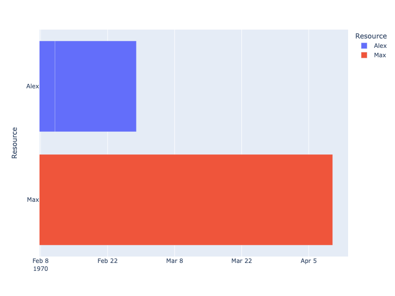

**Interactive Plot:**

<div>                        <script type="text/javascript">window.PlotlyConfig = {MathJaxConfig: 'local'};</script>
        <script charset="utf-8" src="https://cdn.plot.ly/plotly-3.1.0.min.js" integrity="sha256-Ei4740bWZhaUTQuD6q9yQlgVCMPBz6CZWhevDYPv93A=" crossorigin="anonymous"></script>                <div id="plotly-div-14" class="plotly-graph-div" style="height:100%; width:100%;"></div>            <script type="text/javascript">                window.PLOTLYENV=window.PLOTLYENV || {};                                if (document.getElementById("plotly-div-14")) {                    Plotly.newPlot(                        "plotly-div-14",                        [{"base":["2009-01-01T00:00:00.000000000","2009-03-05T00:00:00.000000000"],"hovertemplate":"Resource=%{y}\u003cbr\u003eStart=%{base}\u003cbr\u003eFinish=%{x}\u003cextra\u003e\u003c\u002fextra\u003e","legendgroup":"Alex","marker":{"color":"#636efa","pattern":{"shape":""}},"name":"Alex","orientation":"h","showlegend":true,"textposition":"auto","x":[5011200000,3542400000],"xaxis":"x","y":["Alex","Alex"],"yaxis":"y","type":"bar"},{"base":["2009-02-20T00:00:00.000000000"],"hovertemplate":"Resource=%{y}\u003cbr\u003eStart=%{base}\u003cbr\u003eFinish=%{x}\u003cextra\u003e\u003c\u002fextra\u003e","legendgroup":"Max","marker":{"color":"#EF553B","pattern":{"shape":""}},"name":"Max","orientation":"h","showlegend":true,"textposition":"auto","x":[8553600000],"xaxis":"x","y":["Max"],"yaxis":"y","type":"bar"}],                        {"template":{"data":{"histogram2dcontour":[{"type":"histogram2dcontour","colorbar":{"outlinewidth":0,"ticks":""},"colorscale":[[0.0,"#0d0887"],[0.1111111111111111,"#46039f"],[0.2222222222222222,"#7201a8"],[0.3333333333333333,"#9c179e"],[0.4444444444444444,"#bd3786"],[0.5555555555555556,"#d8576b"],[0.6666666666666666,"#ed7953"],[0.7777777777777778,"#fb9f3a"],[0.8888888888888888,"#fdca26"],[1.0,"#f0f921"]]}],"choropleth":[{"type":"choropleth","colorbar":{"outlinewidth":0,"ticks":""}}],"histogram2d":[{"type":"histogram2d","colorbar":{"outlinewidth":0,"ticks":""},"colorscale":[[0.0,"#0d0887"],[0.1111111111111111,"#46039f"],[0.2222222222222222,"#7201a8"],[0.3333333333333333,"#9c179e"],[0.4444444444444444,"#bd3786"],[0.5555555555555556,"#d8576b"],[0.6666666666666666,"#ed7953"],[0.7777777777777778,"#fb9f3a"],[0.8888888888888888,"#fdca26"],[1.0,"#f0f921"]]}],"heatmap":[{"type":"heatmap","colorbar":{"outlinewidth":0,"ticks":""},"colorscale":[[0.0,"#0d0887"],[0.1111111111111111,"#46039f"],[0.2222222222222222,"#7201a8"],[0.3333333333333333,"#9c179e"],[0.4444444444444444,"#bd3786"],[0.5555555555555556,"#d8576b"],[0.6666666666666666,"#ed7953"],[0.7777777777777778,"#fb9f3a"],[0.8888888888888888,"#fdca26"],[1.0,"#f0f921"]]}],"contourcarpet":[{"type":"contourcarpet","colorbar":{"outlinewidth":0,"ticks":""}}],"contour":[{"type":"contour","colorbar":{"outlinewidth":0,"ticks":""},"colorscale":[[0.0,"#0d0887"],[0.1111111111111111,"#46039f"],[0.2222222222222222,"#7201a8"],[0.3333333333333333,"#9c179e"],[0.4444444444444444,"#bd3786"],[0.5555555555555556,"#d8576b"],[0.6666666666666666,"#ed7953"],[0.7777777777777778,"#fb9f3a"],[0.8888888888888888,"#fdca26"],[1.0,"#f0f921"]]}],"surface":[{"type":"surface","colorbar":{"outlinewidth":0,"ticks":""},"colorscale":[[0.0,"#0d0887"],[0.1111111111111111,"#46039f"],[0.2222222222222222,"#7201a8"],[0.3333333333333333,"#9c179e"],[0.4444444444444444,"#bd3786"],[0.5555555555555556,"#d8576b"],[0.6666666666666666,"#ed7953"],[0.7777777777777778,"#fb9f3a"],[0.8888888888888888,"#fdca26"],[1.0,"#f0f921"]]}],"mesh3d":[{"type":"mesh3d","colorbar":{"outlinewidth":0,"ticks":""}}],"scatter":[{"fillpattern":{"fillmode":"overlay","size":10,"solidity":0.2},"type":"scatter"}],"parcoords":[{"type":"parcoords","line":{"colorbar":{"outlinewidth":0,"ticks":""}}}],"scatterpolargl":[{"type":"scatterpolargl","marker":{"colorbar":{"outlinewidth":0,"ticks":""}}}],"bar":[{"error_x":{"color":"#2a3f5f"},"error_y":{"color":"#2a3f5f"},"marker":{"line":{"color":"#E5ECF6","width":0.5},"pattern":{"fillmode":"overlay","size":10,"solidity":0.2}},"type":"bar"}],"scattergeo":[{"type":"scattergeo","marker":{"colorbar":{"outlinewidth":0,"ticks":""}}}],"scatterpolar":[{"type":"scatterpolar","marker":{"colorbar":{"outlinewidth":0,"ticks":""}}}],"histogram":[{"marker":{"pattern":{"fillmode":"overlay","size":10,"solidity":0.2}},"type":"histogram"}],"scattergl":[{"type":"scattergl","marker":{"colorbar":{"outlinewidth":0,"ticks":""}}}],"scatter3d":[{"type":"scatter3d","line":{"colorbar":{"outlinewidth":0,"ticks":""}},"marker":{"colorbar":{"outlinewidth":0,"ticks":""}}}],"scattermap":[{"type":"scattermap","marker":{"colorbar":{"outlinewidth":0,"ticks":""}}}],"scattermapbox":[{"type":"scattermapbox","marker":{"colorbar":{"outlinewidth":0,"ticks":""}}}],"scatterternary":[{"type":"scatterternary","marker":{"colorbar":{"outlinewidth":0,"ticks":""}}}],"scattercarpet":[{"type":"scattercarpet","marker":{"colorbar":{"outlinewidth":0,"ticks":""}}}],"carpet":[{"aaxis":{"endlinecolor":"#2a3f5f","gridcolor":"white","linecolor":"white","minorgridcolor":"white","startlinecolor":"#2a3f5f"},"baxis":{"endlinecolor":"#2a3f5f","gridcolor":"white","linecolor":"white","minorgridcolor":"white","startlinecolor":"#2a3f5f"},"type":"carpet"}],"table":[{"cells":{"fill":{"color":"#EBF0F8"},"line":{"color":"white"}},"header":{"fill":{"color":"#C8D4E3"},"line":{"color":"white"}},"type":"table"}],"barpolar":[{"marker":{"line":{"color":"#E5ECF6","width":0.5},"pattern":{"fillmode":"overlay","size":10,"solidity":0.2}},"type":"barpolar"}],"pie":[{"automargin":true,"type":"pie"}]},"layout":{"autotypenumbers":"strict","colorway":["#636efa","#EF553B","#00cc96","#ab63fa","#FFA15A","#19d3f3","#FF6692","#B6E880","#FF97FF","#FECB52"],"font":{"color":"#2a3f5f"},"hovermode":"closest","hoverlabel":{"align":"left"},"paper_bgcolor":"white","plot_bgcolor":"#E5ECF6","polar":{"bgcolor":"#E5ECF6","angularaxis":{"gridcolor":"white","linecolor":"white","ticks":""},"radialaxis":{"gridcolor":"white","linecolor":"white","ticks":""}},"ternary":{"bgcolor":"#E5ECF6","aaxis":{"gridcolor":"white","linecolor":"white","ticks":""},"baxis":{"gridcolor":"white","linecolor":"white","ticks":""},"caxis":{"gridcolor":"white","linecolor":"white","ticks":""}},"coloraxis":{"colorbar":{"outlinewidth":0,"ticks":""}},"colorscale":{"sequential":[[0.0,"#0d0887"],[0.1111111111111111,"#46039f"],[0.2222222222222222,"#7201a8"],[0.3333333333333333,"#9c179e"],[0.4444444444444444,"#bd3786"],[0.5555555555555556,"#d8576b"],[0.6666666666666666,"#ed7953"],[0.7777777777777778,"#fb9f3a"],[0.8888888888888888,"#fdca26"],[1.0,"#f0f921"]],"sequentialminus":[[0.0,"#0d0887"],[0.1111111111111111,"#46039f"],[0.2222222222222222,"#7201a8"],[0.3333333333333333,"#9c179e"],[0.4444444444444444,"#bd3786"],[0.5555555555555556,"#d8576b"],[0.6666666666666666,"#ed7953"],[0.7777777777777778,"#fb9f3a"],[0.8888888888888888,"#fdca26"],[1.0,"#f0f921"]],"diverging":[[0,"#8e0152"],[0.1,"#c51b7d"],[0.2,"#de77ae"],[0.3,"#f1b6da"],[0.4,"#fde0ef"],[0.5,"#f7f7f7"],[0.6,"#e6f5d0"],[0.7,"#b8e186"],[0.8,"#7fbc41"],[0.9,"#4d9221"],[1,"#276419"]]},"xaxis":{"gridcolor":"white","linecolor":"white","ticks":"","title":{"standoff":15},"zerolinecolor":"white","automargin":true,"zerolinewidth":2},"yaxis":{"gridcolor":"white","linecolor":"white","ticks":"","title":{"standoff":15},"zerolinecolor":"white","automargin":true,"zerolinewidth":2},"scene":{"xaxis":{"backgroundcolor":"#E5ECF6","gridcolor":"white","linecolor":"white","showbackground":true,"ticks":"","zerolinecolor":"white","gridwidth":2},"yaxis":{"backgroundcolor":"#E5ECF6","gridcolor":"white","linecolor":"white","showbackground":true,"ticks":"","zerolinecolor":"white","gridwidth":2},"zaxis":{"backgroundcolor":"#E5ECF6","gridcolor":"white","linecolor":"white","showbackground":true,"ticks":"","zerolinecolor":"white","gridwidth":2}},"shapedefaults":{"line":{"color":"#2a3f5f"}},"annotationdefaults":{"arrowcolor":"#2a3f5f","arrowhead":0,"arrowwidth":1},"geo":{"bgcolor":"white","landcolor":"#E5ECF6","subunitcolor":"white","showland":true,"showlakes":true,"lakecolor":"white"},"title":{"x":0.05},"mapbox":{"style":"light"}}},"xaxis":{"anchor":"y","domain":[0.0,1.0],"type":"date"},"yaxis":{"anchor":"x","domain":[0.0,1.0],"title":{"text":"Resource"},"categoryorder":"array","categoryarray":["Max","Alex"]},"legend":{"title":{"text":"Resource"},"tracegroupgap":0},"margin":{"t":60},"barmode":"overlay"},                        {"responsive": true}                    )                };            </script>        </div>

**Read more about [funnel charts](funnel-charts.md).**

```python
import plotly.express as px
data = dict(
    number=[39, 27.4, 20.6, 11, 2],
    stage=["Website visit", "Downloads", "Potential customers", "Requested price", "Invoice sent"])
fig = px.funnel(data, x='number', y='stage')
fig.show()
```

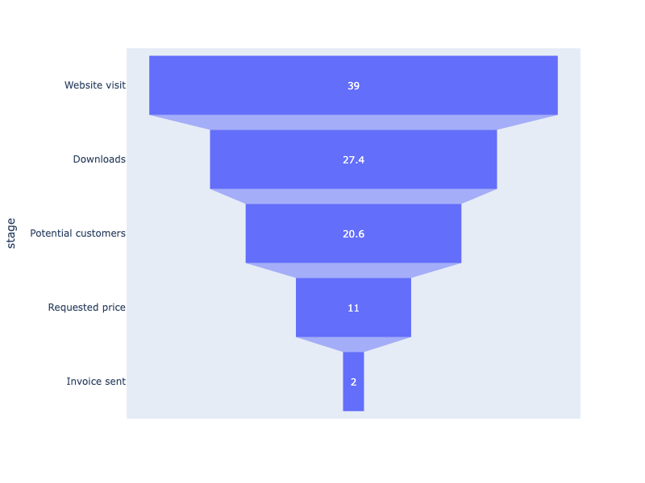

**Interactive Plot:**

<div>                        <script type="text/javascript">window.PlotlyConfig = {MathJaxConfig: 'local'};</script>
        <script charset="utf-8" src="https://cdn.plot.ly/plotly-3.1.0.min.js" integrity="sha256-Ei4740bWZhaUTQuD6q9yQlgVCMPBz6CZWhevDYPv93A=" crossorigin="anonymous"></script>                <div id="plotly-div-15" class="plotly-graph-div" style="height:100%; width:100%;"></div>            <script type="text/javascript">                window.PLOTLYENV=window.PLOTLYENV || {};                                if (document.getElementById("plotly-div-15")) {                    Plotly.newPlot(                        "plotly-div-15",                        [{"hovertemplate":"number=%{x}\u003cbr\u003estage=%{y}\u003cextra\u003e\u003c\u002fextra\u003e","legendgroup":"","marker":{"color":"#636efa"},"name":"","orientation":"h","showlegend":false,"x":{"dtype":"f8","bdata":"AAAAAACAQ0BmZmZmZmY7QJqZmZmZmTRAAAAAAAAAJkAAAAAAAAAAQA=="},"xaxis":"x","y":["Website visit","Downloads","Potential customers","Requested price","Invoice sent"],"yaxis":"y","type":"funnel"}],                        {"template":{"data":{"histogram2dcontour":[{"type":"histogram2dcontour","colorbar":{"outlinewidth":0,"ticks":""},"colorscale":[[0.0,"#0d0887"],[0.1111111111111111,"#46039f"],[0.2222222222222222,"#7201a8"],[0.3333333333333333,"#9c179e"],[0.4444444444444444,"#bd3786"],[0.5555555555555556,"#d8576b"],[0.6666666666666666,"#ed7953"],[0.7777777777777778,"#fb9f3a"],[0.8888888888888888,"#fdca26"],[1.0,"#f0f921"]]}],"choropleth":[{"type":"choropleth","colorbar":{"outlinewidth":0,"ticks":""}}],"histogram2d":[{"type":"histogram2d","colorbar":{"outlinewidth":0,"ticks":""},"colorscale":[[0.0,"#0d0887"],[0.1111111111111111,"#46039f"],[0.2222222222222222,"#7201a8"],[0.3333333333333333,"#9c179e"],[0.4444444444444444,"#bd3786"],[0.5555555555555556,"#d8576b"],[0.6666666666666666,"#ed7953"],[0.7777777777777778,"#fb9f3a"],[0.8888888888888888,"#fdca26"],[1.0,"#f0f921"]]}],"heatmap":[{"type":"heatmap","colorbar":{"outlinewidth":0,"ticks":""},"colorscale":[[0.0,"#0d0887"],[0.1111111111111111,"#46039f"],[0.2222222222222222,"#7201a8"],[0.3333333333333333,"#9c179e"],[0.4444444444444444,"#bd3786"],[0.5555555555555556,"#d8576b"],[0.6666666666666666,"#ed7953"],[0.7777777777777778,"#fb9f3a"],[0.8888888888888888,"#fdca26"],[1.0,"#f0f921"]]}],"contourcarpet":[{"type":"contourcarpet","colorbar":{"outlinewidth":0,"ticks":""}}],"contour":[{"type":"contour","colorbar":{"outlinewidth":0,"ticks":""},"colorscale":[[0.0,"#0d0887"],[0.1111111111111111,"#46039f"],[0.2222222222222222,"#7201a8"],[0.3333333333333333,"#9c179e"],[0.4444444444444444,"#bd3786"],[0.5555555555555556,"#d8576b"],[0.6666666666666666,"#ed7953"],[0.7777777777777778,"#fb9f3a"],[0.8888888888888888,"#fdca26"],[1.0,"#f0f921"]]}],"surface":[{"type":"surface","colorbar":{"outlinewidth":0,"ticks":""},"colorscale":[[0.0,"#0d0887"],[0.1111111111111111,"#46039f"],[0.2222222222222222,"#7201a8"],[0.3333333333333333,"#9c179e"],[0.4444444444444444,"#bd3786"],[0.5555555555555556,"#d8576b"],[0.6666666666666666,"#ed7953"],[0.7777777777777778,"#fb9f3a"],[0.8888888888888888,"#fdca26"],[1.0,"#f0f921"]]}],"mesh3d":[{"type":"mesh3d","colorbar":{"outlinewidth":0,"ticks":""}}],"scatter":[{"fillpattern":{"fillmode":"overlay","size":10,"solidity":0.2},"type":"scatter"}],"parcoords":[{"type":"parcoords","line":{"colorbar":{"outlinewidth":0,"ticks":""}}}],"scatterpolargl":[{"type":"scatterpolargl","marker":{"colorbar":{"outlinewidth":0,"ticks":""}}}],"bar":[{"error_x":{"color":"#2a3f5f"},"error_y":{"color":"#2a3f5f"},"marker":{"line":{"color":"#E5ECF6","width":0.5},"pattern":{"fillmode":"overlay","size":10,"solidity":0.2}},"type":"bar"}],"scattergeo":[{"type":"scattergeo","marker":{"colorbar":{"outlinewidth":0,"ticks":""}}}],"scatterpolar":[{"type":"scatterpolar","marker":{"colorbar":{"outlinewidth":0,"ticks":""}}}],"histogram":[{"marker":{"pattern":{"fillmode":"overlay","size":10,"solidity":0.2}},"type":"histogram"}],"scattergl":[{"type":"scattergl","marker":{"colorbar":{"outlinewidth":0,"ticks":""}}}],"scatter3d":[{"type":"scatter3d","line":{"colorbar":{"outlinewidth":0,"ticks":""}},"marker":{"colorbar":{"outlinewidth":0,"ticks":""}}}],"scattermap":[{"type":"scattermap","marker":{"colorbar":{"outlinewidth":0,"ticks":""}}}],"scattermapbox":[{"type":"scattermapbox","marker":{"colorbar":{"outlinewidth":0,"ticks":""}}}],"scatterternary":[{"type":"scatterternary","marker":{"colorbar":{"outlinewidth":0,"ticks":""}}}],"scattercarpet":[{"type":"scattercarpet","marker":{"colorbar":{"outlinewidth":0,"ticks":""}}}],"carpet":[{"aaxis":{"endlinecolor":"#2a3f5f","gridcolor":"white","linecolor":"white","minorgridcolor":"white","startlinecolor":"#2a3f5f"},"baxis":{"endlinecolor":"#2a3f5f","gridcolor":"white","linecolor":"white","minorgridcolor":"white","startlinecolor":"#2a3f5f"},"type":"carpet"}],"table":[{"cells":{"fill":{"color":"#EBF0F8"},"line":{"color":"white"}},"header":{"fill":{"color":"#C8D4E3"},"line":{"color":"white"}},"type":"table"}],"barpolar":[{"marker":{"line":{"color":"#E5ECF6","width":0.5},"pattern":{"fillmode":"overlay","size":10,"solidity":0.2}},"type":"barpolar"}],"pie":[{"automargin":true,"type":"pie"}]},"layout":{"autotypenumbers":"strict","colorway":["#636efa","#EF553B","#00cc96","#ab63fa","#FFA15A","#19d3f3","#FF6692","#B6E880","#FF97FF","#FECB52"],"font":{"color":"#2a3f5f"},"hovermode":"closest","hoverlabel":{"align":"left"},"paper_bgcolor":"white","plot_bgcolor":"#E5ECF6","polar":{"bgcolor":"#E5ECF6","angularaxis":{"gridcolor":"white","linecolor":"white","ticks":""},"radialaxis":{"gridcolor":"white","linecolor":"white","ticks":""}},"ternary":{"bgcolor":"#E5ECF6","aaxis":{"gridcolor":"white","linecolor":"white","ticks":""},"baxis":{"gridcolor":"white","linecolor":"white","ticks":""},"caxis":{"gridcolor":"white","linecolor":"white","ticks":""}},"coloraxis":{"colorbar":{"outlinewidth":0,"ticks":""}},"colorscale":{"sequential":[[0.0,"#0d0887"],[0.1111111111111111,"#46039f"],[0.2222222222222222,"#7201a8"],[0.3333333333333333,"#9c179e"],[0.4444444444444444,"#bd3786"],[0.5555555555555556,"#d8576b"],[0.6666666666666666,"#ed7953"],[0.7777777777777778,"#fb9f3a"],[0.8888888888888888,"#fdca26"],[1.0,"#f0f921"]],"sequentialminus":[[0.0,"#0d0887"],[0.1111111111111111,"#46039f"],[0.2222222222222222,"#7201a8"],[0.3333333333333333,"#9c179e"],[0.4444444444444444,"#bd3786"],[0.5555555555555556,"#d8576b"],[0.6666666666666666,"#ed7953"],[0.7777777777777778,"#fb9f3a"],[0.8888888888888888,"#fdca26"],[1.0,"#f0f921"]],"diverging":[[0,"#8e0152"],[0.1,"#c51b7d"],[0.2,"#de77ae"],[0.3,"#f1b6da"],[0.4,"#fde0ef"],[0.5,"#f7f7f7"],[0.6,"#e6f5d0"],[0.7,"#b8e186"],[0.8,"#7fbc41"],[0.9,"#4d9221"],[1,"#276419"]]},"xaxis":{"gridcolor":"white","linecolor":"white","ticks":"","title":{"standoff":15},"zerolinecolor":"white","automargin":true,"zerolinewidth":2},"yaxis":{"gridcolor":"white","linecolor":"white","ticks":"","title":{"standoff":15},"zerolinecolor":"white","automargin":true,"zerolinewidth":2},"scene":{"xaxis":{"backgroundcolor":"#E5ECF6","gridcolor":"white","linecolor":"white","showbackground":true,"ticks":"","zerolinecolor":"white","gridwidth":2},"yaxis":{"backgroundcolor":"#E5ECF6","gridcolor":"white","linecolor":"white","showbackground":true,"ticks":"","zerolinecolor":"white","gridwidth":2},"zaxis":{"backgroundcolor":"#E5ECF6","gridcolor":"white","linecolor":"white","showbackground":true,"ticks":"","zerolinecolor":"white","gridwidth":2}},"shapedefaults":{"line":{"color":"#2a3f5f"}},"annotationdefaults":{"arrowcolor":"#2a3f5f","arrowhead":0,"arrowwidth":1},"geo":{"bgcolor":"white","landcolor":"#E5ECF6","subunitcolor":"white","showland":true,"showlakes":true,"lakecolor":"white"},"title":{"x":0.05},"mapbox":{"style":"light"}}},"xaxis":{"anchor":"y","domain":[0.0,1.0],"title":{"text":"number"}},"yaxis":{"anchor":"x","domain":[0.0,1.0],"title":{"text":"stage"}},"legend":{"tracegroupgap":0},"margin":{"t":60}},                        {"responsive": true}                    )                };            </script>        </div>

### Part to Whole Charts

**Read more about [pie charts](pie-charts.md).**

```python
import plotly.express as px
df = px.data.gapminder().query("year == 2007").query("continent == 'Europe'")
df.loc[df['pop'] < 2.e6, 'country'] = 'Other countries' # Represent only large countries
fig = px.pie(df, values='pop', names='country', title='Population of European continent')
fig.show()
```

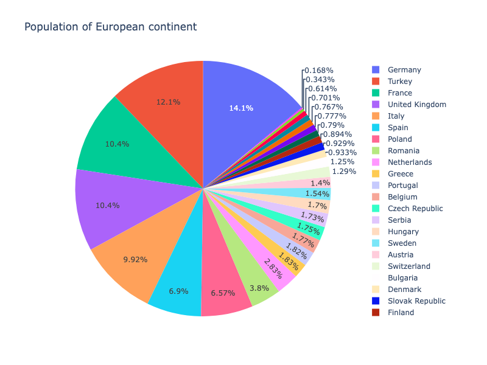

**Interactive Plot:**

<div>                        <script type="text/javascript">window.PlotlyConfig = {MathJaxConfig: 'local'};</script>
        <script charset="utf-8" src="https://cdn.plot.ly/plotly-3.1.0.min.js" integrity="sha256-Ei4740bWZhaUTQuD6q9yQlgVCMPBz6CZWhevDYPv93A=" crossorigin="anonymous"></script>                <div id="plotly-div-16" class="plotly-graph-div" style="height:100%; width:100%;"></div>            <script type="text/javascript">                window.PLOTLYENV=window.PLOTLYENV || {};                                if (document.getElementById("plotly-div-16")) {                    Plotly.newPlot(                        "plotly-div-16",                        [{"domain":{"x":[0.0,1.0],"y":[0.0,1.0]},"hovertemplate":"country=%{label}\u003cbr\u003epop=%{value}\u003cextra\u003e\u003c\u002fextra\u003e","labels":["Albania","Austria","Belgium","Bosnia and Herzegovina","Bulgaria","Croatia","Czech Republic","Denmark","Finland","France","Germany","Greece","Hungary","Other countries","Ireland","Italy","Other countries","Netherlands","Norway","Poland","Portugal","Romania","Serbia","Slovak Republic","Slovenia","Spain","Sweden","Switzerland","Turkey","United Kingdom"],"legendgroup":"","name":"","showlegend":true,"values":{"dtype":"i4","bdata":"i\u002fA2AGcefQCikp4ABnZFAOq8bwAAkEQACBScANhvUwC87k8ADBGkA+RW6QRyXaMADOuXAGubBAAesz4AlUN3A8ByCgD12PwA1p1GAOG9SwKUZaIA2OdTAXnhmgBOH1MAnageAL8waQKwzYkAZUZzAHfLPQQuX58D"},"type":"pie"}],                        {"template":{"data":{"histogram2dcontour":[{"type":"histogram2dcontour","colorbar":{"outlinewidth":0,"ticks":""},"colorscale":[[0.0,"#0d0887"],[0.1111111111111111,"#46039f"],[0.2222222222222222,"#7201a8"],[0.3333333333333333,"#9c179e"],[0.4444444444444444,"#bd3786"],[0.5555555555555556,"#d8576b"],[0.6666666666666666,"#ed7953"],[0.7777777777777778,"#fb9f3a"],[0.8888888888888888,"#fdca26"],[1.0,"#f0f921"]]}],"choropleth":[{"type":"choropleth","colorbar":{"outlinewidth":0,"ticks":""}}],"histogram2d":[{"type":"histogram2d","colorbar":{"outlinewidth":0,"ticks":""},"colorscale":[[0.0,"#0d0887"],[0.1111111111111111,"#46039f"],[0.2222222222222222,"#7201a8"],[0.3333333333333333,"#9c179e"],[0.4444444444444444,"#bd3786"],[0.5555555555555556,"#d8576b"],[0.6666666666666666,"#ed7953"],[0.7777777777777778,"#fb9f3a"],[0.8888888888888888,"#fdca26"],[1.0,"#f0f921"]]}],"heatmap":[{"type":"heatmap","colorbar":{"outlinewidth":0,"ticks":""},"colorscale":[[0.0,"#0d0887"],[0.1111111111111111,"#46039f"],[0.2222222222222222,"#7201a8"],[0.3333333333333333,"#9c179e"],[0.4444444444444444,"#bd3786"],[0.5555555555555556,"#d8576b"],[0.6666666666666666,"#ed7953"],[0.7777777777777778,"#fb9f3a"],[0.8888888888888888,"#fdca26"],[1.0,"#f0f921"]]}],"contourcarpet":[{"type":"contourcarpet","colorbar":{"outlinewidth":0,"ticks":""}}],"contour":[{"type":"contour","colorbar":{"outlinewidth":0,"ticks":""},"colorscale":[[0.0,"#0d0887"],[0.1111111111111111,"#46039f"],[0.2222222222222222,"#7201a8"],[0.3333333333333333,"#9c179e"],[0.4444444444444444,"#bd3786"],[0.5555555555555556,"#d8576b"],[0.6666666666666666,"#ed7953"],[0.7777777777777778,"#fb9f3a"],[0.8888888888888888,"#fdca26"],[1.0,"#f0f921"]]}],"surface":[{"type":"surface","colorbar":{"outlinewidth":0,"ticks":""},"colorscale":[[0.0,"#0d0887"],[0.1111111111111111,"#46039f"],[0.2222222222222222,"#7201a8"],[0.3333333333333333,"#9c179e"],[0.4444444444444444,"#bd3786"],[0.5555555555555556,"#d8576b"],[0.6666666666666666,"#ed7953"],[0.7777777777777778,"#fb9f3a"],[0.8888888888888888,"#fdca26"],[1.0,"#f0f921"]]}],"mesh3d":[{"type":"mesh3d","colorbar":{"outlinewidth":0,"ticks":""}}],"scatter":[{"fillpattern":{"fillmode":"overlay","size":10,"solidity":0.2},"type":"scatter"}],"parcoords":[{"type":"parcoords","line":{"colorbar":{"outlinewidth":0,"ticks":""}}}],"scatterpolargl":[{"type":"scatterpolargl","marker":{"colorbar":{"outlinewidth":0,"ticks":""}}}],"bar":[{"error_x":{"color":"#2a3f5f"},"error_y":{"color":"#2a3f5f"},"marker":{"line":{"color":"#E5ECF6","width":0.5},"pattern":{"fillmode":"overlay","size":10,"solidity":0.2}},"type":"bar"}],"scattergeo":[{"type":"scattergeo","marker":{"colorbar":{"outlinewidth":0,"ticks":""}}}],"scatterpolar":[{"type":"scatterpolar","marker":{"colorbar":{"outlinewidth":0,"ticks":""}}}],"histogram":[{"marker":{"pattern":{"fillmode":"overlay","size":10,"solidity":0.2}},"type":"histogram"}],"scattergl":[{"type":"scattergl","marker":{"colorbar":{"outlinewidth":0,"ticks":""}}}],"scatter3d":[{"type":"scatter3d","line":{"colorbar":{"outlinewidth":0,"ticks":""}},"marker":{"colorbar":{"outlinewidth":0,"ticks":""}}}],"scattermap":[{"type":"scattermap","marker":{"colorbar":{"outlinewidth":0,"ticks":""}}}],"scattermapbox":[{"type":"scattermapbox","marker":{"colorbar":{"outlinewidth":0,"ticks":""}}}],"scatterternary":[{"type":"scatterternary","marker":{"colorbar":{"outlinewidth":0,"ticks":""}}}],"scattercarpet":[{"type":"scattercarpet","marker":{"colorbar":{"outlinewidth":0,"ticks":""}}}],"carpet":[{"aaxis":{"endlinecolor":"#2a3f5f","gridcolor":"white","linecolor":"white","minorgridcolor":"white","startlinecolor":"#2a3f5f"},"baxis":{"endlinecolor":"#2a3f5f","gridcolor":"white","linecolor":"white","minorgridcolor":"white","startlinecolor":"#2a3f5f"},"type":"carpet"}],"table":[{"cells":{"fill":{"color":"#EBF0F8"},"line":{"color":"white"}},"header":{"fill":{"color":"#C8D4E3"},"line":{"color":"white"}},"type":"table"}],"barpolar":[{"marker":{"line":{"color":"#E5ECF6","width":0.5},"pattern":{"fillmode":"overlay","size":10,"solidity":0.2}},"type":"barpolar"}],"pie":[{"automargin":true,"type":"pie"}]},"layout":{"autotypenumbers":"strict","colorway":["#636efa","#EF553B","#00cc96","#ab63fa","#FFA15A","#19d3f3","#FF6692","#B6E880","#FF97FF","#FECB52"],"font":{"color":"#2a3f5f"},"hovermode":"closest","hoverlabel":{"align":"left"},"paper_bgcolor":"white","plot_bgcolor":"#E5ECF6","polar":{"bgcolor":"#E5ECF6","angularaxis":{"gridcolor":"white","linecolor":"white","ticks":""},"radialaxis":{"gridcolor":"white","linecolor":"white","ticks":""}},"ternary":{"bgcolor":"#E5ECF6","aaxis":{"gridcolor":"white","linecolor":"white","ticks":""},"baxis":{"gridcolor":"white","linecolor":"white","ticks":""},"caxis":{"gridcolor":"white","linecolor":"white","ticks":""}},"coloraxis":{"colorbar":{"outlinewidth":0,"ticks":""}},"colorscale":{"sequential":[[0.0,"#0d0887"],[0.1111111111111111,"#46039f"],[0.2222222222222222,"#7201a8"],[0.3333333333333333,"#9c179e"],[0.4444444444444444,"#bd3786"],[0.5555555555555556,"#d8576b"],[0.6666666666666666,"#ed7953"],[0.7777777777777778,"#fb9f3a"],[0.8888888888888888,"#fdca26"],[1.0,"#f0f921"]],"sequentialminus":[[0.0,"#0d0887"],[0.1111111111111111,"#46039f"],[0.2222222222222222,"#7201a8"],[0.3333333333333333,"#9c179e"],[0.4444444444444444,"#bd3786"],[0.5555555555555556,"#d8576b"],[0.6666666666666666,"#ed7953"],[0.7777777777777778,"#fb9f3a"],[0.8888888888888888,"#fdca26"],[1.0,"#f0f921"]],"diverging":[[0,"#8e0152"],[0.1,"#c51b7d"],[0.2,"#de77ae"],[0.3,"#f1b6da"],[0.4,"#fde0ef"],[0.5,"#f7f7f7"],[0.6,"#e6f5d0"],[0.7,"#b8e186"],[0.8,"#7fbc41"],[0.9,"#4d9221"],[1,"#276419"]]},"xaxis":{"gridcolor":"white","linecolor":"white","ticks":"","title":{"standoff":15},"zerolinecolor":"white","automargin":true,"zerolinewidth":2},"yaxis":{"gridcolor":"white","linecolor":"white","ticks":"","title":{"standoff":15},"zerolinecolor":"white","automargin":true,"zerolinewidth":2},"scene":{"xaxis":{"backgroundcolor":"#E5ECF6","gridcolor":"white","linecolor":"white","showbackground":true,"ticks":"","zerolinecolor":"white","gridwidth":2},"yaxis":{"backgroundcolor":"#E5ECF6","gridcolor":"white","linecolor":"white","showbackground":true,"ticks":"","zerolinecolor":"white","gridwidth":2},"zaxis":{"backgroundcolor":"#E5ECF6","gridcolor":"white","linecolor":"white","showbackground":true,"ticks":"","zerolinecolor":"white","gridwidth":2}},"shapedefaults":{"line":{"color":"#2a3f5f"}},"annotationdefaults":{"arrowcolor":"#2a3f5f","arrowhead":0,"arrowwidth":1},"geo":{"bgcolor":"white","landcolor":"#E5ECF6","subunitcolor":"white","showland":true,"showlakes":true,"lakecolor":"white"},"title":{"x":0.05},"mapbox":{"style":"light"}}},"legend":{"tracegroupgap":0},"title":{"text":"Population of European continent"}},                        {"responsive": true}                    )                };            </script>        </div>

**Read more about [sunburst charts](sunburst-charts.md).**

```python
import plotly.express as px

df = px.data.gapminder().query("year == 2007")
fig = px.sunburst(df, path=['continent', 'country'], values='pop',
                  color='lifeExp', hover_data=['iso_alpha'])
fig.show()
```

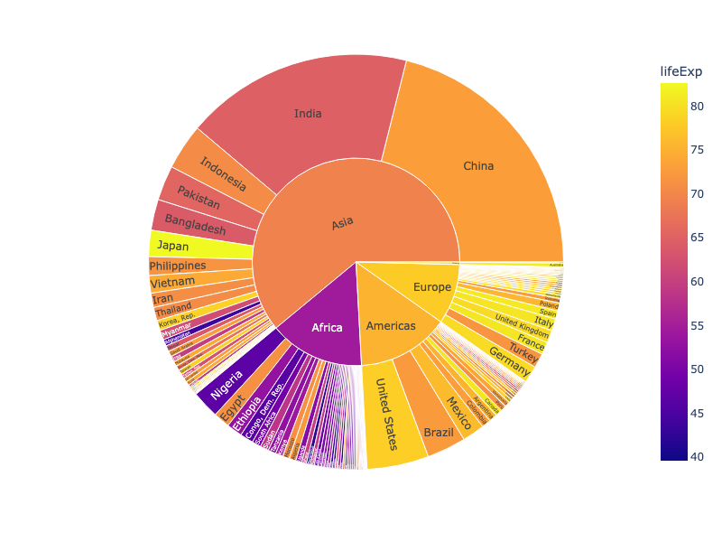

**Interactive Plot:**

<div>                        <script type="text/javascript">window.PlotlyConfig = {MathJaxConfig: 'local'};</script>
        <script charset="utf-8" src="https://cdn.plot.ly/plotly-3.1.0.min.js" integrity="sha256-Ei4740bWZhaUTQuD6q9yQlgVCMPBz6CZWhevDYPv93A=" crossorigin="anonymous"></script>                <div id="plotly-div-17" class="plotly-graph-div" style="height:100%; width:100%;"></div>            <script type="text/javascript">                window.PLOTLYENV=window.PLOTLYENV || {};                                if (document.getElementById("plotly-div-17")) {                    Plotly.newPlot(                        "plotly-div-17",                        [{"branchvalues":"total","customdata":[["AFG",43.828],["ALB",76.423],["DZA",72.301],["AGO",42.731],["ARG",75.32],["AUS",81.235],["AUT",79.829],["BHR",75.635],["BGD",64.062],["BEL",79.441],["BEN",56.728],["BOL",65.554],["BIH",74.852],["BWA",50.728],["BRA",72.39],["BGR",73.005],["BFA",52.295],["BDI",49.58],["KHM",59.723],["CMR",50.43],["CAN",80.65300000000002],["CAF",44.74100000000001],["TCD",50.651],["CHL",78.553],["CHN",72.961],["COL",72.889],["COM",65.152],["COD",46.462],["COG",55.322],["CRI",78.782],["CIV",48.328],["HRV",75.748],["CUB",78.273],["CZE",76.486],["DNK",78.332],["DJI",54.791],["DOM",72.235],["ECU",74.994],["EGY",71.33800000000002],["SLV",71.878],["GNQ",51.57899999999999],["ERI",58.03999999999999],["ETH",52.947],["FIN",79.313],["FRA",80.65699999999998],["GAB",56.73500000000001],["GMB",59.448],["DEU",79.406],["GHA",60.02199999999999],["GRC",79.483],["GTM",70.259],["GIN",56.007],["GNB",46.38800000000001],["HTI",60.916],["HND",70.19800000000001],["HKG",82.208],["HUN",73.33800000000002],["ISL",81.757],["IND",64.69800000000001],["IDN",70.65],["IRN",70.964],["IRQ",59.545],["IRL",78.885],["ISR",80.745],["ITA",80.546],["JAM",72.567],["JPN",82.603],["JOR",72.535],["KEN",54.11],["KOR",67.297],["KOR",78.623],["KWT",77.58800000000002],["LBN",71.993],["LSO",42.592],["LBR",45.678],["LBY",73.952],["MDG",59.443000000000005],["MWI",48.303],["MYS",74.241],["MLI",54.467],["MRT",64.164],["MUS",72.801],["MEX",76.195],["MNG",66.803],["MNE",74.543],["MAR",71.164],["MOZ",42.082],["MMR",62.06900000000001],["NAM",52.90600000000001],["NPL",63.785],["NLD",79.762],["NZL",80.204],["NIC",72.899],["NER",56.867],["NGA",46.859],["NOR",80.196],["OMN",75.64],["PAK",65.483],["PAN",75.53699999999998],["PRY",71.752],["PER",71.421],["PHL",71.688],["POL",75.563],["PRT",78.098],["PRI",78.74600000000002],["REU",76.442],["ROU",72.476],["RWA",46.242],["STP",65.528],["SAU",72.777],["SEN",63.062],["SRB",74.002],["SLE",42.56800000000001],["SGP",79.972],["SVK",74.663],["SVN",77.926],["SOM",48.159],["ZAF",49.339],["ESP",80.941],["LKA",72.396],["SDN",58.55599999999999],["SWZ",39.613],["SWE",80.884],["CHE",81.70100000000002],["SYR",74.143],["TWN",78.4],["TZA",52.517],["THA",70.616],["TGO",58.42],["TTO",69.819],["TUN",73.923],["TUR",71.777],["UGA",51.542],["GBR",79.425],["USA",78.242],["URY",76.384],["VEN",73.747],["VNM",74.249],["PSE",73.422],["YEM",62.698],["ZMB",42.38399999999999],["ZWE",43.487],["(?)",69.44386304205017],["(?)",77.89057081069896],["(?)",54.56441057558197],["(?)",75.35668222743027],["(?)",81.06215400970112]],"domain":{"x":[0.0,1.0],"y":[0.0,1.0]},"hovertemplate":"labels=%{label}\u003cbr\u003epop=%{value}\u003cbr\u003eparent=%{parent}\u003cbr\u003eid=%{id}\u003cbr\u003eiso_alpha=%{customdata[0]}\u003cbr\u003elifeExp=%{color}\u003cextra\u003e\u003c\u002fextra\u003e","ids":["Asia\u002fAfghanistan","Europe\u002fAlbania","Africa\u002fAlgeria","Africa\u002fAngola","Americas\u002fArgentina","Oceania\u002fAustralia","Europe\u002fAustria","Asia\u002fBahrain","Asia\u002fBangladesh","Europe\u002fBelgium","Africa\u002fBenin","Americas\u002fBolivia","Europe\u002fBosnia and Herzegovina","Africa\u002fBotswana","Americas\u002fBrazil","Europe\u002fBulgaria","Africa\u002fBurkina Faso","Africa\u002fBurundi","Asia\u002fCambodia","Africa\u002fCameroon","Americas\u002fCanada","Africa\u002fCentral African Republic","Africa\u002fChad","Americas\u002fChile","Asia\u002fChina","Americas\u002fColombia","Africa\u002fComoros","Africa\u002fCongo, Dem. Rep.","Africa\u002fCongo, Rep.","Americas\u002fCosta Rica","Africa\u002fCote d'Ivoire","Europe\u002fCroatia","Americas\u002fCuba","Europe\u002fCzech Republic","Europe\u002fDenmark","Africa\u002fDjibouti","Americas\u002fDominican Republic","Americas\u002fEcuador","Africa\u002fEgypt","Americas\u002fEl Salvador","Africa\u002fEquatorial Guinea","Africa\u002fEritrea","Africa\u002fEthiopia","Europe\u002fFinland","Europe\u002fFrance","Africa\u002fGabon","Africa\u002fGambia","Europe\u002fGermany","Africa\u002fGhana","Europe\u002fGreece","Americas\u002fGuatemala","Africa\u002fGuinea","Africa\u002fGuinea-Bissau","Americas\u002fHaiti","Americas\u002fHonduras","Asia\u002fHong Kong, China","Europe\u002fHungary","Europe\u002fIceland","Asia\u002fIndia","Asia\u002fIndonesia","Asia\u002fIran","Asia\u002fIraq","Europe\u002fIreland","Asia\u002fIsrael","Europe\u002fItaly","Americas\u002fJamaica","Asia\u002fJapan","Asia\u002fJordan","Africa\u002fKenya","Asia\u002fKorea, Dem. Rep.","Asia\u002fKorea, Rep.","Asia\u002fKuwait","Asia\u002fLebanon","Africa\u002fLesotho","Africa\u002fLiberia","Africa\u002fLibya","Africa\u002fMadagascar","Africa\u002fMalawi","Asia\u002fMalaysia","Africa\u002fMali","Africa\u002fMauritania","Africa\u002fMauritius","Americas\u002fMexico","Asia\u002fMongolia","Europe\u002fMontenegro","Africa\u002fMorocco","Africa\u002fMozambique","Asia\u002fMyanmar","Africa\u002fNamibia","Asia\u002fNepal","Europe\u002fNetherlands","Oceania\u002fNew Zealand","Americas\u002fNicaragua","Africa\u002fNiger","Africa\u002fNigeria","Europe\u002fNorway","Asia\u002fOman","Asia\u002fPakistan","Americas\u002fPanama","Americas\u002fParaguay","Americas\u002fPeru","Asia\u002fPhilippines","Europe\u002fPoland","Europe\u002fPortugal","Americas\u002fPuerto Rico","Africa\u002fReunion","Europe\u002fRomania","Africa\u002fRwanda","Africa\u002fSao Tome and Principe","Asia\u002fSaudi Arabia","Africa\u002fSenegal","Europe\u002fSerbia","Africa\u002fSierra Leone","Asia\u002fSingapore","Europe\u002fSlovak Republic","Europe\u002fSlovenia","Africa\u002fSomalia","Africa\u002fSouth Africa","Europe\u002fSpain","Asia\u002fSri Lanka","Africa\u002fSudan","Africa\u002fSwaziland","Europe\u002fSweden","Europe\u002fSwitzerland","Asia\u002fSyria","Asia\u002fTaiwan","Africa\u002fTanzania","Asia\u002fThailand","Africa\u002fTogo","Americas\u002fTrinidad and Tobago","Africa\u002fTunisia","Europe\u002fTurkey","Africa\u002fUganda","Europe\u002fUnited Kingdom","Americas\u002fUnited States","Americas\u002fUruguay","Americas\u002fVenezuela","Asia\u002fVietnam","Asia\u002fWest Bank and Gaza","Asia\u002fYemen, Rep.","Africa\u002fZambia","Africa\u002fZimbabwe","Asia","Europe","Africa","Americas","Oceania"],"labels":["Afghanistan","Albania","Algeria","Angola","Argentina","Australia","Austria","Bahrain","Bangladesh","Belgium","Benin","Bolivia","Bosnia and Herzegovina","Botswana","Brazil","Bulgaria","Burkina Faso","Burundi","Cambodia","Cameroon","Canada","Central African Republic","Chad","Chile","China","Colombia","Comoros","Congo, Dem. Rep.","Congo, Rep.","Costa Rica","Cote d'Ivoire","Croatia","Cuba","Czech Republic","Denmark","Djibouti","Dominican Republic","Ecuador","Egypt","El Salvador","Equatorial Guinea","Eritrea","Ethiopia","Finland","France","Gabon","Gambia","Germany","Ghana","Greece","Guatemala","Guinea","Guinea-Bissau","Haiti","Honduras","Hong Kong, China","Hungary","Iceland","India","Indonesia","Iran","Iraq","Ireland","Israel","Italy","Jamaica","Japan","Jordan","Kenya","Korea, Dem. Rep.","Korea, Rep.","Kuwait","Lebanon","Lesotho","Liberia","Libya","Madagascar","Malawi","Malaysia","Mali","Mauritania","Mauritius","Mexico","Mongolia","Montenegro","Morocco","Mozambique","Myanmar","Namibia","Nepal","Netherlands","New Zealand","Nicaragua","Niger","Nigeria","Norway","Oman","Pakistan","Panama","Paraguay","Peru","Philippines","Poland","Portugal","Puerto Rico","Reunion","Romania","Rwanda","Sao Tome and Principe","Saudi Arabia","Senegal","Serbia","Sierra Leone","Singapore","Slovak Republic","Slovenia","Somalia","South Africa","Spain","Sri Lanka","Sudan","Swaziland","Sweden","Switzerland","Syria","Taiwan","Tanzania","Thailand","Togo","Trinidad and Tobago","Tunisia","Turkey","Uganda","United Kingdom","United States","Uruguay","Venezuela","Vietnam","West Bank and Gaza","Yemen, Rep.","Zambia","Zimbabwe","Asia","Europe","Africa","Americas","Oceania"],"marker":{"coloraxis":"coloraxis","colors":{"dtype":"f8","bdata":"RIts5\u002fvpRUBQjZduEhtTQCUGgZVDE1JAIbByaJFdRUAUrkfhetRSQNejcD0KT1RAkxgEVg71U0BxPQrXo+hSQIcW2c73A1BATmIQWDncU0B3vp8aL11MQPp+arx0Y1BASgwCK4e2UkB3vp8aL11JQClcj8L1GFJAuB6F61FAUkD2KFyPwiVKQArXo3A9ykhABoGVQ4vcTUDXo3A9CjdJQHASg8DKKVRAAyuHFtleRkAX2c73U1NJQAisHFpko1NAL90kBoE9UkA3iUFg5ThSQH0\u002fNV66SVBAQmDl0CI7R0Dwp8ZLN6lLQDVeukkMslNARIts5\u002fspSEAdWmQ73+9SQLbz\u002fdR4kVNAyXa+nxofU0Boke18P5VTQGiR7Xw\u002fZUtA16NwPQoPUkBWDi2ynb9SQBSDwMqh1VFA1XjpJjH4UUAmMQisHMpJQITrUbgeBU1A8KfGSzd5SkB56SYxCNRTQDReukkMKlRAr0fhehReTEDTTWIQWLlNQESLbOf72VNAiEFg5dACTkD0\u002fdR46d5TQH9qvHSTkFFAN4lBYOUATECNbOf7qTFHQGiR7Xw\u002fdU5A6iYxCKyMUUBaZDvfT41UQBSDwMqhVVJAnMQgsHJwVEDqJjEIrCxQQJqZmZmZqVFABFYOLbK9UUD2KFyPwsVNQHE9CtejuFNASOF6FK4vVEBt5\u002fup8SJUQD81XrpJJFJAO99PjZemVEAK16NwPSJSQK5H4XoUDktAXrpJDALTUEAdWmQ736dTQBSDwMqhZVNAZDvfT43\u002fUUCyne+nxktFQBBYObTI1kZAsHJoke18UkBjEFg5tLhNQBBYObTIJkhAgZVDi2yPUkCyne+nxjtLQNEi2\u002fl+ClBAJQaBlUMzUkAUrkfhegxTQAisHFpks1BAmG4Sg8CiUkDRItv5fspRQNEi2\u002fl+CkVAR7bz\u002fdQIT0CJFtnO93NKQBSuR+F65E9AVOOlm8TwU0CTGARWDg1UQKjGSzeJOVJA5dAi2\u002fluTEDLoUW2821HQAaBlUOLDFRAKVyPwvXoUkD0\u002fdR46V5QQOx8PzVe4lJA46WbxCDwUUBt5\u002fup8dpRQHnpJjEI7FFAeekmMQjkUkCDwMqhRYZTQDu0yHa+r1NAPzVeukkcU0BYObTIdh5SQOXQItv5HkdAbxKDwMphUEB9PzVeujFSQA4tsp3vh09A46WbxCCAUkBkEFg5tEhFQJHtfD81\u002flNA30+Nl26qUkAlBoGVQ3tTQDEIrBxaFEhACKwcWmSrSEBOYhBYOTxUQNNNYhBYGVJAuUkMAitHTUBYObTIds5DQH9qvHSTOFRAwJ8aL91sVED+1HjpJolSQJqZmZmZmVNAGQRWDi1CSkCBlUOLbKdRQPYoXI\u002fCNU1AI9v5fmp0UUBQjZduEntSQH0\u002fNV668VFATDeJQWDFSUAzMzMzM9tTQHNoke18j1NAf2q8dJMYU0ArhxbZzm9SQA4tsp3vj1JAXrpJDAJbUkDTTWIQWFlPQP3UeOkmMUVAdZMYBFa+RUCMYIhAaFxRQFquthz\u002feFNAD9IRmz5IS0AoeLHh09ZSQNK+z1T6Q1RA"}},"name":"","parents":["Asia","Europe","Africa","Africa","Americas","Oceania","Europe","Asia","Asia","Europe","Africa","Americas","Europe","Africa","Americas","Europe","Africa","Africa","Asia","Africa","Americas","Africa","Africa","Americas","Asia","Americas","Africa","Africa","Africa","Americas","Africa","Europe","Americas","Europe","Europe","Africa","Americas","Americas","Africa","Americas","Africa","Africa","Africa","Europe","Europe","Africa","Africa","Europe","Africa","Europe","Americas","Africa","Africa","Americas","Americas","Asia","Europe","Europe","Asia","Asia","Asia","Asia","Europe","Asia","Europe","Americas","Asia","Asia","Africa","Asia","Asia","Asia","Asia","Africa","Africa","Africa","Africa","Africa","Asia","Africa","Africa","Africa","Americas","Asia","Europe","Africa","Africa","Asia","Africa","Asia","Europe","Oceania","Americas","Africa","Africa","Europe","Asia","Asia","Americas","Americas","Americas","Asia","Europe","Europe","Americas","Africa","Europe","Africa","Africa","Asia","Africa","Europe","Africa","Asia","Europe","Europe","Africa","Africa","Europe","Asia","Africa","Africa","Europe","Europe","Asia","Asia","Africa","Asia","Africa","Americas","Africa","Europe","Africa","Europe","Americas","Americas","Americas","Asia","Asia","Asia","Africa","Africa","","","","",""],"values":{"dtype":"f8","bdata":"AAAAMKBpfkEAAACARXhLQQAAAAD+yX9BAAAAgK+wZ0EAAAA4qzeDQQAAAADQfHNBAAAAwJlHX0EAAAAAup8lQQAAAKZR76FBAAAAQFTSY0EAAACA+tBeQQAAAAC2ZGFBAAAAgIFdUUEAAAAA2wI5QQAAAC6qpqZBAAAAgDrvW0EAAABgN1NrQQAAACDtAGBBAAAAQFL0akEAAABQYuBwQQAAANDj139BAAAAgKOqUEEAAADgaodjQQAAAKCID29BAAAAdmCm00EAAADw3haFQQAAAABgsiVBAAAAOJHOjkEAAAAAEf9MQQAAAAD+iU9BAAAAEM4tcUEAAAAAACRRQQAAAGCzxmVBAAAAAIGCY0EAAAAA9ttUQQAAAADYSx5BAAAAwJjGYUEAAAAApDxqQQAAAHz1IpNBAAAAAAp5WkEAAAAAQtIgQQAAAECWt1JBAAAAPOo9kkEAAAAAr\u002ftTQQAAAGCIII1BAAAAABMzNkEAAAAAJ8M5QQAAAJBbpZNBAAAAoE\u002fQdUEAAABArmtkQQAAAAAg+2dBAAAAwFT5YkEAAAAAKXY2QQAAAMDDN2BBAAAAwFyMXEEAAAAAz6BaQQAAAIBh\u002fWJBAAAAAKxtEkEAAMBq04vQQQAAAPAcpqpBAAAACByPkEEAAABgxzl6QQAAAACPWU9BAAAAwA2EWEEAAACoHLqLQQAAAADyNUVBAAAAEAdknkEAAABAUhdXQQAAAAjy+oBBAAAA0OU4dkEAAACw6WKHQQAAAICrHUNBAAAAAL\u002fqTUEAAAAA6bU+QQAAAAArXkhBAAAAgGwHV0EAAABgmkdyQQAAAOBca2lBAAAAYOKrd0EAAABg5vJmQQAAAIDY8khBAAAAAEIWM0EAAABsk+qZQQAAAICH7UVBAAAAAIDlJEEAAAC4vxiAQQAAAIACB3NBAAAA4FHGhkEAAAAAqFs\u002fQQAAAOAZkHtBAAAAoB6bb0EAAACAnWZPQQAAAABXplVBAAAAIFKYaEEAAAD40higQQAAAIB1p1FBAAAAgJBzSEEAAACyui2kQQAAAIBevEhBAAAAwOJuWUEAAABQrFh7QQAAAJzqtpVBAAAACO9dgkEAAACAskxkQQAAAIAtFE5BAAAAABxbKEEAAACAfT51QQAAAIB15mBBAAAAANhcCEEAAADgiFJ6QQAAAKD8ZWdBAAAAIC9cY0EAAACAjHBXQQAAAEBMXlFBAAAAgNPHVEEAAAAAnag+QQAAAKCGZGFBAAAAINT6hEEAAAD4hUmDQQAAAPAnb3NBAAAACLYqhEEAAAAACkoxQQAAAAC2OWFBAAAAQJnRXEEAAACwg2tyQQAAAGDJGXZBAAAAwLcvgkEAAACo4waPQQAAAMDyv1VBAAAAAGAfMEEAAADAp5ljQQAAANwt95BBAAAA4K3Re0EAAABw+fqMQQAAAOsH87FBAAAAAGRNSkEAAABgU+B4QQAAAFAAVJRBAAAAAE6oTkEAAADwyS51QQAAAGBeZ2ZBAAAA4Ex7Z0EAAGCUuWbsQQAAgLCTd8FBAAAANtOzy0EAAADI18nKQQAAALCjaXdB"},"type":"sunburst"}],                        {"template":{"data":{"histogram2dcontour":[{"type":"histogram2dcontour","colorbar":{"outlinewidth":0,"ticks":""},"colorscale":[[0.0,"#0d0887"],[0.1111111111111111,"#46039f"],[0.2222222222222222,"#7201a8"],[0.3333333333333333,"#9c179e"],[0.4444444444444444,"#bd3786"],[0.5555555555555556,"#d8576b"],[0.6666666666666666,"#ed7953"],[0.7777777777777778,"#fb9f3a"],[0.8888888888888888,"#fdca26"],[1.0,"#f0f921"]]}],"choropleth":[{"type":"choropleth","colorbar":{"outlinewidth":0,"ticks":""}}],"histogram2d":[{"type":"histogram2d","colorbar":{"outlinewidth":0,"ticks":""},"colorscale":[[0.0,"#0d0887"],[0.1111111111111111,"#46039f"],[0.2222222222222222,"#7201a8"],[0.3333333333333333,"#9c179e"],[0.4444444444444444,"#bd3786"],[0.5555555555555556,"#d8576b"],[0.6666666666666666,"#ed7953"],[0.7777777777777778,"#fb9f3a"],[0.8888888888888888,"#fdca26"],[1.0,"#f0f921"]]}],"heatmap":[{"type":"heatmap","colorbar":{"outlinewidth":0,"ticks":""},"colorscale":[[0.0,"#0d0887"],[0.1111111111111111,"#46039f"],[0.2222222222222222,"#7201a8"],[0.3333333333333333,"#9c179e"],[0.4444444444444444,"#bd3786"],[0.5555555555555556,"#d8576b"],[0.6666666666666666,"#ed7953"],[0.7777777777777778,"#fb9f3a"],[0.8888888888888888,"#fdca26"],[1.0,"#f0f921"]]}],"contourcarpet":[{"type":"contourcarpet","colorbar":{"outlinewidth":0,"ticks":""}}],"contour":[{"type":"contour","colorbar":{"outlinewidth":0,"ticks":""},"colorscale":[[0.0,"#0d0887"],[0.1111111111111111,"#46039f"],[0.2222222222222222,"#7201a8"],[0.3333333333333333,"#9c179e"],[0.4444444444444444,"#bd3786"],[0.5555555555555556,"#d8576b"],[0.6666666666666666,"#ed7953"],[0.7777777777777778,"#fb9f3a"],[0.8888888888888888,"#fdca26"],[1.0,"#f0f921"]]}],"surface":[{"type":"surface","colorbar":{"outlinewidth":0,"ticks":""},"colorscale":[[0.0,"#0d0887"],[0.1111111111111111,"#46039f"],[0.2222222222222222,"#7201a8"],[0.3333333333333333,"#9c179e"],[0.4444444444444444,"#bd3786"],[0.5555555555555556,"#d8576b"],[0.6666666666666666,"#ed7953"],[0.7777777777777778,"#fb9f3a"],[0.8888888888888888,"#fdca26"],[1.0,"#f0f921"]]}],"mesh3d":[{"type":"mesh3d","colorbar":{"outlinewidth":0,"ticks":""}}],"scatter":[{"fillpattern":{"fillmode":"overlay","size":10,"solidity":0.2},"type":"scatter"}],"parcoords":[{"type":"parcoords","line":{"colorbar":{"outlinewidth":0,"ticks":""}}}],"scatterpolargl":[{"type":"scatterpolargl","marker":{"colorbar":{"outlinewidth":0,"ticks":""}}}],"bar":[{"error_x":{"color":"#2a3f5f"},"error_y":{"color":"#2a3f5f"},"marker":{"line":{"color":"#E5ECF6","width":0.5},"pattern":{"fillmode":"overlay","size":10,"solidity":0.2}},"type":"bar"}],"scattergeo":[{"type":"scattergeo","marker":{"colorbar":{"outlinewidth":0,"ticks":""}}}],"scatterpolar":[{"type":"scatterpolar","marker":{"colorbar":{"outlinewidth":0,"ticks":""}}}],"histogram":[{"marker":{"pattern":{"fillmode":"overlay","size":10,"solidity":0.2}},"type":"histogram"}],"scattergl":[{"type":"scattergl","marker":{"colorbar":{"outlinewidth":0,"ticks":""}}}],"scatter3d":[{"type":"scatter3d","line":{"colorbar":{"outlinewidth":0,"ticks":""}},"marker":{"colorbar":{"outlinewidth":0,"ticks":""}}}],"scattermap":[{"type":"scattermap","marker":{"colorbar":{"outlinewidth":0,"ticks":""}}}],"scattermapbox":[{"type":"scattermapbox","marker":{"colorbar":{"outlinewidth":0,"ticks":""}}}],"scatterternary":[{"type":"scatterternary","marker":{"colorbar":{"outlinewidth":0,"ticks":""}}}],"scattercarpet":[{"type":"scattercarpet","marker":{"colorbar":{"outlinewidth":0,"ticks":""}}}],"carpet":[{"aaxis":{"endlinecolor":"#2a3f5f","gridcolor":"white","linecolor":"white","minorgridcolor":"white","startlinecolor":"#2a3f5f"},"baxis":{"endlinecolor":"#2a3f5f","gridcolor":"white","linecolor":"white","minorgridcolor":"white","startlinecolor":"#2a3f5f"},"type":"carpet"}],"table":[{"cells":{"fill":{"color":"#EBF0F8"},"line":{"color":"white"}},"header":{"fill":{"color":"#C8D4E3"},"line":{"color":"white"}},"type":"table"}],"barpolar":[{"marker":{"line":{"color":"#E5ECF6","width":0.5},"pattern":{"fillmode":"overlay","size":10,"solidity":0.2}},"type":"barpolar"}],"pie":[{"automargin":true,"type":"pie"}]},"layout":{"autotypenumbers":"strict","colorway":["#636efa","#EF553B","#00cc96","#ab63fa","#FFA15A","#19d3f3","#FF6692","#B6E880","#FF97FF","#FECB52"],"font":{"color":"#2a3f5f"},"hovermode":"closest","hoverlabel":{"align":"left"},"paper_bgcolor":"white","plot_bgcolor":"#E5ECF6","polar":{"bgcolor":"#E5ECF6","angularaxis":{"gridcolor":"white","linecolor":"white","ticks":""},"radialaxis":{"gridcolor":"white","linecolor":"white","ticks":""}},"ternary":{"bgcolor":"#E5ECF6","aaxis":{"gridcolor":"white","linecolor":"white","ticks":""},"baxis":{"gridcolor":"white","linecolor":"white","ticks":""},"caxis":{"gridcolor":"white","linecolor":"white","ticks":""}},"coloraxis":{"colorbar":{"outlinewidth":0,"ticks":""}},"colorscale":{"sequential":[[0.0,"#0d0887"],[0.1111111111111111,"#46039f"],[0.2222222222222222,"#7201a8"],[0.3333333333333333,"#9c179e"],[0.4444444444444444,"#bd3786"],[0.5555555555555556,"#d8576b"],[0.6666666666666666,"#ed7953"],[0.7777777777777778,"#fb9f3a"],[0.8888888888888888,"#fdca26"],[1.0,"#f0f921"]],"sequentialminus":[[0.0,"#0d0887"],[0.1111111111111111,"#46039f"],[0.2222222222222222,"#7201a8"],[0.3333333333333333,"#9c179e"],[0.4444444444444444,"#bd3786"],[0.5555555555555556,"#d8576b"],[0.6666666666666666,"#ed7953"],[0.7777777777777778,"#fb9f3a"],[0.8888888888888888,"#fdca26"],[1.0,"#f0f921"]],"diverging":[[0,"#8e0152"],[0.1,"#c51b7d"],[0.2,"#de77ae"],[0.3,"#f1b6da"],[0.4,"#fde0ef"],[0.5,"#f7f7f7"],[0.6,"#e6f5d0"],[0.7,"#b8e186"],[0.8,"#7fbc41"],[0.9,"#4d9221"],[1,"#276419"]]},"xaxis":{"gridcolor":"white","linecolor":"white","ticks":"","title":{"standoff":15},"zerolinecolor":"white","automargin":true,"zerolinewidth":2},"yaxis":{"gridcolor":"white","linecolor":"white","ticks":"","title":{"standoff":15},"zerolinecolor":"white","automargin":true,"zerolinewidth":2},"scene":{"xaxis":{"backgroundcolor":"#E5ECF6","gridcolor":"white","linecolor":"white","showbackground":true,"ticks":"","zerolinecolor":"white","gridwidth":2},"yaxis":{"backgroundcolor":"#E5ECF6","gridcolor":"white","linecolor":"white","showbackground":true,"ticks":"","zerolinecolor":"white","gridwidth":2},"zaxis":{"backgroundcolor":"#E5ECF6","gridcolor":"white","linecolor":"white","showbackground":true,"ticks":"","zerolinecolor":"white","gridwidth":2}},"shapedefaults":{"line":{"color":"#2a3f5f"}},"annotationdefaults":{"arrowcolor":"#2a3f5f","arrowhead":0,"arrowwidth":1},"geo":{"bgcolor":"white","landcolor":"#E5ECF6","subunitcolor":"white","showland":true,"showlakes":true,"lakecolor":"white"},"title":{"x":0.05},"mapbox":{"style":"light"}}},"coloraxis":{"colorbar":{"title":{"text":"lifeExp"}},"colorscale":[[0.0,"#0d0887"],[0.1111111111111111,"#46039f"],[0.2222222222222222,"#7201a8"],[0.3333333333333333,"#9c179e"],[0.4444444444444444,"#bd3786"],[0.5555555555555556,"#d8576b"],[0.6666666666666666,"#ed7953"],[0.7777777777777778,"#fb9f3a"],[0.8888888888888888,"#fdca26"],[1.0,"#f0f921"]]},"legend":{"tracegroupgap":0},"margin":{"t":60}},                        {"responsive": true}                    )                };            </script>        </div>

**Read more about [treemaps](treemaps.md).**

```python
import plotly.express as px
import numpy as np
df = px.data.gapminder().query("year == 2007")
fig = px.treemap(df, path=[px.Constant('world'), 'continent', 'country'], values='pop',
                  color='lifeExp', hover_data=['iso_alpha'])
fig.show()
```

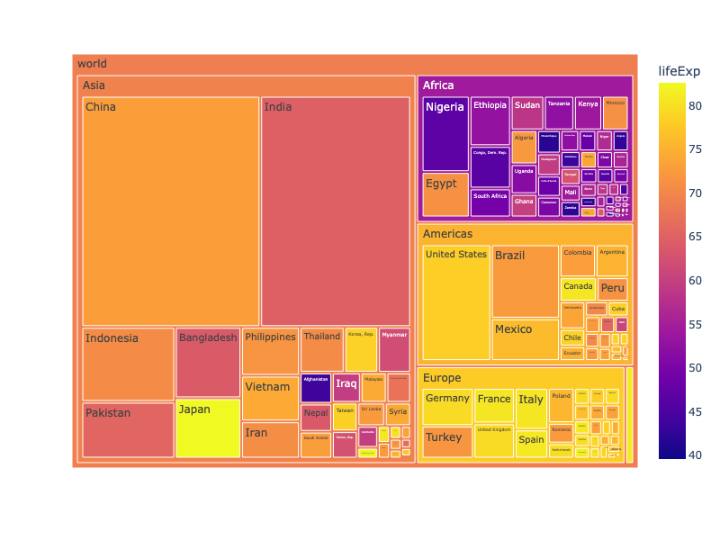

**Interactive Plot:**

<div>                        <script type="text/javascript">window.PlotlyConfig = {MathJaxConfig: 'local'};</script>
        <script charset="utf-8" src="https://cdn.plot.ly/plotly-3.1.0.min.js" integrity="sha256-Ei4740bWZhaUTQuD6q9yQlgVCMPBz6CZWhevDYPv93A=" crossorigin="anonymous"></script>                <div id="plotly-div-18" class="plotly-graph-div" style="height:100%; width:100%;"></div>            <script type="text/javascript">                window.PLOTLYENV=window.PLOTLYENV || {};                                if (document.getElementById("plotly-div-18")) {                    Plotly.newPlot(                        "plotly-div-18",                        [{"branchvalues":"total","customdata":[["AFG",43.828],["ALB",76.423],["DZA",72.301],["AGO",42.731],["ARG",75.32],["AUS",81.235],["AUT",79.829],["BHR",75.635],["BGD",64.062],["BEL",79.441],["BEN",56.728],["BOL",65.554],["BIH",74.852],["BWA",50.728],["BRA",72.39],["BGR",73.005],["BFA",52.295],["BDI",49.58],["KHM",59.723],["CMR",50.43],["CAN",80.65300000000002],["CAF",44.74100000000001],["TCD",50.651],["CHL",78.553],["CHN",72.961],["COL",72.889],["COM",65.152],["COD",46.462],["COG",55.322],["CRI",78.782],["CIV",48.328],["HRV",75.748],["CUB",78.273],["CZE",76.486],["DNK",78.332],["DJI",54.791],["DOM",72.235],["ECU",74.994],["EGY",71.33800000000002],["SLV",71.878],["GNQ",51.57899999999999],["ERI",58.03999999999999],["ETH",52.947],["FIN",79.313],["FRA",80.65699999999998],["GAB",56.73500000000001],["GMB",59.448],["DEU",79.406],["GHA",60.02199999999999],["GRC",79.483],["GTM",70.259],["GIN",56.007],["GNB",46.38800000000001],["HTI",60.916],["HND",70.19800000000001],["HKG",82.208],["HUN",73.33800000000002],["ISL",81.757],["IND",64.69800000000001],["IDN",70.65],["IRN",70.964],["IRQ",59.545],["IRL",78.885],["ISR",80.745],["ITA",80.546],["JAM",72.567],["JPN",82.603],["JOR",72.535],["KEN",54.11],["KOR",67.297],["KOR",78.623],["KWT",77.58800000000002],["LBN",71.993],["LSO",42.592],["LBR",45.678],["LBY",73.952],["MDG",59.443000000000005],["MWI",48.303],["MYS",74.241],["MLI",54.467],["MRT",64.164],["MUS",72.801],["MEX",76.195],["MNG",66.803],["MNE",74.543],["MAR",71.164],["MOZ",42.082],["MMR",62.06900000000001],["NAM",52.90600000000001],["NPL",63.785],["NLD",79.762],["NZL",80.204],["NIC",72.899],["NER",56.867],["NGA",46.859],["NOR",80.196],["OMN",75.64],["PAK",65.483],["PAN",75.53699999999998],["PRY",71.752],["PER",71.421],["PHL",71.688],["POL",75.563],["PRT",78.098],["PRI",78.74600000000002],["REU",76.442],["ROU",72.476],["RWA",46.242],["STP",65.528],["SAU",72.777],["SEN",63.062],["SRB",74.002],["SLE",42.56800000000001],["SGP",79.972],["SVK",74.663],["SVN",77.926],["SOM",48.159],["ZAF",49.339],["ESP",80.941],["LKA",72.396],["SDN",58.55599999999999],["SWZ",39.613],["SWE",80.884],["CHE",81.70100000000002],["SYR",74.143],["TWN",78.4],["TZA",52.517],["THA",70.616],["TGO",58.42],["TTO",69.819],["TUN",73.923],["TUR",71.777],["UGA",51.542],["GBR",79.425],["USA",78.242],["URY",76.384],["VEN",73.747],["VNM",74.249],["PSE",73.422],["YEM",62.698],["ZMB",42.38399999999999],["ZWE",43.487],["(?)",69.44386304205017],["(?)",77.89057081069896],["(?)",54.56441057558197],["(?)",75.35668222743027],["(?)",81.06215400970112],["(?)",68.91909251904042]],"domain":{"x":[0.0,1.0],"y":[0.0,1.0]},"hovertemplate":"labels=%{label}\u003cbr\u003epop=%{value}\u003cbr\u003eparent=%{parent}\u003cbr\u003eid=%{id}\u003cbr\u003eiso_alpha=%{customdata[0]}\u003cbr\u003elifeExp=%{color}\u003cextra\u003e\u003c\u002fextra\u003e","ids":["world\u002fAsia\u002fAfghanistan","world\u002fEurope\u002fAlbania","world\u002fAfrica\u002fAlgeria","world\u002fAfrica\u002fAngola","world\u002fAmericas\u002fArgentina","world\u002fOceania\u002fAustralia","world\u002fEurope\u002fAustria","world\u002fAsia\u002fBahrain","world\u002fAsia\u002fBangladesh","world\u002fEurope\u002fBelgium","world\u002fAfrica\u002fBenin","world\u002fAmericas\u002fBolivia","world\u002fEurope\u002fBosnia and Herzegovina","world\u002fAfrica\u002fBotswana","world\u002fAmericas\u002fBrazil","world\u002fEurope\u002fBulgaria","world\u002fAfrica\u002fBurkina Faso","world\u002fAfrica\u002fBurundi","world\u002fAsia\u002fCambodia","world\u002fAfrica\u002fCameroon","world\u002fAmericas\u002fCanada","world\u002fAfrica\u002fCentral African Republic","world\u002fAfrica\u002fChad","world\u002fAmericas\u002fChile","world\u002fAsia\u002fChina","world\u002fAmericas\u002fColombia","world\u002fAfrica\u002fComoros","world\u002fAfrica\u002fCongo, Dem. Rep.","world\u002fAfrica\u002fCongo, Rep.","world\u002fAmericas\u002fCosta Rica","world\u002fAfrica\u002fCote d'Ivoire","world\u002fEurope\u002fCroatia","world\u002fAmericas\u002fCuba","world\u002fEurope\u002fCzech Republic","world\u002fEurope\u002fDenmark","world\u002fAfrica\u002fDjibouti","world\u002fAmericas\u002fDominican Republic","world\u002fAmericas\u002fEcuador","world\u002fAfrica\u002fEgypt","world\u002fAmericas\u002fEl Salvador","world\u002fAfrica\u002fEquatorial Guinea","world\u002fAfrica\u002fEritrea","world\u002fAfrica\u002fEthiopia","world\u002fEurope\u002fFinland","world\u002fEurope\u002fFrance","world\u002fAfrica\u002fGabon","world\u002fAfrica\u002fGambia","world\u002fEurope\u002fGermany","world\u002fAfrica\u002fGhana","world\u002fEurope\u002fGreece","world\u002fAmericas\u002fGuatemala","world\u002fAfrica\u002fGuinea","world\u002fAfrica\u002fGuinea-Bissau","world\u002fAmericas\u002fHaiti","world\u002fAmericas\u002fHonduras","world\u002fAsia\u002fHong Kong, China","world\u002fEurope\u002fHungary","world\u002fEurope\u002fIceland","world\u002fAsia\u002fIndia","world\u002fAsia\u002fIndonesia","world\u002fAsia\u002fIran","world\u002fAsia\u002fIraq","world\u002fEurope\u002fIreland","world\u002fAsia\u002fIsrael","world\u002fEurope\u002fItaly","world\u002fAmericas\u002fJamaica","world\u002fAsia\u002fJapan","world\u002fAsia\u002fJordan","world\u002fAfrica\u002fKenya","world\u002fAsia\u002fKorea, Dem. Rep.","world\u002fAsia\u002fKorea, Rep.","world\u002fAsia\u002fKuwait","world\u002fAsia\u002fLebanon","world\u002fAfrica\u002fLesotho","world\u002fAfrica\u002fLiberia","world\u002fAfrica\u002fLibya","world\u002fAfrica\u002fMadagascar","world\u002fAfrica\u002fMalawi","world\u002fAsia\u002fMalaysia","world\u002fAfrica\u002fMali","world\u002fAfrica\u002fMauritania","world\u002fAfrica\u002fMauritius","world\u002fAmericas\u002fMexico","world\u002fAsia\u002fMongolia","world\u002fEurope\u002fMontenegro","world\u002fAfrica\u002fMorocco","world\u002fAfrica\u002fMozambique","world\u002fAsia\u002fMyanmar","world\u002fAfrica\u002fNamibia","world\u002fAsia\u002fNepal","world\u002fEurope\u002fNetherlands","world\u002fOceania\u002fNew Zealand","world\u002fAmericas\u002fNicaragua","world\u002fAfrica\u002fNiger","world\u002fAfrica\u002fNigeria","world\u002fEurope\u002fNorway","world\u002fAsia\u002fOman","world\u002fAsia\u002fPakistan","world\u002fAmericas\u002fPanama","world\u002fAmericas\u002fParaguay","world\u002fAmericas\u002fPeru","world\u002fAsia\u002fPhilippines","world\u002fEurope\u002fPoland","world\u002fEurope\u002fPortugal","world\u002fAmericas\u002fPuerto Rico","world\u002fAfrica\u002fReunion","world\u002fEurope\u002fRomania","world\u002fAfrica\u002fRwanda","world\u002fAfrica\u002fSao Tome and Principe","world\u002fAsia\u002fSaudi Arabia","world\u002fAfrica\u002fSenegal","world\u002fEurope\u002fSerbia","world\u002fAfrica\u002fSierra Leone","world\u002fAsia\u002fSingapore","world\u002fEurope\u002fSlovak Republic","world\u002fEurope\u002fSlovenia","world\u002fAfrica\u002fSomalia","world\u002fAfrica\u002fSouth Africa","world\u002fEurope\u002fSpain","world\u002fAsia\u002fSri Lanka","world\u002fAfrica\u002fSudan","world\u002fAfrica\u002fSwaziland","world\u002fEurope\u002fSweden","world\u002fEurope\u002fSwitzerland","world\u002fAsia\u002fSyria","world\u002fAsia\u002fTaiwan","world\u002fAfrica\u002fTanzania","world\u002fAsia\u002fThailand","world\u002fAfrica\u002fTogo","world\u002fAmericas\u002fTrinidad and Tobago","world\u002fAfrica\u002fTunisia","world\u002fEurope\u002fTurkey","world\u002fAfrica\u002fUganda","world\u002fEurope\u002fUnited Kingdom","world\u002fAmericas\u002fUnited States","world\u002fAmericas\u002fUruguay","world\u002fAmericas\u002fVenezuela","world\u002fAsia\u002fVietnam","world\u002fAsia\u002fWest Bank and Gaza","world\u002fAsia\u002fYemen, Rep.","world\u002fAfrica\u002fZambia","world\u002fAfrica\u002fZimbabwe","world\u002fAsia","world\u002fEurope","world\u002fAfrica","world\u002fAmericas","world\u002fOceania","world"],"labels":["Afghanistan","Albania","Algeria","Angola","Argentina","Australia","Austria","Bahrain","Bangladesh","Belgium","Benin","Bolivia","Bosnia and Herzegovina","Botswana","Brazil","Bulgaria","Burkina Faso","Burundi","Cambodia","Cameroon","Canada","Central African Republic","Chad","Chile","China","Colombia","Comoros","Congo, Dem. Rep.","Congo, Rep.","Costa Rica","Cote d'Ivoire","Croatia","Cuba","Czech Republic","Denmark","Djibouti","Dominican Republic","Ecuador","Egypt","El Salvador","Equatorial Guinea","Eritrea","Ethiopia","Finland","France","Gabon","Gambia","Germany","Ghana","Greece","Guatemala","Guinea","Guinea-Bissau","Haiti","Honduras","Hong Kong, China","Hungary","Iceland","India","Indonesia","Iran","Iraq","Ireland","Israel","Italy","Jamaica","Japan","Jordan","Kenya","Korea, Dem. Rep.","Korea, Rep.","Kuwait","Lebanon","Lesotho","Liberia","Libya","Madagascar","Malawi","Malaysia","Mali","Mauritania","Mauritius","Mexico","Mongolia","Montenegro","Morocco","Mozambique","Myanmar","Namibia","Nepal","Netherlands","New Zealand","Nicaragua","Niger","Nigeria","Norway","Oman","Pakistan","Panama","Paraguay","Peru","Philippines","Poland","Portugal","Puerto Rico","Reunion","Romania","Rwanda","Sao Tome and Principe","Saudi Arabia","Senegal","Serbia","Sierra Leone","Singapore","Slovak Republic","Slovenia","Somalia","South Africa","Spain","Sri Lanka","Sudan","Swaziland","Sweden","Switzerland","Syria","Taiwan","Tanzania","Thailand","Togo","Trinidad and Tobago","Tunisia","Turkey","Uganda","United Kingdom","United States","Uruguay","Venezuela","Vietnam","West Bank and Gaza","Yemen, Rep.","Zambia","Zimbabwe","Asia","Europe","Africa","Americas","Oceania","world"],"marker":{"coloraxis":"coloraxis","colors":{"dtype":"f8","bdata":"RIts5\u002fvpRUBQjZduEhtTQCUGgZVDE1JAIbByaJFdRUAUrkfhetRSQNejcD0KT1RAkxgEVg71U0BxPQrXo+hSQIcW2c73A1BATmIQWDncU0B3vp8aL11MQPp+arx0Y1BASgwCK4e2UkB3vp8aL11JQClcj8L1GFJAuB6F61FAUkD2KFyPwiVKQArXo3A9ykhABoGVQ4vcTUDXo3A9CjdJQHASg8DKKVRAAyuHFtleRkAX2c73U1NJQAisHFpko1NAL90kBoE9UkA3iUFg5ThSQH0\u002fNV66SVBAQmDl0CI7R0Dwp8ZLN6lLQDVeukkMslNARIts5\u002fspSEAdWmQ73+9SQLbz\u002fdR4kVNAyXa+nxofU0Boke18P5VTQGiR7Xw\u002fZUtA16NwPQoPUkBWDi2ynb9SQBSDwMqh1VFA1XjpJjH4UUAmMQisHMpJQITrUbgeBU1A8KfGSzd5SkB56SYxCNRTQDReukkMKlRAr0fhehReTEDTTWIQWLlNQESLbOf72VNAiEFg5dACTkD0\u002fdR46d5TQH9qvHSTkFFAN4lBYOUATECNbOf7qTFHQGiR7Xw\u002fdU5A6iYxCKyMUUBaZDvfT41UQBSDwMqhVVJAnMQgsHJwVEDqJjEIrCxQQJqZmZmZqVFABFYOLbK9UUD2KFyPwsVNQHE9CtejuFNASOF6FK4vVEBt5\u002fup8SJUQD81XrpJJFJAO99PjZemVEAK16NwPSJSQK5H4XoUDktAXrpJDALTUEAdWmQ736dTQBSDwMqhZVNAZDvfT43\u002fUUCyne+nxktFQBBYObTI1kZAsHJoke18UkBjEFg5tLhNQBBYObTIJkhAgZVDi2yPUkCyne+nxjtLQNEi2\u002fl+ClBAJQaBlUMzUkAUrkfhegxTQAisHFpks1BAmG4Sg8CiUkDRItv5fspRQNEi2\u002fl+CkVAR7bz\u002fdQIT0CJFtnO93NKQBSuR+F65E9AVOOlm8TwU0CTGARWDg1UQKjGSzeJOVJA5dAi2\u002fluTEDLoUW2821HQAaBlUOLDFRAKVyPwvXoUkD0\u002fdR46V5QQOx8PzVe4lJA46WbxCDwUUBt5\u002fup8dpRQHnpJjEI7FFAeekmMQjkUkCDwMqhRYZTQDu0yHa+r1NAPzVeukkcU0BYObTIdh5SQOXQItv5HkdAbxKDwMphUEB9PzVeujFSQA4tsp3vh09A46WbxCCAUkBkEFg5tEhFQJHtfD81\u002flNA30+Nl26qUkAlBoGVQ3tTQDEIrBxaFEhACKwcWmSrSEBOYhBYOTxUQNNNYhBYGVJAuUkMAitHTUBYObTIds5DQH9qvHSTOFRAwJ8aL91sVED+1HjpJolSQJqZmZmZmVNAGQRWDi1CSkCBlUOLbKdRQPYoXI\u002fCNU1AI9v5fmp0UUBQjZduEntSQH0\u002fNV668VFATDeJQWDFSUAzMzMzM9tTQHNoke18j1NAf2q8dJMYU0ArhxbZzm9SQA4tsp3vj1JAXrpJDAJbUkDTTWIQWFlPQP3UeOkmMUVAdZMYBFa+RUCMYIhAaFxRQFquthz\u002feFNAD9IRmz5IS0AoeLHh09ZSQNK+z1T6Q1RAuNFtadI6UUA="}},"name":"","parents":["world\u002fAsia","world\u002fEurope","world\u002fAfrica","world\u002fAfrica","world\u002fAmericas","world\u002fOceania","world\u002fEurope","world\u002fAsia","world\u002fAsia","world\u002fEurope","world\u002fAfrica","world\u002fAmericas","world\u002fEurope","world\u002fAfrica","world\u002fAmericas","world\u002fEurope","world\u002fAfrica","world\u002fAfrica","world\u002fAsia","world\u002fAfrica","world\u002fAmericas","world\u002fAfrica","world\u002fAfrica","world\u002fAmericas","world\u002fAsia","world\u002fAmericas","world\u002fAfrica","world\u002fAfrica","world\u002fAfrica","world\u002fAmericas","world\u002fAfrica","world\u002fEurope","world\u002fAmericas","world\u002fEurope","world\u002fEurope","world\u002fAfrica","world\u002fAmericas","world\u002fAmericas","world\u002fAfrica","world\u002fAmericas","world\u002fAfrica","world\u002fAfrica","world\u002fAfrica","world\u002fEurope","world\u002fEurope","world\u002fAfrica","world\u002fAfrica","world\u002fEurope","world\u002fAfrica","world\u002fEurope","world\u002fAmericas","world\u002fAfrica","world\u002fAfrica","world\u002fAmericas","world\u002fAmericas","world\u002fAsia","world\u002fEurope","world\u002fEurope","world\u002fAsia","world\u002fAsia","world\u002fAsia","world\u002fAsia","world\u002fEurope","world\u002fAsia","world\u002fEurope","world\u002fAmericas","world\u002fAsia","world\u002fAsia","world\u002fAfrica","world\u002fAsia","world\u002fAsia","world\u002fAsia","world\u002fAsia","world\u002fAfrica","world\u002fAfrica","world\u002fAfrica","world\u002fAfrica","world\u002fAfrica","world\u002fAsia","world\u002fAfrica","world\u002fAfrica","world\u002fAfrica","world\u002fAmericas","world\u002fAsia","world\u002fEurope","world\u002fAfrica","world\u002fAfrica","world\u002fAsia","world\u002fAfrica","world\u002fAsia","world\u002fEurope","world\u002fOceania","world\u002fAmericas","world\u002fAfrica","world\u002fAfrica","world\u002fEurope","world\u002fAsia","world\u002fAsia","world\u002fAmericas","world\u002fAmericas","world\u002fAmericas","world\u002fAsia","world\u002fEurope","world\u002fEurope","world\u002fAmericas","world\u002fAfrica","world\u002fEurope","world\u002fAfrica","world\u002fAfrica","world\u002fAsia","world\u002fAfrica","world\u002fEurope","world\u002fAfrica","world\u002fAsia","world\u002fEurope","world\u002fEurope","world\u002fAfrica","world\u002fAfrica","world\u002fEurope","world\u002fAsia","world\u002fAfrica","world\u002fAfrica","world\u002fEurope","world\u002fEurope","world\u002fAsia","world\u002fAsia","world\u002fAfrica","world\u002fAsia","world\u002fAfrica","world\u002fAmericas","world\u002fAfrica","world\u002fEurope","world\u002fAfrica","world\u002fEurope","world\u002fAmericas","world\u002fAmericas","world\u002fAmericas","world\u002fAsia","world\u002fAsia","world\u002fAsia","world\u002fAfrica","world\u002fAfrica","world","world","world","world","world",""],"values":{"dtype":"f8","bdata":"AAAAMKBpfkEAAACARXhLQQAAAAD+yX9BAAAAgK+wZ0EAAAA4qzeDQQAAAADQfHNBAAAAwJlHX0EAAAAAup8lQQAAAKZR76FBAAAAQFTSY0EAAACA+tBeQQAAAAC2ZGFBAAAAgIFdUUEAAAAA2wI5QQAAAC6qpqZBAAAAgDrvW0EAAABgN1NrQQAAACDtAGBBAAAAQFL0akEAAABQYuBwQQAAANDj139BAAAAgKOqUEEAAADgaodjQQAAAKCID29BAAAAdmCm00EAAADw3haFQQAAAABgsiVBAAAAOJHOjkEAAAAAEf9MQQAAAAD+iU9BAAAAEM4tcUEAAAAAACRRQQAAAGCzxmVBAAAAAIGCY0EAAAAA9ttUQQAAAADYSx5BAAAAwJjGYUEAAAAApDxqQQAAAHz1IpNBAAAAAAp5WkEAAAAAQtIgQQAAAECWt1JBAAAAPOo9kkEAAAAAr\u002ftTQQAAAGCIII1BAAAAABMzNkEAAAAAJ8M5QQAAAJBbpZNBAAAAoE\u002fQdUEAAABArmtkQQAAAAAg+2dBAAAAwFT5YkEAAAAAKXY2QQAAAMDDN2BBAAAAwFyMXEEAAAAAz6BaQQAAAIBh\u002fWJBAAAAAKxtEkEAAMBq04vQQQAAAPAcpqpBAAAACByPkEEAAABgxzl6QQAAAACPWU9BAAAAwA2EWEEAAACoHLqLQQAAAADyNUVBAAAAEAdknkEAAABAUhdXQQAAAAjy+oBBAAAA0OU4dkEAAACw6WKHQQAAAICrHUNBAAAAAL\u002fqTUEAAAAA6bU+QQAAAAArXkhBAAAAgGwHV0EAAABgmkdyQQAAAOBca2lBAAAAYOKrd0EAAABg5vJmQQAAAIDY8khBAAAAAEIWM0EAAABsk+qZQQAAAICH7UVBAAAAAIDlJEEAAAC4vxiAQQAAAIACB3NBAAAA4FHGhkEAAAAAqFs\u002fQQAAAOAZkHtBAAAAoB6bb0EAAACAnWZPQQAAAABXplVBAAAAIFKYaEEAAAD40higQQAAAIB1p1FBAAAAgJBzSEEAAACyui2kQQAAAIBevEhBAAAAwOJuWUEAAABQrFh7QQAAAJzqtpVBAAAACO9dgkEAAACAskxkQQAAAIAtFE5BAAAAABxbKEEAAACAfT51QQAAAIB15mBBAAAAANhcCEEAAADgiFJ6QQAAAKD8ZWdBAAAAIC9cY0EAAACAjHBXQQAAAEBMXlFBAAAAgNPHVEEAAAAAnag+QQAAAKCGZGFBAAAAINT6hEEAAAD4hUmDQQAAAPAnb3NBAAAACLYqhEEAAAAACkoxQQAAAAC2OWFBAAAAQJnRXEEAAACwg2tyQQAAAGDJGXZBAAAAwLcvgkEAAACo4waPQQAAAMDyv1VBAAAAAGAfMEEAAADAp5ljQQAAANwt95BBAAAA4K3Re0EAAABw+fqMQQAAAOsH87FBAAAAAGRNSkEAAABgU+B4QQAAAFAAVJRBAAAAAE6oTkEAAADwyS51QQAAAGBeZ2ZBAAAA4Ex7Z0EAAGCUuWbsQQAAgLCTd8FBAAAANtOzy0EAAADI18nKQQAAALCjaXdBAACwQ25J90E="},"type":"treemap"}],                        {"template":{"data":{"histogram2dcontour":[{"type":"histogram2dcontour","colorbar":{"outlinewidth":0,"ticks":""},"colorscale":[[0.0,"#0d0887"],[0.1111111111111111,"#46039f"],[0.2222222222222222,"#7201a8"],[0.3333333333333333,"#9c179e"],[0.4444444444444444,"#bd3786"],[0.5555555555555556,"#d8576b"],[0.6666666666666666,"#ed7953"],[0.7777777777777778,"#fb9f3a"],[0.8888888888888888,"#fdca26"],[1.0,"#f0f921"]]}],"choropleth":[{"type":"choropleth","colorbar":{"outlinewidth":0,"ticks":""}}],"histogram2d":[{"type":"histogram2d","colorbar":{"outlinewidth":0,"ticks":""},"colorscale":[[0.0,"#0d0887"],[0.1111111111111111,"#46039f"],[0.2222222222222222,"#7201a8"],[0.3333333333333333,"#9c179e"],[0.4444444444444444,"#bd3786"],[0.5555555555555556,"#d8576b"],[0.6666666666666666,"#ed7953"],[0.7777777777777778,"#fb9f3a"],[0.8888888888888888,"#fdca26"],[1.0,"#f0f921"]]}],"heatmap":[{"type":"heatmap","colorbar":{"outlinewidth":0,"ticks":""},"colorscale":[[0.0,"#0d0887"],[0.1111111111111111,"#46039f"],[0.2222222222222222,"#7201a8"],[0.3333333333333333,"#9c179e"],[0.4444444444444444,"#bd3786"],[0.5555555555555556,"#d8576b"],[0.6666666666666666,"#ed7953"],[0.7777777777777778,"#fb9f3a"],[0.8888888888888888,"#fdca26"],[1.0,"#f0f921"]]}],"contourcarpet":[{"type":"contourcarpet","colorbar":{"outlinewidth":0,"ticks":""}}],"contour":[{"type":"contour","colorbar":{"outlinewidth":0,"ticks":""},"colorscale":[[0.0,"#0d0887"],[0.1111111111111111,"#46039f"],[0.2222222222222222,"#7201a8"],[0.3333333333333333,"#9c179e"],[0.4444444444444444,"#bd3786"],[0.5555555555555556,"#d8576b"],[0.6666666666666666,"#ed7953"],[0.7777777777777778,"#fb9f3a"],[0.8888888888888888,"#fdca26"],[1.0,"#f0f921"]]}],"surface":[{"type":"surface","colorbar":{"outlinewidth":0,"ticks":""},"colorscale":[[0.0,"#0d0887"],[0.1111111111111111,"#46039f"],[0.2222222222222222,"#7201a8"],[0.3333333333333333,"#9c179e"],[0.4444444444444444,"#bd3786"],[0.5555555555555556,"#d8576b"],[0.6666666666666666,"#ed7953"],[0.7777777777777778,"#fb9f3a"],[0.8888888888888888,"#fdca26"],[1.0,"#f0f921"]]}],"mesh3d":[{"type":"mesh3d","colorbar":{"outlinewidth":0,"ticks":""}}],"scatter":[{"fillpattern":{"fillmode":"overlay","size":10,"solidity":0.2},"type":"scatter"}],"parcoords":[{"type":"parcoords","line":{"colorbar":{"outlinewidth":0,"ticks":""}}}],"scatterpolargl":[{"type":"scatterpolargl","marker":{"colorbar":{"outlinewidth":0,"ticks":""}}}],"bar":[{"error_x":{"color":"#2a3f5f"},"error_y":{"color":"#2a3f5f"},"marker":{"line":{"color":"#E5ECF6","width":0.5},"pattern":{"fillmode":"overlay","size":10,"solidity":0.2}},"type":"bar"}],"scattergeo":[{"type":"scattergeo","marker":{"colorbar":{"outlinewidth":0,"ticks":""}}}],"scatterpolar":[{"type":"scatterpolar","marker":{"colorbar":{"outlinewidth":0,"ticks":""}}}],"histogram":[{"marker":{"pattern":{"fillmode":"overlay","size":10,"solidity":0.2}},"type":"histogram"}],"scattergl":[{"type":"scattergl","marker":{"colorbar":{"outlinewidth":0,"ticks":""}}}],"scatter3d":[{"type":"scatter3d","line":{"colorbar":{"outlinewidth":0,"ticks":""}},"marker":{"colorbar":{"outlinewidth":0,"ticks":""}}}],"scattermap":[{"type":"scattermap","marker":{"colorbar":{"outlinewidth":0,"ticks":""}}}],"scattermapbox":[{"type":"scattermapbox","marker":{"colorbar":{"outlinewidth":0,"ticks":""}}}],"scatterternary":[{"type":"scatterternary","marker":{"colorbar":{"outlinewidth":0,"ticks":""}}}],"scattercarpet":[{"type":"scattercarpet","marker":{"colorbar":{"outlinewidth":0,"ticks":""}}}],"carpet":[{"aaxis":{"endlinecolor":"#2a3f5f","gridcolor":"white","linecolor":"white","minorgridcolor":"white","startlinecolor":"#2a3f5f"},"baxis":{"endlinecolor":"#2a3f5f","gridcolor":"white","linecolor":"white","minorgridcolor":"white","startlinecolor":"#2a3f5f"},"type":"carpet"}],"table":[{"cells":{"fill":{"color":"#EBF0F8"},"line":{"color":"white"}},"header":{"fill":{"color":"#C8D4E3"},"line":{"color":"white"}},"type":"table"}],"barpolar":[{"marker":{"line":{"color":"#E5ECF6","width":0.5},"pattern":{"fillmode":"overlay","size":10,"solidity":0.2}},"type":"barpolar"}],"pie":[{"automargin":true,"type":"pie"}]},"layout":{"autotypenumbers":"strict","colorway":["#636efa","#EF553B","#00cc96","#ab63fa","#FFA15A","#19d3f3","#FF6692","#B6E880","#FF97FF","#FECB52"],"font":{"color":"#2a3f5f"},"hovermode":"closest","hoverlabel":{"align":"left"},"paper_bgcolor":"white","plot_bgcolor":"#E5ECF6","polar":{"bgcolor":"#E5ECF6","angularaxis":{"gridcolor":"white","linecolor":"white","ticks":""},"radialaxis":{"gridcolor":"white","linecolor":"white","ticks":""}},"ternary":{"bgcolor":"#E5ECF6","aaxis":{"gridcolor":"white","linecolor":"white","ticks":""},"baxis":{"gridcolor":"white","linecolor":"white","ticks":""},"caxis":{"gridcolor":"white","linecolor":"white","ticks":""}},"coloraxis":{"colorbar":{"outlinewidth":0,"ticks":""}},"colorscale":{"sequential":[[0.0,"#0d0887"],[0.1111111111111111,"#46039f"],[0.2222222222222222,"#7201a8"],[0.3333333333333333,"#9c179e"],[0.4444444444444444,"#bd3786"],[0.5555555555555556,"#d8576b"],[0.6666666666666666,"#ed7953"],[0.7777777777777778,"#fb9f3a"],[0.8888888888888888,"#fdca26"],[1.0,"#f0f921"]],"sequentialminus":[[0.0,"#0d0887"],[0.1111111111111111,"#46039f"],[0.2222222222222222,"#7201a8"],[0.3333333333333333,"#9c179e"],[0.4444444444444444,"#bd3786"],[0.5555555555555556,"#d8576b"],[0.6666666666666666,"#ed7953"],[0.7777777777777778,"#fb9f3a"],[0.8888888888888888,"#fdca26"],[1.0,"#f0f921"]],"diverging":[[0,"#8e0152"],[0.1,"#c51b7d"],[0.2,"#de77ae"],[0.3,"#f1b6da"],[0.4,"#fde0ef"],[0.5,"#f7f7f7"],[0.6,"#e6f5d0"],[0.7,"#b8e186"],[0.8,"#7fbc41"],[0.9,"#4d9221"],[1,"#276419"]]},"xaxis":{"gridcolor":"white","linecolor":"white","ticks":"","title":{"standoff":15},"zerolinecolor":"white","automargin":true,"zerolinewidth":2},"yaxis":{"gridcolor":"white","linecolor":"white","ticks":"","title":{"standoff":15},"zerolinecolor":"white","automargin":true,"zerolinewidth":2},"scene":{"xaxis":{"backgroundcolor":"#E5ECF6","gridcolor":"white","linecolor":"white","showbackground":true,"ticks":"","zerolinecolor":"white","gridwidth":2},"yaxis":{"backgroundcolor":"#E5ECF6","gridcolor":"white","linecolor":"white","showbackground":true,"ticks":"","zerolinecolor":"white","gridwidth":2},"zaxis":{"backgroundcolor":"#E5ECF6","gridcolor":"white","linecolor":"white","showbackground":true,"ticks":"","zerolinecolor":"white","gridwidth":2}},"shapedefaults":{"line":{"color":"#2a3f5f"}},"annotationdefaults":{"arrowcolor":"#2a3f5f","arrowhead":0,"arrowwidth":1},"geo":{"bgcolor":"white","landcolor":"#E5ECF6","subunitcolor":"white","showland":true,"showlakes":true,"lakecolor":"white"},"title":{"x":0.05},"mapbox":{"style":"light"}}},"coloraxis":{"colorbar":{"title":{"text":"lifeExp"}},"colorscale":[[0.0,"#0d0887"],[0.1111111111111111,"#46039f"],[0.2222222222222222,"#7201a8"],[0.3333333333333333,"#9c179e"],[0.4444444444444444,"#bd3786"],[0.5555555555555556,"#d8576b"],[0.6666666666666666,"#ed7953"],[0.7777777777777778,"#fb9f3a"],[0.8888888888888888,"#fdca26"],[1.0,"#f0f921"]]},"legend":{"tracegroupgap":0},"margin":{"t":60}},                        {"responsive": true}                    )                };            </script>        </div>

**Read more about [icicle charts](icicle-charts.md).**

```python
import plotly.express as px
import numpy as np
df = px.data.gapminder().query("year == 2007")
fig = px.icicle(df, path=[px.Constant('world'), 'continent', 'country'], values='pop',
                  color='lifeExp', hover_data=['iso_alpha'])
fig.show()
```

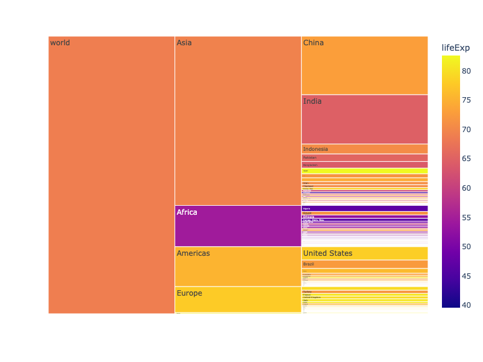

**Interactive Plot:**

<div>                        <script type="text/javascript">window.PlotlyConfig = {MathJaxConfig: 'local'};</script>
        <script charset="utf-8" src="https://cdn.plot.ly/plotly-3.1.0.min.js" integrity="sha256-Ei4740bWZhaUTQuD6q9yQlgVCMPBz6CZWhevDYPv93A=" crossorigin="anonymous"></script>                <div id="plotly-div-19" class="plotly-graph-div" style="height:100%; width:100%;"></div>            <script type="text/javascript">                window.PLOTLYENV=window.PLOTLYENV || {};                                if (document.getElementById("plotly-div-19")) {                    Plotly.newPlot(                        "plotly-div-19",                        [{"branchvalues":"total","customdata":[["AFG",43.828],["ALB",76.423],["DZA",72.301],["AGO",42.731],["ARG",75.32],["AUS",81.235],["AUT",79.829],["BHR",75.635],["BGD",64.062],["BEL",79.441],["BEN",56.728],["BOL",65.554],["BIH",74.852],["BWA",50.728],["BRA",72.39],["BGR",73.005],["BFA",52.295],["BDI",49.58],["KHM",59.723],["CMR",50.43],["CAN",80.65300000000002],["CAF",44.74100000000001],["TCD",50.651],["CHL",78.553],["CHN",72.961],["COL",72.889],["COM",65.152],["COD",46.462],["COG",55.322],["CRI",78.782],["CIV",48.328],["HRV",75.748],["CUB",78.273],["CZE",76.486],["DNK",78.332],["DJI",54.791],["DOM",72.235],["ECU",74.994],["EGY",71.33800000000002],["SLV",71.878],["GNQ",51.57899999999999],["ERI",58.03999999999999],["ETH",52.947],["FIN",79.313],["FRA",80.65699999999998],["GAB",56.73500000000001],["GMB",59.448],["DEU",79.406],["GHA",60.02199999999999],["GRC",79.483],["GTM",70.259],["GIN",56.007],["GNB",46.38800000000001],["HTI",60.916],["HND",70.19800000000001],["HKG",82.208],["HUN",73.33800000000002],["ISL",81.757],["IND",64.69800000000001],["IDN",70.65],["IRN",70.964],["IRQ",59.545],["IRL",78.885],["ISR",80.745],["ITA",80.546],["JAM",72.567],["JPN",82.603],["JOR",72.535],["KEN",54.11],["KOR",67.297],["KOR",78.623],["KWT",77.58800000000002],["LBN",71.993],["LSO",42.592],["LBR",45.678],["LBY",73.952],["MDG",59.443000000000005],["MWI",48.303],["MYS",74.241],["MLI",54.467],["MRT",64.164],["MUS",72.801],["MEX",76.195],["MNG",66.803],["MNE",74.543],["MAR",71.164],["MOZ",42.082],["MMR",62.06900000000001],["NAM",52.90600000000001],["NPL",63.785],["NLD",79.762],["NZL",80.204],["NIC",72.899],["NER",56.867],["NGA",46.859],["NOR",80.196],["OMN",75.64],["PAK",65.483],["PAN",75.53699999999998],["PRY",71.752],["PER",71.421],["PHL",71.688],["POL",75.563],["PRT",78.098],["PRI",78.74600000000002],["REU",76.442],["ROU",72.476],["RWA",46.242],["STP",65.528],["SAU",72.777],["SEN",63.062],["SRB",74.002],["SLE",42.56800000000001],["SGP",79.972],["SVK",74.663],["SVN",77.926],["SOM",48.159],["ZAF",49.339],["ESP",80.941],["LKA",72.396],["SDN",58.55599999999999],["SWZ",39.613],["SWE",80.884],["CHE",81.70100000000002],["SYR",74.143],["TWN",78.4],["TZA",52.517],["THA",70.616],["TGO",58.42],["TTO",69.819],["TUN",73.923],["TUR",71.777],["UGA",51.542],["GBR",79.425],["USA",78.242],["URY",76.384],["VEN",73.747],["VNM",74.249],["PSE",73.422],["YEM",62.698],["ZMB",42.38399999999999],["ZWE",43.487],["(?)",69.44386304205017],["(?)",77.89057081069896],["(?)",54.56441057558197],["(?)",75.35668222743027],["(?)",81.06215400970112],["(?)",68.91909251904042]],"domain":{"x":[0.0,1.0],"y":[0.0,1.0]},"hovertemplate":"labels=%{label}\u003cbr\u003epop=%{value}\u003cbr\u003eparent=%{parent}\u003cbr\u003eid=%{id}\u003cbr\u003eiso_alpha=%{customdata[0]}\u003cbr\u003elifeExp=%{color}\u003cextra\u003e\u003c\u002fextra\u003e","ids":["world\u002fAsia\u002fAfghanistan","world\u002fEurope\u002fAlbania","world\u002fAfrica\u002fAlgeria","world\u002fAfrica\u002fAngola","world\u002fAmericas\u002fArgentina","world\u002fOceania\u002fAustralia","world\u002fEurope\u002fAustria","world\u002fAsia\u002fBahrain","world\u002fAsia\u002fBangladesh","world\u002fEurope\u002fBelgium","world\u002fAfrica\u002fBenin","world\u002fAmericas\u002fBolivia","world\u002fEurope\u002fBosnia and Herzegovina","world\u002fAfrica\u002fBotswana","world\u002fAmericas\u002fBrazil","world\u002fEurope\u002fBulgaria","world\u002fAfrica\u002fBurkina Faso","world\u002fAfrica\u002fBurundi","world\u002fAsia\u002fCambodia","world\u002fAfrica\u002fCameroon","world\u002fAmericas\u002fCanada","world\u002fAfrica\u002fCentral African Republic","world\u002fAfrica\u002fChad","world\u002fAmericas\u002fChile","world\u002fAsia\u002fChina","world\u002fAmericas\u002fColombia","world\u002fAfrica\u002fComoros","world\u002fAfrica\u002fCongo, Dem. Rep.","world\u002fAfrica\u002fCongo, Rep.","world\u002fAmericas\u002fCosta Rica","world\u002fAfrica\u002fCote d'Ivoire","world\u002fEurope\u002fCroatia","world\u002fAmericas\u002fCuba","world\u002fEurope\u002fCzech Republic","world\u002fEurope\u002fDenmark","world\u002fAfrica\u002fDjibouti","world\u002fAmericas\u002fDominican Republic","world\u002fAmericas\u002fEcuador","world\u002fAfrica\u002fEgypt","world\u002fAmericas\u002fEl Salvador","world\u002fAfrica\u002fEquatorial Guinea","world\u002fAfrica\u002fEritrea","world\u002fAfrica\u002fEthiopia","world\u002fEurope\u002fFinland","world\u002fEurope\u002fFrance","world\u002fAfrica\u002fGabon","world\u002fAfrica\u002fGambia","world\u002fEurope\u002fGermany","world\u002fAfrica\u002fGhana","world\u002fEurope\u002fGreece","world\u002fAmericas\u002fGuatemala","world\u002fAfrica\u002fGuinea","world\u002fAfrica\u002fGuinea-Bissau","world\u002fAmericas\u002fHaiti","world\u002fAmericas\u002fHonduras","world\u002fAsia\u002fHong Kong, China","world\u002fEurope\u002fHungary","world\u002fEurope\u002fIceland","world\u002fAsia\u002fIndia","world\u002fAsia\u002fIndonesia","world\u002fAsia\u002fIran","world\u002fAsia\u002fIraq","world\u002fEurope\u002fIreland","world\u002fAsia\u002fIsrael","world\u002fEurope\u002fItaly","world\u002fAmericas\u002fJamaica","world\u002fAsia\u002fJapan","world\u002fAsia\u002fJordan","world\u002fAfrica\u002fKenya","world\u002fAsia\u002fKorea, Dem. Rep.","world\u002fAsia\u002fKorea, Rep.","world\u002fAsia\u002fKuwait","world\u002fAsia\u002fLebanon","world\u002fAfrica\u002fLesotho","world\u002fAfrica\u002fLiberia","world\u002fAfrica\u002fLibya","world\u002fAfrica\u002fMadagascar","world\u002fAfrica\u002fMalawi","world\u002fAsia\u002fMalaysia","world\u002fAfrica\u002fMali","world\u002fAfrica\u002fMauritania","world\u002fAfrica\u002fMauritius","world\u002fAmericas\u002fMexico","world\u002fAsia\u002fMongolia","world\u002fEurope\u002fMontenegro","world\u002fAfrica\u002fMorocco","world\u002fAfrica\u002fMozambique","world\u002fAsia\u002fMyanmar","world\u002fAfrica\u002fNamibia","world\u002fAsia\u002fNepal","world\u002fEurope\u002fNetherlands","world\u002fOceania\u002fNew Zealand","world\u002fAmericas\u002fNicaragua","world\u002fAfrica\u002fNiger","world\u002fAfrica\u002fNigeria","world\u002fEurope\u002fNorway","world\u002fAsia\u002fOman","world\u002fAsia\u002fPakistan","world\u002fAmericas\u002fPanama","world\u002fAmericas\u002fParaguay","world\u002fAmericas\u002fPeru","world\u002fAsia\u002fPhilippines","world\u002fEurope\u002fPoland","world\u002fEurope\u002fPortugal","world\u002fAmericas\u002fPuerto Rico","world\u002fAfrica\u002fReunion","world\u002fEurope\u002fRomania","world\u002fAfrica\u002fRwanda","world\u002fAfrica\u002fSao Tome and Principe","world\u002fAsia\u002fSaudi Arabia","world\u002fAfrica\u002fSenegal","world\u002fEurope\u002fSerbia","world\u002fAfrica\u002fSierra Leone","world\u002fAsia\u002fSingapore","world\u002fEurope\u002fSlovak Republic","world\u002fEurope\u002fSlovenia","world\u002fAfrica\u002fSomalia","world\u002fAfrica\u002fSouth Africa","world\u002fEurope\u002fSpain","world\u002fAsia\u002fSri Lanka","world\u002fAfrica\u002fSudan","world\u002fAfrica\u002fSwaziland","world\u002fEurope\u002fSweden","world\u002fEurope\u002fSwitzerland","world\u002fAsia\u002fSyria","world\u002fAsia\u002fTaiwan","world\u002fAfrica\u002fTanzania","world\u002fAsia\u002fThailand","world\u002fAfrica\u002fTogo","world\u002fAmericas\u002fTrinidad and Tobago","world\u002fAfrica\u002fTunisia","world\u002fEurope\u002fTurkey","world\u002fAfrica\u002fUganda","world\u002fEurope\u002fUnited Kingdom","world\u002fAmericas\u002fUnited States","world\u002fAmericas\u002fUruguay","world\u002fAmericas\u002fVenezuela","world\u002fAsia\u002fVietnam","world\u002fAsia\u002fWest Bank and Gaza","world\u002fAsia\u002fYemen, Rep.","world\u002fAfrica\u002fZambia","world\u002fAfrica\u002fZimbabwe","world\u002fAsia","world\u002fEurope","world\u002fAfrica","world\u002fAmericas","world\u002fOceania","world"],"labels":["Afghanistan","Albania","Algeria","Angola","Argentina","Australia","Austria","Bahrain","Bangladesh","Belgium","Benin","Bolivia","Bosnia and Herzegovina","Botswana","Brazil","Bulgaria","Burkina Faso","Burundi","Cambodia","Cameroon","Canada","Central African Republic","Chad","Chile","China","Colombia","Comoros","Congo, Dem. Rep.","Congo, Rep.","Costa Rica","Cote d'Ivoire","Croatia","Cuba","Czech Republic","Denmark","Djibouti","Dominican Republic","Ecuador","Egypt","El Salvador","Equatorial Guinea","Eritrea","Ethiopia","Finland","France","Gabon","Gambia","Germany","Ghana","Greece","Guatemala","Guinea","Guinea-Bissau","Haiti","Honduras","Hong Kong, China","Hungary","Iceland","India","Indonesia","Iran","Iraq","Ireland","Israel","Italy","Jamaica","Japan","Jordan","Kenya","Korea, Dem. Rep.","Korea, Rep.","Kuwait","Lebanon","Lesotho","Liberia","Libya","Madagascar","Malawi","Malaysia","Mali","Mauritania","Mauritius","Mexico","Mongolia","Montenegro","Morocco","Mozambique","Myanmar","Namibia","Nepal","Netherlands","New Zealand","Nicaragua","Niger","Nigeria","Norway","Oman","Pakistan","Panama","Paraguay","Peru","Philippines","Poland","Portugal","Puerto Rico","Reunion","Romania","Rwanda","Sao Tome and Principe","Saudi Arabia","Senegal","Serbia","Sierra Leone","Singapore","Slovak Republic","Slovenia","Somalia","South Africa","Spain","Sri Lanka","Sudan","Swaziland","Sweden","Switzerland","Syria","Taiwan","Tanzania","Thailand","Togo","Trinidad and Tobago","Tunisia","Turkey","Uganda","United Kingdom","United States","Uruguay","Venezuela","Vietnam","West Bank and Gaza","Yemen, Rep.","Zambia","Zimbabwe","Asia","Europe","Africa","Americas","Oceania","world"],"marker":{"coloraxis":"coloraxis","colors":{"dtype":"f8","bdata":"RIts5\u002fvpRUBQjZduEhtTQCUGgZVDE1JAIbByaJFdRUAUrkfhetRSQNejcD0KT1RAkxgEVg71U0BxPQrXo+hSQIcW2c73A1BATmIQWDncU0B3vp8aL11MQPp+arx0Y1BASgwCK4e2UkB3vp8aL11JQClcj8L1GFJAuB6F61FAUkD2KFyPwiVKQArXo3A9ykhABoGVQ4vcTUDXo3A9CjdJQHASg8DKKVRAAyuHFtleRkAX2c73U1NJQAisHFpko1NAL90kBoE9UkA3iUFg5ThSQH0\u002fNV66SVBAQmDl0CI7R0Dwp8ZLN6lLQDVeukkMslNARIts5\u002fspSEAdWmQ73+9SQLbz\u002fdR4kVNAyXa+nxofU0Boke18P5VTQGiR7Xw\u002fZUtA16NwPQoPUkBWDi2ynb9SQBSDwMqh1VFA1XjpJjH4UUAmMQisHMpJQITrUbgeBU1A8KfGSzd5SkB56SYxCNRTQDReukkMKlRAr0fhehReTEDTTWIQWLlNQESLbOf72VNAiEFg5dACTkD0\u002fdR46d5TQH9qvHSTkFFAN4lBYOUATECNbOf7qTFHQGiR7Xw\u002fdU5A6iYxCKyMUUBaZDvfT41UQBSDwMqhVVJAnMQgsHJwVEDqJjEIrCxQQJqZmZmZqVFABFYOLbK9UUD2KFyPwsVNQHE9CtejuFNASOF6FK4vVEBt5\u002fup8SJUQD81XrpJJFJAO99PjZemVEAK16NwPSJSQK5H4XoUDktAXrpJDALTUEAdWmQ736dTQBSDwMqhZVNAZDvfT43\u002fUUCyne+nxktFQBBYObTI1kZAsHJoke18UkBjEFg5tLhNQBBYObTIJkhAgZVDi2yPUkCyne+nxjtLQNEi2\u002fl+ClBAJQaBlUMzUkAUrkfhegxTQAisHFpks1BAmG4Sg8CiUkDRItv5fspRQNEi2\u002fl+CkVAR7bz\u002fdQIT0CJFtnO93NKQBSuR+F65E9AVOOlm8TwU0CTGARWDg1UQKjGSzeJOVJA5dAi2\u002fluTEDLoUW2821HQAaBlUOLDFRAKVyPwvXoUkD0\u002fdR46V5QQOx8PzVe4lJA46WbxCDwUUBt5\u002fup8dpRQHnpJjEI7FFAeekmMQjkUkCDwMqhRYZTQDu0yHa+r1NAPzVeukkcU0BYObTIdh5SQOXQItv5HkdAbxKDwMphUEB9PzVeujFSQA4tsp3vh09A46WbxCCAUkBkEFg5tEhFQJHtfD81\u002flNA30+Nl26qUkAlBoGVQ3tTQDEIrBxaFEhACKwcWmSrSEBOYhBYOTxUQNNNYhBYGVJAuUkMAitHTUBYObTIds5DQH9qvHSTOFRAwJ8aL91sVED+1HjpJolSQJqZmZmZmVNAGQRWDi1CSkCBlUOLbKdRQPYoXI\u002fCNU1AI9v5fmp0UUBQjZduEntSQH0\u002fNV668VFATDeJQWDFSUAzMzMzM9tTQHNoke18j1NAf2q8dJMYU0ArhxbZzm9SQA4tsp3vj1JAXrpJDAJbUkDTTWIQWFlPQP3UeOkmMUVAdZMYBFa+RUCMYIhAaFxRQFquthz\u002feFNAD9IRmz5IS0AoeLHh09ZSQNK+z1T6Q1RAuNFtadI6UUA="}},"name":"","parents":["world\u002fAsia","world\u002fEurope","world\u002fAfrica","world\u002fAfrica","world\u002fAmericas","world\u002fOceania","world\u002fEurope","world\u002fAsia","world\u002fAsia","world\u002fEurope","world\u002fAfrica","world\u002fAmericas","world\u002fEurope","world\u002fAfrica","world\u002fAmericas","world\u002fEurope","world\u002fAfrica","world\u002fAfrica","world\u002fAsia","world\u002fAfrica","world\u002fAmericas","world\u002fAfrica","world\u002fAfrica","world\u002fAmericas","world\u002fAsia","world\u002fAmericas","world\u002fAfrica","world\u002fAfrica","world\u002fAfrica","world\u002fAmericas","world\u002fAfrica","world\u002fEurope","world\u002fAmericas","world\u002fEurope","world\u002fEurope","world\u002fAfrica","world\u002fAmericas","world\u002fAmericas","world\u002fAfrica","world\u002fAmericas","world\u002fAfrica","world\u002fAfrica","world\u002fAfrica","world\u002fEurope","world\u002fEurope","world\u002fAfrica","world\u002fAfrica","world\u002fEurope","world\u002fAfrica","world\u002fEurope","world\u002fAmericas","world\u002fAfrica","world\u002fAfrica","world\u002fAmericas","world\u002fAmericas","world\u002fAsia","world\u002fEurope","world\u002fEurope","world\u002fAsia","world\u002fAsia","world\u002fAsia","world\u002fAsia","world\u002fEurope","world\u002fAsia","world\u002fEurope","world\u002fAmericas","world\u002fAsia","world\u002fAsia","world\u002fAfrica","world\u002fAsia","world\u002fAsia","world\u002fAsia","world\u002fAsia","world\u002fAfrica","world\u002fAfrica","world\u002fAfrica","world\u002fAfrica","world\u002fAfrica","world\u002fAsia","world\u002fAfrica","world\u002fAfrica","world\u002fAfrica","world\u002fAmericas","world\u002fAsia","world\u002fEurope","world\u002fAfrica","world\u002fAfrica","world\u002fAsia","world\u002fAfrica","world\u002fAsia","world\u002fEurope","world\u002fOceania","world\u002fAmericas","world\u002fAfrica","world\u002fAfrica","world\u002fEurope","world\u002fAsia","world\u002fAsia","world\u002fAmericas","world\u002fAmericas","world\u002fAmericas","world\u002fAsia","world\u002fEurope","world\u002fEurope","world\u002fAmericas","world\u002fAfrica","world\u002fEurope","world\u002fAfrica","world\u002fAfrica","world\u002fAsia","world\u002fAfrica","world\u002fEurope","world\u002fAfrica","world\u002fAsia","world\u002fEurope","world\u002fEurope","world\u002fAfrica","world\u002fAfrica","world\u002fEurope","world\u002fAsia","world\u002fAfrica","world\u002fAfrica","world\u002fEurope","world\u002fEurope","world\u002fAsia","world\u002fAsia","world\u002fAfrica","world\u002fAsia","world\u002fAfrica","world\u002fAmericas","world\u002fAfrica","world\u002fEurope","world\u002fAfrica","world\u002fEurope","world\u002fAmericas","world\u002fAmericas","world\u002fAmericas","world\u002fAsia","world\u002fAsia","world\u002fAsia","world\u002fAfrica","world\u002fAfrica","world","world","world","world","world",""],"values":{"dtype":"f8","bdata":"AAAAMKBpfkEAAACARXhLQQAAAAD+yX9BAAAAgK+wZ0EAAAA4qzeDQQAAAADQfHNBAAAAwJlHX0EAAAAAup8lQQAAAKZR76FBAAAAQFTSY0EAAACA+tBeQQAAAAC2ZGFBAAAAgIFdUUEAAAAA2wI5QQAAAC6qpqZBAAAAgDrvW0EAAABgN1NrQQAAACDtAGBBAAAAQFL0akEAAABQYuBwQQAAANDj139BAAAAgKOqUEEAAADgaodjQQAAAKCID29BAAAAdmCm00EAAADw3haFQQAAAABgsiVBAAAAOJHOjkEAAAAAEf9MQQAAAAD+iU9BAAAAEM4tcUEAAAAAACRRQQAAAGCzxmVBAAAAAIGCY0EAAAAA9ttUQQAAAADYSx5BAAAAwJjGYUEAAAAApDxqQQAAAHz1IpNBAAAAAAp5WkEAAAAAQtIgQQAAAECWt1JBAAAAPOo9kkEAAAAAr\u002ftTQQAAAGCIII1BAAAAABMzNkEAAAAAJ8M5QQAAAJBbpZNBAAAAoE\u002fQdUEAAABArmtkQQAAAAAg+2dBAAAAwFT5YkEAAAAAKXY2QQAAAMDDN2BBAAAAwFyMXEEAAAAAz6BaQQAAAIBh\u002fWJBAAAAAKxtEkEAAMBq04vQQQAAAPAcpqpBAAAACByPkEEAAABgxzl6QQAAAACPWU9BAAAAwA2EWEEAAACoHLqLQQAAAADyNUVBAAAAEAdknkEAAABAUhdXQQAAAAjy+oBBAAAA0OU4dkEAAACw6WKHQQAAAICrHUNBAAAAAL\u002fqTUEAAAAA6bU+QQAAAAArXkhBAAAAgGwHV0EAAABgmkdyQQAAAOBca2lBAAAAYOKrd0EAAABg5vJmQQAAAIDY8khBAAAAAEIWM0EAAABsk+qZQQAAAICH7UVBAAAAAIDlJEEAAAC4vxiAQQAAAIACB3NBAAAA4FHGhkEAAAAAqFs\u002fQQAAAOAZkHtBAAAAoB6bb0EAAACAnWZPQQAAAABXplVBAAAAIFKYaEEAAAD40higQQAAAIB1p1FBAAAAgJBzSEEAAACyui2kQQAAAIBevEhBAAAAwOJuWUEAAABQrFh7QQAAAJzqtpVBAAAACO9dgkEAAACAskxkQQAAAIAtFE5BAAAAABxbKEEAAACAfT51QQAAAIB15mBBAAAAANhcCEEAAADgiFJ6QQAAAKD8ZWdBAAAAIC9cY0EAAACAjHBXQQAAAEBMXlFBAAAAgNPHVEEAAAAAnag+QQAAAKCGZGFBAAAAINT6hEEAAAD4hUmDQQAAAPAnb3NBAAAACLYqhEEAAAAACkoxQQAAAAC2OWFBAAAAQJnRXEEAAACwg2tyQQAAAGDJGXZBAAAAwLcvgkEAAACo4waPQQAAAMDyv1VBAAAAAGAfMEEAAADAp5ljQQAAANwt95BBAAAA4K3Re0EAAABw+fqMQQAAAOsH87FBAAAAAGRNSkEAAABgU+B4QQAAAFAAVJRBAAAAAE6oTkEAAADwyS51QQAAAGBeZ2ZBAAAA4Ex7Z0EAAGCUuWbsQQAAgLCTd8FBAAAANtOzy0EAAADI18nKQQAAALCjaXdBAACwQ25J90E="},"type":"icicle"}],                        {"template":{"data":{"histogram2dcontour":[{"type":"histogram2dcontour","colorbar":{"outlinewidth":0,"ticks":""},"colorscale":[[0.0,"#0d0887"],[0.1111111111111111,"#46039f"],[0.2222222222222222,"#7201a8"],[0.3333333333333333,"#9c179e"],[0.4444444444444444,"#bd3786"],[0.5555555555555556,"#d8576b"],[0.6666666666666666,"#ed7953"],[0.7777777777777778,"#fb9f3a"],[0.8888888888888888,"#fdca26"],[1.0,"#f0f921"]]}],"choropleth":[{"type":"choropleth","colorbar":{"outlinewidth":0,"ticks":""}}],"histogram2d":[{"type":"histogram2d","colorbar":{"outlinewidth":0,"ticks":""},"colorscale":[[0.0,"#0d0887"],[0.1111111111111111,"#46039f"],[0.2222222222222222,"#7201a8"],[0.3333333333333333,"#9c179e"],[0.4444444444444444,"#bd3786"],[0.5555555555555556,"#d8576b"],[0.6666666666666666,"#ed7953"],[0.7777777777777778,"#fb9f3a"],[0.8888888888888888,"#fdca26"],[1.0,"#f0f921"]]}],"heatmap":[{"type":"heatmap","colorbar":{"outlinewidth":0,"ticks":""},"colorscale":[[0.0,"#0d0887"],[0.1111111111111111,"#46039f"],[0.2222222222222222,"#7201a8"],[0.3333333333333333,"#9c179e"],[0.4444444444444444,"#bd3786"],[0.5555555555555556,"#d8576b"],[0.6666666666666666,"#ed7953"],[0.7777777777777778,"#fb9f3a"],[0.8888888888888888,"#fdca26"],[1.0,"#f0f921"]]}],"contourcarpet":[{"type":"contourcarpet","colorbar":{"outlinewidth":0,"ticks":""}}],"contour":[{"type":"contour","colorbar":{"outlinewidth":0,"ticks":""},"colorscale":[[0.0,"#0d0887"],[0.1111111111111111,"#46039f"],[0.2222222222222222,"#7201a8"],[0.3333333333333333,"#9c179e"],[0.4444444444444444,"#bd3786"],[0.5555555555555556,"#d8576b"],[0.6666666666666666,"#ed7953"],[0.7777777777777778,"#fb9f3a"],[0.8888888888888888,"#fdca26"],[1.0,"#f0f921"]]}],"surface":[{"type":"surface","colorbar":{"outlinewidth":0,"ticks":""},"colorscale":[[0.0,"#0d0887"],[0.1111111111111111,"#46039f"],[0.2222222222222222,"#7201a8"],[0.3333333333333333,"#9c179e"],[0.4444444444444444,"#bd3786"],[0.5555555555555556,"#d8576b"],[0.6666666666666666,"#ed7953"],[0.7777777777777778,"#fb9f3a"],[0.8888888888888888,"#fdca26"],[1.0,"#f0f921"]]}],"mesh3d":[{"type":"mesh3d","colorbar":{"outlinewidth":0,"ticks":""}}],"scatter":[{"fillpattern":{"fillmode":"overlay","size":10,"solidity":0.2},"type":"scatter"}],"parcoords":[{"type":"parcoords","line":{"colorbar":{"outlinewidth":0,"ticks":""}}}],"scatterpolargl":[{"type":"scatterpolargl","marker":{"colorbar":{"outlinewidth":0,"ticks":""}}}],"bar":[{"error_x":{"color":"#2a3f5f"},"error_y":{"color":"#2a3f5f"},"marker":{"line":{"color":"#E5ECF6","width":0.5},"pattern":{"fillmode":"overlay","size":10,"solidity":0.2}},"type":"bar"}],"scattergeo":[{"type":"scattergeo","marker":{"colorbar":{"outlinewidth":0,"ticks":""}}}],"scatterpolar":[{"type":"scatterpolar","marker":{"colorbar":{"outlinewidth":0,"ticks":""}}}],"histogram":[{"marker":{"pattern":{"fillmode":"overlay","size":10,"solidity":0.2}},"type":"histogram"}],"scattergl":[{"type":"scattergl","marker":{"colorbar":{"outlinewidth":0,"ticks":""}}}],"scatter3d":[{"type":"scatter3d","line":{"colorbar":{"outlinewidth":0,"ticks":""}},"marker":{"colorbar":{"outlinewidth":0,"ticks":""}}}],"scattermap":[{"type":"scattermap","marker":{"colorbar":{"outlinewidth":0,"ticks":""}}}],"scattermapbox":[{"type":"scattermapbox","marker":{"colorbar":{"outlinewidth":0,"ticks":""}}}],"scatterternary":[{"type":"scatterternary","marker":{"colorbar":{"outlinewidth":0,"ticks":""}}}],"scattercarpet":[{"type":"scattercarpet","marker":{"colorbar":{"outlinewidth":0,"ticks":""}}}],"carpet":[{"aaxis":{"endlinecolor":"#2a3f5f","gridcolor":"white","linecolor":"white","minorgridcolor":"white","startlinecolor":"#2a3f5f"},"baxis":{"endlinecolor":"#2a3f5f","gridcolor":"white","linecolor":"white","minorgridcolor":"white","startlinecolor":"#2a3f5f"},"type":"carpet"}],"table":[{"cells":{"fill":{"color":"#EBF0F8"},"line":{"color":"white"}},"header":{"fill":{"color":"#C8D4E3"},"line":{"color":"white"}},"type":"table"}],"barpolar":[{"marker":{"line":{"color":"#E5ECF6","width":0.5},"pattern":{"fillmode":"overlay","size":10,"solidity":0.2}},"type":"barpolar"}],"pie":[{"automargin":true,"type":"pie"}]},"layout":{"autotypenumbers":"strict","colorway":["#636efa","#EF553B","#00cc96","#ab63fa","#FFA15A","#19d3f3","#FF6692","#B6E880","#FF97FF","#FECB52"],"font":{"color":"#2a3f5f"},"hovermode":"closest","hoverlabel":{"align":"left"},"paper_bgcolor":"white","plot_bgcolor":"#E5ECF6","polar":{"bgcolor":"#E5ECF6","angularaxis":{"gridcolor":"white","linecolor":"white","ticks":""},"radialaxis":{"gridcolor":"white","linecolor":"white","ticks":""}},"ternary":{"bgcolor":"#E5ECF6","aaxis":{"gridcolor":"white","linecolor":"white","ticks":""},"baxis":{"gridcolor":"white","linecolor":"white","ticks":""},"caxis":{"gridcolor":"white","linecolor":"white","ticks":""}},"coloraxis":{"colorbar":{"outlinewidth":0,"ticks":""}},"colorscale":{"sequential":[[0.0,"#0d0887"],[0.1111111111111111,"#46039f"],[0.2222222222222222,"#7201a8"],[0.3333333333333333,"#9c179e"],[0.4444444444444444,"#bd3786"],[0.5555555555555556,"#d8576b"],[0.6666666666666666,"#ed7953"],[0.7777777777777778,"#fb9f3a"],[0.8888888888888888,"#fdca26"],[1.0,"#f0f921"]],"sequentialminus":[[0.0,"#0d0887"],[0.1111111111111111,"#46039f"],[0.2222222222222222,"#7201a8"],[0.3333333333333333,"#9c179e"],[0.4444444444444444,"#bd3786"],[0.5555555555555556,"#d8576b"],[0.6666666666666666,"#ed7953"],[0.7777777777777778,"#fb9f3a"],[0.8888888888888888,"#fdca26"],[1.0,"#f0f921"]],"diverging":[[0,"#8e0152"],[0.1,"#c51b7d"],[0.2,"#de77ae"],[0.3,"#f1b6da"],[0.4,"#fde0ef"],[0.5,"#f7f7f7"],[0.6,"#e6f5d0"],[0.7,"#b8e186"],[0.8,"#7fbc41"],[0.9,"#4d9221"],[1,"#276419"]]},"xaxis":{"gridcolor":"white","linecolor":"white","ticks":"","title":{"standoff":15},"zerolinecolor":"white","automargin":true,"zerolinewidth":2},"yaxis":{"gridcolor":"white","linecolor":"white","ticks":"","title":{"standoff":15},"zerolinecolor":"white","automargin":true,"zerolinewidth":2},"scene":{"xaxis":{"backgroundcolor":"#E5ECF6","gridcolor":"white","linecolor":"white","showbackground":true,"ticks":"","zerolinecolor":"white","gridwidth":2},"yaxis":{"backgroundcolor":"#E5ECF6","gridcolor":"white","linecolor":"white","showbackground":true,"ticks":"","zerolinecolor":"white","gridwidth":2},"zaxis":{"backgroundcolor":"#E5ECF6","gridcolor":"white","linecolor":"white","showbackground":true,"ticks":"","zerolinecolor":"white","gridwidth":2}},"shapedefaults":{"line":{"color":"#2a3f5f"}},"annotationdefaults":{"arrowcolor":"#2a3f5f","arrowhead":0,"arrowwidth":1},"geo":{"bgcolor":"white","landcolor":"#E5ECF6","subunitcolor":"white","showland":true,"showlakes":true,"lakecolor":"white"},"title":{"x":0.05},"mapbox":{"style":"light"}}},"coloraxis":{"colorbar":{"title":{"text":"lifeExp"}},"colorscale":[[0.0,"#0d0887"],[0.1111111111111111,"#46039f"],[0.2222222222222222,"#7201a8"],[0.3333333333333333,"#9c179e"],[0.4444444444444444,"#bd3786"],[0.5555555555555556,"#d8576b"],[0.6666666666666666,"#ed7953"],[0.7777777777777778,"#fb9f3a"],[0.8888888888888888,"#fdca26"],[1.0,"#f0f921"]]},"legend":{"tracegroupgap":0},"margin":{"t":60}},                        {"responsive": true}                    )                };            </script>        </div>

#### Distributions

**Read more about [histograms](histograms.md).**

```python
import plotly.express as px
df = px.data.tips()
fig = px.histogram(df, x="total_bill", y="tip", color="sex", marginal="rug", hover_data=df.columns)
fig.show()
```

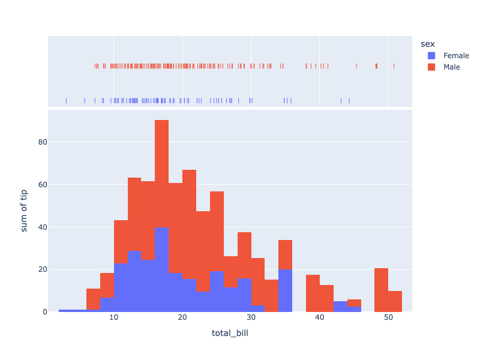

**Interactive Plot:**

<div>                        <script type="text/javascript">window.PlotlyConfig = {MathJaxConfig: 'local'};</script>
        <script charset="utf-8" src="https://cdn.plot.ly/plotly-3.1.0.min.js" integrity="sha256-Ei4740bWZhaUTQuD6q9yQlgVCMPBz6CZWhevDYPv93A=" crossorigin="anonymous"></script>                <div id="plotly-div-20" class="plotly-graph-div" style="height:100%; width:100%;"></div>            <script type="text/javascript">                window.PLOTLYENV=window.PLOTLYENV || {};                                if (document.getElementById("plotly-div-20")) {                    Plotly.newPlot(                        "plotly-div-20",                        [{"bingroup":"x","histfunc":"sum","hovertemplate":"sex=Female\u003cbr\u003etotal_bill=%{x}\u003cbr\u003esum of tip=%{y}\u003cextra\u003e\u003c\u002fextra\u003e","legendgroup":"Female","marker":{"color":"#636efa","pattern":{"shape":""}},"name":"Female","orientation":"v","showlegend":true,"x":{"dtype":"f8","bdata":"PQrXo3D9MEDXo3A9Cpc4QOF6FK5HoUFAKVyPwvWoLUApXI\u002fC9agkQLgehetR+DBACtejcD1KNEAK16NwPYovQGZmZmZmpjNAH4XrUbgeLkBxPQrXo7A0QK5H4XoU7jBAFK5H4XqUJEBI4XoUrmdBQClcj8L1aDpAMzMzMzNzMECPwvUoXI8IQFK4HoXrETFAXI\u002fC9SjcOkBI4XoUrkc5QPYoXI\u002fCdS1ApHA9CtcjJEAK16NwPWpBQAAAAAAAABdAUrgehetRMEAAAAAAAMA2QDMzMzMzsyZAw\u002fUoXI\u002fCLkBmZmZmZiZGQOxRuB6FazZA7FG4HoXrNEAfhetRuJ4sQAAAAAAAAB1A9ihcj8K1OUCPwvUoXE8xQM3MzMzMTCVAXI\u002fC9SjcKEAUrkfhehQ4QNejcD0K1ypA9ihcj8L1KEDNzMzMzMw9QArXo3A9Ci1Aw\u002fUoXI\u002fCJkCF61G4HkU0QNejcD0KVyZAhetRuB6FKEDD9Shcj0IyQIXrUbgeBSFAKVyPwvWoJEDNzMzMzEwsQFK4HoXrUSpAuB6F61F4MUDNzMzMzAw7QK5H4XoUbjBAMzMzMzOzIECkcD0K16MyQD0K16NwvSdAmpmZmZnZPUAAAAAAAAA5QEjhehSuxypA9ihcj8I1MEDD9Shcj4IxQK5H4XoULiVAw\u002fUoXI9CJUAzMzMzMzMjQGZmZmZm5jRAZmZmZmYmMkCPwvUoXM8zQK5H4XoUjkVAAAAAAAAAKkB7FK5H4XopQAAAAAAAACpAZmZmZmZmMEC4HoXrUXgwQIXrUbgehSlACtejcD2KKkDsUbgehSs8QM3MzMzMzClApHA9CtcjPkDXo3A9CtcqQPYoXI\u002fC9S9AhetRuB5FMECuR+F6FC4kQB+F61G4HjZACtejcD3qQUCuR+F6FC47QEjhehSuxzJA"},"xaxis":"x","y":{"dtype":"f8","bdata":"KVyPwvUo8D\u002fhehSuR+EMQAAAAAAAABRAKVyPwvUoCEC4HoXrUbj6PwAAAAAAAAxAAAAAAAAABkDXo3A9CtcBQAAAAAAAAAhAAAAAAAAACECamZmZmZkDQI\u002fC9ShcjwhAzczMzMzMBEDNzMzMzMwUQAAAAAAAAPg\u002fw\u002fUoXI\u002fCA0AAAAAAAADwPwAAAAAAAAhAH4XrUbgeCUAAAAAAAAAUQJqZmZmZmQFASOF6FK5H\u002fT+uR+F6FK4UQAAAAAAAAPA\u002fMzMzMzMzEUAAAAAAAAAKQAAAAAAAAARAAAAAAAAACEAAAAAAAAAEQNejcD0K1wtAUrgehetREEAAAAAAAAAQQAAAAAAAAPA\u002fAAAAAAAAEEAAAAAAAAAMQAAAAAAAAPg\u002fzczMzMzM\u002fD9cj8L1KFwHQOF6FK5H4fo\u002fKVyPwvUoBEDNzMzMzMwQQAAAAAAAAABAAAAAAAAAAECkcD0K16MGQAAAAAAAAPg\u002fAAAAAAAAAEAAAAAAAAAKQAAAAAAAAPQ\u002fAAAAAAAAAEAAAAAAAAAAQAAAAAAAAAZAAAAAAAAADEAAAAAAAAAUQGZmZmZmZgJAAAAAAAAA+D\u002fD9Shcj8L1PxSuR+F6FPo\u002fj8L1KFyPFEAAAAAAAAAOQOF6FK5H4QRAAAAAAAAAAEAAAAAAAAAIQMP1KFyPwvk\u002fAAAAAAAAAEAAAAAAAAAQQAAAAAAAAAxAAAAAAAAADEDD9Shcj8IQQAAAAAAAABRAAAAAAAAAAEAUrkfhehQAQAAAAAAAAABAAAAAAAAABEDXo3A9CtcJQNejcD0K1wFAAAAAAAAABEAAAAAAAAAaQJqZmZmZmfE\u002fuB6F61G4CEDXo3A9CtcLQAAAAAAAAAhAAAAAAAAABEAAAAAAAAAAQArXo3A9CgdArkfhehSuEkAAAAAAAAAAQAAAAAAAAAhA"},"yaxis":"y","type":"histogram"},{"boxpoints":"all","customdata":[["Female","No","Sun","Dinner",2],["Female","No","Sun","Dinner",4],["Female","No","Sun","Dinner",4],["Female","No","Sun","Dinner",2],["Female","No","Sun","Dinner",3],["Female","No","Sun","Dinner",3],["Female","No","Sat","Dinner",2],["Female","No","Sat","Dinner",2],["Female","No","Sat","Dinner",2],["Female","No","Sat","Dinner",2],["Female","No","Sat","Dinner",4],["Female","No","Sat","Dinner",3],["Female","No","Sun","Dinner",2],["Female","No","Sun","Dinner",4],["Female","No","Sat","Dinner",2],["Female","No","Sat","Dinner",2],["Female","Yes","Sat","Dinner",1],["Female","No","Sat","Dinner",3],["Female","Yes","Sat","Dinner",2],["Female","Yes","Sat","Dinner",2],["Female","No","Sat","Dinner",2],["Female","No","Thur","Lunch",1],["Female","No","Thur","Lunch",4],["Female","Yes","Fri","Dinner",2],["Female","Yes","Fri","Dinner",2],["Female","No","Fri","Dinner",2],["Female","Yes","Fri","Dinner",2],["Female","Yes","Fri","Dinner",2],["Female","Yes","Sat","Dinner",3],["Female","Yes","Sat","Dinner",2],["Female","No","Sat","Dinner",2],["Female","Yes","Sat","Dinner",2],["Female","No","Sat","Dinner",1],["Female","No","Sun","Dinner",3],["Female","No","Sun","Dinner",2],["Female","No","Thur","Lunch",2],["Female","No","Thur","Lunch",2],["Female","No","Thur","Lunch",4],["Female","No","Thur","Lunch",2],["Female","No","Thur","Lunch",2],["Female","No","Thur","Lunch",6],["Female","No","Thur","Lunch",2],["Female","No","Thur","Lunch",2],["Female","No","Thur","Lunch",2],["Female","No","Thur","Lunch",2],["Female","No","Thur","Lunch",2],["Female","No","Thur","Lunch",2],["Female","No","Thur","Lunch",2],["Female","No","Thur","Lunch",2],["Female","No","Thur","Lunch",2],["Female","No","Thur","Lunch",2],["Female","No","Thur","Lunch",2],["Female","No","Thur","Lunch",6],["Female","No","Thur","Lunch",2],["Female","No","Thur","Lunch",2],["Female","No","Thur","Lunch",3],["Female","No","Thur","Lunch",2],["Female","No","Sun","Dinner",5],["Female","No","Sun","Dinner",4],["Female","No","Sun","Dinner",2],["Female","No","Sun","Dinner",3],["Female","Yes","Sun","Dinner",2],["Female","Yes","Sat","Dinner",2],["Female","Yes","Sat","Dinner",2],["Female","Yes","Sun","Dinner",2],["Female","Yes","Sun","Dinner",3],["Female","Yes","Sun","Dinner",3],["Female","Yes","Thur","Lunch",2],["Female","Yes","Thur","Lunch",4],["Female","Yes","Thur","Lunch",2],["Female","Yes","Thur","Lunch",2],["Female","Yes","Thur","Lunch",2],["Female","Yes","Thur","Lunch",2],["Female","Yes","Thur","Lunch",3],["Female","Yes","Sat","Dinner",2],["Female","Yes","Sat","Dinner",2],["Female","Yes","Sat","Dinner",3],["Female","Yes","Sat","Dinner",2],["Female","Yes","Sat","Dinner",4],["Female","Yes","Fri","Lunch",2],["Female","No","Fri","Lunch",3],["Female","Yes","Fri","Lunch",2],["Female","Yes","Fri","Lunch",2],["Female","Yes","Sat","Dinner",2],["Female","No","Sat","Dinner",3],["Female","Yes","Sat","Dinner",2],["Female","No","Thur","Dinner",2]],"fillcolor":"rgba(255,255,255,0)","hoveron":"points","hovertemplate":"sex=%{customdata[0]}\u003cbr\u003etotal_bill=%{x}\u003cbr\u003esmoker=%{customdata[1]}\u003cbr\u003eday=%{customdata[2]}\u003cbr\u003etime=%{customdata[3]}\u003cbr\u003esize=%{customdata[4]}\u003cextra\u003e\u003c\u002fextra\u003e","jitter":0,"legendgroup":"Female","line":{"color":"rgba(255,255,255,0)"},"marker":{"color":"#636efa","symbol":"line-ns-open"},"name":"Female","showlegend":false,"x":{"dtype":"f8","bdata":"PQrXo3D9MEDXo3A9Cpc4QOF6FK5HoUFAKVyPwvWoLUApXI\u002fC9agkQLgehetR+DBACtejcD1KNEAK16NwPYovQGZmZmZmpjNAH4XrUbgeLkBxPQrXo7A0QK5H4XoU7jBAFK5H4XqUJEBI4XoUrmdBQClcj8L1aDpAMzMzMzNzMECPwvUoXI8IQFK4HoXrETFAXI\u002fC9SjcOkBI4XoUrkc5QPYoXI\u002fCdS1ApHA9CtcjJEAK16NwPWpBQAAAAAAAABdAUrgehetRMEAAAAAAAMA2QDMzMzMzsyZAw\u002fUoXI\u002fCLkBmZmZmZiZGQOxRuB6FazZA7FG4HoXrNEAfhetRuJ4sQAAAAAAAAB1A9ihcj8K1OUCPwvUoXE8xQM3MzMzMTCVAXI\u002fC9SjcKEAUrkfhehQ4QNejcD0K1ypA9ihcj8L1KEDNzMzMzMw9QArXo3A9Ci1Aw\u002fUoXI\u002fCJkCF61G4HkU0QNejcD0KVyZAhetRuB6FKEDD9Shcj0IyQIXrUbgeBSFAKVyPwvWoJEDNzMzMzEwsQFK4HoXrUSpAuB6F61F4MUDNzMzMzAw7QK5H4XoUbjBAMzMzMzOzIECkcD0K16MyQD0K16NwvSdAmpmZmZnZPUAAAAAAAAA5QEjhehSuxypA9ihcj8I1MEDD9Shcj4IxQK5H4XoULiVAw\u002fUoXI9CJUAzMzMzMzMjQGZmZmZm5jRAZmZmZmYmMkCPwvUoXM8zQK5H4XoUjkVAAAAAAAAAKkB7FK5H4XopQAAAAAAAACpAZmZmZmZmMEC4HoXrUXgwQIXrUbgehSlACtejcD2KKkDsUbgehSs8QM3MzMzMzClApHA9CtcjPkDXo3A9CtcqQPYoXI\u002fC9S9AhetRuB5FMECuR+F6FC4kQB+F61G4HjZACtejcD3qQUCuR+F6FC47QEjhehSuxzJA"},"xaxis":"x2","yaxis":"y2","type":"box"},{"bingroup":"x","histfunc":"sum","hovertemplate":"sex=Male\u003cbr\u003etotal_bill=%{x}\u003cbr\u003esum of tip=%{y}\u003cextra\u003e\u003c\u002fextra\u003e","legendgroup":"Male","marker":{"color":"#EF553B","pattern":{"shape":""}},"name":"Male","orientation":"v","showlegend":true,"x":{"dtype":"f8","bdata":"rkfhehSuJEDD9ShcjwI1QK5H4XoUrjdACtejcD1KOUAK16NwPYohQOF6FK5H4TpAFK5H4XoULkCPwvUoXI8tQArXo3A9iiRA16NwPQrXLkCuR+F6FG4yQBSuR+F6lDVACtejcD1KMEBmZmZmZqY0QOxRuB6F6zFA9ihcj8K1Q0BSuB6F69EzQI\u002fC9ShczzFAPQrXo3C9KkDhehSuR2EpQDMzMzMzszVAmpmZmZkZI0CamZmZmVkyQEjhehSuxzFAj8L1KFwPOECPwvUoXE8wQHE9CtejsDJAhetRuB5FP0AK16NwPQowQPYoXI\u002fCdTFA4XoUrkfhK0Bcj8L1KFwjQGZmZmZmZj5ACtejcD1KMkB7FK5H4To2QDMzMzMzM0BAzczMzMyMPEAK16NwPQoyQBSuR+F6FClA4XoUrkfhI0CPwvUoXI85QD0K16NwfTNA4XoUrkcBQ0B7FK5H4XomQMP1KFyPIkhACtejcD1KNEAfhetRuJ4rQArXo3A9CiZACtejcD1KMkDXo3A9CpcxQBSuR+F6FDRAexSuR+E6NECF61G4HgUuQArXo3A9CihAhetRuB4FJUDsUbgehesxQDMzMzMzMztAw\u002fUoXI\u002fCNkAK16NwPUoxQHE9CtejcDNAKVyPwvWoMEDXo3A9CldAQPYoXI\u002fC9S9Aj8L1KFwPKkBI4XoUrkcyQPYoXI\u002fCtThAKVyPwvUoNUC4HoXrUfg8QD0K16NwfTZA9ihcj8IVREBI4XoUrkc7QI\u002fC9ShcDyhAw\u002fUoXI8CNUDsUbgehesoQLgehetRuC5APQrXo3B9NED2KFyPwjU5QD0K16NwPTJAAAAAAAAALEApXI\u002fC9QhDQDMzMzMz8zdArkfhehTuPUDhehSuR2EnQIXrUbgehSxAZmZmZmbmL0AK16NwPQohQFK4HoXr0TZAFK5H4XoUM0AAAAAAAAAwQGZmZmZmJkFAuB6F61GYRECPwvUoXI8jQArXo3A9Ch5ApHA9CtcjLEDD9Shcj0IqQMP1KFyPQjFAzczMzMyMOECF61G4HsUzQPYoXI\u002fCFUhAPQrXo3B9MEAAAAAAAIA1QFK4HoXrUSlAH4XrUbieK0CF61G4HoU4QMP1KFyPwjRA9ihcj8K1P0BI4XoUrmdJQB+F61G4ni9AAAAAAAAAHUCamZmZmdk\u002fQFK4HoXr0TBAMzMzMzNzQECkcD0K1+MxQPYoXI\u002fC9SxAcT0K16NQQUAzMzMzM1NBQBSuR+F6VDdAzczMzMysRkDsUbgehSs3QGZmZmZmRkRAcT0K16OwNED2KFyPwnU+QJqZmZmZGTdA4XoUrkdhL0BxPQrXo3A8QPYoXI\u002fC9S5AFK5H4XqUMEA9CtejcD0eQK5H4XoUriRAhetRuB4FK0D2KFyPwrUyQEjhehSuhzRA16NwPQqXOkA9CtejcF1DQIXrUbgeRThAj8L1KFwPPkCkcD0K1+M5QArXo3A9KkhAZmZmZmYmPECuR+F6FC4nQPYoXI\u002fC9R5AUrgehetRKEApXI\u002fC9SghQNejcD0K1ypAMzMzMzNzNECPwvUoXI8qQMP1KFyPAjhA4XoUrkdhL0C4HoXrUTgnQArXo3A9iiVAj8L1KFwPL0CkcD0K1yMkQDMzMzMzMylACtejcD1qQEBI4XoUrgc9QOxRuB6FqzZAUrgehevRMUA="},"xaxis":"x","y":{"dtype":"f8","bdata":"j8L1KFyP+j8AAAAAAAAMQHsUrkfhegpA16NwPQrXEkAAAAAAAAAAQPYoXI\u002fC9QhAXI\u002fC9Shc\u002fz\u002fXo3A9CtcJQFyPwvUoXPs\u002fH4XrUbge+T8AAAAAAAAIQFyPwvUoXA9ArkfhehSuDUDNzMzMzMwKQFK4HoXrURBAUrgehetRHkBxPQrXo3AJQLgehetRuAJAAAAAAAAAAEAAAAAAAAAAQDMzMzMzMxFAMzMzMzMz9z8AAAAAAAAEQClcj8L1KApAzczMzMzMDEAAAAAAAAAAQHsUrkfhegJAAAAAAAAAFEDsUbgehesBQFK4HoXrUQRAexSuR+F6CEAfhetRuB71P2ZmZmZmZhZAAAAAAAAACEAAAAAAAAAUQAAAAAAAABhAZmZmZmZmAEAAAAAAAAAIQAAAAAAAAARA9ihcj8L1+D9cj8L1KFwRQBSuR+F6FAxAAAAAAAAACEApXI\u002fC9Sj8P+xRuB6F6xpArkfhehSuCUAAAAAAAAAAQK5H4XoUrv8\u002fFK5H4XoUDkAfhetRuB4FQDMzMzMzMwlAFK5H4XoUAEC4HoXrUbgAQIXrUbgehf8\u002fAAAAAAAA9D+kcD0K16MIQAAAAAAAABBAAAAAAAAACECuR+F6FK4FQAAAAAAAAAhAMzMzMzMzC0AAAAAAAAAUQD0K16NwPQBAAAAAAAAAAEAAAAAAAAAQQGZmZmZmZhdAAAAAAAAACEAAAAAAAAAIQAAAAAAAAAxA7FG4HoXrEkAAAAAAAAAQQAAAAAAAAPg\u002fAAAAAAAACEAAAAAAAAD4Pz0K16NwPfo\u002fPQrXo3A9EEApXI\u002fC9SgRQBSuR+F6FA5AAAAAAAAACEAAAAAAAAAQQGZmZmZmZgRASOF6FK5HFEB7FK5H4XoCQAAAAAAAAARAAAAAAAAAAECuR+F6FK73P3E9CtejcAFAAAAAAAAA+D8AAAAAAAAAQM3MzMzMzBpAAAAAAAAAFECuR+F6FK77PwAAAAAAAABAAAAAAAAABEAAAAAAAAAAQOxRuB6F6wVAAAAAAAAAAEAAAAAAAAAAQAAAAAAAABRAAAAAAAAAAEAAAAAAAAAMQAAAAAAAAARAAAAAAAAAAEDXo3A9CtcLQOxRuB6F6wFAAAAAAAAAEkAAAAAAAAAkQEjhehSuRwlAmpmZmZmZFEBxPQrXo3AJQAAAAAAAABBA4XoUrkfhCEAAAAAAAAAAQAAAAAAAAABAZmZmZmZmDEBxPQrXo3ANQJqZmZmZmRZAAAAAAAAADEAAAAAAAAAaQAAAAAAAAAhAAAAAAAAAFEAAAAAAAAAAQAAAAAAAABBAAAAAAAAA+D97FK5H4XoEQClcj8L1KABAAAAAAAAAEEAK16NwPQr3PwAAAAAAAABAAAAAAAAAAEAAAAAAAAAQQAAAAAAAABBASOF6FK5HC0AAAAAAAAAIQD0K16NwPQBAAAAAAAAAAECkcD0K16MUQAAAAAAAACJAAAAAAAAACEAAAAAAAAD4PwrXo3A9Cvc\u002fmpmZmZmZAUC4HoXrUbj+P0jhehSuR\u002fk\u002fAAAAAAAACEDD9Shcj8IFQAAAAAAAAABAAAAAAAAACEAfhetRuB4LQIXrUbgehfc\u002fAAAAAAAACEAAAAAAAAD0PwAAAAAAAPA\u002fuB6F61G48j+uR+F6FK4XQAAAAAAAAABAAAAAAAAA\u002fD8="},"yaxis":"y","type":"histogram"},{"boxpoints":"all","customdata":[["Male","No","Sun","Dinner",3],["Male","No","Sun","Dinner",3],["Male","No","Sun","Dinner",2],["Male","No","Sun","Dinner",4],["Male","No","Sun","Dinner",2],["Male","No","Sun","Dinner",4],["Male","No","Sun","Dinner",2],["Male","No","Sun","Dinner",2],["Male","No","Sun","Dinner",2],["Male","No","Sun","Dinner",2],["Male","No","Sun","Dinner",4],["Male","No","Sun","Dinner",2],["Male","No","Sun","Dinner",3],["Male","No","Sat","Dinner",3],["Male","No","Sat","Dinner",2],["Male","No","Sat","Dinner",4],["Male","No","Sat","Dinner",2],["Male","No","Sat","Dinner",4],["Male","No","Sat","Dinner",2],["Male","No","Sat","Dinner",2],["Male","No","Sat","Dinner",2],["Male","No","Sat","Dinner",2],["Male","No","Sat","Dinner",4],["Male","No","Sat","Dinner",2],["Male","No","Sat","Dinner",3],["Male","No","Sat","Dinner",3],["Male","No","Sat","Dinner",3],["Male","No","Sat","Dinner",3],["Male","No","Sat","Dinner",3],["Male","No","Sun","Dinner",2],["Male","No","Sun","Dinner",2],["Male","No","Sun","Dinner",2],["Male","No","Sun","Dinner",4],["Male","No","Sun","Dinner",2],["Male","No","Sun","Dinner",2],["Male","No","Sun","Dinner",4],["Male","No","Sun","Dinner",3],["Male","No","Sun","Dinner",2],["Male","No","Sun","Dinner",2],["Male","No","Sun","Dinner",2],["Male","No","Sun","Dinner",4],["Male","No","Sun","Dinner",2],["Male","Yes","Sat","Dinner",4],["Male","Yes","Sat","Dinner",2],["Male","No","Sat","Dinner",4],["Male","Yes","Sat","Dinner",2],["Male","Yes","Sat","Dinner",2],["Male","Yes","Sat","Dinner",2],["Male","Yes","Sat","Dinner",4],["Male","No","Sat","Dinner",3],["Male","No","Sat","Dinner",3],["Male","No","Sat","Dinner",2],["Male","Yes","Sat","Dinner",2],["Male","No","Sat","Dinner",2],["Male","No","Sat","Dinner",2],["Male","Yes","Sat","Dinner",2],["Male","No","Thur","Lunch",4],["Male","No","Thur","Lunch",2],["Male","No","Thur","Lunch",2],["Male","Yes","Thur","Lunch",2],["Male","No","Thur","Lunch",2],["Male","Yes","Thur","Lunch",2],["Male","No","Thur","Lunch",2],["Male","No","Thur","Lunch",2],["Male","No","Thur","Lunch",2],["Male","No","Thur","Lunch",2],["Male","No","Thur","Lunch",2],["Male","Yes","Fri","Dinner",2],["Male","No","Fri","Dinner",2],["Male","Yes","Fri","Dinner",4],["Male","Yes","Fri","Dinner",2],["Male","Yes","Fri","Dinner",2],["Male","Yes","Fri","Dinner",2],["Male","No","Fri","Dinner",2],["Male","Yes","Sat","Dinner",2],["Male","Yes","Sat","Dinner",2],["Male","Yes","Sat","Dinner",2],["Male","No","Sat","Dinner",2],["Male","No","Sat","Dinner",2],["Male","No","Sun","Dinner",3],["Male","No","Sun","Dinner",2],["Male","No","Sun","Dinner",4],["Male","No","Thur","Lunch",2],["Male","No","Thur","Lunch",2],["Male","No","Thur","Lunch",2],["Male","No","Thur","Lunch",2],["Male","No","Thur","Lunch",3],["Male","No","Thur","Lunch",2],["Male","Yes","Thur","Lunch",2],["Male","No","Thur","Lunch",6],["Male","No","Thur","Lunch",5],["Male","No","Thur","Lunch",2],["Male","No","Thur","Lunch",2],["Male","No","Sun","Dinner",2],["Male","No","Sun","Dinner",2],["Male","No","Sun","Dinner",3],["Male","No","Sun","Dinner",4],["Male","No","Sun","Dinner",4],["Male","No","Sun","Dinner",6],["Male","No","Sun","Dinner",4],["Male","No","Sun","Dinner",4],["Male","No","Sun","Dinner",2],["Male","No","Sun","Dinner",2],["Male","No","Sun","Dinner",3],["Male","No","Sun","Dinner",2],["Male","No","Sun","Dinner",4],["Male","Yes","Sat","Dinner",3],["Male","Yes","Sat","Dinner",2],["Male","Yes","Sun","Dinner",2],["Male","Yes","Sun","Dinner",2],["Male","Yes","Sun","Dinner",2],["Male","Yes","Sun","Dinner",2],["Male","Yes","Sun","Dinner",2],["Male","Yes","Sun","Dinner",2],["Male","Yes","Sun","Dinner",2],["Male","Yes","Sun","Dinner",4],["Male","Yes","Sun","Dinner",2],["Male","Yes","Sun","Dinner",3],["Male","Yes","Sun","Dinner",4],["Male","Yes","Sun","Dinner",2],["Male","No","Sun","Dinner",5],["Male","Yes","Sun","Dinner",5],["Male","Yes","Sun","Dinner",3],["Male","Yes","Sun","Dinner",2],["Male","Yes","Thur","Lunch",2],["Male","Yes","Thur","Lunch",2],["Male","Yes","Thur","Lunch",2],["Male","No","Thur","Lunch",2],["Male","Yes","Thur","Lunch",2],["Male","Yes","Thur","Lunch",2],["Male","Yes","Thur","Lunch",3],["Male","Yes","Thur","Lunch",4],["Male","Yes","Sat","Dinner",3],["Male","Yes","Sat","Dinner",4],["Male","Yes","Sat","Dinner",2],["Male","Yes","Sat","Dinner",3],["Male","Yes","Sat","Dinner",4],["Male","No","Sat","Dinner",4],["Male","Yes","Sat","Dinner",5],["Male","Yes","Sat","Dinner",2],["Male","Yes","Sat","Dinner",2],["Male","Yes","Fri","Lunch",2],["Male","Yes","Fri","Lunch",1],["Male","Yes","Fri","Lunch",2],["Male","No","Sat","Dinner",4],["Male","No","Sat","Dinner",2],["Male","Yes","Sat","Dinner",4],["Male","Yes","Sat","Dinner",3],["Male","No","Sat","Dinner",2],["Male","No","Sat","Dinner",2],["Male","Yes","Sat","Dinner",2],["Male","No","Sat","Dinner",2],["Male","Yes","Sat","Dinner",2],["Male","Yes","Sat","Dinner",2],["Male","No","Sat","Dinner",3],["Male","Yes","Sat","Dinner",2],["Male","No","Sat","Dinner",2]],"fillcolor":"rgba(255,255,255,0)","hoveron":"points","hovertemplate":"sex=%{customdata[0]}\u003cbr\u003etotal_bill=%{x}\u003cbr\u003esmoker=%{customdata[1]}\u003cbr\u003eday=%{customdata[2]}\u003cbr\u003etime=%{customdata[3]}\u003cbr\u003esize=%{customdata[4]}\u003cextra\u003e\u003c\u002fextra\u003e","jitter":0,"legendgroup":"Male","line":{"color":"rgba(255,255,255,0)"},"marker":{"color":"#EF553B","symbol":"line-ns-open"},"name":"Male","showlegend":false,"x":{"dtype":"f8","bdata":"rkfhehSuJEDD9ShcjwI1QK5H4XoUrjdACtejcD1KOUAK16NwPYohQOF6FK5H4TpAFK5H4XoULkCPwvUoXI8tQArXo3A9iiRA16NwPQrXLkCuR+F6FG4yQBSuR+F6lDVACtejcD1KMEBmZmZmZqY0QOxRuB6F6zFA9ihcj8K1Q0BSuB6F69EzQI\u002fC9ShczzFAPQrXo3C9KkDhehSuR2EpQDMzMzMzszVAmpmZmZkZI0CamZmZmVkyQEjhehSuxzFAj8L1KFwPOECPwvUoXE8wQHE9CtejsDJAhetRuB5FP0AK16NwPQowQPYoXI\u002fCdTFA4XoUrkfhK0Bcj8L1KFwjQGZmZmZmZj5ACtejcD1KMkB7FK5H4To2QDMzMzMzM0BAzczMzMyMPEAK16NwPQoyQBSuR+F6FClA4XoUrkfhI0CPwvUoXI85QD0K16NwfTNA4XoUrkcBQ0B7FK5H4XomQMP1KFyPIkhACtejcD1KNEAfhetRuJ4rQArXo3A9CiZACtejcD1KMkDXo3A9CpcxQBSuR+F6FDRAexSuR+E6NECF61G4HgUuQArXo3A9CihAhetRuB4FJUDsUbgehesxQDMzMzMzMztAw\u002fUoXI\u002fCNkAK16NwPUoxQHE9CtejcDNAKVyPwvWoMEDXo3A9CldAQPYoXI\u002fC9S9Aj8L1KFwPKkBI4XoUrkcyQPYoXI\u002fCtThAKVyPwvUoNUC4HoXrUfg8QD0K16NwfTZA9ihcj8IVREBI4XoUrkc7QI\u002fC9ShcDyhAw\u002fUoXI8CNUDsUbgehesoQLgehetRuC5APQrXo3B9NED2KFyPwjU5QD0K16NwPTJAAAAAAAAALEApXI\u002fC9QhDQDMzMzMz8zdArkfhehTuPUDhehSuR2EnQIXrUbgehSxAZmZmZmbmL0AK16NwPQohQFK4HoXr0TZAFK5H4XoUM0AAAAAAAAAwQGZmZmZmJkFAuB6F61GYRECPwvUoXI8jQArXo3A9Ch5ApHA9CtcjLEDD9Shcj0IqQMP1KFyPQjFAzczMzMyMOECF61G4HsUzQPYoXI\u002fCFUhAPQrXo3B9MEAAAAAAAIA1QFK4HoXrUSlAH4XrUbieK0CF61G4HoU4QMP1KFyPwjRA9ihcj8K1P0BI4XoUrmdJQB+F61G4ni9AAAAAAAAAHUCamZmZmdk\u002fQFK4HoXr0TBAMzMzMzNzQECkcD0K1+MxQPYoXI\u002fC9SxAcT0K16NQQUAzMzMzM1NBQBSuR+F6VDdAzczMzMysRkDsUbgehSs3QGZmZmZmRkRAcT0K16OwNED2KFyPwnU+QJqZmZmZGTdA4XoUrkdhL0BxPQrXo3A8QPYoXI\u002fC9S5AFK5H4XqUMEA9CtejcD0eQK5H4XoUriRAhetRuB4FK0D2KFyPwrUyQEjhehSuhzRA16NwPQqXOkA9CtejcF1DQIXrUbgeRThAj8L1KFwPPkCkcD0K1+M5QArXo3A9KkhAZmZmZmYmPECuR+F6FC4nQPYoXI\u002fC9R5AUrgehetRKEApXI\u002fC9SghQNejcD0K1ypAMzMzMzNzNECPwvUoXI8qQMP1KFyPAjhA4XoUrkdhL0C4HoXrUTgnQArXo3A9iiVAj8L1KFwPL0CkcD0K1yMkQDMzMzMzMylACtejcD1qQEBI4XoUrgc9QOxRuB6FqzZAUrgehevRMUA="},"xaxis":"x2","yaxis":"y2","type":"box"}],                        {"template":{"data":{"histogram2dcontour":[{"type":"histogram2dcontour","colorbar":{"outlinewidth":0,"ticks":""},"colorscale":[[0.0,"#0d0887"],[0.1111111111111111,"#46039f"],[0.2222222222222222,"#7201a8"],[0.3333333333333333,"#9c179e"],[0.4444444444444444,"#bd3786"],[0.5555555555555556,"#d8576b"],[0.6666666666666666,"#ed7953"],[0.7777777777777778,"#fb9f3a"],[0.8888888888888888,"#fdca26"],[1.0,"#f0f921"]]}],"choropleth":[{"type":"choropleth","colorbar":{"outlinewidth":0,"ticks":""}}],"histogram2d":[{"type":"histogram2d","colorbar":{"outlinewidth":0,"ticks":""},"colorscale":[[0.0,"#0d0887"],[0.1111111111111111,"#46039f"],[0.2222222222222222,"#7201a8"],[0.3333333333333333,"#9c179e"],[0.4444444444444444,"#bd3786"],[0.5555555555555556,"#d8576b"],[0.6666666666666666,"#ed7953"],[0.7777777777777778,"#fb9f3a"],[0.8888888888888888,"#fdca26"],[1.0,"#f0f921"]]}],"heatmap":[{"type":"heatmap","colorbar":{"outlinewidth":0,"ticks":""},"colorscale":[[0.0,"#0d0887"],[0.1111111111111111,"#46039f"],[0.2222222222222222,"#7201a8"],[0.3333333333333333,"#9c179e"],[0.4444444444444444,"#bd3786"],[0.5555555555555556,"#d8576b"],[0.6666666666666666,"#ed7953"],[0.7777777777777778,"#fb9f3a"],[0.8888888888888888,"#fdca26"],[1.0,"#f0f921"]]}],"contourcarpet":[{"type":"contourcarpet","colorbar":{"outlinewidth":0,"ticks":""}}],"contour":[{"type":"contour","colorbar":{"outlinewidth":0,"ticks":""},"colorscale":[[0.0,"#0d0887"],[0.1111111111111111,"#46039f"],[0.2222222222222222,"#7201a8"],[0.3333333333333333,"#9c179e"],[0.4444444444444444,"#bd3786"],[0.5555555555555556,"#d8576b"],[0.6666666666666666,"#ed7953"],[0.7777777777777778,"#fb9f3a"],[0.8888888888888888,"#fdca26"],[1.0,"#f0f921"]]}],"surface":[{"type":"surface","colorbar":{"outlinewidth":0,"ticks":""},"colorscale":[[0.0,"#0d0887"],[0.1111111111111111,"#46039f"],[0.2222222222222222,"#7201a8"],[0.3333333333333333,"#9c179e"],[0.4444444444444444,"#bd3786"],[0.5555555555555556,"#d8576b"],[0.6666666666666666,"#ed7953"],[0.7777777777777778,"#fb9f3a"],[0.8888888888888888,"#fdca26"],[1.0,"#f0f921"]]}],"mesh3d":[{"type":"mesh3d","colorbar":{"outlinewidth":0,"ticks":""}}],"scatter":[{"fillpattern":{"fillmode":"overlay","size":10,"solidity":0.2},"type":"scatter"}],"parcoords":[{"type":"parcoords","line":{"colorbar":{"outlinewidth":0,"ticks":""}}}],"scatterpolargl":[{"type":"scatterpolargl","marker":{"colorbar":{"outlinewidth":0,"ticks":""}}}],"bar":[{"error_x":{"color":"#2a3f5f"},"error_y":{"color":"#2a3f5f"},"marker":{"line":{"color":"#E5ECF6","width":0.5},"pattern":{"fillmode":"overlay","size":10,"solidity":0.2}},"type":"bar"}],"scattergeo":[{"type":"scattergeo","marker":{"colorbar":{"outlinewidth":0,"ticks":""}}}],"scatterpolar":[{"type":"scatterpolar","marker":{"colorbar":{"outlinewidth":0,"ticks":""}}}],"histogram":[{"marker":{"pattern":{"fillmode":"overlay","size":10,"solidity":0.2}},"type":"histogram"}],"scattergl":[{"type":"scattergl","marker":{"colorbar":{"outlinewidth":0,"ticks":""}}}],"scatter3d":[{"type":"scatter3d","line":{"colorbar":{"outlinewidth":0,"ticks":""}},"marker":{"colorbar":{"outlinewidth":0,"ticks":""}}}],"scattermap":[{"type":"scattermap","marker":{"colorbar":{"outlinewidth":0,"ticks":""}}}],"scattermapbox":[{"type":"scattermapbox","marker":{"colorbar":{"outlinewidth":0,"ticks":""}}}],"scatterternary":[{"type":"scatterternary","marker":{"colorbar":{"outlinewidth":0,"ticks":""}}}],"scattercarpet":[{"type":"scattercarpet","marker":{"colorbar":{"outlinewidth":0,"ticks":""}}}],"carpet":[{"aaxis":{"endlinecolor":"#2a3f5f","gridcolor":"white","linecolor":"white","minorgridcolor":"white","startlinecolor":"#2a3f5f"},"baxis":{"endlinecolor":"#2a3f5f","gridcolor":"white","linecolor":"white","minorgridcolor":"white","startlinecolor":"#2a3f5f"},"type":"carpet"}],"table":[{"cells":{"fill":{"color":"#EBF0F8"},"line":{"color":"white"}},"header":{"fill":{"color":"#C8D4E3"},"line":{"color":"white"}},"type":"table"}],"barpolar":[{"marker":{"line":{"color":"#E5ECF6","width":0.5},"pattern":{"fillmode":"overlay","size":10,"solidity":0.2}},"type":"barpolar"}],"pie":[{"automargin":true,"type":"pie"}]},"layout":{"autotypenumbers":"strict","colorway":["#636efa","#EF553B","#00cc96","#ab63fa","#FFA15A","#19d3f3","#FF6692","#B6E880","#FF97FF","#FECB52"],"font":{"color":"#2a3f5f"},"hovermode":"closest","hoverlabel":{"align":"left"},"paper_bgcolor":"white","plot_bgcolor":"#E5ECF6","polar":{"bgcolor":"#E5ECF6","angularaxis":{"gridcolor":"white","linecolor":"white","ticks":""},"radialaxis":{"gridcolor":"white","linecolor":"white","ticks":""}},"ternary":{"bgcolor":"#E5ECF6","aaxis":{"gridcolor":"white","linecolor":"white","ticks":""},"baxis":{"gridcolor":"white","linecolor":"white","ticks":""},"caxis":{"gridcolor":"white","linecolor":"white","ticks":""}},"coloraxis":{"colorbar":{"outlinewidth":0,"ticks":""}},"colorscale":{"sequential":[[0.0,"#0d0887"],[0.1111111111111111,"#46039f"],[0.2222222222222222,"#7201a8"],[0.3333333333333333,"#9c179e"],[0.4444444444444444,"#bd3786"],[0.5555555555555556,"#d8576b"],[0.6666666666666666,"#ed7953"],[0.7777777777777778,"#fb9f3a"],[0.8888888888888888,"#fdca26"],[1.0,"#f0f921"]],"sequentialminus":[[0.0,"#0d0887"],[0.1111111111111111,"#46039f"],[0.2222222222222222,"#7201a8"],[0.3333333333333333,"#9c179e"],[0.4444444444444444,"#bd3786"],[0.5555555555555556,"#d8576b"],[0.6666666666666666,"#ed7953"],[0.7777777777777778,"#fb9f3a"],[0.8888888888888888,"#fdca26"],[1.0,"#f0f921"]],"diverging":[[0,"#8e0152"],[0.1,"#c51b7d"],[0.2,"#de77ae"],[0.3,"#f1b6da"],[0.4,"#fde0ef"],[0.5,"#f7f7f7"],[0.6,"#e6f5d0"],[0.7,"#b8e186"],[0.8,"#7fbc41"],[0.9,"#4d9221"],[1,"#276419"]]},"xaxis":{"gridcolor":"white","linecolor":"white","ticks":"","title":{"standoff":15},"zerolinecolor":"white","automargin":true,"zerolinewidth":2},"yaxis":{"gridcolor":"white","linecolor":"white","ticks":"","title":{"standoff":15},"zerolinecolor":"white","automargin":true,"zerolinewidth":2},"scene":{"xaxis":{"backgroundcolor":"#E5ECF6","gridcolor":"white","linecolor":"white","showbackground":true,"ticks":"","zerolinecolor":"white","gridwidth":2},"yaxis":{"backgroundcolor":"#E5ECF6","gridcolor":"white","linecolor":"white","showbackground":true,"ticks":"","zerolinecolor":"white","gridwidth":2},"zaxis":{"backgroundcolor":"#E5ECF6","gridcolor":"white","linecolor":"white","showbackground":true,"ticks":"","zerolinecolor":"white","gridwidth":2}},"shapedefaults":{"line":{"color":"#2a3f5f"}},"annotationdefaults":{"arrowcolor":"#2a3f5f","arrowhead":0,"arrowwidth":1},"geo":{"bgcolor":"white","landcolor":"#E5ECF6","subunitcolor":"white","showland":true,"showlakes":true,"lakecolor":"white"},"title":{"x":0.05},"mapbox":{"style":"light"}}},"xaxis":{"anchor":"y","domain":[0.0,1.0],"title":{"text":"total_bill"}},"yaxis":{"anchor":"x","domain":[0.0,0.7326],"title":{"text":"sum of tip"}},"xaxis2":{"anchor":"y2","domain":[0.0,1.0],"matches":"x","showticklabels":false,"showgrid":true},"yaxis2":{"anchor":"x2","domain":[0.7426,1.0],"matches":"y2","showticklabels":false,"showline":false,"ticks":"","showgrid":false},"legend":{"title":{"text":"sex"},"tracegroupgap":0},"margin":{"t":60},"barmode":"relative"},                        {"responsive": true}                    )                };            </script>        </div>

**Read more about [box plots](box-plots.md).**

```python
import plotly.express as px
df = px.data.tips()
fig = px.box(df, x="day", y="total_bill", color="smoker", notched=True)
fig.show()
```

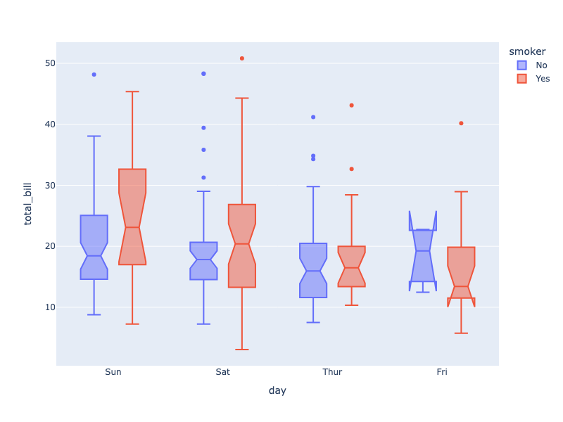

**Interactive Plot:**

<div>                        <script type="text/javascript">window.PlotlyConfig = {MathJaxConfig: 'local'};</script>
        <script charset="utf-8" src="https://cdn.plot.ly/plotly-3.1.0.min.js" integrity="sha256-Ei4740bWZhaUTQuD6q9yQlgVCMPBz6CZWhevDYPv93A=" crossorigin="anonymous"></script>                <div id="plotly-div-21" class="plotly-graph-div" style="height:100%; width:100%;"></div>            <script type="text/javascript">                window.PLOTLYENV=window.PLOTLYENV || {};                                if (document.getElementById("plotly-div-21")) {                    Plotly.newPlot(                        "plotly-div-21",                        [{"alignmentgroup":"True","hovertemplate":"smoker=No\u003cbr\u003eday=%{x}\u003cbr\u003etotal_bill=%{y}\u003cextra\u003e\u003c\u002fextra\u003e","legendgroup":"No","marker":{"color":"#636efa"},"name":"No","notched":true,"offsetgroup":"No","orientation":"v","showlegend":true,"x":["Sun","Sun","Sun","Sun","Sun","Sun","Sun","Sun","Sun","Sun","Sun","Sun","Sun","Sun","Sun","Sun","Sun","Sun","Sun","Sat","Sat","Sat","Sat","Sat","Sat","Sat","Sat","Sat","Sat","Sat","Sat","Sat","Sat","Sat","Sat","Sat","Sat","Sat","Sat","Sat","Sat","Sun","Sun","Sun","Sun","Sun","Sun","Sun","Sun","Sun","Sun","Sun","Sun","Sun","Sun","Sun","Sat","Sat","Sat","Sat","Sat","Sat","Sat","Sat","Sat","Sat","Thur","Thur","Thur","Thur","Thur","Thur","Thur","Thur","Thur","Thur","Thur","Fri","Fri","Fri","Sat","Sat","Sat","Sat","Sun","Sun","Sun","Sun","Sun","Thur","Thur","Thur","Thur","Thur","Thur","Thur","Thur","Thur","Thur","Thur","Thur","Thur","Thur","Thur","Thur","Thur","Thur","Thur","Thur","Thur","Thur","Thur","Thur","Thur","Thur","Thur","Thur","Thur","Thur","Thur","Thur","Sun","Sun","Sun","Sun","Sun","Sun","Sun","Sun","Sun","Sun","Sun","Sun","Sun","Sun","Sun","Sun","Sun","Sun","Thur","Sat","Fri","Sat","Sat","Sat","Sat","Sat","Sat","Sat","Sat","Thur"],"x0":" ","xaxis":"x","y":{"dtype":"f8","bdata":"PQrXo3D9MECuR+F6FK4kQMP1KFyPAjVArkfhehSuN0DXo3A9Cpc4QArXo3A9SjlACtejcD2KIUDhehSuR+E6QBSuR+F6FC5Aj8L1KFyPLUAK16NwPYokQOF6FK5HoUFA16NwPQrXLkCuR+F6FG4yQClcj8L1qC1AFK5H4XqUNUApXI\u002fC9agkQArXo3A9SjBAuB6F61H4MEBmZmZmZqY0QOxRuB6F6zFACtejcD1KNEAK16NwPYovQPYoXI\u002fCtUNAUrgehevRM0CPwvUoXM8xQD0K16NwvSpA4XoUrkdhKUAzMzMzM7M1QGZmZmZmpjNAmpmZmZkZI0CamZmZmVkyQB+F61G4Hi5AcT0K16OwNEBI4XoUrscxQI\u002fC9ShcDzhAj8L1KFxPMECuR+F6FO4wQHE9CtejsDJAhetRuB5FP0AK16NwPQowQPYoXI\u002fCdTFA4XoUrkfhK0Bcj8L1KFwjQGZmZmZmZj5ACtejcD1KMkB7FK5H4To2QDMzMzMzM0BAzczMzMyMPEAK16NwPQoyQBSuR+F6FClAFK5H4XqUJEBI4XoUrmdBQOF6FK5H4SNAj8L1KFyPOUA9CtejcH0zQClcj8L1aDpAw\u002fUoXI8iSEDXo3A9CpcxQBSuR+F6FDRAMzMzMzNzMEB7FK5H4To0QArXo3A9CihAUrgehesRMUD2KFyPwnUtQIXrUbgeBSVAMzMzMzMzO0DD9Shcj8I2QArXo3A9SjFAKVyPwvWoMECkcD0K1yMkQPYoXI\u002fC9S9ACtejcD1qQUCPwvUoXA8qQEjhehSuRzJA9ihcj8K1OEApXI\u002fC9Sg1QD0K16NwfTZAAAAAAADANkDsUbgehesoQOxRuB6F6zRAPQrXo3A9MkAAAAAAAAAsQAAAAAAAAB1AKVyPwvUIQ0AzMzMzM\u002fM3QPYoXI\u002fCtTlAj8L1KFxPMUCuR+F6FO49QM3MzMzMTCVAXI\u002fC9SjcKEAUrkfhehQ4QOF6FK5HYSdA16NwPQrXKkCF61G4HoUsQGZmZmZm5i9A9ihcj8L1KEDNzMzMzMw9QArXo3A9CiFACtejcD0KLUDD9Shcj8ImQFK4HoXr0TZAFK5H4XoUM0CF61G4HkU0QNejcD0KVyZAhetRuB6FKEDD9Shcj0IyQIXrUbgeBSFAKVyPwvWoJEDNzMzMzEwsQFK4HoXrUSpAuB6F61F4MUBmZmZmZiZBQLgehetRmERAzczMzMwMO0CuR+F6FG4wQDMzMzMzsyBApHA9CtejMkA9CtejcL0nQI\u002fC9ShcjyNACtejcD0KHkCkcD0K1yMsQMP1KFyPQipAw\u002fUoXI9CMUDNzMzMzIw4QIXrUbgexTNAmpmZmZnZPUD2KFyPwhVIQAAAAAAAADlASOF6FK7HKkA9CtejcH0wQAAAAAAAgDVAUrgehetRKUD2KFyPwjUwQB+F61G4nitAhetRuB6FOEDD9Shcj8I0QPYoXI\u002fCtT9AcT0K16OwNEA9CtejcD0eQArXo3A9KkhA9ihcj8L1L0AzMzMzM3M0QI\u002fC9ShcjypAuB6F61E4J0AK16NwPYolQKRwPQrXIyRACtejcD3qQUBI4XoUrgc9QFK4HoXr0TFASOF6FK7HMkA="},"y0":" ","yaxis":"y","type":"box"},{"alignmentgroup":"True","hovertemplate":"smoker=Yes\u003cbr\u003eday=%{x}\u003cbr\u003etotal_bill=%{y}\u003cextra\u003e\u003c\u002fextra\u003e","legendgroup":"Yes","marker":{"color":"#EF553B"},"name":"Yes","notched":true,"offsetgroup":"Yes","orientation":"v","showlegend":true,"x":["Sat","Sat","Sat","Sat","Sat","Sat","Sat","Sat","Sat","Sat","Sat","Thur","Thur","Fri","Fri","Fri","Fri","Fri","Fri","Fri","Fri","Fri","Sat","Sat","Sat","Sat","Sat","Sat","Thur","Sun","Sat","Sat","Sat","Sat","Sun","Sun","Sun","Sun","Sun","Sun","Sun","Sun","Sun","Sun","Sun","Sun","Sun","Sun","Sun","Sun","Sun","Sun","Thur","Thur","Thur","Thur","Thur","Thur","Thur","Thur","Thur","Thur","Thur","Thur","Thur","Thur","Sat","Sat","Sat","Sat","Sat","Sat","Sat","Sat","Sat","Sat","Sat","Sat","Sat","Fri","Fri","Fri","Fri","Fri","Fri","Sat","Sat","Sat","Sat","Sat","Sat","Sat","Sat"],"x0":" ","xaxis":"x","y":{"dtype":"f8","bdata":"4XoUrkcBQ0B7FK5H4XomQArXo3A9SjRAH4XrUbieK0AK16NwPQomQArXo3A9SjJAj8L1KFyPCECF61G4HgUuQFyPwvUo3DpASOF6FK5HOUDsUbgehesxQHE9CtejcDNA16NwPQpXQEC4HoXrUfg8QAAAAAAAABdAUrgehetRMED2KFyPwhVEQEjhehSuRztAj8L1KFwPKEDD9ShcjwI1QDMzMzMzsyZAw\u002fUoXI\u002fCLkBmZmZmZiZGQOxRuB6FazZAuB6F61G4LkA9CtejcH00QPYoXI\u002fCNTlAH4XrUbieLEAAAAAAAAAwQMP1KFyPgjFArkfhehQuJUDD9Shcj0IlQEjhehSuZ0lAH4XrUbieL0AAAAAAAAAdQJqZmZmZ2T9AUrgehevRMEAzMzMzM3NAQKRwPQrX4zFA9ihcj8L1LEAzMzMzMzMjQHE9CtejUEFAMzMzMzNTQUAUrkfhelQ3QM3MzMzMrEZA7FG4HoUrN0BmZmZmZkZEQGZmZmZm5jRA9ihcj8J1PkBmZmZmZiYyQJqZmZmZGTdA4XoUrkdhL0CPwvUoXM8zQHE9CtejcDxA9ihcj8L1LkAUrkfhepQwQK5H4XoUriRArkfhehSORUAAAAAAAAAqQIXrUbgeBStA9ihcj8K1MkB7FK5H4XopQAAAAAAAACpAZmZmZmZmMEBI4XoUroc0QLgehetReDBA16NwPQqXOkA9CtejcF1DQIXrUbgeRThAhetRuB6FKUCPwvUoXA8+QKRwPQrX4zlACtejcD2KKkDsUbgehSs8QM3MzMzMzClAZmZmZmYmPECuR+F6FC4nQPYoXI\u002fC9R5ApHA9CtcjPkBSuB6F61EoQNejcD0K1ypAKVyPwvUoIUDXo3A9CtcqQIXrUbgeRTBArkfhehQuJEAfhetRuB42QMP1KFyPAjhA4XoUrkdhL0CPwvUoXA8vQDMzMzMzMylACtejcD1qQECuR+F6FC47QOxRuB6FqzZA"},"y0":" ","yaxis":"y","type":"box"}],                        {"template":{"data":{"histogram2dcontour":[{"type":"histogram2dcontour","colorbar":{"outlinewidth":0,"ticks":""},"colorscale":[[0.0,"#0d0887"],[0.1111111111111111,"#46039f"],[0.2222222222222222,"#7201a8"],[0.3333333333333333,"#9c179e"],[0.4444444444444444,"#bd3786"],[0.5555555555555556,"#d8576b"],[0.6666666666666666,"#ed7953"],[0.7777777777777778,"#fb9f3a"],[0.8888888888888888,"#fdca26"],[1.0,"#f0f921"]]}],"choropleth":[{"type":"choropleth","colorbar":{"outlinewidth":0,"ticks":""}}],"histogram2d":[{"type":"histogram2d","colorbar":{"outlinewidth":0,"ticks":""},"colorscale":[[0.0,"#0d0887"],[0.1111111111111111,"#46039f"],[0.2222222222222222,"#7201a8"],[0.3333333333333333,"#9c179e"],[0.4444444444444444,"#bd3786"],[0.5555555555555556,"#d8576b"],[0.6666666666666666,"#ed7953"],[0.7777777777777778,"#fb9f3a"],[0.8888888888888888,"#fdca26"],[1.0,"#f0f921"]]}],"heatmap":[{"type":"heatmap","colorbar":{"outlinewidth":0,"ticks":""},"colorscale":[[0.0,"#0d0887"],[0.1111111111111111,"#46039f"],[0.2222222222222222,"#7201a8"],[0.3333333333333333,"#9c179e"],[0.4444444444444444,"#bd3786"],[0.5555555555555556,"#d8576b"],[0.6666666666666666,"#ed7953"],[0.7777777777777778,"#fb9f3a"],[0.8888888888888888,"#fdca26"],[1.0,"#f0f921"]]}],"contourcarpet":[{"type":"contourcarpet","colorbar":{"outlinewidth":0,"ticks":""}}],"contour":[{"type":"contour","colorbar":{"outlinewidth":0,"ticks":""},"colorscale":[[0.0,"#0d0887"],[0.1111111111111111,"#46039f"],[0.2222222222222222,"#7201a8"],[0.3333333333333333,"#9c179e"],[0.4444444444444444,"#bd3786"],[0.5555555555555556,"#d8576b"],[0.6666666666666666,"#ed7953"],[0.7777777777777778,"#fb9f3a"],[0.8888888888888888,"#fdca26"],[1.0,"#f0f921"]]}],"surface":[{"type":"surface","colorbar":{"outlinewidth":0,"ticks":""},"colorscale":[[0.0,"#0d0887"],[0.1111111111111111,"#46039f"],[0.2222222222222222,"#7201a8"],[0.3333333333333333,"#9c179e"],[0.4444444444444444,"#bd3786"],[0.5555555555555556,"#d8576b"],[0.6666666666666666,"#ed7953"],[0.7777777777777778,"#fb9f3a"],[0.8888888888888888,"#fdca26"],[1.0,"#f0f921"]]}],"mesh3d":[{"type":"mesh3d","colorbar":{"outlinewidth":0,"ticks":""}}],"scatter":[{"fillpattern":{"fillmode":"overlay","size":10,"solidity":0.2},"type":"scatter"}],"parcoords":[{"type":"parcoords","line":{"colorbar":{"outlinewidth":0,"ticks":""}}}],"scatterpolargl":[{"type":"scatterpolargl","marker":{"colorbar":{"outlinewidth":0,"ticks":""}}}],"bar":[{"error_x":{"color":"#2a3f5f"},"error_y":{"color":"#2a3f5f"},"marker":{"line":{"color":"#E5ECF6","width":0.5},"pattern":{"fillmode":"overlay","size":10,"solidity":0.2}},"type":"bar"}],"scattergeo":[{"type":"scattergeo","marker":{"colorbar":{"outlinewidth":0,"ticks":""}}}],"scatterpolar":[{"type":"scatterpolar","marker":{"colorbar":{"outlinewidth":0,"ticks":""}}}],"histogram":[{"marker":{"pattern":{"fillmode":"overlay","size":10,"solidity":0.2}},"type":"histogram"}],"scattergl":[{"type":"scattergl","marker":{"colorbar":{"outlinewidth":0,"ticks":""}}}],"scatter3d":[{"type":"scatter3d","line":{"colorbar":{"outlinewidth":0,"ticks":""}},"marker":{"colorbar":{"outlinewidth":0,"ticks":""}}}],"scattermap":[{"type":"scattermap","marker":{"colorbar":{"outlinewidth":0,"ticks":""}}}],"scattermapbox":[{"type":"scattermapbox","marker":{"colorbar":{"outlinewidth":0,"ticks":""}}}],"scatterternary":[{"type":"scatterternary","marker":{"colorbar":{"outlinewidth":0,"ticks":""}}}],"scattercarpet":[{"type":"scattercarpet","marker":{"colorbar":{"outlinewidth":0,"ticks":""}}}],"carpet":[{"aaxis":{"endlinecolor":"#2a3f5f","gridcolor":"white","linecolor":"white","minorgridcolor":"white","startlinecolor":"#2a3f5f"},"baxis":{"endlinecolor":"#2a3f5f","gridcolor":"white","linecolor":"white","minorgridcolor":"white","startlinecolor":"#2a3f5f"},"type":"carpet"}],"table":[{"cells":{"fill":{"color":"#EBF0F8"},"line":{"color":"white"}},"header":{"fill":{"color":"#C8D4E3"},"line":{"color":"white"}},"type":"table"}],"barpolar":[{"marker":{"line":{"color":"#E5ECF6","width":0.5},"pattern":{"fillmode":"overlay","size":10,"solidity":0.2}},"type":"barpolar"}],"pie":[{"automargin":true,"type":"pie"}]},"layout":{"autotypenumbers":"strict","colorway":["#636efa","#EF553B","#00cc96","#ab63fa","#FFA15A","#19d3f3","#FF6692","#B6E880","#FF97FF","#FECB52"],"font":{"color":"#2a3f5f"},"hovermode":"closest","hoverlabel":{"align":"left"},"paper_bgcolor":"white","plot_bgcolor":"#E5ECF6","polar":{"bgcolor":"#E5ECF6","angularaxis":{"gridcolor":"white","linecolor":"white","ticks":""},"radialaxis":{"gridcolor":"white","linecolor":"white","ticks":""}},"ternary":{"bgcolor":"#E5ECF6","aaxis":{"gridcolor":"white","linecolor":"white","ticks":""},"baxis":{"gridcolor":"white","linecolor":"white","ticks":""},"caxis":{"gridcolor":"white","linecolor":"white","ticks":""}},"coloraxis":{"colorbar":{"outlinewidth":0,"ticks":""}},"colorscale":{"sequential":[[0.0,"#0d0887"],[0.1111111111111111,"#46039f"],[0.2222222222222222,"#7201a8"],[0.3333333333333333,"#9c179e"],[0.4444444444444444,"#bd3786"],[0.5555555555555556,"#d8576b"],[0.6666666666666666,"#ed7953"],[0.7777777777777778,"#fb9f3a"],[0.8888888888888888,"#fdca26"],[1.0,"#f0f921"]],"sequentialminus":[[0.0,"#0d0887"],[0.1111111111111111,"#46039f"],[0.2222222222222222,"#7201a8"],[0.3333333333333333,"#9c179e"],[0.4444444444444444,"#bd3786"],[0.5555555555555556,"#d8576b"],[0.6666666666666666,"#ed7953"],[0.7777777777777778,"#fb9f3a"],[0.8888888888888888,"#fdca26"],[1.0,"#f0f921"]],"diverging":[[0,"#8e0152"],[0.1,"#c51b7d"],[0.2,"#de77ae"],[0.3,"#f1b6da"],[0.4,"#fde0ef"],[0.5,"#f7f7f7"],[0.6,"#e6f5d0"],[0.7,"#b8e186"],[0.8,"#7fbc41"],[0.9,"#4d9221"],[1,"#276419"]]},"xaxis":{"gridcolor":"white","linecolor":"white","ticks":"","title":{"standoff":15},"zerolinecolor":"white","automargin":true,"zerolinewidth":2},"yaxis":{"gridcolor":"white","linecolor":"white","ticks":"","title":{"standoff":15},"zerolinecolor":"white","automargin":true,"zerolinewidth":2},"scene":{"xaxis":{"backgroundcolor":"#E5ECF6","gridcolor":"white","linecolor":"white","showbackground":true,"ticks":"","zerolinecolor":"white","gridwidth":2},"yaxis":{"backgroundcolor":"#E5ECF6","gridcolor":"white","linecolor":"white","showbackground":true,"ticks":"","zerolinecolor":"white","gridwidth":2},"zaxis":{"backgroundcolor":"#E5ECF6","gridcolor":"white","linecolor":"white","showbackground":true,"ticks":"","zerolinecolor":"white","gridwidth":2}},"shapedefaults":{"line":{"color":"#2a3f5f"}},"annotationdefaults":{"arrowcolor":"#2a3f5f","arrowhead":0,"arrowwidth":1},"geo":{"bgcolor":"white","landcolor":"#E5ECF6","subunitcolor":"white","showland":true,"showlakes":true,"lakecolor":"white"},"title":{"x":0.05},"mapbox":{"style":"light"}}},"xaxis":{"anchor":"y","domain":[0.0,1.0],"title":{"text":"day"}},"yaxis":{"anchor":"x","domain":[0.0,1.0],"title":{"text":"total_bill"}},"legend":{"title":{"text":"smoker"},"tracegroupgap":0},"margin":{"t":60},"boxmode":"group"},                        {"responsive": true}                    )                };            </script>        </div>

**Read more about [violin plots](violin.md).**

```python
import plotly.express as px
df = px.data.tips()
fig = px.violin(df, y="tip", x="smoker", color="sex", box=True, points="all", hover_data=df.columns)
fig.show()
```

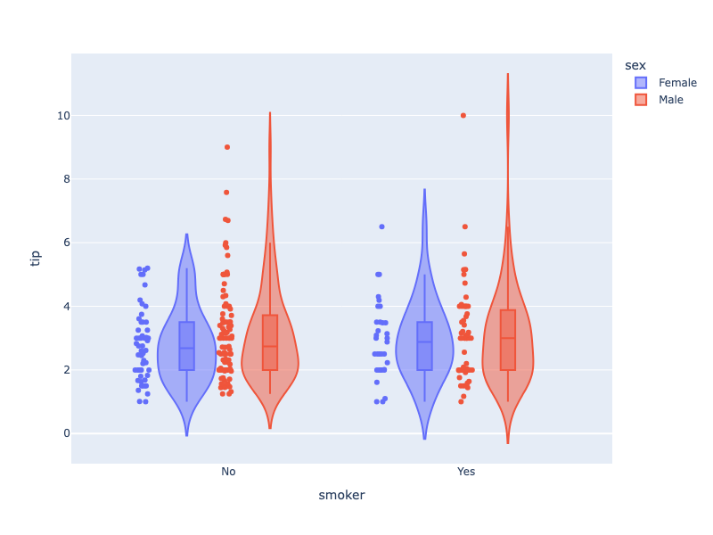

**Interactive Plot:**

<div>                        <script type="text/javascript">window.PlotlyConfig = {MathJaxConfig: 'local'};</script>
        <script charset="utf-8" src="https://cdn.plot.ly/plotly-3.1.0.min.js" integrity="sha256-Ei4740bWZhaUTQuD6q9yQlgVCMPBz6CZWhevDYPv93A=" crossorigin="anonymous"></script>                <div id="plotly-div-22" class="plotly-graph-div" style="height:100%; width:100%;"></div>            <script type="text/javascript">                window.PLOTLYENV=window.PLOTLYENV || {};                                if (document.getElementById("plotly-div-22")) {                    Plotly.newPlot(                        "plotly-div-22",                        [{"alignmentgroup":"True","box":{"visible":true},"customdata":[[16.99,"Female","Sun","Dinner",2],[24.59,"Female","Sun","Dinner",4],[35.26,"Female","Sun","Dinner",4],[14.83,"Female","Sun","Dinner",2],[10.33,"Female","Sun","Dinner",3],[16.97,"Female","Sun","Dinner",3],[20.29,"Female","Sat","Dinner",2],[15.77,"Female","Sat","Dinner",2],[19.65,"Female","Sat","Dinner",2],[15.06,"Female","Sat","Dinner",2],[20.69,"Female","Sat","Dinner",4],[16.93,"Female","Sat","Dinner",3],[10.29,"Female","Sun","Dinner",2],[34.81,"Female","Sun","Dinner",4],[26.41,"Female","Sat","Dinner",2],[16.45,"Female","Sat","Dinner",2],[3.07,"Female","Sat","Dinner",1],[17.07,"Female","Sat","Dinner",3],[26.86,"Female","Sat","Dinner",2],[25.28,"Female","Sat","Dinner",2],[14.73,"Female","Sat","Dinner",2],[10.07,"Female","Thur","Lunch",1],[34.83,"Female","Thur","Lunch",4],[5.75,"Female","Fri","Dinner",2],[16.32,"Female","Fri","Dinner",2],[22.75,"Female","Fri","Dinner",2],[11.35,"Female","Fri","Dinner",2],[15.38,"Female","Fri","Dinner",2],[44.3,"Female","Sat","Dinner",3],[22.42,"Female","Sat","Dinner",2],[20.92,"Female","Sat","Dinner",2],[14.31,"Female","Sat","Dinner",2],[7.25,"Female","Sat","Dinner",1],[25.71,"Female","Sun","Dinner",3],[17.31,"Female","Sun","Dinner",2],[10.65,"Female","Thur","Lunch",2],[12.43,"Female","Thur","Lunch",2],[24.08,"Female","Thur","Lunch",4],[13.42,"Female","Thur","Lunch",2],[12.48,"Female","Thur","Lunch",2],[29.8,"Female","Thur","Lunch",6],[14.52,"Female","Thur","Lunch",2],[11.38,"Female","Thur","Lunch",2],[20.27,"Female","Thur","Lunch",2],[11.17,"Female","Thur","Lunch",2],[12.26,"Female","Thur","Lunch",2],[18.26,"Female","Thur","Lunch",2],[8.51,"Female","Thur","Lunch",2],[10.33,"Female","Thur","Lunch",2],[14.15,"Female","Thur","Lunch",2],[13.16,"Female","Thur","Lunch",2],[17.47,"Female","Thur","Lunch",2],[27.05,"Female","Thur","Lunch",6],[16.43,"Female","Thur","Lunch",2],[8.35,"Female","Thur","Lunch",2],[18.64,"Female","Thur","Lunch",3],[11.87,"Female","Thur","Lunch",2],[29.85,"Female","Sun","Dinner",5],[25.0,"Female","Sun","Dinner",4],[13.39,"Female","Sun","Dinner",2],[16.21,"Female","Sun","Dinner",3],[17.51,"Female","Sun","Dinner",2],[10.59,"Female","Sat","Dinner",2],[10.63,"Female","Sat","Dinner",2],[9.6,"Female","Sun","Dinner",2],[20.9,"Female","Sun","Dinner",3],[18.15,"Female","Sun","Dinner",3],[19.81,"Female","Thur","Lunch",2],[43.11,"Female","Thur","Lunch",4],[13.0,"Female","Thur","Lunch",2],[12.74,"Female","Thur","Lunch",2],[13.0,"Female","Thur","Lunch",2],[16.4,"Female","Thur","Lunch",2],[16.47,"Female","Thur","Lunch",3],[12.76,"Female","Sat","Dinner",2],[13.27,"Female","Sat","Dinner",2],[28.17,"Female","Sat","Dinner",3],[12.9,"Female","Sat","Dinner",2],[30.14,"Female","Sat","Dinner",4],[13.42,"Female","Fri","Lunch",2],[15.98,"Female","Fri","Lunch",3],[16.27,"Female","Fri","Lunch",2],[10.09,"Female","Fri","Lunch",2],[22.12,"Female","Sat","Dinner",2],[35.83,"Female","Sat","Dinner",3],[27.18,"Female","Sat","Dinner",2],[18.78,"Female","Thur","Dinner",2]],"hovertemplate":"sex=%{customdata[1]}\u003cbr\u003esmoker=%{x}\u003cbr\u003etip=%{y}\u003cbr\u003etotal_bill=%{customdata[0]}\u003cbr\u003eday=%{customdata[2]}\u003cbr\u003etime=%{customdata[3]}\u003cbr\u003esize=%{customdata[4]}\u003cextra\u003e\u003c\u002fextra\u003e","legendgroup":"Female","marker":{"color":"#636efa"},"name":"Female","offsetgroup":"Female","orientation":"v","points":"all","scalegroup":"True","showlegend":true,"x":["No","No","No","No","No","No","No","No","No","No","No","No","No","No","No","No","Yes","No","Yes","Yes","No","No","No","Yes","Yes","No","Yes","Yes","Yes","Yes","No","Yes","No","No","No","No","No","No","No","No","No","No","No","No","No","No","No","No","No","No","No","No","No","No","No","No","No","No","No","No","No","Yes","Yes","Yes","Yes","Yes","Yes","Yes","Yes","Yes","Yes","Yes","Yes","Yes","Yes","Yes","Yes","Yes","Yes","Yes","No","Yes","Yes","Yes","No","Yes","No"],"x0":" ","xaxis":"x","y":{"dtype":"f8","bdata":"KVyPwvUo8D\u002fhehSuR+EMQAAAAAAAABRAKVyPwvUoCEC4HoXrUbj6PwAAAAAAAAxAAAAAAAAABkDXo3A9CtcBQAAAAAAAAAhAAAAAAAAACECamZmZmZkDQI\u002fC9ShcjwhAzczMzMzMBEDNzMzMzMwUQAAAAAAAAPg\u002fw\u002fUoXI\u002fCA0AAAAAAAADwPwAAAAAAAAhAH4XrUbgeCUAAAAAAAAAUQJqZmZmZmQFASOF6FK5H\u002fT+uR+F6FK4UQAAAAAAAAPA\u002fMzMzMzMzEUAAAAAAAAAKQAAAAAAAAARAAAAAAAAACEAAAAAAAAAEQNejcD0K1wtAUrgehetREEAAAAAAAAAQQAAAAAAAAPA\u002fAAAAAAAAEEAAAAAAAAAMQAAAAAAAAPg\u002fzczMzMzM\u002fD9cj8L1KFwHQOF6FK5H4fo\u002fKVyPwvUoBEDNzMzMzMwQQAAAAAAAAABAAAAAAAAAAECkcD0K16MGQAAAAAAAAPg\u002fAAAAAAAAAEAAAAAAAAAKQAAAAAAAAPQ\u002fAAAAAAAAAEAAAAAAAAAAQAAAAAAAAAZAAAAAAAAADEAAAAAAAAAUQGZmZmZmZgJAAAAAAAAA+D\u002fD9Shcj8L1PxSuR+F6FPo\u002fj8L1KFyPFEAAAAAAAAAOQOF6FK5H4QRAAAAAAAAAAEAAAAAAAAAIQMP1KFyPwvk\u002fAAAAAAAAAEAAAAAAAAAQQAAAAAAAAAxAAAAAAAAADEDD9Shcj8IQQAAAAAAAABRAAAAAAAAAAEAUrkfhehQAQAAAAAAAAABAAAAAAAAABEDXo3A9CtcJQNejcD0K1wFAAAAAAAAABEAAAAAAAAAaQJqZmZmZmfE\u002fuB6F61G4CEDXo3A9CtcLQAAAAAAAAAhAAAAAAAAABEAAAAAAAAAAQArXo3A9CgdArkfhehSuEkAAAAAAAAAAQAAAAAAAAAhA"},"y0":" ","yaxis":"y","type":"violin"},{"alignmentgroup":"True","box":{"visible":true},"customdata":[[10.34,"Male","Sun","Dinner",3],[21.01,"Male","Sun","Dinner",3],[23.68,"Male","Sun","Dinner",2],[25.29,"Male","Sun","Dinner",4],[8.77,"Male","Sun","Dinner",2],[26.88,"Male","Sun","Dinner",4],[15.04,"Male","Sun","Dinner",2],[14.78,"Male","Sun","Dinner",2],[10.27,"Male","Sun","Dinner",2],[15.42,"Male","Sun","Dinner",2],[18.43,"Male","Sun","Dinner",4],[21.58,"Male","Sun","Dinner",2],[16.29,"Male","Sun","Dinner",3],[20.65,"Male","Sat","Dinner",3],[17.92,"Male","Sat","Dinner",2],[39.42,"Male","Sat","Dinner",4],[19.82,"Male","Sat","Dinner",2],[17.81,"Male","Sat","Dinner",4],[13.37,"Male","Sat","Dinner",2],[12.69,"Male","Sat","Dinner",2],[21.7,"Male","Sat","Dinner",2],[9.55,"Male","Sat","Dinner",2],[18.35,"Male","Sat","Dinner",4],[17.78,"Male","Sat","Dinner",2],[24.06,"Male","Sat","Dinner",3],[16.31,"Male","Sat","Dinner",3],[18.69,"Male","Sat","Dinner",3],[31.27,"Male","Sat","Dinner",3],[16.04,"Male","Sat","Dinner",3],[17.46,"Male","Sun","Dinner",2],[13.94,"Male","Sun","Dinner",2],[9.68,"Male","Sun","Dinner",2],[30.4,"Male","Sun","Dinner",4],[18.29,"Male","Sun","Dinner",2],[22.23,"Male","Sun","Dinner",2],[32.4,"Male","Sun","Dinner",4],[28.55,"Male","Sun","Dinner",3],[18.04,"Male","Sun","Dinner",2],[12.54,"Male","Sun","Dinner",2],[9.94,"Male","Sun","Dinner",2],[25.56,"Male","Sun","Dinner",4],[19.49,"Male","Sun","Dinner",2],[38.01,"Male","Sat","Dinner",4],[11.24,"Male","Sat","Dinner",2],[48.27,"Male","Sat","Dinner",4],[20.29,"Male","Sat","Dinner",2],[13.81,"Male","Sat","Dinner",2],[11.02,"Male","Sat","Dinner",2],[18.29,"Male","Sat","Dinner",4],[17.59,"Male","Sat","Dinner",3],[20.08,"Male","Sat","Dinner",3],[20.23,"Male","Sat","Dinner",2],[15.01,"Male","Sat","Dinner",2],[12.02,"Male","Sat","Dinner",2],[10.51,"Male","Sat","Dinner",2],[17.92,"Male","Sat","Dinner",2],[27.2,"Male","Thur","Lunch",4],[22.76,"Male","Thur","Lunch",2],[17.29,"Male","Thur","Lunch",2],[19.44,"Male","Thur","Lunch",2],[16.66,"Male","Thur","Lunch",2],[32.68,"Male","Thur","Lunch",2],[15.98,"Male","Thur","Lunch",2],[13.03,"Male","Thur","Lunch",2],[18.28,"Male","Thur","Lunch",2],[24.71,"Male","Thur","Lunch",2],[21.16,"Male","Thur","Lunch",2],[28.97,"Male","Fri","Dinner",2],[22.49,"Male","Fri","Dinner",2],[40.17,"Male","Fri","Dinner",4],[27.28,"Male","Fri","Dinner",2],[12.03,"Male","Fri","Dinner",2],[21.01,"Male","Fri","Dinner",2],[12.46,"Male","Fri","Dinner",2],[15.36,"Male","Sat","Dinner",2],[20.49,"Male","Sat","Dinner",2],[25.21,"Male","Sat","Dinner",2],[18.24,"Male","Sat","Dinner",2],[14.0,"Male","Sat","Dinner",2],[38.07,"Male","Sun","Dinner",3],[23.95,"Male","Sun","Dinner",2],[29.93,"Male","Sun","Dinner",4],[11.69,"Male","Thur","Lunch",2],[14.26,"Male","Thur","Lunch",2],[15.95,"Male","Thur","Lunch",2],[8.52,"Male","Thur","Lunch",2],[22.82,"Male","Thur","Lunch",3],[19.08,"Male","Thur","Lunch",2],[16.0,"Male","Thur","Lunch",2],[34.3,"Male","Thur","Lunch",6],[41.19,"Male","Thur","Lunch",5],[9.78,"Male","Thur","Lunch",2],[7.51,"Male","Thur","Lunch",2],[14.07,"Male","Sun","Dinner",2],[13.13,"Male","Sun","Dinner",2],[17.26,"Male","Sun","Dinner",3],[24.55,"Male","Sun","Dinner",4],[19.77,"Male","Sun","Dinner",4],[48.17,"Male","Sun","Dinner",6],[16.49,"Male","Sun","Dinner",4],[21.5,"Male","Sun","Dinner",4],[12.66,"Male","Sun","Dinner",2],[13.81,"Male","Sun","Dinner",2],[24.52,"Male","Sun","Dinner",3],[20.76,"Male","Sun","Dinner",2],[31.71,"Male","Sun","Dinner",4],[50.81,"Male","Sat","Dinner",3],[15.81,"Male","Sat","Dinner",2],[7.25,"Male","Sun","Dinner",2],[31.85,"Male","Sun","Dinner",2],[16.82,"Male","Sun","Dinner",2],[32.9,"Male","Sun","Dinner",2],[17.89,"Male","Sun","Dinner",2],[14.48,"Male","Sun","Dinner",2],[34.63,"Male","Sun","Dinner",2],[34.65,"Male","Sun","Dinner",4],[23.33,"Male","Sun","Dinner",2],[45.35,"Male","Sun","Dinner",3],[23.17,"Male","Sun","Dinner",4],[40.55,"Male","Sun","Dinner",2],[20.69,"Male","Sun","Dinner",5],[30.46,"Male","Sun","Dinner",5],[23.1,"Male","Sun","Dinner",3],[15.69,"Male","Sun","Dinner",2],[28.44,"Male","Thur","Lunch",2],[15.48,"Male","Thur","Lunch",2],[16.58,"Male","Thur","Lunch",2],[7.56,"Male","Thur","Lunch",2],[10.34,"Male","Thur","Lunch",2],[13.51,"Male","Thur","Lunch",2],[18.71,"Male","Thur","Lunch",3],[20.53,"Male","Thur","Lunch",4],[26.59,"Male","Sat","Dinner",3],[38.73,"Male","Sat","Dinner",4],[24.27,"Male","Sat","Dinner",2],[30.06,"Male","Sat","Dinner",3],[25.89,"Male","Sat","Dinner",4],[48.33,"Male","Sat","Dinner",4],[28.15,"Male","Sat","Dinner",5],[11.59,"Male","Sat","Dinner",2],[7.74,"Male","Sat","Dinner",2],[12.16,"Male","Fri","Lunch",2],[8.58,"Male","Fri","Lunch",1],[13.42,"Male","Fri","Lunch",2],[20.45,"Male","Sat","Dinner",4],[13.28,"Male","Sat","Dinner",2],[24.01,"Male","Sat","Dinner",4],[15.69,"Male","Sat","Dinner",3],[11.61,"Male","Sat","Dinner",2],[10.77,"Male","Sat","Dinner",2],[15.53,"Male","Sat","Dinner",2],[10.07,"Male","Sat","Dinner",2],[12.6,"Male","Sat","Dinner",2],[32.83,"Male","Sat","Dinner",2],[29.03,"Male","Sat","Dinner",3],[22.67,"Male","Sat","Dinner",2],[17.82,"Male","Sat","Dinner",2]],"hovertemplate":"sex=%{customdata[1]}\u003cbr\u003esmoker=%{x}\u003cbr\u003etip=%{y}\u003cbr\u003etotal_bill=%{customdata[0]}\u003cbr\u003eday=%{customdata[2]}\u003cbr\u003etime=%{customdata[3]}\u003cbr\u003esize=%{customdata[4]}\u003cextra\u003e\u003c\u002fextra\u003e","legendgroup":"Male","marker":{"color":"#EF553B"},"name":"Male","offsetgroup":"Male","orientation":"v","points":"all","scalegroup":"True","showlegend":true,"x":["No","No","No","No","No","No","No","No","No","No","No","No","No","No","No","No","No","No","No","No","No","No","No","No","No","No","No","No","No","No","No","No","No","No","No","No","No","No","No","No","No","No","Yes","Yes","No","Yes","Yes","Yes","Yes","No","No","No","Yes","No","No","Yes","No","No","No","Yes","No","Yes","No","No","No","No","No","Yes","No","Yes","Yes","Yes","Yes","No","Yes","Yes","Yes","No","No","No","No","No","No","No","No","No","No","No","Yes","No","No","No","No","No","No","No","No","No","No","No","No","No","No","No","No","No","Yes","Yes","Yes","Yes","Yes","Yes","Yes","Yes","Yes","Yes","Yes","Yes","Yes","Yes","No","Yes","Yes","Yes","Yes","Yes","Yes","No","Yes","Yes","Yes","Yes","Yes","Yes","Yes","Yes","Yes","No","Yes","Yes","Yes","Yes","Yes","Yes","No","No","Yes","Yes","No","No","Yes","No","Yes","Yes","No","Yes","No"],"x0":" ","xaxis":"x","y":{"dtype":"f8","bdata":"j8L1KFyP+j8AAAAAAAAMQHsUrkfhegpA16NwPQrXEkAAAAAAAAAAQPYoXI\u002fC9QhAXI\u002fC9Shc\u002fz\u002fXo3A9CtcJQFyPwvUoXPs\u002fH4XrUbge+T8AAAAAAAAIQFyPwvUoXA9ArkfhehSuDUDNzMzMzMwKQFK4HoXrURBAUrgehetRHkBxPQrXo3AJQLgehetRuAJAAAAAAAAAAEAAAAAAAAAAQDMzMzMzMxFAMzMzMzMz9z8AAAAAAAAEQClcj8L1KApAzczMzMzMDEAAAAAAAAAAQHsUrkfhegJAAAAAAAAAFEDsUbgehesBQFK4HoXrUQRAexSuR+F6CEAfhetRuB71P2ZmZmZmZhZAAAAAAAAACEAAAAAAAAAUQAAAAAAAABhAZmZmZmZmAEAAAAAAAAAIQAAAAAAAAARA9ihcj8L1+D9cj8L1KFwRQBSuR+F6FAxAAAAAAAAACEApXI\u002fC9Sj8P+xRuB6F6xpArkfhehSuCUAAAAAAAAAAQK5H4XoUrv8\u002fFK5H4XoUDkAfhetRuB4FQDMzMzMzMwlAFK5H4XoUAEC4HoXrUbgAQIXrUbgehf8\u002fAAAAAAAA9D+kcD0K16MIQAAAAAAAABBAAAAAAAAACECuR+F6FK4FQAAAAAAAAAhAMzMzMzMzC0AAAAAAAAAUQD0K16NwPQBAAAAAAAAAAEAAAAAAAAAQQGZmZmZmZhdAAAAAAAAACEAAAAAAAAAIQAAAAAAAAAxA7FG4HoXrEkAAAAAAAAAQQAAAAAAAAPg\u002fAAAAAAAACEAAAAAAAAD4Pz0K16NwPfo\u002fPQrXo3A9EEApXI\u002fC9SgRQBSuR+F6FA5AAAAAAAAACEAAAAAAAAAQQGZmZmZmZgRASOF6FK5HFEB7FK5H4XoCQAAAAAAAAARAAAAAAAAAAECuR+F6FK73P3E9CtejcAFAAAAAAAAA+D8AAAAAAAAAQM3MzMzMzBpAAAAAAAAAFECuR+F6FK77PwAAAAAAAABAAAAAAAAABEAAAAAAAAAAQOxRuB6F6wVAAAAAAAAAAEAAAAAAAAAAQAAAAAAAABRAAAAAAAAAAEAAAAAAAAAMQAAAAAAAAARAAAAAAAAAAEDXo3A9CtcLQOxRuB6F6wFAAAAAAAAAEkAAAAAAAAAkQEjhehSuRwlAmpmZmZmZFEBxPQrXo3AJQAAAAAAAABBA4XoUrkfhCEAAAAAAAAAAQAAAAAAAAABAZmZmZmZmDEBxPQrXo3ANQJqZmZmZmRZAAAAAAAAADEAAAAAAAAAaQAAAAAAAAAhAAAAAAAAAFEAAAAAAAAAAQAAAAAAAABBAAAAAAAAA+D97FK5H4XoEQClcj8L1KABAAAAAAAAAEEAK16NwPQr3PwAAAAAAAABAAAAAAAAAAEAAAAAAAAAQQAAAAAAAABBASOF6FK5HC0AAAAAAAAAIQD0K16NwPQBAAAAAAAAAAECkcD0K16MUQAAAAAAAACJAAAAAAAAACEAAAAAAAAD4PwrXo3A9Cvc\u002fmpmZmZmZAUC4HoXrUbj+P0jhehSuR\u002fk\u002fAAAAAAAACEDD9Shcj8IFQAAAAAAAAABAAAAAAAAACEAfhetRuB4LQIXrUbgehfc\u002fAAAAAAAACEAAAAAAAAD0PwAAAAAAAPA\u002fuB6F61G48j+uR+F6FK4XQAAAAAAAAABAAAAAAAAA\u002fD8="},"y0":" ","yaxis":"y","type":"violin"}],                        {"template":{"data":{"histogram2dcontour":[{"type":"histogram2dcontour","colorbar":{"outlinewidth":0,"ticks":""},"colorscale":[[0.0,"#0d0887"],[0.1111111111111111,"#46039f"],[0.2222222222222222,"#7201a8"],[0.3333333333333333,"#9c179e"],[0.4444444444444444,"#bd3786"],[0.5555555555555556,"#d8576b"],[0.6666666666666666,"#ed7953"],[0.7777777777777778,"#fb9f3a"],[0.8888888888888888,"#fdca26"],[1.0,"#f0f921"]]}],"choropleth":[{"type":"choropleth","colorbar":{"outlinewidth":0,"ticks":""}}],"histogram2d":[{"type":"histogram2d","colorbar":{"outlinewidth":0,"ticks":""},"colorscale":[[0.0,"#0d0887"],[0.1111111111111111,"#46039f"],[0.2222222222222222,"#7201a8"],[0.3333333333333333,"#9c179e"],[0.4444444444444444,"#bd3786"],[0.5555555555555556,"#d8576b"],[0.6666666666666666,"#ed7953"],[0.7777777777777778,"#fb9f3a"],[0.8888888888888888,"#fdca26"],[1.0,"#f0f921"]]}],"heatmap":[{"type":"heatmap","colorbar":{"outlinewidth":0,"ticks":""},"colorscale":[[0.0,"#0d0887"],[0.1111111111111111,"#46039f"],[0.2222222222222222,"#7201a8"],[0.3333333333333333,"#9c179e"],[0.4444444444444444,"#bd3786"],[0.5555555555555556,"#d8576b"],[0.6666666666666666,"#ed7953"],[0.7777777777777778,"#fb9f3a"],[0.8888888888888888,"#fdca26"],[1.0,"#f0f921"]]}],"contourcarpet":[{"type":"contourcarpet","colorbar":{"outlinewidth":0,"ticks":""}}],"contour":[{"type":"contour","colorbar":{"outlinewidth":0,"ticks":""},"colorscale":[[0.0,"#0d0887"],[0.1111111111111111,"#46039f"],[0.2222222222222222,"#7201a8"],[0.3333333333333333,"#9c179e"],[0.4444444444444444,"#bd3786"],[0.5555555555555556,"#d8576b"],[0.6666666666666666,"#ed7953"],[0.7777777777777778,"#fb9f3a"],[0.8888888888888888,"#fdca26"],[1.0,"#f0f921"]]}],"surface":[{"type":"surface","colorbar":{"outlinewidth":0,"ticks":""},"colorscale":[[0.0,"#0d0887"],[0.1111111111111111,"#46039f"],[0.2222222222222222,"#7201a8"],[0.3333333333333333,"#9c179e"],[0.4444444444444444,"#bd3786"],[0.5555555555555556,"#d8576b"],[0.6666666666666666,"#ed7953"],[0.7777777777777778,"#fb9f3a"],[0.8888888888888888,"#fdca26"],[1.0,"#f0f921"]]}],"mesh3d":[{"type":"mesh3d","colorbar":{"outlinewidth":0,"ticks":""}}],"scatter":[{"fillpattern":{"fillmode":"overlay","size":10,"solidity":0.2},"type":"scatter"}],"parcoords":[{"type":"parcoords","line":{"colorbar":{"outlinewidth":0,"ticks":""}}}],"scatterpolargl":[{"type":"scatterpolargl","marker":{"colorbar":{"outlinewidth":0,"ticks":""}}}],"bar":[{"error_x":{"color":"#2a3f5f"},"error_y":{"color":"#2a3f5f"},"marker":{"line":{"color":"#E5ECF6","width":0.5},"pattern":{"fillmode":"overlay","size":10,"solidity":0.2}},"type":"bar"}],"scattergeo":[{"type":"scattergeo","marker":{"colorbar":{"outlinewidth":0,"ticks":""}}}],"scatterpolar":[{"type":"scatterpolar","marker":{"colorbar":{"outlinewidth":0,"ticks":""}}}],"histogram":[{"marker":{"pattern":{"fillmode":"overlay","size":10,"solidity":0.2}},"type":"histogram"}],"scattergl":[{"type":"scattergl","marker":{"colorbar":{"outlinewidth":0,"ticks":""}}}],"scatter3d":[{"type":"scatter3d","line":{"colorbar":{"outlinewidth":0,"ticks":""}},"marker":{"colorbar":{"outlinewidth":0,"ticks":""}}}],"scattermap":[{"type":"scattermap","marker":{"colorbar":{"outlinewidth":0,"ticks":""}}}],"scattermapbox":[{"type":"scattermapbox","marker":{"colorbar":{"outlinewidth":0,"ticks":""}}}],"scatterternary":[{"type":"scatterternary","marker":{"colorbar":{"outlinewidth":0,"ticks":""}}}],"scattercarpet":[{"type":"scattercarpet","marker":{"colorbar":{"outlinewidth":0,"ticks":""}}}],"carpet":[{"aaxis":{"endlinecolor":"#2a3f5f","gridcolor":"white","linecolor":"white","minorgridcolor":"white","startlinecolor":"#2a3f5f"},"baxis":{"endlinecolor":"#2a3f5f","gridcolor":"white","linecolor":"white","minorgridcolor":"white","startlinecolor":"#2a3f5f"},"type":"carpet"}],"table":[{"cells":{"fill":{"color":"#EBF0F8"},"line":{"color":"white"}},"header":{"fill":{"color":"#C8D4E3"},"line":{"color":"white"}},"type":"table"}],"barpolar":[{"marker":{"line":{"color":"#E5ECF6","width":0.5},"pattern":{"fillmode":"overlay","size":10,"solidity":0.2}},"type":"barpolar"}],"pie":[{"automargin":true,"type":"pie"}]},"layout":{"autotypenumbers":"strict","colorway":["#636efa","#EF553B","#00cc96","#ab63fa","#FFA15A","#19d3f3","#FF6692","#B6E880","#FF97FF","#FECB52"],"font":{"color":"#2a3f5f"},"hovermode":"closest","hoverlabel":{"align":"left"},"paper_bgcolor":"white","plot_bgcolor":"#E5ECF6","polar":{"bgcolor":"#E5ECF6","angularaxis":{"gridcolor":"white","linecolor":"white","ticks":""},"radialaxis":{"gridcolor":"white","linecolor":"white","ticks":""}},"ternary":{"bgcolor":"#E5ECF6","aaxis":{"gridcolor":"white","linecolor":"white","ticks":""},"baxis":{"gridcolor":"white","linecolor":"white","ticks":""},"caxis":{"gridcolor":"white","linecolor":"white","ticks":""}},"coloraxis":{"colorbar":{"outlinewidth":0,"ticks":""}},"colorscale":{"sequential":[[0.0,"#0d0887"],[0.1111111111111111,"#46039f"],[0.2222222222222222,"#7201a8"],[0.3333333333333333,"#9c179e"],[0.4444444444444444,"#bd3786"],[0.5555555555555556,"#d8576b"],[0.6666666666666666,"#ed7953"],[0.7777777777777778,"#fb9f3a"],[0.8888888888888888,"#fdca26"],[1.0,"#f0f921"]],"sequentialminus":[[0.0,"#0d0887"],[0.1111111111111111,"#46039f"],[0.2222222222222222,"#7201a8"],[0.3333333333333333,"#9c179e"],[0.4444444444444444,"#bd3786"],[0.5555555555555556,"#d8576b"],[0.6666666666666666,"#ed7953"],[0.7777777777777778,"#fb9f3a"],[0.8888888888888888,"#fdca26"],[1.0,"#f0f921"]],"diverging":[[0,"#8e0152"],[0.1,"#c51b7d"],[0.2,"#de77ae"],[0.3,"#f1b6da"],[0.4,"#fde0ef"],[0.5,"#f7f7f7"],[0.6,"#e6f5d0"],[0.7,"#b8e186"],[0.8,"#7fbc41"],[0.9,"#4d9221"],[1,"#276419"]]},"xaxis":{"gridcolor":"white","linecolor":"white","ticks":"","title":{"standoff":15},"zerolinecolor":"white","automargin":true,"zerolinewidth":2},"yaxis":{"gridcolor":"white","linecolor":"white","ticks":"","title":{"standoff":15},"zerolinecolor":"white","automargin":true,"zerolinewidth":2},"scene":{"xaxis":{"backgroundcolor":"#E5ECF6","gridcolor":"white","linecolor":"white","showbackground":true,"ticks":"","zerolinecolor":"white","gridwidth":2},"yaxis":{"backgroundcolor":"#E5ECF6","gridcolor":"white","linecolor":"white","showbackground":true,"ticks":"","zerolinecolor":"white","gridwidth":2},"zaxis":{"backgroundcolor":"#E5ECF6","gridcolor":"white","linecolor":"white","showbackground":true,"ticks":"","zerolinecolor":"white","gridwidth":2}},"shapedefaults":{"line":{"color":"#2a3f5f"}},"annotationdefaults":{"arrowcolor":"#2a3f5f","arrowhead":0,"arrowwidth":1},"geo":{"bgcolor":"white","landcolor":"#E5ECF6","subunitcolor":"white","showland":true,"showlakes":true,"lakecolor":"white"},"title":{"x":0.05},"mapbox":{"style":"light"}}},"xaxis":{"anchor":"y","domain":[0.0,1.0],"title":{"text":"smoker"}},"yaxis":{"anchor":"x","domain":[0.0,1.0],"title":{"text":"tip"}},"legend":{"title":{"text":"sex"},"tracegroupgap":0},"margin":{"t":60},"violinmode":"group"},                        {"responsive": true}                    )                };            </script>        </div>

**Read more about [Empirical Cumulative Distribution Function (ECDF) charts](https://plotly.com/python/ecdf-plots/).**

```python
import plotly.express as px
df = px.data.tips()
fig = px.ecdf(df, x="total_bill", color="sex")
fig.show()
```

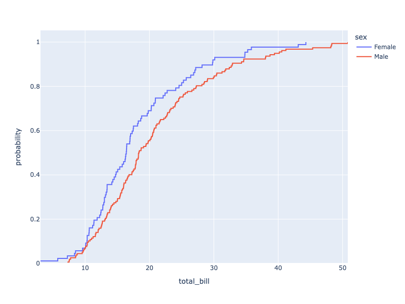

**Interactive Plot:**

<div>                        <script type="text/javascript">window.PlotlyConfig = {MathJaxConfig: 'local'};</script>
        <script charset="utf-8" src="https://cdn.plot.ly/plotly-3.1.0.min.js" integrity="sha256-Ei4740bWZhaUTQuD6q9yQlgVCMPBz6CZWhevDYPv93A=" crossorigin="anonymous"></script>                <div id="plotly-div-23" class="plotly-graph-div" style="height:100%; width:100%;"></div>            <script type="text/javascript">                window.PLOTLYENV=window.PLOTLYENV || {};                                if (document.getElementById("plotly-div-23")) {                    Plotly.newPlot(                        "plotly-div-23",                        [{"hovertemplate":"sex=Female\u003cbr\u003etotal_bill=%{x}\u003cbr\u003eprobability=%{y}\u003cextra\u003e\u003c\u002fextra\u003e","legendgroup":"Female","line":{"dash":"solid","shape":"hv"},"marker":{"color":"#636efa","symbol":"circle"},"mode":"lines","name":"Female","orientation":"v","showlegend":true,"x":{"dtype":"f8","bdata":"j8L1KFyPCEAAAAAAAAAXQAAAAAAAAB1AMzMzMzOzIECF61G4HgUhQDMzMzMzMyNApHA9CtcjJECuR+F6FC4kQBSuR+F6lCRAKVyPwvWoJEApXI\u002fC9agkQK5H4XoULiVAw\u002fUoXI9CJUDNzMzMzEwlQNejcD0KVyZAMzMzMzOzJkDD9Shcj8ImQD0K16NwvSdAhetRuB6FKEBcj8L1KNwoQPYoXI\u002fC9ShAexSuR+F6KUCF61G4HoUpQM3MzMzMzClAAAAAAAAAKkAAAAAAAAAqQFK4HoXrUSpACtejcD2KKkBI4XoUrscqQNejcD0K1ypA16NwPQrXKkDNzMzMzEwsQB+F61G4nixACtejcD0KLUD2KFyPwnUtQClcj8L1qC1AH4XrUbgeLkDD9Shcj8IuQArXo3A9ii9A9ihcj8L1L0D2KFyPwjUwQIXrUbgeRTBAUrgehetRMEBmZmZmZmYwQK5H4XoUbjBAMzMzMzNzMEC4HoXrUXgwQK5H4XoU7jBAuB6F61H4MEA9CtejcP0wQFK4HoXrETFAj8L1KFxPMUC4HoXrUXgxQMP1KFyPgjFAZmZmZmYmMkDD9Shcj0IyQKRwPQrXozJASOF6FK7HMkBmZmZmZqYzQI\u002fC9ShczzNAhetRuB5FNEAK16NwPUo0QHE9CtejsDRAZmZmZmbmNEDsUbgehes0QB+F61G4HjZA7FG4HoVrNkAAAAAAAMA2QBSuR+F6FDhA16NwPQqXOEAAAAAAAAA5QEjhehSuRzlA9ihcj8K1OUApXI\u002fC9Wg6QFyPwvUo3DpAzczMzMwMO0CuR+F6FC47QOxRuB6FKzxAzczMzMzMPUCamZmZmdk9QKRwPQrXIz5ASOF6FK5nQUAK16NwPWpBQOF6FK5HoUFACtejcD3qQUCuR+F6FI5FQGZmZmZmJkZA"},"xaxis":"x","y":{"dtype":"f8","bdata":"yKR4gUyKhz\u002fIpHiBTIqXP5Z7GmG5p6E\u002fyKR4gUyKpz\u002f6zdah32ytP5Z7GmG5p7E\u002fL5BJ8QKZtD\u002fIpHiBTIq3P2G5pxGWe7o\u002f+s3Wod9svT9K8QKZFC\u002fAP5Z7GmG5p8E\u002f4wUyKV4gwz8vkEnxApnEP3waYbmnEcY\u002fyKR4gUyKxz8VL5BJ8QLJP2G5pxGWe8o\u002frkO\u002f2Tr0yz\u002f6zdah32zNP0dY7mmE5c4\u002fSvECmRQv0D9wtg79ZuvQP5Z7GmG5p9E\u002fvEAmxQtk0j\u002fjBTIpXiDTPwnLPY2w3NM\u002fL5BJ8QKZ1D9VVVVVVVXVP3waYbmnEdY\u002fot9sHfrN1j\u002fIpHiBTIrXP+5phOWeRtg\u002fFS+QSfEC2T879JutQ7\u002fZP2G5pxGWe9o\u002fh36zdeg32z+uQ7\u002fZOvTbP9QIyz2NsNw\u002f+s3Wod9s3T8gk+IFMineP0dY7mmE5d4\u002fbR36zdah3z9K8QKZFC\u002fgP93TCMs9jeA\u002fcLYO\u002fWbr4D8DmRQvkEnhP5Z7GmG5p+E\u002fKV4gk+IF4j+8QCbFC2TiP08jLPc0wuI\u002f4wUyKV4g4z926Ddbh37jPwnLPY2w3OM\u002fnK1Dv9k65D8vkEnxApnkP8JyTyMs9+Q\u002fVVVVVVVV5T\u002foN1uHfrPlP3waYbmnEeY\u002fD\u002f1m69Bv5j+i32wd+s3mPzXCck8jLOc\u002fyKR4gUyK5z9bh36zdejnP+5phOWeRug\u002fgUyKF8ik6D8VL5BJ8QLpP6gRlnsaYek\u002fO\u002fSbrUO\u002f6T\u002fO1qHfbB3qP2G5pxGWe+o\u002f9JutQ7\u002fZ6j+HfrN16DfrPxphuacRlus\u002frkO\u002f2Tr06z9BJsULZFLsP9QIyz2NsOw\u002fZ+vQb7YO7T\u002f6zdah32ztP42w3NMIy+0\u002fIJPiBTIp7j+zdeg3W4fuP0dY7mmE5e4\u002f2jr0m61D7z9tHfrN1qHvPwAAAAAAAPA\u002f"},"yaxis":"y","type":"scatter"},{"hovertemplate":"sex=Male\u003cbr\u003etotal_bill=%{x}\u003cbr\u003eprobability=%{y}\u003cextra\u003e\u003c\u002fextra\u003e","legendgroup":"Male","line":{"dash":"solid","shape":"hv"},"marker":{"color":"#EF553B","symbol":"circle"},"mode":"lines","name":"Male","orientation":"v","showlegend":true,"x":{"dtype":"f8","bdata":"AAAAAAAAHUAK16NwPQoeQD0K16NwPR5A9ihcj8L1HkAK16NwPQohQClcj8L1KCFACtejcD2KIUCamZmZmRkjQFyPwvUoXCNAj8L1KFyPI0DhehSuR+EjQKRwPQrXIyRACtejcD2KJECuR+F6FK4kQK5H4XoUriRAhetRuB4FJUAK16NwPYolQArXo3A9CiZAexSuR+F6JkCuR+F6FC4nQLgehetROCdA4XoUrkdhJ0AK16NwPQooQI\u002fC9ShcDyhAUrgehetRKEDsUbgehesoQBSuR+F6FClAMzMzMzMzKUBSuB6F61EpQOF6FK5HYSlAj8L1KFwPKkDD9Shcj0IqQI\u002fC9ShcjypAPQrXo3C9KkDXo3A9CtcqQIXrUbgeBStAH4XrUbieK0AfhetRuJ4rQOF6FK5H4StAAAAAAAAALECkcD0K1yMsQIXrUbgehSxA9ihcj8L1LECPwvUoXI8tQIXrUbgeBS5AFK5H4XoULkC4HoXrUbguQNejcD0K1y5A9ihcj8L1LkCPwvUoXA8vQOF6FK5HYS9A4XoUrkdhL0AfhetRuJ4vQGZmZmZm5i9A9ihcj8L1L0AAAAAAAAAwQArXo3A9CjBACtejcD1KMECPwvUoXE8wQD0K16NwfTBAFK5H4XqUMEApXI\u002fC9agwQFK4HoXr0TBAw\u002fUoXI9CMUAK16NwPUoxQPYoXI\u002fCdTFA16NwPQqXMUBI4XoUrscxQI\u002fC9ShczzFAUrgehevRMUCkcD0K1+MxQOxRuB6F6zFA7FG4HoXrMUAK16NwPQoyQD0K16NwPTJASOF6FK5HMkAK16NwPUoyQArXo3A9SjJAmpmZmZlZMkCuR+F6FG4yQHE9CtejsDJA9ihcj8K1MkAUrkfhehQzQHE9CtejcDNAPQrXo3B9M0CF61G4HsUzQFK4HoXr0TNAFK5H4XoUNEB7FK5H4To0QArXo3A9SjRAMzMzMzNzNEA9CtejcH00QEjhehSuhzRAZmZmZmamNEBxPQrXo7A0QMP1KFyPwjRAw\u002fUoXI8CNUDD9ShcjwI1QClcj8L1KDVAAAAAAACANUAUrkfhepQ1QDMzMzMzszVAexSuR+E6NkA9CtejcH02QOxRuB6FqzZAw\u002fUoXI\u002fCNkBSuB6F69E2QJqZmZmZGTdA7FG4HoUrN0AUrkfhelQ3QK5H4XoUrjdAMzMzMzPzN0DD9ShcjwI4QI\u002fC9ShcDzhAhetRuB5FOECF61G4HoU4QM3MzMzMjDhA9ihcj8K1OED2KFyPwjU5QArXo3A9SjlAj8L1KFyPOUCkcD0K1+M5QNejcD0KlzpA4XoUrkfhOkAzMzMzMzM7QEjhehSuRztAZmZmZmYmPEBxPQrXo3A8QM3MzMzMjDxAuB6F61H4PEBI4XoUrgc9QK5H4XoU7j1Aj8L1KFwPPkBmZmZmZmY+QPYoXI\u002fCdT5AhetRuB5FP0D2KFyPwrU\u002fQJqZmZmZ2T9AMzMzMzMzQEDXo3A9CldAQArXo3A9akBAMzMzMzNzQEBmZmZmZiZBQHE9CtejUEFAMzMzMzNTQUDhehSuRwFDQClcj8L1CENAPQrXo3BdQ0D2KFyPwrVDQPYoXI\u002fCFURAZmZmZmZGREC4HoXrUZhEQM3MzMzMrEZA9ihcj8IVSEDD9ShcjyJIQArXo3A9KkhASOF6FK5nSUA="},"xaxis":"x","y":{"dtype":"f8","bdata":"Akt6+dMWej8CS3r50xaKP0G4G\u002fsekZM\u002fAkt6+dMWmj\u002fhbux7RE6gP0G4G\u002fsekaM\u002foQFLevnTpj8CS3r50xaqP2KUqXiuWa0\u002f4W7se0ROsD+RE4S7se+xP0G4G\u002fsekbM\u002f8VyzOowytT+hAUt6+dO2P1Km4rlmdbg\u002fAkt6+dMWuj+y7xE5Qbi7P2KUqXiuWb0\u002fEjlBuBv7vj\u002fhbux7RE7APzlBuBv7HsE\u002fkROEu7HvwT\u002fp5U9baMDCP0G4G\u002fsekcM\u002fmYrnmtVhxD\u002fxXLM6jDLFP0kvf9pCA8Y\u002foQFLevnTxj\u002f50xYasKTHP1Km4rlmdcg\u002fqniuWR1GyT8CS3r50xbKP1odRpmK58o\u002fsu8ROUG4yz8Kwt3Y94jMP2KUqXiuWc0\u002fumZ1GGUqzj8SOUG4G\u002fvOP2oLDVjSy88\u002f4W7se0RO0D8NWNLLn7bQPzlBuBv7HtE\u002fZSqea1aH0T+RE4S7se\u002fRP738aQsNWNI\u002f6eVPW2jA0j8VzzWrwyjTP0G4G\u002fsekdM\u002fbaEBS3r50z+Ziuea1WHUP8VzzeowytQ\u002f8VyzOowy1T8dRpmK55rVP0kvf9pCA9Y\u002fdRhlKp5r1j+hAUt6+dPWP83qMMpUPNc\u002f+dMWGrCk1z8mvfxpCw3YP1Km4rlmddg\u002ffo\u002fICcLd2D+qeK5ZHUbZP9ZhlKl4rtk\u002fAkt6+dMW2j8uNGBJL3\u002faP1odRpmK59o\u002fhgYs6eVP2z+y7xE5QbjbP97Y94icINw\u002fCsLd2PeI3D82q8MoU\u002fHcP2KUqXiuWd0\u002fjn2PyAnC3T+6ZnUYZSreP+ZPW2jAkt4\u002fEjlBuBv73j8+IicId2PfP2oLDVjSy98\u002fS3r50xYa4D\u002fhbux7RE7gP3dj3yNyguA\u002fDVjSy5+24D+jTMVzzergPzlBuBv7HuE\u002fzzWrwyhT4T9lKp5rVofhP\u002fsekROEu+E\u002fkROEu7Hv4T8nCHdj3yPiP738aQsNWOI\u002fU\u002fFcszqM4j\u002fp5U9baMDiP3\u002faQgOW9OI\u002fFc81q8Mo4z+rwyhT8VzjP0G4G\u002fsekeM\u002f16wOo0zF4z9toQFLevnjPwOW9PKnLeQ\u002fmYrnmtVh5D8vf9pCA5bkP8VzzeowyuQ\u002fW2jAkl7+5D\u002fxXLM6jDLlP4dRpuK5ZuU\u002fHUaZiuea5T+zOowyFc\u002flP0kvf9pCA+Y\u002f3yNygnA35j91GGUqnmvmPwsNWNLLn+Y\u002foQFLevnT5j839j0iJwjnP83qMMpUPOc\u002fY98jcoJw5z\u002f50xYasKTnP4\u002fICcLd2Oc\u002fJr38aQsN6D+8se8ROUHoP1Km4rlmdeg\u002f6JrVYZSp6D9+j8gJwt3oPxSEu7HvEek\u002fqniuWR1G6T9AbaEBS3rpP9ZhlKl4ruk\u002fbFaHUabi6T8CS3r50xbqP5g\u002fbaEBS+o\u002fLjRgSS9\u002f6j\u002fEKFPxXLPqP1odRpmK5+o\u002f8BE5Qbgb6z+GBizp5U\u002frPxz7HpEThOs\u002fsu8ROUG46z9I5AThbuzrP97Y94icIOw\u002fdM3qMMpU7D8Kwt3Y94jsP6C20IAlvew\u002fNqvDKFPx7D\u002fMn7bQgCXtP2KUqXiuWe0\u002f+IicINyN7T+OfY\u002fICcLtPyRygnA39u0\u002fumZ1GGUq7j9QW2jAkl7uP+ZPW2jAku4\u002ffEROEO7G7j8SOUG4G\u002fvuP6gtNGBJL+8\u002fPiInCHdj7z\u002fUFhqwpJfvP2oLDVjSy+8\u002fAAAAAAAA8D8="},"yaxis":"y","type":"scatter"}],                        {"template":{"data":{"histogram2dcontour":[{"type":"histogram2dcontour","colorbar":{"outlinewidth":0,"ticks":""},"colorscale":[[0.0,"#0d0887"],[0.1111111111111111,"#46039f"],[0.2222222222222222,"#7201a8"],[0.3333333333333333,"#9c179e"],[0.4444444444444444,"#bd3786"],[0.5555555555555556,"#d8576b"],[0.6666666666666666,"#ed7953"],[0.7777777777777778,"#fb9f3a"],[0.8888888888888888,"#fdca26"],[1.0,"#f0f921"]]}],"choropleth":[{"type":"choropleth","colorbar":{"outlinewidth":0,"ticks":""}}],"histogram2d":[{"type":"histogram2d","colorbar":{"outlinewidth":0,"ticks":""},"colorscale":[[0.0,"#0d0887"],[0.1111111111111111,"#46039f"],[0.2222222222222222,"#7201a8"],[0.3333333333333333,"#9c179e"],[0.4444444444444444,"#bd3786"],[0.5555555555555556,"#d8576b"],[0.6666666666666666,"#ed7953"],[0.7777777777777778,"#fb9f3a"],[0.8888888888888888,"#fdca26"],[1.0,"#f0f921"]]}],"heatmap":[{"type":"heatmap","colorbar":{"outlinewidth":0,"ticks":""},"colorscale":[[0.0,"#0d0887"],[0.1111111111111111,"#46039f"],[0.2222222222222222,"#7201a8"],[0.3333333333333333,"#9c179e"],[0.4444444444444444,"#bd3786"],[0.5555555555555556,"#d8576b"],[0.6666666666666666,"#ed7953"],[0.7777777777777778,"#fb9f3a"],[0.8888888888888888,"#fdca26"],[1.0,"#f0f921"]]}],"contourcarpet":[{"type":"contourcarpet","colorbar":{"outlinewidth":0,"ticks":""}}],"contour":[{"type":"contour","colorbar":{"outlinewidth":0,"ticks":""},"colorscale":[[0.0,"#0d0887"],[0.1111111111111111,"#46039f"],[0.2222222222222222,"#7201a8"],[0.3333333333333333,"#9c179e"],[0.4444444444444444,"#bd3786"],[0.5555555555555556,"#d8576b"],[0.6666666666666666,"#ed7953"],[0.7777777777777778,"#fb9f3a"],[0.8888888888888888,"#fdca26"],[1.0,"#f0f921"]]}],"surface":[{"type":"surface","colorbar":{"outlinewidth":0,"ticks":""},"colorscale":[[0.0,"#0d0887"],[0.1111111111111111,"#46039f"],[0.2222222222222222,"#7201a8"],[0.3333333333333333,"#9c179e"],[0.4444444444444444,"#bd3786"],[0.5555555555555556,"#d8576b"],[0.6666666666666666,"#ed7953"],[0.7777777777777778,"#fb9f3a"],[0.8888888888888888,"#fdca26"],[1.0,"#f0f921"]]}],"mesh3d":[{"type":"mesh3d","colorbar":{"outlinewidth":0,"ticks":""}}],"scatter":[{"fillpattern":{"fillmode":"overlay","size":10,"solidity":0.2},"type":"scatter"}],"parcoords":[{"type":"parcoords","line":{"colorbar":{"outlinewidth":0,"ticks":""}}}],"scatterpolargl":[{"type":"scatterpolargl","marker":{"colorbar":{"outlinewidth":0,"ticks":""}}}],"bar":[{"error_x":{"color":"#2a3f5f"},"error_y":{"color":"#2a3f5f"},"marker":{"line":{"color":"#E5ECF6","width":0.5},"pattern":{"fillmode":"overlay","size":10,"solidity":0.2}},"type":"bar"}],"scattergeo":[{"type":"scattergeo","marker":{"colorbar":{"outlinewidth":0,"ticks":""}}}],"scatterpolar":[{"type":"scatterpolar","marker":{"colorbar":{"outlinewidth":0,"ticks":""}}}],"histogram":[{"marker":{"pattern":{"fillmode":"overlay","size":10,"solidity":0.2}},"type":"histogram"}],"scattergl":[{"type":"scattergl","marker":{"colorbar":{"outlinewidth":0,"ticks":""}}}],"scatter3d":[{"type":"scatter3d","line":{"colorbar":{"outlinewidth":0,"ticks":""}},"marker":{"colorbar":{"outlinewidth":0,"ticks":""}}}],"scattermap":[{"type":"scattermap","marker":{"colorbar":{"outlinewidth":0,"ticks":""}}}],"scattermapbox":[{"type":"scattermapbox","marker":{"colorbar":{"outlinewidth":0,"ticks":""}}}],"scatterternary":[{"type":"scatterternary","marker":{"colorbar":{"outlinewidth":0,"ticks":""}}}],"scattercarpet":[{"type":"scattercarpet","marker":{"colorbar":{"outlinewidth":0,"ticks":""}}}],"carpet":[{"aaxis":{"endlinecolor":"#2a3f5f","gridcolor":"white","linecolor":"white","minorgridcolor":"white","startlinecolor":"#2a3f5f"},"baxis":{"endlinecolor":"#2a3f5f","gridcolor":"white","linecolor":"white","minorgridcolor":"white","startlinecolor":"#2a3f5f"},"type":"carpet"}],"table":[{"cells":{"fill":{"color":"#EBF0F8"},"line":{"color":"white"}},"header":{"fill":{"color":"#C8D4E3"},"line":{"color":"white"}},"type":"table"}],"barpolar":[{"marker":{"line":{"color":"#E5ECF6","width":0.5},"pattern":{"fillmode":"overlay","size":10,"solidity":0.2}},"type":"barpolar"}],"pie":[{"automargin":true,"type":"pie"}]},"layout":{"autotypenumbers":"strict","colorway":["#636efa","#EF553B","#00cc96","#ab63fa","#FFA15A","#19d3f3","#FF6692","#B6E880","#FF97FF","#FECB52"],"font":{"color":"#2a3f5f"},"hovermode":"closest","hoverlabel":{"align":"left"},"paper_bgcolor":"white","plot_bgcolor":"#E5ECF6","polar":{"bgcolor":"#E5ECF6","angularaxis":{"gridcolor":"white","linecolor":"white","ticks":""},"radialaxis":{"gridcolor":"white","linecolor":"white","ticks":""}},"ternary":{"bgcolor":"#E5ECF6","aaxis":{"gridcolor":"white","linecolor":"white","ticks":""},"baxis":{"gridcolor":"white","linecolor":"white","ticks":""},"caxis":{"gridcolor":"white","linecolor":"white","ticks":""}},"coloraxis":{"colorbar":{"outlinewidth":0,"ticks":""}},"colorscale":{"sequential":[[0.0,"#0d0887"],[0.1111111111111111,"#46039f"],[0.2222222222222222,"#7201a8"],[0.3333333333333333,"#9c179e"],[0.4444444444444444,"#bd3786"],[0.5555555555555556,"#d8576b"],[0.6666666666666666,"#ed7953"],[0.7777777777777778,"#fb9f3a"],[0.8888888888888888,"#fdca26"],[1.0,"#f0f921"]],"sequentialminus":[[0.0,"#0d0887"],[0.1111111111111111,"#46039f"],[0.2222222222222222,"#7201a8"],[0.3333333333333333,"#9c179e"],[0.4444444444444444,"#bd3786"],[0.5555555555555556,"#d8576b"],[0.6666666666666666,"#ed7953"],[0.7777777777777778,"#fb9f3a"],[0.8888888888888888,"#fdca26"],[1.0,"#f0f921"]],"diverging":[[0,"#8e0152"],[0.1,"#c51b7d"],[0.2,"#de77ae"],[0.3,"#f1b6da"],[0.4,"#fde0ef"],[0.5,"#f7f7f7"],[0.6,"#e6f5d0"],[0.7,"#b8e186"],[0.8,"#7fbc41"],[0.9,"#4d9221"],[1,"#276419"]]},"xaxis":{"gridcolor":"white","linecolor":"white","ticks":"","title":{"standoff":15},"zerolinecolor":"white","automargin":true,"zerolinewidth":2},"yaxis":{"gridcolor":"white","linecolor":"white","ticks":"","title":{"standoff":15},"zerolinecolor":"white","automargin":true,"zerolinewidth":2},"scene":{"xaxis":{"backgroundcolor":"#E5ECF6","gridcolor":"white","linecolor":"white","showbackground":true,"ticks":"","zerolinecolor":"white","gridwidth":2},"yaxis":{"backgroundcolor":"#E5ECF6","gridcolor":"white","linecolor":"white","showbackground":true,"ticks":"","zerolinecolor":"white","gridwidth":2},"zaxis":{"backgroundcolor":"#E5ECF6","gridcolor":"white","linecolor":"white","showbackground":true,"ticks":"","zerolinecolor":"white","gridwidth":2}},"shapedefaults":{"line":{"color":"#2a3f5f"}},"annotationdefaults":{"arrowcolor":"#2a3f5f","arrowhead":0,"arrowwidth":1},"geo":{"bgcolor":"white","landcolor":"#E5ECF6","subunitcolor":"white","showland":true,"showlakes":true,"lakecolor":"white"},"title":{"x":0.05},"mapbox":{"style":"light"}}},"xaxis":{"anchor":"y","domain":[0.0,1.0],"title":{"text":"total_bill"}},"yaxis":{"anchor":"x","domain":[0.0,1.0],"title":{"text":"probability"},"rangemode":"tozero"},"legend":{"title":{"text":"sex"},"tracegroupgap":0},"margin":{"t":60}},                        {"responsive": true}                    )                };            </script>        </div>

**Read more about [strip charts](https://plotly.com/python/strip-charts/).**

```python
import plotly.express as px
df = px.data.tips()
fig = px.strip(df, x="total_bill", y="time", orientation="h", color="smoker")
fig.show()
```

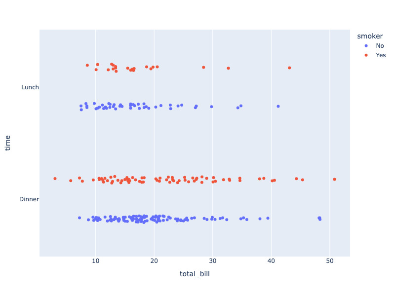

**Interactive Plot:**

<div>                        <script type="text/javascript">window.PlotlyConfig = {MathJaxConfig: 'local'};</script>
        <script charset="utf-8" src="https://cdn.plot.ly/plotly-3.1.0.min.js" integrity="sha256-Ei4740bWZhaUTQuD6q9yQlgVCMPBz6CZWhevDYPv93A=" crossorigin="anonymous"></script>                <div id="plotly-div-24" class="plotly-graph-div" style="height:100%; width:100%;"></div>            <script type="text/javascript">                window.PLOTLYENV=window.PLOTLYENV || {};                                if (document.getElementById("plotly-div-24")) {                    Plotly.newPlot(                        "plotly-div-24",                        [{"alignmentgroup":"True","boxpoints":"all","fillcolor":"rgba(255,255,255,0)","hoveron":"points","hovertemplate":"smoker=No\u003cbr\u003etotal_bill=%{x}\u003cbr\u003etime=%{y}\u003cextra\u003e\u003c\u002fextra\u003e","legendgroup":"No","line":{"color":"rgba(255,255,255,0)"},"marker":{"color":"#636efa"},"name":"No","offsetgroup":"No","orientation":"h","pointpos":0,"showlegend":true,"x":{"dtype":"f8","bdata":"PQrXo3D9MECuR+F6FK4kQMP1KFyPAjVArkfhehSuN0DXo3A9Cpc4QArXo3A9SjlACtejcD2KIUDhehSuR+E6QBSuR+F6FC5Aj8L1KFyPLUAK16NwPYokQOF6FK5HoUFA16NwPQrXLkCuR+F6FG4yQClcj8L1qC1AFK5H4XqUNUApXI\u002fC9agkQArXo3A9SjBAuB6F61H4MEBmZmZmZqY0QOxRuB6F6zFACtejcD1KNEAK16NwPYovQPYoXI\u002fCtUNAUrgehevRM0CPwvUoXM8xQD0K16NwvSpA4XoUrkdhKUAzMzMzM7M1QGZmZmZmpjNAmpmZmZkZI0CamZmZmVkyQB+F61G4Hi5AcT0K16OwNEBI4XoUrscxQI\u002fC9ShcDzhAj8L1KFxPMECuR+F6FO4wQHE9CtejsDJAhetRuB5FP0AK16NwPQowQPYoXI\u002fCdTFA4XoUrkfhK0Bcj8L1KFwjQGZmZmZmZj5ACtejcD1KMkB7FK5H4To2QDMzMzMzM0BAzczMzMyMPEAK16NwPQoyQBSuR+F6FClAFK5H4XqUJEBI4XoUrmdBQOF6FK5H4SNAj8L1KFyPOUA9CtejcH0zQClcj8L1aDpAw\u002fUoXI8iSEDXo3A9CpcxQBSuR+F6FDRAMzMzMzNzMEB7FK5H4To0QArXo3A9CihAUrgehesRMUD2KFyPwnUtQIXrUbgeBSVAMzMzMzMzO0DD9Shcj8I2QArXo3A9SjFAKVyPwvWoMECkcD0K1yMkQPYoXI\u002fC9S9ACtejcD1qQUCPwvUoXA8qQEjhehSuRzJA9ihcj8K1OEApXI\u002fC9Sg1QD0K16NwfTZAAAAAAADANkDsUbgehesoQOxRuB6F6zRAPQrXo3A9MkAAAAAAAAAsQAAAAAAAAB1AKVyPwvUIQ0AzMzMzM\u002fM3QPYoXI\u002fCtTlAj8L1KFxPMUCuR+F6FO49QM3MzMzMTCVAXI\u002fC9SjcKEAUrkfhehQ4QOF6FK5HYSdA16NwPQrXKkCF61G4HoUsQGZmZmZm5i9A9ihcj8L1KEDNzMzMzMw9QArXo3A9CiFACtejcD0KLUDD9Shcj8ImQFK4HoXr0TZAFK5H4XoUM0CF61G4HkU0QNejcD0KVyZAhetRuB6FKEDD9Shcj0IyQIXrUbgeBSFAKVyPwvWoJEDNzMzMzEwsQFK4HoXrUSpAuB6F61F4MUBmZmZmZiZBQLgehetRmERAzczMzMwMO0CuR+F6FG4wQDMzMzMzsyBApHA9CtejMkA9CtejcL0nQI\u002fC9ShcjyNACtejcD0KHkCkcD0K1yMsQMP1KFyPQipAw\u002fUoXI9CMUDNzMzMzIw4QIXrUbgexTNAmpmZmZnZPUD2KFyPwhVIQAAAAAAAADlASOF6FK7HKkA9CtejcH0wQAAAAAAAgDVAUrgehetRKUD2KFyPwjUwQB+F61G4nitAhetRuB6FOEDD9Shcj8I0QPYoXI\u002fCtT9AcT0K16OwNEA9CtejcD0eQArXo3A9KkhA9ihcj8L1L0AzMzMzM3M0QI\u002fC9ShcjypAuB6F61E4J0AK16NwPYolQKRwPQrXIyRACtejcD3qQUBI4XoUrgc9QFK4HoXr0TFASOF6FK7HMkA="},"x0":" ","xaxis":"x","y":["Dinner","Dinner","Dinner","Dinner","Dinner","Dinner","Dinner","Dinner","Dinner","Dinner","Dinner","Dinner","Dinner","Dinner","Dinner","Dinner","Dinner","Dinner","Dinner","Dinner","Dinner","Dinner","Dinner","Dinner","Dinner","Dinner","Dinner","Dinner","Dinner","Dinner","Dinner","Dinner","Dinner","Dinner","Dinner","Dinner","Dinner","Dinner","Dinner","Dinner","Dinner","Dinner","Dinner","Dinner","Dinner","Dinner","Dinner","Dinner","Dinner","Dinner","Dinner","Dinner","Dinner","Dinner","Dinner","Dinner","Dinner","Dinner","Dinner","Dinner","Dinner","Dinner","Dinner","Dinner","Dinner","Dinner","Lunch","Lunch","Lunch","Lunch","Lunch","Lunch","Lunch","Lunch","Lunch","Lunch","Lunch","Dinner","Dinner","Dinner","Dinner","Dinner","Dinner","Dinner","Dinner","Dinner","Dinner","Dinner","Dinner","Lunch","Lunch","Lunch","Lunch","Lunch","Lunch","Lunch","Lunch","Lunch","Lunch","Lunch","Lunch","Lunch","Lunch","Lunch","Lunch","Lunch","Lunch","Lunch","Lunch","Lunch","Lunch","Lunch","Lunch","Lunch","Lunch","Lunch","Lunch","Lunch","Lunch","Lunch","Lunch","Dinner","Dinner","Dinner","Dinner","Dinner","Dinner","Dinner","Dinner","Dinner","Dinner","Dinner","Dinner","Dinner","Dinner","Dinner","Dinner","Dinner","Dinner","Lunch","Dinner","Lunch","Dinner","Dinner","Dinner","Dinner","Dinner","Dinner","Dinner","Dinner","Dinner"],"y0":" ","yaxis":"y","type":"box"},{"alignmentgroup":"True","boxpoints":"all","fillcolor":"rgba(255,255,255,0)","hoveron":"points","hovertemplate":"smoker=Yes\u003cbr\u003etotal_bill=%{x}\u003cbr\u003etime=%{y}\u003cextra\u003e\u003c\u002fextra\u003e","legendgroup":"Yes","line":{"color":"rgba(255,255,255,0)"},"marker":{"color":"#EF553B"},"name":"Yes","offsetgroup":"Yes","orientation":"h","pointpos":0,"showlegend":true,"x":{"dtype":"f8","bdata":"4XoUrkcBQ0B7FK5H4XomQArXo3A9SjRAH4XrUbieK0AK16NwPQomQArXo3A9SjJAj8L1KFyPCECF61G4HgUuQFyPwvUo3DpASOF6FK5HOUDsUbgehesxQHE9CtejcDNA16NwPQpXQEC4HoXrUfg8QAAAAAAAABdAUrgehetRMED2KFyPwhVEQEjhehSuRztAj8L1KFwPKEDD9ShcjwI1QDMzMzMzsyZAw\u002fUoXI\u002fCLkBmZmZmZiZGQOxRuB6FazZAuB6F61G4LkA9CtejcH00QPYoXI\u002fCNTlAH4XrUbieLEAAAAAAAAAwQMP1KFyPgjFArkfhehQuJUDD9Shcj0IlQEjhehSuZ0lAH4XrUbieL0AAAAAAAAAdQJqZmZmZ2T9AUrgehevRMEAzMzMzM3NAQKRwPQrX4zFA9ihcj8L1LEAzMzMzMzMjQHE9CtejUEFAMzMzMzNTQUAUrkfhelQ3QM3MzMzMrEZA7FG4HoUrN0BmZmZmZkZEQGZmZmZm5jRA9ihcj8J1PkBmZmZmZiYyQJqZmZmZGTdA4XoUrkdhL0CPwvUoXM8zQHE9CtejcDxA9ihcj8L1LkAUrkfhepQwQK5H4XoUriRArkfhehSORUAAAAAAAAAqQIXrUbgeBStA9ihcj8K1MkB7FK5H4XopQAAAAAAAACpAZmZmZmZmMEBI4XoUroc0QLgehetReDBA16NwPQqXOkA9CtejcF1DQIXrUbgeRThAhetRuB6FKUCPwvUoXA8+QKRwPQrX4zlACtejcD2KKkDsUbgehSs8QM3MzMzMzClAZmZmZmYmPECuR+F6FC4nQPYoXI\u002fC9R5ApHA9CtcjPkBSuB6F61EoQNejcD0K1ypAKVyPwvUoIUDXo3A9CtcqQIXrUbgeRTBArkfhehQuJEAfhetRuB42QMP1KFyPAjhA4XoUrkdhL0CPwvUoXA8vQDMzMzMzMylACtejcD1qQECuR+F6FC47QOxRuB6FqzZA"},"x0":" ","xaxis":"x","y":["Dinner","Dinner","Dinner","Dinner","Dinner","Dinner","Dinner","Dinner","Dinner","Dinner","Dinner","Lunch","Lunch","Dinner","Dinner","Dinner","Dinner","Dinner","Dinner","Dinner","Dinner","Dinner","Dinner","Dinner","Dinner","Dinner","Dinner","Dinner","Lunch","Dinner","Dinner","Dinner","Dinner","Dinner","Dinner","Dinner","Dinner","Dinner","Dinner","Dinner","Dinner","Dinner","Dinner","Dinner","Dinner","Dinner","Dinner","Dinner","Dinner","Dinner","Dinner","Dinner","Lunch","Lunch","Lunch","Lunch","Lunch","Lunch","Lunch","Lunch","Lunch","Lunch","Lunch","Lunch","Lunch","Lunch","Dinner","Dinner","Dinner","Dinner","Dinner","Dinner","Dinner","Dinner","Dinner","Dinner","Dinner","Dinner","Dinner","Lunch","Lunch","Lunch","Lunch","Lunch","Lunch","Dinner","Dinner","Dinner","Dinner","Dinner","Dinner","Dinner","Dinner"],"y0":" ","yaxis":"y","type":"box"}],                        {"template":{"data":{"histogram2dcontour":[{"type":"histogram2dcontour","colorbar":{"outlinewidth":0,"ticks":""},"colorscale":[[0.0,"#0d0887"],[0.1111111111111111,"#46039f"],[0.2222222222222222,"#7201a8"],[0.3333333333333333,"#9c179e"],[0.4444444444444444,"#bd3786"],[0.5555555555555556,"#d8576b"],[0.6666666666666666,"#ed7953"],[0.7777777777777778,"#fb9f3a"],[0.8888888888888888,"#fdca26"],[1.0,"#f0f921"]]}],"choropleth":[{"type":"choropleth","colorbar":{"outlinewidth":0,"ticks":""}}],"histogram2d":[{"type":"histogram2d","colorbar":{"outlinewidth":0,"ticks":""},"colorscale":[[0.0,"#0d0887"],[0.1111111111111111,"#46039f"],[0.2222222222222222,"#7201a8"],[0.3333333333333333,"#9c179e"],[0.4444444444444444,"#bd3786"],[0.5555555555555556,"#d8576b"],[0.6666666666666666,"#ed7953"],[0.7777777777777778,"#fb9f3a"],[0.8888888888888888,"#fdca26"],[1.0,"#f0f921"]]}],"heatmap":[{"type":"heatmap","colorbar":{"outlinewidth":0,"ticks":""},"colorscale":[[0.0,"#0d0887"],[0.1111111111111111,"#46039f"],[0.2222222222222222,"#7201a8"],[0.3333333333333333,"#9c179e"],[0.4444444444444444,"#bd3786"],[0.5555555555555556,"#d8576b"],[0.6666666666666666,"#ed7953"],[0.7777777777777778,"#fb9f3a"],[0.8888888888888888,"#fdca26"],[1.0,"#f0f921"]]}],"contourcarpet":[{"type":"contourcarpet","colorbar":{"outlinewidth":0,"ticks":""}}],"contour":[{"type":"contour","colorbar":{"outlinewidth":0,"ticks":""},"colorscale":[[0.0,"#0d0887"],[0.1111111111111111,"#46039f"],[0.2222222222222222,"#7201a8"],[0.3333333333333333,"#9c179e"],[0.4444444444444444,"#bd3786"],[0.5555555555555556,"#d8576b"],[0.6666666666666666,"#ed7953"],[0.7777777777777778,"#fb9f3a"],[0.8888888888888888,"#fdca26"],[1.0,"#f0f921"]]}],"surface":[{"type":"surface","colorbar":{"outlinewidth":0,"ticks":""},"colorscale":[[0.0,"#0d0887"],[0.1111111111111111,"#46039f"],[0.2222222222222222,"#7201a8"],[0.3333333333333333,"#9c179e"],[0.4444444444444444,"#bd3786"],[0.5555555555555556,"#d8576b"],[0.6666666666666666,"#ed7953"],[0.7777777777777778,"#fb9f3a"],[0.8888888888888888,"#fdca26"],[1.0,"#f0f921"]]}],"mesh3d":[{"type":"mesh3d","colorbar":{"outlinewidth":0,"ticks":""}}],"scatter":[{"fillpattern":{"fillmode":"overlay","size":10,"solidity":0.2},"type":"scatter"}],"parcoords":[{"type":"parcoords","line":{"colorbar":{"outlinewidth":0,"ticks":""}}}],"scatterpolargl":[{"type":"scatterpolargl","marker":{"colorbar":{"outlinewidth":0,"ticks":""}}}],"bar":[{"error_x":{"color":"#2a3f5f"},"error_y":{"color":"#2a3f5f"},"marker":{"line":{"color":"#E5ECF6","width":0.5},"pattern":{"fillmode":"overlay","size":10,"solidity":0.2}},"type":"bar"}],"scattergeo":[{"type":"scattergeo","marker":{"colorbar":{"outlinewidth":0,"ticks":""}}}],"scatterpolar":[{"type":"scatterpolar","marker":{"colorbar":{"outlinewidth":0,"ticks":""}}}],"histogram":[{"marker":{"pattern":{"fillmode":"overlay","size":10,"solidity":0.2}},"type":"histogram"}],"scattergl":[{"type":"scattergl","marker":{"colorbar":{"outlinewidth":0,"ticks":""}}}],"scatter3d":[{"type":"scatter3d","line":{"colorbar":{"outlinewidth":0,"ticks":""}},"marker":{"colorbar":{"outlinewidth":0,"ticks":""}}}],"scattermap":[{"type":"scattermap","marker":{"colorbar":{"outlinewidth":0,"ticks":""}}}],"scattermapbox":[{"type":"scattermapbox","marker":{"colorbar":{"outlinewidth":0,"ticks":""}}}],"scatterternary":[{"type":"scatterternary","marker":{"colorbar":{"outlinewidth":0,"ticks":""}}}],"scattercarpet":[{"type":"scattercarpet","marker":{"colorbar":{"outlinewidth":0,"ticks":""}}}],"carpet":[{"aaxis":{"endlinecolor":"#2a3f5f","gridcolor":"white","linecolor":"white","minorgridcolor":"white","startlinecolor":"#2a3f5f"},"baxis":{"endlinecolor":"#2a3f5f","gridcolor":"white","linecolor":"white","minorgridcolor":"white","startlinecolor":"#2a3f5f"},"type":"carpet"}],"table":[{"cells":{"fill":{"color":"#EBF0F8"},"line":{"color":"white"}},"header":{"fill":{"color":"#C8D4E3"},"line":{"color":"white"}},"type":"table"}],"barpolar":[{"marker":{"line":{"color":"#E5ECF6","width":0.5},"pattern":{"fillmode":"overlay","size":10,"solidity":0.2}},"type":"barpolar"}],"pie":[{"automargin":true,"type":"pie"}]},"layout":{"autotypenumbers":"strict","colorway":["#636efa","#EF553B","#00cc96","#ab63fa","#FFA15A","#19d3f3","#FF6692","#B6E880","#FF97FF","#FECB52"],"font":{"color":"#2a3f5f"},"hovermode":"closest","hoverlabel":{"align":"left"},"paper_bgcolor":"white","plot_bgcolor":"#E5ECF6","polar":{"bgcolor":"#E5ECF6","angularaxis":{"gridcolor":"white","linecolor":"white","ticks":""},"radialaxis":{"gridcolor":"white","linecolor":"white","ticks":""}},"ternary":{"bgcolor":"#E5ECF6","aaxis":{"gridcolor":"white","linecolor":"white","ticks":""},"baxis":{"gridcolor":"white","linecolor":"white","ticks":""},"caxis":{"gridcolor":"white","linecolor":"white","ticks":""}},"coloraxis":{"colorbar":{"outlinewidth":0,"ticks":""}},"colorscale":{"sequential":[[0.0,"#0d0887"],[0.1111111111111111,"#46039f"],[0.2222222222222222,"#7201a8"],[0.3333333333333333,"#9c179e"],[0.4444444444444444,"#bd3786"],[0.5555555555555556,"#d8576b"],[0.6666666666666666,"#ed7953"],[0.7777777777777778,"#fb9f3a"],[0.8888888888888888,"#fdca26"],[1.0,"#f0f921"]],"sequentialminus":[[0.0,"#0d0887"],[0.1111111111111111,"#46039f"],[0.2222222222222222,"#7201a8"],[0.3333333333333333,"#9c179e"],[0.4444444444444444,"#bd3786"],[0.5555555555555556,"#d8576b"],[0.6666666666666666,"#ed7953"],[0.7777777777777778,"#fb9f3a"],[0.8888888888888888,"#fdca26"],[1.0,"#f0f921"]],"diverging":[[0,"#8e0152"],[0.1,"#c51b7d"],[0.2,"#de77ae"],[0.3,"#f1b6da"],[0.4,"#fde0ef"],[0.5,"#f7f7f7"],[0.6,"#e6f5d0"],[0.7,"#b8e186"],[0.8,"#7fbc41"],[0.9,"#4d9221"],[1,"#276419"]]},"xaxis":{"gridcolor":"white","linecolor":"white","ticks":"","title":{"standoff":15},"zerolinecolor":"white","automargin":true,"zerolinewidth":2},"yaxis":{"gridcolor":"white","linecolor":"white","ticks":"","title":{"standoff":15},"zerolinecolor":"white","automargin":true,"zerolinewidth":2},"scene":{"xaxis":{"backgroundcolor":"#E5ECF6","gridcolor":"white","linecolor":"white","showbackground":true,"ticks":"","zerolinecolor":"white","gridwidth":2},"yaxis":{"backgroundcolor":"#E5ECF6","gridcolor":"white","linecolor":"white","showbackground":true,"ticks":"","zerolinecolor":"white","gridwidth":2},"zaxis":{"backgroundcolor":"#E5ECF6","gridcolor":"white","linecolor":"white","showbackground":true,"ticks":"","zerolinecolor":"white","gridwidth":2}},"shapedefaults":{"line":{"color":"#2a3f5f"}},"annotationdefaults":{"arrowcolor":"#2a3f5f","arrowhead":0,"arrowwidth":1},"geo":{"bgcolor":"white","landcolor":"#E5ECF6","subunitcolor":"white","showland":true,"showlakes":true,"lakecolor":"white"},"title":{"x":0.05},"mapbox":{"style":"light"}}},"xaxis":{"anchor":"y","domain":[0.0,1.0],"title":{"text":"total_bill"}},"yaxis":{"anchor":"x","domain":[0.0,1.0],"title":{"text":"time"}},"legend":{"title":{"text":"smoker"},"tracegroupgap":0},"margin":{"t":60},"boxmode":"group"},                        {"responsive": true}                    )                };            </script>        </div>

**Read more about [density contours, also known as 2D histogram contours](2d-histogram-contour.md).**

```python
import plotly.express as px
df = px.data.iris()
fig = px.density_contour(df, x="sepal_width", y="sepal_length")
fig.show()
```

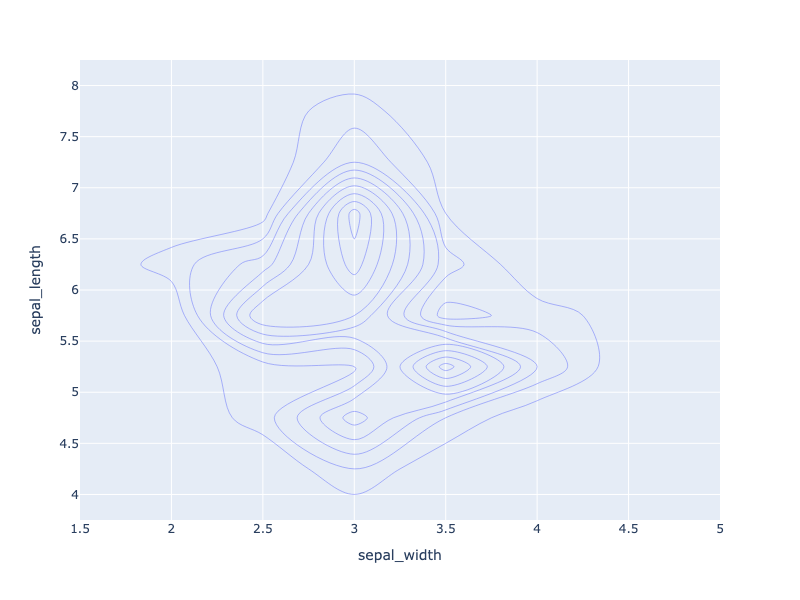

**Interactive Plot:**

<div>                        <script type="text/javascript">window.PlotlyConfig = {MathJaxConfig: 'local'};</script>
        <script charset="utf-8" src="https://cdn.plot.ly/plotly-3.1.0.min.js" integrity="sha256-Ei4740bWZhaUTQuD6q9yQlgVCMPBz6CZWhevDYPv93A=" crossorigin="anonymous"></script>                <div id="plotly-div-25" class="plotly-graph-div" style="height:100%; width:100%;"></div>            <script type="text/javascript">                window.PLOTLYENV=window.PLOTLYENV || {};                                if (document.getElementById("plotly-div-25")) {                    Plotly.newPlot(                        "plotly-div-25",                        [{"contours":{"coloring":"none"},"hovertemplate":"sepal_width=%{x}\u003cbr\u003esepal_length=%{y}\u003cbr\u003ecount=%{z}\u003cextra\u003e\u003c\u002fextra\u003e","legendgroup":"","line":{"color":"#636efa"},"name":"","showlegend":false,"x":{"dtype":"f8","bdata":"AAAAAAAADEAAAAAAAAAIQJqZmZmZmQlAzczMzMzMCEDNzMzMzMwMQDMzMzMzMw9AMzMzMzMzC0AzMzMzMzMLQDMzMzMzMwdAzczMzMzMCECamZmZmZkNQDMzMzMzMwtAAAAAAAAACEAAAAAAAAAIQAAAAAAAABBAmpmZmZmZEUAzMzMzMzMPQAAAAAAAAAxAZmZmZmZmDkBmZmZmZmYOQDMzMzMzMwtAmpmZmZmZDUDNzMzMzMwMQGZmZmZmZgpAMzMzMzMzC0AAAAAAAAAIQDMzMzMzMwtAAAAAAAAADEAzMzMzMzMLQJqZmZmZmQlAzczMzMzMCEAzMzMzMzMLQGZmZmZmZhBAzczMzMzMEEDNzMzMzMwIQJqZmZmZmQlAAAAAAAAADEDNzMzMzMwIQAAAAAAAAAhAMzMzMzMzC0AAAAAAAAAMQGZmZmZmZgJAmpmZmZmZCUAAAAAAAAAMQGZmZmZmZg5AAAAAAAAACEBmZmZmZmYOQJqZmZmZmQlAmpmZmZmZDUBmZmZmZmYKQJqZmZmZmQlAmpmZmZmZCUDNzMzMzMwIQGZmZmZmZgJAZmZmZmZmBkBmZmZmZmYGQGZmZmZmZgpAMzMzMzMzA0AzMzMzMzMHQJqZmZmZmQVAAAAAAAAAAEAAAAAAAAAIQJqZmZmZmQFAMzMzMzMzB0AzMzMzMzMHQM3MzMzMzAhAAAAAAAAACECamZmZmZkFQJqZmZmZmQFAAAAAAAAABECamZmZmZkJQGZmZmZmZgZAAAAAAAAABEBmZmZmZmYGQDMzMzMzMwdAAAAAAAAACEBmZmZmZmYGQAAAAAAAAAhAMzMzMzMzB0DNzMzMzMwEQDMzMzMzMwNAMzMzMzMzA0CamZmZmZkFQJqZmZmZmQVAAAAAAAAACEAzMzMzMzMLQM3MzMzMzAhAZmZmZmZmAkAAAAAAAAAIQAAAAAAAAARAzczMzMzMBEAAAAAAAAAIQM3MzMzMzARAZmZmZmZmAkCamZmZmZkFQAAAAAAAAAhAMzMzMzMzB0AzMzMzMzMHQAAAAAAAAARAZmZmZmZmBkBmZmZmZmYKQJqZmZmZmQVAAAAAAAAACEAzMzMzMzMHQAAAAAAAAAhAAAAAAAAACEAAAAAAAAAEQDMzMzMzMwdAAAAAAAAABEDNzMzMzMwMQJqZmZmZmQlAmpmZmZmZBUAAAAAAAAAIQAAAAAAAAARAZmZmZmZmBkCamZmZmZkJQAAAAAAAAAhAZmZmZmZmDkDNzMzMzMwEQJqZmZmZmQFAmpmZmZmZCUBmZmZmZmYGQGZmZmZmZgZAmpmZmZmZBUBmZmZmZmYKQJqZmZmZmQlAZmZmZmZmBkAAAAAAAAAIQGZmZmZmZgZAAAAAAAAACEBmZmZmZmYGQGZmZmZmZg5AZmZmZmZmBkBmZmZmZmYGQM3MzMzMzARAAAAAAAAACEAzMzMzMzMLQM3MzMzMzAhAAAAAAAAACEDNzMzMzMwIQM3MzMzMzAhAzczMzMzMCECamZmZmZkFQJqZmZmZmQlAZmZmZmZmCkAAAAAAAAAIQAAAAAAAAARAAAAAAAAACEAzMzMzMzMLQAAAAAAAAAhA"},"xaxis":"x","xbingroup":"x","y":{"dtype":"f8","bdata":"ZmZmZmZmFECamZmZmZkTQM3MzMzMzBJAZmZmZmZmEkAAAAAAAAAUQJqZmZmZmRVAZmZmZmZmEkAAAAAAAAAUQJqZmZmZmRFAmpmZmZmZE0CamZmZmZkVQDMzMzMzMxNAMzMzMzMzE0AzMzMzMzMRQDMzMzMzMxdAzczMzMzMFkCamZmZmZkVQGZmZmZmZhRAzczMzMzMFkBmZmZmZmYUQJqZmZmZmRVAZmZmZmZmFEBmZmZmZmYSQGZmZmZmZhRAMzMzMzMzE0AAAAAAAAAUQAAAAAAAABRAzczMzMzMFEDNzMzMzMwUQM3MzMzMzBJAMzMzMzMzE0CamZmZmZkVQM3MzMzMzBRAAAAAAAAAFkCamZmZmZkTQAAAAAAAABRAAAAAAAAAFkCamZmZmZkTQJqZmZmZmRFAZmZmZmZmFEAAAAAAAAAUQAAAAAAAABJAmpmZmZmZEUAAAAAAAAAUQGZmZmZmZhRAMzMzMzMzE0BmZmZmZmYUQGZmZmZmZhJAMzMzMzMzFUAAAAAAAAAUQAAAAAAAABxAmpmZmZmZGUCamZmZmZkbQAAAAAAAABZAAAAAAAAAGkDNzMzMzMwWQDMzMzMzMxlAmpmZmZmZE0BmZmZmZmYaQM3MzMzMzBRAAAAAAAAAFECamZmZmZkXQAAAAAAAABhAZmZmZmZmGEBmZmZmZmYWQM3MzMzMzBpAZmZmZmZmFkAzMzMzMzMXQM3MzMzMzBhAZmZmZmZmFkCamZmZmZkXQGZmZmZmZhhAMzMzMzMzGUBmZmZmZmYYQJqZmZmZmRlAZmZmZmZmGkAzMzMzMzMbQM3MzMzMzBpAAAAAAAAAGEDNzMzMzMwWQAAAAAAAABZAAAAAAAAAFkAzMzMzMzMXQAAAAAAAABhAmpmZmZmZFUAAAAAAAAAYQM3MzMzMzBpAMzMzMzMzGUBmZmZmZmYWQAAAAAAAABZAAAAAAAAAFkBmZmZmZmYYQDMzMzMzMxdAAAAAAAAAFEBmZmZmZmYWQM3MzMzMzBZAzczMzMzMFkDNzMzMzMwYQGZmZmZmZhRAzczMzMzMFkAzMzMzMzMZQDMzMzMzMxdAZmZmZmZmHEAzMzMzMzMZQAAAAAAAABpAZmZmZmZmHkCamZmZmZkTQDMzMzMzMx1AzczMzMzMGkDNzMzMzMwcQAAAAAAAABpAmpmZmZmZGUAzMzMzMzMbQM3MzMzMzBZAMzMzMzMzF0CamZmZmZkZQAAAAAAAABpAzczMzMzMHkDNzMzMzMweQAAAAAAAABhAmpmZmZmZG0BmZmZmZmYWQM3MzMzMzB5AMzMzMzMzGUDNzMzMzMwaQM3MzMzMzBxAzczMzMzMGEBmZmZmZmYYQJqZmZmZmRlAzczMzMzMHECamZmZmZkdQJqZmZmZmR9AmpmZmZmZGUAzMzMzMzMZQGZmZmZmZhhAzczMzMzMHkAzMzMzMzMZQJqZmZmZmRlAAAAAAAAAGECamZmZmZkbQM3MzMzMzBpAmpmZmZmZG0AzMzMzMzMXQDMzMzMzMxtAzczMzMzMGkDNzMzMzMwaQDMzMzMzMxlAAAAAAAAAGkDNzMzMzMwYQJqZmZmZmRdA"},"yaxis":"y","ybingroup":"y","type":"histogram2dcontour"}],                        {"template":{"data":{"histogram2dcontour":[{"type":"histogram2dcontour","colorbar":{"outlinewidth":0,"ticks":""},"colorscale":[[0.0,"#0d0887"],[0.1111111111111111,"#46039f"],[0.2222222222222222,"#7201a8"],[0.3333333333333333,"#9c179e"],[0.4444444444444444,"#bd3786"],[0.5555555555555556,"#d8576b"],[0.6666666666666666,"#ed7953"],[0.7777777777777778,"#fb9f3a"],[0.8888888888888888,"#fdca26"],[1.0,"#f0f921"]]}],"choropleth":[{"type":"choropleth","colorbar":{"outlinewidth":0,"ticks":""}}],"histogram2d":[{"type":"histogram2d","colorbar":{"outlinewidth":0,"ticks":""},"colorscale":[[0.0,"#0d0887"],[0.1111111111111111,"#46039f"],[0.2222222222222222,"#7201a8"],[0.3333333333333333,"#9c179e"],[0.4444444444444444,"#bd3786"],[0.5555555555555556,"#d8576b"],[0.6666666666666666,"#ed7953"],[0.7777777777777778,"#fb9f3a"],[0.8888888888888888,"#fdca26"],[1.0,"#f0f921"]]}],"heatmap":[{"type":"heatmap","colorbar":{"outlinewidth":0,"ticks":""},"colorscale":[[0.0,"#0d0887"],[0.1111111111111111,"#46039f"],[0.2222222222222222,"#7201a8"],[0.3333333333333333,"#9c179e"],[0.4444444444444444,"#bd3786"],[0.5555555555555556,"#d8576b"],[0.6666666666666666,"#ed7953"],[0.7777777777777778,"#fb9f3a"],[0.8888888888888888,"#fdca26"],[1.0,"#f0f921"]]}],"contourcarpet":[{"type":"contourcarpet","colorbar":{"outlinewidth":0,"ticks":""}}],"contour":[{"type":"contour","colorbar":{"outlinewidth":0,"ticks":""},"colorscale":[[0.0,"#0d0887"],[0.1111111111111111,"#46039f"],[0.2222222222222222,"#7201a8"],[0.3333333333333333,"#9c179e"],[0.4444444444444444,"#bd3786"],[0.5555555555555556,"#d8576b"],[0.6666666666666666,"#ed7953"],[0.7777777777777778,"#fb9f3a"],[0.8888888888888888,"#fdca26"],[1.0,"#f0f921"]]}],"surface":[{"type":"surface","colorbar":{"outlinewidth":0,"ticks":""},"colorscale":[[0.0,"#0d0887"],[0.1111111111111111,"#46039f"],[0.2222222222222222,"#7201a8"],[0.3333333333333333,"#9c179e"],[0.4444444444444444,"#bd3786"],[0.5555555555555556,"#d8576b"],[0.6666666666666666,"#ed7953"],[0.7777777777777778,"#fb9f3a"],[0.8888888888888888,"#fdca26"],[1.0,"#f0f921"]]}],"mesh3d":[{"type":"mesh3d","colorbar":{"outlinewidth":0,"ticks":""}}],"scatter":[{"fillpattern":{"fillmode":"overlay","size":10,"solidity":0.2},"type":"scatter"}],"parcoords":[{"type":"parcoords","line":{"colorbar":{"outlinewidth":0,"ticks":""}}}],"scatterpolargl":[{"type":"scatterpolargl","marker":{"colorbar":{"outlinewidth":0,"ticks":""}}}],"bar":[{"error_x":{"color":"#2a3f5f"},"error_y":{"color":"#2a3f5f"},"marker":{"line":{"color":"#E5ECF6","width":0.5},"pattern":{"fillmode":"overlay","size":10,"solidity":0.2}},"type":"bar"}],"scattergeo":[{"type":"scattergeo","marker":{"colorbar":{"outlinewidth":0,"ticks":""}}}],"scatterpolar":[{"type":"scatterpolar","marker":{"colorbar":{"outlinewidth":0,"ticks":""}}}],"histogram":[{"marker":{"pattern":{"fillmode":"overlay","size":10,"solidity":0.2}},"type":"histogram"}],"scattergl":[{"type":"scattergl","marker":{"colorbar":{"outlinewidth":0,"ticks":""}}}],"scatter3d":[{"type":"scatter3d","line":{"colorbar":{"outlinewidth":0,"ticks":""}},"marker":{"colorbar":{"outlinewidth":0,"ticks":""}}}],"scattermap":[{"type":"scattermap","marker":{"colorbar":{"outlinewidth":0,"ticks":""}}}],"scattermapbox":[{"type":"scattermapbox","marker":{"colorbar":{"outlinewidth":0,"ticks":""}}}],"scatterternary":[{"type":"scatterternary","marker":{"colorbar":{"outlinewidth":0,"ticks":""}}}],"scattercarpet":[{"type":"scattercarpet","marker":{"colorbar":{"outlinewidth":0,"ticks":""}}}],"carpet":[{"aaxis":{"endlinecolor":"#2a3f5f","gridcolor":"white","linecolor":"white","minorgridcolor":"white","startlinecolor":"#2a3f5f"},"baxis":{"endlinecolor":"#2a3f5f","gridcolor":"white","linecolor":"white","minorgridcolor":"white","startlinecolor":"#2a3f5f"},"type":"carpet"}],"table":[{"cells":{"fill":{"color":"#EBF0F8"},"line":{"color":"white"}},"header":{"fill":{"color":"#C8D4E3"},"line":{"color":"white"}},"type":"table"}],"barpolar":[{"marker":{"line":{"color":"#E5ECF6","width":0.5},"pattern":{"fillmode":"overlay","size":10,"solidity":0.2}},"type":"barpolar"}],"pie":[{"automargin":true,"type":"pie"}]},"layout":{"autotypenumbers":"strict","colorway":["#636efa","#EF553B","#00cc96","#ab63fa","#FFA15A","#19d3f3","#FF6692","#B6E880","#FF97FF","#FECB52"],"font":{"color":"#2a3f5f"},"hovermode":"closest","hoverlabel":{"align":"left"},"paper_bgcolor":"white","plot_bgcolor":"#E5ECF6","polar":{"bgcolor":"#E5ECF6","angularaxis":{"gridcolor":"white","linecolor":"white","ticks":""},"radialaxis":{"gridcolor":"white","linecolor":"white","ticks":""}},"ternary":{"bgcolor":"#E5ECF6","aaxis":{"gridcolor":"white","linecolor":"white","ticks":""},"baxis":{"gridcolor":"white","linecolor":"white","ticks":""},"caxis":{"gridcolor":"white","linecolor":"white","ticks":""}},"coloraxis":{"colorbar":{"outlinewidth":0,"ticks":""}},"colorscale":{"sequential":[[0.0,"#0d0887"],[0.1111111111111111,"#46039f"],[0.2222222222222222,"#7201a8"],[0.3333333333333333,"#9c179e"],[0.4444444444444444,"#bd3786"],[0.5555555555555556,"#d8576b"],[0.6666666666666666,"#ed7953"],[0.7777777777777778,"#fb9f3a"],[0.8888888888888888,"#fdca26"],[1.0,"#f0f921"]],"sequentialminus":[[0.0,"#0d0887"],[0.1111111111111111,"#46039f"],[0.2222222222222222,"#7201a8"],[0.3333333333333333,"#9c179e"],[0.4444444444444444,"#bd3786"],[0.5555555555555556,"#d8576b"],[0.6666666666666666,"#ed7953"],[0.7777777777777778,"#fb9f3a"],[0.8888888888888888,"#fdca26"],[1.0,"#f0f921"]],"diverging":[[0,"#8e0152"],[0.1,"#c51b7d"],[0.2,"#de77ae"],[0.3,"#f1b6da"],[0.4,"#fde0ef"],[0.5,"#f7f7f7"],[0.6,"#e6f5d0"],[0.7,"#b8e186"],[0.8,"#7fbc41"],[0.9,"#4d9221"],[1,"#276419"]]},"xaxis":{"gridcolor":"white","linecolor":"white","ticks":"","title":{"standoff":15},"zerolinecolor":"white","automargin":true,"zerolinewidth":2},"yaxis":{"gridcolor":"white","linecolor":"white","ticks":"","title":{"standoff":15},"zerolinecolor":"white","automargin":true,"zerolinewidth":2},"scene":{"xaxis":{"backgroundcolor":"#E5ECF6","gridcolor":"white","linecolor":"white","showbackground":true,"ticks":"","zerolinecolor":"white","gridwidth":2},"yaxis":{"backgroundcolor":"#E5ECF6","gridcolor":"white","linecolor":"white","showbackground":true,"ticks":"","zerolinecolor":"white","gridwidth":2},"zaxis":{"backgroundcolor":"#E5ECF6","gridcolor":"white","linecolor":"white","showbackground":true,"ticks":"","zerolinecolor":"white","gridwidth":2}},"shapedefaults":{"line":{"color":"#2a3f5f"}},"annotationdefaults":{"arrowcolor":"#2a3f5f","arrowhead":0,"arrowwidth":1},"geo":{"bgcolor":"white","landcolor":"#E5ECF6","subunitcolor":"white","showland":true,"showlakes":true,"lakecolor":"white"},"title":{"x":0.05},"mapbox":{"style":"light"}}},"xaxis":{"anchor":"y","domain":[0.0,1.0],"title":{"text":"sepal_width"}},"yaxis":{"anchor":"x","domain":[0.0,1.0],"title":{"text":"sepal_length"}},"legend":{"tracegroupgap":0},"margin":{"t":60}},                        {"responsive": true}                    )                };            </script>        </div>

**Read more about [density heatmaps, also known as 2D histograms](2D-Histogram.md).**

```python
import plotly.express as px
df = px.data.iris()
fig = px.density_heatmap(df, x="sepal_width", y="sepal_length", marginal_x="rug", marginal_y="histogram")
fig.show()
```

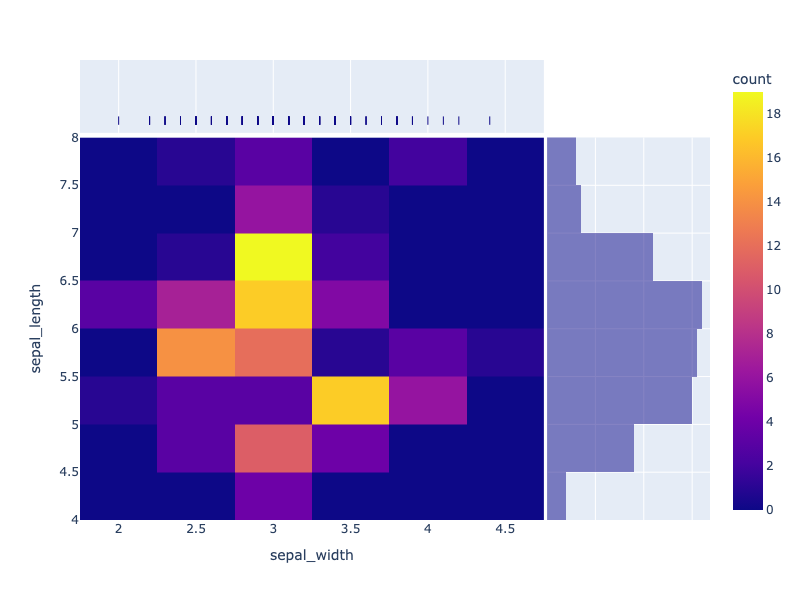

**Interactive Plot:**

<div>                        <script type="text/javascript">window.PlotlyConfig = {MathJaxConfig: 'local'};</script>
        <script charset="utf-8" src="https://cdn.plot.ly/plotly-3.1.0.min.js" integrity="sha256-Ei4740bWZhaUTQuD6q9yQlgVCMPBz6CZWhevDYPv93A=" crossorigin="anonymous"></script>                <div id="plotly-div-26" class="plotly-graph-div" style="height:100%; width:100%;"></div>            <script type="text/javascript">                window.PLOTLYENV=window.PLOTLYENV || {};                                if (document.getElementById("plotly-div-26")) {                    Plotly.newPlot(                        "plotly-div-26",                        [{"coloraxis":"coloraxis","hovertemplate":"sepal_width=%{x}\u003cbr\u003esepal_length=%{y}\u003cbr\u003ecount=%{z}\u003cextra\u003e\u003c\u002fextra\u003e","name":"","x":{"dtype":"f8","bdata":"AAAAAAAADEAAAAAAAAAIQJqZmZmZmQlAzczMzMzMCEDNzMzMzMwMQDMzMzMzMw9AMzMzMzMzC0AzMzMzMzMLQDMzMzMzMwdAzczMzMzMCECamZmZmZkNQDMzMzMzMwtAAAAAAAAACEAAAAAAAAAIQAAAAAAAABBAmpmZmZmZEUAzMzMzMzMPQAAAAAAAAAxAZmZmZmZmDkBmZmZmZmYOQDMzMzMzMwtAmpmZmZmZDUDNzMzMzMwMQGZmZmZmZgpAMzMzMzMzC0AAAAAAAAAIQDMzMzMzMwtAAAAAAAAADEAzMzMzMzMLQJqZmZmZmQlAzczMzMzMCEAzMzMzMzMLQGZmZmZmZhBAzczMzMzMEEDNzMzMzMwIQJqZmZmZmQlAAAAAAAAADEDNzMzMzMwIQAAAAAAAAAhAMzMzMzMzC0AAAAAAAAAMQGZmZmZmZgJAmpmZmZmZCUAAAAAAAAAMQGZmZmZmZg5AAAAAAAAACEBmZmZmZmYOQJqZmZmZmQlAmpmZmZmZDUBmZmZmZmYKQJqZmZmZmQlAmpmZmZmZCUDNzMzMzMwIQGZmZmZmZgJAZmZmZmZmBkBmZmZmZmYGQGZmZmZmZgpAMzMzMzMzA0AzMzMzMzMHQJqZmZmZmQVAAAAAAAAAAEAAAAAAAAAIQJqZmZmZmQFAMzMzMzMzB0AzMzMzMzMHQM3MzMzMzAhAAAAAAAAACECamZmZmZkFQJqZmZmZmQFAAAAAAAAABECamZmZmZkJQGZmZmZmZgZAAAAAAAAABEBmZmZmZmYGQDMzMzMzMwdAAAAAAAAACEBmZmZmZmYGQAAAAAAAAAhAMzMzMzMzB0DNzMzMzMwEQDMzMzMzMwNAMzMzMzMzA0CamZmZmZkFQJqZmZmZmQVAAAAAAAAACEAzMzMzMzMLQM3MzMzMzAhAZmZmZmZmAkAAAAAAAAAIQAAAAAAAAARAzczMzMzMBEAAAAAAAAAIQM3MzMzMzARAZmZmZmZmAkCamZmZmZkFQAAAAAAAAAhAMzMzMzMzB0AzMzMzMzMHQAAAAAAAAARAZmZmZmZmBkBmZmZmZmYKQJqZmZmZmQVAAAAAAAAACEAzMzMzMzMHQAAAAAAAAAhAAAAAAAAACEAAAAAAAAAEQDMzMzMzMwdAAAAAAAAABEDNzMzMzMwMQJqZmZmZmQlAmpmZmZmZBUAAAAAAAAAIQAAAAAAAAARAZmZmZmZmBkCamZmZmZkJQAAAAAAAAAhAZmZmZmZmDkDNzMzMzMwEQJqZmZmZmQFAmpmZmZmZCUBmZmZmZmYGQGZmZmZmZgZAmpmZmZmZBUBmZmZmZmYKQJqZmZmZmQlAZmZmZmZmBkAAAAAAAAAIQGZmZmZmZgZAAAAAAAAACEBmZmZmZmYGQGZmZmZmZg5AZmZmZmZmBkBmZmZmZmYGQM3MzMzMzARAAAAAAAAACEAzMzMzMzMLQM3MzMzMzAhAAAAAAAAACEDNzMzMzMwIQM3MzMzMzAhAzczMzMzMCECamZmZmZkFQJqZmZmZmQlAZmZmZmZmCkAAAAAAAAAIQAAAAAAAAARAAAAAAAAACEAzMzMzMzMLQAAAAAAAAAhA"},"xaxis":"x","xbingroup":"x","y":{"dtype":"f8","bdata":"ZmZmZmZmFECamZmZmZkTQM3MzMzMzBJAZmZmZmZmEkAAAAAAAAAUQJqZmZmZmRVAZmZmZmZmEkAAAAAAAAAUQJqZmZmZmRFAmpmZmZmZE0CamZmZmZkVQDMzMzMzMxNAMzMzMzMzE0AzMzMzMzMRQDMzMzMzMxdAzczMzMzMFkCamZmZmZkVQGZmZmZmZhRAzczMzMzMFkBmZmZmZmYUQJqZmZmZmRVAZmZmZmZmFEBmZmZmZmYSQGZmZmZmZhRAMzMzMzMzE0AAAAAAAAAUQAAAAAAAABRAzczMzMzMFEDNzMzMzMwUQM3MzMzMzBJAMzMzMzMzE0CamZmZmZkVQM3MzMzMzBRAAAAAAAAAFkCamZmZmZkTQAAAAAAAABRAAAAAAAAAFkCamZmZmZkTQJqZmZmZmRFAZmZmZmZmFEAAAAAAAAAUQAAAAAAAABJAmpmZmZmZEUAAAAAAAAAUQGZmZmZmZhRAMzMzMzMzE0BmZmZmZmYUQGZmZmZmZhJAMzMzMzMzFUAAAAAAAAAUQAAAAAAAABxAmpmZmZmZGUCamZmZmZkbQAAAAAAAABZAAAAAAAAAGkDNzMzMzMwWQDMzMzMzMxlAmpmZmZmZE0BmZmZmZmYaQM3MzMzMzBRAAAAAAAAAFECamZmZmZkXQAAAAAAAABhAZmZmZmZmGEBmZmZmZmYWQM3MzMzMzBpAZmZmZmZmFkAzMzMzMzMXQM3MzMzMzBhAZmZmZmZmFkCamZmZmZkXQGZmZmZmZhhAMzMzMzMzGUBmZmZmZmYYQJqZmZmZmRlAZmZmZmZmGkAzMzMzMzMbQM3MzMzMzBpAAAAAAAAAGEDNzMzMzMwWQAAAAAAAABZAAAAAAAAAFkAzMzMzMzMXQAAAAAAAABhAmpmZmZmZFUAAAAAAAAAYQM3MzMzMzBpAMzMzMzMzGUBmZmZmZmYWQAAAAAAAABZAAAAAAAAAFkBmZmZmZmYYQDMzMzMzMxdAAAAAAAAAFEBmZmZmZmYWQM3MzMzMzBZAzczMzMzMFkDNzMzMzMwYQGZmZmZmZhRAzczMzMzMFkAzMzMzMzMZQDMzMzMzMxdAZmZmZmZmHEAzMzMzMzMZQAAAAAAAABpAZmZmZmZmHkCamZmZmZkTQDMzMzMzMx1AzczMzMzMGkDNzMzMzMwcQAAAAAAAABpAmpmZmZmZGUAzMzMzMzMbQM3MzMzMzBZAMzMzMzMzF0CamZmZmZkZQAAAAAAAABpAzczMzMzMHkDNzMzMzMweQAAAAAAAABhAmpmZmZmZG0BmZmZmZmYWQM3MzMzMzB5AMzMzMzMzGUDNzMzMzMwaQM3MzMzMzBxAzczMzMzMGEBmZmZmZmYYQJqZmZmZmRlAzczMzMzMHECamZmZmZkdQJqZmZmZmR9AmpmZmZmZGUAzMzMzMzMZQGZmZmZmZhhAzczMzMzMHkAzMzMzMzMZQJqZmZmZmRlAAAAAAAAAGECamZmZmZkbQM3MzMzMzBpAmpmZmZmZG0AzMzMzMzMXQDMzMzMzMxtAzczMzMzMGkDNzMzMzMwaQDMzMzMzMxlAAAAAAAAAGkDNzMzMzMwYQJqZmZmZmRdA"},"yaxis":"y","ybingroup":"y","type":"histogram2d"},{"boxpoints":"all","fillcolor":"rgba(255,255,255,0)","hoveron":"points","hovertemplate":"sepal_width=%{x}\u003cextra\u003e\u003c\u002fextra\u003e","jitter":0,"legendgroup":"","line":{"color":"rgba(255,255,255,0)"},"marker":{"color":"#0d0887","symbol":"line-ns-open"},"name":"","showlegend":false,"x":{"dtype":"f8","bdata":"AAAAAAAADEAAAAAAAAAIQJqZmZmZmQlAzczMzMzMCEDNzMzMzMwMQDMzMzMzMw9AMzMzMzMzC0AzMzMzMzMLQDMzMzMzMwdAzczMzMzMCECamZmZmZkNQDMzMzMzMwtAAAAAAAAACEAAAAAAAAAIQAAAAAAAABBAmpmZmZmZEUAzMzMzMzMPQAAAAAAAAAxAZmZmZmZmDkBmZmZmZmYOQDMzMzMzMwtAmpmZmZmZDUDNzMzMzMwMQGZmZmZmZgpAMzMzMzMzC0AAAAAAAAAIQDMzMzMzMwtAAAAAAAAADEAzMzMzMzMLQJqZmZmZmQlAzczMzMzMCEAzMzMzMzMLQGZmZmZmZhBAzczMzMzMEEDNzMzMzMwIQJqZmZmZmQlAAAAAAAAADEDNzMzMzMwIQAAAAAAAAAhAMzMzMzMzC0AAAAAAAAAMQGZmZmZmZgJAmpmZmZmZCUAAAAAAAAAMQGZmZmZmZg5AAAAAAAAACEBmZmZmZmYOQJqZmZmZmQlAmpmZmZmZDUBmZmZmZmYKQJqZmZmZmQlAmpmZmZmZCUDNzMzMzMwIQGZmZmZmZgJAZmZmZmZmBkBmZmZmZmYGQGZmZmZmZgpAMzMzMzMzA0AzMzMzMzMHQJqZmZmZmQVAAAAAAAAAAEAAAAAAAAAIQJqZmZmZmQFAMzMzMzMzB0AzMzMzMzMHQM3MzMzMzAhAAAAAAAAACECamZmZmZkFQJqZmZmZmQFAAAAAAAAABECamZmZmZkJQGZmZmZmZgZAAAAAAAAABEBmZmZmZmYGQDMzMzMzMwdAAAAAAAAACEBmZmZmZmYGQAAAAAAAAAhAMzMzMzMzB0DNzMzMzMwEQDMzMzMzMwNAMzMzMzMzA0CamZmZmZkFQJqZmZmZmQVAAAAAAAAACEAzMzMzMzMLQM3MzMzMzAhAZmZmZmZmAkAAAAAAAAAIQAAAAAAAAARAzczMzMzMBEAAAAAAAAAIQM3MzMzMzARAZmZmZmZmAkCamZmZmZkFQAAAAAAAAAhAMzMzMzMzB0AzMzMzMzMHQAAAAAAAAARAZmZmZmZmBkBmZmZmZmYKQJqZmZmZmQVAAAAAAAAACEAzMzMzMzMHQAAAAAAAAAhAAAAAAAAACEAAAAAAAAAEQDMzMzMzMwdAAAAAAAAABEDNzMzMzMwMQJqZmZmZmQlAmpmZmZmZBUAAAAAAAAAIQAAAAAAAAARAZmZmZmZmBkCamZmZmZkJQAAAAAAAAAhAZmZmZmZmDkDNzMzMzMwEQJqZmZmZmQFAmpmZmZmZCUBmZmZmZmYGQGZmZmZmZgZAmpmZmZmZBUBmZmZmZmYKQJqZmZmZmQlAZmZmZmZmBkAAAAAAAAAIQGZmZmZmZgZAAAAAAAAACEBmZmZmZmYGQGZmZmZmZg5AZmZmZmZmBkBmZmZmZmYGQM3MzMzMzARAAAAAAAAACEAzMzMzMzMLQM3MzMzMzAhAAAAAAAAACEDNzMzMzMwIQM3MzMzMzAhAzczMzMzMCECamZmZmZkFQJqZmZmZmQlAZmZmZmZmCkAAAAAAAAAIQAAAAAAAAARAAAAAAAAACEAzMzMzMzMLQAAAAAAAAAhA"},"xaxis":"x3","yaxis":"y3","type":"box"},{"bingroup":"y","hovertemplate":"sepal_length=%{y}\u003cbr\u003ecount=%{x}\u003cextra\u003e\u003c\u002fextra\u003e","legendgroup":"","marker":{"color":"#0d0887"},"name":"","opacity":0.5,"showlegend":false,"xaxis":"x2","y":{"dtype":"f8","bdata":"ZmZmZmZmFECamZmZmZkTQM3MzMzMzBJAZmZmZmZmEkAAAAAAAAAUQJqZmZmZmRVAZmZmZmZmEkAAAAAAAAAUQJqZmZmZmRFAmpmZmZmZE0CamZmZmZkVQDMzMzMzMxNAMzMzMzMzE0AzMzMzMzMRQDMzMzMzMxdAzczMzMzMFkCamZmZmZkVQGZmZmZmZhRAzczMzMzMFkBmZmZmZmYUQJqZmZmZmRVAZmZmZmZmFEBmZmZmZmYSQGZmZmZmZhRAMzMzMzMzE0AAAAAAAAAUQAAAAAAAABRAzczMzMzMFEDNzMzMzMwUQM3MzMzMzBJAMzMzMzMzE0CamZmZmZkVQM3MzMzMzBRAAAAAAAAAFkCamZmZmZkTQAAAAAAAABRAAAAAAAAAFkCamZmZmZkTQJqZmZmZmRFAZmZmZmZmFEAAAAAAAAAUQAAAAAAAABJAmpmZmZmZEUAAAAAAAAAUQGZmZmZmZhRAMzMzMzMzE0BmZmZmZmYUQGZmZmZmZhJAMzMzMzMzFUAAAAAAAAAUQAAAAAAAABxAmpmZmZmZGUCamZmZmZkbQAAAAAAAABZAAAAAAAAAGkDNzMzMzMwWQDMzMzMzMxlAmpmZmZmZE0BmZmZmZmYaQM3MzMzMzBRAAAAAAAAAFECamZmZmZkXQAAAAAAAABhAZmZmZmZmGEBmZmZmZmYWQM3MzMzMzBpAZmZmZmZmFkAzMzMzMzMXQM3MzMzMzBhAZmZmZmZmFkCamZmZmZkXQGZmZmZmZhhAMzMzMzMzGUBmZmZmZmYYQJqZmZmZmRlAZmZmZmZmGkAzMzMzMzMbQM3MzMzMzBpAAAAAAAAAGEDNzMzMzMwWQAAAAAAAABZAAAAAAAAAFkAzMzMzMzMXQAAAAAAAABhAmpmZmZmZFUAAAAAAAAAYQM3MzMzMzBpAMzMzMzMzGUBmZmZmZmYWQAAAAAAAABZAAAAAAAAAFkBmZmZmZmYYQDMzMzMzMxdAAAAAAAAAFEBmZmZmZmYWQM3MzMzMzBZAzczMzMzMFkDNzMzMzMwYQGZmZmZmZhRAzczMzMzMFkAzMzMzMzMZQDMzMzMzMxdAZmZmZmZmHEAzMzMzMzMZQAAAAAAAABpAZmZmZmZmHkCamZmZmZkTQDMzMzMzMx1AzczMzMzMGkDNzMzMzMwcQAAAAAAAABpAmpmZmZmZGUAzMzMzMzMbQM3MzMzMzBZAMzMzMzMzF0CamZmZmZkZQAAAAAAAABpAzczMzMzMHkDNzMzMzMweQAAAAAAAABhAmpmZmZmZG0BmZmZmZmYWQM3MzMzMzB5AMzMzMzMzGUDNzMzMzMwaQM3MzMzMzBxAzczMzMzMGEBmZmZmZmYYQJqZmZmZmRlAzczMzMzMHECamZmZmZkdQJqZmZmZmR9AmpmZmZmZGUAzMzMzMzMZQGZmZmZmZhhAzczMzMzMHkAzMzMzMzMZQJqZmZmZmRlAAAAAAAAAGECamZmZmZkbQM3MzMzMzBpAmpmZmZmZG0AzMzMzMzMXQDMzMzMzMxtAzczMzMzMGkDNzMzMzMwaQDMzMzMzMxlAAAAAAAAAGkDNzMzMzMwYQJqZmZmZmRdA"},"yaxis":"y2","type":"histogram"}],                        {"template":{"data":{"histogram2dcontour":[{"type":"histogram2dcontour","colorbar":{"outlinewidth":0,"ticks":""},"colorscale":[[0.0,"#0d0887"],[0.1111111111111111,"#46039f"],[0.2222222222222222,"#7201a8"],[0.3333333333333333,"#9c179e"],[0.4444444444444444,"#bd3786"],[0.5555555555555556,"#d8576b"],[0.6666666666666666,"#ed7953"],[0.7777777777777778,"#fb9f3a"],[0.8888888888888888,"#fdca26"],[1.0,"#f0f921"]]}],"choropleth":[{"type":"choropleth","colorbar":{"outlinewidth":0,"ticks":""}}],"histogram2d":[{"type":"histogram2d","colorbar":{"outlinewidth":0,"ticks":""},"colorscale":[[0.0,"#0d0887"],[0.1111111111111111,"#46039f"],[0.2222222222222222,"#7201a8"],[0.3333333333333333,"#9c179e"],[0.4444444444444444,"#bd3786"],[0.5555555555555556,"#d8576b"],[0.6666666666666666,"#ed7953"],[0.7777777777777778,"#fb9f3a"],[0.8888888888888888,"#fdca26"],[1.0,"#f0f921"]]}],"heatmap":[{"type":"heatmap","colorbar":{"outlinewidth":0,"ticks":""},"colorscale":[[0.0,"#0d0887"],[0.1111111111111111,"#46039f"],[0.2222222222222222,"#7201a8"],[0.3333333333333333,"#9c179e"],[0.4444444444444444,"#bd3786"],[0.5555555555555556,"#d8576b"],[0.6666666666666666,"#ed7953"],[0.7777777777777778,"#fb9f3a"],[0.8888888888888888,"#fdca26"],[1.0,"#f0f921"]]}],"contourcarpet":[{"type":"contourcarpet","colorbar":{"outlinewidth":0,"ticks":""}}],"contour":[{"type":"contour","colorbar":{"outlinewidth":0,"ticks":""},"colorscale":[[0.0,"#0d0887"],[0.1111111111111111,"#46039f"],[0.2222222222222222,"#7201a8"],[0.3333333333333333,"#9c179e"],[0.4444444444444444,"#bd3786"],[0.5555555555555556,"#d8576b"],[0.6666666666666666,"#ed7953"],[0.7777777777777778,"#fb9f3a"],[0.8888888888888888,"#fdca26"],[1.0,"#f0f921"]]}],"surface":[{"type":"surface","colorbar":{"outlinewidth":0,"ticks":""},"colorscale":[[0.0,"#0d0887"],[0.1111111111111111,"#46039f"],[0.2222222222222222,"#7201a8"],[0.3333333333333333,"#9c179e"],[0.4444444444444444,"#bd3786"],[0.5555555555555556,"#d8576b"],[0.6666666666666666,"#ed7953"],[0.7777777777777778,"#fb9f3a"],[0.8888888888888888,"#fdca26"],[1.0,"#f0f921"]]}],"mesh3d":[{"type":"mesh3d","colorbar":{"outlinewidth":0,"ticks":""}}],"scatter":[{"fillpattern":{"fillmode":"overlay","size":10,"solidity":0.2},"type":"scatter"}],"parcoords":[{"type":"parcoords","line":{"colorbar":{"outlinewidth":0,"ticks":""}}}],"scatterpolargl":[{"type":"scatterpolargl","marker":{"colorbar":{"outlinewidth":0,"ticks":""}}}],"bar":[{"error_x":{"color":"#2a3f5f"},"error_y":{"color":"#2a3f5f"},"marker":{"line":{"color":"#E5ECF6","width":0.5},"pattern":{"fillmode":"overlay","size":10,"solidity":0.2}},"type":"bar"}],"scattergeo":[{"type":"scattergeo","marker":{"colorbar":{"outlinewidth":0,"ticks":""}}}],"scatterpolar":[{"type":"scatterpolar","marker":{"colorbar":{"outlinewidth":0,"ticks":""}}}],"histogram":[{"marker":{"pattern":{"fillmode":"overlay","size":10,"solidity":0.2}},"type":"histogram"}],"scattergl":[{"type":"scattergl","marker":{"colorbar":{"outlinewidth":0,"ticks":""}}}],"scatter3d":[{"type":"scatter3d","line":{"colorbar":{"outlinewidth":0,"ticks":""}},"marker":{"colorbar":{"outlinewidth":0,"ticks":""}}}],"scattermap":[{"type":"scattermap","marker":{"colorbar":{"outlinewidth":0,"ticks":""}}}],"scattermapbox":[{"type":"scattermapbox","marker":{"colorbar":{"outlinewidth":0,"ticks":""}}}],"scatterternary":[{"type":"scatterternary","marker":{"colorbar":{"outlinewidth":0,"ticks":""}}}],"scattercarpet":[{"type":"scattercarpet","marker":{"colorbar":{"outlinewidth":0,"ticks":""}}}],"carpet":[{"aaxis":{"endlinecolor":"#2a3f5f","gridcolor":"white","linecolor":"white","minorgridcolor":"white","startlinecolor":"#2a3f5f"},"baxis":{"endlinecolor":"#2a3f5f","gridcolor":"white","linecolor":"white","minorgridcolor":"white","startlinecolor":"#2a3f5f"},"type":"carpet"}],"table":[{"cells":{"fill":{"color":"#EBF0F8"},"line":{"color":"white"}},"header":{"fill":{"color":"#C8D4E3"},"line":{"color":"white"}},"type":"table"}],"barpolar":[{"marker":{"line":{"color":"#E5ECF6","width":0.5},"pattern":{"fillmode":"overlay","size":10,"solidity":0.2}},"type":"barpolar"}],"pie":[{"automargin":true,"type":"pie"}]},"layout":{"autotypenumbers":"strict","colorway":["#636efa","#EF553B","#00cc96","#ab63fa","#FFA15A","#19d3f3","#FF6692","#B6E880","#FF97FF","#FECB52"],"font":{"color":"#2a3f5f"},"hovermode":"closest","hoverlabel":{"align":"left"},"paper_bgcolor":"white","plot_bgcolor":"#E5ECF6","polar":{"bgcolor":"#E5ECF6","angularaxis":{"gridcolor":"white","linecolor":"white","ticks":""},"radialaxis":{"gridcolor":"white","linecolor":"white","ticks":""}},"ternary":{"bgcolor":"#E5ECF6","aaxis":{"gridcolor":"white","linecolor":"white","ticks":""},"baxis":{"gridcolor":"white","linecolor":"white","ticks":""},"caxis":{"gridcolor":"white","linecolor":"white","ticks":""}},"coloraxis":{"colorbar":{"outlinewidth":0,"ticks":""}},"colorscale":{"sequential":[[0.0,"#0d0887"],[0.1111111111111111,"#46039f"],[0.2222222222222222,"#7201a8"],[0.3333333333333333,"#9c179e"],[0.4444444444444444,"#bd3786"],[0.5555555555555556,"#d8576b"],[0.6666666666666666,"#ed7953"],[0.7777777777777778,"#fb9f3a"],[0.8888888888888888,"#fdca26"],[1.0,"#f0f921"]],"sequentialminus":[[0.0,"#0d0887"],[0.1111111111111111,"#46039f"],[0.2222222222222222,"#7201a8"],[0.3333333333333333,"#9c179e"],[0.4444444444444444,"#bd3786"],[0.5555555555555556,"#d8576b"],[0.6666666666666666,"#ed7953"],[0.7777777777777778,"#fb9f3a"],[0.8888888888888888,"#fdca26"],[1.0,"#f0f921"]],"diverging":[[0,"#8e0152"],[0.1,"#c51b7d"],[0.2,"#de77ae"],[0.3,"#f1b6da"],[0.4,"#fde0ef"],[0.5,"#f7f7f7"],[0.6,"#e6f5d0"],[0.7,"#b8e186"],[0.8,"#7fbc41"],[0.9,"#4d9221"],[1,"#276419"]]},"xaxis":{"gridcolor":"white","linecolor":"white","ticks":"","title":{"standoff":15},"zerolinecolor":"white","automargin":true,"zerolinewidth":2},"yaxis":{"gridcolor":"white","linecolor":"white","ticks":"","title":{"standoff":15},"zerolinecolor":"white","automargin":true,"zerolinewidth":2},"scene":{"xaxis":{"backgroundcolor":"#E5ECF6","gridcolor":"white","linecolor":"white","showbackground":true,"ticks":"","zerolinecolor":"white","gridwidth":2},"yaxis":{"backgroundcolor":"#E5ECF6","gridcolor":"white","linecolor":"white","showbackground":true,"ticks":"","zerolinecolor":"white","gridwidth":2},"zaxis":{"backgroundcolor":"#E5ECF6","gridcolor":"white","linecolor":"white","showbackground":true,"ticks":"","zerolinecolor":"white","gridwidth":2}},"shapedefaults":{"line":{"color":"#2a3f5f"}},"annotationdefaults":{"arrowcolor":"#2a3f5f","arrowhead":0,"arrowwidth":1},"geo":{"bgcolor":"white","landcolor":"#E5ECF6","subunitcolor":"white","showland":true,"showlakes":true,"lakecolor":"white"},"title":{"x":0.05},"mapbox":{"style":"light"}}},"xaxis":{"anchor":"y","domain":[0.0,0.7363],"title":{"text":"sepal_width"}},"yaxis":{"anchor":"x","domain":[0.0,0.8316],"title":{"text":"sepal_length"}},"xaxis2":{"anchor":"y2","domain":[0.7413,1.0],"matches":"x2","showticklabels":false,"showline":false,"ticks":"","showgrid":true},"yaxis2":{"anchor":"x2","domain":[0.0,0.8316],"matches":"y","showticklabels":false,"showgrid":true},"xaxis3":{"anchor":"y3","domain":[0.0,0.7363],"matches":"x","showticklabels":false,"showgrid":true},"yaxis3":{"anchor":"x3","domain":[0.8416,1.0],"matches":"y3","showticklabels":false,"showline":false,"ticks":"","showgrid":false},"xaxis4":{"anchor":"y4","domain":[0.7413,1.0],"matches":"x2","showticklabels":false,"showgrid":true,"showline":false,"ticks":""},"yaxis4":{"anchor":"x4","domain":[0.8416,1.0],"matches":"y3","showticklabels":false,"showline":false,"ticks":"","showgrid":true},"coloraxis":{"colorbar":{"title":{"text":"count"}},"colorscale":[[0.0,"#0d0887"],[0.1111111111111111,"#46039f"],[0.2222222222222222,"#7201a8"],[0.3333333333333333,"#9c179e"],[0.4444444444444444,"#bd3786"],[0.5555555555555556,"#d8576b"],[0.6666666666666666,"#ed7953"],[0.7777777777777778,"#fb9f3a"],[0.8888888888888888,"#fdca26"],[1.0,"#f0f921"]]},"legend":{"tracegroupgap":0},"margin":{"t":60},"barmode":"overlay"},                        {"responsive": true}                    )                };            </script>        </div>

### Images and Heatmaps

**Read more about [heatmaps and images](imshow.md).**

```python
import plotly.express as px
data=[[1, 25, 30, 50, 1], [20, 1, 60, 80, 30], [30, 60, 1, 5, 20]]
fig = px.imshow(data,
                labels=dict(x="Day of Week", y="Time of Day", color="Productivity"),
                x=['Monday', 'Tuesday', 'Wednesday', 'Thursday', 'Friday'],
                y=['Morning', 'Afternoon', 'Evening']
               )
fig.update_xaxes(side="top")
fig.show()
```

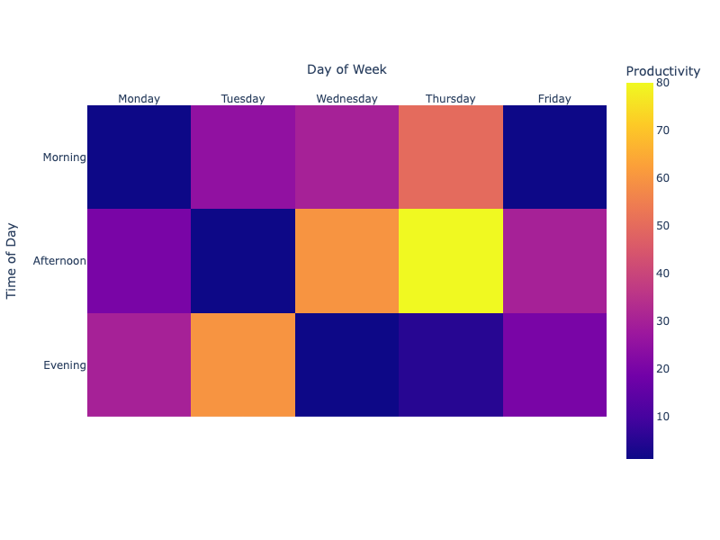

**Interactive Plot:**

<div>                        <script type="text/javascript">window.PlotlyConfig = {MathJaxConfig: 'local'};</script>
        <script charset="utf-8" src="https://cdn.plot.ly/plotly-3.1.0.min.js" integrity="sha256-Ei4740bWZhaUTQuD6q9yQlgVCMPBz6CZWhevDYPv93A=" crossorigin="anonymous"></script>                <div id="plotly-div-27" class="plotly-graph-div" style="height:100%; width:100%;"></div>            <script type="text/javascript">                window.PLOTLYENV=window.PLOTLYENV || {};                                if (document.getElementById("plotly-div-27")) {                    Plotly.newPlot(                        "plotly-div-27",                        [{"coloraxis":"coloraxis","name":"0","x":["Monday","Tuesday","Wednesday","Thursday","Friday"],"y":["Morning","Afternoon","Evening"],"z":{"dtype":"i1","bdata":"ARkeMgEUATxQHh48AQUU","shape":"3, 5"},"type":"heatmap","xaxis":"x","yaxis":"y","hovertemplate":"Day of Week: %{x}\u003cbr\u003eTime of Day: %{y}\u003cbr\u003eProductivity: %{z}\u003cextra\u003e\u003c\u002fextra\u003e"}],                        {"template":{"data":{"histogram2dcontour":[{"type":"histogram2dcontour","colorbar":{"outlinewidth":0,"ticks":""},"colorscale":[[0.0,"#0d0887"],[0.1111111111111111,"#46039f"],[0.2222222222222222,"#7201a8"],[0.3333333333333333,"#9c179e"],[0.4444444444444444,"#bd3786"],[0.5555555555555556,"#d8576b"],[0.6666666666666666,"#ed7953"],[0.7777777777777778,"#fb9f3a"],[0.8888888888888888,"#fdca26"],[1.0,"#f0f921"]]}],"choropleth":[{"type":"choropleth","colorbar":{"outlinewidth":0,"ticks":""}}],"histogram2d":[{"type":"histogram2d","colorbar":{"outlinewidth":0,"ticks":""},"colorscale":[[0.0,"#0d0887"],[0.1111111111111111,"#46039f"],[0.2222222222222222,"#7201a8"],[0.3333333333333333,"#9c179e"],[0.4444444444444444,"#bd3786"],[0.5555555555555556,"#d8576b"],[0.6666666666666666,"#ed7953"],[0.7777777777777778,"#fb9f3a"],[0.8888888888888888,"#fdca26"],[1.0,"#f0f921"]]}],"heatmap":[{"type":"heatmap","colorbar":{"outlinewidth":0,"ticks":""},"colorscale":[[0.0,"#0d0887"],[0.1111111111111111,"#46039f"],[0.2222222222222222,"#7201a8"],[0.3333333333333333,"#9c179e"],[0.4444444444444444,"#bd3786"],[0.5555555555555556,"#d8576b"],[0.6666666666666666,"#ed7953"],[0.7777777777777778,"#fb9f3a"],[0.8888888888888888,"#fdca26"],[1.0,"#f0f921"]]}],"contourcarpet":[{"type":"contourcarpet","colorbar":{"outlinewidth":0,"ticks":""}}],"contour":[{"type":"contour","colorbar":{"outlinewidth":0,"ticks":""},"colorscale":[[0.0,"#0d0887"],[0.1111111111111111,"#46039f"],[0.2222222222222222,"#7201a8"],[0.3333333333333333,"#9c179e"],[0.4444444444444444,"#bd3786"],[0.5555555555555556,"#d8576b"],[0.6666666666666666,"#ed7953"],[0.7777777777777778,"#fb9f3a"],[0.8888888888888888,"#fdca26"],[1.0,"#f0f921"]]}],"surface":[{"type":"surface","colorbar":{"outlinewidth":0,"ticks":""},"colorscale":[[0.0,"#0d0887"],[0.1111111111111111,"#46039f"],[0.2222222222222222,"#7201a8"],[0.3333333333333333,"#9c179e"],[0.4444444444444444,"#bd3786"],[0.5555555555555556,"#d8576b"],[0.6666666666666666,"#ed7953"],[0.7777777777777778,"#fb9f3a"],[0.8888888888888888,"#fdca26"],[1.0,"#f0f921"]]}],"mesh3d":[{"type":"mesh3d","colorbar":{"outlinewidth":0,"ticks":""}}],"scatter":[{"fillpattern":{"fillmode":"overlay","size":10,"solidity":0.2},"type":"scatter"}],"parcoords":[{"type":"parcoords","line":{"colorbar":{"outlinewidth":0,"ticks":""}}}],"scatterpolargl":[{"type":"scatterpolargl","marker":{"colorbar":{"outlinewidth":0,"ticks":""}}}],"bar":[{"error_x":{"color":"#2a3f5f"},"error_y":{"color":"#2a3f5f"},"marker":{"line":{"color":"#E5ECF6","width":0.5},"pattern":{"fillmode":"overlay","size":10,"solidity":0.2}},"type":"bar"}],"scattergeo":[{"type":"scattergeo","marker":{"colorbar":{"outlinewidth":0,"ticks":""}}}],"scatterpolar":[{"type":"scatterpolar","marker":{"colorbar":{"outlinewidth":0,"ticks":""}}}],"histogram":[{"marker":{"pattern":{"fillmode":"overlay","size":10,"solidity":0.2}},"type":"histogram"}],"scattergl":[{"type":"scattergl","marker":{"colorbar":{"outlinewidth":0,"ticks":""}}}],"scatter3d":[{"type":"scatter3d","line":{"colorbar":{"outlinewidth":0,"ticks":""}},"marker":{"colorbar":{"outlinewidth":0,"ticks":""}}}],"scattermap":[{"type":"scattermap","marker":{"colorbar":{"outlinewidth":0,"ticks":""}}}],"scattermapbox":[{"type":"scattermapbox","marker":{"colorbar":{"outlinewidth":0,"ticks":""}}}],"scatterternary":[{"type":"scatterternary","marker":{"colorbar":{"outlinewidth":0,"ticks":""}}}],"scattercarpet":[{"type":"scattercarpet","marker":{"colorbar":{"outlinewidth":0,"ticks":""}}}],"carpet":[{"aaxis":{"endlinecolor":"#2a3f5f","gridcolor":"white","linecolor":"white","minorgridcolor":"white","startlinecolor":"#2a3f5f"},"baxis":{"endlinecolor":"#2a3f5f","gridcolor":"white","linecolor":"white","minorgridcolor":"white","startlinecolor":"#2a3f5f"},"type":"carpet"}],"table":[{"cells":{"fill":{"color":"#EBF0F8"},"line":{"color":"white"}},"header":{"fill":{"color":"#C8D4E3"},"line":{"color":"white"}},"type":"table"}],"barpolar":[{"marker":{"line":{"color":"#E5ECF6","width":0.5},"pattern":{"fillmode":"overlay","size":10,"solidity":0.2}},"type":"barpolar"}],"pie":[{"automargin":true,"type":"pie"}]},"layout":{"autotypenumbers":"strict","colorway":["#636efa","#EF553B","#00cc96","#ab63fa","#FFA15A","#19d3f3","#FF6692","#B6E880","#FF97FF","#FECB52"],"font":{"color":"#2a3f5f"},"hovermode":"closest","hoverlabel":{"align":"left"},"paper_bgcolor":"white","plot_bgcolor":"#E5ECF6","polar":{"bgcolor":"#E5ECF6","angularaxis":{"gridcolor":"white","linecolor":"white","ticks":""},"radialaxis":{"gridcolor":"white","linecolor":"white","ticks":""}},"ternary":{"bgcolor":"#E5ECF6","aaxis":{"gridcolor":"white","linecolor":"white","ticks":""},"baxis":{"gridcolor":"white","linecolor":"white","ticks":""},"caxis":{"gridcolor":"white","linecolor":"white","ticks":""}},"coloraxis":{"colorbar":{"outlinewidth":0,"ticks":""}},"colorscale":{"sequential":[[0.0,"#0d0887"],[0.1111111111111111,"#46039f"],[0.2222222222222222,"#7201a8"],[0.3333333333333333,"#9c179e"],[0.4444444444444444,"#bd3786"],[0.5555555555555556,"#d8576b"],[0.6666666666666666,"#ed7953"],[0.7777777777777778,"#fb9f3a"],[0.8888888888888888,"#fdca26"],[1.0,"#f0f921"]],"sequentialminus":[[0.0,"#0d0887"],[0.1111111111111111,"#46039f"],[0.2222222222222222,"#7201a8"],[0.3333333333333333,"#9c179e"],[0.4444444444444444,"#bd3786"],[0.5555555555555556,"#d8576b"],[0.6666666666666666,"#ed7953"],[0.7777777777777778,"#fb9f3a"],[0.8888888888888888,"#fdca26"],[1.0,"#f0f921"]],"diverging":[[0,"#8e0152"],[0.1,"#c51b7d"],[0.2,"#de77ae"],[0.3,"#f1b6da"],[0.4,"#fde0ef"],[0.5,"#f7f7f7"],[0.6,"#e6f5d0"],[0.7,"#b8e186"],[0.8,"#7fbc41"],[0.9,"#4d9221"],[1,"#276419"]]},"xaxis":{"gridcolor":"white","linecolor":"white","ticks":"","title":{"standoff":15},"zerolinecolor":"white","automargin":true,"zerolinewidth":2},"yaxis":{"gridcolor":"white","linecolor":"white","ticks":"","title":{"standoff":15},"zerolinecolor":"white","automargin":true,"zerolinewidth":2},"scene":{"xaxis":{"backgroundcolor":"#E5ECF6","gridcolor":"white","linecolor":"white","showbackground":true,"ticks":"","zerolinecolor":"white","gridwidth":2},"yaxis":{"backgroundcolor":"#E5ECF6","gridcolor":"white","linecolor":"white","showbackground":true,"ticks":"","zerolinecolor":"white","gridwidth":2},"zaxis":{"backgroundcolor":"#E5ECF6","gridcolor":"white","linecolor":"white","showbackground":true,"ticks":"","zerolinecolor":"white","gridwidth":2}},"shapedefaults":{"line":{"color":"#2a3f5f"}},"annotationdefaults":{"arrowcolor":"#2a3f5f","arrowhead":0,"arrowwidth":1},"geo":{"bgcolor":"white","landcolor":"#E5ECF6","subunitcolor":"white","showland":true,"showlakes":true,"lakecolor":"white"},"title":{"x":0.05},"mapbox":{"style":"light"}}},"xaxis":{"anchor":"y","domain":[0.0,1.0],"scaleanchor":"y","constrain":"domain","title":{"text":"Day of Week"},"side":"top"},"yaxis":{"anchor":"x","domain":[0.0,1.0],"autorange":"reversed","constrain":"domain","title":{"text":"Time of Day"}},"coloraxis":{"colorbar":{"title":{"text":"Productivity"}},"colorscale":[[0.0,"#0d0887"],[0.1111111111111111,"#46039f"],[0.2222222222222222,"#7201a8"],[0.3333333333333333,"#9c179e"],[0.4444444444444444,"#bd3786"],[0.5555555555555556,"#d8576b"],[0.6666666666666666,"#ed7953"],[0.7777777777777778,"#fb9f3a"],[0.8888888888888888,"#fdca26"],[1.0,"#f0f921"]]},"margin":{"t":60}},                        {"responsive": true}                    )                };            </script>        </div>

```python
import plotly.express as px
from skimage import io
img = io.imread('https://upload.wikimedia.org/wikipedia/commons/thumb/0/00/Crab_Nebula.jpg/240px-Crab_Nebula.jpg')
fig = px.imshow(img)
fig.show()
```

**Error:**
```
Error executing code: HTTP Error 403: Forbidden
Traceback (most recent call last):
  File "/Users/gvwilson/plotly.py/bin/run_markdown.py", line 236, in _run_code
    exec(code, exec_globals)
  File "<string>", line 3, in <module>
  File "/Users/gvwilson/plotly.py/.venv/lib/python3.11/site-packages/skimage/_shared/utils.py", line 328, in fixed_func
    return func(*args, **kwargs)
           ^^^^^^^^^^^^^^^^^^^^^
  File "/Users/gvwilson/plotly.py/.venv/lib/python3.11/site-packages/skimage/io/_io.py", line 81, in imread
    with file_or_url_context(fname) as fname, _hide_plugin_deprecation_warnings():
  File "/Users/gvwilson/Library/Application Support/uv/python/cpython-3.11.12-macos-aarch64-none/lib/python3.11/contextlib.py", line 137, in __enter__
    return next(self.gen)
           ^^^^^^^^^^^^^^
  File "/Users/gvwilson/plotly.py/.venv/lib/python3.11/site-packages/skimage/io/util.py", line 27, in file_or_url_context
    with urllib.request.urlopen(resource_name) as u:
         ^^^^^^^^^^^^^^^^^^^^^^^^^^^^^^^^^^^^^
  File "/Users/gvwilson/Library/Application Support/uv/python/cpython-3.11.12-macos-aarch64-none/lib/python3.11/urllib/request.py", line 216, in urlopen
    return opener.open(url, data, timeout)
           ^^^^^^^^^^^^^^^^^^^^^^^^^^^^^^^
  File "/Users/gvwilson/Library/Application Support/uv/python/cpython-3.11.12-macos-aarch64-none/lib/python3.11/urllib/request.py", line 525, in open
    response = meth(req, response)
               ^^^^^^^^^^^^^^^^^^^
  File "/Users/gvwilson/Library/Application Support/uv/python/cpython-3.11.12-macos-aarch64-none/lib/python3.11/urllib/request.py", line 634, in http_response
    response = self.parent.error(
               ^^^^^^^^^^^^^^^^^^
  File "/Users/gvwilson/Library/Application Support/uv/python/cpython-3.11.12-macos-aarch64-none/lib/python3.11/urllib/request.py", line 563, in error
    return self._call_chain(*args)
           ^^^^^^^^^^^^^^^^^^^^^^^
  File "/Users/gvwilson/Library/Application Support/uv/python/cpython-3.11.12-macos-aarch64-none/lib/python3.11/urllib/request.py", line 496, in _call_chain
    result = func(*args)
             ^^^^^^^^^^^
  File "/Users/gvwilson/Library/Application Support/uv/python/cpython-3.11.12-macos-aarch64-none/lib/python3.11/urllib/request.py", line 643, in http_error_default
    raise HTTPError(req.full_url, code, msg, hdrs, fp)
urllib.error.HTTPError: HTTP Error 403: Forbidden
```

#### Tile Maps

**Read more about [tile maps](tile-map-layers.md) and [point on tile maps](tile-scatter-maps.md).**

```python
import plotly.express as px
df = px.data.carshare()
fig = px.scatter_map(df, lat="centroid_lat", lon="centroid_lon", color="peak_hour", size="car_hours",
                  color_continuous_scale=px.colors.cyclical.IceFire, size_max=15, zoom=10,
                  map_style="carto-positron")
fig.show()
```

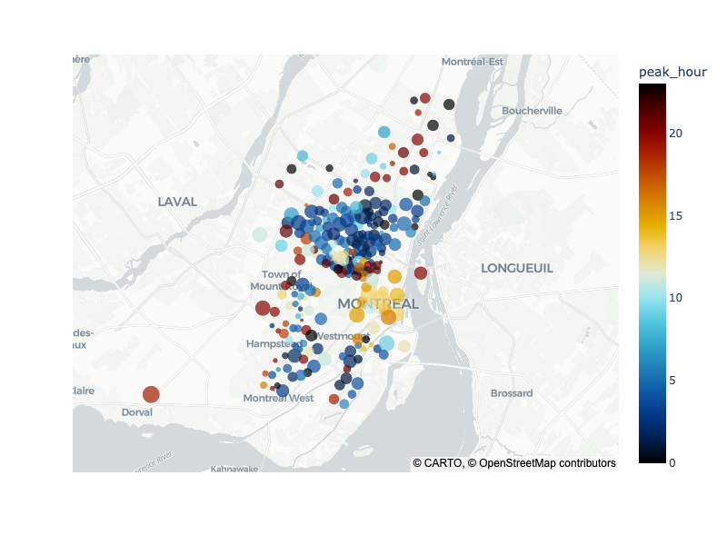

**Interactive Plot:**

<div>                        <script type="text/javascript">window.PlotlyConfig = {MathJaxConfig: 'local'};</script>
        <script charset="utf-8" src="https://cdn.plot.ly/plotly-3.1.0.min.js" integrity="sha256-Ei4740bWZhaUTQuD6q9yQlgVCMPBz6CZWhevDYPv93A=" crossorigin="anonymous"></script>                <div id="plotly-div-28" class="plotly-graph-div" style="height:100%; width:100%;"></div>            <script type="text/javascript">                window.PLOTLYENV=window.PLOTLYENV || {};                                if (document.getElementById("plotly-div-28")) {                    Plotly.newPlot(                        "plotly-div-28",                        [{"hovertemplate":"car_hours=%{marker.size}\u003cbr\u003ecentroid_lat=%{lat}\u003cbr\u003ecentroid_lon=%{lon}\u003cbr\u003epeak_hour=%{marker.color}\u003cextra\u003e\u003c\u002fextra\u003e","lat":{"dtype":"f8","bdata":"TgqQs1u8RkA4jdlencVGQPcsTPlqvkZA3v+0ZO3CRkDLIFy7G7pGQK0u2S5cyUZApARRztjDRkCyZx2Q5b9GQHuADgWRxkZAtQdUPuPGRkAANnDau7xGQJxWjdIoxEZAEeBP4GDIRkDDJTivYcBGQCwTXFeXyEZAXPf6fnG9RkCdbNmodblGQBnvBVFjwEZA6ga0mAnORkCLlCuEOr1GQPFkWWt\u002fwkZAWTjO\u002ftXIRkCH37IspMRGQGJDTf\u002fGyEZAYOSnF+jFRkC\u002fLLTmvsVGQENLEqnHxUZAMT0QvTS9RkD\u002f4q44g8pGQNjoUuD+w0ZAvwFNKb7GRkDmJkyDu8NGQEiiPuETw0ZA2yezFhfBRkCOZAO1eL5GQHt+\u002f\u002fThwEZA6YkVyxrKRkBt\u002f46VBbxGQBsEbd3yxEZA4f9pTOvKRkAhb1YENLtGQNq\u002fodQKwUZAHhk536\u002fGRkD5l4OUO8RGQAEIzYHKw0ZANnjIqObHRkCJv1gYvLpGQCbtrrZWwkZAAnptm027RkC\u002fOgVghrpGQKlRbT5LykZAWkUk0o\u002fBRkAYOVOoKsZGQMMQEeySw0ZAd33gp3vLRkDcB8DD7MNGQAEW7Ae4v0ZAZeq0zhfFRkCPbuqYz8NGQK5IKxvGyUZASbk9DOTLRkAfamBBe8VGQGHGZXXJuUZAfTx84gXARkDiuUfroMdGQJ7euX\u002fMwUZALOUVpK\u002fCRkDPedg1hcJGQD0sP2hpvEZAt3xAcTy\u002fRkDGXvNKc8lGQAg7Yp2BvEZAZszdfYDKRkATtqF2k71GQG29+BPDzUZA5tjmyYzARkDEvVHE3LpGQBsw3OGCxkZATH0UbjjDRkBBHvew88BGQI5EGbcwxkZAHks\u002f4OLDRkComTCOJ79GQB2tVCeLv0ZAlp8FytXHRkAE9IKJFsdGQBAyCRg7w0ZAuvAAPn\u002fFRkAlOHkDl7tGQLxlcWEbwkZAIYbj+TLERkBeCleaZL1GQIOFK2lbukZAcqdeb+3FRkBWBEU5zr9GQBcMK7imw0ZARkJx22vIRkCOQFbz0cRGQDJW2Sm+vEZACJFqZZLDRkD1GGeSWr9GQPPdzQKIu0ZAWy8rnFvMRkCnqy0+6r5GQI3NWExLwkZAZX3jKeC7RkBxnTUrbsFGQAENktdKxkZAaVAKCJTERkD4jw0Ex75GQHJZVgLlxEZAx+\u002fgzovDRkCbPmSTc8RGQABGbvCivkZADHFrhx+6RkCI02LJf7xGQEG4lnw+x0ZA105o5NW9RkA\u002fOgtBg79GQP2TYspZx0ZAHmMZxPa\u002fRkDOAtsKHL5GQDPZ1pa0ukZAlraDSyTARkCc6yrY0sBGQMjWI+iJw0ZAPR0wF5u+RkDtAt1iQcNGQOM2w8I3zUZAvdxMdza9RkDBXNSj3MhGQMjmReTLu0ZABVJbpZzFRkBZdTOkYb1GQDvwkmTQvEZA+k44\u002fjfGRkDPVSPJpsVGQNYv2kcxzkZAroANWJK9RkD8gQ8zhsNGQNtvCuDpwEZAu1XRorDFRkCajXjGF8VGQC47DcNHxEZAdF0t8NW7RkAtgM22a8RGQHx4EPSuxEZAQFcR3WPERkCHP0b7FcNGQPhtGwCAvEZAOqrnQbfARkCPNLHxbsJGQICPVV1Aw0ZA7NcSdy7FRkA6+v2W3r1GQL6oF+JmxUZA\u002f+5DTovCRkDjeOu1hcZGQB7Hb28jwkZARsbLfejERkDm3nbykMVGQPlaGTfqv0ZAi0+jnZTJRkBOmUMSLL1GQAwnZpJsxUZATQjhP2q7RkA9RDSelr5GQLN4KksJyUZAT2GfgVfGRkCmk\u002fr84sdGQM7j3JZ0vUZAiIu8jPzFRkCeRBCtF71GQAS3jmWBykZAOPgG\u002fv7ERkCQ9ifdZMFGQPFYjDN2wkZASEtPs2\u002fGRkC\u002fpQWp\u002f8ZGQKGFVAYuwUZAO50aksDFRkBxSDwBiMZGQMLycGptu0ZAoSpyxpDERkD6Thh\u002f2MJGQHiL94vnxEZAWpQy+gq9RkBT3m2M8sZGQEzsK9OfxUZANMJn7g7GRkD1WbO5D8RGQOk8STEUw0ZA\u002fij5XUnDRkBYiUwpU7pGQIJadSnpwUZAedJHRq7DRkDC7gptvrpGQN2vFK7+wkZACpkDxVPERkAv4jmzLMJGQDgbsdaxvEZAn5a2eBzDRkBO+b86PslGQIRWP\u002fgFxEZATJM39pjCRkDoU0wufMVGQEv6Js+BwUZAGnDKfwS9RkAZogAyPMNGQP15XMG3w0ZABZXMud\u002fFRkDrl2w0ScVGQGVBt6lhw0ZAQmo9FcXARkBX4EK2\u002f8dGQC8tXbBhwkZAYQ0aANLCRkBP6JSaFcNGQHlbbI3gwkZACUVO9hHFRkC31+QJY8tGQHRJpBPWxUZA5fUu8MvERkBnwIjXZclGQNTtmayNxEZA8cX4Iz\u002fARkDCgyLqi8ZGQFVep4PXxEZAY8YsfMPDRkBaCjhTycZGQFon\u002fLN5xkZAAK9sLoO\u002fRkDyO64b+8RGQHgR7wiVxEZAVfiCAwLERkAJXD5jm8JGQCu7RYbXvUZArAPA\u002fcfGRkCMVIpX88ZGQDfPdP8TyUZAqCBBXU3ERkAJl2wP2sJGQAa6NkUEyUZAmSOQxj2+RkAhj5WvCcZGQD1xIh7zxUZAui9GTW2\u002fRkBPeSyotsJGQJmmMBErxEZA"},"legendgroup":"","lon":{"dtype":"f8","bdata":"3yYAAK1lUsCSWsdG\u002f2NSwJIHVBgjaVLACc95kx9mUsB4k3viSm9SwJ6vpcKNYlLAElsevjFoUsCJgd\u002fi9mNSwGTNukkmZ1LAXpy\u002f9PBkUsBStxHVWmhSwJiXJawXZVLA0\u002fqFuBZpUsBXs6LLKGhSwBuf7LFmZVLAaZtK6UVlUsBgOD1V82VSwLz95tEOZVLAs3OaJ5NiUsDlQmlBB2VSwO6KsbkTZVLA98vbkqVhUsCfw+VK+WNSwNuHwdvkY1LA8WeOXNVlUsBrWz0GrmhSwFef8I+AZ1LAjOIwpVZkUsAa\u002f4\u002fSXmFSwNrUwMHOZlLAOIWP4oRmUsBelREuKGdSwHO\u002fPLGkZFLAEaPUPhJkUsADVyveymdSwHJHXJz0aFLAYrOk8Z9kUsBOs\u002f+NamdSwDXUM9AJalLA5yeAf6BjUsAGN6JT2mVSwI6sWPNSZ1LA29U9YaFjUsCmT0vWfmVSwML1gi7FZVLA6xG4BD5nUsD4MisP2mlSwFPrJ2lAYlLAXPcw9XJoUsC5bOfVamlSwPDveNr3Z1LAGGG8EPZnUsDjK3qgoGRSwLEv03NYZ1LAenGBI8xgUsDNa2ETZ2dSwIc2Ij1QaVLAo2ddbSVkUsBwfUpup2RSwLW+\u002fSGfY1LAR84DaQVkUsB51IbNi2JSwBApARpzZlLAxTQKP7VkUsBOan4CZGJSwDh4jyqAaFLAYMguc4BlUsCq7skwXWRSwKhvy1NJaVLA9tRpgxRnUsAf+z9IqmZSwI0O6gzjZlLA1lHhPhxiUsCF51NZ5WNSwH\u002fPYWLhYFLA3gGrYSxkUsCym2CATWVSwKkKVsqKZ1LAOblkerNmUsCTQRw2wWRSwGCHuiV3ZVLA8ud887JnUsDc0oy8AGhSwFM2C\u002fxeY1LACxvy18VlUsCzoomMb2RSwO\u002fjslxjZlLAeFNGIMNnUsAb6Y8tuWdSwACNSO6DY1LAi1+mtP1oUsAJR5fYT2hSwGk5d+rsaFLApM9+u9ZmUsBxZyC+qGdSwBHHLHl\u002fZlLA\u002fwemzEVmUsBXlRPZRGVSwBRHfCjNaFLAR6vkaWllUsCmUN5bz2NSwA6+R\u002fTDaVLAnTiC6KhhUsAY6Uw4yGhSwEenF2e\u002fZVLA8XCLbbNoUsBR7de1jWRSwO9fRtCBaFLA8QwiBjFmUsC6ERh0cWlSwE\u002fOqz3IZlLA2nnLgddkUsA0p4ASqmRSwLePpYiKZFLAxd3POpNlUsCLFhKhSWVSwBqFfqQOYlLAFDgAmJ5oUsDJd38UVmVSwHGgbxJzZlLAYtKGH+NpUsDeTE9yimdSwGn+qNEuaVLA2PhjpZpoUsAAmUo8YWNSwGYN3Aj8ZVLA\u002ftqU4GloUsBPh85ZF2hSwLj1EPpgYlLAYMi6KT5nUsBpSDYAdmRSwICPDEkjaVLAa3d9dUNlUsD\u002fH7W7C2NSwDxUOSALZFLAl\u002fH4WQxlUsAREqBfLmZSwLXImCkKYlLAgvjMCe1nUsBtZR1pNGVSwFPxaAVZaFLAjUh8jg5jUsAi0IgBvWJSwMiWUIiAY1LAra3lXs9lUsBaat6K7GVSwBUQBPXHZ1LAIJQsFRFnUsAQ9gGglmVSwOT+67fqZ1LArslvkdtnUsDXzsbR02RSwA61y90NZ1LAXYZhpsJoUsCio\u002fHCR2VSwD11VaghZ1LA\u002fUqPZk5lUsDo\u002fJJk2mVSwBqQ7g0HZVLARlNvtINkUsCqheZaf2RSwBXNd9QRaFLASqrcBhFkUsBJ3VcXF2hSwGQksWSLY1LA1Dk0Fg9oUsB1gSd\u002fLmhSwM8irlzPYVLA9ThwMUxkUsD1mceEvWRSwMycu9+jZFLAyEGLrX9iUsDs5KbDMmVSwOCLm9YWY1LAEW7rsnVmUsAke3214mRSwKOTBfeiZFLAYTvJvuZmUsBGW0vz9mJSwIURWI2XZ1LA0e\u002f7HSloUsD3pz0hDWRSwJqbhHJwaVLAgYRZKmRkUsC2NMx5aGZSwJpuBFbHZFLAVsOuz6ZlUsCM2TxgyWdSwAYy9IC7ZFLAv2If6n5mUsC3y+Mh5WRSwLRWr9YuZFLAsQPpKcNlUsAzOBBLVGlSwLTxJNGVZFLAAfwzEw9lUsBDNyxIK2ZSwJ11SGLUZlLA0B6zXVxlUsCWgLpcWmVSwEKt\u002fLYEZlLAf1pDSD9lUsCZnJXtEWNSwEstNxIkZFLABymr\u002fNxlUsA3cmbfwGZSwPO7jLbMaFLA4AsKn6dnUsCQMz3YAWZSwNDFGGUeZFLAhgvgyEBnUsC\u002f005um2VSwGc0xKctZlLAbpCVjRBoUsAXwycaU2VSwBUgbmwQZlLAvJ3CZY1kUsDFWdbMBGVSwMHWy0TJZFLA3u8hhBpoUsDjbZLfZ2JSwIRT7KhNZFLAtVoQefJkUsBYj2NZf2hSwHBRRSYRZVLAQMV4N1BoUsDnw5W4aWJSwJB4Ak1fZ1LAJxXSD5RlUsAYSZBrXmVSwOHlNmfAZFLAOhh6ovVnUsDqXryiEWVSwLJZ3oaLZVLAt08mtFtlUsDlOeVHP2ZSwD3ER\u002fnlZFLA6rTa6hFmUsDfJJ6p8WNSwJrKIhvwZFLAnyVy33dmUsALAhE4YWRSwPiYqpScYVLAxDWW2d5oUsCYQZS6mWNSwELdlszLZFLAhVWMpSxoUsDQqOMIPGVSwAr6FX1SZFLA"},"marker":{"color":{"dtype":"i1","bdata":"AhcUFxMBEg4CAQIDFQsBBQYPAA4CFwMUAwIFAwkFCgsDDRQNCQQLEQEQChMFChAUAhQIAwIMARUUBwMTBwATCxcAARUUBQALFAkADQQDAw0ECxQNEwINBBcPCQQDCAsLBQIBAhASABIEBAwHBAIDAgIMBAEFCg8VFAAXDA4NBBQTAhQGCQwEAgMUBgMEBQYFFQUSBQIUDAEEFRAHAwUQAQICCQQFBQUAAgIOAwoVAg8VAwQFAwIEAwMDAhECBQEWABMLAgEVARYEChQCAgMUDAsCAwMMCAMUAw8UAxQBBQACBQMFEggBDQICAwAXBQIKCxUHEgMCCBEF"},"coloraxis":"coloraxis","size":{"dtype":"f8","bdata":"gPf\u002f\u002f\u002f+ym0B6sKqqqtKOQEH\u002f\u002f\u002f\u002f\u002fK3ZAfFRVVVWBgUBBW1VVVSmmQGEGAAAA9o9AdQMAAAAeikAIS1VVVYGdQBgDAAAAG5BAGaGqqqrEnEAln6qqqrieQD\u002f7\u002f\u002f\u002f\u002f85dAxFhVVVURikBIAAAAABByQNtVVVVVGXFAXKqqqqqWgkCwW1VVVeePQOH8\u002f\u002f\u002f\u002fUZZA4QAAAAD2hEAm\u002ff\u002f\u002f\u002f5d+QD9SVVVVSZZAMv7\u002f\u002f\u002f9nekDQ+f\u002f\u002f\u002f2KZQNkBAAAA5oZAF5+qqqrGnkBL+f\u002f\u002f\u002f+eZQHerqqqqzIRApa2qqqooiUAAAQAAADhrQLZTVVVV0pRAQAAAAAC0g0Am\u002f\u002f\u002f\u002f\u002f3+BQFWoqqqqgnxAAVZVVVWHkkB7rKqqqmKRQPOwqqqqxI9A1v3\u002f\u002f\u002f9clUCT9\u002f\u002f\u002f\u002f5+bQGn9\u002f\u002f\u002f\u002f56FAtKmqqqpGgUAGqKqqqteVQP4FAAAALo9ANFpVVVXxjEBqqqqqqjJ0QBWuqqqqCIpAFKiqqqrJlUDN\u002f\u002f\u002f\u002f\u002f82CQEH4\u002f\u002f\u002f\u002f8ZpA8ldVVVWWkEC1\u002f\u002f\u002f\u002f\u002f1t0QKpUVVVV3pNADEpVVVV8nkDBWlVVVQuOQDJSVVVVvX9AWlZVVVU9hUCMrKqqqvaGQFitqqqqhZBABlZVVVVtcEDY\u002fv\u002f\u002f\u002f1qUQLpUVVVVnXVAa1BVVVUdmEBBAAAAALaDQFZWVVVVMpJA\u002f\u002fj\u002f\u002f\u002f8zmkB+VFVVVQqUQFIGAAAA2I9AAaOqqqrcmkAMAQAAAEyFQPiqqqqq+nFALFBVVVVdmECJVVVVVZuDQBT2\u002f\u002f\u002f\u002fHp1A8wMAAAAai0BP\u002f\u002f\u002f\u002f\u002f9qiQN9TVVVVqZRAwQwAAACUqUCCpaqqqluYQCSgqqqquZ1AuqSqqqokmUDuBAAAgKqlQIufqqqqUp5APfr\u002f\u002f\u002f\u002f1mEAjAAAAAFBkQGRKVVVVJJ5AogMAAAB4ikBo+\u002f\u002f\u002f\u002f8qXQP6qqqqq2oNAE09VVVUSoEDzWFVVVW+KQEKeqqqqm59AOPr\u002f\u002f\u002f\u002f6mEDsqaqqqraBQBWjqqqqyJpACAEAAABEhUDmAgAAAE2QQJarqqqqCoVA7QEAAABHkUCX\u002ff\u002f\u002f\u002f5uVQLT+\u002f\u002f\u002f\u002fm4BAUgAAAADYg0BnqaqqqpGiQD6oqqqq5nxAT6mqqqqOlECVp6qqqoZ\u002fQPsBAAAAKodAnq6qqqoai0C\u002frqqqqlyLQB9RVVVVGKFANVZVVVVTkkCa\u002f\u002f\u002f\u002f\u002f8d0QBP+\u002f\u002f\u002f\u002fHpVAfwUAAAAyjkC9BQAAAK6OQL9NVVVVyZpAyK2qqqpuiUDlAwAAAP6KQBWrqqqqyJJAdauqqqrIhEBLqqqqqgOjQJ8AAAAAlJJALqiqqir1oUDBp6qqqhuWQFr9\u002f\u002f\u002f\u002fx31ACq2qqqryh0Ah\u002fv\u002f\u002ff0SiQOkAAAAASpJAlgEAAABghkBYVVVVVTCTQCFSVVVV\u002fX9AU1NVVVU1lUCoVlVVVeCRQDoAAAAASHJA01dVVVW0kEBHUFVVVUGYQMatqqqqF5BAR6+qqqqBpUBjT1VVVTqgQElWVVVVP5JArwAAAACShED9AQAAAC6HQN1TVVVVQ4BA1\u002fr\u002f\u002f\u002f+eoEAeAgAAABWRQAOlqqqq2ZhAnVZVVVXDhUBtVFVVVRuUQJmmqqqqRJdAyqGqqqoTnEDq\u002fv\u002f\u002f\u002f0iUQHevqqqqzIxAh6qqqqrsgkBoqqqqqnSTQCaqqqqqt5NAjfj\u002f\u002f\u002f+lmkDj\u002ff\u002f\u002f\u002f0+VQBdYVVVVt4hAhAIAAACvkECR\u002fv\u002f\u002f\u002f6GUQEipqqqqlZRAl1JVVVXxlUDeVVVVVUWEQPX\u002f\u002f\u002f\u002f\u002fW3NAOP3\u002f\u002f\u002f9PfkBDU1VVVXV7QHRYVVVVcYlAHKqqqqrBk0BPq6qqqnyEQByqqqqqanVAMAAAAACUg0BOraqqqo+QQHCqqqqqGnRATVZVVVUjhUAXVlVVVT1pQL6qqqqqH5NAgKOqqqpdmkAmV1VVVWKRQIH9\u002f\u002f\u002f\u002fK31AVa2qqqqIiEBlTFVVVSOcQDZTVVVVUpVAiP3\u002f\u002f3\u002f3oUD4AgAAADuQQFysqqqqloZAh\u002fj\u002f\u002f\u002f+rmkD0\u002f\u002f\u002f\u002f\u002fz6TQDCwqqqqPo5A3lJVVVWqlUDvVVVVVQ1oQJRVVVVVNXJAcqiqqqprlUDc\u002f\u002f\u002f\u002f\u002f+uCQEyrqqqqQmhA0f7\u002f\u002f\u002f\u002fVgEDr\u002f\u002f\u002f\u002f\u002f59AQDD3\u002f\u002f\u002f\u002fApxAlayqqqoIh0AsAQAAAAeSQD4EAAAAsItAqlpVVVXdjUB2AgAAAL2QQBcCAAAAYodASVFVVVU\u002fl0B1AwAAAB6KQEoEAAAAyItA+KiqqqrllEDDVlVVVcWRQH8FAAAAMo5ACwMAAAAokEBwpqqqqm6XQENSVVVVeX9At1lVVVX3i0CIoqqqqlWbQNT1\u002f\u002f\u002f\u002fXp1AqFVVVVXZg0A1raqqqkiIQBKrqqqqy5JAKP\u002f\u002f\u002f\u002f+DgUBqraqqqrKIQIetqqqq7IhAIQEAAAASkkACp6qqqtuWQEhWVVVVQJJAq\u002f3\u002f\u002f\u002f+DfEBWBgAAAN6PQKKrqqqqPJJAqFJVVVXhfUA0+v\u002f\u002f\u002f\u002f6YQOBPVVVVqJhAEv3\u002f\u002f\u002f\u002fnfkA5o6qqqqSaQIpaVVVVnY1AaP\u002f\u002f\u002f\u002f+fXECZV1VVVbuHQF+lqqqqfphA9v7\u002f\u002f\u002f8fgUBasKqqqpKOQJWrqqqqCIVAsqiqqqoqlUCxqKqqqiyVQG4EAAAAEIxAslZVVVXthUBgWVVVVUmLQJxWVVVVbW1AVltVVVU1j0CaWlVVVbuNQClYVVVV24hAJf7\u002f\u002f\u002f+bekA1WFVVVVOQQJdWVVVVt4VA"},"sizemode":"area","sizeref":14.55111111111771},"mode":"markers","name":"","showlegend":false,"subplot":"map","type":"scattermap"}],                        {"template":{"data":{"histogram2dcontour":[{"type":"histogram2dcontour","colorbar":{"outlinewidth":0,"ticks":""},"colorscale":[[0.0,"#0d0887"],[0.1111111111111111,"#46039f"],[0.2222222222222222,"#7201a8"],[0.3333333333333333,"#9c179e"],[0.4444444444444444,"#bd3786"],[0.5555555555555556,"#d8576b"],[0.6666666666666666,"#ed7953"],[0.7777777777777778,"#fb9f3a"],[0.8888888888888888,"#fdca26"],[1.0,"#f0f921"]]}],"choropleth":[{"type":"choropleth","colorbar":{"outlinewidth":0,"ticks":""}}],"histogram2d":[{"type":"histogram2d","colorbar":{"outlinewidth":0,"ticks":""},"colorscale":[[0.0,"#0d0887"],[0.1111111111111111,"#46039f"],[0.2222222222222222,"#7201a8"],[0.3333333333333333,"#9c179e"],[0.4444444444444444,"#bd3786"],[0.5555555555555556,"#d8576b"],[0.6666666666666666,"#ed7953"],[0.7777777777777778,"#fb9f3a"],[0.8888888888888888,"#fdca26"],[1.0,"#f0f921"]]}],"heatmap":[{"type":"heatmap","colorbar":{"outlinewidth":0,"ticks":""},"colorscale":[[0.0,"#0d0887"],[0.1111111111111111,"#46039f"],[0.2222222222222222,"#7201a8"],[0.3333333333333333,"#9c179e"],[0.4444444444444444,"#bd3786"],[0.5555555555555556,"#d8576b"],[0.6666666666666666,"#ed7953"],[0.7777777777777778,"#fb9f3a"],[0.8888888888888888,"#fdca26"],[1.0,"#f0f921"]]}],"contourcarpet":[{"type":"contourcarpet","colorbar":{"outlinewidth":0,"ticks":""}}],"contour":[{"type":"contour","colorbar":{"outlinewidth":0,"ticks":""},"colorscale":[[0.0,"#0d0887"],[0.1111111111111111,"#46039f"],[0.2222222222222222,"#7201a8"],[0.3333333333333333,"#9c179e"],[0.4444444444444444,"#bd3786"],[0.5555555555555556,"#d8576b"],[0.6666666666666666,"#ed7953"],[0.7777777777777778,"#fb9f3a"],[0.8888888888888888,"#fdca26"],[1.0,"#f0f921"]]}],"surface":[{"type":"surface","colorbar":{"outlinewidth":0,"ticks":""},"colorscale":[[0.0,"#0d0887"],[0.1111111111111111,"#46039f"],[0.2222222222222222,"#7201a8"],[0.3333333333333333,"#9c179e"],[0.4444444444444444,"#bd3786"],[0.5555555555555556,"#d8576b"],[0.6666666666666666,"#ed7953"],[0.7777777777777778,"#fb9f3a"],[0.8888888888888888,"#fdca26"],[1.0,"#f0f921"]]}],"mesh3d":[{"type":"mesh3d","colorbar":{"outlinewidth":0,"ticks":""}}],"scatter":[{"fillpattern":{"fillmode":"overlay","size":10,"solidity":0.2},"type":"scatter"}],"parcoords":[{"type":"parcoords","line":{"colorbar":{"outlinewidth":0,"ticks":""}}}],"scatterpolargl":[{"type":"scatterpolargl","marker":{"colorbar":{"outlinewidth":0,"ticks":""}}}],"bar":[{"error_x":{"color":"#2a3f5f"},"error_y":{"color":"#2a3f5f"},"marker":{"line":{"color":"#E5ECF6","width":0.5},"pattern":{"fillmode":"overlay","size":10,"solidity":0.2}},"type":"bar"}],"scattergeo":[{"type":"scattergeo","marker":{"colorbar":{"outlinewidth":0,"ticks":""}}}],"scatterpolar":[{"type":"scatterpolar","marker":{"colorbar":{"outlinewidth":0,"ticks":""}}}],"histogram":[{"marker":{"pattern":{"fillmode":"overlay","size":10,"solidity":0.2}},"type":"histogram"}],"scattergl":[{"type":"scattergl","marker":{"colorbar":{"outlinewidth":0,"ticks":""}}}],"scatter3d":[{"type":"scatter3d","line":{"colorbar":{"outlinewidth":0,"ticks":""}},"marker":{"colorbar":{"outlinewidth":0,"ticks":""}}}],"scattermap":[{"type":"scattermap","marker":{"colorbar":{"outlinewidth":0,"ticks":""}}}],"scattermapbox":[{"type":"scattermapbox","marker":{"colorbar":{"outlinewidth":0,"ticks":""}}}],"scatterternary":[{"type":"scatterternary","marker":{"colorbar":{"outlinewidth":0,"ticks":""}}}],"scattercarpet":[{"type":"scattercarpet","marker":{"colorbar":{"outlinewidth":0,"ticks":""}}}],"carpet":[{"aaxis":{"endlinecolor":"#2a3f5f","gridcolor":"white","linecolor":"white","minorgridcolor":"white","startlinecolor":"#2a3f5f"},"baxis":{"endlinecolor":"#2a3f5f","gridcolor":"white","linecolor":"white","minorgridcolor":"white","startlinecolor":"#2a3f5f"},"type":"carpet"}],"table":[{"cells":{"fill":{"color":"#EBF0F8"},"line":{"color":"white"}},"header":{"fill":{"color":"#C8D4E3"},"line":{"color":"white"}},"type":"table"}],"barpolar":[{"marker":{"line":{"color":"#E5ECF6","width":0.5},"pattern":{"fillmode":"overlay","size":10,"solidity":0.2}},"type":"barpolar"}],"pie":[{"automargin":true,"type":"pie"}]},"layout":{"autotypenumbers":"strict","colorway":["#636efa","#EF553B","#00cc96","#ab63fa","#FFA15A","#19d3f3","#FF6692","#B6E880","#FF97FF","#FECB52"],"font":{"color":"#2a3f5f"},"hovermode":"closest","hoverlabel":{"align":"left"},"paper_bgcolor":"white","plot_bgcolor":"#E5ECF6","polar":{"bgcolor":"#E5ECF6","angularaxis":{"gridcolor":"white","linecolor":"white","ticks":""},"radialaxis":{"gridcolor":"white","linecolor":"white","ticks":""}},"ternary":{"bgcolor":"#E5ECF6","aaxis":{"gridcolor":"white","linecolor":"white","ticks":""},"baxis":{"gridcolor":"white","linecolor":"white","ticks":""},"caxis":{"gridcolor":"white","linecolor":"white","ticks":""}},"coloraxis":{"colorbar":{"outlinewidth":0,"ticks":""}},"colorscale":{"sequential":[[0.0,"#0d0887"],[0.1111111111111111,"#46039f"],[0.2222222222222222,"#7201a8"],[0.3333333333333333,"#9c179e"],[0.4444444444444444,"#bd3786"],[0.5555555555555556,"#d8576b"],[0.6666666666666666,"#ed7953"],[0.7777777777777778,"#fb9f3a"],[0.8888888888888888,"#fdca26"],[1.0,"#f0f921"]],"sequentialminus":[[0.0,"#0d0887"],[0.1111111111111111,"#46039f"],[0.2222222222222222,"#7201a8"],[0.3333333333333333,"#9c179e"],[0.4444444444444444,"#bd3786"],[0.5555555555555556,"#d8576b"],[0.6666666666666666,"#ed7953"],[0.7777777777777778,"#fb9f3a"],[0.8888888888888888,"#fdca26"],[1.0,"#f0f921"]],"diverging":[[0,"#8e0152"],[0.1,"#c51b7d"],[0.2,"#de77ae"],[0.3,"#f1b6da"],[0.4,"#fde0ef"],[0.5,"#f7f7f7"],[0.6,"#e6f5d0"],[0.7,"#b8e186"],[0.8,"#7fbc41"],[0.9,"#4d9221"],[1,"#276419"]]},"xaxis":{"gridcolor":"white","linecolor":"white","ticks":"","title":{"standoff":15},"zerolinecolor":"white","automargin":true,"zerolinewidth":2},"yaxis":{"gridcolor":"white","linecolor":"white","ticks":"","title":{"standoff":15},"zerolinecolor":"white","automargin":true,"zerolinewidth":2},"scene":{"xaxis":{"backgroundcolor":"#E5ECF6","gridcolor":"white","linecolor":"white","showbackground":true,"ticks":"","zerolinecolor":"white","gridwidth":2},"yaxis":{"backgroundcolor":"#E5ECF6","gridcolor":"white","linecolor":"white","showbackground":true,"ticks":"","zerolinecolor":"white","gridwidth":2},"zaxis":{"backgroundcolor":"#E5ECF6","gridcolor":"white","linecolor":"white","showbackground":true,"ticks":"","zerolinecolor":"white","gridwidth":2}},"shapedefaults":{"line":{"color":"#2a3f5f"}},"annotationdefaults":{"arrowcolor":"#2a3f5f","arrowhead":0,"arrowwidth":1},"geo":{"bgcolor":"white","landcolor":"#E5ECF6","subunitcolor":"white","showland":true,"showlakes":true,"lakecolor":"white"},"title":{"x":0.05},"mapbox":{"style":"light"}}},"map":{"domain":{"x":[0.0,1.0],"y":[0.0,1.0]},"center":{"lat":45.523416683439955,"lon":-73.59183434290806},"zoom":10,"style":"carto-positron"},"coloraxis":{"colorbar":{"title":{"text":"peak_hour"}},"colorscale":[[0.0,"#000000"],[0.0625,"#001f4d"],[0.125,"#003786"],[0.1875,"#0e58a8"],[0.25,"#217eb8"],[0.3125,"#30a4ca"],[0.375,"#54c8df"],[0.4375,"#9be4ef"],[0.5,"#e1e9d1"],[0.5625,"#f3d573"],[0.625,"#e7b000"],[0.6875,"#da8200"],[0.75,"#c65400"],[0.8125,"#ac2301"],[0.875,"#820000"],[0.9375,"#4c0000"],[1.0,"#000000"]]},"legend":{"tracegroupgap":0,"itemsizing":"constant"},"margin":{"t":60},"mapbox":{"center":{"lat":45.523416683439955,"lon":-73.59183434290806},"zoom":10,"style":"carto-positron"}},                        {"responsive": true}                    )                };            </script>        </div>

**Read more about [tile map GeoJSON choropleths](tile-county-choropleth.md).**

```python
import plotly.express as px

df = px.data.election()
geojson = px.data.election_geojson()

fig = px.choropleth_map(df, geojson=geojson, color="Bergeron",
                           locations="district", featureidkey="properties.district",
                           center={"lat": 45.5517, "lon": -73.7073},
                           map_style="carto-positron", zoom=9)
fig.show()
```

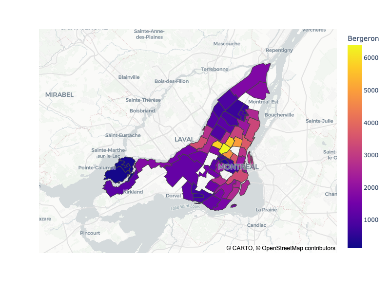

**Interactive Plot:**

<div>                        <script type="text/javascript">window.PlotlyConfig = {MathJaxConfig: 'local'};</script>
        <script charset="utf-8" src="https://cdn.plot.ly/plotly-3.1.0.min.js" integrity="sha256-Ei4740bWZhaUTQuD6q9yQlgVCMPBz6CZWhevDYPv93A=" crossorigin="anonymous"></script>                <div id="plotly-div-29" class="plotly-graph-div" style="height:100%; width:100%;"></div>            <script type="text/javascript">                window.PLOTLYENV=window.PLOTLYENV || {};                                if (document.getElementById("plotly-div-29")) {                    Plotly.newPlot(                        "plotly-div-29",                        [{"coloraxis":"coloraxis","featureidkey":"properties.district","geojson":{"type":"FeatureCollection","features":[{"type":"Feature","geometry":{"type":"MultiPolygon","coordinates":[[[[-73.6363215300962,45.5759177646435],[-73.6362833815582,45.5758266113331],[-73.6446417578686,45.5658132919643],[-73.6453511352974,45.5647725775888],[-73.648867564748,45.5586898267402],[-73.6513170845065,45.5545659435652],[-73.6515658357324,45.5554439857955],[-73.6660837831645,45.5596724837829],[-73.6706609041685,45.5610978251999],[-73.6676019919116,45.5632340862888],[-73.6645385824068,45.5642716484367],[-73.663663123697,45.5654269638586],[-73.663336397858,45.5666288247853],[-73.6637764768649,45.5678900619231],[-73.6625073244826,45.5688479494114],[-73.6624620526633,45.5708304456346],[-73.6620201425015,45.5713925326191],[-73.6616100197742,45.5737924780218],[-73.6612199500215,45.5747171555678],[-73.6625087613399,45.5748980132699],[-73.6639172423219,45.5730041908097],[-73.6654358660443,45.5729040009532],[-73.6661069174428,45.5737928224235],[-73.6657870687343,45.574385118162],[-73.6636711124334,45.577018676761],[-73.6620928771361,45.578161887933],[-73.6611738698168,45.5798517041392],[-73.660404649744,45.5806752214364],[-73.659760079306,45.5804007503503],[-73.6604711314507,45.5793767269523],[-73.660479658497,45.5787710701802],[-73.6613549575147,45.5780184952852],[-73.6617871566128,45.5758213640561],[-73.6607445476436,45.5764832852254],[-73.6608243059909,45.5774702934068],[-73.6592236423267,45.5793785624903],[-73.6570262958283,45.5810509513563],[-73.6552694168748,45.5819333817794],[-73.6543058972308,45.5836262624158],[-73.652557313063,45.5826892716542],[-73.6363215300962,45.5759177646435]]],[[[-73.6561004885273,45.5841347974261],[-73.656376117147,45.5845383929424],[-73.6559939844354,45.585868003125],[-73.6552168328229,45.5855392416017],[-73.6561004885273,45.5841347974261]]]]},"properties":{"district":"11-Sault-au-Récollet"},"id":"11"},{"type":"Feature","geometry":{"type":"Polygon","coordinates":[[[-73.6217484540132,45.5544783077209],[-73.6235005117779,45.5536358848324],[-73.6278096771011,45.5513024018691],[-73.6301686544477,45.5503989164938],[-73.6325600663803,45.5499795021129],[-73.6342899238824,45.5494628161417],[-73.6363671046978,45.548169415833],[-73.6398673671325,45.5441488267699],[-73.6407295659042,45.5429686686779],[-73.6485543103777,45.5308320827376],[-73.6510270564502,45.5263874543882],[-73.6555330494037,45.5277342274232],[-73.6698852350516,45.5318835785726],[-73.6726124365382,45.5322997327559],[-73.6747555535799,45.5323081056009],[-73.6764129283619,45.5321264506516],[-73.683124268159,45.5305991300384],[-73.6807721370907,45.534331320177],[-73.6785046215606,45.5379069417581],[-73.6752852955733,45.5369404343695],[-73.6740837310465,45.5378868187786],[-73.6687347480061,45.5363337408676],[-73.667891862525,45.5387409623539],[-73.664945183105,45.5382590909533],[-73.6646235398403,45.5394847807605],[-73.662249203322,45.543633408253],[-73.6616100449503,45.5441416421638],[-73.6604302515405,45.5460790656787],[-73.6568659704249,45.5450525873044],[-73.6513170845065,45.5545659435652],[-73.648867564748,45.5586898267402],[-73.6453511352974,45.5647725775888],[-73.6240413737876,45.5555253903511],[-73.6217484540132,45.5544783077209]]]},"properties":{"district":"12-Saint-Sulpice"},"id":"12"},{"type":"Feature","geometry":{"type":"Polygon","coordinates":[[[-73.6513170845065,45.5545659435652],[-73.6568659704249,45.5450525873044],[-73.6604302515405,45.5460790656787],[-73.6616100449503,45.5441416421638],[-73.662249203322,45.543633408253],[-73.6646235398403,45.5394847807605],[-73.664945183105,45.5382590909533],[-73.667891862525,45.5387409623539],[-73.6687347480061,45.5363337408676],[-73.6740837310465,45.5378868187786],[-73.6752852955733,45.5369404343695],[-73.6785046215606,45.5379069417581],[-73.6807721370907,45.534331320177],[-73.6920199187781,45.5394683031028],[-73.702520410412,45.5431766227664],[-73.7042065154565,45.5438906316964],[-73.7043014929187,45.5441905861876],[-73.7027027602765,45.5451406840713],[-73.7023335988111,45.5457621950639],[-73.7012226911876,45.5459702396396],[-73.7004635154173,45.5466167282154],[-73.6996123824321,45.5464852570484],[-73.6992033294858,45.5475781625301],[-73.6968595536907,45.5481581755357],[-73.6949311086011,45.5474604427764],[-73.6924688517172,45.5472280284581],[-73.6891281157722,45.5477334249253],[-73.6879273316976,45.5481318231022],[-73.6865595013798,45.5491308196528],[-73.6852748086046,45.5488162600605],[-73.6827845213391,45.5489146412483],[-73.6801283681886,45.549462773374],[-73.6791182211476,45.5500801562043],[-73.6772981030339,45.5516675115113],[-73.6765545558035,45.552766523393],[-73.6744642269172,45.5548591969672],[-73.6730096784532,45.5582339830541],[-73.6706609041685,45.5610978251999],[-73.6660837831645,45.5596724837829],[-73.6515658357324,45.5554439857955],[-73.6513170845065,45.5545659435652]]]},"properties":{"district":"13-Ahuntsic"},"id":"13"},{"type":"Feature","geometry":{"type":"Polygon","coordinates":[[[-73.7043014929187,45.5441905861876],[-73.7042065154565,45.5438906316964],[-73.702520410412,45.5431766227664],[-73.6920199187781,45.5394683031028],[-73.6807721370907,45.534331320177],[-73.683124268159,45.5305991300384],[-73.685195685208,45.5301022578388],[-73.6870922504792,45.5286619976995],[-73.6897803429098,45.5288476157777],[-73.6939612003867,45.528347826243],[-73.6963296087078,45.5276805484038],[-73.7091218538247,45.5230954877394],[-73.7112612170074,45.5243023856458],[-73.7131122096208,45.5251637887575],[-73.7145584630039,45.5239315629596],[-73.7172924358234,45.5256928911099],[-73.7185119695016,45.5247508136954],[-73.7217031155859,45.5267447688191],[-73.7280602953464,45.5213554616816],[-73.7317546325275,45.5236815365784],[-73.7358987648866,45.5207291683311],[-73.7285097856203,45.5160943522463],[-73.7350991221023,45.5137867482303],[-73.7550630650544,45.5065238038199],[-73.7551669017747,45.5064862077527],[-73.7612752776246,45.5104175090183],[-73.7638683329059,45.5120860463668],[-73.762390301954,45.5126791739444],[-73.7600609683013,45.5141288858482],[-73.7568442082942,45.5171884494623],[-73.7548593171474,45.5180889539846],[-73.752606980088,45.5185523798859],[-73.749151955166,45.519018390863],[-73.7452110015187,45.5215286261207],[-73.7437662661847,45.5231373686573],[-73.7411211602605,45.526837900694],[-73.7394306858002,45.5285277381045],[-73.7360589393138,45.5302671129156],[-73.7343347000828,45.5309824138834],[-73.7311072638005,45.5320095049916],[-73.7283844986554,45.533203827821],[-73.7249729419404,45.5359178137401],[-73.7231098233772,45.5369689627545],[-73.7202103870331,45.5381794076214],[-73.7181375140605,45.5387109207903],[-73.7158043157039,45.5388996570908],[-73.7135388429561,45.5396848689224],[-73.7111454931799,45.541340948266],[-73.7091038651233,45.5430898357363],[-73.7078456046825,45.5423008892929],[-73.7069875096913,45.5436077713277],[-73.705614345008,45.5441267025504],[-73.7043014929187,45.5441905861876]]]},"properties":{"district":"14-Bordeaux-Cartierville"},"id":"14"},{"type":"Feature","geometry":{"type":"Polygon","coordinates":[[[-73.5576871015794,45.5932166140624],[-73.5694206600629,45.5971486400825],[-73.5696609688417,45.5965806032278],[-73.5726733802096,45.5977479911912],[-73.5745938220503,45.5986717630315],[-73.576232424293,45.5992577290381],[-73.5771288919308,45.599852413767],[-73.5889961999073,45.6050220349527],[-73.5971103983983,45.6085989887758],[-73.6013378366857,45.6104025414741],[-73.6028907661658,45.6112216102358],[-73.601559767966,45.6118073578371],[-73.6023660828945,45.6125718329314],[-73.5984976040034,45.6140840514745],[-73.5954830428467,45.6158123480652],[-73.5740068269183,45.6304929149516],[-73.5683379250343,45.6341956640577],[-73.5514095863784,45.6269444197056],[-73.5481773494253,45.6255197854529],[-73.5585223912755,45.6137280036474],[-73.5640615699407,45.6074316710882],[-73.564986439275,45.60561620283],[-73.5662995431109,45.6039974029119],[-73.5631517029922,45.6031634368599],[-73.5614050931716,45.6025489377902],[-73.5567925816714,45.6005393547562],[-73.5589887922886,45.5979945383903],[-73.5595164040348,45.5961661000645],[-73.5564557704867,45.5951543577536],[-73.5576871015794,45.5932166140624]]]},"properties":{"district":"21-Ouest"},"id":"21"},{"type":"Feature","geometry":{"type":"Polygon","coordinates":[[[-73.5452799498143,45.5959627917351],[-73.5491007054645,45.5975302159963],[-73.5479841638628,45.5989434662401],[-73.5468145864499,45.6013644519429],[-73.5461968110206,45.6046211322422],[-73.549913736884,45.605150517886],[-73.5533688744189,45.605412630486],[-73.5524302953106,45.6080081462088],[-73.5507759763854,45.6103339985918],[-73.5585223912755,45.6137280036474],[-73.5481773494253,45.6255197854529],[-73.5358870172169,45.620207093019],[-73.5374747721378,45.6166252950092],[-73.5375256945614,45.6160673327401],[-73.5381703589619,45.6139517855176],[-73.5437218072693,45.6149096422408],[-73.5452777806501,45.6141657083913],[-73.5462767505068,45.6127238289344],[-73.5444977198785,45.6121760838565],[-73.5453373826653,45.6107633861198],[-73.5441363974969,45.6102716461918],[-73.5412098839782,45.6095033241271],[-73.5416434070878,45.6081797015109],[-73.540900931842,45.6078533012629],[-73.5416213388458,45.606939681157],[-73.5375401492111,45.6052359766051],[-73.5365038947396,45.6026457300995],[-73.5365958888719,45.602162446611],[-73.5394321608651,45.6030910243993],[-73.5421763850909,45.6042454438226],[-73.5429289535666,45.6032316351511],[-73.539729971205,45.6018186221009],[-73.5407418924341,45.6006998521118],[-73.5447576674512,45.6019410417126],[-73.5451108447268,45.6000061818095],[-73.5445859643042,45.5999308464328],[-73.5442050076359,45.5981948225546],[-73.5438572127564,45.5980784963673],[-73.5452799498143,45.5959627917351]]]},"properties":{"district":"22-Est"},"id":"22"},{"type":"Feature","geometry":{"type":"Polygon","coordinates":[[[-73.5576871015794,45.5932166140624],[-73.5564557704867,45.5951543577536],[-73.5595164040348,45.5961661000645],[-73.5589887922886,45.5979945383903],[-73.5567925816714,45.6005393547562],[-73.5614050931716,45.6025489377902],[-73.5631517029922,45.6031634368599],[-73.5662995431109,45.6039974029119],[-73.564986439275,45.60561620283],[-73.5640615699407,45.6074316710882],[-73.5585223912755,45.6137280036474],[-73.5507759763854,45.6103339985918],[-73.5524302953106,45.6080081462088],[-73.5533688744189,45.605412630486],[-73.549913736884,45.605150517886],[-73.5461968110206,45.6046211322422],[-73.5468145864499,45.6013644519429],[-73.5479841638628,45.5989434662401],[-73.5491007054645,45.5975302159963],[-73.5452799498143,45.5959627917351],[-73.5455045323429,45.5956272275911],[-73.545930102715,45.5949937733284],[-73.5473484500099,45.5955355370728],[-73.5481396292151,45.5946360429193],[-73.5465394629102,45.5940712033384],[-73.5489394765731,45.5903029802044],[-73.5576871015794,45.5932166140624]]]},"properties":{"district":"23-Centre"},"id":"23"},{"type":"Feature","geometry":{"type":"Polygon","coordinates":[[[-73.6207592308166,45.5138993727882],[-73.6236560898078,45.5106541632808],[-73.624384898555,45.5091582170891],[-73.6260875230251,45.507277208983],[-73.6279506225702,45.5061120243158],[-73.628749836468,45.5048079525531],[-73.6304494685866,45.5028490467289],[-73.6256440443835,45.500662130816],[-73.6331323407225,45.49234917306],[-73.6480439724158,45.4990451424615],[-73.6458072174417,45.5016289991394],[-73.6422399591459,45.5054987858353],[-73.6423036889254,45.5062221151428],[-73.6415508188144,45.5069829054595],[-73.6416660769228,45.5076101030023],[-73.6385805807369,45.5112159439382],[-73.6365911851412,45.5146566965285],[-73.6357295158589,45.5143963845137],[-73.6346269691423,45.5156528191911],[-73.6289040380069,45.5140823858644],[-73.6267223236567,45.5165801475772],[-73.6207592308166,45.5138993727882]]]},"properties":{"district":"31-Darlington"},"id":"31"},{"type":"Feature","geometry":{"type":"Polygon","coordinates":[[[-73.5956108742759,45.504064067218],[-73.5941401789655,45.5033436344744],[-73.594737745289,45.5028667176493],[-73.5977240363362,45.5016310280474],[-73.5997960499359,45.5001439911523],[-73.6009279740317,45.4988800346583],[-73.6033750499038,45.4967309718248],[-73.6044775189475,45.4952226776326],[-73.6068399722065,45.4952769144878],[-73.6083680626652,45.493592693099],[-73.6093606035265,45.4939788081012],[-73.6115925457235,45.4916920833656],[-73.6147351668377,45.4930299583055],[-73.6184160919695,45.4889467204633],[-73.618423454854,45.4881800607925],[-73.6153515138627,45.4867956883177],[-73.6169038962737,45.4851011880198],[-73.6331323407225,45.49234917306],[-73.6256440443835,45.500662130816],[-73.6304494685866,45.5028490467289],[-73.628749836468,45.5048079525531],[-73.6279506225702,45.5061120243158],[-73.6260875230251,45.507277208983],[-73.624384898555,45.5091582170891],[-73.6236560898078,45.5106541632808],[-73.6207592308166,45.5138993727882],[-73.6176645335398,45.5125000231349],[-73.617959519301,45.5121686212918],[-73.61888001694,45.5111346532789],[-73.6169256431203,45.5102737338336],[-73.6178928803835,45.5091750557282],[-73.6160933747766,45.5082725969653],[-73.6189454361275,45.5051234940594],[-73.6182356279483,45.504722156916],[-73.6130513861854,45.5104478685544],[-73.6063535452531,45.5074911306599],[-73.6061344132343,45.5068772235294],[-73.6035337540631,45.5057001623398],[-73.6024762927983,45.5068574351344],[-73.5993805679324,45.5053898653966],[-73.5987846893921,45.5056180649425],[-73.5956108742759,45.504064067218]]]},"properties":{"district":"32-Côte-des-Neiges"},"id":"32"},{"type":"Feature","geometry":{"type":"Polygon","coordinates":[[[-73.6458072174417,45.5016289991394],[-73.6480439724158,45.4990451424615],[-73.6331323407225,45.49234917306],[-73.6169038962737,45.4851011880198],[-73.6171481421592,45.4848346166979],[-73.6143642141962,45.4835868912093],[-73.6159143530659,45.4828328944331],[-73.6178740199084,45.4828487105026],[-73.6188871149392,45.4826094451865],[-73.6212759199926,45.4802684345737],[-73.6225662166532,45.4809098124242],[-73.6236079242847,45.479859834089],[-73.6247644644914,45.4792722536745],[-73.6274376104247,45.4787022686984],[-73.6296262215988,45.478422071886],[-73.6309839979771,45.4790336481084],[-73.6303804074798,45.4796761714723],[-73.6511475576679,45.4890232837666],[-73.6486185977978,45.4918874029923],[-73.6505027283703,45.4926843456098],[-73.6558244313911,45.4867907549359],[-73.6554964724779,45.4865593791057],[-73.6559518311015,45.4851214751334],[-73.6560231568666,45.4789400952457],[-73.6611067166692,45.4811529055447],[-73.6618618884249,45.4803203895973],[-73.6695855765435,45.483802365291],[-73.6746342471328,45.4819683440264],[-73.6763145414839,45.4831298265322],[-73.6776271543493,45.4823345919293],[-73.677264286648,45.4836591822082],[-73.6751680903633,45.4912833590877],[-73.6678730495106,45.4869534898132],[-73.6660964808822,45.4866186123515],[-73.665349200462,45.4870183659149],[-73.6562276688947,45.49432722353],[-73.6637510731136,45.4992450684359],[-73.6617471598017,45.4992191258018],[-73.6623623016746,45.5022066512214],[-73.6605369493135,45.5024306141327],[-73.6600841825714,45.50331916613],[-73.659999506549,45.5047080114556],[-73.6566453499119,45.5037588241059],[-73.6516126661051,45.504311872331],[-73.6458072174417,45.5016289991394]]]},"properties":{"district":"33-Snowdon"},"id":"33"},{"type":"Feature","geometry":{"type":"Polygon","coordinates":[[[-73.6143642141962,45.4835868912093],[-73.6123997707291,45.4826898974257],[-73.6143764334436,45.4805885224868],[-73.6054346259738,45.4765925587108],[-73.605024536716,45.4770080719998],[-73.5985471562789,45.4740708829885],[-73.5951347718664,45.4764466331536],[-73.5966486659517,45.4732210790839],[-73.5995923966142,45.4714885118876],[-73.6015380888098,45.4698449656495],[-73.6025897276388,45.4690525247808],[-73.6031619796725,45.4691032161751],[-73.6056266168094,45.4676031109374],[-73.6058459619009,45.4672881102352],[-73.6116004847967,45.4647691120724],[-73.6121904900053,45.4648542087469],[-73.6157015928197,45.4632907897894],[-73.6167538282606,45.4637150194085],[-73.6260868871444,45.4678594502274],[-73.626514031426,45.4682540051731],[-73.6317531402478,45.4705324186308],[-73.6328791824832,45.4692477650227],[-73.6375349663401,45.4712784001916],[-73.636638362928,45.4717833758261],[-73.6429334550997,45.4745543212637],[-73.6397624769414,45.4766952953752],[-73.6393702983563,45.4768105158646],[-73.6354876412699,45.4768957315274],[-73.6324931664858,45.477871983287],[-73.6296262215988,45.478422071886],[-73.6274376104247,45.4787022686984],[-73.6247644644914,45.4792722536745],[-73.6236079242847,45.479859834089],[-73.6225662166532,45.4809098124242],[-73.6212759199926,45.4802684345737],[-73.6188871149392,45.4826094451865],[-73.6178740199084,45.4828487105026],[-73.6159143530659,45.4828328944331],[-73.6143642141962,45.4835868912093]]]},"properties":{"district":"34-Notre-Dame-de-Grâce"},"id":"34"},{"type":"Feature","geometry":{"type":"Polygon","coordinates":[[[-73.6157015928197,45.4632907897894],[-73.6182352042185,45.4622268121902],[-73.6200562870233,45.4616683026575],[-73.6243236842049,45.4586553508057],[-73.6262003043123,45.4574918787775],[-73.6314544395632,45.4527593013115],[-73.6350181512615,45.4509158064615],[-73.6351722497066,45.4507225431116],[-73.6579831562151,45.4595353374805],[-73.6571683135528,45.4601081011059],[-73.6581848068946,45.4614565130998],[-73.6556103303451,45.4629114310011],[-73.652126146378,45.4676895103383],[-73.650271326417,45.4688055451965],[-73.6491060800072,45.4705082201931],[-73.6456903840605,45.4732294857318],[-73.6429334550997,45.4745543212637],[-73.636638362928,45.4717833758261],[-73.6375349663401,45.4712784001916],[-73.6328791824832,45.4692477650227],[-73.6317531402478,45.4705324186308],[-73.626514031426,45.4682540051731],[-73.6260868871444,45.4678594502274],[-73.6167538282606,45.4637150194085],[-73.6157015928197,45.4632907897894]]]},"properties":{"district":"35-Loyola"},"id":"35"},{"type":"Feature","geometry":{"type":"Polygon","coordinates":[[[-73.6827804258142,45.4635658825978],[-73.680902143784,45.4623754221733],[-73.6819797751037,45.4611465117243],[-73.6828103840958,45.4609562889736],[-73.6837901612144,45.4594789107516],[-73.6850645006026,45.4581450364168],[-73.6872613190858,45.45743059602],[-73.6874478222607,45.4558195821286],[-73.6872205285223,45.4552707229765],[-73.6763900162006,45.4523637929963],[-73.67377108286,45.4530336717393],[-73.6720573706002,45.4528472783153],[-73.6708095323057,45.454567942777],[-73.6685657847746,45.4567309452231],[-73.6569820780073,45.4523202088578],[-73.6448369147901,45.4475941198865],[-73.6433550395347,45.4477889354918],[-73.6432919538684,45.4483609262331],[-73.6389029083366,45.4466926413334],[-73.6367835977829,45.447838031415],[-73.6320301276656,45.4495010416609],[-73.6290926270452,45.4483946176344],[-73.6320762130349,45.4466558317026],[-73.6351699979365,45.445393422083],[-73.6392793914912,45.4438396460105],[-73.6470945537851,45.4407073290916],[-73.648051977364,45.4402561224796],[-73.6537698617598,45.4370900482024],[-73.6593235959903,45.4348597630844],[-73.6621186235209,45.433443013701],[-73.6659361085031,45.4320787105657],[-73.665989308902,45.4284342302665],[-73.6689564175307,45.4291767414944],[-73.6731193300976,45.4280636694712],[-73.6759423999609,45.4276813808521],[-73.6833563260685,45.4282185950861],[-73.6865003978824,45.4283124979178],[-73.6878687931234,45.4286162358336],[-73.6882161207604,45.4292815314123],[-73.6856210014114,45.4290337944536],[-73.6824907873074,45.4293268197374],[-73.6802412950549,45.4292313975545],[-73.675637946869,45.4284197115606],[-73.6730699666729,45.4286396172162],[-73.6691630663163,45.429896298712],[-73.6694459537283,45.4304807516148],[-73.6730208497195,45.4292965595349],[-73.6750647146261,45.4289965544438],[-73.6767010508474,45.4291739328909],[-73.6788386194388,45.4302144484015],[-73.6788136864397,45.4304304732339],[-73.6733659453582,45.4293230346261],[-73.6691401095123,45.4307511873639],[-73.6696391042462,45.4309484342688],[-73.6714905342855,45.4303967061942],[-73.6716716548405,45.4310983881409],[-73.6737798875814,45.4309332101671],[-73.6775256263951,45.431305335836],[-73.6792911320404,45.4318695414462],[-73.6820917599341,45.4323959865103],[-73.6847244511365,45.4323557615008],[-73.6843819981847,45.4331481730083],[-73.6862880355843,45.433675955614],[-73.6893786382238,45.43297800821],[-73.6919766084407,45.4328477403871],[-73.6920222789549,45.4344181753399],[-73.6924064617963,45.4372834135916],[-73.6919192684033,45.4375875837079],[-73.6922359492324,45.4397539275822],[-73.6790976648257,45.4399597709378],[-73.6718763889968,45.4401679518281],[-73.6702870397047,45.440019142569],[-73.6635037895282,45.4400929494508],[-73.6629212228917,45.4401596573971],[-73.6629008949467,45.4422188385912],[-73.6635315763833,45.4422179374171],[-73.6636442247504,45.4445171206371],[-73.6650313754737,45.4449769741284],[-73.6688238611265,45.4465533440431],[-73.6703899048248,45.4470018886664],[-73.6723760891366,45.4472832888363],[-73.6862003751106,45.4475701793018],[-73.6929749468618,45.4479566183894],[-73.6931235366321,45.44814625489],[-73.6960704968967,45.4482114291558],[-73.6970275555854,45.4488217409105],[-73.6970986158494,45.4534198522438],[-73.6970604739367,45.4567907245283],[-73.6967667127171,45.4587187165095],[-73.6956922188653,45.4626538256577],[-73.6956163827684,45.4640262681568],[-73.69619836572,45.4654974169452],[-73.6947785817616,45.4645178045181],[-73.6933043566279,45.4703396575946],[-73.6827804258142,45.4635658825978]]]},"properties":{"district":"41-du Canal"},"id":"41"},{"type":"Feature","geometry":{"type":"Polygon","coordinates":[[[-73.6922359492324,45.4397539275822],[-73.6930646838521,45.4455152024534],[-73.6929749468618,45.4479566183894],[-73.6862003751106,45.4475701793018],[-73.6723760891366,45.4472832888363],[-73.6703899048248,45.4470018886664],[-73.6688238611265,45.4465533440431],[-73.6650313754737,45.4449769741284],[-73.6636442247504,45.4445171206371],[-73.6635315763833,45.4422179374171],[-73.6629008949467,45.4422188385912],[-73.6629212228917,45.4401596573971],[-73.6635037895282,45.4400929494508],[-73.6702870397047,45.440019142569],[-73.6718763889968,45.4401679518281],[-73.6790976648257,45.4399597709378],[-73.6922359492324,45.4397539275822]]]},"properties":{"district":"42-J.-Émery-Provost"},"id":"42"},{"type":"Feature","geometry":{"type":"Polygon","coordinates":[[[-73.6929749468618,45.4479566183894],[-73.6930646838521,45.4455152024534],[-73.6922359492324,45.4397539275822],[-73.6919192684033,45.4375875837079],[-73.6924064617963,45.4372834135916],[-73.6920222789549,45.4344181753399],[-73.6919766084407,45.4328477403871],[-73.6932876958108,45.4324224970616],[-73.694195347338,45.4324839527568],[-73.6949136010573,45.4332296803625],[-73.6988288457718,45.4344466726102],[-73.7010791173413,45.434694716853],[-73.7030235835285,45.4351501569008],[-73.7052464981121,45.4348762919984],[-73.7084847193563,45.4361211648559],[-73.7108619082078,45.4360808035114],[-73.7131770697603,45.436535476583],[-73.7141004237697,45.4373526055584],[-73.7197027055463,45.4383497204873],[-73.7205977591364,45.438420079974],[-73.7206259030039,45.439094891288],[-73.7192721714824,45.4393943883616],[-73.7222362640027,45.4487922160595],[-73.7206936272739,45.4487451257208],[-73.722831053433,45.4557427179281],[-73.7245717150603,45.4610335488204],[-73.7198081628308,45.4644866016957],[-73.7170519619499,45.4666015017259],[-73.7125173690129,45.4699350201585],[-73.7080097103994,45.47334246671],[-73.7047665432935,45.4712980390786],[-73.69619836572,45.4654974169452],[-73.6956163827684,45.4640262681568],[-73.6956922188653,45.4626538256577],[-73.6967667127171,45.4587187165095],[-73.6970604739367,45.4567907245283],[-73.6970986158494,45.4534198522438],[-73.6970275555854,45.4488217409105],[-73.6960704968967,45.4482114291558],[-73.6931235366321,45.44814625489],[-73.6929749468618,45.4479566183894]]]},"properties":{"district":"43-Fort-Rolland"},"id":"43"},{"type":"Feature","geometry":{"type":"MultiPolygon","coordinates":[[[[-73.5878943026224,45.4214667320274],[-73.5863736733671,45.4214319841574],[-73.5869474028608,45.4206395990966],[-73.5878943026224,45.4214667320274]]],[[[-73.5725281473542,45.4260939579768],[-73.5704318906483,45.4257263831213],[-73.5705580062435,45.4244124795508],[-73.5739539624556,45.4219626672329],[-73.5766876209735,45.4212859978906],[-73.5793575905544,45.4208612013169],[-73.5824241611882,45.4207510361274],[-73.5840593827098,45.4204618626093],[-73.585056506724,45.4207940136185],[-73.586554348269,45.4226195923359],[-73.5860576024637,45.4236638110559],[-73.584295514885,45.4245289791408],[-73.5827488367791,45.424251218775],[-73.5809343733788,45.424360511388],[-73.5784175573386,45.4248212373305],[-73.5770508918231,45.425290048099],[-73.5731288926102,45.4262015674713],[-73.5725281473542,45.4260939579768]]],[[[-73.5765170514597,45.4274230889043],[-73.5749707241727,45.4273611190412],[-73.5723756663881,45.4267869197677],[-73.5752500087582,45.4259752044009],[-73.5797854469441,45.4251621784139],[-73.5803981192377,45.4246848695548],[-73.5816888803182,45.4247468599426],[-73.5837470045383,45.4252493371248],[-73.5811925680258,45.4261690319939],[-73.5773858946539,45.42731451108],[-73.5765170514597,45.4274230889043]]],[[[-73.5993656298056,45.437522488597],[-73.5837871545249,45.4350036826887],[-73.5864937818087,45.4330669729378],[-73.5889455796285,45.4317602654679],[-73.5892899771004,45.4312921174991],[-73.5917282376663,45.4295893857394],[-73.5930673492969,45.4278875931486],[-73.5941659028554,45.4276167102135],[-73.5970103055467,45.4244378040521],[-73.6024582557665,45.4197537949939],[-73.6050240641787,45.418374641288],[-73.6071441080738,45.4178597046428],[-73.6089187571527,45.4171291621745],[-73.6111012955212,45.4159032271],[-73.6144997511617,45.4158098763183],[-73.6157904203163,45.4159075684946],[-73.6190093657475,45.4154992857685],[-73.6211671693205,45.4148130602082],[-73.6256397226365,45.4151411168221],[-73.6290762426954,45.4149482971955],[-73.6295864341622,45.4145878316083],[-73.6326788478802,45.4147641808428],[-73.6324382282295,45.4157003113135],[-73.6338310649383,45.4157616841636],[-73.6373466145775,45.4154299316521],[-73.6378211847585,45.4157853047214],[-73.6349821404871,45.4216213986168],[-73.630914321986,45.4207058504903],[-73.629580513036,45.4205264796284],[-73.6269794842437,45.4219064890514],[-73.6221765288238,45.4233556809216],[-73.6235576102796,45.4251452650735],[-73.625860660556,45.4262630893683],[-73.6213932515199,45.4290799524068],[-73.6189096270924,45.431198716026],[-73.6153394945845,45.4349173246406],[-73.6147722148194,45.4363801178349],[-73.6185038157741,45.4371719975162],[-73.6203669519898,45.4381561591494],[-73.6292793360419,45.4422437520764],[-73.6304212122284,45.4412800353944],[-73.6319594346838,45.4420660970196],[-73.6341339482992,45.4434436213567],[-73.6334152486196,45.4438343169323],[-73.6348120456809,45.444546590121],[-73.6351699979365,45.445393422083],[-73.6320762130349,45.4466558317026],[-73.6290926270452,45.4483946176344],[-73.6288149375869,45.4482900651074],[-73.6269986444794,45.4501430927141],[-73.6255515041789,45.4513172221793],[-73.622324477466,45.4535901866228],[-73.6201147014597,45.4548257159799],[-73.6136079881888,45.4576954341346],[-73.6068239912076,45.4545470690524],[-73.6048092799479,45.4489130784869],[-73.6052123848584,45.4479821667775],[-73.6094089858961,45.4442773154325],[-73.6104503124607,45.4429793199455],[-73.6118008558715,45.4394499728596],[-73.5996082895714,45.4375187309259],[-73.5993656298056,45.437522488597]]]]},"properties":{"district":"51-Sault-Saint-Louis"},"id":"51"},{"type":"Feature","geometry":{"type":"Polygon","coordinates":[[[-73.6373466145775,45.4154299316521],[-73.6398482479311,45.4154574940498],[-73.6413054445293,45.4157165943723],[-73.6441055865314,45.4165049565242],[-73.6469598857207,45.418436018764],[-73.6496982979192,45.4199531866296],[-73.6528057037257,45.4208669233735],[-73.6563386875677,45.4231117299686],[-73.6574132128538,45.4235151379827],[-73.6590899773487,45.4245026614551],[-73.6597563681528,45.4251856881017],[-73.6622132461692,45.4263249714976],[-73.6626617007921,45.4267473070838],[-73.6639788872218,45.4270423138518],[-73.665989308902,45.4284342302665],[-73.6659361085031,45.4320787105657],[-73.6621186235209,45.433443013701],[-73.6593235959903,45.4348597630844],[-73.6537698617598,45.4370900482024],[-73.648051977364,45.4402561224796],[-73.6470945537851,45.4407073290916],[-73.6392793914912,45.4438396460105],[-73.6351699979365,45.445393422083],[-73.6348120456809,45.444546590121],[-73.6334152486196,45.4438343169323],[-73.6341339482992,45.4434436213567],[-73.6319594346838,45.4420660970196],[-73.6304212122284,45.4412800353944],[-73.6292793360419,45.4422437520764],[-73.6203669519898,45.4381561591494],[-73.6185038157741,45.4371719975162],[-73.6147722148194,45.4363801178349],[-73.6153394945845,45.4349173246406],[-73.6189096270924,45.431198716026],[-73.6213932515199,45.4290799524068],[-73.625860660556,45.4262630893683],[-73.6235576102796,45.4251452650735],[-73.6221765288238,45.4233556809216],[-73.6269794842437,45.4219064890514],[-73.629580513036,45.4205264796284],[-73.630914321986,45.4207058504903],[-73.6349821404871,45.4216213986168],[-73.6378211847585,45.4157853047214],[-73.6373466145775,45.4154299316521]]]},"properties":{"district":"52-Cecil-P.-Newman"},"id":"52"},{"type":"Feature","geometry":{"type":"Polygon","coordinates":[[[-73.8688974470136,45.4882449524107],[-73.871602833053,45.4905720481716],[-73.8694139090223,45.4919469541754],[-73.870532930773,45.4928625205596],[-73.8716913646707,45.4933306815312],[-73.872233047857,45.4949468141821],[-73.8714042058561,45.4965567000138],[-73.872571305249,45.4969659674767],[-73.871134091344,45.4990564163597],[-73.8701130707197,45.5000549627491],[-73.8690288298613,45.5007201896345],[-73.8722903935919,45.503568954282],[-73.8716174921312,45.5042888396132],[-73.8756305607743,45.5078228770541],[-73.8783878189261,45.5059406633388],[-73.8803094438111,45.5042458334118],[-73.8803341428118,45.5033993667444],[-73.879759682167,45.5029518530572],[-73.8770152857708,45.501806378212],[-73.8789156358527,45.5017299402712],[-73.879779371889,45.5004798588748],[-73.8810568286333,45.4999384356033],[-73.8830127770248,45.4996741535333],[-73.884412047715,45.4990183531015],[-73.8853262749786,45.4998100023704],[-73.8840175555813,45.5020031308338],[-73.8845885513537,45.503100834689],[-73.8882584256138,45.5047130635017],[-73.8902948397667,45.5048242389134],[-73.8931298332185,45.5045492632818],[-73.8938090092703,45.5051466368411],[-73.8930883375795,45.5061095241892],[-73.8912989165002,45.5060276552235],[-73.8907763512179,45.5069642008183],[-73.8894862335895,45.5075924382318],[-73.8893630543063,45.5086347066791],[-73.8880808924888,45.5083547817147],[-73.8870687665439,45.5091995603904],[-73.8852521620131,45.5102059725257],[-73.8881290541888,45.5127359235277],[-73.8890287067442,45.5122302528857],[-73.8911436774502,45.5127840458479],[-73.8937551506541,45.5125006850816],[-73.8953141801776,45.5130744053201],[-73.896331119406,45.5139759395892],[-73.8972364759115,45.5131483697101],[-73.8989649328704,45.5146837440746],[-73.9002254469086,45.5131179581327],[-73.9008379207362,45.5136630574361],[-73.9005919569215,45.5144536068957],[-73.9021261241608,45.5155955053506],[-73.9009914493894,45.5161347116661],[-73.9020712706953,45.5167877731109],[-73.9020876361723,45.5172918560237],[-73.8999623185899,45.5172091442281],[-73.8983416967041,45.5160989860003],[-73.8970501718221,45.5162744685233],[-73.896506711813,45.5172571885447],[-73.8931760247634,45.5179232635692],[-73.8918830801879,45.5186858504077],[-73.89060443538,45.5188882146005],[-73.8899347125325,45.5182876407975],[-73.8875283162043,45.5182958298662],[-73.8871271342177,45.5195300009394],[-73.8860195052025,45.5203975900766],[-73.8849337116296,45.5207252282394],[-73.8820294235971,45.5209418712909],[-73.8801807487187,45.5201561927542],[-73.8790398509879,45.5199080044884],[-73.8757241818541,45.5198469639429],[-73.8712540724591,45.51942970446],[-73.8693729830596,45.5195167954401],[-73.867959836772,45.5187475084215],[-73.8660852612371,45.518916733747],[-73.8650447273518,45.5192607308197],[-73.8636752254303,45.5192742783684],[-73.8642825006245,45.5181743422849],[-73.8612862477059,45.5160062120045],[-73.8573480782361,45.5146328898613],[-73.8576368219668,45.5137501468995],[-73.8563777974017,45.5129982318504],[-73.8561039739004,45.5121981492155],[-73.8550238065929,45.5113916654122],[-73.8556577823538,45.5104448573143],[-73.8585654378245,45.508816075481],[-73.8591760216501,45.5082382022867],[-73.8597941402612,45.5068235473577],[-73.8595897032533,45.5048715239796],[-73.8603509384135,45.5038432949756],[-73.8628677193202,45.5031873776418],[-73.8634772725348,45.5024655856932],[-73.863229031203,45.4996768609889],[-73.8624925888829,45.4985813745818],[-73.8617450446894,45.4983353640287],[-73.8610656712915,45.4975420638734],[-73.8614902756333,45.4959120252572],[-73.8631347750672,45.4949799702698],[-73.8643010381037,45.4932934742402],[-73.8637682240978,45.4920174491202],[-73.8642488213344,45.4911520725992],[-73.8664440380781,45.4903261139859],[-73.8688974470136,45.4882449524107]]]},"properties":{"district":"61-Pierre-Foretier"},"id":"61"},{"type":"Feature","geometry":{"type":"Polygon","coordinates":[[[-73.871602833053,45.4905720481716],[-73.8758099807102,45.4943016403121],[-73.8832708288195,45.4900124335721],[-73.893915982267,45.4991295138785],[-73.8978204833524,45.5021042916793],[-73.8993079427873,45.5021890950386],[-73.901198690394,45.5019296796061],[-73.9032166411352,45.5013944047771],[-73.9072471667436,45.4990521662397],[-73.9097687478128,45.498420306124],[-73.910763113645,45.4979785583287],[-73.9131442528934,45.5001505549281],[-73.9117306033429,45.5014828251295],[-73.9105682077776,45.502919788446],[-73.9125029822642,45.5046603019441],[-73.9125904080641,45.5059790139203],[-73.9115367282405,45.5071346344323],[-73.9098260610793,45.5077167397986],[-73.9095376253027,45.5082630419981],[-73.9075790301516,45.5084626314966],[-73.9064637954127,45.5082146250766],[-73.9052902228377,45.5087497533613],[-73.9048304811418,45.5093648655927],[-73.9028980165401,45.5106748854948],[-73.9025706032313,45.513213659007],[-73.9021033388663,45.5139081604197],[-73.9026005080814,45.5156160928628],[-73.9021261241608,45.5155955053506],[-73.9005919569215,45.5144536068957],[-73.9008379207362,45.5136630574361],[-73.9002254469086,45.5131179581327],[-73.8989649328704,45.5146837440746],[-73.8972364759115,45.5131483697101],[-73.896331119406,45.5139759395892],[-73.8953141801776,45.5130744053201],[-73.8937551506541,45.5125006850816],[-73.8911436774502,45.5127840458479],[-73.8890287067442,45.5122302528857],[-73.8881290541888,45.5127359235277],[-73.8852521620131,45.5102059725257],[-73.8870687665439,45.5091995603904],[-73.8880808924888,45.5083547817147],[-73.8893630543063,45.5086347066791],[-73.8894862335895,45.5075924382318],[-73.8907763512179,45.5069642008183],[-73.8912989165002,45.5060276552235],[-73.8930883375795,45.5061095241892],[-73.8938090092703,45.5051466368411],[-73.8931298332185,45.5045492632818],[-73.8902948397667,45.5048242389134],[-73.8882584256138,45.5047130635017],[-73.8845885513537,45.503100834689],[-73.8840175555813,45.5020031308338],[-73.8853262749786,45.4998100023704],[-73.884412047715,45.4990183531015],[-73.8830127770248,45.4996741535333],[-73.8810568286333,45.4999384356033],[-73.879779371889,45.5004798588748],[-73.8789156358527,45.5017299402712],[-73.8770152857708,45.501806378212],[-73.879759682167,45.5029518530572],[-73.8803341428118,45.5033993667444],[-73.8803094438111,45.5042458334118],[-73.8783878189261,45.5059406633388],[-73.8756305607743,45.5078228770541],[-73.8716174921312,45.5042888396132],[-73.8722903935919,45.503568954282],[-73.8690288298613,45.5007201896345],[-73.8701130707197,45.5000549627491],[-73.871134091344,45.4990564163597],[-73.872571305249,45.4969659674767],[-73.8714042058561,45.4965567000138],[-73.872233047857,45.4949468141821],[-73.8716913646707,45.4933306815312],[-73.870532930773,45.4928625205596],[-73.8694139090223,45.4919469541754],[-73.871602833053,45.4905720481716]]]},"properties":{"district":"62-Denis-Benjamin-Viger"},"id":"62"},{"type":"Feature","geometry":{"type":"MultiPolygon","coordinates":[[[[-73.876179389015,45.484463443982],[-73.8748623836763,45.4845487678604],[-73.8746531555376,45.4838655945021],[-73.8752754756586,45.4831976914281],[-73.875332125701,45.4820996763162],[-73.8773551113916,45.4823719006883],[-73.8773585206136,45.4838386904758],[-73.8770492982827,45.4844695752153],[-73.876179389015,45.484463443982]]],[[[-73.871602833053,45.4905720481716],[-73.8688974470136,45.4882449524107],[-73.8709851008353,45.487059190004],[-73.8725145833884,45.4854652904542],[-73.8761955543809,45.4864641220707],[-73.8773897323982,45.4856292741431],[-73.8778041545601,45.4844850797772],[-73.8785921129696,45.4837086183771],[-73.8781898959115,45.4828731025615],[-73.8784365392884,45.4814954771698],[-73.8796440398513,45.4803396456993],[-73.8808564171004,45.4799307290984],[-73.8818738698332,45.4790634862107],[-73.8828567898793,45.4787722169973],[-73.8847419788084,45.4776140567433],[-73.8874400837697,45.4756252617452],[-73.8890406450115,45.4740361165489],[-73.8896093964888,45.473044339843],[-73.8920158379205,45.4714793088166],[-73.8939883829402,45.4719134901468],[-73.8962921181107,45.4721394139777],[-73.8981449394396,45.4719079872095],[-73.8992850543273,45.4721559893786],[-73.9014271769693,45.4712486357827],[-73.9038056762196,45.4712042547101],[-73.9051695937615,45.4705605613393],[-73.9045774306121,45.4700226989345],[-73.9028488295322,45.4697318295333],[-73.9012801121118,45.4703403082789],[-73.8996924472568,45.4700938928558],[-73.8993825392247,45.469663097207],[-73.8999775060713,45.4688151666323],[-73.9017348723624,45.4677561646305],[-73.9023924422294,45.468509706018],[-73.9043441969034,45.4696096448133],[-73.9084347070547,45.4693341104744],[-73.9120964530199,45.4682153872984],[-73.9126431874804,45.4694449753644],[-73.9136278859403,45.4694413239075],[-73.9154106009438,45.4701278046013],[-73.9159006769417,45.4706838913767],[-73.9168728992832,45.4707163448971],[-73.9159791650457,45.4726632836215],[-73.9164275963913,45.4727606419858],[-73.9171840487468,45.4712821683374],[-73.9179119052825,45.4711355184565],[-73.9186742261816,45.4721675623649],[-73.9196472003342,45.4740176773167],[-73.9200930017441,45.4737730563005],[-73.921822149022,45.4741086594329],[-73.9226284972793,45.4752714551831],[-73.924738453321,45.4775172443067],[-73.9253150364798,45.4776590879844],[-73.9266000233535,45.476745452941],[-73.9277434225804,45.477398128666],[-73.9295423138299,45.4767974221727],[-73.9302919142255,45.4778114366407],[-73.9314189351491,45.4779961715469],[-73.9326541103686,45.4772716425334],[-73.9335030743869,45.4762245897937],[-73.9350412733002,45.4766507100519],[-73.9370692452005,45.4762391230436],[-73.9406266477915,45.4761163385087],[-73.942911201225,45.475477638423],[-73.9443213415212,45.4758861323891],[-73.9441879968396,45.4768134931837],[-73.9428248046939,45.478697804247],[-73.9416119001885,45.4794240216934],[-73.9405851561781,45.4789960185208],[-73.9387460246999,45.4793540720446],[-73.9383403023619,45.4798235952081],[-73.9385185477879,45.4813526185292],[-73.9403810268872,45.4823442895009],[-73.9410419166311,45.4834215699972],[-73.942256795601,45.483380875313],[-73.9426871284147,45.4827943413787],[-73.9436978356457,45.482808418644],[-73.9433844250482,45.4836104864635],[-73.9412104480622,45.4837088979371],[-73.941186300091,45.4855356756957],[-73.9409258043702,45.4865805138247],[-73.940155183621,45.4878253029672],[-73.9400375236355,45.4891394779763],[-73.939084522942,45.4899799926108],[-73.9355316222878,45.4921352533586],[-73.9349775409211,45.4932801876613],[-73.9328555975538,45.4935401391563],[-73.9323151123675,45.4931193083499],[-73.9298370141484,45.4936595300698],[-73.9291104700923,45.4940132354185],[-73.9270348943367,45.4936430419454],[-73.925473026234,45.4952145713303],[-73.9244092344479,45.4966763272855],[-73.9244257212294,45.4971711381462],[-73.9233876507023,45.4982360094313],[-73.9226520258841,45.4995263547275],[-73.9218373692027,45.5000962326717],[-73.9209670436555,45.5000814447197],[-73.918541557808,45.5008552086516],[-73.9174837992266,45.5014440345453],[-73.9145252844175,45.5010948373465],[-73.9134946418312,45.5018904208046],[-73.9127623770829,45.5032518742003],[-73.9125029822642,45.5046603019441],[-73.9105682077776,45.502919788446],[-73.9117306033429,45.5014828251295],[-73.9131442528934,45.5001505549281],[-73.910763113645,45.4979785583287],[-73.9097687478128,45.498420306124],[-73.9072471667436,45.4990521662397],[-73.9032166411352,45.5013944047771],[-73.901198690394,45.5019296796061],[-73.8993079427873,45.5021890950386],[-73.8978204833524,45.5021042916793],[-73.893915982267,45.4991295138785],[-73.8832708288195,45.4900124335721],[-73.8758099807102,45.4943016403121],[-73.871602833053,45.4905720481716]]]]},"properties":{"district":"63-Jacques-Bizard"},"id":"63"},{"type":"Feature","geometry":{"type":"MultiPolygon","coordinates":[[[[-73.8795251463835,45.4721694456373],[-73.8770259047514,45.4733055656905],[-73.8771362722445,45.474146820144],[-73.8758315302677,45.4744852213893],[-73.8761694823241,45.475285050858],[-73.8753710533004,45.4763945070991],[-73.8754013038998,45.4771052655959],[-73.8745581040502,45.4791867014648],[-73.873401680597,45.4803243146019],[-73.8714778204625,45.4814913213621],[-73.8706822810873,45.4830686993857],[-73.8688129680033,45.4847754445001],[-73.8690502967072,45.4858455083571],[-73.8658510539776,45.4876644845598],[-73.8647484711707,45.4872900384824],[-73.8624368975074,45.4879093508046],[-73.8598077012489,45.4888850004049],[-73.8587614558506,45.4873090890375],[-73.8613316931676,45.4851413285652],[-73.8624629228902,45.4840039194648],[-73.8650419471552,45.4821657726431],[-73.8728715855598,45.4756017517064],[-73.871209821762,45.4733162451191],[-73.8733213850942,45.4725990666647],[-73.8782862116718,45.4705088548296],[-73.8795251463835,45.4721694456373]]],[[[-73.8598857733827,45.4911029074784],[-73.8591675296752,45.4908171897388],[-73.8600571674373,45.4898965476815],[-73.8612991016732,45.4900456152652],[-73.8605639387492,45.4911097682054],[-73.8598857733827,45.4911029074784]]]]},"properties":{"district":"64-Sainte-Geneviève"},"id":"64"},{"type":"Feature","geometry":{"type":"Polygon","coordinates":[[[-73.505845657669,45.5915064148139],[-73.5103359282538,45.5921124591547],[-73.5206880075519,45.5952083313336],[-73.5204207506441,45.5957326455424],[-73.5227698757162,45.5964405193219],[-73.5231408135446,45.5957591991736],[-73.533521772969,45.5988762603839],[-73.5369160899836,45.5931626565659],[-73.5411715382662,45.5939767034301],[-73.5423606148624,45.5943108573749],[-73.5455045323429,45.5956272275911],[-73.5452799498143,45.5959627917351],[-73.5438572127564,45.5980784963673],[-73.5442050076359,45.5981948225546],[-73.5445859643042,45.5999308464328],[-73.5451108447268,45.6000061818095],[-73.5447576674512,45.6019410417126],[-73.5407418924341,45.6006998521118],[-73.539729971205,45.6018186221009],[-73.5429289535666,45.6032316351511],[-73.5421763850909,45.6042454438226],[-73.5394321608651,45.6030910243993],[-73.5365958888719,45.602162446611],[-73.5365038947396,45.6026457300995],[-73.5375401492111,45.6052359766051],[-73.5416213388458,45.606939681157],[-73.540900931842,45.6078533012629],[-73.5416434070878,45.6081797015109],[-73.5412098839782,45.6095033241271],[-73.5441363974969,45.6102716461918],[-73.5453373826653,45.6107633861198],[-73.5444977198785,45.6121760838565],[-73.5462767505068,45.6127238289344],[-73.5452777806501,45.6141657083913],[-73.5437218072693,45.6149096422408],[-73.5381703589619,45.6139517855176],[-73.5375256945614,45.6160673327401],[-73.5252332402243,45.6137951013372],[-73.5145702896503,45.6119902043961],[-73.5073926872162,45.6107104987953],[-73.507104042043,45.6103305736701],[-73.5088445389914,45.6059056683277],[-73.5094016237031,45.6029289790696],[-73.5089844073373,45.5984312397903],[-73.5085623510741,45.5964354408978],[-73.5073994472774,45.5937585441643],[-73.505845657669,45.5915064148139]]]},"properties":{"district":"71-Tétreaultville"},"id":"71"},{"type":"Feature","geometry":{"type":"Polygon","coordinates":[[[-73.505845657669,45.5915064148139],[-73.5052335547608,45.5914035841385],[-73.5040074172822,45.5877509637108],[-73.50548477383,45.5842108995057],[-73.5046727489859,45.5839523001102],[-73.5060139625714,45.5806625893987],[-73.5058561540639,45.5806068926751],[-73.5091666956111,45.5757730349861],[-73.5141197194594,45.5708695926608],[-73.5190039768335,45.5682773867463],[-73.5197939453882,45.5669670591355],[-73.5180270972663,45.5661485153046],[-73.5253430489297,45.5574887203531],[-73.5250635489053,45.5568993328574],[-73.5236813870747,45.5568097261785],[-73.521480081669,45.5591100901826],[-73.5209547766993,45.5588573091504],[-73.5218702090576,45.5578763137034],[-73.5209413390244,45.5570999459563],[-73.5191167026398,45.5588496230043],[-73.518595216105,45.5586040300451],[-73.522051635704,45.5552304196808],[-73.5269225613603,45.549446926412],[-73.5335765932332,45.5515757481653],[-73.5389816134656,45.5533773670715],[-73.5382239872366,45.5549283797349],[-73.5486183023616,45.5582491708623],[-73.5460296824187,45.562265422129],[-73.5459659905086,45.5625254142127],[-73.5456328946765,45.5629337545645],[-73.5413632157982,45.5709610549351],[-73.5386884000436,45.5749269433291],[-73.5320531965098,45.5852349268307],[-73.540035463506,45.5878529169711],[-73.5369160899836,45.5931626565659],[-73.533521772969,45.5988762603839],[-73.5231408135446,45.5957591991736],[-73.5227698757162,45.5964405193219],[-73.5204207506441,45.5957326455424],[-73.5206880075519,45.5952083313336],[-73.5103359282538,45.5921124591547],[-73.505845657669,45.5915064148139]]]},"properties":{"district":"72-MaisonneuveLongue-Pointe"},"id":"72"},{"type":"Feature","geometry":{"type":"Polygon","coordinates":[[[-73.5269225613603,45.549446926412],[-73.5289560474797,45.5470320263359],[-73.5277739913219,45.547187016061],[-73.5277290513663,45.5464490003045],[-73.5313590128093,45.5457750092113],[-73.5321039500724,45.5447229718789],[-73.5291969726971,45.5451540050291],[-73.5296700173696,45.5442239930694],[-73.5329650126455,45.5436089818848],[-73.5339429567644,45.5424780308809],[-73.5315039994787,45.5426720333775],[-73.5316359736222,45.5420080334177],[-73.5344850464319,45.5413149877237],[-73.5404589754615,45.5356759920904],[-73.5417879567955,45.529933001055],[-73.5428587889529,45.5304546205586],[-73.5439636509721,45.5334697006227],[-73.5473499781753,45.5376709059424],[-73.5482541001656,45.5383569002539],[-73.550216365092,45.5389758922042],[-73.5592280432661,45.5399028690768],[-73.5552605710227,45.5474166761255],[-73.5545655421497,45.55467023726],[-73.5542787320438,45.5568764086233],[-73.5546496932451,45.5649641797921],[-73.5544730757919,45.5652953442798],[-73.5459659905086,45.5625254142127],[-73.5460296824187,45.562265422129],[-73.5486183023616,45.5582491708623],[-73.5382239872366,45.5549283797349],[-73.5389816134656,45.5533773670715],[-73.5335765932332,45.5515757481653],[-73.5269225613603,45.549446926412]]]},"properties":{"district":"73-Hochelaga"},"id":"73"},{"type":"Feature","geometry":{"type":"Polygon","coordinates":[[[-73.5455045323429,45.5956272275911],[-73.5423606148624,45.5943108573749],[-73.5411715382662,45.5939767034301],[-73.5369160899836,45.5931626565659],[-73.540035463506,45.5878529169711],[-73.5320531965098,45.5852349268307],[-73.5386884000436,45.5749269433291],[-73.5413632157982,45.5709610549351],[-73.5456328946765,45.5629337545645],[-73.5459659905086,45.5625254142127],[-73.5544730757919,45.5652953442798],[-73.5489772535198,45.5734435433853],[-73.5557298683366,45.5757065336466],[-73.5584435150771,45.578098690279],[-73.5683754804235,45.5814045757918],[-73.5648413846768,45.5830623920281],[-73.566054883333,45.5843176844033],[-73.563949176176,45.5849798671748],[-73.5642198577817,45.5854079588427],[-73.5642246834943,45.5872483268508],[-73.5663609324088,45.5883396268265],[-73.5686767639537,45.5922969983003],[-73.5690474086577,45.5937353194892],[-73.5687432258054,45.5949521683749],[-73.5696609688417,45.5965806032278],[-73.5694206600629,45.5971486400825],[-73.5576871015794,45.5932166140624],[-73.5489394765731,45.5903029802044],[-73.5465394629102,45.5940712033384],[-73.5481396292151,45.5946360429193],[-73.5473484500099,45.5955355370728],[-73.545930102715,45.5949937733284],[-73.5455045323429,45.5956272275911]]]},"properties":{"district":"74-Louis-Riel"},"id":"74"},{"type":"Feature","geometry":{"type":"Polygon","coordinates":[[[-73.6202427208594,45.5951205335532],[-73.6296215435427,45.5838130726522],[-73.6288186186035,45.5832571469721],[-73.631962332515,45.579640175342],[-73.6327012962769,45.5799802985646],[-73.6363215300962,45.5759177646435],[-73.652557313063,45.5826892716542],[-73.6543058972308,45.5836262624158],[-73.6531900096361,45.5859698880497],[-73.6526947978849,45.5876532157306],[-73.6523937374702,45.5900742122073],[-73.6505401287885,45.5918403260598],[-73.6490983475598,45.5943078055034],[-73.646028354957,45.5966872776611],[-73.6450204850692,45.598497300652],[-73.6434244270991,45.6009558130627],[-73.6432738605823,45.6022427894953],[-73.6418446065649,45.6048360555341],[-73.6415278334524,45.606276219979],[-73.6400469319338,45.6087976232294],[-73.6388534618155,45.6101933725153],[-73.6374274156649,45.6122509805631],[-73.6349651825723,45.6101401159366],[-73.6284179810453,45.603912893307],[-73.6227414555439,45.5985713755102],[-73.6209924104659,45.5968531497608],[-73.6216736698201,45.5964861898013],[-73.6202427208594,45.5951205335532]]]},"properties":{"district":"81-Marie-Clarac"},"id":"81"},{"type":"Feature","geometry":{"type":"Polygon","coordinates":[[[-73.6028907661658,45.6112216102358],[-73.6041139394664,45.6106174089674],[-73.6035616092243,45.6101078733853],[-73.6048043091085,45.6094292879636],[-73.6062298901187,45.610759685103],[-73.6079197060538,45.6094530924621],[-73.6092890313816,45.6081470965116],[-73.6125635803426,45.604373796832],[-73.61467650443,45.601820884038],[-73.6202427208594,45.5951205335532],[-73.6216736698201,45.5964861898013],[-73.6209924104659,45.5968531497608],[-73.6227414555439,45.5985713755102],[-73.6284179810453,45.603912893307],[-73.6349651825723,45.6101401159366],[-73.6374274156649,45.6122509805631],[-73.6357315212,45.6162353900055],[-73.6334060135125,45.6196665233391],[-73.6310514588113,45.6217838603777],[-73.6289543944547,45.6234221648674],[-73.6269636907653,45.6247707822286],[-73.6250472436735,45.6262897836938],[-73.6235959602566,45.6271766849645],[-73.6206953088035,45.6298453145986],[-73.6168081007299,45.6262083345707],[-73.6071490341973,45.6170493269392],[-73.6023660828945,45.6125718329314],[-73.601559767966,45.6118073578371],[-73.6028907661658,45.6112216102358]]]},"properties":{"district":"82-Ovide-Clermont"},"id":"82"},{"type":"Feature","geometry":{"type":"Polygon","coordinates":[[[-73.5989854515795,45.5160358124743],[-73.5986563507028,45.5163499572059],[-73.601437737118,45.5176238014654],[-73.6020308024605,45.5177034122021],[-73.613010925262,45.5225880512056],[-73.6108850612038,45.5249602486287],[-73.5966746401772,45.5186407402299],[-73.5982202946245,45.5169177573452],[-73.5969109664106,45.5161364855643],[-73.5989854515795,45.5160358124743]]]},"properties":{"district":"91-Claude-Ryan"},"id":"91"},{"type":"Feature","geometry":{"type":"Polygon","coordinates":[[[-73.5989854515795,45.5160358124743],[-73.6044730454934,45.5155769251068],[-73.6089843852315,45.5146703511952],[-73.6091799069916,45.5148927825],[-73.6186655613026,45.5191467549529],[-73.6148105187034,45.5234843904785],[-73.6155485100061,45.52374152426],[-73.6253373412254,45.518414467689],[-73.6244833769123,45.5195443162251],[-73.6208637881685,45.5236565043515],[-73.617235572865,45.5277835686717],[-73.6170925681517,45.5277209056734],[-73.6124143323658,45.525647330045],[-73.6108850612038,45.5249602486287],[-73.613010925262,45.5225880512056],[-73.6020308024605,45.5177034122021],[-73.601437737118,45.5176238014654],[-73.5986563507028,45.5163499572059],[-73.5989854515795,45.5160358124743]]]},"properties":{"district":"92-Joseph-Beaubien"},"id":"92"},{"type":"Feature","geometry":{"type":"Polygon","coordinates":[[[-73.5956108742759,45.504064067218],[-73.5987846893921,45.5056180649425],[-73.5993805679324,45.5053898653966],[-73.6024762927983,45.5068574351344],[-73.6035337540631,45.5057001623398],[-73.6061344132343,45.5068772235294],[-73.6063535452531,45.5074911306599],[-73.6130513861854,45.5104478685544],[-73.6182356279483,45.504722156916],[-73.6189454361275,45.5051234940594],[-73.6160933747766,45.5082725969653],[-73.6178928803835,45.5091750557282],[-73.6169256431203,45.5102737338336],[-73.61888001694,45.5111346532789],[-73.617959519301,45.5121686212918],[-73.6171142113946,45.5117885655948],[-73.6163442345691,45.5125462730753],[-73.615038686563,45.511951761593],[-73.6111115129373,45.5140796366228],[-73.6089843852315,45.5146703511952],[-73.6044730454934,45.5155769251068],[-73.5989854515795,45.5160358124743],[-73.5969109664106,45.5161364855643],[-73.5982202946245,45.5169177573452],[-73.5966746401772,45.5186407402299],[-73.5902604532774,45.5157813641729],[-73.5911992183544,45.5147110287094],[-73.5918451342772,45.5144729450241],[-73.5968586638591,45.5145623065118],[-73.5978614314752,45.5141637733071],[-73.598896296438,45.5131127563816],[-73.5969405107098,45.5130415385056],[-73.5969012890154,45.5117790625741],[-73.5949672180747,45.5109069459258],[-73.5935088435771,45.5105257693584],[-73.594191031848,45.5097864575692],[-73.591464574106,45.508070751295],[-73.5956108742759,45.504064067218]]]},"properties":{"district":"93-Robert-Bourassa"},"id":"93"},{"type":"Feature","geometry":{"type":"Polygon","coordinates":[[[-73.617959519301,45.5121686212918],[-73.6176645335398,45.5125000231349],[-73.6207592308166,45.5138993727882],[-73.6267223236567,45.5165801475772],[-73.6253373412254,45.518414467689],[-73.6155485100061,45.52374152426],[-73.6148105187034,45.5234843904785],[-73.6186655613026,45.5191467549529],[-73.6091799069916,45.5148927825],[-73.6089843852315,45.5146703511952],[-73.6111115129373,45.5140796366228],[-73.615038686563,45.511951761593],[-73.6163442345691,45.5125462730753],[-73.6171142113946,45.5117885655948],[-73.617959519301,45.5121686212918]]]},"properties":{"district":"94-Jeanne-Sauvé"},"id":"94"},{"type":"Feature","geometry":{"type":"MultiPolygon","coordinates":[[[[-73.8187679895316,45.5140812084438],[-73.8182383369059,45.5132188436317],[-73.8194262685108,45.5128016511853],[-73.8210527525633,45.5129859861948],[-73.8211602697308,45.5138855228726],[-73.8187679895316,45.5140812084438]]],[[[-73.7612752776246,45.5104175090183],[-73.7551669017747,45.5064862077527],[-73.7550630650544,45.5065238038199],[-73.7516832079437,45.5044227485347],[-73.7530750881715,45.5037537247243],[-73.7547114610262,45.5033812068779],[-73.756652358581,45.5024589334263],[-73.7582371682807,45.5020414841587],[-73.7594306007504,45.5027766325504],[-73.7609994664832,45.5016752336666],[-73.7638615520544,45.5034953365559],[-73.764601206777,45.5029446682134],[-73.7653841918245,45.5034648112556],[-73.7671979733428,45.5027497284985],[-73.7692002551043,45.5040137486001],[-73.7709616412032,45.5034073001873],[-73.7725018897261,45.5025715611262],[-73.770851931212,45.5015263075263],[-73.7738796981111,45.5005112554049],[-73.7716579558132,45.4991257181769],[-73.7735738316828,45.4981363521851],[-73.7779880975343,45.5009521734749],[-73.780555316633,45.4997211145292],[-73.7811328878805,45.5000886664279],[-73.7828691809435,45.4992834417083],[-73.7866716942594,45.5016560785918],[-73.7833876826593,45.5031694957223],[-73.7921892811359,45.505162983993],[-73.790378705595,45.5039707845666],[-73.7971312330344,45.5007319392105],[-73.800845778582,45.4990215282087],[-73.8020719362353,45.500313400533],[-73.8090622022287,45.4969839281454],[-73.8103152495861,45.4968275421823],[-73.8148195197041,45.5014854076037],[-73.814130519647,45.5018291882481],[-73.8151983502239,45.5028700758232],[-73.8158749418108,45.5025712297953],[-73.8192989400152,45.5061341618076],[-73.8239273064692,45.5039359215182],[-73.8260247686459,45.5028472072531],[-73.8336495886976,45.4992478732958],[-73.8354476552771,45.4983089444422],[-73.835851882975,45.4987134333303],[-73.8376510464643,45.4977036685397],[-73.8352748755507,45.4946201233283],[-73.8359064469498,45.4941865754856],[-73.8445138674112,45.4899447538175],[-73.8461670237813,45.488985999861],[-73.8503699985263,45.4936842455575],[-73.853113099403,45.4984292547447],[-73.8558121436329,45.5017030001578],[-73.8554973469563,45.506068266442],[-73.8541507320505,45.5071387755787],[-73.8547842282295,45.5078848003326],[-73.8541503989792,45.5088568468323],[-73.8514364847285,45.5107998956924],[-73.8509728924279,45.5113681864054],[-73.8497265304179,45.5116149897809],[-73.8487575861648,45.5122208147549],[-73.8486390859537,45.5137509650076],[-73.8470767467479,45.515690388096],[-73.8459043806884,45.5165397868316],[-73.8447612809957,45.5165252439303],[-73.8416070645454,45.5171016749459],[-73.8379192636275,45.5168516646645],[-73.8362532214568,45.51650560879],[-73.8321180123678,45.5163557197529],[-73.8313656471532,45.5168348664122],[-73.8297408583824,45.5169655584571],[-73.8282028168338,45.5166190156169],[-73.8268661171387,45.5156510162477],[-73.8250222653614,45.5155213777536],[-73.8246734151281,45.5149644141917],[-73.8233629812572,45.5141042906802],[-73.8234733111558,45.5132581353231],[-73.8218473252627,45.5131637356642],[-73.8209366065744,45.5128154164364],[-73.8192176588039,45.5126139694502],[-73.8179057909873,45.5132557668608],[-73.8178065811604,45.5138229980126],[-73.8160507514445,45.5154287971508],[-73.814770537422,45.5156310808765],[-73.8131059190362,45.5155096653326],[-73.810217503155,45.5162914840575],[-73.8084551833961,45.5162217432523],[-73.8064888710304,45.5155636081875],[-73.8057027099487,45.5147919349551],[-73.8040410010469,45.5149672884696],[-73.801546777817,45.5149829442516],[-73.8001619454196,45.5148065602758],[-73.7995790764703,45.5135123735559],[-73.7995988098213,45.5123965010493],[-73.7992059489796,45.5107148435346],[-73.7978204799485,45.5101065121228],[-73.7969591683437,45.5093799021214],[-73.7939384028061,45.509297721884],[-73.79058311435,45.5088654314285],[-73.7870155334484,45.5094594051816],[-73.7852614432657,45.5093198098856],[-73.7829719822765,45.5095864846083],[-73.7806008657296,45.5088903884048],[-73.7769513427547,45.5084674192311],[-73.7745708564459,45.5084461679299],[-73.7719486126198,45.5087044209407],[-73.7697639799538,45.5095104479827],[-73.7673058990371,45.5093183322757],[-73.7625356657639,45.5100672469129],[-73.7612752776246,45.5104175090183]]]]},"properties":{"district":"101-Bois-de-Liesse"},"id":"101"},{"type":"Feature","geometry":{"type":"MultiPolygon","coordinates":[[[[-73.8461670237813,45.488985999861],[-73.850532069583,45.486758681857],[-73.8458397013725,45.4794951647217],[-73.8472019880053,45.4788779608994],[-73.8518367097832,45.4764514219245],[-73.8573573288562,45.4736627559579],[-73.8545371967343,45.4706120339916],[-73.8603908221258,45.4659954945452],[-73.859889484827,45.4655831049747],[-73.8669852747875,45.4613941823855],[-73.8659406037748,45.4600298096328],[-73.8814395340419,45.4526362439631],[-73.8847216555087,45.4524908762247],[-73.8890536732734,45.4491166876217],[-73.8915462525593,45.4480217199892],[-73.8938116724967,45.4465652096353],[-73.8981246578432,45.4475293470406],[-73.9003739737275,45.4471542652552],[-73.9000666991504,45.4467285005871],[-73.9015060886188,45.446358434947],[-73.9023709077117,45.4475251321732],[-73.9043599589048,45.4467892477034],[-73.9055608807492,45.4484676964261],[-73.9104202259452,45.4468936252547],[-73.9231679445166,45.4420154242323],[-73.9228839309917,45.4416385017936],[-73.9245143656332,45.4408765943703],[-73.924830550628,45.4404255381026],[-73.9348115551979,45.4490797759617],[-73.9369647858857,45.4508355286695],[-73.9367305115467,45.4519612579974],[-73.936084813848,45.45278257894],[-73.9363214019941,45.4536095287366],[-73.9384314066949,45.45366444434],[-73.93849022267,45.4546540611182],[-73.9401870518575,45.4558173634308],[-73.9432583349177,45.4561564624145],[-73.9444816415584,45.4572495419421],[-73.9470042484352,45.4577165755588],[-73.9475358331527,45.4586413391725],[-73.9466703677291,45.4591486916182],[-73.9457347700682,45.4588823651705],[-73.9452919598077,45.4594780510929],[-73.9438715446993,45.4593485885153],[-73.9418275850641,45.461228202182],[-73.9418734970443,45.4621908676335],[-73.9433996704037,45.4627518229434],[-73.9458662537823,45.4625712338861],[-73.9452835656909,45.4632754571652],[-73.9455865563861,45.4644081059436],[-73.9444336707811,45.464151615889],[-73.9428244875956,45.4644188471942],[-73.9420560006039,45.4659065384758],[-73.9397320642846,45.4663563878557],[-73.9401770020335,45.4676594913386],[-73.9394768022606,45.4680671581924],[-73.9395814637767,45.4700104369658],[-73.9382622094761,45.4714102256228],[-73.9356853954855,45.4722749319843],[-73.9346437792633,45.4731967435679],[-73.9329374951772,45.4725193630933],[-73.9323111235668,45.4725667323419],[-73.9299152373346,45.4737006039578],[-73.928842473854,45.4739115313467],[-73.9275236887696,45.4737184885069],[-73.9265293732015,45.4741631743875],[-73.925796243829,45.4736259485905],[-73.9248000500235,45.4721089475954],[-73.9222818122356,45.4705794857248],[-73.922965231979,45.4696141155523],[-73.9226524205748,45.4688324194201],[-73.9212201297683,45.4688467094977],[-73.9216571330551,45.4674143796986],[-73.921550552687,45.4668568126713],[-73.9195312526606,45.4635798400557],[-73.9178201887521,45.4621912996059],[-73.9148789978459,45.4619144443475],[-73.9126660861929,45.4603383473932],[-73.91114607451,45.4605598133876],[-73.9103819033438,45.4609764429342],[-73.9100549453511,45.4617335639878],[-73.9082146339227,45.4617969415567],[-73.9075688375165,45.4609865148744],[-73.9058658349117,45.4609563776965],[-73.9051876779266,45.4605991035458],[-73.9038323289561,45.4606219020727],[-73.9020889859002,45.4618068799119],[-73.9017130574761,45.4628880358479],[-73.9003152261538,45.4623259838994],[-73.899767819995,45.462669876326],[-73.8976775036577,45.4654577069673],[-73.8962483592814,45.4658946426154],[-73.8957916608649,45.4664270982997],[-73.8945384007686,45.4664224345534],[-73.8936214304942,45.4669655597388],[-73.8921732932478,45.4665295724673],[-73.8916127412336,45.4668464725107],[-73.8913265706041,45.4679902821467],[-73.8900901349216,45.4685793797869],[-73.8888217813327,45.4686035027193],[-73.8860812311329,45.4695648402732],[-73.8847899934361,45.4696321930072],[-73.8828866868638,45.4718612485547],[-73.8823610038276,45.4716560245278],[-73.8811747849457,45.4721459539451],[-73.8806356311152,45.471850773116],[-73.8795251463835,45.4721694456373],[-73.8782862116718,45.4705088548296],[-73.8733213850942,45.4725990666647],[-73.871209821762,45.4733162451191],[-73.8728715855598,45.4756017517064],[-73.8650419471552,45.4821657726431],[-73.8624629228902,45.4840039194648],[-73.8613316931676,45.4851413285652],[-73.8587614558506,45.4873090890375],[-73.8598077012489,45.4888850004049],[-73.8592579904622,45.4889452259737],[-73.8578565654384,45.4898674655412],[-73.8569952719841,45.4912379676731],[-73.8545791042202,45.4935760467931],[-73.8531479621556,45.4959201221199],[-73.8544902230577,45.4977606434992],[-73.8548560501467,45.4989743240793],[-73.8555516665994,45.4997100150003],[-73.8578400891255,45.4995048836594],[-73.8585024501129,45.4997829560785],[-73.8591539006867,45.5007425753891],[-73.8588895885858,45.501436262307],[-73.8580145103082,45.5020213087385],[-73.8578513100126,45.5031672055572],[-73.85712842707,45.5040318263201],[-73.8570843291783,45.505329258001],[-73.8555961994083,45.5077731597575],[-73.8547842282295,45.5078848003326],[-73.8541507320505,45.5071387755787],[-73.8554973469563,45.506068266442],[-73.8558121436329,45.5017030001578],[-73.853113099403,45.4984292547447],[-73.8503699985263,45.4936842455575],[-73.8461670237813,45.488985999861]]],[[[-73.8565163230435,45.5065638456799],[-73.8570490281172,45.5058063309797],[-73.8583878278331,45.5070438611748],[-73.8567674874305,45.5078408713637],[-73.8559107285537,45.5079515359158],[-73.8565163230435,45.5065638456799]]]]},"properties":{"district":"102-Cap-Saint-Jacques"},"id":"102"},{"type":"Feature","geometry":{"type":"Polygon","coordinates":[[[-73.5792047395127,45.5280064404383],[-73.581506814336,45.5255527662198],[-73.5893088980696,45.5167596569974],[-73.5902604532774,45.5157813641729],[-73.5966746401772,45.5186407402299],[-73.6108850612038,45.5249602486287],[-73.6124143323658,45.525647330045],[-73.6088433154766,45.5276253868022],[-73.6061835826899,45.5283650193777],[-73.6023604559616,45.5284000664849],[-73.5992862274652,45.5288774305058],[-73.5962116234987,45.5301487739359],[-73.5947764680621,45.5311589735711],[-73.5863837119054,45.5382742004886],[-73.5871054297936,45.5372069067238],[-73.5899093482658,45.5348049045751],[-73.5847595146863,45.5324079438366],[-73.5859421309178,45.5310790335786],[-73.5792047395127,45.5280064404383]]]},"properties":{"district":"111-Mile-End"},"id":"111"},{"type":"Feature","geometry":{"type":"Polygon","coordinates":[[[-73.5655614721314,45.5213643879447],[-73.5740572626836,45.5252747203744],[-73.5745923823609,45.5259374612073],[-73.5792047395127,45.5280064404383],[-73.5859421309178,45.5310790335786],[-73.5847595146863,45.5324079438366],[-73.5899093482658,45.5348049045751],[-73.5871054297936,45.5372069067238],[-73.5863837119054,45.5382742004886],[-73.5862704189394,45.5383757481773],[-73.5838512015266,45.5400861300747],[-73.5810607519196,45.5411249464667],[-73.5786195284797,45.5415422864787],[-73.5764926058406,45.5415739191208],[-73.5735822926994,45.5413565189643],[-73.5592280432661,45.5399028690768],[-73.5613401818778,45.5359226324552],[-73.5641429566138,45.5273492053093],[-73.5652383566418,45.5238165260966],[-73.5655614721314,45.5213643879447]]]},"properties":{"district":"112-De Lorimier"},"id":"112"},{"type":"Feature","geometry":{"type":"Polygon","coordinates":[[[-73.5734800018833,45.5049709717948],[-73.580113792401,45.5081921313855],[-73.5785542203746,45.5104511791594],[-73.5786781018666,45.5117608495828],[-73.582430798457,45.5136019767056],[-73.5893088980696,45.5167596569974],[-73.581506814336,45.5255527662198],[-73.5792047395127,45.5280064404383],[-73.5745923823609,45.5259374612073],[-73.5740572626836,45.5252747203744],[-73.5655614721314,45.5213643879447],[-73.5655904084691,45.5210639273018],[-73.571279665339,45.5083636436696],[-73.5729588302122,45.5055494196855],[-73.5734800018833,45.5049709717948]]]},"properties":{"district":"113-Jeanne-Mance"},"id":"113"},{"type":"Feature","geometry":{"type":"Polygon","coordinates":[[[-73.4868984819315,45.6668163755988],[-73.4909285596849,45.6670796662378],[-73.4943692754526,45.6676107175883],[-73.5052117189194,45.6694506091685],[-73.5066485322791,45.66770609928],[-73.5086661140009,45.6660376032574],[-73.514071369879,45.663410883372],[-73.5226608995211,45.6590189476592],[-73.5409160537594,45.6501644528664],[-73.5441930168941,45.6487914226698],[-73.544738106063,45.6482242645147],[-73.5524611738286,45.6444112188767],[-73.5555002141554,45.6426177060947],[-73.5652962272313,45.6362003202316],[-73.5713393674169,45.6418436992789],[-73.5731131247475,45.6438386857375],[-73.5764976851296,45.641270099185],[-73.5866413495341,45.6508496604014],[-73.5898582112291,45.6537703909976],[-73.5838459058531,45.6567113166436],[-73.5767899673498,45.6602649640823],[-73.5719339731853,45.6626357744781],[-73.539067309963,45.678979317943],[-73.5369552091684,45.6802676902485],[-73.5352474248791,45.6816148433586],[-73.532629555028,45.6840504841943],[-73.5308427113654,45.6858730099174],[-73.5292925000853,45.6880318303705],[-73.5284527492428,45.6897324941851],[-73.5262321777264,45.695068712866],[-73.5248704855113,45.696745979989],[-73.5234829925507,45.6977084455985],[-73.521300714461,45.6988491350421],[-73.518072949079,45.7000844428825],[-73.5135468623237,45.7013546459954],[-73.5051625304534,45.7033317792418],[-73.498947493721,45.7045252458975],[-73.4954757567513,45.7049490135942],[-73.4932103740932,45.7047553331643],[-73.4921323200277,45.7041126467728],[-73.4909405407531,45.7027073672294],[-73.4900498047694,45.7021797732479],[-73.4887664394737,45.7021177409386],[-73.4856763927507,45.7030727269477],[-73.4829186491029,45.7036523330194],[-73.4803835661343,45.7046724098692],[-73.4783219605948,45.7052709191606],[-73.4766385432002,45.7054709950549],[-73.4751651064534,45.7048699119281],[-73.4745824263264,45.7033866618514],[-73.4749382311583,45.7024425674455],[-73.4763824131897,45.7006700752533],[-73.4784777403736,45.697652858064],[-73.4790042639298,45.6961901697848],[-73.4792384579055,45.6941308824961],[-73.4796140010016,45.6929943766718],[-73.4803640884928,45.6919258774639],[-73.483643872129,45.6885943328445],[-73.4851764024197,45.6867120396751],[-73.4857156558079,45.6857399456762],[-73.4866448398145,45.682296765324],[-73.486914072058,45.6801843677801],[-73.4872497030629,45.6755976940944],[-73.4873520249609,45.6730343323445],[-73.4868984819315,45.6668163755988]]]},"properties":{"district":"121-La Pointe-aux-Prairies"},"id":"121"},{"type":"Feature","geometry":{"type":"Polygon","coordinates":[[[-73.544738106063,45.6482242645147],[-73.5441930168941,45.6487914226698],[-73.5409160537594,45.6501644528664],[-73.5226608995211,45.6590189476592],[-73.514071369879,45.663410883372],[-73.5086661140009,45.6660376032574],[-73.5066485322791,45.66770609928],[-73.5052117189194,45.6694506091685],[-73.4943692754526,45.6676107175883],[-73.4909285596849,45.6670796662378],[-73.4868984819315,45.6668163755988],[-73.4865306288933,45.6640279113745],[-73.486175917176,45.6627454155844],[-73.4851106606772,45.6602901608252],[-73.4846809037125,45.6588306383762],[-73.4832382097687,45.6554954757732],[-73.4821383232798,45.6536179248291],[-73.4787636354681,45.6491486823782],[-73.4780610185114,45.6476510142289],[-73.4774799728854,45.6454905837529],[-73.4872757738587,45.6469779321365],[-73.4879707187836,45.6443924831145],[-73.4878427542795,45.6430795950772],[-73.4879726577335,45.6412664739826],[-73.4872874543207,45.6393119798027],[-73.489854112659,45.6368295683212],[-73.4903943370184,45.6355618234685],[-73.4916720124889,45.6345001210246],[-73.4910397713222,45.6338422392127],[-73.491927215926,45.6328678840833],[-73.5098459767589,45.6358225966319],[-73.5202077969535,45.6374981237725],[-73.5214492864595,45.6377899174742],[-73.5431729267196,45.6475814296488],[-73.544738106063,45.6482242645147]]]},"properties":{"district":"122-Pointe-aux-Trembles"},"id":"122"},{"type":"Feature","geometry":{"type":"Polygon","coordinates":[[[-73.5652962272313,45.6362003202316],[-73.5683379250343,45.6341956640577],[-73.5740068269183,45.6304929149516],[-73.5954830428467,45.6158123480652],[-73.5984976040034,45.6140840514745],[-73.6023660828945,45.6125718329314],[-73.6071490341973,45.6170493269392],[-73.6168081007299,45.6262083345707],[-73.6206953088035,45.6298453145986],[-73.6241232556812,45.6330522649771],[-73.5943845703787,45.6513674636385],[-73.5898582112291,45.6537703909976],[-73.5866413495341,45.6508496604014],[-73.5764976851296,45.641270099185],[-73.5731131247475,45.6438386857375],[-73.5713393674169,45.6418436992789],[-73.5652962272313,45.6362003202316]]]},"properties":{"district":"123-Rivière-des-Prairies"},"id":"123"},{"type":"Feature","geometry":{"type":"Polygon","coordinates":[[[-73.5864681894816,45.538468592349],[-73.5862704189394,45.5383757481773],[-73.5863837119054,45.5382742004886],[-73.5947764680621,45.5311589735711],[-73.5962116234987,45.5301487739359],[-73.5992862274652,45.5288774305058],[-73.6023604559616,45.5284000664849],[-73.6061835826899,45.5283650193777],[-73.6088433154766,45.5276253868022],[-73.6124143323658,45.525647330045],[-73.6170925681517,45.5277209056734],[-73.6170629786343,45.5290836882431],[-73.6174856875378,45.5297416402976],[-73.6190955864224,45.5306548374863],[-73.6215351178101,45.5311083503899],[-73.6182756954315,45.5346855542873],[-73.6168611349556,45.5357046144078],[-73.6144250141163,45.5383032859687],[-73.6123252903368,45.5421333051385],[-73.6086846729618,45.5461409843801],[-73.6070387029669,45.5479557550382],[-73.6035398110948,45.5463469119155],[-73.5864681894816,45.538468592349]]]},"properties":{"district":"131-Saint-Édouard"},"id":"131"},{"type":"Feature","geometry":{"type":"Polygon","coordinates":[[[-73.5864681894816,45.538468592349],[-73.6035398110948,45.5463469119155],[-73.6019471163738,45.5481178990012],[-73.5975914187124,45.553207322408],[-73.5910006798707,45.5607570868859],[-73.5774327397367,45.5565544731088],[-73.5794549693978,45.5542318437368],[-73.5755593123915,45.5530615312237],[-73.5800875168702,45.5456157629748],[-73.5813297515111,45.5438139922411],[-73.5837910525824,45.541331668411],[-73.5864681894816,45.538468592349]]]},"properties":{"district":"132-Étienne-Desmarteau"},"id":"132"},{"type":"Feature","geometry":{"type":"Polygon","coordinates":[[[-73.5592280432661,45.5399028690768],[-73.5735822926994,45.5413565189643],[-73.5764926058406,45.5415739191208],[-73.5786195284797,45.5415422864787],[-73.5810607519196,45.5411249464667],[-73.5838512015266,45.5400861300747],[-73.5862704189394,45.5383757481773],[-73.5864681894816,45.538468592349],[-73.5837910525824,45.541331668411],[-73.5813297515111,45.5438139922411],[-73.5800875168702,45.5456157629748],[-73.5755593123915,45.5530615312237],[-73.5794549693978,45.5542318437368],[-73.5774327397367,45.5565544731088],[-73.573735635149,45.5607975285183],[-73.5588620237975,45.5560173236498],[-73.5545655421497,45.55467023726],[-73.5552605710227,45.5474166761255],[-73.5592280432661,45.5399028690768]]]},"properties":{"district":"133-Vieux-Rosemont"},"id":"133"},{"type":"Feature","geometry":{"type":"Polygon","coordinates":[[[-73.5694653361432,45.5816630209033],[-73.5683754804235,45.5814045757918],[-73.5584435150771,45.578098690279],[-73.5557298683366,45.5757065336466],[-73.5489772535198,45.5734435433853],[-73.5544730757919,45.5652953442798],[-73.5546496932451,45.5649641797921],[-73.5542787320438,45.5568764086233],[-73.5545655421497,45.55467023726],[-73.5588620237975,45.5560173236498],[-73.573735635149,45.5607975285183],[-73.5774327397367,45.5565544731088],[-73.5910006798707,45.5607570868859],[-73.5863094536503,45.5661499995185],[-73.5871520545273,45.566412729231],[-73.584731908233,45.5691066724291],[-73.5772385119147,45.5776818920023],[-73.578130955202,45.5780689341974],[-73.5752604702031,45.5805388907561],[-73.5739953109801,45.5819266091566],[-73.5709328233077,45.5809046758787],[-73.5705509760525,45.5814521659595],[-73.5694653361432,45.5816630209033]]]},"properties":{"district":"134-Marie-Victorin"},"id":"134"},{"type":"Feature","geometry":{"type":"Polygon","coordinates":[[[-73.7091218538247,45.5230954877394],[-73.6918870159802,45.5123542857052],[-73.6881524418874,45.5100541386763],[-73.6827840991507,45.5143258168654],[-73.6744134053365,45.5090285090174],[-73.6696337564668,45.5063911079337],[-73.6673976326861,45.5049604588181],[-73.6660099573454,45.5044347648104],[-73.6644157884018,45.5050492992242],[-73.6646042365099,45.504734675849],[-73.6681641565442,45.501660999668],[-73.67484741122,45.4963374151867],[-73.680502634204,45.4920408059609],[-73.6825483439594,45.4907732405381],[-73.6860100016197,45.4896024241141],[-73.677264286648,45.4836591822082],[-73.6776271543493,45.4823345919293],[-73.6827804258142,45.4635658825978],[-73.6933043566279,45.4703396575946],[-73.6947785817616,45.4645178045181],[-73.69619836572,45.4654974169452],[-73.7047665432935,45.4712980390786],[-73.7080097103994,45.47334246671],[-73.7221390583544,45.4826358450705],[-73.7241021941398,45.4814064808358],[-73.7315756591541,45.4757155112906],[-73.7423991292426,45.4671531227456],[-73.74247528623,45.4670360365519],[-73.7505933570667,45.4606744381013],[-73.7626492898165,45.4684579890562],[-73.7623181805669,45.4687557278511],[-73.7684606113614,45.4749503791392],[-73.7661156464615,45.4767286467613],[-73.7690019457786,45.4785035754768],[-73.7741729540726,45.4818386741628],[-73.7681746120908,45.4847594283289],[-73.7678463791609,45.485678039566],[-73.7664813956616,45.486482172257],[-73.7666703097771,45.4885693048636],[-73.7671205072924,45.4890902137182],[-73.7645934137213,45.4903739088715],[-73.7681822983003,45.4944507802049],[-73.767927191601,45.4946223655038],[-73.7708534417468,45.4965141396676],[-73.7735738316828,45.4981363521851],[-73.7716579558132,45.4991257181769],[-73.7738796981111,45.5005112554049],[-73.770851931212,45.5015263075263],[-73.7725018897261,45.5025715611262],[-73.7709616412032,45.5034073001873],[-73.7692002551043,45.5040137486001],[-73.7671979733428,45.5027497284985],[-73.7653841918245,45.5034648112556],[-73.764601206777,45.5029446682134],[-73.7638615520544,45.5034953365559],[-73.7609994664832,45.5016752336666],[-73.7594306007504,45.5027766325504],[-73.7582371682807,45.5020414841587],[-73.756652358581,45.5024589334263],[-73.7547114610262,45.5033812068779],[-73.7530750881715,45.5037537247243],[-73.7516832079437,45.5044227485347],[-73.7550630650544,45.5065238038199],[-73.7350991221023,45.5137867482303],[-73.7285097856203,45.5160943522463],[-73.7358987648866,45.5207291683311],[-73.7317546325275,45.5236815365784],[-73.7280602953464,45.5213554616816],[-73.7217031155859,45.5267447688191],[-73.7185119695016,45.5247508136954],[-73.7172924358234,45.5256928911099],[-73.7145584630039,45.5239315629596],[-73.7131122096208,45.5251637887575],[-73.7112612170074,45.5243023856458],[-73.7091218538247,45.5230954877394]]]},"properties":{"district":"141-Côte-de-Liesse"},"id":"141"},{"type":"Feature","geometry":{"type":"Polygon","coordinates":[[[-73.6510270564502,45.5263874543882],[-73.6529551695687,45.5229726150982],[-73.6580588118226,45.5152954959574],[-73.6620316014577,45.509044066038],[-73.6644157884018,45.5050492992242],[-73.6660099573454,45.5044347648104],[-73.6673976326861,45.5049604588181],[-73.6696337564668,45.5063911079337],[-73.6744134053365,45.5090285090174],[-73.6827840991507,45.5143258168654],[-73.6881524418874,45.5100541386763],[-73.6918870159802,45.5123542857052],[-73.7091218538247,45.5230954877394],[-73.6963296087078,45.5276805484038],[-73.6939612003867,45.528347826243],[-73.6897803429098,45.5288476157777],[-73.6870922504792,45.5286619976995],[-73.685195685208,45.5301022578388],[-73.683124268159,45.5305991300384],[-73.6764129283619,45.5321264506516],[-73.6747555535799,45.5323081056009],[-73.6726124365382,45.5322997327559],[-73.6698852350516,45.5318835785726],[-73.6555330494037,45.5277342274232],[-73.6510270564502,45.5263874543882]]]},"properties":{"district":"142-Norman-McLaren"},"id":"142"},{"type":"Feature","geometry":{"type":"Polygon","coordinates":[[[-73.5696609688417,45.5965806032278],[-73.5687432258054,45.5949521683749],[-73.5690474086577,45.5937353194892],[-73.5686767639537,45.5922969983003],[-73.5663609324088,45.5883396268265],[-73.5642246834943,45.5872483268508],[-73.5642198577817,45.5854079588427],[-73.563949176176,45.5849798671748],[-73.566054883333,45.5843176844033],[-73.5648413846768,45.5830623920281],[-73.5683754804235,45.5814045757918],[-73.5694653361432,45.5816630209033],[-73.5732723109658,45.5829252463303],[-73.5742252628096,45.5830975713343],[-73.5790395581623,45.5832311484519],[-73.5817361693186,45.5828435232896],[-73.5850508708636,45.5817485572606],[-73.5872765077617,45.5817600646972],[-73.5896208961855,45.5825234015516],[-73.5927968176961,45.5840511668496],[-73.5944959844225,45.585037876555],[-73.5961671053026,45.5863788582573],[-73.5985181690096,45.5893118445279],[-73.6020871279873,45.5931683856944],[-73.6032485083726,45.5942192930034],[-73.6086990780645,45.5965789895409],[-73.6101417757025,45.5974474797099],[-73.6116347298964,45.5986698542549],[-73.6130354491493,45.6003781128039],[-73.61467650443,45.601820884038],[-73.6125635803426,45.604373796832],[-73.6092890313816,45.6081470965116],[-73.6079197060538,45.6094530924621],[-73.6062298901187,45.610759685103],[-73.6048043091085,45.6094292879636],[-73.6035616092243,45.6101078733853],[-73.6041139394664,45.6106174089674],[-73.6028907661658,45.6112216102358],[-73.6013378366857,45.6104025414741],[-73.5971103983983,45.6085989887758],[-73.5889961999073,45.6050220349527],[-73.5771288919308,45.599852413767],[-73.576232424293,45.5992577290381],[-73.5745938220503,45.5986717630315],[-73.5726733802096,45.5977479911912],[-73.5696609688417,45.5965806032278]]]},"properties":{"district":"151-Saint-Léonard-Est"},"id":"151"},{"type":"Feature","geometry":{"type":"Polygon","coordinates":[[[-73.5694653361432,45.5816630209033],[-73.5705509760525,45.5814521659595],[-73.5709328233077,45.5809046758787],[-73.5739953109801,45.5819266091566],[-73.5752604702031,45.5805388907561],[-73.578130955202,45.5780689341974],[-73.5772385119147,45.5776818920023],[-73.584731908233,45.5691066724291],[-73.5871520545273,45.566412729231],[-73.5874046777632,45.5664890958155],[-73.5986381445569,45.5714628841478],[-73.6016424297946,45.5727835347079],[-73.6005459884454,45.5740149891614],[-73.6023753660902,45.5742891313383],[-73.6043589520305,45.5755705351656],[-73.6113135304111,45.5785547523195],[-73.6148320474836,45.580191303428],[-73.6208358233192,45.5828408672289],[-73.623269111324,45.5839925896586],[-73.6242513055513,45.5846473290482],[-73.6267569494518,45.5854624669655],[-73.6280749026379,45.5838243220039],[-73.6288186186035,45.5832571469721],[-73.6296215435427,45.5838130726522],[-73.6202427208594,45.5951205335532],[-73.61467650443,45.601820884038],[-73.6130354491493,45.6003781128039],[-73.6116347298964,45.5986698542549],[-73.6101417757025,45.5974474797099],[-73.6086990780645,45.5965789895409],[-73.6032485083726,45.5942192930034],[-73.6020871279873,45.5931683856944],[-73.5985181690096,45.5893118445279],[-73.5961671053026,45.5863788582573],[-73.5944959844225,45.585037876555],[-73.5927968176961,45.5840511668496],[-73.5896208961855,45.5825234015516],[-73.5872765077617,45.5817600646972],[-73.5850508708636,45.5817485572606],[-73.5817361693186,45.5828435232896],[-73.5790395581623,45.5832311484519],[-73.5742252628096,45.5830975713343],[-73.5732723109658,45.5829252463303],[-73.5694653361432,45.5816630209033]]]},"properties":{"district":"152-Saint-Léonard-Ouest"},"id":"152"},{"type":"Feature","geometry":{"type":"Polygon","coordinates":[[[-73.5390758626817,45.4883382585102],[-73.5377390087046,45.4867781311819],[-73.5371875080419,45.4847716425103],[-73.5390896331107,45.4789579782257],[-73.5400605004001,45.4771849523131],[-73.5409045352268,45.4770676622637],[-73.544790989561,45.4746546504853],[-73.547897885736,45.4732945786535],[-73.5519632604747,45.4713851205092],[-73.5535995299322,45.4704935184097],[-73.5561183847095,45.4699434381887],[-73.5571517699907,45.4699658746605],[-73.5630845502664,45.4721519332886],[-73.5629773154921,45.472291406797],[-73.5680238353449,45.4742185784751],[-73.5698754985218,45.474526598925],[-73.5723445217071,45.4741023764959],[-73.5731337395658,45.4754020852012],[-73.5751431743146,45.4755655583636],[-73.5776045371727,45.4761591293053],[-73.5787522413781,45.4747754151352],[-73.5814009760351,45.4720006793341],[-73.5831499688592,45.4704494618721],[-73.586192167734,45.4685776819367],[-73.5902980753151,45.4669303074751],[-73.593418397905,45.4661730419256],[-73.5952982354664,45.4653094409894],[-73.5969113989909,45.4662290782584],[-73.6006750017194,45.4693265503939],[-73.6015380888098,45.4698449656495],[-73.5995923966142,45.4714885118876],[-73.5966486659517,45.4732210790839],[-73.5951347718664,45.4764466331536],[-73.5861251156067,45.4827228896224],[-73.5851119123332,45.4822361060294],[-73.5842729287511,45.4830658950147],[-73.5806528881796,45.4855782409323],[-73.5812577295116,45.4863226865868],[-73.5788051804801,45.4879299741214],[-73.5726247033677,45.4927252183027],[-73.5671882558807,45.4901263927885],[-73.5653550896585,45.4921968620631],[-73.5630011277184,45.4954107671203],[-73.561988917097,45.497173589984],[-73.5607477815647,45.4979125426916],[-73.5594748545018,45.4973055470605],[-73.5559728136711,45.4959454567625],[-73.5545777017417,45.4947339282606],[-73.5533130105218,45.4921853756885],[-73.5524160214136,45.4912899988865],[-73.5507109567109,45.4904150448375],[-73.5496180493079,45.4900890295113],[-73.5411879980439,45.4884799718781],[-73.5398824970348,45.4880751564896],[-73.5390758626817,45.4883382585102]]]},"properties":{"district":"161-Saint-HenriPetite-BourgognePointe-Saint-Charles"},"id":"161"},{"type":"Feature","geometry":{"type":"Polygon","coordinates":[[[-73.5803978450664,45.4607242060317],[-73.580383848446,45.45869859258],[-73.5808415940198,45.4566805659982],[-73.5822612868352,45.4543201865436],[-73.5841878662571,45.4525126975338],[-73.5873026203887,45.4501968887305],[-73.5895426922804,45.4479760865095],[-73.590317536462,45.4476444830976],[-73.5946364116012,45.4432356001591],[-73.5993656298056,45.437522488597],[-73.5996082895714,45.4375187309259],[-73.6118008558715,45.4394499728596],[-73.6104503124607,45.4429793199455],[-73.6094089858961,45.4442773154325],[-73.6052123848584,45.4479821667775],[-73.6048092799479,45.4489130784869],[-73.6068239912076,45.4545470690524],[-73.6136079881888,45.4576954341346],[-73.6201147014597,45.4548257159799],[-73.622324477466,45.4535901866228],[-73.6255515041789,45.4513172221793],[-73.6269986444794,45.4501430927141],[-73.6288149375869,45.4482900651074],[-73.6290926270452,45.4483946176344],[-73.6320301276656,45.4495010416609],[-73.6351722497066,45.4507225431116],[-73.6350181512615,45.4509158064615],[-73.6314544395632,45.4527593013115],[-73.6262003043123,45.4574918787775],[-73.6243236842049,45.4586553508057],[-73.6200562870233,45.4616683026575],[-73.6182352042185,45.4622268121902],[-73.6157015928197,45.4632907897894],[-73.6121904900053,45.4648542087469],[-73.6116004847967,45.4647691120724],[-73.6058459619009,45.4672881102352],[-73.6056266168094,45.4676031109374],[-73.6031619796725,45.4691032161751],[-73.6025897276388,45.4690525247808],[-73.6015380888098,45.4698449656495],[-73.6006750017194,45.4693265503939],[-73.5969113989909,45.4662290782584],[-73.5952982354664,45.4653094409894],[-73.593418397905,45.4661730419256],[-73.5902980753151,45.4669303074751],[-73.586192167734,45.4685776819367],[-73.5831499688592,45.4704494618721],[-73.5814009760351,45.4720006793341],[-73.5787522413781,45.4747754151352],[-73.5776045371727,45.4761591293053],[-73.5751431743146,45.4755655583636],[-73.5731337395658,45.4754020852012],[-73.5723445217071,45.4741023764959],[-73.5717046710668,45.4728345777635],[-73.5722263249864,45.4666080942859],[-73.5725692397967,45.4663779997673],[-73.5760636235492,45.4665267227639],[-73.57595438059,45.467731089093],[-73.5774466724098,45.4677934094142],[-73.5787521792962,45.467573327191],[-73.5788688512642,45.4664809032158],[-73.5806776025411,45.4665598624633],[-73.5810988106852,45.464472934997],[-73.5809592544789,45.4629192039784],[-73.5803978450664,45.4607242060317]]]},"properties":{"district":"162-Saint-PaulÉmard"},"id":"162"},{"type":"Feature","geometry":{"type":"MultiPolygon","coordinates":[[[[-73.561675647957,45.457026812229],[-73.5636503131163,45.4570986393357],[-73.5631589565038,45.4599505630657],[-73.5803978450664,45.4607242060317],[-73.5809592544789,45.4629192039784],[-73.5810988106852,45.464472934997],[-73.5806776025411,45.4665598624633],[-73.5788688512642,45.4664809032158],[-73.5787521792962,45.467573327191],[-73.5774466724098,45.4677934094142],[-73.57595438059,45.467731089093],[-73.5760636235492,45.4665267227639],[-73.5725692397967,45.4663779997673],[-73.5722263249864,45.4666080942859],[-73.5717046710668,45.4728345777635],[-73.5723445217071,45.4741023764959],[-73.5698754985218,45.474526598925],[-73.5680238353449,45.4742185784751],[-73.5629773154921,45.472291406797],[-73.5630845502664,45.4721519332886],[-73.5571517699907,45.4699658746605],[-73.5566742286267,45.4697998242277],[-73.5564729236705,45.4697250295537],[-73.5568919723525,45.4692509155842],[-73.5584979993156,45.4688652320405],[-73.5594741255912,45.4680886833354],[-73.5600314607336,45.4630762897765],[-73.5602070432843,45.4599716856435],[-73.5604361685249,45.458927727929],[-73.561675647957,45.457026812229]]],[[[-73.531939269639,45.4668762388698],[-73.533282030383,45.4668218592047],[-73.5391619813113,45.4629235420104],[-73.5399777236207,45.4591888832885],[-73.5484320046815,45.4470555292603],[-73.5539781715369,45.4450013623675],[-73.5598960265295,45.4441434701074],[-73.5620234184536,45.4489835563647],[-73.5598289224776,45.4530789952144],[-73.5597287567806,45.4550947277761],[-73.5567932176119,45.4601984189426],[-73.5563771935053,45.4660746682549],[-73.5556877795518,45.4672628311292],[-73.5517365614674,45.4676966587134],[-73.5498323828317,45.4691552202777],[-73.5458565074551,45.4710106620399],[-73.544425597308,45.472837915256],[-73.541638672543,45.4745667491612],[-73.539337021061,45.4752874231563],[-73.5374306118892,45.4744062177182],[-73.5344866609104,45.4708347638261],[-73.5344988591904,45.4699079767891],[-73.5334499941273,45.4695573443126],[-73.531939269639,45.4668762388698]]]]},"properties":{"district":"171-ChamplainL'Île-des-Soeurs"},"id":"171"},{"type":"Feature","geometry":{"type":"Polygon","coordinates":[[[-73.5837871545249,45.4350036826887],[-73.5993656298056,45.437522488597],[-73.5946364116012,45.4432356001591],[-73.590317536462,45.4476444830976],[-73.5895426922804,45.4479760865095],[-73.5873026203887,45.4501968887305],[-73.5841878662571,45.4525126975338],[-73.5822612868352,45.4543201865436],[-73.5808415940198,45.4566805659982],[-73.580383848446,45.45869859258],[-73.5803978450664,45.4607242060317],[-73.5631589565038,45.4599505630657],[-73.5636503131163,45.4570986393357],[-73.561675647957,45.457026812229],[-73.5644316339364,45.4531214887569],[-73.5653629828168,45.4514382552214],[-73.5666188947215,45.4498773089445],[-73.5684785830554,45.4481879229679],[-73.5692699550472,45.4471436069185],[-73.5705853638418,45.446107961992],[-73.5722579304274,45.444469116852],[-73.5739182313887,45.4433612189646],[-73.5756800507555,45.4416593600233],[-73.5779148011138,45.4400830529182],[-73.5837871545249,45.4350036826887]]]},"properties":{"district":"172-Desmarchais-Crawford"},"id":"172"},{"type":"Feature","geometry":{"type":"Polygon","coordinates":[[[-73.5734800018833,45.5049709717948],[-73.5674300859224,45.5019457643141],[-73.5651563545969,45.5009257536286],[-73.5607477815647,45.4979125426916],[-73.561988917097,45.497173589984],[-73.5630011277184,45.4954107671203],[-73.5653550896585,45.4921968620631],[-73.5671882558807,45.4901263927885],[-73.5726247033677,45.4927252183027],[-73.5788051804801,45.4879299741214],[-73.5812577295116,45.4863226865868],[-73.583103429338,45.4880924257338],[-73.5822957867321,45.4883263628527],[-73.5956809652028,45.4926003378767],[-73.5964675380297,45.491704867985],[-73.6012074615523,45.4937019439569],[-73.6009266859408,45.4942697485875],[-73.6045082688859,45.4947060857692],[-73.6068399722065,45.4952769144878],[-73.6044775189475,45.4952226776326],[-73.6033750499038,45.4967309718248],[-73.6009279740317,45.4988800346583],[-73.5997960499359,45.5001439911523],[-73.5977240363362,45.5016310280474],[-73.594737745289,45.5028667176493],[-73.5941401789655,45.5033436344744],[-73.5956108742759,45.504064067218],[-73.591464574106,45.508070751295],[-73.594191031848,45.5097864575692],[-73.5935088435771,45.5105257693584],[-73.5949672180747,45.5109069459258],[-73.5969012890154,45.5117790625741],[-73.5969405107098,45.5130415385056],[-73.598896296438,45.5131127563816],[-73.5978614314752,45.5141637733071],[-73.5968586638591,45.5145623065118],[-73.5918451342772,45.5144729450241],[-73.5911992183544,45.5147110287094],[-73.5902604532774,45.5157813641729],[-73.5893088980696,45.5167596569974],[-73.582430798457,45.5136019767056],[-73.5786781018666,45.5117608495828],[-73.5785542203746,45.5104511791594],[-73.580113792401,45.5081921313855],[-73.5734800018833,45.5049709717948]]]},"properties":{"district":"181-Peter-McGill"},"id":"181"},{"type":"Feature","geometry":{"type":"Polygon","coordinates":[[[-73.5448806808084,45.5191907535652],[-73.5464379266303,45.5162854363298],[-73.5468620115755,45.513857976795],[-73.5492190367874,45.5102959685844],[-73.5477210054261,45.5103219824598],[-73.5469030036515,45.5117340389128],[-73.54657799908,45.5129270270646],[-73.5456969917881,45.512357998283],[-73.5463640090514,45.5093239803744],[-73.549695020088,45.5092129682665],[-73.550625003396,45.5079019928894],[-73.5467100456003,45.5077980094498],[-73.5469790182482,45.5067930379886],[-73.5514338758453,45.5065970940784],[-73.5520469804644,45.5053720127641],[-73.5473670408895,45.5056550070783],[-73.5477130465639,45.5046509913685],[-73.552496564402,45.5042657932143],[-73.5528089694944,45.5031050102093],[-73.5479779947401,45.5032960364571],[-73.5483780292475,45.5021840045336],[-73.5528640439438,45.5019529839854],[-73.5523299208625,45.4996958153214],[-73.5495469612169,45.4995170102135],[-73.5501069846685,45.4916750357777],[-73.5489559611269,45.4916509673111],[-73.5478249505202,45.4998100412319],[-73.5461249747178,45.4997069784511],[-73.5466960251749,45.494926043877],[-73.5457370062228,45.4948960144495],[-73.5450679617308,45.4999819687279],[-73.5437740015677,45.5074910365882],[-73.5427789476457,45.5078289768043],[-73.542713028629,45.5014819775582],[-73.5425669725168,45.4977269821455],[-73.5411679652957,45.4913989983256],[-73.5390758626817,45.4883382585102],[-73.5398824970348,45.4880751564896],[-73.5411879980439,45.4884799718781],[-73.5496180493079,45.4900890295113],[-73.5507109567109,45.4904150448375],[-73.5524160214136,45.4912899988865],[-73.5533130105218,45.4921853756885],[-73.5545777017417,45.4947339282606],[-73.5559728136711,45.4959454567625],[-73.5594748545018,45.4973055470605],[-73.5607477815647,45.4979125426916],[-73.5651563545969,45.5009257536286],[-73.5674300859224,45.5019457643141],[-73.5734800018833,45.5049709717948],[-73.5729588302122,45.5055494196855],[-73.571279665339,45.5083636436696],[-73.5655904084691,45.5210639273018],[-73.5655614721314,45.5213643879447],[-73.5652383566418,45.5238165260966],[-73.5568838251035,45.5199246700318],[-73.5537687235941,45.5232551201153],[-73.5497109051325,45.521356149553],[-73.5448806808084,45.5191907535652]]]},"properties":{"district":"182-Saint-Jacques"},"id":"182"},{"type":"Feature","geometry":{"type":"MultiPolygon","coordinates":[[[[-73.5274147442424,45.5235135910537],[-73.5251840405205,45.5163154069544],[-73.5190996853698,45.4964289566498],[-73.5196839019087,45.4963133966792],[-73.5192316055091,45.4951826206437],[-73.5235780132462,45.4965380018334],[-73.5262219855313,45.4982100373889],[-73.5284680362731,45.4999489748907],[-73.5298469696156,45.5015420394984],[-73.5305050225488,45.5047999722322],[-73.5301920008631,45.5074609662696],[-73.5284829714113,45.5111469746062],[-73.5295139475797,45.521700975721],[-73.5275250227419,45.5218729979917],[-73.5274147442424,45.5235135910537]]],[[[-73.5323979026789,45.5309116588315],[-73.5322539821252,45.5289053155386],[-73.532650406906,45.5287379966455],[-73.535473289372,45.5289601566106],[-73.5360719733226,45.5280409644584],[-73.535776948517,45.527560047342],[-73.5344149864457,45.5272360422621],[-73.5339490789414,45.5259734056912],[-73.5318552691702,45.5248370417729],[-73.5314333871381,45.5222881159041],[-73.5315020312839,45.5206100031596],[-73.5304254498686,45.5175627808954],[-73.5300105388493,45.5149954869969],[-73.530089354595,45.5141148861583],[-73.5320378226962,45.5082952174682],[-73.5331764353799,45.5063562405992],[-73.5349739836122,45.5062349788193],[-73.5356400145159,45.5066940066737],[-73.5374959977644,45.5096790170141],[-73.5387299917373,45.5139430070273],[-73.5384300301647,45.5176120247025],[-73.5393770324368,45.5206029708317],[-73.5399389592119,45.523607991237],[-73.5390530375969,45.5256939673896],[-73.5354039767675,45.5305800445252],[-73.5342920245728,45.5315010077074],[-73.5329380014176,45.53135795749],[-73.5323979026789,45.5309116588315]]],[[[-73.5448806808084,45.5191907535652],[-73.5497109051325,45.521356149553],[-73.5537687235941,45.5232551201153],[-73.5568838251035,45.5199246700318],[-73.5652383566418,45.5238165260966],[-73.5641429566138,45.5273492053093],[-73.5613401818778,45.5359226324552],[-73.5592280432661,45.5399028690768],[-73.550216365092,45.5389758922042],[-73.5482541001656,45.5383569002539],[-73.5473499781753,45.5376709059424],[-73.5439636509721,45.5334697006227],[-73.5428587889529,45.5304546205586],[-73.5417879567955,45.529933001055],[-73.542631029933,45.5272240023092],[-73.5433079570219,45.5259280339674],[-73.5450449609183,45.5202409952069],[-73.5448806808084,45.5191907535652]]]]},"properties":{"district":"183-Sainte-Marie"},"id":"183"},{"type":"Feature","geometry":{"type":"Polygon","coordinates":[[[-73.5986381445569,45.5714628841478],[-73.6027105259893,45.5669595870386],[-73.6076346034193,45.5613579100341],[-73.6093881709895,45.5598575160123],[-73.6142388370954,45.5543735967318],[-73.6161654573353,45.5519916303917],[-73.6217484540132,45.5544783077209],[-73.6240413737876,45.5555253903511],[-73.6453511352974,45.5647725775888],[-73.6446417578686,45.5658132919643],[-73.6362833815582,45.5758266113331],[-73.6363215300962,45.5759177646435],[-73.6327012962769,45.5799802985646],[-73.631962332515,45.579640175342],[-73.6288186186035,45.5832571469721],[-73.6280749026379,45.5838243220039],[-73.6267569494518,45.5854624669655],[-73.6242513055513,45.5846473290482],[-73.623269111324,45.5839925896586],[-73.6208358233192,45.5828408672289],[-73.6148320474836,45.580191303428],[-73.6113135304111,45.5785547523195],[-73.6043589520305,45.5755705351656],[-73.6023753660902,45.5742891313383],[-73.6005459884454,45.5740149891614],[-73.6016424297946,45.5727835347079],[-73.5986381445569,45.5714628841478]]]},"properties":{"district":"191-Saint-Michel"},"id":"191"},{"type":"Feature","geometry":{"type":"Polygon","coordinates":[[[-73.5871520545273,45.566412729231],[-73.5863094536503,45.5661499995185],[-73.5910006798707,45.5607570868859],[-73.5975914187124,45.553207322408],[-73.6019471163738,45.5481178990012],[-73.6035398110948,45.5463469119155],[-73.6070387029669,45.5479557550382],[-73.6086846729618,45.5461409843801],[-73.6205880272051,45.5514560807313],[-73.6201064769685,45.5520190517324],[-73.6235005117779,45.5536358848324],[-73.6217484540132,45.5544783077209],[-73.6161654573353,45.5519916303917],[-73.6142388370954,45.5543735967318],[-73.6093881709895,45.5598575160123],[-73.6076346034193,45.5613579100341],[-73.6027105259893,45.5669595870386],[-73.5986381445569,45.5714628841478],[-73.5874046777632,45.5664890958155],[-73.5871520545273,45.566412729231]]]},"properties":{"district":"192-François-Perrault"},"id":"192"},{"type":"Feature","geometry":{"type":"Polygon","coordinates":[[[-73.6168611349556,45.5357046144078],[-73.618922206967,45.5366652760056],[-73.6407295659042,45.5429686686779],[-73.6398673671325,45.5441488267699],[-73.6363671046978,45.548169415833],[-73.6342899238824,45.5494628161417],[-73.6325600663803,45.5499795021129],[-73.6301686544477,45.5503989164938],[-73.6278096771011,45.5513024018691],[-73.6235005117779,45.5536358848324],[-73.6201064769685,45.5520190517324],[-73.6205880272051,45.5514560807313],[-73.6086846729618,45.5461409843801],[-73.6123252903368,45.5421333051385],[-73.6144250141163,45.5383032859687],[-73.6168611349556,45.5357046144078]]]},"properties":{"district":"193-Villeray"},"id":"193"},{"type":"Feature","geometry":{"type":"Polygon","coordinates":[[[-73.6170925681517,45.5277209056734],[-73.617235572865,45.5277835686717],[-73.6208637881685,45.5236565043515],[-73.6221372911404,45.5240220054992],[-73.6227576775837,45.5233405909978],[-73.6485543103777,45.5308320827376],[-73.6407295659042,45.5429686686779],[-73.618922206967,45.5366652760056],[-73.6168611349556,45.5357046144078],[-73.6182756954315,45.5346855542873],[-73.6215351178101,45.5311083503899],[-73.6190955864224,45.5306548374863],[-73.6174856875378,45.5297416402976],[-73.6170629786343,45.5290836882431],[-73.6170925681517,45.5277209056734]]]},"properties":{"district":"194-Parc-Extension"},"id":"194"}]},"hovertemplate":"district=%{location}\u003cbr\u003eBergeron=%{z}\u003cextra\u003e\u003c\u002fextra\u003e","locations":["101-Bois-de-Liesse","102-Cap-Saint-Jacques","11-Sault-au-Récollet","111-Mile-End","112-DeLorimier","113-Jeanne-Mance","12-Saint-Sulpice","121-La Pointe-aux-Prairies","122-Pointe-aux-Trembles","123-Rivière-des-Prairies","13-Ahuntsic","131-Saint-Édouard","132-Étienne-Desmarteau","133-Vieux-Rosemont","134-Marie-Victorin","14-Bordeaux-Cartierville","141-Côte-de-Liesse","142-Norman-McLaren","151-Saint-Léonard-Est","152-Saint-Léonard-Ouest","161-Saint-HenriPetite-BourgognePointe-Saint-Charles","162-Saint-PaulÉmard","171-ChamplainL'Île-des-Soeurs","172-Desmarchais-Crawford","181-Peter-McGill","182-Saint-Jacques","183-Sainte-Marie","191-Saint-Michel","192-François-Perrault","193-Villeray","194-Parc-Extension","21-Ouest","22-Est","23-Centre","31-Darlington","32-Côte-des-Neiges","33-Snowdon","34-Notre-Dame-de-Grâce","35-Loyola","41-du Canal","42-J.-Émery-Provost","43-Fort-Rolland","51-Sault-Saint-Louis","52-Cecil-P.-Newman","61-Pierre-Foretier","62-Denis-Benjamin-Viger","63-Jacques-Bizard","64-Sainte-Geneviève","71-Tétreaultville","72-MaisonneuveLongue-Pointe","73-Hochelaga","74-Louis-Riel","81-Marie-Clarac","82-Ovide-Clermont","91-Claude-Ryan","92-Joseph-Beaubien","93-Robert-Bourassa","94-Jeanne-Sauvé"],"name":"","subplot":"map","z":{"dtype":"i2","bdata":"JQeLBNIKrhItFw8O2QngBlcHvgNmDQgZdBZiE1MMEgYoBbMFcgOgBCgNLAgCCkcK8gJ5CAsL2ANqCrsWAQezAsQCUwOeBJ4H3wVdCp0FQAONArUEagYyBQIB4gDgAIMAHQqyDF8Oggg9BAwDgwJBA9EBugI="},"type":"choroplethmap"}],                        {"template":{"data":{"histogram2dcontour":[{"type":"histogram2dcontour","colorbar":{"outlinewidth":0,"ticks":""},"colorscale":[[0.0,"#0d0887"],[0.1111111111111111,"#46039f"],[0.2222222222222222,"#7201a8"],[0.3333333333333333,"#9c179e"],[0.4444444444444444,"#bd3786"],[0.5555555555555556,"#d8576b"],[0.6666666666666666,"#ed7953"],[0.7777777777777778,"#fb9f3a"],[0.8888888888888888,"#fdca26"],[1.0,"#f0f921"]]}],"choropleth":[{"type":"choropleth","colorbar":{"outlinewidth":0,"ticks":""}}],"histogram2d":[{"type":"histogram2d","colorbar":{"outlinewidth":0,"ticks":""},"colorscale":[[0.0,"#0d0887"],[0.1111111111111111,"#46039f"],[0.2222222222222222,"#7201a8"],[0.3333333333333333,"#9c179e"],[0.4444444444444444,"#bd3786"],[0.5555555555555556,"#d8576b"],[0.6666666666666666,"#ed7953"],[0.7777777777777778,"#fb9f3a"],[0.8888888888888888,"#fdca26"],[1.0,"#f0f921"]]}],"heatmap":[{"type":"heatmap","colorbar":{"outlinewidth":0,"ticks":""},"colorscale":[[0.0,"#0d0887"],[0.1111111111111111,"#46039f"],[0.2222222222222222,"#7201a8"],[0.3333333333333333,"#9c179e"],[0.4444444444444444,"#bd3786"],[0.5555555555555556,"#d8576b"],[0.6666666666666666,"#ed7953"],[0.7777777777777778,"#fb9f3a"],[0.8888888888888888,"#fdca26"],[1.0,"#f0f921"]]}],"contourcarpet":[{"type":"contourcarpet","colorbar":{"outlinewidth":0,"ticks":""}}],"contour":[{"type":"contour","colorbar":{"outlinewidth":0,"ticks":""},"colorscale":[[0.0,"#0d0887"],[0.1111111111111111,"#46039f"],[0.2222222222222222,"#7201a8"],[0.3333333333333333,"#9c179e"],[0.4444444444444444,"#bd3786"],[0.5555555555555556,"#d8576b"],[0.6666666666666666,"#ed7953"],[0.7777777777777778,"#fb9f3a"],[0.8888888888888888,"#fdca26"],[1.0,"#f0f921"]]}],"surface":[{"type":"surface","colorbar":{"outlinewidth":0,"ticks":""},"colorscale":[[0.0,"#0d0887"],[0.1111111111111111,"#46039f"],[0.2222222222222222,"#7201a8"],[0.3333333333333333,"#9c179e"],[0.4444444444444444,"#bd3786"],[0.5555555555555556,"#d8576b"],[0.6666666666666666,"#ed7953"],[0.7777777777777778,"#fb9f3a"],[0.8888888888888888,"#fdca26"],[1.0,"#f0f921"]]}],"mesh3d":[{"type":"mesh3d","colorbar":{"outlinewidth":0,"ticks":""}}],"scatter":[{"fillpattern":{"fillmode":"overlay","size":10,"solidity":0.2},"type":"scatter"}],"parcoords":[{"type":"parcoords","line":{"colorbar":{"outlinewidth":0,"ticks":""}}}],"scatterpolargl":[{"type":"scatterpolargl","marker":{"colorbar":{"outlinewidth":0,"ticks":""}}}],"bar":[{"error_x":{"color":"#2a3f5f"},"error_y":{"color":"#2a3f5f"},"marker":{"line":{"color":"#E5ECF6","width":0.5},"pattern":{"fillmode":"overlay","size":10,"solidity":0.2}},"type":"bar"}],"scattergeo":[{"type":"scattergeo","marker":{"colorbar":{"outlinewidth":0,"ticks":""}}}],"scatterpolar":[{"type":"scatterpolar","marker":{"colorbar":{"outlinewidth":0,"ticks":""}}}],"histogram":[{"marker":{"pattern":{"fillmode":"overlay","size":10,"solidity":0.2}},"type":"histogram"}],"scattergl":[{"type":"scattergl","marker":{"colorbar":{"outlinewidth":0,"ticks":""}}}],"scatter3d":[{"type":"scatter3d","line":{"colorbar":{"outlinewidth":0,"ticks":""}},"marker":{"colorbar":{"outlinewidth":0,"ticks":""}}}],"scattermap":[{"type":"scattermap","marker":{"colorbar":{"outlinewidth":0,"ticks":""}}}],"scattermapbox":[{"type":"scattermapbox","marker":{"colorbar":{"outlinewidth":0,"ticks":""}}}],"scatterternary":[{"type":"scatterternary","marker":{"colorbar":{"outlinewidth":0,"ticks":""}}}],"scattercarpet":[{"type":"scattercarpet","marker":{"colorbar":{"outlinewidth":0,"ticks":""}}}],"carpet":[{"aaxis":{"endlinecolor":"#2a3f5f","gridcolor":"white","linecolor":"white","minorgridcolor":"white","startlinecolor":"#2a3f5f"},"baxis":{"endlinecolor":"#2a3f5f","gridcolor":"white","linecolor":"white","minorgridcolor":"white","startlinecolor":"#2a3f5f"},"type":"carpet"}],"table":[{"cells":{"fill":{"color":"#EBF0F8"},"line":{"color":"white"}},"header":{"fill":{"color":"#C8D4E3"},"line":{"color":"white"}},"type":"table"}],"barpolar":[{"marker":{"line":{"color":"#E5ECF6","width":0.5},"pattern":{"fillmode":"overlay","size":10,"solidity":0.2}},"type":"barpolar"}],"pie":[{"automargin":true,"type":"pie"}]},"layout":{"autotypenumbers":"strict","colorway":["#636efa","#EF553B","#00cc96","#ab63fa","#FFA15A","#19d3f3","#FF6692","#B6E880","#FF97FF","#FECB52"],"font":{"color":"#2a3f5f"},"hovermode":"closest","hoverlabel":{"align":"left"},"paper_bgcolor":"white","plot_bgcolor":"#E5ECF6","polar":{"bgcolor":"#E5ECF6","angularaxis":{"gridcolor":"white","linecolor":"white","ticks":""},"radialaxis":{"gridcolor":"white","linecolor":"white","ticks":""}},"ternary":{"bgcolor":"#E5ECF6","aaxis":{"gridcolor":"white","linecolor":"white","ticks":""},"baxis":{"gridcolor":"white","linecolor":"white","ticks":""},"caxis":{"gridcolor":"white","linecolor":"white","ticks":""}},"coloraxis":{"colorbar":{"outlinewidth":0,"ticks":""}},"colorscale":{"sequential":[[0.0,"#0d0887"],[0.1111111111111111,"#46039f"],[0.2222222222222222,"#7201a8"],[0.3333333333333333,"#9c179e"],[0.4444444444444444,"#bd3786"],[0.5555555555555556,"#d8576b"],[0.6666666666666666,"#ed7953"],[0.7777777777777778,"#fb9f3a"],[0.8888888888888888,"#fdca26"],[1.0,"#f0f921"]],"sequentialminus":[[0.0,"#0d0887"],[0.1111111111111111,"#46039f"],[0.2222222222222222,"#7201a8"],[0.3333333333333333,"#9c179e"],[0.4444444444444444,"#bd3786"],[0.5555555555555556,"#d8576b"],[0.6666666666666666,"#ed7953"],[0.7777777777777778,"#fb9f3a"],[0.8888888888888888,"#fdca26"],[1.0,"#f0f921"]],"diverging":[[0,"#8e0152"],[0.1,"#c51b7d"],[0.2,"#de77ae"],[0.3,"#f1b6da"],[0.4,"#fde0ef"],[0.5,"#f7f7f7"],[0.6,"#e6f5d0"],[0.7,"#b8e186"],[0.8,"#7fbc41"],[0.9,"#4d9221"],[1,"#276419"]]},"xaxis":{"gridcolor":"white","linecolor":"white","ticks":"","title":{"standoff":15},"zerolinecolor":"white","automargin":true,"zerolinewidth":2},"yaxis":{"gridcolor":"white","linecolor":"white","ticks":"","title":{"standoff":15},"zerolinecolor":"white","automargin":true,"zerolinewidth":2},"scene":{"xaxis":{"backgroundcolor":"#E5ECF6","gridcolor":"white","linecolor":"white","showbackground":true,"ticks":"","zerolinecolor":"white","gridwidth":2},"yaxis":{"backgroundcolor":"#E5ECF6","gridcolor":"white","linecolor":"white","showbackground":true,"ticks":"","zerolinecolor":"white","gridwidth":2},"zaxis":{"backgroundcolor":"#E5ECF6","gridcolor":"white","linecolor":"white","showbackground":true,"ticks":"","zerolinecolor":"white","gridwidth":2}},"shapedefaults":{"line":{"color":"#2a3f5f"}},"annotationdefaults":{"arrowcolor":"#2a3f5f","arrowhead":0,"arrowwidth":1},"geo":{"bgcolor":"white","landcolor":"#E5ECF6","subunitcolor":"white","showland":true,"showlakes":true,"lakecolor":"white"},"title":{"x":0.05},"mapbox":{"style":"light"}}},"map":{"domain":{"x":[0.0,1.0],"y":[0.0,1.0]},"center":{"lat":45.5517,"lon":-73.7073},"zoom":9,"style":"carto-positron"},"coloraxis":{"colorbar":{"title":{"text":"Bergeron"}},"colorscale":[[0.0,"#0d0887"],[0.1111111111111111,"#46039f"],[0.2222222222222222,"#7201a8"],[0.3333333333333333,"#9c179e"],[0.4444444444444444,"#bd3786"],[0.5555555555555556,"#d8576b"],[0.6666666666666666,"#ed7953"],[0.7777777777777778,"#fb9f3a"],[0.8888888888888888,"#fdca26"],[1.0,"#f0f921"]]},"legend":{"tracegroupgap":0},"margin":{"t":60},"mapbox":{"center":{"lat":45.5517,"lon":-73.7073},"zoom":9,"style":"carto-positron"}},                        {"responsive": true}                    )                };            </script>        </div>

### Outline Maps

**Read more about [outline symbol maps](scatter-plots-on-maps.md).**

```python
import plotly.express as px
df = px.data.gapminder()
fig = px.scatter_geo(df, locations="iso_alpha", color="continent", hover_name="country", size="pop",
               animation_frame="year", projection="natural earth")
fig.show()
```

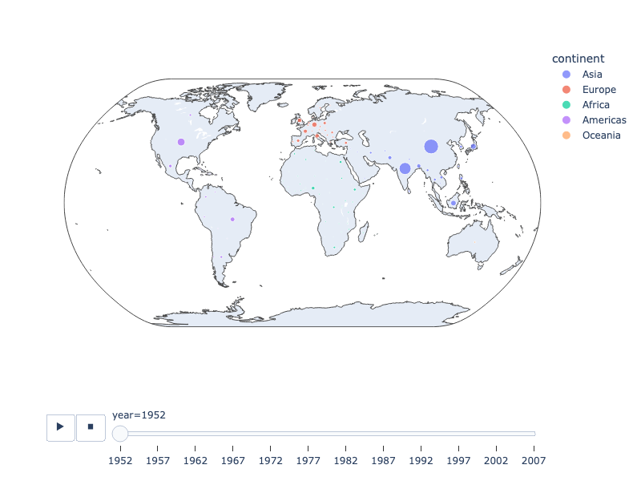

**Interactive Plot:**

<div>                        <script type="text/javascript">window.PlotlyConfig = {MathJaxConfig: 'local'};</script>
        <script charset="utf-8" src="https://cdn.plot.ly/plotly-3.1.0.min.js" integrity="sha256-Ei4740bWZhaUTQuD6q9yQlgVCMPBz6CZWhevDYPv93A=" crossorigin="anonymous"></script>                <div id="plotly-div-30" class="plotly-graph-div" style="height:100%; width:100%;"></div>            <script type="text/javascript">                window.PLOTLYENV=window.PLOTLYENV || {};                                if (document.getElementById("plotly-div-30")) {                    Plotly.newPlot(                        "plotly-div-30",                        [{"geo":"geo","hovertemplate":"\u003cb\u003e%{hovertext}\u003c\u002fb\u003e\u003cbr\u003e\u003cbr\u003econtinent=Asia\u003cbr\u003eyear=1952\u003cbr\u003epop=%{marker.size}\u003cbr\u003eiso_alpha=%{location}\u003cextra\u003e\u003c\u002fextra\u003e","hovertext":["Afghanistan","Bahrain","Bangladesh","Cambodia","China","Hong Kong, China","India","Indonesia","Iran","Iraq","Israel","Japan","Jordan","Korea, Dem. Rep.","Korea, Rep.","Kuwait","Lebanon","Malaysia","Mongolia","Myanmar","Nepal","Oman","Pakistan","Philippines","Saudi Arabia","Singapore","Sri Lanka","Syria","Taiwan","Thailand","Vietnam","West Bank and Gaza","Yemen, Rep."],"legendgroup":"Asia","locations":["AFG","BHR","BGD","KHM","CHN","HKG","IND","IDN","IRN","IRQ","ISR","JPN","JOR","KOR","KOR","KWT","LBN","MYS","MNG","MMR","NPL","OMN","PAK","PHL","SAU","SGP","LKA","SYR","TWN","THA","VNM","PSE","YEM"],"marker":{"color":"#636efa","size":{"dtype":"i4","bdata":"dY+AAH\u002fWAQDLb8sCTJ9HAGfoJyFMcCAAAEUsFqAD5ATAjAcB5ghTALK7GACRQicFqkYJANBGhwBzoj8BAHECACn3FQDa+GYAlzcMAESYMgFIHYwAub8HAADmdgIjY1YBLR89AFgyEQAGzXkA7d43ANp3ggC62UQBt36QAbm5DwD1vUsA"},"sizemode":"area","sizeref":3296707.74,"symbol":"circle"},"mode":"markers","name":"Asia","showlegend":true,"type":"scattergeo"},{"geo":"geo","hovertemplate":"\u003cb\u003e%{hovertext}\u003c\u002fb\u003e\u003cbr\u003e\u003cbr\u003econtinent=Europe\u003cbr\u003eyear=1952\u003cbr\u003epop=%{marker.size}\u003cbr\u003eiso_alpha=%{location}\u003cextra\u003e\u003c\u002fextra\u003e","hovertext":["Albania","Austria","Belgium","Bosnia and Herzegovina","Bulgaria","Croatia","Czech Republic","Denmark","Finland","France","Germany","Greece","Hungary","Iceland","Ireland","Italy","Montenegro","Netherlands","Norway","Poland","Portugal","Romania","Serbia","Slovak Republic","Slovenia","Spain","Sweden","Switzerland","Turkey","United Kingdom"],"legendgroup":"Europe","locations":["ALB","AUT","BEL","BIH","BGR","HRV","CZE","DNK","FIN","FRA","DEU","GRC","HUN","ISL","IRL","ITA","MNE","NLD","NOR","POL","PRT","ROU","SRB","SVK","SVN","ESP","SWE","CHE","TUR","GBR"],"marker":{"color":"#EF553B","size":{"dtype":"i4","bdata":"iZITAJy1aQAlN4UAWJYqAJQBbwD1PDsAPz2LALAhQgCEaj4AE+KHAmAVHwQCAHYAAAWRAPpBAgDcCy0AUFPXAopQBgCkap4A8MYyAPediAHiGIIA8MD9AHOtaAD5SjYAbroWAO6iswHBtmwAmHhJAB1KUwEwgAED"},"sizemode":"area","sizeref":3296707.74,"symbol":"circle"},"mode":"markers","name":"Europe","showlegend":true,"type":"scattergeo"},{"geo":"geo","hovertemplate":"\u003cb\u003e%{hovertext}\u003c\u002fb\u003e\u003cbr\u003e\u003cbr\u003econtinent=Africa\u003cbr\u003eyear=1952\u003cbr\u003epop=%{marker.size}\u003cbr\u003eiso_alpha=%{location}\u003cextra\u003e\u003c\u002fextra\u003e","hovertext":["Algeria","Angola","Benin","Botswana","Burkina Faso","Burundi","Cameroon","Central African Republic","Chad","Comoros","Congo, Dem. Rep.","Congo, Rep.","Cote d'Ivoire","Djibouti","Egypt","Equatorial Guinea","Eritrea","Ethiopia","Gabon","Gambia","Ghana","Guinea","Guinea-Bissau","Kenya","Lesotho","Liberia","Libya","Madagascar","Malawi","Mali","Mauritania","Mauritius","Morocco","Mozambique","Namibia","Niger","Nigeria","Reunion","Rwanda","Sao Tome and Principe","Senegal","Sierra Leone","Somalia","South Africa","Sudan","Swaziland","Tanzania","Togo","Tunisia","Uganda","Zambia","Zimbabwe"],"legendgroup":"Africa","locations":["DZA","AGO","BEN","BWA","BFA","BDI","CMR","CAF","TCD","COM","COD","COG","CIV","DJI","EGY","GNQ","ERI","ETH","GAB","GMB","GHA","GIN","GNB","KEN","LSO","LBR","LBY","MDG","MWI","MLI","MRT","MUS","MAR","MOZ","NAM","NER","NGA","REU","RWA","STP","SEN","SLE","SOM","ZAF","SDN","SWZ","TZA","TGO","TUN","UGA","ZMB","ZWE"],"marker":{"color":"#00cc96","size":{"dtype":"i4","bdata":"JZiNAJ+TQABLhhoAxL8GANs0RAAyUSUAq25MAK+1EwBe7igAUFkCACUm1wBlCw0A+2wtAK32AADNGVMBhE8DACj0FQANUD4BXmsGAKBWBADJKFUAOacoAC3cCAAuomIAy2wLAEwsDQBRjw8AIK1IAKqFLADYkDoAXJoPAMzhBwARqZcA7FxiAMdpBwAMkTMAeFv5AaTuAwAPriYAa+oAAAUMKgARtCAAEo8mAGeq2QBbxYEAw20EAG3\u002ffgApmhIA96g3AB3hWACAxSgAywIvAA=="},"sizemode":"area","sizeref":3296707.74,"symbol":"circle"},"mode":"markers","name":"Africa","showlegend":true,"type":"scattergeo"},{"geo":"geo","hovertemplate":"\u003cb\u003e%{hovertext}\u003c\u002fb\u003e\u003cbr\u003e\u003cbr\u003econtinent=Americas\u003cbr\u003eyear=1952\u003cbr\u003epop=%{marker.size}\u003cbr\u003eiso_alpha=%{location}\u003cextra\u003e\u003c\u002fextra\u003e","hovertext":["Argentina","Bolivia","Brazil","Canada","Chile","Colombia","Costa Rica","Cuba","Dominican Republic","Ecuador","El Salvador","Guatemala","Haiti","Honduras","Jamaica","Mexico","Nicaragua","Panama","Paraguay","Peru","Puerto Rico","Trinidad and Tobago","United States","Uruguay","Venezuela"],"legendgroup":"Americas","locations":["ARG","BOL","BRA","CAN","CHL","COL","CRI","CUB","DOM","ECU","SLV","GTM","HTI","HND","JAM","MEX","NIC","PAN","PRY","PER","PRI","TTO","USA","URY","VEN"],"marker":{"color":"#ab63fa","size":{"dtype":"i4","bdata":"3McQAfP+KwDAr18DMJzhAJNQYQAzdbwAbSIOAPWrWwDSAyYAUSY2APErHwCNAjAA0NkwAI0nFwCvwhUAPffLAd7JEQAwWA4ApL0XAGR2egA4+yEAQh0KAGgRZAmlYCIAUABTAA=="},"sizemode":"area","sizeref":3296707.74,"symbol":"circle"},"mode":"markers","name":"Americas","showlegend":true,"type":"scattergeo"},{"geo":"geo","hovertemplate":"\u003cb\u003e%{hovertext}\u003c\u002fb\u003e\u003cbr\u003e\u003cbr\u003econtinent=Oceania\u003cbr\u003eyear=1952\u003cbr\u003epop=%{marker.size}\u003cbr\u003eiso_alpha=%{location}\u003cextra\u003e\u003c\u002fextra\u003e","hovertext":["Australia","New Zealand"],"legendgroup":"Oceania","locations":["AUS","NZL"],"marker":{"color":"#FFA15A","size":{"dtype":"i4","bdata":"DJ6EACpwHgA="},"sizemode":"area","sizeref":3296707.74,"symbol":"circle"},"mode":"markers","name":"Oceania","showlegend":true,"type":"scattergeo"}],                        {"template":{"data":{"histogram2dcontour":[{"type":"histogram2dcontour","colorbar":{"outlinewidth":0,"ticks":""},"colorscale":[[0.0,"#0d0887"],[0.1111111111111111,"#46039f"],[0.2222222222222222,"#7201a8"],[0.3333333333333333,"#9c179e"],[0.4444444444444444,"#bd3786"],[0.5555555555555556,"#d8576b"],[0.6666666666666666,"#ed7953"],[0.7777777777777778,"#fb9f3a"],[0.8888888888888888,"#fdca26"],[1.0,"#f0f921"]]}],"choropleth":[{"type":"choropleth","colorbar":{"outlinewidth":0,"ticks":""}}],"histogram2d":[{"type":"histogram2d","colorbar":{"outlinewidth":0,"ticks":""},"colorscale":[[0.0,"#0d0887"],[0.1111111111111111,"#46039f"],[0.2222222222222222,"#7201a8"],[0.3333333333333333,"#9c179e"],[0.4444444444444444,"#bd3786"],[0.5555555555555556,"#d8576b"],[0.6666666666666666,"#ed7953"],[0.7777777777777778,"#fb9f3a"],[0.8888888888888888,"#fdca26"],[1.0,"#f0f921"]]}],"heatmap":[{"type":"heatmap","colorbar":{"outlinewidth":0,"ticks":""},"colorscale":[[0.0,"#0d0887"],[0.1111111111111111,"#46039f"],[0.2222222222222222,"#7201a8"],[0.3333333333333333,"#9c179e"],[0.4444444444444444,"#bd3786"],[0.5555555555555556,"#d8576b"],[0.6666666666666666,"#ed7953"],[0.7777777777777778,"#fb9f3a"],[0.8888888888888888,"#fdca26"],[1.0,"#f0f921"]]}],"contourcarpet":[{"type":"contourcarpet","colorbar":{"outlinewidth":0,"ticks":""}}],"contour":[{"type":"contour","colorbar":{"outlinewidth":0,"ticks":""},"colorscale":[[0.0,"#0d0887"],[0.1111111111111111,"#46039f"],[0.2222222222222222,"#7201a8"],[0.3333333333333333,"#9c179e"],[0.4444444444444444,"#bd3786"],[0.5555555555555556,"#d8576b"],[0.6666666666666666,"#ed7953"],[0.7777777777777778,"#fb9f3a"],[0.8888888888888888,"#fdca26"],[1.0,"#f0f921"]]}],"surface":[{"type":"surface","colorbar":{"outlinewidth":0,"ticks":""},"colorscale":[[0.0,"#0d0887"],[0.1111111111111111,"#46039f"],[0.2222222222222222,"#7201a8"],[0.3333333333333333,"#9c179e"],[0.4444444444444444,"#bd3786"],[0.5555555555555556,"#d8576b"],[0.6666666666666666,"#ed7953"],[0.7777777777777778,"#fb9f3a"],[0.8888888888888888,"#fdca26"],[1.0,"#f0f921"]]}],"mesh3d":[{"type":"mesh3d","colorbar":{"outlinewidth":0,"ticks":""}}],"scatter":[{"fillpattern":{"fillmode":"overlay","size":10,"solidity":0.2},"type":"scatter"}],"parcoords":[{"type":"parcoords","line":{"colorbar":{"outlinewidth":0,"ticks":""}}}],"scatterpolargl":[{"type":"scatterpolargl","marker":{"colorbar":{"outlinewidth":0,"ticks":""}}}],"bar":[{"error_x":{"color":"#2a3f5f"},"error_y":{"color":"#2a3f5f"},"marker":{"line":{"color":"#E5ECF6","width":0.5},"pattern":{"fillmode":"overlay","size":10,"solidity":0.2}},"type":"bar"}],"scattergeo":[{"type":"scattergeo","marker":{"colorbar":{"outlinewidth":0,"ticks":""}}}],"scatterpolar":[{"type":"scatterpolar","marker":{"colorbar":{"outlinewidth":0,"ticks":""}}}],"histogram":[{"marker":{"pattern":{"fillmode":"overlay","size":10,"solidity":0.2}},"type":"histogram"}],"scattergl":[{"type":"scattergl","marker":{"colorbar":{"outlinewidth":0,"ticks":""}}}],"scatter3d":[{"type":"scatter3d","line":{"colorbar":{"outlinewidth":0,"ticks":""}},"marker":{"colorbar":{"outlinewidth":0,"ticks":""}}}],"scattermap":[{"type":"scattermap","marker":{"colorbar":{"outlinewidth":0,"ticks":""}}}],"scattermapbox":[{"type":"scattermapbox","marker":{"colorbar":{"outlinewidth":0,"ticks":""}}}],"scatterternary":[{"type":"scatterternary","marker":{"colorbar":{"outlinewidth":0,"ticks":""}}}],"scattercarpet":[{"type":"scattercarpet","marker":{"colorbar":{"outlinewidth":0,"ticks":""}}}],"carpet":[{"aaxis":{"endlinecolor":"#2a3f5f","gridcolor":"white","linecolor":"white","minorgridcolor":"white","startlinecolor":"#2a3f5f"},"baxis":{"endlinecolor":"#2a3f5f","gridcolor":"white","linecolor":"white","minorgridcolor":"white","startlinecolor":"#2a3f5f"},"type":"carpet"}],"table":[{"cells":{"fill":{"color":"#EBF0F8"},"line":{"color":"white"}},"header":{"fill":{"color":"#C8D4E3"},"line":{"color":"white"}},"type":"table"}],"barpolar":[{"marker":{"line":{"color":"#E5ECF6","width":0.5},"pattern":{"fillmode":"overlay","size":10,"solidity":0.2}},"type":"barpolar"}],"pie":[{"automargin":true,"type":"pie"}]},"layout":{"autotypenumbers":"strict","colorway":["#636efa","#EF553B","#00cc96","#ab63fa","#FFA15A","#19d3f3","#FF6692","#B6E880","#FF97FF","#FECB52"],"font":{"color":"#2a3f5f"},"hovermode":"closest","hoverlabel":{"align":"left"},"paper_bgcolor":"white","plot_bgcolor":"#E5ECF6","polar":{"bgcolor":"#E5ECF6","angularaxis":{"gridcolor":"white","linecolor":"white","ticks":""},"radialaxis":{"gridcolor":"white","linecolor":"white","ticks":""}},"ternary":{"bgcolor":"#E5ECF6","aaxis":{"gridcolor":"white","linecolor":"white","ticks":""},"baxis":{"gridcolor":"white","linecolor":"white","ticks":""},"caxis":{"gridcolor":"white","linecolor":"white","ticks":""}},"coloraxis":{"colorbar":{"outlinewidth":0,"ticks":""}},"colorscale":{"sequential":[[0.0,"#0d0887"],[0.1111111111111111,"#46039f"],[0.2222222222222222,"#7201a8"],[0.3333333333333333,"#9c179e"],[0.4444444444444444,"#bd3786"],[0.5555555555555556,"#d8576b"],[0.6666666666666666,"#ed7953"],[0.7777777777777778,"#fb9f3a"],[0.8888888888888888,"#fdca26"],[1.0,"#f0f921"]],"sequentialminus":[[0.0,"#0d0887"],[0.1111111111111111,"#46039f"],[0.2222222222222222,"#7201a8"],[0.3333333333333333,"#9c179e"],[0.4444444444444444,"#bd3786"],[0.5555555555555556,"#d8576b"],[0.6666666666666666,"#ed7953"],[0.7777777777777778,"#fb9f3a"],[0.8888888888888888,"#fdca26"],[1.0,"#f0f921"]],"diverging":[[0,"#8e0152"],[0.1,"#c51b7d"],[0.2,"#de77ae"],[0.3,"#f1b6da"],[0.4,"#fde0ef"],[0.5,"#f7f7f7"],[0.6,"#e6f5d0"],[0.7,"#b8e186"],[0.8,"#7fbc41"],[0.9,"#4d9221"],[1,"#276419"]]},"xaxis":{"gridcolor":"white","linecolor":"white","ticks":"","title":{"standoff":15},"zerolinecolor":"white","automargin":true,"zerolinewidth":2},"yaxis":{"gridcolor":"white","linecolor":"white","ticks":"","title":{"standoff":15},"zerolinecolor":"white","automargin":true,"zerolinewidth":2},"scene":{"xaxis":{"backgroundcolor":"#E5ECF6","gridcolor":"white","linecolor":"white","showbackground":true,"ticks":"","zerolinecolor":"white","gridwidth":2},"yaxis":{"backgroundcolor":"#E5ECF6","gridcolor":"white","linecolor":"white","showbackground":true,"ticks":"","zerolinecolor":"white","gridwidth":2},"zaxis":{"backgroundcolor":"#E5ECF6","gridcolor":"white","linecolor":"white","showbackground":true,"ticks":"","zerolinecolor":"white","gridwidth":2}},"shapedefaults":{"line":{"color":"#2a3f5f"}},"annotationdefaults":{"arrowcolor":"#2a3f5f","arrowhead":0,"arrowwidth":1},"geo":{"bgcolor":"white","landcolor":"#E5ECF6","subunitcolor":"white","showland":true,"showlakes":true,"lakecolor":"white"},"title":{"x":0.05},"mapbox":{"style":"light"}}},"geo":{"domain":{"x":[0.0,1.0],"y":[0.0,1.0]},"projection":{"type":"natural earth"},"center":{}},"legend":{"title":{"text":"continent"},"tracegroupgap":0,"itemsizing":"constant"},"margin":{"t":60},"updatemenus":[{"buttons":[{"args":[null,{"frame":{"duration":500,"redraw":true},"mode":"immediate","fromcurrent":true,"transition":{"duration":500,"easing":"linear"}}],"label":"&#9654;","method":"animate"},{"args":[[null],{"frame":{"duration":0,"redraw":true},"mode":"immediate","fromcurrent":true,"transition":{"duration":0,"easing":"linear"}}],"label":"&#9724;","method":"animate"}],"direction":"left","pad":{"r":10,"t":70},"showactive":false,"type":"buttons","x":0.1,"xanchor":"right","y":0,"yanchor":"top"}],"sliders":[{"active":0,"currentvalue":{"prefix":"year="},"len":0.9,"pad":{"b":10,"t":60},"steps":[{"args":[["1952"],{"frame":{"duration":0,"redraw":true},"mode":"immediate","fromcurrent":true,"transition":{"duration":0,"easing":"linear"}}],"label":"1952","method":"animate"},{"args":[["1957"],{"frame":{"duration":0,"redraw":true},"mode":"immediate","fromcurrent":true,"transition":{"duration":0,"easing":"linear"}}],"label":"1957","method":"animate"},{"args":[["1962"],{"frame":{"duration":0,"redraw":true},"mode":"immediate","fromcurrent":true,"transition":{"duration":0,"easing":"linear"}}],"label":"1962","method":"animate"},{"args":[["1967"],{"frame":{"duration":0,"redraw":true},"mode":"immediate","fromcurrent":true,"transition":{"duration":0,"easing":"linear"}}],"label":"1967","method":"animate"},{"args":[["1972"],{"frame":{"duration":0,"redraw":true},"mode":"immediate","fromcurrent":true,"transition":{"duration":0,"easing":"linear"}}],"label":"1972","method":"animate"},{"args":[["1977"],{"frame":{"duration":0,"redraw":true},"mode":"immediate","fromcurrent":true,"transition":{"duration":0,"easing":"linear"}}],"label":"1977","method":"animate"},{"args":[["1982"],{"frame":{"duration":0,"redraw":true},"mode":"immediate","fromcurrent":true,"transition":{"duration":0,"easing":"linear"}}],"label":"1982","method":"animate"},{"args":[["1987"],{"frame":{"duration":0,"redraw":true},"mode":"immediate","fromcurrent":true,"transition":{"duration":0,"easing":"linear"}}],"label":"1987","method":"animate"},{"args":[["1992"],{"frame":{"duration":0,"redraw":true},"mode":"immediate","fromcurrent":true,"transition":{"duration":0,"easing":"linear"}}],"label":"1992","method":"animate"},{"args":[["1997"],{"frame":{"duration":0,"redraw":true},"mode":"immediate","fromcurrent":true,"transition":{"duration":0,"easing":"linear"}}],"label":"1997","method":"animate"},{"args":[["2002"],{"frame":{"duration":0,"redraw":true},"mode":"immediate","fromcurrent":true,"transition":{"duration":0,"easing":"linear"}}],"label":"2002","method":"animate"},{"args":[["2007"],{"frame":{"duration":0,"redraw":true},"mode":"immediate","fromcurrent":true,"transition":{"duration":0,"easing":"linear"}}],"label":"2007","method":"animate"}],"x":0.1,"xanchor":"left","y":0,"yanchor":"top"}]},                        {"responsive": true}                    ).then(function(){
                            Plotly.addFrames('plotly-div-30', [{"data":[{"geo":"geo","hovertemplate":"\u003cb\u003e%{hovertext}\u003c\u002fb\u003e\u003cbr\u003e\u003cbr\u003econtinent=Asia\u003cbr\u003eyear=1952\u003cbr\u003epop=%{marker.size}\u003cbr\u003eiso_alpha=%{location}\u003cextra\u003e\u003c\u002fextra\u003e","hovertext":["Afghanistan","Bahrain","Bangladesh","Cambodia","China","Hong Kong, China","India","Indonesia","Iran","Iraq","Israel","Japan","Jordan","Korea, Dem. Rep.","Korea, Rep.","Kuwait","Lebanon","Malaysia","Mongolia","Myanmar","Nepal","Oman","Pakistan","Philippines","Saudi Arabia","Singapore","Sri Lanka","Syria","Taiwan","Thailand","Vietnam","West Bank and Gaza","Yemen, Rep."],"legendgroup":"Asia","locations":["AFG","BHR","BGD","KHM","CHN","HKG","IND","IDN","IRN","IRQ","ISR","JPN","JOR","KOR","KOR","KWT","LBN","MYS","MNG","MMR","NPL","OMN","PAK","PHL","SAU","SGP","LKA","SYR","TWN","THA","VNM","PSE","YEM"],"marker":{"color":"#636efa","size":{"dtype":"i4","bdata":"dY+AAH\u002fWAQDLb8sCTJ9HAGfoJyFMcCAAAEUsFqAD5ATAjAcB5ghTALK7GACRQicFqkYJANBGhwBzoj8BAHECACn3FQDa+GYAlzcMAESYMgFIHYwAub8HAADmdgIjY1YBLR89AFgyEQAGzXkA7d43ANp3ggC62UQBt36QAbm5DwD1vUsA"},"sizemode":"area","sizeref":3296707.74,"symbol":"circle"},"mode":"markers","name":"Asia","showlegend":true,"type":"scattergeo"},{"geo":"geo","hovertemplate":"\u003cb\u003e%{hovertext}\u003c\u002fb\u003e\u003cbr\u003e\u003cbr\u003econtinent=Europe\u003cbr\u003eyear=1952\u003cbr\u003epop=%{marker.size}\u003cbr\u003eiso_alpha=%{location}\u003cextra\u003e\u003c\u002fextra\u003e","hovertext":["Albania","Austria","Belgium","Bosnia and Herzegovina","Bulgaria","Croatia","Czech Republic","Denmark","Finland","France","Germany","Greece","Hungary","Iceland","Ireland","Italy","Montenegro","Netherlands","Norway","Poland","Portugal","Romania","Serbia","Slovak Republic","Slovenia","Spain","Sweden","Switzerland","Turkey","United Kingdom"],"legendgroup":"Europe","locations":["ALB","AUT","BEL","BIH","BGR","HRV","CZE","DNK","FIN","FRA","DEU","GRC","HUN","ISL","IRL","ITA","MNE","NLD","NOR","POL","PRT","ROU","SRB","SVK","SVN","ESP","SWE","CHE","TUR","GBR"],"marker":{"color":"#EF553B","size":{"dtype":"i4","bdata":"iZITAJy1aQAlN4UAWJYqAJQBbwD1PDsAPz2LALAhQgCEaj4AE+KHAmAVHwQCAHYAAAWRAPpBAgDcCy0AUFPXAopQBgCkap4A8MYyAPediAHiGIIA8MD9AHOtaAD5SjYAbroWAO6iswHBtmwAmHhJAB1KUwEwgAED"},"sizemode":"area","sizeref":3296707.74,"symbol":"circle"},"mode":"markers","name":"Europe","showlegend":true,"type":"scattergeo"},{"geo":"geo","hovertemplate":"\u003cb\u003e%{hovertext}\u003c\u002fb\u003e\u003cbr\u003e\u003cbr\u003econtinent=Africa\u003cbr\u003eyear=1952\u003cbr\u003epop=%{marker.size}\u003cbr\u003eiso_alpha=%{location}\u003cextra\u003e\u003c\u002fextra\u003e","hovertext":["Algeria","Angola","Benin","Botswana","Burkina Faso","Burundi","Cameroon","Central African Republic","Chad","Comoros","Congo, Dem. Rep.","Congo, Rep.","Cote d'Ivoire","Djibouti","Egypt","Equatorial Guinea","Eritrea","Ethiopia","Gabon","Gambia","Ghana","Guinea","Guinea-Bissau","Kenya","Lesotho","Liberia","Libya","Madagascar","Malawi","Mali","Mauritania","Mauritius","Morocco","Mozambique","Namibia","Niger","Nigeria","Reunion","Rwanda","Sao Tome and Principe","Senegal","Sierra Leone","Somalia","South Africa","Sudan","Swaziland","Tanzania","Togo","Tunisia","Uganda","Zambia","Zimbabwe"],"legendgroup":"Africa","locations":["DZA","AGO","BEN","BWA","BFA","BDI","CMR","CAF","TCD","COM","COD","COG","CIV","DJI","EGY","GNQ","ERI","ETH","GAB","GMB","GHA","GIN","GNB","KEN","LSO","LBR","LBY","MDG","MWI","MLI","MRT","MUS","MAR","MOZ","NAM","NER","NGA","REU","RWA","STP","SEN","SLE","SOM","ZAF","SDN","SWZ","TZA","TGO","TUN","UGA","ZMB","ZWE"],"marker":{"color":"#00cc96","size":{"dtype":"i4","bdata":"JZiNAJ+TQABLhhoAxL8GANs0RAAyUSUAq25MAK+1EwBe7igAUFkCACUm1wBlCw0A+2wtAK32AADNGVMBhE8DACj0FQANUD4BXmsGAKBWBADJKFUAOacoAC3cCAAuomIAy2wLAEwsDQBRjw8AIK1IAKqFLADYkDoAXJoPAMzhBwARqZcA7FxiAMdpBwAMkTMAeFv5AaTuAwAPriYAa+oAAAUMKgARtCAAEo8mAGeq2QBbxYEAw20EAG3\u002ffgApmhIA96g3AB3hWACAxSgAywIvAA=="},"sizemode":"area","sizeref":3296707.74,"symbol":"circle"},"mode":"markers","name":"Africa","showlegend":true,"type":"scattergeo"},{"geo":"geo","hovertemplate":"\u003cb\u003e%{hovertext}\u003c\u002fb\u003e\u003cbr\u003e\u003cbr\u003econtinent=Americas\u003cbr\u003eyear=1952\u003cbr\u003epop=%{marker.size}\u003cbr\u003eiso_alpha=%{location}\u003cextra\u003e\u003c\u002fextra\u003e","hovertext":["Argentina","Bolivia","Brazil","Canada","Chile","Colombia","Costa Rica","Cuba","Dominican Republic","Ecuador","El Salvador","Guatemala","Haiti","Honduras","Jamaica","Mexico","Nicaragua","Panama","Paraguay","Peru","Puerto Rico","Trinidad and Tobago","United States","Uruguay","Venezuela"],"legendgroup":"Americas","locations":["ARG","BOL","BRA","CAN","CHL","COL","CRI","CUB","DOM","ECU","SLV","GTM","HTI","HND","JAM","MEX","NIC","PAN","PRY","PER","PRI","TTO","USA","URY","VEN"],"marker":{"color":"#ab63fa","size":{"dtype":"i4","bdata":"3McQAfP+KwDAr18DMJzhAJNQYQAzdbwAbSIOAPWrWwDSAyYAUSY2APErHwCNAjAA0NkwAI0nFwCvwhUAPffLAd7JEQAwWA4ApL0XAGR2egA4+yEAQh0KAGgRZAmlYCIAUABTAA=="},"sizemode":"area","sizeref":3296707.74,"symbol":"circle"},"mode":"markers","name":"Americas","showlegend":true,"type":"scattergeo"},{"geo":"geo","hovertemplate":"\u003cb\u003e%{hovertext}\u003c\u002fb\u003e\u003cbr\u003e\u003cbr\u003econtinent=Oceania\u003cbr\u003eyear=1952\u003cbr\u003epop=%{marker.size}\u003cbr\u003eiso_alpha=%{location}\u003cextra\u003e\u003c\u002fextra\u003e","hovertext":["Australia","New Zealand"],"legendgroup":"Oceania","locations":["AUS","NZL"],"marker":{"color":"#FFA15A","size":{"dtype":"i4","bdata":"DJ6EACpwHgA="},"sizemode":"area","sizeref":3296707.74,"symbol":"circle"},"mode":"markers","name":"Oceania","showlegend":true,"type":"scattergeo"}],"name":"1952"},{"data":[{"geo":"geo","hovertemplate":"\u003cb\u003e%{hovertext}\u003c\u002fb\u003e\u003cbr\u003e\u003cbr\u003econtinent=Asia\u003cbr\u003eyear=1957\u003cbr\u003epop=%{marker.size}\u003cbr\u003eiso_alpha=%{location}\u003cextra\u003e\u003c\u002fextra\u003e","hovertext":["Afghanistan","Bahrain","Bangladesh","Cambodia","China","Hong Kong, China","India","Indonesia","Iran","Iraq","Israel","Japan","Jordan","Korea, Dem. Rep.","Korea, Rep.","Kuwait","Lebanon","Malaysia","Mongolia","Myanmar","Nepal","Oman","Pakistan","Philippines","Saudi Arabia","Singapore","Sri Lanka","Syria","Taiwan","Thailand","Vietnam","West Bank and Gaza","Yemen, Rep."],"legendgroup":"Asia","locations":["AFG","BHR","BGD","KHM","CHN","HKG","IND","IDN","IRN","IRQ","ISR","JPN","JOR","KOR","KOR","KWT","LBN","MYS","MNG","MMR","NPL","OMN","PAK","PHL","SAU","SGP","LKA","SYR","TWN","THA","VNM","PSE","YEM"],"marker":{"color":"#636efa","size":{"dtype":"i4","bdata":"ZgGNAJ8dAgBcxg8DKDdRAAAT\u002fiWswCkAQNhgGOAuXwWAAC4Bw1hfAFGrHQABJHUFP2QLADWbjwBgBlkBbj8DADQjGQBjF3YA1nUNAASaSwGivZMAOZMIAIhHyAKC1I0BQnBDACkQFgBiSosAlFI\u002fAPcXmwD9G34Bj3u6AWdVEADq5FMA"},"sizemode":"area","sizeref":3296707.74,"symbol":"circle"},"mode":"markers","name":"Asia","showlegend":true,"type":"scattergeo"},{"geo":"geo","hovertemplate":"\u003cb\u003e%{hovertext}\u003c\u002fb\u003e\u003cbr\u003e\u003cbr\u003econtinent=Europe\u003cbr\u003eyear=1957\u003cbr\u003epop=%{marker.size}\u003cbr\u003eiso_alpha=%{location}\u003cextra\u003e\u003c\u002fextra\u003e","hovertext":["Albania","Austria","Belgium","Bosnia and Herzegovina","Bulgaria","Croatia","Czech Republic","Denmark","Finland","France","Germany","Greece","Hungary","Iceland","Ireland","Italy","Montenegro","Netherlands","Norway","Poland","Portugal","Romania","Serbia","Slovak Republic","Slovenia","Spain","Sweden","Switzerland","Turkey","United Kingdom"],"legendgroup":"Europe","locations":["ALB","AUT","BEL","BIH","BGR","HRV","CZE","DNK","FIN","FRA","DEU","GRC","HUN","ISL","IRL","ITA","MNE","NLD","NOR","POL","PRT","ROU","SRB","SVK","SVN","ESP","SWE","CHE","TUR","GBR"],"marker":{"color":"#EF553B","size":{"dtype":"i4","bdata":"mYcWAGRKagC3KYkAoO8uALa\u002fdADK5jwAHiuRAJd6RACg+kEATyGkAj2qOwTaiXsAmCGWAPaEAgAM6ysAMHXuAs3BBgDPP6gAYkg1AFLWrgHyi4YAzw0QAd\u002fybgC1qDoAjmQXAM5YxwHaXHAAcDdOABu1hwFwwhAD"},"sizemode":"area","sizeref":3296707.74,"symbol":"circle"},"mode":"markers","name":"Europe","showlegend":true,"type":"scattergeo"},{"geo":"geo","hovertemplate":"\u003cb\u003e%{hovertext}\u003c\u002fb\u003e\u003cbr\u003e\u003cbr\u003econtinent=Africa\u003cbr\u003eyear=1957\u003cbr\u003epop=%{marker.size}\u003cbr\u003eiso_alpha=%{location}\u003cextra\u003e\u003c\u002fextra\u003e","hovertext":["Algeria","Angola","Benin","Botswana","Burkina Faso","Burundi","Cameroon","Central African Republic","Chad","Comoros","Congo, Dem. Rep.","Congo, Rep.","Cote d'Ivoire","Djibouti","Egypt","Equatorial Guinea","Eritrea","Ethiopia","Gabon","Gambia","Ghana","Guinea","Guinea-Bissau","Kenya","Lesotho","Liberia","Libya","Madagascar","Malawi","Mali","Mauritania","Mauritius","Morocco","Mozambique","Namibia","Niger","Nigeria","Reunion","Rwanda","Sao Tome and Principe","Senegal","Sierra Leone","Somalia","South Africa","Sudan","Swaziland","Tanzania","Togo","Tunisia","Uganda","Zambia","Zimbabwe"],"legendgroup":"Africa","locations":["DZA","AGO","BEN","BWA","BFA","BDI","CMR","CAF","TCD","COM","COD","COG","CIV","DJI","EGY","GNQ","ERI","ETH","GAB","GMB","GHA","GIN","GNB","KEN","LSO","LBR","LBY","MDG","MWI","MLI","MRT","MUS","MAR","MOZ","NAM","NER","NGA","REU","RWA","STP","SEN","SLE","SOM","ZAF","SDN","SWZ","TZA","TGO","TUN","UGA","ZMB","ZWE"],"marker":{"color":"#00cc96","size":{"dtype":"i4","bdata":"iLicANGZRQA1YB0ADz4HAMjrRwD+sygAM8lRAJw+FQAHLCwAsJsCAEyz7QCqWQ4AoFoyAKsYAQBNnn0B2o0DANOJFwB+I1wB2KIGAE7uBAD4hWEANuUrAAcsCQA7wHEAGmkMAE7kDgCqVRIA7xBPAPYmMQDcuUAAdG4QABhOCQAODK4AU2RrAPBcCACYVjgAXDg3Aty1BADCDysAje8AANObLgB+ByMA\u002f2wqAP1z9gAw05QAVfwEABo9kACFthQAAUk8AC3cZQBABS4AhKM3AA=="},"sizemode":"area","sizeref":3296707.74,"symbol":"circle"},"mode":"markers","name":"Africa","showlegend":true,"type":"scattergeo"},{"geo":"geo","hovertemplate":"\u003cb\u003e%{hovertext}\u003c\u002fb\u003e\u003cbr\u003e\u003cbr\u003econtinent=Americas\u003cbr\u003eyear=1957\u003cbr\u003epop=%{marker.size}\u003cbr\u003eiso_alpha=%{location}\u003cextra\u003e\u003c\u002fextra\u003e","hovertext":["Argentina","Bolivia","Brazil","Canada","Chile","Colombia","Costa Rica","Cuba","Dominican Republic","Ecuador","El Salvador","Guatemala","Haiti","Honduras","Jamaica","Mexico","Nicaragua","Panama","Paraguay","Peru","Puerto Rico","Trinidad and Tobago","United States","Uruguay","Venezuela"],"legendgroup":"Americas","locations":["ARG","BOL","BRA","CAN","CHL","COL","CRI","CUB","DOM","ECU","SLV","GTM","HTI","HND","JAM","MEX","NIC","PAN","PRY","PER","PRI","TTO","USA","URY","VEN"],"marker":{"color":"#ab63fa","size":{"dtype":"i4","bdata":"qjsrAdoBMQBDO+gD6o0DAeqMawDpCd0A7PgQAHBUZQCymiwAEe09AF3yIwAsjjcA9YU1AJYDGwBybBcAfEsWAuy7FABSOhAAlgUbAPSOiwAgfCIA5KsLAIBEQAp\u002fACUATEZmAA=="},"sizemode":"area","sizeref":3296707.74,"symbol":"circle"},"mode":"markers","name":"Americas","showlegend":true,"type":"scattergeo"},{"geo":"geo","hovertemplate":"\u003cb\u003e%{hovertext}\u003c\u002fb\u003e\u003cbr\u003e\u003cbr\u003econtinent=Oceania\u003cbr\u003eyear=1957\u003cbr\u003epop=%{marker.size}\u003cbr\u003eiso_alpha=%{location}\u003cextra\u003e\u003c\u002fextra\u003e","hovertext":["Australia","New Zealand"],"legendgroup":"Oceania","locations":["AUS","NZL"],"marker":{"color":"#FFA15A","size":{"dtype":"i4","bdata":"uTOUAJ8EIgA="},"sizemode":"area","sizeref":3296707.74,"symbol":"circle"},"mode":"markers","name":"Oceania","showlegend":true,"type":"scattergeo"}],"name":"1957"},{"data":[{"geo":"geo","hovertemplate":"\u003cb\u003e%{hovertext}\u003c\u002fb\u003e\u003cbr\u003e\u003cbr\u003econtinent=Asia\u003cbr\u003eyear=1962\u003cbr\u003epop=%{marker.size}\u003cbr\u003eiso_alpha=%{location}\u003cextra\u003e\u003c\u002fextra\u003e","hovertext":["Afghanistan","Bahrain","Bangladesh","Cambodia","China","Hong Kong, China","India","Indonesia","Iran","Iraq","Israel","Japan","Jordan","Korea, Dem. Rep.","Korea, Rep.","Kuwait","Lebanon","Malaysia","Mongolia","Myanmar","Nepal","Oman","Pakistan","Philippines","Saudi Arabia","Singapore","Sri Lanka","Syria","Taiwan","Thailand","Vietnam","West Bank and Gaza","Yemen, Rep."],"legendgroup":"Asia","locations":["AFG","BHR","BGD","KHM","CHN","HKG","IND","IDN","IRN","IRQ","ISR","JPN","JOR","KOR","KOR","KWT","LBN","MYS","MNG","MMR","NPL","OMN","PAK","PHL","SAU","SGP","LKA","SYR","TWN","THA","VNM","PSE","YEM"],"marker":{"color":"#636efa","size":{"dtype":"i4","bdata":"y6mcAFefAgB5TGMDI9RcABDYrifwbjIAgH0PGyAM5wWQB10BRHpuAPhCIwDNRrYFtz4OAHaWpgBTJJMBencFAIDKHACR5ocAaGoPAASiaAGZp50AxJUJAH9AKgMQus4BtWxLALi0GgCwBp8APcVJAFretQAlhr4BLLADAk5KEQCRYl0A"},"sizemode":"area","sizeref":3296707.74,"symbol":"circle"},"mode":"markers","name":"Asia","showlegend":true,"type":"scattergeo"},{"geo":"geo","hovertemplate":"\u003cb\u003e%{hovertext}\u003c\u002fb\u003e\u003cbr\u003e\u003cbr\u003econtinent=Europe\u003cbr\u003eyear=1962\u003cbr\u003epop=%{marker.size}\u003cbr\u003eiso_alpha=%{location}\u003cextra\u003e\u003c\u002fextra\u003e","hovertext":["Albania","Austria","Belgium","Bosnia and Herzegovina","Bulgaria","Croatia","Czech Republic","Denmark","Finland","France","Germany","Greece","Hungary","Iceland","Ireland","Italy","Montenegro","Netherlands","Norway","Poland","Portugal","Romania","Serbia","Slovak Republic","Slovenia","Spain","Sweden","Switzerland","Turkey","United Kingdom"],"legendgroup":"Europe","locations":["ALB","AUT","BEL","BIH","BGR","HRV","CZE","DNK","FIN","FRA","DEU","GRC","HUN","ISL","IRL","ITA","MNE","NLD","NOR","POL","PRT","ROU","SRB","SVK","SVN","ESP","SWE","CHE","TUR","GBR"],"marker":{"color":"#EF553B","size":{"dtype":"i4","bdata":"iV4aAAjLbABgqYwACBozAJJEegANND4AOsuSAPPnRgCziEQAIA7PAm0rZQTp6IAAmIyZACXHAgCwLisAQM4HA6A9BwD5I7QAh4Y3ABHLzgGYoYkAkQsdATw2dABIqEAAcicYAC1v2wF0YXMA0HRWABeKxgHgKy0D"},"sizemode":"area","sizeref":3296707.74,"symbol":"circle"},"mode":"markers","name":"Europe","showlegend":true,"type":"scattergeo"},{"geo":"geo","hovertemplate":"\u003cb\u003e%{hovertext}\u003c\u002fb\u003e\u003cbr\u003e\u003cbr\u003econtinent=Africa\u003cbr\u003eyear=1962\u003cbr\u003epop=%{marker.size}\u003cbr\u003eiso_alpha=%{location}\u003cextra\u003e\u003c\u002fextra\u003e","hovertext":["Algeria","Angola","Benin","Botswana","Burkina Faso","Burundi","Cameroon","Central African Republic","Chad","Comoros","Congo, Dem. Rep.","Congo, Rep.","Cote d'Ivoire","Djibouti","Egypt","Equatorial Guinea","Eritrea","Ethiopia","Gabon","Gambia","Ghana","Guinea","Guinea-Bissau","Kenya","Lesotho","Liberia","Libya","Madagascar","Malawi","Mali","Mauritania","Mauritius","Morocco","Mozambique","Namibia","Niger","Nigeria","Reunion","Rwanda","Sao Tome and Principe","Senegal","Sierra Leone","Somalia","South Africa","Sudan","Swaziland","Tanzania","Togo","Tunisia","Uganda","Zambia","Zimbabwe"],"legendgroup":"Africa","locations":["DZA","AGO","BEN","BWA","BFA","BDI","CMR","CAF","TCD","COM","COD","COG","CIV","DJI","EGY","GNQ","ERI","ETH","GAB","GMB","GHA","GIN","GNB","KEN","LSO","LBR","LBY","MDG","MWI","MLI","MRT","MUS","MAR","MOZ","NAM","NER","NGA","REU","RWA","STP","SEN","SLE","SOM","ZAF","SDN","SWZ","TZA","TGO","TUN","UGA","ZMB","ZWE"],"marker":{"color":"#00cc96","size":{"dtype":"i4","bdata":"dNynAJ+jSQDX1SAA\u002fNIHAFARSwD7MS0AYWdYABY\u002fFwBREjAAyewCAGLSCgF0\u002fQ8AWHo6ACpfAQD9460BhM0DADpuGQAcsH8B7fMGAAS1BQBwO3AAo+kvAGyUCQCdbIQA16ANANz6EABHABYAnAZXAEBeNwDEkUcAhX8RAFiyCgBcOscAkNl2AFB7CQDoMT4A9+d+AvR5BQDqji4AQf8AAGNXNAA3qCUA2f8uALEZGAF7pKoAVqUFAFbFpQAiURcAWGhBAF1SdQBIMzQA6EVBAA=="},"sizemode":"area","sizeref":3296707.74,"symbol":"circle"},"mode":"markers","name":"Africa","showlegend":true,"type":"scattergeo"},{"geo":"geo","hovertemplate":"\u003cb\u003e%{hovertext}\u003c\u002fb\u003e\u003cbr\u003e\u003cbr\u003econtinent=Americas\u003cbr\u003eyear=1962\u003cbr\u003epop=%{marker.size}\u003cbr\u003eiso_alpha=%{location}\u003cextra\u003e\u003c\u002fextra\u003e","hovertext":["Argentina","Bolivia","Brazil","Canada","Chile","Colombia","Costa Rica","Cuba","Dominican Republic","Ecuador","El Salvador","Guatemala","Haiti","Honduras","Jamaica","Mexico","Nicaragua","Panama","Paraguay","Peru","Puerto Rico","Trinidad and Tobago","United States","Uruguay","Venezuela"],"legendgroup":"Americas","locations":["ARG","BOL","BRA","CAN","CHL","COL","CRI","CUB","DOM","ECU","SLV","GTM","HTI","HND","JAM","MEX","NIC","PAN","PRY","PER","PRI","TTO","USA","URY","VEN"],"marker":{"color":"#ab63fa","size":{"dtype":"i4","bdata":"x8NEAb7WNgDeRIgEebMhAap6eQDdjAMBo4YUAGWxbgD6sTQA629HACftKQDaOEAAwjQ7ALLkHwBoaBkAzXZzAkVFGADtjBIA1aoeABR4oACuWiUAyooNABBYHgtCpicAD0J8AA=="},"sizemode":"area","sizeref":3296707.74,"symbol":"circle"},"mode":"markers","name":"Americas","showlegend":true,"type":"scattergeo"},{"geo":"geo","hovertemplate":"\u003cb\u003e%{hovertext}\u003c\u002fb\u003e\u003cbr\u003e\u003cbr\u003econtinent=Oceania\u003cbr\u003eyear=1962\u003cbr\u003epop=%{marker.size}\u003cbr\u003eiso_alpha=%{location}\u003cextra\u003e\u003c\u002fextra\u003e","hovertext":["Australia","New Zealand"],"legendgroup":"Oceania","locations":["AUS","NZL"],"marker":{"color":"#FFA15A","size":{"dtype":"i4","bdata":"2LekAOb4JQA="},"sizemode":"area","sizeref":3296707.74,"symbol":"circle"},"mode":"markers","name":"Oceania","showlegend":true,"type":"scattergeo"}],"name":"1962"},{"data":[{"geo":"geo","hovertemplate":"\u003cb\u003e%{hovertext}\u003c\u002fb\u003e\u003cbr\u003e\u003cbr\u003econtinent=Asia\u003cbr\u003eyear=1967\u003cbr\u003epop=%{marker.size}\u003cbr\u003eiso_alpha=%{location}\u003cextra\u003e\u003c\u002fextra\u003e","hovertext":["Afghanistan","Bahrain","Bangladesh","Cambodia","China","Hong Kong, China","India","Indonesia","Iran","Iraq","Israel","Japan","Jordan","Korea, Dem. Rep.","Korea, Rep.","Kuwait","Lebanon","Malaysia","Mongolia","Myanmar","Nepal","Oman","Pakistan","Philippines","Saudi Arabia","Singapore","Sri Lanka","Syria","Taiwan","Thailand","Vietnam","West Bank and Gaza","Yemen, Rep."],"legendgroup":"Asia","locations":["AFG","BHR","BGD","KHM","CHN","HKG","IND","IDN","IRN","IRQ","ISR","JPN","JOR","KOR","KOR","KWT","LBN","MYS","MNG","MMR","NPL","OMN","PAK","PHL","SAU","SGP","LKA","SYR","TWN","THA","VNM","PSE","YEM"],"marker":{"color":"#636efa","size":{"dtype":"i4","bdata":"Lg6wAMYVAwD8lb4DwzNqAPCE+SwwzjgAgPIoHhhxhAYQ8JQBcv6BANEZKQC\u002feAIGkiYTADGFwAA4w8sBG8YIAI5eIQB+85oAPIoRAL+\u002figH61qsAF+gKAGtSnQO4fxsCFrpVAAAtHgA0GbMArK5WADRD0AA5KwcC5itaAmxvEQAx22YA"},"sizemode":"area","sizeref":3296707.74,"symbol":"circle"},"mode":"markers","name":"Asia","showlegend":true,"type":"scattergeo"},{"geo":"geo","hovertemplate":"\u003cb\u003e%{hovertext}\u003c\u002fb\u003e\u003cbr\u003e\u003cbr\u003econtinent=Europe\u003cbr\u003eyear=1967\u003cbr\u003epop=%{marker.size}\u003cbr\u003eiso_alpha=%{location}\u003cextra\u003e\u003c\u002fextra\u003e","hovertext":["Albania","Austria","Belgium","Bosnia and Herzegovina","Bulgaria","Croatia","Czech Republic","Denmark","Finland","France","Germany","Greece","Hungary","Iceland","Ireland","Italy","Montenegro","Netherlands","Norway","Poland","Portugal","Romania","Serbia","Slovak Republic","Slovenia","Spain","Sweden","Switzerland","Turkey","United Kingdom"],"legendgroup":"Europe","locations":["ALB","AUT","BEL","BIH","BGR","HRV","CZE","DNK","FIN","FRA","DEU","GRC","HUN","ISL","IRL","ITA","MNE","NLD","NOR","POL","PRT","ROU","SRB","SVK","SVN","ESP","SWE","CHE","TUR","GBR"],"marker":{"color":"#EF553B","size":{"dtype":"i4","bdata":"PEYeAGaQcAAU0pEA6LM2ANLNfgAesj8AZRKWAJDVSQAwR0YA6Fz0AkVKjQSZAIUAPv+bABQIAwCEQCwA3KIjAyulBwBWNsAAI8U5AKIB5QGY5ooATkMmAZaheQB+yEMAQCEZAGNB9QEbDngAmINcAPXQ\u002fQGYm0YD"},"sizemode":"area","sizeref":3296707.74,"symbol":"circle"},"mode":"markers","name":"Europe","showlegend":true,"type":"scattergeo"},{"geo":"geo","hovertemplate":"\u003cb\u003e%{hovertext}\u003c\u002fb\u003e\u003cbr\u003e\u003cbr\u003econtinent=Africa\u003cbr\u003eyear=1967\u003cbr\u003epop=%{marker.size}\u003cbr\u003eiso_alpha=%{location}\u003cextra\u003e\u003c\u002fextra\u003e","hovertext":["Algeria","Angola","Benin","Botswana","Burkina Faso","Burundi","Cameroon","Central African Republic","Chad","Comoros","Congo, Dem. Rep.","Congo, Rep.","Cote d'Ivoire","Djibouti","Egypt","Equatorial Guinea","Eritrea","Ethiopia","Gabon","Gambia","Ghana","Guinea","Guinea-Bissau","Kenya","Lesotho","Liberia","Libya","Madagascar","Malawi","Mali","Mauritania","Mauritius","Morocco","Mozambique","Namibia","Niger","Nigeria","Reunion","Rwanda","Sao Tome and Principe","Senegal","Sierra Leone","Somalia","South Africa","Sudan","Swaziland","Tanzania","Togo","Tunisia","Uganda","Zambia","Zimbabwe"],"legendgroup":"Africa","locations":["DZA","AGO","BEN","BWA","BFA","BDI","CMR","CAF","TCD","COM","COD","COG","CIV","DJI","EGY","GNQ","ERI","ETH","GAB","GMB","GHA","GIN","GNB","KEN","LSO","LBR","LBY","MDG","MWI","MLI","MRT","MUS","MAR","MOZ","NAM","NER","NGA","REU","RWA","STP","SEN","SLE","SOM","ZAF","SDN","SWZ","TZA","TGO","TUN","UGA","ZMB","ZWE"],"marker":{"color":"#00cc96","size":{"dtype":"i4","bdata":"s7XCAO0RUADGCSUARXIIAP8+TgCt0zIAEqxgAAZ0GgAfWDUAIlEDANFGMAFwABIApmZIAIHyAQCkauMBGPcDAJ\u002fGGwBJHakBLHYHACm1BgDljIEAGqo0AMcsCQCYgpsAHDQPAK6FEwD41xoAXKhgADRIPwAAiU8AzsYSAD0LDAB4YOEAzXWEAFDICgAuL0UAyI3RAkhRBgDHqDQAgxQBAJGDPAAunygA51E0AMlkQAFhCMIAUmsGAFBfwAB+exoAKgtJAMbOhwBggjsAaDlMAA=="},"sizemode":"area","sizeref":3296707.74,"symbol":"circle"},"mode":"markers","name":"Africa","showlegend":true,"type":"scattergeo"},{"geo":"geo","hovertemplate":"\u003cb\u003e%{hovertext}\u003c\u002fb\u003e\u003cbr\u003e\u003cbr\u003econtinent=Americas\u003cbr\u003eyear=1967\u003cbr\u003epop=%{marker.size}\u003cbr\u003eiso_alpha=%{location}\u003cextra\u003e\u003c\u002fextra\u003e","hovertext":["Argentina","Bolivia","Brazil","Canada","Chile","Colombia","Costa Rica","Cuba","Dominican Republic","Ecuador","El Salvador","Guatemala","Haiti","Honduras","Jamaica","Mexico","Nicaragua","Panama","Paraguay","Peru","Puerto Rico","Trinidad and Tobago","United States","Uruguay","Venezuela"],"legendgroup":"Americas","locations":["ARG","BOL","BRA","CAN","CHL","COL","CRI","CUB","DOM","ECU","SLV","GTM","HTI","HND","JAM","MEX","NIC","PAN","PRY","PER","PRI","TTO","USA","URY","VEN"],"marker":{"color":"#ab63fa","size":{"dtype":"i4","bdata":"0fJdAdmnPQCfiD8FN689ARwthwA7ky0B7T0YAEQyfAD6yD0AaORSAJ9UMQBVk0cAueNBAFEoJgDoZRwAp1rcAhJ3HAAuchUAcekiAGgfuQCBaygAm6YOAMAa2Auj8CkA8CeUAA=="},"sizemode":"area","sizeref":3296707.74,"symbol":"circle"},"mode":"markers","name":"Americas","showlegend":true,"type":"scattergeo"},{"geo":"geo","hovertemplate":"\u003cb\u003e%{hovertext}\u003c\u002fb\u003e\u003cbr\u003e\u003cbr\u003econtinent=Oceania\u003cbr\u003eyear=1967\u003cbr\u003epop=%{marker.size}\u003cbr\u003eiso_alpha=%{location}\u003cextra\u003e\u003c\u002fextra\u003e","hovertext":["Australia","New Zealand"],"legendgroup":"Oceania","locations":["AUS","NZL"],"marker":{"color":"#FFA15A","size":{"dtype":"i4","bdata":"CCi1ANagKQA="},"sizemode":"area","sizeref":3296707.74,"symbol":"circle"},"mode":"markers","name":"Oceania","showlegend":true,"type":"scattergeo"}],"name":"1967"},{"data":[{"geo":"geo","hovertemplate":"\u003cb\u003e%{hovertext}\u003c\u002fb\u003e\u003cbr\u003e\u003cbr\u003econtinent=Asia\u003cbr\u003eyear=1972\u003cbr\u003epop=%{marker.size}\u003cbr\u003eiso_alpha=%{location}\u003cextra\u003e\u003c\u002fextra\u003e","hovertext":["Afghanistan","Bahrain","Bangladesh","Cambodia","China","Hong Kong, China","India","Indonesia","Iran","Iraq","Israel","Japan","Jordan","Korea, Dem. Rep.","Korea, Rep.","Kuwait","Lebanon","Malaysia","Mongolia","Myanmar","Nepal","Oman","Pakistan","Philippines","Saudi Arabia","Singapore","Sri Lanka","Syria","Taiwan","Thailand","Vietnam","West Bank and Gaza","Yemen, Rep."],"legendgroup":"Asia","locations":["AFG","BHR","BGD","KHM","CHN","HKG","IND","IDN","IRN","IRQ","ISR","JPN","JOR","KOR","KOR","KWT","LBN","MYS","MNG","MMR","NPL","OMN","PAK","PHL","SAU","SGP","LKA","SYR","TWN","THA","VNM","PSE","YEM"],"marker":{"color":"#636efa","size":{"dtype":"i4","bdata":"pJPHAJCFAwB\u002fszcE7q9xALCIYTP0zD4AwLvLIdCdOgfwIdMBwoaZAFU9LwAxkGMG754YADmL4QDoPv8BztgMANLkKAA2la4ANCYUANZcsgGxZr0AeqYMAGHUIQTdUm8CNMRiANDXIACdnsYAdEBmALdU6AB5TlcCpmGpAiSgEADjBXEA"},"sizemode":"area","sizeref":3296707.74,"symbol":"circle"},"mode":"markers","name":"Asia","showlegend":true,"type":"scattergeo"},{"geo":"geo","hovertemplate":"\u003cb\u003e%{hovertext}\u003c\u002fb\u003e\u003cbr\u003e\u003cbr\u003econtinent=Europe\u003cbr\u003eyear=1972\u003cbr\u003epop=%{marker.size}\u003cbr\u003eiso_alpha=%{location}\u003cextra\u003e\u003c\u002fextra\u003e","hovertext":["Albania","Austria","Belgium","Bosnia and Herzegovina","Bulgaria","Croatia","Czech Republic","Denmark","Finland","France","Germany","Greece","Hungary","Iceland","Ireland","Italy","Montenegro","Netherlands","Norway","Poland","Portugal","Romania","Serbia","Slovak Republic","Slovenia","Spain","Sweden","Switzerland","Turkey","United Kingdom"],"legendgroup":"Europe","locations":["ALB","AUT","BEL","BIH","BGR","HRV","CZE","DNK","FIN","FRA","DEU","GRC","HUN","ISL","IRL","ITA","MNE","NLD","NOR","POL","PRT","ROU","SRB","SVK","SVN","ESP","SWE","CHE","TUR","GBR"],"marker":{"color":"#EF553B","size":{"dtype":"i4","bdata":"AooiAIkdcwAsJpQA+EU6AMjcggAeeUAADnyWAGwqTACpy0YAIF4VA6AgsQQ0oYcA65meAHsxAwAQJi4AfI09Az4NCADSZcsATAM8ALkk+AHS4IgAeEk7AcjZfgAZF0YALtsZAAmhDgK173sAeK1hANkYPAKYslcD"},"sizemode":"area","sizeref":3296707.74,"symbol":"circle"},"mode":"markers","name":"Europe","showlegend":true,"type":"scattergeo"},{"geo":"geo","hovertemplate":"\u003cb\u003e%{hovertext}\u003c\u002fb\u003e\u003cbr\u003e\u003cbr\u003econtinent=Africa\u003cbr\u003eyear=1972\u003cbr\u003epop=%{marker.size}\u003cbr\u003eiso_alpha=%{location}\u003cextra\u003e\u003c\u002fextra\u003e","hovertext":["Algeria","Angola","Benin","Botswana","Burkina Faso","Burundi","Cameroon","Central African Republic","Chad","Comoros","Congo, Dem. Rep.","Congo, Rep.","Cote d'Ivoire","Djibouti","Egypt","Equatorial Guinea","Eritrea","Ethiopia","Gabon","Gambia","Ghana","Guinea","Guinea-Bissau","Kenya","Lesotho","Liberia","Libya","Madagascar","Malawi","Mali","Mauritania","Mauritius","Morocco","Mozambique","Namibia","Niger","Nigeria","Reunion","Rwanda","Sao Tome and Principe","Senegal","Sierra Leone","Somalia","South Africa","Sudan","Swaziland","Tanzania","Togo","Tunisia","Uganda","Zambia","Zimbabwe"],"legendgroup":"Africa","locations":["DZA","AGO","BEN","BWA","BFA","BDI","CMR","CAF","TCD","COM","COD","COG","CIV","DJI","EGY","GNQ","ERI","ETH","GAB","GMB","GHA","GIN","GNB","KEN","LSO","LBR","LBY","MDG","MWI","MLI","MRT","MUS","MAR","MOZ","NAM","NER","NGA","REU","RWA","STP","SEN","SLE","SOM","ZAF","SDN","SWZ","TZA","TGO","TUN","UGA","ZMB","ZWE"],"marker":{"color":"#00cc96","size":{"dtype":"i4","bdata":"UzvhAMryWQC\u002fIioAV3MJAB7qUgD\u002f3DUA5CFrAFxoHQC8fjsAq9ADALURXwEqdBQAkKVcAKC6AgB5HhMCYzwEANt8IgDEhNUBeTUIAO3jBwCIu44AOyg6ANGKCQDxybcAawoRAISfFgDFUiEAvhFsAHUwSAA+7lgAMlYUAIb9DAC+OP4AvK6VABaKDACmNk0ANQI0A0ELBwA56jwAMysBAJgERgAl7isAoZg6AEI7bQGbu94AaVMHAKFn4ACfYB8A0+xQAM19mwCBw0QAD29ZAA=="},"sizemode":"area","sizeref":3296707.74,"symbol":"circle"},"mode":"markers","name":"Africa","showlegend":true,"type":"scattergeo"},{"geo":"geo","hovertemplate":"\u003cb\u003e%{hovertext}\u003c\u002fb\u003e\u003cbr\u003e\u003cbr\u003econtinent=Americas\u003cbr\u003eyear=1972\u003cbr\u003epop=%{marker.size}\u003cbr\u003eiso_alpha=%{location}\u003cextra\u003e\u003c\u002fextra\u003e","hovertext":["Argentina","Bolivia","Brazil","Canada","Chile","Colombia","Costa Rica","Cuba","Dominican Republic","Ecuador","El Salvador","Guatemala","Haiti","Honduras","Jamaica","Mexico","Nicaragua","Panama","Paraguay","Peru","Puerto Rico","Trinidad and Tobago","United States","Uruguay","Venezuela"],"legendgroup":"Americas","locations":["ARG","BOL","BRA","CAN","CHL","COL","CRI","CUB","DOM","ECU","SLV","GTM","HTI","HND","JAM","MEX","NIC","PAN","PRY","PER","PRI","TTO","USA","URY","VEN"],"marker":{"color":"#ab63fa","size":{"dtype":"i4","bdata":"Fxx6AXCrRQB6sgIG1AhUARRHlAAq+lcBLP8bAHTBhgBhR0cAGxxgADfYOQCNk04AvbBHAJo+LQAwex4ApkBWA\u002fxOIQAAqhgAWOMnAIzu1ACccSsAX+EOAEDCggzWLCsAAbevAA=="},"sizemode":"area","sizeref":3296707.74,"symbol":"circle"},"mode":"markers","name":"Americas","showlegend":true,"type":"scattergeo"},{"geo":"geo","hovertemplate":"\u003cb\u003e%{hovertext}\u003c\u002fb\u003e\u003cbr\u003e\u003cbr\u003econtinent=Oceania\u003cbr\u003eyear=1972\u003cbr\u003epop=%{marker.size}\u003cbr\u003eiso_alpha=%{location}\u003cextra\u003e\u003c\u002fextra\u003e","hovertext":["Australia","New Zealand"],"legendgroup":"Oceania","locations":["AUS","NZL"],"marker":{"color":"#FFA15A","size":{"dtype":"i4","bdata":"qBDJAMyxLAA="},"sizemode":"area","sizeref":3296707.74,"symbol":"circle"},"mode":"markers","name":"Oceania","showlegend":true,"type":"scattergeo"}],"name":"1972"},{"data":[{"geo":"geo","hovertemplate":"\u003cb\u003e%{hovertext}\u003c\u002fb\u003e\u003cbr\u003e\u003cbr\u003econtinent=Asia\u003cbr\u003eyear=1977\u003cbr\u003epop=%{marker.size}\u003cbr\u003eiso_alpha=%{location}\u003cextra\u003e\u003c\u002fextra\u003e","hovertext":["Afghanistan","Bahrain","Bangladesh","Cambodia","China","Hong Kong, China","India","Indonesia","Iran","Iraq","Israel","Japan","Jordan","Korea, Dem. Rep.","Korea, Rep.","Kuwait","Lebanon","Malaysia","Mongolia","Myanmar","Nepal","Oman","Pakistan","Philippines","Saudi Arabia","Singapore","Sri Lanka","Syria","Taiwan","Thailand","Vietnam","West Bank and Gaza","Yemen, Rep."],"legendgroup":"Asia","locations":["AFG","BHR","BGD","KHM","CHN","HKG","IND","IDN","IRN","IRQ","ISR","JPN","JOR","KOR","KOR","KWT","LBN","MYS","MNG","MMR","NPL","OMN","PAK","PHL","SAU","SGP","LKA","SYR","TWN","THA","VNM","PSE","YEM"],"marker":{"color":"#636efa","size":{"dtype":"i4","bdata":"dA7jAMKJBAASPcsEL3xqABj7OzgU8UUAgBLKJQhCJghnZB0CpFG1AO5XNQBZjskG9JAdAMga+QAg+CsChWYRAAuLLwBFAcQAwFAXAJcU4QGOmtQA9VMPAO6DqASS48oC+Qd8ADR7IwDkZ9cAVwp5ACwfAAE9pqECghQDAyM+EwAWPIAA"},"sizemode":"area","sizeref":3296707.74,"symbol":"circle"},"mode":"markers","name":"Asia","showlegend":true,"type":"scattergeo"},{"geo":"geo","hovertemplate":"\u003cb\u003e%{hovertext}\u003c\u002fb\u003e\u003cbr\u003e\u003cbr\u003econtinent=Europe\u003cbr\u003eyear=1977\u003cbr\u003epop=%{marker.size}\u003cbr\u003eiso_alpha=%{location}\u003cextra\u003e\u003c\u002fextra\u003e","hovertext":["Albania","Austria","Belgium","Bosnia and Herzegovina","Bulgaria","Croatia","Czech Republic","Denmark","Finland","France","Germany","Greece","Hungary","Iceland","Ireland","Italy","Montenegro","Netherlands","Norway","Poland","Portugal","Romania","Serbia","Slovak Republic","Slovenia","Spain","Sweden","Switzerland","Turkey","United Kingdom"],"legendgroup":"Europe","locations":["ALB","AUT","BEL","BIH","BGR","HRV","CZE","DNK","FIN","FRA","DEU","GRC","HUN","ISL","IRL","ITA","MNE","NLD","NOR","POL","PRT","ROU","SRB","SVK","SVN","ESP","SWE","CHE","TUR","GBR"],"marker":{"color":"#EF553B","size":{"dtype":"i4","bdata":"+EgmAC58cwBo3pUA8Fg+AF47hgDR5UEA+w6bAKOkTQBWT0gA2zsrA4WjqAQ\u002fCY4Ac0+iAH9iAwDc7DEAbWVXA8mLCAA9YdMAxbE9AEZHEAKIcJMA5XtKAR+LhACbqkkA56caANgDLAIA6X0AiGFgAMEIhwI4OVkD"},"sizemode":"area","sizeref":3296707.74,"symbol":"circle"},"mode":"markers","name":"Europe","showlegend":true,"type":"scattergeo"},{"geo":"geo","hovertemplate":"\u003cb\u003e%{hovertext}\u003c\u002fb\u003e\u003cbr\u003e\u003cbr\u003econtinent=Africa\u003cbr\u003eyear=1977\u003cbr\u003epop=%{marker.size}\u003cbr\u003eiso_alpha=%{location}\u003cextra\u003e\u003c\u002fextra\u003e","hovertext":["Algeria","Angola","Benin","Botswana","Burkina Faso","Burundi","Cameroon","Central African Republic","Chad","Comoros","Congo, Dem. Rep.","Congo, Rep.","Cote d'Ivoire","Djibouti","Egypt","Equatorial Guinea","Eritrea","Ethiopia","Gabon","Gambia","Ghana","Guinea","Guinea-Bissau","Kenya","Lesotho","Liberia","Libya","Madagascar","Malawi","Mali","Mauritania","Mauritius","Morocco","Mozambique","Namibia","Niger","Nigeria","Reunion","Rwanda","Sao Tome and Principe","Senegal","Sierra Leone","Somalia","South Africa","Sudan","Swaziland","Tanzania","Togo","Tunisia","Uganda","Zambia","Zimbabwe"],"legendgroup":"Africa","locations":["DZA","AGO","BEN","BWA","BFA","BDI","CMR","CAF","TCD","COM","COD","COG","CIV","DJI","EGY","GNQ","ERI","ETH","GAB","GMB","GHA","GIN","GNB","KEN","LSO","LBR","LBY","MDG","MWI","MLI","MRT","MUS","MAR","MOZ","NAM","NER","NGA","REU","RWA","STP","SEN","SLE","SOM","ZAF","SDN","SWZ","TZA","TGO","TUN","UGA","ZMB","ZWE"],"marker":{"color":"#00cc96","size":{"dtype":"i4","bdata":"JLsFAfMIXgALWDAAoOwLACbeWQAvgjoAOXV5AO0SIQCk9UIAY6YEAOYQlAEBcxcA9tJxAFZ9AwB3y08Co\u002fACAAJXJgDHORACP8cKABJICQBtzKAA0n9AAAxfCwA0Qt0AxBgTAMH+GQD3hykA\u002fi16AH4EVgABDmMAMDoWAIHuDQANtxgBPMypAILoDgCms1YAlTy1Az+CBwCwD0cADFMBADdGUAAh7S8Agm5CAEz4nQFaAAUBAWoIAF1gBQHmOSMARaFbAN7UrgAmmU8Au1llAA=="},"sizemode":"area","sizeref":3296707.74,"symbol":"circle"},"mode":"markers","name":"Africa","showlegend":true,"type":"scattergeo"},{"geo":"geo","hovertemplate":"\u003cb\u003e%{hovertext}\u003c\u002fb\u003e\u003cbr\u003e\u003cbr\u003econtinent=Americas\u003cbr\u003eyear=1977\u003cbr\u003epop=%{marker.size}\u003cbr\u003eiso_alpha=%{location}\u003cextra\u003e\u003c\u002fextra\u003e","hovertext":["Argentina","Bolivia","Brazil","Canada","Chile","Colombia","Costa Rica","Cuba","Dominican Republic","Ecuador","El Salvador","Guatemala","Haiti","Honduras","Jamaica","Mexico","Nicaragua","Panama","Paraguay","Peru","Puerto Rico","Trinidad and Tobago","United States","Uruguay","Venezuela"],"legendgroup":"Americas","locations":["ARG","BOL","BRA","CAN","CHL","COL","CRI","CUB","DOM","ECU","SLV","GTM","HTI","HND","JAM","MEX","NIC","PAN","PRY","PER","PRI","TTO","USA","URY","VEN"],"marker":{"color":"#ab63fa","size":{"dtype":"i4","bdata":"lL2bAaSCTQDfStAGsBprAXG9oQAM6X4BKSwgAMSJkQAQ6lAAEhFvANpYQQAGB1cACuZKAIOeLgAO6SAAaObMA+b6JgCmEhwALootAFP98wB8Ai8AodoPAJiUIA2w2CsASwzOAA=="},"sizemode":"area","sizeref":3296707.74,"symbol":"circle"},"mode":"markers","name":"Americas","showlegend":true,"type":"scattergeo"},{"geo":"geo","hovertemplate":"\u003cb\u003e%{hovertext}\u003c\u002fb\u003e\u003cbr\u003e\u003cbr\u003econtinent=Oceania\u003cbr\u003eyear=1977\u003cbr\u003epop=%{marker.size}\u003cbr\u003eiso_alpha=%{location}\u003cextra\u003e\u003c\u002fextra\u003e","hovertext":["Australia","New Zealand"],"legendgroup":"Oceania","locations":["AUS","NZL"],"marker":{"color":"#FFA15A","size":{"dtype":"i4","bdata":"9MDWAORKMAA="},"sizemode":"area","sizeref":3296707.74,"symbol":"circle"},"mode":"markers","name":"Oceania","showlegend":true,"type":"scattergeo"}],"name":"1977"},{"data":[{"geo":"geo","hovertemplate":"\u003cb\u003e%{hovertext}\u003c\u002fb\u003e\u003cbr\u003e\u003cbr\u003econtinent=Asia\u003cbr\u003eyear=1982\u003cbr\u003epop=%{marker.size}\u003cbr\u003eiso_alpha=%{location}\u003cextra\u003e\u003c\u002fextra\u003e","hovertext":["Afghanistan","Bahrain","Bangladesh","Cambodia","China","Hong Kong, China","India","Indonesia","Iran","Iraq","Israel","Japan","Jordan","Korea, Dem. Rep.","Korea, Rep.","Kuwait","Lebanon","Malaysia","Mongolia","Myanmar","Nepal","Oman","Pakistan","Philippines","Saudi Arabia","Singapore","Sri Lanka","Syria","Taiwan","Thailand","Vietnam","West Bank and Gaza","Yemen, Rep."],"legendgroup":"Asia","locations":["AFG","BHR","BGD","KHM","CHN","HKG","IND","IDN","IRN","IRQ","ISR","JPN","JOR","KOR","KOR","KWT","LBN","MYS","MNG","MMR","NPL","OMN","PAK","PHL","SAU","SGP","LKA","SYR","TWN","THA","VNM","PSE","YEM"],"marker":{"color":"#636efa","size":{"dtype":"i4","bdata":"mI\u002fEAG\u002fEBQDmM4wFJfhuAKgTnzt0VFAAADkzKhjUIwnvPJEChkTYAPXfOgC+eg8HF9AjAJ5HDQEwEVgCltkWABwaLwC8XdwAgMsaAHouEQJaCPEAONoTAMiZcwWGry8DkLurAN12KADnI+sAvpePAA5PGgEYC+kCZalYA9TBFQASXZMA"},"sizemode":"area","sizeref":3296707.74,"symbol":"circle"},"mode":"markers","name":"Asia","showlegend":true,"type":"scattergeo"},{"geo":"geo","hovertemplate":"\u003cb\u003e%{hovertext}\u003c\u002fb\u003e\u003cbr\u003e\u003cbr\u003econtinent=Europe\u003cbr\u003eyear=1982\u003cbr\u003epop=%{marker.size}\u003cbr\u003eiso_alpha=%{location}\u003cextra\u003e\u003c\u002fextra\u003e","hovertext":["Albania","Austria","Belgium","Bosnia and Herzegovina","Bulgaria","Croatia","Czech Republic","Denmark","Finland","France","Germany","Greece","Hungary","Iceland","Ireland","Italy","Montenegro","Netherlands","Norway","Poland","Portugal","Romania","Serbia","Slovak Republic","Slovenia","Spain","Sweden","Switzerland","Turkey","United Kingdom"],"legendgroup":"Europe","locations":["ALB","AUT","BEL","BIH","BGR","HRV","CZE","DNK","FIN","FRA","DEU","GRC","HUN","ISL","IRL","ITA","MNE","NLD","NOR","POL","PRT","ROU","SRB","SVK","SVN","ESP","SWE","CHE","TUR","GBR"],"marker":{"color":"#EF553B","size":{"dtype":"i4","bdata":"wWsqAFWUcwAvZZYAlas\u002fAMKuhwC4V0MA2DidAHIXTgA1p0kAHZc+AyJNqwRwVJUAf1qjAA2SAwDAGTUAVKpeA3SVCAABXNoAY8k+ADXJKAJCcpYA9iJVAXjUiQDrBk0AhGYcAE6UQwKMCH8AHrJiABcu0gL4rFsD"},"sizemode":"area","sizeref":3296707.74,"symbol":"circle"},"mode":"markers","name":"Europe","showlegend":true,"type":"scattergeo"},{"geo":"geo","hovertemplate":"\u003cb\u003e%{hovertext}\u003c\u002fb\u003e\u003cbr\u003e\u003cbr\u003econtinent=Africa\u003cbr\u003eyear=1982\u003cbr\u003epop=%{marker.size}\u003cbr\u003eiso_alpha=%{location}\u003cextra\u003e\u003c\u002fextra\u003e","hovertext":["Algeria","Angola","Benin","Botswana","Burkina Faso","Burundi","Cameroon","Central African Republic","Chad","Comoros","Congo, Dem. Rep.","Congo, Rep.","Cote d'Ivoire","Djibouti","Egypt","Equatorial Guinea","Eritrea","Ethiopia","Gabon","Gambia","Ghana","Guinea","Guinea-Bissau","Kenya","Lesotho","Liberia","Libya","Madagascar","Malawi","Mali","Mauritania","Mauritius","Morocco","Mozambique","Namibia","Niger","Nigeria","Reunion","Rwanda","Sao Tome and Principe","Senegal","Sierra Leone","Somalia","South Africa","Sudan","Swaziland","Tanzania","Togo","Tunisia","Uganda","Zambia","Zimbabwe"],"legendgroup":"Africa","locations":["DZA","AGO","BEN","BWA","BFA","BDI","CMR","CAF","TCD","COM","COD","COG","CIV","DJI","EGY","GNQ","ERI","ETH","GAB","GMB","GHA","GIN","GNB","KEN","LSO","LBR","LBY","MDG","MWI","MLI","MRT","MUS","MAR","MOZ","NAM","NER","NGA","REU","RWA","STP","SEN","SLE","SOM","ZAF","SDN","SWZ","TZA","TGO","TUN","UGA","ZMB","ZWE"],"marker":{"color":"#00cc96","size":{"dtype":"i4","bdata":"2bAxAcAPawADkTcAa84OAGQ8ZQA65EUADyiNAKvLJQBuY0oA41EFAN+g0wGPFBsAn7mJAEerBACTDLkCK1sEAPE9KAAMikUC0oALAAPrCgCS9K0AYeBHAIOaDAAMfg0B34oVAAvcHQDKBjMAFfKLAKk5YwDwyGoAeMAYACgjDwBKNTQB1xDAAALFEABEOWIAEH5aBLLmBwDtCVQAIYEBAMfOXQBK3TQAHPFYAL0o2wHNxjYBreoJAB7NLgEdWygAEsFmAIhwxQC3FV0ALIZ0AA=="},"sizemode":"area","sizeref":3296707.74,"symbol":"circle"},"mode":"markers","name":"Africa","showlegend":true,"type":"scattergeo"},{"geo":"geo","hovertemplate":"\u003cb\u003e%{hovertext}\u003c\u002fb\u003e\u003cbr\u003e\u003cbr\u003econtinent=Americas\u003cbr\u003eyear=1982\u003cbr\u003epop=%{marker.size}\u003cbr\u003eiso_alpha=%{location}\u003cextra\u003e\u003c\u002fextra\u003e","hovertext":["Argentina","Bolivia","Brazil","Canada","Chile","Colombia","Costa Rica","Cuba","Dominican Republic","Ecuador","El Salvador","Guatemala","Haiti","Honduras","Jamaica","Mexico","Nicaragua","Panama","Paraguay","Peru","Puerto Rico","Trinidad and Tobago","United States","Uruguay","Venezuela"],"legendgroup":"Americas","locations":["ARG","BOL","BRA","CAN","CHL","COL","CRI","CUB","DOM","ECU","SLV","GTM","HTI","HND","JAM","MEX","NIC","PAN","PRY","PER","PRI","TTO","USA","URY","VEN"],"marker":{"color":"#ab63fa","size":{"dtype":"i4","bdata":"vra\u002fAfAXVgB70a8H7IyAAYhHrwCkp6cBL\u002f4kAChflQDdEVsAGqd\u002fAPlHRADulmEAP1JPAMj9NwDFESMASCdFBF92LQBREh8AJ14zAEmRFAGZCDIAPwkRALvn1g0NEy0AnlruAA=="},"sizemode":"area","sizeref":3296707.74,"symbol":"circle"},"mode":"markers","name":"Americas","showlegend":true,"type":"scattergeo"},{"geo":"geo","hovertemplate":"\u003cb\u003e%{hovertext}\u003c\u002fb\u003e\u003cbr\u003e\u003cbr\u003econtinent=Oceania\u003cbr\u003eyear=1982\u003cbr\u003epop=%{marker.size}\u003cbr\u003eiso_alpha=%{location}\u003cextra\u003e\u003c\u002fextra\u003e","hovertext":["Australia","New Zealand"],"legendgroup":"Oceania","locations":["AUS","NZL"],"marker":{"color":"#FFA15A","size":{"dtype":"i4","bdata":"SLHnAJr9MAA="},"sizemode":"area","sizeref":3296707.74,"symbol":"circle"},"mode":"markers","name":"Oceania","showlegend":true,"type":"scattergeo"}],"name":"1982"},{"data":[{"geo":"geo","hovertemplate":"\u003cb\u003e%{hovertext}\u003c\u002fb\u003e\u003cbr\u003e\u003cbr\u003econtinent=Asia\u003cbr\u003eyear=1987\u003cbr\u003epop=%{marker.size}\u003cbr\u003eiso_alpha=%{location}\u003cextra\u003e\u003c\u002fextra\u003e","hovertext":["Afghanistan","Bahrain","Bangladesh","Cambodia","China","Hong Kong, China","India","Indonesia","Iran","Iraq","Israel","Japan","Jordan","Korea, Dem. Rep.","Korea, Rep.","Kuwait","Lebanon","Malaysia","Mongolia","Myanmar","Nepal","Oman","Pakistan","Philippines","Saudi Arabia","Singapore","Sri Lanka","Syria","Taiwan","Thailand","Vietnam","West Bank and Gaza","Yemen, Rep."],"legendgroup":"Asia","locations":["AFG","BHR","BGD","KHM","CHN","HKG","IND","IDN","IRN","IRQ","ISR","JPN","JOR","KOR","KOR","KWT","LBN","MYS","MNG","MMR","NPL","OMN","PAK","PHL","SAU","SGP","LKA","SYR","TWN","THA","VNM","PSE","YEM"],"marker":{"color":"#636efa","size":{"dtype":"i4","bdata":"tZvTANTvBgARUS8GT75\u002fALgPnUB+NlUAAO33LmDyFgogxhcD1W38AIwiQAA990YHygcrAKLyIgHwGXsCn9wcAMkjLwAJNPkAnb8eACJFRAL8ZBEBGlIYAEEGRQZ8zJMDYRTfADikKgDIsvsAX42rAOd6LQEGWScD+6e+A0rOGQCMMasA"},"sizemode":"area","sizeref":3296707.74,"symbol":"circle"},"mode":"markers","name":"Asia","showlegend":true,"type":"scattergeo"},{"geo":"geo","hovertemplate":"\u003cb\u003e%{hovertext}\u003c\u002fb\u003e\u003cbr\u003e\u003cbr\u003econtinent=Europe\u003cbr\u003eyear=1987\u003cbr\u003epop=%{marker.size}\u003cbr\u003eiso_alpha=%{location}\u003cextra\u003e\u003c\u002fextra\u003e","hovertext":["Albania","Austria","Belgium","Bosnia and Herzegovina","Bulgaria","Croatia","Czech Republic","Denmark","Finland","France","Germany","Greece","Hungary","Iceland","Ireland","Italy","Montenegro","Netherlands","Norway","Poland","Portugal","Romania","Serbia","Slovak Republic","Slovenia","Spain","Sweden","Switzerland","Turkey","United Kingdom"],"legendgroup":"Europe","locations":["ALB","AUT","BEL","BIH","BGR","HRV","CZE","DNK","FIN","FRA","DEU","GRC","HUN","ISL","IRL","ITA","MNE","NLD","NOR","POL","PRT","ROU","SRB","SVK","SVN","ESP","SWE","CHE","TUR","GBR"],"marker":{"color":"#EF553B","size":{"dtype":"i4","bdata":"+ewuABelcwB4m5YAITVCALbmiADWbEQArVedAHA7TgCRQEsAFNlQAxrjoQTaMpgABPChAMS7AwC8AzYAZ6BhA4GwCAA+xt8AI+A\u002fAKbgPwKZS5cAoypaAb\u002fZjADWVU8ADrEdAL5FUQIbgIAAVnhlALDnJgN0eGUD"},"sizemode":"area","sizeref":3296707.74,"symbol":"circle"},"mode":"markers","name":"Europe","showlegend":true,"type":"scattergeo"},{"geo":"geo","hovertemplate":"\u003cb\u003e%{hovertext}\u003c\u002fb\u003e\u003cbr\u003e\u003cbr\u003econtinent=Africa\u003cbr\u003eyear=1987\u003cbr\u003epop=%{marker.size}\u003cbr\u003eiso_alpha=%{location}\u003cextra\u003e\u003c\u002fextra\u003e","hovertext":["Algeria","Angola","Benin","Botswana","Burkina Faso","Burundi","Cameroon","Central African Republic","Chad","Comoros","Congo, Dem. Rep.","Congo, Rep.","Cote d'Ivoire","Djibouti","Egypt","Equatorial Guinea","Eritrea","Ethiopia","Gabon","Gambia","Ghana","Guinea","Guinea-Bissau","Kenya","Lesotho","Liberia","Libya","Madagascar","Malawi","Mali","Mauritania","Mauritius","Morocco","Mozambique","Namibia","Niger","Nigeria","Reunion","Rwanda","Sao Tome and Principe","Senegal","Sierra Leone","Somalia","South Africa","Sudan","Swaziland","Tanzania","Togo","Tunisia","Uganda","Zambia","Zimbabwe"],"legendgroup":"Africa","locations":["DZA","AGO","BEN","BWA","BFA","BDI","CMR","CAF","TCD","COM","COD","COG","CIV","DJI","EGY","GNQ","ERI","ETH","GAB","GMB","GHA","GIN","GNB","KEN","LSO","LBR","LBY","MDG","MWI","MLI","MRT","MUS","MAR","MOZ","NAM","NER","NGA","REU","RWA","STP","SEN","SLE","SOM","ZAF","SDN","SWZ","TZA","TGO","TUN","UGA","ZMB","ZWE"],"marker":{"color":"#00cc96","size":{"dtype":"i4","bdata":"rNdiAbYmeABMwUAA0JARAPfCcwCHN04A+3+kAMlVKwBL6FMAagcGAC1oHQLffh8AijOkAPG+BABWpiUD\u002fDQFAHd+LADqHpACDW8NABbyDAAlMNgAVjdWACQnDgACdUMB4GYYAOagIgAl+zkAwkOhAGtldwBYfHQAWBgcAOfoDwCFwl4BMLfEAOiAEwAe428AoGDcBHOTCAA14mAA3LABABNtbQDpCDsAgp5pAMNMJALISXkBVOQLAHaSXwFYITAAsN91AGoz6QDW924AoqGMAA=="},"sizemode":"area","sizeref":3296707.74,"symbol":"circle"},"mode":"markers","name":"Africa","showlegend":true,"type":"scattergeo"},{"geo":"geo","hovertemplate":"\u003cb\u003e%{hovertext}\u003c\u002fb\u003e\u003cbr\u003e\u003cbr\u003econtinent=Americas\u003cbr\u003eyear=1987\u003cbr\u003epop=%{marker.size}\u003cbr\u003eiso_alpha=%{location}\u003cextra\u003e\u003c\u002fextra\u003e","hovertext":["Argentina","Bolivia","Brazil","Canada","Chile","Colombia","Costa Rica","Cuba","Dominican Republic","Ecuador","El Salvador","Guatemala","Haiti","Honduras","Jamaica","Mexico","Nicaragua","Panama","Paraguay","Peru","Puerto Rico","Trinidad and Tobago","United States","Uruguay","Venezuela"],"legendgroup":"Americas","locations":["ARG","BOL","BRA","CAN","CHL","COL","CRI","CUB","DOM","ECU","SLV","GTM","HTI","HND","JAM","MEX","NIC","PAN","PRY","PER","PRI","TTO","USA","URY","VEN"],"marker":{"color":"#ab63fa","size":{"dtype":"i4","bdata":"Nn\u002fiAVHwXQDcD4UIxB2VAfosvgAVetgBw7gqAF8\u002fnABBjWUAxqWRANLiSQDGym8AK9VXAOu2QgBOgCMAfJLGBOEHMwBHYyIAsE07AFQqNAH0jjQAqC0SAE3jeA4hdy4ApkkRAQ=="},"sizemode":"area","sizeref":3296707.74,"symbol":"circle"},"mode":"markers","name":"Americas","showlegend":true,"type":"scattergeo"},{"geo":"geo","hovertemplate":"\u003cb\u003e%{hovertext}\u003c\u002fb\u003e\u003cbr\u003e\u003cbr\u003econtinent=Oceania\u003cbr\u003eyear=1987\u003cbr\u003epop=%{marker.size}\u003cbr\u003eiso_alpha=%{location}\u003cextra\u003e\u003c\u002fextra\u003e","hovertext":["Australia","New Zealand"],"legendgroup":"Oceania","locations":["AUS","NZL"],"marker":{"color":"#FFA15A","size":{"dtype":"i4","bdata":"4RD4AK6dMgA="},"sizemode":"area","sizeref":3296707.74,"symbol":"circle"},"mode":"markers","name":"Oceania","showlegend":true,"type":"scattergeo"}],"name":"1987"},{"data":[{"geo":"geo","hovertemplate":"\u003cb\u003e%{hovertext}\u003c\u002fb\u003e\u003cbr\u003e\u003cbr\u003econtinent=Asia\u003cbr\u003eyear=1992\u003cbr\u003epop=%{marker.size}\u003cbr\u003eiso_alpha=%{location}\u003cextra\u003e\u003c\u002fextra\u003e","hovertext":["Afghanistan","Bahrain","Bangladesh","Cambodia","China","Hong Kong, China","India","Indonesia","Iran","Iraq","Israel","Japan","Jordan","Korea, Dem. Rep.","Korea, Rep.","Kuwait","Lebanon","Malaysia","Mongolia","Myanmar","Nepal","Oman","Pakistan","Philippines","Saudi Arabia","Singapore","Sri Lanka","Syria","Taiwan","Thailand","Vietnam","West Bank and Gaza","Yemen, Rep."],"legendgroup":"Asia","locations":["AFG","BHR","BGD","KHM","CHN","HKG","IND","IDN","IRN","IRQ","ISR","JPN","JOR","KOR","KOR","KWT","LBN","MYS","MNG","MMR","NPL","OMN","PAK","PHL","SAU","SGP","LKA","SYR","TWN","THA","VNM","PSE","YEM"],"marker":{"color":"#636efa","size":{"dtype":"i4","bdata":"4f34AFMUCACD\u002fsYGzuCaABAIcEVA9FgAAKr5M4ARBAuVmZkDEY0QAWZTSwA1HWkHEQM7AM8HPAEKa5wCb6MVABoiMQCOiBcBYkojAOqwagJBJzYBSDkdAOwLKAdmLAEEwZICARlgMQB0WwwB9rTJAEaoOwHXq2AD+DUrBMsdIAC9+ssA"},"sizemode":"area","sizeref":3296707.74,"symbol":"circle"},"mode":"markers","name":"Asia","showlegend":true,"type":"scattergeo"},{"geo":"geo","hovertemplate":"\u003cb\u003e%{hovertext}\u003c\u002fb\u003e\u003cbr\u003e\u003cbr\u003econtinent=Europe\u003cbr\u003eyear=1992\u003cbr\u003epop=%{marker.size}\u003cbr\u003eiso_alpha=%{location}\u003cextra\u003e\u003c\u002fextra\u003e","hovertext":["Albania","Austria","Belgium","Bosnia and Herzegovina","Bulgaria","Croatia","Czech Republic","Denmark","Finland","France","Germany","Greece","Hungary","Iceland","Ireland","Italy","Montenegro","Netherlands","Norway","Poland","Portugal","Romania","Serbia","Slovak Republic","Slovenia","Spain","Sweden","Switzerland","Turkey","United Kingdom"],"legendgroup":"Europe","locations":["ALB","AUT","BEL","BIH","BGR","HRV","CZE","DNK","FIN","FRA","DEU","GRC","HUN","ISL","IRL","ITA","MNE","NLD","NOR","POL","PRT","ROU","SRB","SVK","SVN","ESP","SWE","CHE","TUR","GBR"],"marker":{"color":"#EF553B","size":{"dtype":"i4","bdata":"IsIyANnFeAC2SJkADfFAAEoehAC9kkQAtmedAMHoTgCP60wA43VrAwTTzQS1jZ0AjOidAMTzAwCBSTYAj1JjAzV8CQBkiucAlWdBAIl9SQIAfJcA49pbAV3wlQBo6lAAaoEeAP55WwITCoUA971qAEi+dwNt+HID"},"sizemode":"area","sizeref":3296707.74,"symbol":"circle"},"mode":"markers","name":"Europe","showlegend":true,"type":"scattergeo"},{"geo":"geo","hovertemplate":"\u003cb\u003e%{hovertext}\u003c\u002fb\u003e\u003cbr\u003e\u003cbr\u003econtinent=Africa\u003cbr\u003eyear=1992\u003cbr\u003epop=%{marker.size}\u003cbr\u003eiso_alpha=%{location}\u003cextra\u003e\u003c\u002fextra\u003e","hovertext":["Algeria","Angola","Benin","Botswana","Burkina Faso","Burundi","Cameroon","Central African Republic","Chad","Comoros","Congo, Dem. Rep.","Congo, Rep.","Cote d'Ivoire","Djibouti","Egypt","Equatorial Guinea","Eritrea","Ethiopia","Gabon","Gambia","Ghana","Guinea","Guinea-Bissau","Kenya","Lesotho","Liberia","Libya","Madagascar","Malawi","Mali","Mauritania","Mauritius","Morocco","Mozambique","Namibia","Niger","Nigeria","Reunion","Rwanda","Sao Tome and Principe","Senegal","Sierra Leone","Somalia","South Africa","Sudan","Swaziland","Tanzania","Togo","Tunisia","Uganda","Zambia","Zimbabwe"],"legendgroup":"Africa","locations":["DZA","AGO","BEN","BWA","BFA","BDI","CMR","CAF","TCD","COM","COD","COG","CIV","DJI","EGY","GNQ","ERI","ETH","GAB","GMB","GHA","GIN","GNB","KEN","LSO","LBR","LBY","MDG","MWI","MLI","MRT","MUS","MAR","MOZ","NAM","NER","NGA","REU","RWA","STP","SEN","SLE","SOM","ZAF","SDN","SWZ","TZA","TGO","TUN","UGA","ZMB","ZWE"],"marker":{"color":"#00cc96","size":{"dtype":"i4","bdata":"BUiRAfRMhQCnA0wAlnwUAN94hwBUpFgA4zu+AGTSMQDpGmIAHe8GAM\u002fdewJxwiQA9OTCAJzcBQDWZ4oD\u002fuoFANj5NwDvzhoDiwoPAGilDwDSZPgA7qpqADoJEAB7yH0Bu4MbAI4wHQDVmEIA21C6ACnOmADXa4AAKVcgAAq6EABfpokBG9HIAE23FwByEIAAFKCQBW9+CQBbPW8A1+sBANDEfgAUBEEAVxNdAP\u002fNYQIEuK4BKK8OAKH3lQHhLjkARQ2CAJ6BFgHr4n8A1FWjAA=="},"sizemode":"area","sizeref":3296707.74,"symbol":"circle"},"mode":"markers","name":"Africa","showlegend":true,"type":"scattergeo"},{"geo":"geo","hovertemplate":"\u003cb\u003e%{hovertext}\u003c\u002fb\u003e\u003cbr\u003e\u003cbr\u003econtinent=Americas\u003cbr\u003eyear=1992\u003cbr\u003epop=%{marker.size}\u003cbr\u003eiso_alpha=%{location}\u003cextra\u003e\u003c\u002fextra\u003e","hovertext":["Argentina","Bolivia","Brazil","Canada","Chile","Colombia","Costa Rica","Cuba","Dominican Republic","Ecuador","El Salvador","Guatemala","Haiti","Honduras","Jamaica","Mexico","Nicaragua","Panama","Paraguay","Peru","Puerto Rico","Trinidad and Tobago","United States","Uruguay","Venezuela"],"legendgroup":"Americas","locations":["ARG","BOL","BRA","CAN","CHL","COL","CRI","CUB","DOM","ECU","SLV","GTM","HTI","HND","JAM","MEX","NIC","PAN","PRY","PER","PRI","TTO","USA","URY","VEN"],"marker":{"color":"#ab63fa","size":{"dtype":"i4","bdata":"IywGAosvaQAmAUwJ7juzAYIbzwBh5AkCYGswALyfowCNK3AA6gGkABl8UAAlgIEAmolgAGN5TQB6SyQAtndABRNPPQAF6yUAaWtEAPFCVgGYtDYAtQ8SAO3kTw\u002fODTAAWzo1AQ=="},"sizemode":"area","sizeref":3296707.74,"symbol":"circle"},"mode":"markers","name":"Americas","showlegend":true,"type":"scattergeo"},{"geo":"geo","hovertemplate":"\u003cb\u003e%{hovertext}\u003c\u002fb\u003e\u003cbr\u003e\u003cbr\u003econtinent=Oceania\u003cbr\u003eyear=1992\u003cbr\u003epop=%{marker.size}\u003cbr\u003eiso_alpha=%{location}\u003cextra\u003e\u003c\u002fextra\u003e","hovertext":["Australia","New Zealand"],"legendgroup":"Oceania","locations":["AUS","NZL"],"marker":{"color":"#FFA15A","size":{"dtype":"i4","bdata":"+cAKAWp0NAA="},"sizemode":"area","sizeref":3296707.74,"symbol":"circle"},"mode":"markers","name":"Oceania","showlegend":true,"type":"scattergeo"}],"name":"1992"},{"data":[{"geo":"geo","hovertemplate":"\u003cb\u003e%{hovertext}\u003c\u002fb\u003e\u003cbr\u003e\u003cbr\u003econtinent=Asia\u003cbr\u003eyear=1997\u003cbr\u003epop=%{marker.size}\u003cbr\u003eiso_alpha=%{location}\u003cextra\u003e\u003c\u002fextra\u003e","hovertext":["Afghanistan","Bahrain","Bangladesh","Cambodia","China","Hong Kong, China","India","Indonesia","Iran","Iraq","Israel","Japan","Jordan","Korea, Dem. Rep.","Korea, Rep.","Kuwait","Lebanon","Malaysia","Mongolia","Myanmar","Nepal","Oman","Pakistan","Philippines","Saudi Arabia","Singapore","Sri Lanka","Syria","Taiwan","Thailand","Vietnam","West Bank and Gaza","Yemen, Rep."],"legendgroup":"Asia","locations":["AFG","BHR","BGD","KHM","CHN","HKG","IND","IDN","IRN","IRQ","ISR","JPN","JOR","KOR","KOR","KWT","LBN","MYS","MNG","MMR","NPL","OMN","PAK","PHL","SAU","SGP","LKA","SYR","TWN","THA","VNM","PSE","YEM"],"marker":{"color":"#636efa","size":{"dtype":"i4","bdata":"1ylTASEiCQBYpFkHMsuzAHh0UUmuHmMAwC0pObC94AvzTsYDFwM9AftmVACT8YEHmxBFANFcSQF4jsAC4e8aAPRXNAC7cDgBUxEmAPvokwIZ+F4Bc9giACKOFAh8m3gEv\u002fBDAcUEOgCfUR0BOB7mAL0GSgFl1ZYDZGqIBD4fKwBBfvEA"},"sizemode":"area","sizeref":3296707.74,"symbol":"circle"},"mode":"markers","name":"Asia","showlegend":true,"type":"scattergeo"},{"geo":"geo","hovertemplate":"\u003cb\u003e%{hovertext}\u003c\u002fb\u003e\u003cbr\u003e\u003cbr\u003econtinent=Europe\u003cbr\u003eyear=1997\u003cbr\u003epop=%{marker.size}\u003cbr\u003eiso_alpha=%{location}\u003cextra\u003e\u003c\u002fextra\u003e","hovertext":["Albania","Austria","Belgium","Bosnia and Herzegovina","Bulgaria","Croatia","Czech Republic","Denmark","Finland","France","Germany","Greece","Hungary","Iceland","Ireland","Italy","Montenegro","Netherlands","Norway","Poland","Portugal","Romania","Serbia","Slovak Republic","Slovenia","Spain","Sweden","Switzerland","Turkey","United Kingdom"],"legendgroup":"Europe","locations":["ALB","AUT","BEL","BIH","BGR","HRV","CZE","DNK","FIN","FRA","DEU","GRC","HUN","ISL","IRL","ITA","MNE","NLD","NOR","POL","PRT","ROU","SRB","SVK","SVN","ESP","SWE","CHE","TUR","GBR"],"marker":{"color":"#EF553B","size":{"dtype":"i4","bdata":"xk40APQiewDropsA2Ak3AAkUewCz0UMAIy2dAE+fUABGWE4AxIV+A8Fj4wTkQKAATFKcAFgjBAAh9TcALRFtA6uRCgDwGu4AqDlDAO3TTQJ\u002f+ZoAmkZYAVK5nQBiI1IA3LEeAFIlYAJTxIcAocRtAN8HwgPKV4ED"},"sizemode":"area","sizeref":3296707.74,"symbol":"circle"},"mode":"markers","name":"Europe","showlegend":true,"type":"scattergeo"},{"geo":"geo","hovertemplate":"\u003cb\u003e%{hovertext}\u003c\u002fb\u003e\u003cbr\u003e\u003cbr\u003econtinent=Africa\u003cbr\u003eyear=1997\u003cbr\u003epop=%{marker.size}\u003cbr\u003eiso_alpha=%{location}\u003cextra\u003e\u003c\u002fextra\u003e","hovertext":["Algeria","Angola","Benin","Botswana","Burkina Faso","Burundi","Cameroon","Central African Republic","Chad","Comoros","Congo, Dem. Rep.","Congo, Rep.","Cote d'Ivoire","Djibouti","Egypt","Equatorial Guinea","Eritrea","Ethiopia","Gabon","Gambia","Ghana","Guinea","Guinea-Bissau","Kenya","Lesotho","Liberia","Libya","Madagascar","Malawi","Mali","Mauritania","Mauritius","Morocco","Mozambique","Namibia","Niger","Nigeria","Reunion","Rwanda","Sao Tome and Principe","Senegal","Sierra Leone","Somalia","South Africa","Sudan","Swaziland","Tanzania","Togo","Tunisia","Uganda","Zambia","Zimbabwe"],"legendgroup":"Africa","locations":["DZA","AGO","BEN","BWA","BFA","BDI","CMR","CAF","TCD","COM","COD","COG","CIV","DJI","EGY","GNQ","ERI","ETH","GAB","GMB","GHA","GIN","GNB","KEN","LSO","LBR","LBY","MDG","MWI","MLI","MRT","MUS","MAR","MOZ","NAM","NER","NGA","REU","RWA","STP","SEN","SLE","SOM","ZAF","SDN","SWZ","TZA","TGO","TUN","UGA","ZMB","ZWE"],"marker":{"color":"#00cc96","size":{"dtype":"i4","bdata":"j5q7AVCulgCgj1wAGHIXAMv4nQCKaF0AYZzYAIFnOAAbY3MAbg4IAMpa2QIzvSoAryzfAHRgBgATIfEDo7YGAM\u002fsPQA1aZEDLS8RADfbEgBwChkBwtB6AOw2EgCTRa8BZ0EeAJWUIQB2oEgAeiTYABf\u002fngAYNI8AxU0lAHqLEQBdU7MBxlj9AK4UGwDMfpMAX5pUBgpzCgAnDm4AyDgCAFJ\u002fkQCk20UAKjhlAD2cjQLZu+oBFhcQAKk+1AF67kEANd2MAI6kQwE9tI8AlAauAA=="},"sizemode":"area","sizeref":3296707.74,"symbol":"circle"},"mode":"markers","name":"Africa","showlegend":true,"type":"scattergeo"},{"geo":"geo","hovertemplate":"\u003cb\u003e%{hovertext}\u003c\u002fb\u003e\u003cbr\u003e\u003cbr\u003econtinent=Americas\u003cbr\u003eyear=1997\u003cbr\u003epop=%{marker.size}\u003cbr\u003eiso_alpha=%{location}\u003cextra\u003e\u003c\u002fextra\u003e","hovertext":["Argentina","Bolivia","Brazil","Canada","Chile","Colombia","Costa Rica","Cuba","Dominican Republic","Ecuador","El Salvador","Guatemala","Haiti","Honduras","Jamaica","Mexico","Nicaragua","Panama","Paraguay","Peru","Puerto Rico","Trinidad and Tobago","United States","Uruguay","Venezuela"],"legendgroup":"Americas","locations":["ARG","BOL","BRA","CAN","CHL","COL","CRI","CUB","DOM","ECU","SLV","GTM","HTI","HND","JAM","MEX","NIC","PAN","PRY","PER","PRI","TTO","USA","URY","VEN"],"marker":{"color":"#ab63fa","size":{"dtype":"i4","bdata":"x2soAoRjdQCf0QsKM27OAfnG3gDmnD4Cm641AF+WpwAl9HkAi8K1AI8\u002fWABjmJUACX5pALWJWQDvnyYAaj63BSRWRgDDuSkAS6VOAFqgeQFGXTkAtV0RAJBNRBB2yTEA\u002fmdVAQ=="},"sizemode":"area","sizeref":3296707.74,"symbol":"circle"},"mode":"markers","name":"Americas","showlegend":true,"type":"scattergeo"},{"geo":"geo","hovertemplate":"\u003cb\u003e%{hovertext}\u003c\u002fb\u003e\u003cbr\u003e\u003cbr\u003econtinent=Oceania\u003cbr\u003eyear=1997\u003cbr\u003epop=%{marker.size}\u003cbr\u003eiso_alpha=%{location}\u003cextra\u003e\u003c\u002fextra\u003e","hovertext":["Australia","New Zealand"],"legendgroup":"Oceania","locations":["AUS","NZL"],"marker":{"color":"#FFA15A","size":{"dtype":"i4","bdata":"e0gbARsYOAA="},"sizemode":"area","sizeref":3296707.74,"symbol":"circle"},"mode":"markers","name":"Oceania","showlegend":true,"type":"scattergeo"}],"name":"1997"},{"data":[{"geo":"geo","hovertemplate":"\u003cb\u003e%{hovertext}\u003c\u002fb\u003e\u003cbr\u003e\u003cbr\u003econtinent=Asia\u003cbr\u003eyear=2002\u003cbr\u003epop=%{marker.size}\u003cbr\u003eiso_alpha=%{location}\u003cextra\u003e\u003c\u002fextra\u003e","hovertext":["Afghanistan","Bahrain","Bangladesh","Cambodia","China","Hong Kong, China","India","Indonesia","Iran","Iraq","Israel","Japan","Jordan","Korea, Dem. Rep.","Korea, Rep.","Kuwait","Lebanon","Malaysia","Mongolia","Myanmar","Nepal","Oman","Pakistan","Philippines","Saudi Arabia","Singapore","Sri Lanka","Syria","Taiwan","Thailand","Vietnam","West Bank and Gaza","Yemen, Rep."],"legendgroup":"Asia","locations":["AFG","BHR","BGD","KHM","CHN","HKG","IND","IDN","IRN","IRQ","ISR","JPN","JOR","KOR","KOR","KWT","LBN","MYS","MNG","MMR","NPL","OMN","PAK","PHL","SAU","SGP","LKA","SYR","TWN","THA","VNM","PSE","YEM"],"marker":{"color":"#636efa","size":{"dtype":"i4","bdata":"tZCBAQ0ECgBW9RUI8z7FAIBaUUzsL2cAgzikPSCFlAyy7vwDGD1uAdkAXADx3pIHTvxQAMX6UgF+89sCSTggAFQeOADdzFkBOs4oAIHFtwL9zYoBdmcpAITAJAmQZ\u002fIEGt11AZANQADPtyoB5sYFAd+fVgHcWr4Dc4\u002fSBIq4MwDJWx0B"},"sizemode":"area","sizeref":3296707.74,"symbol":"circle"},"mode":"markers","name":"Asia","showlegend":true,"type":"scattergeo"},{"geo":"geo","hovertemplate":"\u003cb\u003e%{hovertext}\u003c\u002fb\u003e\u003cbr\u003e\u003cbr\u003econtinent=Europe\u003cbr\u003eyear=2002\u003cbr\u003epop=%{marker.size}\u003cbr\u003eiso_alpha=%{location}\u003cextra\u003e\u003c\u002fextra\u003e","hovertext":["Albania","Austria","Belgium","Bosnia and Herzegovina","Bulgaria","Croatia","Czech Republic","Denmark","Finland","France","Germany","Greece","Hungary","Iceland","Ireland","Italy","Montenegro","Netherlands","Norway","Poland","Portugal","Romania","Serbia","Slovak Republic","Slovenia","Spain","Sweden","Switzerland","Turkey","United Kingdom"],"legendgroup":"Europe","locations":["ALB","AUT","BEL","BIH","BGR","HRV","CZE","DNK","FIN","FRA","DEU","GRC","HUN","ISL","IRL","ITA","MNE","NLD","NOR","POL","PRT","ROU","SRB","SVK","SVN","ESP","SWE","CHE","TUR","GBR"],"marker":{"color":"#EF553B","size":{"dtype":"i4","bdata":"IIk1AFhVfAAiWZ0AKI8\u002fAOfodAD8X0QAp3+cAOUCUgBPPU8AK2KSA0+S6ARXzaEA8duZAB5lBADzMDsAV+VzA2b9CgDOA\u002fYAJzVFALhiTQJLNZ8A8dxVAUdKmgAEjVIAabEeAMWtZAI\u002foYgA3VRwAIANAwTvMJID"},"sizemode":"area","sizeref":3296707.74,"symbol":"circle"},"mode":"markers","name":"Europe","showlegend":true,"type":"scattergeo"},{"geo":"geo","hovertemplate":"\u003cb\u003e%{hovertext}\u003c\u002fb\u003e\u003cbr\u003e\u003cbr\u003econtinent=Africa\u003cbr\u003eyear=2002\u003cbr\u003epop=%{marker.size}\u003cbr\u003eiso_alpha=%{location}\u003cextra\u003e\u003c\u002fextra\u003e","hovertext":["Algeria","Angola","Benin","Botswana","Burkina Faso","Burundi","Cameroon","Central African Republic","Chad","Comoros","Congo, Dem. Rep.","Congo, Rep.","Cote d'Ivoire","Djibouti","Egypt","Equatorial Guinea","Eritrea","Ethiopia","Gabon","Gambia","Ghana","Guinea","Guinea-Bissau","Kenya","Lesotho","Liberia","Libya","Madagascar","Malawi","Mali","Mauritania","Mauritius","Morocco","Mozambique","Namibia","Niger","Nigeria","Reunion","Rwanda","Sao Tome and Principe","Senegal","Sierra Leone","Somalia","South Africa","Sudan","Swaziland","Tanzania","Togo","Tunisia","Uganda","Zambia","Zimbabwe"],"legendgroup":"Africa","locations":["DZA","AGO","BEN","BWA","BFA","BDI","CMR","CAF","TCD","COM","COD","COG","CIV","DJI","EGY","GNQ","ERI","ETH","GAB","GMB","GHA","GIN","GNB","KEN","LSO","LBR","LBY","MDG","MWI","MLI","MRT","MUS","MAR","MOZ","NAM","NER","NGA","REU","RWA","STP","SEN","SLE","SOM","ZAF","SDN","SWZ","TZA","TGO","TUN","UGA","ZMB","ZWE"],"marker":{"color":"#00cc96","size":{"dtype":"i4","bdata":"ZmfdAbrNpQDBNWsAi+AYAEnwugAWImsAhBLzAI3EPQCb0oYA7l8JAIwHTQMbyzIANv\u002f3ALjTBgAvqV4EC5AHAJFdQwAtyQwEaNMTAGY+FgBflDkBimWGAOtUFADa7N4BNDsfALvyKgAJ61EAhV37AG9ttADQcKEAOiorAE5QEgAnldsBNOMZAbkXHgAv\u002fqkAWowlBy1aCwBx0XcAhJkCABXdpQD0xVEAXk52ANYApgL68zUCHT8RAPPbDwLi8ksATxaVAB2AeQHjraEAI\u002fy1AA=="},"sizemode":"area","sizeref":3296707.74,"symbol":"circle"},"mode":"markers","name":"Africa","showlegend":true,"type":"scattergeo"},{"geo":"geo","hovertemplate":"\u003cb\u003e%{hovertext}\u003c\u002fb\u003e\u003cbr\u003e\u003cbr\u003econtinent=Americas\u003cbr\u003eyear=2002\u003cbr\u003epop=%{marker.size}\u003cbr\u003eiso_alpha=%{location}\u003cextra\u003e\u003c\u002fextra\u003e","hovertext":["Argentina","Bolivia","Brazil","Canada","Chile","Colombia","Costa Rica","Cuba","Dominican Republic","Ecuador","El Salvador","Guatemala","Haiti","Honduras","Jamaica","Mexico","Nicaragua","Panama","Paraguay","Peru","Puerto Rico","Trinidad and Tobago","United States","Uruguay","Venezuela"],"legendgroup":"Americas","locations":["ARG","BOL","BRA","CAN","CHL","COL","CRI","CUB","DOM","ECU","SLV","GTM","HTI","HND","JAM","MEX","NIC","PAN","PRY","PER","PRI","TTO","USA","URY","VEN"],"marker":{"color":"#ab63fa","size":{"dtype":"i4","bdata":"8eJIAs7cgADkRbkKPMrmAVZ37ABjvHECNoQ6AHdPqwBS\u002foMAkinFABHzYACakqoAYxV0AFDjZQDTqCgAN7gbBuCITgAboy0AS8pZABx4mAGW5DoACNAQAIaUJRENUTMAtplyAQ=="},"sizemode":"area","sizeref":3296707.74,"symbol":"circle"},"mode":"markers","name":"Americas","showlegend":true,"type":"scattergeo"},{"geo":"geo","hovertemplate":"\u003cb\u003e%{hovertext}\u003c\u002fb\u003e\u003cbr\u003e\u003cbr\u003econtinent=Oceania\u003cbr\u003eyear=2002\u003cbr\u003epop=%{marker.size}\u003cbr\u003eiso_alpha=%{location}\u003cextra\u003e\u003c\u002fextra\u003e","hovertext":["Australia","New Zealand"],"legendgroup":"Oceania","locations":["AUS","NZL"],"marker":{"color":"#FFA15A","size":{"dtype":"i4","bdata":"qEIqAcWhOwA="},"sizemode":"area","sizeref":3296707.74,"symbol":"circle"},"mode":"markers","name":"Oceania","showlegend":true,"type":"scattergeo"}],"name":"2002"},{"data":[{"geo":"geo","hovertemplate":"\u003cb\u003e%{hovertext}\u003c\u002fb\u003e\u003cbr\u003e\u003cbr\u003econtinent=Asia\u003cbr\u003eyear=2007\u003cbr\u003epop=%{marker.size}\u003cbr\u003eiso_alpha=%{location}\u003cextra\u003e\u003c\u002fextra\u003e","hovertext":["Afghanistan","Bahrain","Bangladesh","Cambodia","China","Hong Kong, China","India","Indonesia","Iran","Iraq","Israel","Japan","Jordan","Korea, Dem. Rep.","Korea, Rep.","Kuwait","Lebanon","Malaysia","Mongolia","Myanmar","Nepal","Oman","Pakistan","Philippines","Saudi Arabia","Singapore","Sri Lanka","Syria","Taiwan","Thailand","Vietnam","West Bank and Gaza","Yemen, Rep."],"legendgroup":"Asia","locations":["AFG","BHR","BGD","KHM","CHN","HKG","IND","IDN","IRN","IRQ","ISR","JPN","JOR","KOR","KOR","KWT","LBN","MYS","MNG","MMR","NPL","OMN","PAK","PHL","SAU","SGP","LKA","SYR","TWN","THA","VNM","PSE","YEM"],"marker":{"color":"#636efa","size":{"dtype":"i4","bdata":"A5rmAd3PCgDTqPcIkqLXANiBmU48g2oAq00vQngOUw0CxyMEdpyjATcQYgDEAZkHSV1cAF2OYwE2XewCVzsmAH7VOwAmvnoBD9srADzK2AKeAbkBIecwAFndFgqnum0FjiilATF5RQB\u002f8jYBO7gmAZacYQF13OADFAAVBZxQPQCf7FIB"},"sizemode":"area","sizeref":3296707.74,"symbol":"circle"},"mode":"markers","name":"Asia","showlegend":true,"type":"scattergeo"},{"geo":"geo","hovertemplate":"\u003cb\u003e%{hovertext}\u003c\u002fb\u003e\u003cbr\u003e\u003cbr\u003econtinent=Europe\u003cbr\u003eyear=2007\u003cbr\u003epop=%{marker.size}\u003cbr\u003eiso_alpha=%{location}\u003cextra\u003e\u003c\u002fextra\u003e","hovertext":["Albania","Austria","Belgium","Bosnia and Herzegovina","Bulgaria","Croatia","Czech Republic","Denmark","Finland","France","Germany","Greece","Hungary","Iceland","Ireland","Italy","Montenegro","Netherlands","Norway","Poland","Portugal","Romania","Serbia","Slovak Republic","Slovenia","Spain","Sweden","Switzerland","Turkey","United Kingdom"],"legendgroup":"Europe","locations":["ALB","AUT","BEL","BIH","BGR","HRV","CZE","DNK","FIN","FRA","DEU","GRC","HUN","ISL","IRL","ITA","MNE","NLD","NOR","POL","PRT","ROU","SRB","SVK","SVN","ESP","SWE","CHE","TUR","GBR"],"marker":{"color":"#EF553B","size":{"dtype":"i4","bdata":"i\u002fA2AGcefQCikp4ABnZFAOq8bwAAkEQACBScANhvUwC87k8ADBGkA+RW6QRyXaMADOuXAGubBAAesz4AlUN3A8ByCgD12PwA1p1GAOG9SwKUZaIA2OdTAXnhmgBOH1MAnageAL8waQKwzYkAZUZzAHfLPQQuX58D"},"sizemode":"area","sizeref":3296707.74,"symbol":"circle"},"mode":"markers","name":"Europe","showlegend":true,"type":"scattergeo"},{"geo":"geo","hovertemplate":"\u003cb\u003e%{hovertext}\u003c\u002fb\u003e\u003cbr\u003e\u003cbr\u003econtinent=Africa\u003cbr\u003eyear=2007\u003cbr\u003epop=%{marker.size}\u003cbr\u003eiso_alpha=%{location}\u003cextra\u003e\u003c\u002fextra\u003e","hovertext":["Algeria","Angola","Benin","Botswana","Burkina Faso","Burundi","Cameroon","Central African Republic","Chad","Comoros","Congo, Dem. Rep.","Congo, Rep.","Cote d'Ivoire","Djibouti","Egypt","Equatorial Guinea","Eritrea","Ethiopia","Gabon","Gambia","Ghana","Guinea","Guinea-Bissau","Kenya","Lesotho","Liberia","Libya","Madagascar","Malawi","Mali","Mauritania","Mauritius","Morocco","Mozambique","Namibia","Niger","Nigeria","Reunion","Rwanda","Sao Tome and Principe","Senegal","Sierra Leone","Somalia","South Africa","Sudan","Swaziland","Tanzania","Togo","Tunisia","Uganda","Zambia","Zimbabwe"],"legendgroup":"Africa","locations":["DZA","AGO","BEN","BWA","BFA","BDI","CMR","CAF","TCD","COM","COD","COG","CIV","DJI","EGY","GNQ","ERI","ETH","GAB","GMB","GHA","GIN","GNB","KEN","LSO","LBR","LBY","MDG","MWI","MLI","MRT","MUS","MAR","MOZ","NAM","NER","NGA","REU","RWA","STP","SEN","SLE","SOM","ZAF","SDN","SWZ","TZA","TGO","TUN","UGA","ZMB","ZWE"],"marker":{"color":"#00cc96","size":{"dtype":"i4","bdata":"4J\u002f8AXyFvQDqQ3sA2wIZALuZ2gBpB4AAJQYOAY6qQgBXO5wAMNkKACfS2QMi\u002fjkA4dwSAfaSBwBfvcgEIWkIAFneSgCPeo8EEzMWACfDGQD6BF0BpsqXACl2FgBBXh8C6bUeAFa8MACyHVwApnkkAedaywAzl7cAseUxAEIWEwD3FwMCKHAwAahbHwCRwsQAfGkMCI4tDACsM4cAmwsDAOUvuwAywl0ANSSLAIRanwLBVoUCCkoRAPj2RQLL\u002f1YAPs2cAN4avQHzOrMAZ9q7AA=="},"sizemode":"area","sizeref":3296707.74,"symbol":"circle"},"mode":"markers","name":"Africa","showlegend":true,"type":"scattergeo"},{"geo":"geo","hovertemplate":"\u003cb\u003e%{hovertext}\u003c\u002fb\u003e\u003cbr\u003e\u003cbr\u003econtinent=Americas\u003cbr\u003eyear=2007\u003cbr\u003epop=%{marker.size}\u003cbr\u003eiso_alpha=%{location}\u003cextra\u003e\u003c\u002fextra\u003e","hovertext":["Argentina","Bolivia","Brazil","Canada","Chile","Colombia","Costa Rica","Cuba","Dominican Republic","Ecuador","El Salvador","Guatemala","Haiti","Honduras","Jamaica","Mexico","Nicaragua","Panama","Paraguay","Peru","Puerto Rico","Trinidad and Tobago","United States","Uruguay","Venezuela"],"legendgroup":"Americas","locations":["ARG","BOL","BRA","CAN","CHL","COL","CRI","CUB","DOM","ECU","SLV","GTM","HTI","HND","JAM","MEX","NIC","PAN","PRY","PER","PRI","TTO","USA","URY","VEN"],"marker":{"color":"#ab63fa","size":{"dtype":"i4","bdata":"Z\u002fVmArAliwAXVVMLPX79AUV8+ADe26IC\u002fBM\u002fAJs1rgDGNI4AIOXRACjkaQAA2b8AHr6BAHMxcgDkayoA26R6BlyZVgC9eDEAi7tlAMWKtQFbKDwAYB8QAOsH8xHImjQANgWOAQ=="},"sizemode":"area","sizeref":3296707.74,"symbol":"circle"},"mode":"markers","name":"Americas","showlegend":true,"type":"scattergeo"},{"geo":"geo","hovertemplate":"\u003cb\u003e%{hovertext}\u003c\u002fb\u003e\u003cbr\u003e\u003cbr\u003econtinent=Oceania\u003cbr\u003eyear=2007\u003cbr\u003epop=%{marker.size}\u003cbr\u003eiso_alpha=%{location}\u003cextra\u003e\u003c\u002fextra\u003e","hovertext":["Australia","New Zealand"],"legendgroup":"Oceania","locations":["AUS","NZL"],"marker":{"color":"#FFA15A","size":{"dtype":"i4","bdata":"AM03ATvNPgA="},"sizemode":"area","sizeref":3296707.74,"symbol":"circle"},"mode":"markers","name":"Oceania","showlegend":true,"type":"scattergeo"}],"name":"2007"}]);
                        }).then(function(){
                            Plotly.animate('plotly-div-30', null);
                        })                };            </script>        </div>


**Read more about [choropleth maps](choropleth-maps.md).**

```python
import plotly.express as px
df = px.data.gapminder()
fig = px.choropleth(df, locations="iso_alpha", color="lifeExp", hover_name="country", animation_frame="year", range_color=[20,80])
fig.show()
```

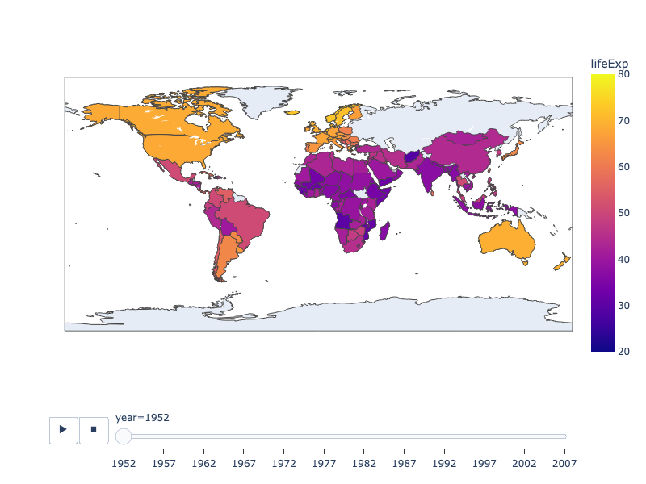

**Interactive Plot:**

<div>                        <script type="text/javascript">window.PlotlyConfig = {MathJaxConfig: 'local'};</script>
        <script charset="utf-8" src="https://cdn.plot.ly/plotly-3.1.0.min.js" integrity="sha256-Ei4740bWZhaUTQuD6q9yQlgVCMPBz6CZWhevDYPv93A=" crossorigin="anonymous"></script>                <div id="plotly-div-31" class="plotly-graph-div" style="height:100%; width:100%;"></div>            <script type="text/javascript">                window.PLOTLYENV=window.PLOTLYENV || {};                                if (document.getElementById("plotly-div-31")) {                    Plotly.newPlot(                        "plotly-div-31",                        [{"coloraxis":"coloraxis","geo":"geo","hovertemplate":"\u003cb\u003e%{hovertext}\u003c\u002fb\u003e\u003cbr\u003e\u003cbr\u003eyear=1952\u003cbr\u003eiso_alpha=%{location}\u003cbr\u003elifeExp=%{z}\u003cextra\u003e\u003c\u002fextra\u003e","hovertext":["Afghanistan","Albania","Algeria","Angola","Argentina","Australia","Austria","Bahrain","Bangladesh","Belgium","Benin","Bolivia","Bosnia and Herzegovina","Botswana","Brazil","Bulgaria","Burkina Faso","Burundi","Cambodia","Cameroon","Canada","Central African Republic","Chad","Chile","China","Colombia","Comoros","Congo, Dem. Rep.","Congo, Rep.","Costa Rica","Cote d'Ivoire","Croatia","Cuba","Czech Republic","Denmark","Djibouti","Dominican Republic","Ecuador","Egypt","El Salvador","Equatorial Guinea","Eritrea","Ethiopia","Finland","France","Gabon","Gambia","Germany","Ghana","Greece","Guatemala","Guinea","Guinea-Bissau","Haiti","Honduras","Hong Kong, China","Hungary","Iceland","India","Indonesia","Iran","Iraq","Ireland","Israel","Italy","Jamaica","Japan","Jordan","Kenya","Korea, Dem. Rep.","Korea, Rep.","Kuwait","Lebanon","Lesotho","Liberia","Libya","Madagascar","Malawi","Malaysia","Mali","Mauritania","Mauritius","Mexico","Mongolia","Montenegro","Morocco","Mozambique","Myanmar","Namibia","Nepal","Netherlands","New Zealand","Nicaragua","Niger","Nigeria","Norway","Oman","Pakistan","Panama","Paraguay","Peru","Philippines","Poland","Portugal","Puerto Rico","Reunion","Romania","Rwanda","Sao Tome and Principe","Saudi Arabia","Senegal","Serbia","Sierra Leone","Singapore","Slovak Republic","Slovenia","Somalia","South Africa","Spain","Sri Lanka","Sudan","Swaziland","Sweden","Switzerland","Syria","Taiwan","Tanzania","Thailand","Togo","Trinidad and Tobago","Tunisia","Turkey","Uganda","United Kingdom","United States","Uruguay","Venezuela","Vietnam","West Bank and Gaza","Yemen, Rep.","Zambia","Zimbabwe"],"locations":["AFG","ALB","DZA","AGO","ARG","AUS","AUT","BHR","BGD","BEL","BEN","BOL","BIH","BWA","BRA","BGR","BFA","BDI","KHM","CMR","CAN","CAF","TCD","CHL","CHN","COL","COM","COD","COG","CRI","CIV","HRV","CUB","CZE","DNK","DJI","DOM","ECU","EGY","SLV","GNQ","ERI","ETH","FIN","FRA","GAB","GMB","DEU","GHA","GRC","GTM","GIN","GNB","HTI","HND","HKG","HUN","ISL","IND","IDN","IRN","IRQ","IRL","ISR","ITA","JAM","JPN","JOR","KEN","KOR","KOR","KWT","LBN","LSO","LBR","LBY","MDG","MWI","MYS","MLI","MRT","MUS","MEX","MNG","MNE","MAR","MOZ","MMR","NAM","NPL","NLD","NZL","NIC","NER","NGA","NOR","OMN","PAK","PAN","PRY","PER","PHL","POL","PRT","PRI","REU","ROU","RWA","STP","SAU","SEN","SRB","SLE","SGP","SVK","SVN","SOM","ZAF","ESP","LKA","SDN","SWZ","SWE","CHE","SYR","TWN","TZA","THA","TGO","TTO","TUN","TUR","UGA","GBR","USA","URY","VEN","VNM","PSE","YEM","ZMB","ZWE"],"name":"","z":{"dtype":"f8","bdata":"kxgEVg7NPEA9CtejcJ1LQGDl0CLbiUVApHA9CtcDPkCuR+F6FD5PQEjhehSuR1FAMzMzMzOzUEDUeOkmMXhJQMuhRbbzvUJAAAAAAAAAUUAGgZVDixxDQKJFtvP9NERAKVyPwvXoSkBWDi2ync9HQEw3iUFgdUlAzczMzMzMTUCamZmZmfk\u002fQIcW2c73g0NATDeJQWC1Q0Bt5\u002fup8UJDQAAAAAAAMFFAJQaBlUO7QUCyne+nxgtDQI\u002fC9ShcX0tAAAAAAAAARkD8qfHSTVJJQOxRuB6FW0RA\u002fKnx0k2SQ0CR7Xw\u002fNQ5FQO58PzVemkxAkxgEVg49REB7FK5H4ZpOQNrO91PjtU1ASOF6FK63UEBSuB6F67FRQA4tsp3vZ0FAEFg5tMj2RkAEVg4tsi1IQPyp8dJN8kRAqMZLN4mhRkAEVg4tsj1BQBJYObTI9kFARIts5\u002fsJQUAzMzMzM6NQQArXo3A92lBAqvHSTWKAQkAAAAAAAAA+QAAAAAAA4FBAUI2XbhKTRUDXo3A9CndQQG3n+6nxAkVAy6FFtvPNQEAAAAAAAEBAQCcxCKwcykJA2\u002fl+arz0REB7FK5H4XpOQFK4HoXrAVBAj8L1KFwfUkA7tMh2vq9CQJZDi2znu0JArBxaZDtvRkApXI\u002fC9ahGQArXo3A9ulBAKVyPwvVYUEBcj8L1KHxQQKRwPQrXQ01ApHA9CteDT0BOYhBYOZRFQMP1KFyPIkVAukkMAisHSUBEi2zn+7lHQLgehetRyEtAEFg5tMj2S0CNbOf7qRFFQD0K16NwPUNABoGVQ4tcRUC6SQwCK1dCQFTjpZvEIEJAJQaBlUM7SEBI4XoUrtdAQC\u002fdJAaBRURAke18PzV+SUCiRbbz\u002fWRJQKwcWmQ7H0VAokW28\u002f2UTUA7tMh2vm9FQPCnxks3ST9ARrbz\u002fdQoQkDNzMzMzNxEQGq8dJMYFEJAuB6F61EIUkApXI\u002fC9VhRQNR46SYxKEVARrbz\u002fdS4QkC28\u002f3UeClCQHsUrkfhKlJARIts5\u002fvJQkAshxbZzrdFQJzEILBymEtAUI2XbhJTT0D6fmq8dPNFQMdLN4lB4EdASOF6FK6nTkApXI\u002fC9ehNQFK4HoXrEVBA6SYxCKxcSkBmZmZmZoZOQAAAAAAAAERAPzVeukk8R0AAAAAAAPBDQN0kBoGVo0JAc2iR7Xz\u002fTEDb+X5qvFQ+QKabxCCwMk5A16NwPQoXUEAUrkfhemRQQHe+nxovfUBA\u002fdR46SaBRkBcj8L1KDxQQJZDi2zny0xA4XoUrkdRQ0BqvHSTGLREQNejcD0K91FASOF6FK5nUUAbL90kBvFGQAAAAAAAQE1A7FG4HoWbREAGgZVDi2xJQD81XrpJTENAzczMzMyMTUDNzMzMzExGQHsUrkfhykVAd76fGi\u002f9Q0DsUbgehUtRQFyPwvUoHFFABoGVQ4uEUEAlBoGVQ4tLQNv5fmq8NERAFK5H4XqURUCgGi\u002fdJEZAQL6fGi\u002fdBEVAfT81Xro5SEA="},"type":"choropleth"}],                        {"template":{"data":{"histogram2dcontour":[{"type":"histogram2dcontour","colorbar":{"outlinewidth":0,"ticks":""},"colorscale":[[0.0,"#0d0887"],[0.1111111111111111,"#46039f"],[0.2222222222222222,"#7201a8"],[0.3333333333333333,"#9c179e"],[0.4444444444444444,"#bd3786"],[0.5555555555555556,"#d8576b"],[0.6666666666666666,"#ed7953"],[0.7777777777777778,"#fb9f3a"],[0.8888888888888888,"#fdca26"],[1.0,"#f0f921"]]}],"choropleth":[{"type":"choropleth","colorbar":{"outlinewidth":0,"ticks":""}}],"histogram2d":[{"type":"histogram2d","colorbar":{"outlinewidth":0,"ticks":""},"colorscale":[[0.0,"#0d0887"],[0.1111111111111111,"#46039f"],[0.2222222222222222,"#7201a8"],[0.3333333333333333,"#9c179e"],[0.4444444444444444,"#bd3786"],[0.5555555555555556,"#d8576b"],[0.6666666666666666,"#ed7953"],[0.7777777777777778,"#fb9f3a"],[0.8888888888888888,"#fdca26"],[1.0,"#f0f921"]]}],"heatmap":[{"type":"heatmap","colorbar":{"outlinewidth":0,"ticks":""},"colorscale":[[0.0,"#0d0887"],[0.1111111111111111,"#46039f"],[0.2222222222222222,"#7201a8"],[0.3333333333333333,"#9c179e"],[0.4444444444444444,"#bd3786"],[0.5555555555555556,"#d8576b"],[0.6666666666666666,"#ed7953"],[0.7777777777777778,"#fb9f3a"],[0.8888888888888888,"#fdca26"],[1.0,"#f0f921"]]}],"contourcarpet":[{"type":"contourcarpet","colorbar":{"outlinewidth":0,"ticks":""}}],"contour":[{"type":"contour","colorbar":{"outlinewidth":0,"ticks":""},"colorscale":[[0.0,"#0d0887"],[0.1111111111111111,"#46039f"],[0.2222222222222222,"#7201a8"],[0.3333333333333333,"#9c179e"],[0.4444444444444444,"#bd3786"],[0.5555555555555556,"#d8576b"],[0.6666666666666666,"#ed7953"],[0.7777777777777778,"#fb9f3a"],[0.8888888888888888,"#fdca26"],[1.0,"#f0f921"]]}],"surface":[{"type":"surface","colorbar":{"outlinewidth":0,"ticks":""},"colorscale":[[0.0,"#0d0887"],[0.1111111111111111,"#46039f"],[0.2222222222222222,"#7201a8"],[0.3333333333333333,"#9c179e"],[0.4444444444444444,"#bd3786"],[0.5555555555555556,"#d8576b"],[0.6666666666666666,"#ed7953"],[0.7777777777777778,"#fb9f3a"],[0.8888888888888888,"#fdca26"],[1.0,"#f0f921"]]}],"mesh3d":[{"type":"mesh3d","colorbar":{"outlinewidth":0,"ticks":""}}],"scatter":[{"fillpattern":{"fillmode":"overlay","size":10,"solidity":0.2},"type":"scatter"}],"parcoords":[{"type":"parcoords","line":{"colorbar":{"outlinewidth":0,"ticks":""}}}],"scatterpolargl":[{"type":"scatterpolargl","marker":{"colorbar":{"outlinewidth":0,"ticks":""}}}],"bar":[{"error_x":{"color":"#2a3f5f"},"error_y":{"color":"#2a3f5f"},"marker":{"line":{"color":"#E5ECF6","width":0.5},"pattern":{"fillmode":"overlay","size":10,"solidity":0.2}},"type":"bar"}],"scattergeo":[{"type":"scattergeo","marker":{"colorbar":{"outlinewidth":0,"ticks":""}}}],"scatterpolar":[{"type":"scatterpolar","marker":{"colorbar":{"outlinewidth":0,"ticks":""}}}],"histogram":[{"marker":{"pattern":{"fillmode":"overlay","size":10,"solidity":0.2}},"type":"histogram"}],"scattergl":[{"type":"scattergl","marker":{"colorbar":{"outlinewidth":0,"ticks":""}}}],"scatter3d":[{"type":"scatter3d","line":{"colorbar":{"outlinewidth":0,"ticks":""}},"marker":{"colorbar":{"outlinewidth":0,"ticks":""}}}],"scattermap":[{"type":"scattermap","marker":{"colorbar":{"outlinewidth":0,"ticks":""}}}],"scattermapbox":[{"type":"scattermapbox","marker":{"colorbar":{"outlinewidth":0,"ticks":""}}}],"scatterternary":[{"type":"scatterternary","marker":{"colorbar":{"outlinewidth":0,"ticks":""}}}],"scattercarpet":[{"type":"scattercarpet","marker":{"colorbar":{"outlinewidth":0,"ticks":""}}}],"carpet":[{"aaxis":{"endlinecolor":"#2a3f5f","gridcolor":"white","linecolor":"white","minorgridcolor":"white","startlinecolor":"#2a3f5f"},"baxis":{"endlinecolor":"#2a3f5f","gridcolor":"white","linecolor":"white","minorgridcolor":"white","startlinecolor":"#2a3f5f"},"type":"carpet"}],"table":[{"cells":{"fill":{"color":"#EBF0F8"},"line":{"color":"white"}},"header":{"fill":{"color":"#C8D4E3"},"line":{"color":"white"}},"type":"table"}],"barpolar":[{"marker":{"line":{"color":"#E5ECF6","width":0.5},"pattern":{"fillmode":"overlay","size":10,"solidity":0.2}},"type":"barpolar"}],"pie":[{"automargin":true,"type":"pie"}]},"layout":{"autotypenumbers":"strict","colorway":["#636efa","#EF553B","#00cc96","#ab63fa","#FFA15A","#19d3f3","#FF6692","#B6E880","#FF97FF","#FECB52"],"font":{"color":"#2a3f5f"},"hovermode":"closest","hoverlabel":{"align":"left"},"paper_bgcolor":"white","plot_bgcolor":"#E5ECF6","polar":{"bgcolor":"#E5ECF6","angularaxis":{"gridcolor":"white","linecolor":"white","ticks":""},"radialaxis":{"gridcolor":"white","linecolor":"white","ticks":""}},"ternary":{"bgcolor":"#E5ECF6","aaxis":{"gridcolor":"white","linecolor":"white","ticks":""},"baxis":{"gridcolor":"white","linecolor":"white","ticks":""},"caxis":{"gridcolor":"white","linecolor":"white","ticks":""}},"coloraxis":{"colorbar":{"outlinewidth":0,"ticks":""}},"colorscale":{"sequential":[[0.0,"#0d0887"],[0.1111111111111111,"#46039f"],[0.2222222222222222,"#7201a8"],[0.3333333333333333,"#9c179e"],[0.4444444444444444,"#bd3786"],[0.5555555555555556,"#d8576b"],[0.6666666666666666,"#ed7953"],[0.7777777777777778,"#fb9f3a"],[0.8888888888888888,"#fdca26"],[1.0,"#f0f921"]],"sequentialminus":[[0.0,"#0d0887"],[0.1111111111111111,"#46039f"],[0.2222222222222222,"#7201a8"],[0.3333333333333333,"#9c179e"],[0.4444444444444444,"#bd3786"],[0.5555555555555556,"#d8576b"],[0.6666666666666666,"#ed7953"],[0.7777777777777778,"#fb9f3a"],[0.8888888888888888,"#fdca26"],[1.0,"#f0f921"]],"diverging":[[0,"#8e0152"],[0.1,"#c51b7d"],[0.2,"#de77ae"],[0.3,"#f1b6da"],[0.4,"#fde0ef"],[0.5,"#f7f7f7"],[0.6,"#e6f5d0"],[0.7,"#b8e186"],[0.8,"#7fbc41"],[0.9,"#4d9221"],[1,"#276419"]]},"xaxis":{"gridcolor":"white","linecolor":"white","ticks":"","title":{"standoff":15},"zerolinecolor":"white","automargin":true,"zerolinewidth":2},"yaxis":{"gridcolor":"white","linecolor":"white","ticks":"","title":{"standoff":15},"zerolinecolor":"white","automargin":true,"zerolinewidth":2},"scene":{"xaxis":{"backgroundcolor":"#E5ECF6","gridcolor":"white","linecolor":"white","showbackground":true,"ticks":"","zerolinecolor":"white","gridwidth":2},"yaxis":{"backgroundcolor":"#E5ECF6","gridcolor":"white","linecolor":"white","showbackground":true,"ticks":"","zerolinecolor":"white","gridwidth":2},"zaxis":{"backgroundcolor":"#E5ECF6","gridcolor":"white","linecolor":"white","showbackground":true,"ticks":"","zerolinecolor":"white","gridwidth":2}},"shapedefaults":{"line":{"color":"#2a3f5f"}},"annotationdefaults":{"arrowcolor":"#2a3f5f","arrowhead":0,"arrowwidth":1},"geo":{"bgcolor":"white","landcolor":"#E5ECF6","subunitcolor":"white","showland":true,"showlakes":true,"lakecolor":"white"},"title":{"x":0.05},"mapbox":{"style":"light"}}},"geo":{"domain":{"x":[0.0,1.0],"y":[0.0,1.0]},"center":{}},"coloraxis":{"colorbar":{"title":{"text":"lifeExp"}},"colorscale":[[0.0,"#0d0887"],[0.1111111111111111,"#46039f"],[0.2222222222222222,"#7201a8"],[0.3333333333333333,"#9c179e"],[0.4444444444444444,"#bd3786"],[0.5555555555555556,"#d8576b"],[0.6666666666666666,"#ed7953"],[0.7777777777777778,"#fb9f3a"],[0.8888888888888888,"#fdca26"],[1.0,"#f0f921"]],"cmin":20,"cmax":80},"legend":{"tracegroupgap":0},"margin":{"t":60},"updatemenus":[{"buttons":[{"args":[null,{"frame":{"duration":500,"redraw":true},"mode":"immediate","fromcurrent":true,"transition":{"duration":500,"easing":"linear"}}],"label":"&#9654;","method":"animate"},{"args":[[null],{"frame":{"duration":0,"redraw":true},"mode":"immediate","fromcurrent":true,"transition":{"duration":0,"easing":"linear"}}],"label":"&#9724;","method":"animate"}],"direction":"left","pad":{"r":10,"t":70},"showactive":false,"type":"buttons","x":0.1,"xanchor":"right","y":0,"yanchor":"top"}],"sliders":[{"active":0,"currentvalue":{"prefix":"year="},"len":0.9,"pad":{"b":10,"t":60},"steps":[{"args":[["1952"],{"frame":{"duration":0,"redraw":true},"mode":"immediate","fromcurrent":true,"transition":{"duration":0,"easing":"linear"}}],"label":"1952","method":"animate"},{"args":[["1957"],{"frame":{"duration":0,"redraw":true},"mode":"immediate","fromcurrent":true,"transition":{"duration":0,"easing":"linear"}}],"label":"1957","method":"animate"},{"args":[["1962"],{"frame":{"duration":0,"redraw":true},"mode":"immediate","fromcurrent":true,"transition":{"duration":0,"easing":"linear"}}],"label":"1962","method":"animate"},{"args":[["1967"],{"frame":{"duration":0,"redraw":true},"mode":"immediate","fromcurrent":true,"transition":{"duration":0,"easing":"linear"}}],"label":"1967","method":"animate"},{"args":[["1972"],{"frame":{"duration":0,"redraw":true},"mode":"immediate","fromcurrent":true,"transition":{"duration":0,"easing":"linear"}}],"label":"1972","method":"animate"},{"args":[["1977"],{"frame":{"duration":0,"redraw":true},"mode":"immediate","fromcurrent":true,"transition":{"duration":0,"easing":"linear"}}],"label":"1977","method":"animate"},{"args":[["1982"],{"frame":{"duration":0,"redraw":true},"mode":"immediate","fromcurrent":true,"transition":{"duration":0,"easing":"linear"}}],"label":"1982","method":"animate"},{"args":[["1987"],{"frame":{"duration":0,"redraw":true},"mode":"immediate","fromcurrent":true,"transition":{"duration":0,"easing":"linear"}}],"label":"1987","method":"animate"},{"args":[["1992"],{"frame":{"duration":0,"redraw":true},"mode":"immediate","fromcurrent":true,"transition":{"duration":0,"easing":"linear"}}],"label":"1992","method":"animate"},{"args":[["1997"],{"frame":{"duration":0,"redraw":true},"mode":"immediate","fromcurrent":true,"transition":{"duration":0,"easing":"linear"}}],"label":"1997","method":"animate"},{"args":[["2002"],{"frame":{"duration":0,"redraw":true},"mode":"immediate","fromcurrent":true,"transition":{"duration":0,"easing":"linear"}}],"label":"2002","method":"animate"},{"args":[["2007"],{"frame":{"duration":0,"redraw":true},"mode":"immediate","fromcurrent":true,"transition":{"duration":0,"easing":"linear"}}],"label":"2007","method":"animate"}],"x":0.1,"xanchor":"left","y":0,"yanchor":"top"}]},                        {"responsive": true}                    ).then(function(){
                            Plotly.addFrames('plotly-div-31', [{"data":[{"coloraxis":"coloraxis","geo":"geo","hovertemplate":"\u003cb\u003e%{hovertext}\u003c\u002fb\u003e\u003cbr\u003e\u003cbr\u003eyear=1952\u003cbr\u003eiso_alpha=%{location}\u003cbr\u003elifeExp=%{z}\u003cextra\u003e\u003c\u002fextra\u003e","hovertext":["Afghanistan","Albania","Algeria","Angola","Argentina","Australia","Austria","Bahrain","Bangladesh","Belgium","Benin","Bolivia","Bosnia and Herzegovina","Botswana","Brazil","Bulgaria","Burkina Faso","Burundi","Cambodia","Cameroon","Canada","Central African Republic","Chad","Chile","China","Colombia","Comoros","Congo, Dem. Rep.","Congo, Rep.","Costa Rica","Cote d'Ivoire","Croatia","Cuba","Czech Republic","Denmark","Djibouti","Dominican Republic","Ecuador","Egypt","El Salvador","Equatorial Guinea","Eritrea","Ethiopia","Finland","France","Gabon","Gambia","Germany","Ghana","Greece","Guatemala","Guinea","Guinea-Bissau","Haiti","Honduras","Hong Kong, China","Hungary","Iceland","India","Indonesia","Iran","Iraq","Ireland","Israel","Italy","Jamaica","Japan","Jordan","Kenya","Korea, Dem. Rep.","Korea, Rep.","Kuwait","Lebanon","Lesotho","Liberia","Libya","Madagascar","Malawi","Malaysia","Mali","Mauritania","Mauritius","Mexico","Mongolia","Montenegro","Morocco","Mozambique","Myanmar","Namibia","Nepal","Netherlands","New Zealand","Nicaragua","Niger","Nigeria","Norway","Oman","Pakistan","Panama","Paraguay","Peru","Philippines","Poland","Portugal","Puerto Rico","Reunion","Romania","Rwanda","Sao Tome and Principe","Saudi Arabia","Senegal","Serbia","Sierra Leone","Singapore","Slovak Republic","Slovenia","Somalia","South Africa","Spain","Sri Lanka","Sudan","Swaziland","Sweden","Switzerland","Syria","Taiwan","Tanzania","Thailand","Togo","Trinidad and Tobago","Tunisia","Turkey","Uganda","United Kingdom","United States","Uruguay","Venezuela","Vietnam","West Bank and Gaza","Yemen, Rep.","Zambia","Zimbabwe"],"locations":["AFG","ALB","DZA","AGO","ARG","AUS","AUT","BHR","BGD","BEL","BEN","BOL","BIH","BWA","BRA","BGR","BFA","BDI","KHM","CMR","CAN","CAF","TCD","CHL","CHN","COL","COM","COD","COG","CRI","CIV","HRV","CUB","CZE","DNK","DJI","DOM","ECU","EGY","SLV","GNQ","ERI","ETH","FIN","FRA","GAB","GMB","DEU","GHA","GRC","GTM","GIN","GNB","HTI","HND","HKG","HUN","ISL","IND","IDN","IRN","IRQ","IRL","ISR","ITA","JAM","JPN","JOR","KEN","KOR","KOR","KWT","LBN","LSO","LBR","LBY","MDG","MWI","MYS","MLI","MRT","MUS","MEX","MNG","MNE","MAR","MOZ","MMR","NAM","NPL","NLD","NZL","NIC","NER","NGA","NOR","OMN","PAK","PAN","PRY","PER","PHL","POL","PRT","PRI","REU","ROU","RWA","STP","SAU","SEN","SRB","SLE","SGP","SVK","SVN","SOM","ZAF","ESP","LKA","SDN","SWZ","SWE","CHE","SYR","TWN","TZA","THA","TGO","TTO","TUN","TUR","UGA","GBR","USA","URY","VEN","VNM","PSE","YEM","ZMB","ZWE"],"name":"","z":{"dtype":"f8","bdata":"kxgEVg7NPEA9CtejcJ1LQGDl0CLbiUVApHA9CtcDPkCuR+F6FD5PQEjhehSuR1FAMzMzMzOzUEDUeOkmMXhJQMuhRbbzvUJAAAAAAAAAUUAGgZVDixxDQKJFtvP9NERAKVyPwvXoSkBWDi2ync9HQEw3iUFgdUlAzczMzMzMTUCamZmZmfk\u002fQIcW2c73g0NATDeJQWC1Q0Bt5\u002fup8UJDQAAAAAAAMFFAJQaBlUO7QUCyne+nxgtDQI\u002fC9ShcX0tAAAAAAAAARkD8qfHSTVJJQOxRuB6FW0RA\u002fKnx0k2SQ0CR7Xw\u002fNQ5FQO58PzVemkxAkxgEVg49REB7FK5H4ZpOQNrO91PjtU1ASOF6FK63UEBSuB6F67FRQA4tsp3vZ0FAEFg5tMj2RkAEVg4tsi1IQPyp8dJN8kRAqMZLN4mhRkAEVg4tsj1BQBJYObTI9kFARIts5\u002fsJQUAzMzMzM6NQQArXo3A92lBAqvHSTWKAQkAAAAAAAAA+QAAAAAAA4FBAUI2XbhKTRUDXo3A9CndQQG3n+6nxAkVAy6FFtvPNQEAAAAAAAEBAQCcxCKwcykJA2\u002fl+arz0REB7FK5H4XpOQFK4HoXrAVBAj8L1KFwfUkA7tMh2vq9CQJZDi2znu0JArBxaZDtvRkApXI\u002fC9ahGQArXo3A9ulBAKVyPwvVYUEBcj8L1KHxQQKRwPQrXQ01ApHA9CteDT0BOYhBYOZRFQMP1KFyPIkVAukkMAisHSUBEi2zn+7lHQLgehetRyEtAEFg5tMj2S0CNbOf7qRFFQD0K16NwPUNABoGVQ4tcRUC6SQwCK1dCQFTjpZvEIEJAJQaBlUM7SEBI4XoUrtdAQC\u002fdJAaBRURAke18PzV+SUCiRbbz\u002fWRJQKwcWmQ7H0VAokW28\u002f2UTUA7tMh2vm9FQPCnxks3ST9ARrbz\u002fdQoQkDNzMzMzNxEQGq8dJMYFEJAuB6F61EIUkApXI\u002fC9VhRQNR46SYxKEVARrbz\u002fdS4QkC28\u002f3UeClCQHsUrkfhKlJARIts5\u002fvJQkAshxbZzrdFQJzEILBymEtAUI2XbhJTT0D6fmq8dPNFQMdLN4lB4EdASOF6FK6nTkApXI\u002fC9ehNQFK4HoXrEVBA6SYxCKxcSkBmZmZmZoZOQAAAAAAAAERAPzVeukk8R0AAAAAAAPBDQN0kBoGVo0JAc2iR7Xz\u002fTEDb+X5qvFQ+QKabxCCwMk5A16NwPQoXUEAUrkfhemRQQHe+nxovfUBA\u002fdR46SaBRkBcj8L1KDxQQJZDi2zny0xA4XoUrkdRQ0BqvHSTGLREQNejcD0K91FASOF6FK5nUUAbL90kBvFGQAAAAAAAQE1A7FG4HoWbREAGgZVDi2xJQD81XrpJTENAzczMzMyMTUDNzMzMzExGQHsUrkfhykVAd76fGi\u002f9Q0DsUbgehUtRQFyPwvUoHFFABoGVQ4uEUEAlBoGVQ4tLQNv5fmq8NERAFK5H4XqURUCgGi\u002fdJEZAQL6fGi\u002fdBEVAfT81Xro5SEA="},"type":"choropleth"}],"name":"1952"},{"data":[{"coloraxis":"coloraxis","geo":"geo","hovertemplate":"\u003cb\u003e%{hovertext}\u003c\u002fb\u003e\u003cbr\u003e\u003cbr\u003eyear=1957\u003cbr\u003eiso_alpha=%{location}\u003cbr\u003elifeExp=%{z}\u003cextra\u003e\u003c\u002fextra\u003e","hovertext":["Afghanistan","Albania","Algeria","Angola","Argentina","Australia","Austria","Bahrain","Bangladesh","Belgium","Benin","Bolivia","Bosnia and Herzegovina","Botswana","Brazil","Bulgaria","Burkina Faso","Burundi","Cambodia","Cameroon","Canada","Central African Republic","Chad","Chile","China","Colombia","Comoros","Congo, Dem. Rep.","Congo, Rep.","Costa Rica","Cote d'Ivoire","Croatia","Cuba","Czech Republic","Denmark","Djibouti","Dominican Republic","Ecuador","Egypt","El Salvador","Equatorial Guinea","Eritrea","Ethiopia","Finland","France","Gabon","Gambia","Germany","Ghana","Greece","Guatemala","Guinea","Guinea-Bissau","Haiti","Honduras","Hong Kong, China","Hungary","Iceland","India","Indonesia","Iran","Iraq","Ireland","Israel","Italy","Jamaica","Japan","Jordan","Kenya","Korea, Dem. Rep.","Korea, Rep.","Kuwait","Lebanon","Lesotho","Liberia","Libya","Madagascar","Malawi","Malaysia","Mali","Mauritania","Mauritius","Mexico","Mongolia","Montenegro","Morocco","Mozambique","Myanmar","Namibia","Nepal","Netherlands","New Zealand","Nicaragua","Niger","Nigeria","Norway","Oman","Pakistan","Panama","Paraguay","Peru","Philippines","Poland","Portugal","Puerto Rico","Reunion","Romania","Rwanda","Sao Tome and Principe","Saudi Arabia","Senegal","Serbia","Sierra Leone","Singapore","Slovak Republic","Slovenia","Somalia","South Africa","Spain","Sri Lanka","Sudan","Swaziland","Sweden","Switzerland","Syria","Taiwan","Tanzania","Thailand","Togo","Trinidad and Tobago","Tunisia","Turkey","Uganda","United Kingdom","United States","Uruguay","Venezuela","Vietnam","West Bank and Gaza","Yemen, Rep.","Zambia","Zimbabwe"],"locations":["AFG","ALB","DZA","AGO","ARG","AUS","AUT","BHR","BGD","BEL","BEN","BOL","BIH","BWA","BRA","BGR","BFA","BDI","KHM","CMR","CAN","CAF","TCD","CHL","CHN","COL","COM","COD","COG","CRI","CIV","HRV","CUB","CZE","DNK","DJI","DOM","ECU","EGY","SLV","GNQ","ERI","ETH","FIN","FRA","GAB","GMB","DEU","GHA","GRC","GTM","GIN","GNB","HTI","HND","HKG","HUN","ISL","IND","IDN","IRN","IRQ","IRL","ISR","ITA","JAM","JPN","JOR","KEN","KOR","KOR","KWT","LBN","LSO","LBR","LBY","MDG","MWI","MYS","MLI","MRT","MUS","MEX","MNG","MNE","MAR","MOZ","MMR","NAM","NPL","NLD","NZL","NIC","NER","NGA","NOR","OMN","PAK","PAN","PRY","PER","PHL","POL","PRT","PRI","REU","ROU","RWA","STP","SAU","SEN","SRB","SLE","SGP","SVK","SVN","SOM","ZAF","ESP","LKA","SDN","SWZ","SWE","CHE","SYR","TWN","TZA","THA","TGO","TTO","TUN","TUR","UGA","GBR","USA","URY","VEN","VNM","PSE","YEM","ZMB","ZWE"],"name":"","z":{"dtype":"f8","bdata":"okW28\u002f1UPkCkcD0K16NNQEjhehSu10ZAObTIdr7\u002fP0Coxks3iRlQQIXrUbgelVFAH4XrUbjeUEDRItv5fupKQAaBlUOLrENAj8L1KFxPUUDn+6nx0i1EQFK4HoXr8URAmpmZmZk5TUDJdr6fGs9IQBSuR+F6pEpA16NwPQqnUECHFtnO93NBQE5iEFg5RERAAyuHFtmuREAQWDm0yDZEQD0K16NwfVFACKwcWmS7QkBU46WbxPBDQLbz\u002fdR4CUxA9Wc\u002fUkRGSUDJdr6fGo9LQHsUrkfhOkVA+n5qvHRTREAQWDm0yIZGQBfZzvdTA05AeekmMQg8RUDhehSuRzFQQJqZmZmZKU9AUrgehetBUUCkcD0K1\u002fNRQESLbOf7qUJARIts5\u002fvpSEAhsHJoka1JQEa28\u002f3UOEZAKVyPwvVISEDp+6nx0v1BQLx0kxgEBkNATDeJQWBVQkCPwvUoXN9QQOxRuB6FO1FAHVpkO99\u002fQ0C4HoXrUQhAQGZmZmZmRlFAwcqhRbZjRkDXo3A9CvdQQBkEVg4tEkZAgZVDi2xHQUA830+Nl75AQAwCK4cWWURAhetRuB5VRkAAAAAAADBQQArXo3A9mlBArkfhehReUkAdWmQ73x9EQC\u002fdJAaB9UNAukkMAiuXR0AOLbKd7zdIQJqZmZmZOVFA9ihcj8L1UECkcD0K1\u002fNQQK5H4XoUTk9AAAAAAABgUEASg8DKodVGQCyHFtnOV0ZA7nw\u002fNV4KS0C6SQwCK1dKQE5iEFg5BE1AO99PjZe+TUC8dJMYBIZGQJHtfD81vkNAokW28\u002f2kRkAfhetRuG5DQNEi2\u002fl+mkJAkxgEVg4NSkCc76fGS6dBQCUGgZVDK0VACKwcWmQLTUC4HoXrUZhLQDu0yHa+n0ZA001iEFi5TkCgGi\u002fdJLZGQMHKoUW240BApHA9CtfzRECxcmiR7ZxGQCuHFtnO10JAj8L1KFw\u002fUkBxPQrXo5BRQJ7vp8ZLt0ZABoGVQ4tMQ0Atsp3vp+ZCQFyPwvUoXFJACtejcD0KRECe76fGS8dGQH0\u002fNV66mU1ADgIrhxaZT0CNbOf7qSFHQJhuEoPAqklA4XoUrkdxUEDhehSuR8FOQMP1KFyPIlFA7FG4HoWLS0BmZmZmZgZQQAAAAAAAwERAKVyPwvV4SEDJdr6fGm9FQCcxCKwcqkNASOF6FK7XTkBSuB6F65E\u002fQPT91Hjplk9AzczMzMzcUEBmZmZmZvZQQJMYBFYOfUFArkfhehT+R0AK16NwPapQQO58PzVeuk5AHVpkO9\u002fPQ0CDwMqhRbZFQI\u002fC9ShcH1JApHA9CtejUUAxCKwcWiRIQDMzMzMzM09A6SYxCKx8RUBxPQrXo9BKQLTIdr6fmkRAZmZmZmbmTkDNzMzMzIxHQCYxCKwcCkhADgIrhxZJRUB7FK5H4ZpRQI\u002fC9ShcX1FAiUFg5dDCUEBqvHSTGPRMQKjGSzeJcUVA2s73U+PVRkBcj8L1KPxAQGDl0CLbCUZAeekmMQg8SUA="},"type":"choropleth"}],"name":"1957"},{"data":[{"coloraxis":"coloraxis","geo":"geo","hovertemplate":"\u003cb\u003e%{hovertext}\u003c\u002fb\u003e\u003cbr\u003e\u003cbr\u003eyear=1962\u003cbr\u003eiso_alpha=%{location}\u003cbr\u003elifeExp=%{z}\u003cextra\u003e\u003c\u002fextra\u003e","hovertext":["Afghanistan","Albania","Algeria","Angola","Argentina","Australia","Austria","Bahrain","Bangladesh","Belgium","Benin","Bolivia","Bosnia and Herzegovina","Botswana","Brazil","Bulgaria","Burkina Faso","Burundi","Cambodia","Cameroon","Canada","Central African Republic","Chad","Chile","China","Colombia","Comoros","Congo, Dem. Rep.","Congo, Rep.","Costa Rica","Cote d'Ivoire","Croatia","Cuba","Czech Republic","Denmark","Djibouti","Dominican Republic","Ecuador","Egypt","El Salvador","Equatorial Guinea","Eritrea","Ethiopia","Finland","France","Gabon","Gambia","Germany","Ghana","Greece","Guatemala","Guinea","Guinea-Bissau","Haiti","Honduras","Hong Kong, China","Hungary","Iceland","India","Indonesia","Iran","Iraq","Ireland","Israel","Italy","Jamaica","Japan","Jordan","Kenya","Korea, Dem. Rep.","Korea, Rep.","Kuwait","Lebanon","Lesotho","Liberia","Libya","Madagascar","Malawi","Malaysia","Mali","Mauritania","Mauritius","Mexico","Mongolia","Montenegro","Morocco","Mozambique","Myanmar","Namibia","Nepal","Netherlands","New Zealand","Nicaragua","Niger","Nigeria","Norway","Oman","Pakistan","Panama","Paraguay","Peru","Philippines","Poland","Portugal","Puerto Rico","Reunion","Romania","Rwanda","Sao Tome and Principe","Saudi Arabia","Senegal","Serbia","Sierra Leone","Singapore","Slovak Republic","Slovenia","Somalia","South Africa","Spain","Sri Lanka","Sudan","Swaziland","Sweden","Switzerland","Syria","Taiwan","Tanzania","Thailand","Togo","Trinidad and Tobago","Tunisia","Turkey","Uganda","United Kingdom","United States","Uruguay","Venezuela","Vietnam","West Bank and Gaza","Yemen, Rep.","Zambia","Zimbabwe"],"locations":["AFG","ALB","DZA","AGO","ARG","AUS","AUT","BHR","BGD","BEL","BEN","BOL","BIH","BWA","BRA","BGR","BFA","BDI","KHM","CMR","CAN","CAF","TCD","CHL","CHN","COL","COM","COD","COG","CRI","CIV","HRV","CUB","CZE","DNK","DJI","DOM","ECU","EGY","SLV","GNQ","ERI","ETH","FIN","FRA","GAB","GMB","DEU","GHA","GRC","GTM","GIN","GNB","HTI","HND","HKG","HUN","ISL","IND","IDN","IRN","IRQ","IRL","ISR","ITA","JAM","JPN","JOR","KEN","KOR","KOR","KWT","LBN","LSO","LBR","LBY","MDG","MWI","MYS","MLI","MRT","MUS","MEX","MNG","MNE","MAR","MOZ","MMR","NAM","NPL","NLD","NZL","NIC","NER","NGA","NOR","OMN","PAK","PAN","PRY","PER","PHL","POL","PRT","PRI","REU","ROU","RWA","STP","SAU","SEN","SRB","SLE","SGP","SVK","SVN","SOM","ZAF","ESP","LKA","SDN","SWZ","SWE","CHE","SYR","TWN","TZA","THA","TGO","TTO","TUN","TUR","UGA","GBR","USA","URY","VEN","VNM","PSE","YEM","ZMB","ZWE"],"name":"","z":{"dtype":"f8","bdata":"rBxaZDv\u002fP0AUrkfhejRQQBBYObTIJkhAAAAAAAAAQUAMAiuHFklQQOxRuB6Fu1FAw\u002fUoXI9iUUCgGi\u002fdJHZMQM\u002f3U+Olm0RAAAAAAACQUUDJdr6fGk9FQBBYObTItkVA16NwPQr3TkDD9Shcj8JJQIXrUbge1UtAcT0K16NgUUDVeOkmMehCQPYoXI\u002fCBUVAhetRuB61RUD8qfHSTVJFQDMzMzMz01FAzczMzMy8Q0DP91PjpdtEQIPAyqFF9kxA48KBkCxARkBYObTIdu5MQLKd76fGO0ZAVg4tsp0PRUBI4XoUrjdIQLKd76fGa09A16NwPQp3RkC4HoXrUchQQDq0yHa+T1BAmpmZmZl5UUBmZmZmZhZSQGQQWDm02ENAmG4Sg8C6SkBSuB6F61FLQOXQItv5fkdAnu+nxksnSkCuR+F6FL5CQE5iEFg5FERAZDvfT40HREAAAAAAADBRQHE9CtejoFFAO99PjZc+RECmm8QgsPJAQDMzMzMzk1FAYOXQIts5R0BxPQrXo2BRQCYxCKwcekdAqvHSTWLgQUBYObTIdj5BQOxRuB6Fy0VAaJHtfD8FSECamZmZmelQQD0K16Nw\u002fVBA7FG4HoVrUkA9CtejcM1FQPyp8dJNQkVAmpmZmZmpSEDRItv5frpJQMP1KFyPklFAKVyPwvVYUUCPwvUoXE9RQNejcD0KZ1BAH4XrUbguUUDlpZvEIBBIQLbz\u002fdR4+UdAiRbZzvdTTEBMN4lBYKVLQFyPwvUoPE5AeekmMQgMT0BWDi2ynd9HQMdLN4lBQERAgZVDi2znR0AGgZVDi2xEQBSuR+F6NENAdZMYBFbeS0ArhxbZzndCQDu0yHa+H0ZAc2iR7XwfTkCDwMqhRSZNQOWlm8QgIEhAd76fGi\u002fdT0CDwMqhRfZHQPhT46WbFEJA5\u002fup8dKNRkDFILByaDFIQPyp8dJNskNAH4XrUbhOUkCPwvUoXM9RQDeJQWDlUEhAdZMYBFa+Q0CuR+F6FK5DQK5H4XoUXlJAhetRuB6VRUD2KFyPwtVHQH9qvHST6E5AyXa+nxoXUEA\u002fNV66SYxIQDeJQWDlYEtAKVyPwvXoUEApXI\u002fC9RhQQEjhehSuZ1FAaJHtfD\u002fVTEAzMzMzM7NQQAAAAAAAgEVA\u002fKnx0k3ySUCiRbbz\u002ffRGQCYxCKwcukRARIts5\u002fshUEAZBFYOLWJAQFCNl24Sc1BAhetRuB6VUUCamZmZmUlRQCGwcmiRfUJAfT81Xrr5SEBcj8L1KGxRQH9qvHSTGE9Aj8L1KFxvREDl0CLb+X5GQEjhehSuV1JAFK5H4XrUUUDXo3A9CidJQM3MzMzMTFBAc2iR7XwfRkAshxbZzgdMQLx0kxgE9kVAmpmZmZk5UEAmMQisHMpIQAaBlUOLDEpAeekmMQisRkBxPQrXo7BRQD0K16NwjVFA1XjpJjEQUUDD9Shcj2JOQFg5tMh2rkZAx0s3iUEQSEDXo3A9CpdBQG3n+6nxAkdA5\u002fup8dItSkA="},"type":"choropleth"}],"name":"1962"},{"data":[{"coloraxis":"coloraxis","geo":"geo","hovertemplate":"\u003cb\u003e%{hovertext}\u003c\u002fb\u003e\u003cbr\u003e\u003cbr\u003eyear=1967\u003cbr\u003eiso_alpha=%{location}\u003cbr\u003elifeExp=%{z}\u003cextra\u003e\u003c\u002fextra\u003e","hovertext":["Afghanistan","Albania","Algeria","Angola","Argentina","Australia","Austria","Bahrain","Bangladesh","Belgium","Benin","Bolivia","Bosnia and Herzegovina","Botswana","Brazil","Bulgaria","Burkina Faso","Burundi","Cambodia","Cameroon","Canada","Central African Republic","Chad","Chile","China","Colombia","Comoros","Congo, Dem. Rep.","Congo, Rep.","Costa Rica","Cote d'Ivoire","Croatia","Cuba","Czech Republic","Denmark","Djibouti","Dominican Republic","Ecuador","Egypt","El Salvador","Equatorial Guinea","Eritrea","Ethiopia","Finland","France","Gabon","Gambia","Germany","Ghana","Greece","Guatemala","Guinea","Guinea-Bissau","Haiti","Honduras","Hong Kong, China","Hungary","Iceland","India","Indonesia","Iran","Iraq","Ireland","Israel","Italy","Jamaica","Japan","Jordan","Kenya","Korea, Dem. Rep.","Korea, Rep.","Kuwait","Lebanon","Lesotho","Liberia","Libya","Madagascar","Malawi","Malaysia","Mali","Mauritania","Mauritius","Mexico","Mongolia","Montenegro","Morocco","Mozambique","Myanmar","Namibia","Nepal","Netherlands","New Zealand","Nicaragua","Niger","Nigeria","Norway","Oman","Pakistan","Panama","Paraguay","Peru","Philippines","Poland","Portugal","Puerto Rico","Reunion","Romania","Rwanda","Sao Tome and Principe","Saudi Arabia","Senegal","Serbia","Sierra Leone","Singapore","Slovak Republic","Slovenia","Somalia","South Africa","Spain","Sri Lanka","Sudan","Swaziland","Sweden","Switzerland","Syria","Taiwan","Tanzania","Thailand","Togo","Trinidad and Tobago","Tunisia","Turkey","Uganda","United Kingdom","United States","Uruguay","Venezuela","Vietnam","West Bank and Gaza","Yemen, Rep.","Zambia","Zimbabwe"],"locations":["AFG","ALB","DZA","AGO","ARG","AUS","AUT","BHR","BGD","BEL","BEN","BOL","BIH","BWA","BRA","BGR","BFA","BDI","KHM","CMR","CAN","CAF","TCD","CHL","CHN","COL","COM","COD","COG","CRI","CIV","HRV","CUB","CZE","DNK","DJI","DOM","ECU","EGY","SLV","GNQ","ERI","ETH","FIN","FRA","GAB","GMB","DEU","GHA","GRC","GTM","GIN","GNB","HTI","HND","HKG","HUN","ISL","IND","IDN","IRN","IRQ","IRL","ISR","ITA","JAM","JPN","JOR","KEN","KOR","KOR","KWT","LBN","LSO","LBR","LBY","MDG","MWI","MYS","MLI","MRT","MUS","MEX","MNG","MNE","MAR","MOZ","MMR","NAM","NPL","NLD","NZL","NIC","NER","NGA","NOR","OMN","PAK","PAN","PRY","PER","PHL","POL","PRT","PRI","REU","ROU","RWA","STP","SAU","SEN","SRB","SLE","SGP","SVK","SVN","SOM","ZAF","ESP","LKA","SDN","SWZ","SWE","CHE","SYR","TWN","TZA","THA","TGO","TTO","TUN","TUR","UGA","GBR","USA","URY","VEN","VNM","PSE","YEM","ZMB","ZWE"],"name":"","z":{"dtype":"f8","bdata":"w\u002fUoXI8CQUCuR+F6FI5QQGq8dJMYtElArkfhehT+QUB\u002farx0k2hQQGZmZmZmxlFAKVyPwvWIUUCgGi\u002fdJPZNQESLbOf7uUVAXI\u002fC9Si8UUDhehSuR3FGQGq8dJMYhEZAw\u002fUoXI8yUECgGi\u002fdJKZKQDeJQWDl0ExAexSuR+GaUUDwp8ZLN1lEQKAaL90kxkVAhetRuB61RkCDwMqhRWZGQLgehetRCFJAd76fGi+9RECxcmiR7cxFQG3n+6nxQk5A\u002f+xHisgwTUAlBoGVQ\u002ftNQCPb+X5qPEdAukkMAisHRkCF61G4HgVKQEFg5dAiW1BAzczMzMysR0AAAAAAACBRQMP1KFyPElFAuB6F61GYUUA9CtejcD1SQLbz\u002fdR4CUVA5aWbxCBgTEAQWDm0yFZMQC\u002fdJAaBpUhAPQrXo3DtS0B1kxgEVn5DQNR46SYxGEVAH4XrUbgORUCF61G4HnVRQDMzMzMz41FABoGVQ4tMRkAEVg4tsu1BQDMzMzMzs1FA8KfGSzcJSEAAAAAAAMBRQDdeukkMAklA8KfGSzeZQkDl0CLb+b5BQMl2vp8aH0dAg8DKoUV2SUAAAAAAAIBRQAAAAAAAYFFAH4XrUbhuUkBkEFg5tJhHQAisHFpk+0ZAeekmMQg8SkCYbhKDwDpLQIXrUbgexVFAAAAAAACwUUCkcD0K18NRQHE9Ctej4FBA7FG4HoXbUUCNl24Sg9BJQMHKoUW2U0lAf2q8dJP4TUDP91PjpdtMQA4tsp3vJ1BAj8L1KFzvT0Dl0CLb+T5IQPhT46WbxERAkxgEVg4dSUBU46WbxHBFQHWTGARWvkNAc2iR7XyvTUB1kxgEVj5DQKJFtvP9JEdAnu+nxkvHTkCuR+F6FA5OQKrx0k1ioElACKwcWmTLUEB7FK5H4SpJQFg5tMh2DkNAjZduEoOwSEAxCKwcWpRJQCPb+X5qvERAFK5H4Xp0UkDhehSuR+FRQP3UeOkm8UlAyXa+nxoPRECF61G4HoVEQIXrUbgehVJAWDm0yHZ+R0BmZmZmZuZIQAaBlUOLBFBAv58aL908UEApXI\u002fC9bhJQPyp8dJNMkxA16NwPQpnUUBmZmZmZqZQQGZmZmZmxlFATDeJQWBFTkAzMzMzM7NQQM3MzMzMDEZAZmZmZmY2S0AX2c73U\u002fNIQPLSTWIQyEVA0SLb+X66UEBYObTIdg5BQAaBlUOL\u002fFBAH4XrUbi+UUDsUbgehUtRQJMYBFYOfUNALbKd76f2SUBcj8L1KNxRQBsv3SQGEVBA5\u002fup8dJtRUAbL90kBlFHQArXo3A9ilJA4XoUrkcxUkCkcD0K19NKQAAAAAAA4FBAN4lBYOXgRkAUrkfheiRNQN9PjZduYkdAmpmZmZlZUEAQWDm0yAZKQGC6SQwCK0tASgwCK4cGSEDXo3A9CtdRQHE9CtejsFFAy6FFtvMdUUBaZDvfT71PQCUGgZVD60dAVOOlm8TQSUDLoUW2831CQPyp8dJN4kdAj8L1KFz\u002fSkA="},"type":"choropleth"}],"name":"1967"},{"data":[{"coloraxis":"coloraxis","geo":"geo","hovertemplate":"\u003cb\u003e%{hovertext}\u003c\u002fb\u003e\u003cbr\u003e\u003cbr\u003eyear=1972\u003cbr\u003eiso_alpha=%{location}\u003cbr\u003elifeExp=%{z}\u003cextra\u003e\u003c\u002fextra\u003e","hovertext":["Afghanistan","Albania","Algeria","Angola","Argentina","Australia","Austria","Bahrain","Bangladesh","Belgium","Benin","Bolivia","Bosnia and Herzegovina","Botswana","Brazil","Bulgaria","Burkina Faso","Burundi","Cambodia","Cameroon","Canada","Central African Republic","Chad","Chile","China","Colombia","Comoros","Congo, Dem. Rep.","Congo, Rep.","Costa Rica","Cote d'Ivoire","Croatia","Cuba","Czech Republic","Denmark","Djibouti","Dominican Republic","Ecuador","Egypt","El Salvador","Equatorial Guinea","Eritrea","Ethiopia","Finland","France","Gabon","Gambia","Germany","Ghana","Greece","Guatemala","Guinea","Guinea-Bissau","Haiti","Honduras","Hong Kong, China","Hungary","Iceland","India","Indonesia","Iran","Iraq","Ireland","Israel","Italy","Jamaica","Japan","Jordan","Kenya","Korea, Dem. Rep.","Korea, Rep.","Kuwait","Lebanon","Lesotho","Liberia","Libya","Madagascar","Malawi","Malaysia","Mali","Mauritania","Mauritius","Mexico","Mongolia","Montenegro","Morocco","Mozambique","Myanmar","Namibia","Nepal","Netherlands","New Zealand","Nicaragua","Niger","Nigeria","Norway","Oman","Pakistan","Panama","Paraguay","Peru","Philippines","Poland","Portugal","Puerto Rico","Reunion","Romania","Rwanda","Sao Tome and Principe","Saudi Arabia","Senegal","Serbia","Sierra Leone","Singapore","Slovak Republic","Slovenia","Somalia","South Africa","Spain","Sri Lanka","Sudan","Swaziland","Sweden","Switzerland","Syria","Taiwan","Tanzania","Thailand","Togo","Trinidad and Tobago","Tunisia","Turkey","Uganda","United Kingdom","United States","Uruguay","Venezuela","Vietnam","West Bank and Gaza","Yemen, Rep.","Zambia","Zimbabwe"],"locations":["AFG","ALB","DZA","AGO","ARG","AUS","AUT","BHR","BGD","BEL","BEN","BOL","BIH","BWA","BRA","BGR","BFA","BDI","KHM","CMR","CAN","CAF","TCD","CHL","CHN","COL","COM","COD","COG","CRI","CIV","HRV","CUB","CZE","DNK","DJI","DOM","ECU","EGY","SLV","GNQ","ERI","ETH","FIN","FRA","GAB","GMB","DEU","GHA","GRC","GTM","GIN","GNB","HTI","HND","HKG","HUN","ISL","IND","IDN","IRN","IRQ","IRL","ISR","ITA","JAM","JPN","JOR","KEN","KOR","KOR","KWT","LBN","LSO","LBR","LBY","MDG","MWI","MYS","MLI","MRT","MUS","MEX","MNG","MNE","MAR","MOZ","MMR","NAM","NPL","NLD","NZL","NIC","NER","NGA","NOR","OMN","PAK","PAN","PRY","PER","PHL","POL","PRT","PRI","REU","ROU","RWA","STP","SAU","SEN","SRB","SLE","SGP","SVK","SVN","SOM","ZAF","ESP","LKA","SDN","SWZ","SWE","CHE","SYR","TWN","TZA","THA","TGO","TTO","TUN","TUR","UGA","GBR","USA","URY","VEN","VNM","PSE","YEM","ZMB","ZWE"],"name":"","z":{"dtype":"f8","bdata":"JQaBlUMLQkBcj8L1KOxQQPyp8dJNQktAEFg5tMj2QkBcj8L1KMRQQOxRuB6F+1FAuB6F61GoUUBmZmZmZqZPQMdLN4lBoEZAXI\u002fC9SjcUUBvEoPAyoFHQAisHFpkW0dAzczMzMzcUEBQjZduEgNMQI2XbhKDwE1AmpmZmZm5UUDP91PjpctFQJ7vp8ZLB0ZAf2q8dJMoRECDwMqhRYZHQLgehetROFJA0SLb+X66RUBGtvP91MhGQJzEILByuE9AARO4dTePT0A7tMh2vs9OQEa28\u002f3UeEhAO99PjZf+RkBqvHSTGHRLQHSTGARW9lBASgwCK4fmSEDXo3A9CmdRQIPAyqFFrlFAw\u002fUoXI+SUUCuR+F6FF5SQAMrhxbZLkZAVOOlm8TQTUDazvdT42VNQKjGSzeJkUlA0SLb+X4aTUA1XrpJDEJEQBkEVg4tEkZAUrgehevBRUBI4XoUrrdRQLgehetRGFJAuB6F61FYSECBlUOLbCdDQAAAAAAAwFFAAAAAAADwSED2KFyPwhVSQFg5tMh23kpAsp3vp8ZrQ0CR7Xw\u002fNT5CQEw3iUFgBUhA\u002fdR46SbxSkAAAAAAAABSQHE9CtejcFFAPQrXo3CdUkAX2c73U1NJQESLbOf7mUhAy6FFtvOdS0CamZmZmXlMQFK4HoXr0VFAuB6F61HoUUBcj8L1KAxSQAAAAAAAQFFAexSuR+FaUkDdJAaBlUNMQGQ730+Nx0pA5\u002fup8dL9T0B1kxgEVk5PQCGwcmiR7VBAbef7qfFaUEAZBFYOLeJIQDvfT42XTkVAbef7qfFiSkCxcmiR7WxGQDdeukkM4kRA4XoUrkeBT0CTGARWDv1DQA4tsp3vN0hARrbz\u002fdR4T0CR7Xw\u002fNS5PQI2XbhKD4EpAZBBYObSoUUB1kxgEVm5KQESLbOf7KURAKVyPwvWISkDl0CLb+e5KQD81XrpJ\u002fEVAAAAAAABwUkApXI\u002fC9fhRQBfZzvdTk0tA2c73U+NFREAOAiuHFmlFQPYoXI\u002fClVJA\u002fKnx0k0SSkD0\u002fdR46fZJQOj7qfHSjVBAXI\u002fC9Sh0UEDTTWIQWLlLQLgehetRCE1AZmZmZma2UUBxPQrXo1BRQArXo3A9ClJAqMZLN4kRUEA9CtejcE1RQM3MzMzMTEZAPQrXo3A9TEDFILByaPFKQLgehetR6EZAzczMzMwsUUAzMzMzM7NBQNNNYhBYYVFAZmZmZmaWUUAUrkfhenRRQAaBlUOLfERADgIrhxbZSkCkcD0K10NSQKabxCCwQlBAtMh2vp+KRkAtsp3vp8ZIQK5H4XoUrlJAUrgehetxUkDazvdT46VMQClcj8L1WFFAj8L1KFzPR0CkcD0K1zNOQP3UeOkm4UhAmpmZmZl5UECTGARWDs1LQHE9CtejgExAN166SQyCSUBxPQrXowBSQPYoXI\u002fC1VFAUI2XbhIrUUAhsHJokW1QQI2XbhKDIElAarx0kxhETEAGgZVDi+xDQARWDi2yDUlA4XoUrkfRS0A="},"type":"choropleth"}],"name":"1972"},{"data":[{"coloraxis":"coloraxis","geo":"geo","hovertemplate":"\u003cb\u003e%{hovertext}\u003c\u002fb\u003e\u003cbr\u003e\u003cbr\u003eyear=1977\u003cbr\u003eiso_alpha=%{location}\u003cbr\u003elifeExp=%{z}\u003cextra\u003e\u003c\u002fextra\u003e","hovertext":["Afghanistan","Albania","Algeria","Angola","Argentina","Australia","Austria","Bahrain","Bangladesh","Belgium","Benin","Bolivia","Bosnia and Herzegovina","Botswana","Brazil","Bulgaria","Burkina Faso","Burundi","Cambodia","Cameroon","Canada","Central African Republic","Chad","Chile","China","Colombia","Comoros","Congo, Dem. Rep.","Congo, Rep.","Costa Rica","Cote d'Ivoire","Croatia","Cuba","Czech Republic","Denmark","Djibouti","Dominican Republic","Ecuador","Egypt","El Salvador","Equatorial Guinea","Eritrea","Ethiopia","Finland","France","Gabon","Gambia","Germany","Ghana","Greece","Guatemala","Guinea","Guinea-Bissau","Haiti","Honduras","Hong Kong, China","Hungary","Iceland","India","Indonesia","Iran","Iraq","Ireland","Israel","Italy","Jamaica","Japan","Jordan","Kenya","Korea, Dem. Rep.","Korea, Rep.","Kuwait","Lebanon","Lesotho","Liberia","Libya","Madagascar","Malawi","Malaysia","Mali","Mauritania","Mauritius","Mexico","Mongolia","Montenegro","Morocco","Mozambique","Myanmar","Namibia","Nepal","Netherlands","New Zealand","Nicaragua","Niger","Nigeria","Norway","Oman","Pakistan","Panama","Paraguay","Peru","Philippines","Poland","Portugal","Puerto Rico","Reunion","Romania","Rwanda","Sao Tome and Principe","Saudi Arabia","Senegal","Serbia","Sierra Leone","Singapore","Slovak Republic","Slovenia","Somalia","South Africa","Spain","Sri Lanka","Sudan","Swaziland","Sweden","Switzerland","Syria","Taiwan","Tanzania","Thailand","Togo","Trinidad and Tobago","Tunisia","Turkey","Uganda","United Kingdom","United States","Uruguay","Venezuela","Vietnam","West Bank and Gaza","Yemen, Rep.","Zambia","Zimbabwe"],"locations":["AFG","ALB","DZA","AGO","ARG","AUS","AUT","BHR","BGD","BEL","BEN","BOL","BIH","BWA","BRA","BGR","BFA","BDI","KHM","CMR","CAN","CAF","TCD","CHL","CHN","COL","COM","COD","COG","CRI","CIV","HRV","CUB","CZE","DNK","DJI","DOM","ECU","EGY","SLV","GNQ","ERI","ETH","FIN","FRA","GAB","GMB","DEU","GHA","GRC","GTM","GIN","GNB","HTI","HND","HKG","HUN","ISL","IND","IDN","IRN","IRQ","IRL","ISR","ITA","JAM","JPN","JOR","KEN","KOR","KOR","KWT","LBN","LSO","LBR","LBY","MDG","MWI","MYS","MLI","MRT","MUS","MEX","MNG","MNE","MAR","MOZ","MMR","NAM","NPL","NLD","NZL","NIC","NER","NGA","NOR","OMN","PAK","PAN","PRY","PER","PHL","POL","PRT","PRI","REU","ROU","RWA","STP","SAU","SEN","SRB","SLE","SGP","SVK","SVN","SOM","ZAF","ESP","LKA","SDN","SWZ","SWE","CHE","SYR","TWN","TZA","THA","TGO","TTO","TUN","TUR","UGA","GBR","USA","URY","VEN","VNM","PSE","YEM","ZMB","ZWE"],"name":"","z":{"dtype":"f8","bdata":"8tJNYhA4Q0DsUbgehTtRQG8Sg8DKAU1A5\u002fup8dK9Q0ARWDm0yB5RQI\u002fC9ShcX1JAexSuR+EKUkDLoUW282VQQKAaL90kdkdAMzMzMzMzUkC4HoXrUZhIQG3n+6nxAklA16NwPQp3UUBGtvP91KhNQDvfT42Xvk5ApHA9CtezUUCoxks3iRFHQBSuR+F69EZAuB6F61E4P0A9CtejcK1IQD0K16NwjVJAMzMzMzNjR0AbL90kBrFHQBbZzvdTw1BAsrrVc9L7T0BCYOXQIutPQNR46SYxeElA9P3UeOnmR0AAAAAAANBLQAAAAAAAsFFAHVpkO98vSkApXI\u002fC9ahRQKjGSzeJKVJAPQrXo3CtUUBcj8L1KKxSQN9PjZduQkdAvp8aL93kTkBI4XoUrqdOQEa28\u002f3UqEpADgIrhxZZTEBQjZduEgNFQBSuR+F6REZA4XoUrkdBRkDhehSuRyFSQIXrUbgedVJAhetRuB5lSkCyne+nxutEQAAAAAAAIFJAVOOlm8TgSUDsUbgehWtSQMHKoUW2A0xAqMZLN4lhREDsUbgehbtCQKAaL90k9khA+n5qvHSzTEBmZmZmZmZSQM3MzMzMfFFA16NwPQoHU0C0yHa+nxpLQGDl0CLbWUpAYOXQItvZTEC+nxov3TROQFK4HoXrAVJApHA9CtdDUkAfhetRuF5SQNejcD0Kh1FAuB6F61HYUkD91HjpJpFOQKRwPQrXE0xAGARWDi3KUEAbL90kBjFQQMuhRbbzVVFAdJMYBFaGUEC0yHa+nxpKQG8Sg8DK4UVAf2q8dJO4TEBU46WbxHBHQBkEVg4t4kVAqvHSTWJQUEAIrBxaZNtEQJMYBFYObUlA7FG4HoU7UEA1XrpJDEJQQAMrhxbZvktATmIQWDlEUkA9CtejcN1LQI\u002fC9ShcP0VAZDvfT40HTEAOLbKd7zdMQDu0yHa+X0dAj8L1KFzPUkCuR+F6FA5SQFyPwvUovExAaJHtfD+lREBvEoPAykFGQEjhehSu11JA5dAi2\u002fmuTEAv3SQGgQVLQN0kBoGVK1FAPN9PjZeWUEDwp8ZLNzlNQEjhehSuB05AexSuR+GqUUAK16NwPZpRQFyPwvUoXFJAarx0kxjEUEA9CtejcF1RQAAAAAAAgEZAZmZmZmZGTUC4HoXrUVhNQI2XbhKDcEhAMzMzMzOTUUC+nxov3WRCQHsUrkfhslFAzczMzMycUUCuR+F6FL5RQOkmMQis\u002fERA+n5qvHTDS0ApXI\u002fC9ZhSQNv5fmq8fFBAZmZmZmbmR0Db+X5qvERKQFyPwvUo3FJAKVyPwvXYUkApXI\u002fC9ZhOQPYoXI\u002fCpVFAEoPAyqH1SECsHFpkOz9PQKjGSzeJcUpAMzMzMzMTUUBCYOXQIutNQDeJQWDlwE1AzczMzMwsSUBxPQrXozBSQLgehetRWFJAEVg5tMheUUB3vp8aL91QQG8Sg8DK4UtAUrgehethTkBmZmZmZhZGQMUgsHJosUlAg8DKoUXWTEA="},"type":"choropleth"}],"name":"1977"},{"data":[{"coloraxis":"coloraxis","geo":"geo","hovertemplate":"\u003cb\u003e%{hovertext}\u003c\u002fb\u003e\u003cbr\u003e\u003cbr\u003eyear=1982\u003cbr\u003eiso_alpha=%{location}\u003cbr\u003elifeExp=%{z}\u003cextra\u003e\u003c\u002fextra\u003e","hovertext":["Afghanistan","Albania","Algeria","Angola","Argentina","Australia","Austria","Bahrain","Bangladesh","Belgium","Benin","Bolivia","Bosnia and Herzegovina","Botswana","Brazil","Bulgaria","Burkina Faso","Burundi","Cambodia","Cameroon","Canada","Central African Republic","Chad","Chile","China","Colombia","Comoros","Congo, Dem. Rep.","Congo, Rep.","Costa Rica","Cote d'Ivoire","Croatia","Cuba","Czech Republic","Denmark","Djibouti","Dominican Republic","Ecuador","Egypt","El Salvador","Equatorial Guinea","Eritrea","Ethiopia","Finland","France","Gabon","Gambia","Germany","Ghana","Greece","Guatemala","Guinea","Guinea-Bissau","Haiti","Honduras","Hong Kong, China","Hungary","Iceland","India","Indonesia","Iran","Iraq","Ireland","Israel","Italy","Jamaica","Japan","Jordan","Kenya","Korea, Dem. Rep.","Korea, Rep.","Kuwait","Lebanon","Lesotho","Liberia","Libya","Madagascar","Malawi","Malaysia","Mali","Mauritania","Mauritius","Mexico","Mongolia","Montenegro","Morocco","Mozambique","Myanmar","Namibia","Nepal","Netherlands","New Zealand","Nicaragua","Niger","Nigeria","Norway","Oman","Pakistan","Panama","Paraguay","Peru","Philippines","Poland","Portugal","Puerto Rico","Reunion","Romania","Rwanda","Sao Tome and Principe","Saudi Arabia","Senegal","Serbia","Sierra Leone","Singapore","Slovak Republic","Slovenia","Somalia","South Africa","Spain","Sri Lanka","Sudan","Swaziland","Sweden","Switzerland","Syria","Taiwan","Tanzania","Thailand","Togo","Trinidad and Tobago","Tunisia","Turkey","Uganda","United Kingdom","United States","Uruguay","Venezuela","Vietnam","West Bank and Gaza","Yemen, Rep.","Zambia","Zimbabwe"],"locations":["AFG","ALB","DZA","AGO","ARG","AUS","AUT","BHR","BGD","BEL","BEN","BOL","BIH","BWA","BRA","BGR","BFA","BDI","KHM","CMR","CAN","CAF","TCD","CHL","CHN","COL","COM","COD","COG","CRI","CIV","HRV","CUB","CZE","DNK","DJI","DOM","ECU","EGY","SLV","GNQ","ERI","ETH","FIN","FRA","GAB","GMB","DEU","GHA","GRC","GTM","GIN","GNB","HTI","HND","HKG","HUN","ISL","IND","IDN","IRN","IRQ","IRL","ISR","ITA","JAM","JPN","JOR","KEN","KOR","KOR","KWT","LBN","LSO","LBR","LBY","MDG","MWI","MYS","MLI","MRT","MUS","MEX","MNG","MNE","MAR","MOZ","MMR","NAM","NPL","NLD","NZL","NIC","NER","NGA","NOR","OMN","PAK","PAN","PRY","PER","PHL","POL","PRT","PRI","REU","ROU","RWA","STP","SAU","SEN","SRB","SLE","SGP","SVK","SVN","SOM","ZAF","ESP","LKA","SDN","SWZ","SWE","CHE","SYR","TWN","TZA","THA","TGO","TTO","TUN","TUR","UGA","GBR","USA","URY","VEN","VNM","PSE","YEM","ZMB","ZWE"],"name":"","z":{"dtype":"f8","bdata":"WmQ730\u002ftQ0B7FK5H4ZpRQMl2vp8ar05Af2q8dJP4Q0A\u002fNV66SXxRQI\u002fC9Shcr1JA7FG4HoVLUkAW2c73U0NRQP3UeOkmAUlA7FG4HoV7UkDByqFFtnNJQMuhRbbz7UpAXI\u002fC9SisUUDLoUW2871OQGC6SQwCq09AhetRuB7FUUBWDi2ynQ9IQD81XrpJvEdA0SLb+X56SUBgukkMAntKQHE9Ctej8FJA9ihcj8IlSEAZBFYOLcJIQFyPwvUopFFAmpmZmZlhUEBvEoPAyqlQQIGVQ4tsd0pAMQisHFrkR0ApXI\u002fC9VhMQM3MzMzMXFJA5\u002fup8dL9SkA9CtejcJ1RQNnO91PjbVJAPQrXo3C9UUC4HoXrUahSQA4tsp3vZ0hAkxgEVg7dT0DZzvdT4xVQQFTjpZvEAExAWmQ7309NTEDb+X5qvNRFQFK4HoXr8UVAaJHtfD91RkAzMzMzM6NSQClcj8L1uFJA1HjpJjFITEAK16NwPcpGQDMzMzMzc1JArBxaZDvfSkCPwvUoXM9SQKjGSzeJEU1AN166SQxyRUBg5dAi26lDQGC6SQwCu0lAMQisHFp0TkDNzMzMzNxSQClcj8L1WFFAj8L1KFw\u002fU0A\u002fNV66SUxMQDEIrBxaFExAj8L1KFzPTUC+nxov3QRPQGZmZmZmRlJAzczMzMycUkAfhetRuL5SQD0K16NwzVFA16NwPQpHU0A730+Nl95PQDdeukkMYk1AZmZmZmZGUUAdWmQ738dQQLKd76fG01FA9P3UeOm+UEBEi2zn+4lLQJMYBFYObUZApHA9CtcTT0B56SYxCHxIQBkEVg4t0kZAAAAAAAAAUUBoke18P\u002fVFQOkmMQiszEpAL90kBoGtUEBSuB6F69lQQDvfT42XvkxAWDm0yHaGUkAzMzMzM9NNQPYoXI\u002fCZUVAukkMAisHTUCWQ4ts53tNQHnpJjEIzEhAMzMzMzMDU0D2KFyPwnVSQKAaL90kpk1ABoGVQ4tMRUB9PzVeuulGQK5H4XoU\u002flJAd76fGi9dT0BOYhBYORRMQJHtfD81nlFADi2yne+3UECJFtnO97NOQNEi2\u002fl+Ck9AFK5H4XrUUUDhehSuRzFSQAAAAAAAcFJAcT0K16N4UUAK16NwPWpRQJZDi2znG0dAsXJoke0sTkCoxks3iYFPQI2XbhKDMEpA7Xw\u002fNV6KUUApXI\u002fC9ThDQHE9Ctej8FFAMzMzMzOzUUB56SYxCMRRQArXo3A9ekVA+FPjpZsUTUAzMzMzMxNTQJzEILByMFFAJQaBlUMrSUAshxbZzsdLQHsUrkfhGlNAPQrXo3ANU0D2KFyPwiVQQArXo3A9ClJA5\u002fup8dJNSUCR7Xw\u002fNSZQQD81XrpJvEtAaJHtfD81UUBQjZduEgNQQPhT46WbhE5A6SYxCKzsSEDD9Shcj4JSQJqZmZmZqVJA7FG4HoWzUUDP91PjpSNRQJzEILByaE1ARIts5\u002fsZUEBYObTIdo5IQA4CK4cW6UlAWDm0yHYuTkA="},"type":"choropleth"}],"name":"1982"},{"data":[{"coloraxis":"coloraxis","geo":"geo","hovertemplate":"\u003cb\u003e%{hovertext}\u003c\u002fb\u003e\u003cbr\u003e\u003cbr\u003eyear=1987\u003cbr\u003eiso_alpha=%{location}\u003cbr\u003elifeExp=%{z}\u003cextra\u003e\u003c\u002fextra\u003e","hovertext":["Afghanistan","Albania","Algeria","Angola","Argentina","Australia","Austria","Bahrain","Bangladesh","Belgium","Benin","Bolivia","Bosnia and Herzegovina","Botswana","Brazil","Bulgaria","Burkina Faso","Burundi","Cambodia","Cameroon","Canada","Central African Republic","Chad","Chile","China","Colombia","Comoros","Congo, Dem. Rep.","Congo, Rep.","Costa Rica","Cote d'Ivoire","Croatia","Cuba","Czech Republic","Denmark","Djibouti","Dominican Republic","Ecuador","Egypt","El Salvador","Equatorial Guinea","Eritrea","Ethiopia","Finland","France","Gabon","Gambia","Germany","Ghana","Greece","Guatemala","Guinea","Guinea-Bissau","Haiti","Honduras","Hong Kong, China","Hungary","Iceland","India","Indonesia","Iran","Iraq","Ireland","Israel","Italy","Jamaica","Japan","Jordan","Kenya","Korea, Dem. Rep.","Korea, Rep.","Kuwait","Lebanon","Lesotho","Liberia","Libya","Madagascar","Malawi","Malaysia","Mali","Mauritania","Mauritius","Mexico","Mongolia","Montenegro","Morocco","Mozambique","Myanmar","Namibia","Nepal","Netherlands","New Zealand","Nicaragua","Niger","Nigeria","Norway","Oman","Pakistan","Panama","Paraguay","Peru","Philippines","Poland","Portugal","Puerto Rico","Reunion","Romania","Rwanda","Sao Tome and Principe","Saudi Arabia","Senegal","Serbia","Sierra Leone","Singapore","Slovak Republic","Slovenia","Somalia","South Africa","Spain","Sri Lanka","Sudan","Swaziland","Sweden","Switzerland","Syria","Taiwan","Tanzania","Thailand","Togo","Trinidad and Tobago","Tunisia","Turkey","Uganda","United Kingdom","United States","Uruguay","Venezuela","Vietnam","West Bank and Gaza","Yemen, Rep.","Zambia","Zimbabwe"],"locations":["AFG","ALB","DZA","AGO","ARG","AUS","AUT","BHR","BGD","BEL","BEN","BOL","BIH","BWA","BRA","BGR","BFA","BDI","KHM","CMR","CAN","CAF","TCD","CHL","CHN","COL","COM","COD","COG","CRI","CIV","HRV","CUB","CZE","DNK","DJI","DOM","ECU","EGY","SLV","GNQ","ERI","ETH","FIN","FRA","GAB","GMB","DEU","GHA","GRC","GTM","GIN","GNB","HTI","HND","HKG","HUN","ISL","IND","IDN","IRN","IRQ","IRL","ISR","ITA","JAM","JPN","JOR","KEN","KOR","KOR","KWT","LBN","LSO","LBR","LBY","MDG","MWI","MYS","MLI","MRT","MUS","MEX","MNG","MNE","MAR","MOZ","MMR","NAM","NPL","NLD","NZL","NIC","NER","NGA","NOR","OMN","PAK","PAN","PRY","PER","PHL","POL","PRT","PRI","REU","ROU","RWA","STP","SAU","SEN","SRB","SLE","SGP","SVK","SVN","SOM","ZAF","ESP","LKA","SDN","SWZ","SWE","CHE","SYR","TWN","TZA","THA","TGO","TTO","TUN","TUR","UGA","GBR","USA","URY","VEN","VNM","PSE","YEM","ZMB","ZWE"],"name":"","z":{"dtype":"f8","bdata":"8KfGSzdpREAAAAAAAABSQEFg5dAic1BAhxbZzvfzQ0Coxks3ibFRQBSuR+F6FFNAXI\u002fC9Si8UkAAAAAAALBRQEa28\u002f3UaEpAZmZmZmbWUkBCYOXQIitKQOWlm8QgoExAKVyPwvXIUUBWDi2ync9PQIXrUbgeTVBA9ihcj8LVUUCe76fGS8dIQGC6SQwCG0hAokW28\u002f30SkCuR+F6FH5LQNejcD0KN1NArkfhehQ+SUBKDAIrh4ZJQHNoke18H1JAqMZLN4nRUED+1HjpJvFQQEoMAiuHdktA2\u002fl+ary0R0Bcj8L1KLxMQOOlm8QgsFJApHA9CtdTS0DhehSuR+FRQEBg5dAii1JAhetRuB7lUUAzMzMzM7NSQIXrUbgeBUlAbef7qfGCUEARWDm0yM5QQLx0kxgE5k1AwcqhRbaTT0CiRbbz\u002fdRGQESLbOf7OUdAZDvfT41XR0CF61G4HrVSQPYoXI\u002fCFVNAuB6F61EYTkBSuB6F66FIQJHtfD81tlJAWmQ730\u002fdS0B7FK5H4SpTQGq8dJMYZE5ALbKd76fGRkCPwvUoXJ9EQMUgsHJo0UpAc2iR7XwfUEDNzMzMzAxTQIXrUbgeZVFAH4XrUbhOU0AQWDm0yEZNQKjGSzeJEU5AhetRuB6FT0CJQWDl0EJQQNejcD0Kl1JAZmZmZmbmUkB7FK5H4RpTQOF6FK5H8VFAexSuR+GqU0BWDi2ynXdQQAisHFpkq01AwyCwcmipUUCkcD0K13NRQEBg5dAii1JAJQaBlUP7UEDXo3A9CpdMQPp+arx0A0dA5dAi2\u002fmOUEDNzMzMzKxIQNEi2\u002fl+ukdAAAAAAABgUUA730+Nly5HQMP1KFyPEkxAj8L1KFwvUUAdWmQ7319RQCPb+X5qHE5Aj8L1KFy3UkAtsp3vp1ZPQJHtfD81bkVACKwcWmQrTUB7FK5H4WpOQNv5fmq8REpAhetRuB41U0AUrkfhepRSQBsv3SQGAU9A16NwPQpHRkDFILByaHFHQClcj8L1+FJA5dAi2\u002fnuUECPwvUoXB9NQLbz\u002fdR44VFA1XjpJjHYUEB\u002farx0kwhQQIxs5\u002fupCVBAH4XrUbi+UUCkcD0K14NSQLgehetRqFJA30+Nl276UUBSuB6F62FRQMP1KFyPAkZAd76fGi\u002fdTkB7FK5H4ZJQQN9PjZdu4ktAy6FFtvPNUUBU46WbxABEQKRwPQrXY1JAhetRuB7FUUAAAAAAABBSQOWlm8QgQEZAmG4Sg8BqTkCamZmZmTlTQGMQWDm0QFFArBxaZDvfSUAQWDm0yNZMQFyPwvUoTFNACtejcD1aU0B0kxgEVr5QQJqZmZmZWVJAFK5H4XrESUBMN4lBYIVQQJzEILByeExAaJHtfD9lUUDvp8ZLN7lQQOf7qfHSjU9A\u002fdR46SbBSUCcxCCwcsBSQOF6FK5HwVJAmG4Sg8D6UUBcj8L1KIxRQClcj8L1aE9Abef7qfHCUEC8dJMYBHZKQA4CK4cWaUlAsXJoke0sT0A="},"type":"choropleth"}],"name":"1987"},{"data":[{"coloraxis":"coloraxis","geo":"geo","hovertemplate":"\u003cb\u003e%{hovertext}\u003c\u002fb\u003e\u003cbr\u003e\u003cbr\u003eyear=1992\u003cbr\u003eiso_alpha=%{location}\u003cbr\u003elifeExp=%{z}\u003cextra\u003e\u003c\u002fextra\u003e","hovertext":["Afghanistan","Albania","Algeria","Angola","Argentina","Australia","Austria","Bahrain","Bangladesh","Belgium","Benin","Bolivia","Bosnia and Herzegovina","Botswana","Brazil","Bulgaria","Burkina Faso","Burundi","Cambodia","Cameroon","Canada","Central African Republic","Chad","Chile","China","Colombia","Comoros","Congo, Dem. Rep.","Congo, Rep.","Costa Rica","Cote d'Ivoire","Croatia","Cuba","Czech Republic","Denmark","Djibouti","Dominican Republic","Ecuador","Egypt","El Salvador","Equatorial Guinea","Eritrea","Ethiopia","Finland","France","Gabon","Gambia","Germany","Ghana","Greece","Guatemala","Guinea","Guinea-Bissau","Haiti","Honduras","Hong Kong, China","Hungary","Iceland","India","Indonesia","Iran","Iraq","Ireland","Israel","Italy","Jamaica","Japan","Jordan","Kenya","Korea, Dem. Rep.","Korea, Rep.","Kuwait","Lebanon","Lesotho","Liberia","Libya","Madagascar","Malawi","Malaysia","Mali","Mauritania","Mauritius","Mexico","Mongolia","Montenegro","Morocco","Mozambique","Myanmar","Namibia","Nepal","Netherlands","New Zealand","Nicaragua","Niger","Nigeria","Norway","Oman","Pakistan","Panama","Paraguay","Peru","Philippines","Poland","Portugal","Puerto Rico","Reunion","Romania","Rwanda","Sao Tome and Principe","Saudi Arabia","Senegal","Serbia","Sierra Leone","Singapore","Slovak Republic","Slovenia","Somalia","South Africa","Spain","Sri Lanka","Sudan","Swaziland","Sweden","Switzerland","Syria","Taiwan","Tanzania","Thailand","Togo","Trinidad and Tobago","Tunisia","Turkey","Uganda","United Kingdom","United States","Uruguay","Venezuela","Vietnam","West Bank and Gaza","Yemen, Rep.","Zambia","Zimbabwe"],"locations":["AFG","ALB","DZA","AGO","ARG","AUS","AUT","BHR","BGD","BEL","BEN","BOL","BIH","BWA","BRA","BGR","BFA","BDI","KHM","CMR","CAN","CAF","TCD","CHL","CHN","COL","COM","COD","COG","CRI","CIV","HRV","CUB","CZE","DNK","DJI","DOM","ECU","EGY","SLV","GNQ","ERI","ETH","FIN","FRA","GAB","GMB","DEU","GHA","GRC","GTM","GIN","GNB","HTI","HND","HKG","HUN","ISL","IND","IDN","IRN","IRQ","IRL","ISR","ITA","JAM","JPN","JOR","KEN","KOR","KOR","KWT","LBN","LSO","LBR","LBY","MDG","MWI","MYS","MLI","MRT","MUS","MEX","MNG","MNE","MAR","MOZ","MMR","NAM","NPL","NLD","NZL","NIC","NER","NGA","NOR","OMN","PAK","PAN","PRY","PER","PHL","POL","PRT","PRI","REU","ROU","RWA","STP","SAU","SEN","SRB","SLE","SGP","SVK","SVN","SOM","ZAF","ESP","LKA","SDN","SWZ","SWE","CHE","SYR","TWN","TZA","THA","TGO","TTO","TUN","TUR","UGA","GBR","USA","URY","VEN","VNM","PSE","YEM","ZMB","ZWE"],"name":"","z":{"dtype":"f8","bdata":"g8DKoUXWREB3vp8aL+VRQFYOLbKd71BAiUFg5dBSREBkO99PjfdRQKRwPQrXY1NAw\u002fUoXI8CU0BYObTIdiZSQPyp8dJNAkxAPQrXo3AdU0ASg8DKofVKQNEi2\u002fl++k1ACKwcWmQLUkCPwvUoXF9PQM\u002f3U+Olw1BAXI\u002fC9SjMUUDhehSuRyFJQJHtfD81XkZAEFg5tMjmS0DUeOkmMShLQM3MzMzMfFNAppvEILCySEDpJjEIrNxJQPLSTWIQiFJAXI\u002fC9SgsUUBt5\u002fup8RpRQNR46SYx+ExAoBov3STGRkCBlUOLbDdMQBSDwMqh7VJAEoPAyqEFSkB9PzVeuiFSQNEi2\u002fl+mlJAmpmZmZkZUkCF61G4HtVSQFpkO99PzUlAaJHtfD8dUUCsHFpkO2dRQIPAyqFF1k9AUI2XbhKzUED2KFyPwsVHQAMrhxbZ\u002fkhAz\u002fdT46ULSEDNzMzMzOxSQD0K16NwXVNAAyuHFtmuTkDfT42XblJKQBSuR+F6BFNA5aWbxCDATEBSuB6F60FTQDu0yHa+r09AfT81XrpJSEA3XrpJDKJFQAisHFpki0tAqMZLN4mZUEBYObTIdmZTQHsUrkfhSlFA4XoUrkexU0AGgZVDixxOQLpJDAIrV09Ac2iR7XxvUEBgukkMArtNQNnO91Pj3VJA7FG4HoU7U0Bcj8L1KFxTQBsv3SQG8VFA16NwPQrXU0ApXI\u002fC9QBRQBSuR+F6pE1APN9PjZd+UUBWDi2ynQ9SQFyPwvUozFJAppvEILBSUUBI4XoUrtdNQC2yne+nZkRAuB6F61EwUUAIrBxaZBtKQPYoXI\u002fCtUhAMQisHFqsUUCNbOf7qTFIQLTIdr6fKk1ASOF6FK5vUUCF61G4Ht1RQKabxCCwok5ApHA9CtfbUkD+1HjpJllQQDEIrBxaJEZAKVyPwvWoTUAdWmQ73\u002f9OQJMYBFYO3UtAexSuR+FaU0CF61G4HhVTQMuhRbbzdVBAN166SQyyR0Aj2\u002fl+arxHQBSuR+F6VFNA+FPjpZvMUUAlBoGVQ2tOQCGwcmiRHVJAZmZmZmYOUUBaZDvfT51QQFpkO99PnVBAj8L1KFy\u002fUUDXo3A9CrdSQPyp8dJNelJAj8L1KFxnUkDXo3A9CldRQNNNYhBYmTdA5dAi2\u002fleT0D+1HjpJjFRQA4CK4cWGU1AFwRWDi3qUUC0yHa+nypDQN9PjZdu8lJAuB6F61HYUUApXI\u002fC9WhSQE5iEFg51ENAjWzn+6nxTkAUrkfhemRTQMVLN4lBmFFAukkMAivHSkDpJjEIrDxNQArXo3A9ilNAUrgeheuBU0AOLbKd709RQHE9CtejkFJAuB6F61E4SUBQjZduEtNQQCyHFtnOB01AukkMAit3UUDy0k1iEIBRQNNNYhBYiVBAmpmZmZlpSEB7FK5H4RpTQPYoXI\u002fCBVNA46WbxCAwUkCamZmZmclRQO18PzVe6lBAy6FFtvNtUUDpJjEIrMxLQM3MzMzMDEdAx0s3iUEwTkA="},"type":"choropleth"}],"name":"1992"},{"data":[{"coloraxis":"coloraxis","geo":"geo","hovertemplate":"\u003cb\u003e%{hovertext}\u003c\u002fb\u003e\u003cbr\u003e\u003cbr\u003eyear=1997\u003cbr\u003eiso_alpha=%{location}\u003cbr\u003elifeExp=%{z}\u003cextra\u003e\u003c\u002fextra\u003e","hovertext":["Afghanistan","Albania","Algeria","Angola","Argentina","Australia","Austria","Bahrain","Bangladesh","Belgium","Benin","Bolivia","Bosnia and Herzegovina","Botswana","Brazil","Bulgaria","Burkina Faso","Burundi","Cambodia","Cameroon","Canada","Central African Republic","Chad","Chile","China","Colombia","Comoros","Congo, Dem. Rep.","Congo, Rep.","Costa Rica","Cote d'Ivoire","Croatia","Cuba","Czech Republic","Denmark","Djibouti","Dominican Republic","Ecuador","Egypt","El Salvador","Equatorial Guinea","Eritrea","Ethiopia","Finland","France","Gabon","Gambia","Germany","Ghana","Greece","Guatemala","Guinea","Guinea-Bissau","Haiti","Honduras","Hong Kong, China","Hungary","Iceland","India","Indonesia","Iran","Iraq","Ireland","Israel","Italy","Jamaica","Japan","Jordan","Kenya","Korea, Dem. Rep.","Korea, Rep.","Kuwait","Lebanon","Lesotho","Liberia","Libya","Madagascar","Malawi","Malaysia","Mali","Mauritania","Mauritius","Mexico","Mongolia","Montenegro","Morocco","Mozambique","Myanmar","Namibia","Nepal","Netherlands","New Zealand","Nicaragua","Niger","Nigeria","Norway","Oman","Pakistan","Panama","Paraguay","Peru","Philippines","Poland","Portugal","Puerto Rico","Reunion","Romania","Rwanda","Sao Tome and Principe","Saudi Arabia","Senegal","Serbia","Sierra Leone","Singapore","Slovak Republic","Slovenia","Somalia","South Africa","Spain","Sri Lanka","Sudan","Swaziland","Sweden","Switzerland","Syria","Taiwan","Tanzania","Thailand","Togo","Trinidad and Tobago","Tunisia","Turkey","Uganda","United Kingdom","United States","Uruguay","Venezuela","Vietnam","West Bank and Gaza","Yemen, Rep.","Zambia","Zimbabwe"],"locations":["AFG","ALB","DZA","AGO","ARG","AUS","AUT","BHR","BGD","BEL","BEN","BOL","BIH","BWA","BRA","BGR","BFA","BDI","KHM","CMR","CAN","CAF","TCD","CHL","CHN","COL","COM","COD","COG","CRI","CIV","HRV","CUB","CZE","DNK","DJI","DOM","ECU","EGY","SLV","GNQ","ERI","ETH","FIN","FRA","GAB","GMB","DEU","GHA","GRC","GTM","GIN","GNB","HTI","HND","HKG","HUN","ISL","IND","IDN","IRN","IRQ","IRL","ISR","ITA","JAM","JPN","JOR","KEN","KOR","KOR","KWT","LBN","LSO","LBR","LBY","MDG","MWI","MYS","MLI","MRT","MUS","MEX","MNG","MNE","MAR","MOZ","MMR","NAM","NPL","NLD","NZL","NIC","NER","NGA","NOR","OMN","PAK","PAN","PRY","PER","PHL","POL","PRT","PRI","REU","ROU","RWA","STP","SAU","SEN","SRB","SLE","SGP","SVK","SVN","SOM","ZAF","ESP","LKA","SDN","SWZ","SWE","CHE","SYR","TWN","TZA","THA","TGO","TTO","TUN","TUR","UGA","GBR","USA","URY","VEN","VNM","PSE","YEM","ZMB","ZWE"],"name":"","z":{"dtype":"f8","bdata":"jWzn+6nhREDNzMzMzDxSQH0\u002fNV66SVFAJQaBlUN7RECamZmZmVFSQIXrUbgetVNAcT0K16NgU0AzMzMzM3tSQNv5fmq8tE1AUrgehethU0D6fmq8dGNLQGZmZmZmBk9AVg4tsp1PUkC6SQwCK0dKQEa28\u002f3UWFFAFK5H4XqUUUC28\u002f3UeClJQH0\u002fNV66qUZAMQisHFpETEC28\u002f3UeBlKQNejcD0Kp1NAnMQgsHIIR0DTTWIQWMlJQE5iEFg59FJAJQaBlUObUUB56SYxCJRRQBSuR+F6VE5AQmDl0CJLRUBCYOXQIntKQHE9CtejUFNAAyuHFtn+R0DsUbgehWtSQI1s5\u002fupCVNAcT0K16OAUkDXo3A9CgdTQGq8dJMYlEpAaJHtfD99UUCHFtnO9xNSQNnO91PjzVBACtejcD1iUUCPwvUoXB9IQKrx0k1isEpA+n5qvHSzSEC4HoXrUUhTQClcj8L1qFNAYLpJDAI7TkCR7Xw\u002fNe5LQPYoXI\u002fCVVNAukkMAitHTUBWDi2ynXdTQPhT46WblFBACtejcD26SUA7tMh2vm9GQNrO91PjVUxAGARWDi3qUEAAAAAAAABUQMP1KFyPwlFAzczMzMy8U0BSuB6F6+FOQLTIdr6fglBAppvEILACUUAshxbZzmdNQCuHFtnOB1NA7qfGSzeRU0AUrkfherRTQFTjpZvEEFJAXI\u002fC9SgsVEDEILByaHFRQGq8dJMYNEtASgwCK4fuUEDDILByaKlSQESLbOf7CVNAKVyPwvWQUUCBlUOLbMdLQD81XrpJHEVA7FG4HoXjUUB3vp8aL31LQI\u002fC9Shcv0dAeekmMQj8UUDdJAaBlfNIQNejcD0KN05AyXa+nxqvUUB7FK5H4WpSQAAAAAAA0E9AFK5H4XrcUkAK16NwPepQQHnpJjEILEdARIts5\u002fspTkAxCKwcWnRNQEoMAiuHtk1AUrgeheuBU0AzMzMzM2NTQCUGgZVDG1FA8tJNYhCoSUAIrBxaZLtHQBSuR+F6lFNADi2yne8fUkBkEFg5tOhOQKwcWmQ7b1JAmpmZmZlZUUBjEFg5tBhRQGq8dJMYJFFAAAAAAAAwUkCuR+F6FP5SQKabxCCwulJAwyCwcmixUkCuR+F6FG5RQEJg5dAiC0JAukkMAiunT0AnMQisHKJRQA4tsp3vF05AAiuHFtkOUkCJQWDl0PJDQCcxCKwcSlNAPQrXo3AtUkC4HoXrUchSQPYoXI\u002fC5UVAke18PzUeTkDhehSuR7FTQGiR7Xw\u002fnVFAO7TIdr6vS0CiRbbz\u002fSRLQClcj8L12FNASOF6FK7XU0B9PzVeuuFRQAAAAAAA0FJAz\u002fdT46U7SEDTTWIQWOFQQFK4HoXrMU1A9ihcj8JdUUCDwMqhRf5RQD0K16NwNVFARIts5\u002ftJRkDLoUW2801TQKRwPQrXM1NAg8DKoUWOUkDTTWIQWAlSQF66SQwCq1FAoBov3STGUUDD9ShcjwJNQFg5tMh2HkRAZDvfT41nR0A="},"type":"choropleth"}],"name":"1997"},{"data":[{"coloraxis":"coloraxis","geo":"geo","hovertemplate":"\u003cb\u003e%{hovertext}\u003c\u002fb\u003e\u003cbr\u003e\u003cbr\u003eyear=2002\u003cbr\u003eiso_alpha=%{location}\u003cbr\u003elifeExp=%{z}\u003cextra\u003e\u003c\u002fextra\u003e","hovertext":["Afghanistan","Albania","Algeria","Angola","Argentina","Australia","Austria","Bahrain","Bangladesh","Belgium","Benin","Bolivia","Bosnia and Herzegovina","Botswana","Brazil","Bulgaria","Burkina Faso","Burundi","Cambodia","Cameroon","Canada","Central African Republic","Chad","Chile","China","Colombia","Comoros","Congo, Dem. Rep.","Congo, Rep.","Costa Rica","Cote d'Ivoire","Croatia","Cuba","Czech Republic","Denmark","Djibouti","Dominican Republic","Ecuador","Egypt","El Salvador","Equatorial Guinea","Eritrea","Ethiopia","Finland","France","Gabon","Gambia","Germany","Ghana","Greece","Guatemala","Guinea","Guinea-Bissau","Haiti","Honduras","Hong Kong, China","Hungary","Iceland","India","Indonesia","Iran","Iraq","Ireland","Israel","Italy","Jamaica","Japan","Jordan","Kenya","Korea, Dem. Rep.","Korea, Rep.","Kuwait","Lebanon","Lesotho","Liberia","Libya","Madagascar","Malawi","Malaysia","Mali","Mauritania","Mauritius","Mexico","Mongolia","Montenegro","Morocco","Mozambique","Myanmar","Namibia","Nepal","Netherlands","New Zealand","Nicaragua","Niger","Nigeria","Norway","Oman","Pakistan","Panama","Paraguay","Peru","Philippines","Poland","Portugal","Puerto Rico","Reunion","Romania","Rwanda","Sao Tome and Principe","Saudi Arabia","Senegal","Serbia","Sierra Leone","Singapore","Slovak Republic","Slovenia","Somalia","South Africa","Spain","Sri Lanka","Sudan","Swaziland","Sweden","Switzerland","Syria","Taiwan","Tanzania","Thailand","Togo","Trinidad and Tobago","Tunisia","Turkey","Uganda","United Kingdom","United States","Uruguay","Venezuela","Vietnam","West Bank and Gaza","Yemen, Rep.","Zambia","Zimbabwe"],"locations":["AFG","ALB","DZA","AGO","ARG","AUS","AUT","BHR","BGD","BEL","BEN","BOL","BIH","BWA","BRA","BGR","BFA","BDI","KHM","CMR","CAN","CAF","TCD","CHL","CHN","COL","COM","COD","COG","CRI","CIV","HRV","CUB","CZE","DNK","DJI","DOM","ECU","EGY","SLV","GNQ","ERI","ETH","FIN","FRA","GAB","GMB","DEU","GHA","GRC","GTM","GIN","GNB","HTI","HND","HKG","HUN","ISL","IND","IDN","IRN","IRQ","IRL","ISR","ITA","JAM","JPN","JOR","KEN","KOR","KOR","KWT","LBN","LSO","LBR","LBY","MDG","MWI","MYS","MLI","MRT","MUS","MEX","MNG","MNE","MAR","MOZ","MMR","NAM","NPL","NLD","NZL","NIC","NER","NGA","NOR","OMN","PAK","PAN","PRY","PER","PHL","POL","PRT","PRI","REU","ROU","RWA","STP","SAU","SEN","SRB","SLE","SGP","SVK","SVN","SOM","ZAF","ESP","LKA","SDN","SWZ","SWE","CHE","SYR","TWN","TZA","THA","TGO","TTO","TUN","TUR","UGA","GBR","USA","URY","VEN","VNM","PSE","YEM","ZMB","ZWE"],"name":"","z":{"dtype":"f8","bdata":"jZduEoMQRUCNbOf7qelSQFYOLbKdv1FAqvHSTWKARED2KFyPwpVSQEjhehSuF1RAH4XrUbi+U0B7FK5H4bJSQI1s5\u002fupAU9AFK5H4XqUU0CJFtnO9zNLQBsv3SQG8U9A9ihcj8KFUkD91HjpJlFHQKrx0k1iwFFAKVyPwvUIUkAzMzMzM1NJQK5H4XoUrkdAx0s3iUFgTEAhsHJoke1IQOF6FK5H8VNAgZVDi2ynRUAzMzMzM0NJQNejcD0Kd1NAbxKDwMoBUkDP91PjpetRQOkmMQisfE9Az\u002fdT46V7RkBcj8L1KHxKQB1aZDvfh1NA0SLb+X5qR0Dy0k1iELhSQCcxCKwcSlNAcT0K16PgUkDsUbgehUtTQDu0yHa+r0pAke18PzW2UUBQjZduEotSQN0kBoGVc1FA5dAi2\u002fmuUUAGgZVDi6xIQB+F61G4nktAzczMzMxcSUBI4XoUrpdTQPYoXI\u002fC5VNAxSCwcmhhTEBoke18PwVNQHsUrkfhqlNARIts5\u002fs5TUCq8dJNYpBTQDzfT42XPlFASgwCK4fWSkCNl24Sg8BGQKjGSzeJEU1AXI\u002fC9SgkUUBI4XoUrl9UQPYoXI\u002fCJVJAAAAAAAAgVECNl24Sg3BPQBODwMqhJVFAv58aL91cUUDazvdT44VMQCcxCKwcclNABoGVQ4vsU0CPwvUoXA9UQF66SQwCA1JAAAAAAACAVEBGtvP91NBRQOXQItv5fklA7Xw\u002fNV6qUEB7FK5H4UJTQGDl0CLbOVNAbxKDwMrBUUCWQ4ts50tGQKrx0k1i4EVAukkMAisvUkD4U+Olm6RMQP3UeOkmgUZAiUFg5dBCUkBkEFg5tOhJQFYOLbKdH09AkxgEVg79UUB9PzVeurlSQCcxCKwcQlBAElg5tMh+UkCPwvUoXGdRQBfZzvdTA0ZATmIQWDn0TUBaZDvfT71JQOxRuB6Fq05AUrgeheuhU0DXo3A9CsdTQC\u002fdJAaBtVFAc2iR7Xw\u002fS0Dn+6nx0k1HQDMzMzMzw1NAMQisHFqMUkCuR+F6FM5PQCGwcmiRrVJAuB6F61GwUUBEi2zn+3lRQAisHFpkk1FAexSuR+GqUkDD9Shcj1JTQG8Sg8DKcVNAVg4tsp3vUkD4U+Olm9RRQL6fGi\u002fdtEVAIbByaJEVUEDy0k1iEOhRQM3MzMzMzE5AFIPAyqFNUkCoxks3iYFEQOF6FK5HsVNAMzMzMzNzUkAK16NwPSpTQCyHFtnO90ZAH4XrUbiuSkBSuB6F6\u002fFTQFyPwvUotFFArBxaZDsvTECsHFpkO+9FQMP1KFyPAlRASOF6FK4nVEAIrBxaZENSQI\u002fC9ShcP1NAF9nO91PTSEBqvHSTGCRRQCyHFtnOx0xAWDm0yHY+UUCmm8QgsEJSQK5H4XoUtlFA8tJNYhDoR0CgGi\u002fdJJ5TQKRwPQrXU1NAz\u002fdT46XTUkAbL90kBjFSQAwCK4cWQVJASOF6FK4XUkCBlUOLbCdOQGQQWDm0mENAO99PjZf+Q0A="},"type":"choropleth"}],"name":"2002"},{"data":[{"coloraxis":"coloraxis","geo":"geo","hovertemplate":"\u003cb\u003e%{hovertext}\u003c\u002fb\u003e\u003cbr\u003e\u003cbr\u003eyear=2007\u003cbr\u003eiso_alpha=%{location}\u003cbr\u003elifeExp=%{z}\u003cextra\u003e\u003c\u002fextra\u003e","hovertext":["Afghanistan","Albania","Algeria","Angola","Argentina","Australia","Austria","Bahrain","Bangladesh","Belgium","Benin","Bolivia","Bosnia and Herzegovina","Botswana","Brazil","Bulgaria","Burkina Faso","Burundi","Cambodia","Cameroon","Canada","Central African Republic","Chad","Chile","China","Colombia","Comoros","Congo, Dem. Rep.","Congo, Rep.","Costa Rica","Cote d'Ivoire","Croatia","Cuba","Czech Republic","Denmark","Djibouti","Dominican Republic","Ecuador","Egypt","El Salvador","Equatorial Guinea","Eritrea","Ethiopia","Finland","France","Gabon","Gambia","Germany","Ghana","Greece","Guatemala","Guinea","Guinea-Bissau","Haiti","Honduras","Hong Kong, China","Hungary","Iceland","India","Indonesia","Iran","Iraq","Ireland","Israel","Italy","Jamaica","Japan","Jordan","Kenya","Korea, Dem. Rep.","Korea, Rep.","Kuwait","Lebanon","Lesotho","Liberia","Libya","Madagascar","Malawi","Malaysia","Mali","Mauritania","Mauritius","Mexico","Mongolia","Montenegro","Morocco","Mozambique","Myanmar","Namibia","Nepal","Netherlands","New Zealand","Nicaragua","Niger","Nigeria","Norway","Oman","Pakistan","Panama","Paraguay","Peru","Philippines","Poland","Portugal","Puerto Rico","Reunion","Romania","Rwanda","Sao Tome and Principe","Saudi Arabia","Senegal","Serbia","Sierra Leone","Singapore","Slovak Republic","Slovenia","Somalia","South Africa","Spain","Sri Lanka","Sudan","Swaziland","Sweden","Switzerland","Syria","Taiwan","Tanzania","Thailand","Togo","Trinidad and Tobago","Tunisia","Turkey","Uganda","United Kingdom","United States","Uruguay","Venezuela","Vietnam","West Bank and Gaza","Yemen, Rep.","Zambia","Zimbabwe"],"locations":["AFG","ALB","DZA","AGO","ARG","AUS","AUT","BHR","BGD","BEL","BEN","BOL","BIH","BWA","BRA","BGR","BFA","BDI","KHM","CMR","CAN","CAF","TCD","CHL","CHN","COL","COM","COD","COG","CRI","CIV","HRV","CUB","CZE","DNK","DJI","DOM","ECU","EGY","SLV","GNQ","ERI","ETH","FIN","FRA","GAB","GMB","DEU","GHA","GRC","GTM","GIN","GNB","HTI","HND","HKG","HUN","ISL","IND","IDN","IRN","IRQ","IRL","ISR","ITA","JAM","JPN","JOR","KEN","KOR","KOR","KWT","LBN","LSO","LBR","LBY","MDG","MWI","MYS","MLI","MRT","MUS","MEX","MNG","MNE","MAR","MOZ","MMR","NAM","NPL","NLD","NZL","NIC","NER","NGA","NOR","OMN","PAK","PAN","PRY","PER","PHL","POL","PRT","PRI","REU","ROU","RWA","STP","SAU","SEN","SRB","SLE","SGP","SVK","SVN","SOM","ZAF","ESP","LKA","SDN","SWZ","SWE","CHE","SYR","TWN","TZA","THA","TGO","TTO","TUN","TUR","UGA","GBR","USA","URY","VEN","VNM","PSE","YEM","ZMB","ZWE"],"name":"","z":{"dtype":"f8","bdata":"RIts5\u002fvpRUBQjZduEhtTQCUGgZVDE1JAIbByaJFdRUAUrkfhetRSQNejcD0KT1RAkxgEVg71U0BxPQrXo+hSQIcW2c73A1BATmIQWDncU0B3vp8aL11MQPp+arx0Y1BASgwCK4e2UkB3vp8aL11JQClcj8L1GFJAuB6F61FAUkD2KFyPwiVKQArXo3A9ykhABoGVQ4vcTUDXo3A9CjdJQG8Sg8DKKVRAAyuHFtleRkAX2c73U1NJQAisHFpko1NAL90kBoE9UkA3iUFg5ThSQH0\u002fNV66SVBAQmDl0CI7R0Dwp8ZLN6lLQDVeukkMslNARIts5\u002fspSEAdWmQ73+9SQLbz\u002fdR4kVNAyXa+nxofU0Boke18P5VTQGiR7Xw\u002fZUtA16NwPQoPUkBWDi2ynb9SQBSDwMqh1VFA1XjpJjH4UUAmMQisHMpJQIXrUbgeBU1A8KfGSzd5SkB56SYxCNRTQDVeukkMKlRArkfhehReTEDTTWIQWLlNQESLbOf72VNAiUFg5dACTkD0\u002fdR46d5TQH9qvHSTkFFAN4lBYOUATECNbOf7qTFHQGiR7Xw\u002fdU5A6iYxCKyMUUBaZDvfT41UQBSDwMqhVVJAnMQgsHJwVEDqJjEIrCxQQJqZmZmZqVFABFYOLbK9UUD2KFyPwsVNQHE9CtejuFNASOF6FK4vVEBt5\u002fup8SJUQD81XrpJJFJAO99PjZemVEAK16NwPSJSQK5H4XoUDktAXrpJDALTUEAdWmQ736dTQBSDwMqhZVNAZDvfT43\u002fUUCyne+nxktFQBBYObTI1kZAsHJoke18UkBkEFg5tLhNQBBYObTIJkhAgZVDi2yPUkCyne+nxjtLQNEi2\u002fl+ClBAJQaBlUMzUkAUrkfhegxTQAisHFpks1BAmG4Sg8CiUkDRItv5fspRQNEi2\u002fl+CkVARrbz\u002fdQIT0CJFtnO93NKQBSuR+F65E9AVOOlm8TwU0CTGARWDg1UQKjGSzeJOVJA5dAi2\u002fluTEDLoUW2821HQAaBlUOLDFRAKVyPwvXoUkD0\u002fdR46V5QQOx8PzVe4lJA46WbxCDwUUBt5\u002fup8dpRQHnpJjEI7FFAeekmMQjkUkCDwMqhRYZTQDu0yHa+r1NAPzVeukkcU0BYObTIdh5SQOXQItv5HkdAbxKDwMphUEB9PzVeujFSQA4tsp3vh09A46WbxCCAUkBkEFg5tEhFQJHtfD81\u002flNA30+Nl26qUkAlBoGVQ3tTQDEIrBxaFEhACKwcWmSrSEBOYhBYOTxUQNNNYhBYGVJAukkMAitHTUBYObTIds5DQH9qvHSTOFRAwJ8aL91sVED+1HjpJolSQJqZmZmZmVNAGQRWDi1CSkCBlUOLbKdRQPYoXI\u002fCNU1AI9v5fmp0UUBQjZduEntSQH0\u002fNV668VFATDeJQWDFSUAzMzMzM9tTQHNoke18j1NAf2q8dJMYU0ArhxbZzm9SQA4tsp3vj1JAXrpJDAJbUkDTTWIQWFlPQP3UeOkmMUVAdZMYBFa+RUA="},"type":"choropleth"}],"name":"2007"}]);
                        }).then(function(){
                            Plotly.animate('plotly-div-31', null);
                        })                };            </script>        </div>


#### Polar Coordinates

**Read more about [polar plots](polar-chart.md).**

```python
import plotly.express as px
df = px.data.wind()
fig = px.scatter_polar(df, r="frequency", theta="direction", color="strength", symbol="strength",
            color_discrete_sequence=px.colors.sequential.Plasma_r)
fig.show()
```

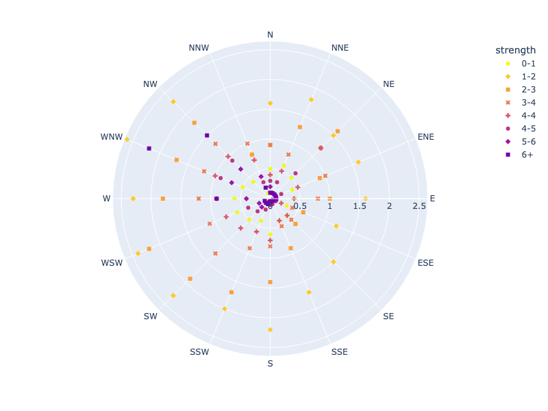

**Interactive Plot:**

<div>                        <script type="text/javascript">window.PlotlyConfig = {MathJaxConfig: 'local'};</script>
        <script charset="utf-8" src="https://cdn.plot.ly/plotly-3.1.0.min.js" integrity="sha256-Ei4740bWZhaUTQuD6q9yQlgVCMPBz6CZWhevDYPv93A=" crossorigin="anonymous"></script>                <div id="plotly-div-32" class="plotly-graph-div" style="height:100%; width:100%;"></div>            <script type="text/javascript">                window.PLOTLYENV=window.PLOTLYENV || {};                                if (document.getElementById("plotly-div-32")) {                    Plotly.newPlot(                        "plotly-div-32",                        [{"hovertemplate":"strength=0-1\u003cbr\u003efrequency=%{r}\u003cbr\u003edirection=%{theta}\u003cextra\u003e\u003c\u002fextra\u003e","legendgroup":"0-1","marker":{"color":"#f0f921","symbol":"circle"},"mode":"markers","name":"0-1","r":{"dtype":"f8","bdata":"AAAAAAAA4D8zMzMzMzPjPwAAAAAAAOA\u002fmpmZmZmZ2T+amZmZmZnZPzMzMzMzM9M\u002fmpmZmZmZ2T+amZmZmZnZPzMzMzMzM+M\u002fmpmZmZmZ2T8AAAAAAADgPzMzMzMzM+M\u002fMzMzMzMz4z8AAAAAAADgP5qZmZmZmdk\u002fmpmZmZmZuT8="},"showlegend":true,"subplot":"polar","theta":["N","NNE","NE","ENE","E","ESE","SE","SSE","S","SSW","SW","WSW","W","WNW","NW","NNW"],"type":"scatterpolar"},{"hovertemplate":"strength=1-2\u003cbr\u003efrequency=%{r}\u003cbr\u003edirection=%{theta}\u003cextra\u003e\u003c\u002fextra\u003e","legendgroup":"1-2","marker":{"color":"#fdca26","symbol":"diamond"},"mode":"markers","name":"1-2","r":{"dtype":"f8","bdata":"mpmZmZmZ+T\u002fNzMzMzMz8PwAAAAAAAPg\u002fmpmZmZmZ+T+amZmZmZn5PzMzMzMzM\u002fM\u002fAAAAAAAA+D8zMzMzMzP7P5qZmZmZmQFAAAAAAAAAAEBmZmZmZmYCQDMzMzMzMwNAZmZmZmZmAkDNzMzMzMwEQGZmZmZmZgJAmpmZmZmZ6T8="},"showlegend":true,"subplot":"polar","theta":["N","NNE","NE","ENE","E","ESE","SE","SSE","S","SSW","SW","WSW","W","WNW","NW","NNW"],"type":"scatterpolar"},{"hovertemplate":"strength=2-3\u003cbr\u003efrequency=%{r}\u003cbr\u003edirection=%{theta}\u003cextra\u003e\u003c\u002fextra\u003e","legendgroup":"2-3","marker":{"color":"#fb9f3a","symbol":"square"},"mode":"markers","name":"2-3","r":{"dtype":"f8","bdata":"zczMzMzM7D\u002fNzMzMzMz0P5qZmZmZmfk\u002fzczMzMzM7D8AAAAAAADwPzMzMzMzM+M\u002fMzMzMzMz4z\u002fNzMzMzMzsP2ZmZmZmZvY\u002fMzMzMzMz+z9mZmZmZmb+P5qZmZmZmQFAzczMzMzM\u002fD8zMzMzMzP7P83MzMzMzPw\u002fmpmZmZmZ6T8="},"showlegend":true,"subplot":"polar","theta":["N","NNE","NE","ENE","E","ESE","SE","SSE","S","SSW","SW","WSW","W","WNW","NW","NNW"],"type":"scatterpolar"},{"hovertemplate":"strength=3-4\u003cbr\u003efrequency=%{r}\u003cbr\u003edirection=%{theta}\u003cextra\u003e\u003c\u002fextra\u003e","legendgroup":"3-4","marker":{"color":"#ed7953","symbol":"x"},"mode":"markers","name":"3-4","r":{"dtype":"f8","bdata":"zczMzMzM7D+amZmZmZnpPzMzMzMzM\u002fM\u002fAAAAAAAA8D+amZmZmZnpP5qZmZmZmdk\u002fAAAAAAAA4D8AAAAAAADgP5qZmZmZmek\u002fzczMzMzM7D\u002fNzMzMzMz0P5qZmZmZmfE\u002fMzMzMzMz8z8zMzMzMzPzP83MzMzMzPQ\u002fAAAAAAAA8D8="},"showlegend":true,"subplot":"polar","theta":["N","NNE","NE","ENE","E","ESE","SE","SSE","S","SSW","SW","WSW","W","WNW","NW","NNW"],"type":"scatterpolar"},{"hovertemplate":"strength=4-4\u003cbr\u003efrequency=%{r}\u003cbr\u003edirection=%{theta}\u003cextra\u003e\u003c\u002fextra\u003e","legendgroup":"4-4","marker":{"color":"#d8576b","symbol":"cross"},"mode":"markers","name":"4-4","r":{"dtype":"f8","bdata":"mpmZmZmZ2T8AAAAAAADgPzMzMzMzM\u002fM\u002fAAAAAAAA4D+amZmZmZnZP5qZmZmZmck\u002fmpmZmZmZ2T+amZmZmZnZP2ZmZmZmZuY\u002fMzMzMzMz4z9mZmZmZmbmP5qZmZmZmek\u002fzczMzMzM7D8AAAAAAADwPwAAAAAAAPA\u002fZmZmZmZm5j8="},"showlegend":true,"subplot":"polar","theta":["N","NNE","NE","ENE","E","ESE","SE","SSE","S","SSW","SW","WSW","W","WNW","NW","NNW"],"type":"scatterpolar"},{"hovertemplate":"strength=4-5\u003cbr\u003efrequency=%{r}\u003cbr\u003edirection=%{theta}\u003cextra\u003e\u003c\u002fextra\u003e","legendgroup":"4-5","marker":{"color":"#bd3786","symbol":"circle"},"mode":"markers","name":"4-5","r":{"dtype":"f8","bdata":"MzMzMzMz0z8zMzMzMzPTPzMzMzMzM+M\u002fmpmZmZmZyT+amZmZmZm5P5qZmZmZmbk\u002fmpmZmZmZqT+amZmZmZm5P5qZmZmZmbk\u002fmpmZmZmZyT8zMzMzMzPTP5qZmZmZmdk\u002fzczMzMzM7D\u002fNzMzMzMzsP83MzMzMzOw\u002fMzMzMzMz0z8="},"showlegend":true,"subplot":"polar","theta":["N","NNE","NE","ENE","E","ESE","SE","SSE","S","SSW","SW","WSW","W","WNW","NW","NNW"],"type":"scatterpolar"},{"hovertemplate":"strength=5-6\u003cbr\u003efrequency=%{r}\u003cbr\u003edirection=%{theta}\u003cextra\u003e\u003c\u002fextra\u003e","legendgroup":"5-6","marker":{"color":"#9c179e","symbol":"diamond"},"mode":"markers","name":"5-6","r":{"dtype":"f8","bdata":"mpmZmZmZyT+amZmZmZm5P5qZmZmZmbk\u002fmpmZmZmZuT+amZmZmZm5P5qZmZmZmbk\u002fmpmZmZmZqT+amZmZmZmpP5qZmZmZmbk\u002fmpmZmZmZqT+amZmZmZnJP5qZmZmZmck\u002fmpmZmZmZ2T9mZmZmZmbmP2ZmZmZmZuY\u002fmpmZmZmZ2T8="},"showlegend":true,"subplot":"polar","theta":["N","NNE","NE","ENE","E","ESE","SE","SSE","S","SSW","SW","WSW","W","WNW","NW","NNW"],"type":"scatterpolar"},{"hovertemplate":"strength=6+\u003cbr\u003efrequency=%{r}\u003cbr\u003edirection=%{theta}\u003cextra\u003e\u003c\u002fextra\u003e","legendgroup":"6+","marker":{"color":"#7201a8","symbol":"square"},"mode":"markers","name":"6+","r":{"dtype":"f8","bdata":"mpmZmZmZuT+amZmZmZm5P5qZmZmZmbk\u002fmpmZmZmZuT+amZmZmZm5P5qZmZmZmak\u002fmpmZmZmZqT+amZmZmZmpP5qZmZmZmak\u002fmpmZmZmZuT+amZmZmZm5P5qZmZmZmbk\u002fzczMzMzM7D+amZmZmZkBQAAAAAAAAPg\u002fmpmZmZmZyT8="},"showlegend":true,"subplot":"polar","theta":["N","NNE","NE","ENE","E","ESE","SE","SSE","S","SSW","SW","WSW","W","WNW","NW","NNW"],"type":"scatterpolar"}],                        {"template":{"data":{"histogram2dcontour":[{"type":"histogram2dcontour","colorbar":{"outlinewidth":0,"ticks":""},"colorscale":[[0.0,"#0d0887"],[0.1111111111111111,"#46039f"],[0.2222222222222222,"#7201a8"],[0.3333333333333333,"#9c179e"],[0.4444444444444444,"#bd3786"],[0.5555555555555556,"#d8576b"],[0.6666666666666666,"#ed7953"],[0.7777777777777778,"#fb9f3a"],[0.8888888888888888,"#fdca26"],[1.0,"#f0f921"]]}],"choropleth":[{"type":"choropleth","colorbar":{"outlinewidth":0,"ticks":""}}],"histogram2d":[{"type":"histogram2d","colorbar":{"outlinewidth":0,"ticks":""},"colorscale":[[0.0,"#0d0887"],[0.1111111111111111,"#46039f"],[0.2222222222222222,"#7201a8"],[0.3333333333333333,"#9c179e"],[0.4444444444444444,"#bd3786"],[0.5555555555555556,"#d8576b"],[0.6666666666666666,"#ed7953"],[0.7777777777777778,"#fb9f3a"],[0.8888888888888888,"#fdca26"],[1.0,"#f0f921"]]}],"heatmap":[{"type":"heatmap","colorbar":{"outlinewidth":0,"ticks":""},"colorscale":[[0.0,"#0d0887"],[0.1111111111111111,"#46039f"],[0.2222222222222222,"#7201a8"],[0.3333333333333333,"#9c179e"],[0.4444444444444444,"#bd3786"],[0.5555555555555556,"#d8576b"],[0.6666666666666666,"#ed7953"],[0.7777777777777778,"#fb9f3a"],[0.8888888888888888,"#fdca26"],[1.0,"#f0f921"]]}],"contourcarpet":[{"type":"contourcarpet","colorbar":{"outlinewidth":0,"ticks":""}}],"contour":[{"type":"contour","colorbar":{"outlinewidth":0,"ticks":""},"colorscale":[[0.0,"#0d0887"],[0.1111111111111111,"#46039f"],[0.2222222222222222,"#7201a8"],[0.3333333333333333,"#9c179e"],[0.4444444444444444,"#bd3786"],[0.5555555555555556,"#d8576b"],[0.6666666666666666,"#ed7953"],[0.7777777777777778,"#fb9f3a"],[0.8888888888888888,"#fdca26"],[1.0,"#f0f921"]]}],"surface":[{"type":"surface","colorbar":{"outlinewidth":0,"ticks":""},"colorscale":[[0.0,"#0d0887"],[0.1111111111111111,"#46039f"],[0.2222222222222222,"#7201a8"],[0.3333333333333333,"#9c179e"],[0.4444444444444444,"#bd3786"],[0.5555555555555556,"#d8576b"],[0.6666666666666666,"#ed7953"],[0.7777777777777778,"#fb9f3a"],[0.8888888888888888,"#fdca26"],[1.0,"#f0f921"]]}],"mesh3d":[{"type":"mesh3d","colorbar":{"outlinewidth":0,"ticks":""}}],"scatter":[{"fillpattern":{"fillmode":"overlay","size":10,"solidity":0.2},"type":"scatter"}],"parcoords":[{"type":"parcoords","line":{"colorbar":{"outlinewidth":0,"ticks":""}}}],"scatterpolargl":[{"type":"scatterpolargl","marker":{"colorbar":{"outlinewidth":0,"ticks":""}}}],"bar":[{"error_x":{"color":"#2a3f5f"},"error_y":{"color":"#2a3f5f"},"marker":{"line":{"color":"#E5ECF6","width":0.5},"pattern":{"fillmode":"overlay","size":10,"solidity":0.2}},"type":"bar"}],"scattergeo":[{"type":"scattergeo","marker":{"colorbar":{"outlinewidth":0,"ticks":""}}}],"scatterpolar":[{"type":"scatterpolar","marker":{"colorbar":{"outlinewidth":0,"ticks":""}}}],"histogram":[{"marker":{"pattern":{"fillmode":"overlay","size":10,"solidity":0.2}},"type":"histogram"}],"scattergl":[{"type":"scattergl","marker":{"colorbar":{"outlinewidth":0,"ticks":""}}}],"scatter3d":[{"type":"scatter3d","line":{"colorbar":{"outlinewidth":0,"ticks":""}},"marker":{"colorbar":{"outlinewidth":0,"ticks":""}}}],"scattermap":[{"type":"scattermap","marker":{"colorbar":{"outlinewidth":0,"ticks":""}}}],"scattermapbox":[{"type":"scattermapbox","marker":{"colorbar":{"outlinewidth":0,"ticks":""}}}],"scatterternary":[{"type":"scatterternary","marker":{"colorbar":{"outlinewidth":0,"ticks":""}}}],"scattercarpet":[{"type":"scattercarpet","marker":{"colorbar":{"outlinewidth":0,"ticks":""}}}],"carpet":[{"aaxis":{"endlinecolor":"#2a3f5f","gridcolor":"white","linecolor":"white","minorgridcolor":"white","startlinecolor":"#2a3f5f"},"baxis":{"endlinecolor":"#2a3f5f","gridcolor":"white","linecolor":"white","minorgridcolor":"white","startlinecolor":"#2a3f5f"},"type":"carpet"}],"table":[{"cells":{"fill":{"color":"#EBF0F8"},"line":{"color":"white"}},"header":{"fill":{"color":"#C8D4E3"},"line":{"color":"white"}},"type":"table"}],"barpolar":[{"marker":{"line":{"color":"#E5ECF6","width":0.5},"pattern":{"fillmode":"overlay","size":10,"solidity":0.2}},"type":"barpolar"}],"pie":[{"automargin":true,"type":"pie"}]},"layout":{"autotypenumbers":"strict","colorway":["#636efa","#EF553B","#00cc96","#ab63fa","#FFA15A","#19d3f3","#FF6692","#B6E880","#FF97FF","#FECB52"],"font":{"color":"#2a3f5f"},"hovermode":"closest","hoverlabel":{"align":"left"},"paper_bgcolor":"white","plot_bgcolor":"#E5ECF6","polar":{"bgcolor":"#E5ECF6","angularaxis":{"gridcolor":"white","linecolor":"white","ticks":""},"radialaxis":{"gridcolor":"white","linecolor":"white","ticks":""}},"ternary":{"bgcolor":"#E5ECF6","aaxis":{"gridcolor":"white","linecolor":"white","ticks":""},"baxis":{"gridcolor":"white","linecolor":"white","ticks":""},"caxis":{"gridcolor":"white","linecolor":"white","ticks":""}},"coloraxis":{"colorbar":{"outlinewidth":0,"ticks":""}},"colorscale":{"sequential":[[0.0,"#0d0887"],[0.1111111111111111,"#46039f"],[0.2222222222222222,"#7201a8"],[0.3333333333333333,"#9c179e"],[0.4444444444444444,"#bd3786"],[0.5555555555555556,"#d8576b"],[0.6666666666666666,"#ed7953"],[0.7777777777777778,"#fb9f3a"],[0.8888888888888888,"#fdca26"],[1.0,"#f0f921"]],"sequentialminus":[[0.0,"#0d0887"],[0.1111111111111111,"#46039f"],[0.2222222222222222,"#7201a8"],[0.3333333333333333,"#9c179e"],[0.4444444444444444,"#bd3786"],[0.5555555555555556,"#d8576b"],[0.6666666666666666,"#ed7953"],[0.7777777777777778,"#fb9f3a"],[0.8888888888888888,"#fdca26"],[1.0,"#f0f921"]],"diverging":[[0,"#8e0152"],[0.1,"#c51b7d"],[0.2,"#de77ae"],[0.3,"#f1b6da"],[0.4,"#fde0ef"],[0.5,"#f7f7f7"],[0.6,"#e6f5d0"],[0.7,"#b8e186"],[0.8,"#7fbc41"],[0.9,"#4d9221"],[1,"#276419"]]},"xaxis":{"gridcolor":"white","linecolor":"white","ticks":"","title":{"standoff":15},"zerolinecolor":"white","automargin":true,"zerolinewidth":2},"yaxis":{"gridcolor":"white","linecolor":"white","ticks":"","title":{"standoff":15},"zerolinecolor":"white","automargin":true,"zerolinewidth":2},"scene":{"xaxis":{"backgroundcolor":"#E5ECF6","gridcolor":"white","linecolor":"white","showbackground":true,"ticks":"","zerolinecolor":"white","gridwidth":2},"yaxis":{"backgroundcolor":"#E5ECF6","gridcolor":"white","linecolor":"white","showbackground":true,"ticks":"","zerolinecolor":"white","gridwidth":2},"zaxis":{"backgroundcolor":"#E5ECF6","gridcolor":"white","linecolor":"white","showbackground":true,"ticks":"","zerolinecolor":"white","gridwidth":2}},"shapedefaults":{"line":{"color":"#2a3f5f"}},"annotationdefaults":{"arrowcolor":"#2a3f5f","arrowhead":0,"arrowwidth":1},"geo":{"bgcolor":"white","landcolor":"#E5ECF6","subunitcolor":"white","showland":true,"showlakes":true,"lakecolor":"white"},"title":{"x":0.05},"mapbox":{"style":"light"}}},"polar":{"domain":{"x":[0.0,1.0],"y":[0.0,1.0]},"angularaxis":{"direction":"clockwise","rotation":90}},"legend":{"title":{"text":"strength"},"tracegroupgap":0},"margin":{"t":60}},                        {"responsive": true}                    )                };            </script>        </div>

**Read more about [radar charts](https://plotly.com/python/radar-chart/).**

```python
import plotly.express as px
df = px.data.wind()
fig = px.line_polar(df, r="frequency", theta="direction", color="strength", line_close=True,
            color_discrete_sequence=px.colors.sequential.Plasma_r)
fig.show()
```

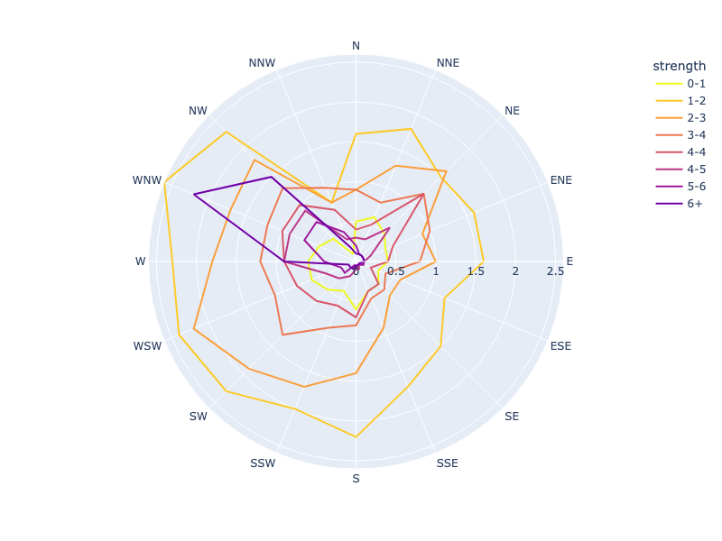

**Interactive Plot:**

<div>                        <script type="text/javascript">window.PlotlyConfig = {MathJaxConfig: 'local'};</script>
        <script charset="utf-8" src="https://cdn.plot.ly/plotly-3.1.0.min.js" integrity="sha256-Ei4740bWZhaUTQuD6q9yQlgVCMPBz6CZWhevDYPv93A=" crossorigin="anonymous"></script>                <div id="plotly-div-33" class="plotly-graph-div" style="height:100%; width:100%;"></div>            <script type="text/javascript">                window.PLOTLYENV=window.PLOTLYENV || {};                                if (document.getElementById("plotly-div-33")) {                    Plotly.newPlot(                        "plotly-div-33",                        [{"hovertemplate":"strength=0-1\u003cbr\u003efrequency=%{r}\u003cbr\u003edirection=%{theta}\u003cextra\u003e\u003c\u002fextra\u003e","legendgroup":"0-1","line":{"color":"#f0f921","dash":"solid"},"marker":{"symbol":"circle"},"mode":"lines","name":"0-1","r":{"dtype":"f8","bdata":"AAAAAAAA4D8zMzMzMzPjPwAAAAAAAOA\u002fmpmZmZmZ2T+amZmZmZnZPzMzMzMzM9M\u002fmpmZmZmZ2T+amZmZmZnZPzMzMzMzM+M\u002fmpmZmZmZ2T8AAAAAAADgPzMzMzMzM+M\u002fMzMzMzMz4z8AAAAAAADgP5qZmZmZmdk\u002fmpmZmZmZuT8AAAAAAADgPw=="},"showlegend":true,"subplot":"polar","theta":["N","NNE","NE","ENE","E","ESE","SE","SSE","S","SSW","SW","WSW","W","WNW","NW","NNW","N"],"type":"scatterpolar"},{"hovertemplate":"strength=1-2\u003cbr\u003efrequency=%{r}\u003cbr\u003edirection=%{theta}\u003cextra\u003e\u003c\u002fextra\u003e","legendgroup":"1-2","line":{"color":"#fdca26","dash":"solid"},"marker":{"symbol":"circle"},"mode":"lines","name":"1-2","r":{"dtype":"f8","bdata":"mpmZmZmZ+T\u002fNzMzMzMz8PwAAAAAAAPg\u002fmpmZmZmZ+T+amZmZmZn5PzMzMzMzM\u002fM\u002fAAAAAAAA+D8zMzMzMzP7P5qZmZmZmQFAAAAAAAAAAEBmZmZmZmYCQDMzMzMzMwNAZmZmZmZmAkDNzMzMzMwEQGZmZmZmZgJAmpmZmZmZ6T+amZmZmZn5Pw=="},"showlegend":true,"subplot":"polar","theta":["N","NNE","NE","ENE","E","ESE","SE","SSE","S","SSW","SW","WSW","W","WNW","NW","NNW","N"],"type":"scatterpolar"},{"hovertemplate":"strength=2-3\u003cbr\u003efrequency=%{r}\u003cbr\u003edirection=%{theta}\u003cextra\u003e\u003c\u002fextra\u003e","legendgroup":"2-3","line":{"color":"#fb9f3a","dash":"solid"},"marker":{"symbol":"circle"},"mode":"lines","name":"2-3","r":{"dtype":"f8","bdata":"zczMzMzM7D\u002fNzMzMzMz0P5qZmZmZmfk\u002fzczMzMzM7D8AAAAAAADwPzMzMzMzM+M\u002fMzMzMzMz4z\u002fNzMzMzMzsP2ZmZmZmZvY\u002fMzMzMzMz+z9mZmZmZmb+P5qZmZmZmQFAzczMzMzM\u002fD8zMzMzMzP7P83MzMzMzPw\u002fmpmZmZmZ6T\u002fNzMzMzMzsPw=="},"showlegend":true,"subplot":"polar","theta":["N","NNE","NE","ENE","E","ESE","SE","SSE","S","SSW","SW","WSW","W","WNW","NW","NNW","N"],"type":"scatterpolar"},{"hovertemplate":"strength=3-4\u003cbr\u003efrequency=%{r}\u003cbr\u003edirection=%{theta}\u003cextra\u003e\u003c\u002fextra\u003e","legendgroup":"3-4","line":{"color":"#ed7953","dash":"solid"},"marker":{"symbol":"circle"},"mode":"lines","name":"3-4","r":{"dtype":"f8","bdata":"zczMzMzM7D+amZmZmZnpPzMzMzMzM\u002fM\u002fAAAAAAAA8D+amZmZmZnpP5qZmZmZmdk\u002fAAAAAAAA4D8AAAAAAADgP5qZmZmZmek\u002fzczMzMzM7D\u002fNzMzMzMz0P5qZmZmZmfE\u002fMzMzMzMz8z8zMzMzMzPzP83MzMzMzPQ\u002fAAAAAAAA8D\u002fNzMzMzMzsPw=="},"showlegend":true,"subplot":"polar","theta":["N","NNE","NE","ENE","E","ESE","SE","SSE","S","SSW","SW","WSW","W","WNW","NW","NNW","N"],"type":"scatterpolar"},{"hovertemplate":"strength=4-4\u003cbr\u003efrequency=%{r}\u003cbr\u003edirection=%{theta}\u003cextra\u003e\u003c\u002fextra\u003e","legendgroup":"4-4","line":{"color":"#d8576b","dash":"solid"},"marker":{"symbol":"circle"},"mode":"lines","name":"4-4","r":{"dtype":"f8","bdata":"mpmZmZmZ2T8AAAAAAADgPzMzMzMzM\u002fM\u002fAAAAAAAA4D+amZmZmZnZP5qZmZmZmck\u002fmpmZmZmZ2T+amZmZmZnZP2ZmZmZmZuY\u002fMzMzMzMz4z9mZmZmZmbmP5qZmZmZmek\u002fzczMzMzM7D8AAAAAAADwPwAAAAAAAPA\u002fZmZmZmZm5j+amZmZmZnZPw=="},"showlegend":true,"subplot":"polar","theta":["N","NNE","NE","ENE","E","ESE","SE","SSE","S","SSW","SW","WSW","W","WNW","NW","NNW","N"],"type":"scatterpolar"},{"hovertemplate":"strength=4-5\u003cbr\u003efrequency=%{r}\u003cbr\u003edirection=%{theta}\u003cextra\u003e\u003c\u002fextra\u003e","legendgroup":"4-5","line":{"color":"#bd3786","dash":"solid"},"marker":{"symbol":"circle"},"mode":"lines","name":"4-5","r":{"dtype":"f8","bdata":"MzMzMzMz0z8zMzMzMzPTPzMzMzMzM+M\u002fmpmZmZmZyT+amZmZmZm5P5qZmZmZmbk\u002fmpmZmZmZqT+amZmZmZm5P5qZmZmZmbk\u002fmpmZmZmZyT8zMzMzMzPTP5qZmZmZmdk\u002fzczMzMzM7D\u002fNzMzMzMzsP83MzMzMzOw\u002fMzMzMzMz0z8zMzMzMzPTPw=="},"showlegend":true,"subplot":"polar","theta":["N","NNE","NE","ENE","E","ESE","SE","SSE","S","SSW","SW","WSW","W","WNW","NW","NNW","N"],"type":"scatterpolar"},{"hovertemplate":"strength=5-6\u003cbr\u003efrequency=%{r}\u003cbr\u003edirection=%{theta}\u003cextra\u003e\u003c\u002fextra\u003e","legendgroup":"5-6","line":{"color":"#9c179e","dash":"solid"},"marker":{"symbol":"circle"},"mode":"lines","name":"5-6","r":{"dtype":"f8","bdata":"mpmZmZmZyT+amZmZmZm5P5qZmZmZmbk\u002fmpmZmZmZuT+amZmZmZm5P5qZmZmZmbk\u002fmpmZmZmZqT+amZmZmZmpP5qZmZmZmbk\u002fmpmZmZmZqT+amZmZmZnJP5qZmZmZmck\u002fmpmZmZmZ2T9mZmZmZmbmP2ZmZmZmZuY\u002fmpmZmZmZ2T+amZmZmZnJPw=="},"showlegend":true,"subplot":"polar","theta":["N","NNE","NE","ENE","E","ESE","SE","SSE","S","SSW","SW","WSW","W","WNW","NW","NNW","N"],"type":"scatterpolar"},{"hovertemplate":"strength=6+\u003cbr\u003efrequency=%{r}\u003cbr\u003edirection=%{theta}\u003cextra\u003e\u003c\u002fextra\u003e","legendgroup":"6+","line":{"color":"#7201a8","dash":"solid"},"marker":{"symbol":"circle"},"mode":"lines","name":"6+","r":{"dtype":"f8","bdata":"mpmZmZmZuT+amZmZmZm5P5qZmZmZmbk\u002fmpmZmZmZuT+amZmZmZm5P5qZmZmZmak\u002fmpmZmZmZqT+amZmZmZmpP5qZmZmZmak\u002fmpmZmZmZuT+amZmZmZm5P5qZmZmZmbk\u002fzczMzMzM7D+amZmZmZkBQAAAAAAAAPg\u002fmpmZmZmZyT+amZmZmZm5Pw=="},"showlegend":true,"subplot":"polar","theta":["N","NNE","NE","ENE","E","ESE","SE","SSE","S","SSW","SW","WSW","W","WNW","NW","NNW","N"],"type":"scatterpolar"}],                        {"template":{"data":{"histogram2dcontour":[{"type":"histogram2dcontour","colorbar":{"outlinewidth":0,"ticks":""},"colorscale":[[0.0,"#0d0887"],[0.1111111111111111,"#46039f"],[0.2222222222222222,"#7201a8"],[0.3333333333333333,"#9c179e"],[0.4444444444444444,"#bd3786"],[0.5555555555555556,"#d8576b"],[0.6666666666666666,"#ed7953"],[0.7777777777777778,"#fb9f3a"],[0.8888888888888888,"#fdca26"],[1.0,"#f0f921"]]}],"choropleth":[{"type":"choropleth","colorbar":{"outlinewidth":0,"ticks":""}}],"histogram2d":[{"type":"histogram2d","colorbar":{"outlinewidth":0,"ticks":""},"colorscale":[[0.0,"#0d0887"],[0.1111111111111111,"#46039f"],[0.2222222222222222,"#7201a8"],[0.3333333333333333,"#9c179e"],[0.4444444444444444,"#bd3786"],[0.5555555555555556,"#d8576b"],[0.6666666666666666,"#ed7953"],[0.7777777777777778,"#fb9f3a"],[0.8888888888888888,"#fdca26"],[1.0,"#f0f921"]]}],"heatmap":[{"type":"heatmap","colorbar":{"outlinewidth":0,"ticks":""},"colorscale":[[0.0,"#0d0887"],[0.1111111111111111,"#46039f"],[0.2222222222222222,"#7201a8"],[0.3333333333333333,"#9c179e"],[0.4444444444444444,"#bd3786"],[0.5555555555555556,"#d8576b"],[0.6666666666666666,"#ed7953"],[0.7777777777777778,"#fb9f3a"],[0.8888888888888888,"#fdca26"],[1.0,"#f0f921"]]}],"contourcarpet":[{"type":"contourcarpet","colorbar":{"outlinewidth":0,"ticks":""}}],"contour":[{"type":"contour","colorbar":{"outlinewidth":0,"ticks":""},"colorscale":[[0.0,"#0d0887"],[0.1111111111111111,"#46039f"],[0.2222222222222222,"#7201a8"],[0.3333333333333333,"#9c179e"],[0.4444444444444444,"#bd3786"],[0.5555555555555556,"#d8576b"],[0.6666666666666666,"#ed7953"],[0.7777777777777778,"#fb9f3a"],[0.8888888888888888,"#fdca26"],[1.0,"#f0f921"]]}],"surface":[{"type":"surface","colorbar":{"outlinewidth":0,"ticks":""},"colorscale":[[0.0,"#0d0887"],[0.1111111111111111,"#46039f"],[0.2222222222222222,"#7201a8"],[0.3333333333333333,"#9c179e"],[0.4444444444444444,"#bd3786"],[0.5555555555555556,"#d8576b"],[0.6666666666666666,"#ed7953"],[0.7777777777777778,"#fb9f3a"],[0.8888888888888888,"#fdca26"],[1.0,"#f0f921"]]}],"mesh3d":[{"type":"mesh3d","colorbar":{"outlinewidth":0,"ticks":""}}],"scatter":[{"fillpattern":{"fillmode":"overlay","size":10,"solidity":0.2},"type":"scatter"}],"parcoords":[{"type":"parcoords","line":{"colorbar":{"outlinewidth":0,"ticks":""}}}],"scatterpolargl":[{"type":"scatterpolargl","marker":{"colorbar":{"outlinewidth":0,"ticks":""}}}],"bar":[{"error_x":{"color":"#2a3f5f"},"error_y":{"color":"#2a3f5f"},"marker":{"line":{"color":"#E5ECF6","width":0.5},"pattern":{"fillmode":"overlay","size":10,"solidity":0.2}},"type":"bar"}],"scattergeo":[{"type":"scattergeo","marker":{"colorbar":{"outlinewidth":0,"ticks":""}}}],"scatterpolar":[{"type":"scatterpolar","marker":{"colorbar":{"outlinewidth":0,"ticks":""}}}],"histogram":[{"marker":{"pattern":{"fillmode":"overlay","size":10,"solidity":0.2}},"type":"histogram"}],"scattergl":[{"type":"scattergl","marker":{"colorbar":{"outlinewidth":0,"ticks":""}}}],"scatter3d":[{"type":"scatter3d","line":{"colorbar":{"outlinewidth":0,"ticks":""}},"marker":{"colorbar":{"outlinewidth":0,"ticks":""}}}],"scattermap":[{"type":"scattermap","marker":{"colorbar":{"outlinewidth":0,"ticks":""}}}],"scattermapbox":[{"type":"scattermapbox","marker":{"colorbar":{"outlinewidth":0,"ticks":""}}}],"scatterternary":[{"type":"scatterternary","marker":{"colorbar":{"outlinewidth":0,"ticks":""}}}],"scattercarpet":[{"type":"scattercarpet","marker":{"colorbar":{"outlinewidth":0,"ticks":""}}}],"carpet":[{"aaxis":{"endlinecolor":"#2a3f5f","gridcolor":"white","linecolor":"white","minorgridcolor":"white","startlinecolor":"#2a3f5f"},"baxis":{"endlinecolor":"#2a3f5f","gridcolor":"white","linecolor":"white","minorgridcolor":"white","startlinecolor":"#2a3f5f"},"type":"carpet"}],"table":[{"cells":{"fill":{"color":"#EBF0F8"},"line":{"color":"white"}},"header":{"fill":{"color":"#C8D4E3"},"line":{"color":"white"}},"type":"table"}],"barpolar":[{"marker":{"line":{"color":"#E5ECF6","width":0.5},"pattern":{"fillmode":"overlay","size":10,"solidity":0.2}},"type":"barpolar"}],"pie":[{"automargin":true,"type":"pie"}]},"layout":{"autotypenumbers":"strict","colorway":["#636efa","#EF553B","#00cc96","#ab63fa","#FFA15A","#19d3f3","#FF6692","#B6E880","#FF97FF","#FECB52"],"font":{"color":"#2a3f5f"},"hovermode":"closest","hoverlabel":{"align":"left"},"paper_bgcolor":"white","plot_bgcolor":"#E5ECF6","polar":{"bgcolor":"#E5ECF6","angularaxis":{"gridcolor":"white","linecolor":"white","ticks":""},"radialaxis":{"gridcolor":"white","linecolor":"white","ticks":""}},"ternary":{"bgcolor":"#E5ECF6","aaxis":{"gridcolor":"white","linecolor":"white","ticks":""},"baxis":{"gridcolor":"white","linecolor":"white","ticks":""},"caxis":{"gridcolor":"white","linecolor":"white","ticks":""}},"coloraxis":{"colorbar":{"outlinewidth":0,"ticks":""}},"colorscale":{"sequential":[[0.0,"#0d0887"],[0.1111111111111111,"#46039f"],[0.2222222222222222,"#7201a8"],[0.3333333333333333,"#9c179e"],[0.4444444444444444,"#bd3786"],[0.5555555555555556,"#d8576b"],[0.6666666666666666,"#ed7953"],[0.7777777777777778,"#fb9f3a"],[0.8888888888888888,"#fdca26"],[1.0,"#f0f921"]],"sequentialminus":[[0.0,"#0d0887"],[0.1111111111111111,"#46039f"],[0.2222222222222222,"#7201a8"],[0.3333333333333333,"#9c179e"],[0.4444444444444444,"#bd3786"],[0.5555555555555556,"#d8576b"],[0.6666666666666666,"#ed7953"],[0.7777777777777778,"#fb9f3a"],[0.8888888888888888,"#fdca26"],[1.0,"#f0f921"]],"diverging":[[0,"#8e0152"],[0.1,"#c51b7d"],[0.2,"#de77ae"],[0.3,"#f1b6da"],[0.4,"#fde0ef"],[0.5,"#f7f7f7"],[0.6,"#e6f5d0"],[0.7,"#b8e186"],[0.8,"#7fbc41"],[0.9,"#4d9221"],[1,"#276419"]]},"xaxis":{"gridcolor":"white","linecolor":"white","ticks":"","title":{"standoff":15},"zerolinecolor":"white","automargin":true,"zerolinewidth":2},"yaxis":{"gridcolor":"white","linecolor":"white","ticks":"","title":{"standoff":15},"zerolinecolor":"white","automargin":true,"zerolinewidth":2},"scene":{"xaxis":{"backgroundcolor":"#E5ECF6","gridcolor":"white","linecolor":"white","showbackground":true,"ticks":"","zerolinecolor":"white","gridwidth":2},"yaxis":{"backgroundcolor":"#E5ECF6","gridcolor":"white","linecolor":"white","showbackground":true,"ticks":"","zerolinecolor":"white","gridwidth":2},"zaxis":{"backgroundcolor":"#E5ECF6","gridcolor":"white","linecolor":"white","showbackground":true,"ticks":"","zerolinecolor":"white","gridwidth":2}},"shapedefaults":{"line":{"color":"#2a3f5f"}},"annotationdefaults":{"arrowcolor":"#2a3f5f","arrowhead":0,"arrowwidth":1},"geo":{"bgcolor":"white","landcolor":"#E5ECF6","subunitcolor":"white","showland":true,"showlakes":true,"lakecolor":"white"},"title":{"x":0.05},"mapbox":{"style":"light"}}},"polar":{"domain":{"x":[0.0,1.0],"y":[0.0,1.0]},"angularaxis":{"direction":"clockwise","rotation":90}},"legend":{"title":{"text":"strength"},"tracegroupgap":0},"margin":{"t":60}},                        {"responsive": true}                    )                };            </script>        </div>

**Read more about [polar bar charts](wind-rose-charts.md).**

```python
import plotly.express as px
df = px.data.wind()
fig = px.bar_polar(df, r="frequency", theta="direction", color="strength", template="plotly_dark",
            color_discrete_sequence= px.colors.sequential.Plasma_r)
fig.show()
```

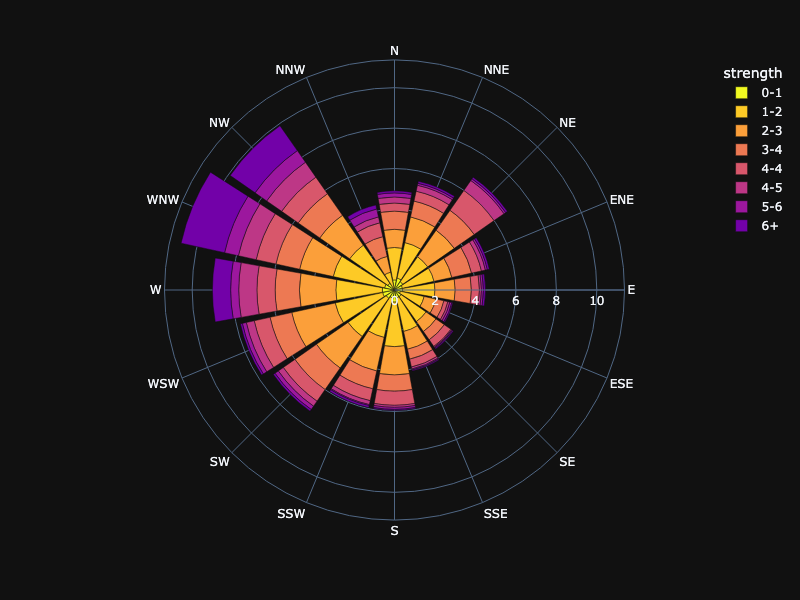

**Interactive Plot:**

<div>                        <script type="text/javascript">window.PlotlyConfig = {MathJaxConfig: 'local'};</script>
        <script charset="utf-8" src="https://cdn.plot.ly/plotly-3.1.0.min.js" integrity="sha256-Ei4740bWZhaUTQuD6q9yQlgVCMPBz6CZWhevDYPv93A=" crossorigin="anonymous"></script>                <div id="plotly-div-34" class="plotly-graph-div" style="height:100%; width:100%;"></div>            <script type="text/javascript">                window.PLOTLYENV=window.PLOTLYENV || {};                                if (document.getElementById("plotly-div-34")) {                    Plotly.newPlot(                        "plotly-div-34",                        [{"hovertemplate":"strength=0-1\u003cbr\u003efrequency=%{r}\u003cbr\u003edirection=%{theta}\u003cextra\u003e\u003c\u002fextra\u003e","legendgroup":"0-1","marker":{"color":"#f0f921","pattern":{"shape":""}},"name":"0-1","r":{"dtype":"f8","bdata":"AAAAAAAA4D8zMzMzMzPjPwAAAAAAAOA\u002fmpmZmZmZ2T+amZmZmZnZPzMzMzMzM9M\u002fmpmZmZmZ2T+amZmZmZnZPzMzMzMzM+M\u002fmpmZmZmZ2T8AAAAAAADgPzMzMzMzM+M\u002fMzMzMzMz4z8AAAAAAADgP5qZmZmZmdk\u002fmpmZmZmZuT8="},"showlegend":true,"subplot":"polar","theta":["N","NNE","NE","ENE","E","ESE","SE","SSE","S","SSW","SW","WSW","W","WNW","NW","NNW"],"type":"barpolar"},{"hovertemplate":"strength=1-2\u003cbr\u003efrequency=%{r}\u003cbr\u003edirection=%{theta}\u003cextra\u003e\u003c\u002fextra\u003e","legendgroup":"1-2","marker":{"color":"#fdca26","pattern":{"shape":""}},"name":"1-2","r":{"dtype":"f8","bdata":"mpmZmZmZ+T\u002fNzMzMzMz8PwAAAAAAAPg\u002fmpmZmZmZ+T+amZmZmZn5PzMzMzMzM\u002fM\u002fAAAAAAAA+D8zMzMzMzP7P5qZmZmZmQFAAAAAAAAAAEBmZmZmZmYCQDMzMzMzMwNAZmZmZmZmAkDNzMzMzMwEQGZmZmZmZgJAmpmZmZmZ6T8="},"showlegend":true,"subplot":"polar","theta":["N","NNE","NE","ENE","E","ESE","SE","SSE","S","SSW","SW","WSW","W","WNW","NW","NNW"],"type":"barpolar"},{"hovertemplate":"strength=2-3\u003cbr\u003efrequency=%{r}\u003cbr\u003edirection=%{theta}\u003cextra\u003e\u003c\u002fextra\u003e","legendgroup":"2-3","marker":{"color":"#fb9f3a","pattern":{"shape":""}},"name":"2-3","r":{"dtype":"f8","bdata":"zczMzMzM7D\u002fNzMzMzMz0P5qZmZmZmfk\u002fzczMzMzM7D8AAAAAAADwPzMzMzMzM+M\u002fMzMzMzMz4z\u002fNzMzMzMzsP2ZmZmZmZvY\u002fMzMzMzMz+z9mZmZmZmb+P5qZmZmZmQFAzczMzMzM\u002fD8zMzMzMzP7P83MzMzMzPw\u002fmpmZmZmZ6T8="},"showlegend":true,"subplot":"polar","theta":["N","NNE","NE","ENE","E","ESE","SE","SSE","S","SSW","SW","WSW","W","WNW","NW","NNW"],"type":"barpolar"},{"hovertemplate":"strength=3-4\u003cbr\u003efrequency=%{r}\u003cbr\u003edirection=%{theta}\u003cextra\u003e\u003c\u002fextra\u003e","legendgroup":"3-4","marker":{"color":"#ed7953","pattern":{"shape":""}},"name":"3-4","r":{"dtype":"f8","bdata":"zczMzMzM7D+amZmZmZnpPzMzMzMzM\u002fM\u002fAAAAAAAA8D+amZmZmZnpP5qZmZmZmdk\u002fAAAAAAAA4D8AAAAAAADgP5qZmZmZmek\u002fzczMzMzM7D\u002fNzMzMzMz0P5qZmZmZmfE\u002fMzMzMzMz8z8zMzMzMzPzP83MzMzMzPQ\u002fAAAAAAAA8D8="},"showlegend":true,"subplot":"polar","theta":["N","NNE","NE","ENE","E","ESE","SE","SSE","S","SSW","SW","WSW","W","WNW","NW","NNW"],"type":"barpolar"},{"hovertemplate":"strength=4-4\u003cbr\u003efrequency=%{r}\u003cbr\u003edirection=%{theta}\u003cextra\u003e\u003c\u002fextra\u003e","legendgroup":"4-4","marker":{"color":"#d8576b","pattern":{"shape":""}},"name":"4-4","r":{"dtype":"f8","bdata":"mpmZmZmZ2T8AAAAAAADgPzMzMzMzM\u002fM\u002fAAAAAAAA4D+amZmZmZnZP5qZmZmZmck\u002fmpmZmZmZ2T+amZmZmZnZP2ZmZmZmZuY\u002fMzMzMzMz4z9mZmZmZmbmP5qZmZmZmek\u002fzczMzMzM7D8AAAAAAADwPwAAAAAAAPA\u002fZmZmZmZm5j8="},"showlegend":true,"subplot":"polar","theta":["N","NNE","NE","ENE","E","ESE","SE","SSE","S","SSW","SW","WSW","W","WNW","NW","NNW"],"type":"barpolar"},{"hovertemplate":"strength=4-5\u003cbr\u003efrequency=%{r}\u003cbr\u003edirection=%{theta}\u003cextra\u003e\u003c\u002fextra\u003e","legendgroup":"4-5","marker":{"color":"#bd3786","pattern":{"shape":""}},"name":"4-5","r":{"dtype":"f8","bdata":"MzMzMzMz0z8zMzMzMzPTPzMzMzMzM+M\u002fmpmZmZmZyT+amZmZmZm5P5qZmZmZmbk\u002fmpmZmZmZqT+amZmZmZm5P5qZmZmZmbk\u002fmpmZmZmZyT8zMzMzMzPTP5qZmZmZmdk\u002fzczMzMzM7D\u002fNzMzMzMzsP83MzMzMzOw\u002fMzMzMzMz0z8="},"showlegend":true,"subplot":"polar","theta":["N","NNE","NE","ENE","E","ESE","SE","SSE","S","SSW","SW","WSW","W","WNW","NW","NNW"],"type":"barpolar"},{"hovertemplate":"strength=5-6\u003cbr\u003efrequency=%{r}\u003cbr\u003edirection=%{theta}\u003cextra\u003e\u003c\u002fextra\u003e","legendgroup":"5-6","marker":{"color":"#9c179e","pattern":{"shape":""}},"name":"5-6","r":{"dtype":"f8","bdata":"mpmZmZmZyT+amZmZmZm5P5qZmZmZmbk\u002fmpmZmZmZuT+amZmZmZm5P5qZmZmZmbk\u002fmpmZmZmZqT+amZmZmZmpP5qZmZmZmbk\u002fmpmZmZmZqT+amZmZmZnJP5qZmZmZmck\u002fmpmZmZmZ2T9mZmZmZmbmP2ZmZmZmZuY\u002fmpmZmZmZ2T8="},"showlegend":true,"subplot":"polar","theta":["N","NNE","NE","ENE","E","ESE","SE","SSE","S","SSW","SW","WSW","W","WNW","NW","NNW"],"type":"barpolar"},{"hovertemplate":"strength=6+\u003cbr\u003efrequency=%{r}\u003cbr\u003edirection=%{theta}\u003cextra\u003e\u003c\u002fextra\u003e","legendgroup":"6+","marker":{"color":"#7201a8","pattern":{"shape":""}},"name":"6+","r":{"dtype":"f8","bdata":"mpmZmZmZuT+amZmZmZm5P5qZmZmZmbk\u002fmpmZmZmZuT+amZmZmZm5P5qZmZmZmak\u002fmpmZmZmZqT+amZmZmZmpP5qZmZmZmak\u002fmpmZmZmZuT+amZmZmZm5P5qZmZmZmbk\u002fzczMzMzM7D+amZmZmZkBQAAAAAAAAPg\u002fmpmZmZmZyT8="},"showlegend":true,"subplot":"polar","theta":["N","NNE","NE","ENE","E","ESE","SE","SSE","S","SSW","SW","WSW","W","WNW","NW","NNW"],"type":"barpolar"}],                        {"template":{"data":{"barpolar":[{"marker":{"line":{"color":"rgb(17,17,17)","width":0.5},"pattern":{"fillmode":"overlay","size":10,"solidity":0.2}},"type":"barpolar"}],"bar":[{"error_x":{"color":"#f2f5fa"},"error_y":{"color":"#f2f5fa"},"marker":{"line":{"color":"rgb(17,17,17)","width":0.5},"pattern":{"fillmode":"overlay","size":10,"solidity":0.2}},"type":"bar"}],"carpet":[{"aaxis":{"endlinecolor":"#A2B1C6","gridcolor":"#506784","linecolor":"#506784","minorgridcolor":"#506784","startlinecolor":"#A2B1C6"},"baxis":{"endlinecolor":"#A2B1C6","gridcolor":"#506784","linecolor":"#506784","minorgridcolor":"#506784","startlinecolor":"#A2B1C6"},"type":"carpet"}],"choropleth":[{"colorbar":{"outlinewidth":0,"ticks":""},"type":"choropleth"}],"contourcarpet":[{"colorbar":{"outlinewidth":0,"ticks":""},"type":"contourcarpet"}],"contour":[{"colorbar":{"outlinewidth":0,"ticks":""},"colorscale":[[0.0,"#0d0887"],[0.1111111111111111,"#46039f"],[0.2222222222222222,"#7201a8"],[0.3333333333333333,"#9c179e"],[0.4444444444444444,"#bd3786"],[0.5555555555555556,"#d8576b"],[0.6666666666666666,"#ed7953"],[0.7777777777777778,"#fb9f3a"],[0.8888888888888888,"#fdca26"],[1.0,"#f0f921"]],"type":"contour"}],"heatmap":[{"colorbar":{"outlinewidth":0,"ticks":""},"colorscale":[[0.0,"#0d0887"],[0.1111111111111111,"#46039f"],[0.2222222222222222,"#7201a8"],[0.3333333333333333,"#9c179e"],[0.4444444444444444,"#bd3786"],[0.5555555555555556,"#d8576b"],[0.6666666666666666,"#ed7953"],[0.7777777777777778,"#fb9f3a"],[0.8888888888888888,"#fdca26"],[1.0,"#f0f921"]],"type":"heatmap"}],"histogram2dcontour":[{"colorbar":{"outlinewidth":0,"ticks":""},"colorscale":[[0.0,"#0d0887"],[0.1111111111111111,"#46039f"],[0.2222222222222222,"#7201a8"],[0.3333333333333333,"#9c179e"],[0.4444444444444444,"#bd3786"],[0.5555555555555556,"#d8576b"],[0.6666666666666666,"#ed7953"],[0.7777777777777778,"#fb9f3a"],[0.8888888888888888,"#fdca26"],[1.0,"#f0f921"]],"type":"histogram2dcontour"}],"histogram2d":[{"colorbar":{"outlinewidth":0,"ticks":""},"colorscale":[[0.0,"#0d0887"],[0.1111111111111111,"#46039f"],[0.2222222222222222,"#7201a8"],[0.3333333333333333,"#9c179e"],[0.4444444444444444,"#bd3786"],[0.5555555555555556,"#d8576b"],[0.6666666666666666,"#ed7953"],[0.7777777777777778,"#fb9f3a"],[0.8888888888888888,"#fdca26"],[1.0,"#f0f921"]],"type":"histogram2d"}],"histogram":[{"marker":{"pattern":{"fillmode":"overlay","size":10,"solidity":0.2}},"type":"histogram"}],"mesh3d":[{"colorbar":{"outlinewidth":0,"ticks":""},"type":"mesh3d"}],"parcoords":[{"line":{"colorbar":{"outlinewidth":0,"ticks":""}},"type":"parcoords"}],"pie":[{"automargin":true,"type":"pie"}],"scatter3d":[{"line":{"colorbar":{"outlinewidth":0,"ticks":""}},"marker":{"colorbar":{"outlinewidth":0,"ticks":""}},"type":"scatter3d"}],"scattercarpet":[{"marker":{"colorbar":{"outlinewidth":0,"ticks":""}},"type":"scattercarpet"}],"scattergeo":[{"marker":{"colorbar":{"outlinewidth":0,"ticks":""}},"type":"scattergeo"}],"scattergl":[{"marker":{"line":{"color":"#283442"}},"type":"scattergl"}],"scattermapbox":[{"marker":{"colorbar":{"outlinewidth":0,"ticks":""}},"type":"scattermapbox"}],"scattermap":[{"marker":{"colorbar":{"outlinewidth":0,"ticks":""}},"type":"scattermap"}],"scatterpolargl":[{"marker":{"colorbar":{"outlinewidth":0,"ticks":""}},"type":"scatterpolargl"}],"scatterpolar":[{"marker":{"colorbar":{"outlinewidth":0,"ticks":""}},"type":"scatterpolar"}],"scatter":[{"marker":{"line":{"color":"#283442"}},"type":"scatter"}],"scatterternary":[{"marker":{"colorbar":{"outlinewidth":0,"ticks":""}},"type":"scatterternary"}],"surface":[{"colorbar":{"outlinewidth":0,"ticks":""},"colorscale":[[0.0,"#0d0887"],[0.1111111111111111,"#46039f"],[0.2222222222222222,"#7201a8"],[0.3333333333333333,"#9c179e"],[0.4444444444444444,"#bd3786"],[0.5555555555555556,"#d8576b"],[0.6666666666666666,"#ed7953"],[0.7777777777777778,"#fb9f3a"],[0.8888888888888888,"#fdca26"],[1.0,"#f0f921"]],"type":"surface"}],"table":[{"cells":{"fill":{"color":"#506784"},"line":{"color":"rgb(17,17,17)"}},"header":{"fill":{"color":"#2a3f5f"},"line":{"color":"rgb(17,17,17)"}},"type":"table"}]},"layout":{"annotationdefaults":{"arrowcolor":"#f2f5fa","arrowhead":0,"arrowwidth":1},"autotypenumbers":"strict","coloraxis":{"colorbar":{"outlinewidth":0,"ticks":""}},"colorscale":{"diverging":[[0,"#8e0152"],[0.1,"#c51b7d"],[0.2,"#de77ae"],[0.3,"#f1b6da"],[0.4,"#fde0ef"],[0.5,"#f7f7f7"],[0.6,"#e6f5d0"],[0.7,"#b8e186"],[0.8,"#7fbc41"],[0.9,"#4d9221"],[1,"#276419"]],"sequential":[[0.0,"#0d0887"],[0.1111111111111111,"#46039f"],[0.2222222222222222,"#7201a8"],[0.3333333333333333,"#9c179e"],[0.4444444444444444,"#bd3786"],[0.5555555555555556,"#d8576b"],[0.6666666666666666,"#ed7953"],[0.7777777777777778,"#fb9f3a"],[0.8888888888888888,"#fdca26"],[1.0,"#f0f921"]],"sequentialminus":[[0.0,"#0d0887"],[0.1111111111111111,"#46039f"],[0.2222222222222222,"#7201a8"],[0.3333333333333333,"#9c179e"],[0.4444444444444444,"#bd3786"],[0.5555555555555556,"#d8576b"],[0.6666666666666666,"#ed7953"],[0.7777777777777778,"#fb9f3a"],[0.8888888888888888,"#fdca26"],[1.0,"#f0f921"]]},"colorway":["#636efa","#EF553B","#00cc96","#ab63fa","#FFA15A","#19d3f3","#FF6692","#B6E880","#FF97FF","#FECB52"],"font":{"color":"#f2f5fa"},"geo":{"bgcolor":"rgb(17,17,17)","lakecolor":"rgb(17,17,17)","landcolor":"rgb(17,17,17)","showlakes":true,"showland":true,"subunitcolor":"#506784"},"hoverlabel":{"align":"left"},"hovermode":"closest","mapbox":{"style":"dark"},"paper_bgcolor":"rgb(17,17,17)","plot_bgcolor":"rgb(17,17,17)","polar":{"angularaxis":{"gridcolor":"#506784","linecolor":"#506784","ticks":""},"bgcolor":"rgb(17,17,17)","radialaxis":{"gridcolor":"#506784","linecolor":"#506784","ticks":""}},"scene":{"xaxis":{"backgroundcolor":"rgb(17,17,17)","gridcolor":"#506784","gridwidth":2,"linecolor":"#506784","showbackground":true,"ticks":"","zerolinecolor":"#C8D4E3"},"yaxis":{"backgroundcolor":"rgb(17,17,17)","gridcolor":"#506784","gridwidth":2,"linecolor":"#506784","showbackground":true,"ticks":"","zerolinecolor":"#C8D4E3"},"zaxis":{"backgroundcolor":"rgb(17,17,17)","gridcolor":"#506784","gridwidth":2,"linecolor":"#506784","showbackground":true,"ticks":"","zerolinecolor":"#C8D4E3"}},"shapedefaults":{"line":{"color":"#f2f5fa"}},"sliderdefaults":{"bgcolor":"#C8D4E3","bordercolor":"rgb(17,17,17)","borderwidth":1,"tickwidth":0},"ternary":{"aaxis":{"gridcolor":"#506784","linecolor":"#506784","ticks":""},"baxis":{"gridcolor":"#506784","linecolor":"#506784","ticks":""},"bgcolor":"rgb(17,17,17)","caxis":{"gridcolor":"#506784","linecolor":"#506784","ticks":""}},"title":{"x":0.05},"updatemenudefaults":{"bgcolor":"#506784","borderwidth":0},"xaxis":{"automargin":true,"gridcolor":"#283442","linecolor":"#506784","ticks":"","title":{"standoff":15},"zerolinecolor":"#283442","zerolinewidth":2},"yaxis":{"automargin":true,"gridcolor":"#283442","linecolor":"#506784","ticks":"","title":{"standoff":15},"zerolinecolor":"#283442","zerolinewidth":2}}},"polar":{"domain":{"x":[0.0,1.0],"y":[0.0,1.0]},"angularaxis":{"direction":"clockwise","rotation":90}},"legend":{"title":{"text":"strength"},"tracegroupgap":0},"margin":{"t":60},"barmode":"relative"},                        {"responsive": true}                    )                };            </script>        </div>

#### 3D Coordinates

**Read more about [3D scatter plots](3d-scatter-plots.md).**

```python
import plotly.express as px
df = px.data.election()
fig = px.scatter_3d(df, x="Joly", y="Coderre", z="Bergeron", color="winner", size="total", hover_name="district",
                  symbol="result", color_discrete_map = {"Joly": "blue", "Bergeron": "green", "Coderre":"red"})
fig.show()
```

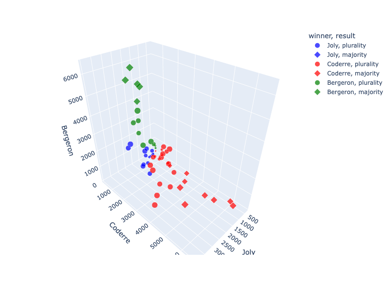

**Interactive Plot:**

<div>                        <script type="text/javascript">window.PlotlyConfig = {MathJaxConfig: 'local'};</script>
        <script charset="utf-8" src="https://cdn.plot.ly/plotly-3.1.0.min.js" integrity="sha256-Ei4740bWZhaUTQuD6q9yQlgVCMPBz6CZWhevDYPv93A=" crossorigin="anonymous"></script>                <div id="plotly-div-35" class="plotly-graph-div" style="height:100%; width:100%;"></div>            <script type="text/javascript">                window.PLOTLYENV=window.PLOTLYENV || {};                                if (document.getElementById("plotly-div-35")) {                    Plotly.newPlot(                        "plotly-div-35",                        [{"hovertemplate":"\u003cb\u003e%{hovertext}\u003c\u002fb\u003e\u003cbr\u003e\u003cbr\u003ewinner=Joly\u003cbr\u003eresult=plurality\u003cbr\u003eJoly=%{x}\u003cbr\u003eCoderre=%{y}\u003cbr\u003eBergeron=%{z}\u003cbr\u003etotal=%{marker.size}\u003cextra\u003e\u003c\u002fextra\u003e","hovertext":["101-Bois-de-Liesse","102-Cap-Saint-Jacques","161-Saint-HenriPetite-BourgognePointe-Saint-Charles","172-Desmarchais-Crawford","181-Peter-McGill","182-Saint-Jacques","33-Snowdon","34-Notre-Dame-de-Grâce","35-Loyola","41-du Canal","43-Fort-Rolland","63-Jacques-Bizard"],"legendgroup":"Joly, plurality","marker":{"color":"blue","size":{"dtype":"i2","bdata":"phzbGKIkFB8DENUYTxIIHu0XvwxWEZgF"},"sizemode":"area","sizeref":27.625,"symbol":"circle"},"mode":"markers","name":"Joly, plurality","scene":"scene","showlegend":true,"x":{"dtype":"i2","bdata":"0AtzCvoNIQtmB+oIZAa+DFgK8gR0B7IC"},"y":{"dtype":"i2","bdata":"sQndCYAJrAmrBXIHDAbtBvgHjQQtBQYC"},"z":{"dtype":"i2","bdata":"JQeLBCgNRwryAnkI3wVdCp0FQAO1BOAA"},"type":"scatter3d"},{"hovertemplate":"\u003cb\u003e%{hovertext}\u003c\u002fb\u003e\u003cbr\u003e\u003cbr\u003ewinner=Joly\u003cbr\u003eresult=majority\u003cbr\u003eJoly=%{x}\u003cbr\u003eCoderre=%{y}\u003cbr\u003eBergeron=%{z}\u003cbr\u003etotal=%{marker.size}\u003cextra\u003e\u003c\u002fextra\u003e","hovertext":["61-Pierre-Foretier","62-Denis-Benjamin-Viger"],"legendgroup":"Joly, majority","marker":{"color":"blue","size":{"dtype":"i2","bdata":"XwdhBw=="},"sizemode":"area","sizeref":27.625,"symbol":"diamond"},"mode":"markers","name":"Joly, majority","scene":"scene","showlegend":true,"x":{"dtype":"i2","bdata":"5gMsBA=="},"y":{"dtype":"i2","bdata":"dwJTAg=="},"z":{"dtype":"i2","bdata":"AgHiAA=="},"type":"scatter3d"},{"hovertemplate":"\u003cb\u003e%{hovertext}\u003c\u002fb\u003e\u003cbr\u003e\u003cbr\u003ewinner=Coderre\u003cbr\u003eresult=plurality\u003cbr\u003eJoly=%{x}\u003cbr\u003eCoderre=%{y}\u003cbr\u003eBergeron=%{z}\u003cbr\u003etotal=%{marker.size}\u003cextra\u003e\u003c\u002fextra\u003e","hovertext":["11-Sault-au-Récollet","12-Saint-Sulpice","134-Marie-Victorin","14-Bordeaux-Cartierville","141-Côte-de-Liesse","142-Norman-McLaren","162-Saint-PaulÉmard","171-ChamplainL'Île-des-Soeurs","192-François-Perrault","194-Parc-Extension","22-Est","31-Darlington","42-J.-Émery-Provost","51-Sault-Saint-Louis","52-Cecil-P.-Newman","64-Sainte-Geneviève","71-Tétreaultville","74-Louis-Riel","91-Claude-Ryan"],"legendgroup":"Coderre, plurality","marker":{"color":"red","size":{"dtype":"i2","bdata":"yiF8ICskTxxzJcEguBvwI58d7xWNDb8QuwtYJYEeFQMJJlkfDgg="},"sizemode":"area","sizeref":27.625,"symbol":"circle"},"mode":"markers","name":"Coderre, plurality","scene":"scene","showlegend":true,"x":{"dtype":"i2","bdata":"5AnvCX8JIQh3DwYLhgnbDPcHegWUBNAEhQSFDn8LRgF+DSIJpwE="},"y":{"dtype":"i2","bdata":"FA20DFkOHA7UEAgQBgoTDT4LdAk1BlEHqQRpENANTAFuDrUN5AM="},"z":{"dtype":"i2","bdata":"0grZCVMMEgYoBbMFLAgCCmoKAQfEAp4EjQJqBjIFgwAdCoIIgwI="},"type":"scatter3d"},{"hovertemplate":"\u003cb\u003e%{hovertext}\u003c\u002fb\u003e\u003cbr\u003e\u003cbr\u003ewinner=Coderre\u003cbr\u003eresult=majority\u003cbr\u003eJoly=%{x}\u003cbr\u003eCoderre=%{y}\u003cbr\u003eBergeron=%{z}\u003cbr\u003etotal=%{marker.size}\u003cextra\u003e\u003c\u002fextra\u003e","hovertext":["121-La Pointe-aux-Prairies","122-Pointe-aux-Trembles","123-Rivière-des-Prairies","151-Saint-Léonard-Est","152-Saint-Léonard-Ouest","191-Saint-Michel","21-Ouest","23-Centre","81-Marie-Clarac","82-Ovide-Clermont"],"legendgroup":"Coderre, majority","marker":{"color":"red","size":{"dtype":"i2","bdata":"Min5JJ8gNhkfIfAWbw83EpcjfB8="},"sizemode":"area","sizeref":27.625,"symbol":"diamond"},"mode":"markers","name":"Coderre, majority","scene":"scene","showlegend":true,"x":{"dtype":"i2","bdata":"Ag0kC3gGaQZ0B8QENAQGBZsFGwQ="},"y":{"dtype":"i2","bdata":"UBV+EmkWWw8LFVQOiAjeCb8ZVRg="},"z":{"dtype":"i2","bdata":"4AZXB74DcgOgBNgDswJTAz0EDAM="},"type":"scatter3d"},{"hovertemplate":"\u003cb\u003e%{hovertext}\u003c\u002fb\u003e\u003cbr\u003e\u003cbr\u003ewinner=Bergeron\u003cbr\u003eresult=plurality\u003cbr\u003eJoly=%{x}\u003cbr\u003eCoderre=%{y}\u003cbr\u003eBergeron=%{z}\u003cbr\u003etotal=%{marker.size}\u003cextra\u003e\u003c\u002fextra\u003e","hovertext":["113-Jeanne-Mance","13-Ahuntsic","133-Vieux-Rosemont","183-Sainte-Marie","32-Côte-des-Neiges","72-MaisonneuveLongue-Pointe","73-Hochelaga","92-Joseph-Beaubien","93-Robert-Bourassa","94-Jeanne-Sauvé"],"legendgroup":"Bergeron, plurality","marker":{"color":"green","size":{"dtype":"i2","bdata":"yhxCJHIqLRk0FK8j3B6tBzIFjgY="},"sizemode":"area","sizeref":27.625,"symbol":"circle"},"mode":"markers","name":"Bergeron, plurality","scene":"scene","showlegend":true,"x":{"dtype":"i2","bdata":"DAk5C6IM3wgqBkMMcwpQAqMB6QE="},"y":{"dtype":"i2","bdata":"rwWjC24KQwVsBroKCgYcAr4B6wE="},"z":{"dtype":"i2","bdata":"Dw5mDWITCwueB7IMXw5BA9EBugI="},"type":"scatter3d"},{"hovertemplate":"\u003cb\u003e%{hovertext}\u003c\u002fb\u003e\u003cbr\u003e\u003cbr\u003ewinner=Bergeron\u003cbr\u003eresult=majority\u003cbr\u003eJoly=%{x}\u003cbr\u003eCoderre=%{y}\u003cbr\u003eBergeron=%{z}\u003cbr\u003etotal=%{marker.size}\u003cextra\u003e\u003c\u002fextra\u003e","hovertext":["111-Mile-End","112-DeLorimier","131-Saint-Édouard","132-Étienne-Desmarteau","193-Villeray"],"legendgroup":"Bergeron, majority","marker":{"color":"green","size":{"dtype":"i2","bdata":"RiP7KSorcyoyKg=="},"sizemode":"area","sizeref":27.625,"symbol":"diamond"},"mode":"markers","name":"Bergeron, majority","scene":"scene","showlegend":true,"x":{"dtype":"i2","bdata":"0gnkC\u002f8K5AreCg=="},"y":{"dtype":"i2","bdata":"xgbqBiMHGwmZCA=="},"z":{"dtype":"i2","bdata":"rhItFwgZdBa7Fg=="},"type":"scatter3d"}],                        {"template":{"data":{"histogram2dcontour":[{"type":"histogram2dcontour","colorbar":{"outlinewidth":0,"ticks":""},"colorscale":[[0.0,"#0d0887"],[0.1111111111111111,"#46039f"],[0.2222222222222222,"#7201a8"],[0.3333333333333333,"#9c179e"],[0.4444444444444444,"#bd3786"],[0.5555555555555556,"#d8576b"],[0.6666666666666666,"#ed7953"],[0.7777777777777778,"#fb9f3a"],[0.8888888888888888,"#fdca26"],[1.0,"#f0f921"]]}],"choropleth":[{"type":"choropleth","colorbar":{"outlinewidth":0,"ticks":""}}],"histogram2d":[{"type":"histogram2d","colorbar":{"outlinewidth":0,"ticks":""},"colorscale":[[0.0,"#0d0887"],[0.1111111111111111,"#46039f"],[0.2222222222222222,"#7201a8"],[0.3333333333333333,"#9c179e"],[0.4444444444444444,"#bd3786"],[0.5555555555555556,"#d8576b"],[0.6666666666666666,"#ed7953"],[0.7777777777777778,"#fb9f3a"],[0.8888888888888888,"#fdca26"],[1.0,"#f0f921"]]}],"heatmap":[{"type":"heatmap","colorbar":{"outlinewidth":0,"ticks":""},"colorscale":[[0.0,"#0d0887"],[0.1111111111111111,"#46039f"],[0.2222222222222222,"#7201a8"],[0.3333333333333333,"#9c179e"],[0.4444444444444444,"#bd3786"],[0.5555555555555556,"#d8576b"],[0.6666666666666666,"#ed7953"],[0.7777777777777778,"#fb9f3a"],[0.8888888888888888,"#fdca26"],[1.0,"#f0f921"]]}],"contourcarpet":[{"type":"contourcarpet","colorbar":{"outlinewidth":0,"ticks":""}}],"contour":[{"type":"contour","colorbar":{"outlinewidth":0,"ticks":""},"colorscale":[[0.0,"#0d0887"],[0.1111111111111111,"#46039f"],[0.2222222222222222,"#7201a8"],[0.3333333333333333,"#9c179e"],[0.4444444444444444,"#bd3786"],[0.5555555555555556,"#d8576b"],[0.6666666666666666,"#ed7953"],[0.7777777777777778,"#fb9f3a"],[0.8888888888888888,"#fdca26"],[1.0,"#f0f921"]]}],"surface":[{"type":"surface","colorbar":{"outlinewidth":0,"ticks":""},"colorscale":[[0.0,"#0d0887"],[0.1111111111111111,"#46039f"],[0.2222222222222222,"#7201a8"],[0.3333333333333333,"#9c179e"],[0.4444444444444444,"#bd3786"],[0.5555555555555556,"#d8576b"],[0.6666666666666666,"#ed7953"],[0.7777777777777778,"#fb9f3a"],[0.8888888888888888,"#fdca26"],[1.0,"#f0f921"]]}],"mesh3d":[{"type":"mesh3d","colorbar":{"outlinewidth":0,"ticks":""}}],"scatter":[{"fillpattern":{"fillmode":"overlay","size":10,"solidity":0.2},"type":"scatter"}],"parcoords":[{"type":"parcoords","line":{"colorbar":{"outlinewidth":0,"ticks":""}}}],"scatterpolargl":[{"type":"scatterpolargl","marker":{"colorbar":{"outlinewidth":0,"ticks":""}}}],"bar":[{"error_x":{"color":"#2a3f5f"},"error_y":{"color":"#2a3f5f"},"marker":{"line":{"color":"#E5ECF6","width":0.5},"pattern":{"fillmode":"overlay","size":10,"solidity":0.2}},"type":"bar"}],"scattergeo":[{"type":"scattergeo","marker":{"colorbar":{"outlinewidth":0,"ticks":""}}}],"scatterpolar":[{"type":"scatterpolar","marker":{"colorbar":{"outlinewidth":0,"ticks":""}}}],"histogram":[{"marker":{"pattern":{"fillmode":"overlay","size":10,"solidity":0.2}},"type":"histogram"}],"scattergl":[{"type":"scattergl","marker":{"colorbar":{"outlinewidth":0,"ticks":""}}}],"scatter3d":[{"type":"scatter3d","line":{"colorbar":{"outlinewidth":0,"ticks":""}},"marker":{"colorbar":{"outlinewidth":0,"ticks":""}}}],"scattermap":[{"type":"scattermap","marker":{"colorbar":{"outlinewidth":0,"ticks":""}}}],"scattermapbox":[{"type":"scattermapbox","marker":{"colorbar":{"outlinewidth":0,"ticks":""}}}],"scatterternary":[{"type":"scatterternary","marker":{"colorbar":{"outlinewidth":0,"ticks":""}}}],"scattercarpet":[{"type":"scattercarpet","marker":{"colorbar":{"outlinewidth":0,"ticks":""}}}],"carpet":[{"aaxis":{"endlinecolor":"#2a3f5f","gridcolor":"white","linecolor":"white","minorgridcolor":"white","startlinecolor":"#2a3f5f"},"baxis":{"endlinecolor":"#2a3f5f","gridcolor":"white","linecolor":"white","minorgridcolor":"white","startlinecolor":"#2a3f5f"},"type":"carpet"}],"table":[{"cells":{"fill":{"color":"#EBF0F8"},"line":{"color":"white"}},"header":{"fill":{"color":"#C8D4E3"},"line":{"color":"white"}},"type":"table"}],"barpolar":[{"marker":{"line":{"color":"#E5ECF6","width":0.5},"pattern":{"fillmode":"overlay","size":10,"solidity":0.2}},"type":"barpolar"}],"pie":[{"automargin":true,"type":"pie"}]},"layout":{"autotypenumbers":"strict","colorway":["#636efa","#EF553B","#00cc96","#ab63fa","#FFA15A","#19d3f3","#FF6692","#B6E880","#FF97FF","#FECB52"],"font":{"color":"#2a3f5f"},"hovermode":"closest","hoverlabel":{"align":"left"},"paper_bgcolor":"white","plot_bgcolor":"#E5ECF6","polar":{"bgcolor":"#E5ECF6","angularaxis":{"gridcolor":"white","linecolor":"white","ticks":""},"radialaxis":{"gridcolor":"white","linecolor":"white","ticks":""}},"ternary":{"bgcolor":"#E5ECF6","aaxis":{"gridcolor":"white","linecolor":"white","ticks":""},"baxis":{"gridcolor":"white","linecolor":"white","ticks":""},"caxis":{"gridcolor":"white","linecolor":"white","ticks":""}},"coloraxis":{"colorbar":{"outlinewidth":0,"ticks":""}},"colorscale":{"sequential":[[0.0,"#0d0887"],[0.1111111111111111,"#46039f"],[0.2222222222222222,"#7201a8"],[0.3333333333333333,"#9c179e"],[0.4444444444444444,"#bd3786"],[0.5555555555555556,"#d8576b"],[0.6666666666666666,"#ed7953"],[0.7777777777777778,"#fb9f3a"],[0.8888888888888888,"#fdca26"],[1.0,"#f0f921"]],"sequentialminus":[[0.0,"#0d0887"],[0.1111111111111111,"#46039f"],[0.2222222222222222,"#7201a8"],[0.3333333333333333,"#9c179e"],[0.4444444444444444,"#bd3786"],[0.5555555555555556,"#d8576b"],[0.6666666666666666,"#ed7953"],[0.7777777777777778,"#fb9f3a"],[0.8888888888888888,"#fdca26"],[1.0,"#f0f921"]],"diverging":[[0,"#8e0152"],[0.1,"#c51b7d"],[0.2,"#de77ae"],[0.3,"#f1b6da"],[0.4,"#fde0ef"],[0.5,"#f7f7f7"],[0.6,"#e6f5d0"],[0.7,"#b8e186"],[0.8,"#7fbc41"],[0.9,"#4d9221"],[1,"#276419"]]},"xaxis":{"gridcolor":"white","linecolor":"white","ticks":"","title":{"standoff":15},"zerolinecolor":"white","automargin":true,"zerolinewidth":2},"yaxis":{"gridcolor":"white","linecolor":"white","ticks":"","title":{"standoff":15},"zerolinecolor":"white","automargin":true,"zerolinewidth":2},"scene":{"xaxis":{"backgroundcolor":"#E5ECF6","gridcolor":"white","linecolor":"white","showbackground":true,"ticks":"","zerolinecolor":"white","gridwidth":2},"yaxis":{"backgroundcolor":"#E5ECF6","gridcolor":"white","linecolor":"white","showbackground":true,"ticks":"","zerolinecolor":"white","gridwidth":2},"zaxis":{"backgroundcolor":"#E5ECF6","gridcolor":"white","linecolor":"white","showbackground":true,"ticks":"","zerolinecolor":"white","gridwidth":2}},"shapedefaults":{"line":{"color":"#2a3f5f"}},"annotationdefaults":{"arrowcolor":"#2a3f5f","arrowhead":0,"arrowwidth":1},"geo":{"bgcolor":"white","landcolor":"#E5ECF6","subunitcolor":"white","showland":true,"showlakes":true,"lakecolor":"white"},"title":{"x":0.05},"mapbox":{"style":"light"}}},"scene":{"domain":{"x":[0.0,1.0],"y":[0.0,1.0]},"xaxis":{"title":{"text":"Joly"}},"yaxis":{"title":{"text":"Coderre"}},"zaxis":{"title":{"text":"Bergeron"}}},"legend":{"title":{"text":"winner, result"},"tracegroupgap":0,"itemsizing":"constant"},"margin":{"t":60}},                        {"responsive": true}                    )                };            </script>        </div>

#### Ternary Coordinates

**Read more about [ternary charts](ternary-plots.md).**

```python
import plotly.express as px
df = px.data.election()
fig = px.scatter_ternary(df, a="Joly", b="Coderre", c="Bergeron", color="winner", size="total", hover_name="district",
                   size_max=15, color_discrete_map = {"Joly": "blue", "Bergeron": "green", "Coderre":"red"} )
fig.show()
```

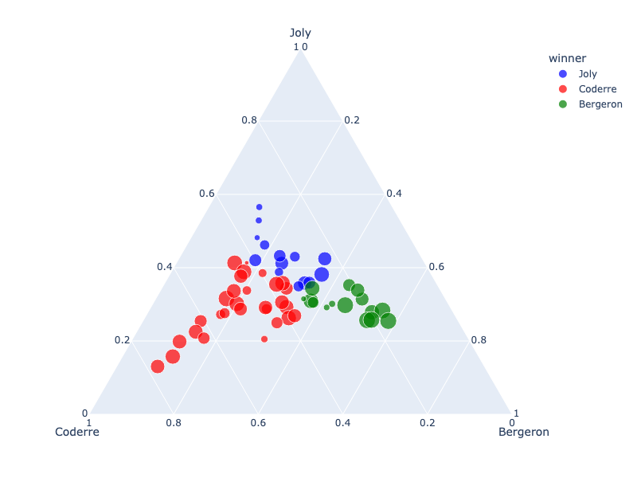

**Interactive Plot:**

<div>                        <script type="text/javascript">window.PlotlyConfig = {MathJaxConfig: 'local'};</script>
        <script charset="utf-8" src="https://cdn.plot.ly/plotly-3.1.0.min.js" integrity="sha256-Ei4740bWZhaUTQuD6q9yQlgVCMPBz6CZWhevDYPv93A=" crossorigin="anonymous"></script>                <div id="plotly-div-36" class="plotly-graph-div" style="height:100%; width:100%;"></div>            <script type="text/javascript">                window.PLOTLYENV=window.PLOTLYENV || {};                                if (document.getElementById("plotly-div-36")) {                    Plotly.newPlot(                        "plotly-div-36",                        [{"a":{"dtype":"i2","bdata":"0AtzCvoNIQtmB+oIZAa+DFgK8gR0B+YDLASyAg=="},"b":{"dtype":"i2","bdata":"sQndCYAJrAmrBXIHDAbtBvgHjQQtBXcCUwIGAg=="},"c":{"dtype":"i2","bdata":"JQeLBCgNRwryAnkI3wVdCp0FQAO1BAIB4gDgAA=="},"hovertemplate":"\u003cb\u003e%{hovertext}\u003c\u002fb\u003e\u003cbr\u003e\u003cbr\u003ewinner=Joly\u003cbr\u003eJoly=%{a}\u003cbr\u003eCoderre=%{b}\u003cbr\u003eBergeron=%{c}\u003cbr\u003etotal=%{marker.size}\u003cextra\u003e\u003c\u002fextra\u003e","hovertext":["101-Bois-de-Liesse","102-Cap-Saint-Jacques","161-Saint-HenriPetite-BourgognePointe-Saint-Charles","172-Desmarchais-Crawford","181-Peter-McGill","182-Saint-Jacques","33-Snowdon","34-Notre-Dame-de-Grâce","35-Loyola","41-du Canal","43-Fort-Rolland","61-Pierre-Foretier","62-Denis-Benjamin-Viger","63-Jacques-Bizard"],"legendgroup":"Joly","marker":{"color":"blue","size":{"dtype":"i2","bdata":"phzbGKIkFB8DENUYTxIIHu0XvwxWEV8HYQeYBQ=="},"sizemode":"area","sizeref":49.111111111111114,"symbol":"circle"},"mode":"markers","name":"Joly","showlegend":true,"subplot":"ternary","type":"scatterternary"},{"a":{"dtype":"i2","bdata":"5AnvCQINJAt4Bn8JIQh3DwYLaQZ0B4YJ2wzEBPcHegU0BJQEBgXQBIUEhQ5\u002fC0YBfg0iCZsFGwSnAQ=="},"b":{"dtype":"i2","bdata":"FA20DFAVfhJpFlkOHA7UEAgQWw8LFQYKEw1UDj4LdAmICDUG3glRB6kEaRDQDUwBbg61Db8ZVRjkAw=="},"c":{"dtype":"i2","bdata":"0grZCeAGVwe+A1MMEgYoBbMFcgOgBCwIAgrYA2oKAQezAsQCUwOeBI0CagYyBYMAHQqCCD0EDAODAg=="},"hovertemplate":"\u003cb\u003e%{hovertext}\u003c\u002fb\u003e\u003cbr\u003e\u003cbr\u003ewinner=Coderre\u003cbr\u003eJoly=%{a}\u003cbr\u003eCoderre=%{b}\u003cbr\u003eBergeron=%{c}\u003cbr\u003etotal=%{marker.size}\u003cextra\u003e\u003c\u002fextra\u003e","hovertext":["11-Sault-au-Récollet","12-Saint-Sulpice","121-La Pointe-aux-Prairies","122-Pointe-aux-Trembles","123-Rivière-des-Prairies","134-Marie-Victorin","14-Bordeaux-Cartierville","141-Côte-de-Liesse","142-Norman-McLaren","151-Saint-Léonard-Est","152-Saint-Léonard-Ouest","162-Saint-PaulÉmard","171-ChamplainL'Île-des-Soeurs","191-Saint-Michel","192-François-Perrault","194-Parc-Extension","21-Ouest","22-Est","23-Centre","31-Darlington","42-J.-Émery-Provost","51-Sault-Saint-Louis","52-Cecil-P.-Newman","64-Sainte-Geneviève","71-Tétreaultville","74-Louis-Riel","81-Marie-Clarac","82-Ovide-Clermont","91-Claude-Ryan"],"legendgroup":"Coderre","marker":{"color":"red","size":{"dtype":"i2","bdata":"yiF8IDIp+SSfICskTxxzJcEgNhkfIbgb8CPwFp8d7xVvD40NNxK\u002fELsLWCWBHhUDCSZZH5cjfB8OCA=="},"sizemode":"area","sizeref":49.111111111111114,"symbol":"circle"},"mode":"markers","name":"Coderre","showlegend":true,"subplot":"ternary","type":"scatterternary"},{"a":{"dtype":"i2","bdata":"0gnkCwwJOQv\u002fCuQKogzfCN4KKgZDDHMKUAKjAekB"},"b":{"dtype":"i2","bdata":"xgbqBq8FowsjBxsJbgpDBZkIbAa6CgoGHAK+AesB"},"c":{"dtype":"i2","bdata":"rhItFw8OZg0IGXQWYhMLC7sWngeyDF8OQQPRAboC"},"hovertemplate":"\u003cb\u003e%{hovertext}\u003c\u002fb\u003e\u003cbr\u003e\u003cbr\u003ewinner=Bergeron\u003cbr\u003eJoly=%{a}\u003cbr\u003eCoderre=%{b}\u003cbr\u003eBergeron=%{c}\u003cbr\u003etotal=%{marker.size}\u003cextra\u003e\u003c\u002fextra\u003e","hovertext":["111-Mile-End","112-DeLorimier","113-Jeanne-Mance","13-Ahuntsic","131-Saint-Édouard","132-Étienne-Desmarteau","133-Vieux-Rosemont","183-Sainte-Marie","193-Villeray","32-Côte-des-Neiges","72-MaisonneuveLongue-Pointe","73-Hochelaga","92-Joseph-Beaubien","93-Robert-Bourassa","94-Jeanne-Sauvé"],"legendgroup":"Bergeron","marker":{"color":"green","size":{"dtype":"i2","bdata":"RiP7KcocQiQqK3MqciotGTIqNBSvI9werQcyBY4G"},"sizemode":"area","sizeref":49.111111111111114,"symbol":"circle"},"mode":"markers","name":"Bergeron","showlegend":true,"subplot":"ternary","type":"scatterternary"}],                        {"template":{"data":{"histogram2dcontour":[{"type":"histogram2dcontour","colorbar":{"outlinewidth":0,"ticks":""},"colorscale":[[0.0,"#0d0887"],[0.1111111111111111,"#46039f"],[0.2222222222222222,"#7201a8"],[0.3333333333333333,"#9c179e"],[0.4444444444444444,"#bd3786"],[0.5555555555555556,"#d8576b"],[0.6666666666666666,"#ed7953"],[0.7777777777777778,"#fb9f3a"],[0.8888888888888888,"#fdca26"],[1.0,"#f0f921"]]}],"choropleth":[{"type":"choropleth","colorbar":{"outlinewidth":0,"ticks":""}}],"histogram2d":[{"type":"histogram2d","colorbar":{"outlinewidth":0,"ticks":""},"colorscale":[[0.0,"#0d0887"],[0.1111111111111111,"#46039f"],[0.2222222222222222,"#7201a8"],[0.3333333333333333,"#9c179e"],[0.4444444444444444,"#bd3786"],[0.5555555555555556,"#d8576b"],[0.6666666666666666,"#ed7953"],[0.7777777777777778,"#fb9f3a"],[0.8888888888888888,"#fdca26"],[1.0,"#f0f921"]]}],"heatmap":[{"type":"heatmap","colorbar":{"outlinewidth":0,"ticks":""},"colorscale":[[0.0,"#0d0887"],[0.1111111111111111,"#46039f"],[0.2222222222222222,"#7201a8"],[0.3333333333333333,"#9c179e"],[0.4444444444444444,"#bd3786"],[0.5555555555555556,"#d8576b"],[0.6666666666666666,"#ed7953"],[0.7777777777777778,"#fb9f3a"],[0.8888888888888888,"#fdca26"],[1.0,"#f0f921"]]}],"contourcarpet":[{"type":"contourcarpet","colorbar":{"outlinewidth":0,"ticks":""}}],"contour":[{"type":"contour","colorbar":{"outlinewidth":0,"ticks":""},"colorscale":[[0.0,"#0d0887"],[0.1111111111111111,"#46039f"],[0.2222222222222222,"#7201a8"],[0.3333333333333333,"#9c179e"],[0.4444444444444444,"#bd3786"],[0.5555555555555556,"#d8576b"],[0.6666666666666666,"#ed7953"],[0.7777777777777778,"#fb9f3a"],[0.8888888888888888,"#fdca26"],[1.0,"#f0f921"]]}],"surface":[{"type":"surface","colorbar":{"outlinewidth":0,"ticks":""},"colorscale":[[0.0,"#0d0887"],[0.1111111111111111,"#46039f"],[0.2222222222222222,"#7201a8"],[0.3333333333333333,"#9c179e"],[0.4444444444444444,"#bd3786"],[0.5555555555555556,"#d8576b"],[0.6666666666666666,"#ed7953"],[0.7777777777777778,"#fb9f3a"],[0.8888888888888888,"#fdca26"],[1.0,"#f0f921"]]}],"mesh3d":[{"type":"mesh3d","colorbar":{"outlinewidth":0,"ticks":""}}],"scatter":[{"fillpattern":{"fillmode":"overlay","size":10,"solidity":0.2},"type":"scatter"}],"parcoords":[{"type":"parcoords","line":{"colorbar":{"outlinewidth":0,"ticks":""}}}],"scatterpolargl":[{"type":"scatterpolargl","marker":{"colorbar":{"outlinewidth":0,"ticks":""}}}],"bar":[{"error_x":{"color":"#2a3f5f"},"error_y":{"color":"#2a3f5f"},"marker":{"line":{"color":"#E5ECF6","width":0.5},"pattern":{"fillmode":"overlay","size":10,"solidity":0.2}},"type":"bar"}],"scattergeo":[{"type":"scattergeo","marker":{"colorbar":{"outlinewidth":0,"ticks":""}}}],"scatterpolar":[{"type":"scatterpolar","marker":{"colorbar":{"outlinewidth":0,"ticks":""}}}],"histogram":[{"marker":{"pattern":{"fillmode":"overlay","size":10,"solidity":0.2}},"type":"histogram"}],"scattergl":[{"type":"scattergl","marker":{"colorbar":{"outlinewidth":0,"ticks":""}}}],"scatter3d":[{"type":"scatter3d","line":{"colorbar":{"outlinewidth":0,"ticks":""}},"marker":{"colorbar":{"outlinewidth":0,"ticks":""}}}],"scattermap":[{"type":"scattermap","marker":{"colorbar":{"outlinewidth":0,"ticks":""}}}],"scattermapbox":[{"type":"scattermapbox","marker":{"colorbar":{"outlinewidth":0,"ticks":""}}}],"scatterternary":[{"type":"scatterternary","marker":{"colorbar":{"outlinewidth":0,"ticks":""}}}],"scattercarpet":[{"type":"scattercarpet","marker":{"colorbar":{"outlinewidth":0,"ticks":""}}}],"carpet":[{"aaxis":{"endlinecolor":"#2a3f5f","gridcolor":"white","linecolor":"white","minorgridcolor":"white","startlinecolor":"#2a3f5f"},"baxis":{"endlinecolor":"#2a3f5f","gridcolor":"white","linecolor":"white","minorgridcolor":"white","startlinecolor":"#2a3f5f"},"type":"carpet"}],"table":[{"cells":{"fill":{"color":"#EBF0F8"},"line":{"color":"white"}},"header":{"fill":{"color":"#C8D4E3"},"line":{"color":"white"}},"type":"table"}],"barpolar":[{"marker":{"line":{"color":"#E5ECF6","width":0.5},"pattern":{"fillmode":"overlay","size":10,"solidity":0.2}},"type":"barpolar"}],"pie":[{"automargin":true,"type":"pie"}]},"layout":{"autotypenumbers":"strict","colorway":["#636efa","#EF553B","#00cc96","#ab63fa","#FFA15A","#19d3f3","#FF6692","#B6E880","#FF97FF","#FECB52"],"font":{"color":"#2a3f5f"},"hovermode":"closest","hoverlabel":{"align":"left"},"paper_bgcolor":"white","plot_bgcolor":"#E5ECF6","polar":{"bgcolor":"#E5ECF6","angularaxis":{"gridcolor":"white","linecolor":"white","ticks":""},"radialaxis":{"gridcolor":"white","linecolor":"white","ticks":""}},"ternary":{"bgcolor":"#E5ECF6","aaxis":{"gridcolor":"white","linecolor":"white","ticks":""},"baxis":{"gridcolor":"white","linecolor":"white","ticks":""},"caxis":{"gridcolor":"white","linecolor":"white","ticks":""}},"coloraxis":{"colorbar":{"outlinewidth":0,"ticks":""}},"colorscale":{"sequential":[[0.0,"#0d0887"],[0.1111111111111111,"#46039f"],[0.2222222222222222,"#7201a8"],[0.3333333333333333,"#9c179e"],[0.4444444444444444,"#bd3786"],[0.5555555555555556,"#d8576b"],[0.6666666666666666,"#ed7953"],[0.7777777777777778,"#fb9f3a"],[0.8888888888888888,"#fdca26"],[1.0,"#f0f921"]],"sequentialminus":[[0.0,"#0d0887"],[0.1111111111111111,"#46039f"],[0.2222222222222222,"#7201a8"],[0.3333333333333333,"#9c179e"],[0.4444444444444444,"#bd3786"],[0.5555555555555556,"#d8576b"],[0.6666666666666666,"#ed7953"],[0.7777777777777778,"#fb9f3a"],[0.8888888888888888,"#fdca26"],[1.0,"#f0f921"]],"diverging":[[0,"#8e0152"],[0.1,"#c51b7d"],[0.2,"#de77ae"],[0.3,"#f1b6da"],[0.4,"#fde0ef"],[0.5,"#f7f7f7"],[0.6,"#e6f5d0"],[0.7,"#b8e186"],[0.8,"#7fbc41"],[0.9,"#4d9221"],[1,"#276419"]]},"xaxis":{"gridcolor":"white","linecolor":"white","ticks":"","title":{"standoff":15},"zerolinecolor":"white","automargin":true,"zerolinewidth":2},"yaxis":{"gridcolor":"white","linecolor":"white","ticks":"","title":{"standoff":15},"zerolinecolor":"white","automargin":true,"zerolinewidth":2},"scene":{"xaxis":{"backgroundcolor":"#E5ECF6","gridcolor":"white","linecolor":"white","showbackground":true,"ticks":"","zerolinecolor":"white","gridwidth":2},"yaxis":{"backgroundcolor":"#E5ECF6","gridcolor":"white","linecolor":"white","showbackground":true,"ticks":"","zerolinecolor":"white","gridwidth":2},"zaxis":{"backgroundcolor":"#E5ECF6","gridcolor":"white","linecolor":"white","showbackground":true,"ticks":"","zerolinecolor":"white","gridwidth":2}},"shapedefaults":{"line":{"color":"#2a3f5f"}},"annotationdefaults":{"arrowcolor":"#2a3f5f","arrowhead":0,"arrowwidth":1},"geo":{"bgcolor":"white","landcolor":"#E5ECF6","subunitcolor":"white","showland":true,"showlakes":true,"lakecolor":"white"},"title":{"x":0.05},"mapbox":{"style":"light"}}},"ternary":{"domain":{"x":[0.0,1.0],"y":[0.0,1.0]},"aaxis":{"title":{"text":"Joly"}},"baxis":{"title":{"text":"Coderre"}},"caxis":{"title":{"text":"Bergeron"}}},"legend":{"title":{"text":"winner"},"tracegroupgap":0,"itemsizing":"constant"},"margin":{"t":60}},                        {"responsive": true}                    )                };            </script>        </div>
