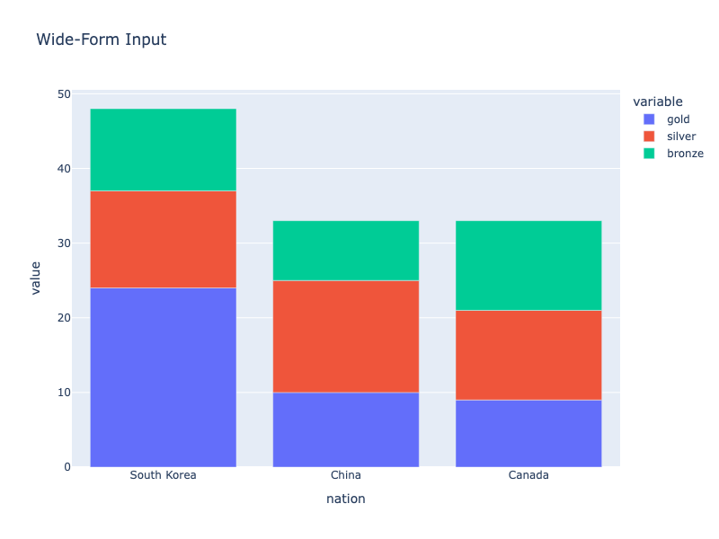
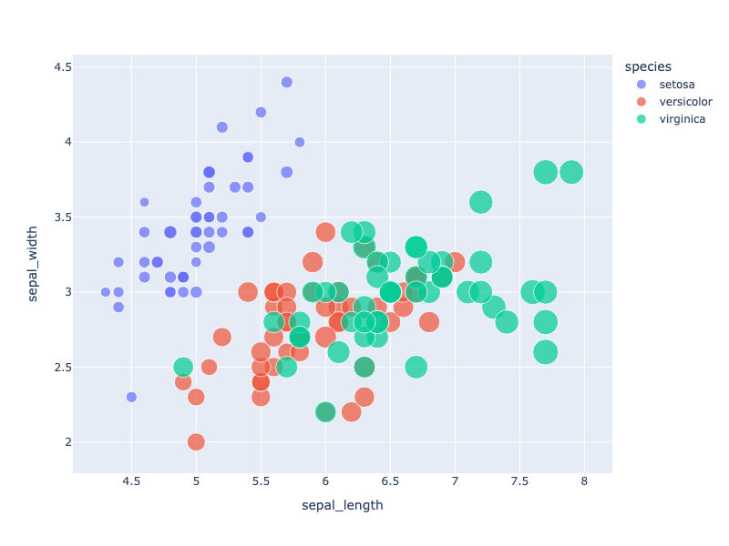
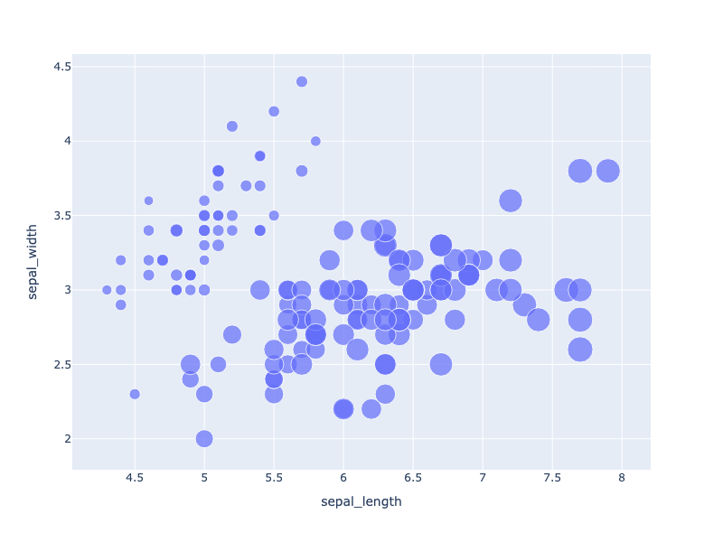
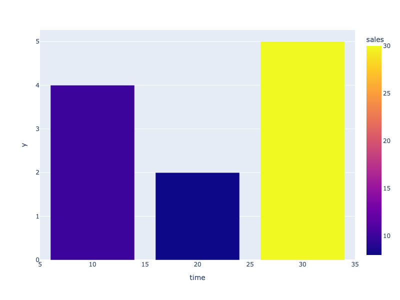
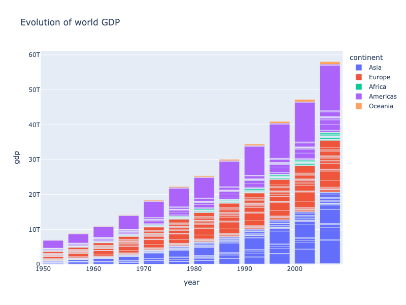
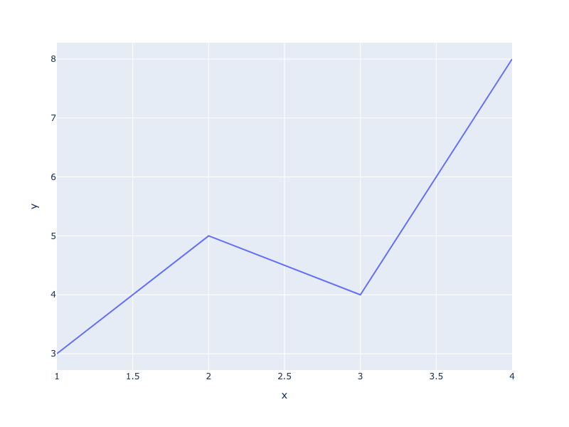
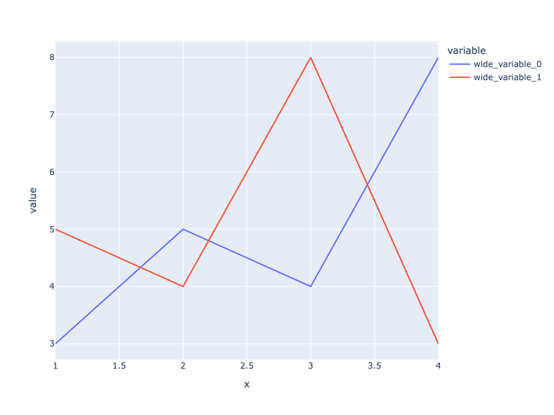
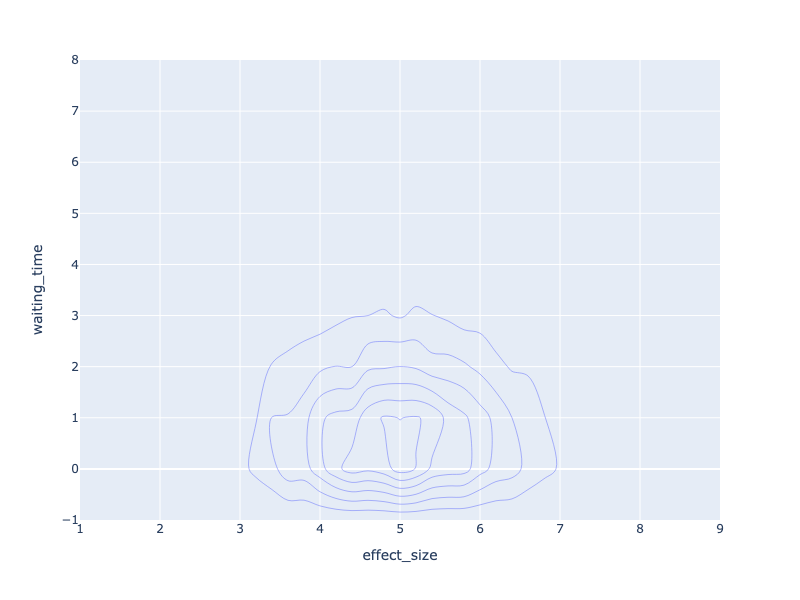
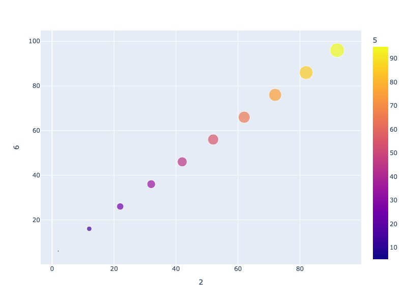
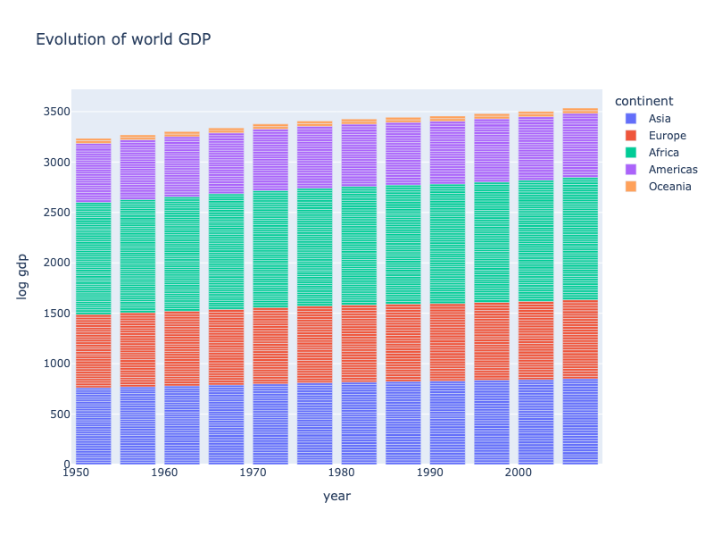

---
jupyter:
  jupytext:
    notebook_metadata_filter: all
    text_representation:
      extension: .md
      format_name: markdown
      format_version: '1.3'
      jupytext_version: 1.16.4
  kernelspec:
    display_name: Python 3 (ipykernel)
    language: python
    name: python3
  language_info:
    codemirror_mode:
      name: ipython
      version: 3
    file_extension: .py
    mimetype: text/x-python
    name: python
    nbconvert_exporter: python
    pygments_lexer: ipython3
    version: 3.11.10
  plotly:
    description: Input data arguments accepted by Plotly Express functions
    display_as: file_settings
    language: python
    layout: base
    name: Plotly Express Arguments
    order: 19
    page_type: u-guide
    permalink: python/px-arguments/
    thumbnail: thumbnail/plotly-express.png
---

Plotly Express (`px`) is the high-level interface to Plotly and provides functions for generating charts. `px` functions support data provided in a number of different formats (long, wide, and mixed) and as different types of objects, including pandas and Polars dataframes.

## Data for the Examples

The examples on this page use datasets available in the `data` package in `px`. `px.data` contains functions that when called return a dataset as a dataframe. Some of the datasets included in `px.data` are:

- `carshare` - Each row represents the availability of car-sharing services near the centroid of a zone in Montreal over a month-long period.
- `election` - Each row represents voting results for an electoral district in the 2013 Montreal mayoral election.
- `iris` - Each row represents a flower.

To access the `iris` dataset, we call its function and assign it to a variable:

```python
import plotly.express as px

df = px.data.iris()
df.head()
```

By default `px.data` functions return a pandas `DataFrame` object, but you can specify an alternative dataframe type using `return_type`. `pandas`, `polars`, `pyarrow`, `modin`, and `cuDF` are supported return types.

```python
df = px.data.iris(return_type='polars')
df.head()
```

**Error:**
```
Error executing code: name 'px' is not defined
Traceback (most recent call last):
  File "/Users/gvwilson/plotly.py/bin/run_markdown.py", line 236, in _run_code
    exec(code, exec_globals)
  File "<string>", line 1, in <module>
NameError: name 'px' is not defined
```

## Long, Wide, and Mixed-Form Data

There are three common conventions for storing column-oriented data, usually in a data frame with column names:

* **long-form data** has one row per observation, and one column per variable. This is suitable for storing and displaying multivariate data i.e. with dimension greater than 2. This format is sometimes called "tidy".
* **wide-form data** has one row per value of one of the first variable, and one column per value of the second variable. This is suitable for storing and displaying 2-dimensional data.
* **mixed-form data** is a hybrid of long-form and wide-form data, with one row per value of one variable, and some columns representing values of another, and some columns representing more variables. See the [wide-form documentation](../wide-form/) for examples of how to use Plotly Express to visualize this kind of data.

Every Plotly Express function can operate on long-form data (other than `px.imshow` which operates only on wide-form input), and in addition, the following 2D-Cartesian functions can operate on wide-form and mixed-form data: `px.scatter`, `px.line`, `px.area`, `px.bar`, `px.histogram`, `px.violin`, `px.box`, `px.strip`, `px.funnel`, `px.density_heatmap` and `px.density_contour`.

By way of example here is the same data, represented in long-form first, and then in wide-form:

```python
import plotly.express as px
long_df = px.data.medals_long()
long_df
```

```python
import plotly.express as px
wide_df = px.data.medals_wide()
wide_df
```

Plotly Express can produce the same plot from either form:

```python
import plotly.express as px
long_df = px.data.medals_long()

fig = px.bar(long_df, x="nation", y="count", color="medal", title="Long-Form Input")
fig.show()
```


**Interactive Plot:**

<div>                        <script type="text/javascript">window.PlotlyConfig = {MathJaxConfig: 'local'};</script>
        <script charset="utf-8" src="https://cdn.plot.ly/plotly-3.1.0.min.js" integrity="sha256-Ei4740bWZhaUTQuD6q9yQlgVCMPBz6CZWhevDYPv93A=" crossorigin="anonymous"></script>                <div id="plotly-div-1" class="plotly-graph-div" style="height:100%; width:100%;"></div>            <script type="text/javascript">                window.PLOTLYENV=window.PLOTLYENV || {};                                if (document.getElementById("plotly-div-1")) {                    Plotly.newPlot(                        "plotly-div-1",                        [{"hovertemplate":"medal=gold\u003cbr\u003enation=%{x}\u003cbr\u003ecount=%{y}\u003cextra\u003e\u003c\u002fextra\u003e","legendgroup":"gold","marker":{"color":"#636efa","pattern":{"shape":""}},"name":"gold","orientation":"v","showlegend":true,"textposition":"auto","x":["South Korea","China","Canada"],"xaxis":"x","y":{"dtype":"i1","bdata":"GAoJ"},"yaxis":"y","type":"bar"},{"hovertemplate":"medal=silver\u003cbr\u003enation=%{x}\u003cbr\u003ecount=%{y}\u003cextra\u003e\u003c\u002fextra\u003e","legendgroup":"silver","marker":{"color":"#EF553B","pattern":{"shape":""}},"name":"silver","orientation":"v","showlegend":true,"textposition":"auto","x":["South Korea","China","Canada"],"xaxis":"x","y":{"dtype":"i1","bdata":"DQ8M"},"yaxis":"y","type":"bar"},{"hovertemplate":"medal=bronze\u003cbr\u003enation=%{x}\u003cbr\u003ecount=%{y}\u003cextra\u003e\u003c\u002fextra\u003e","legendgroup":"bronze","marker":{"color":"#00cc96","pattern":{"shape":""}},"name":"bronze","orientation":"v","showlegend":true,"textposition":"auto","x":["South Korea","China","Canada"],"xaxis":"x","y":{"dtype":"i1","bdata":"CwgM"},"yaxis":"y","type":"bar"}],                        {"template":{"data":{"histogram2dcontour":[{"type":"histogram2dcontour","colorbar":{"outlinewidth":0,"ticks":""},"colorscale":[[0.0,"#0d0887"],[0.1111111111111111,"#46039f"],[0.2222222222222222,"#7201a8"],[0.3333333333333333,"#9c179e"],[0.4444444444444444,"#bd3786"],[0.5555555555555556,"#d8576b"],[0.6666666666666666,"#ed7953"],[0.7777777777777778,"#fb9f3a"],[0.8888888888888888,"#fdca26"],[1.0,"#f0f921"]]}],"choropleth":[{"type":"choropleth","colorbar":{"outlinewidth":0,"ticks":""}}],"histogram2d":[{"type":"histogram2d","colorbar":{"outlinewidth":0,"ticks":""},"colorscale":[[0.0,"#0d0887"],[0.1111111111111111,"#46039f"],[0.2222222222222222,"#7201a8"],[0.3333333333333333,"#9c179e"],[0.4444444444444444,"#bd3786"],[0.5555555555555556,"#d8576b"],[0.6666666666666666,"#ed7953"],[0.7777777777777778,"#fb9f3a"],[0.8888888888888888,"#fdca26"],[1.0,"#f0f921"]]}],"heatmap":[{"type":"heatmap","colorbar":{"outlinewidth":0,"ticks":""},"colorscale":[[0.0,"#0d0887"],[0.1111111111111111,"#46039f"],[0.2222222222222222,"#7201a8"],[0.3333333333333333,"#9c179e"],[0.4444444444444444,"#bd3786"],[0.5555555555555556,"#d8576b"],[0.6666666666666666,"#ed7953"],[0.7777777777777778,"#fb9f3a"],[0.8888888888888888,"#fdca26"],[1.0,"#f0f921"]]}],"contourcarpet":[{"type":"contourcarpet","colorbar":{"outlinewidth":0,"ticks":""}}],"contour":[{"type":"contour","colorbar":{"outlinewidth":0,"ticks":""},"colorscale":[[0.0,"#0d0887"],[0.1111111111111111,"#46039f"],[0.2222222222222222,"#7201a8"],[0.3333333333333333,"#9c179e"],[0.4444444444444444,"#bd3786"],[0.5555555555555556,"#d8576b"],[0.6666666666666666,"#ed7953"],[0.7777777777777778,"#fb9f3a"],[0.8888888888888888,"#fdca26"],[1.0,"#f0f921"]]}],"surface":[{"type":"surface","colorbar":{"outlinewidth":0,"ticks":""},"colorscale":[[0.0,"#0d0887"],[0.1111111111111111,"#46039f"],[0.2222222222222222,"#7201a8"],[0.3333333333333333,"#9c179e"],[0.4444444444444444,"#bd3786"],[0.5555555555555556,"#d8576b"],[0.6666666666666666,"#ed7953"],[0.7777777777777778,"#fb9f3a"],[0.8888888888888888,"#fdca26"],[1.0,"#f0f921"]]}],"mesh3d":[{"type":"mesh3d","colorbar":{"outlinewidth":0,"ticks":""}}],"scatter":[{"fillpattern":{"fillmode":"overlay","size":10,"solidity":0.2},"type":"scatter"}],"parcoords":[{"type":"parcoords","line":{"colorbar":{"outlinewidth":0,"ticks":""}}}],"scatterpolargl":[{"type":"scatterpolargl","marker":{"colorbar":{"outlinewidth":0,"ticks":""}}}],"bar":[{"error_x":{"color":"#2a3f5f"},"error_y":{"color":"#2a3f5f"},"marker":{"line":{"color":"#E5ECF6","width":0.5},"pattern":{"fillmode":"overlay","size":10,"solidity":0.2}},"type":"bar"}],"scattergeo":[{"type":"scattergeo","marker":{"colorbar":{"outlinewidth":0,"ticks":""}}}],"scatterpolar":[{"type":"scatterpolar","marker":{"colorbar":{"outlinewidth":0,"ticks":""}}}],"histogram":[{"marker":{"pattern":{"fillmode":"overlay","size":10,"solidity":0.2}},"type":"histogram"}],"scattergl":[{"type":"scattergl","marker":{"colorbar":{"outlinewidth":0,"ticks":""}}}],"scatter3d":[{"type":"scatter3d","line":{"colorbar":{"outlinewidth":0,"ticks":""}},"marker":{"colorbar":{"outlinewidth":0,"ticks":""}}}],"scattermap":[{"type":"scattermap","marker":{"colorbar":{"outlinewidth":0,"ticks":""}}}],"scattermapbox":[{"type":"scattermapbox","marker":{"colorbar":{"outlinewidth":0,"ticks":""}}}],"scatterternary":[{"type":"scatterternary","marker":{"colorbar":{"outlinewidth":0,"ticks":""}}}],"scattercarpet":[{"type":"scattercarpet","marker":{"colorbar":{"outlinewidth":0,"ticks":""}}}],"carpet":[{"aaxis":{"endlinecolor":"#2a3f5f","gridcolor":"white","linecolor":"white","minorgridcolor":"white","startlinecolor":"#2a3f5f"},"baxis":{"endlinecolor":"#2a3f5f","gridcolor":"white","linecolor":"white","minorgridcolor":"white","startlinecolor":"#2a3f5f"},"type":"carpet"}],"table":[{"cells":{"fill":{"color":"#EBF0F8"},"line":{"color":"white"}},"header":{"fill":{"color":"#C8D4E3"},"line":{"color":"white"}},"type":"table"}],"barpolar":[{"marker":{"line":{"color":"#E5ECF6","width":0.5},"pattern":{"fillmode":"overlay","size":10,"solidity":0.2}},"type":"barpolar"}],"pie":[{"automargin":true,"type":"pie"}]},"layout":{"autotypenumbers":"strict","colorway":["#636efa","#EF553B","#00cc96","#ab63fa","#FFA15A","#19d3f3","#FF6692","#B6E880","#FF97FF","#FECB52"],"font":{"color":"#2a3f5f"},"hovermode":"closest","hoverlabel":{"align":"left"},"paper_bgcolor":"white","plot_bgcolor":"#E5ECF6","polar":{"bgcolor":"#E5ECF6","angularaxis":{"gridcolor":"white","linecolor":"white","ticks":""},"radialaxis":{"gridcolor":"white","linecolor":"white","ticks":""}},"ternary":{"bgcolor":"#E5ECF6","aaxis":{"gridcolor":"white","linecolor":"white","ticks":""},"baxis":{"gridcolor":"white","linecolor":"white","ticks":""},"caxis":{"gridcolor":"white","linecolor":"white","ticks":""}},"coloraxis":{"colorbar":{"outlinewidth":0,"ticks":""}},"colorscale":{"sequential":[[0.0,"#0d0887"],[0.1111111111111111,"#46039f"],[0.2222222222222222,"#7201a8"],[0.3333333333333333,"#9c179e"],[0.4444444444444444,"#bd3786"],[0.5555555555555556,"#d8576b"],[0.6666666666666666,"#ed7953"],[0.7777777777777778,"#fb9f3a"],[0.8888888888888888,"#fdca26"],[1.0,"#f0f921"]],"sequentialminus":[[0.0,"#0d0887"],[0.1111111111111111,"#46039f"],[0.2222222222222222,"#7201a8"],[0.3333333333333333,"#9c179e"],[0.4444444444444444,"#bd3786"],[0.5555555555555556,"#d8576b"],[0.6666666666666666,"#ed7953"],[0.7777777777777778,"#fb9f3a"],[0.8888888888888888,"#fdca26"],[1.0,"#f0f921"]],"diverging":[[0,"#8e0152"],[0.1,"#c51b7d"],[0.2,"#de77ae"],[0.3,"#f1b6da"],[0.4,"#fde0ef"],[0.5,"#f7f7f7"],[0.6,"#e6f5d0"],[0.7,"#b8e186"],[0.8,"#7fbc41"],[0.9,"#4d9221"],[1,"#276419"]]},"xaxis":{"gridcolor":"white","linecolor":"white","ticks":"","title":{"standoff":15},"zerolinecolor":"white","automargin":true,"zerolinewidth":2},"yaxis":{"gridcolor":"white","linecolor":"white","ticks":"","title":{"standoff":15},"zerolinecolor":"white","automargin":true,"zerolinewidth":2},"scene":{"xaxis":{"backgroundcolor":"#E5ECF6","gridcolor":"white","linecolor":"white","showbackground":true,"ticks":"","zerolinecolor":"white","gridwidth":2},"yaxis":{"backgroundcolor":"#E5ECF6","gridcolor":"white","linecolor":"white","showbackground":true,"ticks":"","zerolinecolor":"white","gridwidth":2},"zaxis":{"backgroundcolor":"#E5ECF6","gridcolor":"white","linecolor":"white","showbackground":true,"ticks":"","zerolinecolor":"white","gridwidth":2}},"shapedefaults":{"line":{"color":"#2a3f5f"}},"annotationdefaults":{"arrowcolor":"#2a3f5f","arrowhead":0,"arrowwidth":1},"geo":{"bgcolor":"white","landcolor":"#E5ECF6","subunitcolor":"white","showland":true,"showlakes":true,"lakecolor":"white"},"title":{"x":0.05},"mapbox":{"style":"light"}}},"xaxis":{"anchor":"y","domain":[0.0,1.0],"title":{"text":"nation"}},"yaxis":{"anchor":"x","domain":[0.0,1.0],"title":{"text":"count"}},"legend":{"title":{"text":"medal"},"tracegroupgap":0},"title":{"text":"Long-Form Input"},"barmode":"relative"},                        {"responsive": true}                    )                };            </script>        </div>

```python
import plotly.express as px
wide_df = px.data.medals_wide()

fig = px.bar(wide_df, x="nation", y=["gold", "silver", "bronze"], title="Wide-Form Input")
fig.show()
```



**Interactive Plot:**

<div>                        <script type="text/javascript">window.PlotlyConfig = {MathJaxConfig: 'local'};</script>
        <script charset="utf-8" src="https://cdn.plot.ly/plotly-3.1.0.min.js" integrity="sha256-Ei4740bWZhaUTQuD6q9yQlgVCMPBz6CZWhevDYPv93A=" crossorigin="anonymous"></script>                <div id="plotly-div-2" class="plotly-graph-div" style="height:100%; width:100%;"></div>            <script type="text/javascript">                window.PLOTLYENV=window.PLOTLYENV || {};                                if (document.getElementById("plotly-div-2")) {                    Plotly.newPlot(                        "plotly-div-2",                        [{"hovertemplate":"variable=gold\u003cbr\u003enation=%{x}\u003cbr\u003evalue=%{y}\u003cextra\u003e\u003c\u002fextra\u003e","legendgroup":"gold","marker":{"color":"#636efa","pattern":{"shape":""}},"name":"gold","orientation":"v","showlegend":true,"textposition":"auto","x":["South Korea","China","Canada"],"xaxis":"x","y":{"dtype":"i1","bdata":"GAoJ"},"yaxis":"y","type":"bar"},{"hovertemplate":"variable=silver\u003cbr\u003enation=%{x}\u003cbr\u003evalue=%{y}\u003cextra\u003e\u003c\u002fextra\u003e","legendgroup":"silver","marker":{"color":"#EF553B","pattern":{"shape":""}},"name":"silver","orientation":"v","showlegend":true,"textposition":"auto","x":["South Korea","China","Canada"],"xaxis":"x","y":{"dtype":"i1","bdata":"DQ8M"},"yaxis":"y","type":"bar"},{"hovertemplate":"variable=bronze\u003cbr\u003enation=%{x}\u003cbr\u003evalue=%{y}\u003cextra\u003e\u003c\u002fextra\u003e","legendgroup":"bronze","marker":{"color":"#00cc96","pattern":{"shape":""}},"name":"bronze","orientation":"v","showlegend":true,"textposition":"auto","x":["South Korea","China","Canada"],"xaxis":"x","y":{"dtype":"i1","bdata":"CwgM"},"yaxis":"y","type":"bar"}],                        {"template":{"data":{"histogram2dcontour":[{"type":"histogram2dcontour","colorbar":{"outlinewidth":0,"ticks":""},"colorscale":[[0.0,"#0d0887"],[0.1111111111111111,"#46039f"],[0.2222222222222222,"#7201a8"],[0.3333333333333333,"#9c179e"],[0.4444444444444444,"#bd3786"],[0.5555555555555556,"#d8576b"],[0.6666666666666666,"#ed7953"],[0.7777777777777778,"#fb9f3a"],[0.8888888888888888,"#fdca26"],[1.0,"#f0f921"]]}],"choropleth":[{"type":"choropleth","colorbar":{"outlinewidth":0,"ticks":""}}],"histogram2d":[{"type":"histogram2d","colorbar":{"outlinewidth":0,"ticks":""},"colorscale":[[0.0,"#0d0887"],[0.1111111111111111,"#46039f"],[0.2222222222222222,"#7201a8"],[0.3333333333333333,"#9c179e"],[0.4444444444444444,"#bd3786"],[0.5555555555555556,"#d8576b"],[0.6666666666666666,"#ed7953"],[0.7777777777777778,"#fb9f3a"],[0.8888888888888888,"#fdca26"],[1.0,"#f0f921"]]}],"heatmap":[{"type":"heatmap","colorbar":{"outlinewidth":0,"ticks":""},"colorscale":[[0.0,"#0d0887"],[0.1111111111111111,"#46039f"],[0.2222222222222222,"#7201a8"],[0.3333333333333333,"#9c179e"],[0.4444444444444444,"#bd3786"],[0.5555555555555556,"#d8576b"],[0.6666666666666666,"#ed7953"],[0.7777777777777778,"#fb9f3a"],[0.8888888888888888,"#fdca26"],[1.0,"#f0f921"]]}],"contourcarpet":[{"type":"contourcarpet","colorbar":{"outlinewidth":0,"ticks":""}}],"contour":[{"type":"contour","colorbar":{"outlinewidth":0,"ticks":""},"colorscale":[[0.0,"#0d0887"],[0.1111111111111111,"#46039f"],[0.2222222222222222,"#7201a8"],[0.3333333333333333,"#9c179e"],[0.4444444444444444,"#bd3786"],[0.5555555555555556,"#d8576b"],[0.6666666666666666,"#ed7953"],[0.7777777777777778,"#fb9f3a"],[0.8888888888888888,"#fdca26"],[1.0,"#f0f921"]]}],"surface":[{"type":"surface","colorbar":{"outlinewidth":0,"ticks":""},"colorscale":[[0.0,"#0d0887"],[0.1111111111111111,"#46039f"],[0.2222222222222222,"#7201a8"],[0.3333333333333333,"#9c179e"],[0.4444444444444444,"#bd3786"],[0.5555555555555556,"#d8576b"],[0.6666666666666666,"#ed7953"],[0.7777777777777778,"#fb9f3a"],[0.8888888888888888,"#fdca26"],[1.0,"#f0f921"]]}],"mesh3d":[{"type":"mesh3d","colorbar":{"outlinewidth":0,"ticks":""}}],"scatter":[{"fillpattern":{"fillmode":"overlay","size":10,"solidity":0.2},"type":"scatter"}],"parcoords":[{"type":"parcoords","line":{"colorbar":{"outlinewidth":0,"ticks":""}}}],"scatterpolargl":[{"type":"scatterpolargl","marker":{"colorbar":{"outlinewidth":0,"ticks":""}}}],"bar":[{"error_x":{"color":"#2a3f5f"},"error_y":{"color":"#2a3f5f"},"marker":{"line":{"color":"#E5ECF6","width":0.5},"pattern":{"fillmode":"overlay","size":10,"solidity":0.2}},"type":"bar"}],"scattergeo":[{"type":"scattergeo","marker":{"colorbar":{"outlinewidth":0,"ticks":""}}}],"scatterpolar":[{"type":"scatterpolar","marker":{"colorbar":{"outlinewidth":0,"ticks":""}}}],"histogram":[{"marker":{"pattern":{"fillmode":"overlay","size":10,"solidity":0.2}},"type":"histogram"}],"scattergl":[{"type":"scattergl","marker":{"colorbar":{"outlinewidth":0,"ticks":""}}}],"scatter3d":[{"type":"scatter3d","line":{"colorbar":{"outlinewidth":0,"ticks":""}},"marker":{"colorbar":{"outlinewidth":0,"ticks":""}}}],"scattermap":[{"type":"scattermap","marker":{"colorbar":{"outlinewidth":0,"ticks":""}}}],"scattermapbox":[{"type":"scattermapbox","marker":{"colorbar":{"outlinewidth":0,"ticks":""}}}],"scatterternary":[{"type":"scatterternary","marker":{"colorbar":{"outlinewidth":0,"ticks":""}}}],"scattercarpet":[{"type":"scattercarpet","marker":{"colorbar":{"outlinewidth":0,"ticks":""}}}],"carpet":[{"aaxis":{"endlinecolor":"#2a3f5f","gridcolor":"white","linecolor":"white","minorgridcolor":"white","startlinecolor":"#2a3f5f"},"baxis":{"endlinecolor":"#2a3f5f","gridcolor":"white","linecolor":"white","minorgridcolor":"white","startlinecolor":"#2a3f5f"},"type":"carpet"}],"table":[{"cells":{"fill":{"color":"#EBF0F8"},"line":{"color":"white"}},"header":{"fill":{"color":"#C8D4E3"},"line":{"color":"white"}},"type":"table"}],"barpolar":[{"marker":{"line":{"color":"#E5ECF6","width":0.5},"pattern":{"fillmode":"overlay","size":10,"solidity":0.2}},"type":"barpolar"}],"pie":[{"automargin":true,"type":"pie"}]},"layout":{"autotypenumbers":"strict","colorway":["#636efa","#EF553B","#00cc96","#ab63fa","#FFA15A","#19d3f3","#FF6692","#B6E880","#FF97FF","#FECB52"],"font":{"color":"#2a3f5f"},"hovermode":"closest","hoverlabel":{"align":"left"},"paper_bgcolor":"white","plot_bgcolor":"#E5ECF6","polar":{"bgcolor":"#E5ECF6","angularaxis":{"gridcolor":"white","linecolor":"white","ticks":""},"radialaxis":{"gridcolor":"white","linecolor":"white","ticks":""}},"ternary":{"bgcolor":"#E5ECF6","aaxis":{"gridcolor":"white","linecolor":"white","ticks":""},"baxis":{"gridcolor":"white","linecolor":"white","ticks":""},"caxis":{"gridcolor":"white","linecolor":"white","ticks":""}},"coloraxis":{"colorbar":{"outlinewidth":0,"ticks":""}},"colorscale":{"sequential":[[0.0,"#0d0887"],[0.1111111111111111,"#46039f"],[0.2222222222222222,"#7201a8"],[0.3333333333333333,"#9c179e"],[0.4444444444444444,"#bd3786"],[0.5555555555555556,"#d8576b"],[0.6666666666666666,"#ed7953"],[0.7777777777777778,"#fb9f3a"],[0.8888888888888888,"#fdca26"],[1.0,"#f0f921"]],"sequentialminus":[[0.0,"#0d0887"],[0.1111111111111111,"#46039f"],[0.2222222222222222,"#7201a8"],[0.3333333333333333,"#9c179e"],[0.4444444444444444,"#bd3786"],[0.5555555555555556,"#d8576b"],[0.6666666666666666,"#ed7953"],[0.7777777777777778,"#fb9f3a"],[0.8888888888888888,"#fdca26"],[1.0,"#f0f921"]],"diverging":[[0,"#8e0152"],[0.1,"#c51b7d"],[0.2,"#de77ae"],[0.3,"#f1b6da"],[0.4,"#fde0ef"],[0.5,"#f7f7f7"],[0.6,"#e6f5d0"],[0.7,"#b8e186"],[0.8,"#7fbc41"],[0.9,"#4d9221"],[1,"#276419"]]},"xaxis":{"gridcolor":"white","linecolor":"white","ticks":"","title":{"standoff":15},"zerolinecolor":"white","automargin":true,"zerolinewidth":2},"yaxis":{"gridcolor":"white","linecolor":"white","ticks":"","title":{"standoff":15},"zerolinecolor":"white","automargin":true,"zerolinewidth":2},"scene":{"xaxis":{"backgroundcolor":"#E5ECF6","gridcolor":"white","linecolor":"white","showbackground":true,"ticks":"","zerolinecolor":"white","gridwidth":2},"yaxis":{"backgroundcolor":"#E5ECF6","gridcolor":"white","linecolor":"white","showbackground":true,"ticks":"","zerolinecolor":"white","gridwidth":2},"zaxis":{"backgroundcolor":"#E5ECF6","gridcolor":"white","linecolor":"white","showbackground":true,"ticks":"","zerolinecolor":"white","gridwidth":2}},"shapedefaults":{"line":{"color":"#2a3f5f"}},"annotationdefaults":{"arrowcolor":"#2a3f5f","arrowhead":0,"arrowwidth":1},"geo":{"bgcolor":"white","landcolor":"#E5ECF6","subunitcolor":"white","showland":true,"showlakes":true,"lakecolor":"white"},"title":{"x":0.05},"mapbox":{"style":"light"}}},"xaxis":{"anchor":"y","domain":[0.0,1.0],"title":{"text":"nation"}},"yaxis":{"anchor":"x","domain":[0.0,1.0],"title":{"text":"value"}},"legend":{"title":{"text":"variable"},"tracegroupgap":0},"title":{"text":"Wide-Form Input"},"barmode":"relative"},                        {"responsive": true}                    )                };            </script>        </div>

You might notice that y-axis and legend labels are slightly different for the second plot: they are "value" and "variable", respectively, and this is also reflected in the hoverlabel text. Note that the labels "medal" and "count" do not appear in the wide-form data frame, so in this case, you must supply these yourself, or [you can use a data frame with named row- and column-indexes](../wide-form/). You can [rename these labels with the `labels` argument](../styling-plotly-express/):

```python
import plotly.express as px
wide_df = px.data.medals_wide()

fig = px.bar(wide_df, x="nation", y=["gold", "silver", "bronze"], title="Wide-Form Input, relabelled",
            labels={"value": "count", "variable": "medal"})
fig.show()
```


**Interactive Plot:**

<div>                        <script type="text/javascript">window.PlotlyConfig = {MathJaxConfig: 'local'};</script>
        <script charset="utf-8" src="https://cdn.plot.ly/plotly-3.1.0.min.js" integrity="sha256-Ei4740bWZhaUTQuD6q9yQlgVCMPBz6CZWhevDYPv93A=" crossorigin="anonymous"></script>                <div id="plotly-div-3" class="plotly-graph-div" style="height:100%; width:100%;"></div>            <script type="text/javascript">                window.PLOTLYENV=window.PLOTLYENV || {};                                if (document.getElementById("plotly-div-3")) {                    Plotly.newPlot(                        "plotly-div-3",                        [{"hovertemplate":"medal=gold\u003cbr\u003enation=%{x}\u003cbr\u003ecount=%{y}\u003cextra\u003e\u003c\u002fextra\u003e","legendgroup":"gold","marker":{"color":"#636efa","pattern":{"shape":""}},"name":"gold","orientation":"v","showlegend":true,"textposition":"auto","x":["South Korea","China","Canada"],"xaxis":"x","y":{"dtype":"i1","bdata":"GAoJ"},"yaxis":"y","type":"bar"},{"hovertemplate":"medal=silver\u003cbr\u003enation=%{x}\u003cbr\u003ecount=%{y}\u003cextra\u003e\u003c\u002fextra\u003e","legendgroup":"silver","marker":{"color":"#EF553B","pattern":{"shape":""}},"name":"silver","orientation":"v","showlegend":true,"textposition":"auto","x":["South Korea","China","Canada"],"xaxis":"x","y":{"dtype":"i1","bdata":"DQ8M"},"yaxis":"y","type":"bar"},{"hovertemplate":"medal=bronze\u003cbr\u003enation=%{x}\u003cbr\u003ecount=%{y}\u003cextra\u003e\u003c\u002fextra\u003e","legendgroup":"bronze","marker":{"color":"#00cc96","pattern":{"shape":""}},"name":"bronze","orientation":"v","showlegend":true,"textposition":"auto","x":["South Korea","China","Canada"],"xaxis":"x","y":{"dtype":"i1","bdata":"CwgM"},"yaxis":"y","type":"bar"}],                        {"template":{"data":{"histogram2dcontour":[{"type":"histogram2dcontour","colorbar":{"outlinewidth":0,"ticks":""},"colorscale":[[0.0,"#0d0887"],[0.1111111111111111,"#46039f"],[0.2222222222222222,"#7201a8"],[0.3333333333333333,"#9c179e"],[0.4444444444444444,"#bd3786"],[0.5555555555555556,"#d8576b"],[0.6666666666666666,"#ed7953"],[0.7777777777777778,"#fb9f3a"],[0.8888888888888888,"#fdca26"],[1.0,"#f0f921"]]}],"choropleth":[{"type":"choropleth","colorbar":{"outlinewidth":0,"ticks":""}}],"histogram2d":[{"type":"histogram2d","colorbar":{"outlinewidth":0,"ticks":""},"colorscale":[[0.0,"#0d0887"],[0.1111111111111111,"#46039f"],[0.2222222222222222,"#7201a8"],[0.3333333333333333,"#9c179e"],[0.4444444444444444,"#bd3786"],[0.5555555555555556,"#d8576b"],[0.6666666666666666,"#ed7953"],[0.7777777777777778,"#fb9f3a"],[0.8888888888888888,"#fdca26"],[1.0,"#f0f921"]]}],"heatmap":[{"type":"heatmap","colorbar":{"outlinewidth":0,"ticks":""},"colorscale":[[0.0,"#0d0887"],[0.1111111111111111,"#46039f"],[0.2222222222222222,"#7201a8"],[0.3333333333333333,"#9c179e"],[0.4444444444444444,"#bd3786"],[0.5555555555555556,"#d8576b"],[0.6666666666666666,"#ed7953"],[0.7777777777777778,"#fb9f3a"],[0.8888888888888888,"#fdca26"],[1.0,"#f0f921"]]}],"contourcarpet":[{"type":"contourcarpet","colorbar":{"outlinewidth":0,"ticks":""}}],"contour":[{"type":"contour","colorbar":{"outlinewidth":0,"ticks":""},"colorscale":[[0.0,"#0d0887"],[0.1111111111111111,"#46039f"],[0.2222222222222222,"#7201a8"],[0.3333333333333333,"#9c179e"],[0.4444444444444444,"#bd3786"],[0.5555555555555556,"#d8576b"],[0.6666666666666666,"#ed7953"],[0.7777777777777778,"#fb9f3a"],[0.8888888888888888,"#fdca26"],[1.0,"#f0f921"]]}],"surface":[{"type":"surface","colorbar":{"outlinewidth":0,"ticks":""},"colorscale":[[0.0,"#0d0887"],[0.1111111111111111,"#46039f"],[0.2222222222222222,"#7201a8"],[0.3333333333333333,"#9c179e"],[0.4444444444444444,"#bd3786"],[0.5555555555555556,"#d8576b"],[0.6666666666666666,"#ed7953"],[0.7777777777777778,"#fb9f3a"],[0.8888888888888888,"#fdca26"],[1.0,"#f0f921"]]}],"mesh3d":[{"type":"mesh3d","colorbar":{"outlinewidth":0,"ticks":""}}],"scatter":[{"fillpattern":{"fillmode":"overlay","size":10,"solidity":0.2},"type":"scatter"}],"parcoords":[{"type":"parcoords","line":{"colorbar":{"outlinewidth":0,"ticks":""}}}],"scatterpolargl":[{"type":"scatterpolargl","marker":{"colorbar":{"outlinewidth":0,"ticks":""}}}],"bar":[{"error_x":{"color":"#2a3f5f"},"error_y":{"color":"#2a3f5f"},"marker":{"line":{"color":"#E5ECF6","width":0.5},"pattern":{"fillmode":"overlay","size":10,"solidity":0.2}},"type":"bar"}],"scattergeo":[{"type":"scattergeo","marker":{"colorbar":{"outlinewidth":0,"ticks":""}}}],"scatterpolar":[{"type":"scatterpolar","marker":{"colorbar":{"outlinewidth":0,"ticks":""}}}],"histogram":[{"marker":{"pattern":{"fillmode":"overlay","size":10,"solidity":0.2}},"type":"histogram"}],"scattergl":[{"type":"scattergl","marker":{"colorbar":{"outlinewidth":0,"ticks":""}}}],"scatter3d":[{"type":"scatter3d","line":{"colorbar":{"outlinewidth":0,"ticks":""}},"marker":{"colorbar":{"outlinewidth":0,"ticks":""}}}],"scattermap":[{"type":"scattermap","marker":{"colorbar":{"outlinewidth":0,"ticks":""}}}],"scattermapbox":[{"type":"scattermapbox","marker":{"colorbar":{"outlinewidth":0,"ticks":""}}}],"scatterternary":[{"type":"scatterternary","marker":{"colorbar":{"outlinewidth":0,"ticks":""}}}],"scattercarpet":[{"type":"scattercarpet","marker":{"colorbar":{"outlinewidth":0,"ticks":""}}}],"carpet":[{"aaxis":{"endlinecolor":"#2a3f5f","gridcolor":"white","linecolor":"white","minorgridcolor":"white","startlinecolor":"#2a3f5f"},"baxis":{"endlinecolor":"#2a3f5f","gridcolor":"white","linecolor":"white","minorgridcolor":"white","startlinecolor":"#2a3f5f"},"type":"carpet"}],"table":[{"cells":{"fill":{"color":"#EBF0F8"},"line":{"color":"white"}},"header":{"fill":{"color":"#C8D4E3"},"line":{"color":"white"}},"type":"table"}],"barpolar":[{"marker":{"line":{"color":"#E5ECF6","width":0.5},"pattern":{"fillmode":"overlay","size":10,"solidity":0.2}},"type":"barpolar"}],"pie":[{"automargin":true,"type":"pie"}]},"layout":{"autotypenumbers":"strict","colorway":["#636efa","#EF553B","#00cc96","#ab63fa","#FFA15A","#19d3f3","#FF6692","#B6E880","#FF97FF","#FECB52"],"font":{"color":"#2a3f5f"},"hovermode":"closest","hoverlabel":{"align":"left"},"paper_bgcolor":"white","plot_bgcolor":"#E5ECF6","polar":{"bgcolor":"#E5ECF6","angularaxis":{"gridcolor":"white","linecolor":"white","ticks":""},"radialaxis":{"gridcolor":"white","linecolor":"white","ticks":""}},"ternary":{"bgcolor":"#E5ECF6","aaxis":{"gridcolor":"white","linecolor":"white","ticks":""},"baxis":{"gridcolor":"white","linecolor":"white","ticks":""},"caxis":{"gridcolor":"white","linecolor":"white","ticks":""}},"coloraxis":{"colorbar":{"outlinewidth":0,"ticks":""}},"colorscale":{"sequential":[[0.0,"#0d0887"],[0.1111111111111111,"#46039f"],[0.2222222222222222,"#7201a8"],[0.3333333333333333,"#9c179e"],[0.4444444444444444,"#bd3786"],[0.5555555555555556,"#d8576b"],[0.6666666666666666,"#ed7953"],[0.7777777777777778,"#fb9f3a"],[0.8888888888888888,"#fdca26"],[1.0,"#f0f921"]],"sequentialminus":[[0.0,"#0d0887"],[0.1111111111111111,"#46039f"],[0.2222222222222222,"#7201a8"],[0.3333333333333333,"#9c179e"],[0.4444444444444444,"#bd3786"],[0.5555555555555556,"#d8576b"],[0.6666666666666666,"#ed7953"],[0.7777777777777778,"#fb9f3a"],[0.8888888888888888,"#fdca26"],[1.0,"#f0f921"]],"diverging":[[0,"#8e0152"],[0.1,"#c51b7d"],[0.2,"#de77ae"],[0.3,"#f1b6da"],[0.4,"#fde0ef"],[0.5,"#f7f7f7"],[0.6,"#e6f5d0"],[0.7,"#b8e186"],[0.8,"#7fbc41"],[0.9,"#4d9221"],[1,"#276419"]]},"xaxis":{"gridcolor":"white","linecolor":"white","ticks":"","title":{"standoff":15},"zerolinecolor":"white","automargin":true,"zerolinewidth":2},"yaxis":{"gridcolor":"white","linecolor":"white","ticks":"","title":{"standoff":15},"zerolinecolor":"white","automargin":true,"zerolinewidth":2},"scene":{"xaxis":{"backgroundcolor":"#E5ECF6","gridcolor":"white","linecolor":"white","showbackground":true,"ticks":"","zerolinecolor":"white","gridwidth":2},"yaxis":{"backgroundcolor":"#E5ECF6","gridcolor":"white","linecolor":"white","showbackground":true,"ticks":"","zerolinecolor":"white","gridwidth":2},"zaxis":{"backgroundcolor":"#E5ECF6","gridcolor":"white","linecolor":"white","showbackground":true,"ticks":"","zerolinecolor":"white","gridwidth":2}},"shapedefaults":{"line":{"color":"#2a3f5f"}},"annotationdefaults":{"arrowcolor":"#2a3f5f","arrowhead":0,"arrowwidth":1},"geo":{"bgcolor":"white","landcolor":"#E5ECF6","subunitcolor":"white","showland":true,"showlakes":true,"lakecolor":"white"},"title":{"x":0.05},"mapbox":{"style":"light"}}},"xaxis":{"anchor":"y","domain":[0.0,1.0],"title":{"text":"nation"}},"yaxis":{"anchor":"x","domain":[0.0,1.0],"title":{"text":"count"}},"legend":{"title":{"text":"medal"},"tracegroupgap":0},"title":{"text":"Wide-Form Input, relabelled"},"barmode":"relative"},                        {"responsive": true}                    )                };            </script>        </div>

Many more examples of wide-form and messy data input can be found in our [detailed wide-form support documentation](../wide-form/).


## Dataframe Input

The first argument of every `px` function is `data_frame`. If you provide a dataframe as a `px` function's first argument, you can then specify column names as strings from the dataframe as other arguments.

### Supported DataFrame Types

`px` functions natively support pandas, Polars, and PyArrow dataframes. `px` uses [Narwhals](https://narwhals-dev.github.io/narwhals/) to provide this native dataframe support. Other types of dataframes that are currently supported by Narwhals, for example cuDF and Modin, may also work with `px`.

You can also pass dataframes that are not natively supported, but which support the [dataframe interchange protocol](https://data-apis.org/dataframe-protocol/latest/).

PySpark dataframes are also supported and are converted to pandas dataframes internally by Plotly Express.

#### Additional Dependencies Required

- Plotly Express requires NumPy. You can install it with `pip install numpy` if it's not installed by the dataframe library you are using.
- To use [trendlines](../linear-fits/), you'll also need to have pandas installed.
- To use PySpark dataframes, you'll need to have pandas installed. To use dataframes that support the dataframe interchange protocol, you'll need to have PyArrow installed.

### Example: Using a Pandas DataFrame with `px.bar`

Here, we create a pandas `DataFrame`, pass it to `px.bar` as its first argument, and then use the `"sepal_length"` column for the x-axis and the `"sepal_width"` for the y-axis.

```python
import plotly.express as px

df = px.data.iris()

fig = px.scatter(df, x='sepal_length', y='sepal_width', color='species', size='petal_length')
fig.show()
```



**Interactive Plot:**

<div>                        <script type="text/javascript">window.PlotlyConfig = {MathJaxConfig: 'local'};</script>
        <script charset="utf-8" src="https://cdn.plot.ly/plotly-3.1.0.min.js" integrity="sha256-Ei4740bWZhaUTQuD6q9yQlgVCMPBz6CZWhevDYPv93A=" crossorigin="anonymous"></script>                <div id="plotly-div-4" class="plotly-graph-div" style="height:100%; width:100%;"></div>            <script type="text/javascript">                window.PLOTLYENV=window.PLOTLYENV || {};                                if (document.getElementById("plotly-div-4")) {                    Plotly.newPlot(                        "plotly-div-4",                        [{"hovertemplate":"species=setosa\u003cbr\u003esepal_length=%{x}\u003cbr\u003esepal_width=%{y}\u003cbr\u003epetal_length=%{marker.size}\u003cextra\u003e\u003c\u002fextra\u003e","legendgroup":"setosa","marker":{"color":"#636efa","size":{"dtype":"f8","bdata":"ZmZmZmZm9j9mZmZmZmb2P83MzMzMzPQ\u002fAAAAAAAA+D9mZmZmZmb2PzMzMzMzM\u002fs\u002fZmZmZmZm9j8AAAAAAAD4P2ZmZmZmZvY\u002fAAAAAAAA+D8AAAAAAAD4P5qZmZmZmfk\u002fZmZmZmZm9j+amZmZmZnxPzMzMzMzM\u002fM\u002fAAAAAAAA+D\u002fNzMzMzMz0P2ZmZmZmZvY\u002fMzMzMzMz+z8AAAAAAAD4PzMzMzMzM\u002fs\u002fAAAAAAAA+D8AAAAAAADwPzMzMzMzM\u002fs\u002fZmZmZmZm\u002fj+amZmZmZn5P5qZmZmZmfk\u002fAAAAAAAA+D9mZmZmZmb2P5qZmZmZmfk\u002fmpmZmZmZ+T8AAAAAAAD4PwAAAAAAAPg\u002fZmZmZmZm9j8AAAAAAAD4PzMzMzMzM\u002fM\u002fzczMzMzM9D8AAAAAAAD4P83MzMzMzPQ\u002fAAAAAAAA+D\u002fNzMzMzMz0P83MzMzMzPQ\u002fzczMzMzM9D+amZmZmZn5P2ZmZmZmZv4\u002fZmZmZmZm9j+amZmZmZn5P2ZmZmZmZvY\u002fAAAAAAAA+D9mZmZmZmb2Pw=="},"sizemode":"area","sizeref":0.01725,"symbol":"circle"},"mode":"markers","name":"setosa","orientation":"v","showlegend":true,"x":{"dtype":"f8","bdata":"ZmZmZmZmFECamZmZmZkTQM3MzMzMzBJAZmZmZmZmEkAAAAAAAAAUQJqZmZmZmRVAZmZmZmZmEkAAAAAAAAAUQJqZmZmZmRFAmpmZmZmZE0CamZmZmZkVQDMzMzMzMxNAMzMzMzMzE0AzMzMzMzMRQDMzMzMzMxdAzczMzMzMFkCamZmZmZkVQGZmZmZmZhRAzczMzMzMFkBmZmZmZmYUQJqZmZmZmRVAZmZmZmZmFEBmZmZmZmYSQGZmZmZmZhRAMzMzMzMzE0AAAAAAAAAUQAAAAAAAABRAzczMzMzMFEDNzMzMzMwUQM3MzMzMzBJAMzMzMzMzE0CamZmZmZkVQM3MzMzMzBRAAAAAAAAAFkCamZmZmZkTQAAAAAAAABRAAAAAAAAAFkCamZmZmZkTQJqZmZmZmRFAZmZmZmZmFEAAAAAAAAAUQAAAAAAAABJAmpmZmZmZEUAAAAAAAAAUQGZmZmZmZhRAMzMzMzMzE0BmZmZmZmYUQGZmZmZmZhJAMzMzMzMzFUAAAAAAAAAUQA=="},"xaxis":"x","y":{"dtype":"f8","bdata":"AAAAAAAADEAAAAAAAAAIQJqZmZmZmQlAzczMzMzMCEDNzMzMzMwMQDMzMzMzMw9AMzMzMzMzC0AzMzMzMzMLQDMzMzMzMwdAzczMzMzMCECamZmZmZkNQDMzMzMzMwtAAAAAAAAACEAAAAAAAAAIQAAAAAAAABBAmpmZmZmZEUAzMzMzMzMPQAAAAAAAAAxAZmZmZmZmDkBmZmZmZmYOQDMzMzMzMwtAmpmZmZmZDUDNzMzMzMwMQGZmZmZmZgpAMzMzMzMzC0AAAAAAAAAIQDMzMzMzMwtAAAAAAAAADEAzMzMzMzMLQJqZmZmZmQlAzczMzMzMCEAzMzMzMzMLQGZmZmZmZhBAzczMzMzMEEDNzMzMzMwIQJqZmZmZmQlAAAAAAAAADEDNzMzMzMwIQAAAAAAAAAhAMzMzMzMzC0AAAAAAAAAMQGZmZmZmZgJAmpmZmZmZCUAAAAAAAAAMQGZmZmZmZg5AAAAAAAAACEBmZmZmZmYOQJqZmZmZmQlAmpmZmZmZDUBmZmZmZmYKQA=="},"yaxis":"y","type":"scatter"},{"hovertemplate":"species=versicolor\u003cbr\u003esepal_length=%{x}\u003cbr\u003esepal_width=%{y}\u003cbr\u003epetal_length=%{marker.size}\u003cextra\u003e\u003c\u002fextra\u003e","legendgroup":"versicolor","marker":{"color":"#EF553B","size":{"dtype":"f8","bdata":"zczMzMzMEkAAAAAAAAASQJqZmZmZmRNAAAAAAAAAEEBmZmZmZmYSQAAAAAAAABJAzczMzMzMEkBmZmZmZmYKQGZmZmZmZhJAMzMzMzMzD0AAAAAAAAAMQM3MzMzMzBBAAAAAAAAAEEDNzMzMzMwSQM3MzMzMzAxAmpmZmZmZEUAAAAAAAAASQGZmZmZmZhBAAAAAAAAAEkAzMzMzMzMPQDMzMzMzMxNAAAAAAAAAEECamZmZmZkTQM3MzMzMzBJAMzMzMzMzEUCamZmZmZkRQDMzMzMzMxNAAAAAAAAAFEAAAAAAAAASQAAAAAAAAAxAZmZmZmZmDkCamZmZmZkNQDMzMzMzMw9AZmZmZmZmFEAAAAAAAAASQAAAAAAAABJAzczMzMzMEkCamZmZmZkRQGZmZmZmZhBAAAAAAAAAEECamZmZmZkRQGZmZmZmZhJAAAAAAAAAEEBmZmZmZmYKQM3MzMzMzBBAzczMzMzMEEDNzMzMzMwQQDMzMzMzMxFAAAAAAAAACEBmZmZmZmYQQA=="},"sizemode":"area","sizeref":0.01725,"symbol":"circle"},"mode":"markers","name":"versicolor","orientation":"v","showlegend":true,"x":{"dtype":"f8","bdata":"AAAAAAAAHECamZmZmZkZQJqZmZmZmRtAAAAAAAAAFkAAAAAAAAAaQM3MzMzMzBZAMzMzMzMzGUCamZmZmZkTQGZmZmZmZhpAzczMzMzMFEAAAAAAAAAUQJqZmZmZmRdAAAAAAAAAGEBmZmZmZmYYQGZmZmZmZhZAzczMzMzMGkBmZmZmZmYWQDMzMzMzMxdAzczMzMzMGEBmZmZmZmYWQJqZmZmZmRdAZmZmZmZmGEAzMzMzMzMZQGZmZmZmZhhAmpmZmZmZGUBmZmZmZmYaQDMzMzMzMxtAzczMzMzMGkAAAAAAAAAYQM3MzMzMzBZAAAAAAAAAFkAAAAAAAAAWQDMzMzMzMxdAAAAAAAAAGECamZmZmZkVQAAAAAAAABhAzczMzMzMGkAzMzMzMzMZQGZmZmZmZhZAAAAAAAAAFkAAAAAAAAAWQGZmZmZmZhhAMzMzMzMzF0AAAAAAAAAUQGZmZmZmZhZAzczMzMzMFkDNzMzMzMwWQM3MzMzMzBhAZmZmZmZmFEDNzMzMzMwWQA=="},"xaxis":"x","y":{"dtype":"f8","bdata":"mpmZmZmZCUCamZmZmZkJQM3MzMzMzAhAZmZmZmZmAkBmZmZmZmYGQGZmZmZmZgZAZmZmZmZmCkAzMzMzMzMDQDMzMzMzMwdAmpmZmZmZBUAAAAAAAAAAQAAAAAAAAAhAmpmZmZmZAUAzMzMzMzMHQDMzMzMzMwdAzczMzMzMCEAAAAAAAAAIQJqZmZmZmQVAmpmZmZmZAUAAAAAAAAAEQJqZmZmZmQlAZmZmZmZmBkAAAAAAAAAEQGZmZmZmZgZAMzMzMzMzB0AAAAAAAAAIQGZmZmZmZgZAAAAAAAAACEAzMzMzMzMHQM3MzMzMzARAMzMzMzMzA0AzMzMzMzMDQJqZmZmZmQVAmpmZmZmZBUAAAAAAAAAIQDMzMzMzMwtAzczMzMzMCEBmZmZmZmYCQAAAAAAAAAhAAAAAAAAABEDNzMzMzMwEQAAAAAAAAAhAzczMzMzMBEBmZmZmZmYCQJqZmZmZmQVAAAAAAAAACEAzMzMzMzMHQDMzMzMzMwdAAAAAAAAABEBmZmZmZmYGQA=="},"yaxis":"y","type":"scatter"},{"hovertemplate":"species=virginica\u003cbr\u003esepal_length=%{x}\u003cbr\u003esepal_width=%{y}\u003cbr\u003epetal_length=%{marker.size}\u003cextra\u003e\u003c\u002fextra\u003e","legendgroup":"virginica","marker":{"color":"#00cc96","size":{"dtype":"f8","bdata":"AAAAAAAAGEBmZmZmZmYUQJqZmZmZmRdAZmZmZmZmFkAzMzMzMzMXQGZmZmZmZhpAAAAAAAAAEkAzMzMzMzMZQDMzMzMzMxdAZmZmZmZmGEBmZmZmZmYUQDMzMzMzMxVAAAAAAAAAFkAAAAAAAAAUQGZmZmZmZhRAMzMzMzMzFUAAAAAAAAAWQM3MzMzMzBpAmpmZmZmZG0AAAAAAAAAUQM3MzMzMzBZAmpmZmZmZE0DNzMzMzMwaQJqZmZmZmRNAzczMzMzMFkAAAAAAAAAYQDMzMzMzMxNAmpmZmZmZE0BmZmZmZmYWQDMzMzMzMxdAZmZmZmZmGECamZmZmZkZQGZmZmZmZhZAZmZmZmZmFEBmZmZmZmYWQGZmZmZmZhhAZmZmZmZmFkAAAAAAAAAWQDMzMzMzMxNAmpmZmZmZFUBmZmZmZmYWQGZmZmZmZhRAZmZmZmZmFECamZmZmZkXQM3MzMzMzBZAzczMzMzMFEAAAAAAAAAUQM3MzMzMzBRAmpmZmZmZFUBmZmZmZmYUQA=="},"sizemode":"area","sizeref":0.01725,"symbol":"circle"},"mode":"markers","name":"virginica","orientation":"v","showlegend":true,"x":{"dtype":"f8","bdata":"MzMzMzMzGUAzMzMzMzMXQGZmZmZmZhxAMzMzMzMzGUAAAAAAAAAaQGZmZmZmZh5AmpmZmZmZE0AzMzMzMzMdQM3MzMzMzBpAzczMzMzMHEAAAAAAAAAaQJqZmZmZmRlAMzMzMzMzG0DNzMzMzMwWQDMzMzMzMxdAmpmZmZmZGUAAAAAAAAAaQM3MzMzMzB5AzczMzMzMHkAAAAAAAAAYQJqZmZmZmRtAZmZmZmZmFkDNzMzMzMweQDMzMzMzMxlAzczMzMzMGkDNzMzMzMwcQM3MzMzMzBhAZmZmZmZmGECamZmZmZkZQM3MzMzMzBxAmpmZmZmZHUCamZmZmZkfQJqZmZmZmRlAMzMzMzMzGUBmZmZmZmYYQM3MzMzMzB5AMzMzMzMzGUCamZmZmZkZQAAAAAAAABhAmpmZmZmZG0DNzMzMzMwaQJqZmZmZmRtAMzMzMzMzF0AzMzMzMzMbQM3MzMzMzBpAzczMzMzMGkAzMzMzMzMZQAAAAAAAABpAzczMzMzMGECamZmZmZkXQA=="},"xaxis":"x","y":{"dtype":"f8","bdata":"ZmZmZmZmCkCamZmZmZkFQAAAAAAAAAhAMzMzMzMzB0AAAAAAAAAIQAAAAAAAAAhAAAAAAAAABEAzMzMzMzMHQAAAAAAAAARAzczMzMzMDECamZmZmZkJQJqZmZmZmQVAAAAAAAAACEAAAAAAAAAEQGZmZmZmZgZAmpmZmZmZCUAAAAAAAAAIQGZmZmZmZg5AzczMzMzMBECamZmZmZkBQJqZmZmZmQlAZmZmZmZmBkBmZmZmZmYGQJqZmZmZmQVAZmZmZmZmCkCamZmZmZkJQGZmZmZmZgZAAAAAAAAACEBmZmZmZmYGQAAAAAAAAAhAZmZmZmZmBkBmZmZmZmYOQGZmZmZmZgZAZmZmZmZmBkDNzMzMzMwEQAAAAAAAAAhAMzMzMzMzC0DNzMzMzMwIQAAAAAAAAAhAzczMzMzMCEDNzMzMzMwIQM3MzMzMzAhAmpmZmZmZBUCamZmZmZkJQGZmZmZmZgpAAAAAAAAACEAAAAAAAAAEQAAAAAAAAAhAMzMzMzMzC0AAAAAAAAAIQA=="},"yaxis":"y","type":"scatter"}],                        {"template":{"data":{"histogram2dcontour":[{"type":"histogram2dcontour","colorbar":{"outlinewidth":0,"ticks":""},"colorscale":[[0.0,"#0d0887"],[0.1111111111111111,"#46039f"],[0.2222222222222222,"#7201a8"],[0.3333333333333333,"#9c179e"],[0.4444444444444444,"#bd3786"],[0.5555555555555556,"#d8576b"],[0.6666666666666666,"#ed7953"],[0.7777777777777778,"#fb9f3a"],[0.8888888888888888,"#fdca26"],[1.0,"#f0f921"]]}],"choropleth":[{"type":"choropleth","colorbar":{"outlinewidth":0,"ticks":""}}],"histogram2d":[{"type":"histogram2d","colorbar":{"outlinewidth":0,"ticks":""},"colorscale":[[0.0,"#0d0887"],[0.1111111111111111,"#46039f"],[0.2222222222222222,"#7201a8"],[0.3333333333333333,"#9c179e"],[0.4444444444444444,"#bd3786"],[0.5555555555555556,"#d8576b"],[0.6666666666666666,"#ed7953"],[0.7777777777777778,"#fb9f3a"],[0.8888888888888888,"#fdca26"],[1.0,"#f0f921"]]}],"heatmap":[{"type":"heatmap","colorbar":{"outlinewidth":0,"ticks":""},"colorscale":[[0.0,"#0d0887"],[0.1111111111111111,"#46039f"],[0.2222222222222222,"#7201a8"],[0.3333333333333333,"#9c179e"],[0.4444444444444444,"#bd3786"],[0.5555555555555556,"#d8576b"],[0.6666666666666666,"#ed7953"],[0.7777777777777778,"#fb9f3a"],[0.8888888888888888,"#fdca26"],[1.0,"#f0f921"]]}],"contourcarpet":[{"type":"contourcarpet","colorbar":{"outlinewidth":0,"ticks":""}}],"contour":[{"type":"contour","colorbar":{"outlinewidth":0,"ticks":""},"colorscale":[[0.0,"#0d0887"],[0.1111111111111111,"#46039f"],[0.2222222222222222,"#7201a8"],[0.3333333333333333,"#9c179e"],[0.4444444444444444,"#bd3786"],[0.5555555555555556,"#d8576b"],[0.6666666666666666,"#ed7953"],[0.7777777777777778,"#fb9f3a"],[0.8888888888888888,"#fdca26"],[1.0,"#f0f921"]]}],"surface":[{"type":"surface","colorbar":{"outlinewidth":0,"ticks":""},"colorscale":[[0.0,"#0d0887"],[0.1111111111111111,"#46039f"],[0.2222222222222222,"#7201a8"],[0.3333333333333333,"#9c179e"],[0.4444444444444444,"#bd3786"],[0.5555555555555556,"#d8576b"],[0.6666666666666666,"#ed7953"],[0.7777777777777778,"#fb9f3a"],[0.8888888888888888,"#fdca26"],[1.0,"#f0f921"]]}],"mesh3d":[{"type":"mesh3d","colorbar":{"outlinewidth":0,"ticks":""}}],"scatter":[{"fillpattern":{"fillmode":"overlay","size":10,"solidity":0.2},"type":"scatter"}],"parcoords":[{"type":"parcoords","line":{"colorbar":{"outlinewidth":0,"ticks":""}}}],"scatterpolargl":[{"type":"scatterpolargl","marker":{"colorbar":{"outlinewidth":0,"ticks":""}}}],"bar":[{"error_x":{"color":"#2a3f5f"},"error_y":{"color":"#2a3f5f"},"marker":{"line":{"color":"#E5ECF6","width":0.5},"pattern":{"fillmode":"overlay","size":10,"solidity":0.2}},"type":"bar"}],"scattergeo":[{"type":"scattergeo","marker":{"colorbar":{"outlinewidth":0,"ticks":""}}}],"scatterpolar":[{"type":"scatterpolar","marker":{"colorbar":{"outlinewidth":0,"ticks":""}}}],"histogram":[{"marker":{"pattern":{"fillmode":"overlay","size":10,"solidity":0.2}},"type":"histogram"}],"scattergl":[{"type":"scattergl","marker":{"colorbar":{"outlinewidth":0,"ticks":""}}}],"scatter3d":[{"type":"scatter3d","line":{"colorbar":{"outlinewidth":0,"ticks":""}},"marker":{"colorbar":{"outlinewidth":0,"ticks":""}}}],"scattermap":[{"type":"scattermap","marker":{"colorbar":{"outlinewidth":0,"ticks":""}}}],"scattermapbox":[{"type":"scattermapbox","marker":{"colorbar":{"outlinewidth":0,"ticks":""}}}],"scatterternary":[{"type":"scatterternary","marker":{"colorbar":{"outlinewidth":0,"ticks":""}}}],"scattercarpet":[{"type":"scattercarpet","marker":{"colorbar":{"outlinewidth":0,"ticks":""}}}],"carpet":[{"aaxis":{"endlinecolor":"#2a3f5f","gridcolor":"white","linecolor":"white","minorgridcolor":"white","startlinecolor":"#2a3f5f"},"baxis":{"endlinecolor":"#2a3f5f","gridcolor":"white","linecolor":"white","minorgridcolor":"white","startlinecolor":"#2a3f5f"},"type":"carpet"}],"table":[{"cells":{"fill":{"color":"#EBF0F8"},"line":{"color":"white"}},"header":{"fill":{"color":"#C8D4E3"},"line":{"color":"white"}},"type":"table"}],"barpolar":[{"marker":{"line":{"color":"#E5ECF6","width":0.5},"pattern":{"fillmode":"overlay","size":10,"solidity":0.2}},"type":"barpolar"}],"pie":[{"automargin":true,"type":"pie"}]},"layout":{"autotypenumbers":"strict","colorway":["#636efa","#EF553B","#00cc96","#ab63fa","#FFA15A","#19d3f3","#FF6692","#B6E880","#FF97FF","#FECB52"],"font":{"color":"#2a3f5f"},"hovermode":"closest","hoverlabel":{"align":"left"},"paper_bgcolor":"white","plot_bgcolor":"#E5ECF6","polar":{"bgcolor":"#E5ECF6","angularaxis":{"gridcolor":"white","linecolor":"white","ticks":""},"radialaxis":{"gridcolor":"white","linecolor":"white","ticks":""}},"ternary":{"bgcolor":"#E5ECF6","aaxis":{"gridcolor":"white","linecolor":"white","ticks":""},"baxis":{"gridcolor":"white","linecolor":"white","ticks":""},"caxis":{"gridcolor":"white","linecolor":"white","ticks":""}},"coloraxis":{"colorbar":{"outlinewidth":0,"ticks":""}},"colorscale":{"sequential":[[0.0,"#0d0887"],[0.1111111111111111,"#46039f"],[0.2222222222222222,"#7201a8"],[0.3333333333333333,"#9c179e"],[0.4444444444444444,"#bd3786"],[0.5555555555555556,"#d8576b"],[0.6666666666666666,"#ed7953"],[0.7777777777777778,"#fb9f3a"],[0.8888888888888888,"#fdca26"],[1.0,"#f0f921"]],"sequentialminus":[[0.0,"#0d0887"],[0.1111111111111111,"#46039f"],[0.2222222222222222,"#7201a8"],[0.3333333333333333,"#9c179e"],[0.4444444444444444,"#bd3786"],[0.5555555555555556,"#d8576b"],[0.6666666666666666,"#ed7953"],[0.7777777777777778,"#fb9f3a"],[0.8888888888888888,"#fdca26"],[1.0,"#f0f921"]],"diverging":[[0,"#8e0152"],[0.1,"#c51b7d"],[0.2,"#de77ae"],[0.3,"#f1b6da"],[0.4,"#fde0ef"],[0.5,"#f7f7f7"],[0.6,"#e6f5d0"],[0.7,"#b8e186"],[0.8,"#7fbc41"],[0.9,"#4d9221"],[1,"#276419"]]},"xaxis":{"gridcolor":"white","linecolor":"white","ticks":"","title":{"standoff":15},"zerolinecolor":"white","automargin":true,"zerolinewidth":2},"yaxis":{"gridcolor":"white","linecolor":"white","ticks":"","title":{"standoff":15},"zerolinecolor":"white","automargin":true,"zerolinewidth":2},"scene":{"xaxis":{"backgroundcolor":"#E5ECF6","gridcolor":"white","linecolor":"white","showbackground":true,"ticks":"","zerolinecolor":"white","gridwidth":2},"yaxis":{"backgroundcolor":"#E5ECF6","gridcolor":"white","linecolor":"white","showbackground":true,"ticks":"","zerolinecolor":"white","gridwidth":2},"zaxis":{"backgroundcolor":"#E5ECF6","gridcolor":"white","linecolor":"white","showbackground":true,"ticks":"","zerolinecolor":"white","gridwidth":2}},"shapedefaults":{"line":{"color":"#2a3f5f"}},"annotationdefaults":{"arrowcolor":"#2a3f5f","arrowhead":0,"arrowwidth":1},"geo":{"bgcolor":"white","landcolor":"#E5ECF6","subunitcolor":"white","showland":true,"showlakes":true,"lakecolor":"white"},"title":{"x":0.05},"mapbox":{"style":"light"}}},"xaxis":{"anchor":"y","domain":[0.0,1.0],"title":{"text":"sepal_length"}},"yaxis":{"anchor":"x","domain":[0.0,1.0],"title":{"text":"sepal_width"}},"legend":{"title":{"text":"species"},"tracegroupgap":0,"itemsizing":"constant"},"margin":{"t":60}},                        {"responsive": true}                    )                };            </script>        </div>

### Example: Polars DataFrame with `px.bar`

`px` provides native support for dataframe types other than pandas, including Polars:

```python
import plotly.express as px

df = px.data.iris(return_type='polars')

fig = px.scatter(df, x='sepal_length', y='sepal_width', color='species', size='petal_length')
fig.show()
```


**Interactive Plot:**

<div>                        <script type="text/javascript">window.PlotlyConfig = {MathJaxConfig: 'local'};</script>
        <script charset="utf-8" src="https://cdn.plot.ly/plotly-3.1.0.min.js" integrity="sha256-Ei4740bWZhaUTQuD6q9yQlgVCMPBz6CZWhevDYPv93A=" crossorigin="anonymous"></script>                <div id="plotly-div-5" class="plotly-graph-div" style="height:100%; width:100%;"></div>            <script type="text/javascript">                window.PLOTLYENV=window.PLOTLYENV || {};                                if (document.getElementById("plotly-div-5")) {                    Plotly.newPlot(                        "plotly-div-5",                        [{"hovertemplate":"species=setosa\u003cbr\u003esepal_length=%{x}\u003cbr\u003esepal_width=%{y}\u003cbr\u003epetal_length=%{marker.size}\u003cextra\u003e\u003c\u002fextra\u003e","legendgroup":"setosa","marker":{"color":"#636efa","size":{"dtype":"f8","bdata":"ZmZmZmZm9j9mZmZmZmb2P83MzMzMzPQ\u002fAAAAAAAA+D9mZmZmZmb2PzMzMzMzM\u002fs\u002fZmZmZmZm9j8AAAAAAAD4P2ZmZmZmZvY\u002fAAAAAAAA+D8AAAAAAAD4P5qZmZmZmfk\u002fZmZmZmZm9j+amZmZmZnxPzMzMzMzM\u002fM\u002fAAAAAAAA+D\u002fNzMzMzMz0P2ZmZmZmZvY\u002fMzMzMzMz+z8AAAAAAAD4PzMzMzMzM\u002fs\u002fAAAAAAAA+D8AAAAAAADwPzMzMzMzM\u002fs\u002fZmZmZmZm\u002fj+amZmZmZn5P5qZmZmZmfk\u002fAAAAAAAA+D9mZmZmZmb2P5qZmZmZmfk\u002fmpmZmZmZ+T8AAAAAAAD4PwAAAAAAAPg\u002fZmZmZmZm9j8AAAAAAAD4PzMzMzMzM\u002fM\u002fzczMzMzM9D8AAAAAAAD4P83MzMzMzPQ\u002fAAAAAAAA+D\u002fNzMzMzMz0P83MzMzMzPQ\u002fzczMzMzM9D+amZmZmZn5P2ZmZmZmZv4\u002fZmZmZmZm9j+amZmZmZn5P2ZmZmZmZvY\u002fAAAAAAAA+D9mZmZmZmb2Pw=="},"sizemode":"area","sizeref":0.01725,"symbol":"circle"},"mode":"markers","name":"setosa","orientation":"v","showlegend":true,"x":{"dtype":"f8","bdata":"ZmZmZmZmFECamZmZmZkTQM3MzMzMzBJAZmZmZmZmEkAAAAAAAAAUQJqZmZmZmRVAZmZmZmZmEkAAAAAAAAAUQJqZmZmZmRFAmpmZmZmZE0CamZmZmZkVQDMzMzMzMxNAMzMzMzMzE0AzMzMzMzMRQDMzMzMzMxdAzczMzMzMFkCamZmZmZkVQGZmZmZmZhRAzczMzMzMFkBmZmZmZmYUQJqZmZmZmRVAZmZmZmZmFEBmZmZmZmYSQGZmZmZmZhRAMzMzMzMzE0AAAAAAAAAUQAAAAAAAABRAzczMzMzMFEDNzMzMzMwUQM3MzMzMzBJAMzMzMzMzE0CamZmZmZkVQM3MzMzMzBRAAAAAAAAAFkCamZmZmZkTQAAAAAAAABRAAAAAAAAAFkCamZmZmZkTQJqZmZmZmRFAZmZmZmZmFEAAAAAAAAAUQAAAAAAAABJAmpmZmZmZEUAAAAAAAAAUQGZmZmZmZhRAMzMzMzMzE0BmZmZmZmYUQGZmZmZmZhJAMzMzMzMzFUAAAAAAAAAUQA=="},"xaxis":"x","y":{"dtype":"f8","bdata":"AAAAAAAADEAAAAAAAAAIQJqZmZmZmQlAzczMzMzMCEDNzMzMzMwMQDMzMzMzMw9AMzMzMzMzC0AzMzMzMzMLQDMzMzMzMwdAzczMzMzMCECamZmZmZkNQDMzMzMzMwtAAAAAAAAACEAAAAAAAAAIQAAAAAAAABBAmpmZmZmZEUAzMzMzMzMPQAAAAAAAAAxAZmZmZmZmDkBmZmZmZmYOQDMzMzMzMwtAmpmZmZmZDUDNzMzMzMwMQGZmZmZmZgpAMzMzMzMzC0AAAAAAAAAIQDMzMzMzMwtAAAAAAAAADEAzMzMzMzMLQJqZmZmZmQlAzczMzMzMCEAzMzMzMzMLQGZmZmZmZhBAzczMzMzMEEDNzMzMzMwIQJqZmZmZmQlAAAAAAAAADEDNzMzMzMwIQAAAAAAAAAhAMzMzMzMzC0AAAAAAAAAMQGZmZmZmZgJAmpmZmZmZCUAAAAAAAAAMQGZmZmZmZg5AAAAAAAAACEBmZmZmZmYOQJqZmZmZmQlAmpmZmZmZDUBmZmZmZmYKQA=="},"yaxis":"y","type":"scatter"},{"hovertemplate":"species=versicolor\u003cbr\u003esepal_length=%{x}\u003cbr\u003esepal_width=%{y}\u003cbr\u003epetal_length=%{marker.size}\u003cextra\u003e\u003c\u002fextra\u003e","legendgroup":"versicolor","marker":{"color":"#EF553B","size":{"dtype":"f8","bdata":"zczMzMzMEkAAAAAAAAASQJqZmZmZmRNAAAAAAAAAEEBmZmZmZmYSQAAAAAAAABJAzczMzMzMEkBmZmZmZmYKQGZmZmZmZhJAMzMzMzMzD0AAAAAAAAAMQM3MzMzMzBBAAAAAAAAAEEDNzMzMzMwSQM3MzMzMzAxAmpmZmZmZEUAAAAAAAAASQGZmZmZmZhBAAAAAAAAAEkAzMzMzMzMPQDMzMzMzMxNAAAAAAAAAEECamZmZmZkTQM3MzMzMzBJAMzMzMzMzEUCamZmZmZkRQDMzMzMzMxNAAAAAAAAAFEAAAAAAAAASQAAAAAAAAAxAZmZmZmZmDkCamZmZmZkNQDMzMzMzMw9AZmZmZmZmFEAAAAAAAAASQAAAAAAAABJAzczMzMzMEkCamZmZmZkRQGZmZmZmZhBAAAAAAAAAEECamZmZmZkRQGZmZmZmZhJAAAAAAAAAEEBmZmZmZmYKQM3MzMzMzBBAzczMzMzMEEDNzMzMzMwQQDMzMzMzMxFAAAAAAAAACEBmZmZmZmYQQA=="},"sizemode":"area","sizeref":0.01725,"symbol":"circle"},"mode":"markers","name":"versicolor","orientation":"v","showlegend":true,"x":{"dtype":"f8","bdata":"AAAAAAAAHECamZmZmZkZQJqZmZmZmRtAAAAAAAAAFkAAAAAAAAAaQM3MzMzMzBZAMzMzMzMzGUCamZmZmZkTQGZmZmZmZhpAzczMzMzMFEAAAAAAAAAUQJqZmZmZmRdAAAAAAAAAGEBmZmZmZmYYQGZmZmZmZhZAzczMzMzMGkBmZmZmZmYWQDMzMzMzMxdAzczMzMzMGEBmZmZmZmYWQJqZmZmZmRdAZmZmZmZmGEAzMzMzMzMZQGZmZmZmZhhAmpmZmZmZGUBmZmZmZmYaQDMzMzMzMxtAzczMzMzMGkAAAAAAAAAYQM3MzMzMzBZAAAAAAAAAFkAAAAAAAAAWQDMzMzMzMxdAAAAAAAAAGECamZmZmZkVQAAAAAAAABhAzczMzMzMGkAzMzMzMzMZQGZmZmZmZhZAAAAAAAAAFkAAAAAAAAAWQGZmZmZmZhhAMzMzMzMzF0AAAAAAAAAUQGZmZmZmZhZAzczMzMzMFkDNzMzMzMwWQM3MzMzMzBhAZmZmZmZmFEDNzMzMzMwWQA=="},"xaxis":"x","y":{"dtype":"f8","bdata":"mpmZmZmZCUCamZmZmZkJQM3MzMzMzAhAZmZmZmZmAkBmZmZmZmYGQGZmZmZmZgZAZmZmZmZmCkAzMzMzMzMDQDMzMzMzMwdAmpmZmZmZBUAAAAAAAAAAQAAAAAAAAAhAmpmZmZmZAUAzMzMzMzMHQDMzMzMzMwdAzczMzMzMCEAAAAAAAAAIQJqZmZmZmQVAmpmZmZmZAUAAAAAAAAAEQJqZmZmZmQlAZmZmZmZmBkAAAAAAAAAEQGZmZmZmZgZAMzMzMzMzB0AAAAAAAAAIQGZmZmZmZgZAAAAAAAAACEAzMzMzMzMHQM3MzMzMzARAMzMzMzMzA0AzMzMzMzMDQJqZmZmZmQVAmpmZmZmZBUAAAAAAAAAIQDMzMzMzMwtAzczMzMzMCEBmZmZmZmYCQAAAAAAAAAhAAAAAAAAABEDNzMzMzMwEQAAAAAAAAAhAzczMzMzMBEBmZmZmZmYCQJqZmZmZmQVAAAAAAAAACEAzMzMzMzMHQDMzMzMzMwdAAAAAAAAABEBmZmZmZmYGQA=="},"yaxis":"y","type":"scatter"},{"hovertemplate":"species=virginica\u003cbr\u003esepal_length=%{x}\u003cbr\u003esepal_width=%{y}\u003cbr\u003epetal_length=%{marker.size}\u003cextra\u003e\u003c\u002fextra\u003e","legendgroup":"virginica","marker":{"color":"#00cc96","size":{"dtype":"f8","bdata":"AAAAAAAAGEBmZmZmZmYUQJqZmZmZmRdAZmZmZmZmFkAzMzMzMzMXQGZmZmZmZhpAAAAAAAAAEkAzMzMzMzMZQDMzMzMzMxdAZmZmZmZmGEBmZmZmZmYUQDMzMzMzMxVAAAAAAAAAFkAAAAAAAAAUQGZmZmZmZhRAMzMzMzMzFUAAAAAAAAAWQM3MzMzMzBpAmpmZmZmZG0AAAAAAAAAUQM3MzMzMzBZAmpmZmZmZE0DNzMzMzMwaQJqZmZmZmRNAzczMzMzMFkAAAAAAAAAYQDMzMzMzMxNAmpmZmZmZE0BmZmZmZmYWQDMzMzMzMxdAZmZmZmZmGECamZmZmZkZQGZmZmZmZhZAZmZmZmZmFEBmZmZmZmYWQGZmZmZmZhhAZmZmZmZmFkAAAAAAAAAWQDMzMzMzMxNAmpmZmZmZFUBmZmZmZmYWQGZmZmZmZhRAZmZmZmZmFECamZmZmZkXQM3MzMzMzBZAzczMzMzMFEAAAAAAAAAUQM3MzMzMzBRAmpmZmZmZFUBmZmZmZmYUQA=="},"sizemode":"area","sizeref":0.01725,"symbol":"circle"},"mode":"markers","name":"virginica","orientation":"v","showlegend":true,"x":{"dtype":"f8","bdata":"MzMzMzMzGUAzMzMzMzMXQGZmZmZmZhxAMzMzMzMzGUAAAAAAAAAaQGZmZmZmZh5AmpmZmZmZE0AzMzMzMzMdQM3MzMzMzBpAzczMzMzMHEAAAAAAAAAaQJqZmZmZmRlAMzMzMzMzG0DNzMzMzMwWQDMzMzMzMxdAmpmZmZmZGUAAAAAAAAAaQM3MzMzMzB5AzczMzMzMHkAAAAAAAAAYQJqZmZmZmRtAZmZmZmZmFkDNzMzMzMweQDMzMzMzMxlAzczMzMzMGkDNzMzMzMwcQM3MzMzMzBhAZmZmZmZmGECamZmZmZkZQM3MzMzMzBxAmpmZmZmZHUCamZmZmZkfQJqZmZmZmRlAMzMzMzMzGUBmZmZmZmYYQM3MzMzMzB5AMzMzMzMzGUCamZmZmZkZQAAAAAAAABhAmpmZmZmZG0DNzMzMzMwaQJqZmZmZmRtAMzMzMzMzF0AzMzMzMzMbQM3MzMzMzBpAzczMzMzMGkAzMzMzMzMZQAAAAAAAABpAzczMzMzMGECamZmZmZkXQA=="},"xaxis":"x","y":{"dtype":"f8","bdata":"ZmZmZmZmCkCamZmZmZkFQAAAAAAAAAhAMzMzMzMzB0AAAAAAAAAIQAAAAAAAAAhAAAAAAAAABEAzMzMzMzMHQAAAAAAAAARAzczMzMzMDECamZmZmZkJQJqZmZmZmQVAAAAAAAAACEAAAAAAAAAEQGZmZmZmZgZAmpmZmZmZCUAAAAAAAAAIQGZmZmZmZg5AzczMzMzMBECamZmZmZkBQJqZmZmZmQlAZmZmZmZmBkBmZmZmZmYGQJqZmZmZmQVAZmZmZmZmCkCamZmZmZkJQGZmZmZmZgZAAAAAAAAACEBmZmZmZmYGQAAAAAAAAAhAZmZmZmZmBkBmZmZmZmYOQGZmZmZmZgZAZmZmZmZmBkDNzMzMzMwEQAAAAAAAAAhAMzMzMzMzC0DNzMzMzMwIQAAAAAAAAAhAzczMzMzMCEDNzMzMzMwIQM3MzMzMzAhAmpmZmZmZBUCamZmZmZkJQGZmZmZmZgpAAAAAAAAACEAAAAAAAAAEQAAAAAAAAAhAMzMzMzMzC0AAAAAAAAAIQA=="},"yaxis":"y","type":"scatter"}],                        {"template":{"data":{"histogram2dcontour":[{"type":"histogram2dcontour","colorbar":{"outlinewidth":0,"ticks":""},"colorscale":[[0.0,"#0d0887"],[0.1111111111111111,"#46039f"],[0.2222222222222222,"#7201a8"],[0.3333333333333333,"#9c179e"],[0.4444444444444444,"#bd3786"],[0.5555555555555556,"#d8576b"],[0.6666666666666666,"#ed7953"],[0.7777777777777778,"#fb9f3a"],[0.8888888888888888,"#fdca26"],[1.0,"#f0f921"]]}],"choropleth":[{"type":"choropleth","colorbar":{"outlinewidth":0,"ticks":""}}],"histogram2d":[{"type":"histogram2d","colorbar":{"outlinewidth":0,"ticks":""},"colorscale":[[0.0,"#0d0887"],[0.1111111111111111,"#46039f"],[0.2222222222222222,"#7201a8"],[0.3333333333333333,"#9c179e"],[0.4444444444444444,"#bd3786"],[0.5555555555555556,"#d8576b"],[0.6666666666666666,"#ed7953"],[0.7777777777777778,"#fb9f3a"],[0.8888888888888888,"#fdca26"],[1.0,"#f0f921"]]}],"heatmap":[{"type":"heatmap","colorbar":{"outlinewidth":0,"ticks":""},"colorscale":[[0.0,"#0d0887"],[0.1111111111111111,"#46039f"],[0.2222222222222222,"#7201a8"],[0.3333333333333333,"#9c179e"],[0.4444444444444444,"#bd3786"],[0.5555555555555556,"#d8576b"],[0.6666666666666666,"#ed7953"],[0.7777777777777778,"#fb9f3a"],[0.8888888888888888,"#fdca26"],[1.0,"#f0f921"]]}],"contourcarpet":[{"type":"contourcarpet","colorbar":{"outlinewidth":0,"ticks":""}}],"contour":[{"type":"contour","colorbar":{"outlinewidth":0,"ticks":""},"colorscale":[[0.0,"#0d0887"],[0.1111111111111111,"#46039f"],[0.2222222222222222,"#7201a8"],[0.3333333333333333,"#9c179e"],[0.4444444444444444,"#bd3786"],[0.5555555555555556,"#d8576b"],[0.6666666666666666,"#ed7953"],[0.7777777777777778,"#fb9f3a"],[0.8888888888888888,"#fdca26"],[1.0,"#f0f921"]]}],"surface":[{"type":"surface","colorbar":{"outlinewidth":0,"ticks":""},"colorscale":[[0.0,"#0d0887"],[0.1111111111111111,"#46039f"],[0.2222222222222222,"#7201a8"],[0.3333333333333333,"#9c179e"],[0.4444444444444444,"#bd3786"],[0.5555555555555556,"#d8576b"],[0.6666666666666666,"#ed7953"],[0.7777777777777778,"#fb9f3a"],[0.8888888888888888,"#fdca26"],[1.0,"#f0f921"]]}],"mesh3d":[{"type":"mesh3d","colorbar":{"outlinewidth":0,"ticks":""}}],"scatter":[{"fillpattern":{"fillmode":"overlay","size":10,"solidity":0.2},"type":"scatter"}],"parcoords":[{"type":"parcoords","line":{"colorbar":{"outlinewidth":0,"ticks":""}}}],"scatterpolargl":[{"type":"scatterpolargl","marker":{"colorbar":{"outlinewidth":0,"ticks":""}}}],"bar":[{"error_x":{"color":"#2a3f5f"},"error_y":{"color":"#2a3f5f"},"marker":{"line":{"color":"#E5ECF6","width":0.5},"pattern":{"fillmode":"overlay","size":10,"solidity":0.2}},"type":"bar"}],"scattergeo":[{"type":"scattergeo","marker":{"colorbar":{"outlinewidth":0,"ticks":""}}}],"scatterpolar":[{"type":"scatterpolar","marker":{"colorbar":{"outlinewidth":0,"ticks":""}}}],"histogram":[{"marker":{"pattern":{"fillmode":"overlay","size":10,"solidity":0.2}},"type":"histogram"}],"scattergl":[{"type":"scattergl","marker":{"colorbar":{"outlinewidth":0,"ticks":""}}}],"scatter3d":[{"type":"scatter3d","line":{"colorbar":{"outlinewidth":0,"ticks":""}},"marker":{"colorbar":{"outlinewidth":0,"ticks":""}}}],"scattermap":[{"type":"scattermap","marker":{"colorbar":{"outlinewidth":0,"ticks":""}}}],"scattermapbox":[{"type":"scattermapbox","marker":{"colorbar":{"outlinewidth":0,"ticks":""}}}],"scatterternary":[{"type":"scatterternary","marker":{"colorbar":{"outlinewidth":0,"ticks":""}}}],"scattercarpet":[{"type":"scattercarpet","marker":{"colorbar":{"outlinewidth":0,"ticks":""}}}],"carpet":[{"aaxis":{"endlinecolor":"#2a3f5f","gridcolor":"white","linecolor":"white","minorgridcolor":"white","startlinecolor":"#2a3f5f"},"baxis":{"endlinecolor":"#2a3f5f","gridcolor":"white","linecolor":"white","minorgridcolor":"white","startlinecolor":"#2a3f5f"},"type":"carpet"}],"table":[{"cells":{"fill":{"color":"#EBF0F8"},"line":{"color":"white"}},"header":{"fill":{"color":"#C8D4E3"},"line":{"color":"white"}},"type":"table"}],"barpolar":[{"marker":{"line":{"color":"#E5ECF6","width":0.5},"pattern":{"fillmode":"overlay","size":10,"solidity":0.2}},"type":"barpolar"}],"pie":[{"automargin":true,"type":"pie"}]},"layout":{"autotypenumbers":"strict","colorway":["#636efa","#EF553B","#00cc96","#ab63fa","#FFA15A","#19d3f3","#FF6692","#B6E880","#FF97FF","#FECB52"],"font":{"color":"#2a3f5f"},"hovermode":"closest","hoverlabel":{"align":"left"},"paper_bgcolor":"white","plot_bgcolor":"#E5ECF6","polar":{"bgcolor":"#E5ECF6","angularaxis":{"gridcolor":"white","linecolor":"white","ticks":""},"radialaxis":{"gridcolor":"white","linecolor":"white","ticks":""}},"ternary":{"bgcolor":"#E5ECF6","aaxis":{"gridcolor":"white","linecolor":"white","ticks":""},"baxis":{"gridcolor":"white","linecolor":"white","ticks":""},"caxis":{"gridcolor":"white","linecolor":"white","ticks":""}},"coloraxis":{"colorbar":{"outlinewidth":0,"ticks":""}},"colorscale":{"sequential":[[0.0,"#0d0887"],[0.1111111111111111,"#46039f"],[0.2222222222222222,"#7201a8"],[0.3333333333333333,"#9c179e"],[0.4444444444444444,"#bd3786"],[0.5555555555555556,"#d8576b"],[0.6666666666666666,"#ed7953"],[0.7777777777777778,"#fb9f3a"],[0.8888888888888888,"#fdca26"],[1.0,"#f0f921"]],"sequentialminus":[[0.0,"#0d0887"],[0.1111111111111111,"#46039f"],[0.2222222222222222,"#7201a8"],[0.3333333333333333,"#9c179e"],[0.4444444444444444,"#bd3786"],[0.5555555555555556,"#d8576b"],[0.6666666666666666,"#ed7953"],[0.7777777777777778,"#fb9f3a"],[0.8888888888888888,"#fdca26"],[1.0,"#f0f921"]],"diverging":[[0,"#8e0152"],[0.1,"#c51b7d"],[0.2,"#de77ae"],[0.3,"#f1b6da"],[0.4,"#fde0ef"],[0.5,"#f7f7f7"],[0.6,"#e6f5d0"],[0.7,"#b8e186"],[0.8,"#7fbc41"],[0.9,"#4d9221"],[1,"#276419"]]},"xaxis":{"gridcolor":"white","linecolor":"white","ticks":"","title":{"standoff":15},"zerolinecolor":"white","automargin":true,"zerolinewidth":2},"yaxis":{"gridcolor":"white","linecolor":"white","ticks":"","title":{"standoff":15},"zerolinecolor":"white","automargin":true,"zerolinewidth":2},"scene":{"xaxis":{"backgroundcolor":"#E5ECF6","gridcolor":"white","linecolor":"white","showbackground":true,"ticks":"","zerolinecolor":"white","gridwidth":2},"yaxis":{"backgroundcolor":"#E5ECF6","gridcolor":"white","linecolor":"white","showbackground":true,"ticks":"","zerolinecolor":"white","gridwidth":2},"zaxis":{"backgroundcolor":"#E5ECF6","gridcolor":"white","linecolor":"white","showbackground":true,"ticks":"","zerolinecolor":"white","gridwidth":2}},"shapedefaults":{"line":{"color":"#2a3f5f"}},"annotationdefaults":{"arrowcolor":"#2a3f5f","arrowhead":0,"arrowwidth":1},"geo":{"bgcolor":"white","landcolor":"#E5ECF6","subunitcolor":"white","showland":true,"showlakes":true,"lakecolor":"white"},"title":{"x":0.05},"mapbox":{"style":"light"}}},"xaxis":{"anchor":"y","domain":[0.0,1.0],"title":{"text":"sepal_length"}},"yaxis":{"anchor":"x","domain":[0.0,1.0],"title":{"text":"sepal_width"}},"legend":{"title":{"text":"species"},"tracegroupgap":0,"itemsizing":"constant"},"margin":{"t":60}},                        {"responsive": true}                    )                };            </script>        </div>

### Using the Index of a Dataframe

If the dataframe you are using has an index, it is also possible to use that index as an argument. In the following example, the index is used for the hover data.

```python
import plotly.express as px
df = px.data.iris()
fig = px.scatter(df, x=df.sepal_length, y=df.sepal_width, size=df.petal_length,
                 hover_data=[df.index])
fig.show()
```



**Interactive Plot:**

<div>                        <script type="text/javascript">window.PlotlyConfig = {MathJaxConfig: 'local'};</script>
        <script charset="utf-8" src="https://cdn.plot.ly/plotly-3.1.0.min.js" integrity="sha256-Ei4740bWZhaUTQuD6q9yQlgVCMPBz6CZWhevDYPv93A=" crossorigin="anonymous"></script>                <div id="plotly-div-6" class="plotly-graph-div" style="height:100%; width:100%;"></div>            <script type="text/javascript">                window.PLOTLYENV=window.PLOTLYENV || {};                                if (document.getElementById("plotly-div-6")) {                    Plotly.newPlot(                        "plotly-div-6",                        [{"customdata":{"dtype":"i2","bdata":"AAABAAIAAwAEAAUABgAHAAgACQAKAAsADAANAA4ADwAQABEAEgATABQAFQAWABcAGAAZABoAGwAcAB0AHgAfACAAIQAiACMAJAAlACYAJwAoACkAKgArACwALQAuAC8AMAAxADIAMwA0ADUANgA3ADgAOQA6ADsAPAA9AD4APwBAAEEAQgBDAEQARQBGAEcASABJAEoASwBMAE0ATgBPAFAAUQBSAFMAVABVAFYAVwBYAFkAWgBbAFwAXQBeAF8AYABhAGIAYwBkAGUAZgBnAGgAaQBqAGsAbABtAG4AbwBwAHEAcgBzAHQAdQB2AHcAeAB5AHoAewB8AH0AfgB\u002fAIAAgQCCAIMAhACFAIYAhwCIAIkAigCLAIwAjQCOAI8AkACRAJIAkwCUAJUA","shape":"150, 1"},"hovertemplate":"sepal_length=%{x}\u003cbr\u003esepal_width=%{y}\u003cbr\u003epetal_length=%{marker.size}\u003cbr\u003eindex=%{customdata[0]}\u003cextra\u003e\u003c\u002fextra\u003e","legendgroup":"","marker":{"color":"#636efa","size":{"dtype":"f8","bdata":"ZmZmZmZm9j9mZmZmZmb2P83MzMzMzPQ\u002fAAAAAAAA+D9mZmZmZmb2PzMzMzMzM\u002fs\u002fZmZmZmZm9j8AAAAAAAD4P2ZmZmZmZvY\u002fAAAAAAAA+D8AAAAAAAD4P5qZmZmZmfk\u002fZmZmZmZm9j+amZmZmZnxPzMzMzMzM\u002fM\u002fAAAAAAAA+D\u002fNzMzMzMz0P2ZmZmZmZvY\u002fMzMzMzMz+z8AAAAAAAD4PzMzMzMzM\u002fs\u002fAAAAAAAA+D8AAAAAAADwPzMzMzMzM\u002fs\u002fZmZmZmZm\u002fj+amZmZmZn5P5qZmZmZmfk\u002fAAAAAAAA+D9mZmZmZmb2P5qZmZmZmfk\u002fmpmZmZmZ+T8AAAAAAAD4PwAAAAAAAPg\u002fZmZmZmZm9j8AAAAAAAD4PzMzMzMzM\u002fM\u002fzczMzMzM9D8AAAAAAAD4P83MzMzMzPQ\u002fAAAAAAAA+D\u002fNzMzMzMz0P83MzMzMzPQ\u002fzczMzMzM9D+amZmZmZn5P2ZmZmZmZv4\u002fZmZmZmZm9j+amZmZmZn5P2ZmZmZmZvY\u002fAAAAAAAA+D9mZmZmZmb2P83MzMzMzBJAAAAAAAAAEkCamZmZmZkTQAAAAAAAABBAZmZmZmZmEkAAAAAAAAASQM3MzMzMzBJAZmZmZmZmCkBmZmZmZmYSQDMzMzMzMw9AAAAAAAAADEDNzMzMzMwQQAAAAAAAABBAzczMzMzMEkDNzMzMzMwMQJqZmZmZmRFAAAAAAAAAEkBmZmZmZmYQQAAAAAAAABJAMzMzMzMzD0AzMzMzMzMTQAAAAAAAABBAmpmZmZmZE0DNzMzMzMwSQDMzMzMzMxFAmpmZmZmZEUAzMzMzMzMTQAAAAAAAABRAAAAAAAAAEkAAAAAAAAAMQGZmZmZmZg5AmpmZmZmZDUAzMzMzMzMPQGZmZmZmZhRAAAAAAAAAEkAAAAAAAAASQM3MzMzMzBJAmpmZmZmZEUBmZmZmZmYQQAAAAAAAABBAmpmZmZmZEUBmZmZmZmYSQAAAAAAAABBAZmZmZmZmCkDNzMzMzMwQQM3MzMzMzBBAzczMzMzMEEAzMzMzMzMRQAAAAAAAAAhAZmZmZmZmEEAAAAAAAAAYQGZmZmZmZhRAmpmZmZmZF0BmZmZmZmYWQDMzMzMzMxdAZmZmZmZmGkAAAAAAAAASQDMzMzMzMxlAMzMzMzMzF0BmZmZmZmYYQGZmZmZmZhRAMzMzMzMzFUAAAAAAAAAWQAAAAAAAABRAZmZmZmZmFEAzMzMzMzMVQAAAAAAAABZAzczMzMzMGkCamZmZmZkbQAAAAAAAABRAzczMzMzMFkCamZmZmZkTQM3MzMzMzBpAmpmZmZmZE0DNzMzMzMwWQAAAAAAAABhAMzMzMzMzE0CamZmZmZkTQGZmZmZmZhZAMzMzMzMzF0BmZmZmZmYYQJqZmZmZmRlAZmZmZmZmFkBmZmZmZmYUQGZmZmZmZhZAZmZmZmZmGEBmZmZmZmYWQAAAAAAAABZAMzMzMzMzE0CamZmZmZkVQGZmZmZmZhZAZmZmZmZmFEBmZmZmZmYUQJqZmZmZmRdAzczMzMzMFkDNzMzMzMwUQAAAAAAAABRAzczMzMzMFECamZmZmZkVQGZmZmZmZhRA"},"sizemode":"area","sizeref":0.01725,"symbol":"circle"},"mode":"markers","name":"","orientation":"v","showlegend":false,"x":{"dtype":"f8","bdata":"ZmZmZmZmFECamZmZmZkTQM3MzMzMzBJAZmZmZmZmEkAAAAAAAAAUQJqZmZmZmRVAZmZmZmZmEkAAAAAAAAAUQJqZmZmZmRFAmpmZmZmZE0CamZmZmZkVQDMzMzMzMxNAMzMzMzMzE0AzMzMzMzMRQDMzMzMzMxdAzczMzMzMFkCamZmZmZkVQGZmZmZmZhRAzczMzMzMFkBmZmZmZmYUQJqZmZmZmRVAZmZmZmZmFEBmZmZmZmYSQGZmZmZmZhRAMzMzMzMzE0AAAAAAAAAUQAAAAAAAABRAzczMzMzMFEDNzMzMzMwUQM3MzMzMzBJAMzMzMzMzE0CamZmZmZkVQM3MzMzMzBRAAAAAAAAAFkCamZmZmZkTQAAAAAAAABRAAAAAAAAAFkCamZmZmZkTQJqZmZmZmRFAZmZmZmZmFEAAAAAAAAAUQAAAAAAAABJAmpmZmZmZEUAAAAAAAAAUQGZmZmZmZhRAMzMzMzMzE0BmZmZmZmYUQGZmZmZmZhJAMzMzMzMzFUAAAAAAAAAUQAAAAAAAABxAmpmZmZmZGUCamZmZmZkbQAAAAAAAABZAAAAAAAAAGkDNzMzMzMwWQDMzMzMzMxlAmpmZmZmZE0BmZmZmZmYaQM3MzMzMzBRAAAAAAAAAFECamZmZmZkXQAAAAAAAABhAZmZmZmZmGEBmZmZmZmYWQM3MzMzMzBpAZmZmZmZmFkAzMzMzMzMXQM3MzMzMzBhAZmZmZmZmFkCamZmZmZkXQGZmZmZmZhhAMzMzMzMzGUBmZmZmZmYYQJqZmZmZmRlAZmZmZmZmGkAzMzMzMzMbQM3MzMzMzBpAAAAAAAAAGEDNzMzMzMwWQAAAAAAAABZAAAAAAAAAFkAzMzMzMzMXQAAAAAAAABhAmpmZmZmZFUAAAAAAAAAYQM3MzMzMzBpAMzMzMzMzGUBmZmZmZmYWQAAAAAAAABZAAAAAAAAAFkBmZmZmZmYYQDMzMzMzMxdAAAAAAAAAFEBmZmZmZmYWQM3MzMzMzBZAzczMzMzMFkDNzMzMzMwYQGZmZmZmZhRAzczMzMzMFkAzMzMzMzMZQDMzMzMzMxdAZmZmZmZmHEAzMzMzMzMZQAAAAAAAABpAZmZmZmZmHkCamZmZmZkTQDMzMzMzMx1AzczMzMzMGkDNzMzMzMwcQAAAAAAAABpAmpmZmZmZGUAzMzMzMzMbQM3MzMzMzBZAMzMzMzMzF0CamZmZmZkZQAAAAAAAABpAzczMzMzMHkDNzMzMzMweQAAAAAAAABhAmpmZmZmZG0BmZmZmZmYWQM3MzMzMzB5AMzMzMzMzGUDNzMzMzMwaQM3MzMzMzBxAzczMzMzMGEBmZmZmZmYYQJqZmZmZmRlAzczMzMzMHECamZmZmZkdQJqZmZmZmR9AmpmZmZmZGUAzMzMzMzMZQGZmZmZmZhhAzczMzMzMHkAzMzMzMzMZQJqZmZmZmRlAAAAAAAAAGECamZmZmZkbQM3MzMzMzBpAmpmZmZmZG0AzMzMzMzMXQDMzMzMzMxtAzczMzMzMGkDNzMzMzMwaQDMzMzMzMxlAAAAAAAAAGkDNzMzMzMwYQJqZmZmZmRdA"},"xaxis":"x","y":{"dtype":"f8","bdata":"AAAAAAAADEAAAAAAAAAIQJqZmZmZmQlAzczMzMzMCEDNzMzMzMwMQDMzMzMzMw9AMzMzMzMzC0AzMzMzMzMLQDMzMzMzMwdAzczMzMzMCECamZmZmZkNQDMzMzMzMwtAAAAAAAAACEAAAAAAAAAIQAAAAAAAABBAmpmZmZmZEUAzMzMzMzMPQAAAAAAAAAxAZmZmZmZmDkBmZmZmZmYOQDMzMzMzMwtAmpmZmZmZDUDNzMzMzMwMQGZmZmZmZgpAMzMzMzMzC0AAAAAAAAAIQDMzMzMzMwtAAAAAAAAADEAzMzMzMzMLQJqZmZmZmQlAzczMzMzMCEAzMzMzMzMLQGZmZmZmZhBAzczMzMzMEEDNzMzMzMwIQJqZmZmZmQlAAAAAAAAADEDNzMzMzMwIQAAAAAAAAAhAMzMzMzMzC0AAAAAAAAAMQGZmZmZmZgJAmpmZmZmZCUAAAAAAAAAMQGZmZmZmZg5AAAAAAAAACEBmZmZmZmYOQJqZmZmZmQlAmpmZmZmZDUBmZmZmZmYKQJqZmZmZmQlAmpmZmZmZCUDNzMzMzMwIQGZmZmZmZgJAZmZmZmZmBkBmZmZmZmYGQGZmZmZmZgpAMzMzMzMzA0AzMzMzMzMHQJqZmZmZmQVAAAAAAAAAAEAAAAAAAAAIQJqZmZmZmQFAMzMzMzMzB0AzMzMzMzMHQM3MzMzMzAhAAAAAAAAACECamZmZmZkFQJqZmZmZmQFAAAAAAAAABECamZmZmZkJQGZmZmZmZgZAAAAAAAAABEBmZmZmZmYGQDMzMzMzMwdAAAAAAAAACEBmZmZmZmYGQAAAAAAAAAhAMzMzMzMzB0DNzMzMzMwEQDMzMzMzMwNAMzMzMzMzA0CamZmZmZkFQJqZmZmZmQVAAAAAAAAACEAzMzMzMzMLQM3MzMzMzAhAZmZmZmZmAkAAAAAAAAAIQAAAAAAAAARAzczMzMzMBEAAAAAAAAAIQM3MzMzMzARAZmZmZmZmAkCamZmZmZkFQAAAAAAAAAhAMzMzMzMzB0AzMzMzMzMHQAAAAAAAAARAZmZmZmZmBkBmZmZmZmYKQJqZmZmZmQVAAAAAAAAACEAzMzMzMzMHQAAAAAAAAAhAAAAAAAAACEAAAAAAAAAEQDMzMzMzMwdAAAAAAAAABEDNzMzMzMwMQJqZmZmZmQlAmpmZmZmZBUAAAAAAAAAIQAAAAAAAAARAZmZmZmZmBkCamZmZmZkJQAAAAAAAAAhAZmZmZmZmDkDNzMzMzMwEQJqZmZmZmQFAmpmZmZmZCUBmZmZmZmYGQGZmZmZmZgZAmpmZmZmZBUBmZmZmZmYKQJqZmZmZmQlAZmZmZmZmBkAAAAAAAAAIQGZmZmZmZgZAAAAAAAAACEBmZmZmZmYGQGZmZmZmZg5AZmZmZmZmBkBmZmZmZmYGQM3MzMzMzARAAAAAAAAACEAzMzMzMzMLQM3MzMzMzAhAAAAAAAAACEDNzMzMzMwIQM3MzMzMzAhAzczMzMzMCECamZmZmZkFQJqZmZmZmQlAZmZmZmZmCkAAAAAAAAAIQAAAAAAAAARAAAAAAAAACEAzMzMzMzMLQAAAAAAAAAhA"},"yaxis":"y","type":"scatter"}],                        {"template":{"data":{"histogram2dcontour":[{"type":"histogram2dcontour","colorbar":{"outlinewidth":0,"ticks":""},"colorscale":[[0.0,"#0d0887"],[0.1111111111111111,"#46039f"],[0.2222222222222222,"#7201a8"],[0.3333333333333333,"#9c179e"],[0.4444444444444444,"#bd3786"],[0.5555555555555556,"#d8576b"],[0.6666666666666666,"#ed7953"],[0.7777777777777778,"#fb9f3a"],[0.8888888888888888,"#fdca26"],[1.0,"#f0f921"]]}],"choropleth":[{"type":"choropleth","colorbar":{"outlinewidth":0,"ticks":""}}],"histogram2d":[{"type":"histogram2d","colorbar":{"outlinewidth":0,"ticks":""},"colorscale":[[0.0,"#0d0887"],[0.1111111111111111,"#46039f"],[0.2222222222222222,"#7201a8"],[0.3333333333333333,"#9c179e"],[0.4444444444444444,"#bd3786"],[0.5555555555555556,"#d8576b"],[0.6666666666666666,"#ed7953"],[0.7777777777777778,"#fb9f3a"],[0.8888888888888888,"#fdca26"],[1.0,"#f0f921"]]}],"heatmap":[{"type":"heatmap","colorbar":{"outlinewidth":0,"ticks":""},"colorscale":[[0.0,"#0d0887"],[0.1111111111111111,"#46039f"],[0.2222222222222222,"#7201a8"],[0.3333333333333333,"#9c179e"],[0.4444444444444444,"#bd3786"],[0.5555555555555556,"#d8576b"],[0.6666666666666666,"#ed7953"],[0.7777777777777778,"#fb9f3a"],[0.8888888888888888,"#fdca26"],[1.0,"#f0f921"]]}],"contourcarpet":[{"type":"contourcarpet","colorbar":{"outlinewidth":0,"ticks":""}}],"contour":[{"type":"contour","colorbar":{"outlinewidth":0,"ticks":""},"colorscale":[[0.0,"#0d0887"],[0.1111111111111111,"#46039f"],[0.2222222222222222,"#7201a8"],[0.3333333333333333,"#9c179e"],[0.4444444444444444,"#bd3786"],[0.5555555555555556,"#d8576b"],[0.6666666666666666,"#ed7953"],[0.7777777777777778,"#fb9f3a"],[0.8888888888888888,"#fdca26"],[1.0,"#f0f921"]]}],"surface":[{"type":"surface","colorbar":{"outlinewidth":0,"ticks":""},"colorscale":[[0.0,"#0d0887"],[0.1111111111111111,"#46039f"],[0.2222222222222222,"#7201a8"],[0.3333333333333333,"#9c179e"],[0.4444444444444444,"#bd3786"],[0.5555555555555556,"#d8576b"],[0.6666666666666666,"#ed7953"],[0.7777777777777778,"#fb9f3a"],[0.8888888888888888,"#fdca26"],[1.0,"#f0f921"]]}],"mesh3d":[{"type":"mesh3d","colorbar":{"outlinewidth":0,"ticks":""}}],"scatter":[{"fillpattern":{"fillmode":"overlay","size":10,"solidity":0.2},"type":"scatter"}],"parcoords":[{"type":"parcoords","line":{"colorbar":{"outlinewidth":0,"ticks":""}}}],"scatterpolargl":[{"type":"scatterpolargl","marker":{"colorbar":{"outlinewidth":0,"ticks":""}}}],"bar":[{"error_x":{"color":"#2a3f5f"},"error_y":{"color":"#2a3f5f"},"marker":{"line":{"color":"#E5ECF6","width":0.5},"pattern":{"fillmode":"overlay","size":10,"solidity":0.2}},"type":"bar"}],"scattergeo":[{"type":"scattergeo","marker":{"colorbar":{"outlinewidth":0,"ticks":""}}}],"scatterpolar":[{"type":"scatterpolar","marker":{"colorbar":{"outlinewidth":0,"ticks":""}}}],"histogram":[{"marker":{"pattern":{"fillmode":"overlay","size":10,"solidity":0.2}},"type":"histogram"}],"scattergl":[{"type":"scattergl","marker":{"colorbar":{"outlinewidth":0,"ticks":""}}}],"scatter3d":[{"type":"scatter3d","line":{"colorbar":{"outlinewidth":0,"ticks":""}},"marker":{"colorbar":{"outlinewidth":0,"ticks":""}}}],"scattermap":[{"type":"scattermap","marker":{"colorbar":{"outlinewidth":0,"ticks":""}}}],"scattermapbox":[{"type":"scattermapbox","marker":{"colorbar":{"outlinewidth":0,"ticks":""}}}],"scatterternary":[{"type":"scatterternary","marker":{"colorbar":{"outlinewidth":0,"ticks":""}}}],"scattercarpet":[{"type":"scattercarpet","marker":{"colorbar":{"outlinewidth":0,"ticks":""}}}],"carpet":[{"aaxis":{"endlinecolor":"#2a3f5f","gridcolor":"white","linecolor":"white","minorgridcolor":"white","startlinecolor":"#2a3f5f"},"baxis":{"endlinecolor":"#2a3f5f","gridcolor":"white","linecolor":"white","minorgridcolor":"white","startlinecolor":"#2a3f5f"},"type":"carpet"}],"table":[{"cells":{"fill":{"color":"#EBF0F8"},"line":{"color":"white"}},"header":{"fill":{"color":"#C8D4E3"},"line":{"color":"white"}},"type":"table"}],"barpolar":[{"marker":{"line":{"color":"#E5ECF6","width":0.5},"pattern":{"fillmode":"overlay","size":10,"solidity":0.2}},"type":"barpolar"}],"pie":[{"automargin":true,"type":"pie"}]},"layout":{"autotypenumbers":"strict","colorway":["#636efa","#EF553B","#00cc96","#ab63fa","#FFA15A","#19d3f3","#FF6692","#B6E880","#FF97FF","#FECB52"],"font":{"color":"#2a3f5f"},"hovermode":"closest","hoverlabel":{"align":"left"},"paper_bgcolor":"white","plot_bgcolor":"#E5ECF6","polar":{"bgcolor":"#E5ECF6","angularaxis":{"gridcolor":"white","linecolor":"white","ticks":""},"radialaxis":{"gridcolor":"white","linecolor":"white","ticks":""}},"ternary":{"bgcolor":"#E5ECF6","aaxis":{"gridcolor":"white","linecolor":"white","ticks":""},"baxis":{"gridcolor":"white","linecolor":"white","ticks":""},"caxis":{"gridcolor":"white","linecolor":"white","ticks":""}},"coloraxis":{"colorbar":{"outlinewidth":0,"ticks":""}},"colorscale":{"sequential":[[0.0,"#0d0887"],[0.1111111111111111,"#46039f"],[0.2222222222222222,"#7201a8"],[0.3333333333333333,"#9c179e"],[0.4444444444444444,"#bd3786"],[0.5555555555555556,"#d8576b"],[0.6666666666666666,"#ed7953"],[0.7777777777777778,"#fb9f3a"],[0.8888888888888888,"#fdca26"],[1.0,"#f0f921"]],"sequentialminus":[[0.0,"#0d0887"],[0.1111111111111111,"#46039f"],[0.2222222222222222,"#7201a8"],[0.3333333333333333,"#9c179e"],[0.4444444444444444,"#bd3786"],[0.5555555555555556,"#d8576b"],[0.6666666666666666,"#ed7953"],[0.7777777777777778,"#fb9f3a"],[0.8888888888888888,"#fdca26"],[1.0,"#f0f921"]],"diverging":[[0,"#8e0152"],[0.1,"#c51b7d"],[0.2,"#de77ae"],[0.3,"#f1b6da"],[0.4,"#fde0ef"],[0.5,"#f7f7f7"],[0.6,"#e6f5d0"],[0.7,"#b8e186"],[0.8,"#7fbc41"],[0.9,"#4d9221"],[1,"#276419"]]},"xaxis":{"gridcolor":"white","linecolor":"white","ticks":"","title":{"standoff":15},"zerolinecolor":"white","automargin":true,"zerolinewidth":2},"yaxis":{"gridcolor":"white","linecolor":"white","ticks":"","title":{"standoff":15},"zerolinecolor":"white","automargin":true,"zerolinewidth":2},"scene":{"xaxis":{"backgroundcolor":"#E5ECF6","gridcolor":"white","linecolor":"white","showbackground":true,"ticks":"","zerolinecolor":"white","gridwidth":2},"yaxis":{"backgroundcolor":"#E5ECF6","gridcolor":"white","linecolor":"white","showbackground":true,"ticks":"","zerolinecolor":"white","gridwidth":2},"zaxis":{"backgroundcolor":"#E5ECF6","gridcolor":"white","linecolor":"white","showbackground":true,"ticks":"","zerolinecolor":"white","gridwidth":2}},"shapedefaults":{"line":{"color":"#2a3f5f"}},"annotationdefaults":{"arrowcolor":"#2a3f5f","arrowhead":0,"arrowwidth":1},"geo":{"bgcolor":"white","landcolor":"#E5ECF6","subunitcolor":"white","showland":true,"showlakes":true,"lakecolor":"white"},"title":{"x":0.05},"mapbox":{"style":"light"}}},"xaxis":{"anchor":"y","domain":[0.0,1.0],"title":{"text":"sepal_length"}},"yaxis":{"anchor":"x","domain":[0.0,1.0],"title":{"text":"sepal_width"}},"legend":{"tracegroupgap":0,"itemsizing":"constant"},"margin":{"t":60}},                        {"responsive": true}                    )                };            </script>        </div>

### Using Columns from Multiple Dataframes

You can also use columns from multiple dataframes in one `px` function, as long as all the dataframe columns you use have the same length. In this example, we pass `df1` as the `data_frame` argument to `px.bar` and then us a column from `df2` for the `y` argument.

```python
import plotly.express as px
import pandas as pd

df1 = pd.DataFrame(dict(time=[10, 20, 30], sales=[10, 8, 30]))
df2 = pd.DataFrame(dict(market=[4, 2, 5]))
fig = px.bar(df1, x="time", y=df2.market, color="sales")
fig.show()
```



**Interactive Plot:**

<div>                        <script type="text/javascript">window.PlotlyConfig = {MathJaxConfig: 'local'};</script>
        <script charset="utf-8" src="https://cdn.plot.ly/plotly-3.1.0.min.js" integrity="sha256-Ei4740bWZhaUTQuD6q9yQlgVCMPBz6CZWhevDYPv93A=" crossorigin="anonymous"></script>                <div id="plotly-div-7" class="plotly-graph-div" style="height:100%; width:100%;"></div>            <script type="text/javascript">                window.PLOTLYENV=window.PLOTLYENV || {};                                if (document.getElementById("plotly-div-7")) {                    Plotly.newPlot(                        "plotly-div-7",                        [{"hovertemplate":"time=%{x}\u003cbr\u003ey=%{y}\u003cbr\u003esales=%{marker.color}\u003cextra\u003e\u003c\u002fextra\u003e","legendgroup":"","marker":{"color":{"dtype":"i1","bdata":"Cgge"},"coloraxis":"coloraxis","pattern":{"shape":""}},"name":"","orientation":"v","showlegend":false,"textposition":"auto","x":{"dtype":"i1","bdata":"ChQe"},"xaxis":"x","y":{"dtype":"i1","bdata":"BAIF"},"yaxis":"y","type":"bar"}],                        {"template":{"data":{"histogram2dcontour":[{"type":"histogram2dcontour","colorbar":{"outlinewidth":0,"ticks":""},"colorscale":[[0.0,"#0d0887"],[0.1111111111111111,"#46039f"],[0.2222222222222222,"#7201a8"],[0.3333333333333333,"#9c179e"],[0.4444444444444444,"#bd3786"],[0.5555555555555556,"#d8576b"],[0.6666666666666666,"#ed7953"],[0.7777777777777778,"#fb9f3a"],[0.8888888888888888,"#fdca26"],[1.0,"#f0f921"]]}],"choropleth":[{"type":"choropleth","colorbar":{"outlinewidth":0,"ticks":""}}],"histogram2d":[{"type":"histogram2d","colorbar":{"outlinewidth":0,"ticks":""},"colorscale":[[0.0,"#0d0887"],[0.1111111111111111,"#46039f"],[0.2222222222222222,"#7201a8"],[0.3333333333333333,"#9c179e"],[0.4444444444444444,"#bd3786"],[0.5555555555555556,"#d8576b"],[0.6666666666666666,"#ed7953"],[0.7777777777777778,"#fb9f3a"],[0.8888888888888888,"#fdca26"],[1.0,"#f0f921"]]}],"heatmap":[{"type":"heatmap","colorbar":{"outlinewidth":0,"ticks":""},"colorscale":[[0.0,"#0d0887"],[0.1111111111111111,"#46039f"],[0.2222222222222222,"#7201a8"],[0.3333333333333333,"#9c179e"],[0.4444444444444444,"#bd3786"],[0.5555555555555556,"#d8576b"],[0.6666666666666666,"#ed7953"],[0.7777777777777778,"#fb9f3a"],[0.8888888888888888,"#fdca26"],[1.0,"#f0f921"]]}],"contourcarpet":[{"type":"contourcarpet","colorbar":{"outlinewidth":0,"ticks":""}}],"contour":[{"type":"contour","colorbar":{"outlinewidth":0,"ticks":""},"colorscale":[[0.0,"#0d0887"],[0.1111111111111111,"#46039f"],[0.2222222222222222,"#7201a8"],[0.3333333333333333,"#9c179e"],[0.4444444444444444,"#bd3786"],[0.5555555555555556,"#d8576b"],[0.6666666666666666,"#ed7953"],[0.7777777777777778,"#fb9f3a"],[0.8888888888888888,"#fdca26"],[1.0,"#f0f921"]]}],"surface":[{"type":"surface","colorbar":{"outlinewidth":0,"ticks":""},"colorscale":[[0.0,"#0d0887"],[0.1111111111111111,"#46039f"],[0.2222222222222222,"#7201a8"],[0.3333333333333333,"#9c179e"],[0.4444444444444444,"#bd3786"],[0.5555555555555556,"#d8576b"],[0.6666666666666666,"#ed7953"],[0.7777777777777778,"#fb9f3a"],[0.8888888888888888,"#fdca26"],[1.0,"#f0f921"]]}],"mesh3d":[{"type":"mesh3d","colorbar":{"outlinewidth":0,"ticks":""}}],"scatter":[{"fillpattern":{"fillmode":"overlay","size":10,"solidity":0.2},"type":"scatter"}],"parcoords":[{"type":"parcoords","line":{"colorbar":{"outlinewidth":0,"ticks":""}}}],"scatterpolargl":[{"type":"scatterpolargl","marker":{"colorbar":{"outlinewidth":0,"ticks":""}}}],"bar":[{"error_x":{"color":"#2a3f5f"},"error_y":{"color":"#2a3f5f"},"marker":{"line":{"color":"#E5ECF6","width":0.5},"pattern":{"fillmode":"overlay","size":10,"solidity":0.2}},"type":"bar"}],"scattergeo":[{"type":"scattergeo","marker":{"colorbar":{"outlinewidth":0,"ticks":""}}}],"scatterpolar":[{"type":"scatterpolar","marker":{"colorbar":{"outlinewidth":0,"ticks":""}}}],"histogram":[{"marker":{"pattern":{"fillmode":"overlay","size":10,"solidity":0.2}},"type":"histogram"}],"scattergl":[{"type":"scattergl","marker":{"colorbar":{"outlinewidth":0,"ticks":""}}}],"scatter3d":[{"type":"scatter3d","line":{"colorbar":{"outlinewidth":0,"ticks":""}},"marker":{"colorbar":{"outlinewidth":0,"ticks":""}}}],"scattermap":[{"type":"scattermap","marker":{"colorbar":{"outlinewidth":0,"ticks":""}}}],"scattermapbox":[{"type":"scattermapbox","marker":{"colorbar":{"outlinewidth":0,"ticks":""}}}],"scatterternary":[{"type":"scatterternary","marker":{"colorbar":{"outlinewidth":0,"ticks":""}}}],"scattercarpet":[{"type":"scattercarpet","marker":{"colorbar":{"outlinewidth":0,"ticks":""}}}],"carpet":[{"aaxis":{"endlinecolor":"#2a3f5f","gridcolor":"white","linecolor":"white","minorgridcolor":"white","startlinecolor":"#2a3f5f"},"baxis":{"endlinecolor":"#2a3f5f","gridcolor":"white","linecolor":"white","minorgridcolor":"white","startlinecolor":"#2a3f5f"},"type":"carpet"}],"table":[{"cells":{"fill":{"color":"#EBF0F8"},"line":{"color":"white"}},"header":{"fill":{"color":"#C8D4E3"},"line":{"color":"white"}},"type":"table"}],"barpolar":[{"marker":{"line":{"color":"#E5ECF6","width":0.5},"pattern":{"fillmode":"overlay","size":10,"solidity":0.2}},"type":"barpolar"}],"pie":[{"automargin":true,"type":"pie"}]},"layout":{"autotypenumbers":"strict","colorway":["#636efa","#EF553B","#00cc96","#ab63fa","#FFA15A","#19d3f3","#FF6692","#B6E880","#FF97FF","#FECB52"],"font":{"color":"#2a3f5f"},"hovermode":"closest","hoverlabel":{"align":"left"},"paper_bgcolor":"white","plot_bgcolor":"#E5ECF6","polar":{"bgcolor":"#E5ECF6","angularaxis":{"gridcolor":"white","linecolor":"white","ticks":""},"radialaxis":{"gridcolor":"white","linecolor":"white","ticks":""}},"ternary":{"bgcolor":"#E5ECF6","aaxis":{"gridcolor":"white","linecolor":"white","ticks":""},"baxis":{"gridcolor":"white","linecolor":"white","ticks":""},"caxis":{"gridcolor":"white","linecolor":"white","ticks":""}},"coloraxis":{"colorbar":{"outlinewidth":0,"ticks":""}},"colorscale":{"sequential":[[0.0,"#0d0887"],[0.1111111111111111,"#46039f"],[0.2222222222222222,"#7201a8"],[0.3333333333333333,"#9c179e"],[0.4444444444444444,"#bd3786"],[0.5555555555555556,"#d8576b"],[0.6666666666666666,"#ed7953"],[0.7777777777777778,"#fb9f3a"],[0.8888888888888888,"#fdca26"],[1.0,"#f0f921"]],"sequentialminus":[[0.0,"#0d0887"],[0.1111111111111111,"#46039f"],[0.2222222222222222,"#7201a8"],[0.3333333333333333,"#9c179e"],[0.4444444444444444,"#bd3786"],[0.5555555555555556,"#d8576b"],[0.6666666666666666,"#ed7953"],[0.7777777777777778,"#fb9f3a"],[0.8888888888888888,"#fdca26"],[1.0,"#f0f921"]],"diverging":[[0,"#8e0152"],[0.1,"#c51b7d"],[0.2,"#de77ae"],[0.3,"#f1b6da"],[0.4,"#fde0ef"],[0.5,"#f7f7f7"],[0.6,"#e6f5d0"],[0.7,"#b8e186"],[0.8,"#7fbc41"],[0.9,"#4d9221"],[1,"#276419"]]},"xaxis":{"gridcolor":"white","linecolor":"white","ticks":"","title":{"standoff":15},"zerolinecolor":"white","automargin":true,"zerolinewidth":2},"yaxis":{"gridcolor":"white","linecolor":"white","ticks":"","title":{"standoff":15},"zerolinecolor":"white","automargin":true,"zerolinewidth":2},"scene":{"xaxis":{"backgroundcolor":"#E5ECF6","gridcolor":"white","linecolor":"white","showbackground":true,"ticks":"","zerolinecolor":"white","gridwidth":2},"yaxis":{"backgroundcolor":"#E5ECF6","gridcolor":"white","linecolor":"white","showbackground":true,"ticks":"","zerolinecolor":"white","gridwidth":2},"zaxis":{"backgroundcolor":"#E5ECF6","gridcolor":"white","linecolor":"white","showbackground":true,"ticks":"","zerolinecolor":"white","gridwidth":2}},"shapedefaults":{"line":{"color":"#2a3f5f"}},"annotationdefaults":{"arrowcolor":"#2a3f5f","arrowhead":0,"arrowwidth":1},"geo":{"bgcolor":"white","landcolor":"#E5ECF6","subunitcolor":"white","showland":true,"showlakes":true,"lakecolor":"white"},"title":{"x":0.05},"mapbox":{"style":"light"}}},"xaxis":{"anchor":"y","domain":[0.0,1.0],"title":{"text":"time"}},"yaxis":{"anchor":"x","domain":[0.0,1.0],"title":{"text":"y"}},"coloraxis":{"colorbar":{"title":{"text":"sales"}},"colorscale":[[0.0,"#0d0887"],[0.1111111111111111,"#46039f"],[0.2222222222222222,"#7201a8"],[0.3333333333333333,"#9c179e"],[0.4444444444444444,"#bd3786"],[0.5555555555555556,"#d8576b"],[0.6666666666666666,"#ed7953"],[0.7777777777777778,"#fb9f3a"],[0.8888888888888888,"#fdca26"],[1.0,"#f0f921"]]},"legend":{"tracegroupgap":0},"margin":{"t":60},"barmode":"relative"},                        {"responsive": true}                    )                };            </script>        </div>

### Using labels to pass names

The `labels` argument can be used to override the names used for axis titles, legend entries and hovers.

```python
import plotly.express as px
import pandas as pd

df = px.data.gapminder()
gdp = df['pop'] * df['gdpPercap']
fig = px.bar(df, x='year', y=gdp, color='continent', labels={'y':'gdp'},
             hover_data=['country'],
             title='Evolution of world GDP')
fig.show()
```



**Interactive Plot:**

<div>                        <script type="text/javascript">window.PlotlyConfig = {MathJaxConfig: 'local'};</script>
        <script charset="utf-8" src="https://cdn.plot.ly/plotly-3.1.0.min.js" integrity="sha256-Ei4740bWZhaUTQuD6q9yQlgVCMPBz6CZWhevDYPv93A=" crossorigin="anonymous"></script>                <div id="plotly-div-8" class="plotly-graph-div" style="height:100%; width:100%;"></div>            <script type="text/javascript">                window.PLOTLYENV=window.PLOTLYENV || {};                                if (document.getElementById("plotly-div-8")) {                    Plotly.newPlot(                        "plotly-div-8",                        [{"customdata":[["Afghanistan"],["Afghanistan"],["Afghanistan"],["Afghanistan"],["Afghanistan"],["Afghanistan"],["Afghanistan"],["Afghanistan"],["Afghanistan"],["Afghanistan"],["Afghanistan"],["Afghanistan"],["Bahrain"],["Bahrain"],["Bahrain"],["Bahrain"],["Bahrain"],["Bahrain"],["Bahrain"],["Bahrain"],["Bahrain"],["Bahrain"],["Bahrain"],["Bahrain"],["Bangladesh"],["Bangladesh"],["Bangladesh"],["Bangladesh"],["Bangladesh"],["Bangladesh"],["Bangladesh"],["Bangladesh"],["Bangladesh"],["Bangladesh"],["Bangladesh"],["Bangladesh"],["Cambodia"],["Cambodia"],["Cambodia"],["Cambodia"],["Cambodia"],["Cambodia"],["Cambodia"],["Cambodia"],["Cambodia"],["Cambodia"],["Cambodia"],["Cambodia"],["China"],["China"],["China"],["China"],["China"],["China"],["China"],["China"],["China"],["China"],["China"],["China"],["Hong Kong, China"],["Hong Kong, China"],["Hong Kong, China"],["Hong Kong, China"],["Hong Kong, China"],["Hong Kong, China"],["Hong Kong, China"],["Hong Kong, China"],["Hong Kong, China"],["Hong Kong, China"],["Hong Kong, China"],["Hong Kong, China"],["India"],["India"],["India"],["India"],["India"],["India"],["India"],["India"],["India"],["India"],["India"],["India"],["Indonesia"],["Indonesia"],["Indonesia"],["Indonesia"],["Indonesia"],["Indonesia"],["Indonesia"],["Indonesia"],["Indonesia"],["Indonesia"],["Indonesia"],["Indonesia"],["Iran"],["Iran"],["Iran"],["Iran"],["Iran"],["Iran"],["Iran"],["Iran"],["Iran"],["Iran"],["Iran"],["Iran"],["Iraq"],["Iraq"],["Iraq"],["Iraq"],["Iraq"],["Iraq"],["Iraq"],["Iraq"],["Iraq"],["Iraq"],["Iraq"],["Iraq"],["Israel"],["Israel"],["Israel"],["Israel"],["Israel"],["Israel"],["Israel"],["Israel"],["Israel"],["Israel"],["Israel"],["Israel"],["Japan"],["Japan"],["Japan"],["Japan"],["Japan"],["Japan"],["Japan"],["Japan"],["Japan"],["Japan"],["Japan"],["Japan"],["Jordan"],["Jordan"],["Jordan"],["Jordan"],["Jordan"],["Jordan"],["Jordan"],["Jordan"],["Jordan"],["Jordan"],["Jordan"],["Jordan"],["Korea, Dem. Rep."],["Korea, Dem. Rep."],["Korea, Dem. Rep."],["Korea, Dem. Rep."],["Korea, Dem. Rep."],["Korea, Dem. Rep."],["Korea, Dem. Rep."],["Korea, Dem. Rep."],["Korea, Dem. Rep."],["Korea, Dem. Rep."],["Korea, Dem. Rep."],["Korea, Dem. Rep."],["Korea, Rep."],["Korea, Rep."],["Korea, Rep."],["Korea, Rep."],["Korea, Rep."],["Korea, Rep."],["Korea, Rep."],["Korea, Rep."],["Korea, Rep."],["Korea, Rep."],["Korea, Rep."],["Korea, Rep."],["Kuwait"],["Kuwait"],["Kuwait"],["Kuwait"],["Kuwait"],["Kuwait"],["Kuwait"],["Kuwait"],["Kuwait"],["Kuwait"],["Kuwait"],["Kuwait"],["Lebanon"],["Lebanon"],["Lebanon"],["Lebanon"],["Lebanon"],["Lebanon"],["Lebanon"],["Lebanon"],["Lebanon"],["Lebanon"],["Lebanon"],["Lebanon"],["Malaysia"],["Malaysia"],["Malaysia"],["Malaysia"],["Malaysia"],["Malaysia"],["Malaysia"],["Malaysia"],["Malaysia"],["Malaysia"],["Malaysia"],["Malaysia"],["Mongolia"],["Mongolia"],["Mongolia"],["Mongolia"],["Mongolia"],["Mongolia"],["Mongolia"],["Mongolia"],["Mongolia"],["Mongolia"],["Mongolia"],["Mongolia"],["Myanmar"],["Myanmar"],["Myanmar"],["Myanmar"],["Myanmar"],["Myanmar"],["Myanmar"],["Myanmar"],["Myanmar"],["Myanmar"],["Myanmar"],["Myanmar"],["Nepal"],["Nepal"],["Nepal"],["Nepal"],["Nepal"],["Nepal"],["Nepal"],["Nepal"],["Nepal"],["Nepal"],["Nepal"],["Nepal"],["Oman"],["Oman"],["Oman"],["Oman"],["Oman"],["Oman"],["Oman"],["Oman"],["Oman"],["Oman"],["Oman"],["Oman"],["Pakistan"],["Pakistan"],["Pakistan"],["Pakistan"],["Pakistan"],["Pakistan"],["Pakistan"],["Pakistan"],["Pakistan"],["Pakistan"],["Pakistan"],["Pakistan"],["Philippines"],["Philippines"],["Philippines"],["Philippines"],["Philippines"],["Philippines"],["Philippines"],["Philippines"],["Philippines"],["Philippines"],["Philippines"],["Philippines"],["Saudi Arabia"],["Saudi Arabia"],["Saudi Arabia"],["Saudi Arabia"],["Saudi Arabia"],["Saudi Arabia"],["Saudi Arabia"],["Saudi Arabia"],["Saudi Arabia"],["Saudi Arabia"],["Saudi Arabia"],["Saudi Arabia"],["Singapore"],["Singapore"],["Singapore"],["Singapore"],["Singapore"],["Singapore"],["Singapore"],["Singapore"],["Singapore"],["Singapore"],["Singapore"],["Singapore"],["Sri Lanka"],["Sri Lanka"],["Sri Lanka"],["Sri Lanka"],["Sri Lanka"],["Sri Lanka"],["Sri Lanka"],["Sri Lanka"],["Sri Lanka"],["Sri Lanka"],["Sri Lanka"],["Sri Lanka"],["Syria"],["Syria"],["Syria"],["Syria"],["Syria"],["Syria"],["Syria"],["Syria"],["Syria"],["Syria"],["Syria"],["Syria"],["Taiwan"],["Taiwan"],["Taiwan"],["Taiwan"],["Taiwan"],["Taiwan"],["Taiwan"],["Taiwan"],["Taiwan"],["Taiwan"],["Taiwan"],["Taiwan"],["Thailand"],["Thailand"],["Thailand"],["Thailand"],["Thailand"],["Thailand"],["Thailand"],["Thailand"],["Thailand"],["Thailand"],["Thailand"],["Thailand"],["Vietnam"],["Vietnam"],["Vietnam"],["Vietnam"],["Vietnam"],["Vietnam"],["Vietnam"],["Vietnam"],["Vietnam"],["Vietnam"],["Vietnam"],["Vietnam"],["West Bank and Gaza"],["West Bank and Gaza"],["West Bank and Gaza"],["West Bank and Gaza"],["West Bank and Gaza"],["West Bank and Gaza"],["West Bank and Gaza"],["West Bank and Gaza"],["West Bank and Gaza"],["West Bank and Gaza"],["West Bank and Gaza"],["West Bank and Gaza"],["Yemen, Rep."],["Yemen, Rep."],["Yemen, Rep."],["Yemen, Rep."],["Yemen, Rep."],["Yemen, Rep."],["Yemen, Rep."],["Yemen, Rep."],["Yemen, Rep."],["Yemen, Rep."],["Yemen, Rep."],["Yemen, Rep."]],"hovertemplate":"continent=Asia\u003cbr\u003eyear=%{x}\u003cbr\u003egdp=%{y}\u003cbr\u003ecountry=%{customdata[0]}\u003cextra\u003e\u003c\u002fextra\u003e","legendgroup":"Asia","marker":{"color":"#636efa","pattern":{"shape":""}},"name":"Asia","orientation":"v","showlegend":true,"textposition":"auto","x":{"dtype":"i2","bdata":"oAelB6oHrwe0B7kHvgfDB8gHzQfSB9cHoAelB6oHrwe0B7kHvgfDB8gHzQfSB9cHoAelB6oHrwe0B7kHvgfDB8gHzQfSB9cHoAelB6oHrwe0B7kHvgfDB8gHzQfSB9cHoAelB6oHrwe0B7kHvgfDB8gHzQfSB9cHoAelB6oHrwe0B7kHvgfDB8gHzQfSB9cHoAelB6oHrwe0B7kHvgfDB8gHzQfSB9cHoAelB6oHrwe0B7kHvgfDB8gHzQfSB9cHoAelB6oHrwe0B7kHvgfDB8gHzQfSB9cHoAelB6oHrwe0B7kHvgfDB8gHzQfSB9cHoAelB6oHrwe0B7kHvgfDB8gHzQfSB9cHoAelB6oHrwe0B7kHvgfDB8gHzQfSB9cHoAelB6oHrwe0B7kHvgfDB8gHzQfSB9cHoAelB6oHrwe0B7kHvgfDB8gHzQfSB9cHoAelB6oHrwe0B7kHvgfDB8gHzQfSB9cHoAelB6oHrwe0B7kHvgfDB8gHzQfSB9cHoAelB6oHrwe0B7kHvgfDB8gHzQfSB9cHoAelB6oHrwe0B7kHvgfDB8gHzQfSB9cHoAelB6oHrwe0B7kHvgfDB8gHzQfSB9cHoAelB6oHrwe0B7kHvgfDB8gHzQfSB9cHoAelB6oHrwe0B7kHvgfDB8gHzQfSB9cHoAelB6oHrwe0B7kHvgfDB8gHzQfSB9cHoAelB6oHrwe0B7kHvgfDB8gHzQfSB9cHoAelB6oHrwe0B7kHvgfDB8gHzQfSB9cHoAelB6oHrwe0B7kHvgfDB8gHzQfSB9cHoAelB6oHrwe0B7kHvgfDB8gHzQfSB9cHoAelB6oHrwe0B7kHvgfDB8gHzQfSB9cHoAelB6oHrwe0B7kHvgfDB8gHzQfSB9cHoAelB6oHrwe0B7kHvgfDB8gHzQfSB9cHoAelB6oHrwe0B7kHvgfDB8gHzQfSB9cHoAelB6oHrwe0B7kHvgfDB8gHzQfSB9cHoAelB6oHrwe0B7kHvgfDB8gHzQfSB9cHoAelB6oHrwe0B7kHvgfDB8gHzQfSB9cH"},"xaxis":"x","y":{"dtype":"f8","bdata":"VDyfj9x2+EEEveMtDEL8QXJup0OMUABCjcouGoj4AULxiNAFGAcCQmXC9+rgyQVCiCJEknZ3B0Kpryv7rwQGQiE6pwSFvANCirMac+RNCkIU6t+fLRoRQk2Ps3Dh8RxCOSisNZ610UERWC+bfArYQaNYrLeOVOBB1Jr6JyZN5kEbL40qKGrvQRHHvih6bfVBrxk19MwM+0F+b5+uH1\u002f\u002fQXZrUisfxgJCqrYuOKufBkKXM3FTL50MQt+sgXCnqRNCJoZti\u002fXgHULiXHQsu6YfQmNL0k1+KiJCQFfTl+0YJULc3XDzH8QkQhyhI5DFtihC0vsq\u002fFZXLUJsz5OF3SoyQv6mrcMbLjZCSXVY7ATuO0KHQhBtTPJBQv3smnj6XUhCHTBpb6bF2UHBz9vbUzbhQdzBfHv6heZBcYEZIbUk60GD\u002fPN\u002fqGfnQX+DD8O2S+tBWoJY2hnr8EFZfUpBMlT1QQstfZWdzPlBNjB6954dAEIkfAw5R5QFQhPqp\u002fE6jhZCNo7gcp3uSUKzancUy15VQtPlZhEX5lJCFL5etA\u002fpWkLRHqOKeftgQiSQJQ1fWmRCdX2t7ZwEbEIUCnSAfcB1QikUcXXbEXxCmgH\u002f5xN9hEI0M6PsRA+NQjwRAYViypdC3GgDSJUw+EEUUKq7G38CQkjqZMTP4wxCOdZvhTd9FUKJgekLFeAfQgBA\u002f7lT4CdCH+Ul4+3YMUIqCPKRDw46QhN+kipZzUBCQTOON7l1RUJvkTHEP8hHQvjz+wcLJFBCzcw5QXurR0IAAOalWhhMQmYmW13NZVFCzoyNO82jVEIAQE4ZUuVXQgKAfwLfA15CNHMeffOhYUKZmfJ9KWVmQgAApboKjW1CAOBdBbRbdEKrD055l0l6QommOQfYz4NCeHomGOikLEIbkTwk2QUyQnl2WRH1lDNC9bpoBAlpM0IlxniTKmA\u002fQs1MV5EgAkZCJ3FDURMUS0Ibj5g+EjpRQicxgw8bo1lCStTUcWQXYkJnxtS9SKdhQkEwHVMmCWdChxZlJq9pKEISgwx4AFMuQrDygsz9TDZChIuAU5k\u002fQkKsrMTxqyFRQmWdwCaKjVhCVCgjskkTU0I1UL4QYxBUQgWMF14WcFlCdsPEKwZ2XkLsVq8qiv5hQldnHjSadWdCx\u002fp9hgjuFEJ1tikdNSAiQiLdUFnOHyxCYpPhiEu3MUIsYXCO3m42QjWIcmCrUURC2D46+FT0R0L+PPzik2xGQlCoxoicJy9C2mbjScrCLUJ6o6Zecok4QgyX0oqLoDxCIVwJUAut+EEKOStuB4EDQlMlqBLflQ5C+8UOeHcOFUKsqTySIm8iQgLFnqB6qSVCUsmZhzacK0JqmTJepcEwQkbWiu2AvzRCRDe2M4npOkKa4yZJm8A+Qh3g6uN4GENCoEtLeogwUEKjb0CRCgNXQnWXXwy+V2JCfDlV97nlbEKzRQ19Rw13Qrtw4E9BhntCahqhp+a0gELVCFBvk+CDQszfzPMkRIhCzWIgZLloikJN2rAOGHKKQmVxqTUGXI1CHNRKMJUGzEF47fvJXPvUQfkQMfvqVOBB6SkOHWej6UHGyIdkYWDpQW0DBzXUlvRBglcdW0ExAkKhKyO8JF4HQkcB1ghJuAhCRJL4L727DkKFjg4rWwETQqlGkDB1ehlCLLrhN5T4AUKGEcRkxooLQn8DuBIpfRBCVHnOJAwwGUIdQE3Ye3opQj2mZC1lNy9CO6yRH4zfMEL32D7XFjsyQshKx7jN9zFCmk+\u002f\u002f4\u002f+IEJXYR68EgkhQvDns1EwSSFCcLvImRMbFEIr9WJCo1MfQpyIdJDJ5iJCOTT1TcZ4LEIAQO680qQ3Qilcvs8rwUNCyqFlfx++SUJwbcj8W6xUQonBf88X3V5Cp\u002fwfDB9+ZUK0FD1zMNpqQh3IKdvYqXBCAABAanUmEEIA76Qb5YAWQo47b3jF2R9CsExeD\u002f+oJUIrx45hbG81QsLg5fKdeC9C1uv6\u002fCvdJUIYKb8ROcQoQkz2m9hpESdCRUkX44qQMEIHiVnT6kIxQuEv9jH3mDtCKTt82Wvt+UFVHkS\u002f0K8CQvnz3QeAFQRCXzYlKQl4CEJLMdOxi68SQiEzJpn0IBlCJaBDsC73FUI9KWR3F\u002fEOQs8n1NEdqhRCLOXNJGj4G0Iiynj17+YfQqMvNQENGiNCRZFHc1wEB0IlpsYZyhcKQqjen\u002fM35RBCEzvLIquKFULNEu9n7FseQiM60zin5SZCLnGm5XeLMELBOZ3ya\u002fYzQooQFNXzCj9CaLU173QnSEIznVO\u002fs+1KQvdW1qRx\u002fVFCfcvpQc3EwkHpRr7OWv7HQT8YWO4wzs9BC9e7AS8A1UEzM395wPnbQQrXAyiOweJBZk1sJ8As6kGDoXqTI43xQScVLan6w+5BfGFd9+St8UHfQat\u002foVP1QZh1bwW6kgBCAADA\u002fq3G+EEAAIAXyVX8QQAAgHCsFAFCAAAYOzvRAEIAAHCz2+0CQgAAqLaGyQVCAACA0KdjC0IAABDBX0ULQgAAcGnuNApCAACUuxq3EEIAAIyLcfIZQgAAgHrT\u002fiRC1h87Mjqs8kFzgLUUOZH1QYuJDqxWHPlBvNZVofpg\u002fEH\u002fS9882jP\u002fQcr4TyWXAwJCdEPoz\u002foiBUICQ3L7rOIJQiTnRKuU\u002fhBCY8wjvp+nFULAwtrVt3kZQnzPuDlCYB1CWVO\u002f8Gary0HncZ8C8MfSQX5U5x0uYNtBrjYjBC4k6UEeBd\u002fnimUAQjXqd0NXKwZC7tMvTv9kD0IJkCNM\u002fOMaQuNfryhkmiBCtla3KIDzJEJM4+VlkPwoQgF8PF\u002f9pjBCP9LHEp1cGkK5wbRxSD0gQpce0QY83SNCt9QdFr6cKkJioKOJgPIwQj5GzRLAZTVCjzUMsvO8PkKoKBbO399EQio98bOhj0tCbsskrNYrUEKyAiA3tq9SQnAQzHYOrVlCaE966KiZGkKvIoQhFssiQp78EgA4SydCdRPHgj\u002feLUJuPr351+syQl55PINB4zlC993xgl4zQEKCSl8HEZk+QskrPjbf00FCjk3pRZQmRkJk2zs96ZxJQieSFhb86VBCsusi9w0ZGEJIct6M78kgQnLYjPnswipCfyfj8lUcNkIBbovvN7dCQm8686mKKlBCJ1H7s5oSVkJoo3nxEApSQg3FuoHUgFhCUFfrPI9wWUJZgD2TOx5bQrhxg1cuZWFCK4e6SZRw40HfB2Ch+KDuQZXUYdmT9fdByqHF8atVAkI8vUQIITwRQkJgL3\u002fQRhhCPkRERGO7IkJTS5Aod4soQlTjs9NuqTJCK3i\u002fJLKsPUKSyx6ZnZpBQrXEspTe\u002fEhCaFD7LDkcAEJqAYzqnDwCQgVRh+Go2wRCFHvf10bTCEJZOivqYGsNQkjX54OYuxFCDSciiCenF0Lw69GP7NQcQqtVcwVnoyFCivpvFEMzJ0JV3ujhF30rQvWlIEA61jJC50CnkO1q9kEAuCINpl0AQk3ah+aqvwNCVP597svpA0IlSvY3UgwQQsys5Mx6mxdCYfYbMRl8IEIslMcpQ1EgQu6v1+gkkCRCchzpn8kwLEJBhpLxPVcwQlVeoIx00TJCJlsaSeI4A0IY5i09HYwMQtftkIoRPBRCkv04TbHNIELXTrzO080sQsBLVYku3zVCxiIAXI39P0JMy+AePW1JQopWB3FdUlJCgojosntwWULi9BpNcF5eQqHx+LSNXmNCVtEf7dYMDkIT\u002fKlVBYISQqg6zfBHUBtCtBbDnGWGJEKlgVqKLOErQkIAh7zZKDRCTQ1qcgw1O0Kbgi5nM19CQutXGNoQdU5CELTEMo2DVEJTqegWHZ5VQniS\u002fAGYP1xC0o4\u002fvbCUDULQNXlPskMSQqwBhHriTBhCraTw46VqF0LsO3m\u002fTRcdQgMPNY9kyiBCi0NInkt9IkI0oRPpYAMoQiXudDMIGzBCCxjyNhiKOEJ77AIgjJ5AQh+Gx9IVPEhCTXoYmFpG10FxcKtVpiTdQbOJNFSQkOJBZqGXfc2O5kFeTZjQ1G\u002fpQWmZOTc7TfFB5UIPlzoI90FsW74xmxYAQnBufTyKlwdClQTY9wm3EkJi8vsMR4IMQrr5A7DXpAZCosHBxhvp7EGF5yqoCXzwQYRr8n3N0vJBe1mykzio9UGUJ+k7G3QBQo\u002fZzkN7pAxCbzX\u002fVG\u002fJEUKZx8usNZoUQiiyeMNKZhdCRiQJSPg1H0LtW9VlOnYjQo5pZLEglydC"},"yaxis":"y","type":"bar"},{"customdata":[["Albania"],["Albania"],["Albania"],["Albania"],["Albania"],["Albania"],["Albania"],["Albania"],["Albania"],["Albania"],["Albania"],["Albania"],["Austria"],["Austria"],["Austria"],["Austria"],["Austria"],["Austria"],["Austria"],["Austria"],["Austria"],["Austria"],["Austria"],["Austria"],["Belgium"],["Belgium"],["Belgium"],["Belgium"],["Belgium"],["Belgium"],["Belgium"],["Belgium"],["Belgium"],["Belgium"],["Belgium"],["Belgium"],["Bosnia and Herzegovina"],["Bosnia and Herzegovina"],["Bosnia and Herzegovina"],["Bosnia and Herzegovina"],["Bosnia and Herzegovina"],["Bosnia and Herzegovina"],["Bosnia and Herzegovina"],["Bosnia and Herzegovina"],["Bosnia and Herzegovina"],["Bosnia and Herzegovina"],["Bosnia and Herzegovina"],["Bosnia and Herzegovina"],["Bulgaria"],["Bulgaria"],["Bulgaria"],["Bulgaria"],["Bulgaria"],["Bulgaria"],["Bulgaria"],["Bulgaria"],["Bulgaria"],["Bulgaria"],["Bulgaria"],["Bulgaria"],["Croatia"],["Croatia"],["Croatia"],["Croatia"],["Croatia"],["Croatia"],["Croatia"],["Croatia"],["Croatia"],["Croatia"],["Croatia"],["Croatia"],["Czech Republic"],["Czech Republic"],["Czech Republic"],["Czech Republic"],["Czech Republic"],["Czech Republic"],["Czech Republic"],["Czech Republic"],["Czech Republic"],["Czech Republic"],["Czech Republic"],["Czech Republic"],["Denmark"],["Denmark"],["Denmark"],["Denmark"],["Denmark"],["Denmark"],["Denmark"],["Denmark"],["Denmark"],["Denmark"],["Denmark"],["Denmark"],["Finland"],["Finland"],["Finland"],["Finland"],["Finland"],["Finland"],["Finland"],["Finland"],["Finland"],["Finland"],["Finland"],["Finland"],["France"],["France"],["France"],["France"],["France"],["France"],["France"],["France"],["France"],["France"],["France"],["France"],["Germany"],["Germany"],["Germany"],["Germany"],["Germany"],["Germany"],["Germany"],["Germany"],["Germany"],["Germany"],["Germany"],["Germany"],["Greece"],["Greece"],["Greece"],["Greece"],["Greece"],["Greece"],["Greece"],["Greece"],["Greece"],["Greece"],["Greece"],["Greece"],["Hungary"],["Hungary"],["Hungary"],["Hungary"],["Hungary"],["Hungary"],["Hungary"],["Hungary"],["Hungary"],["Hungary"],["Hungary"],["Hungary"],["Iceland"],["Iceland"],["Iceland"],["Iceland"],["Iceland"],["Iceland"],["Iceland"],["Iceland"],["Iceland"],["Iceland"],["Iceland"],["Iceland"],["Ireland"],["Ireland"],["Ireland"],["Ireland"],["Ireland"],["Ireland"],["Ireland"],["Ireland"],["Ireland"],["Ireland"],["Ireland"],["Ireland"],["Italy"],["Italy"],["Italy"],["Italy"],["Italy"],["Italy"],["Italy"],["Italy"],["Italy"],["Italy"],["Italy"],["Italy"],["Montenegro"],["Montenegro"],["Montenegro"],["Montenegro"],["Montenegro"],["Montenegro"],["Montenegro"],["Montenegro"],["Montenegro"],["Montenegro"],["Montenegro"],["Montenegro"],["Netherlands"],["Netherlands"],["Netherlands"],["Netherlands"],["Netherlands"],["Netherlands"],["Netherlands"],["Netherlands"],["Netherlands"],["Netherlands"],["Netherlands"],["Netherlands"],["Norway"],["Norway"],["Norway"],["Norway"],["Norway"],["Norway"],["Norway"],["Norway"],["Norway"],["Norway"],["Norway"],["Norway"],["Poland"],["Poland"],["Poland"],["Poland"],["Poland"],["Poland"],["Poland"],["Poland"],["Poland"],["Poland"],["Poland"],["Poland"],["Portugal"],["Portugal"],["Portugal"],["Portugal"],["Portugal"],["Portugal"],["Portugal"],["Portugal"],["Portugal"],["Portugal"],["Portugal"],["Portugal"],["Romania"],["Romania"],["Romania"],["Romania"],["Romania"],["Romania"],["Romania"],["Romania"],["Romania"],["Romania"],["Romania"],["Romania"],["Serbia"],["Serbia"],["Serbia"],["Serbia"],["Serbia"],["Serbia"],["Serbia"],["Serbia"],["Serbia"],["Serbia"],["Serbia"],["Serbia"],["Slovak Republic"],["Slovak Republic"],["Slovak Republic"],["Slovak Republic"],["Slovak Republic"],["Slovak Republic"],["Slovak Republic"],["Slovak Republic"],["Slovak Republic"],["Slovak Republic"],["Slovak Republic"],["Slovak Republic"],["Slovenia"],["Slovenia"],["Slovenia"],["Slovenia"],["Slovenia"],["Slovenia"],["Slovenia"],["Slovenia"],["Slovenia"],["Slovenia"],["Slovenia"],["Slovenia"],["Spain"],["Spain"],["Spain"],["Spain"],["Spain"],["Spain"],["Spain"],["Spain"],["Spain"],["Spain"],["Spain"],["Spain"],["Sweden"],["Sweden"],["Sweden"],["Sweden"],["Sweden"],["Sweden"],["Sweden"],["Sweden"],["Sweden"],["Sweden"],["Sweden"],["Sweden"],["Switzerland"],["Switzerland"],["Switzerland"],["Switzerland"],["Switzerland"],["Switzerland"],["Switzerland"],["Switzerland"],["Switzerland"],["Switzerland"],["Switzerland"],["Switzerland"],["Turkey"],["Turkey"],["Turkey"],["Turkey"],["Turkey"],["Turkey"],["Turkey"],["Turkey"],["Turkey"],["Turkey"],["Turkey"],["Turkey"],["United Kingdom"],["United Kingdom"],["United Kingdom"],["United Kingdom"],["United Kingdom"],["United Kingdom"],["United Kingdom"],["United Kingdom"],["United Kingdom"],["United Kingdom"],["United Kingdom"],["United Kingdom"]],"hovertemplate":"continent=Europe\u003cbr\u003eyear=%{x}\u003cbr\u003egdp=%{y}\u003cbr\u003ecountry=%{customdata[0]}\u003cextra\u003e\u003c\u002fextra\u003e","legendgroup":"Europe","marker":{"color":"#EF553B","pattern":{"shape":""}},"name":"Europe","orientation":"v","showlegend":true,"textposition":"auto","x":{"dtype":"i2","bdata":"oAelB6oHrwe0B7kHvgfDB8gHzQfSB9cHoAelB6oHrwe0B7kHvgfDB8gHzQfSB9cHoAelB6oHrwe0B7kHvgfDB8gHzQfSB9cHoAelB6oHrwe0B7kHvgfDB8gHzQfSB9cHoAelB6oHrwe0B7kHvgfDB8gHzQfSB9cHoAelB6oHrwe0B7kHvgfDB8gHzQfSB9cHoAelB6oHrwe0B7kHvgfDB8gHzQfSB9cHoAelB6oHrwe0B7kHvgfDB8gHzQfSB9cHoAelB6oHrwe0B7kHvgfDB8gHzQfSB9cHoAelB6oHrwe0B7kHvgfDB8gHzQfSB9cHoAelB6oHrwe0B7kHvgfDB8gHzQfSB9cHoAelB6oHrwe0B7kHvgfDB8gHzQfSB9cHoAelB6oHrwe0B7kHvgfDB8gHzQfSB9cHoAelB6oHrwe0B7kHvgfDB8gHzQfSB9cHoAelB6oHrwe0B7kHvgfDB8gHzQfSB9cHoAelB6oHrwe0B7kHvgfDB8gHzQfSB9cHoAelB6oHrwe0B7kHvgfDB8gHzQfSB9cHoAelB6oHrwe0B7kHvgfDB8gHzQfSB9cHoAelB6oHrwe0B7kHvgfDB8gHzQfSB9cHoAelB6oHrwe0B7kHvgfDB8gHzQfSB9cHoAelB6oHrwe0B7kHvgfDB8gHzQfSB9cHoAelB6oHrwe0B7kHvgfDB8gHzQfSB9cHoAelB6oHrwe0B7kHvgfDB8gHzQfSB9cHoAelB6oHrwe0B7kHvgfDB8gHzQfSB9cHoAelB6oHrwe0B7kHvgfDB8gHzQfSB9cHoAelB6oHrwe0B7kHvgfDB8gHzQfSB9cHoAelB6oHrwe0B7kHvgfDB8gHzQfSB9cHoAelB6oHrwe0B7kHvgfDB8gHzQfSB9cHoAelB6oHrwe0B7kHvgfDB8gHzQfSB9cHoAelB6oHrwe0B7kHvgfDB8gHzQfSB9cH"},"xaxis":"x","y":{"dtype":"f8","bdata":"h6SeAyGa3kG1\u002fbVB4V3lQYfCJsemx+1Bv7cu0rJm9EHhYPWNqfD7QX4FU2fpggBCZLjUOErNAkJzQ6yF32oFQqjPbHzc8v5BFLI09mpjBEJYcQ6LyxYOQhorgJuI6BNCi0V2fVXMI0L3ghLl2a4sQqM6mC3E2DFCX5iL6GoLNkJGJWE5OUQ9Qpf+zMadZkFCzRGHOFkLQ0Jbs4DtV+ZEQnvP7rrK6khC4wSMb5lVS0IS3FtFP8BOQmLFHHwpPlFCU0n8J4b1MEKyxgilNFU0Qk1i7PU4lzdCKTzkTtlBPUKwMhebJdhCQv7UybMR3EVChZIwkaISSEKmG7QdAeJJQnUCQTzj6E1CisccWP1cUEIzXw+LeExSQusG7oyCYVRCRPpVMYQ+5EExCCxG3AfvQTeJD3V7VPVBsUfHuhoD\u002fUEAAJqXfFgEQgrXoWy92gpC7K+n1lkJEEIy74ec624RQlqh0JaAMARCeenGZ\u002fMCEEKniVAahVkXQgytWU+ukR9CCyQei4uPEEIPkfqja3AVQp+npgKjvx9C\u002f0ONXeSUJUJVQUBBCFkqQlPAlArbLi9CyOcPGegGMUKABi8ibjYxQslTi\u002f9naSlCfqPkJdJsJkIqQckZ6XUrQpJHvNjpNTJCtWxefk2OBkJG\u002fi2YMyAQQp5uSNsbzBRCE1NTIjYPG0JbB+3a6gciQg+PcDhOvCZC2bbEEzEsK0J69jd+KN0sQtIwGZi4rSFCX7Fi9nVwJEJAdfnEpEMoQrPlXOq0li5C3tTFHuk3LUK1n5B04EkyQnMhg8qdtDZCnaQ4048aOkJq3lo\u002fjBk+QsZkX3s1gkFCTMabqvNxQkIODgDWWpRDQiWZLC1cK0FCqsjNKqc+Q0LcKmmAewJFQt3nLmKDMEtC9ainupmPI0JdvfAuODInQmmcHEKGZC1CWLkjsof0MUJvm1wTHu01Qn+626EhMjhC5PIwa9XXOULmFkYhXfs9Qm4cLZWWyz9CBeXbbydVQkKkfRlaYCBEQs9IBMQQdUZCtrNvGYV5GEKJQQT3u2IeQjppt13jmSNC2VqFK39sJ0LyIRP2wAUvQsPuc6jqNzFC\u002fuiteyHUNEKxCwDye0Y4Qk0GMgvXOzhCyZQ6kFhcPEJohbyjEg1BQhIDuZE7QERCgXpGq79fUUJpOb3h7FdWQhTu3PGY91xCRxG78xnBYkIKt3gPQEBoQl1Fb4PmTWxC68OboTYTcEKgxtLmAt1xQsYZsdkToHRC8957Og0WdkIdGo7cZDl5QlvWsEidFXtCyTgtTPnAXEJyDCXjtw5lQtGUM26asGtCGg5KPA1jcEJDly8II6N0QpMOJ4vHVHdCvXme+0YdeUJOE\u002fbMnd17QsrBGhY4Fn9CblI6E\u002faUgEIHIUuqMf+BQmFnar6hSYNC0YKCJLZtGUKKcA118IgiQkmmi8X1qydCdD0bx+VGMUJFITvQqFU6QsBexicVxD5CmsjbYC9lQUKzYmI9CbhCQgY3InPmFUVCev7U7O\u002frRkJtJbPz8spLQmqum05fKVFCLIfWBI9LJ0JAdXBBh6wrQkFAEq23sDFC83Wx9VAzNkLHCzt92Zs4QlnhHewi6jxCmE1ofZdFP0L8eHtyawtAQgVULRqwYjlC\u002fIc2gy7wO0K3pwmgsWxBQtxRMceG30RCVcLLZBoG0EEVqUj0SL7WQVlp1sDyE9xBa9RD9X+340F\u002faoIO9qHoQZe5P0PyPfBBCteiLsZI9EGWPjwxS4r4Qbe09Hf+QvhBYeqv6GhZ\u002fEF2TyRxD7gAQjpoJ4cEWQRCuOVf4H+mDEKT+8U3aQQOQuF6um+AehFCnGJ2YlmtFEJNpqpqYtgaQnd+bqNW\u002fSBCmplVhbByJELGS4RSMt4mQpT3YzcDFy1CLGSrtRvwNEIod+62Jcc+QgXrEOgxdUNCbh3a2FddS0JWjjwlcuNRQqJFx3eGZVhCqXmgDJe5XkKVA6cbu2ljQnAQT2NaQmdCMACvPPk1a0J5u4CaTrZvQot5+BVcNXJC\u002fSyGP5ujdELfV2ZiX5N3QguH9jixLHhCxavmYp1T0EFCeqUDSkzYQat482hNcOBBkAjHE9QN5kFqM\u002fVjtZTuQdbtGpByBfRBy0rHY8eE90GFpUBr1OP4QbxNeFG\u002fN\u002fBBbMX8rvKu8EEHmVsC6JfxQRtj9ynvmvdByeRSGS2dNUILh4Md+\u002fI8QsySRyJLlEFCxpbBjZaHRkKiku1abCpNQrl8jd4XGlFCpY\u002fTSEHTUUJFJxgXhDBUQhJ2GQ\u002fOqVdCeMiKbvh4W0KDh4foVaZfQs6wliAZv2FCA8\u002fl76BJH0L7sxpbN\u002fMiQkK8GHiwyiZCVyUuWJXYLEJSDQ2S410xQhtluv\u002fj8TVCOFSDpwMyOUJ5GCyc6L0+Qhz32ojj8kBCNgqE5XIsRUK3D2ru+5dHQv5XHSl9l0pCJO9jip8jOEJzAutCjB8\u002fQkOPVSup2UJCZXSidXJDSELkBDwFpstOQkG3fnc4KVNCHc4s7mPSUUItJyF\u002fvPNTQqDnTR3YSFFCUBPUT\u002fXbVkLkld7HJvxaQtGC8pamQGFCMyRoRi9dGELip8YaQP8eQrqap3O02yNC2o7kU0f3KkLh040GBdgyQm8SJvmy4jZC3ZQfaIL7OkKzoZssMho+QsKo9NM1u0JCjLpX2qvbREKpanTnBUJIQhfw8HlGaUlCKVxGOQpaKEKtludnqV4wQlG9xz44mDRCyyVLAwgOPUIHVP1aY0VDQkGJpJ5Vl0dCbG8t7dn\u002fSEKY4VO8tptJQhLhZQb9gkFCVejlOOtLQ0IgiRaiEJFEQkB\u002fbeiCB0xCgka\u002fZsnhFkJrdvdEi90gQkDsGutiTiZC+xscwxGqLUKfzve1y100Qnbjt562QDpC6Mj2VnntP0IwlswlDw5BQrGt3qauVTVCk2f4hRUMM0Ij7SQbJwkxQpnMitzhIDdCJ1GBEPfQEEKi3CMkw9AVQq0sGFTyhR1CLX08bhpnIUKhmeksYbEkQrWbmEczjihCCYtcaUGtKkJYBV9jyCQtQjheVV59dCdCVIPm23VlLkLcLGakBC4xQvNAGibIsDdCjYj\u002fv4dj90Hf93wheL0AQkQM1tFe0wVCJVZOxTbaDEJJDEMh9ooTQlYv7gfa2hhCJYaa3nv4HkKQj9Hqx+wgQmLhZoVtdxpCrRiNQEgTIELxKeVLDFojQtDWgsEHHChCY5XzQmV8OUJgfZGYaLc\u002fQuctnUg0p0RC8+Moq8ORTkJrP1jbXF9VQlJoxLptE1xC2cx6AybKXkLVEW073NZhQqx3ixuyaWVCFx6vSie3Z0Ji5QXVxAVtQkQM\u002fUPL9nBCUBdHNO5KLEIRYOBpff4wQg34xFjztDVCFXhZXJzzO0JXpsYSetxAQrPSWKf3HEJCALBcttMHREI5lXkQyR9HQgxExfwKPUhCFyqwh+8rSkIAUeqS95VOQhytR62hzFFCAEAD1quEMELi+kOM8l81QjQz5qf88zpCexQKYMk1QELFIKPaMEREQg\u002fAK9JB10NC8CEKLxdiRUIgUZg5V3FHQqVFPz6Y9ElCzd5XYYTpSkLzJVbNCI1NQkJyDeo3flBCsVP3l35jJELp30Yd3YUqQg4X7uxbHDBCHgixYZr8NUIynAhCdR8+QtFeTBAOE0VCndmccXdeR0L22OZ4Q1RPQj4qc+PEOlNCPQogo+45WEIurNzOfH9ZQsOvSQxahGFCPdrBxUFLXUIAEIaqhuNgQhTOK2wkWmNCUvDdHCqfZkJ7jAivUPFpQuHKKp4Vf2xCjGQqck7lbUICijnj2fZxQvxOEk+DHnNCjcM+RFpQdkLlfj0BdLN5Qm+XjoCFXX1C"},"yaxis":"y","type":"bar"},{"customdata":[["Algeria"],["Algeria"],["Algeria"],["Algeria"],["Algeria"],["Algeria"],["Algeria"],["Algeria"],["Algeria"],["Algeria"],["Algeria"],["Algeria"],["Angola"],["Angola"],["Angola"],["Angola"],["Angola"],["Angola"],["Angola"],["Angola"],["Angola"],["Angola"],["Angola"],["Angola"],["Benin"],["Benin"],["Benin"],["Benin"],["Benin"],["Benin"],["Benin"],["Benin"],["Benin"],["Benin"],["Benin"],["Benin"],["Botswana"],["Botswana"],["Botswana"],["Botswana"],["Botswana"],["Botswana"],["Botswana"],["Botswana"],["Botswana"],["Botswana"],["Botswana"],["Botswana"],["Burkina Faso"],["Burkina Faso"],["Burkina Faso"],["Burkina Faso"],["Burkina Faso"],["Burkina Faso"],["Burkina Faso"],["Burkina Faso"],["Burkina Faso"],["Burkina Faso"],["Burkina Faso"],["Burkina Faso"],["Burundi"],["Burundi"],["Burundi"],["Burundi"],["Burundi"],["Burundi"],["Burundi"],["Burundi"],["Burundi"],["Burundi"],["Burundi"],["Burundi"],["Cameroon"],["Cameroon"],["Cameroon"],["Cameroon"],["Cameroon"],["Cameroon"],["Cameroon"],["Cameroon"],["Cameroon"],["Cameroon"],["Cameroon"],["Cameroon"],["Central African Republic"],["Central African Republic"],["Central African Republic"],["Central African Republic"],["Central African Republic"],["Central African Republic"],["Central African Republic"],["Central African Republic"],["Central African Republic"],["Central African Republic"],["Central African Republic"],["Central African Republic"],["Chad"],["Chad"],["Chad"],["Chad"],["Chad"],["Chad"],["Chad"],["Chad"],["Chad"],["Chad"],["Chad"],["Chad"],["Comoros"],["Comoros"],["Comoros"],["Comoros"],["Comoros"],["Comoros"],["Comoros"],["Comoros"],["Comoros"],["Comoros"],["Comoros"],["Comoros"],["Congo, Dem. Rep."],["Congo, Dem. Rep."],["Congo, Dem. Rep."],["Congo, Dem. Rep."],["Congo, Dem. Rep."],["Congo, Dem. Rep."],["Congo, Dem. Rep."],["Congo, Dem. Rep."],["Congo, Dem. Rep."],["Congo, Dem. Rep."],["Congo, Dem. Rep."],["Congo, Dem. Rep."],["Congo, Rep."],["Congo, Rep."],["Congo, Rep."],["Congo, Rep."],["Congo, Rep."],["Congo, Rep."],["Congo, Rep."],["Congo, Rep."],["Congo, Rep."],["Congo, Rep."],["Congo, Rep."],["Congo, Rep."],["Cote d'Ivoire"],["Cote d'Ivoire"],["Cote d'Ivoire"],["Cote d'Ivoire"],["Cote d'Ivoire"],["Cote d'Ivoire"],["Cote d'Ivoire"],["Cote d'Ivoire"],["Cote d'Ivoire"],["Cote d'Ivoire"],["Cote d'Ivoire"],["Cote d'Ivoire"],["Djibouti"],["Djibouti"],["Djibouti"],["Djibouti"],["Djibouti"],["Djibouti"],["Djibouti"],["Djibouti"],["Djibouti"],["Djibouti"],["Djibouti"],["Djibouti"],["Egypt"],["Egypt"],["Egypt"],["Egypt"],["Egypt"],["Egypt"],["Egypt"],["Egypt"],["Egypt"],["Egypt"],["Egypt"],["Egypt"],["Equatorial Guinea"],["Equatorial Guinea"],["Equatorial Guinea"],["Equatorial Guinea"],["Equatorial Guinea"],["Equatorial Guinea"],["Equatorial Guinea"],["Equatorial Guinea"],["Equatorial Guinea"],["Equatorial Guinea"],["Equatorial Guinea"],["Equatorial Guinea"],["Eritrea"],["Eritrea"],["Eritrea"],["Eritrea"],["Eritrea"],["Eritrea"],["Eritrea"],["Eritrea"],["Eritrea"],["Eritrea"],["Eritrea"],["Eritrea"],["Ethiopia"],["Ethiopia"],["Ethiopia"],["Ethiopia"],["Ethiopia"],["Ethiopia"],["Ethiopia"],["Ethiopia"],["Ethiopia"],["Ethiopia"],["Ethiopia"],["Ethiopia"],["Gabon"],["Gabon"],["Gabon"],["Gabon"],["Gabon"],["Gabon"],["Gabon"],["Gabon"],["Gabon"],["Gabon"],["Gabon"],["Gabon"],["Gambia"],["Gambia"],["Gambia"],["Gambia"],["Gambia"],["Gambia"],["Gambia"],["Gambia"],["Gambia"],["Gambia"],["Gambia"],["Gambia"],["Ghana"],["Ghana"],["Ghana"],["Ghana"],["Ghana"],["Ghana"],["Ghana"],["Ghana"],["Ghana"],["Ghana"],["Ghana"],["Ghana"],["Guinea"],["Guinea"],["Guinea"],["Guinea"],["Guinea"],["Guinea"],["Guinea"],["Guinea"],["Guinea"],["Guinea"],["Guinea"],["Guinea"],["Guinea-Bissau"],["Guinea-Bissau"],["Guinea-Bissau"],["Guinea-Bissau"],["Guinea-Bissau"],["Guinea-Bissau"],["Guinea-Bissau"],["Guinea-Bissau"],["Guinea-Bissau"],["Guinea-Bissau"],["Guinea-Bissau"],["Guinea-Bissau"],["Kenya"],["Kenya"],["Kenya"],["Kenya"],["Kenya"],["Kenya"],["Kenya"],["Kenya"],["Kenya"],["Kenya"],["Kenya"],["Kenya"],["Lesotho"],["Lesotho"],["Lesotho"],["Lesotho"],["Lesotho"],["Lesotho"],["Lesotho"],["Lesotho"],["Lesotho"],["Lesotho"],["Lesotho"],["Lesotho"],["Liberia"],["Liberia"],["Liberia"],["Liberia"],["Liberia"],["Liberia"],["Liberia"],["Liberia"],["Liberia"],["Liberia"],["Liberia"],["Liberia"],["Libya"],["Libya"],["Libya"],["Libya"],["Libya"],["Libya"],["Libya"],["Libya"],["Libya"],["Libya"],["Libya"],["Libya"],["Madagascar"],["Madagascar"],["Madagascar"],["Madagascar"],["Madagascar"],["Madagascar"],["Madagascar"],["Madagascar"],["Madagascar"],["Madagascar"],["Madagascar"],["Madagascar"],["Malawi"],["Malawi"],["Malawi"],["Malawi"],["Malawi"],["Malawi"],["Malawi"],["Malawi"],["Malawi"],["Malawi"],["Malawi"],["Malawi"],["Mali"],["Mali"],["Mali"],["Mali"],["Mali"],["Mali"],["Mali"],["Mali"],["Mali"],["Mali"],["Mali"],["Mali"],["Mauritania"],["Mauritania"],["Mauritania"],["Mauritania"],["Mauritania"],["Mauritania"],["Mauritania"],["Mauritania"],["Mauritania"],["Mauritania"],["Mauritania"],["Mauritania"],["Mauritius"],["Mauritius"],["Mauritius"],["Mauritius"],["Mauritius"],["Mauritius"],["Mauritius"],["Mauritius"],["Mauritius"],["Mauritius"],["Mauritius"],["Mauritius"],["Morocco"],["Morocco"],["Morocco"],["Morocco"],["Morocco"],["Morocco"],["Morocco"],["Morocco"],["Morocco"],["Morocco"],["Morocco"],["Morocco"],["Mozambique"],["Mozambique"],["Mozambique"],["Mozambique"],["Mozambique"],["Mozambique"],["Mozambique"],["Mozambique"],["Mozambique"],["Mozambique"],["Mozambique"],["Mozambique"],["Namibia"],["Namibia"],["Namibia"],["Namibia"],["Namibia"],["Namibia"],["Namibia"],["Namibia"],["Namibia"],["Namibia"],["Namibia"],["Namibia"],["Niger"],["Niger"],["Niger"],["Niger"],["Niger"],["Niger"],["Niger"],["Niger"],["Niger"],["Niger"],["Niger"],["Niger"],["Nigeria"],["Nigeria"],["Nigeria"],["Nigeria"],["Nigeria"],["Nigeria"],["Nigeria"],["Nigeria"],["Nigeria"],["Nigeria"],["Nigeria"],["Nigeria"],["Reunion"],["Reunion"],["Reunion"],["Reunion"],["Reunion"],["Reunion"],["Reunion"],["Reunion"],["Reunion"],["Reunion"],["Reunion"],["Reunion"],["Rwanda"],["Rwanda"],["Rwanda"],["Rwanda"],["Rwanda"],["Rwanda"],["Rwanda"],["Rwanda"],["Rwanda"],["Rwanda"],["Rwanda"],["Rwanda"],["Sao Tome and Principe"],["Sao Tome and Principe"],["Sao Tome and Principe"],["Sao Tome and Principe"],["Sao Tome and Principe"],["Sao Tome and Principe"],["Sao Tome and Principe"],["Sao Tome and Principe"],["Sao Tome and Principe"],["Sao Tome and Principe"],["Sao Tome and Principe"],["Sao Tome and Principe"],["Senegal"],["Senegal"],["Senegal"],["Senegal"],["Senegal"],["Senegal"],["Senegal"],["Senegal"],["Senegal"],["Senegal"],["Senegal"],["Senegal"],["Sierra Leone"],["Sierra Leone"],["Sierra Leone"],["Sierra Leone"],["Sierra Leone"],["Sierra Leone"],["Sierra Leone"],["Sierra Leone"],["Sierra Leone"],["Sierra Leone"],["Sierra Leone"],["Sierra Leone"],["Somalia"],["Somalia"],["Somalia"],["Somalia"],["Somalia"],["Somalia"],["Somalia"],["Somalia"],["Somalia"],["Somalia"],["Somalia"],["Somalia"],["South Africa"],["South Africa"],["South Africa"],["South Africa"],["South Africa"],["South Africa"],["South Africa"],["South Africa"],["South Africa"],["South Africa"],["South Africa"],["South Africa"],["Sudan"],["Sudan"],["Sudan"],["Sudan"],["Sudan"],["Sudan"],["Sudan"],["Sudan"],["Sudan"],["Sudan"],["Sudan"],["Sudan"],["Swaziland"],["Swaziland"],["Swaziland"],["Swaziland"],["Swaziland"],["Swaziland"],["Swaziland"],["Swaziland"],["Swaziland"],["Swaziland"],["Swaziland"],["Swaziland"],["Tanzania"],["Tanzania"],["Tanzania"],["Tanzania"],["Tanzania"],["Tanzania"],["Tanzania"],["Tanzania"],["Tanzania"],["Tanzania"],["Tanzania"],["Tanzania"],["Togo"],["Togo"],["Togo"],["Togo"],["Togo"],["Togo"],["Togo"],["Togo"],["Togo"],["Togo"],["Togo"],["Togo"],["Tunisia"],["Tunisia"],["Tunisia"],["Tunisia"],["Tunisia"],["Tunisia"],["Tunisia"],["Tunisia"],["Tunisia"],["Tunisia"],["Tunisia"],["Tunisia"],["Uganda"],["Uganda"],["Uganda"],["Uganda"],["Uganda"],["Uganda"],["Uganda"],["Uganda"],["Uganda"],["Uganda"],["Uganda"],["Uganda"],["Zambia"],["Zambia"],["Zambia"],["Zambia"],["Zambia"],["Zambia"],["Zambia"],["Zambia"],["Zambia"],["Zambia"],["Zambia"],["Zambia"],["Zimbabwe"],["Zimbabwe"],["Zimbabwe"],["Zimbabwe"],["Zimbabwe"],["Zimbabwe"],["Zimbabwe"],["Zimbabwe"],["Zimbabwe"],["Zimbabwe"],["Zimbabwe"],["Zimbabwe"]],"hovertemplate":"continent=Africa\u003cbr\u003eyear=%{x}\u003cbr\u003egdp=%{y}\u003cbr\u003ecountry=%{customdata[0]}\u003cextra\u003e\u003c\u002fextra\u003e","legendgroup":"Africa","marker":{"color":"#00cc96","pattern":{"shape":""}},"name":"Africa","orientation":"v","showlegend":true,"textposition":"auto","x":{"dtype":"i2","bdata":"oAelB6oHrwe0B7kHvgfDB8gHzQfSB9cHoAelB6oHrwe0B7kHvgfDB8gHzQfSB9cHoAelB6oHrwe0B7kHvgfDB8gHzQfSB9cHoAelB6oHrwe0B7kHvgfDB8gHzQfSB9cHoAelB6oHrwe0B7kHvgfDB8gHzQfSB9cHoAelB6oHrwe0B7kHvgfDB8gHzQfSB9cHoAelB6oHrwe0B7kHvgfDB8gHzQfSB9cHoAelB6oHrwe0B7kHvgfDB8gHzQfSB9cHoAelB6oHrwe0B7kHvgfDB8gHzQfSB9cHoAelB6oHrwe0B7kHvgfDB8gHzQfSB9cHoAelB6oHrwe0B7kHvgfDB8gHzQfSB9cHoAelB6oHrwe0B7kHvgfDB8gHzQfSB9cHoAelB6oHrwe0B7kHvgfDB8gHzQfSB9cHoAelB6oHrwe0B7kHvgfDB8gHzQfSB9cHoAelB6oHrwe0B7kHvgfDB8gHzQfSB9cHoAelB6oHrwe0B7kHvgfDB8gHzQfSB9cHoAelB6oHrwe0B7kHvgfDB8gHzQfSB9cHoAelB6oHrwe0B7kHvgfDB8gHzQfSB9cHoAelB6oHrwe0B7kHvgfDB8gHzQfSB9cHoAelB6oHrwe0B7kHvgfDB8gHzQfSB9cHoAelB6oHrwe0B7kHvgfDB8gHzQfSB9cHoAelB6oHrwe0B7kHvgfDB8gHzQfSB9cHoAelB6oHrwe0B7kHvgfDB8gHzQfSB9cHoAelB6oHrwe0B7kHvgfDB8gHzQfSB9cHoAelB6oHrwe0B7kHvgfDB8gHzQfSB9cHoAelB6oHrwe0B7kHvgfDB8gHzQfSB9cHoAelB6oHrwe0B7kHvgfDB8gHzQfSB9cHoAelB6oHrwe0B7kHvgfDB8gHzQfSB9cHoAelB6oHrwe0B7kHvgfDB8gHzQfSB9cHoAelB6oHrwe0B7kHvgfDB8gHzQfSB9cHoAelB6oHrwe0B7kHvgfDB8gHzQfSB9cHoAelB6oHrwe0B7kHvgfDB8gHzQfSB9cHoAelB6oHrwe0B7kHvgfDB8gHzQfSB9cHoAelB6oHrwe0B7kHvgfDB8gHzQfSB9cHoAelB6oHrwe0B7kHvgfDB8gHzQfSB9cHoAelB6oHrwe0B7kHvgfDB8gHzQfSB9cHoAelB6oHrwe0B7kHvgfDB8gHzQfSB9cHoAelB6oHrwe0B7kHvgfDB8gHzQfSB9cHoAelB6oHrwe0B7kHvgfDB8gHzQfSB9cHoAelB6oHrwe0B7kHvgfDB8gHzQfSB9cHoAelB6oHrwe0B7kHvgfDB8gHzQfSB9cHoAelB6oHrwe0B7kHvgfDB8gHzQfSB9cHoAelB6oHrwe0B7kHvgfDB8gHzQfSB9cHoAelB6oHrwe0B7kHvgfDB8gHzQfSB9cHoAelB6oHrwe0B7kHvgfDB8gHzQfSB9cHoAelB6oHrwe0B7kHvgfDB8gHzQfSB9cHoAelB6oHrwe0B7kHvgfDB8gHzQfSB9cHoAelB6oHrwe0B7kHvgfDB8gHzQfSB9cHoAelB6oHrwe0B7kHvgfDB8gHzQfSB9cHoAelB6oHrwe0B7kHvgfDB8gHzQfSB9cHoAelB6oHrwe0B7kHvgfDB8gHzQfSB9cHoAelB6oHrwe0B7kHvgfDB8gHzQfSB9cH"},"xaxis":"x","y":{"dtype":"f8","bdata":"BKaXijYqFUIlvt48g9QcQuSbOStcIhpCHLVd\u002fjlLI0JyFl086b8sQt77bWBYnDNCXauMr1LMOkJWq3xJ88I+Qoed0gnrwT5ChAwpBnE8QEIjrx6NuUJDQtUbe55WJkhC135qmKnAC0LQfa2R70IQQios8I1HMBNCwfr2UIP9GkIpUHrhZQweQgTm+RuYRBFCI9kDpO4DEkLx5tLrYdIRQhAMSJtVYRVCXYZDoEbxFEKalrJLtBAcQjlyFDL0vitCgsCiskOH20Fnw7yyQ4fbQXCnIkRGct5BVwZG2Km74kHJ9cfn2lbmQcMap\u002fs1S+hBKuUByQNW8UE+dA8wRmHzQaSjdnVMG\u002fZBzLl0gtfc+0ExTLOukfcBQl1avCzjrwVCxPJ1LhlxtkEK5SHsOPq5QWIFjotDEL5B2a+ncvAJxEH3ScQjF+TUQWfwF2vft+JBgDe9r5pz8EGHpx+BKJ36QcgeobBJ5ANC1GGo9pC\u002fCEJ3cw0PKLUQQo5ylgBKMBNCpAcIqLAX4kFojz3ejqzlQZy1HWmoe+pBeknN9gFe7kGmAfVfYE3xQTv9PYhoT\u002fBB+QWpnVfz80Htojvy3cb5QbfACt0o0f5BtKYZtX8\u002fAkLYk7Ksv60HQpX3hiHwPBBCLtJdq8q6yEH\u002fXc86uizOQfF\u002ffjO\u002fWs9BAiLDYJZ\u002f1EHo08SPemnYQQ\u002fmTzMyxt9BLcBpefAY40GbdPDDl7\u002fnQav26ZxiV+tBEJH9YVof5UHfCC6jE1rnQe4kB+qv4upB0QtK6trh9UFn+x7azTf6QQqSE2UqNf5BrfuORAvNAUK7hskTVQYGQh0jTRsgcQpC622CusBmFEJV0tZAqCEaQnX8BgIC0hRCpN5NjY9mFkL\u002fupmmYrEcQgHkaXXt0yBCHm3buM2e1EGmXhdIvrTYQTG1a6ulFdtBbJV6gRZZ3UGUGBgepbreQR773sVr6uFBxhGECCGo4UGuveCWmeDhQR8FAufAMeJBe8M2Avhk5EG7vGnXaEfmQUcB2bpu++ZBq+n7y4OO50F\u002fzXH42jjsQelYqvWqT\u002fBBLrkPwF0s70FXJcaoiwnwQfT9yqexifJBfpbyWWP77EFR7B\u002fRg4LzQag1WF2YV\u002flBx19ftnlP\u002fEHR9PtFPAcDQvfyBr\u002fTPxBCtrxyeZQ9pEEqbAZ+ua2oQWr0wlldErBBCW68U6ZOuEG941gNEuC8QViS8BeLTLVBN8Q8xs5UukEZdY1K\u002f\u002f2+QQLxnuoM48BBmdN5i4x3wkGmRlAMuLLDQZQXGcgO5cRBLac4OOd\u002fBEIi8WiO2kgKQp50z1OiMQ1COAW8vUoAEEIczJ1wxGMTQgfIwOAJoBNCdqbKdt46E0KPTdHMUzsWQpnkPxChwxFCb7ZinIDLC0KHKaAzguAIQr8hdLNBsxBC01J7IuwT20EV4TKEtDjgQaGDIEqAPuNBL3gBr++J50GLYbIpkQvwQSt5LQKUqPJBD3RwflQhAEJm5bvp+CYAQt\u002fFFtaYBQJCbLZjRG8tAkLCaAtKOpoFQhZBJdwutwlCVtiOoLzM7kEAAIjogXPyQXkpLZrKrvhBjJa+kNMiAkKE1eZrZOUKQmdnkwvMfRFCBGLS4+ngFUKp0GAs\u002fJ0VQpeGmhHBmhNCIxhA4eNUGEKLLJMWBvUYQtoBSWpJ6hlCVTCiiZgYpEFNyygaEoqoQXHiw9z+L7BBD0lR+uL4tkHngF2NwrDDQYEnle8LAcVB9QqleDFCykFeKZvuSbLKQaEGDG8nN8tBs+7fMguax0ED6wim33HJQX9FqzRtzs5BZnstN49dHUJAVMu2mf0gQvax5kIaNyZCkrCK0D7GKkK8BmBALWcwQtKq\u002f5I4JzlC52yJ0w+iQkJQ7W456OFHQpV1b7LxPUpC3Kzn5ZMQUEJFwkt7IUpUQkAwP4dJE1pCALc9qm1uk0FjFkXukamXQW6AOYjbUKFBNfQvjw9drEH1jp3XhUCmQfiIKClZBKZBerueNHKTr0EEKLRYmqqzQS7IRohuK7pBy4QQfrNz0kHTvE1iX3LsQdCihJ\u002f+9PhB8eXuU3k1vEF8V\u002fgGA6W\u002fQRE6L6F47MJBbh1os5duyUH1K0qGd1LRQa7DuGSi79JBT86uD4Kg1EFwA40B1qTWQSAeStiD3N9BdxDgstae60Hc6cvIxSzpQTd+fuhMcudBga7BJrwk\u002fEF+g9RxORoAQmf4JOdipQNCqgp8uIvICkL\u002fH5dKGDoQQnw56Pmh8xFCx8\u002fNz8KCFEK1uhBY7vkWQrWI1Pu8cBRCZLe3JMzCHELfSOb+X8UgQiF2JKfJnChCnhH\u002flmPq2kEWhUHh0h\u002fgQaTIkSdug+ZBPxzWATp07kHfQ\u002fws09n2QRCXCGFjnAxClz7ZueA4BUIxzur4v3QDQrbbfATq0whCa\u002fZvi0viDkK55LiI6E0OQqeiyN7l5BFCiZn9mTpyoEE9SWJ1QBGkQaWDddiEvKpB+IbP8KtAs0GLNyNLx023QR6hrlfwCcBBWwAT1LDSwUE43bUHUu6+QYU\u002fWBc4V8RBjAq+\u002fXcTyEHUh6rN8rLMQc323sck8NJBiRB0hVny8kHSCItLudj4QbiyCEDHTQBCHymv3FPNAULQ0PvvVocEQoT77a7nfgNC2N3MbzSaAkLUex3mRFoGQi2lSd+ZDAxC5NbwO0w+EUK0RYmaXkgVQmD3iEUFSBxCbHuaH0hB1EEpmBSH3LPYQT5YZUS\u002fDuBBs0mkA8454kFq7cA4pg\u002flQXRQR\u002foTjOtBnTvGbAQW7kGThVrK1fTwQdq2Rg+1r\u002fRBlf3E+N0R+kEiR9AOtAb\u002fQV63suR3dwFCQn6OdmLBpEG3GwWZv\u002fCuQfkxvoP4iLNBc2hnmGOluUHYfFMUypK+QTkb54\u002f0+8BBfkSbZqyhxEFQMhJDNFvEQempQwrBWcdB339xFnBXzEF\u002ffyfqh9zGQXZGGaU5aclBusU02buN9EFoLG9Wazr6QT1kTuLB\u002f\u002fxB6dJSzmkPBELFVfnmgGwLQgvwVlJZHhFCV6ITQiItFkKjPQFgQOMaQhjpTEgMRR9CUEXrk+XnIUKm6TOBXtEiQixJTjKWQyhCzd+KmZ6sqkF\u002f6Jn16EmwQYMcC28i7LVBp1w5oRWdvUGcTvo6DIfAQRwQl34QzctB35730MDF0EEvR\u002f+2t3HSQTUAyXXHQ9pBpwZ9Lu+F4UELJF72M3LjQY4drdliiOdBMvodBAuevUGzRutmrw\u002fCQRpRBphKCMVBauKgOo01y0FNwWConr3RQR6j1w9RQdBB76cXhmev0EGYcFb8fR3RQb62AuWzJdJBBfW3dRP600HQsZJYjErWQfbP1DVTutNBqp9167oj4kFXz1gR4N7uQQeam\u002fyvJQJCsFrcC+PBHkJi92igGV4lQkGJa39U0itCQDIGFS0KK0J5KT3rzdMkQomBH5yolyNCGrnyocz7JEIwWbpwDdYnQgNsQJKg8jBCrDlYVYua+UEOrUY1Qq3+QXQHzttIdQFCeNBzablHA0Kf2UTlLxEHQtJgMI0KCAdCWhptbeFBBkKSjmHM374GQtz1l64zqwdCsD83lOMFCkIfwCfThXMLQk\u002fRclyFphJCNp1V5AAN0EGmaZtAX\u002fzTQZatmj0GI9dBx903Bkyf3kGZyM4mbpvkQbqYQPkb2+tBPKadxMOo7kGXZGtdZYbyQRMb4EW\u002fAvVB0n8NSFbf+kFeUizPyU\u002f9QWJdhFaN2QJC1oQia97e2UGedOn3Hv\u002feQfrMksDcVuFBHBAXSm4q5UHjLkYUsD7pQbDluN5qmfBBXcGCPakc8EErdIFwA3XzQTNzwWOSK\u002fdB8H3VPPug+0FUSPHZ4b8CQqnWZJKBXQdCcWAUAGilxkHxis+bfifLQUCJo7oMC9JBMGoF2A8P2kHvrXIT1YPfQS3M6nCmQOBBgXpfvKXm4UGTxgizgoDjQaHbJ89qf+VBR1gICdMD60FH8yW75KPwQZ1GTExE9\u002fVBGbEXcLtLzkHK+VpKtXvSQe7fXQkka9pBmC1LbFQd3UEzVsUdDFbgQd9geWeEPulBNh\u002fTT2FC60HbrvCknJTyQeTi5\u002flqvfhBVS6u1KvO\u002f0FJ\u002fvbtNSsEQr1Xsdt7hwlCzjyzPQ1BD0L0LJnjZnERQpl4CK\u002f1CxNCkZtoZHeJF0JziChmJfMdQm7Jb1\u002f5TiRCHbLeS5NrKUJ8i6+xr30tQqRjxncytTFCsemzZAnPM0L9kUTjc6U3QnbGOdyDBj5CrkL6sbOA5kECv8k8wPzpQeN1QXchJ\u002fBBa87hYVFT8kGjETjMuH36QVMgcX7M0vRBgt6H8G+s9UHE5hx+a7nyQeeigeIvJfRBl+UaqDU3\u002fUE5Uqzkh80FQoDmwllKnA5C78wZ5\u002fyL0UGjO+gc0WjVQQGHQHjcYd1BRFGI4Sz540Guf7M4s+\u002fmQaQ6M97xN+xBeYHJs64o8UE6CHRkjZbxQbn0aOhHB\u002fZBqisNiiLI+UHeiirHMev9QT9vkxqLagJCualhq\u002fAu40ECwUrT\u002ffvmQa7PL1AATe5BEIQ6BC7P8UFx9yfo3PzxQQnEzLBMH\u002fFB0kzVS8TQ9UGqWOk9Y0HyQW60OpTLK\u002fJBgqNQqITl9EEbqfJnJvL4QWDh8UB6xP1BKNjvfzidIEKqvdOQLA0jQvnDrTPNcCZCjuisFPVWJkLWK0V9NUA1Qs8dOUr9tDxCSGEsT1XROkL1lTuLa0w6Qvp5V2Eum0FCztPDXFQXREICr30y9otGQtPdWY27qE9Cg8BCMpbhxEESFB+8mHrJQcl2rtYg+dBBpnoKCPPO2EFnOq1AcFzhQWFslp8brd9BaqmlfCNS5EGD+s7+MzXmQQqVuCOTSOxBU1e1Dv\u002f67kFHlFrlaoHxQQnfjKjlzfZBlU2\u002fem6i0kG97W7ebLjWQY6kUo1TKttBmZv1A79G2kEjzMTL5ZDhQQUIpBwZQOdBNK1s12EW8kFvb5hbxw70QafuG0Z0BPRBgK+NS9Cz70GW6IULefv2QX67YmsyffxBEEFllHEriUEkYmqUcSuJQdf1e2+2sZBBNA06nDJfl0Fm2h72r\u002f6bQSl1KbN1+qFBL2eeRVM3pkHD1eGFdAikQfNWrbYTcqVBuFfmrlI+p0GnkVZBMHurQd+loLzEA7NBEbKN3OLG7UHiSqgBpNbxQSBlop4FJvVB5s7iFk\u002fS90G6TYg4yE\u002f7QR8R7C2em\u002f5BxM27NWljAULBrUGsDkIDQq6e7a33KgVCm3KCLs+6CEK8jiNsocQOQtpMlLCikBNCn8w9VgIZ3EEKoOtKSy7hQRv3JwotiORBw9OC1vTr50HUmDU+4AntQSGGYY1Jje9B5nu25m7o8kHatvORF6jyQdOifIWk9vBB6t5cJPiZ40G3qKCb8e3rQR4iFntpvvNBsYSHUSdi5UHoH2rEOxDqQZQN02Ckbe9BLdkCbBJp8EGw+6ZulvLxQXykIbh9iPdBaqIIALaN+UG9npEHujD8QadTEGBVEPVBKkNCdSb\u002f9kGIexzfOnr5QRXifIkJdv9B0gKL5WxjL0IFSRW7eaI0QhOt5EDPpzhCAUKU7gRkQUKVMlX\u002fyqNFQtbiMw5yW0lCANLh+rwPT0K42SBzVF5QQlUuaT+ezlBCmev4oOalUkIsvJC3g\u002fFTQm3PH3tcvVdC18rYPWWZCUKHa3tQuRQQQp6VkO7XaBRCVJuqKZv9E0KXT8ip7I8WQnYn6wEOjCFC9UCNWkX6IULVVenGZFwhQpw+Iaw6nSNCIcZn6qlxKEIk9ZrS6TYxQoh9ga1CoDlC5WMPdeHds0ElzY8ntT24QTzfq13bd8RB9rncwoRh0EG4HvYxjBLYQSv2gU9FEt9Bu9QVoqvc4kG0rjn9aiPnQeAtkMupeelBTPhJzjx17kE+wxB\u002fu2HxQe7cI5ooDfNBh1MVOk849kGZx+mjPZn4QYOO5eFyOP1B0JZaSi7rA0Lo4R2OexcJQpry0k+mtQ5CbP9v+kYoEELjJNXIddkRQgrisU6AdRRCUGUyRvGNFkIsko1KYvccQvnJnx5HqyNC+p9yQyk9z0FcsO28k7rSQSzZBUToTthBDi0adkkb40GsICjnQkbpQUgZc2k7XepBpLa7ZLV+6kEQGzgHyEDsQQafEg0O4exBCNaKWnaf70EK5QmttW7wQVw4k7wawfJBVog9Gnb080EAcg9C\u002fYj0QSXp1vpGg\u002fpB5BdTftQ6AUKccrFvzzILQnEpHkI3dBFCqkTiXxNUFkLIJa4X8mkbQgNzcmgsMiFCqjbwmOv2JEIGtDxTtAkqQuq89pR2+DBCyvcqKA3j70H8DO3B10HzQViLsmIa+vVBW84SReIi\u002fkFMqcYUugsCQnvytB+5AQJChXL41JJxAEIfFPbIrpUBQvzCCxdt5gVC+RCo10UhEEK0UtRaHGAVQsBuYxXgshxC8tKN3ZfX5kEnMchUHXvtQajG1++Lg\u002fJBNDNDZInR+UGupCt6BMb9QQ1gopSM3\u002f5BW2gVxLQBAEKr6QtGem8AQgfyWmU95wJCsCVSHC\u002fLAkIaHADcTSYFQiFFvsf8zwtCz3hehf+t0kEQAFa92C\u002fcQQtNPJcVzuBBGqyDVgY15UHaHqQ9IHTxQTM+ZpPK9vBBIhleFwpx9kEt2o4Avj74QXMSwhjBpvtBqJbuPpXVAEJZCcEzztv9QW9rFdLFivVB"},"yaxis":"y","type":"bar"},{"customdata":[["Argentina"],["Argentina"],["Argentina"],["Argentina"],["Argentina"],["Argentina"],["Argentina"],["Argentina"],["Argentina"],["Argentina"],["Argentina"],["Argentina"],["Bolivia"],["Bolivia"],["Bolivia"],["Bolivia"],["Bolivia"],["Bolivia"],["Bolivia"],["Bolivia"],["Bolivia"],["Bolivia"],["Bolivia"],["Bolivia"],["Brazil"],["Brazil"],["Brazil"],["Brazil"],["Brazil"],["Brazil"],["Brazil"],["Brazil"],["Brazil"],["Brazil"],["Brazil"],["Brazil"],["Canada"],["Canada"],["Canada"],["Canada"],["Canada"],["Canada"],["Canada"],["Canada"],["Canada"],["Canada"],["Canada"],["Canada"],["Chile"],["Chile"],["Chile"],["Chile"],["Chile"],["Chile"],["Chile"],["Chile"],["Chile"],["Chile"],["Chile"],["Chile"],["Colombia"],["Colombia"],["Colombia"],["Colombia"],["Colombia"],["Colombia"],["Colombia"],["Colombia"],["Colombia"],["Colombia"],["Colombia"],["Colombia"],["Costa Rica"],["Costa Rica"],["Costa Rica"],["Costa Rica"],["Costa Rica"],["Costa Rica"],["Costa Rica"],["Costa Rica"],["Costa Rica"],["Costa Rica"],["Costa Rica"],["Costa Rica"],["Cuba"],["Cuba"],["Cuba"],["Cuba"],["Cuba"],["Cuba"],["Cuba"],["Cuba"],["Cuba"],["Cuba"],["Cuba"],["Cuba"],["Dominican Republic"],["Dominican Republic"],["Dominican Republic"],["Dominican Republic"],["Dominican Republic"],["Dominican Republic"],["Dominican Republic"],["Dominican Republic"],["Dominican Republic"],["Dominican Republic"],["Dominican Republic"],["Dominican Republic"],["Ecuador"],["Ecuador"],["Ecuador"],["Ecuador"],["Ecuador"],["Ecuador"],["Ecuador"],["Ecuador"],["Ecuador"],["Ecuador"],["Ecuador"],["Ecuador"],["El Salvador"],["El Salvador"],["El Salvador"],["El Salvador"],["El Salvador"],["El Salvador"],["El Salvador"],["El Salvador"],["El Salvador"],["El Salvador"],["El Salvador"],["El Salvador"],["Guatemala"],["Guatemala"],["Guatemala"],["Guatemala"],["Guatemala"],["Guatemala"],["Guatemala"],["Guatemala"],["Guatemala"],["Guatemala"],["Guatemala"],["Guatemala"],["Haiti"],["Haiti"],["Haiti"],["Haiti"],["Haiti"],["Haiti"],["Haiti"],["Haiti"],["Haiti"],["Haiti"],["Haiti"],["Haiti"],["Honduras"],["Honduras"],["Honduras"],["Honduras"],["Honduras"],["Honduras"],["Honduras"],["Honduras"],["Honduras"],["Honduras"],["Honduras"],["Honduras"],["Jamaica"],["Jamaica"],["Jamaica"],["Jamaica"],["Jamaica"],["Jamaica"],["Jamaica"],["Jamaica"],["Jamaica"],["Jamaica"],["Jamaica"],["Jamaica"],["Mexico"],["Mexico"],["Mexico"],["Mexico"],["Mexico"],["Mexico"],["Mexico"],["Mexico"],["Mexico"],["Mexico"],["Mexico"],["Mexico"],["Nicaragua"],["Nicaragua"],["Nicaragua"],["Nicaragua"],["Nicaragua"],["Nicaragua"],["Nicaragua"],["Nicaragua"],["Nicaragua"],["Nicaragua"],["Nicaragua"],["Nicaragua"],["Panama"],["Panama"],["Panama"],["Panama"],["Panama"],["Panama"],["Panama"],["Panama"],["Panama"],["Panama"],["Panama"],["Panama"],["Paraguay"],["Paraguay"],["Paraguay"],["Paraguay"],["Paraguay"],["Paraguay"],["Paraguay"],["Paraguay"],["Paraguay"],["Paraguay"],["Paraguay"],["Paraguay"],["Peru"],["Peru"],["Peru"],["Peru"],["Peru"],["Peru"],["Peru"],["Peru"],["Peru"],["Peru"],["Peru"],["Peru"],["Puerto Rico"],["Puerto Rico"],["Puerto Rico"],["Puerto Rico"],["Puerto Rico"],["Puerto Rico"],["Puerto Rico"],["Puerto Rico"],["Puerto Rico"],["Puerto Rico"],["Puerto Rico"],["Puerto Rico"],["Trinidad and Tobago"],["Trinidad and Tobago"],["Trinidad and Tobago"],["Trinidad and Tobago"],["Trinidad and Tobago"],["Trinidad and Tobago"],["Trinidad and Tobago"],["Trinidad and Tobago"],["Trinidad and Tobago"],["Trinidad and Tobago"],["Trinidad and Tobago"],["Trinidad and Tobago"],["United States"],["United States"],["United States"],["United States"],["United States"],["United States"],["United States"],["United States"],["United States"],["United States"],["United States"],["United States"],["Uruguay"],["Uruguay"],["Uruguay"],["Uruguay"],["Uruguay"],["Uruguay"],["Uruguay"],["Uruguay"],["Uruguay"],["Uruguay"],["Uruguay"],["Uruguay"],["Venezuela"],["Venezuela"],["Venezuela"],["Venezuela"],["Venezuela"],["Venezuela"],["Venezuela"],["Venezuela"],["Venezuela"],["Venezuela"],["Venezuela"],["Venezuela"]],"hovertemplate":"continent=Americas\u003cbr\u003eyear=%{x}\u003cbr\u003egdp=%{y}\u003cbr\u003ecountry=%{customdata[0]}\u003cextra\u003e\u003c\u002fextra\u003e","legendgroup":"Americas","marker":{"color":"#ab63fa","pattern":{"shape":""}},"name":"Americas","orientation":"v","showlegend":true,"textposition":"auto","x":{"dtype":"i2","bdata":"oAelB6oHrwe0B7kHvgfDB8gHzQfSB9cHoAelB6oHrwe0B7kHvgfDB8gHzQfSB9cHoAelB6oHrwe0B7kHvgfDB8gHzQfSB9cHoAelB6oHrwe0B7kHvgfDB8gHzQfSB9cHoAelB6oHrwe0B7kHvgfDB8gHzQfSB9cHoAelB6oHrwe0B7kHvgfDB8gHzQfSB9cHoAelB6oHrwe0B7kHvgfDB8gHzQfSB9cHoAelB6oHrwe0B7kHvgfDB8gHzQfSB9cHoAelB6oHrwe0B7kHvgfDB8gHzQfSB9cHoAelB6oHrwe0B7kHvgfDB8gHzQfSB9cHoAelB6oHrwe0B7kHvgfDB8gHzQfSB9cHoAelB6oHrwe0B7kHvgfDB8gHzQfSB9cHoAelB6oHrwe0B7kHvgfDB8gHzQfSB9cHoAelB6oHrwe0B7kHvgfDB8gHzQfSB9cHoAelB6oHrwe0B7kHvgfDB8gHzQfSB9cHoAelB6oHrwe0B7kHvgfDB8gHzQfSB9cHoAelB6oHrwe0B7kHvgfDB8gHzQfSB9cHoAelB6oHrwe0B7kHvgfDB8gHzQfSB9cHoAelB6oHrwe0B7kHvgfDB8gHzQfSB9cHoAelB6oHrwe0B7kHvgfDB8gHzQfSB9cHoAelB6oHrwe0B7kHvgfDB8gHzQfSB9cHoAelB6oHrwe0B7kHvgfDB8gHzQfSB9cHoAelB6oHrwe0B7kHvgfDB8gHzQfSB9cHoAelB6oHrwe0B7kHvgfDB8gHzQfSB9cHoAelB6oHrwe0B7kHvgfDB8gHzQfSB9cH"},"xaxis":"x","y":{"dtype":"f8","bdata":"YZ6AqcyaOEJL9skV1k4\u002fQqVAdHWcrEFCmAXpayOARUKlxMdapD1LQsXHO\u002fRbqU9C4o8NliG8TkL3oIzRgdJQQrKs1m9RZlJCJdnbOo8cV0Jz4aNMBaFTQj0kw1yZ+l1CdDQD6\u002fXB\u002fEGithRNAHX5QSI0qfQfM\u002f1BEMPqOkF4A0Jrs5vKtVgJQlQau7gYyRBC2xlSNCyWEEJqzORhspMPQko3Ff+hAxNCsyFN8M7UF0J5AOmAhtgaQmGqk3n\u002fOiBCfoxu0RrLO0L1QmLlQvtCQtJehY40iU1C9\u002fYqkSKUUULj4kcJs0NdQlhxI1l1KGZC0LBa7JFjakIQyST6Kj1wQmQEoBgBjW9C3GE3T7OEc0IASonyzUl1QiS2cB4uEXlCpaV+OOGQQ0JidCpyrrtIQrB9fDNgwU1Cs+UqcJR7U0Lhao4SdptYQvo+3F5LmV5CHSJora3LYEK2fyVQApNkQh18ADFN3mVCNV+i++iJaULrOJLF+fFuQpXAyAStpXFCJ0sBGOhmF0Ke7zuWTFQcQlfb7ojfwCBCJVcVVvQQJUKaRKYNYtwoQs74lgSeeidC9u\u002fNqNpBK0LBq9qsxBgwQsCd5EteAThCtBwf93syQULpwK3KKHJDQtjkWCiA+EhCJ1vR76ypGEJh6E73y1kfQslsX7HUvSNCP2c\u002fijynKEKTqH+hmCIxQlifUkl4SzZCTTNLPY5tPEItip7WuKxBQrgka5DXrUVCha9zcHXRSkKL2jpYvHlLQvuVPDahCVJC8L6E2Wwh4kE0EeJqcMfoQSyUXezuV\u002fFB0fvz4IKh+EEvt1h23H0BQuqtaZ\u002fTRgdC9p5gwt7DB0I8PaOSPVwNQtgPn3mvNBJCnQDK\u002fZXgFUKUPZXQspUbQoFPNpoPkSJCfHgrMP5BH0KGwWUIztYiQlkwYkhCgCFCyCF+CS2RJULEXg26ddElQmuJB9S6VixCNhTDhkytMEKwOwT9qPUxQthbpZRm7StCfcEfKfrHK0LyZLHHCpMwQpKN2ps7yTdCVK\u002fMgMPx6UEeedWzb9HwQVjaQyArYvVBeEmrH\u002fbx+EE5UOxt3Q0DQihcly2afQpCLiDHZXjOD0IAAT91UPkRQgSMZ3931xRC1oPf8cPmGkK0prx2MWIiQq\u002f3caUaJipCh0lqKQlIB0LEv+FIEpQMQqcVR9zx0BFCfWNdXMYqF0J7i0wbjfoeQtwLoCv3oyZCWxDucjgaLEJZ5t3obc8sQujhrVYExzFCbE\u002frZ+maNELD9xc4M14xQv6CuIdnAzZCnu986Mky90GvSQk6CQf+QZ2vm4VdVANCrdfATR8\u002fCkLIuEMw\u002fuoPQqrqVzYWfxRCu6h1gH4UEUJmwx0ZA6wSQnax0J\u002fz1BVCAQvv2OHDG0IscGUov6ofQi66OdzsgiJC6dK9uTl2\u002fEGHDuRPqL8BQouzy+zQjwVClQ2gtq5UDEJ6Vi63lVUTQg7nOgPV6xlCIBKXCXi2HEJaUfsPjvkcQqEsxsd+iyFCSjQhSp5iJUKo9qGIOkopQtI8mBPnXC5CO+LsPffy9UG9ROn4ypD2QR+\u002fiw0Q+PlBCgPbn7Zb90F3lD11CvX8QW2lV8fyIgFCe+Xi5T15A0JjvNsmw4sDQo0PPeljKQFCc3FZJS9HAUKcW6qvYwACQmGc\u002f6n8BwNCqzohEc3Q6EFZwGqsCErtQZPqiFcK1\u002fFBEGdpo1+l90GWhF6+2PH7QT80nKGXOgJCeSywYjxWBUJgQ0Wko54IQnqqe8b9JA1CX2PDNZJFEUIsSDfdw0YTQso2ZHYsuxhClauXzS3M7kESfJJrcDP7QdrIifRhRQBCBL0uH047BUJnZw8AD6kLQuWsFCtjtwpCUlYx9Bf6CUL1VfrrI4YLQr8Rd8thZxBCt6Ah+inKEEJ\u002fWelXz1sRQuY3sluJ9BJC\u002fPfvs0ppOEJOFp0RdNdAQoCRMKDV7kVC1rT6wLkTUEK6oWw6njBWQgPy263ue1xCv1OhYBsKZELTozpBeUJkQsOIQj9qSmhCQhlBM3xCa0LcQxZLHQVwQqG0FUc68nJCogvegY0I60HB4cbbZIDxQTVyEVoCifVB7e5d+XUiAEJVPjpMURADQt+8GR8ZGwpCpxw+2k5CA0IA4GNv8WkCQvU2\u002fqLMPQBCGsFUyC1YA0K1x3\u002f1DrkHQrsbFeREEA1CA2AMtXhf4UHYuyi18XfnQX3ulvZIBPBBCvVWZNAl90GQOvqCgSYAQp\u002fmYDgbVwJChR\u002fwZzmWCkJf7wzAtIcNQrMqeGDOog5CGjdONt0dEkK1aKrDcH0UQq0bVMNxnh1CNUSP1aqh5kEkRqVgWv\u002fqQaAjJoUjFfBB+8XO0DiZ80EVcbD3sJL4QV+EAz7RDgJCVSsxGe+zCkK5ATmJ2fIMQiOS3JQyhhFCVLQ9p15jFEIVdpeSY7wUQgb4WqcG6RlC11KxJ9gXHELUJxuOmhQiQu9nI2d2RihC2zlqWpNZMEKBFHJk4EozQp8+m1CZYjdCWFuRNHYnO0KAUntTHuk9QtlapvWgODdC0uyeBhXSQELFcaVIKmpCQtTPou51u0hCuB6TJZGR+UG4Htn5jXIAQmy+cLsRSwdCejja4EMYEUKP70PqzTAYQiNC\u002ffW1CBxCSlunrYGMH0KWG2yf37IjQttcqQ6dcShCuwmW3HLCLUIP9\u002fmWvfEwQj2LgX0RvjFCIGNenY\u002fc3UG4HvXfMF7nQdZuExfThfBBBrtT9Vgb9EE6HkR9VAz4Qdw48vB6k\u002f5BBOsc5Ar3AkICfoDTQ2UAQoPqy7RQQABCmDBaoaGjAkKM+ETsVYUHQk87TPucuBFC7HFrsbgJgEKkcKKSNJSCQnEFrgRt84VCuU5u6cU8jEL2uAvFqaaQQkh8HoOfSZNCQLQ4hBwglUIAeC1gs2WaQgMXwPb76J1C3ibN93vBoUI60cAZbHWkQvlZ2ZwTh6dC7Srb\u002f4H9B0LwEGEnNMgLQm2yiyvQHgtC7Ch0N9rfC0LELazWKw8OQu+xcXAgaBFCfPDPFNQJE0LKlpY5mSIVQnrn7g2c3RdCU9aMYWYMHEJHfdoGrjMYQplYqNUHCSFCvq\u002fEiG16I0JiyGGhXpguQlPQcYu88C9CNQuptPqRNUJaa1I4qio8QhAevYeeqURCESycodZHREIACzkBg5tEQs5UEAXfUklCaTOoo3F6SkKaxUI6lVRIQupUTMI6VVFC"},"yaxis":"y","type":"bar"},{"customdata":[["Australia"],["Australia"],["Australia"],["Australia"],["Australia"],["Australia"],["Australia"],["Australia"],["Australia"],["Australia"],["Australia"],["Australia"],["New Zealand"],["New Zealand"],["New Zealand"],["New Zealand"],["New Zealand"],["New Zealand"],["New Zealand"],["New Zealand"],["New Zealand"],["New Zealand"],["New Zealand"],["New Zealand"]],"hovertemplate":"continent=Oceania\u003cbr\u003eyear=%{x}\u003cbr\u003egdp=%{y}\u003cbr\u003ecountry=%{customdata[0]}\u003cextra\u003e\u003c\u002fextra\u003e","legendgroup":"Oceania","marker":{"color":"#FFA15A","pattern":{"shape":""}},"name":"Oceania","orientation":"v","showlegend":true,"textposition":"auto","x":{"dtype":"i2","bdata":"oAelB6oHrwe0B7kHvgfDB8gHzQfSB9cHoAelB6oHrwe0B7kHvgfDB8gHzQfSB9cH"},"xaxis":"x","y":{"dtype":"f8","bdata":"A4SVxuBQNEJcsqBs6MI4QsRwSuHutD5Ck9paBaYTRELh+hBt+8BJQtq+i5YcCk5CEFhVROk2UUIFhc\u002frn7ZUQhEbYmMx1ldCvSju+M4sXUJwym+oNXVhQiO0Dc+pemRCx3TsJaqcE0Jys+gU4m0ZQpqZuw5ZiR5CTsIZtvdfIkItsmnW4+IlQsJ1ufi+7CdCH4Wl051cKkJHXv2QJVwtQkGUt\u002fVWZS1CHuXlUYUEMkIwc+IyxBk1Qn+s0etcIjhC"},"yaxis":"y","type":"bar"}],                        {"template":{"data":{"histogram2dcontour":[{"type":"histogram2dcontour","colorbar":{"outlinewidth":0,"ticks":""},"colorscale":[[0.0,"#0d0887"],[0.1111111111111111,"#46039f"],[0.2222222222222222,"#7201a8"],[0.3333333333333333,"#9c179e"],[0.4444444444444444,"#bd3786"],[0.5555555555555556,"#d8576b"],[0.6666666666666666,"#ed7953"],[0.7777777777777778,"#fb9f3a"],[0.8888888888888888,"#fdca26"],[1.0,"#f0f921"]]}],"choropleth":[{"type":"choropleth","colorbar":{"outlinewidth":0,"ticks":""}}],"histogram2d":[{"type":"histogram2d","colorbar":{"outlinewidth":0,"ticks":""},"colorscale":[[0.0,"#0d0887"],[0.1111111111111111,"#46039f"],[0.2222222222222222,"#7201a8"],[0.3333333333333333,"#9c179e"],[0.4444444444444444,"#bd3786"],[0.5555555555555556,"#d8576b"],[0.6666666666666666,"#ed7953"],[0.7777777777777778,"#fb9f3a"],[0.8888888888888888,"#fdca26"],[1.0,"#f0f921"]]}],"heatmap":[{"type":"heatmap","colorbar":{"outlinewidth":0,"ticks":""},"colorscale":[[0.0,"#0d0887"],[0.1111111111111111,"#46039f"],[0.2222222222222222,"#7201a8"],[0.3333333333333333,"#9c179e"],[0.4444444444444444,"#bd3786"],[0.5555555555555556,"#d8576b"],[0.6666666666666666,"#ed7953"],[0.7777777777777778,"#fb9f3a"],[0.8888888888888888,"#fdca26"],[1.0,"#f0f921"]]}],"contourcarpet":[{"type":"contourcarpet","colorbar":{"outlinewidth":0,"ticks":""}}],"contour":[{"type":"contour","colorbar":{"outlinewidth":0,"ticks":""},"colorscale":[[0.0,"#0d0887"],[0.1111111111111111,"#46039f"],[0.2222222222222222,"#7201a8"],[0.3333333333333333,"#9c179e"],[0.4444444444444444,"#bd3786"],[0.5555555555555556,"#d8576b"],[0.6666666666666666,"#ed7953"],[0.7777777777777778,"#fb9f3a"],[0.8888888888888888,"#fdca26"],[1.0,"#f0f921"]]}],"surface":[{"type":"surface","colorbar":{"outlinewidth":0,"ticks":""},"colorscale":[[0.0,"#0d0887"],[0.1111111111111111,"#46039f"],[0.2222222222222222,"#7201a8"],[0.3333333333333333,"#9c179e"],[0.4444444444444444,"#bd3786"],[0.5555555555555556,"#d8576b"],[0.6666666666666666,"#ed7953"],[0.7777777777777778,"#fb9f3a"],[0.8888888888888888,"#fdca26"],[1.0,"#f0f921"]]}],"mesh3d":[{"type":"mesh3d","colorbar":{"outlinewidth":0,"ticks":""}}],"scatter":[{"fillpattern":{"fillmode":"overlay","size":10,"solidity":0.2},"type":"scatter"}],"parcoords":[{"type":"parcoords","line":{"colorbar":{"outlinewidth":0,"ticks":""}}}],"scatterpolargl":[{"type":"scatterpolargl","marker":{"colorbar":{"outlinewidth":0,"ticks":""}}}],"bar":[{"error_x":{"color":"#2a3f5f"},"error_y":{"color":"#2a3f5f"},"marker":{"line":{"color":"#E5ECF6","width":0.5},"pattern":{"fillmode":"overlay","size":10,"solidity":0.2}},"type":"bar"}],"scattergeo":[{"type":"scattergeo","marker":{"colorbar":{"outlinewidth":0,"ticks":""}}}],"scatterpolar":[{"type":"scatterpolar","marker":{"colorbar":{"outlinewidth":0,"ticks":""}}}],"histogram":[{"marker":{"pattern":{"fillmode":"overlay","size":10,"solidity":0.2}},"type":"histogram"}],"scattergl":[{"type":"scattergl","marker":{"colorbar":{"outlinewidth":0,"ticks":""}}}],"scatter3d":[{"type":"scatter3d","line":{"colorbar":{"outlinewidth":0,"ticks":""}},"marker":{"colorbar":{"outlinewidth":0,"ticks":""}}}],"scattermap":[{"type":"scattermap","marker":{"colorbar":{"outlinewidth":0,"ticks":""}}}],"scattermapbox":[{"type":"scattermapbox","marker":{"colorbar":{"outlinewidth":0,"ticks":""}}}],"scatterternary":[{"type":"scatterternary","marker":{"colorbar":{"outlinewidth":0,"ticks":""}}}],"scattercarpet":[{"type":"scattercarpet","marker":{"colorbar":{"outlinewidth":0,"ticks":""}}}],"carpet":[{"aaxis":{"endlinecolor":"#2a3f5f","gridcolor":"white","linecolor":"white","minorgridcolor":"white","startlinecolor":"#2a3f5f"},"baxis":{"endlinecolor":"#2a3f5f","gridcolor":"white","linecolor":"white","minorgridcolor":"white","startlinecolor":"#2a3f5f"},"type":"carpet"}],"table":[{"cells":{"fill":{"color":"#EBF0F8"},"line":{"color":"white"}},"header":{"fill":{"color":"#C8D4E3"},"line":{"color":"white"}},"type":"table"}],"barpolar":[{"marker":{"line":{"color":"#E5ECF6","width":0.5},"pattern":{"fillmode":"overlay","size":10,"solidity":0.2}},"type":"barpolar"}],"pie":[{"automargin":true,"type":"pie"}]},"layout":{"autotypenumbers":"strict","colorway":["#636efa","#EF553B","#00cc96","#ab63fa","#FFA15A","#19d3f3","#FF6692","#B6E880","#FF97FF","#FECB52"],"font":{"color":"#2a3f5f"},"hovermode":"closest","hoverlabel":{"align":"left"},"paper_bgcolor":"white","plot_bgcolor":"#E5ECF6","polar":{"bgcolor":"#E5ECF6","angularaxis":{"gridcolor":"white","linecolor":"white","ticks":""},"radialaxis":{"gridcolor":"white","linecolor":"white","ticks":""}},"ternary":{"bgcolor":"#E5ECF6","aaxis":{"gridcolor":"white","linecolor":"white","ticks":""},"baxis":{"gridcolor":"white","linecolor":"white","ticks":""},"caxis":{"gridcolor":"white","linecolor":"white","ticks":""}},"coloraxis":{"colorbar":{"outlinewidth":0,"ticks":""}},"colorscale":{"sequential":[[0.0,"#0d0887"],[0.1111111111111111,"#46039f"],[0.2222222222222222,"#7201a8"],[0.3333333333333333,"#9c179e"],[0.4444444444444444,"#bd3786"],[0.5555555555555556,"#d8576b"],[0.6666666666666666,"#ed7953"],[0.7777777777777778,"#fb9f3a"],[0.8888888888888888,"#fdca26"],[1.0,"#f0f921"]],"sequentialminus":[[0.0,"#0d0887"],[0.1111111111111111,"#46039f"],[0.2222222222222222,"#7201a8"],[0.3333333333333333,"#9c179e"],[0.4444444444444444,"#bd3786"],[0.5555555555555556,"#d8576b"],[0.6666666666666666,"#ed7953"],[0.7777777777777778,"#fb9f3a"],[0.8888888888888888,"#fdca26"],[1.0,"#f0f921"]],"diverging":[[0,"#8e0152"],[0.1,"#c51b7d"],[0.2,"#de77ae"],[0.3,"#f1b6da"],[0.4,"#fde0ef"],[0.5,"#f7f7f7"],[0.6,"#e6f5d0"],[0.7,"#b8e186"],[0.8,"#7fbc41"],[0.9,"#4d9221"],[1,"#276419"]]},"xaxis":{"gridcolor":"white","linecolor":"white","ticks":"","title":{"standoff":15},"zerolinecolor":"white","automargin":true,"zerolinewidth":2},"yaxis":{"gridcolor":"white","linecolor":"white","ticks":"","title":{"standoff":15},"zerolinecolor":"white","automargin":true,"zerolinewidth":2},"scene":{"xaxis":{"backgroundcolor":"#E5ECF6","gridcolor":"white","linecolor":"white","showbackground":true,"ticks":"","zerolinecolor":"white","gridwidth":2},"yaxis":{"backgroundcolor":"#E5ECF6","gridcolor":"white","linecolor":"white","showbackground":true,"ticks":"","zerolinecolor":"white","gridwidth":2},"zaxis":{"backgroundcolor":"#E5ECF6","gridcolor":"white","linecolor":"white","showbackground":true,"ticks":"","zerolinecolor":"white","gridwidth":2}},"shapedefaults":{"line":{"color":"#2a3f5f"}},"annotationdefaults":{"arrowcolor":"#2a3f5f","arrowhead":0,"arrowwidth":1},"geo":{"bgcolor":"white","landcolor":"#E5ECF6","subunitcolor":"white","showland":true,"showlakes":true,"lakecolor":"white"},"title":{"x":0.05},"mapbox":{"style":"light"}}},"xaxis":{"anchor":"y","domain":[0.0,1.0],"title":{"text":"year"}},"yaxis":{"anchor":"x","domain":[0.0,1.0],"title":{"text":"gdp"}},"legend":{"title":{"text":"continent"},"tracegroupgap":0},"title":{"text":"Evolution of world GDP"},"barmode":"relative"},                        {"responsive": true}                    )                };            </script>        </div>

```python
## Other Input Data
```

### Input Data as array-like columns: NumPy arrays, lists...

`px` arguments can also be array-like objects such as lists, NumPy arrays, in both long-form or wide-form (for certain functions).

```python
import plotly.express as px

# List arguments
fig = px.line(x=[1, 2, 3, 4], y=[3, 5, 4, 8])
fig.show()
```



**Interactive Plot:**

<div>                        <script type="text/javascript">window.PlotlyConfig = {MathJaxConfig: 'local'};</script>
        <script charset="utf-8" src="https://cdn.plot.ly/plotly-3.1.0.min.js" integrity="sha256-Ei4740bWZhaUTQuD6q9yQlgVCMPBz6CZWhevDYPv93A=" crossorigin="anonymous"></script>                <div id="plotly-div-9" class="plotly-graph-div" style="height:100%; width:100%;"></div>            <script type="text/javascript">                window.PLOTLYENV=window.PLOTLYENV || {};                                if (document.getElementById("plotly-div-9")) {                    Plotly.newPlot(                        "plotly-div-9",                        [{"hovertemplate":"x=%{x}\u003cbr\u003ey=%{y}\u003cextra\u003e\u003c\u002fextra\u003e","legendgroup":"","line":{"color":"#636efa","dash":"solid"},"marker":{"symbol":"circle"},"mode":"lines","name":"","orientation":"v","showlegend":false,"x":{"dtype":"i1","bdata":"AQIDBA=="},"xaxis":"x","y":{"dtype":"i1","bdata":"AwUECA=="},"yaxis":"y","type":"scatter"}],                        {"template":{"data":{"histogram2dcontour":[{"type":"histogram2dcontour","colorbar":{"outlinewidth":0,"ticks":""},"colorscale":[[0.0,"#0d0887"],[0.1111111111111111,"#46039f"],[0.2222222222222222,"#7201a8"],[0.3333333333333333,"#9c179e"],[0.4444444444444444,"#bd3786"],[0.5555555555555556,"#d8576b"],[0.6666666666666666,"#ed7953"],[0.7777777777777778,"#fb9f3a"],[0.8888888888888888,"#fdca26"],[1.0,"#f0f921"]]}],"choropleth":[{"type":"choropleth","colorbar":{"outlinewidth":0,"ticks":""}}],"histogram2d":[{"type":"histogram2d","colorbar":{"outlinewidth":0,"ticks":""},"colorscale":[[0.0,"#0d0887"],[0.1111111111111111,"#46039f"],[0.2222222222222222,"#7201a8"],[0.3333333333333333,"#9c179e"],[0.4444444444444444,"#bd3786"],[0.5555555555555556,"#d8576b"],[0.6666666666666666,"#ed7953"],[0.7777777777777778,"#fb9f3a"],[0.8888888888888888,"#fdca26"],[1.0,"#f0f921"]]}],"heatmap":[{"type":"heatmap","colorbar":{"outlinewidth":0,"ticks":""},"colorscale":[[0.0,"#0d0887"],[0.1111111111111111,"#46039f"],[0.2222222222222222,"#7201a8"],[0.3333333333333333,"#9c179e"],[0.4444444444444444,"#bd3786"],[0.5555555555555556,"#d8576b"],[0.6666666666666666,"#ed7953"],[0.7777777777777778,"#fb9f3a"],[0.8888888888888888,"#fdca26"],[1.0,"#f0f921"]]}],"contourcarpet":[{"type":"contourcarpet","colorbar":{"outlinewidth":0,"ticks":""}}],"contour":[{"type":"contour","colorbar":{"outlinewidth":0,"ticks":""},"colorscale":[[0.0,"#0d0887"],[0.1111111111111111,"#46039f"],[0.2222222222222222,"#7201a8"],[0.3333333333333333,"#9c179e"],[0.4444444444444444,"#bd3786"],[0.5555555555555556,"#d8576b"],[0.6666666666666666,"#ed7953"],[0.7777777777777778,"#fb9f3a"],[0.8888888888888888,"#fdca26"],[1.0,"#f0f921"]]}],"surface":[{"type":"surface","colorbar":{"outlinewidth":0,"ticks":""},"colorscale":[[0.0,"#0d0887"],[0.1111111111111111,"#46039f"],[0.2222222222222222,"#7201a8"],[0.3333333333333333,"#9c179e"],[0.4444444444444444,"#bd3786"],[0.5555555555555556,"#d8576b"],[0.6666666666666666,"#ed7953"],[0.7777777777777778,"#fb9f3a"],[0.8888888888888888,"#fdca26"],[1.0,"#f0f921"]]}],"mesh3d":[{"type":"mesh3d","colorbar":{"outlinewidth":0,"ticks":""}}],"scatter":[{"fillpattern":{"fillmode":"overlay","size":10,"solidity":0.2},"type":"scatter"}],"parcoords":[{"type":"parcoords","line":{"colorbar":{"outlinewidth":0,"ticks":""}}}],"scatterpolargl":[{"type":"scatterpolargl","marker":{"colorbar":{"outlinewidth":0,"ticks":""}}}],"bar":[{"error_x":{"color":"#2a3f5f"},"error_y":{"color":"#2a3f5f"},"marker":{"line":{"color":"#E5ECF6","width":0.5},"pattern":{"fillmode":"overlay","size":10,"solidity":0.2}},"type":"bar"}],"scattergeo":[{"type":"scattergeo","marker":{"colorbar":{"outlinewidth":0,"ticks":""}}}],"scatterpolar":[{"type":"scatterpolar","marker":{"colorbar":{"outlinewidth":0,"ticks":""}}}],"histogram":[{"marker":{"pattern":{"fillmode":"overlay","size":10,"solidity":0.2}},"type":"histogram"}],"scattergl":[{"type":"scattergl","marker":{"colorbar":{"outlinewidth":0,"ticks":""}}}],"scatter3d":[{"type":"scatter3d","line":{"colorbar":{"outlinewidth":0,"ticks":""}},"marker":{"colorbar":{"outlinewidth":0,"ticks":""}}}],"scattermap":[{"type":"scattermap","marker":{"colorbar":{"outlinewidth":0,"ticks":""}}}],"scattermapbox":[{"type":"scattermapbox","marker":{"colorbar":{"outlinewidth":0,"ticks":""}}}],"scatterternary":[{"type":"scatterternary","marker":{"colorbar":{"outlinewidth":0,"ticks":""}}}],"scattercarpet":[{"type":"scattercarpet","marker":{"colorbar":{"outlinewidth":0,"ticks":""}}}],"carpet":[{"aaxis":{"endlinecolor":"#2a3f5f","gridcolor":"white","linecolor":"white","minorgridcolor":"white","startlinecolor":"#2a3f5f"},"baxis":{"endlinecolor":"#2a3f5f","gridcolor":"white","linecolor":"white","minorgridcolor":"white","startlinecolor":"#2a3f5f"},"type":"carpet"}],"table":[{"cells":{"fill":{"color":"#EBF0F8"},"line":{"color":"white"}},"header":{"fill":{"color":"#C8D4E3"},"line":{"color":"white"}},"type":"table"}],"barpolar":[{"marker":{"line":{"color":"#E5ECF6","width":0.5},"pattern":{"fillmode":"overlay","size":10,"solidity":0.2}},"type":"barpolar"}],"pie":[{"automargin":true,"type":"pie"}]},"layout":{"autotypenumbers":"strict","colorway":["#636efa","#EF553B","#00cc96","#ab63fa","#FFA15A","#19d3f3","#FF6692","#B6E880","#FF97FF","#FECB52"],"font":{"color":"#2a3f5f"},"hovermode":"closest","hoverlabel":{"align":"left"},"paper_bgcolor":"white","plot_bgcolor":"#E5ECF6","polar":{"bgcolor":"#E5ECF6","angularaxis":{"gridcolor":"white","linecolor":"white","ticks":""},"radialaxis":{"gridcolor":"white","linecolor":"white","ticks":""}},"ternary":{"bgcolor":"#E5ECF6","aaxis":{"gridcolor":"white","linecolor":"white","ticks":""},"baxis":{"gridcolor":"white","linecolor":"white","ticks":""},"caxis":{"gridcolor":"white","linecolor":"white","ticks":""}},"coloraxis":{"colorbar":{"outlinewidth":0,"ticks":""}},"colorscale":{"sequential":[[0.0,"#0d0887"],[0.1111111111111111,"#46039f"],[0.2222222222222222,"#7201a8"],[0.3333333333333333,"#9c179e"],[0.4444444444444444,"#bd3786"],[0.5555555555555556,"#d8576b"],[0.6666666666666666,"#ed7953"],[0.7777777777777778,"#fb9f3a"],[0.8888888888888888,"#fdca26"],[1.0,"#f0f921"]],"sequentialminus":[[0.0,"#0d0887"],[0.1111111111111111,"#46039f"],[0.2222222222222222,"#7201a8"],[0.3333333333333333,"#9c179e"],[0.4444444444444444,"#bd3786"],[0.5555555555555556,"#d8576b"],[0.6666666666666666,"#ed7953"],[0.7777777777777778,"#fb9f3a"],[0.8888888888888888,"#fdca26"],[1.0,"#f0f921"]],"diverging":[[0,"#8e0152"],[0.1,"#c51b7d"],[0.2,"#de77ae"],[0.3,"#f1b6da"],[0.4,"#fde0ef"],[0.5,"#f7f7f7"],[0.6,"#e6f5d0"],[0.7,"#b8e186"],[0.8,"#7fbc41"],[0.9,"#4d9221"],[1,"#276419"]]},"xaxis":{"gridcolor":"white","linecolor":"white","ticks":"","title":{"standoff":15},"zerolinecolor":"white","automargin":true,"zerolinewidth":2},"yaxis":{"gridcolor":"white","linecolor":"white","ticks":"","title":{"standoff":15},"zerolinecolor":"white","automargin":true,"zerolinewidth":2},"scene":{"xaxis":{"backgroundcolor":"#E5ECF6","gridcolor":"white","linecolor":"white","showbackground":true,"ticks":"","zerolinecolor":"white","gridwidth":2},"yaxis":{"backgroundcolor":"#E5ECF6","gridcolor":"white","linecolor":"white","showbackground":true,"ticks":"","zerolinecolor":"white","gridwidth":2},"zaxis":{"backgroundcolor":"#E5ECF6","gridcolor":"white","linecolor":"white","showbackground":true,"ticks":"","zerolinecolor":"white","gridwidth":2}},"shapedefaults":{"line":{"color":"#2a3f5f"}},"annotationdefaults":{"arrowcolor":"#2a3f5f","arrowhead":0,"arrowwidth":1},"geo":{"bgcolor":"white","landcolor":"#E5ECF6","subunitcolor":"white","showland":true,"showlakes":true,"lakecolor":"white"},"title":{"x":0.05},"mapbox":{"style":"light"}}},"xaxis":{"anchor":"y","domain":[0.0,1.0],"title":{"text":"x"}},"yaxis":{"anchor":"x","domain":[0.0,1.0],"title":{"text":"y"}},"legend":{"tracegroupgap":0},"margin":{"t":60}},                        {"responsive": true}                    )                };            </script>        </div>

List arguments can also be passed in as a list of lists, which triggers [wide-form data processing](../wide-form/), with the downside that the resulting traces will need to be manually renamed via `fig.data[<n>].name = "name"`.

```python
import plotly.express as px

# List arguments in wide form
series1 = [3, 5, 4, 8]
series2 = [5, 4, 8, 3]
fig = px.line(x=[1, 2, 3, 4], y=[series1, series2])
fig.show()
```



**Interactive Plot:**

<div>                        <script type="text/javascript">window.PlotlyConfig = {MathJaxConfig: 'local'};</script>
        <script charset="utf-8" src="https://cdn.plot.ly/plotly-3.1.0.min.js" integrity="sha256-Ei4740bWZhaUTQuD6q9yQlgVCMPBz6CZWhevDYPv93A=" crossorigin="anonymous"></script>                <div id="plotly-div-10" class="plotly-graph-div" style="height:100%; width:100%;"></div>            <script type="text/javascript">                window.PLOTLYENV=window.PLOTLYENV || {};                                if (document.getElementById("plotly-div-10")) {                    Plotly.newPlot(                        "plotly-div-10",                        [{"hovertemplate":"variable=wide_variable_0\u003cbr\u003ex=%{x}\u003cbr\u003evalue=%{y}\u003cextra\u003e\u003c\u002fextra\u003e","legendgroup":"wide_variable_0","line":{"color":"#636efa","dash":"solid"},"marker":{"symbol":"circle"},"mode":"lines","name":"wide_variable_0","orientation":"v","showlegend":true,"x":{"dtype":"i1","bdata":"AQIDBA=="},"xaxis":"x","y":{"dtype":"i1","bdata":"AwUECA=="},"yaxis":"y","type":"scatter"},{"hovertemplate":"variable=wide_variable_1\u003cbr\u003ex=%{x}\u003cbr\u003evalue=%{y}\u003cextra\u003e\u003c\u002fextra\u003e","legendgroup":"wide_variable_1","line":{"color":"#EF553B","dash":"solid"},"marker":{"symbol":"circle"},"mode":"lines","name":"wide_variable_1","orientation":"v","showlegend":true,"x":{"dtype":"i1","bdata":"AQIDBA=="},"xaxis":"x","y":{"dtype":"i1","bdata":"BQQIAw=="},"yaxis":"y","type":"scatter"}],                        {"template":{"data":{"histogram2dcontour":[{"type":"histogram2dcontour","colorbar":{"outlinewidth":0,"ticks":""},"colorscale":[[0.0,"#0d0887"],[0.1111111111111111,"#46039f"],[0.2222222222222222,"#7201a8"],[0.3333333333333333,"#9c179e"],[0.4444444444444444,"#bd3786"],[0.5555555555555556,"#d8576b"],[0.6666666666666666,"#ed7953"],[0.7777777777777778,"#fb9f3a"],[0.8888888888888888,"#fdca26"],[1.0,"#f0f921"]]}],"choropleth":[{"type":"choropleth","colorbar":{"outlinewidth":0,"ticks":""}}],"histogram2d":[{"type":"histogram2d","colorbar":{"outlinewidth":0,"ticks":""},"colorscale":[[0.0,"#0d0887"],[0.1111111111111111,"#46039f"],[0.2222222222222222,"#7201a8"],[0.3333333333333333,"#9c179e"],[0.4444444444444444,"#bd3786"],[0.5555555555555556,"#d8576b"],[0.6666666666666666,"#ed7953"],[0.7777777777777778,"#fb9f3a"],[0.8888888888888888,"#fdca26"],[1.0,"#f0f921"]]}],"heatmap":[{"type":"heatmap","colorbar":{"outlinewidth":0,"ticks":""},"colorscale":[[0.0,"#0d0887"],[0.1111111111111111,"#46039f"],[0.2222222222222222,"#7201a8"],[0.3333333333333333,"#9c179e"],[0.4444444444444444,"#bd3786"],[0.5555555555555556,"#d8576b"],[0.6666666666666666,"#ed7953"],[0.7777777777777778,"#fb9f3a"],[0.8888888888888888,"#fdca26"],[1.0,"#f0f921"]]}],"contourcarpet":[{"type":"contourcarpet","colorbar":{"outlinewidth":0,"ticks":""}}],"contour":[{"type":"contour","colorbar":{"outlinewidth":0,"ticks":""},"colorscale":[[0.0,"#0d0887"],[0.1111111111111111,"#46039f"],[0.2222222222222222,"#7201a8"],[0.3333333333333333,"#9c179e"],[0.4444444444444444,"#bd3786"],[0.5555555555555556,"#d8576b"],[0.6666666666666666,"#ed7953"],[0.7777777777777778,"#fb9f3a"],[0.8888888888888888,"#fdca26"],[1.0,"#f0f921"]]}],"surface":[{"type":"surface","colorbar":{"outlinewidth":0,"ticks":""},"colorscale":[[0.0,"#0d0887"],[0.1111111111111111,"#46039f"],[0.2222222222222222,"#7201a8"],[0.3333333333333333,"#9c179e"],[0.4444444444444444,"#bd3786"],[0.5555555555555556,"#d8576b"],[0.6666666666666666,"#ed7953"],[0.7777777777777778,"#fb9f3a"],[0.8888888888888888,"#fdca26"],[1.0,"#f0f921"]]}],"mesh3d":[{"type":"mesh3d","colorbar":{"outlinewidth":0,"ticks":""}}],"scatter":[{"fillpattern":{"fillmode":"overlay","size":10,"solidity":0.2},"type":"scatter"}],"parcoords":[{"type":"parcoords","line":{"colorbar":{"outlinewidth":0,"ticks":""}}}],"scatterpolargl":[{"type":"scatterpolargl","marker":{"colorbar":{"outlinewidth":0,"ticks":""}}}],"bar":[{"error_x":{"color":"#2a3f5f"},"error_y":{"color":"#2a3f5f"},"marker":{"line":{"color":"#E5ECF6","width":0.5},"pattern":{"fillmode":"overlay","size":10,"solidity":0.2}},"type":"bar"}],"scattergeo":[{"type":"scattergeo","marker":{"colorbar":{"outlinewidth":0,"ticks":""}}}],"scatterpolar":[{"type":"scatterpolar","marker":{"colorbar":{"outlinewidth":0,"ticks":""}}}],"histogram":[{"marker":{"pattern":{"fillmode":"overlay","size":10,"solidity":0.2}},"type":"histogram"}],"scattergl":[{"type":"scattergl","marker":{"colorbar":{"outlinewidth":0,"ticks":""}}}],"scatter3d":[{"type":"scatter3d","line":{"colorbar":{"outlinewidth":0,"ticks":""}},"marker":{"colorbar":{"outlinewidth":0,"ticks":""}}}],"scattermap":[{"type":"scattermap","marker":{"colorbar":{"outlinewidth":0,"ticks":""}}}],"scattermapbox":[{"type":"scattermapbox","marker":{"colorbar":{"outlinewidth":0,"ticks":""}}}],"scatterternary":[{"type":"scatterternary","marker":{"colorbar":{"outlinewidth":0,"ticks":""}}}],"scattercarpet":[{"type":"scattercarpet","marker":{"colorbar":{"outlinewidth":0,"ticks":""}}}],"carpet":[{"aaxis":{"endlinecolor":"#2a3f5f","gridcolor":"white","linecolor":"white","minorgridcolor":"white","startlinecolor":"#2a3f5f"},"baxis":{"endlinecolor":"#2a3f5f","gridcolor":"white","linecolor":"white","minorgridcolor":"white","startlinecolor":"#2a3f5f"},"type":"carpet"}],"table":[{"cells":{"fill":{"color":"#EBF0F8"},"line":{"color":"white"}},"header":{"fill":{"color":"#C8D4E3"},"line":{"color":"white"}},"type":"table"}],"barpolar":[{"marker":{"line":{"color":"#E5ECF6","width":0.5},"pattern":{"fillmode":"overlay","size":10,"solidity":0.2}},"type":"barpolar"}],"pie":[{"automargin":true,"type":"pie"}]},"layout":{"autotypenumbers":"strict","colorway":["#636efa","#EF553B","#00cc96","#ab63fa","#FFA15A","#19d3f3","#FF6692","#B6E880","#FF97FF","#FECB52"],"font":{"color":"#2a3f5f"},"hovermode":"closest","hoverlabel":{"align":"left"},"paper_bgcolor":"white","plot_bgcolor":"#E5ECF6","polar":{"bgcolor":"#E5ECF6","angularaxis":{"gridcolor":"white","linecolor":"white","ticks":""},"radialaxis":{"gridcolor":"white","linecolor":"white","ticks":""}},"ternary":{"bgcolor":"#E5ECF6","aaxis":{"gridcolor":"white","linecolor":"white","ticks":""},"baxis":{"gridcolor":"white","linecolor":"white","ticks":""},"caxis":{"gridcolor":"white","linecolor":"white","ticks":""}},"coloraxis":{"colorbar":{"outlinewidth":0,"ticks":""}},"colorscale":{"sequential":[[0.0,"#0d0887"],[0.1111111111111111,"#46039f"],[0.2222222222222222,"#7201a8"],[0.3333333333333333,"#9c179e"],[0.4444444444444444,"#bd3786"],[0.5555555555555556,"#d8576b"],[0.6666666666666666,"#ed7953"],[0.7777777777777778,"#fb9f3a"],[0.8888888888888888,"#fdca26"],[1.0,"#f0f921"]],"sequentialminus":[[0.0,"#0d0887"],[0.1111111111111111,"#46039f"],[0.2222222222222222,"#7201a8"],[0.3333333333333333,"#9c179e"],[0.4444444444444444,"#bd3786"],[0.5555555555555556,"#d8576b"],[0.6666666666666666,"#ed7953"],[0.7777777777777778,"#fb9f3a"],[0.8888888888888888,"#fdca26"],[1.0,"#f0f921"]],"diverging":[[0,"#8e0152"],[0.1,"#c51b7d"],[0.2,"#de77ae"],[0.3,"#f1b6da"],[0.4,"#fde0ef"],[0.5,"#f7f7f7"],[0.6,"#e6f5d0"],[0.7,"#b8e186"],[0.8,"#7fbc41"],[0.9,"#4d9221"],[1,"#276419"]]},"xaxis":{"gridcolor":"white","linecolor":"white","ticks":"","title":{"standoff":15},"zerolinecolor":"white","automargin":true,"zerolinewidth":2},"yaxis":{"gridcolor":"white","linecolor":"white","ticks":"","title":{"standoff":15},"zerolinecolor":"white","automargin":true,"zerolinewidth":2},"scene":{"xaxis":{"backgroundcolor":"#E5ECF6","gridcolor":"white","linecolor":"white","showbackground":true,"ticks":"","zerolinecolor":"white","gridwidth":2},"yaxis":{"backgroundcolor":"#E5ECF6","gridcolor":"white","linecolor":"white","showbackground":true,"ticks":"","zerolinecolor":"white","gridwidth":2},"zaxis":{"backgroundcolor":"#E5ECF6","gridcolor":"white","linecolor":"white","showbackground":true,"ticks":"","zerolinecolor":"white","gridwidth":2}},"shapedefaults":{"line":{"color":"#2a3f5f"}},"annotationdefaults":{"arrowcolor":"#2a3f5f","arrowhead":0,"arrowwidth":1},"geo":{"bgcolor":"white","landcolor":"#E5ECF6","subunitcolor":"white","showland":true,"showlakes":true,"lakecolor":"white"},"title":{"x":0.05},"mapbox":{"style":"light"}}},"xaxis":{"anchor":"y","domain":[0.0,1.0],"title":{"text":"x"}},"yaxis":{"anchor":"x","domain":[0.0,1.0],"title":{"text":"value"}},"legend":{"title":{"text":"variable"},"tracegroupgap":0},"margin":{"t":60}},                        {"responsive": true}                    )                };            </script>        </div>

### Passing dictionaries or array-likes as the data_frame argument

The `data_frame` argument can also accept a `dict` or `array` in addition to DataFrame objects. Using a dictionary can be a convenient way to pass column names used in axis titles, legend entries and hovers without creating a dataframe.

```python
import plotly.express as px
import numpy as np
N = 10000
np.random.seed(0)
fig = px.density_contour(dict(effect_size=5 + np.random.randn(N),
                              waiting_time=np.random.poisson(size=N)),
                         x="effect_size", y="waiting_time")
fig.show()
```



**Interactive Plot:**

<div>                        <script type="text/javascript">window.PlotlyConfig = {MathJaxConfig: 'local'};</script>
        <script charset="utf-8" src="https://cdn.plot.ly/plotly-3.1.0.min.js" integrity="sha256-Ei4740bWZhaUTQuD6q9yQlgVCMPBz6CZWhevDYPv93A=" crossorigin="anonymous"></script>                <div id="plotly-div-11" class="plotly-graph-div" style="height:100%; width:100%;"></div>            <script type="text/javascript">                window.PLOTLYENV=window.PLOTLYENV || {};                                if (document.getElementById("plotly-div-11")) {                    Plotly.newPlot(                        "plotly-div-11",                        [{"contours":{"coloring":"none"},"hovertemplate":"effect_size=%{x}\u003cbr\u003ewaiting_time=%{y}\u003cbr\u003ecount=%{z}\u003cextra\u003e\u003c\u002fextra\u003e","legendgroup":"","line":{"color":"#636efa"},"name":"","showlegend":false,"x":{"dtype":"f8","bdata":"6XP5vGMOG0CVyKzPwpkVQDVZREo66hdAp5jxtKz2HEB2TywfYXgbQHBOq3dEFxBAvVJm+uPMF0DeY7GdAmUTQC\u002fdHMxNlhNAlnIG73OkFUAPV20ogJMUQH5h\u002fxIt0RlAQh0yeU0LF0DOTiJgmHwUQF0nUhWExhVAXlkOua5VFUBPZlPd7\u002fkZQKp8+v3qLRNAGBnQ0ZRAFUBCLzDtZ5UQQMbFTxN6kwNALeVtMU6dFkANUk7DLnUXQAV6lOQFCBFA3uJfjjoUHUD6YnmHdV0MQOtKHVLbLhRA3jJ34FJAE0DyodbfkCEaQARA25Wf4BlA3t63iaqeFECjDhkJPYMVQIdLAEvochBARJFnLlQnCEBsDePqvJsSQHdCtPEZoBRAUjL5UdHrGEAJmL+pPM8YQPB5SZlgcxJAASfTJXHKEkDWTVdDkJwPQNKpwKLNowxA0AGpA49ZCkCzcrEQmM0bQJkqDL0d9hFAmnJFc2k\u002fEkBICiBtRvoNQIoDjW4mHBdA\u002fjqtubwWC0CrwXdpJyYTQNwLVNAKaxBAWi8cKzCMFUA4DX5\u002f7\u002fQRQKm2pLYQjg5AC9SrMiTjE0D0DD+hnLYVQJ8GOxcdRBRAdAFzMbs1FUBBCuJEdHYRQHiwbJSNjBJAjMtDh2ZPEUA2CshL0Y8SQDMFv5RWvxBARac6v5IwCkDCvdkyr7UUQChRy4mTZBJA9kyukVr1CkD5m3KX49kVQOoJdS3tXhBAIH2ALDE1FEDFf2G3luoWQKvInRgUhBRALJ2UDb+OGED4mOqjEx8OQMe0enL\u002fmxVAJMO9JMFCEUBRQYvATYQQQCQlkghCrxFAmBt+X\u002fjAEkB+LlBogzkUQMIql+vFrQ5A8FozQnKaF0C6eFad1twVQNEFxt7FtQtAnDUSYvjzGUAlkd\u002f4Y5UbQF9L7f0RtxhAiMqpyMFHE0AxDOQ\u002fGW8PQBOFiTHCNxhADP8YlSVjEkC4y\u002fmjyOMYQDOpLQlG1RRAK8dGEBToF0CVBxVQ62wVQEx2puqH0xZAuWl2hMAKFEAj3hg8uyQbQBCEXj71gRRA41aFGaObFUBTLwWoWIgbQFIL7BjKNw1Aso8L9gvWDUALjtmHqeAXQHPm5nlxnQ5AsbTQoUTGG0AzhxJEdFgSQBR\u002ftjSbAhFAUFnvthexG0AK0skRDOwZQBeJSWBheBtAeQjAK8qfF0AD3KDaGo4QQDsvKxHooxtALC86hpDtEkBtpSEhtzUXQLujemv8yRdA83++CEVhE0CFI\u002fM40XQWQP8fGvJWsBdAfcXGsXWBFUBo9LlbbTQPQPmIElllMRVA8pXAGjhOGUB\u002fZ\u002fYzwzgRQD3D+zPGZhNAI3h6G2dCEkC+\u002fQ1kpWUbQA6QaglusBZAPxj0rD2hFUDkXt4em+sQQKH4o\u002fAwKBZAWmgvvXtNEUABNZswmCAUQJpKAMTkdBFACeL+7aq0FkDyI7LSbU4WQOX6I7uzKhNAUIOfyIKVFUBz47v3aEEPQIZXC4rnEQxAjELs5e\u002fBFUCp8O50rKoUQLCIVa5FihZAFrKWGleIHUB8d3GhJccXQCGfaiFFWRBATuIpHtN3GEDQTxqJBXkNQFrvh11WJxJA351j3x66E0BuS7GDdtoaQPoN7\u002f1eBRFA1TiBGLqxEEBZie1CL5sTQODf6SWZWBFA9sjf2KyBGEDuRY3eTFwPQEmshfT70Q5AWCgpGqw\u002fEkAiuP\u002fHAwISQCHpLkDXtxtAY43P9zTMF0D35FkIp1kUQB4k2txOMg5AN2QmsKBgF0BMCZAYj\u002f8PQNpFHA1PpAtApk7D4YrAGEBGtKOajEQVQJB8kZ31rhdAbOK2imBGFUC8VQEBZW0XQOGq\u002f4tZZRFAGU+T4965D0AfnNTp87kWQABVHPpOyRBAMWW+qeY9EUAUgyzjiC0SQC9\u002fgQ7mERRAjrvAnoKVEkDmaUmJGQANQHrqIkzvbBFAcvt6aHg2BkCdXmqsPIAWQJTmVmX8LgtAo0JXETkqD0AxrTXDajUUQJCrdP+vChFAJReiBAwsGkAupPKiOqgNQHfkeMh1ERVAO6yxPsbXE0AeQKSYvqcOQNX5PtbVFxZATZuWKFZQE0BOTCNDUBYXQNeTRaxESxdAsMQeUyenHEC1E2TImlgZQEYKPzL1hRJAQd9TL+AKE0BaRUQqDWYYQIPVlnT9nhZAMumGo36PFkBs7HRZeRALQJQSbQ0X5xNAAhkWoEEMEUBN8tiNpB4VQEqT2XZ+mxNAEhGP8AWkF0C+xA\u002fa1EQVQOfARCgzJRdANShFCGMiEkCBAagU4zgQQETX5+4bXBJAJWdcM5LuE0AOuUFaQIQVQPEbG0mICR1AuGGOirrUE0Bub\u002fjAHC0QQL9vEfS2nRJA41nJGEclEkCX8r16Ce0VQLh8aZ1yrAtAQK6QwMdAFECWr\u002fg\u002fQ6AUQCLtlN3A7RRAiKwpLVmcEUC6Gv8+XgwTQJJDQ\u002fSFmwxArPgJJ9cGEkDo\u002fwgfHNQRQLjE+AUJqhVAzOvYbCPADkC0Kipl8h8XQB7fCyha+hlAatvysKtwB0A\u002fTjErfbQVQAlrQ2EntRZAgvlXtUNzEUBGV9eTMWkSQDX2YyfudxNAo7Bf6A\u002fPEkBqnK8aksMSQNi6\u002flCLlwpAapFDzvybGECOzkOJh1EYQETui3AdvxBAQDxwUsNEDEDk1e0HkhUWQP3jcKNkshFAIhuIK1yRFECntq74AbkSQHMN\u002f7sixBZAyrTLUWzHFkAGvjUA\u002fRgRQH7n6ODe7gxAxue+ZCRWC0BFrL1KB3EWQIYqgls3fQ5ANdY0IgX5EUBo1kraX50RQI27dswryhNASN+vu3+CCEA1qC0tT8EUQLskeON2GBZAT2fQUYtaFEAPGy8Op8ESQF\u002f\u002fgt68YxRAYHPwmp+YFUAZK5DjutEBQFYfF63a0htAmlS9n3SPFUB2EiwB72MRQNY7HeupbxJA44jJcZf5FUB5pIsMHIkTQAgRc4AowQdAeHSpagpCHECVOxFuzo4TQC5dxCeoFBhAzkHiSFc7EUD5PckGQCUaQFfVrEc3JRVA8MUVwnRvFkBZ6wI0UqMPQAyRh3g22BhAZHRjsV\u002fCFkA9nJEtFzUZQIdCYZ3WfBFAH+OGoG0TEkAcC1XwNTcdQO1YoWwWhQ9AFL4Gmsl0E0AP79U\u002fLYwYQBJakQMSZBRANn42z\u002fFUFkCIlmvV9mYSQEb9P+7vehVAmJtjpjuMDUBH0UUC7aEaQFxwKgEAhxNAq4ZpXX9HEUAxvZ9TYKoWQDIvchI5KBJAVFBnS3BTDUDDMB0s7DkNQHaWJnhsxhZA8WfXx5hcE0APMzfwFncTQNmJgBKcTxhA7M4YwEL8DkCMHw42yRMRQOuzOhHidRJAE8X5s51gFEBHh88B0dQTQCYtbD462hJAWLcpAuXAE0CMkM6QHpITQKly9AYgHxFAuiEZxH6\u002fEEDAkOrQGhkVQJYV3PSzbxBAml+fhry9DkDVe8p1NsASQI2sp4mMXhNAzgpEhuIGHUB33AYNYy4RQIRhtSPmxRdASnJN8B79FkAEP2VtCn0OQEnq5aDPFxdAawRAlmmHDkCj+9rnA7oCQAMzgAbfbBZAvj5Go+\u002fzCUAQYnjDwc0VQLhxsKWSQxFAvL6uSGGjGkCbH\u002fZTJ0YYQFLzv6G7LxJAMrFOf6c\u002fEUBmL1fJkUkOQMfyCMd+PBJA8LYzfergEkD\u002fGYfGjYoSQCs1tvl2oBRAKB2D8GdQFkDLvmbRC2YVQPOJVUGE8RBAyG8ML2d\u002fDEBezTfWR3UZQKZqcAgBPhFAUo6DJQ1kEUBokVJZTeoRQBGXbsBkQQlAVDuR+40WEkCY\u002fzUb1RQSQBrArDQ\u002fexZAKkvUWTjLFkChNRWE3AMUQFmbznU2uhdAq9jcxx9cFUCkI04H8e8TQFtij1rKpBRAisygVMU8E0ATiqmRrGsSQPX9e0LX7RJAHo3uMdX5DkBkEkMcLB8VQCewqJoKBxBAG\u002fMJltRdF0AuAhLujQATQFcD\u002fs+uMhRATsEOWbD5FUC\u002f9PEGwZIWQL6yjP5cbwtAdNBVcSEsE0AzEOieTYUXQCYhA39HagpA9c3AQJOMFUBwhcW9mvQFQPEwle7n0Q9Awx5zxI4nFEBA5wUnDL8KQLEo70XWDhBAFrBOka45DEAW6ASvsJcaQIOnG1IrqBRAJ90avudEFkCYnfYO+xsTQATh1vwVlhJAUFMH+3URC0D4\u002fByWKNUSQAZxuGI79BBAkCr1m4NuF0Cay\u002foBfZAYQGaakc\u002fG3RlAbIIoYANpF0AwLV12+poRQNbC3JmkEg9AENowJxARF0BqXzsG2GwVQDn9RIMI2glAu6FIawNsFUDPHf57EUIXQAS7Wf1WPBRAYQpcSoFCE0B3GHzL98QQQL3EJjd\u002fbQxAmOI9ToEzF0Dw78OAd8MSQKrajx3uEBNArZ17dk7uGkDkJLDb7bwWQH0qlIy5exVA3ChdpniRFEDrTmSIeRQaQIqd9wTc4BpA4BMdMNC3F0CY7OuuMlQWQC+MuL5APgdAyLkd9bB+FEADBhs+xXoTQChCfkY1YBRAFK+e363FF0BclSojJBUCQACC1EIGuRFA\u002fhKmzmEUFUA1rr098yESQED2tCAtqgxAOI92kNF5F0BHKRNPhBsVQHzHc8OWHRBAVXT2cF9CFUCAddDDTUkXQGkPe29rBRRAW0KEQsczF0AimHNvI1AUQNVF9BdJaxJA7gF+vIG5DkACjNjDAagTQFoAW7r0xhRAviGvTdqAF0C9SY1EIYoTQMCYtcFk1BVAX72OvzwkEEB8TGt2lt4QQJVnixv2jhNAegeu8x6QD0Bqso8M70cXQCbWSNY+2hVAIhKyR8sdFUC9INmuCVsVQGp5gXGMFRxABqv5EOIfEkDwr1XAcmMGQNcGz1kVzBRACQjalS7ME0A9cfV8D+4RQL7SFqCtFRBAoXQcGkU+EkCF\u002fvvHsLkUQENua54d\u002fRFAZAXjQVqmHUA64hSKcSgQQIUfxQrZ0xBA0Fb5+eewBUCA4mchhQEVQJFMsTNm3gdAY+xfNJnXEUDFXZaftuUSQCiGdhI9KRFA4kwGCpv0GkCEGviFQvoXQMamOtHLRhlABNCDM2d4EED7MpYproMYQFhUDazn+xVAEgfmcOsVF0AKa1s2JR4YQD4y6yptXRBAMSJ7rn9NEkBSQ2leTHMXQNtQ6MZKwQJAyhR74KUNGkDrj3hAaDYWQJ6qHvsy0RNAj\u002fpHwszhFEAYiElKscIPQOWMVnKomRJAfdQD8LBmGECshQKsLDEZQPDLQfXuyB5A5dSfF020E0ARjoNKpF0RQHYut6Zs8RFARHV93AzbD0B9lcXXRrATQNAVmALrhxVAMuZzl+\u002fcE0BX1Fy\u002fqGIYQDwTpLspEBNA4y1q5TWcEkC2wdb0x6wRQOQEPE9d8ApAfvcCMjZ1C0CcvJilFZEOQAKWd4+pNBlAkuHlG7+UF0APVYmU9n8ZQCFVgWqhVw1AzCraskFACEAnBi4yGlwRQI6xOeIJtBRAqUjWqaj+FUBuAeScHzEYQHcjxDUaIxVAXLQyKn74GkBPsaFBDRwTQLZp78IBWRBAbhjYdt2MCkDsmAd+sXEQQDzSUMXt9xRAan4dUfNxEEA0opZqOb8XQH6p8js5phlA1CxIBRYLBUARr1IgynQXQMh4oHdKFQZAZPN7kSKbFUDqLRx4ROYYQCjEnqNpQhRAEFegUjLDDUC7Ru64hKgRQOwYXjcT9BJAvQWXn2FFE0AjyIHPOzATQEPkgeN6jxNArquRg5raFEDJRBNW11QOQEzlJvQrCBNAlttlDrMSGkDtL5yCH3YSQMB0\u002fAeDORJAJVo49BJQGED8BI0wyoYDQN7o4k+7uRhA3pekOO54EUBcQUbk3KcUQAdaxhCiYhRAAEzWXBbFF0DeWZGk++0SQOhXCZyzSRFAFGSofP4wGUCdjaoJLBYFQOao1XvSFBRAOuNC4HI3DUCXvA8bJvQQQI\u002f7Gt+GCxxAn0iXk1XSE0C\u002f0sZZwMcUQBfPN\u002flbvwlA\u002fJwkUXUVEUDnqt9XRskUQOSzx5lFaxVAVNjhG7F3FkCbvH7A1QgUQCSrwP2mGxZAeCWpNKzQFUALhzQPsVwJQNF59dPkJRRALu0+AlUSF0AbgKp0CVwWQIRBm5hoixJAlU9F2AnHEEB+flJ6sg0PQByuKfrMeRNAxtuJF0aIGEC6gP+HtGIIQMykp1dFXBFAAlUQQK\u002fhDkCg6InnyyMXQLsSqA5jyBFAKtZnKREeEkCc9tD41yETQCLPGSsVyBVAZYwWlDFuEkACJguA\u002f0L\u002fPzIm1PNZLBZAT\u002fYiepTBFUC5v\u002fyiMB8TQKhhtJvkUw9A7QmbCzloFUDaENhRVoQVQEMFM7OvHhJA0HQ3JREiE0A2\u002fMUNhUcQQBdA6PAfSRNArNzgf7iYC0AZWQGgVasVQKolYnf3OBBAyA7ET9HzFEC47LmDlsAMQDvxsO3HoxFA17+K3duOE0CiYlwE47YKQNRc9VLpdRRAX0rEvcB7EkBeacONpw8KQIa1gnb1kg1AiCRtmaRrFkBOuNagDJUXQD5XCPHseBNA2Ihl4XmeFUBvZT8\u002fN+UUQJj+4K+IURVABlvW\u002fdgkGUDPXOTSqvELQOUVSh+ytBZAfA70pNJ4EkCsNq7dWxoTQPTh8Qt\u002fyhJAHQErb9l\u002fEkBcfw4NwDAOQH+LY0W9uxRAkjq9sAuvGkCdycMQhcYTQC\u002f\u002fWuuU\u002fhNA\u002f1tjrjRAEUBNFqTAtIcTQMo8Sbta3RVAo1VmKt+EEkBajlP+TS8SQO2MLmHxnBVAhDjAjvZTEED3lM55jgIVQCm87W8CSBdAbga7WZZwGUAMZSrmcqMTQGBHLGlreBlAhmNkWDwjGEBU+mbV4AMQQBZZIXSpQQ5AyMiznLfHEkDgjQlEoR0YQJJqCmX6tRNA6g6nOe2YEUCN\u002fXY8fzUaQDIzRErKJRVAO42xRGxvBUAeBlbBxUQVQMmx4IaFFBZAgpeC9AXnFECRcixUgcwVQOJtTxocuxNAG47F3exzDUAAsHYrZoQSQNIELn6wNxBA0fwRkd9EEECy8d9rPOUNQGm8+kxZzxVAic4b4z5kFEB0WKAjFDUSQN5hUfUTZxFALtkHxgPoE0D2CD1sGFEYQGFsPsBd9wdASL0u6+uBFUBqO1rhMNERQFB4qkFe7AhA6azQODNvCED2cKFIT1kQQJcp7RzH4BRAcdv6Fn+SFUCFNVedez4QQI3cZfNtERhAOyPxlSKxGUBMF8O4l5UVQPH8y1ZnohFAO94hvmd\u002fGEAgpwFzhgUXQEBPAKY5eBdA8vCD\u002fMdfEUDx7GgW1VIBQI30xhCYdxxAesyayOscC0A9elSdX9sTQBdf\u002fhvihR1AlhCUtoJSFUCTGn9EB8wXQEgQ54EX+wtAGukxjFbHCUD21scog94RQEQRln\u002ftXBhAEGPoyHCdEkD6IjPbStIQQC737++3yhRAewBv0+ZTGEDgbmIxw3AMQM60rtXOUA5AFxZCFmfYEEARV9Hh6GAYQPBi2Q118BRA1tFBOVOHHEDLsdug674XQMVjjAIQ3BNASvGVkHAPGUBbikOsktgUQOvp0hgpLhFAqYpYU0u4FkCLVUkl9jYRQNbGdCSi1hJARVZdRKZPGUAkBoSqSZgTQO023U2VyRBADfADqYQkEkAt23FFUBYYQIDcF8cyyhFAqgD0INhzEkCejO\u002fRdfURQHte\u002fPZWvBRAvfkYLEJ1EkBw3+CUcC8LQHaQ1NaGcxBAkaYS89JEEED33nq3KPkYQHWqxJ8tQBdAgSrThVpZFkDgWWpZg\u002foRQEMhWyShvBBA\u002fvJKTk34EUDJ0YHiv5UPQMiydRki\u002fR1Av\u002fO5zZQJBkA+OhN0i0EWQK72EKU8uQ1AW+vR+iaVE0B1awI4SQwQQHyEOkQ3lA5AnLYDw+DgDkAXBR0XGwUbQBO8DeLRdxNA+vaQw+vvEEDEHck3IDkWQKFkvgKZChRAp42hh1DhFkDB5Fkg7GcJQKhoIvHjNhVANJK8UD0XF0BzloT0C7UKQDdHY7TzyhVAyn990uPIGkDV\u002fWckyfATQBYMUaMeSRdAVv8mBaquFkBo1V2ggysRQCISYpy4KBRAa8Eeest2C0CZPNyd3TESQIquLYIQEBVAGk2xdHTkFkBvGcTrMxkUQMt3OmpD4RZAbGnmgT8tD0Apx26r3JcTQPnhl\u002fm9ExRA4NNtP\u002ftlG0Bp6P5+sSQTQNaeTsgBARJA64xgGN0VFED34NPs01IQQCSn10NhxRRAa8we9y6KEkD66WV2XKsJQBuUG+MBxBNAHv+x+9W6EkASHkMNzPAKQLDxJS9BuxNAnNm0uhn1GUBxgVim0BUWQO9AwQqdchZAHnBfXZ1EDUCSJcgLWOgVQICHxCoDmBRA7gDzCL4dFkAxX7KOxbAVQPnWcUgrHw1Am1KRBpvVE0C2h3+z8PcQQNb8U8G2zBNA6Tk+uw9pEEDYW187+D8ZQLHbzYppkBBAcvATtXtnEECpUgNhYEwUQMrcEuIZYg9AO\u002fUwECVNEkBV8rLCHa4QQCO9HUoKpRlAAz8lwqkkF0Bysua1JsUTQK0ZDcxkbxJAYFI76H\u002fDF0AvxYTR7Z4VQGU6F3MB\u002fhVAHMq03C3lE0CwxVRBgX4KQBP6q7fVjBNAgjBu9rreEUBzfZ5eiZQWQBSpOWwgDBhA6YbRFEJeEUDRmPxgoN8VQFx+k0OK8RpA5RrYHUNUEUCiLlCxSboaQH16VbzzlhBAWtcdw4IXFEDflKY+lvQTQBCHG17GCxRAVbY1ujemEEA3iX3loKIRQK7XHCJBVBFAFRxZSM9OFUDjaZ259FEVQCwhbvNd5xxAm8jEiuR7GUDptjOn6\u002fURQB083Z6qTBVAQwT3fgz9F0Bw7aoVVh8UQK6DyOCvuBNAgPXRD9A0FEDyRFVdF3gXQIcaaN1RmxBAV3Los4OyEkDBR\u002fA5ueEVQFAKK\u002fvrPhVAEhPZLlX1FEBez9LXUoUSQBw6Amzg4xdAht3+wRSJHEBAtRdiK6AVQCb6AeMvOhNAX0lEyOAFF0A2wjOd7dcRQBJ\u002fnSxRABFALRjInZghFEDBZgm4blYDQC1C96u1xA5ADUIi46+bEkDY4Ft2QiwNQGp3B50lvQ9AVyQ4C8VAEkB+lR4DNdsKQLbxDLcuYBJAQjpTI+LbEUCXpazSAxoUQCwmImvinRhAewJt\u002f6SwFEBDaFNIkRUUQKqNoWPXZRRAvPfRptnoFEBsIp0guN0PQPbiVlZ4ihNAiyYZSSk8FUAGf4L9rggNQD65RLhtdhdAUrQ6PVRTGEBUhaiSeHkRQCGu+b7eCBNA7963q7t8EECh4cFlKswWQG0RreOdgg9AR5ST\u002fC4cE0CzVLhMd5AQQFRrpVstNBRA7GerH2ulCUC4b\u002fX1S04ZQCMXqjY+JBBAOMEkCFU9FEC+QuRbYCYTQIjx3UCY8xBA5HCMw+lyEEDDUYJC374XQGC17Hi+5RFAjqsKo60VFUCMioVmRMsQQKqKTkVJaRFArAbFwZTjFUAE3zoBvbgXQFg2Ztt5TBNAqCxueeifDECJe9Uy6P0bQP7j9rzkkhBAN9+zOdSqC0AonNHWsGAeQIqHvVtFYhJAfGKjF19ODEBObaNdKEQRQNPocLBdeBVAy6pvCOHCFEBw\u002fSJN1JcQQLLJMA54ShtAfwpTBOfpEUCQYXEJw4UOQI18nwLA1xdAzd3Q2fVQGUBaIeQW47oQQNp2MG4KygxAQGOMNSsfGEAxsyzMFJ8HQDycwvvgLw5Ab20cNKreF0Bq+WGpUccTQORnXmi68RJAJ4SpwUhpFUAx1PwZj2MTQBB7xCJKnA1AWFDZfrMaGUChjt970EwZQLLrGLNC0hRA3t6AnDcuFEDkEOuaxlsdQIt3zMnu5BJA5umgczH2EkAI+ZWSOnUVQIYSDjmi4hlATf7wS\u002f9eGkD\u002fOm28OPcSQNnrpi+7OxVAdmkOYK\u002f5DEBLd81VicASQAkYIeqKoxBAdGm6MQLyD0A+VSg\u002f77kaQEDxKc6y1BBA8utqs6LfEUBeiY0QoXYVQMxLVhv5MBlAx82VcansFUCaFxNjlAkfQFhpzTyKsxNAruVm9uwIFUB9ESYQNxoVQPqdIZZ9vRlAshfJpWkHFkCjDdgU+4gTQPgqvozFNRBAQ06kYk\u002f6FEA6RbMj+poZQGd2BeDEWxJAxhtaZaMdFkBYiXkqDvwUQKnNUH8+dBdAuoGqou7HEEDod21w92IdQOD8dy5HxA1Apfid+ayJEkDDPr9Um8AXQI4AHtLaLxVAQYtF5OdRF0BxTfC\u002f\u002fQMSQIg9l1JmsxNAlcaGioYMFEAKdg3+60YaQM+8f9P\u002fwhZAHT8s0MovF0BDelWfSF4RQHcpOcUi4BdA0Gsu4f7mFEDG6RAcfI4ZQMA0BsllDhxAUrpBMd\u002fFEkB253kS8l8SQFbFM8o3ixBABTYTfvlsE0DUEhpSzngSQNKz2+shcBVALLskrfZrE0CuJAvruI0SQEboHZsiQhhA8o4eU5w\u002fEECpsLmmgLsVQCiT1s9QYBJA+Kx628DlFkA8UL4AgooZQIpGiJygyRJAvcpkIZ7DFUAZVBx6FbcUQBkX6TZkzRBA9IE+AJH2FEAbGqs0DygVQPInvZvHphVAt2Fq69Y0E0Dmd0Xyc2AUQMTvWlqx0Q5AlU42i0qREkC1mdxHTjkWQNx9uqzkkRdAWxDns4xPEkCzZI8nOmsUQJKblM+G6RRA2pRXwlDOFECVn\u002f2MwCkWQKFOH7eTdAlABT6v\u002fX3NE0D2\u002f285xfQUQGxhUM1S\u002fw9AalQmTymyGkBYneTKb6UUQOw9aSztQBpApfcJIoHWEEBNkYm37F4QQHFpzF+i5RRAFc3r1QuSCkCBBJbwH9wUQKX6N3CNYxRAs58\u002fjwoQGEDTygXI3c0WQC+xTdGAVBJA1FaCrFM4D0AMwjmKZtkaQF4C0Mzf1BBAKcZhBcSiD0Ae9338NlIPQPuBd+IeeBhAIG7AbKXsEUDonnvlNPwQQLz8zI\u002f+jBRAFE6QrxYsE0CWbfFXoUkRQOSK0FYWBBdAoO55EOJCGECqSrQS9\u002fAXQHhqz2NTERdA2fMC3kmcFUDWcHY7+8oJQMTXWBVQrRpAFuzYqDw1FUB5lv2OwG4WQDxT5a64dRhAVBIuwsC7GUA\u002fIz2HcKwVQP9K+M\u002f\u002fvRVAeF1182SaEUAg5ZtH4iEUQDwrHcBWlRBA\u002fIq96MceEUA7EvbU+mwQQIIW60U7YBNAk0oSfEUyGEDWcWcBilcgQBN9ZzEMwhRAc7b0MnM2DUAH3z7KVw8ZQEZ8vU\u002f\u002fyxJALKa1a4lbEUB9DBPI4tYUQN9X8mgzEw5ANu03Ys3jFED3XgjjgKUTQISvkS29ZBRAAPeH+5GGFUB3VLawHEUUQNXGQ+66EBRAH39jWCMjFUBXkiDIXqkVQAZjtB+Gvw9AfgozvmCPDEC\u002f7Fb04cATQNVQt\u002fnBiQxA2+qT2aFZFEBdHGncRsEXQOKYn66ubRZAiWVw1VidD0B2dhtcF48QQP8M9TYuUBVA4PorMBJlEkB5ld62vrsSQO7r3nM7YxZAK0uPtwQNEEBMpWu6ImUSQKt07C23zBBA4I\u002fDuKunD0BzK2YYWpIQQO96lqS4tRZAN194ZxA1FEDm4+xQvXsQQBlXpRlaExNAIbeb\u002frjjCkDIwoZyFhERQBNHHhEqmRxA9BTEHZejE0AdsG3\u002fN+0WQPDxiZ3wvBNA\u002fFjbeYZkFUD\u002f6u8gLacWQEQK+MW+KQ9Apv3qPlLgE0D6PpsJwlAaQNBIxk1o0RBAwUbkMPe7EUDtxumT7MQSQMeD8At7ExVA8MeFEYQZFkC+D2Bc1BEZQHOhBHd8\u002fxVAilM4JXXAE0CugacbYwkZQKhn03oC0RZAOQiDLdkIDECm7adGABseQP4uu0VmFBtAM\u002fmZpr9TE0DcLZ\u002fd+oIVQEGdPbMkTBlAIhZsmKpPE0A2+vhW4esWQJ1rj54WaxhALy1Z9KLhD0AWF45RNpcRQMFs266FrxdAoYITwN\u002fXFUCh0rq597EXQDtEIhdAeBNA3E+aBA\u002fYEkCk\u002f35OyQIIQHyWd7r91A5AFDwlGDIwFEAb1k66WEwXQDx0wjjtHxZAYE7OIq58E0BTwue2tOkSQKMnblZk3hRAquODlxZQFEBfo\u002fEtQZ4ZQEAFwJH0lRRAkj5YhGgmDEA2OF4KzdENQEwDy6U1ExpADKG9n3ahDkAHnppr2A4XQPKMnLIv7RJANdu94SpSE0CuwFLlpXYTQG7QIr2y4hhATWn0q4c6E0BjaseM4d0TQLiIkBjqwAtAr7dwrabTFEDHBmGbyR8WQFSQP5Ti9BRA2EUSHnKXGUAU1PHWfjgUQP8WcSUnMhVA67RtbxGYGkBo9yIpkpkLQDgOuh48LRJAxU679WK0GUBRULOjmL4XQLgby0WpthZA6vU7ZaJUF0C5NL9x6k4VQJL03XnBhhpAuge\u002fTNOCFUBY0\u002fy4n\u002fUUQAEkCxDGohRAGKr2IH7FFEB46U+5bb4OQF9QM1ErFRdA5zSlAW56E0CpmIUcpEkbQDaV266IshNAoUrjMwWvFUBIdZRIhfwUQDCxAfptfxFAmpN+t\u002fL3F0ASBMQAyZ4bQDRXkz3e8BNARBMLSk\u002fMEkA76CtZc5QSQAQLIF5x3AhAiPzrWetJE0AWdG6mBQEVQHBiJ3YSOBhAt1lLwRbXF0BKe7hDgVUSQFepSoOI5BJA3KhNCOF+GEAfJOx6X04TQNQF+9C69RFAWpY9W\u002fCRGUCPH2vbfCYYQCtqzCc+ExRAy8ACzvifEUADBotKq+cHQF0bEUPbWxZAIA4yDh5qEEC+bA8pU0wIQFr5OzHbVhpAzv5c3oSXFkAefiWsT+MOQFHIf+3nSA5A0PjJZ917F0CXhExF9XwQQOv8LulBLxlACC0sHEF3FkB37euOeSUWQB7QSnxonhVAlYiIsgvEFEDk6FC6pIUXQGf1tI4FLxJAmbVLywNYFEBApklJ\u002fgEXQCQ\u002fdWCAQBZAtcEBwqpwDkDFTbGblP8RQJNbEOzeAhVA+IthZDFeEkCdyQMYQBkbQEjauD9pbRJAoWZDaONZE0DSTi+B5RMXQPXN6Sx3UhVACnI1LD1rE0BGSafCWfkQQKk23xnANBVAxkKz5QgoGEDOrzzwl+oVQEc95Nsj4xBAOehiInXyGkDmbjmSaG0MQLLdBOmoVgtA2+sjUJzXF0Ce2Pa5QucUQMyyyUBQzRFAmnTmjCA2D0BwFcnAf0gdQF5FaqvmdxRA6xG5oQUjFkBXGMKrg0UVQMb7GUw+vRVAuNGyhQ4pFkA8z0KPAO4WQHUG8LLFfxJA1OmZzVvVEkBKEUSiYhIKQNSatOH34BBAIBDJl54VFUC8W5WbGi4YQCswG55qZRZA0y\u002fUiyGjEkCeNauZBeUNQC4kqe33xwFAo4CtJmCbGECxVRQooaQRQAHQ45bFNBJAMa6EU7uGFEDaGd+7acEMQBvKPrPSmRJApIriBwkYHECdD1QnhAUWQBBdyQLfbxVA9r2XIg1XC0CC52nGcvkcQMJG9LMdngxAFrOT5nWwG0B4ewyDXRQHQBQAGR4YnxlAYAniN+N4GkDOfWUYzrMQQMhfu+i4sBVAJYpBv54wFkDfbLOorL4QQCiergY1aAxADLUOnFB1DUDRYA4P\u002fikWQAMzm3TXqBNADXmz3ie+EUCbHftu+N0XQBjvO\u002fRCCBZAgqaj+mf6EEB+UT918GMOQE+n2+zRFxZArq3UvoPZEUA6taD1lWUUQCeeYFEhThpA5umLVWICFkAqjy7hCY0QQKsM8F2EpBRAc9Vr130wEEDFw5puIG8aQGhNEYDxwBFAPq1eyD7UFEDtpYA\u002fHjsVQKQmBo4SoxRAuZYQSeRUCECSkQ\u002fLum0MQGxg4BbLMBJAS9d1IxlHFUDRS3IB6nITQCl4ZYjhKxBACO6BT202DUAsp1sZzmQSQIuQ1NBHIBJAwjoWACUNFkDJy7OS2bESQK6mJTIsaRZAYOh5IRSfEUDgQZY75vkSQGbG17qZmxJAP72eMdveEEBjAuYaH4AWQFNK4bDgvhBAssLZztbpEUBf1J8fILUTQE5cOWr3ng1Azr4SQESzEkAk3z1OnycRQA3vFbWHchJA+6bRO6LCE0Ck8XNx48wQQJgebHSkHhNAVJlSqRM8GUBXDRAQleUTQJbaaZu\u002flBhAw6hicM9iFUDKFxSPvRgXQEUkZDr05hBAJ6KsyGxrFEC8lBx4IIkUQJRgm9arjBFA\u002fLvjfWy1EECEnoS97xMMQIjTawcM\u002fBlAzMe+akIcEEAFtOrGh2IZQCQlMHhJIRJAD6dyjs6MEEDb+VKodX0WQEfL0tGoeRFA3phHGBpGFkBg8YhkM6sSQLsXLGb06xVA2E0c1ZMgEECIKBaxTVMXQBaEZRyv8xVAhr\u002fpFkdSEEAFwdy9XZIeQKDTuAIWKRZAcPkhM3ApHUD9d2mbrGYaQBZ4ahiiPhNAxKLjbtVZEkBHv4eY22ISQIRUyf0ZXAlAFvGb\u002f3Y3EUAeCIs7sPwUQDRWbJ6UGhpAc1zNfK7oEEC\u002f8F3YOYcXQHRymFew+g1AxekquZunEUBk0ZhDYCsSQNtJTQu8fBVAqz7j+kjUFUB4NkYdcNkXQPLyvUhWFRdAUVKyFgH5FEBof+fTu48VQCHTG8qnWhpAwb9jxM\u002f0EUDMtmZhUhkXQPTUSdbriAlAb+HDzTSlFUAo+ywIJxESQFHSIQWiAhRAsxleXgwpGEByngVjmKgUQKdGUZpuihdASw+MmiLlGUB+ZT2mbo4VQKdFi2MlrxhAQN\u002fC\u002f5mxEkCNlyDUl\u002fcTQHdBqXTW6BFAI96NUQIsGEBBZliQB6gVQFIHe4eX+BFAx+K4gWGeFEDHF1rnkCoYQHjZuiHK1xNAFjIN9Uo0EEBuQhTgE4cUQDw1NjrNJwhASUifnDgTF0DTJj6Aj1ASQAYUoAFtHxJAD202XraAF0BM1kR8JRQNQGj\u002fAzrUyRtAv0cibjsUEkAwPprnMOgRQGwTZ\u002fC7FRhANVuzNrTVFkCUpNkpD84dQBtVXp65JxNAPNxCH7SEE0Bw3CxiXCoMQE5wb2HtqxJAZ9VMHUEdEUDMwIxrdjQSQCEjHErnCwpA\u002fvLkTnakGkBGqBzLy6oMQOwuAbMWlQFABkQ8Vht+DkBK1pIVq5URQDadapm2zQ5AzBvyrqlkGEACSk9J2nITQBjcEq\u002f+GRRACcLliQpxFkAmeMZ34CQVQArdrYsN6hdAtOR7O8ofD0CJdD5qV88RQAVRokrzqRZAwVabgju5A0Dg7JpHn\u002f8MQDgNkxsEARZAgQvTmDkUEkASCkX6kr4XQCc1fsKZPBdAhhKwR05qDkBubS23aqAVQKIP9+GJzhhAw5U1C\u002fmWFEAb9nxyExcQQAzMA8x+hBdAtoAiuqyKFkBKVkYpoisWQDj81BUf3RZAgCGpaQgLAECipPp+FIYXQAYtxeeGOxtAItUCKB6\u002fFUAz1APAWsUUQB6LNzgnyRZAUptQx1daFUBcmQyMbJsWQCrJJ52BARRAfFEw7OTuEEAGRGOnJfcPQPpsEAfaARBAKDJdRAIEDUCA3DCtQ3UPQJVIA1mJCxtA\u002ftVVpzEEF0DYntfR+H8RQIvwyuU8cBJAnaUISEJzFEDAPMXNuGARQD\u002f4lSMjRRRA7xtWQkQcF0AjXcFBZtsTQJiyxoIUWBVAxusmcMSLF0CEy\u002f5KVukSQBv2lSWgIxVAlM0xhTLDEkABR\u002fRTyeITQAPKzeh5sxJAcovs8G\u002fiEUD9Bh6F4bEUQJqQjHQkRBZA5VUr1dCVFEBNVZ5Hsv4VQEy9hJxbDBFAUKljFcBeDkBCBblzDasVQH99uvpjwBZAiA6GyA0zFEBLDNt9Y2QZQPnnL8t7oRdAONv+j+e4HkBihb5AXzITQFZ8\u002fMctARBAX9TElBkKEUD6pJ4k7rwRQAPyXsV05xVA8xV6jEa8BkAIO\u002fM8MkYZQFX\u002fm9X1ChNAPLyxjEgDE0CmF4ZUgV0PQJudAHUIixNABo7EuY4NFEDFLHDeIIMTQCC3flkyWxVAJpZ8fzekEUAvLfdFr2oQQNLc7+18MRZAE0a9FAllFECW2p3U6ckUQIqa\u002faNxPBhAhNmrwsnRD0DZkHfYO5QQQNnLkJZkBxlAmH7bDA4jDEBeL7TsUoYNQE1YZpJ9RRdA1IpKwOrzFECRoSz5wWsUQEFaPwkkohNAYqOPmQQgFECiVJ9craETQML6\u002fCv5axlAJThg20toEkAA\u002fUzlwFoTQOAm0\u002fyDLRtA1CnagCscFEAollS0le0cQNqEhTOAlBNAPegWojt4GUCiph782sEKQMyoOflUnRRAAh9Hhv9SC0AMVTehuGAXQCQXWPULTA5ANrVufJQiFUCyMUoLCN8SQK4X7Pf\u002fuw5AEAhI\u002fowLC0CH9gfPsfQRQNlMwpBn9hpAnIpdp3jTEkASTLofPKsXQPKu842WxRNAwxzSqcSBF0A874tJfGIJQHvOv5oiYxJAolUt9jDMF0DHZ9ex01gTQCvCMER4pxNAiBsZ\u002fjRHEkCmCLno9pgYQOlOUZqnMBVA2d\u002fxLBQtFEAMGwfkfJIWQIoDxaJXWhZAgwIwa7DZFECV1FUGKTAaQGinGvxDwhNAj6M6R8EcFUDp4InYnW0RQOR9Ws63mRRAfFUpKN5ZGkDppxXhTW0RQIA4d+Jm7g5A9ohPj678F0BNnoXYqWcTQJx+Iu1OYhRAJxdw0c3RE0DTuAJJBVEUQCjp94PxZhdA5l\u002fQoLykEEDSnC794ucPQLIdJ+MBVxRAV4i28gImC0CSV\u002fiB\u002fAMNQItQiMl7dxtAVXolx6UHF0B31pjBs\u002fUTQJKmGBe48xhAClWUT9qsD0BNK+qI0rwSQBo0fJ9qfhZAe+K8PAyQF0BexeoSOg0WQG457fyKqwNAIifTFK8gEEAnjbqJhOgVQDybqXOBkxJA77NdejIpHkDK9gGzy7QXQEj9BtF5OxZAGwKbwHwQD0ANAOcr29sTQJ7xByz+9hRAyXNBttmCGEBHIPY6R4YXQJRWXuvHIRhAwtsuAupNEEDiu0QYC6YZQLCUw7jg9AxAT8aQNjnbEUD9m4IRHLkVQD4+jtGCZhNAYkql8qLzD0ALAHyku7YQQCrIa9YsnQtAY1mz9b0gFkAGQC+P0goZQB2kCHIymRNAmBnS9QpmEkAQr6jBrjgMQMA6vWcepxdAHBHDKWDYHEAQ6cF9z54JQBwYKd8Wfg9ALbzuwhhIEUBtdyVyI74RQCn6cmDN6BRABJtU1f10GkAKmCe6zQgYQC7iAX1CHBZABrsNb7IaEUBKUEVaAAsPQMCdVCIa0BBAscdvbDgxGkAJ9y1dxsATQFRon45wNhJAp36widVDE0DBIfS3aEwXQIj0eatIfw1A5vj2w9SoGUBIvdhPO6AUQB8iYrl2IhNA0M+ec3nFFUByinp7o98UQEZL0PaKnxJAquzgaTn9EkBD94HlSIYQQLFZoeUkoBZAUJ7LAz3fEUDig5SXyiwQQM+VlSDYqRRAYJ+UaQpRGUCHtje\u002ffs4TQKrxcudNkRFAceYh65adFUAuGT+NMb8bQDKskVp\u002fYgxAVennKmCHFUAM33A6AtIUQInwDR5ppRhAlSH55LD2F0CspZtTz0ATQDc4M9EbhgpACwM12us5F0DJE1c\u002fw6gQQJGMhK6JNhBA3KTxNumXGECQ+OEJSlsQQHli4FSDnBlAVeG7redXFUCRsE\u002f5xkYVQMDvXZ6jOhVA5I9zJ4LkCkAocN7D9MkJQCNNkvC53BRAJw+fuKNFFkBImYX8l1QUQMJ206e\u002fthBA1mHlUGATFEAiVyw9\u002f6sTQOU4W7\u002feKxBAmd1jt04OGEDAuTQGZSgKQLoGHErfWhZA7eAhE4yJFUACM4vn8QkYQFjZjwwf9Q9AIxVqRtdnFEAOLE7dRa8cQNIaa832pRZAClWowv5mFEBUXJ7kGSgWQNnH\u002fr0+WBRAKvLOxHrDHEA2TrBTPu8XQDwgro1UqBNAkjK2K2MCFUB39W2m0m8SQJP5l\u002fPi1hhAKAJBJEzADEBy7XzYfikLQHM0wFG51RlABdhVb8ucHEAXVVxSi98VQOKAKpNxcxRAT04KyAqhFkDEsuXMamkRQMVRyHdarxRAgLoMr9cnFEAgLRcPmoEWQLLjURE4iQtAI7GX4Mv4EUAOnACHRmEXQDTMsyExTBFAz8qNRswGEEAUUS72FCscQEajsGcIJxRA9YdHFTCvEUDlpvJ8BnYKQBTtwsTZ6hZALLEOWerLFkCSvpj2Ec4SQCYfC\u002fChLg9ABUgRhNzmE0BZA9hYFagQQCYTeNFLOxBAZcR\u002fZU+WE0C4aXOhwJYPQHibMYuR\u002fBRALHSglpVuFkA77EpkN6QQQKrf9IPVDQ1AcLVFFMA+GkB7pZzMKT0QQCFowfo3XBFARmQeLCHaFEBI1LQVwWUWQEDDcBCI+RJABaPed9rXFUC8vnbiY2USQIn67m+FHRBAMkE7aIy0GUAGO94JKvQdQKY7vTysyBpAPBR2wjWRFEAlUFkUcFUbQExt3Io9bBVAPCeXREIXEkDV+G2bkt0VQO3nH5JXnxNAStaCd0kREEBbr\u002f1IHmgQQKBcDg1NNRdAdtu9cE06CUCxDVrSomoWQOTHQN+c9gpAtsngpNQHB0D++LPKCkoJQKGk6V\u002f33RtA88+IcQ43E0DPxtxCqVgUQGh72zFRrRlAOpGxnZm8F0Dikz18Mt4MQEyxeczceRdAJ8BxA5q8FEDJQwQjH6ISQDE\u002fp7ffGBRACIDWCoceGUC0INkzxXQQQHC\u002fhMaBmhVAia\u002fTaRz2E0B6x3ooaJ8JQDA3ASV+yhBAdyERxtnFFEBdg9FxejAZQAHmD+tcARhAKrO8rItjFkDLxohgKL0QQDB7vnBxNBtAySZF\u002f2fcFECWjCSi9vIPQIvGg460RBNAHPyvJcKVF0CEnajhzAcUQKhmo0EmjBdA+l6wvy5qGEBwlT23JJoVQNxHUWe2kRBAdveRoLSKFEDNnEj1Py4UQCpSP3z4bxtAoCGC7Er9CkD9IXca8XUTQD7YmmHjqRFAW8p97SVXFUChv9pB3n8EQGQSosiudRhAAOddFRQOFEBemPpQDT4JQIGLwFs4jhJAZ5v30pNvFkDd8+z5tkQLQNj5SK9MAxRAH3ySQUuKD0CpDhzcq8YRQMCKfE5hGxRAmE0eYtq7FEAT37Wt9R0SQFn\u002fze9XFxVAMhQA7JtFF0AYLdhLZOISQNUC8eXsuRlAp\u002f\u002fsq07ZGUArU2JTAkkSQLiI1+zZchFAxJjuEsavCkCeuu+bZH4TQDgVcffWixJAOIVhmr8dF0BQRy+JNuwLQO8V0YLz4xJACWK6h\u002f7fF0BEtQBFHRQRQEEbUH9X8xBAIK+3i6psDEDomtW1d3seQL1JJmSWAhFA\u002flGRwuOYDUCiO49w28gQQAVsvzAf5xBAcbP+FSXsEkCeXt9gLk0XQGIYBl+EzhJAxmioZwdPEEAWwDakqGMMQNvsesZhFhRAUQrvXI8rFECROvC6rB8aQHW6gZ6qXhRAxAK0kJ2aE0C4hCPNQpgPQDxNP160xhJAr3A6jQA\u002fEkDJDG2v84QSQF1jUPS4KRBAyigi4D8nFkAqVNnJIm4TQIX0jonWMhNAs96dMKJJCkDYIe\u002fVffkVQC\u002fyRiW08hVABbkGQ7ukEEBaU0th4vUXQPrKFqP5FA1ABvBD75rpE0BF8oKfSOoSQA61dxBtdg1AvmXLZkHCFEDRGMyMbs8aQAbpWOhBRRRAbw8ToN0lEkBDYlmzwMkVQEBCzNxBbBRAWZgdrW0cFEAPUYSpPkwSQGJ9a1wasBlAW\u002fjk6lDTFUC5EaYopOIRQKq7NHFnkRNAKf4aPVoJEUCk0O8fHJERQLaWg5jlbxFASOoLC+7sDkArRQ1+7hsXQHfZBTr51RJAj+ZKOG03FkAHPESEylERQD64klUwwhNAjJ1K+eQnEUBPuGGx8OAWQAgHiF6eARNAcFDr35UTEUDqMZSyyt0KQEYU+FRIGhVAKu7cG50qEUAOCaqS1+8TQFB+Dud3CBJAmpPQEhfRF0Cwqy5INC0WQEL6J\u002ffxyRVAss1TixeJEUBx\u002fh0je90VQIikNdH82xpA2IycbNerEECaPdurebAUQHr2tlRnzgpABms8qSCYGUB6ehe7iWgSQLwGr1tcIRdAdApdG9Q2CkAc6UMqrjAbQKoGKUWQkhJAtIEcy8AuFkAHXH8WcJoUQOP1wN1l+hJAuhRfVkC+GkAU4oomzdAKQPYiYv7hMRVA+uKRTICkF0AV8pdlbeETQBY25zz+hhNA42m8ReNtE0Caq9f0zC0OQEAUb90KJxRAqpmN0gUNFkDAPTrgPkYUQOFlKHQw6RJA+38ThoUKEkBKRc4NAOISQK6DoxnuBxlA1ZflUZJOB0DNgO19CCkUQFBv1ANhsBJAfZXZUb\u002fSGUCD2jX00jgUQFqjDVaQ8BlAPIxB80UCB0B8\u002fd9sndYVQPll13zHHhVAIz3iIuiPGUDyKN6ehN4KQAOxCUs+YRNAs8AfTaVDFEBcspUvTgQSQAVGVozG3RhAyxhHfzClEkBWydbKmCMcQL077Gl6NxhArkNCWafNF0AzCkffuDwWQMQqfSqNfQ9AGt2Dro5GEkBtkJVVf0oWQG+80YLRtRZAI+\u002fhZo46GUDaY9skVyESQMrRePMzjxBAOXtvArlvF0C0vTdA8cIQQE6HPHVFfhdAaR\u002fmo4fMGECuZAvIGdMVQJDWX83WkRJAevCGdREqFEAo8q+HtV8WQGsLlxJuChRAdQYGMg7LHEAdbz+PjQkQQG4pROSI+g9AHG9ZvKgXEEAMKSkpRaQRQH1Q5FmMkQZAmIQh6zx7EUBu+MhVCWMRQAWaCftlUBRAuXqE6tOrFUA+Txl1CRQOQOIwxdGnmRdAnK6x\u002fH41G0Ad2ldPtyoTQO3hQvknTBpAFt\u002fq5sPLFECgg9sjdvQbQCL4JSgZeBhALmcakR99C0A3NK8NExMUQLFGWvegNxhA10tamkcfFECoCSU0O9oTQKva8DU9FBlAvgM7\u002fBspEUAdzOic7xEUQICObI1kSxVA9FLWszKqEkC\u002fl7RGY+sTQIC\u002fxLKfGRdAmkgTyTm7FUDGyCGN38MQQKEaMgvBKg9ArmEamfXXEEDSIHNGRwEUQGwEib44XBNAmOG7VROsEECYaqFyfpsRQA64q6T11gtA2VJX1+GrFUBsjM1UBdcTQPNGAZ306w1AHu2FsU4dFEB\u002fIOhN2F4ZQGGBeUFOChFAlQnAcrNCGUDCJXiQx7QSQDWSnHeTyhRAgj5OyRhkFEBuSFH0KJsZQOUXens8ohRAohvqyWLdDkCecGf3IYMNQIVXAeOTvAtAiuYrluJNCkChp2UHPi8UQHdsWOGfKhBAGBR1uD+tE0Axta2TPy8RQMHHMIW36hBAFBJqR50TEkCHhky7eNAWQE2dW9NxtxdArDNbqBR8FUA6aCP1awoQQPkEuxMUkxZAMZ61IG7BFkAu0NUdPRkVQCpnQIbklRFAHaLWSN\u002fVFkCogjla97AVQNYnjPtaIf4\u002fUF3dO+uTFkBmhb2up7AIQGVema98pxZAOjJe2DpiE0D+w\u002fMjQsYYQASKoKB7mxNAKZEzZBt0EEAJr\u002fYeHGkTQItXg9w9PRhAb2K1ZOAaFEDGQk6564oTQI68vxdm+RZATFQgcmjXFEBCL4cq7vkTQMSnWHPYdhlAQvoU0G84GkCHcU\u002fKC3QWQGCEMYYt2xJAf8dIPNb8GUCg\u002fXexg7sYQEKGHJQm4BZAxR5CpHlFDkDwsaBLDJAUQLPbKs16BhFAj6Rv5CtdE0DGB9J70fUUQDaLGDCQZhRAM1xysmsZEkD4uQMwgRcZQEDi+bpSbgpAMx5JO7XrFkAyE33P3yMJQITzUs7HhxVAKLgvWs9zEEAWqW0PYoMXQLsTrQKHWBRAORqqvab9FEDA+nNekNoPQAD91F24YRFAHHPfyzDUFECuBNxak1UWQGTZVAFltx9Ax3vl+DTkFEBig4xhducXQG+47jhmiwtAPtTip2FcDUCYoYQt+ZMSQABDPweraw5AbL9ZpRLyGUDVM4mh71sSQJUWX7BahxlA4trZGnfyGUDuU2dyzisUQIj6bsvXARZARbYS3I3GE0CV6m0HXCcWQBe+mCrx7hVAPYYS\u002fmGBE0DmYM\u002fZFgUWQFzp8KIQ5RpAuIAw7SDaFkAvi\u002fZpnk0VQDis0ZTDfxRAhAEfogvmD0B0bC2TGMgPQHGffvkdSxVAO0eWqnwLDUCCt2HRR+8QQLBEQYJEIBlAx6pn1CuoG0CTpmw4H6wKQFKNQGywgRpA6Mh+uHwnE0DltKeBovATQBydTdLdixNAXdbdKHpSGEAUtzN2eiMLQAyVwY0c0xVAggNt8nM4EEDQgMrJfEgWQMhtpc3SKxpA\u002fNKymZL\u002fE0C0gceCIn8VQLgylophoxVAxEiTXDfNEEA\u002fZowv6wsaQPOXhmls0xpAGnrgTKDOFkD5+xZWC0sUQJNQw04FJxJAZD7RWHl+EUBpWouL5dcaQGb3vWpcqBlAcInOhc++E0Bw4uhhTVwLQFTbJikKWAFAQGc0ZyRVD0CkCpylPnoTQKwx6zlOmhlAK3IXPLRkEUC4\u002fc1X7gQWQAsz7BF1NhlA5\u002fo0Bp+DFEAJq1glIm4TQFwtof6mhw1Akx0ooFRhDkApxsYFFqoVQCeHrUtFMhNAFDqI2Xh9FEAnBTVuls8TQExQr2AVqBZAgE8553rcEEAFjzqMXagSQGjxTMuwlRtAH1vP3ATNEEABbbWwqt8SQA84+c93pBFASqP1w3THFUDcR1ID7hYYQOK9PtDUARJAT7inUTtGEkDQJmSlUuISQBJdUb+MHhZAWZwz9dsKEUBTMcZZBH8SQMmjMDi\u002fBQVAb3YmrC\u002fyDEDxB0WL24wTQEShsLRplxdACX6cWCguFUCC5iXiuDUPQGCOIHlGzAxAHQqZVt+yFEDMg07iDscKQABG6VGCQxhA5ufVAG5BFEAMGw9UNSQLQBJR2\u002f3cIhBAbR4vIk4aEUAQUPw4QOgQQI6pwwCeFAxAiRXEd1iAEEBzLgw9LEMRQIor9rSkJxFA5pS9DweDGEDuasP6V2sUQOhbepTnBhBAdZEn9FipEkDoVGBiVXsQQGDZ6w3LzBJAFF2weIWAF0Ck3IFFUwIVQLJy2aJ0JB1A+Vx9HvOAFUBqX0euelgQQElZlKwsPRdABjoufdlRGEAyddJPbWAYQM0pZpn+Pg9Am\u002fjTvNFoE0ArM6+2+YYYQC4Z2NKshQpAKliB5JgAEkACSt2xoZUMQPx5RU8MRRBAoOlC3XzmD0CRjdBglQAZQGKY6ULVDxNAnEW1g+yLEEA8OqFXFLcPQDspgDIRkRRAbQGz3Jj0E0DCdGoIVWAZQPakcGAEABZANc1Fm62LDEB\u002fUjx77HsRQA7GrhbBRxhAZgu15QKEEUBLZS+wM\u002fAaQJpX1we0Ng9AnECiJ1tKFkCbYo2CHY4QQLIth7Es9hFA4I1slvJkGEAt2gwb4n0TQNB9FqD5QBdAX6cqSqbkFUA26KFd9QMXQKjHIsp+chBA7VTYmRsdE0BF8T9Hb7IVQJlwD6SMmhBAwg3KqJuEGkBrowVVHuQQQAJ6wdzLzBJAM7s5KZHyD0DZXxRNgdoGQNEkwGgLMBtA2s4SxsEuE0DScgbQVTUSQO6a8wmENBNAzWg10vCtGUDg1uQXuyMQQIN+e6PgtxZAGjQQdApOEkBM8rNQAp0RQELPduiqRBZAfDhDVvXzF0Be68xsw\u002fERQPaOTs6y7BBArN\u002f6ILGlDkDbcTTk\u002fGkYQEvrrRfwshFAAJYC8\u002fo0CUDMWE1+yqMZQGb69xmHCg1AMB\u002fJ5ioeF0CjWBq41LsUQGiDlU3TJhVAmskfh5mpEUBhcpWbXXYVQCgW+QNjqApAlppOkSZaFkBpsh\u002fXYDoaQOfh9mw+iRdAg2wiXvvXB0DAPOuDKxAQQKcNH7CyPxNAda1fsZ\u002fyFUC8ZDqkyZITQGHGxc7yBhJAOlljZ5ZhFkBGEY5mF6gYQJ5OEIUhEhNAJ\u002f1Vl2zqFkCFfpWkGl4DQEDhG4r9PxBACyev5Qe3EkDatu9LtQsSQEutTw7JVBVAfzqfnxQOGECewMI+1AYWQKNLcFPXghFAISOf9l7RC0AVumvNVDoWQI7LVv5pSwlAejI9zrWcFkAaKS00Bz8TQISAatPjlw5AsFPqxyYmFUABjwQMDv0TQNk1Pz2G2hNABGo\u002fXsGpE0CcS1a6l60VQHZ8DtWeshdAIL3QsYj8FUCS7pWkbAwYQEtgnAnN0hNALO6tZk15GkBL42ED0UgWQJftTd9B0xFArY7Q8rM\u002fD0AGo7ZlvNIUQPE3nHE+jA1AkIaSVEMbEEAmZ1w+0\u002fQUQLtHCvSFkRFASJldv0hEEEDFFtKSstwTQMsrPxNsShRAPSBl2DktE0A7vSdXZH0SQDBWpnYnaxdAniGMRqVeFUCWNGwvNhsTQFEOfTV32x1APCOs03vGFEBmMZBaLIcYQMJ8JzKOwRFAEeaqarIYDUBnqqvHPdUQQDIw5deO7RJAfiUxI3kDEkBbnI+edVgZQDSwqfAThRNAFu0iTIvYFUB31Ws+Z9ATQN98P1UKRBJAGKVMbegmFEDaTflOMNsaQKzsZeKe7RBAhf3V8WURF0Cnd8a1vMoPQMBNmK9XKRJAII\u002fhUKsDFEAMbYJFNU4VQLKiY0W57hlAB0DTIrfME0DJIf46I6AQQBkfXZqkmRZAphDSEReLEkCVPRXxaPQUQP9+HPz8iBNApkn05MxzCECU1uqUfwgWQBxSO2xeVRZA\u002fs9g4de0F0DguqmCrDMbQHgvzW5tcA5Ao1LVU+cQFkAU9UM6HqMVQAwxiivcUhJAl1tqBKOWFUDrAY9zo\u002f8VQNyrMLEiQA5ANdrM0SH8FEAs4A3s+1MQQM1zzLp\u002fZBFASScgl1LNCUDdDAdGRxsSQPpifiuLLxNAeBO6rQ0zFkAdfA7p6wAUQN50etRkqQtA8oKy8NZyF0Dqb2g6kYYTQPXkiGsX9BVABz2bWx7dF0A\u002f059Mv7AZQM9rTeNL2BtAlgH4Cge2E0Bc1SNolz4VQOpNbTiEXw9A\u002fupuHRQ\u002fGEBk\u002fEC7WYUOQL5E4jPYjglA5vh\u002ftVBSF0AupttiyOkRQE\u002f8SRVFHBdA6BIlUt6hFUDQrYsrwfUKQMMG1b4YPgJAogD83Cg6D0Ac+\u002fQk4xAUQHSsO1TNOQ5AtNSrgJJjEUDTQdrhFlQMQFSO5nz0rRRA5v\u002fIeAFdFEAbuNzPDRMSQF0TTkmYlhlA1kIUAqn9GUD1lNFn1UIWQFKJGpERmglA0E5MNpgpD0BM2QTG5qAVQE\u002fJ1GZbfBFAKota5zcNEkBFtJ\u002foipgXQNOC8cQiCxZASn8ss7FBGUCPDq9bfUgSQALKtRc7gBlAXlKA0ZHIEUDtGnuyev8ZQLV4tOpfbBRAmhlpiNaOEEAwP9AvQ\u002fMKQBUUbNdKyxJAZca3Ip75EkDYAHzsPm4XQCDD\u002fFzBjhNARgspjTBFEkAugUvp4k4YQE1K4BDHGRNACt9Squ2xEUDZC69HZkwWQH6SrXhqChJANGZUB52iFkCl37nCwZwRQIYyg5awGxNAVWz1R9SbFEBkkacH5YASQIMbLMc58hNAW8N6FQtDF0AwmMXLdKQVQP0KQVyD7BVAP\u002f0cuVF1EUC4LO80TGkXQJl6DMChrRZAI\u002fT4doYEGEDCUCeOMxgRQDpbfQNnTxNAEeZ\u002fHL2IFkA3iBXFkpARQGrk7VlzGBNA8VlTawa0G0BFMVVwms4bQJn4ufmy9RhAXtFCdhzBF0ByuHPaktgPQFaPFB3dDBZA8PZCvUOQEkDyj\u002fp0C4gPQOEbZyzH9hFAH0a553B2FEBsajQFgs8RQPK7Pzz7yxFAvzQz7QwrF0Cw+4KmkJMUQOWLhKIP7xRAm\u002fp3rY5yFEBOqKV5FEwRQMFXHJcRCQ1AzzDqrAQ+FUDFlpxjy\u002fgRQDBgaPzq6QdAszxG2QJuEkBcs249I0MPQDfHjvdqyxZANRBv7CQWFkBTwHqO0fwVQDYeflT\u002fVhFAdb2d2xvtFkD279JFUkcVQJ0ihRdPXBJAWabrT8gvEkBG3AUWIpIXQElawIkHGxJAZA78uPE2FUCRU8+exSIYQJiBlrYqoxtAEp04W86nGkCWFF9IcZoXQBqb0r\u002fk8wtAmiipFmo+EUCdy3k7ws4RQBIGSU\u002fTnBpAQxNo\u002f+UzEUAnz+Eyb4sVQCC8B7JJZxRAynZHA25CEEBFkojf\u002fIYVQENf4e3alxVAgEF+TCz0DUAEcUj8OeQYQOBTetTTTgdAnH6RjhCjEUA5WEMuTOMXQPhDrDw1dA5AbLD1G6xmFUCjNwTODaENQKZ+V0e+oBNAh32khWR9BUAlbkLiNKEQQBRn4cwYqAtAdWSrC5hkEkC4sbqUzVYSQBL2vvoqThFANzQxKBAxF0Dth0fV1XMQQPt1+aiciRZA2o0Q3mCEGkAnaybVZo4UQE9h4ua+kRBArkoIz1oBDkDVMT8YLikRQOPwg9yN0RZAEQJ5LVOfFEDGcMM+R78XQLk8N57RFBdAW\u002fviqjCQFEDillsb2uQVQKn0janFaxtANTInyaGpGUCem7ny\u002fMkSQH+NEodu9RdACksNRulXFkDVY\u002fJQqYsYQCliMUG8rxZADKYW2nMaEEAxG4\u002fR4goLQLjOnrxeShZAahfr8UecG0AE3t5OuOUQQEV0WWdlPxNAfK5o5cm2D0AU5gvwGLYYQIYeDq4EjwVAqmFuEQbkBUCH58s4BYAVQLf9ZxuuqxNAd2VPtN0UEkAZi+vOrcsSQNC\u002f6yjgJRZANE9gxENYEkCn7IFmfzkPQICdYV9hShBAUCvgs6iNF0CEZIILquYRQDC0Dpbz6gxAYFZyb6FoFECDyhpWHQUWQJ6iERbbUBlAM4DFECLfFEBxuaGndFwRQJcBgFFi5RVA49d0h6DoFkDQ8xA1KdgTQO9Ja4lU0hNATE29R2AKFUByTsKJd7gTQOxZKdwdABVA6uphGx\u002fTD0DgXlRI58sOQErsJGvSpxBAyu7avp+RFkCRDMA6AgkVQDboLWc0KRhADTtMGNRAE0BKDzSK0tkOQABGitcFlBhAFNs4VMjsE0DamnoJQiIZQEImxRVMZBZA09VDQSXBHEBwRJfU8x4TQHFVDF5XmhdA5nSWwMGQF0A40JP1jMcRQJmMo8tgTxNAmPXGIFxODEAmOFvFEJwLQAoTfUCbgRRAn5GoCwosF0AwsxcsVo0WQGhxhWgvXBVAEK\u002fCxLpzF0DeytNCJqQRQNOf2Czt6BJAENbw1jjzFkCuEul5g7sVQBAIe0PEKBNAn6PUUn5IGUBc5II\u002f+6kNQGfag37f7BFACs5L+czdEkDBrzK4IUQXQGQp7ENxAhRAF+LaA3foDUDpRJkcVw4WQDBDx72lWRhAFF1ePwz1FkDkz22\u002fA3oWQJ1d6OxnAQlAphjRKIRmEECrIQGKpu0VQCEsRmTLxxNAv3ELVxkXFkD2UQe7h94NQLIVOoQHwRNA9Ok5fbrhDEAWOhXG3V4IQD3pn7bgLhVA8QjzmM9eF0A7y3TfgvsUQEaFsSs23hNAxa7vn\u002f6AC0By1VXuQAYYQM\u002fb+OTl0hNAMF8bbJfWG0DlaMIK7sQXQDI14cyA9QdAmTdOvisFF0ApS1dV5dMMQDyXbNBG9hBA\u002fj5IpDn\u002fEkDcpM8Xrp8TQLVq\u002fFUblxVAxpNZYDHRD0CSl4\u002f9YcsOQBIBzQwFZxZAkD2ShW7yE0BQ6DXZjrIUQL6IlSRWcwZA8wtvf5xKE0DfoWSw5G8QQNQ68FFHURBAQcFkrQ+wF0DSKAO5EDwPQM5cj2y\u002fQQ9AhgpvjgutEkCnieWDGM0VQOIyutfEdhBAUOpAdMPvGECtc2bUpMwZQIRzsfBleRBA+M3LSQkFE0Du85rlouIQQPeDEmNWhApAqSRgh0g2FUD6Oz5+M+8WQJh6OCUmDBxAoCKrew1pEEAvO\u002fsCTlgZQJ54TveRXhlAMvzXDprKFEA4TLqLnWgWQBC4O0o7fhdA4O\u002fydHrlG0D7vtilRukVQFgL0jZrwhNADMrdCwuJEEBbRgYBpjgVQKrhL7G+GBhA+bB4I3v6FEB+6MHMW+EQQGdMwso2WxRAXa2CML97E0B\u002fLUqtFw8VQMsX39eItApAVFIy7gE0FkA5U6abtmEWQMsY4qiHxxVAaK+dmSX8E0CmqetJcY0JQP+pYaU27BNAgjSiEiw+GEAj6jdgOo8QQEw\u002f3+P5FQhASMkp8e+sC0Cg5HHzj0EVQNnvXTXTfRVAKkR2cZCLF0AXIJIvascTQDxKH9ZT\u002fwtAzgnyDNq5EEAm9xfUfUYXQJSyvijejxRARLCT8GyZFkAAfdBGOb0VQJ9kNdIeLhNAjX3OJtFNE0AUt6c3rG0bQEtR9l6gqBVAuN+Si1N8E0CmEjyeWdIVQFB\u002fVWxB5BRAaTEQ8bu9BkDldUPBr5kWQFneGE6kSBtAZCZuUP7gEECX6lG\u002f7tAZQAaBaib3+BJAnd4cxIMsFUAWYs90DEgYQJIh3vG3HhFAPCMEU1D4GEDAljJzSEkOQA7n+W7XfxBAYOy9NTygEUDqvxq85KUWQE4+itHxohJAYJZqoRfXC0CIlfM0RSITQH\u002fD5BH13BBAmCElPNjsFkAkGWn9hqASQHiX1f94SBRAtJsE1MtgEkBLCTR\u002fWrwVQGkvbMgARBNA9CBR5ABNFUBs6QR\u002fvUADQPWB4LuVYxRAkPYx\u002fNinFUBEluXt7zMTQEBHUzh1rRZAxHqoZlX0FkAU7rHYgzcZQICl87tTaxRAoAuTQYmwCEAsYaMQTLcFQFGSywJuLwtA57Qv5C7ZE0BzY81c614TQFUcqZ7eGhVAa6NqiL9\u002fEUA\u002fXCJC1Q0RQKp14XxeOBZAx\u002fgdpqqfFkC0Y\u002fa0MPkSQDvRLJOZ2BNAYJtHlASeFUBUF2WkcgQWQOa+n6Ug2Q5AaBr3BygfEUD42I151ycOQFaZ7Hjt+BFAbqleYNQ\u002fF0BM\u002fmzkYS8WQBCCo2oYNw9ArS8apo8MFkC0IUhB51cUQK7HyRM4BhJA4X2RFJK\u002fDEALTSEa+0wTQFuE1T1DuBZAT6ww3PmxBkDh4TGuXmoSQMgXKfJiBB1A2VoRrsewFkB86ZGHEQoVQAhjtlQfDRFApbgp52NJEUBUVGFytqoTQJx9UBVVaRpALw+xacPcFUD7kbLo6IIQQAcxN6QHtRhAHgclL2LUEkANvicyFcoaQCx3rWrMuxFAejWHzU\u002f5D0CJfpYY0rIUQDea9R\u002fn7RdAYXXF7VcmGEBAip4qA6MUQDuOv2EwDBBAO3I49of6EUCNeCoJj9oHQIh566r2WBBAXBLhnUJJE0AFucCTVo4VQKdKGxZmpBJAJkFZSKfFE0Dil95cTmoSQKTa\u002f8YMARdAsjAY8E5nEECvXRApplkXQJVnxCPx1xtAUAG6+CLkFUD3XdAYQuQRQOBN1f\u002fb2hFAhg6bkd\u002fWGEAC4t6uvvwOQK2Y4ORNLxBAHv0lpjWvDkCk1xuJmsUNQMx9b1c3pA9Af6tP19woF0AhbbfCvGgYQMAp\u002fXkyNhFAU3RMYE\u002fUFEAVhRBeYAkXQG7NbU36ZhRAeO1ZfCMuEEBjzdwDnjwMQP+aPoWtChhAjOiydBb8FUDXhpWGzU4WQCLqiAWKIw9AtQ573J3wFEBUTMV3GIQWQOg0gRaSQRVAdzNEohgFEUA0DecEjgwYQKz6seZoxwtAL+GFHwi3F0BlAFRUAFMYQNdKcfUQShpArPQuukmhEkD+6PBqlQAQQFo0RPnuLBdA7NTt6AA0EUB5SssoDS0UQM5TPi\u002fruhJA+pHAPkdkEEC2MIUVtEgVQGT5VsIm3QxAiaqMKmteFkDeXhbR3CEQQJyyKwlqJQpAEddcobDME0DHroY5\u002frkVQCAZafHHThZAV9k5hf5FF0BNSAaVvisFQMpGKtZ29Q9ATLxTQjZtFECyXoeYdRMaQBwDo+qNIhdA5Az14viaG0Ak0KhHduYRQK7P0MQAGRVAHntXgUIzD0CCmeJ98WESQNxXpKMODxFAmMxIrct2EUB1eG+sG20SQP\u002fSA2PIAhRADJ+u6r4WFEBGoPcOfywWQJP5BCNZjxRAUwmvgLKfEkCbHbor4egRQLtqKUN\u002fxRJADy+Lmy80EkAoKMUdwfYVQF8wTzxMdhdASIWgIZ8YGUAEgvgBJ88QQDbs1Ryj4BVAHLM3M7LXDED4WmqDIX4VQJ137wqoVBhAsA96AtJmE0BG850aYUoYQNC\u002fRYc25A5AzYGN+AZyEEBae71D7nQTQJJQqk++FhhAFH9iX41UEkDDY6LGjy8SQMLrW5OSCBBAAnBrDMDPFEAV5aimnfwYQHwPJhZ\u002fzRZA7XEEyl7JFkBmYhziDiwTQB250dQrvxFAc24Z9H+1FkCxFfezUt8TQHQThaQ5ThNAG6bEY8yXF0CZBs40dzUTQCNN8vodphBAQGIVTwKjF0BdMyY8qFIUQJRrmfUptA9AoAFQy8QYD0A9Tpmms2EUQFCdFeuBWR1A1UuKb8BtEkAy6VLTp6cSQHJoEXpXGBpAeeXAE1jFE0DcFIg0imkMQIRTiLHpagtA\u002f2TKmRroGEC\u002fBVrYWKoWQCFj0OXzTRdAIYn6dtvEE0AKLXvN2BcRQNpEAP6fIRNAnG53xEuLFEDEm6nCkaUQQP10n7nsPhZA17QG2FjsDUCpxFJJQasSQPdYbo8YLxNAVRhWTWU8EUDESygCIFsGQNHpYFieyhVAfe3\u002feBz6EEBbYSVjhk0ZQEEk1mXPoRJAYD8B1aXVEUBJIOHtt10UQGuy0ui4NhhA4F3CDxK\u002fEUDRP\u002fVlFw8YQPLrKfXewhlAFwDRLhf2F0As\u002fLtBd4EaQFs2BmarKxlAXD3WTT0PGkBIAsiE1GoaQB04xC0Q1RRACrSyh3lIEkCAWRjP7OYFQOqK8uUKaw1AuQOZWvU0EkCmQ\u002fJvGnkSQHK2ItmJYxNAggW6SHH+D0BOXZny2DsLQBlgO8emehNAwuj5OQk+E0CtKaeNEMUQQDw5hEMJCBFAIigjl0c9EEBfWVOu9WkSQAtVClolkxBAaJxHwhwKGUCDTurYx\u002fYUQJILE7FYHBBANXL5S9LgEkDBQYZrxo4OQI9Ld9h1DBhAJoemPmiJGUBDzsnODAIZQBK6xmOr1w5Ab0r85YqiE0C+jiaoymQSQJdMF12APxZAeJ8s\u002fMzvD0CogjoM40sRQJFQpKLdWBJAVBwHp\u002fecFED1qhKtycYWQH+g+QFirxJAAUn0deanFkC9CG1izkkXQK2BqueqJRNAR8SKY+QIDkBQWh\u002f2ZqEOQHq\u002fGa3tXRZAzeMRn1gYEkALRGf\u002fiEwKQC5oHcmpcxZADS6z8KmEFEAu67lUlMAMQKQOHt+5txhAMf+tGrdYF0AFETM8E44UQMlet6Uxzg1AiZr47QbIDEAJia3Wj8USQMspbrrmSQpAFVT2XM2eFUDaxkREorYMQERf6+HeqBRA5VuGEfTYEkBuAcE83tgWQNP1Y6qKPxBAoqRmiEwYFUDuB2UGXtcMQMvJrIqkLhdA6TB2dkeKE0D\u002fnxtHwPsVQCatLmiQbw1AFNXH8g\u002f\u002fFUC4MRRijTkVQOJPazhtdBVARw4bHiNAFUBH1Zma5DkTQNw6jyQX9xhAAn9GR1xgE0CVcag6FwsRQFI\u002f4EfdwxNA8Td4bKsyEEAMVSEf3iQSQDmP8Nx\u002fShNAVA4jKlZ7EkCEeAq\u002fLswUQKjrlax1yBtAni4nE6dIFkD0U04uCUoYQHhE35cz\u002fBFAtpq6M+WmEUApHuLkvnwSQAeKb8JbaRdAIoVgQqfQBkCC9DUbFLwPQB1ybbrKaBRA2bnQh4caE0ACsaCH9N4bQM9UCnhtyhVA2WF5fOpZEUAIe5WLD2ELQBR47jpEoxJAED9rWQGTDUBSvOvh890VQM\u002fTRA75pBRATw5oc7ZHFUCqmgewE1EcQORE3jzBXhBAfJ0vZPo6E0DFR5yLxEwOQMgdJJV3rRNAEldoHoNfGkB95iIqX0YWQNCDbejDihNAjXYlXKsBFUAs11brKlAOQHbC4xHRbBJA7Lduc0xXFECIqpXgzmUUQBynPEVMwQtAVeZgc3xPFUCZBnKv5R0VQHSQ4EnmfRJApxRyc0YEFEA4IzMuzyEMQIJXm+pgKQxA1rgrdeuJFEDv7zBfQFQRQIUxKsoq9BNAy5pbcaNbF0DZLPZP5U0TQPjFhHfAgwFAFrV+DbtlE0CzZSYyaRMSQEaCfkisDxNAFsu8CFOZF0CsEt2QK18LQDlP5cPP+RRAKMKpv\u002f1HGkBoN6DECH8RQE+g4Oup4xVAK3YaQ3\u002fdF0BXIw7pRtcUQHyN6+91QhFAsrz8UnMpEUAZvVy\u002fpvkWQAMOzVRcXhZAgboXBqjaEEByLSs+lZYOQNzc0WjowA1AJoHEEIilGkAHACiYbLoTQO7cKcPfcB1Akn9S8uA4FkCDu8kjEsIVQMG9w36fORVAm5ppIyH\u002fF0DqdhlVwCIQQNKI7XnaoxxAPjKugkqZE0AtHeDity8RQLd+J43SNRVAhM4SFY5eGEC4sbwRh\u002fAPQCv0nmd5RBZA8wV3dlwiEUClvVBuk\u002fkRQLHr7R7FChJAoslu0N0NF0BQdsB5niAPQCcgVSg9xRRAxZxDEVegEkCxUWPvdJwQQJr2KSO0Sg5AUbULFnxgDkAExX5a\u002fO0KQNSaU9qslRdAgxjGEowIE0DBU8ymdaIUQCHG00V3thhAG4ZNNzM9DkCpUFNz2zsQQBSITybUBBVAmBnU+khoCUDwCxsJZ68RQDzyitToTBBAMqrBVG5RFUCpZe\u002fs9ksSQNij4UhYCBxAWPSImGbAF0BOZZmmSJYQQDRJMxtkcxJAc7oxzhKcEkDYcSZQ95wgQN529XIc6wtAqbMStmzQFEBVIJ8+FVMHQE6cM2Tl+BNAY1r5WbqjG0A2WPzbvV0SQKR\u002fc1AQaxhAqQ1LSky8E0D7hxJ\u002fXE8SQKv6octN\u002fhJAYxA0\u002fgKnEUAqX5OU6n4RQG\u002f0LQjDWw1AELUxxfYGGkBQ85xhfW0SQE2TRCzTLBVAuKcwb25+EEDJhIpfzHcYQCEEgf7g5xJAfbsSVciiE0DeC3J\u002fQV4JQMBas8l6lRVArOH6Wfs+G0BnxnmGEIYQQKgYC\u002frFKhJAtLSZaLbkDkB++MgWQ4QUQFumMI+PQRRAHcm\u002fxwDSFkDveUB7tTQWQGehKMv7vxBAOR8IyFjmFECli63V0a8SQN95moCQRQ9Aukd5fhl+E0CAkys1c5ohQEjcNhe8Qh1AkBcitC6PFEDAR+P7lvQaQFTW\u002fAWH0RNAir1nGpbJE0BEaBfoRmcIQDM\u002fJhbaKBBAuvNyXrLdEEBtzRJ4GW4UQEB7P\u002fZRDhRApwJ6vCmvEUAyMhInDqURQHW+0fPbVRNAvQzQct7yDEBIyyt6qIwRQFSC+yWPeRJAkJ\u002fQDycCDkCJHSIe1q0SQG6cmE8oqRBAmPDuFAjxGEBhliJMWAYTQEv1hr3nPRNAxrMFAE22FUBl9AbnVToWQJ6pxEEtHApALex2Tix+EkA99j6hJl0QQOdZ031YaxNAga3GpcvaEUDDsjjR1qAUQLP\u002f1H0CFBBAALlnOZu6EUCmDi0Kp6IRQNBqDNWSVBhATKyF89V4FUDNxhv2vXkVQCyybmHP2hJAhUj8hQx2EkBNPIyKdz4WQJ3HIaQXHBdAXamTo4IPFEA4drUoDJEYQMfYdBi8GBlA1N9Yy7KuCkDsIAw+tbgVQLKJ+Shg1BNAvZU1lZuNFUD46QuNwnYYQJs1m3FeURBAklA8u60JC0CJCRx1vWwYQOLcwT2NARBAG1T3q09BEUBHQ7UjiNEUQDOLMYZuQRFAwlP4EidDC0AwonOkAiMUQH+7TXzC3xBAZiw8YTVkFkC+ejkRx\u002fkRQPmLtPkHPxFAYoRhnvUoE0BClJW4ZzUYQLMnipuxoRdA+KKZoRJBD0DmwdyP5jIfQIhi8LBnshJAl8glQ9rHDkD+FNKvjI0XQEgyP7yljRJAzLaLpWidHEDwmRQEv2MXQJkm3MiCNBNAQhgEPx1NGkDtND91fmUXQBigt\u002f44Kw5AQUp6L7eNF0CWJYDqHe8RQJvfp4OsqhNAg4k1IzOGFEDvFkVBznsQQJZSrqRQVQ1A2ZMrX5x4FUCfAuDV5eQMQCafSyr8ZQNAu+O07tOnEEAH\u002fEjkCVMVQNQJtkek6xJACdr2xYoRGUCBnlXgKbwUQNIcyYVM7xBA9FJLz909EkAvs5Sa9oEMQFPMSDrbVxhA1CpOzIHzDEBbPGSpgFEQQNQJ1e3dWxNAkRvo5GgCFEA6OTtykvoLQB2zeDm7YBBAiuu6zWYPFUBsrUEz1oQYQJB1lTBhZRVA6zI4IJLlE0AbWIjZL4ALQNJ9bGjXhxFA6e4dlgIWFkDG\u002fA6v41IYQCuC3Y64jhdAZZg1p2KNFECrBOTIgtEYQAT+HqOdhh9Aol18qeKfEUBput\u002fFkfIQQH8IJzDtEhpAGpjPnB3xFEC1iWPJAHMUQP9XZJPKkRVAozoiSs5hEUCah+8\u002fvbgPQORJeXEz5BBAvKbmVdn7GECwmwiKwoEMQGg8zFKf\u002fhVAWzQXlO3EEUDO6YX9JpYSQJdBDCTI+BZAJjw0oT5gF0A1vNU9NV8VQMQlpdbZAwlAE7v7+KpIGkAk0uInpD0ZQLnSAJ6hXRRA4nlxBoEKFEDvtvEZrzQbQGi8zCj1yRdAdMLapQDiE0AcdI8rpdQSQM6UVmjRORNAQMHVUXy1GEASsj2b8ygYQI\u002f9F621FwtA49uNN8vbFUDUK+g43HQXQMwujHDD8gtAZSDmzvb8E0AqYJhcncgJQPu8HcWZhBRAjxRDJolVB0Cg612A5EURQBksprxEjhFAHdnSRSMqEUCziEhcXc4ZQGHE\u002fuFcJBZA3qSxa9dmEkA\u002f8xI+h0QQQJBcoDh+CxNAoR6Ka2DED0CA26gVb+QXQFOmCTqw\u002fBtAHqe5CHo2GEC5D0qiplMVQC7rgWhlVhNAvG8d0SthEkBPoAfhK\u002fsaQFpfpO89shFA2My+npA+GkAKEMuNm\u002fIOQGZHMaao0BJAFCt2spxJCkB4uFpKDqMUQDDrx8Xi4w1AfY4xtgKpGkDkU8+zKqYVQDtAM1VLJhZAaMmZdXYhFUCrKCX2eUIPQPabSt0YfxRARQUKritZG0DPql2fwggUQIAnFJwm3Q9AkBIk+WYuCUDPpQOcjSURQGL3J4n05glAEjErJXNSF0B61dNP6h8XQHyLWUNNfxBAB+0ghLd0FkDhsBfftbERQIUBTX1K0RNAHiaG6uF8FUApxiGMYjkSQNorpn89rBVAE1YKA6GDCkB5Bv5cS3gUQJmpe4k13BNAp3GoovygB0BQnPIlwYUJQO2JfRayHwlAx9n4DECoFUCpwL1F734UQMvQyVWIGBVAMnpErJNjDUCYP48mT44YQBIbwe1t7hdA6lX9PaHuEECg+SUlSbQYQMT2\u002fzIO\u002fxJAkhY3BVXKCUCcQPi5PfAKQMSTwjVV7xZAxvSDOnSVE0CFwRXVX4YXQEC3\u002fYOBpRNAd02UURgSFUAckeu1fX4cQBZMc5tflhlATwGy7chEEkC0fSbN938VQC1t\u002fudP+hVAqG9PIKoLF0DhCkCItkgUQJtbKpafBhJAo8zZTEr8E0BnZrCdLxQSQExT8KHEuxpA4Fhs8ID2GEAiwWOLfy8TQEM9Ez+SthVAZCa92JFWE0DF5hwB4cUYQB217bsNMhhADpQK60FGFkC+q2CzLHwXQGrshKxspBZA4llGRT2yGEBbUBnn4B8WQPsq88+LmxRAiukgxOuwEUDyBQjzDW0LQI7o0bZ74xNAqAn+vCgJEUBiLVAEcz0UQIhmjTLcjxhAINWj8\u002fiwFED9MUvNCVcSQE7AI3NllhBAXAy6RRWPDEDMLf3rylQZQM\u002fQFDhWyQlAP+0FPchCEEAt0Q38j34FQAr\u002f\u002fGFFvBJANZwHKIChEkCkw7WkAGISQHDOIOBavxNAaB3QSQa3EEAJLuGnalgQQJMLi0l0RRtAXOUHZ+upEkCTUDhDcaEXQCtD5n0lpxBAEiPvH29zGkDedrPChQ4aQImNUymQ7BRA4je6xyg0D0DAoCnkFlkUQBeFQpdwMBRAZmqp+F\u002f1FEAImbRVTRYQQHlz+k3l0AtATor+fkKmFEDSp3MxdvUTQO8gXfQfAhRAEbdmnHEbGEDSOogP3zIMQOfCIUvzChhAbY4YXO8GEUDUECLoSmsSQBF\u002fBOVmshBAj\u002ffZTsVbFEAU0dyO4sAIQOgqqLxHuhFAtDQlhN3vEUBsTg64Qw4ZQDmJPJ1QmhRAQpXG8zXIFkCnRBbTFAYUQHBxPh\u002famw9A5nkeUPqgF0CniPSfRJ4QQKiSNncg5RFAOWJKXXi6FEBYGQdSO8gXQA65EkDIMRNAWqvO\u002fsYKGkDf7MNczrYRQAQn8DyQqRZAV0PZ\u002fbMDFEDxEAu+yi8aQC4W\u002fD+N2xRAIbPQakP7CEBY3pSLdFoYQPqo6It+rBNAMDFtI6rJEUAUceLfUOQYQNN7zW29rBJAyqm\u002f7GJmFkBXTFPsLO0QQDlLCIHNpxBASsMhJQk+G0A3TRIXFNoQQCK+wc4xqRFA1M+e6FtVCkATTLwQGoUaQECpWd+MlxVAyFUVgXzzFEDWCPquiuYXQO6o6smEXQ1AJTIY1ffVEUDTprolXqITQEyMsjW7nAtAjAqrwOY+GUAafmDvIO0TQO104NLztBJAoLVAGOXxFEDc5dQRW\u002f0QQAoBcBoyLhRAZU8aVebaIEDUiSHEMWsWQPa8ArxZrBpA08IGF2WUEkCszNqyZP4QQGo4D\u002fAiPRVA3uXYMjBEDUCwQSG6WYsFQHRG7JUm7RZABlVZ8rqQFkDoojwY3VUXQIJVMJDYHBRAJiF1iNrpG0A4RpJwk6YTQF6rjHe9yBFAej15mmHl\u002fz94xDPAs88TQKRmJMXXUxdAoVo9nwYHFEDdmnv7M38YQM4XFVT1LR1Agg9xSH1OE0C7Ja67zewYQGaYaoYsUAtAkM6DHRIgGEBZeQOmA0EUQB\u002fRJ89LHRNATHsZ9K1YE0DH78z78V8TQFzPjSvJwxJAZ5FV7XDLFEBk8OBchk0TQEkfb9\u002fvwA5AK5C3LBCrFUDBhYUQi5ERQDi2NGcjMRhAHGWzdlzdE0DmSjWREoIUQKSOdUwsmwdA7eBfsFHyDUCK3ItGKsIXQM7WIVmSEBFASsONqcjeEUBiU4m0Y+MSQDdsMfB4dBlAsf4CCB5\u002fFUAejRIBtj0ZQCoceIXT7RJA96Pk4EraFEDwRTDlwV8OQNht8tFNthhA342GeUFvFEAgh7AtMC0UQK7PgmNvWhVAMmaG3IPJGUD66hFlWyQTQP8fPq\u002fzphpApbiwdgqYEEBGaHApUbAVQJAMK5dwCRxAxJTQAW4KEkCrxLZZJPsUQODT66+QghdAQGjca8pyE0AHbBPIRv8LQFIm9y1ljQ9AOTsZ\u002ft9SFkB38lxk6ZAXQH0+O3liIxdAaJkaRvKVGECDL6h8tkkUQKuViBM71RRACP5vY1vZC0DZ5pjh8UQVQMeRgJdicxZAG26IqMqqEUDQSW0udZMWQGz\u002f\u002fEQPeQlA4UPCQCABF0Cwz9W7fTMVQB6tCV1DcRxAzyUd5f+mGUCY5O7bJQcaQI38kr4DRRdAX2VLZyKWFkDtJ5ThBIwOQIZCf9PdqBJAXaSA6JFOG0B4Fxl0xlkMQJv6lVHpMhJAS0IsmmilDEAEXPVPxs0ZQDHWxNGjvBFAWeS0apotGkAmqBSlTlgSQEVUy8zE+xFAoq52wTYdGUDkO6UaXcEXQE4iSdQORQJAKVDp2ffNFUCs8WglkmYWQDHGyqDX1hRA1Hp25o5eEUAJoXIaFx0UQBLSNZJiaBJA\u002fedREGXYFEBsdPCOvzATQN6bz0MlgxFA9LebcLOnFECRHrGLsjUXQPDBICnxJxVAq0Mm+BHJEUDHjlL5UlgVQO4sIqh3RxhASr9fobFhGkAIqSSqiNQYQBb7T\u002f5GJhZAIKFCYVDtD0A2SocXWRMNQNcBp\u002frCMBNAIZBJVP25DEA1I1lkYdwQQCoYY3XLURNABf+oJCsQEkD2g8E\u002fNrASQCqLJhw\u002fYA1AFLFNnwXtFEDcIUabbPwXQHaIOA21zhFAQMuwaCznFkA2a+bUoaYeQE6kEEr8oRNAb+Lby9aaFkBQBjcZfskUQHjF+Qrl4BdAtmlVfjRACkCTHQNAWosPQJzjPDXokhRAF7U56j+MF0CMuhkXqIUUQGxhKjj0rgpAOT2kuJ60EECO9DuPONIQQDfIiOdTjhVAfdQUD6zzEEAn\u002fJeA2kYRQPpLmBHIVhhAbKpqJl1XGUCnSEt9zlgSQCDnpq8ZsxVAENVKn7jyCEBHX6c\u002fFssUQOJSG5uJwhhAgNjQqWwbFkCar3V+fGcUQJZ1jJMHchJAUOKWWq9pEUBInTmfnkgTQCbZTAemlgtAtFyNKBxxGkAuNCJvwEEWQG2eAL8alxNABtmo5VGFEUDcPP\u002fj+LcTQIO7RyjxMBdA\u002fJL5\u002frgLGEAItEbYnmIQQNpa1UYbGxBAu1DvgxtQHEAzBoP\u002f3osYQDmuWUCG1RZAJhUWuAZyE0DFtTZjMrIXQDD87B9r0A1Adyeu5ocgGkBOmKKGXtsTQMW\u002f\u002fZjXKRdAHxPFHLqVFkC0GZx5RXkTQI4mIMNsTBNATYDksObiGEDEcbgiIhsYQFbYlX140glA6Dwe+\u002fN1CkDvExPxETcQQPY+Y28CbRBAWBCsTkIND0D50SYspBYVQAUzUqkqJRJAvnk1VRLTGEDe7F8wv88ZQIsEhNyg4hNAHfeGZty7GkAzmdiiyxgUQPJonj3GQhJA5Q5eMVdCFEBTb19hiccXQEqvTHyVFQtAE1B08GQqE0Ay0wIcizAVQLyDa3fMcxVAwRSLn7iGEkB\u002fnu0\u002fhPQVQNk27u0hKxVAlpjp1uKhEUByKbH99LkcQApr\u002f3IZwhVAQRiYRd6sEkBm1iJJj7YRQNIMGF8dHhhAU22jXIJoFEDmjX50RDEeQH+IURudQRJAkoTsFyQPDkDro+QDo+MTQNwzSeJEsxRAYjzwwGkNB0BTHTdUacMSQHKYPxq+hhJAzigA2mKGEkBPUQMapnoRQPShmUQkQQ1Aiet\u002fIDsIF0Ax+zOgJaoRQKaQ6Jx1zw9AFHOSytP1EECRlfBLVxwSQJzJHTFBbxRAiD0kDmGsFkD0OrO28S8QQIDIIRAzFRJAkBy9cWY8DUBkemCkI7n5Pz6htXGInxRA9OFVzXsUGkA3wgv+nBYWQMgEXUbF+BFAQ\u002fGobctiFEClVzzr95kOQCHMxsrFghNAO6\u002fnlQZKEkBRv5EU0pYQQOo9UkxjnxVAKc\u002fzk0NmHkATG22Ya6kaQKL9aX0ythNABK0fWlWJF0BnYd2TaXMXQFANs8rraBFACcnllluTFkAu+Xgi2XgMQH3nvdtfxxBAwOHooXv0FEBCkS3nQVcSQMG\u002fX1aiBhtAdZpj6ZeXFkBFEa\u002f\u002fyngSQO4QCFogHhJAbVseOXW\u002fFEBIBJucRY4PQO4GkhnoYRZAjN\u002f2sGH\u002fDEBa54Ji9n0WQHMzhHp0VxNA2LkycpCoFUC0RLJZOeYPQPzJ8Wbd+hRAWIGBfD6mHUAT\u002fiNfzysSQPZ4D3gERRVAn5WsV7MFGkCSm90r\u002fAsXQMESODBAuhVAPrnx4PbjD0Bc41m\u002ff8cNQEMbZf62NhRAf2H8f6UlEkC1dewAfOwTQMp4xKmX0hRAbkMogFZLEUByVsYk9vkVQNkbf1opbxtAWILlod7sD0CFyUg9Lx8SQN2+Dd0yzRNAOe0nqdSPGECEElQnSoIOQBoxcqGTeg9AgZayftKwBkDMaB+wET0SQHpOtiF4uBZAFs8fRMpCGEB92nuwuW0VQGP\u002fzLuemBFAvZ1xS23TFkDlpILkONEUQJvQWhploghAwjzMndwsDkDCGSdrJgwaQF\u002fvFyHwSRVA+Ay1zGsADUADhJ3JoUcXQOQLXM7oPhhASUt7cIZCEkB4lVxqd6EWQFb5wzuMKPQ\u002fF+m9UPHkF0BDDmDvW7MYQFXw8tybAA9AqmO2\u002ftogFUCfBXa6w6USQI\u002faBIMClxNAOgwIJOxMEkD2\u002fml5dVcNQFzkA\u002f3FjxtAadpl3z3CEkAMygToRGsUQK0NemO\u002f7A9AhGVl\u002fX60D0DYhewygKYVQGF9hIYGGxZAkniujf6CF0Cqimu7Q2oYQN+0wFq\u002fKBNAG3j91CI5EkB1JfHDvPwWQN1PMCNDcxFAuJBXQq58F0BlMdgAfX8VQNg06j+\u002fnhhAUnKsKHuuFkCZ3je1fpAPQFRIrFWXiRBAUsotoBDuFkD9USs\u002f06AbQGb38rLhag1A5dtlyMQXFEDW+ZFLbyAVQJaF7Cg1ywtA9x1bmZnpFUCBkzZrpKATQA\u002f1PxJAOgdAYFxWQqZ8GkAszgUlE4wQQHLBlNluvQ1At1n8mjmuFUAUdJHR3ToWQJYbvdQV8hZA7KjciLt0EkDgzS7f0vQTQPnjUWSnExFA0ARoRreEDUBgMvefB1EYQNBl8mDFlhNAi3RtaU9FE0BFayP+fwEIQBpC0hVZSRNAorpfH0mhEEBUJRkUMk0TQO29B3Z+HxNASqMJ79E2EkD0GM7qXsEXQNAXT5DIyRVAtcYEyzSCGEAYa2nowGYNQOBD7Bh4ZxFAQZkKoMDWE0BH8asIml8SQAklFBDXrhNAtNd7Xw2LDkCQyCc4oiIRQERUyvUY3gpASx5KJJ1wEEC26R5D1sYWQKhoTfOmJBNAAj1RLeQFGkCpyTheLJ4RQO77+MTteRRAuJjBXEJLDkCUR9yGFmceQCbCiK4XSRNAnHwffIpRF0BwHyVnTqcVQJXABawbqhFAO8zMbVBaDUDHjrX7458UQFvYxOjYxRFAoNL6esNgE0CuaEnt7poWQIYkFnMeUBRAafJPxiqCFUAwJUTPpZkUQIaBKcgSQwxAduAGVJGVGUB+dNifErQYQITSoGYi6Q5A\u002fekChm0FFkB4\u002fElPFloRQE7cHV0oAxFAcqGbyQr7E0C0+5i9nP0aQIB7HDpZOxhADYHTJb9rFkCYvr5Fj8sOQCNLo5bBNx5AMHPqWbN+F0Clvw66lDUFQEw\u002f1cwPmRVAg53FnJMLEkCO8ypq0qMVQBGe43dBmhVAMDw3vG9TEEBbk6H+tE0bQO71\u002fFaUzBRAKXuitPDDF0CRjDaU22cZQFsCJmogDBFAFu7AXFlaEEDcxbFH1XwYQFlX2flDkhlAP70DsN37DEBmZnNVgwscQJJYGzjYDhNAnlvXKWPEFkBHaZH77kEWQF5hXHBYHRBAPzX09jaLEEDeQSSKzVQHQGqVNcxxyg5AtAi8pOMjDEADX9uzJykUQKkN1I5EehlAJySKHjTkE0DbwOKV\u002fFoVQN6\u002f+\u002fWsHBdAx9tvwAW4FkCXBFWW6HQSQOinp74RSwxAcfB6EOFHEkDGV89qeEAUQNa89W9vgxBAeJcb1KVyFUC5I8NHQ9QSQKRuUsi+fBZAU7g7l3vJEEClL721508QQL3MfjmiGBtAKCVyRnIdFECtGMQnPDYWQFgJ1WRuNg9ASQv3Yq59EkCn8wujiroWQI4dzc0wQxpA8S6llSAaEUAy7KEE0MkQQB5YKnnJ6BNAUi5t6gnOC0ALogi8JOETQN7Qo9e3vRNAMd8ppCTmFkD0ztV0j6gZQCEN00SFRxZAxL6gKFn3FkBkkAWdiDUUQHF8JB6fjxJAnjF7Rz0ICEBZcZKHgnQQQKISZSh73hRAko0u9dLVCkChihUcuPgUQKgw8ZWLZRJAXAqSbdjTD0BskQ7ysR4SQKX9\u002frNF6hZAqoyJzcCKF0A61Jrr+oAIQLYvwqntZhNAQJM+YdGnF0Bpr\u002fBo6vcSQBiHN0VtbxRAMGXlBWYJDEDN8ZsOchQSQJvNk4GqUBtAL+9ysQTZEEBaTgPAlXkMQGC86h8PmRRADLyoco4nF0DDbdtBdsYYQGmxnh3a7RFAyh03o9DjFECEnX5day0WQD4RBaXKmBZASsp4FarPEUCm9nSQ1NkaQJcGljU1QBFAAFhtcNzUFkAyXNUZkOkTQHWkPy2wphFAAQ+bY7htEUCo8uWslKcRQAVFeG5nNhJARjXDgVLZD0Ca1OzEJcoWQEG0XK6ZLxFAkuSB+TeKEUC5aGxOa\u002fQVQA0dpGxykRNA+k6j\u002fPCfDEAvB9y5hkEQQAmunbK5NhNAxqJrYzazEUA24oZ+fgAXQCP0MZhA8RBALCzrcKkhEECWl9G\u002fZuoPQDR14cFqoBVAylBQNhPvFUA+FkBf1Z4KQMfKwkcBfRZAgAoe+qJxF0AUXlsq1ngKQHsOG4v\u002fPBFAiHpgky+3GUAhUI+GPwYYQAmoMj9jGRRAuc+QhUcBFkB01a9FtXIcQPQGtjXdAhZAl09MkMg7DkAzSLGRsnUZQJzPb5gohBBACY35gcH5F0BciYhqBaAWQLYIDqTcjhdAWtd6VeopGkB6kGK1zkUMQKdyIce9uBNAlFNnM8HIG0CXf7Sd0OcXQPJgxP5otRRAogkjm4rQD0CoKgwjSG0UQIat88k7WhBAd6o708hADEBt6OFuUE4WQNux\u002fHjfQhRA+muEQuznEEBC1ExMbZQVQL+oDEoE\u002fBFAtOGPvEQeG0DJFv2dseATQFrdXTbwThpAhBtbzrC\u002fEEADwLnNEXQWQLJt+uLyXxtAOW7b35gVFUBWNj\u002ftuIsYQCjDJHblFwpAE+ViIRvUFkATk8OKHR8UQJj3qK1cDxdA3PgcO314F0DMQ2MjM\u002fMFQDjnEzTAORJAFBHJauVREUCHye7t0JsUQN7hUqDJeQhA4UpJZKNGD0C5WDuA9wEYQEbRGksjtRRAMlg4CL9LD0DC3iaWtPwSQK0KRLGhZBhAcq17NZFICUDolu1BfycTQAXkoyjTFBNA3K0YiHe\u002fFECAWa7D3gMWQPvqIdMwpBtA987cahI3FkDGSRtCa6YRQNPUowckCBlAJj5AO7mQEEAguHXUp74VQJL9MJwtSRpAf9\u002fboStPGEDlas1Kjj4XQPssL5jPJQZAXnDNy5KYE0C1vYomh6YRQGAJpkSqTBlAISRk9NJcF0CnYjprXwsVQOEiiByCLRdAHfSN78pmEUCc0\u002fHggYkWQAhzwWBIYRRA9Lub3sqICkBhA3yhTWAVQNKxGjwh1BZAZf4WeQ7GGECOtfi8CxwWQFYBuGTdBhhAHOJVkTEkCkBYhPI9oIESQITNJMERbhNAB\u002fV8BFiuEkAdL4Mk0qQTQO1Vqwm\u002fsBFAwjQHXdXxFkCryaZpAQkQQKQZ\u002fsUtgBRAf8Z6i+hKFEDhWElIZJMUQNv8psGHNRBAuG64us+YGUCa1JkFcxgTQEgoEgc6fQxAU1kPQYg0F0BWqnKulvwTQMXzMFq7nBNAt6Tl39OdE0Aq125t7ZQVQMVI7ad6yRNA2d22ue\u002fnEEAAHoURgqUMQJSbeRq8NhVA0CVlcbbaC0D8FnSplHoYQMhWcRI\u002fLxBAE7wlyP6ZEEDjognjiBIQQA3oSrxqGA1AZUBV7NvoEED1+hhKkd0SQEl9tCERYQVASpq+kSxwBEAgK\u002fNN9CIRQDL0ji6ZiBdA1+YL\u002fbKYDUAP58kq1LETQILxx+LjuBlAP3a+wqhpDUBcQamPHz8SQHhpNQkDBxFAuRcn81+RF0B1pVB2AdsVQHn7whV8eBZAeOsmwVT8HUDUbR4nlYQaQDOXlQaUmhNAxXFYBSkxE0CLhfT4zWgMQDwnPAZkSQpAp\u002fKTwirNE0A+nCGN1poNQHVMdixdgBZA3Xj+iUfVEEBDugTjEKsRQFgfeDkclAtAwTzgFcxwHECtKwGdCgkXQLKoAAwIKRFAINKfScaaFECvmqVy2EoZQIolRznoSRBAIEezZ1ugG0BY9cUWG74PQJAdV8BhShNAI11laQbMCkCGgSgUIbEDQOSR0TxVChhA0pUJSsJXFECk6I1+DSEKQH2CsXkM4ApASoJmntmUGEBS1FdlymUTQH1wMULMuRlApJDaZt2LFkCzgury1rsTQORRSBwbIRRAHNEYxprHEUATkbQKImQUQLDhIieNwRNA6rJ7+J1ZF0BLDxDWqFgTQNgRgCFSSxdANRQyO7quF0DsUDXVGbkUQLhRRnUKfw1AS\u002fGO\u002fqtbE0B7CZ7vW8AIQD4obcPWWA5AEEqVyPLrFkBLeOYsxfoVQHFC0M+2\u002fBNATeFl9k7KEkDlaHV62goRQKUVq2Ph8hFAyGzM5GrcF0AQK3SbHugVQF4OpKW\u002fBw1AJyBeFKDLFEB7qoBqUo8UQDLE59s9mBpAfIFXtYjwCUDNMURKE94QQHBc1Cv+5BdAeJ3gkM8cD0DlKa5l4IodQJxvEbGFkQ5A1DgVMtIdFEC\u002f5PcI+jwWQGPhxpkuhhdA6GDvnF\u002fcFkCyv3Ul1SYSQCzbvrwfpxdAZkHUYDz7EEBYn7DzLtwRQJDX0hSa0xVAw0rEis4JGkBmvXVHWhYTQFcOMU9KcBBAlB5mcs7WGECifEOFsOENQLwZjj9MWhtAdwyyoEwQEEDwEybKVJAWQOV4bIvutBdADaiY998jF0DhEyNhc+gUQIzV9d+3MhRAEgMhTUnGCkDMzR\u002fRcOAQQECmxUEJ5hZApi8vP0qnFkAxKzpJa7IPQNlj23dOYxVA5kpWaRQCFUDXJXne8AAbQPNLeaWOUxJABxFLiarrEUCnRW33ZE4QQGDvACW9ABBA6V+advJ\u002fFUCvtkkywS4RQLt3Cyt\u002fTBhAr16bUKV9EUAD0STDzyIaQA3y8TjAqxVAQ9akt5UIFUDL9xEc7MsOQFp\u002fKU8DURVAaqshUJ0uFECBfHepQIcWQMLrInLk9BFA9DSmTPdeDEA6dNmw0xkVQFviU2MkjxRA9u1A6775FEC+N\u002fwnyQUYQJ+ZkNjOPRBAhNna+yzyBEAjMH96beYVQLE8HYinnxVAYZ5AjX4XEkCr5IFLsa4UQG7URhglng9AZmN8E4ImB0BIR7HX6nQKQImS+bdgKxRAq4ItPeWHGUDwJ3QXInESQK6ShPB4QRdAtDKOcGefEUDbPyf+OscTQKUASZ2tLxdAHx7MTmCIFEA4hl1FUtURQHgMXi3uiRBALvilTkChE0DC25P4eLoYQKyS9qRMbwtAq9A0Z\u002fRvF0Bzs3ZbdCIVQCgJrgihHxBAT0fpby\u002ftE0DVQPRUES8TQBjfvoyDNRBAAHWTUp7XEUDw68WkH\u002fMNQCFumQqFbQdAEdqGud2aFEDf8HOkji0YQIEUBaiMiBpAI91bkOUbD0C3N9Pk5pYcQISc+ibwGhpAnrx3cKOxGUBAb+lEetsQQPabKBxBwBFAlE1Rdz5+CECiRjg\u002fv8MUQIGT6FrzbBJAn+pHdaylFEAuuKkadKkQQPt1vPQEsRZAA7QstGxfFUC2I7H\u002f1dgOQFn+GsAC0RNAO6Z1VYQjFUCXbD\u002fnpAgcQF1+118UYhRAaW6BbAU9EEAI0t6JJbwSQDzXrPQG4BNAk57xyzJ3E0A41VdiqkQJQBXHOxt3rBJA+z2uOw06EUCyTR0XPPUSQKYTnJHdexxAbh7SAryrEED\u002fv0ibc8AZQORlNBV5pBhAtIwt2ua7FkDsuaRgLwMUQJLGFU8ZnhZAIwfLOkgzEkAM73cEbdARQBXgwIwwAhFA+sKdqHkYFUCwAIvmMSkTQCq0YzaqChNAg8k9dlCuGUBr9fdnVi4RQCkowH4D8RZAMPuFzovpEUB07xtBL0MLQNN4pkqnlwxAXsqsfqYIEkD\u002f4dXfuIQWQJSn2nMwkRZAG8qaTokJE0A9rVqKQ3kWQJ+qruoXThRAnpu64Tv0EkBXeFGsPmsXQDOnNEJnwBhA1DQcfGkQGEC+GzIYw8USQKNc\u002fSVVRRZAsvucC073BkCvrpafv8cUQDtyqpqqcRVA20X1Yp+bFECUM5iJZBwTQM2aTnYWOBlAnkDSS4agE0CIJKr3HHETQGQ9peBHCRNAUiNDhewiGEAIseF2hdQSQNg8vFGgqRBA7ozSmaGQE0BFBFTqstQaQLEYafAYzBJAm2Hb1ox2FkDdeUDwNuMSQJ1Apnuc5BJAtd7Zy7LBEUB89JhgAkUOQJQboWeVjxNALKdj3bLfFkDU2TqHBU4aQDsJ7m95xBVAzxj9xIi7EEDEh86OZfsWQEqbFAbt0BVAFBE0heyXGUCwi+fXwlscQOpyqCLC2xhAx1Z0y9BtEkBS\u002fzTu8lwTQMQOgim7oRhAsv5iSh\u002f4EUC9gEoaJXATQKrO8XyQiRZAmGod9ExIGEDY7364QuQUQBHbS5Ee3ABAjrlewIJbFUDOOP0sdsASQClrhyqoGBBALVgJlLUYFECy8D\u002f0WnsYQEIRWu0C9g5A1tbMxRRcGkAT2zg5OOoXQEXzq2OVvBdA52LAB729EEBIAchMuv4SQP1GqSL6dxJAqrJMYVkAFEDKC35iTcATQB7XHeUIuxJAQWHtac1JE0As7u0ATScTQFotMErnERVA3QRwJhTJCkB+nzyYQfIVQKzsk5cByhpAZRCAqT1KGEBr9Ku3ZjcQQJbmy7mtLRhAw7ErNJQoHUCj\u002ffdUnwcTQNZMJTFW4hZAK+eLxpAyHUAl6CbRBR8YQLyX7RnwMxpAwMVKYvo8D0CV5xyYRvEUQJt\u002fM1lgkRVAinc3fNRBFkAiCI+qdCgXQMyHrVrsnxRAifjSgDeADUDVzXXq3EMYQDM9RfbzgxVAXMbKcTGSDkDiBFEzNgkXQJ2Gc2RANhZA1VZsYuwlFkAg2gXfR9oSQKhQJaKhiRpA3yRLou9IFkA0Y2lIFtcQQCVoYYZuqAtAtvnmeEDuEEDaalvxAgsFQL6q3Mwv9RJAYoYrUQ2EFEAkIPP6slYOQAYyPjx30RFAjUMfuo82GkCqNafH3W0UQEsEFxkxJBpA+H6BGJxCE0DpDu94+UoTQCHGvX7tZwZA9k5aq8rqFkDoaEG9+GYYQM3RgUVqoRJAPZbxmz\u002fCEkD4xLebjEAXQJ0JuyIIDhFAufqrX+beEEC7K7VhtUQVQEj\u002fvNgykxFAF1dwKLlxFkBkOedhmlEQQLnAwrS8CRpAAY0bBDigFkB9jdJ9bkMUQLS5sfhmgRBAU6bGUriJD0Ar1SGyOmkQQPjdJ\u002f\u002fYigxAih\u002fpw5lcGUAOetrdSF4VQLCGBctSSBhAgWfyds30GkDKA+7t9jkZQPHQHFhozBVAG5OIlxVbEkDMou5hSP8WQPdE1X802BRA0isM3hf1EkAcNJfWb\u002fARQMWY3zMeURhAhu02AezoGUAh6BHmSeYSQE8Q1QyBQBJAN8cLAu3KFkA\u002fYnRRlHURQGtarzgqahZA1MuyrJ3yGkBAU6c1I1QSQHGMKv8ZGRRANgUkGnL1G0AiWG8q4IESQJ4k1u5rkBRAUCtquZQ7EEAbuaogTDARQAIOWlIk+AxAXOKAoHSzH0BjsJ5aeUkWQCTxAQAG0RNAv9By4CGLD0Ci68FSB2cJQECh6T2K9xRAichPUl1rE0AkZmhdCgIWQD0ZCtrxxBZAZ8ss1JEMGECD+OCFz9QTQLyzr0\u002fwfBZAwrxl2a5eEkBynG5vHpgQQGWnAkmzpRJABN2DR2wTF0CVvI25DW0WQCGzWIoV8xNAaDg0fipKFUD\u002fgryqFm4aQFg6UAKqlAlAiqdz9p71DUD8VzZHp\u002fITQDLCSnkqzRZAAsfHaY8jE0ADO0w4w5wXQI5CooaJ4f8\u002f9dh\u002f+zNbBUCxa2PGkboRQLCfTntWqx5AcMLvFO7\u002fE0BL\u002fhw0gxEGQEW8n11UjxJAg0HrUFB4FkBpIuvSUNkXQO\u002f\u002f4pLX4RVAdXimV4kOE0DoDm6KFLcWQArklgtOnRhAdL6TH\u002fTHEUBlpE\u002fNboETQK6Ajs2idBNAvTs1lQxbCkB8ww9ud\u002fENQE1GDL50cwVAaM9ZrlxWFECtEDK+Ls8SQL2P2pDUpBJAp155Q8XcE0Cga1tNuxMWQPWqXmBGTxFAyUkjJMexGEDGcLYvHUMLQB3Oo\u002fEF8hNAoHzfUUubE0ATdgktRmYXQKHfT3ciBRJAuhzTYWFGGEBaHNtShRATQHdI8GbAlxNAKun1UFhnE0C6esu92coWQEjYI6yfaRdATwYo1L6UEUCIuRVgl7oMQJyAERlaExBAha8LwCWpFEDD1otj9O4TQDaebqdQkBRAZbklemwZEUD9pSOu1i4XQOoe7rFTSxNA3LmS4LnuCkDE\u002fD4DFJ8UQD8033CQMBZAp44s5zWTFEBI8PulWIUUQJKzmMOf6BRA0Sx\u002fdvaRD0B21WXdgyAaQEvbfaqrsRJAYPUNqQzeGUDFAzFxksgRQP\u002fJICbg3RdAAsxhp\u002fH1FEDUG6\u002fTuGYUQGKry3OtPhBA8+KCGcLSGECMlrD\u002fBq0VQAb5U3yVoxNAPrXIG1rUGEB2g2vEtFoUQL4VwkbX1hxAdCGTzhMRGEBKrJuZWq0SQPGJX6n7bhlAJjPVIlE+FEBq895nCAYcQKQp\u002fT+eUxRAfJxzveOuE0C8Pdk5OWAUQLxpqUcYmRVAxyKspn4yGkBJREKv4isVQCBvnFK5khNAhIGOarIGEkChnjmjiSQXQKpFBcBZyBFAGp7ESTymDkDkcsi\u002fIzsQQGKloATqIxJA8zOxRpSAE0CeXzS9cjYYQJ2\u002f\u002fRDnsBFAKteBCtzJGED6AAI\u002f+uUKQC40DlHViR5AtLMc+QBPC0CrWyBU18oUQFEpNLQyIRNAFXgiddbbEECKZ2t6pLQWQBtVkFmWOhhAY92\u002fca5PE0CXpJT\u002faNYYQLrW8FaYQRRAmIjF7WB9D0CdP3F46a4TQJgVOhLY4xFAWbiEikLXFUC\u002fXVDLQGcSQFM\u002fCFIJtBNAsikJHjBRD0BzcslhBUcYQLfTfiTWkxJA+8EK\u002fLVxD0C7zQozoYYeQKRZz306sgxAa61hz5sHFkDeDkAc0LAGQAweP2PtOxVAwKeh1KDAFEAPFTmhkP0SQIKG4zx2Fw1ARtuPQ92QEEAYH63uFMYQQN5TGRJlmw5AFqJbeDM1EECSLUOkkb0ZQBK9ZBiZkBVAUkXLe8RSGUAnbL75bAsQQKjArXFYRhJAUvRgw4UaCkBHulNY8nkOQPXYXG\u002fm1RJAMbB3kUxREkC4I82gAhwbQLQGzsKjbhRAV5z0p4nwEkCt3ZpcfdYVQDT4Iw2GGxRAHkkJqnpQD0DGqqUjEX4RQPWXLSeImBlAtEaCHxQ3GUAlhf6xaAcVQFeVwu\u002fzExhAiyB9lTySGkDM40BBrDsSQApphAe9vBRAEZFWp2XiFEAs9CXLV7EQQKjraV8lyRVAOHy4Vr\u002fZDkBjAXDXtmgUQG1vNNah7BJAzOwMM9u3FUCuxSuGPikNQO\u002fhLOZk6hFAMiibLlyIG0D2qrXq6nUTQJEtC5XHRRRAyJX94FtSEUDoz1u3dS4UQPeQVMrihBVAbJxlwQUZEkAEmLUKhAATQHYr15SLVRNAFDCQy9UuFUCcLhlWpoUYQHWSt0icUhFAfWmI\u002flI5F0BdAB2Q6jcXQPbXNMXyBBVAexRdhJxTGECWBU4tcmUUQFY1i2RnbhRAsuVMREhOE0BvThXBJesSQMhAWCxzKBNAJtPPyQkdCUCT1g8jrmYWQGXE4GoCthJAFF1LP8M\u002fDECQ40YWnOEXQEbDoHQLGRBAn47atB5wF0B+yBmNpQgRQKiSyaDm1RdABMSrwH6YG0C4kGzMTz0LQId61C\u002fr+hJAFmQYn8XTF0C34b3PZh4VQFp8AA11IBVAQ1Sd8pOpF0ASLU8ENdgQQEwaNeBRvA1A1OIBCg8lEUAT1q+yjlUZQM815YHC8RBAf2Ex42e4C0Az3ecyi6AYQKHoULeG8xFAuptIDDc0EkC8ME5zWdkMQENokjkeHxZAPJyb4phFFkCp0tRMVcwRQAb3eGY8cw5AmNdyqvrcCEDz97gSsUUWQGQXs6jPYh5AH9FB0waeFUCD2Njx624WQIaW1SQUlhRA3prNaPdlFUA11kAiZBETQOsxssk\u002fLRVAHsFE3MTLEECvTYBmDxMOQIX+9IvocRRAPHClpIRkFEB8ABdoyJoOQMCX9Y9VyxFAWtzEdIaZEkCOLW5Y9twWQGSE9r55ohRAjwEBBl5UE0DGZHVRJEMLQMoicYHmFBVAevQnaOYdFkAuLpAA3socQM+S2qELyRVA4cAAE0qyF0AltHeCEbwXQI6+ggCWfwlAyIhtImSAE0CkeNN9SFITQHXJs7\u002f9KBJAQIj5MRdtF0AWx1cXw4EaQKtou9VXTRBAHlbDDkNgE0B4G1qMMrMVQBvfn0a94RBAvgEne1URB0DA1qeExiMTQJYmfX3SKg9A8ENMOwl+CECcwS\u002flipsXQNXqe5u7ihpAL8iY154dFkBOH51y8qkVQB6j\u002fkGAvBVAQIWeiYewE0CSS8j08ssVQLLXJf6LeRNAUKZq5gr\u002fEEDiU+e\u002fUBwZQM66L1m7\u002fhZASvOpLwyhHkBQD7UDv7kQQA\u002fchpZUcAxA3PqFK\u002fddGUB4k2wwSZQTQNKJtKJZbRlARm\u002fUtVkOHEDTPDW\u002f2gQNQL5BDUr+kRBAEMAVpLiMCkDsumV3yWUTQHgDTmahHRFA31IsohJ5CEAwjA6DTWYUQEUkp7uZIBlAZMNhgaMeEEDMNHz9Q\u002fsYQIEeRaaYyRZAGb9WE+a9E0BEkP4Ci4kPQCLgEjKEHxJAZtL5GnqDHEDjL3DcanESQJg6JJ1IRxZAzCydCh7nEkDEv\u002fc4cTYPQCf1hS9GwhZAaGb3h9SYGkAOQI8hskIYQPPmdHypbxpA5IKL9nKSFEAV4z6sYf0TQKIuYUVYHBZAJkQzLAkcE0CCtKImuAgSQM6vXhLRPwtApJ+aZdASGEBKK2au4DIUQPacsetpLwtAMCpjFuVzCUBtol8qLRYbQAB8c\u002fJqTRhAqp1pvpqIFUAmffHVlkMMQP0csQzd8BJAWy3kW02+D0CPQL6H0YoSQMDUErrrIRNABJvAqU8ZEUBtSf5mj9kMQHw8tSpv9BZAmkOXzVT\u002fFEAznrGOtzEWQKoI6sAiihhAqDVFC2tpGECyg4\u002fTJacaQCiwokQWtBdArL6XfSLWFUAmw2MdwlkSQKwQq1Shrg1ASS1822xcFkAAORsQ7tQSQDpQC7+R\u002fRtA+oAhd1b7EUBVmPPlzB4VQMqn5\u002f9+IxVAqm+\u002fJ9E2DEDqLzReivAQQApjnNtRGwhAkaMfehcZFUAL7MM9Kb8UQIrFbP+c+RZAHWkEImgZEUCCp650F4YPQKBho2pPthJAWBrCkiynFUBCa3ssB1YPQD\u002fpt1YDhxVA5j6m5wT2FUAHpE8MAUgXQGY1DoX0kRJArS9pozpZFEDbs6tm\u002fOkYQH1ux3M7MxFAfA\u002frqdbYE0DwsN7IKwYcQJOjZAJYNxVAZfPzjOnFF0DuTDKasDMVQAMOHakZBxhAiBKHB1DwFUAl1GxpUB8TQFB2B+TyCRNA5usIKxkWE0AlSvdGk6EWQESbyP\u002f0GBRApdN7KNzuE0BH4lM4YFIUQLyyV0kWGRVAeEcU\u002fMNAGkABHBOxLksQQGfFwP10UBhADoYB54xLEkD42i8s6KgSQJfS\u002f\u002f0laBNA26Ybis8pDUDJC2Be63URQOlA8PPddBNAo7YhHOicEUBMSQcqNjAZQEqSBb0StBBAVYcNvrtUE0Dv5s1ZeJURQEFy\u002fMZSARlAXJReJc9BDUCOPviAN6kVQP3Z3TiYyRhAW3bRHH2hGUCXLCzvIbUUQKSqNtfP6RpAN1HP3XkxEECWKBZ7L8sRQJ+IKhPx1xFAuvqsJHIHFUC9vrPYqhYHQNXP3zZMyxdAFSJwo9PsGEAsJT6h5dgSQB1EIcdkCBlAe6CvvoZLFkDQlpIsrhcQQNu1qMFiPBFAecIrl4j4EUCm5HmlpFAVQIQFvE4pwxdACz9MmyKwFkDxCT561oQRQHeCsdqOcxRAVN67TBSMEUADexzEPlQaQNiAGtxVdhJAKAhiDAK7E0BoST3Eyd0SQPhzXyJjZw5AGxaViBGvE0CL9NQTmUkXQK3TOdcmURNAhzbsZrDKCkDTvbgIXioTQH1ezn39JxFA\u002fs7kaZo1FEApZrw+h9wXQCpFa4z8MhFA4SRRocJgE0BZ3wFeeS8UQJoI4OkelAxAsKK+e2dpFUBWaecUyNISQALePoy8LBBANamtOds7DUDnLSFge9QTQMoFaLExSBdAMuZEcMf2FUAy1uOLXpMOQAvKtiG8ohJAxLcyPrDVFUDutSOhb8UYQHmaV13MBxpAy0l8uxzdFEC5JyZ1B04YQG8i8HQezgxAnpcDZtQIFkDJPznYpF4aQJW5ugyQ1RNAy3pQ1PaAGUAbbBl9I2wZQCs\u002fXj5VgBZA80OCu7azGkDxE0\u002fT1tYSQDsH1TmCFRNAbP346TwZGkCAp6EXiY4VQBV+STdzDg5AY5eG1b8bFEA0QKLffusfQEZPgsawDAVAIb3xQ+1JGUAxf7PVHfcRQKriOw0fHRZADhbKnAVNF0CRqiR+aTYNQBBmhDX2iAtAOGQU\u002fEGFEEDWpJ9E0JsTQI57etY8igpAPiF2gQKgFkDpXIP7cV4WQMiqqcB+MRVAzbUn8y3mFEBsBnoj8HINQFfaLYyDvBJAscKtgq0qFECu7QXyFBgXQIAzdxEghhRAbwxCySurGkCcBTkeb38WQM26i\u002fDeNxRAcfAFy0HPFUCrfpcujXUaQPIpk9w6\u002fA5A+LbbG0aPEkDbO5mY6pkSQEeF9K0kURFAAIlISnYsEECAFdssSmQWQKOxU1VDLBJA8iy5IsNxFkBo1DDSfigSQLuj4Hhi5w1AX4ie58zKGEC3b9LvkjEbQNMCvjYS5hRAXIT6raMXFkDAT1kPc\u002fIaQIdXxHXcCBZAcl598f+oGECYe1Y2PNoWQN58hgaoRxlA7TSTd5M+FUAzZWdUGzIVQHyIZuVHbxZAJphICiE0DUC+A5hcuYEQQIRpIvS0cRlAZtcjH8CuGUCSuzYBtLgVQGiIABgpMRBAoBLIYKLPGECaWNkw2FEUQK52AR9Oow5ADYwib2l6FkAmcTqj6JEXQLQzsDokgRdAXOCqOP3CEkBNx8jd7OsRQO60UOGGiw1AjunFuBEUGkAyruFV+NkUQO+tPgUYRBpAwR2pgOH2EkBK+rmRkNgaQFLWper3bglAFcBLG2unFEBYcUxAXr8QQKbt1+0dlBFAklkOMzthDUBEJrVGXmwRQH1U2FayohtA3hF0+u2+EUCwpmivc1QYQLruXZN8YghAxOw6K87DHUBB94XRTO4TQDuYhEItphdAzrCBCWn1GECw4hct37QRQEIQyjoWsxVAOHeH0DrqEkCFVJjeBkQRQHuXDulTswtAUFpNTTGYE0BGaxXwlfwWQMXTum97txdAlL\u002ffjezqFEAVFJ8DWqgVQOJ8Cz4oPRVAp0WUSNgMEUBO3ydZY7QLQEffIkVAwBFANJ4egzM0C0Ay67ffLEwXQCp\u002fsyhI9x1AQpuOwiMMGEAB914pA+ASQJkjv4IbERRAe8YkHp2dGECGqYu6qZgRQGx\u002f+rQgiBRA03aLcuSjBkACKWuUSREPQBtF8Zf3uBFAIfdxf4mLFkBTjT9c7e0QQLGSiK9SeRZARNtpnY67FEAgJbXH+W8bQMkJRZVYZQ9AFN8TVqPYB0C43WWiEoAEQHClnvfeZxNAd3LhcseaGEBChbtpxb0UQPdnvpRDohZAPY55aEbNE0AVOhuvGPMUQMqjVpNI6AtAMzbaSb+6G0CD+asKAO4VQGrYn7xGeQ1AxmqfL4RKCECylUCg3CEWQJOEGZMNkBNAGbNqKgXeEkCUf7tYJ7wZQCYH82a8uRFApvJK2cGZEEB\u002fVW1N1eUWQJsI1Z1wbBZAkHAp9oytDUBenvomYSgXQB9uyMX51xtAEVGYQGioEkDrSn0czpERQNCkgudNFxFAYN24rNdnF0CSeHQTvY0XQCSiEYYCHA9AWVa\u002fEieNGECzBB6XKRoZQMXY23erLRVAOH\u002fSc7qDBkCWzbr+ZCsXQBRYUkjq\u002fwpAg+8GL5b1FkA41pqPnA4YQJrYFYE01RdAoZt3aLgTA0A9XE7fZBYRQAGlp4RR+BZAhPEmdOKrE0C8EjA\u002fAM0LQPJSoP1NPxJAZu7lm3r6E0AEjKxzpk0KQOK+NjeF0hpAc6Utjqg+F0AkbScR8pgUQKcDsbTkDhFAqXLhs4W\u002fEkAH2CLc5mIRQEWc0h78CBBANzeVpIqYFECd\u002f3qpzWkYQEjLBdljPRNAxOhMf9dZEkAdc6E26LYUQMK9LwZxIBdAh0iTqsTmEUBM+A6Tg\u002fMMQM3OnegqyBdAYAYDtUEbDUDUbDPM0yMWQFyLj9i8nRNAY0BcUBRqEECzEVFKeYwZQLceUZtU\u002fRdA1SdHiE1OFkD5CG6Uj8IVQJbmk6Lh5hVAqAtXGtEQEEAHfGy4hMARQLRaP7Q53wpAKiFzKkwrFUAJgDvZf7sZQLBzdGIUdxJA3z8UQjHzFEDe3fptdd4RQBbRAQiDHRJAWSCV4cCjEkBEQSzUWksMQKYvfrPsjRhAb5tixdr6E0C8qKLi5+IXQGu2D\u002fCYNRVAiwCjJWrGEEBi6i9ve7sSQGKx2J0ZTgtAdsBDlp0nF0A4h7amhIwUQALH6qL52xBA7xhCUYvyC0C0rauewbERQPwywfdFJA9A2qwBgYeKFEC4JkdU6ZMPQH52WGiMNRxAMZFF0vTwF0BKVjszNoISQF4DS2cwHAxA6T3Xo6iNE0ACRkQvtVIIQLXq0ncoPhhA4f9ZAkoqF0A8QyaHacsZQFMDRVz8xRFAWB1e3OU4F0BfmNgHQokZQLl5Jh3hQRJAOK5HxIsQEUBQpKrId2QZQNn9tsX3lBRABvjqSYGzFUAEMo\u002fj2KUTQO7R3VYgAw5AW1u7iBtrGEC+QDBQ0cMHQIZrMGbt\u002fRdAfliYTw\u002fiEkALAFRH3T8TQP1MPqCt3hFAj2a1rn4bFkBuX+INjqIVQMGZFKkschpAJnUekYJDE0DkMarFkUUTQEQRVLe2lRJARYtx6mxqFEATxrZyPjQSQOYUsib+nhhAkj\u002fFLEp7GUBOAZkH9J4IQKvioMppsA1AzgXQBIjZD0DKml3AfqUWQMbJi3ONbhBAxVQlfiI1FkBFplbsPXwZQFgYG\u002f5iFRdA2fjLUzakD0DCUB99mGYOQCJ\u002foXPPpwJAYcazucX1FUDsJy8grvUNQMuKqW1pKxRAEBsIvVPsFEBYTuT+lIUNQAxI1L4IxhdA6n\u002fSG1e2D0CffGuUlZ8RQJ6tiwizig5Ag4DrcjcyFEA4vi+mZ1cRQM1cxkqKFB1Abb3BrfVsEUB7bnjH2L4UQGGN\u002fCr14BJAbgaIO\u002fCLF0BolPC5AAQUQJ5+H9ZKTgxAubLoIabLFECAE\u002f7IiMIVQMMycbVUxA1ANt6owFuoD0Dz1cyHqGARQCUozm5TBxVAhPwNl6CSEkBrO8P\u002fZfsFQMKai1Z69RBATGwPUWaKGEAWkZWO3YcWQFBcn0+OnRZAsLnK+pXGE0AQK6fXJbEcQJFFo6OeuRNALcaLCCETE0AsP19IURwSQOvtQV++ZxJA2REKKw4hF0Bza+XG91MHQNkuFFmshA5AljiBdGWaGUBr3mU+nuUQQBJJnX22+g5A47UM1bxUE0DGGqIFvgERQNV98E3mKxVAWoMwk+ltDkBi20FhFP8ZQKwrFAY3gw1ADXwK6AmqE0B8uo4XKTkUQIzroS1O\u002fBRAVKt3WvDBE0BFhG36FPoTQFnYwUxRuBNAQGyiGQU5GUC2wPZ3l38TQNks\u002fbCt2hdAl6o8KykSEUD9Sqrthf0TQEBHQ520ehNA7i6YeXsAGEBQx7jVUacRQFLlXhatOxFAgC6zdCxgE0DQNMqoSeoTQJysTNJiLgdA0E19aeqQEEDAHvjv0HAYQD\u002fCNANR+xJA6zCdQ5MIE0A50f1p7kcWQFAjZhWCKRZA0J5qngT1GkAxOYLGZIYWQKdLwAgmPRJAGlIlg1s4FEB7piDOrhgXQDLcCbu\u002f2BdAnihHkrZjEED09jup260WQMvyB\u002fGKERtAAcXtwmpOE0Cc0dvqlAsUQFYRGo5TTBBAp3EmMkiBD0D\u002fNpaxzwsUQBcZgK8BJxdAK7skWRbOEkBi1G3SL2wYQBh07wGXoRdAetu\u002fwRCJEkB1B++2nesWQNirLhGOexNA8+GdRC5fFEAXOSGSoUsYQDSaqWA2wR1AyBO5CY3UDEDByB+nva0SQCxXUDcbpBhAEnhyqeUFE0AzrpE7VUgSQLsNU7a2qxpAG+lxFbTBE0A2zhp3MSYXQI51HXM9wxJA6Uym\u002fuiHC0AfWRTZofQRQEtA8SktvBZA43j5JJ3FFEBddgKA\u002fc4QQIp3qo5nQRxAIRRTkbl4FEA6oxZYwAQQQDqdtGGzMhlA6Ep88ZmqF0ADQ6iVoMIRQPhewObfnRZAGxUTMIUpF0CNhmgAcNkVQPaLk4z4hBRAvGeI7vnaCUC3jdm227QSQI8z08XQyRNAgDrM7qKqEUD+VPVCNJMSQMzUguJXzhZAJ0JHCFQBEkBUiUFgPW4KQD1yjdEmfxFAnsGm8Y\u002fbEUBsgOInOVoTQFQsKkyYLw5AvcwZFejBEkA3VyROGH4QQIxTmZ1BHhdA0sjT9NA5E0BwMgLPtTAWQOC225V0GxVAwCVUBDO5DUBQ0AC0n9QTQNwUeCn2rRpA3XOQdPocC0CwpO5WmMoXQKLDYI0DZRRA5myu5ijqC0ApDiOdLUsWQMjyuYyJAxhA7PqWnovBE0CySj9\u002fiToVQOzzMUMhShtAG2mvXg2UEUCyqPFA408bQBIwUvQwkRpA5LEIo8xlDUArH3WHgX4UQHoAh+iJRBRACEZRyHMsGUAPV18JI60YQJJkHjtnChpAhke2NKALC0CgJ38bNYIZQIkSRueLRRZA9ZVi2WVKCUD3u\u002fS4mEAZQI7Jd9usJA9Aw+Ieh4IXF0C9zHwm2qcRQBFNOGA4LRNA1bJFIEDGFUDopyHTRCkTQDRL30HzYQxA1ijeYSQ5FUCw69qao8cOQL6rPItrLRZA1n499ln7DUDYtb5zrY4UQFGJZerydBVAaiiI6wsOHEDL1u3tzH8IQKv\u002f43+\u002fQxVAeogS2NTqDUA5M7mAGeoVQAGnBewOjRNA3MmuKKQTF0DmVJ+ULKoZQOHecdZvphJAbQ4PGU\u002fyE0DIfJh5150XQCaNBtMo4hFAEgMvGtecFUD+dJLW\u002fVoXQKAt85\u002f3Yw9A7mjaMdvMC0AgCAMW7rMUQITTS4fEgRdAArh97tP1C0CxM6lL4fYVQH1pjH7WiRJAOT4qKUdQE0DAf0U7ayAYQB7XoWvgjxRAkmPwqGSUEECGAYduc\u002fMTQOhQZ1XFEBNAxPByTBrgEkD79IGqo7cYQEBVEICZYRFAhsL1WNrTEEDCaATldgAVQDDM1xk\u002fjhZAGz5RUfN2E0BOvVZCyCUOQJt5UDlbbxRADKIc3m+yHUCYk9mh50MWQOA\u002ftQfGswpAkIp514MxEEDlNT6lvl8UQAtlUrXUKhZAze7kWaE3EUAuNsryHKgcQEXbfdDCJhZAGzb5l6BUFUBgSvYSHQcZQDpxcoeD+xRAjLTQYbxGCEB2NYDhUGwSQBiMQNVecRFAmJ0qJJmmEkDpB8Hrw3QUQMByr5EgxRZAfvrQlKrnEEDIfJioaPAQQCLrIjV\u002fsBNA\u002fnexhHxNFkC8MDJBQjQWQODXNE+zZhZAhiWXCjBwGEBQO5XhWY4SQP8S6f8CexhAf9lXxJJWFUC5foSQr6EUQFxF29utNBtAis\u002f68pq5EkCqc8QPWO8QQLZ\u002fmYNQ3BlAwY\u002fDaxDSE0Bki7Zm02sYQFOcgH4KmBVA+lpuyQv7CUC3abp7xB8VQF0rpY6ZfxZA\u002fBsPbra1E0Cj6Ki8T34WQMIo6J\u002fJxBhAJie4V9niGUA\u002fVx11+ioXQABXlv73nhBAWCY+uB9\u002fFEBoAvhs9iQRQIOjhe2GKBJAq1x66OYYEkD3E5HIUckTQHHkFmY04xRAbkAGIehVHEBB0IGTdP0UQJ4F4S2IIRtAQPD87S\u002fyE0BrQfIeZxIXQJA\u002fnPv5kxJA9qAixBQlFEC9zZk6KCIRQCpyG0pexRZAmf8VsyriEED9ZAXNcM8SQO6kVsif4RRAfBN1fWy9FUA6Vd9PgBkWQNWyT6zWGhJAYRQ8xRwgDUDhN5zfkesFQE6RxkoTbRBA4hMHBoZfEUCTLEO8YDoRQNqH6YYlohBABfua3azXFUDULWEMgOYSQN4JMCSOcxNAJz7+RNjaEEAcJMIr8YYaQKHJEoJZ5RJAzPajytYwBUDCaLriHOQQQHoQ0id7Xw1A5OlsH1nKDEDsVlApzNkVQI5SHM3Yhh1AWPywPf9TDkCcUJdpFFMSQCZrtrPU2xBAKAjvqf+uBkAYbWwXDZQYQAENOaivMhBAeNzoUHYOF0Abxo1TKEcZQIb5xZvJhBNAEBEcKMaQD0Cw7Ppnt+0BQLDrmuyWoxZAazX15NiSHED2r9RQTTISQJVUoCFF3BVAOESOO\u002fNyEkBRwEfps5IRQDY+dbFvJRpAiBrpwEOvFEBM4TCE4w0UQNAy3jmbgxRApK6ZhcF+FEA6TpjHNxkLQKrNvRcEUhNAT9KAyArgGkBkQlvZXC4XQAQYc0NSwBFAT61\u002f5prGFEDSYH0TjgoZQFoijSmbVBVATtmi\u002f+X7HUAK6AHR6FYVQKZS33Px+RRA3J8U4CNZD0Bhx+1XXKEKQEMQBIkoHhhAeMl6VvRqEkD\u002fd67+3PAQQDejmJyJQRZAUACXHVaLEUAMwndnktIWQCLo9qnb9hRAK+l8prp\u002fEUDsMvg8xwcVQMqfHNIgMAxAO0OqgC7CFUBV8RmHRPIRQAq4Ri012hNAuO4Onq7vGED2b3EW1x8UQJzgzQWrYRFAdOd0eRryF0BCxJ9mWdETQIRNcC8p0BhAsbxrqjwEEUDJCFWPAc8SQI2BqegwEhBA\u002fssb5OZsDUAoqpECR6cUQFaQtZYIgBFAuzF+inwIEUCx7P\u002f7fYsUQA6O\u002fGA\u002fhg9Azp7tKhWtE0BqXWXX3OYRQFci0FxiWhtAcZm73dynEEDwI4nUcSANQGHb8RU5yRFASqdsQ3OeFEDP3hLvEX0QQJ0CIhYryBFAgoUhn\u002frKDUAW\u002fR7JY5wQQNF\u002fq02jWxVAaUy6FhGMF0A+JG5hh5YVQMlqsBcS2hdAbj5KElyuE0Bz1ICrUZQWQJfGM0xinhVASueGyjTqE0DKkkxbtH4EQFMMmPlPVhNAIdIY2n2wF0CdMmzaLccQQHaD0VFIRRtAy7Ih2WpOF0Bf3ExN9hIaQDdMqLHGDRtABjm55c4xB0BjMPCzSdQXQOd9oAPT\u002fRRA4HVZHPS6GEBXbkz5AOoXQLItX2IUtRFAABjQXu0PEEAJNTcD9AUQQNSPHRpfrRRAIl5NsexFEEBTrWdsuy4QQBUhFOCwjBFAX406pE9OFUA\u002f2MFdMcsQQH7\u002f4CK2MRhAorg\u002f4anfEEAihX6VTXgZQB3RZ5se1A9AZUq8k0MyE0BoLlNrA2kUQNAl45RDJRBAucicdrwPEUC\u002fuTYHz\u002fwUQB9QpYimIhJAd\u002fHr2B67EUASIVqyOVUSQFr7X4EwuxRADUalxm+kEECSUZLfV6caQKbXMTdL7ghAuF9aGQIoFEBDKhPypGcTQFRVJrZGkxJARfTtev3JDEC0qh2ixHoWQO6WMCSjoApALilSWIoWFkCRm8s\u002fy5YTQJpz5eQR2BFAaodqpt3FDUBiD3c0Xh0RQEBjm8aDMAVA+hKkJfx3FkB7niCfaI0UQDGHyazXDBZAsQ1XQxtkDkB9BI5jRZ0RQLbcyCRrYRZAKsbTToXvFEActffrC2cYQHbTHPLtshVAp1gJN1ZZFUB4HbNcRY4UQI9OcrWvnxlAkyZphSoWEkCCV89ymmsRQKup1DN3DRRAQ8xr5J\u002fZE0CiubgDigYTQBbQZJeChBdAlCzwy46MFUDDzJSVpPsRQBo0zHt8oRxAl657LQ25EUDwJxc\u002fH1sWQGn6DuqklxBA\u002f9tZcmfWEUCDu660T5gSQMHgmqTTbxtAWHkl7LJtFEBsI+vrosAUQFwgDE1ifQxA3\u002fcj9lDpFEAYsSRENcIPQO8c1zeTSxFAxnfLxqbGFUBcDcN2iB0SQATMaS7DDRpA\u002ftrWrhQrGUB+mTTrfb0UQAhAJmQsShRAc3DmQrFGE0Aqk6XslUsVQCn0XlBT4RVAP3bg6JH7EkBG6Fu4rK8OQN+wDRXkBhVAWo86zB21FEDNlWjqsk0RQIsBmrBKyBNA27vCcqO7EEB2hjt\u002fIGkWQCjn9nrwoBRA\u002fdkpoEW9FEBXE7DJA+YWQGDdNb07xBxABSuLWnooFEAg5MWcp1oWQM+8t2JOWBhAi\u002fO5IGqgE0ACyV\u002fv9ZYXQFPVOya3BBlABmdCEbcMFEDsD0BC+F0fQE6mjMihBQpAR0Yyhb7oEEBMBU\u002fVVa4OQP7dNcB1mBhAIdnLmRYdFUC1OmdAMwERQMGEuJDuMRdAJ\u002fmqxWbVEkDOaredLYUeQFIcIJnO+xFA4DflszlbGEBwKlswmfEPQNnAB0DvJxZAKX243EwzEkDtP89QT5gNQE1GrhSNmQdAHo6o0urbEkAkCPd+b+0XQH1g25UlKBRAAD1297SrDEBYG1n5eaQZQMz+0fDyshVA\u002fAo5PwAhF0DdtT0K2MkVQJAW5dXMJR5AgmoTSNu4FEAgba16K8wQQLCwCTy8URhAvGO+1nyJBkCeH8fGOicVQHZ+RYMsfBJAKZOX08UhGUC9ikL4di8UQKHhR6yh+hBA9BPqeYCOFECK\u002fbmU3YgNQOFANYDAYxtABU\u002f9G5UUE0Dddqobe8EWQGbe6pOuexFAn\u002fYbQCvCFUCCoF94WKoTQMqFAr3KtBtAXl8ikt85DECBQdKKx1gSQMhV5GXR9hFACrDkPs8mDkDhm+NMWXwTQHDyzM8fahdA6GY4Q8gWEUDU5alaEfMTQPvFN0ZR0RVA7n2zfwEzFkB9WqqZl+0RQPNwdrV7swRAdF7S6Uc2EkBoaZyOJEccQOfoKY0HPhBATOu57D+VD0BySbDDldAUQIlRM2ZNBxRANxgC3HVAEUCNI2ZFC\u002fATQLk4EiBNVxNAR4oRjGx9FUDibNjmYcQVQF4kyeoYVg9A9vq0TmfIFkBWu+AcoR4TQB7I\u002fkRAchFATjw+cCAuGEBYXWgQzuMTQGtpkTNljxJA+xBu6cDyEkCPz2JrdB0WQCUQEMlOuxRAJitpWRO1FkBALgTspGMJQJ9HimSChRhAea9av7+pE0BODXRbADgWQJ4hmbXllhlA1qABSrl6GUCSzx998QMNQEt98o17DxhAMzPXnRIPFUCzAat0RyAYQNLgyhVRXwtAiRHBW3UJEEDN1hY14wYVQLrNH\u002fjHZhBAa53RJfFzEkCofEV2m6MZQDJqBUh+6xxAz\u002fuHqtQ9E0AcVExpU88XQFJNh19LrhRArdAZKnHCF0BwzuQM7yAWQIFFuln9Fg5AN5eK32AoGUDp+P9xMpEQQDpDG1b3lw1At6u5jvHKGEAgMHozRacSQCSaGXknXhdAtwNcxmksFkAkixeU5iUQQNruEVw+MQtAVWMFboMHG0BsNEPZPcYWQLRD4uKm3BlASmC4p\u002fJHE0DrKLevm\u002fkYQCaVider2RpA5b4X9wQBE0C0546K6ewSQBdMPWRFXxRAownoY4nZE0AGK8ZtRrgCQOnJ9+dDMhBAOEHj7F8fFUC+ypChuiwVQFbNiJTkBhVAablVD1fLEkCb82v407sHQHfHpAn\u002ffRRALQ4YRtvaFEDwVsn0rl4QQFtwyykoaRVAB+ukt4IGFUCJ4Fq0PtYRQJRMTLlbgRNAOxSd7hxZF0Ci5zYSHywVQDmZ+K9HRhBAwZrJyMVEGkCJx0eObaUYQLjqIe2iuxBAF8Edoo0gEUB39zNGbHcRQDV9ZtmxVxZAshh72Vy2FkDHn5kNK1sWQPcDqrl02RZAzSVjqoi4DUAp3Fx8m8ERQEcnhjJrtQhAqULzOwBaF0CmFM84GBAYQLohsNiZYRhA2vXmVlBmEkD\u002fGYLOYVYVQBhgXrqXixVA8QWHjBERGkDmT7iXQ7MIQJiClgs9+BZAkFXJE6WlEkAQREc6mJgSQCVZ146BhRZAStr4tW25FUAovgvV5pkQQIKC2lCrFhZAtI0LF1GeFUDj0cOm3JkaQGjdCr8z\u002fxRADluTcvoiF0B1Mvb3ACQMQLgnLZSLLhJAjjNnP2QcEEDvAL\u002fA18sTQIblFrBu1BpAXgNn2VcyCkB\u002fn\u002f0OlcMSQMIM1hyI0RNAIbpqnQr6EUBA4vebc4wZQKznZ4SrexhA2DjVsLkMGEDAfy9O+MgSQFJlzbUPlBNAtWKiu1YYFkC93PrcZ5IUQJCO+B+auRBAm7LQCLv7FkBlObnj9x0HQICrrUCSShhAKsZV5tXsGkAQ8qqa7W8VQP5rpvWegRdANxvGPRXjE0B4n9hYZrMPQCc3f1vrZRlAZkJd5RJ7EEAxf+Oi+dscQNuDMI\u002f6lRJAX5Ln3QFBFEDoij4CmgYUQPTkVPUXpBVAI1crxHWwEUDGk7YV468SQF3JaMJ12RhA827grXaMDECjnuuDO0URQDWZjx1DdBBASUgBmN+SE0AGkKYw8kQUQFn2SXSGKxNAijD2fDQqFUBkSiDyXNAXQFTZjD4DMRdAxSBCpcZRE0DyTrapKuoUQKu8otMDhRBAVBWJ3PNJGUBTxBSV3LkUQAqnqgEXfARA+8ut8j+cEkDWk5c5P18QQGL\u002f98bd8xdA4HNd7VWfEUBwybzFCkoRQAf1kY9m+hFAooDOR6vzCUCZIn4HHEsMQCzV910XIRZAbggDhMXMEEAV8qHnXqwYQNxpcdpQpA9AQkLnsRhBFECleZjfQqgSQHrmcRSe0Q5AW3Cea2mSFEA94JY9K2gRQBTpaTVmBxRAiT\u002fGYmK+FUC64ULS1nIQQD3vOOaQ3B1A8KCvaV2nEUBzj+AbYiYXQKT2rZjtsBNAulQZstdcFEC7AaPLT7IUQErM\u002fZrlIxFAFZ5gQ4HTE0AQxfJbjRgUQNE1BR5xqxRAR3obS814EkCzilxkmt4TQFiDrb8uvw1APooNK1LXEkAtsXRHCJ8RQCVj6RkXLBRAoisLEvN\u002fFUA5QPK5aAwUQBOu5nLODRtAalffEg4xDUBWkTtzqsAYQBiw7DtQ9xVAcHuD1\u002fQAFEBwonQYf94IQCzLacuK0BVAogCGS7qCEkByTkubz+wUQMBtOoTBsAxAge06p+6pEUDbhJe6AJMTQA2re0g7gRlAijc5s61MEkBC1YK5Rb0IQJd6gdKFIRVAPrua0CP7GUBomAtrQs8SQNppUbD6AxFA+yrLuy5KFUBTeBCt3bsMQJd3VGeMlRRAjOgAc2dhE0AJP7UvEPgSQGIkhNg\u002fKxNAP0dchhJNEUBAu2d9cO8RQOBODcVoBxFAPRdk7X0QFUDm8XVvOkcUQF\u002f1hHlLDhJAIEMbpxMZFkAXOOKnbOQVQLT9uqyjDBtABW+h5bCYF0BUOVQVIO0TQDL1ZybFmA9AX5I+YUoFFUAjRH6p1YAOQImw8YUuoxZAZj2AZ9S+EkD1uJX0694YQIkfl+HeTA9A1iofYDnLE0A2IKywE9MUQMCOv7FvfhFArA90LJSRGUCImDfIlk0fQDFavdZcIhhA1JMg0vHDEEAhC6Y7a0cPQO6hH1vgwRJAVASTn9FYE0CW7mxJnCgSQKB8usytUw1A+dhctNIPFkBkkdjFSwoSQGUDhwSQNhVA842ESd7PHUCxc+L\u002fywIJQAodKrdBuhNAV07tt5k6FECqug0DhwQUQPxReIUSvRNATZ1VuHLvFEBOag4v6+IOQOoUmbxZ9RNAn1rg3I7qEUCV\u002fepjRkkPQGbHY998nRJAvp\u002flI5s8CUBlFJQ\u002faDUDQOsZhp76yhRAbN0wDTMQEkBjFcRZ\u002f9MUQFcwFFUbBRdAVSFP3QtwGUBH7S4cx8gWQFZqNACTuhZAntWURoT0E0CSqJfeCGEZQM9AqUGNrBBAKAfLojxeEkDc0vV9g1oNQCcZ6ZwPaRVAL0B8vTTZEUDALscY45IVQA\u002fNpQtlJRVAMP5Xno4rHEBpKnHEeFIQQCw9ZQ9sdRRACIRbM0dzE0C6mK6wTHYZQLCLuhMV9BJAbOlJU8e1DUBI0xvvQsMKQIdY4FYgJhRAeqI73ckUGUAlGlvlSG0TQDS1CmJXLhdAUxcKojK2E0BBRV8AwgcRQGNtztMR5xhAcWzvel1bBkDatemHoOARQEGsx2NArBRAmXP\u002fy+YfEEBxi7vxFT0VQLMUHKOrwhdAYdqMM7BYE0BqTZegarcSQOv4NwrjYhJAC\u002f3L5P5XEUBZEBjx64gTQMxM+g+aVRJA3eBpCVIoE0CxPqC0e3IeQJk55CdLuxBA92jLwjTrFEAe5o2DiIoUQOlTBkmtDxxAbI7qhswQEEDdHeo2NNcTQL59v4j5KBFASi0lBPMBFUDqD9TSSgoYQM1mhs8TAxFAc8sAn2gXE0D\u002fRm+9r14XQMqf3hwW\u002fRNA0hrs5rE6FEBtGI2F29UQQGm1E53ICxpAb0fbxH5IEkAc0T0Nwd8SQIwUt48uzhJAoRyv86ziF0BEy\u002fyj6qkYQJuHpe4QQxNAWU9CRL4GFEA4+ACYtAYWQLA3rEh7yBRANyQ+qA8kF0Dk9usBomUYQBhNqICGchFAZuaV+sQYE0CxHXYe3coTQMod5eMtCRJAbydmYjYIBkDQX5QqU84QQJ6hPEsuwxBAQAfsoTP2FEAUyIJSM8AVQNjPXlRqNRVAUZqNnHQbFUAsuu4hy1kQQKwUnih1SgxALiSTLVY0F0Cy2sir4S0MQGLriEVV1xtA2YdLngErFUB+0fAZqXUUQMYy0WWjjhVAOLsCuxAnEkAgOZl2WeMWQAdEi0dsdxNA8XJus\u002fGlEECWp4TyvcYVQL5sBHPw5B5A6c0qR8oSD0AfsJaJxxYTQFFWnZGsUxlAiO4I7QoIEkDDYCbGqW8ZQCoa4aTOVhhAD0xupf0PFEApDSHTaE4TQM05zNHZwhdApogVaeDjEECKZTlzKAsXQCRkawllmxlAQiAEiDbtGECWRzOYLwEYQAGxEKZ5FhBA6CpKGjq2FkBCrRNp3rgTQFRvdEyGig9A2TjvIYRwE0Bz2PKnM4gMQHpZBO+eSBNA6BWAHAGCE0DdKIewHCcWQFmWcbAMQxhAOBvTphjKDEDnmJxLEWENQM4\u002fwyIloQdAXnU4jqhaF0C041wllUARQLoU5Jx\u002fwBFABB\u002fLFabSE0CCRD5JJvsTQKQW6DubvBZAqGC85sO3BkAXyphw5zUTQDN70+nFIw5ApQolnHHEGkBek9rnCSAWQHt3+4RqaBVAkDNy6TiwHEABm0O8SGoTQDl8XyS0lRdAt0qhuHVPDEAHdqbxPs4UQJOQm2w\u002fGR1A43Shjfb9FUBYhha5Gf4QQP2YF1r9GBBAPcOuwbhoC0A7zVPnSMYVQFZ43Ya3cRdAlm\u002fOHiiCFECjKrpXLsEQQK\u002fwZc2f9xRADKwdfsZAEUAqdkVHCOIYQGtj\u002fyVFWxJAJ8JuZAt4EEA++ubDRtERQCVLHFYVjBVAsVXOMPQnDkCsd1K7CasWQNQht4U66hJAjB7BqshTFEA2VQo76noTQOZuqnBlDh1ANrZaL21SE0AaciDGgmEXQJXL60Ib0B1AZnkUafizFUBx+ikr8GMbQEH+3i3LYxRAWwJH3dMvF0Dlqb+1KaURQMb9M+9BGg9Adb39e\u002fofEEB0ouDhQ+cTQNjpwpuYJBVAjQbiF5UQD0DPdwNRIPkMQLXYnfd1\u002fAhA+O\u002fvC8CBHEC2UH\u002fqLG4UQCd7r6N91gZALUwW1bD2E0BPV88a6FwTQN7gHHqM+wxApn72kCKjGEAngwMtqSsSQKX3q8dIKhRAzOC+Ot3cEkDP7mCofy8UQN\u002fNhCf0ERhA\u002fqad7TRsFkCba1WURDESQDxEhcRMTRpA6ut1YCgpGkDbC45vXEsMQIh26BNnFQ9AwBDl9iqOEUCBoLitrxkaQH5nqNTmRBNAwYMbQVq2EUAbZHHBMN0TQOzcfFF6GhNAFAicIUdgE0BUvZ3rYXEPQLXZlzHO0xBA+YyVTG3uEkD1b9XLu4YZQJjAL+YZKBlAlcEmx6mpF0BdNCvIC3QVQBV4XPrgGgNAwnwgnxgfG0BR2Fsv2HgYQAg\u002fTCXRhRJAUFiEMA5oEUD3a1eqib4UQHFagnjILRRAxkgF1LM6EUACtOkH1vkZQMDB5K05YRFAvLb8PN7\u002fFEAgqopjsV0OQDoIl3GV+hJAAwyFlD1UGEALNYlglysUQFTUFTEApxFALBJioCJqCECzWmoq06ISQPG9Bq3VlBJA51MWPPLuFkCnxam980kZQKwWM+FdQA5A61cwXu40F0BoVd6aAyAQQFCgUwTsmBhAWPpYq7hAEkAWy1JepzoWQHF6VVoAMhpALhSeK+JeCkDZUX8YYpYUQEnWzIpATxpAPnYhENIdF0DM1RKI7KkcQLD5AozXAxJAt7qMaUFXGEAllRPJrt8WQBwGu2rNMxRA9UfpAMXmD0BorLcYGuUUQIAFr5srvBtAg8FVweD\u002fGECwkT9YI\u002fQVQKPl3Y46BhJA7P6jE2q9DECV1+SEMTQTQHzB8XsyXRBA1KBUYoyTEkDJGTNMF2kYQO9NiZel5hhA0OnnEkVZGEDZTf7DNi0WQMlwiRB94RFArYs1sojBFUAQWxyvsy8KQDIvkwyLahhAoIJhs4s0D0AFGTrkJ1YZQM06xRJAdxFAZi7HfrXuHEDODUc3z\u002fESQC7diayGiRNA8LRXpbIMF0Cyvz6y20MNQPyte53Y3xRAoBUjJi71D0CX2CBdGLUWQE2IgiLA\u002fxVA4qgY0bblFEABSsnH2fEYQEpd6uLwkhRAjs3JSB5xBkDaQnjdtPwQQChat3NjKRBAD8RooU6nFkC8cEeNyDATQGVNPMqJbRFAA0a+TAa\u002fEECM8BUKL6ISQGhmb9f2rxVAp\u002fQJ19qOF0CCGzYNaCYUQBlhffZ9OhJAjc6pgzEoFED8lyAAq08OQFrpSUkWKxJA6jmtUOa2GUAYRy\u002f170kYQB72eXIj8hxA+X7shzMREUCg+LcEpmYeQG5+3fz7+BFA4rXEAyxjEUAzWIskIDAVQOexqE0Y9xVAf6Rp9ubGFECEyNdAkLATQGD1fWlPPxxAbvZTmJxqDkCL8mBfRDoPQPRn6i\u002fy2RRAzsKS0lucE0Bma7unIjQUQPby\u002fLuCRR1AlX23psyvGkDzr2rGtJIWQJyoq\u002fXA7xBAosu31DkFFUAKB7jyuxAKQISfN\u002fHImhBAq8\u002fpY77\u002fFkCqTcJ1+j0QQP\u002fv1A40ixFAlfWtt5jlFED6wikCE4AAQCW5Mm+72RRA7BmguAtBFUBlVw4rdEUWQBRtlkYLuxpAZnZqlFLvEUDunLhkNC0TQOB\u002fTCUx2xBARt\u002fZxjaEEUDr6yo8XBwRQCuQYRFmHxFAvtXGICRQCEAgWNL0x90OQPoEV0r6LhdAAqky+aajEkCqE13ICQgSQGdndVmZQhJARH3OgVJBFUA00czR92ENQHi5Bop5pBdANTa6XzZdB0A0RDrZNhIYQJK1\u002fCzqtBVA\u002f1XEIgGHB0CKD7DipFgUQJvtAmeRmRVArmygKFVyDkBD\u002fE5G1LwTQCjia\u002fG53QtAp6uOqrR4F0BNAfOu7tAWQAmRVEB\u002f8RNACDbQdNyWA0CsoxgUesMTQFQegFh1SRNA4XQ\u002f3LxPEUBqlTh5jlYMQHVIOKVGohBAdLjA7cAHEkAXYraFApQTQPlwiPeDohZArMpqXNOCFkC9t4Iaks8UQOOejLtkxQ9ASUbB96fMFEB7FQl986AWQOk1B7kMwxZA+jknavfVF0AZjG4GaGwFQFK3GeFrdAxAOkGXvXVtEkACgfWFoyIXQM+0wbBXXxdAzwb823F9EUB\u002fkt1YIVIcQCoah1\u002foGQlAUmPWIQKzEkB7NsrsdsQWQNuvdrZiJBJA3TCyq4w+EEBejzVZb9kYQN09vFZOehNARRk7iGfZFEAa9VhrHs4YQDKaaOBhzRBAVwONurzPFEBaWW+et1YSQFSMRJe4aQ5AZFRjKsVFGEAzfzGX6ycWQJCmtMByIxVAEbc+nYdUFEAitOMV858ZQEmhYZtsWwNAFsJgKRfZEkAnmlwV5l0MQEDIh547+BRA0PYbZCvlGEBdSjeaV5gQQHqD\u002f685GxpA5mAeXFF6FUAt0BN5fyAXQO42peL3OhdAHjEQiLqUFUBxSLyWPUEQQPacyBPjGRFAfDENVGneE0CvbT1qER0SQGZpY5NMQRZAE1u+60jbBUDkwOKv4F4VQBdG0XmumxNA3OHlUP0JE0DLiweSYp0TQIrvm4XlcQZAmtoQVfDGFkDjpAMA0h0UQBieX4bozx1AQQy5UQvgFkAoIPk+g9oUQFTC4cTjTA9AoUhDp1xzEECHqb+9ID0QQBEEGeQ\u002fsBtAilg0SnaxEEBA6o7mMtILQHDINhcnsBdA2+9ZAOp9F0Bh3FlwCZkTQFZixroGwxdA\u002fo1WY4kZFUDUdRmq088NQKfXXYmQbRxAEJapg8RHBkBF71k9f6ESQIKWfc0I3hlA+uOP75PhG0AOcGqLtEwQQO+4PGrI+RNAkj37OP0LEEDMEeAwgPQZQA\u002fVmQgkHxVA8R9WHLeaEkABHjH8jTcWQJC\u002fRG19qQtALgt+0pPwDUC7xFy3BBYVQAj1CqoxKRlAzer32YoDE0Bsanjdsl4VQFSB226swQ9AHLNLA00PG0D8Md6k5mMXQCA\u002fyAm2VhlAz9JyRu2yGkBFQkMSbw0TQIBhFv\u002fCkxJAGgUFZ3K9B0DvI0h5iToSQMSef\u002fuOrxZAKCi1zWJWGECtQb2QGhsVQGhc2cGtiRNAfkcyExj0F0CjYlpAKqUVQDZGEPLxfRFAV2SHOnBqE0CspRgrexcVQHFlnyFdNQ9AUhbCqB\u002fxAUBOlS55SAYXQILwPy6lERBA6mmvlLWkF0DjrdBxQ6QWQMprMyL5exNAUduPeeJPG0A32hYdL7QWQFkOcPiYlxJABYnJWXF8GkA\u002fz9lOO0sPQEcFmbVsyANAN\u002fSctkuSEkC5mUleusoXQItKqABevxVAshl1\u002f7\u002fpEkC9SUmzJswWQKhcKylO4xBA3lHCHFGCDkAuUOyGOsQRQBmK9yZcDhFAO99+HWnMD0BGNP4bLVgTQJZ3JRQSARlA3IuxsSG7EkCOsWHC9FAQQKxjkblE2RFAXGpBJkIaE0Dz3xNAuDoWQKZD3oSHHRdAAvcZk\u002fYQG0DIsqf6ob0RQGPOVpCIBxZASqYMQLw\u002fE0DSJV\u002fSq\u002fkPQO2tNrIQAhRAZkMRYNZTBkDoqDcfn24SQJ1weD+QpBNA1CQqkIzkEkDT5aUh\u002fQsRQIAkjw2l6RVAoEYd2TnkEUDNqExj7ZIQQIEMf1M89BNAls7DQtmiEkDKblp0KrAXQGYO4ly90RVAyCnIoSlxGECwj3z+dJUQQDuv+rDw3BFAq9BakHddE0CuNS\u002fUvoMVQNDt0mCBfRpAB\u002fpL\u002fYLBBEBEoBZHEiIQQKZvLpO10hZARTVAChXeFEDmyCL4MisJQG4zBGTXgA1AhPHPemytDkCaZJ\u002fip9kRQPhyBdz4BBJAOfWejkNxFkDNbVRKO9wZQAc7xEglIhVALSDq6n0DFEAHqWGvyygSQLufZspEKxFAhhxRhB9aE0DC0C9RBYQSQIrZUppd4BhAwF7YYC3sGUAknsWxFk4PQC8KHBUlewdA4JQClqxZEEA+O6f\u002f8BUIQD4r3jyhlBdAK\u002fiV6W0+F0CTafjjey8XQCww8crwDBdA9Ob3AvutFkAJUAYdbz0ZQCyliJYythRAClH2BJCXFUBTIM7fTBwTQMsJoobW9xZAO2r3iwDBBEAAaRheXPgWQBLy9oSOGBdA0mnB32A6G0BNY0MqNOwMQP\u002f\u002finSDwBRAG1lQQHc8E0D9R8NmW9wLQEHTOIEz+hhAU4TgDRrFFUALuiEGcv4WQB4zDJT1TwlAlDI5zxM7D0ByFYO3ZusRQNe7RsgrFxJA76l2+WQHB0C1V3T9ctUQQDDmlJotUxNA\u002fuEt7rpwEkAvw7RZjCgVQNBjJZlzmBJADRaRI7I1DUCawaFUvqATQEA1Q2uHehVAvmwomcltEkDEUVi+4poUQMol1fepxx9AiPyJ2OiDGkCsWzdzRJ0SQL5UwyaR2Q9A8Bxp1+SJFECAIVji6m8TQBFvoHPC9BJASJpvbqhEF0D3yj0hhksUQEGzW\u002fORZBZAqbCzjECZFEC7tmUEXuEeQKEivHf4FgtAlv8EwI4XGkC4hlmcfOsEQDhfw0O2qhdAHhLgg4lSD0BaaNqn8rsUQAC\u002fi7ErZRtAqjsGmIWYFUALAOnUXpEXQKQkgoMO7RhAQmYuIAboE0BNfxs+1wERQDnyYsldmBRAsYQO6anAFUDzImCl3IgVQPl\u002f4JdQMhpAIwvZffoXEUBdzpa+meYXQIlhEFTBuA1AFlrPk69qHECFgGoTtugUQOUivKh39w5AXDNNg+rfEkAqAzlZ1goRQB7HuHRPUwNA3JoBxDmWDkCu71GhguIXQIw40jZvFA5Avr+gXNu2FkBrYU8LVh8XQH9hWLpauRdAZsORlFfsFEAeBe\u002fw9TAQQDxA7iJkiw9AWuJX1FgKFEDqK3BiyikZQFP1CHitXxdACkbNm6q\u002fD0CO4ifQPPIMQO+Uz\u002fiOxRNAbPvpVKOjFUCCqg5qM+QWQK34mvkrWhNAAFL2Vn+ME0AQjc1onh0NQAMeWy2wyBpANEfCiKOXE0A0+a23zVcYQOeIod1NOhNA486FRVkNFkClufbhh88UQBio4fKfIBdAUm7TsBueEUDLYKSfj8YUQKHka5\u002f5AxNAVPsWNZ\u002fREkAckqmz82gYQPNg2j+ExBVA7qGO1WWSDkDGjpf7vnYTQO82y7cgfxJA29qWUlp3FECkP5lAdecOQLBGTFGh4xdAcCdGmgeuFECmXg2BSc0OQLjTE1LZxBFAehwJ6O+6HUBED8v2yB4cQBItpM7URBVAcNvUdBArGEDvG93gh5YZQLCpeDFo6QxAAWH0at2zFkCd9Sy+LyoTQH64FWycKhRA4aaM0HOKEkDaPS\u002fGTvAMQMrOHtV\u002fIRRAHlXdN94oCkDcq09LRo0RQJfgzQ\u002fZqRhAtqO+HbcjF0DQUFt+0N0RQJqAsMUTexlAWf2UFgyTEUClORulhF0QQO594vq4Ix1A7gwQPtPAFkBarVZUS6YWQKODr946jhdAFUgBV3AtFkCZDLDzChgRQFV\u002f\u002fASRQBFAI6\u002fKn\u002fhXFUAXTpkfOPQVQJBVgRujrxdAlitcPLyPE0DjwMp7UWQbQOb1lukVZg1A0vWxkHW4G0DKrlcV+JwZQJ4Fm1\u002fBThVABJWTKkc6FUAVJMXe+gQTQFXqykJpuxBAQpLTmIMzEkCfqByiQqAVQD4M4T949hxA8C1oNLGKF0D24VQ4k3oMQA+lp\u002fBSAhBAbtoMeQDDF0Bsau0tWBwUQEK1dtsfww9ARB3m4MgpEEAiJUhVvHgOQAAfv9GlBRtAXP58UBvRE0Ar9f4BQfATQE+MIL5goRJA7WzbJxSXEUCnQPryafALQML7sgZuRBVAxkp2UiUyGUBnEWO\u002f9p8SQJq2UsWzcBVATrLc7PaWGEDnK4H9hU8XQL7Ls4gP0hBArLY+Zcy2EkDLl82li5kUQFa\u002f8yIaxBpAJ\u002fP2tSb6GEDwUnh5mI0TQGCtWDw+6AhACE\u002f1Iii9E0B3QUDyOZsQQLTJO7fFqRdAYvy899Z5EEBHD+\u002f3EUsRQP8j0+F5SRRAZL1Wdl6fE0AGxkQr13kQQFyXslJCDhpAFvTp\u002fU56D0C2T6hhh+T+Pzl3Ue2RNgpA2WLsJrDbFEA52y3eALITQLe+OZSxxwpAh2Dx34sgCUDVR9RtmQYUQJZmXhUqxhlA9pfG\u002fVHBFUDnnJHwk64QQDANWYRSyBVAvE5NNVKuEECRqMMEG7kFQD\u002fQoUsTOhVAQeB9tTj0FEAftHlEsrkXQKASlWoD9BZAnzxHkfXjE0Avnv\u002fhNA8XQIMGmbtPrBBAt5mQgZC2DEDbOk8BIJ0JQEBKmtoVNRFAsyRntHdtFkBeU9Nsl2YXQPhTREitmBBAOitHRuPAFUATVG+8138WQMpdJ3TrfhdACZBQxdKFFUAPhIcabSUQQJJb4QQklBNAxAmvn5uYD0C6IDFb7kIOQFQdzaZQ4hlAVjNHWBGrFkBLl243WxoUQF728K3AUBBAjkqhXK3ZEUAwNyC8ENoTQACjZik9mxdATCo4XEd\u002fFkD73n1h3foTQKl3vzh4WhdAxCfpL6xfEUDA\u002fje0flAbQGtjCqrLUBZAE51dJS51BUBio+f6FagRQNJLchp0oxJAkOk1sIDiGkB3yoWuqtYTQM\u002f3Ygtq\u002fxNARsnMoVXvF0DCdJcyja4YQHmdFpo+jwdA9ED\u002f6XNlFkCCm547s40NQI8LJd8vlhNAoCyyaFmsEkBEIx4Ovp0XQOyXwzJa0x9Ac\u002f5S2mlSC0DHWzjTBv0VQLLANCEKEBlAzl+LpZtFE0D5kCZQyXIRQLi+HemKDhtAD4lHcv6VEkD67QkHKnASQB1SG8vjUxRAxk9GuwwEEkB9nKx\u002fdo8WQMInsO0Uxg5A9odgCRceEUC0mOi12mMSQNM5\u002f5l7+BZAt0bHqoGtFkB0wd8aOL0ZQP3xBGsUxhJA4gfLkL14FUDttOkJlxIZQFf2BgkGQxRAeySBM5lWF0BXazVbJRMPQFoyN18AZBdAcQWTBkz0FECzbiRJSSUSQMDlWrZ+1Q5Av9BalMzsE0CQPr4upScWQORpQB38BBVAmhkXmTmiE0Dq7ZZWH0YYQDQURjNCVxhAcpZuH3KkEEDHKjDfr0YTQIYexqYmbhJAVYV5d5OUFEC\u002fGCju4cMTQL427ALyvhZAyja+lnWqD0BUoq30cy8VQL0caGKdzR9AAEUe4HWZCECmvd7MM20TQDqjq5JOgg5AeV2uQiW\u002fFEDCtueVfdYXQNItHiURRRVALDsEMTnQGUBkwRpgrEQWQN4QhmT6PBlAA4z5uH+IFEBFekDbhCIQQKMBskZmcBVADFfV+B+kFECn78hOJdQUQFohRkMHZhdADz5g37kdEUAXN71aynkUQFsRa0Zm+xBAgBVLL05\u002fF0Bsbjmqy1MRQAbNcq51WhVA6LPJy6h8DkCFhwJOx+oTQB18jT29cBVAOIAnnF1UGECRDWSfn8EVQG1ImchUqxZAfHO3E2o6E0AJ2f9RxtETQJUDb6trKxJAXZwcoyYTFUDsBnMwaCoWQJLca6bQPRZA3I0ImIvaFUBlzkwm9DAZQGxBDXGMExNA\u002fE4870TZGkBVZJ7RY\u002f4UQLGvjayWCxFA5QLMrVxSFUCdWACRzsQTQCr+xueu4BNAC1QFb+LDF0BuSyh5J5sRQAorBNAdFBBAnc3iQf3TFECOzFvvQWERQE90J5cvhxRAGC6vfvsoF0BC3wcVfAwNQOJvYsKPwBdAqpB\u002fal3wFUBxbkYKLvkUQLJV\u002fG7qjQxA+Lf1vzR2D0CADb7ivfgQQGq3NteWGRJASj5AJ7VSFEC75V8Kxy4ZQCgyVw\u002fOHhZAzsavhyxNEkBqV07k1ZgRQOENiOsIghlAn1cZffKnFUDGFXaCbRwYQAVwiYlXsxBAlEwqCkgHFUCXTL4GRykRQBOKKmpZZBNAY\u002f6SAimCEUCjzzodinATQDZT9toHORNAp2j++RgODUBcIG+rJLAOQGyh\u002fdgpuRVAG0iQ5h6JFECLVilR2cAQQP2hTPMK4xFApItvaOjZFUCOaAgswUAZQIDHzeYrVRdAI9z7JEMxE0AP9zbfjF8UQBI9N5GT6w9AZgJu3g+rFUAhnBfnmrsVQAjUdKUiMxNAJLNXToISEkDts1GX8DUUQNkD7D6aXBZAyuosLo6tFUCibmsxkcAZQFuOth\u002fQKRNA6wlgJOyPFEAZ9TvZ1mEXQFl\u002fvH+HXhNAkY7tJWYqF0DOlgRcwj0WQBykhfeJfRZAOH1LTeZmEUB28kXmT2waQGD6slwOWQxAIusabu5cE0A8jJ3M9ccXQIClevHjyg5A\u002fQxzK7S+GEC0fMZtpE4QQCpcjYP8GgxAlk0zxaInGUC1vzCn7PsRQOaKK51WSBBAoapMWEqlGUBFClTJw48NQA11Eo1q5RFAFarJSgiXFECA5nL5zXERQCitjPOhLhJANm2SIxlnGkC8G\u002fWNqZcbQEY9Vt1OLhlAy2A7LbNKEUAg5O\u002f83NwTQAz\u002f3pd1KxRAbaTFlMo8FEBoLKedOnMUQDxnBuNIsBRAP1WZhvPtFECv4Ch6TwcYQNPDkwXFpRhAXO7OAJVLHEBjUnb9CpYLQA8SVBEyURZAR1E6p0fCC0BDDn+MJzwQQMLLM6HpMBpACx9f0ExdE0ClCR9MifERQFoqD09iWxNAdrA+i7NaFkD5RIt08\u002f8WQEArDhEcWA9A0IxM66MlFUCM+OCZJqEQQICiiRajNhJAJMmQIzMiEUCK6NHTjQ8aQE6uumc7jBJAbnZmVVqjDUAowMQtrOQUQAgTcaImzxZAikafjf4yGUAlinhPKiATQJBlRreGkxJAf8nKoMm6F0A0wo4UwZ0OQAuQGdLGehdAjtkY0PdnFUAmWPC9kiMWQHWFnJNcVhZAUtKu8NdhEECeKW0IU9EUQA+jLX0R9w5AoP6\u002fil9KGEClwbKUvKsRQHArHYmG8xhAOx1BBlAoFUBSia3VnPYPQLIGpaxfvQ9AVESXb01lEEC+cFLHw\u002fARQNBLW\u002fvhqxVA\u002fz8Rkv2bB0B0nXJygAoQQGDEPTWWpRJA3yBBGOsDGkDnT5oSmPcSQOzCGa6xYRNAflemwt3ACkDBov05M6ATQKRU0ZuDRw9AfbPfLK4cF0BKpHJBAq0cQFHcgeuUWRZA+zLeAz4wD0CFe9A9KpcWQIEuRMGkihBAWEF4sS+5EkBKoVOLOI0UQBtqFPhC\u002fRhAdirRbK9rFEBCGSyJBmUWQMsjK7oeRBRA4mO4EXB5FkD2+RxNyJYTQALEKxio6RhA8Gwn6VSHDEBCdP8hV\u002fQQQBIOuJfDGA9A2q9s+xE6EUCN3pVaNhUQQFTgwqQ\u002f+hVA0r5ezF9lEUCwtLaMttoTQHT8qqoX3BFAKQKBMuf4EEBzmhl9mWYUQAy6jLaziA1ApLA9cn5JD0CsiNDYFrAKQISAydTpMhFAZ2xuFkCyE0A9YyVpv6MYQPPcfINrpxBArSPdLRNUGkC+FAmSxH0TQEiiyFoQvBVA1rFia3mtFECs4j85NEoWQPSfv4fPURtACk5J3bKsGUAEI2G+6BYQQIKmaBNdUhJAJH4NCQe4FUBlcpj2TX4PQEMvAxuSkBVAh9KYUGuzE0B8lCKSpwAQQIdR+i2rYBVAI\u002fwyrAzlF0AFkYF2RzoQQD6KCLcOaRpAEB6njFHzFEAA8YRFunwTQEw8BAG9kRVA8VZZzMBBA0ACyVoB5hkXQAuJwldGDxVAdqfT1UcsEkBRo2onP1kVQNGD4\u002fWmnhVAYK\u002fq4C2DD0DuhdlR8V8UQDR90iD8QgtAWesEbFZBG0BIk1wvD5YTQFu\u002fjOFuxxJA1BtbcyjDDEDas17FeIkSQA8qEw5knBNARsDZYb0ZFUDpfsEPZYcLQNE1oIxchhJAdHSxcXv8FkBvyv0U008VQHE6pASzmRRAbFUxeWOvFkBMB40XbWgSQJPrkD2xzBBA\u002fCvUkuvIEUDpQDRjbtoWQPLpKFASkBdAr7PFPZwEFECcGY1O9A4QQKCmI0BxSRNAb4IhE\u002fyxF0CIZj5xsdsWQM5tW8d41A9AAbrrx9\u002ftFEDm2v+NXWETQEU7HCJoZhJApW\u002f5hp+7AkDlJ1g8+vgPQNLqm2igjhlAAo03ke+2E0Cb7+yuOI4UQHs8xlrqnBNAhijfQcqcFUCmi\u002fSKOYMWQGB3nBKhRRZAEGLmK1m6GEDQDIf8ttUVQAiVXIWq0BpACxCd9eEKGkADCwEvRBMUQKgouaZWSw5Ag4JyJkO5DkCTJWkEDQQQQGinivVhuhRAzPqkkDbvDUCq1lb81PQTQDffIiKq4RhAzpXSMvZ6FkAFomMCuC8TQMXmRSLJwhNAWpIhM0kaD0DnYMDJwXoVQCJ39e3R+BRAGA9n7sBaDEA6iXeNgdEUQMvfNP338RRAhwSVAlYqE0D7BD2owLkQQPAL9Kxn6RJASiOVgwvREUDC4BaOO6sNQKDLokkV9xhAkPLfTzn7GUCoy\u002f3vQR0TQDApK1McCRZA\u002fAx4mTyeC0DOi\u002fqyRRARQCDcT327wBNAnHDjjUxVEECZEbHiQP4aQDd6y9EHchZADTRienV\u002fFED0gZx\u002fUeAJQMzALhpUvxBAMjZYQeMXE0CFdkAN2AYTQJKRUY1UKhBAjNAL2ImPEkDYJEatCkkTQOZnzvIKKQlAM4xzbGjuFUCml1Qh4wwTQDIR0sImGxNAV4MPJSnUEEChQQgK\u002ffYTQIJrMOVtixNA5tLclaa1DkCM3QC0XTsWQDWsmfu9bQ5AQOGOjboaGUDIooT0HtQRQCqn8hv47RBABuolxiGyB0DkmWPfe6YQQPzX\u002fM0TOxtAWsAkV7GwFkAGhvgxrFcSQFmK6CWEExRAyVy4Vm2AFkCMe5zcMt8SQECPSq\u002fffxdAR0SYbU7vEUBE0+OX9EcPQL12FLaighRAnEIa2x9xE0DdfLX5NooLQCSJnhUcsxVAA+joD15bE0D1bisRzkIZQCQyDuJh7xBAKvg8FKhuE0B5KIAEh9gOQFgATGnyKhZAZDh8nS\u002fCE0BjeOir2wsUQMDPsBrASxJAHpAgbs2FEEDSYTp1E1QVQMPw\u002f49pGxNAzklZSmG+FEBOaYaTX00UQOWVb2jO7BVAfVOGxXxSFEBDHkcmTj8TQFzeDYWtgg1AgtxpbSWlE0AaR9ObEw0aQC7Nyyd6SxZAkSy8DQPWEUAHCm8Sm2cUQJq\u002fmNVr+hdAVQ9GgikTFEDYoUzAzgUVQFH6wyfBJxFALRauiVVqGEB\u002fqRuA3\u002f8WQC+zWQ1CPRFA3Z54UhmJEUAEtXv4gX8QQEZP6LWZiBlA0XBOVjJJDEBYPuVg56wNQH3z2+xy5w5A\u002fu3nhiR4CUCkMFLliYYHQKjp0JOWYQtARNIMb79GE0CEmLjLMYgeQB6TNY0sgRBALodkt8DZFUCAxg7pcEkWQBsZc\u002fJMsRFAfpqgC8x8EkAN+lriDkATQNm6rfJwyRRAl05xSthyFUDcIZKKebIJQGiNpkM+fhhAIDjOIgrtHEDDJDVgk\u002fYSQAvaLvXGrRVAlk7HKnl1FUAccUe1wAESQLrrZfDZaRdADyRJGPGtFkCZ8\u002fameNQZQI9ZrkszvxRAOrxtMBkDIEDOo3+i2UgUQKq2KtlUIxNASHNN9gYeFEAuixi\u002f4KQTQGZolg5hfxRAzPG\u002f3hRCFECmMglr\u002fxQTQH\u002fCC7UanA9AGrb1e5utFECgFegcCRISQNytTwEo3hJA2dMa0YgFDkBO5hTaZIMUQAvIEJKiyhVAVfr+B7c1EUDN84OzdakUQHdyPFulpxJAES9lyEtWE0DNiDBP90wRQA0UfhFtWxFAeBvQzsu2DUDDn5kHwOEUQOjKQmQJZgxAsh2kB4vdE0DF6mecCEcXQDWBZAv94xBA\u002foKE+TkwGUCkBWmObOERQM\u002fTzana2RJAjghFuZinE0A7LlvN7lUVQJMJPsq4MxVArv9U9YDAF0D2pIOikiESQD4Rtzk0yxtAT2+PXdjDEkAGsHfpLcgHQPOj9OjA6xRAOGb5d2SYFEBt\u002fbYH3JUgQO1TxHuR\u002fRFAotkzklC\u002fF0AsB14LhLAVQMJ0\u002fMZ3SA5A3lOQD+2LEkCK+DONdt4PQEgo4Aa+QxdADT8dHQ3dAkBt6vR4awAQQEFs771HQxFA6mwJBZb4DEB00N2tiYgTQPo40\u002fAM\u002fxFAoRlc3T44GUB5p2pCt6MOQMIaQNOXtRVAXO\u002fgN3ANEkDYcQj+eD0QQEi11sZRxhRAEMC6+2Z6E0DcEdxEr4saQA\u002fHhLl+BQ5AByKKLXvSFUDhPHoTYyYXQLqJYCUyOBhAFG4DlZCcGUBvHMNdhKMSQBuBXwle7xBARtWk2AsqF0Ch4+YlSLoRQDqFLOksggpALdiYcDAuG0BUA1Gvg+4RQEoZI0ObihlAPm0L4rwMEkA3Vvqdt9AXQC43CRtbWRJAVdZz9KwEGUAZQ\u002fXbruwXQAh\u002fdM7EQh5AcBrcRifxFUDODoCBvfEKQLq\u002fT\u002fZPIwhASKBQZeXgFkBofYwWnVIVQOxPbH+zchJAOQrr1Rx1GkDqZX6kmeUJQBrDNN2UzRJAbWV12qLfEkAxfLba3wgSQE7DHJPCbBRA3olKhLVxFkC0ySaP\u002fMoVQNK+lxOEPhdAAmWer0vME0DYq+k7574PQH1OhJ1PVBZAn6TKOsRgF0AOcprt0XUSQF69+kXKKA1A5NTG8tKFFkBkCzLNuEQVQKozCtzECRRAHTHt62RtF0BqGD3COzUbQAbdufTfBBBAeeGTRXdsIEC0gsaN6VUTQH329phGGxtARfbJfeSpEkB806ZM+xUTQPCaFUL2rBNAex13U8guCkCklAliGsYVQB+xIpdTLhFAi9fVikUhFkC7oaSK2tUVQE+HPIR5bRZAoieH96EQD0Dip77WYFESQJamM576XRJAp3CEo+WpF0CbT8\u002foQRQUQCCOb7jcIhBAMHCzN8n8E0BmqTO4MyAPQOw6O7kuzBhAO2Khaw9VEEDdFsCHGbMSQKeg\u002fyzPYBFAowbIukQpGEBXPjKV1ZwQQG1GpERo6xNAR+sYinsxGECigM7dBIoZQF6N8t2TJhVAF\u002fJ3UL9qFUAowCN8lP4VQE2HMJTzBhNAWuyj23FzE0DK9fpGBxgWQDeSovMK4A1ARC0e3DXsFUCl52ZgmQEgQO0eKusYZRNAefzLITgaEUDLfACAuCcUQIJc90ROhRNAVhE9iYxIF0B4QJNQpfAPQApw8hcuVBFAbyCfaXYxFEC9vTklPbMUQMURNcRQ1RRA2ZErEcSlCECKs3A4F+gXQHSGTq61kBtA7YdqoJm1FUCe5Ua7CV8NQOcVbAyKaRNAunMWilomDUBhC9ThOogSQHsgX7WQxBRA0ysOLS+IGUBI0wAnRHsPQCRhODOm6hJA8l4ofUoLH0AcmhEa3GYWQHIyDTKiPhlA\u002fgJmpAroF0Co30vwfYYTQBLYV79uOBJAgRqf+483D0B4A1LRaksSQOxvXyxm5xJAwsZSd5GSE0D53+hQb1oYQByTdG4mJgBA2hzYKGPDDkBrYv4SWNwTQN2CoTmQDxVA\u002fv2nOgJjEkDJOWCIvKIQQLuIQJ+2HxhAyw6McEqdFUBjb0P\u002fhKgUQKKFQGPxABJAeIS6FudOF0A0Wr8oFPv9P6DK4c8RGRVAUCx9hpM9F0DiNqhaWwgXQOdieEOjIBFA2+F6+vnzDEDqlmn6J\u002fgRQOd6GhXkVRRAoht8pml1EEDJkfUqBnMWQE9GJsV7WRNAKI8lBiwSFUDGmZ1k47IMQI7hw9wYORJA2KZ1jWXmDUDNumTwXwMaQK\u002fcIECwcRZAl7IRtHwlEkAKs0pIYvQSQHDG+9qnextAOGg9IW+0FkCh2yCS23ESQJxDa8enrA9Ax9O8O4yaBECbGVVvKtIVQF2m+qkCUhJALFx\u002fn\u002fUIHECsEQTbQ44WQDkDwk3IvRJAHdZ\u002f3ZLJE0DmoqEkRpETQPyclyxNbBBAIolZOHjpEkCJGTsmmrIYQLc6QYBs8BFAGp9m7VT1C0CS1oAMaNIMQEb0j6OcyxNABY43W8XVE0C8PHZ16A4TQMyGu+Npyw1AAiyugLW1FEDHhUsEYTQTQAllBPuxehdAovk4GgapFUCqMwCNdIEOQEiQSPz13Q1AGONTJKFYGkDFa6KmkD4UQH5LoKinShNAwiQ3g4SoEUCXxXm88D4SQB8Vib0EEhRAHrFf52pTGUCH\u002fAbjF1YaQO43q3yRtBJAh07X\u002fk5dHUDGrwu2t4sRQBnOMDQfsxdAt2tzCNkaE0Bgmcf9gZAXQNvr3MijlBRAU8bz3LD6FEDa3tbkrIIVQIH\u002fIGxpHhxADWxH35WHFkB7b2zPjm8VQFLZROZ6zBVA7EepZtDGEkDy2IPKCHAYQDQslKr58hVA+7EHVdvIEkBCeyQSalcMQDzhET5iURBAPfhrkgy7FkDF7CDo\u002fpMSQLxhFyYqkhVAJXfrJMd5EkB6AlJSVFkKQD7H7f3lWxNAdqactHEQC0D83vq5DXcWQJiyGzxYoB1Ak6Lta8RCFUCeNJlsDAsZQArlXYbyUhVAAM8htyWZDUD46QZFCjYWQHDK5iMX8RBAgpn+buYsC0D3bRIPYyEVQH0kxKPywBRA5KRHRXAoD0DFGjKBwuUTQBynKGZLTgxAKgp1Kkw6HUDLYvI72GcUQAYZKb0WpRFAwexYE53OE0D0k+uYvgoXQI4L4G212RZAKKWWBwz4DkB3Mia0F44VQNkGbPYxIRNATFc6jjj4GUBgCSnEuIQTQB4jR2KHZRJAuGvZvh0AEkBY2g\u002fT6FwQQKPQatdvhQxAxnNUK1wHDkD9xNx0W\u002fYVQBuIQzCCKhJAuuzBsITmCUCwiNEZk7gNQETvjdxovxRAqwJliRisGkBqaiYiZPEZQIyYbSKXhg1ArlPlVEJmEkBgo6EQLD0RQD6hrqr42xJA7Hy5S6M+FkBRgPh2NhwTQJ0DX3ANaRRAtebQ7hEYDUBzJBvmSMwRQFaGPCt2xBdAwaCiuLaqFUCkg9VqNzwaQHe2AUd5JhJAiptZ736XEkBswZBV\u002fcQWQHWi5sB5Ow1A0nRSAGbTDECeZcWARvsNQHgi6XagxRhAF3GsuZCREEBj19FJ4vsUQMkR6cBUvRhAJqmjWLioCkC+4S3HoEkVQPTJWLQCkhRA\u002frCmIxyNF0DofTD0nYkZQGUXg6bjfQdA\u002f+PlkSqsFUCRkSyHc5MKQMyBKUdgdh9A7lcDz0VMEUBj0lWpx0kOQHqKhssuNgpA\u002f9zl3Sn0E0DsZgq9gLsNQEioS\u002fLGpBZAYcbf4ISJE0BfrViC7TMVQPd7ITwMJxBAf3L1YSK3FkCP0H9PhaQVQLIptnyfExdAGo+fPQEeCUDqCw45fPUSQKrowZXJYBFAMH5VMrFCF0ASbJfGByoPQKxZawaJ5RNAyPrgYd9CEUA\u002foJyN3PgWQOJj9wUAXxRAkHY1GWqDCUCin+mKYNsZQCZ28+JecBxAl7574ZILFkBIH7jrla8XQA4IHh3I0BBAhKua6oWfFECDQP27hoEaQOIMudpjvBpAHGVylMeXE0CtZ70KWuQTQPTwn2eOxhFALzw8+ASpEkBFxHPk5bgVQGmbGISXvRJAQHG2+hshFkCNjd6AZ+wVQADj4DzzixZAsqX9P3TDGEBz5qdQnt8YQFBI1Qy7phNA205z4V2IFEDdpyLiijYUQBTZrOznpA1AT6tPntp9EUB82W1yASIYQGogsadYXRdA\u002fDB5gqcMD0C90hiZfaQXQB53uy6e2h1A7yBaz844GUALRJBn9vcRQDvHlIiHjxZAlOJbqaM9B0Dc4CbUebYLQJiNHGG97wZAGtHwtYg6DkAjVIwVrssTQK7kydT\u002ffRFADdhos1eiF0BYfxl0wdYJQNDsJb4pghRA0PsvimXPFEAYJGPqpuAUQFkS3++jbhNAGjOUpZHiFUAkCRTL5QYPQGRbFAiH8BRAse6DAXUQFUAVsEpeDX0UQL\u002f8ReQ53RNAYRL7pjNaEkCJpqfMW\u002fUUQE9RlmW4xxVADZwryBuVFECuVy1ZqLYUQLJZruhTexBAIudsauhUFEAUKsOPZuMUQJj9Nynn9RJAuf\u002fo\u002fDgwGUCK6\u002f\u002fZRcsKQFQsaZkvchZAMzwxm+CyEkA3RJJMYnIUQF45V4\u002fg\u002fRZAcHe9kyXUFUBK4rgYLmcUQEfQ\u002fcXfwBlApuRYvGnMDEAbWxuOu1wIQGCwtU7u9hBAhcaM3kp6FEBbCJd\u002fFfIWQPCD1cclVhFA6cryYaPKE0BN3qZWbJEUQKqMxHy2ZA5AJwjeOIjxE0D1nWyiarAUQDkg8k7yEhhAWpqYskFzFUCEBt7GdB8TQOItdRTKvRZAG0genToLGEDEa3SVxEkUQLhjFDt33xFAKx4\u002fVUL1EkCTphrfWSETQIX00y\u002fC8RdAaGUjW6dHFUDx7g4AvNcTQM\u002ftte+PDhpAJmcyGUADCUAAJnmNJJMQQLbawIoq9RZA0P9fWCCwF0DcfC5skXEQQDFnndM\u002f0BFA\u002fs\u002fiLDk+FkA6Rfw25UQXQPjRcVu2DxNAIIppFgu+GUAI8sxlDtARQBr5zhfCfxRAOb7LaqV8EUA3J4FauP4SQIPP2muIKRRA5rIM8Zv8FUB26bfehuAWQNB55+KG8xFA3Y0WI18dFUCuTp+jlE8dQM7+4hML7hpArMglAj51E0Cn9WmhR8MXQAwrbb4wHRtA5lbh7LZCHECMTzQoMLMYQICcVTcDQhRAGqy0OI1WFUB0zYdeceUSQFDDURBwYhBARK7iiJBLFEANQeM8q9saQJBsQVHv+hNAU388\u002f+wqEkC\u002foWnYYpMXQAg2IvgngwtAoRkcEo7MGEAOgG2ioiQNQNo4Kgbu2xRAEoB7YaZqFkDL0fBWthESQHyRk2mLtBVA2v95saVuFUCoAoUm5WEcQGqDhB\u002f04RJAYJOQTzoGC0Cyx23BNusSQGudyHOmAhhASYbpAAHOFkBrVrCZYrAUQLw48ZFbShNAqaCDQswdF0A7Bu2TU3QXQEwSgXH29Q9Ax8tezH+HFkDTMSA32fEQQOjShAtQOxVAQkn0rk6vEkBI7DboGZQVQN6ST7iSgxdASiyIxzJ6E0DvLpInoTAgQIZnNvDHrgxAufRW8yFVFUA94PCzjpsYQDvKwQCPfBNAT5vCoDI5EUDGgyzydnUUQHon3\u002ffm4xNA8mod4zYqCkC6atlJOlMdQN9u5dv0nRpAHDKaB+jkCUC9C\u002fdas3cIQIMnWDZeeQ5AnElexQj7E0B3tFguYLAVQKP5FLYEIxRASFyUptMVGkBgVfzzJ0sTQBEfUwXJ5RRAVnOJwr3pFkAH0DPutnYUQJswBuUUrQxA3Ya5eypEFUDQ4IXnZoMXQN5veCNNwA5ASlW2paM6FkDtzIENbQAaQJxlT75omBBAOkJHv8ufEUBN+Q4JcnMOQGoD1ChZuhZApPNDyunfE0ATPIBWquITQIaB\u002fos7jhdAZjbvSusBGEALoffgDW4TQEqhLZjRBRVA3cAaJZcPF0Adn24ZDKcUQJcLUcsjABNA4utEzkD+C0A8YF4O0pQAQBCCIAGZpBZALNRNCe+HFEDkwxQq+V8WQFfbAFc\u002fcxRAxxUbq5fZCkCi07Te9yIaQK68nS+pgxxAzyDzZfJcD0AoqDAQF9kSQMABgtQQqwVAB3qa68KzEECiA\u002feMX6AVQPhDulZ4dRZAclv3tjjsEUBEYGK12RERQLueCrg72BVAY01WH\u002fRKEkDklJt7dYYOQFxsZD+njxNA+AtBNHKrDkA7lBfG2VQZQGiifMaxDgxAwVcJeg0ME0CScjzZs9QNQObviQhjcQ9AahJz9lvKFkAcCN9G9pEVQHdq7LDH+RhA6AK+HreSEkAIi2qjaA0ZQEp1G1iWZBRADN1SfWivEUDoyktigKINQCyMtbaMRhdABEdyLdTbFUCoqZQKLtMYQDioklOsshNAz6j1aMHkFEB44huufhYUQNfqRSxVGBNAsCNvEsQzF0Dp\u002f0jAiAgVQMAmkyG9DRRAEH2uqWcsEECdDvpWcHEWQF5jVFnVrxJAEMTKQpPeEUCA9kBQoG4VQF4ntO2HrxpAJZYnDTqxGUDfYx8mD7wRQOxZyY7CGBFA\u002fxwPuv9AFkAIRJKp6UESQDvHSy3wlBNAdEZagghuBUClcFNyxCQTQHB4znhyLBZAwmDAoaXZEUDNFT0amXoSQGgcwyLYDxVAeeAr8RNrE0DlKLDBb48VQPiJZrWkbRNA4fvgCYvxE0D3KbF2t9URQCJ54uROqRdABkXyyIsSF0BoCAP0EmgUQNDK6mPePBdAui63cXcAFED53jVo1xcTQEskvYF6IBlAci2Lkry0E0AC9rtITkcYQGFF+AkGKxdAZpjJTdxbFUAVFL+st4gWQBuVvjfOvxJA1gfsdXV2FUAkj8kpg0oVQPs5RYPPdhNABSPwRcw1FUDueRIk97YKQH2gzuCfuRRAWbDjzRS9EkAguVrb6fAPQFJRXyudARFAgBQAATxECkDw0jGJBV8TQId9sZiUchdA9rOKJH8EEEBYaCLA+LsOQHtetKxARRlAC9bKQXsDC0AwDTF2NrgUQMksustRvhZAgiOSdb49FEDN\u002fAFtoJURQOmW93IWMhhA4rXM\u002f1HxBUCacNnvKcQTQJNQqXFhixNAJGQNwJtXFEAO7bEurOwQQL2G1UKJ9w1AlpboTeITDEB1YH1wmoQUQDouilXoXhRAx7pi4LrsEUAYL+3HcNwQQM3\u002fD0o19w9A91ErbY23E0AcSgjBOrQLQAS3+hezeRBASBA2CBpiEEAM8Pxp7NAWQMJhk3XWyxhA9iBuY8ZZG0AyVmR2rU4ZQBJ32t0JTxNAqgLOaPJ\u002fE0DEbfgsXMoLQFNRAxVmhAlATB0RvxSXFUD4MicIZf8aQF7XqFZA5RpAO6eWldlfDUBCBW9pacMUQPS9vFFulBBAGodwFBGTFEDEaer8Oq0SQCMxo4DxiRRALDWD93KbEUC\u002fG9uVsmIQQCDkGJsgYRdAlzFDLTabEUCf4q0tTmkSQNQn46tjNRNAgZipZJryDUAb\u002f+lE9T4SQKkDHi9OTxFAGIahd4y+EUDzbUBSJC8UQL7fgnd0vghA1kMMAdrVFUBsCrJZ8AMSQOoALjWoIRZA0ncqcIAaFUBkQ8kdMkQYQGAxPCK9PRNANtoHG1lrD0AD+RDD1r4XQDKohk0TbxhAaud8T16OEkBxOgT4EpURQGHuKBla7BZAycdqAnzXEkA93jAbla8XQB06VI9RxhhAGk9D6W2RFEDwpoUzEvYXQL68Yn5zGRhAILHlJMAgF0CypZviFOALQIsTDKyihBNAwJszywvxEkAlQcJKXhYSQM9AIKMF8A1AhKvKFLpyEEDuoF\u002fzmogXQLgYMSXveBVA9+rLfCeeEkBbpFHqC5ETQOqbpXxVWBdA5+KQAKfAEECJW3zePKYQQPUUMrzaQhlAopUcXLqKEkAA0RWXavkbQHVMg2DqVhpA2gIqpqYpB0Byax25NpMDQPro7voEDw5AvNbGltXOFECxCYwcV8cSQAzu\u002fDJwbw5ASujbTHRgC0Aps1VkT2YXQEqUTcpzTxVAjn3SU0r+E0BWh6hCldsTQIN3QKQBCxJAPg1chtS4G0BQBTNDDfMSQGgcuDLBTRdAthKeaUttEUDpYRGVH68QQCgBq1hmMBNA6CjH2fH3EkD9oQmag0gUQOotBATL\u002fRdAOCHsmVIKFUBSbpRmRLMXQMZ\u002fsW2A5xlAsDiUlEr3CEBOTn3WsN4QQGKjn7ZIyAxAX8rNHZNbDEBUux1fBMgOQMeRr5\u002fdYhRAC842g0srFUC6mWm1AIwXQERighvwcxRAXqcrkM\u002fhE0DtaOMY7xwVQFIEVDO54RdAjEiMFMaMDEDOjWMiOcgMQAX66E20OBNAEU7moqbbEUAed92Dx2oWQCJs0VGfrAxACeRn21gcEEDK3kCmCCAYQHpxvHjE0BlAE7g8BlHvFECtdJKjajsZQBn0Mh8NDBdAFvEo0WBeFkAG\u002fNSSVhwOQK7OUkHKXRBAYh9nz3byEEAecrd1tsoQQAgLxv8W\u002fQxAdp5ylx+ZC0DfCwP2nFUTQAmGbHwgChdAE8sCdY3ZEkBBsKQR\u002fKISQNQYpjtrPxJARkYs6dSRFEChwYF5S80SQN7QVLMfMgdALBHV33OfHUC\u002fj\u002fDSVVoVQJsI3ZL1cxVAKhNr9NJAFUD3JjF+irIVQKgYc58wuxRAR5qVag+eFUCy2PzCWSseQBM6yNPBexJAdkLp9dVmE0B2umdnRKkQQKgE264k5xBAXw9Vtx\u002fcGEAL8eob3woXQG+8gOO3RBVAtx88jMRUE0CWPCrp\u002f30UQPOIb50t3RFAtLj5CS3AE0AiPplYXf8VQLiFLXURjhFALCTOBXPpFEC0pR8nxeQNQBKxCm+vYQ9AzKv\u002fA2dxFUAvrkBZJ\u002fgSQB1\u002fcZOcIBdAwNLgfzYYEkCEgIyuxjgZQJmO5Uq8vBZAEZPHzqLPFUCYby2DIWwEQExrfFBrixZAIbyLEIGhEUBSvwfH4G8TQPOsp4YBDQ9AZgDGhD\u002fqEkBAKB2QXlcVQDa5nu\u002f7nRdAHAtiH+d8BkAGc\u002fQbZXASQH7BSJLsRQ5AsGmcKFtBDEAOAPiLmeYSQL04PSoMgBdAELtzHevuD0C9orVoDyQSQC7CIlXsQBNAJiY\u002fctZJB0Api0KHeMIRQERmVXbmNQ1AS7d+9xaLEkA5GDYbtLcYQLVbphODzBRAuQ0m2QK\u002fGkD4pIum7WUPQDG7EOAaUxZAlOwsSaE1FUDAiQWjxp4RQE63tdWhiBlABfq2WOpNFUBGPqwyu\u002fYLQHF7RYJzjRFAjvHd2XHLFEACwJRM4WAYQAVmsNdh7hdA+ML+bU66E0Ce9EoZWqIPQFYDb\u002fQsBgpA2QIUXdKdEUDI\u002fa+5C20SQHDnnr\u002fAIBdAGj5hl7yGFECxGSqtpVgZQGMtRL7f2hhALh7tJ2C7FUAPJr\u002fyGRoXQHpuypwT0BhAbKPpEBUIEkBlrh4iEgogQI1EJzXqaBZA5XBeUDLpFEBwrAb6jhsWQHf1mgi3ZBNAiOpV6eb2EkBGwiyG4OYRQDOYXuI7FhVA3ynimzZzEEAScr5WBWoQQFAaSZdoNhNAsvmG6GJdFEA0P1qxZnMQQOxPtn\u002f2DQlAHHenUxOyE0DuR8g3q+AQQLAp9SbF6xVAjq1aLc4gFEAr50HyVCwRQN9TwLO6JRJABH6yGJWcDkDaB1ivly0WQM9HyhQZlg1AILj3D9t6FUDEnj819agTQBqGN8vtGhFAOR+gLqADEUDSZEWI+gAVQBeRBUGiAAdAwC5B1IGwGkC0W8HszSERQBGly0hW3BFAgkxSiy1uFUCqz6dTtgoTQPy9\u002fEQk+BtA1MtXMfbKFECYSz1huEsMQPk5pwKL+hFAehpMKNB1F0DMDkUBIIwNQC2leFaEYxFAXlRf4DvOGkCgWZywe+EUQGYNT90lDwtA7EZMxR+oEUBiFI+je2IVQKzgs7uJKxtAekE2flqJEEAjKsTB4xMUQPCgu03JAhNAAb3zUGQREEAUT705KAgOQJPJwahdygxAdMfCgONGBUBOYKzVztcQQOw0tfGcPxNA1sDdPFDnE0CM8IUIuxkOQL0K\u002fjApxxVApK6QKTbJGUAAqTI32nwRQAICVrZdRBRAE3SEsmC+FkAGywIELGkbQDUXVd2mUxpAFVnbNKdgFEBgtGKNM1URQCLocKkHqhZAvgo3xc4gFkBoNaQU8pcPQAAKUy1j4hFAJY2MTQUrCEAyepoOGqATQFVwlLoAyRFAKmONWYyhFEBgiznWWXwVQFJG1S6H0BVA6i\u002fZmnuLGECpHOFzqaYVQFCCo7plTBRAX8f\u002f3kbkGUA0CLjYjsoTQJSOPM6YqhJAdaaMsKAZE0CivpoDpO0RQIuAg+59oA9AVz1zq4DwF0DmnQRqK5oTQD3gsHms9xpAjI7q4X+GGEBfFyailEAaQDEqU+GxhA9AquYE1e+qGkDSNuaNDCsMQCysuWb7wAhAyoVdusxrFUDkMKj3ZgURQOheWenPhRRAwpbZyga3F0DM3N60H5ATQHZ2BWSFbhVAlutqNIs\u002fFEDCXaFtjLwXQCjR6OwSbQ1AOnWfOa8+E0Bg8K0nFS4WQAbs1LdIxxhAGGZ0NVJ2FEDMGRSw9O8TQJ2VpEfIUxRA9DvjNVNAFUBFKIuW\u002f+0RQPR+l5niMxBAPY7tAQ\u002f\u002fEUDWWoadym4VQICItTq8OxFA5AKoOZ3VFkCM5K\u002f+vdgYQL4qYYkDqhFASogdoDeXE0ASrdauKWMSQKovho6RsBNACuwh77GNE0CWme1ifjoWQP6CchZPnRZAwhAu9FV4FEAU2EK17i8OQAuRHjFrIxVAr1kUAMmpEkBo5HkB2GIQQCjDfevDhhVAQW5kpqvKE0AFzxp4pW8ZQP3DXWf29RRA7dVlVWn1EUCpV\u002fw\u002fr50ZQLQz0YMjChhAq94r8Y4gEkCZoKAXHj0TQEDMWmcI6RRAJrGUOJVRFUADBgAgeEEZQCc6mIUIaxVA18AW7eWzGkD36\u002fElESkSQIT77ccxYxRA0o7nWdaaF0CSKddOW4wRQAgzsYk3PhZAoO7ezzkHG0AoIvNNa70WQMHQvP6iQBNAYoptAttbEkAeCFYR7HEMQPNxnb98yhNAqHW1eeb6HEC+hjqmLbgUQEKJqK76BBdA5zUwIw++GEB8OI8zKSMVQKQolM1mWxJA7QFhsOi+FUDrnM3VTgkZQP0dqm84xhJAVwYBerPRFkDmhPN8HuwVQJyNTE1KTxNAnIGgbYSMD0BKnLEIVxUYQGNYZ5UEtRdAuNRxPLfBFEDDwMAFoHgSQCvMZl9iJQxAS3uR9KnzGECsInU62GMLQFhazCe5eBBABmZXUKHkGkAHOVJ48rwRQAxorIxjvBNAVaY2k46nDkDot0zxPlkRQN4rIVXIFhdADNrL7foKFUCqF1IzJ88cQB1GjFu77BBAGGFZWXQDFEA3bzWm24cTQGIIhvdiWBBAyBWEWphOFUDAWnXxb2wTQLzv\u002fsd9OA5A9r1xH7CIF0CQzCsHWF0RQI+tYdjMGRNAVBOJNuO+EEBmWGWGngIPQOiW0mvJeQ9Ak1c2+v7YFUB2Cg3smP8QQNZvYycVZBVAIouU2PEPFUAXRluws08XQElcCytDtA1AyHb0O3pGFUAKuMYOMZMQQETREfQlIBdAHWndBTp2FkCQ42lAWqEWQNpSVkMEuBRADLWrCuHFBUBAFJoi2s0MQDRXMwsNDhdAtmZl6E6XEUCLeVnpuDoYQE4rQuz4EA5A8lwSRLNgF0AlMEbnJ60VQM8ml1XUKRZANmqZCRySFEBy715r\u002fAYQQOsWsAhsexJAuiRw0K9hFkCYR\u002fk0eW8QQPQmPLoEBRlAYCNbqKRIGECMrl\u002fs83gZQNySc5gjBBdAzuE77w0bDUDe2cQVDNwUQNY74tkRERdAwnoHLR+2EUBbQClnA0UQQDr4yyq9Og1ALDc7rX2ID0DBCVjsnTsVQDtxClVWgRRAfDwL8QvmGUBySGyoVxQUQIt7MMD6YhNARPNbG8ArFkCsc+L4MmgQQBTWoQqVShhABTklQU+vF0DyM5\u002fW06EPQKC7Rl2k9RRArhEryUAKE0Ak8F\u002f6XM4UQHY6jqepYRhAaRabyIPxEEC2VfFRAIcPQM2Ft9pH4hdAN0YVxx80AkBeM5mg+RoUQJo8QQbiHxRARu3fawBJE0AAbGY6ka0VQFqKKyjFhhBAglxyWhnmFUBMyUndXAISQFTy32QajBFA2RlcwxtnEEAs1i7wLTgRQDY2YX75BBVApuiGbOPZHUChpxJl7yYZQIOgp70kdxlAcDaVXq5TB0C7NK5l2TcYQGbs3U7AXRFA59CPxYLOFkBxrLyQViAMQMJ0AKGtzhZAYyeF1J0NEUCug9cExOoOQNaFRne1NhdAB0brot7JG0APJowqlCAVQBTm25cjdxZAqC2S7avCGkAO05s3K+wJQMZta\u002fC2nxNApl3W2gq3C0D8pObRXRISQJO5cGjZ3xJAZAcrGtqmG0DzbfnhQ7cUQMiGBqdQFBVAGZ4v5fQYEkDtZp2cW8QTQOWSF2YNcRZAz7MrY4tiE0CvNwZ1eMUSQMZQwKk3AxRA+P0t7zCKDkDINWitNj4JQKdM\u002fBzNdg1AIspmA3yXFEANPbLtVWIRQFgG+B4hiRJAhmvNJeOwEUBpeABd46gRQFAUvrCQ1BJAINxFujU2CUCapafkfWcTQOBybX6y\u002fhBAw1MqI4gjEUBij6WztU8YQMLr9EAhfhZANJGOQeBsCkCY\u002fMY23JcQQMdUGX5VTxBAJV4633uxF0DGJWT1g2sSQHJl+k351hZAE3bNDwnUE0CilHvhxGYRQMbZXE3RuRJA2IM\u002fOfUFCUCl9yOy20kUQNTdo9YxKhVAvCCqqfjiEkCSoTNReWsWQIC6XTK0rhZAvZJZE+HpFkBGu+TE\u002fVcZQODk0rlNghBAvIGSOZVFE0DdREAptuQSQLP0tE55JxZArPcbKf4PDkBOxWvsfWcRQFDmKMxebBBAGTu2NednFEABWYZ3psoTQHFO8sm9jhFAPgMiIHspAEBSgyeJOD4RQIOilwQ7WAZAUzWizdJEEkB97M26QkoRQPLfALQ+qhRAJK8wxUFzE0CfggRnu+QQQC2qRWsJnBVAr8neuNRKCUATMwLHnBARQB4mSHWJ6gdAcRRWLjmGEEBSWOfqSM0TQIKqOdYCPw1A094a8609FEDglkU\u002fbdkJQDMzlDeHoxBAJleA0WLoD0CI8KASN50bQD6zdayNuQ1AlgdfeVoKEkA7JbtJXggXQOTYU7u\u002flhhAKKGzxJUMDUDJfQTArG4WQKxoftMu4RFA14VVD+uPEUAWCU8N6T8YQAYAUffi1hNAhQsn4PHkEkA1DMC3a08aQJeqIqoCDhVAL4C1PXMRGUBRVlmbLr0YQI\u002frInHkZhZABlSEtaqmFkD3kViBwyUQQDKetoRAvRNARO4KxA2WFUB1fkeQH+YYQFI\u002fQmgJOgtAXqyLOtxVEEAxKeFhQjocQGK6D\u002fK\u002fuBRA3CMVkrC7E0DxaqAs9+ITQEmCG6hw8BVApDrWnepEF0DPhFkIy5QXQB66je8u8xBAi89GvBjAGUCj23yqLMoYQMVuNiIqVxFAo7pdm+v2FUDNec2ipb4VQBp\u002fboQ77x1A2PDkX+UAGUBtlMiHAooQQOihXHzrxw5Adb7PKfK+A0AKtiBbC7UWQB0SEXWvtBBAyGcsME7+E0DYrNFzUdQSQDKR\u002fK0WSwpAiVZhVSwcFUDZy\u002fGVWCASQJwue32B1A9AcJACCZM+FUBwNyTdUsgRQM44m0eh4xFAZ0EkK61fFECg6hJJsTgUQNLtzwdgvBRAdzp11jhMGEDMfwRFssMQQOQlHUwiEhRA4AJoVJeOD0B90jHTAzcUQHWDUbBpkRdAjCOKXN5sE0B1WTZv6isWQKGIMu3xdR5AYmLuebyiF0DGDrZaz1ERQM9mmGbPlRRAekU0UjlUEkCEwycIdMUSQK8KoEnOFBVAw1b9\u002fkoGFEAHslj1l9UTQOZdLNQYAhlApJExW52oEUCjCQ3qzhIUQMFKRCduchJAGcxCbA1oGEA6j99xuIwbQPcBPM9cZhFA3MghnOHNGUAKF6bKb80UQDOU5xIbbhRAlvjXXt6kFUAPMjH6aOEUQNJQxGU3LRBA59or4la1E0Bkud3MqR4TQIp+Bcm3NxNAlBm7z9VxEkBIdwkiMWcTQK57IlZy0xRAP8c6U4AJEkCgeqxqKloZQP\u002fhTismIhhAn1NGTCNuEkD9LwkY0RoVQMp\u002fvm7MzBNAXnz5HwYdFUAIGHNy0B0TQLZgAUpkoRVALIm57VqBCkCIS072DPEOQCHLuTwFNBJATmhsobX4CkBP69NfdLMTQEAdL+44ChBAEAbnxtb9EUBWajysse4TQKtNA22gpRZAOZ1zvHYWFkADgjZWzEgUQFJa3y0wlhNAtC3oHtaAE0C9zAWtMQUWQKIdG\u002f1y\u002fBpACGp6RAA\u002fEEBMtxC1Dy4TQOqQEGQleQxABouzZpRDHEBIamveQkIOQGDMyV69LBhA\u002fh60cdXnCkD8RlAJ4awQQDoPXIVQJxRAq0U8QK6JDECATsGg05kaQLV8Vg\u002f\u002fnRNAeUILszfkHEAgjWQiETsVQACk+4yWNApAJgTkiTtwCkDM4Exg+xwVQAVMXAjSwBdA2skLKOuAEECqOmvRkNQOQFxZzny7ahFAmWArCm23EEDmXrCME5MYQATIDDh7phlA1m9zTyYfFUCyMnZqwIoKQLjmDBOVTRJASrL9l2KkFkBL+N3oEN4TQFInXtej2BNAHZm8Dt3AEEDccesOXbIUQAPAxS9O6RlAnEQ303IfE0DHi9vvEsERQIwypVhLeBBAAe9Z6EAgDkBJcsYtpIoYQHM5zHEtahdA\u002fqS3ydalFkBwA4Mms8YUQAzwAnEIAhlAopqvpu7QGUD6SSViNRkMQHa++2iv4hFAHEnZUSrBEUDtMY8GctYVQFTgPImP2BVA5BN2Mj+iEEBKdzMFD8MEQAQqnhpbCwxA1uhESLdcBkA5vauReigRQKccdQ8FQRFAYiIpxuDyFUDEHTvlnuEXQOY3xgKgExRA2ESyckofFEAWr5BpEIEcQIwQVaq4hxVANdNMDjhoFEDqn2DAnvkYQGuRv0U1VhRAwRboM6YaFECyDHy2LmoSQLaRkUAW1BRA6B8dlgUMEkDiAxdQV4gTQMD0luYMSRBAIUS0TqxsGEDt7KgYsQQTQPEv8SnuvhNAgNoWyBJeDUBmkPRZ4\u002fISQDXFQ86o7xlALoZQxVRXFkAGYM4odEgRQBs8sDPqXRJAXiUepT+hEkDmhqjaMeARQBEklstb\u002fRJACtLmpx\u002f1GEARg1vaC4kRQASan5OggBBAWjERAW3dDkCdgamRPq8RQBSo29BDah1APqRjtUxbGUASMnWfpNUWQC5tW7imDRhAbj9fHVZwEUC2G49OXxkSQHsFrGRM\u002fhhAkEmnt8nVE0DUx5s1MJoSQCiPd3bVJRlA\u002fyEAGPZjDUBMETUv2V4YQFo8\u002f0WOiBVAQqCiF448EUC7m5X1H7YTQGyp73JM5BVAws5RO1UkEkAAWyuWu0IXQDGt1CQcBRFAoLuOBSZvFUAne4y5hGsNQJSldB\u002fi2hFAbBUHlwI5FEA++ParGPURQKyNXPZkowxAOXRDK+ypGEADRj+XJvoWQI5QUHkwaxFAy3dCRbbkFUD2dvEScrkPQIwNUlwaHhtA9Hab5QkDEUCaGRblJBEbQHHIzmM5HBhA\u002fpdkC3U1FEC6GG3DUDUIQHjW7f\u002fXGw9A8UsafZmzEkCq47Ve+5gSQJScOGsEhBJAASO5xzLJCEAmwF70ojwcQPAP2QacrBRApYR0s80rFEB+HCkO\u002fSkNQEl3AdoYHBZANESICse7EECejBFOpHcRQBYQe2zM7RNA3eTN34AmGkDBm7o\u002fDVYaQKq4IA\u002f78AtAenGqkixEFECohClNCIMVQLwXUU3PmxdAd7mi6E0SFEAS5r6jZJMTQJ3OKuWRzBdAhUvQPxGVGEAzqD1tc7QYQLKtYfMGphBAeyo421n5EUAemujOc\u002f8RQFrQHgUBTBRAHGDhU2orFkCDGi+OHLAWQPrX8UkFlRVAyivzfYzFFEBIMqA2UdUTQPJbASxIVBZAex1f5UehFUA727\u002fu3bwXQI9kEmx2dhpAWv5RaUJjEkCy2e9KhtURQH0sw+iTexVAfWSJErhXEkD0pcQY5OUYQNhithr+6AlAq\u002fYBQJ0WFEA0sS3QrWIUQHPhSsw6QxBAfgUWLnvBB0C\u002fLWpLknQRQL1VI49rUhJAKFSOBK\u002fYFkA269udS3EWQLbDAPk58RJAMAPFfE2vFUB+WOeGMB0PQEhTXCxSZhFAIUie7ZpgE0DdpctOE2QbQF3qd\u002fXYVgxAhdcvXVvRFUCgIvKyAyUWQACd2ZwgVwlAIMZS+e0rFEAKwdh26kQWQFem+BqfeRJAi+jMkGmiFEAFCgiS9AYRQIYyyILdmAVAdtXROMW2\u002fz8NxjVgr1ISQJ7Xj5AqeBVAuyeN0\u002fl8EkATFNMHi3oVQEgMhnomERdABLH\u002f8oWHGEAlc3Vfe68UQIvaK\u002fbW9xtAPQSo6QAmGEAM2Zr5ZDAXQLE5lziwuAtAMjeGypUaE0A5kaH8hh0RQDKhRuHb9BhAqxpQ+0bmEUBZAlqxC3gVQO8Sf2O32RJAcUtEoeduFED+VqKV0o4SQH46Zlv9SBRAEsyGvXrrF0Dx72WDUqYWQGy28wDnvglAgNrj2zxSD0C6a0n\u002fojMWQO7wfhpVVRJAqShfNl1zGkCYAsxOKC4TQF7\u002frZDE1A9Aflgqvc5hFUCM7wwxgN8RQKWHrqyWDBFAt+decBRTEkCMneGqk2gXQJbjMba4IBVAffPBeFhhF0BkeZMLpcYPQAb5KNbu5hdAXpGF94S\u002fE0AJ3Z7\u002fKYgRQFXx0o5c3gxAjaj4lOi\u002fGECDH8XsBYwUQGXrF1+5yBVA7kPu7CvpDUDUsWlxjScUQGPgEBifJBBAR39CQXaoFUDtyWWhkkwTQM9JO2+LZQNAw8W+jI7ECkBuApLxO9wTQNyyDjH5LRRAlPSWynRkEkCEd9MYwiARQOKBM6aqrhNAtwrEDFXYD0DrXi08ui8UQIlseVDJJRhA4jFrtG5WEkDs7bi4kIIRQP7tmtMM8hRAmpLtNawjHECntsdu13kNQAPF8QpsnBlAJVs43eftFkCLmrtHGe8YQFrlcqSxdhlAeh5I\u002fjetE0DxDsZWsCEWQM9KFBO3pRNAK74SaEdaCUB9zYWAgNMRQE7NbgHmfhZAfAzLb55MF0CSurUWktoRQBfeKSVMEQ5A0+9+4635FkAnNjkb1oAYQHbJ263ipRRAdqqdvVveFEDFB\u002fP+NZ8TQOTCO4z46hBAnkAHMWHwEkAiw7ro9JUVQHptutjbzQ9AkvcX5bryGUD\u002fKHBlp1wTQCNnFkjY0gNAv0H+S\u002ftaF0Ay1ugkbiUOQCwyZEXPLBBAZUcVjxJeEUCXZUldqy0TQNCbkcaLWBRAmKRrmTmgC0CyoCyS4+4TQAy+On\u002fcYxRAQ2htOxwFC0C6uqYQI2MRQOc0GDEHcRhAfDKFWl+2FEBvM0kKdKYZQFqYmY3lqRZAAlirLvQgF0Bdi2jejoEHQAlLW0h\u002fcxdAELJrPNVyEkBnmkLZwVYTQFg3ZRuNDhRA7u3yMbQwFEBusQNkBYYXQJs6A5NOXxRApnOVpgHxG0BN8nT+g9QUQFosDLxqMhRAOAyDh3Y4G0A2nq7+iuARQIK4fY\u002fIhw5ACosqReJLHUAf\u002fGgbvoUSQPsOF6CH2xNAYCMobhbiGkALdJQsj+kTQFgemRkvVg9AmgAmuupiC0AXJkcKsm8TQK10SS4iZBlAC0lrtNJiE0AGtNeG\u002fJ0OQKin8FhfJBFAcqfP5X4aE0AyOsP4f2oVQFKBPUDriRNAFWmMWDpLEEAko97ekawUQE9uanm4aBFA7w5WdqG+EUAlAt34gWsUQCt7O8rOqRNABkUCAb35EUDsIJdKPxkOQP4vqeOGKA5AHu4lUloIE0DCEzjkS88TQET7h4FiYxVANrqA80bWEEB1WOld+FQUQMk1xmGWIxBADfZ+kihrEEAGH2mvRgYXQH93C8iR+RVAXSpxBrSPEkA5DqVl4rMXQOUBS88wuxhA9UEcA+IcD0C7A1ZJu3QWQIlw+NqLjRlAkwGFFyj+EkAbP4SbdPkQQL8Jp9xUQhBAyNRoRMbBF0CYh1cSJy8WQBmaO3Bs1xdAx9RzMV80EEBxAtoj7AESQKGxEvCiYxJA+wp8R0FeFkBXX0EdRgkUQKH3Ow1odBBA\u002fzxAOEcyFECQ0F7Qk0kTQJ49lhTKHhVAeO2dse4dEECSbCuHG44ZQHyLUl6wkRFAt9LP+lgaE0B0XO4+X7sbQCXP2h85bxBAlmolfzoTFEBFN44qyDQZQL1mqwnLfBlA3AXIkfIwFkDWFMthdpoPQL6pgDUEogZAa+OTMuhGGUD5VYcQo2MQQPiqihlxygxARJFF8TUtHECi8jb9PtAHQLL5Egm99xNA6gZ7Z6QGC0DRW71viMUVQOldJc14MBRANebvlYGnF0AaJ24GR9ETQF\u002f\u002fm4CBHRRAL7Xx7AbGEUAPHU088VsTQMYCBfhjKBdAXskJYVVABUDN5Srw2mwQQAywYy1ceBFAdxE7bRbzGUDsk4Xv0Q4RQBppVFz4EhRAZ+K9VQsqFUBZhhKePjwbQGYYWVwSQw5ARjbB2RgzDEAGnKQKruMRQAJlwLsZJBxAYdV8YPvUFUCMEu2cYTYUQFTTKhavwBRA3oGfeN+\u002fEEBqXGQDBFoPQLfsc\u002f6IvBZAN2RG1BarGUAE+erSYMYVQEgpLREusRNAPXZZoolED0DPXWtSC0ASQBvqa8IvshpAzlT1mFWbAEA6xe816boaQK0lmDBbaRNAZsp66U+HEkCdJW0ArIwUQDnmqDucHhNARYLAdRX9A0Bno8Xjr5URQPg69uvJ5xZAbitjADfTGEB8TFg6erIPQDLtO6w9BBNAQRdQe\u002f3hDEAEYspZe68TQNAtzGQF6xdA1LKde+UrE0DBPuRYZgUSQG602DesngpAA5rVYSncFECHMm3rjU8RQKCRYuzwIRNAZiG+VxNmEEAiYUR5jQQOQO4miieQShNAZUksOxtdEUBR9lPrisoYQMcSMywGQAtAMuw5YnfUEEBJfRL764IRQJQGdy3PuApA33R8XXy9FUD2qKieyGgDQHS\u002fM4YlgBFAueNNSktYFUBot34+WksYQK5U2M0pHgxASvIkcEjSEkAsP1+MWMESQGq9WtpLHhlANPMET8rNGUDE3yMPa10QQCX+j0zxfxBA4RMzWx9rEUAxxFuxZHsDQAxXxnWZ+RRAvs2YpD1LFkAwBegqM2kYQBUm5KF8AhFAOPB1AaBhHEAYn\u002fsHiz8NQADvnPXsng1A8mX3P3GjGECohClw0DIQQKdiIaqIARRAU3ZA8hS7FEDumNz3\u002fMAUQCSKTEcjlxVATjJbDHhXEUDnW6b4d3cTQGBee9iARAFASN5UfCGsFUAeSwBE28kBQMM2X8kvEBVAaNdYLAXpFECEAVB2yJoZQMYUj+bXOBpAFhDUlRxfF0CdcbkhkZwXQHALUYXwSBVAoqoHz+mZEUAocOU2Ws4PQAjkAblqiRFAk6Ke6lTFGkAVyz5INBMVQBJcm3bpZhJAAxksfzbMEkDQ8sLn9OIUQCvHOxw4HhNAxp5Ry9fCFkCQjhc9\u002fKkMQBOHwcc\u002fvRBA\u002fFZaIH8TCECxmEbJA8UVQDD\u002faMTGrhZAFURXaMXfFkBfj2uDls8SQMqbE5eJcRhAZeCj1qy6EED4OQugs7IRQNq2ht6AyhhABELzx4z5AkCI9\u002f970lgaQEAj3z0XqhlA2go\u002fs5QRF0D0CnBz0akUQBvU1GSiQhdAOgTxOmf6CkBdWDHGhjMVQFtBMPGvVRlAVyxOBzNRF0AIOr0veA8SQJgy0a61pRRAnX3uevuoEUDgfyzVjDYRQOQQypbW0g5A6j1Rz+bgFkDHKEqJ4T0QQCArW2sGAw5AnRmxULboF0DmmDiaoRkQQAMZa2l6UhBAWKcIxP2eFEBwZjipDEYNQFqiPxdmOhhAMK+QEkOwE0AI8V\u002fMuNAaQA6IzlCB5xJA+\u002fAXd07CEkCORZn7+\u002fUJQOQBXuo0rRVAotHAFmAhGUBr86IRn+ERQFToFHUqHhhAGgiX6m+cFEBbUuMVXZEQQAgkPTlA3RVAbqm9+o4VFUBw\u002fq4KfPgQQCfj3X+W1RpAUefm6JMJFUDr15\u002fuRhcVQN2tsOo9HxRA8hXZlAWeFkDogahw3d4WQK6eP5r16BJAqHb2O5WoGEB+XMC52j4TQL2u7mKNnhZA\u002fPFTAnP+FkAE9c+NCz0aQESZT2616Q1AFLRYN3R6EUAUYc\u002fdSYcWQMnEXWI0KhVA6Jl8GsmsEEBDUHEU5CkTQMKQgpb0LRFA8c5hC\u002fCKC0AoeYdm2PUaQJ4I1+E0mg5AMBUfDI+CEkAe18iReIsSQOjEl3Hk8BVAMFtKxB2oCkDPIbnS7lwSQD0Xfjwp8xVA0P\u002fD0Ne5E0Cpkch0ew8TQGDX7xI5uxRAfWCdVPQZGEA+0kEGR2sSQK7nXf3TYg9AkcjsGwgwEkDMHI9dNvsRQAibbMVHCRJAoGW2jG93EkAbqYCsYGUJQHw0qjWbLg9AZcYoAn5tFUAcrsYqPhoTQLsuhTkdsQlAECfmh8vtF0AaiXJomccMQLmEj4kNSRdAqnRhwkOMFUAssjPi3oIOQLsX0aqUWw5AaL2oePtiE0CD9BVQblMbQF0QOTH\u002fQhdAFz00v69rD0CHFRYMjVoXQPvNMOg7MwdAoc1sh4f5FECOOUPlP9wTQNjbvLNMLBdAsZ1I9LRxGEDUzgZZa\u002f0dQD7iYeBeSwFAFBpRDhKED0CL2iEjUjwYQPqfE+uQ1RdAJIgmXI5MF0DLm+0r1tADQPoROCvdRBpAykI4U3MwE0BYCAMunx8cQGKBi2C1vhNA5x5VJzUhFkDRWzcxLdwXQMXdjo5JkxJA\u002f1efb\u002fULBkCWNVM\u002f3UkWQHBEPGLt1BNAkYNEpGFVF0B\u002fp8ueaXsTQJjvLG5w3xRAXfdlOD9zFUBqBUZfv6MSQDI2jGGBKw1ARMbHPmmjDUBoahNZ6hYXQI4o+WqavRNAXEiti1IUDkArrTuHLrsaQAtQ33mFjxhAIHPeiPbKC0Axv6csgkMXQAVYuti+bg5ABh7uQ2OYC0DbzBEyHpYRQJOVUYYQkRFANuwPb45tD0BUl1hOq4UTQBJvGNlcDhRATdw3rJ8DEECxoFgL6ocTQMbYTwMA0xFAjC+Pu09nCkA\u002fBwHmHf8TQPx2NqQqAhBAbGtBTz5wFUC3gyjWgTARQEpjDk3G3hFAN0tpsLT1EED2IHpXE2oNQABly1Mh3RFAuyjG6z+vBkDBiKLEfKAVQC9pByYw4ApAvXsv59WaEkA\u002f6eNnyaQYQCDFzF5hKRVA9ktfLItpE0AvVRdM7bgLQDfqOrV5JBVArTTyoL8NFED3s1DPGpUGQIKt4IOwBBhAhlZRSKV\u002fF0DKFYlPinYYQNwSPJwUoxNAFtw0IbvmGUDimffN8gYWQHSwDLaMHxFAqa\u002fAVNSREkDn9L8if5ATQB0SGjMlKxJAUnu8e6bDGkBE\u002f8l6WZgSQEGS\u002f7LrmxJA5f6IGlj+E0BfiA7NjmcaQO7Z6RDvPxdA+y\u002fBxz6kFECyn86xUI8SQJUZAjlNARNAHk7czsawEUDYbyYZuVEXQLTJiqmZChJAjl3m8+8eEUCa6oCjdcETQJX63wlyphJAyFhYC819C0CIqihMzY4RQFUeVuKvERZAwqb8ybgmDkD9VkWT4I0WQJRXxQpe9BRAsL0EgSAbGkAeCB1qm1QWQGcVUoe\u002fRxFAbuvFN4rcEUCaar\u002fqaS8TQGzSC\u002fo2BhFAb2M0ULOoFUAPjfi\u002f\u002fgcUQMp0z9i1pg9A\u002fnl+mXhSDkDe\u002fESNk7ESQGCsF915ghBABfA2bFwLG0C9tREnQB0QQFUB8y\u002fTIxpAX+S+mCkgFUCAg2j+rvMYQPhScXw14xVAxqrPqqarGECA9WyLvcENQHUZDHr4YAtAUrb+vsO\u002fFUAtIa4eWCwPQK6bomQdlxZAaozuihvKFUC95+D1tGkTQN5+Nv8pHhdAIulFj1hHEUDdrhqJWNkXQOKoyAurkBBAZ+5iNbjeGECzbZU6pygVQOFqDbHkNgNAFo5AWl+qC0CLKaza71MUQFgndLBrWRpAbwcKzWsPEUDaHVvqkuoWQOWigb06tRdA+cOkohHVFkDg\u002f43pL\u002fANQEmUNgVFtRhAkjw3dw+jCEDQkss0tdEWQESlbtUcQA9A19quFD7eEkBgzDOuTcEWQGOXS8lFABlAty0KhUG9FECB0raGmbQVQF6DRrijEhRAmszOr8ddC0Cu+h9Zxm0SQJH\u002f0d\u002f\u002fghdAGmnS+GZkEkCsq7\u002fjU+AVQMy5qxG1\u002fAtAucVh9o56FUCN8Z1nb1wQQIbiWZvA6xZAagPp+mvgEECgvbWsv0gWQF9RHqMGNRFAQGYoYSZ5G0DV16l\u002f6jYUQIwo2ubW7x5AjTqxV3P8F0ByD5\u002fvgwMNQNlNPU2ZHBZAHpZ2ESY+C0AWL94OwgsWQHoJ0Zd39hNAsFAPaQe1CECmigEmf1EWQB4q7hL5aA1AmghCXlhXEEAXB4B1CaoRQI2yvlWZaRNA1Zqn9WemF0Cx2Ywnu4MTQEpoYM9thRZANCMIIKxCEkC0RMsfJCwYQDpnoA+KnRJAahQIt0VKGEDeqW9wMMAXQL7Sqsb1dhFAh0mg+a21CUCNFFNaRqgQQL09OqlQ2hVAzsmuTLABDUA0R3OzHWUTQJtedr0c1hVAzcMBeXT8EEAgO\u002ftth8gQQNr57rvTRxNAP3smRevhEkD+W3PrCmYZQC\u002f3Du2qpRdAchPXdIaDFkBQNxmpB4cTQKlmxPhVFxZAADhp7nzFEEDyrmZVMnUMQGHqOdRL5hFARrgKj3sdEkBjcge7ukQSQItImuT9vxNAwMVPJZ0UFUAghbIhcxUOQGz9zGuE7RtAGQJuxRdbFkAeKLjoP9UWQPGpFa+uihRAGvWLoltDEkASc+e9GFcXQGcJF2EWsgtA4lgk\u002flfOHECshxSJ9KkNQJlkphT8mRpADVSmm5O\u002fFUBqDvsbJTsRQG52BuyNVglAylX\u002f6J2HE0BGHCjAWxMUQPUzli5WkhNA+KslkqvgCUARTWPdD0kWQLeNWWHBqhBAxX5JuSM7FUBB0TROvdERQGmRPT9CLBZAK1+5XL7FF0Cmo88Luu4UQFeiwWuV1hVARllGU+drFkDWnVKiQecRQFcYcixRpxZAM++8FPzxEUBp3w+oaXoVQJbgT7A9YR5APHp3ngEyCUBfzcpkpX4ZQEbR7c+gzxJACLxUWCk4CkBybUc0xU4VQMHiYcY2CxBAHj7s997RG0DBgPg4\u002fB0WQEVsmuSkkhZAvbkR5c3WFEBrm0YRp74SQOuXOl9NCxRAkLUfrQ+nEEDYkxqYHIkWQD6yhzWtsBxAfPMo9OyFDUDrJHzwDDsWQDgQih0PyhBAk0VZ3HL9E0BKFmRaZeEWQNZ\u002fMGZzxRhAkWFz+pLoFEAZ2OGWnvkTQEGWmBwDDwVADdzBIP0JE0DONgJSO7YRQAUCEe+nVhdArp+2A4TGFEA+6MHNYboWQLLwwlNiixNAjsBTJptlFECaktRYfIcWQOoy8tnHQAlAxT\u002fz7O8CE0DhKuEpWHIXQDvO6+cCjBZATcj5Jp6dFkBZJDfOtTcWQFgMOteeuhJAZm75uVLxEEB2NJPePVwWQFKvaNVNKhdAivb4XesHF0DakpOxRh0XQERoKYrOpQ9AIMbYk7ZYEUAqle26VAEaQOtG4gie9hNAxIVOaioGF0DslRlWGJcXQCu4KeUDGxBAxe+gg9cWE0C+Nv7WVP0XQLnkw9qJqhJAMq83vMHDEEAIOKoU1JcSQNicL8Y7ZR1ATBe0PeO9FkBY0nK9xTkVQOU46xhKPhJAHC2QhMqEHkDz5m+jOPQUQEiUsaBCRRBAwcDP0nBwE0CKZGcnEIMQQPHimN\u002fB1BZAyweKtcW+EkDidNoHgKATQLg24zCIlRZAEcphJhMsEkBmpwLNlOMaQAcvgOyj\u002fhRAumfpf\u002fGeEUDEQlXQ0LURQOiGvd5XqA1An9NUH01oFUCwetvsguQSQCw7quasshRArJcnbBkWF0AukRS857wSQBM+Q\u002f5emBFATSCNCD2wE0BdqxV2d54WQBl6f\u002fnyyAtAw7WZBDyFEEBVd8SQOCITQCV3Zrf2lxhALnAkqN5qFkBSEKLGJggRQOXsm1ZF0hNAFJ4ZTS7uDEAEwdpOpWMWQOzRR+3eYg5AGclwYXsfEkB4cUfEFmYYQP5pNb0B8BVAwcC8rOmRFUDLs+fbKRIWQGJOxLDjhhxA2bNs0HceG0C1fCapkzUbQN1gWnM9KRZAoOfegNSYGkB\u002fDKVtwGYOQMfDCsWX5A5AtrdEviQqDUCXbZ\u002fUWjQYQG8NUmTRiBJA\u002f4IKr8m7E0DDw+ppl0wKQFh5DwXvXxNAgkHR3tqECkCcLTs037cKQKAJ8oHGUA1A81OSxFMiE0CS1zjve28ZQCNkj\u002f1t5hBA0TzWPX6cEUAQU8zOfeQLQAaDMVPBdhZA7jt2h7\u002fOD0Cia2\u002fKicIVQK\u002fxB0Ah0xJAW5nV9ZOHGUCu4JmRF6AXQMpEP0zV+RpACt2nL2vKEEAUk89TsSUXQEvhNRZ4ABRAbk4XtV7HFUATTcVxqn4ZQKxXNTUNrBJAl0f9RvTCGkBIIJpFE8EQQLnTN+390xpAFxpryi1wFUBrprs8mIgTQAIH2xPplRZAw5E54cY0HkA+xgtgj14QQJvc3mjzSRNAwvEbUxRvBkACy8zYwgMIQCCTI53cuxVAxDTKPvf9EEBAerg6k+oPQN1xJDAX\u002fRBAa+QeUez2EkCzKDYBOBoOQEbfPfluuBNACj34DY\u002fiFEAMtC\u002fMuKYVQKW2E67pLRZAoB376oOTEkD67l2BxcsUQHR+gBTIMRFAKOBeUDlKEUBWwv76VyESQNdAOeIAEhhAF5KXrhA7EED0nlUhuEgMQE7ZBAk1DBhAJ6pCGC\u002fZEUD49Bu+JIQdQFT3++285BBA+X5ColsBE0AofQ9iKx4KQK4I3j7MzRNAZjMJ7HeHFUCzQfq04vEWQB8\u002frMn2GhdA5QLqz4ljE0CqyxW0h\u002f4YQK11GZxf5RRAg5Lb7Mx1FkCDN+JhrIQUQNAv7ZtjYhRANVaSmXpuE0CYlsNPDnQWQInhjJ61VxdAdDZNEM0YF0BfBkBSdLQUQPGd0ZR1rhRA4lTil2qyEkCVdS78PzAWQOyaJRTUoQtAYryqK5LqC0B8R0viW6MSQOqlN3tuaBhA1tAl2hdNF0AwLDzG0RYTQGl9z2+ORxJAMz2LfHW5E0AV9TwFcDMXQEKH0GKGtxlA5VRGp\u002fi8FUCcIztFo3YMQEFEKkaLpBRAU4ZIkFdLFUD4A7CKhpAUQDEOfxIGixRApCljUpJPEkAYothddFIPQB\u002fHrbKQNRtAJpFwyPsQDUD09OvBwk8aQOhPcfB+8hNA0\u002fAL57lGFUAGTmTaTmEXQKjqZgojqBhATLzrs5IiEUCdiXmDVZMVQDBuP6tRthJAtFROTkg1CkADOdw2CoUOQFIZErYs7hJAkOeEf724GECiUV20ZhsQQG65kCW1nBRADMh61YXyEUDWFjDyw1MWQFZooU8JSBNACumMJ392EkBFanqv9N8VQLkCbUqSxBJAxpZXHI2VFkDYSb6NUxgIQHbAe\u002fJmIApACD+DyYopFECmn7OLNvQNQJDz87mtyBhAxKL3RozgEkCqyGRrBSgPQFfDGLGXABBAz\u002fxOsiV+GUCY+eXjehkWQMiBb1wtvxhAWyitCv6NEEBHnndVSPsSQD7BwziFFBJAVoeUmgHTCED8DGoZktAUQAMpSvUJHBRA1KvVOSGqCEBZGiH0ZwkQQMz3VzGgthRA+3WhjIX\u002fFUBoBntctIsSQFhORQzl0RNAA\u002fQAvkGuGkDvp59NPpgTQLOIP3OWLBhAxdI+RG6FEECmcU6ov7EOQAFjmSiQuxRA8AmJADuVFkC9Bzjaes0UQGAb6BRAThpAJKtMn0W9GUB8rMXBcPIVQB8e1OUyZhRAiu\u002fkHFHZFEC3dRQ9wLkTQJyWeNs0GBNAtfpxaBRoFUC2ollE1xgXQPeHtCpkhhJA0FR6TQ7PC0CoBRBDae4LQO6yV4pjHBVAmJQ4j2WIEkCF\u002fddVx30UQLaHyjfiaxBAXpSmHk6zEUDvsQ4sbscTQDhh9UjHhRRAE5mKhETDFUBeZCxyeqsdQBkSezFJHRBAwM04oWzsEUDZ1LdrsewRQIwETwFwRRlAw5U157JqFECUW2l0SfwYQJnUl2IPrxNAK0Bet4R5FkD9m9GAUyUZQLlylQ87vRBAAmSAcYD3FUBy4KOUUCUPQBPIhX79XhRAOMVuRoZGE0C3d83f8B4SQAML8HZ1ZhVAHGrPHFNRFUAZIkABdscUQIG5k+EwlhdAc+idoJ\u002fAG0AWDgQ+bVIQQOZRGKeF5xZAnX6kgxN3F0CtVIu4EvERQJgiFfXvsxRAG9xyXFW0EEBXufNFMWwUQEyamiI8cxNAAB+sCua1DUBh3zmP8lYWQM4MFQtfdRtA7LexTRuLCkBYtV6f\u002fhAQQBYWOcHphRlAjmdxkR0NDkB8DklIZBgLQBIwL3xeCxFA3gUsNaXlHEBBpqOrmVYSQOpE6EDyAwpAvWWuSqoZE0CPMHL5fs0QQNf7DXOLlRZAEzRh19e0FEDcR4tOp9kKQEaY\u002fvit9BNAlvSFjztrDECIIH3k0+ASQL135KkDDBlA+YyquMQOE0BwgkHNaIAKQGVlXcOtPxdA2B35Em\u002f7CkAyOv7G\u002fgwXQP6126POkBRAiyK08CIJEECEv8S9z5UXQLg39DtW9RlAlAzYXQf+EECcc3goPosTQO7aeBeCChNALFGKmLhTG0Dr+q8PXuIXQP1w4j5r4wZAYUhbWxjlDkDYTwOOefwQQFJW8sy5Hg5AXh4mWYMQEEBmeyu50CUXQEaxb8kZ9RZAPByf4kplEECOjlA2xYYTQB34soZP2AtAbNQ+0fcXGEDsEI3UzfgVQMP0X05RmxFAhC1YcNOUEEBq3dCqUgcQQHL\u002fY5qubhdA5ZOEjjVtF0BZYe3SgEcVQIKo+ekUBxNAtML+zv0CFUDLgeJZSBUSQOL7FIOoGwxA+EjsC3fSGUCZfULAkFIZQFrstRTTzBhAHuZQsG70DUAGKjPQjOMVQA68PV5N9BZAK5EMVQN8EkAILb8+4BoSQJ2FkEWK4xdA8Bl1pf5SEEDCukCEKKcWQIzi0AdOdxNAiJtB1BJ4C0AMSkgIwwIKQAD3sITuBA9ACLzFTbcxF0BiY8npyqUTQEWM7CfyIBNAVoBMWGp4FUCrSPCZybAGQOXl52muThpA5NJDExciFEAJQGQ3H4oRQH4QRiUs9hZATIuiI4LnFkDfGV09mawQQFy+ppmYnxZAKJgtDPXJEkBlccOQceoMQKVx1737VRRAcbp0jC1vEEC07zNlrXQLQK5xUVcAeBFA6DYzos+FE0AdC5FfDCIVQBper\u002fMh1hRA8jFPEldOFECqW7ubcUgYQKQM\u002flp2hhhA\u002fgiPvXh+FkCqiCYRvrYYQIyLkcdjggxA1wk+\u002fLQJEkC2rluc0n8UQPNUAXWOkBVA6W+gjfzWFEBjQEWK3QEMQP6h6UNKKhZAnHEX86GhDkC1U6Kr+t8YQJ1p0w\u002flyxZAfou5oCATGUBp70y4yWQUQIx+sNj8aBRAiHYtVtVoGkBqIYD3s1EVQIMj\u002f8bpRRBAdojdojfHDUAR9Vypr0oaQF6sIU6V5xZAyRyDk+AIAkBGMREZeBMdQCJiWtBDYRJALkbHEpwfG0CrcycWVJsbQDHy\u002fR1rthJAC8YOJ7ouE0DZ29JPjZgUQO66Hd0uUwxAdBCBbm\u002f8C0CgQmvKJ4gQQKo\u002fDwu62RRAJuMY\u002fSVXGUA4P5ovbYYaQLDdKj+ThRpAKglzOGQ\u002fEkDqKkr8ShQNQHImckP9YwxAOgUXjlwgGEBD0uo11UEXQLAqZHS1HwtABtGKyKbuFkDSGhctpnkSQBVVGmwSTxZAxrKlsS6pD0AyPl3ZcS4KQCaDxanHxRNASkKSrhPnGEB3akoqP2caQO4YNme\u002frhVAjUnfcsm1EUAdClOeSfASQKlkkmQiSBZAlXOswNbyEkDu0zgboekQQOfyqV8wfRNATtIDfWm6GEC++ezR0eMVQNjjD7C51xlAZcpHdFQyFEB1og6kbKMVQK5qqyDG4BFABiBcIu8zGUDUV3hiEHAKQAQdT51QfxJALxgQncNkFUCZBXfJTw0LQO8yCeJJOxNAqyW4RYxIFEAkP\u002f+cL74dQI3kVmUA4xdA0xERjqVEEED7kbvq93UfQP6h3b3iqQlAC7ekRwMuFkA2ghNnPMwdQJ4I41R+ERRASXxyxc\u002fUDEAn9JeUfV0WQA20U5vNKRdAtj5PbdYoE0ACt44gBF0YQNl8IbnKpBdA9ORtWeFrFEAB5RFhm7UXQFPwsPhzkhdAYu1jCrYmFkAA0HYEEj0RQAKZCuxGfw5Atn9Lx\u002fMFEkCzRHG5ULUYQBxM8fmoOxhAgRihm04LFkAVCnDIQBMWQHThBgo7chlAzDgjXgslE0D9mLBqoMsVQKLykMzb2xlAymXlRD53EkAjAz8HHOkWQA18aGecxhhAVka+51vZFEA2gT47keUPQLTS5tcdvRFARIzFELOFFEChWJQEexgVQA2Mg0wX9xZAxxopYAs\u002fFEAhQm1w6yESQPiLeoFKMh5AekKSV4llGEAxtx2Z4cIWQI30o5f+shZAmzxDoi8GEkAMcG89SZkJQFUiCkjLLhNAjjZRK58DFEABNGcLIfoTQEM2mPG7PhhAwKcqKoFMDEBHNdvL9LkVQIqbuHJAghFAYJ8Bnj\u002f2GEBQt5V4ia4UQAi8+XSV8htAq5XR7vhxFEC9MB\u002fPr9YYQDJLxL6xKxJAolOCA1exF0ClteXNVE0ZQGeLBSj1LxBAKpi5V5hJEUAtSos0HlYVQL1rThf0+hBAWJ+E2ktyEkDei7XzYn4RQPxodg9zjA1Ajd8hi5TYE0AmAUdUA5MUQMqZxRP91xBA2uaJ2CGbE0ByLQqTh2AMQHsr559iNRBAa4bFKY2FEEAuWrx6JscSQLs1l0BUlBFAoBPkWjfmFEBQlz5eNbEPQOjwn8NXFhdAdrOJcXgUEkDMaE5rx1YbQNMO38ufkBNAwihZ5GHRFUAGBk8QFGUUQL7SLPqxKhJA6eDoDGOSEEBHWunpAucQQFi7ZVjM1RZAnDxyvuoSFEAwNbLma5UTQPu5\u002f3OBDxNA\u002fHfMZxL\u002fEkBKjXDMJCYQQBI9XTM\u002f+RVAoO2nRT6IHEAbiK9pgO8XQHSYQVKXhglAu0rmG2ArFECLk8LwRhEWQJ\u002fxrwlK3hNABoqMH0QxGUA="},"xaxis":"x","xbingroup":"x","y":{"dtype":"i1","bdata":"AAEBAQEAAAAAAQIAAAIDAQAAAgIAAgEBAQAAAQMCAwIBAAACAQABAAMCAAABAAAAAwIBAQIBAgQAAQABAAEDAQEAAQAAAQMDAgEBAgAAAAEDAwIBAgEBAQQAAwEBAQQAAQEDAQIBAQIBAAEAAAEDAAEAAgEBAQACAAIAAAEBAwAAAQAAAQEBAQACAQAAAgABAAEBAAEAAAEBAQACAAIAAQIAAwACBAABAAQCAQAAAQEAAQACAAECAAABAgEAAQICAQAAAAQBAQEAAAEBAAAAAgIBAQEBAAAAAAABAQABAQAAAQIAAQIAAQECAAABAAEAAAABAgABAQEBAgMAAAAAAAEAAgEDAQIBAAACAgIBAAAAAQAAAwICAAEBAwEBAQIBAgIBAQIAAgIBAgQCAAAEAQECAQEAAQAAAAEBAQABAgADAAEBAQAAAQABAAIBAQAAAQABAQEBAQACAQAAAAMAAwIEAQABAQAAAQABAAAAAQAAAgEBAAEAAgQAAAICAAAAAQIAAgIAAQEDAAEBAQEAAgMBAAAAAQAAAAACAAEBAgEBAAECAQEBAQECAAEAAAACAQEAAAEAAgABAAEBAQIBAQEBAwEBBgEAAQECAAABAQUDAAEBAAAAAAICAwAAAAABAQACAAAAAgADAgEAAQEBAQIAAQADAAQBAAMCAwECAQEAAQADAQECAQEAAAAAAwABAgEAAAEAAAEDAwAAAwADAAACAQIBAQABAwEBAQABAAEAAQAAAQEBAQMAAAMAAQIDAQEAAAAAAgIBAQIAAAAAAAABAgICAAADAgABAAEDAgECAgEDAAIBAQEBAAIDBAEAAQEBAAICAwAAAAEAAgEAAQIBAwAAAAIAAgEAAQAAAAQAAQEBAAEAAAMAAAAAAgAEAAABAAAAAQEBAAEBAgIBAQEBAAACAQIAAwECAAEBAAEBAAEBAgEAAgEBAQEBAgABAAIEAwEBAgEBAAMCAgABAgAAAAEAAgIDAQEBAAEAAAIBAgEAAAMAAAABAQIAAAMAAAECAAAAAAAAAAEBAQUAAgIDAAABAQIDAQAAAAABAgABAQAAAAEBAQEAAgACAAAAAAABAAIAAAEAAgABAAAAAAIAAgIBAAMBAQEBAAEBAwABAAECAQEAAwEBAQMBAAABAAACAQABAQAAAAEBBAECAwAAAQIBAAIAAAAAAAACAAEAAAIBAQMCAQEBAQEBAAAAAAEBAQECAAAAAQEBAQACAgEAAAIDAAEBAAEBAwAAAAEAAAEBAQMCAgACAQEBAQICAwEBAAABAAEBAQEDAgAAAQAAAQIBAQIAAQEBAAECAQEBAQIAAQIAAQADAgEAAQADBAEAAAABAAAAAgECAQAAAQAAAAABAgEAAQICAwEBAQABAQMAAAIDAAAAAgEAAAAAAAACAgEAAAEAAAABAQICAgEAAAEBAAEBAgECAQEAAgUBAQEBAgABAgAAAQEDAAACAgEAAQAAAQAAAQAAAAMBAQECAAEAAgIAAgIAAAABAgECAgACAQECAAAAAAEAAQABAQQAAAECAQEAAQEAAQEBAQIAAAABAQAAAAECAQIAAAABAAECAQAAAQAFAAEBAQACAAEEAgAAAQEAAQACAAABAQIBAQMAAAICAQADAwEAAAEBAQADAgEAAAEAAgEDBAECAQIAAAQAAAAAAAEBAgQCAgEAAgEAAQEDAQIBAAAAAAIBAAIAAwACAAECAgMCAQABAwMBAQAAAgABAwAAAAIAAQEBAQEBAQACAQYCAAIAAAIBAAEBAQAAAQEAAQIAAAMAAAABAQECAQEBAAABAAEAAAEBAAABAQEAAgABAAECAQIAAQEBBAECAQMBAAEBAQIAAQIAAQABAQABAgAAAAAAAwIFAQEAAQABAAEAAgABAgAAAAEDAQIBAQABAAQBAQEAAQIBAgECAAABAQEAAAEAAAIBAAEAAQABAgIBAQACAAICAAABAAABAAMBAQEAAQACAQECBAEAAQMBAQACAQAAAgEBAQACAAAAAAECAgEAAQABAAECAgICAgEDAAAAAQEAAQAAAQEBAQAAAQAAAgAAAgIAAgAAAAEBAwAAAAAAAAEAAQEAAQABAgEBAQEAAQAAAAAAAgEBAgABAAACAQAAAAECAAAAAAABAQAAAQABAAMBAAABAgEBAQAAAAIAAgECAQEAAAACAQABAQIBAQMAAQAAAgECAAEBAAEBAQEBAwADAQABAAAAAAADAQEAAAIBBAABAgIDAQAAAQACAAICAAACAAAAAgIDAAEDAQACAQAAAgACAQEBAAAAAwEAAAEDAwAAAgMBAwABAAMBAAECAgABAQMCAAEBAgEAAQEAAAQAAAAAAQABBQEBAgABAQEEAAEBAAEEAQAAAAEBAQMAAgAAAQMBAwACAgAAAAIBAAEAAQIDAAMAAAACAQAAAQEAAAEAAAEBAQAAAQMFAQIAAgIBAQEAAQECAQMBAAECAgECAQEBAgEAAgEBAAADAQMDAAAAAQEBAQEBAAABAAABAQIBAAEBAAQAAgIAAAICAAIBAAABAwABAQACAQABAgIBAQEBAQEAAQAAAQEDAgEBAAABAAEBAgEDAQEBAgABAAAAAQAABQIBAAEAAAMCAAIAAAEAAQADAAACAAAEAQEBAAIBBAEAAQEAAQIAAQECAAAAAAABAQAAAQACAwMBAQAAAAECAQIAAAEAAgABAAEAAwEAAgIDAgIAAAIBAQEAAQEBAQECAgABAQEAAQQAAQEBAAECAwAAAQEBAQEBAQEBAAAAAQABAAMAAgAAAQABAQMAAAEBAAEBAgEAAAAAAgAAAwEAAgEABAMAAQEAAwMBAQECAAIBAQAABAIAAgEBAQAAAQEBAAEAAQEBAgECAQIAAgEAAQIAAgIAAAABAwABAgEAAgEAAAABAQAAAQABAAEAAQAAAgABAAAAAQIAAAAAAgEAAAMBAQECAgECAwACAAEAAAIAAQEBAAMBAgMAAwABAAACAAIAAAADAQAAAQIDAQECAAEAAgADAgABAwACAgAAAQEBAAMDAQAAAAEBAAABAAICAAEEAQEAAwEDAAEAAAICAgEAAQABAAIAAwEBAAEAAgAAAAABAgICAgAAAQEAAAEAAQEBAAIBAgABAQEAAwIBAAIAAQABAAEAAQECAQEAAAAAAQIAAgMAAgAABAAAAQEBAwECAAIAAAQBAQAAAQEAAwABAgMEAwABAAMCAAIAAAACAgAAAwEBAgEBAAACAQEBAAABAQEAAQEBAgACAgAAAAIBAwAAAwEBAwIAAQABAQEBAAACAwECAwABAAIBAgEAAAQAAAECAQEBAAEAAAECAwABAAIBAQMAAQACAQECAAICAAICAQECAgIAAQICAQIAAQEBAAEAAgIBAAEBAQQCAgIBAQEAAQECAQABAwECAQICAgIAAQEAAQAAAAICAgMBAAIBAQEAAQMAAgEAAAABAQMCAQEAAQADAQACAAEAAQEAAAEEAQEDAAAEAQACAQABAgMAAAEAAAACAgABAAIBAQACAAABAQIDAAIBAAEAAgACAQADAAECAQECAAIAAAAAAAADAAEBAQIBAQEAAAEAAQIAAAABAQICAAACAAAAAAEEAQAAAAECAAEAAAMCAAECAQADAAACAQECAgEAAgABAQABAQIAAQIBAQEABAACAwMCAAABAAQBAAECAwAFAgICAgAAAgAAAQIBAQICAgAAAAAAAAIAAAECAQEAAAIBAAEBAQAEAQABAAECAgECAAMBAAACAAACAQADAgMAAwABAAEBAQABAQAAAAABAAAAAQMAAAIAAQABAQEAAgEAAAECAAABAAIAAAEBAwUAAQEAAQAAAQEAAQEBAAECAQECAAABAAEBAQEAAgECAAAAAQQAAQIAAQIAAAAAAQICAAAAAAIAAgAAAQECAQQBAQAAAQAAAAUCAAABAwABAQEBAAACAQACAQIAAAABAQIAAQAAAgABAwABAgACAwEAAQAAAQEAAAEBAAEAAQIDAAABAQMCAAAAAQECAQACBQAEAAEBAgEBAQAAAQEEAwABAgECBAACAQACAAABAgEEAAAAAgAAAAIAAAABAAICAAEAAAABAQEBAwMBAQECAQECAAEBAAEBAAIBAQMCAAMAAQEDAwABAQEDAgACAAAAAAEBAQAAAQICAgAAAAAAAgEBAQEBAAABAQEAAgEBAwMAAQEBAAEBAAABAgEBAAABAgMAAgMAAAIBAgAAAwEAAgACAQEABAECAQAAAAADAAQEAgIBAwAAAgEBAgEAAQQBAAEDAAIAAgABAgEAAQIBAAEAAQMAAAEBAAACAAAFAQABAgEAAAEAAQEAAgECAAABAQEAAwIBAAEBAAECAwECAAEAAAEAAQMAAwEGAQAAAgEAAAEBBAQBAgABAwACBQEBAQICAQEAAgAAAgAAAAABAQMCAAEAAQADAQACAAABAQEEAAACAAEBAAEBAgECAgIAAgECAQEAAQEAAgAAAQEBAAABAgECAAACAwQAAQAAAAEAAAEAAQECBAMDAAEBAwECAQIBAgEAAgEAAAAAAQABAgABAgEBAAAAAAABAQEBAgECAQACAwEBAAEAAAEBAgEAAQEBAQEAAQEDAQIBAAABAQECAAEAAQIBAQECAgEBAgABAQEBAQEBAQIBAgMBAgAAAQIAAAAAAgQAAQEDAQEBAAACAQMBAgIABAEAAAMAAwEBAAEBAAEABAACAgEBAwAAAAEBAAEAAQIBBQIBAwIBAQEAAQEEAgECAQAAAQEDAQABAAEBAQAAAAADAgEDAAEAAgIBAAACAAIAAQABAAABAQIBAAEAAwEBAQABAAEBAgMAAQEAAgMAAwABAgABAAAAAQAAAAIAAAAAAQACAgEAAQIDAQABAAACAQEAAQACAQICBgIBAQABBAADAAQAAQABAgECAwAAAQAAAQICAAEBAAEAAQEBAQAAAQIAAgECAQIAAQAAAQIBAgABAQICAAIDAAEBAAAAAAICAAECAQEDAwIAAQEBAQEAAQABAgEAAAAAAQABAQIBAAMCAQQCAAEAAAABAgAAAAEBAQIBAgICAwAAAwECAgABAgEBAgECAAAAAgQBAgADAQIBAQIBAQQBAQEAAAAAAAAAAQEBAQICAgABAQEAAQABAgABAQECAQMCAAACAAEBAgAAAAECAQABAQIDAwABAQAAAgIBAwEAAgIAAgABAAAAAgABAQIBAAACAAECAAACAwEAAAADAAECAAACAQABAQEAAAMAAQABAQMDAAEDAAABAAACAwEAAAABAAAAAAIBAQECAAEAAAIAAAAAAQABAAEBAgAAAAEBAAICAgIAAgIABAAAAAIAAAICAAMDAAIAAgEBAAAABAAAAQEAAQAAAgEEAAAAAQAABAQCAwAAAAIBAQABAwAABAEDAAABAQAAAAACAAMCAQECAgEBAQACAAIAAgIABAEAAQADAAADAAICAQIDAgEBAAABAgEBAwIBAQECAwQBAQAABAIBAQABAAACAAEBAQIDAAACAQACAwMBAgAAAgABAAEEAAEAAAECAAECAgIAAgMBAQIEAAEBAQEDAAICAgEFAAECAQEAAAEBAQEBAQIAAAIBAQEBAAIBAQEAAQEBAgIBAAABAAABAAECAgEAAgABBAAAAQEAAAEBAgIAAQAAAAIAAAICAQEAAgEAAwICAwEAAwECAgIAAQACAQMAAwUAAAACAwADAAEAAAACAgICAgMAAgMAAQAAAAIAAwECAQECAAMBAgEBAAABAQIAAQEAAQAAAAACAQABAQIAAQIAAQECAAACAgICAgIDAAECAAEBAQIBAQAAAQEBAgACAQABAwEAAwADAQIBAgAAAAEBAAEAAAEEAQIAAQAAAwACAQAAAAQCAAACAgABAAABAQECAQECAAIAAAEBAQEBAwEAAgECAwIAAAACAAABAgEDAQIAAAABAQECAQECAQIAAAAAAQMAAwEBAAEBAQIBAQECAQIAAAABAAIBAgEAAQMBAgACAQACAAACAQEBAAEAAQECAAAAAAEBAgEBAQIBAAEBAQAAAgAAAAAEAQADAAACAQAAAQIBAQIBAAEBAQECAAICAwIAAQECAgMAAQAAAAEAAAMBAQIAAQECAgACAAIBAQEDAAAAAwABAAAAAQABAQIBAQABAgAAAQEBAQIBAAABAAEBAgAAAAIAAQABAQIBAAACAQEBAAABAgABAAEAAgEBAQEBAQABAwECAAEDAQAAAQEBAQACBAIAAAADAAADAAEAAAEBAQEDAQADAAEAAQEEAAAAAAAAAAABAgEBAQEBAwMAAAAAAgIBAQEAAAIAAgAAAAIAAAEAAAMAAAEEAQEAAAEBAQIAAgECAQAAAAECAAAAAgECAQAAAAABAAABAwABAQAAAQIAAgAAAwABAgABAAEDAQEBAQEAAAEAAAEDAAECAwQBAQIBAwUAAAECAgEDAQEAAgABAwIAAAEAAQIBAQICAQIBAQMCAAECAQEBAAECAQABAQAAAAEAAQAAAQEAAQEBAAEDAgAAAQAAAAABAAMAAAAAAAABAAABAQACAAEAAQEAAAACAgEAAQEAAQAEAwEBAQMAAgECAQABAQABAQEBAAQAAAEAAQAAAQICAAIDAQEBAgACAQEAAQEBAgEAAQQBAQEAAAEBAAEBAAEAAAADAAEAAgMCAQABAgMBAQAAAAADAQAAAQEBAAAAAAIBAQECAAEAAQUBAAABAQECAQACAgECAAACAAIBAQACAAAAAQQCAgADAgEBAgEAAQAAAQICAQAAAAIBAAEAAgEAAAEBAQIBAgEBAQEAAAABAAAAAQIBAQMBAAEDAAABAQAAAQIBAgIAAAMBAgABBAABAAIAAAABAgEBAQAAAAIAAQAAAQEAAQEAAQUAAAEAAQEBAAECAAAABQAAAgMBAAACAQMBAAABAQEAAAIBAQEBAwICAAABAQAAAAACAAMAAQEAAAIBAAEBAQEAAAAAAwEAAQEAAgEDAAAAAQEAAAMBAgECAAECAQEBAAADAQABAgAAAQAAAAIAAAEBAQEBAQEBAwAAAgEBAAIBAAEDAQEAAQIBAAIBAAIBAAIABAEAAQEBAQEBAQADAAAAAQEAAQAAAQAAAAEDAgEABAEAAQABAQICAQAAAQEBAAAAAQAAAAIDAAIDAQEAAgIAAgAAAgIAAgIAAAIAAwIAAAADAQIBAgABAgEAAAMBAAAAAAEBAQABAQEAAAEAAgIBAAACBAEEAAABAgEBAQAAAgEBAAIBAQEAAAIBAQEBAAEBAAEAAQABAAABAQAAAAEBAQAAAQABAAEBAAIAAAABAAABAQEBAQIBAAECAAAAAAACAwAAAgAAAAABAQMGAAAAAAACAAEAAwADAgAEAgEAAAABAQECAAEBAgIBAAABAAEDAQAAAwEBAAEAAgEBAgEAAQIBAQEDAAEBAgADAAECAAMBAQAAAgMBAQEAAAAAAgEBAAABAQABAAABAgEBAAEAAAAAAAIDAQECAwEAAAABAwAAAAMEAAACAQEEAQADAQQAAQEAAAIBAQABAQABAgIDAgEAAQABAAACAgEBAAAAAQABAgACAQABAAEAAwIBAgMBAQIAAQADAgEBAwABAQAAAgACAAEBAQEBAgABAAEBAQMAAwACAQIAAQEAAgIBAAUCAAEBAgIBAAIAAAABAAAAAgAAAgAAAAEDAAEBAQAAAgMBAAECAAEAAQMAAQEAAQECAAIBAgABAQAAAgICAgEAAQADAgABAwECAQAAAgEBAAACAAEDAQIAAAIBAAIBAQEAAAICAgEAAQACAAAAAAEDAQEAAgACAQMAAQIAAQAAAQAAAQAAAQEAAgIAAAAAAwEAAAABAAIABgIAAQADAAIBAQACAAEAAAEAAAMCAQIBAAEDAQIGAAIAAQIBAAAEAAEEAQIBAgEAAQAAAAIAAQABAwECAQIAAQEAAQIAAQAAAQAFAQMDAAACAQECAAECAQEBAgABAAIBAAABAgABAgAAAQECAgEBAQABAQAAAAABAwIBAQEAAQAAAQACAwEDAgECAQAAAgEAAgEBAAEDAgUAAgIBAAIAAQACAAACAQABAQACAQAAAAIBAQICAQABAQAAAQEBAgAAAgEAAgEAAAQBAgEAAAEBAQEAAgEBAQEDAQECAAMDAgECAQAAAgABAQACAQABAwEBAgIAAQECAQABAQABAgECAAEAAQMCAAMAAAEAAQAAAAEAAAICAQABAwIAAAAAAQABAgEAAAEAAQEAAgIBAAEAAAEAAQEAAAEAAQEAAQEBAwEAAgEAAwEAAQIBAgABAAEBAQACAAEAAQEAAQEAAAAAAwAAAwACAQECAQAAAwAAAAMBAAMBAAABAAEABAICAQACAAMBAQAAAQIAAgAAAQIBAQACAgABAAEAAAAAAAABAAECAAEEAAICAAAAAQEBAQABAAIBAAEBAQAAAQABAQAAAAEDAQADAAIBAAAAAgIAAQEBAgAAAQAAAQMAAQEAAAABAQABAAEBAAEBAwICAgEBAAIBAQEAAAEBAAEBAAICAAAAAAACAAMCAQAAAAEEAgIAAQABAQEBAgAAAgICAgIAAAECAQMAAAEAAgIAAAIBAQABAAIBAgECAwIEAAEBAgECAgEABQIAAAMCAAAAAgECAQABAQABAAEBAAICAgIBAQACAQEAAQEAAQAAAAEBAAEAAAADAQECAAICAAAAAQABAgAAAgABAAMAAAAEAQEBAgACAAABAAICAAAAAQEBAQEAAAACAAECAAIBAgACAgIAAgAAAQABAgEAAAACAgACAgEBAAMDAQEAAQACAAEBBAEDAAEDAAEBAAEAAQACAQABAAAAAAECAwABAQIDAgAAAgMABAIGAgACAgMBAQAAAAEFAAEBAQMAAQABAAIAAAEBAAEBAAEDAAECAQEBAQECAAAAAQEAAAIAAAEAAQAAAQABAgEAAQABAAEAAgEDAQEAAwAAAQEBAgEAAQIBBQIAAQIBAQIAAQMBAQEAAgMAAgAAAgMAAQEDAQAAAgEBAAAAAAEDAQEBAQEAAAABAgABAQECAAMDAgEAAQIBBQEAAgECAAEBAAACAAEBAQEAAAACAwMAAAIDAwIDAwIAAgEDAgEAAQEBAAEBAAMDAwEDAQIBAAAAAgECAAICAQEAAwECAQICAQIDAAEAAQACAAEBAAEAAQABAgABAAMBAwABAAAAAAABAQABAwECAAEAAQABAQAAAAIBAQIAAQMBAAEAAgEAAQIAAAICAQIAAAAAAAEBAQACAAIBAgIBBAEAAQABAQEBAAAAAAAAAAIBAAMBAAMBAAEBAgIAAwEBAQAAAgAAAAMAAAAAAAMBAAADAQABAQADAQAAAQIDAQQAAAQAAQABAAEAAQIAAQMDAQIAAwABAAIAAAAAAQEBAwAAAwMCAgQBAAEAAAAEAQECBAICAgABAQABAQIAAAICAAAAAAEAAQIBAgAAAAMAAQAAAAAAAwAAAQAAAgMCAAECAgAAAgIAAQEAAQEAAQECAAIAAQIAAQADAgIBAAAAAgMAAQEAAAAAAQEAAAIAAAEAAwECAQECAQEAAQEBAwIBAQIBAQABAQMCAAACAAAAAQEBAQAAAwEAAAEAAQECAAIAAgEBAAEBAAMBAQABBAMAAAIBAAACAgEBAQEBAQABAQIBAQAAAgIBAAECAAEAAgIAAAEABAACAQAAAAMAAAEAAQABAwEAAQMAAQEBAAAAAQAAAAAAAAIBAgACAAACAAEAAAICAAAAAAEBAQICAQIBAQIAAgIBAQEBAgABAAEBAQEBAQICAQADAAABAQIBAQEAAQECAAABAQAAAAADAAEBAAIAAAECAAABAQMCAQEAAAEBBAABAwEAAwAABAEAAAEAAAEBAAEAAQABAAEBAQACAQEAAQECAgADAwABAAMDAAEAAQAAAAEAAAEAAQAAAQIBAAIAAQABAgACAAIAAAECAgIBAAACAQIAAAEAAQABAAMAAQEAAAABAwMAAQEBAgEBAAIAAQECAgAAAQIBAQEDAAABAgMFAwMBAQQAAgECAQMBAAEBAQEBAAAAAQEAAgECAQAAAQIAAQEBAgABAQUAAAADAQIBAQEBAQEEAgMDAAICAAEBAQACAAABAAECAQABAAACAQECAAEBAgEAAQACAAIBAwEAAgABAAECAAEBAQIDAgEBAAACAAABAAIBAQAAAQAAAgADAQEAAQABAgEAAQABAwEAAQUBAAABAAACAAAAAAIAAQAAAQECAQEAAAEBAAECAAABAQIDAAEAAAEAAQABAAMBAAECAgAAAQMBAgEAAQEBAQMAAAMAAQEBAgMCAQEBAAMDAQEBAQIAAgACAgIBAQEBAAACAAEDAQAAAwAEAQIBAgEHAQECAAABAQACAgIBAQEAAAMAAQEAAAACAQABAgAAAQIAAgADAQEBAAIAAAAAAAIAAgIBAgEBAQECAAEDAQEAAAICAgEAAgECAQIBAAEDAAAAAQICAAICAQIBAQEAAQABAAECAAABAQACAgEAAgICAAEAAAIBAQEBAAABAAEBAQEBAAACAQEBAAEBAgEAAQEBAwIAAgAAAQEBAQIAAwEBAQEDAAEDAQEBAwEAAgUAAAEAAAECAQABAQIAAAABAgEBAgEBAgEBAAEAAQICAAEAAAACAQEAAAABAgAAAAEBAQMBAwACAQIBAAACAQEAAQEAAAMBAAABAAMBAQIAAAIAAgEDAAABAQMAAQAAAAIAAAABAwABAQEAAAEDAgEBAAEDAAABAQABAAQDAAEAAQMAAAEDAQIAAAIAAQEAAAIBAQECAAIBAAABAwIAAQABAAEAAQABAAQAAQACAgUBAgABAQAAAgABAgABAAIAAQEAAQACAAIAAQEAAAAAAAABAQICAQECAAIBAAAFAQAAAgEBAwABBAIAAQAAAgIBAQIBAAIAAAMBAQEAAAIBAQIAAgAAAQACAAABAAABAQIBBAEAAQIAAQEDAgABAQIAAAEBAgACAAABAQAAAQABAAADAAEAAgACAAIDAgIBAQECAgEDAQEAAQIBAQICAAMAAQACAAMBAgMAAAEDAAEDAAMDAAEAAAICAAECAAAAAgECAAEAAgAAAAEAAQAAAQECAQEBAQECAgACAQEBAQIAAAAAAQMAAAMBAAIBAAEAAgAAAgMBAgAAAwAAAAABAAECAgAAAAEDAgACAAIAAQMDAQIAAQEBAQICAgMBAQICAAEBAAADBQAAAgIBAAIDAAAAAAMBAAABAQECAQEAAQAAAgEBAQEBAAIAAAIEBAEAAQABAQEBAAEAAAADAAIAAQEBAQECAQIBAQIAAQQBAgECAgADAwICAAACAQADAAIBAQECAgECAAAAAQAAAQMAAQAAAQABAAEAAQAAAgACAQQCBAABAQIBAQEBAAEBAwMBBAABAAAAAgABAgEAAQABAgEBAAMCAwIBAgAAAQECAQEDAgIABAABAAECAgACAQIAAAICAQACAAEAAQACAgECAAECAQECAgEAAQMBAAAAAAEBAAICAQECAAMBAQEAAQABAgEAAgEAAAABAgACAQEBAAEBAAECAgEBAQABAAIBAQEBAQIAAgABBAACAAECAgEDAQABAgEBAAAAAQEAAAEBAgEBAgEBAQABAAIBAQECAAIAAQADAQABAAECAQEAAQEAAQIAAAADAAADAQIBAgACAQEBAQAAAAEBAQEAAgEAAAABAAAAAQEBAAIAAgECAQEAAgACAAAEAAEAAQEAAQEBAQAEAgIBAAMBAAEAAQAABQIBAAEAAQABAAABAAIAAgEAAAAAAQAAAAMBAQABAgECAQEBAQAAAgEBAAABAAACAQIAAQIAAgACAQEAAAAAAgEAAgECAAIAAAABAAEAAAECAAEAAQEBAQEBAAIAAAIBAQICAgICAAAAAgIBAgABAQAAAQMDAAMBAgEBAQABAwAAAwABAQAAAAABAwECAAECAAECAQICAwABAAACAAEBAgABAgIBAwEAAQECAAACAwEAAAAAAQEAAQEEAgAAAQECAwAAAAAAAQACAAACAwEAAAABAAEBAQMAAAAAAwECAgECAAAAAAEBAQEAAQMBAAEAAQAAAQEBAAABAAIAAQIBAQAAAAEAAQIBAgUEAAEAAQAAAAECAQECAgEBAAIEAQIDAQECAQAAAQEAAAABAgAAAgACAgADAgUAAwAAAgABAAABAAICAQIBAQICAgEBAQABAQIBAAIAAAMAAgEBAgIAAAAEAAIAAAIBAAIBAwEAAQAAAQEBAQABAgADAQIBAAEBAgICAAABAgEAAQAAAQIBAQEBAQAAAgEAAwABAwEAAQIBAgAAAQABAQEBAgEEAAIBAAIBAAIBAAADAAABAgEBAQABAAACAQAAAAIBAAADAAAAAAAAAQABAAIAAAEBAAICAgEBAAMAAQAAAAIBAQEBAAACAAACAAAAAQADAAEAAAEEAAAAAgIBAwACAAEFAAQBAAACAgEAAQAAAQEBAQIBAQIBAQEAAAACAQIBAQIDAAEAAgIAAAACAAACAQEBAQIAAgEAAAADAAABAgAAAQEBAAIBAAIBAAABAgIAAQEAAAEDAAADAAMCAAABAQEAAgIAAQABAAABAQMBAQAAAAECAQECAgEAAgABAAEAAQAAAQEDAgMBAAEBAwICAgMAAQACAgEBAAICAQEAAQQBAAIAAQAAAAADAgABAAEBAAACAQACAgIAAgEAAAABAAAAAQECAQECAgIBAAEBAQMBAgIABAIBAQEBAQABAgEAAQQAAgAAAQABAAEDAAABAQEAAwACAAACAAEAAAEBAQEBAAAAAAEBAAABAgEAAgIDAAEBAQIBAAEAAAACAAECAwABAQAAAgACAAAAAAEBAAIAAQEBAAAAAwEBAQICAAMAAgEBAQAAAwEBAQACAwEBAAECAgAAAQEBAAAAAAEBAgAAAAAAAQMAAQICAQAAAgEBBQACAAICAQECAQICAQABAAABAgEAAAIAAgEAAgECAQIAAgQAAAABAAAABAEAAQABAgEBAAEAAQICAgIAAwICAAABAwEBAgABAQEBAAEAAAMEAAEAAQECAgABAQEBAQABAQABAQEDAAEBAAEBAgACAgEAAAEBAAEBAAAAAQICAQEBAAEDAgIAAgIAAQADAgAAAQABAQEAAQACAgEDAgEAAgECAAEAAAAAAQAAAwIAAAEBAAMDAAICAAAAAwECAAABAQIAAQAAAAABAQMCAAIAAQEBAwIBAgEAAQMABAEAAAEAAAABAAICAAEAAQAAAQECAAABAwECAAAAAAMAAAEBAAEBAgAAAQEBAAEBAQABAA=="},"yaxis":"y","ybingroup":"y","type":"histogram2dcontour"}],                        {"template":{"data":{"histogram2dcontour":[{"type":"histogram2dcontour","colorbar":{"outlinewidth":0,"ticks":""},"colorscale":[[0.0,"#0d0887"],[0.1111111111111111,"#46039f"],[0.2222222222222222,"#7201a8"],[0.3333333333333333,"#9c179e"],[0.4444444444444444,"#bd3786"],[0.5555555555555556,"#d8576b"],[0.6666666666666666,"#ed7953"],[0.7777777777777778,"#fb9f3a"],[0.8888888888888888,"#fdca26"],[1.0,"#f0f921"]]}],"choropleth":[{"type":"choropleth","colorbar":{"outlinewidth":0,"ticks":""}}],"histogram2d":[{"type":"histogram2d","colorbar":{"outlinewidth":0,"ticks":""},"colorscale":[[0.0,"#0d0887"],[0.1111111111111111,"#46039f"],[0.2222222222222222,"#7201a8"],[0.3333333333333333,"#9c179e"],[0.4444444444444444,"#bd3786"],[0.5555555555555556,"#d8576b"],[0.6666666666666666,"#ed7953"],[0.7777777777777778,"#fb9f3a"],[0.8888888888888888,"#fdca26"],[1.0,"#f0f921"]]}],"heatmap":[{"type":"heatmap","colorbar":{"outlinewidth":0,"ticks":""},"colorscale":[[0.0,"#0d0887"],[0.1111111111111111,"#46039f"],[0.2222222222222222,"#7201a8"],[0.3333333333333333,"#9c179e"],[0.4444444444444444,"#bd3786"],[0.5555555555555556,"#d8576b"],[0.6666666666666666,"#ed7953"],[0.7777777777777778,"#fb9f3a"],[0.8888888888888888,"#fdca26"],[1.0,"#f0f921"]]}],"contourcarpet":[{"type":"contourcarpet","colorbar":{"outlinewidth":0,"ticks":""}}],"contour":[{"type":"contour","colorbar":{"outlinewidth":0,"ticks":""},"colorscale":[[0.0,"#0d0887"],[0.1111111111111111,"#46039f"],[0.2222222222222222,"#7201a8"],[0.3333333333333333,"#9c179e"],[0.4444444444444444,"#bd3786"],[0.5555555555555556,"#d8576b"],[0.6666666666666666,"#ed7953"],[0.7777777777777778,"#fb9f3a"],[0.8888888888888888,"#fdca26"],[1.0,"#f0f921"]]}],"surface":[{"type":"surface","colorbar":{"outlinewidth":0,"ticks":""},"colorscale":[[0.0,"#0d0887"],[0.1111111111111111,"#46039f"],[0.2222222222222222,"#7201a8"],[0.3333333333333333,"#9c179e"],[0.4444444444444444,"#bd3786"],[0.5555555555555556,"#d8576b"],[0.6666666666666666,"#ed7953"],[0.7777777777777778,"#fb9f3a"],[0.8888888888888888,"#fdca26"],[1.0,"#f0f921"]]}],"mesh3d":[{"type":"mesh3d","colorbar":{"outlinewidth":0,"ticks":""}}],"scatter":[{"fillpattern":{"fillmode":"overlay","size":10,"solidity":0.2},"type":"scatter"}],"parcoords":[{"type":"parcoords","line":{"colorbar":{"outlinewidth":0,"ticks":""}}}],"scatterpolargl":[{"type":"scatterpolargl","marker":{"colorbar":{"outlinewidth":0,"ticks":""}}}],"bar":[{"error_x":{"color":"#2a3f5f"},"error_y":{"color":"#2a3f5f"},"marker":{"line":{"color":"#E5ECF6","width":0.5},"pattern":{"fillmode":"overlay","size":10,"solidity":0.2}},"type":"bar"}],"scattergeo":[{"type":"scattergeo","marker":{"colorbar":{"outlinewidth":0,"ticks":""}}}],"scatterpolar":[{"type":"scatterpolar","marker":{"colorbar":{"outlinewidth":0,"ticks":""}}}],"histogram":[{"marker":{"pattern":{"fillmode":"overlay","size":10,"solidity":0.2}},"type":"histogram"}],"scattergl":[{"type":"scattergl","marker":{"colorbar":{"outlinewidth":0,"ticks":""}}}],"scatter3d":[{"type":"scatter3d","line":{"colorbar":{"outlinewidth":0,"ticks":""}},"marker":{"colorbar":{"outlinewidth":0,"ticks":""}}}],"scattermap":[{"type":"scattermap","marker":{"colorbar":{"outlinewidth":0,"ticks":""}}}],"scattermapbox":[{"type":"scattermapbox","marker":{"colorbar":{"outlinewidth":0,"ticks":""}}}],"scatterternary":[{"type":"scatterternary","marker":{"colorbar":{"outlinewidth":0,"ticks":""}}}],"scattercarpet":[{"type":"scattercarpet","marker":{"colorbar":{"outlinewidth":0,"ticks":""}}}],"carpet":[{"aaxis":{"endlinecolor":"#2a3f5f","gridcolor":"white","linecolor":"white","minorgridcolor":"white","startlinecolor":"#2a3f5f"},"baxis":{"endlinecolor":"#2a3f5f","gridcolor":"white","linecolor":"white","minorgridcolor":"white","startlinecolor":"#2a3f5f"},"type":"carpet"}],"table":[{"cells":{"fill":{"color":"#EBF0F8"},"line":{"color":"white"}},"header":{"fill":{"color":"#C8D4E3"},"line":{"color":"white"}},"type":"table"}],"barpolar":[{"marker":{"line":{"color":"#E5ECF6","width":0.5},"pattern":{"fillmode":"overlay","size":10,"solidity":0.2}},"type":"barpolar"}],"pie":[{"automargin":true,"type":"pie"}]},"layout":{"autotypenumbers":"strict","colorway":["#636efa","#EF553B","#00cc96","#ab63fa","#FFA15A","#19d3f3","#FF6692","#B6E880","#FF97FF","#FECB52"],"font":{"color":"#2a3f5f"},"hovermode":"closest","hoverlabel":{"align":"left"},"paper_bgcolor":"white","plot_bgcolor":"#E5ECF6","polar":{"bgcolor":"#E5ECF6","angularaxis":{"gridcolor":"white","linecolor":"white","ticks":""},"radialaxis":{"gridcolor":"white","linecolor":"white","ticks":""}},"ternary":{"bgcolor":"#E5ECF6","aaxis":{"gridcolor":"white","linecolor":"white","ticks":""},"baxis":{"gridcolor":"white","linecolor":"white","ticks":""},"caxis":{"gridcolor":"white","linecolor":"white","ticks":""}},"coloraxis":{"colorbar":{"outlinewidth":0,"ticks":""}},"colorscale":{"sequential":[[0.0,"#0d0887"],[0.1111111111111111,"#46039f"],[0.2222222222222222,"#7201a8"],[0.3333333333333333,"#9c179e"],[0.4444444444444444,"#bd3786"],[0.5555555555555556,"#d8576b"],[0.6666666666666666,"#ed7953"],[0.7777777777777778,"#fb9f3a"],[0.8888888888888888,"#fdca26"],[1.0,"#f0f921"]],"sequentialminus":[[0.0,"#0d0887"],[0.1111111111111111,"#46039f"],[0.2222222222222222,"#7201a8"],[0.3333333333333333,"#9c179e"],[0.4444444444444444,"#bd3786"],[0.5555555555555556,"#d8576b"],[0.6666666666666666,"#ed7953"],[0.7777777777777778,"#fb9f3a"],[0.8888888888888888,"#fdca26"],[1.0,"#f0f921"]],"diverging":[[0,"#8e0152"],[0.1,"#c51b7d"],[0.2,"#de77ae"],[0.3,"#f1b6da"],[0.4,"#fde0ef"],[0.5,"#f7f7f7"],[0.6,"#e6f5d0"],[0.7,"#b8e186"],[0.8,"#7fbc41"],[0.9,"#4d9221"],[1,"#276419"]]},"xaxis":{"gridcolor":"white","linecolor":"white","ticks":"","title":{"standoff":15},"zerolinecolor":"white","automargin":true,"zerolinewidth":2},"yaxis":{"gridcolor":"white","linecolor":"white","ticks":"","title":{"standoff":15},"zerolinecolor":"white","automargin":true,"zerolinewidth":2},"scene":{"xaxis":{"backgroundcolor":"#E5ECF6","gridcolor":"white","linecolor":"white","showbackground":true,"ticks":"","zerolinecolor":"white","gridwidth":2},"yaxis":{"backgroundcolor":"#E5ECF6","gridcolor":"white","linecolor":"white","showbackground":true,"ticks":"","zerolinecolor":"white","gridwidth":2},"zaxis":{"backgroundcolor":"#E5ECF6","gridcolor":"white","linecolor":"white","showbackground":true,"ticks":"","zerolinecolor":"white","gridwidth":2}},"shapedefaults":{"line":{"color":"#2a3f5f"}},"annotationdefaults":{"arrowcolor":"#2a3f5f","arrowhead":0,"arrowwidth":1},"geo":{"bgcolor":"white","landcolor":"#E5ECF6","subunitcolor":"white","showland":true,"showlakes":true,"lakecolor":"white"},"title":{"x":0.05},"mapbox":{"style":"light"}}},"xaxis":{"anchor":"y","domain":[0.0,1.0],"title":{"text":"effect_size"}},"yaxis":{"anchor":"x","domain":[0.0,1.0],"title":{"text":"waiting_time"}},"legend":{"tracegroupgap":0},"margin":{"t":60}},                        {"responsive": true}                    )                };            </script>        </div>

To pass a `dict` or an array (such as a NumPy `ndarray`) to the `data_frame` parameter, you'll need to have pandas installed, because `plotly.express` internally converts the `dict` or array to a pandas DataFrame.

#### Integer column names

When the `data_frame` argument is a NumPy array, column names are integer corresponding to the columns of the array. In this case, keyword names are used in axis, legend and hovers. This is also the case for a pandas DataFrame with integer column names. Use the `labels` argument to override these names.

```python
import numpy as np
import plotly.express as px

ar = np.arange(100).reshape((10, 10))
fig = px.scatter(ar, x=2, y=6, size=1, color=5)
fig.show()
```



**Interactive Plot:**

<div>                        <script type="text/javascript">window.PlotlyConfig = {MathJaxConfig: 'local'};</script>
        <script charset="utf-8" src="https://cdn.plot.ly/plotly-3.1.0.min.js" integrity="sha256-Ei4740bWZhaUTQuD6q9yQlgVCMPBz6CZWhevDYPv93A=" crossorigin="anonymous"></script>                <div id="plotly-div-12" class="plotly-graph-div" style="height:100%; width:100%;"></div>            <script type="text/javascript">                window.PLOTLYENV=window.PLOTLYENV || {};                                if (document.getElementById("plotly-div-12")) {                    Plotly.newPlot(                        "plotly-div-12",                        [{"hovertemplate":"2=%{x}\u003cbr\u003e6=%{y}\u003cbr\u003e1=%{marker.size}\u003cbr\u003e5=%{marker.color}\u003cextra\u003e\u003c\u002fextra\u003e","legendgroup":"","marker":{"color":{"dtype":"i1","bdata":"BQ8ZIy03QUtVXw=="},"coloraxis":"coloraxis","size":{"dtype":"i1","bdata":"AQsVHykzPUdRWw=="},"sizemode":"area","sizeref":0.2275,"symbol":"circle"},"mode":"markers","name":"","orientation":"v","showlegend":false,"x":{"dtype":"i1","bdata":"AgwWICo0PkhSXA=="},"xaxis":"x","y":{"dtype":"i1","bdata":"BhAaJC44QkxWYA=="},"yaxis":"y","type":"scatter"}],                        {"template":{"data":{"histogram2dcontour":[{"type":"histogram2dcontour","colorbar":{"outlinewidth":0,"ticks":""},"colorscale":[[0.0,"#0d0887"],[0.1111111111111111,"#46039f"],[0.2222222222222222,"#7201a8"],[0.3333333333333333,"#9c179e"],[0.4444444444444444,"#bd3786"],[0.5555555555555556,"#d8576b"],[0.6666666666666666,"#ed7953"],[0.7777777777777778,"#fb9f3a"],[0.8888888888888888,"#fdca26"],[1.0,"#f0f921"]]}],"choropleth":[{"type":"choropleth","colorbar":{"outlinewidth":0,"ticks":""}}],"histogram2d":[{"type":"histogram2d","colorbar":{"outlinewidth":0,"ticks":""},"colorscale":[[0.0,"#0d0887"],[0.1111111111111111,"#46039f"],[0.2222222222222222,"#7201a8"],[0.3333333333333333,"#9c179e"],[0.4444444444444444,"#bd3786"],[0.5555555555555556,"#d8576b"],[0.6666666666666666,"#ed7953"],[0.7777777777777778,"#fb9f3a"],[0.8888888888888888,"#fdca26"],[1.0,"#f0f921"]]}],"heatmap":[{"type":"heatmap","colorbar":{"outlinewidth":0,"ticks":""},"colorscale":[[0.0,"#0d0887"],[0.1111111111111111,"#46039f"],[0.2222222222222222,"#7201a8"],[0.3333333333333333,"#9c179e"],[0.4444444444444444,"#bd3786"],[0.5555555555555556,"#d8576b"],[0.6666666666666666,"#ed7953"],[0.7777777777777778,"#fb9f3a"],[0.8888888888888888,"#fdca26"],[1.0,"#f0f921"]]}],"contourcarpet":[{"type":"contourcarpet","colorbar":{"outlinewidth":0,"ticks":""}}],"contour":[{"type":"contour","colorbar":{"outlinewidth":0,"ticks":""},"colorscale":[[0.0,"#0d0887"],[0.1111111111111111,"#46039f"],[0.2222222222222222,"#7201a8"],[0.3333333333333333,"#9c179e"],[0.4444444444444444,"#bd3786"],[0.5555555555555556,"#d8576b"],[0.6666666666666666,"#ed7953"],[0.7777777777777778,"#fb9f3a"],[0.8888888888888888,"#fdca26"],[1.0,"#f0f921"]]}],"surface":[{"type":"surface","colorbar":{"outlinewidth":0,"ticks":""},"colorscale":[[0.0,"#0d0887"],[0.1111111111111111,"#46039f"],[0.2222222222222222,"#7201a8"],[0.3333333333333333,"#9c179e"],[0.4444444444444444,"#bd3786"],[0.5555555555555556,"#d8576b"],[0.6666666666666666,"#ed7953"],[0.7777777777777778,"#fb9f3a"],[0.8888888888888888,"#fdca26"],[1.0,"#f0f921"]]}],"mesh3d":[{"type":"mesh3d","colorbar":{"outlinewidth":0,"ticks":""}}],"scatter":[{"fillpattern":{"fillmode":"overlay","size":10,"solidity":0.2},"type":"scatter"}],"parcoords":[{"type":"parcoords","line":{"colorbar":{"outlinewidth":0,"ticks":""}}}],"scatterpolargl":[{"type":"scatterpolargl","marker":{"colorbar":{"outlinewidth":0,"ticks":""}}}],"bar":[{"error_x":{"color":"#2a3f5f"},"error_y":{"color":"#2a3f5f"},"marker":{"line":{"color":"#E5ECF6","width":0.5},"pattern":{"fillmode":"overlay","size":10,"solidity":0.2}},"type":"bar"}],"scattergeo":[{"type":"scattergeo","marker":{"colorbar":{"outlinewidth":0,"ticks":""}}}],"scatterpolar":[{"type":"scatterpolar","marker":{"colorbar":{"outlinewidth":0,"ticks":""}}}],"histogram":[{"marker":{"pattern":{"fillmode":"overlay","size":10,"solidity":0.2}},"type":"histogram"}],"scattergl":[{"type":"scattergl","marker":{"colorbar":{"outlinewidth":0,"ticks":""}}}],"scatter3d":[{"type":"scatter3d","line":{"colorbar":{"outlinewidth":0,"ticks":""}},"marker":{"colorbar":{"outlinewidth":0,"ticks":""}}}],"scattermap":[{"type":"scattermap","marker":{"colorbar":{"outlinewidth":0,"ticks":""}}}],"scattermapbox":[{"type":"scattermapbox","marker":{"colorbar":{"outlinewidth":0,"ticks":""}}}],"scatterternary":[{"type":"scatterternary","marker":{"colorbar":{"outlinewidth":0,"ticks":""}}}],"scattercarpet":[{"type":"scattercarpet","marker":{"colorbar":{"outlinewidth":0,"ticks":""}}}],"carpet":[{"aaxis":{"endlinecolor":"#2a3f5f","gridcolor":"white","linecolor":"white","minorgridcolor":"white","startlinecolor":"#2a3f5f"},"baxis":{"endlinecolor":"#2a3f5f","gridcolor":"white","linecolor":"white","minorgridcolor":"white","startlinecolor":"#2a3f5f"},"type":"carpet"}],"table":[{"cells":{"fill":{"color":"#EBF0F8"},"line":{"color":"white"}},"header":{"fill":{"color":"#C8D4E3"},"line":{"color":"white"}},"type":"table"}],"barpolar":[{"marker":{"line":{"color":"#E5ECF6","width":0.5},"pattern":{"fillmode":"overlay","size":10,"solidity":0.2}},"type":"barpolar"}],"pie":[{"automargin":true,"type":"pie"}]},"layout":{"autotypenumbers":"strict","colorway":["#636efa","#EF553B","#00cc96","#ab63fa","#FFA15A","#19d3f3","#FF6692","#B6E880","#FF97FF","#FECB52"],"font":{"color":"#2a3f5f"},"hovermode":"closest","hoverlabel":{"align":"left"},"paper_bgcolor":"white","plot_bgcolor":"#E5ECF6","polar":{"bgcolor":"#E5ECF6","angularaxis":{"gridcolor":"white","linecolor":"white","ticks":""},"radialaxis":{"gridcolor":"white","linecolor":"white","ticks":""}},"ternary":{"bgcolor":"#E5ECF6","aaxis":{"gridcolor":"white","linecolor":"white","ticks":""},"baxis":{"gridcolor":"white","linecolor":"white","ticks":""},"caxis":{"gridcolor":"white","linecolor":"white","ticks":""}},"coloraxis":{"colorbar":{"outlinewidth":0,"ticks":""}},"colorscale":{"sequential":[[0.0,"#0d0887"],[0.1111111111111111,"#46039f"],[0.2222222222222222,"#7201a8"],[0.3333333333333333,"#9c179e"],[0.4444444444444444,"#bd3786"],[0.5555555555555556,"#d8576b"],[0.6666666666666666,"#ed7953"],[0.7777777777777778,"#fb9f3a"],[0.8888888888888888,"#fdca26"],[1.0,"#f0f921"]],"sequentialminus":[[0.0,"#0d0887"],[0.1111111111111111,"#46039f"],[0.2222222222222222,"#7201a8"],[0.3333333333333333,"#9c179e"],[0.4444444444444444,"#bd3786"],[0.5555555555555556,"#d8576b"],[0.6666666666666666,"#ed7953"],[0.7777777777777778,"#fb9f3a"],[0.8888888888888888,"#fdca26"],[1.0,"#f0f921"]],"diverging":[[0,"#8e0152"],[0.1,"#c51b7d"],[0.2,"#de77ae"],[0.3,"#f1b6da"],[0.4,"#fde0ef"],[0.5,"#f7f7f7"],[0.6,"#e6f5d0"],[0.7,"#b8e186"],[0.8,"#7fbc41"],[0.9,"#4d9221"],[1,"#276419"]]},"xaxis":{"gridcolor":"white","linecolor":"white","ticks":"","title":{"standoff":15},"zerolinecolor":"white","automargin":true,"zerolinewidth":2},"yaxis":{"gridcolor":"white","linecolor":"white","ticks":"","title":{"standoff":15},"zerolinecolor":"white","automargin":true,"zerolinewidth":2},"scene":{"xaxis":{"backgroundcolor":"#E5ECF6","gridcolor":"white","linecolor":"white","showbackground":true,"ticks":"","zerolinecolor":"white","gridwidth":2},"yaxis":{"backgroundcolor":"#E5ECF6","gridcolor":"white","linecolor":"white","showbackground":true,"ticks":"","zerolinecolor":"white","gridwidth":2},"zaxis":{"backgroundcolor":"#E5ECF6","gridcolor":"white","linecolor":"white","showbackground":true,"ticks":"","zerolinecolor":"white","gridwidth":2}},"shapedefaults":{"line":{"color":"#2a3f5f"}},"annotationdefaults":{"arrowcolor":"#2a3f5f","arrowhead":0,"arrowwidth":1},"geo":{"bgcolor":"white","landcolor":"#E5ECF6","subunitcolor":"white","showland":true,"showlakes":true,"lakecolor":"white"},"title":{"x":0.05},"mapbox":{"style":"light"}}},"xaxis":{"anchor":"y","domain":[0.0,1.0],"title":{"text":"2"}},"yaxis":{"anchor":"x","domain":[0.0,1.0],"title":{"text":"6"}},"coloraxis":{"colorbar":{"title":{"text":"5"}},"colorscale":[[0.0,"#0d0887"],[0.1111111111111111,"#46039f"],[0.2222222222222222,"#7201a8"],[0.3333333333333333,"#9c179e"],[0.4444444444444444,"#bd3786"],[0.5555555555555556,"#d8576b"],[0.6666666666666666,"#ed7953"],[0.7777777777777778,"#fb9f3a"],[0.8888888888888888,"#fdca26"],[1.0,"#f0f921"]]},"legend":{"tracegroupgap":0,"itemsizing":"constant"},"margin":{"t":60}},                        {"responsive": true}                    )                };            </script>        </div>

### Mixing dataframes and other types

It is possible to mix dataframe columns, NumPy arrays and lists as arguments. Remember that the only column names to be used correspond to columns in the `data_frame` argument, use `labels` to override names displayed in axis titles, legend entries or hovers.

```python
import plotly.express as px
import numpy as np
import pandas as pd

df = px.data.gapminder()
gdp = np.log(df['pop'] * df['gdpPercap'])  # NumPy array
fig = px.bar(df, x='year', y=gdp, color='continent', labels={'y':'log gdp'},
             hover_data=['country'],
             title='Evolution of world GDP')
fig.show()
```



**Interactive Plot:**

<div>                        <script type="text/javascript">window.PlotlyConfig = {MathJaxConfig: 'local'};</script>
        <script charset="utf-8" src="https://cdn.plot.ly/plotly-3.1.0.min.js" integrity="sha256-Ei4740bWZhaUTQuD6q9yQlgVCMPBz6CZWhevDYPv93A=" crossorigin="anonymous"></script>                <div id="plotly-div-13" class="plotly-graph-div" style="height:100%; width:100%;"></div>            <script type="text/javascript">                window.PLOTLYENV=window.PLOTLYENV || {};                                if (document.getElementById("plotly-div-13")) {                    Plotly.newPlot(                        "plotly-div-13",                        [{"customdata":[["Afghanistan"],["Afghanistan"],["Afghanistan"],["Afghanistan"],["Afghanistan"],["Afghanistan"],["Afghanistan"],["Afghanistan"],["Afghanistan"],["Afghanistan"],["Afghanistan"],["Afghanistan"],["Bahrain"],["Bahrain"],["Bahrain"],["Bahrain"],["Bahrain"],["Bahrain"],["Bahrain"],["Bahrain"],["Bahrain"],["Bahrain"],["Bahrain"],["Bahrain"],["Bangladesh"],["Bangladesh"],["Bangladesh"],["Bangladesh"],["Bangladesh"],["Bangladesh"],["Bangladesh"],["Bangladesh"],["Bangladesh"],["Bangladesh"],["Bangladesh"],["Bangladesh"],["Cambodia"],["Cambodia"],["Cambodia"],["Cambodia"],["Cambodia"],["Cambodia"],["Cambodia"],["Cambodia"],["Cambodia"],["Cambodia"],["Cambodia"],["Cambodia"],["China"],["China"],["China"],["China"],["China"],["China"],["China"],["China"],["China"],["China"],["China"],["China"],["Hong Kong, China"],["Hong Kong, China"],["Hong Kong, China"],["Hong Kong, China"],["Hong Kong, China"],["Hong Kong, China"],["Hong Kong, China"],["Hong Kong, China"],["Hong Kong, China"],["Hong Kong, China"],["Hong Kong, China"],["Hong Kong, China"],["India"],["India"],["India"],["India"],["India"],["India"],["India"],["India"],["India"],["India"],["India"],["India"],["Indonesia"],["Indonesia"],["Indonesia"],["Indonesia"],["Indonesia"],["Indonesia"],["Indonesia"],["Indonesia"],["Indonesia"],["Indonesia"],["Indonesia"],["Indonesia"],["Iran"],["Iran"],["Iran"],["Iran"],["Iran"],["Iran"],["Iran"],["Iran"],["Iran"],["Iran"],["Iran"],["Iran"],["Iraq"],["Iraq"],["Iraq"],["Iraq"],["Iraq"],["Iraq"],["Iraq"],["Iraq"],["Iraq"],["Iraq"],["Iraq"],["Iraq"],["Israel"],["Israel"],["Israel"],["Israel"],["Israel"],["Israel"],["Israel"],["Israel"],["Israel"],["Israel"],["Israel"],["Israel"],["Japan"],["Japan"],["Japan"],["Japan"],["Japan"],["Japan"],["Japan"],["Japan"],["Japan"],["Japan"],["Japan"],["Japan"],["Jordan"],["Jordan"],["Jordan"],["Jordan"],["Jordan"],["Jordan"],["Jordan"],["Jordan"],["Jordan"],["Jordan"],["Jordan"],["Jordan"],["Korea, Dem. Rep."],["Korea, Dem. Rep."],["Korea, Dem. Rep."],["Korea, Dem. Rep."],["Korea, Dem. Rep."],["Korea, Dem. Rep."],["Korea, Dem. Rep."],["Korea, Dem. Rep."],["Korea, Dem. Rep."],["Korea, Dem. Rep."],["Korea, Dem. Rep."],["Korea, Dem. Rep."],["Korea, Rep."],["Korea, Rep."],["Korea, Rep."],["Korea, Rep."],["Korea, Rep."],["Korea, Rep."],["Korea, Rep."],["Korea, Rep."],["Korea, Rep."],["Korea, Rep."],["Korea, Rep."],["Korea, Rep."],["Kuwait"],["Kuwait"],["Kuwait"],["Kuwait"],["Kuwait"],["Kuwait"],["Kuwait"],["Kuwait"],["Kuwait"],["Kuwait"],["Kuwait"],["Kuwait"],["Lebanon"],["Lebanon"],["Lebanon"],["Lebanon"],["Lebanon"],["Lebanon"],["Lebanon"],["Lebanon"],["Lebanon"],["Lebanon"],["Lebanon"],["Lebanon"],["Malaysia"],["Malaysia"],["Malaysia"],["Malaysia"],["Malaysia"],["Malaysia"],["Malaysia"],["Malaysia"],["Malaysia"],["Malaysia"],["Malaysia"],["Malaysia"],["Mongolia"],["Mongolia"],["Mongolia"],["Mongolia"],["Mongolia"],["Mongolia"],["Mongolia"],["Mongolia"],["Mongolia"],["Mongolia"],["Mongolia"],["Mongolia"],["Myanmar"],["Myanmar"],["Myanmar"],["Myanmar"],["Myanmar"],["Myanmar"],["Myanmar"],["Myanmar"],["Myanmar"],["Myanmar"],["Myanmar"],["Myanmar"],["Nepal"],["Nepal"],["Nepal"],["Nepal"],["Nepal"],["Nepal"],["Nepal"],["Nepal"],["Nepal"],["Nepal"],["Nepal"],["Nepal"],["Oman"],["Oman"],["Oman"],["Oman"],["Oman"],["Oman"],["Oman"],["Oman"],["Oman"],["Oman"],["Oman"],["Oman"],["Pakistan"],["Pakistan"],["Pakistan"],["Pakistan"],["Pakistan"],["Pakistan"],["Pakistan"],["Pakistan"],["Pakistan"],["Pakistan"],["Pakistan"],["Pakistan"],["Philippines"],["Philippines"],["Philippines"],["Philippines"],["Philippines"],["Philippines"],["Philippines"],["Philippines"],["Philippines"],["Philippines"],["Philippines"],["Philippines"],["Saudi Arabia"],["Saudi Arabia"],["Saudi Arabia"],["Saudi Arabia"],["Saudi Arabia"],["Saudi Arabia"],["Saudi Arabia"],["Saudi Arabia"],["Saudi Arabia"],["Saudi Arabia"],["Saudi Arabia"],["Saudi Arabia"],["Singapore"],["Singapore"],["Singapore"],["Singapore"],["Singapore"],["Singapore"],["Singapore"],["Singapore"],["Singapore"],["Singapore"],["Singapore"],["Singapore"],["Sri Lanka"],["Sri Lanka"],["Sri Lanka"],["Sri Lanka"],["Sri Lanka"],["Sri Lanka"],["Sri Lanka"],["Sri Lanka"],["Sri Lanka"],["Sri Lanka"],["Sri Lanka"],["Sri Lanka"],["Syria"],["Syria"],["Syria"],["Syria"],["Syria"],["Syria"],["Syria"],["Syria"],["Syria"],["Syria"],["Syria"],["Syria"],["Taiwan"],["Taiwan"],["Taiwan"],["Taiwan"],["Taiwan"],["Taiwan"],["Taiwan"],["Taiwan"],["Taiwan"],["Taiwan"],["Taiwan"],["Taiwan"],["Thailand"],["Thailand"],["Thailand"],["Thailand"],["Thailand"],["Thailand"],["Thailand"],["Thailand"],["Thailand"],["Thailand"],["Thailand"],["Thailand"],["Vietnam"],["Vietnam"],["Vietnam"],["Vietnam"],["Vietnam"],["Vietnam"],["Vietnam"],["Vietnam"],["Vietnam"],["Vietnam"],["Vietnam"],["Vietnam"],["West Bank and Gaza"],["West Bank and Gaza"],["West Bank and Gaza"],["West Bank and Gaza"],["West Bank and Gaza"],["West Bank and Gaza"],["West Bank and Gaza"],["West Bank and Gaza"],["West Bank and Gaza"],["West Bank and Gaza"],["West Bank and Gaza"],["West Bank and Gaza"],["Yemen, Rep."],["Yemen, Rep."],["Yemen, Rep."],["Yemen, Rep."],["Yemen, Rep."],["Yemen, Rep."],["Yemen, Rep."],["Yemen, Rep."],["Yemen, Rep."],["Yemen, Rep."],["Yemen, Rep."],["Yemen, Rep."]],"hovertemplate":"continent=Asia\u003cbr\u003eyear=%{x}\u003cbr\u003elog gdp=%{y}\u003cbr\u003ecountry=%{customdata[0]}\u003cextra\u003e\u003c\u002fextra\u003e","legendgroup":"Asia","marker":{"color":"#636efa","pattern":{"shape":""}},"name":"Asia","orientation":"v","showlegend":true,"textposition":"auto","x":{"dtype":"i2","bdata":"oAelB6oHrwe0B7kHvgfDB8gHzQfSB9cHoAelB6oHrwe0B7kHvgfDB8gHzQfSB9cHoAelB6oHrwe0B7kHvgfDB8gHzQfSB9cHoAelB6oHrwe0B7kHvgfDB8gHzQfSB9cHoAelB6oHrwe0B7kHvgfDB8gHzQfSB9cHoAelB6oHrwe0B7kHvgfDB8gHzQfSB9cHoAelB6oHrwe0B7kHvgfDB8gHzQfSB9cHoAelB6oHrwe0B7kHvgfDB8gHzQfSB9cHoAelB6oHrwe0B7kHvgfDB8gHzQfSB9cHoAelB6oHrwe0B7kHvgfDB8gHzQfSB9cHoAelB6oHrwe0B7kHvgfDB8gHzQfSB9cHoAelB6oHrwe0B7kHvgfDB8gHzQfSB9cHoAelB6oHrwe0B7kHvgfDB8gHzQfSB9cHoAelB6oHrwe0B7kHvgfDB8gHzQfSB9cHoAelB6oHrwe0B7kHvgfDB8gHzQfSB9cHoAelB6oHrwe0B7kHvgfDB8gHzQfSB9cHoAelB6oHrwe0B7kHvgfDB8gHzQfSB9cHoAelB6oHrwe0B7kHvgfDB8gHzQfSB9cHoAelB6oHrwe0B7kHvgfDB8gHzQfSB9cHoAelB6oHrwe0B7kHvgfDB8gHzQfSB9cHoAelB6oHrwe0B7kHvgfDB8gHzQfSB9cHoAelB6oHrwe0B7kHvgfDB8gHzQfSB9cHoAelB6oHrwe0B7kHvgfDB8gHzQfSB9cHoAelB6oHrwe0B7kHvgfDB8gHzQfSB9cHoAelB6oHrwe0B7kHvgfDB8gHzQfSB9cHoAelB6oHrwe0B7kHvgfDB8gHzQfSB9cHoAelB6oHrwe0B7kHvgfDB8gHzQfSB9cHoAelB6oHrwe0B7kHvgfDB8gHzQfSB9cHoAelB6oHrwe0B7kHvgfDB8gHzQfSB9cHoAelB6oHrwe0B7kHvgfDB8gHzQfSB9cHoAelB6oHrwe0B7kHvgfDB8gHzQfSB9cHoAelB6oHrwe0B7kHvgfDB8gHzQfSB9cHoAelB6oHrwe0B7kHvgfDB8gHzQfSB9cH"},"xaxis":"x","y":{"dtype":"f8","bdata":"pgtWTveaNkDRuiET3782QPUvGlmx5DZAzPTh0HH9NkAz8GTuQP42QPNrj3PCLjdAvbzr1MBBN0BzeJbLcTE3QIIup4hvFTdAwKQ80fleN0CAxY5PNaI3QHVpTCbpKDhAxGRWVFvlNEBbKCEimzM1QLHE9AsMgjVAIqkxutLRNUBOl\u002fwmiSk2QD+lsJ0JeTZA0xLA16+0NkB7nURGodo2QEsPP\u002fWiCDdA8AdtY2M4N0DceoOohXQ3QKDRIXfsxTdA03ADQwoxOEDOzds0yz84QEZh9+IZYzhAwftp6GWJOEC4CwC5WIU4QGMr0vfmsThAN\u002fNcgNbdOEBoJ7c4kRQ5QCX1lOenRzlAim6nv6mCOUC8cnBW4cI5QCqjV98sETpA9CWB\u002fmdFNUB8GOwKg481QG3vdNpb1DVAIbAXnR8ENkCOGtX\u002fL941QAF9LniOBTZAFcpcnow8NkCWcvHh2nc2QNe+h1WRqDZAytHQUY3hNkB8awykSSw3QFH2ZNsP6TdAMRIsThwhOkCfrN+CBqE6QHQiweaPgTpAdupCSwncOkApFAiRohc7QD4R5D\u002f8RTtAj8hKy86XO0CDXim1cgg8QIUu5Mm5STxAVLXkhpOqPEC1LDk3CwQ9QAbesRZGgj1Ao1w+vROYNkDTo91l0wQ3QIZ6Y4H6djdAZEs4lKncN0BoNpRvmUE4QDA5oh4TqThA0zGCWwQQOUDL+eHo33A5QAkkuFQDsjlAQErJh6bwOUCNuXKi9Ao6QMShhLktWTpAOI5wPL4JOkCO1qW7njU6QCED2wRgbDpAT9KkUB+YOkArdpLrnr06QGjEhxT99zpAXvsBQkEhO0Cr2\u002fKLdl47QKMvv8FxpTtAR\u002fkFGH\u002f3O0AvL5ua7jg8QGSecHX6oTxA2kWg5K7XOEBfoHWFhRI5QPgbWqLCJzlAUqWC5YElOUAsv+sncqA5QAJGcWUc9zlA5bCpHy8sOkDe\u002fd1a2Wk6QINSK7SgzzpA54q5h9QnO0DWgsqjjiE7QJMUd8muZTtAFE3qjMOuOECSY5lBRuY4QMr6wmILSTlAkAh80ybHOUDpgszBbWg6QDrFbb+QxDpA+FsPTfGDOkCWRm\u002fp4JA6QBsq3EShzTpALEWXiMP7OkDFDJrocyY7QJGNLhdZajtAvEjoPenVN0CSdD\u002fGiGI4QBg9fWn+0jhANxciISAOOUCiKOQij0o5QDVw3ISq4jlAlimRcs0MOkAZNJ0S5\u002fs5QN3U9\u002fww7ThAT+CQW3nhOEBd0kTfgWE5QHctuf75iDlATBDB2CudNkDX1C5OZxI3QJQRrCuUhTdAW58CwHTXN0CLO1Ai2mY4QND3gtsokDhAaXlLgkXOOEA\u002fSRuy3v84QHfvlNKRNjlAHcwYnyl5OUDFjSMsT5s5QJpONr\u002fE0jlA4jLrhfNZOkDzfDLG+LM6QDOHBddcKztA1L9mCLifO0CUDMLBThc8QB5xdBG0RDxARHzwKFZ2PECoTYZO0qI8QNV+hkXl1TxAMkx7Lo\u002frPEBckS7y6es8QCoIE+yrBj1Ad6Jk2mupNEBSc8+ywxA1QKJPQbIRgjVAOaDNA4X1NUBVRSFa5PI1QIOz36bRbjZAK6vC65QAN0AL94AIrEA3QBRQCXUSTzdADMPNW9CGN0ANucbUN703QKYGMi1BCDhAg2R6fXL9NkDzTwtwv2o3QOcegcPbmDdAd7sQOVEFOEBKigiIs7k4QFsWU46y7ThAYxKW76UBOUA9+OBvdRU5QB5jh7m9ETlAj+qtuAhSOEAxB4DcplI4QDxu+ldjVjhAKlsuyaDLN0DUnm+qJz04QHECjxBDbThANINrSCPWOEAynzkXBFg5QJArJTd02zlASA+i1jsfOkD1VgNfiZg6QKydlBEg\u002fzpA1BkB0u5TO0BTBXjB7Yw7QMhDJHc6xDtAQPKdpouTN0Bgx3BUeOg3QLJ0ZbtmQThAIp0jJyOQOEBf5do86T45QAWvz0HH7zhAZS7W7YiSOEDT+ZYncrI4QP6WRi9CoDhADt8zLuz8OEAQ7xl+eAc5QH7NaXyZfzlADkk0DdapNkDSlP8Ucgc3QAnjlqbnGTdAwXWNr3VMN0DNBfR64Lg3QMEiIqe3BDhAPEF3rkbiN0CUkFJFi4g3QE\u002f5ojel0jdAo4ALtCQgOEBj\u002fN930EE4QLO\u002fDbj1bzhASD3H\u002fMw8N0BYhpol6Vw3QFXXSLwXnzdAcOvtoUndN0CZJcZvHzU4QNvr9b1anjhAiunGtp38OEDEr76WsCw5QOBTUCq3nTlAQttTje0OOkB2xGZVwyo6QChsPDnydDpALv3+lMhCNECRqnO5p4E0QEqIHB\u002fPyTRAcLW\u002ffv4QNUAlAWKjaFo1QE+\u002fI3mApTVAPoIOStL6NUCNDdK980U2QGmc+sUwJDZAs6u7xc9HNkBmWWoY1Hc2QIiJSKW36DZAoaNYQzWeNkAuXA+lkcA2QLlaiMRw8DZALOW7F3bsNkBDgQSTvgo3QPINsU++LjdAbemy0FJpN0CyyW0rN2g3QLU2LHAGXjdAGvpwQlmcN0DXKO7O6ww4QM30qWkoiDhA2+eY0M5VNkCLysBKs3o2QF7t82mkoTZAmkN5svbANkBcax83P9k2QDeylCkP\u002fjZAtOxwk\u002fsmN0D8feL13Vo3QPIoD+eWoDdApy911qDeN0Dd1YC+OQg4QEBvty2yLDhA7qrjoCWmNEAZx7BuZfQ0QKrb+QrcVDVAfBAaNoLwNUCUjKP1+eU2QJ8vQqwxMzdATZqyR0OMN0DrS4GdEBY4QLa4Xh4STDhAy8WPLJ6HOECnJ3X0tbQ4QIP5vy1G\u002fjhAfUZnBvsQOECVW7WKZkY4QD2+QbL6eThALQDL79jEOEBqSyrjxAI5QFKTWZx1PjlA+6HzvTCbOUDwX+Qbkuk5QANrVPC0MDpAWMFvP6lZOkBKkFwhq346QPBVC\u002f4D0DpAFtOCLkkTOEA0eP\u002fOyms4QAlk7pDAojhALrR4H2XiOEDuc7ya+R45QPxPpvo5bzlAeJ+IQq6oOUBE53cwBZo5QPZHkt4twTlAwAPuCcP4OUDnSnq58B06QKYKikkoZTpAtDQgc\u002f75N0B3+fMg6044QPb\u002f\u002fDdHxjhAdkjWc9pGOUDiWvzLn805QC2CuraUWTpA+0gH302pOkASaBqYpXU6QNVJDRkMxDpAtKk5BabNOkB+zIgsAd46QPhAs\u002fjIHTtAYTWm2aquNUDtrLjSDCM2QFnrO0qglTZAXGozX5MCN0AR6IONL6Q3QMQ\u002fXMfi+zdAxx4JnfRqOEDNdjrWJLA4QBrGBt5wGzlAsw1PHy2SOUAX8Kd78r05QHqLZUWdFzpA3mdMHXfhNkAqp5SMNAE3QCzLIQeWIzdAsFUlYylQN0C8gCrroHs3QO40EQ96qzdAy4W8Izn1N0CApFiL6Cc4QO5fYfONWzhAhIEmwLihOEA4V\u002fxUJM04QGi5QX3UHTlAXgi+xJmENkB++HGYfuU2QKD2dVqYFTdAwAU3NLgXN0AxUKgG7JE3QN128qi69DdAfQfTXT1KOEA\u002f\u002f7y+oEc4QIBve8PUgjhAPgvVzZjTOEAqYo6VcPk4QJ3UoJmTHTlAslgEda0ON0B7vSrB7HM3QGUZUoVDzTdAwruSYyRPOEAIFmeYG9k4QJVZc40SRDlAfI3x4GmlOUCKaFSAEhw6QJQUeKefeTpAXQuaQKXNOkBHNloE\u002ffo6QK0GL8pNOTtAwcM4Dw+BN0CbJh7KbbY3QMVH75EPGjhAc013TVuCOEDb58HPwdA4QJ34QB40LzlAbYohBfR7OUCBSs2p4Mg5QHhvymJJSjpAlvGwFY6WOkC1uHWv+KM6QKEOIWd16DpAI2Sfawd9N0D3nukACrM3QKW6S8Ii\u002fDdAZtVk+abyN0BwlDBNMyo4QBzwChnyTjhAknYEfZ5nOECVs8Hdiao4QH3ATHa69ThAyMN7oYhhOUDrbGNbNq85QJGKN9LHDzpAe6dxnFArNUBpaj9E4GQ1QBq\u002fj1vgojVAtnGsEsDUNUCkXV0JgPM1QNjEpudIQjZAIxG65YWLNkAOUXjLHeE2QOSXddQdQzdAVQ9PD0e5N0BvX+97lHM3QPbu1uedODdAaEYQPUUUNkCBOqsk5jU2QOQJp43dVzZAu981tcN7NkD61a6x9\u002fU2QHulBujGdDdA18g8i0GsN0Da5lfc39E3QGvv7VV38jdA2LykxTQ8OEDp\u002fV+SvXQ4QAC9Fov9pThA"},"yaxis":"y","type":"bar"},{"customdata":[["Albania"],["Albania"],["Albania"],["Albania"],["Albania"],["Albania"],["Albania"],["Albania"],["Albania"],["Albania"],["Albania"],["Albania"],["Austria"],["Austria"],["Austria"],["Austria"],["Austria"],["Austria"],["Austria"],["Austria"],["Austria"],["Austria"],["Austria"],["Austria"],["Belgium"],["Belgium"],["Belgium"],["Belgium"],["Belgium"],["Belgium"],["Belgium"],["Belgium"],["Belgium"],["Belgium"],["Belgium"],["Belgium"],["Bosnia and Herzegovina"],["Bosnia and Herzegovina"],["Bosnia and Herzegovina"],["Bosnia and Herzegovina"],["Bosnia and Herzegovina"],["Bosnia and Herzegovina"],["Bosnia and Herzegovina"],["Bosnia and Herzegovina"],["Bosnia and Herzegovina"],["Bosnia and Herzegovina"],["Bosnia and Herzegovina"],["Bosnia and Herzegovina"],["Bulgaria"],["Bulgaria"],["Bulgaria"],["Bulgaria"],["Bulgaria"],["Bulgaria"],["Bulgaria"],["Bulgaria"],["Bulgaria"],["Bulgaria"],["Bulgaria"],["Bulgaria"],["Croatia"],["Croatia"],["Croatia"],["Croatia"],["Croatia"],["Croatia"],["Croatia"],["Croatia"],["Croatia"],["Croatia"],["Croatia"],["Croatia"],["Czech Republic"],["Czech Republic"],["Czech Republic"],["Czech Republic"],["Czech Republic"],["Czech Republic"],["Czech Republic"],["Czech Republic"],["Czech Republic"],["Czech Republic"],["Czech Republic"],["Czech Republic"],["Denmark"],["Denmark"],["Denmark"],["Denmark"],["Denmark"],["Denmark"],["Denmark"],["Denmark"],["Denmark"],["Denmark"],["Denmark"],["Denmark"],["Finland"],["Finland"],["Finland"],["Finland"],["Finland"],["Finland"],["Finland"],["Finland"],["Finland"],["Finland"],["Finland"],["Finland"],["France"],["France"],["France"],["France"],["France"],["France"],["France"],["France"],["France"],["France"],["France"],["France"],["Germany"],["Germany"],["Germany"],["Germany"],["Germany"],["Germany"],["Germany"],["Germany"],["Germany"],["Germany"],["Germany"],["Germany"],["Greece"],["Greece"],["Greece"],["Greece"],["Greece"],["Greece"],["Greece"],["Greece"],["Greece"],["Greece"],["Greece"],["Greece"],["Hungary"],["Hungary"],["Hungary"],["Hungary"],["Hungary"],["Hungary"],["Hungary"],["Hungary"],["Hungary"],["Hungary"],["Hungary"],["Hungary"],["Iceland"],["Iceland"],["Iceland"],["Iceland"],["Iceland"],["Iceland"],["Iceland"],["Iceland"],["Iceland"],["Iceland"],["Iceland"],["Iceland"],["Ireland"],["Ireland"],["Ireland"],["Ireland"],["Ireland"],["Ireland"],["Ireland"],["Ireland"],["Ireland"],["Ireland"],["Ireland"],["Ireland"],["Italy"],["Italy"],["Italy"],["Italy"],["Italy"],["Italy"],["Italy"],["Italy"],["Italy"],["Italy"],["Italy"],["Italy"],["Montenegro"],["Montenegro"],["Montenegro"],["Montenegro"],["Montenegro"],["Montenegro"],["Montenegro"],["Montenegro"],["Montenegro"],["Montenegro"],["Montenegro"],["Montenegro"],["Netherlands"],["Netherlands"],["Netherlands"],["Netherlands"],["Netherlands"],["Netherlands"],["Netherlands"],["Netherlands"],["Netherlands"],["Netherlands"],["Netherlands"],["Netherlands"],["Norway"],["Norway"],["Norway"],["Norway"],["Norway"],["Norway"],["Norway"],["Norway"],["Norway"],["Norway"],["Norway"],["Norway"],["Poland"],["Poland"],["Poland"],["Poland"],["Poland"],["Poland"],["Poland"],["Poland"],["Poland"],["Poland"],["Poland"],["Poland"],["Portugal"],["Portugal"],["Portugal"],["Portugal"],["Portugal"],["Portugal"],["Portugal"],["Portugal"],["Portugal"],["Portugal"],["Portugal"],["Portugal"],["Romania"],["Romania"],["Romania"],["Romania"],["Romania"],["Romania"],["Romania"],["Romania"],["Romania"],["Romania"],["Romania"],["Romania"],["Serbia"],["Serbia"],["Serbia"],["Serbia"],["Serbia"],["Serbia"],["Serbia"],["Serbia"],["Serbia"],["Serbia"],["Serbia"],["Serbia"],["Slovak Republic"],["Slovak Republic"],["Slovak Republic"],["Slovak Republic"],["Slovak Republic"],["Slovak Republic"],["Slovak Republic"],["Slovak Republic"],["Slovak Republic"],["Slovak Republic"],["Slovak Republic"],["Slovak Republic"],["Slovenia"],["Slovenia"],["Slovenia"],["Slovenia"],["Slovenia"],["Slovenia"],["Slovenia"],["Slovenia"],["Slovenia"],["Slovenia"],["Slovenia"],["Slovenia"],["Spain"],["Spain"],["Spain"],["Spain"],["Spain"],["Spain"],["Spain"],["Spain"],["Spain"],["Spain"],["Spain"],["Spain"],["Sweden"],["Sweden"],["Sweden"],["Sweden"],["Sweden"],["Sweden"],["Sweden"],["Sweden"],["Sweden"],["Sweden"],["Sweden"],["Sweden"],["Switzerland"],["Switzerland"],["Switzerland"],["Switzerland"],["Switzerland"],["Switzerland"],["Switzerland"],["Switzerland"],["Switzerland"],["Switzerland"],["Switzerland"],["Switzerland"],["Turkey"],["Turkey"],["Turkey"],["Turkey"],["Turkey"],["Turkey"],["Turkey"],["Turkey"],["Turkey"],["Turkey"],["Turkey"],["Turkey"],["United Kingdom"],["United Kingdom"],["United Kingdom"],["United Kingdom"],["United Kingdom"],["United Kingdom"],["United Kingdom"],["United Kingdom"],["United Kingdom"],["United Kingdom"],["United Kingdom"],["United Kingdom"]],"hovertemplate":"continent=Europe\u003cbr\u003eyear=%{x}\u003cbr\u003elog gdp=%{y}\u003cbr\u003ecountry=%{customdata[0]}\u003cextra\u003e\u003c\u002fextra\u003e","legendgroup":"Europe","marker":{"color":"#EF553B","pattern":{"shape":""}},"name":"Europe","orientation":"v","showlegend":true,"textposition":"auto","x":{"dtype":"i2","bdata":"oAelB6oHrwe0B7kHvgfDB8gHzQfSB9cHoAelB6oHrwe0B7kHvgfDB8gHzQfSB9cHoAelB6oHrwe0B7kHvgfDB8gHzQfSB9cHoAelB6oHrwe0B7kHvgfDB8gHzQfSB9cHoAelB6oHrwe0B7kHvgfDB8gHzQfSB9cHoAelB6oHrwe0B7kHvgfDB8gHzQfSB9cHoAelB6oHrwe0B7kHvgfDB8gHzQfSB9cHoAelB6oHrwe0B7kHvgfDB8gHzQfSB9cHoAelB6oHrwe0B7kHvgfDB8gHzQfSB9cHoAelB6oHrwe0B7kHvgfDB8gHzQfSB9cHoAelB6oHrwe0B7kHvgfDB8gHzQfSB9cHoAelB6oHrwe0B7kHvgfDB8gHzQfSB9cHoAelB6oHrwe0B7kHvgfDB8gHzQfSB9cHoAelB6oHrwe0B7kHvgfDB8gHzQfSB9cHoAelB6oHrwe0B7kHvgfDB8gHzQfSB9cHoAelB6oHrwe0B7kHvgfDB8gHzQfSB9cHoAelB6oHrwe0B7kHvgfDB8gHzQfSB9cHoAelB6oHrwe0B7kHvgfDB8gHzQfSB9cHoAelB6oHrwe0B7kHvgfDB8gHzQfSB9cHoAelB6oHrwe0B7kHvgfDB8gHzQfSB9cHoAelB6oHrwe0B7kHvgfDB8gHzQfSB9cHoAelB6oHrwe0B7kHvgfDB8gHzQfSB9cHoAelB6oHrwe0B7kHvgfDB8gHzQfSB9cHoAelB6oHrwe0B7kHvgfDB8gHzQfSB9cHoAelB6oHrwe0B7kHvgfDB8gHzQfSB9cHoAelB6oHrwe0B7kHvgfDB8gHzQfSB9cHoAelB6oHrwe0B7kHvgfDB8gHzQfSB9cHoAelB6oHrwe0B7kHvgfDB8gHzQfSB9cHoAelB6oHrwe0B7kHvgfDB8gHzQfSB9cHoAelB6oHrwe0B7kHvgfDB8gHzQfSB9cH"},"xaxis":"x","y":{"dtype":"f8","bdata":"v\u002fsXhGFxNUBCFNbp3MY1QGmrPcnaGzZA2VF5dnhsNkCpVomY+bw2QJp8xubC5zZAlFhHoQQJN0D9L1WXXCo3QK\u002fkCtEn1zZAZINSYMEdN0A3kRXRY4E3QNbPFw8ayTdAESsfhyB5OECnHKm1B9g4QMZSOgUCEDlANWJ6RxZGOUBj+CCYoY45QLIHT+f5ujlAe7chkhTSOUC9Eedl4ek5QCHu5M3jFjpAbRPErZcuOkDfPRtGvkw6QCdQMx4WajpAbYAghfICOUAqeIT2ZDE5QADJZ6pwVzlAl7a40YyOOUCbiZypYM85QALsOTRg9TlAumKNfxAOOkBbJ\u002faxnyA6QIvnOXCkRTpABZoZwa5cOkC0ZCs\u002fTXk6QHYVdeLjlDpAPimrMwy5NUD1KnkxYyY2QHqfh1DedzZAtpWoHp3GNkAyQp76Nx03QJFemnFGZDdAfwqtoLyRN0DyJmytHac3QPJdxu4+GzdAdk4MYVaRN0AWunJ06\u002fE3QO6nRrogPzhAK86Pk\u002fiZN0CkIDH1ENw3QM5caFaUQDhARhwbHDWPOEB5ScFUSsI4QNAcoXxs7ThAsw+YY\u002fgDOUDXtosJvwY5QK5UZbcHuThAlaB0qQWZOEBhmMhn4cw4QPolx7csFTlAnnP1lZ43N0DHFqhkKJM3QKhN8fpI1DdASIii16oXOEC64fXPMGE4QCphXdGKnDhAUvNMiS7KOEB7yWy1o9k4QG0rG4sjXDhAK2kWIUmBOEAwbWBtM604QIDsX1l\u002f6DhAnftitcPcOECw8QjCRBY5QEJ\u002fYUamTTlAGz87n1pxOUA7G5mD0ZU5QM+ng5eOvDlAxRpSbeXJOUCqaODZLNk5QJUik0eMtzlAJ+tgnsLUOUCoc8cqOes5QCAQyWw7LTpA9Q\u002fZeAp2OECarts+raE4QIzMm29J3jhASA1zEY8ROUB\u002fVBN2tUQ5QBy1Kn\u002fsXTlAyNq\u002f7chuOUDoqxdL0JQ5QNYjotLYozlA2nXRhFTIOUCdh0GDOuA5QDIKeeZH\u002fDlAxX8RTvf9N0AHrrrXWDU4QJRGtPiQdjhAsaynRi2kOEDPVXsvGuw4QN9VDyTVBjlAoumJ1o83OUAvoKp7w145QAxnEiNTXjlAUgumQ5WGOUBuaxsgx7U5QHHzu3bO4TlAMjQq4gZsOkDYHtz3bKw6QDqEAhHk7jpAfW6\u002fBgsxO0D4Mmz913I7QNC9mgVpmjtAFPHRcAa7O0DvpjVCB9Y7QDO4bUvV+jtAEyhrB1oMPEBZpB+2XC48QEvYuPOTQDxA4b7iif\u002fsOkDttwNHsk47QPRHEKvKlDtARcOMtvG\u002fO0C7e2pB+\u002fo7QKEk0wVkGjxAcOhzuz4tPEDb58ia20c8QE\u002fW3mLcYzxAh3oH52p0PEB0A1NnYYk8QISO5N8cmzxAMmDZ+sAHOEBffUWCP2g4QNynhjnfpjhAK0Qof7MHOUAc5kOlm3M5QLlSRxpsmzlA65sE2OS6OUCOZK36qs05QH7D9Vcl7DlA0D5PJoUBOkCXgmma2TI6QGN0crrgaDpAT+Q9TcSiOEA8HP6b3M44QPwbWQPBDTlAR4kZ\u002fONHOUABUMSXQWI5QAnK3s6IizlAeksy+JifOUDbiOPsM6Y5QHNxCRg2ajlAvtgAkb2COUAgJz5BU7s5QGIwDdiN6TlAblS8YsDLNEDMKlKiZiU1QPe3detXWzVANLz5M0qyNUB7rOarRus1QJNWorcaMjZAlY0D4v9qNkDCa2lVwps2QEh60krWmDZAqXGLYbLANkBAAt3N9eo2QKvA8qg+HTdA7HC+8Nh0N0BpLW43x4A3QFmOKobHpzdAJfOyQM3SN0BcQjEUohU4QJUnnUf2UThAUWO\u002fCWWBOEBXy\u002f1RB544QK4VRdWi2zhAtEewzeY4OUCe6jyZhZs5QCgZ2CqU1zlAIOjEKeAuOkBSC2U4f3M6QIiwiTTuwjpAtMOG7Pj9OkCGXhFa4Tk7QO8IHm8naDtAq5foAFOQO0Corp6Ig7c7QOi7sU7t2jtAUfGZFAH7O0A8Xak\u002fDx08QJjtZkx7IzxAi\u002f1cLIvQNEC19SgcVDY1QH9MmYy9gzVAyuMtzffONUDrN\u002fM\u002fpiI2QHvlc5+oZzZAzJnu1t+QNkB+nYHEYZ82QHisJPC4MTZAhZDGCPg4NkDOfX2akEY2QDKpto7QkTZAEi1FZQlBOUC1Y0wR14s5QCmpI3uWvTlAxOM0tRr9OUBySEOeMT86QKVEx2n8ZzpAvBOXGpdyOkCzKgKTeZI6QK4r0jEeuzpAADSqNFThOkBhtKlhkAU7QH+f4RHnIjtAXuI20tU8OEAeEyQv6204QM5r7pMsnThAAXELH3vZOEBHYZ5JBwk5QLDAlirtRDlAV\u002f6\u002fZUloOUAotpS1OJs5QMJse9I8tDlAKCRdiTbtOUAROwIG6wg6QJTaD5GKJzpA3hy70FJdOUBcKh\u002fKYJ45QMgG1Tl1zzlAR1SCihUQOkCooPIeHU06QLyCMP0WhTpAwcBFr4pyOkBATH9Uco86QMWAioW0ajpAkFj8iUSyOkDUvfmlvtw6QHbdcSatGztAN+SHQM78N0DITVpncjo4QHDbEvvmeThAuYWaHzrIOEBcGAnX7B05QC8BlsyrTzlAJvKWXtR5OUCCsMAG15U5QHw++V\u002fWzTlAf956i17pOUCvnbODBhA6QEJSoJXqGzpAD0dySx+uOEDe4ca45Pk4QHARClGrNDlAtkpU18WMOUCA43ImHNU5QBvzXvnjCDpAFx4P0LsXOkDF2bXB5B06QIki2vyZvDlANtwi2XLVOUCK781pxOU5QI6rbxUFNTpALRCwZ73sN0BXa9BwFVA4QA7A0k2plzhAaNbDXaTgOEC6oPoG0TE5QOgC+rXPcjlAz5+RFumkOUB05cPu1bU5QBcB6Ba1PTlAlg4yXawgOUCY5ZcmGgQ5QItMgrhfUjlAJ3kDIuSdN0Ddm5lfheA3QAPPCMv5LThA1IMs4RxYOECI1zg6cYQ4QEPl11pBsDhAQdXal3fFOEBGDTjnG9w4QDrfw5KEpDhAe4Nw5uHmOEDDh3fOQQY5QDvyeHGFWDlAIpY47XSPNkDtx72SSOs2QARZ3uAxLzdApRg8Z6V2N0BovTOjW8Q3QExIOozpAThAmlX9fjo6OECfooRQ\u002fFA4QPDUMOf+EThAnVmYEc1DOECdAAnXSXM4QIQn6CWQqzhAWYfL1DhrOUB0lvokNqM5QFS2AmnX5jlA7xn8KDpLOkA+lBRVDaE6QDKgUe7j5jpAUI5mvoL+OkDE5mb0PCQ7QGMo\u002fRP7UjtApNc+iiBtO0DfTihI06A7QOoV3A\u002fOyDtA4ouox4XUOEDShq24eQM5QPsmiGEiQjlApQLe+tyCOUDvDWVt6bI5QOqPNC8\u002fxTlAOLJPggHfOUC67yasxQM6QN0Gxu\u002fRDzpAddFQ4XYjOkCQz51YXUs6QDYYIek3cjpAZFfwdDT8OEB5hgwmMD45QAPNyvWMeTlAwAncctSoOUCmhjF7AOI5QFFhDs6R3DlA9hCX57vvOUAXhL1hRgc6QChcR09XITpAJswyiZsqOkDGAx6BjUI6QE1h0Y+0XjpAiBbChqaAOEAjNCB7\u002fMM4QPaqYo3P9ThAU0OiA2pFOUD8reHCA5Y5QAjQR8oC7DlA6SBz8ncGOkDrKooPg1E6QMJD5gYBhjpAo6XLKiPBOkD4fb4RPM46QOMlURqSHztASFRwRsPxOkC4GauNOBY7QLcVEHYTOTtATGJBPgphO0D92owkG4Q7QG2d310knDtA50Vx92moO0C+cP+GeNc7QNlU9\u002fVr5ztAyDVpVfoOPEDILPrsJzM8QFXv5OFGVTxA"},"yaxis":"y","type":"bar"},{"customdata":[["Algeria"],["Algeria"],["Algeria"],["Algeria"],["Algeria"],["Algeria"],["Algeria"],["Algeria"],["Algeria"],["Algeria"],["Algeria"],["Algeria"],["Angola"],["Angola"],["Angola"],["Angola"],["Angola"],["Angola"],["Angola"],["Angola"],["Angola"],["Angola"],["Angola"],["Angola"],["Benin"],["Benin"],["Benin"],["Benin"],["Benin"],["Benin"],["Benin"],["Benin"],["Benin"],["Benin"],["Benin"],["Benin"],["Botswana"],["Botswana"],["Botswana"],["Botswana"],["Botswana"],["Botswana"],["Botswana"],["Botswana"],["Botswana"],["Botswana"],["Botswana"],["Botswana"],["Burkina Faso"],["Burkina Faso"],["Burkina Faso"],["Burkina Faso"],["Burkina Faso"],["Burkina Faso"],["Burkina Faso"],["Burkina Faso"],["Burkina Faso"],["Burkina Faso"],["Burkina Faso"],["Burkina Faso"],["Burundi"],["Burundi"],["Burundi"],["Burundi"],["Burundi"],["Burundi"],["Burundi"],["Burundi"],["Burundi"],["Burundi"],["Burundi"],["Burundi"],["Cameroon"],["Cameroon"],["Cameroon"],["Cameroon"],["Cameroon"],["Cameroon"],["Cameroon"],["Cameroon"],["Cameroon"],["Cameroon"],["Cameroon"],["Cameroon"],["Central African Republic"],["Central African Republic"],["Central African Republic"],["Central African Republic"],["Central African Republic"],["Central African Republic"],["Central African Republic"],["Central African Republic"],["Central African Republic"],["Central African Republic"],["Central African Republic"],["Central African Republic"],["Chad"],["Chad"],["Chad"],["Chad"],["Chad"],["Chad"],["Chad"],["Chad"],["Chad"],["Chad"],["Chad"],["Chad"],["Comoros"],["Comoros"],["Comoros"],["Comoros"],["Comoros"],["Comoros"],["Comoros"],["Comoros"],["Comoros"],["Comoros"],["Comoros"],["Comoros"],["Congo, Dem. Rep."],["Congo, Dem. Rep."],["Congo, Dem. Rep."],["Congo, Dem. Rep."],["Congo, Dem. Rep."],["Congo, Dem. Rep."],["Congo, Dem. Rep."],["Congo, Dem. Rep."],["Congo, Dem. Rep."],["Congo, Dem. Rep."],["Congo, Dem. Rep."],["Congo, Dem. Rep."],["Congo, Rep."],["Congo, Rep."],["Congo, Rep."],["Congo, Rep."],["Congo, Rep."],["Congo, Rep."],["Congo, Rep."],["Congo, Rep."],["Congo, Rep."],["Congo, Rep."],["Congo, Rep."],["Congo, Rep."],["Cote d'Ivoire"],["Cote d'Ivoire"],["Cote d'Ivoire"],["Cote d'Ivoire"],["Cote d'Ivoire"],["Cote d'Ivoire"],["Cote d'Ivoire"],["Cote d'Ivoire"],["Cote d'Ivoire"],["Cote d'Ivoire"],["Cote d'Ivoire"],["Cote d'Ivoire"],["Djibouti"],["Djibouti"],["Djibouti"],["Djibouti"],["Djibouti"],["Djibouti"],["Djibouti"],["Djibouti"],["Djibouti"],["Djibouti"],["Djibouti"],["Djibouti"],["Egypt"],["Egypt"],["Egypt"],["Egypt"],["Egypt"],["Egypt"],["Egypt"],["Egypt"],["Egypt"],["Egypt"],["Egypt"],["Egypt"],["Equatorial Guinea"],["Equatorial Guinea"],["Equatorial Guinea"],["Equatorial Guinea"],["Equatorial Guinea"],["Equatorial Guinea"],["Equatorial Guinea"],["Equatorial Guinea"],["Equatorial Guinea"],["Equatorial Guinea"],["Equatorial Guinea"],["Equatorial Guinea"],["Eritrea"],["Eritrea"],["Eritrea"],["Eritrea"],["Eritrea"],["Eritrea"],["Eritrea"],["Eritrea"],["Eritrea"],["Eritrea"],["Eritrea"],["Eritrea"],["Ethiopia"],["Ethiopia"],["Ethiopia"],["Ethiopia"],["Ethiopia"],["Ethiopia"],["Ethiopia"],["Ethiopia"],["Ethiopia"],["Ethiopia"],["Ethiopia"],["Ethiopia"],["Gabon"],["Gabon"],["Gabon"],["Gabon"],["Gabon"],["Gabon"],["Gabon"],["Gabon"],["Gabon"],["Gabon"],["Gabon"],["Gabon"],["Gambia"],["Gambia"],["Gambia"],["Gambia"],["Gambia"],["Gambia"],["Gambia"],["Gambia"],["Gambia"],["Gambia"],["Gambia"],["Gambia"],["Ghana"],["Ghana"],["Ghana"],["Ghana"],["Ghana"],["Ghana"],["Ghana"],["Ghana"],["Ghana"],["Ghana"],["Ghana"],["Ghana"],["Guinea"],["Guinea"],["Guinea"],["Guinea"],["Guinea"],["Guinea"],["Guinea"],["Guinea"],["Guinea"],["Guinea"],["Guinea"],["Guinea"],["Guinea-Bissau"],["Guinea-Bissau"],["Guinea-Bissau"],["Guinea-Bissau"],["Guinea-Bissau"],["Guinea-Bissau"],["Guinea-Bissau"],["Guinea-Bissau"],["Guinea-Bissau"],["Guinea-Bissau"],["Guinea-Bissau"],["Guinea-Bissau"],["Kenya"],["Kenya"],["Kenya"],["Kenya"],["Kenya"],["Kenya"],["Kenya"],["Kenya"],["Kenya"],["Kenya"],["Kenya"],["Kenya"],["Lesotho"],["Lesotho"],["Lesotho"],["Lesotho"],["Lesotho"],["Lesotho"],["Lesotho"],["Lesotho"],["Lesotho"],["Lesotho"],["Lesotho"],["Lesotho"],["Liberia"],["Liberia"],["Liberia"],["Liberia"],["Liberia"],["Liberia"],["Liberia"],["Liberia"],["Liberia"],["Liberia"],["Liberia"],["Liberia"],["Libya"],["Libya"],["Libya"],["Libya"],["Libya"],["Libya"],["Libya"],["Libya"],["Libya"],["Libya"],["Libya"],["Libya"],["Madagascar"],["Madagascar"],["Madagascar"],["Madagascar"],["Madagascar"],["Madagascar"],["Madagascar"],["Madagascar"],["Madagascar"],["Madagascar"],["Madagascar"],["Madagascar"],["Malawi"],["Malawi"],["Malawi"],["Malawi"],["Malawi"],["Malawi"],["Malawi"],["Malawi"],["Malawi"],["Malawi"],["Malawi"],["Malawi"],["Mali"],["Mali"],["Mali"],["Mali"],["Mali"],["Mali"],["Mali"],["Mali"],["Mali"],["Mali"],["Mali"],["Mali"],["Mauritania"],["Mauritania"],["Mauritania"],["Mauritania"],["Mauritania"],["Mauritania"],["Mauritania"],["Mauritania"],["Mauritania"],["Mauritania"],["Mauritania"],["Mauritania"],["Mauritius"],["Mauritius"],["Mauritius"],["Mauritius"],["Mauritius"],["Mauritius"],["Mauritius"],["Mauritius"],["Mauritius"],["Mauritius"],["Mauritius"],["Mauritius"],["Morocco"],["Morocco"],["Morocco"],["Morocco"],["Morocco"],["Morocco"],["Morocco"],["Morocco"],["Morocco"],["Morocco"],["Morocco"],["Morocco"],["Mozambique"],["Mozambique"],["Mozambique"],["Mozambique"],["Mozambique"],["Mozambique"],["Mozambique"],["Mozambique"],["Mozambique"],["Mozambique"],["Mozambique"],["Mozambique"],["Namibia"],["Namibia"],["Namibia"],["Namibia"],["Namibia"],["Namibia"],["Namibia"],["Namibia"],["Namibia"],["Namibia"],["Namibia"],["Namibia"],["Niger"],["Niger"],["Niger"],["Niger"],["Niger"],["Niger"],["Niger"],["Niger"],["Niger"],["Niger"],["Niger"],["Niger"],["Nigeria"],["Nigeria"],["Nigeria"],["Nigeria"],["Nigeria"],["Nigeria"],["Nigeria"],["Nigeria"],["Nigeria"],["Nigeria"],["Nigeria"],["Nigeria"],["Reunion"],["Reunion"],["Reunion"],["Reunion"],["Reunion"],["Reunion"],["Reunion"],["Reunion"],["Reunion"],["Reunion"],["Reunion"],["Reunion"],["Rwanda"],["Rwanda"],["Rwanda"],["Rwanda"],["Rwanda"],["Rwanda"],["Rwanda"],["Rwanda"],["Rwanda"],["Rwanda"],["Rwanda"],["Rwanda"],["Sao Tome and Principe"],["Sao Tome and Principe"],["Sao Tome and Principe"],["Sao Tome and Principe"],["Sao Tome and Principe"],["Sao Tome and Principe"],["Sao Tome and Principe"],["Sao Tome and Principe"],["Sao Tome and Principe"],["Sao Tome and Principe"],["Sao Tome and Principe"],["Sao Tome and Principe"],["Senegal"],["Senegal"],["Senegal"],["Senegal"],["Senegal"],["Senegal"],["Senegal"],["Senegal"],["Senegal"],["Senegal"],["Senegal"],["Senegal"],["Sierra Leone"],["Sierra Leone"],["Sierra Leone"],["Sierra Leone"],["Sierra Leone"],["Sierra Leone"],["Sierra Leone"],["Sierra Leone"],["Sierra Leone"],["Sierra Leone"],["Sierra Leone"],["Sierra Leone"],["Somalia"],["Somalia"],["Somalia"],["Somalia"],["Somalia"],["Somalia"],["Somalia"],["Somalia"],["Somalia"],["Somalia"],["Somalia"],["Somalia"],["South Africa"],["South Africa"],["South Africa"],["South Africa"],["South Africa"],["South Africa"],["South Africa"],["South Africa"],["South Africa"],["South Africa"],["South Africa"],["South Africa"],["Sudan"],["Sudan"],["Sudan"],["Sudan"],["Sudan"],["Sudan"],["Sudan"],["Sudan"],["Sudan"],["Sudan"],["Sudan"],["Sudan"],["Swaziland"],["Swaziland"],["Swaziland"],["Swaziland"],["Swaziland"],["Swaziland"],["Swaziland"],["Swaziland"],["Swaziland"],["Swaziland"],["Swaziland"],["Swaziland"],["Tanzania"],["Tanzania"],["Tanzania"],["Tanzania"],["Tanzania"],["Tanzania"],["Tanzania"],["Tanzania"],["Tanzania"],["Tanzania"],["Tanzania"],["Tanzania"],["Togo"],["Togo"],["Togo"],["Togo"],["Togo"],["Togo"],["Togo"],["Togo"],["Togo"],["Togo"],["Togo"],["Togo"],["Tunisia"],["Tunisia"],["Tunisia"],["Tunisia"],["Tunisia"],["Tunisia"],["Tunisia"],["Tunisia"],["Tunisia"],["Tunisia"],["Tunisia"],["Tunisia"],["Uganda"],["Uganda"],["Uganda"],["Uganda"],["Uganda"],["Uganda"],["Uganda"],["Uganda"],["Uganda"],["Uganda"],["Uganda"],["Uganda"],["Zambia"],["Zambia"],["Zambia"],["Zambia"],["Zambia"],["Zambia"],["Zambia"],["Zambia"],["Zambia"],["Zambia"],["Zambia"],["Zambia"],["Zimbabwe"],["Zimbabwe"],["Zimbabwe"],["Zimbabwe"],["Zimbabwe"],["Zimbabwe"],["Zimbabwe"],["Zimbabwe"],["Zimbabwe"],["Zimbabwe"],["Zimbabwe"],["Zimbabwe"]],"hovertemplate":"continent=Africa\u003cbr\u003eyear=%{x}\u003cbr\u003elog gdp=%{y}\u003cbr\u003ecountry=%{customdata[0]}\u003cextra\u003e\u003c\u002fextra\u003e","legendgroup":"Africa","marker":{"color":"#00cc96","pattern":{"shape":""}},"name":"Africa","orientation":"v","showlegend":true,"textposition":"auto","x":{"dtype":"i2","bdata":"oAelB6oHrwe0B7kHvgfDB8gHzQfSB9cHoAelB6oHrwe0B7kHvgfDB8gHzQfSB9cHoAelB6oHrwe0B7kHvgfDB8gHzQfSB9cHoAelB6oHrwe0B7kHvgfDB8gHzQfSB9cHoAelB6oHrwe0B7kHvgfDB8gHzQfSB9cHoAelB6oHrwe0B7kHvgfDB8gHzQfSB9cHoAelB6oHrwe0B7kHvgfDB8gHzQfSB9cHoAelB6oHrwe0B7kHvgfDB8gHzQfSB9cHoAelB6oHrwe0B7kHvgfDB8gHzQfSB9cHoAelB6oHrwe0B7kHvgfDB8gHzQfSB9cHoAelB6oHrwe0B7kHvgfDB8gHzQfSB9cHoAelB6oHrwe0B7kHvgfDB8gHzQfSB9cHoAelB6oHrwe0B7kHvgfDB8gHzQfSB9cHoAelB6oHrwe0B7kHvgfDB8gHzQfSB9cHoAelB6oHrwe0B7kHvgfDB8gHzQfSB9cHoAelB6oHrwe0B7kHvgfDB8gHzQfSB9cHoAelB6oHrwe0B7kHvgfDB8gHzQfSB9cHoAelB6oHrwe0B7kHvgfDB8gHzQfSB9cHoAelB6oHrwe0B7kHvgfDB8gHzQfSB9cHoAelB6oHrwe0B7kHvgfDB8gHzQfSB9cHoAelB6oHrwe0B7kHvgfDB8gHzQfSB9cHoAelB6oHrwe0B7kHvgfDB8gHzQfSB9cHoAelB6oHrwe0B7kHvgfDB8gHzQfSB9cHoAelB6oHrwe0B7kHvgfDB8gHzQfSB9cHoAelB6oHrwe0B7kHvgfDB8gHzQfSB9cHoAelB6oHrwe0B7kHvgfDB8gHzQfSB9cHoAelB6oHrwe0B7kHvgfDB8gHzQfSB9cHoAelB6oHrwe0B7kHvgfDB8gHzQfSB9cHoAelB6oHrwe0B7kHvgfDB8gHzQfSB9cHoAelB6oHrwe0B7kHvgfDB8gHzQfSB9cHoAelB6oHrwe0B7kHvgfDB8gHzQfSB9cHoAelB6oHrwe0B7kHvgfDB8gHzQfSB9cHoAelB6oHrwe0B7kHvgfDB8gHzQfSB9cHoAelB6oHrwe0B7kHvgfDB8gHzQfSB9cHoAelB6oHrwe0B7kHvgfDB8gHzQfSB9cHoAelB6oHrwe0B7kHvgfDB8gHzQfSB9cHoAelB6oHrwe0B7kHvgfDB8gHzQfSB9cHoAelB6oHrwe0B7kHvgfDB8gHzQfSB9cHoAelB6oHrwe0B7kHvgfDB8gHzQfSB9cHoAelB6oHrwe0B7kHvgfDB8gHzQfSB9cHoAelB6oHrwe0B7kHvgfDB8gHzQfSB9cHoAelB6oHrwe0B7kHvgfDB8gHzQfSB9cHoAelB6oHrwe0B7kHvgfDB8gHzQfSB9cHoAelB6oHrwe0B7kHvgfDB8gHzQfSB9cHoAelB6oHrwe0B7kHvgfDB8gHzQfSB9cHoAelB6oHrwe0B7kHvgfDB8gHzQfSB9cHoAelB6oHrwe0B7kHvgfDB8gHzQfSB9cHoAelB6oHrwe0B7kHvgfDB8gHzQfSB9cHoAelB6oHrwe0B7kHvgfDB8gHzQfSB9cHoAelB6oHrwe0B7kHvgfDB8gHzQfSB9cHoAelB6oHrwe0B7kHvgfDB8gHzQfSB9cHoAelB6oHrwe0B7kHvgfDB8gHzQfSB9cH"},"xaxis":"x","y":{"dtype":"f8","bdata":"Hhv3N8XYN0AVGyPk5Cc4QEsSD97CDjhA4KvPeYVyOEBwNpjLn9g4QPei1iUjKDlAc+c7JRN4OUD7vCSuYps5QHlH5hZamzlABEBjdj2pOUBEvcvC+NQ5QDy0grLhDjpAuNQQabJsN0AtX+1\u002fTZU3QPeze9usvzdA8nJAMAMXOEDeBh5kfTI4QDwPkiutpDdAYwfoHIavN0BGH4oywqw3QAVkA5Jc2zdAE1YX5BDWN0DMivC1AiE4QDwayNWGzzhAOMDNhEhWNUAdss6ESFY1QOB7sUMTcDVACYiwATClNUCmFbUMQtI1QAxip9e65zVAj1sYvcpCNkC82xkVU182QL2hzxEGgTZARbFBvUO8NkBQKTAaZP02QOARO1yQLTdAgwqy0Re\u002fM0B+3wzzi+QzQCk+t8HxCTRAA3P+v4tTNEBwp5kjpw81QKp96C78pDVACAzrCmM1NkA38o6nhrA2QCqislhxFzdAfe7e0F1PN0Cvp1VrO5w3QDn9I\u002fysvzdAnARf\u002fkecNUAge2rchMo1QOv2X4bR\u002fTVAg69xutogNkDbMXUNS0I2QJ0Y0V4tMzZAveZDtsBmNkAOj3dEWKg2QODLNXMQ1jZA7o82DF0BN0CFnORgDkQ3QFw0gALvlDdASM6lCGSJNEDiZ4nHVbw0QFundkQnxjRAD1Pb2MsKNUBP4pvthjc1QELv+dQAezVAmnN\u002fch6qNUDTNN\u002fT6uE1QDJ+Gtf7BTZAS7HncuvDNUCwOS9Hm901QAvs\u002ffitATZA5Q8Gdml+NkCW98pmsKw2QNtqHZzz0DZAoTrjXwP7NkBXpdPqhDE3QGVPDNJPYDdAPMnsVF3PN0AZeZb7uw44QKQJi42R1DdAB2KbEEznN0AzB+86rCY4QLgGUE+DTzhA\u002fCxgi1AMNUDaYyF8lzo1QLNUTVMfUjVAsi+pSKtmNUDCHNb2cHI1QE7RHU\u002fEmTVAqABKJAqWNUDELBXTN5k1QGecib63nTVARrsKqfC6NUA1rEXPkNE1QMNMVGuF2TVAilfUotffNUDDkv2mGQ42QIUAaXExMzZA71YKrI8nNkCaqwmM2y42QNBakKbzUzZAc7cY5+YUNkCwTTy2CGE2QL+xXsL9ozZAQ7MwnFjANkDpaTriFAw3QH9i0YoclTdArlkk\u002fDfzMkD7p9Zv+CUzQFBnlsyfaTNAymD2yYjTM0B20t3gnv8zQGIPvpa2sTNAXaDRnQLoM0A+lsl9uxE0QEDnZ2i8JzRAHkS6UKI+NED\u002f03DpJ080QKYo\u002fOVAXjRAUy5YEiYfN0ByfvXCyF43QPIgdoGoeTdA5bS62iuRN0Ak8uoxWMI3QOwLBChvxTdA6sOB+znAN0AHp1scXOU3QG5wPu7tqzdAXU5QUxZtN0AtkHqxsVA3QDVoi00enDdAz6pyBQ9SNUDaojj2VYA1QJoYZgkUrDVAkf4r3KXfNUDRmc\u002fO+y42QJ8BLMScVTZAGohlNsjhNkBSiOqyIeI2QPc+IKwr\u002fjZAjIiiIl8AN0BoYN8ukCw3QL6EiWkuWTdAcZwCm3kkNkDBnsWLwFI2QL6Vgfg9nTZAQznEkMn\u002fNkBUhpfpq2Q3QLEDk8X3pzdABQH5oULhN0DFvsjJLt43QORPBzAqxTdAlMiFCnf8N0BPVdWP9gI4QDfnQkibDDhAzQFpiWLxMkDdNQGKhSQzQLEZCRZ2azNAKDbwxRLFM0Cr3qZyDk80QPketOuWXzRAZHgafL+YNEDNgZlQ+5w0QC4wDyzpoTRAQZBUnnB9NEBxJnpmsJA0QK0ELXajwTRA+b3DpposOEB0Hkg6+lE4QC2etomdljhAGa2X92bGOEBzY+G\u002fafo4QFNGsKPbZzlA6JZ0xH3MOUDGmQI\u002fCAw6QD4hkcsmJDpA3CgdRPhXOkCW1GGQvZM6QJiCpG330zpAhZEmDVQ3MkCds7KHwmkyQHpQyhFEyzJAPRGu35hJM0BR0x1BeQszQFzkUErBCDNAaPKcYhBlM0C9+JFBTJ0zQB3wwBtv5jNA9frFC9\u002fvNECQdvJRIRA2QO3OUhMSoDZAdWAVsaT5M0D9PrW8EBc0QHvHbXDjRDRANvCkYY+QNEAjUosjst80QENTTk+A9jRA\u002f5Sfs2UMNUBS3uyMRyQ1QJkZ6me0ezVA+2iSeZUINkAQayqm2fA1QGA7okyk3jVAae4r+9S+NkCgQalXV+E2QMDbxshCFDdAxFF2xZhjN0A3HNsrwpQ3QJC96hWerjdAEFf517vQN0Cz1Pv4yu03QPApoYLazzdAfCLoZUcnOEDZC1aMpU44QNks\u002fEHZsDhALjyNLIVQNUDC7VEdzH41QIsEeeI+1DVAn70RxZUhNkDHQOQUgIk2QC7dxId+dDdAoz9mQwQoN0DKwujvxRE3QDd6ufUvUDdA1i89vBCIN0CHpRsON4M3QIF0ZZ\u002fLrTdALjB0KxO+MkAO5lbqBPEyQB96aid5OjNAMJyNn9qXM0A2k04JvsgzQLwxPouLGjRA7jIeKIw1NECFxtveORE0QK+lM6dfVzRAsCRLnYiCNEBGn+a0f680QAcQ8TGH9jRAKu0pMolZNkBl6LBw7542QD6499+F5DZAV+rZcwf7NkDRLDbfgh83QGiQtmtLEjdASkJEW0kGN0Acfk1ZTTU3QKUGsS1rbzdAXjk8wk+kN0BUoxX3MNo3QDzc+1n5IjhACZSEEb0HNUBxgb1Yjjo1QG4vzm68fTVAXPX37SieNUDJTX\u002fYLMM1QOGqcFznBzZAT73yAnkeNkAiOsa+Hz02QGUpF0EGcDZApeYp7DyrNkC00IK9y9c2QF6Sqvwo9jZAxK09L6b5MkCLBoLe218zQDG3Y\u002f6UmzNA5ddakELhM0BQp6jmPw40QE3RuN80KTRAn8jqEQJbNEBj7cHJkVc0QLl5u42zejRAxeFfSkqsNEBxAv8bSHU0QHQynVRZkDRAKmS2d2BuNkBPLJLuyaw2QJbUPJR\u002fxjZASW\u002fzBJoZN0Dn6n92pWk3QLutE7ZzojdA8R2hd7jkN0CyPWCgCRY4QBF7oVSwPDhA6DbgmmhfOEDd9sNVIGw4QFfLn9MyrThAuhGjveA5M0DJuIejDm0zQJfxBjwZuTNAWwKIjhUGNEBO\u002fmqfOiI0QPMdF1ZcpzRAge5X2nDXNED5fHSFw+80QIioqwlBSjVABndNehiUNUCGdbk6wK41QJxty\u002f+U3zVAyX+u1x0GNEBQAnhx8jg0QNSKQCnvXzRAT1IOGdqhNEBWxLTlzuU0QBwHT6FrzzRAOG2c2RrWNEDhAtGFntw0QAHfU9+b6zRA4+el3zIENUBOBpLFQiA1QD88+8f8ADVAPkQ0IvKcNUAlO9MxECU2QBHTGvDx\u002fzZA27RxpHU4OEDgsRPtp4w4QLJxHV450DhAQX3iR+3IOEDSc3i7GYY4QNtZs9hzdjhAjPgyfwOIOEA1iiLdpKg4QD9KDMfGAjlAzLSLmJ6mNkDy3VCJ5dQ2QO+ELvkI9jZASGZizXIPN0Cy6TZ8Wz03QNUYvuf1PDdA2YVDbzU0N0AZ0AyMwzk3QAFAddbyQzdAdXO7STlcN0DDHkr05mk3QN4GzbhkuDdATQryiC7MNEBA12pKUAQ1QIZdZ93KKTVAiIQEvIxxNUCS3r6+mL01QFqWnrnBCjZA4YwY7k0jNkAgbTgXxlM2QCDFs+wBdDZAQw22KACzNkCgISFNPsk2QF5v\u002fF+rCTdAs0ILBWJGNUBOzM\u002f1qHQ1QGADxChlkTVA7BZZknHENUChdNySj\u002fE1QM8bSdKsNzZAt6r\u002f+QswNkDRCaRPV2A2QMFt644NjTZA0LTlbBu6NkCdISnSTQg3QLa\u002f6QylQDdAUitp59tyNEC1iOm0VaE0QGVXIM0i6jRAQnngLj1INUDZvbf053g1QBVo+jnTgDVAtQKZXY6ZNUCu6\u002f5PfK81QLSJbIFtyDVAfNpGvugCNkBM3\u002fsvTjg2QJvUYHpjfzZAmbltS1y9NECYeFIKTvA0QHWHr5K\u002fSzVAtPhP759kNUAi1tdlI4I1QPEg9teN8TVA7Tcn3zYFNkBe3NQ\u002filQ2QM51yn7VnTZAtvMyRCneNkAOVg3N+xo3QOZ7t9VRVzdAmeQZgx2LN0D9UJkbQqc3QKEIUoHGvTdAEQDHB\u002ffzN0DFT9rmpTE4QOtASl2kfzhA1TKVkB25OED1CrA4JN84QDzzms4BDjlANRlZj7UqOUDcTfXnClg5QP97e3AvlTlA4yto2h\u002fUNUC9y9ck+\u002fg1QBJeqh2yMDZAn3rFZwBRNkBK9kCRV682QJZjHxe3cTZA9WISh\u002fV7NkB\u002feOhug1Y2QLk4rDQ9aTZAQ0oFSWfINkA6YT5Z7S43QO5hRODJhTdArvdJw\u002f7iNEA\u002fZye67RU1QENZk8T3ZjVA+hqHbJm1NUC0jp6ZAtk1QELdZ2QRDjZAdhcE4ClANkCpCSPmfEY2QH\u002fNHNkdgDZA4EDS22SoNkDmCCK2fc42QE1vXya2AzdA\u002fPpvtESrNUAufDSli9k1QG\u002fyVjRLIDZA6D8C\u002fa9JNkCyvr9kPUw2QId1N72dPzZAQt03PaF9NkCxw1RyBVA2QPiMAfPVTjZAvAQH0pxyNkBsTt\u002fj9J82QM1095YxzTZAHNIhuz1MOEDXXTjrSG84QL1YuhYzmThAKX2JmAuYOEDFNSnrsjw5QItcspCwiTlAzEOK\u002fUJ4OUCxQZjEQXM5QHWS+LT6vTlArxz6VsffOUDpHK5iTP05QDNEcKwxVDpAFuucWxZeNECHAIAaCJE0QHQ8lFd82jRADA2Hd6Y7NUCKDlxvt5E1QORXRWM2ejVAw5pB3gO6NUBfi1xFv9A1QISyNBaoDjZAJAjE+vglNkCUP1SNSEU2QNXmMlH6iDZA+ykSMWTyNECC0MOkJCU1QMZz+X3iUjVAFvRY811KNUBBALpyuJQ1QPAJcNx93DVAUd42lKdNNkDaXcLTH2g2QP19suubZzZAG3ZDp94rNkCmszL294o2QKvDrsD0wTZAOZ2Bkh\u002fIMUBl0YGSH8gxQBBSoOF1EDJASEAG7ZhmMkD8dnxpzZQyQEFFDbfg1DJAlbnsWg8LM0DMN72ZlPAyQFusaRQGAjNANMdM8KEWM0AqqGLXgUEzQGIIg8GrlDNAU8P6NNQbNkBat78lG0o2QGpme1GudTZAs9ZjXSaUNkDD9+K0Jrc2QN9LWChS1DZA6+\u002f4WgL1NkCxt5CDJw83QByP7z9cJzdALgs7lyxPN0Cz8HphGoc3QLl9JOylxDdAtv3DC4ZbNUCL4l9zC481QO76\u002fhypvDVAdnnXUMfjNUDJdxDAZhU2QMuBAM+mKjZAt6A5EgNZNkCjXMEYllU2QNdVbQc7PTZA7nosqMmwNUDjjcWWbgs2QPF1c\u002fsVZDZAxzryGBDHNUBDwgLJuvk1QI9GGYylKTZAQ6NK8r40NkBvyjz+qks2QLWLDTwIkTZAWyC\u002fJx6mNkAxyE74Qb82QF+KVkGndDZAkENS6SCLNkCIa0izWqU2QDT7+Pxb2zZATpT0pRrvOECs8EWtKjU5QJfbdOS9YjlAEDhPr9O6OUDJPBzQyfI5QPIDcxxfGzpAO0qltlBPOkDMERG4w1w6QK0+8sSIYzpAQ6m9lSR+OkBjGA3RVY86QKetQmzxuzpA1QjDMwVYN0DA8eztcZI3QHOVZ493zzdAN2VSeCjKN0DSqEUVI+k3QMR9rTQ6WjhAL2xdxm5gOECr8gMmf1c4QKxusZe8djhA2uFILBevOEAk1Aw5xgY5QAOXYBmgbDlA0G1VXuSfM0D7hzkd1tIzQBvLNCP5WDRANzJu0mTRNEDTgtzp8DM1QD6uYO1GdTVAP4U5hvGmNUBoIRRQQds1QBiaguni8zVAaZBrRJ4hNkCa\u002fVeLd0M2QDI+Dm7yWjZA7SfVKVWCNkALGvcSXpw2QNvpdCRyyDZA+S0l\u002f8kXN0DtELv75FI3QLioyp2dhjdAjS+3eKiTN0AJUL\u002fIJ603QNEixSIW0DdA67U9lwzpN0D0AyDOGSk4QLwJNLJzdzhAwPFEQzXFNEDWucUQr\u002fM0QDPzVrBvNjVAx3DE6D2qNUCpmVNU3PE1QN87D8Cq\u002fDVAbCQZAu\u002f9NUAYZ0yCYQ42QMXbxeL9EzZAl\u002fehGzorNkCNaLbVFjU2QGxCrmnsVjZA4s76Ec9mNkA2uuhYJW42QLkKDzuNrzZAncVrKaryNkDJIsCsiGc3QM0gsWRrpzdATZ++eHjmN0BvCb6s\u002fxo4QDucdpoNVThADr8I8seHOEATCpz\u002fQr84QIk0Rd8eAzlAO4c7\u002f1otNkCAT5WRsl02QCKBYoaEfzZACtSofljQNkB9hmewgv42QLjv9p70\u002fTZAb\u002fCSh7XmNkBitKxV4vc2QKBiQwIRMDdA2s7UZTmTN0A4ntDqTds3QCSYwYW5JjhAb+xF+\u002fTXNUApC9eERRk2QAnrGLSeUzZA\u002fVykJcKoNkDa5fDUPs02QA9cU+CH1jZAf+a+YdDfNkCQVS7klOY2QBUwXAFlCjdAUCdU8+cIN0CwEeHTIyc3QD0Z+54\u002fbTdAVn6B5gLzNEC7Q1zKVVw1QMWFh\u002fthiTVABOaWlPHENUDixCbjhUQ2QNOqtEU9PTZA3qtthd+ENkBhYNBpqZg2QD9mr+RQujZAZcEpTbjsNkDGkzDn+c02QBEqHK9mejZA"},"yaxis":"y","type":"bar"},{"customdata":[["Argentina"],["Argentina"],["Argentina"],["Argentina"],["Argentina"],["Argentina"],["Argentina"],["Argentina"],["Argentina"],["Argentina"],["Argentina"],["Argentina"],["Bolivia"],["Bolivia"],["Bolivia"],["Bolivia"],["Bolivia"],["Bolivia"],["Bolivia"],["Bolivia"],["Bolivia"],["Bolivia"],["Bolivia"],["Bolivia"],["Brazil"],["Brazil"],["Brazil"],["Brazil"],["Brazil"],["Brazil"],["Brazil"],["Brazil"],["Brazil"],["Brazil"],["Brazil"],["Brazil"],["Canada"],["Canada"],["Canada"],["Canada"],["Canada"],["Canada"],["Canada"],["Canada"],["Canada"],["Canada"],["Canada"],["Canada"],["Chile"],["Chile"],["Chile"],["Chile"],["Chile"],["Chile"],["Chile"],["Chile"],["Chile"],["Chile"],["Chile"],["Chile"],["Colombia"],["Colombia"],["Colombia"],["Colombia"],["Colombia"],["Colombia"],["Colombia"],["Colombia"],["Colombia"],["Colombia"],["Colombia"],["Colombia"],["Costa Rica"],["Costa Rica"],["Costa Rica"],["Costa Rica"],["Costa Rica"],["Costa Rica"],["Costa Rica"],["Costa Rica"],["Costa Rica"],["Costa Rica"],["Costa Rica"],["Costa Rica"],["Cuba"],["Cuba"],["Cuba"],["Cuba"],["Cuba"],["Cuba"],["Cuba"],["Cuba"],["Cuba"],["Cuba"],["Cuba"],["Cuba"],["Dominican Republic"],["Dominican Republic"],["Dominican Republic"],["Dominican Republic"],["Dominican Republic"],["Dominican Republic"],["Dominican Republic"],["Dominican Republic"],["Dominican Republic"],["Dominican Republic"],["Dominican Republic"],["Dominican Republic"],["Ecuador"],["Ecuador"],["Ecuador"],["Ecuador"],["Ecuador"],["Ecuador"],["Ecuador"],["Ecuador"],["Ecuador"],["Ecuador"],["Ecuador"],["Ecuador"],["El Salvador"],["El Salvador"],["El Salvador"],["El Salvador"],["El Salvador"],["El Salvador"],["El Salvador"],["El Salvador"],["El Salvador"],["El Salvador"],["El Salvador"],["El Salvador"],["Guatemala"],["Guatemala"],["Guatemala"],["Guatemala"],["Guatemala"],["Guatemala"],["Guatemala"],["Guatemala"],["Guatemala"],["Guatemala"],["Guatemala"],["Guatemala"],["Haiti"],["Haiti"],["Haiti"],["Haiti"],["Haiti"],["Haiti"],["Haiti"],["Haiti"],["Haiti"],["Haiti"],["Haiti"],["Haiti"],["Honduras"],["Honduras"],["Honduras"],["Honduras"],["Honduras"],["Honduras"],["Honduras"],["Honduras"],["Honduras"],["Honduras"],["Honduras"],["Honduras"],["Jamaica"],["Jamaica"],["Jamaica"],["Jamaica"],["Jamaica"],["Jamaica"],["Jamaica"],["Jamaica"],["Jamaica"],["Jamaica"],["Jamaica"],["Jamaica"],["Mexico"],["Mexico"],["Mexico"],["Mexico"],["Mexico"],["Mexico"],["Mexico"],["Mexico"],["Mexico"],["Mexico"],["Mexico"],["Mexico"],["Nicaragua"],["Nicaragua"],["Nicaragua"],["Nicaragua"],["Nicaragua"],["Nicaragua"],["Nicaragua"],["Nicaragua"],["Nicaragua"],["Nicaragua"],["Nicaragua"],["Nicaragua"],["Panama"],["Panama"],["Panama"],["Panama"],["Panama"],["Panama"],["Panama"],["Panama"],["Panama"],["Panama"],["Panama"],["Panama"],["Paraguay"],["Paraguay"],["Paraguay"],["Paraguay"],["Paraguay"],["Paraguay"],["Paraguay"],["Paraguay"],["Paraguay"],["Paraguay"],["Paraguay"],["Paraguay"],["Peru"],["Peru"],["Peru"],["Peru"],["Peru"],["Peru"],["Peru"],["Peru"],["Peru"],["Peru"],["Peru"],["Peru"],["Puerto Rico"],["Puerto Rico"],["Puerto Rico"],["Puerto Rico"],["Puerto Rico"],["Puerto Rico"],["Puerto Rico"],["Puerto Rico"],["Puerto Rico"],["Puerto Rico"],["Puerto Rico"],["Puerto Rico"],["Trinidad and Tobago"],["Trinidad and Tobago"],["Trinidad and Tobago"],["Trinidad and Tobago"],["Trinidad and Tobago"],["Trinidad and Tobago"],["Trinidad and Tobago"],["Trinidad and Tobago"],["Trinidad and Tobago"],["Trinidad and Tobago"],["Trinidad and Tobago"],["Trinidad and Tobago"],["United States"],["United States"],["United States"],["United States"],["United States"],["United States"],["United States"],["United States"],["United States"],["United States"],["United States"],["United States"],["Uruguay"],["Uruguay"],["Uruguay"],["Uruguay"],["Uruguay"],["Uruguay"],["Uruguay"],["Uruguay"],["Uruguay"],["Uruguay"],["Uruguay"],["Uruguay"],["Venezuela"],["Venezuela"],["Venezuela"],["Venezuela"],["Venezuela"],["Venezuela"],["Venezuela"],["Venezuela"],["Venezuela"],["Venezuela"],["Venezuela"],["Venezuela"]],"hovertemplate":"continent=Americas\u003cbr\u003eyear=%{x}\u003cbr\u003elog gdp=%{y}\u003cbr\u003ecountry=%{customdata[0]}\u003cextra\u003e\u003c\u002fextra\u003e","legendgroup":"Americas","marker":{"color":"#ab63fa","pattern":{"shape":""}},"name":"Americas","orientation":"v","showlegend":true,"textposition":"auto","x":{"dtype":"i2","bdata":"oAelB6oHrwe0B7kHvgfDB8gHzQfSB9cHoAelB6oHrwe0B7kHvgfDB8gHzQfSB9cHoAelB6oHrwe0B7kHvgfDB8gHzQfSB9cHoAelB6oHrwe0B7kHvgfDB8gHzQfSB9cHoAelB6oHrwe0B7kHvgfDB8gHzQfSB9cHoAelB6oHrwe0B7kHvgfDB8gHzQfSB9cHoAelB6oHrwe0B7kHvgfDB8gHzQfSB9cHoAelB6oHrwe0B7kHvgfDB8gHzQfSB9cHoAelB6oHrwe0B7kHvgfDB8gHzQfSB9cHoAelB6oHrwe0B7kHvgfDB8gHzQfSB9cHoAelB6oHrwe0B7kHvgfDB8gHzQfSB9cHoAelB6oHrwe0B7kHvgfDB8gHzQfSB9cHoAelB6oHrwe0B7kHvgfDB8gHzQfSB9cHoAelB6oHrwe0B7kHvgfDB8gHzQfSB9cHoAelB6oHrwe0B7kHvgfDB8gHzQfSB9cHoAelB6oHrwe0B7kHvgfDB8gHzQfSB9cHoAelB6oHrwe0B7kHvgfDB8gHzQfSB9cHoAelB6oHrwe0B7kHvgfDB8gHzQfSB9cHoAelB6oHrwe0B7kHvgfDB8gHzQfSB9cHoAelB6oHrwe0B7kHvgfDB8gHzQfSB9cHoAelB6oHrwe0B7kHvgfDB8gHzQfSB9cHoAelB6oHrwe0B7kHvgfDB8gHzQfSB9cHoAelB6oHrwe0B7kHvgfDB8gHzQfSB9cHoAelB6oHrwe0B7kHvgfDB8gHzQfSB9cHoAelB6oHrwe0B7kHvgfDB8gHzQfSB9cH"},"xaxis":"x","y":{"dtype":"f8","bdata":"CZf7qjZiOUAANaCa5J85QBncCKj3vjlAfeF+pyLxOUD2s9vrti06QJqia702VDpAI6Xy\u002f5tMOkAMRUr6w2M6QN0Ea9u1ejpAjxoWCxS1OkB3FTtXRIs6QCvFYvOt9zpALawMw1vENkDejs0jJqU2QM2spHtDyDZAeIm\u002fCfQRN0AozWUde1U3QLZl5zxsnTdA2j6D8l6aN0AGCrn6vo03QMM8mH1WvTdAjcwcaCX3N0A6g1FsoxU4QEh8ooJCRjhA8\u002fOl8WiBOUBCOcD2O9E5QDh+FlNsQjpAfodWRAZvOkBdUUEygfE6QEMR0\u002fC8WztACOw5A3mIO0D1BAUyn707QC\u002f22kI1tjtAWfvOIbbsO0Cgt+zI7gI8QLHnPE7DLDxAqAk4Zv\u002fYOUC1ESj+\u002fRQ6QJRik2BRRDpA+B8ONlqJOkDC0XW9IcU6QDK5hEjr\u002fDpAL6kaEs4UO0A2F2LLwEg7QHDFlIdeWDtAmJLVuBaAO0DMYGMlP7E7QBtSImjp0jtAtG8XD37yN0CVUeJmaCM4QGq1bctgTjhA3l0SFQWJOEAnmXRpa7M4QPoBD2vHpDhA8OdqTvrKOEB2iiZ4lvU4QCfboIbmWzlAGCK+ava3OUAslHk3bNc5QH4nOX9wFzpALQicE+3\u002fN0DNcj76WT04QCSTC7pkeDhAfw0V2UWxOECWOVhilwU5QChQyOr5SDlAQIu4bDCHOUDQrhZD+b45QEb3HpZA8zlAq083SLYpOkAw2zA+6S86QO1UbGafdTpADaOZmNGcNUAPqCIEy+w1QCV5JRDnQjZAH9jQFrScNkB8iOGdhvY2QN5wfResPzdAzmpUG\u002f1EN0B0AhAPHXs3QE5z50M3sjdAv01AzD7hN0A0SkH8lhw4QPSvZJavaDhAX16IUJc8OEDszZY9amw4QI6eBOONWThAG9SyAwmPOEC26xmn\u002f5E4QNF\u002f2HTw1DhANUCQGaf+OEDZYpctnxE5QH1rR\u002fwx0ThAkmxXCdrPOEDikJjMEv04QNjjLSGNWTlAIfzL0Y74NUAm5X0eBzs2QM53f16CeDZAVK5h9PKfNkDhFa8Dbgw3QPGSUoHIYDdA3h00vpmPN0B4vLwO7643QKNo0aPU1DdAEW0REysWOEBd0AUpJmY4QKHOP6BZwDhAlYl\u002fY7k\u002fN0CwdJISNHQ3QMLIuYqtrDdAG7d08OjvN0CHXAmVSzo4QL8YUC14mzhAA\u002fvRjMvSOEBsx9nUKdk4QGXO2esCDzlAkxxsxcw0OUCnlqnfCwk5QCe0Qii5RTlAtuIjP12NNkCW2aqBa882QDzmKW8aEDdADW+46WleN0AoSCrpfpA3QGi7BPiN0DdA43X9K+ChN0AWxiENsLg3QLdcPoS24DdAkVODMkIeOEDPlEat6z84QCVWOmTsZzhAYbPqE7bBNkCDfXGTQvo2QCx+L68ULDdA3vyexflxN0DZMU6tnME3QFj0qouqDDhABif5kdkmOEAolDn9LCk4QDtB9goyWjhAHEwRCd6MOEBkdSvgzLc4QGJDXcmZ5jhAktJHVTF\u002fNkC0aY6\u002fSIY2QHeXqwk\u002fqjZAUDTDTx+PNkAcfB7oIMY2QNc9M11G8TZAPi+mAwESN0B747AI9BI3QMb3SIem8TZAqHdYdmHzNkB6OxOo4f02QAy2Y\u002f4eDDdApnRlqivtNUB5fkTumRc2QN7NTeIgSjZA8xncrEGSNkDu6kNyBL02QOVllS0YATdAW3ycc2UpN0BzO2VTCE43QGCIO4w5eTdAsH7xprukN0BZ2q0o2MA3QAZCznSiADhAYnPZ93QkNkDLBPF\u002fHLY2QLk2GOoB5DZAawCIiSEoN0DVaypR2Gs3QPQzGZD0YjdAFAb+JcVbN0A1p1JYlGo3QHED9sOIlzdATy7eg3ydN0A9tWNyBKY3QIJesOyKvDdAbWaIhzFgOUBfh+8cnbI5QHHSOpk79jlAd2zraCpYOkB4ex0Nqao6QEI+I\u002fOV6jpAKnsZ1AJCO0Dm7Uv5zkQ7QK3YWzRDcztAnJRpm8iQO0AA0ViGJbo7QGZXwEsY5TtA+RoUiRUDNkA9996UOUU2QC3RH7lRejZAQtoQKNrhNkDy0zf1jgw3QPfRvZkJXTdAZXax2CoPN0Dg1R3OrQM3QLRyi36K4zZAXhLA60wQN0BJg8+JiEQ3QFi4QUaDeDdAiTbCJOSRNUAYozzk4d41QPQLN4WHLjZA23JK6c2MNkAomGROGuI2QDGsjWanAjdAsKgZBLZhN0Cd20f0lnw3QC6iaFgAhjdAUUdsk\u002fWwN0ADEFFnedA3QMtTkd\u002fNLjhAZ2azz5XVNUA4D7hbvgI2QIJApFiULzZAq8Yu\u002fTFiNkDvcpbgGZw2QBJ3KISu\u002fjZA7misdtNiN0DocnKgf3c3QPF01ppyqDdA8wm+3TLPN0CSDZcxh9M3QHAymdOODDhAaqOpzkMhOECc7v6u5GE4QHDoPylRrThA8ZUnIpX5OEBIgN3s8iM5QKZ1HhszVTlAPCN3DXR7OUDTdANSNJQ5QPfRKglmUzlA\u002f9qkakuyOUC0PlBEeck5QJxyM7X7FDpAoXk9xkSmNkCxmALNxOY2QKMGbLzaPzdAUh8NqxiiN0DCAoZE+vo3QIVRs8G5IDhAWaggwfY+OEDuRY971nc4QKKUnqUWrzhAHgyDa3bhOEAbVBZiuQI5QPsOeu6BDjlAL9BwMRxrNUBsM5BdyN01QPyaS\u002fR9NjZAWCRUDMBoNkCbIyjykpY2QEeaYQ8O1DZAKzW3qjoLN0B3P9ef9eU2QLbYaiOy4zZASfER9MoGN0DPM0z+V0I3QDKXq\u002fxOqzdAEpCZMuFrPEBCN5l9h5E8QHLLmoo5vDxAn1LLHbL8PEBYGUW47SY9QA+wPdqOTD1AIcA\u002fq9tjPUAeYb\u002f145w9QPz0t7vfvD1AInEP29HoPUDu2KL9Fw0+QBL3JeDfMD5AEL3sD2dHN0AICMzv92w3QEFsZi\u002fMZjdAmWPtfNFtN0AC9pnrIoE3QPSF\u002fta5pjdA5EF52qm9N0BYfGwNadg3QFqADeKD9zdArumzb9sgOEAevrGwGPs3QOUvsjimUjhAQKO2yvR0OEAhVNlDjeg4QNebDCaR8zhATCDDpIRAOUCguhRG04Q5QOxtjlb15jlAX2dNii7iOUAauptRRuY5QO\u002fdRX0IGzpAQrbSWXImOkC40uEWyhA6QAQdGLRrazpA"},"yaxis":"y","type":"bar"},{"customdata":[["Australia"],["Australia"],["Australia"],["Australia"],["Australia"],["Australia"],["Australia"],["Australia"],["Australia"],["Australia"],["Australia"],["Australia"],["New Zealand"],["New Zealand"],["New Zealand"],["New Zealand"],["New Zealand"],["New Zealand"],["New Zealand"],["New Zealand"],["New Zealand"],["New Zealand"],["New Zealand"],["New Zealand"]],"hovertemplate":"continent=Oceania\u003cbr\u003eyear=%{x}\u003cbr\u003elog gdp=%{y}\u003cbr\u003ecountry=%{customdata[0]}\u003cextra\u003e\u003c\u002fextra\u003e","legendgroup":"Oceania","marker":{"color":"#FFA15A","pattern":{"shape":""}},"name":"Oceania","orientation":"v","showlegend":true,"textposition":"auto","x":{"dtype":"i2","bdata":"oAelB6oHrwe0B7kHvgfDB8gHzQfSB9cHoAelB6oHrwe0B7kHvgfDB8gHzQfSB9cH"},"xaxis":"x","y":{"dtype":"f8","bdata":"hDofdC4xOUCGYXOn1mM5QJo\u002fguztmjlAEl5ra5jfOUD9QMZDWB86QAQO1TDARjpARbe4YKppOkCkJo1dCJk6QCxQHaf8vDpATicGpbjwOkA0n29vtB47QD3eMiqRRztAE9xRIUPFN0AHPjK1wgc4QEKH0VudNjhAkLURKQdmOEConvbYy5I4QFY4uSOYqThAvwWwJW3COECD261tAN44QIGEOolQ3jhA3UffqXISOUDbMUAs4jo5QCwi8nJFXTlA"},"yaxis":"y","type":"bar"}],                        {"template":{"data":{"histogram2dcontour":[{"type":"histogram2dcontour","colorbar":{"outlinewidth":0,"ticks":""},"colorscale":[[0.0,"#0d0887"],[0.1111111111111111,"#46039f"],[0.2222222222222222,"#7201a8"],[0.3333333333333333,"#9c179e"],[0.4444444444444444,"#bd3786"],[0.5555555555555556,"#d8576b"],[0.6666666666666666,"#ed7953"],[0.7777777777777778,"#fb9f3a"],[0.8888888888888888,"#fdca26"],[1.0,"#f0f921"]]}],"choropleth":[{"type":"choropleth","colorbar":{"outlinewidth":0,"ticks":""}}],"histogram2d":[{"type":"histogram2d","colorbar":{"outlinewidth":0,"ticks":""},"colorscale":[[0.0,"#0d0887"],[0.1111111111111111,"#46039f"],[0.2222222222222222,"#7201a8"],[0.3333333333333333,"#9c179e"],[0.4444444444444444,"#bd3786"],[0.5555555555555556,"#d8576b"],[0.6666666666666666,"#ed7953"],[0.7777777777777778,"#fb9f3a"],[0.8888888888888888,"#fdca26"],[1.0,"#f0f921"]]}],"heatmap":[{"type":"heatmap","colorbar":{"outlinewidth":0,"ticks":""},"colorscale":[[0.0,"#0d0887"],[0.1111111111111111,"#46039f"],[0.2222222222222222,"#7201a8"],[0.3333333333333333,"#9c179e"],[0.4444444444444444,"#bd3786"],[0.5555555555555556,"#d8576b"],[0.6666666666666666,"#ed7953"],[0.7777777777777778,"#fb9f3a"],[0.8888888888888888,"#fdca26"],[1.0,"#f0f921"]]}],"contourcarpet":[{"type":"contourcarpet","colorbar":{"outlinewidth":0,"ticks":""}}],"contour":[{"type":"contour","colorbar":{"outlinewidth":0,"ticks":""},"colorscale":[[0.0,"#0d0887"],[0.1111111111111111,"#46039f"],[0.2222222222222222,"#7201a8"],[0.3333333333333333,"#9c179e"],[0.4444444444444444,"#bd3786"],[0.5555555555555556,"#d8576b"],[0.6666666666666666,"#ed7953"],[0.7777777777777778,"#fb9f3a"],[0.8888888888888888,"#fdca26"],[1.0,"#f0f921"]]}],"surface":[{"type":"surface","colorbar":{"outlinewidth":0,"ticks":""},"colorscale":[[0.0,"#0d0887"],[0.1111111111111111,"#46039f"],[0.2222222222222222,"#7201a8"],[0.3333333333333333,"#9c179e"],[0.4444444444444444,"#bd3786"],[0.5555555555555556,"#d8576b"],[0.6666666666666666,"#ed7953"],[0.7777777777777778,"#fb9f3a"],[0.8888888888888888,"#fdca26"],[1.0,"#f0f921"]]}],"mesh3d":[{"type":"mesh3d","colorbar":{"outlinewidth":0,"ticks":""}}],"scatter":[{"fillpattern":{"fillmode":"overlay","size":10,"solidity":0.2},"type":"scatter"}],"parcoords":[{"type":"parcoords","line":{"colorbar":{"outlinewidth":0,"ticks":""}}}],"scatterpolargl":[{"type":"scatterpolargl","marker":{"colorbar":{"outlinewidth":0,"ticks":""}}}],"bar":[{"error_x":{"color":"#2a3f5f"},"error_y":{"color":"#2a3f5f"},"marker":{"line":{"color":"#E5ECF6","width":0.5},"pattern":{"fillmode":"overlay","size":10,"solidity":0.2}},"type":"bar"}],"scattergeo":[{"type":"scattergeo","marker":{"colorbar":{"outlinewidth":0,"ticks":""}}}],"scatterpolar":[{"type":"scatterpolar","marker":{"colorbar":{"outlinewidth":0,"ticks":""}}}],"histogram":[{"marker":{"pattern":{"fillmode":"overlay","size":10,"solidity":0.2}},"type":"histogram"}],"scattergl":[{"type":"scattergl","marker":{"colorbar":{"outlinewidth":0,"ticks":""}}}],"scatter3d":[{"type":"scatter3d","line":{"colorbar":{"outlinewidth":0,"ticks":""}},"marker":{"colorbar":{"outlinewidth":0,"ticks":""}}}],"scattermap":[{"type":"scattermap","marker":{"colorbar":{"outlinewidth":0,"ticks":""}}}],"scattermapbox":[{"type":"scattermapbox","marker":{"colorbar":{"outlinewidth":0,"ticks":""}}}],"scatterternary":[{"type":"scatterternary","marker":{"colorbar":{"outlinewidth":0,"ticks":""}}}],"scattercarpet":[{"type":"scattercarpet","marker":{"colorbar":{"outlinewidth":0,"ticks":""}}}],"carpet":[{"aaxis":{"endlinecolor":"#2a3f5f","gridcolor":"white","linecolor":"white","minorgridcolor":"white","startlinecolor":"#2a3f5f"},"baxis":{"endlinecolor":"#2a3f5f","gridcolor":"white","linecolor":"white","minorgridcolor":"white","startlinecolor":"#2a3f5f"},"type":"carpet"}],"table":[{"cells":{"fill":{"color":"#EBF0F8"},"line":{"color":"white"}},"header":{"fill":{"color":"#C8D4E3"},"line":{"color":"white"}},"type":"table"}],"barpolar":[{"marker":{"line":{"color":"#E5ECF6","width":0.5},"pattern":{"fillmode":"overlay","size":10,"solidity":0.2}},"type":"barpolar"}],"pie":[{"automargin":true,"type":"pie"}]},"layout":{"autotypenumbers":"strict","colorway":["#636efa","#EF553B","#00cc96","#ab63fa","#FFA15A","#19d3f3","#FF6692","#B6E880","#FF97FF","#FECB52"],"font":{"color":"#2a3f5f"},"hovermode":"closest","hoverlabel":{"align":"left"},"paper_bgcolor":"white","plot_bgcolor":"#E5ECF6","polar":{"bgcolor":"#E5ECF6","angularaxis":{"gridcolor":"white","linecolor":"white","ticks":""},"radialaxis":{"gridcolor":"white","linecolor":"white","ticks":""}},"ternary":{"bgcolor":"#E5ECF6","aaxis":{"gridcolor":"white","linecolor":"white","ticks":""},"baxis":{"gridcolor":"white","linecolor":"white","ticks":""},"caxis":{"gridcolor":"white","linecolor":"white","ticks":""}},"coloraxis":{"colorbar":{"outlinewidth":0,"ticks":""}},"colorscale":{"sequential":[[0.0,"#0d0887"],[0.1111111111111111,"#46039f"],[0.2222222222222222,"#7201a8"],[0.3333333333333333,"#9c179e"],[0.4444444444444444,"#bd3786"],[0.5555555555555556,"#d8576b"],[0.6666666666666666,"#ed7953"],[0.7777777777777778,"#fb9f3a"],[0.8888888888888888,"#fdca26"],[1.0,"#f0f921"]],"sequentialminus":[[0.0,"#0d0887"],[0.1111111111111111,"#46039f"],[0.2222222222222222,"#7201a8"],[0.3333333333333333,"#9c179e"],[0.4444444444444444,"#bd3786"],[0.5555555555555556,"#d8576b"],[0.6666666666666666,"#ed7953"],[0.7777777777777778,"#fb9f3a"],[0.8888888888888888,"#fdca26"],[1.0,"#f0f921"]],"diverging":[[0,"#8e0152"],[0.1,"#c51b7d"],[0.2,"#de77ae"],[0.3,"#f1b6da"],[0.4,"#fde0ef"],[0.5,"#f7f7f7"],[0.6,"#e6f5d0"],[0.7,"#b8e186"],[0.8,"#7fbc41"],[0.9,"#4d9221"],[1,"#276419"]]},"xaxis":{"gridcolor":"white","linecolor":"white","ticks":"","title":{"standoff":15},"zerolinecolor":"white","automargin":true,"zerolinewidth":2},"yaxis":{"gridcolor":"white","linecolor":"white","ticks":"","title":{"standoff":15},"zerolinecolor":"white","automargin":true,"zerolinewidth":2},"scene":{"xaxis":{"backgroundcolor":"#E5ECF6","gridcolor":"white","linecolor":"white","showbackground":true,"ticks":"","zerolinecolor":"white","gridwidth":2},"yaxis":{"backgroundcolor":"#E5ECF6","gridcolor":"white","linecolor":"white","showbackground":true,"ticks":"","zerolinecolor":"white","gridwidth":2},"zaxis":{"backgroundcolor":"#E5ECF6","gridcolor":"white","linecolor":"white","showbackground":true,"ticks":"","zerolinecolor":"white","gridwidth":2}},"shapedefaults":{"line":{"color":"#2a3f5f"}},"annotationdefaults":{"arrowcolor":"#2a3f5f","arrowhead":0,"arrowwidth":1},"geo":{"bgcolor":"white","landcolor":"#E5ECF6","subunitcolor":"white","showland":true,"showlakes":true,"lakecolor":"white"},"title":{"x":0.05},"mapbox":{"style":"light"}}},"xaxis":{"anchor":"y","domain":[0.0,1.0],"title":{"text":"year"}},"yaxis":{"anchor":"x","domain":[0.0,1.0],"title":{"text":"log gdp"}},"legend":{"title":{"text":"continent"},"tracegroupgap":0},"title":{"text":"Evolution of world GDP"},"barmode":"relative"},                        {"responsive": true}                    )                };            </script>        </div>
