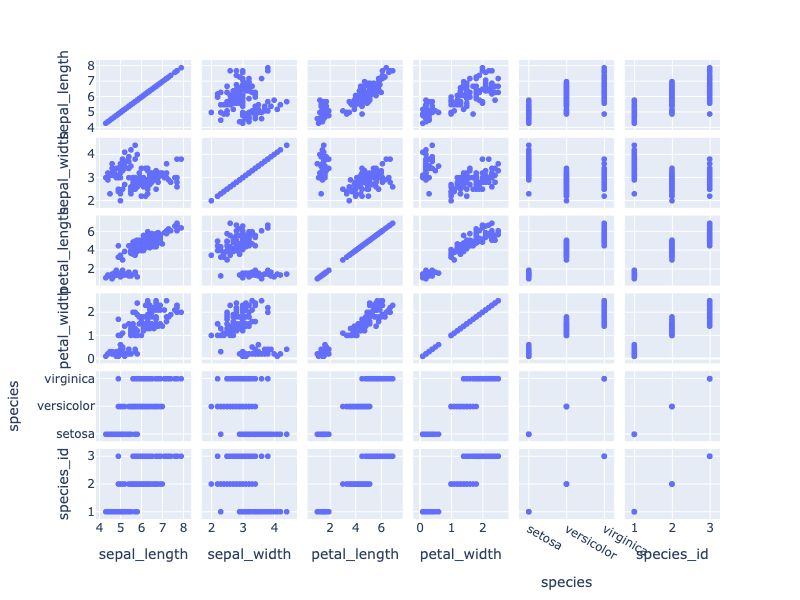
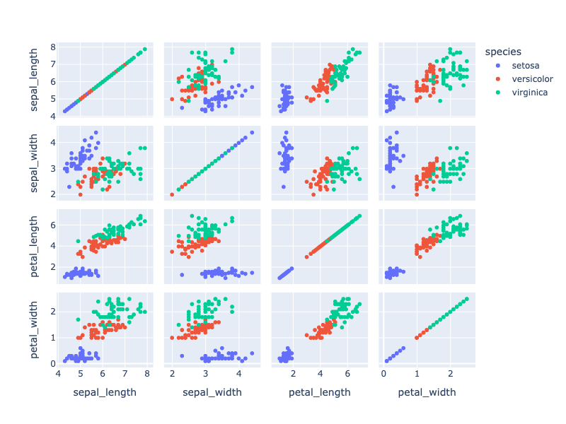
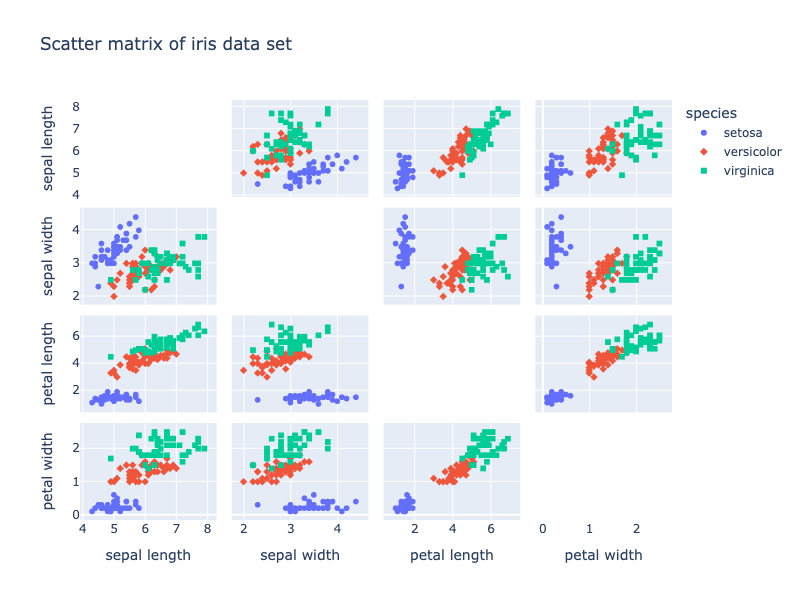
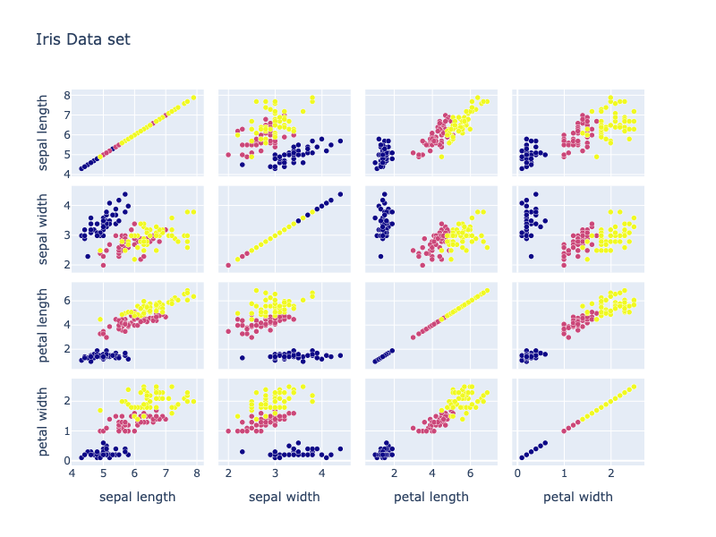
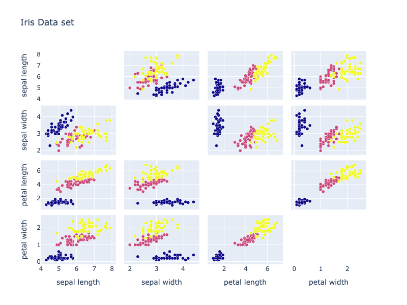
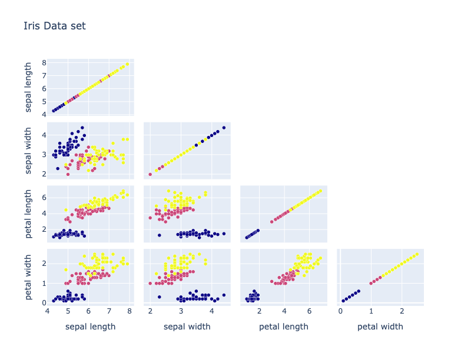
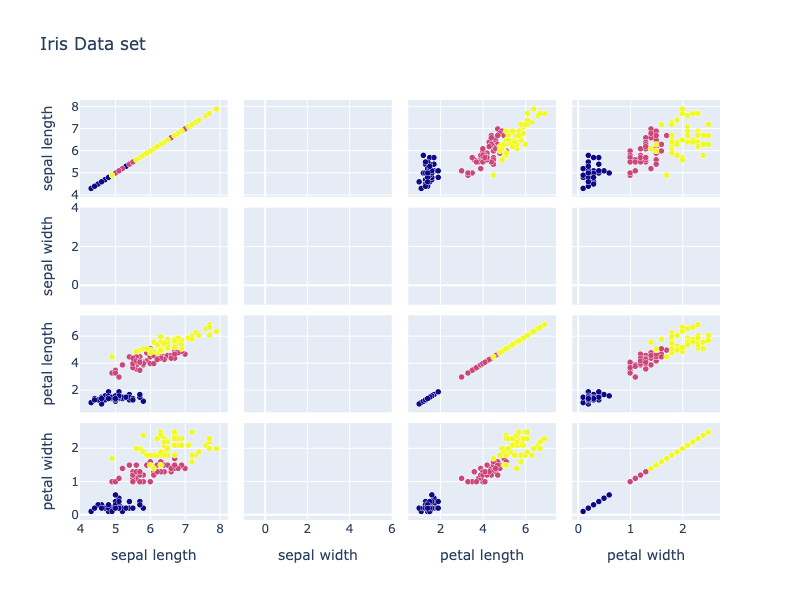
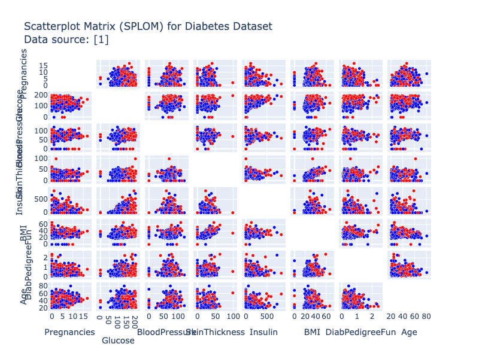

---
jupyter:
  jupytext:
    notebook_metadata_filter: all
    text_representation:
      extension: .md
      format_name: markdown
      format_version: '1.3'
      jupytext_version: 1.16.1
  kernelspec:
    display_name: Python 3 (ipykernel)
    language: python
    name: python3
  language_info:
    codemirror_mode:
      name: ipython
      version: 3
    file_extension: .py
    mimetype: text/x-python
    name: python
    nbconvert_exporter: python
    pygments_lexer: ipython3
    version: 3.10.11
  plotly:
    description: How to make scatterplot matrices or sploms natively in Python with
      Plotly.
    display_as: statistical
    language: python
    layout: base
    name: Scatterplot Matrix
    order: 6
    page_type: u-guide
    permalink: python/splom/
    redirect_from: python/scatterplot-matrix/
    thumbnail: thumbnail/splom_image.jpg
---

### Scatter matrix with Plotly Express

A scatterplot matrix is a matrix associated to n numerical arrays (data variables), $X_1,X_2,…,X_n$ , of the same length. The cell (i,j) of such a matrix displays the scatter plot of the variable Xi versus Xj.

Here we show the Plotly Express function `px.scatter_matrix` to plot the scatter matrix for the columns of the dataframe. By default, all columns are considered.

[Plotly Express](plotly-express.md) is the easy-to-use, high-level interface to Plotly, which [operates on a variety of types of data](px-arguments.md) and produces [easy-to-style figures](styling-plotly-express.md).

```python
import plotly.express as px
df = px.data.iris()
fig = px.scatter_matrix(df)
fig.show()
```



**Interactive Plot:**

<div>                        <script type="text/javascript">window.PlotlyConfig = {MathJaxConfig: 'local'};</script>
        <script charset="utf-8" src="https://cdn.plot.ly/plotly-3.1.0.min.js" integrity="sha256-Ei4740bWZhaUTQuD6q9yQlgVCMPBz6CZWhevDYPv93A=" crossorigin="anonymous"></script>                <div id="plotly-div-1" class="plotly-graph-div" style="height:100%; width:100%;"></div>            <script type="text/javascript">                window.PLOTLYENV=window.PLOTLYENV || {};                                if (document.getElementById("plotly-div-1")) {                    Plotly.newPlot(                        "plotly-div-1",                        [{"dimensions":[{"axis":{"matches":true},"label":"sepal_length","values":{"dtype":"f8","bdata":"ZmZmZmZmFECamZmZmZkTQM3MzMzMzBJAZmZmZmZmEkAAAAAAAAAUQJqZmZmZmRVAZmZmZmZmEkAAAAAAAAAUQJqZmZmZmRFAmpmZmZmZE0CamZmZmZkVQDMzMzMzMxNAMzMzMzMzE0AzMzMzMzMRQDMzMzMzMxdAzczMzMzMFkCamZmZmZkVQGZmZmZmZhRAzczMzMzMFkBmZmZmZmYUQJqZmZmZmRVAZmZmZmZmFEBmZmZmZmYSQGZmZmZmZhRAMzMzMzMzE0AAAAAAAAAUQAAAAAAAABRAzczMzMzMFEDNzMzMzMwUQM3MzMzMzBJAMzMzMzMzE0CamZmZmZkVQM3MzMzMzBRAAAAAAAAAFkCamZmZmZkTQAAAAAAAABRAAAAAAAAAFkCamZmZmZkTQJqZmZmZmRFAZmZmZmZmFEAAAAAAAAAUQAAAAAAAABJAmpmZmZmZEUAAAAAAAAAUQGZmZmZmZhRAMzMzMzMzE0BmZmZmZmYUQGZmZmZmZhJAMzMzMzMzFUAAAAAAAAAUQAAAAAAAABxAmpmZmZmZGUCamZmZmZkbQAAAAAAAABZAAAAAAAAAGkDNzMzMzMwWQDMzMzMzMxlAmpmZmZmZE0BmZmZmZmYaQM3MzMzMzBRAAAAAAAAAFECamZmZmZkXQAAAAAAAABhAZmZmZmZmGEBmZmZmZmYWQM3MzMzMzBpAZmZmZmZmFkAzMzMzMzMXQM3MzMzMzBhAZmZmZmZmFkCamZmZmZkXQGZmZmZmZhhAMzMzMzMzGUBmZmZmZmYYQJqZmZmZmRlAZmZmZmZmGkAzMzMzMzMbQM3MzMzMzBpAAAAAAAAAGEDNzMzMzMwWQAAAAAAAABZAAAAAAAAAFkAzMzMzMzMXQAAAAAAAABhAmpmZmZmZFUAAAAAAAAAYQM3MzMzMzBpAMzMzMzMzGUBmZmZmZmYWQAAAAAAAABZAAAAAAAAAFkBmZmZmZmYYQDMzMzMzMxdAAAAAAAAAFEBmZmZmZmYWQM3MzMzMzBZAzczMzMzMFkDNzMzMzMwYQGZmZmZmZhRAzczMzMzMFkAzMzMzMzMZQDMzMzMzMxdAZmZmZmZmHEAzMzMzMzMZQAAAAAAAABpAZmZmZmZmHkCamZmZmZkTQDMzMzMzMx1AzczMzMzMGkDNzMzMzMwcQAAAAAAAABpAmpmZmZmZGUAzMzMzMzMbQM3MzMzMzBZAMzMzMzMzF0CamZmZmZkZQAAAAAAAABpAzczMzMzMHkDNzMzMzMweQAAAAAAAABhAmpmZmZmZG0BmZmZmZmYWQM3MzMzMzB5AMzMzMzMzGUDNzMzMzMwaQM3MzMzMzBxAzczMzMzMGEBmZmZmZmYYQJqZmZmZmRlAzczMzMzMHECamZmZmZkdQJqZmZmZmR9AmpmZmZmZGUAzMzMzMzMZQGZmZmZmZhhAzczMzMzMHkAzMzMzMzMZQJqZmZmZmRlAAAAAAAAAGECamZmZmZkbQM3MzMzMzBpAmpmZmZmZG0AzMzMzMzMXQDMzMzMzMxtAzczMzMzMGkDNzMzMzMwaQDMzMzMzMxlAAAAAAAAAGkDNzMzMzMwYQJqZmZmZmRdA"}},{"axis":{"matches":true},"label":"sepal_width","values":{"dtype":"f8","bdata":"AAAAAAAADEAAAAAAAAAIQJqZmZmZmQlAzczMzMzMCEDNzMzMzMwMQDMzMzMzMw9AMzMzMzMzC0AzMzMzMzMLQDMzMzMzMwdAzczMzMzMCECamZmZmZkNQDMzMzMzMwtAAAAAAAAACEAAAAAAAAAIQAAAAAAAABBAmpmZmZmZEUAzMzMzMzMPQAAAAAAAAAxAZmZmZmZmDkBmZmZmZmYOQDMzMzMzMwtAmpmZmZmZDUDNzMzMzMwMQGZmZmZmZgpAMzMzMzMzC0AAAAAAAAAIQDMzMzMzMwtAAAAAAAAADEAzMzMzMzMLQJqZmZmZmQlAzczMzMzMCEAzMzMzMzMLQGZmZmZmZhBAzczMzMzMEEDNzMzMzMwIQJqZmZmZmQlAAAAAAAAADEDNzMzMzMwIQAAAAAAAAAhAMzMzMzMzC0AAAAAAAAAMQGZmZmZmZgJAmpmZmZmZCUAAAAAAAAAMQGZmZmZmZg5AAAAAAAAACEBmZmZmZmYOQJqZmZmZmQlAmpmZmZmZDUBmZmZmZmYKQJqZmZmZmQlAmpmZmZmZCUDNzMzMzMwIQGZmZmZmZgJAZmZmZmZmBkBmZmZmZmYGQGZmZmZmZgpAMzMzMzMzA0AzMzMzMzMHQJqZmZmZmQVAAAAAAAAAAEAAAAAAAAAIQJqZmZmZmQFAMzMzMzMzB0AzMzMzMzMHQM3MzMzMzAhAAAAAAAAACECamZmZmZkFQJqZmZmZmQFAAAAAAAAABECamZmZmZkJQGZmZmZmZgZAAAAAAAAABEBmZmZmZmYGQDMzMzMzMwdAAAAAAAAACEBmZmZmZmYGQAAAAAAAAAhAMzMzMzMzB0DNzMzMzMwEQDMzMzMzMwNAMzMzMzMzA0CamZmZmZkFQJqZmZmZmQVAAAAAAAAACEAzMzMzMzMLQM3MzMzMzAhAZmZmZmZmAkAAAAAAAAAIQAAAAAAAAARAzczMzMzMBEAAAAAAAAAIQM3MzMzMzARAZmZmZmZmAkCamZmZmZkFQAAAAAAAAAhAMzMzMzMzB0AzMzMzMzMHQAAAAAAAAARAZmZmZmZmBkBmZmZmZmYKQJqZmZmZmQVAAAAAAAAACEAzMzMzMzMHQAAAAAAAAAhAAAAAAAAACEAAAAAAAAAEQDMzMzMzMwdAAAAAAAAABEDNzMzMzMwMQJqZmZmZmQlAmpmZmZmZBUAAAAAAAAAIQAAAAAAAAARAZmZmZmZmBkCamZmZmZkJQAAAAAAAAAhAZmZmZmZmDkDNzMzMzMwEQJqZmZmZmQFAmpmZmZmZCUBmZmZmZmYGQGZmZmZmZgZAmpmZmZmZBUBmZmZmZmYKQJqZmZmZmQlAZmZmZmZmBkAAAAAAAAAIQGZmZmZmZgZAAAAAAAAACEBmZmZmZmYGQGZmZmZmZg5AZmZmZmZmBkBmZmZmZmYGQM3MzMzMzARAAAAAAAAACEAzMzMzMzMLQM3MzMzMzAhAAAAAAAAACEDNzMzMzMwIQM3MzMzMzAhAzczMzMzMCECamZmZmZkFQJqZmZmZmQlAZmZmZmZmCkAAAAAAAAAIQAAAAAAAAARAAAAAAAAACEAzMzMzMzMLQAAAAAAAAAhA"}},{"axis":{"matches":true},"label":"petal_length","values":{"dtype":"f8","bdata":"ZmZmZmZm9j9mZmZmZmb2P83MzMzMzPQ\u002fAAAAAAAA+D9mZmZmZmb2PzMzMzMzM\u002fs\u002fZmZmZmZm9j8AAAAAAAD4P2ZmZmZmZvY\u002fAAAAAAAA+D8AAAAAAAD4P5qZmZmZmfk\u002fZmZmZmZm9j+amZmZmZnxPzMzMzMzM\u002fM\u002fAAAAAAAA+D\u002fNzMzMzMz0P2ZmZmZmZvY\u002fMzMzMzMz+z8AAAAAAAD4PzMzMzMzM\u002fs\u002fAAAAAAAA+D8AAAAAAADwPzMzMzMzM\u002fs\u002fZmZmZmZm\u002fj+amZmZmZn5P5qZmZmZmfk\u002fAAAAAAAA+D9mZmZmZmb2P5qZmZmZmfk\u002fmpmZmZmZ+T8AAAAAAAD4PwAAAAAAAPg\u002fZmZmZmZm9j8AAAAAAAD4PzMzMzMzM\u002fM\u002fzczMzMzM9D8AAAAAAAD4P83MzMzMzPQ\u002fAAAAAAAA+D\u002fNzMzMzMz0P83MzMzMzPQ\u002fzczMzMzM9D+amZmZmZn5P2ZmZmZmZv4\u002fZmZmZmZm9j+amZmZmZn5P2ZmZmZmZvY\u002fAAAAAAAA+D9mZmZmZmb2P83MzMzMzBJAAAAAAAAAEkCamZmZmZkTQAAAAAAAABBAZmZmZmZmEkAAAAAAAAASQM3MzMzMzBJAZmZmZmZmCkBmZmZmZmYSQDMzMzMzMw9AAAAAAAAADEDNzMzMzMwQQAAAAAAAABBAzczMzMzMEkDNzMzMzMwMQJqZmZmZmRFAAAAAAAAAEkBmZmZmZmYQQAAAAAAAABJAMzMzMzMzD0AzMzMzMzMTQAAAAAAAABBAmpmZmZmZE0DNzMzMzMwSQDMzMzMzMxFAmpmZmZmZEUAzMzMzMzMTQAAAAAAAABRAAAAAAAAAEkAAAAAAAAAMQGZmZmZmZg5AmpmZmZmZDUAzMzMzMzMPQGZmZmZmZhRAAAAAAAAAEkAAAAAAAAASQM3MzMzMzBJAmpmZmZmZEUBmZmZmZmYQQAAAAAAAABBAmpmZmZmZEUBmZmZmZmYSQAAAAAAAABBAZmZmZmZmCkDNzMzMzMwQQM3MzMzMzBBAzczMzMzMEEAzMzMzMzMRQAAAAAAAAAhAZmZmZmZmEEAAAAAAAAAYQGZmZmZmZhRAmpmZmZmZF0BmZmZmZmYWQDMzMzMzMxdAZmZmZmZmGkAAAAAAAAASQDMzMzMzMxlAMzMzMzMzF0BmZmZmZmYYQGZmZmZmZhRAMzMzMzMzFUAAAAAAAAAWQAAAAAAAABRAZmZmZmZmFEAzMzMzMzMVQAAAAAAAABZAzczMzMzMGkCamZmZmZkbQAAAAAAAABRAzczMzMzMFkCamZmZmZkTQM3MzMzMzBpAmpmZmZmZE0DNzMzMzMwWQAAAAAAAABhAMzMzMzMzE0CamZmZmZkTQGZmZmZmZhZAMzMzMzMzF0BmZmZmZmYYQJqZmZmZmRlAZmZmZmZmFkBmZmZmZmYUQGZmZmZmZhZAZmZmZmZmGEBmZmZmZmYWQAAAAAAAABZAMzMzMzMzE0CamZmZmZkVQGZmZmZmZhZAZmZmZmZmFEBmZmZmZmYUQJqZmZmZmRdAzczMzMzMFkDNzMzMzMwUQAAAAAAAABRAzczMzMzMFECamZmZmZkVQGZmZmZmZhRA"}},{"axis":{"matches":true},"label":"petal_width","values":{"dtype":"f8","bdata":"mpmZmZmZyT+amZmZmZnJP5qZmZmZmck\u002fmpmZmZmZyT+amZmZmZnJP5qZmZmZmdk\u002fMzMzMzMz0z+amZmZmZnJP5qZmZmZmck\u002fmpmZmZmZuT+amZmZmZnJP5qZmZmZmck\u002fmpmZmZmZuT+amZmZmZm5P5qZmZmZmck\u002fmpmZmZmZ2T+amZmZmZnZPzMzMzMzM9M\u002fMzMzMzMz0z8zMzMzMzPTP5qZmZmZmck\u002fmpmZmZmZ2T+amZmZmZnJPwAAAAAAAOA\u002fmpmZmZmZyT+amZmZmZnJP5qZmZmZmdk\u002fmpmZmZmZyT+amZmZmZnJP5qZmZmZmck\u002fmpmZmZmZyT+amZmZmZnZP5qZmZmZmbk\u002fmpmZmZmZyT+amZmZmZm5P5qZmZmZmck\u002fmpmZmZmZyT+amZmZmZm5P5qZmZmZmck\u002fmpmZmZmZyT8zMzMzMzPTPzMzMzMzM9M\u002fmpmZmZmZyT8zMzMzMzPjP5qZmZmZmdk\u002fMzMzMzMz0z+amZmZmZnJP5qZmZmZmck\u002fmpmZmZmZyT+amZmZmZnJP2ZmZmZmZvY\u002fAAAAAAAA+D8AAAAAAAD4P83MzMzMzPQ\u002fAAAAAAAA+D\u002fNzMzMzMz0P5qZmZmZmfk\u002fAAAAAAAA8D\u002fNzMzMzMz0P2ZmZmZmZvY\u002fAAAAAAAA8D8AAAAAAAD4PwAAAAAAAPA\u002fZmZmZmZm9j\u002fNzMzMzMz0P2ZmZmZmZvY\u002fAAAAAAAA+D8AAAAAAADwPwAAAAAAAPg\u002fmpmZmZmZ8T\u002fNzMzMzMz8P83MzMzMzPQ\u002fAAAAAAAA+D8zMzMzMzPzP83MzMzMzPQ\u002fZmZmZmZm9j9mZmZmZmb2PzMzMzMzM\u002fs\u002fAAAAAAAA+D8AAAAAAADwP5qZmZmZmfE\u002fAAAAAAAA8D8zMzMzMzPzP5qZmZmZmfk\u002fAAAAAAAA+D+amZmZmZn5PwAAAAAAAPg\u002fzczMzMzM9D\u002fNzMzMzMz0P83MzMzMzPQ\u002fMzMzMzMz8z9mZmZmZmb2PzMzMzMzM\u002fM\u002fAAAAAAAA8D\u002fNzMzMzMz0PzMzMzMzM\u002fM\u002fzczMzMzM9D\u002fNzMzMzMz0P5qZmZmZmfE\u002fzczMzMzM9D8AAAAAAAAEQGZmZmZmZv4\u002fzczMzMzMAEDNzMzMzMz8P5qZmZmZmQFAzczMzMzMAEAzMzMzMzP7P83MzMzMzPw\u002fzczMzMzM\u002fD8AAAAAAAAEQAAAAAAAAABAZmZmZmZm\u002fj\u002fNzMzMzMwAQAAAAAAAAABAMzMzMzMzA0BmZmZmZmYCQM3MzMzMzPw\u002fmpmZmZmZAUBmZmZmZmYCQAAAAAAAAPg\u002fZmZmZmZmAkAAAAAAAAAAQAAAAAAAAABAzczMzMzM\u002fD\u002fNzMzMzMwAQM3MzMzMzPw\u002fzczMzMzM\u002fD\u002fNzMzMzMz8P83MzMzMzABAmpmZmZmZ+T9mZmZmZmb+PwAAAAAAAABAmpmZmZmZAUAAAAAAAAD4P2ZmZmZmZvY\u002fZmZmZmZmAkAzMzMzMzMDQM3MzMzMzPw\u002fzczMzMzM\u002fD\u002fNzMzMzMwAQDMzMzMzMwNAZmZmZmZmAkBmZmZmZmb+P2ZmZmZmZgJAAAAAAAAABEBmZmZmZmYCQGZmZmZmZv4\u002fAAAAAAAAAEBmZmZmZmYCQM3MzMzMzPw\u002f"}},{"axis":{"matches":true},"label":"species","values":["setosa","setosa","setosa","setosa","setosa","setosa","setosa","setosa","setosa","setosa","setosa","setosa","setosa","setosa","setosa","setosa","setosa","setosa","setosa","setosa","setosa","setosa","setosa","setosa","setosa","setosa","setosa","setosa","setosa","setosa","setosa","setosa","setosa","setosa","setosa","setosa","setosa","setosa","setosa","setosa","setosa","setosa","setosa","setosa","setosa","setosa","setosa","setosa","setosa","setosa","versicolor","versicolor","versicolor","versicolor","versicolor","versicolor","versicolor","versicolor","versicolor","versicolor","versicolor","versicolor","versicolor","versicolor","versicolor","versicolor","versicolor","versicolor","versicolor","versicolor","versicolor","versicolor","versicolor","versicolor","versicolor","versicolor","versicolor","versicolor","versicolor","versicolor","versicolor","versicolor","versicolor","versicolor","versicolor","versicolor","versicolor","versicolor","versicolor","versicolor","versicolor","versicolor","versicolor","versicolor","versicolor","versicolor","versicolor","versicolor","versicolor","versicolor","virginica","virginica","virginica","virginica","virginica","virginica","virginica","virginica","virginica","virginica","virginica","virginica","virginica","virginica","virginica","virginica","virginica","virginica","virginica","virginica","virginica","virginica","virginica","virginica","virginica","virginica","virginica","virginica","virginica","virginica","virginica","virginica","virginica","virginica","virginica","virginica","virginica","virginica","virginica","virginica","virginica","virginica","virginica","virginica","virginica","virginica","virginica","virginica","virginica","virginica"]},{"axis":{"matches":true},"label":"species_id","values":{"dtype":"i1","bdata":"AQEBAQEBAQEBAQEBAQEBAQEBAQEBAQEBAQEBAQEBAQEBAQEBAQEBAQEBAQEBAQEBAQECAgICAgICAgICAgICAgICAgICAgICAgICAgICAgICAgICAgICAgICAgICAgICAgICAgMDAwMDAwMDAwMDAwMDAwMDAwMDAwMDAwMDAwMDAwMDAwMDAwMDAwMDAwMDAwMDAwMD"}}],"hovertemplate":"%{xaxis.title.text}=%{x}\u003cbr\u003e%{yaxis.title.text}=%{y}\u003cextra\u003e\u003c\u002fextra\u003e","legendgroup":"","marker":{"color":"#636efa","symbol":"circle"},"name":"","showlegend":false,"type":"splom"}],                        {"template":{"data":{"histogram2dcontour":[{"type":"histogram2dcontour","colorbar":{"outlinewidth":0,"ticks":""},"colorscale":[[0.0,"#0d0887"],[0.1111111111111111,"#46039f"],[0.2222222222222222,"#7201a8"],[0.3333333333333333,"#9c179e"],[0.4444444444444444,"#bd3786"],[0.5555555555555556,"#d8576b"],[0.6666666666666666,"#ed7953"],[0.7777777777777778,"#fb9f3a"],[0.8888888888888888,"#fdca26"],[1.0,"#f0f921"]]}],"choropleth":[{"type":"choropleth","colorbar":{"outlinewidth":0,"ticks":""}}],"histogram2d":[{"type":"histogram2d","colorbar":{"outlinewidth":0,"ticks":""},"colorscale":[[0.0,"#0d0887"],[0.1111111111111111,"#46039f"],[0.2222222222222222,"#7201a8"],[0.3333333333333333,"#9c179e"],[0.4444444444444444,"#bd3786"],[0.5555555555555556,"#d8576b"],[0.6666666666666666,"#ed7953"],[0.7777777777777778,"#fb9f3a"],[0.8888888888888888,"#fdca26"],[1.0,"#f0f921"]]}],"heatmap":[{"type":"heatmap","colorbar":{"outlinewidth":0,"ticks":""},"colorscale":[[0.0,"#0d0887"],[0.1111111111111111,"#46039f"],[0.2222222222222222,"#7201a8"],[0.3333333333333333,"#9c179e"],[0.4444444444444444,"#bd3786"],[0.5555555555555556,"#d8576b"],[0.6666666666666666,"#ed7953"],[0.7777777777777778,"#fb9f3a"],[0.8888888888888888,"#fdca26"],[1.0,"#f0f921"]]}],"contourcarpet":[{"type":"contourcarpet","colorbar":{"outlinewidth":0,"ticks":""}}],"contour":[{"type":"contour","colorbar":{"outlinewidth":0,"ticks":""},"colorscale":[[0.0,"#0d0887"],[0.1111111111111111,"#46039f"],[0.2222222222222222,"#7201a8"],[0.3333333333333333,"#9c179e"],[0.4444444444444444,"#bd3786"],[0.5555555555555556,"#d8576b"],[0.6666666666666666,"#ed7953"],[0.7777777777777778,"#fb9f3a"],[0.8888888888888888,"#fdca26"],[1.0,"#f0f921"]]}],"surface":[{"type":"surface","colorbar":{"outlinewidth":0,"ticks":""},"colorscale":[[0.0,"#0d0887"],[0.1111111111111111,"#46039f"],[0.2222222222222222,"#7201a8"],[0.3333333333333333,"#9c179e"],[0.4444444444444444,"#bd3786"],[0.5555555555555556,"#d8576b"],[0.6666666666666666,"#ed7953"],[0.7777777777777778,"#fb9f3a"],[0.8888888888888888,"#fdca26"],[1.0,"#f0f921"]]}],"mesh3d":[{"type":"mesh3d","colorbar":{"outlinewidth":0,"ticks":""}}],"scatter":[{"fillpattern":{"fillmode":"overlay","size":10,"solidity":0.2},"type":"scatter"}],"parcoords":[{"type":"parcoords","line":{"colorbar":{"outlinewidth":0,"ticks":""}}}],"scatterpolargl":[{"type":"scatterpolargl","marker":{"colorbar":{"outlinewidth":0,"ticks":""}}}],"bar":[{"error_x":{"color":"#2a3f5f"},"error_y":{"color":"#2a3f5f"},"marker":{"line":{"color":"#E5ECF6","width":0.5},"pattern":{"fillmode":"overlay","size":10,"solidity":0.2}},"type":"bar"}],"scattergeo":[{"type":"scattergeo","marker":{"colorbar":{"outlinewidth":0,"ticks":""}}}],"scatterpolar":[{"type":"scatterpolar","marker":{"colorbar":{"outlinewidth":0,"ticks":""}}}],"histogram":[{"marker":{"pattern":{"fillmode":"overlay","size":10,"solidity":0.2}},"type":"histogram"}],"scattergl":[{"type":"scattergl","marker":{"colorbar":{"outlinewidth":0,"ticks":""}}}],"scatter3d":[{"type":"scatter3d","line":{"colorbar":{"outlinewidth":0,"ticks":""}},"marker":{"colorbar":{"outlinewidth":0,"ticks":""}}}],"scattermap":[{"type":"scattermap","marker":{"colorbar":{"outlinewidth":0,"ticks":""}}}],"scattermapbox":[{"type":"scattermapbox","marker":{"colorbar":{"outlinewidth":0,"ticks":""}}}],"scatterternary":[{"type":"scatterternary","marker":{"colorbar":{"outlinewidth":0,"ticks":""}}}],"scattercarpet":[{"type":"scattercarpet","marker":{"colorbar":{"outlinewidth":0,"ticks":""}}}],"carpet":[{"aaxis":{"endlinecolor":"#2a3f5f","gridcolor":"white","linecolor":"white","minorgridcolor":"white","startlinecolor":"#2a3f5f"},"baxis":{"endlinecolor":"#2a3f5f","gridcolor":"white","linecolor":"white","minorgridcolor":"white","startlinecolor":"#2a3f5f"},"type":"carpet"}],"table":[{"cells":{"fill":{"color":"#EBF0F8"},"line":{"color":"white"}},"header":{"fill":{"color":"#C8D4E3"},"line":{"color":"white"}},"type":"table"}],"barpolar":[{"marker":{"line":{"color":"#E5ECF6","width":0.5},"pattern":{"fillmode":"overlay","size":10,"solidity":0.2}},"type":"barpolar"}],"pie":[{"automargin":true,"type":"pie"}]},"layout":{"autotypenumbers":"strict","colorway":["#636efa","#EF553B","#00cc96","#ab63fa","#FFA15A","#19d3f3","#FF6692","#B6E880","#FF97FF","#FECB52"],"font":{"color":"#2a3f5f"},"hovermode":"closest","hoverlabel":{"align":"left"},"paper_bgcolor":"white","plot_bgcolor":"#E5ECF6","polar":{"bgcolor":"#E5ECF6","angularaxis":{"gridcolor":"white","linecolor":"white","ticks":""},"radialaxis":{"gridcolor":"white","linecolor":"white","ticks":""}},"ternary":{"bgcolor":"#E5ECF6","aaxis":{"gridcolor":"white","linecolor":"white","ticks":""},"baxis":{"gridcolor":"white","linecolor":"white","ticks":""},"caxis":{"gridcolor":"white","linecolor":"white","ticks":""}},"coloraxis":{"colorbar":{"outlinewidth":0,"ticks":""}},"colorscale":{"sequential":[[0.0,"#0d0887"],[0.1111111111111111,"#46039f"],[0.2222222222222222,"#7201a8"],[0.3333333333333333,"#9c179e"],[0.4444444444444444,"#bd3786"],[0.5555555555555556,"#d8576b"],[0.6666666666666666,"#ed7953"],[0.7777777777777778,"#fb9f3a"],[0.8888888888888888,"#fdca26"],[1.0,"#f0f921"]],"sequentialminus":[[0.0,"#0d0887"],[0.1111111111111111,"#46039f"],[0.2222222222222222,"#7201a8"],[0.3333333333333333,"#9c179e"],[0.4444444444444444,"#bd3786"],[0.5555555555555556,"#d8576b"],[0.6666666666666666,"#ed7953"],[0.7777777777777778,"#fb9f3a"],[0.8888888888888888,"#fdca26"],[1.0,"#f0f921"]],"diverging":[[0,"#8e0152"],[0.1,"#c51b7d"],[0.2,"#de77ae"],[0.3,"#f1b6da"],[0.4,"#fde0ef"],[0.5,"#f7f7f7"],[0.6,"#e6f5d0"],[0.7,"#b8e186"],[0.8,"#7fbc41"],[0.9,"#4d9221"],[1,"#276419"]]},"xaxis":{"gridcolor":"white","linecolor":"white","ticks":"","title":{"standoff":15},"zerolinecolor":"white","automargin":true,"zerolinewidth":2},"yaxis":{"gridcolor":"white","linecolor":"white","ticks":"","title":{"standoff":15},"zerolinecolor":"white","automargin":true,"zerolinewidth":2},"scene":{"xaxis":{"backgroundcolor":"#E5ECF6","gridcolor":"white","linecolor":"white","showbackground":true,"ticks":"","zerolinecolor":"white","gridwidth":2},"yaxis":{"backgroundcolor":"#E5ECF6","gridcolor":"white","linecolor":"white","showbackground":true,"ticks":"","zerolinecolor":"white","gridwidth":2},"zaxis":{"backgroundcolor":"#E5ECF6","gridcolor":"white","linecolor":"white","showbackground":true,"ticks":"","zerolinecolor":"white","gridwidth":2}},"shapedefaults":{"line":{"color":"#2a3f5f"}},"annotationdefaults":{"arrowcolor":"#2a3f5f","arrowhead":0,"arrowwidth":1},"geo":{"bgcolor":"white","landcolor":"#E5ECF6","subunitcolor":"white","showland":true,"showlakes":true,"lakecolor":"white"},"title":{"x":0.05},"mapbox":{"style":"light"}}},"legend":{"tracegroupgap":0},"margin":{"t":60},"dragmode":"select"},                        {"responsive": true}                    )                };            </script>        </div>

Specify the columns to be represented with the `dimensions` argument, and set colors using a column of the dataframe:

```python
import plotly.express as px
df = px.data.iris()
fig = px.scatter_matrix(df,
    dimensions=["sepal_length", "sepal_width", "petal_length", "petal_width"],
    color="species")
fig.show()
```



**Interactive Plot:**

<div>                        <script type="text/javascript">window.PlotlyConfig = {MathJaxConfig: 'local'};</script>
        <script charset="utf-8" src="https://cdn.plot.ly/plotly-3.1.0.min.js" integrity="sha256-Ei4740bWZhaUTQuD6q9yQlgVCMPBz6CZWhevDYPv93A=" crossorigin="anonymous"></script>                <div id="plotly-div-2" class="plotly-graph-div" style="height:100%; width:100%;"></div>            <script type="text/javascript">                window.PLOTLYENV=window.PLOTLYENV || {};                                if (document.getElementById("plotly-div-2")) {                    Plotly.newPlot(                        "plotly-div-2",                        [{"dimensions":[{"axis":{"matches":true},"label":"sepal_length","values":{"dtype":"f8","bdata":"ZmZmZmZmFECamZmZmZkTQM3MzMzMzBJAZmZmZmZmEkAAAAAAAAAUQJqZmZmZmRVAZmZmZmZmEkAAAAAAAAAUQJqZmZmZmRFAmpmZmZmZE0CamZmZmZkVQDMzMzMzMxNAMzMzMzMzE0AzMzMzMzMRQDMzMzMzMxdAzczMzMzMFkCamZmZmZkVQGZmZmZmZhRAzczMzMzMFkBmZmZmZmYUQJqZmZmZmRVAZmZmZmZmFEBmZmZmZmYSQGZmZmZmZhRAMzMzMzMzE0AAAAAAAAAUQAAAAAAAABRAzczMzMzMFEDNzMzMzMwUQM3MzMzMzBJAMzMzMzMzE0CamZmZmZkVQM3MzMzMzBRAAAAAAAAAFkCamZmZmZkTQAAAAAAAABRAAAAAAAAAFkCamZmZmZkTQJqZmZmZmRFAZmZmZmZmFEAAAAAAAAAUQAAAAAAAABJAmpmZmZmZEUAAAAAAAAAUQGZmZmZmZhRAMzMzMzMzE0BmZmZmZmYUQGZmZmZmZhJAMzMzMzMzFUAAAAAAAAAUQA=="}},{"axis":{"matches":true},"label":"sepal_width","values":{"dtype":"f8","bdata":"AAAAAAAADEAAAAAAAAAIQJqZmZmZmQlAzczMzMzMCEDNzMzMzMwMQDMzMzMzMw9AMzMzMzMzC0AzMzMzMzMLQDMzMzMzMwdAzczMzMzMCECamZmZmZkNQDMzMzMzMwtAAAAAAAAACEAAAAAAAAAIQAAAAAAAABBAmpmZmZmZEUAzMzMzMzMPQAAAAAAAAAxAZmZmZmZmDkBmZmZmZmYOQDMzMzMzMwtAmpmZmZmZDUDNzMzMzMwMQGZmZmZmZgpAMzMzMzMzC0AAAAAAAAAIQDMzMzMzMwtAAAAAAAAADEAzMzMzMzMLQJqZmZmZmQlAzczMzMzMCEAzMzMzMzMLQGZmZmZmZhBAzczMzMzMEEDNzMzMzMwIQJqZmZmZmQlAAAAAAAAADEDNzMzMzMwIQAAAAAAAAAhAMzMzMzMzC0AAAAAAAAAMQGZmZmZmZgJAmpmZmZmZCUAAAAAAAAAMQGZmZmZmZg5AAAAAAAAACEBmZmZmZmYOQJqZmZmZmQlAmpmZmZmZDUBmZmZmZmYKQA=="}},{"axis":{"matches":true},"label":"petal_length","values":{"dtype":"f8","bdata":"ZmZmZmZm9j9mZmZmZmb2P83MzMzMzPQ\u002fAAAAAAAA+D9mZmZmZmb2PzMzMzMzM\u002fs\u002fZmZmZmZm9j8AAAAAAAD4P2ZmZmZmZvY\u002fAAAAAAAA+D8AAAAAAAD4P5qZmZmZmfk\u002fZmZmZmZm9j+amZmZmZnxPzMzMzMzM\u002fM\u002fAAAAAAAA+D\u002fNzMzMzMz0P2ZmZmZmZvY\u002fMzMzMzMz+z8AAAAAAAD4PzMzMzMzM\u002fs\u002fAAAAAAAA+D8AAAAAAADwPzMzMzMzM\u002fs\u002fZmZmZmZm\u002fj+amZmZmZn5P5qZmZmZmfk\u002fAAAAAAAA+D9mZmZmZmb2P5qZmZmZmfk\u002fmpmZmZmZ+T8AAAAAAAD4PwAAAAAAAPg\u002fZmZmZmZm9j8AAAAAAAD4PzMzMzMzM\u002fM\u002fzczMzMzM9D8AAAAAAAD4P83MzMzMzPQ\u002fAAAAAAAA+D\u002fNzMzMzMz0P83MzMzMzPQ\u002fzczMzMzM9D+amZmZmZn5P2ZmZmZmZv4\u002fZmZmZmZm9j+amZmZmZn5P2ZmZmZmZvY\u002fAAAAAAAA+D9mZmZmZmb2Pw=="}},{"axis":{"matches":true},"label":"petal_width","values":{"dtype":"f8","bdata":"mpmZmZmZyT+amZmZmZnJP5qZmZmZmck\u002fmpmZmZmZyT+amZmZmZnJP5qZmZmZmdk\u002fMzMzMzMz0z+amZmZmZnJP5qZmZmZmck\u002fmpmZmZmZuT+amZmZmZnJP5qZmZmZmck\u002fmpmZmZmZuT+amZmZmZm5P5qZmZmZmck\u002fmpmZmZmZ2T+amZmZmZnZPzMzMzMzM9M\u002fMzMzMzMz0z8zMzMzMzPTP5qZmZmZmck\u002fmpmZmZmZ2T+amZmZmZnJPwAAAAAAAOA\u002fmpmZmZmZyT+amZmZmZnJP5qZmZmZmdk\u002fmpmZmZmZyT+amZmZmZnJP5qZmZmZmck\u002fmpmZmZmZyT+amZmZmZnZP5qZmZmZmbk\u002fmpmZmZmZyT+amZmZmZm5P5qZmZmZmck\u002fmpmZmZmZyT+amZmZmZm5P5qZmZmZmck\u002fmpmZmZmZyT8zMzMzMzPTPzMzMzMzM9M\u002fmpmZmZmZyT8zMzMzMzPjP5qZmZmZmdk\u002fMzMzMzMz0z+amZmZmZnJP5qZmZmZmck\u002fmpmZmZmZyT+amZmZmZnJPw=="}}],"hovertemplate":"species=setosa\u003cbr\u003e%{xaxis.title.text}=%{x}\u003cbr\u003e%{yaxis.title.text}=%{y}\u003cextra\u003e\u003c\u002fextra\u003e","legendgroup":"setosa","marker":{"color":"#636efa","symbol":"circle"},"name":"setosa","showlegend":true,"type":"splom"},{"dimensions":[{"axis":{"matches":true},"label":"sepal_length","values":{"dtype":"f8","bdata":"AAAAAAAAHECamZmZmZkZQJqZmZmZmRtAAAAAAAAAFkAAAAAAAAAaQM3MzMzMzBZAMzMzMzMzGUCamZmZmZkTQGZmZmZmZhpAzczMzMzMFEAAAAAAAAAUQJqZmZmZmRdAAAAAAAAAGEBmZmZmZmYYQGZmZmZmZhZAzczMzMzMGkBmZmZmZmYWQDMzMzMzMxdAzczMzMzMGEBmZmZmZmYWQJqZmZmZmRdAZmZmZmZmGEAzMzMzMzMZQGZmZmZmZhhAmpmZmZmZGUBmZmZmZmYaQDMzMzMzMxtAzczMzMzMGkAAAAAAAAAYQM3MzMzMzBZAAAAAAAAAFkAAAAAAAAAWQDMzMzMzMxdAAAAAAAAAGECamZmZmZkVQAAAAAAAABhAzczMzMzMGkAzMzMzMzMZQGZmZmZmZhZAAAAAAAAAFkAAAAAAAAAWQGZmZmZmZhhAMzMzMzMzF0AAAAAAAAAUQGZmZmZmZhZAzczMzMzMFkDNzMzMzMwWQM3MzMzMzBhAZmZmZmZmFEDNzMzMzMwWQA=="}},{"axis":{"matches":true},"label":"sepal_width","values":{"dtype":"f8","bdata":"mpmZmZmZCUCamZmZmZkJQM3MzMzMzAhAZmZmZmZmAkBmZmZmZmYGQGZmZmZmZgZAZmZmZmZmCkAzMzMzMzMDQDMzMzMzMwdAmpmZmZmZBUAAAAAAAAAAQAAAAAAAAAhAmpmZmZmZAUAzMzMzMzMHQDMzMzMzMwdAzczMzMzMCEAAAAAAAAAIQJqZmZmZmQVAmpmZmZmZAUAAAAAAAAAEQJqZmZmZmQlAZmZmZmZmBkAAAAAAAAAEQGZmZmZmZgZAMzMzMzMzB0AAAAAAAAAIQGZmZmZmZgZAAAAAAAAACEAzMzMzMzMHQM3MzMzMzARAMzMzMzMzA0AzMzMzMzMDQJqZmZmZmQVAmpmZmZmZBUAAAAAAAAAIQDMzMzMzMwtAzczMzMzMCEBmZmZmZmYCQAAAAAAAAAhAAAAAAAAABEDNzMzMzMwEQAAAAAAAAAhAzczMzMzMBEBmZmZmZmYCQJqZmZmZmQVAAAAAAAAACEAzMzMzMzMHQDMzMzMzMwdAAAAAAAAABEBmZmZmZmYGQA=="}},{"axis":{"matches":true},"label":"petal_length","values":{"dtype":"f8","bdata":"zczMzMzMEkAAAAAAAAASQJqZmZmZmRNAAAAAAAAAEEBmZmZmZmYSQAAAAAAAABJAzczMzMzMEkBmZmZmZmYKQGZmZmZmZhJAMzMzMzMzD0AAAAAAAAAMQM3MzMzMzBBAAAAAAAAAEEDNzMzMzMwSQM3MzMzMzAxAmpmZmZmZEUAAAAAAAAASQGZmZmZmZhBAAAAAAAAAEkAzMzMzMzMPQDMzMzMzMxNAAAAAAAAAEECamZmZmZkTQM3MzMzMzBJAMzMzMzMzEUCamZmZmZkRQDMzMzMzMxNAAAAAAAAAFEAAAAAAAAASQAAAAAAAAAxAZmZmZmZmDkCamZmZmZkNQDMzMzMzMw9AZmZmZmZmFEAAAAAAAAASQAAAAAAAABJAzczMzMzMEkCamZmZmZkRQGZmZmZmZhBAAAAAAAAAEECamZmZmZkRQGZmZmZmZhJAAAAAAAAAEEBmZmZmZmYKQM3MzMzMzBBAzczMzMzMEEDNzMzMzMwQQDMzMzMzMxFAAAAAAAAACEBmZmZmZmYQQA=="}},{"axis":{"matches":true},"label":"petal_width","values":{"dtype":"f8","bdata":"ZmZmZmZm9j8AAAAAAAD4PwAAAAAAAPg\u002fzczMzMzM9D8AAAAAAAD4P83MzMzMzPQ\u002fmpmZmZmZ+T8AAAAAAADwP83MzMzMzPQ\u002fZmZmZmZm9j8AAAAAAADwPwAAAAAAAPg\u002fAAAAAAAA8D9mZmZmZmb2P83MzMzMzPQ\u002fZmZmZmZm9j8AAAAAAAD4PwAAAAAAAPA\u002fAAAAAAAA+D+amZmZmZnxP83MzMzMzPw\u002fzczMzMzM9D8AAAAAAAD4PzMzMzMzM\u002fM\u002fzczMzMzM9D9mZmZmZmb2P2ZmZmZmZvY\u002fMzMzMzMz+z8AAAAAAAD4PwAAAAAAAPA\u002fmpmZmZmZ8T8AAAAAAADwPzMzMzMzM\u002fM\u002fmpmZmZmZ+T8AAAAAAAD4P5qZmZmZmfk\u002fAAAAAAAA+D\u002fNzMzMzMz0P83MzMzMzPQ\u002fzczMzMzM9D8zMzMzMzPzP2ZmZmZmZvY\u002fMzMzMzMz8z8AAAAAAADwP83MzMzMzPQ\u002fMzMzMzMz8z\u002fNzMzMzMz0P83MzMzMzPQ\u002fmpmZmZmZ8T\u002fNzMzMzMz0Pw=="}}],"hovertemplate":"species=versicolor\u003cbr\u003e%{xaxis.title.text}=%{x}\u003cbr\u003e%{yaxis.title.text}=%{y}\u003cextra\u003e\u003c\u002fextra\u003e","legendgroup":"versicolor","marker":{"color":"#EF553B","symbol":"circle"},"name":"versicolor","showlegend":true,"type":"splom"},{"dimensions":[{"axis":{"matches":true},"label":"sepal_length","values":{"dtype":"f8","bdata":"MzMzMzMzGUAzMzMzMzMXQGZmZmZmZhxAMzMzMzMzGUAAAAAAAAAaQGZmZmZmZh5AmpmZmZmZE0AzMzMzMzMdQM3MzMzMzBpAzczMzMzMHEAAAAAAAAAaQJqZmZmZmRlAMzMzMzMzG0DNzMzMzMwWQDMzMzMzMxdAmpmZmZmZGUAAAAAAAAAaQM3MzMzMzB5AzczMzMzMHkAAAAAAAAAYQJqZmZmZmRtAZmZmZmZmFkDNzMzMzMweQDMzMzMzMxlAzczMzMzMGkDNzMzMzMwcQM3MzMzMzBhAZmZmZmZmGECamZmZmZkZQM3MzMzMzBxAmpmZmZmZHUCamZmZmZkfQJqZmZmZmRlAMzMzMzMzGUBmZmZmZmYYQM3MzMzMzB5AMzMzMzMzGUCamZmZmZkZQAAAAAAAABhAmpmZmZmZG0DNzMzMzMwaQJqZmZmZmRtAMzMzMzMzF0AzMzMzMzMbQM3MzMzMzBpAzczMzMzMGkAzMzMzMzMZQAAAAAAAABpAzczMzMzMGECamZmZmZkXQA=="}},{"axis":{"matches":true},"label":"sepal_width","values":{"dtype":"f8","bdata":"ZmZmZmZmCkCamZmZmZkFQAAAAAAAAAhAMzMzMzMzB0AAAAAAAAAIQAAAAAAAAAhAAAAAAAAABEAzMzMzMzMHQAAAAAAAAARAzczMzMzMDECamZmZmZkJQJqZmZmZmQVAAAAAAAAACEAAAAAAAAAEQGZmZmZmZgZAmpmZmZmZCUAAAAAAAAAIQGZmZmZmZg5AzczMzMzMBECamZmZmZkBQJqZmZmZmQlAZmZmZmZmBkBmZmZmZmYGQJqZmZmZmQVAZmZmZmZmCkCamZmZmZkJQGZmZmZmZgZAAAAAAAAACEBmZmZmZmYGQAAAAAAAAAhAZmZmZmZmBkBmZmZmZmYOQGZmZmZmZgZAZmZmZmZmBkDNzMzMzMwEQAAAAAAAAAhAMzMzMzMzC0DNzMzMzMwIQAAAAAAAAAhAzczMzMzMCEDNzMzMzMwIQM3MzMzMzAhAmpmZmZmZBUCamZmZmZkJQGZmZmZmZgpAAAAAAAAACEAAAAAAAAAEQAAAAAAAAAhAMzMzMzMzC0AAAAAAAAAIQA=="}},{"axis":{"matches":true},"label":"petal_length","values":{"dtype":"f8","bdata":"AAAAAAAAGEBmZmZmZmYUQJqZmZmZmRdAZmZmZmZmFkAzMzMzMzMXQGZmZmZmZhpAAAAAAAAAEkAzMzMzMzMZQDMzMzMzMxdAZmZmZmZmGEBmZmZmZmYUQDMzMzMzMxVAAAAAAAAAFkAAAAAAAAAUQGZmZmZmZhRAMzMzMzMzFUAAAAAAAAAWQM3MzMzMzBpAmpmZmZmZG0AAAAAAAAAUQM3MzMzMzBZAmpmZmZmZE0DNzMzMzMwaQJqZmZmZmRNAzczMzMzMFkAAAAAAAAAYQDMzMzMzMxNAmpmZmZmZE0BmZmZmZmYWQDMzMzMzMxdAZmZmZmZmGECamZmZmZkZQGZmZmZmZhZAZmZmZmZmFEBmZmZmZmYWQGZmZmZmZhhAZmZmZmZmFkAAAAAAAAAWQDMzMzMzMxNAmpmZmZmZFUBmZmZmZmYWQGZmZmZmZhRAZmZmZmZmFECamZmZmZkXQM3MzMzMzBZAzczMzMzMFEAAAAAAAAAUQM3MzMzMzBRAmpmZmZmZFUBmZmZmZmYUQA=="}},{"axis":{"matches":true},"label":"petal_width","values":{"dtype":"f8","bdata":"AAAAAAAABEBmZmZmZmb+P83MzMzMzABAzczMzMzM\u002fD+amZmZmZkBQM3MzMzMzABAMzMzMzMz+z\u002fNzMzMzMz8P83MzMzMzPw\u002fAAAAAAAABEAAAAAAAAAAQGZmZmZmZv4\u002fzczMzMzMAEAAAAAAAAAAQDMzMzMzMwNAZmZmZmZmAkDNzMzMzMz8P5qZmZmZmQFAZmZmZmZmAkAAAAAAAAD4P2ZmZmZmZgJAAAAAAAAAAEAAAAAAAAAAQM3MzMzMzPw\u002fzczMzMzMAEDNzMzMzMz8P83MzMzMzPw\u002fzczMzMzM\u002fD\u002fNzMzMzMwAQJqZmZmZmfk\u002fZmZmZmZm\u002fj8AAAAAAAAAQJqZmZmZmQFAAAAAAAAA+D9mZmZmZmb2P2ZmZmZmZgJAMzMzMzMzA0DNzMzMzMz8P83MzMzMzPw\u002fzczMzMzMAEAzMzMzMzMDQGZmZmZmZgJAZmZmZmZm\u002fj9mZmZmZmYCQAAAAAAAAARAZmZmZmZmAkBmZmZmZmb+PwAAAAAAAABAZmZmZmZmAkDNzMzMzMz8Pw=="}}],"hovertemplate":"species=virginica\u003cbr\u003e%{xaxis.title.text}=%{x}\u003cbr\u003e%{yaxis.title.text}=%{y}\u003cextra\u003e\u003c\u002fextra\u003e","legendgroup":"virginica","marker":{"color":"#00cc96","symbol":"circle"},"name":"virginica","showlegend":true,"type":"splom"}],                        {"template":{"data":{"histogram2dcontour":[{"type":"histogram2dcontour","colorbar":{"outlinewidth":0,"ticks":""},"colorscale":[[0.0,"#0d0887"],[0.1111111111111111,"#46039f"],[0.2222222222222222,"#7201a8"],[0.3333333333333333,"#9c179e"],[0.4444444444444444,"#bd3786"],[0.5555555555555556,"#d8576b"],[0.6666666666666666,"#ed7953"],[0.7777777777777778,"#fb9f3a"],[0.8888888888888888,"#fdca26"],[1.0,"#f0f921"]]}],"choropleth":[{"type":"choropleth","colorbar":{"outlinewidth":0,"ticks":""}}],"histogram2d":[{"type":"histogram2d","colorbar":{"outlinewidth":0,"ticks":""},"colorscale":[[0.0,"#0d0887"],[0.1111111111111111,"#46039f"],[0.2222222222222222,"#7201a8"],[0.3333333333333333,"#9c179e"],[0.4444444444444444,"#bd3786"],[0.5555555555555556,"#d8576b"],[0.6666666666666666,"#ed7953"],[0.7777777777777778,"#fb9f3a"],[0.8888888888888888,"#fdca26"],[1.0,"#f0f921"]]}],"heatmap":[{"type":"heatmap","colorbar":{"outlinewidth":0,"ticks":""},"colorscale":[[0.0,"#0d0887"],[0.1111111111111111,"#46039f"],[0.2222222222222222,"#7201a8"],[0.3333333333333333,"#9c179e"],[0.4444444444444444,"#bd3786"],[0.5555555555555556,"#d8576b"],[0.6666666666666666,"#ed7953"],[0.7777777777777778,"#fb9f3a"],[0.8888888888888888,"#fdca26"],[1.0,"#f0f921"]]}],"contourcarpet":[{"type":"contourcarpet","colorbar":{"outlinewidth":0,"ticks":""}}],"contour":[{"type":"contour","colorbar":{"outlinewidth":0,"ticks":""},"colorscale":[[0.0,"#0d0887"],[0.1111111111111111,"#46039f"],[0.2222222222222222,"#7201a8"],[0.3333333333333333,"#9c179e"],[0.4444444444444444,"#bd3786"],[0.5555555555555556,"#d8576b"],[0.6666666666666666,"#ed7953"],[0.7777777777777778,"#fb9f3a"],[0.8888888888888888,"#fdca26"],[1.0,"#f0f921"]]}],"surface":[{"type":"surface","colorbar":{"outlinewidth":0,"ticks":""},"colorscale":[[0.0,"#0d0887"],[0.1111111111111111,"#46039f"],[0.2222222222222222,"#7201a8"],[0.3333333333333333,"#9c179e"],[0.4444444444444444,"#bd3786"],[0.5555555555555556,"#d8576b"],[0.6666666666666666,"#ed7953"],[0.7777777777777778,"#fb9f3a"],[0.8888888888888888,"#fdca26"],[1.0,"#f0f921"]]}],"mesh3d":[{"type":"mesh3d","colorbar":{"outlinewidth":0,"ticks":""}}],"scatter":[{"fillpattern":{"fillmode":"overlay","size":10,"solidity":0.2},"type":"scatter"}],"parcoords":[{"type":"parcoords","line":{"colorbar":{"outlinewidth":0,"ticks":""}}}],"scatterpolargl":[{"type":"scatterpolargl","marker":{"colorbar":{"outlinewidth":0,"ticks":""}}}],"bar":[{"error_x":{"color":"#2a3f5f"},"error_y":{"color":"#2a3f5f"},"marker":{"line":{"color":"#E5ECF6","width":0.5},"pattern":{"fillmode":"overlay","size":10,"solidity":0.2}},"type":"bar"}],"scattergeo":[{"type":"scattergeo","marker":{"colorbar":{"outlinewidth":0,"ticks":""}}}],"scatterpolar":[{"type":"scatterpolar","marker":{"colorbar":{"outlinewidth":0,"ticks":""}}}],"histogram":[{"marker":{"pattern":{"fillmode":"overlay","size":10,"solidity":0.2}},"type":"histogram"}],"scattergl":[{"type":"scattergl","marker":{"colorbar":{"outlinewidth":0,"ticks":""}}}],"scatter3d":[{"type":"scatter3d","line":{"colorbar":{"outlinewidth":0,"ticks":""}},"marker":{"colorbar":{"outlinewidth":0,"ticks":""}}}],"scattermap":[{"type":"scattermap","marker":{"colorbar":{"outlinewidth":0,"ticks":""}}}],"scattermapbox":[{"type":"scattermapbox","marker":{"colorbar":{"outlinewidth":0,"ticks":""}}}],"scatterternary":[{"type":"scatterternary","marker":{"colorbar":{"outlinewidth":0,"ticks":""}}}],"scattercarpet":[{"type":"scattercarpet","marker":{"colorbar":{"outlinewidth":0,"ticks":""}}}],"carpet":[{"aaxis":{"endlinecolor":"#2a3f5f","gridcolor":"white","linecolor":"white","minorgridcolor":"white","startlinecolor":"#2a3f5f"},"baxis":{"endlinecolor":"#2a3f5f","gridcolor":"white","linecolor":"white","minorgridcolor":"white","startlinecolor":"#2a3f5f"},"type":"carpet"}],"table":[{"cells":{"fill":{"color":"#EBF0F8"},"line":{"color":"white"}},"header":{"fill":{"color":"#C8D4E3"},"line":{"color":"white"}},"type":"table"}],"barpolar":[{"marker":{"line":{"color":"#E5ECF6","width":0.5},"pattern":{"fillmode":"overlay","size":10,"solidity":0.2}},"type":"barpolar"}],"pie":[{"automargin":true,"type":"pie"}]},"layout":{"autotypenumbers":"strict","colorway":["#636efa","#EF553B","#00cc96","#ab63fa","#FFA15A","#19d3f3","#FF6692","#B6E880","#FF97FF","#FECB52"],"font":{"color":"#2a3f5f"},"hovermode":"closest","hoverlabel":{"align":"left"},"paper_bgcolor":"white","plot_bgcolor":"#E5ECF6","polar":{"bgcolor":"#E5ECF6","angularaxis":{"gridcolor":"white","linecolor":"white","ticks":""},"radialaxis":{"gridcolor":"white","linecolor":"white","ticks":""}},"ternary":{"bgcolor":"#E5ECF6","aaxis":{"gridcolor":"white","linecolor":"white","ticks":""},"baxis":{"gridcolor":"white","linecolor":"white","ticks":""},"caxis":{"gridcolor":"white","linecolor":"white","ticks":""}},"coloraxis":{"colorbar":{"outlinewidth":0,"ticks":""}},"colorscale":{"sequential":[[0.0,"#0d0887"],[0.1111111111111111,"#46039f"],[0.2222222222222222,"#7201a8"],[0.3333333333333333,"#9c179e"],[0.4444444444444444,"#bd3786"],[0.5555555555555556,"#d8576b"],[0.6666666666666666,"#ed7953"],[0.7777777777777778,"#fb9f3a"],[0.8888888888888888,"#fdca26"],[1.0,"#f0f921"]],"sequentialminus":[[0.0,"#0d0887"],[0.1111111111111111,"#46039f"],[0.2222222222222222,"#7201a8"],[0.3333333333333333,"#9c179e"],[0.4444444444444444,"#bd3786"],[0.5555555555555556,"#d8576b"],[0.6666666666666666,"#ed7953"],[0.7777777777777778,"#fb9f3a"],[0.8888888888888888,"#fdca26"],[1.0,"#f0f921"]],"diverging":[[0,"#8e0152"],[0.1,"#c51b7d"],[0.2,"#de77ae"],[0.3,"#f1b6da"],[0.4,"#fde0ef"],[0.5,"#f7f7f7"],[0.6,"#e6f5d0"],[0.7,"#b8e186"],[0.8,"#7fbc41"],[0.9,"#4d9221"],[1,"#276419"]]},"xaxis":{"gridcolor":"white","linecolor":"white","ticks":"","title":{"standoff":15},"zerolinecolor":"white","automargin":true,"zerolinewidth":2},"yaxis":{"gridcolor":"white","linecolor":"white","ticks":"","title":{"standoff":15},"zerolinecolor":"white","automargin":true,"zerolinewidth":2},"scene":{"xaxis":{"backgroundcolor":"#E5ECF6","gridcolor":"white","linecolor":"white","showbackground":true,"ticks":"","zerolinecolor":"white","gridwidth":2},"yaxis":{"backgroundcolor":"#E5ECF6","gridcolor":"white","linecolor":"white","showbackground":true,"ticks":"","zerolinecolor":"white","gridwidth":2},"zaxis":{"backgroundcolor":"#E5ECF6","gridcolor":"white","linecolor":"white","showbackground":true,"ticks":"","zerolinecolor":"white","gridwidth":2}},"shapedefaults":{"line":{"color":"#2a3f5f"}},"annotationdefaults":{"arrowcolor":"#2a3f5f","arrowhead":0,"arrowwidth":1},"geo":{"bgcolor":"white","landcolor":"#E5ECF6","subunitcolor":"white","showland":true,"showlakes":true,"lakecolor":"white"},"title":{"x":0.05},"mapbox":{"style":"light"}}},"legend":{"title":{"text":"species"},"tracegroupgap":0},"margin":{"t":60},"dragmode":"select"},                        {"responsive": true}                    )                };            </script>        </div>

#### Styled Scatter Matrix with Plotly Express

The scatter matrix plot can be configured thanks to the parameters of `px.scatter_matrix`, but also thanks to `fig.update_traces` for fine tuning (see the next section to learn more about the options).

```python
import plotly.express as px
df = px.data.iris()
fig = px.scatter_matrix(df,
    dimensions=["sepal_length", "sepal_width", "petal_length", "petal_width"],
    color="species", symbol="species",
    title="Scatter matrix of iris data set",
    labels={col:col.replace('_', ' ') for col in df.columns}) # remove underscore
fig.update_traces(diagonal_visible=False)
fig.show()
```



**Interactive Plot:**

<div>                        <script type="text/javascript">window.PlotlyConfig = {MathJaxConfig: 'local'};</script>
        <script charset="utf-8" src="https://cdn.plot.ly/plotly-3.1.0.min.js" integrity="sha256-Ei4740bWZhaUTQuD6q9yQlgVCMPBz6CZWhevDYPv93A=" crossorigin="anonymous"></script>                <div id="plotly-div-3" class="plotly-graph-div" style="height:100%; width:100%;"></div>            <script type="text/javascript">                window.PLOTLYENV=window.PLOTLYENV || {};                                if (document.getElementById("plotly-div-3")) {                    Plotly.newPlot(                        "plotly-div-3",                        [{"dimensions":[{"axis":{"matches":true},"label":"sepal length","values":{"dtype":"f8","bdata":"ZmZmZmZmFECamZmZmZkTQM3MzMzMzBJAZmZmZmZmEkAAAAAAAAAUQJqZmZmZmRVAZmZmZmZmEkAAAAAAAAAUQJqZmZmZmRFAmpmZmZmZE0CamZmZmZkVQDMzMzMzMxNAMzMzMzMzE0AzMzMzMzMRQDMzMzMzMxdAzczMzMzMFkCamZmZmZkVQGZmZmZmZhRAzczMzMzMFkBmZmZmZmYUQJqZmZmZmRVAZmZmZmZmFEBmZmZmZmYSQGZmZmZmZhRAMzMzMzMzE0AAAAAAAAAUQAAAAAAAABRAzczMzMzMFEDNzMzMzMwUQM3MzMzMzBJAMzMzMzMzE0CamZmZmZkVQM3MzMzMzBRAAAAAAAAAFkCamZmZmZkTQAAAAAAAABRAAAAAAAAAFkCamZmZmZkTQJqZmZmZmRFAZmZmZmZmFEAAAAAAAAAUQAAAAAAAABJAmpmZmZmZEUAAAAAAAAAUQGZmZmZmZhRAMzMzMzMzE0BmZmZmZmYUQGZmZmZmZhJAMzMzMzMzFUAAAAAAAAAUQA=="}},{"axis":{"matches":true},"label":"sepal width","values":{"dtype":"f8","bdata":"AAAAAAAADEAAAAAAAAAIQJqZmZmZmQlAzczMzMzMCEDNzMzMzMwMQDMzMzMzMw9AMzMzMzMzC0AzMzMzMzMLQDMzMzMzMwdAzczMzMzMCECamZmZmZkNQDMzMzMzMwtAAAAAAAAACEAAAAAAAAAIQAAAAAAAABBAmpmZmZmZEUAzMzMzMzMPQAAAAAAAAAxAZmZmZmZmDkBmZmZmZmYOQDMzMzMzMwtAmpmZmZmZDUDNzMzMzMwMQGZmZmZmZgpAMzMzMzMzC0AAAAAAAAAIQDMzMzMzMwtAAAAAAAAADEAzMzMzMzMLQJqZmZmZmQlAzczMzMzMCEAzMzMzMzMLQGZmZmZmZhBAzczMzMzMEEDNzMzMzMwIQJqZmZmZmQlAAAAAAAAADEDNzMzMzMwIQAAAAAAAAAhAMzMzMzMzC0AAAAAAAAAMQGZmZmZmZgJAmpmZmZmZCUAAAAAAAAAMQGZmZmZmZg5AAAAAAAAACEBmZmZmZmYOQJqZmZmZmQlAmpmZmZmZDUBmZmZmZmYKQA=="}},{"axis":{"matches":true},"label":"petal length","values":{"dtype":"f8","bdata":"ZmZmZmZm9j9mZmZmZmb2P83MzMzMzPQ\u002fAAAAAAAA+D9mZmZmZmb2PzMzMzMzM\u002fs\u002fZmZmZmZm9j8AAAAAAAD4P2ZmZmZmZvY\u002fAAAAAAAA+D8AAAAAAAD4P5qZmZmZmfk\u002fZmZmZmZm9j+amZmZmZnxPzMzMzMzM\u002fM\u002fAAAAAAAA+D\u002fNzMzMzMz0P2ZmZmZmZvY\u002fMzMzMzMz+z8AAAAAAAD4PzMzMzMzM\u002fs\u002fAAAAAAAA+D8AAAAAAADwPzMzMzMzM\u002fs\u002fZmZmZmZm\u002fj+amZmZmZn5P5qZmZmZmfk\u002fAAAAAAAA+D9mZmZmZmb2P5qZmZmZmfk\u002fmpmZmZmZ+T8AAAAAAAD4PwAAAAAAAPg\u002fZmZmZmZm9j8AAAAAAAD4PzMzMzMzM\u002fM\u002fzczMzMzM9D8AAAAAAAD4P83MzMzMzPQ\u002fAAAAAAAA+D\u002fNzMzMzMz0P83MzMzMzPQ\u002fzczMzMzM9D+amZmZmZn5P2ZmZmZmZv4\u002fZmZmZmZm9j+amZmZmZn5P2ZmZmZmZvY\u002fAAAAAAAA+D9mZmZmZmb2Pw=="}},{"axis":{"matches":true},"label":"petal width","values":{"dtype":"f8","bdata":"mpmZmZmZyT+amZmZmZnJP5qZmZmZmck\u002fmpmZmZmZyT+amZmZmZnJP5qZmZmZmdk\u002fMzMzMzMz0z+amZmZmZnJP5qZmZmZmck\u002fmpmZmZmZuT+amZmZmZnJP5qZmZmZmck\u002fmpmZmZmZuT+amZmZmZm5P5qZmZmZmck\u002fmpmZmZmZ2T+amZmZmZnZPzMzMzMzM9M\u002fMzMzMzMz0z8zMzMzMzPTP5qZmZmZmck\u002fmpmZmZmZ2T+amZmZmZnJPwAAAAAAAOA\u002fmpmZmZmZyT+amZmZmZnJP5qZmZmZmdk\u002fmpmZmZmZyT+amZmZmZnJP5qZmZmZmck\u002fmpmZmZmZyT+amZmZmZnZP5qZmZmZmbk\u002fmpmZmZmZyT+amZmZmZm5P5qZmZmZmck\u002fmpmZmZmZyT+amZmZmZm5P5qZmZmZmck\u002fmpmZmZmZyT8zMzMzMzPTPzMzMzMzM9M\u002fmpmZmZmZyT8zMzMzMzPjP5qZmZmZmdk\u002fMzMzMzMz0z+amZmZmZnJP5qZmZmZmck\u002fmpmZmZmZyT+amZmZmZnJPw=="}}],"hovertemplate":"species=setosa\u003cbr\u003e%{xaxis.title.text}=%{x}\u003cbr\u003e%{yaxis.title.text}=%{y}\u003cextra\u003e\u003c\u002fextra\u003e","legendgroup":"setosa","marker":{"color":"#636efa","symbol":"circle"},"name":"setosa","showlegend":true,"type":"splom","diagonal":{"visible":false}},{"dimensions":[{"axis":{"matches":true},"label":"sepal length","values":{"dtype":"f8","bdata":"AAAAAAAAHECamZmZmZkZQJqZmZmZmRtAAAAAAAAAFkAAAAAAAAAaQM3MzMzMzBZAMzMzMzMzGUCamZmZmZkTQGZmZmZmZhpAzczMzMzMFEAAAAAAAAAUQJqZmZmZmRdAAAAAAAAAGEBmZmZmZmYYQGZmZmZmZhZAzczMzMzMGkBmZmZmZmYWQDMzMzMzMxdAzczMzMzMGEBmZmZmZmYWQJqZmZmZmRdAZmZmZmZmGEAzMzMzMzMZQGZmZmZmZhhAmpmZmZmZGUBmZmZmZmYaQDMzMzMzMxtAzczMzMzMGkAAAAAAAAAYQM3MzMzMzBZAAAAAAAAAFkAAAAAAAAAWQDMzMzMzMxdAAAAAAAAAGECamZmZmZkVQAAAAAAAABhAzczMzMzMGkAzMzMzMzMZQGZmZmZmZhZAAAAAAAAAFkAAAAAAAAAWQGZmZmZmZhhAMzMzMzMzF0AAAAAAAAAUQGZmZmZmZhZAzczMzMzMFkDNzMzMzMwWQM3MzMzMzBhAZmZmZmZmFEDNzMzMzMwWQA=="}},{"axis":{"matches":true},"label":"sepal width","values":{"dtype":"f8","bdata":"mpmZmZmZCUCamZmZmZkJQM3MzMzMzAhAZmZmZmZmAkBmZmZmZmYGQGZmZmZmZgZAZmZmZmZmCkAzMzMzMzMDQDMzMzMzMwdAmpmZmZmZBUAAAAAAAAAAQAAAAAAAAAhAmpmZmZmZAUAzMzMzMzMHQDMzMzMzMwdAzczMzMzMCEAAAAAAAAAIQJqZmZmZmQVAmpmZmZmZAUAAAAAAAAAEQJqZmZmZmQlAZmZmZmZmBkAAAAAAAAAEQGZmZmZmZgZAMzMzMzMzB0AAAAAAAAAIQGZmZmZmZgZAAAAAAAAACEAzMzMzMzMHQM3MzMzMzARAMzMzMzMzA0AzMzMzMzMDQJqZmZmZmQVAmpmZmZmZBUAAAAAAAAAIQDMzMzMzMwtAzczMzMzMCEBmZmZmZmYCQAAAAAAAAAhAAAAAAAAABEDNzMzMzMwEQAAAAAAAAAhAzczMzMzMBEBmZmZmZmYCQJqZmZmZmQVAAAAAAAAACEAzMzMzMzMHQDMzMzMzMwdAAAAAAAAABEBmZmZmZmYGQA=="}},{"axis":{"matches":true},"label":"petal length","values":{"dtype":"f8","bdata":"zczMzMzMEkAAAAAAAAASQJqZmZmZmRNAAAAAAAAAEEBmZmZmZmYSQAAAAAAAABJAzczMzMzMEkBmZmZmZmYKQGZmZmZmZhJAMzMzMzMzD0AAAAAAAAAMQM3MzMzMzBBAAAAAAAAAEEDNzMzMzMwSQM3MzMzMzAxAmpmZmZmZEUAAAAAAAAASQGZmZmZmZhBAAAAAAAAAEkAzMzMzMzMPQDMzMzMzMxNAAAAAAAAAEECamZmZmZkTQM3MzMzMzBJAMzMzMzMzEUCamZmZmZkRQDMzMzMzMxNAAAAAAAAAFEAAAAAAAAASQAAAAAAAAAxAZmZmZmZmDkCamZmZmZkNQDMzMzMzMw9AZmZmZmZmFEAAAAAAAAASQAAAAAAAABJAzczMzMzMEkCamZmZmZkRQGZmZmZmZhBAAAAAAAAAEECamZmZmZkRQGZmZmZmZhJAAAAAAAAAEEBmZmZmZmYKQM3MzMzMzBBAzczMzMzMEEDNzMzMzMwQQDMzMzMzMxFAAAAAAAAACEBmZmZmZmYQQA=="}},{"axis":{"matches":true},"label":"petal width","values":{"dtype":"f8","bdata":"ZmZmZmZm9j8AAAAAAAD4PwAAAAAAAPg\u002fzczMzMzM9D8AAAAAAAD4P83MzMzMzPQ\u002fmpmZmZmZ+T8AAAAAAADwP83MzMzMzPQ\u002fZmZmZmZm9j8AAAAAAADwPwAAAAAAAPg\u002fAAAAAAAA8D9mZmZmZmb2P83MzMzMzPQ\u002fZmZmZmZm9j8AAAAAAAD4PwAAAAAAAPA\u002fAAAAAAAA+D+amZmZmZnxP83MzMzMzPw\u002fzczMzMzM9D8AAAAAAAD4PzMzMzMzM\u002fM\u002fzczMzMzM9D9mZmZmZmb2P2ZmZmZmZvY\u002fMzMzMzMz+z8AAAAAAAD4PwAAAAAAAPA\u002fmpmZmZmZ8T8AAAAAAADwPzMzMzMzM\u002fM\u002fmpmZmZmZ+T8AAAAAAAD4P5qZmZmZmfk\u002fAAAAAAAA+D\u002fNzMzMzMz0P83MzMzMzPQ\u002fzczMzMzM9D8zMzMzMzPzP2ZmZmZmZvY\u002fMzMzMzMz8z8AAAAAAADwP83MzMzMzPQ\u002fMzMzMzMz8z\u002fNzMzMzMz0P83MzMzMzPQ\u002fmpmZmZmZ8T\u002fNzMzMzMz0Pw=="}}],"hovertemplate":"species=versicolor\u003cbr\u003e%{xaxis.title.text}=%{x}\u003cbr\u003e%{yaxis.title.text}=%{y}\u003cextra\u003e\u003c\u002fextra\u003e","legendgroup":"versicolor","marker":{"color":"#EF553B","symbol":"diamond"},"name":"versicolor","showlegend":true,"type":"splom","diagonal":{"visible":false}},{"dimensions":[{"axis":{"matches":true},"label":"sepal length","values":{"dtype":"f8","bdata":"MzMzMzMzGUAzMzMzMzMXQGZmZmZmZhxAMzMzMzMzGUAAAAAAAAAaQGZmZmZmZh5AmpmZmZmZE0AzMzMzMzMdQM3MzMzMzBpAzczMzMzMHEAAAAAAAAAaQJqZmZmZmRlAMzMzMzMzG0DNzMzMzMwWQDMzMzMzMxdAmpmZmZmZGUAAAAAAAAAaQM3MzMzMzB5AzczMzMzMHkAAAAAAAAAYQJqZmZmZmRtAZmZmZmZmFkDNzMzMzMweQDMzMzMzMxlAzczMzMzMGkDNzMzMzMwcQM3MzMzMzBhAZmZmZmZmGECamZmZmZkZQM3MzMzMzBxAmpmZmZmZHUCamZmZmZkfQJqZmZmZmRlAMzMzMzMzGUBmZmZmZmYYQM3MzMzMzB5AMzMzMzMzGUCamZmZmZkZQAAAAAAAABhAmpmZmZmZG0DNzMzMzMwaQJqZmZmZmRtAMzMzMzMzF0AzMzMzMzMbQM3MzMzMzBpAzczMzMzMGkAzMzMzMzMZQAAAAAAAABpAzczMzMzMGECamZmZmZkXQA=="}},{"axis":{"matches":true},"label":"sepal width","values":{"dtype":"f8","bdata":"ZmZmZmZmCkCamZmZmZkFQAAAAAAAAAhAMzMzMzMzB0AAAAAAAAAIQAAAAAAAAAhAAAAAAAAABEAzMzMzMzMHQAAAAAAAAARAzczMzMzMDECamZmZmZkJQJqZmZmZmQVAAAAAAAAACEAAAAAAAAAEQGZmZmZmZgZAmpmZmZmZCUAAAAAAAAAIQGZmZmZmZg5AzczMzMzMBECamZmZmZkBQJqZmZmZmQlAZmZmZmZmBkBmZmZmZmYGQJqZmZmZmQVAZmZmZmZmCkCamZmZmZkJQGZmZmZmZgZAAAAAAAAACEBmZmZmZmYGQAAAAAAAAAhAZmZmZmZmBkBmZmZmZmYOQGZmZmZmZgZAZmZmZmZmBkDNzMzMzMwEQAAAAAAAAAhAMzMzMzMzC0DNzMzMzMwIQAAAAAAAAAhAzczMzMzMCEDNzMzMzMwIQM3MzMzMzAhAmpmZmZmZBUCamZmZmZkJQGZmZmZmZgpAAAAAAAAACEAAAAAAAAAEQAAAAAAAAAhAMzMzMzMzC0AAAAAAAAAIQA=="}},{"axis":{"matches":true},"label":"petal length","values":{"dtype":"f8","bdata":"AAAAAAAAGEBmZmZmZmYUQJqZmZmZmRdAZmZmZmZmFkAzMzMzMzMXQGZmZmZmZhpAAAAAAAAAEkAzMzMzMzMZQDMzMzMzMxdAZmZmZmZmGEBmZmZmZmYUQDMzMzMzMxVAAAAAAAAAFkAAAAAAAAAUQGZmZmZmZhRAMzMzMzMzFUAAAAAAAAAWQM3MzMzMzBpAmpmZmZmZG0AAAAAAAAAUQM3MzMzMzBZAmpmZmZmZE0DNzMzMzMwaQJqZmZmZmRNAzczMzMzMFkAAAAAAAAAYQDMzMzMzMxNAmpmZmZmZE0BmZmZmZmYWQDMzMzMzMxdAZmZmZmZmGECamZmZmZkZQGZmZmZmZhZAZmZmZmZmFEBmZmZmZmYWQGZmZmZmZhhAZmZmZmZmFkAAAAAAAAAWQDMzMzMzMxNAmpmZmZmZFUBmZmZmZmYWQGZmZmZmZhRAZmZmZmZmFECamZmZmZkXQM3MzMzMzBZAzczMzMzMFEAAAAAAAAAUQM3MzMzMzBRAmpmZmZmZFUBmZmZmZmYUQA=="}},{"axis":{"matches":true},"label":"petal width","values":{"dtype":"f8","bdata":"AAAAAAAABEBmZmZmZmb+P83MzMzMzABAzczMzMzM\u002fD+amZmZmZkBQM3MzMzMzABAMzMzMzMz+z\u002fNzMzMzMz8P83MzMzMzPw\u002fAAAAAAAABEAAAAAAAAAAQGZmZmZmZv4\u002fzczMzMzMAEAAAAAAAAAAQDMzMzMzMwNAZmZmZmZmAkDNzMzMzMz8P5qZmZmZmQFAZmZmZmZmAkAAAAAAAAD4P2ZmZmZmZgJAAAAAAAAAAEAAAAAAAAAAQM3MzMzMzPw\u002fzczMzMzMAEDNzMzMzMz8P83MzMzMzPw\u002fzczMzMzM\u002fD\u002fNzMzMzMwAQJqZmZmZmfk\u002fZmZmZmZm\u002fj8AAAAAAAAAQJqZmZmZmQFAAAAAAAAA+D9mZmZmZmb2P2ZmZmZmZgJAMzMzMzMzA0DNzMzMzMz8P83MzMzMzPw\u002fzczMzMzMAEAzMzMzMzMDQGZmZmZmZgJAZmZmZmZm\u002fj9mZmZmZmYCQAAAAAAAAARAZmZmZmZmAkBmZmZmZmb+PwAAAAAAAABAZmZmZmZmAkDNzMzMzMz8Pw=="}}],"hovertemplate":"species=virginica\u003cbr\u003e%{xaxis.title.text}=%{x}\u003cbr\u003e%{yaxis.title.text}=%{y}\u003cextra\u003e\u003c\u002fextra\u003e","legendgroup":"virginica","marker":{"color":"#00cc96","symbol":"square"},"name":"virginica","showlegend":true,"type":"splom","diagonal":{"visible":false}}],                        {"template":{"data":{"histogram2dcontour":[{"type":"histogram2dcontour","colorbar":{"outlinewidth":0,"ticks":""},"colorscale":[[0.0,"#0d0887"],[0.1111111111111111,"#46039f"],[0.2222222222222222,"#7201a8"],[0.3333333333333333,"#9c179e"],[0.4444444444444444,"#bd3786"],[0.5555555555555556,"#d8576b"],[0.6666666666666666,"#ed7953"],[0.7777777777777778,"#fb9f3a"],[0.8888888888888888,"#fdca26"],[1.0,"#f0f921"]]}],"choropleth":[{"type":"choropleth","colorbar":{"outlinewidth":0,"ticks":""}}],"histogram2d":[{"type":"histogram2d","colorbar":{"outlinewidth":0,"ticks":""},"colorscale":[[0.0,"#0d0887"],[0.1111111111111111,"#46039f"],[0.2222222222222222,"#7201a8"],[0.3333333333333333,"#9c179e"],[0.4444444444444444,"#bd3786"],[0.5555555555555556,"#d8576b"],[0.6666666666666666,"#ed7953"],[0.7777777777777778,"#fb9f3a"],[0.8888888888888888,"#fdca26"],[1.0,"#f0f921"]]}],"heatmap":[{"type":"heatmap","colorbar":{"outlinewidth":0,"ticks":""},"colorscale":[[0.0,"#0d0887"],[0.1111111111111111,"#46039f"],[0.2222222222222222,"#7201a8"],[0.3333333333333333,"#9c179e"],[0.4444444444444444,"#bd3786"],[0.5555555555555556,"#d8576b"],[0.6666666666666666,"#ed7953"],[0.7777777777777778,"#fb9f3a"],[0.8888888888888888,"#fdca26"],[1.0,"#f0f921"]]}],"contourcarpet":[{"type":"contourcarpet","colorbar":{"outlinewidth":0,"ticks":""}}],"contour":[{"type":"contour","colorbar":{"outlinewidth":0,"ticks":""},"colorscale":[[0.0,"#0d0887"],[0.1111111111111111,"#46039f"],[0.2222222222222222,"#7201a8"],[0.3333333333333333,"#9c179e"],[0.4444444444444444,"#bd3786"],[0.5555555555555556,"#d8576b"],[0.6666666666666666,"#ed7953"],[0.7777777777777778,"#fb9f3a"],[0.8888888888888888,"#fdca26"],[1.0,"#f0f921"]]}],"surface":[{"type":"surface","colorbar":{"outlinewidth":0,"ticks":""},"colorscale":[[0.0,"#0d0887"],[0.1111111111111111,"#46039f"],[0.2222222222222222,"#7201a8"],[0.3333333333333333,"#9c179e"],[0.4444444444444444,"#bd3786"],[0.5555555555555556,"#d8576b"],[0.6666666666666666,"#ed7953"],[0.7777777777777778,"#fb9f3a"],[0.8888888888888888,"#fdca26"],[1.0,"#f0f921"]]}],"mesh3d":[{"type":"mesh3d","colorbar":{"outlinewidth":0,"ticks":""}}],"scatter":[{"fillpattern":{"fillmode":"overlay","size":10,"solidity":0.2},"type":"scatter"}],"parcoords":[{"type":"parcoords","line":{"colorbar":{"outlinewidth":0,"ticks":""}}}],"scatterpolargl":[{"type":"scatterpolargl","marker":{"colorbar":{"outlinewidth":0,"ticks":""}}}],"bar":[{"error_x":{"color":"#2a3f5f"},"error_y":{"color":"#2a3f5f"},"marker":{"line":{"color":"#E5ECF6","width":0.5},"pattern":{"fillmode":"overlay","size":10,"solidity":0.2}},"type":"bar"}],"scattergeo":[{"type":"scattergeo","marker":{"colorbar":{"outlinewidth":0,"ticks":""}}}],"scatterpolar":[{"type":"scatterpolar","marker":{"colorbar":{"outlinewidth":0,"ticks":""}}}],"histogram":[{"marker":{"pattern":{"fillmode":"overlay","size":10,"solidity":0.2}},"type":"histogram"}],"scattergl":[{"type":"scattergl","marker":{"colorbar":{"outlinewidth":0,"ticks":""}}}],"scatter3d":[{"type":"scatter3d","line":{"colorbar":{"outlinewidth":0,"ticks":""}},"marker":{"colorbar":{"outlinewidth":0,"ticks":""}}}],"scattermap":[{"type":"scattermap","marker":{"colorbar":{"outlinewidth":0,"ticks":""}}}],"scattermapbox":[{"type":"scattermapbox","marker":{"colorbar":{"outlinewidth":0,"ticks":""}}}],"scatterternary":[{"type":"scatterternary","marker":{"colorbar":{"outlinewidth":0,"ticks":""}}}],"scattercarpet":[{"type":"scattercarpet","marker":{"colorbar":{"outlinewidth":0,"ticks":""}}}],"carpet":[{"aaxis":{"endlinecolor":"#2a3f5f","gridcolor":"white","linecolor":"white","minorgridcolor":"white","startlinecolor":"#2a3f5f"},"baxis":{"endlinecolor":"#2a3f5f","gridcolor":"white","linecolor":"white","minorgridcolor":"white","startlinecolor":"#2a3f5f"},"type":"carpet"}],"table":[{"cells":{"fill":{"color":"#EBF0F8"},"line":{"color":"white"}},"header":{"fill":{"color":"#C8D4E3"},"line":{"color":"white"}},"type":"table"}],"barpolar":[{"marker":{"line":{"color":"#E5ECF6","width":0.5},"pattern":{"fillmode":"overlay","size":10,"solidity":0.2}},"type":"barpolar"}],"pie":[{"automargin":true,"type":"pie"}]},"layout":{"autotypenumbers":"strict","colorway":["#636efa","#EF553B","#00cc96","#ab63fa","#FFA15A","#19d3f3","#FF6692","#B6E880","#FF97FF","#FECB52"],"font":{"color":"#2a3f5f"},"hovermode":"closest","hoverlabel":{"align":"left"},"paper_bgcolor":"white","plot_bgcolor":"#E5ECF6","polar":{"bgcolor":"#E5ECF6","angularaxis":{"gridcolor":"white","linecolor":"white","ticks":""},"radialaxis":{"gridcolor":"white","linecolor":"white","ticks":""}},"ternary":{"bgcolor":"#E5ECF6","aaxis":{"gridcolor":"white","linecolor":"white","ticks":""},"baxis":{"gridcolor":"white","linecolor":"white","ticks":""},"caxis":{"gridcolor":"white","linecolor":"white","ticks":""}},"coloraxis":{"colorbar":{"outlinewidth":0,"ticks":""}},"colorscale":{"sequential":[[0.0,"#0d0887"],[0.1111111111111111,"#46039f"],[0.2222222222222222,"#7201a8"],[0.3333333333333333,"#9c179e"],[0.4444444444444444,"#bd3786"],[0.5555555555555556,"#d8576b"],[0.6666666666666666,"#ed7953"],[0.7777777777777778,"#fb9f3a"],[0.8888888888888888,"#fdca26"],[1.0,"#f0f921"]],"sequentialminus":[[0.0,"#0d0887"],[0.1111111111111111,"#46039f"],[0.2222222222222222,"#7201a8"],[0.3333333333333333,"#9c179e"],[0.4444444444444444,"#bd3786"],[0.5555555555555556,"#d8576b"],[0.6666666666666666,"#ed7953"],[0.7777777777777778,"#fb9f3a"],[0.8888888888888888,"#fdca26"],[1.0,"#f0f921"]],"diverging":[[0,"#8e0152"],[0.1,"#c51b7d"],[0.2,"#de77ae"],[0.3,"#f1b6da"],[0.4,"#fde0ef"],[0.5,"#f7f7f7"],[0.6,"#e6f5d0"],[0.7,"#b8e186"],[0.8,"#7fbc41"],[0.9,"#4d9221"],[1,"#276419"]]},"xaxis":{"gridcolor":"white","linecolor":"white","ticks":"","title":{"standoff":15},"zerolinecolor":"white","automargin":true,"zerolinewidth":2},"yaxis":{"gridcolor":"white","linecolor":"white","ticks":"","title":{"standoff":15},"zerolinecolor":"white","automargin":true,"zerolinewidth":2},"scene":{"xaxis":{"backgroundcolor":"#E5ECF6","gridcolor":"white","linecolor":"white","showbackground":true,"ticks":"","zerolinecolor":"white","gridwidth":2},"yaxis":{"backgroundcolor":"#E5ECF6","gridcolor":"white","linecolor":"white","showbackground":true,"ticks":"","zerolinecolor":"white","gridwidth":2},"zaxis":{"backgroundcolor":"#E5ECF6","gridcolor":"white","linecolor":"white","showbackground":true,"ticks":"","zerolinecolor":"white","gridwidth":2}},"shapedefaults":{"line":{"color":"#2a3f5f"}},"annotationdefaults":{"arrowcolor":"#2a3f5f","arrowhead":0,"arrowwidth":1},"geo":{"bgcolor":"white","landcolor":"#E5ECF6","subunitcolor":"white","showland":true,"showlakes":true,"lakecolor":"white"},"title":{"x":0.05},"mapbox":{"style":"light"}}},"legend":{"title":{"text":"species"},"tracegroupgap":0},"title":{"text":"Scatter matrix of iris data set"},"dragmode":"select"},                        {"responsive": true}                    )                };            </script>        </div>


### Scatter matrix (splom) with go.Splom

If Plotly Express does not provide a good starting point, it is possible to use [the more generic `go.Splom` class from `plotly.graph_objects`](graph-objects.md). All its parameters are documented in the reference page https://plotly.com/python/reference/splom/.

The Plotly splom trace implementation for the scatterplot matrix does not require to set $x=Xi$ , and $y=Xj$, for each scatter plot. All arrays, $X_1,X_2,…,X_n$ , are passed once, through a list of dicts called dimensions, i.e. each array/variable represents a dimension.

A trace of type `splom` is defined as follows:

```
trace=go.Splom(dimensions=[dict(label='string-1',
                                values=X1),
                           dict(label='string-2',
                                values=X2),
                           .
                           .
                           .
                           dict(label='string-n',
                                values=Xn)],
                           ....
               )
```

The label in each dimension is assigned to the axes titles of the corresponding matrix cell.


#### Splom of the Iris data set

```python
import plotly.graph_objects as go
import pandas as pd

df = pd.read_csv('https://raw.githubusercontent.com/plotly/datasets/master/iris-data.csv')

# The Iris dataset contains four data variables, sepal length, sepal width, petal length,
# petal width, for 150 iris flowers. The flowers are labeled as `Iris-setosa`,
# `Iris-versicolor`, `Iris-virginica`.

# Define indices corresponding to flower categories, using pandas label encoding
index_vals = df['class'].astype('category').cat.codes

fig = go.Figure(data=go.Splom(
                dimensions=[dict(label='sepal length',
                                 values=df['sepal length']),
                            dict(label='sepal width',
                                 values=df['sepal width']),
                            dict(label='petal length',
                                 values=df['petal length']),
                            dict(label='petal width',
                                 values=df['petal width'])],
                text=df['class'],
                marker=dict(color=index_vals,
                            showscale=False, # colors encode categorical variables
                            line_color='white', line_width=0.5)
                ))


fig.update_layout(
    title=dict(text='Iris Data set'),
    dragmode='select',
    width=600,
    height=600,
    hovermode='closest',
)

fig.show()
```



**Interactive Plot:**

<div>                        <script type="text/javascript">window.PlotlyConfig = {MathJaxConfig: 'local'};</script>
        <script charset="utf-8" src="https://cdn.plot.ly/plotly-3.1.0.min.js" integrity="sha256-Ei4740bWZhaUTQuD6q9yQlgVCMPBz6CZWhevDYPv93A=" crossorigin="anonymous"></script>                <div id="plotly-div-4" class="plotly-graph-div" style="height:600px; width:600px;"></div>            <script type="text/javascript">                window.PLOTLYENV=window.PLOTLYENV || {};                                if (document.getElementById("plotly-div-4")) {                    Plotly.newPlot(                        "plotly-div-4",                        [{"dimensions":[{"label":"sepal length","values":{"dtype":"f8","bdata":"ZmZmZmZmFECamZmZmZkTQM3MzMzMzBJAZmZmZmZmEkAAAAAAAAAUQJqZmZmZmRVAZmZmZmZmEkAAAAAAAAAUQJqZmZmZmRFAmpmZmZmZE0CamZmZmZkVQDMzMzMzMxNAMzMzMzMzE0AzMzMzMzMRQDMzMzMzMxdAzczMzMzMFkCamZmZmZkVQGZmZmZmZhRAzczMzMzMFkBmZmZmZmYUQJqZmZmZmRVAZmZmZmZmFEBmZmZmZmYSQGZmZmZmZhRAMzMzMzMzE0AAAAAAAAAUQAAAAAAAABRAzczMzMzMFEDNzMzMzMwUQM3MzMzMzBJAMzMzMzMzE0CamZmZmZkVQM3MzMzMzBRAAAAAAAAAFkCamZmZmZkTQAAAAAAAABRAAAAAAAAAFkCamZmZmZkTQJqZmZmZmRFAZmZmZmZmFEAAAAAAAAAUQAAAAAAAABJAmpmZmZmZEUAAAAAAAAAUQGZmZmZmZhRAMzMzMzMzE0BmZmZmZmYUQGZmZmZmZhJAMzMzMzMzFUAAAAAAAAAUQAAAAAAAABxAmpmZmZmZGUCamZmZmZkbQAAAAAAAABZAAAAAAAAAGkDNzMzMzMwWQDMzMzMzMxlAmpmZmZmZE0BmZmZmZmYaQM3MzMzMzBRAAAAAAAAAFECamZmZmZkXQAAAAAAAABhAZmZmZmZmGEBmZmZmZmYWQM3MzMzMzBpAZmZmZmZmFkAzMzMzMzMXQM3MzMzMzBhAZmZmZmZmFkCamZmZmZkXQGZmZmZmZhhAMzMzMzMzGUBmZmZmZmYYQJqZmZmZmRlAZmZmZmZmGkAzMzMzMzMbQM3MzMzMzBpAAAAAAAAAGEDNzMzMzMwWQAAAAAAAABZAAAAAAAAAFkAzMzMzMzMXQAAAAAAAABhAmpmZmZmZFUAAAAAAAAAYQM3MzMzMzBpAMzMzMzMzGUBmZmZmZmYWQAAAAAAAABZAAAAAAAAAFkBmZmZmZmYYQDMzMzMzMxdAAAAAAAAAFEBmZmZmZmYWQM3MzMzMzBZAzczMzMzMFkDNzMzMzMwYQGZmZmZmZhRAzczMzMzMFkAzMzMzMzMZQDMzMzMzMxdAZmZmZmZmHEAzMzMzMzMZQAAAAAAAABpAZmZmZmZmHkCamZmZmZkTQDMzMzMzMx1AzczMzMzMGkDNzMzMzMwcQAAAAAAAABpAmpmZmZmZGUAzMzMzMzMbQM3MzMzMzBZAMzMzMzMzF0CamZmZmZkZQAAAAAAAABpAzczMzMzMHkDNzMzMzMweQAAAAAAAABhAmpmZmZmZG0BmZmZmZmYWQM3MzMzMzB5AMzMzMzMzGUDNzMzMzMwaQM3MzMzMzBxAzczMzMzMGEBmZmZmZmYYQJqZmZmZmRlAzczMzMzMHECamZmZmZkdQJqZmZmZmR9AmpmZmZmZGUAzMzMzMzMZQGZmZmZmZhhAzczMzMzMHkAzMzMzMzMZQJqZmZmZmRlAAAAAAAAAGECamZmZmZkbQM3MzMzMzBpAmpmZmZmZG0AzMzMzMzMXQDMzMzMzMxtAzczMzMzMGkDNzMzMzMwaQDMzMzMzMxlAAAAAAAAAGkDNzMzMzMwYQJqZmZmZmRdA"}},{"label":"sepal width","values":{"dtype":"f8","bdata":"AAAAAAAADEAAAAAAAAAIQJqZmZmZmQlAzczMzMzMCEDNzMzMzMwMQDMzMzMzMw9AMzMzMzMzC0AzMzMzMzMLQDMzMzMzMwdAzczMzMzMCECamZmZmZkNQDMzMzMzMwtAAAAAAAAACEAAAAAAAAAIQAAAAAAAABBAmpmZmZmZEUAzMzMzMzMPQAAAAAAAAAxAZmZmZmZmDkBmZmZmZmYOQDMzMzMzMwtAmpmZmZmZDUDNzMzMzMwMQGZmZmZmZgpAMzMzMzMzC0AAAAAAAAAIQDMzMzMzMwtAAAAAAAAADEAzMzMzMzMLQJqZmZmZmQlAzczMzMzMCEAzMzMzMzMLQGZmZmZmZhBAzczMzMzMEEDNzMzMzMwIQJqZmZmZmQlAAAAAAAAADEDNzMzMzMwIQAAAAAAAAAhAMzMzMzMzC0AAAAAAAAAMQGZmZmZmZgJAmpmZmZmZCUAAAAAAAAAMQGZmZmZmZg5AAAAAAAAACEBmZmZmZmYOQJqZmZmZmQlAmpmZmZmZDUBmZmZmZmYKQJqZmZmZmQlAmpmZmZmZCUDNzMzMzMwIQGZmZmZmZgJAZmZmZmZmBkBmZmZmZmYGQGZmZmZmZgpAMzMzMzMzA0AzMzMzMzMHQJqZmZmZmQVAAAAAAAAAAEAAAAAAAAAIQJqZmZmZmQFAMzMzMzMzB0AzMzMzMzMHQM3MzMzMzAhAAAAAAAAACECamZmZmZkFQJqZmZmZmQFAAAAAAAAABECamZmZmZkJQGZmZmZmZgZAAAAAAAAABEBmZmZmZmYGQDMzMzMzMwdAAAAAAAAACEBmZmZmZmYGQAAAAAAAAAhAMzMzMzMzB0DNzMzMzMwEQDMzMzMzMwNAMzMzMzMzA0CamZmZmZkFQJqZmZmZmQVAAAAAAAAACEAzMzMzMzMLQM3MzMzMzAhAZmZmZmZmAkAAAAAAAAAIQAAAAAAAAARAzczMzMzMBEAAAAAAAAAIQM3MzMzMzARAZmZmZmZmAkCamZmZmZkFQAAAAAAAAAhAMzMzMzMzB0AzMzMzMzMHQAAAAAAAAARAZmZmZmZmBkBmZmZmZmYKQJqZmZmZmQVAAAAAAAAACEAzMzMzMzMHQAAAAAAAAAhAAAAAAAAACEAAAAAAAAAEQDMzMzMzMwdAAAAAAAAABEDNzMzMzMwMQJqZmZmZmQlAmpmZmZmZBUAAAAAAAAAIQAAAAAAAAARAZmZmZmZmBkCamZmZmZkJQAAAAAAAAAhAZmZmZmZmDkDNzMzMzMwEQJqZmZmZmQFAmpmZmZmZCUBmZmZmZmYGQGZmZmZmZgZAmpmZmZmZBUBmZmZmZmYKQJqZmZmZmQlAZmZmZmZmBkAAAAAAAAAIQGZmZmZmZgZAAAAAAAAACEBmZmZmZmYGQGZmZmZmZg5AZmZmZmZmBkBmZmZmZmYGQM3MzMzMzARAAAAAAAAACEAzMzMzMzMLQM3MzMzMzAhAAAAAAAAACEDNzMzMzMwIQM3MzMzMzAhAzczMzMzMCECamZmZmZkFQJqZmZmZmQlAZmZmZmZmCkAAAAAAAAAIQAAAAAAAAARAAAAAAAAACEAzMzMzMzMLQAAAAAAAAAhA"}},{"label":"petal length","values":{"dtype":"f8","bdata":"ZmZmZmZm9j9mZmZmZmb2P83MzMzMzPQ\u002fAAAAAAAA+D9mZmZmZmb2PzMzMzMzM\u002fs\u002fZmZmZmZm9j8AAAAAAAD4P2ZmZmZmZvY\u002fAAAAAAAA+D8AAAAAAAD4P5qZmZmZmfk\u002fZmZmZmZm9j+amZmZmZnxPzMzMzMzM\u002fM\u002fAAAAAAAA+D\u002fNzMzMzMz0P2ZmZmZmZvY\u002fMzMzMzMz+z8AAAAAAAD4PzMzMzMzM\u002fs\u002fAAAAAAAA+D8AAAAAAADwPzMzMzMzM\u002fs\u002fZmZmZmZm\u002fj+amZmZmZn5P5qZmZmZmfk\u002fAAAAAAAA+D9mZmZmZmb2P5qZmZmZmfk\u002fmpmZmZmZ+T8AAAAAAAD4PwAAAAAAAPg\u002fZmZmZmZm9j8AAAAAAAD4PzMzMzMzM\u002fM\u002fzczMzMzM9D8AAAAAAAD4P83MzMzMzPQ\u002fAAAAAAAA+D\u002fNzMzMzMz0P83MzMzMzPQ\u002fzczMzMzM9D+amZmZmZn5P2ZmZmZmZv4\u002fZmZmZmZm9j+amZmZmZn5P2ZmZmZmZvY\u002fAAAAAAAA+D9mZmZmZmb2P83MzMzMzBJAAAAAAAAAEkCamZmZmZkTQAAAAAAAABBAZmZmZmZmEkAAAAAAAAASQM3MzMzMzBJAZmZmZmZmCkBmZmZmZmYSQDMzMzMzMw9AAAAAAAAADEDNzMzMzMwQQAAAAAAAABBAzczMzMzMEkDNzMzMzMwMQJqZmZmZmRFAAAAAAAAAEkBmZmZmZmYQQAAAAAAAABJAMzMzMzMzD0AzMzMzMzMTQAAAAAAAABBAmpmZmZmZE0DNzMzMzMwSQDMzMzMzMxFAmpmZmZmZEUAzMzMzMzMTQAAAAAAAABRAAAAAAAAAEkAAAAAAAAAMQGZmZmZmZg5AmpmZmZmZDUAzMzMzMzMPQGZmZmZmZhRAAAAAAAAAEkAAAAAAAAASQM3MzMzMzBJAmpmZmZmZEUBmZmZmZmYQQAAAAAAAABBAmpmZmZmZEUBmZmZmZmYSQAAAAAAAABBAZmZmZmZmCkDNzMzMzMwQQM3MzMzMzBBAzczMzMzMEEAzMzMzMzMRQAAAAAAAAAhAZmZmZmZmEEAAAAAAAAAYQGZmZmZmZhRAmpmZmZmZF0BmZmZmZmYWQDMzMzMzMxdAZmZmZmZmGkAAAAAAAAASQDMzMzMzMxlAMzMzMzMzF0BmZmZmZmYYQGZmZmZmZhRAMzMzMzMzFUAAAAAAAAAWQAAAAAAAABRAZmZmZmZmFEAzMzMzMzMVQAAAAAAAABZAzczMzMzMGkCamZmZmZkbQAAAAAAAABRAzczMzMzMFkCamZmZmZkTQM3MzMzMzBpAmpmZmZmZE0DNzMzMzMwWQAAAAAAAABhAMzMzMzMzE0CamZmZmZkTQGZmZmZmZhZAMzMzMzMzF0BmZmZmZmYYQJqZmZmZmRlAZmZmZmZmFkBmZmZmZmYUQGZmZmZmZhZAZmZmZmZmGEBmZmZmZmYWQAAAAAAAABZAMzMzMzMzE0CamZmZmZkVQGZmZmZmZhZAZmZmZmZmFEBmZmZmZmYUQJqZmZmZmRdAzczMzMzMFkDNzMzMzMwUQAAAAAAAABRAzczMzMzMFECamZmZmZkVQGZmZmZmZhRA"}},{"label":"petal width","values":{"dtype":"f8","bdata":"mpmZmZmZyT+amZmZmZnJP5qZmZmZmck\u002fmpmZmZmZyT+amZmZmZnJP5qZmZmZmdk\u002fMzMzMzMz0z+amZmZmZnJP5qZmZmZmck\u002fmpmZmZmZuT+amZmZmZnJP5qZmZmZmck\u002fmpmZmZmZuT+amZmZmZm5P5qZmZmZmck\u002fmpmZmZmZ2T+amZmZmZnZPzMzMzMzM9M\u002fMzMzMzMz0z8zMzMzMzPTP5qZmZmZmck\u002fmpmZmZmZ2T+amZmZmZnJPwAAAAAAAOA\u002fmpmZmZmZyT+amZmZmZnJP5qZmZmZmdk\u002fmpmZmZmZyT+amZmZmZnJP5qZmZmZmck\u002fmpmZmZmZyT+amZmZmZnZP5qZmZmZmbk\u002fmpmZmZmZyT+amZmZmZm5P5qZmZmZmck\u002fmpmZmZmZyT+amZmZmZm5P5qZmZmZmck\u002fmpmZmZmZyT8zMzMzMzPTPzMzMzMzM9M\u002fmpmZmZmZyT8zMzMzMzPjP5qZmZmZmdk\u002fMzMzMzMz0z+amZmZmZnJP5qZmZmZmck\u002fmpmZmZmZyT+amZmZmZnJP2ZmZmZmZvY\u002fAAAAAAAA+D8AAAAAAAD4P83MzMzMzPQ\u002fAAAAAAAA+D\u002fNzMzMzMz0P5qZmZmZmfk\u002fAAAAAAAA8D\u002fNzMzMzMz0P2ZmZmZmZvY\u002fAAAAAAAA8D8AAAAAAAD4PwAAAAAAAPA\u002fZmZmZmZm9j\u002fNzMzMzMz0P2ZmZmZmZvY\u002fAAAAAAAA+D8AAAAAAADwPwAAAAAAAPg\u002fmpmZmZmZ8T\u002fNzMzMzMz8P83MzMzMzPQ\u002fAAAAAAAA+D8zMzMzMzPzP83MzMzMzPQ\u002fZmZmZmZm9j9mZmZmZmb2PzMzMzMzM\u002fs\u002fAAAAAAAA+D8AAAAAAADwP5qZmZmZmfE\u002fAAAAAAAA8D8zMzMzMzPzP5qZmZmZmfk\u002fAAAAAAAA+D+amZmZmZn5PwAAAAAAAPg\u002fzczMzMzM9D\u002fNzMzMzMz0P83MzMzMzPQ\u002fMzMzMzMz8z9mZmZmZmb2PzMzMzMzM\u002fM\u002fAAAAAAAA8D\u002fNzMzMzMz0PzMzMzMzM\u002fM\u002fzczMzMzM9D\u002fNzMzMzMz0P5qZmZmZmfE\u002fzczMzMzM9D8AAAAAAAAEQGZmZmZmZv4\u002fzczMzMzMAEDNzMzMzMz8P5qZmZmZmQFAzczMzMzMAEAzMzMzMzP7P83MzMzMzPw\u002fzczMzMzM\u002fD8AAAAAAAAEQAAAAAAAAABAZmZmZmZm\u002fj\u002fNzMzMzMwAQAAAAAAAAABAMzMzMzMzA0BmZmZmZmYCQM3MzMzMzPw\u002fmpmZmZmZAUBmZmZmZmYCQAAAAAAAAPg\u002fZmZmZmZmAkAAAAAAAAAAQAAAAAAAAABAzczMzMzM\u002fD\u002fNzMzMzMwAQM3MzMzMzPw\u002fzczMzMzM\u002fD\u002fNzMzMzMz8P83MzMzMzABAmpmZmZmZ+T9mZmZmZmb+PwAAAAAAAABAmpmZmZmZAUAAAAAAAAD4P2ZmZmZmZvY\u002fZmZmZmZmAkAzMzMzMzMDQM3MzMzMzPw\u002fzczMzMzM\u002fD\u002fNzMzMzMwAQDMzMzMzMwNAZmZmZmZmAkBmZmZmZmb+P2ZmZmZmZgJAAAAAAAAABEBmZmZmZmYCQGZmZmZmZv4\u002fAAAAAAAAAEBmZmZmZmYCQM3MzMzMzPw\u002f"}}],"marker":{"color":{"dtype":"i1","bdata":"AAAAAAAAAAAAAAAAAAAAAAAAAAAAAAAAAAAAAAAAAAAAAAAAAAAAAAAAAAAAAAAAAAABAQEBAQEBAQEBAQEBAQEBAQEBAQEBAQEBAQEBAQEBAQEBAQEBAQEBAQEBAQEBAQEBAQICAgICAgICAgICAgICAgICAgICAgICAgICAgICAgICAgICAgICAgICAgICAgICAgIC"},"line":{"color":"white","width":0.5},"showscale":false},"text":["Iris-setosa","Iris-setosa","Iris-setosa","Iris-setosa","Iris-setosa","Iris-setosa","Iris-setosa","Iris-setosa","Iris-setosa","Iris-setosa","Iris-setosa","Iris-setosa","Iris-setosa","Iris-setosa","Iris-setosa","Iris-setosa","Iris-setosa","Iris-setosa","Iris-setosa","Iris-setosa","Iris-setosa","Iris-setosa","Iris-setosa","Iris-setosa","Iris-setosa","Iris-setosa","Iris-setosa","Iris-setosa","Iris-setosa","Iris-setosa","Iris-setosa","Iris-setosa","Iris-setosa","Iris-setosa","Iris-setosa","Iris-setosa","Iris-setosa","Iris-setosa","Iris-setosa","Iris-setosa","Iris-setosa","Iris-setosa","Iris-setosa","Iris-setosa","Iris-setosa","Iris-setosa","Iris-setosa","Iris-setosa","Iris-setosa","Iris-setosa","Iris-versicolor","Iris-versicolor","Iris-versicolor","Iris-versicolor","Iris-versicolor","Iris-versicolor","Iris-versicolor","Iris-versicolor","Iris-versicolor","Iris-versicolor","Iris-versicolor","Iris-versicolor","Iris-versicolor","Iris-versicolor","Iris-versicolor","Iris-versicolor","Iris-versicolor","Iris-versicolor","Iris-versicolor","Iris-versicolor","Iris-versicolor","Iris-versicolor","Iris-versicolor","Iris-versicolor","Iris-versicolor","Iris-versicolor","Iris-versicolor","Iris-versicolor","Iris-versicolor","Iris-versicolor","Iris-versicolor","Iris-versicolor","Iris-versicolor","Iris-versicolor","Iris-versicolor","Iris-versicolor","Iris-versicolor","Iris-versicolor","Iris-versicolor","Iris-versicolor","Iris-versicolor","Iris-versicolor","Iris-versicolor","Iris-versicolor","Iris-versicolor","Iris-versicolor","Iris-versicolor","Iris-versicolor","Iris-versicolor","Iris-versicolor","Iris-virginica","Iris-virginica","Iris-virginica","Iris-virginica","Iris-virginica","Iris-virginica","Iris-virginica","Iris-virginica","Iris-virginica","Iris-virginica","Iris-virginica","Iris-virginica","Iris-virginica","Iris-virginica","Iris-virginica","Iris-virginica","Iris-virginica","Iris-virginica","Iris-virginica","Iris-virginica","Iris-virginica","Iris-virginica","Iris-virginica","Iris-virginica","Iris-virginica","Iris-virginica","Iris-virginica","Iris-virginica","Iris-virginica","Iris-virginica","Iris-virginica","Iris-virginica","Iris-virginica","Iris-virginica","Iris-virginica","Iris-virginica","Iris-virginica","Iris-virginica","Iris-virginica","Iris-virginica","Iris-virginica","Iris-virginica","Iris-virginica","Iris-virginica","Iris-virginica","Iris-virginica","Iris-virginica","Iris-virginica","Iris-virginica","Iris-virginica"],"type":"splom"}],                        {"template":{"data":{"histogram2dcontour":[{"type":"histogram2dcontour","colorbar":{"outlinewidth":0,"ticks":""},"colorscale":[[0.0,"#0d0887"],[0.1111111111111111,"#46039f"],[0.2222222222222222,"#7201a8"],[0.3333333333333333,"#9c179e"],[0.4444444444444444,"#bd3786"],[0.5555555555555556,"#d8576b"],[0.6666666666666666,"#ed7953"],[0.7777777777777778,"#fb9f3a"],[0.8888888888888888,"#fdca26"],[1.0,"#f0f921"]]}],"choropleth":[{"type":"choropleth","colorbar":{"outlinewidth":0,"ticks":""}}],"histogram2d":[{"type":"histogram2d","colorbar":{"outlinewidth":0,"ticks":""},"colorscale":[[0.0,"#0d0887"],[0.1111111111111111,"#46039f"],[0.2222222222222222,"#7201a8"],[0.3333333333333333,"#9c179e"],[0.4444444444444444,"#bd3786"],[0.5555555555555556,"#d8576b"],[0.6666666666666666,"#ed7953"],[0.7777777777777778,"#fb9f3a"],[0.8888888888888888,"#fdca26"],[1.0,"#f0f921"]]}],"heatmap":[{"type":"heatmap","colorbar":{"outlinewidth":0,"ticks":""},"colorscale":[[0.0,"#0d0887"],[0.1111111111111111,"#46039f"],[0.2222222222222222,"#7201a8"],[0.3333333333333333,"#9c179e"],[0.4444444444444444,"#bd3786"],[0.5555555555555556,"#d8576b"],[0.6666666666666666,"#ed7953"],[0.7777777777777778,"#fb9f3a"],[0.8888888888888888,"#fdca26"],[1.0,"#f0f921"]]}],"contourcarpet":[{"type":"contourcarpet","colorbar":{"outlinewidth":0,"ticks":""}}],"contour":[{"type":"contour","colorbar":{"outlinewidth":0,"ticks":""},"colorscale":[[0.0,"#0d0887"],[0.1111111111111111,"#46039f"],[0.2222222222222222,"#7201a8"],[0.3333333333333333,"#9c179e"],[0.4444444444444444,"#bd3786"],[0.5555555555555556,"#d8576b"],[0.6666666666666666,"#ed7953"],[0.7777777777777778,"#fb9f3a"],[0.8888888888888888,"#fdca26"],[1.0,"#f0f921"]]}],"surface":[{"type":"surface","colorbar":{"outlinewidth":0,"ticks":""},"colorscale":[[0.0,"#0d0887"],[0.1111111111111111,"#46039f"],[0.2222222222222222,"#7201a8"],[0.3333333333333333,"#9c179e"],[0.4444444444444444,"#bd3786"],[0.5555555555555556,"#d8576b"],[0.6666666666666666,"#ed7953"],[0.7777777777777778,"#fb9f3a"],[0.8888888888888888,"#fdca26"],[1.0,"#f0f921"]]}],"mesh3d":[{"type":"mesh3d","colorbar":{"outlinewidth":0,"ticks":""}}],"scatter":[{"fillpattern":{"fillmode":"overlay","size":10,"solidity":0.2},"type":"scatter"}],"parcoords":[{"type":"parcoords","line":{"colorbar":{"outlinewidth":0,"ticks":""}}}],"scatterpolargl":[{"type":"scatterpolargl","marker":{"colorbar":{"outlinewidth":0,"ticks":""}}}],"bar":[{"error_x":{"color":"#2a3f5f"},"error_y":{"color":"#2a3f5f"},"marker":{"line":{"color":"#E5ECF6","width":0.5},"pattern":{"fillmode":"overlay","size":10,"solidity":0.2}},"type":"bar"}],"scattergeo":[{"type":"scattergeo","marker":{"colorbar":{"outlinewidth":0,"ticks":""}}}],"scatterpolar":[{"type":"scatterpolar","marker":{"colorbar":{"outlinewidth":0,"ticks":""}}}],"histogram":[{"marker":{"pattern":{"fillmode":"overlay","size":10,"solidity":0.2}},"type":"histogram"}],"scattergl":[{"type":"scattergl","marker":{"colorbar":{"outlinewidth":0,"ticks":""}}}],"scatter3d":[{"type":"scatter3d","line":{"colorbar":{"outlinewidth":0,"ticks":""}},"marker":{"colorbar":{"outlinewidth":0,"ticks":""}}}],"scattermap":[{"type":"scattermap","marker":{"colorbar":{"outlinewidth":0,"ticks":""}}}],"scattermapbox":[{"type":"scattermapbox","marker":{"colorbar":{"outlinewidth":0,"ticks":""}}}],"scatterternary":[{"type":"scatterternary","marker":{"colorbar":{"outlinewidth":0,"ticks":""}}}],"scattercarpet":[{"type":"scattercarpet","marker":{"colorbar":{"outlinewidth":0,"ticks":""}}}],"carpet":[{"aaxis":{"endlinecolor":"#2a3f5f","gridcolor":"white","linecolor":"white","minorgridcolor":"white","startlinecolor":"#2a3f5f"},"baxis":{"endlinecolor":"#2a3f5f","gridcolor":"white","linecolor":"white","minorgridcolor":"white","startlinecolor":"#2a3f5f"},"type":"carpet"}],"table":[{"cells":{"fill":{"color":"#EBF0F8"},"line":{"color":"white"}},"header":{"fill":{"color":"#C8D4E3"},"line":{"color":"white"}},"type":"table"}],"barpolar":[{"marker":{"line":{"color":"#E5ECF6","width":0.5},"pattern":{"fillmode":"overlay","size":10,"solidity":0.2}},"type":"barpolar"}],"pie":[{"automargin":true,"type":"pie"}]},"layout":{"autotypenumbers":"strict","colorway":["#636efa","#EF553B","#00cc96","#ab63fa","#FFA15A","#19d3f3","#FF6692","#B6E880","#FF97FF","#FECB52"],"font":{"color":"#2a3f5f"},"hovermode":"closest","hoverlabel":{"align":"left"},"paper_bgcolor":"white","plot_bgcolor":"#E5ECF6","polar":{"bgcolor":"#E5ECF6","angularaxis":{"gridcolor":"white","linecolor":"white","ticks":""},"radialaxis":{"gridcolor":"white","linecolor":"white","ticks":""}},"ternary":{"bgcolor":"#E5ECF6","aaxis":{"gridcolor":"white","linecolor":"white","ticks":""},"baxis":{"gridcolor":"white","linecolor":"white","ticks":""},"caxis":{"gridcolor":"white","linecolor":"white","ticks":""}},"coloraxis":{"colorbar":{"outlinewidth":0,"ticks":""}},"colorscale":{"sequential":[[0.0,"#0d0887"],[0.1111111111111111,"#46039f"],[0.2222222222222222,"#7201a8"],[0.3333333333333333,"#9c179e"],[0.4444444444444444,"#bd3786"],[0.5555555555555556,"#d8576b"],[0.6666666666666666,"#ed7953"],[0.7777777777777778,"#fb9f3a"],[0.8888888888888888,"#fdca26"],[1.0,"#f0f921"]],"sequentialminus":[[0.0,"#0d0887"],[0.1111111111111111,"#46039f"],[0.2222222222222222,"#7201a8"],[0.3333333333333333,"#9c179e"],[0.4444444444444444,"#bd3786"],[0.5555555555555556,"#d8576b"],[0.6666666666666666,"#ed7953"],[0.7777777777777778,"#fb9f3a"],[0.8888888888888888,"#fdca26"],[1.0,"#f0f921"]],"diverging":[[0,"#8e0152"],[0.1,"#c51b7d"],[0.2,"#de77ae"],[0.3,"#f1b6da"],[0.4,"#fde0ef"],[0.5,"#f7f7f7"],[0.6,"#e6f5d0"],[0.7,"#b8e186"],[0.8,"#7fbc41"],[0.9,"#4d9221"],[1,"#276419"]]},"xaxis":{"gridcolor":"white","linecolor":"white","ticks":"","title":{"standoff":15},"zerolinecolor":"white","automargin":true,"zerolinewidth":2},"yaxis":{"gridcolor":"white","linecolor":"white","ticks":"","title":{"standoff":15},"zerolinecolor":"white","automargin":true,"zerolinewidth":2},"scene":{"xaxis":{"backgroundcolor":"#E5ECF6","gridcolor":"white","linecolor":"white","showbackground":true,"ticks":"","zerolinecolor":"white","gridwidth":2},"yaxis":{"backgroundcolor":"#E5ECF6","gridcolor":"white","linecolor":"white","showbackground":true,"ticks":"","zerolinecolor":"white","gridwidth":2},"zaxis":{"backgroundcolor":"#E5ECF6","gridcolor":"white","linecolor":"white","showbackground":true,"ticks":"","zerolinecolor":"white","gridwidth":2}},"shapedefaults":{"line":{"color":"#2a3f5f"}},"annotationdefaults":{"arrowcolor":"#2a3f5f","arrowhead":0,"arrowwidth":1},"geo":{"bgcolor":"white","landcolor":"#E5ECF6","subunitcolor":"white","showland":true,"showlakes":true,"lakecolor":"white"},"title":{"x":0.05},"mapbox":{"style":"light"}}},"title":{"text":"Iris Data set"},"dragmode":"select","width":600,"height":600,"hovermode":"closest"},                        {"responsive": true}                    )                };            </script>        </div>

The scatter plots on the principal diagonal can be removed by setting `diagonal_visible=False`:

```python
import plotly.graph_objects as go
import pandas as pd

df = pd.read_csv('https://raw.githubusercontent.com/plotly/datasets/master/iris-data.csv')
index_vals = df['class'].astype('category').cat.codes

fig = go.Figure(data=go.Splom(
                dimensions=[dict(label='sepal length',
                                 values=df['sepal length']),
                            dict(label='sepal width',
                                 values=df['sepal width']),
                            dict(label='petal length',
                                 values=df['petal length']),
                            dict(label='petal width',
                                 values=df['petal width'])],
                diagonal_visible=False, # remove plots on diagonal
                text=df['class'],
                marker=dict(color=index_vals,
                            showscale=False, # colors encode categorical variables
                            line_color='white', line_width=0.5)
                ))


fig.update_layout(
    title=dict(text='Iris Data set'),
    width=600,
    height=600,
)

fig.show()
```



**Interactive Plot:**

<div>                        <script type="text/javascript">window.PlotlyConfig = {MathJaxConfig: 'local'};</script>
        <script charset="utf-8" src="https://cdn.plot.ly/plotly-3.1.0.min.js" integrity="sha256-Ei4740bWZhaUTQuD6q9yQlgVCMPBz6CZWhevDYPv93A=" crossorigin="anonymous"></script>                <div id="plotly-div-5" class="plotly-graph-div" style="height:600px; width:600px;"></div>            <script type="text/javascript">                window.PLOTLYENV=window.PLOTLYENV || {};                                if (document.getElementById("plotly-div-5")) {                    Plotly.newPlot(                        "plotly-div-5",                        [{"diagonal":{"visible":false},"dimensions":[{"label":"sepal length","values":{"dtype":"f8","bdata":"ZmZmZmZmFECamZmZmZkTQM3MzMzMzBJAZmZmZmZmEkAAAAAAAAAUQJqZmZmZmRVAZmZmZmZmEkAAAAAAAAAUQJqZmZmZmRFAmpmZmZmZE0CamZmZmZkVQDMzMzMzMxNAMzMzMzMzE0AzMzMzMzMRQDMzMzMzMxdAzczMzMzMFkCamZmZmZkVQGZmZmZmZhRAzczMzMzMFkBmZmZmZmYUQJqZmZmZmRVAZmZmZmZmFEBmZmZmZmYSQGZmZmZmZhRAMzMzMzMzE0AAAAAAAAAUQAAAAAAAABRAzczMzMzMFEDNzMzMzMwUQM3MzMzMzBJAMzMzMzMzE0CamZmZmZkVQM3MzMzMzBRAAAAAAAAAFkCamZmZmZkTQAAAAAAAABRAAAAAAAAAFkCamZmZmZkTQJqZmZmZmRFAZmZmZmZmFEAAAAAAAAAUQAAAAAAAABJAmpmZmZmZEUAAAAAAAAAUQGZmZmZmZhRAMzMzMzMzE0BmZmZmZmYUQGZmZmZmZhJAMzMzMzMzFUAAAAAAAAAUQAAAAAAAABxAmpmZmZmZGUCamZmZmZkbQAAAAAAAABZAAAAAAAAAGkDNzMzMzMwWQDMzMzMzMxlAmpmZmZmZE0BmZmZmZmYaQM3MzMzMzBRAAAAAAAAAFECamZmZmZkXQAAAAAAAABhAZmZmZmZmGEBmZmZmZmYWQM3MzMzMzBpAZmZmZmZmFkAzMzMzMzMXQM3MzMzMzBhAZmZmZmZmFkCamZmZmZkXQGZmZmZmZhhAMzMzMzMzGUBmZmZmZmYYQJqZmZmZmRlAZmZmZmZmGkAzMzMzMzMbQM3MzMzMzBpAAAAAAAAAGEDNzMzMzMwWQAAAAAAAABZAAAAAAAAAFkAzMzMzMzMXQAAAAAAAABhAmpmZmZmZFUAAAAAAAAAYQM3MzMzMzBpAMzMzMzMzGUBmZmZmZmYWQAAAAAAAABZAAAAAAAAAFkBmZmZmZmYYQDMzMzMzMxdAAAAAAAAAFEBmZmZmZmYWQM3MzMzMzBZAzczMzMzMFkDNzMzMzMwYQGZmZmZmZhRAzczMzMzMFkAzMzMzMzMZQDMzMzMzMxdAZmZmZmZmHEAzMzMzMzMZQAAAAAAAABpAZmZmZmZmHkCamZmZmZkTQDMzMzMzMx1AzczMzMzMGkDNzMzMzMwcQAAAAAAAABpAmpmZmZmZGUAzMzMzMzMbQM3MzMzMzBZAMzMzMzMzF0CamZmZmZkZQAAAAAAAABpAzczMzMzMHkDNzMzMzMweQAAAAAAAABhAmpmZmZmZG0BmZmZmZmYWQM3MzMzMzB5AMzMzMzMzGUDNzMzMzMwaQM3MzMzMzBxAzczMzMzMGEBmZmZmZmYYQJqZmZmZmRlAzczMzMzMHECamZmZmZkdQJqZmZmZmR9AmpmZmZmZGUAzMzMzMzMZQGZmZmZmZhhAzczMzMzMHkAzMzMzMzMZQJqZmZmZmRlAAAAAAAAAGECamZmZmZkbQM3MzMzMzBpAmpmZmZmZG0AzMzMzMzMXQDMzMzMzMxtAzczMzMzMGkDNzMzMzMwaQDMzMzMzMxlAAAAAAAAAGkDNzMzMzMwYQJqZmZmZmRdA"}},{"label":"sepal width","values":{"dtype":"f8","bdata":"AAAAAAAADEAAAAAAAAAIQJqZmZmZmQlAzczMzMzMCEDNzMzMzMwMQDMzMzMzMw9AMzMzMzMzC0AzMzMzMzMLQDMzMzMzMwdAzczMzMzMCECamZmZmZkNQDMzMzMzMwtAAAAAAAAACEAAAAAAAAAIQAAAAAAAABBAmpmZmZmZEUAzMzMzMzMPQAAAAAAAAAxAZmZmZmZmDkBmZmZmZmYOQDMzMzMzMwtAmpmZmZmZDUDNzMzMzMwMQGZmZmZmZgpAMzMzMzMzC0AAAAAAAAAIQDMzMzMzMwtAAAAAAAAADEAzMzMzMzMLQJqZmZmZmQlAzczMzMzMCEAzMzMzMzMLQGZmZmZmZhBAzczMzMzMEEDNzMzMzMwIQJqZmZmZmQlAAAAAAAAADEDNzMzMzMwIQAAAAAAAAAhAMzMzMzMzC0AAAAAAAAAMQGZmZmZmZgJAmpmZmZmZCUAAAAAAAAAMQGZmZmZmZg5AAAAAAAAACEBmZmZmZmYOQJqZmZmZmQlAmpmZmZmZDUBmZmZmZmYKQJqZmZmZmQlAmpmZmZmZCUDNzMzMzMwIQGZmZmZmZgJAZmZmZmZmBkBmZmZmZmYGQGZmZmZmZgpAMzMzMzMzA0AzMzMzMzMHQJqZmZmZmQVAAAAAAAAAAEAAAAAAAAAIQJqZmZmZmQFAMzMzMzMzB0AzMzMzMzMHQM3MzMzMzAhAAAAAAAAACECamZmZmZkFQJqZmZmZmQFAAAAAAAAABECamZmZmZkJQGZmZmZmZgZAAAAAAAAABEBmZmZmZmYGQDMzMzMzMwdAAAAAAAAACEBmZmZmZmYGQAAAAAAAAAhAMzMzMzMzB0DNzMzMzMwEQDMzMzMzMwNAMzMzMzMzA0CamZmZmZkFQJqZmZmZmQVAAAAAAAAACEAzMzMzMzMLQM3MzMzMzAhAZmZmZmZmAkAAAAAAAAAIQAAAAAAAAARAzczMzMzMBEAAAAAAAAAIQM3MzMzMzARAZmZmZmZmAkCamZmZmZkFQAAAAAAAAAhAMzMzMzMzB0AzMzMzMzMHQAAAAAAAAARAZmZmZmZmBkBmZmZmZmYKQJqZmZmZmQVAAAAAAAAACEAzMzMzMzMHQAAAAAAAAAhAAAAAAAAACEAAAAAAAAAEQDMzMzMzMwdAAAAAAAAABEDNzMzMzMwMQJqZmZmZmQlAmpmZmZmZBUAAAAAAAAAIQAAAAAAAAARAZmZmZmZmBkCamZmZmZkJQAAAAAAAAAhAZmZmZmZmDkDNzMzMzMwEQJqZmZmZmQFAmpmZmZmZCUBmZmZmZmYGQGZmZmZmZgZAmpmZmZmZBUBmZmZmZmYKQJqZmZmZmQlAZmZmZmZmBkAAAAAAAAAIQGZmZmZmZgZAAAAAAAAACEBmZmZmZmYGQGZmZmZmZg5AZmZmZmZmBkBmZmZmZmYGQM3MzMzMzARAAAAAAAAACEAzMzMzMzMLQM3MzMzMzAhAAAAAAAAACEDNzMzMzMwIQM3MzMzMzAhAzczMzMzMCECamZmZmZkFQJqZmZmZmQlAZmZmZmZmCkAAAAAAAAAIQAAAAAAAAARAAAAAAAAACEAzMzMzMzMLQAAAAAAAAAhA"}},{"label":"petal length","values":{"dtype":"f8","bdata":"ZmZmZmZm9j9mZmZmZmb2P83MzMzMzPQ\u002fAAAAAAAA+D9mZmZmZmb2PzMzMzMzM\u002fs\u002fZmZmZmZm9j8AAAAAAAD4P2ZmZmZmZvY\u002fAAAAAAAA+D8AAAAAAAD4P5qZmZmZmfk\u002fZmZmZmZm9j+amZmZmZnxPzMzMzMzM\u002fM\u002fAAAAAAAA+D\u002fNzMzMzMz0P2ZmZmZmZvY\u002fMzMzMzMz+z8AAAAAAAD4PzMzMzMzM\u002fs\u002fAAAAAAAA+D8AAAAAAADwPzMzMzMzM\u002fs\u002fZmZmZmZm\u002fj+amZmZmZn5P5qZmZmZmfk\u002fAAAAAAAA+D9mZmZmZmb2P5qZmZmZmfk\u002fmpmZmZmZ+T8AAAAAAAD4PwAAAAAAAPg\u002fZmZmZmZm9j8AAAAAAAD4PzMzMzMzM\u002fM\u002fzczMzMzM9D8AAAAAAAD4P83MzMzMzPQ\u002fAAAAAAAA+D\u002fNzMzMzMz0P83MzMzMzPQ\u002fzczMzMzM9D+amZmZmZn5P2ZmZmZmZv4\u002fZmZmZmZm9j+amZmZmZn5P2ZmZmZmZvY\u002fAAAAAAAA+D9mZmZmZmb2P83MzMzMzBJAAAAAAAAAEkCamZmZmZkTQAAAAAAAABBAZmZmZmZmEkAAAAAAAAASQM3MzMzMzBJAZmZmZmZmCkBmZmZmZmYSQDMzMzMzMw9AAAAAAAAADEDNzMzMzMwQQAAAAAAAABBAzczMzMzMEkDNzMzMzMwMQJqZmZmZmRFAAAAAAAAAEkBmZmZmZmYQQAAAAAAAABJAMzMzMzMzD0AzMzMzMzMTQAAAAAAAABBAmpmZmZmZE0DNzMzMzMwSQDMzMzMzMxFAmpmZmZmZEUAzMzMzMzMTQAAAAAAAABRAAAAAAAAAEkAAAAAAAAAMQGZmZmZmZg5AmpmZmZmZDUAzMzMzMzMPQGZmZmZmZhRAAAAAAAAAEkAAAAAAAAASQM3MzMzMzBJAmpmZmZmZEUBmZmZmZmYQQAAAAAAAABBAmpmZmZmZEUBmZmZmZmYSQAAAAAAAABBAZmZmZmZmCkDNzMzMzMwQQM3MzMzMzBBAzczMzMzMEEAzMzMzMzMRQAAAAAAAAAhAZmZmZmZmEEAAAAAAAAAYQGZmZmZmZhRAmpmZmZmZF0BmZmZmZmYWQDMzMzMzMxdAZmZmZmZmGkAAAAAAAAASQDMzMzMzMxlAMzMzMzMzF0BmZmZmZmYYQGZmZmZmZhRAMzMzMzMzFUAAAAAAAAAWQAAAAAAAABRAZmZmZmZmFEAzMzMzMzMVQAAAAAAAABZAzczMzMzMGkCamZmZmZkbQAAAAAAAABRAzczMzMzMFkCamZmZmZkTQM3MzMzMzBpAmpmZmZmZE0DNzMzMzMwWQAAAAAAAABhAMzMzMzMzE0CamZmZmZkTQGZmZmZmZhZAMzMzMzMzF0BmZmZmZmYYQJqZmZmZmRlAZmZmZmZmFkBmZmZmZmYUQGZmZmZmZhZAZmZmZmZmGEBmZmZmZmYWQAAAAAAAABZAMzMzMzMzE0CamZmZmZkVQGZmZmZmZhZAZmZmZmZmFEBmZmZmZmYUQJqZmZmZmRdAzczMzMzMFkDNzMzMzMwUQAAAAAAAABRAzczMzMzMFECamZmZmZkVQGZmZmZmZhRA"}},{"label":"petal width","values":{"dtype":"f8","bdata":"mpmZmZmZyT+amZmZmZnJP5qZmZmZmck\u002fmpmZmZmZyT+amZmZmZnJP5qZmZmZmdk\u002fMzMzMzMz0z+amZmZmZnJP5qZmZmZmck\u002fmpmZmZmZuT+amZmZmZnJP5qZmZmZmck\u002fmpmZmZmZuT+amZmZmZm5P5qZmZmZmck\u002fmpmZmZmZ2T+amZmZmZnZPzMzMzMzM9M\u002fMzMzMzMz0z8zMzMzMzPTP5qZmZmZmck\u002fmpmZmZmZ2T+amZmZmZnJPwAAAAAAAOA\u002fmpmZmZmZyT+amZmZmZnJP5qZmZmZmdk\u002fmpmZmZmZyT+amZmZmZnJP5qZmZmZmck\u002fmpmZmZmZyT+amZmZmZnZP5qZmZmZmbk\u002fmpmZmZmZyT+amZmZmZm5P5qZmZmZmck\u002fmpmZmZmZyT+amZmZmZm5P5qZmZmZmck\u002fmpmZmZmZyT8zMzMzMzPTPzMzMzMzM9M\u002fmpmZmZmZyT8zMzMzMzPjP5qZmZmZmdk\u002fMzMzMzMz0z+amZmZmZnJP5qZmZmZmck\u002fmpmZmZmZyT+amZmZmZnJP2ZmZmZmZvY\u002fAAAAAAAA+D8AAAAAAAD4P83MzMzMzPQ\u002fAAAAAAAA+D\u002fNzMzMzMz0P5qZmZmZmfk\u002fAAAAAAAA8D\u002fNzMzMzMz0P2ZmZmZmZvY\u002fAAAAAAAA8D8AAAAAAAD4PwAAAAAAAPA\u002fZmZmZmZm9j\u002fNzMzMzMz0P2ZmZmZmZvY\u002fAAAAAAAA+D8AAAAAAADwPwAAAAAAAPg\u002fmpmZmZmZ8T\u002fNzMzMzMz8P83MzMzMzPQ\u002fAAAAAAAA+D8zMzMzMzPzP83MzMzMzPQ\u002fZmZmZmZm9j9mZmZmZmb2PzMzMzMzM\u002fs\u002fAAAAAAAA+D8AAAAAAADwP5qZmZmZmfE\u002fAAAAAAAA8D8zMzMzMzPzP5qZmZmZmfk\u002fAAAAAAAA+D+amZmZmZn5PwAAAAAAAPg\u002fzczMzMzM9D\u002fNzMzMzMz0P83MzMzMzPQ\u002fMzMzMzMz8z9mZmZmZmb2PzMzMzMzM\u002fM\u002fAAAAAAAA8D\u002fNzMzMzMz0PzMzMzMzM\u002fM\u002fzczMzMzM9D\u002fNzMzMzMz0P5qZmZmZmfE\u002fzczMzMzM9D8AAAAAAAAEQGZmZmZmZv4\u002fzczMzMzMAEDNzMzMzMz8P5qZmZmZmQFAzczMzMzMAEAzMzMzMzP7P83MzMzMzPw\u002fzczMzMzM\u002fD8AAAAAAAAEQAAAAAAAAABAZmZmZmZm\u002fj\u002fNzMzMzMwAQAAAAAAAAABAMzMzMzMzA0BmZmZmZmYCQM3MzMzMzPw\u002fmpmZmZmZAUBmZmZmZmYCQAAAAAAAAPg\u002fZmZmZmZmAkAAAAAAAAAAQAAAAAAAAABAzczMzMzM\u002fD\u002fNzMzMzMwAQM3MzMzMzPw\u002fzczMzMzM\u002fD\u002fNzMzMzMz8P83MzMzMzABAmpmZmZmZ+T9mZmZmZmb+PwAAAAAAAABAmpmZmZmZAUAAAAAAAAD4P2ZmZmZmZvY\u002fZmZmZmZmAkAzMzMzMzMDQM3MzMzMzPw\u002fzczMzMzM\u002fD\u002fNzMzMzMwAQDMzMzMzMwNAZmZmZmZmAkBmZmZmZmb+P2ZmZmZmZgJAAAAAAAAABEBmZmZmZmYCQGZmZmZmZv4\u002fAAAAAAAAAEBmZmZmZmYCQM3MzMzMzPw\u002f"}}],"marker":{"color":{"dtype":"i1","bdata":"AAAAAAAAAAAAAAAAAAAAAAAAAAAAAAAAAAAAAAAAAAAAAAAAAAAAAAAAAAAAAAAAAAABAQEBAQEBAQEBAQEBAQEBAQEBAQEBAQEBAQEBAQEBAQEBAQEBAQEBAQEBAQEBAQEBAQICAgICAgICAgICAgICAgICAgICAgICAgICAgICAgICAgICAgICAgICAgICAgICAgIC"},"line":{"color":"white","width":0.5},"showscale":false},"text":["Iris-setosa","Iris-setosa","Iris-setosa","Iris-setosa","Iris-setosa","Iris-setosa","Iris-setosa","Iris-setosa","Iris-setosa","Iris-setosa","Iris-setosa","Iris-setosa","Iris-setosa","Iris-setosa","Iris-setosa","Iris-setosa","Iris-setosa","Iris-setosa","Iris-setosa","Iris-setosa","Iris-setosa","Iris-setosa","Iris-setosa","Iris-setosa","Iris-setosa","Iris-setosa","Iris-setosa","Iris-setosa","Iris-setosa","Iris-setosa","Iris-setosa","Iris-setosa","Iris-setosa","Iris-setosa","Iris-setosa","Iris-setosa","Iris-setosa","Iris-setosa","Iris-setosa","Iris-setosa","Iris-setosa","Iris-setosa","Iris-setosa","Iris-setosa","Iris-setosa","Iris-setosa","Iris-setosa","Iris-setosa","Iris-setosa","Iris-setosa","Iris-versicolor","Iris-versicolor","Iris-versicolor","Iris-versicolor","Iris-versicolor","Iris-versicolor","Iris-versicolor","Iris-versicolor","Iris-versicolor","Iris-versicolor","Iris-versicolor","Iris-versicolor","Iris-versicolor","Iris-versicolor","Iris-versicolor","Iris-versicolor","Iris-versicolor","Iris-versicolor","Iris-versicolor","Iris-versicolor","Iris-versicolor","Iris-versicolor","Iris-versicolor","Iris-versicolor","Iris-versicolor","Iris-versicolor","Iris-versicolor","Iris-versicolor","Iris-versicolor","Iris-versicolor","Iris-versicolor","Iris-versicolor","Iris-versicolor","Iris-versicolor","Iris-versicolor","Iris-versicolor","Iris-versicolor","Iris-versicolor","Iris-versicolor","Iris-versicolor","Iris-versicolor","Iris-versicolor","Iris-versicolor","Iris-versicolor","Iris-versicolor","Iris-versicolor","Iris-versicolor","Iris-versicolor","Iris-versicolor","Iris-versicolor","Iris-virginica","Iris-virginica","Iris-virginica","Iris-virginica","Iris-virginica","Iris-virginica","Iris-virginica","Iris-virginica","Iris-virginica","Iris-virginica","Iris-virginica","Iris-virginica","Iris-virginica","Iris-virginica","Iris-virginica","Iris-virginica","Iris-virginica","Iris-virginica","Iris-virginica","Iris-virginica","Iris-virginica","Iris-virginica","Iris-virginica","Iris-virginica","Iris-virginica","Iris-virginica","Iris-virginica","Iris-virginica","Iris-virginica","Iris-virginica","Iris-virginica","Iris-virginica","Iris-virginica","Iris-virginica","Iris-virginica","Iris-virginica","Iris-virginica","Iris-virginica","Iris-virginica","Iris-virginica","Iris-virginica","Iris-virginica","Iris-virginica","Iris-virginica","Iris-virginica","Iris-virginica","Iris-virginica","Iris-virginica","Iris-virginica","Iris-virginica"],"type":"splom"}],                        {"template":{"data":{"histogram2dcontour":[{"type":"histogram2dcontour","colorbar":{"outlinewidth":0,"ticks":""},"colorscale":[[0.0,"#0d0887"],[0.1111111111111111,"#46039f"],[0.2222222222222222,"#7201a8"],[0.3333333333333333,"#9c179e"],[0.4444444444444444,"#bd3786"],[0.5555555555555556,"#d8576b"],[0.6666666666666666,"#ed7953"],[0.7777777777777778,"#fb9f3a"],[0.8888888888888888,"#fdca26"],[1.0,"#f0f921"]]}],"choropleth":[{"type":"choropleth","colorbar":{"outlinewidth":0,"ticks":""}}],"histogram2d":[{"type":"histogram2d","colorbar":{"outlinewidth":0,"ticks":""},"colorscale":[[0.0,"#0d0887"],[0.1111111111111111,"#46039f"],[0.2222222222222222,"#7201a8"],[0.3333333333333333,"#9c179e"],[0.4444444444444444,"#bd3786"],[0.5555555555555556,"#d8576b"],[0.6666666666666666,"#ed7953"],[0.7777777777777778,"#fb9f3a"],[0.8888888888888888,"#fdca26"],[1.0,"#f0f921"]]}],"heatmap":[{"type":"heatmap","colorbar":{"outlinewidth":0,"ticks":""},"colorscale":[[0.0,"#0d0887"],[0.1111111111111111,"#46039f"],[0.2222222222222222,"#7201a8"],[0.3333333333333333,"#9c179e"],[0.4444444444444444,"#bd3786"],[0.5555555555555556,"#d8576b"],[0.6666666666666666,"#ed7953"],[0.7777777777777778,"#fb9f3a"],[0.8888888888888888,"#fdca26"],[1.0,"#f0f921"]]}],"contourcarpet":[{"type":"contourcarpet","colorbar":{"outlinewidth":0,"ticks":""}}],"contour":[{"type":"contour","colorbar":{"outlinewidth":0,"ticks":""},"colorscale":[[0.0,"#0d0887"],[0.1111111111111111,"#46039f"],[0.2222222222222222,"#7201a8"],[0.3333333333333333,"#9c179e"],[0.4444444444444444,"#bd3786"],[0.5555555555555556,"#d8576b"],[0.6666666666666666,"#ed7953"],[0.7777777777777778,"#fb9f3a"],[0.8888888888888888,"#fdca26"],[1.0,"#f0f921"]]}],"surface":[{"type":"surface","colorbar":{"outlinewidth":0,"ticks":""},"colorscale":[[0.0,"#0d0887"],[0.1111111111111111,"#46039f"],[0.2222222222222222,"#7201a8"],[0.3333333333333333,"#9c179e"],[0.4444444444444444,"#bd3786"],[0.5555555555555556,"#d8576b"],[0.6666666666666666,"#ed7953"],[0.7777777777777778,"#fb9f3a"],[0.8888888888888888,"#fdca26"],[1.0,"#f0f921"]]}],"mesh3d":[{"type":"mesh3d","colorbar":{"outlinewidth":0,"ticks":""}}],"scatter":[{"fillpattern":{"fillmode":"overlay","size":10,"solidity":0.2},"type":"scatter"}],"parcoords":[{"type":"parcoords","line":{"colorbar":{"outlinewidth":0,"ticks":""}}}],"scatterpolargl":[{"type":"scatterpolargl","marker":{"colorbar":{"outlinewidth":0,"ticks":""}}}],"bar":[{"error_x":{"color":"#2a3f5f"},"error_y":{"color":"#2a3f5f"},"marker":{"line":{"color":"#E5ECF6","width":0.5},"pattern":{"fillmode":"overlay","size":10,"solidity":0.2}},"type":"bar"}],"scattergeo":[{"type":"scattergeo","marker":{"colorbar":{"outlinewidth":0,"ticks":""}}}],"scatterpolar":[{"type":"scatterpolar","marker":{"colorbar":{"outlinewidth":0,"ticks":""}}}],"histogram":[{"marker":{"pattern":{"fillmode":"overlay","size":10,"solidity":0.2}},"type":"histogram"}],"scattergl":[{"type":"scattergl","marker":{"colorbar":{"outlinewidth":0,"ticks":""}}}],"scatter3d":[{"type":"scatter3d","line":{"colorbar":{"outlinewidth":0,"ticks":""}},"marker":{"colorbar":{"outlinewidth":0,"ticks":""}}}],"scattermap":[{"type":"scattermap","marker":{"colorbar":{"outlinewidth":0,"ticks":""}}}],"scattermapbox":[{"type":"scattermapbox","marker":{"colorbar":{"outlinewidth":0,"ticks":""}}}],"scatterternary":[{"type":"scatterternary","marker":{"colorbar":{"outlinewidth":0,"ticks":""}}}],"scattercarpet":[{"type":"scattercarpet","marker":{"colorbar":{"outlinewidth":0,"ticks":""}}}],"carpet":[{"aaxis":{"endlinecolor":"#2a3f5f","gridcolor":"white","linecolor":"white","minorgridcolor":"white","startlinecolor":"#2a3f5f"},"baxis":{"endlinecolor":"#2a3f5f","gridcolor":"white","linecolor":"white","minorgridcolor":"white","startlinecolor":"#2a3f5f"},"type":"carpet"}],"table":[{"cells":{"fill":{"color":"#EBF0F8"},"line":{"color":"white"}},"header":{"fill":{"color":"#C8D4E3"},"line":{"color":"white"}},"type":"table"}],"barpolar":[{"marker":{"line":{"color":"#E5ECF6","width":0.5},"pattern":{"fillmode":"overlay","size":10,"solidity":0.2}},"type":"barpolar"}],"pie":[{"automargin":true,"type":"pie"}]},"layout":{"autotypenumbers":"strict","colorway":["#636efa","#EF553B","#00cc96","#ab63fa","#FFA15A","#19d3f3","#FF6692","#B6E880","#FF97FF","#FECB52"],"font":{"color":"#2a3f5f"},"hovermode":"closest","hoverlabel":{"align":"left"},"paper_bgcolor":"white","plot_bgcolor":"#E5ECF6","polar":{"bgcolor":"#E5ECF6","angularaxis":{"gridcolor":"white","linecolor":"white","ticks":""},"radialaxis":{"gridcolor":"white","linecolor":"white","ticks":""}},"ternary":{"bgcolor":"#E5ECF6","aaxis":{"gridcolor":"white","linecolor":"white","ticks":""},"baxis":{"gridcolor":"white","linecolor":"white","ticks":""},"caxis":{"gridcolor":"white","linecolor":"white","ticks":""}},"coloraxis":{"colorbar":{"outlinewidth":0,"ticks":""}},"colorscale":{"sequential":[[0.0,"#0d0887"],[0.1111111111111111,"#46039f"],[0.2222222222222222,"#7201a8"],[0.3333333333333333,"#9c179e"],[0.4444444444444444,"#bd3786"],[0.5555555555555556,"#d8576b"],[0.6666666666666666,"#ed7953"],[0.7777777777777778,"#fb9f3a"],[0.8888888888888888,"#fdca26"],[1.0,"#f0f921"]],"sequentialminus":[[0.0,"#0d0887"],[0.1111111111111111,"#46039f"],[0.2222222222222222,"#7201a8"],[0.3333333333333333,"#9c179e"],[0.4444444444444444,"#bd3786"],[0.5555555555555556,"#d8576b"],[0.6666666666666666,"#ed7953"],[0.7777777777777778,"#fb9f3a"],[0.8888888888888888,"#fdca26"],[1.0,"#f0f921"]],"diverging":[[0,"#8e0152"],[0.1,"#c51b7d"],[0.2,"#de77ae"],[0.3,"#f1b6da"],[0.4,"#fde0ef"],[0.5,"#f7f7f7"],[0.6,"#e6f5d0"],[0.7,"#b8e186"],[0.8,"#7fbc41"],[0.9,"#4d9221"],[1,"#276419"]]},"xaxis":{"gridcolor":"white","linecolor":"white","ticks":"","title":{"standoff":15},"zerolinecolor":"white","automargin":true,"zerolinewidth":2},"yaxis":{"gridcolor":"white","linecolor":"white","ticks":"","title":{"standoff":15},"zerolinecolor":"white","automargin":true,"zerolinewidth":2},"scene":{"xaxis":{"backgroundcolor":"#E5ECF6","gridcolor":"white","linecolor":"white","showbackground":true,"ticks":"","zerolinecolor":"white","gridwidth":2},"yaxis":{"backgroundcolor":"#E5ECF6","gridcolor":"white","linecolor":"white","showbackground":true,"ticks":"","zerolinecolor":"white","gridwidth":2},"zaxis":{"backgroundcolor":"#E5ECF6","gridcolor":"white","linecolor":"white","showbackground":true,"ticks":"","zerolinecolor":"white","gridwidth":2}},"shapedefaults":{"line":{"color":"#2a3f5f"}},"annotationdefaults":{"arrowcolor":"#2a3f5f","arrowhead":0,"arrowwidth":1},"geo":{"bgcolor":"white","landcolor":"#E5ECF6","subunitcolor":"white","showland":true,"showlakes":true,"lakecolor":"white"},"title":{"x":0.05},"mapbox":{"style":"light"}}},"title":{"text":"Iris Data set"},"width":600,"height":600},                        {"responsive": true}                    )                };            </script>        </div>

To plot only the lower/upper half of the splom we switch the default `showlowerhalf=True`/`showupperhalf=True` to `False`:

```python
import plotly.graph_objects as go
import pandas as pd

df = pd.read_csv('https://raw.githubusercontent.com/plotly/datasets/master/iris-data.csv')
index_vals = df['class'].astype('category').cat.codes

fig = go.Figure(data=go.Splom(
                dimensions=[dict(label='sepal length',
                                 values=df['sepal length']),
                            dict(label='sepal width',
                                 values=df['sepal width']),
                            dict(label='petal length',
                                 values=df['petal length']),
                            dict(label='petal width',
                                 values=df['petal width'])],
                showupperhalf=False, # remove plots on diagonal
                text=df['class'],
                marker=dict(color=index_vals,
                            showscale=False, # colors encode categorical variables
                            line_color='white', line_width=0.5)
                ))


fig.update_layout(
    title=dict(text='Iris Data set'),
    width=600,
    height=600,
)

fig.show()
```



**Interactive Plot:**

<div>                        <script type="text/javascript">window.PlotlyConfig = {MathJaxConfig: 'local'};</script>
        <script charset="utf-8" src="https://cdn.plot.ly/plotly-3.1.0.min.js" integrity="sha256-Ei4740bWZhaUTQuD6q9yQlgVCMPBz6CZWhevDYPv93A=" crossorigin="anonymous"></script>                <div id="plotly-div-6" class="plotly-graph-div" style="height:600px; width:600px;"></div>            <script type="text/javascript">                window.PLOTLYENV=window.PLOTLYENV || {};                                if (document.getElementById("plotly-div-6")) {                    Plotly.newPlot(                        "plotly-div-6",                        [{"dimensions":[{"label":"sepal length","values":{"dtype":"f8","bdata":"ZmZmZmZmFECamZmZmZkTQM3MzMzMzBJAZmZmZmZmEkAAAAAAAAAUQJqZmZmZmRVAZmZmZmZmEkAAAAAAAAAUQJqZmZmZmRFAmpmZmZmZE0CamZmZmZkVQDMzMzMzMxNAMzMzMzMzE0AzMzMzMzMRQDMzMzMzMxdAzczMzMzMFkCamZmZmZkVQGZmZmZmZhRAzczMzMzMFkBmZmZmZmYUQJqZmZmZmRVAZmZmZmZmFEBmZmZmZmYSQGZmZmZmZhRAMzMzMzMzE0AAAAAAAAAUQAAAAAAAABRAzczMzMzMFEDNzMzMzMwUQM3MzMzMzBJAMzMzMzMzE0CamZmZmZkVQM3MzMzMzBRAAAAAAAAAFkCamZmZmZkTQAAAAAAAABRAAAAAAAAAFkCamZmZmZkTQJqZmZmZmRFAZmZmZmZmFEAAAAAAAAAUQAAAAAAAABJAmpmZmZmZEUAAAAAAAAAUQGZmZmZmZhRAMzMzMzMzE0BmZmZmZmYUQGZmZmZmZhJAMzMzMzMzFUAAAAAAAAAUQAAAAAAAABxAmpmZmZmZGUCamZmZmZkbQAAAAAAAABZAAAAAAAAAGkDNzMzMzMwWQDMzMzMzMxlAmpmZmZmZE0BmZmZmZmYaQM3MzMzMzBRAAAAAAAAAFECamZmZmZkXQAAAAAAAABhAZmZmZmZmGEBmZmZmZmYWQM3MzMzMzBpAZmZmZmZmFkAzMzMzMzMXQM3MzMzMzBhAZmZmZmZmFkCamZmZmZkXQGZmZmZmZhhAMzMzMzMzGUBmZmZmZmYYQJqZmZmZmRlAZmZmZmZmGkAzMzMzMzMbQM3MzMzMzBpAAAAAAAAAGEDNzMzMzMwWQAAAAAAAABZAAAAAAAAAFkAzMzMzMzMXQAAAAAAAABhAmpmZmZmZFUAAAAAAAAAYQM3MzMzMzBpAMzMzMzMzGUBmZmZmZmYWQAAAAAAAABZAAAAAAAAAFkBmZmZmZmYYQDMzMzMzMxdAAAAAAAAAFEBmZmZmZmYWQM3MzMzMzBZAzczMzMzMFkDNzMzMzMwYQGZmZmZmZhRAzczMzMzMFkAzMzMzMzMZQDMzMzMzMxdAZmZmZmZmHEAzMzMzMzMZQAAAAAAAABpAZmZmZmZmHkCamZmZmZkTQDMzMzMzMx1AzczMzMzMGkDNzMzMzMwcQAAAAAAAABpAmpmZmZmZGUAzMzMzMzMbQM3MzMzMzBZAMzMzMzMzF0CamZmZmZkZQAAAAAAAABpAzczMzMzMHkDNzMzMzMweQAAAAAAAABhAmpmZmZmZG0BmZmZmZmYWQM3MzMzMzB5AMzMzMzMzGUDNzMzMzMwaQM3MzMzMzBxAzczMzMzMGEBmZmZmZmYYQJqZmZmZmRlAzczMzMzMHECamZmZmZkdQJqZmZmZmR9AmpmZmZmZGUAzMzMzMzMZQGZmZmZmZhhAzczMzMzMHkAzMzMzMzMZQJqZmZmZmRlAAAAAAAAAGECamZmZmZkbQM3MzMzMzBpAmpmZmZmZG0AzMzMzMzMXQDMzMzMzMxtAzczMzMzMGkDNzMzMzMwaQDMzMzMzMxlAAAAAAAAAGkDNzMzMzMwYQJqZmZmZmRdA"}},{"label":"sepal width","values":{"dtype":"f8","bdata":"AAAAAAAADEAAAAAAAAAIQJqZmZmZmQlAzczMzMzMCEDNzMzMzMwMQDMzMzMzMw9AMzMzMzMzC0AzMzMzMzMLQDMzMzMzMwdAzczMzMzMCECamZmZmZkNQDMzMzMzMwtAAAAAAAAACEAAAAAAAAAIQAAAAAAAABBAmpmZmZmZEUAzMzMzMzMPQAAAAAAAAAxAZmZmZmZmDkBmZmZmZmYOQDMzMzMzMwtAmpmZmZmZDUDNzMzMzMwMQGZmZmZmZgpAMzMzMzMzC0AAAAAAAAAIQDMzMzMzMwtAAAAAAAAADEAzMzMzMzMLQJqZmZmZmQlAzczMzMzMCEAzMzMzMzMLQGZmZmZmZhBAzczMzMzMEEDNzMzMzMwIQJqZmZmZmQlAAAAAAAAADEDNzMzMzMwIQAAAAAAAAAhAMzMzMzMzC0AAAAAAAAAMQGZmZmZmZgJAmpmZmZmZCUAAAAAAAAAMQGZmZmZmZg5AAAAAAAAACEBmZmZmZmYOQJqZmZmZmQlAmpmZmZmZDUBmZmZmZmYKQJqZmZmZmQlAmpmZmZmZCUDNzMzMzMwIQGZmZmZmZgJAZmZmZmZmBkBmZmZmZmYGQGZmZmZmZgpAMzMzMzMzA0AzMzMzMzMHQJqZmZmZmQVAAAAAAAAAAEAAAAAAAAAIQJqZmZmZmQFAMzMzMzMzB0AzMzMzMzMHQM3MzMzMzAhAAAAAAAAACECamZmZmZkFQJqZmZmZmQFAAAAAAAAABECamZmZmZkJQGZmZmZmZgZAAAAAAAAABEBmZmZmZmYGQDMzMzMzMwdAAAAAAAAACEBmZmZmZmYGQAAAAAAAAAhAMzMzMzMzB0DNzMzMzMwEQDMzMzMzMwNAMzMzMzMzA0CamZmZmZkFQJqZmZmZmQVAAAAAAAAACEAzMzMzMzMLQM3MzMzMzAhAZmZmZmZmAkAAAAAAAAAIQAAAAAAAAARAzczMzMzMBEAAAAAAAAAIQM3MzMzMzARAZmZmZmZmAkCamZmZmZkFQAAAAAAAAAhAMzMzMzMzB0AzMzMzMzMHQAAAAAAAAARAZmZmZmZmBkBmZmZmZmYKQJqZmZmZmQVAAAAAAAAACEAzMzMzMzMHQAAAAAAAAAhAAAAAAAAACEAAAAAAAAAEQDMzMzMzMwdAAAAAAAAABEDNzMzMzMwMQJqZmZmZmQlAmpmZmZmZBUAAAAAAAAAIQAAAAAAAAARAZmZmZmZmBkCamZmZmZkJQAAAAAAAAAhAZmZmZmZmDkDNzMzMzMwEQJqZmZmZmQFAmpmZmZmZCUBmZmZmZmYGQGZmZmZmZgZAmpmZmZmZBUBmZmZmZmYKQJqZmZmZmQlAZmZmZmZmBkAAAAAAAAAIQGZmZmZmZgZAAAAAAAAACEBmZmZmZmYGQGZmZmZmZg5AZmZmZmZmBkBmZmZmZmYGQM3MzMzMzARAAAAAAAAACEAzMzMzMzMLQM3MzMzMzAhAAAAAAAAACEDNzMzMzMwIQM3MzMzMzAhAzczMzMzMCECamZmZmZkFQJqZmZmZmQlAZmZmZmZmCkAAAAAAAAAIQAAAAAAAAARAAAAAAAAACEAzMzMzMzMLQAAAAAAAAAhA"}},{"label":"petal length","values":{"dtype":"f8","bdata":"ZmZmZmZm9j9mZmZmZmb2P83MzMzMzPQ\u002fAAAAAAAA+D9mZmZmZmb2PzMzMzMzM\u002fs\u002fZmZmZmZm9j8AAAAAAAD4P2ZmZmZmZvY\u002fAAAAAAAA+D8AAAAAAAD4P5qZmZmZmfk\u002fZmZmZmZm9j+amZmZmZnxPzMzMzMzM\u002fM\u002fAAAAAAAA+D\u002fNzMzMzMz0P2ZmZmZmZvY\u002fMzMzMzMz+z8AAAAAAAD4PzMzMzMzM\u002fs\u002fAAAAAAAA+D8AAAAAAADwPzMzMzMzM\u002fs\u002fZmZmZmZm\u002fj+amZmZmZn5P5qZmZmZmfk\u002fAAAAAAAA+D9mZmZmZmb2P5qZmZmZmfk\u002fmpmZmZmZ+T8AAAAAAAD4PwAAAAAAAPg\u002fZmZmZmZm9j8AAAAAAAD4PzMzMzMzM\u002fM\u002fzczMzMzM9D8AAAAAAAD4P83MzMzMzPQ\u002fAAAAAAAA+D\u002fNzMzMzMz0P83MzMzMzPQ\u002fzczMzMzM9D+amZmZmZn5P2ZmZmZmZv4\u002fZmZmZmZm9j+amZmZmZn5P2ZmZmZmZvY\u002fAAAAAAAA+D9mZmZmZmb2P83MzMzMzBJAAAAAAAAAEkCamZmZmZkTQAAAAAAAABBAZmZmZmZmEkAAAAAAAAASQM3MzMzMzBJAZmZmZmZmCkBmZmZmZmYSQDMzMzMzMw9AAAAAAAAADEDNzMzMzMwQQAAAAAAAABBAzczMzMzMEkDNzMzMzMwMQJqZmZmZmRFAAAAAAAAAEkBmZmZmZmYQQAAAAAAAABJAMzMzMzMzD0AzMzMzMzMTQAAAAAAAABBAmpmZmZmZE0DNzMzMzMwSQDMzMzMzMxFAmpmZmZmZEUAzMzMzMzMTQAAAAAAAABRAAAAAAAAAEkAAAAAAAAAMQGZmZmZmZg5AmpmZmZmZDUAzMzMzMzMPQGZmZmZmZhRAAAAAAAAAEkAAAAAAAAASQM3MzMzMzBJAmpmZmZmZEUBmZmZmZmYQQAAAAAAAABBAmpmZmZmZEUBmZmZmZmYSQAAAAAAAABBAZmZmZmZmCkDNzMzMzMwQQM3MzMzMzBBAzczMzMzMEEAzMzMzMzMRQAAAAAAAAAhAZmZmZmZmEEAAAAAAAAAYQGZmZmZmZhRAmpmZmZmZF0BmZmZmZmYWQDMzMzMzMxdAZmZmZmZmGkAAAAAAAAASQDMzMzMzMxlAMzMzMzMzF0BmZmZmZmYYQGZmZmZmZhRAMzMzMzMzFUAAAAAAAAAWQAAAAAAAABRAZmZmZmZmFEAzMzMzMzMVQAAAAAAAABZAzczMzMzMGkCamZmZmZkbQAAAAAAAABRAzczMzMzMFkCamZmZmZkTQM3MzMzMzBpAmpmZmZmZE0DNzMzMzMwWQAAAAAAAABhAMzMzMzMzE0CamZmZmZkTQGZmZmZmZhZAMzMzMzMzF0BmZmZmZmYYQJqZmZmZmRlAZmZmZmZmFkBmZmZmZmYUQGZmZmZmZhZAZmZmZmZmGEBmZmZmZmYWQAAAAAAAABZAMzMzMzMzE0CamZmZmZkVQGZmZmZmZhZAZmZmZmZmFEBmZmZmZmYUQJqZmZmZmRdAzczMzMzMFkDNzMzMzMwUQAAAAAAAABRAzczMzMzMFECamZmZmZkVQGZmZmZmZhRA"}},{"label":"petal width","values":{"dtype":"f8","bdata":"mpmZmZmZyT+amZmZmZnJP5qZmZmZmck\u002fmpmZmZmZyT+amZmZmZnJP5qZmZmZmdk\u002fMzMzMzMz0z+amZmZmZnJP5qZmZmZmck\u002fmpmZmZmZuT+amZmZmZnJP5qZmZmZmck\u002fmpmZmZmZuT+amZmZmZm5P5qZmZmZmck\u002fmpmZmZmZ2T+amZmZmZnZPzMzMzMzM9M\u002fMzMzMzMz0z8zMzMzMzPTP5qZmZmZmck\u002fmpmZmZmZ2T+amZmZmZnJPwAAAAAAAOA\u002fmpmZmZmZyT+amZmZmZnJP5qZmZmZmdk\u002fmpmZmZmZyT+amZmZmZnJP5qZmZmZmck\u002fmpmZmZmZyT+amZmZmZnZP5qZmZmZmbk\u002fmpmZmZmZyT+amZmZmZm5P5qZmZmZmck\u002fmpmZmZmZyT+amZmZmZm5P5qZmZmZmck\u002fmpmZmZmZyT8zMzMzMzPTPzMzMzMzM9M\u002fmpmZmZmZyT8zMzMzMzPjP5qZmZmZmdk\u002fMzMzMzMz0z+amZmZmZnJP5qZmZmZmck\u002fmpmZmZmZyT+amZmZmZnJP2ZmZmZmZvY\u002fAAAAAAAA+D8AAAAAAAD4P83MzMzMzPQ\u002fAAAAAAAA+D\u002fNzMzMzMz0P5qZmZmZmfk\u002fAAAAAAAA8D\u002fNzMzMzMz0P2ZmZmZmZvY\u002fAAAAAAAA8D8AAAAAAAD4PwAAAAAAAPA\u002fZmZmZmZm9j\u002fNzMzMzMz0P2ZmZmZmZvY\u002fAAAAAAAA+D8AAAAAAADwPwAAAAAAAPg\u002fmpmZmZmZ8T\u002fNzMzMzMz8P83MzMzMzPQ\u002fAAAAAAAA+D8zMzMzMzPzP83MzMzMzPQ\u002fZmZmZmZm9j9mZmZmZmb2PzMzMzMzM\u002fs\u002fAAAAAAAA+D8AAAAAAADwP5qZmZmZmfE\u002fAAAAAAAA8D8zMzMzMzPzP5qZmZmZmfk\u002fAAAAAAAA+D+amZmZmZn5PwAAAAAAAPg\u002fzczMzMzM9D\u002fNzMzMzMz0P83MzMzMzPQ\u002fMzMzMzMz8z9mZmZmZmb2PzMzMzMzM\u002fM\u002fAAAAAAAA8D\u002fNzMzMzMz0PzMzMzMzM\u002fM\u002fzczMzMzM9D\u002fNzMzMzMz0P5qZmZmZmfE\u002fzczMzMzM9D8AAAAAAAAEQGZmZmZmZv4\u002fzczMzMzMAEDNzMzMzMz8P5qZmZmZmQFAzczMzMzMAEAzMzMzMzP7P83MzMzMzPw\u002fzczMzMzM\u002fD8AAAAAAAAEQAAAAAAAAABAZmZmZmZm\u002fj\u002fNzMzMzMwAQAAAAAAAAABAMzMzMzMzA0BmZmZmZmYCQM3MzMzMzPw\u002fmpmZmZmZAUBmZmZmZmYCQAAAAAAAAPg\u002fZmZmZmZmAkAAAAAAAAAAQAAAAAAAAABAzczMzMzM\u002fD\u002fNzMzMzMwAQM3MzMzMzPw\u002fzczMzMzM\u002fD\u002fNzMzMzMz8P83MzMzMzABAmpmZmZmZ+T9mZmZmZmb+PwAAAAAAAABAmpmZmZmZAUAAAAAAAAD4P2ZmZmZmZvY\u002fZmZmZmZmAkAzMzMzMzMDQM3MzMzMzPw\u002fzczMzMzM\u002fD\u002fNzMzMzMwAQDMzMzMzMwNAZmZmZmZmAkBmZmZmZmb+P2ZmZmZmZgJAAAAAAAAABEBmZmZmZmYCQGZmZmZmZv4\u002fAAAAAAAAAEBmZmZmZmYCQM3MzMzMzPw\u002f"}}],"marker":{"color":{"dtype":"i1","bdata":"AAAAAAAAAAAAAAAAAAAAAAAAAAAAAAAAAAAAAAAAAAAAAAAAAAAAAAAAAAAAAAAAAAABAQEBAQEBAQEBAQEBAQEBAQEBAQEBAQEBAQEBAQEBAQEBAQEBAQEBAQEBAQEBAQEBAQICAgICAgICAgICAgICAgICAgICAgICAgICAgICAgICAgICAgICAgICAgICAgICAgIC"},"line":{"color":"white","width":0.5},"showscale":false},"showupperhalf":false,"text":["Iris-setosa","Iris-setosa","Iris-setosa","Iris-setosa","Iris-setosa","Iris-setosa","Iris-setosa","Iris-setosa","Iris-setosa","Iris-setosa","Iris-setosa","Iris-setosa","Iris-setosa","Iris-setosa","Iris-setosa","Iris-setosa","Iris-setosa","Iris-setosa","Iris-setosa","Iris-setosa","Iris-setosa","Iris-setosa","Iris-setosa","Iris-setosa","Iris-setosa","Iris-setosa","Iris-setosa","Iris-setosa","Iris-setosa","Iris-setosa","Iris-setosa","Iris-setosa","Iris-setosa","Iris-setosa","Iris-setosa","Iris-setosa","Iris-setosa","Iris-setosa","Iris-setosa","Iris-setosa","Iris-setosa","Iris-setosa","Iris-setosa","Iris-setosa","Iris-setosa","Iris-setosa","Iris-setosa","Iris-setosa","Iris-setosa","Iris-setosa","Iris-versicolor","Iris-versicolor","Iris-versicolor","Iris-versicolor","Iris-versicolor","Iris-versicolor","Iris-versicolor","Iris-versicolor","Iris-versicolor","Iris-versicolor","Iris-versicolor","Iris-versicolor","Iris-versicolor","Iris-versicolor","Iris-versicolor","Iris-versicolor","Iris-versicolor","Iris-versicolor","Iris-versicolor","Iris-versicolor","Iris-versicolor","Iris-versicolor","Iris-versicolor","Iris-versicolor","Iris-versicolor","Iris-versicolor","Iris-versicolor","Iris-versicolor","Iris-versicolor","Iris-versicolor","Iris-versicolor","Iris-versicolor","Iris-versicolor","Iris-versicolor","Iris-versicolor","Iris-versicolor","Iris-versicolor","Iris-versicolor","Iris-versicolor","Iris-versicolor","Iris-versicolor","Iris-versicolor","Iris-versicolor","Iris-versicolor","Iris-versicolor","Iris-versicolor","Iris-versicolor","Iris-versicolor","Iris-versicolor","Iris-versicolor","Iris-virginica","Iris-virginica","Iris-virginica","Iris-virginica","Iris-virginica","Iris-virginica","Iris-virginica","Iris-virginica","Iris-virginica","Iris-virginica","Iris-virginica","Iris-virginica","Iris-virginica","Iris-virginica","Iris-virginica","Iris-virginica","Iris-virginica","Iris-virginica","Iris-virginica","Iris-virginica","Iris-virginica","Iris-virginica","Iris-virginica","Iris-virginica","Iris-virginica","Iris-virginica","Iris-virginica","Iris-virginica","Iris-virginica","Iris-virginica","Iris-virginica","Iris-virginica","Iris-virginica","Iris-virginica","Iris-virginica","Iris-virginica","Iris-virginica","Iris-virginica","Iris-virginica","Iris-virginica","Iris-virginica","Iris-virginica","Iris-virginica","Iris-virginica","Iris-virginica","Iris-virginica","Iris-virginica","Iris-virginica","Iris-virginica","Iris-virginica"],"type":"splom"}],                        {"template":{"data":{"histogram2dcontour":[{"type":"histogram2dcontour","colorbar":{"outlinewidth":0,"ticks":""},"colorscale":[[0.0,"#0d0887"],[0.1111111111111111,"#46039f"],[0.2222222222222222,"#7201a8"],[0.3333333333333333,"#9c179e"],[0.4444444444444444,"#bd3786"],[0.5555555555555556,"#d8576b"],[0.6666666666666666,"#ed7953"],[0.7777777777777778,"#fb9f3a"],[0.8888888888888888,"#fdca26"],[1.0,"#f0f921"]]}],"choropleth":[{"type":"choropleth","colorbar":{"outlinewidth":0,"ticks":""}}],"histogram2d":[{"type":"histogram2d","colorbar":{"outlinewidth":0,"ticks":""},"colorscale":[[0.0,"#0d0887"],[0.1111111111111111,"#46039f"],[0.2222222222222222,"#7201a8"],[0.3333333333333333,"#9c179e"],[0.4444444444444444,"#bd3786"],[0.5555555555555556,"#d8576b"],[0.6666666666666666,"#ed7953"],[0.7777777777777778,"#fb9f3a"],[0.8888888888888888,"#fdca26"],[1.0,"#f0f921"]]}],"heatmap":[{"type":"heatmap","colorbar":{"outlinewidth":0,"ticks":""},"colorscale":[[0.0,"#0d0887"],[0.1111111111111111,"#46039f"],[0.2222222222222222,"#7201a8"],[0.3333333333333333,"#9c179e"],[0.4444444444444444,"#bd3786"],[0.5555555555555556,"#d8576b"],[0.6666666666666666,"#ed7953"],[0.7777777777777778,"#fb9f3a"],[0.8888888888888888,"#fdca26"],[1.0,"#f0f921"]]}],"contourcarpet":[{"type":"contourcarpet","colorbar":{"outlinewidth":0,"ticks":""}}],"contour":[{"type":"contour","colorbar":{"outlinewidth":0,"ticks":""},"colorscale":[[0.0,"#0d0887"],[0.1111111111111111,"#46039f"],[0.2222222222222222,"#7201a8"],[0.3333333333333333,"#9c179e"],[0.4444444444444444,"#bd3786"],[0.5555555555555556,"#d8576b"],[0.6666666666666666,"#ed7953"],[0.7777777777777778,"#fb9f3a"],[0.8888888888888888,"#fdca26"],[1.0,"#f0f921"]]}],"surface":[{"type":"surface","colorbar":{"outlinewidth":0,"ticks":""},"colorscale":[[0.0,"#0d0887"],[0.1111111111111111,"#46039f"],[0.2222222222222222,"#7201a8"],[0.3333333333333333,"#9c179e"],[0.4444444444444444,"#bd3786"],[0.5555555555555556,"#d8576b"],[0.6666666666666666,"#ed7953"],[0.7777777777777778,"#fb9f3a"],[0.8888888888888888,"#fdca26"],[1.0,"#f0f921"]]}],"mesh3d":[{"type":"mesh3d","colorbar":{"outlinewidth":0,"ticks":""}}],"scatter":[{"fillpattern":{"fillmode":"overlay","size":10,"solidity":0.2},"type":"scatter"}],"parcoords":[{"type":"parcoords","line":{"colorbar":{"outlinewidth":0,"ticks":""}}}],"scatterpolargl":[{"type":"scatterpolargl","marker":{"colorbar":{"outlinewidth":0,"ticks":""}}}],"bar":[{"error_x":{"color":"#2a3f5f"},"error_y":{"color":"#2a3f5f"},"marker":{"line":{"color":"#E5ECF6","width":0.5},"pattern":{"fillmode":"overlay","size":10,"solidity":0.2}},"type":"bar"}],"scattergeo":[{"type":"scattergeo","marker":{"colorbar":{"outlinewidth":0,"ticks":""}}}],"scatterpolar":[{"type":"scatterpolar","marker":{"colorbar":{"outlinewidth":0,"ticks":""}}}],"histogram":[{"marker":{"pattern":{"fillmode":"overlay","size":10,"solidity":0.2}},"type":"histogram"}],"scattergl":[{"type":"scattergl","marker":{"colorbar":{"outlinewidth":0,"ticks":""}}}],"scatter3d":[{"type":"scatter3d","line":{"colorbar":{"outlinewidth":0,"ticks":""}},"marker":{"colorbar":{"outlinewidth":0,"ticks":""}}}],"scattermap":[{"type":"scattermap","marker":{"colorbar":{"outlinewidth":0,"ticks":""}}}],"scattermapbox":[{"type":"scattermapbox","marker":{"colorbar":{"outlinewidth":0,"ticks":""}}}],"scatterternary":[{"type":"scatterternary","marker":{"colorbar":{"outlinewidth":0,"ticks":""}}}],"scattercarpet":[{"type":"scattercarpet","marker":{"colorbar":{"outlinewidth":0,"ticks":""}}}],"carpet":[{"aaxis":{"endlinecolor":"#2a3f5f","gridcolor":"white","linecolor":"white","minorgridcolor":"white","startlinecolor":"#2a3f5f"},"baxis":{"endlinecolor":"#2a3f5f","gridcolor":"white","linecolor":"white","minorgridcolor":"white","startlinecolor":"#2a3f5f"},"type":"carpet"}],"table":[{"cells":{"fill":{"color":"#EBF0F8"},"line":{"color":"white"}},"header":{"fill":{"color":"#C8D4E3"},"line":{"color":"white"}},"type":"table"}],"barpolar":[{"marker":{"line":{"color":"#E5ECF6","width":0.5},"pattern":{"fillmode":"overlay","size":10,"solidity":0.2}},"type":"barpolar"}],"pie":[{"automargin":true,"type":"pie"}]},"layout":{"autotypenumbers":"strict","colorway":["#636efa","#EF553B","#00cc96","#ab63fa","#FFA15A","#19d3f3","#FF6692","#B6E880","#FF97FF","#FECB52"],"font":{"color":"#2a3f5f"},"hovermode":"closest","hoverlabel":{"align":"left"},"paper_bgcolor":"white","plot_bgcolor":"#E5ECF6","polar":{"bgcolor":"#E5ECF6","angularaxis":{"gridcolor":"white","linecolor":"white","ticks":""},"radialaxis":{"gridcolor":"white","linecolor":"white","ticks":""}},"ternary":{"bgcolor":"#E5ECF6","aaxis":{"gridcolor":"white","linecolor":"white","ticks":""},"baxis":{"gridcolor":"white","linecolor":"white","ticks":""},"caxis":{"gridcolor":"white","linecolor":"white","ticks":""}},"coloraxis":{"colorbar":{"outlinewidth":0,"ticks":""}},"colorscale":{"sequential":[[0.0,"#0d0887"],[0.1111111111111111,"#46039f"],[0.2222222222222222,"#7201a8"],[0.3333333333333333,"#9c179e"],[0.4444444444444444,"#bd3786"],[0.5555555555555556,"#d8576b"],[0.6666666666666666,"#ed7953"],[0.7777777777777778,"#fb9f3a"],[0.8888888888888888,"#fdca26"],[1.0,"#f0f921"]],"sequentialminus":[[0.0,"#0d0887"],[0.1111111111111111,"#46039f"],[0.2222222222222222,"#7201a8"],[0.3333333333333333,"#9c179e"],[0.4444444444444444,"#bd3786"],[0.5555555555555556,"#d8576b"],[0.6666666666666666,"#ed7953"],[0.7777777777777778,"#fb9f3a"],[0.8888888888888888,"#fdca26"],[1.0,"#f0f921"]],"diverging":[[0,"#8e0152"],[0.1,"#c51b7d"],[0.2,"#de77ae"],[0.3,"#f1b6da"],[0.4,"#fde0ef"],[0.5,"#f7f7f7"],[0.6,"#e6f5d0"],[0.7,"#b8e186"],[0.8,"#7fbc41"],[0.9,"#4d9221"],[1,"#276419"]]},"xaxis":{"gridcolor":"white","linecolor":"white","ticks":"","title":{"standoff":15},"zerolinecolor":"white","automargin":true,"zerolinewidth":2},"yaxis":{"gridcolor":"white","linecolor":"white","ticks":"","title":{"standoff":15},"zerolinecolor":"white","automargin":true,"zerolinewidth":2},"scene":{"xaxis":{"backgroundcolor":"#E5ECF6","gridcolor":"white","linecolor":"white","showbackground":true,"ticks":"","zerolinecolor":"white","gridwidth":2},"yaxis":{"backgroundcolor":"#E5ECF6","gridcolor":"white","linecolor":"white","showbackground":true,"ticks":"","zerolinecolor":"white","gridwidth":2},"zaxis":{"backgroundcolor":"#E5ECF6","gridcolor":"white","linecolor":"white","showbackground":true,"ticks":"","zerolinecolor":"white","gridwidth":2}},"shapedefaults":{"line":{"color":"#2a3f5f"}},"annotationdefaults":{"arrowcolor":"#2a3f5f","arrowhead":0,"arrowwidth":1},"geo":{"bgcolor":"white","landcolor":"#E5ECF6","subunitcolor":"white","showland":true,"showlakes":true,"lakecolor":"white"},"title":{"x":0.05},"mapbox":{"style":"light"}}},"title":{"text":"Iris Data set"},"width":600,"height":600},                        {"responsive": true}                    )                };            </script>        </div>

Each dict in the list dimensions has a key, visible, set by default on True. We can choose to remove a variable from splom, by setting `visible=False` in its corresponding dimension. In this case the default grid associated to the scatterplot matrix keeps its number of cells, but the cells in the row and column corresponding to the visible false dimension are empty:

```python
import plotly.graph_objects as go
import pandas as pd

df = pd.read_csv('https://raw.githubusercontent.com/plotly/datasets/master/iris-data.csv')
index_vals = df['class'].astype('category').cat.codes

fig = go.Figure(data=go.Splom(
                dimensions=[dict(label='sepal length',
                                 values=df['sepal length']),
                            dict(label='sepal width',
                                 values=df['sepal width'],
                                 visible=False),
                            dict(label='petal length',
                                 values=df['petal length']),
                            dict(label='petal width',
                                 values=df['petal width'])],
                text=df['class'],
                marker=dict(color=index_vals,
                            showscale=False, # colors encode categorical variables
                            line_color='white', line_width=0.5)
                ))


fig.update_layout(
    title=dict(text='Iris Data set'),
    width=600,
    height=600,
)

fig.show()
```



**Interactive Plot:**

<div>                        <script type="text/javascript">window.PlotlyConfig = {MathJaxConfig: 'local'};</script>
        <script charset="utf-8" src="https://cdn.plot.ly/plotly-3.1.0.min.js" integrity="sha256-Ei4740bWZhaUTQuD6q9yQlgVCMPBz6CZWhevDYPv93A=" crossorigin="anonymous"></script>                <div id="plotly-div-7" class="plotly-graph-div" style="height:600px; width:600px;"></div>            <script type="text/javascript">                window.PLOTLYENV=window.PLOTLYENV || {};                                if (document.getElementById("plotly-div-7")) {                    Plotly.newPlot(                        "plotly-div-7",                        [{"dimensions":[{"label":"sepal length","values":{"dtype":"f8","bdata":"ZmZmZmZmFECamZmZmZkTQM3MzMzMzBJAZmZmZmZmEkAAAAAAAAAUQJqZmZmZmRVAZmZmZmZmEkAAAAAAAAAUQJqZmZmZmRFAmpmZmZmZE0CamZmZmZkVQDMzMzMzMxNAMzMzMzMzE0AzMzMzMzMRQDMzMzMzMxdAzczMzMzMFkCamZmZmZkVQGZmZmZmZhRAzczMzMzMFkBmZmZmZmYUQJqZmZmZmRVAZmZmZmZmFEBmZmZmZmYSQGZmZmZmZhRAMzMzMzMzE0AAAAAAAAAUQAAAAAAAABRAzczMzMzMFEDNzMzMzMwUQM3MzMzMzBJAMzMzMzMzE0CamZmZmZkVQM3MzMzMzBRAAAAAAAAAFkCamZmZmZkTQAAAAAAAABRAAAAAAAAAFkCamZmZmZkTQJqZmZmZmRFAZmZmZmZmFEAAAAAAAAAUQAAAAAAAABJAmpmZmZmZEUAAAAAAAAAUQGZmZmZmZhRAMzMzMzMzE0BmZmZmZmYUQGZmZmZmZhJAMzMzMzMzFUAAAAAAAAAUQAAAAAAAABxAmpmZmZmZGUCamZmZmZkbQAAAAAAAABZAAAAAAAAAGkDNzMzMzMwWQDMzMzMzMxlAmpmZmZmZE0BmZmZmZmYaQM3MzMzMzBRAAAAAAAAAFECamZmZmZkXQAAAAAAAABhAZmZmZmZmGEBmZmZmZmYWQM3MzMzMzBpAZmZmZmZmFkAzMzMzMzMXQM3MzMzMzBhAZmZmZmZmFkCamZmZmZkXQGZmZmZmZhhAMzMzMzMzGUBmZmZmZmYYQJqZmZmZmRlAZmZmZmZmGkAzMzMzMzMbQM3MzMzMzBpAAAAAAAAAGEDNzMzMzMwWQAAAAAAAABZAAAAAAAAAFkAzMzMzMzMXQAAAAAAAABhAmpmZmZmZFUAAAAAAAAAYQM3MzMzMzBpAMzMzMzMzGUBmZmZmZmYWQAAAAAAAABZAAAAAAAAAFkBmZmZmZmYYQDMzMzMzMxdAAAAAAAAAFEBmZmZmZmYWQM3MzMzMzBZAzczMzMzMFkDNzMzMzMwYQGZmZmZmZhRAzczMzMzMFkAzMzMzMzMZQDMzMzMzMxdAZmZmZmZmHEAzMzMzMzMZQAAAAAAAABpAZmZmZmZmHkCamZmZmZkTQDMzMzMzMx1AzczMzMzMGkDNzMzMzMwcQAAAAAAAABpAmpmZmZmZGUAzMzMzMzMbQM3MzMzMzBZAMzMzMzMzF0CamZmZmZkZQAAAAAAAABpAzczMzMzMHkDNzMzMzMweQAAAAAAAABhAmpmZmZmZG0BmZmZmZmYWQM3MzMzMzB5AMzMzMzMzGUDNzMzMzMwaQM3MzMzMzBxAzczMzMzMGEBmZmZmZmYYQJqZmZmZmRlAzczMzMzMHECamZmZmZkdQJqZmZmZmR9AmpmZmZmZGUAzMzMzMzMZQGZmZmZmZhhAzczMzMzMHkAzMzMzMzMZQJqZmZmZmRlAAAAAAAAAGECamZmZmZkbQM3MzMzMzBpAmpmZmZmZG0AzMzMzMzMXQDMzMzMzMxtAzczMzMzMGkDNzMzMzMwaQDMzMzMzMxlAAAAAAAAAGkDNzMzMzMwYQJqZmZmZmRdA"}},{"label":"sepal width","values":{"dtype":"f8","bdata":"AAAAAAAADEAAAAAAAAAIQJqZmZmZmQlAzczMzMzMCEDNzMzMzMwMQDMzMzMzMw9AMzMzMzMzC0AzMzMzMzMLQDMzMzMzMwdAzczMzMzMCECamZmZmZkNQDMzMzMzMwtAAAAAAAAACEAAAAAAAAAIQAAAAAAAABBAmpmZmZmZEUAzMzMzMzMPQAAAAAAAAAxAZmZmZmZmDkBmZmZmZmYOQDMzMzMzMwtAmpmZmZmZDUDNzMzMzMwMQGZmZmZmZgpAMzMzMzMzC0AAAAAAAAAIQDMzMzMzMwtAAAAAAAAADEAzMzMzMzMLQJqZmZmZmQlAzczMzMzMCEAzMzMzMzMLQGZmZmZmZhBAzczMzMzMEEDNzMzMzMwIQJqZmZmZmQlAAAAAAAAADEDNzMzMzMwIQAAAAAAAAAhAMzMzMzMzC0AAAAAAAAAMQGZmZmZmZgJAmpmZmZmZCUAAAAAAAAAMQGZmZmZmZg5AAAAAAAAACEBmZmZmZmYOQJqZmZmZmQlAmpmZmZmZDUBmZmZmZmYKQJqZmZmZmQlAmpmZmZmZCUDNzMzMzMwIQGZmZmZmZgJAZmZmZmZmBkBmZmZmZmYGQGZmZmZmZgpAMzMzMzMzA0AzMzMzMzMHQJqZmZmZmQVAAAAAAAAAAEAAAAAAAAAIQJqZmZmZmQFAMzMzMzMzB0AzMzMzMzMHQM3MzMzMzAhAAAAAAAAACECamZmZmZkFQJqZmZmZmQFAAAAAAAAABECamZmZmZkJQGZmZmZmZgZAAAAAAAAABEBmZmZmZmYGQDMzMzMzMwdAAAAAAAAACEBmZmZmZmYGQAAAAAAAAAhAMzMzMzMzB0DNzMzMzMwEQDMzMzMzMwNAMzMzMzMzA0CamZmZmZkFQJqZmZmZmQVAAAAAAAAACEAzMzMzMzMLQM3MzMzMzAhAZmZmZmZmAkAAAAAAAAAIQAAAAAAAAARAzczMzMzMBEAAAAAAAAAIQM3MzMzMzARAZmZmZmZmAkCamZmZmZkFQAAAAAAAAAhAMzMzMzMzB0AzMzMzMzMHQAAAAAAAAARAZmZmZmZmBkBmZmZmZmYKQJqZmZmZmQVAAAAAAAAACEAzMzMzMzMHQAAAAAAAAAhAAAAAAAAACEAAAAAAAAAEQDMzMzMzMwdAAAAAAAAABEDNzMzMzMwMQJqZmZmZmQlAmpmZmZmZBUAAAAAAAAAIQAAAAAAAAARAZmZmZmZmBkCamZmZmZkJQAAAAAAAAAhAZmZmZmZmDkDNzMzMzMwEQJqZmZmZmQFAmpmZmZmZCUBmZmZmZmYGQGZmZmZmZgZAmpmZmZmZBUBmZmZmZmYKQJqZmZmZmQlAZmZmZmZmBkAAAAAAAAAIQGZmZmZmZgZAAAAAAAAACEBmZmZmZmYGQGZmZmZmZg5AZmZmZmZmBkBmZmZmZmYGQM3MzMzMzARAAAAAAAAACEAzMzMzMzMLQM3MzMzMzAhAAAAAAAAACEDNzMzMzMwIQM3MzMzMzAhAzczMzMzMCECamZmZmZkFQJqZmZmZmQlAZmZmZmZmCkAAAAAAAAAIQAAAAAAAAARAAAAAAAAACEAzMzMzMzMLQAAAAAAAAAhA"},"visible":false},{"label":"petal length","values":{"dtype":"f8","bdata":"ZmZmZmZm9j9mZmZmZmb2P83MzMzMzPQ\u002fAAAAAAAA+D9mZmZmZmb2PzMzMzMzM\u002fs\u002fZmZmZmZm9j8AAAAAAAD4P2ZmZmZmZvY\u002fAAAAAAAA+D8AAAAAAAD4P5qZmZmZmfk\u002fZmZmZmZm9j+amZmZmZnxPzMzMzMzM\u002fM\u002fAAAAAAAA+D\u002fNzMzMzMz0P2ZmZmZmZvY\u002fMzMzMzMz+z8AAAAAAAD4PzMzMzMzM\u002fs\u002fAAAAAAAA+D8AAAAAAADwPzMzMzMzM\u002fs\u002fZmZmZmZm\u002fj+amZmZmZn5P5qZmZmZmfk\u002fAAAAAAAA+D9mZmZmZmb2P5qZmZmZmfk\u002fmpmZmZmZ+T8AAAAAAAD4PwAAAAAAAPg\u002fZmZmZmZm9j8AAAAAAAD4PzMzMzMzM\u002fM\u002fzczMzMzM9D8AAAAAAAD4P83MzMzMzPQ\u002fAAAAAAAA+D\u002fNzMzMzMz0P83MzMzMzPQ\u002fzczMzMzM9D+amZmZmZn5P2ZmZmZmZv4\u002fZmZmZmZm9j+amZmZmZn5P2ZmZmZmZvY\u002fAAAAAAAA+D9mZmZmZmb2P83MzMzMzBJAAAAAAAAAEkCamZmZmZkTQAAAAAAAABBAZmZmZmZmEkAAAAAAAAASQM3MzMzMzBJAZmZmZmZmCkBmZmZmZmYSQDMzMzMzMw9AAAAAAAAADEDNzMzMzMwQQAAAAAAAABBAzczMzMzMEkDNzMzMzMwMQJqZmZmZmRFAAAAAAAAAEkBmZmZmZmYQQAAAAAAAABJAMzMzMzMzD0AzMzMzMzMTQAAAAAAAABBAmpmZmZmZE0DNzMzMzMwSQDMzMzMzMxFAmpmZmZmZEUAzMzMzMzMTQAAAAAAAABRAAAAAAAAAEkAAAAAAAAAMQGZmZmZmZg5AmpmZmZmZDUAzMzMzMzMPQGZmZmZmZhRAAAAAAAAAEkAAAAAAAAASQM3MzMzMzBJAmpmZmZmZEUBmZmZmZmYQQAAAAAAAABBAmpmZmZmZEUBmZmZmZmYSQAAAAAAAABBAZmZmZmZmCkDNzMzMzMwQQM3MzMzMzBBAzczMzMzMEEAzMzMzMzMRQAAAAAAAAAhAZmZmZmZmEEAAAAAAAAAYQGZmZmZmZhRAmpmZmZmZF0BmZmZmZmYWQDMzMzMzMxdAZmZmZmZmGkAAAAAAAAASQDMzMzMzMxlAMzMzMzMzF0BmZmZmZmYYQGZmZmZmZhRAMzMzMzMzFUAAAAAAAAAWQAAAAAAAABRAZmZmZmZmFEAzMzMzMzMVQAAAAAAAABZAzczMzMzMGkCamZmZmZkbQAAAAAAAABRAzczMzMzMFkCamZmZmZkTQM3MzMzMzBpAmpmZmZmZE0DNzMzMzMwWQAAAAAAAABhAMzMzMzMzE0CamZmZmZkTQGZmZmZmZhZAMzMzMzMzF0BmZmZmZmYYQJqZmZmZmRlAZmZmZmZmFkBmZmZmZmYUQGZmZmZmZhZAZmZmZmZmGEBmZmZmZmYWQAAAAAAAABZAMzMzMzMzE0CamZmZmZkVQGZmZmZmZhZAZmZmZmZmFEBmZmZmZmYUQJqZmZmZmRdAzczMzMzMFkDNzMzMzMwUQAAAAAAAABRAzczMzMzMFECamZmZmZkVQGZmZmZmZhRA"}},{"label":"petal width","values":{"dtype":"f8","bdata":"mpmZmZmZyT+amZmZmZnJP5qZmZmZmck\u002fmpmZmZmZyT+amZmZmZnJP5qZmZmZmdk\u002fMzMzMzMz0z+amZmZmZnJP5qZmZmZmck\u002fmpmZmZmZuT+amZmZmZnJP5qZmZmZmck\u002fmpmZmZmZuT+amZmZmZm5P5qZmZmZmck\u002fmpmZmZmZ2T+amZmZmZnZPzMzMzMzM9M\u002fMzMzMzMz0z8zMzMzMzPTP5qZmZmZmck\u002fmpmZmZmZ2T+amZmZmZnJPwAAAAAAAOA\u002fmpmZmZmZyT+amZmZmZnJP5qZmZmZmdk\u002fmpmZmZmZyT+amZmZmZnJP5qZmZmZmck\u002fmpmZmZmZyT+amZmZmZnZP5qZmZmZmbk\u002fmpmZmZmZyT+amZmZmZm5P5qZmZmZmck\u002fmpmZmZmZyT+amZmZmZm5P5qZmZmZmck\u002fmpmZmZmZyT8zMzMzMzPTPzMzMzMzM9M\u002fmpmZmZmZyT8zMzMzMzPjP5qZmZmZmdk\u002fMzMzMzMz0z+amZmZmZnJP5qZmZmZmck\u002fmpmZmZmZyT+amZmZmZnJP2ZmZmZmZvY\u002fAAAAAAAA+D8AAAAAAAD4P83MzMzMzPQ\u002fAAAAAAAA+D\u002fNzMzMzMz0P5qZmZmZmfk\u002fAAAAAAAA8D\u002fNzMzMzMz0P2ZmZmZmZvY\u002fAAAAAAAA8D8AAAAAAAD4PwAAAAAAAPA\u002fZmZmZmZm9j\u002fNzMzMzMz0P2ZmZmZmZvY\u002fAAAAAAAA+D8AAAAAAADwPwAAAAAAAPg\u002fmpmZmZmZ8T\u002fNzMzMzMz8P83MzMzMzPQ\u002fAAAAAAAA+D8zMzMzMzPzP83MzMzMzPQ\u002fZmZmZmZm9j9mZmZmZmb2PzMzMzMzM\u002fs\u002fAAAAAAAA+D8AAAAAAADwP5qZmZmZmfE\u002fAAAAAAAA8D8zMzMzMzPzP5qZmZmZmfk\u002fAAAAAAAA+D+amZmZmZn5PwAAAAAAAPg\u002fzczMzMzM9D\u002fNzMzMzMz0P83MzMzMzPQ\u002fMzMzMzMz8z9mZmZmZmb2PzMzMzMzM\u002fM\u002fAAAAAAAA8D\u002fNzMzMzMz0PzMzMzMzM\u002fM\u002fzczMzMzM9D\u002fNzMzMzMz0P5qZmZmZmfE\u002fzczMzMzM9D8AAAAAAAAEQGZmZmZmZv4\u002fzczMzMzMAEDNzMzMzMz8P5qZmZmZmQFAzczMzMzMAEAzMzMzMzP7P83MzMzMzPw\u002fzczMzMzM\u002fD8AAAAAAAAEQAAAAAAAAABAZmZmZmZm\u002fj\u002fNzMzMzMwAQAAAAAAAAABAMzMzMzMzA0BmZmZmZmYCQM3MzMzMzPw\u002fmpmZmZmZAUBmZmZmZmYCQAAAAAAAAPg\u002fZmZmZmZmAkAAAAAAAAAAQAAAAAAAAABAzczMzMzM\u002fD\u002fNzMzMzMwAQM3MzMzMzPw\u002fzczMzMzM\u002fD\u002fNzMzMzMz8P83MzMzMzABAmpmZmZmZ+T9mZmZmZmb+PwAAAAAAAABAmpmZmZmZAUAAAAAAAAD4P2ZmZmZmZvY\u002fZmZmZmZmAkAzMzMzMzMDQM3MzMzMzPw\u002fzczMzMzM\u002fD\u002fNzMzMzMwAQDMzMzMzMwNAZmZmZmZmAkBmZmZmZmb+P2ZmZmZmZgJAAAAAAAAABEBmZmZmZmYCQGZmZmZmZv4\u002fAAAAAAAAAEBmZmZmZmYCQM3MzMzMzPw\u002f"}}],"marker":{"color":{"dtype":"i1","bdata":"AAAAAAAAAAAAAAAAAAAAAAAAAAAAAAAAAAAAAAAAAAAAAAAAAAAAAAAAAAAAAAAAAAABAQEBAQEBAQEBAQEBAQEBAQEBAQEBAQEBAQEBAQEBAQEBAQEBAQEBAQEBAQEBAQEBAQICAgICAgICAgICAgICAgICAgICAgICAgICAgICAgICAgICAgICAgICAgICAgICAgIC"},"line":{"color":"white","width":0.5},"showscale":false},"text":["Iris-setosa","Iris-setosa","Iris-setosa","Iris-setosa","Iris-setosa","Iris-setosa","Iris-setosa","Iris-setosa","Iris-setosa","Iris-setosa","Iris-setosa","Iris-setosa","Iris-setosa","Iris-setosa","Iris-setosa","Iris-setosa","Iris-setosa","Iris-setosa","Iris-setosa","Iris-setosa","Iris-setosa","Iris-setosa","Iris-setosa","Iris-setosa","Iris-setosa","Iris-setosa","Iris-setosa","Iris-setosa","Iris-setosa","Iris-setosa","Iris-setosa","Iris-setosa","Iris-setosa","Iris-setosa","Iris-setosa","Iris-setosa","Iris-setosa","Iris-setosa","Iris-setosa","Iris-setosa","Iris-setosa","Iris-setosa","Iris-setosa","Iris-setosa","Iris-setosa","Iris-setosa","Iris-setosa","Iris-setosa","Iris-setosa","Iris-setosa","Iris-versicolor","Iris-versicolor","Iris-versicolor","Iris-versicolor","Iris-versicolor","Iris-versicolor","Iris-versicolor","Iris-versicolor","Iris-versicolor","Iris-versicolor","Iris-versicolor","Iris-versicolor","Iris-versicolor","Iris-versicolor","Iris-versicolor","Iris-versicolor","Iris-versicolor","Iris-versicolor","Iris-versicolor","Iris-versicolor","Iris-versicolor","Iris-versicolor","Iris-versicolor","Iris-versicolor","Iris-versicolor","Iris-versicolor","Iris-versicolor","Iris-versicolor","Iris-versicolor","Iris-versicolor","Iris-versicolor","Iris-versicolor","Iris-versicolor","Iris-versicolor","Iris-versicolor","Iris-versicolor","Iris-versicolor","Iris-versicolor","Iris-versicolor","Iris-versicolor","Iris-versicolor","Iris-versicolor","Iris-versicolor","Iris-versicolor","Iris-versicolor","Iris-versicolor","Iris-versicolor","Iris-versicolor","Iris-versicolor","Iris-versicolor","Iris-virginica","Iris-virginica","Iris-virginica","Iris-virginica","Iris-virginica","Iris-virginica","Iris-virginica","Iris-virginica","Iris-virginica","Iris-virginica","Iris-virginica","Iris-virginica","Iris-virginica","Iris-virginica","Iris-virginica","Iris-virginica","Iris-virginica","Iris-virginica","Iris-virginica","Iris-virginica","Iris-virginica","Iris-virginica","Iris-virginica","Iris-virginica","Iris-virginica","Iris-virginica","Iris-virginica","Iris-virginica","Iris-virginica","Iris-virginica","Iris-virginica","Iris-virginica","Iris-virginica","Iris-virginica","Iris-virginica","Iris-virginica","Iris-virginica","Iris-virginica","Iris-virginica","Iris-virginica","Iris-virginica","Iris-virginica","Iris-virginica","Iris-virginica","Iris-virginica","Iris-virginica","Iris-virginica","Iris-virginica","Iris-virginica","Iris-virginica"],"type":"splom"}],                        {"template":{"data":{"histogram2dcontour":[{"type":"histogram2dcontour","colorbar":{"outlinewidth":0,"ticks":""},"colorscale":[[0.0,"#0d0887"],[0.1111111111111111,"#46039f"],[0.2222222222222222,"#7201a8"],[0.3333333333333333,"#9c179e"],[0.4444444444444444,"#bd3786"],[0.5555555555555556,"#d8576b"],[0.6666666666666666,"#ed7953"],[0.7777777777777778,"#fb9f3a"],[0.8888888888888888,"#fdca26"],[1.0,"#f0f921"]]}],"choropleth":[{"type":"choropleth","colorbar":{"outlinewidth":0,"ticks":""}}],"histogram2d":[{"type":"histogram2d","colorbar":{"outlinewidth":0,"ticks":""},"colorscale":[[0.0,"#0d0887"],[0.1111111111111111,"#46039f"],[0.2222222222222222,"#7201a8"],[0.3333333333333333,"#9c179e"],[0.4444444444444444,"#bd3786"],[0.5555555555555556,"#d8576b"],[0.6666666666666666,"#ed7953"],[0.7777777777777778,"#fb9f3a"],[0.8888888888888888,"#fdca26"],[1.0,"#f0f921"]]}],"heatmap":[{"type":"heatmap","colorbar":{"outlinewidth":0,"ticks":""},"colorscale":[[0.0,"#0d0887"],[0.1111111111111111,"#46039f"],[0.2222222222222222,"#7201a8"],[0.3333333333333333,"#9c179e"],[0.4444444444444444,"#bd3786"],[0.5555555555555556,"#d8576b"],[0.6666666666666666,"#ed7953"],[0.7777777777777778,"#fb9f3a"],[0.8888888888888888,"#fdca26"],[1.0,"#f0f921"]]}],"contourcarpet":[{"type":"contourcarpet","colorbar":{"outlinewidth":0,"ticks":""}}],"contour":[{"type":"contour","colorbar":{"outlinewidth":0,"ticks":""},"colorscale":[[0.0,"#0d0887"],[0.1111111111111111,"#46039f"],[0.2222222222222222,"#7201a8"],[0.3333333333333333,"#9c179e"],[0.4444444444444444,"#bd3786"],[0.5555555555555556,"#d8576b"],[0.6666666666666666,"#ed7953"],[0.7777777777777778,"#fb9f3a"],[0.8888888888888888,"#fdca26"],[1.0,"#f0f921"]]}],"surface":[{"type":"surface","colorbar":{"outlinewidth":0,"ticks":""},"colorscale":[[0.0,"#0d0887"],[0.1111111111111111,"#46039f"],[0.2222222222222222,"#7201a8"],[0.3333333333333333,"#9c179e"],[0.4444444444444444,"#bd3786"],[0.5555555555555556,"#d8576b"],[0.6666666666666666,"#ed7953"],[0.7777777777777778,"#fb9f3a"],[0.8888888888888888,"#fdca26"],[1.0,"#f0f921"]]}],"mesh3d":[{"type":"mesh3d","colorbar":{"outlinewidth":0,"ticks":""}}],"scatter":[{"fillpattern":{"fillmode":"overlay","size":10,"solidity":0.2},"type":"scatter"}],"parcoords":[{"type":"parcoords","line":{"colorbar":{"outlinewidth":0,"ticks":""}}}],"scatterpolargl":[{"type":"scatterpolargl","marker":{"colorbar":{"outlinewidth":0,"ticks":""}}}],"bar":[{"error_x":{"color":"#2a3f5f"},"error_y":{"color":"#2a3f5f"},"marker":{"line":{"color":"#E5ECF6","width":0.5},"pattern":{"fillmode":"overlay","size":10,"solidity":0.2}},"type":"bar"}],"scattergeo":[{"type":"scattergeo","marker":{"colorbar":{"outlinewidth":0,"ticks":""}}}],"scatterpolar":[{"type":"scatterpolar","marker":{"colorbar":{"outlinewidth":0,"ticks":""}}}],"histogram":[{"marker":{"pattern":{"fillmode":"overlay","size":10,"solidity":0.2}},"type":"histogram"}],"scattergl":[{"type":"scattergl","marker":{"colorbar":{"outlinewidth":0,"ticks":""}}}],"scatter3d":[{"type":"scatter3d","line":{"colorbar":{"outlinewidth":0,"ticks":""}},"marker":{"colorbar":{"outlinewidth":0,"ticks":""}}}],"scattermap":[{"type":"scattermap","marker":{"colorbar":{"outlinewidth":0,"ticks":""}}}],"scattermapbox":[{"type":"scattermapbox","marker":{"colorbar":{"outlinewidth":0,"ticks":""}}}],"scatterternary":[{"type":"scatterternary","marker":{"colorbar":{"outlinewidth":0,"ticks":""}}}],"scattercarpet":[{"type":"scattercarpet","marker":{"colorbar":{"outlinewidth":0,"ticks":""}}}],"carpet":[{"aaxis":{"endlinecolor":"#2a3f5f","gridcolor":"white","linecolor":"white","minorgridcolor":"white","startlinecolor":"#2a3f5f"},"baxis":{"endlinecolor":"#2a3f5f","gridcolor":"white","linecolor":"white","minorgridcolor":"white","startlinecolor":"#2a3f5f"},"type":"carpet"}],"table":[{"cells":{"fill":{"color":"#EBF0F8"},"line":{"color":"white"}},"header":{"fill":{"color":"#C8D4E3"},"line":{"color":"white"}},"type":"table"}],"barpolar":[{"marker":{"line":{"color":"#E5ECF6","width":0.5},"pattern":{"fillmode":"overlay","size":10,"solidity":0.2}},"type":"barpolar"}],"pie":[{"automargin":true,"type":"pie"}]},"layout":{"autotypenumbers":"strict","colorway":["#636efa","#EF553B","#00cc96","#ab63fa","#FFA15A","#19d3f3","#FF6692","#B6E880","#FF97FF","#FECB52"],"font":{"color":"#2a3f5f"},"hovermode":"closest","hoverlabel":{"align":"left"},"paper_bgcolor":"white","plot_bgcolor":"#E5ECF6","polar":{"bgcolor":"#E5ECF6","angularaxis":{"gridcolor":"white","linecolor":"white","ticks":""},"radialaxis":{"gridcolor":"white","linecolor":"white","ticks":""}},"ternary":{"bgcolor":"#E5ECF6","aaxis":{"gridcolor":"white","linecolor":"white","ticks":""},"baxis":{"gridcolor":"white","linecolor":"white","ticks":""},"caxis":{"gridcolor":"white","linecolor":"white","ticks":""}},"coloraxis":{"colorbar":{"outlinewidth":0,"ticks":""}},"colorscale":{"sequential":[[0.0,"#0d0887"],[0.1111111111111111,"#46039f"],[0.2222222222222222,"#7201a8"],[0.3333333333333333,"#9c179e"],[0.4444444444444444,"#bd3786"],[0.5555555555555556,"#d8576b"],[0.6666666666666666,"#ed7953"],[0.7777777777777778,"#fb9f3a"],[0.8888888888888888,"#fdca26"],[1.0,"#f0f921"]],"sequentialminus":[[0.0,"#0d0887"],[0.1111111111111111,"#46039f"],[0.2222222222222222,"#7201a8"],[0.3333333333333333,"#9c179e"],[0.4444444444444444,"#bd3786"],[0.5555555555555556,"#d8576b"],[0.6666666666666666,"#ed7953"],[0.7777777777777778,"#fb9f3a"],[0.8888888888888888,"#fdca26"],[1.0,"#f0f921"]],"diverging":[[0,"#8e0152"],[0.1,"#c51b7d"],[0.2,"#de77ae"],[0.3,"#f1b6da"],[0.4,"#fde0ef"],[0.5,"#f7f7f7"],[0.6,"#e6f5d0"],[0.7,"#b8e186"],[0.8,"#7fbc41"],[0.9,"#4d9221"],[1,"#276419"]]},"xaxis":{"gridcolor":"white","linecolor":"white","ticks":"","title":{"standoff":15},"zerolinecolor":"white","automargin":true,"zerolinewidth":2},"yaxis":{"gridcolor":"white","linecolor":"white","ticks":"","title":{"standoff":15},"zerolinecolor":"white","automargin":true,"zerolinewidth":2},"scene":{"xaxis":{"backgroundcolor":"#E5ECF6","gridcolor":"white","linecolor":"white","showbackground":true,"ticks":"","zerolinecolor":"white","gridwidth":2},"yaxis":{"backgroundcolor":"#E5ECF6","gridcolor":"white","linecolor":"white","showbackground":true,"ticks":"","zerolinecolor":"white","gridwidth":2},"zaxis":{"backgroundcolor":"#E5ECF6","gridcolor":"white","linecolor":"white","showbackground":true,"ticks":"","zerolinecolor":"white","gridwidth":2}},"shapedefaults":{"line":{"color":"#2a3f5f"}},"annotationdefaults":{"arrowcolor":"#2a3f5f","arrowhead":0,"arrowwidth":1},"geo":{"bgcolor":"white","landcolor":"#E5ECF6","subunitcolor":"white","showland":true,"showlakes":true,"lakecolor":"white"},"title":{"x":0.05},"mapbox":{"style":"light"}}},"title":{"text":"Iris Data set"},"width":600,"height":600},                        {"responsive": true}                    )                };            </script>        </div>

#### Splom for the diabetes dataset

Diabetes dataset is downloaded from [kaggle](https://www.kaggle.com/uciml/pima-indians-diabetes-database/data). It is used to predict the onset of diabetes based on 8 diagnostic measures. The diabetes file contains the diagnostic measures for 768 patients, that are labeled as non-diabetic (Outcome=0), respectively diabetic (Outcome=1). The splom associated to the 8 variables can illustrate the strength of the relationship between pairs of measures for diabetic/nondiabetic patients.

```python
import plotly.graph_objs as go
import pandas as pd

dfd = pd.read_csv('https://raw.githubusercontent.com/plotly/datasets/master/diabetes.csv')
textd = ['non-diabetic' if cl==0 else 'diabetic' for cl in dfd['Outcome']]

fig = go.Figure(data=go.Splom(
                  dimensions=[dict(label='Pregnancies', values=dfd['Pregnancies']),
                              dict(label='Glucose', values=dfd['Glucose']),
                              dict(label='BloodPressure', values=dfd['BloodPressure']),
                              dict(label='SkinThickness', values=dfd['SkinThickness']),
                              dict(label='Insulin', values=dfd['Insulin']),
                              dict(label='BMI', values=dfd['BMI']),
                              dict(label='DiabPedigreeFun', values=dfd['DiabetesPedigreeFunction']),
                              dict(label='Age', values=dfd['Age'])],
                  marker=dict(color=dfd['Outcome'],
                              size=5,
                              colorscale='Bluered',
                              line=dict(width=0.5,
                                        color='rgb(230,230,230)')),
                  text=textd,
                  diagonal=dict(visible=False)))

title = "Scatterplot Matrix (SPLOM) for Diabetes Dataset<br>Data source:"+\
        " <a href='https://www.kaggle.com/uciml/pima-indians-diabetes-database/data'>[1]</a>"
fig.update_layout(title=title,
                  dragmode='select',
                  width=1000,
                  height=1000,
                  hovermode='closest')

fig.show()
```



**Interactive Plot:**

<div>                        <script type="text/javascript">window.PlotlyConfig = {MathJaxConfig: 'local'};</script>
        <script charset="utf-8" src="https://cdn.plot.ly/plotly-3.1.0.min.js" integrity="sha256-Ei4740bWZhaUTQuD6q9yQlgVCMPBz6CZWhevDYPv93A=" crossorigin="anonymous"></script>                <div id="plotly-div-8" class="plotly-graph-div" style="height:1000px; width:1000px;"></div>            <script type="text/javascript">                window.PLOTLYENV=window.PLOTLYENV || {};                                if (document.getElementById("plotly-div-8")) {                    Plotly.newPlot(                        "plotly-div-8",                        [{"diagonal":{"visible":false},"dimensions":[{"label":"Pregnancies","values":{"dtype":"i1","bdata":"BgEIAQAFAwoCCAQKCgEFBwAHAQEDCAcJCwoHAQ0FBQMDBgoECwkCBAMHBwkHAAECBwcBAQUIBwEHAAAAAggFAgcFAAIBBAIFDQQBAQcFAAIDAgcABQINAg8BAQQHBAIGAgEGAQEBAAECAQEEAwADCAEEBwQFBQQEAAYCBQABAwEBAAQJAwgCAgAAAAUDBQIKBAAJAgUCAQQJAQgHAgECEQQHAAIABgMEBAMGBgIBAggGAAUFBgABBQQHCAEIBQMJBwsIBQEDBAQAAQACBgUIBQEHAgAHAAkMBQYFBQACBwcBAQADBAAEBgEEAwQHAAkAAQQDBgIJCgAJAQkCAgAMAQMCAQsDAwQDBAUAAgACCgIDAQ0CBwAFAgAKBwcCBwUBBAUAAAIBAAYCAA4IAAIFBQMCCgAAAgYAAgMHAgMDAwYEAwANAgEBCgIGCAIBDAEAAAUJBwEBAQUICAEDAwUEBAMBAwkBDQwBBQUFBAQFBgADAQMAAAICDAABBAABAAEBAQEFCAUDAQUBBAQCAwADAwQGBQkFAgQACAEGAQEBAAMBBAEDAQIAAggEAAEAAQIDAQIBAAwFAQYAAgQIBAABAAAAAQIAAgIOAQUKCQkBCAUKAAAACAYBAAAHBAACBwgEAwAEAAAAAQAECAICBAQDBgUCBwYCAwYHAwoAAQIIDAAJAgMDCQcNBgIDBgkDAwEDAAACAAEGAQQAAAADCAMKBAEIBQQBBAEDBgEBBwEICwsGAAEGAAIBBgQAAwIDAgEBBgIKAgAGDAgIAQgGAwALAgMCBgAAAQEBAQYBBwQBAQEAAQMDBwYLAwYCCQACAgYAAgQAAAUEBwACAQoNBQIHAQAEBgQDAgEACwABAQUCAQICAQsDCgEICQYBBAoGCQYBCgMIBgkAAwICAAAEBQIDAQEBCA0CBwIHAwAEBAIGAQIEBgoCCQIDBQoAAwcDCgEFBAEBBQEEAQACAgMIAgICBAAIAgELAwEJDQwBAQMGBAEDAAgBBwABBgIJCQoCBQEB"}},{"label":"Glucose","values":{"dtype":"i2","bdata":"lABVALcAWQCJAHQATgBzAMUAfQBuAKgAiwC9AKYAZAB2AGsAZwBzAH4AYwDEAHcAjwB9AJMAYQCRAHUAbQCeAFgAXAB6AGcAigBmAFoAbwC0AIUAagCrAJ8AtACSAEcAZwBpAGcAZQBYALAAlgBJALsAZACSAGkAVACFACwAjQByAGMAbQBtAF8AkgBkAIsAfgCBAE8AAAA+AF8AgwBwAHEASgBTAGUAiQBuAGoAZACIAGsAUAB7AFEAhgCOAJAAXABHAF0AegCjAJcAfQBRAFUAfgBgAJAAUwBfAKsAmwBZAEwAoACSAHwATgBhAGMAogBvAGsAhABxAFgAeAB2AHUAaQCtAHoAqgBUAGAAfQBkAF0AgQBpAIAAagBsAGwAmgBmADkAagCTAFoAiAByAJwAmQC8AJgAYwBtAFgAowCXAGYAcgBkAIMAaACUAHgAbgBvAGYAhgBXAE8ASwCzAFUAgQCPAIIAVwB3AAAASQCNAMIAtQCAAG0AiwBvAHsAnwCHAFUAngBpAGsAbQCUAHEAigBsAGMAZwBvAMQAogBgALgAUQCTALMAjABwAJcAbQB9AFUAcACxAJ4AdwCOAGQAVwBlAKIAxQB1AI4AhgBPAHoASgCrALUAswCkAGgAWwBbAIsAdwCSALgAegClAHwAbwBqAIEAWgBWAFwAcQBvAHIAwQCbAL8AjQBfAI4AewBgAIoAgABmAJIAZQBsAHoARwBqAGQAagBoAHIAbACSAIEAhQChAGwAiACbAHcAYABsAE4AawCAAIAAoQCXAJIAfgBkAHAApwCQAE0AcwCWAHgAoQCJAIAAfABQAGoAmwBxAG0AcABjALYAcwDCAIEAcAB8AJgAcACdAHoAswBmAGkAdgBXALQAagBfAKUAdQBzAJgAsgCCAF8AAAB6AF8AfgCLAHQAYwAAAFwAiQA9AFoAWgClAH0AgQBYAMQAvQCeAGcAkgCTAGMAfABlAFEAhQCtAHYAVABpAHoAjABiAFcAnABdAGsAaQBtAFoAfQB3AHQAaQCQAGQAZACmAIMAdACeAH8AYACDAFIAwQBfAIkAiABIAKgAewBzAGUAxQCsAGYAcACPAI8AigCtAGEAkABTAIEAdwBeAGYAcwCXALgAXgC1AIcAXwBjAFkAUACLAFoAjQCMAJMAYQBrAL0AUwB1AGwAdQC0AGQAXwBoAHgAUgCGAFsAdwBkAK8AhwBWAJQAhgB4AEcASgBYAHMAfABKAGEAeACaAJAAiQB3AIgAcgCJAGkAcgB+AIQAngB7AFUAVACRAIcAiwCtAGMAwgBTAFkAYwB9AFAApgBuAFEAwwCaAHUAVAAAAF4AYABLALQAggBUAHgAVACLAFsAWwBjAKMAkQB9AEwAgQBEAHwAcgCCAH0AVwBhAHQAdQBvAHoAawBWAFsATQCEAGkAOQB\u002fAIEAZACAAFoAVABYALoAuwCDAKQAvQB0AFQAcgBYAFQAfABhAG4AZwBVAH0AxgBXAGMAWwBfAGMAXACaAHkATgCCAG8AYgCPAHcAbAB2AIUAxQCXAG0AeQBkAHwAXQCPAGcAsABJAG8AcACEAFIAewC8AEMAWQCtAG0AbABgAHwAlgC3AHwAtQBcAJgAbwBqAK4AqABpAIoAagB1AEQAcAB3AHAAXAC3AF4AbABaAH0AhACAAF4AcgBmAG8AgABcAGgAaABeAGEAZABmAIAAkwBaAGcAnQCnALMAiABrAFsAdQB7AHgAagCbAGUAeAB\u002fAFAAogDHAKcAkQBzAHAAkQBvAGIAmgClAGMARAB7AFsAwwCcAF0AeQBlADgAogBfAH0AiACBAIIAawCMAJAAawCeAHkAgQBaAI4AqQBjAH8AdgB6AH0AqACBAG4AUABzAH8ApABdAJ4AfgCBAIYAZgC7AK0AXgBsAGEAUwByAJUAdQBvAHAAdACNAK8AXACCAHgArgBqAGkAXwB+AEEAYwBmAHgAZgBtAIwAmQBkAJMAUQC7AKIAiAB5AGwAtQCaAIAAiQB7AGoAvgBYAKoAWQBlAHoAeQB+AF0A"}},{"label":"BloodPressure","values":{"dtype":"i1","bdata":"SEJAQihKMgBGYFxKUDxIAFRKHkZYVFpQXkZMQlJcS0w6XE48TExESEBUXG5AQjhGQgBQMkJaQjJEWFJAAEg+OkJKWFxCVUJAWlZLME5IAEIsAE5BbEpIREZEN1BOSFJIPjAyWkg8YEhBOHo6OlVIPkw+NlxKMDxMTEBKUEweRjpYVEY4QEpEPEY8UEhOUjRCPktQQE5GSkFWUk5YNDhKSFpKUEBYSkJEQlpSRgA8QEhObk5SUEBKPEpERGJMUD5GQgA3VDo+QDxQUkRGSEhMaEBUPFVfQVJGPkRKQjxaADxCTkw0RlBWUFBEREhUWlRMQEY2MkxVRFpGVjRUUEQ+QDhEMkxEAEZQPkoAQDQAVj5OTkZGPEBKPkZMWFZQSlRWOEhYPk4wMj5GVE5IADpSYkxMREREREJGSjJQRFBKQk48SkZaS0hARlZGSDoAUDxMAExOVEZKRFZIWC4APlBQVFI+TlgyAEpMQEZsTko2SEBWZlJAQDo0UlI8S2RIRDw+RjZKZFJEQkxASE46OEJGRkA9VE5AMEg+SkRaSFRKPFREUkRAWERAQE5OAEBeUgBKSktEAFVLRlhoQkBGPk5IUEBKQEZEADY+NkRUSkg+Rk5iODRAAE5SRkJaQFRQTEpWRlg6UgBEPk5IUEFaREYASkRIRkpaSERATlJaPDJOSD5EPjZGWFY8WkZQAEY6PEBKQkE8TEIAOABaPFBcSkhVWk5aTERSbkZEWD5ARkZMREpMQkQ8UDZIPkhCRmA6PFYsLFBERlo8TkxMOEJCVgBUTlA0SFJMGEomWABKTgA8Tj5SPjY6WFBKSGA+UgBWTF5GQFhETlBBQE48Uj5ISkxMSlZGUABISkoyVDw2PEo2RjQ6UGpSVExqUDxQUkY6TkQ6amRSRlY8NDo4TEBQUkpAMkpSUHJGRDxaSgBYRkxOWABMUAAuTkBATj46SjJOSDxMVkJEVl5OTlRYNE5WWDhLPFZIPEpQLDpeWFReSkY+Rk4+WE5YWkhMXDpKPkxGSDxG"}},{"label":"SkinThickness","values":{"dtype":"i1","bdata":"Ix0AFyMAIAAtAAAAABcTAC8AJh4pAAAjIRoADxMAGiQLAB8hACUqLxkAEhgAJwAbIAALDxUiKgonPAApAAAAIgAbHgANGxQjABQeFAAhABYNABocAB02GSATAA8oABIbHBIeMwAAABIAHQAcHxkhGiIAIAAAABcPOCceAAAqHiQYAA4AJR8NFBoZAB0AHhoAHxclIwARMgAcKgAsDxUTKSYoIhcAEhkAAAwAFxcqGCoALgAAABIUAAAcJCknIwAsAAAUKQANLBsQABQQIBwdABshFjYfGiAoKR4WAB0AACEPGwAmJx8AJRkAHAAVGxUAGCAAFiMPACEhEwAADiAHIycWEBwPACAPABIAKgAAJSAAMgA0GBcACgAcDwAAGiwnESsdHiUtAB8mHRkAACEpAAAlFw4THB4lEQofFgsAJwAMHhQhIBUgACQgExAAABIrAAAiAA0VIwAAJBMAEyAAABwMAAAoHigkIQAlABkcABEQHDAXFigrKw8lACceFggSGA0dJBoXHQAODAAYIigAHwAAKRkAIAAAADEnHhcWIyEVIAAdKRIuFiAnAB4uGQAQCwAIACEADwAZFxsADD8MLSUSDQAgABweABwwIRYAKB4ADQokACkoJhsAABstESYfHiUWHwAqKSARABweJhIAAAAPISATICkZJwAaFxcAHxEAABMSIgAAByAhAAAAEhMPHwASADQAHgAAACUxKBkgFx0jGxUrHxweABgXISgAKAAAICITAA4eIB0eAAAfER4vFAAAYy4bEQAYCwAAGwAoMgAWLQ4AEwASEwAkHQAgKhknDRUWKhwaAAANGAAqFAAbAC8AAAAWACgAEQAAABIgDBEAAAAeIxEkIxkZFygAHBsjMAAfACsuLictEhshHhoKFyMAAAAAABEcJCcAABoAExouAAAgMQAYEwALABsfHQAUJAAVACANGyQUACEnEi4bEyQdHgAoHRoAABcAJRsAIBsXEQAlFBIAJSEpKRYAACcYLCAnKQAAABofADAbFwAf"}},{"label":"Insulin","values":{"dtype":"i2","bdata":"AAAAAAAAXgCoAAAAWAAAAB8CAAAAAAAAAABOA68AAADmAAAAUwBgAOsAAAAAAAAAkgBzAAAAjABuAAAAAAD1ADYAAAAAAMAAAAAAAAAAzwBGAAAAAADwAAAAAAAAAAAAAAAAAFIAJAAXACwBVgEAADABbgAAAI4AAAAAAAAAgAAAAAAAAAAAACYAZABaAIwAAAAOAQAAAAAAAAAAAAAAAAAAAABHAAAAAAB9AAAARwBuAAAAAACwADAAAABAAOQAAABMAEAA3AAAAAAAAAAoAAAAmAAAAIwAEgAkAIcA7wElAAAArwAAAAAAAAAAADMAZAAAAGQAAAAAAGMAhwBeAJEAAACoAAAA4QAAADEAjAAyAFwAAABFAQAAAAA\u002fAAAAHAEAAAAAdwAAAAAAzAAAAJsA5QEAAAAAXgCHADUAcgAAAGkAHQEAAAAAnAAAAAAAAABOAAAAggAAADAANwCCAAAAggAAAAAAAABcABcAAAAAAAAA7wE6AHIAoAAAAF4AAAAAAAAA0gAAADAAYwA+AQAAAAAAACwAvgAAABgBAABXAAAAAAAAAAAAggCvAA8BgQB4AAAAAADeAQAAAAC+ADgAIAAAAAAA6AI1AAAAcgElAAAALQAAAMAAAAAAAAAAAABYAAAAsADCAAAAAACoApIBAAAAAAAANwAAAAIBAAAAAAAAdwGWAIIAAAAAAAAAAABDAAAAAAAAAAAAAAA4AAAALQAAADkAAAB0AAAAFgEAAHoAmwAAAAAAhwAhAtwAMQBLACgASgC2AMIAAAB4AGgB1wC4AAAAAACHACoAAAAAAGkAhACUALQAzQAAAJQAYABVAAAAXgBAAAAAjAAAAOcAAAAAAB0AAACoAJwAAAB4AEQAAAA0AAAAAAA6AP8AAAAAAKsAAABpAEkAAAAAAAAAbABTAAAASgAAAAAAAAAAACsAAAAAAKcAAAA2APkARQEAAAAAAAAlAVMAAAAAAEIAjADRAVkAQgBeAJ4ARQFUAEsAAABIAFIAAAC2ADsAbgAyAAAAAAAdAVEAxAAAAJ8BVwAAABMBcwAAAAAAAAAAAAAAWAAAAAAApQAAAAAAAABDAgAAsAA2AT0ApwDaAQAAAAAAAHMAqgBMAE4AAADSABUBAAC0AJEAtAAAAFUAPAAAAAAAAAAAAAAAAAAAAAAAMgB4AAAAAAAOAEYAXABAAD8AXwAAANIAAABpAAAAAABHAO0APAA4AAAAMQAAAAAAaQAkAGQAAACMAAAAAAAAAAAAAAAAAL8AbgBLAAAASAEAADEAfQAAAPoA4AEJAQAAAABCAAAAAAB6AAAAAAAAAEwAkQDBAEcAAAAAAE8AAAAAAFoAqgBMAAAAAADSAAAAAABWAGkApQAAAAAARgFCAIIAAAAAAAAAAABSAGkAvAAAAGoAAABBAAAAOAAAAAAAAADSAJsA1wC+AAAAOABMAOEAzwCmAEMAAAAAAGoAAAAsAHMA1wAAAAAAAAAAAAAAEgFNADYAAABYABIAfgB+AKUAAAAAACwAeABKAT8AggAAAAAAAAAAAAAAAAAAAFgCAAAAAAAAnAAAAAAAjAAAAHMA5gC5AAAAGQAAAHgAAAAAAAAAfgAAAAAAJQEpABABtgCeAMIAQQEAAJAAAAAAAA8AAAAAAKAAAAAAAHMAAAA2AAAAAAAAAAAAAABaAAAAtwAAAAAAAABCAFsALgBpAAAAAAAAAJgAuAGQAJ8AggAAAGQAagBNAAAAhwAcAloAyAAAAEYAAAAAAOcAggAAAIQAAAAAAL4AZACoAAAAMQDwAAAAAAAAAAAAAAAJAS0AAABpAAAAAADNAAAAAAC0ALQAAAAAAF8AfQAAAOABfQAAAJsAAADIAAAAAAAAAGQAAAAAAE8BAACgAIMBFgAAACMBAACIAbkAAACyAAAAAADIAH8AaQAAAAAAtAAAAAAAAABPAAAAeAClAAAAAAB4AAAAoAAAAJYAXgB0AAAAjABpAAAAOQDIAAAAAABKAAAA\u002fgEAAG4AAAAAAAAAAAAQAAAAAAC0AAAAcAAAAAAA"}},{"label":"BMI","values":{"dtype":"f8","bdata":"zczMzMzMQECamZmZmZk6QM3MzMzMTDdAmpmZmZkZPEDNzMzMzIxFQJqZmZmZmTlAAAAAAAAAP0BmZmZmZqZBQAAAAAAAgD5AAAAAAAAAAADNzMzMzMxCQAAAAAAAAENAmpmZmZkZO0CamZmZmRk+QM3MzMzMzDlAAAAAAAAAPkBmZmZmZuZGQJqZmZmZmT1AZmZmZmamRUDNzMzMzExBQGZmZmZmpkNAMzMzMzOzQUBmZmZmZuZDQAAAAAAAAD1AzczMzMxMQkCamZmZmRk\u002fQDMzMzMzs0NAMzMzMzMzN0AzMzMzMzM2QM3MzMzMDEFAAAAAAAAAQkCamZmZmZk\u002fQM3MzMzMzDhAZmZmZmbmM0CamZmZmZk7QAAAAAAAADhAmpmZmZmZQEAzMzMzM3NAQJqZmZmZGUNAzczMzMyMQkAAAAAAAABBQJqZmZmZGURAMzMzMzOzNkAzMzMzM7NGQGZmZmZmZjtAAAAAAAAARUAzMzMzM7M9QAAAAAAAADxAzczMzMyMQ0AAAAAAAAAAAGZmZmZmZjNAMzMzMzMzOEBmZmZmZmY4QJqZmZmZ2UBAmpmZmZlZQUAAAAAAAAA3QJqZmZmZ2UJAZmZmZmZmR0AAAAAAAEBEQAAAAAAAwERAAAAAAAAAAAAzMzMzM3NAQAAAAAAAADlAZmZmZmZmOUBmZmZmZmZAQAAAAAAAAD1AAAAAAABAQECamZmZmVlFQJqZmZmZmTNAZmZmZmbmPEAzMzMzM3NAQJqZmZmZmTxAMzMzMzOzRUDNzMzMzIxBQAAAAAAAAEBAMzMzMzOzOEDNzMzMzExAQJqZmZmZ2UJAmpmZmZmZRUAAAAAAAAA5QGZmZmZmZjZAAAAAAAAAAADNzMzMzEw9QJqZmZmZmThAZmZmZmZmSEAzMzMzMzNAQM3MzMzMTEJAAAAAAABAQ0DNzMzMzIxCQAAAAAAAgDpAmpmZmZkZM0AAAAAAAABAQJqZmZmZWUdAzczMzMzMN0AzMzMzM7M4QDMzMzMz80BAmpmZmZmZP0BmZmZmZmY0QDMzMzMzszxAmpmZmZnZSEAAAAAAAIBDQJqZmZmZGTpAAAAAAACANkCamZmZmZk6QM3MzMzMzENAMzMzMzOzPEBmZmZmZmY2QAAAAAAAgD1AZmZmZmYmQUAzMzMzM7NCQGZmZmZmpkBAAAAAAAAAQUAzMzMzMzM\u002fQAAAAAAAAEFAAAAAAACAPkAzMzMzMzM\u002fQAAAAAAAAEFAmpmZmZnZQEAzMzMzMzM8QDMzMzMzMzdAmpmZmZmZSkCamZmZmRlBQM3MzMzMzEBAzczMzMzMOkBmZmZmZqZAQAAAAAAAgEtAMzMzMzNzRUBmZmZmZqZAQAAAAAAAQEFAZmZmZmbmO0AzMzMzM7M9QGZmZmZmpkBAAAAAAABAQUBmZmZmZiZDQJqZmZmZGTVAZmZmZmbmQEDNzMzMzMw+QDMzMzMzszxAMzMzMzMzP0AzMzMzM3NCQJqZmZmZGTVAAAAAAADAQ0AAAAAAAEBAQDMzMzMzM0BAZmZmZmZmQEAAAAAAAAAAAGZmZmZmZkBAAAAAAACAPkCamZmZmdlAQM3MzMzMTDtAMzMzMzOzQkBmZmZmZuY1QGZmZmZmJkFAzczMzMxMREAzMzMzM\u002fNHQAAAAAAAAElAmpmZmZmZOEAzMzMzMzM5QAAAAAAAAD1AMzMzMzNzREAzMzMzM7M9QJqZmZmZmUJAmpmZmZkZRkAzMzMzM7M9QJqZmZmZmT9AZmZmZmbmPUAAAAAAAEBAQJqZmZmZmT1AZmZmZmbmP0BmZmZmZmY8QM3MzMzMzD5AMzMzMzOzQUBmZmZmZuY8QAAAAAAAwEVAMzMzMzOzPUCamZmZmVlAQDMzMzMzMz9AZmZmZmbGUEAAAAAAAIBGQM3MzMzMjENAMzMzMzMzN0AzMzMzM3NBQDMzMzMzsztAzczMzMzMOkCamZmZmZk7QDMzMzMz80FAmpmZmZkZPkAAAAAAAABAQGZmZmZm5jtAmpmZmZmZP0CamZmZmZk2QM3MzMzMjEBAZmZmZmZmPkBmZmZmZiZKQGZmZmZmZjhAMzMzMzOzQ0DNzMzMzEw4QGZmZmZm5jZAZmZmZmZmQUBmZmZmZuY+QAAAAAAAAD9AzczMzMwMREDNzMzMzEw7QGZmZmZmZjRAmpmZmZnZQkBmZmZmZuY3QAAAAAAAwEJAmpmZmZnZQkCamZmZmZlAQAAAAAAAwEFAMzMzMzOzO0BmZmZmZmZFQJqZmZmZGUFAzczMzMxMRUCamZmZmRlBQGZmZmZm5kRAZmZmZmbmQUAAAAAAAAA+QAAAAAAAAD1AZmZmZmbmQkDNzMzMzExBQJqZmZmZmT9AMzMzMzMzOUDNzMzMzMw8QJqZmZmZmTdAzczMzMxMQUCamZmZmdlBQJqZmZmZmUJAmpmZmZlZQkCamZmZmZlGQAAAAAAAAEZAmpmZmZkZR0BmZmZmZmY5QAAAAAAAgEFAMzMzMzOzPUDNzMzMzMxFQDMzMzMz80FAzczMzMwMRkDNzMzMzMw+QGZmZmZmZjJAMzMzMzMzPUDNzMzMzIxAQJqZmZmZmTlAmpmZmZkZO0CamZmZmRlDQAAAAAAAAD5AMzMzMzMzP0BmZmZmZiZKQDMzMzMzs0FAmpmZmZkZPkAzMzMzMzM\u002fQAAAAAAAADxAZmZmZmZmOEBmZmZmZuZBQJqZmZmZmTtAzczMzMzMQECamZmZmRk+QDMzMzMzszxAZmZmZmbmOUBmZmZmZqZAQGZmZmZm5j5AAAAAAAAAPkDNzMzMzAxAQDMzMzMzM0BAAAAAAAAAQEDNzMzMzMxAQGZmZmZmJkJAAAAAAAAARECamZmZmRk5QAAAAAAAgDtAzczMzMzMRkAzMzMzMzM5QAAAAAAAADdAmpmZmZmZQECamZmZmRlBQAAAAAAAQERAAAAAAACAOkDNzMzMzMw7QGZmZmZm5jhAzczMzMxMOUAzMzMzM\u002fNCQDMzMzMz80FAMzMzMzMzQEBmZmZmZmY+QAAAAAAAADtAAAAAAAAAOkCamZmZmVlDQM3MzMzMzEZAzczMzMzMNEDNzMzMzAxCQDMzMzMzc0JAzczMzMxMQkBmZmZmZqZFQAAAAAAAQERAZmZmZmbmNUAAAAAAAMBBQAAAAAAAADxAMzMzMzOzPkDNzMzMzExCQJqZmZmZmTdAZmZmZmYmQECamZmZmZk\u002fQGZmZmZm5kFAMzMzMzNzSkAAAAAAAAA1QJqZmZmZ2UNAAAAAAACAOUDNzMzMzMw4QAAAAAAAgD5AMzMzMzNzQEAzMzMzMzM6QDMzMzMzs0NAmpmZmZmZOkAAAAAAAIA9QDMzMzMz80FAzczMzMwMQUDNzMzMzEwzQAAAAAAAgD5AzczMzMwMQ0AAAAAAAIA3QAAAAAAAgDtAmpmZmZmZP0BmZmZmZmY7QM3MzMzMzDpAmpmZmZnZQUCamZmZmZk5QM3MzMzMjEFAzczMzMyMQUAAAAAAAMBGQM3MzMzMzD5AmpmZmZkZN0CamZmZmVlAQGZmZmZmpkVAmpmZmZmZN0BmZmZmZuY3QDMzMzMz80dAZmZmZmbmQEAzMzMzMzM\u002fQJqZmZmZGUFAMzMzMzPzQ0BmZmZmZuY5QGZmZmZm5jlAAAAAAAAAQECamZmZmVlBQGZmZmZmZkJAAAAAAABAQ0AzMzMzM7M8QAAAAAAAgDdAzczMzMzMNUAAAAAAAIBEQJqZmZmZGUVAMzMzMzMzP0AzMzMzMzNBQDMzMzMzMztAmpmZmZlZRUBmZmZmZmY+QGZmZmZmpkBAMzMzMzPzQ0BmZmZmZqZBQAAAAAAAQEJAMzMzMzMzP0DNzMzMzMw9QJqZmZmZmUNAAAAAAABAQ0AzMzMzM3NBQAAAAAAAAEFAmpmZmZmZO0AAAAAAAAA1QAAAAAAAgDtAZmZmZmZmQEAzMzMzMzNDQAAAAAAAAAAAZmZmZmbmQUAzMzMzM3NBQJqZmZmZGUJAmpmZmZmZQ0AzMzMzMzM5QJqZmZmZmUJAZmZmZmYmSEAzMzMzM7NFQM3MzMzMzD5AAAAAAAAANEBmZmZmZmY5QJqZmZmZGTlAzczMzMxMOEDNzMzMzEw2QGZmZmZmJkBAZmZmZmamRUAAAAAAAABAQJqZmZmZmT9AAAAAAAAAQECamZmZmdlGQDMzMzMzszdAmpmZmZkZNkAzMzMzM3NAQDMzMzMzsztAMzMzMzOzOEBmZmZmZiZBQJqZmZmZGTVAMzMzMzNzQUAAAAAAAABAQDMzMzMzMzhAAAAAAACAQUCamZmZmZk\u002fQDMzMzMzc0BAzczMzMwMRUBmZmZmZuY8QGZmZmZm5jVAZmZmZmbmOUAzMzMzMzNFQJqZmZmZ2UFAMzMzMzMzQUAzMzMzMzNFQDMzMzMzMzpAzczMzMxMQUCamZmZmdlBQDMzMzMzMztAAAAAAABAQ0AzMzMzMzMyQGZmZmZmZjpAZmZmZmamRkAAAAAAAAA6QM3MzMzMTERAzczMzMzMPkAzMzMzM3NFQAAAAAAAgEJAAAAAAAAAAADNzMzMzAxBQM3MzMzMTERAAAAAAACAQUAzMzMzMzM2QGZmZmZmZj5AAAAAAAAAPkCamZmZmZk5QAAAAAAAgDhAMzMzMzMzRUAzMzMzM7NCQGZmZmZm5j1AMzMzMzMzMkBmZmZmZmZCQGZmZmZmJkFAmpmZmZkZQECamZmZmZlAQAAAAAAAgD5AMzMzMzOzPUAzMzMzM7NNQM3MzMzMTDlAAAAAAABAQkDNzMzMzMxAQAAAAAAAgD5AMzMzMzMzNUBmZmZmZuY8QDMzMzMz80NAmpmZmZmZM0BmZmZmZuZCQM3MzMzMzEBAMzMzMzOzOkAzMzMzMzM+QM3MzMzMzEJAZmZmZmbmOUDNzMzMzMw0QM3MzMzMzDVAZmZmZmamQUCamZmZmZk7QAAAAAAAADhAzczMzMzMNUDNzMzMzMw7QGZmZmZmZkJAAAAAAAAAPkDNzMzMzAxHQGZmZmZmpkRAmpmZmZmZQEBmZmZmZmZDQGZmZmZm5j1AZmZmZmbmPEDNzMzMzEw7QJqZmZmZ2UBAzczMzMzMN0BmZmZmZuY5QAAAAAAAADxAAAAAAADAQUCamZmZmZlBQM3MzMzMzDtAmpmZmZkZQ0CamZmZmRlGQGZmZmZmJkVAmpmZmZlZREAAAAAAAEBHQJqZmZmZmTlAmpmZmZkZOkBmZmZmZmZCQAAAAAAAwEBAZmZmZmZmQEBmZmZmZuY8QAAAAAAAAAAAmpmZmZmZOkAAAAAAAAA6QJqZmZmZGT5AmpmZmZkZOUDNzMzMzEw9QDMzMzMzMzlAmpmZmZmZQkAAAAAAAIBDQGZmZmZmpkBAZmZmZmamQkBmZmZmZqZAQAAAAAAAQEJAmpmZmZmZPEBmZmZmZmY+QAAAAAAAADlAMzMzMzOzPUCamZmZmRk2QDMzMzMzMzhAzczMzMxMO0CamZmZmZk5QJqZmZmZmT9AzczMzMxMPkDNzMzMzMxCQGZmZmZmZkBAmpmZmZmZM0AAAAAAAAA5QJqZmZmZmUBAAAAAAAAAAACamZmZmRlBQJqZmZmZmT9AzczMzMzMNUAzMzMzMzMyQM3MzMzMTDpAzczMzMzMPkCamZmZmZk4QM3MzMzMzD1AZmZmZmamRkBmZmZmZqZEQM3MzMzMzD1AZmZmZmamQEAzMzMzM3NAQJqZmZmZmT1AMzMzMzOzNUBmZmZmZiZCQDMzMzMzM0JAMzMzMzOzQ0AzMzMzMzNAQDMzMzMzc0FAAAAAAADAQ0AAAAAAAABAQAAAAAAAQEFAzczMzMzMRUDNzMzMzIxAQGZmZmZmZkBAAAAAAACAPEBmZmZmZmY7QGZmZmZm5j9AzczMzMzMO0BmZmZmZuY9QDMzMzMzc0JAAAAAAACAOUDNzMzMzAxDQM3MzMzMzDtAmpmZmZkZR0CamZmZmRk+QGZmZmZm5kBAZmZmZmamREDNzMzMzMxCQGZmZmZm5jpAMzMzMzMzQECamZmZmRk6QM3MzMzMTENAAAAAAAAAQEDNzMzMzEw\u002fQGZmZmZmJkFAAAAAAABAQECamZmZmZk2QAAAAAAAgD1AmpmZmZlZQUCamZmZmRk+QAAAAAAAwEFAAAAAAAAAOEAzMzMzM3NFQAAAAAAAADtAmpmZmZlZQUDNzMzMzAxFQAAAAAAAADlAAAAAAACAOkCamZmZmVlDQDMzMzMzszxAAAAAAACANkAzMzMzM3NBQM3MzMzMTDhAZmZmZmamQECamZmZmRk1QGZmZmZmZkdAMzMzMzOzQ0AzMzMzMzNBQAAAAAAAgDxAzczMzMzMQEAAAAAAAABAQGZmZmZmpkZAzczMzMzMO0BmZmZmZmZCQJqZmZmZGTdAmpmZmZkZO0AzMzMzM7M3QM3MzMzMzDtAmpmZmZmZQUBmZmZmZmY8QGZmZmZm5kFAAAAAAAAAREAAAAAAAIAzQAAAAAAAwERAAAAAAAAAOEBmZmZmZuY+QDMzMzMzc0BAmpmZmZkZQ0AAAAAAAEBAQM3MzMzMDEJAzczMzMzMOUAzMzMzM7M8QJqZmZmZGTRAMzMzMzMzPEAzMzMzMzNAQDMzMzMzM0NAMzMzMzMzOEBmZmZmZmZEQAAAAAAAwEVAzczMzMzMPkCamZmZmdlCQDMzMzMzszhAMzMzMzMzQEDNzMzMzExBQDMzMzMzszhAZmZmZmZmO0AAAAAAAEBBQDMzMzMzMzpAAAAAAACAO0BmZmZmZuY5QDMzMzMzMz9AzczMzMzMPECamZmZmZk\u002fQDMzMzMzc0RAAAAAAACAM0DNzMzMzEw9QGZmZmZmJkFAAAAAAACAPUAAAAAAAAA8QJqZmZmZmTtAMzMzMzOzQ0BmZmZmZmY3QGZmZmZm5kJAzczMzMxMPEBmZmZmZmY6QDMzMzMzMzlAZmZmZmbmQEDNzMzMzAxBQM3MzMzMzDpAmpmZmZkZQUCamZmZmVlDQM3MzMzMzDVAMzMzMzNzQ0AAAAAAAIBDQJqZmZmZGUFAMzMzMzOzO0AzMzMzM3NFQM3MzMzMzEJAMzMzMzPzQkCamZmZmdlAQGZmZmZmZkFAAAAAAABAQEAAAAAAAIA7QAAAAAAAAEFAZmZmZmbmPkDNzMzMzMxAQGZmZmZmZjlAAAAAAADAQUBmZmZmZqZMQM3MzMzMzEFAZmZmZmbmPkDNzMzMzMw4QGZmZmZmpkFAAAAAAAAAQkAzMzMzMzM4QDMzMzMzMzhAzczMzMzMSEDNzMzMzExGQGZmZmZmJkBAAAAAAAAAAACamZmZmZlAQJqZmZmZGTdAzczMzMxMPECamZmZmRk4QM3MzMzMDEdAmpmZmZmZOEBmZmZmZiZFQM3MzMzMjENAAAAAAABAQ0AAAAAAAIA3QGZmZmZmZj5AZmZmZmbmPUAAAAAAAAA5QAAAAAAAQEFAAAAAAABARkAzMzMzM\u002fNBQJqZmZmZmTtAAAAAAACAQUAAAAAAAEBDQGZmZmZmZjxAZmZmZmbmQ0AAAAAAAAAAADMzMzMzM0FAZmZmZmZmQEAAAAAAAABDQDMzMzMzMz9AmpmZmZmZPUCamZmZmZlEQGZmZmZmZjpAAAAAAACAPUAzMzMzM\u002fNAQGZmZmZm5kBAmpmZmZkZN0AAAAAAAMBBQM3MzMzMzEFAzczMzMxMPUDNzMzMzAxDQM3MzMzMTD1AzczMzMyMQ0BmZmZmZmZAQDMzMzMzs0NAzczMzMwMQkAzMzMzMzNAQGZmZmZm5jZAmpmZmZkZPkBmZmZmZmY8QGZmZmZmZjxAAAAAAABARkAAAAAAAAA9QM3MzMzMTDdAMzMzMzOzQUBmZmZmZmY7QAAAAAAAAEBAzczMzMxMQkAAAAAAAMBDQGZmZmZmJkVAzczMzMzMPkAAAAAAAIA8QJqZmZmZWUBAzczMzMxMREAAAAAAAAA+QGZmZmZmpkhAZmZmZmYmR0AzMzMzMzNCQM3MzMzMTDhAMzMzMzMzP0AAAAAAAIBDQAAAAAAAADpAZmZmZmamRUAzMzMzMzNAQAAAAAAAQEJAAAAAAAAAQEBmZmZmZiZCQAAAAAAAwEJAAAAAAADAQUBmZmZmZmY8QAAAAAAAAEZAAAAAAACANkAzMzMzM3NAQGZmZmZmZkJAMzMzMzMzOkCamZmZmRk+QGZmZmZmZj5A"}},{"label":"DiabPedigreeFun","values":{"dtype":"f8","bdata":"qvHSTWIQ5D8QWDm0yHbWPxsv3SQGgeU\u002fx0s3iUFgxT\u002fn+6nx0k0CQO58PzVeusk\u002fWDm0yHa+zz\u002f0\u002fdR46SbBP9NNYhBYOcQ\u002fGQRWDi2yzT+mm8QgsHLIP8l2vp8aL+E\u002fdZMYBFYO9z9GtvP91HjZP2IQWDm0yOI\u002fYOXQItv53j9vEoPAyqHhP6jGSzeJQdA\u002fBoGVQ4tsxz8hsHJoke3gP7pJDAIrh+Y\u002fokW28\u002f3U2D93vp8aL93cP6JFtvP91NA\u002fqMZLN4lB0D89CtejcD3KP6abxCCwctA\u002fXrpJDAIr3z9cj8L1KFzPP8UgsHJokdU\u002fRrbz\u002fdR44T8IrBxaZDvrP0oMAiuHFtE\u002fqvHSTWIQyD\u002f8qfHSTWLgP7bz\u002fdR46e4\u002f4XoUrkfh2j9I4XoUrkflP39qvHSTGOA\u002fPQrXo3A99j\u002fy0k1iEFjRPxKDwMqhReY\u002fFK5H4XoUzj\u002ffT42XbhLnPzeJQWDl0NI\u002ffT81XrpJ\u002fj8\u002fNV66SQziP42XbhKDwOI\u002farx0kxgE1j+F61G4HoXTPwaBlUOLbN8\u002fokW28\u002f3U4D8X2c73U+PVPxfZzvdT490\u002fYOXQItv55j9YObTIdr7PP6jGSzeJQdA\u002fYhBYObTI7j\u002fl0CLb+X78P76fGi\u002fdJMY\u002f2\u002fl+arx00z9I4XoUrkfRP2IQWDm0yOI\u002fke18PzVe5j9QjZduEoPQP5ZDi2zn+8k\u002fXI\u002fC9Shc6z8K16NwPQrrP8dLN4lBYNU\u002f\u002ftR46SYxyD9YObTIdr7rP+f7qfHSTdo\u002fDi2yne+n4j\u002fFILByaJHNP\u002fLSTWIQWNk\u002f7FG4HoXrwT+gGi\u002fdJAbZP65H4XoUrtc\u002fSOF6FK5H0T\u002fZzvdT46XTP+xRuB6F68E\u002f6SYxCKwcuj8lBoGVQ4voP7x0kxgEVs4\u002fdZMYBFYOzT+8dJMYBFbmP2IQWDm0yMY\u002fI9v5fmq81D8v3SQGgZXDPx+F61G4HsU\u002fUI2XbhKD0D8nMQisHFrcP05iEFg5tNA\u002f7nw\u002fNV660T8nMQisHFroP1K4HoXrUdA\u002fpHA9CtejwD956SYxCKzUP2IQWDm0yNY\u002fzczMzMzM1D9aZDvfT43zP7bz\u002fdR46cY\u002f+FPjpZvE0D\u002fpJjEIrBzSP8P1KFyPwu0\u002fbxKDwMqh6T\u002fl0CLb+X7KP5HtfD81XtI\u002fGy\u002fdJAaB1T8EVg4tsp3PP0a28\u002f3UeMk\u002fx0s3iUFg4T\u002f6fmq8dJPIP6AaL90kBtk\u002fN4lBYOXQ4j9zaJHtfD\u002fhPylcj8L1KMw\u002fIbByaJHt5D8nMQisHFrcPyUGgZVDi8w\u002ffT81XrpJ6D+kcD0K16PQP0Jg5dAi29k\u002fAiuHFtnOxz+YbhKDwMrRP1g5tMh2vt8\u002fIbByaJHt3D9OYhBYObTQP5huEoPAytk\u002fg8DKoUW25z+0yHa+nxrXP23n+6nx0vE\u002fYhBYObTI1j9zaJHtfD\u002fdP05iEFg5tOQ\u002fukkMAiuHtj+0yHa+nxrjP6AaL90kBuE\u002f5dAi2\u002fl+5j8nMQisHFrEP\u002fT91HjpJtE\u002f5\u002fup8dJN0j8nMQisHFrUP5zEILByaNE\u002fvHSTGARWzj\u002fn+6nx0k3iP\u002fp+arx0k7g\u002fZmZmZmZm9j+BlUOLbOfLP8P1KFyPwrU\u002f8KfGSzeJ2T\u002fZzvdT46XbP6AaL90kBvM\u002flkOLbOf75T\u002fwp8ZLN4nBP8UgsHJokdU\u002f\u002fKnx0k1i5D8OLbKd76fqPx1aZDvfT80\u002fvp8aL90k6j83iUFg5dDSP+kmMQisHMo\u002fx0s3iUFgxT9aZDvfT43XPy2yne+nxuc\u002ftMh2vp8a5z\u002f8qfHSTWLQP+Olm8QgsOY\u002fvp8aL90k3j+uR+F6FK7fPwrXo3A9Csc\u002f8tJNYhBY4T8j2\u002fl+arzoPxkEVg4tsuU\u002frkfhehSu1z81XrpJDALnP6abxCCwctg\u002f0SLb+X5q1D9SuB6F61HIP2Q730+Nl+4\u002fGy\u002fdJAaBtT8zMzMzMzPnP4lBYOXQItM\u002f9P3UeOkm0T8IrBxaZDvPP9ejcD0K1+c\u002frkfhehSu4z+JQWDl0CL1P3sUrkfheuQ\u002ftMh2vp8a1z+TGARWDi3CP1YOLbKd79c\u002fUI2XbhKD2D\u002fl0CLb+X7iP5zEILByaME\u002fSOF6FK5H2T9WDi2yne\u002fHPxkEVg4tsuU\u002f9ihcj8L17D8zMzMzMzPDPyuHFtnO9+s\u002faJHtfD81zj\u002fJdr6fGi\u002fpPxSuR+F6FM4\u002fI9v5fmq81D8\u002fNV66SQzaP1yPwvUoXOM\u002fhxbZzvdTwz\u002fl0CLb+X7SP7gehetRuNY\u002fj8L1KFyP0j8AAAAAAADYP8uhRbbz\u002fcQ\u002fL90kBoGV2z+kcD0K16PQP1g5tMh2vuc\u002fppvEILBy4D8ZBFYOLbLdPy\u002fdJAaBlfM\u002fTmIQWDm00D\u002f0\u002fdR46SbxP8P1KFyPwuk\u002fjZduEoPAyj+WQ4ts5\u002fvlPx1aZDvfT+U\u002fQmDl0CLbuT\u002fy0k1iEFjJP3e+nxov3eQ\u002fbxKDwMqhAkBiEFg5tMi2P6RwPQrXo+Q\u002fEFg5tMh2zj8OLbKd76fiP57vp8ZLN9k\u002fjZduEoPA0j8OLbKd76feP42XbhKDwOI\u002fwcqhRbbz5T9kO99PjZfqPzm0yHa+n+I\u002f+n5qvHSTyD8lBoGVQ4vcP+58PzVeutk\u002fSgwCK4cW9T91kxgEVg7VP5zEILByaPM\u002fUI2XbhKD0D+HFtnO91PbPz81XrpJDNI\u002f5\u002fup8dJNwj9SuB6F61HYP5MYBFYOLdI\u002frBxaZDvfzz8QWDm0yHbOP28Sg8DKoe0\u002fx0s3iUFg4T9t5\u002fup8dLhP1pkO99Pjbc\u002f9ihcj8L15D\u002fZzvdT46X1P4lBYOXQItM\u002fJzEIrBxa6D8v3SQGgZXjP5qZmZmZmck\u002fIbByaJHtzD+BlUOLbOfvP0Jg5dAi2+0\u002fBFYOLbKd8T8rhxbZzvezP7gehetRuM4\u002fkxgEVg4t8j\u002f8qfHSTWLAP6jGSzeJQdA\u002fNV66SQwC2z+q8dJNYhDQP0SLbOf7qeU\u002fi2zn+6nx0j91kxgEVg7dPwIrhxbZzuc\u002f\u002ftR46SYx7D\u002fHSzeJQWDVP+xRuB6F69E\u002f+FPjpZvE0D8fhetRuB7FP\u002fp+arx0k9A\u002fTmIQWDm05D8CK4cW2c7jP0Jg5dAi2+k\u002fw\u002fUoXI\u002fC1T+iRbbz\u002fdTQPy2yne+nxts\u002f001iEFg56D8v3SQGgZXzPwRWDi2yneM\u002fqMZLN4lB0D++nxov3STmP8UgsHJokdU\u002fpHA9Ctej4D+R7Xw\u002fNV7aP+F6FK5H4eo\u002fDAIrhxbZ6j81XrpJDALbPyuHFtnO98M\u002fjZduEoPAyj\u002fl0CLb+X7KP4XrUbgehcs\u002fd76fGi\u002fd1D\u002fn+6nx0k3CP6jGSzeJQfY\u002fAAAAAAAA7D\u002fVeOkmMQjUP1yPwvUoXOM\u002fg8DKoUW22z\u002fVeOkmMQjkP9V46SYxCPI\u002fKVyPwvUo1D+TGARWDi3SPxSuR+F6FNY\u002fMzMzMzMzwz9QjZduEoPAP3e+nxov3eA\u002fnu+nxks3yT+oxks3iUHQPzEIrBxaZOc\u002fi2zn+6nxwj+wcmiR7Xy\u002fP76fGi\u002fdJOY\u002fmpmZmZmZyT+oxks3iUHAPwisHFpkO78\u002fBFYOLbKd9z9zaJHtfD\u002fFPz81XrpJDNI\u002f8KfGSzeJwT+kcD0K16PQP\u002fp+arx0k9A\u002fbef7qfHS7T\u002fByqFFtvPVP\u002fp+arx0k+w\u002fyXa+nxov1T9oke18PzXeP\u002fCnxks3ieU\u002fTDeJQWDl2D+PwvUoXI\u002fSPwrXo3A9Ct8\u002fvHSTGARW1j8hsHJoke3kP1YOLbKd78c\u002fQmDl0CLb0T++nxov3STWP7x0kxgEVs4\u002fVOOlm8Qg0D+0yHa+nxrPP4\u002fC9Shcj+I\u002fF9nO91Pj4T+HFtnO91PTP2IQWDm0yO4\u002faJHtfD814j\u002f+1HjpJjHYPwAAAAAAAOw\u002fDi2yne+n4j\u002fl0CLb+X7KP4XrUbgehdM\u002fpHA9Ctej4D+kcD0K16PYP1YOLbKd798\u002fWmQ730+N1z9U46WbxCDQPy\u002fdJAaBldM\u002fwcqhRbbzzT9\u002farx0kxgBQBkEVg4tsvs\u002fcT0K16Nw4T\u002fNzMzMzMzMP+kmMQisHOo\u002fTDeJQWDl4D+JQWDl0CLTP30\u002fNV66SeA\u002fEFg5tMh2zj+8dJMYBFbwPxKDwMqhReo\u002faJHtfD81zj\u002fn+6nx0k3uP30\u002fNV66SfQ\u002ffT81XrpJzD89CtejcD3KPx+F61G4HuU\u002fZDvfT42Xzj8hsHJoke3cP5HtfD81Xu4\u002f0SLb+X5q3D\u002fD9Shcj8LVP0w3iUFg5dg\u002fbxKDwMqh3T8ZBFYOLbLpP5qZmZmZmfk\u002faJHtfD817j9KDAIrhxbJP0w3iUFg5dg\u002fDAIrhxbZzj\u002fP91PjpZvEP4cW2c73U8M\u002f5\u002fup8dJN0j\u002fsUbgehevRP0jhehSuR8E\u002fpHA9Ctej4D+q8dJNYhDYPxsv3SQGgdU\u002fdZMYBFYO8z8QWDm0yHbmP8UgsHJokeU\u002fTDeJQWDl4D+e76fGSzfxP\u002fyp8dJNYtA\u002fSgwCK4cW4T9QjZduEoPQP4XrUbgehfE\u002f7nw\u002fNV664T8rhxbZzvfjP9V46SYxCMw\u002f001iEFg54D\u002fByqFFtvPhP1g5tMh2vt8\u002fi2zn+6nx2j9QjZduEoPgP0w3iUFg5dA\u002f\u002fKnx0k1i0D\u002fLoUW28\u002f3UP5MYBFYOLdI\u002fbef7qfHSzT\u002fZzvdT46W7P28Sg8DKoeE\u002fd76fGi\u002fd4D\u002fHSzeJQWDFP2iR7Xw\u002fNfI\u002fPQrXo3A9yj8IrBxaZDvPPy2yne+nxts\u002fN4lBYOXQwj\u002fdJAaBlUPnP9ejcD0K19s\u002fAiuHFtnO3z9xPQrXo3DNP4\u002fC9Shcj+4\u002fUrgehetR2D9cj8L1KFwDQHWTGARWDuU\u002fH4XrUbge1T9SuB6F61HgPz0K16NwPdI\u002fj8L1KFyP2j\u002fy0k1iEFjhP\u002fyp8dJNYtg\u002fObTIdr6f6j+sHFpkO9\u002ffP4lBYOXQIss\u002flkOLbOf75T+yne+nxkvXP2q8dJMYBPA\u002fcT0K16Nw3T\u002fb+X5qvHTnPzm0yHa+n9o\u002fj8L1KFyP5j9QjZduEoPQPycxCKwcWvA\u002fIbByaJHt3D+e76fGSzfRPzMzMzMzM+M\u002fBoGVQ4tsxz8Sg8DKoUXiPwaBlUOLbOM\u002fw\u002fUoXI\u002fCxT\u002f6fmq8dJPQP+F6FK5H4co\u002fVOOlm8QgwD\u002fFILByaJHNP42XbhKDwOY\u002fbef7qfHS3T8j2\u002fl+arzEPzeJQWDl0No\u002farx0kxgE1j+e76fGSzfJPy\u002fdJAaBldM\u002fbef7qfHSzT8pXI\u002fC9SjkP1yPwvUoXNc\u002f9P3UeOkm4T8lBoGVQ4vyPzeJQWDl0NI\u002fbxKDwMqh4T9U46WbxCDkP+Olm8QgsNI\u002fj8L1KFyPwj\u002fn+6nx0k3yPxKDwMqhRcY\u002f2\u002fl+arx00z\u002fjpZvEILDSPxsv3SQGgeE\u002fd76fGi\u002fdxD8MAiuHFtnqP9V46SYxCNQ\u002fSgwCK4cW0T\u002fdJAaBlUPnPwRWDi2ynec\u002fEFg5tMh2zj+iRbbz\u002fdTQP39qvHSTGNQ\u002fvp8aL90k5j9g5dAi2\u002fnuP5MYBFYOLdo\u002fNV66SQwC0z\u002fl0CLb+X7KP5qZmZmZmck\u002fzczMzMzM4D+DwMqhRbbDP\u002fT91HjpJtE\u002feekmMQis6D\u002fb+X5qvHTTPwrXo3A9Csc\u002fObTIdr6f4j9WDi2yne\u002fHP4XrUbgehdM\u002f\u002ftR46SYxyD93vp8aL93kP4cW2c73U8M\u002f0SLb+X5q3D+JQWDl0CLTPzEIrBxaZLs\u002fWmQ730+N3z8fhetRuB7lP4ts5\u002fup8eY\u002fwcqhRbbz5T\u002fy0k1iEFjtP9V46SYxCOA\u002farx0kxgE9D+HFtnO91PTP57vp8ZLN8k\u002fhetRuB6F5z\u002fufD81XrrpP2Dl0CLb+e4\u002f9P3UeOkm5T\u002fFILByaJHhP2ZmZmZmZuo\u002fJzEIrBxaxD9cj8L1KFzXP99PjZduEts\u002fJQaBlUOL8D97FK5H4XrEP23n+6nx0tU\u002fw\u002fUoXI\u002fC5T\u002fpJjEIrBzKP7bz\u002fdR46eI\u002fBFYOLbKdzz81XrpJDALbP76fGi\u002fdJN4\u002fz\u002fdT46WbxD+BlUOLbOfLP7x0kxgEVs4\u002fVOOlm8QgwD8zMzMzMzPTP2Dl0CLb+b4\u002fqvHSTWIQ4D9Ei2zn+6nZPwIrhxbZzt8\u002fCKwcWmQ74z9WDi2yne\u002fnP5HtfD81Xto\u002fw\u002fUoXI\u002fCtT9vEoPAyqHVP5ZDi2zn+8k\u002fSOF6FK5H0T\u002f0\u002fdR46SbRP4XrUbgehds\u002f8tJNYhBYyT8lBoGVQ4vsP+xRuB6F69E\u002farx0kxgE6j+TGARWDi3mP1yPwvUoXM8\u002fZmZmZmZm4j9YObTIdr7XP5HtfD81Xso\u002f+n5qvHST0D9SuB6F61HIP5ZDi2zn++U\u002f46WbxCCw2j9QjZduEoPAP6wcWmQ7388\u002fEFg5tMh28j8X2c73U+PVP5qZmZmZme0\u002fZmZmZmZmxj\u002fufD81XrrZP8l2vp8aL\u002fs\u002f2\u002fl+arx05z9t5\u002fup8dLlP6JFtvP91Mg\u002fF9nO91Pj4T+6SQwCK4e2Pz81XrpJDNo\u002fmpmZmZmZ2T9SuB6F61HIP5qZmZmZmbk\u002fvp8aL90k5j+JQWDl0CLLP6abxCCwcuA\u002fVOOlm8Qg9D8MAiuHFtneP0jhehSuR9E\u002fRIts5\u002fupwT\u002fjpZvEILDSP2Dl0CLb+eI\u002fyXa+nxov6T9\u002farx0kxjsP23n+6nx0uE\u002f5dAi2\u002fl+yj9\u002farx0kxjEP6abxCCwctA\u002fUI2XbhKD9D8\u002fNV66SQzCP7ByaJHtfM8\u002fXrpJDAIr+z\u002fHSzeJQWD3P2iR7Xw\u002fNdY\u002f001iEFg5xD9eukkMAivXP5HtfD81Xso\u002f9P3UeOkm2T8730+Nl27CP4ts5\u002fup8cI\u002fBoGVQ4ts5z8QWDm0yHbOP8HKoUW289U\u002fcT0K16NwvT\u002fHSzeJQWDFP8P1KFyPwt0\u002fL90kBoGVwz\u002f4U+Olm8TkP6wcWmQ73+s\u002f30+Nl24Swz89CtejcD3mPzEIrBxaZNM\u002fYhBYObTIxj+F61G4HoXjP1yPwvUoXOc\u002f9P3UeOkmwT\u002fP91PjpZvcPx+F61G4Ht0\u002fpHA9Ctej0D+gGi\u002fdJAbBP8HKoUW2880\u002fbef7qfHS3T+e76fGSzfRPx+F61G4Ht0\u002fkxgEVg4twj+4HoXrUbjOP9ejcD0K18M\u002fZDvfT42X8j9SuB6F61HIP3npJjEIrPQ\u002fsp3vp8ZLxz\u002fn+6nx0k32Px+F61G4HsU\u002f\u002fKnx0k1i5D9cj8L1KFzPPy2yne+nxss\u002fFK5H4XoUzj8\u002fNV66SQzCP4XrUbgehds\u002fy6FFtvP9xD\u002f+1HjpJjHkP28Sg8DKoeE\u002fPQrXo3A90j8pXI\u002fC9SjsP2IQWDm0yOI\u002fy6FFtvP91D9xPQrXo3DNP6JFtvP91NA\u002fqMZLN4lBwD\u002fZzvdT46XjP3Noke18P9U\u002fsp3vp8ZL1z8GgZVDi2zXP\u002fT91HjpJuE\u002fexSuR+F65D+28\u002f3UeOniP39qvHSTGNQ\u002fXrpJDAIrxz\u002fl0CLb+X7qP3E9CtejcNU\u002fMQisHFpk6z+mm8QgsHLQPycxCKwcWuw\u002ff2q8dJMY3D+mm8QgsHLIP\u002fyp8dJNYsA\u002f9P3UeOkm0T\u002f+1HjpJjHQP4lBYOXQIuM\u002fIbByaJHt7D+28\u002f3UeOnePxSuR+F6FOI\u002f9ihcj8L17D\u002fb+X5qvHTTP2iR7Xw\u002fNb4\u002fDi2yne+nxj9OYhBYObTQP7pJDAIrh8Y\u002fi2zn+6nxwj\u002fFILByaJHlP+F6FK5H4dI\u002ff2q8dJMY3D\u002fTTWIQWDncP7pJDAIrh9Y\u002fYOXQItv5vj8730+Nl27qPwrXo3A9Cu8\u002fCtejcD0K4z+PwvUoXI\u002faP\u002f7UeOkmMdg\u002ffT81XrpJ1D\u002fl0CLb+X7SP7x0kxgEVtY\u002fqvHSTWIQ0D\u002f2KFyPwvXQP2iR7Xw\u002fNc4\u002fWDm0yHa+3z+DwMqhRbbbP3e+nxov3dQ\u002fPzVeukkMwj956SYxCKzUP\u002fp+arx0k9A\u002feekmMQis5D\u002fdJAaBlUPbP+xRuB6F6+E\u002fkxgEVg4t0j97FK5H4XrgPzMzMzMzM+M\u002fy6FFtvP93D+Nl24Sg8DSPx+F61G4Huk\u002fmpmZmZmZ2T\u002fVeOkmMQjMP7ByaJHtfOc\u002fYhBYObTI8j8IrBxaZDvfP7bz\u002fdR46dY\u002f8KfGSzeJ8T\u002fpJjEIrBzaP2IQWDm0yMY\u002ftvP91Hjp8j9OYhBYObTQPyUGgZVDi8w\u002f0SLb+X5qzD8nMQisHFrcP7bz\u002fdR46fA\u002foBov3SQG2T9QjZduEoPQP57vp8ZLN8k\u002fmG4Sg8DK0T9QjZduEoPoP5huEoPAytk\u002fkxgEVg4twj8X2c73U+PFP8P1KFyPwtU\u002fXI\u002fC9Shczz+8dJMYBFbWPylcj8L1KNQ\u002f"}},{"label":"Age","values":{"dtype":"i1","bdata":"Mh8gFSEeGh01Nh4iOTszIB8fISAbMikdMykrFjkmPBwWHC0hIy4bOBolMDYoGR0WHxgWGh46KhUpHywWFSckGCogJjYZGxwaKhcWFikbGhgWFiQWJRstGisYFSIqPBUoGBYXHyEWFRgbFRslGRgYLhcZJz0mGRYVGRgXRRcaHhcoPiEhHicaHxUWHRw3JhYqFxUpIkEWGCUqFyskFRcWLyQtGxUgKRYiHR0kHRkXISQqGi8lIBcVGygpPCEfGRUoJCgqHRUXGh0VHCAbNxs5NBUpGRg8GCQmGSAgKRVCJT0aFhoYHxgWLhYdFxozFyAbFRYWIR0xKRciFyobGBksFR4ZGDMiGxg\u002fIysZGBUcJhUoFTQZHRc5FhwnJS80MyIdGiEVGR8YQRwdGC46HhkjHCUdLxUZHikWGxkrGh4dHDsfGSQrFRgeJRclLhkpLBYaLCwhKRYkFiE5MRYXGiUdHi4YFTEcLDAdHT9BQx4eHRUWLRkVFRkcOhYWICMYFhUZGRgjLTocKhsVJR8ZJxYZGR83IyYpGi4ZJxwcGRYVFRYWJRscGhUVFSQfGSYaKxcmFh0kHSkcFR8pFhghHhkcGhYaFxcZSBgmPhgzUTAaJyUiFRYZJhscFhYyGDsdHyc\u002fIx0cFx8YFTocQxgqIS0WQh4ZNycVHCkpKCYjFRVALhU6FhgcNTMpPBkaGi0YFRUYFh8WGB0fGBcuQxcgKxs4GR0lNRwyJRUZQhccJR46KiM2HBggGxYVLiUhJxUWFhcZIxUkPhUbPio0FikdNBktGCwZIhYuFSYaGBweNiQVFhkbFxgkKBoyGx4XMhgcHC0VFR0VFS0VIhgXFh8mMBcgHBsYMh8bHiEWKhcXGxwbFhkWKTMbNhYrKCgYRigrLTEVLxZEHzUZGRcWGhYbRRkWHRcuIiwXKxkrHxYcGhoxNCkbHB4WLRcYKCYVICIfOBg0IhUqKi0mGRYWFiIWGBY1HBUqFSowGhYtJy4bICQyFhwZGi0lJzQaQhYrIT8bHi8X"}}],"marker":{"color":{"dtype":"i1","bdata":"AQABAAEAAQABAQABAAEBAQEBAAEAAAEBAQEBAAAAAAEAAAAAAAEBAQAAAAEAAQAAAQAAAAABAAABAAAAAAEAAAEAAQAAAAEAAQAAAAAAAQAAAAAAAQAAAAEAAAAAAQAAAAAAAQEAAAAAAAAAAAEBAQAAAQEBAAAAAQAAAAEBAAABAQEBAQAAAAAAAAAAAAABAAAAAAAAAAABAAEBAAAAAQAAAAABAQAAAAABAQAAAAEAAQABAAAAAAABAQEBAQAAAQEAAQABAQEAAAAAAAABAQABAAAAAQEBAQABAQEBAAAAAAABAAABAQAAAAEBAQEAAAABAQABAAAAAAAAAAABAQAAAAEAAQAAAQABAAABAQAAAAAAAQAAAAEAAAEBAAABAAAAAQEBAAABAAEAAQEAAQAAAQABAQAAAQABAAABAAEAAQEBAAABAAEAAAABAAAAAAEBAQAAAAAAAAAAAAEAAAAAAAEBAQABAQAAAQAAAQAAAQEAAAAAAQAAAQAAAAAAAAABAQEAAAEAAAEAAAEAAQEAAQABAAEAAQEAAAAAAQEAAQABAAAAAAEBAAEAAQAAAAAAAQAAAAABAAABAQEAAAEAAAEAAAABAAABAAAAAAAAAAAAAQAAAAAAAAABAAAAAQAAAAEBAAAAAAAAAAEAAAAAAQAAAAEAAAABAAAAAQAAAAABAQAAAAAAAAEAAAAAAAAAAAAAAAEAAAABAQEBAAABAQAAAAAAAAAAAAAAAAABAQAAAAAAAAABAAAAAAAAAAEAAQEAAAABAAEAAQABAAEAAAEAAAEAAAAAAQEAAQAAAAABAQABAAAAAQEAAAAAAAAAAAAAAQAAAAABAAABAAAAAQAAAAEBAQAAAAAAAAEAAAABAAEBAQEAAQEAAAAAAAAAAQEAAQAAAQABAAAAAAABAAEAAQABAQAAAAABAQAAAAEAAQEAAAEAAAEBAAABAAABAAAAAAAAAAEBAQAAAAAAAAEBAAABAAABAAEBAQAAAQEBAAEAAQABAAAAAAEA"},"colorscale":[[0.0,"rgb(0,0,255)"],[1.0,"rgb(255,0,0)"]],"line":{"color":"rgb(230,230,230)","width":0.5},"size":5},"text":["diabetic","non-diabetic","diabetic","non-diabetic","diabetic","non-diabetic","diabetic","non-diabetic","diabetic","diabetic","non-diabetic","diabetic","non-diabetic","diabetic","diabetic","diabetic","diabetic","diabetic","non-diabetic","diabetic","non-diabetic","non-diabetic","diabetic","diabetic","diabetic","diabetic","diabetic","non-diabetic","non-diabetic","non-diabetic","non-diabetic","diabetic","non-diabetic","non-diabetic","non-diabetic","non-diabetic","non-diabetic","diabetic","diabetic","diabetic","non-diabetic","non-diabetic","non-diabetic","diabetic","non-diabetic","diabetic","non-diabetic","non-diabetic","diabetic","non-diabetic","non-diabetic","non-diabetic","non-diabetic","diabetic","non-diabetic","non-diabetic","diabetic","non-diabetic","non-diabetic","non-diabetic","non-diabetic","diabetic","non-diabetic","non-diabetic","diabetic","non-diabetic","diabetic","non-diabetic","non-diabetic","non-diabetic","diabetic","non-diabetic","diabetic","non-diabetic","non-diabetic","non-diabetic","non-diabetic","non-diabetic","diabetic","non-diabetic","non-diabetic","non-diabetic","non-diabetic","non-diabetic","diabetic","non-diabetic","non-diabetic","non-diabetic","diabetic","non-diabetic","non-diabetic","non-diabetic","non-diabetic","diabetic","non-diabetic","non-diabetic","non-diabetic","non-diabetic","non-diabetic","diabetic","diabetic","non-diabetic","non-diabetic","non-diabetic","non-diabetic","non-diabetic","non-diabetic","non-diabetic","non-diabetic","diabetic","diabetic","diabetic","non-diabetic","non-diabetic","diabetic","diabetic","diabetic","non-diabetic","non-diabetic","non-diabetic","diabetic","non-diabetic","non-diabetic","non-diabetic","diabetic","diabetic","non-diabetic","non-diabetic","diabetic","diabetic","diabetic","diabetic","diabetic","non-diabetic","non-diabetic","non-diabetic","non-diabetic","non-diabetic","non-diabetic","non-diabetic","non-diabetic","non-diabetic","non-diabetic","diabetic","non-diabetic","non-diabetic","non-diabetic","non-diabetic","non-diabetic","non-diabetic","non-diabetic","non-diabetic","diabetic","non-diabetic","diabetic","diabetic","non-diabetic","non-diabetic","non-diabetic","diabetic","non-diabetic","non-diabetic","non-diabetic","non-diabetic","diabetic","diabetic","non-diabetic","non-diabetic","non-diabetic","non-diabetic","diabetic","diabetic","non-diabetic","non-diabetic","non-diabetic","diabetic","non-diabetic","diabetic","non-diabetic","diabetic","non-diabetic","non-diabetic","non-diabetic","non-diabetic","non-diabetic","diabetic","diabetic","diabetic","diabetic","diabetic","non-diabetic","non-diabetic","diabetic","diabetic","non-diabetic","diabetic","non-diabetic","diabetic","diabetic","diabetic","non-diabetic","non-diabetic","non-diabetic","non-diabetic","non-diabetic","non-diabetic","diabetic","diabetic","non-diabetic","diabetic","non-diabetic","non-diabetic","non-diabetic","diabetic","diabetic","diabetic","diabetic","non-diabetic","diabetic","diabetic","diabetic","diabetic","non-diabetic","non-diabetic","non-diabetic","non-diabetic","non-diabetic","diabetic","non-diabetic","non-diabetic","diabetic","diabetic","non-diabetic","non-diabetic","non-diabetic","diabetic","diabetic","diabetic","diabetic","non-diabetic","non-diabetic","non-diabetic","diabetic","diabetic","non-diabetic","diabetic","non-diabetic","non-diabetic","non-diabetic","non-diabetic","non-diabetic","non-diabetic","non-diabetic","non-diabetic","diabetic","diabetic","non-diabetic","non-diabetic","non-diabetic","diabetic","non-diabetic","diabetic","non-diabetic","non-diabetic","diabetic","non-diabetic","diabetic","non-diabetic","non-diabetic","diabetic","diabetic","non-diabetic","non-diabetic","non-diabetic","non-diabetic","non-diabetic","diabetic","non-diabetic","non-diabetic","non-diabetic","diabetic","non-diabetic","non-diabetic","diabetic","diabetic","non-diabetic","non-diabetic","diabetic","non-diabetic","non-diabetic","non-diabetic","diabetic","diabetic","diabetic","non-diabetic","non-diabetic","diabetic","non-diabetic","diabetic","non-diabetic","diabetic","diabetic","non-diabetic","diabetic","non-diabetic","non-diabetic","diabetic","non-diabetic","diabetic","diabetic","non-diabetic","non-diabetic","diabetic","non-diabetic","diabetic","non-diabetic","non-diabetic","diabetic","non-diabetic","diabetic","non-diabetic","diabetic","diabetic","diabetic","non-diabetic","non-diabetic","diabetic","non-diabetic","diabetic","non-diabetic","non-diabetic","non-diabetic","diabetic","non-diabetic","non-diabetic","non-diabetic","non-diabetic","diabetic","diabetic","diabetic","non-diabetic","non-diabetic","non-diabetic","non-diabetic","non-diabetic","non-diabetic","non-diabetic","non-diabetic","non-diabetic","diabetic","non-diabetic","non-diabetic","non-diabetic","non-diabetic","non-diabetic","diabetic","diabetic","diabetic","non-diabetic","diabetic","diabetic","non-diabetic","non-diabetic","diabetic","non-diabetic","non-diabetic","diabetic","non-diabetic","non-diabetic","diabetic","diabetic","non-diabetic","non-diabetic","non-diabetic","non-diabetic","diabetic","non-diabetic","non-diabetic","diabetic","non-diabetic","non-diabetic","non-diabetic","non-diabetic","non-diabetic","non-diabetic","non-diabetic","diabetic","diabetic","diabetic","non-diabetic","non-diabetic","diabetic","non-diabetic","non-diabetic","diabetic","non-diabetic","non-diabetic","diabetic","non-diabetic","diabetic","diabetic","non-diabetic","diabetic","non-diabetic","diabetic","non-diabetic","diabetic","non-diabetic","diabetic","diabetic","non-diabetic","non-diabetic","non-diabetic","non-diabetic","diabetic","diabetic","non-diabetic","diabetic","non-diabetic","diabetic","non-diabetic","non-diabetic","non-diabetic","non-diabetic","diabetic","diabetic","non-diabetic","diabetic","non-diabetic","diabetic","non-diabetic","non-diabetic","non-diabetic","non-diabetic","non-diabetic","diabetic","non-diabetic","non-diabetic","non-diabetic","non-diabetic","diabetic","non-diabetic","non-diabetic","diabetic","diabetic","diabetic","non-diabetic","non-diabetic","diabetic","non-diabetic","non-diabetic","diabetic","non-diabetic","non-diabetic","non-diabetic","diabetic","non-diabetic","non-diabetic","diabetic","non-diabetic","non-diabetic","non-diabetic","non-diabetic","non-diabetic","non-diabetic","non-diabetic","non-diabetic","non-diabetic","diabetic","non-diabetic","non-diabetic","non-diabetic","non-diabetic","non-diabetic","non-diabetic","non-diabetic","diabetic","non-diabetic","non-diabetic","non-diabetic","diabetic","non-diabetic","non-diabetic","non-diabetic","diabetic","diabetic","non-diabetic","non-diabetic","non-diabetic","non-diabetic","non-diabetic","non-diabetic","non-diabetic","diabetic","non-diabetic","non-diabetic","non-diabetic","non-diabetic","diabetic","non-diabetic","non-diabetic","non-diabetic","diabetic","non-diabetic","non-diabetic","non-diabetic","diabetic","non-diabetic","non-diabetic","non-diabetic","diabetic","non-diabetic","non-diabetic","non-diabetic","non-diabetic","diabetic","diabetic","non-diabetic","non-diabetic","non-diabetic","non-diabetic","non-diabetic","non-diabetic","diabetic","non-diabetic","non-diabetic","non-diabetic","non-diabetic","non-diabetic","non-diabetic","non-diabetic","non-diabetic","non-diabetic","non-diabetic","non-diabetic","diabetic","non-diabetic","non-diabetic","non-diabetic","diabetic","diabetic","diabetic","diabetic","non-diabetic","non-diabetic","diabetic","diabetic","non-diabetic","non-diabetic","non-diabetic","non-diabetic","non-diabetic","non-diabetic","non-diabetic","non-diabetic","non-diabetic","non-diabetic","non-diabetic","non-diabetic","non-diabetic","diabetic","diabetic","non-diabetic","non-diabetic","non-diabetic","non-diabetic","non-diabetic","non-diabetic","non-diabetic","diabetic","non-diabetic","non-diabetic","non-diabetic","non-diabetic","non-diabetic","non-diabetic","non-diabetic","diabetic","non-diabetic","diabetic","diabetic","non-diabetic","non-diabetic","non-diabetic","diabetic","non-diabetic","diabetic","non-diabetic","diabetic","non-diabetic","diabetic","non-diabetic","diabetic","non-diabetic","non-diabetic","diabetic","non-diabetic","non-diabetic","diabetic","non-diabetic","non-diabetic","non-diabetic","non-diabetic","diabetic","diabetic","non-diabetic","diabetic","non-diabetic","non-diabetic","non-diabetic","non-diabetic","diabetic","diabetic","non-diabetic","diabetic","non-diabetic","non-diabetic","non-diabetic","diabetic","diabetic","non-diabetic","non-diabetic","non-diabetic","non-diabetic","non-diabetic","non-diabetic","non-diabetic","non-diabetic","non-diabetic","non-diabetic","diabetic","non-diabetic","non-diabetic","non-diabetic","non-diabetic","diabetic","non-diabetic","non-diabetic","diabetic","non-diabetic","non-diabetic","non-diabetic","diabetic","non-diabetic","non-diabetic","non-diabetic","diabetic","diabetic","diabetic","non-diabetic","non-diabetic","non-diabetic","non-diabetic","non-diabetic","non-diabetic","diabetic","non-diabetic","non-diabetic","non-diabetic","diabetic","non-diabetic","diabetic","diabetic","diabetic","diabetic","non-diabetic","diabetic","diabetic","non-diabetic","non-diabetic","non-diabetic","non-diabetic","non-diabetic","non-diabetic","non-diabetic","diabetic","diabetic","non-diabetic","diabetic","non-diabetic","non-diabetic","diabetic","non-diabetic","diabetic","non-diabetic","non-diabetic","non-diabetic","non-diabetic","non-diabetic","diabetic","non-diabetic","diabetic","non-diabetic","diabetic","non-diabetic","diabetic","diabetic","non-diabetic","non-diabetic","non-diabetic","non-diabetic","diabetic","diabetic","non-diabetic","non-diabetic","non-diabetic","diabetic","non-diabetic","diabetic","diabetic","non-diabetic","non-diabetic","diabetic","non-diabetic","non-diabetic","diabetic","diabetic","non-diabetic","non-diabetic","diabetic","non-diabetic","non-diabetic","diabetic","non-diabetic","non-diabetic","non-diabetic","non-diabetic","non-diabetic","non-diabetic","non-diabetic","diabetic","diabetic","diabetic","non-diabetic","non-diabetic","non-diabetic","non-diabetic","non-diabetic","non-diabetic","diabetic","diabetic","non-diabetic","non-diabetic","diabetic","non-diabetic","non-diabetic","diabetic","non-diabetic","diabetic","diabetic","diabetic","non-diabetic","non-diabetic","diabetic","diabetic","diabetic","non-diabetic","diabetic","non-diabetic","diabetic","non-diabetic","diabetic","non-diabetic","non-diabetic","non-diabetic","non-diabetic","diabetic","non-diabetic"],"type":"splom"}],                        {"template":{"data":{"histogram2dcontour":[{"type":"histogram2dcontour","colorbar":{"outlinewidth":0,"ticks":""},"colorscale":[[0.0,"#0d0887"],[0.1111111111111111,"#46039f"],[0.2222222222222222,"#7201a8"],[0.3333333333333333,"#9c179e"],[0.4444444444444444,"#bd3786"],[0.5555555555555556,"#d8576b"],[0.6666666666666666,"#ed7953"],[0.7777777777777778,"#fb9f3a"],[0.8888888888888888,"#fdca26"],[1.0,"#f0f921"]]}],"choropleth":[{"type":"choropleth","colorbar":{"outlinewidth":0,"ticks":""}}],"histogram2d":[{"type":"histogram2d","colorbar":{"outlinewidth":0,"ticks":""},"colorscale":[[0.0,"#0d0887"],[0.1111111111111111,"#46039f"],[0.2222222222222222,"#7201a8"],[0.3333333333333333,"#9c179e"],[0.4444444444444444,"#bd3786"],[0.5555555555555556,"#d8576b"],[0.6666666666666666,"#ed7953"],[0.7777777777777778,"#fb9f3a"],[0.8888888888888888,"#fdca26"],[1.0,"#f0f921"]]}],"heatmap":[{"type":"heatmap","colorbar":{"outlinewidth":0,"ticks":""},"colorscale":[[0.0,"#0d0887"],[0.1111111111111111,"#46039f"],[0.2222222222222222,"#7201a8"],[0.3333333333333333,"#9c179e"],[0.4444444444444444,"#bd3786"],[0.5555555555555556,"#d8576b"],[0.6666666666666666,"#ed7953"],[0.7777777777777778,"#fb9f3a"],[0.8888888888888888,"#fdca26"],[1.0,"#f0f921"]]}],"contourcarpet":[{"type":"contourcarpet","colorbar":{"outlinewidth":0,"ticks":""}}],"contour":[{"type":"contour","colorbar":{"outlinewidth":0,"ticks":""},"colorscale":[[0.0,"#0d0887"],[0.1111111111111111,"#46039f"],[0.2222222222222222,"#7201a8"],[0.3333333333333333,"#9c179e"],[0.4444444444444444,"#bd3786"],[0.5555555555555556,"#d8576b"],[0.6666666666666666,"#ed7953"],[0.7777777777777778,"#fb9f3a"],[0.8888888888888888,"#fdca26"],[1.0,"#f0f921"]]}],"surface":[{"type":"surface","colorbar":{"outlinewidth":0,"ticks":""},"colorscale":[[0.0,"#0d0887"],[0.1111111111111111,"#46039f"],[0.2222222222222222,"#7201a8"],[0.3333333333333333,"#9c179e"],[0.4444444444444444,"#bd3786"],[0.5555555555555556,"#d8576b"],[0.6666666666666666,"#ed7953"],[0.7777777777777778,"#fb9f3a"],[0.8888888888888888,"#fdca26"],[1.0,"#f0f921"]]}],"mesh3d":[{"type":"mesh3d","colorbar":{"outlinewidth":0,"ticks":""}}],"scatter":[{"fillpattern":{"fillmode":"overlay","size":10,"solidity":0.2},"type":"scatter"}],"parcoords":[{"type":"parcoords","line":{"colorbar":{"outlinewidth":0,"ticks":""}}}],"scatterpolargl":[{"type":"scatterpolargl","marker":{"colorbar":{"outlinewidth":0,"ticks":""}}}],"bar":[{"error_x":{"color":"#2a3f5f"},"error_y":{"color":"#2a3f5f"},"marker":{"line":{"color":"#E5ECF6","width":0.5},"pattern":{"fillmode":"overlay","size":10,"solidity":0.2}},"type":"bar"}],"scattergeo":[{"type":"scattergeo","marker":{"colorbar":{"outlinewidth":0,"ticks":""}}}],"scatterpolar":[{"type":"scatterpolar","marker":{"colorbar":{"outlinewidth":0,"ticks":""}}}],"histogram":[{"marker":{"pattern":{"fillmode":"overlay","size":10,"solidity":0.2}},"type":"histogram"}],"scattergl":[{"type":"scattergl","marker":{"colorbar":{"outlinewidth":0,"ticks":""}}}],"scatter3d":[{"type":"scatter3d","line":{"colorbar":{"outlinewidth":0,"ticks":""}},"marker":{"colorbar":{"outlinewidth":0,"ticks":""}}}],"scattermap":[{"type":"scattermap","marker":{"colorbar":{"outlinewidth":0,"ticks":""}}}],"scattermapbox":[{"type":"scattermapbox","marker":{"colorbar":{"outlinewidth":0,"ticks":""}}}],"scatterternary":[{"type":"scatterternary","marker":{"colorbar":{"outlinewidth":0,"ticks":""}}}],"scattercarpet":[{"type":"scattercarpet","marker":{"colorbar":{"outlinewidth":0,"ticks":""}}}],"carpet":[{"aaxis":{"endlinecolor":"#2a3f5f","gridcolor":"white","linecolor":"white","minorgridcolor":"white","startlinecolor":"#2a3f5f"},"baxis":{"endlinecolor":"#2a3f5f","gridcolor":"white","linecolor":"white","minorgridcolor":"white","startlinecolor":"#2a3f5f"},"type":"carpet"}],"table":[{"cells":{"fill":{"color":"#EBF0F8"},"line":{"color":"white"}},"header":{"fill":{"color":"#C8D4E3"},"line":{"color":"white"}},"type":"table"}],"barpolar":[{"marker":{"line":{"color":"#E5ECF6","width":0.5},"pattern":{"fillmode":"overlay","size":10,"solidity":0.2}},"type":"barpolar"}],"pie":[{"automargin":true,"type":"pie"}]},"layout":{"autotypenumbers":"strict","colorway":["#636efa","#EF553B","#00cc96","#ab63fa","#FFA15A","#19d3f3","#FF6692","#B6E880","#FF97FF","#FECB52"],"font":{"color":"#2a3f5f"},"hovermode":"closest","hoverlabel":{"align":"left"},"paper_bgcolor":"white","plot_bgcolor":"#E5ECF6","polar":{"bgcolor":"#E5ECF6","angularaxis":{"gridcolor":"white","linecolor":"white","ticks":""},"radialaxis":{"gridcolor":"white","linecolor":"white","ticks":""}},"ternary":{"bgcolor":"#E5ECF6","aaxis":{"gridcolor":"white","linecolor":"white","ticks":""},"baxis":{"gridcolor":"white","linecolor":"white","ticks":""},"caxis":{"gridcolor":"white","linecolor":"white","ticks":""}},"coloraxis":{"colorbar":{"outlinewidth":0,"ticks":""}},"colorscale":{"sequential":[[0.0,"#0d0887"],[0.1111111111111111,"#46039f"],[0.2222222222222222,"#7201a8"],[0.3333333333333333,"#9c179e"],[0.4444444444444444,"#bd3786"],[0.5555555555555556,"#d8576b"],[0.6666666666666666,"#ed7953"],[0.7777777777777778,"#fb9f3a"],[0.8888888888888888,"#fdca26"],[1.0,"#f0f921"]],"sequentialminus":[[0.0,"#0d0887"],[0.1111111111111111,"#46039f"],[0.2222222222222222,"#7201a8"],[0.3333333333333333,"#9c179e"],[0.4444444444444444,"#bd3786"],[0.5555555555555556,"#d8576b"],[0.6666666666666666,"#ed7953"],[0.7777777777777778,"#fb9f3a"],[0.8888888888888888,"#fdca26"],[1.0,"#f0f921"]],"diverging":[[0,"#8e0152"],[0.1,"#c51b7d"],[0.2,"#de77ae"],[0.3,"#f1b6da"],[0.4,"#fde0ef"],[0.5,"#f7f7f7"],[0.6,"#e6f5d0"],[0.7,"#b8e186"],[0.8,"#7fbc41"],[0.9,"#4d9221"],[1,"#276419"]]},"xaxis":{"gridcolor":"white","linecolor":"white","ticks":"","title":{"standoff":15},"zerolinecolor":"white","automargin":true,"zerolinewidth":2},"yaxis":{"gridcolor":"white","linecolor":"white","ticks":"","title":{"standoff":15},"zerolinecolor":"white","automargin":true,"zerolinewidth":2},"scene":{"xaxis":{"backgroundcolor":"#E5ECF6","gridcolor":"white","linecolor":"white","showbackground":true,"ticks":"","zerolinecolor":"white","gridwidth":2},"yaxis":{"backgroundcolor":"#E5ECF6","gridcolor":"white","linecolor":"white","showbackground":true,"ticks":"","zerolinecolor":"white","gridwidth":2},"zaxis":{"backgroundcolor":"#E5ECF6","gridcolor":"white","linecolor":"white","showbackground":true,"ticks":"","zerolinecolor":"white","gridwidth":2}},"shapedefaults":{"line":{"color":"#2a3f5f"}},"annotationdefaults":{"arrowcolor":"#2a3f5f","arrowhead":0,"arrowwidth":1},"geo":{"bgcolor":"white","landcolor":"#E5ECF6","subunitcolor":"white","showland":true,"showlakes":true,"lakecolor":"white"},"title":{"x":0.05},"mapbox":{"style":"light"}}},"title":{"text":"Scatterplot Matrix (SPLOM) for Diabetes Dataset\u003cbr\u003eData source: \u003ca href='https:\u002f\u002fwww.kaggle.com\u002fuciml\u002fpima-indians-diabetes-database\u002fdata'\u003e[1]\u003c\u002fa\u003e"},"dragmode":"select","width":1000,"height":1000,"hovermode":"closest"},                        {"responsive": true}                    )                };            </script>        </div>
#### Hover Effects

*New in 5.21*

Set `hoversubplots='axis'` with `hovermode` set to `x`, `x unified`, `y`, or `y unified` for hover effects to appear across a column or row. For more on hover effects, see the [Hover Text and Formatting](hover-text-and-formatting.md) page.

```python
import plotly.graph_objects as go
import pandas as pd

df = pd.read_csv(
    "https://raw.githubusercontent.com/plotly/datasets/master/iris-data.csv"
)
index_vals = df["class"].astype("category").cat.codes

fig = go.Figure(
    data=go.Splom(
        dimensions=[
            dict(label="sepal length", values=df["sepal length"]),
            dict(label="sepal width", values=df["sepal width"]),
            dict(label="petal length", values=df["petal length"]),
            dict(label="petal width", values=df["petal width"]),
        ],
        showupperhalf=False,
        text=df["class"],
        marker=dict(
            color=index_vals,
            showscale=False,
            line_color="white",
            line_width=0.5,
        ),
    )
)


fig.update_layout(
    title=dict(text="Iris Data set"),
    hoversubplots="axis",
    width=600,
    height=600,
    hovermode="x",
)

fig.show()

```


**Interactive Plot:**

<div>                        <script type="text/javascript">window.PlotlyConfig = {MathJaxConfig: 'local'};</script>
        <script charset="utf-8" src="https://cdn.plot.ly/plotly-3.1.0.min.js" integrity="sha256-Ei4740bWZhaUTQuD6q9yQlgVCMPBz6CZWhevDYPv93A=" crossorigin="anonymous"></script>                <div id="plotly-div-9" class="plotly-graph-div" style="height:600px; width:600px;"></div>            <script type="text/javascript">                window.PLOTLYENV=window.PLOTLYENV || {};                                if (document.getElementById("plotly-div-9")) {                    Plotly.newPlot(                        "plotly-div-9",                        [{"dimensions":[{"label":"sepal length","values":{"dtype":"f8","bdata":"ZmZmZmZmFECamZmZmZkTQM3MzMzMzBJAZmZmZmZmEkAAAAAAAAAUQJqZmZmZmRVAZmZmZmZmEkAAAAAAAAAUQJqZmZmZmRFAmpmZmZmZE0CamZmZmZkVQDMzMzMzMxNAMzMzMzMzE0AzMzMzMzMRQDMzMzMzMxdAzczMzMzMFkCamZmZmZkVQGZmZmZmZhRAzczMzMzMFkBmZmZmZmYUQJqZmZmZmRVAZmZmZmZmFEBmZmZmZmYSQGZmZmZmZhRAMzMzMzMzE0AAAAAAAAAUQAAAAAAAABRAzczMzMzMFEDNzMzMzMwUQM3MzMzMzBJAMzMzMzMzE0CamZmZmZkVQM3MzMzMzBRAAAAAAAAAFkCamZmZmZkTQAAAAAAAABRAAAAAAAAAFkCamZmZmZkTQJqZmZmZmRFAZmZmZmZmFEAAAAAAAAAUQAAAAAAAABJAmpmZmZmZEUAAAAAAAAAUQGZmZmZmZhRAMzMzMzMzE0BmZmZmZmYUQGZmZmZmZhJAMzMzMzMzFUAAAAAAAAAUQAAAAAAAABxAmpmZmZmZGUCamZmZmZkbQAAAAAAAABZAAAAAAAAAGkDNzMzMzMwWQDMzMzMzMxlAmpmZmZmZE0BmZmZmZmYaQM3MzMzMzBRAAAAAAAAAFECamZmZmZkXQAAAAAAAABhAZmZmZmZmGEBmZmZmZmYWQM3MzMzMzBpAZmZmZmZmFkAzMzMzMzMXQM3MzMzMzBhAZmZmZmZmFkCamZmZmZkXQGZmZmZmZhhAMzMzMzMzGUBmZmZmZmYYQJqZmZmZmRlAZmZmZmZmGkAzMzMzMzMbQM3MzMzMzBpAAAAAAAAAGEDNzMzMzMwWQAAAAAAAABZAAAAAAAAAFkAzMzMzMzMXQAAAAAAAABhAmpmZmZmZFUAAAAAAAAAYQM3MzMzMzBpAMzMzMzMzGUBmZmZmZmYWQAAAAAAAABZAAAAAAAAAFkBmZmZmZmYYQDMzMzMzMxdAAAAAAAAAFEBmZmZmZmYWQM3MzMzMzBZAzczMzMzMFkDNzMzMzMwYQGZmZmZmZhRAzczMzMzMFkAzMzMzMzMZQDMzMzMzMxdAZmZmZmZmHEAzMzMzMzMZQAAAAAAAABpAZmZmZmZmHkCamZmZmZkTQDMzMzMzMx1AzczMzMzMGkDNzMzMzMwcQAAAAAAAABpAmpmZmZmZGUAzMzMzMzMbQM3MzMzMzBZAMzMzMzMzF0CamZmZmZkZQAAAAAAAABpAzczMzMzMHkDNzMzMzMweQAAAAAAAABhAmpmZmZmZG0BmZmZmZmYWQM3MzMzMzB5AMzMzMzMzGUDNzMzMzMwaQM3MzMzMzBxAzczMzMzMGEBmZmZmZmYYQJqZmZmZmRlAzczMzMzMHECamZmZmZkdQJqZmZmZmR9AmpmZmZmZGUAzMzMzMzMZQGZmZmZmZhhAzczMzMzMHkAzMzMzMzMZQJqZmZmZmRlAAAAAAAAAGECamZmZmZkbQM3MzMzMzBpAmpmZmZmZG0AzMzMzMzMXQDMzMzMzMxtAzczMzMzMGkDNzMzMzMwaQDMzMzMzMxlAAAAAAAAAGkDNzMzMzMwYQJqZmZmZmRdA"}},{"label":"sepal width","values":{"dtype":"f8","bdata":"AAAAAAAADEAAAAAAAAAIQJqZmZmZmQlAzczMzMzMCEDNzMzMzMwMQDMzMzMzMw9AMzMzMzMzC0AzMzMzMzMLQDMzMzMzMwdAzczMzMzMCECamZmZmZkNQDMzMzMzMwtAAAAAAAAACEAAAAAAAAAIQAAAAAAAABBAmpmZmZmZEUAzMzMzMzMPQAAAAAAAAAxAZmZmZmZmDkBmZmZmZmYOQDMzMzMzMwtAmpmZmZmZDUDNzMzMzMwMQGZmZmZmZgpAMzMzMzMzC0AAAAAAAAAIQDMzMzMzMwtAAAAAAAAADEAzMzMzMzMLQJqZmZmZmQlAzczMzMzMCEAzMzMzMzMLQGZmZmZmZhBAzczMzMzMEEDNzMzMzMwIQJqZmZmZmQlAAAAAAAAADEDNzMzMzMwIQAAAAAAAAAhAMzMzMzMzC0AAAAAAAAAMQGZmZmZmZgJAmpmZmZmZCUAAAAAAAAAMQGZmZmZmZg5AAAAAAAAACEBmZmZmZmYOQJqZmZmZmQlAmpmZmZmZDUBmZmZmZmYKQJqZmZmZmQlAmpmZmZmZCUDNzMzMzMwIQGZmZmZmZgJAZmZmZmZmBkBmZmZmZmYGQGZmZmZmZgpAMzMzMzMzA0AzMzMzMzMHQJqZmZmZmQVAAAAAAAAAAEAAAAAAAAAIQJqZmZmZmQFAMzMzMzMzB0AzMzMzMzMHQM3MzMzMzAhAAAAAAAAACECamZmZmZkFQJqZmZmZmQFAAAAAAAAABECamZmZmZkJQGZmZmZmZgZAAAAAAAAABEBmZmZmZmYGQDMzMzMzMwdAAAAAAAAACEBmZmZmZmYGQAAAAAAAAAhAMzMzMzMzB0DNzMzMzMwEQDMzMzMzMwNAMzMzMzMzA0CamZmZmZkFQJqZmZmZmQVAAAAAAAAACEAzMzMzMzMLQM3MzMzMzAhAZmZmZmZmAkAAAAAAAAAIQAAAAAAAAARAzczMzMzMBEAAAAAAAAAIQM3MzMzMzARAZmZmZmZmAkCamZmZmZkFQAAAAAAAAAhAMzMzMzMzB0AzMzMzMzMHQAAAAAAAAARAZmZmZmZmBkBmZmZmZmYKQJqZmZmZmQVAAAAAAAAACEAzMzMzMzMHQAAAAAAAAAhAAAAAAAAACEAAAAAAAAAEQDMzMzMzMwdAAAAAAAAABEDNzMzMzMwMQJqZmZmZmQlAmpmZmZmZBUAAAAAAAAAIQAAAAAAAAARAZmZmZmZmBkCamZmZmZkJQAAAAAAAAAhAZmZmZmZmDkDNzMzMzMwEQJqZmZmZmQFAmpmZmZmZCUBmZmZmZmYGQGZmZmZmZgZAmpmZmZmZBUBmZmZmZmYKQJqZmZmZmQlAZmZmZmZmBkAAAAAAAAAIQGZmZmZmZgZAAAAAAAAACEBmZmZmZmYGQGZmZmZmZg5AZmZmZmZmBkBmZmZmZmYGQM3MzMzMzARAAAAAAAAACEAzMzMzMzMLQM3MzMzMzAhAAAAAAAAACEDNzMzMzMwIQM3MzMzMzAhAzczMzMzMCECamZmZmZkFQJqZmZmZmQlAZmZmZmZmCkAAAAAAAAAIQAAAAAAAAARAAAAAAAAACEAzMzMzMzMLQAAAAAAAAAhA"}},{"label":"petal length","values":{"dtype":"f8","bdata":"ZmZmZmZm9j9mZmZmZmb2P83MzMzMzPQ\u002fAAAAAAAA+D9mZmZmZmb2PzMzMzMzM\u002fs\u002fZmZmZmZm9j8AAAAAAAD4P2ZmZmZmZvY\u002fAAAAAAAA+D8AAAAAAAD4P5qZmZmZmfk\u002fZmZmZmZm9j+amZmZmZnxPzMzMzMzM\u002fM\u002fAAAAAAAA+D\u002fNzMzMzMz0P2ZmZmZmZvY\u002fMzMzMzMz+z8AAAAAAAD4PzMzMzMzM\u002fs\u002fAAAAAAAA+D8AAAAAAADwPzMzMzMzM\u002fs\u002fZmZmZmZm\u002fj+amZmZmZn5P5qZmZmZmfk\u002fAAAAAAAA+D9mZmZmZmb2P5qZmZmZmfk\u002fmpmZmZmZ+T8AAAAAAAD4PwAAAAAAAPg\u002fZmZmZmZm9j8AAAAAAAD4PzMzMzMzM\u002fM\u002fzczMzMzM9D8AAAAAAAD4P83MzMzMzPQ\u002fAAAAAAAA+D\u002fNzMzMzMz0P83MzMzMzPQ\u002fzczMzMzM9D+amZmZmZn5P2ZmZmZmZv4\u002fZmZmZmZm9j+amZmZmZn5P2ZmZmZmZvY\u002fAAAAAAAA+D9mZmZmZmb2P83MzMzMzBJAAAAAAAAAEkCamZmZmZkTQAAAAAAAABBAZmZmZmZmEkAAAAAAAAASQM3MzMzMzBJAZmZmZmZmCkBmZmZmZmYSQDMzMzMzMw9AAAAAAAAADEDNzMzMzMwQQAAAAAAAABBAzczMzMzMEkDNzMzMzMwMQJqZmZmZmRFAAAAAAAAAEkBmZmZmZmYQQAAAAAAAABJAMzMzMzMzD0AzMzMzMzMTQAAAAAAAABBAmpmZmZmZE0DNzMzMzMwSQDMzMzMzMxFAmpmZmZmZEUAzMzMzMzMTQAAAAAAAABRAAAAAAAAAEkAAAAAAAAAMQGZmZmZmZg5AmpmZmZmZDUAzMzMzMzMPQGZmZmZmZhRAAAAAAAAAEkAAAAAAAAASQM3MzMzMzBJAmpmZmZmZEUBmZmZmZmYQQAAAAAAAABBAmpmZmZmZEUBmZmZmZmYSQAAAAAAAABBAZmZmZmZmCkDNzMzMzMwQQM3MzMzMzBBAzczMzMzMEEAzMzMzMzMRQAAAAAAAAAhAZmZmZmZmEEAAAAAAAAAYQGZmZmZmZhRAmpmZmZmZF0BmZmZmZmYWQDMzMzMzMxdAZmZmZmZmGkAAAAAAAAASQDMzMzMzMxlAMzMzMzMzF0BmZmZmZmYYQGZmZmZmZhRAMzMzMzMzFUAAAAAAAAAWQAAAAAAAABRAZmZmZmZmFEAzMzMzMzMVQAAAAAAAABZAzczMzMzMGkCamZmZmZkbQAAAAAAAABRAzczMzMzMFkCamZmZmZkTQM3MzMzMzBpAmpmZmZmZE0DNzMzMzMwWQAAAAAAAABhAMzMzMzMzE0CamZmZmZkTQGZmZmZmZhZAMzMzMzMzF0BmZmZmZmYYQJqZmZmZmRlAZmZmZmZmFkBmZmZmZmYUQGZmZmZmZhZAZmZmZmZmGEBmZmZmZmYWQAAAAAAAABZAMzMzMzMzE0CamZmZmZkVQGZmZmZmZhZAZmZmZmZmFEBmZmZmZmYUQJqZmZmZmRdAzczMzMzMFkDNzMzMzMwUQAAAAAAAABRAzczMzMzMFECamZmZmZkVQGZmZmZmZhRA"}},{"label":"petal width","values":{"dtype":"f8","bdata":"mpmZmZmZyT+amZmZmZnJP5qZmZmZmck\u002fmpmZmZmZyT+amZmZmZnJP5qZmZmZmdk\u002fMzMzMzMz0z+amZmZmZnJP5qZmZmZmck\u002fmpmZmZmZuT+amZmZmZnJP5qZmZmZmck\u002fmpmZmZmZuT+amZmZmZm5P5qZmZmZmck\u002fmpmZmZmZ2T+amZmZmZnZPzMzMzMzM9M\u002fMzMzMzMz0z8zMzMzMzPTP5qZmZmZmck\u002fmpmZmZmZ2T+amZmZmZnJPwAAAAAAAOA\u002fmpmZmZmZyT+amZmZmZnJP5qZmZmZmdk\u002fmpmZmZmZyT+amZmZmZnJP5qZmZmZmck\u002fmpmZmZmZyT+amZmZmZnZP5qZmZmZmbk\u002fmpmZmZmZyT+amZmZmZm5P5qZmZmZmck\u002fmpmZmZmZyT+amZmZmZm5P5qZmZmZmck\u002fmpmZmZmZyT8zMzMzMzPTPzMzMzMzM9M\u002fmpmZmZmZyT8zMzMzMzPjP5qZmZmZmdk\u002fMzMzMzMz0z+amZmZmZnJP5qZmZmZmck\u002fmpmZmZmZyT+amZmZmZnJP2ZmZmZmZvY\u002fAAAAAAAA+D8AAAAAAAD4P83MzMzMzPQ\u002fAAAAAAAA+D\u002fNzMzMzMz0P5qZmZmZmfk\u002fAAAAAAAA8D\u002fNzMzMzMz0P2ZmZmZmZvY\u002fAAAAAAAA8D8AAAAAAAD4PwAAAAAAAPA\u002fZmZmZmZm9j\u002fNzMzMzMz0P2ZmZmZmZvY\u002fAAAAAAAA+D8AAAAAAADwPwAAAAAAAPg\u002fmpmZmZmZ8T\u002fNzMzMzMz8P83MzMzMzPQ\u002fAAAAAAAA+D8zMzMzMzPzP83MzMzMzPQ\u002fZmZmZmZm9j9mZmZmZmb2PzMzMzMzM\u002fs\u002fAAAAAAAA+D8AAAAAAADwP5qZmZmZmfE\u002fAAAAAAAA8D8zMzMzMzPzP5qZmZmZmfk\u002fAAAAAAAA+D+amZmZmZn5PwAAAAAAAPg\u002fzczMzMzM9D\u002fNzMzMzMz0P83MzMzMzPQ\u002fMzMzMzMz8z9mZmZmZmb2PzMzMzMzM\u002fM\u002fAAAAAAAA8D\u002fNzMzMzMz0PzMzMzMzM\u002fM\u002fzczMzMzM9D\u002fNzMzMzMz0P5qZmZmZmfE\u002fzczMzMzM9D8AAAAAAAAEQGZmZmZmZv4\u002fzczMzMzMAEDNzMzMzMz8P5qZmZmZmQFAzczMzMzMAEAzMzMzMzP7P83MzMzMzPw\u002fzczMzMzM\u002fD8AAAAAAAAEQAAAAAAAAABAZmZmZmZm\u002fj\u002fNzMzMzMwAQAAAAAAAAABAMzMzMzMzA0BmZmZmZmYCQM3MzMzMzPw\u002fmpmZmZmZAUBmZmZmZmYCQAAAAAAAAPg\u002fZmZmZmZmAkAAAAAAAAAAQAAAAAAAAABAzczMzMzM\u002fD\u002fNzMzMzMwAQM3MzMzMzPw\u002fzczMzMzM\u002fD\u002fNzMzMzMz8P83MzMzMzABAmpmZmZmZ+T9mZmZmZmb+PwAAAAAAAABAmpmZmZmZAUAAAAAAAAD4P2ZmZmZmZvY\u002fZmZmZmZmAkAzMzMzMzMDQM3MzMzMzPw\u002fzczMzMzM\u002fD\u002fNzMzMzMwAQDMzMzMzMwNAZmZmZmZmAkBmZmZmZmb+P2ZmZmZmZgJAAAAAAAAABEBmZmZmZmYCQGZmZmZmZv4\u002fAAAAAAAAAEBmZmZmZmYCQM3MzMzMzPw\u002f"}}],"marker":{"color":{"dtype":"i1","bdata":"AAAAAAAAAAAAAAAAAAAAAAAAAAAAAAAAAAAAAAAAAAAAAAAAAAAAAAAAAAAAAAAAAAABAQEBAQEBAQEBAQEBAQEBAQEBAQEBAQEBAQEBAQEBAQEBAQEBAQEBAQEBAQEBAQEBAQICAgICAgICAgICAgICAgICAgICAgICAgICAgICAgICAgICAgICAgICAgICAgICAgIC"},"line":{"color":"white","width":0.5},"showscale":false},"showupperhalf":false,"text":["Iris-setosa","Iris-setosa","Iris-setosa","Iris-setosa","Iris-setosa","Iris-setosa","Iris-setosa","Iris-setosa","Iris-setosa","Iris-setosa","Iris-setosa","Iris-setosa","Iris-setosa","Iris-setosa","Iris-setosa","Iris-setosa","Iris-setosa","Iris-setosa","Iris-setosa","Iris-setosa","Iris-setosa","Iris-setosa","Iris-setosa","Iris-setosa","Iris-setosa","Iris-setosa","Iris-setosa","Iris-setosa","Iris-setosa","Iris-setosa","Iris-setosa","Iris-setosa","Iris-setosa","Iris-setosa","Iris-setosa","Iris-setosa","Iris-setosa","Iris-setosa","Iris-setosa","Iris-setosa","Iris-setosa","Iris-setosa","Iris-setosa","Iris-setosa","Iris-setosa","Iris-setosa","Iris-setosa","Iris-setosa","Iris-setosa","Iris-setosa","Iris-versicolor","Iris-versicolor","Iris-versicolor","Iris-versicolor","Iris-versicolor","Iris-versicolor","Iris-versicolor","Iris-versicolor","Iris-versicolor","Iris-versicolor","Iris-versicolor","Iris-versicolor","Iris-versicolor","Iris-versicolor","Iris-versicolor","Iris-versicolor","Iris-versicolor","Iris-versicolor","Iris-versicolor","Iris-versicolor","Iris-versicolor","Iris-versicolor","Iris-versicolor","Iris-versicolor","Iris-versicolor","Iris-versicolor","Iris-versicolor","Iris-versicolor","Iris-versicolor","Iris-versicolor","Iris-versicolor","Iris-versicolor","Iris-versicolor","Iris-versicolor","Iris-versicolor","Iris-versicolor","Iris-versicolor","Iris-versicolor","Iris-versicolor","Iris-versicolor","Iris-versicolor","Iris-versicolor","Iris-versicolor","Iris-versicolor","Iris-versicolor","Iris-versicolor","Iris-versicolor","Iris-versicolor","Iris-versicolor","Iris-versicolor","Iris-virginica","Iris-virginica","Iris-virginica","Iris-virginica","Iris-virginica","Iris-virginica","Iris-virginica","Iris-virginica","Iris-virginica","Iris-virginica","Iris-virginica","Iris-virginica","Iris-virginica","Iris-virginica","Iris-virginica","Iris-virginica","Iris-virginica","Iris-virginica","Iris-virginica","Iris-virginica","Iris-virginica","Iris-virginica","Iris-virginica","Iris-virginica","Iris-virginica","Iris-virginica","Iris-virginica","Iris-virginica","Iris-virginica","Iris-virginica","Iris-virginica","Iris-virginica","Iris-virginica","Iris-virginica","Iris-virginica","Iris-virginica","Iris-virginica","Iris-virginica","Iris-virginica","Iris-virginica","Iris-virginica","Iris-virginica","Iris-virginica","Iris-virginica","Iris-virginica","Iris-virginica","Iris-virginica","Iris-virginica","Iris-virginica","Iris-virginica"],"type":"splom"}],                        {"template":{"data":{"histogram2dcontour":[{"type":"histogram2dcontour","colorbar":{"outlinewidth":0,"ticks":""},"colorscale":[[0.0,"#0d0887"],[0.1111111111111111,"#46039f"],[0.2222222222222222,"#7201a8"],[0.3333333333333333,"#9c179e"],[0.4444444444444444,"#bd3786"],[0.5555555555555556,"#d8576b"],[0.6666666666666666,"#ed7953"],[0.7777777777777778,"#fb9f3a"],[0.8888888888888888,"#fdca26"],[1.0,"#f0f921"]]}],"choropleth":[{"type":"choropleth","colorbar":{"outlinewidth":0,"ticks":""}}],"histogram2d":[{"type":"histogram2d","colorbar":{"outlinewidth":0,"ticks":""},"colorscale":[[0.0,"#0d0887"],[0.1111111111111111,"#46039f"],[0.2222222222222222,"#7201a8"],[0.3333333333333333,"#9c179e"],[0.4444444444444444,"#bd3786"],[0.5555555555555556,"#d8576b"],[0.6666666666666666,"#ed7953"],[0.7777777777777778,"#fb9f3a"],[0.8888888888888888,"#fdca26"],[1.0,"#f0f921"]]}],"heatmap":[{"type":"heatmap","colorbar":{"outlinewidth":0,"ticks":""},"colorscale":[[0.0,"#0d0887"],[0.1111111111111111,"#46039f"],[0.2222222222222222,"#7201a8"],[0.3333333333333333,"#9c179e"],[0.4444444444444444,"#bd3786"],[0.5555555555555556,"#d8576b"],[0.6666666666666666,"#ed7953"],[0.7777777777777778,"#fb9f3a"],[0.8888888888888888,"#fdca26"],[1.0,"#f0f921"]]}],"contourcarpet":[{"type":"contourcarpet","colorbar":{"outlinewidth":0,"ticks":""}}],"contour":[{"type":"contour","colorbar":{"outlinewidth":0,"ticks":""},"colorscale":[[0.0,"#0d0887"],[0.1111111111111111,"#46039f"],[0.2222222222222222,"#7201a8"],[0.3333333333333333,"#9c179e"],[0.4444444444444444,"#bd3786"],[0.5555555555555556,"#d8576b"],[0.6666666666666666,"#ed7953"],[0.7777777777777778,"#fb9f3a"],[0.8888888888888888,"#fdca26"],[1.0,"#f0f921"]]}],"surface":[{"type":"surface","colorbar":{"outlinewidth":0,"ticks":""},"colorscale":[[0.0,"#0d0887"],[0.1111111111111111,"#46039f"],[0.2222222222222222,"#7201a8"],[0.3333333333333333,"#9c179e"],[0.4444444444444444,"#bd3786"],[0.5555555555555556,"#d8576b"],[0.6666666666666666,"#ed7953"],[0.7777777777777778,"#fb9f3a"],[0.8888888888888888,"#fdca26"],[1.0,"#f0f921"]]}],"mesh3d":[{"type":"mesh3d","colorbar":{"outlinewidth":0,"ticks":""}}],"scatter":[{"fillpattern":{"fillmode":"overlay","size":10,"solidity":0.2},"type":"scatter"}],"parcoords":[{"type":"parcoords","line":{"colorbar":{"outlinewidth":0,"ticks":""}}}],"scatterpolargl":[{"type":"scatterpolargl","marker":{"colorbar":{"outlinewidth":0,"ticks":""}}}],"bar":[{"error_x":{"color":"#2a3f5f"},"error_y":{"color":"#2a3f5f"},"marker":{"line":{"color":"#E5ECF6","width":0.5},"pattern":{"fillmode":"overlay","size":10,"solidity":0.2}},"type":"bar"}],"scattergeo":[{"type":"scattergeo","marker":{"colorbar":{"outlinewidth":0,"ticks":""}}}],"scatterpolar":[{"type":"scatterpolar","marker":{"colorbar":{"outlinewidth":0,"ticks":""}}}],"histogram":[{"marker":{"pattern":{"fillmode":"overlay","size":10,"solidity":0.2}},"type":"histogram"}],"scattergl":[{"type":"scattergl","marker":{"colorbar":{"outlinewidth":0,"ticks":""}}}],"scatter3d":[{"type":"scatter3d","line":{"colorbar":{"outlinewidth":0,"ticks":""}},"marker":{"colorbar":{"outlinewidth":0,"ticks":""}}}],"scattermap":[{"type":"scattermap","marker":{"colorbar":{"outlinewidth":0,"ticks":""}}}],"scattermapbox":[{"type":"scattermapbox","marker":{"colorbar":{"outlinewidth":0,"ticks":""}}}],"scatterternary":[{"type":"scatterternary","marker":{"colorbar":{"outlinewidth":0,"ticks":""}}}],"scattercarpet":[{"type":"scattercarpet","marker":{"colorbar":{"outlinewidth":0,"ticks":""}}}],"carpet":[{"aaxis":{"endlinecolor":"#2a3f5f","gridcolor":"white","linecolor":"white","minorgridcolor":"white","startlinecolor":"#2a3f5f"},"baxis":{"endlinecolor":"#2a3f5f","gridcolor":"white","linecolor":"white","minorgridcolor":"white","startlinecolor":"#2a3f5f"},"type":"carpet"}],"table":[{"cells":{"fill":{"color":"#EBF0F8"},"line":{"color":"white"}},"header":{"fill":{"color":"#C8D4E3"},"line":{"color":"white"}},"type":"table"}],"barpolar":[{"marker":{"line":{"color":"#E5ECF6","width":0.5},"pattern":{"fillmode":"overlay","size":10,"solidity":0.2}},"type":"barpolar"}],"pie":[{"automargin":true,"type":"pie"}]},"layout":{"autotypenumbers":"strict","colorway":["#636efa","#EF553B","#00cc96","#ab63fa","#FFA15A","#19d3f3","#FF6692","#B6E880","#FF97FF","#FECB52"],"font":{"color":"#2a3f5f"},"hovermode":"closest","hoverlabel":{"align":"left"},"paper_bgcolor":"white","plot_bgcolor":"#E5ECF6","polar":{"bgcolor":"#E5ECF6","angularaxis":{"gridcolor":"white","linecolor":"white","ticks":""},"radialaxis":{"gridcolor":"white","linecolor":"white","ticks":""}},"ternary":{"bgcolor":"#E5ECF6","aaxis":{"gridcolor":"white","linecolor":"white","ticks":""},"baxis":{"gridcolor":"white","linecolor":"white","ticks":""},"caxis":{"gridcolor":"white","linecolor":"white","ticks":""}},"coloraxis":{"colorbar":{"outlinewidth":0,"ticks":""}},"colorscale":{"sequential":[[0.0,"#0d0887"],[0.1111111111111111,"#46039f"],[0.2222222222222222,"#7201a8"],[0.3333333333333333,"#9c179e"],[0.4444444444444444,"#bd3786"],[0.5555555555555556,"#d8576b"],[0.6666666666666666,"#ed7953"],[0.7777777777777778,"#fb9f3a"],[0.8888888888888888,"#fdca26"],[1.0,"#f0f921"]],"sequentialminus":[[0.0,"#0d0887"],[0.1111111111111111,"#46039f"],[0.2222222222222222,"#7201a8"],[0.3333333333333333,"#9c179e"],[0.4444444444444444,"#bd3786"],[0.5555555555555556,"#d8576b"],[0.6666666666666666,"#ed7953"],[0.7777777777777778,"#fb9f3a"],[0.8888888888888888,"#fdca26"],[1.0,"#f0f921"]],"diverging":[[0,"#8e0152"],[0.1,"#c51b7d"],[0.2,"#de77ae"],[0.3,"#f1b6da"],[0.4,"#fde0ef"],[0.5,"#f7f7f7"],[0.6,"#e6f5d0"],[0.7,"#b8e186"],[0.8,"#7fbc41"],[0.9,"#4d9221"],[1,"#276419"]]},"xaxis":{"gridcolor":"white","linecolor":"white","ticks":"","title":{"standoff":15},"zerolinecolor":"white","automargin":true,"zerolinewidth":2},"yaxis":{"gridcolor":"white","linecolor":"white","ticks":"","title":{"standoff":15},"zerolinecolor":"white","automargin":true,"zerolinewidth":2},"scene":{"xaxis":{"backgroundcolor":"#E5ECF6","gridcolor":"white","linecolor":"white","showbackground":true,"ticks":"","zerolinecolor":"white","gridwidth":2},"yaxis":{"backgroundcolor":"#E5ECF6","gridcolor":"white","linecolor":"white","showbackground":true,"ticks":"","zerolinecolor":"white","gridwidth":2},"zaxis":{"backgroundcolor":"#E5ECF6","gridcolor":"white","linecolor":"white","showbackground":true,"ticks":"","zerolinecolor":"white","gridwidth":2}},"shapedefaults":{"line":{"color":"#2a3f5f"}},"annotationdefaults":{"arrowcolor":"#2a3f5f","arrowhead":0,"arrowwidth":1},"geo":{"bgcolor":"white","landcolor":"#E5ECF6","subunitcolor":"white","showland":true,"showlakes":true,"lakecolor":"white"},"title":{"x":0.05},"mapbox":{"style":"light"}}},"title":{"text":"Iris Data set"},"hoversubplots":"axis","width":600,"height":600,"hovermode":"x"},                        {"responsive": true}                    )                };            </script>        </div>

#### Reference

See [function reference for `px.scatter_matrix()`](https://plotly.com/python-api-reference/generated/plotly.express.scatter_matrix) or https://plotly.com/python/reference/splom/ for more information and chart attribute options!
