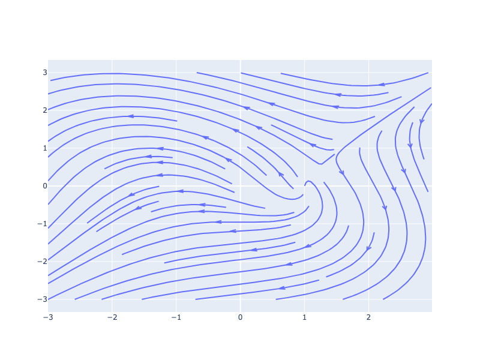
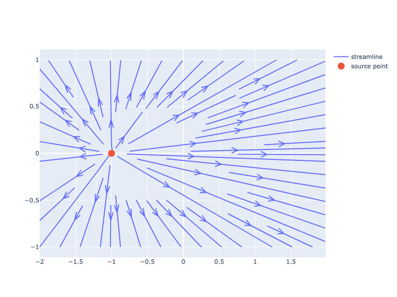

---
jupyter:
  jupytext:
    notebook_metadata_filter: all
    text_representation:
      extension: .md
      format_name: markdown
      format_version: '1.1'
      jupytext_version: 1.1.1
  kernelspec:
    display_name: Python 3
    language: python
    name: python3
  language_info:
    codemirror_mode:
      name: ipython
      version: 3
    file_extension: .py
    mimetype: text/x-python
    name: python
    nbconvert_exporter: python
    pygments_lexer: ipython3
    version: 3.7.3
  plotly:
    description: How to make a streamline plot in Python. A streamline plot displays
      vector field data.
    display_as: scientific
    language: python
    layout: base
    name: Streamline Plots
    order: 11
    permalink: python/streamline-plots/
    thumbnail: thumbnail/streamline.jpg
---

A Streamline plot is a representation based on a 2-D vector field interpreted as a velocity field, consisting of closed curves tangent to the velocity field. In the case of a stationary velocity field, streamlines coincide with trajectories (see also the [Wikipedia page on streamlines, streaklines and pathlines](https://en.wikipedia.org/wiki/Streamlines,_streaklines,_and_pathlines)).

For the streamline [figure factory](figure-factories.md), one needs to provide
- uniformly spaced ranges of `x` and `y` values (1D)
- 2-D velocity values `u` and `v` defined on the cross-product (`np.meshgrid(x, y)`) of `x` and `y`.

Velocity values are interpolated when determining the streamlines. Streamlines are initialized on the boundary of the `x-y` domain.

#### Basic Streamline Plot

Streamline plots can be made with a [figure factory](figure-factories.md) as detailed in this page.

```python
import plotly.figure_factory as ff

import numpy as np

x = np.linspace(-3, 3, 100)
y = np.linspace(-3, 3, 100)
Y, X = np.meshgrid(x, y)
u = -1 - X**2 + Y
v = 1 + X - Y**2

# Create streamline figure
fig = ff.create_streamline(x, y, u, v, arrow_scale=.1)
fig.show()
```



**Interactive Plot:**

<div>                        <script type="text/javascript">window.PlotlyConfig = {MathJaxConfig: 'local'};</script>
        <script charset="utf-8" src="https://cdn.plot.ly/plotly-3.1.0.min.js" integrity="sha256-Ei4740bWZhaUTQuD6q9yQlgVCMPBz6CZWhevDYPv93A=" crossorigin="anonymous"></script>                <div id="plotly-div-1" class="plotly-graph-div" style="height:100%; width:100%;"></div>            <script type="text/javascript">                window.PLOTLYENV=window.PLOTLYENV || {};                                if (document.getElementById("plotly-div-1")) {                    Plotly.newPlot(                        "plotly-div-1",                        [{"mode":"lines","x":[1.000918273645543,1.000918273645543,1.000918273645543,1.000918273645543,1.000918273645543,1.000918273645543,1.000918273645543,1.000918273645543,1.000918273645543,1.000918273645543,1.000918273645543,1.000918273645543,1.000918273645543,1.000918273645543,1.000918273645543,1.000918273645543,1.000918273645543,1.000918273645543,1.000918273645543,1.000918273645543,1.000918273645543,1.000918273645543,1.000918273645543,1.000918273645543,1.000918273645543,1.000918273645543,1.000918273645543,1.000918273645543,1.000918273645543,1.000918273645543,1.000918273645543,1.000918273645543,1.000918273645543,1.000918273645543,1.000918273645543,1.000918273645543,1.000918273645543,1.000918273645543,1.000918273645543,1.000918273645543,1.000918273645543,1.000918273645543,1.000918273645543,1.000918273645543,1.000918273645543,1.000918273645543,1.000918273645543,1.000918273645543,1.000918273645543,1.000918273645543,1.000918273645543,1.000918273645543,1.000918273645543,1.000918273645543,1.000918273645543,1.000918273645543,1.000918273645543,1.000918273645543,1.000918273645543,1.000918273645543,1.000918273645543,1.000918273645543,1.000918273645543,1.000918273645543,1.000918273645543,1.000918273645543,1.000918273645543,1.000918273645543,1.000918273645543,1.000918273645543,1.000918273645543,1.000918273645543,1.000918273645544,1.0009182736455449,1.0009182736455466,1.0009182736455546,1.0009182736455813,1.00091827364567,1.0009182736459632,1.0009182736469233,1.00091827365008,1.0009182736604547,1.000918273694551,1.000918273806616,1.000918274174933,1.0009182753854606,1.0009182793640328,1.0009182924401863,1.000918335416853,1.0009184766659116,1.0009189409018102,1.000920466685284,1.000925481451195,1.0009419639631494,1.0009961490137123,1.0011745163431298,1.0017672338974037,1.0039090426442545,1.0110879873093834,1.0202616741544626,1.0337262621758505,1.0581215673425488,1.099883353416697,1.133769484594084,1.1615461000278984,1.1856414077845052,1.2068184074694797,1.2253639481973435,1.2413809574631616,1.2548425125313294,1.265660000533682,1.2737171256961375,1.278861632242685,1.2809143050485474,1.2796768470887248,1.274939961117627,1.266492337207075,1.2541304568878537,1.237670904969539,1.217003041877562,1.192061312877735,1.1628439968917128,1.1295059270008565,1.092231122609273,1.051320356371681,1.0071417477249334,0.9600820564589787,0.9105325434817497,0.8588978513065997,0.8055356828669429,0.7507559620014046,0.6948259759361752,0.6379772725160109,0.580396136214393,0.5222382449495133,0.46362871050567067,0.4046668533450184,0.3454325446279052,0.28599024170332044,0.22639133478218776,0.16667711857560708,0.10688138243308964,0.047032410984485296,-0.012845782718069909,-0.07273203168429632,-0.13260692726579482,-0.19245196277459398,-0.25224886597324536,-0.3119791440252717,-0.37162393013506057,-0.43116365108023347,-0.49057793920487747,-0.5498456831217933,-0.6089456785452918,-0.667856395941036,-0.7265558871780082,-0.7850216158542684,-0.8432329295712111,-0.9011703842531134,-0.9588147361003685,-1.0161485778964499,-1.0731578994867825,-1.1298286480142679,-1.1861493551785514,-1.242112147095247,-1.2977084014606661,-1.3529334972269613,-1.4077846973559642,-1.4622605932229984,-1.5163632656008421,-1.5700928797340648,-1.6234529213184665,-1.6764472681927247,-1.7290837469351392,-1.7813678885533133,-1.833308252084624,-1.884912390509059,-1.9361911169874155,-1.987149781587678,-2.0377992188516134,-2.088148743489807,-2.1382085133354285,-2.187988215243314,-2.2374984807019875,-2.2867464250842713,-2.33574158933036,-2.3844946447826088,-2.4330140758686483,-2.481309903104492,-2.5293889192640515,-2.5772593074018104,-2.624930419554864,-2.672409847025213,-2.719706028632446,-2.7668243274001507,-2.8137723270805144,-2.8605575025143986,-2.907186979407102,-2.9536656240465295,-3.0,null,1.3000491455825225,1.3259952867519633,1.350333776930138,1.3731249332419901,1.394329775306609,1.41391774156968,1.431847040940439,1.448037781744941,1.4624156496006142,1.4748945314953419,1.4853746395361096,1.493741420227221,1.4998730442434054,1.503641701240805,1.5049115263100132,1.5035407975680402,1.4993846955958725,1.4922986919542156,1.4821429620739401,1.4687961352027914,1.4521555040533727,1.4321374574678636,1.4086938298080147,1.3818414365557015,1.3516072098568355,1.3181131403940878,1.2814844680118496,1.2419252747267793,1.1996518108096277,1.1549028068948788,1.1079445380828323,1.0590281274666955,1.0083996399874575,0.9562865235811722,0.902900691898969,0.8484274322254226,0.7930396987522834,0.7368828039323301,0.6800820260549316,0.6227449908351863,0.5649610364457671,0.5068083229436726,0.4483528657057203,0.3896493068813882,0.33074421762179185,0.2716776100476648,0.2124834728807965,0.1531907049173471,0.09382408549916699,0.03440574615719827,-0.02504458537726162,-0.08450901943409361,-0.1439711533423118,-0.20341575292851832,-0.26282786004483505,-0.32219286468567665,-0.38149633041565867,-0.44072404168992163,-0.49986209815311833,-0.5588960826051821,-0.6178114550174518,-0.6765936702015907,-0.7352289150866387,-0.7937030768717399,-0.8520019778463843,-0.9101118773244976,-0.9680204622762263,-1.0257142663041325,-1.0831810942048168,-1.1404105705106016,-1.1973927110078384,-1.2541179639187463,-1.3105790056536597,-1.3667688604107686,-1.4226811287321572,-1.4783116606541757,-1.5336559224256854,-1.5887117044643773,-1.6434776743252866,-1.6979529210362412,-1.7521377991605298,-1.806031357973835,-1.859636501750633,-1.9129553282608427,-1.9659915614563919,-2.018748116608599,-2.0712296610770062,-2.123440792120535,-2.175386661315582,-2.2270704957833773,-2.2784987818432425,-2.3296769277674585,-2.380611261740383,-2.431307296631315,-2.481772219089765,-2.532010039803021,-2.582027168234065,null,1.068689303715515,1.0474606719146227,1.0203722610333221,0.9873267960064123,0.9486986541694744,0.9049508687892387,0.8567839416968193,0.8050957565658088,0.7506526934866242,0.6941587244787195,0.6361938845819668,0.5772164454219064,0.5175630760382308,0.4574769129791729,0.39713123739763745,0.3366400628768327,0.2760765905243385,0.21548484123970768,0.1548883378009407,0.09429673526101334,0.03371097539780843,-0.026872624381452326,-0.08745906522356961,-0.14805195879954347,-0.20865130645974395,-0.26925171291033756,-0.32984102551799843,-0.3903994200814429,-0.450898968270558,-0.5113037194023167,-0.5715703095064488,-0.6316490759833817,-0.6914856120794681,-0.7510226503144088,-0.8102021164921278,-0.8689682217664849,-0.9272691466664735,-0.9850579926629393,-1.042296167891913,-1.098953048513555,-1.1550037626776355,-1.2104349602063227,-1.2652347565702866,-1.31940073335278,-1.3729405424936725,-1.4258627983046261,-1.478184515576941,-1.5299202052472622,-1.5810938595658692,-1.6317269565996007,-1.68183882731538,-1.7314544083653294,-1.780598639454487,-1.8292968125670197,-1.87757225483745,-1.9254483165541862,-1.972945650473799,-2.0200868910002563,-2.066894566908047,-2.1133888666814533,-2.1595853003055456,-2.205503864102519,-2.251161408483116,-2.296576550570472,-2.341760810475087,-2.386729047248766,-2.4314965549934495,-2.476077148095998,-2.520478781449582,-2.56471473738582,-2.6087965190926297,-2.6527333876086296,-2.6965334347447785,-2.740206696042929,-2.7837617528273575,-2.8272043948129735,-2.8705428482011364,-2.913784302111095,-2.9569350061812774,-3.0,null,0.8391366716637574,0.7858887610107188,0.7296680918167917,0.6714733338401748,0.6120403769428289,0.5519055255868448,0.4914345918839973,0.4308657642555418,0.37034437029067435,0.309949262458431,0.24971242852487618,0.18963346648586388,0.12969026264551076,0.06985694597277803,0.0101000073566615,-0.04962971111819359,-0.10938101101552666,-0.16919863350042963,-0.22912013789457175,-0.28916989492604994,-0.34935602126023824,-0.4096813371616501,-0.47013230707105347,-0.5306772075753714,-0.5912659176768944,-0.6518308712377245,-0.7122892919302419,-0.7725466668657464,-0.8325012183963163,-0.8920486163754315,-0.9510870636039743,-1.009525422791076,-1.06728426416967,-1.1242991498323238,-1.1805238519297994,-1.2359240765264559,-1.2904848785667842,-1.3442054140400732,-1.397095648265423,-1.4491769949376938,-1.5004680721257233,-1.5510042395087849,-1.6008221318980471,-1.6499592437519333,-1.6984578915782913,-1.7463534544348382,-1.793684571579231,-1.8404897336929233,-1.8868052303130594,-1.9326707781883525,-1.978111950145625,-2.0231618356605585,-2.067852969908531,-2.1122133766283793,-2.1562633632966466,-2.200031102636759,-2.243539354506475,-2.2868073758144787,-2.3298548746277077,-2.372700666611615,-2.4153624542695735,-2.457852012309891,-2.5001859800595083,-2.542378375397722,-2.584439002229239,-2.6263807612794325,-2.668214881235225,-2.7099501194422495,-2.7515943025586274,-2.7931577085364094,-2.834647977392756,-2.8760699026620866,-2.9174318756406583,-2.9587409652036936,-3.0,null,1.6877588019433238,1.6780641524420625,1.665638755692048,1.6503980543665202,1.6322745179007132,1.611213038022954,1.5871880398681748,1.5602102921525178,1.5303015933486535,1.4975518435411406,1.4620468802317461,1.4239299718617646,1.3833536061537597,1.340482852319064,1.2955186639214409,1.2486490970258055,1.200062636873839,1.149943997794634,1.0984719795025644,1.0458156639339196,0.9921245743330722,0.937533396545911,0.8821647142784981,0.8261281303358028,0.7695178151109143,0.7124180320348446,0.6549010971636062,0.5970295091388476,0.5388585521670382,0.4804358124997741,0.4218013542410919,0.36299087750292713,0.3040354496935689,0.2449622864860479,0.18579430179164858,0.12655217375154137,0.06725445210452063,0.007917828553463568,-0.05144257407303021,-0.11081311040581232,-0.17018060300092186,-0.22953249173319978,-0.2888566770581038,-0.3481414857276488,-0.4073757355245702,-0.46654796629538486,-0.5256467183995106,-0.5846605328457479,-0.6435783177819769,-0.7023889437148174,-0.7610809818988162,-0.8196430529862817,-0.8780642871143165,-0.93633394340578,-0.9944410876582284,-1.0523752264762285,-1.1101270050763166,-1.1676869109219716,-1.2250457759678617,-1.282195719298697,-1.3391291968701984,-1.3958389288659645,-1.4523191255666479,-1.5085631408268467,-1.5645658643484055,-1.6203239703787191,-1.6758338135034159,-1.7310930921852274,-1.7861001277024364,-1.8408531127653056,-1.895351967049826,-1.9495964890554107,-2.0035879818390243,-2.0573276020724958,-2.1108156322236438,-2.1640543364681304,null,0.3872016180641946,0.32908246424289,0.27170898624503526,0.2150264201078924,0.15892786732564668,0.10334019871708922,0.04815164104906833,-0.0067545004940834374,-0.06147732186271604,-0.11614862946391558,-0.17086827139266036,-0.22575488772216623,-0.28090765097632353,-0.33642171413467326,-0.3923901996034074,-0.4488770194931542,-0.5059461106506835,-0.56363530973826,-0.6219502455836365,-0.6808790346046516,-0.7403762894552037,-0.800358122254917,-0.8606971927708678,-0.9212383073892414,-0.9817966981098087,-1.0421661916084808,-1.1021308520762314,-1.161475172041106,-1.2200050788841241,-1.277555669469524,-1.3339961551541257,-1.3892317862054906,-1.44320075652115,-1.4958860334505146,-1.5472974262288632,-1.5974686787038337,-1.646445909617105,-1.69429835707105,-1.741084407182495,-1.786879308530002,-1.8317599477328812,-1.8757995383115151,-1.9190667856420471,-1.9616313342920542,-2.0035591957708223,-2.044909515200068,-2.0857399866742425,-2.1261046834012096,-2.1660520188625885,-2.2056222472163887,-2.244863328640415,-2.2838111629036915,-2.3224976762982252,-2.3609566448445474,-2.3992173128915457,-2.437305131022776,-2.4752465923288067,-2.5130588371936518,-2.550763951442457,-2.58838183366681,-2.625925599938829,-2.6634124307770977,-2.70085331698774,-2.7382615854664887,-2.775650297858094,-2.8130251786920355,-2.8503972564406745,-2.8877734345692523,-2.925161518429097,-2.962569261183241,-3.0,null,2.972459244565096,2.9315534769744014,2.890697716692327,2.8498873785766374,2.8091277193632376,2.7684233002644394,2.727771192745042,2.6871767232375596,2.6466451061824356,2.606172064282707,2.5657654296169508,2.5254324453098684,2.4851652138882914,2.44497424739893,2.4048701454525183,2.36484368172518,2.324905122818109,2.285068155996262,2.245323179200442,2.205688685340995,2.166172367008393,2.1267626622224727,2.0874969888086596,2.0483801698181647,2.0093887496588394,1.970588283677845,1.9319842869388033,1.893568269070724,1.8554278803881106,1.8175380614941545,1.7799887575964783,1.7428813737605457,1.7062143092463833,1.6702627620322055,1.63519052238634,1.6014152675864857,1.5696446977795775,1.5408373050477335,1.5169554691397433,1.5004558526186385,1.4935795536034906,1.4964759542360095,1.5070110328511035,1.5226400331790604,1.5414540125559597,1.562195022876601,1.584042910935831,1.6064756374846088,1.629115799658634,1.65169997860892,1.6740458046172177,1.695989828455395,1.71741336756891,1.738218481324612,1.7583021826221223,1.777586599514783,1.7959991143917033,1.8134597269534733,1.8299009286529815,1.8452564272940908,1.8594559271376863,1.8724258361386141,1.8840959970260611,1.8943938079398457,1.9032437684622545,1.9105673751615653,1.9162824953872155,1.9203054980963197,1.9225507793749026,1.9229305594928547,1.9213555099894224,1.9177355738318465,1.9119809881286534,1.904003997898644,1.8937227387750264,1.8810599831464287,1.8659455724570657,1.8483182009157275,1.828135813188461,1.8053714164059071,1.7800086592836344,1.7520685302245171,1.7215791406529002,1.688602944678725,1.653211259451342,1.6155132223356174,1.5756157364572037,1.5336518238498433,1.4897650563091496,1.4440989362885412,1.3967980754029767,1.3480169084892584,1.2978983134470603,1.2465773167972989,1.1941837057334013,1.1408364933765958,1.0866456844641643,1.0317110364143067,0.9761257820759481,0.9199720618673837,0.8633211099906792,0.8062378574505948,0.7487793758494345,0.6909954976546215,0.6329311157963864,0.5746256748236145,0.5161131613787888,0.4574241446536318,0.39858563263851865,0.33962133481594226,0.2805517822219299,0.2213956199732059,0.1621696514506259,0.10288900845420468,0.04356730334273573,-0.015783169752164206,-0.07515071749802438,-0.13452436455443983,-0.19389371004991318,-0.25324891886103673,-0.3125806211071964,-0.37187940025491395,-0.43113596367344664,-0.4903410962489376,-0.549485838817867,-0.6085612861388197,-0.6675582747547208,-0.7264676214996664,-0.7852799477635104,-0.8439864993614079,-0.9025781661492562,-0.9610458632482075,-1.019380750565338,-1.0775745242479784,-1.1356186275344822,-1.1935047220663546,-1.2512252034438827,-1.3087726739399892,-1.3661398090491286,-1.4233200336459828,-1.4803071663168412,-1.537095088819228,null,-0.09092417667595987,-0.13987588476038404,-0.18896169221334747,-0.23830463534231505,-0.28803179455898187,-0.3382525548379305,-0.38906700889004675,-0.44056776952454646,-0.4928317953778998,-0.5459276724801829,-0.5999045153029163,-0.6547955866147119,-0.7106143854130695,-0.7673535215208158,-0.8249792172269963,-0.8834311723398502,-0.9426197405850956,-1.0024192527892364,-1.0626700669713764,-1.1231838912369494,-1.1837452698643096,-1.2441191976565606,-1.304061674448648,-1.3633303680184299,-1.4216942731163764,-1.4789549012273153,-1.5349501896928455,-1.5895573716740459,-1.642697342323892,-1.6943325542437702,-1.7444471938353434,-1.7930679038640034,-1.840240991333091,-1.8860367816385952,-1.9305333178145527,-1.9738015421763073,-2.0159382240800356,-2.057033313141756,-2.097168337650963,-2.1364278407072357,-2.174901218260782,-2.2126586869191534,-2.249774624277703,-2.286317796373858,-2.3223493106807656,-2.357933466747242,-2.3931204142881244,-2.4279616790655068,-2.462503148477464,-2.496785298919478,-2.530853247329746,-2.564736164360075,-2.5984706217984668,-2.6320830662016066,-2.665601589053153,-2.6990503025690242,-2.732452564638744,-2.7658284238492996,-2.7991940019027934,-2.832568407926655,-2.865962056373527,-2.8993917062467895,-2.9328673414716473,-2.9664007564519648,-3.0,null,-0.13135782272481356,-0.17624842697006393,-0.2215764010456831,-0.2674422756429644,-0.31394862925305667,-0.36117885914500114,-0.40920497748982676,-0.45810023836053393,-0.5079091512813436,-0.5586761963691083,-0.6104305813768836,-0.6631915906539341,-0.7169635357481989,-0.771738886543746,-0.8274937994343983,-0.8841924867879669,-0.9417781046713753,-1.0001766068750657,-1.0592914252453436,-1.1190041035987415,-1.179174520491327,-1.239639905800873,-1.300216107955501,-1.3607010474449068,-1.4208803641905512,-1.480534935087025,-1.5394495246249078,-1.597421212135522,-1.654263513226361,-1.709821526843736,-1.7639734234610611,-1.816630687826988,-1.8677304523024612,-1.917249792092053,-1.9651960699240687,-2.0116000570985366,-2.0565145723451,-2.099994327345544,-2.1421153484911115,-2.182963180674482,-2.2226197851893024,-2.261167792848144,-2.298699486396931,-2.3352965225412445,-2.3710406948164735,-2.406012503749604,-2.4402815802376874,-2.473924998378145,-2.5070061012075358,-2.5395905939611523,-2.5717341703153833,-2.6034936449116834,-2.634918004055098,-2.666054376969192,-2.696948873891464,-2.727641551915199,-2.758168862784953,-2.7885649529171044,-2.8188616466035263,-2.849087186469934,-2.8792675727388333,-2.9094277990210053,-2.939590699494436,-2.9697755300254065,-3.0,null,1.2269397166285474,1.1724228728870978,1.11725528102835,1.0615101111364798,1.0052548686803107,0.948548982889065,0.8914465745462086,0.8339959880089904,0.7762396645604515,0.718216260575057,0.6599601920810039,0.6015015267394377,0.5428672740990441,0.48408170697385344,0.42516641905070207,0.3661405530411459,0.3070211597205468,0.24782373173680528,0.18856225646202462,0.12924936417513955,0.06989638890597805,0.010514055857853144,-0.04888763491469472,-0.10829929304605956,-0.16771207667950216,-0.22711771215301102,-0.2865079720058046,-0.3458748141956467,-0.4052103362317405,-0.4645067907040521,-0.5237566733732377,-0.5829522529013538,-0.6420857658868924,-0.7011494252873582,null,-0.23731067293290353,-0.2813163408564683,-0.32622778512575223,-0.37208466257193473,-0.41890595129699193,-0.46671421810595826,-0.5155224049021068,-0.5653283944579055,-0.6161378407215534,-0.6679375112502921,-0.7207177516196679,-0.7744545312251616,-0.8291243556031853,-0.884689787387134,-0.9411133832857788,-0.9983434178281088,-1.0563196924393008,-1.1149736006046487,-1.1742234681804022,-1.2339758738260487,-1.294124586965147,-1.3545497082282179,-1.4151174696253241,-1.4756809045810253,-1.5360815565987538,-1.5961522993924766,-1.6557211963577365,-1.7146161579796717,-1.7726700026164643,-1.8297231525525484,-1.8856293217135736,-1.9402653059673287,-1.9935231189106095,-2.0453177161599125,-2.0955962749070403,-2.1443281345181116,-2.191506208097216,-2.237144371286016,-2.281263955709322,-2.3239115290844374,-2.3651438362259842,-2.4050215178027137,-2.4436145479026834,-2.4809998957026305,-2.5172497609104574,-2.552441074748181,-2.586650855982582,-2.6199541794822694,-2.652428364258847,-2.684137493005621,-2.71515541816007,-2.7455424441506233,-2.7753644992670985,-2.8046766533614624,-2.8335412935109194,-2.862006030924295,-2.8901242121905617,-2.917938797302235,-2.9454969394719255,-2.9728375296202807,-3.0,null,0.9783991664866467,0.9509280506093281,0.910303517989461,0.8576938698472842,0.7987506854028408,0.7395675614313268,0.6834896135121231,0.6315847107297032,0.5835081349504243,0.5387828438051652,0.49679870073576593,0.4569843956386852,0.41885969832689085,0.3819937927022301,0.346005969720931,0.3105964948510267,0.2754833861481072,0.24043110853842675,0.20523806504310116,0.16973641505127102,0.13379702494208479,0.09728949044866964,0.06012324628713861,0.022210320810154283,-0.016512214787714363,-0.056087400845599156,-0.09655702915970465,-0.13796058688506907,-0.1803112579310051,-0.22362324885766105,-0.26790765343353495,-0.31316750113040204,-0.35939566607246487,-0.40659274840477,-0.4547500775019744,-0.5038508280860907,-0.553887489223329,-0.604838194985736,-0.6566876859829058,-0.7094125325042562,-0.7629900990333685,-0.8173916478628143,-0.8725897735821762,-0.9285483444568325,-0.985232742069857,-1.0426005025487723,-1.100604195898054,-1.159192611862147,-1.2183064618132367,-1.2778792668001515,-1.3378369689888636,-1.3980970705386246,-1.4585676429007244,-1.5191474425983307,-1.5797264484807167,-1.6401861369205974,-1.7003996322645727,-1.76023340530288,-1.819550878377405,-1.8782146233762906,-1.9360866591567465,-1.9930321116950118,-2.048926221275712,-2.103658425977193,-2.157128959629172,-2.209257169428866,-2.2599770225242115,-2.3092428512346674,-2.357029483222208,-2.403316604288726,-2.4481119938668296,-2.4914371152903896,-2.533323935523702,-2.5738067532563647,-2.612941156349185,-2.650783360514813,-2.6873892616332475,-2.7228265705355246,-2.7571586486095407,-2.7904552843673938,-2.822782642093222,-2.8542059295581628,-2.88479233612577,-2.9146032526756755,-2.9437018875172027,-2.972147500902135,-3.0,null,1.8624237153968322,1.8576723292520994,1.857566507197296,1.8616596208881653,1.869359125615695,1.8800384029410084,1.8931112571163862,1.9080665015963794,1.9244689725976185,1.9419574102581798,1.960242628750378,1.9790845803114765,1.9982731136278025,2.017645747005175,2.0370658298315627,2.056407061099442,2.075566608506251,2.0944559532799305,2.1129889016462986,2.1310904057012605,2.148694689553354,2.1657361115180755,2.1821505193642023,2.197881774801777,2.212875209766228,2.2270740046989186,2.2404227219717017,2.252868461789408,2.264357778626602,2.274836357780832,2.2842476053090177,2.2925350873627632,2.29964197011458,2.3055100738144034,2.3100798686027098,2.3132905238996413,2.3150800180615754,2.3153853157759805,2.3141426207656837,2.3112877105820075,2.3067563583637307,2.3004848432397305,2.2924105464561872,2.2824726243570668,2.270612863298445,2.2567794049667684,2.2409252386532454,2.2230074736339107,2.2029902608251435,2.180854021299556,2.1565811972073696,2.130168907647783,2.1016318112615995,2.0709880004268504,2.038280201547053,2.003552419854733,1.9668697706133198,1.9283035512307949,1.8879313695481468,1.8458512047585582,1.8021561668837585,1.7569437036821194,1.710317886651314,1.6623840073925331,1.6132413176393054,1.5629892201780597,1.5117220298578404,1.459530403596502,1.40650387394055,1.3527218866033612,1.2982583908082947,1.24318248401599,1.1875575434735959,1.1314423116476773,1.0748891654556232,1.017945948042155,0.9606563342168104,0.9030591509762127,0.8451897343298409,0.7870800933099913,0.728758745561223,0.6702514767653476,0.611581349512131,0.552769070010446,null,0.40878407379780457,0.3772498119655747,0.34510978138025683,0.31227112354402564,0.27863868884609655,0.24414143399657062,0.20873314776547858,0.17238251203847987,0.1350747726090784,0.09679169117190911,0.057526061542264806,0.017281244120344486,-0.023938900963879295,-0.06611823930718241,-0.10925165377223678,-0.15332698439399062,-0.19832334298004195,-0.24422674827385782,-0.29101988659688915,-0.3386835155811121,-0.3872029710214977,-0.43655625218262006,-0.48672442859004095,-0.537689449367917,-0.5894310782830945,-0.641930685004402,-0.6951648621387334,-0.7491141105243102,-0.8037543452748612,-0.8590622350672512,-0.9150130468409263,-0.9715780360279389,-1.0287299997569899,-1.0864353132958238,-1.1446582125356082,-1.2033609657187274,-1.2625009515680832,-1.3220309805368107,-1.3818992060379593,-1.4420485063739545,-1.502415724811808,-1.5629313206407258,-1.6235194107204276,-1.6840975466979777,-1.7445768004832256,-1.8048620618818838,-1.86485164558691,-1.924439420150815,-1.9835165408977764,-2.041972780116807,-2.099698073563452,-2.156581377757643,-2.212519659971596,-2.2674147494915977,-2.321174850213286,-2.3737233730626635,-2.424993233391685,-2.4749288040461916,-2.5234856539953654,-2.570638575194871,-2.6163738157399496,-2.660692390227971,-2.7035980284001737,-2.7451115779409156,-2.78526601791511,-2.8240945329858813,-2.8616393384663037,-2.8979507890436556,-2.9330766646000686,-2.967074971014603,-3.0,null,-0.9854212152050632,-1.0427993270912173,-1.1006525003989287,-1.1589533919869115,-1.2176722494943801,-1.2767771165247364,-1.336232980244002,-1.3960007959611838,-1.4560377534480948,-1.5162968855349552,-1.5767266764996275,-1.6372707217907059,-1.6978674647068461,-1.7584500401108478,-1.8189462578184397,-1.8792787579009695,-1.939365365813405,-1.9991192824867317,-2.058450003477458,-2.117264725325661,-2.175467444866061,-2.232962182264809,-2.2896562834417984,-2.345458474495481,-2.400281725211513,-2.454047663684422,-2.5066809724034194,-2.558118682305181,-2.6083073177993503,-2.6572032077766385,-2.7047695611271307,-2.750986623834003,-2.7958436845799914,-2.839342574753465,-2.8814854831832095,-2.922291333000482,-2.96178710736808,-3.0,null,2.2068347790660265,2.1863001292708875,2.1686760874618987,2.1542234945200187,2.143143733471649,2.13553797561251,2.1313828738564053,2.1305414443319437,2.1327820455754996,2.1378086437426926,2.145293206560554,2.1549027677237023,2.1663153398927344,2.1792357081882523,2.193400203572118,2.208576380819217,2.224558442965698,2.2411638146600366,2.2582373850121646,2.275643810927388,2.2932598337784222,2.310978555481208,2.3287078779233354,2.346362881748176,2.36386361872436,2.3811419061035233,2.39813480241886,2.4147795344874696,2.431019672202517,2.446803437528385,2.462080370443976,2.476797157441494,2.490907118008078,2.5043647303644194,2.5171247991184647,2.5291406384914676,2.54036662287748,2.550758035885343,2.560269707156146,2.5688558825563277,2.5764701048007,2.583064709586089,2.588591608702047,2.593002284133302,2.5962473410086107,2.5982765466207036,2.5990389057686523,2.5984827760869766,2.596556026988991,2.593206245447065,2.5883809909789006,2.5820281008359354,2.5740960922705396,2.5645356190825925,2.5532991472410966,2.5403409831791794,2.5256181932057826,2.5090914978612826,2.490730419833773,2.4705071154382585,2.448397906208074,2.4243926608438064,2.3984846201049814,2.3706766268661656,2.340984270565867,2.309426335273568,2.276036562289068,2.2408542400123217,2.2039293263364943,2.165321279048717,2.1250911216124395,2.083312086562085,2.0400595865197824,1.9954107957253138,1.9494459025868904,1.9022511654171712,1.8539071274929046,1.8044943112739835,1.7540915948291929,1.7027752599017552,1.6506221031564472,1.5977011494252835,null,0.8918867542384943,0.8699093325325449,0.8463686452800752,0.8212849446919517,0.7946972143535715,0.7666505473711576,0.7372210268417048,0.7064526855667745,0.6744288613731344,0.6412001501936277,0.6068170889744597,0.5713342485269397,0.5348010985306586,0.4972714655596433,0.45877750462887734,0.4193563769441684,0.37904666490854444,0.3378766034308569,0.2958825760492756,0.2530872994229001,0.20951206651776877,0.1651853752652923,0.1201278161728645,0.07435826964095238,0.0278958438830621,-0.019243122775142396,-0.0670411677318068,-0.11547952661424565,-0.16455124433633284,-0.21423807735107703,-0.26452791845384116,-0.31540748055379986,-0.3668639986842228,-0.4188857868083793,-0.47146224535409464,-0.5245817438771843,-0.5782316736252211,-0.6324005170980396,-0.6870766367070944,-0.7422468671156226,-0.7978995393528874,-0.8540200007573708,-0.9105950833825949,-0.9676097129450953,-1.0250469690901214,-1.0828902025158142,-1.1411203717523275,-1.1997165546413389,-1.2586564113240588,-1.3179158540888467,-1.377467874012099,-1.4372829467389698,-1.4973287816227125,-1.557570021963801,-1.6179679379451748,-1.6784800387323071,-1.739060058238882,-1.799657755877368,-1.860218781485066,-1.92068462858218,-1.9809924050888599,-2.04107488067947,-2.1008613967119283,-2.160278086800938,-2.219248481105854,-2.277694131371595,-2.3355335902646743,-2.3926861587931483,-2.4490724971483444,-2.5046132798706866,-2.5592343613737905,-2.612866405596087,-2.665444649058091,-2.7169083724978442,-2.767204971599603,-2.816293109267897,-2.864138168322551,-2.910715124099778,-2.956005971765397,-3.0,null,1.4708803395037853,1.4358519064067092,1.4012945652808728,1.3677583619149338,1.3352615784478772,1.3024589320123914,1.2702469329104646,1.222879271251772,1.1796487143781054,1.1399154965936669,1.1012107850582256,1.062651508831995,1.0239305116759576,0.9848921591291742,0.9454373602049788,0.905516930853802,0.8651019875377797,0.8241710027174189,0.782723369211745,0.7407490336900451,0.6982415285879204,0.655208218815198,0.6116541170980785,0.5675728508628404,0.5229729838385899,0.47786189659195255,0.4322426770985488,0.3861162812541723,0.3394908894079598,0.2923699866293057,0.24476235371561117,0.196669026219773,0.1480947830881214,0.0990472852869666,0.04952867992568555,-0.0004529408414284397,-0.05089507110862135,-0.10179338909712632,-0.15314219815762176,-0.20493666566116753,-0.2571715697044694,-0.30984197995161233,-0.36294187440995174,-0.41646726057552463,-0.47041275803709626,-0.524772148524467,-0.5795396223980385,-0.6347078065325107,-0.6902712084510134,-0.7462215950199087,-0.8025516047411267,-0.8592529461967735,-0.9163158796138307,-0.973731270925863,-1.0314882980163038,-1.089574852282354,-1.147978263657045,-1.2066846167892877,-1.2656781746883492,-1.3249418219977358,-1.3844569974491956,-1.444203378705985,-1.5041584012705733,-1.5642973672748322,-1.6245932632879083,-1.6850165634879513,-1.7455350386615616,-1.8061135772593284,-1.8667140263013613,-1.9272950614275401,-1.987812096663455,-2.048217245329942,-2.1084593437469015,-2.168484048759871,-2.2282340184765737,-2.2876491828413084,-2.3466666809125956,-2.4052205629676644,-2.4632446755902624,-2.520672281023346,-2.577434979366281,-2.6334648839877484,-2.688696581638637,-2.743065030386757,-2.796510999209513,-2.8489779945636133,-2.9004128200759234,-2.9507664774283597,-3.0,null,2.7128194143512863,2.6811368187340827,2.6504930892490695,2.6210005031413113,2.592819924736455,2.5660948984662006,2.541010000441836,2.5177388603903523,2.496469585255964,2.477392560384713,2.4606726792876508,2.446455310477776,2.4348546414266306,2.4259293229017267,2.4196846463611106,2.416070852515494,2.414986578958432,2.4162872601898187,2.4197964812351165,2.425318087050778,2.432647273374581,2.441579600500325,2.4519175649399143,2.463473734674168,2.476072518081006,2.489554878046011,2.503776458289005,2.5186065079687117,2.5339236482502363,2.549619798011964,2.5655988372187153,2.581773347192116,2.598059992436985,2.614385528035248,2.630683687315723,2.646892175389797,2.662949047514539,2.678801005841313,2.694398257808646,2.70969205708787,2.7246349845050712,2.739183936156799,2.7532973052163454,2.7669338343103673,2.7800518985899263,2.7926126626830596,2.8045778428867045,2.815909367047653,2.8265686565205472,2.836516724916767,2.8457155839740773,2.8541269990388667,2.8617123404332796,2.8684325149909142,2.8742479134672267,2.879118370939085,2.883003033453938,2.8858606181221056,2.8876494093226084,2.888327143602047,2.8878510713705614,2.8861780438031444,2.8832646267506714,2.879067243174682,2.8735425602196356,2.8666477749376904,2.858340539224505,2.84857937222037,2.83732396662515,2.8245355006468706,2.8101772586501417,2.794217735595982,2.776626403744914,2.75737558442235,2.7364449193667486,2.713819110792133,2.68948432161896,2.6634390559225674,2.63568241243484,2.606222969880452,2.5750762201279933,2.5422651238434177,2.5078183344048064,2.4717737834730107,2.4341702304919846,2.3950600127911317,2.3544944790930415,2.3125292811720604,2.2692307106312217,2.224660397074185,null,1.4378478348835264,1.3788669588061442,1.3217569986091178,1.2665027948454428,1.212830504623419,1.160410332617987,1.108952402279007,1.0582075401791426,1.0079860708354094,0.9581319357369242,0.9085249738749774,0.8590665635217345,0.8096744109694134,0.7602889379288023,0.7108542954129402,0.6613304665607407,0.6116821765653842,0.5618754478323016,0.5118875813480601,0.4616967008261512,0.41128710743706254,0.3606419576187827,0.3097505431295904,0.25859825718959684,0.20717781998369134,0.15548119350165734,0.10350201176282292,0.05123461543686991,-0.0013249846034990576,-0.054181244020126584,-0.10733819627456898,-0.16079809601145056,-0.21456195892549879,-0.2686316094227821,-0.32300708738157846,-0.37768950103195476,-0.4326774338170898,-0.48797075326943773,-0.5435677143372981,-0.5994670436600944,-0.655666834724939,-0.7121634852747567,-0.7689539272284049,-0.8260341323970803,-0.8833990073254259,-0.9410436562611042,-0.9989620879369978,-1.0571472085765186,-1.115591440537134,-1.1742865251250119,-1.2332227705086192,-1.2923894793999056,-1.3517749224279116,-1.4113663560657521,-1.4711494061357473,-1.5311082589802703,-1.5912255691904038,-1.6514823328645036,-1.711857757868823,-1.7723291329567537,-1.8328716828301488,-1.893458432798209,-1.9540601726547941,-2.014645336783734,-2.075179911474324,-2.135627227004895,-2.195948070967762,-2.256100718641324,-2.3160409591637943,-2.3757222048244473,-2.435095655335975,-2.49411045646114,-2.5527129608859145,-2.6108485282239906,-2.668462062516128,-2.725497326233898,-2.781894655060121,-2.837598404950004,-2.892552719665805,-2.9467035679180293,-3.0,null,2.098276038341255,2.0476760163152106,1.995629559998255,1.9419956492988444,1.8866846644202369,1.8297147365294615,1.7712356817463517,1.7115723125918372,1.6512081843739645,1.5906819672708625,1.530469521445716,1.4709088574731126,1.4121863999321507,1.3543646915921839,1.297421166063753,1.2412835716909543,1.1858611652948579,1.1310533060630865,1.0767632909876665,1.0229017991171299,0.9693867630195658,0.9161465376249085,0.8631146191551657,0.8102368143864909,0.7574627414447397,0.7047507867627338,0.6520614057442868,0.5993636225836543,0.5466273075786345,0.49382713101806397,0.4409386290697217,0.3879439097878321,0.3348243244168332,0.2815654438894013,0.22815235997382688,0.17457419443245437,0.12081972299632904,0.06687942825444093,0.012743885737833693,-0.04159387649463264,-0.09613993943294563,-0.15090016377622106,-0.20587889228490752,-0.2610812255174233,-0.3165098463635272,-0.37216782952910377,-0.4280573833230745,-0.4841797065364921,-0.5405369463376619,-0.5971293184647228,-0.6539566913081907,-0.7110187905514129,-0.7683140883789448,-0.825840881491561,-0.8835971679616312,-0.9415797930790681,-0.9997850670306412,-1.0582091761318588,-1.116847084594509,-1.175692968422209,-1.2347402992637861,-1.2939820190533153,-1.3534098418957206,-1.4130145162023167,-1.472785791567849,-1.5327123431794583,-1.5927817299561537,-1.6529802011547203,-1.7132926219414548,-1.7737024385204647,-1.834191585266798,-1.894740391561479,-1.9553274901084579,-2.0159297289390112,-2.076522089751358,-2.137077615669659,-2.197567351907704,-2.257960303152555,-2.3182234117008984,-2.378321560442109,-2.438217589060068,-2.4978719093097035,-2.557243056097765,-2.6162881014628416,-2.674962576558408,-2.7332205170236206,-2.7910135841170325,-2.848293883430964,-2.9050121412486054,-2.9611173955251693,null,2.513779781195744,2.464462539523878,2.414363967511229,2.3633913813590643,2.3114799135275907,2.258550621768281,2.2045481403820055,2.1494140386016385,2.093145290401914,2.0357745490149854,1.9773839495819674,1.9181254173399802,1.8581969460223764,1.7978301361058584,1.7372693437237894,1.6767441926705349,1.6164481855957584,1.5565272540171957,1.4970780570217155,1.4381526258896988,1.3797668263417284,1.3219111698260058,1.2645586162319624,1.2076695191530273,1.1511994876933116,1.0951021651695418,1.0393285935137193,0.9838336885175041,0.9285738111344819,0.8735079884974724,0.818599556853552,0.7638125702237071,0.7091160839036319,0.6544808053475326,0.5998808475346578,0.5452925372737711,0.490693257873144,0.436063315609887,0.38138421705020153,0.32664062204143285,0.27181746370451565,0.21690157538963684,0.16188070729171056,0.10674375469676756,0.051481498576967155,-0.003915595381940307,-0.05945497936936528,-0.11514464808300229,-0.17099128549583664,-0.22700009176406866,-0.28317659352142366,-0.33952482170111464,-0.39604849373118434,-0.4527511922321823,-0.5096353594036449,-0.5667032592619496,-0.6239566538877179,-0.6813963324098458,null,2.687598109445518,2.6738517523925136,2.6623338056397676,2.6530822779781147,2.646102339770372,2.6413648527837665,2.6388076261276803,2.638339084009899,2.6398436643485015,2.643188101181236,2.648227782314165,2.6548125558793254,2.6627916005713903,2.6720172023523068,2.682347454016327,2.693648001741959,2.705792178903348,2.7186607063284587,2.7321450381786754,2.746145358991857,2.760568935784966,2.775328426460148,2.790344907691292,2.8055468898589897,2.820868220307444,2.836245222701809,2.8516196447230877,2.866938430373522,2.8821516430548693,2.8972100013158,2.912068038910605,2.92668354745523,null,2.309499916230825,2.252603161246614,2.194878310324607,2.136387411699025,2.0772185760793036,2.0174872497127554,1.957330791886073,1.8968945174356335,1.836323111347693,1.7757521326657528,1.7153001028414376,1.6550636252599613,1.5951155379521413,1.5355053607299842,1.476262057686439,1.4173975256522011,1.358910159212801,1.3007875486877172,1.2430099043276694,1.185553262863622,1.1283903129416295,1.071491463798682,1.0148277857158217,0.958370213291742,0.9020900383898081,0.8459606991547757,0.7899561488569677,0.7340512915397768,0.678223756610064,0.6224515979837881,0.5667155224864144,0.5109970882651766,0.455279080544424,0.3995460029181275,0.34378265412747844,0.2879759729634319,0.23211365473633672,0.1761841018538548,0.12017725251782085,0.06408299884711788,0.007892157272566092,null,2.9877651571248167,2.9621447404452494,2.937883565424065,2.9150948512327384,2.893890751204027,2.8743749801329033,2.856654212656652,2.840819843969837,2.826946205503832,2.8150900929266776,2.8052882457167314,2.7975497920679944,2.7918571316744725,2.7881674794284628,2.7864147498183742,2.786512722592996,2.78835904099644,2.7918395590281273,2.7968326072633003,2.8032128122163407,2.8108543420263326,2.819633519366276,2.8294297217948525,2.8401278527191973,2.8516196447230877,2.8638034847515605,null,2.9304460793224774,2.879397375068084,2.827758924630017,2.775499483063755,2.7225822021650012,2.66897910013501,2.6146700476011224,2.5596393228381347,2.5038777920362296,2.4473843267578292,2.390179851304824,2.33229299503353,2.2737704574886983,2.214680360735729,2.1551014583527737,2.0951234484800487,2.034844497174735,1.9743660024040164,1.913787281822426,1.8532008288992552,1.792688625226977,1.7323197590407018,1.6721493573389337,1.6122186521606636,1.5525558981401142,1.4931778343240092,1.4340911240032579,1.3752942744520285,1.3167798222850227,1.2585355827699196,1.2005454889538347,1.1427910391693983,1.085252753748092,1.0279101309535417,0.9707419017763805,0.913727297600206,0.8568459333113805,0.8000776571490933,0.7434037967345972,0.6868062246779219,0.6302674910138801,null,2.087222543003195,2.080686672953375,2.072115665451899,2.061438807820542,2.04858958605287,2.0335068799669056,2.016139853151251,1.9964515389244273,1.9744097889628396,1.9499986675353957,1.923223276962287,1.8940935388359161,1.8626566822643777,1.8289551192140117,1.7930681181878203,1.755075185555774,1.7150739734475007,1.673177434190591,1.6294991703252792,1.584159134995522,1.5372893637195242,1.489011638042185,1.4394476544140904,1.3887147335423151,1.3369246488747528,null,-1.2725105044443803,-1.3278208732451182,-1.3819920222460405,-1.4350154230308372,-1.486904538705562,-1.5376903987688826,-1.587415638545098,-1.6361388916260058,-1.6839119098202344,-1.7307996543593536,-1.7768656804510454,-1.8221726101209323,-1.8667862337177097,-1.910758071679631,-1.9541444491998026,-1.997004013418515,-2.039380613288884,-2.0813185700899806,-2.1228634935484965,-2.1640543364681304,-2.2049239174566253,-2.2455069465510302,null,-1.2662110293052393,-1.3241884134459905,-1.3810379727302906,-1.4366323473084932,-1.4908873990722034,-1.543761524453643,-1.5952426235805135,-1.6453546214734758,-1.6941406185784866,-1.741658816300453,-1.787978461714763,-1.8331792069943769,-1.8773474044482958,-1.9205593078190832,-1.9628928808495925,-2.0044337855761665,-2.0452545173789276,-2.0854195039903933,-2.124998227358282,-2.1640543364681304,-2.202639780604128,-2.240810188456429,-2.2786100704974714,-2.3160870125766726,-2.353283603656442,-2.390231121687794,null,0.7868549054268197,0.7319731448396598,0.6755879784720986,0.6180579171820852,0.5596757792663274,0.5006671823589328,0.4412048158360711,0.3814190532212698,0.32140575165915264,0.26123472887657373,0.20095650018684186,0.140607567727288,0.08021458256990766,0.019797998865250133,-0.040624608373631244,-0.10103896571209514,-0.16143109709564119,-0.22178588431401103,-0.28208609402012597,-0.342311714557463,-0.4024395849070559,-0.4624433009801656,-0.522293373867067,-0.5819574537500176,-0.6414016946080001,-0.7005913703742528,-0.7594913523623119,-0.8180670704897093,-0.876286458300505,-0.9341191343058939,-0.9915373886101784,-1.0485187046486133,-1.1050449961242947,-1.1611001419859226,-1.2166751473467676,-1.2717636568889643,-1.3263598629932452,-1.3804653149683277,-1.4340822189861155,-1.4872205670698662,-1.5398867566441505,-1.5920934651970118,-1.643851447165279,-1.6951775755023435,-1.7460815047021954,-1.796579846184559,-1.8466876430527435,null,0.8570163590880773,0.8026289842416516,0.7471928779389354,0.6908915625780052,0.6338786065523943,0.5762870385979819,0.5182266801529067,0.45978738101825556,0.401044671642,0.3420607552060808,0.282886529381142,0.2235641117534457,0.16412926793961935,0.10461216393233652,0.045038634313014914,-0.014568823772551198,-0.07419017763845615,-0.1338068351181061,-0.19340128551838243,-0.2529566395443599,-0.3124562858033957,-0.3718839607099542,-0.43122312566530363,-0.490456852336703,-0.5495679311586836,-0.60853898685945,-0.6673533428576546,-0.725993572287388,-0.7844417394027721,-0.8426808410212585,-0.9006956390766185,-0.9584704399463795,-1.0159902998491823,-1.0732425654154767,-1.130215315974677,-1.186897163664111,null,-1.0563374292842425,-1.1155540813481715,-1.1753225910016531,-1.2355134313835887,-1.2959793834240314,-1.356555837154203,-1.4170628270825223,-1.4773086656621082,-1.537095088819228,-1.5962222348249453,-1.65449351236715,-1.711730577391191,-1.767775475754621,-1.8224919024689878,-1.8757760411187703,-1.927542482122187,-1.9777462281751166,-2.0263726737267667,-2.073427742620674,-2.1189449827874816,null,1.460091694784598,1.4016251157556319,1.3421605149433082,1.2858312741018967,1.2329832767899047,1.1826570908690863,1.1340146256479668,1.0864501430210467,1.0395739112739335,0.9931054986559245,0.946851861601905,0.9006810196534021,0.8544919546487844,0.8082009015225262,0.7617554858934135,0.7151087875770816,0.6682282656606686,0.62108589685959,0.573654794041452,0.5259211867858458,0.47787131232630964,null,-0.22285580840676023,-0.28173105626765915,-0.340849255181896,-0.4002477816548926,-0.45994371057716643,-0.5199239469244876,-0.5801574715802214,-0.6405921324303723,-0.7011494252873582,-0.7617266427171212,-0.8222011536921197,-0.8824366342836227,-0.9422906720753006,-1.0016219235617958,-1.0602990943886608,-1.1182092355890918,-1.1752597225852386,-1.2313840937552027,-1.286539815000468,-1.3407049508275664,-1.3938834246902048,null,0.8285809002760005,0.7950456911426707,0.7652188047430326,0.7373928115654724,0.7104970841335585,0.6839095715953003,0.6571499830334089,0.6299345797066138,0.6020182142295263,0.5732693822581174,0.5435869966870288,0.5129105421724236,0.4811969080205718,0.44843117461881077,0.4146056390845607,0.3797224149469871,0.34378265412747844,0.3068150086063022,0.2688340810149308,0.22986588087761195,0.18993059895550646,0.14904659519019914,0.10724304616950198,null,null,1.000918273645543,null,null,1.068135095972063,1.0083996399874575,1.105709758870761,null,-0.29776263968088146,-0.3903994200814429,-0.2952268565278539,null,-0.5588822442045971,-0.6518308712377245,-0.5569184396440189,null,0.7894981949310689,0.7124180320348446,0.8124152689299522,null,-0.8886615696808129,-0.9817966981098087,-0.8870457435439528,null,1.5399204170362366,1.6064756374846088,1.603465917515017,null,-1.2159965032759232,-1.304061674448648,-1.2061468605902435,null,-1.2061194088310148,-1.300216107955501,-1.20637560104549,null,0.6831208000759268,0.6015015267394377,0.7011644829991646,null,-1.1967324261476053,-1.294124586965147,-1.2049339911475545,null,-0.13254135140341977,-0.22362324885766105,-0.18038512579849367,null,2.2129611984398116,2.264357778626602,2.2801247213276024,null,-0.491394422977376,-0.5894310782830945,-0.5270053688297895,null,-1.6653157761826984,-1.7584500401108478,-1.6636983264955292,null,2.356085002647473,2.4147795344874696,2.4218587077080644,null,-0.01981900266166642,-0.11547952661424565,-0.06092931266011989,null,0.33974406080963954,0.24476235371561117,0.29741578688784553,null,2.5078314863446565,2.5655988372187153,2.573815169607078,null,0.14958870887325543,0.05123461543686991,0.11496398557174024,null,0.5396442300931241,0.4409386290697217,0.506242741423824,null,1.537504835750487,1.4381526258896988,1.5215654131634266,null,2.610602657144245,2.6548125558793254,2.678601688940602,null,1.5753224736569247,1.476262057686439,1.5609375260005294,null,2.799935805061452,2.8150900929266776,2.8670176202042184,null,2.2412886348646097,2.1551014583527737,2.2537221147069384,null,1.9767337461810994,1.9744097889628396,2.0404514443371387,null,-1.580922792892766,-1.6361388916260058,-1.540249291577642,null,-1.6891949775103525,-1.741658816300453,-1.6467470563848834,null,-0.07064750762801664,-0.16143109709564119,-0.06493310058440827,null,0.24959481644909065,0.16412926793961935,0.2629729220343276,null,-1.387425463183647,-1.4773086656621082,-1.3802811894863332,null,1.1814057116934251,1.0864501430210467,1.1390326079164441,null,-0.5444525045061385,-0.6405921324303723,-0.549257473924193,null,0.675661582172014,0.6020182142295263,0.614947098787993,null],"y":[0.0018922002393049198,0.0018922002393049198,0.0018922002393049198,0.0018922002393049198,0.0018922002393049198,0.0018922002393049198,0.0018922002393049198,0.0018922002393049198,0.0018922002393049198,0.0018922002393049198,0.0018922002393049198,0.0018922002393049198,0.0018922002393049198,0.0018922002393049198,0.0018922002393049198,0.0018922002393049198,0.0018922002393049198,0.0018922002393049198,0.0018922002393049198,0.0018922002393049198,0.0018922002393049198,0.0018922002393049198,0.0018922002393049198,0.0018922002393049198,0.0018922002393049198,0.0018922002393049198,0.0018922002393049198,0.0018922002393049198,0.0018922002393049198,0.0018922002393049198,0.0018922002393049198,0.0018922002393049198,0.0018922002393049198,0.0018922002393049198,0.0018922002393049198,0.0018922002393049198,0.0018922002393049198,0.0018922002393049198,0.0018922002393049198,0.0018922002393049198,0.0018922002393049198,0.0018922002393049198,0.0018922002393049198,0.0018922002393049198,0.0018922002393049198,0.0018922002393049198,0.0018922002393049198,0.0018922002393049198,0.0018922002393049198,0.0018922002393049198,0.0018922002393049198,0.0018922002393049198,0.0018922002393049198,0.0018922002393049198,0.0018922002393049198,0.0018922002393049198,0.0018922002393049198,0.0018922002393049198,0.0018922002393049198,0.0018922002393049198,0.0018922002393049198,0.0018922002393049198,0.0018922002393049198,0.0018922002393049198,0.0018922002393049198,0.0018922002393049198,0.0018922002393049198,0.0018922002393049198,0.0018922002393044757,0.0018922002393040316,0.0018922002393022552,0.0018922002392969262,0.001892200239281383,0.0018922002392334214,0.0018922002390828752,0.001892200238609476,0.0018922002371390967,0.0018922002325685305,0.001892200218438056,0.0018922001749084316,0.0018922000414152151,0.0018921996341290104,0.0018921983989277358,0.0018921946791010669,0.0018921835702832013,0.0018921507305122987,0.0018920548629908218,0.0018917794342634409,0.0018910045248765606,0.0018888860033485777,0.001883330861293775,0.00186969877142662,0.0018400887882492611,0.001792611800322419,0.0017993604930395257,0.0023459865813966196,0.005768713743637743,0.02122353426458945,0.049323537523347394,0.07755934266944609,0.10664961105540405,0.131433097124523,0.11005804618994919,0.06056056121872366,0.006749510813900628,-0.048831815142399204,-0.10559288350978724,-0.16326659167480972,-0.22169372593181924,-0.28076235905539404,-0.340366374683585,-0.4004006278742045,-0.4607500238925981,-0.5212796410406395,-0.5818268604823569,-0.6421954761634461,-0.7021523568910597,-0.7614273848283006,-0.8197135906239712,-0.8766236014935087,-0.9317834339475883,-0.984827027044104,-1.0353586684638434,-1.0830843162977137,-1.1277283409982446,-1.1691382808099726,-1.2072606889578228,-1.2421103185446498,-1.2737921915168753,-1.3024696677210394,-1.328346194714075,-1.3516453812536922,-1.3726153433619273,-1.3914899843760147,-1.4085118822495457,-1.4239145847570296,-1.4379150628644566,-1.450718899791836,-1.4625239963317247,-1.4735157474608545,-1.483867785093167,-1.4937411355918642,-1.5032863146677797,-1.5126463476834406,-1.521954986925967,-1.5313370684447452,-1.540908810262857,-1.5507776273448026,-1.5610402021858913,-1.5717871560845316,-1.5831009654047092,-1.595055699056482,-1.6077169144194519,-1.6211389866686565,-1.63536854000162,-1.6504458498373382,-1.666404914799152,-1.6832674797713374,-1.7010472851624092,-1.719754670787287,-1.7393923911341151,-1.7599525247802772,-1.7814279259203647,-1.8038052838261038,-1.8270632724688498,-1.8511843612406405,-1.876142995751494,-1.9019128759103276,-1.9284677292202093,-1.9557756264180932,-1.983811624805782,-2.012542857453815,-2.0419431466609606,-2.071978903179939,-2.1026245724464574,-2.1338486481342094,-2.165626621160251,-2.1979276775575056,-2.230731199509777,-2.2640088370241935,-2.297739045896413,-2.331897603755044,-2.3664634632448407,-2.40141563306876,-2.4367349712513495,-2.4724047417376944,-2.508403880414413,-2.544717786830942,-2.5813295529419387,-2.6182246917363283,-2.655390645326486,-2.6928111119127704,-2.7304749271872577,-2.7683697727185717,-2.8064841783459706,-2.8448084883857527,-2.8833313268010183,-2.922042965275532,-2.960935992124385,-3.0,null,0.10530367955570918,0.05054041107842222,-0.004957074961924324,-0.06110943934598767,-0.11788000754681871,-0.17522728787153286,-0.23311333892955366,-0.2915080102017469,-0.35037356323593816,-0.4096693860972547,-0.46935051358367375,-0.5293632104257391,-0.5896426774730603,-0.650113271354563,-0.7106853821923189,-0.7712530233245483,-0.8316917629071852,-0.8918572759554015,-0.9515840727053688,-1.010673574361375,-1.0689121322294743,-1.1260788901827186,-1.1819373149605243,-1.236224720811981,-1.2887170780412183,-1.339179937448815,-1.387436391218051,-1.433307626816136,-1.4766924314169672,-1.517532956590022,-1.555811402732811,-1.5915533626479696,-1.6248345241212665,-1.6557420710887498,-1.6844049412593547,-1.710950843793692,-1.7355364573267518,-1.758310202630804,-1.7794290516480802,-1.7990485138426815,-1.8173129077335892,-1.8343700908136098,-1.8503620088160335,-1.8654203365437936,-1.8796722012692015,-1.8932409584593637,-1.906243612659715,-1.91878998746679,-1.930982819752949,-1.942921578778094,-1.9547003989131513,-1.9664081325791347,-1.9781276679084987,-1.989935589297584,-2.001905632959194,-2.01410680859353,-2.0266033027821604,-2.0394536266226573,-2.0527099439464185,-2.0664218227871602,-2.0806342700770997,-2.0953874080797563,-2.110713952394934,-2.126643815781896,-2.1432035353020744,-2.160414905859933,-2.1782919501537994,-2.1968497193847347,-2.2160983495486257,-2.2360408739068403,-2.256678836762684,-2.2780126100040414,-2.3000356764443985,-2.3227415983493933,-2.346123220175013,-2.3701667448528774,-2.394862106734614,-2.4201940536779634,-2.4461467630031026,-2.472705473503808,-2.499851436589491,-2.5275710769848603,-2.5558432215405236,-2.584652188955526,-2.613977715484495,-2.6438038309510388,-2.674110920701317,-2.704882624483205,-2.736100164332312,-2.767749275906659,-2.799811112437104,-2.832271538616929,-2.865112472285015,-2.8983210598764413,-2.9318800744735536,-2.965777924347698,-3.0,null,-0.5306748985810246,-0.5873482080149728,-0.6413508933154932,-0.6920201694669319,-0.7384953143500574,-0.7802523424372394,-0.8168993073179038,-0.8483518881850243,-0.8747856899053259,-0.8965519315647046,-0.9140831257250035,-0.9278795454688726,-0.9384360427181235,-0.9462176597115608,-0.9516579078935457,-0.9551584903104442,-0.9570856677040007,-0.9577740899270366,-0.9575311160952755,-0.9566409143254289,-0.9553680530673048,-0.9539604428790116,-0.9526515642222031,-0.9516619588089852,-0.9511999897879453,-0.9514619014867645,-0.9526312389421108,-0.9548777233136443,-0.9583557200071726,-0.9632024769010155,-0.9695363426494215,-0.9774551905972135,-0.9870352646271869,-0.9983306255790358,-1.0113704218955124,-1.026159872016158,-1.0426881909819443,-1.0609276333493154,-1.0808291486815307,-1.1023313663278689,-1.1253700288925477,-1.1498650703148494,-1.1757405305147908,-1.2029162460635916,-1.2313051014315874,-1.2608300015355574,-1.2914068097756013,-1.3229654493836667,-1.3554286017345978,-1.388731662644637,-1.4228117524402846,-1.457609856503249,-1.4930708141862896,-1.529141961997393,-1.5657791668377392,-1.6029359627276538,-1.6405749959818052,-1.6786593566620387,-1.7171530096027603,-1.7560267176144413,-1.7952522757428562,-1.8348022624489573,-1.874654160097371,-1.9147833487984507,-1.9551708889673716,-1.9957990441196058,-2.036648377459806,-2.0777027306759646,-2.1189497799013393,-2.1603741632779676,-2.201962812558527,-2.243705294176853,-2.2855908160971037,-2.3276082236697895,-2.3697490609725245,-2.412005752059245,-2.4543685050456165,-2.4968306315399205,-2.53938605584684,-2.582027168234065,null,-0.6986122795506948,-0.7272996304695858,-0.7497258822034154,-0.7664045802211099,-0.7779563046842051,-0.7850650409300752,-0.7883842809901984,-0.7885109208589389,-0.7859794987942981,-0.7812651684798566,-0.7747906544458689,-0.7669345954043267,-0.7580399175446288,-0.7484267680871479,-0.7383954674034512,-0.728224019949602,-0.7181779302796731,-0.70851387871337,-0.6994820826830073,-0.6913289164195371,-0.6842962532457935,-0.6786132548954069,-0.6744986649810709,-0.6721573041650153,-0.6717752851490415,-0.6735147554544794,-0.6775087705473224,-0.6838569764869358,-0.6926227420200792,-0.7038310453190952,-0.7174645551992915,-0.7334763173003687,-0.7517919717543524,-0.7723107121164725,-0.7949071917899753,-0.8194574092188698,-0.8458216855828993,-0.8738606489377556,-0.9034399007790879,-0.9344253647538601,-0.9666993403179567,-1.0001425394133252,-1.0346473034293404,-1.0701156566910957,-1.1064540818692716,-1.1435851631033402,-1.181431406683697,-1.2199262548610323,-1.2590099307948455,-1.2986228606189714,-1.3387200291880523,-1.379256298118696,-1.420188000718529,-1.4614799222843213,-1.5031015806198194,-1.5450193456701848,-1.5872072260547483,-1.6296422439650156,-1.6722997589853639,-1.7151600250198369,-1.7582052688913048,-1.8014192264948923,-1.8447851977840244,-1.8882898754326407,-1.9319221860060358,-1.9756678115443929,-2.0195168202069533,-2.0634604269466417,-2.1074899781482967,-2.1515957812296196,-2.1957710201769767,-2.2400099619177105,-2.2843049562302586,-2.3286499287533644,-2.3730407523510975,null,-1.0441698852939272,-1.1039754725048943,-1.1632764584928335,-1.221914903455446,-1.2797216890791756,-1.33652673749052,-1.3921482597058312,-1.44638931821564,-1.4990794565265353,-1.550040408501319,-1.5991305957297552,-1.6462175011219111,-1.6912074042389365,-1.7340234179550185,-1.774628868987496,-1.8130232259975376,-1.8492233123757675,-1.883277460653734,-1.9152546937840143,-1.9452392257170499,-1.9733315514039045,-1.9996353550134045,-2.024263965987151,-2.0473356018984052,-2.0689631667757706,-2.0892663727752874,-2.1083585628824175,-2.126349429103792,-2.1433497118113918,-2.1594654203823356,-2.1747944052520696,-2.1894348131976527,-2.2034810599362284,-2.217024048713776,-2.2301470089506292,-2.242931493860893,-2.2554559285423563,-2.267795007359245,-2.280019358904645,-2.2921944763966424,-2.3043844179449833,-2.3166500194937227,-2.329048757275562,-2.341634203537232,-2.354455219538371,-2.367559166500068,-2.3809902660516746,-2.3947894308781326,-2.408992658689612,-2.4236328891263637,-2.438741198271461,-2.454345483164833,-2.470468798546298,-2.487131147424539,-2.504351278564859,-2.522144600059143,-2.540520703931802,-2.559488955672042,-2.5790568620643386,-2.5992266913729867,-2.619999666053822,-2.6413765890125007,-2.663353072417742,-2.6859263268403772,-2.70909167505794,-2.7328387622585466,-2.757160538831248,-2.782046341976802,-2.8074846238068165,-2.833465678475473,-2.8599748728303043,-2.8870013786105932,-2.914529910129011,-2.9425481077741003,-2.971042671604137,-3.0,null,-0.5904076193214971,-0.5733164640467239,-0.5538784798591081,-0.5325369469371806,-0.5096459593102511,-0.48556334540359014,-0.4605784354424718,-0.43495285989877974,-0.4089629997109001,-0.3828279822850478,-0.3568249558043153,-0.33116354367329404,-0.30608490407941025,-0.28182558181717887,-0.2586129689384542,-0.23671927737655096,-0.21638783401207418,-0.197881340771203,-0.18148026519310756,-0.16744913398384353,-0.15605278700435177,-0.14754840603238106,-0.14217383997642852,-0.1401264422920212,-0.14155733962382433,-0.14656096685680575,-0.15516754983317638,-0.16733544691013114,-0.18296105337464885,-0.2018899225064641,-0.22392663322663964,-0.24883252994174887,-0.27637418161666805,-0.3062985358883825,-0.3383656812802798,-0.37234358495972053,-0.4080240935117425,-0.445205460612375,-0.48371955289521695,-0.5234068931505753,-0.5641266599861554,-0.6057575724889848,-0.6481900444053519,-0.6913268257169496,-0.7350841897557503,-0.7793891394442687,-0.8241722268272014,-0.8693764169245974,-0.9149510400616281,-0.9608523742638293,-1.0070360281436765,-1.053467674365231,-1.1001164141625217,-1.1469542576840634,-1.1939537380713299,-1.2410929637263333,-1.2883514857133038,-1.3357124475664595,-1.3831591322401713,-1.4306752700679322,-1.4782490747030144,-1.5258685557809282,-1.5735242241919243,-1.6212051405961785,-1.6689023406364996,-1.7166092498506782,-1.764318780810975,-1.812025763029407,-1.85972245456969,-1.9074044578252887,-1.955067920585163,null,2.601391835147723,2.5566911901824376,2.5119540196202417,2.4671729549984125,2.4223454118532777,2.3774714265758456,2.332550929250538,2.287580769941636,2.2425575201785533,2.197477973184953,2.152345140946178,2.107156194224385,2.061898513239325,2.016577856014579,1.9711973244538834,1.9257424569666082,1.8802078644238494,1.8346018898018448,1.7889129258472467,1.7431399644100862,1.6972732195061875,1.6512989630287445,1.605235360105091,1.5590669175235998,1.5127522419764485,1.4663163686710368,1.4197573537939698,1.3730244907048519,1.3261404782598651,1.2790056681243662,1.2316648278110076,1.1840856332755862,1.136096383283972,1.0877000369212269,1.0386602729425505,0.9888266883444885,0.9379081869144463,0.8851727902356314,0.8302512769367589,0.7726277109475341,0.7128026509728644,0.6524687383729573,0.5928807870195811,0.534363722156245,0.4767671123059798,0.41982655007216696,0.36329823425762786,0.3069979508265783,0.25078037517247687,0.19454041934377786,0.13820472590589894,0.08171179966321773,0.025019637976704256,-0.031902444680732334,-0.08908254450288533,-0.14653682725102612,-0.2042760996459907,-0.2623098627316036,-0.3206402207267467,-0.37926534773358167,-0.4381807470899157,-0.49737855301563805,-0.5568457673050378,-0.6165654615620078,-0.6765164448512424,-0.7366727331156548,-0.7970025202832014,-0.8574678818787214,-0.9180244415074887,-0.978620549850588,-1.0391965859563512,-1.0996843169820183,-1.16000637628323,-1.2200751975071034,-1.2797902245726382,-1.3390434277052976,-1.3977183767001762,-1.4556912635518473,-1.512824584508062,-1.568972969616276,-1.623999575317754,-1.677757284546786,-1.7301141756610867,-1.780938537846107,-1.8301168126134766,-1.8775473864030328,-1.9231469933122984,-1.966852099715077,-2.008625099037403,-2.0484506361111197,-2.0863231249127216,-2.1222689885284027,-2.156325439534252,-2.1885432406461214,-2.218988985851383,-2.2477328105763466,-2.274857193429421,-2.3004454797651137,-2.324587970556442,-2.3473780465522696,-2.36890249999547,-2.3892544538555125,-2.408523399783541,-2.426794621706127,-2.4441554453307583,-2.460690261753458,-2.476477695907027,-2.4915966571540853,-2.5061237690918707,-2.5201323528870088,-2.533690855278035,-2.5468668816863227,-2.559725954695493,-2.572330944930416,-2.584741517413987,-2.597013947712185,-2.609203609136289,-2.6213635563143027,-2.633544458911998,-2.645793980726496,-2.6581567263449766,-2.6706762826075936,-2.6833939900891695,-2.696348868048049,-2.7095765649165644,-2.723110201664799,-2.736981745511633,-2.751220859022171,-2.765855324356656,-2.780908082083555,-2.7964015979863186,-2.812356276114546,-2.8287896832242594,-2.8457154852858944,-2.863147279848507,-2.8810967373177085,-2.899571526497724,-2.918578022803462,-2.93812222007514,-2.958206695306548,-2.978832182144298,-3.0,null,-0.17222206828242514,-0.13650962149663526,-0.1009911687279712,-0.06581750384534857,-0.03119769959768215,0.0027002204159316534,0.03570057665352877,0.06761550039028696,0.0982677765594171,0.1274577421991081,0.154987482936515,0.18063304836540572,0.20418041475822912,0.22541435059555548,0.24409390784335194,0.25999489718839275,0.2728924183092243,0.2825640655175756,0.2888084498589132,0.29145650500636355,0.29037756316296326,0.28548979367134963,0.27676765307259243,0.26424693960411316,0.248029791380858,0.22826662579287094,0.20514930988560742,0.1789175529340845,0.14981789506292387,0.1181127531773134,0.08405585292263584,0.047898593513483245,0.009868062477639494,-0.029813027651257595,-0.07095269380158076,-0.11337978305205132,-0.1569315115266785,-0.20147084572617047,-0.2468769841538525,-0.2930421842240154,-0.3398672486198504,-0.3872705794036584,-0.43517830410025216,-0.4835257531622812,-0.5322544110124068,-0.581312143231743,-0.6306550182207817,-0.6802428340973385,-0.7300403844407066,-0.7800162433823918,-0.8301396836520456,-0.8803870553868145,-0.9307351660089274,-0.9811641298974259,-1.0316560475284346,-1.0821942526875863,-1.132762880745514,-1.1833492768767788,-1.2339418856785287,-1.2845295710244369,-1.3351037699262251,-1.385655121642493,-1.4361750791555319,-1.4866570643035038,-1.537095088819228,null,0.055980077879000056,0.09668668639282174,0.13690161962054148,0.1765017315012507,0.21534648468747175,0.25331222438523326,0.29026430366498523,0.32605279480205507,0.36055737381558917,0.3936341969871342,0.42514606546827505,0.4549496034037408,0.48287777517953545,0.5087738630361098,0.5324831191499233,0.5538311175073476,0.5726551228153829,0.5887817057498421,0.6020334523476558,0.6122456669239189,0.6192628273661924,0.6229440933093957,0.6231709697159902,0.6198550208620222,0.6129446217602275,0.6024297766470736,0.5883442022015979,0.5707650428812001,0.5498211981689076,0.525672167711301,0.4985021308869153,0.46853194476166493,0.4359728497324675,0.40106139380729866,0.3640150411258323,0.32505094103150434,0.2843730843976373,0.24216507002426058,0.1986007173984281,0.15383748461433377,0.10801392159411316,0.06125427963364993,0.013672447344447836,-0.03463174598747898,-0.08357087615607739,-0.13306646486796403,-0.1830501619412006,-0.23345905022550717,-0.2842375555643888,-0.335337233646944,-0.3867149726674479,-0.4383315638111296,-0.4901527443446936,-0.5421477215898536,-0.5942867872344331,-0.6465449577439424,-0.6988999285021587,-0.7513311796726736,-0.8038199589430897,-0.8563497339549389,-0.9089055810986193,-0.9614729851778603,-1.014038770150498,-1.0665919100903831,-1.1191222570532933,null,-2.4890101122411656,-2.515473967279682,-2.5405547265390984,-2.564325579544836,-2.5868653085326305,-2.608246115037671,-2.6285456178741535,-2.647839582037747,-2.66619894838933,-2.68369723168689,-2.7004060467150994,-2.71639253156503,-2.731723275211739,-2.746463973789686,-2.7606780434623097,-2.7744258989983135,-2.7877660573446343,-2.800755835497994,-2.813450503100059,-2.825902966687082,-2.8381631131604474,-2.8502803975786843,-2.8623025262694988,-2.8742753617530896,-2.886242624262224,-2.898245257201629,-2.910323645210846,-2.9225164952500835,-2.9348607309545365,-2.947391137419011,-2.960139709641606,-2.9731378640002486,-2.986415322229958,-3.0,null,0.44855329053167825,0.49021643051491015,0.5308996087177649,0.5705142965122456,0.6089885662233931,0.646224624172937,0.6821382136040994,0.7166536125998233,0.7496731999005659,0.7811196253132331,0.8108924008207121,0.8388952396896929,0.8650252446806248,0.8891901073265722,0.9112759080030988,0.9311774724915312,0.9487839449786826,0.9639741752892244,0.9766351080946274,0.986653444528371,0.9939176094892952,0.9983212488874296,0.9997671842673506,0.9981716620480143,0.9934686284536922,0.9856136682218759,0.9745871954825573,0.960396505980559,0.9430764028181042,0.9226939588298886,0.8993492614811331,0.8731569733820006,0.844264305262223,0.8128260700798533,0.7790170655752511,0.7430095740241627,0.7049885236542437,0.6651245394874663,0.6235875811302742,0.5805408705287749,0.5361331921282044,0.49050261755628055,0.44378176238567635,0.3960864282923615,0.34752224595622927,0.29818491492742627,0.24816019905104492,0.1975285024040856,0.1463588546754786,0.09471289535000871,0.042647267026601376,-0.009788197604397642,-0.06254832012378264,-0.11559261882450178,-0.16888293322795045,-0.22238705543262594,-0.27607503480638407,-0.32992026224788784,-0.383897742190523,-0.43798542269133645,-0.4921630094043907,null,-0.22277549045212153,-0.27456915102245505,-0.3175896813335548,-0.3449130106567466,-0.35272440895050705,-0.3431681601864778,-0.3208530395285778,-0.2899807424036611,-0.2531845845028964,-0.21238956355041472,-0.16873767577121956,-0.1230713334655511,-0.07598117763380152,-0.027894059001732252,0.02085795872962537,0.07003677160879374,0.11942906792838759,0.16886502390347546,0.2182018063675213,0.26731603330854803,0.31611410097561565,0.3644855702954528,0.41235350953414374,0.45963240067235134,0.5062488570581283,0.5521453232966409,0.5972540089535734,0.6415057729184932,0.6848531919293817,0.7272396340300098,0.7686076084962528,0.8089058484405305,0.8480919351983887,0.8861033475498821,0.9228893041463886,0.9584058936248758,0.9925909112030911,1.0254007881065101,1.0567697745198616,1.0866406722994224,1.114952141423938,1.1416459107933479,1.1666497484130165,1.1898995686588414,1.2113175915645176,1.230830780387838,1.2483634133779313,1.263829818223682,1.2771469645114806,1.2882309781311738,1.2969965425340622,1.3033585848330826,1.307234003349559,1.3085447650187483,1.3072197183624095,1.303196475119961,1.2964246001085522,1.286868684074025,1.2745094150659186,1.2593452339602056,1.2413920987389009,1.2206924455101946,1.197309316611789,1.1713184526957514,1.142826245913076,1.1119412170972645,1.0787953476849994,1.043517726437078,1.0062576050687548,0.9671526165767435,0.9263463893865285,0.8839810954081297,0.8401889745039259,0.7950959436228664,0.7488276293731864,0.701494378074655,0.6531995696376067,0.6040384849211855,0.5540990580802116,0.5034630463001482,0.4522021360561239,0.4003820110850471,0.3480626580332169,0.295297692974843,0.2421358027167,0.18862172963822088,0.13479623824451092,null,1.01722502678615,0.9568714782598446,0.8963139086847303,0.8358814767319047,0.7757910525834637,0.7161494165464961,0.6569801217076114,0.5982543107452627,0.539913603212641,0.48188766834419017,0.424106944996828,0.3665047750435324,0.30901716349699626,0.25159120412332614,0.19418094706317257,0.1367442275764743,0.07924672686303058,0.021659792124976374,-0.03604264782695399,-0.09388169921842948,-0.15187397706207229,-0.21003400592204136,-0.2683738451035982,-0.3269013835530288,-0.38562205255864335,-0.4445396626228053,-0.5036554212552717,-0.562967599000125,-0.6224721800747512,-0.6821627893978945,-0.742030673649356,-0.8020640955104184,-0.8622483230150517,-0.9225655399024149,-0.9829945807878184,-1.04351063701662,-1.1040849390495122,-1.1646844239333012,-1.2252713996300895,-1.2858032215542285,-1.3462320003322998,-1.4065043631634708,-1.466561293703195,-1.5263380765232084,-1.5857642536595027,-1.6447612635064734,-1.7032458570703557,-1.7611318491096493,-1.8183289362038906,-1.8747363439370897,-1.9302566467101914,-1.984791781095961,-2.038242430575508,-2.0905172522931728,-2.141522681653617,-2.191177256876375,-2.239406900908648,-2.2861423616835346,-2.3313307145487645,-2.3749299002862534,-2.4169131352291195,-2.4572584072211594,-2.495962679777421,-2.5330359747031803,-2.5684898613217477,-2.602355548298006,-2.6346660594183167,-2.665464613203335,-2.694800769384941,-2.722728367656366,-2.749303004854138,-2.774586634662327,-2.7986384885407607,-2.821524738698118,-2.8433072758877476,-2.8640497178573883,-2.8838172501409876,-2.902670787932369,-2.9206724053168593,-2.9378841465038508,-2.954365133754074,-2.9701733925558793,-2.985366403877792,-3.0,null,0.2755489322454463,0.3273035658022181,0.3786819539982753,0.4296179425782336,0.48003215669861854,0.5298587937147525,0.5790418794820757,0.6275318509560859,0.6752905208708042,0.7222700449317778,0.7684313237145584,0.813741669656344,0.8581655570631743,0.901680726080381,0.944250774901302,0.985843376517967,1.026437989237344,1.066004377868615,1.104514703516597,1.1419416603981833,1.178251286027871,1.2134191698203622,1.247415605418011,1.2802060378975755,1.3117549617276527,1.3420244469405072,1.3709827434317798,1.3985850999603047,1.424792313492527,1.4495593802251499,1.4728384878802494,1.4945844331317915,1.5147395425239694,1.5332475012555573,1.5500530318131727,1.5650934761042636,1.5783069079960557,1.5896304276992774,1.5989989882469038,1.6063462257805847,1.6116050797434278,1.614709854752446,1.615597236718135,1.6142070288377104,1.6104836164208143,1.604377544949286,1.5958481878455046,1.5848647877215614,1.5714072412939029,1.5554673524614993,1.537050174559453,1.5161818804860232,1.4928972846188318,1.4672456890721435,1.4392980074441617,1.409127149059839,1.3768314671048243,1.3425039646383379,1.3062570409709258,1.2682004255175086,1.228448752494736,1.1871209427868257,1.1443289904790461,1.1001835673981146,1.054797318862744,1.0082715400410258,0.9607033985358719,0.9121837387062106,0.8628007427801565,0.8126337051900547,0.7617554858934135,null,1.7161488864153487,1.735647665427491,1.7536880712816192,1.770224605445125,1.7852097311435546,1.7985917765945398,1.8103162827783166,1.8203294289591447,1.8285758294821584,1.8349989671528153,1.8395418453408183,1.842147733600231,1.842761010818477,1.841328102925635,1.8377985031946773,1.8321258525252366,1.8242690456779247,1.8141930763376521,1.801870233964162,1.7872812911819098,1.7704194475897284,1.7512890505507137,1.729902222605813,1.7062861945302688,1.6804821594392862,1.6525357090863686,1.6225145713695799,1.5904836123270334,1.5565296878714108,1.5207346653176286,1.483194261963301,1.444004478946292,1.4032613973849966,1.361069563407324,1.3175253339892823,1.2727243361176654,1.2267616180422003,1.1797283176593476,null,1.4627653312095523,1.4057991400381162,1.3478715341178704,1.2890610071861737,1.229515749268419,1.169429069818042,1.109001079765779,1.0484297568428316,0.9878876305622621,0.9275073444514979,0.8673776952380279,0.8075473832842683,0.7480322082203257,0.68882414789462,0.6298998870694743,0.5712269683128599,0.5127676278699207,0.454481802167912,0.3963310716479298,0.3382787891328789,0.28028967245612835,0.22233185687223056,0.1643771665188023,0.10639971689300465,0.04837566917799174,-0.009714970170023207,-0.06788977970669752,-0.12616505017964252,-0.18455427762331134,-0.24306851759118997,-0.30171712814826224,-0.36050863357289975,-0.4194485732694466,-0.4785407243529778,-0.5377872444900138,-0.5971889820694867,-0.6567448421310136,-0.7164517631533132,-0.7763049112660263,-0.8362975955516356,-0.8964211626323504,-0.9566648512843261,-1.0170155673111654,-1.0774578013269671,-1.1379734807494353,-1.1985417778359757,-1.2591389065088514,-1.319737912623568,-1.3803084638137832,-1.4408166466585273,-1.5012247805672787,-1.5614912593282002,-1.6215703821684884,-1.6814112787519322,-1.7409590032611304,-1.8001550026718314,-1.8589368573441163,-1.9172383104393371,-1.974986609381201,-2.032108462586801,-2.0885289299114183,-2.144167039691984,-2.198944636431136,-2.252783684095199,-2.3056061860680477,-2.3573384839679186,-2.4079045610565912,-2.4572404761703672,-2.505286490778925,-2.5519898343374408,-2.597308091940182,-2.6411994639803673,-2.6836387747644928,-2.724609546672144,-2.764100063888319,-2.8021098146030017,-2.8386490999316827,-2.8737288643111376,-2.9073735303880137,-2.9396098960134784,-2.97047281758078,-3.0,null,0.23954115755660732,0.29601604015789107,0.3518553253222083,0.40701995785393974,0.4614761015355566,0.5151956137156324,0.568170465518135,0.6203789561697288,0.6718278437102532,0.7225090055392216,0.7724127157721168,0.8215402403601577,0.8698917915622699,0.9174746162425502,0.9642826865993426,1.0103112957883784,1.055563533965545,1.1000348142374028,1.1437307625106525,1.1866410246284955,1.2287586625862783,1.2700857139941473,1.310614524358444,1.350337154764448,1.3892480352861103,1.4273359352431294,1.4645932504511663,1.5010160500620442,1.5365791340952146,1.5712782017616123,1.6050969988537211,1.6380219093394652,1.6700381325167113,1.701127906993042,1.7312695745070013,1.7604427394343931,1.788628627236478,1.8158037097376862,1.841942609096166,1.8670217871520602,1.8910110498300492,1.9138853726186191,1.9356116334788922,1.956157674191017,1.9754892010367184,1.9935679953016772,2.0103571513354037,2.0258189528702353,2.0399124683918863,2.052593512854516,2.0638186854344855,2.0735429994546166,2.081719972157236,2.0883019564300733,2.093240486020145,2.0964866331501977,2.097992040575157,2.097708976696815,2.0955908969744517,2.0915931091232807,2.0856737485695813,2.0777948514462476,2.0679226222904994,2.056028334493818,2.0420890323836494,2.026088363845285,2.008020885167138,1.9878877750254897,1.9656965140243523,1.941469096130084,1.9152342335953492,1.8870290128098617,1.8569037321556339,1.8249105116858821,1.7911154446393516,1.7555868746854673,1.7184001776624056,1.6796362816525905,1.6393745470741568,1.5977011494252835,null,0.8419508524534751,0.7941926449562056,0.7465160366319195,0.6996426834963496,0.654192574906661,0.6102741162174468,0.5782995727425266,0.5872562375257324,0.6284988621351051,0.6741503375959459,0.7207621854278599,0.7674866592836933,0.8140897706798453,0.8604337905144166,0.9064273650497126,0.9520190683988972,0.9971731853372834,1.0418609762690094,1.0860736551024015,1.1297855845973324,1.1729786756881717,1.2156494415150707,1.257790033160541,1.2993774922296693,1.3404090136200457,1.3808796508832657,1.4207750303121882,1.4600835159421095,1.4987999429550305,1.536910416252117,1.574412166601448,1.6112889599989932,1.64752949623837,1.683128539076085,1.718067703157418,1.7523423255737036,1.7859351331429023,1.818832700667925,1.8510226236492908,1.8824901906322928,1.9132213574589967,1.943199738017488,1.9724113584734138,2.0008355426692033,2.0284536845128995,2.0552477832504623,2.0811970861278555,2.1062837647722654,2.1304816099044643,2.1537706889546513,2.176125592966402,2.1975209544351797,2.2179328331141335,2.2373313594587616,2.255688228920948,2.2729748679595687,2.2891573734094486,2.3042024677607262,2.318077393346341,2.3307477383857504,2.3421769382892537,2.3523267432556088,2.3611590405010325,2.36863463469457,2.374713363831809,2.3793543227204683,2.3825161203011325,2.3841571744566945,2.384236046989204,2.382711820021541,2.379544513166544,2.3746955383933877,2.3681281866647907,2.3598081372477395,2.349703977324017,2.3377877164303627,2.324035979378565,2.3084320923203787,2.290962868697904,2.27162031753672,2.2504059447069515,2.2273276090336553,2.20239669667745,2.175638681827521,2.147080045856816,2.1167590767251863,2.0847169247846766,2.0510044435638255,2.0156739811912185,null,2.0937330254521953,2.0420902305129873,1.989836514101845,1.9369102231712798,1.8832819269303407,1.8289100301356607,1.7737747279048017,1.7178474579580074,1.6611262859403633,1.6036359318130797,1.5454106785259514,1.486517963454971,1.4270582800571958,1.3671381798741358,1.306876984374516,1.2463977151846528,1.1858171859349564,1.1252381547874482,1.0647444241523898,1.004398950275256,0.9442444153494582,0.8843054406400648,0.8245916331656011,0.7651006142993704,0.7058208771012291,0.6467352334313428,0.5878226708969811,0.5290599227810828,0.4704219988942171,0.4118842331294541,0.35342289346283406,0.295015149805649,0.2366385944864393,0.17827292394007044,0.11989954657592827,0.061501147002620105,0.00306098104799446,-0.0554350587513488,-0.11399953938472507,-0.17264395913645814,-0.23137864491923876,-0.29021207797354887,-0.3491514539628029,-0.4082028899300991,-0.467371534960233,-0.5266608752278201,-0.5860731606677194,-0.6456094303397215,-0.7052695922611303,-0.765052326483433,-0.8249547757476199,-0.8849727103124656,-0.9451004752947734,-1.0053309144996545,-1.0656552825422996,-1.1260631446790264,-1.1865422267905525,-1.247078313004751,-1.307655173100535,-1.3682544139888175,-1.428855342770219,-1.4894348280148297,-1.5499671629321656,-1.6104239348910088,-1.6707736638621353,-1.7309817224134767,-1.7910106287951435,-1.8508198118164378,-1.9103656078170068,-1.969601299538851,-2.0284767054855917,-2.086936802734321,-2.144925813092688,-2.2023859356639313,-2.259255270752442,-2.315470407585173,-2.3709690283668037,-2.425684913772079,-2.4795539343550246,-2.5325093638507217,-2.5844895709782687,-2.635435402677272,-2.685290326303205,-2.73400165450609,-2.7815244866797797,-2.8278112790772245,-2.8728280241048574,-2.9165460564225123,-2.958943278336331,-3.0,null,1.2342312285311436,1.247523620354266,1.267561969253829,1.2923561705317619,1.3204610297128685,1.350847400647651,1.3828421156672341,1.4159603444868676,1.4498733022195243,1.484326111673476,1.5191368644216476,1.5541599182313197,1.5892750301277836,1.6244028358722682,1.6594596413576745,1.6943919008596495,1.729147214619923,1.763674874358924,1.7979408172210265,1.8319076479882073,1.8655512021058867,1.8988372797417457,1.9317469031666752,1.9642487065790935,1.9963252715771027,2.027954458143623,2.059117398299823,2.089794378157345,2.119968174607507,2.1496191764997965,2.1787277711602053,2.2072757910677137,2.235247552932096,2.2626229544601824,2.2893864533315407,2.3155161900101033,2.340997449356993,2.3658086969136063,2.389932344169604,2.4133466981865066,2.436029518168281,2.4579625161643355,2.479122657809426,2.499487782852569,2.5190367984884903,2.5377444896538597,2.5555862646486327,2.572537816047052,2.5885726580931996,2.603662704491728,2.617780913080895,2.630899178791644,2.6429880328612674,2.6540159492726243,2.6639519021848344,2.672764022062,2.6804195339647405,2.6868848542835133,2.69212570369261,2.6961072387768716,2.6987941828451767,2.7001510478858837,2.70014237257136,2.6987328253511196,2.695887451087412,2.6915720876789146,2.685753619456694,2.6784002617691973,2.6694819199211244,2.658970536724941,2.646840440355933,2.6330687915555355,2.61763781148757,2.6005328974501047,2.581742423304748,2.561260204132296,2.5390868929532475,2.5152251130365917,2.489686127604945,2.462486716614606,2.4336468129571527,null,1.8389840966520596,1.805769742281731,1.7748326590135592,1.746747229367986,1.7221405013345663,1.7017316549849157,1.6862042825465222,1.6760975989259181,1.6716823191235441,1.67287608115348,1.6792706777500301,1.6902473928470974,1.7051115076941379,1.7231928644935435,1.7438931776852709,1.7667013657133914,1.7912047677401501,1.8170573842423403,1.8439838754503226,1.8717613618707682,1.9002024088275542,1.9291566790328618,1.9584893283166487,1.9881008483088678,2.0178959933066167,2.0478029625972747,2.0777483974525106,2.1076809864879653,2.1375443341740548,2.167296325471048,2.1968895065368788,2.2262937304390062,2.2554703375628806,2.284393217842756,2.3130291832845282,2.341356017597377,2.369346107052796,2.3969769486661514,2.424222989493762,2.4510634339527684,2.4774782655670267,2.5034456568158854,2.528948036187253,2.5539617174110516,2.578470339495837,2.602453338056038,2.625891480336864,2.64876747881209,2.6710576986662042,2.6927439036177825,2.7138065375965947,2.7342240376978406,2.7539776455572023,2.773046503856321,2.79140809276931,2.8090418757032642,2.825926355173708,2.842036818550074,2.8573502967646363,2.8718436102719584,2.885492575660977,2.8982708573357545,2.9101530151798487,2.921112982233401,2.9311239052542017,2.94015816597315,2.948187059226134,2.955181489973377,2.961112101541871,2.965948971045581,2.9696616900621473,2.9722194588674116,2.9735911955702248,2.973745661342411,2.972651602700603,2.970277911453061,2.966593802463783,2.961569008802286,2.955173993142008,2.947380173455997,2.938160183278324,2.927488829261663,2.9153428101713317,2.901700502525091,2.8865425731776915,2.8698525675123543,2.8516196447230877,2.831834011300625,2.810488711963071,2.787584534692926,null,2.3605615620520712,2.325384016308192,2.2913381958029184,2.2585930909125436,2.2273760562766434,2.1979154485075245,2.170503085117428,2.145429990518905,2.123032270559568,2.103638897582668,2.0875570339557594,2.0750544623966647,2.0663106035278593,2.0613959665615846,2.0602641824981864,2.0627583315076743,2.068633336277207,2.0775867269721644,2.08928947313885,2.1034088802760307,2.1196260442019286,2.1376509471203438,2.1572239933998842,2.1781100387583656,2.2001072782014184,2.2230407382642188,2.246749602137326,2.2711043737986962,2.2959885819537353,2.3212993640169417,2.3469517471717554,2.3728616238104365,2.398963091069029,2.425192214564035,2.4514951665175193,2.477822811369334,2.504127154641841,2.5303688583823476,2.5565069403714418,2.5825105653374623,2.608345470636918,2.633982912192339,2.659394499698177,2.684552693634455,2.7094354435326515,2.734015563633516,2.758272945015908,2.782183220845438,2.8057241158788537,2.8288772262410546,2.8516196447230877,2.873933280982672,2.8957989247981306,2.9171954818640105,2.938105020924029,2.958507682350925,2.9783833872075958,2.9977142944992856,null,1.6834170143634708,1.6244101958104453,1.5649277196791873,1.505048586585155,1.4448597747363428,1.3844508450400053,1.3239086756024747,1.263312973471316,1.2027329964254383,1.142225645976894,1.0818348480517432,1.0215919738231936,0.961516983419493,0.9016199825551783,0.8419029361394057,0.7823613546035646,0.7229856701424522,0.6637624276838809,0.6046761097793989,0.5457097280994838,0.4868453119389886,0.4280641804392342,0.36934816175890894,0.3106798394546826,0.25204246792214313,0.1934196721043051,0.13479623824451092,0.07615822660258464,0.01749268439855456,-0.04121274228954075,-0.09996911697472033,-0.1587862609161812,null,2.470099982875074,2.4492855360203567,2.4309063919137133,2.4151427060608475,2.402144933807329,2.392025397186832,2.384847868861292,2.380617635784275,2.3792824220757876,2.3807380062330576,2.3848372162957627,2.3914015446046273,2.400232842030989,2.411123336794703,2.4238668067090208,2.4382645649816865,2.4541296832344415,2.4712866151820583,2.489574093643199,2.508848285819048,2.5289783156127914,2.549843579337683,2.571340499962446,2.593374255792037,2.6158573382946564,2.638715629015649,2.661878293877379,2.685280150440101,2.7088669254471407,2.732583451062429,2.756385193617893,2.780228442372554,2.8040722737017205,2.827881811768852,2.8516196447230877,2.8752556858516467,2.898760232039689,2.922103784017458,2.945261928178941,2.9682071391822147,2.9909146976238876,null,2.1799248696785094,2.1250158275369113,2.069492540897409,2.013351501200675,1.9565961971961014,1.8992344964463888,1.841294887828088,1.7828126399533604,1.7238321104486438,1.6644098234635853,1.6046143747630133,1.5445169955137175,1.484190477869375,1.4237071180234002,1.3631353574278666,1.3025370723816065,1.2419656880842904,1.181465150908969,1.1210696762189256,1.060804125219585,1.0006848014547627,0.9407204843537111,0.8809134358599167,0.8212607277442237,0.7617554858934135,0.7023877987786804,null,2.996162864510798,2.963523831746235,2.9318239300470514,2.901164302793915,2.871647230350712,2.8433931070385734,2.816523469578991,2.7911725184232177,2.7674789369700656,2.7455797971620965,2.725621467677154,2.707735093370175,2.692041553916055,2.6786484490661424,2.667635618691799,2.659053189859952,2.6529190209042985,2.6492168948442645,2.6478972434235537,2.648880215632194,2.652060546507796,2.657313481130049,2.66450098988091,2.6734776379463403,2.6840956761850903,2.6962091342094165,2.7096754956056355,2.724358480978178,2.7401314724196153,2.756876818967303,2.774483744557698,2.7928498429345314,2.811883595392028,2.8315002461439143,2.8516196447230877,2.8721705505329336,2.8930879077481464,2.9143097280590204,2.9357828569954947,2.9574567080427254,2.9792831856639284,null,-1.2278488791976514,-1.2880918930704364,-1.348077543475651,-1.4077228202164844,-1.466937361008294,-1.5256239955169015,-1.583676441460934,-1.6409800555023504,-1.6974220785668037,-1.7528820424134395,-1.807234258643064,-1.8603662560384935,-1.912160209771241,-1.9625154907064102,-2.011332858333759,-2.0585340574063276,-2.104046563513481,-2.1478172210598006,-2.189813157957092,-2.2300171802247113,-2.2684206930568127,-2.30504035570794,-2.3399016360362883,-2.3730407523510975,-2.404508531009627,null,-0.40407268591874024,-0.42881782140789504,-0.4559646949312133,-0.48529068590270485,-0.5165826083517273,-0.5496377846872851,-0.584270026181569,-0.6203030845108821,-0.6575877887143937,-0.6959786896685403,-0.7353525586378984,-0.7755994244707325,-0.8166156601357137,-0.8583175728450123,-0.9006287452042638,-0.9434751574419762,-0.9867986693574671,-1.0305464624441476,-1.0746688210452546,-1.1191222570532933,-1.1638702866795663,-1.2088793710326442,null,-0.009165383264631455,-0.026731825560525113,-0.047667171522145946,-0.07173723606606774,-0.09869885516789179,-0.12828200303322346,-0.1602329242703351,-0.19429485223139809,-0.2302393199206989,-0.2678425312418846,-0.30691325282713233,-0.34727501740475386,-0.38876744546622266,-0.43125524798897974,-0.4746176388226404,-0.5187417143865658,-0.563534702195505,-0.6089151859978275,-0.6548090295611724,-0.7011494252873582,-0.7478812788321383,-0.7949540185652979,-0.8423248569094546,-0.8899510407960212,-0.937798223447547,-0.9858365792171102,null,-1.0292751028713507,-1.054918148803362,-1.0770611837621251,-1.09604381008963,-1.1122348192686224,-1.1259920513172883,-1.137648379286219,-1.1475246146216012,-1.1559208606398355,-1.1631149629379736,-1.1693643167112069,-1.1749078357554816,-1.1799678239766853,-1.1847513667551914,-1.1894511774164938,-1.1942481230457034,-1.199310920848053,-1.2047963850125103,-1.2108494696378014,-1.2176030757490572,-1.2251776910036698,-1.2336809394947026,-1.24320707077431,-1.253834225437443,-1.2656263456820722,-1.278634988808957,-1.292897973907231,-1.308439486244459,-1.3252660495215183,-1.3433762684189936,-1.3627598234165341,-1.383392335545612,-1.4052408209863443,-1.4282719041919243,-1.452439836753122,-1.4776989348196516,-1.50400479563802,-1.531304157358048,-1.5595507102002697,-1.5886873278084088,-1.6186696582990256,-1.6494445750980078,-1.6809695879855029,-1.7131941042187584,-1.7460815047021954,-1.7795867761395212,-1.8136738170024347,null,-1.489141697855181,-1.5158485073147878,-1.5403091343375201,-1.562713524283781,-1.5832465802198308,-1.6021024457357373,-1.6194660692016571,-1.6355118781298827,-1.6504122107074963,-1.6643305051990924,-1.677419110957469,-1.6898208047672434,-1.7016736566307287,-1.7131078035234433,-1.7242457212183009,-1.7352016466665772,-1.7460815047021954,-1.7569868254359104,-1.768012699616138,-1.7792477637916104,-1.7907741563558741,-1.8026654686296222,-1.8149902283464951,-1.8278117089738368,-1.8411869399477852,-1.855166394528159,-1.8697909435632039,-1.8850986680011805,-1.9011234023302397,-1.9178913287416164,-1.9354188151986509,-1.9537211408608726,-1.972809019306418,-1.992684546397553,-2.01334717876275,-2.0347949724043826,null,0.7470612833699017,0.7598621246472113,0.7697615949193626,0.7766239838851066,0.7803263373549645,0.780761617942137,0.7778446858604786,0.7715178705737022,0.7617554858934135,0.7485685453652073,0.7320114175910963,0.7121704046306401,0.6891633373780826,0.6631511287203531,0.6343058201770955,0.6028220073884918,0.5689019542921718,0.532755559070897,0.4945801678137727,0.4545798544556807,null,0.9615786622068003,0.949998634415,0.9574873396848886,0.9790277592733787,1.0084369362050012,1.0421040478665766,1.0782116939406219,1.1157438224695477,1.1541448441476296,1.193038430430719,1.2321883800873161,1.271440481299341,1.3106734105944904,1.3497844144628228,1.3887147335423151,1.4274032209173981,1.4658083177324537,1.50389427024892,1.5416178125852769,1.578958644701058,1.6158923663411429,null,-0.5632023993916206,-0.5489025976818809,-0.5356519679211669,-0.5237035668285577,-0.5133111994208184,-0.5047297591343267,-0.4981998984249083,-0.493944216706681,-0.4921630094043907,-0.4930257653809824,-0.4966631969390156,-0.5031610128145103,-0.5125564722488081,-0.5248355331142545,-0.5399332452311283,-0.5577503120682499,-0.5781572765118526,-0.6009908799636206,-0.6260771783619101,-0.6532418409087888,-0.6822968204919033,null,-0.07593250450649736,-0.02558350317619329,0.027136570676911553,0.08096342341556095,0.13526668557238564,0.18972764094526617,0.24410223122003138,0.2982520008785583,0.3520426262872518,0.4053933848115938,0.4582297303294993,0.5104951858020179,0.5621372592139107,0.6131186310069254,0.6634034132514706,0.7129603896281815,0.7617554858934135,0.8097767072508226,0.8570006490886986,0.9034142586871332,0.948998095283041,0.9937322353962648,1.0376083822145716,null,null,0.0018922002393049198,null,null,-1.544636797854799,-1.6248345241212665,-1.6017967125299422,null,-0.917215714378669,-0.9548777233136443,-0.9855727252950428,null,-0.6366290843523216,-0.6735147554544794,-0.7050049178702268,null,-2.0255588497666857,-2.0892663727752874,-2.0900097524519867,null,-0.1051451458899329,-0.14155733962382433,-0.17353008753292826,null,0.3816330808329539,0.3069979508265783,0.4069526484935947,null,0.3241440778671958,0.27676765307259243,0.25645289914659086,null,0.6570208030076906,0.6231709697159902,0.5886172540999791,null,-2.658614558080116,-2.71639253156503,-2.72459589365455,null,1.016606086989782,0.9939176094892952,0.9486955173472583,null,0.6859590337904896,0.7272396340300098,0.6370705444575832,null,-0.5366911125533985,-0.6224721800747512,-0.5237229850508759,null,1.2920365891663141,1.3117549617276527,1.2336330646740636,null,1.8777425078028511,1.841328102925635,1.8093576045410207,null,-0.04520239253994021,-0.12616505017964252,-0.026415938371502523,null,1.4718773445808802,1.5010160500620442,1.4172051071156777,null,1.5431315764934561,1.574412166601448,1.4893967799048207,null,0.4350496854676248,0.35342289346283406,0.45308478127399254,null,2.07172583354781,2.089794378157345,2.0127322773411027,null,2.1808519154893147,2.1968895065368788,2.1211572616893717,null,2.11477278786884,2.1034088802760307,2.048251769046128,null,1.1112886005927323,1.0215919738231936,1.118721151458922,null,2.437542843699112,2.4238668067090208,2.3706684508529468,null,1.7632548919257898,1.6644098234635853,1.7498705273621622,null,2.718348246359054,2.667635618691799,2.6510836961365865,null,-1.5974490860995993,-1.6974220785668037,-1.6223321341306653,null,-0.5369293330019023,-0.6203030845108821,-0.5919273095864006,null,-0.18271001325136382,-0.2678425312418846,-0.23635034443738834,null,-1.1573783573278744,-1.199310920848053,-1.2255432800503452,null,-1.6497541033008394,-1.7016736566307287,-1.7168371669500997,null,0.8153471976529075,0.7715178705737022,0.7473172741562704,null,1.0843839758802352,1.1157438224695477,1.030684523239397,null,-0.46642745921983514,-0.493944216706681,-0.5346625191708017,null,0.28439165173338915,0.3520426262872518,0.2528819287096639,null],"type":"scatter"}],                        {"hovermode":"closest","template":{"data":{"histogram2dcontour":[{"type":"histogram2dcontour","colorbar":{"outlinewidth":0,"ticks":""},"colorscale":[[0.0,"#0d0887"],[0.1111111111111111,"#46039f"],[0.2222222222222222,"#7201a8"],[0.3333333333333333,"#9c179e"],[0.4444444444444444,"#bd3786"],[0.5555555555555556,"#d8576b"],[0.6666666666666666,"#ed7953"],[0.7777777777777778,"#fb9f3a"],[0.8888888888888888,"#fdca26"],[1.0,"#f0f921"]]}],"choropleth":[{"type":"choropleth","colorbar":{"outlinewidth":0,"ticks":""}}],"histogram2d":[{"type":"histogram2d","colorbar":{"outlinewidth":0,"ticks":""},"colorscale":[[0.0,"#0d0887"],[0.1111111111111111,"#46039f"],[0.2222222222222222,"#7201a8"],[0.3333333333333333,"#9c179e"],[0.4444444444444444,"#bd3786"],[0.5555555555555556,"#d8576b"],[0.6666666666666666,"#ed7953"],[0.7777777777777778,"#fb9f3a"],[0.8888888888888888,"#fdca26"],[1.0,"#f0f921"]]}],"heatmap":[{"type":"heatmap","colorbar":{"outlinewidth":0,"ticks":""},"colorscale":[[0.0,"#0d0887"],[0.1111111111111111,"#46039f"],[0.2222222222222222,"#7201a8"],[0.3333333333333333,"#9c179e"],[0.4444444444444444,"#bd3786"],[0.5555555555555556,"#d8576b"],[0.6666666666666666,"#ed7953"],[0.7777777777777778,"#fb9f3a"],[0.8888888888888888,"#fdca26"],[1.0,"#f0f921"]]}],"contourcarpet":[{"type":"contourcarpet","colorbar":{"outlinewidth":0,"ticks":""}}],"contour":[{"type":"contour","colorbar":{"outlinewidth":0,"ticks":""},"colorscale":[[0.0,"#0d0887"],[0.1111111111111111,"#46039f"],[0.2222222222222222,"#7201a8"],[0.3333333333333333,"#9c179e"],[0.4444444444444444,"#bd3786"],[0.5555555555555556,"#d8576b"],[0.6666666666666666,"#ed7953"],[0.7777777777777778,"#fb9f3a"],[0.8888888888888888,"#fdca26"],[1.0,"#f0f921"]]}],"surface":[{"type":"surface","colorbar":{"outlinewidth":0,"ticks":""},"colorscale":[[0.0,"#0d0887"],[0.1111111111111111,"#46039f"],[0.2222222222222222,"#7201a8"],[0.3333333333333333,"#9c179e"],[0.4444444444444444,"#bd3786"],[0.5555555555555556,"#d8576b"],[0.6666666666666666,"#ed7953"],[0.7777777777777778,"#fb9f3a"],[0.8888888888888888,"#fdca26"],[1.0,"#f0f921"]]}],"mesh3d":[{"type":"mesh3d","colorbar":{"outlinewidth":0,"ticks":""}}],"scatter":[{"fillpattern":{"fillmode":"overlay","size":10,"solidity":0.2},"type":"scatter"}],"parcoords":[{"type":"parcoords","line":{"colorbar":{"outlinewidth":0,"ticks":""}}}],"scatterpolargl":[{"type":"scatterpolargl","marker":{"colorbar":{"outlinewidth":0,"ticks":""}}}],"bar":[{"error_x":{"color":"#2a3f5f"},"error_y":{"color":"#2a3f5f"},"marker":{"line":{"color":"#E5ECF6","width":0.5},"pattern":{"fillmode":"overlay","size":10,"solidity":0.2}},"type":"bar"}],"scattergeo":[{"type":"scattergeo","marker":{"colorbar":{"outlinewidth":0,"ticks":""}}}],"scatterpolar":[{"type":"scatterpolar","marker":{"colorbar":{"outlinewidth":0,"ticks":""}}}],"histogram":[{"marker":{"pattern":{"fillmode":"overlay","size":10,"solidity":0.2}},"type":"histogram"}],"scattergl":[{"type":"scattergl","marker":{"colorbar":{"outlinewidth":0,"ticks":""}}}],"scatter3d":[{"type":"scatter3d","line":{"colorbar":{"outlinewidth":0,"ticks":""}},"marker":{"colorbar":{"outlinewidth":0,"ticks":""}}}],"scattermap":[{"type":"scattermap","marker":{"colorbar":{"outlinewidth":0,"ticks":""}}}],"scattermapbox":[{"type":"scattermapbox","marker":{"colorbar":{"outlinewidth":0,"ticks":""}}}],"scatterternary":[{"type":"scatterternary","marker":{"colorbar":{"outlinewidth":0,"ticks":""}}}],"scattercarpet":[{"type":"scattercarpet","marker":{"colorbar":{"outlinewidth":0,"ticks":""}}}],"carpet":[{"aaxis":{"endlinecolor":"#2a3f5f","gridcolor":"white","linecolor":"white","minorgridcolor":"white","startlinecolor":"#2a3f5f"},"baxis":{"endlinecolor":"#2a3f5f","gridcolor":"white","linecolor":"white","minorgridcolor":"white","startlinecolor":"#2a3f5f"},"type":"carpet"}],"table":[{"cells":{"fill":{"color":"#EBF0F8"},"line":{"color":"white"}},"header":{"fill":{"color":"#C8D4E3"},"line":{"color":"white"}},"type":"table"}],"barpolar":[{"marker":{"line":{"color":"#E5ECF6","width":0.5},"pattern":{"fillmode":"overlay","size":10,"solidity":0.2}},"type":"barpolar"}],"pie":[{"automargin":true,"type":"pie"}]},"layout":{"autotypenumbers":"strict","colorway":["#636efa","#EF553B","#00cc96","#ab63fa","#FFA15A","#19d3f3","#FF6692","#B6E880","#FF97FF","#FECB52"],"font":{"color":"#2a3f5f"},"hovermode":"closest","hoverlabel":{"align":"left"},"paper_bgcolor":"white","plot_bgcolor":"#E5ECF6","polar":{"bgcolor":"#E5ECF6","angularaxis":{"gridcolor":"white","linecolor":"white","ticks":""},"radialaxis":{"gridcolor":"white","linecolor":"white","ticks":""}},"ternary":{"bgcolor":"#E5ECF6","aaxis":{"gridcolor":"white","linecolor":"white","ticks":""},"baxis":{"gridcolor":"white","linecolor":"white","ticks":""},"caxis":{"gridcolor":"white","linecolor":"white","ticks":""}},"coloraxis":{"colorbar":{"outlinewidth":0,"ticks":""}},"colorscale":{"sequential":[[0.0,"#0d0887"],[0.1111111111111111,"#46039f"],[0.2222222222222222,"#7201a8"],[0.3333333333333333,"#9c179e"],[0.4444444444444444,"#bd3786"],[0.5555555555555556,"#d8576b"],[0.6666666666666666,"#ed7953"],[0.7777777777777778,"#fb9f3a"],[0.8888888888888888,"#fdca26"],[1.0,"#f0f921"]],"sequentialminus":[[0.0,"#0d0887"],[0.1111111111111111,"#46039f"],[0.2222222222222222,"#7201a8"],[0.3333333333333333,"#9c179e"],[0.4444444444444444,"#bd3786"],[0.5555555555555556,"#d8576b"],[0.6666666666666666,"#ed7953"],[0.7777777777777778,"#fb9f3a"],[0.8888888888888888,"#fdca26"],[1.0,"#f0f921"]],"diverging":[[0,"#8e0152"],[0.1,"#c51b7d"],[0.2,"#de77ae"],[0.3,"#f1b6da"],[0.4,"#fde0ef"],[0.5,"#f7f7f7"],[0.6,"#e6f5d0"],[0.7,"#b8e186"],[0.8,"#7fbc41"],[0.9,"#4d9221"],[1,"#276419"]]},"xaxis":{"gridcolor":"white","linecolor":"white","ticks":"","title":{"standoff":15},"zerolinecolor":"white","automargin":true,"zerolinewidth":2},"yaxis":{"gridcolor":"white","linecolor":"white","ticks":"","title":{"standoff":15},"zerolinecolor":"white","automargin":true,"zerolinewidth":2},"scene":{"xaxis":{"backgroundcolor":"#E5ECF6","gridcolor":"white","linecolor":"white","showbackground":true,"ticks":"","zerolinecolor":"white","gridwidth":2},"yaxis":{"backgroundcolor":"#E5ECF6","gridcolor":"white","linecolor":"white","showbackground":true,"ticks":"","zerolinecolor":"white","gridwidth":2},"zaxis":{"backgroundcolor":"#E5ECF6","gridcolor":"white","linecolor":"white","showbackground":true,"ticks":"","zerolinecolor":"white","gridwidth":2}},"shapedefaults":{"line":{"color":"#2a3f5f"}},"annotationdefaults":{"arrowcolor":"#2a3f5f","arrowhead":0,"arrowwidth":1},"geo":{"bgcolor":"white","landcolor":"#E5ECF6","subunitcolor":"white","showland":true,"showlakes":true,"lakecolor":"white"},"title":{"x":0.05},"mapbox":{"style":"light"}}}},                        {"responsive": true}                    )                };            </script>        </div>

#### Streamline and Source Point Plot

```python
import plotly.figure_factory as ff
import plotly.graph_objects as go

import numpy as np

N = 50
x_start, x_end = -2.0, 2.0
y_start, y_end = -1.0, 1.0
x = np.linspace(x_start, x_end, N)
y = np.linspace(y_start, y_end, N)
X, Y = np.meshgrid(x, y)
source_strength = 5.0
x_source, y_source = -1.0, 0.0

# Compute the velocity field on the mesh grid
u = (source_strength/(2*np.pi) *
     (X - x_source)/((X - x_source)**2 + (Y - y_source)**2))
v = (source_strength/(2*np.pi) *
     (Y - y_source)/((X - x_source)**2 + (Y - y_source)**2))

# Create streamline figure
fig = ff.create_streamline(x, y, u, v,
                           name='streamline')

# Add source point
fig.add_trace(go.Scatter(x=[x_source], y=[y_source],
                          mode='markers',
                          marker_size=14,
                          name='source point'))

fig.show()
```



**Interactive Plot:**

<div>                        <script type="text/javascript">window.PlotlyConfig = {MathJaxConfig: 'local'};</script>
        <script charset="utf-8" src="https://cdn.plot.ly/plotly-3.1.0.min.js" integrity="sha256-Ei4740bWZhaUTQuD6q9yQlgVCMPBz6CZWhevDYPv93A=" crossorigin="anonymous"></script>                <div id="plotly-div-2" class="plotly-graph-div" style="height:100%; width:100%;"></div>            <script type="text/javascript">                window.PLOTLYENV=window.PLOTLYENV || {};                                if (document.getElementById("plotly-div-2")) {                    Plotly.newPlot(                        "plotly-div-2",                        [{"mode":"lines","name":"streamline","x":[-0.9693877551020398,-0.9693877551020398,-0.9693877551020398,-0.9693877551020398,-0.9693877551020398,-0.9693877551020398,-0.9693877551020398,-0.9693877551020398,-0.9693877551020398,-0.9693877551020398,-0.9693877551020398,-0.9693877551020398,-0.9693877551020398,-0.9693877551020398,-0.9693877551020398,-0.9693877551020398,-0.9693877551020398,-0.9693877551020398,-0.9693877551020398,-0.9693877551020398,-0.9693877551020398,-0.9693877551020398,-0.9693877551020398,-0.9693877551020398,-0.9693877551020398,-0.9693877551020398,-0.9693877551020398,-0.9693877551020398,-0.9693877551020398,-0.9693877551020398,-0.9693877551020398,-0.9693877551020398,-0.9693877551020398,-0.9693877551020398,-0.9693877551020398,-0.9693877551020398,-0.9693877551020398,-0.9693877551020398,-0.9693877551020398,-0.9693877551020398,-0.9693877551020398,-0.9693877551020398,-0.9693877551020398,-0.9693877551020398,-0.9693877551020398,-0.9693877551020398,-0.9693877551020398,-0.9693877551020398,-0.9693877551020398,-0.9693877551020398,-0.9693877551020398,-0.9693877551020398,-0.9693877551020398,-0.9693877551020398,-0.9693877551020398,-0.9693877551020398,-0.9693877551020398,-0.9693877551020398,-0.9693877551020398,-0.9693877551020398,-0.9693877551020398,-0.9693877551020398,-0.9693877551020398,-0.9693877551020398,-0.9693877551020398,-0.9693877551020398,-0.9693877551020398,-0.9693877551020398,-0.9693877551020398,-0.9693877551020398,-0.9693877551020398,-0.9693877551020398,-0.9693877551020398,-0.9693877551020398,-0.9693877551020398,-0.9693877551020398,-0.9693877551020398,-0.9693877551020398,-0.9693877551020398,-0.9693877551020398,-0.9693877551020398,-0.9693877551020398,-0.9693877551020398,-0.9693877551020398,-0.9693877551020398,-0.9693877551020398,-0.9693877551020398,-0.9693877551020398,-0.9693877551020398,-0.9693877551020398,-0.96938775510204,-0.96938775510204,-0.9693877551020404,-0.9693877551020409,-0.9693877551020422,-0.9693877551020442,-0.9693877551020484,-0.9693877551020558,-0.9693877551020693,-0.9693877551020949,-0.9693877551021419,-0.9693877551022296,-0.9693877551023924,-0.969387755102695,-0.969387755103257,-0.9693877551043009,-0.9693877551062398,-0.9693877551098411,-0.9693877551165311,-0.9693877551289574,-0.9693877551520396,-0.9693877551949153,-0.9693877552745578,-0.9693877554224948,-0.9693877556972905,-0.969387756207728,-0.9693877571558744,-0.9693877589170727,-0.9693877621885283,-0.9693877682653123,-0.9693877795530395,-0.9693878005201757,-0.9693878394669564,-0.9693879118111526,-0.9693880461913373,-0.9693882958034623,-0.9693887594575443,-0.9693896206866903,-0.9693912203785389,-0.9693941916402695,-0.9693997101432081,-0.9694099585579872,-0.9694289872379984,-0.9694643060276666,-0.9695298172974212,-0.9696511828386771,-0.9698755174103268,-0.9702884741146749,-0.9710429881567157,-0.9724034121254317,-0.974801322683053,-0.978876142921044,-0.9854372780925502,-0.9952860384635436,-1.0089504763374815,-1.0263747662706808,-1.0446961851625942,-1.0611084567652294,-1.0752640791745094,-1.0911617080333613,-1.1095811672973899,-1.1276646520710356,-1.1451992475425419,-1.1627101029024962,-1.1807703375142433,-1.1990615211077877,-1.2171197592260938,-1.2349988211994845,-1.2530530302013636,-1.2713267787379032,-1.2895331769240166,-1.3076159530889182,-1.3257021125124253,-1.343912329483163,-1.362170464766791,-1.3803500025664723,-1.3984738785760098,-1.4166593780897103,-1.4349189405542546,-1.4531461102084955,-1.4713214454004153,-1.4895023788837078,-1.5077365317498306,-1.5259876671684767,-1.5441994196687603,-1.5623866994331825,-1.580605312943024,-1.598860369642098,-1.6170950899010963,-1.6353018339887533,-1.6535140376332889,-1.6717557331018273,-1.6900044910976857,-1.708229516410778,-1.72644186900631,-1.7446733543934891,-1.762926303778664,-1.7811647377254416,-1.7993858742345328,-1.8176119859321618,-1.8358568475010408,-1.8541046103096728,-1.8723364475680218,-1.8905611549226629,-1.9087988621330008,-1.927050616947611,-1.9452912050475535,-1.9635201509687539,-1.981753581155072,-2.0,null,-1.4015855014548522,-1.415348437559874,-1.4291449546137622,-1.442946882689475,-1.4567126454609234,-1.47046631815445,-1.4842208937578598,-1.4979915953681906,-1.5117923936118225,-1.5255863479041805,-1.5393614220360394,-1.5531229386185166,-1.5668911274583326,-1.5806667819353808,-1.5944684754744398,-1.6082575020484104,-1.6220366625570197,-1.6358048117023671,-1.6495793257954787,-1.663361201044856,-1.677161302751272,-1.6909524990401725,-1.7047328544679594,-1.718508092892329,null,-1.1160028186838025,-1.124603820979305,-1.1331814588355296,-1.1417302470290265,-1.150311058432769,-1.1589051043678618,-1.1675567080071332,-1.1762401110057041,-1.1849883205620007,-1.19370647500619,-1.202398405237057,-1.2110520884230893,-1.2197077961129392,-1.228349954755851,-1.2370119837890248,-1.2456760095943025,-1.2543709016856193,-1.2630784123029564,-1.2718061917432728,-1.2805045656082217,-1.289195186946528,-1.297870604050869,-1.3065490141464788,-1.3152242912057077,-1.323910133278181,-1.3326015270496587,-1.341308701820401,-1.3500256874649823,-1.358736508353343,-1.3674341402695964,-1.3761266190145103,-1.384814309265491,-1.393502991053145,-1.4021933711490564,-1.4108894079659717,-1.4195921279186239,-1.4283040019743038,-1.4370161857846582,null,-1.5110976968817231,-1.5343910865418642,-1.5576128055720515,-1.580864745837108,-1.6041815891934965,-1.627446554722537,-1.6506927590079656,-1.673981673499802,-1.6972819962851486,-1.7205357164055566,-1.7438085142708961,-1.7671239540730386,-1.7904013874693123,-1.8136711884727816,-1.8369638377591881,-1.8602660244469869,-1.88353942619281,-1.9068216713021997,-1.9301360820013775,-1.9534209653159766,-1.9767022281315374,-2.0,null,-1.0203968077858474,-1.0237235292091458,-1.026908006139461,-1.0300266841993042,-1.0331136745548848,-1.0361863307527341,-1.0392576025148283,-1.0423300793332815,-1.0454095017575766,-1.0484945894580209,-1.0515882821705425,-1.0546884729366686,-1.0577968574228565,-1.060911390999415,-1.0640331380613055,-1.0671603522084048,-1.0702937356098978,-1.0734318694763345,-1.0765752256786802,-1.079722679979798,-1.0828745460286227,-1.0860299470115775,-1.0891890818099954,-1.0923512757722973,-1.0955166414630741,-1.0986846675317317,-1.1018554000834149,-1.1050251560095385,-1.1081907264467832,-1.1113528169659224,-1.114512254371939,-1.1176696115160767,-1.1208254346129487,-1.1239801634630968,-1.127134138725744,-1.1302877161382008,-1.1334410836119764,-1.1365945447377526,-1.139748172493576,-1.1429022391556307,-1.1460567302910811,-1.149211900421948,-1.1523676680440342,-1.155524278676987,null,-1.0081121712349228,-1.0084170204269265,-1.0087215718602602,-1.0090257685084782,-1.0093297442173805,-1.0096334479134348,-1.009936984899273,-1.0102403097462012,-1.0105435069448174,-1.01084653619373,-1.0111494664357923,-1.0114522619257857,-1.011754979743719,-1.0120575881471727,-1.0123601349960738,-1.0126625920450167,-1.0129649998703505,-1.013267333275062,-1.0135696269982581,-1.0138718584998236,-1.0141740577804406,-1.0144762046182443,-1.0147783251231517,null,-1.228867587998323,-1.2570593902710439,-1.285655746133418,-1.3140017312408325,-1.3424402018787078,-1.3710296728129632,-1.399477420253047,-1.4280238192102372,-1.456613811342854,-1.4851203847642371,-1.5137129417101827,-1.542300211829086,-1.5708445527328962,-1.5994633250293688,-1.628052103501598,-1.65662274482967,-1.6852588841967855,-1.713851587291463,-1.7424416900096733,-1.7710818446238894,-1.799679764841011,-1.8282847303993628,-1.8569176305693589,-1.8855205590602375,-1.9141369678175317,-1.9427666529162402,-1.9713744125595336,-2.0,null,-0.94314091617718,-0.9405641473460318,-0.9379861222545971,-0.935412788191142,-0.9328449833866173,-0.9302813602792697,-0.9277209621271045,-0.9251629235277699,-0.9226066533602302,-0.9200515737179518,-0.9174973338309682,-0.9149435291291188,-0.9123899705807788,-0.9098363586287217,-0.907282615325467,-0.9047285045946429,-0.9021740261232385,-0.8996189817950877,-0.8970634263353319,-0.8945071838150778,-0.8919503484093716,-0.8893927566278046,-0.8868345311321533,-0.8842755148881041,-0.8817158511965861,-0.8791553858709966,-0.8765942771433728,-0.8740323715693161,null,-0.7958332832960537,-0.7877217965963761,-0.7795717487935803,-0.7714105861875988,-0.7632619495150985,-0.7551415337557912,-0.7470247788757751,-0.7389203401313622,-0.7308098346912157,-0.722700573597209,-0.7145787511512884,-0.7064505176560589,-0.6983055309484956,-0.6901513772109829,-0.6820057804530926,-0.6738735564521081,-0.6657462408084902,-0.6576241999011048,-0.649501262747006,-0.6413774749725663,-0.6332484905311448,-0.6251140456403064,-0.6169712638936447,-0.6088210112658055,-0.6006772024162261,-0.5925404644616454,null,-0.656051510995989,-0.6428401125888876,-0.6295969857475305,-0.6163228002065759,-0.6030138098222579,-0.58974614199701,-0.5764981436063905,-0.5632570823279264,-0.5500052761874596,-0.5367280065072073,-0.5234255614302572,-0.5101454693976339,-0.4968870283135105,-0.4836298832209649,-0.4703719872461771,-0.45709305428900304,-0.44379894839371836,-0.43051325486391057,-0.4172482198830134,-0.40398303571498495,-0.39071905387127615,-0.37744055572343815,-0.3641487758148376,-0.3508613162419876,-0.33758778962161684,-0.3243185928848271,-0.3110485573539741,null,-1.1191073475296394,-1.1576114265750768,-1.1971390178918355,-1.2371474205239748,-1.2772945656257157,-1.3173653624413302,-1.357416380762573,-1.397459504903745,-1.4375197438238008,-1.477595950449849,-1.5176978311246885,-1.557822340708693,-1.5979728997346592,-1.638146842284502,-1.6783448320039362,-1.718564909020759,-1.7587885065897575,-1.798999415146881,-1.8392024108212155,-1.8794014789894646,-1.9195991715255778,-1.959798320734386,-2.0,null,-0.5100140506105699,-0.4922603079720229,-0.47450163490174435,-0.4567244217706101,-0.4388915576681227,-0.4211055430674435,-0.4033359066626008,-0.38556153389763015,-0.3677536699580002,-0.3499382397728681,-0.3321558379002818,-0.31437561498539845,-0.29658807312198077,-0.278765041533269,-0.2609660372866638,-0.24317855482745987,-0.22539219282589307,-0.20758649718591338,-0.18977043929459114,-0.17197490697886653,-0.15418402610496007,-0.13638968971089227,-0.1185734781641763,-0.10076809410378029,-0.08297147669590044,-0.06517832711721794,-0.047372989763660334,-0.029556650246303384,null,-0.37555792831616763,-0.3538997273831799,-0.3322802880026725,-0.3106766462418915,-0.2890436711738189,-0.2673887494891798,-0.2457743870164648,-0.224155478512726,-0.20251079163711339,-0.18086401573945854,-0.15924184733669655,-0.13761690465338772,-0.11596091153869592,-0.09432447982144332,-0.07269708396063335,-0.05106352781401391,-0.029404661498128926,-0.007766662013793946,0.01386182493499577,0.035505317123872615,0.057156202419572644,0.0787938059420239,0.10042702348712185,0.12207510727358972,0.14372590750173142,0.16536133939747044,0.18700031663626637,0.20865059189138835,0.2302979148527613,0.25193525686136775,null,-1.1714790046865333,-1.2108138510340012,-1.2499373389499917,-1.2891768482868802,-1.3283875928849733,-1.3677317429246383,-1.4070970223856374,-1.446570392474198,-1.486083854305492,-1.5256318675289955,-1.5651365360352532,-1.6046406399166668,-1.6441346886206851,-1.6836428942890769,-1.7231589898354485,-1.7626959062813279,-1.802250072221789,-1.8418148423435154,-1.8813669684315435,-1.9209124655471825,-1.9604556929015244,-2.0,null,-0.23596279962361422,-0.21116285098633303,-0.18633008937010165,-0.16153127976770154,-0.13673445357513514,-0.11189669878030473,-0.08708863885076923,-0.06228756686010528,-0.03746111178904887,-0.0126422869145153,0.012163776883550526,0.03698123307716594,0.061810129042941586,0.08662065538556973,0.1114330645120214,0.13626899500092238,0.16108382410705246,0.1858968810700734,0.21072781231831872,0.23554805725855177,0.2603629884205487,0.2851882710013829,0.3100160402452632,0.3348329467250424,0.35965313908434915,0.3844854255441543,0.4093043570384718,0.4341238528959166,0.45895690507463094,0.48377859820949887,0.5085986313497921,0.5334271639690384,null,-1.2910179493289347,-1.3245471356995648,-1.358267720526226,-1.391917798617008,-1.4256024603150688,-1.4593756928932926,-1.4930666420188516,-1.5268787711908012,-1.5606257909271737,-1.5944025320562147,-1.628184406767695,-1.661948925954637,-1.6957688376964661,-1.7295418111586356,-1.7633486508063883,-1.7971478215768268,-1.830945204802107,-1.8647597003342957,-1.8985544560293193,-1.9323830361173935,-1.9661867378918458,-2.0,null,0.04723561006212629,0.07464635884586679,0.1020476291135104,0.12947105932007696,0.15688264907717375,0.18428826085175798,0.21171222031551196,0.23912496935190486,0.26653371425903094,0.2939578122194475,0.3213723922350531,0.34878342099206083,0.37620767213684214,0.4036237706693617,0.4310364591155684,0.4584607509997509,0.48587798507707136,0.5132918587946431,0.5407172380930061,0.5681352466476168,0.5955500738512591,0.6229762468639666,0.6503947523153402,0.6778104218828198,0.7052372416773816,0.7326560333962426,0.7600729424855919,0.7875001441343605,0.8149190710767091,null,-1.450881081211313,-1.4782508430378178,-1.5056610882773922,-1.5331462076017173,-1.560545531592302,-1.5879853266293609,-1.61547047508717,-1.6428898831301475,-1.6703481257581516,-1.6978326630011003,-1.7252680103216782,-1.7527373420046248,-1.7802210769857871,-1.8076694384208836,-1.8351457069607635,-1.8626293630026278,-1.8900873069203574,-1.9175680086647107,-1.9450517503568572,-1.9725164789236758,-2.0,null,-0.9154543240510702,-0.8869484268175276,-0.8585178656338528,-0.8283034260662552,-0.7987227269864408,-0.7686614149293103,-0.7384868773188913,-0.7084677929640124,-0.6780489417687441,-0.6478412018494655,-0.6175964073393554,-0.5872191305227823,-0.5569592063718023,-0.5265994296096819,-0.49624024261528055,-0.46592832783093097,-0.4355051005066446,-0.40515396556845085,-0.3747947615372009,-0.3443818974037447,-0.31402342591576127,-0.28362679854324857,-0.2532255263215708,-0.22285240984846189,-0.19243159588688719,-0.16203953040919372,-0.13164858198323603,-0.10122787678639189,-0.07083601628424119,-0.040426705914343275,-0.01001292869236714,0.020384115384562307,0.050805498174603336,0.08121218624175075,0.11161757244148651,0.1420417999917465,0.17244693652705534,0.20286247074873076,0.23328155151425944,0.2636888113121043,0.294111719748654,0.32452589091071804,0.3549377430818548,0.38536435547662906,0.41577671246768766,0.4461948277259524,0.47661724218050594,0.5070303975055999,0.5374536904671241,0.5678725695234283,0.5982884331867271,0.6287157530044656,0.6591327931826898,0.6895527750065216,0.7199766664382659,0.7503938178349463,0.7808176495464965,0.8112389453116546,0.8416577159679406,0.8720853601852712,0.9025049536433287,0.9329265174640744,0.9633515059359037,0.9937709000704285,1.0241954278627645,1.054618439947296,1.085038841850845,1.1154661143702813,1.1458875528052372,1.176309927640887,1.2067358654853444,1.237156931738216,null,-1.545154563937857,-1.569032949911817,-1.592979847808133,-1.6169325246638255,-1.6408315632374255,-1.664758951264958,-1.6887269194278072,-1.7126538316984632,-1.7365739415584847,-1.7605332494961443,-1.7844831769746001,-1.8084047259902973,-1.8323523475642243,-1.856316151649861,-1.8802498956121627,-1.9041898977692637,-1.9281562245909472,-1.9521051627480814,-1.9760427447103892,-2.0,null,0.6238244983555887,0.6557775568011772,0.6877319171630054,0.7196912441511243,0.751643632799905,0.7836031088765472,0.8155589028360875,0.8475138845248633,0.8794744542629136,0.9114287654808457,0.9433880210120162,0.9753455297422935,1.0073012336615252,1.0392632035269398,1.071218873567385,1.103178068674906,1.1351373688401392,1.1670936948322619,1.1990562713533581,1.231013423404721,1.2629724398184403,1.2949326381845778,1.3268898117692376,1.3588516349027597,1.3908097588578996,1.42276873817001,1.454729772864885,1.4866874769801535,1.5186488388458868,null,1.1691548732770132,1.2023666918684097,1.2355738553699362,1.2687838403328704,1.301992806985028,1.335200657172598,1.3684125412901826,1.4016200549002913,1.434830620931804,1.468040117209199,1.5012489433882141,1.5344601733601477,1.5676685092732647,1.6008800612540655,1.6340893278189141,1.6672988813850909,1.7005104166337177,1.7337192495808549,1.7669310740412807,1.8001407459535579,null,-1.1125015842615587,-1.1318376562108967,-1.1508496522474951,-1.169883639661895,-1.1897583903234066,-1.209452418319042,-1.228915202692158,-1.2484251263639436,-1.268200685712606,-1.2880052226207748,-1.3076091110822459,-1.3272563146109784,-1.3470275083268088,-1.3668494677545429,-1.3865529716315672,-1.4062448208494116,-1.4260297685691734,-1.4458430341181518,-1.4655954950796122,-1.4853153625860174,-1.5051001277349394,-1.524922111237983,-1.5446915276364135,-1.5644446257764437,-1.5842239842223247,-1.6040551626720398,-1.6238324733077287,-1.6436023840925116,-1.6633842886525319,-1.6832144256277255,-1.7030076984818419,-1.7227834657569678,-1.7425735722127365,-1.7623917435194252,-1.7821952819749383,-1.8019762454174097,-1.8217690531943451,-1.841584386012802,-1.8613909186602944,-1.881181870806711,-1.900974047295585,-1.9207892778034008,-1.940596634418915,-1.960393154789923,-1.9801873193645056,-2.0,null,-1.5292362870774072,-1.5457185250122936,-1.562189276818593,-1.5786774361697828,-1.5951999933445475,-1.6117103253536968,-1.6282001323370237,-1.64468035894706,-1.661178660885621,-1.6776963823118576,-1.6942098876519673,-1.7107004467068299,-1.7271922954133894,-1.7436922192545705,-1.7602147175455995,-1.776725531413005,-1.7932222469921095,-1.8097185846795474,-1.8262221111699328,-1.8427452648925398,-1.8592540464461644,-1.875755835212084,null,-0.5074782761257539,-0.4731037525767714,-0.4386586449215306,-0.4042256765957546,-0.36978957983763916,-0.3353335969326452,-0.30090183341177057,-0.2664110271788491,-0.23196607243805234,-0.1974981219339791,-0.16303228433076833,-0.12856596824059063,-0.09408703429909204,-0.059626546494994326,-0.025133448944183456,0.009337602305250048,0.04381674843466854,0.0782965785451144,0.11277506019247507,0.14726457791020708,0.181739159742357,0.21623016050188149,0.2507132592554746,0.2851987673481946,0.31968616463072896,0.3541693874032501,0.3886645952032475,0.4231473322365624,0.45763857820288356,0.49212703095946875,0.526616048838866,0.5611074650034089,0.595593929197729,0.630092039570274,0.6645800224559539,0.6990722914337102,0.7335636073850496,0.7680550529031387,0.8025493518977003,0.8370384757741607,0.8715353972706374,0.9060269806554859,0.9405204356203458,0.975013884437752,1.0095064730073764,1.0440029185587894,1.078494211750661,1.1129903072443832,1.1474842357560622,1.1819786426699497,1.216473618463891,1.250966805999321,1.28546477386843,1.319957851066139,1.354453788288092,1.3889487155112716,1.4234438996071423,1.4579400107577731,1.4924338605293714,1.5269323884395063,1.5614269566786048,1.5959230782913738,1.6304187905304062,1.6649145829411944,1.6994117056895046,1.733906291352874,1.7684041170299656,1.8028998659071713,1.8373963387248398,1.8718928214291792,1.9063886830324117,1.9408866995073932,1.975382025045183,null,-1.1483763360559793,-1.159775378574023,-1.1712873244644468,-1.1829519242919344,-1.194632225004523,-1.206221522595087,-1.2177445888955318,-1.2292684169513786,-1.2407984180317784,-1.25238799928494,-1.2640272946769517,-1.27569729364061,-1.2872996994100077,-1.298887588107413,-1.3104511300450707,-1.3220387357746899,-1.3336373285664935,-1.3452840624362739,-1.356932438063658,-1.3685581058311131,-1.3801589113795227,-1.391758997416153,-1.4033602832358638,-1.41497919162078,-1.4266189593447154,-1.438267952275764,-1.449895753792406,-1.4615104327978319,-1.4731217696122534,-1.4847348649351106,-1.4963597629196344,-1.5079981685809778,-1.5196454772216166,-1.5312750888394344,-1.5428984874235268,-1.554514898699958,-1.5661370444526106,-1.5777621393384935,-1.589402774939696,null,0.6103005264962933,0.6462600977256989,0.6822150855356273,0.7181758712854314,0.754133525360809,0.7900969073525776,0.8260537877570862,0.862013651608136,0.8979739999779603,0.933934744440585,0.9698959103310489,1.0058540554009925,1.0418177059621674,1.0777783206900056,1.113741198887027,1.1497007944019684,1.1856626407752002,1.2216257872077203,1.2575869951300942,1.2935495412501004,1.3295099962325345,1.3654754841234578,1.4014370336464514,1.4374000816384744,1.4733616973589987,1.5093250329713883,1.5452889088062522,1.5812507384233987,1.617214464703057,1.6531766924804394,1.689142231381917,1.7251045085557677,1.761067995643041,1.7970311736808826,1.8329953605416214,1.868959444468806,1.9049219740354082,1.9408866995073932,1.9768502096791596,null,-1.1183134425634664,-1.1244196736288359,-1.1305215349779343,-1.13661394559327,-1.1427138351591175,-1.1488139538943323,-1.1549277878003068,-1.1610469713927838,-1.1671829054550935,-1.1733267109639338,-1.1794884688091107,-1.1856574637062969,-1.191821663922417,-1.197969080440611,-1.2041119581787245,-1.2102452278095366,-1.2163794218747948,-1.222508973257403,-1.2286431736591739,-1.2347761491064349,-1.2409162764209607,-1.2470575070537928,-1.2532075300380454,-1.2593602146662324,-1.2655226310918466,-1.271680838239227,-1.2778356213459983,-1.2839824290176032,-1.2901288596541274,-1.2962702322308228,-1.3024135388287905,null,0.8952371184895855,0.9325792630591754,0.9699248885157146,1.0072663494663385,1.044609849158883,1.0819507222130027,1.1192967989909284,1.156640901901877,1.193985529352807,1.2313277033130983,1.2686713109030126,1.3060159851097648,1.34336143614029,1.38070620476469,1.4180491877878798,1.4553941986738943,1.4927386441310424,1.5300862455281767,1.5674302379529976,1.6047755794342242,1.6421196767128516,1.6794659254226807,1.7168120396248998,1.7541573718288763,1.7915025173371393,1.828847351510635,1.8661941241570252,1.9035400908130464,1.9408866995073932,1.978231395560881,null,-0.9900815926692956,-0.9960662738937478,-0.9982422994567937,-0.9997047767630529,-1.0005301376475713,-1.001203613957098,-1.0017142725730999,-1.002178536309436,-1.0025851714156366,-1.0029739815333847,-1.0033373503267469,-1.0036928856633582,-1.0040353116905165,-1.0043740200251328,-1.004705167305378,-1.005034489651988,-1.005359063308373,-1.005682751698108,-1.0060032537695955,-1.006323362502589,-1.0066412180802662,-1.0069589469148164,-1.0072750135721966,-1.0075911005407796,-1.0079059181009988,-1.008220836998226,-1.0085347582645738,-1.008848824304512,-1.0091620872959726,-1.0094755166403124,-1.009788286370416,-1.0101012311654838,-1.0104136247673947,-1.0107261945526316,-1.0110382969073364,-1.0113505721274008,-1.0116624458752856,-1.0119744866535836,-1.0122861787765534,-1.0125980307562747,-1.0129095770059982,-1.0132212753262633,-1.0135327032653194,-1.0138442753222465,-1.0141556064516746,-1.0144670738503412,-1.0147783251231517,-1.0150897050800696,null,-0.6427787177861595,-0.60428782428252,-0.565843380747922,-0.5274036490106668,-0.48894168254616277,-0.45045649426098056,-0.41191804015035793,-0.3733773120114814,-0.33484131649635973,-0.296326561389763,-0.25779310938062716,-0.2192624311264173,-0.18069832713508505,-0.14213793909886263,-0.10357353766497335,-0.06502800425059418,-0.026472561058571875,0.012080335236074102,0.050648267353132326,0.08922022884961356,0.12778787771596578,0.16634981558854767,0.20491202494313132,0.24347763117791477,0.28204751051855226,0.3206260743028233,0.35919728602846757,0.39776811496637876,0.43633494384000393,0.47490719562153894,0.5134793027144569,0.5520605751017169,0.5906351350379024,0.6292107982062927,0.6677820050158187,0.7063567828419708,0.7449317340581745,0.7835118697755337,0.8220896585996109,0.8606659060556483,0.8992409151232392,0.9378164734392942,0.976394103478103,1.0149737277962818,1.0535540229553821,1.09213112080857,1.1307087848202992,1.1692851468402896,1.2078645608575465,1.2464442770237265,1.2850264380579266,1.3236047566200488,1.3621839151424693,1.4007615960994566,1.439341306035689,1.4779216764246734,1.516503382528803,1.5550831471659676,1.5936624381261546,1.6322416005680909,1.6708212708042276,1.7094025013313137,1.74798412489438,1.7865651327917011,1.8251446736065153,1.8637249618619212,1.9023047718646104,1.9408866995073932,1.979468531513446,null,-0.9425838032534308,-0.9399251128854584,-0.937271405514911,-0.9346192566683065,-0.9319774243666985,-0.9293356463997693,-0.9267010366216635,-0.9240651425564856,-0.9214343475586813,-0.9188015068891502,-0.9161723748804693,-0.9135407877451187,-0.910911956336351,-0.9082804765993613,-0.9056510878496642,-0.9030189906027739,-0.9003885131804015,-0.8977553483121157,-0.8951234644043007,-0.8924889626947943,-0.8898554949207191,-0.8872195068773603,-0.884584370399847,-0.8819468258880034,-0.8793099966742353,-0.8766708779785437,-0.8740323715693161,-0.8713916952583527,null,0.634125149924408,0.6737163310945768,0.713311264014775,0.7529065462241977,0.7925069310532566,0.8321071409266865,0.8717060394323091,0.9113017743638081,0.9508976834592326,0.9904926400115199,1.0300891895333106,1.069686584468616,1.1092867021838364,1.1488885415547756,1.188488811008757,1.2280872408287289,1.2676849881488064,1.307282463844432,1.3468803815809443,1.3864793371388893,1.4260796046059685,1.4656818143816515,1.5052830569423445,1.5448832291996824,1.5844822363378919,1.624081342647571,1.663680198847067,1.703280151308113,1.742880631440109,1.782483056972258,1.8220850147388439,1.8616863835699227,1.9012863852076456,1.9408866995073932,1.9804863960192756,null,-0.801728016493616,-0.7933889408284631,-0.7850251342394905,-0.7766322015565921,-0.7682331441371877,-0.7598610755093826,-0.7515052081446212,-0.7431609449698291,-0.7348177472053987,-0.726474572240343,-0.7181221113737035,-0.7097618927222809,-0.7013853897495739,-0.6929966866400046,-0.6846081361498126,-0.6762365360030391,-0.6678706914160479,-0.6595131178813072,-0.6511535699743323,-0.642795802740397,-0.6344302810197495,-0.6260617310481253,-0.617681142545647,-0.6092953496928459,-0.6009121122998704,-0.5925404644616454,-0.5841704180724148,null,-0.23711885853977988,-0.1967849918409872,-0.15645326034817608,-0.11613027825809996,-0.07581400930864235,-0.035500707210546656,0.004810846008132863,0.04512301165949539,0.08543657580763009,0.12575297277367659,0.16607276015564976,0.20639674348665782,0.24672536013017332,0.2870589853625649,0.32739799401476466,0.3677375945621595,0.4080733824642304,0.44840617132529914,0.4887372214727881,0.5290670348599273,0.5693966984540038,0.609726440494466,0.6500572121405983,0.690389037180986,0.7307227655454769,0.7710582684673253,0.8113963184383208,0.8517366733287397,0.8920782787177659,0.9324176020504109,0.9727555186254846,1.0130919955235576,1.0534280059082684,1.0937634049724547,1.134099089985864,1.1744348284798356,1.214771454914974,1.2551086685097097,1.2954472508790116,1.3357868484415643,1.3761281976334807,1.416470291452257,1.456811452221313,1.497151235353388,1.5374904919743608,1.5778289349755186,1.6181673683289257,1.6585054617933208,1.6988439781108213,1.739182552676339,1.7795219117911754,1.8198616637852059,1.8602025024227804,1.9005440150535367,1.9408866995073932,1.9812283911051862,null,-0.6517629834737797,-0.6381829117340383,-0.6245768013085482,-0.6109167616581332,-0.5972680032460889,-0.5836489878997302,-0.5700541579841822,-0.5564480067019537,-0.5428322647240662,-0.529174504144517,-0.5155298936474078,-0.5019025935601618,-0.4882923094761058,-0.47467488290453086,-0.4610472475329124,-0.44739365283169796,-0.4337455853111851,-0.42011543860639744,-0.4064933355156872,-0.39287054785117936,-0.37923569291002845,-0.3655855273074644,-0.35193615641311826,-0.3383041610815143,-0.32467496020210884,-0.3110485573539741,-0.29741001083743934,null,-0.7866600589751778,-0.7465018916420609,-0.7061841719699582,-0.6657221829392836,-0.6251916922843741,-0.5845968672760635,-0.5439662466729485,-0.5033014728257583,-0.46261563151936125,-0.4219095126613772,-0.38118994712886645,-0.3404573653929712,-0.29971567764545815,-0.25897079684445146,-0.21823215299437182,-0.1774974429098377,-0.1367665327066816,-0.09603748525008915,-0.05531051127650577,-0.01458415711170824,0.02614121438155692,0.0668667236658802,0.1075919509766865,0.14831777958354087,0.18904378033943825,0.22977066297241944,0.27049801226641046,0.31122640794703704,0.35195545947980644,0.392685647189138,0.43341660938467497,0.47414874901373194,0.5148817339538962,0.5556159059610422,0.5963509614578562,0.6370871931261757,0.6778243240833395,0.7185626071600848,0.759301789990102,0.8000420926778076,0.8407832851355717,0.8815255603195418,0.9222687082632661,0.9630128991949594,1.0037579412593791,1.044503985498514,1.085250856333026,1.1259986089113498,1.166745933197065,1.2074926015695926,1.248238575220845,1.288984076200764,1.329729055289711,1.3704737125020356,1.4112179912892606,1.4519620725926514,1.4927058948679095,1.5334496224552772,1.5741931905834257,1.6149367490678288,1.655680231251643,1.6964237741800914,1.737167310327011,1.7779109654585636,1.8186546719466095,1.8593985455525281,1.9001425191224204,1.9408866995073932,1.981631020456756,null,-0.5217468972177572,-0.5035239882440767,-0.4853421724404485,-0.4671456045793487,-0.44890313075519717,-0.4306563661263252,-0.4124450789169618,-0.3942475021403069,-0.37602070191486003,-0.35776508834591336,-0.3395332323223841,-0.32132445578918145,-0.30310511024110287,-0.2848597048288575,-0.2666140985617438,-0.24839004977430523,-0.2301727375254592,-0.21193703817501275,-0.1936850109043169,-0.1754486888910154,-0.15722697660412432,-0.1389970393053459,-0.12075036556212071,-0.10250506230017353,-0.08427426557175077,-0.0660468729568866,-0.04780675614901231,-0.029556650246303384,-0.011317739697899176,null,0.7574041584874438,0.798209721579036,0.8390157469789581,0.8798222346683828,0.9206291275485503,0.9614364256186385,1.0022440807984196,1.0430520930987073,1.083860421745141,1.1246690667558696,1.165477993325693,1.2062872014771768,1.2470966613206618,1.287906372881154,1.3287163103464494,1.3695264737426545,1.4103368406627332,1.4511474111329954,1.4919581656080418,1.532769104113791,1.5735802095238265,1.6143914818632936,1.6552029060618012,1.6960144821434842,1.7368261967944587,1.777638050037715,1.818450030067233,1.8592621369047917,1.9000743600446626,1.9408866995073932,1.981699145913344,null,0.10576089148065959,0.14654583832459434,0.18732906718362674,0.228111089065814,0.26889192227695746,0.3096719829361563,0.35045123763505304,0.39123002992254063,0.43200829627778425,0.4727863237902663,0.513564032211328,0.5543416640350691,0.5951191306460011,0.6358966388357512,0.6766740968546725,0.7174516825642074,0.758229304336107,0.7990071163329802,0.8397850290397257,0.8805631770135158,0.9213414740299521,0.9621200382814155,1.002898787485114,1.043677826061681,1.084457075980326,1.125236629985138,1.1660164143888907,1.2067965119673207,1.2475768533296234,1.2883575126874072,1.3291384248134626,1.3699196565184648,1.4107011465554566,1.4514829553045598,1.4922650252884826,1.5330474112716672,1.5738300593239964,1.6146130192827237,1.6553962405404867,1.696179768592399,1.736963555933876,1.7777476442177118,1.818531988830494,1.8593166280118485,1.9001015198385902,1.9408866995073932,1.981672127596192,null,-0.3669916919410168,-0.34487739046605004,-0.32280761482107745,-0.30072567763751645,-0.2786078130080236,-0.256504846704666,-0.23442663705350997,-0.21233091218177913,-0.1902035455620097,-0.16811084701775014,-0.14602068754631725,-0.12391250086113392,-0.10179379463672511,-0.07969911764860482,-0.05760368192557763,-0.03548250292968236,-0.013375111222955649,0.008723203929589918,0.030826731616829584,0.052951804846771644,0.0750583837634009,0.09715748029788518,0.11927137826376821,0.14138850015839965,0.16349406639946018,0.18559803549360154,0.20771628281045595,0.22983163877928892,0.25193525686136775,0.27404533212167825,null,1.1276042889825457,1.1682660937522082,1.2089288917231311,1.249592446573395,1.2902570598844703,1.3309225025113003,1.3715890487756277,1.4122559297952142,1.4529221340585696,1.493587478290682,1.5342523114414899,1.5749165266804321,1.6155804437737307,1.6562439467146746,1.6969073296684125,1.7375704702144752,1.7782336399389704,1.8188967121757695,1.8595599384965031,1.9002231896916961,1.9408866995073932,1.9815503375263481,null,-0.22519434636592273,-0.1999021670276968,-0.17462183715978563,-0.14935897543128296,-0.12407632077207498,-0.09878242331563603,-0.07351330308127957,-0.04823666100279178,-0.02293538809059381,0.0023388629281249074,0.027615943603194637,0.05292128144855557,0.07820112991991301,0.10348000213055286,0.12877699817260835,0.15406514273615635,0.17934558560045621,0.2046375209804876,0.22993302493510015,0.25521488065487974,0.2805042247026637,0.3058032703706228,0.33108702433227855,0.3563753709100945,0.38167704279586445,0.40696461084070856,0.4322525433148954,0.4575513889488687,0.48284333571864346,0.5081310559808223,0.5334271639690384,0.5587229486823819,null,-0.7478250991167623,-0.707857174164525,-0.6678876174602013,-0.6279551617476087,-0.5879811979235072,-0.5480062291293009,-0.5079848517609422,-0.4679498999160525,-0.42787216425163854,-0.38777716129394846,-0.34764501177942386,-0.30749797810073987,-0.2673552396317458,-0.22723038973160659,-0.18710719840371115,-0.14699098453930826,-0.10687047426190843,-0.0667502974510561,-0.02662255362515542,0.013508914557175178,0.05364967118717612,0.0937966055942252,0.13395306844955002,0.17410629089096297,0.21425523592383078,0.2543996264745214,0.29454299114933313,0.3346850411149802,0.3748283359938833,0.4149726390878645,0.45511977055409236,0.49526957326256404,0.535423300599597,0.5755808825365714,0.6157389065933203,0.655893652299032,0.696046303222535,0.7361975782543912,0.7763482719820982,0.8164990686066207,0.8566504389840919,0.8968030611076285,0.9369571401224479,0.9771133614274752,1.0172717372275737,1.0574312336435137,1.0975886128372259,1.1377447106234206,1.1778995743843876,1.2180541749162028,1.2582084091898387,1.2983632115809516,1.338518355849458,1.3786747465143705,1.418832056757231,1.4589911658111951,1.4991511085893214,1.5393101308172454,1.5794677056321085,1.619624858804864,1.659781224631403,1.6999377954485788,1.7400941370518184,1.780251212295466,1.8204085303965134,1.8605670277352764,1.9007261671332456,1.9408866995073932,1.9810461845542404,null,0.06254298537321112,0.09039425015496683,0.11825323358659734,0.14612401553714927,0.17397765250782893,0.20184079341033367,0.22971127933133673,0.2575668380863654,0.2854337085006535,0.31330391927045476,0.3411612931120396,0.3690306070840603,0.3968998983851493,0.4247588387110741,0.45262999937038906,0.4804984243208086,0.508359479959299,0.5362320684565316,0.5640997915833612,0.5919627584391298,0.6198364556610634,0.6477037951867199,0.6755685169554217,0.703443083843208,0.7313101324285705,0.7591763139597383,0.7870515594052998,0.8149190710767091,0.8427864723149421,null,0.1711604721400204,0.2104729382051702,0.2497874159205038,0.2891079422089904,0.3284349446990009,0.3677620693968473,0.4070847579179948,0.4464042871334679,0.48572408940745015,0.5250440005796428,0.5643677666735334,0.603694142295657,0.6430256151570486,0.6823522174062164,0.7216780502705431,0.7610010584197306,0.8003261554104899,0.8396506703607436,0.8789795392396709,0.9183095086706548,0.9576412681944366,0.9969687375425376,1.0362964541922648,1.0756223633850697,1.114949979546966,1.154277844224218,1.1936085999822899,1.232940403062643,1.2722709449134242,1.3115996348841659,1.350928023794851,1.3902562653854438,1.4295853373484895,1.4689157027637738,1.5082477112310397,1.547579680122166,1.5869099464700502,1.6262397540900535,1.6655689180125264,1.7048988590100769,1.7442290636060171,1.78356110712736,1.8228935610038524,1.8622255463520454,1.9015559350133082,1.9408866995073932,1.9802167094987593,null,0.2584017792521731,0.29663200184492533,0.33485785524191103,0.37308843266498126,0.41132238722263725,0.44956080537352827,0.4877955881300102,0.5260269090116485,0.5642600402700859,0.6024930620927784,0.6407328677955979,0.6789704477276546,0.717208628329586,0.7554419970124737,0.7936797515158687,0.8319158406511904,0.8701576979284518,0.9083962741309746,0.9466344190925526,0.9848707637137584,1.0231085464533796,1.0613479893966584,1.099589707089196,1.1378299736799775,1.1760679819983562,1.2143069635336468,1.252545377887091,1.2907873180458704,1.3290284240573187,1.3672701038605766,1.4055087908436135,1.4437493077700583,1.4819890906785442,1.5202316998053056,1.5584732961731032,1.5967142464007114,1.6349542959907897,1.6731947761400248,1.7114363049355577,1.7496788205266136,1.7879211312623937,1.82616179725267,1.8644031233784393,1.9026438081950872,1.9408866995073932,1.9791292778036058,null,-0.7642870758422591,-0.7337747188394412,-0.7033161573434958,-0.6725438777325685,-0.641961861285111,-0.6112650354599474,-0.5805123627214435,-0.5498520101193438,-0.5190482902996247,-0.4883161545018373,-0.457585328825459,-0.42677422942952625,-0.3960336339188131,-0.3652469925485218,-0.3344518604308484,-0.303690544205812,-0.2728684904091636,-0.2420849797301987,-0.2112980007636065,-0.18048124081860628,-0.14969626397411107,-0.1188860869844457,-0.08807900121966017,-0.05728511298542016,-0.02645705158770606,0.004343753299762998,0.035150826781913835,0.06597143683366014,0.0967730533444473,0.1275923443809246,0.15840649066341816,0.18921354154264103,0.22004275288502617,0.2508531995193084,0.28166871531637216,0.3124913786475867,0.3433024585367148,0.37412555366942346,0.40494351487959657,0.4357583174021471,0.4665861618459246,0.4974017775790238,0.5282224882245106,0.5590461506272693,0.5898623769102604,0.6206881018632786,0.6515082496720703,0.6823272957583502,0.7131549335004577,0.7439736312141263,0.7747971352963305,0.8056219309248616,0.8364413046335941,0.8672683394803431,0.8980903397995674,0.9289120325250781,0.9597393773541514,0.9905604398782062,1.0213855453742728,1.0522107435424894,1.0830324705247274,1.1138603694720488,1.1446834644958845,1.175507133937324,1.2063344148542212,1.237156931738216,1.2679831740824241,1.2988087035190565,null,0.31489980633150916,0.35184539815683813,0.388796482741963,0.4257395533591741,0.4626922502913904,0.49964357962654615,0.5365952443182027,0.5735434252159899,0.6104927160061298,0.6474459923420097,0.684398532393105,0.7213521918413122,0.7583010717972654,0.7952563686179133,0.8322091318002425,0.8691656311100155,0.9061172444059316,0.9430704265802237,0.9800240641306575,1.016979814365751,1.0539354413699495,1.0908880978888251,1.1278434951501835,1.1647974538275832,1.2017565588010997,1.2387106524185252,1.275666342280119,1.3126206875013162,1.3495775185514414,1.3865344336511143,1.4234897281580867,1.4604456854060728,1.4974008347401697,1.5343593770161896,1.5713153477895356,1.6082728803516266,1.6452281094624195,1.6821855519353104,1.7191431530499868,1.756100332268224,1.7930569372749119,1.8300132003794012,1.8669712107144862,1.9039285482482593,1.9408866995073932,1.977842822611231,null,0.7751808470500503,0.8075050149963077,0.8398247864442925,0.8721533094378926,0.9044743187516162,0.9367979357511951,0.969123382068033,1.0014446287665693,1.0337723641270307,1.066094918271871,1.0984191890259982,1.130745165245484,1.1630674417671973,1.1953952159436638,1.227718776807932,1.260043241178201,1.2923701304670088,1.32469330215415,1.3570206920046544,1.3893453184134987,1.4216702380259507,1.4539973897509229,1.486321338925774,1.5186488388458868,1.5509740683852238,1.583299232510953,null,0.34150930161239357,0.37704952377561796,0.41258455358992974,0.4481197891086941,0.48365688664071804,0.5191924982839184,0.5547353643007131,0.5902693078988852,0.6258106830866121,0.6613481387930653,0.6968894499199774,0.732428456147352,0.767966004726651,0.8035086347565814,0.8390477598986776,0.8745920251079169,0.9101301072595658,0.9456728441639637,0.9812145912890298,1.0167553699694403,1.0522974174326576,1.0878378585510595,1.1233834836518453,1.1589237504641492,1.1944671822474469,1.230008832447182,1.2655527884243436,1.3010959385188632,1.3366373344686564,1.372181885688056,1.4077245934932887,1.443269758556121,1.478811634043542,1.5143556465013255,1.549900053637979,1.5854432592804506,1.6209874660973815,1.6565301735263729,1.6920768277746316,1.7276199058939392,1.7631644499485732,1.7987081081267196,1.8342529566612722,1.8697978393126395,1.9053411569010739,1.9408866995073932,1.9764308473286483,null,0.7828019712258207,0.8168605306190933,0.8509180957776006,0.8849788356861441,0.9190359251661699,0.9530995018515287,0.9871570130895257,1.0212173469466967,1.055278816773861,1.0893373431695528,1.1234002227914712,1.157458840839742,1.1915215876153717,1.2255815571768074,1.2596416857764288,1.2937044694401676,1.327764137491589,1.3618278468789518,1.3958879143109106,1.429950549880187,1.4640125398340817,1.498072915294705,1.5321368275245755,1.5661976356430687,1.6002606942843327,1.6343221086974427,1.6683843024586702,1.7024475471832758,1.7365084527551722,1.770572884176668,1.804634755268923,1.8386976795163745,1.8727603301971647,1.9068224068017119,1.9408866995073932,1.974948278836751,null,-0.09706061090159568,-0.06390051840063848,-0.0307138141711365,0.0024599638923494815,0.03563418077032798,0.06882032020663065,0.10199383566364695,0.13518590046145684,0.1683631416803122,0.2015467697063622,0.23473587060790546,0.2679140465711214,0.3011097414685109,0.3342927358574159,0.36748085084369686,0.40067035884888824,0.43385453884105374,0.4670513211490812,0.5002358820753354,0.5334271639690384,0.5666183131913836,0.5998052046230997,0.6330007775449555,0.6661886504159407,0.699382126547401,0.7325729104957723,null,-0.9429952348797697,-0.9246231851627815,-0.9072264005531545,-0.8908287415996496,-0.8740323715693161,-0.8562895655685192,-0.8383044344960451,-0.8207189455283943,-0.8032756737120785,-0.7855854774976865,-0.7675973443126816,-0.7497269154267745,-0.7320367089904578,-0.7142919283663389,-0.6964198202171128,-0.6784633813351968,-0.6606258848673845,-0.6428328194582955,-0.6249833817086474,-0.6070455161357415,-0.5891300954436263,-0.57129306824491,null,null,-0.9693877551020398,null,null,-1.4874331097786042,-1.5117923936118225,-1.4374404777415364,null,-1.2229456385217228,-1.228349954755851,-1.1664635157769745,null,-1.623300929475944,-1.673981673499802,-1.5873514137880151,null,-1.0847226542152273,-1.0671603522084048,-1.0238750933508394,null,-1.0400653365066628,-1.0105435069448174,-0.9785085065853798,null,-1.4238037979595228,-1.4851203847642371,-1.3958018099044565,null,-0.9611241566292275,-0.9200515737179518,-0.9000396165430412,null,-0.7830136265906211,-0.722700573597209,-0.7259643802211767,null,-0.6100308739028801,-0.5367280065072073,-0.5593163613215629,null,-1.3558730907336465,-1.4375197438238008,-1.3506350674672292,null,-0.4309265176707322,-0.3499382397728681,-0.3867466923799287,null,-0.24450737791360583,-0.15924184733669655,-0.20604285251112378,null,-1.358814086336317,-1.446570392474198,-1.3665082131243496,null,-0.050665355744197255,0.03698123307716594,-0.017016939226528013,null,-1.4369056954471036,-1.5268787711908012,-1.4565404398707988,null,0.23244911149417263,0.3213723922350531,0.26217500059321946,null,-1.553959290569646,-1.6428898831301475,-1.58365672718053,null,-0.28220321026518036,-0.19243159588688719,-0.25708192064920443,null,-1.6255703236897052,-1.7126538316984632,-1.660551866114806,null,0.8534257294432267,0.9433880210120162,0.8761473779103955,null,1.3116216492665826,1.4016200549002913,1.3323329297127173,null,-1.3229114752917894,-1.4062448208494116,-1.3642583323951414,null,-1.5656284507982825,-1.64468035894706,-1.6117763703877652,null,0.22976870853478765,0.31968616463072896,0.24832827930329754,null,-1.2292905280014434,-1.298887588107413,-1.282252892597819,null,0.9881175577705416,1.0777783206900056,1.0040760168069425,null,-1.1253406166384488,-1.1794884688091107,-1.1842180845828076,null,1.1794555362662231,1.2686713109030126,1.1927076925560227,null,-0.973234847084203,-1.005359063308373,-1.0347906718658348,null,0.1549019026146601,0.24347763117791477,0.1653734773628044,null,-0.8991211411864051,-0.9188015068891502,-0.96017629061976,null,1.0215552815105335,1.1092867021838364,1.0291734969106296,null,-0.7306783165160138,-0.726474572240343,-0.7874825720465183,null,0.44238478892391175,0.5290670348599273,0.44710184256860586,null,-0.5530532472683038,-0.529174504144517,-0.6032442256021365,null,0.06289008796445114,0.14831777958354087,0.06467163753065647,null,-0.3775218934877084,-0.3395332323223841,-0.42107901432105604,null,1.0807519592602977,1.165477993325693,1.0810614936136969,null,0.6742542267837797,0.758229304336107,0.6730899600349945,null,-0.19394069317597634,-0.14602068754631725,-0.23169828573578194,null,1.3290790470969245,1.4122559297952142,1.3264432389329202,null,-0.0020927991294345874,0.05292128144855557,-0.03500652870752349,null,0.09266468561011104,0.17410629089096297,0.08709649026417582,null,0.2811255200303082,0.3411612931120396,0.2520722969856113,null,0.7207784291263524,0.8003261554104899,0.712329617720765,null,0.7544212314272211,0.8319158406511904,0.7431332953195782,null,-0.12258540512608583,-0.05728511298542016,-0.14711871392984252,null,0.793845490831836,0.8691656311100155,0.7798011929326072,null,0.9982540630072515,1.066094918271871,0.9761109208441546,null,0.8370993237097608,0.9101301072595658,0.8203762133124286,null,1.120857748704246,1.1915215876153717,1.1015628433128184,null,0.1322916690694355,0.2015467697063622,0.11154807947504375,null,-0.8570719191227446,-0.8207189455283943,-0.9014885501073071,null],"y":[1.1102230246251565e-15,1.1102230246251565e-15,1.1102230246251565e-15,1.1102230246251565e-15,1.1102230246251565e-15,1.1102230246251565e-15,1.1102230246251565e-15,1.1102230246251565e-15,1.1102230246251565e-15,1.1102230246251565e-15,1.1102230246251565e-15,1.1102230246251565e-15,1.1102230246251565e-15,1.1102230246251565e-15,1.1102230246251565e-15,1.1102230246251565e-15,1.1102230246251565e-15,1.1102230246251565e-15,1.1102230246251565e-15,1.1102230246251565e-15,1.1102230246251565e-15,1.1102230246251565e-15,1.1102230246251565e-15,1.1102230246251565e-15,1.1102230246251565e-15,1.1102230246251565e-15,1.1102230246251565e-15,1.1102230246251565e-15,1.1102230246251565e-15,1.1102230246251565e-15,1.1102230246251565e-15,1.1102230246251565e-15,1.1102230246251565e-15,1.1102230246251565e-15,1.1102230246251565e-15,1.1102230246251565e-15,1.1102230246251565e-15,1.1102230246251565e-15,1.1102230246251565e-15,1.1102230246251565e-15,1.1102230246251565e-15,1.1102230246251565e-15,1.1102230246251565e-15,1.1102230246251565e-15,1.1102230246251565e-15,1.1102230246251565e-15,1.1102230246251565e-15,1.1102230246251565e-15,1.1102230246251565e-15,1.1102230246251565e-15,1.1102230246251565e-15,1.1102230246251565e-15,1.1102230246251565e-15,1.1102230246251565e-15,1.1102230246251565e-15,1.1102230246251565e-15,1.1102230246251565e-15,1.1102230246251565e-15,1.1102230246251565e-15,1.1102230246251565e-15,1.1102230246251565e-15,1.1102230246251565e-15,1.1102230246251565e-15,1.1102230246251565e-15,1.1102230246251565e-15,1.1102230246251565e-15,1.1102230246251565e-15,1.1102230246251565e-15,1.1102230246251565e-15,1.1102230246251565e-15,1.1102230246251565e-15,1.1102230246251565e-15,1.1102230246251565e-15,1.1102230246251565e-15,1.1102230246251565e-15,1.1102230246251565e-15,1.1102230246251565e-15,1.1102230246251565e-15,1.1102230246251565e-15,1.1102230246251565e-15,1.1102230246251565e-15,1.1102230246251565e-15,1.1102230246251565e-15,1.1102230246251565e-15,1.1102230246251565e-15,1.1102230246251565e-15,1.1102230246251565e-15,1.1102230246251565e-15,1.1102230246251565e-15,1.1102230246251565e-15,1.1102230246251565e-15,1.1102230246251565e-15,1.1102230246251565e-15,1.1102230246251565e-15,1.1102230246251565e-15,1.1102230246251565e-15,1.1102230246251565e-15,1.1102230246251565e-15,1.1102230246251565e-15,1.1102230246251565e-15,1.1102230246251565e-15,1.1102230246251565e-15,1.1102230246251565e-15,1.1102230246251565e-15,8.881784197001252e-16,6.661338147750939e-16,2.220446049250313e-16,-8.881784197001252e-16,-3.3306690738754696e-15,-8.770761894538737e-15,-2.0095036745715333e-14,-4.474198789239381e-14,-9.803269307440132e-14,-2.1338486533295509e-13,-4.627409566637652e-13,-1.0018652574217413e-12,-2.167932500185543e-12,-4.689248989109274e-12,-1.0140999151531105e-11,-2.192945824930348e-11,-4.7419734805487224e-11,-1.0253808913063267e-10,-2.2172130798026046e-10,-4.794338259728192e-10,-1.0366916214366029e-9,-2.2416637435185294e-9,-4.8472097446961016e-9,-1.0481276735418987e-8,-2.266410381590589e-8,-4.9007962688030204e-8,-1.0597457889005568e-7,-2.2916572761655374e-7,-4.955889549851378e-7,-1.071860002754832e-6,-2.318659520939015e-6,-5.017512365368404e-6,-0.000010864785193964721,-0.00002355423033795212,-0.000051173975635476765,-0.00011160476802718478,-0.00024498794796923296,-0.0005434635883638794,-0.0012244543459568602,-0.0028157442519282094,-0.0066294816947308766,-0.01595466494695552,-0.03313565260080398,-0.05110757862896598,-0.06951389596274615,-0.08768685427995548,-0.105721985857812,-0.123901094902518,-0.14216344741639497,-0.16044916948112797,-0.1786528275653695,-0.19686880228889791,-0.21510738438876675,-0.2333912674686468,-0.25163710906844095,-0.26986669700111765,-0.2881065640113821,-0.30636654303836086,-0.32462766613051186,-0.3428700020711857,-0.3611133528148609,-0.3793641214732302,-0.3976289103469819,-0.41588003752143277,-0.43412600556246195,-0.45237504997124467,-0.470632889331987,-0.48888989994015897,-0.5071392863135089,-0.5253888498916919,-0.54364229009278,-0.5619018468176236,-0.5801546427846664,-0.5984051368089174,-0.6166571054479376,-0.6349140284607511,-0.6531698290756006,-0.6714216860161825,-0.6896736033267286,-0.707927987463973,-0.726185522519822,-0.744439078112342,-0.7626914354177745,-0.7809446810984945,-0.7992011263121666,-0.8174564561021654,-0.8357094649529494,-0.8539625195266471,-0.8722173244457936,-0.8904738948797626,-0.9087278691484643,-0.9269811695560237,-0.9452350800037559,-0.9634912408884831,-0.9817463590452684,-1.0,null,-0.5582765824429108,-0.5774796279530512,-0.5966825505350519,-0.6158847843517776,-0.6350901234504714,-0.6542958927927781,-0.6735018216900889,-0.69270706477166,-0.7119104551576891,-0.7311151553672737,-0.7503204629763899,-0.7695274265947399,-0.7887331521412817,-0.8079395697147673,-0.8271436292468015,-0.846349900915524,-0.8655556811310136,-0.8847629975198934,-0.9039691831013228,-0.9231755626160929,-0.9423805686239969,-0.9615865636227515,-0.9807930750247251,-1.0,null,-0.2625655249324319,-0.28248278860253195,-0.3023960382654908,-0.32231227080034586,-0.3422267495230932,-0.362145991716215,-0.3820658206082447,-0.4019920985802843,-0.4219206471601994,-0.4418527923173198,-0.46178193465667916,-0.48171244213350217,-0.5016407033797136,-0.5215709179291078,-0.541499851268342,-0.5614314829972523,-0.5813627821307874,-0.601297337380794,-0.6212316997181273,-0.6411667148510601,-0.6611001207420698,-0.6810341347440466,-0.7009672014634722,-0.7209011106794593,-0.7408347317932527,-0.760769492471342,-0.7807045812947695,-0.8006410141541508,-0.8205769380824781,-0.8405127700568807,-0.8604480896478492,-0.8803834798015419,-0.90031872193398,-0.920254241566038,-0.9401899767329229,-0.960126213066173,-0.9800630122358482,-1.0,null,-0.3666723724215082,-0.38341712244208637,-0.4001833309684535,-0.41693784847302773,-0.43368309557784845,-0.4504380784988057,-0.4671980708977115,-0.4839502412325254,-0.500697854302169,-0.5174604167693845,-0.5342153734009337,-0.5509623605140151,-0.5677188183772246,-0.584475545569608,-0.6012299999004368,-0.617979978747917,-0.6347382332030617,-0.6514940049955495,-0.6682420614638784,-0.6849987496435177,-0.7017545184366786,-0.7185080928923291,null,-0.12577031753678036,-0.1460976179789707,-0.16641448953829063,-0.1867242513652866,-0.2070302651900192,-0.2273348254421217,-0.2476393462763017,-0.26794498424376145,-0.28825225376122876,-0.3085616962775358,-0.32887343425435167,-0.3491876994511234,-0.36950445049107905,-0.3898237634814672,-0.4101455346607823,-0.4304697617360622,-0.45079632346693477,-0.4711251787049274,-0.49145620812074264,-0.5117893523977903,-0.5321245018664149,-0.55246159002457,-0.5728005192992026,-0.5931412218496086,-0.6134836122664111,-0.6338276244350075,-0.6541731841893415,-0.6745190441042577,-0.6948638947208461,-0.7152078996366182,-0.7355512238942781,-0.7558940123572327,-0.7762363949553603,-0.7965784811767009,-0.8169203742094502,-0.8372621558934401,-0.8576039089469946,-0.8779456935606278,-0.8982875766941237,-0.9186296015528093,-0.9389718228910349,-0.9593142705654898,-0.9796569898173827,-1.0,null,-0.5511027245511289,-0.5715035110494051,-0.5919048952285914,-0.6123068207660632,-0.6327092270903498,-0.6531120711864118,-0.6735153071272968,-0.6939189015271633,-0.714322818972644,-0.7347270331796094,-0.7551315164336326,-0.7755362477775345,-0.7959412052344642,-0.8163463719037184,-0.8367517301517103,-0.8571572662089008,-0.8775629657759256,-0.8979688175299345,-0.9183748097637492,-0.9387809330877143,-0.9591871778331811,-0.9795935361535092,-1.0,null,-0.11470428877363081,-0.1292732557165085,-0.1437614342159168,-0.15835743996113616,-0.1728979881324818,-0.18742597529199068,-0.20199774602788867,-0.21652843856950177,-0.23107330145737803,-0.24563264040875032,-0.2601629314035302,-0.2747115861023781,-0.289263809522165,-0.30379477458398685,-0.31834363809279986,-0.3328913465293175,-0.3474226171608943,-0.3619709474585556,-0.3765155316797404,-0.39104916412576196,-0.4055958881112811,-0.42013825601614485,-0.43467734920157497,-0.4492229362103234,-0.46376380053369315,-0.4783047124707398,-0.4928494046781019,-0.5073891625615758,null,-0.4502099551100037,-0.47057437468213525,-0.4909410542148709,-0.5113070174485372,-0.5316715653391529,-0.552034978198142,-0.5723975070498251,-0.592759350804769,-0.6131206906674058,-0.6334816675783513,-0.6538424136344136,-0.6742030281908656,-0.6945636084445883,-0.7149242236922319,-0.7352849460738449,-0.7556458230057155,-0.7760069084623095,-0.7963682338364269,-0.8167298398124448,-0.837091745993447,-0.8574539832583398,-0.8778165625083989,-0.8981795073318223,-0.9185428221989621,-0.9389065252387714,-0.959270616173283,-0.9796351090174418,-1.0,null,-0.50014972876054,-0.5201401938700714,-0.5401312686580704,-0.5601262970183624,-0.5801191891348079,-0.6001124146884503,-0.62010400715354,-0.6400962416021849,-0.6600876729036436,-0.6800801337889577,-0.7000725522380224,-0.7200663890784306,-0.7400608502529619,-0.7600569103808672,-0.7800521741253799,-0.8000472207923022,-0.8200416392635494,-0.8400360938468081,-0.860030349179447,-0.8800249127126496,-0.9000196832858551,-0.9200150298244817,-0.9400109557497143,-0.9600076099294171,-0.9800039874457404,-1.0,null,-0.4983534212046934,-0.5176484704265287,-0.5369399048242376,-0.5562318772678532,-0.575521702580627,-0.5948149454226392,-0.6141088093553803,-0.6334033650606707,-0.6526974783569981,-0.671990324905081,-0.6912827997148099,-0.7105761050037702,-0.7298713322801966,-0.7491658422014266,-0.7684613179686939,-0.7877548952936386,-0.8070491393483923,-0.826342908675721,-0.8456389134036394,-0.8649338818053957,-0.8842297197662268,-0.9035242126071386,-0.9228187232833831,-0.9421132116251372,-0.9614087395620842,-0.9807043412897779,-1.0,null,-0.009302072286386132,-0.01285141048115801,-0.016362707640699803,-0.019896355380115582,-0.023374651488786036,-0.02683848904861108,-0.030266523686748426,-0.03370068880223076,-0.03712154204771434,-0.040550193323960704,-0.04397389732344836,-0.047404006899659734,-0.050832837975072875,-0.054266487091451654,-0.057700620344595444,-0.06113827436290198,-0.06457414934452022,-0.0680070244059029,-0.07143749916875453,-0.07486644570299283,-0.07829499887925084,-0.08172275268525964,-0.08515130190006948,null,-0.5042415223863864,-0.5226068532587391,-0.5409689904486472,-0.5593319058879629,-0.5776856334380911,-0.5960474498075243,-0.6144104582496542,-0.6327734143887298,-0.6511324442555412,-0.6694902683004688,-0.6878535799134551,-0.7062159857664886,-0.7245792057788252,-0.7429364669546666,-0.7612983535179054,-0.7796607654635199,-0.7980239402385709,-0.8163844644129554,-0.8347438195017101,-0.8531063128437861,-0.8714688361149138,-0.8898317996672334,-0.9081911493599029,-0.9265531028653683,-0.9449152780394453,-0.9632785049311616,-0.981639792148554,-1.0,null,-0.49830677408631463,-0.5156009293181323,-0.5329010784422339,-0.5502052139963577,-0.5675043113815178,-0.5847980965055273,-0.6021027336175988,-0.6194040046383811,-0.6367020895597557,-0.6539991205971771,-0.6713013063239428,-0.6886036887298808,-0.7058988972311214,-0.7232002944898859,-0.740501627993619,-0.7578027944013415,-0.7750986768001413,-0.7923987009854454,-0.8097013838348379,-0.8270001235276527,-0.8442989724003831,-0.8615993119308897,-0.8789011462578752,-0.8961999526840112,-0.9134980502576618,-0.9307999868666067,-0.9481003549091905,-0.9653994930903032,-0.9826985613660517,-1.0,null,0.021104259133380543,0.02611109028233627,0.031193636304960748,0.03611223106410577,0.04112676175060925,0.04606162636790834,0.05107514065906016,0.056047447022482766,0.061073607498170146,0.06606629524931096,0.0710715079888109,0.07605235699875079,0.08104542678147686,0.08602817654231831,0.09102132471698732,0.09601160741989556,0.10101022416007499,0.10600661599673833,0.11100035606498837,0.11599021204458682,0.12097880638663594,0.12596762843068388,null,-0.4978843533955084,-0.5140848169357644,-0.5302755439776787,-0.5464751912590731,-0.5626776563717839,-0.5788670279472148,-0.5950667258118143,-0.611267275953211,-0.62746088248146,-0.6436587313386768,-0.6598578804489217,-0.676055660996776,-0.6922500810365935,-0.7084489516772934,-0.7246489926419382,-0.7408412720934132,-0.7570403882982577,-0.7732396347091499,-0.7894337659923122,-0.8056323126662547,-0.8218307939647439,-0.8380274698964454,-0.8542234638147622,-0.8704218313262704,-0.8866206488135348,-0.9028151151380314,-0.9190138160834456,-0.9352123339866917,-0.9514068325045036,-0.9676055689151712,-0.9838036280063184,-1.0,null,0.09721893311909002,0.10876014205665818,0.12013551582630266,0.1315531146520137,0.14300145630081795,0.1544161156611792,0.16585025955197286,0.17722830012017732,0.1886784855233674,0.20009228292592485,0.21149855584511346,0.22293000354202452,0.2343394418003102,0.2457625616194623,0.2571686617345388,0.26859434670803206,0.28001491921425825,0.29142102524225955,0.3028446125633373,0.3142562569600871,0.325674298077981,0.3370865587614369,null,-0.5767861229995074,-0.5919017690065089,-0.6070207251014398,-0.6221309072926123,-0.6372475819570271,-0.6523647084502204,-0.6674757405007274,-0.6825926787856226,-0.6977088204784867,-0.7128209553915728,-0.7279368866122577,-0.7430526290518467,-0.7581656412522045,-0.7732807449063511,-0.7883965039794436,-0.8035103763675081,-0.8186249726627706,-0.8337410487686452,-0.8488541512715053,-0.8639686099660828,-0.879085067022376,-0.8941976682121591,-0.9093122665075332,-0.9244290317198635,-0.939541221084062,-0.9546561649633551,-0.9697724941221694,-0.9848845623690257,-1.0,null,0.24650693698043113,0.26160542191776703,0.27670115934996153,0.29176436687629836,0.30686425014691077,0.321951646801824,0.3370206247406011,0.35212035584127843,0.36720228351104867,0.38227648198034836,0.39737319941226046,0.4124530133653279,0.42753181475551894,0.44262384775208896,0.45770333089295345,0.472785102995509,0.4878736083391966,0.502953737995018,0.5180377424055795,0.5331241610614492,0.5482054890921904,null,-0.03403769234007281,-0.04744758553203854,-0.06127853450541565,-0.0747930162906667,-0.08847898475439153,-0.10207818390014278,-0.11571144804806555,-0.12935992316026035,-0.1428999269655299,-0.1565507287609339,-0.17015837391334054,-0.18374474851521017,-0.19738868996612347,-0.2109745161548897,-0.22458172086250683,-0.2382123904460718,-0.2517862410551799,-0.2654036759807107,-0.2790198897911359,-0.29260659275710243,-0.30622518054942016,-0.31982948450652104,-0.33342630263991113,-0.3470415950838873,-0.3606384320643491,-0.37424255568421494,-0.3878524234922115,-0.4014511657294181,-0.41505782384182444,-0.42866158431655477,-0.44226446467907554,-0.45587078243010515,-0.4694707044447227,-0.48307742273673815,-0.49668168038461835,-0.5102813542256439,-0.523889378150399,-0.5374905497072779,-0.5510930418220024,-0.5647007060315294,-0.5782997431453427,-0.5919047889236064,-0.6055109775980128,-0.619109248783394,-0.6327154399176118,-0.6463193948113481,-0.659920020983198,-0.6735262013972885,-0.6871283325965833,-0.7007309177517234,-0.7143362444211423,-0.7279369903982527,-0.7415407319408812,-0.755144581160061,-0.768746985063459,-0.7823510122615174,-0.7959534760393484,-0.8095571469858003,-0.8231607866909959,-0.8367618577229556,-0.8503663846345966,-0.8639691113907589,-0.877571448002256,-0.891176186070372,-0.9047779075054838,-0.9183811988456242,-0.931985630672569,-0.9455864146956791,-0.9591904679997798,-0.9727941805447273,-0.9863956985919157,-1.0,null,0.37506341794089293,0.3915959298872582,0.4081096564060409,0.42462285837987235,0.4411528604694046,0.4576720865836428,0.474186113285175,0.49070823557207177,0.507232319652023,0.5237489962874533,0.5402659563421146,0.5567930218691688,0.5733115878533406,0.5898272316398525,0.6063513890927785,0.6228722902396826,0.6393895191478753,0.6559092207726067,0.6724324600841116,0.6889514426460259,null,-0.6446159062787721,-0.6573084776622815,-0.6700014101105405,-0.6826934528304518,-0.6953869257778287,-0.7080773801591596,-0.7207717497521031,-0.7334645858953923,-0.746154626502614,-0.7588493588969643,-0.7715407717863307,-0.7842324449212437,-0.7969262935332717,-0.8096170273543922,-0.8223098023605587,-0.8350017835164505,-0.8476942357448805,-0.8603869741509059,-0.8730772072047268,-0.8857710488901561,-0.8984628232254953,-0.9111541456294948,-0.9238481395604288,-0.9365389295654843,-0.949231264873956,-0.961924181571125,-0.9746157114454373,-0.9873083297838374,-1.0,null,-0.7746114987991589,-0.786471914265869,-0.7983362425695584,-0.8101985065893768,-0.8220605495219362,-0.8339239591518545,-0.8457859696180415,-0.857649149435964,-0.8695107829566716,-0.8813742412534612,-0.8932372854442635,-0.9050985649497223,-0.9169621852722273,-0.9288244172668915,-0.9406869740342071,-0.9525495797030754,-0.9644122290118006,-0.97627542422769,-0.9881367344225608,-1.0,null,0.09727117742703983,0.11510977346073692,0.1329642520466059,0.15086426050572888,0.16861708770686512,0.18643578352020262,0.2042958101272785,0.22214551369777924,0.23996600924562217,0.25777987531101476,0.27564235727094744,0.2934867955004017,0.31132037158787784,0.32914462426235325,0.3469916563689508,0.3648418661993609,0.382674625728747,0.40050920244659993,0.418350138864918,0.43620158297279055,0.4540385534097544,0.4718727549932671,0.4897154263085812,0.5075605304384558,0.5254029601828012,0.5432355591737446,0.5610805163913875,0.57892392246029,0.5967674219374193,0.614602056432964,0.6324437413068447,0.6502886232912739,0.6681303044365983,0.6859690797428959,0.7038090032541897,0.7216544578858997,0.7394964835863378,0.7573358029977106,0.7751764874137876,0.7930196529790847,0.8108632296376366,0.828702278477605,0.8465441435760708,0.8643865686052845,0.8822302619855771,0.9000703729767789,null,0.5972128887523445,0.6158743775298932,0.6345379040554804,0.6531993827580815,0.6718574143285088,0.6905176552332255,0.709179438644419,0.7278433415027177,0.7465042250287623,0.7651647905896699,0.7838246185823674,0.8024880935679277,0.8211505070865723,0.8398127067192431,0.85847231268449,0.8771335016424535,0.8957963732078011,0.9144589488549018,0.9331213014213631,0.9517810857280036,0.9704433497536966,0.9891055810030496,null,-0.1552005258056579,-0.16612264584811975,-0.17701356093963017,-0.18794570832609547,-0.1988594033702159,-0.20975415850774504,-0.22067533398128236,-0.23157686981554437,-0.24249241376491504,-0.25339174898996286,-0.264304520169127,-0.2752208796105664,-0.28612078210545744,-0.29703293725906643,-0.30793519671344927,-0.3188489989622342,-0.3297523824792503,-0.3406584523295214,-0.3515734109927835,-0.36247627508320013,-0.373385683491704,-0.38428883324535,-0.39520134823958175,-0.4061072780384939,-0.4170114956450617,-0.42792243177875533,-0.43882717257714066,-0.44973579327927404,-0.4606396949903965,-0.4715494165957176,-0.48245743899056237,-0.49336178790338026,-0.5042704156859021,-0.5151756743399802,-0.5260842163647299,-0.5369889663757156,-0.5478962087306378,-0.5588052482558739,-0.5697100626993379,-0.5806176973656543,-0.5915228187730552,-0.6024315306086294,-0.6133370982104902,-0.6242430170000439,-0.6351516236966124,-0.6460570120359632,-0.6569642923227811,-0.6678694150494185,-0.6787779842216692,-0.6896844200401071,-0.7005899056145263,-0.7114975894230613,-0.7224033777510563,-0.7333106284063673,-0.7442159742104094,-0.7551233463114031,-0.7660306206961005,-0.7769361322204806,-0.7878432359756253,-0.7987488738520089,-0.8096562581165295,-0.8205619280231412,-0.8314683895035752,-0.8423760983866159,-0.8532817899470698,-0.8641886378888377,-0.8750942794567504,-0.8860017745089507,-0.8969078156612735,-0.9078137870669355,-0.9187210695073977,-0.9296270232230822,-0.940533812191143,null,0.24693084028422452,0.2664672563771131,0.2860051204666081,0.30554370237787953,0.32508937076305355,0.3446367772763803,0.3641887209610635,0.3837383206219882,0.4032907830767438,0.4228401784854383,0.4423929646053488,0.4619441502776618,0.4815004530662892,0.5010545869996625,0.5206121898581368,0.5401667350307358,0.5597237398451702,0.5792782759149264,0.5988352464473432,0.618391582123766,0.6379496468260921,0.6575068475921062,0.6770647680670698,0.6966219994455809,0.7161795125064423,0.7357370880496708,0.7552953729806702,0.7748540590262611,0.794412624703932,0.8139714609513458,0.8335297945670672,0.8530884930775653,0.872646783210417,0.8922061007202167,0.9117649944078219,0.9313246995437552,0.9508836495085469,0.9704433497536966,0.9900021427029952,null,-0.431867169760928,-0.4415159727667367,-0.45116579586968075,-0.4608123374228672,-0.47046466979769885,-0.4801122978783491,-0.48976212206322955,-0.4994098952316637,-0.509059974340857,-0.5187106368393603,-0.5283585135164925,-0.5380081585204839,-0.5476555815824025,-0.5573071593493025,-0.5669547717760858,-0.5766039872322809,-0.5862526414139728,-0.5959027115383346,-0.6055524135365797,-0.6152000734382168,-0.6248498151465374,-0.6344978475545728,-0.6441480915289626,-0.6537959260901313,-0.6634449887315856,-0.6730943631951319,-0.6827435805349016,-0.6923928274246482,-0.7020405653486778,-0.7116904981275824,-0.7213389262912084,-0.7309883547377909,-0.7406364976944212,-0.7502856157157066,-0.759935425577688,-0.7695840150331541,-0.7792331199424551,-0.7888810696692468,-0.7985311266408025,null,0.38556766318026936,0.4057283407877206,0.42588735673557343,0.4460467573974649,0.4662058978833845,0.4863665084422084,0.506527877165001,0.526691477542901,0.5468565473218159,0.5670243542688322,0.5871941100914586,0.6073666853403064,0.6275382655631263,0.647709056526691,0.667878533563683,0.6880478228604747,0.708216399651806,0.7283852949408551,0.7485539773807937,0.7687233928450641,0.7888930033122461,0.8090636791097106,0.8292348782580072,0.8494074041583746,0.8695807023320195,0.889754440294346,0.9099271681998009,0.9300996641828088,0.9502714801233028,0.9704433497536966,0.9906148287624477,null,-0.4176322354096509,-0.42586568695852767,-0.43409854870611153,-0.44233198286436315,-0.45056212924332406,-0.45879514982908964,-0.46702595915900735,-0.47526033650264543,-0.48349163947255047,-0.4917239564944048,-0.49995549636121794,-0.5081882027672073,-0.5164215100582266,-0.524653248945207,-0.5328856066537941,-0.5411166638921878,-0.5493500536125305,-0.557581578648941,-0.5658144360842019,-0.5740453127786087,-0.5822777730648664,-0.590509938985243,-0.5987428957736216,-0.606974910203454,-0.615206470558896,-0.6234387447542862,-0.6316707640530743,-0.6399039340191894,-0.6481351161154114,-0.6563674806872686,null,0.036070022431564874,0.05454667111629141,0.07424358170888401,0.09420058368017048,0.11434278999001157,0.13455270817677323,0.15482327000550322,0.175122029596936,0.1954473358505271,0.21578698110695216,0.2361403875757777,0.2565020347894229,0.2768716602881671,0.2972464354897073,0.3176262182521068,0.33800942189687033,0.358395959682674,0.3787848783761629,0.3991761204853548,0.4195690817395008,0.43996372171964393,0.4603596404804662,0.4807568083412779,0.5011549510563462,0.5215540460925685,0.5419538997604643,0.5623544944982664,0.5827556900467943,0.6031574724247639,0.6235597378644917,0.6439624750375093,0.6643656057359288,0.6847691206433781,0.7051729598526717,0.7255771156039752,0.7459815413487279,0.7663862305517002,0.78679114658352,0.8071962838865931,0.8276016133098447,0.8480071300862067,0.8684128107801405,0.8888186512710794,0.909224632545844,0.9296307510179478,0.9500369911343183,0.9704433497536966,0.9908498140578157,null,-0.06123826731669568,-0.0679259173357456,-0.07459411249013082,-0.08124732664463452,-0.08789719548402242,-0.09456251416484451,-0.10122772838866778,-0.10790844170045744,-0.11456231801776773,-0.12122636623419569,-0.12787339201216574,-0.13453951998356561,-0.14119379051427416,-0.1478665105914384,-0.1545162425038793,-0.16117797037113735,-0.1678283878749266,-0.17448955076452866,-0.18114744534961458,-0.18781273855682368,-0.194471082206355,-0.20112896673884062,-0.2077853747619428,-0.21444213793393663,-0.2211023688615995,-0.22776276260730088,-0.23442352354762797,-0.24107919853286508,-0.24773799955923426,-0.25439293865007784,-0.2610534818364596,-0.2677106645064956,-0.27437136435069853,-0.28102623466993115,-0.28768473737564226,-0.2943404074179826,-0.3009996102037211,-0.30765816642721555,-0.3143175188208154,-0.32097478218523723,-0.32763203480822223,-0.3342892953223575,-0.34094679891493973,-0.34760611707745315,-0.3542641436128565,-0.36092253847833355,-0.36757889572405134,-0.3742370161334564,-0.38089349091514657,-0.38755285844936205,-0.3942097601481459,-0.4008682569993103,-0.4075244447572962,-0.4141823717112062,-0.42083928447236807,-0.42749794210898795,-0.43415596809073664,-0.44081391148070403,-0.4474711108306674,-0.45412834737575936,-0.46078593698245784,-0.46744368793137137,-0.4741022719111865,-0.48075962115720816,-0.48741743544408944,-0.49407416702998386,-0.5007321149405735,-0.5073891625615758,-0.5140478675155693,null,0.4410884909241335,0.461450705067594,0.4818151653242324,0.5021779522107221,0.5225395045486714,0.5428997335584842,0.5632592654653841,0.5836179650830995,0.6039763453637488,0.6243342466382742,0.6446920944689074,0.6650497186253843,0.6854074762549236,0.7057651952248456,0.7261231783916933,0.7464812569679566,0.7668396901872572,0.7871983156612798,0.8075573571688004,0.8279166603731265,0.8482764199327479,0.8686364903266053,0.8889970420642763,0.9093579386482262,0.9297193303839755,0.9500810896644705,0.9704433497536966,0.9908059916003504,null,-0.2036846500265298,-0.20862353131230893,-0.21355917688083836,-0.21849876781293287,-0.22343632006096492,-0.22837679706534186,-0.23331420521258073,-0.23825305822858645,-0.24318989773078692,-0.24812820925798496,-0.2530654174444211,-0.25800407577699247,-0.26294236379679237,-0.2678818886185038,-0.2728202401152262,-0.277758507958648,-0.2826961956390289,-0.28763392690235945,-0.2925716737661268,-0.29750954680684627,-0.3024480215149018,-0.3073866239950642,-0.3123253896218854,-0.3172632686715431,-0.32220144413203167,-0.32713889045949185,-0.3320770357158286,-0.3370145722779707,-0.3419531438396676,-0.34689119776479926,-0.3518301181011724,-0.3567677165210401,-0.3617060457556951,-0.3666432090077404,-0.3715813982932614,null,0.47121741252151583,0.4911802249081618,0.5111452611934078,0.5311129662015606,0.5510819945419383,0.5710503710890267,0.5910178080524437,0.6109850932436349,0.630951938209291,0.6509192932381564,0.6708867581325695,0.6908553723432473,0.7108246214203475,0.730795553691,0.7507662592299504,0.7707368581866958,0.7907066064989969,0.8106765941082574,0.8306460628479517,0.8506161358142568,0.8705860305329423,0.8905568852960466,0.910527889564283,0.9305001025840178,0.9504716527923405,0.9704433497536966,0.9904143143247073,null,-0.05851637214699079,-0.06162040873006325,-0.06472567177067934,-0.0678266923467703,-0.07092782456703817,-0.07402663025876155,-0.0771259428970068,-0.08022414755648943,-0.08332299742513194,-0.08642153386477014,-0.08952072581428427,-0.09262013131095648,-0.0957201409619447,-0.09882071705091466,-0.10192181894317387,-0.10502295740417844,-0.10812305185486404,-0.11122286414155325,-0.11432190996071834,-0.1174211228598967,-0.12051976256118657,-0.12361886938778055,-0.12671753106667194,-0.12981687715743329,-0.13291586209189443,-0.1360156883485063,-0.1391152075067672,-0.1422156803531589,-0.14531560051505443,-0.14841577887496527,-0.15151497864725805,-0.15461461225658424,-0.15771341251405657,-0.16081280531288955,-0.16391147630805392,-0.1670108617962276,-0.17010961157796556,-0.17320916910409934,-0.17630815767245211,-0.17940802468327133,-0.18250737469560518,-0.18560755895812764,-0.18870679813225222,-0.19180654370269135,-0.19490541807697892,-0.19800489548111955,-0.20110358998678401,-0.20420296483228007,-0.20730162955568698,-0.21040103616125327,-0.21349979290191368,-0.21659934014967475,-0.21969828764753108,-0.2227980636581114,-0.22589725545390482,-0.22899700524660727,null,0.4896636560302201,0.5088937813881029,0.5281234831017809,0.5473497942204133,0.5665788823683746,0.5858086041775894,0.6050414249679397,0.6242720233044894,0.6435041411832978,0.6627324751130843,0.6819637244179866,0.7011946019335051,0.7204276136129819,0.7396593005117647,0.7588911862342742,0.778121370434826,0.7973524735808732,0.8165845994193934,0.8358171785548045,0.8550499257124005,0.8742817267671652,0.8935132586873062,0.9127445188999113,0.9319774601250235,0.9512099299633658,0.9704433497536966,0.9896753661083042,null,-0.0060366395510810245,-0.007207737455700025,-0.008408016603153046,-0.009584046192610773,-0.010777182607818014,-0.01195557463526875,-0.013145134191010599,-0.014324819730676008,-0.015512349349031895,-0.016692815349559686,-0.017879086655371412,-0.019060058401016655,-0.02024549738144943,-0.02142648928183244,-0.022610316160964983,-0.02379031108759122,-0.024972764162003225,-0.0261522153718472,-0.02733381613411734,-0.028512992197403553,-0.029694056133539815,-0.03087311363688061,-0.032053838545584856,-0.033232870486384236,-0.03441338392713744,-0.03559244591533195,-0.03677283198890757,-0.037951957043061424,-0.039132272142184954,-0.04031147934141743,-0.0414917617424716,-0.04267106143471644,-0.043851337315210626,-0.045030734329179256,-0.04621102164095181,-0.047390517306923896,-0.048570828325266824,-0.049750421767230546,-0.050930764801446315,-0.052110453773869136,-0.05329083433475579,-0.05447061576948242,-0.055651037378078194,-0.05683090774377619,-0.058011372498915637,-0.05919132803768001,-0.060371837018814434,-0.061551869287492456,-0.0627323472997624,-0.06391229663116949,-0.06509264771021983,-0.06627251504496501,-0.06745276816303758,-0.06863257650483479,-0.0698127550987988,-0.07099252294002245,-0.07217264604358331,-0.07335238828886625,-0.0745324714106902,-0.07571220009475321,-0.07689225590486126,-0.07807198075452626,-0.07925201962471218,-0.08043174850192536,-0.08161177893411165,-0.08279151818737684,-0.083971547155273,-0.08515130190006948,-0.0863313351232543,null,0.4775803757472612,0.49583116023939344,0.5140898181614557,0.5323453007180228,0.5505954062826497,0.5688460828867667,0.5871008050671851,0.605359037897832,0.6236116453305338,0.6418632028466467,0.6601160709830185,0.6783735531799548,0.6966286308289324,0.714880866234126,0.7331334140318206,0.7513885887991705,0.769645478695421,0.7878989638021694,0.8061518199523108,0.8244056487121021,0.842662528351005,0.8609174848809307,0.8791707311341896,0.8974241908051999,0.9156795631662207,0.933935799711916,0.9521897761389604,0.9704433497536966,0.9886976959025708,null,-0.008829329389147711,-0.009034409077169792,-0.009239614772543203,-0.00944469884884358,-0.009649898319889494,-0.009854986250552256,-0.010060180249423567,-0.010265271583748237,-0.01047046074615221,-0.010675555101053558,-0.010880739967937703,-0.011085837015727518,-0.01129101805029542,-0.011496117509020354,-0.011701295110209675,-0.011906396735943514,-0.012111571249193709,-0.01231667482983656,-0.012521846555763605,-0.012726951906015804,-0.0129321211074519,-0.013137228064711959,-0.013342394972459481,-0.013547503393451787,-0.013752668211016728,-0.013957777969003993,-0.014162940876514929,-0.014368051858979047,-0.014573213016449316,-0.014778325123151692,-0.014983484673207315,null,0.020892648468502584,0.021663901165901667,0.022436121461694825,0.02320720336324933,0.023979151984293123,0.024750122084300497,0.025521871927126627,0.02629277045474332,0.027064373554567478,0.027835228330845174,0.028606722473879964,0.029377552943822494,0.0301489659770513,0.030919785830232582,0.03169113853853034,0.03246195744917357,0.03323326551712413,0.034004090321468894,0.03477536569651041,0.035546201202800276,0.03631745305850198,0.03708830261250218,0.037859538039672236,0.03863040392469497,0.03940162843406392,0.04017251215722539,0.040943730049644245,0.041714632548818686,0.04248584719099191,0.0432567689857839,0.044027983017767,0.04479892432051713,0.045570139813345456,0.046341100611302366,0.04711231918777603,0.047883299304273486,0.048654522232242536,0.04942552137246081,0.05019674963740095,0.05096776742271869,0.05173900178457291,0.05251003777841956,0.053281278816389666,0.054052332543725656,0.05482358069176896,0.05559465165376598,0.05636590722886026,null,0.49020521821427354,0.5073510780286044,0.5245081098279145,0.5416603346591191,0.558808897886627,0.5759581362897987,0.5931139721194296,0.6102660405605016,0.627411158633502,0.6445654685114779,0.6617184101443339,0.6788695466702097,0.696017507701219,0.713171026325109,0.7303248013546106,0.747472418005829,0.7646248211173041,0.7817775065302255,0.7989301296878484,0.816077963693677,0.8332296543177573,0.850383595483378,0.8675335770888539,0.8846842904120735,0.9018363886679648,0.9189893426957447,0.9361393765624726,0.9532897219745495,0.9704433497536966,0.9875947556752711,null,0.09112416413812197,0.09286662961549008,0.09460851495350053,0.09635107047584435,0.09809308707744413,0.09983574620429048,0.10157790245978093,0.10332062755743388,0.10506272696358354,0.10680526776120103,0.10854722848771692,0.11028962962935518,0.1120314967448035,0.11377380107811064,0.11551561136625921,0.1172578540061735,0.11899963752764808,0.12074184729340476,0.12248362862798157,0.12422582918995406,0.12596762843068388,0.12770983923096035,null,0.4899917064350243,0.5060014813845215,0.5220176281096496,0.538035617994538,0.5540508559698045,0.5700623906369948,0.5860802204253821,0.602098479028629,0.6181077872352061,0.6341262713816216,0.6501436858269563,0.6661526726043405,0.6821711413688729,0.6981876931453057,0.7142004308965701,0.7302159441617231,0.7462325359432613,0.7622479309202717,0.7782608994136639,0.7942781531155256,0.8102938331366154,0.826305997711257,0.8423237656906744,0.8583392684957261,0.8743513954148554,0.8903680856030374,0.9063837212881314,0.922397427803372,0.9384125096806064,0.9544286808728784,0.9704433497536966,0.9864572739793049,null,0.022578168478849747,0.026297386026363556,0.02991766736057322,0.033583155598891024,0.03719850763269261,0.04085194253628033,0.0444736111305879,0.048126340160087544,0.05175630029265976,0.055411795833426813,0.05905045851946955,0.0627091616822475,0.06634978055274887,0.06999966789396117,0.07363699143385793,0.07728252679782255,0.0809198668120672,0.08456428583505171,0.08820332700861555,0.09184839593935212,0.09548997070994125,0.09913665062862398,0.10278102359501173,0.10642767592201863,0.11007039438214883,0.11371448944493778,0.11735608369273165,0.12099910770468103,0.12464066230724735,0.12828360574405573,0.13192583226917054,0.1355693563483824,0.13921271828327875,0.14285726193847026,0.14650125883741172,0.15014483962639869,0.1537876779819436,0.15743028698977612,0.16107266576200385,0.16471493404345483,0.16835739323134802,0.1719998150427735,0.17564276954900682,0.1792857288729568,0.1829294456878776,0.18657286307323306,0.19021631482373658,0.19385894726911967,0.19750187326954016,0.2011441169430055,0.2047868882934074,0.20842908058610976,0.21207198731457844,0.2157143925718341,0.21935766110181598,0.22300048611757095,0.2266441872982976,0.23028689302685845,0.2339300797938777,0.2375723483564074,0.24121525613575168,0.24485734607863585,0.24850020482801893,0.25214232725582675,0.25578532446630353,0.2594276516791183,0.2630709400676401,0.2667135819845192,0.2703568729906487,null,0.5679221586703556,0.5828322505863384,0.5977428220809209,0.6126473798772412,0.6275578826502908,0.6424672792357009,0.6573721486925057,0.672283236498822,0.6871910937729151,0.7020964940974717,0.7170079084329002,0.7319146731755175,0.7468209713326248,0.761732715408795,0.7766387491151243,0.7915460241391803,0.8064569090034281,0.8213625667600626,0.8362708196481337,0.8511808628415694,0.8660864073692407,0.8809953256308944,0.8959045332504794,0.9108101562798525,0.9257197331274283,0.9406283599149925,0.9555342059463017,0.9704433497536966,0.9853516204241961,null,0.16218229427534347,0.16763084143079698,0.1730818701276282,0.1785329766863646,0.18398639470053624,0.18943920686039006,0.1948898708026865,0.2003404162267337,0.20578952585948707,0.21124029674422684,0.21669007429728038,0.2221427686109596,0.22759427669700827,0.23304677325584833,0.23849591816678783,0.24394708011793953,0.2493954926871551,0.2548468836610476,0.2602959595222578,0.2657487091332227,0.27119839771338916,0.2766499874929427,0.2820988585156421,0.2875496485486748,0.29299884546908683,0.298449927755444,0.30390033393487403,0.30935227771717533,0.3148027363762207,0.3202533651117514,0.32570325499982733,0.33115343402693886,0.3366035929454523,0.34205411438213473,0.3475052708256481,0.35295604706944683,0.35840673819336555,0.36385666756667456,0.36930707869218415,0.37475687931591506,0.38020763794046664,0.38565789988086663,0.3911093255641962,0.39655935363764216,0.4020100851340873,0.40745953553835457,0.41291009035215165,null,0.23448075680981662,0.24160804717796558,0.24873878016073525,0.25586760178835166,0.2629998902735089,0.2701326690859034,0.2772629301184584,0.28439316898822065,0.2915214915974198,0.29865294407840803,0.30578310146556387,0.3129164654195826,0.3200444111925844,0.32717540360996034,0.3343023512437493,0.34143399360097026,0.3485640738814271,0.35569598865122787,0.362825093406433,0.36995509123416204,0.377084509291189,0.384214984406003,0.39134659445884457,0.3984766124329904,0.40560687276713625,0.41273572653477175,0.41986635099282643,0.42699589745606636,0.4341276766129163,0.4412563006023853,0.44838672893706377,0.4555152476522186,0.4626458612880826,0.4697759117775995,0.4769068970625363,0.4840365097749395,0.49116626817535614,0.4982958800915165,0.5054257758048213,0.5125566624481677,0.519686579164123,0.526816778954746,0.5339458580372491,0.5410761321093323,0.5482054890921904,0.5553365632117948,null,0.10089914092955232,0.11433828156586312,0.12774660522300163,0.14107053797133706,0.15451127844997425,0.16787245020497643,0.18123528907537767,0.194657181077331,0.2079989100323636,0.22138468605081618,0.23478467211653475,0.2481377400573601,0.2615277856441858,0.27490920687473563,0.28827739143528786,0.30166357320922454,0.3150334256227807,0.32841169686066607,0.34179035355327847,0.3551649100273997,0.36854600102667123,0.3819173516854315,0.39529760908609557,0.40867736205539695,0.4220430767687118,0.4354270416667907,0.44880300969452347,0.4621734782311273,0.4755573376089406,0.4889295718321143,0.5023039705943722,0.5156855923138313,0.5290547870571618,0.5424316394572204,0.5558097492893006,0.5691827101638118,0.5825599930514203,0.5959350186294452,0.609310738335793,0.6226870103192521,0.6360601812357165,0.6494374841990538,0.6628117248843093,0.6761868454882918,0.6895643609013267,0.7029369021046368,0.71631365757197,0.7296903646869077,0.7430624900704692,0.7564399708824436,0.7698151153022403,0.7831887993745146,0.7965660851342449,0.8099400275886353,0.8233151954959863,0.8366915763277951,0.8500656637124109,0.8634414751601751,0.8768164412128927,0.8901916372205827,0.9035673749797184,0.9169412021812111,0.930317457517889,0.9436925521110355,0.9570667116006542,0.9704433497536966,0.9838175180157942,0.997192488044965,null,0.30792395639429704,0.3165882033750005,0.3252430705216647,0.33390442927182473,0.34256167905782875,0.3512262662884671,0.3598854487050285,0.36854485955997496,0.3772040757969104,0.38586400452668923,0.39452679967026905,0.40318477971285716,0.4118453297616531,0.42050192056732083,0.4291644095391818,0.4378234956459346,0.4464837559682937,0.45514218866326783,0.4638020301311472,0.472463308849858,0.48112273134663663,0.48978274759221563,0.49844062859175686,0.5071016803582362,0.5157604505618205,0.5244210326689778,0.533079176781456,0.5417390300877221,0.5503989050242202,0.5590591620898435,0.5677188107966136,0.5763773957744711,0.5850375208520118,0.5936967902337615,0.6023574654554853,0.611015448889334,0.619675255723942,0.6283343030064448,0.6369950001605982,0.6456544323161664,0.6543134656246641,0.6629729873523817,0.6716323140670413,0.6802928916844992,0.6889514426460259,0.6976111804470486,null,0.6839048480996741,0.6963617152472392,0.7088212553728002,0.721278400569292,0.7337374412031097,0.746195052967586,0.75865350412198,0.7711130885302504,0.7835688322945762,0.7960284196434446,0.8084872107225756,0.8209440989229015,0.8334034762552376,0.8458610186309432,0.8583194420910987,0.8707775841552687,0.8832359264499621,0.8956949450793279,0.9081516487889887,0.9206107922570126,0.9330694029006963,0.9455263391135846,0.9579855832811712,0.9704433497536966,0.9829014179904412,0.9953598505148853,null,0.37834539434116565,0.38837518522353065,0.39840843940578297,0.4084375515090506,0.41846585378471324,0.42849939528225023,0.43852842990420116,0.4485600931869731,0.45858669657070217,0.4686193493210131,0.47865015538111644,0.48867960308512437,0.49870984274023944,0.5087392355139613,0.5187721508016281,0.5287989228190677,0.5388296322983559,0.5488591754126362,0.5588907711830966,0.5689206927782824,0.5789493435730291,0.5889807077376974,0.599009999044869,0.6090409143147066,0.6190691340644969,0.6290998937982546,0.6391306184922361,0.6491600735498351,0.6591901492811043,0.6692191012301714,0.6792509453744882,0.6892794273902811,0.6993095730409562,0.7093390510598194,0.7193699457317382,0.729400129620076,0.7394290061546336,0.7494595427640713,0.7594888576589902,0.7695194427754917,0.7795483613974106,0.7895783936229359,0.7996089094614678,0.8096385189011055,0.8196685324184405,0.829697396199861,0.8397283806377582,null,0.5882055148365566,0.59944982436218,0.610692380701868,0.6219328743140062,0.6331775473526813,0.6444183830234538,0.6556611382032334,0.6669027903811027,0.6781459361629236,0.6893891856721177,0.7006292081553973,0.7118728915119394,0.7231150536632474,0.7343573358194695,0.7455995012712635,0.7568416538635372,0.7680851896742182,0.7793253914597698,0.7905682755967425,0.8018111317005376,0.8130530025648246,0.824295428533002,0.8355368061112654,0.8467803358601238,0.8580214885980444,0.8692637390244984,0.880506681712286,0.8917484476300246,0.9029909554848368,0.9142319463081146,0.9254752943550701,0.9367170239412137,0.9479587561083478,0.9592016733346171,0.9704433497536966,0.9816858304438412,null,0.32260861067169455,0.3344860270463419,0.3463560874130778,0.3582351345646848,0.37010815057623914,0.38197721983178945,0.3938600576369651,0.4057272393840752,0.41760141294302344,0.429476919141921,0.44134940841671466,0.4532244091679192,0.46509214223531314,0.47697034971284347,0.48884197948022945,0.5007127834164908,0.5125899505589222,0.5244592506953334,0.5363332361005484,0.5482054890921904,0.5600796891874267,0.5719535051788638,0.583822978969992,0.595699350265231,0.6075710932421221,0.6194432911037882,null,0.05307878451840509,0.07105114383871514,0.08924275216366895,0.10763470091367022,0.12596762843068388,0.14421695619692998,0.16248724740657705,0.18081012037075372,0.1991682256077274,0.21748299212407396,0.23578560974617657,0.2540969668364972,0.27244517219425934,0.2907781977145376,0.3091009889630747,0.3274152245247073,0.34574688622858973,0.36408679505838304,0.38241651096576046,0.4007404621716484,0.4190648467010578,0.43740522400491555,null,null,1.1102230246251565e-15,null,null,-0.625269672086824,-0.7119104551576891,-0.6611976105676064,null,-0.4317333235376642,-0.5215709179291078,-0.4562251554764912,null,-0.4095764408375734,-0.4839502412325254,-0.45955355903456346,null,-0.34219991666867156,-0.4304697617360622,-0.3515623072996559,null,-0.6293024591797018,-0.714322818972644,-0.6302171785436524,null,-0.17975186792830702,-0.24563264040875032,-0.23457858300806056,null,-0.5534001907375964,-0.6334816675783513,-0.5457347498545387,null,-0.6132794179349053,-0.6800801337889577,-0.5901393334460581,null,-0.6197726111331012,-0.671990324905081,-0.5848710605212447,null,0.0007443270057749737,-0.03712154204771434,-0.06059606045414434,null,-0.6302359839083373,-0.6694902683004688,-0.5873614803106673,null,-0.6424952428053335,-0.6713013063239428,-0.5944269548491938,null,0.07601819395479667,0.056047447022482766,0.014937260477628556,null,-0.6556087671500597,-0.676055660996776,-0.6040542902607923,null,0.17942958184200433,0.17722830012017732,0.12108100145748493,null,-0.7140570399892379,-0.7279368866122577,-0.6601455241624341,null,0.33828743471672723,0.35212035584127843,0.2843602404617405,null,-0.3542308387630368,-0.3606384320643491,-0.2980258493981876,null,0.4679824213316845,0.49070823557207177,0.41732305190180086,null,-0.7689357582178264,-0.7715407717863307,-0.7117185692585027,null,-0.85818485774321,-0.857649149435964,-0.8002096657749713,null,0.3308484327426777,0.3648418661993609,0.2852357433991677,null,0.6848224649654219,0.7278433415027177,0.6440738510131021,null,-0.42086520674404954,-0.4170114956450617,-0.36216578294482277,null,0.44399103274122137,0.5010545869996625,0.4126052404486388,null,-0.5651140532706813,-0.5573071593493025,-0.5056547595761203,null,0.5153052367847769,0.5871941100914586,0.49731846970635096,null,-0.5118106874586916,-0.49995549636121794,-0.45169030509843644,null,0.274324354892574,0.358395959682674,0.2733443258493352,null,-0.23039018826896607,-0.21444213793393663,-0.1697236724322495,null,0.5365123632275536,0.6243342466382742,0.5444084856394243,null,-0.2830221503156766,-0.26294236379679237,-0.22193170248960242,null,0.5610175216534721,0.6509192932381564,0.5847526554238492,null,-0.14163244747231957,-0.1174211228598967,-0.08024979987232081,null,0.5759580224969588,0.6627324751130843,0.6116083480966681,null,-0.061554408308926764,-0.033232870486384236,-0.000016565459053416443,null,0.578526478369339,0.6601160709830185,0.6220334576506188,null,-0.04123694446635085,-0.010880739967937703,0.02032590317698531,null,0.0008575593459746594,0.03323326551712413,0.06241017508576453,null,0.585536568079092,0.6617184101443339,0.6341621192385418,null,0.0689461285124304,0.10332062755743388,0.13045330318982168,null,0.5949245114729566,0.6661526726043405,0.6469511049298896,null,0.06812278159664667,0.10642767592201863,0.1294340792673212,null,0.6499578827022648,0.7170079084329002,0.704234859885852,null,0.2072984709038516,0.2493954926871551,0.26827959591237677,null,0.2956673513686163,0.34143399360097026,0.35618728626532886,null,0.3467429463695788,0.40867736205539695,0.4032070657783863,null,0.3885601576705665,0.4378234956459346,0.44850044227107766,null,0.7368877537952743,0.7960284196434446,0.7943313024027328,null,0.4862320595967423,0.5388296322983559,0.5454808368002525,null,0.6673779756061545,0.7231150536632474,0.7258398148468799,null,0.3719988273523604,0.429476919141921,0.4299624669224564,null,0.09847870892379461,0.18081012037075372,0.14110784113937877,null],"type":"scatter"},{"marker":{"size":14},"mode":"markers","name":"source point","x":[-1.0],"y":[0.0],"type":"scatter"}],                        {"hovermode":"closest","template":{"data":{"histogram2dcontour":[{"type":"histogram2dcontour","colorbar":{"outlinewidth":0,"ticks":""},"colorscale":[[0.0,"#0d0887"],[0.1111111111111111,"#46039f"],[0.2222222222222222,"#7201a8"],[0.3333333333333333,"#9c179e"],[0.4444444444444444,"#bd3786"],[0.5555555555555556,"#d8576b"],[0.6666666666666666,"#ed7953"],[0.7777777777777778,"#fb9f3a"],[0.8888888888888888,"#fdca26"],[1.0,"#f0f921"]]}],"choropleth":[{"type":"choropleth","colorbar":{"outlinewidth":0,"ticks":""}}],"histogram2d":[{"type":"histogram2d","colorbar":{"outlinewidth":0,"ticks":""},"colorscale":[[0.0,"#0d0887"],[0.1111111111111111,"#46039f"],[0.2222222222222222,"#7201a8"],[0.3333333333333333,"#9c179e"],[0.4444444444444444,"#bd3786"],[0.5555555555555556,"#d8576b"],[0.6666666666666666,"#ed7953"],[0.7777777777777778,"#fb9f3a"],[0.8888888888888888,"#fdca26"],[1.0,"#f0f921"]]}],"heatmap":[{"type":"heatmap","colorbar":{"outlinewidth":0,"ticks":""},"colorscale":[[0.0,"#0d0887"],[0.1111111111111111,"#46039f"],[0.2222222222222222,"#7201a8"],[0.3333333333333333,"#9c179e"],[0.4444444444444444,"#bd3786"],[0.5555555555555556,"#d8576b"],[0.6666666666666666,"#ed7953"],[0.7777777777777778,"#fb9f3a"],[0.8888888888888888,"#fdca26"],[1.0,"#f0f921"]]}],"contourcarpet":[{"type":"contourcarpet","colorbar":{"outlinewidth":0,"ticks":""}}],"contour":[{"type":"contour","colorbar":{"outlinewidth":0,"ticks":""},"colorscale":[[0.0,"#0d0887"],[0.1111111111111111,"#46039f"],[0.2222222222222222,"#7201a8"],[0.3333333333333333,"#9c179e"],[0.4444444444444444,"#bd3786"],[0.5555555555555556,"#d8576b"],[0.6666666666666666,"#ed7953"],[0.7777777777777778,"#fb9f3a"],[0.8888888888888888,"#fdca26"],[1.0,"#f0f921"]]}],"surface":[{"type":"surface","colorbar":{"outlinewidth":0,"ticks":""},"colorscale":[[0.0,"#0d0887"],[0.1111111111111111,"#46039f"],[0.2222222222222222,"#7201a8"],[0.3333333333333333,"#9c179e"],[0.4444444444444444,"#bd3786"],[0.5555555555555556,"#d8576b"],[0.6666666666666666,"#ed7953"],[0.7777777777777778,"#fb9f3a"],[0.8888888888888888,"#fdca26"],[1.0,"#f0f921"]]}],"mesh3d":[{"type":"mesh3d","colorbar":{"outlinewidth":0,"ticks":""}}],"scatter":[{"fillpattern":{"fillmode":"overlay","size":10,"solidity":0.2},"type":"scatter"}],"parcoords":[{"type":"parcoords","line":{"colorbar":{"outlinewidth":0,"ticks":""}}}],"scatterpolargl":[{"type":"scatterpolargl","marker":{"colorbar":{"outlinewidth":0,"ticks":""}}}],"bar":[{"error_x":{"color":"#2a3f5f"},"error_y":{"color":"#2a3f5f"},"marker":{"line":{"color":"#E5ECF6","width":0.5},"pattern":{"fillmode":"overlay","size":10,"solidity":0.2}},"type":"bar"}],"scattergeo":[{"type":"scattergeo","marker":{"colorbar":{"outlinewidth":0,"ticks":""}}}],"scatterpolar":[{"type":"scatterpolar","marker":{"colorbar":{"outlinewidth":0,"ticks":""}}}],"histogram":[{"marker":{"pattern":{"fillmode":"overlay","size":10,"solidity":0.2}},"type":"histogram"}],"scattergl":[{"type":"scattergl","marker":{"colorbar":{"outlinewidth":0,"ticks":""}}}],"scatter3d":[{"type":"scatter3d","line":{"colorbar":{"outlinewidth":0,"ticks":""}},"marker":{"colorbar":{"outlinewidth":0,"ticks":""}}}],"scattermap":[{"type":"scattermap","marker":{"colorbar":{"outlinewidth":0,"ticks":""}}}],"scattermapbox":[{"type":"scattermapbox","marker":{"colorbar":{"outlinewidth":0,"ticks":""}}}],"scatterternary":[{"type":"scatterternary","marker":{"colorbar":{"outlinewidth":0,"ticks":""}}}],"scattercarpet":[{"type":"scattercarpet","marker":{"colorbar":{"outlinewidth":0,"ticks":""}}}],"carpet":[{"aaxis":{"endlinecolor":"#2a3f5f","gridcolor":"white","linecolor":"white","minorgridcolor":"white","startlinecolor":"#2a3f5f"},"baxis":{"endlinecolor":"#2a3f5f","gridcolor":"white","linecolor":"white","minorgridcolor":"white","startlinecolor":"#2a3f5f"},"type":"carpet"}],"table":[{"cells":{"fill":{"color":"#EBF0F8"},"line":{"color":"white"}},"header":{"fill":{"color":"#C8D4E3"},"line":{"color":"white"}},"type":"table"}],"barpolar":[{"marker":{"line":{"color":"#E5ECF6","width":0.5},"pattern":{"fillmode":"overlay","size":10,"solidity":0.2}},"type":"barpolar"}],"pie":[{"automargin":true,"type":"pie"}]},"layout":{"autotypenumbers":"strict","colorway":["#636efa","#EF553B","#00cc96","#ab63fa","#FFA15A","#19d3f3","#FF6692","#B6E880","#FF97FF","#FECB52"],"font":{"color":"#2a3f5f"},"hovermode":"closest","hoverlabel":{"align":"left"},"paper_bgcolor":"white","plot_bgcolor":"#E5ECF6","polar":{"bgcolor":"#E5ECF6","angularaxis":{"gridcolor":"white","linecolor":"white","ticks":""},"radialaxis":{"gridcolor":"white","linecolor":"white","ticks":""}},"ternary":{"bgcolor":"#E5ECF6","aaxis":{"gridcolor":"white","linecolor":"white","ticks":""},"baxis":{"gridcolor":"white","linecolor":"white","ticks":""},"caxis":{"gridcolor":"white","linecolor":"white","ticks":""}},"coloraxis":{"colorbar":{"outlinewidth":0,"ticks":""}},"colorscale":{"sequential":[[0.0,"#0d0887"],[0.1111111111111111,"#46039f"],[0.2222222222222222,"#7201a8"],[0.3333333333333333,"#9c179e"],[0.4444444444444444,"#bd3786"],[0.5555555555555556,"#d8576b"],[0.6666666666666666,"#ed7953"],[0.7777777777777778,"#fb9f3a"],[0.8888888888888888,"#fdca26"],[1.0,"#f0f921"]],"sequentialminus":[[0.0,"#0d0887"],[0.1111111111111111,"#46039f"],[0.2222222222222222,"#7201a8"],[0.3333333333333333,"#9c179e"],[0.4444444444444444,"#bd3786"],[0.5555555555555556,"#d8576b"],[0.6666666666666666,"#ed7953"],[0.7777777777777778,"#fb9f3a"],[0.8888888888888888,"#fdca26"],[1.0,"#f0f921"]],"diverging":[[0,"#8e0152"],[0.1,"#c51b7d"],[0.2,"#de77ae"],[0.3,"#f1b6da"],[0.4,"#fde0ef"],[0.5,"#f7f7f7"],[0.6,"#e6f5d0"],[0.7,"#b8e186"],[0.8,"#7fbc41"],[0.9,"#4d9221"],[1,"#276419"]]},"xaxis":{"gridcolor":"white","linecolor":"white","ticks":"","title":{"standoff":15},"zerolinecolor":"white","automargin":true,"zerolinewidth":2},"yaxis":{"gridcolor":"white","linecolor":"white","ticks":"","title":{"standoff":15},"zerolinecolor":"white","automargin":true,"zerolinewidth":2},"scene":{"xaxis":{"backgroundcolor":"#E5ECF6","gridcolor":"white","linecolor":"white","showbackground":true,"ticks":"","zerolinecolor":"white","gridwidth":2},"yaxis":{"backgroundcolor":"#E5ECF6","gridcolor":"white","linecolor":"white","showbackground":true,"ticks":"","zerolinecolor":"white","gridwidth":2},"zaxis":{"backgroundcolor":"#E5ECF6","gridcolor":"white","linecolor":"white","showbackground":true,"ticks":"","zerolinecolor":"white","gridwidth":2}},"shapedefaults":{"line":{"color":"#2a3f5f"}},"annotationdefaults":{"arrowcolor":"#2a3f5f","arrowhead":0,"arrowwidth":1},"geo":{"bgcolor":"white","landcolor":"#E5ECF6","subunitcolor":"white","showland":true,"showlakes":true,"lakecolor":"white"},"title":{"x":0.05},"mapbox":{"style":"light"}}}},                        {"responsive": true}                    )                };            </script>        </div>

#### See also

For a 3D version of streamlines, use the trace `go.Streamtube` documented [here](streamtube-plot.md).

For representing the 2-D vector field as arrows, see the [quiver plot tutorial](quiver-plots.md).


#### Reference

For more info on `ff.create_streamline()`, see the [full function reference](https://plotly.com/python-api-reference/generated/plotly.figure_factory.create_streamline.html)