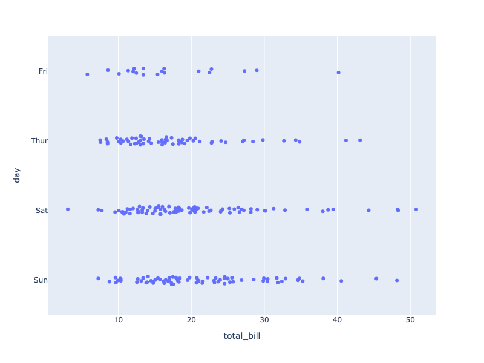
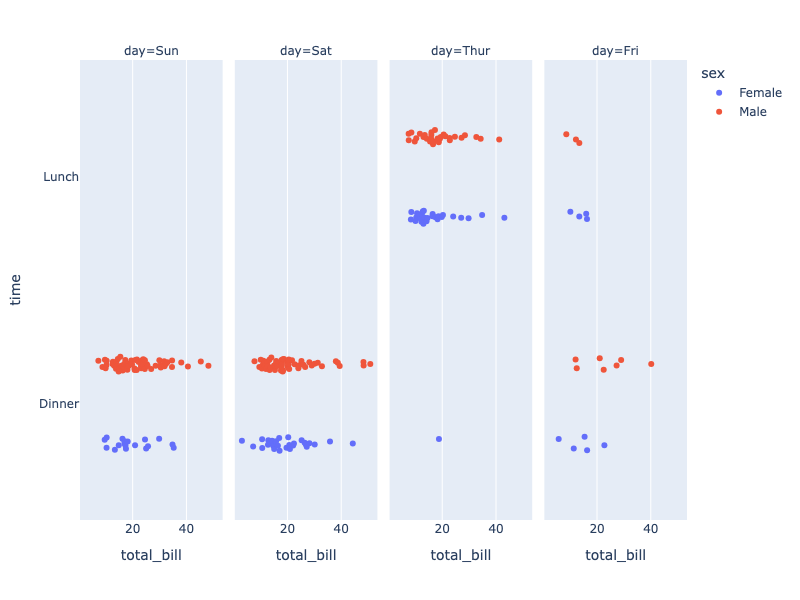

---
jupyter:
  jupytext:
    notebook_metadata_filter: all
    text_representation:
      extension: .md
      format_name: markdown
      format_version: '1.2'
      jupytext_version: 1.4.2
  kernelspec:
    display_name: Python 3
    language: python
    name: python3
  language_info:
    codemirror_mode:
      name: ipython
      version: 3
    file_extension: .py
    mimetype: text/x-python
    name: python
    nbconvert_exporter: python
    pygments_lexer: ipython3
    version: 3.7.7
  plotly:
    description: Strip charts are like 1-dimensional jittered scatter plots.
    display_as: statistical
    language: python
    layout: base
    name: Strip Charts
    order: 14
    page_type: u-guide
    permalink: python/strip-charts/
    thumbnail: thumbnail/figure-labels.png
---

### Strip Charts with Plotly Express

[Plotly Express](plotly-express.md) is the easy-to-use, high-level interface to Plotly, which [operates on a variety of types of data](px-arguments.md) and produces [easy-to-style figures](styling-plotly-express.md).

The `px.strip()` function will make strip charts using underlying `box` traces with the box hidden.

See also [box plots](box-plots.md) and [violin plots](violin.md).

```python
import plotly.express as px

df = px.data.tips()
fig = px.strip(df, x="total_bill", y="day")
fig.show()
```



**Interactive Plot:**

<div>                        <script type="text/javascript">window.PlotlyConfig = {MathJaxConfig: 'local'};</script>
        <script charset="utf-8" src="https://cdn.plot.ly/plotly-3.1.0.min.js" integrity="sha256-Ei4740bWZhaUTQuD6q9yQlgVCMPBz6CZWhevDYPv93A=" crossorigin="anonymous"></script>                <div id="plotly-div-1" class="plotly-graph-div" style="height:100%; width:100%;"></div>            <script type="text/javascript">                window.PLOTLYENV=window.PLOTLYENV || {};                                if (document.getElementById("plotly-div-1")) {                    Plotly.newPlot(                        "plotly-div-1",                        [{"alignmentgroup":"True","boxpoints":"all","fillcolor":"rgba(255,255,255,0)","hoveron":"points","hovertemplate":"total_bill=%{x}\u003cbr\u003eday=%{y}\u003cextra\u003e\u003c\u002fextra\u003e","legendgroup":"","line":{"color":"rgba(255,255,255,0)"},"marker":{"color":"#636efa"},"name":"","offsetgroup":"","orientation":"h","pointpos":0,"showlegend":false,"x":{"dtype":"f8","bdata":"PQrXo3D9MECuR+F6FK4kQMP1KFyPAjVArkfhehSuN0DXo3A9Cpc4QArXo3A9SjlACtejcD2KIUDhehSuR+E6QBSuR+F6FC5Aj8L1KFyPLUAK16NwPYokQOF6FK5HoUFA16NwPQrXLkCuR+F6FG4yQClcj8L1qC1AFK5H4XqUNUApXI\u002fC9agkQArXo3A9SjBAuB6F61H4MEBmZmZmZqY0QOxRuB6F6zFACtejcD1KNEAK16NwPYovQPYoXI\u002fCtUNAUrgehevRM0CPwvUoXM8xQD0K16NwvSpA4XoUrkdhKUAzMzMzM7M1QGZmZmZmpjNAmpmZmZkZI0CamZmZmVkyQB+F61G4Hi5AcT0K16OwNEBI4XoUrscxQI\u002fC9ShcDzhAj8L1KFxPMECuR+F6FO4wQHE9CtejsDJAhetRuB5FP0AK16NwPQowQPYoXI\u002fCdTFA4XoUrkfhK0Bcj8L1KFwjQGZmZmZmZj5ACtejcD1KMkB7FK5H4To2QDMzMzMzM0BAzczMzMyMPEAK16NwPQoyQBSuR+F6FClAFK5H4XqUJEBI4XoUrmdBQOF6FK5H4SNAj8L1KFyPOUA9CtejcH0zQOF6FK5HAUNAKVyPwvVoOkB7FK5H4XomQMP1KFyPIkhACtejcD1KNEAfhetRuJ4rQArXo3A9CiZACtejcD1KMkDXo3A9CpcxQBSuR+F6FDRAMzMzMzNzMECPwvUoXI8IQHsUrkfhOjRAhetRuB4FLkAK16NwPQooQFK4HoXrETFAXI\u002fC9SjcOkBI4XoUrkc5QPYoXI\u002fCdS1AhetRuB4FJUDsUbgehesxQDMzMzMzMztAw\u002fUoXI\u002fCNkAK16NwPUoxQHE9CtejcDNAKVyPwvWoMECkcD0K1yMkQNejcD0KV0BA9ihcj8L1L0AK16NwPWpBQI\u002fC9ShcDypASOF6FK5HMkD2KFyPwrU4QClcj8L1KDVAuB6F61H4PEA9CtejcH02QAAAAAAAABdAUrgehetRMEAAAAAAAMA2QPYoXI\u002fCFURASOF6FK5HO0CPwvUoXA8oQMP1KFyPAjVA7FG4HoXrKEAzMzMzM7MmQMP1KFyPwi5AZmZmZmYmRkDsUbgehWs2QOxRuB6F6zRAuB6F61G4LkA9CtejcH00QPYoXI\u002fCNTlAPQrXo3A9MkAfhetRuJ4sQAAAAAAAACxAAAAAAAAAHUApXI\u002fC9QhDQDMzMzMz8zdA9ihcj8K1OUCPwvUoXE8xQK5H4XoU7j1AzczMzMxMJUBcj8L1KNwoQBSuR+F6FDhA4XoUrkdhJ0DXo3A9CtcqQIXrUbgehSxAZmZmZmbmL0D2KFyPwvUoQM3MzMzMzD1ACtejcD0KIUAK16NwPQotQMP1KFyPwiZAUrgehevRNkAUrkfhehQzQIXrUbgeRTRA16NwPQpXJkCF61G4HoUoQMP1KFyPQjJAhetRuB4FIUApXI\u002fC9agkQM3MzMzMTCxAAAAAAAAAMEBSuB6F61EqQLgehetReDFAZmZmZmYmQUC4HoXrUZhEQM3MzMzMDDtArkfhehRuMEAzMzMzM7MgQKRwPQrXozJAPQrXo3C9J0CPwvUoXI8jQArXo3A9Ch5ApHA9CtcjLEDD9Shcj0IqQMP1KFyPQjFAzczMzMyMOECF61G4HsUzQJqZmZmZ2T1A9ihcj8IVSEAAAAAAAAA5QEjhehSuxypAPQrXo3B9MEAAAAAAAIA1QFK4HoXrUSlA9ihcj8I1MEAfhetRuJ4rQMP1KFyPgjFAhetRuB6FOEDD9Shcj8I0QPYoXI\u002fCtT9ArkfhehQuJUDD9Shcj0IlQEjhehSuZ0lAH4XrUbieL0AAAAAAAAAdQJqZmZmZ2T9AUrgehevRMEAzMzMzM3NAQKRwPQrX4zFA9ihcj8L1LEAzMzMzMzMjQHE9CtejUEFAMzMzMzNTQUAUrkfhelQ3QM3MzMzMrEZA7FG4HoUrN0BmZmZmZkZEQHE9CtejsDRAZmZmZmbmNED2KFyPwnU+QGZmZmZmJjJAmpmZmZkZN0DhehSuR2EvQI\u002fC9ShczzNAcT0K16NwPED2KFyPwvUuQBSuR+F6lDBAPQrXo3A9HkCuR+F6FK4kQK5H4XoUjkVAAAAAAAAAKkCF61G4HgUrQPYoXI\u002fCtTJAexSuR+F6KUAAAAAAAAAqQGZmZmZmZjBASOF6FK6HNEC4HoXrUXgwQNejcD0KlzpAPQrXo3BdQ0CF61G4HkU4QIXrUbgehSlAj8L1KFwPPkCkcD0K1+M5QArXo3A9KkhACtejcD2KKkDsUbgehSs8QM3MzMzMzClAZmZmZmYmPECuR+F6FC4nQPYoXI\u002fC9R5ApHA9CtcjPkBSuB6F61EoQNejcD0K1ypAKVyPwvUoIUD2KFyPwvUvQNejcD0K1ypAhetRuB5FMECuR+F6FC4kQDMzMzMzczRAj8L1KFyPKkAfhetRuB42QMP1KFyPAjhA4XoUrkdhL0C4HoXrUTgnQArXo3A9iiVAj8L1KFwPL0CkcD0K1yMkQDMzMzMzMylACtejcD1qQEAK16NwPepBQEjhehSuBz1ArkfhehQuO0DsUbgehas2QFK4HoXr0TFASOF6FK7HMkA="},"x0":" ","xaxis":"x","y":["Sun","Sun","Sun","Sun","Sun","Sun","Sun","Sun","Sun","Sun","Sun","Sun","Sun","Sun","Sun","Sun","Sun","Sun","Sun","Sat","Sat","Sat","Sat","Sat","Sat","Sat","Sat","Sat","Sat","Sat","Sat","Sat","Sat","Sat","Sat","Sat","Sat","Sat","Sat","Sat","Sat","Sun","Sun","Sun","Sun","Sun","Sun","Sun","Sun","Sun","Sun","Sun","Sun","Sun","Sun","Sun","Sat","Sat","Sat","Sat","Sat","Sat","Sat","Sat","Sat","Sat","Sat","Sat","Sat","Sat","Sat","Sat","Sat","Sat","Sat","Sat","Sat","Thur","Thur","Thur","Thur","Thur","Thur","Thur","Thur","Thur","Thur","Thur","Thur","Thur","Fri","Fri","Fri","Fri","Fri","Fri","Fri","Fri","Fri","Fri","Fri","Fri","Sat","Sat","Sat","Sat","Sat","Sat","Sat","Sat","Sat","Sat","Sun","Sun","Sun","Sun","Sun","Thur","Thur","Thur","Thur","Thur","Thur","Thur","Thur","Thur","Thur","Thur","Thur","Thur","Thur","Thur","Thur","Thur","Thur","Thur","Thur","Thur","Thur","Thur","Thur","Thur","Thur","Thur","Thur","Thur","Thur","Thur","Thur","Thur","Sun","Sun","Sun","Sun","Sun","Sun","Sun","Sun","Sun","Sun","Sun","Sun","Sun","Sun","Sun","Sun","Sun","Sun","Sat","Sat","Sat","Sat","Sun","Sun","Sun","Sun","Sun","Sun","Sun","Sun","Sun","Sun","Sun","Sun","Sun","Sun","Sun","Sun","Sun","Sun","Sun","Thur","Thur","Thur","Thur","Thur","Thur","Thur","Thur","Thur","Thur","Thur","Thur","Thur","Thur","Thur","Sat","Sat","Sat","Sat","Sat","Sat","Sat","Sat","Sat","Sat","Sat","Sat","Sat","Sat","Fri","Fri","Fri","Fri","Fri","Fri","Fri","Sat","Sat","Sat","Sat","Sat","Sat","Sat","Sat","Sat","Sat","Sat","Sat","Sat","Sat","Sat","Sat","Thur"],"y0":" ","yaxis":"y","type":"box"}],                        {"template":{"data":{"histogram2dcontour":[{"type":"histogram2dcontour","colorbar":{"outlinewidth":0,"ticks":""},"colorscale":[[0.0,"#0d0887"],[0.1111111111111111,"#46039f"],[0.2222222222222222,"#7201a8"],[0.3333333333333333,"#9c179e"],[0.4444444444444444,"#bd3786"],[0.5555555555555556,"#d8576b"],[0.6666666666666666,"#ed7953"],[0.7777777777777778,"#fb9f3a"],[0.8888888888888888,"#fdca26"],[1.0,"#f0f921"]]}],"choropleth":[{"type":"choropleth","colorbar":{"outlinewidth":0,"ticks":""}}],"histogram2d":[{"type":"histogram2d","colorbar":{"outlinewidth":0,"ticks":""},"colorscale":[[0.0,"#0d0887"],[0.1111111111111111,"#46039f"],[0.2222222222222222,"#7201a8"],[0.3333333333333333,"#9c179e"],[0.4444444444444444,"#bd3786"],[0.5555555555555556,"#d8576b"],[0.6666666666666666,"#ed7953"],[0.7777777777777778,"#fb9f3a"],[0.8888888888888888,"#fdca26"],[1.0,"#f0f921"]]}],"heatmap":[{"type":"heatmap","colorbar":{"outlinewidth":0,"ticks":""},"colorscale":[[0.0,"#0d0887"],[0.1111111111111111,"#46039f"],[0.2222222222222222,"#7201a8"],[0.3333333333333333,"#9c179e"],[0.4444444444444444,"#bd3786"],[0.5555555555555556,"#d8576b"],[0.6666666666666666,"#ed7953"],[0.7777777777777778,"#fb9f3a"],[0.8888888888888888,"#fdca26"],[1.0,"#f0f921"]]}],"contourcarpet":[{"type":"contourcarpet","colorbar":{"outlinewidth":0,"ticks":""}}],"contour":[{"type":"contour","colorbar":{"outlinewidth":0,"ticks":""},"colorscale":[[0.0,"#0d0887"],[0.1111111111111111,"#46039f"],[0.2222222222222222,"#7201a8"],[0.3333333333333333,"#9c179e"],[0.4444444444444444,"#bd3786"],[0.5555555555555556,"#d8576b"],[0.6666666666666666,"#ed7953"],[0.7777777777777778,"#fb9f3a"],[0.8888888888888888,"#fdca26"],[1.0,"#f0f921"]]}],"surface":[{"type":"surface","colorbar":{"outlinewidth":0,"ticks":""},"colorscale":[[0.0,"#0d0887"],[0.1111111111111111,"#46039f"],[0.2222222222222222,"#7201a8"],[0.3333333333333333,"#9c179e"],[0.4444444444444444,"#bd3786"],[0.5555555555555556,"#d8576b"],[0.6666666666666666,"#ed7953"],[0.7777777777777778,"#fb9f3a"],[0.8888888888888888,"#fdca26"],[1.0,"#f0f921"]]}],"mesh3d":[{"type":"mesh3d","colorbar":{"outlinewidth":0,"ticks":""}}],"scatter":[{"fillpattern":{"fillmode":"overlay","size":10,"solidity":0.2},"type":"scatter"}],"parcoords":[{"type":"parcoords","line":{"colorbar":{"outlinewidth":0,"ticks":""}}}],"scatterpolargl":[{"type":"scatterpolargl","marker":{"colorbar":{"outlinewidth":0,"ticks":""}}}],"bar":[{"error_x":{"color":"#2a3f5f"},"error_y":{"color":"#2a3f5f"},"marker":{"line":{"color":"#E5ECF6","width":0.5},"pattern":{"fillmode":"overlay","size":10,"solidity":0.2}},"type":"bar"}],"scattergeo":[{"type":"scattergeo","marker":{"colorbar":{"outlinewidth":0,"ticks":""}}}],"scatterpolar":[{"type":"scatterpolar","marker":{"colorbar":{"outlinewidth":0,"ticks":""}}}],"histogram":[{"marker":{"pattern":{"fillmode":"overlay","size":10,"solidity":0.2}},"type":"histogram"}],"scattergl":[{"type":"scattergl","marker":{"colorbar":{"outlinewidth":0,"ticks":""}}}],"scatter3d":[{"type":"scatter3d","line":{"colorbar":{"outlinewidth":0,"ticks":""}},"marker":{"colorbar":{"outlinewidth":0,"ticks":""}}}],"scattermap":[{"type":"scattermap","marker":{"colorbar":{"outlinewidth":0,"ticks":""}}}],"scattermapbox":[{"type":"scattermapbox","marker":{"colorbar":{"outlinewidth":0,"ticks":""}}}],"scatterternary":[{"type":"scatterternary","marker":{"colorbar":{"outlinewidth":0,"ticks":""}}}],"scattercarpet":[{"type":"scattercarpet","marker":{"colorbar":{"outlinewidth":0,"ticks":""}}}],"carpet":[{"aaxis":{"endlinecolor":"#2a3f5f","gridcolor":"white","linecolor":"white","minorgridcolor":"white","startlinecolor":"#2a3f5f"},"baxis":{"endlinecolor":"#2a3f5f","gridcolor":"white","linecolor":"white","minorgridcolor":"white","startlinecolor":"#2a3f5f"},"type":"carpet"}],"table":[{"cells":{"fill":{"color":"#EBF0F8"},"line":{"color":"white"}},"header":{"fill":{"color":"#C8D4E3"},"line":{"color":"white"}},"type":"table"}],"barpolar":[{"marker":{"line":{"color":"#E5ECF6","width":0.5},"pattern":{"fillmode":"overlay","size":10,"solidity":0.2}},"type":"barpolar"}],"pie":[{"automargin":true,"type":"pie"}]},"layout":{"autotypenumbers":"strict","colorway":["#636efa","#EF553B","#00cc96","#ab63fa","#FFA15A","#19d3f3","#FF6692","#B6E880","#FF97FF","#FECB52"],"font":{"color":"#2a3f5f"},"hovermode":"closest","hoverlabel":{"align":"left"},"paper_bgcolor":"white","plot_bgcolor":"#E5ECF6","polar":{"bgcolor":"#E5ECF6","angularaxis":{"gridcolor":"white","linecolor":"white","ticks":""},"radialaxis":{"gridcolor":"white","linecolor":"white","ticks":""}},"ternary":{"bgcolor":"#E5ECF6","aaxis":{"gridcolor":"white","linecolor":"white","ticks":""},"baxis":{"gridcolor":"white","linecolor":"white","ticks":""},"caxis":{"gridcolor":"white","linecolor":"white","ticks":""}},"coloraxis":{"colorbar":{"outlinewidth":0,"ticks":""}},"colorscale":{"sequential":[[0.0,"#0d0887"],[0.1111111111111111,"#46039f"],[0.2222222222222222,"#7201a8"],[0.3333333333333333,"#9c179e"],[0.4444444444444444,"#bd3786"],[0.5555555555555556,"#d8576b"],[0.6666666666666666,"#ed7953"],[0.7777777777777778,"#fb9f3a"],[0.8888888888888888,"#fdca26"],[1.0,"#f0f921"]],"sequentialminus":[[0.0,"#0d0887"],[0.1111111111111111,"#46039f"],[0.2222222222222222,"#7201a8"],[0.3333333333333333,"#9c179e"],[0.4444444444444444,"#bd3786"],[0.5555555555555556,"#d8576b"],[0.6666666666666666,"#ed7953"],[0.7777777777777778,"#fb9f3a"],[0.8888888888888888,"#fdca26"],[1.0,"#f0f921"]],"diverging":[[0,"#8e0152"],[0.1,"#c51b7d"],[0.2,"#de77ae"],[0.3,"#f1b6da"],[0.4,"#fde0ef"],[0.5,"#f7f7f7"],[0.6,"#e6f5d0"],[0.7,"#b8e186"],[0.8,"#7fbc41"],[0.9,"#4d9221"],[1,"#276419"]]},"xaxis":{"gridcolor":"white","linecolor":"white","ticks":"","title":{"standoff":15},"zerolinecolor":"white","automargin":true,"zerolinewidth":2},"yaxis":{"gridcolor":"white","linecolor":"white","ticks":"","title":{"standoff":15},"zerolinecolor":"white","automargin":true,"zerolinewidth":2},"scene":{"xaxis":{"backgroundcolor":"#E5ECF6","gridcolor":"white","linecolor":"white","showbackground":true,"ticks":"","zerolinecolor":"white","gridwidth":2},"yaxis":{"backgroundcolor":"#E5ECF6","gridcolor":"white","linecolor":"white","showbackground":true,"ticks":"","zerolinecolor":"white","gridwidth":2},"zaxis":{"backgroundcolor":"#E5ECF6","gridcolor":"white","linecolor":"white","showbackground":true,"ticks":"","zerolinecolor":"white","gridwidth":2}},"shapedefaults":{"line":{"color":"#2a3f5f"}},"annotationdefaults":{"arrowcolor":"#2a3f5f","arrowhead":0,"arrowwidth":1},"geo":{"bgcolor":"white","landcolor":"#E5ECF6","subunitcolor":"white","showland":true,"showlakes":true,"lakecolor":"white"},"title":{"x":0.05},"mapbox":{"style":"light"}}},"xaxis":{"anchor":"y","domain":[0.0,1.0],"title":{"text":"total_bill"}},"yaxis":{"anchor":"x","domain":[0.0,1.0],"title":{"text":"day"}},"legend":{"tracegroupgap":0},"margin":{"t":60},"boxmode":"group"},                        {"responsive": true}                    )                };            </script>        </div>

Strip charts support [faceting](facet-plots.md) and [discrete color](discrete-color.md):

```python
import plotly.express as px

df = px.data.tips()
fig = px.strip(df, x="total_bill", y="time", color="sex", facet_col="day")
fig.show()
```



**Interactive Plot:**

<div>                        <script type="text/javascript">window.PlotlyConfig = {MathJaxConfig: 'local'};</script>
        <script charset="utf-8" src="https://cdn.plot.ly/plotly-3.1.0.min.js" integrity="sha256-Ei4740bWZhaUTQuD6q9yQlgVCMPBz6CZWhevDYPv93A=" crossorigin="anonymous"></script>                <div id="plotly-div-2" class="plotly-graph-div" style="height:100%; width:100%;"></div>            <script type="text/javascript">                window.PLOTLYENV=window.PLOTLYENV || {};                                if (document.getElementById("plotly-div-2")) {                    Plotly.newPlot(                        "plotly-div-2",                        [{"alignmentgroup":"True","boxpoints":"all","fillcolor":"rgba(255,255,255,0)","hoveron":"points","hovertemplate":"sex=Female\u003cbr\u003eday=Sun\u003cbr\u003etotal_bill=%{x}\u003cbr\u003etime=%{y}\u003cextra\u003e\u003c\u002fextra\u003e","legendgroup":"Female","line":{"color":"rgba(255,255,255,0)"},"marker":{"color":"#636efa"},"name":"Female","offsetgroup":"Female","orientation":"h","pointpos":0,"showlegend":true,"x":{"dtype":"f8","bdata":"PQrXo3D9MEDXo3A9Cpc4QOF6FK5HoUFAKVyPwvWoLUApXI\u002fC9agkQLgehetR+DBAFK5H4XqUJEBI4XoUrmdBQPYoXI\u002fCtTlAj8L1KFxPMUCamZmZmdk9QAAAAAAAADlASOF6FK7HKkD2KFyPwjUwQMP1KFyPgjFAMzMzMzMzI0BmZmZmZuY0QGZmZmZmJjJA"},"x0":" ","xaxis":"x","y":["Dinner","Dinner","Dinner","Dinner","Dinner","Dinner","Dinner","Dinner","Dinner","Dinner","Dinner","Dinner","Dinner","Dinner","Dinner","Dinner","Dinner","Dinner"],"y0":" ","yaxis":"y","type":"box"},{"alignmentgroup":"True","boxpoints":"all","fillcolor":"rgba(255,255,255,0)","hoveron":"points","hovertemplate":"sex=Female\u003cbr\u003eday=Sat\u003cbr\u003etotal_bill=%{x}\u003cbr\u003etime=%{y}\u003cextra\u003e\u003c\u002fextra\u003e","legendgroup":"Female","line":{"color":"rgba(255,255,255,0)"},"marker":{"color":"#636efa"},"name":"Female","offsetgroup":"Female","orientation":"h","pointpos":0,"showlegend":false,"x":{"dtype":"f8","bdata":"CtejcD1KNEAK16NwPYovQGZmZmZmpjNAH4XrUbgeLkBxPQrXo7A0QK5H4XoU7jBAKVyPwvVoOkAzMzMzM3MwQI\u002fC9ShcjwhAUrgehesRMUBcj8L1KNw6QEjhehSuRzlA9ihcj8J1LUBmZmZmZiZGQOxRuB6FazZA7FG4HoXrNEAfhetRuJ4sQAAAAAAAAB1ArkfhehQuJUDD9Shcj0IlQIXrUbgehSlACtejcD2KKkDsUbgehSs8QM3MzMzMzClApHA9CtcjPkAfhetRuB42QArXo3A96kFArkfhehQuO0A="},"x0":" ","xaxis":"x2","y":["Dinner","Dinner","Dinner","Dinner","Dinner","Dinner","Dinner","Dinner","Dinner","Dinner","Dinner","Dinner","Dinner","Dinner","Dinner","Dinner","Dinner","Dinner","Dinner","Dinner","Dinner","Dinner","Dinner","Dinner","Dinner","Dinner","Dinner","Dinner"],"y0":" ","yaxis":"y2","type":"box"},{"alignmentgroup":"True","boxpoints":"all","fillcolor":"rgba(255,255,255,0)","hoveron":"points","hovertemplate":"sex=Female\u003cbr\u003eday=Thur\u003cbr\u003etotal_bill=%{x}\u003cbr\u003etime=%{y}\u003cextra\u003e\u003c\u002fextra\u003e","legendgroup":"Female","line":{"color":"rgba(255,255,255,0)"},"marker":{"color":"#636efa"},"name":"Female","offsetgroup":"Female","orientation":"h","pointpos":0,"showlegend":false,"x":{"dtype":"f8","bdata":"pHA9CtcjJEAK16NwPWpBQM3MzMzMTCVAXI\u002fC9SjcKEAUrkfhehQ4QNejcD0K1ypA9ihcj8L1KEDNzMzMzMw9QArXo3A9Ci1Aw\u002fUoXI\u002fCJkCF61G4HkU0QNejcD0KVyZAhetRuB6FKEDD9Shcj0IyQIXrUbgeBSFAKVyPwvWoJEDNzMzMzEwsQFK4HoXrUSpAuB6F61F4MUDNzMzMzAw7QK5H4XoUbjBAMzMzMzOzIECkcD0K16MyQD0K16NwvSdAj8L1KFzPM0CuR+F6FI5FQAAAAAAAACpAexSuR+F6KUAAAAAAAAAqQGZmZmZmZjBAuB6F61F4MEBI4XoUrscyQA=="},"x0":" ","xaxis":"x3","y":["Lunch","Lunch","Lunch","Lunch","Lunch","Lunch","Lunch","Lunch","Lunch","Lunch","Lunch","Lunch","Lunch","Lunch","Lunch","Lunch","Lunch","Lunch","Lunch","Lunch","Lunch","Lunch","Lunch","Lunch","Lunch","Lunch","Lunch","Lunch","Lunch","Lunch","Lunch","Dinner"],"y0":" ","yaxis":"y3","type":"box"},{"alignmentgroup":"True","boxpoints":"all","fillcolor":"rgba(255,255,255,0)","hoveron":"points","hovertemplate":"sex=Female\u003cbr\u003eday=Fri\u003cbr\u003etotal_bill=%{x}\u003cbr\u003etime=%{y}\u003cextra\u003e\u003c\u002fextra\u003e","legendgroup":"Female","line":{"color":"rgba(255,255,255,0)"},"marker":{"color":"#636efa"},"name":"Female","offsetgroup":"Female","orientation":"h","pointpos":0,"showlegend":false,"x":{"dtype":"f8","bdata":"AAAAAAAAF0BSuB6F61EwQAAAAAAAwDZAMzMzMzOzJkDD9Shcj8IuQNejcD0K1ypA9ihcj8L1L0CF61G4HkUwQK5H4XoULiRA"},"x0":" ","xaxis":"x4","y":["Dinner","Dinner","Dinner","Dinner","Dinner","Lunch","Lunch","Lunch","Lunch"],"y0":" ","yaxis":"y4","type":"box"},{"alignmentgroup":"True","boxpoints":"all","fillcolor":"rgba(255,255,255,0)","hoveron":"points","hovertemplate":"sex=Male\u003cbr\u003eday=Sun\u003cbr\u003etotal_bill=%{x}\u003cbr\u003etime=%{y}\u003cextra\u003e\u003c\u002fextra\u003e","legendgroup":"Male","line":{"color":"rgba(255,255,255,0)"},"marker":{"color":"#EF553B"},"name":"Male","offsetgroup":"Male","orientation":"h","pointpos":0,"showlegend":true,"x":{"dtype":"f8","bdata":"rkfhehSuJEDD9ShcjwI1QK5H4XoUrjdACtejcD1KOUAK16NwPYohQOF6FK5H4TpAFK5H4XoULkCPwvUoXI8tQArXo3A9iiRA16NwPQrXLkCuR+F6FG4yQBSuR+F6lDVACtejcD1KMED2KFyPwnUxQOF6FK5H4StAXI\u002fC9ShcI0BmZmZmZmY+QArXo3A9SjJAexSuR+E6NkAzMzMzMzNAQM3MzMzMjDxACtejcD0KMkAUrkfhehQpQOF6FK5H4SNAj8L1KFyPOUA9CtejcH0zQClcj8L1CENAMzMzMzPzN0CuR+F6FO49QKRwPQrXIyxAw\u002fUoXI9CKkDD9Shcj0IxQM3MzMzMjDhAhetRuB7FM0D2KFyPwhVIQD0K16NwfTBAAAAAAACANUBSuB6F61EpQB+F61G4nitAhetRuB6FOEDD9Shcj8I0QPYoXI\u002fCtT9AAAAAAAAAHUCamZmZmdk\u002fQFK4HoXr0TBAMzMzMzNzQECkcD0K1+MxQPYoXI\u002fC9SxAcT0K16NQQUAzMzMzM1NBQBSuR+F6VDdAzczMzMysRkDsUbgehSs3QGZmZmZmRkRAcT0K16OwNED2KFyPwnU+QJqZmZmZGTdA4XoUrkdhL0A="},"x0":" ","xaxis":"x","y":["Dinner","Dinner","Dinner","Dinner","Dinner","Dinner","Dinner","Dinner","Dinner","Dinner","Dinner","Dinner","Dinner","Dinner","Dinner","Dinner","Dinner","Dinner","Dinner","Dinner","Dinner","Dinner","Dinner","Dinner","Dinner","Dinner","Dinner","Dinner","Dinner","Dinner","Dinner","Dinner","Dinner","Dinner","Dinner","Dinner","Dinner","Dinner","Dinner","Dinner","Dinner","Dinner","Dinner","Dinner","Dinner","Dinner","Dinner","Dinner","Dinner","Dinner","Dinner","Dinner","Dinner","Dinner","Dinner","Dinner","Dinner","Dinner"],"y0":" ","yaxis":"y","type":"box"},{"alignmentgroup":"True","boxpoints":"all","fillcolor":"rgba(255,255,255,0)","hoveron":"points","hovertemplate":"sex=Male\u003cbr\u003eday=Sat\u003cbr\u003etotal_bill=%{x}\u003cbr\u003etime=%{y}\u003cextra\u003e\u003c\u002fextra\u003e","legendgroup":"Male","line":{"color":"rgba(255,255,255,0)"},"marker":{"color":"#EF553B"},"name":"Male","offsetgroup":"Male","orientation":"h","pointpos":0,"showlegend":false,"x":{"dtype":"f8","bdata":"ZmZmZmamNEDsUbgehesxQPYoXI\u002fCtUNAUrgehevRM0CPwvUoXM8xQD0K16NwvSpA4XoUrkdhKUAzMzMzM7M1QJqZmZmZGSNAmpmZmZlZMkBI4XoUrscxQI\u002fC9ShcDzhAj8L1KFxPMEBxPQrXo7AyQIXrUbgeRT9ACtejcD0KMEDhehSuRwFDQHsUrkfheiZAw\u002fUoXI8iSEAK16NwPUo0QB+F61G4nitACtejcD0KJkAK16NwPUoyQNejcD0KlzFAFK5H4XoUNEB7FK5H4To0QIXrUbgeBS5ACtejcD0KKECF61G4HgUlQOxRuB6F6zFAuB6F61G4LkA9CtejcH00QPYoXI\u002fCNTlAPQrXo3A9MkAAAAAAAAAsQEjhehSuZ0lAH4XrUbieL0DXo3A9Cpc6QD0K16NwXUNAhetRuB5FOECPwvUoXA8+QKRwPQrX4zlACtejcD0qSEBmZmZmZiY8QK5H4XoULidA9ihcj8L1HkAzMzMzM3M0QI\u002fC9ShcjypAw\u002fUoXI8COEDhehSuR2EvQLgehetROCdACtejcD2KJUCPwvUoXA8vQKRwPQrXIyRAMzMzMzMzKUAK16NwPWpAQEjhehSuBz1A7FG4HoWrNkBSuB6F69ExQA=="},"x0":" ","xaxis":"x2","y":["Dinner","Dinner","Dinner","Dinner","Dinner","Dinner","Dinner","Dinner","Dinner","Dinner","Dinner","Dinner","Dinner","Dinner","Dinner","Dinner","Dinner","Dinner","Dinner","Dinner","Dinner","Dinner","Dinner","Dinner","Dinner","Dinner","Dinner","Dinner","Dinner","Dinner","Dinner","Dinner","Dinner","Dinner","Dinner","Dinner","Dinner","Dinner","Dinner","Dinner","Dinner","Dinner","Dinner","Dinner","Dinner","Dinner","Dinner","Dinner","Dinner","Dinner","Dinner","Dinner","Dinner","Dinner","Dinner","Dinner","Dinner","Dinner","Dinner"],"y0":" ","yaxis":"y2","type":"box"},{"alignmentgroup":"True","boxpoints":"all","fillcolor":"rgba(255,255,255,0)","hoveron":"points","hovertemplate":"sex=Male\u003cbr\u003eday=Thur\u003cbr\u003etotal_bill=%{x}\u003cbr\u003etime=%{y}\u003cextra\u003e\u003c\u002fextra\u003e","legendgroup":"Male","line":{"color":"rgba(255,255,255,0)"},"marker":{"color":"#EF553B"},"name":"Male","offsetgroup":"Male","orientation":"h","pointpos":0,"showlegend":false,"x":{"dtype":"f8","bdata":"MzMzMzMzO0DD9Shcj8I2QArXo3A9SjFAcT0K16NwM0ApXI\u002fC9agwQNejcD0KV0BA9ihcj8L1L0CPwvUoXA8qQEjhehSuRzJA9ihcj8K1OEApXI\u002fC9Sg1QOF6FK5HYSdAhetRuB6FLEBmZmZmZuYvQArXo3A9CiFAUrgehevRNkAUrkfhehQzQAAAAAAAADBAZmZmZmYmQUC4HoXrUZhEQI\u002fC9ShcjyNACtejcD0KHkBxPQrXo3A8QPYoXI\u002fC9S5AFK5H4XqUMEA9CtejcD0eQK5H4XoUriRAhetRuB4FK0D2KFyPwrUyQEjhehSuhzRA"},"x0":" ","xaxis":"x3","y":["Lunch","Lunch","Lunch","Lunch","Lunch","Lunch","Lunch","Lunch","Lunch","Lunch","Lunch","Lunch","Lunch","Lunch","Lunch","Lunch","Lunch","Lunch","Lunch","Lunch","Lunch","Lunch","Lunch","Lunch","Lunch","Lunch","Lunch","Lunch","Lunch","Lunch"],"y0":" ","yaxis":"y3","type":"box"},{"alignmentgroup":"True","boxpoints":"all","fillcolor":"rgba(255,255,255,0)","hoveron":"points","hovertemplate":"sex=Male\u003cbr\u003eday=Fri\u003cbr\u003etotal_bill=%{x}\u003cbr\u003etime=%{y}\u003cextra\u003e\u003c\u002fextra\u003e","legendgroup":"Male","line":{"color":"rgba(255,255,255,0)"},"marker":{"color":"#EF553B"},"name":"Male","offsetgroup":"Male","orientation":"h","pointpos":0,"showlegend":false,"x":{"dtype":"f8","bdata":"uB6F61H4PEA9CtejcH02QPYoXI\u002fCFURASOF6FK5HO0CPwvUoXA8oQMP1KFyPAjVA7FG4HoXrKEBSuB6F61EoQClcj8L1KCFA16NwPQrXKkA="},"x0":" ","xaxis":"x4","y":["Dinner","Dinner","Dinner","Dinner","Dinner","Dinner","Dinner","Lunch","Lunch","Lunch"],"y0":" ","yaxis":"y4","type":"box"}],                        {"template":{"data":{"histogram2dcontour":[{"type":"histogram2dcontour","colorbar":{"outlinewidth":0,"ticks":""},"colorscale":[[0.0,"#0d0887"],[0.1111111111111111,"#46039f"],[0.2222222222222222,"#7201a8"],[0.3333333333333333,"#9c179e"],[0.4444444444444444,"#bd3786"],[0.5555555555555556,"#d8576b"],[0.6666666666666666,"#ed7953"],[0.7777777777777778,"#fb9f3a"],[0.8888888888888888,"#fdca26"],[1.0,"#f0f921"]]}],"choropleth":[{"type":"choropleth","colorbar":{"outlinewidth":0,"ticks":""}}],"histogram2d":[{"type":"histogram2d","colorbar":{"outlinewidth":0,"ticks":""},"colorscale":[[0.0,"#0d0887"],[0.1111111111111111,"#46039f"],[0.2222222222222222,"#7201a8"],[0.3333333333333333,"#9c179e"],[0.4444444444444444,"#bd3786"],[0.5555555555555556,"#d8576b"],[0.6666666666666666,"#ed7953"],[0.7777777777777778,"#fb9f3a"],[0.8888888888888888,"#fdca26"],[1.0,"#f0f921"]]}],"heatmap":[{"type":"heatmap","colorbar":{"outlinewidth":0,"ticks":""},"colorscale":[[0.0,"#0d0887"],[0.1111111111111111,"#46039f"],[0.2222222222222222,"#7201a8"],[0.3333333333333333,"#9c179e"],[0.4444444444444444,"#bd3786"],[0.5555555555555556,"#d8576b"],[0.6666666666666666,"#ed7953"],[0.7777777777777778,"#fb9f3a"],[0.8888888888888888,"#fdca26"],[1.0,"#f0f921"]]}],"contourcarpet":[{"type":"contourcarpet","colorbar":{"outlinewidth":0,"ticks":""}}],"contour":[{"type":"contour","colorbar":{"outlinewidth":0,"ticks":""},"colorscale":[[0.0,"#0d0887"],[0.1111111111111111,"#46039f"],[0.2222222222222222,"#7201a8"],[0.3333333333333333,"#9c179e"],[0.4444444444444444,"#bd3786"],[0.5555555555555556,"#d8576b"],[0.6666666666666666,"#ed7953"],[0.7777777777777778,"#fb9f3a"],[0.8888888888888888,"#fdca26"],[1.0,"#f0f921"]]}],"surface":[{"type":"surface","colorbar":{"outlinewidth":0,"ticks":""},"colorscale":[[0.0,"#0d0887"],[0.1111111111111111,"#46039f"],[0.2222222222222222,"#7201a8"],[0.3333333333333333,"#9c179e"],[0.4444444444444444,"#bd3786"],[0.5555555555555556,"#d8576b"],[0.6666666666666666,"#ed7953"],[0.7777777777777778,"#fb9f3a"],[0.8888888888888888,"#fdca26"],[1.0,"#f0f921"]]}],"mesh3d":[{"type":"mesh3d","colorbar":{"outlinewidth":0,"ticks":""}}],"scatter":[{"fillpattern":{"fillmode":"overlay","size":10,"solidity":0.2},"type":"scatter"}],"parcoords":[{"type":"parcoords","line":{"colorbar":{"outlinewidth":0,"ticks":""}}}],"scatterpolargl":[{"type":"scatterpolargl","marker":{"colorbar":{"outlinewidth":0,"ticks":""}}}],"bar":[{"error_x":{"color":"#2a3f5f"},"error_y":{"color":"#2a3f5f"},"marker":{"line":{"color":"#E5ECF6","width":0.5},"pattern":{"fillmode":"overlay","size":10,"solidity":0.2}},"type":"bar"}],"scattergeo":[{"type":"scattergeo","marker":{"colorbar":{"outlinewidth":0,"ticks":""}}}],"scatterpolar":[{"type":"scatterpolar","marker":{"colorbar":{"outlinewidth":0,"ticks":""}}}],"histogram":[{"marker":{"pattern":{"fillmode":"overlay","size":10,"solidity":0.2}},"type":"histogram"}],"scattergl":[{"type":"scattergl","marker":{"colorbar":{"outlinewidth":0,"ticks":""}}}],"scatter3d":[{"type":"scatter3d","line":{"colorbar":{"outlinewidth":0,"ticks":""}},"marker":{"colorbar":{"outlinewidth":0,"ticks":""}}}],"scattermap":[{"type":"scattermap","marker":{"colorbar":{"outlinewidth":0,"ticks":""}}}],"scattermapbox":[{"type":"scattermapbox","marker":{"colorbar":{"outlinewidth":0,"ticks":""}}}],"scatterternary":[{"type":"scatterternary","marker":{"colorbar":{"outlinewidth":0,"ticks":""}}}],"scattercarpet":[{"type":"scattercarpet","marker":{"colorbar":{"outlinewidth":0,"ticks":""}}}],"carpet":[{"aaxis":{"endlinecolor":"#2a3f5f","gridcolor":"white","linecolor":"white","minorgridcolor":"white","startlinecolor":"#2a3f5f"},"baxis":{"endlinecolor":"#2a3f5f","gridcolor":"white","linecolor":"white","minorgridcolor":"white","startlinecolor":"#2a3f5f"},"type":"carpet"}],"table":[{"cells":{"fill":{"color":"#EBF0F8"},"line":{"color":"white"}},"header":{"fill":{"color":"#C8D4E3"},"line":{"color":"white"}},"type":"table"}],"barpolar":[{"marker":{"line":{"color":"#E5ECF6","width":0.5},"pattern":{"fillmode":"overlay","size":10,"solidity":0.2}},"type":"barpolar"}],"pie":[{"automargin":true,"type":"pie"}]},"layout":{"autotypenumbers":"strict","colorway":["#636efa","#EF553B","#00cc96","#ab63fa","#FFA15A","#19d3f3","#FF6692","#B6E880","#FF97FF","#FECB52"],"font":{"color":"#2a3f5f"},"hovermode":"closest","hoverlabel":{"align":"left"},"paper_bgcolor":"white","plot_bgcolor":"#E5ECF6","polar":{"bgcolor":"#E5ECF6","angularaxis":{"gridcolor":"white","linecolor":"white","ticks":""},"radialaxis":{"gridcolor":"white","linecolor":"white","ticks":""}},"ternary":{"bgcolor":"#E5ECF6","aaxis":{"gridcolor":"white","linecolor":"white","ticks":""},"baxis":{"gridcolor":"white","linecolor":"white","ticks":""},"caxis":{"gridcolor":"white","linecolor":"white","ticks":""}},"coloraxis":{"colorbar":{"outlinewidth":0,"ticks":""}},"colorscale":{"sequential":[[0.0,"#0d0887"],[0.1111111111111111,"#46039f"],[0.2222222222222222,"#7201a8"],[0.3333333333333333,"#9c179e"],[0.4444444444444444,"#bd3786"],[0.5555555555555556,"#d8576b"],[0.6666666666666666,"#ed7953"],[0.7777777777777778,"#fb9f3a"],[0.8888888888888888,"#fdca26"],[1.0,"#f0f921"]],"sequentialminus":[[0.0,"#0d0887"],[0.1111111111111111,"#46039f"],[0.2222222222222222,"#7201a8"],[0.3333333333333333,"#9c179e"],[0.4444444444444444,"#bd3786"],[0.5555555555555556,"#d8576b"],[0.6666666666666666,"#ed7953"],[0.7777777777777778,"#fb9f3a"],[0.8888888888888888,"#fdca26"],[1.0,"#f0f921"]],"diverging":[[0,"#8e0152"],[0.1,"#c51b7d"],[0.2,"#de77ae"],[0.3,"#f1b6da"],[0.4,"#fde0ef"],[0.5,"#f7f7f7"],[0.6,"#e6f5d0"],[0.7,"#b8e186"],[0.8,"#7fbc41"],[0.9,"#4d9221"],[1,"#276419"]]},"xaxis":{"gridcolor":"white","linecolor":"white","ticks":"","title":{"standoff":15},"zerolinecolor":"white","automargin":true,"zerolinewidth":2},"yaxis":{"gridcolor":"white","linecolor":"white","ticks":"","title":{"standoff":15},"zerolinecolor":"white","automargin":true,"zerolinewidth":2},"scene":{"xaxis":{"backgroundcolor":"#E5ECF6","gridcolor":"white","linecolor":"white","showbackground":true,"ticks":"","zerolinecolor":"white","gridwidth":2},"yaxis":{"backgroundcolor":"#E5ECF6","gridcolor":"white","linecolor":"white","showbackground":true,"ticks":"","zerolinecolor":"white","gridwidth":2},"zaxis":{"backgroundcolor":"#E5ECF6","gridcolor":"white","linecolor":"white","showbackground":true,"ticks":"","zerolinecolor":"white","gridwidth":2}},"shapedefaults":{"line":{"color":"#2a3f5f"}},"annotationdefaults":{"arrowcolor":"#2a3f5f","arrowhead":0,"arrowwidth":1},"geo":{"bgcolor":"white","landcolor":"#E5ECF6","subunitcolor":"white","showland":true,"showlakes":true,"lakecolor":"white"},"title":{"x":0.05},"mapbox":{"style":"light"}}},"xaxis":{"anchor":"y","domain":[0.0,0.235],"title":{"text":"total_bill"}},"yaxis":{"anchor":"x","domain":[0.0,1.0],"title":{"text":"time"}},"xaxis2":{"anchor":"y2","domain":[0.255,0.49],"matches":"x","title":{"text":"total_bill"}},"yaxis2":{"anchor":"x2","domain":[0.0,1.0],"matches":"y","showticklabels":false},"xaxis3":{"anchor":"y3","domain":[0.51,0.745],"matches":"x","title":{"text":"total_bill"}},"yaxis3":{"anchor":"x3","domain":[0.0,1.0],"matches":"y","showticklabels":false},"xaxis4":{"anchor":"y4","domain":[0.7649999999999999,0.9999999999999999],"matches":"x","title":{"text":"total_bill"}},"yaxis4":{"anchor":"x4","domain":[0.0,1.0],"matches":"y","showticklabels":false},"annotations":[{"font":{},"showarrow":false,"text":"day=Sun","x":0.1175,"xanchor":"center","xref":"paper","y":1.0,"yanchor":"bottom","yref":"paper"},{"font":{},"showarrow":false,"text":"day=Sat","x":0.3725,"xanchor":"center","xref":"paper","y":1.0,"yanchor":"bottom","yref":"paper"},{"font":{},"showarrow":false,"text":"day=Thur","x":0.6275,"xanchor":"center","xref":"paper","y":1.0,"yanchor":"bottom","yref":"paper"},{"font":{},"showarrow":false,"text":"day=Fri","x":0.8824999999999998,"xanchor":"center","xref":"paper","y":1.0,"yanchor":"bottom","yref":"paper"}],"legend":{"title":{"text":"sex"},"tracegroupgap":0},"margin":{"t":60},"boxmode":"group"},                        {"responsive": true}                    )                };            </script>        </div>

#### Reference

See [function reference for `px.strip()`](https://plotly.com/python-api-reference/generated/plotly.express.strip) for more information and chart attribute options!
