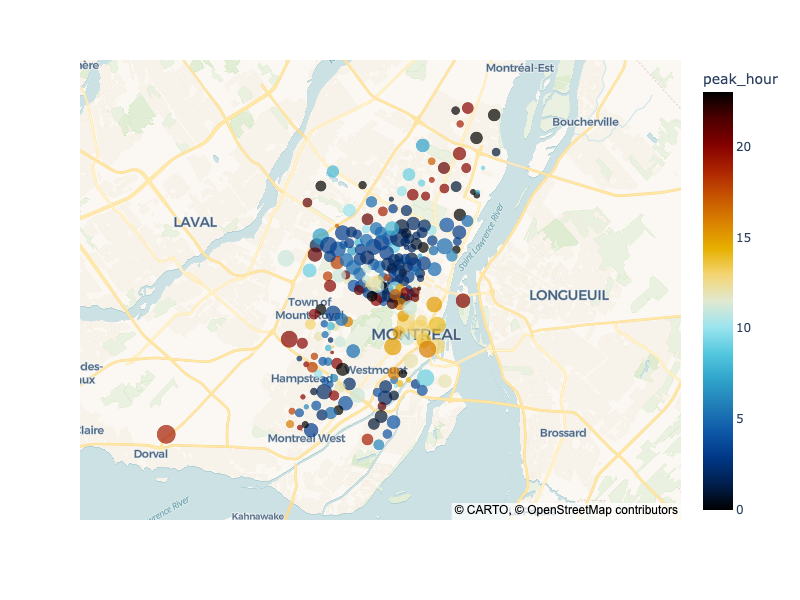
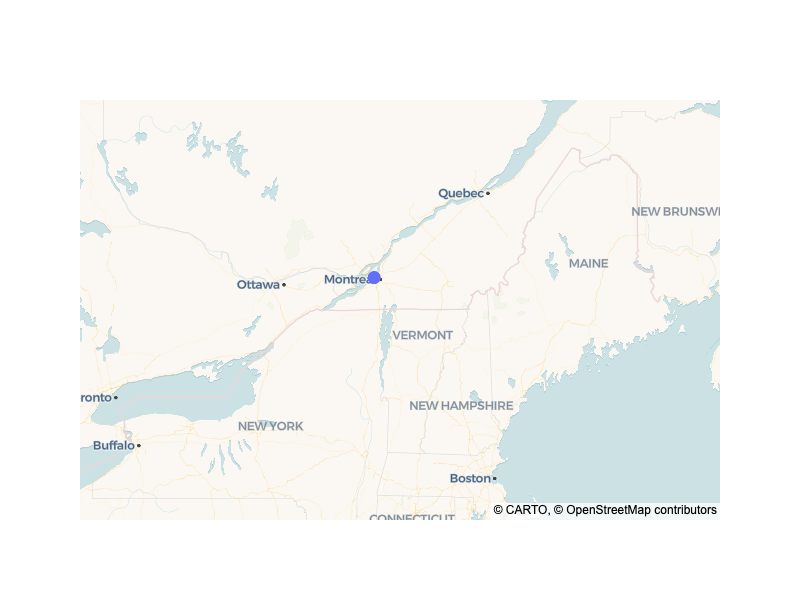
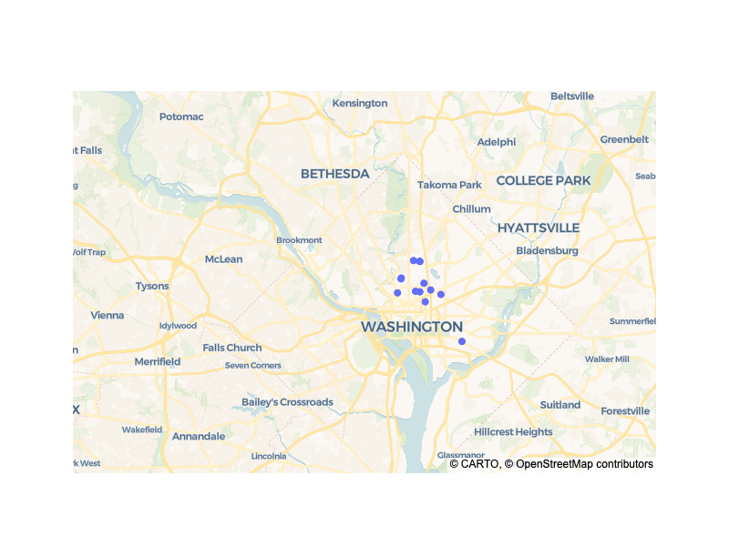
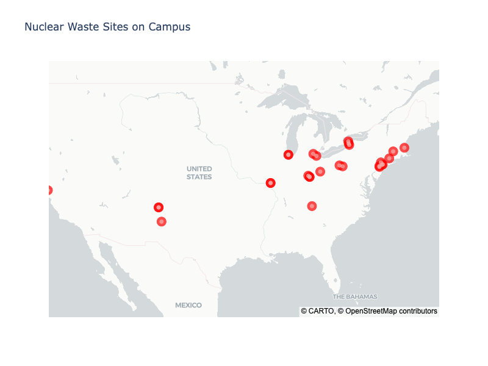
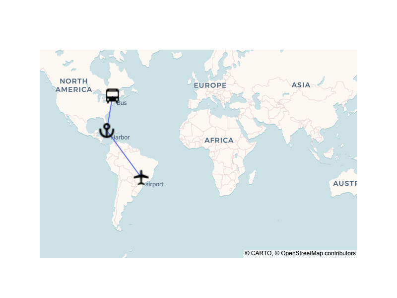
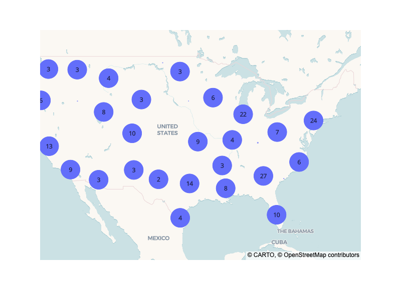
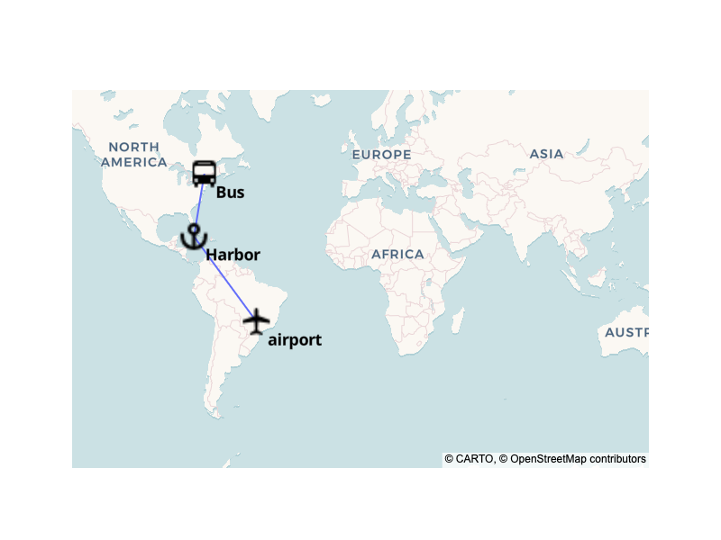
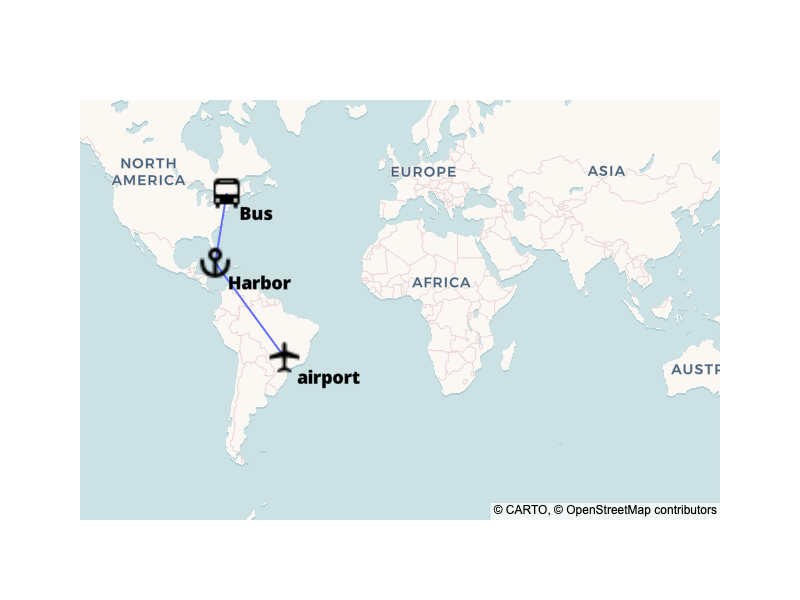

---
jupyter:
  jupytext:
    notebook_metadata_filter: all
    text_representation:
      extension: .md
      format_name: markdown
      format_version: '1.3'
      jupytext_version: 1.16.3
  kernelspec:
    display_name: Python 3 (ipykernel)
    language: python
    name: python3
  language_info:
    codemirror_mode:
      name: ipython
      version: 3
    file_extension: .py
    mimetype: text/x-python
    name: python
    nbconvert_exporter: python
    pygments_lexer: ipython3
    version: 3.10.0
  plotly:
    description: How to make scatter plots on tile maps in Python.
    display_as: maps
    language: python
    layout: base
    name: Scatter Plots on Tile Maps
    order: 10
    page_type: u-guide
    permalink: python/tile-scatter-maps/
    redirect_from: python/scattermapbox/
    thumbnail: thumbnail/scatter-mapbox.jpg
---

### Basic example with Plotly Express

Here we show the [Plotly Express](plotly-express.md) function `px.scatter_map` for a scatter plot on a tile map.

[Plotly Express](plotly-express.md) is the easy-to-use, high-level interface to Plotly, which [operates on a variety of types of data](px-arguments.md) and produces [easy-to-style figures](styling-plotly-express.md).

```python
import plotly.express as px
df = px.data.carshare()
fig = px.scatter_map(df, lat="centroid_lat", lon="centroid_lon",     color="peak_hour", size="car_hours",
                  color_continuous_scale=px.colors.cyclical.IceFire, size_max=15, zoom=10)
fig.show()
```



**Interactive Plot:**

<div>                        <script type="text/javascript">window.PlotlyConfig = {MathJaxConfig: 'local'};</script>
        <script charset="utf-8" src="https://cdn.plot.ly/plotly-3.1.0.min.js" integrity="sha256-Ei4740bWZhaUTQuD6q9yQlgVCMPBz6CZWhevDYPv93A=" crossorigin="anonymous"></script>                <div id="plotly-div-1" class="plotly-graph-div" style="height:100%; width:100%;"></div>            <script type="text/javascript">                window.PLOTLYENV=window.PLOTLYENV || {};                                if (document.getElementById("plotly-div-1")) {                    Plotly.newPlot(                        "plotly-div-1",                        [{"hovertemplate":"car_hours=%{marker.size}\u003cbr\u003ecentroid_lat=%{lat}\u003cbr\u003ecentroid_lon=%{lon}\u003cbr\u003epeak_hour=%{marker.color}\u003cextra\u003e\u003c\u002fextra\u003e","lat":{"dtype":"f8","bdata":"TgqQs1u8RkA4jdlencVGQPcsTPlqvkZA3v+0ZO3CRkDLIFy7G7pGQK0u2S5cyUZApARRztjDRkCyZx2Q5b9GQHuADgWRxkZAtQdUPuPGRkAANnDau7xGQJxWjdIoxEZAEeBP4GDIRkDDJTivYcBGQCwTXFeXyEZAXPf6fnG9RkCdbNmodblGQBnvBVFjwEZA6ga0mAnORkCLlCuEOr1GQPFkWWt\u002fwkZAWTjO\u002ftXIRkCH37IspMRGQGJDTf\u002fGyEZAYOSnF+jFRkC\u002fLLTmvsVGQENLEqnHxUZAMT0QvTS9RkD\u002f4q44g8pGQNjoUuD+w0ZAvwFNKb7GRkDmJkyDu8NGQEiiPuETw0ZA2yezFhfBRkCOZAO1eL5GQHt+\u002f\u002fThwEZA6YkVyxrKRkBt\u002f46VBbxGQBsEbd3yxEZA4f9pTOvKRkAhb1YENLtGQNq\u002fodQKwUZAHhk536\u002fGRkD5l4OUO8RGQAEIzYHKw0ZANnjIqObHRkCJv1gYvLpGQCbtrrZWwkZAAnptm027RkC\u002fOgVghrpGQKlRbT5LykZAWkUk0o\u002fBRkAYOVOoKsZGQMMQEeySw0ZAd33gp3vLRkDcB8DD7MNGQAEW7Ae4v0ZAZeq0zhfFRkCPbuqYz8NGQK5IKxvGyUZASbk9DOTLRkAfamBBe8VGQGHGZXXJuUZAfTx84gXARkDiuUfroMdGQJ7euX\u002fMwUZALOUVpK\u002fCRkDPedg1hcJGQD0sP2hpvEZAt3xAcTy\u002fRkDGXvNKc8lGQAg7Yp2BvEZAZszdfYDKRkATtqF2k71GQG29+BPDzUZA5tjmyYzARkDEvVHE3LpGQBsw3OGCxkZATH0UbjjDRkBBHvew88BGQI5EGbcwxkZAHks\u002f4OLDRkComTCOJ79GQB2tVCeLv0ZAlp8FytXHRkAE9IKJFsdGQBAyCRg7w0ZAuvAAPn\u002fFRkAlOHkDl7tGQLxlcWEbwkZAIYbj+TLERkBeCleaZL1GQIOFK2lbukZAcqdeb+3FRkBWBEU5zr9GQBcMK7imw0ZARkJx22vIRkCOQFbz0cRGQDJW2Sm+vEZACJFqZZLDRkD1GGeSWr9GQPPdzQKIu0ZAWy8rnFvMRkCnqy0+6r5GQI3NWExLwkZAZX3jKeC7RkBxnTUrbsFGQAENktdKxkZAaVAKCJTERkD4jw0Ex75GQHJZVgLlxEZAx+\u002fgzovDRkCbPmSTc8RGQABGbvCivkZADHFrhx+6RkCI02LJf7xGQEG4lnw+x0ZA105o5NW9RkA\u002fOgtBg79GQP2TYspZx0ZAHmMZxPa\u002fRkDOAtsKHL5GQDPZ1pa0ukZAlraDSyTARkCc6yrY0sBGQMjWI+iJw0ZAPR0wF5u+RkDtAt1iQcNGQOM2w8I3zUZAvdxMdza9RkDBXNSj3MhGQMjmReTLu0ZABVJbpZzFRkBZdTOkYb1GQDvwkmTQvEZA+k44\u002fjfGRkDPVSPJpsVGQNYv2kcxzkZAroANWJK9RkD8gQ8zhsNGQNtvCuDpwEZAu1XRorDFRkCajXjGF8VGQC47DcNHxEZAdF0t8NW7RkAtgM22a8RGQHx4EPSuxEZAQFcR3WPERkCHP0b7FcNGQPhtGwCAvEZAOqrnQbfARkCPNLHxbsJGQICPVV1Aw0ZA7NcSdy7FRkA6+v2W3r1GQL6oF+JmxUZA\u002f+5DTovCRkDjeOu1hcZGQB7Hb28jwkZARsbLfejERkDm3nbykMVGQPlaGTfqv0ZAi0+jnZTJRkBOmUMSLL1GQAwnZpJsxUZATQjhP2q7RkA9RDSelr5GQLN4KksJyUZAT2GfgVfGRkCmk\u002fr84sdGQM7j3JZ0vUZAiIu8jPzFRkCeRBCtF71GQAS3jmWBykZAOPgG\u002fv7ERkCQ9ifdZMFGQPFYjDN2wkZASEtPs2\u002fGRkC\u002fpQWp\u002f8ZGQKGFVAYuwUZAO50aksDFRkBxSDwBiMZGQMLycGptu0ZAoSpyxpDERkD6Thh\u002f2MJGQHiL94vnxEZAWpQy+gq9RkBT3m2M8sZGQEzsK9OfxUZANMJn7g7GRkD1WbO5D8RGQOk8STEUw0ZA\u002fij5XUnDRkBYiUwpU7pGQIJadSnpwUZAedJHRq7DRkDC7gptvrpGQN2vFK7+wkZACpkDxVPERkAv4jmzLMJGQDgbsdaxvEZAn5a2eBzDRkBO+b86PslGQIRWP\u002fgFxEZATJM39pjCRkDoU0wufMVGQEv6Js+BwUZAGnDKfwS9RkAZogAyPMNGQP15XMG3w0ZABZXMud\u002fFRkDrl2w0ScVGQGVBt6lhw0ZAQmo9FcXARkBX4EK2\u002f8dGQC8tXbBhwkZAYQ0aANLCRkBP6JSaFcNGQHlbbI3gwkZACUVO9hHFRkC31+QJY8tGQHRJpBPWxUZA5fUu8MvERkBnwIjXZclGQNTtmayNxEZA8cX4Iz\u002fARkDCgyLqi8ZGQFVep4PXxEZAY8YsfMPDRkBaCjhTycZGQFon\u002fLN5xkZAAK9sLoO\u002fRkDyO64b+8RGQHgR7wiVxEZAVfiCAwLERkAJXD5jm8JGQCu7RYbXvUZArAPA\u002fcfGRkCMVIpX88ZGQDfPdP8TyUZAqCBBXU3ERkAJl2wP2sJGQAa6NkUEyUZAmSOQxj2+RkAhj5WvCcZGQD1xIh7zxUZAui9GTW2\u002fRkBPeSyotsJGQJmmMBErxEZA"},"legendgroup":"","lon":{"dtype":"f8","bdata":"3yYAAK1lUsCSWsdG\u002f2NSwJIHVBgjaVLACc95kx9mUsB4k3viSm9SwJ6vpcKNYlLAElsevjFoUsCJgd\u002fi9mNSwGTNukkmZ1LAXpy\u002f9PBkUsBStxHVWmhSwJiXJawXZVLA0\u002fqFuBZpUsBXs6LLKGhSwBuf7LFmZVLAaZtK6UVlUsBgOD1V82VSwLz95tEOZVLAs3OaJ5NiUsDlQmlBB2VSwO6KsbkTZVLA98vbkqVhUsCfw+VK+WNSwNuHwdvkY1LA8WeOXNVlUsBrWz0GrmhSwFef8I+AZ1LAjOIwpVZkUsAa\u002f4\u002fSXmFSwNrUwMHOZlLAOIWP4oRmUsBelREuKGdSwHO\u002fPLGkZFLAEaPUPhJkUsADVyveymdSwHJHXJz0aFLAYrOk8Z9kUsBOs\u002f+NamdSwDXUM9AJalLA5yeAf6BjUsAGN6JT2mVSwI6sWPNSZ1LA29U9YaFjUsCmT0vWfmVSwML1gi7FZVLA6xG4BD5nUsD4MisP2mlSwFPrJ2lAYlLAXPcw9XJoUsC5bOfVamlSwPDveNr3Z1LAGGG8EPZnUsDjK3qgoGRSwLEv03NYZ1LAenGBI8xgUsDNa2ETZ2dSwIc2Ij1QaVLAo2ddbSVkUsBwfUpup2RSwLW+\u002fSGfY1LAR84DaQVkUsB51IbNi2JSwBApARpzZlLAxTQKP7VkUsBOan4CZGJSwDh4jyqAaFLAYMguc4BlUsCq7skwXWRSwKhvy1NJaVLA9tRpgxRnUsAf+z9IqmZSwI0O6gzjZlLA1lHhPhxiUsCF51NZ5WNSwH\u002fPYWLhYFLA3gGrYSxkUsCym2CATWVSwKkKVsqKZ1LAOblkerNmUsCTQRw2wWRSwGCHuiV3ZVLA8ud887JnUsDc0oy8AGhSwFM2C\u002fxeY1LACxvy18VlUsCzoomMb2RSwO\u002fjslxjZlLAeFNGIMNnUsAb6Y8tuWdSwACNSO6DY1LAi1+mtP1oUsAJR5fYT2hSwGk5d+rsaFLApM9+u9ZmUsBxZyC+qGdSwBHHLHl\u002fZlLA\u002fwemzEVmUsBXlRPZRGVSwBRHfCjNaFLAR6vkaWllUsCmUN5bz2NSwA6+R\u002fTDaVLAnTiC6KhhUsAY6Uw4yGhSwEenF2e\u002fZVLA8XCLbbNoUsBR7de1jWRSwO9fRtCBaFLA8QwiBjFmUsC6ERh0cWlSwE\u002fOqz3IZlLA2nnLgddkUsA0p4ASqmRSwLePpYiKZFLAxd3POpNlUsCLFhKhSWVSwBqFfqQOYlLAFDgAmJ5oUsDJd38UVmVSwHGgbxJzZlLAYtKGH+NpUsDeTE9yimdSwGn+qNEuaVLA2PhjpZpoUsAAmUo8YWNSwGYN3Aj8ZVLA\u002ftqU4GloUsBPh85ZF2hSwLj1EPpgYlLAYMi6KT5nUsBpSDYAdmRSwICPDEkjaVLAa3d9dUNlUsD\u002fH7W7C2NSwDxUOSALZFLAl\u002fH4WQxlUsAREqBfLmZSwLXImCkKYlLAgvjMCe1nUsBtZR1pNGVSwFPxaAVZaFLAjUh8jg5jUsAi0IgBvWJSwMiWUIiAY1LAra3lXs9lUsBaat6K7GVSwBUQBPXHZ1LAIJQsFRFnUsAQ9gGglmVSwOT+67fqZ1LArslvkdtnUsDXzsbR02RSwA61y90NZ1LAXYZhpsJoUsCio\u002fHCR2VSwD11VaghZ1LA\u002fUqPZk5lUsDo\u002fJJk2mVSwBqQ7g0HZVLARlNvtINkUsCqheZaf2RSwBXNd9QRaFLASqrcBhFkUsBJ3VcXF2hSwGQksWSLY1LA1Dk0Fg9oUsB1gSd\u002fLmhSwM8irlzPYVLA9ThwMUxkUsD1mceEvWRSwMycu9+jZFLAyEGLrX9iUsDs5KbDMmVSwOCLm9YWY1LAEW7rsnVmUsAke3214mRSwKOTBfeiZFLAYTvJvuZmUsBGW0vz9mJSwIURWI2XZ1LA0e\u002f7HSloUsD3pz0hDWRSwJqbhHJwaVLAgYRZKmRkUsC2NMx5aGZSwJpuBFbHZFLAVsOuz6ZlUsCM2TxgyWdSwAYy9IC7ZFLAv2If6n5mUsC3y+Mh5WRSwLRWr9YuZFLAsQPpKcNlUsAzOBBLVGlSwLTxJNGVZFLAAfwzEw9lUsBDNyxIK2ZSwJ11SGLUZlLA0B6zXVxlUsCWgLpcWmVSwEKt\u002fLYEZlLAf1pDSD9lUsCZnJXtEWNSwEstNxIkZFLABymr\u002fNxlUsA3cmbfwGZSwPO7jLbMaFLA4AsKn6dnUsCQMz3YAWZSwNDFGGUeZFLAhgvgyEBnUsC\u002f005um2VSwGc0xKctZlLAbpCVjRBoUsAXwycaU2VSwBUgbmwQZlLAvJ3CZY1kUsDFWdbMBGVSwMHWy0TJZFLA3u8hhBpoUsDjbZLfZ2JSwIRT7KhNZFLAtVoQefJkUsBYj2NZf2hSwHBRRSYRZVLAQMV4N1BoUsDnw5W4aWJSwJB4Ak1fZ1LAJxXSD5RlUsAYSZBrXmVSwOHlNmfAZFLAOhh6ovVnUsDqXryiEWVSwLJZ3oaLZVLAt08mtFtlUsDlOeVHP2ZSwD3ER\u002fnlZFLA6rTa6hFmUsDfJJ6p8WNSwJrKIhvwZFLAnyVy33dmUsALAhE4YWRSwPiYqpScYVLAxDWW2d5oUsCYQZS6mWNSwELdlszLZFLAhVWMpSxoUsDQqOMIPGVSwAr6FX1SZFLA"},"marker":{"color":{"dtype":"i1","bdata":"AhcUFxMBEg4CAQIDFQsBBQYPAA4CFwMUAwIFAwkFCgsDDRQNCQQLEQEQChMFChAUAhQIAwIMARUUBwMTBwATCxcAARUUBQALFAkADQQDAw0ECxQNEwINBBcPCQQDCAsLBQIBAhASABIEBAwHBAIDAgIMBAEFCg8VFAAXDA4NBBQTAhQGCQwEAgMUBgMEBQYFFQUSBQIUDAEEFRAHAwUQAQICCQQFBQUAAgIOAwoVAg8VAwQFAwIEAwMDAhECBQEWABMLAgEVARYEChQCAgMUDAsCAwMMCAMUAw8UAxQBBQACBQMFEggBDQICAwAXBQIKCxUHEgMCCBEF"},"coloraxis":"coloraxis","size":{"dtype":"f8","bdata":"gPf\u002f\u002f\u002f+ym0B6sKqqqtKOQEH\u002f\u002f\u002f\u002f\u002fK3ZAfFRVVVWBgUBBW1VVVSmmQGEGAAAA9o9AdQMAAAAeikAIS1VVVYGdQBgDAAAAG5BAGaGqqqrEnEAln6qqqrieQD\u002f7\u002f\u002f\u002f\u002f85dAxFhVVVURikBIAAAAABByQNtVVVVVGXFAXKqqqqqWgkCwW1VVVeePQOH8\u002f\u002f\u002f\u002fUZZA4QAAAAD2hEAm\u002ff\u002f\u002f\u002f5d+QD9SVVVVSZZAMv7\u002f\u002f\u002f9nekDQ+f\u002f\u002f\u002f2KZQNkBAAAA5oZAF5+qqqrGnkBL+f\u002f\u002f\u002f+eZQHerqqqqzIRApa2qqqooiUAAAQAAADhrQLZTVVVV0pRAQAAAAAC0g0Am\u002f\u002f\u002f\u002f\u002f3+BQFWoqqqqgnxAAVZVVVWHkkB7rKqqqmKRQPOwqqqqxI9A1v3\u002f\u002f\u002f9clUCT9\u002f\u002f\u002f\u002f5+bQGn9\u002f\u002f\u002f\u002f56FAtKmqqqpGgUAGqKqqqteVQP4FAAAALo9ANFpVVVXxjEBqqqqqqjJ0QBWuqqqqCIpAFKiqqqrJlUDN\u002f\u002f\u002f\u002f\u002f82CQEH4\u002f\u002f\u002f\u002f8ZpA8ldVVVWWkEC1\u002f\u002f\u002f\u002f\u002f1t0QKpUVVVV3pNADEpVVVV8nkDBWlVVVQuOQDJSVVVVvX9AWlZVVVU9hUCMrKqqqvaGQFitqqqqhZBABlZVVVVtcEDY\u002fv\u002f\u002f\u002f1qUQLpUVVVVnXVAa1BVVVUdmEBBAAAAALaDQFZWVVVVMpJA\u002f\u002fj\u002f\u002f\u002f8zmkB+VFVVVQqUQFIGAAAA2I9AAaOqqqrcmkAMAQAAAEyFQPiqqqqq+nFALFBVVVVdmECJVVVVVZuDQBT2\u002f\u002f\u002f\u002fHp1A8wMAAAAai0BP\u002f\u002f\u002f\u002f\u002f9qiQN9TVVVVqZRAwQwAAACUqUCCpaqqqluYQCSgqqqquZ1AuqSqqqokmUDuBAAAgKqlQIufqqqqUp5APfr\u002f\u002f\u002f\u002f1mEAjAAAAAFBkQGRKVVVVJJ5AogMAAAB4ikBo+\u002f\u002f\u002f\u002f8qXQP6qqqqq2oNAE09VVVUSoEDzWFVVVW+KQEKeqqqqm59AOPr\u002f\u002f\u002f\u002f6mEDsqaqqqraBQBWjqqqqyJpACAEAAABEhUDmAgAAAE2QQJarqqqqCoVA7QEAAABHkUCX\u002ff\u002f\u002f\u002f5uVQLT+\u002f\u002f\u002f\u002fm4BAUgAAAADYg0BnqaqqqpGiQD6oqqqq5nxAT6mqqqqOlECVp6qqqoZ\u002fQPsBAAAAKodAnq6qqqoai0C\u002frqqqqlyLQB9RVVVVGKFANVZVVVVTkkCa\u002f\u002f\u002f\u002f\u002f8d0QBP+\u002f\u002f\u002f\u002fHpVAfwUAAAAyjkC9BQAAAK6OQL9NVVVVyZpAyK2qqqpuiUDlAwAAAP6KQBWrqqqqyJJAdauqqqrIhEBLqqqqqgOjQJ8AAAAAlJJALqiqqir1oUDBp6qqqhuWQFr9\u002f\u002f\u002f\u002fx31ACq2qqqryh0Ah\u002fv\u002f\u002ff0SiQOkAAAAASpJAlgEAAABghkBYVVVVVTCTQCFSVVVV\u002fX9AU1NVVVU1lUCoVlVVVeCRQDoAAAAASHJA01dVVVW0kEBHUFVVVUGYQMatqqqqF5BAR6+qqqqBpUBjT1VVVTqgQElWVVVVP5JArwAAAACShED9AQAAAC6HQN1TVVVVQ4BA1\u002fr\u002f\u002f\u002f+eoEAeAgAAABWRQAOlqqqq2ZhAnVZVVVXDhUBtVFVVVRuUQJmmqqqqRJdAyqGqqqoTnEDq\u002fv\u002f\u002f\u002f0iUQHevqqqqzIxAh6qqqqrsgkBoqqqqqnSTQCaqqqqqt5NAjfj\u002f\u002f\u002f+lmkDj\u002ff\u002f\u002f\u002f0+VQBdYVVVVt4hAhAIAAACvkECR\u002fv\u002f\u002f\u002f6GUQEipqqqqlZRAl1JVVVXxlUDeVVVVVUWEQPX\u002f\u002f\u002f\u002f\u002fW3NAOP3\u002f\u002f\u002f9PfkBDU1VVVXV7QHRYVVVVcYlAHKqqqqrBk0BPq6qqqnyEQByqqqqqanVAMAAAAACUg0BOraqqqo+QQHCqqqqqGnRATVZVVVUjhUAXVlVVVT1pQL6qqqqqH5NAgKOqqqpdmkAmV1VVVWKRQIH9\u002f\u002f\u002f\u002fK31AVa2qqqqIiEBlTFVVVSOcQDZTVVVVUpVAiP3\u002f\u002f3\u002f3oUD4AgAAADuQQFysqqqqloZAh\u002fj\u002f\u002f\u002f+rmkD0\u002f\u002f\u002f\u002f\u002fz6TQDCwqqqqPo5A3lJVVVWqlUDvVVVVVQ1oQJRVVVVVNXJAcqiqqqprlUDc\u002f\u002f\u002f\u002f\u002f+uCQEyrqqqqQmhA0f7\u002f\u002f\u002f\u002fVgEDr\u002f\u002f\u002f\u002f\u002f59AQDD3\u002f\u002f\u002f\u002fApxAlayqqqoIh0AsAQAAAAeSQD4EAAAAsItAqlpVVVXdjUB2AgAAAL2QQBcCAAAAYodASVFVVVU\u002fl0B1AwAAAB6KQEoEAAAAyItA+KiqqqrllEDDVlVVVcWRQH8FAAAAMo5ACwMAAAAokEBwpqqqqm6XQENSVVVVeX9At1lVVVX3i0CIoqqqqlWbQNT1\u002f\u002f\u002f\u002fXp1AqFVVVVXZg0A1raqqqkiIQBKrqqqqy5JAKP\u002f\u002f\u002f\u002f+DgUBqraqqqrKIQIetqqqq7IhAIQEAAAASkkACp6qqqtuWQEhWVVVVQJJAq\u002f3\u002f\u002f\u002f+DfEBWBgAAAN6PQKKrqqqqPJJAqFJVVVXhfUA0+v\u002f\u002f\u002f\u002f6YQOBPVVVVqJhAEv3\u002f\u002f\u002f\u002fnfkA5o6qqqqSaQIpaVVVVnY1AaP\u002f\u002f\u002f\u002f+fXECZV1VVVbuHQF+lqqqqfphA9v7\u002f\u002f\u002f8fgUBasKqqqpKOQJWrqqqqCIVAsqiqqqoqlUCxqKqqqiyVQG4EAAAAEIxAslZVVVXthUBgWVVVVUmLQJxWVVVVbW1AVltVVVU1j0CaWlVVVbuNQClYVVVV24hAJf7\u002f\u002f\u002f+bekA1WFVVVVOQQJdWVVVVt4VA"},"sizemode":"area","sizeref":14.55111111111771},"mode":"markers","name":"","showlegend":false,"subplot":"map","type":"scattermap"}],                        {"template":{"data":{"histogram2dcontour":[{"type":"histogram2dcontour","colorbar":{"outlinewidth":0,"ticks":""},"colorscale":[[0.0,"#0d0887"],[0.1111111111111111,"#46039f"],[0.2222222222222222,"#7201a8"],[0.3333333333333333,"#9c179e"],[0.4444444444444444,"#bd3786"],[0.5555555555555556,"#d8576b"],[0.6666666666666666,"#ed7953"],[0.7777777777777778,"#fb9f3a"],[0.8888888888888888,"#fdca26"],[1.0,"#f0f921"]]}],"choropleth":[{"type":"choropleth","colorbar":{"outlinewidth":0,"ticks":""}}],"histogram2d":[{"type":"histogram2d","colorbar":{"outlinewidth":0,"ticks":""},"colorscale":[[0.0,"#0d0887"],[0.1111111111111111,"#46039f"],[0.2222222222222222,"#7201a8"],[0.3333333333333333,"#9c179e"],[0.4444444444444444,"#bd3786"],[0.5555555555555556,"#d8576b"],[0.6666666666666666,"#ed7953"],[0.7777777777777778,"#fb9f3a"],[0.8888888888888888,"#fdca26"],[1.0,"#f0f921"]]}],"heatmap":[{"type":"heatmap","colorbar":{"outlinewidth":0,"ticks":""},"colorscale":[[0.0,"#0d0887"],[0.1111111111111111,"#46039f"],[0.2222222222222222,"#7201a8"],[0.3333333333333333,"#9c179e"],[0.4444444444444444,"#bd3786"],[0.5555555555555556,"#d8576b"],[0.6666666666666666,"#ed7953"],[0.7777777777777778,"#fb9f3a"],[0.8888888888888888,"#fdca26"],[1.0,"#f0f921"]]}],"contourcarpet":[{"type":"contourcarpet","colorbar":{"outlinewidth":0,"ticks":""}}],"contour":[{"type":"contour","colorbar":{"outlinewidth":0,"ticks":""},"colorscale":[[0.0,"#0d0887"],[0.1111111111111111,"#46039f"],[0.2222222222222222,"#7201a8"],[0.3333333333333333,"#9c179e"],[0.4444444444444444,"#bd3786"],[0.5555555555555556,"#d8576b"],[0.6666666666666666,"#ed7953"],[0.7777777777777778,"#fb9f3a"],[0.8888888888888888,"#fdca26"],[1.0,"#f0f921"]]}],"surface":[{"type":"surface","colorbar":{"outlinewidth":0,"ticks":""},"colorscale":[[0.0,"#0d0887"],[0.1111111111111111,"#46039f"],[0.2222222222222222,"#7201a8"],[0.3333333333333333,"#9c179e"],[0.4444444444444444,"#bd3786"],[0.5555555555555556,"#d8576b"],[0.6666666666666666,"#ed7953"],[0.7777777777777778,"#fb9f3a"],[0.8888888888888888,"#fdca26"],[1.0,"#f0f921"]]}],"mesh3d":[{"type":"mesh3d","colorbar":{"outlinewidth":0,"ticks":""}}],"scatter":[{"fillpattern":{"fillmode":"overlay","size":10,"solidity":0.2},"type":"scatter"}],"parcoords":[{"type":"parcoords","line":{"colorbar":{"outlinewidth":0,"ticks":""}}}],"scatterpolargl":[{"type":"scatterpolargl","marker":{"colorbar":{"outlinewidth":0,"ticks":""}}}],"bar":[{"error_x":{"color":"#2a3f5f"},"error_y":{"color":"#2a3f5f"},"marker":{"line":{"color":"#E5ECF6","width":0.5},"pattern":{"fillmode":"overlay","size":10,"solidity":0.2}},"type":"bar"}],"scattergeo":[{"type":"scattergeo","marker":{"colorbar":{"outlinewidth":0,"ticks":""}}}],"scatterpolar":[{"type":"scatterpolar","marker":{"colorbar":{"outlinewidth":0,"ticks":""}}}],"histogram":[{"marker":{"pattern":{"fillmode":"overlay","size":10,"solidity":0.2}},"type":"histogram"}],"scattergl":[{"type":"scattergl","marker":{"colorbar":{"outlinewidth":0,"ticks":""}}}],"scatter3d":[{"type":"scatter3d","line":{"colorbar":{"outlinewidth":0,"ticks":""}},"marker":{"colorbar":{"outlinewidth":0,"ticks":""}}}],"scattermap":[{"type":"scattermap","marker":{"colorbar":{"outlinewidth":0,"ticks":""}}}],"scattermapbox":[{"type":"scattermapbox","marker":{"colorbar":{"outlinewidth":0,"ticks":""}}}],"scatterternary":[{"type":"scatterternary","marker":{"colorbar":{"outlinewidth":0,"ticks":""}}}],"scattercarpet":[{"type":"scattercarpet","marker":{"colorbar":{"outlinewidth":0,"ticks":""}}}],"carpet":[{"aaxis":{"endlinecolor":"#2a3f5f","gridcolor":"white","linecolor":"white","minorgridcolor":"white","startlinecolor":"#2a3f5f"},"baxis":{"endlinecolor":"#2a3f5f","gridcolor":"white","linecolor":"white","minorgridcolor":"white","startlinecolor":"#2a3f5f"},"type":"carpet"}],"table":[{"cells":{"fill":{"color":"#EBF0F8"},"line":{"color":"white"}},"header":{"fill":{"color":"#C8D4E3"},"line":{"color":"white"}},"type":"table"}],"barpolar":[{"marker":{"line":{"color":"#E5ECF6","width":0.5},"pattern":{"fillmode":"overlay","size":10,"solidity":0.2}},"type":"barpolar"}],"pie":[{"automargin":true,"type":"pie"}]},"layout":{"autotypenumbers":"strict","colorway":["#636efa","#EF553B","#00cc96","#ab63fa","#FFA15A","#19d3f3","#FF6692","#B6E880","#FF97FF","#FECB52"],"font":{"color":"#2a3f5f"},"hovermode":"closest","hoverlabel":{"align":"left"},"paper_bgcolor":"white","plot_bgcolor":"#E5ECF6","polar":{"bgcolor":"#E5ECF6","angularaxis":{"gridcolor":"white","linecolor":"white","ticks":""},"radialaxis":{"gridcolor":"white","linecolor":"white","ticks":""}},"ternary":{"bgcolor":"#E5ECF6","aaxis":{"gridcolor":"white","linecolor":"white","ticks":""},"baxis":{"gridcolor":"white","linecolor":"white","ticks":""},"caxis":{"gridcolor":"white","linecolor":"white","ticks":""}},"coloraxis":{"colorbar":{"outlinewidth":0,"ticks":""}},"colorscale":{"sequential":[[0.0,"#0d0887"],[0.1111111111111111,"#46039f"],[0.2222222222222222,"#7201a8"],[0.3333333333333333,"#9c179e"],[0.4444444444444444,"#bd3786"],[0.5555555555555556,"#d8576b"],[0.6666666666666666,"#ed7953"],[0.7777777777777778,"#fb9f3a"],[0.8888888888888888,"#fdca26"],[1.0,"#f0f921"]],"sequentialminus":[[0.0,"#0d0887"],[0.1111111111111111,"#46039f"],[0.2222222222222222,"#7201a8"],[0.3333333333333333,"#9c179e"],[0.4444444444444444,"#bd3786"],[0.5555555555555556,"#d8576b"],[0.6666666666666666,"#ed7953"],[0.7777777777777778,"#fb9f3a"],[0.8888888888888888,"#fdca26"],[1.0,"#f0f921"]],"diverging":[[0,"#8e0152"],[0.1,"#c51b7d"],[0.2,"#de77ae"],[0.3,"#f1b6da"],[0.4,"#fde0ef"],[0.5,"#f7f7f7"],[0.6,"#e6f5d0"],[0.7,"#b8e186"],[0.8,"#7fbc41"],[0.9,"#4d9221"],[1,"#276419"]]},"xaxis":{"gridcolor":"white","linecolor":"white","ticks":"","title":{"standoff":15},"zerolinecolor":"white","automargin":true,"zerolinewidth":2},"yaxis":{"gridcolor":"white","linecolor":"white","ticks":"","title":{"standoff":15},"zerolinecolor":"white","automargin":true,"zerolinewidth":2},"scene":{"xaxis":{"backgroundcolor":"#E5ECF6","gridcolor":"white","linecolor":"white","showbackground":true,"ticks":"","zerolinecolor":"white","gridwidth":2},"yaxis":{"backgroundcolor":"#E5ECF6","gridcolor":"white","linecolor":"white","showbackground":true,"ticks":"","zerolinecolor":"white","gridwidth":2},"zaxis":{"backgroundcolor":"#E5ECF6","gridcolor":"white","linecolor":"white","showbackground":true,"ticks":"","zerolinecolor":"white","gridwidth":2}},"shapedefaults":{"line":{"color":"#2a3f5f"}},"annotationdefaults":{"arrowcolor":"#2a3f5f","arrowhead":0,"arrowwidth":1},"geo":{"bgcolor":"white","landcolor":"#E5ECF6","subunitcolor":"white","showland":true,"showlakes":true,"lakecolor":"white"},"title":{"x":0.05},"mapbox":{"style":"light"}}},"map":{"domain":{"x":[0.0,1.0],"y":[0.0,1.0]},"center":{"lat":45.523416683439955,"lon":-73.59183434290806},"zoom":10},"coloraxis":{"colorbar":{"title":{"text":"peak_hour"}},"colorscale":[[0.0,"#000000"],[0.0625,"#001f4d"],[0.125,"#003786"],[0.1875,"#0e58a8"],[0.25,"#217eb8"],[0.3125,"#30a4ca"],[0.375,"#54c8df"],[0.4375,"#9be4ef"],[0.5,"#e1e9d1"],[0.5625,"#f3d573"],[0.625,"#e7b000"],[0.6875,"#da8200"],[0.75,"#c65400"],[0.8125,"#ac2301"],[0.875,"#820000"],[0.9375,"#4c0000"],[1.0,"#000000"]]},"legend":{"tracegroupgap":0,"itemsizing":"constant"},"margin":{"t":60},"mapbox":{"center":{"lat":45.523416683439955,"lon":-73.59183434290806},"zoom":10}},                        {"responsive": true}                    )                };            </script>        </div>

### Basic Example with GeoPandas

`px.scatter_map` can work well with [GeoPandas](https://geopandas.org/) dataframes whose `geometry` is of type `Point`.

```python
import plotly.express as px
import geopandas as gpd

geo_df = gpd.read_file(gpd.datasets.get_path('naturalearth_cities'))

fig = px.scatter_map(geo_df,
                        lat=geo_df.geometry.y,
                        lon=geo_df.geometry.x,
                        hover_name="name",
                        zoom=1)
fig.show()
```

**Error:**
```
Error executing code: The geopandas.dataset has been deprecated and was removed in GeoPandas 1.0. You can get the original 'naturalearth_cities' data from https://www.naturalearthdata.com/downloads/110m-cultural-vectors/.
Traceback (most recent call last):
  File "/Users/gvwilson/plotly.py/bin/run_markdown.py", line 236, in _run_code
    exec(code, exec_globals)
  File "<string>", line 4, in <module>
  File "/Users/gvwilson/plotly.py/.venv/lib/python3.11/site-packages/geopandas/datasets/__init__.py", line 18, in get_path
    raise AttributeError(error_msg)
AttributeError: The geopandas.dataset has been deprecated and was removed in GeoPandas 1.0. You can get the original 'naturalearth_cities' data from https://www.naturalearthdata.com/downloads/110m-cultural-vectors/.
```

#### Basic Example

```python
import plotly.graph_objects as go

fig = go.Figure(go.Scattermap(
        lat=['45.5017'],
        lon=['-73.5673'],
        mode='markers',
        marker=go.scattermap.Marker(
            size=14
        ),
        text=['Montreal'],
    ))

fig.update_layout(
    hovermode='closest',
    map=dict(
        bearing=0,
        center=go.layout.map.Center(
            lat=45,
            lon=-73
        ),
        pitch=0,
        zoom=5
    )
)

fig.show()
```



**Interactive Plot:**

<div>                        <script type="text/javascript">window.PlotlyConfig = {MathJaxConfig: 'local'};</script>
        <script charset="utf-8" src="https://cdn.plot.ly/plotly-3.1.0.min.js" integrity="sha256-Ei4740bWZhaUTQuD6q9yQlgVCMPBz6CZWhevDYPv93A=" crossorigin="anonymous"></script>                <div id="plotly-div-2" class="plotly-graph-div" style="height:100%; width:100%;"></div>            <script type="text/javascript">                window.PLOTLYENV=window.PLOTLYENV || {};                                if (document.getElementById("plotly-div-2")) {                    Plotly.newPlot(                        "plotly-div-2",                        [{"lat":["45.5017"],"lon":["-73.5673"],"marker":{"size":14},"mode":"markers","text":["Montreal"],"type":"scattermap"}],                        {"template":{"data":{"histogram2dcontour":[{"type":"histogram2dcontour","colorbar":{"outlinewidth":0,"ticks":""},"colorscale":[[0.0,"#0d0887"],[0.1111111111111111,"#46039f"],[0.2222222222222222,"#7201a8"],[0.3333333333333333,"#9c179e"],[0.4444444444444444,"#bd3786"],[0.5555555555555556,"#d8576b"],[0.6666666666666666,"#ed7953"],[0.7777777777777778,"#fb9f3a"],[0.8888888888888888,"#fdca26"],[1.0,"#f0f921"]]}],"choropleth":[{"type":"choropleth","colorbar":{"outlinewidth":0,"ticks":""}}],"histogram2d":[{"type":"histogram2d","colorbar":{"outlinewidth":0,"ticks":""},"colorscale":[[0.0,"#0d0887"],[0.1111111111111111,"#46039f"],[0.2222222222222222,"#7201a8"],[0.3333333333333333,"#9c179e"],[0.4444444444444444,"#bd3786"],[0.5555555555555556,"#d8576b"],[0.6666666666666666,"#ed7953"],[0.7777777777777778,"#fb9f3a"],[0.8888888888888888,"#fdca26"],[1.0,"#f0f921"]]}],"heatmap":[{"type":"heatmap","colorbar":{"outlinewidth":0,"ticks":""},"colorscale":[[0.0,"#0d0887"],[0.1111111111111111,"#46039f"],[0.2222222222222222,"#7201a8"],[0.3333333333333333,"#9c179e"],[0.4444444444444444,"#bd3786"],[0.5555555555555556,"#d8576b"],[0.6666666666666666,"#ed7953"],[0.7777777777777778,"#fb9f3a"],[0.8888888888888888,"#fdca26"],[1.0,"#f0f921"]]}],"contourcarpet":[{"type":"contourcarpet","colorbar":{"outlinewidth":0,"ticks":""}}],"contour":[{"type":"contour","colorbar":{"outlinewidth":0,"ticks":""},"colorscale":[[0.0,"#0d0887"],[0.1111111111111111,"#46039f"],[0.2222222222222222,"#7201a8"],[0.3333333333333333,"#9c179e"],[0.4444444444444444,"#bd3786"],[0.5555555555555556,"#d8576b"],[0.6666666666666666,"#ed7953"],[0.7777777777777778,"#fb9f3a"],[0.8888888888888888,"#fdca26"],[1.0,"#f0f921"]]}],"surface":[{"type":"surface","colorbar":{"outlinewidth":0,"ticks":""},"colorscale":[[0.0,"#0d0887"],[0.1111111111111111,"#46039f"],[0.2222222222222222,"#7201a8"],[0.3333333333333333,"#9c179e"],[0.4444444444444444,"#bd3786"],[0.5555555555555556,"#d8576b"],[0.6666666666666666,"#ed7953"],[0.7777777777777778,"#fb9f3a"],[0.8888888888888888,"#fdca26"],[1.0,"#f0f921"]]}],"mesh3d":[{"type":"mesh3d","colorbar":{"outlinewidth":0,"ticks":""}}],"scatter":[{"fillpattern":{"fillmode":"overlay","size":10,"solidity":0.2},"type":"scatter"}],"parcoords":[{"type":"parcoords","line":{"colorbar":{"outlinewidth":0,"ticks":""}}}],"scatterpolargl":[{"type":"scatterpolargl","marker":{"colorbar":{"outlinewidth":0,"ticks":""}}}],"bar":[{"error_x":{"color":"#2a3f5f"},"error_y":{"color":"#2a3f5f"},"marker":{"line":{"color":"#E5ECF6","width":0.5},"pattern":{"fillmode":"overlay","size":10,"solidity":0.2}},"type":"bar"}],"scattergeo":[{"type":"scattergeo","marker":{"colorbar":{"outlinewidth":0,"ticks":""}}}],"scatterpolar":[{"type":"scatterpolar","marker":{"colorbar":{"outlinewidth":0,"ticks":""}}}],"histogram":[{"marker":{"pattern":{"fillmode":"overlay","size":10,"solidity":0.2}},"type":"histogram"}],"scattergl":[{"type":"scattergl","marker":{"colorbar":{"outlinewidth":0,"ticks":""}}}],"scatter3d":[{"type":"scatter3d","line":{"colorbar":{"outlinewidth":0,"ticks":""}},"marker":{"colorbar":{"outlinewidth":0,"ticks":""}}}],"scattermap":[{"type":"scattermap","marker":{"colorbar":{"outlinewidth":0,"ticks":""}}}],"scattermapbox":[{"type":"scattermapbox","marker":{"colorbar":{"outlinewidth":0,"ticks":""}}}],"scatterternary":[{"type":"scatterternary","marker":{"colorbar":{"outlinewidth":0,"ticks":""}}}],"scattercarpet":[{"type":"scattercarpet","marker":{"colorbar":{"outlinewidth":0,"ticks":""}}}],"carpet":[{"aaxis":{"endlinecolor":"#2a3f5f","gridcolor":"white","linecolor":"white","minorgridcolor":"white","startlinecolor":"#2a3f5f"},"baxis":{"endlinecolor":"#2a3f5f","gridcolor":"white","linecolor":"white","minorgridcolor":"white","startlinecolor":"#2a3f5f"},"type":"carpet"}],"table":[{"cells":{"fill":{"color":"#EBF0F8"},"line":{"color":"white"}},"header":{"fill":{"color":"#C8D4E3"},"line":{"color":"white"}},"type":"table"}],"barpolar":[{"marker":{"line":{"color":"#E5ECF6","width":0.5},"pattern":{"fillmode":"overlay","size":10,"solidity":0.2}},"type":"barpolar"}],"pie":[{"automargin":true,"type":"pie"}]},"layout":{"autotypenumbers":"strict","colorway":["#636efa","#EF553B","#00cc96","#ab63fa","#FFA15A","#19d3f3","#FF6692","#B6E880","#FF97FF","#FECB52"],"font":{"color":"#2a3f5f"},"hovermode":"closest","hoverlabel":{"align":"left"},"paper_bgcolor":"white","plot_bgcolor":"#E5ECF6","polar":{"bgcolor":"#E5ECF6","angularaxis":{"gridcolor":"white","linecolor":"white","ticks":""},"radialaxis":{"gridcolor":"white","linecolor":"white","ticks":""}},"ternary":{"bgcolor":"#E5ECF6","aaxis":{"gridcolor":"white","linecolor":"white","ticks":""},"baxis":{"gridcolor":"white","linecolor":"white","ticks":""},"caxis":{"gridcolor":"white","linecolor":"white","ticks":""}},"coloraxis":{"colorbar":{"outlinewidth":0,"ticks":""}},"colorscale":{"sequential":[[0.0,"#0d0887"],[0.1111111111111111,"#46039f"],[0.2222222222222222,"#7201a8"],[0.3333333333333333,"#9c179e"],[0.4444444444444444,"#bd3786"],[0.5555555555555556,"#d8576b"],[0.6666666666666666,"#ed7953"],[0.7777777777777778,"#fb9f3a"],[0.8888888888888888,"#fdca26"],[1.0,"#f0f921"]],"sequentialminus":[[0.0,"#0d0887"],[0.1111111111111111,"#46039f"],[0.2222222222222222,"#7201a8"],[0.3333333333333333,"#9c179e"],[0.4444444444444444,"#bd3786"],[0.5555555555555556,"#d8576b"],[0.6666666666666666,"#ed7953"],[0.7777777777777778,"#fb9f3a"],[0.8888888888888888,"#fdca26"],[1.0,"#f0f921"]],"diverging":[[0,"#8e0152"],[0.1,"#c51b7d"],[0.2,"#de77ae"],[0.3,"#f1b6da"],[0.4,"#fde0ef"],[0.5,"#f7f7f7"],[0.6,"#e6f5d0"],[0.7,"#b8e186"],[0.8,"#7fbc41"],[0.9,"#4d9221"],[1,"#276419"]]},"xaxis":{"gridcolor":"white","linecolor":"white","ticks":"","title":{"standoff":15},"zerolinecolor":"white","automargin":true,"zerolinewidth":2},"yaxis":{"gridcolor":"white","linecolor":"white","ticks":"","title":{"standoff":15},"zerolinecolor":"white","automargin":true,"zerolinewidth":2},"scene":{"xaxis":{"backgroundcolor":"#E5ECF6","gridcolor":"white","linecolor":"white","showbackground":true,"ticks":"","zerolinecolor":"white","gridwidth":2},"yaxis":{"backgroundcolor":"#E5ECF6","gridcolor":"white","linecolor":"white","showbackground":true,"ticks":"","zerolinecolor":"white","gridwidth":2},"zaxis":{"backgroundcolor":"#E5ECF6","gridcolor":"white","linecolor":"white","showbackground":true,"ticks":"","zerolinecolor":"white","gridwidth":2}},"shapedefaults":{"line":{"color":"#2a3f5f"}},"annotationdefaults":{"arrowcolor":"#2a3f5f","arrowhead":0,"arrowwidth":1},"geo":{"bgcolor":"white","landcolor":"#E5ECF6","subunitcolor":"white","showland":true,"showlakes":true,"lakecolor":"white"},"title":{"x":0.05},"mapbox":{"style":"light"}}},"map":{"bearing":0,"center":{"lat":45,"lon":-73},"pitch":0,"zoom":5},"hovermode":"closest"},                        {"responsive": true}                    )                };            </script>        </div>

#### Multiple Markers

```python
import plotly.graph_objects as go

fig = go.Figure(go.Scattermap(
        lat=['38.91427','38.91538','38.91458',
             '38.92239','38.93222','38.90842',
             '38.91931','38.93260','38.91368',
             '38.88516','38.921894','38.93206',
             '38.91275'],
        lon=['-77.02827','-77.02013','-77.03155',
             '-77.04227','-77.02854','-77.02419',
             '-77.02518','-77.03304','-77.04509',
             '-76.99656','-77.042438','-77.02821',
             '-77.01239'],
        mode='markers',
        marker=go.scattermap.Marker(
            size=9
        ),
        text=["The coffee bar","Bistro Bohem","Black Cat",
             "Snap","Columbia Heights Coffee","Azi's Cafe",
             "Blind Dog Cafe","Le Caprice","Filter",
             "Peregrine","Tryst","The Coupe",
             "Big Bear Cafe"],
    ))

fig.update_layout(
    autosize=True,
    hovermode='closest',
    map=dict(
        bearing=0,
        center=dict(
            lat=38.92,
            lon=-77.07
        ),
        pitch=0,
        zoom=10
    ),
)

fig.show()
```



**Interactive Plot:**

<div>                        <script type="text/javascript">window.PlotlyConfig = {MathJaxConfig: 'local'};</script>
        <script charset="utf-8" src="https://cdn.plot.ly/plotly-3.1.0.min.js" integrity="sha256-Ei4740bWZhaUTQuD6q9yQlgVCMPBz6CZWhevDYPv93A=" crossorigin="anonymous"></script>                <div id="plotly-div-3" class="plotly-graph-div" style="height:100%; width:100%;"></div>            <script type="text/javascript">                window.PLOTLYENV=window.PLOTLYENV || {};                                if (document.getElementById("plotly-div-3")) {                    Plotly.newPlot(                        "plotly-div-3",                        [{"lat":["38.91427","38.91538","38.91458","38.92239","38.93222","38.90842","38.91931","38.93260","38.91368","38.88516","38.921894","38.93206","38.91275"],"lon":["-77.02827","-77.02013","-77.03155","-77.04227","-77.02854","-77.02419","-77.02518","-77.03304","-77.04509","-76.99656","-77.042438","-77.02821","-77.01239"],"marker":{"size":9},"mode":"markers","text":["The coffee bar","Bistro Bohem","Black Cat","Snap","Columbia Heights Coffee","Azi's Cafe","Blind Dog Cafe","Le Caprice","Filter","Peregrine","Tryst","The Coupe","Big Bear Cafe"],"type":"scattermap"}],                        {"template":{"data":{"histogram2dcontour":[{"type":"histogram2dcontour","colorbar":{"outlinewidth":0,"ticks":""},"colorscale":[[0.0,"#0d0887"],[0.1111111111111111,"#46039f"],[0.2222222222222222,"#7201a8"],[0.3333333333333333,"#9c179e"],[0.4444444444444444,"#bd3786"],[0.5555555555555556,"#d8576b"],[0.6666666666666666,"#ed7953"],[0.7777777777777778,"#fb9f3a"],[0.8888888888888888,"#fdca26"],[1.0,"#f0f921"]]}],"choropleth":[{"type":"choropleth","colorbar":{"outlinewidth":0,"ticks":""}}],"histogram2d":[{"type":"histogram2d","colorbar":{"outlinewidth":0,"ticks":""},"colorscale":[[0.0,"#0d0887"],[0.1111111111111111,"#46039f"],[0.2222222222222222,"#7201a8"],[0.3333333333333333,"#9c179e"],[0.4444444444444444,"#bd3786"],[0.5555555555555556,"#d8576b"],[0.6666666666666666,"#ed7953"],[0.7777777777777778,"#fb9f3a"],[0.8888888888888888,"#fdca26"],[1.0,"#f0f921"]]}],"heatmap":[{"type":"heatmap","colorbar":{"outlinewidth":0,"ticks":""},"colorscale":[[0.0,"#0d0887"],[0.1111111111111111,"#46039f"],[0.2222222222222222,"#7201a8"],[0.3333333333333333,"#9c179e"],[0.4444444444444444,"#bd3786"],[0.5555555555555556,"#d8576b"],[0.6666666666666666,"#ed7953"],[0.7777777777777778,"#fb9f3a"],[0.8888888888888888,"#fdca26"],[1.0,"#f0f921"]]}],"contourcarpet":[{"type":"contourcarpet","colorbar":{"outlinewidth":0,"ticks":""}}],"contour":[{"type":"contour","colorbar":{"outlinewidth":0,"ticks":""},"colorscale":[[0.0,"#0d0887"],[0.1111111111111111,"#46039f"],[0.2222222222222222,"#7201a8"],[0.3333333333333333,"#9c179e"],[0.4444444444444444,"#bd3786"],[0.5555555555555556,"#d8576b"],[0.6666666666666666,"#ed7953"],[0.7777777777777778,"#fb9f3a"],[0.8888888888888888,"#fdca26"],[1.0,"#f0f921"]]}],"surface":[{"type":"surface","colorbar":{"outlinewidth":0,"ticks":""},"colorscale":[[0.0,"#0d0887"],[0.1111111111111111,"#46039f"],[0.2222222222222222,"#7201a8"],[0.3333333333333333,"#9c179e"],[0.4444444444444444,"#bd3786"],[0.5555555555555556,"#d8576b"],[0.6666666666666666,"#ed7953"],[0.7777777777777778,"#fb9f3a"],[0.8888888888888888,"#fdca26"],[1.0,"#f0f921"]]}],"mesh3d":[{"type":"mesh3d","colorbar":{"outlinewidth":0,"ticks":""}}],"scatter":[{"fillpattern":{"fillmode":"overlay","size":10,"solidity":0.2},"type":"scatter"}],"parcoords":[{"type":"parcoords","line":{"colorbar":{"outlinewidth":0,"ticks":""}}}],"scatterpolargl":[{"type":"scatterpolargl","marker":{"colorbar":{"outlinewidth":0,"ticks":""}}}],"bar":[{"error_x":{"color":"#2a3f5f"},"error_y":{"color":"#2a3f5f"},"marker":{"line":{"color":"#E5ECF6","width":0.5},"pattern":{"fillmode":"overlay","size":10,"solidity":0.2}},"type":"bar"}],"scattergeo":[{"type":"scattergeo","marker":{"colorbar":{"outlinewidth":0,"ticks":""}}}],"scatterpolar":[{"type":"scatterpolar","marker":{"colorbar":{"outlinewidth":0,"ticks":""}}}],"histogram":[{"marker":{"pattern":{"fillmode":"overlay","size":10,"solidity":0.2}},"type":"histogram"}],"scattergl":[{"type":"scattergl","marker":{"colorbar":{"outlinewidth":0,"ticks":""}}}],"scatter3d":[{"type":"scatter3d","line":{"colorbar":{"outlinewidth":0,"ticks":""}},"marker":{"colorbar":{"outlinewidth":0,"ticks":""}}}],"scattermap":[{"type":"scattermap","marker":{"colorbar":{"outlinewidth":0,"ticks":""}}}],"scattermapbox":[{"type":"scattermapbox","marker":{"colorbar":{"outlinewidth":0,"ticks":""}}}],"scatterternary":[{"type":"scatterternary","marker":{"colorbar":{"outlinewidth":0,"ticks":""}}}],"scattercarpet":[{"type":"scattercarpet","marker":{"colorbar":{"outlinewidth":0,"ticks":""}}}],"carpet":[{"aaxis":{"endlinecolor":"#2a3f5f","gridcolor":"white","linecolor":"white","minorgridcolor":"white","startlinecolor":"#2a3f5f"},"baxis":{"endlinecolor":"#2a3f5f","gridcolor":"white","linecolor":"white","minorgridcolor":"white","startlinecolor":"#2a3f5f"},"type":"carpet"}],"table":[{"cells":{"fill":{"color":"#EBF0F8"},"line":{"color":"white"}},"header":{"fill":{"color":"#C8D4E3"},"line":{"color":"white"}},"type":"table"}],"barpolar":[{"marker":{"line":{"color":"#E5ECF6","width":0.5},"pattern":{"fillmode":"overlay","size":10,"solidity":0.2}},"type":"barpolar"}],"pie":[{"automargin":true,"type":"pie"}]},"layout":{"autotypenumbers":"strict","colorway":["#636efa","#EF553B","#00cc96","#ab63fa","#FFA15A","#19d3f3","#FF6692","#B6E880","#FF97FF","#FECB52"],"font":{"color":"#2a3f5f"},"hovermode":"closest","hoverlabel":{"align":"left"},"paper_bgcolor":"white","plot_bgcolor":"#E5ECF6","polar":{"bgcolor":"#E5ECF6","angularaxis":{"gridcolor":"white","linecolor":"white","ticks":""},"radialaxis":{"gridcolor":"white","linecolor":"white","ticks":""}},"ternary":{"bgcolor":"#E5ECF6","aaxis":{"gridcolor":"white","linecolor":"white","ticks":""},"baxis":{"gridcolor":"white","linecolor":"white","ticks":""},"caxis":{"gridcolor":"white","linecolor":"white","ticks":""}},"coloraxis":{"colorbar":{"outlinewidth":0,"ticks":""}},"colorscale":{"sequential":[[0.0,"#0d0887"],[0.1111111111111111,"#46039f"],[0.2222222222222222,"#7201a8"],[0.3333333333333333,"#9c179e"],[0.4444444444444444,"#bd3786"],[0.5555555555555556,"#d8576b"],[0.6666666666666666,"#ed7953"],[0.7777777777777778,"#fb9f3a"],[0.8888888888888888,"#fdca26"],[1.0,"#f0f921"]],"sequentialminus":[[0.0,"#0d0887"],[0.1111111111111111,"#46039f"],[0.2222222222222222,"#7201a8"],[0.3333333333333333,"#9c179e"],[0.4444444444444444,"#bd3786"],[0.5555555555555556,"#d8576b"],[0.6666666666666666,"#ed7953"],[0.7777777777777778,"#fb9f3a"],[0.8888888888888888,"#fdca26"],[1.0,"#f0f921"]],"diverging":[[0,"#8e0152"],[0.1,"#c51b7d"],[0.2,"#de77ae"],[0.3,"#f1b6da"],[0.4,"#fde0ef"],[0.5,"#f7f7f7"],[0.6,"#e6f5d0"],[0.7,"#b8e186"],[0.8,"#7fbc41"],[0.9,"#4d9221"],[1,"#276419"]]},"xaxis":{"gridcolor":"white","linecolor":"white","ticks":"","title":{"standoff":15},"zerolinecolor":"white","automargin":true,"zerolinewidth":2},"yaxis":{"gridcolor":"white","linecolor":"white","ticks":"","title":{"standoff":15},"zerolinecolor":"white","automargin":true,"zerolinewidth":2},"scene":{"xaxis":{"backgroundcolor":"#E5ECF6","gridcolor":"white","linecolor":"white","showbackground":true,"ticks":"","zerolinecolor":"white","gridwidth":2},"yaxis":{"backgroundcolor":"#E5ECF6","gridcolor":"white","linecolor":"white","showbackground":true,"ticks":"","zerolinecolor":"white","gridwidth":2},"zaxis":{"backgroundcolor":"#E5ECF6","gridcolor":"white","linecolor":"white","showbackground":true,"ticks":"","zerolinecolor":"white","gridwidth":2}},"shapedefaults":{"line":{"color":"#2a3f5f"}},"annotationdefaults":{"arrowcolor":"#2a3f5f","arrowhead":0,"arrowwidth":1},"geo":{"bgcolor":"white","landcolor":"#E5ECF6","subunitcolor":"white","showland":true,"showlakes":true,"lakecolor":"white"},"title":{"x":0.05},"mapbox":{"style":"light"}}},"map":{"center":{"lat":38.92,"lon":-77.07},"bearing":0,"pitch":0,"zoom":10},"autosize":true,"hovermode":"closest"},                        {"responsive": true}                    )                };            </script>        </div>

#### Nuclear Waste Sites on Campuses

```python
import plotly.graph_objects as go
import pandas as pd

df = pd.read_csv('https://raw.githubusercontent.com/plotly/datasets/master/Nuclear%20Waste%20Sites%20on%20American%20Campuses.csv')
site_lat = df.lat
site_lon = df.lon
locations_name = df.text

fig = go.Figure()

fig.add_trace(go.Scattermap(
        lat=site_lat,
        lon=site_lon,
        mode='markers',
        marker=go.scattermap.Marker(
            size=17,
            color='rgb(255, 0, 0)',
            opacity=0.7
        ),
        text=locations_name,
        hoverinfo='text'
    ))

fig.add_trace(go.Scattermap(
        lat=site_lat,
        lon=site_lon,
        mode='markers',
        marker=go.scattermap.Marker(
            size=8,
            color='rgb(242, 177, 172)',
            opacity=0.7
        ),
        hoverinfo='none'
    ))

fig.update_layout(
    title=dict(text='Nuclear Waste Sites on Campus'),
    autosize=True,
    hovermode='closest',
    showlegend=False,
    map=dict(
        bearing=0,
        center=dict(
            lat=38,
            lon=-94
        ),
        pitch=0,
        zoom=3,
        style='light'
    ),
)

fig.show()
```



**Interactive Plot:**

<div>                        <script type="text/javascript">window.PlotlyConfig = {MathJaxConfig: 'local'};</script>
        <script charset="utf-8" src="https://cdn.plot.ly/plotly-3.1.0.min.js" integrity="sha256-Ei4740bWZhaUTQuD6q9yQlgVCMPBz6CZWhevDYPv93A=" crossorigin="anonymous"></script>                <div id="plotly-div-4" class="plotly-graph-div" style="height:100%; width:100%;"></div>            <script type="text/javascript">                window.PLOTLYENV=window.PLOTLYENV || {};                                if (document.getElementById("plotly-div-4")) {                    Plotly.newPlot(                        "plotly-div-4",                        [{"hoverinfo":"text","lat":{"dtype":"f8","bdata":"YKXMF8XxQUDGuZdFcsBDQGrStxZ3T0ZAKc3mcRhSREDYZfhPN65DQIQYQ5SK+kNAkN0FSgrWREB3vTRFgF9EQM1yfi8q80FAcxB0tKprRUA8wy9QrfFEQI+8GG\u002fQRERA7cCU3LwTRUBSf73CghtBQIvsOZ\u002fwV0NAXQgow6dYQ0AROBJosO9CQPg404TtsENAeP7+3rdaREBxVkRN9ElEQBEqgkk75kRAgbwNIDI8REBrwHuiRpxFQBxJ3Sl4BUJAAsmFFE2zREB9vEaB9H5FQDgfjflv5URAy3p7IS5FRUDZZa7CHHxEQA=="},"lon":{"dtype":"f8","bdata":"P8NAfIWTWsBL9hlhmy9VwP9Cjxi9x17AWcFvQ4wPVMD4U+OlmyJVwKBXl667wFTACKwcWmTkVMD4UnjQbIBSwLyLQXGRklrAtrkxPWG1U8AdRMb+DQFVwBf6u9IN8lPAf9EvW\u002fwfUsD0jH3JRnhawM2mbQ22ilbA8Z2Y9WKKVsACu5o8ZZBewBYzwtsDI1XAkcyPZHuGUsDnlgy2x59SwBQP3g3Y5lXAgAV68nqeUsDoRv2aUb5TwL9IaMs5DVXAYW73cp9EUsCAQXfu4rpTwMlNHmB35lXACfoLPeK4UcDDe7NyVJFSwA=="},"marker":{"color":"rgb(255, 0, 0)","opacity":0.7,"size":17},"mode":"markers","text":["Acid\u002fPueblo Canyon","Alba Craft Shop","\"Albany, Oregon, FUSRAP Site\"","Aliquippa Forge","Associated Aircraft Tool and Manufacturing Co.","B & T Metals","Baker Brothers","Baker and Williams Warehouses","\"Bayo Canyon, New Mexico, FUSRAP Site\"","Bliss and Laughlin Steel","Bridgeport Brass Co.","C.H. Schnorr","Chapman Valve","\"Chupadera Mesa, New Mexico, FUSRAP Site\"","\"Dow Chemical Co., Madison Site\"","General Steel Industries","\"Gilman Hall, University of California at Berkeley\"","Hamilton OH Site","Jersey City FUSRAP Site","Middlesex North Site","National Guard Armory","\"New Brunswick, NJ, FUSRAP Site\"","Niagara Falls Vicinity Properties","\"Oak Ridge, TN, Warehouse Site\"","Seymour Specialty Wire","Tonawanda North FUSRAP Site","University of Chicago Metallurgical Laboratory","Ventron Corporation","Wayne FUSRAP Site"],"type":"scattermap"},{"hoverinfo":"none","lat":{"dtype":"f8","bdata":"YKXMF8XxQUDGuZdFcsBDQGrStxZ3T0ZAKc3mcRhSREDYZfhPN65DQIQYQ5SK+kNAkN0FSgrWREB3vTRFgF9EQM1yfi8q80FAcxB0tKprRUA8wy9QrfFEQI+8GG\u002fQRERA7cCU3LwTRUBSf73CghtBQIvsOZ\u002fwV0NAXQgow6dYQ0AROBJosO9CQPg404TtsENAeP7+3rdaREBxVkRN9ElEQBEqgkk75kRAgbwNIDI8REBrwHuiRpxFQBxJ3Sl4BUJAAsmFFE2zREB9vEaB9H5FQDgfjflv5URAy3p7IS5FRUDZZa7CHHxEQA=="},"lon":{"dtype":"f8","bdata":"P8NAfIWTWsBL9hlhmy9VwP9Cjxi9x17AWcFvQ4wPVMD4U+OlmyJVwKBXl667wFTACKwcWmTkVMD4UnjQbIBSwLyLQXGRklrAtrkxPWG1U8AdRMb+DQFVwBf6u9IN8lPAf9EvW\u002fwfUsD0jH3JRnhawM2mbQ22ilbA8Z2Y9WKKVsACu5o8ZZBewBYzwtsDI1XAkcyPZHuGUsDnlgy2x59SwBQP3g3Y5lXAgAV68nqeUsDoRv2aUb5TwL9IaMs5DVXAYW73cp9EUsCAQXfu4rpTwMlNHmB35lXACfoLPeK4UcDDe7NyVJFSwA=="},"marker":{"color":"rgb(242, 177, 172)","opacity":0.7,"size":8},"mode":"markers","type":"scattermap"}],                        {"template":{"data":{"histogram2dcontour":[{"type":"histogram2dcontour","colorbar":{"outlinewidth":0,"ticks":""},"colorscale":[[0.0,"#0d0887"],[0.1111111111111111,"#46039f"],[0.2222222222222222,"#7201a8"],[0.3333333333333333,"#9c179e"],[0.4444444444444444,"#bd3786"],[0.5555555555555556,"#d8576b"],[0.6666666666666666,"#ed7953"],[0.7777777777777778,"#fb9f3a"],[0.8888888888888888,"#fdca26"],[1.0,"#f0f921"]]}],"choropleth":[{"type":"choropleth","colorbar":{"outlinewidth":0,"ticks":""}}],"histogram2d":[{"type":"histogram2d","colorbar":{"outlinewidth":0,"ticks":""},"colorscale":[[0.0,"#0d0887"],[0.1111111111111111,"#46039f"],[0.2222222222222222,"#7201a8"],[0.3333333333333333,"#9c179e"],[0.4444444444444444,"#bd3786"],[0.5555555555555556,"#d8576b"],[0.6666666666666666,"#ed7953"],[0.7777777777777778,"#fb9f3a"],[0.8888888888888888,"#fdca26"],[1.0,"#f0f921"]]}],"heatmap":[{"type":"heatmap","colorbar":{"outlinewidth":0,"ticks":""},"colorscale":[[0.0,"#0d0887"],[0.1111111111111111,"#46039f"],[0.2222222222222222,"#7201a8"],[0.3333333333333333,"#9c179e"],[0.4444444444444444,"#bd3786"],[0.5555555555555556,"#d8576b"],[0.6666666666666666,"#ed7953"],[0.7777777777777778,"#fb9f3a"],[0.8888888888888888,"#fdca26"],[1.0,"#f0f921"]]}],"contourcarpet":[{"type":"contourcarpet","colorbar":{"outlinewidth":0,"ticks":""}}],"contour":[{"type":"contour","colorbar":{"outlinewidth":0,"ticks":""},"colorscale":[[0.0,"#0d0887"],[0.1111111111111111,"#46039f"],[0.2222222222222222,"#7201a8"],[0.3333333333333333,"#9c179e"],[0.4444444444444444,"#bd3786"],[0.5555555555555556,"#d8576b"],[0.6666666666666666,"#ed7953"],[0.7777777777777778,"#fb9f3a"],[0.8888888888888888,"#fdca26"],[1.0,"#f0f921"]]}],"surface":[{"type":"surface","colorbar":{"outlinewidth":0,"ticks":""},"colorscale":[[0.0,"#0d0887"],[0.1111111111111111,"#46039f"],[0.2222222222222222,"#7201a8"],[0.3333333333333333,"#9c179e"],[0.4444444444444444,"#bd3786"],[0.5555555555555556,"#d8576b"],[0.6666666666666666,"#ed7953"],[0.7777777777777778,"#fb9f3a"],[0.8888888888888888,"#fdca26"],[1.0,"#f0f921"]]}],"mesh3d":[{"type":"mesh3d","colorbar":{"outlinewidth":0,"ticks":""}}],"scatter":[{"fillpattern":{"fillmode":"overlay","size":10,"solidity":0.2},"type":"scatter"}],"parcoords":[{"type":"parcoords","line":{"colorbar":{"outlinewidth":0,"ticks":""}}}],"scatterpolargl":[{"type":"scatterpolargl","marker":{"colorbar":{"outlinewidth":0,"ticks":""}}}],"bar":[{"error_x":{"color":"#2a3f5f"},"error_y":{"color":"#2a3f5f"},"marker":{"line":{"color":"#E5ECF6","width":0.5},"pattern":{"fillmode":"overlay","size":10,"solidity":0.2}},"type":"bar"}],"scattergeo":[{"type":"scattergeo","marker":{"colorbar":{"outlinewidth":0,"ticks":""}}}],"scatterpolar":[{"type":"scatterpolar","marker":{"colorbar":{"outlinewidth":0,"ticks":""}}}],"histogram":[{"marker":{"pattern":{"fillmode":"overlay","size":10,"solidity":0.2}},"type":"histogram"}],"scattergl":[{"type":"scattergl","marker":{"colorbar":{"outlinewidth":0,"ticks":""}}}],"scatter3d":[{"type":"scatter3d","line":{"colorbar":{"outlinewidth":0,"ticks":""}},"marker":{"colorbar":{"outlinewidth":0,"ticks":""}}}],"scattermap":[{"type":"scattermap","marker":{"colorbar":{"outlinewidth":0,"ticks":""}}}],"scattermapbox":[{"type":"scattermapbox","marker":{"colorbar":{"outlinewidth":0,"ticks":""}}}],"scatterternary":[{"type":"scatterternary","marker":{"colorbar":{"outlinewidth":0,"ticks":""}}}],"scattercarpet":[{"type":"scattercarpet","marker":{"colorbar":{"outlinewidth":0,"ticks":""}}}],"carpet":[{"aaxis":{"endlinecolor":"#2a3f5f","gridcolor":"white","linecolor":"white","minorgridcolor":"white","startlinecolor":"#2a3f5f"},"baxis":{"endlinecolor":"#2a3f5f","gridcolor":"white","linecolor":"white","minorgridcolor":"white","startlinecolor":"#2a3f5f"},"type":"carpet"}],"table":[{"cells":{"fill":{"color":"#EBF0F8"},"line":{"color":"white"}},"header":{"fill":{"color":"#C8D4E3"},"line":{"color":"white"}},"type":"table"}],"barpolar":[{"marker":{"line":{"color":"#E5ECF6","width":0.5},"pattern":{"fillmode":"overlay","size":10,"solidity":0.2}},"type":"barpolar"}],"pie":[{"automargin":true,"type":"pie"}]},"layout":{"autotypenumbers":"strict","colorway":["#636efa","#EF553B","#00cc96","#ab63fa","#FFA15A","#19d3f3","#FF6692","#B6E880","#FF97FF","#FECB52"],"font":{"color":"#2a3f5f"},"hovermode":"closest","hoverlabel":{"align":"left"},"paper_bgcolor":"white","plot_bgcolor":"#E5ECF6","polar":{"bgcolor":"#E5ECF6","angularaxis":{"gridcolor":"white","linecolor":"white","ticks":""},"radialaxis":{"gridcolor":"white","linecolor":"white","ticks":""}},"ternary":{"bgcolor":"#E5ECF6","aaxis":{"gridcolor":"white","linecolor":"white","ticks":""},"baxis":{"gridcolor":"white","linecolor":"white","ticks":""},"caxis":{"gridcolor":"white","linecolor":"white","ticks":""}},"coloraxis":{"colorbar":{"outlinewidth":0,"ticks":""}},"colorscale":{"sequential":[[0.0,"#0d0887"],[0.1111111111111111,"#46039f"],[0.2222222222222222,"#7201a8"],[0.3333333333333333,"#9c179e"],[0.4444444444444444,"#bd3786"],[0.5555555555555556,"#d8576b"],[0.6666666666666666,"#ed7953"],[0.7777777777777778,"#fb9f3a"],[0.8888888888888888,"#fdca26"],[1.0,"#f0f921"]],"sequentialminus":[[0.0,"#0d0887"],[0.1111111111111111,"#46039f"],[0.2222222222222222,"#7201a8"],[0.3333333333333333,"#9c179e"],[0.4444444444444444,"#bd3786"],[0.5555555555555556,"#d8576b"],[0.6666666666666666,"#ed7953"],[0.7777777777777778,"#fb9f3a"],[0.8888888888888888,"#fdca26"],[1.0,"#f0f921"]],"diverging":[[0,"#8e0152"],[0.1,"#c51b7d"],[0.2,"#de77ae"],[0.3,"#f1b6da"],[0.4,"#fde0ef"],[0.5,"#f7f7f7"],[0.6,"#e6f5d0"],[0.7,"#b8e186"],[0.8,"#7fbc41"],[0.9,"#4d9221"],[1,"#276419"]]},"xaxis":{"gridcolor":"white","linecolor":"white","ticks":"","title":{"standoff":15},"zerolinecolor":"white","automargin":true,"zerolinewidth":2},"yaxis":{"gridcolor":"white","linecolor":"white","ticks":"","title":{"standoff":15},"zerolinecolor":"white","automargin":true,"zerolinewidth":2},"scene":{"xaxis":{"backgroundcolor":"#E5ECF6","gridcolor":"white","linecolor":"white","showbackground":true,"ticks":"","zerolinecolor":"white","gridwidth":2},"yaxis":{"backgroundcolor":"#E5ECF6","gridcolor":"white","linecolor":"white","showbackground":true,"ticks":"","zerolinecolor":"white","gridwidth":2},"zaxis":{"backgroundcolor":"#E5ECF6","gridcolor":"white","linecolor":"white","showbackground":true,"ticks":"","zerolinecolor":"white","gridwidth":2}},"shapedefaults":{"line":{"color":"#2a3f5f"}},"annotationdefaults":{"arrowcolor":"#2a3f5f","arrowhead":0,"arrowwidth":1},"geo":{"bgcolor":"white","landcolor":"#E5ECF6","subunitcolor":"white","showland":true,"showlakes":true,"lakecolor":"white"},"title":{"x":0.05},"mapbox":{"style":"light"}}},"title":{"text":"Nuclear Waste Sites on Campus"},"map":{"center":{"lat":38,"lon":-94},"bearing":0,"pitch":0,"zoom":3,"style":"light"},"autosize":true,"hovermode":"closest","showlegend":false},                        {"responsive": true}                    )                };            </script>        </div>

### Set Marker Symbols

You can define the symbol on your map by setting [`symbol`](https://plotly.com/python/reference/scattermap/#scattermap-marker-symbol) attribute.

```python
import plotly.graph_objects as go

fig = go.Figure(go.Scattermap(
    mode = "markers+text+lines",
    lon = [-75, -80, -50], lat = [45, 20, -20],
    marker = {'size': 20, 'symbol': ["bus", "harbor", "airport"]},
    text = ["Bus", "Harbor", "airport"],textposition = "bottom right"))

fig.update_layout(
    map = {
        'style': "outdoors", 'zoom': 0.7},
    showlegend = False)

fig.show()
```



**Interactive Plot:**

<div>                        <script type="text/javascript">window.PlotlyConfig = {MathJaxConfig: 'local'};</script>
        <script charset="utf-8" src="https://cdn.plot.ly/plotly-3.1.0.min.js" integrity="sha256-Ei4740bWZhaUTQuD6q9yQlgVCMPBz6CZWhevDYPv93A=" crossorigin="anonymous"></script>                <div id="plotly-div-5" class="plotly-graph-div" style="height:100%; width:100%;"></div>            <script type="text/javascript">                window.PLOTLYENV=window.PLOTLYENV || {};                                if (document.getElementById("plotly-div-5")) {                    Plotly.newPlot(                        "plotly-div-5",                        [{"lat":[45,20,-20],"lon":[-75,-80,-50],"marker":{"size":20,"symbol":["bus","harbor","airport"]},"mode":"markers+text+lines","text":["Bus","Harbor","airport"],"textposition":"bottom right","type":"scattermap"}],                        {"template":{"data":{"histogram2dcontour":[{"type":"histogram2dcontour","colorbar":{"outlinewidth":0,"ticks":""},"colorscale":[[0.0,"#0d0887"],[0.1111111111111111,"#46039f"],[0.2222222222222222,"#7201a8"],[0.3333333333333333,"#9c179e"],[0.4444444444444444,"#bd3786"],[0.5555555555555556,"#d8576b"],[0.6666666666666666,"#ed7953"],[0.7777777777777778,"#fb9f3a"],[0.8888888888888888,"#fdca26"],[1.0,"#f0f921"]]}],"choropleth":[{"type":"choropleth","colorbar":{"outlinewidth":0,"ticks":""}}],"histogram2d":[{"type":"histogram2d","colorbar":{"outlinewidth":0,"ticks":""},"colorscale":[[0.0,"#0d0887"],[0.1111111111111111,"#46039f"],[0.2222222222222222,"#7201a8"],[0.3333333333333333,"#9c179e"],[0.4444444444444444,"#bd3786"],[0.5555555555555556,"#d8576b"],[0.6666666666666666,"#ed7953"],[0.7777777777777778,"#fb9f3a"],[0.8888888888888888,"#fdca26"],[1.0,"#f0f921"]]}],"heatmap":[{"type":"heatmap","colorbar":{"outlinewidth":0,"ticks":""},"colorscale":[[0.0,"#0d0887"],[0.1111111111111111,"#46039f"],[0.2222222222222222,"#7201a8"],[0.3333333333333333,"#9c179e"],[0.4444444444444444,"#bd3786"],[0.5555555555555556,"#d8576b"],[0.6666666666666666,"#ed7953"],[0.7777777777777778,"#fb9f3a"],[0.8888888888888888,"#fdca26"],[1.0,"#f0f921"]]}],"contourcarpet":[{"type":"contourcarpet","colorbar":{"outlinewidth":0,"ticks":""}}],"contour":[{"type":"contour","colorbar":{"outlinewidth":0,"ticks":""},"colorscale":[[0.0,"#0d0887"],[0.1111111111111111,"#46039f"],[0.2222222222222222,"#7201a8"],[0.3333333333333333,"#9c179e"],[0.4444444444444444,"#bd3786"],[0.5555555555555556,"#d8576b"],[0.6666666666666666,"#ed7953"],[0.7777777777777778,"#fb9f3a"],[0.8888888888888888,"#fdca26"],[1.0,"#f0f921"]]}],"surface":[{"type":"surface","colorbar":{"outlinewidth":0,"ticks":""},"colorscale":[[0.0,"#0d0887"],[0.1111111111111111,"#46039f"],[0.2222222222222222,"#7201a8"],[0.3333333333333333,"#9c179e"],[0.4444444444444444,"#bd3786"],[0.5555555555555556,"#d8576b"],[0.6666666666666666,"#ed7953"],[0.7777777777777778,"#fb9f3a"],[0.8888888888888888,"#fdca26"],[1.0,"#f0f921"]]}],"mesh3d":[{"type":"mesh3d","colorbar":{"outlinewidth":0,"ticks":""}}],"scatter":[{"fillpattern":{"fillmode":"overlay","size":10,"solidity":0.2},"type":"scatter"}],"parcoords":[{"type":"parcoords","line":{"colorbar":{"outlinewidth":0,"ticks":""}}}],"scatterpolargl":[{"type":"scatterpolargl","marker":{"colorbar":{"outlinewidth":0,"ticks":""}}}],"bar":[{"error_x":{"color":"#2a3f5f"},"error_y":{"color":"#2a3f5f"},"marker":{"line":{"color":"#E5ECF6","width":0.5},"pattern":{"fillmode":"overlay","size":10,"solidity":0.2}},"type":"bar"}],"scattergeo":[{"type":"scattergeo","marker":{"colorbar":{"outlinewidth":0,"ticks":""}}}],"scatterpolar":[{"type":"scatterpolar","marker":{"colorbar":{"outlinewidth":0,"ticks":""}}}],"histogram":[{"marker":{"pattern":{"fillmode":"overlay","size":10,"solidity":0.2}},"type":"histogram"}],"scattergl":[{"type":"scattergl","marker":{"colorbar":{"outlinewidth":0,"ticks":""}}}],"scatter3d":[{"type":"scatter3d","line":{"colorbar":{"outlinewidth":0,"ticks":""}},"marker":{"colorbar":{"outlinewidth":0,"ticks":""}}}],"scattermap":[{"type":"scattermap","marker":{"colorbar":{"outlinewidth":0,"ticks":""}}}],"scattermapbox":[{"type":"scattermapbox","marker":{"colorbar":{"outlinewidth":0,"ticks":""}}}],"scatterternary":[{"type":"scatterternary","marker":{"colorbar":{"outlinewidth":0,"ticks":""}}}],"scattercarpet":[{"type":"scattercarpet","marker":{"colorbar":{"outlinewidth":0,"ticks":""}}}],"carpet":[{"aaxis":{"endlinecolor":"#2a3f5f","gridcolor":"white","linecolor":"white","minorgridcolor":"white","startlinecolor":"#2a3f5f"},"baxis":{"endlinecolor":"#2a3f5f","gridcolor":"white","linecolor":"white","minorgridcolor":"white","startlinecolor":"#2a3f5f"},"type":"carpet"}],"table":[{"cells":{"fill":{"color":"#EBF0F8"},"line":{"color":"white"}},"header":{"fill":{"color":"#C8D4E3"},"line":{"color":"white"}},"type":"table"}],"barpolar":[{"marker":{"line":{"color":"#E5ECF6","width":0.5},"pattern":{"fillmode":"overlay","size":10,"solidity":0.2}},"type":"barpolar"}],"pie":[{"automargin":true,"type":"pie"}]},"layout":{"autotypenumbers":"strict","colorway":["#636efa","#EF553B","#00cc96","#ab63fa","#FFA15A","#19d3f3","#FF6692","#B6E880","#FF97FF","#FECB52"],"font":{"color":"#2a3f5f"},"hovermode":"closest","hoverlabel":{"align":"left"},"paper_bgcolor":"white","plot_bgcolor":"#E5ECF6","polar":{"bgcolor":"#E5ECF6","angularaxis":{"gridcolor":"white","linecolor":"white","ticks":""},"radialaxis":{"gridcolor":"white","linecolor":"white","ticks":""}},"ternary":{"bgcolor":"#E5ECF6","aaxis":{"gridcolor":"white","linecolor":"white","ticks":""},"baxis":{"gridcolor":"white","linecolor":"white","ticks":""},"caxis":{"gridcolor":"white","linecolor":"white","ticks":""}},"coloraxis":{"colorbar":{"outlinewidth":0,"ticks":""}},"colorscale":{"sequential":[[0.0,"#0d0887"],[0.1111111111111111,"#46039f"],[0.2222222222222222,"#7201a8"],[0.3333333333333333,"#9c179e"],[0.4444444444444444,"#bd3786"],[0.5555555555555556,"#d8576b"],[0.6666666666666666,"#ed7953"],[0.7777777777777778,"#fb9f3a"],[0.8888888888888888,"#fdca26"],[1.0,"#f0f921"]],"sequentialminus":[[0.0,"#0d0887"],[0.1111111111111111,"#46039f"],[0.2222222222222222,"#7201a8"],[0.3333333333333333,"#9c179e"],[0.4444444444444444,"#bd3786"],[0.5555555555555556,"#d8576b"],[0.6666666666666666,"#ed7953"],[0.7777777777777778,"#fb9f3a"],[0.8888888888888888,"#fdca26"],[1.0,"#f0f921"]],"diverging":[[0,"#8e0152"],[0.1,"#c51b7d"],[0.2,"#de77ae"],[0.3,"#f1b6da"],[0.4,"#fde0ef"],[0.5,"#f7f7f7"],[0.6,"#e6f5d0"],[0.7,"#b8e186"],[0.8,"#7fbc41"],[0.9,"#4d9221"],[1,"#276419"]]},"xaxis":{"gridcolor":"white","linecolor":"white","ticks":"","title":{"standoff":15},"zerolinecolor":"white","automargin":true,"zerolinewidth":2},"yaxis":{"gridcolor":"white","linecolor":"white","ticks":"","title":{"standoff":15},"zerolinecolor":"white","automargin":true,"zerolinewidth":2},"scene":{"xaxis":{"backgroundcolor":"#E5ECF6","gridcolor":"white","linecolor":"white","showbackground":true,"ticks":"","zerolinecolor":"white","gridwidth":2},"yaxis":{"backgroundcolor":"#E5ECF6","gridcolor":"white","linecolor":"white","showbackground":true,"ticks":"","zerolinecolor":"white","gridwidth":2},"zaxis":{"backgroundcolor":"#E5ECF6","gridcolor":"white","linecolor":"white","showbackground":true,"ticks":"","zerolinecolor":"white","gridwidth":2}},"shapedefaults":{"line":{"color":"#2a3f5f"}},"annotationdefaults":{"arrowcolor":"#2a3f5f","arrowhead":0,"arrowwidth":1},"geo":{"bgcolor":"white","landcolor":"#E5ECF6","subunitcolor":"white","showland":true,"showlakes":true,"lakecolor":"white"},"title":{"x":0.05},"mapbox":{"style":"light"}}},"map":{"style":"outdoors","zoom":0.7},"showlegend":false},                        {"responsive": true}                    )                };            </script>        </div>

#### Add Clusters

*New in 5.11*

Display clusters of data points by setting `cluster`. Here, we enable clusters with `enabled=True`. You can also enable clusters by setting other `cluster` properties. Other available properties include `color` (for setting the color of the clusters), `size` (for setting the size of a cluster step), and `step` (for configuring how many points it takes to create a cluster or advance to the next cluster step).

```python
import plotly.express as px
import pandas as pd

df = pd.read_csv(
    "https://raw.githubusercontent.com/plotly/datasets/master/2011_february_us_airport_traffic.csv"
)
fig = px.scatter_map(df, lat="lat", lon="long", size="cnt", zoom=3)
fig.update_traces(cluster=dict(enabled=True))
fig.show()

```



**Interactive Plot:**

<div>                        <script type="text/javascript">window.PlotlyConfig = {MathJaxConfig: 'local'};</script>
        <script charset="utf-8" src="https://cdn.plot.ly/plotly-3.1.0.min.js" integrity="sha256-Ei4740bWZhaUTQuD6q9yQlgVCMPBz6CZWhevDYPv93A=" crossorigin="anonymous"></script>                <div id="plotly-div-6" class="plotly-graph-div" style="height:100%; width:100%;"></div>            <script type="text/javascript">                window.PLOTLYENV=window.PLOTLYENV || {};                                if (document.getElementById("plotly-div-6")) {                    Plotly.newPlot(                        "plotly-div-6",                        [{"hovertemplate":"cnt=%{marker.size}\u003cbr\u003elat=%{lat}\u003cbr\u003elong=%{lon}\u003cextra\u003e\u003c\u002fextra\u003e","lat":{"dtype":"f8","bdata":"nil0XmP9REA\u002fWloV+tFAQDYECYKuckBA5VQAxpK3QEBSKbhQ4O1DQFmJNzoA+z1A8zqgdDvPQkDh3\u002fMFpfhAQPEqjKnLbTxAIDdPt2SbQUBB1Qnk6WREQHgOI4y4+TtARzy4v6NYRED+qNlFSQpCQM7gECac70NASvIaw7VwRkC3ZX49eLlHQBrfWbN8Y0RAOl0WE5vkREDpKTBs5nhDQJEdpyrlXUBAIXmlNLRfQ0AjsOa+JBtFQM2DR13jUURAUI2XbhLLOUCPcFrwoi5FQDTKyJMDWUNAKijaj3OWQ0D8mjj7e9ZAQH7C+rtO\u002fj1Ayvv2fVGuQkCM6AkREW1DQA2q7D9by0ZA8NoIOEKJOkADLG6z4646QLYfnXhW8EFABi5uJzqlPUBn2+UyoIg9QLSVNNKUEjpAxFsI7hemQ0Ca4AZCU9xCQMt5MVroPkRARTrR6G2FQUDmeOSTPnlFQC8iHy6YtERAYpvYbHp+PkD7+ozR2w5AQPTONnHR20NAKoKLV9G\u002fQ0AG5ei3ULJBQJa9OgGs3ERA36rKQmQZQkD0hbEB6IVDQKW+Tfu9\u002f0NA+qoJYFIWQ0C6SQwCKwdBQMsjC9pcXUFAyMRaOm5sQEDRMAjuuKZEQEwL6p2CckJAgkYbDYHzQ0DAhjMBN49FQFtFPUwUJEJA62H92e4PQkB7vG8AJoVBQKugN0\u002fUJ0BAWGz2tIHOP0DxVitNqcBCQMWaXwct+ERA5qsmgEnxP0C0W2g6fYg+QLMoy5T\u002f50FAR5H3oiRnQ0AIN52NKnk+QGuFp187jkVA5xqohA7IQEAgUKo7nndFQGXER7wj6kBAaF6rkDRlO0As+ApeNsU7QAmnBS\u002f6UUFAnBa86Cv4QECa7jM2jTQ+QHy74xyONkFAzThPbVfPR0Apj9GuALE+QLElWNox00JAYr0wHWN4RUDmH7+veMREQOPDDXTEGERAJrXllrXSRUAI8RaCeyZAQANYJvThkEJACaiREpKIRECDaRg+IktCQDOJWbO+cEVAxZCcTNxyPkBxuSzsClRAQD\u002fjwoGQnENANA432IJlPkDd5zqFQ2g+QPztXxfNBUZAZw4oH6voQEAvsYVioyJBQFnhdYG7BENAeJgX3OaRRUDWc9L7xg9GQLHuiqZUEEBArnOAHvLUQED64r0wOvFEQOf\u002fNDmlckFAw0rD+IIMQkDU8ZiBymVEQLI4EFBpuURAnz8rONW3QUD+nau1SXVEQIMUfqEuPURA3WJdYH86OkDByqFFtns+QEP\u002fBBcrOUBA+xR0Oa11R0BBCr9Qlz1EQGYtJrLmL0VA03fp7AVVREDChRt0Mos7QJcZeObMMT5Aahg+IqY0QEAkAfYTRp9CQLlD9ZyVe0VAdl9j0dM8QkDZrhIknRA\u002fQPfbS9gGc0BAg0EE4hY+RkBdcVBGhSBGQKcX5zUXQkBAY6rs\u002fb7aREDCGiW3P8hFQF66SQwC10BAXTSFSjMhSEAbL90kBgVEQOudPPKoqUJAG0g4qT\u002fSQ0A0HGTMvM1FQCsiN4Fx40ZAkQ96NquPQ0DjDJPjrRlBQDDK4ObcBENAf84P6VhEQ0BlFuP03MFFQIqR41ZaY0JADtn+nQbsQ0CT5cFpAy06QDST+18mQURAQUgWMIH5R0C+eJK2acpFQFtR97+rPUVAkyq8kRpzQUB2bhyppXRFQOQSqkhDUj9AMGd0DyJqQUAG9KGPIkFDQMt1phIWY0dAfau3\u002fkR0RUCPGByp515GQCZt7ApkQUBAgT8dC+EhR0Ch2r82C5JDQHNJOKHOUz9ASTihzmS1RUDv\u002fwST8s5BQPY2iYP8E0VASomwI4bAREB7QE3rvhFDQLgehetRyD5AQ\u002fJjBoljRkDD8in4VNRBQLCoqeEyfURAAdsDpU9CP0AuWl+o7GxEQD8NSl4+fURAJdz5uJVCRkCrbfViyYdCQAN6I+tXnkFA+foYe0irRED\u002fBxaPpLlAQD+rDrGoLEZAUDVZJ1eJQUDv\u002fnivWq9AQDFg6mMVq0FAWGVTbFQtQEA9KdU2rE1HQEx0VD2yvUdAX8fqHKQqQECKy\u002fEKRC1HQD0dG8MU+kJAn\u002fcxrIOEQUDHDmyN7y9HQLMI5mS52UJAoya4YMJfRUCD691hizxGQCocIBzcJ0hA\u002fKnx0k0aPEC9p9UEDy49QCOdop+AU0RAk3BCnclrR0AtYAK37pNEQP6arFEPzERAZRbj9NztQkCiqQlowy9DQLbz\u002fdR4ZUhAOogp0+DPQkCitk+\u002f8iBGQPYM4ZhlMUJA\u002fr4cySfpO0BXbvXekP5AQHHly4\u002fofkFAkUOjv8BuRkANNcgslDNFQFhlU2xU9EVA3KD2WztXQUBR2ht8YedGQA=="},"legendgroup":"","lon":{"dtype":"f8","bdata":"caOvveL5VcCUwMUOUxtVwFHaG3xhQljALqOi+4MAXMCst7wosCpawPgnRAK+1VfA+6fAbv2XXsBulRbkHZpdwI\u002fulMw5VFTAOfdwLFw8VMAl2p\u002fVk\u002f5bwOOlm8QgolTAzlSpVcuKUsDfZSvUv8lcwCSl8tluz1LAD9HoDuJNV8BcLizJy5NewL7VIdTYd1LAtqDWuCfwVcBVJoj8K11TwOj92lUjTF3A9ZJSEgqXVsB5YYRTU9ZUwPyNl+rZcVLAvvdYdpgSVMBPcQPbVMBRwMzD+B\u002fPZV7A4KXtwsMqU8CwyRr1kHddwM8j84aDkFbAWcy+4XR7XsDiTnUKakJTwArXo3A9pl7AeKuVplRwVMCmdQI3HgZUwCXa4fFlslPAI3HJUNnRV8AzX9LWEJ5YwLKd76fGCVTAfCjyoLCtV8CWC\u002fA4II5ewLbCDVvnDlTAka\u002frtIF+VsBIHwyfYflVwM6+2YNcdlTA+uia6gVsVMAeaKrMObxbwAynszDXklXAku3X+CfxXcCHyY5scmZYwAm6g\u002fln21HAC+aW89j4V8Dg88MIYSpVwMz9gpsUuVTAyXa+nxpvVcB0ohP4eWZdwEmeDApaDlfApSKhb4M2WMCDaqQhOvlXwDqIKdPgDFPA16NwPQoOVcARenBWCGtTwPffEMuik1fAPOhlVmerVcACOoIK\u002faZawIErE13bhFbAuQ+K9y2YWsBcUTFrdVRTwD9DUQO6K1LA5kZHKOyMWcDwiVSck8lWwIzfLfOK\u002f1TAiUFg5dAsWsB95\u002fYW\u002f8tVwNiazsrNBlPA1tOaKDqwVcATGAS5+NtRwOn\u002fZnNmIF3AN\u002fNxjnajVMDA9kDpE2BYwNlBBKB6sVXAdVjAiKZHVMDHLlG9Nf9WwJ\u002f7F63I9V3Awa27eSpiXcCkrs6Uig9WwDph2wW3W1jAwreX0duuU8C3\u002fBOeSGpXwEum0JrbMFPA9ihcj8KTUcC99pLnNplVwI51cRuNH1PARtJN5khtUsANT1Tb8nVewCmg\u002fQZ1YVXAhpDz\u002fj8jVcBAUp8\u002fyKZcwMISDyibt1rAH8N83GsWVcBJcm1mfERWwLRvk\u002farw1nAeg0L\u002f7OJXcB4QWV4w3lTwFr6CrG+JlXA6jmv0plVVsDLBuPx\u002fs1ewC9z9NfvTFTA\u002fbc3ZKh0WcA8IjLufu1WwKlzXsYBjlTA2Eenrvz7U8D\u002fPVffaUZSwLIlkoV7oFbAbD868ayiVMCbcxFbUVxUwPCxaPieOlbAJBDpluFpWMBhVFInoKFVwN2+YJrWdFfA0Ekpxyg0WMAPSvMi7s1awDAIUWPnt17AcJVIHl9sVsAuqDXuid1YwLezji7faljAiMg8NKTrWMA3+U5IwlhXwFhDHMqU71TAwTqvLROaVMBKM4qj+nRYwG7Jw6WXAlTA3\u002fjaM0sIVsBqRqv\u002fmElewOy76EwWPFXAVDF84WGUVcCXUdH9QQ5dwMEIM9Bpu1PAcx2Z\u002ffBRWcDxKoypyxFWwEg88mpt\u002flPAWUwRhbu6WsArHzgdN69bwF0Dtt7KyVvAx4p1BbYhW8DqTfuc8ZZdwESCkMn14VXAcq68P7m7WsArcXicfQRcwBFf3Pz17V3AGkdyGl5rVsBieohnRY9YwGVFwxjHkl7AYnqIZ0VLWMAugnMEeC9YwBPGYA83n1zANC4cCEkdXsBZXZiWIiZcwMF4QLjGXFXAv2\u002fwQy1nU8DZ5JWQNPlawJ4M6UvKL1nAcWYF0LmdWsCK5ZZWQ2VVwMSjAXppAlfAOFGmLJ7HXcDTy5zs7ipYwCUeFosbI1fACbpi674PX8BZQFcRpIVawGOqquHsbl7A6K3Tq7WGUsAjRSqt+5xTwH8+HdG10VTAfhysg6xqVsCDqFa6FnVdwI\u002fOr5zzBl\u002fAJolG89ddVMA730+NlzBYwOG+SEd9TFXAbtET4IVBW8DsUbgehTFWwEXr8vccKV7AkIMSZlruUsAv9bn72CVWwGNureWEYlrAFVYJmr9CU8BuZORNun1UwPuptyeEl1fAI7SrscDZV8CXqINh5f5bwOkm1k6511vAfzF8wBMwVsBJRzmYTdlVwHxETIkk+lrAKpvm2wpNVcCpIss4\u002fEBdwAFNhA1PRlzAmlVlAGRzUsCF61G4nklSwHbNmg5TkFzAmfHX4FQpVMBD46out0NUwD5wfIov3FLAarcjvWQMV8BlScon9TNawNL7ax4sRFvA4CPu85AZVMBM7gPS9mVUwDdsANtmol7A3x9KD561XcBdUWsWPyFWwEPIef8fI1fA9TH+Af+rVMAdXikue59YwLgehetRuFPAd6AtawvfVsDlUuj+Yq1WwHbuyQXfH1fAlBRYAFOWVsBRsXs8viJbwA=="},"marker":{"color":"#636efa","size":{"dtype":"i2","bdata":"KWKlVbZQikPVNacz8C4VLigp+iiqJt4j5iFLIR0fCh51HeAcQxt7GlkYPBicFzkXExf7FU8TjRIIElARDxHsEOcP2Q+EDzgP8A5GDiAOSw06DWwM8gvWC8cLvQviClgIOAg4CPwH0wfCB9gGtAZWBlQG3gXCBZ8FOQUvBR4FEwXqBMgEtgSvBIoETwRHBBwEEAQLBO4DvAO5A7UDpAOeA3ADSAMyAyADEQMAA+sCxwLEAr4CrgKuAqMCmAKSApACjQJzAmMCYAJGAjwCMgIpAhwCGgIRAgwCBgIEAt8B2AHMAcMBwAG9AaoBngGaAZoBmQGYAZQBlAGMAYkBfgF9AXsBWwFaAVIBTQFIAUQBRAE\u002fAToBNgEyAS0BKAEnASABHQEYAQ4BDgEIAQgBAgH4APgA9gD1AOEA2ADYANYA1ADSANAA0ADJAMcAqACoAKgAqACoAKgAnwCeAJ4AnACSAJAAjAB\u002fAHIAcABwAHAAcABwAHAAcABwAHAAbgBsAGwAaABoAGgAaABmAGAAXQBbAFoASgBIADwAOgA4ADgAOAA4ADgAOAA4ADgANAAyADIAMAAwACUAIAAXAA=="},"sizemode":"area","sizeref":62.8225},"mode":"markers","name":"","showlegend":false,"subplot":"map","type":"scattermap","cluster":{"enabled":true}}],                        {"template":{"data":{"histogram2dcontour":[{"type":"histogram2dcontour","colorbar":{"outlinewidth":0,"ticks":""},"colorscale":[[0.0,"#0d0887"],[0.1111111111111111,"#46039f"],[0.2222222222222222,"#7201a8"],[0.3333333333333333,"#9c179e"],[0.4444444444444444,"#bd3786"],[0.5555555555555556,"#d8576b"],[0.6666666666666666,"#ed7953"],[0.7777777777777778,"#fb9f3a"],[0.8888888888888888,"#fdca26"],[1.0,"#f0f921"]]}],"choropleth":[{"type":"choropleth","colorbar":{"outlinewidth":0,"ticks":""}}],"histogram2d":[{"type":"histogram2d","colorbar":{"outlinewidth":0,"ticks":""},"colorscale":[[0.0,"#0d0887"],[0.1111111111111111,"#46039f"],[0.2222222222222222,"#7201a8"],[0.3333333333333333,"#9c179e"],[0.4444444444444444,"#bd3786"],[0.5555555555555556,"#d8576b"],[0.6666666666666666,"#ed7953"],[0.7777777777777778,"#fb9f3a"],[0.8888888888888888,"#fdca26"],[1.0,"#f0f921"]]}],"heatmap":[{"type":"heatmap","colorbar":{"outlinewidth":0,"ticks":""},"colorscale":[[0.0,"#0d0887"],[0.1111111111111111,"#46039f"],[0.2222222222222222,"#7201a8"],[0.3333333333333333,"#9c179e"],[0.4444444444444444,"#bd3786"],[0.5555555555555556,"#d8576b"],[0.6666666666666666,"#ed7953"],[0.7777777777777778,"#fb9f3a"],[0.8888888888888888,"#fdca26"],[1.0,"#f0f921"]]}],"contourcarpet":[{"type":"contourcarpet","colorbar":{"outlinewidth":0,"ticks":""}}],"contour":[{"type":"contour","colorbar":{"outlinewidth":0,"ticks":""},"colorscale":[[0.0,"#0d0887"],[0.1111111111111111,"#46039f"],[0.2222222222222222,"#7201a8"],[0.3333333333333333,"#9c179e"],[0.4444444444444444,"#bd3786"],[0.5555555555555556,"#d8576b"],[0.6666666666666666,"#ed7953"],[0.7777777777777778,"#fb9f3a"],[0.8888888888888888,"#fdca26"],[1.0,"#f0f921"]]}],"surface":[{"type":"surface","colorbar":{"outlinewidth":0,"ticks":""},"colorscale":[[0.0,"#0d0887"],[0.1111111111111111,"#46039f"],[0.2222222222222222,"#7201a8"],[0.3333333333333333,"#9c179e"],[0.4444444444444444,"#bd3786"],[0.5555555555555556,"#d8576b"],[0.6666666666666666,"#ed7953"],[0.7777777777777778,"#fb9f3a"],[0.8888888888888888,"#fdca26"],[1.0,"#f0f921"]]}],"mesh3d":[{"type":"mesh3d","colorbar":{"outlinewidth":0,"ticks":""}}],"scatter":[{"fillpattern":{"fillmode":"overlay","size":10,"solidity":0.2},"type":"scatter"}],"parcoords":[{"type":"parcoords","line":{"colorbar":{"outlinewidth":0,"ticks":""}}}],"scatterpolargl":[{"type":"scatterpolargl","marker":{"colorbar":{"outlinewidth":0,"ticks":""}}}],"bar":[{"error_x":{"color":"#2a3f5f"},"error_y":{"color":"#2a3f5f"},"marker":{"line":{"color":"#E5ECF6","width":0.5},"pattern":{"fillmode":"overlay","size":10,"solidity":0.2}},"type":"bar"}],"scattergeo":[{"type":"scattergeo","marker":{"colorbar":{"outlinewidth":0,"ticks":""}}}],"scatterpolar":[{"type":"scatterpolar","marker":{"colorbar":{"outlinewidth":0,"ticks":""}}}],"histogram":[{"marker":{"pattern":{"fillmode":"overlay","size":10,"solidity":0.2}},"type":"histogram"}],"scattergl":[{"type":"scattergl","marker":{"colorbar":{"outlinewidth":0,"ticks":""}}}],"scatter3d":[{"type":"scatter3d","line":{"colorbar":{"outlinewidth":0,"ticks":""}},"marker":{"colorbar":{"outlinewidth":0,"ticks":""}}}],"scattermap":[{"type":"scattermap","marker":{"colorbar":{"outlinewidth":0,"ticks":""}}}],"scattermapbox":[{"type":"scattermapbox","marker":{"colorbar":{"outlinewidth":0,"ticks":""}}}],"scatterternary":[{"type":"scatterternary","marker":{"colorbar":{"outlinewidth":0,"ticks":""}}}],"scattercarpet":[{"type":"scattercarpet","marker":{"colorbar":{"outlinewidth":0,"ticks":""}}}],"carpet":[{"aaxis":{"endlinecolor":"#2a3f5f","gridcolor":"white","linecolor":"white","minorgridcolor":"white","startlinecolor":"#2a3f5f"},"baxis":{"endlinecolor":"#2a3f5f","gridcolor":"white","linecolor":"white","minorgridcolor":"white","startlinecolor":"#2a3f5f"},"type":"carpet"}],"table":[{"cells":{"fill":{"color":"#EBF0F8"},"line":{"color":"white"}},"header":{"fill":{"color":"#C8D4E3"},"line":{"color":"white"}},"type":"table"}],"barpolar":[{"marker":{"line":{"color":"#E5ECF6","width":0.5},"pattern":{"fillmode":"overlay","size":10,"solidity":0.2}},"type":"barpolar"}],"pie":[{"automargin":true,"type":"pie"}]},"layout":{"autotypenumbers":"strict","colorway":["#636efa","#EF553B","#00cc96","#ab63fa","#FFA15A","#19d3f3","#FF6692","#B6E880","#FF97FF","#FECB52"],"font":{"color":"#2a3f5f"},"hovermode":"closest","hoverlabel":{"align":"left"},"paper_bgcolor":"white","plot_bgcolor":"#E5ECF6","polar":{"bgcolor":"#E5ECF6","angularaxis":{"gridcolor":"white","linecolor":"white","ticks":""},"radialaxis":{"gridcolor":"white","linecolor":"white","ticks":""}},"ternary":{"bgcolor":"#E5ECF6","aaxis":{"gridcolor":"white","linecolor":"white","ticks":""},"baxis":{"gridcolor":"white","linecolor":"white","ticks":""},"caxis":{"gridcolor":"white","linecolor":"white","ticks":""}},"coloraxis":{"colorbar":{"outlinewidth":0,"ticks":""}},"colorscale":{"sequential":[[0.0,"#0d0887"],[0.1111111111111111,"#46039f"],[0.2222222222222222,"#7201a8"],[0.3333333333333333,"#9c179e"],[0.4444444444444444,"#bd3786"],[0.5555555555555556,"#d8576b"],[0.6666666666666666,"#ed7953"],[0.7777777777777778,"#fb9f3a"],[0.8888888888888888,"#fdca26"],[1.0,"#f0f921"]],"sequentialminus":[[0.0,"#0d0887"],[0.1111111111111111,"#46039f"],[0.2222222222222222,"#7201a8"],[0.3333333333333333,"#9c179e"],[0.4444444444444444,"#bd3786"],[0.5555555555555556,"#d8576b"],[0.6666666666666666,"#ed7953"],[0.7777777777777778,"#fb9f3a"],[0.8888888888888888,"#fdca26"],[1.0,"#f0f921"]],"diverging":[[0,"#8e0152"],[0.1,"#c51b7d"],[0.2,"#de77ae"],[0.3,"#f1b6da"],[0.4,"#fde0ef"],[0.5,"#f7f7f7"],[0.6,"#e6f5d0"],[0.7,"#b8e186"],[0.8,"#7fbc41"],[0.9,"#4d9221"],[1,"#276419"]]},"xaxis":{"gridcolor":"white","linecolor":"white","ticks":"","title":{"standoff":15},"zerolinecolor":"white","automargin":true,"zerolinewidth":2},"yaxis":{"gridcolor":"white","linecolor":"white","ticks":"","title":{"standoff":15},"zerolinecolor":"white","automargin":true,"zerolinewidth":2},"scene":{"xaxis":{"backgroundcolor":"#E5ECF6","gridcolor":"white","linecolor":"white","showbackground":true,"ticks":"","zerolinecolor":"white","gridwidth":2},"yaxis":{"backgroundcolor":"#E5ECF6","gridcolor":"white","linecolor":"white","showbackground":true,"ticks":"","zerolinecolor":"white","gridwidth":2},"zaxis":{"backgroundcolor":"#E5ECF6","gridcolor":"white","linecolor":"white","showbackground":true,"ticks":"","zerolinecolor":"white","gridwidth":2}},"shapedefaults":{"line":{"color":"#2a3f5f"}},"annotationdefaults":{"arrowcolor":"#2a3f5f","arrowhead":0,"arrowwidth":1},"geo":{"bgcolor":"white","landcolor":"#E5ECF6","subunitcolor":"white","showland":true,"showlakes":true,"lakecolor":"white"},"title":{"x":0.05},"mapbox":{"style":"light"}}},"map":{"domain":{"x":[0.0,1.0],"y":[0.0,1.0]},"center":{"lat":37.72199960022625,"lon":-94.65000604447964},"zoom":3},"legend":{"tracegroupgap":0,"itemsizing":"constant"},"margin":{"t":60},"mapbox":{"center":{"lat":37.72199960022625,"lon":-94.65000604447964},"zoom":3}},                        {"responsive": true}                    )                };            </script>        </div>

#### Font Customization

You can customize the font on `go.Scattermap` traces with `textfont`. For example, you can set the font `family`.

```python
import plotly.graph_objects as go

fig = go.Figure(go.Scattermap(
    mode = "markers+text+lines",
    lon = [-75, -80, -50], lat = [45, 20, -20],
    marker = {'size': 20, 'symbol': ["bus", "harbor", "airport"]},
    text = ["Bus", "Harbor", "airport"], textposition = "bottom right",
    textfont = dict(size=18, color="black", family="Open Sans Bold")
    ))

fig.update_layout(
    map = {
        'style': "outdoors", 'zoom': 0.7},
    showlegend = False,)

fig.show()
```



**Interactive Plot:**

<div>                        <script type="text/javascript">window.PlotlyConfig = {MathJaxConfig: 'local'};</script>
        <script charset="utf-8" src="https://cdn.plot.ly/plotly-3.1.0.min.js" integrity="sha256-Ei4740bWZhaUTQuD6q9yQlgVCMPBz6CZWhevDYPv93A=" crossorigin="anonymous"></script>                <div id="plotly-div-7" class="plotly-graph-div" style="height:100%; width:100%;"></div>            <script type="text/javascript">                window.PLOTLYENV=window.PLOTLYENV || {};                                if (document.getElementById("plotly-div-7")) {                    Plotly.newPlot(                        "plotly-div-7",                        [{"lat":[45,20,-20],"lon":[-75,-80,-50],"marker":{"size":20,"symbol":["bus","harbor","airport"]},"mode":"markers+text+lines","text":["Bus","Harbor","airport"],"textfont":{"color":"black","family":"Open Sans Bold","size":18},"textposition":"bottom right","type":"scattermap"}],                        {"template":{"data":{"histogram2dcontour":[{"type":"histogram2dcontour","colorbar":{"outlinewidth":0,"ticks":""},"colorscale":[[0.0,"#0d0887"],[0.1111111111111111,"#46039f"],[0.2222222222222222,"#7201a8"],[0.3333333333333333,"#9c179e"],[0.4444444444444444,"#bd3786"],[0.5555555555555556,"#d8576b"],[0.6666666666666666,"#ed7953"],[0.7777777777777778,"#fb9f3a"],[0.8888888888888888,"#fdca26"],[1.0,"#f0f921"]]}],"choropleth":[{"type":"choropleth","colorbar":{"outlinewidth":0,"ticks":""}}],"histogram2d":[{"type":"histogram2d","colorbar":{"outlinewidth":0,"ticks":""},"colorscale":[[0.0,"#0d0887"],[0.1111111111111111,"#46039f"],[0.2222222222222222,"#7201a8"],[0.3333333333333333,"#9c179e"],[0.4444444444444444,"#bd3786"],[0.5555555555555556,"#d8576b"],[0.6666666666666666,"#ed7953"],[0.7777777777777778,"#fb9f3a"],[0.8888888888888888,"#fdca26"],[1.0,"#f0f921"]]}],"heatmap":[{"type":"heatmap","colorbar":{"outlinewidth":0,"ticks":""},"colorscale":[[0.0,"#0d0887"],[0.1111111111111111,"#46039f"],[0.2222222222222222,"#7201a8"],[0.3333333333333333,"#9c179e"],[0.4444444444444444,"#bd3786"],[0.5555555555555556,"#d8576b"],[0.6666666666666666,"#ed7953"],[0.7777777777777778,"#fb9f3a"],[0.8888888888888888,"#fdca26"],[1.0,"#f0f921"]]}],"contourcarpet":[{"type":"contourcarpet","colorbar":{"outlinewidth":0,"ticks":""}}],"contour":[{"type":"contour","colorbar":{"outlinewidth":0,"ticks":""},"colorscale":[[0.0,"#0d0887"],[0.1111111111111111,"#46039f"],[0.2222222222222222,"#7201a8"],[0.3333333333333333,"#9c179e"],[0.4444444444444444,"#bd3786"],[0.5555555555555556,"#d8576b"],[0.6666666666666666,"#ed7953"],[0.7777777777777778,"#fb9f3a"],[0.8888888888888888,"#fdca26"],[1.0,"#f0f921"]]}],"surface":[{"type":"surface","colorbar":{"outlinewidth":0,"ticks":""},"colorscale":[[0.0,"#0d0887"],[0.1111111111111111,"#46039f"],[0.2222222222222222,"#7201a8"],[0.3333333333333333,"#9c179e"],[0.4444444444444444,"#bd3786"],[0.5555555555555556,"#d8576b"],[0.6666666666666666,"#ed7953"],[0.7777777777777778,"#fb9f3a"],[0.8888888888888888,"#fdca26"],[1.0,"#f0f921"]]}],"mesh3d":[{"type":"mesh3d","colorbar":{"outlinewidth":0,"ticks":""}}],"scatter":[{"fillpattern":{"fillmode":"overlay","size":10,"solidity":0.2},"type":"scatter"}],"parcoords":[{"type":"parcoords","line":{"colorbar":{"outlinewidth":0,"ticks":""}}}],"scatterpolargl":[{"type":"scatterpolargl","marker":{"colorbar":{"outlinewidth":0,"ticks":""}}}],"bar":[{"error_x":{"color":"#2a3f5f"},"error_y":{"color":"#2a3f5f"},"marker":{"line":{"color":"#E5ECF6","width":0.5},"pattern":{"fillmode":"overlay","size":10,"solidity":0.2}},"type":"bar"}],"scattergeo":[{"type":"scattergeo","marker":{"colorbar":{"outlinewidth":0,"ticks":""}}}],"scatterpolar":[{"type":"scatterpolar","marker":{"colorbar":{"outlinewidth":0,"ticks":""}}}],"histogram":[{"marker":{"pattern":{"fillmode":"overlay","size":10,"solidity":0.2}},"type":"histogram"}],"scattergl":[{"type":"scattergl","marker":{"colorbar":{"outlinewidth":0,"ticks":""}}}],"scatter3d":[{"type":"scatter3d","line":{"colorbar":{"outlinewidth":0,"ticks":""}},"marker":{"colorbar":{"outlinewidth":0,"ticks":""}}}],"scattermap":[{"type":"scattermap","marker":{"colorbar":{"outlinewidth":0,"ticks":""}}}],"scattermapbox":[{"type":"scattermapbox","marker":{"colorbar":{"outlinewidth":0,"ticks":""}}}],"scatterternary":[{"type":"scatterternary","marker":{"colorbar":{"outlinewidth":0,"ticks":""}}}],"scattercarpet":[{"type":"scattercarpet","marker":{"colorbar":{"outlinewidth":0,"ticks":""}}}],"carpet":[{"aaxis":{"endlinecolor":"#2a3f5f","gridcolor":"white","linecolor":"white","minorgridcolor":"white","startlinecolor":"#2a3f5f"},"baxis":{"endlinecolor":"#2a3f5f","gridcolor":"white","linecolor":"white","minorgridcolor":"white","startlinecolor":"#2a3f5f"},"type":"carpet"}],"table":[{"cells":{"fill":{"color":"#EBF0F8"},"line":{"color":"white"}},"header":{"fill":{"color":"#C8D4E3"},"line":{"color":"white"}},"type":"table"}],"barpolar":[{"marker":{"line":{"color":"#E5ECF6","width":0.5},"pattern":{"fillmode":"overlay","size":10,"solidity":0.2}},"type":"barpolar"}],"pie":[{"automargin":true,"type":"pie"}]},"layout":{"autotypenumbers":"strict","colorway":["#636efa","#EF553B","#00cc96","#ab63fa","#FFA15A","#19d3f3","#FF6692","#B6E880","#FF97FF","#FECB52"],"font":{"color":"#2a3f5f"},"hovermode":"closest","hoverlabel":{"align":"left"},"paper_bgcolor":"white","plot_bgcolor":"#E5ECF6","polar":{"bgcolor":"#E5ECF6","angularaxis":{"gridcolor":"white","linecolor":"white","ticks":""},"radialaxis":{"gridcolor":"white","linecolor":"white","ticks":""}},"ternary":{"bgcolor":"#E5ECF6","aaxis":{"gridcolor":"white","linecolor":"white","ticks":""},"baxis":{"gridcolor":"white","linecolor":"white","ticks":""},"caxis":{"gridcolor":"white","linecolor":"white","ticks":""}},"coloraxis":{"colorbar":{"outlinewidth":0,"ticks":""}},"colorscale":{"sequential":[[0.0,"#0d0887"],[0.1111111111111111,"#46039f"],[0.2222222222222222,"#7201a8"],[0.3333333333333333,"#9c179e"],[0.4444444444444444,"#bd3786"],[0.5555555555555556,"#d8576b"],[0.6666666666666666,"#ed7953"],[0.7777777777777778,"#fb9f3a"],[0.8888888888888888,"#fdca26"],[1.0,"#f0f921"]],"sequentialminus":[[0.0,"#0d0887"],[0.1111111111111111,"#46039f"],[0.2222222222222222,"#7201a8"],[0.3333333333333333,"#9c179e"],[0.4444444444444444,"#bd3786"],[0.5555555555555556,"#d8576b"],[0.6666666666666666,"#ed7953"],[0.7777777777777778,"#fb9f3a"],[0.8888888888888888,"#fdca26"],[1.0,"#f0f921"]],"diverging":[[0,"#8e0152"],[0.1,"#c51b7d"],[0.2,"#de77ae"],[0.3,"#f1b6da"],[0.4,"#fde0ef"],[0.5,"#f7f7f7"],[0.6,"#e6f5d0"],[0.7,"#b8e186"],[0.8,"#7fbc41"],[0.9,"#4d9221"],[1,"#276419"]]},"xaxis":{"gridcolor":"white","linecolor":"white","ticks":"","title":{"standoff":15},"zerolinecolor":"white","automargin":true,"zerolinewidth":2},"yaxis":{"gridcolor":"white","linecolor":"white","ticks":"","title":{"standoff":15},"zerolinecolor":"white","automargin":true,"zerolinewidth":2},"scene":{"xaxis":{"backgroundcolor":"#E5ECF6","gridcolor":"white","linecolor":"white","showbackground":true,"ticks":"","zerolinecolor":"white","gridwidth":2},"yaxis":{"backgroundcolor":"#E5ECF6","gridcolor":"white","linecolor":"white","showbackground":true,"ticks":"","zerolinecolor":"white","gridwidth":2},"zaxis":{"backgroundcolor":"#E5ECF6","gridcolor":"white","linecolor":"white","showbackground":true,"ticks":"","zerolinecolor":"white","gridwidth":2}},"shapedefaults":{"line":{"color":"#2a3f5f"}},"annotationdefaults":{"arrowcolor":"#2a3f5f","arrowhead":0,"arrowwidth":1},"geo":{"bgcolor":"white","landcolor":"#E5ECF6","subunitcolor":"white","showland":true,"showlakes":true,"lakecolor":"white"},"title":{"x":0.05},"mapbox":{"style":"light"}}},"map":{"style":"outdoors","zoom":0.7},"showlegend":false},                        {"responsive": true}                    )                };            </script>        </div>

`go.Scattermap` supports the following values for `textfont.family`:

'Metropolis Black Italic', 'Metropolis Black', 'Metropolis Bold Italic', 'Metropolis Bold', 'Metropolis Extra Bold Italic', 'Metropolis Extra Bold', 'Metropolis Extra Light Italic', 'Metropolis Extra Light', 'Metropolis Light Italic', 'Metropolis Light', 'Metropolis Medium Italic', 'Metropolis Medium', 'Metropolis Regular Italic', 'Metropolis Regular', 'Metropolis Semi Bold Italic', 'Metropolis Semi Bold', 'Metropolis Thin Italic', 'Metropolis Thin', 'Open Sans Bold Italic', 'Open Sans Bold', 'Open Sans Extrabold Italic', 'Open Sans Extrabold', 'Open Sans Italic', 'Open Sans Light Italic', 'Open Sans Light', 'Open Sans Regular', 'Open Sans Semibold Italic', 'Open Sans Semibold', 'Klokantech Noto Sans Bold', 'Klokantech Noto Sans CJK Bold', 'Klokantech Noto Sans CJK Regular', 'Klokantech Noto Sans Italic', and 'Klokantech Noto Sans Regular'.


##### Font Weight

*New in 5.23*

You can specify a numeric font weight on `go.Scattermap` with `textfont.weight`.

```python
import plotly.graph_objects as go

fig = go.Figure(go.Scattermap(
    mode = "markers+text+lines",
    lon = [-75, -80, -50], lat = [45, 20, -20],
    marker = dict(size=20, symbol=["bus", "harbor", "airport"]),
    text = ["Bus", "Harbor", "airport"], textposition = "bottom right",
    textfont = dict(size=18, color="black", weight=900)
    ))

fig.update_layout(
    map = dict(
        style="outdoors", zoom=0.7),
    showlegend = False,)

fig.show()
```



**Interactive Plot:**

<div>                        <script type="text/javascript">window.PlotlyConfig = {MathJaxConfig: 'local'};</script>
        <script charset="utf-8" src="https://cdn.plot.ly/plotly-3.1.0.min.js" integrity="sha256-Ei4740bWZhaUTQuD6q9yQlgVCMPBz6CZWhevDYPv93A=" crossorigin="anonymous"></script>                <div id="plotly-div-8" class="plotly-graph-div" style="height:100%; width:100%;"></div>            <script type="text/javascript">                window.PLOTLYENV=window.PLOTLYENV || {};                                if (document.getElementById("plotly-div-8")) {                    Plotly.newPlot(                        "plotly-div-8",                        [{"lat":[45,20,-20],"lon":[-75,-80,-50],"marker":{"size":20,"symbol":["bus","harbor","airport"]},"mode":"markers+text+lines","text":["Bus","Harbor","airport"],"textfont":{"color":"black","size":18,"weight":900},"textposition":"bottom right","type":"scattermap"}],                        {"template":{"data":{"histogram2dcontour":[{"type":"histogram2dcontour","colorbar":{"outlinewidth":0,"ticks":""},"colorscale":[[0.0,"#0d0887"],[0.1111111111111111,"#46039f"],[0.2222222222222222,"#7201a8"],[0.3333333333333333,"#9c179e"],[0.4444444444444444,"#bd3786"],[0.5555555555555556,"#d8576b"],[0.6666666666666666,"#ed7953"],[0.7777777777777778,"#fb9f3a"],[0.8888888888888888,"#fdca26"],[1.0,"#f0f921"]]}],"choropleth":[{"type":"choropleth","colorbar":{"outlinewidth":0,"ticks":""}}],"histogram2d":[{"type":"histogram2d","colorbar":{"outlinewidth":0,"ticks":""},"colorscale":[[0.0,"#0d0887"],[0.1111111111111111,"#46039f"],[0.2222222222222222,"#7201a8"],[0.3333333333333333,"#9c179e"],[0.4444444444444444,"#bd3786"],[0.5555555555555556,"#d8576b"],[0.6666666666666666,"#ed7953"],[0.7777777777777778,"#fb9f3a"],[0.8888888888888888,"#fdca26"],[1.0,"#f0f921"]]}],"heatmap":[{"type":"heatmap","colorbar":{"outlinewidth":0,"ticks":""},"colorscale":[[0.0,"#0d0887"],[0.1111111111111111,"#46039f"],[0.2222222222222222,"#7201a8"],[0.3333333333333333,"#9c179e"],[0.4444444444444444,"#bd3786"],[0.5555555555555556,"#d8576b"],[0.6666666666666666,"#ed7953"],[0.7777777777777778,"#fb9f3a"],[0.8888888888888888,"#fdca26"],[1.0,"#f0f921"]]}],"contourcarpet":[{"type":"contourcarpet","colorbar":{"outlinewidth":0,"ticks":""}}],"contour":[{"type":"contour","colorbar":{"outlinewidth":0,"ticks":""},"colorscale":[[0.0,"#0d0887"],[0.1111111111111111,"#46039f"],[0.2222222222222222,"#7201a8"],[0.3333333333333333,"#9c179e"],[0.4444444444444444,"#bd3786"],[0.5555555555555556,"#d8576b"],[0.6666666666666666,"#ed7953"],[0.7777777777777778,"#fb9f3a"],[0.8888888888888888,"#fdca26"],[1.0,"#f0f921"]]}],"surface":[{"type":"surface","colorbar":{"outlinewidth":0,"ticks":""},"colorscale":[[0.0,"#0d0887"],[0.1111111111111111,"#46039f"],[0.2222222222222222,"#7201a8"],[0.3333333333333333,"#9c179e"],[0.4444444444444444,"#bd3786"],[0.5555555555555556,"#d8576b"],[0.6666666666666666,"#ed7953"],[0.7777777777777778,"#fb9f3a"],[0.8888888888888888,"#fdca26"],[1.0,"#f0f921"]]}],"mesh3d":[{"type":"mesh3d","colorbar":{"outlinewidth":0,"ticks":""}}],"scatter":[{"fillpattern":{"fillmode":"overlay","size":10,"solidity":0.2},"type":"scatter"}],"parcoords":[{"type":"parcoords","line":{"colorbar":{"outlinewidth":0,"ticks":""}}}],"scatterpolargl":[{"type":"scatterpolargl","marker":{"colorbar":{"outlinewidth":0,"ticks":""}}}],"bar":[{"error_x":{"color":"#2a3f5f"},"error_y":{"color":"#2a3f5f"},"marker":{"line":{"color":"#E5ECF6","width":0.5},"pattern":{"fillmode":"overlay","size":10,"solidity":0.2}},"type":"bar"}],"scattergeo":[{"type":"scattergeo","marker":{"colorbar":{"outlinewidth":0,"ticks":""}}}],"scatterpolar":[{"type":"scatterpolar","marker":{"colorbar":{"outlinewidth":0,"ticks":""}}}],"histogram":[{"marker":{"pattern":{"fillmode":"overlay","size":10,"solidity":0.2}},"type":"histogram"}],"scattergl":[{"type":"scattergl","marker":{"colorbar":{"outlinewidth":0,"ticks":""}}}],"scatter3d":[{"type":"scatter3d","line":{"colorbar":{"outlinewidth":0,"ticks":""}},"marker":{"colorbar":{"outlinewidth":0,"ticks":""}}}],"scattermap":[{"type":"scattermap","marker":{"colorbar":{"outlinewidth":0,"ticks":""}}}],"scattermapbox":[{"type":"scattermapbox","marker":{"colorbar":{"outlinewidth":0,"ticks":""}}}],"scatterternary":[{"type":"scatterternary","marker":{"colorbar":{"outlinewidth":0,"ticks":""}}}],"scattercarpet":[{"type":"scattercarpet","marker":{"colorbar":{"outlinewidth":0,"ticks":""}}}],"carpet":[{"aaxis":{"endlinecolor":"#2a3f5f","gridcolor":"white","linecolor":"white","minorgridcolor":"white","startlinecolor":"#2a3f5f"},"baxis":{"endlinecolor":"#2a3f5f","gridcolor":"white","linecolor":"white","minorgridcolor":"white","startlinecolor":"#2a3f5f"},"type":"carpet"}],"table":[{"cells":{"fill":{"color":"#EBF0F8"},"line":{"color":"white"}},"header":{"fill":{"color":"#C8D4E3"},"line":{"color":"white"}},"type":"table"}],"barpolar":[{"marker":{"line":{"color":"#E5ECF6","width":0.5},"pattern":{"fillmode":"overlay","size":10,"solidity":0.2}},"type":"barpolar"}],"pie":[{"automargin":true,"type":"pie"}]},"layout":{"autotypenumbers":"strict","colorway":["#636efa","#EF553B","#00cc96","#ab63fa","#FFA15A","#19d3f3","#FF6692","#B6E880","#FF97FF","#FECB52"],"font":{"color":"#2a3f5f"},"hovermode":"closest","hoverlabel":{"align":"left"},"paper_bgcolor":"white","plot_bgcolor":"#E5ECF6","polar":{"bgcolor":"#E5ECF6","angularaxis":{"gridcolor":"white","linecolor":"white","ticks":""},"radialaxis":{"gridcolor":"white","linecolor":"white","ticks":""}},"ternary":{"bgcolor":"#E5ECF6","aaxis":{"gridcolor":"white","linecolor":"white","ticks":""},"baxis":{"gridcolor":"white","linecolor":"white","ticks":""},"caxis":{"gridcolor":"white","linecolor":"white","ticks":""}},"coloraxis":{"colorbar":{"outlinewidth":0,"ticks":""}},"colorscale":{"sequential":[[0.0,"#0d0887"],[0.1111111111111111,"#46039f"],[0.2222222222222222,"#7201a8"],[0.3333333333333333,"#9c179e"],[0.4444444444444444,"#bd3786"],[0.5555555555555556,"#d8576b"],[0.6666666666666666,"#ed7953"],[0.7777777777777778,"#fb9f3a"],[0.8888888888888888,"#fdca26"],[1.0,"#f0f921"]],"sequentialminus":[[0.0,"#0d0887"],[0.1111111111111111,"#46039f"],[0.2222222222222222,"#7201a8"],[0.3333333333333333,"#9c179e"],[0.4444444444444444,"#bd3786"],[0.5555555555555556,"#d8576b"],[0.6666666666666666,"#ed7953"],[0.7777777777777778,"#fb9f3a"],[0.8888888888888888,"#fdca26"],[1.0,"#f0f921"]],"diverging":[[0,"#8e0152"],[0.1,"#c51b7d"],[0.2,"#de77ae"],[0.3,"#f1b6da"],[0.4,"#fde0ef"],[0.5,"#f7f7f7"],[0.6,"#e6f5d0"],[0.7,"#b8e186"],[0.8,"#7fbc41"],[0.9,"#4d9221"],[1,"#276419"]]},"xaxis":{"gridcolor":"white","linecolor":"white","ticks":"","title":{"standoff":15},"zerolinecolor":"white","automargin":true,"zerolinewidth":2},"yaxis":{"gridcolor":"white","linecolor":"white","ticks":"","title":{"standoff":15},"zerolinecolor":"white","automargin":true,"zerolinewidth":2},"scene":{"xaxis":{"backgroundcolor":"#E5ECF6","gridcolor":"white","linecolor":"white","showbackground":true,"ticks":"","zerolinecolor":"white","gridwidth":2},"yaxis":{"backgroundcolor":"#E5ECF6","gridcolor":"white","linecolor":"white","showbackground":true,"ticks":"","zerolinecolor":"white","gridwidth":2},"zaxis":{"backgroundcolor":"#E5ECF6","gridcolor":"white","linecolor":"white","showbackground":true,"ticks":"","zerolinecolor":"white","gridwidth":2}},"shapedefaults":{"line":{"color":"#2a3f5f"}},"annotationdefaults":{"arrowcolor":"#2a3f5f","arrowhead":0,"arrowwidth":1},"geo":{"bgcolor":"white","landcolor":"#E5ECF6","subunitcolor":"white","showland":true,"showlakes":true,"lakecolor":"white"},"title":{"x":0.05},"mapbox":{"style":"light"}}},"map":{"style":"outdoors","zoom":0.7},"showlegend":false},                        {"responsive": true}                    )                };            </script>        </div>

## Mapbox Maps

> Mapbox traces are deprecated and may be removed in a future version of Plotly.py.

The earlier examples using `px.scatter_map` and `go.Scattermap` use [Maplibre](https://maplibre.org/maplibre-gl-js/docs/) for rendering. These traces were introduced in Plotly.py 5.24 and are now the recommended way to create scatter plots on tile-based maps. There are also traces that use [Mapbox](https://docs.mapbox.com): `px.scatter_mapbox` and `go.Scattermapbox`

To plot on Mapbox maps with Plotly you _may_ need a Mapbox account and a public [Mapbox Access Token](https://www.mapbox.com/studio). See our [Mapbox Map Layers](mapbox-layers.md) documentation for more information.

Here's the first example rewritten to use `px.scatter_mapbox`.

```python
import plotly.express as px
px.set_mapbox_access_token(open(".mapbox_token").read())
df = px.data.carshare()
fig = px.scatter_mapbox(df, lat="centroid_lat", lon="centroid_lon",     color="peak_hour", size="car_hours",
                  color_continuous_scale=px.colors.cyclical.IceFire, size_max=15, zoom=10)
fig.show()

```

**Error:**
```
Error executing code: [Errno 2] No such file or directory: '.mapbox_token'
Traceback (most recent call last):
  File "/Users/gvwilson/plotly.py/bin/run_markdown.py", line 236, in _run_code
    exec(code, exec_globals)
  File "<string>", line 2, in <module>
FileNotFoundError: [Errno 2] No such file or directory: '.mapbox_token'
```

And here's an example using Graph Objects:

```python
import plotly.graph_objects as go

mapbox_access_token = open(".mapbox_token").read()

fig = go.Figure(go.Scattermapbox(
        lat=['45.5017'],
        lon=['-73.5673'],
        mode='markers',
        marker=go.scattermapbox.Marker(
            size=14
        ),
        text=['Montreal'],
    ))

fig.update_layout(
    hovermode='closest',
    mapbox=dict(
        accesstoken=mapbox_access_token,
        bearing=0,
        center=go.layout.mapbox.Center(
            lat=45,
            lon=-73
        ),
        pitch=0,
        zoom=5
    )
)

fig.show()
```

**Error:**
```
Error executing code: [Errno 2] No such file or directory: '.mapbox_token'
Traceback (most recent call last):
  File "/Users/gvwilson/plotly.py/bin/run_markdown.py", line 236, in _run_code
    exec(code, exec_globals)
  File "<string>", line 3, in <module>
FileNotFoundError: [Errno 2] No such file or directory: '.mapbox_token'
```

#### Reference

See [function reference for `px.scatter_map`](https://plotly.com/python-api-reference/generated/plotly.express.scatter_map) or https://plotly.com/python/reference/scattermap/ for more information about the attributes available.

For Mapbox-based tile maps, see [function reference for `px.scatter_mapbox`](https://plotly.com/python-api-reference/generated/plotly.express.scatter_mapbox) or https://plotly.com/python/reference/scattermapbox/.
