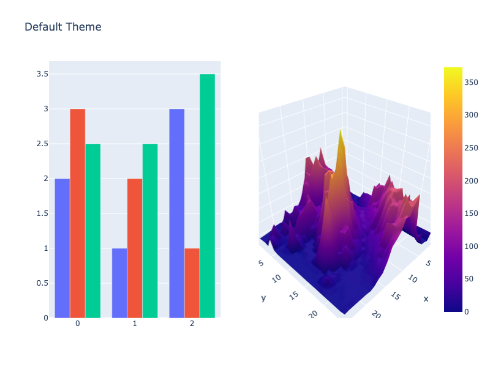
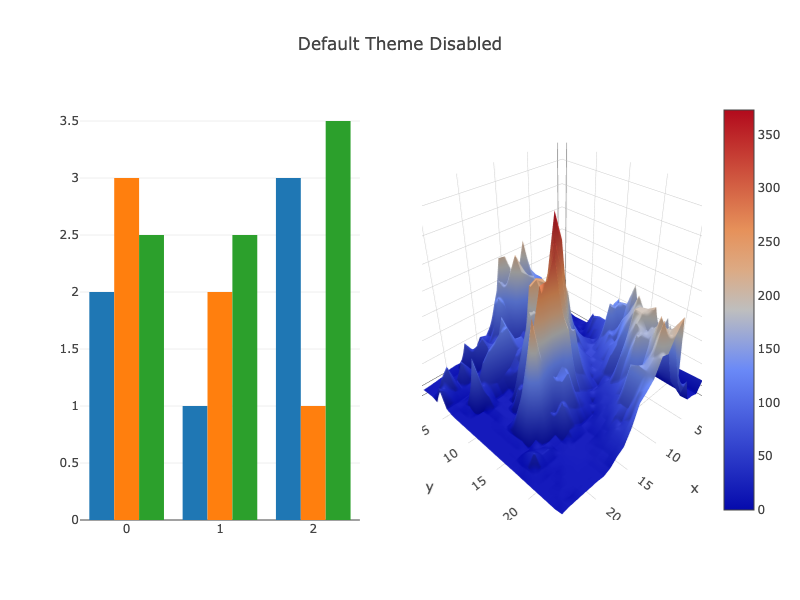
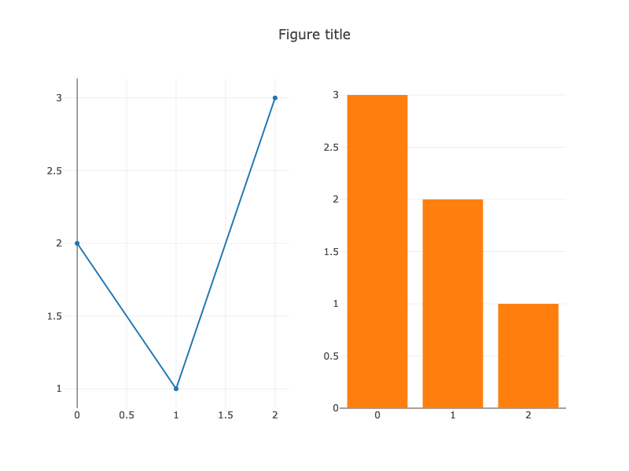
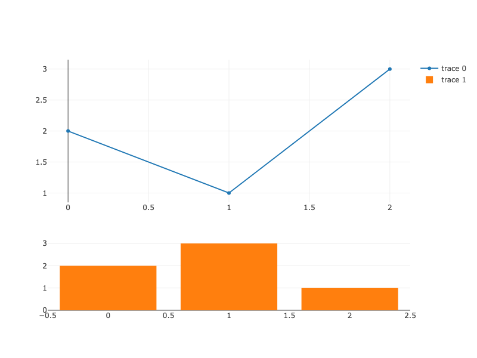

---
jupyter:
  jupytext:
    notebook_metadata_filter: all
    text_representation:
      extension: .md
      format_name: markdown
      format_version: '1.1'
      jupytext_version: 1.1.1
  kernelspec:
    display_name: Python 3
    language: python
    name: python3
  language_info:
    codemirror_mode:
      name: ipython
      version: 3
    file_extension: .py
    mimetype: text/x-python
    name: python
    nbconvert_exporter: python
    pygments_lexer: ipython3
    version: 3.6.7
  plotly:
    description: Migration guide for upgrading from version 3 to version 4
    display_as: file_settings
    language: python
    layout: base
    name: Version 4 Migration Guide
    order: 39
    page_type: example_index
    permalink: python/v4-migration/
    thumbnail: thumbnail/v4-migration.png
---

### Upgrading to Version 4

Upgrading to version 4 of `plotly` is a matter of following the instructions in the [Getting Started](/python/getting-started/) guide and reinstalling the packages, subject to the notices below.

### Getting Help

If you encounter issues in upgrading from version 3 to version 4, please reach out in our [Community Forum](https://community.plotly.com/c/api/python) or if you've found an issue or regression in version 4, please report a [Github Issue](https://github.com/plotly/plotly.py/issues/new)

<!-- #region -->
### Online features (`plotly.plotly`) moved to `chart-studio` package

Prior versions of plotly.py contained functionality for creating figures in both "online" and "offline" modes.  In "online" mode figures were uploaded to the Chart Studio cloud (or on-premise) service, whereas in "offline" mode figures were rendered locally.  **Version 4 of `plotly` is "offline"-only: all "online" functionality has been removed from the main `plotly` distribution package and moved to the new `chart-studio` distribution package.**

To migrate version 3 "online" functionality, first install the `chart-studio` package using pip...

```
$ pip install chart-studio
```

or conda.

```
$ conda install -c plotly chart-studio
```

Then, update your Python import statements to import "online" functionality from the top-level `chart_studio` package, rather than the top-level `plotly` package.  For example. replace

```python
from plotly.plotly import plot, iplot
```

with

```python
from chart_studio.plotly import plot, iplot
```

Similarly,
 - Replace **`plotly.api`** with **`chart_studio.api`**
 - Replace **`plotly.dashboard_objs`** with **`chart_studio.dashboard_objs`**
 - Replace **`plotly.grid_objs`** with **`chart_studio.grid_objs`**
 - Replace **`plotly.presentation_objs`** with **`chart_studio.presentation_objs`**
 - Replace **`plotly.widgets`** with **`chart_studio.widgets`**
<!-- #endregion -->

<!-- #region -->
### Offline features (`plotly.offline`) replaced by Renderers framework & HTML export

Version 4 introduces a new renderers framework that is a generalization of version 3's `plotly.offline.init_notebook_mode` and `plotly.offline.iplot` functions for displaying figures.  *This is a non-breaking change*: the `plotly.offline.iplot` function is still available and has been reimplemented on top of the renderers framework, so no changes are required when porting to version 4.  Going forward, we recommend using the renderers framework directly. See [Displaying plotly figures](/python/renderers) for more information.


In version 3, the `plotly.offline.plot` function was used to export figures to HTML files.  In version 4, this function has been reimplemented on top of the new `to_html` and `write_html` functions from the `plotly.io` module.  These functions have a slightly more consistent API (see docstrings for details), and going forward we recommend using them directly when performing HTML export. When working with a graph object figure, these functions are also available as the `.to_html` and `.write_html` figure methods.
<!-- #endregion -->

### New default theme
An updated `"plotly"` theme has been enabled by default in version 4.

```python
import plotly.graph_objects as go
from plotly.subplots import make_subplots
import pandas as pd

# Make figure with subplots
fig = make_subplots(rows=1, cols=2, specs=[[{"type": "bar"},
                                            {"type": "surface"}]])

# Add bar traces to subplot (1, 1)
fig.add_trace(go.Bar(y=[2, 1, 3]), row=1, col=1)
fig.add_trace(go.Bar(y=[3, 2, 1]), row=1, col=1)
fig.add_trace(go.Bar(y=[2.5, 2.5, 3.5]), row=1, col=1)

# Add surface trace to subplot (1, 2)
# Read data from a csv
z_data = pd.read_csv("https://raw.githubusercontent.com/plotly/datasets/master/api_docs/mt_bruno_elevation.csv")
fig.add_surface(z=z_data)

# Hide legend
fig.update_layout(
    showlegend=False,
    title_text="Default Theme",
    height=500,
    width=800,
)

fig.show()
```



**Interactive Plot:**

<div>                        <script type="text/javascript">window.PlotlyConfig = {MathJaxConfig: 'local'};</script>
        <script charset="utf-8" src="https://cdn.plot.ly/plotly-3.1.0.min.js" integrity="sha256-Ei4740bWZhaUTQuD6q9yQlgVCMPBz6CZWhevDYPv93A=" crossorigin="anonymous"></script>                <div id="plotly-div-1" class="plotly-graph-div" style="height:500px; width:800px;"></div>            <script type="text/javascript">                window.PLOTLYENV=window.PLOTLYENV || {};                                if (document.getElementById("plotly-div-1")) {                    Plotly.newPlot(                        "plotly-div-1",                        [{"y":[2,1,3],"type":"bar","xaxis":"x","yaxis":"y"},{"y":[3,2,1],"type":"bar","xaxis":"x","yaxis":"y"},{"y":[2.5,2.5,3.5],"type":"bar","xaxis":"x","yaxis":"y"},{"z":{"dtype":"f8","bdata":"AAAAAAAAAABlqmBUUs87QKw5QDBHz0hALPGAsinFVEBDrWnecSpdQGiR7Xw\u002fTWBA7C+7Jw\u002fXYkCcoiO5\u002fIVrQE0VjErqhGNAoyO5\u002fIeUYkDJdr6fGnlpQAU0ETY8wWlAih9j7lrKWkCLbOf7qRdRQPtcbcX+qkZAM9yAzw\u002f7SEAjMqzijeQ1QNhkjXqIBjFAlLw6x4B8J0CMLQQ5KIEtQL1SliGOVStAIy4AjdK1FkBy3CkdrH8KQNxJRPgXgfI\u002fcVRuopbmwr8AAAAAAADwP0c9RKM7uDtAdc3km21GSEA2donqrU1QQCEHJcy00VdAAG+BBMU\u002fXUA+6Nms+rxgQKUsQxzrCmNA2c73U+P9YkB24JwRpQNkQInS3uALcWZAFvvL7slzYkACmggbnkxlQOqVsgxxdF5Angd3Z+1KSkABamrZWotAQDFCeLRxNENAMqzijcwfRkDMXUvIB2VRQGCUoL\u002fQExBA7x6g+3JmCEAUPfAxWFEIQFJgAUwZ+AdAU0Kwql6+B0D4cTRHVv7\u002fPwAAAAAAAABABTQRNjxtPkDMlxdgH71AQMGQ1a2eZ0ZAG55eKcs8T0A9D+7O2ltTQAu1pnnHDVpAs3vysFCvWUBkXdxGAyBhQCBj7lpCQmdAqmBUUidqa0DufD81XrhmQIqw4emVOl5AHVpkO9\u002flYUBkIxCv65lUQLH5uDZUPEhAQNmUK7ytUkBrmnecogtOQOzAOSNKSxxANQ2K5gFcGEDY8PRKWSYaQFT83xEVqhpAChFwCFU6HUDfiVkvhvIWQPKxu0BJAQ1AAAAAAAAACECm0HmNXaowQHlYqDXNGz5Asmg6Oxn8Q0DP91PjpQ9GQESjO4idyU1AJvxSP29kU0CF61G4HrlaQCQofoy50WRAryXkg57nZUBeukkMAilnQHEbDeAtUGNArfpcbcXCVEBXlX1XBE9PQDyInSl0Kk9AnZ0MjpJHTkAu4jsx6\u002fVLQJzhBnx+WC5Asp\u002fFUiR\u002fIEDsaYe\u002fJldCQDMbZJKR905AlGqfjsdENEBkdavnpCVRQOS9amXCP0dAycwFLo81zj8AAAAAAAAQQI4fKo2YoSFAC0YldQJaMkB+jLlrCVEhQPW52or9lTtAh8Q9lj5QSEClg\u002fV\u002fDhdOQMxdS8gH1VZAP1dbsb82YkBxGw3gLQRdQH6MuWsJkVpAZoNMMnIsUUCTV+cYkI1KQKbVkLjH9kJAbZBJRs76R0DtKqT8pLZHQJCIKZFETVFAmRJJ9DJ6RkCk5NU5Biw9QF\u002fv\u002fniv6jFADJOpglFBMEBWKxN+qU8tQBhDOdGuQjFAxf6ye\u002fI4P0BA9nr3x1tHQAAAAAAAABRAmE2AYfmDGkCk\u002fKTap9MkQGCrBIvD0ThAglZgyOoWOkAMAiuHFik+QMhBCTNtJ0pAuvdwyXEtUEBZaVIKuhNTQFsIclDCKFVAlrIMcazbWEAYYB+dukJPQCMVxhaCaEdAC2MLQQ7iS0BYqDXNO5pUQApoImx4iGFAO8eA7PVQVECY+nlTkTpMQHmvWpnwaz5AfSJPkq5JMUDZl2w82JogQPM5d7te2gdAFqHYCpqWBUAZxt0gWosXQNl6hnDMEhVAAAAAAAAAGEDl0CLb+dY1QHRBfcucjhpAVFInoIn4MkCnXOFdLnJAQCXpmsk3k0VAoP1IERluT0CfPCzUmipaQHo2qz5XR2BAPE7RkVy2XEDQ1VbsL79aQC3saYe\u002f8k5AHuG04EXHS0CrlQm\u002f1LNVQJLoZRTLUVZAEOm3rwObXkBL6gQ0Ef5eQBKlvcEXRltAba0vEtqaWEDQDyOER2dTQG1zY3rCPkBA8KKvIM1YLUCWsgxxrHsdQMQXmqkYAKM\u002frQoe8AqO5D8AAAAAAAAcQADGM2joq0pAajANw0fMOkB0QX3LnI4aQPQyiuWWxiVAak3zjlM0MUDzqzlAMBdMQJfFxObj7FNAw9MrZRm2VkDByqFFtpFYQCeDo+TVN1RASZ2AJsKyUkCpaoKo++JSQJyiI7n8W1JACObo8XuHUkCBBMWPMQtRQK0XQznRHkdA3IDPDyP4Q0BWmpSCbjc\u002fQPd14JwRcUJArBxaZDsDREDWxW00gFtdQJzc71AUaClAghspWySt+z8AAAAAAAAAAAAAAAAAACBANKK0N\u002fiqOUD6J7hYUYdPQIenV8oyJDZAbef7qfESMUAziuWWVt9EQEnXTL7ZIk5AesISDyhbVEAj2\u002fl+apxcQLHh6ZWylFlAfPKwUGtyWUBEi2zn+8FbQF8pyxDHzl1AjLlrCfmEXECL\u002fWX35KFbQAYSFD\u002fGmE1AqvHSTWI8RUD20akrn0UtQP8DrFW7xhtAguLHmLvGG0A57pQO1r87QAAAAAAAAAAAAAAAAAAAAABRRuA4vjC4P3BWCqJqy7M\u002fAAAAAAAAIkCBlUOLbKcpQEWBPpEnTVFAkpGzsKdhR0AgKSLDKu4rQMSUSKKX8UBASx+6oL7pTkAL73IR3y9VQCuHFtnOR15ArfpcbcUoYkDr4jYawCVjQP7UeOkmmWlA097gC5N9bEDLEMe6uIltQARWDi2yi2xAeekmMQjWU0DXUdUEUe85QP8DrFW7xhtA\u002fwOsVbvGG0CC4seYu8YbQJOq7Sb4Nh5AAAAAAAAAAAAAAAAAAAAAAAAAAAAAAAAAAAAAAAAAAAAAAAAAAAAkQAAAAAAAAAAAinYVUn4qUUAhsHJokYVNQKAy\u002fn3GrUBAxHx5Afa5R0Bt5\u002fup8epMQOIBZVOuulNAKVyPwvX0WkBn1edqKwBlQBQ\u002fxty1XmBA1lbsL7uRakD1udqK\u002fblkQFmGONbFR2pAwTkjSnulZkCfq63YX7hnQNcS8kHPKmFAB84ZUdopVUCjy5vDtVohQNKNsKiI0xtAGvm84qnvIEAAAAAAAAAAAAAAAAAAAAAAAAAAAAAAAAAAAAAAAAAAAAAAAAAAACZAAAAAAAAAAAAhyEEJM8tXQB\u002fXhopxAlRACcTr+gXzTUAmAWpq2cpDQLL0oQvqI0lATRB1H4DoT0DQ8jy4OydUQICCixU1mFBAbcX+snvYaEC+MJkqGItuQH3Qs1n1Y3JADeAtkKCFcEBFR3L5Dw1mQIDxDBr6G05ABoGVQ4taU0BSRIZVvJVKQKlqgqj7FExAzt+EQgTMG0Bh\u002fDTuzR8eQCy7YHDNPQ5AAAAAAAAAAAAAAAAAAAAAAAAAAAAAAAAAAAAAAAAAKEAAAAAAAAAAAP32deCc32BAQBNhw9NLYEBoke18PzdYQBppqbwd7VJAZhTLLa1uTUCLcf4mFJpMQBXGFoIcmEtA1XjpJjGIU0AkKH6MuSNbQFUwKqkTTGNAseHplbLyc0Aydy0hH053QJzEILByN3FA1QloImxIYEAAOsyXF3hLQPPlBdhHfzlAIhyz7EkYIEDNBS6PNSsgQMIxy54EdhRAAJATJoy2FkAAAAAAAAAAAAAAAAAAAAAAAAAAAAAAAAAAAAAAAAAqQAAAAAAAAAAArJDyk2oLSEC94xQdydFhQGB2Tx4WjGFABTQRNjxXY0BHcvkP6ftVQHU8ZqAyDk1Aur2kMVprSkA9J71vfMlQQHSYLy\u002fA6lRApb3BFya7XUBxGw3gLcJiQPs6cM6ID3FAI0p7gy9SdUBoke18P9VtQGZmZmZmxmdABTQRNjw5XUDJk6RrJt9WQCsYldQJCCxA\u002fZ\u002fDfHklRUDCMcueBHYUQAAAAAAAAAAAAAAAAAAAAAAAAAAAAAAAAAAAAAAAACxAAAAAAAAAAACpE9BE2BhLQOcdp+hITGJADVTGv8\u002feWEDmdFlMbAxYQA3gLZCgvFlAV5V9VwQJU0C\u002ffR04Z+RMQEymCkYlhUdAU9DtJY0XUEBhTzv8NQ9VQD7o2az6VmRAKVyPwvVUXkB+HThnRKVqQMHKoUW2h3RAyjLEsS7XcUCu2F92T71xQK5H4XoUmmpAIbByaJGRZECU3je+9hJXQAvvchHf+RxAeekmMQis8j8AAAAAAAAAAAAAAAAAAAAAAAAAAAAALkAAAAAAAAAAAGXjwRa7rRtAXdxGA3hlaEDXEvJBz5BgQMx\u002fSL9952BAMUJ4tHF2VkDsaYe\u002fJl1WQNHLKJZbJk5A+grSjEUrSUDt0\u002fGYgZZDQOI7MevFiE1A7PoFu2GhUkDWc9L7xjtVQD0s1JrmY2dA7lpCPuj9XkCMuWsJ+exZQGQ730+NH2BAdQKaCBukZEAmUwWjkjZvQD1hiQeU2VdAxT2WPnQBJEDAWyBB8SMDQAAAAAAAAAAAAAAAAAAAAAAAAAAAAAAwQAAAAAAAAAAAaTo7GRy9NUDNO07RkcheQCQofoy5F2ZAvw6cM6LIY0DsUbgehSdhQABvgQTFU1pAbcX+snuoVUDCo40j1o5KQIv9ZffkCT1AHSCYo8dnPkDKbJBJRoZDQH3Qs1n1nUhAOnr83qajT0Dl0CLb+dpbQD\u002fG3LWETFlAmrFoOjsBREBj7lpCPuxNQAIOoUrNoFJAVWr2QCsQMUCcMGE0K3sDQChjfJi9TAJAH7Xm39fVN78AAAAAAAAAAAAAAAAAADFAAAAAAAAAAAAAAAAAAAAAANkIxOv6BU9A9bnaiv0JYUDvOEVHcjlpQEp7gy9MBGVAvjCZKhjNV0DcKR2s\u002f3NNQFw9J71veEdAH0sfuqCiSECTxmgdVY1CQMaFAyFZ+DFAR1UTRN3vPkADste7P7JAQFXZd0XwA0ZAmBdgH53SS0AOMsnIWY5TQEImGTkL2yxAZY7lXfXoI0C9cr1tphIfQAWjkjoBDSpAl8rbEU67NUC2FJD2P0ABQBNUnoplBOE\u002fAAAAAAAAMkAAAAAAAAAAAAAAAAAAAAAAPDHrxVDoU0DDZKpgVHZhQNNNYhBYpWVA5BQdyeUbaEDaG3xhMotoQFfsL7snFWJAbVZ9rraiWkDF5uPaUJVMQPEuF\u002fGdlERAqtTsgVYQQEDYgXNGlLYrQC7FVWXf1SVA+KqVCb8kKEBuaTUk7mE2QOPHmLuWuDhA6KBLOPQ2G0CjyFpDqc0QQADjGTT0dzBAtcNfkzVqL0As8YCyKftAQHHMsieBTR5Aj93LnoD9qL8AAAAAAAAzQAAAAAAAAAAAAAAAAAAAAADD0ytlGaJAQPFL\u002fbypxExAE2HD0yvnZEAFxY8xd49oQMx\u002fSL99WWhAINJvXwfGZkC4rwPnjOxdQLq9pDFaQVJA7YFWYMguSECr56T3jd9AQOm3rwPnPDpAQYLix5hbMEAZ5ZmXwz4bQHRBfcucjhpA9x+ZDp2OGkAa+bziqe8gQLX7VYDvxhhAGof6Xdi6DEBpjNZR1YQOQA7d7A+UMyFAjq89syTgFEAAAAAAAAAAAAAAAAAAADRAAAAAAAAAAAAAAAAAAAAAAMh71cqExz1AhnKiXYV8S0DdJAaBlRliQKs+V1ux72lAl\u002f+QfvuqZEAeFmpN82xlQMx\u002fSL993WVAzH9Iv30RWUC693DJcbtOQHgoCvSJGElAIlSp2QMVOkA7\u002fDVZoy4xQBr5vOKp7yBAdEF9y5yOGkBsXWqEflYZQGxdaoR+VhlAZKw2\u002f6+qFkALfhtivBYRQAAAAAAAAAAAAAAAAAAAAAAAAAAAAAAAAAAAAAAAAAAAAAAAAAAANUAAAAAAAAAAAAAAAAAAAAAAYhBYObRoP0CIhVrTvJdgQF+YTBWMMmdA07zjFB11XkCYTBWMSixnQLfRAN4CFWRAU5YhjnUJXUCQoPgx5oZdQNqs+lxtuWFAAz4\u002fjBBkUEAWhzO\u002fmmtIQN3qOel9IzdA\u002freSHRshMkCLcf4mFJIkQOGaO\u002fpfHhhAChNGs7ItGECpwMk2cMcWQJq2f2Wl6Q1AMQxYchUrD0AAAAAAAAAAAAAAAAAAAAAAAAAAAAAAAAAAAAAAAAA2QAAAAAAAAAAAAAAAAAAAAAAsms5OBpczQLRZ9bnaJkVAZTbIJCMRWEASFD\u002fG3GNnQIxK6gQ0dWZAY3\u002fZPXmsa0Cfq63YX0hjQOlILv8hxWFA4zYawFuSYkCM+E7MestQQNXsgVZgWERAOsyXF2DfQ0C1T8djBho6QIBlpUkp+CxAxcn9DkVRIUAxDFhyFSsPQHmRCfg1kgxAMQxYchUrD0AxDFhyFSsPQDEMWHIVKw9AnBVRE30+8T8AAAAAAAAAAAAAAAAAADdATKW7xaUlVD+46jpUUxIIQBAEyNCxoxdAuCOcFrzAQED+ZffkYRVaQLByaJHtBmNAPE7RkVzGaED0\u002fdR46fpnQJM6AU2El2xAb\u002fCFyVQDZUDtnjws1AhiQI9TdCSXr1tA7DTSUnnTTEBv05\u002f9SFFFQKX3ja896ztANbVsrS\u002fSLkD6er5muRwgQAzIXu\u002f+OA9ABfhu88YJD0CimLwBZn4PQG1Zvi7Dvw9A4MjyZO2lvz+sjbETXuIPQNFB8ilbf8e\u002fAAAAAAAAOEAAAAAAAAAAACu9NhsrgRZAJuXuc3y0HkB4uYjvxJRPQPLqHAOy\u002f0ZAajANw0fkU0DLoUW282lsQHL5D+m3fWlAklz+Q\u002fqRZUCbVZ+rrSRmQCZTBaOSjmFACKwcWmT\u002fXkCgGi\u002fdJJZbQG5MT1jiR1BAd9Zuu9AoQUAs1JrmHYc4QE6Zm29EHyNAe6Lrwg+uCkBbzqW4qlwWQBFuMqoM8xVAlPqytFOjF0BPrimQ2XkXQDRlpx\u002fUVRdAE7cKYqCLDEA=","shape":"25, 25"},"type":"surface"}],                        {"template":{"data":{"histogram2dcontour":[{"type":"histogram2dcontour","colorbar":{"outlinewidth":0,"ticks":""},"colorscale":[[0.0,"#0d0887"],[0.1111111111111111,"#46039f"],[0.2222222222222222,"#7201a8"],[0.3333333333333333,"#9c179e"],[0.4444444444444444,"#bd3786"],[0.5555555555555556,"#d8576b"],[0.6666666666666666,"#ed7953"],[0.7777777777777778,"#fb9f3a"],[0.8888888888888888,"#fdca26"],[1.0,"#f0f921"]]}],"choropleth":[{"type":"choropleth","colorbar":{"outlinewidth":0,"ticks":""}}],"histogram2d":[{"type":"histogram2d","colorbar":{"outlinewidth":0,"ticks":""},"colorscale":[[0.0,"#0d0887"],[0.1111111111111111,"#46039f"],[0.2222222222222222,"#7201a8"],[0.3333333333333333,"#9c179e"],[0.4444444444444444,"#bd3786"],[0.5555555555555556,"#d8576b"],[0.6666666666666666,"#ed7953"],[0.7777777777777778,"#fb9f3a"],[0.8888888888888888,"#fdca26"],[1.0,"#f0f921"]]}],"heatmap":[{"type":"heatmap","colorbar":{"outlinewidth":0,"ticks":""},"colorscale":[[0.0,"#0d0887"],[0.1111111111111111,"#46039f"],[0.2222222222222222,"#7201a8"],[0.3333333333333333,"#9c179e"],[0.4444444444444444,"#bd3786"],[0.5555555555555556,"#d8576b"],[0.6666666666666666,"#ed7953"],[0.7777777777777778,"#fb9f3a"],[0.8888888888888888,"#fdca26"],[1.0,"#f0f921"]]}],"contourcarpet":[{"type":"contourcarpet","colorbar":{"outlinewidth":0,"ticks":""}}],"contour":[{"type":"contour","colorbar":{"outlinewidth":0,"ticks":""},"colorscale":[[0.0,"#0d0887"],[0.1111111111111111,"#46039f"],[0.2222222222222222,"#7201a8"],[0.3333333333333333,"#9c179e"],[0.4444444444444444,"#bd3786"],[0.5555555555555556,"#d8576b"],[0.6666666666666666,"#ed7953"],[0.7777777777777778,"#fb9f3a"],[0.8888888888888888,"#fdca26"],[1.0,"#f0f921"]]}],"surface":[{"type":"surface","colorbar":{"outlinewidth":0,"ticks":""},"colorscale":[[0.0,"#0d0887"],[0.1111111111111111,"#46039f"],[0.2222222222222222,"#7201a8"],[0.3333333333333333,"#9c179e"],[0.4444444444444444,"#bd3786"],[0.5555555555555556,"#d8576b"],[0.6666666666666666,"#ed7953"],[0.7777777777777778,"#fb9f3a"],[0.8888888888888888,"#fdca26"],[1.0,"#f0f921"]]}],"mesh3d":[{"type":"mesh3d","colorbar":{"outlinewidth":0,"ticks":""}}],"scatter":[{"fillpattern":{"fillmode":"overlay","size":10,"solidity":0.2},"type":"scatter"}],"parcoords":[{"type":"parcoords","line":{"colorbar":{"outlinewidth":0,"ticks":""}}}],"scatterpolargl":[{"type":"scatterpolargl","marker":{"colorbar":{"outlinewidth":0,"ticks":""}}}],"bar":[{"error_x":{"color":"#2a3f5f"},"error_y":{"color":"#2a3f5f"},"marker":{"line":{"color":"#E5ECF6","width":0.5},"pattern":{"fillmode":"overlay","size":10,"solidity":0.2}},"type":"bar"}],"scattergeo":[{"type":"scattergeo","marker":{"colorbar":{"outlinewidth":0,"ticks":""}}}],"scatterpolar":[{"type":"scatterpolar","marker":{"colorbar":{"outlinewidth":0,"ticks":""}}}],"histogram":[{"marker":{"pattern":{"fillmode":"overlay","size":10,"solidity":0.2}},"type":"histogram"}],"scattergl":[{"type":"scattergl","marker":{"colorbar":{"outlinewidth":0,"ticks":""}}}],"scatter3d":[{"type":"scatter3d","line":{"colorbar":{"outlinewidth":0,"ticks":""}},"marker":{"colorbar":{"outlinewidth":0,"ticks":""}}}],"scattermap":[{"type":"scattermap","marker":{"colorbar":{"outlinewidth":0,"ticks":""}}}],"scattermapbox":[{"type":"scattermapbox","marker":{"colorbar":{"outlinewidth":0,"ticks":""}}}],"scatterternary":[{"type":"scatterternary","marker":{"colorbar":{"outlinewidth":0,"ticks":""}}}],"scattercarpet":[{"type":"scattercarpet","marker":{"colorbar":{"outlinewidth":0,"ticks":""}}}],"carpet":[{"aaxis":{"endlinecolor":"#2a3f5f","gridcolor":"white","linecolor":"white","minorgridcolor":"white","startlinecolor":"#2a3f5f"},"baxis":{"endlinecolor":"#2a3f5f","gridcolor":"white","linecolor":"white","minorgridcolor":"white","startlinecolor":"#2a3f5f"},"type":"carpet"}],"table":[{"cells":{"fill":{"color":"#EBF0F8"},"line":{"color":"white"}},"header":{"fill":{"color":"#C8D4E3"},"line":{"color":"white"}},"type":"table"}],"barpolar":[{"marker":{"line":{"color":"#E5ECF6","width":0.5},"pattern":{"fillmode":"overlay","size":10,"solidity":0.2}},"type":"barpolar"}],"pie":[{"automargin":true,"type":"pie"}]},"layout":{"autotypenumbers":"strict","colorway":["#636efa","#EF553B","#00cc96","#ab63fa","#FFA15A","#19d3f3","#FF6692","#B6E880","#FF97FF","#FECB52"],"font":{"color":"#2a3f5f"},"hovermode":"closest","hoverlabel":{"align":"left"},"paper_bgcolor":"white","plot_bgcolor":"#E5ECF6","polar":{"bgcolor":"#E5ECF6","angularaxis":{"gridcolor":"white","linecolor":"white","ticks":""},"radialaxis":{"gridcolor":"white","linecolor":"white","ticks":""}},"ternary":{"bgcolor":"#E5ECF6","aaxis":{"gridcolor":"white","linecolor":"white","ticks":""},"baxis":{"gridcolor":"white","linecolor":"white","ticks":""},"caxis":{"gridcolor":"white","linecolor":"white","ticks":""}},"coloraxis":{"colorbar":{"outlinewidth":0,"ticks":""}},"colorscale":{"sequential":[[0.0,"#0d0887"],[0.1111111111111111,"#46039f"],[0.2222222222222222,"#7201a8"],[0.3333333333333333,"#9c179e"],[0.4444444444444444,"#bd3786"],[0.5555555555555556,"#d8576b"],[0.6666666666666666,"#ed7953"],[0.7777777777777778,"#fb9f3a"],[0.8888888888888888,"#fdca26"],[1.0,"#f0f921"]],"sequentialminus":[[0.0,"#0d0887"],[0.1111111111111111,"#46039f"],[0.2222222222222222,"#7201a8"],[0.3333333333333333,"#9c179e"],[0.4444444444444444,"#bd3786"],[0.5555555555555556,"#d8576b"],[0.6666666666666666,"#ed7953"],[0.7777777777777778,"#fb9f3a"],[0.8888888888888888,"#fdca26"],[1.0,"#f0f921"]],"diverging":[[0,"#8e0152"],[0.1,"#c51b7d"],[0.2,"#de77ae"],[0.3,"#f1b6da"],[0.4,"#fde0ef"],[0.5,"#f7f7f7"],[0.6,"#e6f5d0"],[0.7,"#b8e186"],[0.8,"#7fbc41"],[0.9,"#4d9221"],[1,"#276419"]]},"xaxis":{"gridcolor":"white","linecolor":"white","ticks":"","title":{"standoff":15},"zerolinecolor":"white","automargin":true,"zerolinewidth":2},"yaxis":{"gridcolor":"white","linecolor":"white","ticks":"","title":{"standoff":15},"zerolinecolor":"white","automargin":true,"zerolinewidth":2},"scene":{"xaxis":{"backgroundcolor":"#E5ECF6","gridcolor":"white","linecolor":"white","showbackground":true,"ticks":"","zerolinecolor":"white","gridwidth":2},"yaxis":{"backgroundcolor":"#E5ECF6","gridcolor":"white","linecolor":"white","showbackground":true,"ticks":"","zerolinecolor":"white","gridwidth":2},"zaxis":{"backgroundcolor":"#E5ECF6","gridcolor":"white","linecolor":"white","showbackground":true,"ticks":"","zerolinecolor":"white","gridwidth":2}},"shapedefaults":{"line":{"color":"#2a3f5f"}},"annotationdefaults":{"arrowcolor":"#2a3f5f","arrowhead":0,"arrowwidth":1},"geo":{"bgcolor":"white","landcolor":"#E5ECF6","subunitcolor":"white","showland":true,"showlakes":true,"lakecolor":"white"},"title":{"x":0.05},"mapbox":{"style":"light"}}},"xaxis":{"anchor":"y","domain":[0.0,0.45]},"yaxis":{"anchor":"x","domain":[0.0,1.0]},"scene":{"domain":{"x":[0.55,1.0],"y":[0.0,1.0]}},"title":{"text":"Default Theme"},"showlegend":false,"height":500,"width":800},                        {"responsive": true}                    )                };            </script>        </div>

You can revert to the version 3 figure appearance by disabling the default theme as follows:

```python
import plotly.io as pio
pio.templates.default = "none"

import plotly.graph_objects as go
from plotly.subplots import make_subplots
import pandas as pd

# Make figure with subplots
fig = make_subplots(rows=1, cols=2, specs=[[{"type": "bar"},
                                            {"type": "surface"}]])

# Add bar traces to subplot (1, 1)
fig.add_trace(go.Bar(y=[2, 1, 3]), row=1, col=1)
fig.add_trace(go.Bar(y=[3, 2, 1]), row=1, col=1)
fig.add_trace(go.Bar(y=[2.5, 2.5, 3.5]), row=1, col=1)

# Add surface trace to subplot (1, 2)
# Read data from a csv
z_data = pd.read_csv("https://raw.githubusercontent.com/plotly/datasets/master/api_docs/mt_bruno_elevation.csv")
fig.add_surface(z=z_data)

# Hide legend
fig.update_layout(
    showlegend=False,
    title_text="Default Theme Disabled",
    height=500,
    width=800,
)

fig.show()
```



**Interactive Plot:**

<div>                        <script type="text/javascript">window.PlotlyConfig = {MathJaxConfig: 'local'};</script>
        <script charset="utf-8" src="https://cdn.plot.ly/plotly-3.1.0.min.js" integrity="sha256-Ei4740bWZhaUTQuD6q9yQlgVCMPBz6CZWhevDYPv93A=" crossorigin="anonymous"></script>                <div id="plotly-div-2" class="plotly-graph-div" style="height:500px; width:800px;"></div>            <script type="text/javascript">                window.PLOTLYENV=window.PLOTLYENV || {};                                if (document.getElementById("plotly-div-2")) {                    Plotly.newPlot(                        "plotly-div-2",                        [{"y":[2,1,3],"type":"bar","xaxis":"x","yaxis":"y"},{"y":[3,2,1],"type":"bar","xaxis":"x","yaxis":"y"},{"y":[2.5,2.5,3.5],"type":"bar","xaxis":"x","yaxis":"y"},{"z":{"dtype":"f8","bdata":"AAAAAAAAAABlqmBUUs87QKw5QDBHz0hALPGAsinFVEBDrWnecSpdQGiR7Xw\u002fTWBA7C+7Jw\u002fXYkCcoiO5\u002fIVrQE0VjErqhGNAoyO5\u002fIeUYkDJdr6fGnlpQAU0ETY8wWlAih9j7lrKWkCLbOf7qRdRQPtcbcX+qkZAM9yAzw\u002f7SEAjMqzijeQ1QNhkjXqIBjFAlLw6x4B8J0CMLQQ5KIEtQL1SliGOVStAIy4AjdK1FkBy3CkdrH8KQNxJRPgXgfI\u002fcVRuopbmwr8AAAAAAADwP0c9RKM7uDtAdc3km21GSEA2donqrU1QQCEHJcy00VdAAG+BBMU\u002fXUA+6Nms+rxgQKUsQxzrCmNA2c73U+P9YkB24JwRpQNkQInS3uALcWZAFvvL7slzYkACmggbnkxlQOqVsgxxdF5Angd3Z+1KSkABamrZWotAQDFCeLRxNENAMqzijcwfRkDMXUvIB2VRQGCUoL\u002fQExBA7x6g+3JmCEAUPfAxWFEIQFJgAUwZ+AdAU0Kwql6+B0D4cTRHVv7\u002fPwAAAAAAAABABTQRNjxtPkDMlxdgH71AQMGQ1a2eZ0ZAG55eKcs8T0A9D+7O2ltTQAu1pnnHDVpAs3vysFCvWUBkXdxGAyBhQCBj7lpCQmdAqmBUUidqa0DufD81XrhmQIqw4emVOl5AHVpkO9\u002flYUBkIxCv65lUQLH5uDZUPEhAQNmUK7ytUkBrmnecogtOQOzAOSNKSxxANQ2K5gFcGEDY8PRKWSYaQFT83xEVqhpAChFwCFU6HUDfiVkvhvIWQPKxu0BJAQ1AAAAAAAAACECm0HmNXaowQHlYqDXNGz5Asmg6Oxn8Q0DP91PjpQ9GQESjO4idyU1AJvxSP29kU0CF61G4HrlaQCQofoy50WRAryXkg57nZUBeukkMAilnQHEbDeAtUGNArfpcbcXCVEBXlX1XBE9PQDyInSl0Kk9AnZ0MjpJHTkAu4jsx6\u002fVLQJzhBnx+WC5Asp\u002fFUiR\u002fIEDsaYe\u002fJldCQDMbZJKR905AlGqfjsdENEBkdavnpCVRQOS9amXCP0dAycwFLo81zj8AAAAAAAAQQI4fKo2YoSFAC0YldQJaMkB+jLlrCVEhQPW52or9lTtAh8Q9lj5QSEClg\u002fV\u002fDhdOQMxdS8gH1VZAP1dbsb82YkBxGw3gLQRdQH6MuWsJkVpAZoNMMnIsUUCTV+cYkI1KQKbVkLjH9kJAbZBJRs76R0DtKqT8pLZHQJCIKZFETVFAmRJJ9DJ6RkCk5NU5Biw9QF\u002fv\u002fniv6jFADJOpglFBMEBWKxN+qU8tQBhDOdGuQjFAxf6ye\u002fI4P0BA9nr3x1tHQAAAAAAAABRAmE2AYfmDGkCk\u002fKTap9MkQGCrBIvD0ThAglZgyOoWOkAMAiuHFik+QMhBCTNtJ0pAuvdwyXEtUEBZaVIKuhNTQFsIclDCKFVAlrIMcazbWEAYYB+dukJPQCMVxhaCaEdAC2MLQQ7iS0BYqDXNO5pUQApoImx4iGFAO8eA7PVQVECY+nlTkTpMQHmvWpnwaz5AfSJPkq5JMUDZl2w82JogQPM5d7te2gdAFqHYCpqWBUAZxt0gWosXQNl6hnDMEhVAAAAAAAAAGEDl0CLb+dY1QHRBfcucjhpAVFInoIn4MkCnXOFdLnJAQCXpmsk3k0VAoP1IERluT0CfPCzUmipaQHo2qz5XR2BAPE7RkVy2XEDQ1VbsL79aQC3saYe\u002f8k5AHuG04EXHS0CrlQm\u002f1LNVQJLoZRTLUVZAEOm3rwObXkBL6gQ0Ef5eQBKlvcEXRltAba0vEtqaWEDQDyOER2dTQG1zY3rCPkBA8KKvIM1YLUCWsgxxrHsdQMQXmqkYAKM\u002frQoe8AqO5D8AAAAAAAAcQADGM2joq0pAajANw0fMOkB0QX3LnI4aQPQyiuWWxiVAak3zjlM0MUDzqzlAMBdMQJfFxObj7FNAw9MrZRm2VkDByqFFtpFYQCeDo+TVN1RASZ2AJsKyUkCpaoKo++JSQJyiI7n8W1JACObo8XuHUkCBBMWPMQtRQK0XQznRHkdA3IDPDyP4Q0BWmpSCbjc\u002fQPd14JwRcUJArBxaZDsDREDWxW00gFtdQJzc71AUaClAghspWySt+z8AAAAAAAAAAAAAAAAAACBANKK0N\u002fiqOUD6J7hYUYdPQIenV8oyJDZAbef7qfESMUAziuWWVt9EQEnXTL7ZIk5AesISDyhbVEAj2\u002fl+apxcQLHh6ZWylFlAfPKwUGtyWUBEi2zn+8FbQF8pyxDHzl1AjLlrCfmEXECL\u002fWX35KFbQAYSFD\u002fGmE1AqvHSTWI8RUD20akrn0UtQP8DrFW7xhtAguLHmLvGG0A57pQO1r87QAAAAAAAAAAAAAAAAAAAAABRRuA4vjC4P3BWCqJqy7M\u002fAAAAAAAAIkCBlUOLbKcpQEWBPpEnTVFAkpGzsKdhR0AgKSLDKu4rQMSUSKKX8UBASx+6oL7pTkAL73IR3y9VQCuHFtnOR15ArfpcbcUoYkDr4jYawCVjQP7UeOkmmWlA097gC5N9bEDLEMe6uIltQARWDi2yi2xAeekmMQjWU0DXUdUEUe85QP8DrFW7xhtA\u002fwOsVbvGG0CC4seYu8YbQJOq7Sb4Nh5AAAAAAAAAAAAAAAAAAAAAAAAAAAAAAAAAAAAAAAAAAAAAAAAAAAAkQAAAAAAAAAAAinYVUn4qUUAhsHJokYVNQKAy\u002fn3GrUBAxHx5Afa5R0Bt5\u002fup8epMQOIBZVOuulNAKVyPwvX0WkBn1edqKwBlQBQ\u002fxty1XmBA1lbsL7uRakD1udqK\u002fblkQFmGONbFR2pAwTkjSnulZkCfq63YX7hnQNcS8kHPKmFAB84ZUdopVUCjy5vDtVohQNKNsKiI0xtAGvm84qnvIEAAAAAAAAAAAAAAAAAAAAAAAAAAAAAAAAAAAAAAAAAAAAAAAAAAACZAAAAAAAAAAAAhyEEJM8tXQB\u002fXhopxAlRACcTr+gXzTUAmAWpq2cpDQLL0oQvqI0lATRB1H4DoT0DQ8jy4OydUQICCixU1mFBAbcX+snvYaEC+MJkqGItuQH3Qs1n1Y3JADeAtkKCFcEBFR3L5Dw1mQIDxDBr6G05ABoGVQ4taU0BSRIZVvJVKQKlqgqj7FExAzt+EQgTMG0Bh\u002fDTuzR8eQCy7YHDNPQ5AAAAAAAAAAAAAAAAAAAAAAAAAAAAAAAAAAAAAAAAAKEAAAAAAAAAAAP32deCc32BAQBNhw9NLYEBoke18PzdYQBppqbwd7VJAZhTLLa1uTUCLcf4mFJpMQBXGFoIcmEtA1XjpJjGIU0AkKH6MuSNbQFUwKqkTTGNAseHplbLyc0Aydy0hH053QJzEILByN3FA1QloImxIYEAAOsyXF3hLQPPlBdhHfzlAIhyz7EkYIEDNBS6PNSsgQMIxy54EdhRAAJATJoy2FkAAAAAAAAAAAAAAAAAAAAAAAAAAAAAAAAAAAAAAAAAqQAAAAAAAAAAArJDyk2oLSEC94xQdydFhQGB2Tx4WjGFABTQRNjxXY0BHcvkP6ftVQHU8ZqAyDk1Aur2kMVprSkA9J71vfMlQQHSYLy\u002fA6lRApb3BFya7XUBxGw3gLcJiQPs6cM6ID3FAI0p7gy9SdUBoke18P9VtQGZmZmZmxmdABTQRNjw5XUDJk6RrJt9WQCsYldQJCCxA\u002fZ\u002fDfHklRUDCMcueBHYUQAAAAAAAAAAAAAAAAAAAAAAAAAAAAAAAAAAAAAAAACxAAAAAAAAAAACpE9BE2BhLQOcdp+hITGJADVTGv8\u002feWEDmdFlMbAxYQA3gLZCgvFlAV5V9VwQJU0C\u002ffR04Z+RMQEymCkYlhUdAU9DtJY0XUEBhTzv8NQ9VQD7o2az6VmRAKVyPwvVUXkB+HThnRKVqQMHKoUW2h3RAyjLEsS7XcUCu2F92T71xQK5H4XoUmmpAIbByaJGRZECU3je+9hJXQAvvchHf+RxAeekmMQis8j8AAAAAAAAAAAAAAAAAAAAAAAAAAAAALkAAAAAAAAAAAGXjwRa7rRtAXdxGA3hlaEDXEvJBz5BgQMx\u002fSL9952BAMUJ4tHF2VkDsaYe\u002fJl1WQNHLKJZbJk5A+grSjEUrSUDt0\u002fGYgZZDQOI7MevFiE1A7PoFu2GhUkDWc9L7xjtVQD0s1JrmY2dA7lpCPuj9XkCMuWsJ+exZQGQ730+NH2BAdQKaCBukZEAmUwWjkjZvQD1hiQeU2VdAxT2WPnQBJEDAWyBB8SMDQAAAAAAAAAAAAAAAAAAAAAAAAAAAAAAwQAAAAAAAAAAAaTo7GRy9NUDNO07RkcheQCQofoy5F2ZAvw6cM6LIY0DsUbgehSdhQABvgQTFU1pAbcX+snuoVUDCo40j1o5KQIv9ZffkCT1AHSCYo8dnPkDKbJBJRoZDQH3Qs1n1nUhAOnr83qajT0Dl0CLb+dpbQD\u002fG3LWETFlAmrFoOjsBREBj7lpCPuxNQAIOoUrNoFJAVWr2QCsQMUCcMGE0K3sDQChjfJi9TAJAH7Xm39fVN78AAAAAAAAAAAAAAAAAADFAAAAAAAAAAAAAAAAAAAAAANkIxOv6BU9A9bnaiv0JYUDvOEVHcjlpQEp7gy9MBGVAvjCZKhjNV0DcKR2s\u002f3NNQFw9J71veEdAH0sfuqCiSECTxmgdVY1CQMaFAyFZ+DFAR1UTRN3vPkADste7P7JAQFXZd0XwA0ZAmBdgH53SS0AOMsnIWY5TQEImGTkL2yxAZY7lXfXoI0C9cr1tphIfQAWjkjoBDSpAl8rbEU67NUC2FJD2P0ABQBNUnoplBOE\u002fAAAAAAAAMkAAAAAAAAAAAAAAAAAAAAAAPDHrxVDoU0DDZKpgVHZhQNNNYhBYpWVA5BQdyeUbaEDaG3xhMotoQFfsL7snFWJAbVZ9rraiWkDF5uPaUJVMQPEuF\u002fGdlERAqtTsgVYQQEDYgXNGlLYrQC7FVWXf1SVA+KqVCb8kKEBuaTUk7mE2QOPHmLuWuDhA6KBLOPQ2G0CjyFpDqc0QQADjGTT0dzBAtcNfkzVqL0As8YCyKftAQHHMsieBTR5Aj93LnoD9qL8AAAAAAAAzQAAAAAAAAAAAAAAAAAAAAADD0ytlGaJAQPFL\u002fbypxExAE2HD0yvnZEAFxY8xd49oQMx\u002fSL99WWhAINJvXwfGZkC4rwPnjOxdQLq9pDFaQVJA7YFWYMguSECr56T3jd9AQOm3rwPnPDpAQYLix5hbMEAZ5ZmXwz4bQHRBfcucjhpA9x+ZDp2OGkAa+bziqe8gQLX7VYDvxhhAGof6Xdi6DEBpjNZR1YQOQA7d7A+UMyFAjq89syTgFEAAAAAAAAAAAAAAAAAAADRAAAAAAAAAAAAAAAAAAAAAAMh71cqExz1AhnKiXYV8S0DdJAaBlRliQKs+V1ux72lAl\u002f+QfvuqZEAeFmpN82xlQMx\u002fSL993WVAzH9Iv30RWUC693DJcbtOQHgoCvSJGElAIlSp2QMVOkA7\u002fDVZoy4xQBr5vOKp7yBAdEF9y5yOGkBsXWqEflYZQGxdaoR+VhlAZKw2\u002f6+qFkALfhtivBYRQAAAAAAAAAAAAAAAAAAAAAAAAAAAAAAAAAAAAAAAAAAAAAAAAAAANUAAAAAAAAAAAAAAAAAAAAAAYhBYObRoP0CIhVrTvJdgQF+YTBWMMmdA07zjFB11XkCYTBWMSixnQLfRAN4CFWRAU5YhjnUJXUCQoPgx5oZdQNqs+lxtuWFAAz4\u002fjBBkUEAWhzO\u002fmmtIQN3qOel9IzdA\u002freSHRshMkCLcf4mFJIkQOGaO\u002fpfHhhAChNGs7ItGECpwMk2cMcWQJq2f2Wl6Q1AMQxYchUrD0AAAAAAAAAAAAAAAAAAAAAAAAAAAAAAAAAAAAAAAAA2QAAAAAAAAAAAAAAAAAAAAAAsms5OBpczQLRZ9bnaJkVAZTbIJCMRWEASFD\u002fG3GNnQIxK6gQ0dWZAY3\u002fZPXmsa0Cfq63YX0hjQOlILv8hxWFA4zYawFuSYkCM+E7MestQQNXsgVZgWERAOsyXF2DfQ0C1T8djBho6QIBlpUkp+CxAxcn9DkVRIUAxDFhyFSsPQHmRCfg1kgxAMQxYchUrD0AxDFhyFSsPQDEMWHIVKw9AnBVRE30+8T8AAAAAAAAAAAAAAAAAADdATKW7xaUlVD+46jpUUxIIQBAEyNCxoxdAuCOcFrzAQED+ZffkYRVaQLByaJHtBmNAPE7RkVzGaED0\u002fdR46fpnQJM6AU2El2xAb\u002fCFyVQDZUDtnjws1AhiQI9TdCSXr1tA7DTSUnnTTEBv05\u002f9SFFFQKX3ja896ztANbVsrS\u002fSLkD6er5muRwgQAzIXu\u002f+OA9ABfhu88YJD0CimLwBZn4PQG1Zvi7Dvw9A4MjyZO2lvz+sjbETXuIPQNFB8ilbf8e\u002fAAAAAAAAOEAAAAAAAAAAACu9NhsrgRZAJuXuc3y0HkB4uYjvxJRPQPLqHAOy\u002f0ZAajANw0fkU0DLoUW282lsQHL5D+m3fWlAklz+Q\u002fqRZUCbVZ+rrSRmQCZTBaOSjmFACKwcWmT\u002fXkCgGi\u002fdJJZbQG5MT1jiR1BAd9Zuu9AoQUAs1JrmHYc4QE6Zm29EHyNAe6Lrwg+uCkBbzqW4qlwWQBFuMqoM8xVAlPqytFOjF0BPrimQ2XkXQDRlpx\u002fUVRdAE7cKYqCLDEA=","shape":"25, 25"},"type":"surface"}],                        {"template":{"data":{"scatter":[{"type":"scatter"}]}},"xaxis":{"anchor":"y","domain":[0.0,0.45]},"yaxis":{"anchor":"x","domain":[0.0,1.0]},"scene":{"domain":{"x":[0.55,1.0],"y":[0.0,1.0]}},"title":{"text":"Default Theme Disabled"},"showlegend":false,"height":500,"width":800},                        {"responsive": true}                    )                };            </script>        </div>

```python
# Restore default theme
pio.templates.default = "plotly"
```

**Error:**
```
Error executing code: name 'pio' is not defined
Traceback (most recent call last):
  File "/Users/gvwilson/plotly.py/bin/run_markdown.py", line 236, in _run_code
    exec(code, exec_globals)
  File "<string>", line 2, in <module>
NameError: name 'pio' is not defined
```

See [Theming and templates](/python/templates) for more information on theming in plotly.py version 4.

### Add trace return value
In version 3, the `add_trace` graph object figure method returned a reference to the newly created trace. This was also the case for the `add_{trace_type}` methods (e.g. `add_scatter`, `add_bar`, etc.).  In version 4, these methods return a reference to the calling figure.  This change was made to support method chaining of figure operations. For example

```python
from plotly.subplots import make_subplots
(make_subplots(rows=1, cols=2)
 .add_scatter(y=[2, 1, 3], row=1, col=1)
 .add_bar(y=[3, 2, 1], row=1, col=2)
 .update_layout(
     title_text="Figure title",
     showlegend=False,
     width=800,
     height=500,
 )
 .show())
```



**Interactive Plot:**

<div>                        <script type="text/javascript">window.PlotlyConfig = {MathJaxConfig: 'local'};</script>
        <script charset="utf-8" src="https://cdn.plot.ly/plotly-3.1.0.min.js" integrity="sha256-Ei4740bWZhaUTQuD6q9yQlgVCMPBz6CZWhevDYPv93A=" crossorigin="anonymous"></script>                <div id="plotly-div-3" class="plotly-graph-div" style="height:500px; width:800px;"></div>            <script type="text/javascript">                window.PLOTLYENV=window.PLOTLYENV || {};                                if (document.getElementById("plotly-div-3")) {                    Plotly.newPlot(                        "plotly-div-3",                        [{"y":[2,1,3],"type":"scatter","xaxis":"x","yaxis":"y"},{"y":[3,2,1],"type":"bar","xaxis":"x2","yaxis":"y2"}],                        {"template":{"data":{"scatter":[{"type":"scatter"}]}},"xaxis":{"anchor":"y","domain":[0.0,0.45]},"yaxis":{"anchor":"x","domain":[0.0,1.0]},"xaxis2":{"anchor":"y2","domain":[0.55,1.0]},"yaxis2":{"anchor":"x2","domain":[0.0,1.0]},"title":{"text":"Figure title"},"showlegend":false,"width":800,"height":500},                        {"responsive": true}                    )                };            </script>        </div>

<!-- #region -->
Code that relied on the `add_*` methods to return a reference to the newly created trace will need to be updated to access the trace from the returned figure.  This can be done by appending `.data[-1]` to the add trace expression.

Here is an example of a version 3 code snippet that adds a scatter trace to a figure, assigns the result to a variable named `scatter`, and then modifies the marker size of the scatter trace.

```python
import plotly.graph_objs as go
fig = go.Figure()
scatter = fig.add_trace(go.Scatter(y=[2, 3, 1]))
scatter.marker.size = 20
```
In version 4, this would be replaced with the following:

```python
import plotly.graph_objects as go
fig = go.Figure()
scatter = fig.add_trace(go.Scatter(y=[2, 3, 1])).data[-1]
scatter.marker.size = 20
```
<!-- #endregion -->

### `make_subplots` updates
The `make_subplots` function has been overhauled to support all trace types and to support the integration of Plotly Express.  Here are a few changes to be aware of when porting code that uses `make_subplots` to version 4.

#### New preferred import location
The preferred import location of the `make_subplots` function is now `plotly.subplots.make_subplots`.  For compatibility, this function is still available as `plotly.tools.make_subplots`.

#### Grid no longer printed by default
When the `print_grid` argument to `make_subplots` is set to `True`, a text representation of the subplot grid is printed by the `make_subplots` function.  In version 3, the default value of `print_grid` was `True`. In version 4, the default value of `print_grid` is `False`.

#### New `row_heights` argument to replace `row_width`
The legacy argument for specifying the relative height of subplot rows was called `row_width`. A new `row_heights` argument has been introduced for this purpose.

> Note: Although it is not mentioned in the docstring for `plotly.subplots.make_subplots`, the legacy `row_width` argument, with the legacy behavior, is still available in version 4.

In addition to having a more consistent name, values specified to the new `row_heights` argument properly honor the `start_cell` argument.  With the legacy `row_width` argument, the list of heights was always interpreted from the bottom row to the top row, even if `start_cell=="top-left"`. With the new `row_heights` argument, the list of heights is interpreted from top to bottom if `start_cell=="top-left"` and from bottom to top if `start_cell=="bottom-left"`.

When porting code from `row_width` to `row_heights`, the order of the heights list must be reversed if `start_cell=="top-left"` or `start_cell` was unspecified.

Here is a version 3 compatible example that uses the `row_width` argument to create a figure with subplots where the top row is twice as tall as the bottom row.

```python
from plotly.subplots import make_subplots

fig = make_subplots(
    rows=2, cols=1,
    row_width=[0.33, 0.67],
    start_cell="top-left")

fig.add_scatter(y=[2, 1, 3], row=1, col=1)
fig.add_bar(y=[2, 3, 1], row=2, col=1)
fig.show()
```



**Interactive Plot:**

<div>                        <script type="text/javascript">window.PlotlyConfig = {MathJaxConfig: 'local'};</script>
        <script charset="utf-8" src="https://cdn.plot.ly/plotly-3.1.0.min.js" integrity="sha256-Ei4740bWZhaUTQuD6q9yQlgVCMPBz6CZWhevDYPv93A=" crossorigin="anonymous"></script>                <div id="plotly-div-4" class="plotly-graph-div" style="height:100%; width:100%;"></div>            <script type="text/javascript">                window.PLOTLYENV=window.PLOTLYENV || {};                                if (document.getElementById("plotly-div-4")) {                    Plotly.newPlot(                        "plotly-div-4",                        [{"y":[2,1,3],"type":"scatter","xaxis":"x","yaxis":"y"},{"y":[2,3,1],"type":"bar","xaxis":"x2","yaxis":"y2"}],                        {"template":{"data":{"scatter":[{"type":"scatter"}]}},"xaxis":{"anchor":"y","domain":[0.0,1.0]},"yaxis":{"anchor":"x","domain":[0.4305,1.0]},"xaxis2":{"anchor":"y2","domain":[0.0,1.0]},"yaxis2":{"anchor":"x2","domain":[0.0,0.2805]}},                        {"responsive": true}                    )                };            </script>        </div>

And here is the equivalent, version 4 example. Note how the order to the height list is reversed compared to the example above.

```python
from plotly.subplots import make_subplots

fig = make_subplots(
    rows=2, cols=1,
    row_heights=[0.67, 0.33],
    start_cell="top-left")

fig.add_scatter(y=[2, 1, 3], row=1, col=1)
fig.add_bar(y=[2, 3, 1], row=2, col=1)
fig.show()
```


**Interactive Plot:**

<div>                        <script type="text/javascript">window.PlotlyConfig = {MathJaxConfig: 'local'};</script>
        <script charset="utf-8" src="https://cdn.plot.ly/plotly-3.1.0.min.js" integrity="sha256-Ei4740bWZhaUTQuD6q9yQlgVCMPBz6CZWhevDYPv93A=" crossorigin="anonymous"></script>                <div id="plotly-div-5" class="plotly-graph-div" style="height:100%; width:100%;"></div>            <script type="text/javascript">                window.PLOTLYENV=window.PLOTLYENV || {};                                if (document.getElementById("plotly-div-5")) {                    Plotly.newPlot(                        "plotly-div-5",                        [{"y":[2,1,3],"type":"scatter","xaxis":"x","yaxis":"y"},{"y":[2,3,1],"type":"bar","xaxis":"x2","yaxis":"y2"}],                        {"template":{"data":{"scatter":[{"type":"scatter"}]}},"xaxis":{"anchor":"y","domain":[0.0,1.0]},"yaxis":{"anchor":"x","domain":[0.4305,1.0]},"xaxis2":{"anchor":"y2","domain":[0.0,1.0]},"yaxis2":{"anchor":"x2","domain":[0.0,0.2805]}},                        {"responsive": true}                    )                };            </script>        </div>

#### Implementation of shared axes with `make_subplots`
The implementation of shared axis support in the `make_subplots` function has been simplified.  Prior to version 4, shared y-axes were implemented by associating a single `yaxis` object with multiple `xaxis` objects, and vica versa.

In version 4, every 2D Cartesian subplot has a dedicated x-axis and and a dedicated y-axis. Axes are now "shared" by being linked together using the `matches` axis property.

For legacy code that makes use of the `make_subplots` and add trace APIs, this change does not require any action on the user's part.  However, legacy code that uses `make_subplots` to create a figure with shared axes, and then manipulates the axes directly, may require updates.  The output of the `.print_grid` method on a figure created using `make_subplots` can be used to identify which axis objects are associated with each subplot.

```python
from plotly.subplots import make_subplots
fig = make_subplots(rows=1, cols=2, shared_yaxes=True)
fig.print_grid()
print(fig)
```

**Output:**
```
This is the format of your plot grid:
[ (1,1) x,y   ]  [ (1,2) x2,y2 ]

Figure({
    'data': [],
    'layout': {'template': '...',
               'xaxis': {'anchor': 'y', 'domain': [0.0, 0.45]},
               'xaxis2': {'anchor': 'y2', 'domain': [0.55, 1.0]},
               'yaxis': {'anchor': 'x', 'domain': [0.0, 1.0]},
               'yaxis2': {'anchor': 'x2', 'domain': [0.0, 1.0], 'matches': 'y', 'showticklabels': False}}
})
```

### Trace UIDs
In version 3, all trace graph objects were copied and assigned a new `uid` property when being added to a `Figure`. In version 4, these `uid` properties are only generated automatically when a trace is added to a `FigureWidget`.  When a trace is added to a standard `Figure` graph object the input `uid`, if provided, is accepted as is.

### Timezones
Prior to version 4, when plotly.py was passed a `datetime` that included a timezone, the `datetime` was automatically converted to UTC.  In version 4, this conversion is no longer performed, and `datetime` objects are accepted and displayed in local time.

<!-- #region -->
### Headless image export on Linux with Xvfb.
In version 4, the static image export logic attempts to automatically detect whether to call the orca image export utility using Xvfb.  Xvfb is needed for orca to work in a Linux environment if an X11 display server is not available. By default, Xvfb is used if plotly.py is running on Linux if no X11 display server is detected and `Xvfb` is available on the system `PATH`.

This new behavior can be disabled by setting the `use_xvfb` orca configuration option to `False` as follows:

```python
import plotly.io as pio
pio.orca.config.use_xvfb = False
```
<!-- #endregion -->

### Removals

#### fileopt argument removal
The `fileopt` argument to `chart_studio.plotly.plot` has been removed, so in-place modifications to previously published figures are no longer supported.

#### Legacy online `GraphWidget`
The legacy online-only `GraphWidget` class has been removed.  Please use the `plotly.graph_objects.FigureWidget` class instead. See the [Figure Widget Overview](/python/figurewidget/) for more information.

### Recommended style updates

#### Import from `graph_objects` instead of `graph_objs`
The legacy `plotly.graph_objs` package has been aliased as `plotly.graph_objects` because the latter is much easier to communicate verbally. The `plotly.graph_objs` package is still available for backward compatibility.