---
jupyter:
  jupytext:
    notebook_metadata_filter: all
    text_representation:
      extension: .md
      format_name: markdown
      format_version: '1.3'
      jupytext_version: 1.13.7
  kernelspec:
    display_name: Python 3 (ipykernel)
    language: python
    name: python3
  language_info:
    codemirror_mode:
      name: ipython
      version: 3
    file_extension: .py
    mimetype: text/x-python
    name: python
    nbconvert_exporter: python
    pygments_lexer: ipython3
    version: 3.9.0
  plotly:
    description: How to make violin plots in Python with Plotly.
    display_as: statistical
    language: python
    layout: base
    name: Violin Plots
    order: 10
    page_type: u-guide
    permalink: python/violin/
    redirect_from:
    - /python/violin-plot/
    - /python/violin-plots/
    thumbnail: thumbnail/violin.jpg
---

<!-- #region -->
## Violin Plot with Plotly Express

A [violin plot](https://en.wikipedia.org/wiki/Violin_plot) is a statistical representation of numerical data. It is similar to a [box plot](https://plotly.com/python/box-plots/), with the addition of a rotated [kernel density](https://en.wikipedia.org/wiki/Kernel_density_estimation) plot on each side.

Alternatives to violin plots for visualizing distributions include [histograms](https://plotly.com/python/histograms/), [box plots](https://plotly.com/python/box-plots/), [ECDF plots](https://plotly.com/python/ecdf-plots/) and [strip charts](https://plotly.com/python/strip-charts/).


### Basic Violin Plot with Plotly Express

[Plotly Express](../plotly-express/) is the easy-to-use, high-level interface to Plotly, which [operates on a variety of types of data](../px-arguments/) and produces [easy-to-style figures](../styling-plotly-express/).
<!-- #endregion -->

```python
import plotly.express as px

df = px.data.tips()
fig = px.violin(df, y="total_bill")
fig.show()
```

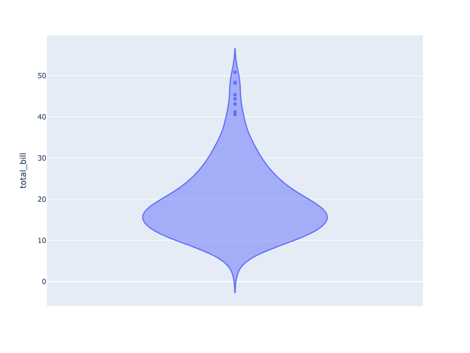

**Interactive Plot:**

<div>                        <script type="text/javascript">window.PlotlyConfig = {MathJaxConfig: 'local'};</script>
        <script charset="utf-8" src="https://cdn.plot.ly/plotly-3.1.0.min.js" integrity="sha256-Ei4740bWZhaUTQuD6q9yQlgVCMPBz6CZWhevDYPv93A=" crossorigin="anonymous"></script>                <div id="plotly-div-1" class="plotly-graph-div" style="height:100%; width:100%;"></div>            <script type="text/javascript">                window.PLOTLYENV=window.PLOTLYENV || {};                                if (document.getElementById("plotly-div-1")) {                    Plotly.newPlot(                        "plotly-div-1",                        [{"alignmentgroup":"True","box":{"visible":false},"hovertemplate":"total_bill=%{y}\u003cextra\u003e\u003c\u002fextra\u003e","legendgroup":"","marker":{"color":"#636efa"},"name":"","offsetgroup":"","orientation":"v","scalegroup":"True","showlegend":false,"x0":" ","xaxis":"x","y":{"dtype":"f8","bdata":"PQrXo3D9MECuR+F6FK4kQMP1KFyPAjVArkfhehSuN0DXo3A9Cpc4QArXo3A9SjlACtejcD2KIUDhehSuR+E6QBSuR+F6FC5Aj8L1KFyPLUAK16NwPYokQOF6FK5HoUFA16NwPQrXLkCuR+F6FG4yQClcj8L1qC1AFK5H4XqUNUApXI\u002fC9agkQArXo3A9SjBAuB6F61H4MEBmZmZmZqY0QOxRuB6F6zFACtejcD1KNEAK16NwPYovQPYoXI\u002fCtUNAUrgehevRM0CPwvUoXM8xQD0K16NwvSpA4XoUrkdhKUAzMzMzM7M1QGZmZmZmpjNAmpmZmZkZI0CamZmZmVkyQB+F61G4Hi5AcT0K16OwNEBI4XoUrscxQI\u002fC9ShcDzhAj8L1KFxPMECuR+F6FO4wQHE9CtejsDJAhetRuB5FP0AK16NwPQowQPYoXI\u002fCdTFA4XoUrkfhK0Bcj8L1KFwjQGZmZmZmZj5ACtejcD1KMkB7FK5H4To2QDMzMzMzM0BAzczMzMyMPEAK16NwPQoyQBSuR+F6FClAFK5H4XqUJEBI4XoUrmdBQOF6FK5H4SNAj8L1KFyPOUA9CtejcH0zQOF6FK5HAUNAKVyPwvVoOkB7FK5H4XomQMP1KFyPIkhACtejcD1KNEAfhetRuJ4rQArXo3A9CiZACtejcD1KMkDXo3A9CpcxQBSuR+F6FDRAMzMzMzNzMECPwvUoXI8IQHsUrkfhOjRAhetRuB4FLkAK16NwPQooQFK4HoXrETFAXI\u002fC9SjcOkBI4XoUrkc5QPYoXI\u002fCdS1AhetRuB4FJUDsUbgehesxQDMzMzMzMztAw\u002fUoXI\u002fCNkAK16NwPUoxQHE9CtejcDNAKVyPwvWoMECkcD0K1yMkQNejcD0KV0BA9ihcj8L1L0AK16NwPWpBQI\u002fC9ShcDypASOF6FK5HMkD2KFyPwrU4QClcj8L1KDVAuB6F61H4PEA9CtejcH02QAAAAAAAABdAUrgehetRMEAAAAAAAMA2QPYoXI\u002fCFURASOF6FK5HO0CPwvUoXA8oQMP1KFyPAjVA7FG4HoXrKEAzMzMzM7MmQMP1KFyPwi5AZmZmZmYmRkDsUbgehWs2QOxRuB6F6zRAuB6F61G4LkA9CtejcH00QPYoXI\u002fCNTlAPQrXo3A9MkAfhetRuJ4sQAAAAAAAACxAAAAAAAAAHUApXI\u002fC9QhDQDMzMzMz8zdA9ihcj8K1OUCPwvUoXE8xQK5H4XoU7j1AzczMzMxMJUBcj8L1KNwoQBSuR+F6FDhA4XoUrkdhJ0DXo3A9CtcqQIXrUbgehSxAZmZmZmbmL0D2KFyPwvUoQM3MzMzMzD1ACtejcD0KIUAK16NwPQotQMP1KFyPwiZAUrgehevRNkAUrkfhehQzQIXrUbgeRTRA16NwPQpXJkCF61G4HoUoQMP1KFyPQjJAhetRuB4FIUApXI\u002fC9agkQM3MzMzMTCxAAAAAAAAAMEBSuB6F61EqQLgehetReDFAZmZmZmYmQUC4HoXrUZhEQM3MzMzMDDtArkfhehRuMEAzMzMzM7MgQKRwPQrXozJAPQrXo3C9J0CPwvUoXI8jQArXo3A9Ch5ApHA9CtcjLEDD9Shcj0IqQMP1KFyPQjFAzczMzMyMOECF61G4HsUzQJqZmZmZ2T1A9ihcj8IVSEAAAAAAAAA5QEjhehSuxypAPQrXo3B9MEAAAAAAAIA1QFK4HoXrUSlA9ihcj8I1MEAfhetRuJ4rQMP1KFyPgjFAhetRuB6FOEDD9Shcj8I0QPYoXI\u002fCtT9ArkfhehQuJUDD9Shcj0IlQEjhehSuZ0lAH4XrUbieL0AAAAAAAAAdQJqZmZmZ2T9AUrgehevRMEAzMzMzM3NAQKRwPQrX4zFA9ihcj8L1LEAzMzMzMzMjQHE9CtejUEFAMzMzMzNTQUAUrkfhelQ3QM3MzMzMrEZA7FG4HoUrN0BmZmZmZkZEQHE9CtejsDRAZmZmZmbmNED2KFyPwnU+QGZmZmZmJjJAmpmZmZkZN0DhehSuR2EvQI\u002fC9ShczzNAcT0K16NwPED2KFyPwvUuQBSuR+F6lDBAPQrXo3A9HkCuR+F6FK4kQK5H4XoUjkVAAAAAAAAAKkCF61G4HgUrQPYoXI\u002fCtTJAexSuR+F6KUAAAAAAAAAqQGZmZmZmZjBASOF6FK6HNEC4HoXrUXgwQNejcD0KlzpAPQrXo3BdQ0CF61G4HkU4QIXrUbgehSlAj8L1KFwPPkCkcD0K1+M5QArXo3A9KkhACtejcD2KKkDsUbgehSs8QM3MzMzMzClAZmZmZmYmPECuR+F6FC4nQPYoXI\u002fC9R5ApHA9CtcjPkBSuB6F61EoQNejcD0K1ypAKVyPwvUoIUD2KFyPwvUvQNejcD0K1ypAhetRuB5FMECuR+F6FC4kQDMzMzMzczRAj8L1KFyPKkAfhetRuB42QMP1KFyPAjhA4XoUrkdhL0C4HoXrUTgnQArXo3A9iiVAj8L1KFwPL0CkcD0K1yMkQDMzMzMzMylACtejcD1qQEAK16NwPepBQEjhehSuBz1ArkfhehQuO0DsUbgehas2QFK4HoXr0TFASOF6FK7HMkA="},"y0":" ","yaxis":"y","type":"violin"}],                        {"template":{"data":{"histogram2dcontour":[{"type":"histogram2dcontour","colorbar":{"outlinewidth":0,"ticks":""},"colorscale":[[0.0,"#0d0887"],[0.1111111111111111,"#46039f"],[0.2222222222222222,"#7201a8"],[0.3333333333333333,"#9c179e"],[0.4444444444444444,"#bd3786"],[0.5555555555555556,"#d8576b"],[0.6666666666666666,"#ed7953"],[0.7777777777777778,"#fb9f3a"],[0.8888888888888888,"#fdca26"],[1.0,"#f0f921"]]}],"choropleth":[{"type":"choropleth","colorbar":{"outlinewidth":0,"ticks":""}}],"histogram2d":[{"type":"histogram2d","colorbar":{"outlinewidth":0,"ticks":""},"colorscale":[[0.0,"#0d0887"],[0.1111111111111111,"#46039f"],[0.2222222222222222,"#7201a8"],[0.3333333333333333,"#9c179e"],[0.4444444444444444,"#bd3786"],[0.5555555555555556,"#d8576b"],[0.6666666666666666,"#ed7953"],[0.7777777777777778,"#fb9f3a"],[0.8888888888888888,"#fdca26"],[1.0,"#f0f921"]]}],"heatmap":[{"type":"heatmap","colorbar":{"outlinewidth":0,"ticks":""},"colorscale":[[0.0,"#0d0887"],[0.1111111111111111,"#46039f"],[0.2222222222222222,"#7201a8"],[0.3333333333333333,"#9c179e"],[0.4444444444444444,"#bd3786"],[0.5555555555555556,"#d8576b"],[0.6666666666666666,"#ed7953"],[0.7777777777777778,"#fb9f3a"],[0.8888888888888888,"#fdca26"],[1.0,"#f0f921"]]}],"contourcarpet":[{"type":"contourcarpet","colorbar":{"outlinewidth":0,"ticks":""}}],"contour":[{"type":"contour","colorbar":{"outlinewidth":0,"ticks":""},"colorscale":[[0.0,"#0d0887"],[0.1111111111111111,"#46039f"],[0.2222222222222222,"#7201a8"],[0.3333333333333333,"#9c179e"],[0.4444444444444444,"#bd3786"],[0.5555555555555556,"#d8576b"],[0.6666666666666666,"#ed7953"],[0.7777777777777778,"#fb9f3a"],[0.8888888888888888,"#fdca26"],[1.0,"#f0f921"]]}],"surface":[{"type":"surface","colorbar":{"outlinewidth":0,"ticks":""},"colorscale":[[0.0,"#0d0887"],[0.1111111111111111,"#46039f"],[0.2222222222222222,"#7201a8"],[0.3333333333333333,"#9c179e"],[0.4444444444444444,"#bd3786"],[0.5555555555555556,"#d8576b"],[0.6666666666666666,"#ed7953"],[0.7777777777777778,"#fb9f3a"],[0.8888888888888888,"#fdca26"],[1.0,"#f0f921"]]}],"mesh3d":[{"type":"mesh3d","colorbar":{"outlinewidth":0,"ticks":""}}],"scatter":[{"fillpattern":{"fillmode":"overlay","size":10,"solidity":0.2},"type":"scatter"}],"parcoords":[{"type":"parcoords","line":{"colorbar":{"outlinewidth":0,"ticks":""}}}],"scatterpolargl":[{"type":"scatterpolargl","marker":{"colorbar":{"outlinewidth":0,"ticks":""}}}],"bar":[{"error_x":{"color":"#2a3f5f"},"error_y":{"color":"#2a3f5f"},"marker":{"line":{"color":"#E5ECF6","width":0.5},"pattern":{"fillmode":"overlay","size":10,"solidity":0.2}},"type":"bar"}],"scattergeo":[{"type":"scattergeo","marker":{"colorbar":{"outlinewidth":0,"ticks":""}}}],"scatterpolar":[{"type":"scatterpolar","marker":{"colorbar":{"outlinewidth":0,"ticks":""}}}],"histogram":[{"marker":{"pattern":{"fillmode":"overlay","size":10,"solidity":0.2}},"type":"histogram"}],"scattergl":[{"type":"scattergl","marker":{"colorbar":{"outlinewidth":0,"ticks":""}}}],"scatter3d":[{"type":"scatter3d","line":{"colorbar":{"outlinewidth":0,"ticks":""}},"marker":{"colorbar":{"outlinewidth":0,"ticks":""}}}],"scattermap":[{"type":"scattermap","marker":{"colorbar":{"outlinewidth":0,"ticks":""}}}],"scattermapbox":[{"type":"scattermapbox","marker":{"colorbar":{"outlinewidth":0,"ticks":""}}}],"scatterternary":[{"type":"scatterternary","marker":{"colorbar":{"outlinewidth":0,"ticks":""}}}],"scattercarpet":[{"type":"scattercarpet","marker":{"colorbar":{"outlinewidth":0,"ticks":""}}}],"carpet":[{"aaxis":{"endlinecolor":"#2a3f5f","gridcolor":"white","linecolor":"white","minorgridcolor":"white","startlinecolor":"#2a3f5f"},"baxis":{"endlinecolor":"#2a3f5f","gridcolor":"white","linecolor":"white","minorgridcolor":"white","startlinecolor":"#2a3f5f"},"type":"carpet"}],"table":[{"cells":{"fill":{"color":"#EBF0F8"},"line":{"color":"white"}},"header":{"fill":{"color":"#C8D4E3"},"line":{"color":"white"}},"type":"table"}],"barpolar":[{"marker":{"line":{"color":"#E5ECF6","width":0.5},"pattern":{"fillmode":"overlay","size":10,"solidity":0.2}},"type":"barpolar"}],"pie":[{"automargin":true,"type":"pie"}]},"layout":{"autotypenumbers":"strict","colorway":["#636efa","#EF553B","#00cc96","#ab63fa","#FFA15A","#19d3f3","#FF6692","#B6E880","#FF97FF","#FECB52"],"font":{"color":"#2a3f5f"},"hovermode":"closest","hoverlabel":{"align":"left"},"paper_bgcolor":"white","plot_bgcolor":"#E5ECF6","polar":{"bgcolor":"#E5ECF6","angularaxis":{"gridcolor":"white","linecolor":"white","ticks":""},"radialaxis":{"gridcolor":"white","linecolor":"white","ticks":""}},"ternary":{"bgcolor":"#E5ECF6","aaxis":{"gridcolor":"white","linecolor":"white","ticks":""},"baxis":{"gridcolor":"white","linecolor":"white","ticks":""},"caxis":{"gridcolor":"white","linecolor":"white","ticks":""}},"coloraxis":{"colorbar":{"outlinewidth":0,"ticks":""}},"colorscale":{"sequential":[[0.0,"#0d0887"],[0.1111111111111111,"#46039f"],[0.2222222222222222,"#7201a8"],[0.3333333333333333,"#9c179e"],[0.4444444444444444,"#bd3786"],[0.5555555555555556,"#d8576b"],[0.6666666666666666,"#ed7953"],[0.7777777777777778,"#fb9f3a"],[0.8888888888888888,"#fdca26"],[1.0,"#f0f921"]],"sequentialminus":[[0.0,"#0d0887"],[0.1111111111111111,"#46039f"],[0.2222222222222222,"#7201a8"],[0.3333333333333333,"#9c179e"],[0.4444444444444444,"#bd3786"],[0.5555555555555556,"#d8576b"],[0.6666666666666666,"#ed7953"],[0.7777777777777778,"#fb9f3a"],[0.8888888888888888,"#fdca26"],[1.0,"#f0f921"]],"diverging":[[0,"#8e0152"],[0.1,"#c51b7d"],[0.2,"#de77ae"],[0.3,"#f1b6da"],[0.4,"#fde0ef"],[0.5,"#f7f7f7"],[0.6,"#e6f5d0"],[0.7,"#b8e186"],[0.8,"#7fbc41"],[0.9,"#4d9221"],[1,"#276419"]]},"xaxis":{"gridcolor":"white","linecolor":"white","ticks":"","title":{"standoff":15},"zerolinecolor":"white","automargin":true,"zerolinewidth":2},"yaxis":{"gridcolor":"white","linecolor":"white","ticks":"","title":{"standoff":15},"zerolinecolor":"white","automargin":true,"zerolinewidth":2},"scene":{"xaxis":{"backgroundcolor":"#E5ECF6","gridcolor":"white","linecolor":"white","showbackground":true,"ticks":"","zerolinecolor":"white","gridwidth":2},"yaxis":{"backgroundcolor":"#E5ECF6","gridcolor":"white","linecolor":"white","showbackground":true,"ticks":"","zerolinecolor":"white","gridwidth":2},"zaxis":{"backgroundcolor":"#E5ECF6","gridcolor":"white","linecolor":"white","showbackground":true,"ticks":"","zerolinecolor":"white","gridwidth":2}},"shapedefaults":{"line":{"color":"#2a3f5f"}},"annotationdefaults":{"arrowcolor":"#2a3f5f","arrowhead":0,"arrowwidth":1},"geo":{"bgcolor":"white","landcolor":"#E5ECF6","subunitcolor":"white","showland":true,"showlakes":true,"lakecolor":"white"},"title":{"x":0.05},"mapbox":{"style":"light"}}},"xaxis":{"anchor":"y","domain":[0.0,1.0]},"yaxis":{"anchor":"x","domain":[0.0,1.0],"title":{"text":"total_bill"}},"legend":{"tracegroupgap":0},"margin":{"t":60},"violinmode":"group"},                        {"responsive": true}                    )                };            </script>        </div>

### Violin plot with box and data points

```python
import plotly.express as px

df = px.data.tips()
fig = px.violin(df, y="total_bill", box=True, # draw box plot inside the violin
                points='all', # can be 'outliers', or False
               )
fig.show()
```

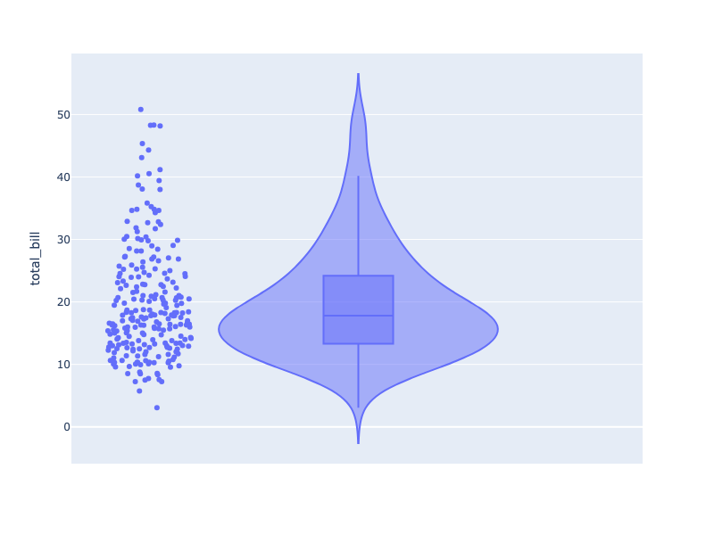

**Interactive Plot:**

<div>                        <script type="text/javascript">window.PlotlyConfig = {MathJaxConfig: 'local'};</script>
        <script charset="utf-8" src="https://cdn.plot.ly/plotly-3.1.0.min.js" integrity="sha256-Ei4740bWZhaUTQuD6q9yQlgVCMPBz6CZWhevDYPv93A=" crossorigin="anonymous"></script>                <div id="plotly-div-2" class="plotly-graph-div" style="height:100%; width:100%;"></div>            <script type="text/javascript">                window.PLOTLYENV=window.PLOTLYENV || {};                                if (document.getElementById("plotly-div-2")) {                    Plotly.newPlot(                        "plotly-div-2",                        [{"alignmentgroup":"True","box":{"visible":true},"hovertemplate":"total_bill=%{y}\u003cextra\u003e\u003c\u002fextra\u003e","legendgroup":"","marker":{"color":"#636efa"},"name":"","offsetgroup":"","orientation":"v","points":"all","scalegroup":"True","showlegend":false,"x0":" ","xaxis":"x","y":{"dtype":"f8","bdata":"PQrXo3D9MECuR+F6FK4kQMP1KFyPAjVArkfhehSuN0DXo3A9Cpc4QArXo3A9SjlACtejcD2KIUDhehSuR+E6QBSuR+F6FC5Aj8L1KFyPLUAK16NwPYokQOF6FK5HoUFA16NwPQrXLkCuR+F6FG4yQClcj8L1qC1AFK5H4XqUNUApXI\u002fC9agkQArXo3A9SjBAuB6F61H4MEBmZmZmZqY0QOxRuB6F6zFACtejcD1KNEAK16NwPYovQPYoXI\u002fCtUNAUrgehevRM0CPwvUoXM8xQD0K16NwvSpA4XoUrkdhKUAzMzMzM7M1QGZmZmZmpjNAmpmZmZkZI0CamZmZmVkyQB+F61G4Hi5AcT0K16OwNEBI4XoUrscxQI\u002fC9ShcDzhAj8L1KFxPMECuR+F6FO4wQHE9CtejsDJAhetRuB5FP0AK16NwPQowQPYoXI\u002fCdTFA4XoUrkfhK0Bcj8L1KFwjQGZmZmZmZj5ACtejcD1KMkB7FK5H4To2QDMzMzMzM0BAzczMzMyMPEAK16NwPQoyQBSuR+F6FClAFK5H4XqUJEBI4XoUrmdBQOF6FK5H4SNAj8L1KFyPOUA9CtejcH0zQOF6FK5HAUNAKVyPwvVoOkB7FK5H4XomQMP1KFyPIkhACtejcD1KNEAfhetRuJ4rQArXo3A9CiZACtejcD1KMkDXo3A9CpcxQBSuR+F6FDRAMzMzMzNzMECPwvUoXI8IQHsUrkfhOjRAhetRuB4FLkAK16NwPQooQFK4HoXrETFAXI\u002fC9SjcOkBI4XoUrkc5QPYoXI\u002fCdS1AhetRuB4FJUDsUbgehesxQDMzMzMzMztAw\u002fUoXI\u002fCNkAK16NwPUoxQHE9CtejcDNAKVyPwvWoMECkcD0K1yMkQNejcD0KV0BA9ihcj8L1L0AK16NwPWpBQI\u002fC9ShcDypASOF6FK5HMkD2KFyPwrU4QClcj8L1KDVAuB6F61H4PEA9CtejcH02QAAAAAAAABdAUrgehetRMEAAAAAAAMA2QPYoXI\u002fCFURASOF6FK5HO0CPwvUoXA8oQMP1KFyPAjVA7FG4HoXrKEAzMzMzM7MmQMP1KFyPwi5AZmZmZmYmRkDsUbgehWs2QOxRuB6F6zRAuB6F61G4LkA9CtejcH00QPYoXI\u002fCNTlAPQrXo3A9MkAfhetRuJ4sQAAAAAAAACxAAAAAAAAAHUApXI\u002fC9QhDQDMzMzMz8zdA9ihcj8K1OUCPwvUoXE8xQK5H4XoU7j1AzczMzMxMJUBcj8L1KNwoQBSuR+F6FDhA4XoUrkdhJ0DXo3A9CtcqQIXrUbgehSxAZmZmZmbmL0D2KFyPwvUoQM3MzMzMzD1ACtejcD0KIUAK16NwPQotQMP1KFyPwiZAUrgehevRNkAUrkfhehQzQIXrUbgeRTRA16NwPQpXJkCF61G4HoUoQMP1KFyPQjJAhetRuB4FIUApXI\u002fC9agkQM3MzMzMTCxAAAAAAAAAMEBSuB6F61EqQLgehetReDFAZmZmZmYmQUC4HoXrUZhEQM3MzMzMDDtArkfhehRuMEAzMzMzM7MgQKRwPQrXozJAPQrXo3C9J0CPwvUoXI8jQArXo3A9Ch5ApHA9CtcjLEDD9Shcj0IqQMP1KFyPQjFAzczMzMyMOECF61G4HsUzQJqZmZmZ2T1A9ihcj8IVSEAAAAAAAAA5QEjhehSuxypAPQrXo3B9MEAAAAAAAIA1QFK4HoXrUSlA9ihcj8I1MEAfhetRuJ4rQMP1KFyPgjFAhetRuB6FOEDD9Shcj8I0QPYoXI\u002fCtT9ArkfhehQuJUDD9Shcj0IlQEjhehSuZ0lAH4XrUbieL0AAAAAAAAAdQJqZmZmZ2T9AUrgehevRMEAzMzMzM3NAQKRwPQrX4zFA9ihcj8L1LEAzMzMzMzMjQHE9CtejUEFAMzMzMzNTQUAUrkfhelQ3QM3MzMzMrEZA7FG4HoUrN0BmZmZmZkZEQHE9CtejsDRAZmZmZmbmNED2KFyPwnU+QGZmZmZmJjJAmpmZmZkZN0DhehSuR2EvQI\u002fC9ShczzNAcT0K16NwPED2KFyPwvUuQBSuR+F6lDBAPQrXo3A9HkCuR+F6FK4kQK5H4XoUjkVAAAAAAAAAKkCF61G4HgUrQPYoXI\u002fCtTJAexSuR+F6KUAAAAAAAAAqQGZmZmZmZjBASOF6FK6HNEC4HoXrUXgwQNejcD0KlzpAPQrXo3BdQ0CF61G4HkU4QIXrUbgehSlAj8L1KFwPPkCkcD0K1+M5QArXo3A9KkhACtejcD2KKkDsUbgehSs8QM3MzMzMzClAZmZmZmYmPECuR+F6FC4nQPYoXI\u002fC9R5ApHA9CtcjPkBSuB6F61EoQNejcD0K1ypAKVyPwvUoIUD2KFyPwvUvQNejcD0K1ypAhetRuB5FMECuR+F6FC4kQDMzMzMzczRAj8L1KFyPKkAfhetRuB42QMP1KFyPAjhA4XoUrkdhL0C4HoXrUTgnQArXo3A9iiVAj8L1KFwPL0CkcD0K1yMkQDMzMzMzMylACtejcD1qQEAK16NwPepBQEjhehSuBz1ArkfhehQuO0DsUbgehas2QFK4HoXr0TFASOF6FK7HMkA="},"y0":" ","yaxis":"y","type":"violin"}],                        {"template":{"data":{"histogram2dcontour":[{"type":"histogram2dcontour","colorbar":{"outlinewidth":0,"ticks":""},"colorscale":[[0.0,"#0d0887"],[0.1111111111111111,"#46039f"],[0.2222222222222222,"#7201a8"],[0.3333333333333333,"#9c179e"],[0.4444444444444444,"#bd3786"],[0.5555555555555556,"#d8576b"],[0.6666666666666666,"#ed7953"],[0.7777777777777778,"#fb9f3a"],[0.8888888888888888,"#fdca26"],[1.0,"#f0f921"]]}],"choropleth":[{"type":"choropleth","colorbar":{"outlinewidth":0,"ticks":""}}],"histogram2d":[{"type":"histogram2d","colorbar":{"outlinewidth":0,"ticks":""},"colorscale":[[0.0,"#0d0887"],[0.1111111111111111,"#46039f"],[0.2222222222222222,"#7201a8"],[0.3333333333333333,"#9c179e"],[0.4444444444444444,"#bd3786"],[0.5555555555555556,"#d8576b"],[0.6666666666666666,"#ed7953"],[0.7777777777777778,"#fb9f3a"],[0.8888888888888888,"#fdca26"],[1.0,"#f0f921"]]}],"heatmap":[{"type":"heatmap","colorbar":{"outlinewidth":0,"ticks":""},"colorscale":[[0.0,"#0d0887"],[0.1111111111111111,"#46039f"],[0.2222222222222222,"#7201a8"],[0.3333333333333333,"#9c179e"],[0.4444444444444444,"#bd3786"],[0.5555555555555556,"#d8576b"],[0.6666666666666666,"#ed7953"],[0.7777777777777778,"#fb9f3a"],[0.8888888888888888,"#fdca26"],[1.0,"#f0f921"]]}],"contourcarpet":[{"type":"contourcarpet","colorbar":{"outlinewidth":0,"ticks":""}}],"contour":[{"type":"contour","colorbar":{"outlinewidth":0,"ticks":""},"colorscale":[[0.0,"#0d0887"],[0.1111111111111111,"#46039f"],[0.2222222222222222,"#7201a8"],[0.3333333333333333,"#9c179e"],[0.4444444444444444,"#bd3786"],[0.5555555555555556,"#d8576b"],[0.6666666666666666,"#ed7953"],[0.7777777777777778,"#fb9f3a"],[0.8888888888888888,"#fdca26"],[1.0,"#f0f921"]]}],"surface":[{"type":"surface","colorbar":{"outlinewidth":0,"ticks":""},"colorscale":[[0.0,"#0d0887"],[0.1111111111111111,"#46039f"],[0.2222222222222222,"#7201a8"],[0.3333333333333333,"#9c179e"],[0.4444444444444444,"#bd3786"],[0.5555555555555556,"#d8576b"],[0.6666666666666666,"#ed7953"],[0.7777777777777778,"#fb9f3a"],[0.8888888888888888,"#fdca26"],[1.0,"#f0f921"]]}],"mesh3d":[{"type":"mesh3d","colorbar":{"outlinewidth":0,"ticks":""}}],"scatter":[{"fillpattern":{"fillmode":"overlay","size":10,"solidity":0.2},"type":"scatter"}],"parcoords":[{"type":"parcoords","line":{"colorbar":{"outlinewidth":0,"ticks":""}}}],"scatterpolargl":[{"type":"scatterpolargl","marker":{"colorbar":{"outlinewidth":0,"ticks":""}}}],"bar":[{"error_x":{"color":"#2a3f5f"},"error_y":{"color":"#2a3f5f"},"marker":{"line":{"color":"#E5ECF6","width":0.5},"pattern":{"fillmode":"overlay","size":10,"solidity":0.2}},"type":"bar"}],"scattergeo":[{"type":"scattergeo","marker":{"colorbar":{"outlinewidth":0,"ticks":""}}}],"scatterpolar":[{"type":"scatterpolar","marker":{"colorbar":{"outlinewidth":0,"ticks":""}}}],"histogram":[{"marker":{"pattern":{"fillmode":"overlay","size":10,"solidity":0.2}},"type":"histogram"}],"scattergl":[{"type":"scattergl","marker":{"colorbar":{"outlinewidth":0,"ticks":""}}}],"scatter3d":[{"type":"scatter3d","line":{"colorbar":{"outlinewidth":0,"ticks":""}},"marker":{"colorbar":{"outlinewidth":0,"ticks":""}}}],"scattermap":[{"type":"scattermap","marker":{"colorbar":{"outlinewidth":0,"ticks":""}}}],"scattermapbox":[{"type":"scattermapbox","marker":{"colorbar":{"outlinewidth":0,"ticks":""}}}],"scatterternary":[{"type":"scatterternary","marker":{"colorbar":{"outlinewidth":0,"ticks":""}}}],"scattercarpet":[{"type":"scattercarpet","marker":{"colorbar":{"outlinewidth":0,"ticks":""}}}],"carpet":[{"aaxis":{"endlinecolor":"#2a3f5f","gridcolor":"white","linecolor":"white","minorgridcolor":"white","startlinecolor":"#2a3f5f"},"baxis":{"endlinecolor":"#2a3f5f","gridcolor":"white","linecolor":"white","minorgridcolor":"white","startlinecolor":"#2a3f5f"},"type":"carpet"}],"table":[{"cells":{"fill":{"color":"#EBF0F8"},"line":{"color":"white"}},"header":{"fill":{"color":"#C8D4E3"},"line":{"color":"white"}},"type":"table"}],"barpolar":[{"marker":{"line":{"color":"#E5ECF6","width":0.5},"pattern":{"fillmode":"overlay","size":10,"solidity":0.2}},"type":"barpolar"}],"pie":[{"automargin":true,"type":"pie"}]},"layout":{"autotypenumbers":"strict","colorway":["#636efa","#EF553B","#00cc96","#ab63fa","#FFA15A","#19d3f3","#FF6692","#B6E880","#FF97FF","#FECB52"],"font":{"color":"#2a3f5f"},"hovermode":"closest","hoverlabel":{"align":"left"},"paper_bgcolor":"white","plot_bgcolor":"#E5ECF6","polar":{"bgcolor":"#E5ECF6","angularaxis":{"gridcolor":"white","linecolor":"white","ticks":""},"radialaxis":{"gridcolor":"white","linecolor":"white","ticks":""}},"ternary":{"bgcolor":"#E5ECF6","aaxis":{"gridcolor":"white","linecolor":"white","ticks":""},"baxis":{"gridcolor":"white","linecolor":"white","ticks":""},"caxis":{"gridcolor":"white","linecolor":"white","ticks":""}},"coloraxis":{"colorbar":{"outlinewidth":0,"ticks":""}},"colorscale":{"sequential":[[0.0,"#0d0887"],[0.1111111111111111,"#46039f"],[0.2222222222222222,"#7201a8"],[0.3333333333333333,"#9c179e"],[0.4444444444444444,"#bd3786"],[0.5555555555555556,"#d8576b"],[0.6666666666666666,"#ed7953"],[0.7777777777777778,"#fb9f3a"],[0.8888888888888888,"#fdca26"],[1.0,"#f0f921"]],"sequentialminus":[[0.0,"#0d0887"],[0.1111111111111111,"#46039f"],[0.2222222222222222,"#7201a8"],[0.3333333333333333,"#9c179e"],[0.4444444444444444,"#bd3786"],[0.5555555555555556,"#d8576b"],[0.6666666666666666,"#ed7953"],[0.7777777777777778,"#fb9f3a"],[0.8888888888888888,"#fdca26"],[1.0,"#f0f921"]],"diverging":[[0,"#8e0152"],[0.1,"#c51b7d"],[0.2,"#de77ae"],[0.3,"#f1b6da"],[0.4,"#fde0ef"],[0.5,"#f7f7f7"],[0.6,"#e6f5d0"],[0.7,"#b8e186"],[0.8,"#7fbc41"],[0.9,"#4d9221"],[1,"#276419"]]},"xaxis":{"gridcolor":"white","linecolor":"white","ticks":"","title":{"standoff":15},"zerolinecolor":"white","automargin":true,"zerolinewidth":2},"yaxis":{"gridcolor":"white","linecolor":"white","ticks":"","title":{"standoff":15},"zerolinecolor":"white","automargin":true,"zerolinewidth":2},"scene":{"xaxis":{"backgroundcolor":"#E5ECF6","gridcolor":"white","linecolor":"white","showbackground":true,"ticks":"","zerolinecolor":"white","gridwidth":2},"yaxis":{"backgroundcolor":"#E5ECF6","gridcolor":"white","linecolor":"white","showbackground":true,"ticks":"","zerolinecolor":"white","gridwidth":2},"zaxis":{"backgroundcolor":"#E5ECF6","gridcolor":"white","linecolor":"white","showbackground":true,"ticks":"","zerolinecolor":"white","gridwidth":2}},"shapedefaults":{"line":{"color":"#2a3f5f"}},"annotationdefaults":{"arrowcolor":"#2a3f5f","arrowhead":0,"arrowwidth":1},"geo":{"bgcolor":"white","landcolor":"#E5ECF6","subunitcolor":"white","showland":true,"showlakes":true,"lakecolor":"white"},"title":{"x":0.05},"mapbox":{"style":"light"}}},"xaxis":{"anchor":"y","domain":[0.0,1.0]},"yaxis":{"anchor":"x","domain":[0.0,1.0],"title":{"text":"total_bill"}},"legend":{"tracegroupgap":0},"margin":{"t":60},"violinmode":"group"},                        {"responsive": true}                    )                };            </script>        </div>

### Multiple Violin Plots

```python
import plotly.express as px

df = px.data.tips()
fig = px.violin(df, y="tip", x="smoker", color="sex", box=True, points="all",
          hover_data=df.columns)
fig.show()
```

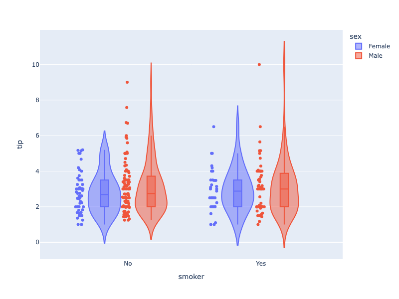

**Interactive Plot:**

<div>                        <script type="text/javascript">window.PlotlyConfig = {MathJaxConfig: 'local'};</script>
        <script charset="utf-8" src="https://cdn.plot.ly/plotly-3.1.0.min.js" integrity="sha256-Ei4740bWZhaUTQuD6q9yQlgVCMPBz6CZWhevDYPv93A=" crossorigin="anonymous"></script>                <div id="plotly-div-3" class="plotly-graph-div" style="height:100%; width:100%;"></div>            <script type="text/javascript">                window.PLOTLYENV=window.PLOTLYENV || {};                                if (document.getElementById("plotly-div-3")) {                    Plotly.newPlot(                        "plotly-div-3",                        [{"alignmentgroup":"True","box":{"visible":true},"customdata":[[16.99,"Female","Sun","Dinner",2],[24.59,"Female","Sun","Dinner",4],[35.26,"Female","Sun","Dinner",4],[14.83,"Female","Sun","Dinner",2],[10.33,"Female","Sun","Dinner",3],[16.97,"Female","Sun","Dinner",3],[20.29,"Female","Sat","Dinner",2],[15.77,"Female","Sat","Dinner",2],[19.65,"Female","Sat","Dinner",2],[15.06,"Female","Sat","Dinner",2],[20.69,"Female","Sat","Dinner",4],[16.93,"Female","Sat","Dinner",3],[10.29,"Female","Sun","Dinner",2],[34.81,"Female","Sun","Dinner",4],[26.41,"Female","Sat","Dinner",2],[16.45,"Female","Sat","Dinner",2],[3.07,"Female","Sat","Dinner",1],[17.07,"Female","Sat","Dinner",3],[26.86,"Female","Sat","Dinner",2],[25.28,"Female","Sat","Dinner",2],[14.73,"Female","Sat","Dinner",2],[10.07,"Female","Thur","Lunch",1],[34.83,"Female","Thur","Lunch",4],[5.75,"Female","Fri","Dinner",2],[16.32,"Female","Fri","Dinner",2],[22.75,"Female","Fri","Dinner",2],[11.35,"Female","Fri","Dinner",2],[15.38,"Female","Fri","Dinner",2],[44.3,"Female","Sat","Dinner",3],[22.42,"Female","Sat","Dinner",2],[20.92,"Female","Sat","Dinner",2],[14.31,"Female","Sat","Dinner",2],[7.25,"Female","Sat","Dinner",1],[25.71,"Female","Sun","Dinner",3],[17.31,"Female","Sun","Dinner",2],[10.65,"Female","Thur","Lunch",2],[12.43,"Female","Thur","Lunch",2],[24.08,"Female","Thur","Lunch",4],[13.42,"Female","Thur","Lunch",2],[12.48,"Female","Thur","Lunch",2],[29.8,"Female","Thur","Lunch",6],[14.52,"Female","Thur","Lunch",2],[11.38,"Female","Thur","Lunch",2],[20.27,"Female","Thur","Lunch",2],[11.17,"Female","Thur","Lunch",2],[12.26,"Female","Thur","Lunch",2],[18.26,"Female","Thur","Lunch",2],[8.51,"Female","Thur","Lunch",2],[10.33,"Female","Thur","Lunch",2],[14.15,"Female","Thur","Lunch",2],[13.16,"Female","Thur","Lunch",2],[17.47,"Female","Thur","Lunch",2],[27.05,"Female","Thur","Lunch",6],[16.43,"Female","Thur","Lunch",2],[8.35,"Female","Thur","Lunch",2],[18.64,"Female","Thur","Lunch",3],[11.87,"Female","Thur","Lunch",2],[29.85,"Female","Sun","Dinner",5],[25.0,"Female","Sun","Dinner",4],[13.39,"Female","Sun","Dinner",2],[16.21,"Female","Sun","Dinner",3],[17.51,"Female","Sun","Dinner",2],[10.59,"Female","Sat","Dinner",2],[10.63,"Female","Sat","Dinner",2],[9.6,"Female","Sun","Dinner",2],[20.9,"Female","Sun","Dinner",3],[18.15,"Female","Sun","Dinner",3],[19.81,"Female","Thur","Lunch",2],[43.11,"Female","Thur","Lunch",4],[13.0,"Female","Thur","Lunch",2],[12.74,"Female","Thur","Lunch",2],[13.0,"Female","Thur","Lunch",2],[16.4,"Female","Thur","Lunch",2],[16.47,"Female","Thur","Lunch",3],[12.76,"Female","Sat","Dinner",2],[13.27,"Female","Sat","Dinner",2],[28.17,"Female","Sat","Dinner",3],[12.9,"Female","Sat","Dinner",2],[30.14,"Female","Sat","Dinner",4],[13.42,"Female","Fri","Lunch",2],[15.98,"Female","Fri","Lunch",3],[16.27,"Female","Fri","Lunch",2],[10.09,"Female","Fri","Lunch",2],[22.12,"Female","Sat","Dinner",2],[35.83,"Female","Sat","Dinner",3],[27.18,"Female","Sat","Dinner",2],[18.78,"Female","Thur","Dinner",2]],"hovertemplate":"sex=%{customdata[1]}\u003cbr\u003esmoker=%{x}\u003cbr\u003etip=%{y}\u003cbr\u003etotal_bill=%{customdata[0]}\u003cbr\u003eday=%{customdata[2]}\u003cbr\u003etime=%{customdata[3]}\u003cbr\u003esize=%{customdata[4]}\u003cextra\u003e\u003c\u002fextra\u003e","legendgroup":"Female","marker":{"color":"#636efa"},"name":"Female","offsetgroup":"Female","orientation":"v","points":"all","scalegroup":"True","showlegend":true,"x":["No","No","No","No","No","No","No","No","No","No","No","No","No","No","No","No","Yes","No","Yes","Yes","No","No","No","Yes","Yes","No","Yes","Yes","Yes","Yes","No","Yes","No","No","No","No","No","No","No","No","No","No","No","No","No","No","No","No","No","No","No","No","No","No","No","No","No","No","No","No","No","Yes","Yes","Yes","Yes","Yes","Yes","Yes","Yes","Yes","Yes","Yes","Yes","Yes","Yes","Yes","Yes","Yes","Yes","Yes","No","Yes","Yes","Yes","No","Yes","No"],"x0":" ","xaxis":"x","y":{"dtype":"f8","bdata":"KVyPwvUo8D\u002fhehSuR+EMQAAAAAAAABRAKVyPwvUoCEC4HoXrUbj6PwAAAAAAAAxAAAAAAAAABkDXo3A9CtcBQAAAAAAAAAhAAAAAAAAACECamZmZmZkDQI\u002fC9ShcjwhAzczMzMzMBEDNzMzMzMwUQAAAAAAAAPg\u002fw\u002fUoXI\u002fCA0AAAAAAAADwPwAAAAAAAAhAH4XrUbgeCUAAAAAAAAAUQJqZmZmZmQFASOF6FK5H\u002fT+uR+F6FK4UQAAAAAAAAPA\u002fMzMzMzMzEUAAAAAAAAAKQAAAAAAAAARAAAAAAAAACEAAAAAAAAAEQNejcD0K1wtAUrgehetREEAAAAAAAAAQQAAAAAAAAPA\u002fAAAAAAAAEEAAAAAAAAAMQAAAAAAAAPg\u002fzczMzMzM\u002fD9cj8L1KFwHQOF6FK5H4fo\u002fKVyPwvUoBEDNzMzMzMwQQAAAAAAAAABAAAAAAAAAAECkcD0K16MGQAAAAAAAAPg\u002fAAAAAAAAAEAAAAAAAAAKQAAAAAAAAPQ\u002fAAAAAAAAAEAAAAAAAAAAQAAAAAAAAAZAAAAAAAAADEAAAAAAAAAUQGZmZmZmZgJAAAAAAAAA+D\u002fD9Shcj8L1PxSuR+F6FPo\u002fj8L1KFyPFEAAAAAAAAAOQOF6FK5H4QRAAAAAAAAAAEAAAAAAAAAIQMP1KFyPwvk\u002fAAAAAAAAAEAAAAAAAAAQQAAAAAAAAAxAAAAAAAAADEDD9Shcj8IQQAAAAAAAABRAAAAAAAAAAEAUrkfhehQAQAAAAAAAAABAAAAAAAAABEDXo3A9CtcJQNejcD0K1wFAAAAAAAAABEAAAAAAAAAaQJqZmZmZmfE\u002fuB6F61G4CEDXo3A9CtcLQAAAAAAAAAhAAAAAAAAABEAAAAAAAAAAQArXo3A9CgdArkfhehSuEkAAAAAAAAAAQAAAAAAAAAhA"},"y0":" ","yaxis":"y","type":"violin"},{"alignmentgroup":"True","box":{"visible":true},"customdata":[[10.34,"Male","Sun","Dinner",3],[21.01,"Male","Sun","Dinner",3],[23.68,"Male","Sun","Dinner",2],[25.29,"Male","Sun","Dinner",4],[8.77,"Male","Sun","Dinner",2],[26.88,"Male","Sun","Dinner",4],[15.04,"Male","Sun","Dinner",2],[14.78,"Male","Sun","Dinner",2],[10.27,"Male","Sun","Dinner",2],[15.42,"Male","Sun","Dinner",2],[18.43,"Male","Sun","Dinner",4],[21.58,"Male","Sun","Dinner",2],[16.29,"Male","Sun","Dinner",3],[20.65,"Male","Sat","Dinner",3],[17.92,"Male","Sat","Dinner",2],[39.42,"Male","Sat","Dinner",4],[19.82,"Male","Sat","Dinner",2],[17.81,"Male","Sat","Dinner",4],[13.37,"Male","Sat","Dinner",2],[12.69,"Male","Sat","Dinner",2],[21.7,"Male","Sat","Dinner",2],[9.55,"Male","Sat","Dinner",2],[18.35,"Male","Sat","Dinner",4],[17.78,"Male","Sat","Dinner",2],[24.06,"Male","Sat","Dinner",3],[16.31,"Male","Sat","Dinner",3],[18.69,"Male","Sat","Dinner",3],[31.27,"Male","Sat","Dinner",3],[16.04,"Male","Sat","Dinner",3],[17.46,"Male","Sun","Dinner",2],[13.94,"Male","Sun","Dinner",2],[9.68,"Male","Sun","Dinner",2],[30.4,"Male","Sun","Dinner",4],[18.29,"Male","Sun","Dinner",2],[22.23,"Male","Sun","Dinner",2],[32.4,"Male","Sun","Dinner",4],[28.55,"Male","Sun","Dinner",3],[18.04,"Male","Sun","Dinner",2],[12.54,"Male","Sun","Dinner",2],[9.94,"Male","Sun","Dinner",2],[25.56,"Male","Sun","Dinner",4],[19.49,"Male","Sun","Dinner",2],[38.01,"Male","Sat","Dinner",4],[11.24,"Male","Sat","Dinner",2],[48.27,"Male","Sat","Dinner",4],[20.29,"Male","Sat","Dinner",2],[13.81,"Male","Sat","Dinner",2],[11.02,"Male","Sat","Dinner",2],[18.29,"Male","Sat","Dinner",4],[17.59,"Male","Sat","Dinner",3],[20.08,"Male","Sat","Dinner",3],[20.23,"Male","Sat","Dinner",2],[15.01,"Male","Sat","Dinner",2],[12.02,"Male","Sat","Dinner",2],[10.51,"Male","Sat","Dinner",2],[17.92,"Male","Sat","Dinner",2],[27.2,"Male","Thur","Lunch",4],[22.76,"Male","Thur","Lunch",2],[17.29,"Male","Thur","Lunch",2],[19.44,"Male","Thur","Lunch",2],[16.66,"Male","Thur","Lunch",2],[32.68,"Male","Thur","Lunch",2],[15.98,"Male","Thur","Lunch",2],[13.03,"Male","Thur","Lunch",2],[18.28,"Male","Thur","Lunch",2],[24.71,"Male","Thur","Lunch",2],[21.16,"Male","Thur","Lunch",2],[28.97,"Male","Fri","Dinner",2],[22.49,"Male","Fri","Dinner",2],[40.17,"Male","Fri","Dinner",4],[27.28,"Male","Fri","Dinner",2],[12.03,"Male","Fri","Dinner",2],[21.01,"Male","Fri","Dinner",2],[12.46,"Male","Fri","Dinner",2],[15.36,"Male","Sat","Dinner",2],[20.49,"Male","Sat","Dinner",2],[25.21,"Male","Sat","Dinner",2],[18.24,"Male","Sat","Dinner",2],[14.0,"Male","Sat","Dinner",2],[38.07,"Male","Sun","Dinner",3],[23.95,"Male","Sun","Dinner",2],[29.93,"Male","Sun","Dinner",4],[11.69,"Male","Thur","Lunch",2],[14.26,"Male","Thur","Lunch",2],[15.95,"Male","Thur","Lunch",2],[8.52,"Male","Thur","Lunch",2],[22.82,"Male","Thur","Lunch",3],[19.08,"Male","Thur","Lunch",2],[16.0,"Male","Thur","Lunch",2],[34.3,"Male","Thur","Lunch",6],[41.19,"Male","Thur","Lunch",5],[9.78,"Male","Thur","Lunch",2],[7.51,"Male","Thur","Lunch",2],[14.07,"Male","Sun","Dinner",2],[13.13,"Male","Sun","Dinner",2],[17.26,"Male","Sun","Dinner",3],[24.55,"Male","Sun","Dinner",4],[19.77,"Male","Sun","Dinner",4],[48.17,"Male","Sun","Dinner",6],[16.49,"Male","Sun","Dinner",4],[21.5,"Male","Sun","Dinner",4],[12.66,"Male","Sun","Dinner",2],[13.81,"Male","Sun","Dinner",2],[24.52,"Male","Sun","Dinner",3],[20.76,"Male","Sun","Dinner",2],[31.71,"Male","Sun","Dinner",4],[50.81,"Male","Sat","Dinner",3],[15.81,"Male","Sat","Dinner",2],[7.25,"Male","Sun","Dinner",2],[31.85,"Male","Sun","Dinner",2],[16.82,"Male","Sun","Dinner",2],[32.9,"Male","Sun","Dinner",2],[17.89,"Male","Sun","Dinner",2],[14.48,"Male","Sun","Dinner",2],[34.63,"Male","Sun","Dinner",2],[34.65,"Male","Sun","Dinner",4],[23.33,"Male","Sun","Dinner",2],[45.35,"Male","Sun","Dinner",3],[23.17,"Male","Sun","Dinner",4],[40.55,"Male","Sun","Dinner",2],[20.69,"Male","Sun","Dinner",5],[30.46,"Male","Sun","Dinner",5],[23.1,"Male","Sun","Dinner",3],[15.69,"Male","Sun","Dinner",2],[28.44,"Male","Thur","Lunch",2],[15.48,"Male","Thur","Lunch",2],[16.58,"Male","Thur","Lunch",2],[7.56,"Male","Thur","Lunch",2],[10.34,"Male","Thur","Lunch",2],[13.51,"Male","Thur","Lunch",2],[18.71,"Male","Thur","Lunch",3],[20.53,"Male","Thur","Lunch",4],[26.59,"Male","Sat","Dinner",3],[38.73,"Male","Sat","Dinner",4],[24.27,"Male","Sat","Dinner",2],[30.06,"Male","Sat","Dinner",3],[25.89,"Male","Sat","Dinner",4],[48.33,"Male","Sat","Dinner",4],[28.15,"Male","Sat","Dinner",5],[11.59,"Male","Sat","Dinner",2],[7.74,"Male","Sat","Dinner",2],[12.16,"Male","Fri","Lunch",2],[8.58,"Male","Fri","Lunch",1],[13.42,"Male","Fri","Lunch",2],[20.45,"Male","Sat","Dinner",4],[13.28,"Male","Sat","Dinner",2],[24.01,"Male","Sat","Dinner",4],[15.69,"Male","Sat","Dinner",3],[11.61,"Male","Sat","Dinner",2],[10.77,"Male","Sat","Dinner",2],[15.53,"Male","Sat","Dinner",2],[10.07,"Male","Sat","Dinner",2],[12.6,"Male","Sat","Dinner",2],[32.83,"Male","Sat","Dinner",2],[29.03,"Male","Sat","Dinner",3],[22.67,"Male","Sat","Dinner",2],[17.82,"Male","Sat","Dinner",2]],"hovertemplate":"sex=%{customdata[1]}\u003cbr\u003esmoker=%{x}\u003cbr\u003etip=%{y}\u003cbr\u003etotal_bill=%{customdata[0]}\u003cbr\u003eday=%{customdata[2]}\u003cbr\u003etime=%{customdata[3]}\u003cbr\u003esize=%{customdata[4]}\u003cextra\u003e\u003c\u002fextra\u003e","legendgroup":"Male","marker":{"color":"#EF553B"},"name":"Male","offsetgroup":"Male","orientation":"v","points":"all","scalegroup":"True","showlegend":true,"x":["No","No","No","No","No","No","No","No","No","No","No","No","No","No","No","No","No","No","No","No","No","No","No","No","No","No","No","No","No","No","No","No","No","No","No","No","No","No","No","No","No","No","Yes","Yes","No","Yes","Yes","Yes","Yes","No","No","No","Yes","No","No","Yes","No","No","No","Yes","No","Yes","No","No","No","No","No","Yes","No","Yes","Yes","Yes","Yes","No","Yes","Yes","Yes","No","No","No","No","No","No","No","No","No","No","No","Yes","No","No","No","No","No","No","No","No","No","No","No","No","No","No","No","No","No","Yes","Yes","Yes","Yes","Yes","Yes","Yes","Yes","Yes","Yes","Yes","Yes","Yes","Yes","No","Yes","Yes","Yes","Yes","Yes","Yes","No","Yes","Yes","Yes","Yes","Yes","Yes","Yes","Yes","Yes","No","Yes","Yes","Yes","Yes","Yes","Yes","No","No","Yes","Yes","No","No","Yes","No","Yes","Yes","No","Yes","No"],"x0":" ","xaxis":"x","y":{"dtype":"f8","bdata":"j8L1KFyP+j8AAAAAAAAMQHsUrkfhegpA16NwPQrXEkAAAAAAAAAAQPYoXI\u002fC9QhAXI\u002fC9Shc\u002fz\u002fXo3A9CtcJQFyPwvUoXPs\u002fH4XrUbge+T8AAAAAAAAIQFyPwvUoXA9ArkfhehSuDUDNzMzMzMwKQFK4HoXrURBAUrgehetRHkBxPQrXo3AJQLgehetRuAJAAAAAAAAAAEAAAAAAAAAAQDMzMzMzMxFAMzMzMzMz9z8AAAAAAAAEQClcj8L1KApAzczMzMzMDEAAAAAAAAAAQHsUrkfhegJAAAAAAAAAFEDsUbgehesBQFK4HoXrUQRAexSuR+F6CEAfhetRuB71P2ZmZmZmZhZAAAAAAAAACEAAAAAAAAAUQAAAAAAAABhAZmZmZmZmAEAAAAAAAAAIQAAAAAAAAARA9ihcj8L1+D9cj8L1KFwRQBSuR+F6FAxAAAAAAAAACEApXI\u002fC9Sj8P+xRuB6F6xpArkfhehSuCUAAAAAAAAAAQK5H4XoUrv8\u002fFK5H4XoUDkAfhetRuB4FQDMzMzMzMwlAFK5H4XoUAEC4HoXrUbgAQIXrUbgehf8\u002fAAAAAAAA9D+kcD0K16MIQAAAAAAAABBAAAAAAAAACECuR+F6FK4FQAAAAAAAAAhAMzMzMzMzC0AAAAAAAAAUQD0K16NwPQBAAAAAAAAAAEAAAAAAAAAQQGZmZmZmZhdAAAAAAAAACEAAAAAAAAAIQAAAAAAAAAxA7FG4HoXrEkAAAAAAAAAQQAAAAAAAAPg\u002fAAAAAAAACEAAAAAAAAD4Pz0K16NwPfo\u002fPQrXo3A9EEApXI\u002fC9SgRQBSuR+F6FA5AAAAAAAAACEAAAAAAAAAQQGZmZmZmZgRASOF6FK5HFEB7FK5H4XoCQAAAAAAAAARAAAAAAAAAAECuR+F6FK73P3E9CtejcAFAAAAAAAAA+D8AAAAAAAAAQM3MzMzMzBpAAAAAAAAAFECuR+F6FK77PwAAAAAAAABAAAAAAAAABEAAAAAAAAAAQOxRuB6F6wVAAAAAAAAAAEAAAAAAAAAAQAAAAAAAABRAAAAAAAAAAEAAAAAAAAAMQAAAAAAAAARAAAAAAAAAAEDXo3A9CtcLQOxRuB6F6wFAAAAAAAAAEkAAAAAAAAAkQEjhehSuRwlAmpmZmZmZFEBxPQrXo3AJQAAAAAAAABBA4XoUrkfhCEAAAAAAAAAAQAAAAAAAAABAZmZmZmZmDEBxPQrXo3ANQJqZmZmZmRZAAAAAAAAADEAAAAAAAAAaQAAAAAAAAAhAAAAAAAAAFEAAAAAAAAAAQAAAAAAAABBAAAAAAAAA+D97FK5H4XoEQClcj8L1KABAAAAAAAAAEEAK16NwPQr3PwAAAAAAAABAAAAAAAAAAEAAAAAAAAAQQAAAAAAAABBASOF6FK5HC0AAAAAAAAAIQD0K16NwPQBAAAAAAAAAAECkcD0K16MUQAAAAAAAACJAAAAAAAAACEAAAAAAAAD4PwrXo3A9Cvc\u002fmpmZmZmZAUC4HoXrUbj+P0jhehSuR\u002fk\u002fAAAAAAAACEDD9Shcj8IFQAAAAAAAAABAAAAAAAAACEAfhetRuB4LQIXrUbgehfc\u002fAAAAAAAACEAAAAAAAAD0PwAAAAAAAPA\u002fuB6F61G48j+uR+F6FK4XQAAAAAAAAABAAAAAAAAA\u002fD8="},"y0":" ","yaxis":"y","type":"violin"}],                        {"template":{"data":{"histogram2dcontour":[{"type":"histogram2dcontour","colorbar":{"outlinewidth":0,"ticks":""},"colorscale":[[0.0,"#0d0887"],[0.1111111111111111,"#46039f"],[0.2222222222222222,"#7201a8"],[0.3333333333333333,"#9c179e"],[0.4444444444444444,"#bd3786"],[0.5555555555555556,"#d8576b"],[0.6666666666666666,"#ed7953"],[0.7777777777777778,"#fb9f3a"],[0.8888888888888888,"#fdca26"],[1.0,"#f0f921"]]}],"choropleth":[{"type":"choropleth","colorbar":{"outlinewidth":0,"ticks":""}}],"histogram2d":[{"type":"histogram2d","colorbar":{"outlinewidth":0,"ticks":""},"colorscale":[[0.0,"#0d0887"],[0.1111111111111111,"#46039f"],[0.2222222222222222,"#7201a8"],[0.3333333333333333,"#9c179e"],[0.4444444444444444,"#bd3786"],[0.5555555555555556,"#d8576b"],[0.6666666666666666,"#ed7953"],[0.7777777777777778,"#fb9f3a"],[0.8888888888888888,"#fdca26"],[1.0,"#f0f921"]]}],"heatmap":[{"type":"heatmap","colorbar":{"outlinewidth":0,"ticks":""},"colorscale":[[0.0,"#0d0887"],[0.1111111111111111,"#46039f"],[0.2222222222222222,"#7201a8"],[0.3333333333333333,"#9c179e"],[0.4444444444444444,"#bd3786"],[0.5555555555555556,"#d8576b"],[0.6666666666666666,"#ed7953"],[0.7777777777777778,"#fb9f3a"],[0.8888888888888888,"#fdca26"],[1.0,"#f0f921"]]}],"contourcarpet":[{"type":"contourcarpet","colorbar":{"outlinewidth":0,"ticks":""}}],"contour":[{"type":"contour","colorbar":{"outlinewidth":0,"ticks":""},"colorscale":[[0.0,"#0d0887"],[0.1111111111111111,"#46039f"],[0.2222222222222222,"#7201a8"],[0.3333333333333333,"#9c179e"],[0.4444444444444444,"#bd3786"],[0.5555555555555556,"#d8576b"],[0.6666666666666666,"#ed7953"],[0.7777777777777778,"#fb9f3a"],[0.8888888888888888,"#fdca26"],[1.0,"#f0f921"]]}],"surface":[{"type":"surface","colorbar":{"outlinewidth":0,"ticks":""},"colorscale":[[0.0,"#0d0887"],[0.1111111111111111,"#46039f"],[0.2222222222222222,"#7201a8"],[0.3333333333333333,"#9c179e"],[0.4444444444444444,"#bd3786"],[0.5555555555555556,"#d8576b"],[0.6666666666666666,"#ed7953"],[0.7777777777777778,"#fb9f3a"],[0.8888888888888888,"#fdca26"],[1.0,"#f0f921"]]}],"mesh3d":[{"type":"mesh3d","colorbar":{"outlinewidth":0,"ticks":""}}],"scatter":[{"fillpattern":{"fillmode":"overlay","size":10,"solidity":0.2},"type":"scatter"}],"parcoords":[{"type":"parcoords","line":{"colorbar":{"outlinewidth":0,"ticks":""}}}],"scatterpolargl":[{"type":"scatterpolargl","marker":{"colorbar":{"outlinewidth":0,"ticks":""}}}],"bar":[{"error_x":{"color":"#2a3f5f"},"error_y":{"color":"#2a3f5f"},"marker":{"line":{"color":"#E5ECF6","width":0.5},"pattern":{"fillmode":"overlay","size":10,"solidity":0.2}},"type":"bar"}],"scattergeo":[{"type":"scattergeo","marker":{"colorbar":{"outlinewidth":0,"ticks":""}}}],"scatterpolar":[{"type":"scatterpolar","marker":{"colorbar":{"outlinewidth":0,"ticks":""}}}],"histogram":[{"marker":{"pattern":{"fillmode":"overlay","size":10,"solidity":0.2}},"type":"histogram"}],"scattergl":[{"type":"scattergl","marker":{"colorbar":{"outlinewidth":0,"ticks":""}}}],"scatter3d":[{"type":"scatter3d","line":{"colorbar":{"outlinewidth":0,"ticks":""}},"marker":{"colorbar":{"outlinewidth":0,"ticks":""}}}],"scattermap":[{"type":"scattermap","marker":{"colorbar":{"outlinewidth":0,"ticks":""}}}],"scattermapbox":[{"type":"scattermapbox","marker":{"colorbar":{"outlinewidth":0,"ticks":""}}}],"scatterternary":[{"type":"scatterternary","marker":{"colorbar":{"outlinewidth":0,"ticks":""}}}],"scattercarpet":[{"type":"scattercarpet","marker":{"colorbar":{"outlinewidth":0,"ticks":""}}}],"carpet":[{"aaxis":{"endlinecolor":"#2a3f5f","gridcolor":"white","linecolor":"white","minorgridcolor":"white","startlinecolor":"#2a3f5f"},"baxis":{"endlinecolor":"#2a3f5f","gridcolor":"white","linecolor":"white","minorgridcolor":"white","startlinecolor":"#2a3f5f"},"type":"carpet"}],"table":[{"cells":{"fill":{"color":"#EBF0F8"},"line":{"color":"white"}},"header":{"fill":{"color":"#C8D4E3"},"line":{"color":"white"}},"type":"table"}],"barpolar":[{"marker":{"line":{"color":"#E5ECF6","width":0.5},"pattern":{"fillmode":"overlay","size":10,"solidity":0.2}},"type":"barpolar"}],"pie":[{"automargin":true,"type":"pie"}]},"layout":{"autotypenumbers":"strict","colorway":["#636efa","#EF553B","#00cc96","#ab63fa","#FFA15A","#19d3f3","#FF6692","#B6E880","#FF97FF","#FECB52"],"font":{"color":"#2a3f5f"},"hovermode":"closest","hoverlabel":{"align":"left"},"paper_bgcolor":"white","plot_bgcolor":"#E5ECF6","polar":{"bgcolor":"#E5ECF6","angularaxis":{"gridcolor":"white","linecolor":"white","ticks":""},"radialaxis":{"gridcolor":"white","linecolor":"white","ticks":""}},"ternary":{"bgcolor":"#E5ECF6","aaxis":{"gridcolor":"white","linecolor":"white","ticks":""},"baxis":{"gridcolor":"white","linecolor":"white","ticks":""},"caxis":{"gridcolor":"white","linecolor":"white","ticks":""}},"coloraxis":{"colorbar":{"outlinewidth":0,"ticks":""}},"colorscale":{"sequential":[[0.0,"#0d0887"],[0.1111111111111111,"#46039f"],[0.2222222222222222,"#7201a8"],[0.3333333333333333,"#9c179e"],[0.4444444444444444,"#bd3786"],[0.5555555555555556,"#d8576b"],[0.6666666666666666,"#ed7953"],[0.7777777777777778,"#fb9f3a"],[0.8888888888888888,"#fdca26"],[1.0,"#f0f921"]],"sequentialminus":[[0.0,"#0d0887"],[0.1111111111111111,"#46039f"],[0.2222222222222222,"#7201a8"],[0.3333333333333333,"#9c179e"],[0.4444444444444444,"#bd3786"],[0.5555555555555556,"#d8576b"],[0.6666666666666666,"#ed7953"],[0.7777777777777778,"#fb9f3a"],[0.8888888888888888,"#fdca26"],[1.0,"#f0f921"]],"diverging":[[0,"#8e0152"],[0.1,"#c51b7d"],[0.2,"#de77ae"],[0.3,"#f1b6da"],[0.4,"#fde0ef"],[0.5,"#f7f7f7"],[0.6,"#e6f5d0"],[0.7,"#b8e186"],[0.8,"#7fbc41"],[0.9,"#4d9221"],[1,"#276419"]]},"xaxis":{"gridcolor":"white","linecolor":"white","ticks":"","title":{"standoff":15},"zerolinecolor":"white","automargin":true,"zerolinewidth":2},"yaxis":{"gridcolor":"white","linecolor":"white","ticks":"","title":{"standoff":15},"zerolinecolor":"white","automargin":true,"zerolinewidth":2},"scene":{"xaxis":{"backgroundcolor":"#E5ECF6","gridcolor":"white","linecolor":"white","showbackground":true,"ticks":"","zerolinecolor":"white","gridwidth":2},"yaxis":{"backgroundcolor":"#E5ECF6","gridcolor":"white","linecolor":"white","showbackground":true,"ticks":"","zerolinecolor":"white","gridwidth":2},"zaxis":{"backgroundcolor":"#E5ECF6","gridcolor":"white","linecolor":"white","showbackground":true,"ticks":"","zerolinecolor":"white","gridwidth":2}},"shapedefaults":{"line":{"color":"#2a3f5f"}},"annotationdefaults":{"arrowcolor":"#2a3f5f","arrowhead":0,"arrowwidth":1},"geo":{"bgcolor":"white","landcolor":"#E5ECF6","subunitcolor":"white","showland":true,"showlakes":true,"lakecolor":"white"},"title":{"x":0.05},"mapbox":{"style":"light"}}},"xaxis":{"anchor":"y","domain":[0.0,1.0],"title":{"text":"smoker"}},"yaxis":{"anchor":"x","domain":[0.0,1.0],"title":{"text":"tip"}},"legend":{"title":{"text":"sex"},"tracegroupgap":0},"margin":{"t":60},"violinmode":"group"},                        {"responsive": true}                    )                };            </script>        </div>

```python
import plotly.express as px

df = px.data.tips()
fig = px.violin(df, y="tip", color="sex",
                violinmode='overlay', # draw violins on top of each other
                # default violinmode is 'group' as in example above
                hover_data=df.columns)
fig.show()
```

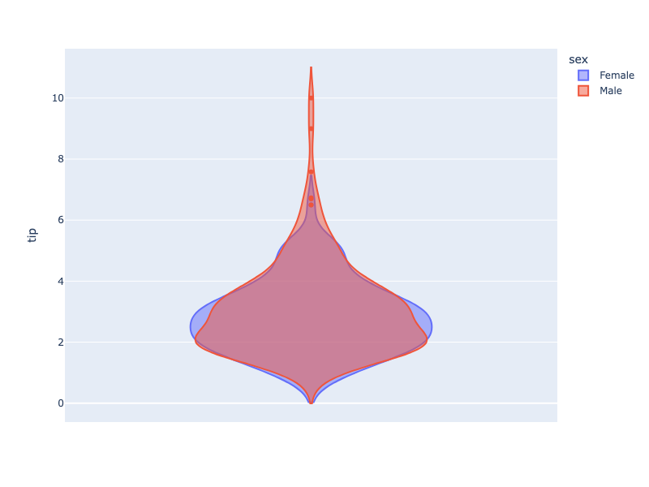

**Interactive Plot:**

<div>                        <script type="text/javascript">window.PlotlyConfig = {MathJaxConfig: 'local'};</script>
        <script charset="utf-8" src="https://cdn.plot.ly/plotly-3.1.0.min.js" integrity="sha256-Ei4740bWZhaUTQuD6q9yQlgVCMPBz6CZWhevDYPv93A=" crossorigin="anonymous"></script>                <div id="plotly-div-4" class="plotly-graph-div" style="height:100%; width:100%;"></div>            <script type="text/javascript">                window.PLOTLYENV=window.PLOTLYENV || {};                                if (document.getElementById("plotly-div-4")) {                    Plotly.newPlot(                        "plotly-div-4",                        [{"alignmentgroup":"True","box":{"visible":false},"customdata":[[16.99,"Female","No","Sun","Dinner",2],[24.59,"Female","No","Sun","Dinner",4],[35.26,"Female","No","Sun","Dinner",4],[14.83,"Female","No","Sun","Dinner",2],[10.33,"Female","No","Sun","Dinner",3],[16.97,"Female","No","Sun","Dinner",3],[20.29,"Female","No","Sat","Dinner",2],[15.77,"Female","No","Sat","Dinner",2],[19.65,"Female","No","Sat","Dinner",2],[15.06,"Female","No","Sat","Dinner",2],[20.69,"Female","No","Sat","Dinner",4],[16.93,"Female","No","Sat","Dinner",3],[10.29,"Female","No","Sun","Dinner",2],[34.81,"Female","No","Sun","Dinner",4],[26.41,"Female","No","Sat","Dinner",2],[16.45,"Female","No","Sat","Dinner",2],[3.07,"Female","Yes","Sat","Dinner",1],[17.07,"Female","No","Sat","Dinner",3],[26.86,"Female","Yes","Sat","Dinner",2],[25.28,"Female","Yes","Sat","Dinner",2],[14.73,"Female","No","Sat","Dinner",2],[10.07,"Female","No","Thur","Lunch",1],[34.83,"Female","No","Thur","Lunch",4],[5.75,"Female","Yes","Fri","Dinner",2],[16.32,"Female","Yes","Fri","Dinner",2],[22.75,"Female","No","Fri","Dinner",2],[11.35,"Female","Yes","Fri","Dinner",2],[15.38,"Female","Yes","Fri","Dinner",2],[44.3,"Female","Yes","Sat","Dinner",3],[22.42,"Female","Yes","Sat","Dinner",2],[20.92,"Female","No","Sat","Dinner",2],[14.31,"Female","Yes","Sat","Dinner",2],[7.25,"Female","No","Sat","Dinner",1],[25.71,"Female","No","Sun","Dinner",3],[17.31,"Female","No","Sun","Dinner",2],[10.65,"Female","No","Thur","Lunch",2],[12.43,"Female","No","Thur","Lunch",2],[24.08,"Female","No","Thur","Lunch",4],[13.42,"Female","No","Thur","Lunch",2],[12.48,"Female","No","Thur","Lunch",2],[29.8,"Female","No","Thur","Lunch",6],[14.52,"Female","No","Thur","Lunch",2],[11.38,"Female","No","Thur","Lunch",2],[20.27,"Female","No","Thur","Lunch",2],[11.17,"Female","No","Thur","Lunch",2],[12.26,"Female","No","Thur","Lunch",2],[18.26,"Female","No","Thur","Lunch",2],[8.51,"Female","No","Thur","Lunch",2],[10.33,"Female","No","Thur","Lunch",2],[14.15,"Female","No","Thur","Lunch",2],[13.16,"Female","No","Thur","Lunch",2],[17.47,"Female","No","Thur","Lunch",2],[27.05,"Female","No","Thur","Lunch",6],[16.43,"Female","No","Thur","Lunch",2],[8.35,"Female","No","Thur","Lunch",2],[18.64,"Female","No","Thur","Lunch",3],[11.87,"Female","No","Thur","Lunch",2],[29.85,"Female","No","Sun","Dinner",5],[25.0,"Female","No","Sun","Dinner",4],[13.39,"Female","No","Sun","Dinner",2],[16.21,"Female","No","Sun","Dinner",3],[17.51,"Female","Yes","Sun","Dinner",2],[10.59,"Female","Yes","Sat","Dinner",2],[10.63,"Female","Yes","Sat","Dinner",2],[9.6,"Female","Yes","Sun","Dinner",2],[20.9,"Female","Yes","Sun","Dinner",3],[18.15,"Female","Yes","Sun","Dinner",3],[19.81,"Female","Yes","Thur","Lunch",2],[43.11,"Female","Yes","Thur","Lunch",4],[13.0,"Female","Yes","Thur","Lunch",2],[12.74,"Female","Yes","Thur","Lunch",2],[13.0,"Female","Yes","Thur","Lunch",2],[16.4,"Female","Yes","Thur","Lunch",2],[16.47,"Female","Yes","Thur","Lunch",3],[12.76,"Female","Yes","Sat","Dinner",2],[13.27,"Female","Yes","Sat","Dinner",2],[28.17,"Female","Yes","Sat","Dinner",3],[12.9,"Female","Yes","Sat","Dinner",2],[30.14,"Female","Yes","Sat","Dinner",4],[13.42,"Female","Yes","Fri","Lunch",2],[15.98,"Female","No","Fri","Lunch",3],[16.27,"Female","Yes","Fri","Lunch",2],[10.09,"Female","Yes","Fri","Lunch",2],[22.12,"Female","Yes","Sat","Dinner",2],[35.83,"Female","No","Sat","Dinner",3],[27.18,"Female","Yes","Sat","Dinner",2],[18.78,"Female","No","Thur","Dinner",2]],"hovertemplate":"sex=%{customdata[1]}\u003cbr\u003etip=%{y}\u003cbr\u003etotal_bill=%{customdata[0]}\u003cbr\u003esmoker=%{customdata[2]}\u003cbr\u003eday=%{customdata[3]}\u003cbr\u003etime=%{customdata[4]}\u003cbr\u003esize=%{customdata[5]}\u003cextra\u003e\u003c\u002fextra\u003e","legendgroup":"Female","marker":{"color":"#636efa"},"name":"Female","offsetgroup":"Female","orientation":"v","scalegroup":"True","showlegend":true,"x0":" ","xaxis":"x","y":{"dtype":"f8","bdata":"KVyPwvUo8D\u002fhehSuR+EMQAAAAAAAABRAKVyPwvUoCEC4HoXrUbj6PwAAAAAAAAxAAAAAAAAABkDXo3A9CtcBQAAAAAAAAAhAAAAAAAAACECamZmZmZkDQI\u002fC9ShcjwhAzczMzMzMBEDNzMzMzMwUQAAAAAAAAPg\u002fw\u002fUoXI\u002fCA0AAAAAAAADwPwAAAAAAAAhAH4XrUbgeCUAAAAAAAAAUQJqZmZmZmQFASOF6FK5H\u002fT+uR+F6FK4UQAAAAAAAAPA\u002fMzMzMzMzEUAAAAAAAAAKQAAAAAAAAARAAAAAAAAACEAAAAAAAAAEQNejcD0K1wtAUrgehetREEAAAAAAAAAQQAAAAAAAAPA\u002fAAAAAAAAEEAAAAAAAAAMQAAAAAAAAPg\u002fzczMzMzM\u002fD9cj8L1KFwHQOF6FK5H4fo\u002fKVyPwvUoBEDNzMzMzMwQQAAAAAAAAABAAAAAAAAAAECkcD0K16MGQAAAAAAAAPg\u002fAAAAAAAAAEAAAAAAAAAKQAAAAAAAAPQ\u002fAAAAAAAAAEAAAAAAAAAAQAAAAAAAAAZAAAAAAAAADEAAAAAAAAAUQGZmZmZmZgJAAAAAAAAA+D\u002fD9Shcj8L1PxSuR+F6FPo\u002fj8L1KFyPFEAAAAAAAAAOQOF6FK5H4QRAAAAAAAAAAEAAAAAAAAAIQMP1KFyPwvk\u002fAAAAAAAAAEAAAAAAAAAQQAAAAAAAAAxAAAAAAAAADEDD9Shcj8IQQAAAAAAAABRAAAAAAAAAAEAUrkfhehQAQAAAAAAAAABAAAAAAAAABEDXo3A9CtcJQNejcD0K1wFAAAAAAAAABEAAAAAAAAAaQJqZmZmZmfE\u002fuB6F61G4CEDXo3A9CtcLQAAAAAAAAAhAAAAAAAAABEAAAAAAAAAAQArXo3A9CgdArkfhehSuEkAAAAAAAAAAQAAAAAAAAAhA"},"y0":" ","yaxis":"y","type":"violin"},{"alignmentgroup":"True","box":{"visible":false},"customdata":[[10.34,"Male","No","Sun","Dinner",3],[21.01,"Male","No","Sun","Dinner",3],[23.68,"Male","No","Sun","Dinner",2],[25.29,"Male","No","Sun","Dinner",4],[8.77,"Male","No","Sun","Dinner",2],[26.88,"Male","No","Sun","Dinner",4],[15.04,"Male","No","Sun","Dinner",2],[14.78,"Male","No","Sun","Dinner",2],[10.27,"Male","No","Sun","Dinner",2],[15.42,"Male","No","Sun","Dinner",2],[18.43,"Male","No","Sun","Dinner",4],[21.58,"Male","No","Sun","Dinner",2],[16.29,"Male","No","Sun","Dinner",3],[20.65,"Male","No","Sat","Dinner",3],[17.92,"Male","No","Sat","Dinner",2],[39.42,"Male","No","Sat","Dinner",4],[19.82,"Male","No","Sat","Dinner",2],[17.81,"Male","No","Sat","Dinner",4],[13.37,"Male","No","Sat","Dinner",2],[12.69,"Male","No","Sat","Dinner",2],[21.7,"Male","No","Sat","Dinner",2],[9.55,"Male","No","Sat","Dinner",2],[18.35,"Male","No","Sat","Dinner",4],[17.78,"Male","No","Sat","Dinner",2],[24.06,"Male","No","Sat","Dinner",3],[16.31,"Male","No","Sat","Dinner",3],[18.69,"Male","No","Sat","Dinner",3],[31.27,"Male","No","Sat","Dinner",3],[16.04,"Male","No","Sat","Dinner",3],[17.46,"Male","No","Sun","Dinner",2],[13.94,"Male","No","Sun","Dinner",2],[9.68,"Male","No","Sun","Dinner",2],[30.4,"Male","No","Sun","Dinner",4],[18.29,"Male","No","Sun","Dinner",2],[22.23,"Male","No","Sun","Dinner",2],[32.4,"Male","No","Sun","Dinner",4],[28.55,"Male","No","Sun","Dinner",3],[18.04,"Male","No","Sun","Dinner",2],[12.54,"Male","No","Sun","Dinner",2],[9.94,"Male","No","Sun","Dinner",2],[25.56,"Male","No","Sun","Dinner",4],[19.49,"Male","No","Sun","Dinner",2],[38.01,"Male","Yes","Sat","Dinner",4],[11.24,"Male","Yes","Sat","Dinner",2],[48.27,"Male","No","Sat","Dinner",4],[20.29,"Male","Yes","Sat","Dinner",2],[13.81,"Male","Yes","Sat","Dinner",2],[11.02,"Male","Yes","Sat","Dinner",2],[18.29,"Male","Yes","Sat","Dinner",4],[17.59,"Male","No","Sat","Dinner",3],[20.08,"Male","No","Sat","Dinner",3],[20.23,"Male","No","Sat","Dinner",2],[15.01,"Male","Yes","Sat","Dinner",2],[12.02,"Male","No","Sat","Dinner",2],[10.51,"Male","No","Sat","Dinner",2],[17.92,"Male","Yes","Sat","Dinner",2],[27.2,"Male","No","Thur","Lunch",4],[22.76,"Male","No","Thur","Lunch",2],[17.29,"Male","No","Thur","Lunch",2],[19.44,"Male","Yes","Thur","Lunch",2],[16.66,"Male","No","Thur","Lunch",2],[32.68,"Male","Yes","Thur","Lunch",2],[15.98,"Male","No","Thur","Lunch",2],[13.03,"Male","No","Thur","Lunch",2],[18.28,"Male","No","Thur","Lunch",2],[24.71,"Male","No","Thur","Lunch",2],[21.16,"Male","No","Thur","Lunch",2],[28.97,"Male","Yes","Fri","Dinner",2],[22.49,"Male","No","Fri","Dinner",2],[40.17,"Male","Yes","Fri","Dinner",4],[27.28,"Male","Yes","Fri","Dinner",2],[12.03,"Male","Yes","Fri","Dinner",2],[21.01,"Male","Yes","Fri","Dinner",2],[12.46,"Male","No","Fri","Dinner",2],[15.36,"Male","Yes","Sat","Dinner",2],[20.49,"Male","Yes","Sat","Dinner",2],[25.21,"Male","Yes","Sat","Dinner",2],[18.24,"Male","No","Sat","Dinner",2],[14.0,"Male","No","Sat","Dinner",2],[38.07,"Male","No","Sun","Dinner",3],[23.95,"Male","No","Sun","Dinner",2],[29.93,"Male","No","Sun","Dinner",4],[11.69,"Male","No","Thur","Lunch",2],[14.26,"Male","No","Thur","Lunch",2],[15.95,"Male","No","Thur","Lunch",2],[8.52,"Male","No","Thur","Lunch",2],[22.82,"Male","No","Thur","Lunch",3],[19.08,"Male","No","Thur","Lunch",2],[16.0,"Male","Yes","Thur","Lunch",2],[34.3,"Male","No","Thur","Lunch",6],[41.19,"Male","No","Thur","Lunch",5],[9.78,"Male","No","Thur","Lunch",2],[7.51,"Male","No","Thur","Lunch",2],[14.07,"Male","No","Sun","Dinner",2],[13.13,"Male","No","Sun","Dinner",2],[17.26,"Male","No","Sun","Dinner",3],[24.55,"Male","No","Sun","Dinner",4],[19.77,"Male","No","Sun","Dinner",4],[48.17,"Male","No","Sun","Dinner",6],[16.49,"Male","No","Sun","Dinner",4],[21.5,"Male","No","Sun","Dinner",4],[12.66,"Male","No","Sun","Dinner",2],[13.81,"Male","No","Sun","Dinner",2],[24.52,"Male","No","Sun","Dinner",3],[20.76,"Male","No","Sun","Dinner",2],[31.71,"Male","No","Sun","Dinner",4],[50.81,"Male","Yes","Sat","Dinner",3],[15.81,"Male","Yes","Sat","Dinner",2],[7.25,"Male","Yes","Sun","Dinner",2],[31.85,"Male","Yes","Sun","Dinner",2],[16.82,"Male","Yes","Sun","Dinner",2],[32.9,"Male","Yes","Sun","Dinner",2],[17.89,"Male","Yes","Sun","Dinner",2],[14.48,"Male","Yes","Sun","Dinner",2],[34.63,"Male","Yes","Sun","Dinner",2],[34.65,"Male","Yes","Sun","Dinner",4],[23.33,"Male","Yes","Sun","Dinner",2],[45.35,"Male","Yes","Sun","Dinner",3],[23.17,"Male","Yes","Sun","Dinner",4],[40.55,"Male","Yes","Sun","Dinner",2],[20.69,"Male","No","Sun","Dinner",5],[30.46,"Male","Yes","Sun","Dinner",5],[23.1,"Male","Yes","Sun","Dinner",3],[15.69,"Male","Yes","Sun","Dinner",2],[28.44,"Male","Yes","Thur","Lunch",2],[15.48,"Male","Yes","Thur","Lunch",2],[16.58,"Male","Yes","Thur","Lunch",2],[7.56,"Male","No","Thur","Lunch",2],[10.34,"Male","Yes","Thur","Lunch",2],[13.51,"Male","Yes","Thur","Lunch",2],[18.71,"Male","Yes","Thur","Lunch",3],[20.53,"Male","Yes","Thur","Lunch",4],[26.59,"Male","Yes","Sat","Dinner",3],[38.73,"Male","Yes","Sat","Dinner",4],[24.27,"Male","Yes","Sat","Dinner",2],[30.06,"Male","Yes","Sat","Dinner",3],[25.89,"Male","Yes","Sat","Dinner",4],[48.33,"Male","No","Sat","Dinner",4],[28.15,"Male","Yes","Sat","Dinner",5],[11.59,"Male","Yes","Sat","Dinner",2],[7.74,"Male","Yes","Sat","Dinner",2],[12.16,"Male","Yes","Fri","Lunch",2],[8.58,"Male","Yes","Fri","Lunch",1],[13.42,"Male","Yes","Fri","Lunch",2],[20.45,"Male","No","Sat","Dinner",4],[13.28,"Male","No","Sat","Dinner",2],[24.01,"Male","Yes","Sat","Dinner",4],[15.69,"Male","Yes","Sat","Dinner",3],[11.61,"Male","No","Sat","Dinner",2],[10.77,"Male","No","Sat","Dinner",2],[15.53,"Male","Yes","Sat","Dinner",2],[10.07,"Male","No","Sat","Dinner",2],[12.6,"Male","Yes","Sat","Dinner",2],[32.83,"Male","Yes","Sat","Dinner",2],[29.03,"Male","No","Sat","Dinner",3],[22.67,"Male","Yes","Sat","Dinner",2],[17.82,"Male","No","Sat","Dinner",2]],"hovertemplate":"sex=%{customdata[1]}\u003cbr\u003etip=%{y}\u003cbr\u003etotal_bill=%{customdata[0]}\u003cbr\u003esmoker=%{customdata[2]}\u003cbr\u003eday=%{customdata[3]}\u003cbr\u003etime=%{customdata[4]}\u003cbr\u003esize=%{customdata[5]}\u003cextra\u003e\u003c\u002fextra\u003e","legendgroup":"Male","marker":{"color":"#EF553B"},"name":"Male","offsetgroup":"Male","orientation":"v","scalegroup":"True","showlegend":true,"x0":" ","xaxis":"x","y":{"dtype":"f8","bdata":"j8L1KFyP+j8AAAAAAAAMQHsUrkfhegpA16NwPQrXEkAAAAAAAAAAQPYoXI\u002fC9QhAXI\u002fC9Shc\u002fz\u002fXo3A9CtcJQFyPwvUoXPs\u002fH4XrUbge+T8AAAAAAAAIQFyPwvUoXA9ArkfhehSuDUDNzMzMzMwKQFK4HoXrURBAUrgehetRHkBxPQrXo3AJQLgehetRuAJAAAAAAAAAAEAAAAAAAAAAQDMzMzMzMxFAMzMzMzMz9z8AAAAAAAAEQClcj8L1KApAzczMzMzMDEAAAAAAAAAAQHsUrkfhegJAAAAAAAAAFEDsUbgehesBQFK4HoXrUQRAexSuR+F6CEAfhetRuB71P2ZmZmZmZhZAAAAAAAAACEAAAAAAAAAUQAAAAAAAABhAZmZmZmZmAEAAAAAAAAAIQAAAAAAAAARA9ihcj8L1+D9cj8L1KFwRQBSuR+F6FAxAAAAAAAAACEApXI\u002fC9Sj8P+xRuB6F6xpArkfhehSuCUAAAAAAAAAAQK5H4XoUrv8\u002fFK5H4XoUDkAfhetRuB4FQDMzMzMzMwlAFK5H4XoUAEC4HoXrUbgAQIXrUbgehf8\u002fAAAAAAAA9D+kcD0K16MIQAAAAAAAABBAAAAAAAAACECuR+F6FK4FQAAAAAAAAAhAMzMzMzMzC0AAAAAAAAAUQD0K16NwPQBAAAAAAAAAAEAAAAAAAAAQQGZmZmZmZhdAAAAAAAAACEAAAAAAAAAIQAAAAAAAAAxA7FG4HoXrEkAAAAAAAAAQQAAAAAAAAPg\u002fAAAAAAAACEAAAAAAAAD4Pz0K16NwPfo\u002fPQrXo3A9EEApXI\u002fC9SgRQBSuR+F6FA5AAAAAAAAACEAAAAAAAAAQQGZmZmZmZgRASOF6FK5HFEB7FK5H4XoCQAAAAAAAAARAAAAAAAAAAECuR+F6FK73P3E9CtejcAFAAAAAAAAA+D8AAAAAAAAAQM3MzMzMzBpAAAAAAAAAFECuR+F6FK77PwAAAAAAAABAAAAAAAAABEAAAAAAAAAAQOxRuB6F6wVAAAAAAAAAAEAAAAAAAAAAQAAAAAAAABRAAAAAAAAAAEAAAAAAAAAMQAAAAAAAAARAAAAAAAAAAEDXo3A9CtcLQOxRuB6F6wFAAAAAAAAAEkAAAAAAAAAkQEjhehSuRwlAmpmZmZmZFEBxPQrXo3AJQAAAAAAAABBA4XoUrkfhCEAAAAAAAAAAQAAAAAAAAABAZmZmZmZmDEBxPQrXo3ANQJqZmZmZmRZAAAAAAAAADEAAAAAAAAAaQAAAAAAAAAhAAAAAAAAAFEAAAAAAAAAAQAAAAAAAABBAAAAAAAAA+D97FK5H4XoEQClcj8L1KABAAAAAAAAAEEAK16NwPQr3PwAAAAAAAABAAAAAAAAAAEAAAAAAAAAQQAAAAAAAABBASOF6FK5HC0AAAAAAAAAIQD0K16NwPQBAAAAAAAAAAECkcD0K16MUQAAAAAAAACJAAAAAAAAACEAAAAAAAAD4PwrXo3A9Cvc\u002fmpmZmZmZAUC4HoXrUbj+P0jhehSuR\u002fk\u002fAAAAAAAACEDD9Shcj8IFQAAAAAAAAABAAAAAAAAACEAfhetRuB4LQIXrUbgehfc\u002fAAAAAAAACEAAAAAAAAD0PwAAAAAAAPA\u002fuB6F61G48j+uR+F6FK4XQAAAAAAAAABAAAAAAAAA\u002fD8="},"y0":" ","yaxis":"y","type":"violin"}],                        {"template":{"data":{"histogram2dcontour":[{"type":"histogram2dcontour","colorbar":{"outlinewidth":0,"ticks":""},"colorscale":[[0.0,"#0d0887"],[0.1111111111111111,"#46039f"],[0.2222222222222222,"#7201a8"],[0.3333333333333333,"#9c179e"],[0.4444444444444444,"#bd3786"],[0.5555555555555556,"#d8576b"],[0.6666666666666666,"#ed7953"],[0.7777777777777778,"#fb9f3a"],[0.8888888888888888,"#fdca26"],[1.0,"#f0f921"]]}],"choropleth":[{"type":"choropleth","colorbar":{"outlinewidth":0,"ticks":""}}],"histogram2d":[{"type":"histogram2d","colorbar":{"outlinewidth":0,"ticks":""},"colorscale":[[0.0,"#0d0887"],[0.1111111111111111,"#46039f"],[0.2222222222222222,"#7201a8"],[0.3333333333333333,"#9c179e"],[0.4444444444444444,"#bd3786"],[0.5555555555555556,"#d8576b"],[0.6666666666666666,"#ed7953"],[0.7777777777777778,"#fb9f3a"],[0.8888888888888888,"#fdca26"],[1.0,"#f0f921"]]}],"heatmap":[{"type":"heatmap","colorbar":{"outlinewidth":0,"ticks":""},"colorscale":[[0.0,"#0d0887"],[0.1111111111111111,"#46039f"],[0.2222222222222222,"#7201a8"],[0.3333333333333333,"#9c179e"],[0.4444444444444444,"#bd3786"],[0.5555555555555556,"#d8576b"],[0.6666666666666666,"#ed7953"],[0.7777777777777778,"#fb9f3a"],[0.8888888888888888,"#fdca26"],[1.0,"#f0f921"]]}],"contourcarpet":[{"type":"contourcarpet","colorbar":{"outlinewidth":0,"ticks":""}}],"contour":[{"type":"contour","colorbar":{"outlinewidth":0,"ticks":""},"colorscale":[[0.0,"#0d0887"],[0.1111111111111111,"#46039f"],[0.2222222222222222,"#7201a8"],[0.3333333333333333,"#9c179e"],[0.4444444444444444,"#bd3786"],[0.5555555555555556,"#d8576b"],[0.6666666666666666,"#ed7953"],[0.7777777777777778,"#fb9f3a"],[0.8888888888888888,"#fdca26"],[1.0,"#f0f921"]]}],"surface":[{"type":"surface","colorbar":{"outlinewidth":0,"ticks":""},"colorscale":[[0.0,"#0d0887"],[0.1111111111111111,"#46039f"],[0.2222222222222222,"#7201a8"],[0.3333333333333333,"#9c179e"],[0.4444444444444444,"#bd3786"],[0.5555555555555556,"#d8576b"],[0.6666666666666666,"#ed7953"],[0.7777777777777778,"#fb9f3a"],[0.8888888888888888,"#fdca26"],[1.0,"#f0f921"]]}],"mesh3d":[{"type":"mesh3d","colorbar":{"outlinewidth":0,"ticks":""}}],"scatter":[{"fillpattern":{"fillmode":"overlay","size":10,"solidity":0.2},"type":"scatter"}],"parcoords":[{"type":"parcoords","line":{"colorbar":{"outlinewidth":0,"ticks":""}}}],"scatterpolargl":[{"type":"scatterpolargl","marker":{"colorbar":{"outlinewidth":0,"ticks":""}}}],"bar":[{"error_x":{"color":"#2a3f5f"},"error_y":{"color":"#2a3f5f"},"marker":{"line":{"color":"#E5ECF6","width":0.5},"pattern":{"fillmode":"overlay","size":10,"solidity":0.2}},"type":"bar"}],"scattergeo":[{"type":"scattergeo","marker":{"colorbar":{"outlinewidth":0,"ticks":""}}}],"scatterpolar":[{"type":"scatterpolar","marker":{"colorbar":{"outlinewidth":0,"ticks":""}}}],"histogram":[{"marker":{"pattern":{"fillmode":"overlay","size":10,"solidity":0.2}},"type":"histogram"}],"scattergl":[{"type":"scattergl","marker":{"colorbar":{"outlinewidth":0,"ticks":""}}}],"scatter3d":[{"type":"scatter3d","line":{"colorbar":{"outlinewidth":0,"ticks":""}},"marker":{"colorbar":{"outlinewidth":0,"ticks":""}}}],"scattermap":[{"type":"scattermap","marker":{"colorbar":{"outlinewidth":0,"ticks":""}}}],"scattermapbox":[{"type":"scattermapbox","marker":{"colorbar":{"outlinewidth":0,"ticks":""}}}],"scatterternary":[{"type":"scatterternary","marker":{"colorbar":{"outlinewidth":0,"ticks":""}}}],"scattercarpet":[{"type":"scattercarpet","marker":{"colorbar":{"outlinewidth":0,"ticks":""}}}],"carpet":[{"aaxis":{"endlinecolor":"#2a3f5f","gridcolor":"white","linecolor":"white","minorgridcolor":"white","startlinecolor":"#2a3f5f"},"baxis":{"endlinecolor":"#2a3f5f","gridcolor":"white","linecolor":"white","minorgridcolor":"white","startlinecolor":"#2a3f5f"},"type":"carpet"}],"table":[{"cells":{"fill":{"color":"#EBF0F8"},"line":{"color":"white"}},"header":{"fill":{"color":"#C8D4E3"},"line":{"color":"white"}},"type":"table"}],"barpolar":[{"marker":{"line":{"color":"#E5ECF6","width":0.5},"pattern":{"fillmode":"overlay","size":10,"solidity":0.2}},"type":"barpolar"}],"pie":[{"automargin":true,"type":"pie"}]},"layout":{"autotypenumbers":"strict","colorway":["#636efa","#EF553B","#00cc96","#ab63fa","#FFA15A","#19d3f3","#FF6692","#B6E880","#FF97FF","#FECB52"],"font":{"color":"#2a3f5f"},"hovermode":"closest","hoverlabel":{"align":"left"},"paper_bgcolor":"white","plot_bgcolor":"#E5ECF6","polar":{"bgcolor":"#E5ECF6","angularaxis":{"gridcolor":"white","linecolor":"white","ticks":""},"radialaxis":{"gridcolor":"white","linecolor":"white","ticks":""}},"ternary":{"bgcolor":"#E5ECF6","aaxis":{"gridcolor":"white","linecolor":"white","ticks":""},"baxis":{"gridcolor":"white","linecolor":"white","ticks":""},"caxis":{"gridcolor":"white","linecolor":"white","ticks":""}},"coloraxis":{"colorbar":{"outlinewidth":0,"ticks":""}},"colorscale":{"sequential":[[0.0,"#0d0887"],[0.1111111111111111,"#46039f"],[0.2222222222222222,"#7201a8"],[0.3333333333333333,"#9c179e"],[0.4444444444444444,"#bd3786"],[0.5555555555555556,"#d8576b"],[0.6666666666666666,"#ed7953"],[0.7777777777777778,"#fb9f3a"],[0.8888888888888888,"#fdca26"],[1.0,"#f0f921"]],"sequentialminus":[[0.0,"#0d0887"],[0.1111111111111111,"#46039f"],[0.2222222222222222,"#7201a8"],[0.3333333333333333,"#9c179e"],[0.4444444444444444,"#bd3786"],[0.5555555555555556,"#d8576b"],[0.6666666666666666,"#ed7953"],[0.7777777777777778,"#fb9f3a"],[0.8888888888888888,"#fdca26"],[1.0,"#f0f921"]],"diverging":[[0,"#8e0152"],[0.1,"#c51b7d"],[0.2,"#de77ae"],[0.3,"#f1b6da"],[0.4,"#fde0ef"],[0.5,"#f7f7f7"],[0.6,"#e6f5d0"],[0.7,"#b8e186"],[0.8,"#7fbc41"],[0.9,"#4d9221"],[1,"#276419"]]},"xaxis":{"gridcolor":"white","linecolor":"white","ticks":"","title":{"standoff":15},"zerolinecolor":"white","automargin":true,"zerolinewidth":2},"yaxis":{"gridcolor":"white","linecolor":"white","ticks":"","title":{"standoff":15},"zerolinecolor":"white","automargin":true,"zerolinewidth":2},"scene":{"xaxis":{"backgroundcolor":"#E5ECF6","gridcolor":"white","linecolor":"white","showbackground":true,"ticks":"","zerolinecolor":"white","gridwidth":2},"yaxis":{"backgroundcolor":"#E5ECF6","gridcolor":"white","linecolor":"white","showbackground":true,"ticks":"","zerolinecolor":"white","gridwidth":2},"zaxis":{"backgroundcolor":"#E5ECF6","gridcolor":"white","linecolor":"white","showbackground":true,"ticks":"","zerolinecolor":"white","gridwidth":2}},"shapedefaults":{"line":{"color":"#2a3f5f"}},"annotationdefaults":{"arrowcolor":"#2a3f5f","arrowhead":0,"arrowwidth":1},"geo":{"bgcolor":"white","landcolor":"#E5ECF6","subunitcolor":"white","showland":true,"showlakes":true,"lakecolor":"white"},"title":{"x":0.05},"mapbox":{"style":"light"}}},"xaxis":{"anchor":"y","domain":[0.0,1.0]},"yaxis":{"anchor":"x","domain":[0.0,1.0],"title":{"text":"tip"}},"legend":{"title":{"text":"sex"},"tracegroupgap":0},"margin":{"t":60},"violinmode":"overlay"},                        {"responsive": true}                    )                };            </script>        </div>

## Violin Plot with go.Violin

If Plotly Express does not provide a good starting point, you can use [the more generic `go.Violin` class from `plotly.graph_objects`](../graph-objects/). All the options of `go.Violin` are documented in the reference https://plotly.com/python/reference/violin/

#### Basic Violin Plot

```python
import plotly.graph_objects as go

import pandas as pd

df = pd.read_csv("https://raw.githubusercontent.com/plotly/datasets/master/violin_data.csv")

fig = go.Figure(data=go.Violin(y=df['total_bill'], box_visible=True, line_color='black',
                               meanline_visible=True, fillcolor='lightseagreen', opacity=0.6,
                               x0='Total Bill'))

fig.update_layout(yaxis_zeroline=False)
fig.show()
```

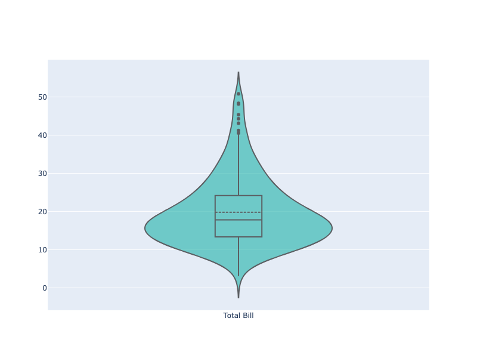

**Interactive Plot:**

<div>                        <script type="text/javascript">window.PlotlyConfig = {MathJaxConfig: 'local'};</script>
        <script charset="utf-8" src="https://cdn.plot.ly/plotly-3.1.0.min.js" integrity="sha256-Ei4740bWZhaUTQuD6q9yQlgVCMPBz6CZWhevDYPv93A=" crossorigin="anonymous"></script>                <div id="plotly-div-5" class="plotly-graph-div" style="height:100%; width:100%;"></div>            <script type="text/javascript">                window.PLOTLYENV=window.PLOTLYENV || {};                                if (document.getElementById("plotly-div-5")) {                    Plotly.newPlot(                        "plotly-div-5",                        [{"box":{"visible":true},"fillcolor":"lightseagreen","line":{"color":"black"},"meanline":{"visible":true},"opacity":0.6,"x0":"Total Bill","y":{"dtype":"f8","bdata":"PQrXo3D9MECuR+F6FK4kQMP1KFyPAjVArkfhehSuN0DXo3A9Cpc4QArXo3A9SjlACtejcD2KIUDhehSuR+E6QBSuR+F6FC5Aj8L1KFyPLUAK16NwPYokQOF6FK5HoUFA16NwPQrXLkCuR+F6FG4yQClcj8L1qC1AFK5H4XqUNUApXI\u002fC9agkQArXo3A9SjBAuB6F61H4MEBmZmZmZqY0QOxRuB6F6zFACtejcD1KNEAK16NwPYovQPYoXI\u002fCtUNAUrgehevRM0CPwvUoXM8xQD0K16NwvSpA4XoUrkdhKUAzMzMzM7M1QGZmZmZmpjNAmpmZmZkZI0CamZmZmVkyQB+F61G4Hi5AcT0K16OwNEBI4XoUrscxQI\u002fC9ShcDzhAj8L1KFxPMECuR+F6FO4wQHE9CtejsDJAhetRuB5FP0AK16NwPQowQPYoXI\u002fCdTFA4XoUrkfhK0Bcj8L1KFwjQGZmZmZmZj5ACtejcD1KMkB7FK5H4To2QDMzMzMzM0BAzczMzMyMPEAK16NwPQoyQBSuR+F6FClAFK5H4XqUJEBI4XoUrmdBQOF6FK5H4SNAj8L1KFyPOUA9CtejcH0zQOF6FK5HAUNAKVyPwvVoOkB7FK5H4XomQMP1KFyPIkhACtejcD1KNEAfhetRuJ4rQArXo3A9CiZACtejcD1KMkDXo3A9CpcxQBSuR+F6FDRAMzMzMzNzMECPwvUoXI8IQHsUrkfhOjRAhetRuB4FLkAK16NwPQooQFK4HoXrETFAXI\u002fC9SjcOkBI4XoUrkc5QPYoXI\u002fCdS1AhetRuB4FJUDsUbgehesxQDMzMzMzMztAw\u002fUoXI\u002fCNkAK16NwPUoxQHE9CtejcDNAKVyPwvWoMECkcD0K1yMkQNejcD0KV0BA9ihcj8L1L0AK16NwPWpBQI\u002fC9ShcDypASOF6FK5HMkD2KFyPwrU4QClcj8L1KDVAuB6F61H4PEA9CtejcH02QAAAAAAAABdAUrgehetRMEAAAAAAAMA2QPYoXI\u002fCFURASOF6FK5HO0CPwvUoXA8oQMP1KFyPAjVA7FG4HoXrKEAzMzMzM7MmQMP1KFyPwi5AZmZmZmYmRkDsUbgehWs2QOxRuB6F6zRAuB6F61G4LkA9CtejcH00QPYoXI\u002fCNTlAPQrXo3A9MkAfhetRuJ4sQAAAAAAAACxAAAAAAAAAHUApXI\u002fC9QhDQDMzMzMz8zdA9ihcj8K1OUCPwvUoXE8xQK5H4XoU7j1AzczMzMxMJUBcj8L1KNwoQBSuR+F6FDhA4XoUrkdhJ0DXo3A9CtcqQIXrUbgehSxAZmZmZmbmL0D2KFyPwvUoQM3MzMzMzD1ACtejcD0KIUAK16NwPQotQMP1KFyPwiZAUrgehevRNkAUrkfhehQzQIXrUbgeRTRA16NwPQpXJkCF61G4HoUoQMP1KFyPQjJAhetRuB4FIUApXI\u002fC9agkQM3MzMzMTCxAAAAAAAAAMEBSuB6F61EqQLgehetReDFAZmZmZmYmQUC4HoXrUZhEQM3MzMzMDDtArkfhehRuMEAzMzMzM7MgQKRwPQrXozJAPQrXo3C9J0CPwvUoXI8jQArXo3A9Ch5ApHA9CtcjLEDD9Shcj0IqQMP1KFyPQjFAzczMzMyMOECF61G4HsUzQJqZmZmZ2T1A9ihcj8IVSEAAAAAAAAA5QEjhehSuxypAPQrXo3B9MEAAAAAAAIA1QFK4HoXrUSlA9ihcj8I1MEAfhetRuJ4rQMP1KFyPgjFAhetRuB6FOEDD9Shcj8I0QPYoXI\u002fCtT9ArkfhehQuJUDD9Shcj0IlQEjhehSuZ0lAH4XrUbieL0AAAAAAAAAdQJqZmZmZ2T9AUrgehevRMEAzMzMzM3NAQKRwPQrX4zFA9ihcj8L1LEAzMzMzMzMjQHE9CtejUEFAMzMzMzNTQUAUrkfhelQ3QM3MzMzMrEZA7FG4HoUrN0BmZmZmZkZEQHE9CtejsDRAZmZmZmbmNED2KFyPwnU+QGZmZmZmJjJAmpmZmZkZN0DhehSuR2EvQI\u002fC9ShczzNAcT0K16NwPED2KFyPwvUuQBSuR+F6lDBAPQrXo3A9HkCuR+F6FK4kQK5H4XoUjkVAAAAAAAAAKkCF61G4HgUrQPYoXI\u002fCtTJAexSuR+F6KUAAAAAAAAAqQGZmZmZmZjBASOF6FK6HNEC4HoXrUXgwQNejcD0KlzpAPQrXo3BdQ0CF61G4HkU4QIXrUbgehSlAj8L1KFwPPkCkcD0K1+M5QArXo3A9KkhACtejcD2KKkDsUbgehSs8QM3MzMzMzClAZmZmZmYmPECuR+F6FC4nQPYoXI\u002fC9R5ApHA9CtcjPkBSuB6F61EoQNejcD0K1ypAKVyPwvUoIUD2KFyPwvUvQNejcD0K1ypAhetRuB5FMECuR+F6FC4kQDMzMzMzczRAj8L1KFyPKkAfhetRuB42QMP1KFyPAjhA4XoUrkdhL0C4HoXrUTgnQArXo3A9iiVAj8L1KFwPL0CkcD0K1yMkQDMzMzMzMylACtejcD1qQEAK16NwPepBQEjhehSuBz1ArkfhehQuO0DsUbgehas2QFK4HoXr0TFASOF6FK7HMkA="},"type":"violin"}],                        {"template":{"data":{"histogram2dcontour":[{"type":"histogram2dcontour","colorbar":{"outlinewidth":0,"ticks":""},"colorscale":[[0.0,"#0d0887"],[0.1111111111111111,"#46039f"],[0.2222222222222222,"#7201a8"],[0.3333333333333333,"#9c179e"],[0.4444444444444444,"#bd3786"],[0.5555555555555556,"#d8576b"],[0.6666666666666666,"#ed7953"],[0.7777777777777778,"#fb9f3a"],[0.8888888888888888,"#fdca26"],[1.0,"#f0f921"]]}],"choropleth":[{"type":"choropleth","colorbar":{"outlinewidth":0,"ticks":""}}],"histogram2d":[{"type":"histogram2d","colorbar":{"outlinewidth":0,"ticks":""},"colorscale":[[0.0,"#0d0887"],[0.1111111111111111,"#46039f"],[0.2222222222222222,"#7201a8"],[0.3333333333333333,"#9c179e"],[0.4444444444444444,"#bd3786"],[0.5555555555555556,"#d8576b"],[0.6666666666666666,"#ed7953"],[0.7777777777777778,"#fb9f3a"],[0.8888888888888888,"#fdca26"],[1.0,"#f0f921"]]}],"heatmap":[{"type":"heatmap","colorbar":{"outlinewidth":0,"ticks":""},"colorscale":[[0.0,"#0d0887"],[0.1111111111111111,"#46039f"],[0.2222222222222222,"#7201a8"],[0.3333333333333333,"#9c179e"],[0.4444444444444444,"#bd3786"],[0.5555555555555556,"#d8576b"],[0.6666666666666666,"#ed7953"],[0.7777777777777778,"#fb9f3a"],[0.8888888888888888,"#fdca26"],[1.0,"#f0f921"]]}],"contourcarpet":[{"type":"contourcarpet","colorbar":{"outlinewidth":0,"ticks":""}}],"contour":[{"type":"contour","colorbar":{"outlinewidth":0,"ticks":""},"colorscale":[[0.0,"#0d0887"],[0.1111111111111111,"#46039f"],[0.2222222222222222,"#7201a8"],[0.3333333333333333,"#9c179e"],[0.4444444444444444,"#bd3786"],[0.5555555555555556,"#d8576b"],[0.6666666666666666,"#ed7953"],[0.7777777777777778,"#fb9f3a"],[0.8888888888888888,"#fdca26"],[1.0,"#f0f921"]]}],"surface":[{"type":"surface","colorbar":{"outlinewidth":0,"ticks":""},"colorscale":[[0.0,"#0d0887"],[0.1111111111111111,"#46039f"],[0.2222222222222222,"#7201a8"],[0.3333333333333333,"#9c179e"],[0.4444444444444444,"#bd3786"],[0.5555555555555556,"#d8576b"],[0.6666666666666666,"#ed7953"],[0.7777777777777778,"#fb9f3a"],[0.8888888888888888,"#fdca26"],[1.0,"#f0f921"]]}],"mesh3d":[{"type":"mesh3d","colorbar":{"outlinewidth":0,"ticks":""}}],"scatter":[{"fillpattern":{"fillmode":"overlay","size":10,"solidity":0.2},"type":"scatter"}],"parcoords":[{"type":"parcoords","line":{"colorbar":{"outlinewidth":0,"ticks":""}}}],"scatterpolargl":[{"type":"scatterpolargl","marker":{"colorbar":{"outlinewidth":0,"ticks":""}}}],"bar":[{"error_x":{"color":"#2a3f5f"},"error_y":{"color":"#2a3f5f"},"marker":{"line":{"color":"#E5ECF6","width":0.5},"pattern":{"fillmode":"overlay","size":10,"solidity":0.2}},"type":"bar"}],"scattergeo":[{"type":"scattergeo","marker":{"colorbar":{"outlinewidth":0,"ticks":""}}}],"scatterpolar":[{"type":"scatterpolar","marker":{"colorbar":{"outlinewidth":0,"ticks":""}}}],"histogram":[{"marker":{"pattern":{"fillmode":"overlay","size":10,"solidity":0.2}},"type":"histogram"}],"scattergl":[{"type":"scattergl","marker":{"colorbar":{"outlinewidth":0,"ticks":""}}}],"scatter3d":[{"type":"scatter3d","line":{"colorbar":{"outlinewidth":0,"ticks":""}},"marker":{"colorbar":{"outlinewidth":0,"ticks":""}}}],"scattermap":[{"type":"scattermap","marker":{"colorbar":{"outlinewidth":0,"ticks":""}}}],"scattermapbox":[{"type":"scattermapbox","marker":{"colorbar":{"outlinewidth":0,"ticks":""}}}],"scatterternary":[{"type":"scatterternary","marker":{"colorbar":{"outlinewidth":0,"ticks":""}}}],"scattercarpet":[{"type":"scattercarpet","marker":{"colorbar":{"outlinewidth":0,"ticks":""}}}],"carpet":[{"aaxis":{"endlinecolor":"#2a3f5f","gridcolor":"white","linecolor":"white","minorgridcolor":"white","startlinecolor":"#2a3f5f"},"baxis":{"endlinecolor":"#2a3f5f","gridcolor":"white","linecolor":"white","minorgridcolor":"white","startlinecolor":"#2a3f5f"},"type":"carpet"}],"table":[{"cells":{"fill":{"color":"#EBF0F8"},"line":{"color":"white"}},"header":{"fill":{"color":"#C8D4E3"},"line":{"color":"white"}},"type":"table"}],"barpolar":[{"marker":{"line":{"color":"#E5ECF6","width":0.5},"pattern":{"fillmode":"overlay","size":10,"solidity":0.2}},"type":"barpolar"}],"pie":[{"automargin":true,"type":"pie"}]},"layout":{"autotypenumbers":"strict","colorway":["#636efa","#EF553B","#00cc96","#ab63fa","#FFA15A","#19d3f3","#FF6692","#B6E880","#FF97FF","#FECB52"],"font":{"color":"#2a3f5f"},"hovermode":"closest","hoverlabel":{"align":"left"},"paper_bgcolor":"white","plot_bgcolor":"#E5ECF6","polar":{"bgcolor":"#E5ECF6","angularaxis":{"gridcolor":"white","linecolor":"white","ticks":""},"radialaxis":{"gridcolor":"white","linecolor":"white","ticks":""}},"ternary":{"bgcolor":"#E5ECF6","aaxis":{"gridcolor":"white","linecolor":"white","ticks":""},"baxis":{"gridcolor":"white","linecolor":"white","ticks":""},"caxis":{"gridcolor":"white","linecolor":"white","ticks":""}},"coloraxis":{"colorbar":{"outlinewidth":0,"ticks":""}},"colorscale":{"sequential":[[0.0,"#0d0887"],[0.1111111111111111,"#46039f"],[0.2222222222222222,"#7201a8"],[0.3333333333333333,"#9c179e"],[0.4444444444444444,"#bd3786"],[0.5555555555555556,"#d8576b"],[0.6666666666666666,"#ed7953"],[0.7777777777777778,"#fb9f3a"],[0.8888888888888888,"#fdca26"],[1.0,"#f0f921"]],"sequentialminus":[[0.0,"#0d0887"],[0.1111111111111111,"#46039f"],[0.2222222222222222,"#7201a8"],[0.3333333333333333,"#9c179e"],[0.4444444444444444,"#bd3786"],[0.5555555555555556,"#d8576b"],[0.6666666666666666,"#ed7953"],[0.7777777777777778,"#fb9f3a"],[0.8888888888888888,"#fdca26"],[1.0,"#f0f921"]],"diverging":[[0,"#8e0152"],[0.1,"#c51b7d"],[0.2,"#de77ae"],[0.3,"#f1b6da"],[0.4,"#fde0ef"],[0.5,"#f7f7f7"],[0.6,"#e6f5d0"],[0.7,"#b8e186"],[0.8,"#7fbc41"],[0.9,"#4d9221"],[1,"#276419"]]},"xaxis":{"gridcolor":"white","linecolor":"white","ticks":"","title":{"standoff":15},"zerolinecolor":"white","automargin":true,"zerolinewidth":2},"yaxis":{"gridcolor":"white","linecolor":"white","ticks":"","title":{"standoff":15},"zerolinecolor":"white","automargin":true,"zerolinewidth":2},"scene":{"xaxis":{"backgroundcolor":"#E5ECF6","gridcolor":"white","linecolor":"white","showbackground":true,"ticks":"","zerolinecolor":"white","gridwidth":2},"yaxis":{"backgroundcolor":"#E5ECF6","gridcolor":"white","linecolor":"white","showbackground":true,"ticks":"","zerolinecolor":"white","gridwidth":2},"zaxis":{"backgroundcolor":"#E5ECF6","gridcolor":"white","linecolor":"white","showbackground":true,"ticks":"","zerolinecolor":"white","gridwidth":2}},"shapedefaults":{"line":{"color":"#2a3f5f"}},"annotationdefaults":{"arrowcolor":"#2a3f5f","arrowhead":0,"arrowwidth":1},"geo":{"bgcolor":"white","landcolor":"#E5ECF6","subunitcolor":"white","showland":true,"showlakes":true,"lakecolor":"white"},"title":{"x":0.05},"mapbox":{"style":"light"}}},"yaxis":{"zeroline":false}},                        {"responsive": true}                    )                };            </script>        </div>

#### Multiple Traces

```python
import plotly.graph_objects as go

import pandas as pd

df = pd.read_csv("https://raw.githubusercontent.com/plotly/datasets/master/violin_data.csv")

fig = go.Figure()

days = ['Thur', 'Fri', 'Sat', 'Sun']

for day in days:
    fig.add_trace(go.Violin(x=df['day'][df['day'] == day],
                            y=df['total_bill'][df['day'] == day],
                            name=day,
                            box_visible=True,
                            meanline_visible=True))

fig.show()
```

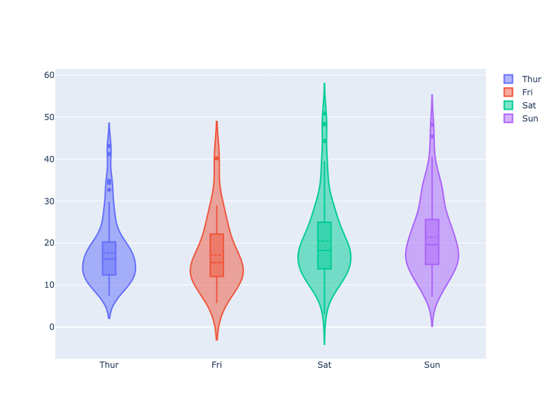

**Interactive Plot:**

<div>                        <script type="text/javascript">window.PlotlyConfig = {MathJaxConfig: 'local'};</script>
        <script charset="utf-8" src="https://cdn.plot.ly/plotly-3.1.0.min.js" integrity="sha256-Ei4740bWZhaUTQuD6q9yQlgVCMPBz6CZWhevDYPv93A=" crossorigin="anonymous"></script>                <div id="plotly-div-6" class="plotly-graph-div" style="height:100%; width:100%;"></div>            <script type="text/javascript">                window.PLOTLYENV=window.PLOTLYENV || {};                                if (document.getElementById("plotly-div-6")) {                    Plotly.newPlot(                        "plotly-div-6",                        [{"box":{"visible":true},"meanline":{"visible":true},"name":"Thur","x":["Thur","Thur","Thur","Thur","Thur","Thur","Thur","Thur","Thur","Thur","Thur","Thur","Thur","Thur","Thur","Thur","Thur","Thur","Thur","Thur","Thur","Thur","Thur","Thur","Thur","Thur","Thur","Thur","Thur","Thur","Thur","Thur","Thur","Thur","Thur","Thur","Thur","Thur","Thur","Thur","Thur","Thur","Thur","Thur","Thur","Thur","Thur","Thur","Thur","Thur","Thur","Thur","Thur","Thur","Thur","Thur","Thur","Thur","Thur","Thur","Thur","Thur"],"y":{"dtype":"f8","bdata":"MzMzMzMzO0DD9Shcj8I2QArXo3A9SjFAcT0K16NwM0ApXI\u002fC9agwQKRwPQrXIyRA16NwPQpXQED2KFyPwvUvQArXo3A9akFAj8L1KFwPKkBI4XoUrkcyQPYoXI\u002fCtThAKVyPwvUoNUDNzMzMzEwlQFyPwvUo3ChAFK5H4XoUOEDhehSuR2EnQNejcD0K1ypAhetRuB6FLEBmZmZmZuYvQPYoXI\u002fC9ShAzczMzMzMPUAK16NwPQohQArXo3A9Ci1Aw\u002fUoXI\u002fCJkBSuB6F69E2QBSuR+F6FDNAhetRuB5FNEDXo3A9ClcmQIXrUbgehShAw\u002fUoXI9CMkCF61G4HgUhQClcj8L1qCRAzczMzMxMLEAAAAAAAAAwQFK4HoXrUSpAuB6F61F4MUBmZmZmZiZBQLgehetRmERAzczMzMwMO0CuR+F6FG4wQDMzMzMzsyBApHA9CtejMkA9CtejcL0nQI\u002fC9ShcjyNACtejcD0KHkCPwvUoXM8zQHE9CtejcDxA9ihcj8L1LkAUrkfhepQwQD0K16NwPR5ArkfhehSuJECuR+F6FI5FQAAAAAAAACpAhetRuB4FK0D2KFyPwrUyQHsUrkfheilAAAAAAAAAKkBmZmZmZmYwQEjhehSuhzRAuB6F61F4MEBI4XoUrscyQA=="},"type":"violin"},{"box":{"visible":true},"meanline":{"visible":true},"name":"Fri","x":["Fri","Fri","Fri","Fri","Fri","Fri","Fri","Fri","Fri","Fri","Fri","Fri","Fri","Fri","Fri","Fri","Fri","Fri","Fri"],"y":{"dtype":"f8","bdata":"uB6F61H4PEA9CtejcH02QAAAAAAAABdAUrgehetRMEAAAAAAAMA2QPYoXI\u002fCFURASOF6FK5HO0CPwvUoXA8oQMP1KFyPAjVA7FG4HoXrKEAzMzMzM7MmQMP1KFyPwi5AUrgehetRKEDXo3A9CtcqQClcj8L1KCFA9ihcj8L1L0DXo3A9CtcqQIXrUbgeRTBArkfhehQuJEA="},"type":"violin"},{"box":{"visible":true},"meanline":{"visible":true},"name":"Sat","x":["Sat","Sat","Sat","Sat","Sat","Sat","Sat","Sat","Sat","Sat","Sat","Sat","Sat","Sat","Sat","Sat","Sat","Sat","Sat","Sat","Sat","Sat","Sat","Sat","Sat","Sat","Sat","Sat","Sat","Sat","Sat","Sat","Sat","Sat","Sat","Sat","Sat","Sat","Sat","Sat","Sat","Sat","Sat","Sat","Sat","Sat","Sat","Sat","Sat","Sat","Sat","Sat","Sat","Sat","Sat","Sat","Sat","Sat","Sat","Sat","Sat","Sat","Sat","Sat","Sat","Sat","Sat","Sat","Sat","Sat","Sat","Sat","Sat","Sat","Sat","Sat","Sat","Sat","Sat","Sat","Sat","Sat","Sat","Sat","Sat","Sat","Sat"],"y":{"dtype":"f8","bdata":"ZmZmZmamNEDsUbgehesxQArXo3A9SjRACtejcD2KL0D2KFyPwrVDQFK4HoXr0TNAj8L1KFzPMUA9CtejcL0qQOF6FK5HYSlAMzMzMzOzNUBmZmZmZqYzQJqZmZmZGSNAmpmZmZlZMkAfhetRuB4uQHE9CtejsDRASOF6FK7HMUCPwvUoXA84QI\u002fC9ShcTzBArkfhehTuMEBxPQrXo7AyQIXrUbgeRT9ACtejcD0KMEDhehSuRwFDQClcj8L1aDpAexSuR+F6JkDD9ShcjyJIQArXo3A9SjRAH4XrUbieK0AK16NwPQomQArXo3A9SjJA16NwPQqXMUAUrkfhehQ0QDMzMzMzczBAj8L1KFyPCEB7FK5H4To0QIXrUbgeBS5ACtejcD0KKEBSuB6F6xExQFyPwvUo3DpASOF6FK5HOUD2KFyPwnUtQIXrUbgeBSVA7FG4HoXrMUBmZmZmZiZGQOxRuB6FazZA7FG4HoXrNEC4HoXrUbguQD0K16NwfTRA9ihcj8I1OUA9CtejcD0yQB+F61G4nixAAAAAAAAALEAAAAAAAAAdQK5H4XoULiVAw\u002fUoXI9CJUBI4XoUrmdJQB+F61G4ni9A16NwPQqXOkA9CtejcF1DQIXrUbgeRThAhetRuB6FKUCPwvUoXA8+QKRwPQrX4zlACtejcD0qSEAK16NwPYoqQOxRuB6FKzxAzczMzMzMKUBmZmZmZiY8QK5H4XoULidA9ihcj8L1HkCkcD0K1yM+QDMzMzMzczRAj8L1KFyPKkAfhetRuB42QMP1KFyPAjhA4XoUrkdhL0C4HoXrUTgnQArXo3A9iiVAj8L1KFwPL0CkcD0K1yMkQDMzMzMzMylACtejcD1qQEAK16NwPepBQEjhehSuBz1ArkfhehQuO0DsUbgehas2QFK4HoXr0TFA"},"type":"violin"},{"box":{"visible":true},"meanline":{"visible":true},"name":"Sun","x":["Sun","Sun","Sun","Sun","Sun","Sun","Sun","Sun","Sun","Sun","Sun","Sun","Sun","Sun","Sun","Sun","Sun","Sun","Sun","Sun","Sun","Sun","Sun","Sun","Sun","Sun","Sun","Sun","Sun","Sun","Sun","Sun","Sun","Sun","Sun","Sun","Sun","Sun","Sun","Sun","Sun","Sun","Sun","Sun","Sun","Sun","Sun","Sun","Sun","Sun","Sun","Sun","Sun","Sun","Sun","Sun","Sun","Sun","Sun","Sun","Sun","Sun","Sun","Sun","Sun","Sun","Sun","Sun","Sun","Sun","Sun","Sun","Sun","Sun","Sun","Sun"],"y":{"dtype":"f8","bdata":"PQrXo3D9MECuR+F6FK4kQMP1KFyPAjVArkfhehSuN0DXo3A9Cpc4QArXo3A9SjlACtejcD2KIUDhehSuR+E6QBSuR+F6FC5Aj8L1KFyPLUAK16NwPYokQOF6FK5HoUFA16NwPQrXLkCuR+F6FG4yQClcj8L1qC1AFK5H4XqUNUApXI\u002fC9agkQArXo3A9SjBAuB6F61H4MED2KFyPwnUxQOF6FK5H4StAXI\u002fC9ShcI0BmZmZmZmY+QArXo3A9SjJAexSuR+E6NkAzMzMzMzNAQM3MzMzMjDxACtejcD0KMkAUrkfhehQpQBSuR+F6lCRASOF6FK5nQUDhehSuR+EjQI\u002fC9ShcjzlAPQrXo3B9M0ApXI\u002fC9QhDQDMzMzMz8zdA9ihcj8K1OUCPwvUoXE8xQK5H4XoU7j1ApHA9CtcjLEDD9Shcj0IqQMP1KFyPQjFAzczMzMyMOECF61G4HsUzQJqZmZmZ2T1A9ihcj8IVSEAAAAAAAAA5QEjhehSuxypAPQrXo3B9MEAAAAAAAIA1QFK4HoXrUSlA9ihcj8I1MEAfhetRuJ4rQMP1KFyPgjFAhetRuB6FOEDD9Shcj8I0QPYoXI\u002fCtT9AAAAAAAAAHUCamZmZmdk\u002fQFK4HoXr0TBAMzMzMzNzQECkcD0K1+MxQPYoXI\u002fC9SxAMzMzMzMzI0BxPQrXo1BBQDMzMzMzU0FAFK5H4XpUN0DNzMzMzKxGQOxRuB6FKzdAZmZmZmZGREBxPQrXo7A0QGZmZmZm5jRA9ihcj8J1PkBmZmZmZiYyQJqZmZmZGTdA4XoUrkdhL0A="},"type":"violin"}],                        {"template":{"data":{"histogram2dcontour":[{"type":"histogram2dcontour","colorbar":{"outlinewidth":0,"ticks":""},"colorscale":[[0.0,"#0d0887"],[0.1111111111111111,"#46039f"],[0.2222222222222222,"#7201a8"],[0.3333333333333333,"#9c179e"],[0.4444444444444444,"#bd3786"],[0.5555555555555556,"#d8576b"],[0.6666666666666666,"#ed7953"],[0.7777777777777778,"#fb9f3a"],[0.8888888888888888,"#fdca26"],[1.0,"#f0f921"]]}],"choropleth":[{"type":"choropleth","colorbar":{"outlinewidth":0,"ticks":""}}],"histogram2d":[{"type":"histogram2d","colorbar":{"outlinewidth":0,"ticks":""},"colorscale":[[0.0,"#0d0887"],[0.1111111111111111,"#46039f"],[0.2222222222222222,"#7201a8"],[0.3333333333333333,"#9c179e"],[0.4444444444444444,"#bd3786"],[0.5555555555555556,"#d8576b"],[0.6666666666666666,"#ed7953"],[0.7777777777777778,"#fb9f3a"],[0.8888888888888888,"#fdca26"],[1.0,"#f0f921"]]}],"heatmap":[{"type":"heatmap","colorbar":{"outlinewidth":0,"ticks":""},"colorscale":[[0.0,"#0d0887"],[0.1111111111111111,"#46039f"],[0.2222222222222222,"#7201a8"],[0.3333333333333333,"#9c179e"],[0.4444444444444444,"#bd3786"],[0.5555555555555556,"#d8576b"],[0.6666666666666666,"#ed7953"],[0.7777777777777778,"#fb9f3a"],[0.8888888888888888,"#fdca26"],[1.0,"#f0f921"]]}],"contourcarpet":[{"type":"contourcarpet","colorbar":{"outlinewidth":0,"ticks":""}}],"contour":[{"type":"contour","colorbar":{"outlinewidth":0,"ticks":""},"colorscale":[[0.0,"#0d0887"],[0.1111111111111111,"#46039f"],[0.2222222222222222,"#7201a8"],[0.3333333333333333,"#9c179e"],[0.4444444444444444,"#bd3786"],[0.5555555555555556,"#d8576b"],[0.6666666666666666,"#ed7953"],[0.7777777777777778,"#fb9f3a"],[0.8888888888888888,"#fdca26"],[1.0,"#f0f921"]]}],"surface":[{"type":"surface","colorbar":{"outlinewidth":0,"ticks":""},"colorscale":[[0.0,"#0d0887"],[0.1111111111111111,"#46039f"],[0.2222222222222222,"#7201a8"],[0.3333333333333333,"#9c179e"],[0.4444444444444444,"#bd3786"],[0.5555555555555556,"#d8576b"],[0.6666666666666666,"#ed7953"],[0.7777777777777778,"#fb9f3a"],[0.8888888888888888,"#fdca26"],[1.0,"#f0f921"]]}],"mesh3d":[{"type":"mesh3d","colorbar":{"outlinewidth":0,"ticks":""}}],"scatter":[{"fillpattern":{"fillmode":"overlay","size":10,"solidity":0.2},"type":"scatter"}],"parcoords":[{"type":"parcoords","line":{"colorbar":{"outlinewidth":0,"ticks":""}}}],"scatterpolargl":[{"type":"scatterpolargl","marker":{"colorbar":{"outlinewidth":0,"ticks":""}}}],"bar":[{"error_x":{"color":"#2a3f5f"},"error_y":{"color":"#2a3f5f"},"marker":{"line":{"color":"#E5ECF6","width":0.5},"pattern":{"fillmode":"overlay","size":10,"solidity":0.2}},"type":"bar"}],"scattergeo":[{"type":"scattergeo","marker":{"colorbar":{"outlinewidth":0,"ticks":""}}}],"scatterpolar":[{"type":"scatterpolar","marker":{"colorbar":{"outlinewidth":0,"ticks":""}}}],"histogram":[{"marker":{"pattern":{"fillmode":"overlay","size":10,"solidity":0.2}},"type":"histogram"}],"scattergl":[{"type":"scattergl","marker":{"colorbar":{"outlinewidth":0,"ticks":""}}}],"scatter3d":[{"type":"scatter3d","line":{"colorbar":{"outlinewidth":0,"ticks":""}},"marker":{"colorbar":{"outlinewidth":0,"ticks":""}}}],"scattermap":[{"type":"scattermap","marker":{"colorbar":{"outlinewidth":0,"ticks":""}}}],"scattermapbox":[{"type":"scattermapbox","marker":{"colorbar":{"outlinewidth":0,"ticks":""}}}],"scatterternary":[{"type":"scatterternary","marker":{"colorbar":{"outlinewidth":0,"ticks":""}}}],"scattercarpet":[{"type":"scattercarpet","marker":{"colorbar":{"outlinewidth":0,"ticks":""}}}],"carpet":[{"aaxis":{"endlinecolor":"#2a3f5f","gridcolor":"white","linecolor":"white","minorgridcolor":"white","startlinecolor":"#2a3f5f"},"baxis":{"endlinecolor":"#2a3f5f","gridcolor":"white","linecolor":"white","minorgridcolor":"white","startlinecolor":"#2a3f5f"},"type":"carpet"}],"table":[{"cells":{"fill":{"color":"#EBF0F8"},"line":{"color":"white"}},"header":{"fill":{"color":"#C8D4E3"},"line":{"color":"white"}},"type":"table"}],"barpolar":[{"marker":{"line":{"color":"#E5ECF6","width":0.5},"pattern":{"fillmode":"overlay","size":10,"solidity":0.2}},"type":"barpolar"}],"pie":[{"automargin":true,"type":"pie"}]},"layout":{"autotypenumbers":"strict","colorway":["#636efa","#EF553B","#00cc96","#ab63fa","#FFA15A","#19d3f3","#FF6692","#B6E880","#FF97FF","#FECB52"],"font":{"color":"#2a3f5f"},"hovermode":"closest","hoverlabel":{"align":"left"},"paper_bgcolor":"white","plot_bgcolor":"#E5ECF6","polar":{"bgcolor":"#E5ECF6","angularaxis":{"gridcolor":"white","linecolor":"white","ticks":""},"radialaxis":{"gridcolor":"white","linecolor":"white","ticks":""}},"ternary":{"bgcolor":"#E5ECF6","aaxis":{"gridcolor":"white","linecolor":"white","ticks":""},"baxis":{"gridcolor":"white","linecolor":"white","ticks":""},"caxis":{"gridcolor":"white","linecolor":"white","ticks":""}},"coloraxis":{"colorbar":{"outlinewidth":0,"ticks":""}},"colorscale":{"sequential":[[0.0,"#0d0887"],[0.1111111111111111,"#46039f"],[0.2222222222222222,"#7201a8"],[0.3333333333333333,"#9c179e"],[0.4444444444444444,"#bd3786"],[0.5555555555555556,"#d8576b"],[0.6666666666666666,"#ed7953"],[0.7777777777777778,"#fb9f3a"],[0.8888888888888888,"#fdca26"],[1.0,"#f0f921"]],"sequentialminus":[[0.0,"#0d0887"],[0.1111111111111111,"#46039f"],[0.2222222222222222,"#7201a8"],[0.3333333333333333,"#9c179e"],[0.4444444444444444,"#bd3786"],[0.5555555555555556,"#d8576b"],[0.6666666666666666,"#ed7953"],[0.7777777777777778,"#fb9f3a"],[0.8888888888888888,"#fdca26"],[1.0,"#f0f921"]],"diverging":[[0,"#8e0152"],[0.1,"#c51b7d"],[0.2,"#de77ae"],[0.3,"#f1b6da"],[0.4,"#fde0ef"],[0.5,"#f7f7f7"],[0.6,"#e6f5d0"],[0.7,"#b8e186"],[0.8,"#7fbc41"],[0.9,"#4d9221"],[1,"#276419"]]},"xaxis":{"gridcolor":"white","linecolor":"white","ticks":"","title":{"standoff":15},"zerolinecolor":"white","automargin":true,"zerolinewidth":2},"yaxis":{"gridcolor":"white","linecolor":"white","ticks":"","title":{"standoff":15},"zerolinecolor":"white","automargin":true,"zerolinewidth":2},"scene":{"xaxis":{"backgroundcolor":"#E5ECF6","gridcolor":"white","linecolor":"white","showbackground":true,"ticks":"","zerolinecolor":"white","gridwidth":2},"yaxis":{"backgroundcolor":"#E5ECF6","gridcolor":"white","linecolor":"white","showbackground":true,"ticks":"","zerolinecolor":"white","gridwidth":2},"zaxis":{"backgroundcolor":"#E5ECF6","gridcolor":"white","linecolor":"white","showbackground":true,"ticks":"","zerolinecolor":"white","gridwidth":2}},"shapedefaults":{"line":{"color":"#2a3f5f"}},"annotationdefaults":{"arrowcolor":"#2a3f5f","arrowhead":0,"arrowwidth":1},"geo":{"bgcolor":"white","landcolor":"#E5ECF6","subunitcolor":"white","showland":true,"showlakes":true,"lakecolor":"white"},"title":{"x":0.05},"mapbox":{"style":"light"}}}},                        {"responsive": true}                    )                };            </script>        </div>

#### Grouped Violin Plot

```python
import plotly.graph_objects as go

import pandas as pd

df = pd.read_csv("https://raw.githubusercontent.com/plotly/datasets/master/violin_data.csv")

fig = go.Figure()

fig.add_trace(go.Violin(x=df['day'][ df['sex'] == 'Male' ],
                        y=df['total_bill'][ df['sex'] == 'Male' ],
                        legendgroup='M', scalegroup='M', name='M',
                        line_color='blue')
             )
fig.add_trace(go.Violin(x=df['day'][ df['sex'] == 'Female' ],
                        y=df['total_bill'][ df['sex'] == 'Female' ],
                        legendgroup='F', scalegroup='F', name='F',
                        line_color='orange')
             )

fig.update_traces(box_visible=True, meanline_visible=True)
fig.update_layout(violinmode='group')
fig.show()
```

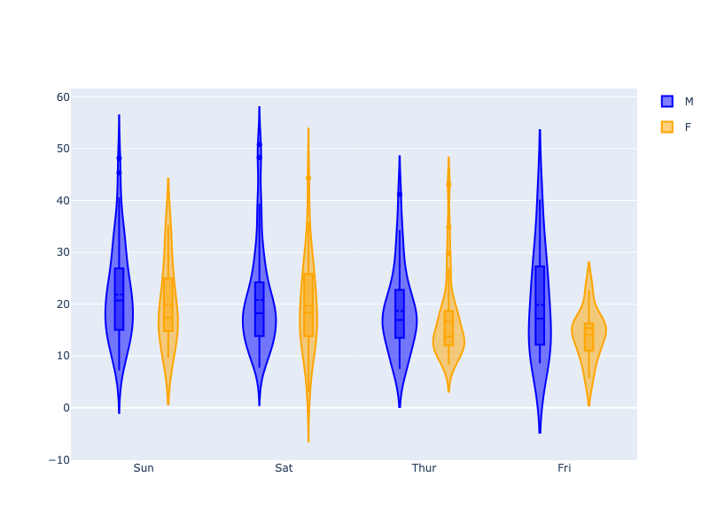

**Interactive Plot:**

<div>                        <script type="text/javascript">window.PlotlyConfig = {MathJaxConfig: 'local'};</script>
        <script charset="utf-8" src="https://cdn.plot.ly/plotly-3.1.0.min.js" integrity="sha256-Ei4740bWZhaUTQuD6q9yQlgVCMPBz6CZWhevDYPv93A=" crossorigin="anonymous"></script>                <div id="plotly-div-7" class="plotly-graph-div" style="height:100%; width:100%;"></div>            <script type="text/javascript">                window.PLOTLYENV=window.PLOTLYENV || {};                                if (document.getElementById("plotly-div-7")) {                    Plotly.newPlot(                        "plotly-div-7",                        [{"legendgroup":"M","line":{"color":"blue"},"name":"M","scalegroup":"M","x":["Sun","Sun","Sun","Sun","Sun","Sun","Sun","Sun","Sun","Sun","Sun","Sun","Sun","Sat","Sat","Sat","Sat","Sat","Sat","Sat","Sat","Sat","Sat","Sat","Sat","Sat","Sat","Sat","Sat","Sun","Sun","Sun","Sun","Sun","Sun","Sun","Sun","Sun","Sun","Sun","Sun","Sun","Sat","Sat","Sat","Sat","Sat","Sat","Sat","Sat","Sat","Sat","Sat","Sat","Sat","Sat","Thur","Thur","Thur","Thur","Thur","Thur","Thur","Thur","Thur","Thur","Thur","Fri","Fri","Fri","Fri","Fri","Fri","Fri","Sat","Sat","Sat","Sat","Sat","Sun","Sun","Sun","Thur","Thur","Thur","Thur","Thur","Thur","Thur","Thur","Thur","Thur","Thur","Sun","Sun","Sun","Sun","Sun","Sun","Sun","Sun","Sun","Sun","Sun","Sun","Sun","Sat","Sat","Sun","Sun","Sun","Sun","Sun","Sun","Sun","Sun","Sun","Sun","Sun","Sun","Sun","Sun","Sun","Sun","Thur","Thur","Thur","Thur","Thur","Thur","Thur","Thur","Sat","Sat","Sat","Sat","Sat","Sat","Sat","Sat","Sat","Fri","Fri","Fri","Sat","Sat","Sat","Sat","Sat","Sat","Sat","Sat","Sat","Sat","Sat","Sat","Sat"],"y":{"dtype":"f8","bdata":"rkfhehSuJEDD9ShcjwI1QK5H4XoUrjdACtejcD1KOUAK16NwPYohQOF6FK5H4TpAFK5H4XoULkCPwvUoXI8tQArXo3A9iiRA16NwPQrXLkCuR+F6FG4yQBSuR+F6lDVACtejcD1KMEBmZmZmZqY0QOxRuB6F6zFA9ihcj8K1Q0BSuB6F69EzQI\u002fC9ShczzFAPQrXo3C9KkDhehSuR2EpQDMzMzMzszVAmpmZmZkZI0CamZmZmVkyQEjhehSuxzFAj8L1KFwPOECPwvUoXE8wQHE9CtejsDJAhetRuB5FP0AK16NwPQowQPYoXI\u002fCdTFA4XoUrkfhK0Bcj8L1KFwjQGZmZmZmZj5ACtejcD1KMkB7FK5H4To2QDMzMzMzM0BAzczMzMyMPEAK16NwPQoyQBSuR+F6FClA4XoUrkfhI0CPwvUoXI85QD0K16NwfTNA4XoUrkcBQ0B7FK5H4XomQMP1KFyPIkhACtejcD1KNEAfhetRuJ4rQArXo3A9CiZACtejcD1KMkDXo3A9CpcxQBSuR+F6FDRAexSuR+E6NECF61G4HgUuQArXo3A9CihAhetRuB4FJUDsUbgehesxQDMzMzMzMztAw\u002fUoXI\u002fCNkAK16NwPUoxQHE9CtejcDNAKVyPwvWoMEDXo3A9CldAQPYoXI\u002fC9S9Aj8L1KFwPKkBI4XoUrkcyQPYoXI\u002fCtThAKVyPwvUoNUC4HoXrUfg8QD0K16NwfTZA9ihcj8IVREBI4XoUrkc7QI\u002fC9ShcDyhAw\u002fUoXI8CNUDsUbgehesoQLgehetRuC5APQrXo3B9NED2KFyPwjU5QD0K16NwPTJAAAAAAAAALEApXI\u002fC9QhDQDMzMzMz8zdArkfhehTuPUDhehSuR2EnQIXrUbgehSxAZmZmZmbmL0AK16NwPQohQFK4HoXr0TZAFK5H4XoUM0AAAAAAAAAwQGZmZmZmJkFAuB6F61GYRECPwvUoXI8jQArXo3A9Ch5ApHA9CtcjLEDD9Shcj0IqQMP1KFyPQjFAzczMzMyMOECF61G4HsUzQPYoXI\u002fCFUhAPQrXo3B9MEAAAAAAAIA1QFK4HoXrUSlAH4XrUbieK0CF61G4HoU4QMP1KFyPwjRA9ihcj8K1P0BI4XoUrmdJQB+F61G4ni9AAAAAAAAAHUCamZmZmdk\u002fQFK4HoXr0TBAMzMzMzNzQECkcD0K1+MxQPYoXI\u002fC9SxAcT0K16NQQUAzMzMzM1NBQBSuR+F6VDdAzczMzMysRkDsUbgehSs3QGZmZmZmRkRAcT0K16OwNED2KFyPwnU+QJqZmZmZGTdA4XoUrkdhL0BxPQrXo3A8QPYoXI\u002fC9S5AFK5H4XqUMEA9CtejcD0eQK5H4XoUriRAhetRuB4FK0D2KFyPwrUyQEjhehSuhzRA16NwPQqXOkA9CtejcF1DQIXrUbgeRThAj8L1KFwPPkCkcD0K1+M5QArXo3A9KkhAZmZmZmYmPECuR+F6FC4nQPYoXI\u002fC9R5AUrgehetRKEApXI\u002fC9SghQNejcD0K1ypAMzMzMzNzNECPwvUoXI8qQMP1KFyPAjhA4XoUrkdhL0C4HoXrUTgnQArXo3A9iiVAj8L1KFwPL0CkcD0K1yMkQDMzMzMzMylACtejcD1qQEBI4XoUrgc9QOxRuB6FqzZAUrgehevRMUA="},"type":"violin","box":{"visible":true},"meanline":{"visible":true}},{"legendgroup":"F","line":{"color":"orange"},"name":"F","scalegroup":"F","x":["Sun","Sun","Sun","Sun","Sun","Sun","Sat","Sat","Sat","Sat","Sat","Sat","Sun","Sun","Sat","Sat","Sat","Sat","Sat","Sat","Sat","Thur","Thur","Fri","Fri","Fri","Fri","Fri","Sat","Sat","Sat","Sat","Sat","Sun","Sun","Thur","Thur","Thur","Thur","Thur","Thur","Thur","Thur","Thur","Thur","Thur","Thur","Thur","Thur","Thur","Thur","Thur","Thur","Thur","Thur","Thur","Thur","Sun","Sun","Sun","Sun","Sun","Sat","Sat","Sun","Sun","Sun","Thur","Thur","Thur","Thur","Thur","Thur","Thur","Sat","Sat","Sat","Sat","Sat","Fri","Fri","Fri","Fri","Sat","Sat","Sat","Thur"],"y":{"dtype":"f8","bdata":"PQrXo3D9MEDXo3A9Cpc4QOF6FK5HoUFAKVyPwvWoLUApXI\u002fC9agkQLgehetR+DBACtejcD1KNEAK16NwPYovQGZmZmZmpjNAH4XrUbgeLkBxPQrXo7A0QK5H4XoU7jBAFK5H4XqUJEBI4XoUrmdBQClcj8L1aDpAMzMzMzNzMECPwvUoXI8IQFK4HoXrETFAXI\u002fC9SjcOkBI4XoUrkc5QPYoXI\u002fCdS1ApHA9CtcjJEAK16NwPWpBQAAAAAAAABdAUrgehetRMEAAAAAAAMA2QDMzMzMzsyZAw\u002fUoXI\u002fCLkBmZmZmZiZGQOxRuB6FazZA7FG4HoXrNEAfhetRuJ4sQAAAAAAAAB1A9ihcj8K1OUCPwvUoXE8xQM3MzMzMTCVAXI\u002fC9SjcKEAUrkfhehQ4QNejcD0K1ypA9ihcj8L1KEDNzMzMzMw9QArXo3A9Ci1Aw\u002fUoXI\u002fCJkCF61G4HkU0QNejcD0KVyZAhetRuB6FKEDD9Shcj0IyQIXrUbgeBSFAKVyPwvWoJEDNzMzMzEwsQFK4HoXrUSpAuB6F61F4MUDNzMzMzAw7QK5H4XoUbjBAMzMzMzOzIECkcD0K16MyQD0K16NwvSdAmpmZmZnZPUAAAAAAAAA5QEjhehSuxypA9ihcj8I1MEDD9Shcj4IxQK5H4XoULiVAw\u002fUoXI9CJUAzMzMzMzMjQGZmZmZm5jRAZmZmZmYmMkCPwvUoXM8zQK5H4XoUjkVAAAAAAAAAKkB7FK5H4XopQAAAAAAAACpAZmZmZmZmMEC4HoXrUXgwQIXrUbgehSlACtejcD2KKkDsUbgehSs8QM3MzMzMzClApHA9CtcjPkDXo3A9CtcqQPYoXI\u002fC9S9AhetRuB5FMECuR+F6FC4kQB+F61G4HjZACtejcD3qQUCuR+F6FC47QEjhehSuxzJA"},"type":"violin","box":{"visible":true},"meanline":{"visible":true}}],                        {"template":{"data":{"histogram2dcontour":[{"type":"histogram2dcontour","colorbar":{"outlinewidth":0,"ticks":""},"colorscale":[[0.0,"#0d0887"],[0.1111111111111111,"#46039f"],[0.2222222222222222,"#7201a8"],[0.3333333333333333,"#9c179e"],[0.4444444444444444,"#bd3786"],[0.5555555555555556,"#d8576b"],[0.6666666666666666,"#ed7953"],[0.7777777777777778,"#fb9f3a"],[0.8888888888888888,"#fdca26"],[1.0,"#f0f921"]]}],"choropleth":[{"type":"choropleth","colorbar":{"outlinewidth":0,"ticks":""}}],"histogram2d":[{"type":"histogram2d","colorbar":{"outlinewidth":0,"ticks":""},"colorscale":[[0.0,"#0d0887"],[0.1111111111111111,"#46039f"],[0.2222222222222222,"#7201a8"],[0.3333333333333333,"#9c179e"],[0.4444444444444444,"#bd3786"],[0.5555555555555556,"#d8576b"],[0.6666666666666666,"#ed7953"],[0.7777777777777778,"#fb9f3a"],[0.8888888888888888,"#fdca26"],[1.0,"#f0f921"]]}],"heatmap":[{"type":"heatmap","colorbar":{"outlinewidth":0,"ticks":""},"colorscale":[[0.0,"#0d0887"],[0.1111111111111111,"#46039f"],[0.2222222222222222,"#7201a8"],[0.3333333333333333,"#9c179e"],[0.4444444444444444,"#bd3786"],[0.5555555555555556,"#d8576b"],[0.6666666666666666,"#ed7953"],[0.7777777777777778,"#fb9f3a"],[0.8888888888888888,"#fdca26"],[1.0,"#f0f921"]]}],"contourcarpet":[{"type":"contourcarpet","colorbar":{"outlinewidth":0,"ticks":""}}],"contour":[{"type":"contour","colorbar":{"outlinewidth":0,"ticks":""},"colorscale":[[0.0,"#0d0887"],[0.1111111111111111,"#46039f"],[0.2222222222222222,"#7201a8"],[0.3333333333333333,"#9c179e"],[0.4444444444444444,"#bd3786"],[0.5555555555555556,"#d8576b"],[0.6666666666666666,"#ed7953"],[0.7777777777777778,"#fb9f3a"],[0.8888888888888888,"#fdca26"],[1.0,"#f0f921"]]}],"surface":[{"type":"surface","colorbar":{"outlinewidth":0,"ticks":""},"colorscale":[[0.0,"#0d0887"],[0.1111111111111111,"#46039f"],[0.2222222222222222,"#7201a8"],[0.3333333333333333,"#9c179e"],[0.4444444444444444,"#bd3786"],[0.5555555555555556,"#d8576b"],[0.6666666666666666,"#ed7953"],[0.7777777777777778,"#fb9f3a"],[0.8888888888888888,"#fdca26"],[1.0,"#f0f921"]]}],"mesh3d":[{"type":"mesh3d","colorbar":{"outlinewidth":0,"ticks":""}}],"scatter":[{"fillpattern":{"fillmode":"overlay","size":10,"solidity":0.2},"type":"scatter"}],"parcoords":[{"type":"parcoords","line":{"colorbar":{"outlinewidth":0,"ticks":""}}}],"scatterpolargl":[{"type":"scatterpolargl","marker":{"colorbar":{"outlinewidth":0,"ticks":""}}}],"bar":[{"error_x":{"color":"#2a3f5f"},"error_y":{"color":"#2a3f5f"},"marker":{"line":{"color":"#E5ECF6","width":0.5},"pattern":{"fillmode":"overlay","size":10,"solidity":0.2}},"type":"bar"}],"scattergeo":[{"type":"scattergeo","marker":{"colorbar":{"outlinewidth":0,"ticks":""}}}],"scatterpolar":[{"type":"scatterpolar","marker":{"colorbar":{"outlinewidth":0,"ticks":""}}}],"histogram":[{"marker":{"pattern":{"fillmode":"overlay","size":10,"solidity":0.2}},"type":"histogram"}],"scattergl":[{"type":"scattergl","marker":{"colorbar":{"outlinewidth":0,"ticks":""}}}],"scatter3d":[{"type":"scatter3d","line":{"colorbar":{"outlinewidth":0,"ticks":""}},"marker":{"colorbar":{"outlinewidth":0,"ticks":""}}}],"scattermap":[{"type":"scattermap","marker":{"colorbar":{"outlinewidth":0,"ticks":""}}}],"scattermapbox":[{"type":"scattermapbox","marker":{"colorbar":{"outlinewidth":0,"ticks":""}}}],"scatterternary":[{"type":"scatterternary","marker":{"colorbar":{"outlinewidth":0,"ticks":""}}}],"scattercarpet":[{"type":"scattercarpet","marker":{"colorbar":{"outlinewidth":0,"ticks":""}}}],"carpet":[{"aaxis":{"endlinecolor":"#2a3f5f","gridcolor":"white","linecolor":"white","minorgridcolor":"white","startlinecolor":"#2a3f5f"},"baxis":{"endlinecolor":"#2a3f5f","gridcolor":"white","linecolor":"white","minorgridcolor":"white","startlinecolor":"#2a3f5f"},"type":"carpet"}],"table":[{"cells":{"fill":{"color":"#EBF0F8"},"line":{"color":"white"}},"header":{"fill":{"color":"#C8D4E3"},"line":{"color":"white"}},"type":"table"}],"barpolar":[{"marker":{"line":{"color":"#E5ECF6","width":0.5},"pattern":{"fillmode":"overlay","size":10,"solidity":0.2}},"type":"barpolar"}],"pie":[{"automargin":true,"type":"pie"}]},"layout":{"autotypenumbers":"strict","colorway":["#636efa","#EF553B","#00cc96","#ab63fa","#FFA15A","#19d3f3","#FF6692","#B6E880","#FF97FF","#FECB52"],"font":{"color":"#2a3f5f"},"hovermode":"closest","hoverlabel":{"align":"left"},"paper_bgcolor":"white","plot_bgcolor":"#E5ECF6","polar":{"bgcolor":"#E5ECF6","angularaxis":{"gridcolor":"white","linecolor":"white","ticks":""},"radialaxis":{"gridcolor":"white","linecolor":"white","ticks":""}},"ternary":{"bgcolor":"#E5ECF6","aaxis":{"gridcolor":"white","linecolor":"white","ticks":""},"baxis":{"gridcolor":"white","linecolor":"white","ticks":""},"caxis":{"gridcolor":"white","linecolor":"white","ticks":""}},"coloraxis":{"colorbar":{"outlinewidth":0,"ticks":""}},"colorscale":{"sequential":[[0.0,"#0d0887"],[0.1111111111111111,"#46039f"],[0.2222222222222222,"#7201a8"],[0.3333333333333333,"#9c179e"],[0.4444444444444444,"#bd3786"],[0.5555555555555556,"#d8576b"],[0.6666666666666666,"#ed7953"],[0.7777777777777778,"#fb9f3a"],[0.8888888888888888,"#fdca26"],[1.0,"#f0f921"]],"sequentialminus":[[0.0,"#0d0887"],[0.1111111111111111,"#46039f"],[0.2222222222222222,"#7201a8"],[0.3333333333333333,"#9c179e"],[0.4444444444444444,"#bd3786"],[0.5555555555555556,"#d8576b"],[0.6666666666666666,"#ed7953"],[0.7777777777777778,"#fb9f3a"],[0.8888888888888888,"#fdca26"],[1.0,"#f0f921"]],"diverging":[[0,"#8e0152"],[0.1,"#c51b7d"],[0.2,"#de77ae"],[0.3,"#f1b6da"],[0.4,"#fde0ef"],[0.5,"#f7f7f7"],[0.6,"#e6f5d0"],[0.7,"#b8e186"],[0.8,"#7fbc41"],[0.9,"#4d9221"],[1,"#276419"]]},"xaxis":{"gridcolor":"white","linecolor":"white","ticks":"","title":{"standoff":15},"zerolinecolor":"white","automargin":true,"zerolinewidth":2},"yaxis":{"gridcolor":"white","linecolor":"white","ticks":"","title":{"standoff":15},"zerolinecolor":"white","automargin":true,"zerolinewidth":2},"scene":{"xaxis":{"backgroundcolor":"#E5ECF6","gridcolor":"white","linecolor":"white","showbackground":true,"ticks":"","zerolinecolor":"white","gridwidth":2},"yaxis":{"backgroundcolor":"#E5ECF6","gridcolor":"white","linecolor":"white","showbackground":true,"ticks":"","zerolinecolor":"white","gridwidth":2},"zaxis":{"backgroundcolor":"#E5ECF6","gridcolor":"white","linecolor":"white","showbackground":true,"ticks":"","zerolinecolor":"white","gridwidth":2}},"shapedefaults":{"line":{"color":"#2a3f5f"}},"annotationdefaults":{"arrowcolor":"#2a3f5f","arrowhead":0,"arrowwidth":1},"geo":{"bgcolor":"white","landcolor":"#E5ECF6","subunitcolor":"white","showland":true,"showlakes":true,"lakecolor":"white"},"title":{"x":0.05},"mapbox":{"style":"light"}}},"violinmode":"group"},                        {"responsive": true}                    )                };            </script>        </div>

#### Split Violin Plot

```python
import plotly.graph_objects as go

import pandas as pd

df = pd.read_csv("https://raw.githubusercontent.com/plotly/datasets/master/violin_data.csv")

fig = go.Figure()

fig.add_trace(go.Violin(x=df['day'][ df['smoker'] == 'Yes' ],
                        y=df['total_bill'][ df['smoker'] == 'Yes' ],
                        legendgroup='Yes', scalegroup='Yes', name='Yes',
                        side='negative',
                        line_color='blue')
             )
fig.add_trace(go.Violin(x=df['day'][ df['smoker'] == 'No' ],
                        y=df['total_bill'][ df['smoker'] == 'No' ],
                        legendgroup='No', scalegroup='No', name='No',
                        side='positive',
                        line_color='orange')
             )
fig.update_traces(meanline_visible=True)
fig.update_layout(violingap=0, violinmode='overlay')
fig.show()
```

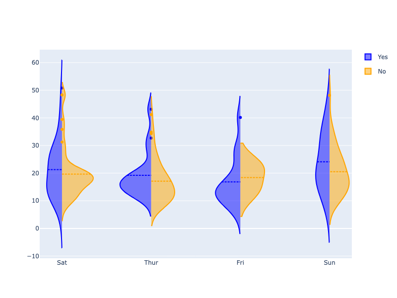

**Interactive Plot:**

<div>                        <script type="text/javascript">window.PlotlyConfig = {MathJaxConfig: 'local'};</script>
        <script charset="utf-8" src="https://cdn.plot.ly/plotly-3.1.0.min.js" integrity="sha256-Ei4740bWZhaUTQuD6q9yQlgVCMPBz6CZWhevDYPv93A=" crossorigin="anonymous"></script>                <div id="plotly-div-8" class="plotly-graph-div" style="height:100%; width:100%;"></div>            <script type="text/javascript">                window.PLOTLYENV=window.PLOTLYENV || {};                                if (document.getElementById("plotly-div-8")) {                    Plotly.newPlot(                        "plotly-div-8",                        [{"legendgroup":"Yes","line":{"color":"blue"},"name":"Yes","scalegroup":"Yes","side":"negative","x":["Sat","Sat","Sat","Sat","Sat","Sat","Sat","Sat","Sat","Sat","Sat","Thur","Thur","Fri","Fri","Fri","Fri","Fri","Fri","Fri","Fri","Fri","Sat","Sat","Sat","Sat","Sat","Sat","Thur","Sun","Sat","Sat","Sat","Sat","Sun","Sun","Sun","Sun","Sun","Sun","Sun","Sun","Sun","Sun","Sun","Sun","Sun","Sun","Sun","Sun","Sun","Sun","Thur","Thur","Thur","Thur","Thur","Thur","Thur","Thur","Thur","Thur","Thur","Thur","Thur","Thur","Sat","Sat","Sat","Sat","Sat","Sat","Sat","Sat","Sat","Sat","Sat","Sat","Sat","Fri","Fri","Fri","Fri","Fri","Fri","Sat","Sat","Sat","Sat","Sat","Sat","Sat","Sat"],"y":{"dtype":"f8","bdata":"4XoUrkcBQ0B7FK5H4XomQArXo3A9SjRAH4XrUbieK0AK16NwPQomQArXo3A9SjJAj8L1KFyPCECF61G4HgUuQFyPwvUo3DpASOF6FK5HOUDsUbgehesxQHE9CtejcDNA16NwPQpXQEC4HoXrUfg8QAAAAAAAABdAUrgehetRMED2KFyPwhVEQEjhehSuRztAj8L1KFwPKEDD9ShcjwI1QDMzMzMzsyZAw\u002fUoXI\u002fCLkBmZmZmZiZGQOxRuB6FazZAuB6F61G4LkA9CtejcH00QPYoXI\u002fCNTlAH4XrUbieLEAAAAAAAAAwQMP1KFyPgjFArkfhehQuJUDD9Shcj0IlQEjhehSuZ0lAH4XrUbieL0AAAAAAAAAdQJqZmZmZ2T9AUrgehevRMEAzMzMzM3NAQKRwPQrX4zFA9ihcj8L1LEAzMzMzMzMjQHE9CtejUEFAMzMzMzNTQUAUrkfhelQ3QM3MzMzMrEZA7FG4HoUrN0BmZmZmZkZEQGZmZmZm5jRA9ihcj8J1PkBmZmZmZiYyQJqZmZmZGTdA4XoUrkdhL0CPwvUoXM8zQHE9CtejcDxA9ihcj8L1LkAUrkfhepQwQK5H4XoUriRArkfhehSORUAAAAAAAAAqQIXrUbgeBStA9ihcj8K1MkB7FK5H4XopQAAAAAAAACpAZmZmZmZmMEBI4XoUroc0QLgehetReDBA16NwPQqXOkA9CtejcF1DQIXrUbgeRThAhetRuB6FKUCPwvUoXA8+QKRwPQrX4zlACtejcD2KKkDsUbgehSs8QM3MzMzMzClAZmZmZmYmPECuR+F6FC4nQPYoXI\u002fC9R5ApHA9CtcjPkBSuB6F61EoQNejcD0K1ypAKVyPwvUoIUDXo3A9CtcqQIXrUbgeRTBArkfhehQuJEAfhetRuB42QMP1KFyPAjhA4XoUrkdhL0CPwvUoXA8vQDMzMzMzMylACtejcD1qQECuR+F6FC47QOxRuB6FqzZA"},"type":"violin","meanline":{"visible":true}},{"legendgroup":"No","line":{"color":"orange"},"name":"No","scalegroup":"No","side":"positive","x":["Sun","Sun","Sun","Sun","Sun","Sun","Sun","Sun","Sun","Sun","Sun","Sun","Sun","Sun","Sun","Sun","Sun","Sun","Sun","Sat","Sat","Sat","Sat","Sat","Sat","Sat","Sat","Sat","Sat","Sat","Sat","Sat","Sat","Sat","Sat","Sat","Sat","Sat","Sat","Sat","Sat","Sun","Sun","Sun","Sun","Sun","Sun","Sun","Sun","Sun","Sun","Sun","Sun","Sun","Sun","Sun","Sat","Sat","Sat","Sat","Sat","Sat","Sat","Sat","Sat","Sat","Thur","Thur","Thur","Thur","Thur","Thur","Thur","Thur","Thur","Thur","Thur","Fri","Fri","Fri","Sat","Sat","Sat","Sat","Sun","Sun","Sun","Sun","Sun","Thur","Thur","Thur","Thur","Thur","Thur","Thur","Thur","Thur","Thur","Thur","Thur","Thur","Thur","Thur","Thur","Thur","Thur","Thur","Thur","Thur","Thur","Thur","Thur","Thur","Thur","Thur","Thur","Thur","Thur","Thur","Thur","Sun","Sun","Sun","Sun","Sun","Sun","Sun","Sun","Sun","Sun","Sun","Sun","Sun","Sun","Sun","Sun","Sun","Sun","Thur","Sat","Fri","Sat","Sat","Sat","Sat","Sat","Sat","Sat","Sat","Thur"],"y":{"dtype":"f8","bdata":"PQrXo3D9MECuR+F6FK4kQMP1KFyPAjVArkfhehSuN0DXo3A9Cpc4QArXo3A9SjlACtejcD2KIUDhehSuR+E6QBSuR+F6FC5Aj8L1KFyPLUAK16NwPYokQOF6FK5HoUFA16NwPQrXLkCuR+F6FG4yQClcj8L1qC1AFK5H4XqUNUApXI\u002fC9agkQArXo3A9SjBAuB6F61H4MEBmZmZmZqY0QOxRuB6F6zFACtejcD1KNEAK16NwPYovQPYoXI\u002fCtUNAUrgehevRM0CPwvUoXM8xQD0K16NwvSpA4XoUrkdhKUAzMzMzM7M1QGZmZmZmpjNAmpmZmZkZI0CamZmZmVkyQB+F61G4Hi5AcT0K16OwNEBI4XoUrscxQI\u002fC9ShcDzhAj8L1KFxPMECuR+F6FO4wQHE9CtejsDJAhetRuB5FP0AK16NwPQowQPYoXI\u002fCdTFA4XoUrkfhK0Bcj8L1KFwjQGZmZmZmZj5ACtejcD1KMkB7FK5H4To2QDMzMzMzM0BAzczMzMyMPEAK16NwPQoyQBSuR+F6FClAFK5H4XqUJEBI4XoUrmdBQOF6FK5H4SNAj8L1KFyPOUA9CtejcH0zQClcj8L1aDpAw\u002fUoXI8iSEDXo3A9CpcxQBSuR+F6FDRAMzMzMzNzMEB7FK5H4To0QArXo3A9CihAUrgehesRMUD2KFyPwnUtQIXrUbgeBSVAMzMzMzMzO0DD9Shcj8I2QArXo3A9SjFAKVyPwvWoMECkcD0K1yMkQPYoXI\u002fC9S9ACtejcD1qQUCPwvUoXA8qQEjhehSuRzJA9ihcj8K1OEApXI\u002fC9Sg1QD0K16NwfTZAAAAAAADANkDsUbgehesoQOxRuB6F6zRAPQrXo3A9MkAAAAAAAAAsQAAAAAAAAB1AKVyPwvUIQ0AzMzMzM\u002fM3QPYoXI\u002fCtTlAj8L1KFxPMUCuR+F6FO49QM3MzMzMTCVAXI\u002fC9SjcKEAUrkfhehQ4QOF6FK5HYSdA16NwPQrXKkCF61G4HoUsQGZmZmZm5i9A9ihcj8L1KEDNzMzMzMw9QArXo3A9CiFACtejcD0KLUDD9Shcj8ImQFK4HoXr0TZAFK5H4XoUM0CF61G4HkU0QNejcD0KVyZAhetRuB6FKEDD9Shcj0IyQIXrUbgeBSFAKVyPwvWoJEDNzMzMzEwsQFK4HoXrUSpAuB6F61F4MUBmZmZmZiZBQLgehetRmERAzczMzMwMO0CuR+F6FG4wQDMzMzMzsyBApHA9CtejMkA9CtejcL0nQI\u002fC9ShcjyNACtejcD0KHkCkcD0K1yMsQMP1KFyPQipAw\u002fUoXI9CMUDNzMzMzIw4QIXrUbgexTNAmpmZmZnZPUD2KFyPwhVIQAAAAAAAADlASOF6FK7HKkA9CtejcH0wQAAAAAAAgDVAUrgehetRKUD2KFyPwjUwQB+F61G4nitAhetRuB6FOEDD9Shcj8I0QPYoXI\u002fCtT9AcT0K16OwNEA9CtejcD0eQArXo3A9KkhA9ihcj8L1L0AzMzMzM3M0QI\u002fC9ShcjypAuB6F61E4J0AK16NwPYolQKRwPQrXIyRACtejcD3qQUBI4XoUrgc9QFK4HoXr0TFASOF6FK7HMkA="},"type":"violin","meanline":{"visible":true}}],                        {"template":{"data":{"histogram2dcontour":[{"type":"histogram2dcontour","colorbar":{"outlinewidth":0,"ticks":""},"colorscale":[[0.0,"#0d0887"],[0.1111111111111111,"#46039f"],[0.2222222222222222,"#7201a8"],[0.3333333333333333,"#9c179e"],[0.4444444444444444,"#bd3786"],[0.5555555555555556,"#d8576b"],[0.6666666666666666,"#ed7953"],[0.7777777777777778,"#fb9f3a"],[0.8888888888888888,"#fdca26"],[1.0,"#f0f921"]]}],"choropleth":[{"type":"choropleth","colorbar":{"outlinewidth":0,"ticks":""}}],"histogram2d":[{"type":"histogram2d","colorbar":{"outlinewidth":0,"ticks":""},"colorscale":[[0.0,"#0d0887"],[0.1111111111111111,"#46039f"],[0.2222222222222222,"#7201a8"],[0.3333333333333333,"#9c179e"],[0.4444444444444444,"#bd3786"],[0.5555555555555556,"#d8576b"],[0.6666666666666666,"#ed7953"],[0.7777777777777778,"#fb9f3a"],[0.8888888888888888,"#fdca26"],[1.0,"#f0f921"]]}],"heatmap":[{"type":"heatmap","colorbar":{"outlinewidth":0,"ticks":""},"colorscale":[[0.0,"#0d0887"],[0.1111111111111111,"#46039f"],[0.2222222222222222,"#7201a8"],[0.3333333333333333,"#9c179e"],[0.4444444444444444,"#bd3786"],[0.5555555555555556,"#d8576b"],[0.6666666666666666,"#ed7953"],[0.7777777777777778,"#fb9f3a"],[0.8888888888888888,"#fdca26"],[1.0,"#f0f921"]]}],"contourcarpet":[{"type":"contourcarpet","colorbar":{"outlinewidth":0,"ticks":""}}],"contour":[{"type":"contour","colorbar":{"outlinewidth":0,"ticks":""},"colorscale":[[0.0,"#0d0887"],[0.1111111111111111,"#46039f"],[0.2222222222222222,"#7201a8"],[0.3333333333333333,"#9c179e"],[0.4444444444444444,"#bd3786"],[0.5555555555555556,"#d8576b"],[0.6666666666666666,"#ed7953"],[0.7777777777777778,"#fb9f3a"],[0.8888888888888888,"#fdca26"],[1.0,"#f0f921"]]}],"surface":[{"type":"surface","colorbar":{"outlinewidth":0,"ticks":""},"colorscale":[[0.0,"#0d0887"],[0.1111111111111111,"#46039f"],[0.2222222222222222,"#7201a8"],[0.3333333333333333,"#9c179e"],[0.4444444444444444,"#bd3786"],[0.5555555555555556,"#d8576b"],[0.6666666666666666,"#ed7953"],[0.7777777777777778,"#fb9f3a"],[0.8888888888888888,"#fdca26"],[1.0,"#f0f921"]]}],"mesh3d":[{"type":"mesh3d","colorbar":{"outlinewidth":0,"ticks":""}}],"scatter":[{"fillpattern":{"fillmode":"overlay","size":10,"solidity":0.2},"type":"scatter"}],"parcoords":[{"type":"parcoords","line":{"colorbar":{"outlinewidth":0,"ticks":""}}}],"scatterpolargl":[{"type":"scatterpolargl","marker":{"colorbar":{"outlinewidth":0,"ticks":""}}}],"bar":[{"error_x":{"color":"#2a3f5f"},"error_y":{"color":"#2a3f5f"},"marker":{"line":{"color":"#E5ECF6","width":0.5},"pattern":{"fillmode":"overlay","size":10,"solidity":0.2}},"type":"bar"}],"scattergeo":[{"type":"scattergeo","marker":{"colorbar":{"outlinewidth":0,"ticks":""}}}],"scatterpolar":[{"type":"scatterpolar","marker":{"colorbar":{"outlinewidth":0,"ticks":""}}}],"histogram":[{"marker":{"pattern":{"fillmode":"overlay","size":10,"solidity":0.2}},"type":"histogram"}],"scattergl":[{"type":"scattergl","marker":{"colorbar":{"outlinewidth":0,"ticks":""}}}],"scatter3d":[{"type":"scatter3d","line":{"colorbar":{"outlinewidth":0,"ticks":""}},"marker":{"colorbar":{"outlinewidth":0,"ticks":""}}}],"scattermap":[{"type":"scattermap","marker":{"colorbar":{"outlinewidth":0,"ticks":""}}}],"scattermapbox":[{"type":"scattermapbox","marker":{"colorbar":{"outlinewidth":0,"ticks":""}}}],"scatterternary":[{"type":"scatterternary","marker":{"colorbar":{"outlinewidth":0,"ticks":""}}}],"scattercarpet":[{"type":"scattercarpet","marker":{"colorbar":{"outlinewidth":0,"ticks":""}}}],"carpet":[{"aaxis":{"endlinecolor":"#2a3f5f","gridcolor":"white","linecolor":"white","minorgridcolor":"white","startlinecolor":"#2a3f5f"},"baxis":{"endlinecolor":"#2a3f5f","gridcolor":"white","linecolor":"white","minorgridcolor":"white","startlinecolor":"#2a3f5f"},"type":"carpet"}],"table":[{"cells":{"fill":{"color":"#EBF0F8"},"line":{"color":"white"}},"header":{"fill":{"color":"#C8D4E3"},"line":{"color":"white"}},"type":"table"}],"barpolar":[{"marker":{"line":{"color":"#E5ECF6","width":0.5},"pattern":{"fillmode":"overlay","size":10,"solidity":0.2}},"type":"barpolar"}],"pie":[{"automargin":true,"type":"pie"}]},"layout":{"autotypenumbers":"strict","colorway":["#636efa","#EF553B","#00cc96","#ab63fa","#FFA15A","#19d3f3","#FF6692","#B6E880","#FF97FF","#FECB52"],"font":{"color":"#2a3f5f"},"hovermode":"closest","hoverlabel":{"align":"left"},"paper_bgcolor":"white","plot_bgcolor":"#E5ECF6","polar":{"bgcolor":"#E5ECF6","angularaxis":{"gridcolor":"white","linecolor":"white","ticks":""},"radialaxis":{"gridcolor":"white","linecolor":"white","ticks":""}},"ternary":{"bgcolor":"#E5ECF6","aaxis":{"gridcolor":"white","linecolor":"white","ticks":""},"baxis":{"gridcolor":"white","linecolor":"white","ticks":""},"caxis":{"gridcolor":"white","linecolor":"white","ticks":""}},"coloraxis":{"colorbar":{"outlinewidth":0,"ticks":""}},"colorscale":{"sequential":[[0.0,"#0d0887"],[0.1111111111111111,"#46039f"],[0.2222222222222222,"#7201a8"],[0.3333333333333333,"#9c179e"],[0.4444444444444444,"#bd3786"],[0.5555555555555556,"#d8576b"],[0.6666666666666666,"#ed7953"],[0.7777777777777778,"#fb9f3a"],[0.8888888888888888,"#fdca26"],[1.0,"#f0f921"]],"sequentialminus":[[0.0,"#0d0887"],[0.1111111111111111,"#46039f"],[0.2222222222222222,"#7201a8"],[0.3333333333333333,"#9c179e"],[0.4444444444444444,"#bd3786"],[0.5555555555555556,"#d8576b"],[0.6666666666666666,"#ed7953"],[0.7777777777777778,"#fb9f3a"],[0.8888888888888888,"#fdca26"],[1.0,"#f0f921"]],"diverging":[[0,"#8e0152"],[0.1,"#c51b7d"],[0.2,"#de77ae"],[0.3,"#f1b6da"],[0.4,"#fde0ef"],[0.5,"#f7f7f7"],[0.6,"#e6f5d0"],[0.7,"#b8e186"],[0.8,"#7fbc41"],[0.9,"#4d9221"],[1,"#276419"]]},"xaxis":{"gridcolor":"white","linecolor":"white","ticks":"","title":{"standoff":15},"zerolinecolor":"white","automargin":true,"zerolinewidth":2},"yaxis":{"gridcolor":"white","linecolor":"white","ticks":"","title":{"standoff":15},"zerolinecolor":"white","automargin":true,"zerolinewidth":2},"scene":{"xaxis":{"backgroundcolor":"#E5ECF6","gridcolor":"white","linecolor":"white","showbackground":true,"ticks":"","zerolinecolor":"white","gridwidth":2},"yaxis":{"backgroundcolor":"#E5ECF6","gridcolor":"white","linecolor":"white","showbackground":true,"ticks":"","zerolinecolor":"white","gridwidth":2},"zaxis":{"backgroundcolor":"#E5ECF6","gridcolor":"white","linecolor":"white","showbackground":true,"ticks":"","zerolinecolor":"white","gridwidth":2}},"shapedefaults":{"line":{"color":"#2a3f5f"}},"annotationdefaults":{"arrowcolor":"#2a3f5f","arrowhead":0,"arrowwidth":1},"geo":{"bgcolor":"white","landcolor":"#E5ECF6","subunitcolor":"white","showland":true,"showlakes":true,"lakecolor":"white"},"title":{"x":0.05},"mapbox":{"style":"light"}}},"violingap":0,"violinmode":"overlay"},                        {"responsive": true}                    )                };            </script>        </div>

#### Advanced Violin Plot

```python
import plotly.graph_objects as go

import pandas as pd

df = pd.read_csv("https://raw.githubusercontent.com/plotly/datasets/master/violin_data.csv")

pointpos_male = [-0.9,-1.1,-0.6,-0.3]
pointpos_female = [0.45,0.55,1,0.4]
show_legend = [True,False,False,False]

fig = go.Figure()

for i in range(0,len(pd.unique(df['day']))):
    fig.add_trace(go.Violin(x=df['day'][(df['sex'] == 'Male') &
                                        (df['day'] == pd.unique(df['day'])[i])],
                            y=df['total_bill'][(df['sex'] == 'Male')&
                                               (df['day'] == pd.unique(df['day'])[i])],
                            legendgroup='M', scalegroup='M', name='M',
                            side='negative',
                            pointpos=pointpos_male[i], # where to position points
                            line_color='lightseagreen',
                            showlegend=show_legend[i])
             )
    fig.add_trace(go.Violin(x=df['day'][(df['sex'] == 'Female') &
                                        (df['day'] == pd.unique(df['day'])[i])],
                            y=df['total_bill'][(df['sex'] == 'Female')&
                                               (df['day'] == pd.unique(df['day'])[i])],
                            legendgroup='F', scalegroup='F', name='F',
                            side='positive',
                            pointpos=pointpos_female[i],
                            line_color='mediumpurple',
                            showlegend=show_legend[i])
             )

# update characteristics shared by all traces
fig.update_traces(meanline_visible=True,
                  points='all', # show all points
                  jitter=0.05,  # add some jitter on points for better visibility
                  scalemode='count') #scale violin plot area with total count
fig.update_layout(
    title_text="Total bill distribution<br><i>scaled by number of bills per gender",
    violingap=0, violingroupgap=0, violinmode='overlay')
fig.show()
```

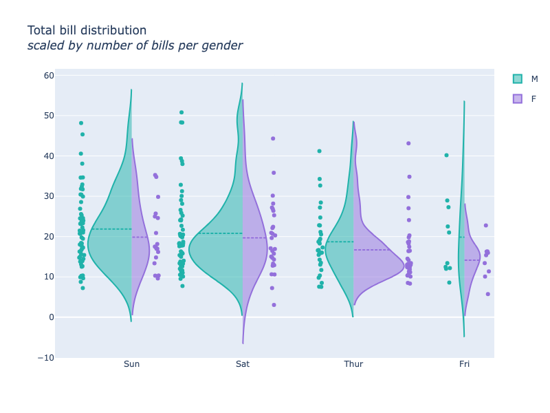

**Interactive Plot:**

<div>                        <script type="text/javascript">window.PlotlyConfig = {MathJaxConfig: 'local'};</script>
        <script charset="utf-8" src="https://cdn.plot.ly/plotly-3.1.0.min.js" integrity="sha256-Ei4740bWZhaUTQuD6q9yQlgVCMPBz6CZWhevDYPv93A=" crossorigin="anonymous"></script>                <div id="plotly-div-9" class="plotly-graph-div" style="height:100%; width:100%;"></div>            <script type="text/javascript">                window.PLOTLYENV=window.PLOTLYENV || {};                                if (document.getElementById("plotly-div-9")) {                    Plotly.newPlot(                        "plotly-div-9",                        [{"legendgroup":"M","line":{"color":"lightseagreen"},"name":"M","pointpos":-0.9,"scalegroup":"M","showlegend":true,"side":"negative","x":["Sun","Sun","Sun","Sun","Sun","Sun","Sun","Sun","Sun","Sun","Sun","Sun","Sun","Sun","Sun","Sun","Sun","Sun","Sun","Sun","Sun","Sun","Sun","Sun","Sun","Sun","Sun","Sun","Sun","Sun","Sun","Sun","Sun","Sun","Sun","Sun","Sun","Sun","Sun","Sun","Sun","Sun","Sun","Sun","Sun","Sun","Sun","Sun","Sun","Sun","Sun","Sun","Sun","Sun","Sun","Sun","Sun","Sun"],"y":{"dtype":"f8","bdata":"rkfhehSuJEDD9ShcjwI1QK5H4XoUrjdACtejcD1KOUAK16NwPYohQOF6FK5H4TpAFK5H4XoULkCPwvUoXI8tQArXo3A9iiRA16NwPQrXLkCuR+F6FG4yQBSuR+F6lDVACtejcD1KMED2KFyPwnUxQOF6FK5H4StAXI\u002fC9ShcI0BmZmZmZmY+QArXo3A9SjJAexSuR+E6NkAzMzMzMzNAQM3MzMzMjDxACtejcD0KMkAUrkfhehQpQOF6FK5H4SNAj8L1KFyPOUA9CtejcH0zQClcj8L1CENAMzMzMzPzN0CuR+F6FO49QKRwPQrXIyxAw\u002fUoXI9CKkDD9Shcj0IxQM3MzMzMjDhAhetRuB7FM0D2KFyPwhVIQD0K16NwfTBAAAAAAACANUBSuB6F61EpQB+F61G4nitAhetRuB6FOEDD9Shcj8I0QPYoXI\u002fCtT9AAAAAAAAAHUCamZmZmdk\u002fQFK4HoXr0TBAMzMzMzNzQECkcD0K1+MxQPYoXI\u002fC9SxAcT0K16NQQUAzMzMzM1NBQBSuR+F6VDdAzczMzMysRkDsUbgehSs3QGZmZmZmRkRAcT0K16OwNED2KFyPwnU+QJqZmZmZGTdA4XoUrkdhL0A="},"type":"violin","meanline":{"visible":true},"jitter":0.05,"points":"all","scalemode":"count"},{"legendgroup":"F","line":{"color":"mediumpurple"},"name":"F","pointpos":0.45,"scalegroup":"F","showlegend":true,"side":"positive","x":["Sun","Sun","Sun","Sun","Sun","Sun","Sun","Sun","Sun","Sun","Sun","Sun","Sun","Sun","Sun","Sun","Sun","Sun"],"y":{"dtype":"f8","bdata":"PQrXo3D9MEDXo3A9Cpc4QOF6FK5HoUFAKVyPwvWoLUApXI\u002fC9agkQLgehetR+DBAFK5H4XqUJEBI4XoUrmdBQPYoXI\u002fCtTlAj8L1KFxPMUCamZmZmdk9QAAAAAAAADlASOF6FK7HKkD2KFyPwjUwQMP1KFyPgjFAMzMzMzMzI0BmZmZmZuY0QGZmZmZmJjJA"},"type":"violin","meanline":{"visible":true},"jitter":0.05,"points":"all","scalemode":"count"},{"legendgroup":"M","line":{"color":"lightseagreen"},"name":"M","pointpos":-1.1,"scalegroup":"M","showlegend":false,"side":"negative","x":["Sat","Sat","Sat","Sat","Sat","Sat","Sat","Sat","Sat","Sat","Sat","Sat","Sat","Sat","Sat","Sat","Sat","Sat","Sat","Sat","Sat","Sat","Sat","Sat","Sat","Sat","Sat","Sat","Sat","Sat","Sat","Sat","Sat","Sat","Sat","Sat","Sat","Sat","Sat","Sat","Sat","Sat","Sat","Sat","Sat","Sat","Sat","Sat","Sat","Sat","Sat","Sat","Sat","Sat","Sat","Sat","Sat","Sat","Sat"],"y":{"dtype":"f8","bdata":"ZmZmZmamNEDsUbgehesxQPYoXI\u002fCtUNAUrgehevRM0CPwvUoXM8xQD0K16NwvSpA4XoUrkdhKUAzMzMzM7M1QJqZmZmZGSNAmpmZmZlZMkBI4XoUrscxQI\u002fC9ShcDzhAj8L1KFxPMEBxPQrXo7AyQIXrUbgeRT9ACtejcD0KMEDhehSuRwFDQHsUrkfheiZAw\u002fUoXI8iSEAK16NwPUo0QB+F61G4nitACtejcD0KJkAK16NwPUoyQNejcD0KlzFAFK5H4XoUNEB7FK5H4To0QIXrUbgeBS5ACtejcD0KKECF61G4HgUlQOxRuB6F6zFAuB6F61G4LkA9CtejcH00QPYoXI\u002fCNTlAPQrXo3A9MkAAAAAAAAAsQEjhehSuZ0lAH4XrUbieL0DXo3A9Cpc6QD0K16NwXUNAhetRuB5FOECPwvUoXA8+QKRwPQrX4zlACtejcD0qSEBmZmZmZiY8QK5H4XoULidA9ihcj8L1HkAzMzMzM3M0QI\u002fC9ShcjypAw\u002fUoXI8COEDhehSuR2EvQLgehetROCdACtejcD2KJUCPwvUoXA8vQKRwPQrXIyRAMzMzMzMzKUAK16NwPWpAQEjhehSuBz1A7FG4HoWrNkBSuB6F69ExQA=="},"type":"violin","meanline":{"visible":true},"jitter":0.05,"points":"all","scalemode":"count"},{"legendgroup":"F","line":{"color":"mediumpurple"},"name":"F","pointpos":0.55,"scalegroup":"F","showlegend":false,"side":"positive","x":["Sat","Sat","Sat","Sat","Sat","Sat","Sat","Sat","Sat","Sat","Sat","Sat","Sat","Sat","Sat","Sat","Sat","Sat","Sat","Sat","Sat","Sat","Sat","Sat","Sat","Sat","Sat","Sat"],"y":{"dtype":"f8","bdata":"CtejcD1KNEAK16NwPYovQGZmZmZmpjNAH4XrUbgeLkBxPQrXo7A0QK5H4XoU7jBAKVyPwvVoOkAzMzMzM3MwQI\u002fC9ShcjwhAUrgehesRMUBcj8L1KNw6QEjhehSuRzlA9ihcj8J1LUBmZmZmZiZGQOxRuB6FazZA7FG4HoXrNEAfhetRuJ4sQAAAAAAAAB1ArkfhehQuJUDD9Shcj0IlQIXrUbgehSlACtejcD2KKkDsUbgehSs8QM3MzMzMzClApHA9CtcjPkAfhetRuB42QArXo3A96kFArkfhehQuO0A="},"type":"violin","meanline":{"visible":true},"jitter":0.05,"points":"all","scalemode":"count"},{"legendgroup":"M","line":{"color":"lightseagreen"},"name":"M","pointpos":-0.6,"scalegroup":"M","showlegend":false,"side":"negative","x":["Thur","Thur","Thur","Thur","Thur","Thur","Thur","Thur","Thur","Thur","Thur","Thur","Thur","Thur","Thur","Thur","Thur","Thur","Thur","Thur","Thur","Thur","Thur","Thur","Thur","Thur","Thur","Thur","Thur","Thur"],"y":{"dtype":"f8","bdata":"MzMzMzMzO0DD9Shcj8I2QArXo3A9SjFAcT0K16NwM0ApXI\u002fC9agwQNejcD0KV0BA9ihcj8L1L0CPwvUoXA8qQEjhehSuRzJA9ihcj8K1OEApXI\u002fC9Sg1QOF6FK5HYSdAhetRuB6FLEBmZmZmZuYvQArXo3A9CiFAUrgehevRNkAUrkfhehQzQAAAAAAAADBAZmZmZmYmQUC4HoXrUZhEQI\u002fC9ShcjyNACtejcD0KHkBxPQrXo3A8QPYoXI\u002fC9S5AFK5H4XqUMEA9CtejcD0eQK5H4XoUriRAhetRuB4FK0D2KFyPwrUyQEjhehSuhzRA"},"type":"violin","meanline":{"visible":true},"jitter":0.05,"points":"all","scalemode":"count"},{"legendgroup":"F","line":{"color":"mediumpurple"},"name":"F","pointpos":1,"scalegroup":"F","showlegend":false,"side":"positive","x":["Thur","Thur","Thur","Thur","Thur","Thur","Thur","Thur","Thur","Thur","Thur","Thur","Thur","Thur","Thur","Thur","Thur","Thur","Thur","Thur","Thur","Thur","Thur","Thur","Thur","Thur","Thur","Thur","Thur","Thur","Thur","Thur"],"y":{"dtype":"f8","bdata":"pHA9CtcjJEAK16NwPWpBQM3MzMzMTCVAXI\u002fC9SjcKEAUrkfhehQ4QNejcD0K1ypA9ihcj8L1KEDNzMzMzMw9QArXo3A9Ci1Aw\u002fUoXI\u002fCJkCF61G4HkU0QNejcD0KVyZAhetRuB6FKEDD9Shcj0IyQIXrUbgeBSFAKVyPwvWoJEDNzMzMzEwsQFK4HoXrUSpAuB6F61F4MUDNzMzMzAw7QK5H4XoUbjBAMzMzMzOzIECkcD0K16MyQD0K16NwvSdAj8L1KFzPM0CuR+F6FI5FQAAAAAAAACpAexSuR+F6KUAAAAAAAAAqQGZmZmZmZjBAuB6F61F4MEBI4XoUrscyQA=="},"type":"violin","meanline":{"visible":true},"jitter":0.05,"points":"all","scalemode":"count"},{"legendgroup":"M","line":{"color":"lightseagreen"},"name":"M","pointpos":-0.3,"scalegroup":"M","showlegend":false,"side":"negative","x":["Fri","Fri","Fri","Fri","Fri","Fri","Fri","Fri","Fri","Fri"],"y":{"dtype":"f8","bdata":"uB6F61H4PEA9CtejcH02QPYoXI\u002fCFURASOF6FK5HO0CPwvUoXA8oQMP1KFyPAjVA7FG4HoXrKEBSuB6F61EoQClcj8L1KCFA16NwPQrXKkA="},"type":"violin","meanline":{"visible":true},"jitter":0.05,"points":"all","scalemode":"count"},{"legendgroup":"F","line":{"color":"mediumpurple"},"name":"F","pointpos":0.4,"scalegroup":"F","showlegend":false,"side":"positive","x":["Fri","Fri","Fri","Fri","Fri","Fri","Fri","Fri","Fri"],"y":{"dtype":"f8","bdata":"AAAAAAAAF0BSuB6F61EwQAAAAAAAwDZAMzMzMzOzJkDD9Shcj8IuQNejcD0K1ypA9ihcj8L1L0CF61G4HkUwQK5H4XoULiRA"},"type":"violin","meanline":{"visible":true},"jitter":0.05,"points":"all","scalemode":"count"}],                        {"template":{"data":{"histogram2dcontour":[{"type":"histogram2dcontour","colorbar":{"outlinewidth":0,"ticks":""},"colorscale":[[0.0,"#0d0887"],[0.1111111111111111,"#46039f"],[0.2222222222222222,"#7201a8"],[0.3333333333333333,"#9c179e"],[0.4444444444444444,"#bd3786"],[0.5555555555555556,"#d8576b"],[0.6666666666666666,"#ed7953"],[0.7777777777777778,"#fb9f3a"],[0.8888888888888888,"#fdca26"],[1.0,"#f0f921"]]}],"choropleth":[{"type":"choropleth","colorbar":{"outlinewidth":0,"ticks":""}}],"histogram2d":[{"type":"histogram2d","colorbar":{"outlinewidth":0,"ticks":""},"colorscale":[[0.0,"#0d0887"],[0.1111111111111111,"#46039f"],[0.2222222222222222,"#7201a8"],[0.3333333333333333,"#9c179e"],[0.4444444444444444,"#bd3786"],[0.5555555555555556,"#d8576b"],[0.6666666666666666,"#ed7953"],[0.7777777777777778,"#fb9f3a"],[0.8888888888888888,"#fdca26"],[1.0,"#f0f921"]]}],"heatmap":[{"type":"heatmap","colorbar":{"outlinewidth":0,"ticks":""},"colorscale":[[0.0,"#0d0887"],[0.1111111111111111,"#46039f"],[0.2222222222222222,"#7201a8"],[0.3333333333333333,"#9c179e"],[0.4444444444444444,"#bd3786"],[0.5555555555555556,"#d8576b"],[0.6666666666666666,"#ed7953"],[0.7777777777777778,"#fb9f3a"],[0.8888888888888888,"#fdca26"],[1.0,"#f0f921"]]}],"contourcarpet":[{"type":"contourcarpet","colorbar":{"outlinewidth":0,"ticks":""}}],"contour":[{"type":"contour","colorbar":{"outlinewidth":0,"ticks":""},"colorscale":[[0.0,"#0d0887"],[0.1111111111111111,"#46039f"],[0.2222222222222222,"#7201a8"],[0.3333333333333333,"#9c179e"],[0.4444444444444444,"#bd3786"],[0.5555555555555556,"#d8576b"],[0.6666666666666666,"#ed7953"],[0.7777777777777778,"#fb9f3a"],[0.8888888888888888,"#fdca26"],[1.0,"#f0f921"]]}],"surface":[{"type":"surface","colorbar":{"outlinewidth":0,"ticks":""},"colorscale":[[0.0,"#0d0887"],[0.1111111111111111,"#46039f"],[0.2222222222222222,"#7201a8"],[0.3333333333333333,"#9c179e"],[0.4444444444444444,"#bd3786"],[0.5555555555555556,"#d8576b"],[0.6666666666666666,"#ed7953"],[0.7777777777777778,"#fb9f3a"],[0.8888888888888888,"#fdca26"],[1.0,"#f0f921"]]}],"mesh3d":[{"type":"mesh3d","colorbar":{"outlinewidth":0,"ticks":""}}],"scatter":[{"fillpattern":{"fillmode":"overlay","size":10,"solidity":0.2},"type":"scatter"}],"parcoords":[{"type":"parcoords","line":{"colorbar":{"outlinewidth":0,"ticks":""}}}],"scatterpolargl":[{"type":"scatterpolargl","marker":{"colorbar":{"outlinewidth":0,"ticks":""}}}],"bar":[{"error_x":{"color":"#2a3f5f"},"error_y":{"color":"#2a3f5f"},"marker":{"line":{"color":"#E5ECF6","width":0.5},"pattern":{"fillmode":"overlay","size":10,"solidity":0.2}},"type":"bar"}],"scattergeo":[{"type":"scattergeo","marker":{"colorbar":{"outlinewidth":0,"ticks":""}}}],"scatterpolar":[{"type":"scatterpolar","marker":{"colorbar":{"outlinewidth":0,"ticks":""}}}],"histogram":[{"marker":{"pattern":{"fillmode":"overlay","size":10,"solidity":0.2}},"type":"histogram"}],"scattergl":[{"type":"scattergl","marker":{"colorbar":{"outlinewidth":0,"ticks":""}}}],"scatter3d":[{"type":"scatter3d","line":{"colorbar":{"outlinewidth":0,"ticks":""}},"marker":{"colorbar":{"outlinewidth":0,"ticks":""}}}],"scattermap":[{"type":"scattermap","marker":{"colorbar":{"outlinewidth":0,"ticks":""}}}],"scattermapbox":[{"type":"scattermapbox","marker":{"colorbar":{"outlinewidth":0,"ticks":""}}}],"scatterternary":[{"type":"scatterternary","marker":{"colorbar":{"outlinewidth":0,"ticks":""}}}],"scattercarpet":[{"type":"scattercarpet","marker":{"colorbar":{"outlinewidth":0,"ticks":""}}}],"carpet":[{"aaxis":{"endlinecolor":"#2a3f5f","gridcolor":"white","linecolor":"white","minorgridcolor":"white","startlinecolor":"#2a3f5f"},"baxis":{"endlinecolor":"#2a3f5f","gridcolor":"white","linecolor":"white","minorgridcolor":"white","startlinecolor":"#2a3f5f"},"type":"carpet"}],"table":[{"cells":{"fill":{"color":"#EBF0F8"},"line":{"color":"white"}},"header":{"fill":{"color":"#C8D4E3"},"line":{"color":"white"}},"type":"table"}],"barpolar":[{"marker":{"line":{"color":"#E5ECF6","width":0.5},"pattern":{"fillmode":"overlay","size":10,"solidity":0.2}},"type":"barpolar"}],"pie":[{"automargin":true,"type":"pie"}]},"layout":{"autotypenumbers":"strict","colorway":["#636efa","#EF553B","#00cc96","#ab63fa","#FFA15A","#19d3f3","#FF6692","#B6E880","#FF97FF","#FECB52"],"font":{"color":"#2a3f5f"},"hovermode":"closest","hoverlabel":{"align":"left"},"paper_bgcolor":"white","plot_bgcolor":"#E5ECF6","polar":{"bgcolor":"#E5ECF6","angularaxis":{"gridcolor":"white","linecolor":"white","ticks":""},"radialaxis":{"gridcolor":"white","linecolor":"white","ticks":""}},"ternary":{"bgcolor":"#E5ECF6","aaxis":{"gridcolor":"white","linecolor":"white","ticks":""},"baxis":{"gridcolor":"white","linecolor":"white","ticks":""},"caxis":{"gridcolor":"white","linecolor":"white","ticks":""}},"coloraxis":{"colorbar":{"outlinewidth":0,"ticks":""}},"colorscale":{"sequential":[[0.0,"#0d0887"],[0.1111111111111111,"#46039f"],[0.2222222222222222,"#7201a8"],[0.3333333333333333,"#9c179e"],[0.4444444444444444,"#bd3786"],[0.5555555555555556,"#d8576b"],[0.6666666666666666,"#ed7953"],[0.7777777777777778,"#fb9f3a"],[0.8888888888888888,"#fdca26"],[1.0,"#f0f921"]],"sequentialminus":[[0.0,"#0d0887"],[0.1111111111111111,"#46039f"],[0.2222222222222222,"#7201a8"],[0.3333333333333333,"#9c179e"],[0.4444444444444444,"#bd3786"],[0.5555555555555556,"#d8576b"],[0.6666666666666666,"#ed7953"],[0.7777777777777778,"#fb9f3a"],[0.8888888888888888,"#fdca26"],[1.0,"#f0f921"]],"diverging":[[0,"#8e0152"],[0.1,"#c51b7d"],[0.2,"#de77ae"],[0.3,"#f1b6da"],[0.4,"#fde0ef"],[0.5,"#f7f7f7"],[0.6,"#e6f5d0"],[0.7,"#b8e186"],[0.8,"#7fbc41"],[0.9,"#4d9221"],[1,"#276419"]]},"xaxis":{"gridcolor":"white","linecolor":"white","ticks":"","title":{"standoff":15},"zerolinecolor":"white","automargin":true,"zerolinewidth":2},"yaxis":{"gridcolor":"white","linecolor":"white","ticks":"","title":{"standoff":15},"zerolinecolor":"white","automargin":true,"zerolinewidth":2},"scene":{"xaxis":{"backgroundcolor":"#E5ECF6","gridcolor":"white","linecolor":"white","showbackground":true,"ticks":"","zerolinecolor":"white","gridwidth":2},"yaxis":{"backgroundcolor":"#E5ECF6","gridcolor":"white","linecolor":"white","showbackground":true,"ticks":"","zerolinecolor":"white","gridwidth":2},"zaxis":{"backgroundcolor":"#E5ECF6","gridcolor":"white","linecolor":"white","showbackground":true,"ticks":"","zerolinecolor":"white","gridwidth":2}},"shapedefaults":{"line":{"color":"#2a3f5f"}},"annotationdefaults":{"arrowcolor":"#2a3f5f","arrowhead":0,"arrowwidth":1},"geo":{"bgcolor":"white","landcolor":"#E5ECF6","subunitcolor":"white","showland":true,"showlakes":true,"lakecolor":"white"},"title":{"x":0.05},"mapbox":{"style":"light"}}},"title":{"text":"Total bill distribution\u003cbr\u003e\u003ci\u003escaled by number of bills per gender"},"violingap":0,"violingroupgap":0,"violinmode":"overlay"},                        {"responsive": true}                    )                };            </script>        </div>

#### Ridgeline plot

A ridgeline plot ([previously known as Joy Plot](https://serialmentor.com/blog/2017/9/15/goodbye-joyplots)) shows the distribution of a numerical value for several groups. They can be used for visualizing changes in distributions over time or space.

```python
import plotly.graph_objects as go
from plotly.colors import n_colors
import numpy as np
np.random.seed(1)

# 12 sets of normal distributed random data, with increasing mean and standard deviation
data = (np.linspace(1, 2, 12)[:, np.newaxis] * np.random.randn(12, 200) +
            (np.arange(12) + 2 * np.random.random(12))[:, np.newaxis])

colors = n_colors('rgb(5, 200, 200)', 'rgb(200, 10, 10)', 12, colortype='rgb')

fig = go.Figure()
for data_line, color in zip(data, colors):
    fig.add_trace(go.Violin(x=data_line, line_color=color))

fig.update_traces(orientation='h', side='positive', width=3, points=False)
fig.update_layout(xaxis_showgrid=False, xaxis_zeroline=False)
fig.show()
```

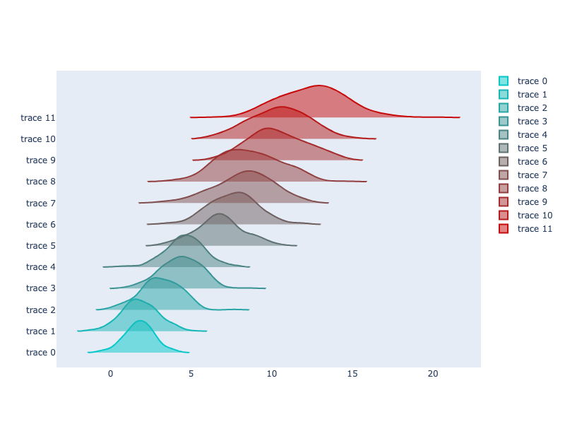

**Interactive Plot:**

<div>                        <script type="text/javascript">window.PlotlyConfig = {MathJaxConfig: 'local'};</script>
        <script charset="utf-8" src="https://cdn.plot.ly/plotly-3.1.0.min.js" integrity="sha256-Ei4740bWZhaUTQuD6q9yQlgVCMPBz6CZWhevDYPv93A=" crossorigin="anonymous"></script>                <div id="plotly-div-10" class="plotly-graph-div" style="height:100%; width:100%;"></div>            <script type="text/javascript">                window.PLOTLYENV=window.PLOTLYENV || {};                                if (document.getElementById("plotly-div-10")) {                    Plotly.newPlot(                        "plotly-div-10",                        [{"line":{"color":"rgb(5.0, 200.0, 200.0)"},"x":{"dtype":"f8","bdata":"yyXYRc2CCkBw4m7jhz7xP1yHIMLklPI\u002fdC7cq8+64z8CrHJTf3AEQNjqnISileO\u002fpkptXIR5C0CW7npjw7TtPwgXQ9yIEQBAzYrWMN0K9z\u002feCwwjijYJQIia8X00uNe\u002fOFEcCqrf9T9h0HfNMuP0PwivRTQalgZAtPzMykLe4j\u002fVasXmBEb4P57rJW0n+ek\u002f1iukTTG1+z8MknmDvy0CQABDJkFM2OI\u002f7CMrZYmsBkBo\u002fb+vmboEQGJ5JT5AiQFA5GJpdBi5BEAlhqJbvBfwP\u002foykT3tEPk\u002fqPf9OL8e6D8TGXv4A7\u002f2P0ORbH9PwgFABtYCPHzu7z+4GmTBLq\u002f0P5hTLy6gCfA\u002fp2cBQ6UE6z+MoxJm3ErwPw0I6C9p1Po\u002fVMC5VJBP4j8pgQeoc8j+P2qJydpqywpAIlj0VtlzA0BwKFHThvb3PyxdHhsdqek\u002fPJQCdNkn7j+gb\u002fAgSg4LQD4mHcZk2Ps\u002fJnRvoibX8D8w9XlgRhb+P7HdSA53UQ5APH5+xnT0\u002fD8l3r6sLHQCQBHaAWDI1f8\u002fUXAfP3hl9T+6vaKjD4HhPygRTZZgcfU\u002fhiCAgKew9z\u002fBBo\u002f9izUCQGo5SW1hOgRANOWIIwr3BEBWtyz\u002fDJr\u002fP3R+rGHpmARAlpv9z4rs7T\u002fF0ew6BIoHQOQcxHCfngFA4Mwr\u002fUtD9j8adFyxoGwBQKX1C0y+0vk\u002fpsb3MriRBkBR9bg1uqwJQGRrFXMzAA9AGEuxwvHA0j\u002fwolM7j2nPP3D0VS\u002f+9fI\u002foqABA8yX\u002fT+TIZVXiYYEQINsJBuQCgBASBPOuJpK1b9AhojNEiL2P2a6BKnVIwRALMKAzMC2\u002fj+4avrOvZwDQGLw8gahefc\u002fEWmD4\u002frR9z81qlrHcAT+PxTZGKbtywBACNEWT4U0\u002fj8ZwmWXvu\u002f8P0N1pppATfA\u002fgp84p2SJAEDap7jXQ\u002fv8P+YflFlTjQZAsYmLv4YbB0BgnqaOr\u002f79P5y4lTAeB\u002fU\u002f9S4bmwvQ8D93X6t\u002fdecAQPtyzusRRfw\u002fptAXRdyH9T8dy2+Z27r7P9nQBvrCHPE\u002f8ZtUT7YZA0BI\u002fxyz2ODzPzgftC\u002fvTwdA8QITUX6+AEC7sWyWykMCQOjfZmUNB+M\u002fNN\u002fyVRO+\u002fT+zzvdZzXADQCyFt9bai+c\u002fFM08pdrF9j8hjwHQ3437P5xBKXX8P9Q\u002fKDI0x5YJAEBauUldFEkEQG4rjWNqj+o\u002fEUJ2ig9SAEAE9pRdsCTYP3sDnszJafo\u002foKxx503hsj\u002fZn5VWznwGQN5y0yKSyQBAZzGEO3Sj+j9ZWSc5ckLtP1BZnnDLtAdAXAgtVcRADUAwl9etEZDFvzWyP3XOZwdAVBS2P5KJCkASB5n3YzgAQOwXqjhVYN8\u002fjnSlFEZsBECCFIFLPCP4P8jHLk6gXvE\u002fWKrzKt5n3T\u002fk64ixpOsBQGi\u002f7p3P2wNA62WKn00O8T9Q0dtqSK4BQNIeGSEgcuE\u002frv+Dm1ruA0CvhkdVBsf7P\u002fCUfmUYDPg\u002fHo+as4hn+T8UtIcTn3cEQOZ3A0\u002f8hANAmReJznzAAUB8vmMqTzz9P+T5P1kKR\u002fw\u002fA5xz15V2AkAeik0ylcD+P5b6twAC+gJAipfH+QsS9j\u002fIXmfsntnnvzyJf8On0wVA0pQLrRMDD0D1W3uSDgwBQA8yk5sMbvk\u002fkeU+TGjZ+D\u002f7sRueoyD5Pyh4vxGYT\u002fs\u002fxKlmJP4o4j8wcq8kRMLyP+7bVSjtKOY\u002fnbuhz10D\u002fz8ahUkwPkn2P48obthVegFA3i3xcLM8+D9IGJoxKGgFQFb6d4Hrcv4\u002fRKf\u002fEbIKD0AA6kaOrHnKv3YlFquDrvA\u002f2KIQQGO6BEBALtSoE98QQOLUW4XgDfc\u002f1J1jPSe7+z\u002fXXmdMTWn3P5AgOnr3KghAepny2Xhv9j+MlW\u002fy7PQCQCUoQ7Ng6vU\u002fMPUppomv2j9CaU7MSQYAQCTLEUCqigFAcvBjTavcB0BRXWTh5EP5P9DWM\u002fCRJ\u002fE\u002fYOxwYa0EAkAyVWweWOL+Pxu\u002fQKXjhf8\u002f5IpSwdDc+T+ksDgUhMwGQNL0jBbdeABAclUYMuLADEAm9WcvlmcGQE3k6mPgyQJAYM3xRobJrz9dXfpCsVUCQL1xI2jh4ABA5gawuPgABEB2EqDyKN8FQA=="},"type":"violin","orientation":"h","points":false,"side":"positive","width":3},{"line":{"color":"rgb(22.727272727272727, 182.72727272727272, 182.72727272727272)"},"x":{"dtype":"f8","bdata":"BZMErqxV9j\u002fhrKJNc9sFQCKqe+JbhPM\u002fNg7wawa6D0DEf33dMlXYP0D7MSY+Z7a\u002f4G9qXXqdoD+ApFRaPJPrP\u002fYT97WomOM\u002fTnF7PLW8D0A4PXOMBqL3P5xel4WFldc\u002f1fivyjRkCEDY66ROJBjzP8xsCgTv+N4\u002f9R2KZEFPBkD\u002fxl8tLRsEQLBRrEFmvfU\u002fpO14HCzzCkC0V1ge0ZX\u002fP4CBnQsIxwxAUm8Tw68NA0BGHQGFIEUMQN1zYYvLPf8\u002fulT6d10V4D9xmZ9JZwUSQN6mtwM6zvM\u002fd8AX1Xbc+T8K1xoRTxvxP6DDcYwayPk\u002fpjtwwqPIAEBNfKK4ZW0AQJMpH8FPbwRAMX2btHpODkC1HCYgqjr7P+xlyxqmO98\u002feOI0X9Vj4T\u002fm2WtcHLbxPwC9fxpFB3w\u002f5y8zGb3dBUC09UekvqL0PyZD7p9Z5\u002fc\u002f\u002fxfqAn5M\u002fT+IvKo2WNHTP9opc+mJmOw\u002fTVwpd+aNBECIuzGiZhAEQOWaX9OwmPU\u002fxt6jRYl3DkDQHQjr7CnaP4BHQ29qT\u002fc\u002f7kO\u002f2HdN+T\u002fj7klMk2vzvwCYioBDkw9AwirIouzcAUDWb4p+rTLmP+\u002fWDU6VSBBA0M1wivLGA0BpY+eMHGoCQHhCAI2nvPI\u002fwD53+JUv\u002fz\u002fI66BrMp3FP8tZ3XK0mgVAM859R9HL9j95qRaP66v\u002fPwZYQcYUKAlAmX96raYmAUAigyo93\u002fQAQNRMv8Q4FAFAzbk3fmuI8D+a5hMyQvYFQMR38+ydIgxAjAbKJshJBUCfrGDrhGMGQFLnzMncCew\u002fjokH3LVe7D8EcjQZWLrQP65XBaiMawlA3dCFDS3l+D9R\u002fsZY+uEKQLe+kRsoXu8\u002f3ZGMrf6x9T9mzsCKVv\u002f+Pxexr7UotQZA7aNa5WVk\u002fj+3m1XCKYIAQLNgO5XLnv0\u002fEKkedFc2AEAG\u002fofRTLDjPzzxnUeOvv4\u002fxuw1xD0T+j+uTlEYCFf8P2E9hgBx9gJABH9tNm1z8T\u002f0ER7bVNv7P5CuOxk5JPg\u002fOGUf88xOAkDs7JzXyoMFQJzpi1yDT+k\u002fRoyIoYDHA0DBDVpe51gQQHDRsVg9Os0\u002f7N22Sd6u7T\u002fxgtQBaOzrP8n3FX7Vdfg\u002fHsKeQjbUDEDfWVvSm5D9P5K0TuvMNPE\u002fPPqbsbEXBEBKzIyfzNzyP\u002fwqBwpheAhAdRCSfX5UAUChDj75QckKQKKAikfRyfE\u002faoYGnPqOFEDaoGV3vtwFQMdczlDsYARAwe\u002fbKDdw\u002fD\u002fW+zJYtqrwP+7kj0ngXuw\u002f1wuqEVn1+j+JRXzO59TuP+dyPl4FIgFAnDO32kfT7T8wrQpuFRYEQJG8pyufAgdApiNJ9P0C8T9ENo9JJhMJQGKTCqS7Lfk\u002fEAh\u002fYJi\u002fCEBut1hSan0CQO5m1iL1dQhAcuA8TMvb5z+UNzXsv3f7P6dq\u002fZg6VQtAjJsIqFSL8j\u002f8vVwYDOjYvywEF9AATdK\u002fpiFPCH3V7L8cbaPxokfev26TXTGXJfY\u002ffLW4rO\u002fSCUBkKhog55z1P4IKmHxKfQFAGDKKS3Zp+z8YKCTUJHv9P5IeKtheZfo\u002f3KVEmKRK+j+6oBvmy7ACQDzSy6NznOE\u002fOR9hoUd7B0Agc12Z9bEGQMmAKmBb7fk\u002fyeZyDN6xBUDwCMAGFRfxPyLKdq1v9PM\u002fBxDkCJgHAECerH6k9wL6P4ZvbMHRf\u002fU\u002fplmxojOY8T\u002ffojjc2pnzP54odeq+3AZALHwPVSBa0r+EiS4vAr4BQIHmjDF1NPk\u002feHUsK4oEBUBenH95PSkDQL+pSYhuPPO\u002fIYXAya3EA0BfS7ar9X4BQGkVdJqitv0\u002fCs7hML0m9T84CyuA2xwGQJWhsQBhH\u002fY\u002fnkNwlpCtDkBh\u002fCDsZ5cDQLoHgmJiqRBAQCMj+Mg97z8AaC4yuRK1v6PV9yNx5wRA2pO\u002fZJEbBkD0\u002fF4i8vL9PyiB8UNzyMM\u002fldvn45WD9T9qH+gAKg8EQOv2Si76Hfo\u002fQr24Ga5O+z+f4pn57UT6P0IO41+\u002fD+o\u002f7krvJTcH9D\u002fg5fuDTbrRP\u002f2xQn9qGA5Ac0VVIc4I9T9Y9Yw+itUCQMZ6tXeS\u002feY\u002fZEVKs5eZBUDo9wqkKejKv2soxShLswZAkCnXRei2\u002fD8qQadG+YoQQA=="},"type":"violin","orientation":"h","points":false,"side":"positive","width":3},{"line":{"color":"rgb(40.45454545454545, 165.45454545454544, 165.45454545454544)"},"x":{"dtype":"f8","bdata":"9zGfZHxT9z8FvTwo5rwIQCm3eHPdfAtArFJEJQzWEUDU+lgakAQEQJvTOkpO1QhA+B1vCdsT3j9eLONQuCoAQA+wgPcaSQxAjpPpVkQ6EUBE985UIFoFQHm4h06UuhVAacpLozxUFEBKkN+7OnEHQFAl6x2cJ8M\u002fgPRWqbHW7D\u002fft8dMVKkAQAVz6chiSBFAwutBlQDzCkCAtwXMwdzgP9jta4JV2gVAsNTl0XmiE0B1Ncbr3XgEQOegstHU7ABARoS75nu4FUDCg1kPTYUIQCZF\u002f8xLfANA6kqn949TC0DZnQpNky0IQGUiaaNZ9QNA+24clne4EUAWFo6gN0gRQAODDqQ49w9AIoh9iwELB0DUgUQm+W0RQCPHbXG7iwdAVb7EFnptDEDJLBDd9uQQQIUvrF26qQ9AYvcan\u002fF3FED48LtLTUgMQG++tmX8L\u002fA\u002fVRtAdP4X+j+EfdvV42MSQESkQmw04gRAoIi4hpirC0DObTh7Ze7\u002fPyTvrIVDvRBA0OZstphgBEDQXNdhl+YSQGEAH6XU+wJA+ylt8yhLEUBsOn93UGQOQIpQllSULwFAztfHKQA0EUCf3niOfvv+P9HL619cPQBA9s2Dk9XWDkAvH6y4eRoCQNy\u002flN+2ZgJAZ2ctbqrDBECiBvjGgx79PwaQkwOm8hBAoxwnfNvEDUCoAv\u002fXOlwHQP+bAquu\u002fQZANrJ4D5JFDEALOGNGZFoUQCIqNg0MIBBAn9l+HWE1A0Dcn7Dtql0PQPRNg6OP5AZANGSZ7mEiBkC4zG70yNQUQP829mcMDgRAyxy+kDp8A0B8W6xI5zzmP3tpiKHEg\u002fU\u002fSat\u002ffelHDEA9Dmm5EXIBQFeHWvOE4wxAY8ziOUbz+j9s9T2Z3MIAQNvCDae8ZA5ALLZ07fXpEkAfRy63B54NQBlYsr2bqxFACAdoVuIQFEA5RVlVtuwQQITTga4kqv4\u002fu2FO2Q4FB0CscZZMVfkNQDxnsz3zFwRATPQtfudJDECsdzzPyyvyPzfrjhFzLgBAoVUroBwEDUBIwb\u002fKvevWP0fn7kntFfs\u002fhLJfTyXZB0C0x43y4QnvP\u002flGjbpIjghAMiJBuNV0AEA9\u002fLD7Q0IFQDH3PqUykQVAY8PhWjDOCUDRXGvudK8CQDK5D68a3QhA14s7MANVAkAMM\u002fY87kUNQIPmUQ7VAxRAcSp654bgCUC83rAGLZ8JQLA3SHhqBfo\u002fID0cmjqSDkAXBAhfO9kAQJW1E4BTXgBAHN8amDxJDUCbtqnJNboJQHMXiRvmPRFA9kBknyjUEkBw5ggNzukCQE2hHeC\u002fOglAyEZvDXBUFEBykZAXtJMQQPSYelbewQ5ASXw2GMMuEkCoWrTlq0wCQOINyDnLCA5AOK2C1HerEkCYzT4knasTQBJOLiXFZABAiCKXLeOiBUAIBL0kV6ILQMYnWkaNSAVAzBoiV7FPBEC66Cn9j3sOQFjfJFymrARA+BriUIZy7D+gBkUl1W8LQHwgkYWaAARACK+bo3UZAUA+S9Tpv2zyP+pk+b3szBBAcCB7XN2s1z+4oZ7bGczvPwWn9\u002fphaAVAQhfxY0bREUBxNTte\u002fzISQASRHucaMfo\u002fj3\u002fpkxhWBkDzlXyJWnjzPw5JGnnCyRBAevj6g2wc9D+HQIbacakGQKCxvQod5BBARqsIK7XpBUAi0wk0LfUSQL4UraeWlP8\u002fbchLD5uBC0Dg5OpPpAoQQOypOpjgsQZASjGWI7WPEkAsq\u002fUTtDINQMdQbDedEfE\u002frnE476S4HkAmqK3n+yUOQFnZMR\u002fXBwlAuI27J8qU9T+CowQ58MkIQGvndDbNqgNAqghHx5kbDkALr\u002feWm4cLQKgCh19+xBRAsnzYn1RcCUAaBImH5t4MQF0U6fOCiQtATAYAlqGcBkB7nA2mIkgGQNI+qPlsNhFAUagK1vpjD0B2Xs+NjRACQLQe9nM4+vo\u002fnIWIrd9gB0DTC0edkX8RQMu9YD5mwQdAvKaA7YRDFEBLrZMdFLAAQAGWoyTaWglAgNBZ2X\u002fUnD8RMOcxTGICQKCrMTLYFwVAiZOli6\u002fYDEDgXvwjOhgUQGGRM1GbWAhAyl\u002fXFoXhEkBzl5oRikUOQN8ld0SuqxBAxEz8KMSbA0C59h9KG44SQA=="},"type":"violin","orientation":"h","points":false,"side":"positive","width":3},{"line":{"color":"rgb(58.18181818181818, 148.1818181818182, 148.1818181818182)"},"x":{"dtype":"f8","bdata":"VLRVpM6\u002fCEA7SKxrmFsUQDwyPrjx+glA4A4dqfdlDkD0iCGLUssEQAT\u002fOS+nag5ACQs9qN6fE0DuEcpapHwRQPzH3tqG8wVAfm0DOAtTGUCELqRwwo0TQHWcmIgN+BZAwg+bLaLVFUA2nmKAh+cMQFJpxTtevf8\u002fs3qaL3FaCkAiLTwb+xIYQALF4e9r8ghAK9b30Mv9FUAFFaRPRXANQPOOheSY1hNAqGiRSGgaAUDTIKYxSccXQD+jqM2RohFANWLNxL1YFkAdo\u002fDOtc0SQCInmwtd5hVA9IMSZmxREUCiUSCjEJ8VQBl7hH3ETQRAiGAWpp2rCED5RI1YwocVQHNeGW81oxFAht5DvSOsEEAfe+pTL+wQQO+2sUAnZBRAJWWMu\u002fWhDUBg7PCxVm8UQGHFlfl7WQpAsHeYMgSHD0CZk57o7dkWQFZsyhpnShdA\u002fsabMMGACEAGppkMPRsWQI4fwYTcFwlAHGS5DZmRFUDl6+CJMlcAQNJxzNC8TAhAXQdjw+B9DkBLhmrFSv0QQOz+32SgFRlA\u002fnYNGG1wFkAK+CB1iNsZQGeV887O+hdAtcS+zZ5lEEDCD7EPLHsQQA8DQiRuRxdA7i3TN+IKEkBnUGvBqQkRQLyAL1FFFAZAnODCqIVLEUDkckqktgbtPxRtk26lBw9AJ\u002fssrGiyCUCcZ7HG4VwVQPQXninbzA5AEFysvWwpEEBmtigc6rEYQG5ycDcY\u002fghA7bgvKvZyE0AAKvgacGAAQPxjEs81SxJACuY38\u002fTsE0D2+8BB6jYWQPAYAioUhgpAylU0bd52E0Ca0g8O6XQTQDOEp2E0vRFAvLTF4seZEkBJmZVcYTIUQKg3H73Q3BNA9iOTw2OICUBUmUFQeH8HQOzQopM+mB5AHjx6F0icG0BES6QlBoEFQJy4cnIGIRRAD+lvhf0HFUCFBzpMd6kVQALwTQI+jRJArqgwgJo8CkBCBX9vhugQQKdzlrllrA5AWHszvGSFEkCqMS33gXgQQLGJMNCoKhFAyAZEaLgFF0Cv\u002fO2IBRoYQPAfTTHwpQdA57kiabX9DkDGYHsFSJ8LQL5cb8ocERhAx32IZ+WIEUB\u002fhf1xsjYZQNXUvn6zzw5AEwL9XCf4EUA7t7RIGfEFQD59euXTdxhANkQxWl\u002f7D0B+cf\u002fYaI0EQOgOLpVCpA1AhgVFTmFp+D9CtaxezawRQH4GZfLeaBJAhfGRjbZNE0BES+JTtnYZQCOnK8EDThBAP6\u002fBnJryFUD6I7dqM20TQDAPH19R2hBAuMGWWIQO\u002fT8vvgwBH6kWQCzKswboig5AFfbhi6vtEUD+wm8KBr0GQMAWW8sWRxNAedi18g9jEkCuY7Ocm\u002fwRQJg\u002fQ7KYJhFAduTnrq8tF0DyQTWahMEWQDo2xRhWiBVAxYNFIEVfIUDwgRPTBZANQC1tqcVOzw9AxBoDyWdXCUB9p+NDeg4UQJ5M4vmRrAxAtBfvB0Vm8D8NPQGY6lEHQBQndr9uNBJALwlxBkz6FkB4uh5lTNIDQM7gWNotcA1AQvrjv6cgEUC7Hzc\u002fkkEMQHmvbRyFihRAwQU1nXvbEUC4X5w993gTQEf3DlA7SgxAnuHxaMuoGUBaQTCqx9URQJyb5NodbBhAXM1QHkU0D0Dx6uhCQNcUQDbhUlGxwQxA\u002fMr5\u002fPL9CUA2e4S\u002fnYAMQCnbu+t9mhFAlMIjBzO5EECmGklzRqwZQOSYzTdj+gdAuD3yW4WSCEDIZXzYE34aQGhgmgiu7xRABrEe7o2EAEBhNhyPWF4UQI4VJvKTCxNAOoqDmOSt+z8\u002f5K6PQekPQNTwXCaFvxFAOfFpUnyPFUCxkzCiPLIWQIwvlYYNUxJAGBmYDSMZF0AGCld8ohcRQJa2C9Nu8QpAPR+qx4wpCkAquybGe5kUQCyxCxX2eP8\u002f9GJlBaNJFUAViepQNGgIQLi20gkaAhBATuwaTOtoFEA8jj3tkwkYQILObOAg1P8\u002fE8EBfDJ3C0Bu2i6eNRYSQFbi8azPmg1A3Cxi1TI5FkA4Wm3xh9z8P72u633LrRNAmFM93FsBFEBLAcjbOxYSQE2n9qPIchdAtG4On5gnB0CR5htCGXsXQHSHludXhAxAsRyt39uHFUBr8VP+vS8QQA=="},"type":"violin","orientation":"h","points":false,"side":"positive","width":3},{"line":{"color":"rgb(75.9090909090909, 130.9090909090909, 130.9090909090909)"},"x":{"dtype":"f8","bdata":"ijtFL\u002fuCFkBvcxeQrlMWQPOZvJIFKwRAfqsn3CI6EUCwV139ypARQGSbtqGzxRBACtC2NV3lC0B3PfSBJCscQKC+FEnWNRNApVMm1zqNGkA8aQdFP+4NQE73wVNqjghAiUwNLofKEkCkP\u002f0Ewv4NQCxaqv1fGx9A\u002faP1xI9oE0CfPWZAT1sYQJ2zN1S\u002f2BBARcoY2Y9KEEALmWvPsuYRQPoA2pySAhRAQKdHuTG0FkDEy99mSmcRQFCKNZZKtgxA04+aom99CEAg3zsvyqYRQC1ivybtMRVAQFGUnFKRFEAzbKl2+\u002fgRQJZXMDuzlw1ABoRbu8zeEkDPVL5BTzAVQFVhK4Nz3hFAOAi48sSuEkA1L8gKtD8RQA\u002fRrmA7EBdAHP5QRfNbD0BZM7Tv7xQTQFUzEoSgOBRAZl9vk\u002fQGFkDa6QJBqToaQBnRs4sKwRVA+ASq5ZRWFUDjae29wBkEQIOBcFqfYBVAFjsW1rmUHkDc0QjUuhULQJ5UqbR7BAlA72KfkiDmEEDAkmhT5aMXQKMAncSa7hRAdqd8Dz\u002fvDkDgWB1Pm98RQKw1khHyuRdADHbbdBW9FUDJu\u002fkgdVEfQJQCBpcqjhdAUYSxCZL\u002fE0DhQF5UPmwVQOKqB6CNKhBA5oEIHxJ5CUCBFtoL+gETQGjM0RjdvhRA3ZycQxTrBEBpg67K7HAOQP2gcx0\u002fDhBATPB8osuEE0AeKw4fKKYQQEOGxABhfxRAKWE0yNyaEkB2SlL\u002fdtoXQFG3HkfmeAFA1qFDhs8bG0B8h8RTc80ZQD05WH0fWBJAbwOBIvOdFUASaev90mAVQPCLAt6sGAxAFYCkW8v3EkCFLijneVAWQIqfBJp6whNAZ\u002fSfXePNF0DHvhTcgpYSQEC3SKueghJAaNyzKHXDC0CzY\u002fKZ1RQQQICJb6bbHw9ABOxIVFZfG0DE79f8sWETQCsJGjWZPAlAAAFASnM+FECQGLlMwQURQGDkYfQkm9Y\u002fAzfVE+mvFEBKR2y6dTMDQATHRtabORVAYGnMUi2nCUAg4PKIBTsEQB+0EowkxBRAYAEIM9nWA0AsjYsON0QPQM8zxEk\u002fLxNA4n\u002fa48JoFUCEAXni\u002fSEWQEpCUj8z3xFAkBwgKBIPC0Dog+w8NZAcQOzSjDBihw1AfDILAFToG0CRytX98TMPQIPFe21wZxhAQ4eLS+znF0A6TPIE1bsIQN3ek+r3ARRA\u002fvUQ\u002fakwFkD05tggsOQVQK4gdLIS\u002fBBAHD3LEYK3E0CYP3emdtUPQAIQFD8rWwdAEVp4peZvF0DxzEbBrwgOQF60z5eBmBlA97M3QxpbFUBogfMuzmYKQAVqFEXFMBFATgNl7vaBEECSDlWKkqMKQG9CKEQKzhRAQMO85RXrDkA\u002fn\u002fb3S\u002fgaQNVuJbL6wxZAQMuMmpiJCkBuN2GWVPcRQKQfRe041RBABZkE+XoSA0Bn57bOOyYXQBSy9PojQBdAcFmywzIeF0C4Rx5OeycPQO4+SyGO5hdAiW7VfvjsEEA4EvwcqysXQDv6XVvP9BtAvphzo4HVEkBwngm6bagEQNPxz01aVxBAdZZPUumQFUA5xGYSQLkYQIHDJShaxQdAww9Sj8kHEUAilUA2sFcTQHAWYSRHcRRA2576+yQJF0CukU2m\u002fcoJQNx3vpEQhQ9ALDAIjFmRF0AZjGRKtDUUQCr1Aun2gxRAV1L8DTk1GECeWaWOKKMSQKC6AZcl8xRA5GIu1J1aEED\u002fD9FaencFQK4rQQ5sAgZAXLXC\u002fKN5EkCEoezlM\u002fsQQHwf9ZKY\u002fwxA3U7Q9+zNE0De8ZU\u002fcG0KQP1cZ1FUrRJAkHy0+Zn2EUCAsc453fkKQBgSn3rsIvY\u002fjmMSNbQDGkC1BB22AMwTQNzCcxIwTuw\u002fLmXJRdN8D0B2rf6guzcUQFfN93BL0xBAMGetwzY8FUDaKSE3p4UJQEAVSrx1BhNADJho6y3HEUAlFz2vPRIRQOCVna853RBAATqdjcwoE0B6Jy3DRygXQPyXsHw+Ww5A0INL7mmyD0AmmE21EfISQNDTtcgWahFAmzhllk0sFECVa0Ns2\u002fwVQNU+VM\u002fUHBlAsu+0gENvEUDMaf8qtJf2P3K61RCksBFAvGknbf7\u002fE0BzD\u002foLzgwRQA=="},"type":"violin","orientation":"h","points":false,"side":"positive","width":3},{"line":{"color":"rgb(93.63636363636363, 113.63636363636363, 113.63636363636363)"},"x":{"dtype":"f8","bdata":"l8wvLEZ7GkAVGsCXzXAKQEg9AcohVB5AJR0siOF8GUCGAeId1ZQSQIxDVqCRTRZA6hSlNGNXFkB2VFtsN+oeQEETvPwLpB5ASiw0BtUXIkD8vLIkkSQfQFpKUcZKghNAIuLQKo8sE0CuczSV1vkgQDpy9ZiCPiJAcXyTvWX9GUDbh5v10p8eQHoURJULnhJAhmR9GiEQEECQbKOF24oUQGxKg3F\u002fSxlAbtzkK\u002fJWGEBg38mZxAgaQGsT8DErhBhA7StN80xTH0BIQZqs49YhQOJWU0htlRtATVl9+oyXI0BwmBlumK4XQMwHzw9lURhA9uVxiwahHUDUVKNHDk8ZQMVdotBWHCFA+majiJykF0BoY+lvzYghQD2OXi66gBxALm+joFEmJUBClJj+O6wYQGwMheqbMRpAQUCIRHQ4HEAPwffW8F0NQFUOxRaP4B5AtqGC+bUrHkDzHghPVgIcQLvi9oA0YxJAEFfP4\u002fpfEkB4GAEIQckeQGRWbZ7xGiFA4P9zjzJTIkD4NoT\u002fyikWQBC9lIMvYBVAuTVI0HjKGUBTo0scgcEPQLt\u002fVoFT8hdAY\u002fcKcBsqIEAZ1TzaFnEiQIDetkBN\u002fxxAx6qVcIV1IkBzDW8tfcMdQOghp06KfBxAyVT1lihgGkAsaiBX8nUcQNYMxafr4xlAivUN26GNGkA+W1eUp4UXQE+GmSJU4RxAOXnaXAh1G0AQR4bFvsMSQAUj6\u002fz\u002f+BlA674dXQdlFkAV1LUxn+kOQHjNMTA8MB5Aa1qbyY04IkBwZG4Uj5QkQE0W4SdVOyJAQqJnOn5OFkCgv4tC\u002fhohQMQefInG8SBAI8V2G3adD0DepIRmLjEgQALuKgKqBR9Ati6YBQJSHED74t\u002fVZA0dQLPGlM1bthtAw\u002ftkdBpvIkBI78fyEAkZQMbUpTa2NRpAIupWmYRqG0D92Sj9GfocQL478mI7HRFArngsDGu5IUDp4vE5bbAcQH0xl5cyrx5ArQ8S1meFHEAuomEN0UkaQKhvYnVlThlAOH\u002fDiKvuG0AMpynK\u002fEEcQMZIvnMcDCFAkucNH\u002fNiHUAXIA3mr5gaQJIah5Y0dyNAFiWmhN3tE0DMikHuVJMTQCA1dxGtbx1A4HNzKjEjGkC56MgUVQwRQDMCteR1jhlAZ7t+3wU9F0AnQzR2I\u002fogQPEHnaYvwhdAKM9Udi2+IEDQ8TUbVgweQLcQASAxLBpAFRa0AAx\u002fG0ChwPzo+t0dQKA2KoGW4wtAt7HDeqpGHUBOpTm71CoZQJaDFD636iJAKk19EuZZF0DumYSbpwIhQKzLiQFLewlAyEDh\u002fm0OIEDHH91BwfocQAxJ8rKX7xlAQzDsCXSrGkC20y9Ua9sZQPNMVnSO1R1AbOB5Jo6XGkDK4XQjwvgQQPYE923BShpAULKpsQMwJECUeNmmSaUbQJxk\u002frmgEB1AFqB01QzTGEDJqEI1wmIcQGb+\u002fOGNaBxAdVE5ynbaGUD9\u002fJDppjIgQO7QUjehABZAJ+VSspedGkAXyzBbxE8eQOSa2WLS0RlA\u002fnPGa5lAFECzGL+GBZ8eQHw4q9igqBVAx7N9aUTFGECSDy0zBo4WQILIa2SWuhpAezsqJvbfGEAnQk7joZwYQMn0fbDMVR9AWE7CS2vQIkAN7YLgAksZQPBF5cj7aR5Ai2Q24iNOGUDZpyXk4fIbQLKHXZaf9yBAVMnTAWyqG0Aq9tusyqAWQMC85ORRIBdAu8RoiuXIF0DNFbtFsksbQG0OtKC9LiBAaO56cqV3E0BUaHhwhFYVQG250UZz\u002fhVA0+nbQNoxEUAh4TT9NIshQHgxmfxTKRtAju\u002fkglE3I0DucIA6CBYTQKcMhq6RcyFAs\u002f0aVnBKF0CTTLz3wAAZQJMxcat+nhVAIlflvbvYFUBlBfWR2qsTQOGPIAO7oRxAZPxf2BG6E0AVTqIJXPcZQOWP6J\u002fOURtALazUEmZAH0Atj7qTCvUbQN\u002f4fdUcPh1AauLtfbRdHkA\u002fiWVq0UUbQJIly96zfB1ANtj0gkOsFUAsAqAEfNwWQM\u002fXaF7iNCNA10Wm6ghOG0AinN0CQT0XQC0iQ\u002fFjsyFAZmlKCOd1GkD+\u002f8fpl5wXQEi+JSxO8RJAjvpytYfoH0A7XPE+hA0VQA=="},"type":"violin","orientation":"h","points":false,"side":"positive","width":3},{"line":{"color":"rgb(111.36363636363636, 96.36363636363636, 96.36363636363636)"},"x":{"dtype":"f8","bdata":"zDqucctIGkB\u002fSk3wk8wgQIX\u002fnV1ywB5A3J2dVRAVHUBaNQpgMUscQKSQewKpWSJAdRzrmqyzJUA2qvo4ZjkaQLoA+NETkSBA2JBBTyDFJEAN53FfvyQiQPIi81\u002flXhlAkDCBP0T0GkCuUwOfhusZQMamoMVF+BdAWDo84XrCGUCeIvaiRDwfQN475ZLW\u002fBlAXiOQcDuEIUDHw2xI5WAeQKnb4mpeKRtAIPLJ0w6MIUAIvUcsoJYfQI8XlNkAQR9AINnBid8FIkD+UEFIh5QgQIfulWGA8RxA3hOJ3Me0IUC+w8oFWYcfQHKwhVVO0ydALMVjCEg0IkAKPH3BbF8iQCrjHG1yzCJAFDLKJTAcHkBNFOYHx90iQEKbHETNwh1AOslO9Hd6GEDijqbWTSEaQFfkmwiscCBAjBEWikv3E0CfrIz0kOceQFKq7O4wHRlAoBAFYzkHIUBMc9ME\u002fAAZQL46mfBrmCRATylRAXkuIUB0TVawz8UVQGqdCdOTPiRA7wkOajM2HEBaEC4Ckx4ZQLalWRqhSRdA78rSBi2QIEAoWiIAaHUjQHlVhIdzChpA72nF1A5zF0D9LZwINpIWQA\u002fOJd37biNAqE3s7ev4I0AObXvpXXYbQAC\u002f9vdjeCBAllNkgT2ZHUDgu3hX4z0dQEoCtFS5ySFAqAgj6dUrIECL3pdnRacfQFUlx5zRzhtAHhhDDUhUIUCNPCIVjd8bQCGCSMbX7B1AFf4X3yv5HkC2QWpw9DAWQBcgD8OBxBtALrWMOSGvG0CxJ9Qq\u002fz0eQMS4relVvhZA2vuI9hBIFkDxQBQ6hdMjQMliMT77YSJAY+1FSGSOIUBkoEo12XIkQMlJQvPuGiBAkU3lt7MNHUCMAGSfc0wgQOwiMfvH\u002fxFAqWaqXxLUFkBDRik8NSchQJ1vySh00R1AGw03suu3FUDEK5pbANggQPgOoKBS5SFAxZgP3mTfIEAYi1Np5G0dQMb3VoDAchhA+4dotRxIHkClhdeSuyAgQJsyy+1aZhtAsMGZwhWsIEABpUrrcI8fQOupk9YBrR9Apli1bEANEUD3aMfIWyYiQK0EBB5iIyRANglaOuogG0C4FiIYlHwUQCYFuYl8yCBAIG4aG+m8GkBmtX9Kf6MXQGC1wPx2kiJAAQW\u002f2pMQFUD5pz3QmQYhQEfncwc+5xVAYabWzvhTI0BKEakrp2cgQGHzN71\u002fBhxAHrw\u002fFzmKHkCPMTdOgpsgQPKy\u002fIeXXyFAO5Kri+1dIUA\u002fDUkpiH8gQNDLZy5cqhpAvsFQHWPcIEDJU0Kam4IVQDM7KD1u6SFAYtt4cLSBIUA2HvF2BB4jQJs7fFkR+hlAqldq2IbEHkBsUyG0DnYhQJmNweDclB9AwuUnLp76GkCx3SMiNIQfQFbEWIaACR5AXaKV4criIUB6OGqIRLsZQGDjb9gXtx9A\u002fvf0QmptH0DgDLkWLCYhQJ6mA6R7Kh1A39sqyFFnHkDOpiqjji0dQPi7\u002f8C\u002f0x1AsIoTKBGrHUA0Yl0KwJgbQHYW+pcVjCdALstrWk9mGEDnKaoe3VwWQPSRbBW5shhAbm8c2CU6GUCc\u002fXvp768dQK\u002fr3l4tOyNAhInZI+QGJEDHzAM0ahUfQJo+Qi6bWAxAb8qauhr+H0AM1WT3qoMVQOGD+Yt0hRpAXAxPhVmCFkCzlDrisx8gQBU5ixg0vhlAhEIRWuAxIUAKHbVymEggQDegn9HqIRxArFhoJlQdHkDrC+gu2aQhQBzK6C7sUBtAgXDlYmyjIUDZn+IRRX8dQHCtsQYsSB9AV9O5LVZHIUBIA9BFhuwiQJAa\u002fAsGayBAz5Ni5Db6HUC2aTeiLQkhQBKacN0YEBRAml1P5cjfI0AenVkmMGwVQED3OPD\u002fmSFAv+hb8AUhGkBOnz8hS2AgQC1uqnFd5RxABTxAaUh+H0BxnHlujqoYQFYwGNaLQhBAwkn71LEQIEBuoDdKg+cZQLosr7lXmxlA2or3PvshGUBGNJUvIfEkQMToJgV+BBpAgotN3wijH0ArfGBYYnEWQLQ+MaEahCNAQvLG14QtGkDgBqelaBQLQIRHiKTPMCdAGqTA1\u002ffTFkB\u002f0TI\u002fpNoiQM7Tmr36EiFA2aBimfjSIECFS2PEgC8cQA=="},"type":"violin","orientation":"h","points":false,"side":"positive","width":3},{"line":{"color":"rgb(129.0909090909091, 79.0909090909091, 79.0909090909091)"},"x":{"dtype":"f8","bdata":"QtQzhUwYIUAAXOh4OHskQMQen61R+x5Ak7\u002f6JlZMIUBcy6\u002fuhYMjQDAAhUGmvyBAilAXxHMrHkDoU8IZBzolQJqat8MOmCFANG+BrukQIEAmAV2xc98bQA1ES+KNXhpApJkFA51mI0C\u002f7vVLGZUjQFjVUUM\u002fvhJAJIOhtTrsHEA03AWCL6IjQHad8LTpaChAmRLG6GODJ0Dmq1255Y4jQC0qSD1j+CRAY1W6aM5\u002fHUCtCSMwtAIjQHCFRwaI2hhAPqd+rhFGHUBqDdw9s4YhQGYgZzEfkidA7i7fKHHsIkC9pcK6M18hQNrI+kCS1h9A4A1Az6JLGEDXrZjU33IiQIXWyIudqh5AGz6RjQ9CIUAsS1LRXyEbQGS17tVf3yBAJltnaxHkFkDwpIhv9x8iQK3gSaF5yyRAeS+hZYJ3I0D07i7kyGQnQNHLZJuziSFAgoub+y8hIkAlpyzbJSkiQDZpuFZ2MRtAXXEVi82FJ0DbbfOPCLYjQLAm+EOuXB9Aj+qFdsAKG0AKTI7a+2AiQK0lh\u002fFASCNAvBzUpE7tIEC8Bg9urhUhQFq9SKZauB9A6najoXt3IECZSWnzY9gkQABdT3U\u002fDyVAwMS2jdEhF0C8UQDXI+4gQFWj0vnuERlA6Peu\u002fG01GEBQmRzntGQiQC56IsNncRtAimgd0WCfCEClpCAtTpYiQEOrnor8qyRAd1KByOglJ0Cwl5urhlseQNjd5BvONCVAht0DCWqXD0AADB0QNh8aQNaC1TOWLCJAKCSlQNgEIkAwISYNDswkQHB51AxRmyNAWE7vo3E1IED5kfMzBHslQH5xJ7HuuCJA3lz8lWQYJkByDI\u002fL5K8bQIbK971XdSFAvxAEL7kjHkCrOPBa\u002fhwjQNPdrw6ugx9AQ2vfio5NH0C2VHvv2kQYQFDEvvcAfCFAbVcprlwgJEDI5G0oeMYjQCoy9uCXawpAKkd63aFZFkCRKXNaugknQGKokwwtuR9AsMLdh\u002f\u002f5H0DfeL68H0okQB4NbaqJHiFAVRH\u002fFZTPHEDCC3U88ZMfQJrMOa5CryZA9A7dOdzoF0D82SJ++bskQKSMxCkd6B5Ah9MovBYtH0C8pr00kZImQFX4v91YvhxAg47+bWk1I0BMKEpUOZMeQPgl9yfykxdAbq5pbWHdH0Dh0gTtIU0kQOmMwvEUvB9ArUh\u002fsBlGIkCXIQ4WwhchQFP9x1oFoSBA+MmMtv43HkBq5Z7BMeggQIpjlectpRNASnWbblgEHkA6gmjj0CQVQPqqO0y+WyFAsUdr\u002fuyiIUBrBRNUp70bQOrmqoQiGSNAhreNNWvFIUAqREWqvm8hQNYeOvH8lR5AcbJbOuYFIkDomVbBBO0jQErOSCnooBxAofcc1dWaG0AgPUqn9V0kQL\u002fGJ\u002fi5xhFAbIh41+KjD0ANhNcuvxIVQB7FLfoMEiFAbeKkVnL5IEB2sgcFxBkiQGgn2Z1wuSBAzsOrWtSBJUDV5+s4AaIlQGGzOi\u002fTRCRApxnNWN5iGUAWO1ScZaohQKO5zfggSBtA\u002fWZeno+sHUCJht1dyUAaQPFagIPCgiBArrr2a6lBIkBoJ9ThtrsgQBsufePqIxlAFkPQTH32FkCG5Lqtl\u002fYbQF8mG8iH3BtAPChM8twKI0ASTs4lktweQKfWnO5utx9ACu6FeJrsH0Cz5aV7vhAkQNJcfz+N1CVASLp2CJXfIUAh\u002fhXNf1MfQLRQ1XbTECVAIgpajPPoIUA4ck3Z9jEeQH8rYzd2yCNAnTWI4GcnIUA0J+rMp5AXQHnhVqwEhyJAqKOb1\u002ft0IUDMx\u002fB8g8wUQGhIcRA03xJAPdRJ7\u002frrIEBo3+kjULYiQIkl\u002fAeqdyJAdPFc8w8LGEBMKXtlG64eQJULfxJEqCJAt2X8DjXmFkDAXtCDPMEgQLfXnhGELCFAzHW0a7l\u002fI0A31DEsveMQQF2gV\u002f1B8yBAcqZvm5oUJ0Bsme\u002fipuIcQEj8Cdqq4R5AUwa6iQ6ZI0Cfb2fs0fQbQF48aUMaQyRA8NNIPKc+IkDOwZet\u002fqUWQICAwlEQziBA2i\u002fypdhmF0AmTgu92JcjQJDTV8he8xVAzvxOproXFUAJr4di3IEZQFOmFWjpsRtAlapAT3fHJEAFbn\u002f+fGogQA=="},"type":"violin","orientation":"h","points":false,"side":"positive","width":3},{"line":{"color":"rgb(146.8181818181818, 61.81818181818181, 61.81818181818181)"},"x":{"dtype":"f8","bdata":"uiriNeoYIkA7TAPOKc4kQMbRl\u002f7iXB1A63zIvDgwHkBkQsWtNVQcQH\u002fB6MGzzSNARjJ0nPi7JkCtRTktYvwhQP4P17O14B1AsMbPz76WHkDal37RvX8aQC+TN9AoniNA\u002fDJKTBfXGkAVMoFxXzYgQHDkkVyMGxpAuUDOan0PFUBHq4U6oqIQQEOLBt0FCRxAmr9U92vYIUAbaM03\u002fvwfQLzfrezWUSBAuhxSriTIGkB3vkJEO78bQMqhONmlzhpA4UOmUF7SIUAWSBq6biooQJdaBkr1niBAMUx5Dj25GEBc20LZBX0lQMogzDHuSBtAtvKQZZ8EI0ASZZd2LyAfQMCLbKFEXyFAJwHIpEjzLEDA\u002fE228wQdQH9rgsRxIR5AEeba12djIkB5I\u002fbxJgQhQPObQLfkYB9Arj64U4RtHUBGMt+4xSEjQJito4xa0CRATZEJISWbG0C2uQP2FFUaQG0w3BPdaSdAwpiV1WhWGEDD2WEKLZAjQGEP2snomyJAqgkVEEWQGkCHU8fEOrcjQAypfVDVjxpAoTfv2wCoGkD1BHX+YpUYQF8BWOte+SNAshVoEloUH0DpH9heUdckQDlsoZA0lhxAR6w1cyU3I0DQngFLOfQlQFCwZGt+yyBAwjdIzYBoGkBouLQgNdEfQLwkClb5biVAToi1UjClI0AJwyMYaoQfQHpWXZjNIRZAP9pBE1uQI0De3GMP4LkmQNvnIoiEySZAYDohEk6WIkDOKRIun24gQGafsx6wwBxAwD1lfFg6HkBaPA7rKckWQMPnWORHdyhA\u002f74n+Lb\u002fIEB11PoDPlQpQA9BaqGt1SBAsppDUMIAF0C9RWaN3IUnQAeGYZVSPhxAaACZ95QoH0CuGLXMeskmQDL9zaOlISZAuYXyx1AvFECLOO1sfhghQCzFZiUIqBpARDAn9Fr0IkAEDRpAL1onQIOkZODSmx5ARHhC7RxAJkD8Ek2ImsQbQFgoplqjmChATZmy+sN6HEBFTXCFmvseQDhlr+ktHiJA0lOiPdqBGEA47KeQ+nEmQOUMI9SNyhpAbP8JeoQ2I0BSOwKtAEcZQIteFCumeCFAiNF8iEAOIUDwXJEIboAfQHqJUW41yCJA+HXxG8B3GkB862iccVkmQEyODh+ZyiFAbBWvRqPLDUBKpGDvNAUoQGsi\u002fazspyJAYCx9Rnp1JkCA9fG0FXsgQJhvqzMsjRJAYbCicsFIH0CLdI\u002fpibYZQOubpk+H9SBADky1V0\u002fZHkDkKpxmZ9AhQDTQRYtd\u002fhVAAE\u002f9zh9HIUBoZ\u002fRGPwIfQHvDrTHQRyNA141hguZ9FkCOmLWXST8fQGHRLGow0iZANo1N2SQGGkB0tgDWRKQjQMxZslc2sCVAdCaeVaMOIUBuGPiPw4EkQP4jQIiSsCRAt9GjtcuDJkB8mgT6hqQfQFoeX3E\u002ftCBAKSrus7LeI0CpRUv4RwgdQCX\u002fOSsOQiFAEnOjhopbHUCrf+P8rhcSQMTMYXG\u002fPyJAUvW31iD5JkCZXtOICp0fQAaGDlAcYiFAJCK4+LMNH0B1K+hdjxAdQERtiEjtjyFA9p6kG2zMJEDooyEdLL8oQHzMUYR38iNAb5glUruKG0B60xziHlMYQCUThkVGmyVAYLc7+6YvIkCqfm0NYfcdQLHer6gK4xpAquDlRHuaHEDZxaFwW1olQG98KIjJAyFA+lmPmRKCGEBKFDj5PBskQOy7TPTNKSJALrXwJhgWIEAYFM+XADEjQM5Y7cYsdxxA2uxO0wBsJEAu9feH7lYYQDyTrqUt8RtADsCVoMqrGEDnBRW9V04fQICnG9Zl8xxAFXKTS7OtH0Dx0UgNxxshQKR2k8q4ASNAnC5LECaZIUAIz8ruS\u002fYhQO+R+eZdoiZAwxzf8OIrIEBls5M6uRsYQGTuDbTtYCRAwhguJyNvJ0AuYYE+Mb0hQGEDArwD\u002fiNA+4P61YOnHUBVaxT9w7shQJy7wk7sSiNA2mS1CVxmIkA2aNdMi3QeQNffTXihuSZAWEf2r2SwIUANsd3LMU4kQGLSjs9qfiJAbxpa7jQcJEDolcd15VAkQEG1TLtmWCBAIpMtFtb4I0BT6i6FMI4oQJjl95pl\u002fydAkdMrYkC7I0B3w4NNtesmQA=="},"type":"violin","orientation":"h","points":false,"side":"positive","width":3},{"line":{"color":"rgb(164.54545454545453, 44.54545454545453, 44.54545454545453)"},"x":{"dtype":"f8","bdata":"gIqWR\u002fIGIECsU\u002fhGNyMqQFhEwmxADiVAjteuGCaSHED6Zn9IWGIlQOxJx1RkVShACn\u002fBPpxAIkAnWJmb19MrQOpPHqCOsClAoQSUooglIECm1OCM63MoQIjvpwPJMCVABKACE\u002fzGIkA2178ly6EjQM\u002f3Z4ZMKiNAhaQcok9cIEC2RT5lMycjQNxn2BRhTSdAd5OZofj3KUAkEoUVIRYqQOVXsVbNsiJArH5Q4mZbJEB7wB5gjaghQOkdLDNjhyhAugCLXImUHUBIG9Ov7KYfQMlfCiOieCJA7TP00aWyJUAMN8XYlp0jQJtdGwxU5yRAX8lqmsz0JEDIU5UGtqElQA+vrc2OBSFAqVPLvqKMI0A85GjeQOImQAz\u002fDqxqzSVAy6EZYlHCKEBhTWnB4REiQKbQdSAyFChAVWvo1tcdKkBWMppqz0MkQElxJAkbwCVAATmIAS6aJUAAruedNbsmQGvHXgmrMSZA5Gz\u002fHoIgKkCRZ0jlcaYmQF8zpkFS7SdAolN8iSv9JUDl3XFhwf4gQFtQ\u002f8j3WyZACnsDDXvyI0A\u002fXjQVV3kiQOoZJpf4hyFAzCI8+gOHJECr+iUSDpMiQLA1rltMMyxAQrBHkP+WKkDvOWqcD9AjQC2TbK21XCdAVtTBYpP9KED0OfespickQCfdRAgWgStAsnlpIvMiKEA5eeTr3WkkQBhr4TohexxAoqfgE1VFIUDBT538OPElQKbs656QMCNAhDs7uzq1JECG9AupoeshQGIpxVNpriVAEuMFSukdI0DVdCbaPUYeQAbdEZCCiiNAYlfQcgu0IkBE48h3MUgeQP5CArxl9SlAHYunlcCBJEC4q6wmRJgjQCGElF0UgydACkBHAKl7JEA9NaFV1JInQBNAhlBjzB5AVZDwNYQDIUCH\u002fAMsG8QmQOjPaqBeNSpAQ3RboHzkJED\u002fSJ2JB5IlQFlSzlX\u002fySFAZe20Za6sJEC0QCbblzQiQAWjIbdhMyRA+Yw6C+1oJ0C0Y9k4wwcbQHwiVT3bjiVA9dCS\u002f5fbIUCW0gG6o24iQGyi840V7ChAX1Osh5PbJUCZuBlSrC0oQDx24xFFvRxAvVvYm6xKI0A\u002fCBXZOSIjQPChvufXoyJAK+et+11iJkBZpUX9kQooQCv7uwE9wiBAtW6vwWVIIUApg4sbFzsgQDNaMsbd9ChA+kJZnWDpIkB9DdMqLGokQDzf9nZKkyNAlGps3nhHIUAPsp5WBSQmQAJQ+qwcLSZAEeJzXdY0KEB5LuwFtPYjQGZKvsj8syNAXdigNnunIkAx\u002frWS3zEqQCKPsIiAcihAc2hPMPSiJEBe3e8qryQnQEtJ\u002f3kupyJAIhY8+xNBLED+LzW72qEiQLKOickXZyNAyc399iZvI0CKRStxPvgqQBHGbAn0USVA2dk7Pgu6KEDmn8j9DmIkQCbMzh9hXyBAXib9SnOaJ0B23P7tX4EiQIZOqpo\u002f+h9AUpFqZjhFI0CRNJdskBQnQMKV8BTwMitAv9C8sd15H0Ba4SD72ZIZQHA1o79wKihAfgAWiN7fJUAvb0+7AbwiQEvPkncBTiZAFHLoEJhvJ0AyQcLQgrwrQHf3O1s2TyRA\u002fh7BKu1vKUCxU6dOASQjQLbaPfMX7iJAa\u002fWBGQtTJkBwPg6NnbogQIa0aReLDCBA8N\u002fuqzFJKECmauxyNUobQFRtXtQQMiVAr9V7SD6aI0CyodMJTW0jQFCJHmGW4B9AqBduEp7CGkDMf6mYTWEiQPiUwjfWiyBAHDTOuoU8I0CJabKegBolQEfdD5gJFiJAUKhlESDiIEDsqtoLjdYlQF5xS5hZAyJASNok2k9LIUDZukR3ELIjQBz5kb1Q0iVA2qJUFppzLEDCUmnAoKYqQD7Mdr10MCBAcFZEHJbvH0CpVqF4ywQlQO\u002fzK28QzyZA\u002fkvMYvFNJEDV8QsNy64sQAHX5k9LEClA3r+6Cku\u002fKkDf13WcjEMjQKupbq2ihSFAULMOLTXkIECjcyDnoF4kQAKsdLIjNSBAFnLvyIt6IkCLPxmWijcjQA4jH5GXNyhAPu3NO1gQI0CoeJtsZlUfQCkG9+v9JyNAxX62NBp4JUAsIfdottImQH1rM2qRbiFA4d8nOjIjJ0CIFPKvjtMpQA=="},"type":"violin","orientation":"h","points":false,"side":"positive","width":3},{"line":{"color":"rgb(182.27272727272725, 27.272727272727252, 27.272727272727252)"},"x":{"dtype":"f8","bdata":"UDHPPt7lJkC1drjMzPAlQHuz4ARhUSNADPWlEV2yIkAu767wao4aQOWXTcigWSdA+uxuN0OtI0CQWQWFh5wlQFtj\u002fHxc8SZAd81IBrcGIkCjDiJ4dOkoQN11YcfydSVAyPll+aG+KkAFjphMhKwlQMFzOD3UPiZAminKliz8I0BrMeP1g6oqQDMBHH6j\u002fhlAH5IfopH+IkAyuiskNt0jQMWr60DxXh5AjRytKJr+IUBwJ+EueXgZQOgAAZd7wSVAprw7B69TH0Byb1bi6HAmQF7a\u002fBiCByRATAZqw3LZIUBwvWmlRTEeQJ54f2fvayJAF1R5MQI3JkCUr2LbxIwkQJz+EGackidAEWW9tdQEIkDzERZvLCkrQCm86JvMHiRAUNoQbz\u002fNIUAKQbhNAggqQKrL+vBYNipATeThYUCvJEDtqUYtAS4jQBW8a8rxgChAjUFj32idIUB6s5DAfpkoQHXlasj2dh9ALGHY8N+1JECg3EXd4BIlQPHu5Q1ApClA3sesVdEWHEAUiTQFiuwlQJhh1R5mkSRAuvb4CTsKJUC3490EN6chQKa0OkrYDiBAsHIfRrFCI0Bl5WwrLBskQMMbBQ1QqSpA5UtAJkJ0JUAzgUdDNQMlQHvcYlr9sSdACUWMG7+\u002fHUDPkjbsqcknQG8WgWAghihAdmO3bRR+KEBaBGS+5sEjQCtaxbf8TyBAsUQ4QapEIUALxZtHQ\u002fklQHC\u002fhhcNFCdABbmyQyjnKUDazyVBhdYqQDG0rFX+WihAJDMvQI0oJUCO10\u002fKVQomQHllSnlhISRAr69FT3kOKUCOS37mQkwnQHvq\u002foNh2iVA32pcbxg8IEC9Ki2rcwYpQDTedQ3aZR5AqkLlJGa7KUAzm1eI0ckoQCAWoFYz8B1ALr7JJgTYJED2tKw\u002f+0kgQNpof3IHeiRAs2O4kwomJ0AV3S2T1IEkQJCmka2JpB9AYF6Pr1UGJkCjN7p8BgUmQIIohWHE7CRAn604488JIUBx0JUCfrEjQA0kvmrcDSZAXbSgcNVvJEBi8mZHYRgtQLTBQKSxASZA+yqzwEk9JEAHS6z\u002fGt8mQLpUL8bgziBAJN0rMKiiJkBYRrATuzMrQLnb8qaKpyFArqwDTXwrJkB8gQPCNPUnQC6cfNpuIB1A359fzFNJK0Ck\u002frwd8wkhQIwfQkbjvyNALs9zR3p7JkDW8cV2ByQkQANb0tQ4GChAWxGGH+maJUCopHo8SzQnQAzJt8erUCVAxq252zOmKkBs2ZERqaoaQGnwswJGayZACe4a34zhI0BINP4j+l0hQKgbSnUT7iFAJVFlsE3YIkC6Q28GwjwnQHDc4wx2myFAN7XLJOJnJEC8AJxgbhQmQAzGD3OnnSBAlTl0fKhGKUAS98ahYUYuQF3dHw6RdCJAGs5CERuKKEDNKaC2sNgjQFgGB\u002fi6ECdA2K9ggsdVJEBI7qgWQXYtQKTelEheyiNAabTLNWsPKECezqCKD1knQNjtUbvd4yBAkbPcPqWPGUDXfHNZaz0nQGbJLMXdQChA41lsYsj6IkBIihP\u002fSpwiQO2j6S4rwihAb+1Wav5IKEBkfZjAtq0oQPELsoHlBiZAjR+PLOIEIkCfRjjR32AgQMoOawNg1hpAw6rtsAHPJEDSttXCSVssQKlzZROC2iZAe9pICHK5JEC0a3Pu2nEeQAFSZEGEeiJAGVrwHzcMJUCct++vLS4kQLrVRag\u002ffyhAiYr5Y1tsJEBwdZ2VBK8nQKSqmae+lyRADb\u002fsLOZNJEAgcck5ItYpQH+zXDhdKCJAXENycrfyI0D1Sfe8yxcgQKFRwTvyZSVAEYzVycYcKUCdAFJjbaEnQD7pieDZ1CdAzO+kX7AMKUCh1nmggmonQBZm51GN7CdAvtunhAKSJkAk\u002fWNs\u002fU0hQBt\u002fCzifCSdAimAc5\u002fKjKEBDmKA1lp8hQHQul7AO7iVAfDOW2MkpKUCVPZbmVJojQHD3De8h+B9A0ncd2YhDJUBWgPqhJB0rQKgw9HYGiyFACSvZt1+gJEDAZ90OSikiQLgsIoGDqCNAgpOLvN3sJUCK0qj056oqQOWFHqTmSiJA57YyubVSIkDUhPFxjrIhQHT94OhB2iBAl3n1opNWHkAaiR5bUcchQA=="},"type":"violin","orientation":"h","points":false,"side":"positive","width":3},{"line":{"color":"rgb(200.0, 10.0, 10.0)"},"x":{"dtype":"f8","bdata":"MJ3n2rHXKEB53eHI5G0pQKGlSbCi9C1Aka4IiLr6JUA6WrkRZCUmQCxkxdMLPSZAItF5yX0MKkCGqVuTxaEoQI7Ri8roXyxAG0wipPcbJkBQ2Vl\u002fOessQG1VjFUuCS1Acpjk1Uc3KECQAui1kcYmQIWVAI+Q\u002fSlA0H5lV4QZJkA26\u002fBXCJ4wQD9KFO5Q1ClAhiX7woFvLEAwb7aXhzIkQBOQj5JFQyJA9sqC4c4DLEBElODGUFQrQACoBjIwOSZAC942Vav\u002fJkCiVyn7yIsmQJ0NqaBXLSpA5aUHdhL2LEDhzXxVHBYjQB8UHVVILitA7bSFWObEJUBd1jqKXyQnQErmpwrDnyhAYmAxKevRI0CqTfXMHlIyQHLkYLucezFA3kDgMl9GLEBZpM6czuMrQAhwuwRkFyVAR8jN9DljMUD1cw3uzVYpQHR6t8awxShAvCyS3O8ULkCvGFlXG08qQOLEFjHOKCZA16G1Ot9jKEBPoM2J78InQMw+WUVBhilAXhnJ4s97K0DgyAm4l2UrQL4DAnB6eC5Ag648k9g\u002fKUDuRRwVHBktQBWSUKrVCzBAqo\u002fEsplcJEAnSkBEuB0sQGE+eL36+SRAVGNcWM08I0DFHYTQvZovQC2Zc3rIzi1APQXuPvtbK0Cb4el2q1snQNqA67ixRy9AP2ZKWhHMI0DnkYHRDokpQNcWro3eNCtAQ8mGxRBqLkDmFFVO\u002fCgjQJP3V8u7BBpA8SDhzS+6KUBDawPLF4kqQFeWA2nl9SlA1r7nKr\u002fBJUCs1hqu0xYpQKB9RK4BGyNAavXvM7zyKkBWrXrcDtYsQJMeB2dyViZAjpCn2wJAIUCXfhKsJr8oQAjeRoDIeChAMVBlh4HxKEA8q+am6HouQFrnXyT40SlANO\u002f6OxjNMECMrtfH7ckqQF6mrGK46iRAbJmdIt7MLUBcFFbviOcoQEk+OdKLTydAf\u002fl+jidiKkAUdWcOlrkpQBadfw0MCCNAz\u002f4u6yPeJUAgHXPHs98tQDNuOZwy+ClAMASugF7SK0CRo0sQr1gtQAqqBXfXNzBABtIZ25y1JkBLAeVfxXMmQNl1kYZZkSVASsN7qS\u002fdJkCG0fgFj50lQEktGdGvNClA5aoLmTfVKECRDVhLPJcrQDjPghfSgCRAK1cz\u002foemJkCtyPu6IrQqQEq4U4t2DyxAn45hrqn\u002fH0CNj7P3htsmQKyI+xpXQChA98P92OcZIUChVG9GhA8rQCYinfkSFS5ANUgEUVB+IUAGG1t7jwEjQJDlDwAVEy1AvLMRiaLOLUCD6w6suSwkQCl9H1O5UCVAh1c82krnK0D\u002fDKj0MEsoQGz8wjE4LidAo5TSt3GkL0CzCGNm\u002fnQqQLsZT5Lu\u002fCFAkPWp43BHKkAoXgZOEKUjQCXNTdnpOyxAT0kK6psxLUCcZbOQIgUrQEP5ipMi+ixABNAVH7yPMEDURjr2KiwsQPjaIRopxydAcCXkG4HkJED5cQuV4ikqQIt0aR8rICVAXlxausWCI0A6kpkXHWsnQPTaAb4MJyJAe0P7xFwQJEDIN01PO0UrQEC+tdliXSdAsF1Dzg0KKEBcckZrgikpQP+LbIL0ciFAZxw6m70CKkAOShYsIEApQINCY5DBFSlAxGWlRR+jKkB+62NlKZsgQOsQ92bhdDBAg3aCfmoNKEDcYe+laYcjQC+Tqg5BtilA8o1dLV8uJEBrRuGdCIgpQFUO48yfbStAf6hkR3\u002f9I0CzMniiw6UsQMOc0DNJyilA5Tq0XIKpKkCiBLsy0OEqQJSwrrTHUCtA7JraSky\u002fLUDfx7ojJ7UsQBgr6MukNitAxLEvH101JkCQ4jomQGkqQEoRPFjTCCdAEHTpc4Z4I0ARyR94rRkpQB4kk3pUnSVAjU8YrG7OLUCSwQfubh0pQAq1yHplcilA\u002fTczzdtdLEAD7M1945cnQBhgwl1LPShAlNPZuavsLUBChB8gKbsjQGUaXg9JzCVAEmFTHyW7KEBFlk7yq2csQEy+YMTVQypAqsQsE8CiJEDeserwMpYlQGtmHlmWBTBAsVtoQ+iHKkAwF1SDw8omQHP18rglVCdA6zIc\u002fQcdNEDNmZFofKAuQCEZYFNMuCJAwHLGD0NuJ0CeMl\u002fMNygsQA=="},"type":"violin","orientation":"h","points":false,"side":"positive","width":3}],                        {"template":{"data":{"histogram2dcontour":[{"type":"histogram2dcontour","colorbar":{"outlinewidth":0,"ticks":""},"colorscale":[[0.0,"#0d0887"],[0.1111111111111111,"#46039f"],[0.2222222222222222,"#7201a8"],[0.3333333333333333,"#9c179e"],[0.4444444444444444,"#bd3786"],[0.5555555555555556,"#d8576b"],[0.6666666666666666,"#ed7953"],[0.7777777777777778,"#fb9f3a"],[0.8888888888888888,"#fdca26"],[1.0,"#f0f921"]]}],"choropleth":[{"type":"choropleth","colorbar":{"outlinewidth":0,"ticks":""}}],"histogram2d":[{"type":"histogram2d","colorbar":{"outlinewidth":0,"ticks":""},"colorscale":[[0.0,"#0d0887"],[0.1111111111111111,"#46039f"],[0.2222222222222222,"#7201a8"],[0.3333333333333333,"#9c179e"],[0.4444444444444444,"#bd3786"],[0.5555555555555556,"#d8576b"],[0.6666666666666666,"#ed7953"],[0.7777777777777778,"#fb9f3a"],[0.8888888888888888,"#fdca26"],[1.0,"#f0f921"]]}],"heatmap":[{"type":"heatmap","colorbar":{"outlinewidth":0,"ticks":""},"colorscale":[[0.0,"#0d0887"],[0.1111111111111111,"#46039f"],[0.2222222222222222,"#7201a8"],[0.3333333333333333,"#9c179e"],[0.4444444444444444,"#bd3786"],[0.5555555555555556,"#d8576b"],[0.6666666666666666,"#ed7953"],[0.7777777777777778,"#fb9f3a"],[0.8888888888888888,"#fdca26"],[1.0,"#f0f921"]]}],"contourcarpet":[{"type":"contourcarpet","colorbar":{"outlinewidth":0,"ticks":""}}],"contour":[{"type":"contour","colorbar":{"outlinewidth":0,"ticks":""},"colorscale":[[0.0,"#0d0887"],[0.1111111111111111,"#46039f"],[0.2222222222222222,"#7201a8"],[0.3333333333333333,"#9c179e"],[0.4444444444444444,"#bd3786"],[0.5555555555555556,"#d8576b"],[0.6666666666666666,"#ed7953"],[0.7777777777777778,"#fb9f3a"],[0.8888888888888888,"#fdca26"],[1.0,"#f0f921"]]}],"surface":[{"type":"surface","colorbar":{"outlinewidth":0,"ticks":""},"colorscale":[[0.0,"#0d0887"],[0.1111111111111111,"#46039f"],[0.2222222222222222,"#7201a8"],[0.3333333333333333,"#9c179e"],[0.4444444444444444,"#bd3786"],[0.5555555555555556,"#d8576b"],[0.6666666666666666,"#ed7953"],[0.7777777777777778,"#fb9f3a"],[0.8888888888888888,"#fdca26"],[1.0,"#f0f921"]]}],"mesh3d":[{"type":"mesh3d","colorbar":{"outlinewidth":0,"ticks":""}}],"scatter":[{"fillpattern":{"fillmode":"overlay","size":10,"solidity":0.2},"type":"scatter"}],"parcoords":[{"type":"parcoords","line":{"colorbar":{"outlinewidth":0,"ticks":""}}}],"scatterpolargl":[{"type":"scatterpolargl","marker":{"colorbar":{"outlinewidth":0,"ticks":""}}}],"bar":[{"error_x":{"color":"#2a3f5f"},"error_y":{"color":"#2a3f5f"},"marker":{"line":{"color":"#E5ECF6","width":0.5},"pattern":{"fillmode":"overlay","size":10,"solidity":0.2}},"type":"bar"}],"scattergeo":[{"type":"scattergeo","marker":{"colorbar":{"outlinewidth":0,"ticks":""}}}],"scatterpolar":[{"type":"scatterpolar","marker":{"colorbar":{"outlinewidth":0,"ticks":""}}}],"histogram":[{"marker":{"pattern":{"fillmode":"overlay","size":10,"solidity":0.2}},"type":"histogram"}],"scattergl":[{"type":"scattergl","marker":{"colorbar":{"outlinewidth":0,"ticks":""}}}],"scatter3d":[{"type":"scatter3d","line":{"colorbar":{"outlinewidth":0,"ticks":""}},"marker":{"colorbar":{"outlinewidth":0,"ticks":""}}}],"scattermap":[{"type":"scattermap","marker":{"colorbar":{"outlinewidth":0,"ticks":""}}}],"scattermapbox":[{"type":"scattermapbox","marker":{"colorbar":{"outlinewidth":0,"ticks":""}}}],"scatterternary":[{"type":"scatterternary","marker":{"colorbar":{"outlinewidth":0,"ticks":""}}}],"scattercarpet":[{"type":"scattercarpet","marker":{"colorbar":{"outlinewidth":0,"ticks":""}}}],"carpet":[{"aaxis":{"endlinecolor":"#2a3f5f","gridcolor":"white","linecolor":"white","minorgridcolor":"white","startlinecolor":"#2a3f5f"},"baxis":{"endlinecolor":"#2a3f5f","gridcolor":"white","linecolor":"white","minorgridcolor":"white","startlinecolor":"#2a3f5f"},"type":"carpet"}],"table":[{"cells":{"fill":{"color":"#EBF0F8"},"line":{"color":"white"}},"header":{"fill":{"color":"#C8D4E3"},"line":{"color":"white"}},"type":"table"}],"barpolar":[{"marker":{"line":{"color":"#E5ECF6","width":0.5},"pattern":{"fillmode":"overlay","size":10,"solidity":0.2}},"type":"barpolar"}],"pie":[{"automargin":true,"type":"pie"}]},"layout":{"autotypenumbers":"strict","colorway":["#636efa","#EF553B","#00cc96","#ab63fa","#FFA15A","#19d3f3","#FF6692","#B6E880","#FF97FF","#FECB52"],"font":{"color":"#2a3f5f"},"hovermode":"closest","hoverlabel":{"align":"left"},"paper_bgcolor":"white","plot_bgcolor":"#E5ECF6","polar":{"bgcolor":"#E5ECF6","angularaxis":{"gridcolor":"white","linecolor":"white","ticks":""},"radialaxis":{"gridcolor":"white","linecolor":"white","ticks":""}},"ternary":{"bgcolor":"#E5ECF6","aaxis":{"gridcolor":"white","linecolor":"white","ticks":""},"baxis":{"gridcolor":"white","linecolor":"white","ticks":""},"caxis":{"gridcolor":"white","linecolor":"white","ticks":""}},"coloraxis":{"colorbar":{"outlinewidth":0,"ticks":""}},"colorscale":{"sequential":[[0.0,"#0d0887"],[0.1111111111111111,"#46039f"],[0.2222222222222222,"#7201a8"],[0.3333333333333333,"#9c179e"],[0.4444444444444444,"#bd3786"],[0.5555555555555556,"#d8576b"],[0.6666666666666666,"#ed7953"],[0.7777777777777778,"#fb9f3a"],[0.8888888888888888,"#fdca26"],[1.0,"#f0f921"]],"sequentialminus":[[0.0,"#0d0887"],[0.1111111111111111,"#46039f"],[0.2222222222222222,"#7201a8"],[0.3333333333333333,"#9c179e"],[0.4444444444444444,"#bd3786"],[0.5555555555555556,"#d8576b"],[0.6666666666666666,"#ed7953"],[0.7777777777777778,"#fb9f3a"],[0.8888888888888888,"#fdca26"],[1.0,"#f0f921"]],"diverging":[[0,"#8e0152"],[0.1,"#c51b7d"],[0.2,"#de77ae"],[0.3,"#f1b6da"],[0.4,"#fde0ef"],[0.5,"#f7f7f7"],[0.6,"#e6f5d0"],[0.7,"#b8e186"],[0.8,"#7fbc41"],[0.9,"#4d9221"],[1,"#276419"]]},"xaxis":{"gridcolor":"white","linecolor":"white","ticks":"","title":{"standoff":15},"zerolinecolor":"white","automargin":true,"zerolinewidth":2},"yaxis":{"gridcolor":"white","linecolor":"white","ticks":"","title":{"standoff":15},"zerolinecolor":"white","automargin":true,"zerolinewidth":2},"scene":{"xaxis":{"backgroundcolor":"#E5ECF6","gridcolor":"white","linecolor":"white","showbackground":true,"ticks":"","zerolinecolor":"white","gridwidth":2},"yaxis":{"backgroundcolor":"#E5ECF6","gridcolor":"white","linecolor":"white","showbackground":true,"ticks":"","zerolinecolor":"white","gridwidth":2},"zaxis":{"backgroundcolor":"#E5ECF6","gridcolor":"white","linecolor":"white","showbackground":true,"ticks":"","zerolinecolor":"white","gridwidth":2}},"shapedefaults":{"line":{"color":"#2a3f5f"}},"annotationdefaults":{"arrowcolor":"#2a3f5f","arrowhead":0,"arrowwidth":1},"geo":{"bgcolor":"white","landcolor":"#E5ECF6","subunitcolor":"white","showland":true,"showlakes":true,"lakecolor":"white"},"title":{"x":0.05},"mapbox":{"style":"light"}}},"xaxis":{"showgrid":false,"zeroline":false}},                        {"responsive": true}                    )                };            </script>        </div>

### Violin Plot With Only Points

A [strip chart](../strip-charts/) is like a violin plot with points showing, and no violin:

```python
import plotly.express as px
df = px.data.tips()
fig = px.strip(df, x='day', y='tip')
fig.show()
```

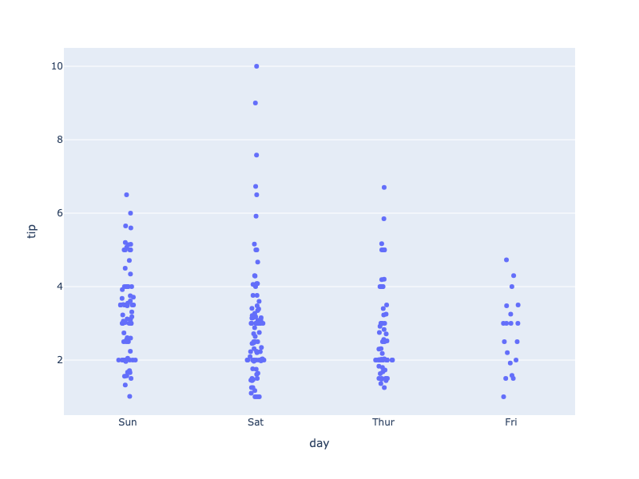

**Interactive Plot:**

<div>                        <script type="text/javascript">window.PlotlyConfig = {MathJaxConfig: 'local'};</script>
        <script charset="utf-8" src="https://cdn.plot.ly/plotly-3.1.0.min.js" integrity="sha256-Ei4740bWZhaUTQuD6q9yQlgVCMPBz6CZWhevDYPv93A=" crossorigin="anonymous"></script>                <div id="plotly-div-11" class="plotly-graph-div" style="height:100%; width:100%;"></div>            <script type="text/javascript">                window.PLOTLYENV=window.PLOTLYENV || {};                                if (document.getElementById("plotly-div-11")) {                    Plotly.newPlot(                        "plotly-div-11",                        [{"alignmentgroup":"True","boxpoints":"all","fillcolor":"rgba(255,255,255,0)","hoveron":"points","hovertemplate":"day=%{x}\u003cbr\u003etip=%{y}\u003cextra\u003e\u003c\u002fextra\u003e","legendgroup":"","line":{"color":"rgba(255,255,255,0)"},"marker":{"color":"#636efa"},"name":"","offsetgroup":"","orientation":"v","pointpos":0,"showlegend":false,"x":["Sun","Sun","Sun","Sun","Sun","Sun","Sun","Sun","Sun","Sun","Sun","Sun","Sun","Sun","Sun","Sun","Sun","Sun","Sun","Sat","Sat","Sat","Sat","Sat","Sat","Sat","Sat","Sat","Sat","Sat","Sat","Sat","Sat","Sat","Sat","Sat","Sat","Sat","Sat","Sat","Sat","Sun","Sun","Sun","Sun","Sun","Sun","Sun","Sun","Sun","Sun","Sun","Sun","Sun","Sun","Sun","Sat","Sat","Sat","Sat","Sat","Sat","Sat","Sat","Sat","Sat","Sat","Sat","Sat","Sat","Sat","Sat","Sat","Sat","Sat","Sat","Sat","Thur","Thur","Thur","Thur","Thur","Thur","Thur","Thur","Thur","Thur","Thur","Thur","Thur","Fri","Fri","Fri","Fri","Fri","Fri","Fri","Fri","Fri","Fri","Fri","Fri","Sat","Sat","Sat","Sat","Sat","Sat","Sat","Sat","Sat","Sat","Sun","Sun","Sun","Sun","Sun","Thur","Thur","Thur","Thur","Thur","Thur","Thur","Thur","Thur","Thur","Thur","Thur","Thur","Thur","Thur","Thur","Thur","Thur","Thur","Thur","Thur","Thur","Thur","Thur","Thur","Thur","Thur","Thur","Thur","Thur","Thur","Thur","Thur","Sun","Sun","Sun","Sun","Sun","Sun","Sun","Sun","Sun","Sun","Sun","Sun","Sun","Sun","Sun","Sun","Sun","Sun","Sat","Sat","Sat","Sat","Sun","Sun","Sun","Sun","Sun","Sun","Sun","Sun","Sun","Sun","Sun","Sun","Sun","Sun","Sun","Sun","Sun","Sun","Sun","Thur","Thur","Thur","Thur","Thur","Thur","Thur","Thur","Thur","Thur","Thur","Thur","Thur","Thur","Thur","Sat","Sat","Sat","Sat","Sat","Sat","Sat","Sat","Sat","Sat","Sat","Sat","Sat","Sat","Fri","Fri","Fri","Fri","Fri","Fri","Fri","Sat","Sat","Sat","Sat","Sat","Sat","Sat","Sat","Sat","Sat","Sat","Sat","Sat","Sat","Sat","Sat","Thur"],"x0":" ","xaxis":"x","y":{"dtype":"f8","bdata":"KVyPwvUo8D+PwvUoXI\u002f6PwAAAAAAAAxAexSuR+F6CkDhehSuR+EMQNejcD0K1xJAAAAAAAAAAED2KFyPwvUIQFyPwvUoXP8\u002f16NwPQrXCUBcj8L1KFz7PwAAAAAAABRAH4XrUbge+T8AAAAAAAAIQClcj8L1KAhAXI\u002fC9ShcD0C4HoXrUbj6P65H4XoUrg1AAAAAAAAADEDNzMzMzMwKQFK4HoXrURBAAAAAAAAABkDXo3A9CtcBQFK4HoXrUR5AcT0K16NwCUC4HoXrUbgCQAAAAAAAAABAAAAAAAAAAEAzMzMzMzMRQAAAAAAAAAhAMzMzMzMz9z8AAAAAAAAEQAAAAAAAAAhAmpmZmZmZA0ApXI\u002fC9SgKQM3MzMzMzAxAAAAAAAAAAECPwvUoXI8IQHsUrkfhegJAAAAAAAAAFEDsUbgehesBQFK4HoXrUQRAexSuR+F6CEAfhetRuB71P2ZmZmZmZhZAAAAAAAAACEAAAAAAAAAUQAAAAAAAABhAZmZmZmZmAEAAAAAAAAAIQAAAAAAAAARAzczMzMzMBEDNzMzMzMwUQPYoXI\u002fC9fg\u002fXI\u002fC9ShcEUAUrkfhehQMQAAAAAAAAAhAAAAAAAAA+D8pXI\u002fC9Sj8P+xRuB6F6xpArkfhehSuCUAAAAAAAAAAQK5H4XoUrv8\u002fFK5H4XoUDkAfhetRuB4FQDMzMzMzMwlAw\u002fUoXI\u002fCA0AAAAAAAADwPxSuR+F6FABAuB6F61G4AECF61G4HoX\u002fPwAAAAAAAAhAH4XrUbgeCUAAAAAAAAAUQJqZmZmZmQFAAAAAAAAA9D+kcD0K16MIQAAAAAAAABBAAAAAAAAACECuR+F6FK4FQAAAAAAAAAhAMzMzMzMzC0BI4XoUrkf9PwAAAAAAABRAPQrXo3A9AECuR+F6FK4UQAAAAAAAAABAAAAAAAAAEEBmZmZmZmYXQAAAAAAAAAhAAAAAAAAACEAAAAAAAAAMQAAAAAAAAPA\u002fMzMzMzMzEUAAAAAAAAAKQOxRuB6F6xJAAAAAAAAAEEAAAAAAAAD4PwAAAAAAAAhAAAAAAAAA+D8AAAAAAAAEQAAAAAAAAAhAAAAAAAAABEDXo3A9CtcLQFK4HoXrURBAPQrXo3A9+j89CtejcD0QQClcj8L1KBFAFK5H4XoUDkAAAAAAAAAQQAAAAAAAAAhAAAAAAAAA8D8AAAAAAAAQQGZmZmZmZgRAAAAAAAAAEEAAAAAAAAAMQEjhehSuRxRAAAAAAAAA+D\u002fNzMzMzMz8P1yPwvUoXAdAexSuR+F6AkDhehSuR+H6PwAAAAAAAARAAAAAAAAAAEApXI\u002fC9SgEQM3MzMzMzBBArkfhehSu9z8AAAAAAAAAQAAAAAAAAABAcT0K16NwAUAAAAAAAAD4P6RwPQrXowZAAAAAAAAA+D8AAAAAAAAAQAAAAAAAAApAAAAAAAAA9D8AAAAAAAAAQAAAAAAAAABAAAAAAAAAAEAAAAAAAAAGQAAAAAAAAAxAzczMzMzMGkAAAAAAAAAUQAAAAAAAABRAZmZmZmZmAkAAAAAAAAD4P8P1KFyPwvU\u002fFK5H4XoU+j+uR+F6FK77PwAAAAAAAABAAAAAAAAABEAAAAAAAAAAQOxRuB6F6wVAAAAAAAAAAEAAAAAAAAAAQI\u002fC9ShcjxRAAAAAAAAAFEAAAAAAAAAOQOF6FK5H4QRAAAAAAAAAAEAAAAAAAAAMQAAAAAAAAARAAAAAAAAAAEAAAAAAAAAAQAAAAAAAAAhA16NwPQrXC0DsUbgehesBQAAAAAAAABJAw\u002fUoXI\u002fC+T8AAAAAAAAAQAAAAAAAACRASOF6FK5HCUCamZmZmZkUQHE9CtejcAlAAAAAAAAAEEDhehSuR+EIQAAAAAAAAABAAAAAAAAAAEAAAAAAAAAQQGZmZmZmZgxAcT0K16NwDUCamZmZmZkWQAAAAAAAAAxAAAAAAAAAGkAAAAAAAAAIQAAAAAAAABRAAAAAAAAADEAAAAAAAAAAQAAAAAAAAAxAAAAAAAAAEEAAAAAAAAD4P8P1KFyPwhBAexSuR+F6BEApXI\u002fC9SgAQAAAAAAAABBACtejcD0K9z8AAAAAAAAAQAAAAAAAABRAAAAAAAAAAEAAAAAAAAAAQAAAAAAAABBAFK5H4XoUAEAAAAAAAAAAQAAAAAAAAARAAAAAAAAAEEDXo3A9CtcJQEjhehSuRwtAAAAAAAAACEA9CtejcD0AQNejcD0K1wFAAAAAAAAAAECkcD0K16MUQAAAAAAAACJAAAAAAAAABEAAAAAAAAAaQJqZmZmZmfE\u002fAAAAAAAACEAAAAAAAAD4PwrXo3A9Cvc\u002fuB6F61G4CECamZmZmZkBQNejcD0K1wtAuB6F61G4\u002fj8AAAAAAAAIQEjhehSuR\u002fk\u002fAAAAAAAABEAAAAAAAAAAQAAAAAAAAAhAw\u002fUoXI\u002fCBUAK16NwPQoHQAAAAAAAAABAAAAAAAAACEAfhetRuB4LQIXrUbgehfc\u002fAAAAAAAACEAAAAAAAAD0PwAAAAAAAPA\u002fuB6F61G48j+uR+F6FK4SQK5H4XoUrhdAAAAAAAAAAEAAAAAAAAAAQAAAAAAAAPw\u002fAAAAAAAACEA="},"y0":" ","yaxis":"y","type":"box"}],                        {"template":{"data":{"histogram2dcontour":[{"type":"histogram2dcontour","colorbar":{"outlinewidth":0,"ticks":""},"colorscale":[[0.0,"#0d0887"],[0.1111111111111111,"#46039f"],[0.2222222222222222,"#7201a8"],[0.3333333333333333,"#9c179e"],[0.4444444444444444,"#bd3786"],[0.5555555555555556,"#d8576b"],[0.6666666666666666,"#ed7953"],[0.7777777777777778,"#fb9f3a"],[0.8888888888888888,"#fdca26"],[1.0,"#f0f921"]]}],"choropleth":[{"type":"choropleth","colorbar":{"outlinewidth":0,"ticks":""}}],"histogram2d":[{"type":"histogram2d","colorbar":{"outlinewidth":0,"ticks":""},"colorscale":[[0.0,"#0d0887"],[0.1111111111111111,"#46039f"],[0.2222222222222222,"#7201a8"],[0.3333333333333333,"#9c179e"],[0.4444444444444444,"#bd3786"],[0.5555555555555556,"#d8576b"],[0.6666666666666666,"#ed7953"],[0.7777777777777778,"#fb9f3a"],[0.8888888888888888,"#fdca26"],[1.0,"#f0f921"]]}],"heatmap":[{"type":"heatmap","colorbar":{"outlinewidth":0,"ticks":""},"colorscale":[[0.0,"#0d0887"],[0.1111111111111111,"#46039f"],[0.2222222222222222,"#7201a8"],[0.3333333333333333,"#9c179e"],[0.4444444444444444,"#bd3786"],[0.5555555555555556,"#d8576b"],[0.6666666666666666,"#ed7953"],[0.7777777777777778,"#fb9f3a"],[0.8888888888888888,"#fdca26"],[1.0,"#f0f921"]]}],"contourcarpet":[{"type":"contourcarpet","colorbar":{"outlinewidth":0,"ticks":""}}],"contour":[{"type":"contour","colorbar":{"outlinewidth":0,"ticks":""},"colorscale":[[0.0,"#0d0887"],[0.1111111111111111,"#46039f"],[0.2222222222222222,"#7201a8"],[0.3333333333333333,"#9c179e"],[0.4444444444444444,"#bd3786"],[0.5555555555555556,"#d8576b"],[0.6666666666666666,"#ed7953"],[0.7777777777777778,"#fb9f3a"],[0.8888888888888888,"#fdca26"],[1.0,"#f0f921"]]}],"surface":[{"type":"surface","colorbar":{"outlinewidth":0,"ticks":""},"colorscale":[[0.0,"#0d0887"],[0.1111111111111111,"#46039f"],[0.2222222222222222,"#7201a8"],[0.3333333333333333,"#9c179e"],[0.4444444444444444,"#bd3786"],[0.5555555555555556,"#d8576b"],[0.6666666666666666,"#ed7953"],[0.7777777777777778,"#fb9f3a"],[0.8888888888888888,"#fdca26"],[1.0,"#f0f921"]]}],"mesh3d":[{"type":"mesh3d","colorbar":{"outlinewidth":0,"ticks":""}}],"scatter":[{"fillpattern":{"fillmode":"overlay","size":10,"solidity":0.2},"type":"scatter"}],"parcoords":[{"type":"parcoords","line":{"colorbar":{"outlinewidth":0,"ticks":""}}}],"scatterpolargl":[{"type":"scatterpolargl","marker":{"colorbar":{"outlinewidth":0,"ticks":""}}}],"bar":[{"error_x":{"color":"#2a3f5f"},"error_y":{"color":"#2a3f5f"},"marker":{"line":{"color":"#E5ECF6","width":0.5},"pattern":{"fillmode":"overlay","size":10,"solidity":0.2}},"type":"bar"}],"scattergeo":[{"type":"scattergeo","marker":{"colorbar":{"outlinewidth":0,"ticks":""}}}],"scatterpolar":[{"type":"scatterpolar","marker":{"colorbar":{"outlinewidth":0,"ticks":""}}}],"histogram":[{"marker":{"pattern":{"fillmode":"overlay","size":10,"solidity":0.2}},"type":"histogram"}],"scattergl":[{"type":"scattergl","marker":{"colorbar":{"outlinewidth":0,"ticks":""}}}],"scatter3d":[{"type":"scatter3d","line":{"colorbar":{"outlinewidth":0,"ticks":""}},"marker":{"colorbar":{"outlinewidth":0,"ticks":""}}}],"scattermap":[{"type":"scattermap","marker":{"colorbar":{"outlinewidth":0,"ticks":""}}}],"scattermapbox":[{"type":"scattermapbox","marker":{"colorbar":{"outlinewidth":0,"ticks":""}}}],"scatterternary":[{"type":"scatterternary","marker":{"colorbar":{"outlinewidth":0,"ticks":""}}}],"scattercarpet":[{"type":"scattercarpet","marker":{"colorbar":{"outlinewidth":0,"ticks":""}}}],"carpet":[{"aaxis":{"endlinecolor":"#2a3f5f","gridcolor":"white","linecolor":"white","minorgridcolor":"white","startlinecolor":"#2a3f5f"},"baxis":{"endlinecolor":"#2a3f5f","gridcolor":"white","linecolor":"white","minorgridcolor":"white","startlinecolor":"#2a3f5f"},"type":"carpet"}],"table":[{"cells":{"fill":{"color":"#EBF0F8"},"line":{"color":"white"}},"header":{"fill":{"color":"#C8D4E3"},"line":{"color":"white"}},"type":"table"}],"barpolar":[{"marker":{"line":{"color":"#E5ECF6","width":0.5},"pattern":{"fillmode":"overlay","size":10,"solidity":0.2}},"type":"barpolar"}],"pie":[{"automargin":true,"type":"pie"}]},"layout":{"autotypenumbers":"strict","colorway":["#636efa","#EF553B","#00cc96","#ab63fa","#FFA15A","#19d3f3","#FF6692","#B6E880","#FF97FF","#FECB52"],"font":{"color":"#2a3f5f"},"hovermode":"closest","hoverlabel":{"align":"left"},"paper_bgcolor":"white","plot_bgcolor":"#E5ECF6","polar":{"bgcolor":"#E5ECF6","angularaxis":{"gridcolor":"white","linecolor":"white","ticks":""},"radialaxis":{"gridcolor":"white","linecolor":"white","ticks":""}},"ternary":{"bgcolor":"#E5ECF6","aaxis":{"gridcolor":"white","linecolor":"white","ticks":""},"baxis":{"gridcolor":"white","linecolor":"white","ticks":""},"caxis":{"gridcolor":"white","linecolor":"white","ticks":""}},"coloraxis":{"colorbar":{"outlinewidth":0,"ticks":""}},"colorscale":{"sequential":[[0.0,"#0d0887"],[0.1111111111111111,"#46039f"],[0.2222222222222222,"#7201a8"],[0.3333333333333333,"#9c179e"],[0.4444444444444444,"#bd3786"],[0.5555555555555556,"#d8576b"],[0.6666666666666666,"#ed7953"],[0.7777777777777778,"#fb9f3a"],[0.8888888888888888,"#fdca26"],[1.0,"#f0f921"]],"sequentialminus":[[0.0,"#0d0887"],[0.1111111111111111,"#46039f"],[0.2222222222222222,"#7201a8"],[0.3333333333333333,"#9c179e"],[0.4444444444444444,"#bd3786"],[0.5555555555555556,"#d8576b"],[0.6666666666666666,"#ed7953"],[0.7777777777777778,"#fb9f3a"],[0.8888888888888888,"#fdca26"],[1.0,"#f0f921"]],"diverging":[[0,"#8e0152"],[0.1,"#c51b7d"],[0.2,"#de77ae"],[0.3,"#f1b6da"],[0.4,"#fde0ef"],[0.5,"#f7f7f7"],[0.6,"#e6f5d0"],[0.7,"#b8e186"],[0.8,"#7fbc41"],[0.9,"#4d9221"],[1,"#276419"]]},"xaxis":{"gridcolor":"white","linecolor":"white","ticks":"","title":{"standoff":15},"zerolinecolor":"white","automargin":true,"zerolinewidth":2},"yaxis":{"gridcolor":"white","linecolor":"white","ticks":"","title":{"standoff":15},"zerolinecolor":"white","automargin":true,"zerolinewidth":2},"scene":{"xaxis":{"backgroundcolor":"#E5ECF6","gridcolor":"white","linecolor":"white","showbackground":true,"ticks":"","zerolinecolor":"white","gridwidth":2},"yaxis":{"backgroundcolor":"#E5ECF6","gridcolor":"white","linecolor":"white","showbackground":true,"ticks":"","zerolinecolor":"white","gridwidth":2},"zaxis":{"backgroundcolor":"#E5ECF6","gridcolor":"white","linecolor":"white","showbackground":true,"ticks":"","zerolinecolor":"white","gridwidth":2}},"shapedefaults":{"line":{"color":"#2a3f5f"}},"annotationdefaults":{"arrowcolor":"#2a3f5f","arrowhead":0,"arrowwidth":1},"geo":{"bgcolor":"white","landcolor":"#E5ECF6","subunitcolor":"white","showland":true,"showlakes":true,"lakecolor":"white"},"title":{"x":0.05},"mapbox":{"style":"light"}}},"xaxis":{"anchor":"y","domain":[0.0,1.0],"title":{"text":"day"}},"yaxis":{"anchor":"x","domain":[0.0,1.0],"title":{"text":"tip"}},"legend":{"tracegroupgap":0},"margin":{"t":60},"boxmode":"group"},                        {"responsive": true}                    )                };            </script>        </div>

### Choosing The Algorithm For Computing Quartiles

*New in 5.10*

By default, quartiles for violin plots are computed using the `linear` method (for more about linear interpolation, see #10 listed on [http://jse.amstat.org/v14n3/langford.html](http://jse.amstat.org/v14n3/langford.html) and [https://en.wikipedia.org/wiki/Quartile](https://en.wikipedia.org/wiki/Quartile) for more details).

However, you can also choose to use an `exclusive` or an `inclusive` algorithm to compute quartiles.

The _exclusive_ algorithm uses the median to divide the ordered dataset into two halves. If the sample is odd, it does not include the median in either half. Q1 is then the median of the lower half and Q3 is the median of the upper half.

The _inclusive_ algorithm also uses the median to divide the ordered dataset into two halves, but if the sample is odd, it includes the median in both halves. Q1 is then the median of the lower half and Q3 the median of the upper half.

```python
import plotly.express as px

df = px.data.tips()
fig = px.violin(df, y="total_bill")
fig.update_traces(quartilemethod="exclusive") # or "inclusive", or "linear" by default

fig.show()
```


**Interactive Plot:**

<div>                        <script type="text/javascript">window.PlotlyConfig = {MathJaxConfig: 'local'};</script>
        <script charset="utf-8" src="https://cdn.plot.ly/plotly-3.1.0.min.js" integrity="sha256-Ei4740bWZhaUTQuD6q9yQlgVCMPBz6CZWhevDYPv93A=" crossorigin="anonymous"></script>                <div id="plotly-div-12" class="plotly-graph-div" style="height:100%; width:100%;"></div>            <script type="text/javascript">                window.PLOTLYENV=window.PLOTLYENV || {};                                if (document.getElementById("plotly-div-12")) {                    Plotly.newPlot(                        "plotly-div-12",                        [{"alignmentgroup":"True","box":{"visible":false},"hovertemplate":"total_bill=%{y}\u003cextra\u003e\u003c\u002fextra\u003e","legendgroup":"","marker":{"color":"#636efa"},"name":"","offsetgroup":"","orientation":"v","scalegroup":"True","showlegend":false,"x0":" ","xaxis":"x","y":{"dtype":"f8","bdata":"PQrXo3D9MECuR+F6FK4kQMP1KFyPAjVArkfhehSuN0DXo3A9Cpc4QArXo3A9SjlACtejcD2KIUDhehSuR+E6QBSuR+F6FC5Aj8L1KFyPLUAK16NwPYokQOF6FK5HoUFA16NwPQrXLkCuR+F6FG4yQClcj8L1qC1AFK5H4XqUNUApXI\u002fC9agkQArXo3A9SjBAuB6F61H4MEBmZmZmZqY0QOxRuB6F6zFACtejcD1KNEAK16NwPYovQPYoXI\u002fCtUNAUrgehevRM0CPwvUoXM8xQD0K16NwvSpA4XoUrkdhKUAzMzMzM7M1QGZmZmZmpjNAmpmZmZkZI0CamZmZmVkyQB+F61G4Hi5AcT0K16OwNEBI4XoUrscxQI\u002fC9ShcDzhAj8L1KFxPMECuR+F6FO4wQHE9CtejsDJAhetRuB5FP0AK16NwPQowQPYoXI\u002fCdTFA4XoUrkfhK0Bcj8L1KFwjQGZmZmZmZj5ACtejcD1KMkB7FK5H4To2QDMzMzMzM0BAzczMzMyMPEAK16NwPQoyQBSuR+F6FClAFK5H4XqUJEBI4XoUrmdBQOF6FK5H4SNAj8L1KFyPOUA9CtejcH0zQOF6FK5HAUNAKVyPwvVoOkB7FK5H4XomQMP1KFyPIkhACtejcD1KNEAfhetRuJ4rQArXo3A9CiZACtejcD1KMkDXo3A9CpcxQBSuR+F6FDRAMzMzMzNzMECPwvUoXI8IQHsUrkfhOjRAhetRuB4FLkAK16NwPQooQFK4HoXrETFAXI\u002fC9SjcOkBI4XoUrkc5QPYoXI\u002fCdS1AhetRuB4FJUDsUbgehesxQDMzMzMzMztAw\u002fUoXI\u002fCNkAK16NwPUoxQHE9CtejcDNAKVyPwvWoMECkcD0K1yMkQNejcD0KV0BA9ihcj8L1L0AK16NwPWpBQI\u002fC9ShcDypASOF6FK5HMkD2KFyPwrU4QClcj8L1KDVAuB6F61H4PEA9CtejcH02QAAAAAAAABdAUrgehetRMEAAAAAAAMA2QPYoXI\u002fCFURASOF6FK5HO0CPwvUoXA8oQMP1KFyPAjVA7FG4HoXrKEAzMzMzM7MmQMP1KFyPwi5AZmZmZmYmRkDsUbgehWs2QOxRuB6F6zRAuB6F61G4LkA9CtejcH00QPYoXI\u002fCNTlAPQrXo3A9MkAfhetRuJ4sQAAAAAAAACxAAAAAAAAAHUApXI\u002fC9QhDQDMzMzMz8zdA9ihcj8K1OUCPwvUoXE8xQK5H4XoU7j1AzczMzMxMJUBcj8L1KNwoQBSuR+F6FDhA4XoUrkdhJ0DXo3A9CtcqQIXrUbgehSxAZmZmZmbmL0D2KFyPwvUoQM3MzMzMzD1ACtejcD0KIUAK16NwPQotQMP1KFyPwiZAUrgehevRNkAUrkfhehQzQIXrUbgeRTRA16NwPQpXJkCF61G4HoUoQMP1KFyPQjJAhetRuB4FIUApXI\u002fC9agkQM3MzMzMTCxAAAAAAAAAMEBSuB6F61EqQLgehetReDFAZmZmZmYmQUC4HoXrUZhEQM3MzMzMDDtArkfhehRuMEAzMzMzM7MgQKRwPQrXozJAPQrXo3C9J0CPwvUoXI8jQArXo3A9Ch5ApHA9CtcjLEDD9Shcj0IqQMP1KFyPQjFAzczMzMyMOECF61G4HsUzQJqZmZmZ2T1A9ihcj8IVSEAAAAAAAAA5QEjhehSuxypAPQrXo3B9MEAAAAAAAIA1QFK4HoXrUSlA9ihcj8I1MEAfhetRuJ4rQMP1KFyPgjFAhetRuB6FOEDD9Shcj8I0QPYoXI\u002fCtT9ArkfhehQuJUDD9Shcj0IlQEjhehSuZ0lAH4XrUbieL0AAAAAAAAAdQJqZmZmZ2T9AUrgehevRMEAzMzMzM3NAQKRwPQrX4zFA9ihcj8L1LEAzMzMzMzMjQHE9CtejUEFAMzMzMzNTQUAUrkfhelQ3QM3MzMzMrEZA7FG4HoUrN0BmZmZmZkZEQHE9CtejsDRAZmZmZmbmNED2KFyPwnU+QGZmZmZmJjJAmpmZmZkZN0DhehSuR2EvQI\u002fC9ShczzNAcT0K16NwPED2KFyPwvUuQBSuR+F6lDBAPQrXo3A9HkCuR+F6FK4kQK5H4XoUjkVAAAAAAAAAKkCF61G4HgUrQPYoXI\u002fCtTJAexSuR+F6KUAAAAAAAAAqQGZmZmZmZjBASOF6FK6HNEC4HoXrUXgwQNejcD0KlzpAPQrXo3BdQ0CF61G4HkU4QIXrUbgehSlAj8L1KFwPPkCkcD0K1+M5QArXo3A9KkhACtejcD2KKkDsUbgehSs8QM3MzMzMzClAZmZmZmYmPECuR+F6FC4nQPYoXI\u002fC9R5ApHA9CtcjPkBSuB6F61EoQNejcD0K1ypAKVyPwvUoIUD2KFyPwvUvQNejcD0K1ypAhetRuB5FMECuR+F6FC4kQDMzMzMzczRAj8L1KFyPKkAfhetRuB42QMP1KFyPAjhA4XoUrkdhL0C4HoXrUTgnQArXo3A9iiVAj8L1KFwPL0CkcD0K1yMkQDMzMzMzMylACtejcD1qQEAK16NwPepBQEjhehSuBz1ArkfhehQuO0DsUbgehas2QFK4HoXr0TFASOF6FK7HMkA="},"y0":" ","yaxis":"y","type":"violin","quartilemethod":"exclusive"}],                        {"template":{"data":{"histogram2dcontour":[{"type":"histogram2dcontour","colorbar":{"outlinewidth":0,"ticks":""},"colorscale":[[0.0,"#0d0887"],[0.1111111111111111,"#46039f"],[0.2222222222222222,"#7201a8"],[0.3333333333333333,"#9c179e"],[0.4444444444444444,"#bd3786"],[0.5555555555555556,"#d8576b"],[0.6666666666666666,"#ed7953"],[0.7777777777777778,"#fb9f3a"],[0.8888888888888888,"#fdca26"],[1.0,"#f0f921"]]}],"choropleth":[{"type":"choropleth","colorbar":{"outlinewidth":0,"ticks":""}}],"histogram2d":[{"type":"histogram2d","colorbar":{"outlinewidth":0,"ticks":""},"colorscale":[[0.0,"#0d0887"],[0.1111111111111111,"#46039f"],[0.2222222222222222,"#7201a8"],[0.3333333333333333,"#9c179e"],[0.4444444444444444,"#bd3786"],[0.5555555555555556,"#d8576b"],[0.6666666666666666,"#ed7953"],[0.7777777777777778,"#fb9f3a"],[0.8888888888888888,"#fdca26"],[1.0,"#f0f921"]]}],"heatmap":[{"type":"heatmap","colorbar":{"outlinewidth":0,"ticks":""},"colorscale":[[0.0,"#0d0887"],[0.1111111111111111,"#46039f"],[0.2222222222222222,"#7201a8"],[0.3333333333333333,"#9c179e"],[0.4444444444444444,"#bd3786"],[0.5555555555555556,"#d8576b"],[0.6666666666666666,"#ed7953"],[0.7777777777777778,"#fb9f3a"],[0.8888888888888888,"#fdca26"],[1.0,"#f0f921"]]}],"contourcarpet":[{"type":"contourcarpet","colorbar":{"outlinewidth":0,"ticks":""}}],"contour":[{"type":"contour","colorbar":{"outlinewidth":0,"ticks":""},"colorscale":[[0.0,"#0d0887"],[0.1111111111111111,"#46039f"],[0.2222222222222222,"#7201a8"],[0.3333333333333333,"#9c179e"],[0.4444444444444444,"#bd3786"],[0.5555555555555556,"#d8576b"],[0.6666666666666666,"#ed7953"],[0.7777777777777778,"#fb9f3a"],[0.8888888888888888,"#fdca26"],[1.0,"#f0f921"]]}],"surface":[{"type":"surface","colorbar":{"outlinewidth":0,"ticks":""},"colorscale":[[0.0,"#0d0887"],[0.1111111111111111,"#46039f"],[0.2222222222222222,"#7201a8"],[0.3333333333333333,"#9c179e"],[0.4444444444444444,"#bd3786"],[0.5555555555555556,"#d8576b"],[0.6666666666666666,"#ed7953"],[0.7777777777777778,"#fb9f3a"],[0.8888888888888888,"#fdca26"],[1.0,"#f0f921"]]}],"mesh3d":[{"type":"mesh3d","colorbar":{"outlinewidth":0,"ticks":""}}],"scatter":[{"fillpattern":{"fillmode":"overlay","size":10,"solidity":0.2},"type":"scatter"}],"parcoords":[{"type":"parcoords","line":{"colorbar":{"outlinewidth":0,"ticks":""}}}],"scatterpolargl":[{"type":"scatterpolargl","marker":{"colorbar":{"outlinewidth":0,"ticks":""}}}],"bar":[{"error_x":{"color":"#2a3f5f"},"error_y":{"color":"#2a3f5f"},"marker":{"line":{"color":"#E5ECF6","width":0.5},"pattern":{"fillmode":"overlay","size":10,"solidity":0.2}},"type":"bar"}],"scattergeo":[{"type":"scattergeo","marker":{"colorbar":{"outlinewidth":0,"ticks":""}}}],"scatterpolar":[{"type":"scatterpolar","marker":{"colorbar":{"outlinewidth":0,"ticks":""}}}],"histogram":[{"marker":{"pattern":{"fillmode":"overlay","size":10,"solidity":0.2}},"type":"histogram"}],"scattergl":[{"type":"scattergl","marker":{"colorbar":{"outlinewidth":0,"ticks":""}}}],"scatter3d":[{"type":"scatter3d","line":{"colorbar":{"outlinewidth":0,"ticks":""}},"marker":{"colorbar":{"outlinewidth":0,"ticks":""}}}],"scattermap":[{"type":"scattermap","marker":{"colorbar":{"outlinewidth":0,"ticks":""}}}],"scattermapbox":[{"type":"scattermapbox","marker":{"colorbar":{"outlinewidth":0,"ticks":""}}}],"scatterternary":[{"type":"scatterternary","marker":{"colorbar":{"outlinewidth":0,"ticks":""}}}],"scattercarpet":[{"type":"scattercarpet","marker":{"colorbar":{"outlinewidth":0,"ticks":""}}}],"carpet":[{"aaxis":{"endlinecolor":"#2a3f5f","gridcolor":"white","linecolor":"white","minorgridcolor":"white","startlinecolor":"#2a3f5f"},"baxis":{"endlinecolor":"#2a3f5f","gridcolor":"white","linecolor":"white","minorgridcolor":"white","startlinecolor":"#2a3f5f"},"type":"carpet"}],"table":[{"cells":{"fill":{"color":"#EBF0F8"},"line":{"color":"white"}},"header":{"fill":{"color":"#C8D4E3"},"line":{"color":"white"}},"type":"table"}],"barpolar":[{"marker":{"line":{"color":"#E5ECF6","width":0.5},"pattern":{"fillmode":"overlay","size":10,"solidity":0.2}},"type":"barpolar"}],"pie":[{"automargin":true,"type":"pie"}]},"layout":{"autotypenumbers":"strict","colorway":["#636efa","#EF553B","#00cc96","#ab63fa","#FFA15A","#19d3f3","#FF6692","#B6E880","#FF97FF","#FECB52"],"font":{"color":"#2a3f5f"},"hovermode":"closest","hoverlabel":{"align":"left"},"paper_bgcolor":"white","plot_bgcolor":"#E5ECF6","polar":{"bgcolor":"#E5ECF6","angularaxis":{"gridcolor":"white","linecolor":"white","ticks":""},"radialaxis":{"gridcolor":"white","linecolor":"white","ticks":""}},"ternary":{"bgcolor":"#E5ECF6","aaxis":{"gridcolor":"white","linecolor":"white","ticks":""},"baxis":{"gridcolor":"white","linecolor":"white","ticks":""},"caxis":{"gridcolor":"white","linecolor":"white","ticks":""}},"coloraxis":{"colorbar":{"outlinewidth":0,"ticks":""}},"colorscale":{"sequential":[[0.0,"#0d0887"],[0.1111111111111111,"#46039f"],[0.2222222222222222,"#7201a8"],[0.3333333333333333,"#9c179e"],[0.4444444444444444,"#bd3786"],[0.5555555555555556,"#d8576b"],[0.6666666666666666,"#ed7953"],[0.7777777777777778,"#fb9f3a"],[0.8888888888888888,"#fdca26"],[1.0,"#f0f921"]],"sequentialminus":[[0.0,"#0d0887"],[0.1111111111111111,"#46039f"],[0.2222222222222222,"#7201a8"],[0.3333333333333333,"#9c179e"],[0.4444444444444444,"#bd3786"],[0.5555555555555556,"#d8576b"],[0.6666666666666666,"#ed7953"],[0.7777777777777778,"#fb9f3a"],[0.8888888888888888,"#fdca26"],[1.0,"#f0f921"]],"diverging":[[0,"#8e0152"],[0.1,"#c51b7d"],[0.2,"#de77ae"],[0.3,"#f1b6da"],[0.4,"#fde0ef"],[0.5,"#f7f7f7"],[0.6,"#e6f5d0"],[0.7,"#b8e186"],[0.8,"#7fbc41"],[0.9,"#4d9221"],[1,"#276419"]]},"xaxis":{"gridcolor":"white","linecolor":"white","ticks":"","title":{"standoff":15},"zerolinecolor":"white","automargin":true,"zerolinewidth":2},"yaxis":{"gridcolor":"white","linecolor":"white","ticks":"","title":{"standoff":15},"zerolinecolor":"white","automargin":true,"zerolinewidth":2},"scene":{"xaxis":{"backgroundcolor":"#E5ECF6","gridcolor":"white","linecolor":"white","showbackground":true,"ticks":"","zerolinecolor":"white","gridwidth":2},"yaxis":{"backgroundcolor":"#E5ECF6","gridcolor":"white","linecolor":"white","showbackground":true,"ticks":"","zerolinecolor":"white","gridwidth":2},"zaxis":{"backgroundcolor":"#E5ECF6","gridcolor":"white","linecolor":"white","showbackground":true,"ticks":"","zerolinecolor":"white","gridwidth":2}},"shapedefaults":{"line":{"color":"#2a3f5f"}},"annotationdefaults":{"arrowcolor":"#2a3f5f","arrowhead":0,"arrowwidth":1},"geo":{"bgcolor":"white","landcolor":"#E5ECF6","subunitcolor":"white","showland":true,"showlakes":true,"lakecolor":"white"},"title":{"x":0.05},"mapbox":{"style":"light"}}},"xaxis":{"anchor":"y","domain":[0.0,1.0]},"yaxis":{"anchor":"x","domain":[0.0,1.0],"title":{"text":"total_bill"}},"legend":{"tracegroupgap":0},"margin":{"t":60},"violinmode":"group"},                        {"responsive": true}                    )                };            </script>        </div>

#### Reference

See [function reference for `px.violin()`](https://plotly.com/python-api-reference/generated/plotly.express.violin) or https://plotly.com/python/reference/violin/ for more information and chart attribute options!
